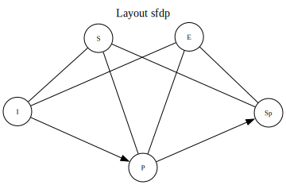

:stem: latexmath
:icons: font
:source-highlighter: highlight.js
:doctype: book
:toc:
:toclevels: 1
:_kroki-server-url: http://localhost:8000/
:webeditorm: https://magjac.com/graphviz-visual-editor/[graphviz visual editor]
:webeditord: https://dreampuf.github.io/GraphvizOnline/[Graphviz Online]

:layouts_circo:  link:https://www.graphviz.org/docs/layouts/circo/[circo]
:layouts_dot:    link:https://www.graphviz.org/docs/layouts/dot/[dot]
:layouts_engine: link:https://www.graphviz.org/docs/layouts/[layout engine]
:layouts_fdp:    link:https://www.graphviz.org/docs/layouts/fdp/[fdp]
:layouts_neato:  link:https://www.graphviz.org/docs/layouts/neato/[neato]
:layouts_patchwork: link:https://www.graphviz.org/docs/layouts/patchwork/[patchwork]
:layouts_sfdp:   link:https://www.graphviz.org/docs/layouts/sfdp/[sfdp]
:layouts_twopi:  link:https://www.graphviz.org/docs/layouts/twopi/[twopi]

:output_ascii:   link:https://graphviz.org/docs/outputs/ascii/[ASCII]
:output_bmp:     link:https://graphviz.org/docs/outputs/bmp/[BMP]
:output_canon:   link:https://graphviz.org/docs/outputs/canon/[DOT]
:output_xdot :   link:https://graphviz.org/docs/outputs/canon/#xdot[xdot]
:output_cgimage: link:https://graphviz.org/docs/outputs/cgimage/[CGImage]
:output_eps:     link:https://graphviz.org/docs/outputs/eps/[EPS]
:output_exr:     link:https://graphviz.org/docs/outputs/exr/[EXR]
:output_fig:     link:https://graphviz.org/docs/outputs/fig/[FIG]
:output_gd:      link:https://graphviz.org/docs/outputs/gd/[GD/GD2]
:output_gif:     link:https://graphviz.org/docs/outputs/gif/[GIF]
:output_gtk:     link:https://graphviz.org/docs/outputs/gtk/[GTK]
:output_ico:     link:https://graphviz.org/docs/outputs/ico/[ICO]
:output_imap:    link:https://graphviz.org/docs/outputs/imap/[Imagemap]
:output_jp2:     link:https://graphviz.org/docs/outputs/jp2/[JPEG 2000]
:output_jpg:     link:https://graphviz.org/docs/outputs/jpg/[JPEG]
:output_json:    link:https://graphviz.org/docs/outputs/json/[JSON]
:output_pct:     link:https://graphviz.org/docs/outputs/pct/[PICT]
:output_pdf:     link:https://graphviz.org/docs/outputs/pdf/[PDF]
:output_pic:     link:https://graphviz.org/docs/outputs/pic/[PIC]
:output_plain:   link:https://graphviz.org/docs/outputs/plain/[Plain Text]
:output_png:     link:https://graphviz.org/docs/outputs/png/[PNG]
:output_pov:     link:https://graphviz.org/docs/outputs/pov/[POV-Ray]
:output_ps2:     link:https://graphviz.org/docs/outputs/ps2/[PS/PDF]
:output_ps:      link:https://graphviz.org/docs/outputs/ps/[PS]
:output_psd:     link:https://graphviz.org/docs/outputs/psd/[PSD]
:output_sgi:     link:https://graphviz.org/docs/outputs/sgi/[SGI]
:output_svg:     link:https://graphviz.org/docs/outputs/svg/[SVG]
:output_tga:     link:https://graphviz.org/docs/outputs/tga/[TGA]
:output_tif:     link:https://graphviz.org/docs/outputs/tif/[TIFF]
:output_tk:      link:https://graphviz.org/docs/outputs/tk/[Tk]
:output_vml:     link:https://graphviz.org/docs/outputs/vml/[VML]
:output_vrml:    link:https://graphviz.org/docs/outputs/vrml/[VRML]
:output_vt:      link:https://graphviz.org/docs/outputs/vt/[VT100]
:output_wbmp:    link:https://graphviz.org/docs/outputs/wbmp/[WBMP]
:output_webp:    link:https://graphviz.org/docs/outputs/webp/[WebP]
:output_xlib:    link:https://graphviz.org/docs/outputs/xlib/[X11]

== 《让世界多一份 Graphviz 教程！》

- https://graphviz.org/doc/info/lang.html[DOT Language 文法]
- https://docs.asciidoctor.org/diagram-extension/latest/diagram_types/graphviz/[Graphviz Diagrams in Asciidoctor]
- https://www.merl.com/publications/TR2001-49[A Short Note on the History of Graph Drawing]

https://www.graphviz.org/[Graphviz（Graph Visualization）] 是1990年代初诞生
于 AT&T Bell 实验室的一个开源的（EPL）、跨平台的脚本自动化绘图软件工具。使用 dot 脚本
语言进行绘图，这是一种 DSL (Domain Special Language) 领域特定脚本语言。编写脚本文件，
然后使用 Layout 布局引擎解析这个 Script File 脚本文件完成自动化布局渲染。Graphviz
提供了 C/CPP、Java、Python、PHP 等语言的 API。VSCode 中可以通过 Markdown 或者
AsciiDoc 文档嵌入 PlantUML 脚本。也可以使用 PlangUML 命令行调用 dot 程序，或者通过
`-graphvizdot` 参数指定的路径来调用 dot 程序。以下是 Graphviz 图表基本结构示意图：

.Graphviz basic structure (link:./pictures/graphviz_basic_structure.dot[dot source])
[graphviz]
---------
#!/usr/bin/env -S dot -Tsvg -o graphviz_basic_structure.svg
#!/usr/bin/env -S plantumlc -tsvg -O

digraph gv_basic_structure{

    layout = dot
    fontsize=28.0
    label=< <B><br/>Graphviz Basic Structure</B> >;
    node[ fontsize=22 shape=circle style=filled ];
    nodesep = 0.1;
    ranksep = 0.3;
    rankdir = TD;
    ratio = 0.7
    size="60"

    {rank="min" graphviz script}

    graphviz[shape=doublecircle color=yellowgreen label="Graphviz" URL="https://graphviz.org/"];

    subgraph{
        layout[color=burlywood label="Layout Engines" URL="https://graphviz.org/docs/layouts/"];
        script[color=darkorange label="Dot Script" URL="https://graphviz.org/doc/info/lang.html"];
        api[color=ivory label="APIs" URL="https://www.graphviz.org/docs/library/"]
        paper[color=dodgerblue label="Papers" URL="https://www.graphviz.org/theory/"]
    }

    graphviz -> layout;
    graphviz -> script;
    graphviz -> CLIs;
    graphviz -> api;
    graphviz -> paper;

    CLIs [color=lavender URL="https://graphviz.org/doc/info/command.html"]

    script ->
    subgraph{
        element[label="Elements"];
        attribute[color=aqua label="Attributes" URL="https://www.graphviz.org/docs/attr-types/"];
    }

    layout ->
    subgraph { 
        rank = "sink"
        dot       [color="wheat" URL="https://graphviz.org/docs/layouts/dot/"]
        neato     [color="wheat" URL="https://graphviz.org/docs/layouts/neato/"]
        fdp       [color="wheat" URL="https://graphviz.org/docs/layouts/fdp/"]
        sfdp      [color="wheat" URL="https://graphviz.org/docs/layouts/sfdp/"]
        circo     [color="wheat" URL="https://graphviz.org/docs/layouts/circo/"]
        twopi     [color="wheat" URL="https://graphviz.org/docs/layouts/twopi/"]
        nop       [color="wheat" URL="https://graphviz.org/docs/layouts/nop/"]
        nop2      [color="wheat" URL="https://graphviz.org/docs/layouts/nop2/"]
        osage     [color="wheat" URL="https://graphviz.org/docs/layouts/osage/"]
        patchwork [color="wheat" URL="https://graphviz.org/docs/layouts/patchwork/"]
        plugins   [color="green" URL="https://graphviz.org/docs/layouts/writing-layout-plugins/"];
    }

    element ->
    subgraph{
        ele_graph[label="Graph"  color=darksalmon URL="https://graphviz.org/docs/graph/"]
        ele_node[label="Node"  color=darksalmon URL="https://graphviz.org/docs/nodes/"]
        ele_edge[label="Edge"  color=darksalmon URL="https://graphviz.org/docs/edges/"]
        ele_html[label="HTML-like" color=darksalmon URL="https://graphviz.org/doc/info/shapes.html#html"]
        ele_shape[label="Shapes" color=darksalmon URL="https://graphviz.org/doc/info/shapes.html"]
        ele_arrow[label="Arrows" color=darksalmon URL="https://graphviz.org/doc/info/arrows.html"]
    }
}
---------


[TIP]
=====
Markdown 和 AsciiDoc 文档中都可以使用 `plantuml` 代码块来插入绘图脚本，像以下这样。
Markdown 还可以使用 `uml` 代码块，AsciiDoc 还可以使用 `graphviz` 代码块。VSCode
中可以使用 PlantUML 或者 AsciiDoc 插件来预览图像。具体使用什么代码块标记取决于脚本
内容的编写，同时 PlantUML 可以调用 Graphviz 命令处理 dot 脚本。AsciiDoc 文档中的
代码块标记会用来构造 Kroki 服务器的请求地址，比如：

* `https://kroki.io/graphviz/svg` 对应的就是 Graphviz 脚本转图服务 (SVG)；
* `https://kroki.io/plantuml/svg` 对应的就是 PlantUML 脚本转图服务 (SVG)；

.Markdown Code Block
-----
```plantuml
@startuml
!$a = apple
!$b = "bad "
!$ba = $b + $a
!$foo = { "name": "John", "age" : 30 }
Alice -> Bob : gives an $a
Alice -> Bob : gives an $ba
Alice -> Bob : Do you know **$foo.name** who give me that **$ba**?
@enduml
```
-----

[plantuml]
----------
@startuml
!$a = apple
!$b = "bad "
!$ba = $b + $a
!$foo = { "name": "John", "age" : 30 }
Alice -> Bob : gives an $a
Alice -> Bob : gives an $ba
Alice -> Bob : Do you know **$foo.name** who give me that **$ba**?
@enduml
----------
=====

Graphviz 脚本语法结构主要由代码块、语句、标识符、注释等几部分组成，具体定义可以参考官方
定义的 DOT Language 文法规则：

*   代码块： 位于花括号 `{}` 内的语句即构成代码块；
*   语句：以分号 ; 结尾，主要分为代码块，节点，连线，属性四种语句类型；
*   实体对象标识符：除了特殊字符外的所有字符都可以用于标识符，如数字，中英文字符串等；
*   C 风格注释： `//` 表示单行注释，`/*...*/` 表示多行注释。

Graphviz 图实体主要分两类，有向图和无向图，另外可以使用子图、图集两种形式组织：

*   *graph*： `digraph {...}` 定义有向图；`graph {...}` 定义无向图；`->` 或者 `--` 连线；
*   *subgraph*：`subgraph {...}` 定义子图；
*   *cluster*： `subgraph cluster_xxx {...}` 代码块的 ID 使用 `cluster` 前缀
    表示图集，子图的一种组织形式，会被线框包裹。

[WARNING]
*********
在脚本中不正确地使用关键字（Graph, node, subgraph）不分大小写，将可能导致语法错误，并且
会得到奇怪的错误提示信息，指向这些关键字后续的字符。

[source,dot]
------------
#!/usr/bin/env -S dot -Kdot -Tsvg -o out/diagram.svg
// watch "bash -c './dots/some.dot;echo ====='" ./dots
digraph KeywordTest 
{
  keyword -> Test [label="graph,subgraph,node "]
  subgraph  
  {
    // GRAPH     
    // or Graph, 
    // or node,
    // or subgraph  
    Test -> Error [
    style=filled
    fillcolor="red:gold"
    color="red:gold"
    label="GRAPH, Graph, node, or subgraph can cause syntax error: \n
          Error: ./my.dot: syntax error in line 14 near \n
          “The TOKEN FOLLOWING”, suas '}', 'or', '->' ..."
    ]
  }
}
------------
*********

这些图表对象通过自身属性设置来影响图形的渲染，这些 176 个的属性分为以下四类，有一部分是

*   https://www.graphviz.org/docs/graph/[Graph Attributes] (103)
*   https://www.graphviz.org/docs/nodes/[Node Attributes] (49)
*   https://www.graphviz.org/docs/clusters/[Cluster Attributes] (32)
*   https://www.graphviz.org/docs/edges/[Edge Attributes] (66)

<<d:style>> 属性用于指定样式列表，比如 `[style="filled,dotted" color=red]`。多个值
使用逗号分隔，不同的对象可以设置的样式值也不一样，参考如下：

* For nodes and edges: "dashed", "dotted", "solid", "invis", "bold"
* For edges only: "tapered"
* For nodes only: "filled", "striped", "wedged", "diagonals", "rounded"
* For clusters: "filled", "striped", "rounded"

默认布局（`layout=dot`）中有几个重要的属性，性决定了图的尺寸和节点朝向：

*   **<<d:nodesep>>** 同一个 rank 中的相邻节点的最小距离，单位为英寸（=2.54 cm)。
*   **<<d:ranksep>>** 相邻 rank 之间的距离，即与 rankdir 方向垂直的方向排列的节点组间距；
*   **<<d:rankdir>>** 可设置 LR (left to right) or RL，或者 TB （top to bottom） or BT;
*   **<<d:rank>>** 设置一组节点的 ranking (秩序)："same", "min", "source", "max", "sink"；
*   **<<d:group>>** 设置相同分组的节点间连线后，可以避免被其它线条跨过。
*   **<<d:ratio>>** 设置绘图对象的宽高比，与 rankdir 方向无关，情况有多种：
  ** **Case 1**. <<ratio>> 使用默认值，由布局引擎自动处理图形的大小。否则等比例伸缩以匹配画布尺寸。
  ** **Case 2a**. 浮点值 `ratio=x` 表示绘图 x 倍的高度比宽度（height/width）。
  ** **Case 2b**. 填充模式 `ratio=fill` 并且 `size="x, y"`，那么将伸缩图像以满足 y/x 高宽比例。
  ** **Case 2c**. 紧密模式 `ratio=compress` 并且 `size="x, y"`，初始布局收缩以适应边界盒。
  ** **Case 2d**. 自动模式 `ratio=auto` 并且设置了 <<page>> 属性，内容超出纸张时忽略 <<size>> 属性。

通过设置 <<size>> 属性，可以约束边界盒（bounding box）尺寸，这是图像结果输出的最大尺寸。

[TIP]
*****
Graphviz 布局会自动调整图形大小以适用文本内容尺寸，如果不希望这种默认行为，比如需要
严格的图形对齐，就可以使用 `fixedsize=true` 属性来禁止自动调整，让图形尺寸严格按照
`width` 和 `height` 属性指定的数值呈现。
link:https://graphviz.org/pdf/libguide.pdf[Graphviz library manual] 给出了
根据不同算法实现的各种布局引擎的说明，这些布局类型对应了同名的命令行工具： <<dot>>、
<<neato>>、 <<fdp>>、 <<sfdp>>、 <<twopi>>、 <<circo>>、 <<osage>>。
*****

Graphviz 默认使用 `layout = dot` 布局，此布局可以胜任实现中各种常见的流程图绘制。此布局
使用轴向 `rankdir` 来排列那些已经使用 edge 连接的节点，对于没有连接的节点将默认在最小的
ranking 等级，也就是最先绘制到画布上。Ranking 就是排序等级，就是节点绘制的优先级别。这是
一个全局属性，只能在 **graph** 对象上使用，子图或图集不能设置 rankdir 等相关属性。

所谓 `+rank="same"+` 就是和 `rankdir` 轴线垂直的排列方向，比如 LR 轴线朝向的就是竖直排列。
`rankdir` 属性的意思是按指定朝向排列子图，因此相同 rank 的节点就与 `rankdir` 轴向垂直排列。
比如下图中设置的 `{rank="max"; C; D;}` 和 `{rank="same"  A B H}`，保持两组节点在竖直
方向上对齐。差别在于，min 或者 max 在表示一组节点具有相同的 ranking 等级的同时，还将这些节点
安排在最优先绘制等级、最后绘制等级。因为默认的 `rankdir` 方向就是 TD (To to Down)，因此，
最小 ranking 等级（最优先）表示在最上层位置绘制。而最大 ranking 等级（最后绘制）的节点将绘制
在最下方。注意，那些没有连接的节点，相当于独立的图（island），它们会默认按小 ranking 等级处理。
下图中，由于 A B 相连，默认是归属相邻 rank 排列，但是由于显式设置它们为相同 rank，因此原本应该
显示在 A 下方的 B 节点就提升一个秩序进行渲染。而原本 H 的等级更大，也因为 `rank="same"` 改变
了其原来的排列。从而导致整个 graph 的排版都产生非常大的变化。使用 `rank = "sink"` 可以像它的
名称所暗示，将会下沉到 max 之后。有点费解的是 `rank="source"`，这种方式将节点都放置在最小秩上。

[graphviz]
----------
digraph g{
  rankdir="TD"
	{rank="max"; C; D;}
	{rank="same"  A B H}
	A->B; B->C; C->D; D->E; D->F; E->H;
  
  H ->
  subgraph cluster_1 { 
    rank="source"
    x y z
  }
  -> end
}
----------

由于 ranking 排序方式不能完全保证图表对象的排列总是符合需求，所以在出现意外情况下，可以使用一些
隐藏节点、边来辅助布局，例如以下是一个二叉树的绘制，通过 `style=invis` 让辅助排版的节点或边隐藏。

[graphviz]
----------
digraph G {
  node [style=radial]
  a -> b0
  xb [label="",width=.1,style=invis]
  a -> xb [style=invis]
  a -> b1
  {rank=same b0 -> xb -> b1 [style=invis]}
  b0 -> c0
  xc [label="",width=.1,style=invis]
  b0 -> xc [style=invis]
  b0 -> c1
  {rank=same c0 -> xc -> c1 [style=invis]}
}
----------

除了 invis 样式，线条还可以通过 <<#d:splines>> 属性控制，此属性有三种效果：直线（false,line）、
样条（true,spline），或者禁止画线（none,""）。只能在全局 graph 中设置，cluster 等子图受其
作用。样条作为曲线，可以绕过节点，避免线条直接覆盖在其它节点上（布局无法通过调整避免时）。因此，
切换直线、曲线会响应 dot 布局结果。示例如下，注意左图上的 B 节点并没有连接到 A，所以通过布局
调整就可以避免出现边交叉的情况，而右侧两种情况则是完全连接，无论如何放置节点，它的图结构都一样，
无法在 2D 环境下通过布局调解决可能出现的交叉。平面性算法 (planarity algorithm) 是图论的
一种重要算法，用于判定给定图是否为可平面图，并且求出它的一个可平面嵌入在计算机上可以实现的方法，
Planarity testing and embedding。

.Splines Attribute
[%autowidth,cols=3]
|====
^.>a|
[graphviz]
----------
graph LineTypes {
  layout  = dot
  graph [nodesep=0.3 ranksep=0.3 rankdir = LR]
  graph [style=dashed color=aliceblue]
  node  [fontsize=18 style="filled,wedged,striped" color=antiquewhite]
  node  [fillcolor="burlywood:yellow:gold:oldlace:linen"]

  graph [splines = none]  // also can be ""
  graph [splines = false] // also can be line
  graph [splines = true]  // also can be spline (default)

  B [shape=box3d]
  A -- C -- D -- A
  B --{C    D}
}
----------

^.>a|
[graphviz]
----------
graph LineTypes {
  layout  = dot
  graph [nodesep=0.3 ranksep=0.3 rankdir = LR]
  graph [style=dashed color=aliceblue]
  node  [fontsize=18 style="filled,wedged,striped" color=antiquewhite]
  node  [fillcolor="burlywood:yellow:gold:oldlace:linen"]

  graph [splines = false] // also can be line

  B [shape=box3d]
  A -- C -- D -- A
  B --{A    C    D}
}
----------

^.>a|
[graphviz]
----------
graph LineTypes {
  layout  = dot
  graph [nodesep=0.3 ranksep=0.3 rankdir = LR]
  graph [style=dashed color=aliceblue]
  node  [fontsize=18 style="filled,wedged,striped" color=antiquewhite]
  node  [fillcolor="burlywood:yellow:gold:oldlace:linen"]

  graph [splines = true]  // also can be spline (default)

  B [shape=box3d]
  A -- C -- D -- A
  B --{A    C    D}
}
----------
|====


Graphviz 还可以使用 HTML 代码风格的标签，这里说 HTML-like labels 是因为这些标签只是在形式
上模拟 HTML 标签，但它们不是，只提供有限属性支持，主要是使用 **TABLE** （注意大小写要一致）
表格布局服务 Graphviz 绘图之需要。比如不能随意使用 HTML 中常用的 style 属性来设置 CSS 样式，
只支持有限的样式值。比如，`ROUNDED` 将填充色圆角化处理，`RADIAL` 为辐射式底色填充，一般不搭配
边框线（`BORDER`）使用。辐射填充色配合 <<#bgcolor>> 以及 <<#gradientangle>> 属性使用。
标签属性及使用参考 <<html>> 以及 <<html_examples>>。

除了 HTML 风格的标签之外，还提供了一种节点名为 <<record, Record-based Nodes>>，也就是
使用花括号包裹的一组标签内容，与 HTML 风格的标签使用尖括号对应，只是花括号表达形式上更精简。
以下使用 HTML-like 标签模拟单向链表数据结构，使用单元格的 _PORT_ 属性提供连线的端口位置：

[graphviz,subs="macros"]
---------
digraph LinkList {
    node [shape=plaintext]
    rankdir = LR
    node [fontsize=24]

    Item1 [label=<
      <table border="0" cellpadding="16" style="rounded,radial" bgcolor="green">
        <TR><TD PORT="head">head</TD><TD PORT="tail">tail</TD></TR>
      </table>>];

    Item2 [label=<
      <TABLE BORDER="0" CELLBORDER="1" CELLSPACING="0" CELLPADDING="16">
        <TR><TD PORT="head">head</TD><TD PORT="tail">tail</TD></TR>
      </TABLE>>];

    Item3 [label=<
      <TABLE BORDER="0" CELLBORDER="1" CELLSPACING="0" CELLPADDING="4">
        <TR>
          <TD ROWSPAN="3">head</TD>
          <TD COLSPAN="1">value</TD>
          <TD ROWSPAN="3">tail</TD>
        </TR>
        <TR>
          <TD PORT="here">hello<BR/>world</TD>
        </TR>
      </TABLE>>];

    Item1:tail -> Item2:head;
    Item2:tail -> Item3:head;
    Item3:tail -> Item3:here:s;
}
---------


节点端口（Node Ports）是为了实现节点、标签特定区域与其它节点的连接而引入的功能。有两种端口设置，
用户设置的端口使用 HTML-like 标签中的 <<#port>> 属性定义，或者在花括号表达形式内使用尖括号
定义，并且需要在单元格内容开始位置定义。另一种是 Graphviz 内置的 8 个方位点（compass points），
分别使用 north, south, east, west 首字母组合表达：n, ne, e, se, s, sw, w, nw。

使用这些端口的形式也有两种，比如 `a -> b [tailport=se]` 或者 `a -> b:se`。这两种形式一是
通过 edge 属性：<<#d:headport>> 和 <<#d:tailport>> 指定。另一种是使用端口后缀表达形式：
`node:port` 或者 `node:compass:port`。默认的方位点是与连接线所在侧的一点。

[graphviz]
----------
#!/usr/bin/env -S dot -Tsvg -o diagram.svg
#!/usr/bin/env -S plantumlc -tsvg -O

digraph {
  graph [rankdir=LR]
  // User-defined Node Shapes
  // 1. External image files
  // yournode [image="yourface.gif"];

  // 2. External PostScript files
  // $ dot  -Tps -l yourPS.ps  file.dot -o file.ps
  // somenode [shape=epsf, shapefile="yourfile.ps" ];

  // Record-base label
  // 1. Brace-Wrapped label
  node [shape=record,style=rounded];
  wrap1 [label="  {R1|{R2|R2}|<f>R3}"]
  wrap2 [label="<b>C1|{C2|C2}|C3" ]

  // 2. HTML-like label
  ahtmllike [label=<<B>Bold</B> <I>Italic</I> <U port="u">Underline</U>>]

  // Node Ports connection 
  // 1. by edge attribute
  wrap2   -> wrap1 [tailport=w,headport=w,color=greenyellow] 
  // 2. by port postfix
  wrap2:b -> wrap1:f -> ahtmllike:s:u [color=blue] 
}
----------

总结起来，Graphviz 图表中的图形有三种基本形式：

- <<#polygon, Polygon-based>> 基于多边形的图形；
- <<#record, Record-based>> 基于记录形式的图形；
- <<#epsf, User-defined Node Shapes>> 基于外部图像、矢量图形的自定义图形，比如 <<sdlshapes>>。

TIP: 由于 VS Code 安全性约束 webview 加载资源的方式，SVG 中通过本地路径链接到内部的位图
文件会无法在 VS Code 显示，需要根据其内容安全加载规则或方式进行处理。

Record 形式的图形又分为：花括号包裹的标签形式和 <<html, HTML-like>>，后者可以看作是前者
的完全功能版本，前者使用花括号表示简单的表格结构时更简洁。通过花括号嵌套实现表格的单元格细分。
单元格使用 `|` 符号分割，<<label>> 属性设置的顶层花括号对应的行切分，如果没有使用顶层花括号
对应的就是列划分。

Graphviz 命令行可以引入 PostScript driver (dot -Tps)，实现脚本外部脚本绘图，用户只需要
实现并提供相应的 PostScript procedure 脚本文件，通过命令行的 `-l` 参数引入。一般的位图文件
就不需要这样的引入，直接通过文件路径在文件系统中加载。

[NOTE]
    注意，由于图像需要渲染程序的额外处理，如果使用 PlantUML 命令行，那么就可以像代码片段那样
    设置本地图像路径。如果是 VS Code 中通过 AsciiDoc 集成的 Kroki API 生成图像，那么本地
    的图像就无法正常处理。另外，kroki 目前似乎也不支持使用 URL 地址指定图像。因此，使用图像时
    一个可选项是使用 PlantUML 命令行预生成图像文件。在输出 SVG 格式时，位图图像将以链接形式
    引入，比如 `<image xlink:href="../image/cloud.png" ... preserveAspectRatio="xMinYMin meet"/>`。

NOTE: In versions before 11 March 2006, in particular, 1.12 graphviz 
and earlier, it is necessary to also set the attribute shape=custom.
https://www.graphviz.org/faq/#FaqCustShape[How can I create custom shapes?]

标签记录产生的图形在连接时，并不使用直线，即使设置 `splines = false` 或使用就近端口：

[graphviz]
---------
digraph G {
    fontname="Helvetica,Arial,sans-serif"
    node [fontname="Helvetica,Arial,sans-serif"]
    edge [fontname="Helvetica,Arial,sans-serif"]
    A [shape=none label=<
    <TABLE border="0" cellspacing="10" cellpadding="10">
        <TR>
        <TD port="P1" bgcolor="yellow"       gradientangle="315">00</TD>
        <TD port="P2" bgcolor="yellow:green" gradientangle="315">01</TD>
        <TD port="P3" bgcolor="green"        gradientangle="315">02</TD>
        <TD port="P4" bgcolor="green:blue"   gradientangle="315">03</TD>
        <TD port="P5" bgcolor="blue"         gradientangle="315">04</TD></TR>
        
        <TR>
        <TD port="P6" bgcolor="yellow:gold"  gradientangle="315">10</TD>
        <TD port="P7" bgcolor="yellow:green" gradientangle="315">11</TD>
        <TD port="P8" bgcolor="yellow:green" gradientangle="315">12</TD>
        <TD port="P9" bgcolor="yellow:blue"  gradientangle="315">13</TD>
        <TD port="P10" bgcolor="yellow:blue" gradientangle="315">14</TD></TR>
    </TABLE>>]
    A:P1 -> A:P2 -> A:P3 -> A:P4 -> A:P5
    A:P6 -> A:P7 -> A:P8 -> A:P9 -> A:P10
}
---------

Graphviz Gallery 演示陈列：

* https://graphviz.org/Gallery/gradient/table.html[Table and Cell Gradients]
  https://graphviz.org/Gallery/gradient/table.gv.txt[dot source ⇲]
* https://graphviz.org/Gallery/gradient/linear_angle.html[Gradient Linear Angles]
  https://graphviz.org/Gallery/gradient/linear_angle.gv.txt[dot source ⇲]
* https://graphviz.org/Gallery/gradient/radial_angle.html[Gradient Radial Angles]
  https://graphviz.org/Gallery/gradient/radial_angle.gv.txt[dot source ⇲]

给连线设置 `dir="none"` 属性可以隐藏连接两端的箭头，给连线设置 `style="invis"` 可以隐藏线条。
Graphviz 提供了丰富的箭头类型，可以通过 <<arrowType>> 类型的属性设置箭头类型，也就是设置 Edge
对象的 <<#d:arrowhead, `+arrowhead+`>> 以及 <<#d:arrowtail, `+arrowtail+`>> 属性。
注意，对于 `A -> B` 这样的连接关系中，B 所在的箭头对应 <<arrowhead>>，连线的起点才是末端。
箭头具体图形参考 <<arrows, arrow shapes>>。

[graphviz]
----------
digraph line_directions {
  node[width=1.3 height=0.7 shape=egg]
  node[style="radial" color=olive fillcolor=lightgray]
  node[orientation=90]
  nodesep = 0.5
  ranksep = 0.8
  rankdir = TD

  label = "Arrow Types"
  subgraph {
    normal   -> inv      [dir=both arrowtail=normal   arrowhead=inv     ]
    dot      -> invdot   [dir=both arrowtail=dot      arrowhead=invdot  ]
    odot     -> invodot  [dir=both arrowtail=odot     arrowhead=invodot ]
    none     -> tee      [dir=both arrowtail=none     arrowhead=tee     ]
    empty    -> invempty [dir=both arrowtail=empty    arrowhead=invempty]
  }

  subgraph {
    diamond  -> odiamond [dir=both arrowtail=diamond  arrowhead=odiamond]
    ediamond -> crow     [dir=both arrowtail=ediamond arrowhead=crow    ]
    box      -> obox     [dir=both arrowtail=box      arrowhead=obox    ]
    open     -> halfopen [dir=both arrowtail=open     arrowhead=halfopen]
    vee      -> nop      [dir=back arrowtail=vee      arrowhead=vee     ]
  }
  nop [style="invis"]

  inv     -> diamond  [style="invis"]
  invdot  -> ediamond [style="invis"]
  invodot -> box      [style="invis"]
  tee     -> open     [style="invis"]
  invempty-> vee      [style="invis"]

}
----------

所谓图集（cluster）就是一组包裹在子图中的节点构成的图，它使用 `cluster` 作为子图 ID 名称前缀，
一般使用下划线与后缀名分隔，这样分隔可以使名称更直观。图集会被线框包裹以表示一簇子图节点。另外一种
图集的表示方式是直接使用花括号包裹一组节点。图集可以方便对多个节点进行连接，连到到图集的线会自动
与图集的子节点相连，而不必手动逐个设置。图集还可以像 **graph** 一样可以使用 `label` 属性设置
标题字符串。

.Subgraphs and clusters
[graphviz]
---------
digraph G {
  fontname="Helvetica,Arial,sans-serif"
  node [fontname="Helvetica,Arial,sans-serif", color="lightgray", style="filled"]
  edge [fontname="Helvetica,Arial,sans-serif"]
  nodesep = 0.5
  ranksep = 0.2
  splines = true
  
  start -> 
  {node[color="yellow", style=filled,] X Y Z}
  -> end
  
  start ->
  subgraph cluster_1 { 
      node[color="yellow", style=filled,]
      rank = 0; A; 
      rank = 1; B; C; 
  } 
  -> end
  
  start [shape=doublecircle];
  end [shape=circle];
}
---------

== Graphviz Library and Plugins Profiling

- http://github.com/gephi/gephi-plugins/gephigraphviz[Graphviz Layout for Gephi]
- https://github.com/hpcc-systems/hpcc-js-wasm[@hpcc-js/wasm-graphviz]
- https://webassembly.github.io/spec/[WebAssembly Specifications]
- https://github.dev/WebAssembly/spec[WebAssembly Specifications]
- https://github.com/WebAssembly/WASI[WebAssembly System Interface]
- https://github.com/WebAssembly/wasi-sdk[WASI SDK]
- https://wasix.org/[WASIX - The superset of WASI]
- https://code.visualstudio.com/blogs/2023/06/05/vscode-wasm-wasi[Run WebAssemblies in VS Code for the Web]
- https://github.com/brettcannon/cpython-wasi-build/releases[Unofficial WASI builds of CPython]
- https://www.assemblyscript.org[AssemblyScript - Subset of TypeScript]
- https://vscode.dev/github/WebAssembly/binaryen[Binaryen Compiler]
- https://developer.mozilla.org/en-US/docs/WebAssembly/Guides/Loading_and_running[MDN WebAssembly]

Graphvi 拥有强大的图布局能力，可以作为 Gephi 这款开源跨平台科研数据可视化工具的
布局插件使用。打开程序菜单 Tools -> Plugins 搜索并安装 Graphviz Layout 插件。然后，
Overview 视图下定位到侧栏 Layout 面板，并从列表中选择 Graphviz。因为是通过命令调用的
形式让 Graphviz 对数据进行地布局，所以在插件面板上可以指定 dot 程序的路径。Gephi 基本
的工作流程是导入数据（可以在文件菜单生成演示数据）、配置布局参数预处理数据，可以手动调整，
然后输出可视的图像。主界面有三个视图：概览（Overview）视图是主要界面，可对图处理、可视化编辑；
数据视图（Data laboratory）包含节点、边数据，数据表上方、下方是用于数据处理的工具；
预览视图（Preview）查看可视化效果，图形处理完成后，可以在此输出图像文件（PNG, SVG）。 
首次打开数据视图时，默认是已经关闭掉“数据表格”这个窗口，需要通过菜单打开 Window -> Data Table。
由这点来看，Gephi 的用户体验确实是没有人力去做的。并且，其不同的窗口可以在以上三个默认视图
中出现，这种设计也是一言难尽。

https://hpcc-systems.github.io/hpcc-js-wasm/[WASM] 版本 Graphviz 是将 C/C++ 代码
编译为 WebAssembly 二进制代码，可解决 JavaScript 性能不足的问题。
此外，link:https://www.npmjs.com/package/d3-graphviz[d3-graphviz] 以及
link:https://vscode.dev/github/mdaines/viz-js[Viz.js] 都使用了同样的编码技术。

.@hpcc-js/wasm/graphviz link:{src}[⇲ source]
:src: https://vscode.dev/github/hpcc-systems/hpcc-js-wasm/blob/trunk/packages/graphviz/src/graphviz.ts
[source,javascript]
-----
import { Graphviz } from "@hpcc-js/wasm/graphviz";

const graphviz = await Graphviz.load();

const dot = "digraph G { Hello -> World }";
const svg = graphviz.dot(dot);
-----

WebAssembly 是高性能 Web 技术的基础构架。WebAssembly 技术主要有三块内容：

* *WebAssembly Core Specification* 规范定义了一个底层虚拟机，通过即时编译（JIT）或解析字节码，
  WebAssembly 引擎可以接近本地平台（native）的速度运行 .wasm 字节码中的程序。

* *WebAssembly Web API* 定义了一个基于 Promise 的接口，用于请求和执行 .wasm 字节友资源。
  此文件的结构经过优化，允许在检索整个资源之前开始执行，应用程序的响应能力极好。可以直接通过阅读
  hpcc-js-wasm 项目中的 graphviz.ts 代码文件来学习 wasm 字节码的加载流程。

* *WebAssembly JavaScript Interface* 提供了一个编程接口，用于 JavaScript 传递参数给
  WebAssembly 函数。字节码的安全模型经过精心设计，安全性受到 Web 浏览器 JavaScript 的约束。

WebAssembly 是为高效执行和紧凑表示而设计的、运行在现代处理器中的一种快速、安全、可移植的底层
代码格式。该技术使 Web 平台能够更有效地执行计算密集型算法，这使全新的用户体验类别变得切实可行。
WebAssenbly 执行环境与平台无关，因此它也可以用于任何其他计算机平台。官方组织的规范文档中使用
WebAssembly 表示这种二进制码，wasm 指保存这种二进制码的文件。

官方提供 WASI (WebAssembly System Interface) 这套用于编译 wasm 的模块化编程接口规范。
配套的是 WASI SDK - WASI-enabled WebAssembly C/C++ toolchain。当然，现代主流编译器
都提供 WebAssembly 编译支持。包括 CPython 也有非官方编译的 WebAssembly 版本，在浏览器
上就可以运行 Python 脚本。此外，WASIX - The superset of WASI，提供更丰富的 WebAssembly
应用。涵括浏览器平台、云计算平台，边缘计算平台（Edge Computing）。

与之相生的有 AssemblyScript 语言，这是面向 WebAssembly 编程的脚本语言，TypeScript 子集。
基于 C++ 实现的 Binaryen 编译器。也就是说使用 TypeScipt 脚本子集功能来编写 WebAssembly
程序，再由 Binaryen 编译成 wasm 字节码并供 Web 脚本调用。这样的项目真正做到同构，无论是前端
还是后端，都可以使用同一种脚本语言。这是非常优秀的项目，每个技术进步都由这些带头大哥引领。也代表
计算机语言的未来发展方向：多语言融合。因为在过往几十年的工业代码积累的资产非常丰厚，不可能在每种
计算机语言上都重新实现一遍，实现交叉互调用（interoperations）是一个最优解决方案。

目前，VS Code 上支持 Graphviz dot 脚本的插件有好多，但是几乎都不太完善，以下选择性说明：

* https://github.com/tintinweb/vscode-interactive-graphviz[Extension by tintinweb]
  https://vscode.dev/github/tintinweb/vscode-interactive-graphviz[⇲ source]
* https://github.com/IJMacD/graphviz-previewer-web[Extension by IJMacD]
  https://vscode.dev/github/IJMacD/graphviz-previewer-web[⇲ source]
* https://github.com/EFanZh/Graphviz-Preview[Extension by EFanZh]
  https://vscode.dev/github/EFanZh/Graphviz-Preview[⇲ source]

这几个插件都有一个特点：小巧。安装包不过 1MB ~ 3MB，比起一些打包侠做的大卫星插件简直不要好太多。
插件本身都使用了 WebAssembly 版本的 Graphviz 程序库，其大小也就 1MB 多点。

其中，*EFanZh* 开发的版本需要用户本地安装 Graphviz，它通过调用系统命令（shell）的形式将脚本转换
图片（svg, png），优点是插件结构简单，不会造成 VS Code 性能问题，并且可以将 dot 程序的错误信息
以覆层的形式呈现在旧图之上。缺点是功能简单，没有语法支持，可以配合 IJMacD 版本的插件提供语法高亮。
由于此插件使用 shell 调用的形式，并且是调用一次就创建新的系统进程，并且没有通过 stdout/stdin
数据流进行进程间通信（IPC），这处持续利用进程可以极大程度提升脚本编译效率。Graphviz 是可以作为
程序库被调用的，只需要编译为 WASM 格式嵌入到 Web 环境中运行，就只可以避免这种低效率的工作方式。

而由 *tintinweb* 开发的插件虽然同样体积小巧，当然也是三个插件中最大的一个，将近 3MB。但是它的
功能最丰富（语法支持、自动完成、颜色提示），同时当前版本也存在严重的性能问题。严重时，扩展宿主进程
会被卡死，可能会导致 VS Code 无法打开图像文件，包括影响其它插件的执行。
*IJMacD* 开发的版本功能最粗粗糙，只是简单的在当前编辑窗口显示图像，连鼠标平移功能都没有，也没有其它
用户界面元素，更没有用户配置选项。插件依赖于 Viz.js 包装的 Graphviz，插件只是简单地调用而已，
堪称是调包侠一号。这里仅使用其以 PropertyList（dot.plist） 格式提供的语法支持功能。当然，优点
也是有的，因为使用了 Viz.js，使得它的响应比 shell 调用方式更高效。此插件将 WASM 二进制格式的
Graphviz 库文件编码为 Base64 嵌入到扩展脚本中，`data:application/javascript;base64,...`，
这无异是在“降效”的道路上裸奔。另外，也没有做好各种布局的支持，只支持默认的 dot 布局。

在测试中发现，基于 Viz.js 的扩展与 shell 调用 Graphviz 的方式在处理名称色彩时有偏差，比如
`fillcolor="green"` 填充色在 Viz.js 处理得到的颜色是更浅的 lime (#00ff00)。CSS 规范
命名色中侧是 green (#008000)。*EFanZh* 版本则会无法处理 `fillcolor="green:yellow"`
这样的渐变填充色，呈现一个黑色区域，但是命令行调用不存在这种问题。 *tintinweb* 开发的插件同样
存在填充色问题，但是会丢弃填充色，而不是使用黑色填充。综合来看，基于 Viz.js 的插件在颜色处理上
是较好的，但是有命令色偏差问题。综合来看也许 https://kroki.io/[Kroki Web] 本地化服务更好。
但是，这些扩展都存在一个潜在的用户痛点没有解决：不能进行图形化互换的修改。Graphviz 本身是可以
支持 <<neato>> 布局下通过 <<d:pos>> 属性给节点指定坐标。

[%autowidth]
|====
|Plugins    |Auhors       |Featues    |Named Colors |UI Interactive |VSCode web

|interactive-graphviz   | tintinweb   |⭐⭐⭐    |⭐⭐     |⭐⭐⭐   |⭐⭐⭐
|graphviz-previewer-web | IJMacD      |⭐      |⭐⭐⭐    |⭐     |⭐⭐⭐
|Graphviz-Preview       | EFanZh      |⭐⭐     |⭐      |⭐⭐⭐   |⭐
|====

VS Ccode Interactive Graphviz 其丰富的功能支持包括：

* Graphviz/Dot Language Support / Syntax Highlighting and Snippets (thanks https://github.com/joaompinto[@joaompinto])
* AutoCompletion
* Rename Symbols
* Find References of node IDs
* Color selection via Color decoration
* Hover information for settings
* Shows syntax errors (only available when the preview of the document is active)

Graphviz Interactive 插件构架示意：

.Graphviz Interactive for VS Code Extension Structure link:{svg}[(SVG)]
:svg: ./pictures/graphviz-interactive-vsc_extension.svg
[graphviz]
----------
digraph {
  layout = dot
  graph [style=filled,fillcolor="lemonchiffon:olive"]
  node  [style=filled,fillcolor="wheat:gold",shape=box3d]

  subgraph clusterVCE {
      lebel = "Extension Framework"
      Extension  [shape=record,label="{VS Code Extension|exports.activate = onActivate;}"]
      onActivate [label="onActivate(){...}"]
      Subscription   [shape=record,label="{Service subscription|context.subscriptions.push();}"]
    
      {rank=min;
      onDidChangeTextDocument [label="vscode.workspace\n.onDidChangeTextDocument((event) => {})"]
      onDidSaveTextDocument [label="vscode.workspace\n.onDidSaveTextDocument((doc) => {})"]
      onDidOpenTextDocument [label="vscode.workspace\n.onDidOpenTextDocument((doc) => {})"]
      }
          
      {rank=same; 
      registerCommand [label="registerCommand(command, (args,thisArg)=>{})"]
      executeCommand [label="executeCommand(command, args)"]
      }

      Registers   [label=<
      <table BORDER="0">
        <tr><td><b>Service Register: vscode.languages.register...()</b></td></tr>
        <tr><td align="left" port="CIP">registerCompletionItemProvider()          </td></tr>
        <tr><td align="left" port="CP">registerColorProvider()                    </td></tr>
        <tr><td align="left" port="HP">registerHoverProvider()                    </td></tr>
        <tr><td align="left" port="DSP">registerDocumentSymbolProvider()          </td></tr>
        <tr><td align="left" port="RP">registerRenameProvider()                   </td></tr>
        <tr><td align="left" port="REFP">registerReferenceProvider()              </td></tr>
        <tr><td align="left" port="DFEP">registerDocumentFormattingEditProvider() </td></tr>
      </table>
      >]
  }

  subgraph clusterFuns {
    lebel = "Extension Functions"
    InteractiveWebviewGenerator [shape=record,label="
        { InteractiveWebviewGenerator 
        | webviewPanels: Map\<String, PreviewPanel\> 
        | <html> webviewPanel.webview.html = \"\<html\>...\</html\>\"
        }"]
    PreviewPanel [shape=record,label="
        { PreviewPanel 
        | <panel> panel: vscode.WebviewPanel;
        | <request> requestRender(dotSrc: string)
        | <waiting> renderWaitingContent()
        | <render> renderNow(dotSrc : string)
        }"]
    
      subgraph clusterWebview {
          label = "Webview"
          Msg2HTML [shape=record,label="{Post Message to HTML | webview.postMessage(msg)}"]
      }
      
    
      subgraph clusterHTML {
          label = "HTML"
          INDEXHTML [label="<html>...</html>"]
          vscodeAPI [shape=record,label="{Acquire VS Code API | vscode = acquireVsCodeApi();}"]
          Msg2VSC [shape=record,label="{Post Message to VS Code | vscode.postMessage(msg)}"]
          HTMLRender [label="render(dotSrc){...}"]
          GraphvizWasm [label="@hpcc-js/wasm/graphviz"]
      }

    SymbolProvider [label="new SymbolProvider()"]
    DotCompletionItemProvider [label="new DotCompletionItemProvider(context)"]
    ColorProvider [label="new ColorProvider()"]
    DotDocumentFormatter [label="new DotDocumentFormatter()"]
    DotHoverProvider [label="new DotHoverProvider()"]
    PreviewBeside [label="Graphviz Interactive Command"]
  }
  

  Extension -> onActivate -> Subscription ->
  {
      Registers
      onDidChangeTextDocument
      onDidSaveTextDocument
      onDidOpenTextDocument
      registerCommand
      executeCommand
  }

  registerCommand -> PreviewBeside  [label="graphviz-interactive-preview.preview.beside"]
  executeCommand -> PreviewBeside  [label="if openAutomatically"]
  PreviewBeside -> InteractiveWebviewGenerator -> PreviewPanel [label="revealOrCreatePreview()"]
  PreviewPanel:render -> Msg2HTML -> HTMLRender -> GraphvizWasm -> Msg2VSC
  InteractiveWebviewGenerator:html -> INDEXHTML

  ColorProvider -> DotHoverProvider -> SymbolProvider ->
  DotDocumentFormatter -> DotCompletionItemProvider [style=invis]

  Registers:CIP:sw -> DotCompletionItemProvider
  Registers:CP:sw -> ColorProvider
  Registers:HP:sw -> DotHoverProvider
  Registers:DSP:sw -> SymbolProvider
  Registers:RP:sw -> SymbolProvider
  Registers:REFP:sw -> SymbolProvider
  Registers:DFEP:sw -> DotDocumentFormatter
}
----------

https://code.visualstudio.com/docs/editor/editingevolved[Code Navigation] 文档描述
DocumentSymbolProvider 是实现跳转功能的数据源，通过注册实现了此接口的对象，VS Code 可以将具
有符号跳转功能标签显示在面包屑（breadcrumbs）导航条上，也在 OUtline 文档大纲面板上显示。只需要
在接口方法 `provideDocumentSymbols(document, token)` 返回包含位置、符号类型等等信息的 
`SymbolInformation`。符号类型枚举类型 `SymbolKind` 包括多种值，可以区别符号属性文件、模块、
变量、方法、属性、常量等等类型。因为符号有嵌套结构，所以设置子级容器（`children`）以实现符号的
层级关系。位置信息 `Location` 由文档 URI 和行号范围构成，可以构造在文档之间跳转的标签符号。


具有如此出色的特性，在以上三个插件中，VS Ccode Interactive Graphviz 也我最想做开源贡献的一个。
插件代码中依赖了多个库，其中包括 jQuery 这个前端“老古董”，主要是为了使用 Graphviz SVG 插件，
https://github.com/mountainstorm/jquery.graphviz.svg[jQuery plugin to make Graphviz SVG]。

核心功能基于 https://github.com/hpcc-systems/hpcc-js-wasm[@hpcc-js/wasm-graphviz] 
以及 https://d3js.org[D3.js] 双组合的形式提供 Graphviz 功能支持。后者是 Web 环境文本流可
视化工具，@hpcc-js/wasm 则是提供 Graphviz WebAssebmly（graphvizlib.wasm）移植版本支持。
https://github.com/magjac/d3-graphviz[D3 Graphviz] 基于 D3 框架实现 Graphviz 图形
绘制功能，并且基于 D3.js 框架实现了过度动画，在用户修改 dot 脚本更新图形时就会触发过度动画。

.Extension Architecture of VS Ccode Interactive Graphviz {SVG}
:SVG: link:pictures/graphviz_extension_architecture.svg[SVG]
[graphviz]
----------
#!/usr/bin/env -S dot -Tsvg -o diagram.svg
#!/usr/bin/env -S plantumlc -tsvg -O
digraph {
  label   = "Extension Architecture of VS Ccode Interactive Graphviz"
  layout  = fdp
  scale   = 10
  rankdir = LR
  ranksep = 0.5
  nodesep = 0.5
  splines = true

  node  [fontsize="16",style=filled,fillcolor="yellow:lightgreen",shape=box3d]
  node  [margin=".2",color="purple"]
  edge  [fontsize="16",color="purple"]

  Start [shape=plaintext,fillcolor="lime",width=1,label=<
        <table border="0.5"><tr><td ALIGN="LEFT" STYLE="ROUNDED">
          <b>INPUT Dot Script:</b>  <br ALIGN="LEFT"/>
          graph {  <br ALIGN="LEFT"/>
            Anode [shape=record,label="{Column Left|Column Right}"]  <br ALIGN="LEFT"/>
          }  <br ALIGN="LEFT"/>
        </td></tr></table>
        >]
  End   [fillcolor="gold",shape=record,label="{Column Left|Column Right}"]

  Graphviz  -> vcpkg -> Emscripten
  Emscripten ->  WasmGraphviz [label="Compiles to WebAssembly (.wasm)"]
  WasmGraphviz -> {D3JS Vizjs}
  Vizjs              -> VscEextension
  D3JS -> D3Graphviz -> VscEextension

  Start -> Graphviz
  VscEextension -> End [label="Output Visualization",fontsize=32]

  subgraph clusterNativeRuntime {
    label = "C/C++ Native Runtime"
    graph  [style=filled,fillcolor="wheat:lightgreen"]

    subgraph clusterToolchain {
      label = "C/C++ Compiler toolchain"
      graph  [style=filled,fillcolor="oldlace:papayawhip"]
      vcpkg       [label="Vcpkg C/C++ package manager",URL="https://vcpkg.io"]
      Emscripten  [label="Emscripten (LLVM)",URL="https://emscripten.org/"]
    }
    Graphviz    [label="Graphviz C Libraries",URL="https://www.graphviz.org/docs/library/"]
    WasmGraphviz[label="@hpcc-js/wasm-graphviz",URL="https://hpcc-systems.github.io/hpcc-js-wasm/"]
  }

  subgraph clusterWebJavaScript {
    label = "Web JavaScript"
    graph  [style=filled,fillcolor="khaki:papayawhip"]

    D3JS         [label="D3.js Visualization Library",URL="https://d3js.org"]
    D3Graphviz   [label="D3 Graphviz",URL="https://github.com/magjac/d3-graphviz"]
    Vizjs [label="Viz.js Graphviz wrapper (Plan B)",URL="https://viz-js.com/"]
    VscEextension[label="VS Ccode Interactive Graphviz",URL="https://vscode.dev/github/tintinweb/vscode-interactive-graphviz"]
  }
}
----------

:jquery.graphviz.svg: https://vscode.dev/github/mountainstorm/jquery.graphviz.svg/
通过 Web 页面嵌入 SVG 以及 JavaScript 交互能力，可以将用户在图表上的操作反馈给 VS Code 插件。
通过阅读 HTML 代码，可以看到图形交互能力通过 link:{jquery.graphviz.svg}[Graphviz SVG]
插件提供，并且对节点的单击、双击，图集的单击以及按键事件作了处理，回送消息给 VS Code 插件。但是
解释 dot 脚本以及绘图功能则由 d3-graphviz 实现，包括基于 SVG 实现的过渡动画：

[source]
----------
gv.nodes().click(function (event) { ... }
gv.nodes().dblclick(function () { ... }
gv.clusters().click(function (event) { ... }
$(document).keydown(function (evt) { ... }
----------

使用中发现，cluster 对象的点击是比较难以满意的，因为图集内容的节点鼠标事件也会被处理，只能在点击
图集的标题时才会触发图集的点击事件，根节点的标题或空白区都不触发事件，这显然难以达到需求。点击边线
或者箭头也没有相应的事件处理。另外，由于 Web 事件绑定方式错误，导致一个节点的鼠标事件触发时，其它
节点上绑定的回调函数也同时触发。由于事件即时触发，所以在双击节点，会批量触发单击、双击事件回调函数。
插件提供搜索功能，但也仅限于在用户输入内容、变更大小写敏感方式、正则表达方式后，更新并显示匹配的
节点、边的数量信息。图集在 SVG 节点表达上，与普通节点一样都使用 `<g>` 标签表示，只是样式属性为
`class="cluster"`，一般节点为 `class="node"`。节点背景则是内置的一个 `<polygon>` 标签。
https://www.kaitlincreates.com/portfolio/webviewuitoolkit[Webview UI Toolkit ]
提供用户界面组件支持，使用了 HTML 自定义标签。以下是 SVG 标签表达 dot 图表 node 与 edge 对象
的基本结构：

[source,xml]
-----------
<g id="edge3" class="edge" data-name="C1->D1">
  <path fill="none" stroke="rgb(229,229,229)" 
    d="M27,-71.7C27,-64.41 27,-55.73 27,-47.54" style=""></path>
  <polygon fill="rgb(229,229,229)" 
    stroke="rgb(229,229,229)" 
    points="30.5,-47.62 27,-37.62 23.5,-47.62 30.5,-47.62" style=""></polygon>
</g>

<g id="node6" class="node" pointer-events="visible" data-name="C2">
  <ellipse fill="none" stroke="black" cx="99" cy="-90" rx="27" ry="18" style=""></ellipse>
  <text text-anchor="middle" x="99" y="-85.8" font-family="Times,serif" font-size="14.00" style="">C2</text>
</g>
-----------

插件在用户点击（选择）节点后，会高亮显示选中的节点，这个功能由 Graphviz Svg 插件方法修改图表
实现，插件顶点的模式设置与此相关，bidirectional 表示高亮选择节点上游、下游节点。而 upstream
或者 downstream 则是对应只高亮显示上游节点或下游节点。所有选择的节点以及模式信息保存在全局变量
`currentSelection`。高亮通过修改 `<g>` 标签内图形的 `stroke` 属性实现。由于前端页面中使用
jQuery 这个过时框架，需要注意其事件模型的处理。需要注意的是，VS Code 中存在主题色配置，它对
SVG 标签的着色有影响，比如 `vscode-foreground` 这个样式表变量就可能导致插件高亮方法失效。

[source,js]
----------
GraphvizSvg.prototype.highlight = function (nodesEdges, tooltips){...}
----------

[source,css]
-----------
.vscodeTheme svg, 
.vscodeTheme svg ellipse, 
.vscodeTheme svg path, 
.vscodeTheme svg polygon, 
.vscodeTheme svg polyline {
    /* stroke: var(--vscode-foreground); */
}
-----------

jQuery 对象的简写为 `$`，它本身是函数，一般用于执行 CSS 选择器过滤出页面节点对象。它又可以当作
命令空间，`$()` 方法或者其等价方法 `jQuery()` 调用的就是内部的 `$.fn` 命令空间下的方法。执行
`$()` 方法执行后返回的是 jQuery 集合对象包装后的当前触发事件的节点对象，改变事件处理逻辑，就需
要作相应修改。如果没有传入 CSS 选择器，空选择器（null selector），返回空内容的 jQuery 集合。
jQuery 是一个过时框架，不能以现代组件化的思维去理解它，它流行于组件化技术之前，直接进行 DOM 操作。
如果将事件处理函数绑定在 SVG 根节点上，那么触发事件的就可能是 `<polygon>` 标签，需要获取其父层
`<g>` 标签（对应图表的节点）传递给 `GraphvizSvg` 进行高亮显示。

[source,js]
-----------
// gv.nodes().click(function (event) {...}
$("#graph").on("click", function (event) {
  if (event.target instanceof SVGSVGElement) return
  const set = $();
  set.push($(event.target).closest("g").get(0));
  ...
  vscode.postMessage({
      command: 'onClick', value: {
          node: DomToJsonAttribs(set.get(0)),
      }
  })
  
  highlight();
})
-----------

插件功能还存在较多的 BUG，其中之间就是卡顿问题，会卡死插件宿主进程导致其它插件无法运行。其次，插件
提供的格式化功能（）也不能很好处理 dot 脚本，因为是硬编码格式规则，会出现错误语法的格式化内容。比如，
原脚本 "anode -> subgraph {...}" 这样的语法结构会被格式化为 "anode -> subgraph;..."。这
显然是错误的语法。另外，还会错误使用分号作为节点等对象属性的分隔符号。

Chrome 开发者工具中的 Performance 面板虽然也是一个性能分析工具，但是它的目的是分析网络通信性能，
使用 Record and Reload 就可以重新加载页面并且收集到页面加载过程的数据后就会停止记录。如果使用
Record 功能则需要用户自行停止记录数据。此剖析功能可以帮助分析各种卡顿问题（slugging），比如滚动、
键入或任何导致 UI 缓慢操作，可以让它剖析 30~60 秒再停止。此功能非主攻脚本运行性能分析，不擅长
VS Code 插件中的性能问题。

另外，VS Code 提供了 Start Extension Bisect 命令使用二分法查找来定位有性能问题的插件。当然，
现在知道什么插件有性能问题，需要进行修复，这个功能就没有帮助。还有各种扩展可能产生的日志可以通过
Open Extension Logs Folder 命令打开，其中包括 TypeScript Language Server 日志，它包含
使用 TypeScript 开发时产生的 LSP 通信信息有关，与插件实际运行的性能无太多关系。VS Code 集成了
Eleectron（Chromium）与 Node.js，插件界面实现的主要途径是 Webview 组件渲染的 Web 页面。
为了方便 DevTools 调试，为此，VS Code 提供以下命令：

* Developer: *Open Webview Developer Tools* 打开 DevTools 调试当前可见 Webview，包括编辑器。
* Developer: *Toggle Developer Tools* 命令可以切换 DevTools 工具的打开/关闭。
* Developer: *Reload Webview* 命令重置所有 Webview 内部状态，重新加载页面与本地资源，宿主进程保持运算。
* Developer: *Reload Window* 命令重新加载窗口（进程保持运行），宿主进程重启，插件状态因此重置。
* Developer: *Start Debugging Extension Host In New Window* 调试宿主进程。

执行 Show Running Extensions 命令打开列表以显示当前正在运行中的扩展，并且 VS Code 主界面
右上角会增加几个用于剖析扩展的功能按钮，其中一个就是带有 ▶ (play) 或者 ⏺ (record) 图标的
扩展宿主调试功能，它将产生扩展宿主进程的剖析数据，并且可以另外两个功能按键保存、加载。调试进程会
在新窗口进程执行，并且 Attaching Debugger To Extension Host 有可能挂载失败，可以重试几次。
成功挂载调试器后，会打开并中断脚本宿主进程脚本：
C:\VSCode\resources\app\out\vs\workbench\api\node\extensionHostProcess.js

对采集到的剖析数据，可以安装火焰图插件 (Flame Chart) 进行可视化浏览，剖析数据文件使用 JSON 格式。
如有需要，可将剖析数据文件的 .txt 扩展名后缀删去，保留为 cpuprofile 扩展名。VS Code 也内置了
profile viewer 查看剖析数据，此工具只显示一个可排列、可过滤的函数调用信息列表，没有火焰图直观。
https://code.visualstudio.com/docs/nodejs/profiling[Performance Profiling JavaScript]
文档显示有三种剖析数据文件：

* CPU Profile - 分析代码时间花销在哪个关键部分，每分 10,000 采样，异步代码同时次只执行一个表达式。
* Heap Profile - 分析内存堆随时间变化的分配状况，用于解决内存分配引起的性能问题。
* Heap Snapshot - 堆快照是程序分配内存位置的即时视图，可以定位大量消耗 RAM 的代码位置。
  复杂程序上收集堆快照可能需要几分钟的时间，并且 VS Code 内置编辑器目前不支持查看堆快照。

:src: https://vscode.dev/github/microsoft/vscode/blob/main/src/vs/workbench/services/extensions/common/extensions.ts
:v8profiling: https://vscode.dev/github.com/microsoft/vscode/blob/main/src/vs/platform/profiling/common/profiling
JSON 数据结构按照 link:{src}[`IExtensionHostProfile`] 接口定义，link:{IV8Profile}[IV8Profile]
接口定义了采样数据包含的信息。JSON 文件中的节点数据采用扁平化处理，每个节点设置有 ID 和 children
属性记录函数调用的关系，即一个节点（callframe）的 children 属性记录它调用下一级的函数的 ID。

[source,ts]
-----------
export interface IV8Profile {
	nodes: IV8ProfileNode[];
	samples?: number[];
	timeDeltas?: number[];
	startTime: number;
	endTime: number;
}

export interface IV8ProfileNode {
	id: number;
	hitCount?: number;
	children?: number[];
	callFrame: IV8CallFrame;
	deoptReason?: string;
	positionTicks?: { line: number; ticks: number }[];
}

export interface IV8CallFrame {
	url: string;
	scriptId: string;
	functionName: string;
	lineNumber: number;
	columnNumber: number;
}
-----------

通常，剖析数据可以提交到 Github issue，交给官方团队进行分析处理，用于提升 VS Code。启用插件
宿主调试功能会自动记录剖析数据，可以在调试工具控制台中看到自动生成的剖析文件。通过观察控制台信息，
以及通过修改 dot 脚本产生错误语法，导致插件进入一种“锁死”状态，表现为 Webview 不能及时返回消息，
卡死插件宿主进程（长时间无响应）。由于这种卡顿发生在宿主进程，所以任何与宿主进程相关的操作都会卡死，
比如插件需要通过 Web 渲染预览视图，包括图片预览、Markdown 文档预览等等。而窗口进程与插件宿主
进程相互隔离，因为编辑器的编辑功能正常可用。从修改 dot 脚本过程中临时出现的错误语法可以复现插件
卡顿的现象来看，问题应该是由于 Webview 环境下调用 Graphviz WASM 过程中间没有处理好错误导致。

配合剖析文件，可以看到在 MessagePortMain API 调用过程中，位于插件的 `findNodeDefinition`
方法后卡住了。并且预览视图中（Webview）提示 `null function or function signature mismatch`。
此方法后续调用 `lineIterator()` 方法枚举每一行 dot 脚本检测节点定义信息。VS Code 请求符号
供应服务时，插件就会尝试调用 `DotParser` 解析脚本，如果出现语法错误，那么就会使用备用的文本分析
方法进行逐行解释。这里捕捉到的异常被丢弃了，在程序语言设计上，这种代码是糟糕的：暗隐潜在的代码缺陷。
具体的 dot 脚本解释由 @ts-graphviz/parser 模块实现的语法解析器完成。更底层的是 PEG 文法解析器
生成工具 https://peggyjs.org/online[Peggy]。

[source,ts]
-----------
public provideDocumentSymbols(
    document: TextDocument,
    token: CancellationToken,
): Promise<DocumentSymbolInformation[]> {
    let symbols : DocumentSymbolInformation[] = [];
    
    try {
      const dotParser = new DotParser();
      dotParser.parse(document);
      symbols = [(dotParser.getVscodeTypedAst() as DocumentSymbolInformation)];
    } catch (e: any) {
      symbols = symbols.concat(this.findExplicitNodeDefinition(document));
      symbols = symbols.concat(this.findNodeDefinition(document));
      symbols = symbols.concat(this.findRegularSymbols(document));
      symbols = symbols.concat(this.findNodeDefinitionWithConfig(document));
    }
    return Promise.resolve(symbols);
}
-----------

启用宿主调试功能后，插件中的 `console.log()` 等方法输出到 Chromium 控制台的信息才在看到。
比如 Interactive Graphviz 插件代码中渲染函数打印的消息：`[Extension Host] renderNow()`。

[TIP]
--
VS Code 提供了 OutputChannel API 来向控制台输出调试信息：

[%autowidth]
:dts: https://vscode.dev/github/microsoft/vscode/blob/main/src/vscode-dts/vscode.d.ts
:OutputChannel: https://code.visualstudio.com/api/references/vscode-api#OutputChannel
|===
|OutputChannel 方法 |	描述

|append        |向 Output Channel 末尾添加新的输出内容，内容前不添加换行。
|appendLine    |在 Output Channel 末尾换行输出内容。
|clear         |清除所有内容。
|dispose       |释放输出通道。
|hide          |隐藏控制台中的 OutputChannel 面板。
|show          |显示控制台中的 OutputChannel 面板。
|===
--

使用示范：

[source,javascript]
-----
channel = vscode.window.createOutputChannel('ChannelPractice');

channel.append('[ newLineText ]');
channel.appendLine('[ appendLine after previous line] ');
channel.append('[ newLineText ]');
channel.appendLine('[ appendLine after previous line] ');

channel.show();
-----

另外一种调试插件的方法是 VS Code 扩展开发过程中的插件开发测试流程。实现插件代码后，接下来就是安装
和测试插件，这对于开源插件来说也同样适用。为了简化插件开发过程的测试，VS Code 提供插件宿主运行模式，
只需要在 `.vscode/launch.json` 配置一个 `"type": "extensionHost",` 的进程加载配置，就
可以在调试时运行一个专用于测试插件的 VS Code 实例。启动调试实例后，新的窗口就会按照 `launch.json`
文件中给 `args` （命令行参数）配置的插件路径参数加载指定插件入口脚本。等同于命令行手动执行插件的测试
`code --extensionDevelopmentPath helloworld-sample`。

[opts=autowidth]
|====
| Configuration  | local extension host  | web extension host | remote extension host

| VS Code on the desktop              | ✔️     | ✔️    |
| VS Code with remote (Container, 
  SSH, WSL, GitHub Codespace, Tunnel) | ✔️     | ✔️    | ✔️
| VS Code for the Web
  (vscode.dev, github.dev)            |        | ✔️    |
| VS Code for the Web with Codespaces |        | ✔️    | ✔️
|====

综合上表，VS Code 插件有三种类型：本地运行的插件、Web 浏览器上运行的插件、远程运行插件。这些
插件的运行时环境分别是 Node.js （本地插件和远程插件）和浏览器。VS Code Server 运行在标准的
Node.js 环境中（非 Electron）。调试插件就是调试在 extension host 进程中运行的插件线程。
VS Code 实例使用多进程、多窗口方式运行，使用 Open Process Explorer 命令可以打开进程列表，
其中显示了 VS Code 主进程下创建的各个子进程，包括 window 和 extensionHost 进程。通常每个
窗口进程都有对应的插件宿主进程，当其因插件崩溃或者通过进程管理器终止后，会自动重启新的插件宿主。

以下是一份用于 web extension 测试的 launch.json 配置：

[source,json]
-----
  {
  "version": "0.2.0",
  "configurations": [
      {
        "name": "Run Web Extension in VS Code",
        "type": "pwa-extensionHost",
        "debugWebWorkerHost": true,
        "request": "launch",
        "args": [
        "--extensionDevelopmentPath=${workspaceFolder}",
        "--extensionDevelopmentKind=web"
        ],
        "outFiles": ["${workspaceFolder}/dist/web/**/*.js"],
        "preLaunchTask": "npm: watch-web"
      }
  ]
  }
-----

按照 https://github.com/Microsoft/vscode/wiki/Performance-Issues[Performance Issues]
材料的指导，实施插件禁用、插件调试、以及剖析在运行插件（Profile the Running Extensions）。
https://code.visualstudio.com/docs/nodejs/nodejs-debugging[Node.js v6.3.0] 开始支持
Chrome Developer Tools 调试工具，可以通过 code 命令行启用调试服务，并且通过 Chrome 浏览器：
link:chrome://inspect/#devices[inspector] 连接调试器适配器。 Node.js 自身调试脚本使用
`--inspect-brk`` 选项启动调试服务。Chrome 调试设备连接界面中，需要先先将服务监听的地址、端口
信息（<port>）配置到 Devices -> Discover network targets 列表中，DevTools（调试工具简称）
才能连接到调试服务器，列表中才会出现检测到 Remote Target。列表中包含类似 Target (v20.18.1)
以及 electron/js2c/utility_init 这样的信息，点击 inspect 开始连接调试。

  --inspect-extensions <port>     Allow debugging and profiling of extensions.
                                  Check the developer tools for the connection
                                  URI.
  --inspect-brk-extensions <port> Allow debugging and profiling of extensions
                                  with the extension host being paused after
                                  start. Check the developer tools for the
                                  connection URI.

  --disable-extensions            Disable all installed extensions. This option
                                  is not persisted and is effective only when
                                  the command opens a new window.
  --disable-extension <ext-id>    Disable the provided extension. This option
                                  is not persisted and is effective only when
                                  the command opens a new window.

https://chromedevtools.github.io/devtools-protocol/[Chrome DevTools Protocol]
默认使用 9229 端口。可以对共享进程进行调试： `code --inspect-sharedprocess=9229`。
文档中 Debugging WebAssembly 部分还指导了如何为 wasm 嵌入调试信息方便用户进行调试
JavaScript 环境中执行的 WebAssembly 代码。需要安装 WebAssembly DWARF Debugging 
扩展。调试信息使用当前主流编译器都良好支持的 https://dwarfstd.org[DWARF] 格式规范：

* https://emscripten.org/[C/C++ with Emscripten]: Compile with the the `-g` flag to emit debug information.
* https://ziglang.org/[Zig]: DWARF information is automatically emittted in the "Debug" build mode.
* https://www.rust-lang.org/[Rust]: Rust emits DWARF debug information.
  However, wasm-pack https://github.com/rustwasm/wasm-pack/issues/1351[does not yet]
  retain it during the build. So, instead of running `wasm-pack build`, users of the
  common wasm-bindgen/wasm-pack libraries should build manually build using two commands:
  1. `cargo install wasm-bindgen-cli` once to install the necessary command-line tool.
  2. `cargo build --target wasm32-unknown-unknown` to build your library.
  3. `wasm-bindgen --keep-debug --out-dir pkg ./target/wasm32-unknown-unknown/debug/<library-name>.wasm <extra-arguments>` 
  to generate the WebAssembly bindings, replacing `<library-name>` with the name from
  your Cargo.toml and configuring `<extra-arguments>` as necessary.

通过控制台输出的 Extension Host 日志，查看插件可能出现的问题。目前不知道卡顿问题的根源，还不
确定是否与其它插件有冲突，只能通过可用的方法探测问题来源。内容供应失败并非插件卡顿的根源，不能复现
卡顿问题。可以尝试通过插件运行时给出的“Rendering Graphviz View”提示信息来定位其程序执行点。

[source]
-------
Error loading webview: Error: Could not register service worker: InvalidStateError: 
Failed to register a ServiceWorker: The document is in an invalid state..

[error] [tintinweb.graphviz-interactive-preview] provider FAILED
[error] An error occurred when disposing the subscriptions for extension 'jebbs.plantuml':
        TypeError: Cannot read properties of undefined (reading 'dispose')
-------

Webview 控制加载失败是导致插件不能正常运行的一个原因，这个问题还比较常出现，具体原因未明，可以
通过重启 VS Code 解决。提供安全性的沙箱模式可能会阻止 Service Worker 服务进程的正常注册。
通过禁用沙箱模式 `code --no-sandbox`，可以临时解决这个问题。

TIP: 面包屑导航 (breadcrumbs) 是编辑器顶部的导航条，操作系统中的文件夹路径、网站上的位置提示
都会使用到这样的功能。如果意外关闭，可以通过设置面板重新激活它。

插件中的 `renderNow(dotSrc : string)` 方法在 dot 脚本文档内容更改时触发，然后根据“一堆”
时间约束条件决定在合适的时机通过 `webview.postMessage()` 与页面中的 UI 进程进行交互，让
其中的 WASM 版本的 Graphviz 解释脚本内容并生成相应的图像。然后在处理的过程中，通过调用 API
`vscode.window.withProgress()` 告知用户进度，也就是状态栏中看到的那条 Rendering 信息。

可以看到，插件提供的“Render Lock Additional Timeout”也并非是原子锁，它只是名字叫“锁”。
实际上，它就是一个用于控制 timeout 函数的时间值。插件为了优化性能，设置了两道过滤程序，分别是
WaitingContent、waitingForRendering，前者是等待用户在进行的编辑，后者是等待渲染，目标是
降低渲染频率提升响应能力。

[source,typescript]
-------
  /**
     * Sends the DOT source to the rendering panel
     * @param dotSrc DOT source
     */
  private renderNow(dotSrc : string) {
    console.log("renderNow()");
    this.lockRender = true;
    this.lastRender = Date.now();
    if (this.renderLockTimeout > 0) {
      this.timeoutForRendering = setTimeout(
        () => {
          console.log("unlocking rendering bcs. of timeout");
          this.restartRender();
          vscode.window.showWarningMessage("Graphviz render lock timed out! Maybe change the settings.", "Settings").then((answer) => {
            if (answer === "Settings") {
              vscode.commands.executeCommand("workbench.action.openSettings", "graphviz-interactive-preview.renderLockAdditionalTimeout");
            }
          });
        },
        this.renderLockTimeout,
      );
    }

    // Send the message to the renderer
    this.panel.webview.postMessage({ command: "renderDot", value: dotSrc });

    // Increase the started renders counter so that only one progress
    // indicator is created.
    this.startedRenders += 1;
    if (!this.progressResolve) {
      vscode.window.withProgress({
        location: vscode.ProgressLocation.Notification,
        title: "Rendering Graphviz View",
        cancellable: false,
      }, () => new Promise((resolve) => {
        this.progressResolve = resolve;
      }));
    }
  }
-------


== VS Code Webview UI Toolkit

https://github.dev/microsoft/vscode-webview-ui-toolkit/blob/main/docs/getting-started.md[doc source]

=== Component Documentation List

Here you can find a list of all the components currently available in the toolkit with links to documentation for each component.

Also see our link:https://github.dev/microsoft/vscode-webview-ui-toolkit/blob/main/src/react/README.md[React docs] for information on how to use the React toolkit components.


[%autowidth]
|===========
| Component       | Doc Link

| `badge`         | link:https://github.dev/microsoft/vscode-webview-ui-toolkit/blob/main/src/badge/README.md[Badge Documentation]
| `button`        | link:https://github.dev/microsoft/vscode-webview-ui-toolkit/blob/main/src/button/README.md[Button Documentation]
| `checkbox`      | link:https://github.dev/microsoft/vscode-webview-ui-toolkit/blob/main/src/checkbox/README.md[Checkbox Documentation]
| `data-grid`     | link:https://github.dev/microsoft/vscode-webview-ui-toolkit/blob/main/src/data-grid/README.md[Data Grid Documentation]
| `divider`       | link:https://github.dev/microsoft/vscode-webview-ui-toolkit/blob/main/src/divider/README.md[Divider Documentation]
| `dropdown`      | link:https://github.dev/microsoft/vscode-webview-ui-toolkit/blob/main/src/dropdown/README.md[Dropdown Documentation]
| `link`          | link:https://github.dev/microsoft/vscode-webview-ui-toolkit/blob/main/src/link/README.md[Link Documentation]
| `option`        | link:https://github.dev/microsoft/vscode-webview-ui-toolkit/blob/main/src/option/README.md[Option Documentation]
| `panels`        | link:https://github.dev/microsoft/vscode-webview-ui-toolkit/blob/main/src/panels/README.md[Panels Documentation]
| `progress-ring` | link:https://github.dev/microsoft/vscode-webview-ui-toolkit/blob/main/src/progress-ring/README.md[Progress Ring Documentation]
| `radio`         | link:https://github.dev/microsoft/vscode-webview-ui-toolkit/blob/main/src/radio/README.md[Radio Documentation]
| `radio-group`   | link:https://github.dev/microsoft/vscode-webview-ui-toolkit/blob/main/src/radio-group/README.md[Radio Group Documentation]
| `tag`           | link:https://github.dev/microsoft/vscode-webview-ui-toolkit/blob/main/src/tag/README.md[Tag Documentation]
| `text-area`     | link:https://github.dev/microsoft/vscode-webview-ui-toolkit/blob/main/src/text-area/README.md[Text Area Documentation]
| `text-field`    | link:https://github.dev/microsoft/vscode-webview-ui-toolkit/blob/main/src/text-field/README.md[Text Field Documentation]
|===========

This guide will cover the following steps to get you up and running with the Webview UI Toolkit.

1. Create a webview-based extension
2. Install and set up the toolkit
3. Set up message passing between the extension and webview

_If you get stuck at any point or if you just want a pre-configured starter extension template, install our link:https://github.com/microsoft/vscode-webview-ui-toolkit-samples/tree/main/default/hello-world[completed hello world sample extension] based on this guide._

=== Part 1: Create a webview-based extension

Before installing the toolkit, you need to create an extension that uses a webview. The following steps are taken directly from the Visual Studio Code link:https://code.visualstudio.com/api/get-started/your-first-extension[Your First Extension] guide and link:https://code.visualstudio.com/api/extension-guides/webview[Webview API] guide.

To generate a basic extension, we can use link:https://yeoman.io/[Yeoman] and the link:https://www.npmjs.com/package/generator-code[Visual Studio Code Extension Generator]. First, though, make sure you have link:https://nodejs.org/en/[Node.js] and link:https://git-scm.com/[Git] installed. Then, install Yeoman and the generator using the following command:

[source,bash]
--------
npm install -g yo generator-code
--------

Run the generator and fill out a few fields for a new TypeScript extension:

[source,bash]
--------
yo code

# What type of extension do you want to create? New Extension (TypeScript)
# What's the name of your extension? hello-world
# What's the identifier of your extension? hello-world
# What's the description of your extension? LEAVE BLANK
# Initialize a git repository? Yes
# Bundle the source code with webpack? No
# Which package manager to use? npm
# Do you want to open the new folder with Visual Studio Code? Open with code
--------

==== Install and configure esbuild

This extension will use link:https://esbuild.github.io/[esbuild] to bundle source code. The following steps are an adapted version of those provided in the link:https://code.visualstudio.com/api/working-with-extensions/bundling-extension#using-esbuild[Bundling Extensions] guide.

First install esbuild as a development dependency:

[source,bash]
--------
npm i --save-dev esbuild@0.16.17
--------

NOTE: Esbuild recently link:https://github.com/evanw/esbuild/releases/tag/v0.17.0[released breaking changes in v0.17.0]. This guide and associated sample extensions will be updated to account for this soon. But for the time being the installed version of esbuild should be pinned to the last v0.16 release._

Next, create an `esbuild.js` build script (in the root of the project) for bundling the extension code:

[source,js]
--------
// file: esbuild.js

const { build } = require("esbuild");

const baseConfig = {
  bundle: true,
  minify: process.env.NODE_ENV === "production",
  sourcemap: process.env.NODE_ENV !== "production",
};

const extensionConfig = {
  ...baseConfig,
  platform: "node",
  mainFields: ["module", "main"],
  format: "cjs",
  entryPoints: ["./src/extension.ts"],
  outfile: "./out/extension.js",
  external: ["vscode"],
};

(async () => {
  try {
    await build(extensionConfig);
    console.log("build complete");
  } catch (err) {
    process.stderr.write(err.stderr);
    process.exit(1);
  }
})();
--------

This is a basic config that will build extension source code for a Node/CommonJS-based environment (required to run VS Code extensions). It accepts a `src/extension.ts` file as the input and outputs a single `out/extension.js` file. Additionally, when a "production" environment variable is set the output code will be minified and will not include sourcemaps.

To test that this works, update the `compile` and `vscode:prepublish` scripts and add a `package` script in `package.json`:

[source,json]
--------
// file: package.json

"scripts": {
  "vscode:prepublish": "npm run package",
  "compile": "node ./esbuild.js",
  "package": "NODE_ENV=production node ./esbuild.js",
},
--------

Now run the `package` and `compile` scripts:

[source,bash]
--------
npm run package
npm run compile
--------

Running `package` should generate an `out` folder containing a minified `extension.js` file, while `compile` should generate a non-minified `extension.js` file and an `extension.js.map` sourcemap file.

**Configure source code watching**

To configure source code watching, which is required to achieve a good extension debugging experience a few more things need to be updated.

Back in `esbuild.js`, add a `watchConfig` and update the script to accept a `--watch` flag:

[source,js]
--------
// file: esbuild.js

// ... other configs ...

const watchConfig = {
  watch: {
    onRebuild(error, result) {
      console.log("[watch] build started");
      if (error) {
        error.errors.forEach(error =>
          console.error(`> ${error.location.file}:${error.location.line}:${error.location.column}: error: ${error.text}`)
        );
      } else {
        console.log("[watch] build finished");
      }
    },
  },
};

(async () => {
  const args = process.argv.slice(2);
  try {
    if (args.includes("--watch")) {
      // Build and watch source code
      console.log("[watch] build started");
      await build({
        ...extensionConfig,
        ...watchConfig,
      });
      console.log("[watch] build finished");
    } else {
      // Build source code
      await build(extensionConfig);
      console.log("build complete");
    }
  } catch (err) {
    process.stderr.write(err.stderr);
    process.exit(1);
  }
})();
--------

This watch config adheres to the conventions of the link:https://github.com/connor4312/esbuild-problem-matchers#esbuild-via-js[esbuild-problem-matchers extension].

The npm `watch` script should now be updated, along with the `problemMatcher` field in `.vscode/tasks.json`.

[source,json]
--------
// file: package.json

"scripts": {
  "watch": "node ./esbuild.js --watch",
}
--------

[source,json]
--------
// file: .vscode/tasks.json

{
  "version": "2.0.0",
  "tasks": [
    {
      "problemMatcher": "$esbuild-watch"
      // ... other configs ...
    }
  ]
}
--------

Finally, you'll likely see a warning in `tasks.json` stating "Unrecognized problem matcher. Is the extension that contributes this problem matcher installed?". To fix this link:https://marketplace.visualstudio.com/items?itemName=connor4312.esbuild-problem-matchers[install the esbuild-problem-matchers extension].

==== Create a webview

You now need to create a webview. The following steps are an adapted version of those provided in the link:https://code.visualstudio.com/api/extension-guides/webview[Webview API] guide – for more info about webviews read the guide.

Start by navigating to the `extensions.ts` file inside the `src` directory and replacing the contents of the `activate` function with the following:

[source,typescript]
--------
// file: src/extension.ts

export function activate(context: vscode.ExtensionContext) {
  const helloCommand = vscode.commands.registerCommand("hello-world.helloWorld", () => {
    HelloWorldPanel.render();
  });

  context.subscriptions.push(helloCommand);
}
--------

At this point, you probably have noticed that there's an error because `HelloWorldPanel` doesn't exist. Here's how to fix that.

==== Create a webview panel class

Create a new directory/file at `src/panels/HelloWorldPanel.ts`.

Inside this file, create a class that manages the state and behavior of Hello World webview panels.

It'll contain all the data and methods for:

- Creating and rendering Hello World webview panels
- Properly cleaning up and disposing of webview resources when the panel is closed
- Setting the HTML content of the webview panel
- Setting message listeners so data can be passed between the webview and extension

**Constructor and properties**

Start by importing the Visual Studio Code API and creating an exported `HelloWorldPanel` class with the following properties and constructor method:

[source,typescript]
--------
// file: src/panels/HelloWorldPanel.ts

import * as vscode from "vscode";

export class HelloWorldPanel {
  public static currentPanel: HelloWorldPanel | undefined;
  private readonly _panel: vscode.WebviewPanel;
  private _disposables: vscode.Disposable[] = [];

  private constructor(panel: vscode.WebviewPanel) {
    this._panel = panel;
  }
}
--------

**Render method**

Now, add the render method. This will be responsible for rendering the current webview panel – if it exists – or creating and displaying a new webview panel.

[source,typescript]
--------
// file: src/panels/HelloWorldPanel.ts

export class HelloWorldPanel {
  // ... properties and constructor method ...

  public static render() {
    if (HelloWorldPanel.currentPanel) {
      HelloWorldPanel.currentPanel._panel.reveal(vscode.ViewColumn.One);
    } else {
      const panel = vscode.window.createWebviewPanel("hello-world", "Hello World", vscode.ViewColumn.One, {
        // Empty for now
      });

      HelloWorldPanel.currentPanel = new HelloWorldPanel(panel);
    }
  }
}
--------

At this point, you can go back to the `src/extension.ts` file and add an import statement to resolve the earlier error.

[source,typescript]
--------
// file: src/extension.ts

import * as vscode from "vscode";
import { HelloWorldPanel } from "./panels/HelloWorldPanel";

// ... activate function ...
--------

**Dispose method**

Back in the `HelloWorldPanel` class, you now need to define a `dispose` method so that webview resources are cleaned up when the webview panel is closed by the user or closed programmatically.

[source,typescript]
--------
// file: src/panels/HelloWorldPanel.ts

export class HelloWorldPanel {
  // ... other properties and methods ...

  public dispose() {
    HelloWorldPanel.currentPanel = undefined;

    this._panel.dispose();

    while (this._disposables.length) {
      const disposable = this._disposables.pop();
      if (disposable) {
        disposable.dispose();
      }
    }
  }
}
--------

With the `dispose` method defined, you also need to update the constructor method. To do this, add an `onDidDispose` event listener, so the method can be triggered when the webview panel is closed.

[source,typescript]
--------
// file: src/panels/HelloWorldPanel.ts

private constructor(panel: vscode.WebviewPanel) {
    // ... other code ...

    this._panel.onDidDispose(() => this.dispose(), null, this._disposables);
}
--------

**Get webview content method**

The `_getWebviewContent` method is where the UI of the extension will be defined.

This is also where references to CSS and JavaScript files are created and inserted into the webview HTML.

[source,typescript]
--------
// file: src/panels/HelloWorldPanel.ts

export class HelloWorldPanel {
  // ... other properties and methods ...

  private _getWebviewContent() {
    // Tip: Install the es6-string-html VS Code extension to enable code highlighting below
    return /*html*/ `
      <!DOCTYPE html>
      <html lang="en">
        <head>
          <meta charset="UTF-8">
          <meta name="viewport" content="width=device-width, initial-scale=1.0">
          <title>Hello World!</title>
        </head>
        <body>
          <h1>Hello World!</h1>
        </body>
      </html>
    `;
  }
}
--------

This is another point in which you need to update the constructor method to set the HTML content for the webview panel.

[source,typescript]
--------
// file: src/panels/HelloWorldPanel.ts

private constructor(panel: vscode.WebviewPanel) {
    // ... other code ...

    this._panel.webview.html = this._getWebviewContent();
}
--------

**Set message listener method**

Message passing is handled in the third part of this guide.

==== Test that everything works

Congratulations! You officially created a basic webview extension.

Inside the editor, press `F5` to test that everything is working. This will compile and run the extension in a new Extension Development Host window.

When the host window opens, open the Command Palette (`Crtl + Shift + P` or `Cmd + Shift + P` on Mac), type "Hello World", and click `enter` to run the command – which should display the webview panel.

!link:https://github.dev/microsoft/vscode-webview-ui-toolkit/blob/main/docs/assets/images/webview-test.gif[Testing That The Webview Extension Works]

=== Part 2: Install and set up the toolkit

With an extension created, install the toolkit package using this command:

[source,bash]
--------
npm install --save @vscode/webview-ui-toolkit
--------

==== Register the toolkit components

Create a new directory/file at `src/webview/main.ts`. For now, it will contain the code that will register the toolkit web components (in this case a `<vscode-button>`).

[source,js]
--------
// file: src/webview/main.ts

import { provideVSCodeDesignSystem, vsCodeButton } from "@vscode/webview-ui-toolkit";

provideVSCodeDesignSystem().register(vsCodeButton());
--------

_A quick note on registering other components:_

To register more toolkit components, simply import the component
registration function and call it from within the register
method, like so:

[source,js]
--------
import { provideVSCodeDesignSystem, vsCodeButton, vsCodeCheckbox } from "@vscode/webview-ui-toolkit";

provideVSCodeDesignSystem().register(vsCodeButton(), vsCodeCheckbox());
--------

==== Add the button to the webview markup

With those changes, you can now add the `<vscode-button>` to the webview markup like so:

[source,typescript]
--------
// file: src/panels/HelloWorldPanel.ts

private _getWebviewContent() {
  return /*html*/ `
    <!DOCTYPE html>
    <html lang="en">
      <head>
        <meta charset="UTF-8">
        <meta name="viewport" content="width=device-width,initial-scale=1.0">
        <title>Hello World!</title>
      </head>
      <body>
        <h1>Hello World!</h1>
        <vscode-button id="howdy">Howdy!</vscode-button>
      </body>
    </html>
  `;
}
--------

==== Update esbuild config

In the next step you'll add a script tag into the webview HTML that references a bundled version `src/webview/main.ts`. This means you need to update the esbuild config one final time to bundle webview code:

[source,js]
--------
// file: esbuild.js

// ... other configs ...

const webviewConfig = {
  ...baseConfig,
  target: "es2020",
  format: "esm",
  entryPoints: ["./src/webview/main.ts"],
  outfile: "./out/webview.js",
};

(async () => {
  const args = process.argv.slice(2);
  try {
    if (args.includes("--watch")) {
      // Build and watch extension and webview code
      console.log("[watch] build started");
      await build({
        ...extensionConfig,
        ...watchConfig,
      });
      await build({
        ...webviewConfig,
        ...watchConfig,
      });
      console.log("[watch] build finished");
    } else {
      // Build extension and webview code
      await build(extensionConfig);
      await build(webviewConfig);
      console.log("build complete");
    }
  } catch (err) {
    process.stderr.write(err.stderr);
    process.exit(1);
  }
})();
--------

This additional config will build webview source code for an ESM-based environment (required for running code within a webview context, which you can think of as running code in a browser because webviews are just an iframe under the hood). It accepts a `src/webview/main.ts` file as the input and outputs a single `out/webview.js` file. Additionally, it inherits the `baseConfig` you added earlier, so when a "production" environment variable is set the webview code will be minified and will not include sourcemaps.

==== Add a script tag to the webview markup

You can now use some Visual Studio Code APIs to create a URI pointing to the `out/webview.js` file.

These API calls can get a bit verbose, so create a small helper function to keep your code clean.

Add a new file at `src/utilities/getUri.ts` with the following:

[source,typescript]
--------
// file: src/utilities/getUri.ts

import { Uri, Webview } from "vscode";

export function getUri(webview: Webview, extensionUri: Uri, pathList: string[]) {
  return webview.asWebviewUri(Uri.joinPath(extensionUri, ...pathList));
}
--------

You can use that helper function to get a webview URI that points to the `webview.js` file and then add a script tag to the webview markup.

[source,typescript]
--------
// file: src/panels/HelloWorldPanel.ts

import { getUri } from "../utilities/getUri";

// ... other code ...

private _getWebviewContent() {
  const webviewUri = getUri(webview, extensionUri, ["out", "webview.js"]);

  return /*html*/ `
    <!DOCTYPE html>
    <html lang="en">
      <head>
        <meta charset="UTF-8">
        <meta name="viewport" content="width=device-width,initial-scale=1.0">
        <title>Hello World!</title>
      </head>
      <body>
        <h1>Hello World!</h1>
        <vscode-button id="howdy">Howdy!</vscode-button>
        <script type="module" src="${webviewUri}"></script>
      </body>
    </html>
  `;
}
--------

==== Add missing parameters

You might have noticed that there are some errors in the `getUri` function call. To fix this, start by updating the `_getWebviewContent` method to accept two new parameters.

[source,typescript]
--------
// file: src/panels/HelloWorldPanel.ts

private _getWebviewContent(webview: vscode.Webview, extensionUri: vscode.Uri) {
  // ... Implementation details should be left unchanged for now ...
}
--------

With this change, you also need to update the parameters of a few other methods and method calls.

Update the `constructor` method with the following:

[source,typescript]
--------
// file: src/panels/HelloWorldPanel.ts

private constructor(panel: vscode.WebviewPanel, extensionUri: vscode.Uri) {
  // ... other code ...

  this._panel.webview.html = this._getWebviewContent(this._panel.webview, extensionUri);
}
--------

Update the `render` method with the following:

[source,typescript]
--------
// file: src/panels/HelloWorldPanel.ts

public static render(extensionUri: vscode.Uri) {
  // ... other code ...

  HelloWorldPanel.currentPanel = new HelloWorldPanel(panel, extensionUri);
}
--------

Finally, update the call to the `render` method:

[source,typescript]
--------
// file: src/extension.ts

HelloWorldPanel.render(context.extensionUri);
--------

==== Enable webview scripts and improve security

The final set of steps you need to take are enabling and improving webview security.

Start by updating the webview panel configuration option you left empty earlier in the `render` method so that JavaScript is enabled in the webview and resource loading is restricted to the `out` directory.

[source,typescript]
--------
// file: src/panels/HelloWorldPanel.ts

public static render(extensionUri: vscode.Uri) {
  // ... other code ...

  const panel = vscode.window.createWebviewPanel("helloworld", "Hello World", vscode.ViewColumn.One, {
    // Enable javascript in the webview
    enableScripts: true,
    // Restrict the webview to only load resources from the `out` directory
    localResourceRoots: [vscode.Uri.joinPath(extensionUri, 'out')]
  });

  // ... other code ...
}
--------

You should also update the content security policy of your webview to only allow scripts that have a specific nonce. To do this, create another utility function at `src/utilities/getNonce.ts`.

[source,typescript]
--------
// file: src/utilities/getNonce.ts

export function getNonce() {
  let text = "";
  const possible = "ABCDEFGHIJKLMNOPQRSTUVWXYZabcdefghijklmnopqrstuvwxyz0123456789";
  for (let i = 0; i < 32; i++) {
    text += possible.charAt(Math.floor(Math.random() * possible.length));
  }
  return text;
}
--------

Back in `HelloWorldPanel.ts` add the nonce to the webview `script` tag and create a content security policy `meta` tag so that only loading scripts with a nonce is allowed.

[source,typescript]
--------
// file: src/panels/HelloWorldPanel.ts

import { getNonce } from "../utilities/getNonce";

// ... other code ...

private _getWebviewContent(webview: vscode.Webview, extensionUri: vscode.Uri) {
  const webviewUri = getUri(webview, extensionUri, ["out", "webview.js"]);

  const nonce = getNonce();

  return /*html*/ `
    <!DOCTYPE html>
    <html lang="en">
      <head>
        <meta charset="UTF-8">
        <meta name="viewport" content="width=device-width, initial-scale=1.0">
        <meta http-equiv="Content-Security-Policy" content="default-src 'none'; script-src 'nonce-${nonce}';">
        <title>Hello World!</title>
      </head>
      <body>
        <h1>Hello World!</h1>
        <vscode-button id="howdy">Howdy!</vscode-button>
        <script type="module" nonce="${nonce}" src="${webviewUri}"></script>
      </body>
    </html>
  `;
}
--------

NOTE: As your extension grows you will likely want to add custom styles, fonts, and/or images to your webview. If you do, you will need to update the content security policy meta tag to explicity allow for these resources. This link:https://developer.mozilla.org/en-US/docs/Web/HTTP/Headers/Content-Security-Policy[MDN documentation] provides further information on the topic. Also here's a simple example of configuring these:_

[source,js]
--------
private _getWebviewContent(webview: vscode.Webview, extensionUri: vscode.Uri) {
  return /*html*/ `
    // ... other markup ...
    <meta http-equiv="Content-Security-Policy" content="default-src 'none'; style-src ${webview.cspSource}; font-src ${webview.cspSource}; img-src ${webview.cspSource} https:; script-src 'nonce-${nonce}';">
  `;
}
--------

==== Make sure everything works

It's time to run a test to see if everything works. Just as before, open the extension in the Extension Development Host window by pressing `F5` and then run the `Hello World` command.

!link:https://github.dev/microsoft/vscode-webview-ui-toolkit/blob/main/docs/assets/images/toolkit-button-test.gif[Testing That The Toolkit Works]

Theming is built right into the components, so you can test that out too. Open the Command Palette (`Crtl + Shift + P` or `Cmd + Shift + P` on Mac), search for "Preferences: Color Theme," and cycle through all the themes to see the button change.

!link:https://github.dev/microsoft/vscode-webview-ui-toolkit/blob/main/docs/assets/images/toolkit-theme-test.gif[Testing That The Toolkit Theme Utilities Work]

=== Part 3: Set up message passing

The final part of this guide will help you adjust the extension once more, so that, when the `<vscode-button>` is clicked, a Visual Studio Code information message is displayed with some text.

==== Create the message listener method

Now, you can create the `_setWebviewMessageListener` method in our `HelloWorldPanel` class. It'll be responsible for setting up an event listener that listens for messages passed from the webview context and executes code based on the received message.

[source,typescript]
--------
// file: src/panels/HelloWorldPanel.ts

export class HelloWorldPanel {
  // ... other properties and methods ...

  private _setWebviewMessageListener(webview: vscode.Webview) {
    webview.onDidReceiveMessage(
      (message: any) => {
        const command = message.command;
        const text = message.text;

        switch (command) {
          case "hello":
            vscode.window.showInformationMessage(text);
            return;
        }
      },
      undefined,
      this._disposables
    );
  }
}
--------

You also need to call this method in your constructor.

[source,typescript]
--------
// file: src/panels/HelloWorldPanel.ts

private constructor(panel: vscode.WebviewPanel, extensionUri: vscode.Uri) {
  // ... other code ...

  this._setWebviewMessageListener(this._panel.webview);
}
--------

==== Create message-sending code

Now that the message listener code is created, you need message-sending code.

Back in `src/webview/main.ts` add the following code that will send a message whenever the `<vscode-button>` is clicked.

[source,typescript]
--------
// file: src/webview/main.ts

import { provideVSCodeDesignSystem, vsCodeButton, Button } from "@vscode/webview-ui-toolkit";

// ... toolkit registeration code ...

const vscode = acquireVsCodeApi();

window.addEventListener("load", main);

function main() {
  // To get improved type annotations/IntelliSense the associated class for
  // a given toolkit component can be imported and used to type cast a reference
  // to the element (i.e. the `as Button` syntax)
  const howdyButton = document.getElementById("howdy") as Button;
  howdyButton?.addEventListener("click", handleHowdyClick);
}

function handleHowdyClick() {
  vscode.postMessage({
    command: "hello",
    text: "Hey there partner! 🤠",
  });
}
--------

You'll notice a few errors. To fix them, update the `tsconfig.json` file by changing the `lib` compiler option to include `DOM`.

[source,json]
--------
// file: tsconfig.json

{
  "compilerOptions": {
    "lib": ["ES2020", "DOM"]
    // ... other options ...
  }
}
--------

Also, install the `@types/vscode-webview` package as a development dependency.

[source,bash]
--------
npm install --save-dev @types/vscode-webview
--------

_Tip: Sometimes you need to restart the TypeScript language server for this change to be picked up. Run "TypeScript: Restart TS server" in the command palette if you're still getting type errors._

==== One final test

You should test that this all works. To do this, run the extension and click the "Howdy!" button.

!link:https://github.dev/microsoft/vscode-webview-ui-toolkit/blob/main/docs/assets/images/toolkit-button-click-test.png[Testing that clicking the howdy button works]

=== Next steps

Congratulations on getting started with the Webview UI Toolkit! 🎊

You can find a link:https://github.com/microsoft/vscode-webview-ui-toolkit-samples/tree/main/default/hello-world[completed hello world extension] based on this guide that includes documentation comments explaining the code in even more detail. In the same repository, you can take a look at link:https://github.com/microsoft/vscode-webview-ui-toolkit-samples[other sample extensions/templates] demonstrating the toolkit in more complex scenarios or with different frontend frameworks and build tools.

Also, check out our component documentation and Visual Studio Code resources on how to build extensions.

- link:https://github.dev/microsoft/vscode-webview-ui-toolkit/blob/main/docs/components.md[Component Docs]
- link:https://code.visualstudio.com/api/extension-guides/webview[Webview API Guide]
- link:https://code.visualstudio.com/api/references/extension-guidelines#webviews[Webview API Guidelines]
- link:https://code.visualstudio.com/api/ux-guidelines/webviews[Webview UX Guidelines]
- link:https://code.visualstudio.com/api[Extension API Docs]


== Appendixes From dot User Guide

.Named Colors
[cols="4",opts=autowidth]
|====
|**Whites**         |**Reds**             |**Yellows**            | turquoise[1-4]
|antiquewhite[1-4]  |coral[1-4]           |darkgoldenrod[1-4]     |
|azure[1-4]         |crimson              |gold[1-4]              | **Blues**
|bisque[1-4]        |darksalmon           |goldenrod[1-4]         | aliceblue
|blanchedalmond     |deeppink[1-4]        |greenyellow            | blue[1-4]
|cornsilk[1-4]      |firebrick[1-4]       |lightgoldenrod[1-4]    | blueviolet
|floralwhite        |hotpink[1-4]         |lightgoldenrodyellow   | cadetblue[1-4]
|gainsboro          |indianred[1-4]       |lightyellow[1-4]       | cornflowerblue
|ghostwhite         |lightpink[1-4]       |palegoldenrod          | darkslateblue
|honeydew[1-4]      |lightsalmon[1-4]     |yellow[1-4]            | deepskyblue[1-4]
|ivory[1-4]         |maroon[1-4]          |yellowgreen            | dodgerblue[1-4]
|lavender           |mediumvioletred      |                       | indigo
|lavenderblush[1-4] |orangered[1-4]       |**Greens**             | lightblue[1-4]
|lemonchiffon[1-4]  |palevioletred[1-4]   |chartreuse[1-4]        | lightskyblue[1-4]
|linen              |pink[1-4]            |darkgreen              | lightslateblue[1-4]
|mintcream          |red[1-4]             |darkolivegreen[1-4]    | mediumblue
|mistyrose[1-4]     |salmon[1-4]          |darkseagreen[1-4]      | mediumslateblue
|moccasin           |tomato[1-4]          |forestgreen            | midnightblue
|navajowhite[1-4]   |violetred[1-4]       |green[1-4]             | navy
|oldlace            |                     |greenyellow            | navyblue
|papayawhip         |**Browns**           |lawngreen              | powderblue
|peachpuff[1-4]     |beige                |lightseagreen          | royalblue[1-4]
|seashell[1-4]      |brown[1-4]           |limegreen              | skyblue[1-4]
|snow[1-4]          |burlywood[1-4]       |mediumseagreen         | slateblue[1-4]
|thistle[1-4]       |chocolate[1-4]       |mediumspringgreen      | steelblue[1-4]
|wheat[1-4]         |darkkhaki            |mintcream              |
|white              |khaki[1-4]           |olivedrab[1-4]         | **Magentas**
|whitesmoke         |peru                 |palegreen[1-4]         | blueviolet
|                   |rosybrown[1-4]       |seagreen[1-4]          | darkorchid[1-4]
|**Greys**          |saddlebrown          |springgreen[1-4]       | darkviolet
|darkslategray[1-4] |sandybrown           |yellowgreen            | magenta[1-4]
|dimgray            |sienna[1-4]          |                       | mediumorchid[1-4]
|gray               |tan[1-4]             |**Cyans**              | mediumpurple[1-4]
|gray[0-100]        |                     |aquamarine[1-4]        | mediumvioletred
|lightgray          |**Oranges**          |cyan[1-4]              | orchid[1-4]
|lightslategray     |darkorange[1-4]      |darkturquoise          | palevioletred[1-4]
|slategray[1-4]     |orange[1-4]          |lightcyan[1-4]         | plum[1-4]
|                   |orangered[1-4]       |mediumaquamarine       | purple[1-4]
|**Blacks**         |                     |mediumturquoise        | violet
|black              |                     |paleturquoise[1-4]     | violetred[1-4]
|====

.Principal Node Attributes
[cols="3",opts=autowidth]
|=====
|Name                  |Default          |Values

// |<<d:bottomlabel>>     |                 | auxiliary label for nodes of `shape` M* 
|<<d:color>>           | black           | node shape color 
|<<d:colorscheme>>     | X11             | scheme for interpreting color names 
|<<d:comment>>         |                 | any string (format-dependent) 
|<<d:distortion>>      | 0.0             | node distortion for `shape=polygon` 
|<<d:fillcolor>>       | lightgrey/black | node fill color 
|<<d:fixedsize>>       | false           | label text has no affect on node size 
|<<d:fontcolor>>       | black           | type face color 
|<<d:fontname>>        | Times-Roman     | font family 
|<<d:fontsize>>        | 14              | point size of label 
|<<d:group>>           |                 | name of node's horizontal alignment group 
|<<d:height>>          | .5              | minimum height in inches 
|<<d:id>>              |                 | any string (user-defined output object tags) 
|<<d:image>>           |                 | image file name 
|<<d:imagescale>>      | false           | true, width, height, both 
|<<d:label>>           | node name       | any string 
|<<d:labelloc>>        | c               | node label vertical alignment 
|<<d:layer>>           | overlay range   | `all`, _id_ or _id:id_, or a comma-separated list of the former 
|<<d:margin>>          | 0.11,0.55       | space around label 
|<<d:nojustify>>       | false           | if true, justify to label, not node 
|<<d:orientation>>     | 0.0             | node rotation angle 
|<<d:penwidth>>        | 1.0             | width of pen for drawing boundaries, in points 
|<<d:peripheries>>     | shape-dependent | number of node boundaries 
|<<d:regular>>         | false           | force polygon to be regular 
|<<d:samplepoints>>    | 8 or 20         | number vertices to convert circle or ellipse 
|<<d:shape>>           | ellipse         | node shape; 
// |<<d:shapefile>>       |                 | (deprecated, shape file)
|<<d:sides>>           | 4               | number of sides for `shape=polygon` 
|<<d:skew>>            | 0.0             | skewing of node for `shape=polygon` 
|<<d:style>>           |                 | graphics options, e.g. `bold, dotted, filled`;
|<<d:target>>          |                 | if URL is set, determines browser window for URL 
|<<d:tooltip>>         | label           | tooltip annotation 
|<<d:toplabel>>        |                 | auxiliary label for nodes of `shape` M* 
|<<d:URL>>             |                 | URL associated with node (format-dependent) 
|<<d:width>>           | .75             | minimum width in inches 
|=====


.Principal Edge Attributes
[cols=3,opts=autowidth]
|=====
|Name                  |Default          |Values

|<<d:arrowhead>>       | normal          |style of arrowhead at head end 
|<<d:arrowsize>>       | 1.0             |scaling factor for arrowheads 
|<<d:arrowtail>>       | normal          |style of arrowhead at tail end 
|<<d:color>>           | black           |edge stroke color 
|<<d:colorscheme>>     | X11             |scheme for interpreting color names 
|<<d:comment>>         |                 |any string (format-dependent) 
|<<d:constraint>>      | true            |use edge to affect node ranking 
|<<d:decorate>>        |                 |if set, draws a line connecting labels with their edges 
|<<d:dir>>             | forward         |`forward`, `back`, `both`, or `none` 
|<<d:edgeURL>>         |                 |URL attached to non-label part of edge 
|<<d:edgehref>>        |                 |synonym for edgeURL 
|<<d:edgetarget>>      |                 |if URL is set, determines browser window for URL 
|<<d:edgetooltip>>     | label           |tooltip annotation for non-label part of edge 
|<<d:fontcolor>>       | black           |type face color 
|<<d:fontname>>        | Times-Roman     |font family 
|<<d:fontsize>>        | 14              |point size of label 
|<<d:headclip>>        | true            |if false, edge is not clipped to head node boundary 
|<<d:headhref>>        |                 |synonym for headURL 
|<<d:headlabel>>       |                 |label placed near head of edge 
|<<d:headport>>        |                 |`n,ne,e,se,s,sw,w,nw`
|<<d:headtarget>>      |                 |if headURL is set, determines browser window for URL 
|<<d:headtooltip>>     | label           |tooltip annotation near head of edge 
|<<d:headURL>>         |                 |URL attached to head label 
|<<d:href>>            |                 |alias for URL 
|<<d:id>>              |                 |any string (user-defined output object tags) 
|<<d:label>>           |                 |edge label 
|<<d:labelangle>>      | -25.0           |angle in degrees which head or tail label is rotated off edge 
|<<d:labeldistance>>   | 1.0             |scaling factor for distance of head or tail label from node 
|<<d:labelfloat>>      | false           |lessen constraints on edge label placement 
|<<d:labelfontcolor>>  | black           |type face color for head and tail labels
|<<d:labelfontname>>   | Times-Roman     |font family for head and tail labels
|<<d:labelfontsize>>   | 14              |point size for head and tail labels 
|<<d:labelhref>>       |                 |synonym for labelURL 
|<<d:labelURL>>        |                 |URL for label, overrides edge URL 
|<<d:labeltarget>>     |                 |if URL or labelURL is set, determines browser window for URL 
|<<d:labeltooltip>>    | label           |tooltip annotation near label 
|<<d:layer>>           | overlay range   |`all`, _id_ or _id:id_, or a comma-separated list of the former
|<<d:lhead>>           |                 |name of cluster to use as head of edge 
|<<d:ltail>>           |                 |name of cluster to use as tail of edge 
|<<d:minlen>>          | 1               |minimum rank distance between head and tail 
|<<d:penwidth>>        | 1.0             |width of pen for drawing edge stroke, in points 
|<<d:samehead>>        |                 |tag for head node; edge heads with the same tag are merged onto the same port 
|<<d:sametail>>        |                 |tag for tail node; edge tails with the same tag are merged onto the same port 
|<<d:style>>           |                 |graphics options, e.g. `bold, dotted, filled`;
|<<d:tailclip>>        | true            |if false, edge is not clipped to tail node boundary 
|<<d:tailhref>>        |                 |synonym for tailURL 
|<<d:taillabel>>       |                 |label placed near tail of edge 
|<<d:tailport>>        |                 |`n,ne,e,se,s,sw,w,nw`
|<<d:tailtarget>>      |                 |if tailURL is set, determines browser window for URL 
|<<d:tailtooltip>>     | label           |tooltip annotation near tail of edge 
|<<d:tailURL>>         |                 |URL attached to tail label 
|<<d:target>>          |                 |if URL is set, determines browser window for URL 
|<<d:tooltip>>         | label           |tooltip annotation 
|<<d:weight>>          | 1               |integer cost of stretching an edge 
|=====

.Principal Graph Attributes
[cols=3,opts=autowidth]
|=====
|Name                  |Default          |Values

|<<d:aspect>>          |                 | controls aspect ratio adjustment 
|<<d:bgcolor>>         |                 | background color for drawing, plus initial fill color 
|<<d:center>>          | false           | center drawing on `page` 
|<<d:clusterrank>>     | local           | may be `global` or `none` 
|<<d:color>>           | black           | for clusters, outline color, and fill color if `fillcolor` not defined 
|<<d:colorscheme>>     | X11             | scheme for interpreting color names 
|<<d:comment>>         |                 | any string (format-dependent) 
|<<d:compound>>        | false           | allow edges between clusters 
|<<d:concentrate>>     | false           | enables edge concentrators  
|<<d:dpi>>             | 96              | dots per inch for image output 
|<<d:fillcolor>>       | black           | cluster fill color 
|<<d:fontcolor>>       | black           | type face color 
|<<d:fontname>>        | Times-Roman     | font family 
|<<d:fontnames>>       |                 | `svg`, `ps`, `gd` (SVG only) 
|<<d:fontpath>>        |                 | list of directories to search for fonts 
|<<d:fontsize>>        | 14              | point size of label 
|<<d:id>>              |                 | any string (user-defined output object tags) 
|<<d:label>>           |                 | any string 
|<<d:labeljust>>       | centered        | "l" and "r" for left- and right-justified cluster labels, respectively 
|<<d:labelloc>>        | top             | "t" and "b" for top- and bottom-justified cluster labels, respectively 
|<<d:landscape>>       |                 | if true, means orientation=landscape 
|<<d:layers>>          |                 | _id:id:id..._ 
|<<d:layersep>>        | :               | specifies separator character to split `layers` 
|<<d:margin>>          | .5              | margin included in `page`, inches 
|<<d:mindist>>         | 1.0             | minimum separation between all nodes (not dot)
|<<d:nodesep>>         | .25             | separation between nodes, in inches. 
|<<d:nojustify>>       | false           | if true, justify to label, not graph 
|<<d:ordering>>        |                 | if `out` out edge order is preserved 
|<<d:orientation>>     | portrait        | if `rotate` is not used and the value is `landscape`, use landscape orientation 
|<<d:outputorder>>     | breadthfirst    | or nodesfirst, edgesfirst 
|<<d:page>>            |                 | unit of pagination, _e.g._ `"8.5,11"` 
|<<d:pagedir>>         | BL              | traversal order of pages 
|<<d:pencolor>>        | black           | color for drawing cluster boundaries 
|<<d:penwidth>>        | 1.0             | width of pen for drawing boundaries, in points 
|<<d:peripheries>>     | 1               | number of cluster boundaries 
|<<d:rank>>            |                 | `same`, `min`, `max`, `source` or `sink` 
|<<d:rankdir>>         | TB              | `LR` (left to right) or `TB` (top to bottom) 
|<<d:ranksep>>         | .75             | separation between ranks, in inches. 
|<<d:ratio>>           |                 | approximate aspect ratio desired, `fill` or `auto`
//minimization 
|<<d:rotate>>          |                 | If 90, set orientation to landscape 
|<<d:samplepoints>>    | 8               | number of points used to represent ellipses and circles on output 
|<<d:searchsize>>      | 30              | maximum edges with negative cut values to check when looking for a minimum one during network simplex 
|<<d:size>>            |                 | maximum drawing size, in inches 
|<<d:splines>>         |                 | draw edges as splines, polylines, lines 
|<<d:style>>           |                 | graphics options, e.g. `filled` for clusters 
|<<d:stylesheet>>      |                 | pathname or URL to XML style sheet for SVG 
|<<d:target>>          |                 | if URL is set, determines browser window for URL 
|<<d:tooltip>>         | label           | tooltip annotation for cluster 
|<<d:truecolor>>       |                 | if set, force 24 bit or indexed color in image output 
|<<d:viewport>>        |                 | clipping window on output 
|<<d:URL>>             |                 | URL associated with graph (format-dependent) 
|=====


== Tables from Library Usage

=== Basic graph drawing

.Geometric node attributes
[cols=3,opts="header,autowidth"]
|======
|Name |Default |Use
|<<d:distortion>>    |`0.0`          | node distortion for `shape=polygon`
|<<d:fixedsize>>     |false          | label text has no affect on node size
|<<d:fontname>>      |`Times-Roman`  | font family
|<<d:fontsize>>      |`14`           | point size of label
|<<d:group>>         |               | name of node's group
|<<d:height>>        |`.5`           | height in inches
|<<d:label>>         |node name      | any string
|<<d:margin>>        | 0.11,0.055    | space between node label and boundary
|<<d:orientation>>   |`0.0`          | node rotation angle
|<<d:peripheries>>   |**shape dependent**| number of node boundaries
|<<d:pin>>           |false          | fix node at its `pos` attribute
|<<d:regular>>       |false          | force polygon to be regular
|<<d:root>>          |               | indicates node should be used as root of a layout
|<<d:shape>>         |`ellipse`      | node shape
|<<d:shapefile>>     |               | \(\dagger\) external EPSF or SVG custom shape file
|<<d:sides>>         |`4`            | number of sides for `shape=polygon`
|<<d:skew>>          |`0.0`          | skewing of node for `shape=polygon`
|<<d:width>>         |`.75`          | width in inches
|<<d:z>>             |`0.0`          | \(\dagger\) z coordinate for VRML output
|======

.Geometric edge attributes
[cols=3,opts="header,autowidth"]
|======
|Name |Default |Use
|<<d:constraint>>    |true           | use edge to affect node ranking
|<<d:fontname>>      |`Times-Roman`  | font family
|<<d:fontsize>>      |`14`           | point size of label
|<<d:headclip>>      |true           | clip head end to node boundary
|<<d:headport>>      |center         | position where edge attaches to head node
|<<d:label>>         |               | edge label
|<<d:len>>           |1.0/0.3        | preferred edge length
|<<d:lhead>>         |               | name of cluster to use as head of edge
|<<d:ltail>>         |               | name of cluster to use as tail of edge
|<<d:minlen>>        |`1`            | minimum rank distance between head and tail
|<<d:samehead>>      |               | tag for head node; edge heads with the same tag are merged onto the same port
|<<d:sametail>>      |               | tag for tail node; edge tails with the same tag are merged onto the same port
|<<d:tailclip>>      |true           | clip tail end to node boundary
|<<d:tailport>>      |center         | position where edge attaches to tail node
|<<d:weight>>        |`1`            | importance of edge
|======


.Geometric graph attributes
[cols=3,opts="header,autowidth"]
|======
|Name |Default |Use
|<<d:center>>        |false          | \(\dagger\) center drawing on `page` 
|<<d:clusterrank>>   |`local`        | may be `global` or `none`
|<<d:compound>>      |false          | allow edges between clusters
|<<d:concentrate>>   |false          | enables edge concentrators
|<<d:defaultdist>>   |\(1+(\sum_{e \in E} len)/\|E\|\sqrt{\|V\|}\) | separation between nodes in different components
|<<d:dim>>           |\(2\)          | dimension of layout
|<<d:dpi>>           |\(96/0\)       | dimension of layout
|<<d:epsilon>>       |\(.0001 \|V\|\) or \(.0001\) | termination condition
|<<d:fontname>>      |`Times-Roman`  | font family
|<<d:fontpath>>      |               | list of directories to such for fonts
|<<d:fontsize>>      |\(14\)         | point size of label
|<<d:label>>         |               | \(\dagger\) any string
|<<d:margin>>        |               | \(\dagger\) space placed around drawing
|<<d:maxiter>>       |**layout dependent**| bound on iterations in layout
|<<d:mclimit>>       |\(1.0\)        | scale factor for mincross iterations
|<<d:mindist>>       |\(1.0\)        | minimum distance between nodes
|<<d:mode>>          |`major`        | variation of layout
|<<d:model>>         |`shortpath`    | model used for distance matrix
|<<d:nodesep>>       |\(.25\)        | separation between nodes, in inches
|<<d:nslimit>>       |               | if set to **f**, bounds network simplex iterations by **(f)(number of nodes)** when setting x-coordinates
|<<d:ordering>>      |               | specify out or in edge ordering
|<<d:orientation>>   |`portrait`     | \(\dagger\) use landscape orientation if `rotate` is not used and the value is `landscape`
|<<d:overlap>>       |true           | specify if and how to remove node overlaps
|<<d:pack>>          |               | do components separately, then pack
|<<d:packmode>>      |`node`         | granularity of packing
|<<d:page>>          |               | \(\dagger\) unit of pagination, **e.g.** `"8.5,11"`
|<<d:quantum>>       |               | if \(`quantum` > 0.0\), node label dimensions will be rounded to integral multiples of `quantum`
|<<d:rank>>          |               | `same`, `min`, `max`, `source` or `sink`
|<<d:rankdir>>       |`TB`           | sense of layout, i.e, top to bottom, left to right, etc.
|<<d:ranksep>>       |`.75`          | separation between ranks, in inches.
|<<d:ratio>>         |               | approximate aspect ratio desired, `fill` or `auto`
|<<d:remincross>>    |               | If true and there are multiple clusters, re-run crossing minimization
|<<d:resolution>>    |               | synonym for `dpi`
|<<d:root>>          |               | specifies node to be used as root of a layout 
|<<d:rotate>>        |               | \(\dagger\) If 90, set orientation to landscape
|<<d:searchsize>>    |`30`           | maximum edges with negative cut values to check when looking for a minimum one during network simplex
|<<d:sep>>           |\(0.1\)        | factor to increase nodes when removing overlap
|<<d:size>>          |               | maximum drawing size, in inches
|<<d:splines>>       |               | render edges using splines
|<<d:start>>         |`random`       | manner of initial node placement
|<<d:voro_margin>>   |\(0.05\)       | factor to increase bounding box when more space is necessary during Voronoi adjustment
|<<d:viewport>>      |               | \(\dagger\)Clipping window
|======


.Geometric cluster attributes
[cols=3,opts="header,autowidth"]
|======
|Name |Default |Use
|<<d:fontname>>      |`Times-Roman`  | font family
|<<d:fontsize>>      |`14`           | point size of label
|<<d:label>>         |               | edge label
|<<d:peripheries>>   |\(1\)          | number of cluster boundaries
|======

.Decorative node attributes
[cols=3,opts="header,autowidth"]
|======
|Name |Default |Use
|<<d:color>>         |`black`        | node shape color
|<<d:fillcolor>>     |`lightgrey`    | node fill color
|<<d:fontcolor>>     |`black`        | text color
|<<d:layer>>         |overlay range  | `all`, **id** or **id:id**
|<<d:nojustify>>     |false          | context for justifying multiple lines of text
|<<d:style>>         |               | style options, e.g. `bold, dotted, filled` 
|======

.Decorative edge attributes
[cols=3,opts="header,autowidth"]
|======
|Name |Default |Use
|<<d:arrowhead>>     |normal         | style of arrowhead at head end
|<<d:arrowsize>>     |`1.0`          | scaling factor for arrowheads
|<<d:arrowtail>>     |normal         | style of arrowhead at tail end
|<<d:color>>         |`black`        | edge stroke color
|<<d:decorate>>      |               | if set, draws a line connecting labels with their edges
|<<d:dir>>           |`forward/none` | `forward`, `back`, `both`, or `none` 
|<<d:fontcolor>>     |`black`        | type face color
|<<d:headlabel>>     |               | label placed near head of edge
|<<d:labelangle>>    |`-25.0`        | angle in degrees which head or tail label is rotated off edge
|<<d:labeldistance>> |`1.0`          | scaling factor for distance of head or tail label from node
|<<d:labelfloat>>    |false          | lessen constraints on edge label placement
|<<d:labelfontcolor>>|`black`        | type face color for head and tail labels
|<<d:labelfontname>> |`Times-Roman`  | font family for head and tail labels
|<<d:labelfontsize>> |`14`           | point size for head and tail labels
|<<d:layer>>         |overlay range  | `all`, **id** or **id:id**
|<<d:nojustify>>     |false          | context for justifying multiple lines of text
|<<d:style>>         |               | drawing attributes such as `bold`, `dotted`, or `filled` 
|<<d:taillabel>>     |               | label placed near tail of edge
|======

.Decorative graph attributes
[cols=3,opts="header,autowidth"]
|======
|Name |Default |Use
|<<d:bgcolor>>       |               | background color for drawing, plus initial fill color
|<<d:charset>>       |`UTF-8`        | character encoding for text 
|<<d:fontcolor>>     |`black`        | type face color 
|<<d:labeljust>>     |centered       | left, right or center alignment for graph labels
|<<d:labelloc>>      |bottom         | top or bottom location for graph labels
|<<d:layers>>        |               | names for output layers
|<<d:layersep>>      |`"\t :" `      | separator characters used in layer specification
|<<d:nojustify>>     |false          | context for justifying multiple lines of text
|<<d:outputorder>>   |`breadthfirst` | order in which to emit nodes and edges 
|<<d:pagedir>>       |`BL`           | traversal order of pages
|<<d:samplepoints>>  |`8`            | number of points used to represent ellipses and circles on output
|<<d:stylesheet>>    |               | XML stylesheet
|<<d:truecolor>>     |               | determines truecolor or color map model for bitmap output
|======

.Decorative cluster attributes
[cols=3,opts="header,autowidth"]
|======
|Name |Default |Use
|<<d:bgcolor>>       |               | background color for cluster
|<<d:color>>         |`black`        | cluster boundary color
|<<d:fillcolor>>     |`black`        | cluster fill color
|<<d:fontcolor>>     |`black`        | text color
|<<d:labeljust>>     |centered       | left, right or center alignment for cluster labels
|<<d:labelloc>>      |top            | top or bottom location for cluster labels
|<<d:nojustify>>     |false          | context for justifying multiple lines of text
|<<d:pencolor>>      |`black`        | cluster boundary color
|<<d:style>>         |               | style options, e.g. `bold, dotted, filled`; 
|======

.Output position attributes
[cols=2,opts="header,autowidth"]
|======
|Name                |Use
|<<d:bb>>            |bounding box of drawing or cluster 
|<<d:lp>>            |position of graph, cluster or edge label 
|<<d:pos>>           |position of node or edge control points 
|<<d:rects>>         |rectangles used in records 
|<<d:vertices>>      |points defining node's boundary, if requested 
|======

.Miscellaneous attributes
[cols=2,opts="header,autowidth"]
|======
|Name                |Use
|<<d:URL>>           |hyperlink associated with node, edge, graph or cluster 
|<<d:comment>>       |comments inserted into output 
|<<d:headURL>>       |URL attached to head label 
|<<d:headhref>>      |synonym for `headURL` 
|<<d:headtarget>>    |browser window associated with `headURL` 
|<<d:headtooltip>>   |tooltip associated with `headURL` 
|<<d:href>>          |synonym for `URL` 
|<<d:tailURL>>       |URL attached to tail label 
|<<d:tailhref>>      |synonym for `tailURL` 
|<<d:tailtarget>>    |browser window associated with `tailURL` 
|<<d:tailtooltip>>   |tooltip associated with `tailURL` 
|<<d:target>>        |browser window associated with `URL` 
|<<d:tooltip>>       |tooltip associated with `URL` 
|======


== Library Usage

https://www.graphviz.org/docs/library/[Library Usage - Using Graphviz as a library]

=== Library User guides

* link:https://www.graphviz.org/pdf/cgraph.pdf[Cgraph library tutorial]
* link:https://www.graphviz.org/pdf/libguide.pdf[Using Graphviz as a library]
* link:https://www.graphviz.org/pdf/oldlibguide.pdf[Using Graphviz as a library (pre-2.30 version)]
* https://graphviz.gitlab.io/graphviz/doxygen/[Graphviz APIs and internals reference]

=== Graphviz C Libraries

PDF manuals:

* link:https://www.graphviz.org/pdf/cdt.3.pdf[cdt]
* link:https://www.graphviz.org/pdf/cgraph.3.pdf[cgraph]
* link:https://www.graphviz.org/pdf/gvc.3.pdf[gvc]
* link:https://www.graphviz.org/pdf/pack.3.pdf[pack]
* link:https://www.graphviz.org/pdf/pathplan.3.pdf[pathplan]
* link:https://www.graphviz.org/pdf/xdot.3.pdf[xdot]

https://graphviz.gitlab.io/graphviz/doxygen/dir_0cc8bdc7e61dc2f268d311777515ab5c.html[Sample C Programs using Graphviz as a Library]:

* https://gitlab.com/graphviz/graphviz/-/blob/main/dot.demo/demo.c[`+demo.c+`]
* https://gitlab.com/graphviz/graphviz/-/blob/main/dot.demo/dot.c[`+dot.c+`]
* https://gitlab.com/graphviz/graphviz/-/blob/main/dot.demo/example.c[`+example.c+`]
* https://gitlab.com/graphviz/graphviz/-/blob/main/dot.demo/simple.c[`+simple.c+`]
* https://gitlab.com/graphviz/graphviz/-/blob/main/dot.demo/Makefile[`+Makefile+`]

=== Tcl/tk libraries

* link:https://www.graphviz.org/pdf/gdtclft.3tcl.pdf[gdtclft.3tcl]
* link:https://www.graphviz.org/pdf/tcldot.3tcl.pdf[tcldot.3tcl]
* link:https://www.graphviz.org/pdf/tkspline.3tk.pdf[tkspline.3tk]

=== Scripting APIs

* link:https://www.graphviz.org/pdf/gv.3guile.pdf[gv.3guile]
* link:https://www.graphviz.org/pdf/gv.3java.pdf[gv.3java]
* link:https://www.graphviz.org/pdf/gv.3perl.pdf[gv.3perl]
* link:https://www.graphviz.org/pdf/gv.3php.pdf[gv.3php]
* link:https://www.graphviz.org/pdf/gv.3python.pdf[gv.3python]
* link:https://www.graphviz.org/pdf/gv.3ruby.pdf[gv.3ruby]
* link:https://www.graphviz.org/pdf/gv.3tcl.pdf[gv.3tcl]

Last modified July 29, 2023:
https://gitlab.com/graphviz/graphviz.gitlab.io/commit/c6d6fc8823776f462e3356f518578b92d5958c1f[add
links to doxygen doc (c6d6fc8)]

== Handbook of Graph Drawing and Visualization 

[source]
--------
curl -k https://cs.brown.edu/people/rtamassi/gdhandbook/ | pandoc -tasciidoc -rhtml
--------

TIP: Camera-Ready 是录用论文提交要求，AAAI 2025 会议的 camera ready 提交要求包括：
格式要求、文件命名、版权表、摘要、参考资料、图表等方面。本书线上共享版本 PDF 均为 Camera ready
版本，表示文档已经“准备好印制”。

Handbook of Graph Drawing and Visualization::
    Roberto Tamassia, Editor +
    CRC Press +
    June 24, 2013 +
    Total pages 866 

Chapters 

:preface_pdf:  link:https://cs.brown.edu/people/rtamassi/gdhandbook/chapters/preface.pdf[PDF]
:toc_pdf:  link:https://cs.brown.edu/people/rtamassi/gdhandbook/chapters/toc.pdf[PDF]
:planarity_pdf:  link:https://cs.brown.edu/people/rtamassi/gdhandbook/chapters/planarity.pdf[PDF]
:crossings_pdf:  link:https://cs.brown.edu/people/rtamassi/gdhandbook/chapters/crossings.pdf[PDF]
:symmetry_pdf:  link:https://cs.brown.edu/people/rtamassi/gdhandbook/chapters/symmetry.pdf[PDF]
:proximity_pdf:  link:https://cs.brown.edu/people/rtamassi/gdhandbook/chapters/proximity.pdf[PDF]
:trees_pdf:  link:https://cs.brown.edu/people/rtamassi/gdhandbook/chapters/trees.pdf[PDF]
:straightline_pdf:  link:https://cs.brown.edu/people/rtamassi/gdhandbook/chapters/straightline.pdf[PDF]
:orthogonal_pdf:  link:https://cs.brown.edu/people/rtamassi/gdhandbook/chapters/orthogonal.pdf[PDF]
:spine-radial_pdf:  link:https://cs.brown.edu/people/rtamassi/gdhandbook/chapters/spine-radial.pdf[PDF]
:circular_pdf:  link:https://cs.brown.edu/people/rtamassi/gdhandbook/chapters/circular.pdf[PDF]
:rectangular_pdf:  link:https://cs.brown.edu/people/rtamassi/gdhandbook/chapters/rectangular.pdf[PDF]
:simultaneous_pdf:  link:https://cs.brown.edu/people/rtamassi/gdhandbook/chapters/simultaneous.pdf[PDF]
:force-directed_pdf:  link:https://cs.brown.edu/people/rtamassi/gdhandbook/chapters/force-directed.pdf[PDF]
:hierarchical_pdf:  link:https://cs.brown.edu/people/rtamassi/gdhandbook/chapters/hierarchical.pdf[PDF]
:3d_pdf:  link:https://cs.brown.edu/people/rtamassi/gdhandbook/chapters/3d.pdf[PDF]
:labeling_pdf:  link:https://cs.brown.edu/people/rtamassi/gdhandbook/chapters/labeling.pdf[PDF]
:graphml_pdf:  link:https://cs.brown.edu/people/rtamassi/gdhandbook/chapters/graphml.pdf[PDF]
:ogdf_pdf:  link:https://cs.brown.edu/people/rtamassi/gdhandbook/chapters/ogdf.pdf[PDF]
:gdtoolkit_pdf:  link:https://cs.brown.edu/people/rtamassi/gdhandbook/chapters/gdtoolkit.pdf[PDF]
:pigale_pdf:  link:https://cs.brown.edu/people/rtamassi/gdhandbook/chapters/pigale.pdf[PDF]
:biology_pdf:  link:https://cs.brown.edu/people/rtamassi/gdhandbook/chapters/biology.pdf[PDF]
:security_pdf:  link:https://cs.brown.edu/people/rtamassi/gdhandbook/chapters/security.pdf[PDF]
:viz_pdf:  link:https://cs.brown.edu/people/rtamassi/gdhandbook/chapters/viz.pdf[PDF]
:cartography_pdf:  link:https://cs.brown.edu/people/rtamassi/gdhandbook/chapters/cartography.pdf[PDF]
:education_pdf:  link:https://cs.brown.edu/people/rtamassi/gdhandbook/chapters/education.pdf[PDF]
:networks_pdf:  link:https://cs.brown.edu/people/rtamassi/gdhandbook/chapters/networks.pdf[PDF]
:social_pdf:  link:https://cs.brown.edu/people/rtamassi/gdhandbook/chapters/social.pdf[PDF]
:gdhandbook-index_pdf:  link:https://cs.brown.edu/people/rtamassi/gdhandbook/chapters/gdhandbook-index.pdf[PDF]

[%autowidth]
|===
|#  |Draft |Title |Authors |Pages |Date

|P  |{preface_pdf}         |**Title and preface**  |Roberto Tamassia  |10  |6/24/13
|C  |{toc_pdf}             |**Contents**  |Roberto Tamassia  |4  |6/24/13
|1  |{planarity_pdf}       |**Planarity testing and embedding**  |Patrignani  |42  |6/24/13
|2  |{crossings_pdf}       |**Crossings and planarization**  |Buchheim, Chimani, Gutwenger, Juenger, Mutzel  |44  |6/10/13
|3  |{symmetry_pdf}        |**Symmetric graph drawing**  |Eades, Hong  |28  |6/10/13
|4  |{proximity_pdf}       |**Proximity drawings**  |Liotta  |40  |6/10/13
|5  |{trees_pdf}           |**Tree drawing algorithms**  |Rusu  |38  |6/10/13
|6  |{straightline_pdf}    |**Planar straight-line drawing algorithms**  |Vismara  |30  |6/18/13
|7  |{orthogonal_pdf}      |**Planar orthogonal and polyline drawing algorithms** |Duncan, Goodrich  |24  |6/10/13
|8  |{spine-radial_pdf}    |**Spine and Radial Drawings**  |Liotta, Di Giacomo, Didimo  |38  |6/10/13
|9  |{circular_pdf}        |**Circular drawing algorithms**  |Six, Tollis  |32  |6/10/13
|10 |{rectangular_pdf}     |**Rectangular drawing algorithms**  |Nishizeki, Rahman  |32  |6/10/13
|11 |{simultaneous_pdf}    |**Simultaneous embedding of planar graphs**  |Bläsius, Koburov, Rutter  |34  |6/10/13
|12 |{force-directed_pdf}  |**Force-directed drawing algorithms**  |Kobourov  |26  |6/10/13
|13 |{hierarchical_pdf}    |**Hierarchical drawing algorithms**  |Healy, Nikolov  |46  |6/10/13
|14 |{3d_pdf}              |**Three-dimensional drawing algorithms**  |Dujmovic, Whitesides  |34  |6/10/13
|15 |{labeling_pdf}        |**Labeling algorithms**  |Tollis, Kakoulis  |28  |6/10/13
|16 |{graphml_pdf}         |**Graph Markup Language (GraphML)**  |Brandes, Eiglsperger, Lerner, Pich  |26  |6/10/13
|17 |{ogdf_pdf}            |**Open Graph Drawing Framework (OGDF)**  |Chimani, Gutwenger, Juenger, Klau, Klein, Mutzel  |28  |6/10/13
|18 |{gdtoolkit_pdf}       |**GDToolkit**  |Di Battista, Didimo  |28  |6/10/13
|19 |{pigale_pdf}          |**PIGALE**  |de Fraysseix, Ossona de Mendez  |22  |6/10/13
|20 |{biology_pdf}         |**Biological networks**  |Bachmaier, Brandes, Schreiber  |32  |6/10/13
|21 |{security_pdf}        |**Computer security**  |Ohrimenko, Palazzi, Papamanthou  |28  |6/10/13
|22 |{viz_pdf}             |**Graph drawing for data analytics**  |Eick  |16  |6/10/13
|23 |{cartography_pdf}     |**Graph drawing and cartography**  |Wolff  |40  |6/12/13
|24 |{education_pdf}       |**Graph drawing in education**  |Bridgeman  |26  |6/10/13
|25 |{networks_pdf}        |**Computer networks**  |Di Battista, Rimondini  |42  |6/10/13
|26 |{social_pdf}          |**Social networks**  |Brandes, Freeman, Wagner  |36  |6/10/13
|I  |{gdhandbook-index_pdf}|**Index** | |12  |6/24/13
|===


== Inside the layouts

[opts="header,autowidth"]
|====
|Layout Engines |Note
|<<dot>>        | A Sugiyama-style hierarchical layout.
|<<neato>>      | A _symmetric_ layout algorithm based on stress reduction. 
                  This is a variation of multidimensional scaling. 
                  The default implementation uses stress majorization. 
                  An alternate implementation uses the Kamada-Kawai algorithm.
|<<fdp>>        | An implementation of the Fruchterman-Reingold force-directed
                  algorithm for _symmetric_ layouts. This layout is similar 
                  to <<neato>>, but there are performance and feature differences. 
|<<sfdp>>       | A multiscale force-directed layout using a spring-electrical model.
|<<twopi>>      | A radial layout as described by Wills .
|<<circo>>      | A circular layout combining aspects of the work of Six and Tollis and Kaufmann and Wiese .
|<<patchwork>>  | An implementation of squarified treemaps .
|<<osage>>      | A layout algorithm for clustered graphs based on user specifications.
|====


[graphviz,role=right]
----------
digraph {
    layout  = osage
    label   = "Layout osage"
    labelloc= t
    pack    = true
    packmode= "array_3" // node cluster graph array(_flags)?(%d)?
    splines = true
    node [style=filled,fillcolor="wheat:yellow",width=0.5,fixedsize=true]
    I    P    Sp
    A1   A2   A3
    B1   B2   B3
    C1   C2   C3

    I  -> A2 -> B3
    A1 -> B2 -> C3
    B1 -> C2 -> Sp
    C1 -> P  -> A3
}
----------

其中的 <<osage>> 布局主要用于图集 (clustered graphs)，也可以用于网格排版，通过 <<d:pack>>
以及 <<d:packmode>> 属性配合，比如 `packmode=array_3` 就可以可以让图表中的节点排列成分三
栏分布的网格。并且后续再连接各个节点时，并且不像 <<dot>> 布局那样会因为 ranking 值的变化而
改变布局效果。边线可以通过 <<d:splines>> 进行控制，启用样条线将会绕着节点布线。

.Dot script source
[%collapsible]
=============
[source]
----------
digraph {
    layout  = osage
    label   = "Layout osage"
    labelloc= t
    pack    = true
    packmode= "array_3" // node cluster graph array(_flags)?(%d)?
    splines = true
    node [style=filled,fillcolor="wheat:yellow",width=0.5,fixedsize=true]
    I    P    Sp
    A1   A2   A3
    B1   B2   B3
    C1   C2   C3

    I  -> A2 -> B3
    A1 -> B2 -> C3
    B1 -> C2 -> Sp
    C1 -> P  -> A3
}
----------
=============

.Example: Australian Coins. {link}
:link: https://graphviz.org/docs/layouts/patchwork.svg[⇲]
[graphviz]
..........
graph {
    layout=patchwork
    size  ="3"
    node [style=filled fontsize = "48"]
    "$2"  [area=200 fillcolor=gold  ]
    "$1"  [area=100 fillcolor=gold  ]
    "50c" [area= 50 fillcolor=silver]
    "20c" [area= 20 fillcolor=silver]
    "10c" [area= 10 fillcolor=silver]
    "5c"  [area=  5 fillcolor=silver]
}
..........

另外一个 <<patchwork>> 是方块化树图（squarified treemaps），是一种通过矩形区域的大小来
表示层次数据的文本流可视化方法。它将层次结构数据递归地划分为矩形区域，父节点的大小由其子节点的
大小之和决定。通常，根节点的矩形代表整个数据集，子节点矩形则根据其在全局相对大小来分配空间。
各节点的面积通过 <<d:area>> 属性指派,l默认值是 `area=1`。


六种主要布局模型的专用属性列表：

.Attributes for <<dot>> features
[opts="header,autowidth"]
|=====
|Attributes            |Valid on   |Note   
|<<d:clusterrank>>     |Graphs. |– Mode used for handling clusters. 
|<<d:compound>>        |Graphs. |– If true, allow edges between clusters. 
|<<d:constraint>>      |Edges. |– If false, the edge is not used in ranking the nodes. 
|<<d:group>>           |Nodes. |– Name for a group of nodes, for bundling edges avoiding crossings.. 
|<<d:lhead>>           |Edges. |– Logical head of an edge. 
|<<d:ltail>>           |Edges. |– Logical tail of an edge. 
|<<d:mclimit>>         |Graphs. |– Scale factor for mincross (mc) edge crossing minimiser parameters. 
|<<d:minlen>>          |Edges. |– Minimum edge length (rank difference between head and tail). 
|<<d:newrank>>         |Graphs. |– Whether to use a single global ranking, ignoring clusters. 
|<<d:nslimit>>         |Graphs. |– Sets number of iterations in network simplex applications. 
|<<d:nslimit1>>        |Graphs. |– Sets number of iterations in network simplex applications. 
|<<d:ordering>>        |Graphs, Nodes. |– Constrains the left-to-right ordering of node edges.. 
|<<d:rank>>            |Subgraphs. |– Rank constraints on the nodes in a subgraph. 
|<<d:rankdir>>         |Graphs. |– Sets direction of graph layout. 
|<<d:ranksep>>         |Graphs. |– Specifies separation between ranks. 
|<<d:remincross>>      |Graphs. |– If there are multiple clusters, whether to run edge crossing minimization a second time.. 
|<<d:samehead>>        |Edges. |– Edges with the same head and the same `+samehead+` value are aimed at the same point on the head. 
|<<d:sametail>>        |Edges. |– Edges with the same tail and the same `+sametail+` value are aimed at the same point on the tail.. 
|<<d:searchsize>>      |Graphs. |– During network simplex, the maximum number of edges with negative cut values to search when looking for an edge with minimum cut value.. 
|<<d:showboxes>>       |Edges, Nodes, Graphs. |– Print guide boxes for debugging. 
|<<d:TBbalance>>       |Graphs. |– Which <<d:rank, rank>> to move floating (loose) nodes to. 
|=====

.Attributes for <<neato>> features
[opts="header,autowidth"]
|=====
|Attributes            |Valid on   |Note   
|<<d:Damping>>         |Graphs. |– Factor damping force motions.. 
|<<d:defaultdist>>     |Graphs. |– The distance between nodes in separate connected components. 
|<<d:dim>>             |Graphs. |– Set the number of dimensions used for the layout. 
|<<d:dimen>>           |Graphs. |– Set the number of dimensions used for rendering. 
|<<d:diredgeconstraints>>|Graphs. |– Whether to constrain most edges to point downwards. 
|<<d:epsilon>>         |Graphs. |– Terminating condition. 
|<<d:esep>>            |Graphs. |– Margin used around polygons for purposes of spline edge routing. 
|<<d:inputscale>>      |Graphs. |– Scales the input <<d:pos, positions>> to convert between length units. 
|<<d:len>>             |Edges. |– Preferred edge length, in inches. 
|<<d:levelsgap>>       |Graphs. |– strictness of neato level constraints. 
|<<d:maxiter>>         |Graphs. |– Sets the number of iterations used. 
|<<d:mode>>            |Graphs. |– Technique for optimizing the layout. 
|<<d:model>>           |Graphs. |– Specifies how the distance matrix is computed for the input graph. 
|<<d:normalize>>       |Graphs. |– normalizes coordinates of final layout. 
|<<d:notranslate>>     |Graphs. |– Whether to avoid translating layout to the origin point. 
|<<d:overlap>>         |Graphs. |– Determines if and how node overlaps should be removed. 
|<<d:overlap_scaling>> |Graphs. |– Scale layout by factor, to reduce node overlap.. 
|<<d:pin>>             |Nodes. |– Keeps the node at the node's given input position. 
|<<d:pos>>             |Edges, Nodes. |– Position of node, or spline control points. 
|<<d:scale>>           |Graphs. |– Scales layout by the given factor after the initial layout. 
|<<d:sep>>             |Graphs. |– Margin to leave around nodes when removing node overlap. 
|<<d:start>>           |Graphs. |– Parameter used to determine the initial layout of nodes. 
|<<d:voro_margin>>     |Graphs. |– Tuning margin of Voronoi technique. 
|=====

.Attributes for <<fdp>> features
[opts="header,autowidth"]
|=====
|Attributes            |Valid on   |Note   
|<<d:dim>>             |Graphs. |– Set the number of dimensions used for the layout. 
|<<d:dimen>>           |Graphs. |– Set the number of dimensions used for rendering. 
|<<d:inputscale>>      |Graphs. |– Scales the input <<d:pos, positions>> to convert between length units. 
|<<d:K>>               |Graphs, Clusters.   |– Spring constant used in virtual physical model. 
|<<d:len>>             |Edges.  |– Preferred edge length, in inches. 
|<<d:maxiter>>         |Graphs. |– Sets the number of iterations used. 
|<<d:normalize>>       |Graphs. |– normalizes coordinates of final layout. 
|<<d:overlap_scaling>> |Graphs. |– Scale layout by factor, to reduce node overlap.
|<<d:pin>>             |Nodes.  |– Keeps the node at the node's given input position. 
|<<d:pos>>             |Edges, Nodes.   |– Position of node, or spline control points. 
|<<d:sep>>             |Graphs. |– Margin to leave around nodes when removing node overlap. 
|<<d:start>>           |Graphs. |– Parameter used to determine the initial layout of nodes. 
|=====

.Attributes for <<sfdp>> features
[opts="header,autowidth"]
|=====
|Attributes            |Valid on   |Note   
|<<d:beautify>>        |Graphs. |– Whether to draw leaf nodes uniformly in a circle around the root node in sfdp.
|<<d:dim>>             |Graphs. |– Set the number of dimensions used for the layout. 
|<<d:dimen>>           |Graphs. |– Set the number of dimensions used for rendering. 
|<<d:K>>               |Graphs, Clusters.   |– Spring constant used in virtual physical model. 
|<<d:label_scheme>>    |Graphs. |– Whether to treat a node whose name has the form `+\|edgelabel\|*+` as a special node representing an edge label.
|<<d:levels>>          |Graphs. |– Number of levels allowed in the multilevel scheme. 
|<<d:normalize>>       |Graphs. |– normalizes coordinates of final layout. 
|<<d:overlap_scaling>> |Graphs. |– Scale layout by factor, to reduce node overlap.
|<<d:overlap_shrink>>  |Graphs. |– Whether the overlap removal algorithm should perform a compression pass to reduce the size of the layout. 
|<<d:quadtree>>        |Graphs. |– Quadtree scheme to use. 
|<<d:repulsiveforce>>  |Graphs. |– The power of the repulsive force used in an extended Fruchterman-Reingold. 
|<<d:rotation>>        |Graphs. |– Rotates the final layout counter-clockwise by the specified number of degrees. 
|<<d:smoothing>>       |Graphs. |– Specifies a post-processing step used to smooth out an uneven distribution of nodes.
|<<d:start>>           |Graphs. |– Parameter used to determine the initial layout of nodes. 
|<<d:voro_margin>>     |Graphs. |– Tuning margin of Voronoi technique. 
|=====

.Attributes for <<circo>> features
[opts="header,autowidth"]
|=====
|Attributes            |Valid on   |Note   
|<<d:mindist>>         |Graphs. |– Specifies the minimum separation between all nodes. 
|<<d:root>>            |Graphs, Nodes.  |– Specifies nodes to be used as the center of the layout. 
|<<d:normalize>>       |Graphs. |– normalizes coordinates of final layout. 
|<<d:oneblock>>        |Graphs. |– Whether to draw circo graphs around one circle.
|<<d:overlap_scaling>> |Graphs. |– Scale layout by factor, to reduce node overlap.
|<<d:voro_margin>>     |Graphs. |– Tuning margin of Voronoi technique. 
|=====

.Attributes for <<twopi>> features
[opts="header,autowidth"]
|=====
|Attributes            |Valid on   |Note   
|<<d:normalize>>       |Graphs. |– normalizes coordinates of final layout. 
|<<d:overlap_scaling>> |Graphs. |– Scale layout by factor, to reduce node overlap.
|<<d:ranksep>>         |Graphs. |– Specifies separation between ranks. 
|<<d:root>>            |Graphs, Nodes.  |– Specifies nodes to be used as the center of the layout. 
|<<d:voro_margin>>     |Graphs. |– Tuning margin of Voronoi technique. 
|<<d:weight>>          |Edges.  |– Weight of edge. 
|=====

六种布局排版效果参考：

[cols=3]
|=======
a|
[graphviz]
----------
digraph {
    layout  = dot
    label   = "Layout dot"
    labelloc= t
    size    = "3,3"
    rankdir = LR
    nodesep = 0.25
    S -> { 
        rank=same; 
        R -> M -> P -> Sa -> Sp -> C [dir=none]
    } -> E  [dir=none]
}
----------
a|
[graphviz]
----------
digraph {
    layout  = neato
    label   = "Layout neato"
    labelloc= t
    model   = subset // subset mds
    mode    = major  // major KK sgd ipsep hier 
    scale   = 0.996
    epsilon = 1.2
    dimen   = 3
    node [fontsize=9,width=.5,height=.5]
    S [pos="1,0!"]  E [pos="1,0!"]  // overlaped
    S -> {I -> P -> A -> Sp [dir=none]} -> E [dir=none]
    // S -> cluster_Sub -> E  // DOES'T SUPPORT
    // subgraph cluster_Sub {I -> P -> A -> Sp}
}
----------
a|
[graphviz]
----------
digraph {
    layout = fdp
    label = "Layout fdp"
    labelloc= t
    node [fontsize=9,width=.5,height=.5]
    K = .01
    sep = 0.7
    epsilon = 0.1
    S -> cluster_Sub -> E [arrowhead=vee]
    subgraph cluster_Sub {
        label = "clster"
        I -> P -> Sp [arrowhead=vee]
    }
}
----------
a|

[%collapsible]
=============
----
digraph {
    layout = sfdp
    label = "Layout sfdp"
    labelloc= t
    node [fontsize=9,width=.5,height=.5]
    K = 10.0
    S -> {I -> P -> Sp} -> E [dir=none]
}
----
=============
a|
[graphviz]
----------
digraph {
    layout  = twopi
    label   = "Layout twopi"
    labelloc= t
    K       = .06
    epsilon = 0.1
    node [fontsize=12,width=.7,height=.3]
    S -> {I P A Sp E}   [dir=none]
    Sp -> {U V W X Y Z} [dir=none]
}
----------
a|
[graphviz]
----------
digraph {
    layout    = circo
    label     = "Layout circo"
    labelloc  = t
    root      = "D1"
    scale     = .51
    ranksep     = 1001.0
    normalize = true
    node [style=filled,fillcolor="green:yellow"]
    S -> I  -> P  -> Sp -> E -> S 
    S -> A1 -> A2 -> A3
    S -> B1 -> B2 -> B3 [weight=100]
    S -> C1 -> C2 -> C3
    B3 -> D1 -> D2 -> D3 -> B3
}
----------
|=======

[TIP]
*****
VS Code 中安装 AsciiDoc 扩展，使用 https://kroki.io/[Kroki] 服务器渲染
Graphviz 脚本。在处理 <<sfdp>> 布局时可能会遇到报错，输出带有提示信息的 SVG 图像，
dot 脚本生成的图像可能是有效的，但是由于错误信息的存在出不能按正常 SVG 图像处理。错误
可能是因为使用了服务器中没有集成的 triangulation library 模块引起的。下载 Kroki 
最新版本在本地运行，就没有这样了问题。

    Error 400: 
        remove_overlap: Graphviz not built with triangulation library

还好 AsciiDoc 考虑到 Web 服务器配置，用户可以在文档开头配置一个文档属性来指定 Graphviz
转图的 Web 服务器，比如这样 `:kroki-server-url: http://localhost:8000/`。当启动
文档预览功能时，AsciiDoc Kroki 模块就会激活并读取文档头中定义的属性，以启用用户配置。
以下使用 PlantUML 脚本的 `testdot` 查询其软件的版本信息。

[source,bash]
----
http://localhost:8000/plantuml/svg/eNorSS0uSckvAQAMHgMI
PlantUML version 1.2025.0 (Wed Jan 08 01:35:36 CST 2025)
Dot version: dot - graphviz version 2.44.1 (20200629.0846)
Installation seems OK. File generation OK

https://kroki.io/plantuml/svg/eNorSS0uSckvAQAMHgMI
PlantUML version 1.2024.1 (Thu Feb 01 18:18:54 UTC 2024)
Dot version: dot - graphviz version 9.0.0 (20230911.1827)
Installation seems OK. File generation OK
----
*****

默认布局算法是 <<dot>> algorithm，基于秩序的布局（ranked layout），也就是以 edge 连接方向
排列的布局，这个方向称为轴心方向（<<rankdir>>）。通过设置节点的连接状态以及节点的 <<rank>>
类型，就可以控制不同的节点在同一个切面上排列、排列到轴心的起始或结尾。特别适用于网格、树状层级
等常见排版需求。相关算法贡献者：Sugiyama et al。默认布局算法流程如下，是所有布局中最复杂的一个：

[graphviz]
----------
digraph {
    rankdir = LR
    label = "The steps in the dot layout"
    node [fixedsize=true,shape=box,fontsize=16,width=1.2,style=filled,color=wheat]
    Start [label=dot,shape=doublecircle,width=0.6,fixedsize=true,color=lightgray]
    End [shape=doublecircle,width=0.6,fixedsize=true,color=red]
    compoundEdges [width=2.2]
    Start -> rank -> mincross -> position -> sameports -> splines -> compoundEdges -> End
}
----------

第二个是基于弹力的 <<neato>> 布局，算法来自 Kamada、Kawai。首次由 Kruskal、Seely 以不同的形式
引入。此模型假设了一个弹簧模型，弹簧两端点拥有理想不受限的长度，两点的连接表示为一个函数，就是图表的边。
此系统尝试保持最小化的能量状态。即密集的节点会彼此推开，稀疏的节点会彼此牵引靠近。此模型有一个最大的
不同之处，就是提供了 <<d:pos>> 属性用于指定节点、边的坐标，还可以为 3D 工具导出到 VRML 信息文件。
需要设置为三维坐标模式 <<d:dimen, `dimen = 3`>>。

[graphviz]
----------
digraph {
    rankdir = LR
    label = "The steps in the neato layout"
    node [shape=polygon,sides=6,fontsize=16,width=2,style=filled,color=wheat]
    Start [label=neato,shape=doublecircle,width=0.6,fixedsize=true,color=lightgray]
    End [shape=doublecircle,width=0.6,fixedsize=true,color=red]
    Start -> initialize -> position -> adjust -> splines -> End
}
----------

第三个布局 <<fdp>> 与 <<neato>> 相似，同样假设了一个目虚拟的物理模型（virtual physical model），
算法由 Fruchterman、Reingold 提出。使用有电磁排斥势（electrical repulsive force）的弹性边
连接节点。系统目标是最小化弹性力，而不像 <<neato>> 那样最小化能量，且支持图集 (cluster subgraphs)。
算法的能量梯度（energy gradients）比较过程可以通过 <<d:epsilon>> 属性进行微调，最小值 0.001，
当能量等级小到此值时就完成布局算法。其值作用相当于弹力强度，值越大得到的布局越紧密。

[graphviz]
----------
digraph {
    rankdir = LR
    label = "The steps in the fdp layout"
    node [shape=polygon,sides=6,fontsize=16,width=2,style=filled,color=wheat]
    Start [label=fdp,shape=doublecircle,width=0.6,fixedsize=true,color=lightgray]
    End [shape=doublecircle,width=0.6,fixedsize=true,color=red]
    Start -> initialize -> position -> splines -> End
}
----------

把每个节点看做一个电荷，电荷与电荷之间存在斥力，也就是库仑力，根据库仑定律( Coulomb's law)，
电子之间的斥力由以下公式计算，并且在假设两节点的电荷均为 1 就可以简化为两者距离的平方的倒数：

\[ F = k_e \frac{q_1 q_2}{r^2} = k/r^2 \]

力导向算法（Force-Directed）是图论中普遍使用的布局算法。一般来说，力导向算法包含一下步骤：
对网络型数据进行力学建模，通过一定的时间模拟，得到一个稳定的布局。通过对每个节点的计算，算出
引力和排斥力综合的合力，再由此合力来移动节点的位置。执行一次后根据节点新位置算出新的能量值，
如同力学概念，能量值越小，表示整个网络越趋于稳定。能量值小一般对应一个更清晰的图网络结构。通过
引入 <<d:epsilon, epsilon (\(\varepsilon\))>> 参数进行微调，让用户能参与算法迭代过程。
多级算法（multilevel algorithm）最重要的是代表节点的选择，这样就会直接影响到执行效率和结果。

参考材料：Handbook of Graph Drawing and Visualization 
12 Force-directed drawing algorithms {force-directed_pdf}。

第四个布局引擎是 <<sfdp>>，还是力定向布局，Scalable Force-Directed Placement，
增加前缀词“可伸缩”表示能更好地处理大规模的图表，相对 <<fdp>> 布局增加了多级细调方法。
<<sfdp>> 也和 <<neato>> 一样不支持（cluster subgraphs），也不能像 <<fdp>> 那样
支持模型的 <<d:len, edge lengths>>，也不像 <<twopi>> 支持 <<d:weight>>。但是
作为才力定向布局，都可以为图表设置弹力系数常量 <<d:K, K - Spring constant>>。

[graphviz]
----------
digraph {
    rankdir = LR
    label = "The steps in the sfdp layout"
    node [shape=polygon,sides=6,fontsize=16,width=2,style=filled,color=wheat]
    Start [label=sfdp,shape=doublecircle,width=0.6,fixedsize=true,color=lightgray]
    End [shape=doublecircle,width=0.6,fixedsize=true,color=red]
    Start -> initialize -> position -> adjust -> splines -> End
}
----------

第五个是放射线布局引擎 <<twopi>>，模型概念最简单，按照 Wills 的算法，取一个 <<d:center>>
节点作为放射布局的中心，由此向四周生成树（spanning tree），按照节点连接关系递归下去。此算法
归纳生成树的每个分支所占用的角度切片，以确保树在每个环上有足够的空间。目前不支持 clusters。

[graphviz]
----------
digraph {
    rankdir = LR
    label = "The steps in the twopi layout"
    node [shape=polygon,sides=6,fontsize=16,width=2,style=filled,color=wheat]
    Start [label=twopi,shape=doublecircle,width=0.6,fixedsize=true,color=lightgray]
    End [shape=doublecircle,width=0.6,fixedsize=true,color=red]
    Start -> initialize -> position -> adjust -> splines -> End
}
----------

最后是环形布局 <<circo>>, 算法基于 J. M. Six and I. G. Tollis, 
“A Framework for Circular Drawings of Networks,”。节点围绕一个圆心进行双向连接。
算法会尝试最小化边的交叉情况，并且派生树将以 <<twopi>> 样式排列。

[graphviz]
----------
digraph {
    rankdir = LR
    label = "The steps in the circo layout"
    node [shape=polygon,sides=6,fontsize=16,width=2,style=filled,color=wheat]
    Start [label=circo,shape=doublecircle,width=0.6,fixedsize=true,color=lightgray]
    End [shape=doublecircle,width=0.6,fixedsize=true,color=red]
    Start -> initialize -> position -> splines -> End
}
----------


== Graphviz Shapes, Edges and Styles Cheatsheet

.What shapes work with style=wedged,striped?
[graphviz]
----------
#!/usr/bin/env -S dot -Tsvg -o diagram.svg
#!/usr/bin/env -S plantumlc -tsvg -O

graph NodeShapes {
  // layout  = osage
  // pack    = true
  // packmode= array_6
  node [fontsize=12 width=1.0 fixedsize=true color=antiquewhite]
  node [fillcolor="burlywood:yellow:gold:oldlace:linen"]
  nodesep = 0.2
  ranksep = 0.1
  rankdir = LR

  {
    node [style="wedged"]
    S1 S2 S3 S9 S10
  }

  subgraph rannking {
    S1 --S2 --S3 --S4 --S5  [style=invis]
    S6 --S7 --S8 --S9 --S10 [style=invis]
    S11--S12--S13--S14--S15 [style=invis]
    S16--S17--S18--S19--S20 [style=invis]
    S21--S22--S23--S24--S25 [style=invis]
    S26--S27--S28--S29--S30 [style=invis]
    S31--S32--S33--S34--S35 [style=invis]
    S36--S37--S38--S39--S40 [style=invis]
    S41--S42--S43--S44--S45 [style=invis]
    S46--S47--S48--S49--S50 [style=invis]
    S51--S52--S53--S54--S55 [style=invis]
    S56--S57--S58--S59      [style=invis]
  }

  S1  [label="ellipse"         shape=ellipse ]
  S2  [label="oval"            shape=oval ]
  S3  [label="circle"          shape=circle ]
  S4  [label="box"             shape=box          style="striped"]
  S5  [label="box3d"           shape=box3d ]
  S6  [label="square"          shape=square       style="striped"]
  S7  [label="Msquare"         shape=Msquare      style="striped"]
  S8  [label="point"           shape=point        fillcolor=red]
  S9  [label="Mcircle"         shape=Mcircle ]
  S10 [label="doublecircle"    shape=doublecircle ]
  S11 [label="Mdiamond"        shape=Mdiamond ]
  S12 [label="egg"             shape=egg ]
  S13 [label="polygon"         shape=polygon      sides="6"]
  S14 [label="plain"           shape=plain ]
  S15 [label="plaintext"       shape=plaintext    style="striped"]
  S16 [label="triangle"        shape=triangle ]
  S17 [label="invtriangle"     shape=invtriangle ]
  S18 [label="trapezium"       shape=trapezium ]
  S19 [label="parallelogram"   shape=parallelogram ]
  S20 [label="house"           shape=house ]
  S21 [label="pentagon"        shape=pentagon ]
  S22 [label="hexagon"         shape=hexagon ]
  S23 [label="septagon"        shape=septagon ]
  S24 [label="octagon"         shape=octagon ]
  S25 [label="star"            shape=star ]
  S26 [label="doubleoctagon"   shape=doubleoctagon ]
  S27 [label="tripleoctagon"   shape=tripleoctagon ]
  S28 [label="diamond"         shape=diamond ]
  S29 [label="invtrapezium"    shape=invtrapezium ]
  S30 [label="invhouse"        shape=invhouse ]
  S31 [label="rect"            shape=rect ]
  S32 [label="rectangle"       shape=rectangle ]
  S33 [label="none"            shape=none ]
  S34 [label="underline"       shape=underline ]
  S35 [label="cylinder"        shape=cylinder ]
  S36 [label="note"            shape=note ]
  S37 [label="tab"             shape=tab ]
  S38 [label="folder"          shape=folder ]
  S39 [label="component"       shape=component ]
  S41 [label="cds"             shape=cds ]
  S42 [label="signature"       shape=signature ]

  S40 [label="\n\npromoter"        labelloc=t shape="promoter" ]
  S43 [label="\n\nutr"             labelloc=t shape="utr" ]
  S44 [label="\n\nprimersite"      labelloc=t shape="primersite" ]
  S45 [label="\n\nrestrictionsite" labelloc=t shape="restrictionsite" ]
  S46 [label="\n\nfivepoverhang"   labelloc=t shape="fivepoverhang" ]
  S47 [label="\n\nthreepoverhang"  labelloc=t shape="threepoverhang" ]
  S48 [label="\n\nnoverhang"       labelloc=t shape="noverhang" ]
  S49 [label="\n\nassembly"        labelloc=t shape="assembly" ]
  S50 [label="\n\nterminator"      labelloc=t shape="terminator" ]
  S51 [label="\n\ninsulator"       labelloc=t shape="insulator" ]
  S52 [label="\n\nribosite"        labelloc=t shape="ribosite" ]
  S53 [label="\n\nrnastab"         labelloc=t shape="rnastab" ]
  S54 [label="\n\nproteasesite"    labelloc=t shape="proteasesite" ]
  S55 [label="\n\nproteinstab"     labelloc=t shape="proteinstab" ]

  S56 [label="rpromoter"         height=0.5 shape=rpromoter ]
  S57 [label="rarrow"            height=0.5 shape=rarrow ]
  S58 [label="larrow"            height=0.5 shape=larrow ]
  S59 [label="lpromoter"         height=0.5 shape=lpromoter ]
}
----------

Graphviz 样式属性可以组合在一起使用，但是每个样式有它生效的前置条件，在条件不满足时就会失效。
比如，样式 `style=striped` 属性只能和矩形类图形配合使用，比如 `shape=box` 或者在 
<<cluster>> 图集上使用，它本身可以看作是一个矩形。`+style="wedged"+` 只能用在圆形上，
包括 ellipse、oval、circle、Mcircle、doublecircle，但是 egg、point 不算。另外，
`striped` 样式还会使 `shape=box3d` 模拟 3D 外观的线条失效，等于 `shape=box`。

控制边线的样式，group exclude 标记的样式是互斥项，最后设置的项生效。其中 `invis`
可以看作是其它所有样式的互斥项，因为设置了 invisible 就看不见图形了，所以常用它来隐藏
一些用于辅助布局的图形、边线。对于边的 `bold` 样式，可以等效看作 `penwidth=2` 属性
加粗其笔触。控制边线尖锐化的 `+"tapered"+` 属性是一个比较复杂的设置，它需要结合多个
属性工作。其工作流程可以描述为：设置边线属性 `+style=tapered+` 启用尖锐化，将按照
<<#d:penwidth, `+penwidth+`>> 属性指定的像素大小沿着 <<#d:dir, `+dir+`>> 属性
指定的方向锐减到 1 个像素。边线的箭头大小也受到 <<#d:penwidth>> 属性影响，可以通过
<<#d:arrowhead, `+arrowhead+`>> 以及 <<#d:arrowtail, `+arrowtail+`>> 
属性来控制是否显示目标点、起点箭头。

.PieChart simulation by wedges.
[graphviz]
----------
graph PieChart{
  layout  = dot
  label   = "Range 0 – 35.47s (Total 35474 ms)"
  rankdir = LR
  ranksep = 0.2
  nodesep = 0.2
  labeljust = c
  node [style=wedged,color="none",label="",width=6,height=3]

  Ring [fillcolor="lightyellow:lightyellow:khaki:indianred:green:green:green:gold:gold:gold:gold:gold:gold:gold:gold"]

  node [style=filled,shape=box,fixedsize=true,width=.1,height=.1]

  Scripting      [area=316,label="\N 316 ms"]
  Rendering      [area=57,label="\N 57 ms"]
  Painting       [area=16,label="\N 16 ms"]
  System         [area=823,label="\N 823 ms"]
  Idle           [area=3426,label="\N 34262 ms"]


  ScriptingLegend[color="lightyellow" label=""]
  RenderingLegend[color="khaki" label=""]
  PaintingLegend [color="indianred" label=""]
  SystemLegend   [color="green" label=""]
  IdleLegend     [color="gold" label=""]

  Padding        [width=1.2,height=1]
  ScriptingLegend -- Scripting     [style=invis]
  RenderingLegend -- Rendering     [style=invis]
  PaintingLegend  -- Painting      [style=invis]
  SystemLegend    -- System        [style=invis]
  IdleLegend      -- Idle          [style=invis]
  Padding -- Padding2 -- Ring -- Total [style=invis]
}
----------

.Styles options
[%autowidth]
|=====
|Styles           |Valid on

| *`"dashed"`*    |For <<node, ▉nodes>> and <<edge, ║edges>> (group exclude)
| *`"dotted"`*    |For <<node, ▉nodes>> and <<edge, ║edges>> (group exclude)
| *`"solid"`*     |For <<node, ▉nodes>> and <<edge, ║edges>> (group exclude)
| *`"invis"`*     |For <<node, ▉nodes>> and <<edge, ║edges>>
| *`"bold"`*      |For <<node, ▉nodes>> and <<edge, ║edges>>

| *`"tapered"`*   |For <<edge, ║edges>> only                 (group exclude)

| *`"filled"`*    |For <<node, ▉nodes>> and <<cluster, ▓ clusters>>
| *`"striped"`*   |For <<node, ▉nodes>> and <<cluster, ▓ clusters>>
| *`"wedged"`*    |For <<node, ▉nodes>> only (ellipse、oval、circle、Mcircle、doublecircle)
| *`"diagonals"`* |For <<node, ▉nodes>> only
| *`"rounded"`*   |For <<node, ▉nodes>> and <<cluster, ▓ clusters>>
|=====

.Basic style settings for nodes (<<fillcolor>>, <<style>>, <<shape>>)
[graphviz]
----------
graph styleType {
    layout="dot"
    rankdir = LR
    ranksep = 0.5
    
    node [fixedsize=true,fillcolor="yellow::wheat",shape=box]
    node [fontsize=10,width=2.5]

    Solid     [style="solid",    label="style=\"solid\""]
    Dashed    [style="dashed",   label="style=\"dashed\""]
    Dotted    [style="dotted",   label="style=\"dotted\""]
    Bold      [style="bold",     label="style=\"bold\""]
    Rounded   [style="rounded",  label="style=\"rounded\""]
    Diagonals [style="diagonals",label="style=\"diagonals\""]
    Filled    [style="filled",   label="style=\"filled\"\nfillcolor=\"yellow:wheat\""]
    Radial    [style="radial",   label="style=\"radial\"\nfillcolor=\"yellow:wheat\""]
    Striped   [style="striped",  label="style=\"striped\""]
    Wedged    [style="wedged",   label="style=\"wedged\" shape=\"oval\"" shape=oval]

    Solid  -- Dashed        [style=invis]
    Dotted -- Bold          [style=invis]
    Rounded -- Diagonals    [style=invis]
    Filled -- Radial        [style=invis]
    Striped -- Wedged       [style=invis]
}
----------


.Basic style settings for clusters (<<fillcolor>>, <<style>>)
[graphviz]
----------
graph styleType {
    layout="dot"
    rankdir = TD
    ranksep = 1.2
    graph [fillcolor="yellow:lightgreen"]
    node [style=invis, label="",width=1.2,color=blue]
    edge [fontsize=16,penwidth=.2]

    subgraph cluster_1 {
        style="solid"
        A1 -- C1 [label="solid"]
    }
    subgraph cluster_2 {
        style="dashed"
        A2 -- C2 [label="dashed"]
    }
    subgraph cluster_3 {
        style="dotted"
        A3 -- C3 [label="dotted"]
    }
    subgraph cluster_4 {
        style="bold"
        A4 -- C4 [label="bold"]
    }
    subgraph cluster_5 {
        style="rounded"
        A5 -- C5 [label="rounded"]
    }
    subgraph cluster_6 {
        style="filled"
        A6 -- C6 [label="filled"]
    }
    subgraph cluster_7 {
        graph [style="striped",fillcolor="yellow:lightgreen:linen"]
        A7 -- C7 [label="striped"]
    }
}
----------

.Basic edge styles and tapered edge.
[graphviz]
----------
#!/usr/bin/env -S dot -Tsvg -o diagram.svg
#!/usr/bin/env -S plantumlc -tsvg -O

graph styleType {
  layout  = "dot"
  rankdir = LR
  ranksep = 0.5
  label   = "Basic edge styles and tapered edge"

  node [penwidth=0]
  G0 G1 G2 G3 G4
  G0 [label="",width=2.5]
  G1 [label="arrowhead=normal,\narrowtail=normal"]
  G2 [label="arrowhead=none,\narrowtail=normal"]
  G3 [label="arrowhead=normal,\narrowtail=none"]
  G4 [label="\narrowhead=none,\narrowtail=none"]
  node [penwidth=2]

  subgraph clusterB {
    graph [style="rounded,filled",color=lightyellow ]
    node  [fixedsize=true,shape=circle,label="",height=.5,color=wheat]
    edge  [fontsize=16]
    label = "Basic edge styles"

    G0     -- solid  [style=invis]
    solid  -- dashed [style="solid",  color="gold"  label="style=solid"]
    dashed -- dotted [style="dashed", color="black" label="style=dashed"]
    dotted -- bold   [style="dotted", color="black" label="style=dotted"]
    bold   -- end    [style="bold",   color="gold"  label="style=bold"]
  }

  subgraph clusterT {
    graph [style="rounded,filled",color=snow ]
    node  [fixedsize=true,shape=circle,label="",height=.5,color=wheat]
    edge  [fontsize=16,penwidth=8,style="tapered",color=yellowgreen]
    label = "Tapered edge styles (penwidth=8,style=tapered)"

    edge [arrowhead=normal,arrowtail=normal]
    G1   -- tNN1 [ style=invis ]
    tNN1 -- tNN2 [ dir=both    ]
    tNN2 -- tNN3 [ dir=forward ]
    tNN3 -- tNN4 [ dir=back    ]
    tNN4 -- eNN  [ dir=none    ]

    edge [arrowhead=none,arrowtail=normal]
    G2   -- tNn1 [ style=invis ]
    tNn1 -- tNn2 [ dir=both    ]
    tNn2 -- tNn3 [ dir=forward ]
    tNn3 -- tNn4 [ dir=back    ]
    tNn4 -- eNn  [ dir=none    ]

    edge [arrowhead=normal,arrowtail=none]
    G3   -- tnN1 [ style=invis ]
    tnN1 -- tnN2 [ dir=both    ]
    tnN2 -- tnN3 [ dir=forward ]
    tnN3 -- tnN4 [ dir=back    ]
    tnN4 -- enN  [ dir=none    ]

    edge [arrowhead=none,arrowtail=none]
    G4   -- tnn1 [ style=invis,label="\n\n\n"]
    tnn1 -- tnn2 [ dir=both,   label="dir=both\n\n\n"    ]
    tnn2 -- tnn3 [ dir=forward,label="dir=forward\n\n\n" ]
    tnn3 -- tnn4 [ dir=back,   label="dir=back\n\n\n"    ]
    tnn4 -- enn  [ dir=none,   label="dir=none\n\n\n"    ]
  }
}
----------


.Arrow Types (arrowhead=normal, arrowtail=normal)
[graphviz,subs="macros"]
---------
digraph line_directions {
  node[width=1.3 height=0.7 shape=egg]
  node[style="radial" color=olive fillcolor=lightgray]
  node[orientation=90]
  nodesep = 0.5
  ranksep = 0.8
  rankdir = TD
  label   = "Arrow Types"

  subgraph {
    normal   -> inv      [dir=both arrowtail=normal   arrowhead=inv     ]
    dot      -> invdot   [dir=both arrowtail=dot      arrowhead=invdot  ]
    odot     -> invodot  [dir=both arrowtail=odot     arrowhead=invodot ]
    none     -> tee      [dir=both arrowtail=none     arrowhead=tee     ]
    empty    -> invempty [dir=both arrowtail=empty    arrowhead=invempty]
  }

  subgraph {
    diamond  -> odiamond [dir=both arrowtail=diamond  arrowhead=odiamond]
    ediamond -> crow     [dir=both arrowtail=ediamond arrowhead=crow    ]
    box      -> obox     [dir=both arrowtail=box      arrowhead=obox    ]
    open     -> halfopen [dir=both arrowtail=open     arrowhead=halfopen]
    vee      -> nop      [dir=back arrowtail=vee      arrowhead=vee     ]
  }
  nop [style="invis"]

  inv     -> diamond  [style="invis"]
  invdot  -> ediamond [style="invis"]
  invodot -> box      [style="invis"]
  tee     -> open     [style="invis"]
  invempty-> vee      [style="invis"]
}
---------

.Arrow Shape Modifiers
[graphviz]
----------
graph primitiveArrow {
    layout  = dot
    rankdir = LR
    nodesep = 0.1
    ranksep = 0.6
    fontsize= 28.0

    node [shape=egg height=0.5 width=1.39 fontsize=18]
    node [style=filled color=wheat fontcolor=darkblue]
    edge [dir=both color=black]

    label="Arrow Shape Modifiers"

    box      -- lbox      [arrowtail=box       arrowhead=lbox]          
    lbox     -- rbox      [arrowtail=lbox      arrowhead=rbox]          
    rbox     -- obox      [arrowtail=rbox      arrowhead=obox]          
    obox     -- olbox     [arrowtail=obox      arrowhead=olbox]          
    olbox    -- orbox     [arrowtail=olbox     arrowhead=orbox]          

    crow     -- lcrow     [arrowtail=crow      arrowhead=lcrow]          
    lcrow    -- rcrow     [arrowtail=lcrow     arrowhead=rcrow]          

    diamond  -- ldiamond  [arrowtail=diamond   arrowhead=ldiamond]              
    ldiamond -- rdiamond  [arrowtail=ldiamond  arrowhead=rdiamond]              
    rdiamond -- odiamond  [arrowtail=rdiamond  arrowhead=odiamond]              
    odiamond -- oldiamond [arrowtail=odiamond  arrowhead=oldiamond]              
    oldiamond-- ordiamond [arrowtail=oldiamond arrowhead=ordiamond]              

    dot      -- odot      [arrowtail=dot       arrowhead=odot]

    inv      -- linv      [arrowtail=inv       arrowhead=linv]          
    linv     -- rinv      [arrowtail=linv      arrowhead=rinv]          
    rinv     -- oinv      [arrowtail=rinv      arrowhead=oinv]          
    oinv     -- olinv     [arrowtail=oinv      arrowhead=olinv]          
    olinv    -- orinv     [arrowtail=olinv     arrowhead=orinv]          

    normal   -- lnormal   [arrowtail=normal    arrowhead=lnormal]            
    lnormal  -- rnormal   [arrowtail=lnormal   arrowhead=rnormal]            
    rnormal  -- onormal   [arrowtail=rnormal   arrowhead=onormal]            
    onormal  -- olnormal  [arrowtail=onormal   arrowhead=olnormal]              
    olnormal -- ornormal  [arrowtail=olnormal  arrowhead=ornormal]              

    tee      -- ltee      [arrowtail=tee       arrowhead=ltee]
    ltee     -- rtee      [arrowtail=ltee      arrowhead=rtee]
    vee      -- lvee      [arrowtail=vee       arrowhead=lvee]
    lvee     -- rvee      [arrowtail=lvee      arrowhead=rvee]

    curve    -- lcurve    [arrowtail=curve     arrowhead=lcurve]
    lcurve   -- rcurve    [arrowtail=lcurve    arrowhead=rcurve]
    rcurve   -- icurve    [arrowtail=rcurve    arrowhead=icurve]
    icurve   -- licurve   [arrowtail=icurve    arrowhead=licurve]
    licurve  -- ricurve   [arrowtail=licurve   arrowhead=ricurve]

    none     -- nop       [dir=tail arrowtail=none]

    nop [style=invis]
}
----------

.Gradient Style Test
[graphviz]
----------
graph colorList {
    rankdir = TD
    ranksep = 0
    nodesep = 0
    label   = "Gradient Style Test"
    node [width=1.3 height=1.3 shape=plaintext fontsize=12]

    S0   [label="Gradient angle"]
    S1   [label="style=filled \nfillcolor=\"yellow:blue\""]
    S2   [label="style=filled \nfillcolor=\"yellow;0.3:blue\"" ]
    S3   [label="style=radial \nfillcolor=\"yellow:blue\""]

    A0   [label="gradientangle=0  " fillcolor="/blues4/1" style="filled"]
    A45  [label="gradientangle=45 " fillcolor="/blues5/2" style="filled"]
    A90  [label="gradientangle=90 " fillcolor="/blues6/3" style="filled"]
    A180 [label="gradientangle=180" fillcolor="/blues7/4" style="filled"]
    A270 [label="gradientangle=270" fillcolor="/blues8/5" style="filled"]
    A360 [label="gradientangle=360" fillcolor="/blues9/6" style="filled"]

    S0 -- A0 -- A45 -- A90 -- A180 -- A270 -- A360 [style=invis]

    node [shape=box fontsize=0]
    {
        node [style=filled fillcolor="yellow:blue"]
        S1 -- Fl0 -- Fl1 -- Fl2 -- Fl3 -- Fl4 -- Fl5 [style=invis]
        Fl0 [gradientangle=0  ]  
        Fl1 [gradientangle=45 ]  
        Fl2 [gradientangle=90 ]  
        Fl3 [gradientangle=180]  
        Fl4 [gradientangle=270]  
        Fl5 [gradientangle=360] 
    }
    {
        node [style=filled fillcolor="yellow;0.3:blue"]
        S2 -- Fb0 -- Fb1 -- Fb2 -- Fb3 -- Fb4 -- Fb5 [style=invis]
        Fb0 [gradientangle=0  ]
        Fb1 [gradientangle=45 ]
        Fb2 [gradientangle=90 ]
        Fb3 [gradientangle=180]
        Fb4 [gradientangle=270]
        Fb5 [gradientangle=360]
    }
    {
        node [style=radial fillcolor="yellow;0.3:blue"]
        node [gradientangle=0  ] Fr0
        node [gradientangle=45 ] Fr1
        node [gradientangle=90 ] Fr2
        node [gradientangle=180] Fr3
        node [gradientangle=270] Fr4
        node [gradientangle=360] Fr5
        S3 -- Fr0 -- Fr1 -- Fr2 -- Fr3 -- Fr4 -- Fr5 [style=invis]
    }
}
----------


[[attrs]]
=== Attributes Brief

.**Graph Attributes**
[cols=5,opts=autowidth]
|=====
| <<d:background>>     | <<d:bb>>            | <<d:beautify>>        | <<d:bgcolor>>
| <<d:center>>         | <<d:charset>>       | <<d:class>>           | <<d:clusterrank>>
| <<d:colorscheme>>    | <<d:comment>>       | <<d:compound>>        | <<d:concentrate>>
| <<d:Damping>>        | <<d:defaultdist>>   | <<d:dim>>             | <<d:dimen>>
| <<d:diredgeconstraints>> | <<d:dpi>>       | <<d:epsilon>>         | <<d:esep>>
| <<d:fontcolor>>      | <<d:fontname>>      | <<d:fontnames>>       | <<d:fontpath>>
| <<d:fontsize>>       | <<d:forcelabels>>   | <<d:gradientangle>>   | <<d:href>>
| <<d:id>>             | <<d:imagepath>>     | <<d:inputscale>>      | <<d:K>>
| <<d:label>>          | <<d:label_scheme>>  | <<d:labeljust>>       | <<d:labelloc>>
| <<d:landscape>>      | <<d:layerlistsep>>  | <<d:layers>>          | <<d:layerselect>>
| <<d:layersep>>       | <<d:layout>>        | <<d:levels>>          | <<d:levelsgap>>
| <<d:lheight>>        | <<d:linelength>>    | <<d:lp>>              | <<d:lwidth>>
| <<d:margin>>         | <<d:maxiter>>       | <<d:mclimit>>         | <<d:mindist>>
| <<d:mode>>           | <<d:model>>         | <<d:newrank>>         | <<d:nodesep>>
| <<d:nojustify>>      | <<d:normalize>>     | <<d:notranslate>>     | <<d:nslimit>>
| <<d:nslimit1>>       | <<d:oneblock>>      | <<d:ordering>>        | <<d:orientation>>
| <<d:outputorder>>    | <<d:overlap>>       | <<d:overlap_scaling>> | <<d:overlap_shrink>>
| <<d:pack>>           | <<d:packmode>>      | <<d:pad>>             | <<d:page>>
| <<d:pagedir>>        | <<d:quadtree>>      | <<d:quantum>>         | <<d:rankdir>>
| <<d:ranksep>>        | <<d:ratio>>         | <<d:remincross>>      | <<d:repulsiveforce>>
| <<d:resolution>>     | <<d:root>>          | <<d:rotate>>          | <<d:rotation>>
| <<d:scale>>          | <<d:searchsize>>    | <<d:sep>>             | <<d:showboxes>>
| <<d:size>>           | <<d:smoothing>>     | <<d:sortv>>           | <<d:splines>>
| <<d:start>>          | <<d:style>>         | <<d:stylesheet>>      | <<d:target>>
| <<d:TBbalance>>      | <<d:tooltip>>       | <<d:truecolor>>       | <<d:URL>>
| <<d:viewport>>       | <<d:voro_margin>>   | <<d:xdotversion>>     ||
|=====

.**Node Attributes**
[cols=6,opts=autowidth]
|=====
| <<d:area>>           | <<d:class>>         | <<d:color>>           | <<d:colorscheme>>
| <<d:comment>>        | <<d:distortion>>    | <<d:fillcolor>>       | <<d:fixedsize>>
| <<d:fontcolor>>      | <<d:fontname>>      | <<d:fontsize>>        | <<d:gradientangle>>
| <<d:group>>          | <<d:height>>        | <<d:href>>            | <<d:id>>
| <<d:image>>          | <<d:imagepos>>      | <<d:imagescale>>      | <<d:label>>
| <<d:labelloc>>       | <<d:layer>>         | <<d:margin>>          | <<d:nojustify>>
| <<d:ordering>>       | <<d:orientation>>   | <<d:penwidth>>        | <<d:peripheries>>
| <<d:pin>>            | <<d:pos>>           | <<d:rects>>           | <<d:regular>>
| <<d:root>>           | <<d:samplepoints>>  | <<d:shape>>           | <<d:shapefile>>
| <<d:showboxes>>      | <<d:sides>>         | <<d:skew>>            | <<d:sortv>>
| <<d:style>>          | <<d:target>>        | <<d:tooltip>>         | <<d:URL>>
| <<d:vertices>>       | <<d:width>>         | <<d:xlabel>>          | <<d:xlp>>
| <<d:z>>              |||||
|=====

.**Cluster Attributes**
[cols=6,opts=autowidth]
|=====
| <<d:area>>           | <<d:bb>>            | <<d:bgcolor>>         | <<d:class>>
| <<d:cluster>>        | <<d:color>>         | <<d:colorscheme>>     | <<d:fillcolor>>
| <<d:fontcolor>>      | <<d:fontname>>      | <<d:fontsize>>        | <<d:gradientangle>>
| <<d:href>>           | <<d:id>>            | <<d:K>>               | <<d:label>>
| <<d:labeljust>>      | <<d:labelloc>>      | <<d:layer>>           | <<d:lheight>>
| <<d:lp>>             | <<d:lwidth>>        | <<d:margin>>          | <<d:nojustify>>
| <<d:pencolor>>       | <<d:penwidth>>      | <<d:peripheries>>     | <<d:sortv>>
| <<d:style>>          | <<d:target>>        | <<d:tooltip>>         | <<d:URL>> ||||
|=====

.**Edge Attributes**
[cols=5,opts=autowidth]
|=====
| <<d:arrowhead>>      | <<d:arrowsize>>     | <<d:arrowtail>>       | <<d:class>>
| <<d:color>>          | <<d:colorscheme>>   | <<d:comment>>         | <<d:constraint>>
| <<d:decorate>>       | <<d:dir>>           | <<d:edgehref>>        | <<d:edgetarget>>
| <<d:edgetooltip>>    | <<d:edgeURL>>       | <<d:fillcolor>>       | <<d:fontcolor>>
| <<d:fontname>>       | <<d:fontsize>>      | <<d:head_lp>>         | <<d:headclip>>
| <<d:headhref>>       | <<d:headlabel>>     | <<d:headport>>        | <<d:headtarget>>
| <<d:headtooltip>>    | <<d:headURL>>       | <<d:href>>            | <<d:id>>
| <<d:label>>          | <<d:labelangle>>    | <<d:labeldistance>>   | <<d:labelfloat>>
| <<d:labelfontcolor>> | <<d:labelfontname>> | <<d:labelfontsize>>   | <<d:labelhref>>
| <<d:labeltarget>>    | <<d:labeltooltip>>  | <<d:labelURL>>        | <<d:layer>>
| <<d:len>>            | <<d:lhead>>         | <<d:lp>>              | <<d:ltail>>
| <<d:minlen>>         | <<d:nojustify>>     | <<d:penwidth>>        | <<d:pos>>
| <<d:samehead>>       | <<d:sametail>>      | <<d:showboxes>>       | <<d:style>>
| <<d:tail_lp>>        | <<d:tailclip>>      | <<d:tailhref>>        | <<d:taillabel>>
| <<d:tailport>>       | <<d:tailtarget>>    | <<d:tailtooltip>>     | <<d:tailURL>>
| <<d:target>>         | <<d:tooltip>>       | <<d:URL>>             | <<d:weight>>
| <<d:xlabel>>         | <<d:xlp>>           ||||
|=====

.**HTML-like Label Attributes**
[cols=6,opts=autowidth]
|=====
| <<#align>>           | <<#balign>>         | <<#bgcolor>>          | <<#border>>
| <<#cellborder>>      | <<#cellpadding>>    | <<#cellspacing>>      | <<#color>>
| <<#colspan>>         | <<#columns>>        | <<#face>>             | <<#fixedsize>>
| <<#gradientangle>>   | <<#height>>         | <<#href>>             | <<#id>>
| <<#point>>           | <<#port>>           | <<#rows>>             | <<#rowspan>>
| <<#scale>>           | <<#sides>>          | <<#src>>              | <<#style>>
| <<#target>>          | <<#title>>          | <<#tooltip>>          | <<#valign>>
| <<#width>>           ||||
|=====


== Graphviz and 3D

阅读 Graphviz 问答列表以及官方提供的参考资源得到关于图层和 3D 图形处理的信息：

* https://www.graphviz.org/faq/#Faq3D[How can I get 3D output?]
* Handbook of Graph Drawing and Visualization 14 Three-dimensional drawing algorithms {3d_pdf}
* https://extensions.blender.org/add-ons/web3d-x3d-vrml2-format[Blender and Web3D X3D/VRML2]
* http://www.graphics.stanford.edu/courses/cs248-98-winter/[CS 248: Introduction to Computer Graphics]
* http://www.graphics.stanford.edu/courses/cs248-98-winter/Assignments/VRML_Tutorial/[VRML 2.0 Tutorial Slides and Examples]
* http://www.graphics.stanford.edu/courses/cs248-98-fall/Assignments/Assignment3/VRML2_Specification/[The VRML Specification 2.0, 1996]

Graphviz 支持 {output_vrml} 格式导出，这是一种使用文本描述 3D 模型的文件格式。Blender
中可以安装一个 VRML 格式插件来导入并按照 Graphviz 输出的信息生成 3D 模型。默认输出的 VRML
扩展名（.vmrl）与 Blender 中插件使用的扩展名（.wrl）不同，使用命令导出文件时可以指定文件名。
插件稳定性不是很好，如果删除导入的内容再重新导入时会报错。

导出 VRML 文件时，Graphviz 布局引擎会将渲染的节点平面图像作为纹理 `ImageTexture` 文件
输出到相同目录下。Blender 插件在导入时，会自动读取纹理文件（PNG）并且提取其 Alpha 通道
中的透明信息设置到生成模型的材质中。图表中的 `shape=point` 会被当作 3D sphere 模型处理。
线段使用 cylinders 表示，此外，其它图表在转换 3D 模型时都是使用平面表示。

[source,bash]
--------
$ dot -Kfdp -Tvrml -o tree.wrl tree.dot
$ neato -Tvrml -o tree.wrl tree.dot
--------

尽管可以使用 <<d:dim>> （layout）和 <<d:dimen>>（rendering）属性启用布局引擎的三维坐标，
以及配合 <<d:pos>> 属性设置三维坐标（<<d:z>> 属性过时）。但是导出 VRML 的三维信息也较局限。
没有模型厚度信息。

设置三维后（dim=3），**neato** 会使用节点的 `+z+` 属性值作为 <<d:pos>> 初始值的 z 分量。
而且必需在节点中定义 `+z+` 属性，否则在命令行中不能通过 `-G` 参数形式设置。缺少 `+z+` 属性
会导致 `+neato -Tvrml+` 输出的模型投影在 xy 平面。Blender 中是 xz 平面。至少应该有一个
节点设置  `+z+` 值，或者使用新的 <<d:pos>> 属性设置三维坐标。

<<d:pos>> 是一个多用途属性，它既可以用作设置节点的坐标（<<point>>），又可以作为样条控制
点列表（<<splineType>>）。如果是作为节点坐标，格式是 `"%f,%f('!')?"`，或者三维坐标
`"%f,%f,%f('!')?"`，分别对应 `(x,y)` 和 `(x,y,z)`。后缀的感叹号 `'!'` 表示只作为
输入 (input-only)，布局引擎不能修改它。要在 Blender 中使用导出的具有三维信息的图表，
就要 <<#d:dimen, `+dimen=3+`>>，这是设置渲染输出三维信息，也就是导出时的坐标维度。另一个
<<#d:dim, `+dim=3+`>> 设置的布局坐标维度与导出无关。Graphviz 作为一个 2D 绘图工具，
它不能处理 3D 图形的渲染。以下代码片段用于测试，可以看到设置了三维坐标的节点只有在 <<neato>>
以及 <<fdp>> 引擎布局下才能正确处理。默认的 <<dot>> 布局不能处理 2D 以外的坐标。

[graphviz]
------------
graph Node3D {
  node [style=filled]
  layout="fdp"
  dim=3
  dimen=3  // Rendering out for Blender
  X [ pos = "1,3,4" ]
  Y [ pos = "2,2,5" ]
  Z [ pos = "3,1,6" ]
}
------------

**neato** 内部的布局支持超过三维的坐标，<<#d:dim, dim>> 和 <<#d:dimen, dimen>> 属性
都可以设置超过 3 的值，比如在命令行中传入全局设置 `neato -Gdim=7`。Graphviz 处理 2D 和
3D，但除非在调用 <<neato>> 布局引擎并检查 `ND_pos(n)[i]` 来获取 n 节点的 i 维数据，否则
无法获得更高维的输出。这个方法在开发自己的布局引擎时会用到。命令行中可以使用 `-n` 来禁止脚本中
设置的 layout 模式。

Graphviz <<d:pos>> 属性有两种用途，对应两种数据类型，前面解释了它作为节点中心坐标的使用形式，
如果 <<d:pos>> 属性作为 <<splineType>> 类型使用，用于控制 edge 对象的样条线，格式如下：

       pos = spline ( ';' spline )*
    spline = (endp)? (startp)? point (triple)+
    triple = point point point
      endp = "e,%f,%f"
    startp = "s,%f,%f"

If a spline has points p₁ p₂ p₃ …​ pₙ, (n = 1 (mod 3)), the points correspond to the control points of a cubic B-spline from p₁ to pₙ. If startp is given, it touches one node of the edge, and the arrowhead goes from p₁ to startp. If startp is not given, p₁ touches a node. Similarly for pₙ and endp.


== Graphviz Layers

* https://graphviz.org/pdf/dotguide.pdf[User Guide]
* https://www.graphviz.org/faq/#FaqOverlays[How can I use drawing layers (overlays)?]
* https://graphviz.org/pdf/gvpr.1.pdf[graph pattern scanning and processing language]
* https://forum.graphviz.org/t/add-a-grid-to-your-graphs/2402/3[Add a grid to your graphs]

分层机制（Layers）用于绘制覆层图形（overlapping），即将一个 graph 绘制到一系列重叠的“层”上。
通常，这些层像是透明胶片。要激活分层功能，必须为顶级图的 <<d:layer>> 属性设置图层标识符列表。
然后，Node、Edge 对象可以在 <<d:layer>> 属性中指定其绘制于那些图层，即填上 graph 中定义的
图层标识。

User Guide 附录简明说明了图层属性的设置：

A Principal Node Attributes::
  layer - overlay range _all_, _id_ or _id:id_, or a comma-separated list of the former

B Principal Edge Attributes::
  layer - overlay range _all_, _id_ or _id:id_, or a comma-separated list of the former

C Principal Graph Attributes::
  layers - id:id:id... +
  layersep - specifies separator character to split layers (default is :)


**graph** 定义层列表使用的是分号作为分隔符的列表，而节点或者边设置其绘制图层时使用多种格式，
逗号分隔的范围列表、直接使用单个图层标识，或者使用 `id:id` 的形式表示两个 id 以及它们之间的
所有层。另外，使用 `all` 表示所有层（保留名称），可以在范围的任一端使用，例如 `design:all`
或者 `all:code`。参考以下脚本片段：

[source,dot]
------
digraph layered {
  graph[nodesep=.5]
  layers = "spec:design:code:debug:ship";
  layerselect = "spec"

  node90 [layer = "code"];
  node91 [layer = "design:debug"];
  node92 [layer = "all:code"];
  node93 [layer = "spec:code,ship"];
  node90 -> node91 [layer = "all"];
}
------

以上脚本中定义了 5 个图层（spec, design, code, debug, ship），各个节点所分配的图层：

*  node91 is in layers design, code and debug, while 
*  node92 is in layers spec, design and code. 
*  node93 is in layers layers spec, design, code and ship.
*  node90 -> node91 的边绘制于所有图层上。

在分层图中，如果节点或边没有层分配，但关联边或节点有层分配，则从中推断出其层。可以在 graph 开始
位置设置节点以及边的默认属性来避免这种行为：

[source,dot]
------
node [layer=all];
edge [layer=all];
------

可选使用 <<d:layerselect>> 属性指定当前生效图层（emitted）。

当前，分层功能只能在输出 PostScript 格式时才有效。其它内容参考 PostScript 格式文档。
其它格式无法输出多个分层，只能是指定的分层，或者输出 graph 图层列表中的最后一个图层。

文档提到使用 <<layercolorseq>> 属性设置对应图层的配色序列，配色列表是一个数组，每个元素是一个
包含 3 个值的数组，对应 RGB 颜色分量。

The color sequence for layers is set in the array `+layercolorseq+` (in
PostScript at least). The first index is 1 and each element is a
three-element color coordinate array. Custom layer colors can be created
by setting the value of this array.

[source,bash]
------
dot -Tps layered.dot -olayered_out.ps
------

Graphviz 自带的工具中，其中的 gvpr 是一个受 awk 流编程（文本编辑器）启发而开发的工具，
graph stream editor，其脚本全称 graph pattern scanning and processing language，
利用它可以给 dot 脚本做自动化处理，比如给图表脚本添加网格线。Graphviz 论坛上有人利用 edge 
直线来连接位于图表四周位置的节点来实现网格线功能。

[source,bash]
------
gvpr [−icnqV?] [ −o outfile ] [ −a args ] [’prog’ | −f progfile ] [ files ]
------

其基本工作流程：遍历（traverses）输入数据中的每个 graph，并标记为 `$G`，访问每个节点、边，
使用输入程序提供的逻辑谓词（predicate-action rules）进行匹配，访问过的对象、或当前节点标记
为 `$`。对输入的每个图，都有一个目标子图（subgraph），并且标记为 `$T`，用于累计已经选择过的
图表对象，初始值为空。输出图使用 `$O` 表示，用于最终处理并输出。默认的输出就是目标子图，可以
通过脚本程序设置，或者在命令行中进行有限的设置。


== Graphviz xdot

Graphviz 命令行默认使用 dot 扩展名的脚本，也就是 Dot Language 语法的脚本文件。
<<output_xdot>> 是扩展版本，Graphviz language invented by Emden Gansner。
扩展版本拥有更多的图形描述功能，ellipses, polygons, polylines, beziers, text, 
images, colors, gradients, fonts, 以及 styles 等等。

使用 `-Tcanon` 选项可以美化脚本（pretty printed），通过对比以下命令输出内容可以看到，
xdot 脚本内容复杂得多，主要是各种绘图指令，类似于 SVG 中的 `<path>` 节点中的绘图指令：

* https://graphviz.org/pdf/xdot.3.pdf[PDF Manpage]
* https://gitlab.com/graphviz/graphviz/-/blob/main/lib/xdot/xdot.c[xdot library]

[source]
--------
$ echo 'digraph{A -> B}' | dot -Tcanon
digraph {
        node [label="\N"];
        A -> B;
}
--------

[source]
--------
$ echo 'digraph{A -> B}' | dot -Tdot
digraph {
	graph [bb="0,0,54,108"];
	node [label="\N"];
	A	[height=0.5,
		pos="27,90",
		width=0.75];
	B	[height=0.5,
		pos="27,18",
		width=0.75];
	A -> B	[pos="e,27,36.104 27,71.697 27,64.407 27,55.726 27,47.536"];
}
--------

[source]
--------
$ echo 'digraph{A -> B}' | dot -Tdot
digraph {
	graph [_draw_="c 9 -#fffffe00 C 7 -#ffffff P 4 0 0 0 108 54 108 54 0 ",
		bb="0,0,54,108",
		xdotversion=1.7
	];
	node [label="\N"];
	A	[_draw_="c 7 -#000000 e 27 90 27 18 ",
		_ldraw_="F 14 11 -Times-Roman c 7 -#000000 T 27 84.95 0 9.75 1 -A ",
		height=0.5,
		pos="27,90",
		width=0.75];
	B	[_draw_="c 7 -#000000 e 27 18 27 18 ",
		_ldraw_="F 14 11 -Times-Roman c 7 -#000000 T 27 12.95 0 9 1 -B ",
		height=0.5,
		pos="27,18",
		width=0.75];
	A -> B	[_draw_="c 7 -#000000 B 4 27 71.7 27 64.41 27 55.73 27 47.54 ",
		_hdraw_="S 5 -solid c 7 -#000000 C 7 -#000000 P 3 30.5 47.62 27 37.62 23.5 47.62 ",
		pos="e,27,36.104 27,71.697 27,64.407 27,55.726 27,47.536"];
}
--------

.绘制方式属性参考
[cols="<,<,<",options="header,autowidth",]
|===
|Attribute  |Description     |Limitations
|`+draw+`   |General drawing without labels |
|`+ldraw+`  |Label drawing   |
|`+hdraw+`  |Head arrowhead  |Edge only
|`+tdraw+`  |Tail arrowhead  |Edge only
|`+hldraw+` |Head label      |Edge only
|`+tldraw+` |Tail label      |Edge only
|===

可惜的是，当前 Graphviz 不完全支持用户使用各种 draw 属性来生成图像，只能在 graph 上使用
有限的功能。基本上 xdot 输出的这些额外信息与 JSON 格式输出一样，用于提供参考。因此，可以将
xdot 看成是 dot + json 格式的合体，它一方面提供额外参考信息，并且也可以作为布局引擎的输入。
尽管如此，这些额外的属性数据基本不会影响程序渲染。

[link=https://graphviz.gitlab.io/graphviz/doxygen/structxdot.html]
image::https://graphviz.gitlab.io/graphviz/doxygen/structxdot__coll__graph.svg[]

.Graphviz xdot 历史版本
[cols="<,<,<",options="header,autowidth",]
|===
|Xdot version |Graphviz version |Note

|>1.0 |1.9    |January 31, 2003
|>1.1 |2.8    |First plug-in version
|>1.2 |2.13   |Support image operator *I*
|>1.3 |2.31   |Add numerical precision
|>1.4 |2.32   |Add gradient colors
|>1.5 |2.34   |Fix text layout problem; fix inverted vector in gradient;
               support version-specific output; new *t* op for text characteristics
|>1.6 |2.35   |Add STRIKE-THROUGH bit for `+t+`
|>1.7 |2.37   |Add OVERLINE for `+t+`
| -   |2.14.1 |August 15, 2007 +
              - Add xdot parsing library to source distros
| -   |2.26.0 |December 10, 2009 +
              - allow background images specified via xdot
| -   |2.32.0 |August 1, 2013 +
              - New version of xdot format, annotating gradient color schemes
| -   |2.34.0 |September 6, 2013 +
              - New version of xdot supporting inline text characteristics 
              such as <b> and version-specific output based on xdotversion
| -   |6.0.1  |2022-09-11 +
              - **Breaking**: libxdot fields for the size and number of 
              operations, the statistics counts, and polygon line points 
              are now `size_t` values instead of `int` values
|===

.font characteristics
[cols="<,<,<",options="header,autowidth",]
|===
|Flag               |Value |Min-Version
|`+BOLD+`           |1     |
|`+ITALIC+`         |2     |
|`+UNDERLINE+`      |4     |
|`+SUPERSCRIPT+`    |8     |
|`+SUBSCRIPT+`      |16    |(1.5)
|`+STRIKE_THROUGH+` |32    |(1.6)
|`+OVERLINE+`       |64    |(1.7)
|===

[cols="<,<",options="header,autowidth",]
|===
|Operators                |Note
|E x₀ y₀ w h              |填充一个椭圆（ellipse）((x - x₀) ÷ w)² + ((y - y₀) ÷ h)² = 1
|e x₀ y₀ w h              |清除一个椭圆（ellipse）((x - x₀) ÷ w)² + ((y - y₀) ÷ h)² = 1
|P n x₁ y₁ ... xₙ yₙ      |根据坐标列表填充一个多边形（polygon）。
|p n x₁ y₁ ... xₙ yₙ      |根据坐标列表清除一个多边形。
|L n x₁ y₁ ... xₙ yₙ      |根据坐标列表画多边线段（Polyline）。
|B n x₁ y₁ ... xₙ yₙ      |根据 n 个控制点绘制样条线（B-spline）。
|b n x₁ y₁ ... xₙ yₙ      |根据 n 个控制点填充样条线 (1.1)。
|T x y j w n -_b₁b₂...bₙ_ |位于 (x,y) 绘制 _b₁b₂...bₙ_ 文本，j (-1, 0, 1) 控制左、中、右对齐。字符串宽度 w 由程序库计算得到。
|t f                      |设置字体变体特性（font characteristics），其值 f 是字体变体标志的 OR 运算结果。
|C n -_b₁b₂...bₙ_         |设置填充色（fillcolor）为 _b₁b₂...bₙ_。(1.1)
|c n -_b₁b₂...bₙ_         |设置笔刷色（pen color）为 _b₁b₂...bₙ_。(1.1)
|F s n -_b₁b₂...bₙ_       |设置字体，字号为 s points，字体名称 _b₁b₂...bₙ_ 长度为 n 字节。(1.1)
|S n -_b₁b₂...bₙ_         |设置样式，样式内容为 n 字节，值与 <<style, style>> <<styleItem>>。 (1.1)
|I x y w h n -_b₁b₂...bₙ_ |绘制一个外部图像，起点为左下角 (x,y)，宽高在右上角 (x+w,y+h)，文件路径为 n 字节。(1.2)
|===

以上功能操作对应 xdot 函数库的结构体：

[source,cpp]
------------
struct _xdot_op {
  xdot_kind kind;
  union {
    xdot_rect ellipse;      /* xd_filled_ellipse, xd_unfilled_ellipse */
    xdot_polyline polygon;  /* xd_filled_polygon, xd_unfilled_polygon */
    xdot_polyline polyline; /* xd_polyline                            */
    xdot_polyline bezier;   /* xd_filled_bezier,  xd_unfilled_bezier  */
    xdot_text text;         /* xd_text                                */
    xdot_image image;       /* xd_image                               */
    char *color;            /* xd_fill_color, xd_pen_color            */
    xdot_color grad_color;  /* xd_grad_fill_color, xd_grad_pen_color  */
    xdot_font font;         /* xd_font                                */
    char *style;            /* xd_style                               */
    unsigned int fontchar;  /* xd_fontchar                            */
  } u;
  drawfunc_t drawfunc;
};
------------

== Tutorial from Mike Griffin

以下是来自 https://mikegriffin.ie/blog/20110308-a-graphviz-tutorial[Mike Griffin]
博客上的一个精简小巧的 Graphviz 教程，可以帮助初学者快速入门：

:figure-caption!:

**Step 1 - Create a switch node**

[graphviz]
----------
graph switches {
  sw1 [ label="Switch 1 \n 192.168.1.101" ];
}
----------
[source,plantuml]
----------
graph switches {
  sw1 [ label="Switch 1 \n 192.168.1.101" ];
}
----------

**Step 2 - Join it to another**

[graphviz]
----------
graph switches {
  sw1 [ label="Switch 1 \n 192.168.1.101" ];
  sw2 [ label="Switch 2 \n 192.168.1.100" ];
  sw1 -- sw2;
}
----------
[source,plantuml]
----------
graph switches {
  sw1 [ label="Switch 1 \n 192.168.1.101" ];
  sw2 [ label="Switch 2 \n 192.168.1.100" ];
  sw1 -- sw2;
}
----------

**Step 3 - Add colour**

[graphviz]
----------
graph switches {
  node[shape=ellipse];
  nodesep = 0.1;
  ranksep = 0.5;
  rankdir = TD;

  sw1 [ label="Switch 1 \n 192.168.1.101" ];
  sw2 [ label="Switch 2 \n 192.168.1.100" ];
  sw3 [ label="Switch 3 \n 192.168.1.252" ];
  sw4 [ label="Another Switch \n 192.168.1.251" ];
  router [ label="Cisco \n VPN Router \n 192.168.1.250" color="burlywood"];
  ap1 [ label="Wireless \n Access Point \n 192.168.1.61" color="#a8d1b0"];
  router -- sw1;
  sw1 -- sw2;
  sw1 -- sw3;
  sw1 -- ap1;
  sw2 -- sw4;
}
----------

[source,plantuml]
----------
graph switches {
  // ...
  router [ label="Cisco \n VPN Router \n 192.168.1.250" color="burlywood"];
  ap1 [ label="Wireless \n Access Point \n 192.168.1.61" color="#a8d1b0"];
  router -- sw1;
  // ...
}
----------

**Step 4 - Change the layout of the nodes**

Add this to the top of the file inside the first curly brackets

[graphviz]
----------
graph switches {
  node [
    shape=box, 
    fontname="arial",
    fontsize=8,
    style=filled,
    color="#d3edea"
  ];
  splines="compound"

  sw1 [ label="Switch 1 \n 192.168.1.101" ];
  sw2 [ label="Switch 2 \n 192.168.1.100" ];
  sw3 [ label="Switch 3 \n 192.168.1.252" ];
  sw4 [ label="Another Switch \n 192.168.1.251" ];
  router [ label="Cisco \n VPN Router \n 192.168.1.250" color="burlywood"];
  ap1 [ label="Wireless \n Access Point \n 192.168.1.61" color="#a8d1b0"];
  router -- sw1;
  sw1 -- sw2;
  sw1 -- sw3;
  sw1 -- ap1;
  sw2 -- sw4;
}
----------

[source,plantuml]
----------
  node [
    shape=box, 
    fontname="arial",
    fontsize=8,
    style=filled,
    color="#d3edea"
  ];
  splines="compound"
----------

**Step 5 - Add images**

Images can be added to any node easily in the following way

[source,plantuml]
----------
cloud [ label="The Internet" shape=none, image="images\\cloud.png" labelloc=b color="#ffffff"]
cloud -- router
----------

First, we have to remove the shape with shape=none. Then we add the path to 
the image and set a background colour to match the background of the added 
image and the rest of the graph. labelloc = b sets the label to the bottom.

**Step 6 - Colour the links**

We can add colour to show what speed the links between the nodes run at very easily.

[graphviz]
----------
graph switches {
  node [
    shape=box, 
    fontname="arial",
    fontsize=8,
    style=filled,
    color="#d3edea"
  ];
  splines="compound"

  sw1 [ label="Switch 1 \n 192.168.1.101" ];
  sw2 [ label="Switch 2 \n 192.168.1.100" ];
  sw3 [ label="Switch 3 \n 192.168.1.252" ];
  sw4 [ label="Another Switch \n 192.168.1.251" ];
  router [ label="Cisco \n VPN Router \n 192.168.1.250" color="burlywood"];
  ap1 [ label="Wireless \n Access Point \n 192.168.1.61" color="#a8d1b0"];
  router -- sw1 [color="blue"];
  sw1 -- sw2 [color="yellow"];
  sw1 -- sw3 [color="yellow"];
  sw1 -- ap1 [color="yellow"];
  sw2 -- sw4 [color="yellow"];
}
----------
[source,plantuml]
----------
sw1 -- sw2 [color="#ffbb00"];
----------

**Step 7 - Add a title**

Finally we add a title with `label="Network Diagram"`;

image::https://mikegriffin.ie/images/2011-03-08-a-graphviz-tutorial/graph.png[The final image]
The final image looks like this. It shows the hierarchy of the switches and 
even where the servers are connected as well.


== Graphviz 与 PlantUML

使用 PlantUML 命令处理 Graphviz 脚本时，仍需要使用 `@startuml` 和 `@enuml` 这样的标记
包裹 dot 脚本文件内容。如果在 Markdown 等文档嵌入脚本时，则不需要这样，直接使用 dot 脚本。
可以使用以下两种方式检查 Graphviz 安装是否正常，否则就需要使用 `-graphvizdot` 指定其 dot 
程序的路径。

* [https://graphviz.org/](Graphviz Documentation)
* [https://gitlab.com/graphviz/graphviz.gitlab.io](Graphviz Documentation)
* [Graphviz](https://plantuml.com/graphviz-dot)

```
@startuml
testdot
@enduml
```

```bash
plantumlc -testdot
Dot version: dot - graphviz version 2.44.1 (20200629.0846)
Installation seems OK. File generation OK
```

根据不同环境配置，缺少插件可能会出现某些格式转换失败：

```bash
$ cat tree.dot | puml -tpng -pipe
# Format: "png" not recognized. Use one of: canon cmap cmapx cmapx_np dot 
# dot_json eps fig gv imap imap_np ismap json json0 mp pic plain plain-ext 
# ps ps2 svg tk vml xdot xdot1.2 xdot1.4 xdot_json
```

使用 `dot -c` 命令查看插件配置，此命令会在 dot 程序所在目录生成一个 config6 配置文件模板。
根据需要修改并改名为 config。另外，使用 `dot -P` 命令可以按配置文件内容生成可视化的插件配置
信息图像，也可以保存为 dot 脚本。Graphviz 插件扩展以动态链接库的形式提供（.dll, .so）。
可以看到 PDF 文件可以由 <<circo>> 引擎转换，那么就可以通过以下命令将脚本转换为 PDF 文件输出：

```bash
dot -P -Tdot      -o out/plugins.dot
dot -P -Tpng      -o out/plugins.png
dot -Kcirco -Tpdf -o out/diagram.pdf some.dot
```

[TIP]
*****
PlantUML 命令提供的功能包括 UML 文档处理，包括目录递归处理，可以使用通配符或者 `-e` 
排除指定文件，默认输出 ``.png`` 文件。当然也内置了一个 PicoWeb Server。VS Code
中使用 PlantUML，可以使用官方的 Web 服务，也可以在本地配置的 Web 服务以减少网络延时。
还可以用功能更丰富的 https://docs.kroki.io/kroki/setup/manual-install/[Kroki]。
也同样是单个 jar 程序包，内含 Web 服务，通过 start/stop 命令就可以管理 Web 服务。
默认监听 8000 端口，可以修改配置：

[source,bash]
--------
KROKI_LISTEN=127.0.0.1:8000 java -jar kroki-server.jar
java -DKROKI_LISTEN=127.0.0.1:8000 -jar kroki-server.jar
--------
*****

https://plantuml.com/dot[PlantUML] 文档中所述，新版本现在不仅可以处理 UML 生成图片，
还可以使用其它脚本，因此可以在文档中使用 `@startXYZ` 和对应的 `@endXYZ` 标记来包裹文本流。
并且 XYZ 对应文本流所使用的脚本类型。因此，Graphviz 脚本就应该使用 `@startdot` 和 `@enddot`
包裹图表脚本。并且可以像 UML 那样，给脚本块设置一个名称，PlantUML 命令会使用这个名称来保存
生成的图像文件。文档中多个脚本块同名时，前面的会被最后的脚本块覆盖。由于 PlantUML 需要调用
dot 解释程序来处理脚本，所以不能使用 PlantUML 提供的 utxt 这样的格式来输出 Graphviz 图表。
当然，也可以使用 `@startuml ... @enduml` 包裹 Graphviz 脚本。在使用 PlantUML 来处理时，
由于字体配置问题，Pango 模块很有可能会报错字体缺失。这些信息会被写入 SVG 文档，导致其不能像
正常矢量图像一样显示。可以使用 sed 这样的流式编辑工具来过滤掉这些额外内容。

  Pango-CRITICAL **: 18:20:15.126: pango_font_description_get_family: assertion 'desc != NULL' failed

如果愿意，完全可以使用 SheBang 脚本方式运行命令，Graphviz 和 PlantUML 命令都支持 bash 脚本
中的 # 号注解。然后利用 VS Code 中便利的窗口分割，可以打开输出文件，同时执行命令更新输出，这样
就可以看到图像的内容变动：

[source,bash]
--------
#!/usr/bin/env -S plantumlc -tsvg
#!/usr/bin/env -S plantumlc -tutxt
#!/usr/bin/env -S java -jar plantuml.jar -tsvg
#!/usr/bin/env -S dot -Tsvg -o diagram.svg
#!/usr/bin/env -S dot -Tascii -O
#!/usr/bin/env -S dot -Tpng -O
#!sed -ni 's/\(.*Pango-CRITICAL.*\|^$\)//;t SKIP; p; :SKIP' diagram.svg

#@startuml diagram
digraph foo {
  graph[rankdir=LR]
  node [style=rounded]
  N1   [shape=box]
  N2   [fillcolor=yellow, style="rounded,filled", shape=diamond]
  N3   [shape=record, label="{ A | B | C }"]

  N1 -> N2 -> N3
}
#@enduml
--------

PlantUML 命令行最基本的运行方式：

```bash
java -jar plantuml.jar file1 file2 file3
java -jar plantuml.jar "c:/directory1" "c:/directory2"

java -jar plantuml.jar "dummy*/*.cpp"
java -jar plantuml.jar "dummy*/**.cpp"

java -jar plantuml.jar -x "**/common/**" -x "**/test/Test*" "dummy*/**/*.cpp"

java -jar plantuml.jar -picoweb
java -jar plantuml.jar -picoweb:8080
java -jar plantuml.jar -picoweb:8080:127.0.0.1
```

可以使用通过符（wildcards） :

* 使用 ``?`` 匹配单个字符。
* 使用 ``*`` 匹配零个或多个字符。
* 使用 ``**`` 匹配零个或多个字符, (包括 ``/`` 或 ``\``)。

命令会搜索文件中 `@startXYZ`` 和``@endXYZ`` 标记之间的 UML 信息，支持各种文本文件，包括
``txt, tex, java, htm, html, c, h, cpp, apt, pu, puml, hpp, hh, wsd`` 或 ``.md``
文件中嵌入 PlantUML 脚本。文件中可以存在多段 PlantUML 脚本，并且会在同一目录下生成带有数字
后缀的图片文件。

PlantUML 官方提供在线的 Web Server 服务，另外命令行可以使用 PicoWeb Server 作为本地服务。
Web server 只提供以下两种基本的 GET 调用接口，其中 xyz... 是经过编码的 UML 文本内容：

    /plantuml/png/xyz...
    /plantuml/svg/xyz...

使用 javaw 执行 PicoWeb 不会显出控制台窗口，因为 javaw 代表 Window 子系统，无控制台输出。
使用 javaw 就可以像执行服务一样运行 PicoWeb 程序。然后可以使用 **jps**：Java process status
查看 Java 进程状态，包括 PID 信息，配合系统的任务管理命令就可以终止进程。也可将命令以别名或者
脚本的方式保存起来，方便使用。注意，使用 choco 命令安装 PlantUML，提供了两个命令，其中的
plantuml.exe 是 Windows 子系统程序，没有控制台功能，命令行中使用时，不会输出信息到控制台。
需要将命令输出的数据写入文件或重定向给其它命令，否则不会显示在控制台中。另一个 `plantumlc.exe`
则是控制台子系统，会输出数据到控制台。

```bash
javaw -Dfile.encoding=UTF-8 -jar plantuml.jar --picoWeb
# http://localhost:8080/png/SyfFKj2rKt3CoKnELR1Io4ZDoSa70000

echo 'alias puml="/c/jdk-14.0.2/bin/java -jar /c/ProgramData/chocolatey/lib/plantuml/tools/plantuml.jar $*"' >> ~/.bashrc

function nops() {
    name="$1"
    if [ -z $name ]; then
        echo "Usage: nops name"
        return
    else
        echo "Try to find and kill: $1"
    fi
    uml=($(jps | grep $name))
    if [ -z ${uml} ]; then
        echo "$name is not running"
        # exit 1
    else
        echo $name thread ID: ${uml}
        taskkill -f -pid ${uml[0]}
        kill -s SIGINT ${uml[0]}    # Linux
        taskkill -f -pid ${uml[0]}  # Windows
    fi
}
```

使用本地 Web 服务渲染图片的一个好处是没有带宽限制，只受 CPU 运算速度限制。如果有大量的图片需要
处理，那么官方服务器可能会因为流量限制而出现 HTTP 错误码 509 (Bandwidth Limit Exceeded) 。
官方在线服务器则提供了额外的功能，包括 ASCII Art、Image Map 等等功能。可以在本地通过命令行
`-ttxt` 或者 `-tutxt` 参数来生成 ASCII Art 文本输出。

命令行提供了 `+-encodeurl+` 和 `+-decodeurl+` 两个参数来编码、解码 URL 中的 UML 数据。
比如，以下命令演示了如何将 `mm.puml` 文档中的 PlantUML 脚本转换、生成相应的 URL 编码字符串。
每段脚本将占用一行内容，需要将这些字符串与 `https://www.plantuml.com/plantuml/svg/` 
这样的 Web 服务器地址前缀组合起来使用。解码也类似，支持多行数据，可以使用其它工具抽取其中的某
此内容进行处理。需要注意的是，`-pipe` 参数不能用于 URL 编码、解码，它用于生成图片文件并输出到
 stdout 而不是默认的输出到同时目录中的图像文件。

```bash
plantuml -computeurl mm.puml > list.txt
plantuml -decodeurl $(cat list.txt) > out.txt
plantuml -decodeurl $(cat list.txt)       | plantuml -pipe -tutxt > out.txt
plantuml -decodeurl $(tail -n 1 list.txt) | plantuml -pipe > out.png
plantuml -decodeurl $(tail -n 1 list.txt) | plantuml -pipe -tutxt > out.atxt

plantuml -decodeurl $(head -n 1 list.txt) | code -
plantuml -decodeurl $(tail -n 1 list.txt) | code -
```

文本编码基本流程如下：

    * Encoded in UTF-8
    * Compressed using Deflate algorithm
    * Reencoded in ASCII using a transformation close to base64

使用 Python 脚本完成编码、解码，可以调用 Kroki 服务上的 Graphviz 脚本转图服务：

[source,python]
---------------
cat hello.dot | python -c "import sys,base64,zlib; print(base64.urlsafe_b64encode(zlib.compress(sys.stdin.read().encode('utf-8'), 9)).decode('ascii'))"
echo "eNpLyUwvSizIUHBXqPZIzcnJ17ULzy_KSanlAgB1EAjQ" | python -c "import sys,base64,zlib; print(zlib.decompress(base64.urlsafe_b64decode(sys.stdin.read())).decode('utf8'))"
curl https://kroki.io/graphviz/svg/eNpLyUwvSizIUHBXqPZIzcnJ17ULzy_KSanlAgB1EAjQ
---------------

官方提供的 PlantUML Text Encoding 参考代码：

* https://plantuml.com/code-php[Code in PHP]
* https://plantuml.com/code-javascript-synchronous[Code in Javascript]
or https://github.com/markushedvall/plantuml-encoder[this] (node.js or browser)
* https://github.com/dougn/python-plantuml[Code in Python]
* https://metacpan.org/pod/UML::PlantUML::Encoder[Code in Perl]
* https://blog.eidinger.info/plantuml-text-encoding-in-swift[Code in Swift]

PlantUML 使用默认的 PNG 格式输出时会将原始脚本以 metadata 数据的形式保存嵌入 PNG 文件中。
后续可以再次获取原始脚本，并用于不同的配置以生成新的图片。可以使用 `-nometadata` 来禁止
嵌入 PlantUML 脚本。利用 PNG 内嵌的 metadata，可以避免重复生成，只需使用 `-checkmetadata` 
选项，命令会检查图片与 PlantUML 脚本文件内容是否有差别，如果相同就没有必要生成生成图像。
输出 SVG 格式时，也会嵌入数据，但是嵌入的是编码过的 URL 片段，可以使用 sed 这类工具提取。

```bash
plantuml -metadata diagram.png > diagram.puml
cat diagram.puml | plantuml -pipe > diagram.png
sed -n 's|.*<!--SRC=\[\(.\+\)\]-->.*|\1|p' diagram.svg

sed -n 's|.*<!--SRC=\[\(.\+\)\]-->.*|\1|p' diagram.svg | plantuml -decodeurl | less
# @startuml
# @startuml
# Alice -> Bob : 42
# Alice -> Bob : foo1
# Alice -> Bob : foo2
# Alice -> Bob : foo1foo2
# Alice -> Bob : Do you know **John** ?
# @enduml
# @enduml
```


== PlantUML Documentation

https://plantuml.com/sitemap[PlantUML] +
https://plantuml.com/command-line[command line] +
https://plantuml.com/sitemap-advanced-usage[Advanced Usage] +
https://plantuml.com/picoweb[PlantUML PicoWeb Server] +
https://plantuml.com/server[PlantUML Server] +
https://plantuml.com/text-encoding[PlantUML Text Encoding] +

https://plantuml.com/sequence-diagram[Sequence] +
https://plantuml.com/use-case-diagram[Use Case] +
https://plantuml.com/class-diagram[Class] +
https://plantuml.com/activity-diagram-beta[Activity] +
https://plantuml.com/component-diagram[Component] +
https://plantuml.com/state-diagram[State] +
https://plantuml.com/object-diagram[Object] +
https://plantuml.com/deployment-diagram[Deployment] +
https://plantuml.com/timing-diagram[Timing] +
https://plantuml.com/regex[Regex] +
https://plantuml.com/nwdiag[Network] +
https://plantuml.com/salt[Wireframe] +
https://plantuml.com/archimate-diagram[Archimate] +
https://plantuml.com/gantt-diagram[Gantt] +
https://plantuml.com/chronology-diagram[Chronology] +
https://plantuml.com/mindmap-diagram[MindMap] +
https://plantuml.com/wbs-diagram[WBS]  +
https://plantuml.com/ebnf[EBNF] +
https://plantuml.com/json[JSON]  +
https://plantuml.com/yaml[YAML] +


== PlantUML CLI

使用 `java -jar plantuml.jar -help` 命令获取帮助信息：

    Usage: java -jar plantuml.jar [options] -gui
        (to execute the GUI)
        or java -jar plantuml.jar [options] [file/dir] [file/dir] [file/dir]
        (to process files or directories)

    You can use the following wildcards in files/dirs:
        *	means any characters but '\'
        ?	one and only one character but '\'
        **	means any characters (used to recurse through directories)

    where options include:
        -darkmode		To use dark mode for diagrams
        -gui		To run the graphical user interface
        -tpng		To generate images using PNG format (default)
        -tsvg		To generate images using SVG format
        -teps		To generate images using EPS format
        -tpdf		To generate images using PDF format
        -tvdx		To generate images using VDX format
        -txmi		To generate XMI file for class diagram
        -tscxml		To generate SCXML file for state diagram
        -thtml		To generate HTML file for class diagram
        -ttxt		To generate images with ASCII art
        -tutxt		To generate images with ASCII art using Unicode characters
        -tlatex		To generate images using LaTeX/Tikz format
        -tlatex:nopreamble	To generate images using LaTeX/Tikz format without preamble
        -o[utput] "dir"	To generate images in the specified directory
        -DVAR1=value	To set a preprocessing variable as if '!define VAR1 value' were used
        -Sparam1=value	To set a skin parameter as if 'skinparam param1 value' were used
        -Ppragma1=value	To set pragma as if '!pragma pragma1 value' were used
        -I\path\to\file	To include file as if '!include file' were used
        -I\path\to\*.puml	To include files with pattern
        -theme xxx		To use a specific theme
        -charset xxx	To use a specific charset (default is GBK)
        -e[x]clude pattern	To exclude files that match the provided pattern
        -metadata		To retrieve PlantUML sources from PNG images
        -nometadata		To NOT export metadata in PNG/SVG generated files
        -checkmetadata		Skip PNG files that don't need to be regenerated
        -version		To display information about PlantUML and Java versions
        -v[erbose]		To have log information
        -quiet		To NOT print error message into the console
        -debugsvek		To generate intermediate svek files
        -h[elp]		To display this help message
        -testdot		To test the installation of graphviz
        -graphvizdot "exe"	To specify dot executable
        -p[ipe]		To use stdin for PlantUML source and stdout for PNG/SVG/EPS generation
        -encodesprite 4|8|16[z] "file"	To encode a sprite at gray level (z for compression) from an image
        -computeurl|-encodeurl	To compute the encoded URL of a PlantUML source file
        -decodeurl		To retrieve the PlantUML source from an encoded URL
        -syntax		To report any syntax error from standard input without generating images
        -language		To print the list of PlantUML keywords
        -checkonly		To check the syntax of files without generating images
        -failfast		To stop processing as soon as a syntax error in diagram occurs
        -failfast2		To do a first syntax check before processing files, to fail even faster
        -noerror		To skip images when error in diagrams
        -duration		To print the duration of complete diagrams processing
        -nbthread N		To use (N) threads for processing
        -nbthread auto	To use 8 threads for processing
        -timeout N		Processing timeout in (N) seconds. Defaults to 15 minutes (900 seconds).
        -author[s]		To print information about PlantUML authors
        -overwrite		To allow to overwrite read only files
        -printfonts		To print fonts available on your system
        -enablestats	To enable statistics computation
        -disablestats	To disable statistics computation (default)
        -htmlstats		To output general statistics in file plantuml-stats.html
        -xmlstats		To output general statistics in file plantuml-stats.xml
        -realtimestats	To generate statistics on the fly rather than at the end
        -loopstats		To continuously print statistics about usage
        -splash		To display a splash screen with some progress bar
        -progress		To display a textual progress bar in console
        -pipeimageindex N	To generate the Nth image with pipe option
        -stdlib		To print standard library info
        -extractstdlib	To extract PlantUML Standard Library into stdlib folder
        -filedir xxx	To behave as if the PlantUML source is in this dir (only affects '-pipe' and PicoWeb 'POST /render')
        -filename "example.puml"	To override %filename% variable
        -preproc		To output preprocessor text of diagrams
        -cypher		To cypher texts of diagrams so that you can share them
        -picoweb		To start internal HTTP Server. See https://plantuml.com/picoweb

    If needed, you can setup the environment variable GRAPHVIZ_DOT.


== DeepSeek R1 给出的 PlantUML 服务器配置流程

[WARNING]
    注意，DeepSeek R1 给的第三个方案是错误的，不能说非常离谱，只能说是一本正经地胡说八道。
    提示词：使用 markdown 格式给出 plantuml server 搭建流程。

Thought for 23 seconds

好的，用户需要我给出搭建 PlantUML Server 的流程，而且要用 Markdown 格式。首先，我得回忆
一下 PlantUML 的部署方法，可能涉及到Docker或者直接安装。用户可能对技术有一定了解，但也许需
要详细的步骤说明。

首先，PlantUML Server 有多种部署方式，最常见的是使用 Docker，这样比较方便。另外，用户可能
不知道是否需要其他依赖，比如 Java 环境或者 Graphviz。所以步骤里应该包括这些依赖的安装。

然后，我需要分步骤来写。可能分为环境准备、安装Docker、拉取镜像、运行容器、验证部署这些部分。
可能还需要提到端口映射，比如默认的8080端口，以及如何访问。

另外，用户可能有不同的需求，比如使用jar包直接运行，或者从源码构建。所以可能需要提供两种方法：
Docker 部署和手动部署。不过手动部署可能更复杂，需要安装 Java、Graphviz，下载 war 包，配置
Tomcat 之类的。但为了简洁，可能重点放在 Docker 方法，再简要提及其他方式。

还要注意可能的常见问题，比如 Graphviz 的安装是否正确，端口冲突如何处理。用户可能遇到这些
问题，所以需要注意事项部分。

最后，验证部分需要指导用户如何测试，比如访问本地端口，或者使用示例代码生成图表。确保用户确认
安装成功。

现在整理结构，先简介，然后环境准备，Docker部署步骤，手动部署步骤，验证方法，注意事项。
用 Markdown 的标题和代码块来展示命令。确保命令准确，比如 docker
run 的参数是否正确，端口映射是否正确。

可能需要检查最新的 PlantUML 版本，确保命令中的镜像名称是正确的。比如官方的 plantuml-server
是否是正确镜像。另外，手动安装部分是否需要下载最新的 war 包，或者通过 Maven 构建。

总之，需要步骤清晰，命令准确，覆盖常见部署方式，并提醒可能遇到的问题。这样用户可以根据自己的
情况选择合适的方法，顺利完成 PlantUML Server 的搭建。

=== PlantUML Server 搭建指南

环境要求

- Java 11+ 运行环境
- Graphviz（用于生成图表）
- 支持以下任一种部署方式：
  * Docker 环境
  * Tomcat 9+ 服务器
  * 独立运行（通过jar包）

=== 方案一：使用 Docker 部署（推荐）

1. 安装 Docker
+
```bash
# Ubuntu/Debian 示例
sudo apt-get update
sudo apt-get install docker.io
sudo systemctl enable --now docker
```

2. 拉取 PlantUML 镜像
+
[source,bash]
....
docker pull plantuml/plantuml-server:jetty
....

3. 运行容器
+
[source,bash]
....
docker run -d -p 8080:8080 plantuml/plantuml-server:jetty
....

4. 验证部署
+
访问 `+http://localhost:8080+` 出现 PlantUML 网页界面即成功

'''''

=== 方案二：手动部署（War包方式）

1. 安装依赖
+
[source,bash]
....
# 安装 Java
sudo apt install openjdk-17-jdk

# 安装 Graphviz
sudo apt install graphviz
....

2. 下载 PlantUML WAR 包
+
从官方仓库下载最新版本：
https://github.com/plantuml/plantuml-server/releases

3. 部署到 Tomcat
+
[source,bash]
....
cp plantuml.war $TOMCAT_HOME/webapps/
$TOMCAT_HOME/bin/startup.sh
....

4. 访问服务
+
浏览器打开 `+http://服务器IP:8080/plantuml+`


=== 方案三：命令行运行（快速测试）

下载独立 Jar 包，并启动服务进行测试

[source,bash]
....
wget https://downloads.sourceforge.net/project/plantuml/plantuml.jar
java -jar plantuml.jar -jetty -port 8080
....

访问以下URL测试生成图表以验证服务可用性：

[source]
....
http://localhost:8080/png/SyfFKj2rKt3CoKnELR1Io4ZDoSa70000
....


=== 注意事项

. 生产环境建议配置反向代理（Nginx/Apache）
. 如需 HTTPS 支持，需配置 SSL 证书
. 默认未启用认证，公开部署时建议添加安全措施
. 内存不足时可通过添加JVM参数调整：
+
[source,bash]
....
java -Xmx512m -jar plantuml.jar ...
....

=== 常用配置项

[cols=",",options="header",]
|===
|参数 |说明
|-Dplantuml.include.path |设置包含文件路径
|-Djava.awt.headless=true |启用无头模式
|-Dplantuml.security.profile |设置安全策略
|===


== Viz.js Wiki

[source]
pandoc -tasciidoc -rhtml https://github.com/mdaines/viz-js/wiki/Differences-between-Viz.js-2.x-and-3.x

=== Differences between Viz.js 2.x and 3.x

See the https://github.com/mdaines/viz-js/releases[v3.0.0 release notes]
for a detailed list of changes.

The main differences between the two versions are:

* No separate "render script file". The Emscripten module is bundled
  with the Viz.js wrapper code in the same file.
* Usage of an `+instance()+` function instead of `+new Viz()+`. This
  returns a promise that resolves to an instance of the `+Viz+` class.
  Because Viz.js 3.x uses WebAssembly, it needs to call
  `+WebAssembly.instantiate+` at some point, which returns a promise.
* The `+render+` methods return results synchronously instead of
  returning promises.

==== Usage comparison

===== 2.x usage

[source,html]
....
<script src="viz.js"></script>
<script src="full.render.js"></script>
<script>
  let viz = new Viz();
  
  viz.renderSVGElement("digraph { a -> b }")
    .then(element => {
      document.body.appendChild(element);
    })
    .catch(error => {
      console.error(error);
    });
</script>
....

===== 3.x usage

[source,html]
....
<script src="viz-standalone.js"></script>
<script>
  Viz.instance()
    .then(viz => {
      document.body.appendChild(viz.renderSVGElement("digraph { a -> b }"));
    })
    .catch(error => {
      console.error(error);
    });
</script>
....

Here's one way to reuse the `+Viz+` instance in 3.x and avoid calling
`+instance()+` until it's necessary:

[source,html]
....
<script src="viz-standalone.js"></script>
<script>
  let vizPromise;

  function render(src) {
    if (typeof vizPromise === "undefined") {
      vizPromise = Viz.instance();
    }

    return vizPromise.then(viz => viz.renderSVGElement(src));
  }

  render("digraph { a -> b }")
    .then(element => {
      document.body.appendChild(element);
    })
    .catch(error => {
      console.error(error);
    });
</script>
....


=== Usage (2.x)

Viz.js is packaged in two parts: the main API (`+viz.js+`) and the
rendering script files (`+full.render.js+` or `+lite.render.js+`). The
"full" rendering script file includes the Expat XML parser, for using
HTML-like labels, and the NEATO layout engine.

The rendering script files can be loaded as Web Workers, required as
CommonJS modules, or can be included directly using a `+<script>+` tag.

Have a look at https://github.com/mdaines/viz-examples[viz-examples] for
example projects.

==== As a Web Worker

[source,javascript]
....
const workerURL = 'path/to/full.render.js';
let viz = new Viz({ workerURL });

viz.renderSVGElement('digraph { a -> b }')
  .then(function(element) {
    document.body.appendChild(element);
  })
  .catch(error => {
    // Create a new Viz instance (@see Caveats page for more info)
    viz = new Viz({ workerURL });

    // Possibly display the error
    console.error(error);
  });
....

In this case, the `+workerURL+` option is the URL of one of the
rendering script files included with the distribution. Requests to
render graphs are passed to a Web Worker, and return promises that
resolve when the worker finishes laying out and rendering the graph.
Viz.js takes care of converting the SVG XML to a SVG element ready to be
inserted into the document.

===== About Bundlers

The ".render.js" suffix allows you indicate that a bundler such as
Webpack or Rollup should not process the rendering script files, since
they are fairly large (> 1 MB) and are meant to be used as workers in
this case. Instead, the bundler should be configured to copy them and
provide the final path of the file rather than a binding.

==== Using a `+<script>+` Tag

[source,javascript]
....
<script src="viz.js"></script>
<script src="full.render.js"></script>
<script>
  var viz = new Viz();
  
  viz.renderSVGElement('digraph { a -> b }')
  .then(function(element) {
    document.body.appendChild(element);
  })
  .catch(error => {
    // Create a new Viz instance (@see Caveats page for more info)
    viz = new Viz();

    // Possibly display the error
    console.error(error);
  });
</script>
....

If no options are given, Viz.js will look for `+Viz.Module+` and
`+Viz.render+`. These are added to the `+Viz+` object by the render
script file if it's defined on the global object. In this case, the
Viz.js instance will still return promises, and the image and SVG
element rendering functions can be used.

==== As a CommonJS Module (such as in Node.js)

[source,javascript]
....
const Viz = require('viz.js');
const { Module, render } = require('viz.js/full.render.js');

let viz = new Viz({ Module, render });

viz.renderString('digraph { a -> b }')
  .then(result => {
    console.log(result);
  })
  .catch(error => {
    // Create a new Viz instance (@see Caveats page for more info)
    viz = new Viz({ Module, render });

    // Possibly display the error
    console.error(error);
  });
....

In this case, the `+Module+` and `+render+` functions exported from the
render script file are used. The Viz.js instance will still return
promises, but they will resolve immediately.


[[vizapi]]
=== @viz-js/viz APIs

Viz.js is a collection of packages for working with
https://www.graphviz.org/[Graphviz] in JavaScript.

* link:#lang-dot[@viz-js/lang-dot] — CodeMirror language support for the Graphviz DOT language.
* link:#viz[@viz-js/viz] — WebAssembly build of Graphviz with a simple JavaScript wrapper.

[[lang-dot]]
=== @viz-js/lang-dot

https://codemirror.net/[CodeMirror] language support for the Graphviz
https://www.graphviz.org/doc/info/lang.html[DOT language].

dot() → `+LanguageSupport+`::
  Returns a https://codemirror.net/docs/ref/#language.LanguageSupport[`+LanguageSupport+`]
  instance for DOT.

WebAssembly build of Graphviz with a simple JavaScript wrapper.

[TIP]
https://codemirror.net/5/index.html[CodeMirror] 是一款基于 Web JavaScript 前端代码编辑器。
目标用户的编程人员，它支持开箱即用，自带了超过 100 种计算器语言语法支持，目前得到 jetbrains 等
公司的支持。同类形产品还有 https://github.com/ajaxorg/ace/[Ace (Ajax.org Cloud9 Editor)]
以及主流的头部产品 https://microsoft.github.io/monaco-editor/[Monaco Editor]，也就是
VS Code 内部使用的编辑器，主要作者是瑞士计算机科学家 Erich Gamma，也是《设计模式》作者、Eclipse
主要开发者之一。2011 年从 IBM 来到微软后起初负责组建团队开发一款线上开发工具（Manaco），后来他们
在这个工具的基础上开发了如今的 VS Code 并于 2015 年发布。2017 SpringOne Platform 上有一个
关于 VSCode 的技术分享，Erich Gamma 讲解了在他过往开发 Eclipse 的经验基础上改进 VSCode 顶层
设计的诸多思路与决策。比起同样开源的 VSCode monaco-editor 编辑器，CodeMirror 体积更小，性能
和兼容性更好，移动端支持更好。https://github.com/codemirror/codemirror5[CodeMirror Github]。

==== Usage

===== ES module

The Viz.js ES module is published as a single file, including its
WebAssembly code. It exports a function, link:#viz.instance[instance],
which encapsulates decoding the WebAssembly code and instantiating the
WebAssembly and Emscripten modules. This returns a promise that resolves
to an instance of the link:#viz.Viz[`+Viz+`] class, which provides
methods for link:#viz.Viz.render[rendering graphs].

[source,javascript]
....
import { instance } from "@viz-js/viz";

instance().then(viz => {
  const svg = viz.renderSVGElement("digraph { a -> b }");

  document.getElementById("graph").appendChild(svg);
});
....

The instance can be used to render multiple graphs.

===== UMD Bundle

The package also includes a UMD bundle, `+lib/viz-standalone.js+`. This
assigns the link:#viz.instance[instance] function to a global `+Viz+`
object.

[source,javascript]
....
<div id="graph"></div>

<script src="viz-standalone.js"></script>
<script>
  Viz.instance().then(function(viz) {
    var svg = viz.renderSVGElement("digraph { a -> b }");

    document.getElementById("graph").appendChild(svg);
  });
</script>
....


[[viz.graphvizVersion]]
graphvizVersion: string::
  The version of Graphviz used for this build.

[[viz.formats]]
formats: string[]::
  The names of the <<output_formats,Graphviz output formats>> supported in this build.

[[viz.engines]]
engines: string[]::
  The names of the <<layouts, Graphviz layout engines>> supported in this build.

[[viz.instance]]
<<viz.instance, instance>>() → Promise<<<viz.Viz, Viz>>>::
  Returns a promise that resolves to an instance of the <<viz.Viz, Viz>> class.

[[viz.Viz]]
class <<viz.Viz, Viz>>::
  The <<viz.Viz, Viz>> class isn't exported, but it can be
  instantiated using the <<viz.instance, `instance`>> function.
      +
      +
  The <<viz.Viz.graphvizVersion,graphvizVersion>>, <<viz.Viz.formats, `formats`>>, 
  and <<viz.Viz.engines, `engines`>> getters return the results of
  querying the Graphviz context at runtime, but since there currently
  isn't any way to modify which output formats or layout engines are
  available, they return the same values as the constants
  <<viz.graphvizVersion, `graphvizVersion`>>,
  <<viz.formats, `formats`>>, and <<viz.engines, `engines`>>.

[[viz.Viz.graphvizVersion]]
  get <<viz.Viz.graphvizVersion, graphvizVersion>> () → string;;
    The version of Graphviz at runtime.

[[viz.Viz.formats]]
  get <<viz.Viz.formats, formats>> () → string[];;
    The names of the <<outputs, Graphviz output formats>> supported at runtime.

[[viz.Viz.engines]]
  get <<viz.Viz.engines, engines>>() → string[];;
    The names of the <<layouts, Graphviz layout engines>> supported at runtime.

[[viz.Viz.render]]
  <<viz.Viz.render, `render`>>(input: string | <<viz.Graph, `Graph`>>, options?: <<viz.RenderOptions, `RenderOptions`>>) → <<viz.RenderResult, `RenderResult`>>;;
    Renders the graph described by the input and returns the result as
    an object.
      +
    `input` may be a string in <<dotlang, DOT syntax>> or a <<viz.Graph, graph object>>.
      +
    The <<viz.RenderOptions.format, `format`>> option is ignored.
      +
    This method does not throw an error if rendering failed, including
    for invalid DOT syntax, but it will throw for invalid types in input
    or unexpected runtime errors.

[[viz.Viz.renderFormats]]
  <<viz.Viz.renderFormats, `renderFormats`>>(input: string | <<viz.Graph, `Graph`>>, formats: string[], options?: <<viz.RenderOptions, `RenderOptions`>>) → <<viz.MultipleRenderResult, `MultipleRenderResult`>>;;
    Renders the graph described by the input for each format in
    `formats` and returns the result as an object. For a successful
    result, <<viz.MultipleSuccessResult.output, `output`>> is an
    object keyed by format.
      +
    `input` may be a string in <<dotlang, DOT syntax>> or a
    <<viz.Graph, graph object>>.
      +
    The <<viz.RenderOptions.format, `format`>> option is ignored.
      +
    This method does not throw an error if rendering failed, including
    for invalid DOT syntax, but it will throw for invalid types in input
    or unexpected runtime errors.

[[viz.Viz.renderString]]
  <<viz.Viz.renderString, `renderString`>> (input: string | <<viz.Graph, `Graph`>>, options?: <<viz.RenderOptions, `RenderOptions`>>) → string;;
    Renders the input and returns the result as a string. Throws an
    error if rendering failed.

[[viz.Viz.renderSVGElement]]
  <<viz.Viz.renderSVGElement, `renderSVGElement`>> (input: string | <<viz.Graph, `Graph`>>, options?: <<viz.RenderOptions, `RenderOptions`>>) → `https://developer.mozilla.org/en-US/docs/Web/API/SVGSVGElement[`SVGSVGElement`];;
    Convenience method that renders the input, parses the output, and
    returns an SVG element. The <<viz.RenderOptions.format, `format`>> option 
    is ignored. Throws an error if rendering failed.

[[viz.Viz.renderJSON]]
  <<viz.Viz.renderJSON, `renderJSON`>> (input: string | <<viz.Graph, `Graph`>>, options?: <<viz.RenderOptions, `RenderOptions`>>) → object;;
    Convenience method that renders the input, parses the output, and returns 
    a JSON object. The <<viz.RenderOptions.format, `format`>> option is ignored. 
    Throws an error if rendering failed.

[[viz.RenderOptions]]
RenderOptions::

[[viz.RenderOptions.format]]
  <<viz.RenderOptions.format, `format`>> ?: string = "dot";;
    The <<outputs, Graphviz output format>> to render. For example, `"dot"` or `"svg"`.

[[viz.RenderOptions.engine]]
  <<viz.RenderOptions.engine, `engine`>> ?: string = "dot";;
    The <<layouts, Graphviz layout engine>> to use for graph layout. 
    For example, `"dot"` or `"neato"`.

[[viz.RenderOptions.yInvert]]
  <<viz.RenderOptions.yInvert, `yInvert`>> ?: boolean = false;;
    Invert y coordinates in output. This corresponds to the
    https://www.graphviz.org/doc/info/command.html#-y[`-y`]
    Graphviz command-line option.

[[viz.RenderOptions.reduce]]
  <<viz.RenderOptions.reduce, `reduce`>> ?: boolean = false;;
    Reduce the graph. This corresponds to the
    https://www.graphviz.org/doc/info/command.html#-x[`-x`]
    Graphviz command-line option.

[[viz.RenderOptions.graphAttributes]]
  <<viz.RenderOptions.graphAttributes, `graphAttributes`>> ?: <<viz.Attributes, `Attributes`>>;;
    Sets the default graph attributes. This corresponds the
    https://www.graphviz.org/doc/info/command.html#-G[`-G`]
    Graphviz command-line option.

[[viz.RenderOptions.nodeAttributes]]
  <<viz.RenderOptions.nodeAttributes, `nodeAttributes`>> ?: <<viz.Attributes, `Attributes`>>;;
    Sets the default node attributes. This corresponds the
    https://www.graphviz.org/doc/info/command.html#-N[`-N`]
    Graphviz command-line option.

[[viz.RenderOptions.edgeAttributes]]
  <<viz.RenderOptions.edgeAttributes, `edgeAttributes`>> ?: <<viz.Attributes, `Attributes`>>;;
    Sets the default edge attributes. This corresponds the
    https://www.graphviz.org/doc/info/command.html#-E[`-E`]
    Graphviz command-line option.

[[viz.RenderOptions.images]]
  <<viz.RenderOptions.images, `images`>> ?: <<viz.ImageSize, `ImageSize`>>[];;
    Image sizes to use when rendering nodes with `image` attributes.
      +
    For example, to indicate to Graphviz that the image `test.png` has size 300x200:
      +
[source,javascript]
....
viz.render("graph { a[image=\"test.png\"] }", {
  images: [
    { name: "test.png", width: 300, height: 200 }
  ]
});
....


[[viz.RenderResult]]
<<viz.RenderResult, `RenderResult`>> = <<viz.SuccessResult, `SuccessResult`>> | <<viz.FailureResult, `FailureResult`>>::
  The result object returned by <<viz.Viz.render, `render`>>.

[[viz.MultipleRenderResult]]
<<viz.MultipleRenderResult, `MultipleRenderResult`>> = <<viz.MultipleSuccessResult, `MultipleSuccessResult`>> | <<viz.FailureResult, `FailureResult`>>::
  The result object returned by
  <<viz.Viz.renderFormats, `renderFormats`>>.

[[viz.SuccessResult]]
<<viz.SuccessResult, `SuccessResult`>>::
  Returned by <<viz.Viz.render, `render`>> if rendering was
  successful. <<viz.SuccessResult.errors, `errors`>> may contain
  warning messages even if the graph rendered successfully.
    +
  <<viz.SuccessResult.status, `status`>>: "success";;
  <<viz.SuccessResult.output, `output`>>: string;;
  <<viz.SuccessResult.errors, `errors`>>: <<viz.RenderError, `RenderError`>>[];;

[[viz.MultipleSuccessResult]]
<<viz.MultipleSuccessResult, `MultipleSuccessResult`>>::
  Returned by <<viz.Viz.renderFormats, `renderFormats`>> if rendering was 
  successful. <<viz.MultipleSuccessResult.errors, `errors`>> may contain 
  warning messages even if the graph rendered successfully.
    +
  <<viz.MultipleSuccessResult.status, `status`>>: "success";;
  <<viz.MultipleSuccessResult.output, `output`>>: { [format: string]: string };;
  <<viz.MultipleSuccessResult.errors, `errors`>>: <<viz.RenderError, `RenderError`>>[];;

[[viz.FailureResult]]
<<viz.FailureResult, `FailureResult`>>::
  Returned by <<viz.Viz.render, `render`>> if rendering failed.
    +
  <<viz.FailureResult.status, `status`>>: "failure";;
  <<viz.FailureResult.output, `output`>>: undefined;;
  <<viz.FailureResult.errors, `errors`>>: <<viz.RenderError, `RenderError`>>[];;

[[viz.RenderError]]
<<viz.RenderError, `RenderError`>>::
  <<viz.RenderError.level, `level`>> ?: "error" | "warning";;
  <<viz.RenderError.message, `message`>>: string;;

[[viz.Graph]]
<<viz.Graph, `Graph`>>::
  In addition to strings in <<dotlang, DOT syntax]>>
  <<viz.Viz.render, rendering methods>> accept _graph objects_.
    +
  Graph objects are plain JavaScript objects, similar to
  https://jsongraphformat.info[JSON Graph] or the
  https://github.com/dagrejs/graphlib/wiki/API-Reference#json-write[Dagre JSON]
  serialization, but are specifically designed for working with Graphviz. 
  Because of that, they use terminology from the Graphviz API (edges have 
  a "head" and "tail", and nodes are identified with "name") and support 
  features such as subgraphs, HTML labels, and default attributes.
    +
  Some example graph objects and the corresponding graph in DOT:
    +
  Empty directed graph
+
[source,dot]
....
{}
....
+
[source,dot]
....
digraph { }
....
+
Simple Undirected Graph
+
[source,json]
....
{
  directed: false,
  edges: [
    { tail: "a", head: "b" },
    { tail: "b", head: "c" },
    { tail: "c", head: "a" }
  ]
}
....
+
[source,dot]
....
graph {
  a -- b
  b -- c
  c -- a
}
....
+
Attributes, Subgraphs, HTML Labels
+
[source,json]
....
{
  graphAttributes: {
    rankdir: "LR"
  },
  nodeAttributes: {
    shape: "circle"
  },
  nodes: [
    { name: "a", attributes: { label: { html: "<i>A</i>" }, color: "red" } },
    { name: "b", attributes: { label: { html: "<b>A</b>" }, color: "green" } }
  ],
  edges: [
    { tail: "a", head: "b", attributes: { label: "1" } },
    { tail: "b", head: "c", attributes: { label: "2", headport: "name" } }
  ],
  subgraphs: [
    {
      name: "cluster_1",
      nodes: [
        {
          name: "c",
          attributes: {
            label: {
              html: "<table><tr><td>test</td><td port=\"name\">C</td></tr></table>"
            }
          }
        }
      ]
    }
  ]
}
....
+
[source,dot]
....
digraph {
  graph [rankdir="LR"]
  node [shape="circle"]
  a [label=<<i>A</i>>, color="red"]
  b [label=<<b>B</b>>, color="green"]
  a -> b [label="1"]
  b -> c:name [label="2"]
  subgraph cluster_1 {
    c [label=<<table><tr><td port="name">C</td></tr></table>>]
  }
}
....
+
  <<viz.Graph.name, `name`>> ?: string;;
  <<viz.Graph.strict, `strict`>> ?: boolean = false;;
  <<viz.Graph.directed, `directed`>> ?: boolean = true;;
  <<viz.Graph.graphAttributes, `graphAttributes`>> ?: <<viz.Attributes, `Attributes`>>;;
  <<viz.Graph.nodeAttributes, `nodeAttributes`>> ?: <<viz.Attributes, `Attributes`>>;;
  <<viz.Graph.edgeAttributes, `edgeAttributes`>> ?: <<viz.Attributes, `Attributes`>>;;
  <<viz.Graph.nodes, `nodes`>> ?: <<viz.Node, `Node`>>[];;
  <<viz.Graph.edges, `edges`>> ?: <<viz.Edge, `Edge`>>[];;
  <<viz.Graph.subgraphs, `subgraphs`>> ?: <<viz.Subgraph, `Subgraph`>>[];;

[[viz.Attributes]]
<<viz.Attributes, `Attributes`>>::

[[viz.Attributes.name]]
  <<viz.Attributes.name, `[name: string]`>>: string | number | boolean | <<viz.HTMLString, `HTMLString`>>;;

[[viz.HTMLString]]
<<viz.HTMLString, `HTMLString`>>::
  <<viz.HTMLString.html, `html`>>: string;;

[[viz.Node]]
<<viz.Node, `Node`>>::
  <<viz.Node.name, `name`>>: string;;
  <<viz.Node.attributes, `attributes`>> ?: <<viz.Attributes, `Attributes`>>;;

[[viz.Edge]]
<<viz.Edge, `Edge`>>::
  <<viz.Edge.tail, `tail`>>: string;;
  <<viz.Edge.head, `head`>>: string;;
  <<viz.Edge.attributes, `attributes`>> ?: <<viz.Attributes, `Attributes`>>;;

[[viz.Subgraph]]
<<viz.Subgraph, `Subgraph`>>::
  <<viz.Subgraph.name, `name`>> ?: string;;
  <<viz.Subgraph.graphAttributes, `graphAttributes`>> ?: <<viz.Attributes, `Attributes`>>;;
  <<viz.Subgraph.nodeAttributes, `nodeAttributes`>> ?: <<viz.Attributes, `Attributes`>>;;
  <<viz.Subgraph.edgeAttributes, `edgeAttributes`>> ?: <<viz.Attributes, `Attributes`>>;;
  <<viz.Subgraph.nodes, `nodes`>> ?: <<viz.Node, `Node`>>[];;
  <<viz.Subgraph.edges, `edges`>> ?: <<viz.Edge, `Edge`>>[];;
  <<viz.Subgraph.subgraphs, `subgraphs`>> ?: <<viz.Subgraph, `Subgraph`>>[];;

[[viz.ImageSize]]
<<viz.ImageSize, `ImageSize`>>::
  Specifies the size of an image used as a node's `image` attribute.
  See <<viz.RenderOptions.images, images>>.
    +
  <<viz.ImageSize.width, width>> and <<viz.ImageSize.height, height>> may be 
  specified as numbers or strings with units: in, px, pc, pt, cm, or mm. If no 
  units are given or measurements are given as numbers, points (pt) are used.
    +

[[viz.ImageSize.name]]
  <<viz.ImageSize.name, `name`>>: string`;;
    The name of the image. In addition to filenames, names that look
    like absolute filesystem paths or URLs can be used.
      +
    * `"example.png"`
    * `"/images/example.png"`
    * `"http://example.com/image.png"`
      +
    Names that look like relative filesystem paths, such as
    `"../example.png"`, are not supported.

[[viz.ImageSize.width]]
  <<viz.ImageSize.width, `width`>>: string | number`;;
    The width of the image.

[[viz.ImageSize.height]]
  <<viz.ImageSize.height, `height`>>: string | number`;;
    The height of the image.


== Graphviz Documentation

. link:https://graphviz.org/doc/info/lang.html[DOT Language]
  Abstract grammar for defining Graphviz nodes, edges, graphs,
  subgraphs, and clusters.

. link:https://graphviz.org/doc/info/command.html[Command Line]
  DOT rendering programs and utilities.

. link:https://graphviz.org/docs/layouts/[Layout Engines]
  Various algorithms for projecting abstract graphs into a space for
  visualization.

. link:https://graphviz.org/docs/outputs/[Output Formats]
  Various graphic and data formats for end user, 
  link:https://graphviz.org/gallery/[web], documents and other applications.

. link:https://graphviz.org/doc/info/attrs.html[Attributes]
  Instructions to customise the layout of Graphviz nodes, edges,
  graphs, subgraphs, and clusters.

. link:https://graphviz.org/docs/attr-types/[Attribute Types]
  Catalogue of the schemas/types/grammars expected by attributes.

. link:https://graphviz.org/docs/graph/[Graph Attributes]
  Attributes you can set on graphs

. link:https://graphviz.org/docs/nodes/[Node Attributes]
  Attributes you can set on graph nodes

. link:https://graphviz.org/doc/info/shapes.html[Node Shapes]

. link:https://graphviz.org/docs/clusters/[Cluster Attributes]
  Attributes you can set on subgraph clusters

. link:https://graphviz.org/docs/edges/[Edge Attributes]
  Attributes you can set on graph edges

. link:https://graphviz.org/doc/info/arrows.html[Arrow Shapes]

. link:https://graphviz.org/doc/info/colors.html[Color Names]

. link:https://graphviz.org/doc/char.html[Character Entities]

. link:https://graphviz.org/docs/library/[Library Usage]
  Using Graphviz as a library

Last modified September 17, 2022: Move last contents of documentation to 
specific places (54b51ec)
https://gitlab.com/graphviz/graphviz.gitlab.io/commit/54b51ecbefe90b80e7185967fc53b98fd119b42a[⇲]


== About

=== Graph Visualization

Graph visualization is a way of representing structural information as
diagrams of abstract graphs and networks. Automatic graph drawing has
many important applications in software engineering, database and web
design, networking, and in visual interfaces for many other domains.

Graphviz is open source graph visualization software. It has several
main graph layout programs. See the <<gallery, Gallery>> for some
sample layouts. It also has web and interactive graphical interfaces,
and auxiliary tools, libraries, and language bindings.

The http://www.pixelglow.com/graphviz/[Mac OS X edition of Graphviz], by
Glen Low, won two 2004 Apple Design Awards.

The Graphviz layout programs take descriptions of graphs in a simple
text language, and make diagrams in several useful formats such as
images and SVG for web pages, Postscript for inclusion in PDF or other
documents; or display in an interactive graph browser. (Graphviz also
supports GXL, an XML dialect.)

Graphviz has many useful features for concrete diagrams, such as options
for colors, fonts, tabular node layouts, line styles, hyperlinks, and
custom shapes.

In practice, graphs are usually generated from an external data sources,
but they can also be created and edited manually, either as raw text
files or within a graphical editor. (Graphviz was not intended to be a
Visio replacement, so it is probably frustrating to try to use it that
way.)

=== Viewers

* *any web browser* can open SVG or PDF generated by Graphviz
* gvedit is a simple viewer and editor in Graphviz written in Qt
* *Mac OS X Graphviz.app* (re-release coming soon)
* *graphviz web sandbox* editors like
  https://magjac.com/graphviz-visual-editor/[graphviz visual editor] and
  https://dreampuf.github.io/GraphvizOnline/[Graphviz Online]

=== Filters

* link:https://graphviz.org/docs/cli/gvpr/[*gvpr*] is a general-purpose graph 
  stream editor, in the spirit of https://en.wikipedia.org/wiki/AWK[`+awk+`] 
  and https://en.wikipedia.org/wiki/Sed[`+sed+`] (or think of
  https://www.perl.org/[Perl] if you don't know those).

=== Example applications

* Software documentation: Pretty diagrams automatically generated by
  https://www.doxygen.org/[doxygen] and dot.
* WWW Graph Server: For a WWW application of Graphviz, please see
  https://gitlab.com/graphviz/webdot[Webdot].
* http://code.google.com/p/canviz/[Canviz], an HTML5 canvas Javascript library.

Last modified September 11, 2024:
https://gitlab.com/graphviz/graphviz.gitlab.io/commit/498321aa0848309f49802e2781849acd92bd3045[Update
all Visual Editor links to HTTPS (498321a)]


[[dotlang]]
== DOT Language 文法

https://graphviz.org/doc/info/lang.html[DOT Language]

.格式转换命令参考
[source]
pandoc -tasciidoc -rhtml https://graphviz.org/doc/info/lang.html

[NOTE]
******
    计算机语言中的文法（grammar）是一种语言生成、识别规则，通过阅读文法规则就可以大体掌握
    这种语言、脚本的使用规则。Dot 脚本中图表元素有 5 种：节点（nodes）, 边（edges）, 
    图（graphs）、子图（subgraphs）, 图集（群）（clusters）。阅读文法规则要点是：
    冒号前为规则名称，术语称作非终结符号（nonterminals），它可以替换为冒号右侧的内容，
    这些内容使用多个文法符号定义，dot 脚本中不需要写这些符号： 

    . `|` 表示可选其两侧的内容；
    . `[...]` 方括号包含一组可选项目，配合 `|` 符合定义其选项列表；
    . `(...)` 圆括号包含一组字面量（literal），它们是 dot 脚本中直接使用的字符串；
    . `'...'`，引号包裹的字符串为脚本中使用的标记字符，Dot 脚本解释器需要它们来确定所
      解释到的内容类型。例如 dot 脚本中的花括号表示代码块。
    
    方法规则右侧加粗的符号为终结符号（terminals），也就是在 dot 脚本中直接使用的字符串，
    比如 dot 脚本中的 5 种基本元素中的 **graph** 或者 **digraph**。所谓终结符号，
    也就是不能再被其它文法规则替换的内容，相当于自然语言的中的单词，编程语言中称它们为
    Token。注意，这些加粗的 Token 是终结的符号，不能在文法规则中再递归处理，其它非粗体
    显示的符号则不一样，比如 _subgraph_ 它就与 **subgraph** 的含义不一样，前者非
    终结，可以递归替换处理，也就是可以在子图中嵌套定义子图。图（**graph**）就不一样，
    它是终结的符号，同时没有其它规则在右侧有定义 _graph_，所以它不能在脚本中嵌套定义。
******

Abstract grammar for defining Graphviz nodes, edges, graphs, subgraphs, and 
clusters. link:https://graphviz.org/doc/info/lang.html#subgraphs-and-clusters[⇲]

Terminals are shown in bold font and nonterminals in italics. Literal
characters are given in single quotes. Parentheses `+(+` and `+)+`
indicate grouping when needed. Square brackets `+[+` and `+]+` enclose
optional items. Vertical bars `+|+` separate alternatives.

.Dot Language Grammar
[.big]
*********************
       _graph_ : ::
        [ *strict* ] (*graph* | *digraph*) [ _ID_ ] *'{'* _stmt_list_ *'}'*

   _stmt_list_ : ::
        [ _stmt_ [ *';'* ] _stmt_list_ ]

        _stmt_ : ::
        _node_stmt_ | _edge_stmt_ | _attr_stmt_ | _ID_ *'='* _ID_ | _subgraph_

   _attr_stmt_ : ::
        (*graph* | *node* | *edge*) _attr_list_

   _attr_list_ : ::
        *'['* [ _a_list_ ] *']'* [ _attr_list_ ]

      _a_list_ : ::
        _ID_ *'='* _ID_ [ (*';'* | *','*) ] [ _a_list_ ]

   _edge_stmt_ : ::
        (_node_id_ | _subgraph_) _edgeRHS_ [ _attr_list_ ]

     _edgeRHS_ : ::
        _edgeop_ (_node_id_ | _subgraph_) [ _edgeRHS_ ]

   _node_stmt_ : ::
        _node_id_ [ _attr_list_ ]

     _node_id_ : ::
        _ID_ [ _port_ ]

        _port_ : ::
        *':'* _ID_ [ *':'* _compass_pt_ ] |*':'* _compass_pt_

    _subgraph_ : ::
        [ *subgraph* [ _ID_ ] ] *'{'* _stmt_list_ *'}'*

  _compass_pt_ : ::
        *n* | *ne* | *e* | *se* | *s* | *sw* | *w* | *nw* | *c* | *_*
*********************


The keywords *node*, *edge*, *graph*, *digraph*, *subgraph*, and
*strict* are case-independent. Note also that the allowed compass point
values are not keywords, so these strings can be used elsewhere as
ordinary identifiers and, conversely, the parser will actually accept
any identifier.

=== IDs

An _ID_ is one of the following:

* Any string of alphabetic (`+[a-zA-Z\200-\377]+`) characters,
  underscores (`+'_'+`) or digits(`+[0-9]+`), not beginning with a digit;

* a numeral [`+-+`]^?^(`+.+`[`+0+`-`+9+`]⁺ `+|+`
  [`+0+`-`+9+`]⁺(`+.+`[`+0+`-`+9+`]^*^)^?^ );

* any double-quoted string (`+"..."+`) possibly containing escaped
  quotes (`+\"+`)¹;

* an HTML string (`+<...>+`).

An ID is just a string; the lack of quote characters in the first two
forms is just for simplicity. There is no semantic difference between
`+abc_2+` and `+"abc_2"+`, or between `+2.34+` and `+"2.34"+`.
Obviously, to use a keyword as an ID, it must be quoted.

==== HTML strings

Note that, in HTML strings, angle brackets must occur in matched pairs,
and newlines and other formatting whitespace characters are allowed. In
addition, the content must be legal XML, so that the special XML escape
sequences for ", &, <, and > may be necessary in order to embed these
characters in attribute values or raw text. As an ID, an HTML string can
be any legal XML string. However, if used as a label attribute, it is
interpreted specially and must follow the syntax for
<<html, HTML-like labels>>.

Both quoted strings and HTML strings are scanned as a unit, so any
embedded comments will be treated as part of the strings.

==== Edge operations (edgeops)

An _edgeop_ is `+->+` in directed graphs and `+--+` in undirected
graphs.

==== Comments and optional formatting

The language supports C++-style comments: `+/* */+` and `+//+`. In
addition, a line beginning with a '#' character is considered a line
output from a C preprocessor (e.g., # 34 to indicate line 34 ) and
discarded.

Semicolons and commas aid readability but are not required. Also, any
amount of whitespace may be inserted between terminals.

As another aid for readability, dot allows double-quoted strings to span
multiple physical lines using the standard C convention of a backslash
immediately preceding a newline character². In addition, double-quoted
strings can be concatenated using a '+' operator. As HTML strings can
contain newline characters, which are used solely for formatting, the
language does not allow escaped newlines or concatenation operators to
be used within them.

=== Subgraphs and Clusters

Subgraphs play three roles in Graphviz. First, a subgraph can be used to
represent graph structure, indicating that certain nodes and edges
should be grouped together. This is the usual role for subgraphs and
typically specifies semantic information about the graph components. It
can also provide a convenient shorthand for edges. An edge statement
allows a subgraph on both the left and right sides of the edge operator.
When this occurs, an edge is created from every node on the left to
every node on the right. For example, the specification

[source,god]
....
  A -> {B C}
....

is equivalent to

[source,god]
....
  A -> B
  A -> C
....

In the second role, a subgraph can provide a context for setting
attributes. For example, a subgraph could specify that blue is the
default color for all nodes defined in it. In the context of graph
drawing, a more interesting example is:

[source,god]
....
subgraph { 
  rank = same; A; B; C; 
} 
....

This (anonymous) subgraph specifies that the nodes A, B and C should all
be placed on the same rank if drawn using dot.

The third role for subgraphs directly involves how the graph will be
laid out by certain layout engines. If the name of the subgraph begins
with `+cluster+`, Graphviz notes the subgraph as a special _cluster_
subgraph. If supported, the layout engine will do the layout so that the
nodes belonging to the cluster are drawn together, with the entire
drawing of the cluster contained within a bounding rectangle. Note that,
for good and bad, cluster subgraphs are not part of the DOT language,
but solely a syntactic convention adhered to by certain layout engines.

=== Lexical and Semantic Notes

A graph must be specified as either a *digraph* or a *graph*.
Semantically, this indicates whether or not there is a natural direction
from one of the edge's nodes to the other. Lexically, a digraph must
specify an edge using the edge operator `+->+` while a undirected graph
must use `+--+`. Operationally, the distinction is used to define
different default rendering attributes. For example, edges in a digraph
will be drawn, by default, with an arrowhead pointing to the head node.
For ordinary graphs, edges are drawn without any arrowheads by default.

A graph may also be described as *strict*. This forbids the creation of
multi-edges, i.e., there can be at most one edge with a given tail node
and head node in the directed case. For undirected graphs, there can be
at most one edge connected to the same two nodes. Subsequent edge
statements using the same two nodes will identify the edge with the
previously defined one and apply any attributes given in the edge
statement. For example, the graph

[source]
....
strict graph { 
  a -- b
  a -- b
  b -- a [color=blue]
} 
....

will have a single edge connecting nodes `+a+` and `+b+`, whose color is
blue.

If a default attribute is defined using a *node*, *edge*, or *graph*
statement, or by an attribute assignment not attached to a node or edge,
any object of the appropriate type defined afterwards will inherit this
attribute value. This holds until the default attribute is set to a new
value, from which point the new value is used. Objects defined before a
default attribute is set will have an empty string value attached to the
attribute once the default attribute definition is made.

Note, in particular, that a subgraph receives the attribute settings of
its parent graph at the time of its definition. This can be useful; for
example, one can assign a font to the root graph and all subgraphs will
also use the font. For some attributes, however, this property is
undesirable. If one attaches a label to the root graph, it is probably
not the desired effect to have the label used by all subgraphs. Rather
than listing the graph attribute at the top of the graph, and the
resetting the attribute as needed in the subgraphs, one can simply defer
the attribute definition in the graph until the appropriate subgraphs
have been defined.

If an edge belongs to a cluster, its endpoints belong to that cluster.
Thus, where you put an edge can effect a layout, as clusters are
sometimes laid out recursively.

There are certain restrictions on subgraphs and clusters. First, at
present, the names of a graph and it subgraphs share the same namespace.
Thus, each subgraph must have a unique name. Second, although nodes can
belong to any number of subgraphs, it is assumed clusters form a strict
hierarchy when viewed as subsets of nodes and edges.

=== Character encodings

The DOT language assumes at least the
https://en.wikipedia.org/wiki/ASCII[ASCII] character set. Quoted
strings, both ordinary and HTML-like, may contain non-ASCII characters.
In most cases, these strings are uninterpreted: they simply serve as
unique identifiers or values passed through untouched. Labels, however,
are meant to be displayed, which requires that the software be able to
compute the size of the text and determine the appropriate glyphs. For
this, it needs to know what character encoding is used.

By default, DOT assumes the https://en.wikipedia.org/wiki/UTF-8[UTF-8]
character encoding. It also accepts the
https://en.wikipedia.org/wiki/ISO/IEC_8859-1[Latin1 (ISO-8859-1)]
character set, assuming the input graph uses the
*<<#d:charset, charset>>* attribute 
to specify this. For graphs using other character sets, there are 
usually programs, such as `+iconv+`, which will translate from one 
character set to another.

Another way to avoid non-ASCII characters in labels is to use HTML
entities for special characters. During label evaluation, these entities
are translated into the underlying character. This
link:https://graphviz.org/doc/char.html[table] shows the supported 
entities, with their Unicode value, a typical glyph, and the HTML 
entity name. Thus, to include a lower-case Greek beta into a string, 
one can use the ASCII sequence `+&beta;+`. In general, one should only 
use entities that are allowed in the output character set, and for which 
there is a glyph in the font.

'''''

. In quoted strings in DOT, the only escaped character is double-quote
  `+"+`. That is, in quoted strings, the dyad `+\"+` is converted to
  `+"+`; all other characters are left unchanged. In particular, `+\\+`
  remains `+\\+`. Layout engines may apply additional escape sequences.

. Previous to 2.30, the language allowed escaped newlines to be used
  anywhere outside of HTML strings. The new lex-based scanner makes this
  difficult to implement. Given the perceived lack of usefulness of this
  generality, we have restricted this feature to double-quoted strings,
  where it can actually be helpful.

Last modified September 28, 2024:
https://gitlab.com/graphviz/graphviz.gitlab.io/commit/888a216fb9b7064ae5003ac807a621b140eb1e95[Update lang.md grammatical correction (888a216)]


== Command Line

[source,bash]
-------------
pandoc -tasciidoc -rhtml https://graphviz.org/doc/info/command.html
-------------

DOT rendering programs and utilities.

All Graphviz programs have a similar invocation:

[source,bash]
....
cmd [ flags ] [ input files ]
....

For example:

[source,bash]
....
$ dot -Tsvg input.dot
....

If no input files are supplied, the program reads from *stdin*. For
example:

[source,bash]
....
$ echo 'digraph { a -> b }' | dot -Tsvg > output.svg
....

Generates:

image:https://graphviz.org/doc/info/stdin.svg[/doc/info/stdin]

=== Flags

[source]
-----
$ dot --help
Usage: C:\Graphviz\bin\dot [-Vv?] [-(GNE)name=val] [-(KTlso)<val>] <dot files>
(additional options for neato)    [-x] [-n<v>]
(additional options for fdp)      [-L(gO)] [-L(nUCT)<val>]
(additional options for config)  [-cv]

 -V          - Print version and exit
 -v          - Enable verbose mode 
 -Gname=val  - Set graph attribute 'name' to 'val'
 -Nname=val  - Set node attribute 'name' to 'val'
 -Ename=val  - Set edge attribute 'name' to 'val'
 -Tv         - Set output format to 'v'
 -Kv         - Set layout engine to 'v' (overrides default based on command name)
 -lv         - Use external library 'v'
 -ofile      - Write output to 'file'
 -O          - Automatically generate an output filename based on the input filename with a .'format' appended. (Causes all -ofile options to be ignored.) 
 -P          - Internally generate a graph of the current plugins. 
 -q[l]       - Set level of message suppression (=1)
 -s[v]       - Scale input by 'v' (=72)
 -y          - Invert y coordinate in output

 -n[v]       - No layout mode 'v' (=1)
 -x          - Reduce graph

 -Lg         - Don't use grid
 -LO         - Use old attractive force
 -Ln<i>      - Set number of iterations to i
 -LU<i>      - Set unscaled factor to i
 -LC<v>      - Set overlap expansion factor to v
 -LT[*]<v>   - Set temperature (temperature factor) to v

 -c          - Configure plugins (Writes $prefix/lib/graphviz/config 
               with available plugin information.  Needs write privilege.)
 -?          - Print usage and exit
-----

[[flag-G]]
==== `+-G+`_name_[=__value__]

Set a graph attribute, with default _value_ = `+true+`

For example,

[source,bash]
....
$ echo 'digraph { a -> b }' | dot -Tsvg -Gfontcolor=red -Glabel="My favorite letters"
....

Overrides the default `+fontcolor+` and `+label+` attributes of the
graph, producing a red legend:

// image::https://graphviz.org/doc/info/-G.svg[dot -G]

.link:https://graphviz.org/doc/info/-G.svg[dot -G]
[.right]
[graphviz]
----------
digraph { 
  fontcolor=red 
  label="My favorite letters"
  a -> b 
}
----------


[[flag-N]]
==== `+-N+`_name_[=__value__]

Set a default node attribute, with default _value_ = `+true+`.

For example,

[source,bash]
....
$ echo 'digraph { a -> b }' | dot -Tsvg -Nfontcolor=red -Nshape=rect
....

Overrides the default node `+fontcolor+` and `+shape+` attributes,
producing rectangular nodes with red text:

// image:https://graphviz.org/doc/info/-N.svg[dot -N]

.link:https://graphviz.org/doc/info/-N.svg[dot -N]
[.right]
[graphviz]
----------
digraph { 
  node [fontcolor=red shape=rect]
  a -> b 
}
----------

[[flag-E]]
==== `+-E+`_name_[=__value__]

Set a default edge attribute, with default _value_ = `+true+`.

For example,

[source,bash]
....
$ echo 'digraph { a -> b }' | dot -Tsvg -Ecolor=red -Earrowhead=diamond
....

Overrides the default edge `+color+` and `+arrowhead+` attributes,
producing red edges with a diamond arrowhead:

// image:https://graphviz.org/doc/info/-E.svg[dot -E]

.link:https://graphviz.org/doc/info/-E.svg[dot -E]
[.right]
[graphviz]
----------
digraph { 
  edge [color=red arrowhead=diamond]
  a -> b 
}
----------

[[flag-K]]
==== `+-K+`_layout_

Specifies which default <<layouts, layout engine>> to use,
overriding the default from the command name. For example, running
`+dot -Kneato+` is equivalent to running `+neato+`.

[[flag-T]]
==== `+-T+`_format_[:_renderer_[:_formatter_]]

Set output language to one of the 
link:https://graphviz.org/doc/info/output.html[supported formats]. 
By default, attributed dot ({output_canon}) is produced.

Depending on how Graphviz was built, there may be multiple renderers for
generating a particular output format, and multiple formatters for
creating the final output. For example, a typical installation can
produce {output_png} output using either the Cairo or GD
library. The desired rendering engine can be specified after a colon. If
there are multiple formatting engines available, the desired one can be
specified in a similar fashion after the rendering engine. Thus,
`+-Tpng:cairo+` specifies PNG output produced by Cairo (using the
Cairo's default formatter), and `+-Tpng:cairo:gd+` specifies PNG output
produced by Cairo formatted using the GD library.

If no renderer is specified, or a renderer but no formatter, the default
one is invoked. The flag `+-T+`_`+format+`_`+:+` produces a list of all
of the renderers available for the specified _format_, the first one
listed with a prefix matching _format_ being the default. Using the
`+-v+` flag, described below, will print which format, renderer, and
formatter are actually used.

[[flag-V]]
==== `+-V+`

Emit version information and exit. For example:

[source,bash]
....
$ dot -V
dot - graphviz version 2.47.1 (20210417.1919)
....

[[flag-l]]
==== `+-l+`_library_

User-supplied, device-dependent library text. Multiple flags may be
given. These strings are passed to the code generator at the beginning
of output.

For PostScript output, they are treated as file names whose content will
be included in the preamble after the standard preamble. If _library_ is
the empty string `+""+`, the standard preamble is not emitted.

[[flag-n]]
==== `+-n+`[_num_]

Sets no-op flag in *neato*. If set, *neato* assumes nodes have already
been positioned and all nodes have a <<#d:pos, pos>>
attribute giving the positions. It then performs an optional adjustment
to remove node-node overlap, depending on the value of the
<<#d:overlap, overlap>> attribute, computes the edge layouts,
depending on the value of the <<#d:splines, splines>>
attribute, and emits the graph in the appropriate format. If _num_ is
supplied, the following actions occur:

_num_ = 1::
  Equivalent to `+-n+`.
_num_ > 1::
  Use node positions as specified, with no adjustment to remove
  node-node overlaps, and use any edge layouts already specified by the
  <<#d:pos, pos>> attribute. *neato* computes an edge layout
  for any edge that does not have a *pos* attribute. As usual, edge
  layout is guided by the <<#d:splines, splines>> attribute.

[[flag-o]]
==== `+-o+`_outfile_

Write output to file _outfile_. For example,

[source,bash]
....
$ echo 'digraph { a -> b }' | dot -Tsvg -o output.svg
....

Generates `+output.svg+`:

[.right]
image:https://graphviz.org/doc/info/stdin.svg[/doc/info/stdin]

By default, output goes to *stdout*.

[[flag-O]]
==== `+-O+`

Automatically generate output file names based on the input file name
and the various output formats specified by the *-T* flags.

For example,

[source,bash]
....
$ dot -Tsvg -O ~/family.dot ~/debug.dot
....

Generates `+~/family.dot.svg+` and `+~/debug.dot.svg+` files.

[[flag-P]]
==== `+-P+`

Automatically generate a graph that shows the plugin configuration of
the current executable. e.g.

[source,bash]
....
$ dot -P -Tsvg -o plugins.svg
....

[[flag-q]]
==== `+-q+`

Suppress warning messages.

[[flag-s]]
==== `+-s+`[_scale_]

Set input scale to _scale_. If this value is omitted, 72.0 is used. This
number is used to convert the point coordinate units used in the
<<#d:pos, pos>> attribute into inches, which is what is
expected by neato and fdp. Thus, feeding the output of a graph laid out
by one program into neato or fdp almost always requires this flag.
Ignored if the `+-n+` flag is used.

[[flag-v]]
==== `+-v+`

Verbose mode

[[flag-x]]
==== `+-x+`

In *neato*, on input, prune isolated nodes and peninsulas. This removes
uninteresting graph structure and produces a less cluttered drawing.

[[flag-y]]
==== `+-y+`

By default, the coordinate system used in generic output formats, such
as link:https://graphviz.org/docs/outputs_canon/#dot--gv[attributed dot],
xdot (extended dot, {output_canon}), {output_plain} and
plain-ext, is the standard cartesian system
with the origin in the lower left corner, and with increasing y
coordinates as points move from bottom to top. If the `+-y+` flag is
used, the coordinate system is inverted, so that increasing values of y
correspond to movement from top to bottom.

[[flag-?]]
==== `+-?+`

Print usage information, then exit.

If multiple `+-T+` flags are given, drawings of the graph are emitted in
each of the specified formats. Multiple `+-o+` flags can be used to
specify the output file for each format. If there are more formats than
files, the remaining formats are written to *stdout*.

Note that the `+-G+`, `+-N+` and `+-E+` flags override any initial
attribute declarations in the input graph, i.e., those attribute
statements appearing before any node, edge or subgraph definitions. In
addition, these flags cause the related attributes to be permanently
attached to the graph. Thus, if attributed dot is used for output, the
graph will have these attributes.

=== Environment Variables

==== `+GDFONTPATH+`

List of pathnames giving directories which a program should search for
fonts. Overridden by <<DOTFONTPATH>>. _Used only if
Graphviz is not built with the `+fontconfig+` library_

[[DOTFONTPATH]]
==== `+DOTFONTPATH+`

List of pathnames giving directories which a program should search for
fonts. Overridden by <<#d:fontpath, *fontpath*>>. _Used only
if Graphviz is not built with the `+fontconfig+` library_

[[d:SERVER_NAME]]
==== `+SERVER_NAME+`

If defined, this indicates that the software is running as a web
application, which restricts access to image files.

[[d:GVBINDIR]]
==== `+GVBINDIR+`

Indicates which directory contains the Graphviz config file and plug-in
libraries. If it is defined, the value overrides any other mechanism for
finding this directory. If Graphviz is properly installed, it should not
be needed, though it can be useful for relocation on platforms not
running Linux or Windows.

'''''

* link:https://graphviz.org/docs/cli/acyclic/[acyclic] Make directed graphs acyclic.
* link:https://graphviz.org/docs/cli/bcomps/[bcomps] Biconnected components filter for graphs.
* link:https://graphviz.org/docs/cli/ccomps/[ccomps] Connected components filter for graphs.
* link:https://graphviz.org/docs/cli/cluster/[cluster] Find clusters in a graph and augment the graph with this information.
* link:https://graphviz.org/docs/cli/diffimg/[diffimg] Calculates intersection between two images.
* link:https://graphviz.org/docs/cli/dijkstra/[dijkstra] Single-source distance filter.
* link:https://graphviz.org/docs/cli/dotty/[dotty] A customizable graph editor.
* link:https://graphviz.org/docs/cli/edgepaint/[edgepaint] Edge coloring to disambiguate crossing edges.
* link:https://graphviz.org/docs/cli/gc/[gc] Count graph components.
* link:https://graphviz.org/docs/cli/gml2gv/[gml2gv] GML-DOT converters.
* link:https://graphviz.org/docs/cli/graphml2gv/[graphml2gv] GRAPHML-DOT converter.
* link:https://graphviz.org/docs/cli/gv2gxl/[gv2gxl] GXL-GV converters.
* link:https://graphviz.org/docs/cli/gvcolor/[gvcolor] Flow colors through a ranked digraph.
* link:https://graphviz.org/docs/cli/gvedit/[gvedit] Simple graph editor and viewer.
* link:https://graphviz.org/docs/cli/gvgen/[gvgen] Generate graphs.
* link:https://graphviz.org/docs/cli/gvmap/[gvmap] Find clusters and create a geographical map highlighting clusters.
* link:https://graphviz.org/docs/cli/gvpack/[gvpack] Merge and pack disjoint graphs.
* link:https://graphviz.org/docs/cli/gvpr/[gvpr] Graph pattern scanning and processing language.
* link:https://graphviz.org/docs/cli/gxl2gv/[gxl2gv] GXL-GV converters.
* link:https://graphviz.org/docs/cli/lefty/[lefty] A programmable graphics editor.
* link:https://graphviz.org/docs/cli/lneato/[lneato] A customizable graph editor.
* link:https://graphviz.org/docs/cli/mingle/[mingle] Fast edge bundling.
* link:https://graphviz.org/docs/cli/mm2gv/[mm2gv] Matrix Market-DOT converters.
* link:https://graphviz.org/docs/cli/nop/[nop] Pretty-print graph file.
* link:https://graphviz.org/docs/cli/sccmap/[sccmap] Extract strongly connected components of directed graphs.
* link:https://graphviz.org/docs/cli/smyrna/[smyrna] Interactive graph viewer.
* link:https://graphviz.org/docs/cli/tred/[tred] Transitive reduction filter for directed graphs.
* link:https://graphviz.org/docs/cli/unflatten/[unflatten] Adjust directed graphs to improve layout aspect ratio.
* link:https://graphviz.org/docs/cli/vimdot/[vimdot] Combined text editor and dot viewer.

Last modified July 28, 2024:
https://gitlab.com/graphviz/graphviz.gitlab.io/commit/bbef86ad24ccd5944a9a74b48e7fcefbef8403df[Replace
all Hugo 'ref's with 'relref's (bbef86a)]


[[gallery]]
== Graphviz Gallery

[source]
pandoc -tasciidoc -rhtml https://graphviz.org/gallery/

*  https://graphviz.org/Gallery/directed/[Directed Graphs]
**  https://graphviz.org/Gallery/directed/git.html[Basic Git Concepts and Operations]
**  https://graphviz.org/Gallery/directed/bazel.html[Bazel Build System]
**  https://graphviz.org/Gallery/directed/cluster.html[Clusters]
**  https://graphviz.org/Gallery/directed/datastruct.html[Data Structures]
**  https://graphviz.org/Gallery/directed/kennedyanc.html[Family Tree]
**  https://graphviz.org/Gallery/directed/fsm.html[Finite Automaton]
**  https://graphviz.org/Gallery/directed/go-package.html[Go Package Imports]
**  https://graphviz.org/Gallery/directed/hello.html[Hello World]
**  https://graphviz.org/Gallery/directed/Linux_kernel_diagram.html[Linux Kernel Diagram]
**  https://graphviz.org/Gallery/directed/Genetic_Programming.html[Math Parse Tree]
**  https://graphviz.org/Gallery/directed/neural-network.html[Neural Network (Keras)]
**  https://graphviz.org/Gallery/directed/ninja.html[Ninja Build System]
**  https://graphviz.org/Gallery/directed/psg.html[Parsing tree]
**  https://graphviz.org/Gallery/directed/crazy.html[Polygons]
**  https://graphviz.org/Gallery/directed/pprof.html[pprof CPU Profile]
**  https://graphviz.org/Gallery/directed/profile.html[Program Profile]
**  https://graphviz.org/Gallery/directed/lion_share.html[Racehorse Pedigree]
**  https://graphviz.org/Gallery/directed/siblings.html[Siblings]
**  https://graphviz.org/Gallery/directed/switch.html[Switch Network]
**  https://graphviz.org/Gallery/directed/sdh.html[Synchronous Digital Hierarchy]
**  https://graphviz.org/Gallery/directed/UML_Class_diagram.html[UML Class diagram demo]
**  https://graphviz.org/Gallery/directed/unix.html[UNIX Family 'Tree']
**  https://graphviz.org/Gallery/directed/world.html[World Dynamics]

*  https://graphviz.org/Gallery/neato/[Neato Spring Graphs]
**  https://graphviz.org/Gallery/neato/color_wheel.html[Color wheel, 33 colors. Neato layout]
**  https://graphviz.org/Gallery/neato/ER.html[Entity-Relation Data Model]
**  https://graphviz.org/Gallery/neato/softmaint.html[Module Dependencies]
**  https://graphviz.org/Gallery/neato/transparency.html[Partially Transparent Colors]
**  https://graphviz.org/Gallery/neato/philo.html[Philosophers dilemma. Neato layout.]
**  https://graphviz.org/Gallery/neato/process.html[Process]
**  https://graphviz.org/Gallery/neato/traffic_lights.html[Traffic Lights]
**  https://graphviz.org/Gallery/neato/colors.html[Twelve colors, neato layout]

*  https://graphviz.org/Gallery/undirected/[Undirected Graphs]
**  https://graphviz.org/Gallery/undirected/gd_1994_2007.html[Cluster relations in a graph highlighted using gvmap]
**  https://graphviz.org/Gallery/undirected/grid.html[Grid]

*  https://graphviz.org/Gallery/undirected/save/[Save]
**  https://graphviz.org/Gallery/undirected/save/inet.html[Intranet Layout]
**  https://graphviz.org/Gallery/undirected/fdpclust.html[Undirected Graph Clusters]
**  https://graphviz.org/Gallery/undirected/root.html[Undirected Large Graph Layout Using sfdp]

*  https://graphviz.org/Gallery/twopi/[Twopi Radial Graphs]
**  https://graphviz.org/Gallery/twopi/twopi2.html[A Network Map]
**  https://graphviz.org/Gallery/twopi/happiness.html[Mind map of Happiness]
**  https://graphviz.org/Gallery/twopi/networkmap_twopi.html[Network Map by Pandora FMS]

*  https://graphviz.org/Gallery/gradient/[Color Gradients]
**  https://graphviz.org/Gallery/gradient/cluster.html[Cluster Gradients]
**  https://graphviz.org/Gallery/gradient/linear_angle.html[Gradient Linear Angles]
**  https://graphviz.org/Gallery/gradient/radial_angle.html[Gradient Radial Angles]
**  https://graphviz.org/Gallery/gradient/datastruct.html[Gradients Applied to Data Struct Example]
**  https://graphviz.org/Gallery/gradient/g_c_n.html[Graph, Cluster and Node Gradients]
**  https://graphviz.org/Gallery/gradient/angles.html[Linear and Radial Gradient Angles]
**  https://graphviz.org/Gallery/gradient/colors.html[Sample Gradient Color Schemes]
**  https://graphviz.org/Gallery/gradient/table.html[Table and Cell Gradients]

[link=http://yifanhu.net/GALLERY/GRAPHS/index.html]
image::https://graphviz.org/gallery/ufl.png[/gallery/ufl,title="transparency",width=140]]

Also see Yifan's http://yifanhu.net/GALLERY/GRAPHS/index.html[gallery of
large graphs], all generated with the _sfdp_ layout engine, but
colorized by postprocessing the PostScript files.

Please send copyright-free donations of interesting graphs to:
mailto:yifanhu@yahoo.com[Yifan Hu]


=== A Network Map

[link=https://graphviz.org/Gallery/twopi/twopi2.html]
image::https://graphviz.org/Gallery/twopi/twopi2.svg[/Gallery/twopi/twopi2,width=620]
link:https://graphviz.org/Gallery/twopi/twopi2.gv.txt[dot source ⇲]


=== Basic Git Concepts and Operations

[link=https://graphviz.org/Gallery/directed/git.html]
image::https://graphviz.org/Gallery/directed/git.svg[/Gallery/directed/git,width=620]
link:https://graphviz.org/Gallery/directed/git.gv.txt[dot source ⇲]


=== Bazel Build System

[link=https://graphviz.org/Gallery/directed/bazel.html]
image::https://graphviz.org/Gallery/directed/bazel.svg[/Gallery/directed/bazel,width=620]
link:https://graphviz.org/Gallery/directed/bazel.gv.txt[dot source ⇲]


=== Cluster Gradients

// [link=https://graphviz.org/Gallery/gradient/cluster.html]
// image::https://graphviz.org/Gallery/gradient/cluster.svg[/Gallery/gradient/cluster,width=620]
link:https://graphviz.org/Gallery/gradient/cluster.gv.txt[dot source ⇲]

[graphviz,link=https://graphviz.org/Gallery/gradient/cluster.html]
----------
digraph G {bgcolor="#0000FF44:#FF000044" gradientangle=90
	fontname="Helvetica,Arial,sans-serif"
	node [fontname="Helvetica,Arial,sans-serif"]
	edge [fontname="Helvetica,Arial,sans-serif"]
    rankdir = LR
    ranksep = 0.345
    nodesep = 0.0
    
	subgraph cluster_0 {
		style=filled;
		color=lightgrey;
		fillcolor="darkgray:gold";
		gradientangle=0
		node [fillcolor="yellow:green" style=filled gradientangle=270] a0;
		node [fillcolor="lightgreen:red"] a1;
		node [fillcolor="lightskyblue:darkcyan"] a2;
		node [fillcolor="cyan:lightslateblue"] a3;

		a0 -> a1 -> a2 -> a3;
		label = "process #1";
	}

	subgraph cluster_1 {
		node [fillcolor="yellow:magenta" 
			 style=filled gradientangle=270] b0;
		node [fillcolor="violet:darkcyan"] b1;
		node [fillcolor="peachpuff:red"] b2;
		node [fillcolor="mediumpurple:purple"] b3;

		b0 -> b1 -> b2 -> b3;
		label = "process #2";
		color=blue
		fillcolor="darkgray:gold";
		gradientangle=0
		style=filled;
	}
	start -> a0;
	start -> b0;
	a1 -> b3;
	b2 -> a3;
	a3 -> a0;
	a3 -> end;
	b3 -> end;

	start [shape=Mdiamond ,
		fillcolor="pink:red",
		gradientangle=90,
		style=radial];
	end [shape=Msquare,
		fillcolor="lightyellow:orange",
		style=radial,
		gradientangle=90];
}
----------

=== Cluster relations in a graph highlighted using gvmap

[link=https://graphviz.org/Gallery/undirected/gd_1994_2007.html]
image::https://graphviz.org/Gallery/undirected/gd_1994_2007.svg[/Gallery/undirected/gd_1994_2007,width=620]
link:https://graphviz.org/Gallery/undirected/gd_1994_2007.gv.txt[dot source ⇲]


=== Clusters

// [link=https://graphviz.org/Gallery/directed/cluster.html]
// image::https://graphviz.org/Gallery/directed/cluster.svg[/Gallery/directed/cluster,width=620]
link:https://graphviz.org/Gallery/directed/cluster.gv.txt[dot source ⇲]

[graphviz,link=https://graphviz.org/Gallery/directed/cluster.html]
----------
digraph G {
	fontname="Helvetica,Arial,sans-serif"
	node [fontname="Helvetica,Arial,sans-serif"]
	edge [fontname="Helvetica,Arial,sans-serif"]
    rankdir = LR
    ranksep = 0.345

	subgraph cluster_0 {
		style=filled;
		color=lightgrey;
		node [style=filled,color=white];
		a0 -> a1 -> a2 -> a3;
		label = "process #1";
	}

	subgraph cluster_1 {
		node [style=filled];
		b0 -> b1 -> b2 -> b3;
		label = "process #2";
		color=blue
	}
	start -> a0;
	start -> b0;
	a1 -> b3;
	b2 -> a3;
	a3 -> a0;
	a3 -> end;
	b3 -> end;

	start [shape=Mdiamond];
	end [shape=Msquare];
}
----------

=== Color wheel, 33 colors. Neato layout

[link=https://graphviz.org/Gallery/neato/color_wheel.html]
image::https://graphviz.org/Gallery/neato/color_wheel.svg[/Gallery/neato/color_wheel,width=620]
link:https://graphviz.org/Gallery/neato/color_wheel.gv.txt[dot source ⇲]


[opts=collapsible]
==========
[source,dot]
------------
graph Color_wheel {
	graph [
		layout = neato
		label = "Color wheel, 33 colors.\nNeato layout"
		labelloc = b
		fontname = "Helvetica,Arial,sans-serif"
		start = regular
		normalize = 0
	]
	node [
		shape = circle
		style = filled
		color = "#00000088"
		fontname = "Helvetica,Arial,sans-serif"
	]
	edge [
		len = 2.7
		color = "#00000088"
		fontname = "Helvetica,Arial,sans-serif"
	]
	subgraph Dark {
		node [fontcolor = white width = 1.4]
		center [width = 1 style = invis shape = point]
		center -- darkred [label = "0°/360°"]
		darkred [fillcolor = darkred]
		brown [fillcolor = brown]
		brown -- center [label = "30°"]
		olive [fillcolor = olive]
		olive -- center [label = "60°"]
		darkolivegreen [fillcolor = darkolivegreen fontsize = 10]
		darkolivegreen -- center [label = "90°"]
		darkgreen [fillcolor = darkgreen]
		darkgreen -- center [label = "120°"]
		"dark hue 0.416" [color = ".416 1 .6" fontcolor = white]
		"dark hue 0.416" -- center [label = "150°"]
		darkcyan [fillcolor = darkcyan]
		darkcyan -- center [label = "180°"]
		"dark hue 0.583" [color = ".583 1 .6" fontcolor = white]
		"dark hue 0.583" -- center [label = "210°"]
		darkblue [fillcolor = darkblue]
		darkblue -- center [label = "240°"]
		"dark hue 0.750" [color = ".750 1 .6"]
		"dark hue 0.750" -- center [label = "270°"]
		darkmagenta [fillcolor = darkmagenta]
		darkmagenta -- center [label = "300°"]
		"dark hue 0.916" [color = ".916 1 .6"]
		"dark hue 0.916" -- center [label = "330°"]
	}
	subgraph Tue {
		node [width = 1.3]
		"hue 0.083" -- brown
		"hue 0.083" [color = ".083 1 1"]
		"hue 0.125" [color = ".125 1 1"]
		"hue 0.166" -- olive
		"hue 0.166" [color = ".166 1 1"]
		"hue 0.208" [color = ".208 1 1"]
		"hue 0.250" -- darkolivegreen
		"hue 0.250" [color = ".250 1 1"]
		"hue 0.291" [color = ".291 1 1"]
		"hue 0.333" -- darkgreen
		"hue 0.333" [color = ".333 1 1"]
		"hue 0.375" [color = ".375 1 1"]
		"hue 0.416" -- "dark hue 0.416"
		"hue 0.416" [color = ".416 1 1"]
		"hue 0.458" [color = ".458 1 1"]
		"hue 0.500" -- darkcyan
		"hue 0.500" [color = ".500 1 1"]
		"hue 0.541" [color = ".541 1 1"]
		node [fontcolor = white]
		"hue 0.000" [color = ".000 1 1"]
		"hue 0.000" -- darkred
		"hue 0.041" [color = ".041 1 1"]
		"hue 0.583" -- "dark hue 0.583"
		"hue 0.583" [color = ".583 1 1"]
		"hue 0.625" [color = ".625 1 1"]
		"hue 0.666" -- darkblue
		"hue 0.666" [color = ".666 1 1"]
		"hue 0.708" [color = ".708 1 1"]
		"hue 0.750" -- "dark hue 0.750"
		"hue 0.750" [color = ".750 1 1"]
		"hue 0.791" [color = ".791 1 1"]
		"hue 0.833" -- darkmagenta
		"hue 0.833" [color = ".833 1 1"]
		"hue 0.875" [color = ".875 1 1"]
		"hue 0.916" -- "dark hue 0.916"
		"hue 0.916" [color = ".916 1 1"]
		"hue 0.958" [color = ".958 1 1"]
		edge [len = 1]
		"hue 0.000" -- "hue 0.041" -- "hue 0.083" -- "hue 0.125" -- "hue 0.166" -- "hue 0.208"
		"hue 0.208" -- "hue 0.250" -- "hue 0.291" -- "hue 0.333" -- "hue 0.375" -- "hue 0.416"
		"hue 0.416" -- "hue 0.458" -- "hue 0.500" --"hue 0.541" -- "hue 0.583" -- "hue 0.625"
		"hue 0.625" -- "hue 0.666" -- "hue 0.708" -- "hue 0.750" -- "hue 0.791" -- "hue 0.833"
		"hue 0.833" -- "hue 0.875" -- "hue 0.916" -- "hue 0.958" -- "hue 0.000"
	}
	subgraph Main_colors {
		node [width = 2 fontsize = 20]
		red [fillcolor = red fontcolor = white]
		orangered [fillcolor = orangered]
		orange [fillcolor = orange]
		gold [fillcolor = gold]
		yellow [fillcolor = yellow]
		yellowgreen [fillcolor = yellowgreen]
		deeppink [fillcolor = deeppink fontcolor = white]
		fuchsia [label = "fuchsia\nmagenta" fillcolor = fuchsia fontcolor = white]
		purple [fillcolor = purple fontcolor = white]
		blue [fillcolor = blue fontcolor = white]
		cornflowerblue [fillcolor = cornflowerblue]
		deepskyblue [fillcolor = deepskyblue]
		aqua [fillcolor = aqua label = "aqua\ncyan"]
		springgreen [fillcolor = springgreen]
		green [fillcolor = green]
		purple -- fuchsia -- deeppink -- red
		cornflowerblue -- blue -- purple
		cornflowerblue -- deepskyblue -- aqua [len = 1.7]
		aqua -- springgreen -- green -- yellowgreen -- yellow
		yellow -- gold -- orange -- orangered -- red [len = 1.6]
		orange -- "hue 0.083"
		deeppink -- "hue 0.916"
		deeppink -- "hue 0.875"
		red -- "hue 0.000"
		yellowgreen -- "hue 0.250"
		blue -- "hue 0.666"
		yellow -- "hue 0.166"
		gold -- "hue 0.125"
		green -- "hue 0.333"
		springgreen -- "hue 0.416"
		aqua -- "hue 0.500"
		cornflowerblue -- "hue 0.583"
		deepskyblue -- "hue 0.541"
		purple -- "hue 0.791"
		purple -- "hue 0.750"
		fuchsia -- "hue 0.833"
	}
	subgraph Light_colors {
		node [width = 2 fontsize = 20]
		node [shape = circle width = 1.8]
		edge [len = 2.1]
		pink [fillcolor = pink]
		pink -- red
		lightyellow [fillcolor = lightyellow]
		lightyellow -- yellow
		mediumpurple [fillcolor = mediumpurple]
		mediumpurple -- purple
		violet [fillcolor = violet]
		violet -- fuchsia
		hotpink [fillcolor = hotpink]
		hotpink -- deeppink
		"light hue 0.250" [color = ".250 .2 1"]
		"light hue 0.250" -- yellowgreen
		lightcyan [fillcolor = lightcyan]
		lightcyan -- aqua
		lightslateblue [fillcolor = lightslateblue]
		lightslateblue -- blue
		lightgreen [fillcolor = lightgreen]
		lightgreen -- green
		lightskyblue [fillcolor = lightskyblue]
		lightskyblue -- deepskyblue
		peachpuff [fillcolor = peachpuff]
		peachpuff -- orange
		"light hue 0.416" [color = ".416 .2 1"]
		"light hue 0.416" -- springgreen
	}
	subgraph Tints {
		node [width = 1]
		edge [len = 2.4]
		"hue 0 tint" -- pink
		"hue 0 tint" [color = "0 .1 1"]
		"hue 0.041 tint" [color = ".041 .1 1"]
		"hue 0.083 tint" -- peachpuff
		"hue 0.083 tint" [color = ".083 .1 1"]
		"hue 0.125 tint" [color = ".125 .1 1"]
		"hue 0.166 tint" -- lightyellow
		"hue 0.166 tint" [color = ".166 .1 1"]
		"hue 0.208 tint" [color = ".208 .1 1"]
		"hue 0.250 tint" -- "light hue 0.250"
		"hue 0.250 tint" [color = ".250 .1 1"]
		"hue 0.291 tint" [color = ".291 .1 1"]
		"hue 0.333 tint" -- lightgreen
		"hue 0.333 tint" [color = ".333 .1 1"]
		"hue 0.375 tint" [color = ".375 .1 1"]
		"hue 0.416 tint" -- "light hue 0.416"
		"hue 0.416 tint" [color = ".416 .1 1"]
		"hue 0.458 tint" [color = ".458 .1 1"]
		"hue 0.5 tint" -- lightcyan
		"hue 0.5 tint" [color = ".5 .1 1"]
		"hue 0.541 tint" -- lightskyblue
		"hue 0.541 tint" [color = ".541 .1 1"]
		"hue 0.583 tint" [color = ".583 .1 1"]
		"hue 0.625 tint" [color = ".625 .1 1"]
		"hue 0.666 tint" -- lightslateblue
		"hue 0.666 tint" [color = ".666 .1 1"]
		"hue 0.708 tint" [color = ".708 .1 1"]
		"hue 0.750 tint" -- mediumpurple
		"hue 0.750 tint" [color = ".750 .1 1"]
		"hue 0.791 tint" [color = ".791 .1 1"]
		"hue 0.833 tint" -- violet
		"hue 0.833 tint" [color = ".833 .1 1"]
		"hue 0.875 tint" [color = ".875 .1 1"]
		"hue 0.916 tint" -- hotpink
		"hue 0.916 tint" [color = ".916 .1 1"]
		"hue 0.958 tint" [color = ".958 .1 1"]
		edge [len = 2]
		"hue 0 tint" -- "hue 0.041 tint" -- "hue 0.083 tint" -- "hue 0.125 tint" -- "hue 0.166 tint" -- "hue 0.208 tint"
		"hue 0.208 tint" -- "hue 0.250 tint" -- "hue 0.291 tint" -- "hue 0.333 tint" -- "hue 0.375 tint" -- "hue 0.416 tint"
		"hue 0.416 tint" -- "hue 0.458 tint" -- "hue 0.5 tint" --"hue 0.541 tint" -- "hue 0.583 tint" -- "hue 0.625 tint"
		"hue 0.625 tint" -- "hue 0.666 tint" -- "hue 0.708 tint" -- "hue 0.750 tint" -- "hue 0.791 tint" -- "hue 0.833 tint"
		"hue 0.833 tint" -- "hue 0.875 tint" -- "hue 0.916 tint" -- "hue 0.958 tint" -- "hue 0 tint"
	}
	// © 2022 Costa Shulyupin, licensed under EPL
}
------------
==========

=== Data Structures

[link=https://graphviz.org/Gallery/directed/datastruct.html]
image::https://graphviz.org/Gallery/directed/datastruct.svg[/Gallery/directed/datastruct,width=620]
link:https://graphviz.org/Gallery/directed/datastruct.gv.txt[dot source ⇲]


=== Entity-Relation Data Model

[link=https://graphviz.org/Gallery/neato/ER.html]
image::https://graphviz.org/Gallery/neato/ER.svg[/Gallery/neato/ER,width=620]
link:https://graphviz.org/Gallery/neato/ER.gv.txt[dot source ⇲]


=== Family Tree

[link=https://graphviz.org/Gallery/directed/kennedyanc.html]
image::https://graphviz.org/Gallery/directed/kennedyanc.svg[/Gallery/directed/kennedyanc,width=620]
link:https://graphviz.org/Gallery/directed/kennedyanc.gv.txt[dot source ⇲]


=== Finite Automaton

[link=https://graphviz.org/Gallery/directed/fsm.html]
image::https://graphviz.org/Gallery/directed/fsm.svg[/Gallery/directed/fsm,width=620]
link:https://graphviz.org/Gallery/directed/fsm.gv.txt[dot source ⇲]


=== Go Package Imports

[link=https://graphviz.org/Gallery/directed/go-package.html]
image::https://graphviz.org/Gallery/directed/go-package.svg[/Gallery/directed/go-package,width=620]
link:https://graphviz.org/Gallery/directed/go-package.gv.txt[dot source ⇲]


=== Gradient Linear Angles

[link=https://graphviz.org/Gallery/gradient/linear_angle.html]
image::https://graphviz.org/Gallery/gradient/linear_angle.svg[/Gallery/gradient/linear_angle,width=620]
link:https://graphviz.org/Gallery/gradient/linear_angle.gv.txt[dot source ⇲]


=== Gradient Radial Angles

[link=https://graphviz.org/Gallery/gradient/radial_angle.html]
image::https://graphviz.org/Gallery/gradient/radial_angle.svg[/Gallery/gradient/radial_angle,width=620]
link:https://graphviz.org/Gallery/gradient/radial_angle.gv.txt[dot source ⇲]


=== Gradients Applied to Data Struct Example

[link=https://graphviz.org/Gallery/gradient/datastruct.html]
image::https://graphviz.org/Gallery/gradient/datastruct.svg[/Gallery/gradient/datastruct,width=620]
link:https://graphviz.org/Gallery/gradient/datastruct.gv.txt[dot source ⇲]


=== Graph, Cluster and Node Gradients

[link=https://graphviz.org/Gallery/gradient/g_c_n.html]
image::https://graphviz.org/Gallery/gradient/g_c_n.svg[/Gallery/gradient/g_c_n,width=620]
link:https://graphviz.org/Gallery/gradient/g_c_n.gv.txt[dot source ⇲]

[opts=collapsible]
============
[soucee,dot]
------------
digraph G { bgcolor="purple:pink" label="agraph" fontcolor="white"
fontname="Helvetica,Arial,sans-serif"
node [fontname="Helvetica,Arial,sans-serif"]
edge [fontname="Helvetica,Arial,sans-serif"]
  subgraph cluster1 {fillcolor="blue:cyan" label="acluster" fontcolor="white" style="filled" gradientangle="270"
		node [shape=box fillcolor="red:yellow" style="filled" gradientangle=90]
		anode;
	}

} 
------------
============


=== Grid

[link=https://graphviz.org/Gallery/undirected/grid.html]
image::https://graphviz.org/Gallery/undirected/grid.svg[/Gallery/undirected/grid,width=620]
link:https://graphviz.org/Gallery/undirected/grid.gv.txt[dot source ⇲]

[opts=collapsible]
============
[soucee,dot]
------------
graph grid
{
	fontname="Helvetica,Arial,sans-serif"
	node [fontname="Helvetica,Arial,sans-serif"]
	edge [fontname="Helvetica,Arial,sans-serif"]
	layout=dot
	label="grid"
	labelloc = "t"
	node [shape=plaintext]
	// arbitrary path on rigid grid
	A0 -- B1 -- C2 -- D3 -- E4 -- F5 -- G6 -- H7
	H0 -- G1 -- F2 -- E3 -- D4 -- C5 -- B6 -- A7

	edge [weight=1000 style=dashed color=dimgrey]

	// uncomment to hide the grid
	// edge [style=invis]

	A0 -- A1 -- A2 -- A3 -- A4 -- A5 -- A6 -- A7
	B0 -- B1 -- B2 -- B3 -- B4 -- B5 -- B6 -- B7
	C0 -- C1 -- C2 -- C3 -- C4 -- C5 -- C6 -- C7
	D0 -- D1 -- D2 -- D3 -- D4 -- D5 -- D6 -- D7
	E0 -- E1 -- E2 -- E3 -- E4 -- E5 -- E6 -- E7
	F0 -- F1 -- F2 -- F3 -- F4 -- F5 -- F6 -- F7
	G0 -- G1 -- G2 -- G3 -- G4 -- G5 -- G6 -- G7
	H0 -- H1 -- H2 -- H3 -- H4 -- H5 -- H6 -- H7

	rank=same {A0 -- B0 -- C0 -- D0 -- E0 -- F0 -- G0 -- H0}
	rank=same {A1 -- B1 -- C1 -- D1 -- E1 -- F1 -- G1 -- H1}
	rank=same {A2 -- B2 -- C2 -- D2 -- E2 -- F2 -- G2 -- H2}
	rank=same {A3 -- B3 -- C3 -- D3 -- E3 -- F3 -- G3 -- H3}
	rank=same {A4 -- B4 -- C4 -- D4 -- E4 -- F4 -- G4 -- H4}
	rank=same {A5 -- B5 -- C5 -- D5 -- E5 -- F5 -- G5 -- H5}
	rank=same {A6 -- B6 -- C6 -- D6 -- E6 -- F6 -- G6 -- H6}
	rank=same {A7 -- B7 -- C7 -- D7 -- E7 -- F7 -- G7 -- H7}
}
// grid.dot by Costa Shulyupin
------------
============


=== Hello World

// [link=https://graphviz.org/Gallery/directed/hello.html]
// image::https://graphviz.org/Gallery/directed/hello.svg[/Gallery/directed/hello,width=620]
link:https://graphviz.org/Gallery/directed/hello.gv.txt[dot source ⇲]

A "Hello World" example made by giving the command:

[source,bash]
-------------
echo "digraph G {Hello->World}" | dot -Tpng > hello.png
-------------

[graphviz,link=https://graphviz.org/Gallery/directed/hello.html]
----------
digraph G {
    rankdir = LR; 
    ranksep = 4.1;
    rank = "same"; 
    Hello->World
}
----------


=== Intranet Layout

[link=https://graphviz.org/Gallery/undirected/save/inet.html]
image::https://graphviz.org/Gallery/undirected/save/inet.svg[/Gallery/undirected/save/inet,width=620]
link:https://graphviz.org/Gallery/undirected/save/inet.dot.txt[dot source ⇲]

=== Linear and Radial Gradient Angles

[link=https://graphviz.org/Gallery/gradient/angles.html]
image::https://graphviz.org/Gallery/gradient/angles.svg[/Gallery/gradient/angles,width=620]
link:https://graphviz.org/Gallery/gradient/angles.gv.txt[dot source ⇲]

[opts=collapsible]
============
[soucee,dot]
------------
digraph {
	fontname="Helvetica,Arial,sans-serif"
	node [fontname="Helvetica,Arial,sans-serif"]
	edge [fontname="Helvetica,Arial,sans-serif"]
	node [shape=circle fillcolor="white:black" fontcolor="black"]
	subgraph cluster_1 {
		label = "Linear Angle Variations (white to black gradient)";
		node [style=filled]
		n9 [gradientangle=360 label="n9:360"]; 
		n8 [gradientangle=315 label="n8:315"];
		n7 [gradientangle=270 label="n7:270"];
		n6 [gradientangle=225 label="n6:225"];
		n5 [gradientangle=180 label="n5:180"];
		n4 [gradientangle=135 label="n4:135"]; 
		n3 [gradientangle=90  label="n3:90 "];
		n2 [gradientangle=45  label="n2:45 "];
		n1 [gradientangle=0   label="n1:0  "];
	}

	subgraph cluster_2 {
		label = "Radial Angle Variations (white to black gradient)";
		node [style=radial]
		n18 [gradientangle=360 label="n18:360"];
		n17 [gradientangle=315 label="n17:315"];
		n16 [gradientangle=270 label="n16:270"];
		n15 [gradientangle=225 label="n15:225"];
		n14 [gradientangle=180 label="n14:180"];
		n13 [gradientangle=135 label="n13:135"];
		n12 [gradientangle=90  label="n12:90 "];
		n11 [gradientangle=45  label="n11:45 "];
		n10 [gradientangle=0   label="n10:0  "];
	}
    n5 -> n14;
}
------------
============

=== Linux Kernel Diagram

[link=https://graphviz.org/Gallery/directed/Linux_kernel_diagram.html]
image::https://graphviz.org/Gallery/directed/Linux_kernel_diagram.svg[/Gallery/directed/Linux_kernel_diagram,width=620]
link:https://graphviz.org/Gallery/directed/Linux_kernel_diagram.gv.txt[dot source ⇲]


=== Math Parse Tree

[link=https://graphviz.org/Gallery/directed/Genetic_Programming.html]
image::https://graphviz.org/Gallery/directed/Genetic_Programming.svg[/Gallery/directed/Genetic_Programming,width=620]
link:https://graphviz.org/Gallery/directed/Genetic_Programming.gv.txt[dot source ⇲]


=== Mind map of Happiness

[link=https://graphviz.org/Gallery/twopi/happiness.html]
image::https://graphviz.org/Gallery/twopi/happiness.svg[/Gallery/twopi/happiness,width=620]
link:https://graphviz.org/Gallery/twopi/happiness.gv.txt[dot source ⇲]

[opts=collapsible]
============
[soucee,dot]
------------
    graph happiness {
        labelloc="t"
        label="Mind map of Happiness.\nTwopi radial graph."
        fontname="URW Chancery L, Apple Chancery, Comic Sans MS, cursive"
        layout=twopi; graph [ranksep=2];
        edge [penwidth=5 color="#f0f0ff"]
        node [fontname="URW Chancery L, Apple Chancery, Comic Sans MS, cursive"]
        node [style="filled" penwidth=0 fillcolor="#f0f0ffA0" fontcolor=indigo]
        Happiness [fontsize=50 fontcolor=red URL="https://en.wikipedia.org/wiki/Category:Happiness"]
        node [fontsize=40]
        Happiness -- {
            Peace
            Love
            Soul
            Mind
            Life
            Health
        }
        Life [fontcolor=seagreen]
        Health [fontcolor=mediumvioletred]
        node [fontsize=25]
        Love [fontcolor=orchid URL="https://en.wikipedia.org/wiki/Category:Love"]
        Love -- {
            Giving
            People
            Beauty
        }
        Success [fontcolor=goldenrod]
        Life -- {
            Nature
            Wellbeing
            Success
        }
        Peace [URL="https://en.wikipedia.org/wiki/Category:Peace"]
        Peace -- {
            Connection
            Relationship
            Caring
        }
        Health -- {
            Body
            Recreation
        }
        Mind [URL="https://en.wikipedia.org/wiki/Category:Mind"]
        Mind -- {
            Cognition
            Consciousness
            Intelligence
        }
        Soul [URL="https://en.wikipedia.org/wiki/Soul"]
        Soul -- {
            Emotions
            Self
            Meditation
        }
        node [fontsize=""]
        Beauty -- {
            Esthetics
            Art
        }
        People -- {
            Family
            Partner
            Hug
        }
        Giving -- {
            Feelings
            Support
        }
        Self -- {
            Delight
            Joy
            Expression 
        }
        Success -- {
            Creation
            Profit
            Win
            Career
        }
        Recreation -- {
            Leisure
            Sleep
        }
        Emotions [URL="https://en.wikipedia.org/wiki/Soul"]
        Emotions -- {
            Positiveness Tranquility
        }
        Self -- Emotions [weight=10 penwidth=1 style=dotted constraint=false]
        Body -- {
            Medicine Exercises Nutrition Water Heart
        }
        Wellbeing -- {
            Home Work Finance Clothes Transport
        }
        Relationship -- {
            Friends Community Society
        }
        Connection -- {
            Acceptance
            Forgiveness
            Gratitude
            Agreement
        }
        Caring -- {
            Respect
            Empathy
            Help
        }
        Consciousness -- {
            Awareness
        }
        Meditation -- {
            Contemplation Breath
        }
        Cognition -- {
            Imagination
            Perception
            Thinking
            Understanding
            Memory
        }
        Intelligence -- {
            Learning
            Experiment
            Education
        }
        Nature -- {
            Ocean
            Forest
            Pets
            Wildlife
        }
        c [label="© 2020-2022 Costa Shulyupin" fontsize=12 shape=plain style="" fontcolor=gray]
    }
------------
============

=== Module Dependencies

[link=https://graphviz.org/Gallery/neato/softmaint.html]
image::https://graphviz.org/Gallery/neato/softmaint.svg[/Gallery/neato/softmaint,width=620]
link:https://graphviz.org/Gallery/neato/softmaint.gv.txt[dot source ⇲]


=== Network Map by Pandora FMS

[link=https://graphviz.org/Gallery/twopi/networkmap_twopi.html]
image::https://graphviz.org/Gallery/twopi/networkmap_twopi.svg[/Gallery/twopi/networkmap_twopi,width=620]
link:https://graphviz.org/Gallery/twopi/networkmap_twopi.gv.txt[dot source ⇲]


=== Neural Network (Keras)

[link=https://graphviz.org/Gallery/directed/neural-network.html]
image::https://graphviz.org/Gallery/directed/neural-network.svg[/Gallery/directed/neural-network,width=620]
link:https://graphviz.org/Gallery/directed/neural-network.gv.txt[dot source ⇲]


=== Ninja Build System

[link=https://graphviz.org/Gallery/directed/ninja.html]
image::https://graphviz.org/Gallery/directed/ninja.svg[/Gallery/directed/ninja,width=620]
link:https://graphviz.org/Gallery/directed/ninja.gv.txt[dot source ⇲]


=== Parsing tree

[link=https://graphviz.org/Gallery/directed/psg.html]
image::https://graphviz.org/Gallery/directed/psg.svg[/Gallery/directed/psg,width=620]
link:https://graphviz.org/Gallery/directed/psg.gv.txt[dot source ⇲]


=== Partially Transparent Colors

[link=https://graphviz.org/Gallery/neato/transparency.html]
image::https://graphviz.org/Gallery/neato/transparency.svg[/Gallery/neato/transparency,width=620]
link:https://graphviz.org/Gallery/neato/transparency.gv.txt[dot source ⇲]

[opts=collapsible]
==========
[source,dot]
------------
    graph Transparency {
        layout=neato
        start=11 // empiric value to set orientation
        bgcolor="#0000ff11"
        node [shape=circle width=2.22 label="" style=filled]
        5 [color="#0000ff80"]
        6 [color="#ee00ee80"]
        1 [color="#ff000080"]
        2 [color="#eeee0080"]
        3 [color="#00ff0080"]
        4 [color="#00eeee80"]
        1 -- 2 -- 3 -- 4 -- 5 -- 6 -- 1
    }
------------
==========

=== Philosophers dilemma. Neato layout.

[link=https://graphviz.org/Gallery/neato/philo.html]
image::https://graphviz.org/Gallery/neato/philo.svg[/Gallery/neato/philo,width=620]
link:https://graphviz.org/Gallery/neato/philo.gv.txt[dot source ⇲]


[opts=collapsible]
==========
[source,dot]
------------
## "It encodes the so-called philosophers dilemma.  Neato pretty much approximates the way how humans would layout the graph." Contributed by Manfred Jeusfield.
## Command to generate the layout: "neato -Tpng thisfile > thisfile.png" 


digraph PhiloDilemma {
    fontname="Helvetica,Arial,sans-serif"
    node [fontname="Helvetica,Arial,sans-serif"]
    edge [fontname="Helvetica,Arial,sans-serif"]
    layout=neato
    node [shape=box];  bec3; rel3; bec2; rel2; acq2; acq3; bec1; rel1; acq1;
    node [shape=circle,fixedsize=true,width=0.9];  hu3; th3; ri3; ea3; hu2; th2; ri2; ea2; hu1; th1; ri1; ea1;
    ri3->acq2;
    ri3->acq3;
    hu3->acq3;
    bec3->hu3;
    th3->bec3;
    rel3->th3;
    rel3->ri3;
    ea3->rel3;
    acq3->ea3;
    ri2->acq1;
    ri2->acq2;
    hu2->acq2;
    bec2->hu2;
    th2->bec2;
    rel2->th2;
    rel2->ri2;
    ea2->rel2;
    acq2->ea2;
    ri1->acq3;
    ri1->acq1;
    hu1->acq1;
    bec1->hu1;
    th1->bec1;
    rel1->th1;
    rel1->ri1;
    ea1->rel1;
    acq1->ea1;

    overlap=false
    label="PetriNet Model PhiloDilemma\nExtracted from ConceptBase and layed out by Graphviz "
    fontsize=12;
}
------------
==========

=== Polygons

[link=https://graphviz.org/Gallery/directed/crazy.html]
image::https://graphviz.org/Gallery/directed/crazy.svg[/Gallery/directed/crazy,width=620]
link:https://graphviz.org/Gallery/directed/crazy.gv.txt[dot source ⇲]


=== pprof CPU Profile

[link=https://graphviz.org/Gallery/directed/pprof.html]
image::https://graphviz.org/Gallery/directed/pprof.svg[/Gallery/directed/pprof,width=620]
link:https://graphviz.org/Gallery/directed/pprof.gv.txt[dot source ⇲]


=== Process

[link=https://graphviz.org/Gallery/neato/process.html]
image::https://graphviz.org/Gallery/neato/process.svg[/Gallery/neato/process,width=620]
link:https://graphviz.org/Gallery/neato/process.gv.txt[dot source ⇲]


=== Program Profile

[link=https://graphviz.org/Gallery/directed/profile.html]
image::https://graphviz.org/Gallery/directed/profile.svg[/Gallery/directed/profile,width=620]
link:https://graphviz.org/Gallery/directed/profile.gv.txt[dot source ⇲]


=== Racehorse Pedigree

[link=https://graphviz.org/Gallery/directed/lion_share.html]
image::https://graphviz.org/Gallery/directed/lion_share.svg[/Gallery/directed/lion_share,width=620]
link:https://graphviz.org/Gallery/directed/lion_share.gv.txt[dot source ⇲]


=== Sample Gradient Color Schemes

[link=https://graphviz.org/Gallery/gradient/colors.html]
image::https://graphviz.org/Gallery/gradient/colors.svg[/Gallery/gradient/colors,width=620]
link:https://graphviz.org/Gallery/gradient/colors.gv.txt[dot source ⇲]

[opts=collapsible]
============
[soucee,dot]
------------
digraph G {
	fontname="Helvetica,Arial,sans-serif"
	node [fontname="Helvetica,Arial,sans-serif"]
	edge [fontname="Helvetica,Arial,sans-serif"]
	subgraph cluster_1 {
		node [ style=filled,shape="box",fillcolor="antiquewhite:aquamarine" ]n5;
		node [ shape="ellipse",         fillcolor="bisque4:blue2" ]n4;
		node [ shape="circle",          fillcolor="cadetblue1:chocolate1" ]n3;
		node [ shape="diamond",         fillcolor="crimson:cyan4" ]n2;
		node [ shape="triangle",        fillcolor="deepskyblue2:firebrick" ]n1;
		node [ shape="pentagon",        fillcolor="gray24:gray88" ]n0;

		label = "X11 Colors";
	}
	subgraph cluster_2 {
		node [ style=filled,shape="box",fillcolor="bisque:brown" ]n11;
		node [ shape="ellipse",         fillcolor="green:darkorchid" ]n10;
		node [ shape="circle",          fillcolor="deepskyblue:gold" ]n9;
		node [ shape="diamond",         fillcolor="lightseagreen:orangered" ]n8;
		node [ shape="triangle",        fillcolor="turquoise:salmon" ]n7;
		node [ shape="pentagon",        fillcolor="snow:black" ]n6;

		label = "SVG Colors";
	}
	subgraph cluster_3 {
		node [ style=filled,shape="box",fillcolor="/accent3/1:/accent3/3" ]n17;
		node [ shape="ellipse",         fillcolor="/accent4/1:/accent4/4" ]n16;
		node [ shape="circle",          fillcolor="/accent5/1:/accent5/5" ]n15;
		node [ shape="diamond",         fillcolor="/accent6/1:/accent6/6" ]n14;
		node [ shape="triangle",        fillcolor="/accent7/1:/accent7/7" ]n13;
		node [ shape="pentagon",        fillcolor="/accent8/1:/accent8/8" ]n12;

		label = "Brewer - accent";
	}
	subgraph cluster_4 {
		node [ style=filled,shape="box",fillcolor="/blues3/1:/blues3/2" ]n23;
		node [ shape="ellipse",         fillcolor="/blues4/1:/blues4/3" ]n22;
		node [ shape="circle",          fillcolor="/blues5/1:/blues5/4" ]n21;
		node [ shape="diamond",         fillcolor="/blues6/1:/blues6/5" ]n20;
		node [ shape="triangle",        fillcolor="/blues7/1:/blues7/6" ]n19;
		node [ shape="pentagon",        fillcolor="/blues8/1:/blues8/7" ]n18;

		label = "Brewer - blues";
	}
n3 -> n9 -> n15 -> n21;
}
------------
============


=== Siblings

[link=https://graphviz.org/Gallery/directed/siblings.html]
image::https://graphviz.org/Gallery/directed/siblings.svg[/Gallery/directed/siblings,width=620]
link:https://graphviz.org/Gallery/directed/siblings.gv.txt[dot source ⇲]


=== Switch Network

[link=https://graphviz.org/Gallery/directed/switch.html]
image::https://graphviz.org/Gallery/directed/switch.svg[/Gallery/directed/switch,width=620]
link:https://graphviz.org/Gallery/directed/switch.gv.txt[dot source ⇲]


=== Synchronous Digital Hierarchy

[link=https://graphviz.org/Gallery/directed/sdh.html]
image::https://graphviz.org/Gallery/directed/sdh.svg[/Gallery/directed/sdh,width=620]
link:https://graphviz.org/Gallery/directed/sdh.gv.txt[dot source ⇲]


=== Table and Cell Gradients

[link=https://graphviz.org/Gallery/gradient/table.html]
image::https://graphviz.org/Gallery/gradient/table.svg[/Gallery/gradient/table,width=620]
link:https://graphviz.org/Gallery/gradient/table.gv.txt[dot source ⇲]

[opts=collapsible]
============
[soucee,dot]
------------
digraph G {
  fontname="Helvetica,Arial,sans-serif"
  node [fontname="Helvetica,Arial,sans-serif"]
  edge [fontname="Helvetica,Arial,sans-serif"]
  a0 [shape=none label=<
 <TABLE border="0" cellspacing="10" cellpadding="10" style="rounded" bgcolor="/rdylgn11/1:/rdylgn11/11" gradientangle="315">
  <TR><TD bgcolor="/rdylgn11/1:/rdylgn11/2">00</TD>
  <TD bgcolor="/rdylgn11/2:/rdylgn11/3">01</TD>
  <TD bgcolor="/rdylgn11/3:/rdylgn11/4">02</TD>
  <TD bgcolor="/rdylgn11/4:/rdylgn11/5">03</TD>
  </TR>
  
  <TR><TD bgcolor="/rdylgn11/1:/rdylgn11/6" gradientangle="270">10</TD>
  <TD rowspan="2"  bgcolor="/rdylgn11/3:/rdylgn11/9" gradientangle="270">11</TD>
  <TD bgcolor="/rdylgn11/3:/rdylgn11/8" gradientangle="270">12</TD>
  <TD bgcolor="/rdylgn11/4:/rdylgn11/9" gradientangle="270">13</TD>
  </TR>
  
  <TR><TD bgcolor="/rdylgn11/6:/rdylgn11/9" gradientangle="270">20</TD>
  <TD colspan="2"  bgcolor="/rdylgn11/9:/rdylgn11/11">22</TD>
  </TR>
  
  <TR><TD style="radial" bgcolor="/rdylgn11/1:/rdylgn11/8">30</TD>
  <TD style="radial" bgcolor="/rdylgn11/1:/rdylgn11/8" gradientangle="45">31</TD>
  <TD style="radial" bgcolor="/rdylgn11/1:/rdylgn11/8" gradientangle="90" >32</TD>
  <TD style="radial" bgcolor="/rdylgn11/1:/rdylgn11/8" gradientangle="180">33</TD>
  </TR>
  
</TABLE>>];

}
------------
============


=== Traffic Lights

[link=https://graphviz.org/Gallery/neato/traffic_lights.html]
image::https://graphviz.org/Gallery/neato/traffic_lights.svg[/Gallery/neato/traffic_lights,width=620]
link:https://graphviz.org/Gallery/neato/traffic_lights.gv.txt[dot source ⇲]


=== Twelve colors, neato layout

[link=https://graphviz.org/Gallery/neato/colors.html]
image::https://graphviz.org/Gallery/neato/colors.svg[/Gallery/neato/colors,width=620]
link:https://graphviz.org/Gallery/neato/colors.gv.txt[dot source ⇲]


[opts=collapsible]
==========
[source,dot]
------------
    digraph Twelve_colors {
        label = "Twelve colors. Neato layout"
        labelloc = "b"
        layout = neato
        fontname = Arial
        node [
            shape = circle
            width = 1.5
            color="#00000088"
            style = filled
            fontname="Helvetica,Arial,sans-serif"
        ]
        edge [len = 2 penwidth = 1.5 arrowhead=open]
        start = regular
        normalize = 0
        green -> {white yellow cyan yellowgreen springgreen} [color = green]
        green [fillcolor = green fontcolor = white]
        white [fillcolor = white]
        blue [fillcolor = blue fontcolor = white]
        red [fillcolor = red fontcolor = white]
        red -> {white yellow magenta orange deeppink } [color = red]
        yellow [fillcolor = yellow]
        yellow -> {orange yellowgreen} [color = yellow]
        blue -> {white cyan magenta deepskyblue purple} [color = blue]
        cyan [fillcolor = cyan]
        magenta [fillcolor = magenta fontcolor = white]
        deepskyblue [fillcolor = deepskyblue]
        cyan -> {springgreen deepskyblue} [color  = cyan]
        orange [fillcolor = orange]
        yellowgreen [fillcolor = yellowgreen]
        deeppink [fillcolor = deeppink fontcolor = white]
        magenta -> {deeppink purple} [color = magenta]
        purple [fillcolor = purple fontcolor = white]
        springgreen [fillcolor = springgreen]
        // © 2022 Costa Shulyupin, licensed under EPL
}
------------
==========


=== UML Class diagram demo

[link=https://graphviz.org/Gallery/directed/UML_Class_diagram.html]
image::https://graphviz.org/Gallery/directed/UML_Class_diagram.svg[/Gallery/directed/UML_Class_diagram,width=620]
link:https://graphviz.org/Gallery/directed/UML_Class_diagram.gv.txt[dot source ⇲]


[opts=collapsible]
==========
[source,dot]
------------
digraph UML_Class_diagram {
	graph [
		label="UML Class diagram demo"
		labelloc="t"
		fontname="Helvetica,Arial,sans-serif"
	]
	node [
		fontname="Helvetica,Arial,sans-serif"
		shape=record
		style=filled
		fillcolor=gray95
	]
	edge [fontname="Helvetica,Arial,sans-serif"]
	edge [arrowhead=vee style=dashed]
	Client -> Interface1 [label=dependency]
	Client -> Interface2

	edge [dir=back arrowtail=empty style=""]
	Interface1 -> Class1 [xlabel=inheritance]
	Interface2 -> Class1 [dir=none]
	Interface2 [label="" xlabel="Simple\ninterface" shape=circle]

	Interface1[label = <{<b>«interface» I/O</b> | + property<br align="left"/>...<br align="left"/>|+ method<br align="left"/>...<br align="left"/>}>]
	Class1[label = <{<b>I/O class</b> | + property<br align="left"/>...<br align="left"/>|+ method<br align="left"/>...<br align="left"/>}>]
	edge [dir=back arrowtail=empty style=dashed]
	Class1 -> System_1 [label=implementation]
	System_1 [
		shape=plain
		label=<<table border="0" cellborder="1" cellspacing="0" cellpadding="4">
			<tr> <td> <b>System</b> </td> </tr>
			<tr> <td>
				<table border="0" cellborder="0" cellspacing="0" >
					<tr> <td align="left" >+ property</td> </tr>
					<tr> <td port="ss1" align="left" >- Subsystem 1</td> </tr>
					<tr> <td port="ss2" align="left" >- Subsystem 2</td> </tr>
					<tr> <td port="ss3" align="left" >- Subsystem 3</td> </tr>
					<tr> <td align="left">...</td> </tr>
				</table>
			</td> </tr>
			<tr> <td align="left">+ method<br/>...<br align="left"/></td> </tr>
		</table>>
	]

	edge [dir=back arrowtail=diamond]
	System_1:ss1 -> Subsystem_1 [xlabel="composition"]

	Subsystem_1 [
		shape=plain
		label=<<table border="0" cellborder="1" cellspacing="0" cellpadding="4">
			<tr> <td> <b>Subsystem 1</b> </td> </tr>
			<tr> <td>
				<table border="0" cellborder="0" cellspacing="0" >
					<tr> <td align="left">+ property</td> </tr>
					<tr> <td align="left" port="r1">- resource</td> </tr>
					<tr> <td align="left">...</td> </tr>
				</table>
				</td> </tr>
			<tr> <td align="left">
				+ method<br/>
				...<br align="left"/>
			</td> </tr>
		</table>>
	]
	Subsystem_2 [
		shape=plain
		label=<<table border="0" cellborder="1" cellspacing="0" cellpadding="4">
			<tr> <td> <b>Subsystem 2</b> </td> </tr>
			<tr> <td>
				<table align="left" border="0" cellborder="0" cellspacing="0" >
					<tr> <td align="left">+ property</td> </tr>
					<tr> <td align="left" port="r1">- resource</td> </tr>
					<tr> <td align="left">...</td> </tr>
				</table>
				</td> </tr>
			<tr> <td align="left">
				+ method<br/>
				...<br align="left"/>
			</td> </tr>
		</table>>
	]
	Subsystem_3 [
		shape=plain
		label=<<table border="0" cellborder="1" cellspacing="0" cellpadding="4">
			<tr> <td> <b>Subsystem 3</b> </td> </tr>
			<tr> <td>
				<table border="0" cellborder="0" cellspacing="0" >
					<tr> <td align="left">+ property</td> </tr>
					<tr> <td align="left" port="r1">- resource</td> </tr>
					<tr> <td align="left">...</td> </tr>
				</table>
				</td> </tr>
			<tr> <td align="left">
				+ method<br/>
				...<br align="left"/>
			</td> </tr>
		</table>>
	]
	System_1:ss2 -> Subsystem_2;
	System_1:ss3 -> Subsystem_3;

	edge [xdir=back arrowtail=odiamond]
	Subsystem_1:r1 -> "Shared resource" [label=aggregation]
	Subsystem_2:r1 -> "Shared resource"
	Subsystem_3:r1 -> "Shared resource"
	"Shared resource" [
		label = <{
			<b>Shared resource</b>
			|
				+ property<br align="left"/>
				...<br align="left"/>
			|
				+ method<br align="left"/>
				...<br align="left"/>
			}>
	]
}
------------
==========


=== Undirected Graph Clusters

[link=https://graphviz.org/Gallery/undirected/fdpclust.html]
image::https://graphviz.org/Gallery/undirected/fdpclust.svg[/Gallery/undirected/fdpclust,width=620]
link:https://graphviz.org/Gallery/undirected/fdpclust.gv.txt[dot source ⇲]


=== Undirected Large Graph Layout Using sfdp

[link=https://graphviz.org/Gallery/undirected/root.html]
image::https://graphviz.org/Gallery/undirected/root.svg[/Gallery/undirected/root,width=620]
link:https://graphviz.org/Gallery/undirected/root.gv.txt[dot source ⇲]


=== UNIX Family 'Tree'

[link=https://graphviz.org/Gallery/directed/unix.html]
image::https://graphviz.org/Gallery/directed/unix.svg[/Gallery/directed/unix,width=620]
link:https://graphviz.org/Gallery/directed/unix.gv.txt[dot source ⇲]


=== World Dynamics

[link=https://graphviz.org/Gallery/directed/world.html]
image::https://graphviz.org/Gallery/directed/world.svg[/Gallery/directed/world,width=620]
link:https://graphviz.org/Gallery/directed/world.gv.txt[dot source ⇲]


[[layouts]]
== Layout Engines

Various algorithms for projecting abstract graphs into a space for
visualization.

'''''

* link:https://graphviz.org/docs/layouts/dot/[dot] Hierarchical or layered drawings of directed graphs.
  link:https://graphviz.org/pdf/dot.1.pdf[PDF Manual]
  link:https://graphviz.org/pdf/dotguide.pdf[User Guide]
  (caveat: not current with latest features of Graphviz)
* link:https://graphviz.org/docs/layouts/neato/[neato] Spring model layouts.
  link:https://graphviz.org/pdf/neatoguide.pdf[User Guide]
  (caveat: not current with latest features of Graphviz)
* link:https://graphviz.org/docs/layouts/fdp/[fdp] stands for Force-Directed Placement.
* link:https://graphviz.org/docs/layouts/sfdp/[sfdp] stands for Scalable Force-Directed Placement.
* link:https://graphviz.org/docs/layouts/circo/[circo] circular layout.
* link:https://graphviz.org/docs/layouts/twopi/[twopi] radial layout.
* link:https://graphviz.org/docs/layouts/nop/[nop] Pretty-print DOT graph file. Equivalent to `+nop1+`.
* link:https://graphviz.org/docs/layouts/nop2/[nop2] Pretty-print DOT graph file, assuming positions already known.
* link:https://graphviz.org/docs/layouts/osage/[osage] draws clustered graphs.
  link:https://graphviz.org/pdf/osage.1.pdf[PDF Manual]
* link:https://graphviz.org/docs/layouts/patchwork/[patchwork] draws map of clustered graph using a squarified treemap layout.
  link:https://graphviz.org/pdf/patchwork.1.pdf[PDF Manual]
* link:https://graphviz.org/docs/layouts/writing-layout-plugins/[Writing Layout Plugins] How to write a custom layout engine.


[[dot]]
=== dot

[source]
pandoc -tasciidoc -rhtml https://graphviz.org/docs/layouts/dot/

https://en.wikipedia.org/wiki/Layered_graph_drawing[hierarchical or
layered drawings] of directed graphs.

`+dot+` is the default tool to use if edges have directionality.

The layout algorithm aims edges in the same direction (top to bottom, or
left to right) and then attempts to avoid edge crossings and reduce edge
length.

* link:https://graphviz.org/pdf/dot.1.pdf[PDF Manual]
* link:https://graphviz.org/pdf/dotguide.pdf[User Guide] (caveat: not current with latest features of Graphviz)
* https://gitlab.com/graphviz/graphviz/-/tree/main/lib/dotgen[Browse code]

[link=https://graphviz.org/Gallery/directed/cluster.html]
image::https://graphviz.org/Gallery/directed/cluster.svg[/Gallery/directed/cluster]

.Figure 19: Process diagram with clusters - {link}
:link: link:https://graphviz.org/pdf/dotguide.pdf[dot guide ⇲]
[source,dot]
------------
digraph G {

  subgraph cluster0 {
    node [style=filled,color=white];
    style=filled;
    color=lightgrey;
    a0 -> a1 -> a2 -> a3;
    label = "process #1";
  }

  subgraph cluster1 {
    node [style=filled];
    b0 -> b1 -> b2 -> b3;
    label = "process #2";
    color=blue
  }

  start -> a0;
  start -> b0;
  a1    -> b3;
  b2    -> a3;
  a3    -> a0;
  a3    -> end;
  b3    -> end;

  start [shape=Mdiamond];
  end [shape=Msquare];
}
------------

==== Attributes for dot features

* <<d:clusterrank, clusterrank>> – Mode used for handling clusters. Valid on: Graphs.
* <<d:compound, compound>> – If true, allow edges between clusters. Valid on: Graphs.
* <<d:constraint, constraint>> – If false, the edge is not used in ranking the nodes. Valid on: Edges.
* <<d:group, group>> – Name for a group of nodes, for bundling edges avoiding crossings.. Valid on: Nodes.
* <<d:lhead, lhead>> – Logical head of an edge. Valid on: Edges.
* <<d:ltail, ltail>> – Logical tail of an edge. Valid on: Edges.
* <<d:mclimit, mclimit>> – Scale factor for mincross (mc) edge crossing minimiser parameters. Valid on: Graphs.
* <<d:minlen, minlen>> – Minimum edge length (rank difference between head and tail). Valid on: Edges.
* <<d:newrank, newrank>> – Whether to use a single global ranking, ignoring clusters. Valid on: Graphs.
* <<d:nslimit, nslimit>> – Sets number of iterations in network simplex applications. Valid on: Graphs.
* <<d:nslimit1, nslimit1>> – Sets number of iterations in network simplex applications. Valid on: Graphs.
* <<d:ordering, ordering>> – Constrains the left-to-right ordering of node edges.. Valid on: Graphs, Nodes.
* <<d:rank, rank>> – Rank constraints on the nodes in a subgraph. Valid on: Subgraphs.
* <<d:rankdir, rankdir>> – Sets direction of graph layout. Valid on: Graphs.
* <<d:ranksep, ranksep>> – Specifies separation between ranks. Valid on: Graphs.
* <<d:remincross, remincross>> – If there are multiple clusters, whether to run edge crossing minimization a second time.. Valid on: Graphs.
* <<d:samehead, samehead>> – Edges with the same head and the same `+samehead+` value are aimed at the same point on the head. Valid on: Edges.
* <<d:sametail, sametail>> – Edges with the same tail and the same `+sametail+` value are aimed at the same point on the tail.. Valid on: Edges.
* <<d:searchsize, searchsize>> – During network simplex, the maximum number of edges with negative cut values to search when looking for an edge with minimum cut value.. Valid on: Graphs.
* <<d:showboxes, showboxes>> – Print guide boxes for debugging. Valid on: Edges, Nodes, Graphs.
* <<d:TBbalance, TBbalance>> – Which <<d:rank, rank>> to move floating (loose) nodes to. Valid on: Graphs.


Last modified October 2, 2022:
https://gitlab.com/graphviz/graphviz.gitlab.io/commit/6153a89682e6eb756c738480222386523ece4319[Attributes
for dot features (6153a89)]


[[neato]]
=== neato

[source]
pandoc -tasciidoc -rhtml https://graphviz.org/docs/layouts/neato


neato https://en.wikipedia.org/wiki/Spring_system[spring model] layouts.

`+neato+` is a reasonable default tool to use for undirected graphs that
aren't too large (about 100 nodes), when you don't know anything else
about the graph.

`+neato+` attempts to minimize a global energy function, which is
equivalent to statistical multi-dimensional scaling.

The solution is achieved using stress majorization, though the older 
Kamada-Kawai algorithm, using steepest descent, is also available, by 
switching <<d:mode, `+mode+`>>.

link:https://graphviz.org/documentation/GKN04.pdf[Gansner, E.R., Koren, Y.,
North, S. (2005). Graph Drawing by Stress Majorization. In:
Pach, J. (eds) Graph Drawing. GD 2004. Lecture Notes in Computer
Science, vol 3383. Springer, Berlin,
Heidelberg.]

https://doi.org/10.1016%2F0020-0190%2889%2990102-6[Tomihisa Kamada,
Satoru Kawai, An algorithm for drawing general undirected
graphs, Information Processing Letters, Volume 31, Issue
1, 1989, Pages 7-15.]


* link:https://graphviz.org/pdf/dot.1.pdf[PDF Manual]
* link:https://graphviz.org/pdf/neatoguide.pdf[User Guide] (caveat: not current with latest features of Graphviz)
* https://gitlab.com/graphviz/graphviz/-/tree/main/lib/neatogen[Browse code]
* link:https://graphviz.org/Gallery/neato/[Gallery]

[link=https://graphviz.org/Gallery/neato/ER.html]
image::https://graphviz.org/Gallery/neato/ER.svg[/Gallery/neato/ER]]

.ER.gv.txt
[source,dot]
------------
graph ER {
	fontname="Helvetica,Arial,sans-serif"
	node [fontname="Helvetica,Arial,sans-serif"]
	edge [fontname="Helvetica,Arial,sans-serif"]
	layout=neato
	node [shape=box]; course; institute; student;
	node [shape=ellipse]; {node [label="name"] name0; name1; name2;}
		code; grade; number;
	node [shape=diamond,style=filled,color=lightgrey]; "C-I"; "S-C"; "S-I";

	name0 -- course;
	code -- course;
	course -- "C-I" [label="n",len=1.00];
	"C-I" -- institute [label="1",len=1.00];
	institute -- name1;
	institute -- "S-I" [label="1",len=1.00];
	"S-I" -- student [label="n",len=1.00];
	student -- grade;
	student -- name2;
	student -- number;
	student -- "S-C" [label="m",len=1.00];
	"S-C" -- course [label="n",len=1.00];

	label = "\n\nEntity Relation Diagram\ndrawn by NEATO";
	fontsize=20;
}
------------


==== Attributes for neato features

* <<d:Damping, Damping>> – Factor damping force motions.. Valid on: Graphs.
* <<d:defaultdist, defaultdist>> – The distance between nodes in separate connected components. Valid on: Graphs.
* <<d:dim, dim>> – Set the number of dimensions used for the layout. Valid on: Graphs.
* <<d:dimen, dimen>> – Set the number of dimensions used for rendering. Valid on: Graphs.
* <<d:diredgeconstraints, diredgeconstraints>> – Whether to constrain most edges to point downwards. Valid on: Graphs.
* <<d:epsilon, epsilon>> – Terminating condition. Valid on: Graphs.
* <<d:esep, esep>> – Margin used around polygons for purposes of spline edge routing. Valid on: Graphs.
* <<d:inputscale, inputscale>> – Scales the input <<d:pos, positions>> to convert between length units. Valid on: Graphs.
* <<d:len, len>> – Preferred edge length, in inches. Valid on: Edges.
* <<d:levelsgap, levelsgap>> – strictness of neato level constraints. Valid on: Graphs.
* <<d:maxiter, maxiter>> – Sets the number of iterations used. Valid on: Graphs.
* <<d:mode, mode>> – Technique for optimizing the layout. Valid on: Graphs.
* <<d:model, model>> – Specifies how the distance matrix is computed for the input graph. Valid on: Graphs.
* <<d:normalize, normalize>> – normalizes coordinates of final layout. Valid on: Graphs.
* <<d:notranslate, notranslate>> – Whether to avoid translating layout to the origin point. Valid on: Graphs.
* <<d:overlap, overlap>> – Determines if and how node overlaps should be removed. Valid on: Graphs.
* <<d:overlap_scaling, overlap_scaling>> – Scale layout by factor, to reduce node overlap.. Valid on: Graphs.
* <<d:pin, pin>> – Keeps the node at the node's given input position. Valid on: Nodes.
* <<d:pos, pos>> – Position of node, or spline control points. Valid on: Edges, Nodes.
* <<d:scale, scale>> – Scales layout by the given factor after the initial layout. Valid on: Graphs.
* <<d:sep, sep>> – Margin to leave around nodes when removing node overlap. Valid on: Graphs.
* <<d:start, start>> – Parameter used to determine the initial layout of nodes. Valid on: Graphs.
* <<d:voro_margin, voro_margin>> – Tuning margin of Voronoi technique. Valid on: Graphs.

'''''

Last modified October 8, 2023:
https://gitlab.com/graphviz/graphviz.gitlab.io/commit/eb04eb82914325cf70d979752ff18591468868bb[wiki
link for "spring model" (eb04eb8)]


[[fdp]]
=== fdp

[source]
pandoc -tasciidoc -rhtml https://graphviz.org/docs/layouts/fdp

fdp stands for
https://en.wikipedia.org/wiki/Force-directed_graph_drawing[Force-Directed
Placement].

https://en.wikipedia.org/wiki/Spring_system[spring model] layouts
similar to those of <<neato, neato>>, but does this by
reducing forces rather than working with energy.

`+fdp+` implements the Fruchterman-Reingold heuristic including a multigrid 
solver that handles larger graphs and clustered undirected graphs.

https://doi.org/10.1002/spe.4380211102[Fruchterman, T.M.J. and
Reingold, E.M. (1991), Graph drawing by force-directed
placement. Softw: Pract. Exper., 21: 1129-1164.]

* link:https://graphviz.org/pdf/dot.1.pdf[PDF Manual]
* https://gitlab.com/graphviz/graphviz/-/tree/main/lib/fdpgen[Browse code]

[link=https://graphviz.org/Gallery/undirected/fdpclust.html]
image::https://graphviz.org/Gallery/undirected/fdpclust.svg[/Gallery/undirected/fdpclust]

.fdpclust.gv.txt
[source,dot]
------------
graph G {
  fontname="Helvetica,Arial,sans-serif"
  node [fontname="Helvetica,Arial,sans-serif"]
  edge [fontname="Helvetica,Arial,sans-serif"]
  layout=fdp
  e
  subgraph clusterA {
    a -- b;
    subgraph clusterC {
      C -- D;
    }
  }
  subgraph clusterB {
    d -- f
  }
  d -- D
  e -- clusterB
  clusterC -- clusterB
}
------------

==== Attributes for fdp features

* <<d:dim, dim>> – Set the number of dimensions used for the layout. Valid on: Graphs.
* <<d:dimen, dimen>> – Set the number of dimensions used for rendering. Valid on: Graphs.
* <<d:inputscale, inputscale>> – Scales the input <<d:pos, positions>> to convert between length units. Valid on: Graphs.
* <<d:K, K>> – Spring constant used in virtual physical model. Valid on: Graphs, Clusters.
* <<d:len, len>> – Preferred edge length, in inches. Valid on: Edges.
* <<d:maxiter, maxiter>> – Sets the number of iterations used. Valid on: Graphs.
* <<d:normalize, normalize>> – normalizes coordinates of final layout. Valid on: Graphs.
* <<d:overlap_scaling, overlap_scaling>> – Scale layout by factor, to reduce node overlap.. Valid on: Graphs.
* <<d:pin, pin>> – Keeps the node at the node's given input position. Valid on: Nodes.
* <<d:pos, pos>> – Position of node, or spline control points. Valid on: Edges, Nodes.
* <<d:sep, sep>> – Margin to leave around nodes when removing node overlap. Valid on: Graphs.
* <<d:start, start>> – Parameter used to determine the initial layout of nodes. Valid on: Graphs.

'''''

Last modified July 28, 2024:
https://gitlab.com/graphviz/graphviz.gitlab.io/commit/bbef86ad24ccd5944a9a74b48e7fcefbef8403df[Replace
all Hugo 'ref's with 'relref's (bbef86a)]


[[sfdp]]
=== sfdp

[source]
pandoc -tasciidoc -rhtml https://graphviz.org/docs/layouts/sfdp

sfdp stands for Scalable
https://en.wikipedia.org/wiki/Force-directed_graph_drawing[Force-Directed Placement].

`+sfdp+` is a fast, multilevel, force-directed algorithm that
efficiently layouts large graphs, outlined in "Efficient and High
Quality Force-Directed Graph Drawing.

http://yifanhu.net/PUB/graph_draw_small.pdf[Hu, Yifan. (2005).
Efficient and High Quality Force-Directed Graph Drawing. Mathematica
Journal. 10. 37-71.]

Multiscale version of the <<fdp, `+fdp+`>> layout, for
the layout of large graphs.

* link:https://graphviz.org/pdf/dot.1.pdf[PDF Manual]
* https://gitlab.com/graphviz/graphviz/-/tree/main/lib/sfdpgen[Browse code]

image:https://graphviz.org/Gallery/undirected/200910_viz_matrix_188w.png[/Gallery/undirected/200910_viz_matrix_188w]

==== Attributes for sfdp features

* <<d:beautify, beautify>> – Whether to draw leaf nodes uniformly in a circle around the root node in sfdp.. Valid on: Graphs.
* <<d:dim, dim>> – Set the number of dimensions used for the layout. Valid on: Graphs.
* <<d:dimen, dimen>> – Set the number of dimensions used for rendering. Valid on: Graphs.
* <<d:K, K>> – Spring constant used in virtual physical model. Valid on: Graphs, Clusters.
* <<d:label_scheme, label_scheme>> – Whether to treat a node whose name has the form `+|edgelabel|*+` as a special node representing an edge label.. Valid on: Graphs.
* <<d:levels, levels>> – Number of levels allowed in the multilevel scheme. Valid on: Graphs.
* <<d:normalize, normalize>> – normalizes coordinates of final layout. Valid on: Graphs.
* <<d:overlap_scaling, overlap_scaling>> – Scale layout by factor, to reduce node overlap.. Valid on: Graphs.
* <<d:overlap_shrink, overlap_shrink>> – Whether the overlap removal algorithm should perform a compression pass to reduce the size of the layout. Valid on: Graphs.
* <<d:quadtree, quadtree>> – Quadtree scheme to use. Valid on: Graphs.
* <<d:repulsiveforce, repulsiveforce>> – The power of the repulsive force used in an extended Fruchterman-Reingold. Valid on: Graphs.
* <<d:rotation, rotation>> – Rotates the final layout counter-clockwise by the specified number of degrees. Valid on: Graphs.
* <<d:smoothing, smoothing>> – Specifies a post-processing step used to smooth out an uneven distribution of nodes.. Valid on: Graphs.
* <<d:start, start>> – Parameter used to determine the initial layout of nodes. Valid on: Graphs.
* <<d:voro_margin, voro_margin>> – Tuning margin of Voronoi technique. Valid on: Graphs.

Last modified November 18, 2024:
https://gitlab.com/graphviz/graphviz.gitlab.io/commit/58e831065834e949b0814d51aee1149806ee9feb[e
(58e8310)]


[[circo]]
=== circo

[source]
pandoc -tasciidoc -rhtml https://graphviz.org/docs/layouts/circo

circo https://en.wikipedia.org/wiki/Circular_layout[circular layout].

After Six and Tollis 1999, Kauffman and Wiese 2002.

https://doi.org/10.1007/3-540-46648-7_11[Six J.M., Tollis I.G.
(1999) A Framework for Circular Drawings of Networks. In: Kratochvíyl J.
(eds) Graph Drawing. GD 1999. Lecture Notes in Computer Science, vol
1731. Springer, Berlin, Heidelberg.]

https://doi.org/10.1007/3-540-48518-X_4[Six J.M., Tollis I.G. (1999)
Circular Drawings of Biconnected Graphs. In: Goodrich M.T., McGeoch
C.C. (eds) Algorithm Engineering and Experimentation. ALENEX 1999.
Lecture Notes in Computer Science, vol 1619. Springer,
Berlin, Heidelberg.]

https://doi.org/10.1142/9789812796608_0005[Michael Kaufmann, Roland
Wiese (2002) Embedding Vertices at Points: Few Bends suffice for Planar
Graphs. In: Journal of Graph Algorithms and Applications. vol. 6,
no. 1, pp. 115–129]

This is suitable for certain diagrams of multiple cyclic structures,
such as certain telecommunications networks.

* link:https://graphviz.org/pdf/dot.1.pdf[PDF Manual]
* https://gitlab.com/graphviz/graphviz/-/tree/main/lib/circogen[Browse code]

image:https://graphviz.org/Gallery/undirected/honda-tokoro.circo.png[/Gallery/undirected/honda-tokoro.circo]

==== Attributes for circo features

* <<d:mindist, mindist>> – Specifies the minimum separation between all nodes. Valid on: Graphs.
* <<d:root, root>> – Specifies nodes to be used as the center of the layout. Valid on: Graphs, Nodes.
* <<d:normalize, normalize>> – normalizes coordinates of final layout. Valid on: Graphs.
* <<d:oneblock, oneblock>> – Whether to draw circo graphs around one circle.. Valid on: Graphs.
* <<d:overlap_scaling, overlap_scaling>> – Scale layout by factor, to reduce node overlap.. Valid on: Graphs.
* <<d:voro_margin, voro_margin>> – Tuning margin of Voronoi technique. Valid on: Graphs.


Last modified October 2, 2022:
https://gitlab.com/graphviz/graphviz.gitlab.io/commit/cedcf914154a8d8785a615510e6fff1f98be3b76[update
circo attributes (cedcf91)]


[[twopi]]
=== twopi

[source]
pandoc -tasciidoc -rhtml https://graphviz.org/docs/layouts/twopi

twopi radial layout.

After Graham Wills 1997.

https://doi.org/10.1080/10618600.1999.10474810[Graham J. Wills (1999)
NicheWorks—Interactive Visualization of Very Large Graphs, Journal
of Computational and Graphical Statistics, 8:2, 190-212]


Nodes are placed on concentric circles depending their distance from a
given root node.

You can set the root node, or let `+twopi+` do it.

[link=https://graphviz.org/Gallery/twopi/twopi2.html]
image::https://graphviz.org/Gallery/twopi/twopi2.svg[/Gallery/twopi/twopi2]]

https://graphviz.org/Gallery/twopi/twopi2.gv.txt[Dot Source]

==== Attributes for twopi features

* <<d:normalize, normalize>> – normalizes coordinates of final layout. Valid on: Graphs.
* <<d:overlap_scaling, overlap_scaling>> – Scale layout by factor, to reduce node overlap.. Valid on: Graphs.
* <<d:ranksep, ranksep>> – Specifies separation between ranks. Valid on: Graphs.
* <<d:root, root>> – Specifies nodes to be used as the center of the layout. Valid on: Graphs, Nodes.
* <<d:voro_margin, voro_margin>> – Tuning margin of Voronoi technique. Valid on: Graphs.
* <<d:weight, weight>> – Weight of edge. Valid on: Edges. 

[]
* link:https://graphviz.org/Gallery/twopi/[Gallery]
* https://gitlab.com/graphviz/graphviz/-/tree/main/lib/twopigen[Browse code]
* link:https://graphviz.org/pdf/dot.1.pdf[PDF Manual]

'''''

Last modified October 2, 2022:
https://gitlab.com/graphviz/graphviz.gitlab.io/commit/601bc238998ce8145c1d032c8e30dcd7cd7cf79a[update
twopi attributed (601bc23)]


[[nop]]
=== nop

[source]
pandoc -tasciidoc -rhtml https://graphviz.org/docs/layouts/nop

Pretty-print DOT graph file. Equivalent to `+nop1+`.

Prints input graphs in pretty-printed (canonical) form.

* link:https://graphviz.org/pdf/nop.1.pdf[PDF Manual]
* https://gitlab.com/graphviz/graphviz/-/blob/main/cmd/tools/nop.c[Browse code]

Example, indenting the input:

[source,bash]
....
  $ echo 'digraph { a -> b; c->d; }' | nop
  digraph {
          a -> b;
          c -> d;
  }
....

`+nop+` also deduplicates node specifications:

[source,bash]
....
  $ echo 'digraph { a; a [label="A"]; a [color=blue]; }' | nop
  digraph {
          a       [color=blue,
                  label=A];
  }
....

`+nop -p+` produces no output, just checks the input for valid DOT
language.

For example, this valid graph produces no output:

[source,bash]
....
$ echo 'digraph {}' | nop -p
....

But this syntax error (missing `+}+`) exits with status code `+1+` and
prints error message:

[source,bash]
....
$ echo 'digraph {' | nop -p
Error: <stdin>: syntax error in line 2
....

Last modified February 3, 2023:
https://gitlab.com/graphviz/graphviz.gitlab.io/commit/a2792cd5c2a43ed992cc63603f84ebf011632a5c[Update
nop.md: `nop -p` produces no output (a2792cd)]


[[nop2]]
=== nop2

[source]
pandoc -tasciidoc -rhtml https://graphviz.org/docs/layouts/nop2

Pretty-print DOT graph file, assuming positions already known.

Invoke equivalently as:

* `+neato -n2+`
* `+dot -Knop2+` Assumes positions already specified in the input with the <<d:pos, `+pos+`>> attribute.

This performs an optional adjustment to remove node-node overlap,
computes edge layouts, and emites the graphs.

* link:https://graphviz.org/pdf/dot.1.pdf[PDF Manual (`-n` section of `neato`)]
* https://gitlab.com/graphviz/graphviz/-/blob/main/plugin/neato_layout/gvlayout_neato_layout.c[Browse code]

Last modified September 16, 2022:
https://gitlab.com/graphviz/graphviz.gitlab.io/commit/e0d003ee07e26fb35c2d64a5f74fd893dbde0131[Add
(short) docs for nop layout engines (e0d003e)]


[[osage]]
=== osage

[source]
pandoc -tasciidoc -rhtml https://graphviz.org/docs/layouts/osage


draws clustered graphs.

As input, `+osage+` takes any graph in the <<dotlang, dot format>>.

`+osage+` draws the graph recursively. At each level, there will be a
collection of nodes and a collection of cluster subgraphs. The internals
of each cluster subgraph are laid out, then the cluster subgraphs and
nodes at the current level are positioned relative to each other,
treating each cluster subgraph as a node.

At each level, the nodes and cluster subgraphs are viewed as rectangles
to be packed together. At present, edges are ignored during packing.
Packing is done using the standard packing functions. In particular, the
graph attributes <<d:pack, `+pack+`>> and
<<d:packmode, `+packmode+`>> control the layout. Each graph
and cluster can specify its own values for these attributes. Remember
also that a cluster inherits its attribute values from its parent graph.

After all nodes and clusters, edges are routed based on the value of the
<<d:splines, `+splines+`>> attribute.

Example:

image:https://graphviz.org/docs/layouts/osage.svg[/docs/layouts/osage]

Source of the example:

[source,dot]
....
graph {
    layout=osage
        subgraph cluster_0 {
            label="composite cluster";
            subgraph cluster_1 {
                label="the first cluster";
                C L U S T E R
            }
            subgraph cluster_2 {
                label="the second\ncluster";
                a b c d
            }
            1 2
        }
    3 4 5
}
....

https://magjac.com/graphviz-visual-editor/?dot=graph%20%7b%0a%09layout%3dosage%0a%09%09subgraph%20cluster_0%20%7b%0a%09%09%09label%3d%22composite%20cluster%22%3b%0a%09%09%09subgraph%20cluster_1%20%7b%0a%09%09%09%20%20%20%20label%3d%22the%20first%20cluster%22%3b%0a%09%09%09%09C%0a%09%09%09%09L%0a%09%09%09%09U%0a%09%09%09%09S%0a%09%09%09%09T%0a%09%09%09%09E%0a%09%09%09%09R%0a%09%09%09%7d%0a%09%09%09subgraph%20cluster_2%20%7b%0a%09%09%09%20%20%20%20label%3d%22the%20second%5cncluster%22%3b%0a%09%09%09%09a%0a%09%09%09%09b%0a%09%09%09%09c%0a%09%09%09%09d%0a%09%09%09%7d%0a%09%09%091%0a%09%09%092%0a%09%09%7d%0a%093%0a%094%0a%095%0a%7d[⇲ Edit in Playground]

* link:https://graphviz.org/pdf/osage.1.pdf[PDF Manual]
* https://gitlab.com/graphviz/graphviz/-/tree/main/lib/osage[Browse code]

Last modified July 28, 2024:
https://gitlab.com/graphviz/graphviz.gitlab.io/commit/bbef86ad24ccd5944a9a74b48e7fcefbef8403df[Replace
all Hugo 'ref's with 'relref's (bbef86a)]


[[patchwork]]
=== patchwork

[source]
pandoc -tasciidoc -rhtml https://graphviz.org/docs/layouts/patchwork

draws map of clustered graph using a
https://en.wikipedia.org/wiki/Treemapping[squarified treemap layout].

Each cluster is given an area based on the areas specified by the
clusters and nodes it contains. The areas of nodes and empty clusters
can be specified by the <<d:area, `+area+`>> attribute. The
default `+area+` is 1.

The root graph is laid out as a square. Then, recursively, the region of
a cluster or graph is partitioned among its top-level nodes and
clusters, with each given a roughly square subregion with its specified
area.

Example: Australian Coins, area proportional to value

image:https://graphviz.org/docs/layouts/patchwork.svg[view of layouts patchwork]

Source of the example:

[source,dot]
....
graph {
    layout=patchwork
    node [style=filled]
    "$2"  [area=200 fillcolor=gold]
    "$1"  [area=100 fillcolor=gold]
    "50c" [area= 50 fillcolor=silver]
    "20c" [area= 20 fillcolor=silver]
    "10c" [area= 10 fillcolor=silver]
    "5c"  [area=  5 fillcolor=silver]
}
....

https://magjac.com/graphviz-visual-editor/?dot=graph%20%7b%0a%09layout%3dpatchwork%0a%09node%20%5bstyle%3dfilled%5d%0a%09%22%242%22%20%20%5barea%3d200%20fillcolor%3dgold%5d%0a%09%22%241%22%20%20%5barea%3d100%20fillcolor%3dgold%5d%0a%09%2250c%22%20%5barea%3d%2050%20fillcolor%3dsilver%5d%0a%09%2220c%22%20%5barea%3d%2020%20fillcolor%3dsilver%5d%0a%09%2210c%22%20%5barea%3d%2010%20fillcolor%3dsilver%5d%0a%09%225c%22%20%20%5barea%3d%20%205%20fillcolor%3dsilver%5d%0a%7d[⇲ Edit in Playground]


==== Attributes for patchwork features

* <<d:area, area>> – Indicates the preferred area for a node or empty cluster. Valid on: Nodes, Clusters.

[]
* link:https://graphviz.org/pdf/patchwork.1.pdf[PDF Manual]
* https://gitlab.com/graphviz/graphviz/-/tree/main/lib/patchwork[Browse code] 

Last modified July 28, 2024:
https://gitlab.com/graphviz/graphviz.gitlab.io/commit/bbef86ad24ccd5944a9a74b48e7fcefbef8403df[Replace
all Hugo 'ref's with 'relref's (bbef86a)]


== Writing Layout Plugins

[source,bash]
-------------
pandoc -tasciidoc -rhtml https://graphviz.org/docs/layouts/writing-layout-plugins
-------------

How to write a custom layout engine.

To create a new layout plugin called `+xxx+`, you first need to provide
two functions: `+xxx_layout+` and `+xxx_cleanup+`. The semantics of
these are described below.

=== Layout

[source,cpp]
....
void xxx_layout(Agraph_t * g)
....

Initialize the graph.

* If the algorithm will use the common edge routing code, it should call
  `+setEdgeType (g, ...);+`.
* For each node, call `+common_init_node+` and `+gv_nodesize+`.
* If the algorithm will use `+spline_edges()+` to route the edges, the
  node coordinates need to be stored in `+ND_pos+`, so this should be
  allocated here. This, and the two calls mentioned above, are all handled
  by a call to `+neato_init_node()+`.
* For each edge, call `+common_init_edge+`.
* The algorithm should allocate whatever other data structures it needs.
  This can involve fields in the `+A*info_t+` fields. In addition, each of
  these fields contains a `+void* alg;+` subfield that the algorithm can
  use the store additional data. Once we move to cgraph, this will all be
  replaced with algorithm specific records.
* Layout the graph. When finished, each node should have its coordinates
  stored in points in `+ND_coord_i(n)+`, each edge should have its layout
  described in `+ED_spl(e)+`. (N.B. As of version 2.21, `+ND_coord_i+` has
  been replaced by `+ND_coord+`, which are now floating point
  coordinates.)

To add edges, there are 3 functions available:

. `+spline_edges1 (Agraph_t*, int edgeType)+` Assumes the node
  coordinates are stored in `+ND_coord_i+`, and that `+GD_bb+` is set. For
  each edge, this function constructs the appropriate data and stores it
  in `+ED_spl+`.
. `+spline_edges0 (Agraph_t*)+` Assumes the node coordinates are stored
  in `+ND_pos+`, and that `+GD_bb+` is set. This function uses the ratio
  attribute if set, copies the values in `+ND_pos+` to `+ND_coord_i+`
  (converting from inches to points); and calls spline_edges1 using the
  edge type specified by `+setEdgeType()+`.
. `+spline_edges (Agraph_t*)+` Assumes the node coordinates are stored
  in `+ND_pos+`. This function calculates the bounding box of g and stores
  it in `+GD_bb+`, then calls `+spline_edges0()+`.

If the algorithm only works with connected components, the code can use
the pack library to get components, lay them out individually, and pack
them together based on user specifications. A typical schema is given
below. One can look at the code for <<twopi, `+twopi+`>>, <<circo, `+circo+`>>,
<<neato, `+neato+`>> or <<fdp, `+fdp+`>> for more detailed examples.

[source,cpp]
....
int ncc;

Agraph_t **ccs = ccomps(g, &ncc, 0);
if (ncc == 1) {
    /* layout nodes of g */
    adjustNodes(g);  /* if you need to remove overlaps */
    spline_edges(g); /* generic edge routing code */

} else {
    pack_info pinfo;
    pack_mode pmode = getPackMode(g, l_node);

    for (int i = 0; i < ncc; i++) {
        Agraph_t *const sg = ccs[i];
        /* layout sg */
        adjustNodes(sg);  /* if you need to remove overlaps */
    }
    spline_edges(g);  /* generic edge routing */

    /* initialize packing info, e.g. */
    pinfo.margin = getPack(g, CL_OFFSET, CL_OFFSET);
    pinfo.doSplines = 1;
    pinfo.mode = pmode;
    pinfo.fixed = 0;
    packSubgraphs(ncc, ccs, g, &pinfo);
}
for (int i = 0; i < ncc; i++) {
    agdelete(g, ccs[i]);
}

free(ccs);
....

Be careful in laying out subgraphs if you rely on attributes that have
only been set in the root graph. With connected components, edges can be
added with each component, before packing (as above) or after the
components have been packed (see circo).

It is good to check for trivial cases where the graph has 0 or 1 nodes,
or no edges.

At the end of `+xxx_layout+`, call

[source,cpp]
....
dotneato_postprocess(g);
....

The following template will work in most cases, ignoring the problems of
handling disconnected graphs and removing node overlaps:

[source,cpp]
....
static void
xxx_init_node(node_t * n)
{
  neato_init_node(n);
  /* add algorithm-specific data, if desired */
}

static void
xxx_init_edge(edge_t * e)
{
  common_init_edge(e);
  /* add algorithm-specific data, if desired */
}

static void
xxx_init_node_edge(graph_t * g)
{
  for (node_t *n = agfstnode(g); n; n = agnxtnode(g, n)) {
      xxx_init_node(n);
  }
  for (node_t *n = agfstnode(g); n; n = agnxtnode(g, n)) {
      for (edge_t *e = agfstout(g, n); e; e = agnxtout(g, e)){
          xxx_init_edge(e);
      }
  }
}

void
xxx_layout (Agraph_t* g)
{
  xxx_init_node_edge(g);
  /* Set ND_pos(n) for each node n */
  spline_edges(g);
  dotneato_postprocess(g);
}  
....

=== Cleanup

[source,cpp]
....
void xxx_cleanup(Agraph_t * g)
....

Free up any resources allocated in the layout.

Finish with calls to `+gv_cleanup_node+` and `+gv_cleanup_edge+` for
each node and edge. This cleans up splines labels, `+ND_pos+`, shapes
and 0's out the `+A*info_t+`, so these have to occur last, but could be
part of explicit `+xxx_cleanup_node+` and `+xxx_cleanup_edge+`, if
desired.

At the end, you should do:

[source,cpp]
....
if (g != g->root) memset(&g->u, 0, sizeof(Agraphinfo_t));
....

This is necessary for the graph to be laid out again, as the layout code
assumes this structure is clean.

`+libgvc+` does a final cleanup to the root graph, freeing any drawing,
freeing its label, and zeroing out `+Agraphinfo_t+` of the root graph.

The following template will work in most cases:

[source,cpp]
....
static void xxx_cleanup_graph(Agraph_t * g)
{
  /* Free any algorithm-specific data attached to the graph */
  if (g != g->root) memset(&g->u, 0, sizeof(Agraphinfo_t));
}

static void xxx_cleanup_edge (Agedge_t* e)
{
  /* Free any algorithm-specific data attached to the edge */
  gv_cleanup_edge(e);
}

static void xxx_cleanup_node (Agnode_t* n)
{
  /* Free any algorithm-specific data attached to the node */
  gv_cleanup_node(e);
}

void xxx_cleanup(Agraph_t * g)
{
  for (Agnode_t *n = agfstnode(g); n; n = agnxtnode(g, n)) {
      for (Agedge_t *e = agfstout(g, n); e; e = agnxtout(g, e)) {
          xxx_cleanup_edge(e);
      }
      xxx_cleanup_node(n);
  }
  xxx_cleanup_graph(g);
}   
....

Most layouts use auxiliary routines similar to `+neato+`, so the entry
points can be added in `+plugin/neato_layout+`.

Add to `+gvlayout_neato_layout.c+`:

[source,cpp]
....
gvlayout_engine_t xxxgen_engine = {
    xxx_layout,
    xxx_cleanup,
};
....

and the line

[source,cpp]
....
{LAYOUT_XXX, "xxx", 0, &xxxgen_engine, &neatogen_features},
....

to `+gvlayout_neato_types+` and a new emum `+LAYOUT_XXX+` to
`+layout_type+` in that file.

The above allows the new layout to piggyback on top of the `+neato+`
plugin, but requires rebuilding the plugin. In general, a user can (and
probably should) build a layout plugin totally separately.

To do this, after writing `+xxx_layout+` and `+xxx_cleanup+`, it is
necessary to:

. Add the types and data structures:
+
[source,cpp]
....
typedef enum { LAYOUT_XXX } layout_type;

static gvlayout_features_t xxxgen_features = {
    0
};
gvlayout_engine_t xxxgen_engine = {
    xxx_layout,
    xxx_cleanup,
};
static gvplugin_installed_t gvlayout_xxx_types[] = {
    {LAYOUT_XXX, "xxx", 0, &xxxgen_engine, &xxxgen_features},
    {0}
};
static gvplugin_api_t apis[] = {
    {API_layout, &gvlayout_xxx_types},
    {0},
};
gvplugin_library_t gvplugin_xxx_layout_LTX_library = { "xxx_layout", apis };
....

. Combine all of this into a dynamic library whose name contains the
  string `+gvplugin_+` and install the library in the same directory as
  the other Graphviz plugins. For example, on Linux systems, the dot
  layout plugin is in the library `+libgvplugin_dot_layout.so+`.

. Run `+dot -c+` to regenerate the config file.

NOTES:

* Additional layouts can be added as extra lines in `+gvlayout_xxx_types+`.
* Obviously, most of the names and strings can be arbitrary. One
  constraint is that external identifier for the `+gvplugin_library_t+`
  type must end in `+_LTX_library+`. In addition, the string `+xxx+` in
  each entry of `+gvlayout_xxx_types+` is the name used to identify the
  layout algorithm, so needs to be distinct from any other layout name.
* The features of a layout algorithm are currently limited to a flag of
  bits, and the only flag supported is `+LAYOUT_USES_RANKDIR+`, which
  enables the layout to the <<#d:rankdir, `+rankdir+`>> attribute.

Changes need to be made to any applications that statically know about
layout algorithms.

=== Automake Configuration

If you want to integrate your code into the Graphviz software and use
its build system, follow the instructions below. You can certainly build
and install your plugin using your own build software.

[start=0]
. Put your software in `+lib/xxxgen+`, and added the hooks describe
  above into `+gvlayout_neato_layout.c+`
. In `+lib/xxxgen+`, provide a `+Makefile.am+` (based on a simple
  example like `+lib/fdpgen/Makefile.am+`)
. In `+lib/Makefile.am+`, add `+xxxgen+` to `+SUBDIRS+`
. In `+configure.ac+`, add `+lib/xxxgen/Makefile+` to
  `+AC_CONFIG_FILES+`.
. In `+lib/plugin/neato_layout/Makefile.am+`, insert
  `+$(top_builddir)/lib/xxxgen/libxxxgen_C.la+` in
  `+libgvplugin_neato_layout_C_la_LIBADD+`.
. Remember to run `+autogen.sh+` because on its own `+configure+` can
  guess wrong.

This also assumes you have a good version of the various automake tools
on your system.

Last modified December 30, 2024:
https://gitlab.com/graphviz/graphviz.gitlab.io/commit/197a4c58b30de98f6d2cc788617374135e7fa1ec[fix
“laying of” typo (197a4c5)]


[[shapes]]
== Node Shapes

[source]
pandoc -tasciidoc -rhtml https://www.graphviz.org/doc/info/shapes.html | code -

There are three main types of shapes : <<#polygon, polygon-based>>,
<<#record, record-based>> and <<#epsf, user-defined>>.

[[record-based-note]]
The record-based shape has largely been superseded and greatly
generalized by <<#html, HTML-like labels>>. That
is, instead of using `+shape=record+`, one might consider using
`+shape=none+`, `+margin=0+` and an HTML-like label.

The geometry and style of all node shapes are affected by the node
attributes <<d:fixedsize, `+fixedsize+`>>, <<d:fontname, `+fontname+`>>,
<<d:fontsize, `+fontsize+`>>, <<d:height, `+height+`>>,
<<d:label, `+label+`>>, <<d:style, `+style+`>> and <<d:width, `+width+`>>.

[[polygon]]
=== Polygon-based Nodes

The possible polygon-based shapes are displayed below.

[graphviz]
----------
graph NodeShapes {
  // layout  = osage
  // pack    = true
  // packmode= array_6
  node [fontsize=12 width=1.0 fixedsize=true color=antiquewhite]
  node [fillcolor="burlywood:yellow:gold:oldlace:linen"]
  nodesep = 0.2
  ranksep = 0.1
  rankdir = LR

  {
    node [style="wedged"]
    S1 S2 S3 S9 S10
  }

  subgraph rannking {
    S1 --S2 --S3 --S4 --S5  [style=invis]
    S6 --S7 --S8 --S9 --S10 [style=invis]
    S11--S12--S13--S14--S15 [style=invis]
    S16--S17--S18--S19--S20 [style=invis]
    S21--S22--S23--S24--S25 [style=invis]
    S26--S27--S28--S29--S30 [style=invis]
    S31--S32--S33--S34--S35 [style=invis]
    S36--S37--S38--S39--S40 [style=invis]
    S41--S42--S43--S44--S45 [style=invis]
    S46--S47--S48--S49--S50 [style=invis]
    S51--S52--S53--S54--S55 [style=invis]
    S56--S57--S58--S59      [style=invis]
  }

  S1  [label="ellipse"         shape=ellipse ]
  S2  [label="oval"            shape=oval ]
  S3  [label="circle"          shape=circle ]
  S4  [label="box"             shape=box          style="striped"]
  S5  [label="box3d"           shape=box3d ]
  S6  [label="square"          shape=square       style="striped"]
  S7  [label="Msquare"         shape=Msquare      style="striped"]
  S8  [label="point"           shape=point        fillcolor=red]
  S9  [label="Mcircle"         shape=Mcircle ]
  S10 [label="doublecircle"    shape=doublecircle ]
  S11 [label="Mdiamond"        shape=Mdiamond ]
  S12 [label="egg"             shape=egg ]
  S13 [label="polygon"         shape=polygon      sides="6"]
  S14 [label="plain"           shape=plain ]
  S15 [label="plaintext"       shape=plaintext    style="striped"]
  S16 [label="triangle"        shape=triangle ]
  S17 [label="invtriangle"     shape=invtriangle ]
  S18 [label="trapezium"       shape=trapezium ]
  S19 [label="parallelogram"   shape=parallelogram ]
  S20 [label="house"           shape=house ]
  S21 [label="pentagon"        shape=pentagon ]
  S22 [label="hexagon"         shape=hexagon ]
  S23 [label="septagon"        shape=septagon ]
  S24 [label="octagon"         shape=octagon ]
  S25 [label="star"            shape=star ]
  S26 [label="doubleoctagon"   shape=doubleoctagon ]
  S27 [label="tripleoctagon"   shape=tripleoctagon ]
  S28 [label="diamond"         shape=diamond ]
  S29 [label="invtrapezium"    shape=invtrapezium ]
  S30 [label="invhouse"        shape=invhouse ]
  S31 [label="rect"            shape=rect ]
  S32 [label="rectangle"       shape=rectangle ]
  S33 [label="none"            shape=none ]
  S34 [label="underline"       shape=underline ]
  S35 [label="cylinder"        shape=cylinder ]
  S36 [label="note"            shape=note ]
  S37 [label="tab"             shape=tab ]
  S38 [label="folder"          shape=folder ]
  S39 [label="component"       shape=component ]
  S41 [label="cds"             shape=cds ]
  S42 [label="signature"       shape=signature ]

  S40 [label="\n\npromoter"        labelloc=t shape="promoter" ]
  S43 [label="\n\nutr"             labelloc=t shape="utr" ]
  S44 [label="\n\nprimersite"      labelloc=t shape="primersite" ]
  S45 [label="\n\nrestrictionsite" labelloc=t shape="restrictionsite" ]
  S46 [label="\n\nfivepoverhang"   labelloc=t shape="fivepoverhang" ]
  S47 [label="\n\nthreepoverhang"  labelloc=t shape="threepoverhang" ]
  S48 [label="\n\nnoverhang"       labelloc=t shape="noverhang" ]
  S49 [label="\n\nassembly"        labelloc=t shape="assembly" ]
  S50 [label="\n\nterminator"      labelloc=t shape="terminator" ]
  S51 [label="\n\ninsulator"       labelloc=t shape="insulator" ]
  S52 [label="\n\nribosite"        labelloc=t shape="ribosite" ]
  S53 [label="\n\nrnastab"         labelloc=t shape="rnastab" ]
  S54 [label="\n\nproteasesite"    labelloc=t shape="proteasesite" ]
  S55 [label="\n\nproteinstab"     labelloc=t shape="proteinstab" ]

  S56 [label="rpromoter"         height=0.5 shape=rpromoter ]
  S57 [label="rarrow"            height=0.5 shape=rarrow ]
  S58 [label="larrow"            height=0.5 shape=larrow ]
  S59 [label="lpromoter"         height=0.5 shape=lpromoter ]
}
----------

As the figures suggest, the shapes `+rect+` and `+rectangle+` are
synonyms for `+box+`, and `+none+` is a synonym for `+plaintext+`. The
shape `+plain+` is similar to these two, except that it also enforces
`+width=0 height=0 margin=0+`, which guarantees that the actual size of
the node is entirely determined by the label. This is useful, for
example, when using <<#html, HTML-like labels>>.
Also, unlike the rest, we have shown these three, as well as
`+underline+`, without `+style=filled+` to indicate the normal use. If
fill were turned on, the label text would appear in a filled rectangle.

The geometries of polygon-based shapes are also affected by the node
attributes <<d:regular, `+regular+`>>,
<<d:peripheries, `+peripheries+`>> and
<<d:orientation, `+orientation+`>>. If `+shape="polygon"+`,
the attributes <<d:sides, `+sides+`>>,
<<d:skew, `+skew+`>> and
<<d:distortion, `+distortion+`>> are also used. If unset,
they default to 4, 0.0 and 0.0, respectively. The point shape is special
in that it is only affected by the
<<d:peripheries, `+peripheries+`>>,
<<d:width, `+width+`>> and
<<d:height, `+height+`>> attributes.

Normally, the size of a node is determined by smallest width and height
needed to contain its label and image, if any, with a margin specified
by the <<d:margin, `+margin+`>> attribute. The width and
height must also be at least as large as the sizes specified by the
<<d:width, `+width+`>> and
<<d:height, `+height+`>> attributes, which specify the
minimum values for these parameters. See the
<<d:fixedsize, `+fixedsize+`>> attribute for ways of
restricting the node size. In particular, if `+fixedsize=shape+`, the
node's shape will be fixed by the <<d:width, `+width+`>> and
<<d:height, `+height+`>> attributes, and the shape is used
for edge termination, but both the shape and label sizes are used
preventing node overlap. For example, the following graph:

[source]
....
digraph G {
  { 
    node [margin=0 fontcolor=blue fontsize=32 width=0.5 shape=circle style=filled]
    b [fillcolor=yellow fixedsize=true label="a very long label"]
    d [fixedsize=shape label="an even longer label"]
  }
  a -> {c d}
  b -> {c d}
}
....

https://magjac.com/graphviz-visual-editor/?dot=digraph%20G%20%7b%0a%20%20%7b%20%0a%20%20%20%20node%20%5bmargin%3d0%20fontcolor%3dblue%20fontsize%3d32%20width%3d0.5%20shape%3dcircle%20style%3dfilled%5d%0a%20%20%20%20b%20%5bfillcolor%3dyellow%20fixedsize%3dtrue%20label%3d%22a%20very%20long%20label%22%5d%0a%20%20%20%20d%20%5bfixedsize%3dshape%20label%3d%22an%20even%20longer%20label%22%5d%0a%20%20%7d%0a%20%20a%20-%3e%20%7bc%20d%7d%0a%20%20b%20-%3e%20%7bc%20d%7d%0a%7d[⇲ Edit in Playground]

yields the figure:

image:https://www.graphviz.org/docs/nodes/shapes/shape-fixedsize.svg[/docs/nodes/shapes/shape-fixedsize]

Note that the label of the yellow node, with `+fixedsize=true+`,
overlaps the other node, where there is sufficient space for the gray
node with `+fixedsize=shape+`.

The shapes: `+note+`, `+tab+`, `+folder+`, `+box3d+` and `+component+`
were provided by Pander. The synthetic biology shapes: `+promoter+`,
`+cds+`, `+terminator+`, `+utr+`, `+primersite+`, `+restrictionsite+`,
`+fivepoverhang+`, `+threepoverhang+`, `+noverhang+`, `+assembly+`,
`+signature+`, `+insulator+`, `+ribosite+`, `+rnastab+`,
`+proteasesite+`, `+proteinstab+`, `+rpromoter+`, `+rarrow+`, `+larrow+`
and `+lpromoter+` were contributed by Jenny Cheng.

[[record]]
=== Record-based Nodes

*NOTE:* Please see the note about link:#record-based-note[record-based nodes]. 
Also note that there are problems using
non-trivial edges (edges with ports or labels) between adjacent nodes on
the same rank if one or both nodes has a record shape.

These are specified by shape values of "record" and "Mrecord". The
structure of a record-based node is determined by its
<<d:label, `+label+`>>, which has the following schema:


_rlabel_      = :: _field_ ( '|' _field_ )*
where _field_ = :: _fieldId_ or '{' _rlabel_ '}'
and _fieldId_ = :: [ '<' _string_ '>'] [ _string_ ]


Braces, vertical bars and angle brackets must be escaped with a
backslash character if you wish them to appear as a literal character.
Spaces are interpreted as separators between tokens, so they must be
escaped if you want spaces in the text.

The first string in _fieldId_ assigns a portname to the field and can be
combined with the node name to indicate where to attach an edge to the
node. (See <<#d:portPos>>.) The second string is used as the text for 
the field; it supports the usual <<#d:escString>> `+\n+`, `+\l+` and `+\r+`.

Visually, a record is a box, with fields represented by alternating rows
of horizontal or vertical subboxes. The Mrecord shape is identical to a
record shape, except that the outermost box has rounded corners.
Flipping between horizontal and vertical layouts is done by nesting
fields in braces "\{...}". The top-level orientation in a record is
horizontal. Thus, a record with label "A | B | C | D" will have 4 fields
oriented left to right, while "\{A | B | C | D}" will have them from top
to bottom and "A | \{ B | C } | D" will have "B" over "C", with "A" to
the left and "D" to the right of "B" and "C".

The initial orientation of a record node depends on the
<<d:rankdir, rankdir>> attribute. If this attribute is
`+TB+` (the default) or `+BT+`, corresponding to vertical layouts, the
top-level fields in a record are displayed horizontally. If, however,
this attribute is `+LR+` or `+RL+`, corresponding to horizontal layouts,
the top-level fields are displayed vertically.

As an example of a record node, the dot input:

[source]
....
digraph structs {
    node [shape=record];
    struct1 [label="<f0> left|<f1> mid\ dle|<f2> right"];
    struct2 [label="<f0> one|<f1> two"];
    struct3 [label="hello\nworld |{ b |{c|<here> d|e}| f}| g | h"];
    struct1:f1 -> struct2:f0;
    struct1:f2 -> struct3:here;
}
....

https://magjac.com/graphviz-visual-editor/?dot=digraph%20structs%20%7b%0a%20%20%20%20node%20%5bshape%3drecord%5d%3b%0a%20%20%20%20struct1%20%5blabel%3d%22%3cf0%3e%20left%7c%3cf1%3e%20mid%5c%20dle%7c%3cf2%3e%20right%22%5d%3b%0a%20%20%20%20struct2%20%5blabel%3d%22%3cf0%3e%20one%7c%3cf1%3e%20two%22%5d%3b%0a%20%20%20%20struct3%20%5blabel%3d%22hello%5cnworld%20%7c%7b%20b%20%7c%7bc%7c%3chere%3e%20d%7ce%7d%7c%20f%7d%7c%20g%20%7c%20h%22%5d%3b%0a%20%20%20%20struct1%3af1%20-%3e%20struct2%3af0%3b%0a%20%20%20%20struct1%3af2%20-%3e%20struct3%3ahere%3b%0a%7d[⇲ Edit in Playground]

yields the figure:

image:https://www.graphviz.org/doc/info/record.gif[/doc/info/record]

If we add the line:

[source]
....
    rankdir=LR
....

we get the layout:

image:https://www.graphviz.org/doc/info/record2.gif[/doc/info/record2]

If we change node `+struct1+` to have shape `+Mrecord+`, it then looks
like:

image:https://www.graphviz.org/doc/info/mrecord.gif[/doc/info/mrecord]

=== Styles for Nodes

The <<d:style, `+style+`>> attribute can be used to modify
the appearance of a node. At present, there are 8 style values
recognized: `+filled+`, `+invisible+`, `+diagonals+`, `+rounded+`.
`+dashed+`, `+dotted+`, `+solid+` and `+bold+`. As usual, the value of
the <<d:style, `+style+`>> attribute can be a
comma-separated list of any of these. If the style contains conflicts
(e.g, `+style="dotted, solid"+`), the last attribute wins.

`+filled+`::
  This value indicates that the node's interior should be filled. The
  color used is the node's `+fillcolor+` or, if that's not defined, its
  `+color+`. For unfilled nodes, the interior of the node is transparent
  to whatever color is the current graph or cluster background color.
  Note that `+point+` shapes are always filled.
  Thus, the code:
+
[source]
....
digraph G {
  rankdir=LR
  node [shape=box, color=blue]
  node1 [style=filled] 
  node2 [style=filled, fillcolor=red] 
  node0 -> node1 -> node2
}
....
+
https://magjac.com/graphviz-visual-editor/?dot=digraph%20G%20%7b%0a%20%20rankdir%3dLR%0a%20%20node%20%5bshape%3dbox%2c%20color%3dblue%5d%0a%20%20node1%20%5bstyle%3dfilled%5d%20%0a%20%20node2%20%5bstyle%3dfilled%2c%20fillcolor%3dred%5d%20%0a%20%20node0%20-%3e%20node1%20-%3e%20node2%0a%7d[⇲ Edit in Playground]
+
yields the figure:
+
image:https://www.graphviz.org/doc/info/fill.gif[/doc/info/fill]
`+invisible+`::
  Setting this style causes the node not to be displayed at all. Note
  that the node is still used in laying out the graph.
`+diagonals+`::
  The diagonals style causes small chords to be drawn near the vertices
  of the node's polygon or, in case of circles and ellipses, two chords
  near the top and the bottom of the shape. The special node shapes
  <<d:Msquare，`+Msquare+`>>, <<d:Mcircle，`+Mcircle+`>>, and
  <<d:Mdiamond，`+Mdiamond+`>> are simply an
  ordinary square, circle and diamond with the diagonals style set.
`+rounded+`::
  The rounded style causes the polygonal corners to be smoothed. Note
  that this style also applies to record-based nodes. Indeed, the
  `+Mrecord+` shape is simply shorthand for setting this style. Also,
  prior to 26 April 2005, the rounded and filled styles were mutually
  exclusive.
+
  As an example of rounding, dot uses the graph:
+
[source,dot]
....
digraph R {
  rankdir=LR
  node [style=rounded]
  node1 [shape=box]
  node2 [fillcolor=yellow, style="rounded,filled", shape=diamond]
  node3 [shape=record, label="{ a | b | c }"]

  node1 -> node2 -> node3
}
....
+
https://magjac.com/graphviz-visual-editor/?dot=digraph%20R%20%7b%0a%20%20rankdir%3dLR%0a%20%20node%20%5bstyle%3drounded%5d%0a%20%20node1%20%5bshape%3dbox%5d%0a%20%20node2%20%5bfillcolor%3dyellow%2c%20style%3d%22rounded%2cfilled%22%2c%20shape%3ddiamond%5d%0a%20%20node3%20%5bshape%3drecord%2c%20label%3d%22%7b%20a%20%7c%20b%20%7c%20c%20%7d%22%5d%0a%0a%20%20node1%20-%3e%20node2%20-%3e%20node3%0a%7d[⇲ Edit in Playground]
+
to produce the figure:
+
image:https://www.graphviz.org/doc/info/round.gif[/doc/info/round]

`+dashed+`::
  This style causes the node's border to be drawn as a dashed line.
`+dotted+`::
  This style causes the node's border to be drawn as a dotted line.
`+solid+`::
  This style causes the node's border to be drawn as a solid line, which
  is the default.
`+bold+`::
  This style causes the node's border to be drawn as a bold line. See
  also <<d:penwidth, penwidth>>.

Additional styles may be available with a specific code generator.

[[html]]
=== HTML-Like Labels

*NOTE:* This feature is only available on versions of Graphviz that are
newer than mid-November 2003. In particular, it is not part of release
1.10.

*NOTE:* The font markups for bold, italic, underlining, subscript and
superscript (<<#html_b, `+<B>+`>>, <<#html_i, `+<I>+`>>, <<#html_u, `+<U>+`>>,
<<#html_sub, `+<SUB>+`>> and <<#html_sup, `+<SUP>+`>>) are only available in
versions after 14 October 2011, and the markup for strike-through
(<<#html_s, `+<S>+`>>) requires versions later than 15
September 2013. In addition, all of these markups are currently only
available via the cairo and svg renderers. The horizontal and vertical
rules (<<#html_hr, `+<HR>+`>> and
<<#html_vr, `+<VR>+`>>) are only available in versions
later than 8 July 2011.

*NOTE:* For releases later than 9 September 2014, one can use
`+shape=plain+` so that the size of the node is totally determined by
the label. Otherwise, the node's margin, width and height values may
cause the node to be larger, so that edges are clipped away from the
label. In effect, `+shape=plain+` is shorthand for
`+shape=none width=0 height=0 margin=0+`.

If the value of a label attribute (<<d:label, `+label+`>>
for nodes, edges, clusters, and graphs, and the
<<d:headlabel, `+headlabel+`>> and
<<d:taillabel, `+taillabel+`>> attributes of an edge) is
given as an link:#html-strings[HTML string], that is,
delimited by `+<...>+` rather than `+"..."+`, the label is interpreted
as an HTML description. At their simplest, such labels can describe
multiple lines of variously aligned text as provided by ordinary
<<#d:escString>>. More generally, the
label can specify a table similar to those provided by HTML, with
different graphical attributes at each level.

As link:#html-strings[HTML strings] are processed
like HTML input, any use of the `+"+`, `+&+`, `+<+`, and `+>+`
characters in literal text or in attribute values need to be replaced by
the corresponding escape sequence. For example, if you want to use `+&+`
in an `+href+` value, this should be represented as `+&amp;+`.

*NOTE:* The features and syntax supported by these labels are modeled on
HTML. However, there are many aspects that are relevant to Graphviz
labels that are not in HTML and, conversely, HTML allows various
constructs which are meaningless in Graphviz. We will generally refer to
these labels as "HTML labels" rather than the cumbersome "HTML-like
labels" but the reader is warned that these are not really HTML. The
grammar below describes precisely what Graphviz will accept.

Although HTML labels are not, strictly speaking, a shape, they can be
viewed as a generalization of the record shapes described above. In
particular, if a node has set its <<#d:shape>> attribute to `+none+` or
`+plaintext+`, the HTML label will be the node's shape. On the other
hand, if the node has any other shape (except `+point+`), the HTML label
will be embedded within the node the same way an ordinary label would
be. Adding HTML labels to record-based shapes (record and Mrecord) is
discouraged and may lead to unexpected behavior because of their
conflicting label schemas and overlapping functionality.

The following is an abstract grammar for HTML labels. Terminals,
corresponding to elements, are shown in bold font, and nonterminals in
italics. Square brackets `+[+` and `+]+` enclose optional items.
Vertical bars `+|+` separate alternatives. Note that, as in HTML,
element and attribute names are case-insensitive. (cf. sections 3.2.1
and 3.2.2 of the http://www.w3.org/TR/html401[HTML 4.01 specification]).


_label_ : ::
        _text_ | _fonttable_
_text_ : ::
        _textitem_ | _text_ _textitem_
_textitem_ : ::
        _string_ 
        | *<BR/>* 
        | *<FONT>* _text_ *</FONT>*
        | *<I>* _text_ *</I>* 
        | *<B>* _text_ *</B>*
        | *<U>* _text_ *</U>*
        | *<O>* _text_ *</O>* 
        | *<SUB>* _text_ *</SUB>*
        | *<SUP>* _text_ *</SUP>* 
        | *<S>* _text_ *</S>*
_fonttable_ : ::
        _table_
        | *<FONT>* _table_ *</FONT>*
        | *<I>* _table_ *</I>*
        | *<B>* _table_ *</B>*
        | *<U>* _table_ *</U>*
        | *<O>* _table_ *</O>*
_table_ : ::
        *<TABLE>* _rows_ *</TABLE>*
_rows_ : ::
        _row_
        | _rows_ _row_
        | _rows_ *<HR/>* _row_
_row_ : ::
        *<TR>* _cells_ *</TR>*
_cells_ : ::
        _cell_
        | _cells_ _cell_
        | _cells_ *<VR/>* _cell_
_cell_ : ::
        *<TD>* _label_ *</TD>*
        | *<TD>* ** *</TD>*

All non-printing characters such as tabs or newlines are ignored. Above,
a _string_ is any collection of printable characters, including spaces.
For tables, outside of the body of a
<<#html_td, `+<TD>+`>> element, whitespace characters
are ignored, including spaces; within a
<<#html_td, `+<TD>+`>> element, spaces are preserved
but all other white space characters are discarded. *N.B.* For technical
reasons, if a table is wrapped in a font element such as
<<#html_font, `+<FONT>+`>> or
<<#html_b, `+<B>+`>>, any space immediately before or
after this will cause a syntax error. For example, the label

[source,god]
....
< <U><TABLE><TR><TD>a</TD></TR></TABLE></U>>
....

is not legal. Removing either the space or the `+<U>...</U>+` will fix
this.

HTML comments are allowed within an HTML string. They can occur anywhere
provided that, if they contain part of an HTML element, they must
contain the entire element.

As is obvious from the above description, the interpretation of white
space characters is one place where HTML-like labels is very different
from standard HTML. In HTML, any sequence of white space characters is
collapsed to a single space, If the user does not want this to happen,
the input must use non-breaking spaces `+&nbsp;+`. This makes sense in
HTML, where text layout depends dynamically on the space available. In
Graphviz, the layout is statically determined by the input, so it is
reasonable to treat ordinary space characters as non-breaking. In
addition, ignoring tabs and newlines allows the input text to be
formatted for easier reading.

Each of the HTML elements has a set of optional attributes. Attribute
values must appear in double quotes.

[source#table,html]#Table element#::
....
<TABLE
  ALIGN="CENTER|LEFT|RIGHT"
  BGCOLOR="color"
  BORDER="value"
  CELLBORDER="value"
  CELLPADDING="value"
  CELLSPACING="value"
  COLOR="color"
  COLUMNS="value"
  FIXEDSIZE="FALSE|TRUE"
  gradientangle="value"
  HEIGHT="value"
  HREF="value"
  ID="value"
  PORT="portName"
  ROWS="value"
  SIDES="value"
  STYLE="value"
  TARGET="value"
  TITLE="value"
  TOOLTIP="value"
  VALIGN="MIDDLE|BOTTOM|TOP"
  WIDTH="value"
>
....


[#html_td]#Table cell#::
....
<TD
  ALIGN="CENTER|LEFT|RIGHT|TEXT"
  BALIGN="CENTER|LEFT|RIGHT"
  BGCOLOR="color"
  BORDER="value"
  CELLPADDING="value"
  CELLSPACING="value"
  COLOR="color"
  COLSPAN="value"
  FIXEDSIZE="FALSE|TRUE"
  GRADIENTANGLE="value"
  HEIGHT="value"
  HREF="value"
  ID="value"
  PORT="portName"
  ROWSPAN="value"
  SIDES="value"
  STYLE="value"
  TARGET="value"
  TITLE="value"
  TOOLTIP="value"
  VALIGN="MIDDLE|BOTTOM|TOP"
  WIDTH="value"
>
....

[#html_font]#Font specification#::
....
<FONT
  COLOR="color"
  FACE="fontname"
  POINT-SIZE="value"
>
....

[#html_br]#Line break#::
....
<BR
  ALIGN="CENTER|LEFT|RIGHT"
/>
....

[#html_img]#Image inclusion#::
....

....

No attributes labels::

[cols=2, opts=autowidth]
|======
|[#html_tr]#Table row#          |`<TR>...</TR>`
|[#html_i]#Italic style#        |`<I>...</I>`
|[#html_b]#Bold style#          |`<B>...</B>`
|[#html_u]#Underline text#      |`<U>...</U>`
|[#html_o]#Overline text#       |`<O>...</O>`
|[#html_sub]#Subscript text#    |`<SUB>...</SUB>`
|[#html_sup]#Superscript text#  |`<SUP>...</SUP>`
|[#html_s]#Strike-through text# |`<S>...</S>`
|[#html_hr]#Horizontal rule#    |`<HR/>`
|[#html_vr]#Vertical rule#      |`<VR/>`
|======

=== HTML-like label attributes

==== ALIGN

[#align]#ALIGN#::
  specifies horizontal placement. When an object is allocated more space
  than required, this value determines where the extra space is placed
  left and right of the object.
    +
  * `+CENTER+` aligns the object in the center. (Default)
  * `+LEFT+` aligns the object on the left.
  * `+RIGHT+` aligns the object on the right.
  * (<<#html_td, `+<TD>+`>> only) `+TEXT+` aligns lines
  of text using the full cell width. The alignment of a line is
  determined by its (possibly implicit) associated
  <<#html_br, `+<BR>+`>> element.
    +
  The contents of a cell are normally aligned as a block. In particular,
  lines of text are first aligned as a text block based on the width of
  the widest line and the corresponding
  <<#html_br, `+<BR>+`>> elements. Then, the entire
  text block is aligned within a cell. If, however, the cell's *_ALIGN_*
  value is `+TEXT+`, and the cell contains lines of text, then the lines
  are justified using the entire available width of the cell. If the
  cell does not contain text, then the contained image or table is
  centered.

==== BALIGN

[#balign]#BALIGN#::
  specifies the default alignment of <<#html_br, `+<BR>+`>> elements contained 
  in the cell. That is, if a <<#html_br, `+<BR>+`>> element
  has no explicit <<#align, *_ALIGN_*>> attribute,
  the attribute value is specified by the value of *_BALIGN_*.

==== BGCOLOR

[#bgcolor]#BGCOLOR="color"#::
  sets the color of the background. This color can be overridden by a
  *_BGCOLOR_* attribute in descendents. The value can be a single color
  or two colors separated by a colon, the latter indicating a gradient
  fill.

==== BORDER

[#border]#BORDER="value"#::
  specifies the width of the border around the object in points. A value
  of zero indicates no border. The default is 1. The maximum value is 255. 
  If set in a table, and <<#cellborder, *_CELLBORDER_*>> is not set, this
  value is also used for all cells in the table. It can be overridden by
  a *_BORDER_* attribute in a cell.

==== CELLBORDER

[#cellborder]#CELLBORDER="value"#::
  specifies the width of the border for all cells in a table. It can be
  overridden by a <<#border, *_BORDER_*>> tag in a
  cell. The maximum value is 127.

==== CELLPADDING

[#cellpadding]#CELLPADDING="value"#::
  specifies the space, in points, between a cell's border and its
  content. The default is 2. The maximum value is 255.

==== CELLSPACING

[#cellspacing]#CELLSPACING="value"#::
  specifies the space, in points, between cells in a table and between a
  cell and the table's border. The default is 2. The maximum value is
  127.

==== COLOR

[#color]#COLOR="color"#::
  sets the color of the font within the scope of
  <<#html_font, `+<FONT>...</FONT>+`>>, or the border
  color of the table or cell within the scope of
  <<#html_table, `+<TABLE>...</TABLE>+`>>, or
  <<#html_td, `+<TD>...</TD>+`>>. This color can be
  overridden by a *_COLOR_* attribute in descendents. By default, the
  font color is determined by the <<d:fontcolor, fontcolor>>
  attribute of the corresponding node, edge or graph, and the border
  color is determined by the <<d:color, color>> attribute of
  the corresponding node, edge or graph.

==== COLSPAN

[#colspan]#COLSPAN="value"#::
  specifies the number of columns spanned by the cell. The default is 1.
  The maximum value is 65535.

==== COLUMNS

[#columns]#COLUMNS="value"#::
  provides general formatting information concerning the columns. At
  present, the only legal value is `+*+`, which causes a vertical rule
  to appear between every cell in every row.

==== FACE

[#face]#FACE="fontname"#::
  specifies the font to use within the scope of
  <<#html_font, `+<FONT>...</FONT>+`>>. This can be
  overridden by a *_FACE_* attribute in descendents. By default, the
  font name is determined by the <<d:fontname, fontname>>
  attribute of the corresponding node, edge or graph.

==== FIXEDSIZE

[#fixedsize]#FIXEDSIZE#::
  specifies whether the values given by the
  <<#width, *_WIDTH_*>> and
  <<#height, *_HEIGHT_*>> attributes are enforced.
  +
  * FALSE allows the object to grow so that all its contents will fit.
  (Default)
  * TRUE fixes the object size to its given
  <<#width, *_WIDTH_*>> and
  <<#height, *_HEIGHT_*>>. Both of these
  attributes must be supplied.

==== GRADIENTANGLE

[#gradientangle]#GRADIENTANGLE="value"#::
  gives the angle used in a gradient fill if the
  <<#bgcolor, *_BGCOLOR_*>> is a color list. For
  the default linear gradient, this specifies the angle of a line
  through the center along which the colors transform. Thus, an angle of
  0 will cause a left-to-right progression. For radial gradients (see
  <<#style, *_STYLE_*>>), the angle specifies the
  position of the center of the coloring. An angle of 0 places the
  center at the center of the table or cell; an non-zero angle places
  the fill center along that angle near the boundary.

==== HEIGHT

[#height]#HEIGHT="value"#::
  specifies the minimum height, in points, of the object. The height
  includes the contents, any spacing and the border. Unless
  <<#fixedsize, *_FIXEDSIZE_*>> is true, the
  height will be expanded to allow the contents to fit. The maximum
  value is 65535.

==== HREF

[#href]#HREF="value"#::
  attaches a URL to the object. Note that the `+"value"+` is treated as
  an <<#d:escString>> similarly to the
  <<d:URL, URL>> attribute.

==== ID

[#id]#ID="value"#::
  allows the user to specify a unique ID for a table or cell. See the
  <<d:id, id>> attribute for more information. Note that the
  `+"value"+` is treated as an
  <<#d:escString>> similarly to the
  <<d:id, id>> attribute.

==== POINT-SIZE

[#point-size]#POINT-SIZE="value"#::
  sets the size of the font, in points, used within the scope of
  `+<FONT>...</FONT>+`. This can be overridden by a *_POINT-SIZE_*
  attribute in descendents. By default, the font size is determined by
  the <<d:fontsize, fontsize>> attribute of the
  corresponding node, edge or graph.

==== PORT

[#port]#PORT="value"#::
  attaches a portname to the object. (See
  <<#d:portPos>>.) This can be used to modify
  the head or tail of an edge, so that the end attaches directly to the
  object.

==== ROWS

[#rows]#ROWS="value"#::
  provides general formatting information concerning the rows. At
  present, the only legal value is `+*+`, which causes a horizontal rule
  to appear between every row.

==== ROWSPAN

[#rowspan]#ROWSPAN="value"#::
  specifies the number of rows spanned by the cell. The default is 1.
  The maximum value is 65535.

==== SCALE

[#scale]#SCALE#::
  specifies how an image will use any extra space available in its cell.
  Allowed values are
  +
  * `+FALSE+` : keep image its natural size. (Default)
  * `+TRUE+` : scale image uniformly to fit.
  * `+WIDTH+` : expand image width to fill
  * `+HEIGHT+` : expand image height to fill
  * `+BOTH+` : expand both image width height to fill If this attribute
  is undefined, the image inherits the
  <<d:imagescale, imagescale>> attribute of the graph object
  being drawn. As with the <<d:imagescale, imagescale>>
  attribute, if the cell has a fixed size and the image is too large,
  any offending dimension will be shrunk to fit the space, the scaling
  being uniform in width and height if _SCALE=`+"true"+`_. Note that the
  containing cell's <<#align, *_ALIGN_*>> and
  <<#valign, *_VALIGN_*>> attributes override an
  image's <<#scale, *_SCALE_*>> attribute.

==== SIDES

[#sides]#SIDES="value"#::
  specifies which sides of a border in a cell or table should be drawn,
  if a border is drawn. By default, all sides are drawn. The `+"value"+`
  string can contain any collection of the (case-insensitive) characters
  `+'L'+`, `+'T'+`, `+'R'+`, or `+'B'+`, corresponding to the left, top,
  right and, bottom sides of the border, respectively. For example,
  `+SIDES="LB"+` would indicate only the left and bottom segments of the
  border should be drawn.

==== SRC

[#src]#SRC="value"#::
  specifies the image file to be displayed in the cell. Note that if the
  software is used as a web server, file system access to images is more
  restricted. 
  See link:https://graphviz.org/doc/info/command.html#d:SERVER_NAME[SERVER_NAME].

==== STYLE

[#style]#STYLE#::
  specifies style characteristics of the table or cell. Style
  characteristics are given as a comma or space separated list of style
  attributes. At present, the only legal attributes are `+ROUNDED+` and
  `+RADIAL+` for tables, and `+RADIAL+` for cells. If `+ROUNDED+` is
  specified, the table will have rounded corners. This probably works
  best if the outmost cells have no borders, or their
  <<#cellspacing, `+CELLSPACING+`>> is
  sufficiently large. If it is desirable to have borders around the
  cells, use <<#html_hr, *_HR_*>> and <<#html_vr, *_VR_*>> elements, 
  or the <<#columns, *_COLUMNS_*>> and <<#rows, *_ROWS_*>> attributes 
  of <<#table, *_TABLE_*>>.
  +
  The `+RADIAL+` attribute indicates a radial gradient fill. See the
  <<#bgcolor, *_BGCOLOR_*>> and <<#gradientangle, *_GRADIENTANGLE_*>>
  attributes.

==== TARGET

[#target]#TARGET="value"#::
  determines which window of the browser is used for the URL if the
  object has one. See
  http://www.w3.org/TR/html401/present/frames.html#adef-target[W3C
  documentation]. Note that the `+"value"+` is treated as an
  <<#d:escString>> similarly to the
  <<d:target, target>> attribute.

==== TITLE

[#title]#TITLE="value"#::
  sets the tooltip annotation attached to the element. This is used only
  if the element has a <<#href, `+HREF+`>>
  attribute. Note that the `+"value"+` is treated as an
  <<#d:escString>> similarly to the
  <<d:tooltip, tooltip>> attribute.

==== TOOLTIP

[#tooltip]#TOOLTIP="value"#::
  is an alias for <<#title, *_TITLE_*>>.

==== VALIGN

[#valign]#VALIGN#::
  specifies vertical placement. When an object is allocated more space
  than required, this value determines where the extra space is placed
  above and below the object.
  +
  * `+MIDDLE+` aligns the object in the center. (Default)
  * `+BOTTOM+` aligns the object on the bottom.
  * `+TOP+` aligns the object on the top.

==== WIDTH

[#width]#WIDTH="value"#::
  specifies the minimum width, in points, of the object. The width
  includes the contents, any spacing and the border. Unless
  <<#fixedsize, *_FIXEDSIZE_*>> is true, the width
  will be expanded to allow the contents to fit. The maximum value is
  65535.

There is some inheritance among the attributes. If a table specifies a
<<#cellpadding, *_CELLPADDING_*>>, <<#cellborder, *_CELLBORDER_*>> or
<<#border, *_BORDER_*>> value, this value is used
by the table's cells unless overridden. If a cell or table specifies a
*_BGCOLOR_*, this will be the background color for all of its
descendents. Of course, if a background or fill color is specified for
the graph object owning the label, this will be the original background
for the label. The object's fontname, fontcolor and fontsize attributes
are the default for drawing text. These can be overridden by using
<<#font, *_FONT_*>> to set new values. The new
font values will hold until overridden by an enclosed
<<#font, *_FONT_*>> element. Finally, the pencolor
or color of the graph object will be used as the border color.

If you want horizontal or vertical rules used uniformly within a table,
consider using the <<#columns, *_COLUMNS_*>> or
<<#rows, *_ROWS_*>> attributes rather than using
many <<#html_hr, *_HR_*>> and
<<#html_vr, *_VR_*>> elements.

Because of certain limitations in handling tables in a
device-independent manner, when
<<#border, *_BORDER_*>> is 1 and both table and
cell borders are on and
<<#cellspacing, *_CELLSPACING_*>> is less than 2,
anomalies can arise in the output, such as gaps between sides of borders
which should be abutting or even collinear. The user can usual get
around this by increasing the border size or the spacing, or turning off
the table border.

[[html_examples]]
=== HTML-Like Label Examples

==== Recreating the Record Example

The dot input:

.HTML Example 1 {dotsource}
[source,html]
:dotsource: link:https://graphviz.org/doc/info/html1.dot[dot source ⇲]
....
digraph structs {
    node [shape=plaintext]
    struct1 [label=<
<TABLE BORDER="0" CELLBORDER="1" CELLSPACING="0">
  <TR><TD>left</TD><TD PORT="f1">mid dle</TD><TD PORT="f2">right</TD></TR>
</TABLE>>];
    struct2 [label=<
<TABLE BORDER="0" CELLBORDER="1" CELLSPACING="0">
  <TR><TD PORT="f0">one</TD><TD>two</TD></TR>
</TABLE>>];
    struct3 [label=<
<TABLE BORDER="0" CELLBORDER="1" CELLSPACING="0" CELLPADDING="4">
  <TR>
    <TD ROWSPAN="3">hello<BR/>world</TD>
    <TD COLSPAN="3">b</TD>
    <TD ROWSPAN="3">g</TD>
    <TD ROWSPAN="3">h</TD>
  </TR>
  <TR>
    <TD>c</TD><TD PORT="here">d</TD><TD>e</TD>
  </TR>
  <TR>
    <TD COLSPAN="3">f</TD>
  </TR>
</TABLE>>];
    struct1:f1 -> struct2:f0;
    struct1:f2 -> struct3:here;
}
....

https://magjac.com/graphviz-visual-editor/?dot=digraph%20structs%20%7b%0a%20%20%20%20node%20%5bshape%3dplaintext%5d%0a%20%20%20%20struct1%20%5blabel%3d%3c%0a%3cTABLE%20BORDER%3d%220%22%20CELLBORDER%3d%221%22%20CELLSPACING%3d%220%22%3e%0a%20%20%3cTR%3e%3cTD%3eleft%3c%2fTD%3e%3cTD%20PORT%3d%22f1%22%3emid%20dle%3c%2fTD%3e%3cTD%20PORT%3d%22f2%22%3eright%3c%2fTD%3e%3c%2fTR%3e%0a%3c%2fTABLE%3e%3e%5d%3b%0a%20%20%20%20struct2%20%5blabel%3d%3c%0a%3cTABLE%20BORDER%3d%220%22%20CELLBORDER%3d%221%22%20CELLSPACING%3d%220%22%3e%0a%20%20%3cTR%3e%3cTD%20PORT%3d%22f0%22%3eone%3c%2fTD%3e%3cTD%3etwo%3c%2fTD%3e%3c%2fTR%3e%0a%3c%2fTABLE%3e%3e%5d%3b%0a%20%20%20%20struct3%20%5blabel%3d%3c%0a%3cTABLE%20BORDER%3d%220%22%20CELLBORDER%3d%221%22%20CELLSPACING%3d%220%22%20CELLPADDING%3d%224%22%3e%0a%20%20%3cTR%3e%0a%20%20%20%20%3cTD%20ROWSPAN%3d%223%22%3ehello%3cBR%2f%3eworld%3c%2fTD%3e%0a%20%20%20%20%3cTD%20COLSPAN%3d%223%22%3eb%3c%2fTD%3e%0a%20%20%20%20%3cTD%20ROWSPAN%3d%223%22%3eg%3c%2fTD%3e%0a%20%20%20%20%3cTD%20ROWSPAN%3d%223%22%3eh%3c%2fTD%3e%0a%20%20%3c%2fTR%3e%0a%20%20%3cTR%3e%0a%20%20%20%20%3cTD%3ec%3c%2fTD%3e%3cTD%20PORT%3d%22here%22%3ed%3c%2fTD%3e%3cTD%3ee%3c%2fTD%3e%0a%20%20%3c%2fTR%3e%0a%20%20%3cTR%3e%0a%20%20%20%20%3cTD%20COLSPAN%3d%223%22%3ef%3c%2fTD%3e%0a%20%20%3c%2fTR%3e%0a%3c%2fTABLE%3e%3e%5d%3b%0a%20%20%20%20struct1%3af1%20-%3e%20struct2%3af0%3b%0a%20%20%20%20struct1%3af2%20-%3e%20struct3%3ahere%3b%0a%7d[⇲ Edit in Playground]

produces the HTML analogue of the record example above:

image:https://www.graphviz.org/doc/info/html1.gif[/doc/info/html1]

As usual, an HTML specification is more verbose.

==== More Complex Example

On the other hand, HTML labels are much more general:

.HTML Example 2 {dotsource}
[source,html]
:dotsource: link:https://graphviz.org/doc/info/html2.gv[dot source ⇲]
....
digraph G {
  rankdir=LR
  node [shape=plaintext]
  a [
     label=<
<TABLE BORDER="0" CELLBORDER="1" CELLSPACING="0">
  <TR><TD ROWSPAN="3" BGCOLOR="yellow">class</TD></TR>
  <TR><TD PORT="here" BGCOLOR="lightblue">qualifier</TD></TR>
</TABLE>>
  ]
  b [shape=ellipse style=filled
     label=<
<TABLE BGCOLOR="bisque">
  <TR>
      <TD COLSPAN="3">elephant</TD> 
      <TD ROWSPAN="2" BGCOLOR="chartreuse" 
          VALIGN="bottom" ALIGN="right">two</TD>
  </TR>
  <TR>
    <TD COLSPAN="2" ROWSPAN="2">
      <TABLE BGCOLOR="grey">
        <TR><TD>corn</TD></TR> 
        <TR><TD BGCOLOR="yellow">c</TD></TR> 
        <TR><TD>f</TD></TR> 
      </TABLE>
    </TD>
    <TD BGCOLOR="white">penguin</TD> 
  </TR> 
  <TR>
    <TD COLSPAN="2" BORDER="4" ALIGN="right" PORT="there">4</TD>
  </TR>
</TABLE>>
  ]
  c [ 
  label=<long line 1<BR/>line 2<BR ALIGN="LEFT"/>line 3<BR ALIGN="RIGHT"/>>
  ]

  subgraph { rank=same b c }
  a:here -> b:there [dir=both arrowtail=diamond]
  c -> b
  d [shape=triangle]
  d -> c [label=<
<TABLE>
  <TR>
    <TD BGCOLOR="red" WIDTH="10"> </TD>
    <TD>Edge labels<BR/>also</TD>
    <TD BGCOLOR="blue" WIDTH="10"> </TD>
  </TR>
</TABLE>>
  ]
}
....

https://magjac.com/graphviz-visual-editor/?dot=digraph%20G%20%7b%0a%20%20rankdir%3dLR%0a%20%20node%20%5bshape%3dplaintext%5d%0a%20%20a%20%5b%0a%20%20%20%20%20label%3d%3c%0a%3cTABLE%20BORDER%3d%220%22%20CELLBORDER%3d%221%22%20CELLSPACING%3d%220%22%3e%0a%20%20%3cTR%3e%3cTD%20ROWSPAN%3d%223%22%20BGCOLOR%3d%22yellow%22%3eclass%3c%2fTD%3e%3c%2fTR%3e%0a%20%20%3cTR%3e%3cTD%20PORT%3d%22here%22%20BGCOLOR%3d%22lightblue%22%3equalifier%3c%2fTD%3e%3c%2fTR%3e%0a%3c%2fTABLE%3e%3e%0a%20%20%5d%0a%20%20b%20%5bshape%3dellipse%20style%3dfilled%0a%20%20%20%20%20label%3d%3c%0a%3cTABLE%20BGCOLOR%3d%22bisque%22%3e%0a%20%20%3cTR%3e%0a%20%20%20%20%20%20%3cTD%20COLSPAN%3d%223%22%3eelephant%3c%2fTD%3e%20%0a%20%20%20%20%20%20%3cTD%20ROWSPAN%3d%222%22%20BGCOLOR%3d%22chartreuse%22%20%0a%20%20%20%20%20%20%20%20%20%20VALIGN%3d%22bottom%22%20ALIGN%3d%22right%22%3etwo%3c%2fTD%3e%0a%20%20%3c%2fTR%3e%0a%20%20%3cTR%3e%0a%20%20%20%20%3cTD%20COLSPAN%3d%222%22%20ROWSPAN%3d%222%22%3e%0a%20%20%20%20%20%20%3cTABLE%20BGCOLOR%3d%22grey%22%3e%0a%20%20%20%20%20%20%20%20%3cTR%3e%3cTD%3ecorn%3c%2fTD%3e%3c%2fTR%3e%20%0a%20%20%20%20%20%20%20%20%3cTR%3e%3cTD%20BGCOLOR%3d%22yellow%22%3ec%3c%2fTD%3e%3c%2fTR%3e%20%0a%20%20%20%20%20%20%20%20%3cTR%3e%3cTD%3ef%3c%2fTD%3e%3c%2fTR%3e%20%0a%20%20%20%20%20%20%3c%2fTABLE%3e%0a%20%20%20%20%3c%2fTD%3e%0a%20%20%20%20%3cTD%20BGCOLOR%3d%22white%22%3epenguin%3c%2fTD%3e%20%0a%20%20%3c%2fTR%3e%20%0a%20%20%3cTR%3e%0a%20%20%20%20%3cTD%20COLSPAN%3d%222%22%20BORDER%3d%224%22%20ALIGN%3d%22right%22%20PORT%3d%22there%22%3e4%3c%2fTD%3e%0a%20%20%3c%2fTR%3e%0a%3c%2fTABLE%3e%3e%0a%20%20%5d%0a%20%20c%20%5b%20%0a%20%20label%3d%3clong%20line%201%3cBR%2f%3eline%202%3cBR%20ALIGN%3d%22LEFT%22%2f%3eline%203%3cBR%20ALIGN%3d%22RIGHT%22%2f%3e%3e%0a%20%20%5d%0a%0a%20%20subgraph%20%7b%20rank%3dsame%20b%20c%20%7d%0a%20%20a%3ahere%20-%3e%20b%3athere%20%5bdir%3dboth%20arrowtail%3ddiamond%5d%0a%20%20c%20-%3e%20b%0a%20%20d%20%5bshape%3dtriangle%5d%0a%20%20d%20-%3e%20c%20%5blabel%3d%3c%0a%3cTABLE%3e%0a%20%20%3cTR%3e%0a%20%20%20%20%3cTD%20BGCOLOR%3d%22red%22%20WIDTH%3d%2210%22%3e%20%3c%2fTD%3e%0a%20%20%20%20%3cTD%3eEdge%20labels%3cBR%2f%3ealso%3c%2fTD%3e%0a%20%20%20%20%3cTD%20BGCOLOR%3d%22blue%22%20WIDTH%3d%2210%22%3e%20%3c%2fTD%3e%0a%20%20%3c%2fTR%3e%0a%3c%2fTABLE%3e%3e%0a%20%20%5d%0a%7d[⇲ Edit in Playground]

produces:

image:https://www.graphviz.org/doc/info/html2.gif[/doc/info/html2]

==== Fonts Example

An example using <<#html_font, `+<FONT>+`>> elements:

.HTML Example 3 {dotsource}
[source,html]
:dotsource: link:https://graphviz.org/doc/info/html3.gv[dot source ⇲]
....
digraph structs {
    node [shape=plaintext];

    struct1 [label=<<TABLE>
            <TR>
        <TD>line 1</TD>
        <TD BGCOLOR="blue"><FONT COLOR="white">line2</FONT></TD>
        <TD BGCOLOR="gray"><FONT POINT-SIZE="24.0">line3</FONT></TD>
        <TD BGCOLOR="yellow"><FONT POINT-SIZE="24.0" FACE="ambrosia">line4</FONT></TD>
        <TD>
          <TABLE CELLPADDING="0" BORDER="0" CELLSPACING="0">
                        <TR>
                            <TD><FONT COLOR="green">Mixed</FONT></TD>
                            <TD><FONT COLOR="red">fonts</FONT></TD>
                        </TR>
          </TABLE>
        </TD>
      </TR>
    </TABLE>>];
}
....

https://magjac.com/graphviz-visual-editor/?dot=digraph%20structs%20%7b%0a%20%20%20%20node%20%5bshape%3dplaintext%5d%3b%0a%0a%20%20%20%20struct1%20%5blabel%3d%3c%3cTABLE%3e%0a%09%09%09%3cTR%3e%0a%20%20%20%20%20%20%20%20%3cTD%3eline%201%3c%2fTD%3e%0a%20%20%20%20%20%20%20%20%3cTD%20BGCOLOR%3d%22blue%22%3e%3cFONT%20COLOR%3d%22white%22%3eline2%3c%2fFONT%3e%3c%2fTD%3e%0a%20%20%20%20%20%20%20%20%3cTD%20BGCOLOR%3d%22gray%22%3e%3cFONT%20POINT-SIZE%3d%2224.0%22%3eline3%3c%2fFONT%3e%3c%2fTD%3e%0a%20%20%20%20%20%20%20%20%3cTD%20BGCOLOR%3d%22yellow%22%3e%3cFONT%20POINT-SIZE%3d%2224.0%22%20FACE%3d%22ambrosia%22%3eline4%3c%2fFONT%3e%3c%2fTD%3e%0a%20%20%20%20%20%20%20%20%3cTD%3e%0a%20%20%20%20%20%20%20%20%20%20%3cTABLE%20CELLPADDING%3d%220%22%20BORDER%3d%220%22%20CELLSPACING%3d%220%22%3e%0a%09%09%09%09%09%09%3cTR%3e%0a%09%09%09%09%09%09%09%3cTD%3e%3cFONT%20COLOR%3d%22green%22%3eMixed%3c%2fFONT%3e%3c%2fTD%3e%0a%09%09%09%09%09%09%09%3cTD%3e%3cFONT%20COLOR%3d%22red%22%3efonts%3c%2fFONT%3e%3c%2fTD%3e%0a%09%09%09%09%09%09%3c%2fTR%3e%0a%20%20%20%20%20%20%20%20%20%20%3c%2fTABLE%3e%0a%20%20%20%20%20%20%20%20%3c%2fTD%3e%0a%20%20%20%20%20%20%3c%2fTR%3e%0a%20%20%20%20%3c%2fTABLE%3e%3e%5d%3b%0a%7d[⇲ Edit in Playground]

produces:

image:https://www.graphviz.org/doc/info/html3.gif[/doc/info/html3]

==== Images Example

Using an <<#html_img, `++`>> element:

.HTML Example 4 {dotsource}
[source,html]
:dotsource: link:https://graphviz.org/doc/info/html4.gv[dot source ⇲]
....
digraph structs {
    node [shape=plaintext];

    struct1 [label=<<TABLE>
      <TR><TD></TD></TR>
      <TR><TD>caption</TD></TR>
    </TABLE>>];
}
....

https://magjac.com/graphviz-visual-editor/?dot=digraph%20structs%20%7b%0a%20%20%20%20node%20%5bshape%3dplaintext%5d%3b%0a%0a%20%20%20%20struct1%20%5blabel%3d%3c%3cTABLE%3e%0a%20%20%20%20%20%20%3cTR%3e%3cTD%3e%3cIMG%20SRC%3d%22eqn.png%22%2f%3e%3c%2fTD%3e%3c%2fTR%3e%0a%20%20%20%20%20%20%3cTR%3e%3cTD%3ecaption%3c%2fTD%3e%3c%2fTR%3e%0a%20%20%20%20%3c%2fTABLE%3e%3e%5d%3b%0a%7d[⇲ Edit in Playground]

produces:

image:https://www.graphviz.org/doc/info/html4.gif[/doc/info/html4]

==== Sides Example

The <<#sides, `+sides+`>> attribute (version 2.37
and later) allows one to combine cells to form various non-convex
shapes. For example, a `+tee-shaped+` node

[source,html]
....
digraph {
  tee [shape=none margin=0 label=
    <<table border="0" cellspacing="0" cellborder="1">
     <tr>
      <td width="9" height="9" fixedsize="true" style="invis"></td>
      <td width="9" height="9" fixedsize="true" sides="ltr"></td>
      <td width="9" height="9" fixedsize="true" style="invis"></td>
     </tr>
     <tr>
      <td width="9" height="9" fixedsize="true" sides="tlb"></td>
      <td width="9" height="9" fixedsize="true" sides="b"></td>
      <td width="9" height="9" fixedsize="true" sides="brt"></td>
     </tr>
    </table>>]
}
....

https://magjac.com/graphviz-visual-editor/?dot=digraph%20%7b%0a%20%20tee%20%5bshape%3dnone%20margin%3d0%20label%3d%0a%20%20%20%20%3c%3ctable%20border%3d%220%22%20cellspacing%3d%220%22%20cellborder%3d%221%22%3e%0a%20%20%20%20%20%3ctr%3e%0a%20%20%20%20%20%20%3ctd%20width%3d%229%22%20height%3d%229%22%20fixedsize%3d%22true%22%20style%3d%22invis%22%3e%3c%2ftd%3e%0a%20%20%20%20%20%20%3ctd%20width%3d%229%22%20height%3d%229%22%20fixedsize%3d%22true%22%20sides%3d%22ltr%22%3e%3c%2ftd%3e%0a%20%20%20%20%20%20%3ctd%20width%3d%229%22%20height%3d%229%22%20fixedsize%3d%22true%22%20style%3d%22invis%22%3e%3c%2ftd%3e%0a%20%20%20%20%20%3c%2ftr%3e%0a%20%20%20%20%20%3ctr%3e%0a%20%20%20%20%20%20%3ctd%20width%3d%229%22%20height%3d%229%22%20fixedsize%3d%22true%22%20sides%3d%22tlb%22%3e%3c%2ftd%3e%0a%20%20%20%20%20%20%3ctd%20width%3d%229%22%20height%3d%229%22%20fixedsize%3d%22true%22%20sides%3d%22b%22%3e%3c%2ftd%3e%0a%20%20%20%20%20%20%3ctd%20width%3d%229%22%20height%3d%229%22%20fixedsize%3d%22true%22%20sides%3d%22brt%22%3e%3c%2ftd%3e%0a%20%20%20%20%20%3c%2ftr%3e%0a%20%20%20%20%3c%2ftable%3e%3e%5d%0a%7d[⇲ Edit in Playground]

produces:

image:https://www.graphviz.org/doc/info/tee.gif[/doc/info/tee]

[[epsf]]
=== User-defined Node Shapes

There is a third type of node shape which is specified by the user.
Typically, these shapes rely on the details of a concrete graphics
format. At present, shapes can be described using PostScript, via a file
or add-on library, for use in PostScript output, or shapes can be
specified by a bitmap-image file for use with SVG or bitmap (jpeg, gif,
etc.) output. More information can be found on the page
link:https://www.graphviz.org/faq/#FaqCustShape[How to create custom shapes].

[[sdlshapes]]
=== SDL Shapes for PostScript

One example of user-defined node shapes is provided by Mark Rison of
CSR. These are the http://www.sdl-forum.org/SDL/index.htm[SDL] shapes.
These are available as PostScript functions whose use is described in
link:https://www.graphviz.org/faq/#ext_ps_proc[External PostScript procedures]. The necessary
PostScript library file and sample use can be found in the
`+contrib/sdlshapes+` directory in the release. Please note the
COPYRIGHT AND PERMISSION NOTICE contained in the library file
`+sdl.ps+`.

The table below gives the shape names and the corresponding node shapes:

image:https://www.graphviz.org/doc/info/sdlshapes.png[/doc/info/sdlshapes]

Last modified July 28, 2024:
https://gitlab.com/graphviz/graphviz.gitlab.io/commit/3c3ccd79494ca01f07472bd4581373e89e959ba7[Expand
grammar docs on ID strings (3c3ccd7)]


== Arrow Shapes

[source,bash]
-------------
pandoc -tasciidoc -rhtml https://www.graphviz.org/doc/info/arrows.html
-------------

Arrow shapes can be specified and named using the following simple
grammar. Terminals are shown in bold font and nonterminals in italics.
Literal characters are given in single quotes. Square brackets `+[+` and
`+]+` enclose optional items. Vertical bars `+|+` separate alternatives.

=== Grammar


_arrowname_ : :: _aname_ [ _aname_ [ _aname_ [ _aname_ ] ] ] 
_aname_     : :: [ _modifiers_ ] _shape_ 
_modifiers_ : :: [ *'o'* ] [ _side_ ] 
_side_      : :: *'l'* 
            |*'r'* 
_shape_     : :: *box* 
            |*crow* 
            |*curve* 
            |*icurve* 
            |*diamond* 
            |*dot* 
            |*inv* 
            |*none* 
            |*normal* 
            |*tee* 
            |*vee* 

=== Primitive Shapes

/////
[cols="<,<",options="header,autowidth",]
|===
|Shape       |Image
|`+box+`     |image:https://www.graphviz.org/doc/info/a_box.gif[/doc/info/a_box]
|`+crow+`    |image:https://www.graphviz.org/doc/info/a_crow.gif[/doc/info/a_crow]
|`+curve+`   |image:https://www.graphviz.org/doc/info/a_curve.gif[/doc/info/a_curve]
|`+diamond+` |image:https://www.graphviz.org/doc/info/a_diamond.gif[/doc/info/a_diamond]
|`+dot+`     |image:https://www.graphviz.org/doc/info/a_dot.gif[/doc/info/a_dot]
|`+icurve+`  |image:https://www.graphviz.org/doc/info/a_icurve.gif[/doc/info/a_icurve]
|`+inv+`     |image:https://www.graphviz.org/doc/info/a_inv.gif[/doc/info/a_inv]
|`+none+`    |image:https://www.graphviz.org/doc/info/a_none.gif[/doc/info/a_none]
|`+normal+`  |image:https://www.graphviz.org/doc/info/a_normal.gif[/doc/info/a_normal]
|`+tee+`     |image:https://www.graphviz.org/doc/info/a_tee.gif[/doc/info/a_tee]
|`+vee+`     |image:https://www.graphviz.org/doc/info/a_open.gif[/doc/info/a_open]
|===
/////

[graphviz]
----------
graph primitiveArrow {
    layout  = circo
    mindist = .3

    node [shape=circle width=0.7]
    label="Primitive Arrow Shapes"

    box     -- nop [arrowhead=box     dir=forward]
    crow    -- nop [arrowhead=crow    dir=forward]
    curve   -- nop [arrowhead=curve   dir=forward]
    diamond -- nop [arrowhead=diamond dir=forward]
    dot     -- nop [arrowhead=dot     dir=forward]
    icurve  -- nop [arrowhead=icurve  dir=forward]
    inv     -- nop [arrowhead=inv     dir=forward]
    none    -- nop [arrowhead=none    dir=forward]
    normal  -- nop [arrowhead=normal  dir=forward]
    tee     -- nop [arrowhead=tee     dir=forward]
    vee     -- nop [arrowhead=vee     dir=forward]

    nop [label="Target" style=filled color=red fontcolor=wheat]
}
----------

=== Shape Modifiers

As for the modifiers:

`'l'`:: Clip the shape, leaving only the part to the left of the edge.
`'r'`:: Clip the shape, leaving only the part to the right of the edge.
`'o'`:: Use an open (non-filled) version of the shape.

Left and right are defined as those directions determined by looking
from the edge towards the point where the arrow "touches" the node.

As an example, the arrow shape `+lteeoldiamond+` is parsed as
`+'l' 'tee' 'o' 'l' 'diamond'+` and corresponds to the shape:

// image:https://www.graphviz.org/doc/info/a_lteeoldiamond.gif[]
[graphviz]
----------
graph ShapeModifiers {
    layout  = circo
    mindist = 1.1

    node [shape=circle width=0.7]
    label = "Shape Modifiers"

    start     -- nop [arrowhead=lteeoldiamond dir=forward]

    nop [label="Target" style=filled color=red fontcolor=wheat]
}
----------


Note that the first arrow shape specified occurs closest to the node.
Subsequent arrow shapes, if specified, occur further from the node.
Also, a shape of `+none+` uses space, so, for example, the arrowhead
`+nonenormal+` is not the same as `+normal+`.

Not all syntactically legal combinations of modifiers are meaningful or
semantically valid. For example, none of the modifiers make any sense
with `+none+`. The following table indicates which modifiers are allowed
with which shapes.

[cols="<,<,<",options="header,autowidth",]
|===
|Modifier    |`+'l'/'r'+` |`+o+`
|`+box+`     |✅           |✅
|`+crow+`    |✅           |
|`+curve+`   |✅           |
|`+diamond+` |✅           |✅
|`+dot+`     |            |✅
|`+icurve+`  |✅           |
|`+inv+`     |✅           |✅
|`+none+`    |            |
|`+normal+`  |✅           |✅
|`+tee+`     |✅           |
|`+vee+`     |✅           |
|===

This yields 42 different arrow shapes. The optional second, third,
fourth shapes can independently be any of the 42, except the last cannot
be `+none+` as this would create a redundant shape. Thus, there are 41 ×
42³ + 41 × 42² + 41 × 42 + 42 = 3,111,696 different combinations.

The following display contains the 42 combinations possible with a
single arrow shape. The node attached to the arrow is not drawn but
would appear on the right side of the edge.

////
[cols=",,,,,",]
|===
|image:https://www.graphviz.org/doc/info/aa_box.gif[]
|image:https://www.graphviz.org/doc/info/aa_lbox.gif[]
|image:https://www.graphviz.org/doc/info/aa_rbox.gif[]
|image:https://www.graphviz.org/doc/info/aa_obox.gif[]
|image:https://www.graphviz.org/doc/info/aa_olbox.gif[]
|image:https://www.graphviz.org/doc/info/aa_orbox.gif[]

|box |lbox |rbox |obox |olbox |orbox

|image:https://www.graphviz.org/doc/info/aa_crow.gif[]
|image:https://www.graphviz.org/doc/info/aa_lcrow.gif[]
|image:https://www.graphviz.org/doc/info/aa_rcrow.gif[]
|||

|crow |lcrow |rcrow | | |

|image:https://www.graphviz.org/doc/info/aa_diamond.gif[]
|image:https://www.graphviz.org/doc/info/aa_ldiamond.gif[]
|image:https://www.graphviz.org/doc/info/aa_rdiamond.gif[]
|image:https://www.graphviz.org/doc/info/aa_odiamond.gif[]
|image:https://www.graphviz.org/doc/info/aa_oldiamond.gif[]
|image:https://www.graphviz.org/doc/info/aa_ordiamond.gif[]

|diamond |ldiamond |rdiamond |odiamond |oldiamond |ordiamond

|image:https://www.graphviz.org/doc/info/aa_dot.gif[]
|image:https://www.graphviz.org/doc/info/aa_odot.gif[]
||||

|dot |odot | | | |

|image:https://www.graphviz.org/doc/info/aa_inv.gif[]
|image:https://www.graphviz.org/doc/info/aa_linv.gif[]
|image:https://www.graphviz.org/doc/info/aa_rinv.gif[]
|image:https://www.graphviz.org/doc/info/aa_oinv.gif[]
|image:https://www.graphviz.org/doc/info/aa_olinv.gif[]
|image:https://www.graphviz.org/doc/info/aa_orinv.gif[]

|inv |linv |rinv |oinv |olinv |orinv

|image:https://www.graphviz.org/doc/info/aa_none.gif[]
|||||

|none | | | | |

|image:https://www.graphviz.org/doc/info/aa_normal.gif[]
|image:https://www.graphviz.org/doc/info/aa_lnormal.gif[]
|image:https://www.graphviz.org/doc/info/aa_rnormal.gif[]
|image:https://www.graphviz.org/doc/info/aa_onormal.gif[]
|image:https://www.graphviz.org/doc/info/aa_olnormal.gif[]
|image:https://www.graphviz.org/doc/info/aa_ornormal.gif[]

|normal |lnormal |rnormal |onormal |olnormal |ornormal

|image:https://www.graphviz.org/doc/info/aa_tee.gif[]
|image:https://www.graphviz.org/doc/info/aa_ltee.gif[]
|image:https://www.graphviz.org/doc/info/aa_rtee.gif[]
|||

|tee |ltee |rtee | | |

|image:https://www.graphviz.org/doc/info/aa_vee.gif[]
|image:https://www.graphviz.org/doc/info/aa_lvee.gif[]
|image:https://www.graphviz.org/doc/info/aa_rvee.gif[]
|||

|vee |lvee |rvee | | |

|image:https://www.graphviz.org/doc/info/aa_curve.gif[]
|image:https://www.graphviz.org/doc/info/aa_lcurve.gif[]
|image:https://www.graphviz.org/doc/info/aa_rcurve.gif[]
|image:https://www.graphviz.org/doc/info/aa_icurve.gif[]
|image:https://www.graphviz.org/doc/info/aa_licurve.gif[]
|image:https://www.graphviz.org/doc/info/aa_ricurve.gif[]

|curve |lcurve |rcurve |icurve |licurve |ricurve
|===
////

.Arrow Shape Modifiers
[graphviz]
----------
graph primitiveArrow {
    layout  = dot
    rankdir = LR
    nodesep = 0.1
    ranksep = 0.6
    fontsize=28.0
    margin  = 1.0

    node [shape=egg height=0.5 width=1.39 fontsize=18]
    node [style=filled color=wheat fontcolor=darkblue]
    edge [dir=both color=black]

    label="Arrow Shape Modifiers"

    box      -- lbox      [arrowtail=box       arrowhead=lbox]          
    lbox     -- rbox      [arrowtail=lbox      arrowhead=rbox]          
    rbox     -- obox      [arrowtail=rbox      arrowhead=obox]          
    obox     -- olbox     [arrowtail=obox      arrowhead=olbox]          
    olbox    -- orbox     [arrowtail=olbox     arrowhead=orbox]          

    crow     -- lcrow     [arrowtail=crow      arrowhead=lcrow]          
    lcrow    -- rcrow     [arrowtail=lcrow     arrowhead=rcrow]          

    diamond  -- ldiamond  [arrowtail=diamond   arrowhead=ldiamond]              
    ldiamond -- rdiamond  [arrowtail=ldiamond  arrowhead=rdiamond]              
    rdiamond -- odiamond  [arrowtail=rdiamond  arrowhead=odiamond]              
    odiamond -- oldiamond [arrowtail=odiamond  arrowhead=oldiamond]              
    oldiamond-- ordiamond [arrowtail=oldiamond arrowhead=ordiamond]              

    dot      -- odot      [arrowtail=dot       arrowhead=odot]

    inv      -- linv      [arrowtail=inv       arrowhead=linv]          
    linv     -- rinv      [arrowtail=linv      arrowhead=rinv]          
    rinv     -- oinv      [arrowtail=rinv      arrowhead=oinv]          
    oinv     -- olinv     [arrowtail=oinv      arrowhead=olinv]          
    olinv    -- orinv     [arrowtail=olinv     arrowhead=orinv]          

    normal   -- lnormal   [arrowtail=normal    arrowhead=lnormal]            
    lnormal  -- rnormal   [arrowtail=lnormal   arrowhead=rnormal]            
    rnormal  -- onormal   [arrowtail=rnormal   arrowhead=onormal]            
    onormal  -- olnormal  [arrowtail=onormal   arrowhead=olnormal]              
    olnormal -- ornormal  [arrowtail=olnormal  arrowhead=ornormal]              

    tee      -- ltee      [arrowtail=tee       arrowhead=ltee]
    ltee     -- rtee      [arrowtail=ltee      arrowhead=rtee]
    vee      -- lvee      [arrowtail=vee       arrowhead=lvee]
    lvee     -- rvee      [arrowtail=lvee      arrowhead=rvee]

    curve    -- lcurve    [arrowtail=curve     arrowhead=lcurve]
    lcurve   -- rcurve    [arrowtail=lcurve    arrowhead=rcurve]
    rcurve   -- icurve    [arrowtail=rcurve    arrowhead=icurve]
    icurve   -- licurve   [arrowtail=icurve    arrowhead=licurve]
    licurve  -- ricurve   [arrowtail=licurve   arrowhead=ricurve]

    none     -- nop       [dir=tail arrowtail=none]

    nop [style=invis]
}
----------

Last modified September 14, 2022:
https://gitlab.com/graphviz/graphviz.gitlab.io/commit/e361cf708a7754153c09c7a29819126dd923372b[add
page Edge Attributes (e361cf7)]


== Attribute Types

[source,bash]
pandoc -tasciidoc -rhtml https://graphviz.org/docs/attr-types/


Catalogue of the schemas/types/grammars expected by
link:https://graphviz.org/doc/info/attrs.html[attributes].

The following list gives the legal strings corresponding to values of
the given types. The syntax for describing legal type strings is a
mixture of literal strings, stdio encodings (e.g., `+%f+` for a double),
and regular expressions. For regular expressions, `+(...)*+` indicates 0
or more copies of the expression enclosed in the parentheses, `+(...)++`
indicates 1 or more, and `+(...)?+` denotes 0 or 1 copy.

'''''
[opts=autowidth]
|================
| <<addDouble>>  |A <<double>> with an optional prefix `'+'`.
| <<addPoint>>   |A <<point>> with an optional prefix `+++`.
| <<arrowType>>  |Edge arrowhead shape
| <<bool>>       |Boolean; true or false.
| <<clusterMode>>|subgraph cluster mode settings (`+"local"+`，`+"global"+`，`+"none"+`).
| <<color>>      |Colors can be specified in five formats.
| <<colorList>>  |List of (optionally weighted) color values, forming a linear gradient
| <<dirType>>    |Edge arrow direction type
| <<double>>     |Double-precision floating point number
| <<doubleList>> |List of <<double, doubles>>
| <<escString>>  |String with backslashed escape sequences
| <<int>>        |Integer number
| <<layerList>>  |list of strings separated by characters from the <<#d:layersep>> attribute.
| <<layerRange>> |A list of layers defined by the <<#d:layers>> attribute
| <<lblString>>  |Label string
| <<outputMode>> |The order in which nodes and edges are drawn in output.
| <<packMode>>   |How closely to pack together graph components
| <<pagedir>>    |Page Direction
| <<point>>      |2-dimensional (or 3-dimensional) geometrical point in space
| <<pointList>>  |A list of <<points>>
| <<portPos>>    |Port Position: where on a node an edge should be aimed
| <<quadType>>   |Quadtree scheme
| <<rankdir>>    |Direction to draw directed graphs (one rank at a time)
| <<rankType>>   |Rank constraints on the nodes in a subgraph
| <<rect>>       |A geometric rectangle in space, defined by two <<points>>
| <<shape>>      |the <<shapes, shape>> of a node.
| <<smoothType>> |spline smooth.
| <<splineType>> |spline setting.
| <<startType>>  |How to initially layout nodes
| <<string>>     |Text; a sequence of characters.
| <<style>>      | <<viewPort>>:: Clipping window on final drawing
| <<xdot>>       |List of graphical operations in Graphviz's `+xdot+` language.
|================

Last modified October 4, 2022:
https://gitlab.com/graphviz/graphviz.gitlab.io/commit/961afa50392d8f35401f8217a1419d9c0f533b5b[description
for Attribute Types (961afa5)]


[[addDouble]]
=== addDouble

A <<double, `+double+`>> with an optional prefix `'+'`.

If prefixed with `+++`, the double becomes an addition from the default.

=== Attributes

`+addDouble+` is a valid type for:

* <<#d:esep, `+esep+`>>
* <<#d:sep, `+sep+`>>

Last modified September 17, 2022:
https://gitlab.com/graphviz/graphviz.gitlab.io/commit/62ed3e58527e2e14ae6b12e907830efdb7e66d31[Update
addDouble.md: add description (62ed3e5)]


[[double]]
=== double

Double-precision floating point number

See
https://en.wikipedia.org/wiki/Double-precision_floating-point_format[Wikipedia:
Double-precision floating-point format].

==== Attributes

`+double+` is a valid type for:

| <<#d:area, `+area+`>>             | <<#d:arrowsize, `+arrowsize+`>>
| <<#d:Damping, `+Damping+`>>       | <<#d:defaultdist, `+defaultdist+`>>
| <<#d:distortion, `+distortion+`>> | <<#d:dpi, `+dpi+`>>
| <<#d:epsilon, `+epsilon+`>>       | <<#d:fontsize, `+fontsize+`>>
| <<#d:height, `+height+`>>         | <<#d:inputscale, `+inputscale+`>>
| <<#d:K, `+K+`>>                   | <<#d:labelangle, `+labelangle+`>>
| <<#d:labeldistance, `+labeldistance+`>>| <<#d:labelfontsize, `+labelfontsize+`>>
| <<#d:len, `+len+`>>               | <<#d:levelsgap, `+levelsgap+`>>
| <<#d:lheight, `+lheight+`>>       | <<#d:lwidth, `+lwidth+`>>
| <<#d:margin, `+margin+`>>         | <<#d:mclimit, `+mclimit+`>>
| <<#d:mindist, `+mindist+`>>       | <<#d:nodesep, `+nodesep+`>>
| <<#d:normalize, `+normalize+`>>   | <<#d:nslimit, `+nslimit+`>>
| <<#d:nslimit1, `+nslimit1+`>>     | <<#d:orientation, `+orientation+`>>
| <<#d:overlap_scaling, `+overlap_scaling+`>>| <<#d:pad, `+pad+`>>
| <<#d:page, `+page+`>>             | <<#d:penwidth, `+penwidth+`>>
| <<#d:quantum, `+quantum+`>>       | <<#d:ranksep, `+ranksep+`>>
| <<#d:ratio, `+ratio+`>>           | <<#d:repulsiveforce, `+repulsiveforce+`>>
| <<#d:resolution, `+resolution+`>> | <<#d:rotation, `+rotation+`>>
| <<#d:scale, `+scale+`>>           | <<#d:size, `+size+`>>
| <<#d:skew, `+skew+`>>             | <<#d:voro_margin, `+voro_margin+`>>
| <<#d:weight, `+weight+`>>         | <<#d:width, `+width+`>>
| <<#d:z, `+z+`>> 

Last modified September 17, 2022:
https://gitlab.com/graphviz/graphviz.gitlab.io/commit/56f4e536e3e2a3c8c623a7a47ca919711c6079fa[Update
double.md: add description and link to wikipedia. (56f4e53)]


[[addPoint]]
=== addPoint

A <<point, `+point+`>> with an optional prefix `+++`.

If prefixed with `+++`, the point becomes a vector addition from the
default.

==== Attributes

`+addPoint+` is a valid type for:

* <<#d:esep, `+esep+`>>
* <<#d:sep, `+sep+`>>

Last modified September 17, 2022:
https://gitlab.com/graphviz/graphviz.gitlab.io/commit/6e993b54c4f1f5f94f0487db9d9fe1b1b2a00484[Update
addPoint.md: add more description (6e993b5)]


[[point]]
=== point

2-dimensional (or 3-dimensional) geometrical point in space

`+"%f,%f('!')?"+` representing the point `+(x,y)+`. The optional `+'!'+`
indicates the node position should not change (input-only).

If <<#d:dim, `+dim=3+`>>, `+point+` may also have the
format `+"%f,%f,%f('!')?"+` to represent the point `+(x,y,z)+`.

==== Attributes

`+point+` is a valid type for:

| <<#d:head_lp, `+head_lp+`>> | <<#d:lp, `+lp+`>>     | <<#d:margin, `+margin+`>> 
| <<#d:pad, `+pad+`>>         | <<#d:page, `+page+`>> | <<#d:pos, `+pos+`>> 
| <<#d:scale, `+scale+`>>   | <<#d:size, `+size+`>> | <<#d:tail_lp, `+tail_lp+`>> 
| <<#d:xlp, `+xlp+`>>

Last modified July 28, 2024:
https://gitlab.com/graphviz/graphviz.gitlab.io/commit/bbef86ad24ccd5944a9a74b48e7fcefbef8403df[Replace
all Hugo 'ref's with 'relref's (bbef86a)]


[[arrowType]]
=== arrowType

Edge arrowhead shape

//////
[cols=",,,",]
|===
|`+normal+`   |image:https://www.graphviz.org/doc/info/a_normal.gif[] 
|`+inv+`      |image:https://www.graphviz.org/doc/info/a_inv.gif[]

|`+dot+`      |image:https://www.graphviz.org/doc/info/a_dot.gif[] 
|`+invdot+`   |image:https://www.graphviz.org/doc/info/a_invdot.gif[]

|`+odot+`     |image:https://www.graphviz.org/doc/info/a_odot.gif[] 
|`+invodot+`  |image:https://www.graphviz.org/doc/info/a_invodot.gif[]

|`+none+`     |image:https://www.graphviz.org/doc/info/a_none.gif[] 
|`+tee+`      |image:https://www.graphviz.org/doc/info/a_tee.gif[]

|`+empty+`    |image:https://www.graphviz.org/doc/info/a_empty.gif[] 
|`+invempty+` |image:https://www.graphviz.org/doc/info/a_invempty.gif[]

|`+diamond+`  |image:https://www.graphviz.org/doc/info/a_diamond.gif[]
|`+odiamond+` |image:https://www.graphviz.org/doc/info/a_odiamond.gif[]

|`+ediamond+` |image:https://www.graphviz.org/doc/info/a_ediamond.gif[]
|`+crow+`     |image:https://www.graphviz.org/doc/info/a_crow.gif[]

|`+box+`      |image:https://www.graphviz.org/doc/info/a_box.gif[] 
|`+obox+`     |image:https://www.graphviz.org/doc/info/a_obox.gif[]

|`+open+`     |image:https://www.graphviz.org/doc/info/a_open.gif[] 
|`+halfopen+` |image:https://www.graphviz.org/doc/info/a_halfopen.gif[]

|`+vee+`      |image:https://www.graphviz.org/doc/info/a_open.gif[] 
|             |
|===
//////

.Arrow Types
[graphviz,subs="macros"]
---------
digraph line_directions {
  node[width=1.3 height=0.7 shape=egg]
  node[style="radial" color=olive fillcolor=lightgray]
  node[orientation=90]
  nodesep = 0.5
  ranksep = 0.8
  rankdir = TD
  label   = "Arrow Types"

  subgraph {
    normal   -> inv      [dir=both arrowtail=normal   arrowhead=inv     ]
    dot      -> invdot   [dir=both arrowtail=dot      arrowhead=invdot  ]
    odot     -> invodot  [dir=both arrowtail=odot     arrowhead=invodot ]
    none     -> tee      [dir=both arrowtail=none     arrowhead=tee     ]
    empty    -> invempty [dir=both arrowtail=empty    arrowhead=invempty]
  }

  subgraph {
    diamond  -> odiamond [dir=both arrowtail=diamond  arrowhead=odiamond]
    ediamond -> crow     [dir=both arrowtail=ediamond arrowhead=crow    ]
    box      -> obox     [dir=both arrowtail=box      arrowhead=obox    ]
    open     -> halfopen [dir=both arrowtail=open     arrowhead=halfopen]
    vee      -> nop      [dir=back arrowtail=vee      arrowhead=vee     ]
  }
  nop [style="invis"]

  inv     -> diamond  [style="invis"]
  invdot  -> ediamond [style="invis"]
  invodot -> box      [style="invis"]
  tee     -> open     [style="invis"]
  invempty-> vee      [style="invis"]
}
---------

The examples above show a set of commonly used arrow shapes. There is a
grammar of <<arrows, arrow shapes>> which can be used to
describe a collection of 3,111,696 arrow combinations of the 42
variations of the primitive set of 11 arrows.

The basic arrows shown above contain:

* most of the primitive shapes (`+box+`, `+crow+`, `+diamond+`, `+dot+`,
`+inv+`, `+none+`, `+normal+`, `+tee+`, `+vee+`)
* shapes that can be derived from the grammar (`+odot+`, `+invdot+`,
`+invodot+`, `+obox+`, `+odiamond+`)
* shapes supported as special cases for backward-compatibility
(`+ediamond+`, `+open+`, `+halfopen+`, `+empty+`, `+invempty+`).

==== Attributes

`+arrowType+` is a valid type for:

| <<#d:arrowhead, `+arrowhead+`>> | <<#d:arrowtail, `+arrowtail+`>>

Last modified July 28, 2024:
https://gitlab.com/graphviz/graphviz.gitlab.io/commit/bbef86ad24ccd5944a9a74b48e7fcefbef8403df[Replace
all Hugo 'ref's with 'relref's (bbef86a)]


[[bool]]
=== bool

Boolean; true or false.

==== Attributes

`+bool+` is a valid type for:

| <<#d:beautify, `+beautify+`>>      | <<#d:center, `+center+`>>
| <<#d:cluster, `+cluster+`>>        | <<#d:compound, `+compound+`>>
| <<#d:concentrate, `+concentrate+`>>| <<#d:constraint, `+constraint+`>>
| <<#d:decorate, `+decorate+`>>      | <<#d:diredgeconstraints, `+diredgeconstraints+`>>
| <<#d:fixedsize, `+fixedsize+`>>    | <<#d:forcelabels, `+forcelabels+`>>
| <<#d:headclip, `+headclip+`>>      | <<#d:imagescale, `+imagescale+`>>
| <<#d:labelfloat, `+labelfloat+`>>  | <<#d:landscape, `+landscape+`>>
| <<#d:newrank, `+newrank+`>>        | <<#d:nojustify, `+nojustify+`>>
| <<#d:normalize, `+normalize+`>>    | <<#d:notranslate, `+notranslate+`>>
| <<#d:oneblock, `+oneblock+`>>      | <<#d:overlap, `+overlap+`>>
| <<#d:overlap_shrink, `+overlap_shrink+`>>| <<#d:pack, `+pack+`>>
| <<#d:pin, `+pin+`>>                | <<#d:quadtree, `+quadtree+`>>
| <<#d:regular, `+regular+`>>        | <<#d:remincross, `+remincross+`>>
| <<#d:root, `+root+`>>              | <<#d:splines, `+splines+`>>
| <<#d:tailclip, `+tailclip+`>>      | <<#d:truecolor, `+truecolor+`>>

Last modified September 17, 2022:
https://gitlab.com/graphviz/graphviz.gitlab.io/commit/62598dbf4f5fec668e9852ac9274e4eaedbb10c5[Update
bool.md: move summary to description (62598db)]


[[clusterMode]]
=== clusterMode

* `+"local"+`
* `+"global"+`
* `+"none"+`

==== Attributes

`+clusterMode+` is a valid type for:

* <<#d:clusterrank, `+clusterrank+`>>

Last modified June 13, 2021:
https://gitlab.com/graphviz/graphviz.gitlab.io/commit/36a7e4a671cd1d108d53c7d10e358cb6571f98d8[Extract
attribute types to their own pages (36a7e4a)]


[[color]]
=== color

Colors can be specified using one of five formats:

[cols=",",opts=autowidth]
|===
| `+"#%2x%2x%2x"+`         |Red-Green-Blue (RGB)
| `+"#%1x%1x%1x"+`         |Shorthand Red-Green-Blue (RGB)
| `+"#%2x%2x%2x%2x"+`      |Red-Green-Blue-Alpha (RGBA)
| `+"H[, ]+S[, ]+V"+`      |Hue-Saturation-Value (HSV) 0.0 <= H,S,V <= 1.0
| `+"H[, ]+S[, ]+V[, ]A"+` |Hue-Saturation-Value-Alpha (HSVA) 0.0 <= H,S,V,A <= 1.0
|string                    |link:https://www.graphviz.org/doc/info/colors.html[color name]
|===

The specification for the RGB and RGBA formats are the format strings
used by `+sscanf+` to scan the color value. Thus, these values have the
form "#RGB" or "#RGBA", where R, G, B, and A each consist of 2
hexadecimal digits, and can be separated by whitespace. As of Graphviz
9.0.0, RGB components can also be given as 1 hexadecimal digit. These
are each doubled to form 2-digit components, similar to shorthand HTML
colors. HSV colors have the form of 3 or (as of Graphviz 8.0.1) 4
numbers between 0 and 1, separated by whitespace or commas.

String-valued color specifications are case-insensitive and interpreted
in the context of the current color scheme, as specified by the
<<#d:colorscheme, `+colorscheme+`>> attribute. If this is
undefined, the X11 naming scheme will be used. An initial `+"/"+`
character can be used to override the use of the `+colorscheme+`
attribute. In particular, a single initial `+"/"+` will cause the string
to be evaluated using the default X11 naming. If the color value has the
form `+"/ssss/yyyy"+`, the name `+yyyy+` is interpreted using the schema
`+ssss+`. If the color scheme name is empty, i.e., the color has the
form `+"//yyyy"+`, the `+colorscheme+` attribute is used. Thus, the
forms `+"yyyy"+` and `+"//yyyy"+` are equivalent.

At present, Graphviz recognizes the default color scheme `+X11+`, and
the link:https://www.graphviz.org/doc/info/colors.html#brewer[Brewer color schemes] 
(cf. https://en.wikipedia.org/wiki/ColorBrewer[ColorBrewer]). Please note
that Brewer color schemes are covered by this
link:https://www.graphviz.org/doc/info/colors.html#brewer_license[license].

Examples:

[cols=">,,,",options="header,autowidth",]
|===
|Color     |RGB         |HSV                    |String
|White [.white]#█#      |"#ffffff"   |"0.000 0.000 1.000"    | "white"
|Black [.black]#█#      |"#000000"   |"0.000 0.000 0.000"    | "black"
|Red [.red]#█#          |"#ff0000"   |"0.000 1.000 1.000"    | "red"
|Turquoise [.turquoise]#█# |"#40e0d0"|"0.482 0.714 0.878"    | "turquoise"
|Sienna [.sienna]#█#    |"#a0522d"   |"0.051 0.718 0.627"    | "sienna"
|===

The string value `+transparent+` can be used to indicate no color. This
is only available in the output formats ps, svg, fig, vmrl, and the
bitmap formats. It can be used whenever a color is needed but is most
useful with the <<#d:bgcolor, `+bgcolor+`>> attribute.
Usually, the same effect can be achieved by setting
<<#d:style, `+style+`>> to `+invis+`.

==== Attributes

`+color+` is a valid type for:

| <<#d:bgcolor, `+bgcolor+`>>
| <<#d:color, `+color+`>>
| <<#d:fillcolor, `+fillcolor+`>>
| <<#d:fontcolor, `+fontcolor+`>>
| <<#d:labelfontcolor, `+labelfontcolor+`>>
| <<#d:pencolor, `+pencolor+`>>

Last modified January 22, 2025:
https://gitlab.com/graphviz/graphviz.gitlab.io/commit/dcf840d70b028b87ea55140abab9172908368729[fix:
replace broken ColorBrewer link with Wikipedia (dcf840d)]


[[colorList]]
=== colorList

List of (optionally weighted) color values, forming a linear gradient

A colon-separated list of weighted color values: _WC_(:_WC_)* where each
_WC_ has the form _C(;F)?_ with C a
<<color, `+color+`>> value and the optional _F_ a
floating-point number, 0 ≤ _F_ ≤ 1. The sum of the floating-point
numbers in a `+colorList+` must sum to at most 1.

*NOTE:* Gradient fills, described below, are currently only available
via *CAIRO or SVG rendering.

If the colorList value specifies multiple colors, with no weights, and a
filled style is specified, a linear gradient fill is done using the
first two colors. If weights are present, a degenerate linear gradient
fill is done. This essentially does a fill using two colors, with the
weights specifying how much of region is filled with each color. If the
<<#d:style, `+style+`>> attribute contains the value radial,
then a radial gradient fill is done. These fills work with any shape.

For certain shapes, the <<#d:style, `+style+`>> attribute can
be set to do fills using more than 2 colors. See the
<<#d:style, `+style+`>> type for more information.

The following table shows some variations of the `+yellow:blue+` color
list depending on the <<#d:style, `+style+`>> and
<<#d:gradientangle, `+gradientangle+`>> attributes.

See link:https://www.graphviz.org/Gallery/gradient/[Gallery/gradient] for real-world examples of
using gradients.

////
[cols="^,,^,",options="header",]
|===
|Gradient angle |`+style=filled+` 
                |`+style=filled fillcolor="yellow;0.3:blue"+` 
                |`+style=radial+`
|0  |image:https://www.graphviz.org/doc/info/g_lin0.png[]
    |image:https://www.graphviz.org/doc/info/g_wlin0.png[]
    |image:https://www.graphviz.org/doc/info/g_rad0.png[]

|45 |image:https://www.graphviz.org/doc/info/g_lin45.png[]
    |image:https://www.graphviz.org/doc/info/g_wlin45.png[]
    |image:https://www.graphviz.org/doc/info/g_rad45.png[]

|90 |image:https://www.graphviz.org/doc/info/g_lin90.png[]
    |image:https://www.graphviz.org/doc/info/g_wlin90.png[]
    |image:https://www.graphviz.org/doc/info/g_rad90.png[]

|180 |image:https://www.graphviz.org/doc/info/g_lin180.png[]
    |image:https://www.graphviz.org/doc/info/g_wlin180.png[]
    |image:https://www.graphviz.org/doc/info/g_rad180.png[]

|270 |image:https://www.graphviz.org/doc/info/g_lin270.png[]
    |image:https://www.graphviz.org/doc/info/g_wlin270.png[]
    |image:https://www.graphviz.org/doc/info/g_rad270.png[]

|360 |image:https://www.graphviz.org/doc/info/g_lin360.png[]
    |image:https://www.graphviz.org/doc/info/g_wlin360.png[]
    |image:https://www.graphviz.org/doc/info/g_rad360.png[]
|===
////

.Gradient Style Test
[graphviz]
----------
graph colorList {
    rankdir = TD
    ranksep = 0
    nodesep = 0
    label   = "Gradient Style Test"
    node [width=1.3 height=1.3 shape=plaintext fontsize=12]

    S0   [label="Gradient angle"]
    S1   [label="style=filled \nfillcolor=\"yellow:blue\""]
    S2   [label="style=filled \nfillcolor=\"yellow;0.3:blue\"" ]
    S3   [label="style=radial \nfillcolor=\"yellow:blue\""]

    A0   [label="gradientangle=0  " fillcolor="/blues4/1" style="filled"]
    A45  [label="gradientangle=45 " fillcolor="/blues5/2" style="filled"]
    A90  [label="gradientangle=90 " fillcolor="/blues6/3" style="filled"]
    A180 [label="gradientangle=180" fillcolor="/blues7/4" style="filled"]
    A270 [label="gradientangle=270" fillcolor="/blues8/5" style="filled"]
    A360 [label="gradientangle=360" fillcolor="/blues9/6" style="filled"]

    S0 -- A0 -- A45 -- A90 -- A180 -- A270 -- A360 [style=invis]

    node [shape=box fontsize=0]
    {
        node [style=filled fillcolor="yellow:blue"]
        S1 -- Fl0 -- Fl1 -- Fl2 -- Fl3 -- Fl4 -- Fl5 [style=invis]
        Fl0 [gradientangle=0  ]  
        Fl1 [gradientangle=45 ]  
        Fl2 [gradientangle=90 ]  
        Fl3 [gradientangle=180]  
        Fl4 [gradientangle=270]  
        Fl5 [gradientangle=360] 
    }
    {
        node [style=filled fillcolor="yellow;0.3:blue"]
        S2 -- Fb0 -- Fb1 -- Fb2 -- Fb3 -- Fb4 -- Fb5 [style=invis]
        Fb0 [gradientangle=0  ]
        Fb1 [gradientangle=45 ]
        Fb2 [gradientangle=90 ]
        Fb3 [gradientangle=180]
        Fb4 [gradientangle=270]
        Fb5 [gradientangle=360]
    }
    {
        node [style=radial fillcolor="yellow;0.3:blue"]
        node [gradientangle=0  ] Fr0
        node [gradientangle=45 ] Fr1
        node [gradientangle=90 ] Fr2
        node [gradientangle=180] Fr3
        node [gradientangle=270] Fr4
        node [gradientangle=360] Fr5
        S3 -- Fr0 -- Fr1 -- Fr2 -- Fr3 -- Fr4 -- Fr5 [style=invis]
    }
}
----------

==== Attributes

`+colorList+` is a valid type for:

| <<#d:bgcolor, `+bgcolor+`>>
| <<#d:color, `+color+`>>
| <<#d:fillcolor, `+fillcolor+`>>

Last modified July 28, 2024:
https://gitlab.com/graphviz/graphviz.gitlab.io/commit/bbef86ad24ccd5944a9a74b48e7fcefbef8403df[Replace
all Hugo 'ref's with 'relref's (bbef86a)]


[[dirType]]
=== dirType

Edge arrow direction type

For an edge `+T -> H;+`

////
[cols="<,<",options="header",]
|===
|Direction |Image
| `+"forward"+` |image:https://www.graphviz.org/doc/info/forward.gif[/doc/info/forward]
| `+"back"+`    |image:https://www.graphviz.org/doc/info/back.gif[/doc/info/back]
| `+"both"+`    |image:https://www.graphviz.org/doc/info/both.gif[/doc/info/both]
| `+"none"+`    |image:https://www.graphviz.org/doc/info/nohead.gif[/doc/info/nohead]
|===
////


[graphviz,subs="macros"]
---------
digraph line_directions {
  node[]
  nodesep = 0.1
  ranksep = 0.1
  rankdir = LR
  label = "Arrow Direction"

  node [label="head"] B D F H
  node [label="tail"] A C E G

  A->B [dir=forward, label="Forward"]
  C->D [dir=back,    label="Back"]
  E->F [dir=both,    label="Both"]
  G->H [dir=none,    label="None"]
}
---------

That is, a glyph is drawn at the head end of an edge if and only if
dirType is `+"forward"+` or `+"both"+`; a glyph is drawn at the tail end
of an edge if and only if dirType is `+"back"+` or `+"both"+`;

For undirected edges `+T -- H;+`, one of the nodes, usually the
righthand one, is treated as the head for the purpose of interpreting
`+"forward"+` and `+"back"+`.

==== Attributes

`+dirType+` is a valid type for:

* <<#d:dir, `+dir+`>>

Last modified September 17, 2022:
https://gitlab.com/graphviz/graphviz.gitlab.io/commit/6bf70f70ab72530734d85baea319f333ca490fea[Update
dirType.md: add more words to description (6bf70f7)]


[[doubleList]]
=== doubleList

List of <<double, `+doubles+`>>

A colon-separated list of <<double, `+doubles+`>>:
`+"%f(:%f)*"+` where each `+%f+` is a double.

==== Attributes

`+doubleList+` is a valid type for:

* <<#d:ranksep, `+ranksep+`>>

Last modified September 17, 2022:
https://gitlab.com/graphviz/graphviz.gitlab.io/commit/c6236958ea96212bfcd8eb34d3444335a6995cbb[Update
doubleList.md: add description (c623695)]


[[escString]]
=== escString

String with backslashed escape sequences

A <<string, `+string+`>> allowing escape sequences
which are replaced according to the context. For node attributes, the
substring `+\N+` is replaced by the name of the node, and the substring
`+\G+` by the name of the graph. For graph or cluster attributes, the
substring `+\G+` is replaced by the name of the graph or cluster. For
edge attributes, the substring `+\E+` is replaced by the name of the
edge, the substring `+\G+` is replaced by the name of the graph or
cluster, and the substrings `+\T+` and `+\H+` by the names of the tail
and head nodes, respectively. The name of an edge is the string formed
from the name of the tail node, the appropriate edge operator (`+--+` or
`+->+`) and the name of the head node. In all cases, the substring
`+\L+` is replaced by the object's label attribute.

In addition, if the associated attribute is <<#d:label, `+label+`>>,
<<#d:headlabel, `+headlabel+`>> or
<<#d:taillabel, `+taillabel+`>>, the escape sequences `+\n+`,
`+\l+` and `+\r+` divide the label into lines, centered, left-justified,
and right-justified, respectively.

Obviously, one can use `+\\+` to get a single backslash. A backslash
appearing before any character not listed above is ignored.

==== Attributes

`+escString+` is a valid type for:

| <<#d:edgehref, `+edgehref+`>>         | <<#d:edgetarget, `+edgetarget+`>>
| <<#d:edgetooltip, `+edgetooltip+`>>   | <<#d:edgeURL, `+edgeURL+`>>
| <<#d:headhref, `+headhref+`>>         | <<#d:headtarget, `+headtarget+`>>
| <<#d:headtooltip, `+headtooltip+`>>   | <<#d:headURL, `+headURL+`>>
| <<#d:href, `+href+`>>                 | <<#d:id, `+id+`>>
| <<#d:labelhref, `+labelhref+`>>       | <<#d:labeltarget, `+labeltarget+`>>
| <<#d:labeltooltip, `+labeltooltip+`>> | <<#d:labelURL, `+labelURL+`>>
| <<#d:tailhref, `+tailhref+`>>         | <<#d:tailtarget, `+tailtarget+`>>
| <<#d:tailtooltip, `+tailtooltip+`>>   | <<#d:tailURL, `+tailURL+`>>
| <<#d:target, `+target+`>>             | <<#d:tooltip, `+tooltip+`>>
| <<#d:URL, `+URL+`>>

Last modified July 28, 2024:
https://gitlab.com/graphviz/graphviz.gitlab.io/commit/bbef86ad24ccd5944a9a74b48e7fcefbef8403df[Replace
all Hugo 'ref's with 'relref's (bbef86a)]


[[int]]
=== int

Integer number

==== Attributes

`+int+` is a valid type for:

| <<#d:dim, `+dim+`>>                     | <<#d:dimen, `+dimen+`>>
| <<#d:gradientangle, `+gradientangle+`>> | <<#d:label_scheme, `+label_scheme+`>>
| <<#d:levels, `+levels+`>>               | <<#d:linelength, `+linelength+`>>
| <<#d:maxiter, `+maxiter+`>>             | <<#d:minlen, `+minlen+`>>
| <<#d:pack, `+pack+`>>                   | <<#d:peripheries, `+peripheries+`>>
| <<#d:rotate, `+rotate+`>>               | <<#d:samplepoints, `+samplepoints+`>>
| <<#d:searchsize, `+searchsize+`>>       | <<#d:showboxes, `+showboxes+`>>
| <<#d:sides, `+sides+`>>                 | <<#d:sortv, `+sortv+`>>
| <<#d:weight, `+weight+`>>

Last modified September 17, 2022:
https://gitlab.com/graphviz/graphviz.gitlab.io/commit/0629ff1b07ed6d84cb8703f7fa673b4a7e14922f[Update
int.md: more desc (0629ff1)]


[[layerList]]
=== layerList

list of strings separated by characters from the <<#d:layersep, `+layersep+`>> 
attribute (by default, colons, tabs or spaces), defining <<#d:layer, `+layer+`>> 
names and implicitly numbered 1,2,...

==== Attributes

`+layerList+` is a valid type for:

* <<#d:layers, `+layers+`>>

Last modified July 28, 2024:
https://gitlab.com/graphviz/graphviz.gitlab.io/commit/bbef86ad24ccd5944a9a74b48e7fcefbef8403df[Replace
all Hugo 'ref's with 'relref's (bbef86a)]


[[layerRange]]
=== layerRange

A list of layers defined by the <<#d:layers, `+layers+`>> attribute

It consists of a list of layer intervals separated by any collection of
characters from the <<#d:layerlistsep, layerlistsep>>
attribute. Each layer interval is specified as either a layerId or a
layerId**s**layerId, where layerId = `+"all"+`, a decimal integer or a
<<#d:layer, `+layer+`>> name. (An integer i corresponds to
layer i, layers being numbered from 1.)

The string *s* consists of 1 or more separator characters specified by
the <<#d:layersep, `+layersep+`>> attribute.

Thus, assuming the default values for <<#d:layersep, layersep>> and
<<#d:layerlistsep, layerlistsep>>, if `+layers="a:b:c:d:e:f:g:h"+`, 
the layerRange string `+layers="a:b,d,f:all"+` would denote the layers 
`+a b d f g h+`.

==== Attributes

`+layerRange+` is a valid type for:

* <<#d:layer, `+layer+`>>
* <<#d:layerselect, `+layerselect+`>>

Last modified July 28, 2024:
https://gitlab.com/graphviz/graphviz.gitlab.io/commit/bbef86ad24ccd5944a9a74b48e7fcefbef8403df[Replace
all Hugo 'ref's with 'relref's (bbef86a)]


[[lblString]]
=== lblString

Label string

An <<escString, `+escString+`>> or an
link:https://www.graphviz.org/doc/info/shapes.html#html[HTML label].

==== Attributes

`+lblString+` is a valid type for:

| <<#d:headlabel, `+headlabel+`>>
| <<#d:label, `+label+`>>
| <<#d:taillabel, `+taillabel+`>>
| <<#d:xlabel, `+xlabel+`>>

Last modified July 28, 2024:
https://gitlab.com/graphviz/graphviz.gitlab.io/commit/bbef86ad24ccd5944a9a74b48e7fcefbef8403df[Replace
all Hugo 'ref's with 'relref's (bbef86a)]


[[outputMode]]
=== outputMode

The order in which nodes and edges are drawn in output.

* `+"breadthfirst"+`
* `+"nodesfirst"+`
* `+"edgesfirst"+`
* The default `+"breadthfirst"+` is the simplest, but when the graph
  layout does not avoid edge-node overlap, this mode will sometimes have
  edges drawn over nodes and sometimes on top of nodes.
* If the mode `+"nodesfirst"+` is chosen, all nodes are drawn first,
  followed by the edges. This guarantees an edge-node overlap will not be
  mistaken for an edge ending at a node.
* On the other hand, usually for aesthetic reasons, it may be desirable
  that all edges appear beneath nodes, even if the resulting drawing is
  ambiguous. This can be achieved by choosing `+"edgesfirst"+`.

==== Attributes

`+outputMode+` is a valid type for:

* <<#d:outputorder, `+outputorder+`>>

Last modified September 17, 2022:
https://gitlab.com/graphviz/graphviz.gitlab.io/commit/ade04cca7522b38dd972a2f7ce47918e698bf44b[Update
outputMode.md: add description (ade04cc)]


[[packMode]]
=== packMode

How closely to pack together graph components

* `+"node"+`
* `+"cluster"+`
* `+"graph"+`
* `+"array(_flags)?(%d)?"+`

The modes `+"node"+`, `+"cluster"+` or `+"graph"+` specify that the
components should be packed together tightly, using the specified
granularity. A value of `+"node"+` causes packing at the node and edge
level, with no overlapping of these objects. This produces a layout with
the least area, but it also allows interleaving, where a node of one
component may lie between two nodes in another component. A value of
`+"graph"+` does a packing using the bounding box of the component.
Thus, there will be a rectangular region around a component free of
elements of any other component. A value of `+"cluster"+` guarantees
that top-level clusters are kept intact. What effect a value has also
depends on the layout algorithm. For example, `+neato+` does not support
clusters, so a value of `+"cluster"+` will have the same effect as the
default `+"node"+` value.

The mode `+"array(_flag)?(%d)?"+` indicates that the components should
be packed at the graph level into an array of graphs. By default, the
components are in row-major order, with the number of columns roughly
the square root of the number of components. If the optional flags
contains `+'c'+`, then column-major order is used. Finally, if the
optional integer suffix is used, this specifies the number of columns
for row-major or the number of rows for column-major. Thus, the mode
`+"array_c4"+` indicates array packing, with 4 rows, starting in the
upper left and going down the first column, then down the second column,
etc., until all components are used.

If a graph is smaller than the array cell it occupies, it is centered by
default. The optional flags may contain `+'t'+`, `+'b'+`, `+'l'+`, or
`+'r'+`, indicating that the graphs should be aligned along the top,
bottom, left or right, respectively.

By default, the insertion order is determined by sorting the graphs by
size, largest to smallest. If the optional flags contains `+'u'+`, this
causes the insertion order of elements in the array to be determined by
user-supplied values. Each component can specify its sort value by a
non-negative integer using the <<#d:sortv, `+sortv+`>>
attribute. Components are inserted in order, starting with the one with
the smallest sort value. If no sort value is specified, zero is used.
The `+'i'+` flag indicates that no sorting is done, with the graphs
inserted in input order.

==== Attributes

`+packMode+` is a valid type for:

* <<#d:packmode, `+packmode+`>>

Last modified October 26, 2024:
https://gitlab.com/graphviz/graphviz.gitlab.io/commit/d69c9eb809a1e927fa5d77714214e2befe4b25a5[fix
missing documentation of 'packMode=array_…i…' (d69c9eb)]


[[pagedir]]
=== pagedir

Page Direction

| `+"BL"+` | `+"BR"+` | `+"TL"+` | `+"TR"+` | `+"RB"+` | `+"RT"+` | `+"LB"+` | `+"LT"+`

These specify the 8 row or column major orders for traversing a
rectangular array, the first character corresponding to the major order
and the second to the minor order. Thus, for "BL", the major order is
from bottom to top, and the minor order is from left to right. This
means the bottom row is traversed first, from left to right, then the
next row up, from left to right, and so on, until the topmost row is
traversed.

==== Attributes

`+pagedir+` is a valid type for:

* <<#d:pagedir, `+pagedir+`>>

Last modified June 19, 2021:
https://gitlab.com/graphviz/graphviz.gitlab.io/commit/39e99de6d18d85fd551800aca6083f589e246c45[Spell
out some abbreviations in attribute types (39e99de)]


[[pointList]]
=== pointList

A list of <<point, `+points+`>>

<<point, `+points+`>>, separated by spaces.

==== Attributes

`+pointList+` is a valid type for:

* <<#d:vertices, `+vertices+`>>

Last modified September 17, 2022:
https://gitlab.com/graphviz/graphviz.gitlab.io/commit/0f30316e553ac205c9fa5480bbe248f223bf0b31[Update
pointList.md: add description (0f30316)]


[[portPos]]
=== portPos

Port Position: where on a node an edge should be aimed

`+portPos+` has the form `+portname(:compass_point)?+` or
`+compass_point+`. If the first form is used, the corresponding node
must either have link:https://www.graphviz.org/doc/info/shapes.html#record[record] shape with
one of its fields having the given `+portname+`, or have an
link:https://www.graphviz.org/doc/info/shapes.html#html[HTML-like label], one of whose
components has a `+PORT+` attribute set to `+portname+`.

If a compass point is used, it must have the form
`+"n","ne","e","se","s","sw","w","nw","c","_"+`. This modifies the edge
placement to aim for the corresponding compass point on the port or, in
the second form where no `+portname+` is supplied, on the node itself.
The compass point `+"c"+` specifies the center of the node or port. The
compass point `+"_"+` specifies that an appropriate side of the port
adjacent to the exterior of the node should be used, if such exists.
Otherwise, the center is used. If no compass point is used with a
portname, the default value is `+"_"+`.

This attribute can be attached to an edge using the
<<#d:headport, `+headport+`>> and
<<#d:tailport, `+tailport+`>> attributes, or as part of the
edge description as in

[source]
....
digraph {
  node1:port1 -> node2:port5:nw;
}
....

https://magjac.com/graphviz-visual-editor/?dot=digraph%20%7b%0a%20%20node1%3aport1%20-%3e%20node2%3aport5%3anw%3b%0a%7d[⇲ Edit in Playground]

Note that it is legal to have a portname the same as one of the compass
points. In this case, this reference will be resolved to the port. Thus,
if node `+A+` has a port `+w+`, then `+headport=w+` will refer to the
port and not the compass point. At present, in this case, there is no
way to specify that the compass point should be used.

==== Attributes

`+portPos+` is a valid type for:

* <<#d:headport, `+headport+`>>
* <<#d:tailport, `+tailport+`>>

Last modified July 28, 2024:
https://gitlab.com/graphviz/graphviz.gitlab.io/commit/bbef86ad24ccd5944a9a74b48e7fcefbef8403df[Replace all Hugo 'ref's with 'relref's (bbef86a)]


[[quadType]]
=== quadType

Quadtree scheme

* `+"normal"+`
* `+"fast"+`
* `+"none"+`

Using `+"fast"+` gives about a 2-4 times overall speedup compared with
`+"normal"+`, though layout quality can suffer a little.

==== Attributes

`+quadType+` is a valid type for:

* <<#d:quadtree, `+quadtree+`>>

Last modified April 3, 2024:
https://gitlab.com/graphviz/graphviz.gitlab.io/commit/efa0caed4a202b872611feaca985c3085d856f73[Fix typos (efa0cae)]


[[rankdir]]
=== rankdir

Direction to draw directed graphs (one rank at a time)

* `+"TB"+`
* `+"LR"+`
* `+"BT"+`
* `+"RL"+`

Corresponding to directed graphs drawn from top to bottom, from left to
right, from bottom to top, and from right to left, respectively.

==== Attributes

`+rankdir+` is a valid type for:

* <<#d:rankdir, `+rankdir+`>>

Last modified September 17, 2022:
https://gitlab.com/graphviz/graphviz.gitlab.io/commit/d5407b8f159a9715ed7bb4bc95488c88c2458d75[Update rankdir.md: add description (d5407b8)]


[[rankType]]
=== rankType

Rank constraints on the nodes in a subgraph

* `+"same"+`
* `+"min"+`
* `+"source"+`
* `+"max"+`
* `+"sink"+`

==== Attributes

`+rankType+` is a valid type for:

* <<#d:rank, `+rank+`>>

Last modified September 17, 2022:
https://gitlab.com/graphviz/graphviz.gitlab.io/commit/53c6edfbb1f30ff482bb1e0c03578ed238b5a230[Update rankType.md: add description (53c6edf)]


[[rect]]
=== rect

A geometric rectangle in space, defined by two
<<point, `+points+`>>

`+"%f,%f,%f,%f"+`

The rectangle `+llx,lly,urx,ury+` gives the coordinates, in points, of
the lower-left corner `+(llx,lly)+` and the upper-right corner
`+(urx,ury)+`.

==== Attributes

`+rect+` is a valid type for:

* <<#d:bb, `+bb+`>>
* <<#d:rects, `+rects+`>>

Last modified September 17, 2022:
https://gitlab.com/graphviz/graphviz.gitlab.io/commit/9c7d692b6000a90b4de636bb2b2f977b9ccd6684[Update rect.md: add desc (9c7d692)]


[[shape]]
=== shape

the link:https://www.graphviz.org/doc/info/shapes.html[shape] of a node

There are three main types of shapes:

* link:https://www.graphviz.org/doc/info/shapes.html#polygon[polygon-based],
* link:https://www.graphviz.org/doc/info/shapes.html#record[record-based] and
* link:https://www.graphviz.org/doc/info/shapes.html#epsf[user-defined].

The record-based shape has largely been superseded and greatly
generalized by link:https://www.graphviz.org/doc/info/shapes.html#html[HTML-like labels]. That
is, instead of using `+shape=record+`, consider using `+shape=none+` and
an HTML-like label.

==== Attributes

`+shape+` is a valid type for:

* <<#d:shape, `+shape+`>>

Last modified July 28, 2024:
https://gitlab.com/graphviz/graphviz.gitlab.io/commit/bbef86ad24ccd5944a9a74b48e7fcefbef8403df[Replace
all Hugo 'ref's with 'relref's (bbef86a)]


[[smoothType]]
=== smoothType

Values are:

* `+"none"+`
* `+"avg_dist"+`
* `+"graph_dist"+`
* `+"power_dist"+`
* `+"rng"+`,
* `+"spring"+`
* `+"triangle"+`

==== Attributes

`+smoothType+` is a valid type for:

* <<#d:smoothing, `+smoothing+`>>

Last modified June 13, 2021:
https://gitlab.com/graphviz/graphviz.gitlab.io/commit/36a7e4a671cd1d108d53c7d10e358cb6571f98d8[Extract
attribute types to their own pages (36a7e4a)]


[[splineType]]
=== splineType

`+spline ( ';' spline )*+`

* where `+spline+` = `+(endp)? (startp)? point (triple)++`
* and `+triple+` = `+point point point+`
* and `+endp+` = `+"e,%f,%f"+`
* and `+startp+` = `+"s,%f,%f"+`

If a spline has points p₁ p₂ p₃ ... pₙ, (n = 1 (mod 3)), the points
correspond to the control points of a cubic B-spline from p₁ to pₙ. If
startp is given, it touches one node of the edge, and the arrowhead goes
from p₁ to startp. If startp is not given, p₁ touches a node. Similarly
for pₙ and endp.

==== Attributes

`+splineType+` is a valid type for:

* <<#d:pos, `+pos+`>>

Last modified June 13, 2021:
https://gitlab.com/graphviz/graphviz.gitlab.io/commit/36a7e4a671cd1d108d53c7d10e358cb6571f98d8[Extract
attribute types to their own pages (36a7e4a)]


[[startType]]
=== startType

How to initially layout nodes

Has the syntax `+(style)?(seed)?+`.

If `+style+` is present, it must be one of the strings:

* `+"regular"+`: place nodes regularly about a circle
* `+"self"+`: run an abbreviated version of neato to obtain the initial
layout
* `+"random"+`: place nodes randomly in a unit square.

If `+seed+` is present, it specifies a seed for the random number
generator. If `+seed+` is a positive number, this is used as the seed.
If it is anything else, the current time, and possibly the process id,
is used to pick a seed, thereby making the choice more random. In this
case, the seed value is stored in the graph.

If the value is just `+"random"+`, a time-based seed is chosen.

Note that input positions, specified by a node's
<<#d:pos, `+pos+`>> attribute, are only used when the style
is `+"random"+`.

==== Attributes

`+startType+` is a valid type for:

* <<#d:start, `+start+`>>

Last modified July 28, 2024:
https://gitlab.com/graphviz/graphviz.gitlab.io/commit/bbef86ad24ccd5944a9a74b48e7fcefbef8403df[Replace
all Hugo 'ref's with 'relref's (bbef86a)]


[[string]]
=== string

Text; a sequence of characters.

See also <<escString, `+escString+`>>, text with
escape-sequences.

==== Attributes

`+string+` is a valid type for:

| <<#d:charset, `+charset+`>>
| <<#d:class, `+class+`>>
| <<#d:colorscheme, `+colorscheme+`>>
| <<#d:comment, `+comment+`>>
| <<#d:diredgeconstraints, `+diredgeconstraints+`>>
| <<#d:fixedsize, `+fixedsize+`>>
| <<#d:fontname, `+fontname+`>>
| <<#d:fontnames, `+fontnames+`>>
| <<#d:fontpath, `+fontpath+`>>
| <<#d:group, `+group+`>>
| <<#d:image, `+image+`>>
| <<#d:imagepath, `+imagepath+`>>
| <<#d:imagepos, `+imagepos+`>>
| <<#d:imagescale, `+imagescale+`>>
| <<#d:labelfontname, `+labelfontname+`>>
| <<#d:labeljust, `+labeljust+`>>
| <<#d:labelloc, `+labelloc+`>>
| <<#d:layerlistsep, `+layerlistsep+`>>
| <<#d:layersep, `+layersep+`>>
| <<#d:layout, `+layout+`>>
| <<#d:lhead, `+lhead+`>>
| <<#d:ltail, `+ltail+`>>
| <<#d:mode, `+mode+`>>
| <<#d:model, `+model+`>>
| <<#d:ordering, `+ordering+`>>
| <<#d:orientation, `+orientation+`>>
| <<#d:overlap, `+overlap+`>>
| <<#d:ratio, `+ratio+`>>
| <<#d:root, `+root+`>>
| <<#d:samehead, `+samehead+`>>
| <<#d:sametail, `+sametail+`>>
| <<#d:shapefile, `+shapefile+`>>
| <<#d:splines, `+splines+`>>
| <<#d:stylesheet, `+stylesheet+`>>
| <<#d:target, `+target+`>>
| <<#d:TBbalance, `+TBbalance+`>>
| <<#d:xdotversion, `+xdotversion+`>>

Last modified September 17, 2022:
https://gitlab.com/graphviz/graphviz.gitlab.io/commit/dbce3e9b06e2debaa2e31521b560bc291d9a3240[Update
string.md: add link to escString. (dbce3e9)]


[[style]]
=== style

`+styleItem ( ',' styleItem )*+`::
    where styleItem = name or name'('args')'
    and args        = name ( ',' name )*

and name can be any string of characters not containing a space, a left
or right parenthesis, or a comma. Whitespace characters are ignored.

*NOTE:* _The styles `+tapered, striped+` and `+wedged+` are only
available in release 2.30 and later._

The recognized style names are,

.Styles options
[%autowidth]
|=====
|Styles           |Valid on

| `+"dashed"+`    |For <<node, ▉nodes>> and <<edge, ║edges>> (group exclude)
| `+"dotted"+`    |For <<node, ▉nodes>> and <<edge, ║edges>> (group exclude)
| `+"solid"+`     |For <<node, ▉nodes>> and <<edge, ║edges>> (group exclude)
| `+"invis"+`     |For <<node, ▉nodes>> and <<edge, ║edges>>
| `+"bold"+`      |For <<node, ▉nodes>> and <<edge, ║edges>>

| `+"tapered"+`   |For <<edge, ║edges>> only                 (group exclude)

| `+"filled"+`    |For <<node, ▉nodes>> and <<cluster, ▓ clusters>>
| `+"striped"+`   |For <<node, ▉nodes>> and <<cluster, ▓ clusters>>
| `+"wedged"+`    |For <<node, ▉nodes>> only (ellipse、oval、circle、Mcircle、doublecircle)
| `+"diagonals"+` |For <<node, ▉nodes>> only
| `+"rounded"+`   |For <<node, ▉nodes>> and <<cluster, ▓ clusters>>
|=====

[TIP]
    这些样式属性可以组合在一起使用，但是每个样式有它生效的前置条件，在条件不满足时就会失效。
    比如，样式 `style=striped` 属性只能和矩形类图形配合使用，比如 `shape=box` 或者在 
    <<cluster>> 图集上使用，它本身可以看作是一个矩形。`+style="wedged"+` 只能用在圆形上，
    包括 ellipse、oval、circle、Mcircle、doublecircle，但是 egg、point 不算。
    控制边线的样式，group exclude 标记的样式是互斥项，最后设置的项生效。其中 `invis`
    可以看作是其它所有样式的互斥项，因为设置了 invisible 就看不见图形了，所以常用它来隐藏
    一些用于辅助布局的图形、边线。对于边的 `bold` 样式，可以等效看作 `penwidth=2` 属性
    加粗其笔触。控制边线尖锐化的 `+"tapered"+` 属性是一个比较复杂的设置，它需要结合多个
    属性工作。其工作流程可以描述为：设置边线属性 `+style=tapered+` 启用尖锐化，将按照
    <<#d:penwidth, `+penwidth+`>> 属性指定的像素大小沿着 <<#d:dir, `+dir+`>> 属性
    指定的方向锐减到 1 个像素。边线的箭头大小也受到 <<#d:penwidth>> 属性影响，可以通过
    <<#d:arrowhead, `+arrowhead+`>> 以及 <<#d:arrowtail, `+arrowtail+`>> 
    属性来控制是否显示目标点、起点箭头。

The style `+"radial"+` is recognized for nodes, clusters and graphs, and
indicates a radial-style gradient fill if applicable.

The style `+"striped"+` causes the fill to be done as a set of vertical
stripes. The colors are specified via a <<colorList>>, the colors drawn from
left to right in list order. Optional color weights can be specified to
indicate the proportional widths of the bars. If the sum of the weights
is less than 1, the remainder is divided evenly among the colors with no
weight. 

NOTE: The style `+"striped"+` is only supported with clusters
and rectangularly-shaped nodes.

The style `+"wedged"+` causes the fill to be done as a set of wedges.
The colors are specified via a <<colorList>>, with the colors drawn
counter-clockwise starting at angle 0. Optional color weights are
interpreted analogously to the striped case described above. 

NOTE: The style `+"wedged"+` is allowed only for elliptically-shaped nodes.

The following tables illustrate some of the effects of the style
settings. Examples of tapered line styles are given below. Examples of
linear and radial gradient fill can be seen under <<colorList>>.

.Basic style settings for nodes (<<fillcolor>>, <<style>>, <<shape>>)
[graphviz]
----------
graph styleType {
    layout="dot"
    rankdir = LR
    ranksep = 0.5
    
    node [fixedsize=true,fillcolor="yellow::wheat",shape=box]
    node [fontsize=10,width=2.5]

    Solid     [style="solid",    label="style=\"solid\""]
    Dashed    [style="dashed",   label="style=\"dashed\""]
    Dotted    [style="dotted",   label="style=\"dotted\""]
    Bold      [style="bold",     label="style=\"bold\""]
    Rounded   [style="rounded",  label="style=\"rounded\""]
    Diagonals [style="diagonals",label="style=\"diagonals\""]
    Filled    [style="filled",   label="style=\"filled\"\nfillcolor=\"yellow:wheat\""]
    Radial    [style="radial",   label="style=\"radial\"\nfillcolor=\"yellow:wheat\""]
    Striped   [style="striped",  label="style=\"striped\""]
    Wedged    [style="wedged",   label="style=\"wedged\" shape=\"oval\"" shape=oval]

    Solid  -- Dashed        [style=invis]
    Dotted -- Bold          [style=invis]
    Rounded -- Diagonals    [style=invis]
    Filled -- Radial        [style=invis]
    Striped -- Wedged       [style=invis]
}
----------

////
.Basic style settings for nodes
[cols="^,,^,,^,",]
|===
|`+solid+`     |image:https://www.graphviz.org/doc/info/n_solid.png[] 
|`+dashed+`    |image:https://www.graphviz.org/doc/info/n_dashed.png[] 
|`+dotted+`    |image:https://www.graphviz.org/doc/info/n_dotted.png[]

|`+bold+`      |image:https://www.graphviz.org/doc/info/n_bold.png[] 
|`+rounded+`   |image:https://www.graphviz.org/doc/info/n_rounded.png[] 
|`+diagonals+` |image:https://www.graphviz.org/doc/info/n_diagonals.png[]

|`+filled+`    |image:https://www.graphviz.org/doc/info/n_filled.png[]
|`+striped+`   |image:https://www.graphviz.org/doc/info/n_striped.png[]
|`+wedged+`    |image:https://www.graphviz.org/doc/info/n_wedged.png[]
|===
////


.Style settings for edges (<<style>>, <<color>>)
[graphviz]
----------
graph styleType {
  layout="dot"
  rankdir = LR
  ranksep = 0.5

  node [penwidth=0]
  G0 G1 G2 G3 G4
  G0 [label="",width=2.5]
  G1 [label="arrowhead=normal,\narrowtail=normal"]
  G2 [label="arrowhead=none,\narrowtail=normal"]
  G3 [label="arrowhead=normal,\narrowtail=none"]
  G4 [label="\narrowhead=none,\narrowtail=none"]
  node [penwidth=2]

  subgraph clusterB {
    graph [style="rounded,filled",color=lightyellow ]
    node  [fixedsize=true,shape=circle,label="",height=.5,color=wheat]
    edge  [fontsize=16]
    label = "Basic edge styles"

    G0     -- solid  [style=invis]
    solid  -- dashed [style="solid",  color="gold"  label="style=solid"]
    dashed -- dotted [style="dashed", color="black" label="style=dashed"]
    dotted -- bold   [style="dotted", color="black" label="style=dotted"]
    bold   -- end    [style="bold",   color="gold"  label="style=bold"]
  }

  subgraph clusterT {
    graph [style="rounded,filled",color=snow ]
    node  [fixedsize=true,shape=circle,label="",height=.5,color=wheat]
    edge  [fontsize=16,penwidth=8,style="tapered",color=yellowgreen]
    label = "Tapered edge styles (penwidth=8,style=tapered)"

    edge [arrowhead=normal,arrowtail=normal]
    G1   -- tNN1 [ style=invis ]
    tNN1 -- tNN2 [ dir=both    ]
    tNN2 -- tNN3 [ dir=forward ]
    tNN3 -- tNN4 [ dir=back    ]
    tNN4 -- eNN  [ dir=none    ]

    edge [arrowhead=none,arrowtail=normal]
    G2   -- tNn1 [ style=invis ]
    tNn1 -- tNn2 [ dir=both    ]
    tNn2 -- tNn3 [ dir=forward ]
    tNn3 -- tNn4 [ dir=back    ]
    tNn4 -- eNn  [ dir=none    ]

    edge [arrowhead=normal,arrowtail=none]
    G3   -- tnN1 [ style=invis ]
    tnN1 -- tnN2 [ dir=both    ]
    tnN2 -- tnN3 [ dir=forward ]
    tnN3 -- tnN4 [ dir=back    ]
    tnN4 -- enN  [ dir=none    ]

    edge [arrowhead=none,arrowtail=none]
    G4   -- tnn1 [ style=invis,label="\n\n\n"]
    tnn1 -- tnn2 [ dir=both,   label="dir=both\n\n\n"    ]
    tnn2 -- tnn3 [ dir=forward,label="dir=forward\n\n\n" ]
    tnn3 -- tnn4 [ dir=back,   label="dir=back\n\n\n"    ]
    tnn4 -- enn  [ dir=none,   label="dir=none\n\n\n"    ]
  }
}
----------

////
.Basic style settings for edges
[cols="^,,^,",]
|===
|`+solid+`  |image:https://www.graphviz.org/doc/info/e_solid.png[] 
|`+dashed+` |image:https://www.graphviz.org/doc/info/e_dashed.png[]

|`+dotted+` |image:https://www.graphviz.org/doc/info/e_dotted.png[] 
|`+bold+`   |image:https://www.graphviz.org/doc/info/e_bold.png[]
|===
////

.Basic style settings for clusters (<<fillcolor>>, <<style>>)
[graphviz]
----------
graph styleType {
    layout="dot"
    rankdir = TD
    ranksep = 1.2
    graph [fillcolor="yellow:lightgreen"]
    node [style=invis, label="",width=1.2,color=blue]
    edge [fontsize=16,penwidth=.2]

    subgraph cluster_1 {
        style="solid"
        A1 -- C1 [label="solid"]
    }
    subgraph cluster_2 {
        style="dashed"
        A2 -- C2 [label="dashed"]
    }
    subgraph cluster_3 {
        style="dotted"
        A3 -- C3 [label="dotted"]
    }
    subgraph cluster_4 {
        style="bold"
        A4 -- C4 [label="bold"]
    }
    subgraph cluster_5 {
        style="rounded"
        A5 -- C5 [label="rounded"]
    }
    subgraph cluster_6 {
        style="filled"
        A6 -- C6 [label="filled"]
    }
    subgraph cluster_7 {
        graph [style="striped",fillcolor="yellow:lightgreen:linen"]
        A7 -- C7 [label="striped"]
    }
}
----------

////
.Basic style settings for clusters
[cols="^,,^,,^,,^,",]
|===
|`+solid+`   |image:https://www.graphviz.org/doc/info/c_solid.png[] 
|`+dashed+`  |image:https://www.graphviz.org/doc/info/c_dashed.png[] 
|`+dotted+`  |image:https://www.graphviz.org/doc/info/c_dotted.png[] 
|`+bold+`    |image:https://www.graphviz.org/doc/info/c_bold.png[]

|`+rounded+` |image:https://www.graphviz.org/doc/info/c_rounded.png[]
|`+filled+`  |image:https://www.graphviz.org/doc/info/c_filled.png[]
|`+striped+` |image:https://www.graphviz.org/doc/info/c_striped.png[] | |
|===
////

The effect of `+style=tapered+` depends on the <<#d:penwidth, `+penwidth+`>>,
<<#d:dir, `+dir+`>>, <<#d:arrowhead, `+arrowhead+`>> and
<<#d:arrowtail, `+arrowtail+`>> attributes. The edge starts
with width `+penwidth+` and tapers to width 1, in points. The `+dir+`
attribute determines whether the tapering goes from tail to head
(`+dir=forward+`), from head to tail (`+dir=forward+`), from the middle
to both the head and tail (`+dir=both+`), or no tapering at all
(`+dir=none+`). If the `+dir+` is not explicitly set, the default for
the graph type is used (see <<#d:dir, `+dir+`>>). Arrowheads
and arrowtails are also drawn, based on the value of `+dir+`; to avoid
this, set `+arrowhead+` and/or `+arrowtail+` to `+"none"+`.

*Note:* At present, the tapered style only allows a simple filled
polygon. Additional styles such as `+dotted+` or `+dashed+`, or multiple
colors supplied via a <<colorList, colorList>> are
ignored.

////
The following table illustrates the `+style=tapered+` with
`+penwidth=7+` and `+arrowtail=none+`.

[cols=",^,^",]
|===
|`+dir+` \ `+arrowhead+` |`+normal+` |`+none+`

|`+forward+`
|image:https://www.graphviz.org/doc/info/normal_forward.png[/doc/info/normal_forward]
|image:https://www.graphviz.org/doc/info/none_forward.png[/doc/info/none_forward]

|`+back+` |image:https://www.graphviz.org/doc/info/normal_back.png[/doc/info/normal_back]
          |image:https://www.graphviz.org/doc/info/none_back.png[/doc/info/none_back]

|`+both+` |image:https://www.graphviz.org/doc/info/normal_both.png[/doc/info/normal_both]
          |image:https://www.graphviz.org/doc/info/none_both.png[/doc/info/none_both]

|`+none+` |image:https://www.graphviz.org/doc/info/normal_none.png[/doc/info/normal_none]
          |image:https://www.graphviz.org/doc/info/none_none.png[/doc/info/none_none]
|===
////

Additional styles are available in device-dependent form. Style lists
are passed to device drivers, which can use this to generate appropriate
output.

The style attribute affects the basic appearance of nodes, edges and
graphs, but has no effect on any text used in labels. For this, use the
<<#d:fontname, `+fontname+`>>,
<<#d:fontsize, `+fontsize+`>> and
<<#d:fontcolor, `+fontcolor+`>> attributes, or the
`+<FONT>+`, `+<B>+`, `+<I>+`, etc. elements in
link:https://www.graphviz.org/doc/info/shapes.html#html[HTML-like labels].

The `+setlinewidth+` style value can be used for more control over the
width of node borders and edges than is allowed by `+bold+`. This style
value takes an argument, specifying the width of the line in
link:https://www.graphviz.org/doc/info/attrs.html#points[points]. For example, `+style="bold"+`
is equivalent to `+style="setlinewidth(2)"+`. *The use of
`+setlinewidth+` is deprecated; one should use the
<<#d:penwidth, `+penwidth+`>> attribute instead.*

==== Attributes

`+style+` is a valid type for:

* <<#d:style, `+style+`>>

Last modified July 28, 2024:
https://gitlab.com/graphviz/graphviz.gitlab.io/commit/bbef86ad24ccd5944a9a74b48e7fcefbef8403df[Replace
all Hugo 'ref's with 'relref's (bbef86a)]


[[viewPort]]
=== viewPort

Clipping window on final drawing

Format: `+"%lf,%lf,%lf,%lf,%lf"+` or `+"%lf,%lf,%lf,'%s'"+`

The viewPort `+W,H,Z,x,y+` or `+W,H,Z,N+` specifies a viewport for the
final image. The pair `+(W,H)+` gives the dimensions (width and height)
of the final image, in link:https://www.graphviz.org/doc/info/attrs.html#points[points].

The optional `+Z+` is the zoom factor, i.e., the image in the original
layout will be `+W/Z+` by `+H/Z+` points in size. By default, `+Z+` is
`+1+`.

The optional last part is either a pair `+(x,y)+` giving a position in
the original layout of the graph, in
link:https://www.graphviz.org/doc/info/attrs.html#points[points], of the center of the viewport,
or the name `+N+` of a node whose center should used as the focus.

By default, the focus is the center of the graph bounding box, i.e.,
`+(bbx/2,bby/2)+`, where `+"bbx,bby"+` is the value of the bounding box
attribute <<#d:bb, `+bb+`>>.

Sample values: `+50,50,.5,'2.8 BSD'+` or `+100,100,2,450,300+`. The
first will take the 100x100 point square centered on the node
`+2.8 BSD+` and scale it down by 0.5, yielding a 50x50 point final
image.

==== Attributes

`+viewPort+` is a valid type for:

* <<#d:viewport, `+viewport+`>>

Last modified July 28, 2024:
https://gitlab.com/graphviz/graphviz.gitlab.io/commit/bbef86ad24ccd5944a9a74b48e7fcefbef8403df[Replace
all Hugo 'ref's with 'relref's (bbef86a)]


[[xdot]]
=== xdot

List of graphical operations in Graphviz's `+xdot+` language.

xdot is a custom Graphviz language invented by Emden Gansner, describing
ellipses, polygons, polylines, beziers, text, images, colors, gradients,
fonts, and styles.

Example: `+c 7 -#ff0000 p 4 4 4 36 4 36 36 4 36+` renders a red square.

For more information on the `+xdot+` format, see:

* link:https://www.graphviz.org/docs/output_canon/#xdot[`+xdot+` section of dot output format]
* https://graphviz.org/pdf/xdot.3.pdf[PDF Manpage]
* https://gitlab.com/graphviz/graphviz/-/blob/main/lib/xdot/xdot.c#L157[`+parseOp+`
function in `+lib/xdot/xdot.c+`]
* https://gitlab.com/graphviz/graphviz/-/blob/main/lib/xdot/xdot.h#L128[C
struct `+_xdot_op+` in `+lib/xdot/xdot.h+`]

=== Attributes

`+xdot+` is a valid type for:

* <<#d:background, `+_background+`>>

Last modified September 20, 2022:
https://gitlab.com/graphviz/graphviz.gitlab.io/commit/e71dde5ec993035c928948c7e5f8c0c2d956e608[Update
xdot.md: add link and example. (e71dde5)]
. link:https://graphviz.org/documentation/[Documentation]
. Arrow Shapes

:attr_background:   link:https://www.graphviz.org/docs/attrs/background/[_background]
:attr_area: link:https://www.graphviz.org/docs/attrs/area/[area]
:attr_arrowhead:    link:https://www.graphviz.org/docs/attrs/arrowhead/[arrowhead]
:attr_arrowsize:    link:https://www.graphviz.org/docs/attrs/arrowsize/[arrowsize]
:attr_arrowtail:    link:https://www.graphviz.org/docs/attrs/arrowtail/[arrowtail]
:attr_bb:   link:https://www.graphviz.org/docs/attrs/bb/[bb]
:attr_beautify: link:https://www.graphviz.org/docs/attrs/beautify/[beautify]
:attr_bgcolor:  link:https://www.graphviz.org/docs/attrs/bgcolor/[bgcolor]
:attr_center:   link:https://www.graphviz.org/docs/attrs/center/[center]
:attr_charset:  link:https://www.graphviz.org/docs/attrs/charset/[charset]
:attr_class:    link:https://www.graphviz.org/docs/attrs/class/[class]
:attr_cluster:  link:https://www.graphviz.org/docs/attrs/cluster/[cluster]
:attr_clusterrank:  link:https://www.graphviz.org/docs/attrs/clusterrank/[clusterrank]
:attr_color:    link:https://www.graphviz.org/docs/attrs/color/[color]
:attr_colorscheme:  link:https://www.graphviz.org/docs/attrs/colorscheme/[colorscheme]
:attr_comment:  link:https://www.graphviz.org/docs/attrs/comment/[comment]
:attr_compound: link:https://www.graphviz.org/docs/attrs/compound/[compound]
:attr_concentrate:  link:https://www.graphviz.org/docs/attrs/concentrate/[concentrate]
:attr_constraint:   link:https://www.graphviz.org/docs/attrs/constraint/[constraint]
:attr_Damping:  link:https://www.graphviz.org/docs/attrs/Damping/[Damping]
:attr_decorate: link:https://www.graphviz.org/docs/attrs/decorate/[decorate]
:attr_defaultdist:  link:https://www.graphviz.org/docs/attrs/defaultdist/[defaultdist]
:attr_dim:  link:https://www.graphviz.org/docs/attrs/dim/[dim]
:attr_dimen:    link:https://www.graphviz.org/docs/attrs/dimen/[dimen]
:attr_dir:  link:https://www.graphviz.org/docs/attrs/dir/[dir]
:attr_diredgeconstraints:   link:https://www.graphviz.org/docs/attrs/diredgeconstraints/[diredgeconstraints]
:attr_distortion:   link:https://www.graphviz.org/docs/attrs/distortion/[distortion]
:attr_dpi:  link:https://www.graphviz.org/docs/attrs/dpi/[dpi]
:attr_edgehref: link:https://www.graphviz.org/docs/attrs/edgehref/[edgehref]
:attr_edgetarget:   link:https://www.graphviz.org/docs/attrs/edgetarget/[edgetarget]
:attr_edgetooltip:  link:https://www.graphviz.org/docs/attrs/edgetooltip/[edgetooltip]
:attr_edgeURL:  link:https://www.graphviz.org/docs/attrs/edgeURL/[edgeURL]
:attr_epsilon:  link:https://www.graphviz.org/docs/attrs/epsilon/[epsilon]
:attr_esep: link:https://www.graphviz.org/docs/attrs/esep/[esep]
:attr_fillcolor:    link:https://www.graphviz.org/docs/attrs/fillcolor/[fillcolor]
:attr_fixedsize:    link:https://www.graphviz.org/docs/attrs/fixedsize/[fixedsize]
:attr_fontcolor:    link:https://www.graphviz.org/docs/attrs/fontcolor/[fontcolor]
:attr_fontname: link:https://www.graphviz.org/docs/attrs/fontname/[fontname]
:attr_fontnames:    link:https://www.graphviz.org/docs/attrs/fontnames/[fontnames]
:attr_fontpath: link:https://www.graphviz.org/docs/attrs/fontpath/[fontpath]
:attr_fontsize: link:https://www.graphviz.org/docs/attrs/fontsize/[fontsize]
:attr_forcelabels:  link:https://www.graphviz.org/docs/attrs/forcelabels/[forcelabels]
:attr_gradientangle:    link:https://www.graphviz.org/docs/attrs/gradientangle/[gradientangle]
:attr_group:    link:https://www.graphviz.org/docs/attrs/group/[group]
:attr_head_lp:  link:https://www.graphviz.org/docs/attrs/head_lp/[head_lp]
:attr_headclip: link:https://www.graphviz.org/docs/attrs/headclip/[headclip]
:attr_headhref: link:https://www.graphviz.org/docs/attrs/headhref/[headhref]
:attr_headlabel:    link:https://www.graphviz.org/docs/attrs/headlabel/[headlabel]
:attr_headport: link:https://www.graphviz.org/docs/attrs/headport/[headport]
:attr_headtarget:   link:https://www.graphviz.org/docs/attrs/headtarget/[headtarget]
:attr_headtooltip:  link:https://www.graphviz.org/docs/attrs/headtooltip/[headtooltip]
:attr_headURL:  link:https://www.graphviz.org/docs/attrs/headURL/[headURL]
:attr_height:   link:https://www.graphviz.org/docs/attrs/height/[height]
:attr_href: link:https://www.graphviz.org/docs/attrs/href/[href]
:attr_id:   link:https://www.graphviz.org/docs/attrs/id/[id]
:attr_image:    link:https://www.graphviz.org/docs/attrs/image/[image]
:attr_imagepath:    link:https://www.graphviz.org/docs/attrs/imagepath/[imagepath]
:attr_imagepos: link:https://www.graphviz.org/docs/attrs/imagepos/[imagepos]
:attr_imagescale:   link:https://www.graphviz.org/docs/attrs/imagescale/[imagescale]
:attr_inputscale:   link:https://www.graphviz.org/docs/attrs/inputscale/[inputscale]
:attr_K:    link:https://www.graphviz.org/docs/attrs/K/[K]
:attr_label:    link:https://www.graphviz.org/docs/attrs/label/[label]
:attr_label_scheme: link:https://www.graphviz.org/docs/attrs/label_scheme/[label_scheme]
:attr_labelangle:   link:https://www.graphviz.org/docs/attrs/labelangle/[labelangle]
:attr_labeldistance:    link:https://www.graphviz.org/docs/attrs/labeldistance/[labeldistance]
:attr_labelfloat:   link:https://www.graphviz.org/docs/attrs/labelfloat/[labelfloat]
:attr_labelfontcolor:   link:https://www.graphviz.org/docs/attrs/labelfontcolor/[labelfontcolor]
:attr_labelfontname:    link:https://www.graphviz.org/docs/attrs/labelfontname/[labelfontname]
:attr_labelfontsize:    link:https://www.graphviz.org/docs/attrs/labelfontsize/[labelfontsize]
:attr_labelhref:    link:https://www.graphviz.org/docs/attrs/labelhref/[labelhref]
:attr_labeljust:    link:https://www.graphviz.org/docs/attrs/labeljust/[labeljust]
:attr_labelloc: link:https://www.graphviz.org/docs/attrs/labelloc/[labelloc]
:attr_labeltarget:  link:https://www.graphviz.org/docs/attrs/labeltarget/[labeltarget]
:attr_labeltooltip: link:https://www.graphviz.org/docs/attrs/labeltooltip/[labeltooltip]
:attr_labelURL: link:https://www.graphviz.org/docs/attrs/labelURL/[labelURL]
:attr_landscape:    link:https://www.graphviz.org/docs/attrs/landscape/[landscape]
:attr_layer:    link:https://www.graphviz.org/docs/attrs/layer/[layer]
:attr_layerlistsep: link:https://www.graphviz.org/docs/attrs/layerlistsep/[layerlistsep]
:attr_layers:   link:https://www.graphviz.org/docs/attrs/layers/[layers]
:attr_layerselect:  link:https://www.graphviz.org/docs/attrs/layerselect/[layerselect]
:attr_layersep: link:https://www.graphviz.org/docs/attrs/layersep/[layersep]
:attr_layout:   link:https://www.graphviz.org/docs/attrs/layout/[layout]
:attr_len:  link:https://www.graphviz.org/docs/attrs/len/[len]
:attr_levels:   link:https://www.graphviz.org/docs/attrs/levels/[levels]
:attr_levelsgap:    link:https://www.graphviz.org/docs/attrs/levelsgap/[levelsgap]
:attr_lhead:    link:https://www.graphviz.org/docs/attrs/lhead/[lhead]
:attr_lheight:  link:https://www.graphviz.org/docs/attrs/lheight/[lheight]
:attr_linelength:   link:https://www.graphviz.org/docs/attrs/linelength/[linelength]
:attr_lp:   link:https://www.graphviz.org/docs/attrs/lp/[lp]
:attr_ltail:    link:https://www.graphviz.org/docs/attrs/ltail/[ltail]
:attr_lwidth:   link:https://www.graphviz.org/docs/attrs/lwidth/[lwidth]
:attr_margin:   link:https://www.graphviz.org/docs/attrs/margin/[margin]
:attr_maxiter:  link:https://www.graphviz.org/docs/attrs/maxiter/[maxiter]
:attr_mclimit:  link:https://www.graphviz.org/docs/attrs/mclimit/[mclimit]
:attr_mindist:  link:https://www.graphviz.org/docs/attrs/mindist/[mindist]
:attr_minlen:   link:https://www.graphviz.org/docs/attrs/minlen/[minlen]
:attr_mode: link:https://www.graphviz.org/docs/attrs/mode/[mode]
:attr_model:    link:https://www.graphviz.org/docs/attrs/model/[model]
:attr_newrank:  link:https://www.graphviz.org/docs/attrs/newrank/[newrank]
:attr_nodesep:  link:https://www.graphviz.org/docs/attrs/nodesep/[nodesep]
:attr_nojustify:    link:https://www.graphviz.org/docs/attrs/nojustify/[nojustify]
:attr_normalize:    link:https://www.graphviz.org/docs/attrs/normalize/[normalize]
:attr_notranslate:  link:https://www.graphviz.org/docs/attrs/notranslate/[notranslate]
:attr_nslimit1: link:https://www.graphviz.org/docs/attrs/nslimit1/[nslimit1]
:attr_nslimit:  link:https://www.graphviz.org/docs/attrs/nslimit/[nslimit]
:attr_oneblock: link:https://www.graphviz.org/docs/attrs/oneblock/[oneblock]
:attr_ordering: link:https://www.graphviz.org/docs/attrs/ordering/[ordering]
:attr_orientation:  link:https://www.graphviz.org/docs/attrs/orientation/[orientation]
:attr_outputorder:  link:https://www.graphviz.org/docs/attrs/outputorder/[outputorder]
:attr_overlap:  link:https://www.graphviz.org/docs/attrs/overlap/[overlap]
:attr_overlap:  link:https://www.graphviz.org/docs/attrs/overlap/[prism]
:attr_overlap_scaling:  link:https://www.graphviz.org/docs/attrs/overlap_scaling/[overlap_scaling]
:attr_overlap_shrink:   link:https://www.graphviz.org/docs/attrs/overlap_shrink/[overlap_shrink]
:attr_pack: link:https://www.graphviz.org/docs/attrs/pack/[pack]
:attr_packmode: link:https://www.graphviz.org/docs/attrs/packmode/[packmode]
:attr_pad:  link:https://www.graphviz.org/docs/attrs/pad/[pad]
:attr_page: link:https://www.graphviz.org/docs/attrs/page/[page]
:attr_pagedir:  link:https://www.graphviz.org/docs/attrs/pagedir/[pagedir]
:attr_pencolor: link:https://www.graphviz.org/docs/attrs/pencolor/[pencolor]
:attr_penwidth: link:https://www.graphviz.org/docs/attrs/penwidth/[penwidth]
:attr_peripheries:  link:https://www.graphviz.org/docs/attrs/peripheries/[peripheries]
:attr_pin:  link:https://www.graphviz.org/docs/attrs/pin/[pin]
:attr_pos:  link:https://www.graphviz.org/docs/attrs/pos/[pos]
:attr_pos:  link:https://www.graphviz.org/docs/attrs/pos/[positions]
:attr_quadtree: link:https://www.graphviz.org/docs/attrs/quadtree/[quadtree]
:attr_quantum:  link:https://www.graphviz.org/docs/attrs/quantum/[quantum]
:attr_rank: link:https://www.graphviz.org/docs/attrs/rank/[rank]
:attr_rankdir:  link:https://www.graphviz.org/docs/attrs/rankdir/[rankdir=LR]
:attr_rankdir:  link:https://www.graphviz.org/docs/attrs/rankdir/[rankdir]
:attr_ranksep:  link:https://www.graphviz.org/docs/attrs/ranksep/[ranksep]
:attr_ratio:    link:https://www.graphviz.org/docs/attrs/ratio/[ratio]
:attr_rects:    link:https://www.graphviz.org/docs/attrs/rects/[rects]
:attr_regular:  link:https://www.graphviz.org/docs/attrs/regular/[regular]
:attr_remincross:   link:https://www.graphviz.org/docs/attrs/remincross/[remincross]
:attr_repulsiveforce:   link:https://www.graphviz.org/docs/attrs/repulsiveforce/[repulsiveforce]
:attr_resolution:   link:https://www.graphviz.org/docs/attrs/resolution/[resolution]
:attr_root: link:https://www.graphviz.org/docs/attrs/root/[root]
:attr_rotate:   link:https://www.graphviz.org/docs/attrs/rotate/[rotate]
:attr_rotation: link:https://www.graphviz.org/docs/attrs/rotation/[rotation]
:attr_samehead: link:https://www.graphviz.org/docs/attrs/samehead/[samehead]
:attr_sametail: link:https://www.graphviz.org/docs/attrs/sametail/[sametail]
:attr_samplepoints: link:https://www.graphviz.org/docs/attrs/samplepoints/[samplepoints]
:attr_scale:    link:https://www.graphviz.org/docs/attrs/scale/[scale]
:attr_searchsize:   link:https://www.graphviz.org/docs/attrs/searchsize/[searchsize]
:attr_sep:  link:https://www.graphviz.org/docs/attrs/sep/[sep]
:attr_shape:    link:https://www.graphviz.org/docs/attrs/shape/[shape]
:attr_shapefile:    link:https://www.graphviz.org/docs/attrs/shapefile/[shapefile]
:attr_showboxes:    link:https://www.graphviz.org/docs/attrs/showboxes/[showboxes]
:attr_sides:    link:https://www.graphviz.org/docs/attrs/sides/[sides]
:attr_size: link:https://www.graphviz.org/docs/attrs/size/[size]
:attr_skew: link:https://www.graphviz.org/docs/attrs/skew/[skew]
:attr_smoothing:    link:https://www.graphviz.org/docs/attrs/smoothing/[smoothing]
:attr_sortv:    link:https://www.graphviz.org/docs/attrs/sortv/[sortv]
:attr_splines:  link:https://www.graphviz.org/docs/attrs/splines/[splines]
:attr_start:    link:https://www.graphviz.org/docs/attrs/start/[start]
:attr_style:    link:https://www.graphviz.org/docs/attrs/style/[style]
:attr_stylesheet:   link:https://www.graphviz.org/docs/attrs/stylesheet/[stylesheet]
:attr_tail_lp:  link:https://www.graphviz.org/docs/attrs/tail_lp/[tail_lp]
:attr_tailclip: link:https://www.graphviz.org/docs/attrs/tailclip/[tailclip]
:attr_tailhref: link:https://www.graphviz.org/docs/attrs/tailhref/[tailhref]
:attr_taillabel:    link:https://www.graphviz.org/docs/attrs/taillabel/[taillabel]
:attr_tailport: link:https://www.graphviz.org/docs/attrs/tailport/[tailport]
:attr_tailtarget:   link:https://www.graphviz.org/docs/attrs/tailtarget/[tailtarget]
:attr_tailtooltip:  link:https://www.graphviz.org/docs/attrs/tailtooltip/[tailtooltip]
:attr_tailURL:  link:https://www.graphviz.org/docs/attrs/tailURL/[tailURL]
:attr_target:   link:https://www.graphviz.org/docs/attrs/target/[target]
:attr_TBbalance:    link:https://www.graphviz.org/docs/attrs/TBbalance/[TBbalance]
:attr_tooltip:  link:https://www.graphviz.org/docs/attrs/tooltip/[tooltip]
:attr_truecolor:    link:https://www.graphviz.org/docs/attrs/truecolor/[truecolor]
:attr_URL:  link:https://www.graphviz.org/docs/attrs/URL/[URL]
:attr_vertices: link:https://www.graphviz.org/docs/attrs/vertices/[vertices]
:attr_viewport: link:https://www.graphviz.org/docs/attrs/viewport/[viewport]
:attr_voro_margin:  link:https://www.graphviz.org/docs/attrs/voro_margin/[voro_margin]
:attr_weight:   link:https://www.graphviz.org/docs/attrs/weight/[weight]
:attr_width:    link:https://www.graphviz.org/docs/attrs/width/[width]
:attr_xdotversion:  link:https://www.graphviz.org/docs/attrs/xdotversion/[xdotversion]
:attr_xlabel:   link:https://www.graphviz.org/docs/attrs/xlabel/[xlabel]
:attr_xlabel:   link:https://www.graphviz.org/docs/attrs/xlabel/[xlabels]
:attr_xlp:  link:https://www.graphviz.org/docs/attrs/xlp/[xlp]
:attr_z:    link:https://www.graphviz.org/docs/attrs/z/[z]

:type_addDouble:    link:https://www.graphviz.org/docs/attr-types/addDouble/[addDouble]
:type_addPoint:     link:https://www.graphviz.org/docs/attr-types/addPoint/[addPoint]
:type_arrowType:    link:https://www.graphviz.org/docs/attr-types/arrowType/[arrowType]
:type_bool:     link:https://www.graphviz.org/docs/attr-types/bool/[bool]
:type_clusterMode:  link:https://www.graphviz.org/docs/attr-types/clusterMode/[clusterMode]
:type_color:    link:https://www.graphviz.org/docs/attr-types/color/[color]
:type_colorList:    link:https://www.graphviz.org/docs/attr-types/colorList/[colorList]
:type_dirType:  link:https://www.graphviz.org/docs/attr-types/dirType/[dirType]
:type_double:   link:https://www.graphviz.org/docs/attr-types/double/[double]
:type_doubleList:   link:https://www.graphviz.org/docs/attr-types/doubleList/[doubleList]
:type_escString:    link:https://www.graphviz.org/docs/attr-types/escString/[escString]
:type_int:  link:https://www.graphviz.org/docs/attr-types/int/[int]
:type_layerList:    link:https://www.graphviz.org/docs/attr-types/layerList/[layerList]
:type_layerRange:   link:https://www.graphviz.org/docs/attr-types/layerRange/[layerRange]
:type_lblString:    link:https://www.graphviz.org/docs/attr-types/lblString/[lblString]
:type_outputMode:   link:https://www.graphviz.org/docs/attr-types/outputMode/[outputMode]
:type_packMode:     link:https://www.graphviz.org/docs/attr-types/packMode/[packMode]
:type_pagedir:  link:https://www.graphviz.org/docs/attr-types/pagedir/[pagedir]
:type_point:    link:https://www.graphviz.org/docs/attr-types/point/[point]
:type_pointList:    link:https://www.graphviz.org/docs/attr-types/pointList/[pointList]
:type_portPos:  link:https://www.graphviz.org/docs/attr-types/portPos/[portPos]
:type_quadType:     link:https://www.graphviz.org/docs/attr-types/quadType/[quadType]
:type_rankdir:  link:https://www.graphviz.org/docs/attr-types/rankdir/[rankdir]
:type_rankType:     link:https://www.graphviz.org/docs/attr-types/rankType/[rankType]
:type_rect:     link:https://www.graphviz.org/docs/attr-types/rect/[rect]
:type_shape:    link:https://www.graphviz.org/docs/attr-types/shape/[shape]
:type_smoothType:   link:https://www.graphviz.org/docs/attr-types/smoothType/[smoothType]
:type_splineType:   link:https://www.graphviz.org/docs/attr-types/splineType/[splineType]
:type_startType:    link:https://www.graphviz.org/docs/attr-types/startType/[startType]
:type_string:   link:https://www.graphviz.org/docs/attr-types/string/[string]
:type_style:    link:https://www.graphviz.org/docs/attr-types/style/[style]
:type_viewPort:     link:https://www.graphviz.org/docs/attr-types/viewPort/[viewPort]
:type_xdot:     link:https://www.graphviz.org/docs/attr-types/xdot/[xdot]


== Graph Attributes

[source]
pandoc -tasciidoc -rhtml https://www.graphviz.org/docs/graph/ | code -

Attributes you can set on graphs

* <<d:background>> – A string in the <<#d:xdot>> format specifying an arbitrary 
    background.
* <<d:bb>> – Bounding box of drawing in points. For write only.
* <<d:beautify>> – Whether to draw leaf nodes uniformly in a circle around the 
    root node in sfdp. For <<sfdp>> only.
* <<d:bgcolor>> – Canvas background color.
* <<d:center>> – Whether to center the drawing in the output canvas.
* <<d:charset>> – Character encoding used when interpreting string input as a 
    text label.
* <<d:class>> – Classnames to attach to the node, edge, graph, or cluster's SVG 
    element. For {outputs_svg} only.
* <<d:clusterrank>> – Mode used for handling clusters. For <<dot>> only.
* <<d:colorscheme>> – A color scheme namespace: the context for interpreting 
    color names.
* <<d:comment>> – Comments are inserted into output.
* <<d:compound>> – If true, allow edges between clusters. For <<dot>> only.
* <<d:concentrate>> – If true, use edge concentrators.
* <<d:Damping>> – Factor damping force motions. For <<neato>> only.
* <<d:defaultdist>> – The distance between nodes in separate connected components. For <<neato>> only.
* <<d:dim>> – Set the number of dimensions used for the layout. For <<neato>>, <<fdp>>, <<sfdp>> only.
* <<d:dimen>> – Set the number of dimensions used for rendering. For <<neato>>, <<fdp>>, <<sfdp>> only.
* <<d:diredgeconstraints>> – Whether to constrain most edges to point downwards. 
    For <<neato>> only.
* <<d:dpi>> – Specifies the expected number of pixels per inch on a display device. For bitmap output, {outputs_svg} only.
* <<d:epsilon>> – Terminating condition. For <<neato>> only.
* <<d:esep>> – Margin used around polygons for purposes of spline edge routing. 
    For <<neato>>, <<fdp>>, <<sfdp>>, osage, <<circo>>, <<twopi>> only.
* <<d:fontcolor>> – Color used for text.
* <<d:fontname>> – Font used for text.
* <<d:fontnames>> – Allows user control of how basic fontnames are represented in 
    SVG output. For {outputs_svg} only.
* <<d:fontpath>> – Directory list used by https://libgd.github.io/[libgd] to 
    search for bitmap fonts.
* <<d:fontsize>> – Font size, <<#points, in points>>, used for text.
* <<d:forcelabels>> – Whether to force placement of all <<d:xlabel>>, even if 
    overlapping.
* <<d:gradientangle>> – If a gradient fill is being used, this determines the 
    angle of the fill.
* <<d:href>> – Synonym for <<d:URL>>. For map, {output_ps}, {outputs_svg} only.
* <<d:id>> – Identifier for graph objects. For map, {output_ps}, {outputs_svg} only.
* <<d:imagepath>> – A list of directories in which to look for image files.
* <<d:inputscale>> – Scales the input <<d:pos>> to convert between length units. 
    For <<neato>>, <<fdp>> only.
* <<d:K>> – Spring constant used in virtual physical model. For <<fdp>>, 
    <<sfdp>> only.
* <<d:label>> – Text label attached to objects.
* <<d:label_scheme>> – Whether to treat a node whose name has the form `+|edgelabel|*+` 
    as a special node representing an edge label. For <<sfdp>> only.
* <<d:labeljust>> – Justification for graph & cluster labels.
* <<d:labelloc>> – Vertical placement of labels for nodes, root graphs and clusters.
* <<d:landscape>> – If true, the graph is rendered in landscape mode.
* <<d:layerlistsep>> – The separator characters used to split attributes of type 
    <<#d:layerRange>> into a list of ranges.
* <<d:layers>> – A linearly ordered list of layer names attached to the graph.
* <<d:layerselect>> – Selects a list of layers to be emitted.
* <<d:layersep>> – The separator characters for splitting the <<d:layers>> attribute into a list of layer names.
* <<d:layout>> – Which link:https://www.graphviz.org/docs/layouts/[layout engine] 
    to use.
* <<d:levels>> – Number of levels allowed in the multilevel scheme. For <<sfdp>> only.
* <<d:levelsgap>> – strictness of neato level constraints. For <<neato>> 
    only.
* <<d:lheight>> – Height of graph or cluster label, in inches. For write only.
* <<d:linelength>> – How long strings should get before overflowing to next line, 
    for text output.
* <<d:lp>> – Label center position. For write only.
* <<d:lwidth>> – Width of graph or cluster label, in inches. For write only.
* <<d:margin>> – For graphs, this sets x and y margins of canvas, in inches.
* <<d:maxiter>> – Sets the number of iterations used. For <<neato>>, <<fdp>> only.
* <<d:mclimit>> – Scale factor for mincross (mc) edge crossing minimiser parameters. For <<dot>> only.
* <<d:mindist>> – Specifies the minimum separation between all nodes. For <<circo>> only.
* <<d:mode>> – Technique for optimizing the layout. For <<neato>> only.
* <<d:model>> – Specifies how the distance matrix is computed for the input graph. For <<neato>> only.
* <<d:newrank>> – Whether to use a single global ranking, ignoring clusters. For 
    <<dot>> only.
* <<d:nodesep>> – In `+dot+`, `+nodesep+` specifies the minimum space between two 
    adjacent nodes in the same rank, in inches.
* <<d:nojustify>> – Whether to justify multiline text vs the previous text line 
    (rather than the side of the container).
* <<d:normalize>> – normalizes coordinates of final layout. For <<neato>>, 
    <<fdp>>, <<sfdp>>, <<twopi>>, <<circo>> only.
* <<d:notranslate>> – Whether to avoid translating layout to the origin point. 
    For <<neato>> only.
* <<d:nslimit>> – Sets number of iterations in network simplex applications. For 
    <<dot>> only.
* <<d:nslimit1>> – Sets number of iterations in network simplex applications. For 
    <<dot>> only.
* <<d:oneblock>> – Whether to draw circo graphs around one circle. For <<circo>> only.
* <<d:ordering>> – Constrains the left-to-right ordering of node edges. For <<dot>> only.
* <<d:orientation>> – node shape rotation angle, or graph orientation.
* <<d:outputorder>> – Specify order in which nodes and edges are drawn.
* <<d:overlap>> – Determines if and how node overlaps should be removed. For 
    <<fdp>>, <<neato>>, <<sfdp>>, <<circo>>, <<twopi>> only.
* <<d:overlap_scaling>> – Scale layout by factor, to reduce node overlap. For 
    <<d:overlap>>, <<neato>>, <<sfdp>>, <<fdp>>, <<circo>>, <<twopi>> only.
* <<d:overlap_shrink>> – Whether the overlap removal algorithm should perform a 
    compression pass to reduce the size of the layout. For <<d:overlap>> only.
* <<d:pack>> – Whether each connected component of the graph should be laid out 
    separately, and then the graphs packed together.
* <<d:packmode>> – How connected components should be packed.
* <<d:pad>> – Inches to extend the drawing area around the minimal area needed to 
    draw the graph.
* <<d:page>> – Width and height of output pages, in inches.
* <<d:pagedir>> – The order in which pages are emitted.
* <<d:quadtree>> – Quadtree scheme to use. For <<sfdp>> only.
* <<d:quantum>> – If `+quantum > 0.0+`, node label dimensions will be rounded to 
    integral multiples of the quantum.
* <<d:rankdir>> – Sets direction of graph layout. For <<dot>> only.
* <<d:ranksep>> – Specifies separation between ranks. For <<dot>>, <<twopi>> only.
* <<d:ratio>> – Sets the aspect ratio (drawing height/drawing width) for the 
    drawing.
* <<d:remincross>> – If there are multiple clusters, whether to run edge crossing 
    minimization a second time. For <<dot>> only.
* <<d:repulsiveforce>> – The power of the repulsive force used in an extended 
    Fruchterman-Reingold. For <<sfdp>> only.
* <<d:resolution>> – Synonym for <<d:dpi>>. For bitmap output, {outputs_svg} 
    only.
* <<d:root>> – Specifies nodes to be used as the center of the layout. For <<twopi>>, <<circo>> only.
* <<d:rotate>> – If `+rotate=90+`, sets drawing orientation to landscape.
* <<d:rotation>> – Rotates the final layout counter-clockwise by the specified 
    number of degrees. For <<sfdp>> only.
* <<d:scale>> – Scales layout by the given factor after the initial layout. For 
    <<neato>>, <<twopi>> only.
* <<d:searchsize>> – During network simplex, the maximum number of edges with 
    negative cut values to search when looking for an edge with minimum cut value. For <<dot>> only.
* <<d:sep>> – Margin to leave around nodes when removing node overlap. For <<fdp>>, 
    <<neato>>, <<sfdp>>, osage, <<circo>>, <<twopi>> only.
* <<d:showboxes>> – Print guide boxes for debugging. For <<dot>> only.
* <<d:size>> – Maximum width and height of drawing, in inches.
* <<d:smoothing>> – Specifies a post-processing step used to smooth out an uneven 
    distribution of nodes. For <<sfdp>> only.
* <<d:sortv>> – Sort order of graph components for ordering <<d:packmode>> packing.
* <<d:splines>> – Controls how, and if, edges are represented.
* <<d:start>> – Parameter used to determine the initial layout of nodes. For 
    <<neato>>, <<fdp>>, <<sfdp>> only.
* <<d:style>> – Set style information for components of the graph.
* <<d:stylesheet>> – A URL or pathname specifying an XML style sheet, used in SVG 
    output. For {outputs_svg} only.
* <<d:target>> – If the object has a <<d:URL>>, this attribute determines which 
    window of the browser is used for the URL. For map, {outputs_svg} only.
* <<d:TBbalance>> – Which <<d:rank>> to move floating (loose) nodes to. For 
    <<dot>> only.
* <<d:tooltip>> – Tooltip (mouse hover text) attached to the node, edge, cluster, 
    or graph. For {outputs_cmap}, {outputs_svg} only.
* <<d:truecolor>> – Whether internal bitmap rendering relies on a truecolor color 
    model or uses. For bitmap output only.
* <<d:URL>> – Hyperlinks incorporated into device-dependent output. For map, 
    {output_ps}, {outputs_svg} only.
* <<d:viewport>> – Clipping window on final drawing.
* <<d:voro_margin>> – Tuning margin of Voronoi technique. For <<neato>>, 
    <<fdp>>, <<sfdp>>, <<twopi>>, <<circo>> only.
* <<d:xdotversion>> – Determines the version of `+xdot+` used in output. For 
    {outputs_xdot} only.

Last modified September 14, 2022:
https://gitlab.com/graphviz/graphviz.gitlab.io/commit/2373968a05d9d6e1d69e7e29c62b6e1157c0521f[page
Graph Attributes (2373968)]


== Node Attributes

[source]
pandoc -tasciidoc -rhtml https://www.graphviz.org/docs/nodes/ | code -

Attributes you can set on graph nodes

Examples of node statements:

`+node [name0=val0]+` — sets default node attribute name0 to val0. Any
node appearing after this inherits the new default attributes.

`+n0 [name1=val1]+` — creates node n0 and sets its attributes according
to the optional list and default attributes for nodes.

* <<d:area>> – Indicates the preferred area for a node or empty cluster. For 
    <<patchwork>> only.
* <<d:class>> – Classnames to attach to the node, edge, graph, or cluster's SVG 
    element. For {outputs_svg} only.
* <<d:color>> – Basic drawing color for graphics, not text.
* <<d:colorscheme>> – A color scheme namespace: the context for interpreting 
    color names.
* <<d:comment>> – Comments are inserted into output.
* <<d:distortion>> – Distortion factor for <<d:polygon, `+shape=polygon+`>>].
* <<d:fillcolor>> – Color used to fill the background of a node or cluster.
* <<d:fixedsize>> – Whether to use the specified width and height attributes to 
    choose node size (rather than sizing to fit the node contents).
* <<d:fontcolor>> – Color used for text.
* <<d:fontname>> – Font used for text.
* <<d:fontsize>> – Font size, <<#points, in points>>, used for text.
* <<d:gradientangle>> – If a gradient fill is being used, this determines the 
    angle of the fill.
* <<d:group>> – Name for a group of nodes, for bundling edges avoiding crossings. 
    For <<dot>> only.
* <<d:height>> – Height of node, in inches.
* <<d:href>> – Synonym for <<d:URL>>. For map, {output_ps}, {outputs_svg} only.
* <<d:id>> – Identifier for graph objects. For map, {output_ps}, {outputs_svg} only.
* <<d:image>> – Gives the name of a file containing an image to be displayed 
    inside a node.
* <<d:imagepos>> – Controls how an image is positioned within its containing 
    node.
* <<d:imagescale>> – Controls how an image fills its containing node.
* <<d:label>> – Text label attached to objects.
* <<d:labelloc>> – Vertical placement of labels for nodes, root graphs and clusters.
* <<d:layer>> – Specifies layers in which the node, edge or cluster is present.
* <<d:margin>> – For graphs, this sets x and y margins of canvas, in inches.
* <<d:nojustify>> – Whether to justify multiline text vs the previous text line 
    (rather than the side of the container).
* <<d:ordering>> – Constrains the left-to-right ordering of node edges. For <<dot>> only.
* <<d:orientation>> – node shape rotation angle, or graph orientation.
* <<d:penwidth>> – Specifies the width of the pen, in points, used to draw lines 
    and curves.
* <<d:peripheries>> – Set number of peripheries used in polygonal shapes and 
    cluster boundaries.
* <<d:pin>> – Keeps the node at the node's given input position. For <<neato>>, <<fdp>> only.
* <<d:pos>> – Position of node, or spline control points. For <<neato>>, 
    <<fdp>> only.
* <<d:rects>> – Rectangles for fields of records, <<#points, in points>>. For 
    write only.
* <<d:regular>> – If true, force polygon to be regular.
* <<d:root>> – Specifies nodes to be used as the center of the layout. For <<twopi>>, <<circo>> only.
* <<d:samplepoints>> – Gives the number of points used for a circle/ellipse node.
* <<d:shape>> – Sets the link:https://graphviz.org/doc/info/shapes.html[shape] of a node.
* <<d:shapefile>> – A file containing user-supplied node content.
* <<d:showboxes>> – Print guide boxes for debugging. For <<dot>> only.
* <<d:sides>> – Number of sides when <<d:polygon, `+shape=polygon+`>>.
* <<d:skew>> – Skew factor for <<d:polygon, `+shape=polygon+`>>.
* <<d:sortv>> – Sort order of graph components for ordering <<d:packmode>> packing.
* <<d:style>> – Set style information for components of the graph.
* <<d:target>> – If the object has a <<d:URL>>, this attribute determines which 
    window of the browser is used for the URL. For map, {outputs_svg} only.
* <<d:tooltip>> – Tooltip (mouse hover text) attached to the node, edge, cluster, 
    or graph. For {outputs_cmap}, {outputs_svg} only.
* <<d:URL>> – Hyperlinks incorporated into device-dependent output. For map, 
    {output_ps}, {outputs_svg} only.
* <<d:vertices>> – Sets the coordinates of the vertices of the node's polygon, in 
    inches. For write only.
* <<d:width>> – Width of node, in inches.
* <<d:xlabel>> – External label for a node or edge.
* <<d:xlp>> – Position of an exterior label, <<#points, in points>>. For write 
    only.
* <<d:z>> – Z-coordinate value for 3D layouts and displays.

Last modified June 26, 2022:
https://gitlab.com/graphviz/graphviz.gitlab.io/commit/bd99a44bc30a9d45a143812de5d62a7db08455dd[Node
Attributes (bd99a44)]


== Cluster Attributes

[source]
pandoc -tasciidoc -rhtml https://www.graphviz.org/docs/clusters/

Attributes you can set on subgraph clusters

* <<d:area>> – Indicates the preferred area for a node or empty cluster. For 
    <<patchwork>> only.
* <<d:bb>> – Bounding box of drawing in points. For write only.
* <<d:bgcolor>> – Canvas background color.
* <<d:class>> – Classnames to attach to the node, edge, graph, or cluster's SVG 
    element. For {outputs_svg} only.
* <<d:cluster>> – Whether the subgraph is a cluster.
* <<d:color>> – Basic drawing color for graphics, not text.
* <<d:colorscheme>> – A color scheme namespace: the context for interpreting 
    color names.
* <<d:fillcolor>> – Color used to fill the background of a node or cluster.
* <<d:fontcolor>> – Color used for text.
* <<d:fontname>> – Font used for text.
* <<d:fontsize>> – Font size, <<#points, in points>>, used for text.
* <<d:gradientangle>> – If a gradient fill is being used, this determines the 
    angle of the fill.
* <<d:href>> – Synonym for <<d:URL>>. For map, {output_ps}, {outputs_svg} only.
* <<d:id>> – Identifier for graph objects. For map, {output_ps}, {outputs_svg} only.
* <<d:K>> – Spring constant used in virtual physical model. For <<fdp>>, 
    <<sfdp>> only.
* <<d:label>> – Text label attached to objects.
* <<d:labeljust>> – Justification for graph & cluster labels.
* <<d:labelloc>> – Vertical placement of labels for nodes, root graphs and clusters.
* <<d:layer>> – Specifies layers in which the node, edge or cluster is present.
* <<d:lheight>> – Height of graph or cluster label, in inches. For write only.
* <<d:lp>> – Label center position. For write only.
* <<d:lwidth>> – Width of graph or cluster label, in inches. For write only.
* <<d:margin>> – For graphs, this sets x and y margins of canvas, in inches.
* <<d:nojustify>> – Whether to justify multiline text vs the previous text line 
    (rather than the side of the container).
* <<d:pencolor>> – Color used to draw the bounding box around a cluster.
* <<d:penwidth>> – Specifies the width of the pen, in points, used to draw lines 
    and curves.
* <<d:peripheries>> – Set number of peripheries used in polygonal shapes and 
    cluster boundaries.
* <<d:sortv>> – Sort order of graph components for ordering <<d:packmode>> packing.
* <<d:style>> – Set style information for components of the graph.
* <<d:target>> – If the object has a <<d:URL>>, this attribute determines which 
    window of the browser is used for the URL. For map, {outputs_svg} only.
* <<d:tooltip>> – Tooltip (mouse hover text) attached to the node, edge, cluster, 
    or graph. For {outputs_cmap}, {outputs_svg} only.
* <<d:URL>> – Hyperlinks incorporated into device-dependent output. For map, 
    {output_ps}, {outputs_svg} only.

Last modified September 17, 2022:
https://gitlab.com/graphviz/graphviz.gitlab.io/commit/4f3efb66ba3b15f3a834dfcde13d7b4506c2572d[Update
_index.md: clusters and subgraphs are different (4f3efb6)]


== Edge Attributes

[source]
pandoc -tasciidoc -rhtml https://www.graphviz.org/docs/edges/ 

Attributes you can set on graph edges

Examples of edge statements:

`+edge [name0=val0]+` sets default edge attribute name0 to val0. Any
edge appearing after this inherits the new default attributes.

`+n1 -> n2 [name1=val1]+` or `+n1 -- n2 [name1=val1]+` creates directed
or undirected edge between nodes n1 and n2 and sets its attributes
according to the optional list and default attributes for edges.

* <<d:arrowhead>> – Style of arrowhead on the head node of an edge.
* <<d:arrowsize>> – Multiplicative scale factor for arrowheads.
* <<d:arrowtail>> – Style of arrowhead on the tail node of an edge.
* <<d:class>> – Classnames to attach to the node, edge, graph, or cluster's SVG 
    element. For {outputs_svg} only.
* <<d:color>> – Basic drawing color for graphics, not text.
* <<d:colorscheme>> – A color scheme namespace: the context for interpreting 
    color names.
* <<d:comment>> – Comments are inserted into output.
* <<d:constraint>> – If false, the edge is not used in ranking the nodes. For 
    <<dot>> only.
* <<d:decorate>> – Whether to connect the edge label to the edge with a line.
* <<d:dir>> – Edge type for drawing arrowheads.
* <<d:edgehref>> – Synonym for <<d:edgeURL>>. For map, {outputs_svg} only.
* <<d:edgetarget>> – Browser window to use for the <<d:edgeURL>> link. For map, 
    {outputs_svg} only.
* <<d:edgetooltip>> – Tooltip annotation attached to the non-label part of an 
    edge. For {outputs_cmap}, {outputs_svg} only.
* <<d:edgeURL>> – The link for the non-label parts of an edge. For map, {outputs_svg} only.
* <<d:fillcolor>> – Color used to fill the background of a node or cluster.
* <<d:fontcolor>> – Color used for text.
* <<d:fontname>> – Font used for text.
* <<d:fontsize>> – Font size, <<#points, in points>>, used for text.
* <<d:head_lp>> – Center position of an edge's head label. For write only.
* <<d:headclip>> – If true, the head of an edge is clipped to the boundary of the 
    head node.
* <<d:headhref>> – Synonym for <<d:headURL>>. For map, {outputs_svg} only.
* <<d:headlabel>> – Text label to be placed near head of edge.
* <<d:headport>> – Indicates where on the head node to attach the head of the 
    edge.
* <<d:headtarget>> – Browser window to use for the <<d:headURL>> link. For map, 
    {outputs_svg} only.
* <<d:headtooltip>> – Tooltip annotation attached to the head of an edge. For 
    {outputs_cmap}, {outputs_svg} only.
* <<d:headURL>> – If defined, `+headURL+` is output as part of the head label of 
    the edge. For map, {outputs_svg} only.
* <<d:href>> – Synonym for <<d:URL>>. For map, {output_ps}, {outputs_svg} only.
* <<d:id>> – Identifier for graph objects. For map, {output_ps}, {outputs_svg} only.
* <<d:label>> – Text label attached to objects.
* <<d:labelangle>> – The angle (in degrees) in polar coordinates of the head & 
    tail edge labels.
* <<d:labeldistance>> – Scaling factor for the distance of <<d:headlabel>> / 
    <<d:taillabel>> from the head / tail nodes.
* <<d:labelfloat>> – If true, allows edge labels to be less constrained in position.
* <<d:labelfontcolor>> – Color used for <<d:headlabel>> and <<d:taillabel>>.
* <<d:labelfontname>> – Font for `+headlabel+` and `+taillabel+`.
* <<d:labelfontsize>> – Font size of `+headlabel+` and `+taillabel+`.
* <<d:labelhref>> – Synonym for <<d:labelURL>>. For map, {outputs_svg} only.
* <<d:labeltarget>> – Browser window to open <<d:labelURL>> links in. For map, 
    {outputs_svg} only.
* <<d:labeltooltip>> – Tooltip annotation attached to label of an edge. For {outputs_cmap}, {outputs_svg} only.
* <<d:labelURL>> – If defined, `+labelURL+` is the link used for the label of an 
    edge. For map, {outputs_svg} only.
* <<d:layer>> – Specifies layers in which the node, edge or cluster is present.
* <<d:len>> – Preferred edge length, in inches. For <<neato>>, <<fdp>> only.
* <<d:lhead>> – Logical head of an edge. For <<dot>> only.
* <<d:lp>> – Label center position. For write only.
* <<d:ltail>> – Logical tail of an edge. For <<dot>> only.
* <<d:minlen>> – Minimum edge length (rank difference between head and tail). For 
    <<dot>> only.
* <<d:nojustify>> – Whether to justify multiline text vs the previous text line 
    (rather than the side of the container).
* <<d:penwidth>> – Specifies the width of the pen, in points, used to draw lines 
    and curves.
* <<d:pos>> – Position of node, or spline control points. For <<neato>>, 
    <<fdp>> only.
* <<d:samehead>> – Edges with the same head and the same `+samehead+` value are 
    aimed at the same point on the head. For <<dot>> only.
* <<d:sametail>> – Edges with the same tail and the same `+sametail+` value are 
    aimed at the same point on the tail. For <<dot>> only.
* <<d:showboxes>> – Print guide boxes for debugging. For <<dot>> only.
* <<d:style>> – Set style information for components of the graph.
* <<d:tail_lp>> – Position of an edge's tail label, <<#points, in points>>. For 
    write only.
* <<d:tailclip>> – If true, the tail of an edge is clipped to the boundary of the 
    tail node.
* <<d:tailhref>> – Synonym for <<d:tailURL>>. For map, {outputs_svg} only.
* <<d:taillabel>> – Text label to be placed near tail of edge.
* <<d:tailport>> – Indicates where on the tail node to attach the tail of the 
    edge.
* <<d:tailtarget>> – Browser window to use for the <<d:tailURL>> link. For map, 
    {outputs_svg} only.
* <<d:tailtooltip>> – Tooltip annotation attached to the tail of an edge. For 
    {outputs_cmap}, {outputs_svg} only.
* <<d:tailURL>> – If defined, `+tailURL+` is output as part of the tail label of 
    the edge. For map, {outputs_svg} only.
* <<d:target>> – If the object has a <<d:URL>>, this attribute determines which 
    window of the browser is used for the URL. For map, {outputs_svg} only.
* <<d:tooltip>> – Tooltip (mouse hover text) attached to the node, edge, cluster, 
    or graph. For {outputs_cmap}, {outputs_svg} only.
* <<d:URL>> – Hyperlinks incorporated into device-dependent output. For map, 
    {output_ps}, {outputs_svg} only.
* <<d:weight>> – Weight of edge.
* <<d:xlabel>> – External label for a node or edge.
* <<d:xlp>> – Position of an exterior label, <<#points, in points>>. For write 
    only.

Last modified April 30, 2024:
https://gitlab.com/graphviz/graphviz.gitlab.io/commit/b098190cd662807d60500ccdbfe3908541015cde[Edge
Attributes: Remove backslashes (b098190)]


== Attributes

[source]
pandoc -tasciidoc -rhtml https://www.graphviz.org/doc/info/attrs.html

Instructions to customise the layout of Graphviz
link:https://www.graphviz.org/docs/nodes/[nodes], 
link:https://www.graphviz.org/docs/edges/[edges],
link:https://www.graphviz.org/docs/graph/[graphs], subgraphs, and
link:https://www.graphviz.org/docs/clusters/[clusters].

The table below describes the attributes used by various Graphviz tools.
The table gives the name of the attribute, the graph components (node,
edge, etc.) which use the attribute and the type of the attribute
(strings representing legal values of that type). Where applicable, the
table also gives a default value for the attribute, a minimum allowed
setting for numeric attributes, and certain restrictions on the use of
the attribute.

Note that attribute names are case-sensitive. This is usually true for
attribute values as well, unless noted.

All Graphviz attributes are specified by name-value pairs. Thus, to set
the `+color+` of a node `+abc+`, one would use

[source]
....
digraph {
  abc [color = red]
}
....

https://magjac.com/graphviz-visual-editor/?dot=digraph%20%7b%0a%20%20abc%20%5bcolor%20%3d%20red%5d%0a%7d[⇱ Edit in Playground]

Similarly, to set the arrowhead style of an edge `+abc -> def+`, one
would use:

[source]
....
digraph {
  abc -> def [arrowhead = diamond]
}
....

https://magjac.com/graphviz-visual-editor/?dot=digraph%20%7b%0a%20%20abc%20-%3e%20def%20%5barrowhead%20%3d%20diamond%5d%0a%7d[⇱ Edit in Playground]

Further details concerning the setting of attributes can be found in the
description of the DOT language.

[[points]]
At present, most device-independent units are either inches or points, which 
we take as 72 points per inch.

[[undir_note]]
[NOTE]
Some attributes, such as link:https://www.graphviz.org/docs/attrs/dir/[`+dir+`] 
or link:https://www.graphviz.org/docs/attrs/arrowtail/[`+arrowtail+`], are 
ambiguous when used in DOT with an undirected graph since the head
and tail of an edge are meaningless. As a convention, the first time an
undirected edge appears, the DOT parser will
assign the left node as the tail node and the right node as the head.
For example, the edge `+A -- B+` will have tail `+A+` and head `+B+`. It
is the user's responsibility to handle such edges consistently. If the
edge appears later, in the format
the drawing will attach the tail label to node `+A+`. To avoid possible
confusion when such attributes are required, the user is encouraged to
use a directed graph. If it is important to make the graph appear
undirected, this can be done using the 
link:https://www.graphviz.org/docs/attrs/dir/[`+dir+`],
link:https://www.graphviz.org/docs/attrs/arrowtail/[`+arrowtail+`] or
link:https://www.graphviz.org/docs/attrs/arrowhead/[`+arrowhead+`] attributes.

[source]
....
graph {
  B -- A [taillabel = "tail"]
}
....

link:++https://magjac.com/graphviz-visual-editor/?dot=graph%20%7b%0a%20%20B%20--%20A%20%5btaillabel%20%3d%20%22tail%22%5d%0a%7d++[⇱ Edit in Playground]


The tools accept standard C representations for `+int+` and `+double+`
types. For the `+bool+` type, TRUE values are represented by `+true+` or
`+yes+` (case-insensitive) and any non-zero integer, and FALSE values by
`+false+` or `+no+` (case-insensitive) and zero. In addition, there are
a variety of specialized types such as `+arrowType+`, `+color+`,
`+point+` and `+rankdir+`. Legal values for these types are given at the
end.

The *Used By* column field indicates which graph component(s) the
attribute applies to.

In the *Notes* field, an annotation of _write only_ indicates that the
attribute is used for output, and is not used or read by any of the
layout programs.

[cols="1,1,1,1,1,~",opts="header,autowidth",]
|===
|Name    |Used By    |Type    |Default    |Minimum    |Description, notes

|<<#d:background>> |Graphs |<<xdot>> |`+<none>+` | 
    |A string in the xdot format specifying an arbitrary background.

|<<#d:area>> |Nodes, Clusters |<<double>> |`+1.0+` |`+>0+` 
    |Indicates the preferred area for a node or empty cluster. <<patchwork>> only.

|<<#d:arrowhead>> |Edges |<<arrowType>> |`+normal+` | 
    |Style of arrowhead on the head node of an edge.

|<<#d:arrowsize>> |Edges |<<double>> |`+1.0+` |`+0.0+` 
    |Multiplicative scale factor for arrowheads.

|<<#d:arrowtail>> |Edges |<<arrowType>> |`+normal+` | 
    |Style of arrowhead on the tail node of an edge.

|<<#d:bb>> |Clusters, Graphs |<<rect>> | | 
    |Bounding box of drawing in points. write only.

|<<#d:beautify>> |Graphs |<<bool>> |`+false+` | 
    |Whether to draw leaf nodes uniformly in a circle around the root node in sfdp.. <<sfdp>> only.

|<<#d:bgcolor>> |Graphs, Clusters |<<color>>, <<colorList>> |`+<none>+` | 
    |Canvas background color.

|<<#d:center>> |Graphs |<<bool>> |`+false+` | 
    |Whether to center the drawing in the output canvas.

|<<#d:charset>> |Graphs |<<string>> | `+"UTF-8"+` | 
    |Character encoding used when interpreting string input as a text label..

|<<#d:class>> |Edges, Nodes, Clusters, Graphs |<<string>> | `+""+` | 
    |Classnames to attach to the node, edge, graph, or cluster's SVG element. {outputs_svg} only.

|<<#d:cluster>> |Clusters, Subgraphs |<<bool>> |`+false+` | 
    |Whether the subgraph is a cluster.

|<<#d:clusterrank>> |Graphs |<<clusterMode>> |`+local+` | 
    |Mode used for handling clusters. <<dot>> only.

|<<#d:color>> |Edges, Nodes, Clusters |<<color>>, <<colorList>> |`+black+` | 
    |Basic drawing color for graphics, not text.

|<<#d:colorscheme>> |Edges, Nodes, Clusters, Graphs |<<string>> | `+""+` | 
    |A color scheme namespace: the context for interpreting color names.

|<<#d:comment>> |Edges, Nodes, Graphs |<<string>> | `+""+` | 
    |Comments are inserted into output.

|<<#d:compound>> |Graphs |<<bool>> |`+false+` | 
    |If true, allow edges between clusters. <<dot>> only.

|<<#d:concentrate>> |Graphs |<<bool>> |`+false+` | 
    |If true, use edge concentrators.

|<<#d:constraint>> |Edges |<<bool>> |`+true+` | 
    |If false, the edge is not used in ranking the nodes. <<dot>> only.

|<<#d:Damping>> |Graphs |<<double>> |`+0.99+` |`+0.0+` 
    |Factor damping force motions.. <<neato>> only.

|<<#d:decorate>> |Edges |<<bool>> |`+false+` | 
    |Whether to connect the edge label to the edge with a line.

|<<#d:defaultdist>> |Graphs |<<double>> |`1+(avg. len)*sqrt(\|V\|)` |`+epsilon+` 
    |The distance between nodes in separate connected components. <<neato>> only.

|<<#d:dim>> |Graphs |<<int>> |`+2+` |`+2+` 
    |Set the number of dimensions used for the layout. <<neato>>, <<fdp>>, <<sfdp>> only.

|<<#d:dimen>> |Graphs |<<int>> |`+2+` |`+2+` 
    |Set the number of dimensions used for rendering. <<neato>>, <<fdp>>, <<sfdp>> only.

|<<#d:dir>> |Edges |<<dirType>> 
    |`+forward+` (directed) +
     `+none+` (undirected) | 
    |Edge type for drawing arrowheads.

|<<#d:diredgeconstraints>> |Graphs |<<string>>, <<bool>> |`+false+` | 
    |Whether to constrain most edges to point downwards. <<neato>> only.

|<<#d:distortion>> |Nodes |<<double>> |`+0.0+` |`+-100.0+` 
    |Distortion factor for <<d:polygon, `+shape=polygon+`>>.

|<<#d:dpi>> |Graphs |<<double>> |`+96.0+` |`+0.0+` 
    |Specifies the expected number of pixels per inch on a display device. bitmap output, {outputs_svg} only.

|<<#d:edgehref>> |Edges |<<escString>> | `+""+` | 
    |Synonym for <<#d:edgeURL>>. map, {outputs_svg} only.

|<<#d:edgetarget>> |Edges |<<escString>> |`+<none>+` | 
    |Browser window to use for the <<#d:edgeURL>> link. map, {outputs_svg} only.

|<<#d:edgetooltip>> |Edges |<<escString>> | `+""+` | 
    |Tooltip annotation attached to the non-label part of an edge. {outputs_cmap}, {outputs_svg} only.

|<<#d:edgeURL>> |Edges |<<escString>> | `+""+` | 
    |The link for the non-label parts of an edge. map, {outputs_svg} only.

|<<#d:epsilon>> |Graphs |<<double>> 
    |`+.0001 * # nodes+` (mode == KK) + 
     `+.0001+` (mode == major) + 
     `+.01+` (mode == sgd) | 
    |Terminating condition. <<neato>> only.

|<<#d:esep>> |Graphs |<<addDouble>>, <<addPoint>> |`++3+` | 
    |Margin used around polygons for purposes of spline edge routing. <<neato>>, <<fdp>>, <<sfdp>>, osage, <<circo>>, <<twopi>> only.

|<<#d:fillcolor>> |Nodes, Edges, Clusters |<<color>>, <<colorList>> 
    |`+lightgrey+` (nodes) + 
     `+black+` (clusters) | 
    |Color used to fill the background of a node or cluster.

|<<#d:fixedsize>> |Nodes |<<bool>>, <<string>> |`+false+` | 
    |Whether to use the specified width and height attributes to choose node size (rather than sizing to fit the node contents).

|<<#d:fontcolor>> |Edges, Nodes, Graphs, Clusters |<<color>> |`+black+` | 
    |Color used for text.

|<<#d:fontname>> |Edges, Nodes, Graphs, Clusters |<<string>> | `+"Times-Roman"+` | 
    |Font used for text.

|<<#d:fontnames>> |Graphs |<<string>> | `+""+` | 
    |Allows user control of how basic fontnames are represented in SVG output. {outputs_svg} only.

|<<#d:fontpath>> |Graphs |<<string>> |`+<system-dependent>+` | 
    |Directory list used by https://libgd.github.io/[libgd] to search for bitmap fonts.

|<<#d:fontsize>> |Edges, Nodes, Graphs, Clusters |<<double>> |`+14.0+` |`+1.0+` 
    |Font size, in points, used for text.

|<<#d:forcelabels>> |Graphs |<<bool>> |`+true+` | 
    |Whether to force placement of all <<#d:xlabel>>, even if overlapping.

|<<#d:gradientangle>> |Nodes, Clusters, Graphs |<<int>> |`+0+` |`+0+` 
    |If a gradient fill is being used, this determines the angle of the fill.

|<<#d:group>> |Nodes |<<string>> | `+""+` | 
    |Name for a group of nodes, for bundling edges avoiding crossings.. <<dot>> only.

|<<#d:head_lp>> |Edges |<<point>> | | 
    |Center position of an edge's head label. write only.

|<<#d:headclip>> |Edges |<<bool>> |`+true+` | 
    |If true, the head of an edge is clipped to the boundary of the head node.

|<<#d:headhref>> |Edges |<<escString>> | `+""+` | 
    |Synonym for <<#d:headURL>>. map, {outputs_svg} only.

|<<#d:headlabel>> |Edges |<<lblString>> | `+""+` | 
    |Text label to be placed near head of edge.

|<<#d:headport>> |Edges |<<portPos>> |`+center+` | 
    |Indicates where on the head node to attach the head of the edge.

|<<#d:headtarget>> |Edges |<<escString>> |`+<none>+` | 
    |Browser window to use for the <<#d:headURL>> link. map, {outputs_svg} only.

|<<#d:headtooltip>> |Edges |<<escString>> | `+""+` | 
    |Tooltip annotation attached to the head of an edge. {outputs_cmap}, {outputs_svg} only.

|<<#d:headURL>> |Edges |<<escString>> | `+""+` | 
    |If defined, `+headURL+` is output as part of the head label of the edge. map, {outputs_svg} only.

|<<#d:height>> |Nodes |<<double>> |`+0.5+` |`+0.02+` 
    |Height of node, in inches.

|<<#d:href>> |Graphs, Clusters, Nodes, Edges |<<escString>> | `+""+` | 
    |Synonym for <<#d:URL>>. map, {output_ps}, {outputs_svg} only.

|<<#d:id>> |Graphs, Clusters, Nodes, Edges |<<escString>> | `+""+` | 
    |Identifier for graph objects. map, {output_ps}, {outputs_svg} only.

|<<#d:image>> |Nodes |<<string>> | `+""+` | 
    |Gives the name of a file containing an image to be displayed inside a node.

|<<#d:imagepath>> |Graphs |<<string>> | `+""+` | 
    |A list of directories in which to look for image files.

|<<#d:imagepos>> |Nodes |<<string>> | `+"mc"+` | 
    |Controls how an image is positioned within its containing node.

|<<#d:imagescale>> |Nodes |<<bool>>, <<string>> |`+false+` | 
    |Controls how an image fills its containing node.

|<<#d:inputscale>> |Graphs |<<double>> |`+<none>+` | 
    |Scales the input <<#d:pos>> to convert between length units. <<neato>>, <<fdp>> only.

|<<#d:K>> |Graphs, Clusters |<<double>> |`+0.3+` |`+0+` 
    |Spring constant used in virtual physical model. <<fdp>>, <<sfdp>> only.

|<<#d:label>> |Edges, Nodes, Graphs, Clusters |<<lblString>> 
    |`+"\N"+` (nodes) + 
     `+""+` (otherwise) | 
    |Text label attached to objects.

|<<#d:label_scheme>> |Graphs |<<int>> |`+0+` |`+0+` 
    |Whether to treat a node whose name has the form `+\|edgelabel\|*+` as a special node representing an edge label.. <<sfdp>> only.

|<<#d:labelangle>> |Edges |<<double>> |`+-25.0+` |`+-180.0+` 
    |The angle (in degrees) in polar coordinates of the head & tail edge labels..

|<<#d:labeldistance>> |Edges |<<double>> |`+1.0+` |`+0.0+` 
    |Scaling factor for the distance of <<#d:headlabel>> / <<#d:taillabel>> from the head / tail nodes..

|<<#d:labelfloat>> |Edges |<<bool>> |`+false+` | 
    |If true, allows edge labels to be less constrained in position.

|<<#d:labelfontcolor>> |Edges |<<color>> |`+black+` | 
    |Color used for <<#d:headlabel>> and <<#d:taillabel>>..

|<<#d:labelfontname>> |Edges |<<string>> | `+"Times-Roman"+` | 
    |Font for `+headlabel+` and `+taillabel+`.

|<<#d:labelfontsize>> |Edges |<<double>> |`+14.0+` |`+1.0+` 
    |Font size of `+headlabel+` and `+taillabel+`.

|<<#d:labelhref>> |Edges |<<escString>> | `+""+` | 
    |Synonym for <<#d:labelURL>>. map, {outputs_svg} only.

|<<#d:labeljust>> |Graphs, Clusters |<<string>> | `+"c"+` | 
    |Justification for graph & cluster labels.

|<<#d:labelloc>> |Nodes, Graphs, Clusters |<<string>> 
    | `+"t"+` (clusters) + 
      `+"b"+` (root graphs) + 
      `+"c"+` (nodes) | 
    |Vertical placement of labels for nodes, root graphs and clusters.

|<<#d:labeltarget>> |Edges |<<escString>> |`+<none>+` | 
    |Browser window to open <<#d:labelURL>> links in. map, {outputs_svg} only.

|<<#d:labeltooltip>> |Edges |<<escString>> | `+""+` | 
    |Tooltip annotation attached to label of an edge. {outputs_cmap}, {outputs_svg} only.

|<<#d:labelURL>> |Edges |<<escString>> | `+""+` | 
    |If defined, `+labelURL+` is the link used for the label of an edge. map, {outputs_svg} only.

|<<#d:landscape>> |Graphs |<<bool>> |`+false+` | 
    |If true, the graph is rendered in landscape mode.

|<<#d:layer>> |Edges, Nodes, Clusters |<<layerRange>> | `+""+` | 
    |Specifies layers in which the node, edge or cluster is present.

|<<#d:layerlistsep>> |Graphs |<<string>> | `+","+` | 
    |The separator characters used to split attributes of type <<layerRange>> into a list of ranges..

|<<#d:layers>> |Graphs |<<layerList>> | `+""+` | 
    |A linearly ordered list of layer names attached to the graph.

|<<#d:layerselect>> |Graphs |<<layerRange>> | `+""+` | 
    |Selects a list of layers to be emitted.

|<<#d:layersep>> |Graphs |<<string>> | `+":\t "+` | 
    |The separator characters for splitting the <<#d:layers>> attribute into a list of layer names..

|<<#d:layout>> |Graphs |<<string>> | `+""+` | 
    |Which <<layouts, layout engine>> to use.

|<<#d:len>> |Edges |<<double>> 
    |`+1.0+` (neato) + 
     `+0.3+` (fdp) | 
    |Preferred edge length, in inches. <<neato>>, <<fdp>> only.

|<<#d:levels>> |Graphs |<<int>> |`+INT_MAX+` |`+0.0+` 
    |Number of levels allowed in the multilevel scheme. <<sfdp>> only.

|<<#d:levelsgap>> |Graphs |<<double>> |`+0.0+` | 
    |strictness of neato level constraints. <<neato>> only.

|<<#d:lhead>> |Edges |<<string>> | `+""+` | 
    |Logical head of an edge. <<dot>> only.

|<<#d:lheight>> |Graphs, Clusters |<<double>> | | 
    |Height of graph or cluster label, in inches. write only.

|<<#d:linelength>> |Graphs |<<int>> |`+128+` |`+60+` 
    |How long strings should get before overflowing to next line, for text output..

|<<#d:lp>> |Edges, Graphs, Clusters |<<point>> | | 
    |Label center position. write only.

|<<#d:ltail>> |Edges |<<string>> | `+""+` | 
    |Logical tail of an edge. <<dot>> only.

|<<#d:lwidth>> |Graphs, Clusters |<<double>> | | 
    |Width of graph or cluster label, in inches. write only.

|<<#d:margin>> |Nodes, Clusters, Graphs |<<double>>, <<point>> |`+<device-dependent>+` | 
    |For graphs, this sets x and y margins of canvas, in inches.

|<<#d:maxiter>> |Graphs |<<int>> 
                |`+100 * # nodes+` (mode == KK) +
                 `+200+` (mode == major) +
                 `+30+` (mode == sgd) +
                 `+600+` (fdp) | 
    |Sets the number of iterations used. <<neato>>, <<fdp>> only.

|<<#d:mclimit>> |Graphs |<<double>> |`+1.0+` | 
    |Scale factor for mincross (mc) edge crossing minimiser parameters. <<dot>> only.

|<<#d:mindist>> |Graphs |<<double>> |`+1.0+` |`+0.0+` 
    |Specifies the minimum separation between all nodes. <<circo>> only.

|<<#d:minlen>> |Edges |<<int>> |`+1+` |`+0+`  
    |Minimum edge length (rank difference between head and tail). <<dot>> only.

|<<#d:mode>> |Graphs |<<string>> |`+major+` | 
    |Technique for optimizing the layout. <<neato>> only.

|<<#d:model>> |Graphs |<<string>> |`+shortpath+` | 
    |Specifies how the distance matrix is computed for the input graph. <<neato>> only.

|<<#d:newrank>> |Graphs |<<bool>> |`+false+` | 
    |Whether to use a single global ranking, ignoring clusters. <<dot>> only.

|<<#d:nodesep>> |Graphs |<<double>> |`+0.25+` |`+0.02+` 
    |In `+dot+`, `+nodesep+` specifies the minimum space between two adjacent nodes in the same rank, in inches.

|<<#d:nojustify>> |Graphs, Clusters, Nodes, Edges |<<bool>> |`+false+` | 
    |Whether to justify multiline text vs the previous text line (rather than the side of the container)..

|<<#d:normalize>> |Graphs |<<double>>, <<bool>> |`+false+` | 
    |normalizes coordinates of final layout. <<neato>>, <<fdp>>, <<sfdp>>, <<twopi>>, <<circo>> only.

|<<#d:notranslate>> |Graphs |<<bool>> |`+false+` | 
    |Whether to avoid translating layout to the origin point. <<neato>> only.

|<<#d:nslimit>> |Graphs |<<double>> | | 
    |Sets number of iterations in network simplex applications. <<dot>> only.

|<<#d:nslimit1>> |Graphs |<<double>> | | 
    |Sets number of iterations in network simplex applications. <<dot>> only.

|<<#d:oneblock>> |Graphs |<<bool>> |`+false+` | 
    |Whether to draw circo graphs around one circle.. <<circo>> only.

|<<#d:ordering>> |Graphs, Nodes |<<string>> | `+""+` | 
    |Constrains the left-to-right ordering of node edges.. <<dot>> only.

|<<#d:orientation>> |Nodes, Graphs |<<double>>, <<string>> 
    |`+0.0+` + 
    `+""+` |`+-360.0+` 
    |node shape rotation angle, or graph orientation.

|<<#d:outputorder>> |Graphs |<<outputMode>> |`+breadthfirst+` | 
    |Specify order in which nodes and edges are drawn.

|<<#d:overlap>> |Graphs |<<string>>, <<bool>> |`+true+` | 
    |Determines if and how node overlaps should be removed. <<fdp>>, <<neato>>, <<sfdp>>, <<circo>>, <<twopi>> only.

|<<#d:overlap_scaling>> |Graphs |<<double>> |`+-4+` |`+-1e+10+` 
    |Scale layout by factor, to reduce node overlap.. <<#d:overlap>>, <<neato>>, <<sfdp>>, <<fdp>>, <<circo>>, <<twopi>> only.

|<<#d:overlap_shrink>> |Graphs |<<bool>> |`+true+` | 
    |Whether the overlap removal algorithm should perform a compression pass to reduce the size of the layout. <<#d:overlap>> only.

|<<#d:pack>> |Graphs |<<bool>>, <<int>> |`+false+` | 
    |Whether each connected component of the graph should be laid out separately, and then the graphs packed together..

|<<#d:packmode>> |Graphs |<<packMode>> |`+node+` | 
    |How connected components should be packed.

|<<#d:pad>> |Graphs |<<double>>, <<point>> |`+0.0555+` (4 points) | 
    |Inches to extend the drawing area around the minimal area needed to draw the graph.

|<<#d:page>> |Graphs |<<double>>, <<point>> | | 
    |Width and height of output pages, in inches.

|<<#d:pagedir>> |Graphs |<<pagedir>> |`+BL+` | 
    |The order in which pages are emitted.

|<<#d:pencolor>> |Clusters |<<color>> |`+black+` | 
    |Color used to draw the bounding box around a cluster.

|<<#d:penwidth>> |Clusters, Nodes, Edges |<<double>> |`+1.0+` |`+0.0+` 
    |Specifies the width of the pen, in points, used to draw lines and curves.

|<<#d:peripheries>> |Nodes, Clusters |<<int>> 
    |`+<shape default>+` (nodes) + 
     `+1+` (clusters) |`+0+` 
    |Set number of peripheries used in polygonal shapes and cluster boundaries.

|<<#d:pin>> |Nodes |<<bool>> |`+false+` | 
    |Keeps the node at the node's given input position. <<neato>>, <<fdp>> only.

|<<#d:pos>> |Edges, Nodes |<<point>>, <<splineType>> | | 
    |Position of node, or spline control points. <<neato>>, <<fdp>> only.

|<<#d:quadtree>> |Graphs |<<quadType>>, <<bool>> |`+normal+` | 
    |Quadtree scheme to use. <<sfdp>> only.

|<<#d:quantum>> |Graphs |<<double>> |`+0.0+` |`+0.0+` 
    |If `+quantum > 0.0+`, node label dimensions will be rounded to integral multiples of the quantum.

|<<#d:rank>> |Subgraphs |<<rankType>> | | 
    |Rank constraints on the nodes in a subgraph. <<dot>> only.

|<<#d:rankdir>> |Graphs |<<rankdir>> |`+TB+` | 
    |Sets direction of graph layout. <<dot>> only.

|<<#d:ranksep>> |Graphs |<<double>>, <<doubleList>> |`+0.5+` (dot) + `+1.0+` (twopi) |`+0.02+` 
    |Specifies separation between ranks. <<dot>>, <<twopi>> only.

|<<#d:ratio>> |Graphs |<<double>>, <<string>> | | 
    |Sets the aspect ratio (drawing height/drawing width) for the drawing.

|<<#d:rects>> |Nodes |<<rect>> | | 
    |Rectangles for fields of records, in points. write only.

|<<#d:regular>> |Nodes |<<bool>> |`+false+` | 
    |If true, force polygon to be regular..

|<<#d:remincross>> |Graphs |<<bool>> |`+true+` | 
    |If there are multiple clusters, whether to run edge crossing minimization a second time.. <<dot>> only.

|<<#d:repulsiveforce>> |Graphs |<<double>> |`+1.0+` |`+0.0+` 
    |The power of the repulsive force used in an extended Fruchterman-Reingold. <<sfdp>> only.

|<<#d:resolution>> |Graphs |<<double>> |`+96.0+` |`+0.0+` 
    |Synonym for <<#d:dpi>>.. bitmap output, {outputs_svg} only.

|<<#d:root>> |Graphs, Nodes |<<string>>, <<bool>> |`+<none>+` (graphs) + `+false+` (nodes) | 
    |Specifies nodes to be used as the center of the layout. <<twopi>>, <<circo>> only.

|<<#d:rotate>> |Graphs |<<int>> |`+0+` | 
    |If `+rotate=90+`, sets drawing orientation to landscape.

|<<#d:rotation>> |Graphs |<<double>> |`+0+` | 
    |Rotates the final layout counter-clockwise by the specified number of degrees. <<sfdp>> only.

|<<#d:samehead>> |Edges |<<string>> | `+""+` | 
    |Edges with the same head and the same `+samehead+` value are aimed at the same point on the head. <<dot>> only.

|<<#d:sametail>> |Edges |<<string>> | `+""+` | 
    |Edges with the same tail and the same `+sametail+` value are aimed at the same point on the tail.. <<dot>> only.

|<<#d:samplepoints>> |Nodes |<<int>> 
    |`+8+` (output) + 
     `+20+` (overlap and image maps) | 
    |Gives the number of points used for a circle/ellipse node.

|<<#d:scale>> |Graphs |<<double>>, <<point>> | | 
    |Scales layout by the given factor after the initial layout. <<neato>>, <<twopi>> only.

|<<#d:searchsize>> |Graphs |<<int>> |`+30+` | 
    |During network simplex, the maximum number of edges with negative cut values to search when looking for an edge with minimum cut value.. <<dot>> only.

|<<#d:sep>> |Graphs |<<addDouble>>, <<addPoint>> |`++4+` | 
    |Margin to leave around nodes when removing node overlap. <<fdp>>, <<neato>>, <<sfdp>>, osage, <<circo>>, <<twopi>> only.

|<<#d:shape>> |Nodes |<<shape>> |`+ellipse+` | 
    |Sets the <<shapes>> of a node.

|<<#d:shapefile>> |Nodes |<<string>> | `+""+` | 
    |A file containing user-supplied node content.

|<<#d:showboxes>> |Edges, Nodes, Graphs |<<int>> |`+0+` |`+0+` 
    |Print guide boxes for debugging. <<dot>> only.

|<<#d:sides>> |Nodes |<<int>> |`+4+` |`+0+` 
    |Number of sides when <<#d:shape, `+shape=polygon+`>>.

|<<#d:size>> |Graphs |<<double>>, <<point>> | | 
    |Maximum width and height of drawing, in inches.

|<<#d:skew>> |Nodes |<<double>> |`+0.0+` |`+-100.0+` 
    |Skew factor for <<#d:shape, `+shape=polygon+`>>.

|<<#d:smoothing>> |Graphs |<<smoothType>> | `+"none"+` | 
    |Specifies a post-processing step used to smooth out an uneven distribution of nodes.. <<sfdp>> only.

|<<#d:sortv>> |Graphs, Clusters, Nodes |<<int>> |`+0+` |`+0+` 
    |Sort order of graph components for ordering <<#d:packmode>> packing..

|<<#d:splines>> |Graphs |<<bool>>, <<string>> | | 
    |Controls how, and if, edges are represented.

|<<#d:start>> |Graphs |<<startType>> | `+""+` | 
    |Parameter used to determine the initial layout of nodes. <<neato>>, <<fdp>>, <<sfdp>> only.

|<<#d:style>> |Edges, Nodes, Clusters, Graphs |<<style>> | `+""+` | 
    |Set style information for components of the graph.

|<<#d:stylesheet>> |Graphs |<<string>> | `+""+` | 
    |A URL or pathname specifying an XML style sheet, used in SVG output. {outputs_svg} only.

|<<#d:tail_lp>> |Edges |<<point>> | | 
    |Position of an edge's tail label, in points. write only.

|<<#d:tailclip>> |Edges |<<bool>> |`+true+` | 
    |If true, the tail of an edge is clipped to the boundary of the tail node.

|<<#d:tailhref>> |Edges |<<escString>> | `+""+` | 
    |Synonym for <<#d:tailURL>>.. map, {outputs_svg} only.

|<<#d:taillabel>> |Edges |<<lblString>> | `+""+` | 
    |Text label to be placed near tail of edge.

|<<#d:tailport>> |Edges |<<portPos>> |`+center+` | 
    |Indicates where on the tail node to attach the tail of the edge.

|<<#d:tailtarget>> |Edges |<<escString>> |`+<none>+` | 
    |Browser window to use for the <<#d:tailURL>> link. map, {outputs_svg} only.

|<<#d:tailtooltip>> |Edges |<<escString>> | `+""+` | 
    |Tooltip annotation attached to the tail of an edge. {outputs_cmap}, {outputs_svg} only.

|<<#d:tailURL>> |Edges |<<escString>> | `+""+` | 
    |If defined, `+tailURL+` is output as part of the tail label of the edge. map, {outputs_svg} only.

|<<#d:target>> |Edges, Nodes, Graphs, Clusters |<<escString>>, <<string>> |`+<none>+` | 
    |If the object has a <<#d:URL>>, this attribute determines which window of the browser is used for the URL.. map, {outputs_svg} only.

|<<#d:TBbalance>> |Graphs |<<string>> |`+''+` | 
    |Which <<#d:rank>> to move floating (loose) nodes to. <<dot>> only.

|<<#d:tooltip>> |Nodes, Edges, Clusters, Graphs |<<escString>> | `+""+` | 
    |Tooltip (mouse hover text) attached to the node, edge, cluster, or graph. {outputs_cmap}, {outputs_svg} only.

|<<#d:truecolor>> |Graphs |<<bool>> | | 
    |Whether internal bitmap rendering relies on a truecolor color model or uses. bitmap output only.

|<<#d:URL>> |Edges, Nodes, Graphs, Clusters |<<escString>> |`+<none>+` | 
    |Hyperlinks incorporated into device-dependent output. map, {output_ps}, {outputs_svg} only.

|<<#d:vertices>> |Nodes |<<pointList>> | | 
    |Sets the coordinates of the vertices of the node's polygon, in inches. write only.

|<<#d:viewport>> |Graphs |<<viewPort>> | `+""+` | 
    |Clipping window on final drawing.

|<<#d:voro_margin>> |Graphs |<<double>> |`+0.05+` |`+0.0+` 
    |Tuning margin of Voronoi technique. <<neato>>, <<fdp>>, <<sfdp>>, <<twopi>>, <<circo>> only.

|<<#d:weight>> |Edges |<<int>>, <<double>> |`+1+` 
    |`+0(dot,twopi)+` +
     `+1(neato,fdp)+` 
    |Weight of edge.

|<<#d:width>> |Nodes |<<double>> |`+0.75+` |`+0.01+` 
    |Width of node, in inches.

|<<#d:xdotversion>> |Graphs |<<string>> | | 
    |Determines the version of `+xdot+` used in output. {outputs_xdot} only.

|<<#d:xlabel>> |Edges, Nodes |<<lblString>> | `+""+` | 
    |External label for a node or edge.

|<<#d:xlp>> |Nodes, Edges |<<point>> | | 
    |Position of an exterior label, in points. write only.

|<<#d:z>> |Nodes |<<double>> |`+0.0+` 
    |`+-MAXFLOAT+` + 
     `+-1000+` 
    |Z-coordinate value for 3D layouts and displays.
|===


[[d:_background]]
=== _background

A string in the <<xdot>> specifying an arbitrary background

type: _<<xdot>>, default: `+<none>+`_

During rendering, the canvas is first filled as described in the <<#d:bgcolor>> attribute.

Then, if `+_background+` is defined, the graphics operations described
in the string are performed on the canvas.

See <<xdot>> page for more information.

Render a red square in the background

[source]
....
digraph G {
  _background="c 7 -#ff0000 p 4 4 4 36 4 36 36 4 36";
  a -> b
}
....

https://magjac.com/graphviz-visual-editor/?dot=digraph%20G%20%7b%0a%20%20_background%3d%22c%207%20-%23ff0000%20p%204%204%204%2036%204%2036%2036%204%2036%22%3b%0a%20%20a%20-%3e%20b%0a%7d[⇱ Edit in Playground]

_Valid on:_

* Graphs

https://gitlab.com/search?group_id=1996273&project_id=4207231&repository_ref=main&scope=blobs&search=%22_background%22[Search the Graphviz codebase for `+"_background"+` __]

[[d:area]]
=== area

Indicates the preferred area for a node or empty cluster

type: _<<double>>, default: `+1.0+`, minimum: `+>0+`_

Example: Australian Coins, area proportional to value

[source]
....
graph {
  layout="patchwork"
  node [style=filled]
  "5c"  [area=  5 fillcolor=silver]
  "10c" [area= 10 fillcolor=silver]
  "20c" [area= 20 fillcolor=silver]
  "50c" [area= 50 fillcolor=silver]
  "$1"  [area=100 fillcolor=gold]
  "$2"  [area=200 fillcolor=gold]
}
....

https://magjac.com/graphviz-visual-editor/?dot=graph%20%7b%0a%20%20layout%3d%22patchwork%22%0a%20%20node%20%5bstyle%3dfilled%5d%0a%20%20%225c%22%20%20%5barea%3d%20%205%20fillcolor%3dsilver%5d%0a%20%20%2210c%22%20%5barea%3d%2010%20fillcolor%3dsilver%5d%0a%20%20%2220c%22%20%5barea%3d%2020%20fillcolor%3dsilver%5d%0a%20%20%2250c%22%20%5barea%3d%2050%20fillcolor%3dsilver%5d%0a%20%20%22%241%22%20%20%5barea%3d100%20fillcolor%3dgold%5d%0a%20%20%22%242%22%20%20%5barea%3d200%20fillcolor%3dgold%5d%0a%7d[⇱ Edit in Playground]

_Valid on:_

* Nodes
* Clusters

_Note: <<patchwork>> only._

https://gitlab.com/search?group_id=1996273&project_id=4207231&repository_ref=main&scope=blobs&search=%22area%22[Search the Graphviz codebase for `+"area"+` __]

[[d:arrowhead]]
=== arrowhead

Style of arrowhead on the head node of an edge

type: _<<arrowType>>, default: `+normal+`_

This will only appear if the <<#d:dir>> attribute is `+forward+` or `+both+`.

See the <<#undir_note,limitation>>.

See also:

* <<#d:arrowtail>>

_Valid on:_

* Edges

https://gitlab.com/search?group_id=1996273&project_id=4207231&repository_ref=main&scope=blobs&search=%22arrowhead%22[Search the Graphviz codebase for `+"arrowhead"+` __]

[[d:arrowsize]]
=== arrowsize

Multiplicative scale factor for arrowheads

type: _<<double>>, default: `+1.0+`, minimum: `+0.0+`_

Example

[source]
....
digraph {
  quiver -> "0.5" [arrowsize=0.5]
  quiver -> "1"
  quiver -> "2" [arrowsize=2]
  quiver -> "3" [arrowsize=3]
}
....

https://magjac.com/graphviz-visual-editor/?dot=digraph%20%7b%0a%20%20quiver%20-%3e%20%220.5%22%20%5barrowsize%3d0.5%5d%0a%20%20quiver%20-%3e%20%221%22%0a%20%20quiver%20-%3e%20%222%22%20%5barrowsize%3d2%5d%0a%20%20quiver%20-%3e%20%223%22%20%5barrowsize%3d3%5d%0a%7d[⇱ Edit in Playground]

_Valid on:_

* Edges

https://gitlab.com/search?group_id=1996273&project_id=4207231&repository_ref=main&scope=blobs&search=%22arrowsize%22[Search the Graphviz codebase for `+"arrowsize"+` __]

[[d:arrowtail]]
=== arrowtail

Style of arrowhead on the tail node of an edge

type: _<<arrowType>>, default: `+normal+`_

This will only appear if the <<#d:dir>> attribute is `+back+` or `+both+`.

See the <<#undir_note,limitation>>.

See also:

* <<#d:arrowhead>>

_Valid on:_

* Edges

https://gitlab.com/search?group_id=1996273&project_id=4207231&repository_ref=main&scope=blobs&search=%22arrowtail%22[Search the Graphviz codebase for `+"arrowtail"+` __]

[[d:bb]]
=== bb

Bounding box of drawing in points

type: _<<rect>>_

_Valid on:_

* Clusters
* Graphs

_Note: write only._

https://gitlab.com/search?group_id=1996273&project_id=4207231&repository_ref=main&scope=blobs&search=%22bb%22[Search the Graphviz codebase for `+"bb"+` __]

[[d:beautify]]
=== beautify

Whether to draw leaf nodes uniformly in a circle around the root node in
sfdp.

type: _<<bool>>, default: `+false+`_

Whether to try to draw leaf nodes uniformly on a circle around the root
node.

Prior to Graphviz 8.0.1, this is affected by
https://gitlab.com/graphviz/graphviz/-/issues/2283[Issue 2283]:
rendering one fewer sector than necessary, overlapping the first and
last nodes.

Examples:

Beautify

[source]
....
digraph G {
    layout="sfdp"
    beautify=true

    N0 -> {N1; N2; N3; N4; N5; N6}
}
....

https://magjac.com/graphviz-visual-editor/?dot=digraph%20G%20%7b%0a%20%20%20%20layout%3d%22sfdp%22%0a%20%20%20%20beautify%3dtrue%0a%0a%20%20%20%20N0%20-%3e%20%7bN1%3b%20N2%3b%20N3%3b%20N4%3b%20N5%3b%20N6%7d%0a%7d[⇱ Edit in Playground]

No beautify

[source]
....
digraph G {
    layout="sfdp"
    beautify=false

    N0 -> {N1; N2; N3; N4; N5; N6}
}
....

https://magjac.com/graphviz-visual-editor/?dot=digraph%20G%20%7b%0a%20%20%20%20layout%3d%22sfdp%22%0a%20%20%20%20beautify%3dfalse%0a%0a%20%20%20%20N0%20-%3e%20%7bN1%3b%20N2%3b%20N3%3b%20N4%3b%20N5%3b%20N6%7d%0a%7d[⇱ Edit in Playground]

_Valid on:_

* Graphs

_Note: <<sfdp>> only._

https://gitlab.com/search?group_id=1996273&project_id=4207231&repository_ref=main&scope=blobs&search=%22beautify%22[Search the Graphviz codebase for `+"beautify"+` __]

[[d:bgcolor]]
=== bgcolor

Canvas background color

type: _<<color>> | <<colorList>>, default: `+<none>+`_

When attached to the root graph, this color is used as the background
for entire canvas.

When a cluster attribute, it is used as the initial background for the
cluster. If a cluster has a filled <<#d:style>>,
the cluster's <<#d:fillcolor>> will overlay
the background color.

If the value is a <<colorList>>, a
gradient fill is used. By default, this is a linear fill; setting
<<#d:style, `+style=radial+`>> will cause a radial fill.
Only two colors are used. If the second color (after a colon) is
missing, the default color is used for it. See also the
<<#d:gradientangle>> attribute for setting
the gradient angle.

For certain output formats, such as PostScript, no fill is done for the
root graph unless `+bgcolor+` is explicitly set.

For bitmap formats, however, the bits need to be initialized to
something, so the canvas is filled with white by default. This means
that if the bitmap output is included in some other document, all of the
bits within the bitmap's bounding box will be set, overwriting whatever
color or graphics were already on the page. If this effect is not
desired, and you only want to set bits explicitly assigned in drawing
the graph, set `+bgcolor="transparent"+`.

Example

[source]
....
graph {
  bgcolor="lightblue"
  label="Home"
  subgraph cluster_ground_floor {
    bgcolor="lightgreen"
    label="Ground Floor"
    Lounge
    Kitchen
  }
  subgraph cluster_top_floor {
    bgcolor="lightyellow"
    label="Top Floor"
    Bedroom
    Bathroom
  }
}
....

https://magjac.com/graphviz-visual-editor/?dot=graph%20%7b%0a%20%20bgcolor%3d%22lightblue%22%0a%20%20label%3d%22Home%22%0a%20%20subgraph%20cluster_ground_floor%20%7b%0a%20%20%20%20bgcolor%3d%22lightgreen%22%0a%20%20%20%20label%3d%22Ground%20Floor%22%0a%20%20%20%20Lounge%0a%20%20%20%20Kitchen%0a%20%20%7d%0a%20%20subgraph%20cluster_top_floor%20%7b%0a%20%20%20%20bgcolor%3d%22lightyellow%22%0a%20%20%20%20label%3d%22Top%20Floor%22%0a%20%20%20%20Bedroom%0a%20%20%20%20Bathroom%0a%20%20%7d%0a%7d[⇱ Edit in Playground]

_Valid on:_

* Graphs
* Clusters

https://gitlab.com/search?group_id=1996273&project_id=4207231&repository_ref=main&scope=blobs&search=%22bgcolor%22[Search the Graphviz codebase for `+"bgcolor"+` __]

[[d:center]]
=== center

Whether to center the drawing in the output canvas

type: _<<bool>>, default: `+false+`_

Can be `+true+` or `+false+`.

_Valid on:_

* Graphs

https://gitlab.com/search?group_id=1996273&project_id=4207231&repository_ref=main&scope=blobs&search=%22center%22[Search the Graphviz codebase for `+"center"+` __]

[[d:charset]]
=== charset

Character encoding used when interpreting string input as a text label.

type: _<<string>>, default: `+"UTF-8"+`_

The default value is `+"UTF-8"+`. The other legal values are:

* `+"utf-8"+` / `+"utf8"+` (default value)
* `+"iso-8859-1"+` / `+"ISO_8859-1"+` / `+"ISO8859-1"+` /
`+"ISO-IR-100"+` / `+"Latin1"+` / `+"l1"+` / `+"latin-1"+`
* `+"big-5"+` / `+"big5"+`: the https://en.wikipedia.org/wiki/Big5[Big-5
Chinese encoding]

The `+charset+` attribute is case-insensitive.

Note that if the character encoding used in the input does not match the
`+charset+` value, the resulting output may be very strange.

It is not possible to use <<#html,HTML-like labels>> in combination with Big-5 encoding.

Example

[source]
....
digraph G {
  charset="UTF-8"
  "馃崝" -> "馃挬"
}
....

https://magjac.com/graphviz-visual-editor/?dot=digraph%20G%20%7b%0a%20%20charset%3d%22UTF-8%22%0a%20%20%22%f0%9f%8d%94%22%20-%3e%20%22%f0%9f%92%a9%22%0a%7d[⇱ Edit in Playground]

_Valid on:_

* Graphs

https://gitlab.com/search?group_id=1996273&project_id=4207231&repository_ref=main&scope=blobs&search=%22charset%22[Search the Graphviz codebase for `+"charset"+` __]

[[d:class]]
=== class

Classnames to attach to the node, edge, graph, or cluster's SVG element

type: _<<string>>, default: `+""+`_

Combine with <<#d:stylesheet>> for styling
SVG output using CSS classnames.

Multiple space-separated classes are supported.

See also:

* <<#d:stylesheet>>
* <<#d:id>>

Example:

[source]
....
digraph G {
  graph [class="cats"];

  subgraph cluster_big {
    graph [class="big_cats"];

    "Lion" [class="yellow social"];
    "Snow Leopard" [class="white solitary"];
  }
}
....

https://magjac.com/graphviz-visual-editor/?dot=digraph%20G%20%7b%0a%20%20graph%20%5bclass%3d%22cats%22%5d%3b%0a%0a%20%20subgraph%20cluster_big%20%7b%0a%20%20%20%20graph%20%5bclass%3d%22big_cats%22%5d%3b%0a%0a%20%20%20%20%22Lion%22%20%5bclass%3d%22yellow%20social%22%5d%3b%0a%20%20%20%20%22Snow%20Leopard%22%20%5bclass%3d%22white%20solitary%22%5d%3b%0a%20%20%7d%0a%7d[⇱ Edit in Playground]

_Valid on:_

* Edges
* Nodes
* Clusters
* Graphs

_Note: {output_svg} only._

https://gitlab.com/search?group_id=1996273&project_id=4207231&repository_ref=main&scope=blobs&search=%22class%22[Search the Graphviz codebase for `+"class"+` __]

[[d:cluster]]
=== cluster

Whether the subgraph is a cluster

type: _<<bool>>, default: `+false+`_

Subgraph clusters are rendered differently, e.g.
<<dot>> renders a box around subgraph clusters,
but doesn't draw a box around non-subgraph clusters.

Example:

[source]
....
digraph cats {
  subgraph cluster_big_cats {
    // This subgraph is a cluster, because the name begins with "cluster"
    
    "Lion";
    "Snow Leopard";
  }

  subgraph domestic_cats {
    // This subgraph is also a cluster, because cluster=true.
    cluster=true;

    "Siamese";
    "Persian";
  }

  subgraph not_a_cluster {
    // This subgraph is not a cluster, because it doesn't start with "cluster",
    // nor sets cluster=true.
    
    "Wildcat";
  }
}
....

https://magjac.com/graphviz-visual-editor/?dot=digraph%20cats%20%7b%0a%20%20subgraph%20cluster_big_cats%20%7b%0a%20%20%20%20%2f%2f%20This%20subgraph%20is%20a%20cluster%2c%20because%20the%20name%20begins%20with%20%22cluster%22%0a%20%20%20%20%0a%20%20%20%20%22Lion%22%3b%0a%20%20%20%20%22Snow%20Leopard%22%3b%0a%20%20%7d%0a%0a%20%20subgraph%20domestic_cats%20%7b%0a%20%20%20%20%2f%2f%20This%20subgraph%20is%20also%20a%20cluster%2c%20because%20cluster%3dtrue.%0a%20%20%20%20cluster%3dtrue%3b%0a%0a%20%20%20%20%22Siamese%22%3b%0a%20%20%20%20%22Persian%22%3b%0a%20%20%7d%0a%0a%20%20subgraph%20not_a_cluster%20%7b%0a%20%20%20%20%2f%2f%20This%20subgraph%20is%20not%20a%20cluster%2c%20because%20it%20doesn%27t%20start%20with%20%22cluster%22%2c%0a%20%20%20%20%2f%2f%20nor%20sets%20cluster%3dtrue.%0a%20%20%20%20%0a%20%20%20%20%22Wildcat%22%3b%0a%20%20%7d%0a%7d[⇱ Edit in Playground]

_Valid on:_

* Clusters
* Subgraphs

https://gitlab.com/search?group_id=1996273&project_id=4207231&repository_ref=main&scope=blobs&search=%22cluster%22[Search the Graphviz codebase for `+"cluster"+` __]

[[d:clusterrank]]
=== clusterrank

Mode used for handling clusters

type: _<<clusterMode>>, default: `+local+`_

If `+clusterrank=local+`, a subgraph whose name begins with `+cluster+`
is given special treatment.

The subgraph is laid out separately, and then integrated as a unit into
its parent graph, with a bounding rectangle drawn about it. If the
cluster has a <<#d:label>> parameter, this label
is displayed within the rectangle.

Note also that there can be clusters within clusters.

The modes `+clusterrank=global+` and `+clusterrank=none+` appear to be
identical, both turning off the special cluster processing.

_Valid on:_

* Graphs

_Note: <<dot>> only._

https://gitlab.com/search?group_id=1996273&project_id=4207231&repository_ref=main&scope=blobs&search=%22clusterrank%22[Search the Graphviz codebase for `+"clusterrank"+` __]

[[d:color]]
=== color

Basic drawing color for graphics, not text

type: _<<color>> | <<colorList>>, default: `+black+`_

For the latter, use the <<#d:fontcolor>> attribute.

For edges, the value can either be a single color or a <<colorList>>.

In the latter case, if `+colorList+` has no fractions, the edge is drawn
using parallel splines or lines, one for each color in the list, in the
order given.

The head arrow, if any, is drawn using the first color in the list, and
the tail arrow, if any, the second color. This supports the common case
of drawing opposing edges, but using parallel splines instead of
separately routed multiedges.

If any fraction is used, the colors are drawn in series, with each color
being given roughly its specified fraction of the edge.

For example, the graph:

Edge Color Example

[source]
....
digraph G {
  a -> b [dir=both color="red:blue"]
  c -> d [dir=none color="green:red;0.25:blue"]
}
....

https://magjac.com/graphviz-visual-editor/?dot=digraph%20G%20%7b%0a%20%20a%20-%3e%20b%20%5bdir%3dboth%20color%3d%22red%3ablue%22%5d%0a%20%20c%20-%3e%20d%20%5bdir%3dnone%20color%3d%22green%3ared%3b0.25%3ablue%22%5d%0a%7d[⇱ Edit in Playground]

yields:

image:https://www.graphviz.org/doc/info/colorlist.svg[/doc/info/colorlist]

Subgraph & Node Color Example

[source]
....
digraph G {
  subgraph cluster_yellow {
    color="yellow"
    a [color="red"]
    b [color="green"]
  }
}
....

https://magjac.com/graphviz-visual-editor/?dot=digraph%20G%20%7b%0a%20%20subgraph%20cluster_yellow%20%7b%0a%20%20%20%20color%3d%22yellow%22%0a%20%20%20%20a%20%5bcolor%3d%22red%22%5d%0a%20%20%20%20b%20%5bcolor%3d%22green%22%5d%0a%20%20%7d%0a%7d[⇱ Edit in Playground]

yields:

image:https://www.graphviz.org/doc/info/subgraph_node_color.svg[/doc/info/subgraph_node_color]

See also:

* <<#d:colorscheme>>

_Valid on:_

* Edges
* Nodes
* Clusters

https://gitlab.com/search?group_id=1996273&project_id=4207231&repository_ref=main&scope=blobs&search=%22color%22[Search the Graphviz codebase for `+"color"+` __]

[[d:colorscheme]]
=== colorscheme

A color scheme namespace: the context for interpreting color names

type: _<<string>>, default: `+""+`_

In particular, if a <<color>> value has
form `+"xxx"+` or `+"//xxx"+`, then the color `+xxx+` will be evaluated
according to the current color scheme. If no color scheme is set, the
standard link:https://www.graphviz.org/doc/info/colors.html#x11[X11 naming] is used.

For example, if `+colorscheme=oranges9+` (from
link:https://www.graphviz.org/doc/info/colors.html#brewer[Brewer color schemes]), then
`+color=7+` is interpreted as `+color="/oranges9/7"+`, the 7th color in
the `+oranges9+` colorscheme.

Orange Colorscheme

[source]
....
graph {
  node [colorscheme=oranges9] # Apply colorscheme to all nodes
  1 [color=1]
  2 [color=2]
  3 [color=3]
  4 [color=4]
  5 [color=5]
  6 [color=6]
  7 [color=7]
  8 [color=8]
  9 [color=9]
}
....

https://magjac.com/graphviz-visual-editor/?dot=graph%20%7b%0a%20%20node%20%5bcolorscheme%3doranges9%5d%20%23%20Apply%20colorscheme%20to%20all%20nodes%0a%20%201%20%5bcolor%3d1%5d%0a%20%202%20%5bcolor%3d2%5d%0a%20%203%20%5bcolor%3d3%5d%0a%20%204%20%5bcolor%3d4%5d%0a%20%205%20%5bcolor%3d5%5d%0a%20%206%20%5bcolor%3d6%5d%0a%20%207%20%5bcolor%3d7%5d%0a%20%208%20%5bcolor%3d8%5d%0a%20%209%20%5bcolor%3d9%5d%0a%7d[⇱ Edit in Playground]

Green Colorscheme

[source]
....
graph {
  node [colorscheme=greens9] # Apply colorscheme to all nodes
  1 [color=1]
  2 [color=2]
  3 [color=3]
  4 [color=4]
  5 [color=5]
  6 [color=6]
  7 [color=7]
  8 [color=8]
  9 [color=9]
}
....

https://magjac.com/graphviz-visual-editor/?dot=graph%20%7b%0a%20%20node%20%5bcolorscheme%3dgreens9%5d%20%23%20Apply%20colorscheme%20to%20all%20nodes%0a%20%201%20%5bcolor%3d1%5d%0a%20%202%20%5bcolor%3d2%5d%0a%20%203%20%5bcolor%3d3%5d%0a%20%204%20%5bcolor%3d4%5d%0a%20%205%20%5bcolor%3d5%5d%0a%20%206%20%5bcolor%3d6%5d%0a%20%207%20%5bcolor%3d7%5d%0a%20%208%20%5bcolor%3d8%5d%0a%20%209%20%5bcolor%3d9%5d%0a%7d[⇱ Edit in Playground]

See also:

* <<#d:color>>

_Valid on:_

* Edges
* Nodes
* Clusters
* Graphs

https://gitlab.com/search?group_id=1996273&project_id=4207231&repository_ref=main&scope=blobs&search=%22colorscheme%22[Search the Graphviz codebase for `+"colorscheme"+` __]

[[d:comment]]
=== comment

Comments are inserted into output

type: _<<string>>, default: `+""+`_

Device-dependent.

Example

[source]
....
digraph {
  comment="I am a graph"
  A [comment="I am node A"]
  B [comment="I am node B"]
  A->B [comment="I am an edge"]
}
....

https://magjac.com/graphviz-visual-editor/?dot=digraph%20%7b%0a%20%20comment%3d%22I%20am%20a%20graph%22%0a%20%20A%20%5bcomment%3d%22I%20am%20node%20A%22%5d%0a%20%20B%20%5bcomment%3d%22I%20am%20node%20B%22%5d%0a%20%20A-%3eB%20%5bcomment%3d%22I%20am%20an%20edge%22%5d%0a%7d[⇱ Edit in Playground]

Outputs SVG with comments:

[source,html]
....
<?xml version="1.0" encoding="UTF-8" standalone="no"?>
<!DOCTYPE svg PUBLIC "-//W3C//DTD SVG 1.1//EN" "http://www.w3.org/Graphics/SVG/1.1/DTD/svg11.dtd">
<!-- Generated by graphviz version 2.47.1 (20210417.1919)
 -->
<!-- This is a graph -->
<!-- Pages: 1 -->
<svg width="62pt" height="116pt"
  viewBox="0.00 0.00 62.00 116.00" xmlns="http://www.w3.org/2000/svg"
  xmlns:xlink="http://www.w3.org/1999/xlink">
  <g id="graph0" class="graph" transform="scale(1 1) rotate(0) translate(4 112)">
    <polygon fill="white" stroke="transparent" points="-4,4 -4,-112 58,-112 58,4 -4,4" />
    <!-- A -->
    <!-- I am node A -->
    <g id="node1" class="node">
      <title>A</title>
      <ellipse fill="none" stroke="black" cx="27" cy="-90" rx="27" ry="18" />
      <text text-anchor="middle" x="27" y="-86.3" font-family="Times,serif" font-size="14.00">
        A</text>
    </g>
    <!-- B -->
    <!-- I am node B -->
    <g id="node2" class="node">
      <title>B</title>
      <ellipse fill="none" stroke="black" cx="27" cy="-18" rx="27" ry="18" />
      <text text-anchor="middle" x="27" y="-14.3" font-family="Times,serif" font-size="14.00">
        B</text>
    </g>
    <!-- A&#45;&gt;B -->
    <!-- I am an edge -->
    <g id="edge1" class="edge">
      <title>A&#45;&gt;B</title>
      <path fill="none" stroke="black" d="M27,-71.7C27,-63.98 27,-54.71 27,-46.11" />
      <polygon fill="black" stroke="black" points="30.5,-46.1 27,-36.1 23.5,-46.1 30.5,-46.1" />
    </g>
  </g>
</svg>
....

_Valid on:_

* Edges
* Nodes
* Graphs

https://gitlab.com/search?group_id=1996273&project_id=4207231&repository_ref=main&scope=blobs&search=%22comment%22[Search the Graphviz codebase for `+"comment"+` __]

[[d:compound]]
=== compound

If true, allow edges between clusters

type: _<<bool>>, default: `+false+`_

See <<#d:lhead>> and <<#d:ltail>>.

[source]
....
digraph {
  compound=true;

  subgraph cluster_a {
    label="Cluster A";
    node1; node3; node5; node7;
  }
  subgraph cluster_b {
    label="Cluster B";
    node2; node4; node6; node8;
  }

  node1 -> node2 [label="1"];
  node3 -> node4 [label="2" ltail="cluster_a"];
  
  node5 -> node6 [label="3" lhead="cluster_b"];
  node7 -> node8 [label="4" ltail="cluster_a" lhead="cluster_b"];
}
....

https://magjac.com/graphviz-visual-editor/?dot=digraph%20%7b%0a%20%20compound%3dtrue%3b%0a%0a%20%20subgraph%20cluster_a%20%7b%0a%20%20%20%20label%3d%22Cluster%20A%22%3b%0a%20%20%20%20node1%3b%20node3%3b%20node5%3b%20node7%3b%0a%20%20%7d%0a%20%20subgraph%20cluster_b%20%7b%0a%20%20%20%20label%3d%22Cluster%20B%22%3b%0a%20%20%20%20node2%3b%20node4%3b%20node6%3b%20node8%3b%0a%20%20%7d%0a%0a%20%20node1%20-%3e%20node2%20%5blabel%3d%221%22%5d%3b%0a%20%20node3%20-%3e%20node4%20%5blabel%3d%222%22%20ltail%3d%22cluster_a%22%5d%3b%0a%20%20%0a%20%20node5%20-%3e%20node6%20%5blabel%3d%223%22%20lhead%3d%22cluster_b%22%5d%3b%0a%20%20node7%20-%3e%20node8%20%5blabel%3d%224%22%20ltail%3d%22cluster_a%22%20lhead%3d%22cluster_b%22%5d%3b%0a%7d[⇱ Edit in Playground]

_Valid on:_

* Graphs

_Note: <<dot>> only._

https://gitlab.com/search?group_id=1996273&project_id=4207231&repository_ref=main&scope=blobs&search=%22compound%22[Search the Graphviz codebase for `+"compound"+` __]

[[d:concentrate]]
=== concentrate

If true, use edge concentrators

type: _<<bool>>, default: `+false+`_

This merges multiedges into a single edge and causes partially parallel
edges to share part of their paths. The latter feature is not yet
available outside of `+dot+`. +
Only works for non-contiguous nodes.

Example

[source]
....
digraph {
    concentrate=true
    a -> b [label="1"]
    c -> b
    d -> b
}
....

https://magjac.com/graphviz-visual-editor/?dot=digraph%20%7b%0a%20%20%20%20concentrate%3dtrue%0a%20%20%20%20a%20-%3e%20b%20%5blabel%3d%221%22%5d%0a%20%20%20%20c%20-%3e%20b%0a%20%20%20%20d%20-%3e%20b%0a%7d[⇱ Edit in Playground]

_Valid on:_

* Graphs

https://gitlab.com/search?group_id=1996273&project_id=4207231&repository_ref=main&scope=blobs&search=%22concentrate%22[Search the Graphviz codebase for `+"concentrate"+` __]

[[d:constraint]]
=== constraint

If false, the edge is not used in ranking the nodes

type: _<<bool>>, default: `+true+`_

For example in the graph:

[source]
....
digraph G {
  a -> c;
  a -> b;
  b -> c [constraint=false];
}
....

https://magjac.com/graphviz-visual-editor/?dot=digraph%20G%20%7b%0a%20%20a%20-%3e%20c%3b%0a%20%20a%20-%3e%20b%3b%0a%20%20b%20-%3e%20c%20%5bconstraint%3dfalse%5d%3b%0a%7d[⇱ Edit in Playground]

the edge `+b -> c+` does not add a constraint during rank assignment, so
the only constraints are that `+a+` be above `+b+` and `+c+`, yielding
the graph:

image:https://www.graphviz.org/doc/info/constraint.gif[/doc/info/constraint]

_Valid on:_

* Edges

_Note: <<dot>> only._

https://gitlab.com/search?group_id=1996273&project_id=4207231&repository_ref=main&scope=blobs&search=%22constraint%22[Search the Graphviz codebase for `+"constraint"+` __]

[[d:Damping]]
=== Damping

Factor damping force motions.

type: _<<double>>, default: `+0.99+`, minimum: `+0.0+`_

On each iteration, a node's movement is limited to this factor of its
potential motion. By being less than `+1.0+`, the system tends to
"cool", thereby preventing cycling.

_Valid on:_

* Graphs

_Note: <<neato>> only._

https://gitlab.com/search?group_id=1996273&project_id=4207231&repository_ref=main&scope=blobs&search=%22Damping%22[Search the Graphviz codebase for `+"Damping"+` __]

[[d:decorate]]
=== decorate

Whether to connect the edge label to the edge with a line

type: _<<bool>>, default: `+false+`_

If true, attach edge label to edge by a 2-segment polyline, underlining
the label, then going to the closest point of spline.

Example

[source]
....
digraph {
  a -> a [label="AA" decorate=true]
  a -> b [label="AB" decorate=true]
  b -> b [label="BB" decorate=false]
}
....

https://magjac.com/graphviz-visual-editor/?dot=digraph%20%7b%0a%20%20a%20-%3e%20a%20%5blabel%3d%22AA%22%20decorate%3dtrue%5d%0a%20%20a%20-%3e%20b%20%5blabel%3d%22AB%22%20decorate%3dtrue%5d%0a%20%20b%20-%3e%20b%20%5blabel%3d%22BB%22%20decorate%3dfalse%5d%0a%7d[⇱ Edit in Playground]

_Valid on:_

* Edges

https://gitlab.com/search?group_id=1996273&project_id=4207231&repository_ref=main&scope=blobs&search=%22decorate%22[Search the Graphviz codebase for `+"decorate"+` __]

[[d:defaultdist]]
=== defaultdist

The distance between nodes in separate connected components

type: _<<double>>, default: `+1+(avg. len)*sqrt(|V|)+`, minimum: `+epsilon+`_

If set too small, connected components may overlap.

Only applicable if <<#d:pack, `+pack=false+`>>.

_Valid on:_

* Graphs

_Note: <<neato>> only._

https://gitlab.com/search?group_id=1996273&project_id=4207231&repository_ref=main&scope=blobs&search=%22defaultdist%22[Search the Graphviz codebase for `+"defaultdist"+` __]

[[d:dim]]
=== dim

Set the number of dimensions used for the layout

type: _<<int>>, default: `+2+`, minimum: `+2+`_

The maximum value allowed is `+10+`.

_Valid on:_

* Graphs

_Note: <<neato>>, <<fdp>>, <<sfdp>> only._

https://gitlab.com/search?group_id=1996273&project_id=4207231&repository_ref=main&scope=blobs&search=%22dim%22[Search the Graphviz codebase for `+"dim"+` __]

[[d:dimen]]
=== dimen

Set the number of dimensions used for rendering

type: _<<int>>, default: `+2+`, minimum: `+2+`_

The maximum value allowed is `+10+`.

If both `+dimen+` and `+dim+` are set, the latter specifies the
dimension used for layout, and the former for rendering. If only
`+dimen+` is set, this is used for both layout and rendering dimensions.

Note that, at present, all aspects of rendering are 2D. This includes
the shape and size of nodes, overlap removal, and edge routing. Thus,
for `+dimen > 2+`, the only valid information is the `+pos+` attribute
of the nodes.

All other coordinates will be 2D and, at best, will reflect a projection
of a higher-dimensional point onto the plane.

_Valid on:_

* Graphs

_Note: <<neato>>, <<fdp>>, <<sfdp>> only._

https://gitlab.com/search?group_id=1996273&project_id=4207231&repository_ref=main&scope=blobs&search=%22dimen%22[Search the Graphviz codebase for `+"dimen"+` __]

[[d:dir]]
=== dir

Edge type for drawing arrowheads

type: _<<dirType>>, default: `+forward+` (directed) , `+none+` (undirected)_

Indicates which ends of the edge should be decorated with an arrowhead.

The actual style of the arrowhead can be specified using the <<#d:arrowhead>> and
<<#d:arrowtail>> attributes.

See <<#undir_note,limitation>>.

Example

[source]
....
digraph {
  A->B [dir=forward]
  C->D [dir=back]
  E->F [dir=both]
  G->H [dir=none]
}
....

https://magjac.com/graphviz-visual-editor/?dot=digraph%20%7b%0a%20%20A-%3eB%20%5bdir%3dforward%5d%0a%20%20C-%3eD%20%5bdir%3dback%5d%0a%20%20E-%3eF%20%5bdir%3dboth%5d%0a%20%20G-%3eH%20%5bdir%3dnone%5d%0a%7d[⇱ Edit in Playground]

_Valid on:_

* Edges

https://gitlab.com/search?group_id=1996273&project_id=4207231&repository_ref=main&scope=blobs&search=%22dir%22[Search the Graphviz codebase for `+"dir"+` __]

[[d:diredgeconstraints]]
=== diredgeconstraints

Whether to constrain most edges to point downwards

type: _<<string>> | <<bool>>, default: `+false+`_

If true, constraints are generated for each edge in the largest
(heuristic) directed acyclic subgraph such that the edge must point
downwards.

Only valid when <<#d:mode, `+mode="ipsep"+`>>.

If `+hier+`, generates level constraints similar to those used with
<<#d:mode, `+mode="hier"+`>>. The main difference is
that, in the latter case, only these constraints are involved, so a
faster solver can be used.

_Valid on:_

* Graphs

_Note: <<neato>> only._

https://gitlab.com/search?group_id=1996273&project_id=4207231&repository_ref=main&scope=blobs&search=%22diredgeconstraints%22[Search the Graphviz codebase for `+"diredgeconstraints"+` __]

[[d:distortion]]
=== distortion

Distortion factor for
<<#d:shape, `+shape=+polygon+`>>>>

type: _<<double>>, default: `+0.0+`, minimum: `+-100.0+`_

Positive values cause top part to be larger than bottom; negative values
do the opposite.

See also <<#d:skew>>.

Example

[source]
....
graph {
  LargeBottom [shape=polygon sides=4 distortion=-.5]
  LargeTop    [shape=polygon sides=4 distortion=.5]
}
....

https://magjac.com/graphviz-visual-editor/?dot=graph%20%7b%0a%20%20LargeBottom%20%5bshape%3dpolygon%20sides%3d4%20distortion%3d-.5%5d%0a%20%20LargeTop%20%20%20%20%5bshape%3dpolygon%20sides%3d4%20distortion%3d.5%5d%0a%7d[⇱ Edit in Playground]

_Valid on:_

* Nodes

https://gitlab.com/search?group_id=1996273&project_id=4207231&repository_ref=main&scope=blobs&search=%22distortion%22[Search the Graphviz codebase for `+"distortion"+` __]

[[d:dpi]]
=== dpi

Specifies the expected number of pixels per inch on a display device

type: _<<double>>, default: `+96.0+`, minimum: `+0.0+`_

For `+bitmap+` output, `+dpi+` guarantees that text rendering will be
done more accurately, both in size and in placement.

For SVG output, `+dpi+` guarantees the dimensions in the output
correspond to the correct number of points or inches.

_Valid on:_

* Graphs

_Note: bitmap output, {output_svg} only._

https://gitlab.com/search?group_id=1996273&project_id=4207231&repository_ref=main&scope=blobs&search=%22dpi%22[Search the Graphviz codebase for `+"dpi"+` __]

[[d:edgehref]]
=== edgehref

Synonym for <<#d:edgeURL>>

type: _<<escString>>, default: `+""+`_

See also:

* <<#d:edgehref>>, <<#d:edgeURL>>
* <<#d:headhref>>, <<#d:headURL>>
* <<#d:labelhref>>, <<#d:labelURL>>
* <<#d:tailhref>>, <<#d:tailURL>>
* <<#d:href>>, <<#d:URL>>

_Valid on:_

* Edges

_Note: map, {output_svg} only._

https://gitlab.com/search?group_id=1996273&project_id=4207231&repository_ref=main&scope=blobs&search=%22edgehref%22[Search the Graphviz codebase for `+"edgehref"+` __]

[[d:edgetarget]]
=== edgetarget

Browser window to use for the <<#d:edgeURL>> link

type: _<<escString>>, default: `+<none>+`_

If the edge has a <<#d:URL>> or <<#d:edgeURL>> attribute, `+edgetarget+`
determines which window of the browser is used for the URL attached to
the non-label part of the edge.

Setting `+edgetarget=_graphviz+` will open a new window if it doesn't
already exist, or reuse it if it does.

If undefined, the value of the <<#d:target>> is used instead.

_Valid on:_

* Edges

_Note: map, {output_svg} only._

https://gitlab.com/search?group_id=1996273&project_id=4207231&repository_ref=main&scope=blobs&search=%22edgetarget%22[Search the Graphviz codebase for `+"edgetarget"+` __]

[[d:edgetooltip]]
=== edgetooltip

Tooltip annotation attached to the non-label part of an edge

type: _<<escString>>, default: `+""+`_

* <<#d:headtooltip>>.
* <<#d:labeltooltip>>.
* <<#d:tailtooltip>>.
* <<#d:tooltip>>.

_Valid on:_

* Edges

_Note: {output_cmap}, {output_svg} only._

https://gitlab.com/search?group_id=1996273&project_id=4207231&repository_ref=main&scope=blobs&search=%22edgetooltip%22[Search the Graphviz codebase for `+"edgetooltip"+` __]

[[d:edgeURL]]
=== edgeURL

The link for the non-label parts of an edge

type: _<<escString>>, default: `+""+`_

`+edgeURL+` overrides any <<#d:URL>> defined for the edge.

Also, `+edgeURL+` is used near the head or tail node unless overridden
by <<#d:headURL>> or <<#d:tailURL>>, respectively.

See <<#undir_note,limitation>>.

See also:

* <<#d:edgehref>>, <<#d:edgeURL>>
* <<#d:headhref>>, <<#d:headURL>>
* <<#d:labelhref>>, <<#d:labelURL>>
* <<#d:tailhref>>, <<#d:tailURL>>
* <<#d:href>>, <<#d:URL>>

_Valid on:_

* Edges

_Note: map, {output_svg} only._

https://gitlab.com/search?group_id=1996273&project_id=4207231&repository_ref=main&scope=blobs&search=%22edgeURL%22[Search the Graphviz codebase for `+"edgeURL"+` __]

[[d:epsilon]]
=== epsilon

Terminating condition

type: _<<double>>, default: `+.0001 * # nodes+` (mode == KK) , `+.0001+` (mode == major) , `+.01+`
(mode == sgd)_

If the length squared of all energy gradients are less than `+epsilon+`,
the algorithm stops.

_Valid on:_

* Graphs

_Note: <<neato>> only._

https://gitlab.com/search?group_id=1996273&project_id=4207231&repository_ref=main&scope=blobs&search=%22epsilon%22[Search the Graphviz codebase for `+"epsilon"+` __]

[[d:esep]]
=== esep

Margin used around polygons for purposes of spline edge routing

type: _<<addDouble>> | <<addPoint>>, default: `++3+`_

The interpretation is the same as given for
<<#d:sep>>. `+esep+` should normally be strictly
less than <<#d:sep>>.

_Valid on:_

* Graphs

_Note: <<neato>>, <<fdp>>, <<sfdp>>, osage, <<circo>>, <<twopi>> only._

https://gitlab.com/search?group_id=1996273&project_id=4207231&repository_ref=main&scope=blobs&search=%22esep%22[Search the Graphviz codebase for `+"esep"+` __]

[[d:fillcolor]]
=== fillcolor

Color used to fill the background of a node or cluster

type: _<<color>> | <<colorList>>, default: `+lightgrey+`
(nodes) , `+black+` (clusters)_

Assuming <<#d:style, `+style=filled+`>>, or a filled <<#d:arrowhead>>.

If `+fillcolor+` is not defined, <<#d:color>> is
used. (For clusters, if `+color+` is not defined,
<<#d:bgcolor>> is used.) If this is not defined,
the default is used, except for
<<#d:shape, `+shape=point+`>> or when the output format
is `+MIF+`, which use black by default.

If the value is a <<colorList>>, a
gradient fill is used. By default, this is a linear fill; setting
<<#d:style, `+style=radial+`>> will cause a radial fill.
At present, only two colors are used. If the second color (after a
colon) is missing, the default color is used for it.

See also the <<#d:gradientangle>>
attribute for setting the gradient angle.

Note that a cluster inherits the root graph's attributes if defined.
Thus, if the root graph has defined a `+fillcolor+`, this will override
a <<#d:color>> or
<<#d:bgcolor>> attribute set for the cluster.

_Valid on:_

* Nodes
* Edges
* Clusters

https://gitlab.com/search?group_id=1996273&project_id=4207231&repository_ref=main&scope=blobs&search=%22fillcolor%22[Search the Graphviz codebase for `+"fillcolor"+` __]

[[d:fixedsize]]
=== fixedsize

Whether to use the specified width and height attributes to choose node
size (rather than sizing to fit the node contents)

type: _<<bool>> | <<string>>, default: `+false+`_

If `+false+`, the size of a node is determined by smallest width and
height needed to contain its label and image, if any, with a margin
specified by the <<#d:margin>> attribute.

The width and height must also be at least as large as the sizes
specified by the <<#d:width>> and
<<#d:height>> attributes, which specify the
minimum values for these parameters.

If `+true+`, the node size is specified by the values of the <<#d:width>> and
<<#d:height>> attributes only and is not expanded
to contain the text label. There will be a warning if the label (with
margin) cannot fit within these limits.

If the <<#d:fixedsize>> attribute is set to
`+shape+`, the <<#d:width>> and
<<#d:height>> attributes also determine the size
of the node shape, but the label can be much larger. Both the label and
shape sizes are used when avoiding node overlap, but all edges to the
node ignore the label and only contact the node shape. No warning is
given if the label is too large.

_Valid on:_

* Nodes

https://gitlab.com/search?group_id=1996273&project_id=4207231&repository_ref=main&scope=blobs&search=%22fixedsize%22[Search the Graphviz codebase for `+"fixedsize"+` __]

[[d:fontcolor]]
=== fontcolor

Color used for text

type: _<<color>>, default: `+black+`_

_Valid on:_

* Edges
* Nodes
* Graphs
* Clusters

https://gitlab.com/search?group_id=1996273&project_id=4207231&repository_ref=main&scope=blobs&search=%22fontcolor%22[Search the Graphviz codebase for `+"fontcolor"+` __]

[[d:fontname]]
=== fontname

Font used for text

type: _<<string>>, default: `+"Times-Roman"+`_

This very much depends on the output format and, for non-bitmap output
such as PostScript or SVG, the availability of the font when the graph
is displayed or printed. As such, it is best to rely on font faces that
are generally available, such as Times-Roman, Helvetica or Courier.

How font names are resolved also depends on the underlying library that
handles font name resolution. If Graphviz was built using the
https://www.freedesktop.org/wiki/Software/fontconfig/[fontconfig
library], the latter library will be used to search for the font. See
the commands `+fc-list+`, `+fc-match+` and the other fontconfig commands
for how names are resolved and which fonts are available. Other systems
may provide their own font package, such as Quartz for OS X.

Note that various font attributes, such as weight and slant, can be
built into the font name. Unfortunately, the syntax varies depending on
which font system is dominant. Thus, using
`+fontname="times bold italic"+` will produce a bold, slanted Times font
using Pango, the usual main font library. Alternatively,
`+fontname="times:italic"+` will produce a slanted Times font from
fontconfig, while `+fontname="times-bold"+` will resolve to a bold Times
using Quartz. You will need to ascertain which package is used by your
Graphviz system and refer to the relevant documentation.

If Graphviz is not built with a high-level font library, fontname will
be considered the name of a Type 1 or True Type font file. If you
specify `+fontname=schlbk+`, the tool will look for a file named
`+schlbk.ttf+` or `+schlbk.pfa+` or `+schlbk.pfb+` in one of the
directories specified by the <<#d:fontpath>>
attribute. The lookup does support various aliases for the common fonts.

[source]
....
digraph {
    label="Comic Sans MS"
    fontname="Comic Sans MS"
    subgraph cluster_a {
      label="Courier New"
      fontname="Courier New"
      Arial [fontname="Arial"];
      Arial -> Arial [label="Impact" fontname="Impact"]
    }
}
....

https://magjac.com/graphviz-visual-editor/?dot=digraph%20%7b%0a%20%20%20%20label%3d%22Comic%20Sans%20MS%22%0a%20%20%20%20fontname%3d%22Comic%20Sans%20MS%22%0a%20%20%20%20subgraph%20cluster_a%20%7b%0a%20%20%20%20%20%20label%3d%22Courier%20New%22%0a%20%20%20%20%20%20fontname%3d%22Courier%20New%22%0a%20%20%20%20%20%20Arial%20%5bfontname%3d%22Arial%22%5d%3b%0a%20%20%20%20%20%20Arial%20-%3e%20Arial%20%5blabel%3d%22Impact%22%20fontname%3d%22Impact%22%5d%0a%20%20%20%20%7d%0a%7d[⇱ Edit in Playground]

_Valid on:_

* Edges
* Nodes
* Graphs
* Clusters

https://gitlab.com/search?group_id=1996273&project_id=4207231&repository_ref=main&scope=blobs&search=%22fontname%22[Search the Graphviz codebase for `+"fontname"+` __]

[[d:fontnames]]
=== fontnames

Allows user control of how basic fontnames are represented in SVG output

type: _<<string>>, default: `+""+`_

If `+fontnames+` is undefined or `+svg+`, the output will try to use
known SVG fontnames.

For example, the default font `+Times-Roman+` will be mapped to the
basic SVG font `+serif+`. This can be overridden by setting
`+fontnames+` to `+ps+` or `+hd+`. In the former case, known PostScript
font names such as `+Times-Roman+` will be used in the output. In the
latter case, the fontconfig font conventions are used. Thus,
`+Times-Roman+` would be treated as `+Nimbus Roman No9 L+`. These last
two options are useful with SVG viewers that support these richer
fontname spaces.

_Valid on:_

* Graphs

_Note: {output_svg} only._

https://gitlab.com/search?group_id=1996273&project_id=4207231&repository_ref=main&scope=blobs&search=%22fontnames%22[Search the Graphviz codebase for `+"fontnames"+` __]

[[d:fontpath]]
=== fontpath

Directory list used by https://libgd.github.io/[libgd] to search for
bitmap fonts

type: _<<string>>, default: `+<system-dependent>+`_

Used if Graphviz was not built with the
https://www.freedesktop.org/wiki/Software/fontconfig/[fontconfig
library].

If `+fontpath+` is not set, the environment variable `+DOTFONTPATH+` is
checked.

If `+DOTFONTPATH+` is not set, `+GDFONTPATH+` is checked.

If `+GDFONTPATH+` not set, libgd uses its compiled-in font path.

Note that `+fontpath+` is an attribute of the root graph.

_Valid on:_

* Graphs

https://gitlab.com/search?group_id=1996273&project_id=4207231&repository_ref=main&scope=blobs&search=%22fontpath%22[Search the Graphviz codebase for `+"fontpath"+` __]

[[d:fontsize]]
=== fontsize

Font size, <<#points,in points>>, used for text

type: _<<double>>, default: `+14.0+`, minimum: `+1.0+`_

[source]
....
digraph {
    label="40pt Graph Label"
    fontsize="40"
    subgraph cluster_a {
      label="30pt Cluster Label"
      fontsize="30pt"
      "20pt Node" [fontsize="20pt"];
      "20pt Node"-> "20pt Node" [label="10pt Edge" fontsize="10"]
    }
}
....

https://magjac.com/graphviz-visual-editor/?dot=digraph%20%7b%0a%20%20%20%20label%3d%2240pt%20Graph%20Label%22%0a%20%20%20%20fontsize%3d%2240%22%0a%20%20%20%20subgraph%20cluster_a%20%7b%0a%20%20%20%20%20%20label%3d%2230pt%20Cluster%20Label%22%0a%20%20%20%20%20%20fontsize%3d%2230pt%22%0a%20%20%20%20%20%20%2220pt%20Node%22%20%5bfontsize%3d%2220pt%22%5d%3b%0a%20%20%20%20%20%20%2220pt%20Node%22-%3e%20%2220pt%20Node%22%20%5blabel%3d%2210pt%20Edge%22%20fontsize%3d%2210%22%5d%0a%20%20%20%20%7d%0a%7d[⇱ Edit in Playground]

_Valid on:_

* Edges
* Nodes
* Graphs
* Clusters

https://gitlab.com/search?group_id=1996273&project_id=4207231&repository_ref=main&scope=blobs&search=%22fontsize%22[Search the Graphviz codebase for `+"fontsize"+` __]

[[d:forcelabels]]
=== forcelabels

Whether to force placement of all <<#d:xlabel>>,
even if overlapping

type: _<<bool>>, default: `+true+`_

If true, all <<#d:xlabel>> attributes are placed,
even if there is some overlap with nodes or other labels.

_Valid on:_

* Graphs

https://gitlab.com/search?group_id=1996273&project_id=4207231&repository_ref=main&scope=blobs&search=%22forcelabels%22[Search the Graphviz codebase for `+"forcelabels"+` __]

[[d:gradientangle]]
=== gradientangle

If a gradient fill is being used, this determines the angle of the fill

type: _<<int>>, default: `+0+`, minimum: `+0+`_

For linear fills, the colors transform along a line specified by the
angle and the center of the object. For radial fills, a value of zero
causes the colors to transform radially from the center; for non-zero
values, the colors transform from a point near the object's periphery as
specified by the value.

If unset, the default angle is 0.

_Valid on:_

* Nodes
* Clusters
* Graphs

https://gitlab.com/search?group_id=1996273&project_id=4207231&repository_ref=main&scope=blobs&search=%22gradientangle%22[Search the Graphviz codebase for `+"gradientangle"+` __]

[[d:group]]
=== group

Name for a group of nodes, for bundling edges avoiding crossings.

type: _<<string>>, default: `+""+`_

If the end points of an edge belong to the same group, i.e., have the
same `+group+` attribute, parameters are set to avoid crossings and keep
the edges straight.

_Valid on:_

* Nodes

_Note: <<dot>> only._

https://gitlab.com/search?group_id=1996273&project_id=4207231&repository_ref=main&scope=blobs&search=%22group%22[Search the Graphviz codebase for `+"group"+` __]

[[d:head_lp]]
=== head_lp

Center position of an edge's head label

type: _<<point>>_

<<#points,In points>>.

_Valid on:_

* Edges

_Note: write only._

https://gitlab.com/search?group_id=1996273&project_id=4207231&repository_ref=main&scope=blobs&search=%22head_lp%22[Search the Graphviz codebase for `+"head_lp"+` __]

[[d:headclip]]
=== headclip

If true, the head of an edge is clipped to the boundary of the head node

type: _<<bool>>, default: `+true+`_

Otherwise, the end of the edge goes to the center of the node, or the
center of a port, if applicable.

_Valid on:_

* Edges

https://gitlab.com/search?group_id=1996273&project_id=4207231&repository_ref=main&scope=blobs&search=%22headclip%22[Search the Graphviz codebase for `+"headclip"+` __]

[[d:headhref]]
=== headhref

Synonym for <<#d:headURL>>

type: _<<escString>>, default: `+""+`_

See also:

* <<#d:edgehref>>, <<#d:edgeURL>>
* <<#d:headhref>>, <<#d:headURL>>
* <<#d:labelhref>>, <<#d:labelURL>>
* <<#d:tailhref>>, <<#d:tailURL>>
* <<#d:href>>, <<#d:URL>>

_Valid on:_

* Edges

_Note: map, {output_svg} only._

https://gitlab.com/search?group_id=1996273&project_id=4207231&repository_ref=main&scope=blobs&search=%22headhref%22[Search the Graphviz codebase for `+"headhref"+` __]

[[d:headlabel]]
=== headlabel

Text label to be placed near head of edge

type: _<<lblString>>, default: `+""+`_

See <<#undir_note,limitation>>.

_Valid on:_

* Edges

https://gitlab.com/search?group_id=1996273&project_id=4207231&repository_ref=main&scope=blobs&search=%22headlabel%22[Search the Graphviz codebase for `+"headlabel"+` __]

[[d:headport]]
=== headport

Indicates where on the head node to attach the head of the edge

type: _<<portPos>>, default: `+center+`_

In the default case, the edge is aimed towards the center of the node,
and then clipped at the node boundary.

See <<#undir_note,limitation>>.

_Valid on:_

* Edges

https://gitlab.com/search?group_id=1996273&project_id=4207231&repository_ref=main&scope=blobs&search=%22headport%22[Search the Graphviz codebase for `+"headport"+` __]

[[d:headtarget]]
=== headtarget

Browser window to use for the <<#d:headURL>>
link

type: _<<escString>>, default: `+<none>+`_

If the edge has a <<#d:headURL>>, `+headtarget+`
determines which window of the browser is used for the URL. Setting
`+headURL=_graphviz+` will open a new window if the window doesn't
already exist, or reuse the window if it does.

If undefined, the value of the <<#d:target>> is
used.

_Valid on:_

* Edges

_Note: map, {output_svg} only._

https://gitlab.com/search?group_id=1996273&project_id=4207231&repository_ref=main&scope=blobs&search=%22headtarget%22[Search the Graphviz codebase for `+"headtarget"+` __]

[[d:headtooltip]]
=== headtooltip

Tooltip annotation attached to the head of an edge

type: _<<escString>>, default: `+""+`_

Used only if the edge has a <<#d:headURL>>
attribute.

See also:

* <<#d:edgetooltip>>.
* <<#d:labeltooltip>>.
* <<#d:tailtooltip>>.
* <<#d:tooltip>>.

_Valid on:_

* Edges

_Note: {output_cmap}, {output_svg} only._

https://gitlab.com/search?group_id=1996273&project_id=4207231&repository_ref=main&scope=blobs&search=%22headtooltip%22[Search the Graphviz codebase for `+"headtooltip"+` __]

[[d:headURL]]
=== headURL

If defined, `+headURL+` is output as part of the head label of the edge

type: _<<escString>>, default: `+""+`_

Also, this value is used near the head node, overriding any <<#d:URL>> value.

See <<#undir_note,limitation>>.

See also:

* <<#d:edgehref>>, <<#d:edgeURL>>
* <<#d:headhref>>, <<#d:headURL>>
* <<#d:labelhref>>, <<#d:labelURL>>
* <<#d:tailhref>>, <<#d:tailURL>>
* <<#d:href>>, <<#d:URL>>

_Valid on:_

* Edges

_Note: map, {output_svg} only._

https://gitlab.com/search?group_id=1996273&project_id=4207231&repository_ref=main&scope=blobs&search=%22headURL%22[Search the Graphviz codebase for `+"headURL"+` __]

[[d:height]]
=== height

Height of node, in inches

type: _<<double>>, default: `+0.5+`, minimum: `+0.02+`_

This is taken as the initial, minimum height of the node. If
<<#d:fixedsize>> is true, this will be the
final height of the node. Otherwise, if the node label requires more
height to fit, the node's height will be increased to contain the label.

If the output format is `+dot+`, the value given to `+height+` will be
the final value.

If the node shape is regular, the width and height are made identical:

* If both the `+width+` and the `+height+` are set explicitly, the
maximum of the two values is used.
* If one of `+width+` or `+height+` is set explicitly, that value is
used for both `+width+` and `+height+`.
* If neither is set explicitly, the minimum of the two default values is
used.

Height Example

[source]
....
digraph G {
  "default"
  "1in" [height=1]
  "2in" [height=2]
}
....

https://magjac.com/graphviz-visual-editor/?dot=digraph%20G%20%7b%0a%20%20%22default%22%0a%20%20%221in%22%20%5bheight%3d1%5d%0a%20%20%222in%22%20%5bheight%3d2%5d%0a%7d[⇱ Edit in Playground]

See also:

* <<#d:width>>

_Valid on:_

* Nodes

https://gitlab.com/search?group_id=1996273&project_id=4207231&repository_ref=main&scope=blobs&search=%22height%22[Search the Graphviz codebase for `+"height"+` __]

[[d:href]]
=== href

Synonym for <<#d:URL>>

type: _<<escString>>, default: `+""+`_

See also:

* <<#d:edgehref>>, <<#d:edgeURL>>
* <<#d:headhref>>, <<#d:headURL>>
* <<#d:labelhref>>, <<#d:labelURL>>
* <<#d:tailhref>>, <<#d:tailURL>>
* <<#d:href>>, <<#d:URL>>

_Valid on:_

* Graphs
* Clusters
* Nodes
* Edges

_Note: map, {output_ps}, {output_svg} only._

https://gitlab.com/search?group_id=1996273&project_id=4207231&repository_ref=main&scope=blobs&search=%22href%22[Search the Graphviz codebase for `+"href"+` __]

[[d:id]]
=== id

Identifier for graph objects

type: _<<escString>>, default: `+""+`_

Allows the graph author to provide an identifier for graph objects which
is to be included in the output.

Normal `+\N+`, `+\E+`, `+\G+` substitutions are applied.

If provided, it is the responsibility of the provider to keep `+id+`
values unique for its intended downstream use.

Note, in particular, that `+\E+` does not provide a unique id for
multi-edges.

If no `+id+` attribute is provided, then a unique internal id is used.
However, this value is unpredictable by the graph writer.

If the graph provides an `+id+` attribute, this will be used as a prefix
for internally generated attributes. By making internally-used
attributes distinct, the user can include multiple image maps in the
same document.

_Valid on:_

* Graphs
* Clusters
* Nodes
* Edges

_Note: map, {output_ps}, {output_svg} only._

https://gitlab.com/search?group_id=1996273&project_id=4207231&repository_ref=main&scope=blobs&search=%22id%22[Search the Graphviz codebase for `+"id"+` __]

[[d:image]]
=== image

Gives the name of a file containing an image to be displayed inside a
node

type: _<<string>>, default: `+""+`_

The image file must be in one of the recognized
link:https://www.graphviz.org/docs/outputs/#image-formats[formats], typically
JPEG, PNG, GIF, BMP, SVG, or Postscript, and be able to be converted into the 
desired output format.

The file must contain the image size information:

* Bitmap formats usually already contain image size.
* PostScript files must contain a line starting with `+%%BoundingBox:+`
  followed by four integers specifying the lower left x and y coordinates
  and the upper right x and y coordinates of the bounding box for the
  image, the coordinates being in points.
* An SVG image file must contain width and height attributes, typically
  as part of the svg element. The values for these should have the form of
  a floating point number, followed by optional units, e.g.,
`+width="76pt"+`. Recognized units are in, px, pc, pt, cm and mm for
  inches, pixels, picas, points, centimeters and millimeters,
  respectively. The default unit is points.

Unlike with the <<#d:shapefile>> attribute,
the image is treated as node content rather than the entire node. In
particular, an image can be contained in a node of any shape, not just a
rectangle.

Only paths to local resources are supported. If you want to use a URL to
a remote resource, see the
https://gitlab.com/graphviz/graphviz/-/blob/main/contrib/dot_url_resolve.py[`+dot_url_resolve.py+`]
script.

_Valid on:_

* Nodes

https://gitlab.com/search?group_id=1996273&project_id=4207231&repository_ref=main&scope=blobs&search=%22image%22[Search the Graphviz codebase for `+"image"+` __]

[[d:imagepath]]
=== imagepath

A list of directories in which to look for image files

type: _<<string>>, default: `+""+`_

When specified by the <<#d:image>> attribute or
using the `+IMG+` element in <<#html,HTML-like labels>>.

`+imagepath+` should be a list of (absolute or relative) pathnames, each
separated by a semicolon `+;+` (for Windows) or a colon `+:+` (all other
OS).

The first directory in which a file of the given name is found will be
used to load the image.

If `+imagepath+` is not set, relative pathnames for the image file will
be interpreted with respect to the current working directory.

_Valid on:_

* Graphs

https://gitlab.com/search?group_id=1996273&project_id=4207231&repository_ref=main&scope=blobs&search=%22imagepath%22[Search the Graphviz codebase for `+"imagepath"+` __]

[[d:imagepos]]
=== imagepos

Controls how an image is positioned within its containing node

type: _<<string>>, default: `+"mc"+`_

`+imagepos+` only has an effect when the image is smaller than the
containing node.

The default is to be centered both horizontally and vertically.

Valid values:

* `+tl+` - Top Left
* `+tc+` - Top Centered
* `+tr+` - Top Right
* `+ml+` - Middle Left
* `+mc+` - Middle Centered _(the default)_
* `+mr+` - Middle Right
* `+bl+` - Bottom Left
* `+bc+` - Bottom Centered
* `+br+` - Bottom Right

_Valid on:_

* Nodes

https://gitlab.com/search?group_id=1996273&project_id=4207231&repository_ref=main&scope=blobs&search=%22imagepos%22[Search the Graphviz codebase for `+"imagepos"+` __]

[[d:imagescale]]
=== imagescale

Controls how an image fills its containing node

type: _<<bool>> | <<string>>, default: `+false+`_

In general, the image is given its natural size, (cf.
<<#d:dpi>>), and the node size is made large enough
to contain its image, its label, its margin, and its peripheries.

Its width and height will also be at least as large as its minimum
<<#d:width>> and
<<#d:height>>. If, however, `+fixedsize=true+`,
the width and height attributes specify the exact size of the node.

* During rendering, in the default case (`+imagescale=false+`), the
image retains its natural size.
* If `+imagescale=true+`, the image is uniformly scaled (i.e., its
aspect ratio is preserved) to fit inside the node. At least one
dimension of the image will be as large as possible given the size of
the node.
* When `+imagescale=width+`, the width of the image is scaled to fill
the node width.
* The corresponding property holds when `+imagescale=height+`.
* When `+imagescale=both+`, both the height and the width are scaled
separately to fill the node.

In all cases, if a dimension of the image is larger than the
corresponding dimension of the node, that dimension of the image is
scaled down to fit the node.

As with the case of expansion, if `+imagescale=true+`, width and height
are scaled uniformly.

_Valid on:_

* Nodes

https://gitlab.com/search?group_id=1996273&project_id=4207231&repository_ref=main&scope=blobs&search=%22imagescale%22[Search the Graphviz codebase for `+"imagescale"+` __]

[[d:inputscale]]
=== inputscale

Scales the input <<#d:pos>> to convert between
length units

type: _<<double>>, default: `+<none>+`_

For layout algorithms that support initial input positions (specified by
the <<#d:pos>> attribute), this attribute can be
used to appropriately scale the values.

By default, <<fdp>> and <<neato>> interpret the x and y values of
<<#d:pos>> as being in inches. (*NOTE:*
`+neato -n(2)+` treats the coordinates as being in points, being the
unit used by the layout algorithms for the pos attribute.) Thus, if the
graph has pos attributes in points, one should set `+inputscale=72+`.
This can also be set on the command line using the
link:https://www.graphviz.org/doc/info/command.html#-s[`+-s+` flag].

If unset, no scaling is done and the units on input are treated as
inches.

`+inputscale=0+` is equivalent to `+inputscale=72+`.

_Valid on:_

* Graphs

_Note: <<neato>>, <<fdp>> only._

https://gitlab.com/search?group_id=1996273&project_id=4207231&repository_ref=main&scope=blobs&search=%22inputscale%22[Search the Graphviz codebase for `+"inputscale"+` __]

[[d:K]]
=== K

Spring constant used in virtual physical model

type: _<<double>>, default: `+0.3+`, minimum: `+0+`_

It roughly corresponds to an ideal edge length (in inches), in that
increasing `+K+` tends to increase the distance between nodes.

Note that the edge attribute <<#d:len>> can be used
to override this value for adjacent nodes.

_Valid on:_

* Graphs
* Clusters

_Note: <<fdp>>, <<sfdp>> only._

https://gitlab.com/search?group_id=1996273&project_id=4207231&repository_ref=main&scope=blobs&search=%22K%22[Search the Graphviz codebase for `+"K"+` __]

[[d:label]]
=== label

Text label attached to objects

type: _<<lblString>>, default: `+"\N"+` (nodes) , `+""+` (otherwise)_

If a node's <<#d:shape>> is record, then the label
can have a <<#record,special format>> which
describes the record layout.

Note that a node's default label is `+"\N"+`, so the node's name or ID
becomes its label.

Technically, a node's name can be an HTML string but this will not mean
that the node's label will be interpreted as an
<<#html,HTML-like label>>. This is because the
node's actual label is an ordinary string, which will be replaced by the
raw bytes stored in the node's name.

To get an HTML-like label, the label attribute value itself must be an
HTML string.

Example: Van Gogh Paintings

[source]
....
graph {
  label="Vincent van Gogh Paintings"

  subgraph cluster_self_portraits {
    label="Self-portraits"

    spwgfh [label="Self-Portrait with Grey Felt Hat"]
    spaap [label="Self-Portrait as a Painter"]
  }
  
  subgraph cluster_flowers {
    label="Flowers"

    sf [label="Sunflowers"]
    ab [label="Almond Blossom"]
  }
}
....

https://magjac.com/graphviz-visual-editor/?dot=graph%20%7b%0a%20%20label%3d%22Vincent%20van%20Gogh%20Paintings%22%0a%0a%20%20subgraph%20cluster_self_portraits%20%7b%0a%20%20%20%20label%3d%22Self-portraits%22%0a%0a%20%20%20%20spwgfh%20%5blabel%3d%22Self-Portrait%20with%20Grey%20Felt%20Hat%22%5d%0a%20%20%20%20spaap%20%5blabel%3d%22Self-Portrait%20as%20a%20Painter%22%5d%0a%20%20%7d%0a%20%20%0a%20%20subgraph%20cluster_flowers%20%7b%0a%20%20%20%20label%3d%22Flowers%22%0a%0a%20%20%20%20sf%20%5blabel%3d%22Sunflowers%22%5d%0a%20%20%20%20ab%20%5blabel%3d%22Almond%20Blossom%22%5d%0a%20%20%7d%0a%7d[⇱ Edit in Playground]

_Valid on:_

* Edges
* Nodes
* Graphs
* Clusters

https://gitlab.com/search?group_id=1996273&project_id=4207231&repository_ref=main&scope=blobs&search=%22label%22[Search the Graphviz codebase for `+"label"+` __]

[[d:label_scheme]]
=== label_scheme

Whether to treat a node whose name has the form `+|edgelabel|*+` as a
special node representing an edge label.

type: _<<int>>, default: `+0+`, minimum: `+0+`_

* The default, `+label_scheme=0+`, produces no effect.
* If `+label_scheme=1+`, `+sfdp+` uses a penalty-based method to make
that kind of node close to the center of its neighbor.
* With `+label_scheme=2+`, `+sfdp+` uses a penalty-based method to make
that kind of node close to the old center of its neighbor.
* Finally, `+label_scheme=3+` invokes a two-step process of overlap
removal and straightening.

_Valid on:_

* Graphs

_Note: <<sfdp>> only._

https://gitlab.com/search?group_id=1996273&project_id=4207231&repository_ref=main&scope=blobs&search=%22label_scheme%22[Search the Graphviz codebase for `+"label_scheme"+` __]

[[d:labelangle]]
=== labelangle

The angle (in degrees) in polar coordinates of the head & tail edge
labels.

type: _<<double>>, default: `+-25.0+`, minimum: `+-180.0+`_

Determines, along with <<#d:labeldistance>>, where the
<<#d:headlabel>> / <<#d:taillabel>> are placed with respect to
the head / tail in polar coordinates.

The origin in the coordinate system is the point where the edge touches
the node. The ray of 0 degrees goes from the origin back along the edge,
parallel to the edge at the origin.

The angle, in degrees, specifies the rotation from the 0 degree ray,
with positive angles moving counterclockwise and negative angles moving
clockwise.

_Valid on:_

* Edges

https://gitlab.com/search?group_id=1996273&project_id=4207231&repository_ref=main&scope=blobs&search=%22labelangle%22[Search the Graphviz codebase for `+"labelangle"+` __]

[[d:labeldistance]]
=== labeldistance

Scaling factor for the distance of <<#d:headlabel>> /
<<#d:taillabel>> from the head / tail nodes.

type: _<<double>>, default: `+1.0+`, minimum: `+0.0+`_

The default distance is 10 points.

`+labeldistance+` multiplies that default.

See <<#d:labelangle>> for more details.

_Valid on:_

* Edges

https://gitlab.com/search?group_id=1996273&project_id=4207231&repository_ref=main&scope=blobs&search=%22labeldistance%22[Search the Graphviz codebase for `+"labeldistance"+` __]

[[d:labelfloat]]
=== labelfloat

If true, allows edge labels to be less constrained in position

type: _<<bool>>, default: `+false+`_

In particular, it may appear on top of other edges.

_Valid on:_

* Edges

https://gitlab.com/search?group_id=1996273&project_id=4207231&repository_ref=main&scope=blobs&search=%22labelfloat%22[Search the Graphviz codebase for `+"labelfloat"+` __]

[[d:labelfontcolor]]
=== labelfontcolor

Color used for <<#d:headlabel>> and <<#d:taillabel>>.

type: _<<color>>, default: `+black+`_

If not set, defaults to edge's <<#d:fontcolor>>.

_Valid on:_

* Edges

https://gitlab.com/search?group_id=1996273&project_id=4207231&repository_ref=main&scope=blobs&search=%22labelfontcolor%22[Search the Graphviz codebase for `+"labelfontcolor"+` __]

[[d:labelfontname]]
=== labelfontname

Font for `+headlabel+` and `+taillabel+`

type: _<<string>>, default: `+"Times-Roman"+`_

Font used for <<#d:headlabel>> and <<#d:taillabel>>.

If not set, defaults to edge's <<#d:fontname>>.

_Valid on:_

* Edges

https://gitlab.com/search?group_id=1996273&project_id=4207231&repository_ref=main&scope=blobs&search=%22labelfontname%22[Search the Graphviz codebase for `+"labelfontname"+` __]

[[d:labelfontsize]]
=== labelfontsize

Font size of `+headlabel+` and `+taillabel+`

type: _<<double>>, default: `+14.0+`, minimum: `+1.0+`_

Font size, <<#points,in points>>, used for <<#d:headlabel>> and
<<#d:taillabel>>.

If not set, defaults to edge's <<#d:fontsize>>.

_Valid on:_

* Edges

https://gitlab.com/search?group_id=1996273&project_id=4207231&repository_ref=main&scope=blobs&search=%22labelfontsize%22[Search the Graphviz codebase for `+"labelfontsize"+` __]

[[d:labelhref]]
=== labelhref

Synonym for <<#d:labelURL>>

type: _<<escString>>, default: `+""+`_

See also:

* <<#d:edgehref>>, <<#d:edgeURL>>
* <<#d:headhref>>, <<#d:headURL>>
* <<#d:labelhref>>, <<#d:labelURL>>
* <<#d:tailhref>>, <<#d:tailURL>>
* <<#d:href>>, <<#d:URL>>

_Valid on:_

* Edges

_Note: map, {output_svg} only._

https://gitlab.com/search?group_id=1996273&project_id=4207231&repository_ref=main&scope=blobs&search=%22labelhref%22[Search the Graphviz codebase for `+"labelhref"+` __]

[[d:labeljust]]
=== labeljust

Justification for graph & cluster labels

type: _<<string>>, default: `+"c"+`_

* If `+labeljust=r+`, the label is right-justified within bounding
rectangle
* If `+labeljust=l+`, left-justified
* Else the label is centered.

Note that a subgraph inherits attributes from its parent. Thus, if the
root graph sets `+labeljust=l+`, the subgraph inherits this value.

Graph label justifications

[source]
....
digraph {
  label="l"
  labeljust=l
  a
}
....

https://magjac.com/graphviz-visual-editor/?dot=digraph%20%7b%0a%20%20label%3d%22l%22%0a%20%20labeljust%3dl%0a%20%20a%0a%7d[⇱ Edit in Playground]

Graph label justifications

[source]
....
digraph {
  label="r"
  labeljust=r
  b
}
....

https://magjac.com/graphviz-visual-editor/?dot=digraph%20%7b%0a%20%20label%3d%22r%22%0a%20%20labeljust%3dr%0a%20%20b%0a%7d[⇱ Edit in Playground]

Cluster label justifications

[source]
....
digraph {
  subgraph cluster_l {
    label="l"
    labeljust=l
    a
  }
  subgraph cluster_c {
    label="c"
    labeljust=c
    b
  }
  subgraph cluster_r {
    label="r"
    labeljust=r
    c
  }
}
....

https://magjac.com/graphviz-visual-editor/?dot=digraph%20%7b%0a%20%20subgraph%20cluster_l%20%7b%0a%20%20%20%20label%3d%22l%22%0a%20%20%20%20labeljust%3dl%0a%20%20%20%20a%0a%20%20%7d%0a%20%20subgraph%20cluster_c%20%7b%0a%20%20%20%20label%3d%22c%22%0a%20%20%20%20labeljust%3dc%0a%20%20%20%20b%0a%20%20%7d%0a%20%20subgraph%20cluster_r%20%7b%0a%20%20%20%20label%3d%22r%22%0a%20%20%20%20labeljust%3dr%0a%20%20%20%20c%0a%20%20%7d%0a%7d[⇱ Edit in Playground]

_Valid on:_

* Graphs
* Clusters

https://gitlab.com/search?group_id=1996273&project_id=4207231&repository_ref=main&scope=blobs&search=%22labeljust%22[Search the Graphviz codebase for `+"labeljust"+` __]

[[d:labelloc]]
=== labelloc

Vertical placement of labels for nodes, root graphs and clusters

type: _<<string>>, default: `+"t"+` (clusters) , `+"b"+` (root graphs) , `+"c"+` (nodes)_

For graphs and clusters, only `+labelloc=t+` and `+labelloc=b+` are
allowed, corresponding to placement at the top and bottom, respectively.

By default, root graph labels go on the bottom and cluster labels go on
the top.

Note that a subgraph inherits attributes from its parent. Thus, if the
root graph sets `+labelloc=b+`, the subgraph inherits this value.

For nodes, this attribute is used only when the height of the node is
larger than the height of its label.

If `+labelloc=t+`, `+labelloc=c+`, `+labelloc=b+`, the label is aligned
with the top, centered, or aligned with the bottom of the node,
respectively.

By default, the label is vertically centered.

Label at top of graph

[source]
....
digraph {
  labelloc="t"
  label="Title"
  a -> b
}
....

https://magjac.com/graphviz-visual-editor/?dot=digraph%20%7b%0a%20%20labelloc%3d%22t%22%0a%20%20label%3d%22Title%22%0a%20%20a%20-%3e%20b%0a%7d[⇱ Edit in Playground]

Label at bottom of graph

[source]
....
digraph {
  labelloc="b"
  label="Title"
  a -> b
}
....

https://magjac.com/graphviz-visual-editor/?dot=digraph%20%7b%0a%20%20labelloc%3d%22b%22%0a%20%20label%3d%22Title%22%0a%20%20a%20-%3e%20b%0a%7d[⇱ Edit in Playground]

Cluster Label Locations

[source]
....
digraph {
  label="Graph Title"
  subgraph cluster_t {
    labelloc="t"
    label="Cluster Top"
    a -> b
  }
  subgraph cluster_b {
    labelloc="b"
    label="Cluster Bottom"
    c -> d
  }
}
....

https://magjac.com/graphviz-visual-editor/?dot=digraph%20%7b%0a%20%20label%3d%22Graph%20Title%22%0a%20%20subgraph%20cluster_t%20%7b%0a%20%20%20%20labelloc%3d%22t%22%0a%20%20%20%20label%3d%22Cluster%20Top%22%0a%20%20%20%20a%20-%3e%20b%0a%20%20%7d%0a%20%20subgraph%20cluster_b%20%7b%0a%20%20%20%20labelloc%3d%22b%22%0a%20%20%20%20label%3d%22Cluster%20Bottom%22%0a%20%20%20%20c%20-%3e%20d%0a%20%20%7d%0a%7d[⇱ Edit in Playground]

Node label positions

[source]
....
digraph {
  t [labelloc=t]
  c [labelloc=c]
  b [labelloc=b]
}
....

https://magjac.com/graphviz-visual-editor/?dot=digraph%20%7b%0a%20%20t%20%5blabelloc%3dt%5d%0a%20%20c%20%5blabelloc%3dc%5d%0a%20%20b%20%5blabelloc%3db%5d%0a%7d[⇱ Edit in Playground]

_Valid on:_

* Nodes
* Graphs
* Clusters

https://gitlab.com/search?group_id=1996273&project_id=4207231&repository_ref=main&scope=blobs&search=%22labelloc%22[Search the Graphviz codebase for `+"labelloc"+` __]

[[d:labeltarget]]
=== labeltarget

Browser window to open <<#d:labelURL>> links in

type: _<<escString>>, default: `+<none>+`_

If the edge has a <<#d:URL>> or
<<#d:labelURL>> attribute, this attribute
determines which window of the browser is used for the URL attached to
the label.

Setting `+labeltarget=_graphviz+` will open a new window if it doesn't
already exist, or reuse it if it does.

If undefined, the value of the <<#d:target>> is
used.

_Valid on:_

* Edges

_Note: map, {output_svg} only._

https://gitlab.com/search?group_id=1996273&project_id=4207231&repository_ref=main&scope=blobs&search=%22labeltarget%22[Search the Graphviz codebase for `+"labeltarget"+` __]

[[d:labeltooltip]]
=== labeltooltip

Tooltip annotation attached to label of an edge

type: _<<escString>>, default: `+""+`_

* <<#d:edgetooltip>>.
* <<#d:headtooltip>>.
* <<#d:tailtooltip>>.
* <<#d:tooltip>>.

_Valid on:_

* Edges

_Note: {output_cmap}, {output_svg} only._

https://gitlab.com/search?group_id=1996273&project_id=4207231&repository_ref=main&scope=blobs&search=%22labeltooltip%22[Search the Graphviz codebase for `+"labeltooltip"+` __]

[[d:labelURL]]
=== labelURL

If defined, `+labelURL+` is the link used for the label of an edge

type: _<<escString>>, default: `+""+`_

`+labelURL+` overrides any <<#d:URL>> defined for
the edge.

See also:

* <<#d:edgehref>>, <<#d:edgeURL>>
* <<#d:headhref>>, <<#d:headURL>>
* <<#d:labelhref>>, <<#d:labelURL>>
* <<#d:tailhref>>, <<#d:tailURL>>
* <<#d:href>>, <<#d:URL>>

_Valid on:_

* Edges

_Note: map, {output_svg} only._

https://gitlab.com/search?group_id=1996273&project_id=4207231&repository_ref=main&scope=blobs&search=%22labelURL%22[Search the Graphviz codebase for `+"labelURL"+` __]

[[d:landscape]]
=== landscape

If true, the graph is rendered in landscape mode

type: _<<bool>>, default: `+false+`_

Synonymous with <<#d:rotate, `+rotate=90+`>> or <<#d:orientation, `+orientation=landscape+`>>.

Rotations

[source]
....
digraph {
  landscape=true
  a -> b
}
....

https://magjac.com/graphviz-visual-editor/?dot=digraph%20%7b%0a%20%20landscape%3dtrue%0a%20%20a%20-%3e%20b%0a%7d[⇱ Edit in Playground]

See also:

* <<#d:rotate>>
* <<#d:orientation>>

_Valid on:_

* Graphs

https://gitlab.com/search?group_id=1996273&project_id=4207231&repository_ref=main&scope=blobs&search=%22landscape%22[Search the Graphviz codebase for `+"landscape"+` __]

[[d:layer]]
=== layer

Specifies layers in which the node, edge or cluster is present

type: _<<layerRange>>, default: `+""+`_

_Valid on:_

* Edges
* Nodes
* Clusters

https://gitlab.com/search?group_id=1996273&project_id=4207231&repository_ref=main&scope=blobs&search=%22layer%22[Search the Graphviz codebase for `+"layer"+` __]

[[d:layerlistsep]]
=== layerlistsep

The separator characters used to split attributes of type
<<layerRange>> into a list of ranges.

type: _<<string>>, default: `+","+`_

_Valid on:_

* Graphs

https://gitlab.com/search?group_id=1996273&project_id=4207231&repository_ref=main&scope=blobs&search=%22layerlistsep%22[Search the Graphviz codebase for `+"layerlistsep"+` __]

[[d:layers]]
=== layers

A linearly ordered list of layer names attached to the graph

type: _<<layerList>>, default: `+""+`_

The graph is then output in separate layers. Only those components
belonging to the current output layer appear.

See link:https://www.graphviz.org/faq/#FaqOverlays[How to use drawing layers (overlays)].

_Valid on:_

* Graphs

https://gitlab.com/search?group_id=1996273&project_id=4207231&repository_ref=main&scope=blobs&search=%22layers%22[Search the Graphviz codebase for `+"layers"+` __]

[[d:layerselect]]
=== layerselect

Selects a list of layers to be emitted

type: _<<layerRange>>, default: `+""+`_

_Valid on:_

* Graphs

https://gitlab.com/search?group_id=1996273&project_id=4207231&repository_ref=main&scope=blobs&search=%22layerselect%22[Search the Graphviz codebase for `+"layerselect"+` __]

[[d:layersep]]
=== layersep

The separator characters for splitting the
<<#d:layers>> attribute into a list of layer
names.

type: _<<string>>, default: `+":\t "+`_

_Valid on:_

* Graphs

https://gitlab.com/search?group_id=1996273&project_id=4207231&repository_ref=main&scope=blobs&search=%22layersep%22[Search the Graphviz codebase for `+"layersep"+` __]

[[d:layout]]
=== layout

Which <<layouts, layout engine>> to use

type: _<<string>>, default: `+""+`_

Specifies the name of the <<layouts, layout engine>> to use, 
such as `+dot+` or `+neato+`.

Normally, graphs should be kept independent of a type of layout. In some
cases, however, it can be convenient to embed the type of layout desired
within the graph.

For example, a graph containing position information from a layout might
want to record what the associated layout engine was.

This attribute takes precedence over the
link:https://www.graphviz.org/doc/info/command.html#-K[`+-K+` flag] 
or the actual command name used.

_Valid on:_

* Graphs

https://gitlab.com/search?group_id=1996273&project_id=4207231&repository_ref=main&scope=blobs&search=%22layout%22[Search the Graphviz codebase for `+"layout"+` __]

[[d:len]]
=== len

Preferred edge length, in inches

type: _<<double>>, default: `+1.0+` (neato) , `+0.3+` (fdp)_

See also:

* <<#d:minlen>>

_Valid on:_

* Edges

_Note: <<neato>>, <<fdp>> only._

https://gitlab.com/search?group_id=1996273&project_id=4207231&repository_ref=main&scope=blobs&search=%22len%22[Search the Graphviz codebase for `+"len"+` __]

[[d:levels]]
=== levels

Number of levels allowed in the multilevel scheme

type: _<<int>>, default: `+INT_MAX+`, minimum: `+0.0+`_

_Valid on:_

* Graphs

_Note: <<sfdp>> only._

https://gitlab.com/search?group_id=1996273&project_id=4207231&repository_ref=main&scope=blobs&search=%22levels%22[Search the Graphviz codebase for `+"levels"+` __]

[[d:levelsgap]]
=== levelsgap

strictness of neato level constraints

type: _<<double>>, default: `+0.0+`_

Specifies strictness of level constraints in <<neato>> when
<<#d:mode, `+mode="ipsep"+`>> or <<#d:mode, `+mode=hier+`>>.

Larger positive values mean stricter constraints, which demand more
separation between levels. On the other hand, negative values will relax
the constraints by allowing some overlap between the levels.

_Valid on:_

* Graphs

_Note: <<neato>> only._

https://gitlab.com/search?group_id=1996273&project_id=4207231&repository_ref=main&scope=blobs&search=%22levelsgap%22[Search the Graphviz codebase for `+"levelsgap"+` __]

[[d:lhead]]
=== lhead

Logical head of an edge

type: _<<string>>, default: `+""+`_

When <<#d:compound>> is true, if `+lhead+` is
defined and is the name of a cluster containing the real head, the edge
is clipped to the boundary of the cluster.

[source]
....
digraph {
  compound=true;

  subgraph cluster_a {
    label="Cluster A";
    node1; node3; node5; node7;
  }
  subgraph cluster_b {
    label="Cluster B";
    node2; node4; node6; node8;
  }

  node1 -> node2 [label="1"];
  node3 -> node4 [label="2" ltail="cluster_a"];
  
  node5 -> node6 [label="3" lhead="cluster_b"];
  node7 -> node8 [label="4" ltail="cluster_a" lhead="cluster_b"];
}
....

https://magjac.com/graphviz-visual-editor/?dot=digraph%20%7b%0a%20%20compound%3dtrue%3b%0a%0a%20%20subgraph%20cluster_a%20%7b%0a%20%20%20%20label%3d%22Cluster%20A%22%3b%0a%20%20%20%20node1%3b%20node3%3b%20node5%3b%20node7%3b%0a%20%20%7d%0a%20%20subgraph%20cluster_b%20%7b%0a%20%20%20%20label%3d%22Cluster%20B%22%3b%0a%20%20%20%20node2%3b%20node4%3b%20node6%3b%20node8%3b%0a%20%20%7d%0a%0a%20%20node1%20-%3e%20node2%20%5blabel%3d%221%22%5d%3b%0a%20%20node3%20-%3e%20node4%20%5blabel%3d%222%22%20ltail%3d%22cluster_a%22%5d%3b%0a%20%20%0a%20%20node5%20-%3e%20node6%20%5blabel%3d%223%22%20lhead%3d%22cluster_b%22%5d%3b%0a%20%20node7%20-%3e%20node8%20%5blabel%3d%224%22%20ltail%3d%22cluster_a%22%20lhead%3d%22cluster_b%22%5d%3b%0a%7d[⇱ Edit in Playground]

See <<#undir_note,limitation>>.

_Valid on:_

* Edges

_Note: <<dot>> only._

https://gitlab.com/search?group_id=1996273&project_id=4207231&repository_ref=main&scope=blobs&search=%22lhead%22[Search the Graphviz codebase for `+"lhead"+` __]

[[d:lheight]]
=== lheight

Height of graph or cluster label, in inches

type: _<<double>>_

_Valid on:_

* Graphs
* Clusters

_Note: write only._

https://gitlab.com/search?group_id=1996273&project_id=4207231&repository_ref=main&scope=blobs&search=%22lheight%22[Search the Graphviz codebase for `+"lheight"+` __]

[[d:linelength]]
=== linelength

How long strings should get before overflowing to next line, for text
output.

type: _<<int>>, default: `+128+`, minimum: `+60+`_

Example, where an 80-character long string (`+"a " * 40+`) is broken up
onto two lines, when printed as link:https://www.graphviz.org/docs/outputs/canon/[canonical
output]:

[source]
....
$ echo 'digraph G { linelength=60; N0 [label="a a a a a a a a a a a a a a a a a a a a a a a a a a a a a a a a a a a a a a a a "]; }' | dot -Tcanon
digraph G {
        graph [linelength=60];
        node [label="\N"];
        N0      [label="a a a a a a a a a a a a a a a a a a a a a a a a a a a a a a \
a a a a a a a a a a "];
}
....

The text overflows when the _label_ reaches the given size.

Despite the `+linelength+` name, this is the length of the attribute
string, _not_ the length of the overall line (which includes the node ID
and attribute key).

_Valid on:_

* Graphs

https://gitlab.com/search?group_id=1996273&project_id=4207231&repository_ref=main&scope=blobs&search=%22linelength%22[Search the Graphviz codebase for `+"linelength"+` __]

[[d:lp]]
=== lp

Label center position

type: _<<point>>_

Label center position, <<#points,in points>>.

_Valid on:_

* Edges
* Graphs
* Clusters

_Note: write only._

https://gitlab.com/search?group_id=1996273&project_id=4207231&repository_ref=main&scope=blobs&search=%22lp%22[Search the Graphviz codebase for `+"lp"+` __]

[[d:ltail]]
=== ltail

Logical tail of an edge

type: _<<string>>, default: `+""+`_

When <<#d:compound, `+compound=true+`>>, if `+ltail+` is
defined and is the name of a cluster containing the real tail, the edge
is clipped to the boundary of the cluster.

[source]
....
digraph {
  compound=true;

  subgraph cluster_a {
    label="Cluster A";
    node1; node3; node5; node7;
  }
  subgraph cluster_b {
    label="Cluster B";
    node2; node4; node6; node8;
  }

  node1 -> node2 [label="1"];
  node3 -> node4 [label="2" ltail="cluster_a"];
  
  node5 -> node6 [label="3" lhead="cluster_b"];
  node7 -> node8 [label="4" ltail="cluster_a" lhead="cluster_b"];
}
....

https://magjac.com/graphviz-visual-editor/?dot=digraph%20%7b%0a%20%20compound%3dtrue%3b%0a%0a%20%20subgraph%20cluster_a%20%7b%0a%20%20%20%20label%3d%22Cluster%20A%22%3b%0a%20%20%20%20node1%3b%20node3%3b%20node5%3b%20node7%3b%0a%20%20%7d%0a%20%20subgraph%20cluster_b%20%7b%0a%20%20%20%20label%3d%22Cluster%20B%22%3b%0a%20%20%20%20node2%3b%20node4%3b%20node6%3b%20node8%3b%0a%20%20%7d%0a%0a%20%20node1%20-%3e%20node2%20%5blabel%3d%221%22%5d%3b%0a%20%20node3%20-%3e%20node4%20%5blabel%3d%222%22%20ltail%3d%22cluster_a%22%5d%3b%0a%20%20%0a%20%20node5%20-%3e%20node6%20%5blabel%3d%223%22%20lhead%3d%22cluster_b%22%5d%3b%0a%20%20node7%20-%3e%20node8%20%5blabel%3d%224%22%20ltail%3d%22cluster_a%22%20lhead%3d%22cluster_b%22%5d%3b%0a%7d[⇱ Edit in Playground]

See <<#undir_note,limitation>>.

_Valid on:_

* Edges

_Note: <<dot>> only._

https://gitlab.com/search?group_id=1996273&project_id=4207231&repository_ref=main&scope=blobs&search=%22ltail%22[Search the Graphviz codebase for `+"ltail"+` __]

[[d:lwidth]]
=== lwidth

Width of graph or cluster label, in inches

type: _<<double>>_

_Valid on:_

* Graphs
* Clusters

_Note: write only._

https://gitlab.com/search?group_id=1996273&project_id=4207231&repository_ref=main&scope=blobs&search=%22lwidth%22[Search the Graphviz codebase for `+"lwidth"+` __]

[[d:margin]]
=== margin

For graphs, this sets x and y margins of canvas, in inches

type: _<<double>> | <<point>>, default: `+<device-dependent>+`_

If the margin is a single double, both margins are set equal to the
given value.

Note that the margin is not part of the drawing but just empty space
left around the drawing. The margin basically corresponds to a
translation of drawing, as would be necessary to center a drawing on a
page. Nothing is actually drawn in the margin. To actually extend the
background of a drawing, see the <<#d:pad>>
attribute.

For clusters, `+margin+` specifies the space between the nodes in the
cluster and the cluster bounding box. By default, this is 8 points.

For nodes, this attribute specifies space left around the node's label.
By default, the value is `+0.11,0.055+`.

Nodes Example: Tall Margins, Wide Margins, and Equal Margins

[source]
....
graph {
  "1.5x0.5" [shape=rect margin="1.5,0.5"] # in inches
  "0.5x1.5" [shape=rect margin="0.5,1.5"] # in inches
  "1.5x1.5" [shape=rect margin="1.5"]     # in inches
}
....

https://magjac.com/graphviz-visual-editor/?dot=graph%20%7b%0a%20%20%221.5x0.5%22%20%5bshape%3drect%20margin%3d%221.5%2c0.5%22%5d%20%23%20in%20inches%0a%20%20%220.5x1.5%22%20%5bshape%3drect%20margin%3d%220.5%2c1.5%22%5d%20%23%20in%20inches%0a%20%20%221.5x1.5%22%20%5bshape%3drect%20margin%3d%221.5%22%5d%20%20%20%20%20%23%20in%20inches%0a%7d[⇱ Edit in Playground]

Example: Cluster and Graph Margins

[source]
....
graph {
    bgcolor=lightgray
    margin=0 # in inches
    
    subgraph cluster_one {
      margin=8 # in points
      a
      b
    }
    subgraph cluster_two {
      margin=16 # in points
      c
      d
    }
}
....

https://magjac.com/graphviz-visual-editor/?dot=graph%20%7b%0a%20%20%20%20bgcolor%3dlightgray%0a%20%20%20%20margin%3d0%20%23%20in%20inches%0a%20%20%20%20%0a%20%20%20%20subgraph%20cluster_one%20%7b%0a%20%20%20%20%20%20margin%3d8%20%23%20in%20points%0a%20%20%20%20%20%20a%0a%20%20%20%20%20%20b%0a%20%20%20%20%7d%0a%20%20%20%20subgraph%20cluster_two%20%7b%0a%20%20%20%20%20%20margin%3d16%20%23%20in%20points%0a%20%20%20%20%20%20c%0a%20%20%20%20%20%20d%0a%20%20%20%20%7d%0a%7d[⇱ Edit in Playground]

_Valid on:_

* Nodes
* Clusters
* Graphs

https://gitlab.com/search?group_id=1996273&project_id=4207231&repository_ref=main&scope=blobs&search=%22margin%22[Search the Graphviz codebase for `+"margin"+` __]

[[d:maxiter]]
=== maxiter

Sets the number of iterations used

type: _<<int>>, default: `+100 * # nodes+` (mode == KK) , `+200+` (mode == major) , `+30+` (mode == sgd) , `+600+` (fdp)_

_Valid on:_

* Graphs

_Note: <<neato>>, <<fdp>> only._

https://gitlab.com/search?group_id=1996273&project_id=4207231&repository_ref=main&scope=blobs&search=%22maxiter%22[Search the Graphviz codebase for `+"maxiter"+` __]

[[d:mclimit]]
=== mclimit

Scale factor for mincross (mc) edge crossing minimiser parameters

type: _<<double>>, default: `+1.0+`_

Multiplicative scale factor used to alter the `+MinQuit+` (default = 8)
and `+MaxIter+` (default = 24) parameters used during crossing
minimization.

These correspond to the number of tries without improvement before
quitting and the maximum number of iterations in each pass.

_Valid on:_

* Graphs

_Note: <<dot>> only._

https://gitlab.com/search?group_id=1996273&project_id=4207231&repository_ref=main&scope=blobs&search=%22mclimit%22[Search the Graphviz codebase for `+"mclimit"+` __]

[[d:mindist]]
=== mindist

Specifies the minimum separation between all nodes

type: _<<double>>, default: `+1.0+`, minimum: `+0.0+`_

_Valid on:_

* Graphs

_Note: <<circo>> only._

https://gitlab.com/search?group_id=1996273&project_id=4207231&repository_ref=main&scope=blobs&search=%22mindist%22[Search the Graphviz codebase for `+"mindist"+` __]

[[d:minlen]]
=== minlen

Minimum edge length (rank difference between head and tail)

type: _<<int>>, default: `+1+`, minimum: `+0+`_

See also:

* <<#d:len>>

_Valid on:_

* Edges

_Note: <<dot>> only._

https://gitlab.com/search?group_id=1996273&project_id=4207231&repository_ref=main&scope=blobs&search=%22minlen%22[Search the Graphviz codebase for `+"minlen"+` __]

[[d:mode]]
=== mode

Technique for optimizing the layout

type: _<<string>>, default: `+major+`_

<<neato>> supports modes:

* `+mode="major"+`: `+neato+` uses stress majorization^link:#fn:1[1]^.
* `+mode="KK"+`: `+neato+` uses the Kamada-Kawai^link:#fn:2[2]^ version
of the gradient descent method. `+KK+` is sometimes appreciably faster
for small (number of nodes < 100) graphs. A significant disadvantage is
that `+KK+` may cycle.
* `+mode="sgd"+`: `+neato+` uses a version of the Stochastic Gradient
Descent^link:#fn:3[3]^ method. `+sgd+`'s advantage is faster and more
reliable convergence than both the previous methods, while `+sgd+`'s
disadvantage is that it runs in a fixed number of iterations and may
require larger values of <<#d:maxiter>> in some
graphs.

There are two experimental modes in `+neato+`:

* `+mode="hier"+`, which adds a top-down directionality similar to the
layout used in `+dot+`, and
* `+mode="ipsep"+`, which allows the graph to specify minimum vertical
and horizontal distances between nodes. (See the <<#d:sep>> attribute.)

'''''

. {blank}
+
[[fn:1]]
link:https://www.graphviz.org/documentation/GKN04.pdf[Gansner&#44; E.R.&#44; Koren&#44; Y.&#44;
North&#44; S. (2005). Graph Drawing by Stress Majorization. In:
Pach&#44; J. (eds) Graph Drawing. GD 2004. Lecture Notes in Computer
Science&#44; vol 3383. Springer&#44; Berlin&#44;
Heidelberg.]聽link:#fnref:1[鈫╋笌]
. {blank}
+
[[fn:2]]
https://doi.org/10.1016%2F0020-0190%2889%2990102-6[Tomihisa Kamada&#44;
Satoru Kawai&#44; An algorithm for drawing general undirected
graphs&#44; Information Processing Letters&#44; Volume 31&#44; Issue
1&#44; 1989&#44; Pages 7-15.]聽link:#fnref:2[鈫╋笌]
. {blank}
+
[[fn:3]]
https://ieeexplore.ieee.org/document/8419285[J. X. Zheng&#44; S. Pawar
and D. F. M. Goodman&#44; "Graph Drawing by Stochastic Gradient
Descent&#44;" in IEEE Transactions on Visualization and Computer
Graphics&#44; vol. 25&#44; no. 9&#44; pp. 2738-2748&#44; 1 Sept.
2019&#44; doi: 10.1109/TVCG.2018.2859997.]聽link:#fnref:3[鈫╋笌]

_Valid on:_

* Graphs

_Note: <<neato>> only._

https://gitlab.com/search?group_id=1996273&project_id=4207231&repository_ref=main&scope=blobs&search=%22mode%22[Search the Graphviz codebase for `+"mode"+` __]

[[d:model]]
=== model

Specifies how the distance matrix is computed for the input graph

type: _<<string>>, default: `+shortpath+`_

The distance matrix specifies the ideal distance between every pair of
nodes. `+neato+` attempts to find a layout which best achieves these
distances. By default, it uses the length of the shortest path, where
the length of each edge is given by its <<#d:len>>
attribute.

* If `+model="circuit"+`, neato uses the circuit resistance model to
compute the distances. This tends to emphasize clusters.
* If `+model="subset"+`, neato uses the subset model. This sets the edge
length to be the number of nodes that are neighbors of exactly one of
the end points, and then calculates the shortest paths. This helps to
separate nodes with high degree.

For more control of distances, one can use `+model=mds+`. In this case,
the <<#d:len>> of an edge is used as the ideal
distance between its vertices.

A shortest path calculation is only used for pairs of nodes not
connected by an edge. Thus, by supplying a complete graph, the input can
specify all of the relevant distances.

_Valid on:_

* Graphs

_Note: <<neato>> only._

https://gitlab.com/search?group_id=1996273&project_id=4207231&repository_ref=main&scope=blobs&search=%22model%22[Search the Graphviz codebase for `+"model"+` __]

[[d:newrank]]
=== newrank

Whether to use a single global ranking, ignoring clusters

type: _<<bool>>, default: `+false+`_

The original ranking algorithm in `+dot+` is recursive on clusters. This
can produce fewer ranks and a more compact layout, but sometimes at the
cost of a head node being place on a higher rank than the tail node. It
also assumes that a node is not constrained in separate, incompatible
subgraphs. For example, a node cannot be in a cluster and also be
constrained by `+rank=same+` with a node not in the cluster.

This allows nodes to be subject to multiple constraints. Rank
constraints will usually take precedence over edge constraints.

_Valid on:_

* Graphs

_Note: <<dot>> only._

https://gitlab.com/search?group_id=1996273&project_id=4207231&repository_ref=main&scope=blobs&search=%22newrank%22[Search the Graphviz codebase for `+"newrank"+` __]

[[d:nodesep]]
=== nodesep

In `+dot+`, `+nodesep+` specifies the minimum space between two adjacent
nodes in the same rank, in inches

type: _<<double>>, default: `+0.25+`, minimum: `+0.02+`_

For other layouts, `+nodesep+` affects the spacing between loops on a
single node, or multiedges between a pair of nodes.

Small node separation

[source]
....
digraph {
    nodesep=0.1;
    node1; node2; node3;
}
....

https://magjac.com/graphviz-visual-editor/?dot=digraph%20%7b%0a%20%20%20%20nodesep%3d0.1%3b%0a%20%20%20%20node1%3b%20node2%3b%20node3%3b%0a%7d[⇱ Edit in Playground]

Large node separation

[source]
....
digraph {
    nodesep=0.5;
    node1; node2; node3;
}
....

https://magjac.com/graphviz-visual-editor/?dot=digraph%20%7b%0a%20%20%20%20nodesep%3d0.5%3b%0a%20%20%20%20node1%3b%20node2%3b%20node3%3b%0a%7d[⇱ Edit in Playground]

_Valid on:_

* Graphs

https://gitlab.com/search?group_id=1996273&project_id=4207231&repository_ref=main&scope=blobs&search=%22nodesep%22[Search the Graphviz codebase for `+"nodesep"+` __]

[[d:nojustify]]
=== nojustify

Whether to justify multiline text vs the previous text line (rather than
the side of the container).

type: _<<bool>>, default: `+false+`_

By default, the justification of multi-line labels is done within the
largest context that makes sense. Thus, in the label of a polygonal
node, a left-justified line will align with the left side of the node
(shifted by the prescribed <<#d:margin>>). In
record nodes, left-justified line will line up with the left side of the
enclosing column of fields. If `+nojustify=true+`, multi-line labels
will be justified in the context of itself.

For example, if `+nojustify+` is set, the first label line is long, and
the second is shorter and left-justified, the second will align with the
left-most character in the first line, regardless of how large the node
might be.

See this example containing the `+\l+` (left-justify) escape-string:

Nojustify causes text to align with previous text line, not left side of
box

[source]
....
digraph G {
  node [width=3 shape=box]
  a [nojustify=false label="The first line is longer\nnojustify=false\l"]
  b [nojustify=true label="The first line is longer\nnojustify=true\l"]
  a -> b
}
....

https://magjac.com/graphviz-visual-editor/?dot=digraph%20G%20%7b%0a%20%20node%20%5bwidth%3d3%20shape%3dbox%5d%0a%20%20a%20%5bnojustify%3dfalse%20label%3d%22The%20first%20line%20is%20longer%5cnnojustify%3dfalse%5cl%22%5d%0a%20%20b%20%5bnojustify%3dtrue%20label%3d%22The%20first%20line%20is%20longer%5cnnojustify%3dtrue%5cl%22%5d%0a%20%20a%20-%3e%20b%0a%7d[⇱ Edit in Playground]

Nojustify causes text to align with previous text line, not record
column

[source]
....
digraph G{
  c [nojustify=false shape=record label="{Records Example - Long Line\n | Title - Shorter Line\nnojustify=false\l}"]
  d [nojustify=true shape=record label="{Records Example - Long Line\n | Title - Shorter Line\nnojustify=true\l}"]
  c -> d
}
....

https://magjac.com/graphviz-visual-editor/?dot=digraph%20G%7b%0a%20%20c%20%5bnojustify%3dfalse%20shape%3drecord%20label%3d%22%7bRecords%20Example%20-%20Long%20Line%5cn%20%7c%20Title%20-%20Shorter%20Line%5cnnojustify%3dfalse%5cl%7d%22%5d%0a%20%20d%20%5bnojustify%3dtrue%20shape%3drecord%20label%3d%22%7bRecords%20Example%20-%20Long%20Line%5cn%20%7c%20Title%20-%20Shorter%20Line%5cnnojustify%3dtrue%5cl%7d%22%5d%0a%20%20c%20-%3e%20d%0a%7d[⇱ Edit in Playground]

_Valid on:_

* Graphs
* Clusters
* Nodes
* Edges

https://gitlab.com/search?group_id=1996273&project_id=4207231&repository_ref=main&scope=blobs&search=%22nojustify%22[Search the Graphviz codebase for `+"nojustify"+` __]

[[d:normalize]]
=== normalize

normalizes coordinates of final layout

type: _<<double>> | <<bool>>, default: `+false+`_

So that the first point is at the origin, and then rotates the layout so
that the angle of the first edge is specified by the value of
`+normalize+` in degrees.

If `+normalize+` is not a number, it is evaluated as a bool, with
`+true+` corresponding to `+0+` degrees.

*NOTE:* Since the attribute is evaluated first as a number, `+0+` and
`+1+` cannot be used for `+false+` and `+true+`.

_Valid on:_

* Graphs

_Note: <<neato>>, <<fdp>>, <<sfdp>>, <<twopi>>, <<circo>> only._

https://gitlab.com/search?group_id=1996273&project_id=4207231&repository_ref=main&scope=blobs&search=%22normalize%22[Search the Graphviz codebase for `+"normalize"+` __]

[[d:notranslate]]
=== notranslate

Whether to avoid translating layout to the origin point

type: _<<bool>>, default: `+false+`_

By default, the final layout is translated so that the lower-left corner
of the bounding box is at the origin.

This can be annoying if some nodes are pinned or if the user runs
`+neato -n+`.

To avoid this translation, set `+notranslate=true+`.

_Valid on:_

* Graphs

_Note: <<neato>> only._

https://gitlab.com/search?group_id=1996273&project_id=4207231&repository_ref=main&scope=blobs&search=%22notranslate%22[Search the Graphviz codebase for `+"notranslate"+` __]

[[d:nslimit]]
=== nslimit

Sets number of iterations in network simplex applications

type: _<<double>>_

`+nslimit+` is used in computing `+node x coordinates+`.

If defined, `+# iterations = nslimit * # nodes+`; otherwise,
`+# iterations = INT_MAX+`.

_Valid on:_

* Graphs

_Note: <<dot>> only._

https://gitlab.com/search?group_id=1996273&project_id=4207231&repository_ref=main&scope=blobs&search=%22nslimit%22[Search the Graphviz codebase for `+"nslimit"+` __]

[[d:nslimit1]]
=== nslimit1

Sets number of iterations in network simplex applications

type: _<<double>>_

`+nslimit1+` is used for ranking nodes.

If defined, `+# iterations = nslimit * # nodes+`; otherwise,
`+# iterations = INT_MAX+`.

_Valid on:_

* Graphs

_Note: <<dot>> only._

https://gitlab.com/search?group_id=1996273&project_id=4207231&repository_ref=main&scope=blobs&search=%22nslimit1%22[Search the Graphviz codebase for `+"nslimit1"+` __]

[[d:oneblock]]
=== oneblock

Whether to draw circo graphs around one circle.

type: _<<bool>>, default: `+false+`_

Observe two examples of rendering the same graph:

Example: Multiple Blocks

[source]
....
digraph G {
    layout="circo"
    oneblock=false

    N0 -> N1
    N1 -> N2
    N2 -> N3
    N3 -> N4
    N4 -> N0
    
    N4 -> N5
    N5 -> N6
    N6 -> N7
    N7 -> N8
    N8 -> N5
}
....

https://magjac.com/graphviz-visual-editor/?dot=digraph%20G%20%7b%0a%20%20%20%20layout%3d%22circo%22%0a%20%20%20%20oneblock%3dfalse%0a%0a%20%20%20%20N0%20-%3e%20N1%0a%20%20%20%20N1%20-%3e%20N2%0a%20%20%20%20N2%20-%3e%20N3%0a%20%20%20%20N3%20-%3e%20N4%0a%20%20%20%20N4%20-%3e%20N0%0a%20%20%20%20%0a%20%20%20%20N4%20-%3e%20N5%0a%20%20%20%20N5%20-%3e%20N6%0a%20%20%20%20N6%20-%3e%20N7%0a%20%20%20%20N7%20-%3e%20N8%0a%20%20%20%20N8%20-%3e%20N5%0a%7d[⇱ Edit in Playground]

Example: One Block

[source]
....
digraph G {
    layout="circo"
    oneblock=true

    N0 -> N1
    N1 -> N2
    N2 -> N3
    N3 -> N4
    N4 -> N0
    
    N4 -> N5
    N5 -> N6
    N6 -> N7
    N7 -> N8
    N8 -> N5
}
....

https://magjac.com/graphviz-visual-editor/?dot=digraph%20G%20%7b%0a%20%20%20%20layout%3d%22circo%22%0a%20%20%20%20oneblock%3dtrue%0a%0a%20%20%20%20N0%20-%3e%20N1%0a%20%20%20%20N1%20-%3e%20N2%0a%20%20%20%20N2%20-%3e%20N3%0a%20%20%20%20N3%20-%3e%20N4%0a%20%20%20%20N4%20-%3e%20N0%0a%20%20%20%20%0a%20%20%20%20N4%20-%3e%20N5%0a%20%20%20%20N5%20-%3e%20N6%0a%20%20%20%20N6%20-%3e%20N7%0a%20%20%20%20N7%20-%3e%20N8%0a%20%20%20%20N8%20-%3e%20N5%0a%7d[⇱ Edit in Playground]

_Valid on:_

* Graphs

_Note: <<circo>> only._

https://gitlab.com/search?group_id=1996273&project_id=4207231&repository_ref=main&scope=blobs&search=%22oneblock%22[Search the Graphviz codebase for `+"oneblock"+` __]

[[d:ordering]]
=== ordering

Constrains the left-to-right ordering of node edges.

type: _<<string>>, default: `+""+`_

If `+ordering="out"+`, then the outedges of a node, that is, edges with
the node as its tail node, must appear left-to-right in the same order
in which they are defined in the input.

If `+ordering="in"+`, then the inedges of a node must appear
left-to-right in the same order in which they are defined in the input.

If defined as a graph or subgraph attribute, the value is applied to all
nodes in the graph or subgraph.

Note that the graph attribute takes precedence over the node attribute.

_Valid on:_

* Graphs
* Nodes

_Note: <<dot>> only._

https://gitlab.com/search?group_id=1996273&project_id=4207231&repository_ref=main&scope=blobs&search=%22ordering%22[Search the Graphviz codebase for `+"ordering"+` __]

[[d:orientation]]
=== orientation

node shape rotation angle, or graph orientation

type: _<<double>> | <<string>>, default: `+0.0+`, `+""+`,
minimum: `+-360.0+`_

When used on nodes: Angle, in degrees, to rotate polygon node shapes.
For any number of polygon sides, 0 degrees rotation results in a flat
base. When used on graphs: If `+"[lL]*"+`, sets graph orientation to
landscape.

Used only if <<#d:rotate>> is not defined.

Node Orientations

[source]
....
digraph {
  layout=neato       # Render in a circular layout
  node [shape=house] # Make all nodes have 'house' shape

    0 [orientation=0]
   45 [orientation=45]
   90 [orientation=90]
  135 [orientation=135]
  180 [orientation=180]
  225 [orientation=225]
  270 [orientation=270]
  315 [orientation=315]
  0 -> 45 -> 90 -> 135 -> 180 -> 225 -> 270 -> 315 -> 0
}
....

https://magjac.com/graphviz-visual-editor/?dot=digraph%20%7b%0a%20%20layout%3dneato%20%20%20%20%20%20%20%23%20Render%20in%20a%20circular%20layout%0a%20%20node%20%5bshape%3dhouse%5d%20%23%20Make%20all%20nodes%20have%20%27house%27%20shape%0a%0a%20%20%20%200%20%5borientation%3d0%5d%0a%20%20%2045%20%5borientation%3d45%5d%0a%20%20%2090%20%5borientation%3d90%5d%0a%20%20135%20%5borientation%3d135%5d%0a%20%20180%20%5borientation%3d180%5d%0a%20%20225%20%5borientation%3d225%5d%0a%20%20270%20%5borientation%3d270%5d%0a%20%20315%20%5borientation%3d315%5d%0a%20%200%20-%3e%2045%20-%3e%2090%20-%3e%20135%20-%3e%20180%20-%3e%20225%20-%3e%20270%20-%3e%20315%20-%3e%200%0a%7d[⇱ Edit in Playground]

Landscape Graph Orientation

[source]
....
digraph {
  orientation=L
  a -> b
}
....

https://magjac.com/graphviz-visual-editor/?dot=digraph%20%7b%0a%20%20orientation%3dL%0a%20%20a%20-%3e%20b%0a%7d[⇱ Edit in Playground]

See also:

* <<#d:orientation>>
* <<#d:rotate>>

_Valid on:_

* Nodes
* Graphs

https://gitlab.com/search?group_id=1996273&project_id=4207231&repository_ref=main&scope=blobs&search=%22orientation%22[Search the Graphviz codebase for `+"orientation"+` __]

[[d:outputorder]]
=== outputorder

Specify order in which nodes and edges are drawn

type: _<<outputMode>>, default: `+breadthfirst+`_

_Valid on:_

* Graphs

https://gitlab.com/search?group_id=1996273&project_id=4207231&repository_ref=main&scope=blobs&search=%22outputorder%22[Search the Graphviz codebase for `+"outputorder"+` __]

[[d:overlap]]
=== overlap

Determines if and how node overlaps should be removed

type: _<<string>> | <<bool>>, default: `+true+`_

Nodes are first enlarged using the <<#d:sep>>
attribute. If `+true+` , overlaps are retained. If the value is
`+"scale"+`, overlaps are removed by uniformly scaling in x and y. If
the value converts to `+"false"+`, and it is available, Prism, a
proximity graph-based algorithm, is used to remove node overlaps. This
can also be invoked explicitly with `+overlap=prism+`. This technique
starts with a small scaling up, controlled by the
<<#d:overlap_scaling>> attribute, which
can remove a significant portion of the overlap. The prism option also
accepts an optional non-negative integer suffix. This can be used to
control the number of attempts made at overlap removal. By default,
`+overlap="prism"+` is equivalent to `+overlap="prism1000"+`. Setting
`+overlap="prism0"+` causes only the scaling phase to be run.

If Prism is not available, or the version of Graphviz is earlier than
2.28, `+"overlap=false"+` uses a Voronoi-based technique. This can
always be invoked explicitly with `+"overlap=voronoi"+`.

If `+overlap="scalexy"+`, x and y are separately scaled to remove
overlaps.

If `+overlap="compress"+`, the layout will be scaled down as much as
possible without introducing any overlaps, obviously assuming there are
none to begin with.

*N.B.* The remaining allowed values of `+overlap+` correspond to
algorithms which, at present, can produce bad aspect ratios. In
addition, we deprecate the use of the `+"ortho*"+` and `+"portho*"+`.

If the value is `+"vpsc"+`, overlap removal is done as a quadratic
optimization to minimize node displacement while removing node overlaps.

If the value is `+"orthoxy"+` or `+"orthoyx"+`, overlaps are moved by
optimizing two constraint problems, one for the x axis and one for the
y. The suffix indicates which axis is processed first. If the value is
"ortho", the technique is similar to "orthoxy" except a heuristic is
used to reduce the bias between the two passes. If the value is
`+"ortho_yx"+`, the technique is the same as `+"ortho"+`, except the
roles of x and y are reversed. The values `+"portho"+`, `+"porthoxy"+`,
`+"porthoxy"+`, and `+"portho_yx"+` are similar to the previous four,
except only pseudo-orthogonal ordering is enforced.

If the layout is done by neato with
<<#d:mode, `+mode="ipsep"+`>>, then one can use
`+overlap=ipsep+`. In this case, the overlap removal constraints are
incorporated into the layout algorithm itself. N.B. At present, this
only supports one level of clustering.

Except for `+fdp+` and `+sfdp+`, the layouts assume `+overlap="true"+`
as the default. Fdp first uses a number of passes using a built-in,
force-directed technique to try to remove overlaps. Thus, `+fdp+`
accepts `+overlap+` with an integer prefix followed by a colon,
specifying the number of tries. If there is no prefix, no initial tries
will be performed. If there is nothing following a colon, none of the
above methods will be attempted. By default, `+fdp+` uses
`+overlap="9:prism"+`. Note that `+overlap="true"+`,
`+overlap="0:true"+` and `+overlap="0:"+` all turn off all overlap
removal.

By default, `+sfdp+` uses `+overlap="prism0"+`.

Except for the Voronoi and prism methods, all of these transforms
preserve the orthogonal ordering of the original layout. That is, if the
x coordinates of two nodes are originally the same, they will remain the
same, and if the x coordinate of one node is originally less than the x
coordinate of another, this relation will still hold in the transformed
layout. The similar properties hold for the y coordinates. This is not
quite true for the `+"porth*"+` cases. For these, orthogonal ordering is
only preserved among nodes related by an edge.

_Valid on:_

* Graphs

_Note: <<fdp>>, <<neato>>, <<sfdp>>, <<circo>>, <<twopi>> only._

https://gitlab.com/search?group_id=1996273&project_id=4207231&repository_ref=main&scope=blobs&search=%22overlap%22[Search the Graphviz codebase for `+"overlap"+` __]

[[d:overlap_scaling]]
=== overlap_scaling

Scale layout by factor, to reduce node overlap.

type: _<<double>>, default: `+-4+`, minimum: `+-1e+10+`_

When <<#d:overlap, `+overlap=prism+`>>, the layout is
scaled by this factor, thereby removing a fair amount of node overlap,
and making node overlap removal faster and better able to retain the
graph's shape.

* If `+overlap_scaling+` is negative, the layout is scaled by
  `+-1*overlap_scaling+` times the average label size.
* If `+overlap_scaling+` is positive, the layout is scaled by
  `+overlap_scaling+`.
* If `+overlap_scaling+` is zero, no scaling is done.

_Valid on:_

* Graphs

_Note: <<#d:overlap>>, <<neato>>, <<sfdp>>, <<fdp>>, <<circo>>, <<twopi>> only._

https://gitlab.com/search?group_id=1996273&project_id=4207231&repository_ref=main&scope=blobs&search=%22overlap_scaling%22[Search the Graphviz codebase for `+"overlap_scaling"+` __]

[[d:overlap_shrink]]
=== overlap_shrink

Whether the overlap removal algorithm should perform a compression pass
to reduce the size of the layout

type: _<<bool>>, default: `+true+`_

_Valid on:_

* Graphs

_Note: <<#d:overlap>> only._

https://gitlab.com/search?group_id=1996273&project_id=4207231&repository_ref=main&scope=blobs&search=%22overlap_shrink%22[Search the Graphviz codebase for `+"overlap_shrink"+` __]

[[d:pack]]
=== pack

Whether each connected component of the graph should be laid out
separately, and then the graphs packed together.

type: _<<bool>> | <<int>>, default: `+false+`_

If `+pack+` has an integral value, this is used as the size, in
<<#points,points>>,of a margin around each part;
otherwise, a default margin of `+8+` is used.

If pack is interpreted as `+false+`, the entire graph is laid out
together. The granularity and method of packing is influenced by the
<<#d:packmode>> attribute.

For layouts which always do packing, such as `+twopi+`, the `+pack+`
attribute is just used to set the margin.

`+pack+` is treated as true if the value of pack is `+true+`
(case-insensitive) or a non-negative integer.

_Valid on:_

* Graphs

https://gitlab.com/search?group_id=1996273&project_id=4207231&repository_ref=main&scope=blobs&search=%22pack%22[Search the Graphviz codebase for `+"pack"+` __]

[[d:packmode]]
=== packmode

How connected components should be packed

type: _<<packMode>>, default: `+node+`_

(cf <<packMode>>). Note that defining
`+packmode+` will automatically turn on packing as though one had set
`+pack=true+`.

_Valid on:_

* Graphs

https://gitlab.com/search?group_id=1996273&project_id=4207231&repository_ref=main&scope=blobs&search=%22packmode%22[Search the Graphviz codebase for `+"packmode"+` __]

[[d:pad]]
=== pad

Inches to extend the drawing area around the minimal area needed to draw
the graph

type: _<<double>> | <<point>>, default: `+0.0555+` (4 points)_

If `+pad+` is a single double, both the x and y pad values are set equal
to the given value. This area is part of the drawing and will be filled
with the background color, if appropriate.

Normally, a small `+pad+` is used for aesthetic reasons, especially when
a background color is used, to avoid having nodes and edges abutting the
boundary of the drawn region.

_Valid on:_

* Graphs

https://gitlab.com/search?group_id=1996273&project_id=4207231&repository_ref=main&scope=blobs&search=%22pad%22[Search the Graphviz codebase for `+"pad"+` __]

[[d:page]]
=== page

Width and height of output pages, in inches

type: _<<double>> | <<point>>_

If only a single value is given, this is used for both the width and
height.

If `+page+` is set and is smaller than the size of the layout, a
rectangular array of pages of the specified page size is overlaid on the
layout, with origins aligned in the lower-left corner, thereby
partitioning the layout into pages. The pages are then produced one at a
time, in <<#d:pagedir>> order.

At present, `+page+` only works for PostScript output. For other types
of output, use another tool to split the output into multiple output
files, or use <<#d:viewport>> to generate
multiple files.

_Valid on:_

* Graphs

https://gitlab.com/search?group_id=1996273&project_id=4207231&repository_ref=main&scope=blobs&search=%22page%22[Search the Graphviz codebase for `+"page"+` __]

[[d:pagedir]]
=== pagedir

The order in which pages are emitted

type: _<<pagedir>>, default: `+BL+`_

Used only if <<#d:page>> is set and applicable.

Limited to one of the 8 row or column major orders.

_Valid on:_

* Graphs

https://gitlab.com/search?group_id=1996273&project_id=4207231&repository_ref=main&scope=blobs&search=%22pagedir%22[Search the Graphviz codebase for `+"pagedir"+` __]

[[d:pencolor]]
=== pencolor

Color used to draw the bounding box around a cluster

type: _<<color>>, default: `+black+`_

If `+pencolor+` is not defined, <<#d:color>> is
used.

If <<#d:color>> is not defined,
<<#d:bgcolor>> is used.

If <<#d:bgcolor>> is not defined, the default is
used.

Note that a cluster inherits the root graph's attributes if defined.
Thus, if the root graph has defined a `+pencolor+`, this will override a
<<#d:color>> or
<<#d:bgcolor>> attribute set for the cluster.

_Valid on:_

* Clusters

https://gitlab.com/search?group_id=1996273&project_id=4207231&repository_ref=main&scope=blobs&search=%22pencolor%22[Search the Graphviz codebase for `+"pencolor"+` __]

[[d:penwidth]]
=== penwidth

Specifies the width of the pen, in points, used to draw lines and curves

type: _<<double>>, default: `+1.0+`, minimum: `+0.0+`_

including the boundaries of edges and clusters.

`+penwidth+` value is inherited by subclusters, and has no effect on
text.

Previous to 31 January 2008, the effect of `+penwidth=W+` was achieved
by including `+setlinewidth(W)+` as part of a <<#d:style>> specification.

If both attributes are set, `+penwidth+` will be used.

_Valid on:_

* Clusters
* Nodes
* Edges

https://gitlab.com/search?group_id=1996273&project_id=4207231&repository_ref=main&scope=blobs&search=%22penwidth%22[Search the Graphviz codebase for `+"penwidth"+` __]

[[d:peripheries]]
=== peripheries

Set number of peripheries used in polygonal shapes and cluster
boundaries

type: _<<int>>, default: `+<shape default>+` (nodes) , `+1+` (clusters) , minimum: `+0+`_

Note that <<#epsf,user-defined shapes>> are
treated as a form of box shape, so the default peripheries value is 1
and the user-defined shape will be drawn in a bounding rectangle.
Setting `+peripheries=0+` will turn this off.

`+peripheries=1+` is the maximum value for clusters.

_Valid on:_

* Nodes
* Clusters

https://gitlab.com/search?group_id=1996273&project_id=4207231&repository_ref=main&scope=blobs&search=%22peripheries%22[Search the Graphviz codebase for `+"peripheries"+` __]

[[d:pin]]
=== pin

Keeps the node at the node's given input position

type: _<<bool>>, default: `+false+`_

If true and the node has a <<#d:pos>> attribute on
input, `+neato+` or `+fdp+` prevents the node from moving from the input
position. This property can also be specified in the
<<#d:pos>> attribute itself (cf. the <<point>> type).

*Note:* Due to an artifact of the implementation, previous to 27 Feb
2014, final coordinates are translated to the origin. Thus, if you look
at the output coordinates given in the (x)dot or plain format, pinned
nodes will not have the same output coordinates as were given on input.
If this is important, a simple workaround is to maintain the coordinates
of a pinned node. The vector difference between the old and new
coordinates will give the translation, which can then be subtracted from
all of the appropriate coordinates.

After 27 Feb 2014, this translation can be avoided in `+neato+` by
setting <<#d:notranslate, `+notranslate=true+`>>.
However, if the graph specifies link:https://www.graphviz.org/docs/attrs/overlap/[node overlap
removal] or a change in aspect <<#d:ratio>>, node
coordinates may still change.

_Valid on:_

* Nodes

_Note: <<neato>>, <<fdp>> only._

https://gitlab.com/search?group_id=1996273&project_id=4207231&repository_ref=main&scope=blobs&search=%22pin%22[Search the Graphviz codebase for `+"pin"+` __]

[[d:pos]]
=== pos

Position of node, or spline control points

type: _<<point>> | <<splineType>>_

For nodes, the position indicates the center of the node. On output, the
coordinates are in <<#points,points>>.

In `+neato+` and `+fdp+`, `+pos+` can be used to set the initial
position of a node. By default, the coordinates are assumed to be in
inches. However, the link:https://www.graphviz.org/doc/info/command.html#-s[`+-s+`] command line
flag can be used to specify different units. As the output coordinates
are in points, feeding the output of a graph laid out by a Graphviz
program into `+neato+` or `+fdp+` will almost always require the
link:https://www.graphviz.org/doc/info/command.html#-s[`+-s+`] flag.

When the link:https://www.graphviz.org/doc/info/command.html#-n[`+-n+`] command line flag is
used with `+neato+`, it is assumed the positions have been set by one of
the layout programs, and are therefore in points. Thus, `+neato -n+` can
accept input correctly without requiring a
link:https://www.graphviz.org/doc/info/command.html#-s[`+-s+`] flag and, in fact, ignores any
such flag.

_Valid on:_

* Edges
* Nodes

_Note: <<neato>>, <<fdp>> only._

https://gitlab.com/search?group_id=1996273&project_id=4207231&repository_ref=main&scope=blobs&search=%22pos%22[Search the Graphviz codebase for `+"pos"+` __]

[[d:quadtree]]
=== quadtree

Quadtree scheme to use

type: _<<quadType>> | <<bool>>, default: `+normal+`_

* `+quadtree=true+` aliases `+quadtree=normal+`
* `+quadtree=false+` aliases `+quadtree=none+`
* `+quadtree=2+` aliases `+quadtree=fast+`

_Valid on:_

* Graphs

_Note: <<sfdp>> only._

https://gitlab.com/search?group_id=1996273&project_id=4207231&repository_ref=main&scope=blobs&search=%22quadtree%22[Search the Graphviz codebase for `+"quadtree"+` __]

[[d:quantum]]
=== quantum

If `+quantum > 0.0+`, node label dimensions will be rounded to integral
multiples of the quantum

type: _<<double>>, default: `+0.0+`, minimum: `+0.0+`_

_Valid on:_

* Graphs

https://gitlab.com/search?group_id=1996273&project_id=4207231&repository_ref=main&scope=blobs&search=%22quantum%22[Search the Graphviz codebase for `+"quantum"+` __]

[[d:rank]]
=== rank

Rank constraints on the nodes in a subgraph

type: _<<rankType>>_

* If `+rank="same"+`, all nodes are placed on the same rank.
* If `+rank="min"+`, all nodes are placed on the minimum rank.
* If `+rank="source"+`, all nodes are placed on the minimum rank, and
the only nodes on the minimum rank belong to some subgraph with
`+rank="source"+` or `+rank="min"+`.

Analogous criteria hold for `+rank="max"+` and `+rank="sink"+`.

(Note: the minimum rank is topmost or leftmost, and the maximum rank is
bottommost or rightmost.)

For more information check
https://stackoverflow.com/a/6155783/3416774[this answer in Stack
Overflow]

_Valid on:_

* Subgraphs

_Note: <<dot>> only._

https://gitlab.com/search?group_id=1996273&project_id=4207231&repository_ref=main&scope=blobs&search=%22rank%22[Search the Graphviz codebase for `+"rank"+` __]

[[d:rankdir]]
=== rankdir

Sets direction of graph layout

type: _<<rankdir>>, default: `+TB+`_

For example, if `+rankdir="LR"+`, and barring cycles, an edge
`+T -> H;+` will go from left to right. By default, graphs are laid out
from top to bottom.

This attribute also has a side-effect in determining how record nodes
are interpreted. See <<#record,record shapes>>.

Top to bottom (default)

[source]
....
digraph {
    rankdir="TB"
    a -> b -> c;
}
....

https://magjac.com/graphviz-visual-editor/?dot=digraph%20%7b%0a%20%20%20%20rankdir%3d%22TB%22%0a%20%20%20%20a%20-%3e%20b%20-%3e%20c%3b%0a%7d[⇱ Edit in Playground]

Bottom to top

[source]
....
digraph {
    rankdir="BT"
    a -> b -> c;
}
....

https://magjac.com/graphviz-visual-editor/?dot=digraph%20%7b%0a%20%20%20%20rankdir%3d%22BT%22%0a%20%20%20%20a%20-%3e%20b%20-%3e%20c%3b%0a%7d[⇱ Edit in Playground]

Left to right

[source]
....
digraph {
    rankdir="LR"
    a -> b -> c;
}
....

https://magjac.com/graphviz-visual-editor/?dot=digraph%20%7b%0a%20%20%20%20rankdir%3d%22LR%22%0a%20%20%20%20a%20-%3e%20b%20-%3e%20c%3b%0a%7d[⇱ Edit in Playground]

Right to left

[source]
....
digraph {
    rankdir="RL"
    a -> b -> c;
}
....

https://magjac.com/graphviz-visual-editor/?dot=digraph%20%7b%0a%20%20%20%20rankdir%3d%22RL%22%0a%20%20%20%20a%20-%3e%20b%20-%3e%20c%3b%0a%7d[⇱ Edit in Playground]

_Valid on:_

* Graphs

_Note: <<dot>> only._

https://gitlab.com/search?group_id=1996273&project_id=4207231&repository_ref=main&scope=blobs&search=%22rankdir%22[Search the Graphviz codebase for `+"rankdir"+` __]

[[d:ranksep]]
=== ranksep

Specifies separation between ranks

type: _<<double>> | <<doubleList>>, default: `+0.5+` (dot) ,
`+1.0+` (twopi) , minimum: `+0.02+`_

In `+dot+`, sets the desired rank separation, in inches.

This is the minimum vertical distance between the bottom of the nodes in
one rank and the tops of nodes in the next. If the value contains
`+equally+`, the centers of all ranks are spaced equally apart. Note
that both settings are possible, e.g., `+ranksep="1.2 equally"+`.

In `+twopi+`, this attribute specifies the radial separation of
concentric circles. For `+twopi+`, `+ranksep+` can also be a list of
doubles. The first double specifies the radius of the inner circle; the
second double specifies the increase in radius from the first circle to
the second; etc. If there are more circles than numbers, the last number
is used as the increment for the remainder.

_Valid on:_

* Graphs

_Note: <<dot>>, <<twopi>> only._

https://gitlab.com/search?group_id=1996273&project_id=4207231&repository_ref=main&scope=blobs&search=%22ranksep%22[Search the Graphviz codebase for `+"ranksep"+` __]

[[d:ratio]]
=== ratio

Sets the aspect ratio (drawing height/drawing width) for the drawing

type: _<<double>> | <<string>>_

Note that this is adjusted before the <<#d:size>>
attribute constraints are enforced.

In addition, the calculations usually ignore the node sizes, so the
final drawing size may only approximate what is desired.

If `+ratio+` is numeric, `+ratio+` is taken as the desired aspect ratio.
Then, if the actual aspect ratio is less than the desired ratio, the
drawing height is scaled up to achieve the desired ratio; if the actual
ratio is greater than that desired ratio, the drawing width is scaled
up.

If `+ratio="fill"+` and the <<#d:size>> attribute
is set, node positions are scaled, separately in both x and y, so that
the final drawing exactly fills the specified size. If both
<<#d:size>> values exceed the width and height of
the drawing, then both coordinate values of each node are scaled up
accordingly. However, if either size dimension is smaller than the
corresponding dimension in the drawing, one dimension is scaled up so
that the final drawing has the same aspect ratio as specified by
<<#d:size>>. Then, when rendered, the layout will
be scaled down uniformly in both dimensions to fit the given
<<#d:size>>, which may cause nodes and text to
shrink as well. This may not be what the user wants, but it avoids the
hard problem of how to reposition the nodes in an acceptable fashion to
reduce the drawing size.

If `+ratio="compress"+` and the <<#d:size>>
attribute is set, dot attempts to compress the initial layout to fit in
the given size. This achieves a tighter packing of nodes but reduces the
balance and symmetry. This feature only works in dot.

If `+ratio="expand"+`, the <<#d:size>> attribute is
set, and both the width and the height of the graph are less than the
value in <<#d:size>>, node positions are scaled
uniformly until at least one dimension fits
<<#d:size>> exactly. Note that this is distinct
from using <<#d:size>> as the desired size, as here
the drawing is expanded before edges are generated and all node and text
sizes remain unchanged.

If `+ratio="auto"+`, the <<#d:page>> attribute is
set and the graph cannot be drawn on a single page, then
<<#d:size>> is set to an "ideal" value.

In particular, the size in a given dimension will be the smallest
integral multiple of the page size in that dimension which is at least
half the current size. The two dimensions are then scaled independently
to the new size. This feature only works in `+dot+`.

_Valid on:_

* Graphs

https://gitlab.com/search?group_id=1996273&project_id=4207231&repository_ref=main&scope=blobs&search=%22ratio%22[Search the Graphviz codebase for `+"ratio"+` __]

[[d:rects]]
=== rects

Rectangles for fields of records, <<#points, in points>>

type: _<<rect>>_

_Valid on:_

* Nodes

_Note: write only._

https://gitlab.com/search?group_id=1996273&project_id=4207231&repository_ref=main&scope=blobs&search=%22rects%22[Search the Graphviz codebase for `+"rects"+` __]

[[d:regular]]
=== regular

If true, force polygon to be regular.

type: _<<bool>>, default: `+false+`_

If true, the vertices of the polygon will lie on a circle whose center
is the center of the node.

[source]
....
digraph {
    "pentagon1" [shape="pentagon"];
    "pentagon2" [shape="pentagon" regular=true]
    "hexagon1" [shape="hexagon"];
    "hexagon2" [shape="hexagon" regular=true];
}
....

https://magjac.com/graphviz-visual-editor/?dot=digraph%20%7b%0a%20%20%20%20%22pentagon1%22%20%5bshape%3d%22pentagon%22%5d%3b%0a%20%20%20%20%22pentagon2%22%20%5bshape%3d%22pentagon%22%20regular%3dtrue%5d%0a%20%20%20%20%22hexagon1%22%20%5bshape%3d%22hexagon%22%5d%3b%0a%20%20%20%20%22hexagon2%22%20%5bshape%3d%22hexagon%22%20regular%3dtrue%5d%3b%0a%7d[⇱ Edit in Playground]

_Valid on:_

* Nodes

https://gitlab.com/search?group_id=1996273&project_id=4207231&repository_ref=main&scope=blobs&search=%22regular%22[Search the Graphviz codebase for `+"regular"+` __]

[[d:remincross]]
=== remincross

If there are multiple clusters, whether to run edge crossing
minimization a second time.

type: _<<bool>>, default: `+true+`_

_Valid on:_

* Graphs

_Note: <<dot>> only._

https://gitlab.com/search?group_id=1996273&project_id=4207231&repository_ref=main&scope=blobs&search=%22remincross%22[Search the Graphviz codebase for `+"remincross"+` __]

[[d:repulsiveforce]]
=== repulsiveforce

The power of the repulsive force used in an extended
Fruchterman-Reingold

type: _<<double>>, default: `+1.0+`, minimum: `+0.0+`_

force directed model. Values larger than `+1+` tend to reduce the
warping effect at the expense of less clustering.

_Valid on:_

* Graphs

_Note: <<sfdp>> only._

https://gitlab.com/search?group_id=1996273&project_id=4207231&repository_ref=main&scope=blobs&search=%22repulsiveforce%22[Search the Graphviz codebase for `+"repulsiveforce"+` __]

[[d:resolution]]
=== resolution

Synonym for <<#d:dpi>>.

type: _<<double>>, default: `+96.0+`, minimum: `+0.0+`_

_Valid on:_

* Graphs

_Note: bitmap output, {output_svg} only._

https://gitlab.com/search?group_id=1996273&project_id=4207231&repository_ref=main&scope=blobs&search=%22resolution%22[Search the Graphviz codebase for `+"resolution"+` __]

[[d:root]]
=== root

Specifies nodes to be used as the center of the layout

type: _<<string>> | <<bool>>, default: `+<none>+` (graphs) ,
`+false+` (nodes)_

The center of the layout will be the root of the generated spanning
tree.

* As a graph attribute, this gives the name of the node.
* As a node attribute, it specifies that the node should be used as a
central node.

In `+twopi+`, `+root+` will actually be the central node. In `+circo+`,
the block containing the node will be central in the drawing of its
connected component. If not defined, `+twopi+` will pick a most central
node, and `+circo+` will pick a random node.

If the root attribute is defined as the empty string, `+twopi+` will
reset it to name of the node picked as the root node.

For `+twopi+`, it is possible to have multiple roots, presumably one for
each component. If more than one node in a component is marked as the
`+root+`, `+twopi+` will pick one.

_Valid on:_

* Graphs
* Nodes

_Note: <<twopi>>, <<circo>> only._

https://gitlab.com/search?group_id=1996273&project_id=4207231&repository_ref=main&scope=blobs&search=%22root%22[Search the Graphviz codebase for `+"root"+` __]

[[d:rotate]]
=== rotate

If `+rotate=90+`, sets drawing orientation to landscape

type: _<<int>>, default: `+0+`_

Rotations

[source]
....
digraph {
  rotate=90
  a -> b
}
....

https://magjac.com/graphviz-visual-editor/?dot=digraph%20%7b%0a%20%20rotate%3d90%0a%20%20a%20-%3e%20b%0a%7d[⇱ Edit in Playground]

See also:

* <<#d:landscape>>
* <<#d:orientation>>

_Valid on:_

* Graphs

https://gitlab.com/search?group_id=1996273&project_id=4207231&repository_ref=main&scope=blobs&search=%22rotate%22[Search the Graphviz codebase for `+"rotate"+` __]

[[d:rotation]]
=== rotation

Rotates the final layout counter-clockwise by the specified number of
degrees

type: _<<double>>, default: `+0+`_

_Valid on:_

* Graphs

_Note: <<sfdp>> only._

https://gitlab.com/search?group_id=1996273&project_id=4207231&repository_ref=main&scope=blobs&search=%22rotation%22[Search the Graphviz codebase for `+"rotation"+` __]

[[d:samehead]]
=== samehead

Edges with the same head and the same `+samehead+` value are aimed at
the same point on the head

type: _<<string>>, default: `+""+`_

This has no effect on loops.

Prior to Graphviz 8.0.1, each node can have at most 5 unique
`+samehead+` values.

See <<#undir_note,limitation>>.

See also <<#d:sametail>>.

_Valid on:_

* Edges

_Note: <<dot>> only._

https://gitlab.com/search?group_id=1996273&project_id=4207231&repository_ref=main&scope=blobs&search=%22samehead%22[Search the Graphviz codebase for `+"samehead"+` __]

[[d:sametail]]
=== sametail

Edges with the same tail and the same `+sametail+` value are aimed at
the same point on the tail.

type: _<<string>>, default: `+""+`_

This has no effect on loops.

Prior to Graphviz 8.0.1, each node can have at most 5 unique
`+sametail+` values.

See <<#undir_note,limitation>>.

See also <<#d:samehead>>.

_Valid on:_

* Edges

_Note: <<dot>> only._

https://gitlab.com/search?group_id=1996273&project_id=4207231&repository_ref=main&scope=blobs&search=%22sametail%22[Search the Graphviz codebase for `+"sametail"+` __]

[[d:samplepoints]]
=== samplepoints

Gives the number of points used for a circle/ellipse node

type: _<<int>>, default: `+8+` (output) , `+20+` (overlap and image maps)_

Used if the input graph defines the
<<#d:vertices>> attribute, and output is
`+dot+` or `+xdot+`.

It plays the same role in `+neato+`, when adjusting the layout to avoid
overlapping nodes, and in image maps.

_Valid on:_

* Nodes

https://gitlab.com/search?group_id=1996273&project_id=4207231&repository_ref=main&scope=blobs&search=%22samplepoints%22[Search the Graphviz codebase for `+"samplepoints"+` __]

[[d:scale]]
=== scale

Scales layout by the given factor after the initial layout

type: _<<double>> | <<point>>_

If only a single number is given, that number scales both width and
height.

_Valid on:_

* Graphs

_Note: <<neato>>, <<twopi>> only._

https://gitlab.com/search?group_id=1996273&project_id=4207231&repository_ref=main&scope=blobs&search=%22scale%22[Search the Graphviz codebase for `+"scale"+` __]

[[d:searchsize]]
=== searchsize

During network simplex, the maximum number of edges with negative cut
values to search when looking for an edge with minimum cut value.

type: _<<int>>, default: `+30+`_

_Valid on:_

* Graphs

_Note: <<dot>> only._

https://gitlab.com/search?group_id=1996273&project_id=4207231&repository_ref=main&scope=blobs&search=%22searchsize%22[Search the Graphviz codebase for `+"searchsize"+` __]

[[d:sep]]
=== sep

Margin to leave around nodes when removing node overlap

type: _<<addDouble>> | <<addPoint>>, default: `++4+`_

This guarantees a minimal non-zero distance between nodes.

If the attribute begins with a plus sign `+'+'+`, an additive margin is
specified. That is, `+"+w,h"+` causes the node's bounding box to be
increased by `+w+` points on the left and right sides, and by `+h+`
points on the top and bottom.

Without a plus sign, the node is scaled by `+1 + w+` in the x coordinate
and `+1 + h+` in the y coordinate.

If only a single number is given, this is used for both dimensions.

If unset but <<#d:esep>> is defined, the `+sep+`
values will be set to the <<#d:esep>> values
divided by `+0.8+`. If <<#d:esep>> is unset, the
default value is used.

Example: No separation

[source]
....
graph {
    layout="fdp"
    sep="0"
    A -- B
    B -- C
    C -- D
    D -- A
}
....

link:++https://magjac.com/graphviz-visual-editor/?dot=graph%20%7b%0a%20%20%20%20layout%3d%22fdp%22%0a%20%20%20%20sep%3d%220%22%0a%20%20%20%20A%20--%20B%0a%20%20%20%20B%20--%20C%0a%20%20%20%20C%20--%20D%0a%20%20%20%20D%20--%20A%0a%7d++[⇱ Edit in Playground]

Example: separation of 3

[source]
....
graph {
    layout="fdp"
    sep="3"
    A -- B
    B -- C
    C -- D
    D -- A
}
....

link:++https://magjac.com/graphviz-visual-editor/?dot=graph%20%7b%0a%20%20%20%20layout%3d%22fdp%22%0a%20%20%20%20sep%3d%223%22%0a%20%20%20%20A%20--%20B%0a%20%20%20%20B%20--%20C%0a%20%20%20%20C%20--%20D%0a%20%20%20%20D%20--%20A%0a%7d++[⇱ Edit in Playground]

_Valid on:_

* Graphs

_Note: <<fdp>>, <<neato>>, <<sfdp>>, osage, <<circo>>, <<twopi>> only._

https://gitlab.com/search?group_id=1996273&project_id=4207231&repository_ref=main&scope=blobs&search=%22sep%22[Search the Graphviz codebase for `+"sep"+` __]

[[d:shape]]
=== shape

Sets the link:https://www.graphviz.org/doc/info/shapes.html[shape] of a node

type: _<<shape>>, default: `+ellipse+`_

[source]
....
digraph {
    "pentagon" [shape="pentagon"];
    "hexagon" [shape="hexagon"];
}
....

https://magjac.com/graphviz-visual-editor/?dot=digraph%20%7b%0a%20%20%20%20%22pentagon%22%20%5bshape%3d%22pentagon%22%5d%3b%0a%20%20%20%20%22hexagon%22%20%5bshape%3d%22hexagon%22%5d%3b%0a%7d[⇱ Edit in Playground]

_Valid on:_

* Nodes

https://gitlab.com/search?group_id=1996273&project_id=4207231&repository_ref=main&scope=blobs&search=%22shape%22[Search the Graphviz codebase for `+"shape"+` __]

[[d:shapefile]]
=== shapefile

A file containing user-supplied node content

type: _<<string>>, default: `+""+`_

_(Deprecated)_.

Sets the node's <<#d:shape, `+shape="+`>><<#polygon,box>>`+"+`.
The image in the shapefile must be rectangular. The image formats
supported as well as the precise semantics of how the file is used
depends on the link:https://www.graphviz.org/docs/outputs/[output format]. For further details,
see link:https://www.graphviz.org/docs/outputs/#image-formats[Image Formats] and
link:https://www.graphviz.org/faq/#ext_image[External PostScript files].

There is one exception to this usage: If
<<#d:shape, `+shape="epsf"+`>>, `+shapefile+` gives a
filename containing a definition of the node in PostScript. The graphics
defined must be contain all of the node content, including any desired
boundaries. For further details, see link:https://www.graphviz.org/faq/#ext_ps_file[External
PostScript files].

Only paths to local resources are supported. If you want to use a URL to
a remote resource, see the
https://gitlab.com/graphviz/graphviz/-/blob/main/contrib/dot_url_resolve.py[`+dot_url_resolve.py+`]
script.

_Valid on:_

* Nodes

https://gitlab.com/search?group_id=1996273&project_id=4207231&repository_ref=main&scope=blobs&search=%22shapefile%22[Search the Graphviz codebase for `+"shapefile"+` __]

[[d:showboxes]]
=== showboxes

Print guide boxes for debugging

type: _<<int>>, default: `+0+`, minimum: `+0+`_

Print guide boxes in PostScript at the beginning of routesplines if
`+showboxes=1+`, or at the end if `+showboxes=2+`. (Debugging, TB mode
only!)

_Valid on:_

* Edges
* Nodes
* Graphs

_Note: <<dot>> only._

https://gitlab.com/search?group_id=1996273&project_id=4207231&repository_ref=main&scope=blobs&search=%22showboxes%22[Search the Graphviz codebase for `+"showboxes"+` __]

[[d:sides]]
=== sides

Number of sides when <<#d:shape, `+shape=polygon+`>>

type: _<<int>>, default: `+4+`, minimum: `+0+`_

Example: Polygons with 3-6 sides

[source]
....
graph {
  Triangle  [shape=polygon sides=3]
  Rectangle [shape=polygon sides=4]
  Pentagon  [shape=polygon sides=5]
  Hexagon   [shape=polygon sides=6]
}
....

https://magjac.com/graphviz-visual-editor/?dot=graph%20%7b%0a%20%20Triangle%20%20%5bshape%3dpolygon%20sides%3d3%5d%0a%20%20Rectangle%20%5bshape%3dpolygon%20sides%3d4%5d%0a%20%20Pentagon%20%20%5bshape%3dpolygon%20sides%3d5%5d%0a%20%20Hexagon%20%20%20%5bshape%3dpolygon%20sides%3d6%5d%0a%7d[⇱ Edit in Playground]

_Valid on:_

* Nodes

https://gitlab.com/search?group_id=1996273&project_id=4207231&repository_ref=main&scope=blobs&search=%22sides%22[Search the Graphviz codebase for `+"sides"+` __]

[[d:size]]
=== size

Maximum width and height of drawing, in inches

type: _<<double>> | <<point>>_

If only a single number is given, this is used for both the width and
the height.

If defined and the drawing is larger than the given size, the drawing is
uniformly scaled down so that it fits within the given size.

If `+size+` ends in an exclamation point `+"!"+`, then `+size+` is taken
to be the desired minimum size. In this case, if both dimensions of the
drawing are less than `+size+`, the drawing is scaled up uniformly until
at least one dimension equals its dimension in `+size+`.

There is some interaction between the `+size+` and <<#d:ratio>> attributes.

_Valid on:_

* Graphs

https://gitlab.com/search?group_id=1996273&project_id=4207231&repository_ref=main&scope=blobs&search=%22size%22[Search the Graphviz codebase for `+"size"+` __]

[[d:skew]]
=== skew

Skew factor for <<#d:shape, `+shape=polygon+`>>

type: _<<double>>, default: `+0.0+`, minimum: `+-100.0+`_

Positive values skew top of polygon to right; negative to left.

See also <<#d:distortion>>.

Example

[source]
....
graph {
  SkewLeft  [shape=polygon sides=4 skew=-.5]
  SkewRight [shape=polygon sides=4 skew=.5]
}
....

https://magjac.com/graphviz-visual-editor/?dot=graph%20%7b%0a%20%20SkewLeft%20%20%5bshape%3dpolygon%20sides%3d4%20skew%3d-.5%5d%0a%20%20SkewRight%20%5bshape%3dpolygon%20sides%3d4%20skew%3d.5%5d%0a%7d[⇱ Edit in Playground]

_Valid on:_

* Nodes

https://gitlab.com/search?group_id=1996273&project_id=4207231&repository_ref=main&scope=blobs&search=%22skew%22[Search the Graphviz codebase for `+"skew"+` __]

[[d:smoothing]]
=== smoothing

Specifies a post-processing step used to smooth out an uneven
distribution of nodes.

type: _<<smoothType>>, default: `+"none"+`_

_Valid on:_

* Graphs

_Note: <<sfdp>> only._

https://gitlab.com/search?group_id=1996273&project_id=4207231&repository_ref=main&scope=blobs&search=%22smoothing%22[Search the Graphviz codebase for `+"smoothing"+` __]

[[d:sortv]]
=== sortv

Sort order of graph components for ordering <<#d:packmode>> packing.

type: _<<int>>, default: `+0+`, minimum: `+0+`_

If <<#d:packmode>> indicates an array packing,
`+sortv+` specifies an insertion order among the components, with
smaller values inserted first.

_Valid on:_

* Graphs
* Clusters
* Nodes

https://gitlab.com/search?group_id=1996273&project_id=4207231&repository_ref=main&scope=blobs&search=%22sortv%22[Search the Graphviz codebase for `+"sortv"+` __]

[[d:splines]]
=== splines

Controls how, and if, edges are represented

type: _<<bool>> | <<string>>_

If `+splines=true+`, edges are drawn as splines routed around nodes; if
`+splines=false+`, edges are drawn as line segments. If `+splines=none+`
or `+splines=""+`, no edges are drawn at all.

(1 March 2007) `+splines=line+` and `+splines=spline+` can be used as
synonyms for `+splines=false+` and `+splines=true+`, respectively.

In addition, `+splines=polyline+` specifies that edges should be drawn
as polylines.

(28 Sep 2010) `+splines=ortho+` specifies edges should be routed as
polylines of axis-aligned segments. Currently, the routing does not
handle ports or, in dot, edge labels.

(25 Sep 2012) `+splines=curved+` specifies edges should be drawn as
curved arcs.

[width="100%",cols="50%,50%",]
|===
|image:https://www.graphviz.org/doc/info/spline_none.png[/doc/info/spline_none,width=200]
|image:https://www.graphviz.org/doc/info/spline_line.png[/doc/info/spline_line,width=200]

|splines=none +
splines="" |splines=line +
splines=false

|image:https://www.graphviz.org/doc/info/spline_polyline.png[/doc/info/spline_polyline,width=200]
|image:https://www.graphviz.org/doc/info/spline_curved.png[/doc/info/spline_curved,width=200]

|splines=polyline |splines=curved

|image:https://www.graphviz.org/doc/info/spline_ortho.png[/doc/info/spline_ortho,width=200]
|image:https://www.graphviz.org/doc/info/spline_spline.png[/doc/info/spline_spline,width=200]

|splines=ortho |splines=spline +
splines=true
|===

By default, `+splines+` is unset. How this is interpreted depends on the
layout engine. For `+dot+`, the default is to draw edges as splines. For
all other layouts, the default is to draw edges as line segments.

Note that for these latter layouts, if `+splines="true"+`, this requires
non-overlapping nodes (cf. <<#d:overlap>>). If
`+fdp+` is used for layout and `+splines="compound"+`, then the edges
are drawn to avoid clusters as well as nodes.

_Valid on:_

* Graphs

https://gitlab.com/search?group_id=1996273&project_id=4207231&repository_ref=main&scope=blobs&search=%22splines%22[Search the Graphviz codebase for `+"splines"+` __]

[[d:start]]
=== start

Parameter used to determine the initial layout of nodes

type: _<<startType>>, default: `+""+`_

If unset, the nodes are randomly placed in a unit square with the same
seed is always used for the random number generator, so the initial
placement is repeatable.

The following examples have the same graph, but render differently due
to their `+start+` values:

Set random seed to 1

[source]
....
graph {
    layout="fdp"
    start=1
    A -- B; B -- C; C -- D; D -- A
}
....

link:++https://magjac.com/graphviz-visual-editor/?dot=graph%20%7b%0a%20%20%20%20layout%3d%22fdp%22%0a%20%20%20%20start%3d1%0a%20%20%20%20A%20--%20B%3b%20B%20--%20C%3b%20C%20--%20D%3b%20D%20--%20A%0a%7d++[⇱ Edit in Playground]

Set random seed to 2, graph looks different

[source]
....
graph {
    layout="fdp"
    start=2
    A -- B; B -- C; C -- D; D -- A
}
....

link:++https://magjac.com/graphviz-visual-editor/?dot=graph%20%7b%0a%20%20%20%20layout%3d%22fdp%22%0a%20%20%20%20start%3d2%0a%20%20%20%20A%20--%20B%3b%20B%20--%20C%3b%20C%20--%20D%3b%20D%20--%20A%0a%7d++[⇱ Edit in Playground]

_Valid on:_

* Graphs

_Note: <<neato>>, <<fdp>>, <<sfdp>> only._

https://gitlab.com/search?group_id=1996273&project_id=4207231&repository_ref=main&scope=blobs&search=%22start%22[Search the Graphviz codebase for `+"start"+` __]

[[d:style]]
=== style

Set style information for components of the graph

type: _<<style>>, default: `+""+`_

For cluster subgraphs, if `+style="filled"+`, the cluster box's
background is filled.

If the default style attribute has been set for a component, an
individual component can use `+style=""+` to revert to the normal
default. For example, if the graph has

[source]
....
digraph {
  edge [style="invis"]
  a -> b
}
....

https://magjac.com/graphviz-visual-editor/?dot=digraph%20%7b%0a%20%20edge%20%5bstyle%3d%22invis%22%5d%0a%20%20a%20-%3e%20b%0a%7d[⇱ Edit in Playground]

making all edges invisible, the `+b->c+` edge can override this via:

[source]
....
digraph {
  edge [style="invis"]
  a -> b
  b -> c [style=""]
}
....

https://magjac.com/graphviz-visual-editor/?dot=digraph%20%7b%0a%20%20edge%20%5bstyle%3d%22invis%22%5d%0a%20%20a%20-%3e%20b%0a%20%20b%20-%3e%20c%20%5bstyle%3d%22%22%5d%0a%7d[⇱ Edit in Playground]

Of course, the component can also explicitly set its `+style+` attribute
to the desired value.

_Valid on:_

* Edges
* Nodes
* Clusters
* Graphs

https://gitlab.com/search?group_id=1996273&project_id=4207231&repository_ref=main&scope=blobs&search=%22style%22[Search the Graphviz codebase for `+"style"+` __]

[[d:stylesheet]]
=== stylesheet

A URL or pathname specifying an XML style sheet, used in SVG output

type: _<<string>>, default: `+""+`_

Combine with <<#d:class>> to style elements using
CSS selectors.

See also:

* <<#d:class>>
* <<#d:id>>

_Valid on:_

* Graphs

_Note: {output_svg} only._

https://gitlab.com/search?group_id=1996273&project_id=4207231&repository_ref=main&scope=blobs&search=%22stylesheet%22[Search the Graphviz codebase for `+"stylesheet"+` __]

[[d:tail_lp]]
=== tail_lp

Position of an edge's tail label, <#points,in points>>.

type: _<<point>>_

The position indicates the center of the label.

_Valid on:_

* Edges

_Note: write only._

https://gitlab.com/search?group_id=1996273&project_id=4207231&repository_ref=main&scope=blobs&search=%22tail_lp%22[Search the Graphviz codebase for `+"tail_lp"+` __]

[[d:tailclip]]
=== tailclip

If true, the tail of an edge is clipped to the boundary of the tail node

type: _<<bool>>, default: `+true+`_

otherwise, the end of the edge goes to the center of the node, or the
center of a port, if applicable.

_Valid on:_

* Edges

https://gitlab.com/search?group_id=1996273&project_id=4207231&repository_ref=main&scope=blobs&search=%22tailclip%22[Search the Graphviz codebase for `+"tailclip"+` __]

[[d:tailhref]]
=== tailhref

Synonym for <<#d:tailURL>>.

type: _<<escString>>, default: `+""+`_

See also:

* <<#d:edgehref>>, <<#d:edgeURL>>
* <<#d:headhref>>, <<#d:headURL>>
* <<#d:labelhref>>, <<#d:labelURL>>
* <<#d:tailhref>>, <<#d:tailURL>>
* <<#d:href>>, <<#d:URL>>

_Valid on:_

* Edges

_Note: map, {output_svg} only._

https://gitlab.com/search?group_id=1996273&project_id=4207231&repository_ref=main&scope=blobs&search=%22tailhref%22[Search the Graphviz codebase for `+"tailhref"+` __]

[[d:taillabel]]
=== taillabel

Text label to be placed near tail of edge

type: _<<lblString>>, default: `+""+`_

See <<#undir_note,limitation>>.

_Valid on:_

* Edges

https://gitlab.com/search?group_id=1996273&project_id=4207231&repository_ref=main&scope=blobs&search=%22taillabel%22[Search the Graphviz codebase for `+"taillabel"+` __]

[[d:tailport]]
=== tailport

Indicates where on the tail node to attach the tail of the edge

type: _<<portPos>>, default: `+center+`_

See <<#undir_note,limitation>>.

_Valid on:_

* Edges

https://gitlab.com/search?group_id=1996273&project_id=4207231&repository_ref=main&scope=blobs&search=%22tailport%22[Search the Graphviz codebase for `+"tailport"+` __]

[[d:tailtarget]]
=== tailtarget

Browser window to use for the <<#d:tailURL>>
link

type: _<<escString>>, default: `+<none>+`_

If the edge has a <<#d:tailURL>>, `+tailtarget+`
determines which window of the browser is used for the URL.

Setting `+tailtarget=_graphviz+` will open a new window if it doesn't
already exist, or reuse it if it does.

If undefined, the value of the <<#d:target>> is
used.

_Valid on:_

* Edges

_Note: map, {output_svg} only._

https://gitlab.com/search?group_id=1996273&project_id=4207231&repository_ref=main&scope=blobs&search=%22tailtarget%22[Search the Graphviz codebase for `+"tailtarget"+` __]

[[d:tailtooltip]]
=== tailtooltip

Tooltip annotation attached to the tail of an edge

type: _<<escString>>, default: `+""+`_

Used only if the edge has a <<#d:tailURL>>
attribute.

* <<#d:edgetooltip>>.
* <<#d:headtooltip>>.
* <<#d:labeltooltip>>.
* <<#d:tooltip>>.

_Valid on:_

* Edges

_Note: {output_cmap}, {output_svg} only._

https://gitlab.com/search?group_id=1996273&project_id=4207231&repository_ref=main&scope=blobs&search=%22tailtooltip%22[Search the Graphviz codebase for `+"tailtooltip"+` __]

[[d:tailURL]]
=== tailURL

If defined, `+tailURL+` is output as part of the tail label of the edge

type: _<<escString>>, default: `+""+`_

Also, this value is used near the tail node, overriding any <<#d:URL>> value.

See <<#undir_note,limitation>>.

See also:

* <<#d:edgehref>>, <<#d:edgeURL>>
* <<#d:headhref>>, <<#d:headURL>>
* <<#d:labelhref>>, <<#d:labelURL>>
* <<#d:tailhref>>, <<#d:tailURL>>
* <<#d:href>>, <<#d:URL>>

_Valid on:_

* Edges

_Note: map, {output_svg} only._

https://gitlab.com/search?group_id=1996273&project_id=4207231&repository_ref=main&scope=blobs&search=%22tailURL%22[Search the Graphviz codebase for `+"tailURL"+` __]

[[d:target]]
=== target

If the object has a <<#d:URL>>, this attribute
determines which window of the browser is used for the URL.

type: _<<escString>> | <<string>>, default: `+<none>+`_

See http://www.w3.org/TR/html401/present/frames.html#adef-target[W3C
documentation].

_Valid on:_

* Edges
* Nodes
* Graphs
* Clusters

_Note: map, {output_svg} only._

https://gitlab.com/search?group_id=1996273&project_id=4207231&repository_ref=main&scope=blobs&search=%22target%22[Search the Graphviz codebase for `+"target"+` __]

[[d:TBbalance]]
=== TBbalance

Which <<#d:rank>> to move floating (loose) nodes to

type: _<<string>>, default: `+''+`_

Valid options:

* `+"min"+`: Move floating (loose) nodes to minimum <<#d:rank>>.
* `+"max"+`: Move floating (loose) nodes to maximum <<#d:rank>>.
* Otherwise, floating nodes are placed anywhere.

Despite the name `+TBbalance+` ("Top-Bottom Balance"), this also works
with left-right ranks, e.g. <<#d:rankdir>>.

Examples:

Default Behaviour

[source]
....
digraph {
    layout="dot"

    { rank="min"; "min" }
    { rank="max"; "max" }
    "min" -> "middle" -> "max"
    
    "Floater 1"
    "Floater 2"
}
....

https://magjac.com/graphviz-visual-editor/?dot=digraph%20%7b%0a%20%20%20%20layout%3d%22dot%22%0a%0a%20%20%20%20%7b%20rank%3d%22min%22%3b%20%22min%22%20%7d%0a%20%20%20%20%7b%20rank%3d%22max%22%3b%20%22max%22%20%7d%0a%20%20%20%20%22min%22%20-%3e%20%22middle%22%20-%3e%20%22max%22%0a%20%20%20%20%0a%20%20%20%20%22Floater%201%22%0a%20%20%20%20%22Floater%202%22%0a%7d[⇱ Edit in Playground]

Floating nodes moved to min rank

[source]
....
digraph {
    layout="dot"
    TBbalance="min"

    { rank="min"; "min" }
    { rank="max"; "max" }
    "min" -> "middle" -> "max"
    
    "Floater 1"
    "Floater 2"
}
....

https://magjac.com/graphviz-visual-editor/?dot=digraph%20%7b%0a%20%20%20%20layout%3d%22dot%22%0a%20%20%20%20TBbalance%3d%22min%22%0a%0a%20%20%20%20%7b%20rank%3d%22min%22%3b%20%22min%22%20%7d%0a%20%20%20%20%7b%20rank%3d%22max%22%3b%20%22max%22%20%7d%0a%20%20%20%20%22min%22%20-%3e%20%22middle%22%20-%3e%20%22max%22%0a%20%20%20%20%0a%20%20%20%20%22Floater%201%22%0a%20%20%20%20%22Floater%202%22%0a%7d[⇱ Edit in Playground]

Floating nodes moved to max rank

[source]
....
digraph {
    layout="dot"
    TBbalance="max"

    { rank="min"; "min" }
    { rank="max"; "max" }
    "min" -> "middle" -> "max"
    
    "Floater 1"
    "Floater 2"
}
....

https://magjac.com/graphviz-visual-editor/?dot=digraph%20%7b%0a%20%20%20%20layout%3d%22dot%22%0a%20%20%20%20TBbalance%3d%22max%22%0a%0a%20%20%20%20%7b%20rank%3d%22min%22%3b%20%22min%22%20%7d%0a%20%20%20%20%7b%20rank%3d%22max%22%3b%20%22max%22%20%7d%0a%20%20%20%20%22min%22%20-%3e%20%22middle%22%20-%3e%20%22max%22%0a%20%20%20%20%0a%20%20%20%20%22Floater%201%22%0a%20%20%20%20%22Floater%202%22%0a%7d[⇱ Edit in Playground]

_Valid on:_

* Graphs

_Note: <<dot>> only._

https://gitlab.com/search?group_id=1996273&project_id=4207231&repository_ref=main&scope=blobs&search=%22TBbalance%22[Search the Graphviz codebase for `+"TBbalance"+` __]

[[d:tooltip]]
=== tooltip

Tooltip (mouse hover text) attached to the node, edge, cluster, or graph

type: _<<escString>>, default: `+""+`_

If `+tooltip+` is unset, Graphviz will use the object's <<#d:label>> if defined.

Note that if the `+label+` is a record specification or an HTML-like
label, the resulting tooltip may be unhelpful. In this case, if tooltips
will be generated, the user should set a `+tooltip+` attribute
explicitly.

Tooltips

[source]
....
digraph {
  label="Graph Label"
  tooltip="Graph Tooltip"
  subgraph cluster_a {
    label="Cluster Label"
    tooltip="Cluster Tooltip"
    Node1 [tooltip="Node1 Tooltip"]
    Node1 -> Node2 [label="Edge" tooltip="Edge Tooltip"]
  }
}
....

https://magjac.com/graphviz-visual-editor/?dot=digraph%20%7b%0a%20%20label%3d%22Graph%20Label%22%0a%20%20tooltip%3d%22Graph%20Tooltip%22%0a%20%20subgraph%20cluster_a%20%7b%0a%20%20%20%20label%3d%22Cluster%20Label%22%0a%20%20%20%20tooltip%3d%22Cluster%20Tooltip%22%0a%20%20%20%20Node1%20%5btooltip%3d%22Node1%20Tooltip%22%5d%0a%20%20%20%20Node1%20-%3e%20Node2%20%5blabel%3d%22Edge%22%20tooltip%3d%22Edge%20Tooltip%22%5d%0a%20%20%7d%0a%7d[⇱ Edit in Playground]

See also:

* <<#d:edgetooltip>>.
* <<#d:headtooltip>>.
* <<#d:labeltooltip>>.
* <<#d:tailtooltip>>.

_Valid on:_

* Nodes
* Edges
* Clusters
* Graphs

_Note: {output_cmap}, {output_svg} only._

https://gitlab.com/search?group_id=1996273&project_id=4207231&repository_ref=main&scope=blobs&search=%22tooltip%22[Search the Graphviz codebase for `+"tooltip"+` __]

[[d:truecolor]]
=== truecolor

Whether internal bitmap rendering relies on a truecolor color model or
uses

type: _<<bool>>_

color palette.

If `+truecolor+` is unset, `+truecolor+` is not used unless there is a
<<#d:shapefile>> property for some node in the
graph. The output model will use the input model when possible.

Use of color palettes results in less memory usage during creation of
the bitmaps and smaller output files.

Usually, the only time it is necessary to specify the `+truecolor+`
model is if the graph uses more than 256 colors. However, if one uses
<<#d:bgcolor, `+bgcolor=transparent+`>> with a color
palette, font antialiasing can show up as a fuzzy white area around
characters. Using `+truecolor=true+` avoids this problem.

_Valid on:_

* Graphs

_Note: bitmap output only._

https://gitlab.com/search?group_id=1996273&project_id=4207231&repository_ref=main&scope=blobs&search=%22truecolor%22[Search the Graphviz codebase for `+"truecolor"+` __]

[[d:URL]]
=== URL

Hyperlinks incorporated into device-dependent output

type: _<<escString>>, default: `+<none>+`_

At present, used in `+ps2+`, `+cmap+`, `+i*map+` and `+svg+` formats.
For all these formats, URLs can be attached to nodes, edges and
clusters. URL attributes can also be attached to the root graph in
`+ps2+`, `+cmap+` and `+i*map+` formats. This serves as the base URL for
relative URLs in the former, and as the default image map file in the
latter.

For `+svg+`, `+cmapx+` and `+imap+` output, the active area for a node
is its visible image. For example, an unfilled node with no drawn
boundary will only be active on its label. For other output, the active
area is its bounding box. The active area for a cluster is its bounding
box. For edges, the active areas are small circles where the edge
contacts its head and tail nodes. In addition, for `+svg+`, `+cmapx+`
and `+imap+`, the active area includes a thin polygon approximating the
edge. The circles may overlap the related node, and the edge URL
dominates. If the edge has a label, this will also be active. Finally,
if the edge has a head or tail label, this will also be active.

For edges, the attributes <<#d:headURL>>, <<#d:tailURL>>, <<#d:labelURL>> 
and <<#d:edgeURL>> allow control of various parts of an edge.

if active areas of two edges overlap, it is unspecified which area
dominates.

See also:

* <<#d:edgehref>>, <<#d:edgeURL>>
* <<#d:headhref>>, <<#d:headURL>>
* <<#d:labelhref>>, <<#d:labelURL>>
* <<#d:tailhref>>, <<#d:tailURL>>
* <<#d:href>>, <<#d:URL>>

Example: Van Gogh Paintings with Links

[source]
....
graph {
  label="Vincent van Gogh Paintings"
  URL="https://en.wikipedia.org/wiki/Vincent_van_Gogh"

  subgraph cluster_self_portraits {
    URL="https://en.wikipedia.org/wiki/Portraits_of_Vincent_van_Gogh"
    label="Self-portraits"

    "Self-Portrait with Grey Felt Hat" [URL="https://www.vangoghmuseum.nl/en/collection/s0016V1962"]
    "Self-Portrait as a Painter" [URL="https://www.vangoghmuseum.nl/en/collection/s0022V1962"]
  }
  
  subgraph cluster_flowers {
    URL="https://en.wikipedia.org/wiki/Sunflowers_(Van_Gogh_series)"
    label="Flowers"

    "Sunflowers" [URL="https://www.nationalgallery.org.uk/paintings/vincent-van-gogh-sunflowers"]
    "Almond Blossom" [URL="https://www.vangoghmuseum.nl/en/collection/s0176V1962"]
  }
}
....

https://magjac.com/graphviz-visual-editor/?dot=graph%20%7b%0a%20%20label%3d%22Vincent%20van%20Gogh%20Paintings%22%0a%20%20URL%3d%22https%3a%2f%2fen.wikipedia.org%2fwiki%2fVincent_van_Gogh%22%0a%0a%20%20subgraph%20cluster_self_portraits%20%7b%0a%20%20%20%20URL%3d%22https%3a%2f%2fen.wikipedia.org%2fwiki%2fPortraits_of_Vincent_van_Gogh%22%0a%20%20%20%20label%3d%22Self-portraits%22%0a%0a%20%20%20%20%22Self-Portrait%20with%20Grey%20Felt%20Hat%22%20%5bURL%3d%22https%3a%2f%2fwww.vangoghmuseum.nl%2fen%2fcollection%2fs0016V1962%22%5d%0a%20%20%20%20%22Self-Portrait%20as%20a%20Painter%22%20%5bURL%3d%22https%3a%2f%2fwww.vangoghmuseum.nl%2fen%2fcollection%2fs0022V1962%22%5d%0a%20%20%7d%0a%20%20%0a%20%20subgraph%20cluster_flowers%20%7b%0a%20%20%20%20URL%3d%22https%3a%2f%2fen.wikipedia.org%2fwiki%2fSunflowers_%28Van_Gogh_series%29%22%0a%20%20%20%20label%3d%22Flowers%22%0a%0a%20%20%20%20%22Sunflowers%22%20%5bURL%3d%22https%3a%2f%2fwww.nationalgallery.org.uk%2fpaintings%2fvincent-van-gogh-sunflowers%22%5d%0a%20%20%20%20%22Almond%20Blossom%22%20%5bURL%3d%22https%3a%2f%2fwww.vangoghmuseum.nl%2fen%2fcollection%2fs0176V1962%22%5d%0a%20%20%7d%0a%7d[⇱ Edit in Playground]

_Valid on:_

* Edges
* Nodes
* Graphs
* Clusters

_Note: map, {output_ps}, {output_svg} only._

https://gitlab.com/search?group_id=1996273&project_id=4207231&repository_ref=main&scope=blobs&search=%22URL%22[Search the Graphviz codebase for `+"URL"+` __]

[[d:vertices]]
=== vertices

Sets the coordinates of the vertices of the node's polygon, in inches

type: _<<pointList>>_

Used if the node is polygonal, and output is `+dot+` or `+xdot+`.

If the node is an ellipse or circle, the
<<#d:samplepoints>> attribute affects the
output.

_Valid on:_

* Nodes

_Note: write only._

https://gitlab.com/search?group_id=1996273&project_id=4207231&repository_ref=main&scope=blobs&search=%22vertices%22[Search the Graphviz codebase for `+"vertices"+` __]

[[d:viewport]]
=== viewport

Clipping window on final drawing

type: _<<viewPort>>, default: `+""+`_

`+viewport+` supersedes any <<#d:size>> attribute.
The width and height of the viewport specify precisely the final size of
the output.

_Valid on:_

* Graphs

https://gitlab.com/search?group_id=1996273&project_id=4207231&repository_ref=main&scope=blobs&search=%22viewport%22[Search the Graphviz codebase for `+"viewport"+` __]

[[d:voro_margin]]
=== voro_margin

Tuning margin of Voronoi technique

type: _<<double>>, default: `+0.05+`, minimum: `+0.0+`_

Factor to scale up drawing to allow margin for expansion in
https://en.wikipedia.org/wiki/Voronoi_diagram[Voronoi technique].
`+dim' = (1+2*margin)*dim+`.

_Valid on:_

* Graphs

_Note: <<neato>>, <<fdp>>, <<sfdp>>, <<twopi>>, <<circo>> only._

https://gitlab.com/search?group_id=1996273&project_id=4207231&repository_ref=main&scope=blobs&search=%22voro_margin%22[Search the Graphviz codebase for `+"voro_margin"+` __]

[[d:weight]]
=== weight

Weight of edge

type: _<<int>> | <<double>>, default: `+1+`, minimum:
`+0(dot,twopi)+`, `+1(neato,fdp)+`_

In `+dot+`, the heavier the weight, the shorter, straighter and more
vertical the edge is.

For `+twopi+`, `+weight=0+` indicates the edge should not be used in
constructing a spanning tree from the root.

For other layouts, a larger weight encourages the layout to make the
edge length closer to that specified by the <<#d:len>> attribute.

Weights in `+dot+` must be integers.

Edge Weights

[source]
....
digraph {
  root -> a
  root -> b [weight=2]
  root -> c [weight=3]
}
....

https://magjac.com/graphviz-visual-editor/?dot=digraph%20%7b%0a%20%20root%20-%3e%20a%0a%20%20root%20-%3e%20b%20%5bweight%3d2%5d%0a%20%20root%20-%3e%20c%20%5bweight%3d3%5d%0a%7d[⇱ Edit in Playground]

_Valid on:_

* Edges

https://gitlab.com/search?group_id=1996273&project_id=4207231&repository_ref=main&scope=blobs&search=%22weight%22[Search the Graphviz codebase for `+"weight"+` __]

[[d:width]]
=== width

Width of node, in inches

type: _<<double>>, default: `+0.75+`, minimum: `+0.01+`_

This is taken as the initial, minimum width of the node. If
<<#d:fixedsize>> is true, this will be the
final width of the node. Otherwise, if the node label requires more
width to fit, the node's width will be increased to contain the label.

If the output format is `+dot+`, the value given to `+width+` will be
the final value.

If the node shape is regular, the width and height are made identical:

* If either the width or the height is set explicitly, that value is
used.
* If both the width or the height are set explicitly, the maximum of the
two values is used.
* If neither is set explicitly, the minimum of the two default values is
used.

Width Example

[source]
....
digraph {
  "d" # default
  "1in" [width=1]
  "2in" [width=2]
}
....

https://magjac.com/graphviz-visual-editor/?dot=digraph%20%7b%0a%20%20%22d%22%20%23%20default%0a%20%20%221in%22%20%5bwidth%3d1%5d%0a%20%20%222in%22%20%5bwidth%3d2%5d%0a%7d[⇱ Edit in Playground]

_Valid on:_

* Nodes

https://gitlab.com/search?group_id=1996273&project_id=4207231&repository_ref=main&scope=blobs&search=%22width%22[Search the Graphviz codebase for `+"width"+` __]

[[d:xdotversion]]
=== xdotversion

Determines the version of `+xdot+` used in output

type: _<<string>>_

Only used for `+xdot+` output.

If unset, graphviz will set this attribute to the `+xdot+` version used
for output.

_Valid on:_

* Graphs

_Note: {output_canon} only._

https://gitlab.com/search?group_id=1996273&project_id=4207231&repository_ref=main&scope=blobs&search=%22xdotversion%22[Search the Graphviz codebase for `+"xdotversion"+` __]

[[d:xlabel]]
=== xlabel

External label for a node or edge

type: _<<lblString>>, default: `+""+`_

* For nodes, the label will be placed outside of the node but near it.
* For edges, the label will be placed near the center of the edge. This
can be useful in dot to avoid the occasional problem when the use of
edge labels distorts the layout.
* For other layouts, the xlabel attribute can be viewed as a synonym for
the <<#d:label>> attribute.

These labels are added after all nodes and edges have been placed.

The labels will be placed so that they do not overlap any node or label.
This means it may not be possible to place all of them. To force placing
all of them, set
<<#d:forcelabels, `+forcelabels=true+`>>.

External Labels on Nodes and Edges

[source]
....
digraph {
  "鈿�" [xlabel="Sparks"]
  "馃敟" [xlabel="Fires"]
  "鈿�"->"馃敟" [xlabel="Sometimes" label="Cause"]
}
....

https://magjac.com/graphviz-visual-editor/?dot=digraph%20%7b%0a%20%20%22%e2%9a%a1%22%20%5bxlabel%3d%22Sparks%22%5d%0a%20%20%22%f0%9f%94%a5%22%20%5bxlabel%3d%22Fires%22%5d%0a%20%20%22%e2%9a%a1%22-%3e%22%f0%9f%94%a5%22%20%5bxlabel%3d%22Sometimes%22%20label%3d%22Cause%22%5d%0a%7d[⇱ Edit in Playground]

_Valid on:_

* Edges
* Nodes

https://gitlab.com/search?group_id=1996273&project_id=4207231&repository_ref=main&scope=blobs&search=%22xlabel%22[Search the Graphviz codebase for `+"xlabel"+` __]

[[d:xlp]]
=== xlp

Position of an exterior label, <#points,in points>>

type: _<<point>>_

The position indicates the center of the label.

_Valid on:_

* Nodes
* Edges

_Note: write only._

https://gitlab.com/search?group_id=1996273&project_id=4207231&repository_ref=main&scope=blobs&search=%22xlp%22[Search the Graphviz codebase for `+"xlp"+` __]

[[d:z]]
=== z

Z-coordinate value for 3D layouts and displays

type: _<<double>>, default: `+0.0+`, minimum: `+-MAXFLOAT+`, `+-1000+`_

*Deprecated:* Use <<#d:pos>> attribute, along with <<#d:dimen>> and/or <<#d:dim>>
to specify dimensions.

If the graph has <<#d:dim>> set to 3 (or more),
neato will use a node's `+z+` value for the z coordinate of its initial
position if its <<#d:pos>> attribute is also
defined.

Even if no `+z+` values are specified in the input, it is necessary to
declare a `+z+` attribute for nodes, e.g, using `+node[z=""]+` in order
to get z values on output. Thus, setting
<<#d:dim, `+dim=3+`>> but not declaring `+z+` will cause
`+neato -Tvrml+` to layout the graph in 3D but project the layout onto
the xy-plane for the rendering. If the `+z+` attribute is declared, the
final rendering will be in 3D.

_Valid on:_

* Nodes

https://gitlab.com/search?group_id=1996273&project_id=4207231&repository_ref=main&scope=blobs&search=%22z%22[Search the Graphviz codebase for `+"z"+` __]

Last modified July 28, 2024:
https://gitlab.com/graphviz/graphviz.gitlab.io/commit/bbef86ad24ccd5944a9a74b48e7fcefbef8403df[Replace
all Hugo 'ref's with 'relref's (bbef86a)]


[[output_formats]]
== Output Formats

[source,bash]
-------------
pandoc -tasciidoc -rhtml https://graphviz.org/docs/outputs/
-------------

Various graphic and data formats for end user, link:https://graphviz.org/gallery/[web],
documents and other applications.

[cols="34%,33%,33%",options="header,autowidth",]
|===
|Format |Command-line parameter |Description

|{output_ascii}   |`+ascii+`   |ASCII art imagery
|{output_bmp}     |`+bmp+`     |Windows Bitmap
|{output_cgimage} |`+cgimage+` |Apple Core Graphics

|{output_canon}   |`+canon+` +
                   `+dot+` +
                   `+gv+` +
                   `+xdot+` +
                   `+xdot1.2+` +
                   `+xdot1.4+` |Graphviz Language

|{output_eps}     |`+eps+` |Encapsulated PostScript
|{output_exr}     |`+exr+` |OpenEXR
|{output_fig}     |`+fig+` |Xfig
|{output_gd}      |`+gd+` `+gd2+` |LibGD
|{output_gif}     |`+gif+` |Graphics Interchange Format
|{output_gtk}     |`+gtk+` |Formerly GTK+ / GIMP ToolKit
|{output_ico}     |`+ico+` |Windows Icon

|{output_imap}    |`+imap+` +
                   `+imap_np+` +
                   `+ismap+` +
                   `+cmap+` +
                   `+cmapx+` +
                   `+cmapx_np+` |Image Map: Server-side and client-side

|{output_jpg}     |`+jpg+` +
                   `+jpeg+` +
                   `+jpe+` |Joint Photographic Experts Group

|{output_jp2}     |`+jp2+` |

|{output_json}    |`+json+` +
                   `+json0+` +
                   `+dot_json+` +
                   `+xdot_json+` |JavaScript Object Notation

|{output_pdf}     |`+pdf+` |Portable Document Format
|{output_pic}     |`+pic+` |Brian Kernighan's Diagram Language
|{output_pct}     |`+pct+` `+pict+` |Apple PICT
|{output_plain}   |`+plain+` +
                   `+plain-ext+` |Simple, line-based language

|{output_png}     |`+png+` |Portable Network Graphics
|{output_pov}     |`+pov+` |Persistence of Vision Raytracer (prototype)
|{output_ps}      |`+ps+` |Adobe PostScript
|{output_ps2}     |`+ps2+` |Adobe PostScript for Portable Document Format
|{output_psd}     |`+psd+` |Photoshop
|{output_sgi}     |`+sgi+` |Silicon Graphics Image
|{output_svg}     |`+svg+` +
                   `+svgz+` +
                   `+svg_inline+` |Scalable Vector Graphics

|{output_tga}     |`+tga+` |Truevision TARGA
|{output_tif}     |`+tif+` `+tiff+` |Tag Image File Format
|{output_tk}      |`+tk+` |Tcl/Tk
|{output_vml}     |`+vml+` `+vmlz+` |Vector Markup Language.
|{output_vrml}    |`+vrml+` |Virtual Reality Modeling Language

|{output_vt}      |`+vt+` +
                   `+vt-24bit+` +
                   `+vt-4up+` +
                   `+vt-6up+` +
                   `+vt-8up+` |Terminal-based graph output

|{output_wbmp}    |`+wbmp+` |Wireless Bitmap
|{output_webp}    |`+webp+` |WebP
|{output_xlib}    |`+xlib+` `+x11+` |X11 Window
|===

The output format is specified with the *`+-T+`*_`+lang+`_ flag on the
link:https://graphviz.org/doc/info/command.html[command line], where _lang_ is one of the
parameters listed above.

The formats actually available in a given Graphviz system depend on how
the system was built and the presence of additional libraries. To see
what formats *dot* supports, run `+dot -T?+`. See the
link:https://graphviz.org/doc/info/command.html#-T[description of the `+-T+`] flag for
additional information.

Note that the internal coordinate system has the origin in the lower
left corner. Thus, positions in the {output_canon}, dot --gv,
xdot, {output_plain},
and plain-ext formats need to be interpreted
in this manner.

'''''

=== Image Formats

The <<#d:image, `+image+`>> and <<#d:shapefile, `+shapefile+`>> 
attributes specify an image file to be included as part of the 
final diagram. Not all image formats can be read. In addition, 
even if read, not all image formats can necessarily be used in a 
given output format.

The graph below shows what image formats can be used in which output
formats, and the required plugins. On the left are the supported image
formats. On the right are the supported output formats. In the middle
are the plugins: image loaders, renderers, drivers, arranged by plugin
library. This presents the most general case. A given installation may
not provide one of the plugins, in which case, that transformation is
not possible.

image:https://graphviz.org/doc/info/plugins.png[/doc/info/plugins]

'''''

[[ID]]
=== ID Output Note

In the formats: `+-Tcmap+`, `+-Tcmapx+`, `+-Tsvg+`, `+-Tvml+`, the
output generates `+id="node#"+` properties for nodes, `+id="edge#"+`
properties for edges, and `+id="cluster#"+` properties for clusters,
with the `+#+` replaced by an internally assigned integer. These strings
can be provided instead by an externally provided `+id=xxx+` attribute
on the object. Normal `+\N+` `+\E+` `+\G+` substitutions are applied.
Externally provided id values are not used internally, and it is the
user's responsibility to ensure that they are sufficiently unique for
their intended downstream use. Note, in particular, that `+\E+` is not a
unique id for multiedges.

Last modified January 12, 2025:
https://gitlab.com/graphviz/graphviz.gitlab.io/commit/642f99675574fbf42bc584ea8e017c32cb2fb144[fix
“reponsibilty” typo (642f996)]

[[output_dot]]
=== DOT

Usage:

[source,bash]
....
$ dot -Tcanon input.dot
$ dot -Tdot input.dot
$ dot -Tgv input.dot
$ dot -Txdot input.dot
$ dot -Txdot1.2 input.dot
$ dot -Txdot1.4 input.dot
....


Graphviz Language

These formats produce output in the 
link:https://graphviz.org/doc/info/lang.html[dot language].

[[output_canon]]
==== canon

Using `+canon+` produces a pretty printed version of the input, with no
layout performed.

Example: simple graph, canonicalized formatting with `+-Tcanon+`

[source]
....
$ echo 'digraph { a->b }' | dot -Tcanon
digraph {
        node [label="\N"];
        a -> b;
}
....

[[dot--gv]]
==== dot / gv

The `+dot+` (and `+gv+` alias) options correspond to attributed dot
output, and is the default output format. It reproduces the input, along
with layout information for the graph. In particular, a
<<#d:bb, `+bb+`>> attribute is attached to the graph,
specifying the bounding box of the drawing. If the graph has a label,
its position is specified by the <<#d:lp, `+lp+`>> attribute.

Each node gets <<#d:pos, `+pos+`>>,
<<#d:width, `+width+`>> and the record rectangles are given
in the <<#d:rects, `+rects+`>> attribute. If the node is a
polygon and the <<#d:vertices, `+vertices+`>> attribute is
defined, this attribute contains the vertices of the node.

Every edge is assigned a <<#d:pos, `+pos+`>> attribute, and
if the edge has a label, the label position is given in
<<#d:lp, `+lp+`>>.

Example: simple graph, outputting layout positioning with `+-Tdot+`

[source]
....
$ echo 'digraph { a->b }' | dot -Tdot
digraph {
        graph [bb="0,0,54,108"];
        node [label="\N"];
        a    [height=0.5,
             pos="27,90",
             width=0.75];
        b    [height=0.5,
             pos="27,18",
             width=0.75];
        a -> b  [pos="e,27,36.104 27,71.697 27,63.983 27,54.712 27,46.112"];
}
....

[[output_xdot]]
==== xdot

The `+xdot+` format extends the `+dot+` format by providing much more
detailed information about how graph components are drawn. It relies on
additional attributes for nodes, edges and graphs.

See also <<xdot, `+xdot+` attribute type docs>>

The format is fluid; comments and suggestions for better representations
are welcome. To allow for changes in the format, Graphviz attaches the
attribute `+xdotversion+` to the graph. If the `+xdotversion+` attribute
is set in the input graph, the renderer will only output features
supported by that version. Note that the formats `+xdot1.2+` and
`+xdot1.4+` are equivalent to setting `+xdotversion=1.2+` and
`+xdotversion=1.4+`, respectively.

Additional drawing attributes can appear on nodes, edges, clusters and
on the graph itself. There are six new attributes:

[cols="<,<,<",options="header,autowidth",]
|===
|Attribute  |Description     |Limitations
|`+draw+`   |General drawing without labels |
|`+ldraw+`  |Label drawing   |
|`+hdraw+`  |Head arrowhead  |Edge only
|`+tdraw+`  |Tail arrowhead  |Edge only
|`+hldraw+` |Head label      |Edge only
|`+tldraw+` |Tail label      |Edge only
|===

For a given graph object, one will typically issue a draw directive
before the label directive. For example, for a node, one would first use
the commands in `+draw+` followed by the commands in `+ldraw+`.

The value of these attributes consists of the concatenation of some
(multi-)set of the following 14 rendering or attribute operations. (The
number is parentheses gives the xdot version when the operation was
added to the format. If no version number is given, the operation was in
the original specification.)

E x₀ y₀ w h::
  Filled ellipse ((x - x₀) ÷ w)² + ((y - y₀) ÷ h)² = 1

e x₀ y₀ w h::
  Unfilled ellipse ((x - x₀) ÷ w)² + ((y - y₀) ÷ h)² = 1

P n x₁ y₁ ... xₙ yₙ::
  Filled polygon using the given n points

p n x₁ y₁ ... xₙ yₙ::
  Unfilled polygon using the given n points

L n x₁ y₁ ... xₙ yₙ::
  Polyline using the given n points

B n x₁ y₁ ... xₙ yₙ::
  B-spline using the given n control points

b n x₁ y₁ ... xₙ yₙ::
  Filled B-spline using the given n control points (1.1)

T x y j w n -_b₁b₂...bₙ_::
  Text drawn using the baseline point (x,y). The text consists of the n
  bytes following `+-+`. The text should be left-aligned (centered,
  right-aligned) on the point if j is -1 (0, 1), respectively. The value
  w gives the width of the text as computed by the library.

t f::
  Set font characteristics. The integer f is the OR of:
+
[cols="<,<,<",options="header,autowidth",]
|===
|Flag               |Value |Min-Version
|`+BOLD+`           |1  |
|`+ITALIC+`         |2  |
|`+UNDERLINE+`      |4  |
|`+SUPERSCRIPT+`    |8  |
|`+SUBSCRIPT+`      |16 |(1.5)
|`+STRIKE_THROUGH+` |32 |(1.6)
|`+OVERLINE+`       |64 |(1.7)
|===

C n -_b₁b₂...bₙ_::
  Set fill color. The color value consists of the n bytes following
  `+-+`. (1.1)

c n -_b₁b₂...bₙ_::
  Set pen color. The color value consists of the n bytes following
  `+-+`. (1.1)

F s n -_b₁b₂...bₙ_::
  Set font. The font size is s points. The font name consists of the n
  bytes following `+-+`. (1.1)

S n -_b₁b₂...bₙ_::
  Set style attribute. The style value consists of the n bytes following
  `+-+`. The syntax of the value is the same as specified for a
  *styleItem* in <<style, style>>. (1.1)

I x y w h n -_b₁b₂...bₙ_::
  Externally-specified image drawn in the box with lower left corner
  (x,y) and upper right corner (x+w,y+h). The name of the image consists
  of the n bytes following `+-+`. This is usually a bitmap image. Note
  that the image size, even when converted from pixels to points, might
  be different from the required size (w,h). It is assumed the renderer
  will perform the necessary scaling. (1.2)

Note that the filled figures (ellipses, polygons and B-Splines) imply
two operations: first, drawing the filled figure with the current fill
color; second, drawing an unfilled figure with the current pen color,
pen width and pen style.

Within the context of a single drawing attribute, e.g., `+draw+`, there
is an implicit state for the graphical attributes. That is, once a
color, style, font, or font characteristic is set, it remains valid for
all relevant drawing operations until the value is reset by another xdot
cmd.

Style values which can be incorporated in the graphics model do not
appear in xdot output. In particular, the style values `+filled+`,
`+rounded+`, `+diagonals+`, and `+invis+` will not appear. Indeed, if
style contains `+invis+`, there will not be any xdot output at all.

With version 1.4 of xdot, color strings may now encode linear and radial
gradients. Linear gradients have the form +
    '[' x₀ y₀ x₁ y₁ n [_color-stop_]⁺ ']' +
where (x₀,y₀) and (x₁,y₁) define the starting and ending points of the
gradient line segment, and n gives the number of _color-stops_. Each
_color-stop_ has the form +
    v m -_b₁b₂...bₘ_ +
where v is a number in the range [0,1] defining a position on the
gradient line segment, with color specified by the m byte string
_b₁b₂...bₘ_, the same format as used for colors in the 'c' and 'C'
operations.

Radial gradients have the form +
    '(' x₀ y₀ r₀ x₁ y₁ r₁ n [_color-stop_]⁺ ')' +
where x__ⱼ__ y__ⱼ__ r__ⱼ__, for __j__=0,1, specify the center and radius
of the start and ending circle, and n gives the number of _color-stops_.
A _color-stop_ has the same format as defined for linear gradients,
again given the fractional offset and its associated color.

In handling text alignment, the application may want to recompute the
string width using its own rendering primitives.

The text operation is only used in the label attributes. Normally, the
non-text operations are only used in the non-label attributes. If,
however, the <<#d:decorate, decorate>> attribute is set on an
edge, its label attribute will also contain a polyline operation. In
addition, if a label is a complex, HTML-like label, it will also contain
non-text operations.

All coordinates and sizes are in points. Note though that if an edge or
node is invisible, no drawing operations are attached to it.

Version info:

[cols="<,<,<",options="header,autowidth",]
|===
|Xdot version |Graphviz version |Modification

|>1.0 |1.9  |
|>1.1 |2.8  |First plug-in version
|>1.2 |2.13 |Support image operator *I*
|>1.3 |2.31 |Add numerical precision
|>1.4 |2.32 |Add gradient colors
|>1.5 |2.34 |Fix text layout problem; fix inverted vector in gradient;
             support version-specific output; new *t* op for text characteristics
|>1.6 |2.35 |Add STRIKE-THROUGH bit for `+t+`
|>1.7 |2.37 |Add OVERLINE for `+t+`
|===

Example: simple graph, outputting layout positioning & drawing
information with `+-Txdot+`

[source]
....
$ echo 'digraph { a->b }' | dot -Txdot
digraph {
        graph [_draw_="c 9 -#fffffe00 C 7 -#ffffff P 4 0 0 0 108 54 108 54 0 ",
             bb="0,0,54,108",
             xdotversion=1.7
        ];
        node [label="\N"];
        a    [_draw_="c 7 -#000000 e 27 90 27 18 ",
             _ldraw_="F 14 11 -Times-Roman c 7 -#000000 T 27 86.3 0 7 1 -a ",
             height=0.5,
             pos="27,90",
             width=0.75];
        b    [_draw_="c 7 -#000000 e 27 18 27 18 ",
             _ldraw_="F 14 11 -Times-Roman c 7 -#000000 T 27 14.3 0 7 1 -b ",
             height=0.5,
             pos="27,18",
             width=0.75];
        a -> b  [_draw_="c 7 -#000000 B 4 27 71.7 27 63.98 27 54.71 27 46.11 ",
             _hdraw_="S 5 -solid c 7 -#000000 C 7 -#000000 P 3 30.5 46.1 27 36.1 23.5 46.1 ",
             pos="e,27,36.104 27,71.697 27,63.983 27,54.712 27,46.112"];
}
....

Last modified July 28, 2024:
https://gitlab.com/graphviz/graphviz.gitlab.io/commit/bbef86ad24ccd5944a9a74b48e7fcefbef8403df[Replace
all Hugo 'ref's with 'relref's (bbef86a)]


=== VRML

Usage:

....

$ dot -Tvrml input.dot
....

Virtual Reality Modeling Language

Outputs graphs in the https://en.wikipedia.org/wiki/VRML[VRML] format.
To get a 3D embedding, nodes must have a <<#d:z, `+z+`>>
attribute. These can either be supplied as part of the input graph, or
be generated by neato provided <<#d:dim, `+dim=3+`>> and
at least one node has a `+z+` value.

Line segments are drawn as cylinders. In general, VRML output relies on
having the PNG library to produce images used to texture-fill the node
shapes. However, if <<#d:shape, `+shape=point+`>>, a node
is drawn as a 3D sphere.

Example: simple graph, rendered with `+-Tvrml+`

[source]
....
$ echo 'digraph { a->b }' | dot -Tvrml
#VRML V2.0 utf8
Group { children [
  Transform {
    scale 0.028 0.028 0.028
    children [
 Background { skyColor 1.000 1.000 1.000 }
# node a
Transform {
  translation 27.000 90.000 0.000
  scale 27.000 18.000 1
  children [
    Transform {
      rotation 1 0 0   1.57
      children [
        Shape {
          geometry Cylinder { side FALSE }
          appearance Appearance {
            material Material {
              ambientIntensity 0.33
              diffuseColor 1 1 1
            }
            texture ImageTexture { url "node1.png" }
          }
        }
      ]
    }
  ]
}
# node b
Transform {
  translation 27.000 18.000 0.000
  scale 27.000 18.000 1
  children [
    Transform {
      rotation 1 0 0   1.57
      children [
        Shape {
          geometry Cylinder { side FALSE }
          appearance Appearance {
            material Material {
              ambientIntensity 0.33
              diffuseColor 1 1 1
            }
            texture ImageTexture { url "node2.png" }
          }
        }
      ]
    }
  ]
}
# edge a -> b
 Group { children [
Transform {
  children [
    Shape {
      geometry Cylinder {
        bottom FALSE top FALSE
        height 25.584 radius 1.000 }
      appearance Appearance {
        material Material {
          ambientIntensity 0.33
          diffuseColor 0.000 0.000 0.000
        }
      }
    }
Transform {
  translation 0 17.792 0
  children [
    Shape {
      geometry Cone {bottomRadius 3.500 height 10.000 }
      appearance Appearance {
        material Material {
          ambientIntensity 0.33
          diffuseColor 0.000 0.000 0.000
        }
      }
    }
  ]
}
      ]
      center 0 5.000 0
      rotation -0.000 0 1.000 -3.142
      translation 27.000 49.000 0.000
    }
] }
  ] }
  Viewpoint {position 1.000 2.000 6.438}
] }
....

Last modified July 28, 2024:
https://gitlab.com/graphviz/graphviz.gitlab.io/commit/bbef86ad24ccd5944a9a74b48e7fcefbef8403df[Replace
all Hugo 'ref's with 'relref's (bbef86a)]


== FAQ

[source,bash]
-------------
pandoc -tasciidoc -rhtml https://graphviz.org/faq/
-------------

If you cannot find the answer to your question here, ask it in the
https://forum.graphviz.org[Graphviz forum].

* Contributions
** link:https://graphviz.org/documentation/html/isofonts.txt[FaqPSdefs] PostScript 
defs for ISO-latin1 fonts (by mailto:evidal@iti.upv.es[Enrique Vidal])

'''''

=== General

[[FaqAttr]]
==== Where can I see a list of all the attributes that control dot or neato?

See <<attrs, Graph Attributes>>. There is also
information on link:https://graphviz.org/doc/info/command.html[command-line usage] and
link:https://graphviz.org/doc/info/output.html[output formats].

[[FaqDiscuss]]
==== Where can I discuss Graphviz?

Post questions and comments in the https://forum.graphviz.org[Graphviz forum]

[[FaqLarger]]
==== I'm trying to make a layout larger. How?

There are various ways to increase the size of a layout. In doing this,
one has to decide if the sizes of the nodes and text should be increased
as well.

One approach is to adjust individual parameters such as fontsize,
nodesep and ranksep. For example,

[source,dot]
....
digraph G {
  graph [fontsize=24]
  edge [fontsize=24]
  node [fontsize=24]
  ranksep = 1.5
  nodesep = .25
  edge [style="setlinewidth(3)"]
  a -> b -> c
}
....

https://magjac.com/graphviz-visual-editor/?dot=digraph%20G%20%7b%0a%20%20graph%20%5bfontsize%3d24%5d%0a%20%20edge%20%5bfontsize%3d24%5d%0a%20%20node%20%5bfontsize%3d24%5d%0a%20%20ranksep%20%3d%201.5%0a%20%20nodesep%20%3d%20.25%0a%20%20edge%20%5bstyle%3d%22setlinewidth%283%29%22%5d%0a%20%20a%20-%3e%20b%20-%3e%20c%0a%7d[⇲ Edit in Playground]

If you do this, make sure you are not fighting a conflicting graph size
setting, like `+size="6,6"+`, which will then scale everything back
down.

If you are using fdp or neato, increasing the edge len will tend to
expand the layout.

[source,dot]
....
graph G {
  layout="neato"
  edge [len=3]
  a -- { b c d }
}
....

link:++https://magjac.com/graphviz-visual-editor/?dot=graph%20G%20%7b%0a%20%20layout%3d%22neato%22%0a%20%20edge%20%5blen%3d3%5d%0a%20%20a%20--%20%7b%20b%20c%20d%20%7d%0a%7d++[⇲ Edit in Playground]

For twopi and circo, there are other parameters such as `+ranksep+`
which can be used. See the link:https://graphviz.org/doc/info/attrs.html[graph attributes].

You can also use the `+ratio+` attribute. If you set the `+size+`
attribute to the desired drawing size, and then set `+ratio=fill+`, node
positions are scaled separately in x and y until the drawing fills the
specified size. Note that node sizes stay the same. If, instead, you set
`+ratio=expand+`, the layout is uniformly scaled up in x and y until at
least one dimension fits size.

If you specify the `+size+` attribute but end it with an exclamation
mark (!), the final drawing will be scaled up uniformly in x and y until
at least one dimension fits size. Note that everything is scaled up,
including text and node sizes.

If you're using PostScript, you can just scale up the output by manually
adding a command such as `+2 2 scale+` where the PostScript environment
is set up. Make sure to adjust the BoundingBox too if your tools look at
this header.

[[FaqMerge]]
==== How can I join or merge certain edge routes in dot?

You can try running `+dot -Gconcentrate=true+` or you can introduce your
own virtual nodes drawn as tiny circles where you want to split or join
edges:

[source,dot]
....
digraph G {
  yourvirtualnode [shape=circle,width=.01,height=.01,label=""]
  a -> yourvirtualnode [arrowhead=none]
  yourvirtualnode -> {b;c}
}
....

https://magjac.com/graphviz-visual-editor/?dot=digraph%20G%20%7b%0a%20%20yourvirtualnode%20%5bshape%3dcircle%2cwidth%3d.01%2cheight%3d.01%2clabel%3d%22%22%5d%0a%20%20a%20-%3e%20yourvirtualnode%20%5barrowhead%3dnone%5d%0a%20%20yourvirtualnode%20-%3e%20%7bb%3bc%7d%0a%7d[⇲ Edit in Playground]

[[FaqPDF]]
==== How can I generate graph layouts in PDF?

If your version of Graphviz has cairo/pango support, you can just use
the `+-Tpdf+` flag. Unfortunately, this does not handle embedded links.

If you need embedded links, or don't have cairo/pango, create PostScript
output, then use an external converter from PostScript to PDF. For
example, `+dot -Tps | epsf2pdf -o file.pdf+`. Note that URL tags are
respected, to allow clickable PDF objects.

If your intention is to use the figure as PDF in some document
preparation system, such as pdflatex, it is very important to use
`+-Tps2+` rather than `+-Tps+`. In general, if you really want PDF
output, that is, you would like to have a `+-Tpdf+` flag, use `+-Tps2+`
before converting to PDF.

In the diagram below, the shaded nodes will contain bad output.

image:https://graphviz.org/doc/pspdf.svg[alt text,title="ps to pdf"]

[[FaqDupNode]]
==== How can I make duplicate nodes?

Make unique nodes with duplicate labels.

[source,dot]
....
digraph G {
  node001 [label = "A"]
  node002 [label = "A"]
  node001 -> node002
}
....

https://magjac.com/graphviz-visual-editor/?dot=digraph%20G%20%7b%0a%20%20node001%20%5blabel%20%3d%20%22A%22%5d%0a%20%20node002%20%5blabel%20%3d%20%22A%22%5d%0a%20%20node001%20-%3e%20node002%0a%7d[⇲ Edit in Playground]

[[FaqGraphLabel]]
==== How can I set a graph or cluster label without its propagating to all sub-clusters?

Set the label at the end of the graph (before the closing brace), after
all its contents have been defined. (We admit it seems desirable to
define some special syntax for non-inherited attribute settings.)

[[FaqParEdge]]
==== How can I draw multiple parallel edges in neato?

When the splines attribute is false, which is the default, multiedges
are drawn as a spindle of simply curved edges. There is no attempt to
avoid intervening nodes.

When splines=true or polyline, multiedges are drawn as roughly parallel
splines or polylines. This relies on there being no node overlaps.

An additional trick which is sometimes sufficient is to specify multiple
colors for the edge using a color list. This will a produce set of
tightly parallel splines, each in its specified color. Read about the
link:https://graphviz.org/doc/info/colors.html[color attribute] for more information.

[[FaqBalanceTree]]
==== How can I symmetrize (balance) tree layouts?

When a tree node has an even number of children, it isn't necessarily
centered above the two middle ones. If you know the order of the
children, a simple hack is to introduce new, invisible middle nodes to
re-balance the layout. The connecting edges should also be invisible.
For example:

[source,dot]
....
digraph G {
  a -> b0
  xb [label="",width=.1,style=invis]
  a -> xb [style=invis]
  a -> b1
  {rank=same b0 -> xb -> b1 [style=invis]}
  b0 -> c0
  xc [label="",width=.1,style=invis]
  b0 -> xc [style=invis]
  b0 -> c1
  {rank=same c0 -> xc -> c1 [style=invis]}
}
....

https://magjac.com/graphviz-visual-editor/?dot=digraph%20G%20%7b%0a%20%20a%20-%3e%20b0%0a%20%20xb%20%5blabel%3d%22%22%2cwidth%3d.1%2cstyle%3dinvis%5d%0a%20%20a%20-%3e%20xb%20%5bstyle%3dinvis%5d%0a%20%20a%20-%3e%20b1%0a%20%20%7brank%3dsame%20b0%20-%3e%20xb%20-%3e%20b1%20%5bstyle%3dinvis%5d%7d%0a%20%20b0%20-%3e%20c0%0a%20%20xc%20%5blabel%3d%22%22%2cwidth%3d.1%2cstyle%3dinvis%5d%0a%20%20b0%20-%3e%20xc%20%5bstyle%3dinvis%5d%0a%20%20b0%20-%3e%20c1%0a%20%20%7brank%3dsame%20c0%20-%3e%20xc%20-%3e%20c1%20%5bstyle%3dinvis%5d%7d%0a%7d[⇲ Edit in Playground]

This trick really ought to be built into our solver (and made
independent of the order of the children, and available for layouts
other than trees, too).

[[FaqBugReport]]
==== How can I report a bug or issue I've found?

You can report or view Graphviz bugs and issues by visiting the Graphviz
https://gitlab.com/graphviz/graphviz/issues[Issues] page.

=== Clusters

[[FaqClusterEdge]]
==== How can I create edges between cluster boxes?

This only works in Graphviz version 1.7 and higher. To make edges
between clusters, first set the graph attribute `+compound=true+`. Then,
you can specify a cluster by name as a logical head or tail to an edge.
This will cause the edge joining the two nodes to be clipped to the
exterior of the box around the given cluster.

For example,

[source,dot]
....
digraph G {
  compound=true; nodesep=1.0;
  subgraph cluster_A {
    a -> b; a -> c;
  }
  subgraph cluster_B {
    d -> e; f -> e;
  }
  a -> e [ ltail=cluster_A, lhead=cluster_B ];
}
....

https://magjac.com/graphviz-visual-editor/?dot=digraph%20G%20%7b%0a%20%20compound%3dtrue%3b%20nodesep%3d1.0%3b%0a%20%20subgraph%20cluster_A%20%7b%0a%20%20%20%20a%20-%3e%20b%3b%20a%20-%3e%20c%3b%0a%20%20%7d%0a%20%20subgraph%20cluster_B%20%7b%0a%20%20%20%20d%20-%3e%20e%3b%20f%20-%3e%20e%3b%0a%20%20%7d%0a%20%20a%20-%3e%20e%20%5b%20ltail%3dcluster_A%2c%20lhead%3dcluster_B%20%5d%3b%0a%7d[⇲ Edit in Playground]

has an edge going from `+cluster_A+` to `+cluster_B+`. If, instead, you say

[source,dot]
....
a -> e [ltail=cluster_A];
....

this gives you an edge from `+cluster_A+` to node `+e+`. Or you could
just specify an `+lhead+` attribute. The program warns if a cluster
specified as a logical node is not defined. Also, if a cluster is
specified as a logical head for an edge, the real head must be contained
in the cluster, and the real tail must not be. A similar check is done
for logical tails. In these cases, the edge is drawn between the real
nodes as usual.

[[FaqClusterHardToSee]]
==== Clusters are hard to see.

Set `+bgcolor=grey+` (or some other color) in the cluster.

=== Output

[[FaqQuality]]
==== How can I get high quality (antialiased) output?

The easiest thing is to use a vector-based output formats such as PDF,
SVG or PostScript. In addition, if Graphviz has a cairo/pango backend,
this will generate anti-aliased output.

Another approach is to make the layout in PostScript (option `+-Tps+`),
then run through Ghostview with antialiasing enabled. The important
command line options are:

* `+-dTextAlphaBits=4+`
* `+-dGraphicsAlphaBits=4+` (4 is the highest level of antialiasing
  allowed - see the Ghostview documentation).

The full command line to render a raster could be something like:

[source,bash]
....
$ gs -q -dNOPAUSE -dBATCH -dTextAlphaBits=4 -dGraphicsAlphaBits=4 -sDEVICE=png16m -sOutputFile=file.png file.ps
....

On Mac OS X, the pixelglow port uses Apple's Quartz renderer, which
enables antialiasing. It also provides a beautiful document container
for its user interface. (One downside is that you can't run Pixelglow
Graphviz as a web server or other background process if your Mac has 3D
graphics, because Quartz wants to get this resource to accelerate
rendering.)

[[FaqPaperTooLarge]]
==== I can only get 11x17 output?

It's not us! It's probably your printer setup. If you don't believe
this, run `+dot -Tps+` and look at the BoundingBox header. The coords
are in 1/72ths of an inch.

[[FaqSymbols]]
==== How do I create special symbols and accents in labels?

Insert the symbol directly (such as with copy/paste) into your dot
source, and save as UTF-8, e.g.:

[source,dot]
....
graph G {
  yen [label="¥"]
}
....

https://magjac.com/graphviz-visual-editor/?dot=graph%20G%20%7b%0a%20%20yen%20%5blabel%3d%22%c2%a5%22%5d%0a%7d[⇲ Edit in Playground]

If you can't save in UTF-8, try link:https://graphviz.org/doc/char.html[HTML entities], 
e.g. `+&#165;+` for the Yen currency symbol ¥. Example:

[source,dot]
....
graph G {
  yen [label="&#165;"]
}
....

https://magjac.com/graphviz-visual-editor/?dot=graph%20G%20%7b%0a%20%20yen%20%5blabel%3d%22%26%23165%3b%22%5d%0a%7d[⇲ Edit in Playground]

[[FaqNonAscii]]
==== More generally, how do I use non-ASCII character sets?

The following applies to Graphviz 2.8 and later. (In older versions of
Graphviz, you can sometimes get away with simply putting Latin-1 or
other UTF-8 characters in the input stream, but the results are not
always correct.)

Input: the general idea is to find the
http://en.wikipedia.org/wiki/Unicode[Unicode] value for the glyph you
want, and enter it within a text string `+"..."+` or HTML-like label
`+<...>+`.

For example, the mathematical forall sign `+∀+` has the value
`+0x2200+`. There are several ways this can be inserted into a file. One
is to write out the ASCII representation: `+&#<nnn>;+` where `+<nnn>+`
is the decimal representation of the value. The decimal value of
`+0x2200+` is `+8704+`, so the character can be specified as `+&#8704;+`. 
Alternatively, Graphviz accepts UTF-8 encoded input. In the case of
forall, its UTF-8 representation is 3 bytes whose decimal values are
`+226+` `+136+` `+128+`. For convenience, you would probably enter this
using your favorite editor, tuned to your character set of choice. You
can then use the iconv program to map the graph from your character set
to UTF-8 or Latin-1.

We also accept the HTML symbolic names for Latin-1 characters as
suggested in <<FaqSymbols, FaqSymbols>>. For example, the cent
sign (unicode and Latin-1 value decimal 162) can be inserted as
`+&cent;+`

Note that the graph file must always be a plain text document not a Word
or other rich format file. Any characters not enclosed in `+"..."+` or
`+<...>+` must be ordinary ASCII characters. In particular, all of the
DOT keywords such as `+digraph+` or `+subgraph+` must be ASCII.

Because we cannot always guess the encoding, you should set the graph
attribute `+charset+` to http://en.wikipedia.org/wiki/UTF-8[UTF-8],
http://en.wikipedia.org/wiki/Latin-1[Latin1] (alias ISO-8859-1 or
ISO-IR-100) or http://en.wikipedia.org/wiki/Big-5[Big-5] for Traditional
Chinese. This can be done in the graph file or on the command line. For
example `+charset=Latin1+`.

Output: It is essential that a font which has the glyphs for your
specified characters is available at final rendering time. The choice of
this font depends on the target code generator. For the gd-based raster
generators (PNG, GIF, etc.) you need a TrueType or Type-1 font file on
the machine running the Graphviz program. If Graphviz is built with the
fontconfig library, it will be used to find the specified font.
Otherwise, Graphviz will look in various default directories for the
font. The directories to be searched include those specified by the
`+fontpath+` attribute, related environment or shell variables (see the
fontpath entry), and known system font directories. The
link:https://graphviz.org/doc/char.html[table] 
points out that these glyphs are from the
times.ttf font. With fontconfig, it's hard to specify this font. Times
usually gets resolved to Adobe Type1 times, which doesn't have all the
glyphs seen on that page.)

For PostScript, the input must be either the ASCII subset of UTF-8 or
Latin-1. (We have looked for more general solutions, but it appears that
UTF-8 and Unicode are handled differently for every kind of font type in
PostScript, and we don't have time to hack this case-by-case.

For SVG output, we just pass the raw UTF-8 (or other encoding) straight
through to the generated code.

[[FaqCustShape]]
==== How can I create custom shapes?

One approach is to use link:https://graphviz.org/doc/info/shapes.html#html[HTML-like labels]
possibly combined with embedded images use the `+IMG+` attribute.

As alluded to in the link:https://graphviz.org/pdf/dotguide.pdf[dot user's guide], if you
want truly custom shape, there are several ways to incorporate this. At
this point, they either must be in PostScript or image files, or you'll
need to modify the source code. A serious problem is that you can't make
custom shapes that work across all the drivers and the interactive
front-ends such as Grappa. At least SVG has interactive renderers, and
PostScript can be translated to PDF which also has some interactive
features.

[#ext_image]*External image files*

If using SVG (`+-Tsvg+`), PostScript (`+-Tps,-Tps2+`) or one of the
raster formats (`+-Tgif, -Tpng, or -Tjpg+`), you can load certain images
(e.g., pictures) by file name into nodes. For example:

[source,dot]
....
   yournode [image="yourface.gif"];
....

indicates the contents of the node are given in the GIF file
`+yourface.gif+`. The <<#d:image, image>> attribute specifies
which file to use. (There is also the deprecated
<<#d:shapefile, shapefile>> attribute. This is similar to
image but the node shape will always be a box.)

_NOTE: In versions before 11 March 2006, in particular, 1.12 graphviz
and earlier, it is necessary to also set the attribute
`+shape=custom+`._

With `+-Tsvg+`, `+image+` must give the name of a file containing a GIF,
PNG or JPEG bitmap file. Note that the file's contents are not copied
into the SVG output, only the files name. Thus, for Graphviz SVG output
to display correctly, the image file must be available to the SVG
viewer.

With PostScript, `+image+` must give the name of a file containing
encapsulated PostScript or a bitmap. The contents are copied into the
output file. Note that encapsulated PostScript will only be copied in
once. The restrictions on the contents of the image are the same as
those specified below under <<ext_ps_file, External PostScript files>>.

For bitmap output, `+image+` is a file name containing a bitmap image.
The file is opened and copied (and possibly scaled) into the output
drawing.

This code is still preliminary, and we have noted some problems with
color quantization in indexed color map management that we are trying to
understand and correct. (You can use `+-Gtruecolor=1+` to try a 32 bit
internal canvas as an alternative, but we have observed fuzziness
(lossiness?) in the images.)

When the software is used as a web server, access to image files is more
restrictive. See https://graphviz.org/doc/info/command.html#d:SERVER_NAME[SERVER_NAME].

[#ext_ps_file]*External PostScript files*

If using the PostScript driver (`+-Tps+`) you can import node shapes as
external PostScript files such as EPS (Encapsulated PostScript). At a
minimum, the external file must have a valid BoundingBox header and not
do drastic things to the graphics state since we don't install a wrapper
for example to inhibit showpage.

To import an external PostScript file, set the `+shape+` and
`+shapefile+` attributes as shown here:

[source,dot]
....
   somenode  [shape=epsf, shapefile="yourfile.ps" ];
....

An EPSF shape is always clipped to its bounding box.

The use of `+[shape=epsf, shapefile="yourfile.ps" ]+` is largely
superseded by the mechanism described in the previous section, using
`+[image="yourfile.ps" ]+`.

[#ext_ps_proc]*External PostScript procedures*

If using the PostScript driver (`+dot -Tps+`), you can define a
PostScript procedure for shape drawing. The procedure must be able to
draw variable-sized shapes. A file containing the definition can be
loaded as a command line argument using the -l flag:

[source,dot]
....
 $ dot  -Tps -l yourPS.ps  file.dot -o file.ps
....

In the graph file, invoke the shape like this:

[source,dot]
....
   somenode [shape=yourshape]
....

In file.ps, for non-filled nodes, the procedure for `+yourshape+` will
be called like this:

[source,dot]
....
[ 54 36 0 36 0 0 54 0 54 36 ]  4 false yourshape
....

where the current color is the node's pencolor. The array contains the
shape's bounding polygon, with the first point repeated at the end,
followed by the number of points. At present, the shape is always a
rectangle. From left to right, the points in the array always go
counterclockwise, starting with the upper-right vertex. The boolean
value after the number of vertices, here `+false+`, is the value of the
node's `+fill+` attribute. The coordinates are absolute canvas
coordinates.

For nodes with `+fill=true+`, the above invocation of `+yourshape+` will
be preceded by

[source,dot]
....
[ 54 36 0 36 0 0 54 0 54 36 ]  4 true yourshape
....

where the current color is the node's `+fillcolor+`.

_NOTE: In versions before 23 September 2005, yourshape is only invoked
once, with the node's fill value and with the color set to the node's
pencolor._

For example, here are the contents of a plausible shape file, DFD.ps,
which can be invoked by `+[shape=DFDbox]+`

[source,dot]
....
 /xdef {exch def} bind def
    /DFDbox {
        10 dict begin
            /fflag xdef
            /sides xdef
            fflag   % if shape is filled
            {
                aload pop
                newpath
                moveto
                1 1 sides { pop lineto } for
                closepath fill
            }
            {
                aload pop
                % draw the sides
                newpath
                moveto
                1 1 sides {
                    2 mod 0 ne
                    {moveto} % even sides
                    {lineto currentpoint stroke moveto} % odd sides
                    ifelse
                } for
            }
            ifelse
        end
    } bind def
....

A custom shape of this kind is always clipped to its bounding box. It
would not be hard to create a hook in the function `+user_shape()+` in
shapes.c to determine clipping polygons other than rectangles (maybe) in
case someone wants to try this and contribute the code for this.

Note that, by default, the bounding box is drawn around the contents and
the node label is drawn. If you wish to eliminate these, set
`+label=""+` and `+peripheries=0+` in the node.

*Driver-independent custom shapes*

If not using PostScript, you'll need to roll up your sleeves and modify
the source. None of the other code generators support custom node shapes
directly. If the custom shape is to be high-level and
driver-independent, then you can add shape-specific functions (methods)
to shapes.c with a corresponding entry in the array `+Shapes[]+` that
maps shape names to methods. The method interfaces are described in the
comment header in this file. Methods must be defined to initialize a
shape (typically to size it big enough to fit its text label), bind a
port name to a coordinate, test if a point is inside an instance of the
shape (for edge clipping), generate code for the shape via the functions
provided in the gvrender_engine_t structure, and return a box path to
reach ports on the interior of a node (if they can exist).

More information on the functions available via `+gvrender_engine_t+`
and the Graphviz graphics model can be found in Section 5 of the
link:https://graphviz.org/pdf/libguide.pdf[Graphviz library manual].

Shapes that behave more or less like polygons can be bootstrapped from
the basic polygon methods; see for example the `+invtri+` or `+tab+`
shape. Such shapes use a polygon descriptor whose fields are listed
below.

[cols="<,<,<",options="header,autowidth",]
|===
|Field name      |Description                                  |Default
|`+regular+`     |if a regular polygon                         |FALSE
|`+peripheries+` |number of border peripheries                 |1
|`+sides+`       |number of sides (1 for curves)               |4
|`+orientation+` |angular rotation in degrees                  |0
|`+distortion+`  |trapezoidal distortion                       |0
|`+skew+`        |parallelogram distortion                     |0
|`+option+`      |fancy options: ROUNDED, DIAGONALS, AUXLABELS |0
|===

For shapes not derived from general polygons, see the `+record+` or
`+epsf+` shape.

*Driver-dependent custom shapes*

To implement a driver-specific shape (such as GIF or PNG icons) you'll
need to write a body for the driver function that implements
user-defined shapes. This involves providing the `+library_shape+`
function for the specific driver, if it does not already exist, and
generating the graphics operations needed to display your shape using
the driver's graphics functions. (The drivers supplied with Graphviz can
be found in the plugins directory.)

A user shape function basically receives four arguments:

* the custom shape name string
* the absolute canvas coords of the shape bounding polygon
* number of coords (currently, always 4)
* fill flag

The rest is up to you, but contact us first just in case.

[[FaqOverlays]]
==== How can I use drawing layers (overlays)?

If the `+layers+` graph attribute is set, the graph is printed in a
sequence of colored layers, or overlays. (This coloring overrides any
other settings.) `+layers+` defines a list of layer names, each
separated by a sequence of separator characters. The tokens can be any
identifier or natural number, except the reserved word `+all+`. By
default, the separator characters are colon, space and tab, though this
can be overridden using the `+layersep+` graph attribute.

The `+layer+` attribute of a node, edge or cluster enables its
appearance in given layers. Its value denotes a list of layers from the
layers graph attribute. It is specified by a list of layer intervals,
separated by a sequence of characters from the `+layerlistsep+`
attribute. Each layer interval is written as a single layer name or two
layer names separated by a sequence of separator characters from the
`+layersep+` attribute. The keyword `+all+` means all possible layers.
If `+all+` is used as part of a range, the range denotes all layers
bounded on one side by the other token. Thus, the layer `+pvt:all+` of
the edge `+node2 -> node3+` in the example below corresponds to the
layers pvt, test, new, and ofc. The `+all:pvt,new,ofc+` corresponds to
the layers local, pvt, new, and ofc.

As an example, the graph:

[source,dot]
....
digraph G {
    layers="local:pvt:test:new:ofc";

    node1  [layer="pvt"];
    node2  [layer="all"];
    node3  [layer="pvt:ofc"];            /* pvt, test, new, and ofc */
    node2 -> node3  [layer="pvt:all"];   /* same as pvt:ofc */
    node2 -> node4 [layer=3];            /* same as test */
}
....

https://magjac.com/graphviz-visual-editor/?dot=digraph%20G%20%7b%0a%09layers%3d%22local%3apvt%3atest%3anew%3aofc%22%3b%0a%0a%09node1%20%20%5blayer%3d%22pvt%22%5d%3b%0a%09node2%20%20%5blayer%3d%22all%22%5d%3b%0a%09node3%20%20%5blayer%3d%22pvt%3aofc%22%5d%3b%09%09%2f%2a%20pvt%2c%20test%2c%20new%2c%20and%20ofc%20%2a%2f%0a%09node2%20-%3e%20node3%20%20%5blayer%3d%22pvt%3aall%22%5d%3b%09%2f%2a%20same%20as%20pvt%3aofc%20%2a%2f%0a%09node2%20-%3e%20node4%20%5blayer%3d3%5d%3b%09%09%2f%2a%20same%20as%20test%20%2a%2f%0a%7d[⇲ Edit in Playground]

produces the 5 layers shown below:

[cols="^,^,^",options="header",]
|===
|Layer 1 |Layer 2 |Layer 3
|image:https://graphviz.org/doc/lay1.gif[/doc/lay1] |image:https://graphviz.org/doc/lay2.gif[/doc/lay2]
|image:https://graphviz.org/doc/lay3.gif[/doc/lay3]
|===

[cols="^,^",options="header",]
|===
|Layer 4 |Layer 5
|image:https://graphviz.org/doc/lay4.gif[/doc/lay4] |image:https://graphviz.org/doc/lay5.gif[/doc/lay5]
|===

In a layered graph, if a given node (or edge) does not have a layer
assignment, but incident edges (nodes, resp.) do, its layer
specification is inferred from these. For example, in the examples
above, `+node4+` only appears on layer 3, because a layer assignment was
given for its connecting edge. Note, however, that if a node or edge
without a layer attribute is incident with an edge or node without a
layer attribute (or such a node has no edges), then the node or edge
appears on all layers.

To change the default so that nodes and edges with no layer attribute
appear on all layers, insert

[source,dot]
....
   node [layer=all];
    edge [layer=all];
....

at the beginning of the graph file.

The graph can have a `+layerselect+` attribute, which specifies which
layers should be emitted. The value uses the same concrete syntax as the
layer attribute.

At present, the output of multiple layers into a single output file is
only available in PostScript. However, the `+layerselect+` attribute can
be used to select a single layer for output in any format.

The color sequence for layers is set in the array `+layercolorseq+` (in
PostScript at least). The first index is 1 and each element is a
three-element color coordinate array. Custom layer colors can be created
by setting the value of this array.

*TODO*

* simply change default colors per layer, thus allowing user override on
  individual nodes or edges when desired.
* turn off layer coloring entirely and just use the colors inherent in
  the drawing.
* forcing nodes/edges in a given subgraph to take certain attributes.
  Might require a hook in the libgraph parser. It would be pretty easy to
  support the semantics: for every node/edge in this subgraph, assign it
  the default attributes that differ from the defaults of the parent of
  this graph. What you need to avoid is the problem exposed in the
  following example:

[source,dot]
....
  subgraph sub0 {
    node [color=red];
    a; b; c;
  }
  subgraph sub1 {
    node [shape=diamond];
    a; b; c;
  }
....

We don't want to reset a,b,c to color=black just because that is default
in sub1.

[[FaqFontChanges]]
==== How do I get font and color changes in record labels or other labels?

This is not possible in record shapes. However, you can do this using
link:https://graphviz.org/doc/info/shapes.html#html[HTML-like labels].

[[FaqPlainArrows]]
==== In `+-Tplain+` format, splines do not touch the nodes (arrowheads are missing).

Edges are specified as the main spline and, if necessary, arrowheads
which actually abut the node. If the arrowheads are not given, drawing
the edge spline will leave a gap between the edge and the node. This is
a bug which has now solidified into a feature. A workaround is to set
`+edge [dir=none]+`. Since the edges have no arrowheads, the spline
specification will go all the way to both nodes.

[[FaqRecordLR]]
==== Record nodes are drawn differently in dot and neato when rankdir=LR.

It's true. `+dot -Grankdir=LR+` rotates record nodes so that their top
level fields are still listed across levels. `+rankdir=LR+` has no
effect in neato. One workaround is to use
link:https://graphviz.org/doc/info/shapes.html#html[HTML-like labels] (they don't rotate;
the downside is that you have to write in XML). In general, we recommend
replacing record nodes with the much more general HTML-like labels.
Another workaround is to enclose record labels in \{ } to
rotate/unrotate the record contents. See also, How To Avoid Foolish
Consistency by Scott Berkun (Microsoft Corp.)

[[FaqMultiPage]]
==== How can I print a big graph on multiple pages?

The <<#d:page, page>> attribute, if set, tells Graphviz to
print the graph as an array of pages of the given size. Thus, the graph

[source,dot]
....
digraph G {
  page="8.5,11";
  ...
}
....

will be emitted as 8.5 by 11 inch pages. When printed, the pages can be
tiled to make a drawing of the entire graph. At present, the feature
only works with PostScript output.

Alternatively, there are various tools and viewers which will take a
large picture and allow you to extract page-size pieces, which can then
be printed. See also the <<#d:viewport, viewport>> attribute.

[[FaqJpgArtifacts]]
==== When I have a red edge it shows up as a solid red in PNG and GIF formats, but has a black border when rendered to JPEG.

This is an artifact of JPEG's lossy compression algorithm. JPEG isn't
very good for line drawings. Consider using PNG.

[[FaqDottyNumlock]]
==== Sometimes in dotty, right mouse click shows the global menu but none of the items can be selected.

Check that the NUMLOCK key is off. It's a known bug.

[[FaqDottySyntaxError]]
==== Why does dotty report a syntax error on a legal dot file?

_The dotty tool is deprecated, but this entry is retained to aid anyone
still using it._

Typically this error is reported as:

[source,dot]
....
>> graph parser: syntax error near line 14
>> context: >>> <<< digraph G {
>> dotty.lefty: giving up on dot
>> dotty.lefty: graph that causes dot
>> dotty.lefty: to fail has been saved in file dottybug.dot
....

Probably there is a command in your shell environment (such as .alias or
.profile) that does output even for non-interactive shells. When this
occurs, those characters go in the pipe to the dot parser and cause this
problem. An easy check is whether other users have the same problem.

[[FaqNoEdgeHandles]]
==== How can I get rid of the little circles on edges ("edge handles") in dotty?

_The dotty tool is deprecated, but this entry is retained to aid anyone
still using it._

Edit the file dotty.lefty and change the line that says: 'edgehandles' =
1; to 'edgehandles' = 0; it's around line 110.

[[FaqDotWithCoords]]
==== I already have all the coordinates for the nodes and edges of my graph and just want to use dot, neato, or dotty to render it. How?

Put the graph with layout attributes into a dot file. Then run
`+neato -n2+`. For example:

[source,bash]
....
$ neato -n2 -Tgif file.dot -o file.gif
....

Note that if an edge does not have a `+pos+` attribute defined, neato
will perform whatever edge routing it would normally do. All of the
usual backend attributes (`+size+`, `+overlap+`, `+page+`, etc.) are
available.

[[FaqDotWithNodeCoords]]
==== I already have all the coordinates for the nodes, and I want dot or neato to route the edges.

Run `+neato -n+`. This will add the necessary edge information.

[[FaqDottyWithCoords]]
==== I already have all the coordinates for the nodes and edges of my graph and just want to use dotty to render it. How?

If you want to do a layout first, use `+-Txdot+` for the output format.
Dotty uses the layout information provided there.

[[FaqDottyWithNodeCoords]]
==== Same as above, but I have only node coords, not edges.

Run `+neato -Txdot -n+`. This will add the necessary edge information.

[[FaqClientSideMaps]]
==== How can I make client-side image maps?

Use the `+-Tcmapx+` command line option. See
{output_imap} here for more details.

[[FaqServerSideMaps]]
==== Why aren't my server-side maps being recognized? I've checked the HTML!

Make sure that your server has map files enabled. For example, if
running apache, check that httpd.conf has a line like the following:

[source]
....
AddHandler imap-file map
....

and that it is not commented out!

[[FaqApache]]
==== I've installed Debian Graphviz and it works fine on the command line, but when I execute a Perl/CGI script through Apache, no output is generated.

For example, the code
`+system("/usr/local/bin/dot -Tpng /tmp/tree.dot -o /tmp/tree.png");+`
produces no file `+/tmp/tree.png+`.

As best as we can tell, dot dies with no stdout or stderr messages on
Debian systems when run from an Apache cgi program with no HOME set. The
workaround is to provide a HOME directory in the Apache userid's
environment.

Someone has also suggested using the Perl module for Graphviz.

Greg Brauer from Dreamworks pointed out a different possibility: The
problem turned out to be that I was not closing the file descriptor on
my temporary dot file before running dot. Graphviz would end up getting
a newly-created empty file with nothing in it before the write buffer to
the file was flushed. Dot would happily run on that and generate an
empty output file without any warnings.

[[Faq3D]]
==== How can I get 3D output?

The Graphviz authors have qualms about the gratuitous use of 3D.

Nonetheless, `+dot -Tvrml+` generates VRML files. There's no Z
coordinate layout - you specify Z coords yourself in the z attribute of
nodes, and the Z coordinates of edges are interpolated. If someone
contributes a driver for a newer, more useful format (OpenGL Performer
scene graphs? Open Scene Graphs? Java3D programs?) we'd like to try it.

**neato** internally supports layouts in higher dimensions through the
<<#d:dim, dim>> and <<#d:dimen, dimen>> attributes, e.g. `+neato -Gdim=7+`. 
Graphviz output handles 2D and 3D, but there's no way to get higher-dimensional 
output unless you invoke neato as a library and inspect `+ND_pos(n)[i]+` 
where n is a pointer to the relevant node.

=== Problems

[[FaqOverlapNode]]
==== How can I avoid node overlaps in neato?

Use the graph attribute <<#d:overlap, overlap>>.

[[FaqOverlapEdge]]
==== How can I avoid node-edge overlaps in neato?

Use the `+overlap+` attribute to leave room among the nodes, then use
`+-Gsplines=true+`.

[source,bash]
....
$ neato -Goverlap=... -Gsplines=true -Gsep=.1
....

The `+sep+` argument is the node-edge separation as a ratio of a node's
bounding box. That is, `+sep=.1+` means each node is treated as though
it is 1.1 times larger than it is. The actual value may require some
tinkering. (Don't ask why this isn't just a constant!) Note that this
option really slows down neato, so should be used sparingly and only
with modest-sized graphs.

[[FaqAgreadCrash]]
==== cause a crash?

This usually happens when the Graphviz library is built using one
version of the stdio library, and the user's program is compiled using
another. If the `+FILE+` structure of stdio is different, the call to
`+agread()+` will cause a crash. This is mainly a problem on Windows
where we just provide a binary release built with one version of Visual
Studio and stdio changes depending on the version of Visual Studio. It
can also occur if the user tries to use cygwin or something similar
which may also use an incompatible stdio.

The simplest solution is to read in the entire graph into memory, and
pass a pointer to that memory to `+agmemread()+`.

If that is not possible (e.g., the file is too large), you need to tell
`+agread()+` to use a reader compatible with the stream you give it. By
default, `+agread+` assumes you are passing it a `+FILE*+` generated by
the version of stdio that was used to compile Graphviz, and uses that
version of `+fgets+` to read the stream. To pass in your own reader, use
the third argument:

[source,cpp]
....
Agdisc_t mydisc;
Agodisc_t myiodisc;

mydisc.mem = NULL;  // use system default
mydisc.id = NULL;   // use system default
mydisc.io = &myiodisc;
myiodisc.afread = reader; 
myiodisc.putstr = NULL;  // only need to set if calling gvRender()
myiodisc.flush = NULL;   // only need to set if calling gvRender()
....

The reader function has type

[source,cpp]
....
int (*reader) (void *chan, char *buf, int bufsize);
....

and should act like the `+read()+` system call. That is, it reads from
the stream `+chan+`, storing the bytes in `+buf+`, whose size is
`+bufsize+`, and returns the number of bytes it read.

For Unix-like stdio, one might use

[source,cpp]
....
static int reader(void *chan, char *buf, int bufsize)
{
    return fread(buf, 1, bufsize, (FILE*)chan); 
}
....

Then, to read the graph, use:

[source,cpp]
....
FILE* fp = fopen ("mygraph.gv","r");
Agraph_t* g = agread (fp, &mydisc);
....

[[FaqRuntimeNeato]]
==== Neato runs forever on a certain example.

First, how big is your graph? Neato is a quadratic algorithm, roughly
equivalent to statistical multidimensional scaling. If you feed it a
graph with thousands of nodes and edges, it can easily take hours or
days. The first thing to check is to run `+neato -v+` to get a trace of
the output. If the numbers you see are generally getting smaller, the
layout is just taking a long time. You can set certain parameters, such
as `+epsilon+` or `+maxiter+` to shorten the layout time, at the expense
of layout quality. But if your graph is big, who's going to notice?

Alternatively, use sfdp to layout the graph (though at present, sfdp
does not honor edge lengths).

If you use `+mode=KK+` with neato or an early version, it is possible
the optimization may cycle. If you see the numbers repeating, or
fluctuating up and down, then neato is cycling, especially if your graph
is small. This should never happen by default for versions later than
1.13. If it does, please report it as a bug.

If you are using an earlier version of neato, or you used `+mode=KK+`,
cycling is indeed possible. This cycling is very sensitive to the
initial layout. By using the start attribute, for example,

[source,bash]
....
$ neato -Gstart=3
$ neato -Gstart=rand
....

the cycling will most likely disappear. Or you can employ the parameters
used for large graphs to stop the layout earlier:

[source,bash]
....
$ neato -Gepsilon=.01
$ neato -Gmaxiter=500
....

Note that, if you have a large graph, the generation of edges as splines
is a cubic algorithm, so you would do well to avoid using
`+splines=true+`. (This comment applies to circo, fdp and twopi as
well.)

[[FaqEdgeLabelPlace]]
==== Edge label placement in dot is bad, or the layout is very convoluted.

By default, edge labels in dot are modeled as dummy nodes. This
guarantees adequate space for the labels, but for complicated graphs,
this can dramatically distort the layout. In this case, it might be
worthwhile to replace edge labels with `+xlabel+`s. In this case, the
graph is laid out as if there are no edge labels, with the labels added
after the edges have been routed. This can prevent a contorted drawing
at the expense of possibly have edge labels overlapping.

[[FaqRuntimeDot]]
==== Dot runs forever on a certain example.

Try `+dot -v+` to observe its progress.

Note that it's possible to make graphs whose layout or even parsing is
quadratic in the input size. For example, in dot,

[source,dot]
....
digraph G {
  a -> b -> c -> .... -> x -> y -> z
  a -> z
  b -> z
  c -> z
  /* and so on... */
  x -> z
}
....

The total edge length (therefore the layout time) of this as a ranked
graph is quadratic in the number of nodes. You probably won't encounter
the following, but it is also possible to construct graphs whose parsing
takes quadratic time in the number of attributes, by appending
attributes to nodes and edges after the graph has been loaded. For
example:

[source,dot]
....
digraph G {
  /* really big graph goes here...with N+1 nodes */
  n0 -> n1 -> ... -> nN;

  n0 [attr0="whatever",
  attr1="something else",
  /* and so on with many more attributes */
  attrM="something again"]
}
....

When an attribute first appears, each object is visited with possible
cost proportional to the number of previously declared attributes. Thus,
the running time for the above would be `+cN*O(M)+` for some constant
`+c+`. If there is any concern about this, the graph should specify the
attributes first before declaring nodes or edges. In practice, this
problem is negligible.

[[FaqRuntimeTwopi]]
==== Twopi runs forever on a certain example.

If your graph is large (many thousands of edges), and you set
`+splines=true+`, it takes a lot of cycles to fit all those splines!

[[FaqNeatoEdgeCrossings]]
==== Neato has unnecessary edge crossings, or has missed an obvious chance to make a much nicer layout.

Neato and all similar virtual physical model algorithms rely on
heuristic solutions of optimization problems. The better the solution,
the longer it takes to find. Unfortunately, it is also possible for
these heuristics to get stuck in local minima. Also, it is heavily
influenced by the initial position of the nodes. It is quite possible
that if you run neato again, but with a different random seed value, or
more iterations, you'll get a better layout. For example:

[source,bash]
....
$ neato -Gstart=5 file.dot -Tps -o file.ps
$ neato -Gepsilon=.0000001 file.dot -Tps -o file.ps
....

In the default stress majorization mode of neato, using `+-Gstart=self+`
can help produce a better initial layout.

Note that there are no guarantees that neato will produce a planar
layout of a planar graph, or expose all or most of a graph's symmetries.

[[FaqWebdot]]
==== Webdot doesn't work.

We assume you're using Apache and have TCL installed. If you don't, it's
probably better to just use the webdot perl script.

To debug webdot, first test whether tclsh can load the Tcldot shared
library. Try:

[source,bash]
....
$ tclsh
% load $prefix/lib/graphviz/tcl/libtcldot.so.0
%
....

where `+$prefix+` is the installation prefix for graphviz; usually /usr
or /usr/local.

Then test whether webdot runs from a shell command. (With webdot we
provide a helper script scaffold.tcl or scaffold.sh that sets up an
environment like the one Apache provides.) For example

[source]
....
$ scaffold.tcl >out.gif
can't read "LIBTCLDOT": no such variable

while executing

"file mtime $LIBTCLDOT"

invoked from within

"set t1 [file mtime $LIBTCLDOT]"

(file "cgi-bin/webdot" line 67)
invoked from within

"source cgi-bin/webdot
"

(file "scaffold.tcl" line 22)
....

The above is a strong clue that webdot is not configured properly.

Finally, test whether webdot runs as a cgi-bin program. It may help to
examine the cgi-bin environment using a simple cgi-bin tcl script like:

[source,dot]
....
#!/bin/env tclsh
puts "Content-type: text/plain"
puts ""
foreach e [lsort [array names env]] {puts "$e: $env($e)"}
....

Save this script as .../cgi-bin/test.tcl, make it executable, then look
at: http://localhost/cgi-bin/test.tcl

Also, if you see something like:

[source,dot]
....
WebDot Error: 
Response Code = 403
....

This usually means that webdot ran successfully, but was not able to
fetch the remote graph from the URL you gave as an argument. The reason
is probably that your server is behind a firewall that blocks the webdot
server, so it cannot get the graph file. You can either change firewall
permissions, put the graph on a different server, or install webdot
locally so you don't need a remote server to fetch your graph data.

It would be nice if someone hacked webdot to take the contents of a
graph as a cgi-bin argument, so it wouldn't need permission to fetch a
graph remotely. This is left as an exercise for the Open Source
Community.

[[FaqFontNotFound]]
==== I have "Font not found" errors, or text labels missing in webdot.

Firstly, recent versions of graphviz will use fontconfig if it is
available on your platform. With fontconfig, this error should not
occur, so you may want to see if an upgrade to graphviz is available, or
if a rebuild will add fontconfig support.

If fontconfig is not available then graphviz tries to resolve fontnames
to fontpaths itself, and uses DOTFONTPATH (or GDFONTPATH) to indicate
where it should look.

For copyright reasons, Graphviz doesn't come with its own fonts. On a
Windows machine, it knows to search in C:\Windows\Fonts. On a Unix
machine, you need to set up a directory that contains Truetype fonts.
You can get a copy of some fonts here.

The default DOTFONTPATH is:

[source,dot]
....
#define DEFAULT_FONTPATH "/usr/X11R6/lib/X11/fonts/TrueType:/usr/X11R6/lib/X11/fonts/truetype:/usr/X11R6/lib/X11/fonts/TTF:/usr/share/fonts/TrueType:/usr/share/fonts/truetype:/usr/openwin/lib/X11/fonts/TrueType:/usr/X11R6/lib/X11/fonts/Type1"
....

If your fonts are somewhere else, then you must set that directory in
the webdot script, or recompile Graphviz with the correct
DEFAULT_FONTPATH (or `+set fontpath="/your/font/directory"+` in every
graph you lay out, but that's pretty clumsy.)

You can also try to comment the line
`+#set SIGNATURE "Graph by WebDot"+` in /var/www/cgi-bin/webdot.

[[FaqCoordTransformation]]
==== What is the coordinate transformation between the graph bb and a .png image?

* The bb is expanded by 4 graph-units in all directions (pad) to allow
  for finite line widths.
* Then it is zoomed and/or rotated according to `+-Gviewport+`,
  `+-Gsize+`, `+-Glandscape+`, `+-Gorientation+` options. At the default
  scaling of 1:1, one graph unit = 1 point (1/72 inch).
* Then it is paginated, if requested by `+-Gpage+` and if the output
  format supports it. Not the `+-Tpng+` renderer, yet.
* Then a margin is added, `+-Gmargin+`, in absolute units (inches). The
  top/bottom margin can be set independently of the left/right margin.
* Then it is converted to device units, according to `+-Gdpi+`, or a dpi
  value that is given by the output device, or a default that is provided
  by each render. There are separate dpi values for x and y to allow for
  non-square pixels. Some renderers invert the Y axis and need an offset
  to place the origin in the top left corner. The default dpi for
  `+-Tpng+` is 96dpi (approximating the resolution of most computer
  monitors) so this is where the scaling by 96/72 (4/3) comes from.

At the renderer api, plugins have a choice of coordinate representation:

* coordinates in graph-units, and composite transformation data
  consisting of: scaling, rotation, and translation. (used by svg, cairo,
  ps, renderers)
* coordinates pre-transformed into device units.

'''''

Last modified November 30, 2024:
https://gitlab.com/graphviz/graphviz.gitlab.io/commit/31bed3e17a05747a977be14fc41c13e0884dd29d[replace
PS/PDF flow diagram PNG with SVG (31bed3e)]


== Font FAQ

[source,bash]
-------------
pandoc -tasciidoc -rhtml https://graphviz.org/faq/font/
-------------

Before we launch into the gory details, we would like to explain why
fonts are a hard problem. The naming and rendering of text fonts in
Graphviz (and other programs) is complicated. There are several reasons:

* Graphviz runs on a wide range of systems: Linux and other Unix
  variants, Microsoft Windows, and Mac.
* Graphviz has a wide range of output formats: raster-oriented formats
  like {output_png} and {output_gif}; path-based ones like {output_ps},
  {output_pdf} and {output_svg}; some idiosyncractic legacy formats, 
  like troff {output_pic}.
* Often, output will be downloaded and displayed on a computer or other
  device, different than the one where the layout was created.
* Graphviz layouts should be identical in size and appearance,
  regardless of the output format.
* Graphviz can run on external libraries that help with naming and
  rendering text fonts, but they are not required, and stripped-down
  Graphviz tools can be built without them. In fact, Graphviz may have to
  run on systems with no font files installed.
* There are several major font file formats to be supported.
* Non-Western, international character sets should be supported.
* Graphviz should provide a good set of standard fonts.
* It should be easy to specify standard fonts.
* Users should be able to load their own custom fonts.
* Output should be small to download quickly.
* Output should allow the best rendering possible in a given format.
* Output files should be easy to postprocess, for example, retaining the
  objects of the original graph if possible.
* It is very helpful to work around known bugs or missing features in
  support libraries and popular external tools.

This is a tall order. Some of the goals conflict. Generally our approach
has been to define defaults that favor convenience and good looking
output, and give the user options to override the defaults.

=== Overview

In the following, we will assume a "standard" version of Graphviz with
the full set of support libraries (fontconfig, gd, Cairo and Pango),
running on a desktop system or server with a standard installation of
font files.

The <<layouts, graphviz layout engines>> (<<dot>>, <<neato>>, etc)
create layouts with nodes sized to enclose the text labels. This
requires knowing the size of the text blocks, which in turn requires
knowing the metrics of the font glyphs and their composition into words,
taking into account wordspacing, kerning, hinting, etc. So the overall
process is: font specification, then text layout, followed by Graphviz
output (and final rendering on the target display or device, which may
or may not be by a Graphviz tool).

A font is usually selected by family name (<<#d:fontname, `+fontname+`>>) 
and other properties (see below: "Font selection"). Then fontconfig matches 
the request to a system font.

Note: in older versions of Graphviz, `+fontname+` was simply a file
name. This required exact file name matching (with a little bit of
helpful name mangling under the hood, e.g. translating `+Times-Roman+`
to `+Times+`, or `+Helvetica+` to `+Arial+` on Windows systems (and yes,
we know there is a difference). Under fontconfig, fontnames are family
names, which fontconfig matches to the closest font it finds. This
always "succeeds", but unfortunately produces surprising results if
fontconfig's idea of "close" doesn't match yours. This can happen when
you specify a custom (or just nonexistent) font, like
`+Steve-North-Handwriting+`, and fontconfig silently falls back to
something safe like a typewriter font.

Text layout is performed by https://pango.gnome.org/[pango], which
accepts text and computes a layout with metrics that determine node
sizes.

Though line drawing is provided by https://www.cairographics.org/[cairo]
for many output formats (and likely more in the future), for raster
output formats, font rendering is passed though cairo to
https://freetype.org/[freetype]. Freetype is also called if
https://libgd.github.io/[gd] is used for drawing. (gd can also be
requested explicitly, e.g. `+dot -Tpng:gd+`, or by default when Graphviz
is built without cairo). Freetype provides antialiasing, hinting,
kerning, and other low-level font features.

Font metrics are obtained from the fonts installed on the system running
Graphviz. Results are guaranteed when Graphviz outputs raster formats,
because freetype immediately renders the fonts into pixels. On the other
hand, with path-based formats like Postscript ({output_ps} `+-Tps+`) 
and SVG ({output_svg} `+-Tsvg+`), final rendering may be done on a
different platform altogether, with different font files installed.
Clearly, Your Mileage May Vary. In the case of Postscript, the driver in
Graphviz passes the expected metrics of the text block down to the
renderer, and asks it to make a final stretch (or squeeze) to force the
text to fit the metrics that were in effect at layout time. In Graphviz
SVG, there is only a hope and a prayer that the SVG rendering program's
fonts match the ones fontconfig and freetype used when Graphviz was run.
(More about this later.)

=== Default fonts and PostScript fonts

The default font in graphviz is, and always has been, `+Times-Roman+`.

Graphviz has historically supported some "standard" Postscript fonts,
initially, `+Times-Roman+`, `+Helvetica+`, `+Courier+` and `+Symbol+`.
This list was later enlarged by Adobe to include 35 fonts, which are:

[source]
....
AvantGarde-Book AvantGarde-BookOblique AvantGarde-Demi
AvantGarde-DemiOblique Bookman-Demi Bookman-DemiItalic
Bookman-Light Bookman-LightItalic Courier Courier-Bold
Courier-BoldOblique Courier-Oblique Helvetica
Helvetica-Bold Helvetica-BoldOblique Helvetica-Narrow
Helvetica-Narrow-Bold Helvetica-Narrow-BoldOblique
Helvetica-Narrow-Oblique Helvetica-Oblique NewCenturySchlbk-Bold
NewCenturySchlbk-BoldItalic NewCenturySchlbk-Italic
NewCenturySchlbk-Roman Palatino-Bold Palatino-BoldItalic
Palatino-Italic Palatino-Roman Symbol Times-Bold Times-BoldItalic
Times-Italic Times-Roman ZapfChancery-MediumItalic ZapfDingbats
....

Unfortunately, fontconfig doesn't recognize PostScript-style font names
directly, so Graphviz makes custom mappings from its list of PostScipt
names into fontconfig family names for use in all cairo and gd based
renderers. In {output_ps} (`+-Tps+`) output, these fonts are
used without name translation.

=== Font selection

The fontname attribute in .gv graphs is a fontconfig style
specification.

From: http://www.fontconfig.org/fontconfig-user.html

____
Fontconfig provides a textual representation for patterns that the
library can both accept and generate. The representation is in three
parts, first a family name list, second list of point sizes, and finally
a list of additional properties:

`+<families>-<point sizes>:<name1>=<values1>:<name2>=<values2>...+`

Values in a list are separated with commas. The name needn't include
either a family or point size; they can be elided. In addition, there
are symbolic constants that simultaneously indicate both a name and a
value. Here are some examples:

[cols="<,<",options="header,autowidth",]
|===
|Name               |Meaning
|`+Times-12+`       |12 point Times Roman
|`+Times-12:bold+`  |12 point Times Bold
|`+Courier:italic+` |Courier Italic in the default size

|`+Monospace:matrix=1 .1 0 1+` |The users preferred monospace font with
artificial obliquing
|===
____

Graphviz currently has a separate attribute for specififying fontsize.

TODO: We should allow the fontconfig style specification. `+Times-20+`
does not currently result in a 20pt font. This is probably because of
special treatment of `+-+` for postscript font names.

TODO: We seem to have a bug with use of `+:+` in fontnames, probably
because of special treatment for filenames in Windows. In fontnames, use
`+<space>+` instead of `+:+` to separate values.
`+-Nfontname="Courier:italic"+` doesn't produce an italic font in
graphviz-2.16.1, but: `+-Nfontname="Courier italic"+` works, but
`+-Nfontname="Monospace matrix=1 .1 0 1"+` doesn't.

=== Font management with fontconfig

==== How can I tell what fonts are available?

[source,bash]
....
$ fc-list
....

==== How can I tell what fonts dot is using?

[source,bash]
....
$ dot foo.gv -Tpng -o foo.png -v 2>&1 | grep font
....

==== How can I add a custom font?

In the current version of Graphviz with fontconfig, Cairo and Pango,
this cannot be done by simply putting a file in the current directory or
setting the DOTFONTPATH path variable. Your custom font must be
explicitly installed by fontconfig tools.

For a single font, e.g., `+foo.ttf+`:

[source,bash]
....
$ mkdir -p ~/.fonts
$ cp foo.ttf ~/.fonts/
....

One can run `+fc-cache+` to speed up the use of fontconfig.

[source,bash]
....
$ fc-cache
....

For Windows users, one can go to the `+C:\windows\fonts+` folder and use
File -> Install New Font from the pull-down menus to install the font.

For a new font directory, e.g., `+/Library/Fonts+`, add a new `+<dir>+`
element

[source,dot]
....
<dir>/Library/Fonts</dir>
....

to a `+.conf+` file. Note that the file must have a correct xml
structure as specified by the fontconfig `+fonts.dtd+`. Possible choices
for the `+.conf+` file are local.conf in the same directory as the
system-wide `+fonts.conf+` file, or `+.fonts.conf+` in your home
directory.

[[how-can-i--font]]
==== How can I ... font?

See: http://www.fontconfig.org/fontconfig-user.html

==== Can I specify a font by filename instead of by familyname?

Sorry, the answer is no. (The reason is that for this to work, Graphviz
has to intercept the font lookup before fontconfig is called, and this
can't be done when fonts are being looked up by Pango.)

Some versions of fontconfig appear to recognize pathnames and attempt to
use that, but this isn't always the case.

==== How can I be sure that a specific font is selected?

Provide enough specification in the fontname, and test it with
`+fc-match+` to ensure that your desired font is selected. (Note, this
will not ensure that the same font is used in
{output_ps} (`+-Tps+`) or {output_svg} (`+-Tsvg+`)
renderings where we rely on the fonts available on the final printer or
computer.)

Note the downside, as mentioned previously, is that Graphviz cannot do
much to warn you when fontconfig didn't find a very good match, because
fontconfig just cheerfully falls back to some standard font. It would be
really nice if the fontconfig developers could provide a metric
reflecting the quality of the font match in their API.

==== What about SVG fonts?

Graphviz has a native SVG driver that we wrote (which is the default),
and cairo's SVG driver (which you get with `+-Tsvg:cairo+`).

Graphviz' native SVG driver generates Windows compliant names like
`+Times New Roman+` or `+Arial+` by default. The names work in a lot of
situations (like Firefox running on Windows), but are not guaranteed to
be portable. If you set `+-Gfontnames=ps+`, you get Postscript names
like `+Times-Roman+`. If you set `+-Gfontnames=svg+` you are guaranteed
to get rock solid standards compliant SVG. The SVG standard says that
the legal generic font names are `+Serif+`, `+Sans-Serif+`, and
`+Monospace+` (plus `+Cursive+` and `+Fantasy+` which we don't use in
Graphviz). We generate those names. The bad news is that various
downstream renderers and editors may resolve the generic font names
differently, so it's not quite clear how your SVG will look. Many W3C
examples show how to use CSS (Cascading Style Sheets) to get around this
problem by giving a list of font family names in order of lookup
precedence, but some downstream processors (like the inkscape editor in
Linux) don't implement CSS, so we're up a tree here.

The cairo SVG driver solves this in an effective though brute force way:
it simply encodes embeds the needed fonts as lines and curves in the
target SVG. For small examples, `+-Tsvg:cairo+` is about 10 times bigger
than {output_svg} (`+-Tsvg+`), but maybe it's worth it for
correctness. The other problem is that such SVG is much much slower to
render, no doubt because it bypasses any system font rendering services,
and does it the old fashioned way.

==== What about Postscript fonts?

TODO: say something here. What about non-ASCII like `+Latin1+`? What
about loading your own fonts via `+-L+` like in the old days with the
weird outline font example.

=== "What if" issues for nonstandard Graphviz builds

The following only apply if you build your own version of Graphviz by
configuring and compiling the source code to build your own custom
executable. If you don't know what this means, it definitely does not
mean you.

==== No freetype

When graphviz is built on systems without freetype, then only the gd
renderer will be available for bitmap outputs, and the only available
fonts are a small set of builtin bitmap fonts. The poor quality of these
fonts will be evident, also, `+dot ... -v 2>&1 | grep font+` will say
that the font is `+<internal>+`. This may actually be desirable for
installing minimal graphviz programs on a server where fonts may not
even be installed.

==== No fontconfig

If graphviz is built on systems without fontconfig (e.g. Redhat-7) then
the fontname attribute will be interpreted as a font file name. The
system directories will be searched for this, or the directories can be
specified with the `+GDFONTPATH+` environment variable (or
`+DOTFONTPATH+` for historical reasons). Graphviz will use gd and
freetype to obtain metrics and render text. No pango/cairo renderers
will be available without fontconfig support.

==== Disabling fontconfig

Pango/cairo depends on fontconfig, so to disable fontconfig you also
have to disable pango/cairo. The easiest way to do this temporarily is
to edit `+/usr/lib/graphviz/config+` and remove the entire `+libpango+`
block.

Note that any changes to this file will be lost the next time graphviz
is updated, or `+dot -c+` is run with installer privileges.

With pango disabled, graphviz will use gd which, even if it was built
with fontconfig support, will still allow fontnames to be given as
filenames.

You can also disable cairopango at build time with configure script
options.

==== No gd

Cairopango works without gd. We are moving graphviz to the pango/cairo
libraries, but gd still offers some features that are hard to replace,
such as JPEGs, GIFs and paletted color bitmap outputs. However, font
support is fully functional without gd so long as pango, cairo,
fontconfig, freetype are available.

==== No pango/cairo

Without pango/cairo, some of the key renderers are only available with
gd, which produces lower quality (but smaller) output.

Looking forward, we expect to depend more on pango for things like: line
wrapping, multiple fonts per label, bidirectional text and other
internationalization features.

==== No gd and no cairopango

This is basically the original Graphviz without any external fonts. It
cannot render any raster formats, so it's mainly good for Postscript. It
relies on a few internal font tables

Last modified April 3, 2024:
https://gitlab.com/graphviz/graphviz.gitlab.io/commit/efa0caed4a202b872611feaca985c3085d856f73[Fix
typos (efa0cae)]
