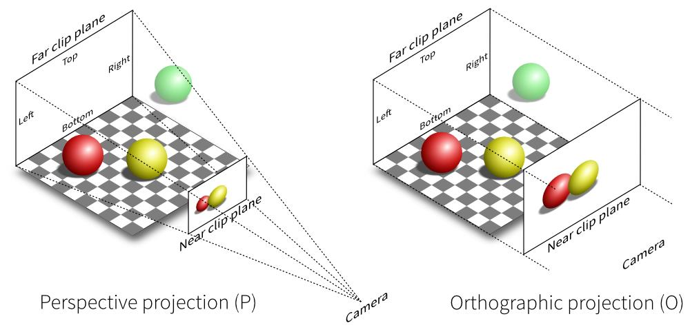
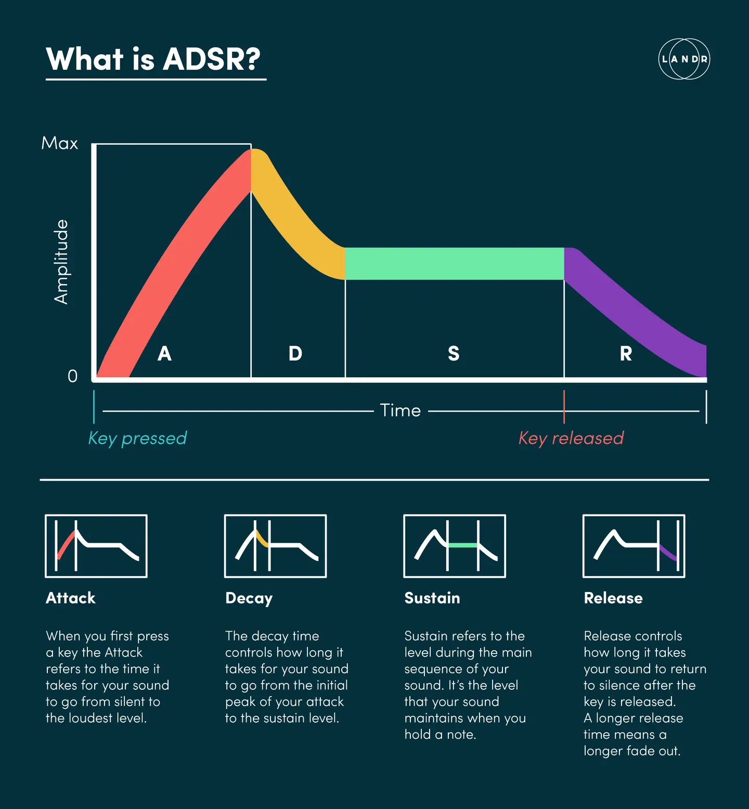

include::./header.adoc[tag=head-setting]
:toclevels: 1
toc::[leveloffset=2]
// 《独立游戏大电影》Indie Game: The Movie.2012加拿大纪录片
// https://www.bilibili.com/video/BV1q7411K7JL/

== 🟡 Gamer Motivation Model

*  https://quanticfoundry.com/gamer-motivation-model/[Gamer Motivation Model]
*  https://quanticfoundry.com/wp-content/uploads/2015/12/Gamer-Motivation-Model-Overview.pdf
*  https://quanticfoundry.com/wp-content/uploads/2019/04/Gamer-Motivation-Model-Reference.pdf

image::https://i0.wp.com/quanticfoundry.com/wp-content/uploads/2015/12/Model-Overview.png?ssl=1[]

玩家动机模型是 Nick Yee 和 Nicolas Ducheneaut 合作研究的关于玩家类型的游戏理论模型，此模型对全球 165 万独立玩家进行采样调查，归纳 6 种玩家群体：Action (动作)、Social (社交)、Mastery (掌控)、Achievement (成就)、Immersion (沉浸式)、Creativity (创意)，每一大类分为两个小类，分别为：破坏与刺激、竞争与社区、挑战与策略、完成与权力、幻想与故事、设计与发现，共12类。

研究发现，前三大玩家群体是 Strategy (59%)、Fantasy (60%)、Story (58%)。

Nick Yee 通过对 2000 名中国玩家进行了动机侧写，与美国玩家进行比较后总结出了一套很有意思的统计数值。相较于美国玩家而言，中国玩家在竞争与完成度上尤为突出，但在幻想与故事、发现与设计也就是沉浸动机与创造动机上较低。相较于美国玩家而言中国 75% 的玩家更喜欢竞争。在性别条件上并无明显差异，男性玩家相较女性更关注于破坏且各年龄段下男女动机变化非常小。

为什么中国游戏市场和玩家呈现出这类趋势？Nick Yee 做出了一系列猜测。

第一，中国崇尚集体主义，而美国则更崇尚个人主义。竞争动机分析中 Nick Yee 认为，崇尚个人主义玩家竞争性应该更高，然而结果却恰恰相反。

第二，因为中国游戏市场因政府管制呈现隔离状态。这就是为什么中国游戏市场如此庞大，游戏产品众多且火热，但向海外输出后会“水土不服”，“因为这两种玩家从一开始就不是玩的同一类型的游戏”。

=== The Science and Data Behind Our Gamer Motivation Model

Data From Over 1.65 Million Gamers

We used established psychometric methods and data from over 1.65 million 
gamers to develop an empirical model of gamer motivations. Want to learn more?

    *  Take the Gamer Motivation Profile to get your personalized report along with game recommendations.
    *  Get a more detailed look into the 12 motivations in this PDF reference sheet.
    *  Watch a 20-minute talk of how we created the model and some key findings.
    *  Follow up with our 2019 GDC talk for a deep dive into the 12 motivations.

Nick Yee and Nicolas Ducheneaut have been studying games and gamers for over two decades.

They leverage their broad experience in academic, commercial, government, 
and game industry research in gaming to analyze game data and generate 
actionable insights.

    *  An Empirical Model - We developed our motivation model using established 
        psychometric methods to identify how gaming preferences cluster together 
        and to develop a robust assessment tool.

    *  A Large Data Set - Over 1.65 million gamers worldwide have participated 
        in our Gamer Motivation Profile, providing data on their motivations, 
        demographics, and game titles they enjoy playing.

    *  Actionable Insights - Our data connects game titles/franchises with 
        demographic and motivation variables, allowing us to analyze the 
        motivations of game audiences to produce empirical insights.

=== Overview Of Sample

    • 143,757 gamers (unique IP addresses)

    *  Gender: 82% Male, 17% Female, 1% Non-Binary
    *  Median Age: 26

    • Gamers recruited via Gamer Motivation Profile

    *  Participants took a 5-minute survey to receive a customized report of their
        gaming motivations, and then could share their profile via social media.
    *  No other incentive (financial or otherwise) was provided to respondents.
    *  ~80% of our gamers were recruited via social media sharing of the gaming
        motivation profiles.

    • Diverse geographic regions

    *  US (73k), Canada (8k), UK (7k), Brazil (6k), Indonesia (6k), Australia (5k),
        Philippines (3.7k), Singapore (2.6k), Germany (2.3k), Poland (2.3k), Malaysia
        (1.9k), Russia (1.8k), France (1.8k), Sweden (1.7k), Netherlands (1.5k), Spain
        (1.3k), Italy (962), New Zealand (926), South Africa (915) …

=== Sample Note

1.25M+ Gamers (unique IP addresses)

*  Gender: 74% Male / 22% Female / 3% Non-Binary
*  Age: Median = 23, Range = 13-85
*  Gamer Type: Casual 12% / Core 69% / Hardcore 19%

Gamers recruited via Gamer Motivation Profile

*  Participants took a 5-minute survey to receive a customized report of their gaming motivations,
    and then could share their profile via social media.
*  No other incentive (financial or otherwise) was provided to respondents.
*  ~80% of our gamers were recruited via social media sharing of the gaming motivation profiles.

Geographic distribution

*  North America (33%), Western Europe (14%), East Asia (10%), SE Asia (4.8%), South America
    (4.6%), Eastern Europe (4.3%), Scandinavia (3.7%), Australasia (3.7%), Southern Europe (3.5%),
    Central America (1.1%). All other regions < 1%.

=== Game Audience Dashboard

Features At a Glance

*  Convenient online dashboard based on real-time data.
*  Complete access to our catalog of over 3,500 game titles.
*  Based on data from over 1.65 million gamers.
*  Generate Audience Reports based on individual or multiple game titles/franchises.
*  Filter an audience report by gender, age range, gamer type, or gaming frequency.
*  Visually explore related game titles using our dynamic graphing features.
*  Use reverse lookups to identify games that fit a specific set of criteria.
*  Download a PDF overview of the key features.
    https://quanticfoundry.com/wp-content/uploads/2021/04/Dashboard-Features-Quantic-Foundry.pdf

=== A Quick Primer On Interpreting

    ============== ==========
    Class          Percentile
    ============== ==========
    Community      44%
    Competition    39%
    Excitement     39%
    Destruction    43%
    Completion     46%
    Power          35%
    Strategy       59%
    Challenger     39%
    Fantasy        60%
    Story          58%
    Discovery      48%
    Designy        47%
    ============== ==========

Percentile Ranks

Imagine if we went to a school of 1,000 students and arranged
everyone in a row by height. Every student would have a
percentile rank—the % of students they are taller than.
So the student right in the middle would be 50th %-tile (the
average). And a student at the 10th %-tile is taller than 10% of the
student body, but shorter than 90% of the student body.

The Motivation Chart

The chart in each audience report provides the percentile rank for
each motivation for the target game audience--i.e., if this game
audience were an individual gamer, where would they fall in the
full data set?

The line in the middle represents the average gamer (the 50th %-
tile) in our full data set.

Thus a Power score of 35% is moderately below average. If this
game audience were an individual gamer, they would score higher
than 35% of gamers on Power, but lower than 65% of gamers.

As a whole, the chart visualizes the motivations that are
disproportionately important and unimportant for this audience,
relative to other gamers.

=== Overview Of Motivation Model

    Action               Social                  Mastery                 Achievement             Immersion               Creativity
    “Boom!”              “Let’s Play Together”   “Let Me Think”          “I Want More”           “Once Upon a Time”      “What If?”

    Destruction          Competition             Challenge               Completion              Fantasy                 Design                  
    Guns. Explosives.    Duels. Matches.         Practice. High          Get All Collectibles.   Being someone else,     Expression.             
    Chaos. Mayhem.       High on Ranking.        Difficulty. Challenges. Complete All Missions.  somewhere else.         Customization.          

    Excitement           Community               Strategy                Power                   Story                   Discovery
    Fast-Paced. Action.  Being on Team.          Thinking Ahead.         Powerful Character.     Elaborate plots.        Explore. Tinker.
    Surprises. Thrills.  Chatting. Interacting.  Making Decisions.       Powerful Equipment.     Interesting characters. Experiment.

=== Detail Action Cluster

*  Destruction 
+
--
Gamers who score high on this component are agents of chaos and destruction. They love having many tools at their disposal to blow things up and cause relentless mayhem. They enjoy games with lots of guns and explosives.

They gravitate towards titles like Call of Duty and Battlefield. And if they accidentally find themselves in games like The Sims, they are the ones who figure out innovative ways to get their Sims killed.
--

*  Excitement
+
--
Gamers who score high on this component enjoy games that are fastpaced, intense, and provide a constant adrenaline rush. They want to be surprised. They want gameplay that is full of action and thrills, and rewards them for rapid reaction times.

While this style of gameplay can be found in first-person shooters like Halo, it can also be found in games like Street Fighter and Injustice, as well as energetic platformers like BIT.TRIP RUNNER.
--

=== Detail Social Cluster

*  Competition
+
--
Gamers who score high on this component enjoy competing with other players, often in duels, matches, or team-vs-team scenarios.

Competitive gameplay can be found in titles like Starcraft, League of Legends, or the PvP Battlegrounds in World of Warcraft. But competition isn’t always overtly combative; competitive players may care about being acknowledged as the best healer in a guild, or having a high ranking/level on a Facebook farming game relative to their friends.
--

*  Community
+
--
Gamers who score high on Community enjoy socializing and collaborating with other people while gaming. They like chatting and grouping up with other players.

This might be playing Portal 2 with a friend, playing Mario Kart at a party, or being part of a large guild/clan in an online game. They enjoy being part of a team working towards a common goal. For them, games are an integral part of maintaining their social network.
--

=== Detail Mastery Cluster

*  Challenge
+
--
Gamers who score high on Challenge enjoy playing games that rely heavily on skill and ability. They are persistent and take the time to practice and hone their gameplay so they can take on the most difficult missions and bosses that the game can offer.

These gamers play at the highest difficulty settings and don’t mind failing missions repeatedly in games like Dark Souls because they know it’s the only way they’ll master the game. They want gameplay that constantly challenges them.
--

*  Strategy
+
--
Gamers who score high on this component enjoy games that require careful decision-making and planning. They like to think through their options and likely outcomes. These may be decisions related to balancing resources and competing goals, managing foreign diplomacy, or finding optimal long-term strategies.

They tend to enjoy both the tactical combat in games like XCOM or Fire Emblem, as well as seeing their carefully-devised plans come to fruition in games like Civilization, Cities: Skylines, or Europa Universalis.
--

=== Detail Achievement Cluster

*  Completion
+
--
Gamers with high Completion scores want to finish everything the game has to offer. They try to complete every mission, find every collectible, and discover every hidden location.

For some players, this may mean completing every listed achievement or unlocking every possible character/move in a game. For gamers who score high on Design, this may mean collecting costumes and mounts in games like World of Warcraft.
--

*  Power
+
--
Gamers who score high on this component strive for power in the context of the game world. They want to become as powerful as possible, seeking out the tools and equipment needed to make this happen.

This may mean maxing stats or acquiring the most powerful weapons. Power and Completion often together, but some players enjoy collecting cosmetic items without caring about power, and some players prefer attaining power through strategic optimization rather than grinding.
--

=== Detail Immersion Cluster

*  Fantasy
+
--
Gamers who score high on Fantasy want their gaming experiences to allow them to become someone else, somewhere else. They enjoy the sense of being immersed in an alter ego in a believable alternate world, and enjoy exploring a game world just for the sake of exploring it.

These gamers enjoy games like Skyrim, Fallout, and Mass Effect for their fully imagined alternate settings. Gamers who score high on Story want games with elaborate storylines and a cast of multidimensional characters with interesting back-stories and personalities.
--

*  Story
+
--
They take the time to delve into the back-stories of characters in games like Dragon Age and Mass Effect, and enjoy the elaborate and thoughtful narratives in games like The Last of Us and BioShock. Gamers who score low on Story tend to find dialogue and quest descriptions to be distracting and skip through them if possible.
--

=== Detail Creativity Cluster

*  Discovery
+
--
Gamers who score high on Discovery are constantly asking “What if?” For them, game worlds are fascinating contraptions to open up and tinker with.

In an MMO, they might swim out to the edge of the ocean to see what happens. In MineCraft, they might experiment with whether crafting outcomes differ by the time of day or proximity to zombies. They “play” games in the broadest sense of the word, often in ways not intended or imagined by the game’s developers.
--

*  Design
+
--
Gamers who score high on this component want to actively express their individuality in the game worlds they find themselves in.

In games like Mass Effect, they put a lot of time and effort in the character creation process. In city-building games or space strategy games, they take the time to design and customize exactly how their city or spaceships look. To this end, they prefer games that provide the tools and assets necessary to make this possible and easy to do.
--

== 🟡 犬类训练的四大核心原理说明

1. 正向强化 —— 在行为出现后，增加一个好的刺激。 狗一“坐下”，就立刻给它一口零食。 增加该行为（“坐下”）在未来出现的频率。
2. 负向强化 —— 在行为出现后，移除一个坏的刺激。 一直拉着牵绳让狗感到压力（坏刺激），当狗走向你时，牵绳压力消失。 增加该行为（走向主人）在未来出现的频率。
3. 正向惩罚 —— 在行为出现后，增加一个坏的刺激。 狗扑人时，主人用膝盖顶它或大声呵斥。 减少该行为（扑人）在未来出现的频率。
4. 负向惩罚 —— 在行为出现后，移除一个好的刺激。 狗扑跳时，主人转身不理它，停止所有互动（移除关注）。 减少该行为（扑跳）在未来出现的频率。

Dog Training 原理可以总结为“获取安全、舒服的生活的代价”。对狗而言，“安全”和“舒适”是其最根本的生存需求。训练，在它们看来，就是一套如何通过自身行为来获取资源或避免不适的规则。

四大快乐物质：

*  多巴胺 (Dopamine)，奖励与动力（期待奖励、达成目标、收到惊喜）；
*  内啡肽 (Endorphin)，愉悦与镇痛（中等强度运动、大笑、辛辣食物）；
*  血清素 (Serotonin)，情绪与满足（晒太阳、规律作息、感受自我价值）；
*  催产素 (Oxytocin)，爱与联结（拥抱与触摸、社交、亲密关系）；

去甲肾上腺素 和 肾上腺素 这两种至关重要的激素和神经递质。它们就像亲兄弟，在身体的“战斗或逃跑”应激反应中扮演着核心但略有不同的角色。它们共同源自酪氨酸，在生化通路上是连续的：酪氨酸 → 多巴胺 → 去甲肾上腺素 → 肾上腺素。

*  去甲肾上腺素：主要与警觉、唤醒、注意力和应激反应（战斗或逃跑）有关。
*  肾上腺素：主要由肾上腺分泌，在脑中作为递质的作用较小，主要参与应激反应。

Lövheim, H. (2012). A new three-dimensional model for emotions and monoamine neurotransmitters

瑞典科学家 Lövheim 在 2012 年提出了一个开创性的理论，他将三种单胺类神经递质——多巴胺、去甲肾上腺素和血清素——与人类的基本情感直接联系起来。该模型的核心观点是：所有情感都可以被理解为这三种神经递质在不同活性水平组合下的产物。

Lövheim 认为，情感可以在一个三维坐标系中定位，三个坐标轴分别代表一种神经递质的活性水平（从低到高），构成了一个 “情感立方体”，八种基本情感分别位于这个立方体的八个角上。

*  惊喜 (Suprise)
*  好奇 (Interest)/兴奋 (Excitement)
*  痛苦 (Anguish)/悲伤 (Distress)
*  蔑视 (Contempt)/厌恶 (Disgust)
*  恐惧 (Fear)/惊恐 (Terror)：使用轻微的惊吓刺激或让受试者准备进行当众演讲。
*  愤怒 (Anger)/狂怒 (Rage)：通过设计不公平或令人沮丧的游戏任务。
*  享受 (Enjoyment)/快乐 (Joy)：让受试者观看有趣的视频或获得意外的奖励。
*  羞愧 (Shame)/羞辱 (Humiliatiion)：通过回忆尴尬的经历或给予负面的社会评价。

                      +-----------------------------------------+  Interest
                     /| Anger                                   /| Excitement
                    / | Rage                                   / |
                   /  |                                       /  |
                  /   |                                      /   |
                 /    |                                     /    |
                /     |                                    /     |
               /      |                                   /      |
              /       |                                  /       |
             /        |                                 /        |
            /         |                        Suprise /         |
            ^-----------------------------------------+          |
            |Distress |                               |          |
            |Anguish  |                               |          |
            |         +-------------------------------|----------+
            |         / Fear                          |         / Enjoyment
            |        /  Terror                        |        /  Joy
      Noradrenaline /                                 |       /  
            |      /                                  |      /   
            | Dopamine                                |     /    
            |    /                                    |    /     
            |   /                                     |   /      
            |  /                                      |  /       
            | / Shame                                 | /        
            |/  Humiliatiion                          |/ Contempt
            +----------------------------------------->  Disgust
                              Serotonin

               Fig. 1. Lovheim cube of emotion. 

这个立方体的魅力在于，它将抽象的情感转化为具体的、可测量的神经化学状态。每一种情感都是三种神经递质特定组合的体现：

   情感对    多巴胺/去甲肾上腺素/血清素   简单心理体验描述
   =============================================================================
   兴趣/期待      高/高/高       专注、渴望探索。充满动力和期待地去学习或追求目标。
   享受/快乐      高/高/低       兴奋、愉悦。在达成目标或获得奖励时的兴奋和快乐状态。
   惊喜/兴奋      高/低/高       好奇、新奇。被意外但有趣的事物吸引，感到好奇。
   厌恶/轻蔑      高/低/低       排斥、优越感。对不喜欢的人或事物感到排斥和蔑视。
   愤怒/狂怒      低/高/高       挫败、攻击性。因目标受阻或遭受不公而感到愤慨，准备反击。
   恐惧/惊恐      低/高/低       警觉、惊慌。面对威胁时的紧张和害怕，准备逃跑或战斗。
   痛苦/悲伤      低/低/高       沮丧、低落。经历丧失或失败后的无力、哀伤和低落。
   羞愧/羞辱      低/低/低       无能、自我否定。自尊心最低点，感到自己毫无价值，想要躲藏。

Lövheim 用这个模型来解释精神疾病（情感障碍）：

*  抑郁症：通常与低水平的多巴胺、去甲肾上腺素和血清素有关，这对应立方体中“羞愧/羞辱”的区域，解释了抑郁症患者的快感缺失、动力不足和自我评价极低。
*  焦虑症：与高去甲肾上腺素和低血清素有关，对应“恐惧/焦虑”区域。
*  攻击性行为：可能与低多巴胺、高去甲肾上腺素和高血清素的组合有关，对应“愤怒”区域。

此模型优点：简洁直观，将复杂的情感与神经化学完美结合，提供了一个易于理解和记忆的框架；启发性强，为研究情感、人格和精神疾病的生物学机制提供了新的思路。

争议与局限性：过于简化，忽略了情境和认知。大脑的情感处理机制极为复杂，涉及多个脑区、其他神经递质（如内啡肽、催产素、谷氨酸等）和激素的相互作用。仅用三种神经递质来解释所有情感可能过于简单。该模型更多是一个理论框架，其确切的因果关系尚需更多的实验证据来支撑。很难精确测量活体大脑中特定区域的这些神经递质瞬时水平。模型侧重于生物学，而情感的产生同样受到个人认知评价、过往经历和社会环境的深刻影响。

== 🟡 自由能原理：一个统一的大脑理论？

link:https://www.fil.ion.ucl.ac.uk/~karl/The%20free-energy%20principle%20A%20unified%20brain%20theory.pdf[The free-energy principle: a unified brain theory? by Karl Friston]

《自由能原理：一个统一的大脑理论？》由卡尔·弗里斯顿撰写的神经科学和认知科学领域一篇极具影响力和争议性的奠基性论文。他提供「自由能原理」，这是一个试图解释大脑结构和功能的统一理论框架。它提出，一个自组织系统（如大脑、生物体）为了在多变的环境中生存，必须通过维持内部状态的有序性来抵抗自然的无序（熵增）。大脑实现这一目标的方式是最小化“自由能”。Karl Friston 的自由能原理（Free-Energy Principle） 的核心计算框架展示了大脑（或任何自组织系统）如何通过 感知 和 行动 来最小化自由能，从而维持自身的存在。

在统计学和物理学中，自由能 (Free-Energy) 是一个衡量系统不确定性和无序程度的量。在弗里斯顿的理论中，它可以被通俗地理解为 “预测误差的边界” 或 “惊奇值的上限”。惊奇 (suprise) 表征一个系统遇到它未预料到的事件时所感受到的“意外”程度。高惊奇意味着系统对其所处环境准备不足。自由能表征系统平均条件受到的惊奇，一个系统如果持续地最小化自由能，就能长期地避免高惊奇事件。因此，最小化自由能 ≈ 最大化对感官输入的预测准确性。

根据自由能最小化原理，感知和行动是同一枚硬币的两面——它们都是最小化自由能的手段。大脑通过两个相互关联的过程来最小化自由能，这构成了大脑最小化自由能的两种核心主动推理的框架：

1. 感知（Perception / Perception as Inference），大脑根据接收到的感官输入，更新其内部模型（即“信念”），以更准确地解释这些输入产生的原因。你在雾中看到一个模糊的影子，大脑会不断调整它的假设，“那是一个人？还是一棵树？”，直到找到一个最能解释感官数据的模型。这相当于最小化关于世界状态的“不确定性”。

2. 行动（Action / Active Inference），大脑不是被动地接受世界，而是会采取行动来改变感官输入，使其符合自己的预测。比喻：为了看清那个模糊的影子到底是什么，你会主动走近它。通过行动，你使感官输入（影子的清晰度）与你“想看清”的预测保持一致。这相当于通过改变与世界的互动来采样符合预测的数据，从而避免“预测误差”。

该理论声称可以统一解释从低级反射到高级认知（如注意、决策、学习）乃至社会互动等各种大脑功能。所有这些都可以被理解为在不同时空尺度上最小化自由能的不同表现形式。大脑不是一个被动的记录器，而是一个主动的“假设生成器”。它拥有一个关于世界如何运作的内部模型，这个模型可以生成对感官数据的预测。自由能原理为“预测编码”理论提供了数学基础和更深层的解释。预测编码认为，大脑皮层不断向下传递预测信号，而感官输入则向上传递预测误差信号。最小化自由能的过程就体现在这种层级化的预测误差最小化中。

该理论目标宏大而雄心勃勃：它试图为所有生物行为提供一个第一性原理。它用一个严谨的数学框架（通常基于变分贝叶斯推理）来描述大脑功能。在计算精神病学、认知神经科学和人工智能领域产生了深远影响，催生了大量研究。

而该理论的批评者认为它过于笼统和抽象，无法被证伪。它更像一个“元理论”或“框架”，而不是一个能做出具体、可检验预测的理论。其数学表述对许多神经科学家来说难以理解，导致了概念上的隔阂。它是否真能解释所有大脑现象，还是仅仅是对这些现象的重新描述，这一点存在争议。

整体框架与信号流：大脑 (Agent) 与 环境 (Environment) 交互的基本闭环。大脑处于一个感知-行动的循环中，其所有内部处理和外部行为的最终目的，都是最小化自由能 F。

* Sensations：环境 → 大脑，公式 𝑠̇ = 𝑔(𝑥̇, 𝑦̇) + 𝑧̇ 表示感官输入 𝑠 是由外部状态 𝑥、自主运动 𝑦 以及感官噪声 𝑧 共同决定的。环境有其隐藏的 外部状态 (External states, 𝑥)，大脑无法直接知道。大脑通过感官接收信号 𝑠。

* Action：大脑 → 环境，大脑产生 行动 𝑎，作用于环境，从而改变后续的感官输入。这是一种 主动推理 (Active Inference)。大脑内部状态 (Internal states, 𝜇) 代表大脑对外部世界的 信念 (Beliefs) 或估计。大脑的核心工作是不断调整其内部状态 𝜇 和行动 𝑎，以 最小化自由能 𝐹。

主动推理 (Active Inference) 的核心分解为以下两个转化过程以及双重最小化策略：

1. 行动最小化预测误差 (Action minimizes prediction errors)
2. 感知优化预测 (Perception optimizes predictions)

双重策略：

*  感知 (Perception)：向内，通过更新内部模型 𝜇 来更好地解释感官输入。
*  行动 (Action)：向外，通过改变自身状态 𝑎 来主动采样符合预测的感官输入。

总结：卡尔·弗里斯顿的自由能原理认为大脑本质上是一个“预测机器”，其核心任务是通过不断更新信念（感知）和采取行动（主动推理）来最小化其对世界的预测误差（自由能），从而在一个不确定的环境中维持其自身的存在。尽管存在争议，但它无疑是21世纪最具野心和启发性的神经科学理论之一，深刻地改变了我们思考大脑、心智和行为的方式。

== 🟡 License Filter

参考 ChooseALicense.com https://choosealicense.com/appendix/

源自乌克兰程序员 Paul Bagwell 制作的许可证筛选流程图
image::http://www.ruanyifeng.com/blogimg/asset/201105/free_software_licenses.png[许可证筛选流程图]

世界上最流行的开源许可证大概有 6 种，如何选择是复杂的事，但可以通过 5 个问题简单化处理：

    他人修改软件后可以闭源吗？
    ├── YES！每一个改动是否必需放置版权声明？
    │    ├── Yes！ 👉 Apache License
    │    └──  No！衍生软件的广告是否可以用自己的署名？
    │         ├── Yes！ 👉 MIT License
    │         └──  No！ 👉 BSD License
    └── NO！新增代码采用同样许可证吗？(Copyleft)
         ├── Yes！ 👉 GLP License
         └──  NO！是否需要对源代码的改动提供文档？
              ├── Yes！ 👉 Mozilla License
              └──  No！ 👉 LGPL License

MIT 协议被认为是最自由、限制最少的开源协议。它的全部要求就是“保留版权声明”，除此之外几乎没有其他限制。你几乎可以做任何事情：用于私人项目、商业项目；修改、分发、销售；作为闭源软件的一部分分发；使用 MIT、GPL 或其他任何协议再授权。唯一的要求是： 在你的软件副本或重要部分中，必须包含原始版权声明和MIT协议文本。MIT 是最受欢迎的开源协议之一，因为它简单到极致，对开发者非常友好，法律风险极低。许多知名的前端项目（如 React, jQuery, Node.js）都使用 MIT 协议。

GPL (General Public License) 类版权协议别名称 Copyleft 许可证，目的是确保软件产品或基于其衍生的任何作品的所有用户获得至少四项基本自由：

1. 自由地出于任何目的运行该程序，无需获得任何附加许可；
2. 自由地阅读、学习、理解和使用该程序源码所传授或包含的任何知识或技巧；
3. 自由地修改、改编、改进或二次使用该程序中的任何或全部代码；和
4. 自由地将该程序分享给任何人或不予分享，无论是修改版还是原版。

GPL 作为最早出现的开源协议之一，要求使用者也以同样的方式开源，俗称“传染”。而更松散的 LGPL 则没有这样的强制要求，开发者可以基于 LGPL 软件的基础上闭源。GPL 开源与收费不冲突，但它改变了赚钱的游戏规则。你不能通过“售卖软件许可”这种传统闭源模式来赚钱。你可以通过售卖软件副本、支持服务、托管服务、担保、例外许可和硬件来赚钱。GPL 本质是让你从“卖产品版权” (Copyright) 转向“卖服务”和“卖价值” (Copyleft)。它迫使你创新你的商业模式，与用户建立一种基于服务和信任的关系，而非仅仅依靠版权限制。对于许多现代公司来说，这最终被证明是一种更具可持续性和竞争力的模式。GPL 的设计哲学是“自由，而非免费”，它不排斥商业，而是通过规则确保自由在商业环境中也能得以延续。

LGPL 明确区分了：

*  “使用”库：你的程序只是动态链接到 LGPL 库。
*  “修改”库：你修改了 LGPL 库本身的代码。
*  “基于”库创作：你将 LGPL 库的代码静态链接到你的程序中。

LGPL 通过一系列精妙的法律条款，在保护库本身自由的同时，为使用者提供了灵活性。LGPL 动态链接的“安全港”，这是最常见的情况。如果你的程序仅仅是通过动态链接来使用一个 LGPL 库，那么你的主程序不被视为衍生作品，可以保持主程序的闭源，并使用任何许可证。前提条件是：你必须允许用户能够替换他们所使用的 LGPL 库版本。

根据民事判决书 (2019) 粤73知民初207号，广东省最高院在“罗盒公司诉玩友公司案”等判决中，确认被告（多家软件公司）违反 GPL 源代码条款构成侵权。原告诉求：玩友公司、冠准航公司、奥斯坦公司、祥运公司连带赔偿罗盒公司经济损失 1500 万元。综合全案的证据情况，最高院确定赔偿数额为 50 万元（包含维权合理开支），对罗盒公司超出前述数额的赔偿请求不予支持。案件受理费 112700 元，由原告济宁市罗盒网络科技有限公司负担 72700 元，被告广州市玩友网络科技有限公司负担 40000 元。案情要点：2015 年 2 月，罗盒公司股东罗迪 (asLody) 开发完成了 VirtualApp，2016 年 7 月，罗盒公司将 VirtualApp 软件上传至 Github，并在 9 月采用 GPL-3.0 协议开源（后附加“限制商业使用条款”）。2017 年 8 月 8 日注册成立“罗盒公司”，2017 年 10 月 29 日，罗盒删除了 GPL-3.0 协议，并申请软件著作权登记，在 12 月 31 日声明停止更新该开源版本，并转为开发不开源的商业版本。玩友公司（被告）开发了四款 App，四款软件均可免费下载，但是未公开源代码且通过会员收费模式运营。罗盒公司主张玩友公司的代码与 VirtualApp 构成实质性相似，且未履行 GPL-3.0 开源义务（开放源码），构成侵权。

GPL 附加禁止商用条款与 GPL 本身不冲突吗？直接的答案是：冲突，而且这是明确违反 GPL 协议的。为 GPL 软件添加“禁止商用”条款，直接违背了 GPL 协议赋予用户的几项基本自由。但是“罗盒案”的关键是被告方的“闭源”行为。

罗盒公司诉玩友公司案判决书 https://ipc.court.gov.cn/zh-cn/news/view-1823.html

司法实践中，倾向于将纯粹的艺术内容与功能性代码区分对待。在 GPL 协议下区分源代码和艺术资产，关键在于理解GPL 的“传染性”主要作用于功能性代码，而对独立的艺术资产通常网开一面。受 GPL 强约束的源代码包括：程序的功能性、可编译部分，是生成可执行文件的基础。艺术资产 (通常不受 GPL 传染)，包含非功能性、感知性内容，如图像、声音、模型、文本。可以在项目根目录提供清晰的 LICENSE 文件，说明代码部分采用 GPL。同时，可以为艺术资产创建独立的 ASSETS_LICENSE 协议文件，明确其授权方式（如 CC-BY-NC）。在项目结构上，将代码和艺术资产存放在不同的目录。避免将资源数据直接以代码形式（如字节数组）硬编码到源文件中。如果可能，考虑将艺术资产作为独立的数据包进行分发，与核心程序分离。

== 🟡 读书方法论 Reading Methodology

书分百家，有些书可以浅尝，有些书可以观赏，有些书可以咀嚼，有些书可以“反刍”，正所谓“常看常新”。

囤积了 30GB 电子书，发现人生每天只有 24H 真的不够，所以，如有比看书更有意义的事值得你投入，那么就没有必要“快速读书”，但是如果读书本身是你觉得最有意义的事，那么必然有一天你会掌握“泛读”或者其它让你快速阅读的技能。「阅读」这种能力本身是人类所特有的心理、生理活动过程，它需要基于光学原理的视觉系统接收光信息、脑神经信号通道传递电信号到视觉中枢、大脑的视觉信号处理系统的配合才能完成“阅读”这个动作。我们从小开始的阅读训练是线性阅读方法，因为此时的大脑结构还没有成熟，更没有积累很多常识、通识。但是做了大量阅读后，如果还是使用线性方法来阅读，那么就不是一个最有效率的方法。这里说的“线性方法”，大概指的是这样一个过程：眼看 -> 图像信号 -> 等待大脑处理得到结果 -> 继续循环这个过程。注意“等待大脑处理结果”这个环节，它会给你的阅读过程加料：看到“烤鸡”你会想到以前某天吃过好吃的，看到“咖啡”你可能想到昨天那杯咖啡的心型泡沫，看到你熟悉的歌词你还会在心里唱起来。对于大量定性描述的内容，这不是一种高效的处理过程。不需要花费过多的能量去处理数理逻辑关系。更高效的处理过程应该是，将大脑现有的知识储备当作积木来使用，用积木匹配阅读到的内容，如果内容是匹配的就是可以跳跃的内容，否则就需要花费时间做“咀嚼”。这是需要训练才能掌握的技能，不是天生的。有些人不自觉地做这个，就像是天生就会一样。累了就好好休息，阅读前静心，戒断多巴胺。从一件高快乐价值的事转移到低价值的事很难，对于人类天性来说真的难。

斯坦尼斯拉斯·迪昂 的著作 How We Learn: Why Brains Learn Better Than Any Machine ... for Now （译名《精准学习》）并非一本简单的学习技巧手册，而是一次从脑科学与认知科学的根源上，对人类“学习”这一本质能力的深刻探索。书中提供的核心论点是：人脑拥有着一套极其高效、精准的先天学习算法，其能力目前仍远超任何人工智能。学习基于四大核心支柱：注意力——信息过滤器；主动参与——好奇心驱动；错误反馈——校准模型；巩固——自动化与迁移。由此构建一个日常可行的“学习循环流程”，通过「注意力」聚焦目标信息，在「主动参与」中形成对世界的内部心理模型，通过「错误反馈」检测模型与现实的差距，在睡眠中「巩固」将新知化为本能并实现知识迁移。“睡眠”就是“大脑停机整理”，这个机制是大脑内置的重置程序，定期清理大脑运行过程产生的代谢物。

== 🟡 虚幻引擎游戏项目解剖学 {BR}以独立开发者视角出发 {BR}Unreal Engine Game Project Anatomy

WARNING: 注意文中提供的文档参考链接指向中文版，但是很可惜，Epic Games 官方并没有提供高质量的翻译（即使 M$ 这种级别的公司，其文档翻译也不尽人意），小心成为“汉化”受害者，比如文档中经常将 Level 术语翻译成“级别”，将 Map 翻译成“映射”，但是在游戏引擎中正确的翻译分别是“关卡”和“地图”，某些情况下它们指的是同一种东西。当图像文件与 Map 在一起时，通常 Map 就解析为座标系统间的“映射”，引申为贴图：纹理图像通过 UV 座标映射到三维模型表明作为纹理贴图使用。直接阅读英文原文档则不会有这种具有误导性的词汇，但是对阅读者要求掌握有一定的英语基础。另外一点需要说明的是，软件的参考手册与教程、教材的区别还是比较大的。作为手册，它的第一目标是完整陈述软件的结构组成，基本用法，而不是让用户理解软件的各种功能。这一点决定了，软件手册有较高的阅读门槛，也因此官方一般会推出相应的教程材料，但是其制作者的水平、出发点对教程内容的安排或设计有非常大的影响。。

“虚幻游戏项目结构解剖”是一篇视角非常高的概括性质的文章，因为虚幻引擎本身涉及的技术非常广泛，为了让这头“大象”的整体形象完成地展现在一篇文章中确实难度很大，这里尽可能将一个游戏项目涉及的最基本的技术做一个概括说明，不过分涉及技术细节但又不那么浅显。Unreal Engine 5.5 共有 59,936 个文件，7,432 个文件夹（Windows 资源浏览器统计和 tree 命令统计有出入：7433 directories, 59909 files），实在太庞大，不适合逐一研究探索。好在，官方代码组织有序，根据功能分类模块化代码工程，阅读者应该根据自身需要，用到什么功能模块就探索对应的模块。本文从项目的原始结构开始，分解其各个核心部分，但又不过分受源代码“缠绕”，力求做到一个普适的程度。知识内容主要集中在计算机图形学与编程技术，包括 C++ 和脚本以及可视化的逻辑节点编程（蓝图、材质编辑等等）。

=== Unreal Engine 目录结构、运行时对象关系

虚幻引擎 (Unreal Engine) 游戏项目的目录基本结构和组织方式规范参考 https://dev.epicgames.com/documentation/en-us/unreal-engine/unreal-engine-directory-structure[Directory Structure]。Unreal Engine 项目源代码目录 (Source) 结构的标准规范根据项目差异使用不同的组织形式，对应引擎本身的 Source 目录包含的是引擎代码、工具实现以及 gameplay classes 等等：

*  **Engine** - Source files in the Engine directory are categorized into the following:
*  **Developer** - Files used by both the editor and engine.
*  **Editor** - Files used by just the editor.
*  **Programs** - External tools used by the engine or editor.
*  **Runtime** - Files used by just the engine.

对于游戏项目的 Source 目录，则以模块组织，每个子目录为一个模块，每个模块包含以下功能目录：

*  **Classes** - Contains all gameplay class header (.h) files. This directory should not be added to in the future.
*  **Internal** - Contains cross module includes within the same plugin or module without exposing the include more widely.
*  **Private** - Contains all source (.cpp) files including gameplay class implementation files and the module implementation file.
*  **Public** - Contains the module header file.

----
MyProject/
├── 📁 Content/            # 游戏资源核心目录（资产文件）
├── 📁 Source/             # C++ 源代码目录
├── 📁 Config/             # 配置文件目录
├── 📁 Plugins/            # 插件目录（可选）
├── 📁 Saved/              # 临时文件和缓存
├── 📁 Intermediate/       # 构建中间文件
├── 📁 Platforms/          # 平台特定文件（可选）
├── 📄 MyProject.uproject  # 项目主文件
└── 📄 .gitignore          # Git 忽略文件

📁 Content/
├── 📁 Blueprints/         # 蓝图类
│   ├── 📁 Characters/     # 角色蓝图
│   ├── 📁 UI/             # 用户界面蓝图
│   ├── 📁 Weapons/        # 武器蓝图
│   └── 📁 GameModes/      # 游戏模式蓝图
├── 📁 Maps/               # 关卡文件
│   ├── 📄 MainMenu.umap   # 主菜单关卡
│   ├── 📄 Level1.umap     # 游戏关卡
│   └── 📄 TestMap.umap    # 测试关卡
├── 📁 Assets/             # 美术资源
│   ├── 📁 Characters/     # 角色模型和纹理
│   ├── 📁 Environments/   # 环境资源
│   ├── 📁 UI/             # 界面元素
│   └── 📁 Audio/          # 音效和音乐
├── 📁 Materials/          # 材质
├── 📁 ParticleSystems/    # 粒子效果
├── 📁 Animation/          # 动画资源
└── 📁 DataAssets/         # 数据资产

📁 Source/
├── 📁 MyProject/                      # 主游戏模块
│   ├── 📁 Public/                     # 头文件 (.h)
│   │   ├── 📄 MyProject.h             # 主模块头文件
│   │   ├── 📄 MyProjectGameMode.h     # 游戏模式
│   │   ├── 📄 MyProjectCharacter.h    # 角色类
│   │   └── 📄 MyProjectHUD.h          # HUD类
│   ├── 📁 Private/                    # 实现文件 (.cpp)
│   │   ├── 📄 MyProject.cpp           # 模块实现
│   │   ├── 📄 MyProjectGameMode.cpp
│   │   ├── 📄 MyProjectCharacter.cpp
│   │   └── 📄 MyProjectHUD.cpp
│   └── 📄 MyProject.Build.cs          # 模块构建规则
├── 📁 MyProjectEditor/                # 编辑器模块（可选）
│   ├── 📁 Public/
│   ├── 📁 Private/
│   └── 📄 MyProjectEditor.Build.cs
└── 📄 MyProject.Target.cs             # 游戏构建目标

📁 Config/
├── 📄 DefaultEngine.ini               # 引擎默认配置
├── 📄 DefaultGame.ini                 # 游戏默认配置
├── 📄 DefaultInput.ini                # 输入配置
├── 📄 DefaultEditor.ini               # 编辑器配置
└── 📄 DefaultGameUserSettings.ini     # 用户设置
----

https://dev.epicgames.com/documentation/en-us/unreal-engine/unreal-engine-terminology[Unreal Engine Terminology] 以及 https://dev.epicgames.com/documentation/en-us/unreal-engine/gameplay-framework-in-unreal-engine[Gameplay Framework] 包含了一系列术语，是首次接触虚幻引擎的用户必须掌握的基本概念。以下示意图包含了与这术语概念，能够帮助你更有条理地掌握术语相关的运行时对象逻辑关系。最新官方文档也提供了一份精细的 https://d1iv7db44yhgxn.cloudfront.net/documentation/images/8eacd41c-4d9d-48eb-b91e-430007806957/gameplay-schematic.png[Gameplay Schematic] 示意图，简要地展示了游戏运行时中一个复杂的 Gameplay Framework Classes 关系网。

                        +-------------+
                        |    Game     |
                        |  GameMode   |
                        |  GameState  |
                        +------^------+
                               |
         Contains:  +----------+-----------+           +---------------+
       +----------- |    PlayerController  |           |  AIController |
       |            +----------+-----------+           +-------+-------+
       |                       |                               |
       |    +---------+        | Possess  +---------+  Possess |
       +--> |   HUD   |        +--------> |   Pawn  | <--------+
       |    +---------+                   +---------+
       |    +---------+
       +--> |  Input  |
       |    +---------+
       |    +------------------------+
       +--> |  PlayerCameraManager   |
            +------------------------+

UE4 GamePlay 架构中的基本对象解析：

- `Actor` 一个可以在世界中摆放，或者生成的角色。
   * 所有可以放入关卡的对象都是 Actor，比如摄像机、静态网格体、玩家起始位置。
   * Actor 支持三维变换，例如平移、旋转和缩放。你可以通过游戏逻辑代码（C++ 或蓝图）创建（生成）或销毁 Actor。
   * 在 C++ 中，`AActor` 是所有 Actor 的基类。
- `Pawn` 卒子是一个可以从控制器获得输入信息并进行处理的 `Actor` 子类型。
   * Pawn 是 Actor 的子类，它可以充当游戏中的化身或人物（例如游戏中的角色）。
   * Pawn 可以由玩家控制，也可以由游戏 AI 控制，如非玩家角色 NPC。
   * 当 Pawn 被人类玩家或 AIController 控制时，它被视为已被控制（Possessed），否则视为未被控制（Unpossessed）。
- `Character` 人物角色是一个包含了行走，跑步，跳跃以及更多动作的 `Pawn`，还可以添加由玩家控制的运动附加代码。
- `PlayerController` 控制器负责控制场景中的 Actor。
   * 玩家控制器 Player Controller 会获取游戏中玩家的输入信息，然后转换为交互效果，每个游戏中至少有一个玩家控制器。
   * 玩家控制器通常会控制一个 Pawn 或角色，将其作为玩家在游戏中的化身。
   * 在多人联网游戏中，控制器还是的主要网络交互节点。服务器会为游戏中的每个玩家生成一个玩家控制器实例，因为它必须对每个玩家进行联网控制。
   * 每个客户端只拥有与其玩家相对应的玩家控制器，并且只能使用其玩家控制器与服务器通信。
- `Game Mode` 游戏模式类负责设置当前游戏的规则，比如玩家如何加入游戏、是否可以暂停游戏，其它任何与游戏相关的行为，例如获胜条件等等。基本规则设置包括：
   * `Default Pawn Class` 指定默认的游戏玩家是什么类型的对象，在进入游戏时，这种对象就由玩家操纵，即被 PlayController 操控；
   * `HUD Class` 指定“头戴显示器” (Head-up Display)，就是 2D UI 界面，“HUD” 引申为显示那些位置固定的信息，开始游戏时会加载它用来显示游戏信息，如玩家的生命值；
   * `Player Controller Class` 玩家控制器，这是游戏程序控制的核心类，比如用户输入如何传递的 Pawn Class 这样的工作就是它处理的；
   * `Game State Class` 游戏状态类，记录数据用，如得分、排行榜等，保存游戏进度时就需要使用它；
   * `Player State Class` 玩家状态类，和游戏状态类相似，记录玩家状态信息；
   * `Spectator Class` 旁观者类，也就是非玩家角色 NPC；
- `World` 世界场景是一个容器，包含了游戏中的所有关卡。它可以处理关卡流送，还能生成动态 Actor。
- `Level` 关卡，即游戏阶段逻辑的拆分，比如完成一个游戏任务，通常保存在 Maps 目录。任意个关卡组成一个 World，每个关卡里包含多个 Actor。相应的 ULevel 类也是继承于 UObject，所以支持蓝图，对应关卡蓝图 ALevelScriptActor。

如果游戏模式未指定（配置）HUD Class 和 Default Pawn Class，开始游戏时，不会自动创建 HUD 界面，也不会创建玩家控制的对象。可以直接将 Pawn 角色添加到场景，然后设置属性，将其指派给玩家控制：Details -> Pwan -> Auto Possess Player，另外还可以指派给 AI 控制器来控制。使用引擎提供的 AGameModeBase，将使用 `DefaultPawn` 作为玩家操纵的对象，它只实现了最基本的空间移动能力。配套的 `DefaultPawnMovementComponent` 移动风格被设置为无重力并且可飞行。除了原有的 MovementComponent 变量外，它还包括 MaxSpeed、Acceleration 和 Deceleration 等浮点值，可以在子类的蓝图中访问。

[mermaid]
----
---
config:
  layout: elk
  look: handDrawn
  theme: forest
---
sequenceDiagram
    participant UENGINE as UEngine
    participant GINST as UGameInstance
    participant WORLD as UWorld
    participant LEVEL as ULevel
    participant GM as AGameModeBase
    participant PC as APlayerController
    participant PS as APlayerState
    participant GS as AGameStateBase
    participant CHAR as ACharacter
    participant COMP as UActorComponent

    Note over UENGINE, COMP: 游戏启动
    UENGINE->>GINST: 初始化 GameInstance
    GINST->>WORLD: 创建/加载 World
    WORLD->>LEVEL: 加载 Persistent Level
    LEVEL->>GM: 生成 GameMode
    GM->>GS: 生成 GameState
    
    Note over UENGINE, COMP: 玩家加入
    GM->>PC: 创建 PlayerController
    PC->>PS: 创建 PlayerState
    GM->>CHAR: 生成 Character
    PC->>CHAR: Possess 角色
    CHAR->>COMP: 初始化组件
    
    Note over UENGINE, COMP: 游戏运行循环
    loop 每帧更新 (Tick)
        UENGINE->>WORLD: Tick(DeltaTime)
        WORLD->>LEVEL: Tick 所有 Actor
        LEVEL->>GM: Tick 游戏逻辑
        GM->>GS: 更新游戏状态
        PC->>CHAR: 处理玩家输入
        CHAR->>COMP: 更新组件状态
        CHAR->>PS: 更新玩家数据
        PS->>GS: 同步到游戏状态
    end
    
    Note over UENGINE, COMP: 关卡转换
    WORLD->>LEVEL: 流式加载子关卡
    LEVEL->>GM: 通知新Actor进入
    GM->>PC: 更新玩家状态
----

[plantuml]
----
@startuml UE5_Runtime_Sequence

title Unreal Engine 5 运行时对象关系序列图

actor Player as Player
participant UEngine as UEngine
participant UGameInstance as UGameInstance
participant UWorld as UWorld
participant ULevel as ULevel
participant AGameModeBase as AGameModeBase
participant AGameStateBase as AGameStateBase
participant APlayerController as APlayerController
participant APlayerState as APlayerState
participant ACharacter as ACharacter
participant UActorComponent as UActorComponent
participant ULevelStreaming as ULevelStreaming

'=== 游戏启动阶段 ===
group 游戏初始化 [Game Startup]
    UEngine -> UGameInstance: Init()
    UEngine -> UWorld: Create/InitializeWorld()
    UWorld -> ULevel: LoadPersistentLevel()
    ULevel -> AGameModeBase: SpawnGameMode()
    AGameModeBase -> AGameStateBase: SpawnGameState()
end

'=== 玩家加入阶段 ===
group 玩家加入 [Player Login]
    Player -> UEngine: 启动游戏/连接服务器
    UEngine -> UGameInstance: CreateLocalPlayer()
    UGameInstance -> AGameModeBase: PreLogin()
    AGameModeBase -> APlayerController: SpawnPlayerController()
    APlayerController -> APlayerState: SpawnPlayerState()
    AGameModeBase -> ACharacter: SpawnDefaultPawn()
    APlayerController -> ACharacter: Possess()
    
    ' 组件初始化
    ACharacter -> UActorComponent: CreateDefaultSubobject()
    ACharacter -> UActorComponent: RegisterComponent()
    ACharacter -> UActorComponent: InitializeComponent()
end

'=== 游戏开始阶段 ===
group 游戏开始 [Begin Play]
    AGameModeBase -> AGameModeBase: StartPlay()
    AGameModeBase -> APlayerController: BeginPlay()
    APlayerController -> ACharacter: BeginPlay()
    ACharacter -> UActorComponent: BeginPlay()
    AGameModeBase -> AGameStateBase: BeginPlay()
end

'=== 游戏运行循环 ===
loop 每帧更新 [Game Loop - Tick]
    UEngine -> UWorld: Tick(DeltaTime)
    
    group 世界更新 [World Update]
        UWorld -> ULevel: TickLevel()
        UWorld -> AGameModeBase: Tick()
        UWorld -> AGameStateBase: Tick()
    end
    
    group 玩家输入处理 [Input Processing]
        Player -> APlayerController: 输入事件
        APlayerController -> ACharacter: 处理输入
        ACharacter -> UActorComponent: 更新状态
    end
    
    group 状态同步 [State Replication]
        ACharacter -> APlayerState: 更新数据
        APlayerState -> AGameStateBase: 复制状态
        AGameStateBase -> APlayerController: 广播更新
    end
    
    group 物理和渲染 [Physics & Rendering]
        UWorld -> UActorComponent: 物理模拟
        UWorld -> UActorComponent: 渲染更新
    end
end

'=== 关卡流式加载 ===
group 动态关卡加载 [Level Streaming]
    APlayerController -> ULevelStreaming: RequestLevelLoad()
    ULevelStreaming -> UWorld: LoadStreamLevel()
    UWorld -> ULevel: 异步加载子关卡
    ULevel -> AGameModeBase: 通知新Actor
    AGameModeBase -> APlayerController: OnLevelLoaded()
end

'=== 游戏结束 ===
group 游戏结束 [Game End]
    AGameModeBase -> AGameModeBase: EndPlay()
    AGameModeBase -> APlayerController: 通知游戏结束
    APlayerController -> Player: 显示结算界面
end

@enduml
----

=== Unreal Engine 项目构建工作流

https://dev.epicgames.com/documentation/en-us/unreal-engine/using-the-unreal-engine-build-pipeline[Unreal Build Pipeline] 是为虚幻引擎项目开发而设计的一套自动化构建系统，包含三大件：UnrealBuildTool (UBT) 管理项目源代码构建的工具；UnrealHeaderTool (UHT) 是基于 C++ 模板实现的 UObject 类型反射系统代码生成工具；Unreal Automation Tool (UAT) 用于执行构建、测试等工作的自动化处理工具。Unreal Build Tool (UBT) 作为虚幻引擎编译器工具，由 C# 编写，当你运行"GenerateProjectFiles"（一个批处理文件，用于 Window 平台下生成 Visual Studio 的解决方案和工程），第一个步骤就是在源代码 Source/Programs/UnrealBuildTool/UnrealBuiltTool.csproj 工程目录下执行 MSBuild 来编译这个"Unreal Build Tool"，所以可以理解 UBT 其实就是一个命令行程序，却可以完成很多事情，比如生成工程文件、执行 UBT、为各种不同的平台构建风格来调用编译器（Compiler）和链接器（Linker）。开发者编写的 {CPP} 代码，糅合 UHT 转换成标准的 {CPP} 代码，而 UBT 负责调用 UHT 来实现这个转化工作，转化完之后 UBT 调用 {CPP} 编译器完成二进制文件的编译。Unreal Header Tool (UHT) 虚幻头文件分析工具是支持 UObject 反射系统的自定义解析和代码生成工具。虚幻引擎自身的 UBT 可执行程序位于 Engine\Binaries\DotNET\UnrealBuildTool\UnrealBuildTool.exe，此程序用于生成多种目标，包括游戏的可执行程序，包括客户端和服务端。通过编辑器工具栏弹出菜单 Platforms > [YourPlatform] > Package Project 打包游戏项目时，旧版本可使用 File -> Package Project 执行打包，UAT 工具就会调用 UBT，执行编译、打包等工作。

*  **Game**: A standalone game which requires cooked data to run.
*  **Client**: Same as Game, but does not include any server code. Useful for networked games.
*  **Server**: Same as Game, but does not include any client code. Useful for dedicated servers in networked games.
*  **Editor**: A target which extends the Unreal Editor.
*  **Program**: A standalone utility program built on top of the Unreal Engine.

对于一个游戏项目，它包含四个基本的构建目标：游戏主体、客户端、服务端和编辑器扩展，都有对应的 .Target.cs 脚本文件，比如项目名称为 TP_BlankBP，那么构建目标对应为：Game (TP_BlankBP.Target.cs), Client (TP_BlankBPClient.Target.cs), Editor (TP_BlankBPEditor.Target.cs), Server (TP_BlankBPServer.Target.cs)。

.Unreal Engine 插件类型简表
[cols="2,1,1,1,3"]
|===
|类型                   |编辑器 |打包 |命令行 |主要用途
|Editor                 |✅   |❌   |❌   |虚幻引擎编辑器扩展功能。
|Runtime                |✅   |✅   |✅   |游戏运行时功能
|UncookedOnly           |✅   |❌   |❌   |开发专用工具
|ClientOnly             |✅   |✅   |✅   |客户端专用功能
|ClientOnlyNoCommandlet |✅   |✅   |❌   |纯客户端功能。
|DeveloperTool          |✅   |❌   |✅   |开发者工具，开发过程中使用。
|EditorAndProgram       |✅   |❌   |✅   |编辑器和独立程序，编辑器和工具链使用。
|RuntimeAndProgram      |✅   |✅   |✅   |运行时和独立程序，服务器和客户端共享。
|RuntimeNoCommandlet    |✅   |✅   |❌   |纯运行时功能，无需命令行支持。
|===

https://dev.epicgames.com/documentation/zh-cn/unreal-engine/plugins-in-unreal-engine[Plugins]「插件」是可选的软件组件，用于向虚幻引擎添加新功能，以及修改内置功能，而不直接修改虚幻引擎代码。例如，插件可以将新菜单项和工具栏命令添加到编辑器，甚至可以添加全新的功能和编辑器子模式。Unreal Engine 5.5 提供的插件数量非常庞大，Engine\Plugins 目录下默认安装了 53 类共 629 个插件，其中默认启用的有 185 个，分类为 Runtime 的插件 143 个。大多数都是平台通用插件，其中 MAC 插件 20 个，IOS 插件 6 个，TVOS 插件 2 个，Linux 插件 25 个，Android 插件 12 个，Win64 插件 59 个。每个插件所在目录下有一个 .uplugin 配置文件，包含所依赖的插件列表，也描述了插件可提供的组件，每个组件都标记了类型 (Editor, Runtime, ...)。默认启用的插件会在配置文件中设置 EnabledByDefault 属性，插件的元数据文件名称即为标识，可以在工程文件中配置插件的启用、禁用状态。可以根据需要为每个项目独立启用或禁用插件，通过插件配置窗口设置：Edit -> Plugins。根据这些插件的来源，可以分为虚幻引擎内置插件和第三方插件。如果只关注打包的特性，插件可以按照功能分为三类：只提供编辑器扩展的插件——编辑器插件 (Editor Plugin)；只运行时支持的插件——运行时插件 (Runtime Plugin)；以及混合两种功能的插件。纯编辑器插件只为编辑器提供功能扩展，不会被打包发布。比如 SpeedTree Import 插件，如其名称所指就是为编辑器提供导入功能的插件，不会被打包。混合型插件既包含编辑器组件（资源编辑、工具界面），同时有包含运行时模块，处理游戏执行逻辑。比如 Paper2D 插件，一方面提供精灵编辑器、瓦片地图编辑器，同时又在游戏运行时提供 2D 渲染、动画播放等功能支持。默认启用 Paper2D 插件，但是用户可以不使用它，打包时也不会包含它（自动排除）。插件元数据 (.plugin) 使用的是 JSON 文件，可以将它们合并在一起用 jqlang 查询到插件的依赖关系等信息。但是原文件是 JSON5 松散格式（带有末尾逗号或注解），有些文件还是 UTF-8 With BOM 格式，不能直接使用 jqlang 工具来处理，需要做预处理。可以利用 bash 脚本将所有 .plugin 文件拼接成一个 plugins.json 文件，再修改为正确的 JSON5 格式，结合浏览器提供的 JSON.stringify() 对其做格式化转换成 JSON 格式。

.Plugins Enabled by Default
[source,bash]
----
echo "{" >> plugins.json
while read -r it
do
   enable=$(grep '"EnabledByDefault" : true' "$it")
   if [[ -n $enable ]]
   then
      echo $it
      grep '"FriendlyName"' "$it"
      # Fix UTF-8 With BOM
      sed -i '1s/^\xEF\xBB\xBF//' $it
      echo "\"${it##*/}\":" >> plugins.json
      cat "$it" >> plugins.json
      echo "," >> plugins.json
   fi
done <<< $(find /c/Epic Games/UE_5.5/Engine | grep -E '*.plugin$')
echo "}" >> plugins.json

# for array json
jq -cs '.[]|.[] |{(.FriendlyName // "_"): .EnabledByDefault, Modules: .Modules, Plugins:.Plugins}' plugins.json
# for object json
jq -cs '.[] as $obj | .[] | keys.[] | . as $ID | $obj.[$ID] |  {
   ID:$ID, Name:(.FriendlyName//"_"), 
   Default:(.EnabledByDefault//false), 
   Category: .Category, 
   Modules: .Modules, 
   Plugins:.Plugins, 
   Platforms:(.SupportedTargetPlatforms//"_")
   }' plugins.json > tmp.json

# https://vscode.dev/github/jqlang/jq
# jq -s "[.]" *.uplugin > plugins.json
# JSON file with BOM will cause error:
# jq: parse error: Invalid numeric literal at line 38, column 4
# Relaxed JSON (JSON5 tail comma) cause error:
# jq: parse error: Expected another array element at line 27, column 4
----

注意在打包游戏时选择合适的配置，Shipping (Production) 配置专为发布产品时的打包配置，会对打包内容进行压缩，可以获得更小的打包输出。禁用未使用的插件，或者细致调整项目配置项等其它优化可以进一步减小打包体积。启用“创建压缩的已烘培包” (Project Settings -> Packaging -> Advanced -> Create compressed cooked packages) 的情况下打包游戏，项目 APK 包大小下降 50% 并不罕见。一般来说，打包后的游戏可以（也应该）比开发时的 Content 目录小得多。根据实际测试和社区数据，一个仅依赖引擎核心模块的空项目（仅包含默认模板内容，无自定义资源）的打包大小大致为 40 - 75 MB，只包含引擎可执行文件、核心运行时。参考文档 https://dev.epicgames.com/documentation/zh-cn/unreal-engine/packaging-and-cooking-games-in-unreal-engine[Packaging and Cooking], https://dev.epicgames.com/documentation/en-us/unreal-engine/reducing-packaged-game-size?application_version=4.27[Reducing Packaged Game Size]

虚拟引擎 UAT 工具中的 BuildCookRun 命令完成打包管线的不同阶段构：

*  构建 (Build)： 此阶段会为所选平台编译可执行文件。
*  烘焙 (Cook)： 此阶段会在特殊模式下执行 UE，以此烘焙内容。
*  暂存 (Stage)： 此阶段会将可执行文件和内容复制到暂存区域，即开发目录之外的一个独立目录。
*  打包 (Package)： 此阶段会将项目打包成平台的原生发布格式。
*  部署 (Deploy)： 此阶段会将版本部署到目标设备。
*  运行 (Run)： 此阶段会在目标平台上启动已打包的项目。

.Zen Loader Stage Phases
image::https://d1iv7db44yhgxn.cloudfront.net/documentation/images/bba76380-dcda-42a0-a44c-87ae33cc59ad/zenloaderstagephases.png[]

发布项目后，一般还会有后续的维护工作，包括制作补丁 (Patch) 或 DLC (Downloadable Content)，并且极有可能会在最初的发布之后对其进行更新。打补丁通常包括新内容，用于解决已知的问题，或者修复原始版本中的漏洞。虚幻引擎能够以 .pak 打包文件的形式交付应用程序主可执行文件之外的资产，生成这个打包文件的过程中，需要将资产整理成文件块 (Chunks)，即烘焙过程可以识别的资产文件组。为此，需要修改项目设置，勾选 Project Settings -> Project -> Packaging -> Use Pak File 和 Generate Chunks。游戏运行时在打补丁的过程中，会将所有后期烘焙内容与最初发布的已烘培内容进行比较，并据此确定补丁中包含的内容。最小的内容块是单个包（如 .ulevel 或 .uasset ），因此如果包中有任何更改，那么整个包都将被包含在补丁中。用户获取补丁文件包 ( .pak ) 的方法将取决于游戏的发布平台，但是允许创建一个较小的 .pak 文件，其中只包含更新的内容。可以使用版本化的发布内容来修补先前发布的项目，需要记住几点：发布时锁定序列化代码路径（这个路径用于确认资源身份），同时保留已发布的烘焙内容，因为 UnrealPak 工具使用它来确定补丁包文件中应该包含哪些内容。运行时，挂载这两个 PAK 文件，补丁文件具有更高的优先级，因此首先加载其中的任何内容。另外，可以使用 ChunkDownloader 插件来创建平台无关的补丁程序，这是虚幻引擎自带的补丁解决方案。它从远程服务下载资产，并将其在内存中挂载供游戏使用，以便你可以轻松提供更新和资产。参考文档 https://dev.epicgames.com/documentation/zh-cn/unreal-engine/patching-content-delivery-and-dlc-in-unreal-engine[Patch & DLC] 以及 https://dev.epicgames.com/documentation/zh-cn/unreal-engine/preparing-unreal-engine-projects-for-release[Preparing for Release]。

https://dev.epicgames.com/documentation/zh-cn/unreal-engine/using-the-project-launcher-in-unreal-engine[Project Launcher] 是项目启动程序，它可以用来管理打包程序，定制如何打包你的项目。打包过程的细节取决于你建立的项目针对哪个平台，对完成的打包内容所采取的步骤配置将有所不同。在原有项目基础版本上，可通过 Project Launcher 为项目补丁创建 启动配置文件 (Launch Profile)。比如，创建一个启动配置文件用于创建测试版补丁，并为实际的补丁版本创建另一个启动配置文件。创建 DLC 配置时，选择 Cook 方式为资源清单 (By the book) 以精确控制资源，根据需要设置 Release/DLC/Patching Settings 以及 Advanced Settings。DLC 的主要配置包括：压缩内容 (Compress content)，无版本包 (Save packages without versions)，以及单文件包 Store all content in a single file (UnrealPak)。创建发行发布版本 (Create a release version of the game for distribution) 时设置相应的版本号，制作补丁时需要依据词版本号，对应使用命令行参数 -basedonreleaseversion=<releasenumber> 。参考文档 https://dev.epicgames.com/documentation/zh-cn/unreal-engine/how-to-create-a-patch-in-unreal-engine[如何创建补丁（与平台无关）]。

https://dev.epicgames.com/documentation/zh-cn/unreal-engine/asset-management-in-unreal-engine[Asset Manager] 是虚幻引擎中管理内容资产的工具，引擎本身会自动处理资产的加载与卸载，只是某些情况下开发者可能需要更精确地掌控资产发现、加载与审核的时机与方法。在这些情况下，资产管理器 (Asset Manager) 便能大显身手。资产管理器是存在于编辑器和打包游戏中的独特全局对象，可根据不同项目进行覆盖和自定义。从虚幻引擎 4 开始，资产管理系统将所有资产分为两类：主资产和次资产 (Primary/Secondary Assets)。默认只有 UWorld 资产（关卡）为主资产；所有其他资产均为次资产，开发者可以添加 PrimaryAssetLabel 这种专用于管理次资产的主资产类型。资产管理器通过主资产的主资产 ID 即可直接对其进行操作，调用 GetPrimaryAssetId 函数即可获得此 ID。为了将特定 UObject 类构成的资产指定为主资产，覆盖 GetPrimaryAssetId 即可返回一个有效的 FPrimaryAssetId 结构。次资产不由资产管理器直接处理，会在主资产引用时、或使用后由引擎自动进行加载。

https://dev.epicgames.com/documentation/zh-cn/unreal-engine/preparing-assets-for-chunking-in-unreal-engine[PrimaryAssetLabel] 是用于资源管理和分块 (Chunking) 的重要数据资产类型（主资产类型），提供资源分组管理、分块控制 (Chunking)、运行时资源加载管理、烘焙优化和包体控制等功能，可作为分块工具配合 ChunkDownloader 插件使用，可作为新数据资产的基类以构建强大的资源管理系统。通过资产文件夹中点右键弹出菜单 Create Advanced Asset 或者 Add/Import Content -> Miscellaneous -> Data Asset 创建新的数据资产。双击打开数据资产对象，设置各种属性：Chunk ID 设置一个唯一值作为数据分块的文件夹名称，Label Assets in My Directory 设置为启用以搜索并标记当前目录中的资产，Cook Rule 烘焙规则按需要设置，Is Runtime Label 勾选表一个用于运行时的标签。优先级参数 Priority 越高越优先分包资源，如果优先级相同的多个标签包含同样的资源，则资源会打包到两个 Chunk 中（同一资源两份数据）。Explicit Assets/Blueprints 属性用于显式指定要包含在标签中的特定资源，而不必依赖 Label Assets in My Directory 选项来扫描目录。可以通过工具菜单打开资产审核面板：Tools -> Audit -> Asset Audit，这是一个资源分析和调试工具，可以深入了解资源的引用关系、内存使用和依赖情况。在资产审核窗口中查看现有的文件块，可以看到资源路径、大小、归属 Chunk 等等信息，便于排查资源大小和 Chunk 中的资源冗余。如果一切设置正确，在完成打包后的构建目录中的 /Windows/PatchingDemo/Content/Paks 内可以检查到打包文件名，打包程序将用指定的文件块 ID 为文件命名。社区有人提供了一个 https://github.com/jashking/UnrealPakViewer[UnrealPakViewer] 工具，可以用来检查 .pak 大把文件。

引擎提供了非常多的默认配套资源，打包模板新创建的项目也会非常大，可以通过 Content Browser 浏览所有可能被打包的资源。这里可以浏览到的资源包括了项目目录中以及引擎默认提供的资源，通常使用到的资源才会被打包。引擎提供的默认资源以映射目录的方式显示在 Content Browser 面板中，在项目中可以修改这些原始内容（比如基础材质），单不会影响其它项目，修改通常只在当前项目生效。比如空白模板 (TP_BlankBP) 新创建项目，打包为 Windows 平台得到 462 MB，如果将默认的 Open World 关卡替换为 Basci 关卡（创建新关卡时选择此模板，同时修改工程的 Game Maps & Modes 配置），再打包就得到 395 MB，就简单的一个关卡替换就缩小了 67MB。多出的体积包含了一整套为开放世界设计的功能和内容：World Partition, HLOD 与关卡流送技术的支持等等，这大概也是 World 与 Level 之间的复杂度差别。Level 和 World 对应的类型定义 (ULevel, UWorld) 都继承自 UObject，用途相似，但结构差别较大。Level 结构简单，维护一个 Actors 容器。World 维护一个 StreamingLevels 容器，支持 Level 的动态加载，也支持团队的实时协作，多人可以同时编辑同一个 World 中不同的 Level。当然也包含用于维护游戏状态的 Game Mode 对象，AGameMode -> AGameModeBase -> AInfo -> AActor -> UObject。「关卡」是虚幻引擎中非常核心的概念，从代码来看，ULevel 就是 Acrors 容器，也就是一个舞台场景，一个虚拟世界最小单元，用来组织各种物体 (Actors)：地形、建筑、道具、灯光、角色等等。如果结合世界分区 (World Partition) 和关卡流送 (Level Streaming) 技术来看，ULevel 就是游戏世界中的一个个切片，它们共同拼接成一个完整的开放世界。结合 Gameplay Systems 来看，ULevel 就是游戏世界中包含一切可完活动的游乐场。参考文档 https://dev.epicgames.com/documentation/zh-cn/unreal-engine/levels-in-unreal-engine[关卡]，创建新关卡时，引擎提供了 4 个关卡模板共选择：

// C:\Epic Games\UE_5.5\Engine\Source\Runtime\Engine\Classes\Engine\World.h
// C:\Epic Games\UE_5.5\Engine\Source\Runtime\Engine\Classes\Engine\Level.h
// C:\Epic Games\UE_5.5\Engine\Source\Runtime\Engine\Private\Level.cpp
// C:\Epic Games\UE_5.5\Engine\Source\Runtime\Engine\Private\World.cpp

*  Open World -- 开放世界包含示例内容的关卡，允许你使用世界分区来创建大型、可流送的开放世界。
*  Empty Open World -- 空白开放世界同样是使用世界分区的关卡，但不包含任何内容。
*  Basic -- 基本关卡一个包含地面、光照、大气和指数雾的关卡。
*  Empty Level -- 空关卡是一个没有任何内容的关卡。

安装 Unreal Engine 时可以勾选“起步内容” (StarterContent)，这是一组为初学者准备的基础资产内容，包含了纹理图 (Textures)、建筑模型 (Architecture)、音频 (Audio)、蓝图 (Blueprints)、高动态背景贴图 (HDRI)、关卡地图 (Maps)、基础材质 (Materials)、粒子特性 (Particles)、常用的场景道具 (Props)、几何图形 (Shapes)。官方文档中的视频教程和快速入门指南大多都基于这套初学者内容来构建基本的教学项目。研究这套基础资产，也能帮助你快速掌握虚幻引擎的基础项目结构。使用 ContentBroswer 中的资产右键弹出菜单 Asset Actions -> Export/Migrate 可以将项目中的资产导出给其它项目使用，导出时需选择其它项目的 Content 目录。迁移 (migrate) 比导出提供更多的功能，可以自动处理依赖资源完整迁移源资产。创建项目时，勾选起步内容即可包含这组资产，也可以在创建工程后手动通过 ContentBroswer 面板添加，执行 Add -> Add Feature or Content Pack 并在弹出对话框中选需要的资产。

游戏项目 Content 目录存储游戏内容文件资源，包括 UAsset、UMap 等等这些是原始资源，用于编辑器编辑、保存序列化。打包游戏时，资源文件被打包成目标平台可用的文件 (UPackage)，生成 .uasset 资产文件这个过程称为烘焙 (Cook)。资源描述文件 (.uasset) 包含了资源的元数据、引用关系和导入数据，但不包含实际的资源数据，在开发过程中就会大量使用它来管理内容资产。容器文件 (*.pak) 是将海量 package 文件组织在一起的文件结构，类似于 zip。UE5 引入新的 Io Store 打包系统和运行时加载程序 Zen Loader，使用经过优化的软件包和在 staging 阶段脱机计算的 object 依赖项图表来降低 CPU 开支。Zen Loader 不是将所有资产打包到一个或多个 .pak 文件，而是将所有软件包数据、批处理数据和着色器数据打包到一组 .utoc 和 .ucas 容器文件。将传统的离散文件打包方式转变为全局优化的聚合存储，提供全局资源去重、块存储优化、平台特定优化等特性。其中 .pak 容器文件用于较少访问的松散文件，挂载 Pak 文件之后，也会挂载对应的容器文件。而新加入的 .utoc 文件（目录索引文件）描述了容器文件，包括数据块大小和偏移、压缩格式以及是否加密数据块。配套的 .uca 文件（资产包文件）包含实际数据。使用容器文件可以避免文件系统提取，让加载程序能够使用名为 I/O dispatcher 的调度程序（抽象层 I/O），以最低的 CPU 开始查找数据块。它使用特定于平台的后端来享受硬件功能和 API 带来的优势。虚幻引擎中提供了跨平台数据压缩方案 (Oodle)，压缩游戏下载包的大小，提升关卡加载速度，压缩网络数据包，从而改善玩家的体验。Oodle 目前包含三个套件（通过插件的形式提供）：Oodle Data, Oodle Network, Oodle Texture。所有 Oodle 解决方案默认启用，也都可以通过其插件单独启用或禁用。其它细节参考 https://dev.epicgames.com/documentation/zh-cn/unreal-engine/testing-and-optimizing-your-content[测试并优化你的内容]。

使用动态生成技术 (PCG) 构建游戏场景资源，可大大降低资源打包的体量，通过代码在 GPU 上执行实例化 (Instancing) 批量制造类似物体，在运行时动态生成资源如地形、植被等。一些第三方插件可以用来优化打包，例如 Shader Code Packing 插件可以压缩着色器代码。Optimize Textures 可以自动检测和优化纹理文件的大小和质量，以减小游戏安装包的大小。Asset Compression 可以压缩纹理、声音、动画等资源文件的大小。Lightmass Tweaker 光照调整插件可以优化光照质量和计算时间。Datasmith 用于导入 3D 模型，支持多种 3D 模型格式导入，并对模型进行优化和压缩。

https://dev.epicgames.com/documentation/unreal-engine/oodle-data?lang=zh-CN[Oodle 数据] 插件提供游戏打包出 .pak 文件和 IOStore 文件的压缩格式支持，它作为内容且默认启用的插件提供。开发者可以根据需要修改 Unreal Engine 的打包参数配置。可以修改 AutomationTool 模块代码来定制打包，但是不推荐这样做（Engine/Source/Programs/AutomationTool/Platform/<PlatformName>/<PlatformName>Platform.cs 定义的 GetPlatformPakCommandLine）。Unreal Engine 中自定义 Pak 打包参数配置流程中有多个配置覆盖过程，可以通过项目配置文件来覆盖默认行为。如官方问题追踪器（UE-272843）所指出的，通过命令行参数（如 -AdditionalPakOptions）来覆盖平台默认的 Pak 打包参数（如 -patchpaddingalign）是无效的。这是因为 UAT 在构建命令时，会先执行 GetPlatformPakCommandLine 获取默认值，后添加用户的额外参数，而 UnrealPak 解析器只认第一个遇到的参数。正确且稳定的自定义方式不是通过命令行，而是通过修改项目的配置文件（DefaultGame.ini 或 BaseGame.ini），或直接修改引擎源码中的 GetPlatformPakCommandLine 函数。推荐通过项目配置文件设置 Oodle 压缩参数，在项目 Config 文件夹下的 DefaultGame.ini 文件中，找到或添加 [/Script/UnrealEd.ProjectPackagingSettings] 区块进行配置。Pak 文件压缩命令行选项	(PakFileAdditionalCompressionOptions) 中指定要传递的压缩格式的额外选项，官方文档强烈建议对于 Oodle 设置此属性为 -compressionblocksize=256KB。

其它打包优化配置 (Project Settings) 参考如下：

*  Project Settings
**    -> Project -> Supported Platforms 只勾选需要的目标平台以节省打包时间。
**    -> Project -> Packaging -> Use Pak File 默认启用，所有内容打包到 .pak 容器文件。
**    -> Project -> Packaging -> Use Io Store 提高 IO 性能和加速加载，将会使用 .utoc / .ucas 而不是 .pak 容器文件用于暂存/打包的数据包数据。
*     -> Project -> Packaging -> Advanced -> List of maps to include in a packaged build 在此手动设置关卡地图列表，避免将不需要的关卡打包。
*     -> Project -> Packaging -> Project -> Build Configuration 设置为发布 (Shipping)。
*     -> Project -> Packaging -> Project -> For Distribution 勾选此“分发”选项。
*     -> Project -> Packaging -> Packaging-Prerequisites -> Include prerequisites installer 这是客户端前置环境安装包，可以不打包。安装包大小根据不同目标平台有差异，Windows 平台大概 48 MB，主要包含 DirectX (DLL) 运行环境，会生成一个 Redist 安装程序。
**    -> Project -> Target Hardware -> Optimize Project Settings for 根据选择的硬件平台 (Desktop, Mobile) 进行优化，默认 Maximum 启用的高端功能，可以选择 Scalable 方式基于实际硬件进行调整。

从新创建的 TP_BlankBP 空白模板项目开始，替换空白世界的 Open World 关卡地图为 Basic 地图，再禁用客户端前置环境安装包 (prerequisites installer)。经过这些配置，再禁用所有插件，包括编辑器插件，这时 Edit -> Plugins 菜单功能也缺失，这时打包空白模板项目将得到 139 MB，已经接近于常规方法下的打包极限。最后一步，使用压缩软件将整个游戏打包压缩到一个文件，最终结果可以维持在 50 ~ 70 MB 水平，取决与压缩算法。插件部分的打包优化空间占比较大，接近发布打包的 50% 容量，这需要对每个插件都熟悉，还有各种平台的差异化。

.Packaging Optimazation Steps
[%header,cols="1,1,1,3"]
|===
| Steps        | Effects  | Packaging Size  | Key Impact
| New Project  | Starting | 843 MB    | New Project copy from TP_BlankBP
| Shipping     | -381 MB  | 462 MB    | Change Build Configuration to Shipping
| Level Opt.   | -67 MB   | 395 MB    | Replace Open World Level => Basci Level
| Redist Opt.  | -48 MB   | 347 MB    | Uncheck Packaging-Prerequisites
| Plugins Opt. | -218 MB  | 129 MB    | Disabled All Plugins
| Final Zip    | -79 MB   | 50 MB ~ 70 MB   | Use 7-zip compress all packaging file
|===

[source,bash]
----
du -hd 2 "/Saved/Cooked/Windows/Engine" | sort -h
1.6M    /Saved/Cooked/Windows/Engine/Content/EditorMaterials
3.0M    /Saved/Cooked/Windows/Engine/Content/EditorResources
3.5M    /Saved/Cooked/Windows/Engine/Content/VREditor
4.8M    /Saved/Cooked/Windows/Engine/Content/EngineFonts
22M     /Saved/Cooked/Windows/Engine/Content/EngineMaterials
22M     /Saved/Cooked/Windows/Engine/Content/EngineSky

ls -l "C:\Epic Games\UE_5.5\Engine\Content\EngineMaterials" | sort -h | tail -n 18
   73K   DefaultCalibrationGrayscale.uasset
   98K   DefaultMaterial.uasset
  127K   T_Default_Material_Grid_M_Low.uasset
  134K   T_Default_Material_Grid_M.uasset
  356K   PaperDiffuse.uasset
  440K   PaperNormal.uasset
  956K   ColorGradingWheelGradient.uasset
 1023K   ColorGradingWheelBackground.uasset
 1061K   FastBlueNoise_scalar_128x128x64.uasset
 1934K   DefaultNormal.uasset
 2128K   DefaultDiffuse_Low.uasset
 2135K   DefaultDiffuse.uasset
 2265K   FastBlueNoise_vec2_128x128x64.uasset
 3950K   DefaultBloomKernel.uasset
 5326K   T_Default_Normal.uasset
 7239K   T_Default_BaseColor.uasset
 7482K   T_DefaultTexture2_D.uasset
10744K   T_Default_MacroVariation.uasset
----

通过观察 \Saved\Cooked 目录可以了解有哪些资源会被打包，可进一步分析以清除那些无用又占用空间的资源。除了插件，引擎提供的默认内容资产也是一个占用打包容量的来源，可以通过以上脚本来检查那些大块头的内容文件。可以看到，在一个起步项目中，引擎材质 (EngineMaterials) 和天空系统 (EngineSky) 资源都算是大块头，如果想要节省这里的 44 MB 空间，就需要禁用这些默认资源。这些资源都可以在 ContentBrowser 面板中搜索到，Engine\Content\EngineMaterials 三千多个文件，天空系统主要是体积云效果 Engine\Content\EngineSky\VolumetricClouds。在关卡中删除相关的 VolumetricCloud 或者使用空关卡都不能消除这些“基石”配置，需要通过修改游戏工程配置来排除这些大块头资源，将不想被打包的内容添加到 Project -> Packaging -> Advanced -> Directories to never cook 列表，或者在配置文件中添加 +DirectoriesToNeverCook 条目，不过需要清除掉关卡中使用到这些资源的对象。否则，就需要通过构建日志来分析哪些对象 (Source package) 依赖的资产 (Target package) 配置为不可打包。使用基础材质的对象主要集中在基础几何体 /Engine/BasicShapes (Cube, Plane, Sphere, Cylinder, Cone)，但是不能单独通过排除 /Engine/BasicShapes 目录的方法来避免基础材质内容的打包，还有其它依赖基础材质内容的对象，也不能使用 Open World 或者 Basic 这类关卡，它们使用了 SM_SkySphere, SkyAtmosphere, VolumetricCloud 等组件，包括关卡中使用的基本几何体。排除这些基础内容，打包尺寸可以减小 16 MB 左右 (结合插件优化的基础上从 177 MB 降低到 161 MB)。其中 /Engine/EngineMaterials/DefaultMaterial 和 WorldGridMaterial 是 Unreal Engine 中的最基本的材质，后者用于显示世界场景网格，但是它本身占用空间不大，可以通过 ContentBrowser 弹出菜单 Asset Actions -> Migrate 来检查其关联资源。UE4 时代中的 DefaultBloomKernel.uexp 是个 32 MB 的大家伙，可能达到 4096x4096 或更高分辨率，是一个用于做卷积运算的参数（是一个称“辉光卷积核”的图像，看起来就是中心有一光亮点的图像），用于产生辉光效果，到了 UE5 使用的是更高效的算法和压缩优化版本，不过 EXR HDR float texture 图形文件也有 3 MB。其它大尺寸的文件还有用于改善白色噪波的“快速蓝噪声”三维纹理 FastBlueNoise_vec2_128x128x64.uexp 以及默认纹理体贴等等。特别是默认宏变化纹理 T_Default_MacroVariation，这是一个 2048x2048 分辨率有机的、非重复的噪声模式的纹理图像，在大尺度上添加宏细节变化，为重复纹理提供视觉变化，避免视觉上可辨认的重复边界问题。

.配置引擎材质 (EngineMaterials) 和天空系统 (EngineSky) 内容的打包规则
[source,ini]
----
; DefaultGame.ini
[/Script/UnrealEd.ProjectPackagingSettings]
+DirectoriesToNeverCook=(Path="/Engine/EngineSky")
+DirectoriesToNeverCook=(Path="/Engine/EngineMaterials")
+DirectoriesToNeverCook=(Path="/Engine/MapTemplates")
+DirectoriesToNeverCook=(Path="/Engine/BasicShapes")
+DirectoriesToNeverCook=(Path="/Engine/Maps")
+DirectoriesToNeverCook=(Path="/Engine/ArtTools/RenderToTexture/Meshes")
; +BlacklistPlatforms=(Platform=Windows, Path="/Engine/EngineSky")
; +whitelistplatforms=(Platform=Windows, Path="/Engine/EngineSky")

; DefaultEngine.ini
[/Script/Engine.StreamableManager]
-NeverStripCookedPackages=(PackageName="/Engine/EngineMaterials")
-NeverStripCookedPackages=(PackageName="/Engine/EngineSky")
----

接下来是“插件体积封神榜”，挑选一些肥胖有肉或者会被打包 (Runtime) 的插件做注解说明，具体是否使用这些插件取决于项目需求，请自行测试启用插件后的效果：

*  ✅ https://dev.epicgames.com/documentation/zh-cn/unreal-engine/nne-denoiser-in-unreal-engine[NNEDenoiser] 是一个基于 Intel Open Image Denoiser 神经网络的图形渲染管线降噪器插件，基本打包体积为 15-50 MB，受模型复杂度影响，高质量模型体积更大。Windows 平台实测，禁用后打包从 343 MB 降到 195 MB，体积减小 148 MB，榜首之属实至名归。
*  ✅ https://dev.epicgames.com/documentation/zh-cn/unreal-engine/interchange-framework-in-unreal-engine[Interchange Framework] 是虚幻引擎的弹性导入和导出框架，它与文件格式无关，异步，可自定义，可在运行时使用，这也就是此框架“弹性”的来源。使用可扩展的代码库，并提供可自定义的管线堆栈配置 (Pipeline Configuration)。包含一套插件，为多个插件依赖，包括 Dataprep Editor, glTF Exporter, Datasmith Interchange, USD Importer，以及本套插件中的 Interchange Editor 和 Interchange Tests 都是依赖关系。其中 https://openusd.org/release/dl_downloads.html[USD (Universal Scene Description)] 是由 Pixar Animation Studios 创建的开源的框架，用于在 3D 图形应用程序之间交换复杂的虚拟世界场景数据。禁用此套插件打包项目可以从 195 MB 降低到 183 MB。
*  ✅ https://dev.epicgames.com/documentation/zh-cn/unreal-engine/animating-characters-and-objects-in-unreal-engine[Animation] 动画系统插件，有二十多个和动画相关的插件，大多都依赖 ControlRig 这个基础插件。这是一套基于骨骼系统的动画工具，用于在引擎中操纵和动画化角色，称为控制绑定 (Control Rig)。可以使用此系统在角色上创建和绑定自定义控制点，在 Sequencer 中制作动画，并使用各种其他动画工具来帮助完成动画制作过程。默认启用的动画类插件包括 Control Rig, Control Rig Modules, Control Rig Spline, IK Rig, Sequencer Anim Tools, Animation Data, Animation Modifier Library, Animation Compression Library, Animation Sharing，多数都提供了 Runtime 组件。禁用此套插件打包项目可以从 183 MB 降低到 178 MB。
*  ✅ https://dev.epicgames.com/documentation/en-us/unreal-engine/the-media-plate-actor-in-unreal-engine[Media Plate] 媒体播放器插件，可以让 Actor 播放视频，此插件和基础几何体一样会引用 /Engine/EngineMaterials/WorldGridMaterial 材质，但本身占据的空间不大，对打包影响可以忽略不计。

=== Unreal Engine 图形界面与材质效果

https://dev.epicgames.com/documentation/zh-cn/unreal-engine/umg-ui-designer-for-unreal-engine[UMG, Unreal Motion Graphics] 是虚幻图形界面技术，可一实现一些基本的游戏中 HUD 元素和前端菜单。既提供 UI 设计器、控件编辑器，又在游戏运行时提供 UI 渲染、交互逻辑支持。比如游戏视口中的血条、能量条和弹药数量。虚幻引擎编辑器本身就是一个 UMG 图形界面，可以理解为一个用来“制作游戏的游戏”。设计器 (UI Designer) 选项卡默认是在控件蓝图编辑器 (Widget Blueprint Editor) 中打开。利用这些编辑器工具，可以自定义 UI 的外观。因此，通常在设计 UMG 图形界面时，需要创建控件蓝图 (Widget Blueprint)。当然，完全可以用 C++ 编写的 UI 图形界面，因为 UMG 框架实际上就是构建在 Slate 图形框架之上的蓝图可视化层。Slate 是一个"即时模式"的 UI 框架，使用立即模式的类似框架还有 ImGUI，每帧都完全重绘 UI，无持久化控件对象。这对于具有丰富的图形和动画的动态接口非常有用，但当 UI 中无需更改任何内容时，会导致不必要的处理器使用。在Slate 中使用活跃计时器 (Active Timers) 系统允许它在无需更新 UI 时进入休眠状态。在编辑器 UI 上工作时应该使用活跃计时器功能，而 UI 上使用实时视口进行游戏工作时则不应该使用该功能。

在实时模拟的游戏中，渲染和 Gameplay 相比用户界面来说，对于 CPU、GPU 和纹理内存的占用的需求明显更高。也就是说，硬件资源的分配会倾向 3D 模型渲染和 Gameplay 逻辑处理方向，分配给 UI 的性能预算通常少于其他系统，在资源有限的设备上可以更明显感受到这类预算约束。这便突显出尽可能高效地利用资源和尽可能减少 UI 资源消耗的重要性。开发者应该尽可能避免在 UI 中使用 On Tick 或 On Paint 等运行逻辑。事件分发器和委托可以帮助你创建响应特定事件的逻辑，不必依赖 Tick 更新。虚幻引擎中使用 Slate 框架和 UMG 构建 UI 时，有一些优化准则可供参考，比如优化功能以降低 UI 的性能占用，严格控制有关 CPU 开销最大的控件等等，具体参考 https://dev.epicgames.com/documentation/zh-cn/unreal-engine/optimizing-user-interfaces-in-unreal-engine[优化用户界面]。

https://dev.epicgames.com/documentation/en-us/unreal-engine/scalability-reference-for-unreal-engine[Scalability Settings] 性能分级调整，允许用户根据硬件能力调整图形质量和性能调整各项指标，包含了 Engine/Config/BaseScalability.ini 文件中定义的最常用设置。比如材质质量级别 (Material Quality Level) 控制全局材质使用质量基本，级别越低越省内存，画面质量也越差。主界面工具栏右侧弹出的快速设置面板中提供快捷配置，Settings -> Engine Scalability Settings。性能分级涉及目标平台的硬件配置以及选择适合该平台的美术效果、游戏可玩性、音效、人工智能及任何其他子系统。对于主机平台来说，因为特定型号的主机平台硬件规格都是固定的，所以这更简单一些。但是，对于由多个不同设备构成的 PC 平台来说，仅针对一种单独的硬件规格制作游戏是不可能的。这就是可延展性选项发挥作用的地方，但即便在开发人员需要调整这些选项之前，还有可以做的优化工作，以确保所制作的应用程序可以在潜在目标平台的最低配置规格上运行。玩家一般接受可延展性这个概念，但是仅有少数玩家会主动地跳转到这些选项菜单并进行适当地调整。选项屏幕通常充斥着大量的选项和吓人的名称，当然，还为玩家提供了很多选项，供他们做出很多主观的、折中的选择：帧数、分辨率、图像质量、运动模糊、贴图细节、抗锯齿 等等。

// C:\Epic Games\UE_5.5\Engine\Source\Runtime\Engine\Public\Materials\Material.h
// C:\Epic Games\UE_5.5\Engine\Source\Runtime\Engine\Private\Materials\Material.cpp
// C:\Epic Games\UE_5.5\Engine\Source\Runtime\Engine\Public\ShaderCompiler.h
// C:\Epic Games\UE_5.5\Engine\Source\Runtime\Engine\Private\ShaderCompiler\ShaderCompiler.cpp
// C:\Epic Games\UE_5.5\Engine\Source\Runtime\RenderCore\Public\ShaderMaterial.h
材质本身可以是一个非常复杂的东西，但是概念不复杂，简单来说就是一种用于给模型绘制不同表面外观效果的技术，通常基于 GPU 着色器程序来实现（因为需要并行处理大量数据）。虚幻引擎 ShaderCompiler (FShaderCompilingManager) 以及 RenderCore 模块会将所有材质翻译为着色器代码，Windwos 系统下会是 DirectX 图形框架下使用的高级着色器语言 (HLSL, High-Level Shading Language) 代码，Android 系统下会是 GLSL (OpenGL ES) 或 SPIR-V (Vulkan)。材质对象本身定义了场景中对象的表面属性，具体地说，材质对象能准确地告诉引擎某个表面应该如何与场景中的光源交互。材质定义的各种特性包括：颜色、反射率、粗糙度、透明度等。

以基本几何体 Cube 为例，编辑 Cube 时通过 Static Mesh 材质槽指定的静态网格体资产层级 (Asset Level) 材质：Material Slot -> Element 0 -> WorldGridMaterial（默认材质）。还可以在选择 Cube 后通过细节面板设置场景实例层级 (Instance Level) 材质： Window -> Detail -> Material -> Element 0。也可以直接从内容浏览器拖动材质放到场景的物体上，引擎会自动设置场景实例层级的材质。这些材质设置有不同的优先级，从高到低依次为：场景实例覆盖材质 (最高优先级)、蓝图构造脚本设置的材质、静态网格体资产默认材质 (最低优先级)、引擎兜底材质 (当以上都无效时)。材质图表中有一个主材质节点 (Main Material Node)，它是材质图表中的最后一站，连接到主材质节点输入端口的材质表达式节点组合将决定在关卡中编译并使用的最终材质的总体外观。材质有三个非常重要的基础属性，可以在材质编辑器中的细节面板 (Detail Panel) 中看到，它们决定了材质的着色器程序以何种方式工作：

*  材质域 (Material Domain) – 定义材质在项目中的用途，例如，Surface, User Interface, and Post-process Materials 分别是用于模型表面、UMG 或 Slate 用户界面，以及后期处理的材质。所谓“后期”，就是指图形渲染工作完成，输出图像之后的阶段，可以进行后续的处理工作。还有另外两种特殊点的材质，用于体积物的 Volumne 材质，比如体积雾。还有就是作为光源的 Light Function 材质，它的特殊在于需要和场景中的其它物体相互作用。光源函数还支持使用体积雾形成阴影，这使得光照函数最适用于创造光照变体，例如水中的焦散 (caustic)、云和投影模板。
*  混合模式 (Blend Mode) – 定义材质如何与其后面的像素混合。例如，不透明模式 (Opaque) 着色器将完全遮挡后面的对象，而半透明 (Translucent) 和附加 (Additive) 着色器将以某种方式与背景混合。
*  着色模型 (Shading Model) – 定义材质如何与光源交互。通常，材质将简单地使用默认光照着色模型 (Lit shading)。虚幻引擎还有针对毛发 (Hair)、布料 (Cloth) 和 皮肤 (Skin) 等等物体的特定着色模型，这些模型提供上下文专属输入，以便更轻松地创建这些类型的表面。无光照 (Unlit) 着色模型仅输出颜色自发光，非常适合用于火焰和发光对象的效果。

此外，材质编译器对待材质节点的输入端也很“宽容”，可以向一般材质节点输入的参数包括常量、矢量、纹理等等。比如在编辑材质时，可以给材质主节点 Base Color 端口输入 Constant 节点提供的常量，这时编译器会自动将常量的值转换为灰度色填充材质表明。如果输入的是 Constant3Vector，那么就当作正常的 RGB 色彩填充材质表面，如果是纹理图像，那么就按纹理座标映射覆盖材质表面。这些不同数据类型的判断和转换工作都由引擎的材质编译器负责。这些内容可以补充完善官方文档 https://dev.epicgames.com/documentation/zh-cn/unreal-engine/essential-unreal-engine-material-concepts[材质基本概念]。

.材质编辑器中的四种基本数据类型
[%header,cols="1,2,1,4"]
|===
|数据类型 |材质表达式    |数据结构    |常见用法
|Float   |Constant, ScalarParameter    |(r)    |金属感 (Metallic)、粗糙度 (Roughness)、算术运算
|Float2  |Constant2Vector    |(r, g)    |UV 座标或 XY 坐标、比例
|Float3  |Constant3Vector    |(r, g, b)    |RGB 颜色或 3D 坐标 (x, y, z)
|Float4  |Constant4Vector, VectorParameter, Texture |(r, g, b, a) |RGBA 颜色，带 alpha 通道、纹理
|===

类似运行程序可以通过命令行传入参数，材质作为一种着色器程序，它也可以接收外部参数（CPU 传递到 GPU）。基于此原理，虚幻引擎提供了材质实例 (Material instancing)，这是一种更改材质外观同时避免材质重新编译（开销很大）的方法。在编辑好着色器程序后，需要编译它才能加载到 GPU 上运行。当着色器逻辑可以在不改变的前提下无需编译，通过传递参数的形式来获得不同的材质效果，一套参数就对应一种材质，这就是材质的实例化带来的好处。常规材质必须在必须在 Gameplay 之前进行重新编译，材质更改才能生效，而参数化材质可以在材质实例中编辑，无需重新编译。此功能具有许多工作流优势，并且可以提高材质性能。在内容浏览器中右键弹出材质对象的快捷菜单，执行创建材质实例 (Create Material Instance)，这样就创建了一个材质实例，可以在材质实例编辑器中自定义该材质。在材质实例编辑器中打开的材质实例，可以从此界面自定义参数组 (Parameter Groups) 下列出的属性。某些类型的实例化材质甚至可以在 Gameplay 期间根据游戏中的事件发生变化，例如，一棵树的材质在燃烧时变黑并烧成炭，为美术元素提供了巨大的视觉灵活性。为了实现这种灵活性，材质实例使用了一种称为继承 (inheritance) 的概念：父材质的属性会传递给其子项。父材质中指定为参数 (parameters) 的属性会在材质实例编辑器 (Material Instance Editor) 中公开给美术师使用。创建材质实例只需两个步骤：首先创建一种参数化 (parameterized) 材质，以用作实例的父材质，然后在内容浏览器中创建材质实例常量 (Material Instance Constant)。所谓参数化，就是给材质或材质函数添加参数，编辑材质或材质函数时，添加参数节点，或者在可转换为参数的节点上使用右键弹出菜单 Convert to Parameter 进行转换。需要注意的是，必须使用参数节点而不是常规材质表达式来指定为参数，这样的材质属性才能在材质实例中编辑。通过材质调板 (Material Palette) 或从材质编辑器中的右键菜单搜索 Parameters 一词，就可以找到所有可用用于参数化的参数节点。虚幻引擎为两个最常用的材质参数节点提供了快捷操作：标量参数 (Scalar Parameter) 是常量的参数化版本，并且包含单个数字值，按住 S 键并在材质图表中点击左键以放置标量参数。矢量参数 (Vector Parameter) 是常量矢量 Constant 4 Vector 的参数化版本，包含四个浮点值，按住 V 键并在材质图表中点击左键就可以放置矢量参数节点。添加参数节点或完成参数节点转换或，就可以通过菜单 Window -> Parameters 打开参数面板参数面板来管理参数（节点）。在有大量参数节点的情况下，可以使用参数分组功能，在节点细节面板中设置组名 (Group) 即可将同组的参数组织在一起显示，这样就可以在使用这些带参数的材质时获得一个更有条理的参数面板。

https://dev.epicgames.com/documentation/zh-cn/unreal-engine/placing-material-expressions-and-functions-in-unreal-engine[Material Expression, Material Functions] 是虚幻引擎提供的基于图形编程技术的材质代码基本组织形式，是在虚幻引擎中创建功能齐全材质的基本单位，它们就像通用编程语言中的语句表达式和函数一样，只不过在虚幻引擎中使用的是基于节点的可视化编程。每个表达式或函数都是材质图表中完全独立的节点，这些节点对其输入运行着色器代码的小片段，比如 HLSL 代码片段，并输出结果。材质表达式和函数之间的主要差异是，材质表达式直接在引擎的源代码中创建，而材质函数作为可编辑资产存在于内容浏览器中。通过打包材质图表的可复用的节点连接而成的子图，作为材质函数资产的方式复用到其它材质中。材质函数允许你将复杂的材质逻辑抽象成一个节点，使美术师更容易创建材质。材质函数也可以像材质那样创建多个实例 (Material Function Instance)，对材质函数所做的任何更改在保存后都将传播到使用到该材质函数或函数实例的所有材质。可以在内容浏览器中复制现有函数，通过创建新副本来避免新修改内容对原有材质的影响。在内容浏览器中使用右键弹出菜单来创建材质函数：Content Browser -> Materials -> Advanced -> Material Function。如果使用目录上的弹出菜单，就需要在 Create Advanced Asset 或 Add/Import Content 菜单项中访问这些材质资源类型。双击新建的材质函数对象，就会和其它材质一样使用材质编辑器 (Material Editor) 打开并进行编辑。材质函数的图表中默认只有一个结果输出节点 (Output result)，它的输入端口连接材质表达式网络 (Material Expression)。根据材质效果需要编辑图表，完成材质函数制作后，将它发布到材质函数库，以便在制作材质时轻松取用。在没有选中任何节点的情况下，设置材质函数的细节，勾选公开到库 (Expose to Library) 属性选项并且保存材质函数即可公布到材质函数库。为了确认函数的公布结果，可以通过材质编辑器的 Window -> Palette 菜单打开材质编辑器调板的材质函数库 (Material Function Library)，在材质调板中选择分类为函数 (Funtions) 或者表达式 (Expressions)。函数库面板中包含了分门别类、可筛选的可用材质函数列表。该列表包含了所有加载的函数，以及能够在内容浏览器数据库中找到的所有默认材质函数。可以在材质函数的 Library Categories Text 细节属性添加分类标签，默认分类是杂项 (Misc)，表示在函数库的 Functions -> Misc 分类下显示此材质函数，开发者可以添加任意分类。注意，不能在材质函数中使用其本身，在节点编程中会引起循环依赖 (circular denpendency)，这是一种无穷递归调用。给材质函数设置一段描述文字 (Description) 也很重要，用户将鼠标悬停在材质函数库或者材质编辑器中的函数节点上时，会将描述文字作为提示文本显示给用户。

对于需要使用参数的材质函数，可以在图表空白处右键弹出菜单，从中搜索 Parameters 节点，选择需要的参数类型即可。比如标量参数 (ScalarParameter) 用于接受单个浮点数，如强度、粗糙度、高度等。向量参数 (VectorParameter) 用于接受一个 RGB 颜色或一个 3D 向量。纹理对象参数 (TextureObjectParameter) 用于接受纹理图。静态布尔参数 (StaticBoolParameter) 用于在编译时切换不同逻辑。注意，静态布尔参数的值在材质编译时就被固定下来，零运行时开销，不能于运行时作为动态开关使用。材质函数内的参数，其作用域仅限于函数内部。默认情况下，它们不会自动暴露给引用该函数的父材质，因此在材质实例中不可见、不可调节。可以手动将材质函数的参数转换为父材质的参数。

这里以时间节点 (Constant -> Time) 为例制作一个基于时间流逝而变化的材质函数。Time 节点用于随时间变化的材料表达式，比如用于移动 UV 纹理座标的盘纳 (Panner)、数学上的三角函数或其他时间相关的节点配合使用。Time 节点被归类为常量 (Constant) 看起来有些矛盾，这背后有深刻的架构和性能优化考虑，涉及编译时常量和运行时常量的概念。虽然 Time 节点代表的是变化中的游戏时间，数值在运行时变化，但节点本身具有明显的常量特征：输入引脚数量固定为 0 个，输出类型固定 (float)，节点行为固定 （输出当前时间），着色器指令也同样固定。这些固定的特性使 Time 节点在编译时可以被优化为一个常量。类似的还有 DeltaTime 时间节点，又称增量时间，是每个帧渲染所花费的时间，也就是两帧之间的间隔时间。这个 DeltaTime 值由 GPU 性能决定，但主要由 CPU 来计算，并且再传递给 GPU 中运行的着色器使用，GPU 内部通过 Uniform Buffer 读取参数。

基于时间以及正弦波等基础节点实现的彩虹效果材质函数基本图表连接关系：Time → Sine → RGB → Output Result，再将材质函数插入到材质中，连接材质函数到材质主节点的 Base Color 输入端即可。在编辑材质函数时，由于引擎为了提高性能，默认没有启用实时更新 Time 节点的数值变化。实时效果观察有两个方式：最快捷的是使用节点实时预览功能，通过右键弹出菜单 Enable Realtime Preview 启用。或者完成材质函数应用到材质中，并且设置到关卡场景中的对象后可实时观察到基于时间节点的材质效果。才制作材质函数时，需要了解计算机中的各种颜色模型，其中最常用的是 RGB 三分量的颜色模型，每个像素使用 ⟨Red, Green, Blue⟩ 三个通道分量表示一种颜色，这些分量有两种数值格式，使用 [0.0, 1.0] 小数（虚幻引擎材质节点中使用的方案）或者 [0， 255] 整数格式表达。每个像素可以看作是一个 vector3 矢量，如果带有透明通道 (Alpha)，那么就是一个 vector4 矢量。制作材质函数时，就可以将三组 Time → Sine 构成的分量合并到一个 AppendMany 节点，将得到的一个 vector3 连接到材质函数的输出节点 (Output Result)。通过修改 Sine 的周期 (Period) 来控制各个颜色分量的相位偏移以产生多彩变幻效果。节点材质函数图表参考如下：

   Time 
    ├→ Sine → AppendMany R -----→ Output Result (RGB) → BaseColor
    ├→ Sine → AppendMany G _/ /
    └→ Sine → AppendMany B __/

以上的节点连接产生的 RGB 信号会出现一段黑色的情况，可以通过给各个正弦函数前添加相位偏移量或者在 Sine 节点后设置修正量避免三个分量同时出现 0 值的情况。Unreal Engine 的三角函数节点 (Sine，Cosine) 没有 Period 输入端口，周期只能设置固定值，节点只实现单一的计算。相位控制需要通过其它节点改变输入值来实现，比如，假定周期指定 Period 为 PI 字面常量 3.14，给其中两个 Sine 输入值增加 2π/3≈1.047 和 4π/3≈2.094 即可产生相位差为 120° 的信号 https://www.desmos.com/calculator/wy0vhpaf9q?lang=zh-CN[stem:[\left(\sin(x), \sin(x+\frac{2\pi}{3}), \sin(x+\frac{4\pi}{3})\right)]]。还可以添加其它节点以实现不同的效果，比如常用的线性插值节点 Lerp (Linear Interpolate)，大量节点都用于改变图表中的数据流，数据变化的结果体现在不同的材质效果上。各种材质节点参考文档 https://dev.epicgames.com/documentation/zh-cn/unreal-engine/unreal-engine-material-functions-reference[材质函数参考]。

[link=https://dev.epicgames.com/documentation/en-us/unreal-engine/constant-material-expressions-in-unreal-engine#time]
image::https://d1iv7db44yhgxn.cloudfront.net/documentation/images/b702a3f4-fd32-4060-9856-044a6e6b4e19/time-expression.png[]

https://dev.epicgames.com/documentation/zh-cn/unreal-engine/layering-materials-in-unreal-engine[分层材质] 是虚幻引擎 4.26 正式引入的材质渲染方案，UE 4.19 版本上还是实验性功能，需要用户手动开启 (Project Setting -> Rendering -> Material Layer)。虚幻引擎提供两种方法来为材质进行分层，可以在不同表面类型之间创建复杂的混合效果。分层材质能够在单个网格体的不同区域上应用不同的材质属性。分层材质的有两中工作流程：一是扩展的材质函数系统的分层材质 (Layered Materials)，二是便于在材质实例编辑器中实现的材质层 (Material Layers)。虽然你可以使用纹理遮罩和其他基于像素的逻辑，在普通材质中实现类似效果，但是分层材质系统能够生成更加可读的材质图表，并且在需要对材质进行修改时，其编辑流程对美术师更加友好。理解分层材质及其两种工作流前置基础是材质函数 (Material Function) 与材质实例 (Material instancing)。从代码逻辑结构上看，可以将分层材质中相关的三大核心资产等价看作：Material Layer + Material Layer Blend = Material Function。这个等式可以称为“分层材质工作流等式”，等式左边是基于「材质层」的工作流，等式右边是基于材质函数的工作流，两边都隐藏了分层材质的公共部分：父材质、材质实例。当然，完全可以在材质层中调用材质函数，也可以在材质函数中调用材质层，只是需要使用 Make/Break Material Attributes 节点来做「传统材质」到「分层材质」的转换工作。这没有明显的使用边界约束，条件只有一个：不能形成循环引用。

基于材质函数的分层材质和新一代的 Substrate 材质模型都是 Unreal Engine 中用于创建复杂分层材质的解决方案，但它们在理念、实现方式和能力上存在本质区别。它们可以分别理解为 “基于旧架构的巧妙补丁” 和 “面向未来的原生解决方案”。为了方便，将分层材质之前的材质模型称为「传统材质」，而更新的「分层材质」基于传统材质上设置的一个分层机制。传统材质也就是定义材质如何与光源交互的着色模型 (Shading Model)，材质函数在此基础上作为分层功能使用，使用多个 Material Function 来模拟不同的“层”，然后在一个主材质中，通过传统的 Lerp、Add 等节点，手动混合这些函数的 Material Attributes 输出。这些分层材质函数像是 “乐高积木”，可以用来搭建一个复杂结构。虽然积木（函数）是模块化的，但连接它们的方式（混合）需要你手动搭建，并且受限于积木本身的接口和胶水（传统着色模型）。这种分层方式与基于材质层 (Material Layers) 实现的分层材质，技术上最大区别就是在调整材质函数时需要重新编译。

基于材质图层实现的分层材质系统同样也是材质实例 (Material Instance) 技术的一种应用形式，只不过它通过引擎提供的标准化的材质编辑器操作界面操作，层参数选项卡 (Layer Parameters) 允许美术师直观在材质实例中切换材质层，改变材质层的堆叠顺序，并修改其混合方式，而无需编辑基本材质中的节点图表，美术师、设计师都可以胜任此项工作。但是需要开发者提供相应的父材质、材质实例实现，比如提供一个材质实例，它提供的材质参数支持不同的“层”（如砖墙、苔藓、潮湿层），并通过调整参数来改变它们的堆叠顺序和混合模式。这种材质分层工作流直观快速，无需接触任何材质节点或材质编程，非常适合美术师进行非破坏性的快速迭代和效果尝试。综上所述，分层材质函数、材质层系统可以称为“参数化材质实例”的两个应用阶段，分层材质函数在前期完成父材质的参数化设计，而材质层系统则是基于参数化的父材质派生出来的材质实例做参数配置工作。材质函数在创建材质实例时存在一定局限性，将一个材质函数放入一个父材质后，就不能再从其创建的材质实例中修改这个参数，除非手动将材质函数内的参数转换为材质参数。相反，材质层中设置的参数都可自行实例化，基础材质只需引用基础材质图层来获得其将影响的输入。

简单以总结的观点来说，使用分层材质系统就是从「传统材质」固定材质参数 (Material Properties) 模式，转换到了分层模式，这中模式下使用「材质层」来包装「传统材质」，而原先的材质 (Material) 通过激活选项 (Use Material Attributes) 来完成这个模式转换，并且充当「材质层」和「材质混合器」进行组合的容器（使用 Material Attributes Layers 节点，这是堆栈表达式），也充当分层材质的最终形态——「材质实例」的父材质。而材质实例提供的 Layer Parameters 就是设计师、艺术家们利用材质混合器堆叠各种「材质层」验证各种效果的工作室。如果使用「材质函数」来包装「传统材质」，那么这就是基于材质函数扩展的分层材质工作流。

在进入实操之前，这里需要辨析一下概念，第一个概念是着色器代码表达式 (Expressions)，是材质节点的一种，也就是在材质编辑器的右键弹出菜单或者 Window -> Palatee 面板中找到可用的材质属性 (Material Attributes) 表达式（或者称节点），以及材质层混合 (Material Layer Blend) 节点列表列出的各种材质层混合函数。这些在材质编辑器中使用的节点是构成材质图表的基本元素，派生 UMaterialExpression。比着色器表达式更大的结构就是材质函数，等价与着色器程序中的函数，更大的结构就材质，多个材质程序可以混合成一个着色器程序，当然也可以作为一个着色器程序使用。第二个概念是数据资产 (Assets)，也就是通过内容浏览器创建的各种对象，对应派生自 UObject 类型。分层材质系统中使用到的主要节点类型有对应同名的资产：Material -> Layers -> Material Layer 以及 Material Layer Blend。第三个概念是虚幻引擎的材质系统中充满的“实例”概念。实例化 (Instanceing) 本身是一个常用的编程术语，在面向对象编程中，定义一个类型 (class) 后需要通过实例化这种类型的一个对象来使用它。这个实例化的概念就是按照 class 类型作为而模板，在内存中开辟一块地址来构造这种类型的数据结构，称为这个类型的内存布局 (Memory Layout)。在虚幻引擎中，引申“实例”这个概念，是一种通过材质实例系统实现的参数覆盖机制，也就是通过 CPU 向 GPU 传递参数机制来改变着色器运行状态，避免了直接修改着色器程序需要重新编译的问题。材质系统中的各种实例一般通过相应的父结构来创建，其中材质实例 (Material Instance) 可以直接在内容浏览器创建，然后再编辑它的 Parent 属性指定其父材质，也就是支持 Reparenting 操作。这些材质资产的关系可以简化表达为：Material Layer (被引用) -> Material Layer Blend (被组合) -> Material Function (被调用/引用) -> Material (被关卡对象引用或被材质实例继承) -> Material Instance (材质的参数化实例被关卡对象引用)。

.Unreal Engine 材质系统中的资产及其实例资产
[%heander%autowidth,cols="1,2,3"]
|===
|Assets               |功能说明         |引用关系
|Material Layer       |材质表面特性定义  |Material, Material Layer Blend
|Material Layer Blend |混合算法定义      |Material, Material Layer 系统
|Material Function    |可重用函数模块，修改后需要重新编译 |材质中使用
|Material             |完整着色器程序，修改后需要重新编译 |Material Instance 以及场景中的网格体组件
|Material Instance    |通过向父材质传递参数来创建材质“实例”，修改后无需编译 |场景中的网格体组件
|Material Layer Instance |图层参数通过 Material Instance 覆盖 |包含在 Material Instance 参数系统中
|Material Layer Blend Instance |混合参数通过 Material Instance 控制 |包含在 Material Instance 参数系统中
|Material Function Instance |函数调用在材质中内联，参数通过 Material Instance 覆盖 |通过 Material Instance 参数系统实现
|===

材质层」可以派生「材质函数实例」又可以派生「材质层实例」，但是「材质函数」只能派生「材质函数实例」。「材质混合器」(Material Layer Blend) 也是类似，可以派生「材质函数」也可以派生「材质混合器实例」。由此可见，它们都是材质系统中基于着色器参数传递机制而设计的不同用途的组件，目的就是为了避免编译着色器程序。这样重点就来到 Material 与 Material Function 编译过程的差异，材质可以独立编译并生成完整的着色器，生成供 GPU 执行的完整着色器代码和材质资源状态。而材质函数不能，它不是完整的着色器，只能生成可重用的中间表示或节点模板，但是可以被材质或其它函数引用。材质函数更新并不会导致依赖它的材质重新编译，重新编译修改过的材质函数即可。官方文档使用了「传播」(Propagation) 一词来解释材质函数的这一特性。在保存材质函数的改动时，会自动重新编译并应用改动，新版本就会传播到任意引用了该材质函数的加载材质或函数。引用该函数的未加载材质将在下一次加载时更新相关改动。从函数中删除输入或输出，并传播这些改动时，使用该函数的材质中与被删除接口相关的连接都会断开，并且传播改动后无法撤销！在重新编译材质函数前务必考虑到这一点。传播完改动后，所有使用该函数的加载材质都会被标记为 Dirty 状态，可用于查看重新保存哪些包能够避免延长加载时间。内容浏览器中可以通过右键弹出菜单寻找使用该函数的材质 (Find Materials Using This)。

材质属性节点主要用途是“打包”所有材质属性到单一的 Material Attributes 结构体进行传递和操作，而不是每个属性（如基础颜色、粗糙度）作为独立的引脚连接到主材质节点。使用材质属性结构体时，需激活材质中的相应属性：点击材质图表的背景，然后在细节面板 (Details Panel) 勾选基础材质属性中的 Use Material Attributes 以将其启用。制作好包含参数的材质后，就可以创建其材质实例，然后就可以编辑它，设置材质层的不同部分。所有材质节点相关的源代码位于 Runtime\Engine\Public\Materials 目录下，关键类型 FMaterialAttributeDefinitionMap 如期名字所示，是一个基于 HashMap 算法和数据结构实现的字典映射 (Key -> Value)，映射关系中的键对应材质属性 (EMaterialProperty)，字典中存储的值是 FMaterialAttributeDefintion 数据结构类型。它是材质属性的元数据注册表，定义有哪些属性、它们的名称、默认值、显示顺序等，编译期固定了所有可用的材质属性，是静态的、编译时确定的属性定义信息。这个类型与材质分层系统文档中使用的 Material Attributes 一词关系密切，如果单纯从材质属性本意来看，Material Attributes 本质就是分层材质中的材质属性的统称。如果从材质节点来看，Material Attributes 节点实际上这是一个运行时动态计算材质属性值的材质表达式工具 (UMaterialExpressionMakeMaterialAttributes -> UMaterialExpression)，可用的材质属性本身在引擎编译是已经固定。以下是这些核心材质属性节点的功能说明，具体节点使用方法参考 https://dev.epicgames.com/documentation/zh-cn/unreal-engine/material-attributes-expressions-in-unreal-enginep[材质属性表达式]：

// UE_5.5/Engine/Source/Runtime/Engine/Public/Materials/MaterialAttributeDefinitionMap.h
// UE_5.5/Engine/Source/Runtime/Engine/Private/Materials/MaterialAttributeDefinitionMap.cpp
// UE_5.5/Engine/Source/Runtime/Engine/Public/Materials/MaterialExpressionMakeMaterialAttributes.h

*  **Material Attribute Layers** 节点用于创建材质层 (Material Layers) 材质分层系统，为材质层与混合器提供一个堆叠的堆栈，提供一个基于材质实例 Layer Parameters 面板的材质层混合堆叠工作流。
*  **Make Material Attributes** 节点用于创建分层材质属性结构体，它的用途是接收多个独立的传统材质材质属性（基础颜色、粗糙度、法线等），并将它们打包成一个统一的结构体输出给分层材质系统的下一级使用。
*  **Break Material Attributes** 解散一个分层材质属性结构体，目的是将分层材质属性拆解回独立的传统材质属性引脚，共其它传统材质节点使用。Break 是 Make 的逆操作。
*  **Set Material Attributes** 设置一个材质属性结构体内的特定属性值，可以根据需要选择要设置的材质属性，这是最常用、最强大的修改节点。
*  **Get Material Attributes** 获取一个材质属性结构体内的特定属性值，可以根据需要选择要获取的材质属性。绝大多数时候不需要在材质实例中使用它，使用它可以对某个属性添加其它节点做修改，然后将改动值通过 Set Material Attributes 节点更新到材质属性结构体中。
*  **Blend Material Attributes** 混合节点是分层材质系统中最重要的节点，也是创建 Material Layer Blend 资产时默认使用的节点。它接收两套材质属性结构体和一个阿尔法混合蒙版，然后按照指定的混合模式进行混合。混合模式包括线性插值 (Lerp, Linear Interpolation)、Multiply、Add 等等。典型的使用场景就有地形材质，比如，材质需要表达岩石、草地、沙地三套材质属性，使用一张混合贴图（蒙版）的 RGB 通道来控制它们的混合，通过多个混合节点将它们最终混合成一套完整的材质属性。

[link=https://dev.epicgames.com/documentation/zh-cn/unreal-engine/using-material-layers-in-unreal-engine]
image::https://d1iv7db44yhgxn.cloudfront.net/documentation/images/871d5256-b1e3-489f-ab4a-e26b826d93dc/parameter-with-attribute-layers.png[]

比如一个基于材质函数分层材质可以是这样设计的：创建两个材质函数作为材质层资产 ML_Rust 和 ML_Paint 分别定义锈蚀外观和油漆外观，再创建一个材质作层混合资产 MLB_HeightBlend 基于高度图混合两个材质层。一般来说，在创建基于材质函数的分层材质时，常见做法是先创建 Material Function 作为各个基础材质层，并且在这些基础材质层中使用 Make Material Attributes 节点创建材质属性结构作为 Output Result 节点的输出。然后再创建一个主材质 (Material) 用来混合基础材质层，比如使用 MatLayerBlend_Simple 材质函数来混合两个基础材质层，此节点的 Alpha 端口输入 [0.0, 1.0] 范围的值空两个材质层的混合比例，0.0 为全混 Base Material，1.0 为全混 Top Material。此节点在两个图层间提供线性插值 (Lerp) 混合，虽然关于其 Alpha 端口的使用文档难以获得，但是可以输入纹理图像来控制材质层的混合，而不仅仅是一个单纯的标量。主材质中需要勾选材质细节面板中的“使用材质属性”：Details -> Use Material Attributes，激活材质属性特性后，材质主节点会变为一个只接收 Material Attributes 输入的节点。其内涵是“现在这个材质属于分层材质系统了”，材质从激活前的传统模式转换到了分层材质模式，这个模式的激活通过 UMaterial 类型的 bUseMaterialAttributes 属性控制。为了方便实验，可以使用 Constant3Vector 这样的常量节点产生的纯色，作为不同的材质使用以简单地演示分层材质的制作过程。

以上也就是官方文档 https://dev.epicgames.com/documentation/zh-cn/unreal-engine/creating-layered-materials-in-unreal-engine[创建分层材质] 中演示的分层材质制作过程。这个分层材质基本结构如下，不包含材质实例，需要自行手动为 M_Blend 材质创建材质实例。也没有使用 Material Attributes Layers 节点提供材质层堆栈，即使创建了材质实例，Layer Parameters 面板也处于无法使用的状态，因为没有堆栈来设置堆叠层配置项：

[source,asciiart]
----
┌────────────────────────────┐  ┌────────────────────────────┐   ┌──────────────────────────────────────────┐
│ ML_Rust (Material Function)│  │ ML_Paint(Material Function)│   │              M_Blend (Material)          │
├────────────────────────────┤  ├────────────────────────────┤   │         (Use Material Attributes)        │
│ ┌─────────────────┐        │  │ ┌─────────────────┐        │   ├──────────────────────────────────────────┤
│ │ Constant3Vector │        │  │ │ Constant3Vector │        │   │   ┌───────────────────────────────────┐  │
│ ├─────────────────┤        │  │ ├─────────────────┤        │   │   │        MatLayerBlend_Simple       │  │
│ │ (1.0, 0.0, 0.0) ┼─┐      │  │ │ (0.0, 1.0, 0.0) ├─┐      │   │   ├───────────────────────────────────┤  │
│ └─────────────────┘ │      │  │ └─────────────────┘ │      │ ┌─┼───┼►Base Material                     │  │
│┌────────────────────┘      │  │┌────────────────────┘      │ │ │   │                                   │  │
││┌────────────────────────┐ │  ││┌────────────────────────┐ │ │┌┼───┼►Top Material     Blended Material │  │
│││Make Material Attributes│ │  │││Make Material Attributes│ │ │││   │                                   │  │
││├────────────────────────┤ │  ││├────────────────────────┤ │ │││ ┌─┼ Alpha                             │  │
│└┼►BaseColor              ┼┐│  │└┼►BaseColor              ┼┐│ │││ │ └───────────────────────────────────┘  │
│ └────────────────────────┘││  │ └────────────────────────┘││ │││ └───────────────┐                        │
│     ┌─────────────────────┘│  │    ┌──────────────────────┘│ │││   ┌──────────┐  │                        │
│     │ ┌───────────────┐    │  │    │ ┌───────────────┐     │ │││   │ Constant ├──┘                        │
│     └─┼►Output Result ┼─┐  │  │    └─┼►Output Result ┼─────┼─┘││   └──────────┘                           │
│       └───────────────┘ │  │  │      └───────────────┘     │  ││                                          │
└─────────────────────────┼──┘  └────────────────────────────┘  │└──────────────────────────────────────────┘
                          └─────────────────────────────────────┘
----

可以在材质节点中使用参数化，参数可以通过材质编辑器提供的参数面板查看或赋值 (Window -> Parameters)。但是在使用了材质函数的材质中，除非手动将材质函数内的参数转换为材质参数，否则参数不会像基于材质层的工作流 (Material Layer, Material Layer Blend) 那样自动更新材质实例中图层参数面板 (Layer Parameters) 的参数列表。实测中，UE 5.5 可以自动更新材质实例中的细节面板中的参数列表，两者应该是使用了不同逻辑。材质编辑器中也不能直接在材质中给用到的材质函数设置参数，但是可以在创建材质实例后，在材质实例的细节面板中修改。如果没有对参数分组，那么就需要在 Detail -> Global 分组中找到相应的参数。

https://dev.epicgames.com/documentation/zh-cn/unreal-engine/using-material-layers-in-unreal-engine[材质图层]制作分层材质的一般步骤：通过内容浏览器创建「材质图层资产」和「材质图层混合资产」，为了简化表达和避免混淆概念，这里分别简称「材质层」和「材质混合器」。然后，创建传统材质资产 (Material)，充当基础材质，编辑它并向材质中添加 Material Attribute Layers 表达式来计算活跃材质图层堆栈，输出合并的属性。最后一步也是最核心的一步，就是创建基础材质的材质实例，这个材质实例通过传递参数的方式使用基础材质，在设计师通过图层参数面板 (Layer Parameters) 添加、编辑和管理材质图层时，无需重新编译基础材质，使得基于图层制作的分层材质更便利于艺术创作者参与项目开发。基于这种操作，完全可以将这个面板称为“材质层堆叠操作面板”。在内容浏览器的右键弹出菜单中找到材质层相关的资产：Material -> Layer -> Material Layer 以及 Material Layer Blend。这些用于分层的材质相关资产，在创建时默认就设置好了 Material Attributes 节点和 Output Material Attributes 节点，「材质层」还会设置一个默认的 Set Material Attributes 节点，而「材质混合器」默认设置了 Blend Material Attributes。这些默认节点对应它们的功能：一个用于变更材质层属性，一个用于混合材质层。「材质混合器」的本质是一个用于将两个材质层混合在一起的遮罩，只需要按默认提供的节点配置即可，默认的两个函数输入节点 (FunctionInput) 会在配置堆叠层时自动用来连接堆栈中的上下相邻的材质层。这两个默认输入节点名称分别是 Top Layer 和 Bottom Layer，都连接到混合节点的 MaterialAttributes 类型端口。「材质层」中设置的所有材质参数将作用与引用了此「材质层」的材质实例中，编辑材质实例时，就可以通过图层参数面板 (Layer Parameters) 观察到所有已添加到此材质实例的所有材质图层和参数。也就是说，这些「材质层」已添加到使用材质实例的堆栈中，这个堆栈就是关联「材质层」、材质、材质实例的底层技术。这个“材质层堆栈”是一个抽象概念，对应的是使用「材质混合器」堆叠起来的结构，引擎源代码并没有提供对应的具体类型定义。「材质层」通过与「材质实例」像结合，一方面利用的分层机制的灵活性，另一方面又利用了材质实例机制的快捷性（无需重新编译），使得这种方式更便于对材质参数自由组合，方便设计师尝试各种参数组合下的材质效果。

因为分层材质是基于传统材质之上添加分层机制形成的，它不能脱离传统材质使用，这也就是需要 Make/Break Material Attributes 节点的理由，通过向材质分层相关资产（材质层或材质混合器）添加 Make Material Attribute 节点，就可以向此节点传入传统材质的各种属性，它有多个独立的传统材质材质属性输入引脚（基础颜色、粗糙度、法线等），这些传统材质属性打包后进入「分层材质」系统，如果要将分层材质中的材质属性 (Material Attributes) 还原回传统材质属性，就使用配套的 Break Material Attributes 节点。因此，可以说 Material Attributes 本质就是分层材质中的材质属性的统称。

如果材质实例中 Layer Parameters 面板没有显示材质函数中的参数，那么就需要检测父材质细节面板中是否激活了 Use Material Attributes，检测父材质的 Layer Parameters 面板显示信息。如果缺失 Material Layer Attributes 节点或配置不正确，就会提示添加，这是层堆栈的核心节点，用来计算活跃的材质图层堆栈。「材质层」和「材质混合器」应正确创建并参数化，父材质、材质层、材质混合器之间的参数传递关系要正确。在父材质细节面板中，可以定义默认的材质层堆栈。点击 + (Add Element) 符号来加入创建好的「材质层」，并为它们分配合适的「材质混合器」。可以看到 Detail -> Layer -> Default Layers 这里的设置，默认只包含一个背景层 (Backgound)，只能设置 Layer Asset（指定「材质层」），只有后续添加的其它材质层设置才会有 Blend Asset 属性（指定「材质混合器」）。这些设置会应用于所有由此材质（父材质）创建的材质实例，创建材质实例后，可以根据需要编辑实例改变材质层配置，添加或移除材质层配置，包括父材质中添加的材质层配置。只有默认的背景层 (Background) 不可移除。如果未正确配置分层材质系统，还会出现 Unlink 操作。Material Attribute Layers 表达式可以直接连接到材质主节点，也可以作为其它分层材质节点的输入。特别是在设置的复杂材质，需要通过 Get Material Attributes 和 Set Material Attributes 表达式来添加和接收要在基础材质中设置的材质属性，就如同下面这张官方文档中展示的材质网络。注意，所有分层材质节点的输出都是一个 Material Attributes 结构体，基本输入端口也接收这样的数据结构，除了 Make/Break Material Attributes 这两个特别的分层材质节点。这里的材质属性数据结构也就是材质层堆栈进行“堆叠”操作的场所，而堆叠的材质层会在基于父材质创建的材质实例中观察到。编辑材质实例，打开 Layer Pararmeters 面板，不仅可以看到堆叠的材质层，还可以任意添加堆叠层配置，可以调整这些「材质层」和「材质混合器」中设置好的参数。也就是说，只要有足够的 Material Layer 材质层，混合器设计足够优秀，就可以混搭出各种可能组合。甚至只有一个材质层和一个混合器，也一样可以无限堆叠下去，分层材质带来的这种灵活性大概也是设计师或技术美术的最爱吧。另外，分层材质还顺带解决了材质编辑器中“连连看”游戏问题，太多的节点组成的网络实在令人头皮发麻。分层机制能以「材质层」这种更有条理的形式管理各种材质素材。

NOTE: UE 5.5 在编辑父材质时，即使设置好了分层材质各个步骤，只要打开 Layer Parameters 面板，就总是显示 “Add a Material Attribute Layers parameter to see it here.” 这个信息。确实，分层材质的堆叠操作是需要在编辑材质实例时才有效，但是在编辑父材质时，Layer Parameters 面板应该没有其它用途（暂未发现），只是这个信息会在用户不熟悉分层材质的时候产生误导作用，这属于 UI 问题。

[link=https://dev.epicgames.com/documentation/en-us/unreal-engine/using-material-layers-in-unreal-engine#materiallayerexpressions]
image::https://d1iv7db44yhgxn.cloudfront.net/documentation/images/ce6b8d85-7640-4c33-9672-2abb3820ce64/get-material-attributes.png[]

WARNING: 虽然分层材质很适合用于处理多材质设置，改变了传统材质模型的固定材质属性 (Material Property) 集合的限制，但必须谨慎使用。因为分层材质可能会产生很高的性能开销，尤其是层函数中使用的材质本身很复杂的情况下。所有层会同时渲染，然后混合，没有采用的材质层直接丢弃，前置的计算也相当于白做。例如，如果某种材质有四层，引擎必须测试对象的每个像素，从而了解这四层中哪一层已混合，然后拒绝未使用的层。这会增加计算量，导致材质消耗更多性能。尽管将多个单独的材质压缩为一个材质会减少绘制调用，但产生的分层材质通常开销太大，无法在移动平台上使用。

在各种材质类型中，虚拟引擎实现了一种称为“贴花”的装饰性材质，所谓贴花 (decals) 就是在基础材质的表明加装一层装饰材质，可以把贴花理解为 “纹身贴纸”，以下示意图的左侧就是贴花（动词）后的效果。根据其渲染过程的原理，也可以看作是分层材质的一种另类实现方式。

[link=https://dev.epicgames.com/documentation/zh-cn/unreal-engine/decals-in-unreal-engine]
image::https://d1iv7db44yhgxn.cloudfront.net/documentation/images/3eb435c9-f501-49a2-91b4-721ebd3d8e9c/decals-use-case.png[]

虚幻引擎渲染管线中使用两种方法将贴花投射到网格体上：一是在 DBuffer 中累积所有贴花，它会存储 BasePass 之前的基础颜色、法线和粗糙度信息。然后在 BasePass 材质中对 DBuffer 取样。二是在 BasePass 之后，但在光照之前，直接将贴花混合到 GBuffer。虚幻引擎 5 项目的项目设置中，默认启用 DBuffer 贴花，是默认贴花方法。虚幻引擎会根据渲染所在的平台自动推断是使用 DBuffer 还是 GBuffer 通道。凡是具有延迟贴花 (Deferred Decal) 材质域的材质，均在适合项目和平台的贴花通道中渲染。使用贴花材质有两个步骤：一是创建贴花材质，然后是应用贴花。“贴花”一词可作为名称表材质，也可以作为动词表示应用贴花材质。贴花由两个元素构成：材质和显示该材质的方法。例如专用作贴花的 Decal Actor，使用网格体当作贴花则是更灵活的方式。网格体贴花 (Mesh Decals)，比如将一个简单的平面作为贴花，贴在一个广告牌上。然后把广告平面放在墙上，这种方式能更直接地控制贴花的形状和位置，但可能不会自动进行投影和与表面融合。在单独的几何体表面上使用延迟贴花属性 (Deferred Decals)，应用在静态网格和骨骼网格体上形成更多细节。因为传统延迟贴花依赖于投射，因此多数平面表面未与其被投射的表面对齐时，将出现剪切和扭曲现象。网格体贴花则可以不遵循简单投影规则，而是利用网格体本身的造型能力，结合能包裹边缘的几何体、样条一起使用，丰富模型的外观细节。制作贴花材质时，需要设置其材质域为延迟贴花 (Material Domain: Deferred Decal)，混合模式设置为半透明或 Alpha 复合 (Blend Mode: Translucent or Alpha Composite)。贴花有多种使用方法：在关卡中手动放置 Effect -> Decal Actor；创建包含 Decal Actor 组件的蓝图；将贴花材质应用于静态或骨骼网格体。

现代延迟渲染 (Deferred Rendering) 管线是一种优化渲染方案，通过分离几何数据和光照计算，实现了复杂场景的高效渲染，将算法的 O(N*M) 时间复杂度降低到 O(N) 水平，其中 N 和 M 分别为模型数量与光源数量。核心思想是将几何处理 (Geometry Processing) 和光照计算 (Lighting Calculation) 分离开来，将多个光源产生的光照效果统一延时到最后一次过处理，彻底改变了传统正向渲染 (Forward Rendering) 的工作流程。在正向渲染中，被遮挡的（最终不可见的）那些片元，它们的着色计算，特别是复杂的光照、阴影、PBR 计算全部都是被被浪费无用功。延迟渲染是一种用空间（内存/带宽）换时间（计算性能）的策略，在延时渲染中引入了 GBuffer 和 DBuffer 内存区，通过将光照计算延迟到知晓最终可见表面之后，完美地解决了复杂光照场景的性能瓶颈，因此成为了现代 3A 游戏和高要求实时图形应用的首选渲染管线。

GBuffer (Geometry Buffer) 在延迟渲染流程：

1. Geometry Pass: 将场景信息渲染到 GBuffer
2. Lighting Pass: 使用 GBuffer 数据计算光照
3. Composition: 合成最终图像

DBuffer (Decal Buffer) 在渲染管线中的贴花流程：

1. DBuffer Pass: 将贴花渲染到 DBuffer
2. GBuffer Integration: 将 DBuffer 数据应用到 GBuffer
3. 或直接参与光照计算

Substrate 混合模式和 DBuffer 材质表达式需要启用 DBuffer 贴花才能正确渲染。DBuffer 贴花不支持调制混合模式，但这也不会导致编译错误。如果选择“调制”，材质会成功编译，但混合模式会静默回退为半透明混合模式。

https://dev.epicgames.com/documentation/zh-cn/unreal-engine/substrate-materials-in-unreal-engine[Substrate] 材质系统代表了实时图形学的重大进步，也是是渲真实物理模型染 (PBR) 技术的终极演进，将其推向了极致。它允许美术师突破固定着色模型的限制，在更底层的 BSDF 层面上自由地堆叠和混合“材质层”，从而创造出传统 PBR 工作流难以实现的复杂表面（如布满灰尘的湿润金属、多层丝绸等），但最终的光照计算依然严格遵守能量守恒等 PBR 核心物理定律。为游戏开发者和数字艺术家提供了前所未有的材质创作自由度和真实感，带来的视觉保真度提升使得这项技术成为下一代游戏和实时体验的关键组成部分，但是学习曲线较陡峭。虚幻引擎基于原理化 BSDF 的材质创作的 Substrate 材质框架，这是虚幻引擎 5 的新引入的材质模型，它摒弃了原有固定着色模型和混合模式的思路（例如默认光照和透明涂层），转而提供了一套表现力更强、更为模块化的框架。

材质技术发展过程中，原理化材质模型绝对是一个伟大的技术更新，原理化双向散射分布函数 (Principal BSDF) 是现代渲染系统中用于描述光线与表面交互的核心着色模型，建立了统一的材质参数，通过它几乎可以定义任何类型的材质。双向反射分布函数 (BRDF, Bidirectional Reflectance Distribution Function) 描述光线从某个方向照射到物体表面一个点上后，如何向各个不同的方向反射出去。它的广义定义是包含反射、折射光路的双向散射分布函数 (BSDF, Bidirectional Scattering Distribution Function)，描述光线从某个方向照射到物体表面一个点上后，如何通过反射和折射两种方式向各个方向散射。原理化 BSDF 着色器是一个基于真实物理模型 (PBR, Physically Based Rendering) 的渲染技术，自迪士尼在 SIGGRAPH 2012 上提出 Disney Principled BRDF 之后，由于其高度的易用性以及方便的工作流，已经被电影和游戏业界广泛使用。PBR 是现代实时渲染和离线渲染领域事实上的标准与基石，几乎重塑了从游戏、电影到工业设计等所有依赖计算机图形学的行业工作流。各种数字工具都提供兼容实现，如皮克斯的 Renderman 和开源的 Blender 还有虚幻引擎，SubstancePainter 等软件。该着色器模型包含多个层，可以创建各种各样的材质。基础层为漫反射，金属度，次表面散射和透射。除此之外，还有镜面层，光泽层和透明层。Principled BSDF 这个模型将物体按表面光的反射、折射与吸收等物理特性分成电介质 (Dielectrics) 与金属物质 (Metals)，在光学特性影响上考虑了菲涅尔效应 (Fresnel)、粗糙度 (Roughness)、金属性 (Metallic)。Fresnel 效应解析光波通过不同介质的分界面时发生反射和折射，入射光分为反射光 (Reflection) 和折射光 (Refraction) 两部分。浅入射角获得的反射光更多，比如看湖面反射的景物倒影，远处比近处的倒影清晰明亮，又如看一颗金属球，球体的圆周更明亮，这都是 Fresnel 效应的体现。电介质对光的反射、折射和金属只对光线反射的特性是明显的差别，一般 Metallic 金属度设置为 0 或 1 对应电介质和金属两类材料，不使用中间值，基本没有非金属和金属材料模型之间的混合材料。数值为 1.0 时，表示使用基础色着色的完全镜面反射 (Specular)，且不含有漫反射 (Diffusion) 或透射 (Transmission)，透射是入射光经过折射穿过物体。而对于金属表层的异物，如锈斑 (Rust) 的处理，就等价为电介质的覆盖。

传统材质模型基于着色模型 (Shading Model)，包括原理化材质都基于单一材质层，提供有限混合，如默认光照、清漆、次表面散射等，只能从模型预设的参数中选择和组合，灵活性有限。Substrate 材质模型基于材质层 (Material Layers)，可以将物体表面理解为由多种不同的“层”堆叠而成，并自由地定义这些层如何相互作用。理论上，Substrate 可以提供无限材质层，每层独立模型，拥有复杂混合网络，提供极度灵活的材质表现能力。比如一个典型的应用是实现复杂地表材质：基础岩石层、土壤层、植被层（草、苔藓）、水渍层、积雪层（季节性）。通过 Substrate 材质模型就可以提供这样一种复杂的材质。Substrate 材质UE 5.1 中还是试验性功能，也称为 Strata，UE 5.5 中已经进入 Beta 版本，需要打开项目设置来启用它：Project Settings -> Engine -> Rendering -> Substrate -> Substrate materials (Experimental)。重启后生效，进入项目时会重新编译材质着色器代码。创建 Substrate 材质需要在材质编辑其中添加 Substrate Slab 节点，并连接到材质主节点或者 Substrate Material Root 节点中的正面材质 (Front Material) 端口。Substrate Slab 是用来组装 Substrate 材质的基本构建块，是最小必要参数集，可用于实现绝大部分材质外观。注意，转换到 Substrate 材质模型后再保存的材质无法在转换回去，也就是这些材质会在禁用 Substrate 后失效，Substrate 材质将被渲染为黑色。因此，建议在启用 Substrate 之前将项目备份。在启用了 Substrate 特性的项目中打开现有材质进行编辑时，这些材质会自动转换为 Substrate 材质。这些输入将由 Substrate Shading Models 节点转换为 Substrate 样式的着色网络。材质函数中如果也出现这个节点，直接删除即可。

Substrate 材质模型的最大优点有二：一是比原理化 BSDF 材质更灵活的表现力，二是比传统材质系统更优的性能和可伸缩性。虚幻引擎提供一套材质节点 (Substrate Material Nodes) 可以像搭积木一样制作 Substrate 材质，这些节点分为以下几类：

* BSDFs -- 基础的双向散射分布函数材质节点，可以表示大部分类型的表面，从简单材质到更复杂的材质，如毛发、眼睛和水。其中 Substrate Slab 是用来组装 Substrate 材质的基本构建块。它是最小必要参数集，可用于实现绝大部分材质外观，在它的基础上可以创作表现力强得多的外观。材质块 (Slab) 是一块物质的原理化表达，一块大理石、一块玻璃、一块塑料、一层油漆、一层水等等，它的要点在于这个物质的界面 (interface) 和媒介 (medium)。界面是光线与材质表面交互的边界，界面的属性主要由送入其中的粗糙度、法线、散射反照率 (Diffused Albedo)、F0 和 F90 值定义。介质是界面之下光线被散射、透射和吸收的物质体积。介质的属性主要由平均自由程 (MFP, Mean Free Path) 和漫反射反射率 (Diffuse Albedo) 输入定义。界面主要负责镜面反射，当光线击中界面时，一部分会立即被反射出去，这就是我们看到的高光，这个反射行为遵循菲涅尔效应。就像平静湖水的表面、玻璃的外表呈现的光效应，由物质表面的光滑度、粗糙度和初始反射特性决定。界面下方的物质内部体积光学行为会发生吸收、散射两种主要作用。光线被介质吸收并转化为其他能量（如热量），这决定了物质的颜色。例如，一块红色塑料是因为它吸收了光谱中非红色的光。光线在介质内部与微粒碰撞，改变方向形成散射，散射形成两种现象：漫反射——光线被散射后，又从入射点附近射出面；次表面散射 (SSS, Subsurface Scattering)——光线在介质内部传播一段距离后，从另一点射出表面（如皮肤、玉石、蜡的效果）。F0 参数表示在垂直观察物体表面时的高光的颜色和亮度，对于非传导性材质（塑料和其他非金属材质），通常 F0 取值范围 [0, 0.08]，宝石的范围最高可以达到 0.16 左右，金属材质最高可以达 1.0。F90 参数表示切向观察物体表面时的高光的颜色，仅感知到色调和饱和度，因为亮度固定为1.0，随着 F0 降至 0.02 以下，这会淡入淡出为黑色。F0 又称为基础反射率或垂直入射菲涅耳反射率。F90 又称为掠射角 (90°) 反射率，它表示当你的视线几乎与表面平行时，该表面的镜面反射强度。
* Operators -- 运算节点用于混合与分层多个 Substrate Slab BSDF，创建复杂的不同表面。
* Building Blocks -- 构建块节点用于将常见材质类型转换为 Substrate 材质所用，比如创建涂层或虚幻引擎的默认旧版材质着色模型。
* Extras -- 额外节点为 Substrate 材质定义了来自旧版材质域的同名项，负责指定材质的类型及其功能。比如 Substrate UI 材质域对应的是用于 UI 的材质。又例如将 Substrate 材质指定为贴花或光源函数使用。
* Helpers -- 辅助节点用于在材质内部进行一些转换，例如将透射率映射为 Substrate slabs 的平均自由程。平均自由程 (Mean Free Path) 是指微粒在连续两次碰撞之间所经过的平均距离，通常用符号 λ 表示。这是一个物理底层的参数，它定义了光线在被散射或吸收之前，在材质内部平均能够传播的距离。大理石、蜡等材质平均自由程就较短 (1 mm)，表示光线很快被散射，材质看起来浑浊、不透明。而浅色皮肤、玉石等就有较长的平均自由程 (5 cm)，光线可以传播很远，材质看起来更清澈透明。

Substrate 虽然优点满满，但是没有完美的东西，因为完美就不牢固的代名词。Substrate 技术需要更高的基础开销，在材质图表中执行的复杂层混合计算，比传统的固定功能着色模型更昂贵。即使是一个简单的材质，其底层计算也可能更复杂。材质需要存储更多的中间数据和属性，导致材质资源占用更多内存。更复杂的着色器指令会增加 GPU 的负担，低端 PC 或移动设备等等性能受限的平台上，这可能导致帧率下降。要流畅运行使用 Substrate 的项目，对显卡有更高的要求，不适合以低端硬件为目标平台的项目。目前对移动平台的支持不成熟，虽然在 UE5.5 中 Substrate 已正式支持移动平台，但其性能开销在移动端 GPU 上依然非常敏感，需要极其谨慎的优化。在现有项目中启用困难，对于一个拥有大量传统材质资产的在研项目，中途启用 Substrate 是一项巨大的工程。虽然引擎支持自动转换，但转换后的材质可能需要手动调整和优化，且会触发全项目的着色器重编译，耗时极长。总结就是：只建议在目标平台为次世代主机 (PS5, Xbox Series X/S) 和高端 PC 的 3A 或高质量游戏项目中使用，UE5.7 中的 Substrate 不仅建议使用，而且还是构建未来资产的基石技术。

=== Unreal Engine 项目开发的两个技术方向

Unreal Engine 为项目开发者提供了两条路：基于代码原生编程、基于蓝图脚本开发。前者灵活而自由，开发过程中就需要安装 {CPP} 编译器支持。后者简单而易用（主要用于原型开发），在开发过程中无需安装编译器。打包蓝图项目还是需要 {CPP} 编译器，即使没有 {CPP} 代码，引擎仍然需要编译引擎运行时 (UnrealGame.exe) 可执行文件、引擎模块和插件、蓝图生成的 {CPP} 包装类。项目启动器和运行时内置的项目模板也是一套两式，比如游戏分类的“空白项目”模板就有 TP_Blank 和 TP_BlankBP 两套。完全可以不依赖 UE 模板创建新项目，参考空白项目模板，它本身就不含任何内容，只是一个简单的工程文件（文本格式），以及几个配置文件。参考官方文档 https://dev.epicgames.com/documentation/zh-cn/unreal-engine/working-with-projects-and-templates-in-unreal-engine[使用项目和模板],  https://dev.epicgames.com/documentation/zh-cn/unreal-engine/blueprints-visual-scripting-in-unreal-engine[Blueprints Visual Scripting],  https://dev.epicgames.com/documentation/zh-cn/unreal-engine/programming-with-cplusplus-in-unreal-engine[Programming with C++]

用户可以将项目作为模板使用，只需要将项目目录结构拷贝到虚幻引擎的模板目录下 (Templates)，就可以为后续新项目提供一个更好的起始点，使用它们来快速地针对某个平台开始开发或者创建特别项目。自定义模板可以包含内容、设置和代码，并且可以设置默认启用或禁用指定的插件。模板项目中的 Config\TemplateDefs.ini 配置文件指定了模板属于什么类型，比如 Categories=Games 就是游戏项目，可以设置多个分类标记。可以在模板目录下的 TemplateCategories.ini 文件中找到 Games, ME, AEC, MFG, SIM 所有分类信息。需要注意，插件有依赖关系，不能禁用被其它插件依赖的插件，如果在工程文件中出现这样的插件配置会直接被忽略。比如，ModelingToolsEditorMode 插件提供 Mesh 编辑功能，依赖它的 SkeletalMeshModelingTools 插件提供骨骼（用于制作动画的工具）编辑功能，这是一个默认启用的插件，因此不能在项目配置文件中单独禁用前者，需要在禁用插件的同时禁用依赖它的插件。

.TP_BlankBP.uproject
[source,json]
----
{
	"FileVersion": 3,
	"EngineAssociation": "5.5",
	"Category": "",
	"Description": "",
	"Plugins": [
		{
			"Name": "SkeletalMeshModelingTools",
			"Enabled": false
		},
		{
			"Name": "ModelingToolsEditorMode",
			"Enabled": false
		}
	]
}
----

尽管“空白项目”模板号称 Empty World，其实它包含的是一个 Open World 关卡模板，还是提供了基准环境，场景中包括作为地面/地板的扁平静态网格体 (Static Mesh)，带有地球特定设置的 SunSky 系统，如果是 Simulation Blank 模板还会启用地理配准插件插件 (GeoReferencing) 以及太阳位置计算器插件 (Sun Position Calculator)，提供有逼真太阳属性：强度 (Intensity)、源角度 (Source Angle) 的定向光源。此插件利用相同的数学方程控制太阳在天空中的位置，提供 SunSky Actor，定向光源、天空光照、SkyAtmosphere 等多个组件，用于产生逼真的渲染，呈现真实形态的阳光和阴影。投射利用虚拟阴影贴图系统的远阴影需要在启用 DirectX 12 (SM6.Experimental) 选项以及兼容的显卡支持。项目设置：Project Setting -> Platforms -> Windows。游戏项目中的虚拟世界、关卡构建的文档参考 https://dev.epicgames.com/documentation/zh-cn/unreal-engine/building-virtual-worlds-in-unreal-engine[构建虚拟世界] 或者 https://dev.epicgames.com/documentation/zh-cn/unreal-engine/lighting-tools-and-plugins-in-unreal-engine[光照工具和插件]

.Place Actors Panel
----
├── Basic
├── Lights
│   ├── Directional Light
│   ├── Point Light
│   ├── Spot Light
│   ├── Rect Light
│   ├── Sky Light
│   └── Sun and Sky  <=== Sun Position Calculator 插件提供的光照组件
├── Shapes
├── Cinematic
├── Media Plate
├── Visual Effects
├── Geometry
├── Volumes
└── All
----

https://dev.epicgames.com/documentation/zh-cn/unreal-engine/setting-up-visual-studio-code-for-unreal-engine[VS Code] 是推荐的基于代码的开发工具，可以按照文档说明为虚幻引擎设置 VS Code，安装 {CPP} 和 C# 扩展。UnrealBuildTool 需要使用 C# 语言，使用 {CPP} 模板创建项目时，或者使用 {CPP} 类向导向的“仅蓝图”模板创建的项目添加代码时，会自动添加 .Build.cs 和 .Target.cs 等编译脚本文件来帮助构建游戏项目。为了管理内存，虚幻引擎实现了自己的一套智能指针 (TObjectPtr, TLazyObjectPtr, TSoftObjectPtr, TWeakObjectPtr, TStrongObjectPtr)，虚幻引擎的智能指针系统分为两大类：第一类是与虚幻对象模型 (UObject) 和垃圾回收 (GC) 协同工作的指针；第二类是与标准库智能指针类似的指针，用于非 UObject 类型，包括了 CC++11 规范标准的：共享指针 (TSharedPtr)、共享引用 (TSharedRef)、弱指针 (TWeakPtrTSharedPtr)、唯一指针 (TUniquePtr)。TObjectPtr 是 UE5 引入用于替换原生 UObject* 指针的新型安全指针，并更好地与引擎的 GC 系统集成。参考文档 https://dev.epicgames.com/documentation/zh-cn/unreal-engine/object-pointers-in-unreal-engine[Object Pointers]。如果你对智能指针 (Smart Pointers) 这个概念比较陌生，那么可以去阅读专业的 {CPP} 教材，或者暂时简单将智能指针理解为一个行为表现像指针（可以解引用和取地址）并且有提供内存管理功能的类型。或者参考 The Rust Programming 在线手教材的 Chapter 15 Smart Pointers，作者会教你如何使用 Rust 语言来实现自己的智能指针。

创建 {CPP} 项目前，还需要安装编译器支持，Unreal Engine 支持多种编译器，尤其是在 Linux 平台开发时使用 GCC 这样的开源编译器。Windows 系统下也可以使用 Clang, GCC (通过 WSL 环境)，构建工具配置参考 https://dev.epicgames.com/documentation/en-us/unreal-engine/build-configuration-for-unreal-engine[Build Configuration]。如果没有检测到可用的编译器，将在创建 {CPP} 项目时提供用户：

// 直接修改 Engine/Config/BaseEngine.ini 无效果
// [/Script/BuildSettings.BuildSettings]
// DefaultCompilerWindows=Clang
// .%APPDATA%\Unreal Engine\UnrealBuildTool\BuildConfiguration.xml
// https://dev.epicgames.com/community/api/documentation/table_of_content.json?path=zh-cn/unreal-engine

WARNING: No compiler was found. In order to use a C++ template, you must first install Visual Studio 2022.

WARNING: SDK Verification failed. Would you like to attempt the Launch On anyway?

Windows 系统下默认使用 Visual Studio，如果不想安装完整的 IDE，可以安装 https://dev.epicgames.com/documentation/zh-cn/unreal-engine/setting-up-visual-studio-development-environment-for-cplusplus-projects-in-unreal-engine[Visual Studio Build Tools]，运行安装程序时只选择： C++ Build Tools, Windows SDK, Game development with {CPP}, Desktop development with {CPP}, .NET desktop development 等基本部件。如果要开发移动平台还需要额外安装多平台开发 (.NET Multi-platform App UI development),需要配合各种移动设备 SDK 使用。在项目首次构建时，引擎会验证 SDK 和硬件设备，比如 GPU 信息等等。Windows 上使用 MSYS2 + GCC 来编译 Unreal Engine 项目是一个挑战（有点麻烦），不仅需要使用 C# 编写 UBT 自定义工具链，还需要修改项目配置脚本 (Project.Target.cs) 以及项目构建脚本 (Project.Build.cs) 等等。可以看到 Engine/Source/Programs/UnrealBuildTool/Platform/Windows/UEBuildWindows.cs 文件中定义的 WindowsCompiler 枚举类型并没有准备好提供基于 MSYS2 + GCC 的编译流程。

.https://www.intel.com/content/www/us/en/support/products/80939/graphics.html[Processor Graphics]
.https://www.nvidia.com/download/index.aspx[NVIDIA GeForce GTX 1050]
.https://www.nvidia.com/download/driverResults.aspx/210517/[GeForce Game Ready Driver 536.99 WHQL]
----
LogPlayLevel: UAT: NVIDIA GeForce GTX 1050
LogPlayLevel: UAT: Installed: 461.40
LogPlayLevel: UAT: Recommended: 536.40 or latest driver available
----

DirectX 10 发布期间提出统一着色器架构 (Unified Shader Architecture)，成为现代 GPU（从大约 2006-2007 年开始）最基本、最重要的设计范式转变，它是所有高级着色语言和现代图形渲染框架 (Render Hardware Interface, RHI) 基础，包括 DirectX 12, Vulkan, Metal 等等。传统架构是按照 3D 游戏的处理顺序过程来进行的，这种顺序型的结构就像是一个管道，数据就像管道里的水，不断流向下一级，俗称图形渲染管线 (pipeline)。传统的 OpenGL 就是典型的依照渲染管线设计的图形框架，但是后续版本也不断加入 GPU 可编程特性。**理解现代 GPU 的并行可编程架构是进入计算机图形学、游戏开发乃至引擎开发的基础要求**。统一着色器架构中包含用于处理任务的处理器核心，对于处理器核心不同 GPU 厂商有不同的叫法，例如 Nvidia 称为 Streaming Multiprocessor (SM)，AMD 称为 Compute Unit (CU)，Mali 称为 Execution Engines (EE)。这些核心处理还可以再分解成更小单位，在每个 SM 内部包含最小的可调度单元，用于同时处理多个数据。对于这个最小调度单元，不同厂商也有不同称呼，例如 Nvidia 和 Mali 都称为 Warp，AMD 称为 Wavefront，而 Adreno GPU 由于与 AMD 存在历史渊源，也沿用了 Wavefront 的叫法。Shader Model 6.0 最重要的一点就是引入 Wave Intrinsics 这一组内置函数，专用于共享和同步数据，因此可以认为 Wave 等同于 Warp。这些就是波前着色器指令 (Wave Operations)，用于优化 GPU 计算性能的工具。这些指令允许同一波前内的线程进行数据共享和同步操作，从而减少冗余计算并提高资源利用率。

DirectX 12 图形框架升级了着色器模型，引入了 https://learn.microsoft.com/zh-cn/windows/win32/direct3dhlsl/dx-graphics-hlsl[HLSL Shader Model 6.0] 中间语言，取代了传统的字节码后端，这是 HLSL 语言的一次重大革新，为现代图形和计算工作负载（如光线追踪、AI、复杂模拟）提供了更好的底层支持。Shader Model 6.0 是第一个正式集成 DirectX Raytracing 功能的着色器模型，它定义了新的着色器类型。旧版本 HLSL 被编译为一种称为 DXBC 的字节码，而更新后的 HLSL SM 6.0 将编译为 DXIL，由其名字所指示 (DirectX IL)，它是基于 LLVM 编译器框架基础设施的一种中间语言。LLVM 编译器框架提供了业界领先的优化能力，可以生成更高效、更快的着色器代码。引擎开发者可以利用基于 LLVM 的丰富工具进行高级分析和调试。支持 SM6 规范的 GPU 一般都需要有光线追踪算法支持，低端或陈旧显卡比如 NVIDIA Maxwell 架构，AMD GCN 架构，Intel HD Graphics 500 集成显卡都不具有这样的算力支持。当前手上的 GTX 1050 显卡只提供有限支持，在硬件层面上不完全支持 Shader Model 6.0 的所有功能，更不支持其后续版本（如 6.1+），只支持到 https://learn.microsoft.com/en-us/windows/win32/direct3d12/hardware-feature-levels[Feature Levels 12_1]。Feature Levels 12_2 才提供 SM 6.0+ 完整支持。Feature Level 是微软定义的一个更细粒度的支持标准，它比单纯的 "支持 DX12" 更能说明显卡的具体能力。可以运行 dxdiag 命令查看当前 DirectX 以及显卡特性信息。

虚幻引擎 UE4.26 及更高版本中，已经停止对 OpenGL 的支持，转而推荐使用 Vulkan 图形框架，此图形框架可定制性更灵活，也可以挖掘更高的硬件性能，对引擎开发者要求也更高，开发难度更大。官方文档明确指出 UE5 后的渲染功能主要依赖于 DirectX 12 和 Vulkan，而不再支持 OpenGL。这意味着在 UE5 中，OpenGL 图形框架已经被完全淘汰。

UE 5.5 之后不再提供 OpenGL4 的支持, 默认的游戏工程使用 Vulkan SM6。如果硬件或驱动比较老旧，并不支持 Vulkan SM6，这可能会导致打不开游戏工程，并提示用户核显驱动可能不支持 Shader Model 6.0。又或者硬件性能跟不上要求，强上高标准就相当于马拉汽车，通常会在编辑器中提示“视频缓存耗尽，性能极低”。这种情况就需要根据实际情况修改项目配置，禁止光追相关支持或者切换成 DirectX 11 图形框架。GTX 10 系列 Pascal 架构显卡最关键的缺失就是不支持波形指令，所以使用 GTX 1050 这样的 GPU 就建议给工程配置降级，使用 SM5 而不是最新的 SM6 规范。可以直接修改项目的默认引擎配置文件，或者打开项目后，在编辑器中打开项目配置窗口修改：Project Settings -> Platforms -> Windows -> D3D12/Vulkan Targeted Shader Formats。

WARNING: Video memory has been exhausted (97.054 MB over budget). Expect extremely poor performance.

./Config/DefaultEngine.ini
[source,ini]
----
[/Script/WindowsTargetPlatform.WindowsTargetSettings]
DefaultGraphicsRHI=DefaultGraphicsRHI_DX12
-D3D12TargetedShaderFormats=PCD3D_SM5
+D3D12TargetedShaderFormats=PCD3D_SM6
-D3D11TargetedShaderFormats=PCD3D_SM5
+D3D11TargetedShaderFormats=PCD3D_SM5

[/Script/LinuxTargetPlatform.LinuxTargetSettings]
-TargetedRHIs=SF_VULKAN_SM5
+TargetedRHIs=SF_VULKAN_SM6
----

// C:\Epic Games\UE_5.5\Engine\Source\Runtime\CoreUObject\Public\UObject\ObjectMacros.h
// C:\Epic Games\UE_5.5\Engine\Source\Runtime\CoreUObject\Public\UObject\Object.h

虚幻引擎为自身 {CPP} 编程定制了基于 UCLASS()、GENERATED_BODY()、UENUM()、USTRUCT()、UFUNCTION()、UPROPERTY() 这些宏函数实现的反射机制，这些宏按照各自的名称含义标记相应的代码内容。特别是 UCLASS() 宏用来标记类定义，UCLASS() 宏为 UObject 类提供了一个 UCLASS 引用，用于描述它在虚幻引擎中的类型。每个 UCLASS 都保留一个称作类默认对象 (CDO, Class Default Object) 的对象。CDO 本质上是一个默认“模板”对象，由类构建函数生成，之后就不再修改。可以获取指定对象的 UCLASS 和 CDO，虽然它们通常都是只读类型。使用 GetClass() 函数即可随时访问对象实例的 UCLASS。GENERATED_BODY() 用来在类体内注入由 Unreal Header Tool 自动生成的反射代码体，简单来说就是将 UHT 生成的“引擎胶水代码”与项目代码连接起来的桥梁。没有这些宏生成的对应代码，UCLASS 也就只是一个普通的 {CPP} 类，无法被虚幻引擎识别和管理。所有这些底层的宏定义源代码位置在 Runtime\CoreUObject\Public\UObject\ObjectMacros.h。有了这套反射系统，甚至可以做到一边写代码、同时编译并且动态加载、使用编译结果，实现“热编译工作流”。热重载 (Hot reload) 就是这样的流行开发工具，允许在游戏运行的同时修改 {CPP} 代码，编译后，更改能几乎立即在正在运行的编辑器中生效，而无需关闭并重启游戏或编辑器，这极大地缩短了迭代周期。这里的问题是加载动态链接库之后如何处理类版本控制与实例替换，当新的 DLL 被加载后，引擎需要处理内存中已有的旧类实例，使用新类替代旧类：引擎用新的 UClass 替换旧的 UClass，所有对旧类的引用都会被更新到指向新类。虚幻引擎支持更灵活的基于 https://liveplusplus.tech/index.html[Live++] 的 Live Coding 方案。文档参考 https://dev.epicgames.com/documentation/zh-cn/unreal-engine/reflection-system-in-unreal-engine[虚幻引擎反射系统]。

虚幻引擎编辑器（开发工具图形界面）就可以通过这个反射系统来获取二进制对象类型信息，并且在编辑器以及蓝图可视化脚本编程 (Blueprint Visual Scripting) 中调用这些类型。虚幻引擎这套自定义反射系统支持的功能包括：自动注册类层次结构、提属性反射、函数反射、完整的类继承关系，以及模板化的类型安全属性访问。类型命名约定使用 U 前缀用于 UObject 这个顶级基类的派生类，A 前缀用于 Actor 派生类。基于 UObject 类型体系实现内存管理，UObject 由 Unreal 的垃圾回收系统管理。这个反射机制几乎是所有 Unreal Engine {CPP} 类的起点，为反射、序列化、蓝图集成等高级功能提供了基础。反射机制允许在运行时检查类的类型信息、属性和函数。这是序列化（保存/加载）、垃圾回收、网络复制和蓝图集成的基础。使 {CPP} 类可以被蓝图继承、其属性和函数可以在蓝图中被调用和重写。在多人游戏中，标记为 UPROPERTY(Replicated) 的变量可以从服务器自动同步到客户端。标记为 UPROPERTY 的变量支持序列化，可被自动保存到磁盘或者从磁盘加载，比如存入 .uasset 资产文件。

蓝图可视化脚本编程 (Blueprint Visual Scripting) 简称“蓝图”，它实现是一个复杂的系统工程，融合了图形用户界面设计（节点化界面）、编译器原理、运行时（Runtime）管理和面向对象编程（OOP）等多种技术。蓝图可以通过类型反射这种方法创建那些使用 UCLASS 宏标记过的类型，不需要书写或编译任何 C++ 代码。通过强大的反射系统和类型系统，蓝图得以与底层 {CPP} 引擎深度集成，既保证了易用性，又具备了足够的性能和灵活性，使其成为现代游戏开发中不可或缺的工具。创建一个蓝图时，可以选择扩展 {CPP} 类或者另一个蓝图类。然后，可以添加、排列及自定义组件，使用可视化的脚本语言实现自定义的逻辑，对事件及交互做出反应，定义自定义变量，处理输入，及创建一种完全自定义的对象类型。

根据用途差异，蓝图分成多种类型：通用的蓝图类 (Blueprint Class)，也就是俗称的“蓝图”；处理游戏关卡全局事件的「关卡蓝图」(Level Blueprint)；用于 UMG 图形界面设计的「控件蓝图」(Widget Blueprint)；用于动画的「动画蓝图」(https://dev.epicgames.com/documentation/zh-cn/unreal-engine/animation-blueprint-nodes-in-unreal-engine[Animation Blueprint])；仅包含数据的「数据蓝图」(Data-Only Blueprint)；仅包含函数名称（没有相应的实现代码）的「蓝图接口」(Blueprint Interface)；以及蓝图宏函数库 (Blueprint Macro Library)，相当于一组用户自定义的“蓝图节点”，打包那些自成一体的通用蓝图节点功能，提高蓝图的复用效率。编辑器中为这些特殊类型的蓝图提供相应的配套功能，有专用的图形界面，特别是动画蓝图，可以通过状态机 (State Machines) 来管理动画，用来定义动画的播放状态和播放时机。蓝图起源于 Unreal Engine 3 中的关卡序列和事件脚本系统 (Kismet)，它主要用于：关卡设计师创建游戏流程事件，过场动画序列，简单的触发器逻辑。Kismet 是一个基于节点的可视化脚本系统，但主要局限于关卡序列编辑。迭代进化到 UE4/UE5 后，Kismet 的含义发生了演变，现在 Kismet 主要作为代码命名空间和模块前缀存在，取而代之的是“蓝图”，这个代码命名空间下涵盖了蓝图系统的多个核心部分：

*  图形编辑器 (Graph Editor)：这是用户直接交互的部分，负责将蓝图的节点逻辑关系“画”出来。蓝图的抽象模型就是 Graph，节点、端口、连线等等都是构成图的要素。它们对应数学图论中的 vertx/edge/degree，这就是蓝图这个技术的理论模型。
*  节点 (Node)： 每个节点都是一个独立的逻辑单元。一个节点通常对应一个 C++ 类，这个类定义了节点的：标题、颜色、图标等视觉元素。引脚代表的是输入和输出接口（包括通过函数调用传递方式），代表节点内部的数据逻辑：这个节点具体执行什么操作。例如，一个“Print String”节点内部会调用引擎的日志输出函数。
*  引脚 (Pin)： 引脚是节点之间连接的纽带。它们有类型（如布尔型、整数型、对象引用型、执行流型），系统会通过颜色和图标来区分。连接时，类型系统会进行检查，防止不兼容的数据类型或执行流被连接在一起。
*  连线 (Wire)： 连线在底层是连接两个引脚的数据结构，它记录了数据的来源和去向。执行流（Exec）连线决定了节点的执行顺序，数据连线则在节点之间传递信息。

蓝图的本质是 “可视化的、面向对象的、数据驱动的编程语言”，其核心思想是：将文本表达的代码元素（变量、函数、流程控制）转化为图形节点，通过连线来表示数据流和执行流。直接在虚幻引擎编辑器中调用蓝图编译器 (Engine/Source/Editor/KismetCompiler/) 将蓝图脚本编译成与原生代码性能相近的中间代码或字节码。当游戏运行时（无论是在编辑器内播放还是独立运行），“蓝图虚拟机” 负责执行蓝图代码。这个虚拟机是一个轻量级的字节码解释器，它逐条读取并执行蓝图编译器中产生的字节码指令。`UBlueprintGeneratedClass` 继承自 UClass，是蓝图编译后生成的字节码最终产物和运行时表示。简单来说，编译前的蓝图资产文件 (Blueprint Asset *.uasset) 包含节点图、变量定义等数据，编译后在游戏运行时，引擎创建一个 UBlueprintGeneratedClass 实例，包含可执行的逻辑。它等同于一个由 {CPP} 编译器从 .h/.cpp 文件或者早期的 UE3 UnrealScript (.uc) 脚本文件生成的 UClass。为了追求极致的性能，Unreal Engine 还提供了 “蓝图原生化” (Nativization)，这个功能更像一个传统的源代码编译器（类似 {CPP} 编译器）。在打包游戏时，Nativization 系统会将被标记的蓝图转换（翻译）成等效的一个实现了相同逻辑的 {CPP} 类，后续被平台的 {CPP} 编译器编译成本地机器码。经过 Nativization 的蓝图完全绕过了蓝图虚拟机，以纯本地代码的速度运行，性能可以媲美手写的 {CPP} 代码。更多信息参考 https://dev.epicgames.com/documentation/zh-cn/unreal-engine/compiler-overview-for-blueprints-visual-scripting-in-unreal-engine[蓝图编译器概述]。

蓝图有完整的类型系统 (Type System)：提供了 Integer、Float、Boolean、String、Vector 等基础数据类型，以及对象类型。对象类型是最重要的类型之一，蓝图可以与引擎中的 {CPP} 类进行交互，比如 AActor、 UActorComponent 等等使用 UCLASS() 宏标记过的类型。通过“反射系统” (Reflection System)，引擎将 C++ 类的属性 (Variables) 和方法 (Functions) 暴露给蓝图，从而生成对应的节点。当用户连线时，编辑器会实时检查引脚类型是否匹配。如果不匹配，会报错或禁止连接。对于某些兼容的类型，比如从 Float 节点连接到 Int 节点，系统会自动插入一个类型转换节点。

蓝图编译器这是将可视化的图形转换为可执行代码的“魔法棒”，编译过程通常是这样的：

a. 图遍历与序列化： 编译器首先从入口节点（如Event BeginPlay）开始，遍历整个图，遵循执行流的连线，将节点排序成一个线性的或树状的指令序列。同时，它也会分析数据依赖关系。
b. 生成中间表示： 蓝图通常被编译成中间语言（除非使用原生化编译成机器码），然后转换成字节码。这种字节码是平台无关的，专为引擎的虚拟机设计。例如，一个加法节点 (A + B)，可能会被编译成一系列字节码指令对应的中间语言表达：PUSH A, PUSH B, CALL Add_IntInt, POP Result。
c. 链接： 编译器会解析所有对 {CPP} 函数和属性的引用。它通过引擎的反射系统找到这些函数在内存中的实际地址，并将字节码中的调用指向这些地址。这实现了蓝图与 C++ 无缝的互调用。
d. 生成资产： 最终，编译后的字节码、默认变量值、节点布局等信息被保存为一个资产文件（如Unreal Engine中的 .uasset 文件）。

=== Unreal Engine 三维世界核心工具使用

我第一次接触 3D 软件是 2000 年，是来自 Autodesk 公司的 3D Studio Max R15，那时的“千年虫”风波正闹得沸沸扬扬。WinWorldPC 这个网站里可以找到它的早期 DOS 版本 3D Studio 4.x，安装包为 10 张 1.44 MB 的软盘。此软件使用了 SentinelPro 这款经典的串行口硬件加密狗 (dongle)，用于保护昂贵的 3D 软件授权。试用这些类遗产可以尝试 DOSBox-X，下载提供解密工具的 3D Studio 3.0 这个版本。SentinelPro 代表了一个时代的软件保护哲学：宁愿让合法用户麻烦，也要阻止盗版，产生了大量“正版受害者”，这种思想在今天的软件订阅制时代已经完全改变。皮克斯创始人 Edwin Catmull 发表曲面算法 (Catmull-Rom, 1974)，成为所有现代 3D 软件的基础算法，进入八十年代后 3D 行业开始爆发。建模技术发展的主要路线：线框模型 (1960s)、Bézier 等等曲面建模 (1970s)、CSG 几何实体建模 (1980s)、游戏行业推动多边形建模 (1990s)、皮克斯发布细分曲面 (1990s)。历史上公认的第一个 3D 图形系统是 Ivan Sutherland (MIT) 开发的 Sketchpad (1963)，创新地使用光笔交互（Light Pen 后来成为鼠标的原型），提供线框显示，开创了交互式计算机图形学。商业化的开端是 Mathematical Applications Group, Inc. (MAGI) 公司开发的 SynthaVision (1972)，这是第一个商业 3D 动画软件，使用 CSG 几何实体建模技术，后来发展为 3D Studio Max 的前身技术。

[link=https://winworldpc.com/product/3d-studio/4]
image::https://winworldpc.com/res/img/screenshots/4-ed6dae29614ece81cd80ff281182a35c-3d%20Studio%204.png[Autodesk 3D-Studio 4.1c]

现在有大量 3D 生产工具可用了，功能也更加丰富强大，3D 文件格式选择也非常多，极大地方便了各种 3D 软件的交流。在导入数字资产时注意座标系统设置，虚幻引擎使用笛卡尔坐标系来表示三维欧几里得空间中的位置。 虚幻编辑器中的坐标系为左手坐标系，使用 X 轴表示前/后方向，Y 轴表示右/左方向，Z 轴表示上/下方向，Back View 视角看向 -X 方向，向上、向右分别为 +Z 和 +Y 方向。Unity 也使用左手坐标系，但是使用 X 轴表示右/左，Y 轴表示上/下，Z 轴表示前/后。Blender 使用右手规则，Back View 看向 -Y 方向，向右为 -X。左手法则 (right-hand rule) 和右手法则 (left-hand rule) 本质上是两种不同的坐标系约定，用于定义三维空间中 X, Y, Z 三个轴的正方向以及旋转的正方向。两种法则都用一个简单的手势来定义三维坐标轴的方向，保持拇指、时值、中指三者互相垂直，并且拇指朝上、食指朝前。右手法则的中指朝左，左手中指则是朝右。具体哪个手指对应哪个轴取决于初始约定，但三者代表的座标轴的相对关系固定。Blender 默认基本单位为 1 个网格单位 = 1 米，Unreal Engine 5.5 默认使用 1 个虚幻单位 = 1 厘米，两者有 100 倍比例差，Blender 制作好模型导出时注意设置 Scale 属性，如果要实现按单位 1:1 大小导出，就需要设置 100 倍放大供虚幻引擎使用。两个软件在场景中添加的默认 Cube 几何体长宽高都是 1m 的尺寸，也就是 Blender 中的数据为 Cube(1,1,1)，虚幻引擎中的数据为 Cube(100,100,100)。在虚幻引擎中可以在静态网格体编辑器中右上角查看到网格体的包围盒的尺寸 (Approx Size)。或者在内容浏览器 (Ctrl+B) 使用鼠标悬浮在静态网格体上就会显示包含尺寸的简要信息。在关卡编辑器中的大小还需要结合细节面板中的缩放设置 (Transform -> Scale)。

https://dev.epicgames.com/documentation/zh-cn/unreal-engine/level-editor-modes-in-unreal-engine[Unreal Engine 5.5] 关卡编辑器提供了八个工作模式，延续并强化了其建模模式 (Modeling Mode)，集成了一套强大且日益完善的内部建模工具集，使其不再仅仅是一个游戏引擎，更是一个全功能的实时三维内容创作平台。这些工具非常适合用于关卡设计、快速原型、创建自定义资产、以及直接在引擎中进行资产的最终调整。

*  选择模式 (Selection) 是默认工作模式，可以在场景中选择 Actor。
*  地形模式 (Landscape) 用来创建、编辑地貌地形。
*  植被模式 (Foliage) 可以给地形绘制实例化的植被。
*  网格体绘制 (Mesh Paint) 可在静态网格体上绘制顶点颜色和纹理，以及可控制纹理混合的顶点权重 (Vertex Weights)。
*  建模模式 (Modeling) 让关卡编辑成为建模工具，添加模型或编辑关卡中的模型，易用性还有待提高。具体使用参考 https://dev.epicgames.com/documentation/zh-cn/unreal-engine/modeling-and-geometry-scripting-in-unreal-engine[建模和几何体脚本编写]。
*  破碎模式 (Fracture) 在模型网格体的基础上细分（破碎）以便配合 Chaos 插件创建物体可破坏的效果。
*  笔刷模式 (Brush Editing) 是极简 3D 建模工具，用“几何笔刷” (Binary space partitioning) 来给关卡做简单的几何造型，也就基于几何体的布尔运算，已经被建模模式替换。添加几何体 (Geometry Actors)，在细节面板中选择笔刷类型 (Brush Type) 来控制几何体是做“加法”还是做“减法”，只有叠加或删减两种 (additive, subtractive)，使用不同笔刷类型以各种几何体来叠加、删减造型。选择多个几何体可以通过建模工具模式将它们合并为一个静态网格体 (Modeling -> Misc -> Convert...)。另外 XForm 中也有一个转换功能，但是用来网格体焊接成一个连续的网格，而是进行构造实体几何 (CSG) 运算，计算出两个体积的并集。主菜单栏 Actor -> Merge Actors 菜单不能对几何体进行合并，参考文档 https://dev.epicgames.com/documentation/zh-cn/unreal-engine/actors-and-geometry-in-unreal-engine[Geometry Actors]。
*  动画模式 (Animation) 编辑骨骼网格体的动画。配合默认启用的 Skeletal Mesh Editing Tools 插件就可以编辑骨骼网格体，先在内容浏览器使用右键弹出菜单 Convert to Skeletal Mesh 将自带的基础几何体 (Basic Shapes) 转换得到骨骼网格体 (Skeletal Mesh) 还有配套的骨骼系统 (Skeleton)，再编辑它并制作动画。骨骼根节点 (Root) 是一个质点，编辑时显示红色线与网格体连接，根据需要添善骨骼加完骨骼系统，新添加的骨骼显示为关节 (Joints)。然后进入蒙皮模式 (Skinning) 将静态网格体不同部分通过绘制权重绑定到对应的骨骼。可以随时为骨骼网格体创建新的骨骼系统，旧的将被弃用，或者通过右键菜单 (Assign Skeleton) 重新设置为原来的骨骼系统。具体参考 https://dev.epicgames.com/documentation/zh-cn/unreal-engine/animation-editors-in-unreal-engine[动画编辑器]。

Unreal Engine 为了方便开发者创作开放世界，提供多种创作工具和优化技术，参考文档 https://dev.epicgames.com/documentation/zh-cn/unreal-engine/building-virtual-worlds-in-unreal-engine[构建虚拟世界] 以及 https://dev.epicgames.com/documentation/zh-cn/unreal-engine/open-world-tools-in-unreal-engine[开放世界工具]：

*  World Partition 世界分区用来创建超大型开发地图（取代旧版的 World Composition），将无法单次加载的大地图分割成小块进行流送。将世界划分为规则的网格，每个网格单元自动管理其内容。玩家控制的一个 Actor 在世界中的位置直接决定了它的存储、加载和流送行为。融合关卡流送 (Level Streaming) 技术自动关卡的加载、卸载，取代了传统的“手工管理的关卡集合”方式，使得整个虚拟世界转变为数据驱动的单一连续世界。
*  HLOD System 层次细节级别，是更高维度的 LOD 技术，按照物体的远近分层优化，是超大规模地图性能优化的核心技术之一。
*  Nanite 虚拟化几何体用于处理极高复杂度场景，需要 SM6 支持，这是一个更高效的 LOD 系统，核心理念就是：将几何体处理从传统的"三角形计数"问题，转变为"像素计数"问题。这意味着，一个模型的复杂度不再由它的三角形数量决定，而是由它在屏幕上最终覆盖的像素数量决定。完全改变传统渲染范式，优化工作从简化思维到保真思维转变。
*  Landscape System 地形系统用来创建广阔的自然环境。
*  Foliage System 植被系统用来大规模布置自然元素。
*  Procedural Content Generation Framework (PCG) 程序化内容生成框架是 UE5.2+ 引入的革命性工具，使用程序化规则来驱动的资产放，技术美术师、设计师和程序员能够构建任意复杂度的数字资产。
*  Modeling Tools - 内置建模工具，在引擎内直接创建和编辑几何体。

https://dev.epicgames.com/documentation/zh-cn/unreal-engine/physics-in-unreal-engine[物理系统 (Physics)] 是一个独立的模型系统，官方文档中将其归类到 Gameplay 系统中，但是一个有活力的地貌作品中，不是单独某个工具可以完成制作的，它需要结和多种工具，物理系统就是其中那个最重要的一个。物理系统是一个按照物理规则进行模拟仿真的系统，它会在一定的精度条件下尽量模拟出最真实的物理世界。物理系统不仅用在游戏的地貌制作上，它的一个主要使用场景是结合动画系统制作更真实的动画。这部分将放在后面的动画系统中一起讲解。

https://dev.epicgames.com/documentation/zh-cn/unreal-engine/georeferencing-a-level-in-unreal-engine[地理配准插件] 用于在一个特定 CRS 中定义关卡原点坐标，提供一组对每个不同坐标参考系 (CRS, Geographic Coordinate System) 之间转换坐标的函数，可以在四种参考系之间转换坐标：虚幻引擎坐标系、当前选择的投影 CRS 和地理 CRS，以及标准 ECEF CRS。WGS84 (World Geodetic System 1984) 是为 GPS 全球定位系统建立的坐标系统，是世界上第一个统一的地心坐标系，也是引擎中支持的其中一种地球座标系统。在虚幻引擎中，每个 Actor 都有相对于此关卡原点定义的坐标，因此，要知道任意地理配准的位置，就需要找到虚拟世界中地球上的引擎原点。打开 Actor 放置面板，找到地理配准系 (Geo Referencing System)，将其拖入到关卡中，然后选中它就可以以在细节面板中查看其属性。

https://dev.epicgames.com/documentation/zh-cn/unreal-engine/hierarchical-level-of-detail-in-unreal-engine[HLOD (Hierarchical Level of Detail)] 分层细节级别是 UE 4.11 引入的一种远景替代技术，能够在保证高质量的同时降低渲染开销，同时其高度自动化的实现方案也大大减少了美术的优化工作量。HLOD 可以看作是 LOD 的升级版，简单来说，LOD 就是镜头越近就使用越高清的细节（更高清的贴图或更多细节的模型）。HLOD 技术有大用，是用于优化计算机图形学中大规模场景渲染性能的技术，在世界分区 (World Partition) 中使未加载的世界分区网格单元可视化，以减少每帧的绘图调用 (Draw Call)，提高性能，尤其是在使用大型开放世界的情况下。HLOD 通过管理不同层次的模型细节来提高实时渲染效率，当模型处于远距离时，HLOD 系统可以将多个静态网格体 Actor 合并成单个代理网格体和材质。这能减少场景中需要渲染的 Actor 数量，从而减少每帧的绘制调用数量，并提高性能。这中分层级的 LOD 技术在处理大型开放世界时特别有用。可以从场景大纲 (Outliner) 面板中查看到对象层次结构（可以选择对象后复制其层次结构信息到剪贴板），以下是一个空白项目的 Outliner 展示的基本层次结构（精简处理过）。通过 Windows -> World Settings 菜单或双击大纲中的关卡节点（顶级节点）打开世界设置面板。World Partition Setup -> Enable Streaming 开启世界分区流送功能。可以在 Runtime Settings -> Default HLOD Layer 配置中看到默认使用 “HLOD0_Instancing” 作为 LOD 群集的分层目录。双击图标修改 HLODLayer 属性，比如图层类型 (Layer Type) 属性控制细节层内资产的处理方式。

.Empty World Outline
----
Begin Map
   Begin Level
      Begin Actor Class=/Script/Engine.WorldDataLayers ...
      Begin Actor Class=/Script/Engine.WorldPartitionMiniMap ...
      Begin Actor Class=/Script/Engine.DirectionalLight ...
      Begin Actor Class=/Script/Engine.StaticMeshActor ...
      Begin Actor Class=/Script/Engine.SkyAtmosphere ...
      Begin Actor Class=/Script/Engine.SkyLight ...
      Begin Actor Class=/Script/Engine.PlayerStart ...
      Begin Actor Class=/Script/Engine.ExponentialHeightFog ...
      Begin Actor Class=/Script/Engine.VolumetricCloud ...
      Begin Actor Class=/Script/Landscape.Landscape ...
   End Level
   Begin Surface
   End Surface
End Map
Begin FolderList
	Folder=HLOD
	Folder=HLOD/HLOD0
	Folder=HLOD/HLOD0_Instancing
	Folder=Lighting
End FolderList
----

HLOD 在 Unreal Engine 中有多种使用方式，适应不同的项目需求和团队工作流：

1. 基于 World Partition 的自动 HLOD 系统，适用于开放世界。
2. 通过创建 HLODLayer 的精细化控制不同的资产，对不同类型的内容应用不同的优化策略。
3. 手动 HLOD 代理（完全手动控制），完全手动的 HLOD 工作流，适合特定场景或高级用例。
4. 运行时动态使用 HLOD，通过代码在运行时动态生成和管理 HLOD。
5. 关卡流送系统集成，将 HLOD 与 Level Streaming 结合使用。

使用 HLOD 需要将预先存在的静态网格体 Actor 组合为一个单一的 HLOD 代理模型和材质（带有图谱纹理）。HLOD 可以将每个代理模型的多个绘制调用减少为一个调用，而不是每个静态网格体 Actor 一个绘制调用，因此使用它可以提升性能。HLOD 需要预先生成不同细节级别的群集，群集会根据在群集生成设置 (Cluster Generation Settings) 中指定的设置对关卡内的 Actor 进行分组。打开 HLOD Outliner 面板点击 Regenerate Clusters 生成群集后，可以基于这些群集来生成代理模型。代理模型的生成过程可能需要较长时间，具体取决于场景复杂程度或模型生成设置 (Mesh Generation Settings)。 

UE 4 中启用 HLOD 需要在世界设置面板中操作：World Settings -> LODSystem -> Enable Hierarchical LODSystem 以及 Cluster Generation Settings, Mesh Generation Settings 等等。Unreal Engine 5 中，HLOD 系统的启用方式和界面发生了重大变化。旧的复选框选项已经被更现代的工作流程所取代：Project Settings -> Engine -> Hierarchical LOD。还提供了一个 World Partition HLOD Utilities 辅助插件。默认状态下，空白工程模板实用的是 Open World 关卡模板，启用了世界分区功能，因此 Window -> Hierarchical LOD Outliner 显示为灰色不可用，它们是互斥的功能。使用方法参考 https://dev.epicgames.com/documentation/zh-cn/unreal-engine/hierarchical-level-of-detail-in-unreal-engine[分层细节级别 (HLOD)]。

在创建关卡是可以选择 Open World 或者 Empty Open World 关卡模板，就可以在 World Partition 功能中使用 HLOD 系统。要将静态网格体 Actor 根据配置规则合并、简化，生成运行时使用的代理网格体，执行 Windows -> World Partition -> World Partition Editor -> Build -> Build HLODs 或者直接执行 Build -> Build HLODs 菜单，Build All Levels 也包含此动作。Build HLODs 可能永无尽止，BlankBP 工程上消耗一个小时也没有完成，肯定是哪里有毛病。相关内容参考官方文档 https://dev.epicgames.com/documentation/en-us/unreal-engine/world-partition-in-unreal-engine[Word Partition - Hierarchical Level of Detail]。

地形工具 (Landscape) 如其名，是虚幻引擎提供的用于制作游戏场景、地理环境风光的工具，游戏行业将这项工作细分称为“地形编辑”，简称地编。这是一项典型的技术加美术的工作，也是技术美术这个岗位的职能要求之一，并且技术成分比艺术成分要低得多（作为对比，材质着色器属于是技术成分更高的工作）。从技术层面上看，地形编辑本质就是建模，通常是给一个大平面的建模，当然地编不仅有平面构造而成的地面，也包括装饰性物体的创造，比如枯枝烂木、植物、石头等自然物，也可以有人类世界的各种产品、垃圾残骸等等。从艺术创造角度看，地形编辑是一种数字化景观创作，与数字化绘画系出同门，只不过一种使用三维世界模型，另一种使用二维平面模型。

回到建模工作的核心：数学工具。模型 (Model) 其本质是一个数学模型，是有最基本的几何体构造而来的模型。更具体来说，一个 3D 模型在计算机中就是堆用来表示一个数学模型的数据，在主流 GPU 绘图逻辑下，这些数据包含多种信息，主要由两核心部分包括顶点 (Vertex) 和它的索引号，顶点是构成模型最基本的几何信息，3D 空间中每个顶点都有一个 (X, Y, Z) 坐标表示的位置。模型越复杂，顶点数据需求越大。就像在纸面上，画一个点就只需要一个点的数据，画一条线就需要两个点的数据，画一个三角形就需要三个点的数据。三角形和四边形是 3D 建模中最基本的图元 (Primitive Shape)。数据的索引号会用在渲染流程中优化数据结构，比如 GPU 可以三个顶点座标数据来绘制一个三角形，但是更优化的方法是使用这些顶点数据的索引：将顶点数据一次过发送给 GPU 并指示按照顶点序号连接起来形成表面。

索引渲染方式消除冗余顶点数据，而进一步优化的实例化渲染 (Instanced Rendering) 消除了重复的 Draw Call 极大提升渲染效率。绘图调用 (Draw Call) 就是由 CPU 给 GPU 下达绘图指令，这个调用是有一定成本的，涉及 CPU 与 GPU 的通信效率问题。如果只是简单的绘图，比如绘制几张图、几个模型都是容易的事。但是在一个游戏项目中，绘图是最主要的性能瓶颈，场景可能存在上几百万的顶点数据量。Draw Call 指令本身可以严格定义为 CPU 向命令缓冲区写入几个字节码，例如 Vulkan 渲染框架中调用 vkCmdDrawIndexed 这个函数，那么它的执行时间确实非常短，可能只在几十到几百纳秒的量级。但是 GPU 接受到 Draw Call 指令之前以及之后，并不是就可以立即读取顶点数据去绘图了，这里涉及了一些前期的准备工作，包括：驱动程序的验证工作，CPU 将指令放入命令缓冲区之前，GPU 驱动程序需要检查这个 Draw Call 是否合法，附带资源处理，这些前期工作带来巨大的间接开销，通常是 Draw Call 成本的主要部分。然后是状态切换与准备，如果 Draw Call 使用的材质、纹理、着色器状态与上一个指令不同，CPU 需要先提交一系列命令来切换 GPU 的状态。这些准备工作的开销可能比单纯发出一个 Draw Call 本身高出成百上千倍。然后才是 CPU 与 GPU 间的同步：管理命令缓冲区，确保不会溢出，有时需要等待 GPU，这也会带来开销。

比如，一个场景中有 1000 棵相同的树，传统方法需要提交 1000 次 Draw Call，这就会产生一千倍的 Draw Call 单位花销。相当于 CPU 跟 GPU 重复用一句的对话 1000 次，每一次 Draw Call 都对 GPU 说：“嘿，请画一棵这样的树。”然后 GPU 说：“好的，我需这些数据，我要用它来画一棵数”。假设每次消耗 1ms，这样的对话做 1000 次就是 1000ms，完成这个工作就是一秒时间。这个单位时间消耗取决与硬件性能与数据量，在现代引擎中优化后，CPU 端成本可能在 0.01ms 到 0.1ms 的水平。

通过实例化渲染机制，允许在一个 Draw Call 内绘制同一个模型的多个副本（实例）。只需要提供基本模型数据（一份关于树模型的顶点和索引缓冲区），以及为各个实例定制的属性数据，可以包括世界变换矩阵（每棵树的位置、旋转、缩放）和颜色微调等等。通过优化的 GPU 实例化渲染就可在更快更高效的工作中完成更精美的图形效果。

GPU 渲染过程提供了多个可编程阶段，统称着色器编程，目前主要的可编程阶段对应有顶点着色器 (Vertex Shader) 以及产生像素颜色的片元着色器 (Fragment Shader)，还有较新的几何着色器 (Geometry Shader)。现代图形 API (OpenGL, DirectX, Vulkan, Metal) 的渲染管线是一个按照 GPU 特性设计的包含多个阶段的流水线。其中这些可编程阶段从 GPU 硬件特性起始，逐层通过图形 API 再到游戏引擎，再公布给开发者，引擎用户可以用着色器语言编写自定义程序（主要是实现材质着色器）。

图形学中着色器的“着色”一词内涵远比字面上的“涂颜色”要深刻和广泛得多，其基本内涵是指计算颜色与光照。狭义的“着色”指的是：根据光照、材质、纹理等信息，通过数学模型计算出物体表面每个点的最终颜色值的过程。这是“着色”最原始、最直观的含义，它取代了早期 GPU 中的固定“渲染”管线（不可编程）概念。固定功能管线中，计算机“渲染”图形的过程是一套在硬件固定的规则，比如给一个三角形上色，程序员只能使用绘图 API 提供的少量参数，设置一个主颜色、一个光源位置。进入可编程着色器时代，“着色” (Shading) 一词意味着将“如何计算每个像素的颜色”这个权力完全交给了程序员编写的着色器程序。

image::./pictures/Figure_1.1_Overview_of_OpenGL_operation.avif[]
// image::./pictures/Figure_1.1_Overview_of_OpenGL_operation.drawio.svg[]

https://wikis.khronos.org/opengl/Vertex_Shader[Vertex Shader] 是对于建模（不考虑材质实现），工作中最重要的着色器。这个着色阶段与颜色本身关系不大，主要是处理顶点数据，这也就顶点着色器对于建模的重要性根源。顶点着色器是渲染流水线中的首个可编程着色器阶段，负责处理单个顶点，其输出的顶点数量必须和输入一致。这种固定的一致性是 GPU 实现并行处理的基本要求，顶点着色器是一个并行运行的程序——基于所有顶点同时运行这段程序。顶点着色器通过绘制命令从顶点数组 (Vertex Array Buffer) 对象指定，输入顶点属性数据 (Vertex Attribute)，这些属性数据包括顶点座标、顶点颜色、索引等等。顶点着色器从顶点数据流接收（获取）一个顶点，并生成一个顶点到输出顶点流，这个过程可以对顶点属性数据进行修改。这也就是 Blender 几何节点编程或 Unreal Engine 地形工具等图形引擎程序化建模工具的基本原理。比如，在顶点着色器中，使用一个 Sine 函数就可以让顶点按照波浪的形式排列，而不比安装顶点原始数据设置的座标进行图形渲染。在顶点着色器中，可以应用数学工具对模型进行各种变换操作，模型变换是最基本的顶点着色处理，通过矩阵乘法，将模型从自身的“本地坐标”移动到世界场景中的正确位置、旋转和缩放。视图变换则是和图形引擎中的「摄像机」(Camera) 深度绑定，这个抽象摄像机本质就是一个变换矩阵，将三维世界中的模型变换成到正确的视角，为下一步变换到二维的屏幕空间做准备。从摄像机视角变换到屏幕上展现的图像，这一步的工作称为投影变换 (Projection Transformation)，应用透视投影矩阵，将 3D 坐标“挤压”到 2D 的标准化设备坐标上。如果使用透视投影 (Perspective Projection)，模拟近大远小的视觉效果，如果使用正交投影 (Orthographic Projection) 则可以像通用的 CAD 软件那样观察到模型剖面的原比例。整个变换过程合称 MVP 变换，也就是模型 (Model)、视图 (View)、投影 (Projection) 三个变换的过程。从模型空间（局部座标）转换到摄像机视角空间（观察者世界空间），最后将三维模型变换（投影）到二维的屏幕空间，更具体来说是内存中的一个二维图像数据。

[link=https://webglfundamentals.org/webgl/lessons/zh_cn/webgl-3d-perspective.html]

投影变换这一步并不是在顶点着色器中一气呵成的操作，它会在渲染管线后端光栅化阶段完成。投影变换本身需要根据不同投影方式建立一个抽象的“摄影机视图”模型，这个模型称为视锥体 (Viewing Frustum)。透视投影 (Perspective) 为了实现“远小近大”效果，需要摄像机这个抽象模型定义为一个四棱锥截断体，也就是一个锥心指向视点中心的四棱锥，远截断面 (Far Clip Plane) 为原像平面，近端截面 (Near Clip Plane) 为成像面（二维透射结果）。还需要引入一个参数——视角 FOV (Field of View) 来控制相机的“镜头”焦距。FOV 定义视锥体的开阔程度，值越大相当于镜头焦距越近，在单位距离下可观察到的景别越宽阔，也就是在同一屏幕下看到的物体显得越小。正交投影无需实现远小近大效果，它的视锥体就是一个	长方体，不会随物体的距离变化而改变投影大小，常用于工程制图 (CAD)、2D 游戏和 UI 界面渲染。

https://wikis.khronos.org/opengl/Fragment_Shader[Fragment Shader] 是实现材质时最重要的着色器，光栅化阶段 (Rasterize) 中需要确定哪些像素被模型覆盖，它接收变换后的三角形，并将其离散化为一个个称为片元 (Fragment) 的待填充的像素。片元着色器的主要工作就是“喷涂”，给各个离散像素染色，也就是着色器的上色阶段。通过数学计算，通常是光照模型，比如 Phong 或 PBR 等等来决定每个像素的最终颜色。这里会用到引擎中材质对象设置好的法线、材质属性、纹理坐标、灯光信息等等数据。

以上是计算机图形学关于图形渲染的基本流程的说明，为了最大化利用这些图形硬件特性，图形引擎通常需要提供相应的建模工具，这些工具可以按照工作原理分为两类：程序化建模工具、手动建模工具（配以辅助功能）。比如 Blender 中的几何节点 (Geometry Nodes) 就是典型的程序化建模工具。手动建模工具是最基础的，最低级别的手动建模就是通过对顶点直接进行移动、排列操作，又或者对边、面进行调整、旋转等等。高级一点的建模工具有布尔运算（对模型求交集、求补集、剪除、合并等等），还有放样 (Lofting)、车削 (Lathe)、挤出 (Extrude)、环切 (Loop)、倒角 (Bevel)、焊接 (Weld) 等等。车削/旋转就是让一个 2D 轮廓线绕着一根轴旋转，生成 3D 物体，比如用剖面轮廓线条来制作碗、花瓶、车轮等轴对称物体。现实中的车床是一种减法造型加工工艺，通过车削将高速旋转的物体表层不需要的部分刨除。所谓放样，即是在多个轮廓线约束下生成平滑的过渡曲面，它比车削（一个轮廓线）多了约束形状，通过在轮廓线之间进行过渡和插值可以实现更复杂的模型，比如创建管道、酒瓶、工业设计中的复杂曲面。

但是对于游戏项目，这些基础造型工具是不够用的，因为涉及大量的数字景观资产，这些工具明显造型效率都不高。因而有开发出来数字雕刻 (Sculpt) 技术，这是更高效率的建模工具，就像是在捏泥人一样。通常，这些工具并不是各自单独使用，而是需要配合使用。样条 (Spline) 就是这样一种辅助建模方法，工程和设计领域，样条的核心内涵是一种由控制点定义的、用于表示平滑曲线的数学函数。它的一种具体表现（实现）就是贝赛尔曲线 (Bézier curve)，法国工程师皮埃尔·贝济埃 (Pierre Bézier) 在 1962 年提出，最初用于汽车设计。这是一种参数化曲线，一种通过少量控制点来定义复杂平滑形状的高效方法。以下是二次、三次、四次贝塞尔曲线的动画演示：

image:https://img2024.cnblogs.com/blog/3078251/202407/3078251-20240704170605679-316888735.gif[]
image:https://img2024.cnblogs.com/blog/3078251/202407/3078251-20240704170630149-667424969.gif[]
image:https://img2024.cnblogs.com/blog/3078251/202407/3078251-20240704170713632-721194624.gif[]
// https://www.longluo.me/projects/bezier/[Bezier Curve By Long Luo]

这里只给出一次曲线（线性）的数学表达，设 stem:[P_0] 的坐标为 stem:[(\alpha, \beta)]，stem:[P_1] 的坐标为 stem:[(\lambda, \mu)]，引入中间点（路径点） stem:[Q_0] 的坐标为 stem:[(x, y)]，则有：

\[
   \begin{align}
   \frac{x - \alpha}{\lambda - x} &= \frac{t}{1 - t} \\
   \frac{y - \beta}{\mu - y} &= \frac{t}{1 - t} \\
   x &= α(1−t) + λt  \\
   y &= β(1−t) + μt  \\
   \begin{bmatrix} x \\ y \end{bmatrix} &= (1 - t) \begin{bmatrix} α \\ β \end{bmatrix} + t \begin{bmatrix} λ \\ μ \end{bmatrix}
   \end{align}
\]

样条它远不止是“一条线”，更是一个强大的建模和设计工具。样条物理原型源于造船和飞机设计行业，工程师们会使用有弹性的金属或木条（称为“样条”），在沉重的“压铁”的控制下，使其自然弯曲形成光滑的曲线。这些“压铁”就相当于我们今天在软件中使用的控制点。进入数字化世界后，样条变成一个数学抽象模型，数学家们用多项式函数来模拟这种物理现象，从而诞生了数学上的“样条”。在技术层面，Spline 主要涉及插值与逼近，曲线精确穿过每一个控制点间产生的辅助线，适用于需要精确通过特定数据点的场景，如关键帧动画轨迹。曲线被控制点所吸引，但不一定穿过它们，从而形成整体上更平滑的曲线。

阶 (Order) 是一个在不同语境下具有不同精确定义的核心概念，但其背后统一的核心思想是 “复杂度与平滑度的度量”。在数学和基础样条理论 (Basis Spline) 中，阶 = 度 + 1。控制点数量和曲线阶数/度数是两个独立的概念，它们共同决定了曲线。控制点数量是构成曲线的点的总数，它决定了用于定义曲线的“锚点”数量。曲线度数是指定义曲线段的多项式方程的最高次幂，决定了曲线的“刚性”或“平滑度”。对于一条由单段构成的贝塞尔曲线，其控制点数量 = 曲线度数 + 1。最常见的贝塞尔曲线有 1 度的直线需要 2 个控制点，控制点连线就是曲线本身。2 度曲线 (quadratic function) 需要 3 个控制点，分别在三个控制点两条连线上做线性插值，按照单位时间经过控制线百分百的比例来计算两个插值控制点，在连接两个插值点连线（最后的控制线）上取得中点即为曲线的路径点，将这些路径点连接起来就是一条抛物线。3 度曲线 (cubic curve) 需要 4 个控制点，这是最常见的贝塞尔曲线，能形成 S 形和更复杂的单峰曲线。更高次数的曲线使用就比较少，阶数越高，曲线越平滑，计算也越复杂，局部控制性也越差。连续性 (Continuity) 是衡量曲线平滑度的关键指标，对于曲线常用的有三个级别：

*  位置连续 (C⁰) 保证了 “连接上”。只要求曲线相连，但在连接点可能有尖锐的拐角。
*  切线连续 (C¹) 保证了 “视觉上平滑”。要求曲线在连接点拥有相同的方向，过渡平滑，但曲率可能突变。
*  曲率连续 (C²) 保证了 “物理和反射上的完美光滑”，要求曲线在连接点的曲率也平滑变化。

样条作为一种辅助建模工具，具体内涵和功能在不同的软件中有所侧重。在虚幻引擎中 Spline 是一个强大的场景构建和程序化生成工具。作为一条用于定义路径、形状或生成几何体的可视化曲线。具体可以应用在地形中表现道路与河流，在动画系统中可以作为相机或物体运动规则，或者作为物体排列工具，沿 Spline 等距或随机放置物体（如路灯、树木）。还可以在程序化生成中结合蓝图或 C++，根据 Spline 动态生成围墙、电缆等。

地形创作的另一个工具，或者更准确地说是建模思维方法，就是利用纹理图像来造型，这是一种半程序化造型技术。利用灰度图像的像素值来表示地形对应位置的高度，通过控制像素的灰度值就可以营造出不同的地形风貌，这种纹理图也就称为高度图 (Height Map)。虚幻引擎地形系统通过将高度数据存储在高度图中，灰度图即等价于地貌，或者说用二维图像存储三维模型。这种建模方法与顶点着色器的工作逻辑高度一致，就是通过程序来实现大批量的顶点数据修改。在高度图中，纯黑色值 RGB(0,0,0) 对应最低点，纯白色值 RGB(1,1,1) 表示最高点。虚幻引擎支持使用多种地貌纹理图生成工具，例如 Gaea、World Machine、Terragen 或 Houdini 等等创建的高度图，或使用 16-bit 灰阶 PNG 图像，或者 R8、R16 灰阶图 (8-bit 或 16-bit) 等等现代图形 API 中用于表示灰度图像的格式。虚幻引擎还支持使用 JSON sidecar 文件的 RAW 格式高度图，可以使用图像编辑程序手绘高度图。在创建地形时使用，或使用导入 (Import) 工具读取高度图应用于现有地形。虚幻引擎还支持使用世界分区创建大型世界，并支持导入图块化高度图。

虚幻引擎作为而“半个”建模工具，它的地形系统提供了多种工作方式，主要是雕刻、绘制模式，这是动态创作工具，不是直接修改最终模型，而是通过非破坏性的建模流程。雕刻工具 (Sculpt) 通过各种笔刷直接改变地形的高度，塑造出山脉、河谷、盆地等地貌。在UE5.5中，这已进化为基于图层的非破坏性编辑，允许更灵活的迭代。绘制工具 (Paint) 用于在地表绘制不同的材质图层，比如，将泥土、草地、沙石、雪地按照您的意愿混合在特定区域。绘制工具本身只是在绘制不同的权重值，通过权重值来控制材质层的混合比例。

虚幻引擎的地形不单单是地表模型，它是一个系统工具，是包含了地形专用材质以及配套制作工具的一个有机系统。地形系统的核心是 Landscape Actor 充当的核心容器，代表了整个可编辑的地表。配套的地形组件(Landscape Component) 代表构成地形的网格单元，地形被自动分割成这样的一个个更小的网格组件。地形网格化是实现动态 LOD 和关卡流送的关键。当玩家移动时，引擎会动态调整远处地形的细节层次，并仅加载必要的组件，从而维持高性能。地形的灵魂所在是它专用的材质模型，这是称为「地形材质」(Lanscape Material) 的特殊材质结构，本质上也是一种分层材质，只不过针对地形做了优化。只有分层材质才能表达复杂的地形，它可能有草地、黄土、泥滩、岩石等等不同材质的表面。一个强大的地形材质本身就是一个复杂的子系统，通过分层的材质混合逻辑实现逼真的地貌景观。地形材质的核心是 Layer Blend 节点，它接收多个材质层的权重输入（这些权重正是由绘制工具生成的），并根据这些权重智能地混合不同的材质函数。地形系统中使用材质函数充当材质层，为了实现模块化，每个地表类型（如草地、岩石）通常会被创建为一个可重用的材质函数。这些函数输出该地表类型的颜色、法线、粗糙度等所有必要属性。通过这个专用的地形材质系统提供的材质层混合机制，即可获得非常灵活的自动适应性，高级的地形材质还会根据坡度、高度等顶点信息，自动在不同材质间切换。例如，陡峭的山坡会自动露出岩石，而平坦的区域则生长草地。

围绕地形系统的是一个开放世界制作工具链生态系统，地形可以整合引擎提供的其他相关工具，植被系统、光照系统、物理与导航、水体系统等等，与地形系统形成一个有机统一的游戏虚拟世界制作工具链，地形作为开放世界的基石，与引擎的其他系统深度集成。植被系统 (Foliage Mode) 这是和地形一样重要的并且称之为虚幻引擎工作模式之一的系统，可以直接在地形上绘制植被，告诉引擎在草地图层上生成草，在岩石图层上生成灌木。植被的密度、缩放等都可以通过绘制来控制。水体系统 (Water System) 可以创建具有交互性的水系统，创建河流、湖泊和海洋岸边等等。光照系统与体积雾气更是整个地形系统不可缺失的重要元素，地形与全局光照和阴影系统无缝协作。特别是 Lumen 全局动态光照技术 (Real-time Global Illumination) 其巨大的表面积是构成整个场景光照基调的关键。虚幻引擎 5 的实时全局光照和反射系统 Lumen 彻底改变了地形光照的工作流和保真度，对地形的视觉表现产生了颠覆性影响。Lumen 光照系统之前，高质量的光照需要漫长的“烘焙”过程，烘焙也就表明这是静态光照无法与场景中动态的物体交互（没有动态光照效果）。Lumen 全局光照系统加入后，可以实时雕刻地形、移动太阳，光照和阴影会立即、自动地更新。Lumen 能够模拟光线的多次反弹，创造出极其柔和、自然的光照效果。例如，夕阳的暖光照射在红色的岩壁上，会将整个峡谷都染上一层温暖的漫反射光，这种效果在传统烘焙中极难实现。Lumen 还能能够很好地处理微表面细节。地形材质中的法线贴图细节能够对光照产生正确的响应，使得远处的岩石和草地看起来更具质感。地形系统还考虑的物理模拟与导航，地形自动生成碰撞体，使角色和车辆可以在其上行走和驾驶。同时，它也为 AI 代理生成导航网格。使用 Lumen 条件不低，它的核心是光追技术，项目设置渲染器是 Forward Renderer，且全局光照和反射方法均为 Lumen。需要显卡支持 DX12/Vulkan，目标平台是 PC 或主机，而非移动端。

UE4 处理动态光照问题是一套复杂且充满权衡的“组合拳”，其核心矛盾在于：动态性、性能与质量三者不可兼得。动态光照是一个“拼凑起来的妥协方案”，没有统一的、高质量的实时全局光照解决方案，需要开发者在动态性和视觉质量之间做取舍。同时工作流复杂，需要混合使用多种技术，相关技术包括屏幕空间全局光照、光照探针、平面反射，并投入大量时间进行光照烘焙和探针放置等优化。屏幕空间全局光（SSGI, Screen Space Global Illumination) 仅支持当前屏幕画面的深度和颜色信息来估算光线反弹，只能屏幕可见的表面提供动态光照，玩家移动或物体一旦离开屏幕，其间接光照立刻消失，导致光线“闪烁”或“消失”。光照探针 (Light Probes) 就是手动设置的标记点，指导（优化）场景中这些被“关照”的位置的光照信息。动态物体经过时，会拾取最近探针的光照数据。对于大型项目，手工优化光照的工作量大，需要艺术家手动布置，尤其在大场景中非常繁琐。精度也有限，针之间插值导致光照细节不够精确，容易漏光或看起来“糊”。虽然能给动态物体提供光照，但探针自身捕获的信息是静态的，无法响应动态光源的变化。平面反射 (Planar Reflections) 针对光滑表面（如地板、水坑），通过（可能降低分辨率）重新渲染场景来实现反射。性能开销巨大，相当于渲染两次场景。并且仅限与平面，无法处理弯曲表面的反射。通常作为屏幕空间反射 (SSR, Screen Space Reflections) 的补充，但是 SSR 技术同 SSGI 同样有屏幕外的局限。虚幻引擎 4 早期还尝试过全局光照的“终极”方案：体素锥追踪全局光照 (SVOGI, Sparse Voxel Octree Global Illumination) 与光传播体积 (LPV, Light Propagation Volumes)，但最终未能成为主流方案。SVOGI 技术非常先进，但计算开销极其恐怖，在当时的硬件上难以实用，最终被放弃。LPV 核心思想是将光照注入一个 3D 的网格体积中，然后让其传播。但是精度很低，光线容易“泄漏”到不该到的地方（如墙的另一面），对大型场景和复杂几何的支持很差。

体素 (voxel) 之于 3D Mesh 就如像素 (pixel) 之于 2D 的图片：规则的离散化的表示信息，像素将 2D 的图片切分成一个个小正方形，体素将 3D 空间切分成一个个立方体。体素比较高效的组织方式是体素锥 (SVO, Sparse Voxel Octree)，以八叉树的层次结构管理空间中的对象，这是典型的空间分割算法 (Space-Split Algorithm)。如果均匀地存储所有体素，无论场景复杂与否，内存消耗都是巨大的。八叉树就可以通过分割空间来解决了这个问题，这是高效的“空间管理大师”。八叉树本身是一种树状数据结构，它管理 3D 空间的高效就在于算法：根节点代表整个场景的包围盒。递归细分这个节点，如果一个节点对应的空间是空的或完全实心，它就不再细分。如果一个节点对应的空间被几何体占据，就细分为 8 个完全相等的体素（八叉树的含义）。重复此过程，直到达到预设的细分层级（即最高精度）。这个算法中稀疏 (Sparse) 的体现就在于那些完全空心或实心的区域，不需要八叉树再细分，只有那些包含物体表面的区域才会被细分到底，而大片空旷的区域则保留在很粗的层级。这极大地节省了内存和计算量。处理这些体素相管理的对象相应的算法就是体素锥追踪 (Voxel Cone Tracing)，此类算法也称为基于体素的光照光照算法，细节部分这里不再深入。

.Interactive Indirect Illumination Using Voxel Cone Tracing, Cyril Crassin et al., 2011
[link=https://research.nvidia.com/sites/default/files/pubs/2011-09_Interactive-Indirect-Illumination/GIVoxels-pg2011-authors.pdf]
image::https://upload-images.jianshu.io/upload_images/19200103-8931879734d4203d.png?imageMogr2/auto-orient/strip|imageView2/2/w/1200/format/webp[]

=== Unreal Engine 物理系统的使用

// https://phys.libretexts.org/Courses/Prince_Georges_Community_College/General_Physics_I%3A_Classical_Mechanics[ General Physics I: Classical Mechanics ]

https://dev.epicgames.com/documentation/zh-cn/unreal-engine/physics-in-unreal-engine[物理系统 (Physics)] 是一个独立的模型系统，官方文档中将其归类到 Gameplay 系统中，物理系统不仅用在游戏的地貌制作上，它的一个主要使用场景就是结合动画系统制作更真实的动画。物理系统是一个按照物理规则进行模拟仿真的系统，它在一定的精度条件下尽量模拟出最真实的物理世界。物理系统中最重要的工作是碰撞检测 (Collision Detection)，没有碰撞检测，绝大多数物理模拟都将无从谈起，它就像是物理仿真中的 “感官系统”。这个仿真系统中定义一些基本的物体模型或者核心概念，比如刚体 (rigid body)，软体 (soft body)，关节 (joint)，约束 (constraint) 等等以及普通物理经典力学 (General Physics: Classical Mechanics) 中的各种物理量。这里有两个比较基础又重要的概念，静态物体 (static body)，动态物体 (dynamic body)。静态物体是一个特殊的物理模型，它一方面不需要参与运动学运动计算（不受重力、力、扭矩、冲量的影响），另一方面又需要参与碰撞检测，为其他物体提供碰撞表面。当其他物体碰撞静态物体时，根据自身的碰撞体形状和物理材质影响其它动态物体的运动，但自身“岿然不动”。动态物体受重力影响（激活 Gravity 物理属性时），会对力和冲量做出反应，可以与其他静态物体、动态物体以及运动学物体发生碰撞，并产生相互的力。完全受物理引擎定律控制的物体，拥有有限的质量，会对外力做出反应，运动状态会随时间改变，参与完整的物理模拟循环（受力 -> 产生加速度 -> 改变速度 -> 更新位置）。动态物体的计算开销远大于静态物体，物理引擎需要持续计算它们的运动、更新它们的边界体积，并处理它们与其他物体之间复杂的碰撞响应。场景中动态物体的数量是性能的主要瓶颈之一。

*  质量 (Mass)：物体惯性大小的量度。
*  质心 (Center of Mass)：质量分布的中心点，物理计算常基于此。
*  加速度 (Acceleration)：描述单位体积下物体的质量大小的量度。
*  力 (Force)：作用于一点，导致物体产生线加速度（移动）。牛顿力学定义力是改变物体运动状态的原因 (stem:[F=ma])。
*  冲量 (Impulse)：是一个矢量，表示在一段时间内施加在物体上的力的积累效果。它直接改变物体的速度（线冲量）或角速度（角冲量），而不需要经过加速度过程。
*  密度 (Density)：描述单位体积下物体的质量大小的量度。
*  速率 (Speed)：标量，只包含大小，表示物体运动的快慢。单位“路程/时间”。
*  速度 (Velocity)：矢量，同时包含大小和方向，表示物体运动的快慢与方向。单位“位移/时间”。
*  角速度 (Angular Velocity)：包含线速度 (linear velocity) 和旋转速度 (Rotation Velocity)。
*  扭矩 (Torque)：可理解为“旋转的力”，导致物体产生角加速度（旋转）。
*  转动惯量 (Moment of Inertia)：描述物体抵抗旋转运动的惯性。
*  阻尼 (Damping)：模拟相对运动、流体剪切阻力等非守恒力，使运动逐渐减缓。
*  静摩擦系数 (Static Friction Coefficient)：衡量物体从静止到开始滑动时，两个接触表面之间的摩擦力与法向力之比的无量纲数值。
*  动摩擦系数 (Dynamic Friction Coefficient)：衡量彼此接触的物体做相对运动时摩擦力和正压力比值的无量纲数值。
*  恢复系数 (Coefficient of Restitution)：碰撞后的能量恢复程度，即“弹性”。系数为 1.0 表示完全弹性 (Perfect Elasticity)，系数为 0.0 表示完全非弹性 (Inelastic Collision)。

UE5.5 主要使用 Epic Games 自主研发的 Chaos 物理引擎，UE4.26 开始引入，现在已完全取代了旧的 NVIDIA PhysX 作为其核心物理模拟器。这是一款轻量级的物理模拟解决方案，专为满足次世代游戏的需求而从零开始搭建，还有多个插件配套使用。Chaos 物理系统具备许多功能，比如刚体运动学（物体的掉落、碰撞），布料模拟 (Chaos Cloth)，毛发模拟 (Chaos Hair/Groom)，车辆物理 (Chaos Vehicles），还有 Chaos 的强项就是破坏系统，支持高性能的几何体破碎和破坏。
 
在游戏世界中，有非常多的物体需要提供物理模拟，引擎为了提供模拟效率，通常都需要对不同类型的物体或者属性分组处理，开发者根据需要来配置它们的碰撞响应 (Collision Response)。虚幻引擎在物体的细节面板中设置了追踪响应 (Trace Responses) 以及对象响应 (Object Responses) 两类共 8 中相关属性。「追踪响应」用于 VR 场景中使用光线投射追踪，例如蓝图节点 按信道进行线迹追踪 (Line Trace by Channel)。追踪响应的本质是一个高效、精准的“探测与筛选”系统，通过发射一条无形的射线（或形状）进入游戏世界，并根据预设的碰撞规则，精确地过滤出目标物体，同时忽略其他所有无关物体。这总共 8 个类型物体（或属性）如下：

1.  可视性 (Visibility) -- 泛型可视性测试信道。
2.  摄像机 (Camera) -- 通常用于从摄像机到某个对象的追踪。
3.  静态物体 (WorldStatic) -- 应用于不移动的任意 Actor，包括静态网格体。
4.  动态物体 (WorldDynamic) -- 用于受到动画或代码的影响而移动的 Actor 类型，运动学对象。
5.  卒子角色 (Pawn) -- 任何由玩家控制的实体的类型都应为 Pawn 类型或其派生类型。
6.  物理物体 (PhysicsBody) -- 任意由于物理模拟而移动的 Actor。
7.  载具 (Vehicle) -- 此为载具的默认类型。
8.  可破坏物 (Destructible) -- 此为可破坏物网格体的默认类型。

这些物体（属性）可配置的碰撞响应方式有三种：直接忽略 (Ignore)，无论另一个物理形体的碰撞响应如何设置；响应重叠 (Overlap)，和另一个设置为 Overlap 或 Block 方式的物理物体发生「重叠事件」(Overlap Event)。主要是 Begin Overlap 和 End Overlap 两种事件。第三中响应方式是阻挡 (Block)	这是物理系统最根本的响应方式，会阻止同样设置为 Block 方式的其它物理形体的进一步移动，并且触发撞击事件 (Hit Event)。各种事件参考 https://dev.epicgames.com/documentation/zh-cn/unreal-engine/events-in-unreal-engine[Events in Unreal Engine]。虚幻引擎提供了多套预设配置，可以直接在细节面板中的碰撞部分 https://dev.epicgames.com/documentation/zh-cn/unreal-engine/collision-in-unreal-engine[Collision Presets] 列表中选择使用。

配置碰撞响应的物体（属性）和可配置的碰撞响应方式两者构成了一个 8 x 3 的配置矩阵，就是这个矩阵将模拟的物理世界中的物体分门别类，也就是对物理物体做分组管理，更准确地说是“碰撞检测频道” (Collision Channel)。只有“同组”的物体才会进行碰撞检测，“异组”的物体却不需要进行检测，这个矩阵就是用来检测同组的依据，这可以大大提升碰撞检测的效率。比如，默认的游戏模板项目中的地板 (Floor) 默认就是使用 BlockAllDynamic 预置方案，它会和所有物理物体归为“同组”，只需要对方设置了对其中任何一种物体的 Block 碰撞响应。假设在场景半空添加一个 Cube 立方体，并启用物理模拟 (Simulation Physics) 和重力 (Gravity) 让它在开始游戏是掉落。给它的碰撞配置设置为自定义 (Custom...)，并在配置表中只勾选 PhysicsBody 类型的 Block 响应方式，对其它物体类型不予响应 (Ignore)。那么，对于这样一个 Cube 配置而言，默认的项目中提供的地板 (Floor) 当然会阻挡它掉落，但是只有通过自定义配置，让地板不再对 PhysicsBody 作出碰撞响应，设置为 Ignore 方式，那么 Cube 就不再与地板“同组”，也就不会对两者做碰撞检测。假设不用这样的分组管理算法，在一个有 1000 个需要做碰撞检测的场景中，那么就有 stem:[C(n, 2) = n(n-1)/2 ≈ O(n²)] 待检测组合（检测次数），也就是 stem:[\frac{1000 * 999}{2} = 499500] 次碰撞检测。但是通过分组，将过滤大部分的无限检测，也就是通过分组配置过滤了大量无效检测，这个优化方法和使用分组思维的排序算非常相似。即使是平均分两组，结果也就是 stem:[500 * 499 = 249500]，足足节省 49.95% 计算量。那些被优化掉的其实就是可以相互 Ignore 的情景，这些情形可以包括“特效粒子 vs 几乎所有物体”，“子弹 vs 子弹”，“装饰物 vs 装饰物”，“投射物 vs 触发器”。

预置方案列表中有三个特别的配置，默认配置 (Default）表示使用在静态网格体编辑器中设置的碰撞属性。	“无碰撞方案”预置方案 (NoCollision) 表示完全不参与碰撞，也就没有响应可言，相当与禁用碰撞。自定义方案 (Custom...) 就是在细节面板这里直接配置响应矩阵，为此实例设置所有自定义碰撞响应选项。也可以根据需要修改项目默认的碰撞配置文件，添加或移除碰撞响应预设方案 (Project Settings -> Engine -> Collision -> Preset)。自定义方案时需要手动勾选“启用碰撞” (Collision Enabled)，碰撞检测类型有四种，功能逐级提升、完善，计算量也逐级增加：

* 无碰撞 (No Collision) -- 不参与碰撞检测，无碰撞响应，“无碰撞方案”预置方案的设置。不可用于空间查询 (raycasts, sweeps, overlaps) 或需要模拟的刚体、约束。
* 仅查询 (Query Only) -- 参与碰撞检测，但是无物理响应，仅可用于空间查询 (raycasts, sweeps, overlaps)。不可用于模拟（刚体、约束）。对于角色运动和不需要物理模拟的对象，此设置非常有用。通过缩小物理模拟树中的数据来实现一些性能提升。
* 仅物理 (Physics Only) -- 仅可用于物理模拟（刚体、约束）。不可用于空间查询 (raycasts, sweeps, overlaps)。对于角色上不需要按骨骼进行检测的模拟次级运动，此设置非常有用。通过缩小查询树中的数据来实现一些性能提升。
* 启用碰撞 (Collision Enabled) -- 可用于空间查询 (raycasts, sweeps, overlaps) 和模拟（刚体、约束）。

Unreal Engine 自带的项目模板中，默认会提供地板 (Floor) 静态网格体，它没有启用物理模拟，但是启用了碰撞检测功能，并且将碰撞效果设置为“阻挡动态物体”预置方案 (Physics -> Collision Presets -> BlockAllDynamic)。所以，如果向场景半空中添加一个基本而几何体（比如 Cube 立方体），在细节面板中设置启用物理模拟和重力 (Details -> Physics -> Simulate Physics/Gravity)，那么启动游戏 (PIE, Play In Editor)，立方体就会因为受到重力掉下来，直到被地板挡住。如果将地板的碰撞效果设置为“不阻挡”方案 (NoCollision) 则完全不会参与碰撞检测，那么立方体就会直接穿透地板继续下落。这一个基本物理模拟过程，就是游戏中所有角色在虚拟三维世界运动的基本原理。启用物理模拟 (Simulation Physics) 后的网格体碰撞配置会自动选择 PhysicsActor 预置方案，物体类型 (Object Type) 也相应设置为物理物体 (PhysicsBody)，那些激活的物理属性也会生效，比如重力 (Gravity) 就会按照真实世界那样使物理下坠掉落。

完成这些核心的物理配置后，最后还有一个配置。那就是物理模拟过程中使用什么样的手段来检测碰撞，或者具体来说用什么模型来做数学计算，这个模型就是物体的碰撞检测边界。这里用“边界”好像会给人一种二维世界的感觉，其实三维世界中的边界也是三维空间。这个碰撞边界可以直译为 Collision Boundary，但是这是一个地理学中消亡边界的概念，为了避免混淆，游戏引擎中采用碰撞体 (Collision Mesh) 表示。官方文档中并没有很明显指明相关设置的界面位置，新手不细心留意文档细节必然会在这里迷路，这个配置需要到网格编辑器 (Static Mesh Editor) 中修改，前面提到的碰撞预置方案列表中的“默认配置”指的就是这里设置的具体配置。可以在关卡场景中使用右键弹出菜单，或者在内容浏览器中通过右键弹出菜单中的 Edit 打开静态网格编辑器。注意，文档使用的是“静态”修饰的编辑器，所以这里不能像 Blender 那样可以对网格体进行建模。但是可以创建蓝图类 (派生 Actor -> Pawn -> Character 其中一种类型)，在蓝图编辑器中切换到视口面板 (Viewport) 就可以任意添加、组合网格体，或者其它组件，包括物理系统的约束器 (Physics Constraint)。在网格体的细节面板，可以修改碰撞复杂度 (Collision -> Collision Complexity) 的设置。设置太复杂的碰撞边界会大大降低游戏性能，引擎团队一直推荐使用简单碰撞体来包裹那些需要做碰撞检测的物体以获得最佳性能，常用的有盒体 (Cube)、球体 (Sphere)、胶囊体 (Capsule)、凸包 (Convex Hulls) 等等。

// /Engine/Source/Runtime/Engine/Classes/Engine/EngineTypes.h
前面讲解的碰撞配置矩阵内容的“分组”功能就是 ECollisionChannel 这个枚举类型的职能，它是 Unreal Engine 碰撞系统的核心枚举类型，它定义了物理世界中所有“类别”或“频道”的清单。它的核心作用是为物理世界提供一个分门别类的、可查询的“身份系统”，通过身份标识实现精确过滤。想象一下，如果没有 ECollisionChannel，物理世界就是一团乱麻，更无从谈优化。所有物体都混在一起，你无法区分一个物体是角色、子弹、墙壁还是触发器。ECollisionChannel 为每个物体赋予了一个主身份，并建立了一套规则，规定了不同身份之间应该如何交互。这套规则就是之前深入讨论的碰撞响应矩阵。每个碰撞体都必须有一个 Object Type，这个类型就是 ECollisionChannel 中的一个枚举值。可以在项目配置中修改这些碰撞频道 (Project Settings -> Engine -> Collision -> Object/Trace Channels)。在关卡场景中，可以在细节面板创建“阻挡体” (General -> Advanced -> Create Blocking Volume)，为场景中选中的任意物体，快速生成一个包裹其外部的、不可见的简化碰撞体（Blocking Volume Actor），从而立即赋予该物体的拥有物理阻挡摄像机能力。或者使用 Place Actor -> Volumes -> Blocking Volume 添加，此外引擎还提供其它各种“神奇体积”透明物体，具体参考 https://dev.epicgames.com/documentation/zh-cn/unreal-engine/volume-actors-in-unreal-engine[Volume Actor]。

碰撞复杂度 (Complex Complexity) 有简单碰撞 (Simple) 和复杂碰撞 (Complex) 两种，共四种组合选择。前者使用简单碰撞体，后者使用复杂的三角面皮片进行精确的、逐多边形的碰撞检测，计算开销极其巨大。理解这些复杂度组合方式需要了解碰撞请求的类型，ECollisionChannel 定义的频道密切参与其中。碰撞请求的类型决定了物理引擎在执行检测时，将使用物体的哪种碰撞表示（简单碰撞或者复杂碰撞）以及返回何种精度的结果。一般来说，游戏项目中有三种基本碰撞请求类型：

1. 可见性追踪 (Trace)，常用于 VR 视线检测、武器瞄准（是否被阻挡）等，对应的碰撞检测频道通常是 Visibility 频道。这种碰撞默认倾向于使用复杂碰撞，以确保检测结果与视觉所见完全一致。例如，一个带有栅格的窗户，如果使用简单碰撞（可能是一个大盒子），会阻挡所有视线；但使用复杂碰撞，视线可以从栅格空隙中穿过。

2. 物理体追踪 (Physics Body Trace)，用于物理模拟过程中的碰撞检测。例如，一个刚体在下落时是否会碰到另一个刚体。强制使用简单碰撞，这是为了保障物理模拟的实时性能和稳定性。物理引擎的运动学求解器无法处理逐三角形的复杂碰撞。对应的 Trace Channel 通常是 WorldStatic, WorldDynamic, Pawn, PhysicsBody 等参与物理模拟的频道。

3. 摄像机追踪 (Camera Collision Trace)，从摄像机目标点向玩家角色发射射线，如果中间有物体则调整摄像机位置，防止摄像机穿墙或者玩家视线被三维世界的物体“截胡”。通常使用简单碰撞，因为摄像机碰撞需要非常平滑和快速的反应，使用复杂碰撞可能导致卡顿。场景中的物体通常会有一个专门为摄像机准备的、简化过的碰撞体。对应Trace Channel：通常是自定义的 Camera 频道。

虚幻引擎会默认创建简单和复杂两种形态，然后基于用户需要（复杂查询 vs 简单查询），物理解算器会使用相应形态来进行场景查询和碰撞检测。

*  **Project Default** -- 项目默认配置使简单碰撞请求使用简单碰撞，复杂请求使用复杂碰撞。
*  **Simple And Complex** -- 此选项允许创建简单形状和复杂形状。简单形状用于常规场景查询和碰撞检测，复杂（逐多边形）形状用于复杂场景查询。
*  **Use Simple Collision As Complex** -- 将复杂碰撞请求当简单碰撞处理，引擎将查询简单形态，无视三角网格图。有助于节约内存，因为我们不需要烘焙三角网格图。如果碰撞几何体更简单，则可增强性能。
*  **Use Complex Collision As Simple** -- 将简单碰撞请求当复杂碰撞处理，引擎将查询复杂形态，无视简单碰撞。该设置可将三角网格图用作物理模拟碰撞。注意：如果您使用的是 UseComplexAsSimple，则无法模拟物体；但可将其和其他模拟（简单）物体进行碰撞。

物理系统 相关的 5 个核心组件。这些组件用于创建超越基础刚体模拟的、更复杂和可控的物理交互。

*  Physical Animation 和 Physics Constraint 用于创造复杂的、关节式的运动。
*  Physics Handle 实现了直接的玩家物理交互。
*  Physics Thruster 和 Radial Force 用于创造动态的、基于力的环境效果和玩法。

这些组件共同构成建互动式物理机构、逼真载具、动态破坏系统和丰富环境效果的工具箱，在编辑模式下随时向需要相应物理能力的对象上添加并设置这些组件。球窝约束 (Ball in Socket Constraint) 属于结构比较简单的一种物理机构，用于设计链球模型结构，行业应用中有不同的实现方案，最简单的就是“单刚体+约束”，设置简单最节省工作量。但是不能提供链子本身的真实物理（如柔软、碰撞），一般用于钟摆、大多数游戏中的悬挂物、陷阱摆锤。第二个方案是多刚体关节链	，模拟真实感极强，链子有实体碰撞。性能开销也更大、设置复杂。对于绝大多数游戏，单刚体实现的“悬挂的链球”可以很好地模拟陷阱机关，它高效地利用物理约束中的 Lock Rotation 属性来约束刚体的摆动行为。下面逐一解释这些组件的内涵和用途：

1. 物理动画 (Physical Animation) 在骨骼网格体上，对特定的骨骼施加物理模拟，而其余部分仍由传统动画驱动。通过在目标骨骼上创建一个物理约束来实现 (IF, FK 等等)，可以设置一个“强度”，强度越高，该骨骼会越快地试图匹配动画所设定的姿势；强度越低，物理力（如重力、碰撞）对它的影响就越大。比如在角色死亡时，先只让上半身打开物理模拟，下半身保持站立，然后再完全倒下。设置次级动画，让角色的臀部、胸部和头发随着运动自然地摆动，而不是僵硬地跟随动画。又如角色的受击反应，被击中的部位（如头部或胸部）会产生一个物理驱动的晃动，而不是播放一个完整的受击动画，这会让游戏反馈更真实的打击感。

2. 物理约束 (Physics Constraint) 限制两个刚体之间的相对运动，模拟现实世界中的关节。引擎提供的物理约束器定义了两个连接点（每个物体上一个），并可以设置这些点在线性（移动）和角度（旋转）上的自由度。比如，人类肩关节是最灵活的，几乎全角度无约束，只需要一个固定的附着点约束，离开附着点就表示脱臼了。灵活性差一点的就是髋关节，它也很灵活，但是运动角度受到更多的约束，活动角度范围需要加以限制。而膝关节或肘关节 (Revolute Joint) 则是旋转轴结构，运动范围限制在平面，并且活动角度不超过 180°，设置约束器时需要设置角度约束在更小范围。其它典型应用有：铰链关节 (Hinge/Revolute Joint) 包括门、窗、肘部；球窝关节（肩膀、钟摆）；滑块关节 (Prismatic Joint)包括活塞、伸缩杆等；球窝关节 (Ball and Socket) 包括肩膀、钟摆、链球。

3. 物理手柄 (Physics Handle) 允许玩家角色通过代码抓取和移动物理物体。

工作模式：该组件在运行时，会在你指定的位置和目标物体之间创建一个临时的、可控制的 Physics Constraint。你可以通过更新手柄的位置，来平滑地移动被抓取的物体。

典型应用：

《半衰期》式的抓取：玩家可以用“重力枪”瞄准并抓取一个箱子，然后移动、投掷它。

解谜机关：拾取和放置特定的物理物体。

4. 物理推进器 (Physics Thruster) 向一个刚体施加持续的线性推力，类似于火箭发动机。

工作模式：它是一个组件，可以附加到任何刚体上。当激活时，它会沿着其自身的向前向量（X轴）施加一个恒定的力。

典型应用：

火箭、飞船的推进器。

悬浮平台：通过向下喷射来抵消重力。

风筒：产生持续的风力来吹动其他物体。

5. 径向力组件 (Radial Force) 从一个点向周围施加一个爆发性或持续性的力，影响范围内的所有物理物体。

工作模式：你可以定义力的原点、半径、强度和衰减。力可以是冲量（瞬间的）或持续的力。

典型应用：

爆炸：这是最经典的用法，将范围内的物体炸飞。

引力/斥力场：创造一个持续的中心，吸引或推开附近的物体。

冲击波：模拟诸如英雄大招、魔法爆炸等效果。

=== Unreal Engine 与 Blender 配合制作动画

虽然，虚幻引擎提供有足够的动画制作技术，但是由于它的建模技术并不十分完善易用，所以通常需要和其它专业的建模软件搭配使用。Blender 作为开源工具，它的建模功能是专业级的，并且也有完善的动画制作工具。虚幻引擎的起步内容包中自带有角色模型和配套动画，也可以使用来自 Blender Studio 提供的免费开源人体基础模型 https://www.blender.org/download/releases/5-0/[Free to Play - Human Base Meshes: Asset Bundle - Version 1.4]，这是一套精简的人体模型，包含一套骨骼模型和 4 组两性人体模型，以及一些额外局部模型，总共 25 个模型资产，可以导入到自己的 Asset Library 中使用。将人体模型资产放置到 Blender 场景中后，通过 Object ‣ Apply ‣ Make Instances Real 来实例模型，那些独立的网格体也需要转换为本地数据 (Object ‣ Relations ‣ Make Local)，这样才可以进行修改，将离散的网格体拼接为一个整体 (Object ‣ Join)。由于此套模型不带动画，需要自行设计动画，或者将模型上传到 https://www.mixamo.com/[Mixamo] 利用这个工具来生成基于人体的动画，也可以直接下载网站上提供的精简动画模型，配合虚幻引擎内置的 Animation Retargeting 复用其中的动画，无需安装其它第三方插件。注意自有模型中骨骼系统要和 Mixamo 的骨骼系统一致，并且需要做好蒙皮（绑定）。Mixamo 下载的 FBX 文件可能只包含动画数据，具体取决于你的下载选项。动画数据导入到虚幻引擎后就是对应的 Animation Sequence 资产。这里有两套早期下载的参考动画 https://pan.baidu.com/s/1aoQLtHfQ6jAnP4Yl3atgRA?pwd=1234[Mixamo xbot/ybot Animations]，大部分 FBX 文件只有动画没有模型。可以在大纲视图 (Outliner) 查看完整的骨骼层级关系，通过右键菜单展开所有层级 (View -> Expand/Collapse All)。Mixamo 骨骼系统以 mixamorig:Hips 名字的骨骼作为根骨骼。骨骼名称可以有 mixamorig: 前缀名或其它，根据动画复杂度骨骼可能多达 67 根水平，对于动画来说是相当完善的人体骨骼系统。可以编写 Python 脚本来获取完整的骨骼层级结构。

Blender 自带 https://docs.blender.org/manual/en/5.0/addons/rigging/rigify/index.html[Rigify] 蒙皮插件，它可以提供现成的 Meta-Rigs 提供模块化绑定，以及常见的鸟类、马、猫、狼、鲨鱼等动物还有人类骨骼系统，Blender 5.0 已经内置这几套骨骼系统。在用户喜欢配置的插件列表激活此插件。使用 Riggify 插件基本有三个步骤：向场景中添加元骨骼系统 (Meta-Rigs)，根据模型来调整骨骼系统并且对齐模型（模型包裹住骨骼），此时就可以通过骨骼系统的数据属性面板 Rigify 来生成一个模块化的 Rig 控制器。Rigify 插件设计的人体骨骼系统是按照 2m 高度设计的，对于那些大号模型就需要些尺寸调整，让骨骼关键与模型匹配。缩放模型在对象模式操作 (Object -> Transform -> Scale)，变换模型后，再应用变换（矩阵）以作为默认状态 (Object -> Apply -> Scale)。骨骼系统也有类似的应用变换矩阵的操作，Apply ‣ Apply Pose As Rest Pose 就是将当前的姿势（变换矩阵）合并作为静态姿势（与模型对齐），就像在骨骼编辑模式中变换操作。Blender 中的对象至少有两个变换矩阵，一个是默认的静态矩阵，另一个是场景中随时调整的动态矩阵，它们都是变换矩阵。对齐骨骼和模型是个细致活，使用姿态模式还是编辑模式都可以对齐，可以参考插件文档 https://docs.blender.org/manual/en/latest/addons/rigging/rigify/bone_positioning.html[Bone Positioning Guide]。

控制器生成需要花点时间计算骨骼的控制器设置，如果生成的骨架需要调整，可以修改元骨架，然后再次点击生成按钮，Rigify 将直接覆盖旧的控制器，同时保留所有用户添加的修改器和约束，并尽可能保留所有先前生成的功能。得到控制器后，还需要网格体顶点权重数据才算完成骨骼绑定，只有在网格体的顶点上有相应的骨骼权重，才能将骨骼上的变换传递到网格体上，也就是用骨骼的姿势来改变模型。所有变形骨骼都位于名为 DEF 的骨骼集合中 (Data -> Bone Collections)，可以使用自己偏好的工具将几何体（模型）绑定到骨架上。Blender 提供的 Parent 功能就可以根据网格体包裹住的骨骼系统来自动计算各个顶点对应的骨骼权重值：按住 Shift 先后选择模型和骨骼系统，再通过菜单建立父子层级关系 (Object -> Parent -> Armature Deform)，选择自动刷权重方式 (With Automatic Weights, With Envelope Weights)，后面细节差别。正确地放置了骨骼（并且模型有足够的拓扑结构可供处理），并且选择自动权重即可获得非常理想的效果。网格体的骨骼变形修改器会在关联父级时自动添加，也可以在网格体的修改器属性面板手动添加。Rigify 旧版面部系统中的眼睛和牙齿骨骼不具备变形功能，需要通过 "子级"约束 来绑定眼睛和牙齿的几何体。

Rigify 插件生成的这个 Rig 本身就是提供控制器的骨骼系统，通过它们来做模型姿势调整，这里将其称为“姿势控制器”。整个控制器的分成三部分：四肢 (Liimbs)、躯体 (Torso) 和脸部 (Face)。数据量在 300KB 水平，骨骼连接和控制逻辑非常复杂（包括控制器的外观设计），是非常值得研究学习的骨骼控制系统设计案例。生成的控制器中有 706 根骨骼，大量使用独立的骨骼 (Add -> Single Bone)，不再和元骨骼那样的连接骨骼，是为方便各种人体动作的控制而设计。这些生成的骨骼分为六类共 27 种，可以在元骨骼属性面板中设置 (Bone -> Rigify Type)。自定义骨骼系统时，需要根据这些类型来添加新的骨骼，不同骨骼类型有不同的行为（通过脚本提供）。在生成的控制器中，不同的颜色表示不同的功能，IK 和 Tweak 功能分别用红色和蓝色表示，脸部大量实用的 FK 使用绿色表示，可以在骨骼姿态属性面板中查看 (Post -> Rigify -> Color Sets)。可以在姿势模式下通过侧栏面板 (Sidebar -> Items -> Rig Layers) 启用或禁用某些控件，同时观察那些控制器是什么类型、控制哪些部位。元骨骼系统始终有效，可以随时通过它来更新或重新生成 Rig 控制器。人体的元骨骼设计非常完善，特别是脸部表情控制部分，使用了 92 根骨骼，占据总数 159 根骨骼的 57.86%。只要前期做好骨骼与模型的对齐工作，生成的这个 Rig 控制器就可以很好得控制模型的姿势，即使它看起来可能比模型更大或更小。Rigify 插件提供了 IK/FK 切换功能，也就是可以随时根据需要改变。商业插件可以提供更好用的特性，比如 AutoRig Pro 就可以提供更好的自动对齐模型的特性。但是在使用这些“方便”的插件之前，是不是需要好好打通这里的底层逻辑原理？

人形骨骼系统 (Humanoid Skeleton) 是最常用骨骼连接形式，这些骨骼之间有父子层级关系，例如，手是前臂的子级，前臂是上臂的子级，一般以脊柱 (Spine) 作为根节点。参考 Blender 自带的 Rigify (Meta-Rig) 插件提供的两套人体骨骼系统。这不是一个完全符合解剖学结构的骨骼系统，它是为制作动画而定制的“半真半假”结构，比如 breast 这部分，显然是用来控制男性角色胸肌或女性角色乳房的虚拟骨骼，生物学上并不存在这个骨骼。

[.text-center.right]
.https://www.britannica.com/science/human-skeleton[Human skeletal system, Encyclopædia Britannica, Inc.]
[link=https://www.britannica.com/science/human-skeleton]
image::https://cdn.britannica.com/51/54751-050-E65F3C33/Front-views-human-skeleton.jpg[width=480]

----
  spine
  +-- spine.001
  ⁞  +-- spine.002
  ⁞  +-- spine.003
  ⁞  +-- spine.004
  ⁞  ⁞  +-- shoulder.L
  ⁞  ⁞  ⁞  +-- upper_arm.L
  ⁞  ⁞  ⁞     +-- forearm.L > hand.L
  ⁞  ⁞  +-- shoulder.R
  ⁞  ⁞     +-- upper_arm.R
  ⁞  ⁞        +-- forearm.R > hand.R
  ⁞  +-- spine.005
  ⁞  ⁞  +-- breast.L
  ⁞  ⁞  +-- breast.R
  ⁞  +-- spine.006
  +-- pelvis.L
  +-- pelvis.R
  +-- thigh.L > shin.L > foot.L
  +-- thigh.R > shin.R > foot.R
----

为了让这个骨络系统便于按照动作设计要求运动起来，还需要其它动画技术的配合。最基本的就有物理模拟系统中设计的正向运动学 (FK, Forward Kinematics) 和逆向运动学 (IK, Inverse Kinematics)，是最常见的两种。这两种算法的设计哲学差别在于控制中的选择：正向运动的控制 “由父及子”，从骨骼链的根部开始，逐级控制到末端；逆向运动学则相反，“由子及父”，通过直接控制骨骼链的末端效应器，让算法中的解算器求解出骨骼链上所有父骨骼的变换状态。这两种算法可以配合使用，FK 方便实现精确控制自然的运动弧线，IK 则同固定末端位置高效确定运动状态。比如，在一个篮球运动中，角色的手臂就可以使用 IK 动作算法，让手臂末端跟随篮球（设置了物理模拟）的弹跳轨迹。根据不同场景需求，动画系统还需要其它各种约束算法，高级的动画系统还可以结合 AI 技术来创作。Blender 5.0 集成了最新的 “基于约束的瞬时任务规约” iTaSC (Instantaneous Task Specification using Constraints) 算法，这是一个在机器人学和计算机图形学中非常重要的概念，最初由比利时布鲁塞尔自由大学的机器人研究团队提出，后来被整合到 Blender 中作为其反向运动学求解器的一个高级选项。简单来说，iTaSC 是一种比传统 IK 更智能、更灵活的骨骼控制系统，它允许定义多个可动态调整的任务目标和约束条件，让系统自动计算出满足所有条件的最佳骨骼姿势。比如把机器手放在盒子上，同时保持身体平衡，又能避免胳膊肘碰到墙。参考官方算法介绍文档 https://developer.blender.org/docs/features/animation/ik/[iTaSC algorithm]。

模型、骨骼系统、动画，三者密切关联，模型通过蒙皮技术（具体就是设置各个骨骼控制对应的网格体）绑定到骨骼系统，然后通过骨骼系统控制网格体的变形，动画就是骨骼系统属性数据记录，理解它们之间的关系就可以自行手动做动画重定向 (Animation Retargeting) 工作。也就是说，这里有两层绑定关系：网格体到骨骼，以及骨骼到动画数据。实践中在已有动画的基础上绑定模型，应该优先缩放骨骼系统去匹配模型，而不是缩放模型本身。动画数据（关键帧）存储在骨架上，缩放骨架时，权重关系自动适应新比例，不会破坏已有的关键帧动画，但是缩放模型可能会导致动画与模型比例不匹配。模型 (Model) 就是基于顶点构成的面片构成的静态网格体（多个或者单个）表现的事物形象。一般模型优先用单网格表示，即使总顶点数量一样，多一个网格体会消耗多一份资源，除非有强力的、不可妥协的理由需要分部件。比如动态换装系统、复杂的物理交互需求、或不同部件需要完全独立的材质着色器。回归本质，骨骼就是抽象的数学结构：长度、旋转（朝向）、位置，而动画就是将记录这些几何变换的数据集合。动画重定向本质就是几何变换关系的处理，核心难点在于在不同骨骼系统之间保持运动意图的准确与自然的传递。需要从 “源骨骼的局部空间” 转换到 “目标骨骼的局部空间”，这里第一步就是两套骨骼系统的命名关系映射，最最要的是计算两个骨骼空间的差异（一个旋转差值），并应用到每一帧，这也就是为何要细致对齐骨骼与网格体。并且这个“空间校正矩阵”很难自动精准计算，公式可抽象理解为：目标旋转 = 空间校正矩阵 × 源旋转 × 空间校正矩阵的逆。其它问题包括：轴向差异与万向节锁问题，欧拉角顺序不同 (XYZ vs. ZXY) 结果完全不同，且容易在 俯仰 ±90° 这样的特定角度遭遇万向节锁，导致动画抖动。最直观的问题的比例与肢体长度差异导致的“滑步”，比如源角色腿长 1 米，目标角色腿长 0.7 米，根骨骼位移就会失效，直接复制臀部骨骼的位移会导致脚无法触地，短腿的位移不足以匹配长腿的步幅，产生严重滑步。即使旋转正确，由于骨骼长度不同，IK 效应也会因末端效应器（如手、脚）的世界坐标位置错误而失真。控制骨 vs. 变形骨的差异，Rigify 等专业绑定工具将控制骨（供动画师操控）和变形骨（实际影响网格）分离。重定向必须将动画数据准确地传递给变形骨，并保持控制逻辑正确（如 IK/FK 切换）。

总的来说，绑定有两种基本方案：手动绑定，和基于插件提供的更自动的绑定，即使是自动绑定，制作动画本身就是相当花时间的细致活，工作量不见得比逐帧手绘轻松多少，这也就是为何需要动作捕捉技术 (Motion Capture)。手动绑定需要根据所创建的骨骼系统手动给网格体的顶点刷上对应骨骼的权重值，然后基于骨骼权重的控制下，在姿态模式下调整骨骼系统的姿态。插件提供的自动绑定需要做一些准备工作，主要就将骨骼系统与模型对齐，这是为了让自动刷权重的算法更好地匹配到骨骼与对应网格顶点的关系。如果是手动刷权重数据，则完全可以灵活地处理。但是软件算法就有前置要求，如果模型、骨骼没有很好地对齐，那么自动配置的顶点权重值就有可能出现偏差，导致骨骼系统不能正确控制网格体的空间变换。另外，绑定插件通常还会提供一套带有控制器（控制骨骼的骨骼或虚拟骨骼），通过控制器来实现角色动画中的一些常用动作。比如，手部握拳，在控制器的帮助下，只需要调整某个或某几个控制器就可以了。如果完全通过变换骨骼来调整姿势，那么需要调整的可能涉及十数骨骼，过程可能十分繁琐。所谓骨骼控制器其本质就是利用物理模拟系统中的一些工具，包括约束器、正向运动学 (FK)、反向运动学 (IK) 等等让骨骼系统符合真实环境下的骨骼系统原理一样工作。这些物理工具的优先级是：约束器 > IK > FK。骨骼系统的本质是几何变换的数据容器，骨骼的层级关系就是几何变换运算的有序性。在编辑模式 (Edit Mode) 移动基础骨骼就会改变骨骼的原始位置，会重置所有动画，修改骨架结构就会影响到姿势数据，它本身记录的是相对变换，也就是基于骨骼编辑后的变换状态下去叠加动画数据记录的姿势变换。这个过程就是相当于两个几何变换矩阵的叠加运算，会影响现有的所有动画。通常使用姿态模式 (Pose Mode) 来设置骨骼系统姿态，这种模式不改变骨骼系统的原始绑定结构，每个姿势对应有一份数据可以记录到关键帧上，也就是动画序列中的一帧数据。

知道网格体、骨骼系统与动画三者的关系，那么就可以在 Blender 这些软件中手动对动画数据进行 Retargeting 处理：修改顶点组或者骨骼名称，让它们一一对应起来，这样就可以让动画数据控制网格体的变换（动画数据的作用）。如果想深入了解动画与骨骼的关系，可以研读各种支持动画的 3D 文件格式，比如 USD, glTF, FBX 等等。

.三维实体模型数据文件格式
[%header,cols="1,3,3"]
|===
| Format |             Desc            |       Publisher
| obj    | Wavefront 3D Object File    | Wavefront Technologies
| 3ds    | 3D Studio Scene             | Autodesk, Inc.
| abc    | Alembic                     | ILM, Sony Pictures, Imageworks
| dae    | Digital Asset Exchange File | Sony
| fbx    | Spatial Index File          | ESRI；Kaydara (Autodesk)
| glb    | STK Globe File              | Analytical Graphics
| gltf   | GL Transmission Format File | Trimble Inc.
| ply    | Polygon File Format         | Stanford Triangle Forma
| stl    | Stereolithography File      | 3D Systems
| usd    | Universal Scene Description | Pixar’s 3D graphics
|===

https://www.khronos.org/files/gltf20-reference-guide.pdf[glTF 2.0 API Reference Guide] 以及 https://registry.khronos.org/glTF/specs/2.0/glTF-2.0.html[glTF™ 2.0 Specification] 文档展示了 glTF 格式节点层次结构，所有箭头表示从相应的 JSON 数据集中通过索引号引用节点数据。每个文件的基本结构就是场景 (Scene) 和节点 (Node)。文件中 scenes 包含多个场景，nodes 中包含任意节点对象，每个场景就是节点集合，场景用一个数组表示，数组元素为节点索引。骨骼也属于场景下的节点 (Node)，动画数据 (animations) 中的节点索引就是引用对应的骨骼。

    ┌───────────────────────────────────────────────────────────────────┐
    │                                                                   │
    │                                 ╭────────────╮                    │
    │                                 │    scene   │                    │
    │                                 ╰────────────╯                    │
    │                                       ↓                           │
    │                                 ╭────────────╮                    │
    │                       ╭─────────│    node    │←───────────╮       │
    │                       │         ╰────────────╯←───╮       │       │
    │                       ↓               ↓           │       ↓       │
    │                 ╭───────────╮   ╭────────────╮    │ ╭───────────╮ │
    │                 │   camera  │ ╭─│    mesh    │  ╭─│─│   skin    │ │
    │                 ╰───────────╯ │ ╰────────────╯  │ │ ╰───────────╯ │
    │                       ╭───────╯       ↓         │ ╰───────╮       │
    │                 ╭─────↓─────╮   ╭────────────╮←─╯   ╭───────────╮ │
    │                 │  material │   │  accessor  │←─────│ animation │ │
    │                 ╰───────────╯   ╰────────────╯      ╰───────────╯ │
    │                       ↓               ↓                           │
    │                 ╭───────────╮   ╭────────────╮                    │
    │       ╭─────────│   texture │   │ bufferView │                    │
    │       │         ╰───────────╯   ╰────────────╯                    │
    │       ↓               ↓               ↓                           │
    │ ╭───────────╮   ╭───────────╮   ╭────────────╮                    │
    │ │  sampler  │   │    image  │   │   buffer   │                    │
    │ ╰───────────╯   ╰───────────╯   ╰────────────╯                    │
    │                                                                   │
    └───────────────────────────────────────────────────────────────────┘

1. *scene*：glTF格式的场景结构描述条目。
2. *node*：场景树结点。它可以包含一个骨骼变换(比如旋转或平移)，引用更多的子结点。它可以引用网格和相机，以及描述网格变换的蒙皮。
3. *camera*：定义了用于渲染场景的视锥体配置。
4. *mesh*：描述了场景中出现的 3D 对象的网格数据。它引用的 accessor 对象可以用来访问真实的几何数据。它引用的 material 对象定义了3D对象的外观。
5. *skin*：蒙皮参数，参数的值通过一个 accessor 对象获得。
6. *animation*：描述了一些结点如何随时间进行变换(比如旋转或平移)。
7. *accessor*：一个访问任意数据的抽象数据源。mesh、skin 和 animation 元素用来获取几何数据，蒙皮参数和基于时间的动画值。它通过引用一个 bufferView 对象，来引用实际的二进制数据。
8. *material*：包含了定义 3D 对象外观的参数。它通常引用了用于 3D 对象渲染的 texture 对象。
9. *texture*：定义了一个 sampler 对象和一个 image 对象。sampler 对象定义了 image 对象在 3D 对象上的张贴方式

Blender 可以导出 glTF JSON 格式，File -> Export -> glTF 2.0 (.glb/.gltf) 打开导出面板，在格式选项中选择 glTF Separate (.gltf + .bin + textures)，导出的文件中就会包含一个 JSON 文件，这样可以使用文本编辑工具查看导出的动画内容。可以看到 animations 节点记录了 glTF 动画的驱动程序——采样 (samplers)，定义了何时（input）、如何插值（interpolation）、变成什么值（output）。单步插值 (STEP) 通常用于事件触发或离散状态切换（如口型、表情、脚步音效触发点）。线性插值 (LINEAR) 用于连续运动（移动、旋转、平滑变形）。文本中记录的只是索引，实际数据在 accessors 节点和 bufferViews 中，以二进制形式高效存储。动画通道 (channels) 中记录的 sampler 属性对应 samplers 数组的索引。目标节点 (target.node) 指示动画数据控制哪个骨骼节点。目标路径 (target.path) 指示控制该骨骼的哪种变换：位移 （translation）、旋转 （rotation）、缩放 （scale）。动画数据记录中的 input 和 output 的数字都是索引，指向 glTF 文件中顶层的 accessors 数组。

.glTF Separate (.gltf + .bin + textures) 
[source,json]
----
{
	"asset":{ "generator":"Khronos glTF Blender I/O v5.0.21", "version":"2.0" },
	"scene":0,
	"scenes":[ { "name":"Scene", "nodes":[ 67, 68, ... ] }, ... ],
	"nodes":[
		{ "name":"spine.007", "scale":[ 1.0, 1.0, 1.0 ], "translation":[ 0, 0, 0 ] }, ...
	],
	"animations":[
		{
			"channels":[
				{ "sampler":0, "target":{ "node":66, "path":"translation" } },
				{ "sampler":1, "target":{ "node":66, "path":"rotation" } }, 
				{ "sampler":2, "target":{ "node":66, "path":"scale" } }, ...
			], 
			"name":"mixamo.com.005",
			"samplers":[ 
				{ "input":15, "interpolation":"LINEAR", "output":16 }, 
				{ "input":15, "interpolation":"LINEAR", "output":17 }, 
				{ "input":15, "interpolation":"LINEAR", "output":21 }, ...
			]
		}
	],
	"meshes":[
		{
			"name":"GEO-arm_lower_male_primitve.001", 
			"primitives":[ 
				{ "attributes":{ "POSITION":0, "NORMAL":1, "TEXCOORD_0":2, "COLOR_0":3, "JOINTS_0":4, "WEIGHTS_0":5 }, "indices":6 } 
			] 
		}, ...
	],
	"skins":[
		{ "inverseBindMatrices":7, "joints":[ 66, 55, ... ], "name":"Air Squat" },
		{ "inverseBindMatrices":14, "joints":[ 97, 84, ... ], "name":"metarig" },
		{ "inverseBindMatrices":201, "joints":[ 111, 106, ... ], "name":"rig" }
	],
	"accessors":[
		{ "bufferView":0, "componentType":5126, "count":240494, 
		  "max":[ 1.00, 2.02, 0.18 ], 
		  "min":[ -0.99, -0.00, -0.16 ], "type":"VEC3" }, 
		{ "bufferView":1, "componentType":5126, "count":240494, "type":"VEC3" },
		{ "bufferView":2, "componentType":5126, "count":240494, "type":"VEC2" }, ...
	],
	"bufferViews":[
		{ "buffer":0, "byteLength":2885928, "byteOffset":0, "target":34962 },
		{ "buffer":0, "byteLength":2885928, "byteOffset":2885928, "target":34962 }, ...
	],
	"buffers":[
		{ "byteLength":30462968, "uri":"boy_simple.bin" }
	]
}
----

一个好方法是利用 https://projects.blender.org/blender/blender/src/branch/main/doc/python_api[Blender Python API] 编写脚本处理它们的映射关系，比如将 Blender 自带的 Meta-Rigs 骨骼系统与 Mixamo 的骨骼系统映射起来。Blender 5.0 自带的 Meta-Rigs 骨骼系统中有两套人类骨骼系统，简化版本 29 根骨骼，比完整版本 159 根骨骼的系统少了手指关节 (38 bones) 和复杂的脸部 (92 bones)，其它都一致。以躯体中名为 spine 的尾椎为起点，躯体共四根椎骨，到颈椎、头骨 (Spine.006) 三根骨骼。注意：拇指关节起点与食指的掌骨末端连接，生物学上是错误的连接。Mixamo 的骨骼系统有 67 根骨骼，相当于简化版叠加指关节，以及脸部表情简化为两根控制眼睛的骨骼，以臀部 mixamorig:Hips 骨骼为起点，前缀 mixamorig: 为可选部分。根据这种情形，可以使用脚本将 Mixamo 动画中的骨骼改名以符合 Meta-Rigs 骨骼系统。由于 Mixamo 中拇指的关节比 Meta-Rigs 多了一个，映射时可以选择丢弃其中的 HandThumb1 或者 HandThumb2 其中一个关节，根据动画数据来决定。另外，两种动画系统分别使用不同的静态姿势，Blender 默认使用 A-Pose，Mixamo 使用 T-Pose，需要先调整模型。脚本参考 <<mapping_bone_hierarchy>>，可以将脚本包装为 bpy.ops.Operator 对象，这样就可以利用 self.report() 报告消息，Blender Info 窗口查看报告信息，而不必使用 Python console。可以配置外部脚本编辑器，Blender 中修改编辑器配置添加路径以及参数 (https://docs.blender.org/manual/en/latest/editors/preferences/file_paths.html[File Paths -> Applications -> Text Editor])，以使用 VS Code 为例，支持 --goto 命令参数，所有可以设置 --goto $filepath:$line:$column，还可以配合快捷键映射操作 (text.jump_to_file_at_point)。为了使用外部模块 (External Libraries)，需要在安装 Python 扩展后，修改用户配置文件，添加 Blender 自带的 bpy (scripts\modules\bpy) 模块，以及 Python 脚本解释器的路径，此环境的 site-packages 路径根据使用需要设置。每个 https://docs.blender.org/api/current/bpy.types.Operator.html[bpy.types.Operator] 都是一个 Blender 场景内的操作，继承 Operator 这个类型时，只需要实现 execute() 方法，可以通过 bl_idname 属性设定的标识符号来分类，它的格式约定是 "modelname.operatorname"。注册过的操作都可以通过 bpy.ops.modelname.operatorname() 进行调用，也可以将其关联到菜单、面板等等用户界面上使用。

.C:\Users\Jeango\AppData\Roaming\Code\User\settings.json
[source,json]
----
{
"python.defaultInterpreterPath": "C:\\Program Files\\Blender Foundation\\Blender 5.0\\5.0\\python\\bin\\python.exe",
"python.analysis.extraPaths": [
   "C:\\Program Files\\Blender Foundation\\Blender 5.0\\5.0\\scripts\\modules",
   "C:\\Program Files\\Blender Foundation\\Blender 5.0\\5.0\\python\\lib\\site-packages",
]
}
----

需要注意的是，Mixamo 在上传模型并自动绑定时，为了保证动画通用性，会忽略原始模型的骨骼局部轴向，而是根据其内部算法，为每个骨骼重新计算并统一一套“标准”的局部朝向，通常是 Y 轴指向下一级骨骼，Z 轴为向上的副轴。确保其庞大的动画库能在任何上传的模型上“看起来正确”地播放，这个流程导致用户下载到的动画的骨骼都是朝向 Z 轴，好处是使用绑定插件无需理解复杂的骨骼朝向设置，实现“一键绑定”。由于 Mixamo 的骨骼导入 Blender 中都是朝向 Z 轴，不是与骨骼朝向一致，所以不能使用 Envelope 算法来自动分配权重。利用 Blender Studio 提供的人体模型与 Mixamo 提供的动画（包含骨骼系统）来练习模型与动画制作，应为有模型又有动画，只需要做蒙皮部分的工具。就是通过动画中的骨骼名称与蒙皮设置将模型与动画数据关联起来，Blender 中具体的操作就是将模型套在骨骼系统上，并且给骨骼系统刷上权重。

无论是调整姿势还是蒙皮（给网格体刷骨骼权重值），操作都比较特殊。要想通过骨骼姿势来使模型也做出同样的动作，这前面需要完成两个设置：通过网格体中添加的骨骼修改器来关联骨骼系统，并且刷好顶点的权重数据。Blender 中的骨骼系统称为 Armature 对象，有两种方法给网格体关联骨骼：一是手动添为模型添加骨骼修改器 (Deform -> Amature)，然后在修改器属性中分别指定骨骼系统对象 (Object) 以及绑定方式 (Bind To)。二是通过菜单建立父子层级关系 (Object -> Parent -> Armature Deform)，将场景中的骨骼系统当作网格体的父级，Blender 自动添加修改器。关联骨骼系统作为父级时，按住 Shift 先点选模型，再点选骨骼系统（作为激活对象），再通过菜单或者快捷键 Ctrl+P 建立父子层级关系选择 Armature Deform (只添加骨骼修改器和关联骨骼系统)，还可以选择 With Empty Groups 以按骨骼创建对应的空顶点组，或者自动刷权重方式 (With Automatic Weights, With Envelope Weights)。手动添加骨骼修改器并指定骨骼系统后，可以在选择骨骼系统后进入网格体权重绘制模式，使用权重菜单 (Weightss -> With Automatic Weights) 按照和网格体对齐的骨骼系统生成权重数据（需要先选择骨骼）。骨骼修改器提供了两种绑定方式：一是顶点组方式 (Vertex Groups)，骨骼通过刷好的权重来控制网格体的顶点，顶点组就是关联顶点权重数据的容器；二是使用骨骼包络 (Bone Envelopes)，也就是环绕骨骼周围的一个包络体积，在这个包络体积内的顶点都受到骨骼的控制，这种绑定方式可以不刷权重数据，让算法自动根据骨骼包络范围计算顶点权重。

特别提示：如果模型是从资产库 (Asset Library) 中拖动到场景中，没有执行实例化 (Object -> Apply -> Make Instance Real)，此时通过快捷键 Ctrl+P 建立父子层级时，不会显示这些自动化权重选项。自动绑定完成后还需要进入权重绘制模式检查一下看哪些没处理好，手动绘制权重调整到位，最好在遮罩模式 (Paint Mask) 全选所有顶点（避免有些权重小的错误位置显示不明显）在轮番切换模型的顶点组进行检查。给网格体刷骨骼权重 (Weight Paint) 需要按住 Shift 先后选择骨骼系统、模型，才可以将窗口模式变为权重绘制模式。选择顺序刚好和设置骨骼系统作为父级相反，可以这样理解这两种操作：先选骨骼再选模型表示要将骨骼绑定到模型上（刷权重），先选择模型在选择骨骼表示模型要按照骨骼系统调整姿势。顶点刷好骨骼的权重值后，就可以选择骨骼系统设计姿势，将不同姿势保存为关键帧就形成了动画。因此，重数据的角度看，动画就是记录骨骼系统姿态的关键帧数据。

[link=https://docs.blender.org/manual/en/latest/sculpt_paint/weight_paint/introduction.html]
image::https://docs.blender.org/manual/en/latest/_images/sculpt-paint_weight-paint_introduction_color-code.png[The Weighting Color Code]

顶点权重值默认颜色表示为“黑蓝青绿黄红”⚫🔵🟢🟡🟠🔴依次增大，蓝色非常接近于零值 (0.0 ~ 0.1)，青色 0.2 ~ 0.3，绿色 0.4 ~ 0.6，黄色中心 0.7，橙色中心 (0.8)，红色 1.0，可以利用权重菜单提供的采样命令查看具体值 (Weight ‣ Sample Weight)。权重绘制模式下，先选择骨骼再刷权重，涮权重的过程中，Blender 自动在网格体 Data 面板下创建顶点组记录数据，并且用骨骼名称命名顶点组。为了避免模型遮挡骨骼，可以在 3D 视图右上角打开 X-Ray 视图模式。权重绘制模式下，视图左上角提供了三种工作模式：遮罩绘制模式 (Paint Mask)，顶点选择模式 (Vertex Selection) 和默认的骨骼选择模式 (Bone Selection)。为了避免笔触绘制到其它骨骼控制的顶点，可以使用遮罩模式或者顶点选择模式，只有那些选中的顶点（遮罩住的顶点）才可以被绘制操作影响。顶点选择模式还可以更直接，通过顶点组面板提供的 Assign 按钮将所选择的顶点分配到选中的顶点组，也就是直接给当前的骨骼拉满权重。顶点选择功能还有一个特长，就是可以配合其它选择工具，比如选择面片中所有连接顶点 (L)，或者结合 Wireframe 视图选择背面的顶点。还可以配合隐藏功能，将暂时不行绘制的顶点先隐藏起来 (H)，需要是在显示出来 (Alt+H)。具体使用那种方式绘制权重，取决于模型的结构，比如相当容易选取的顶点就直接使用顶点选择模式指定权重。

一般都是给网格体蒙皮在先，然后再制作动画，而给现有动画绑骨骼是一种“反向”操作，可能会受到骨骼姿势（动画设定）影响，这时需要手动给骨骼系统复位，进入骨骼系统的数据属性面板，切换到“重置模式” (Reset Position)。也可以给动画添加一个额外的关键帧记录重置状态的骨骼系统，操作过程：选择骨骼系统，进入姿态模式 (Pose)，选择所有骨骼，并通过菜单重置现有的变换 (Pose -> Clear Transform -> All)。在骨骼重置状态下，一般为 A-Pose 或者 T-Pose，模型的各个部分应该尽量与对应的骨骼重合（包裹住骨骼），以便使用骨骼的包络检测来自动分配权重。A-Pose 由于手臂与身体比较靠近，手动涮权重或者自动计算权重时容易产生“粘连”。

手动绑定是比较费时的工作，可以使用更自动化的插件。Blender 权重绘制模式下，也提供了基础的自动绑定，同时可以按照骨骼系统自动生成对应的空顶点组。进入权重绘制模式后全选骨骼，再通过权重菜单项进行生成 (Weights -> Assign Automatic from Bones 或者 Assign from Bone Envelopes)。骨骼自动分配权重方式基于热量扩散算法 (Heat Diffusion)，模拟热量从骨骼向周围网格扩散，离骨骼越近，权重值越高，同时考虑网格拓扑结构和体积影响，顶点在体积内则获得权重，提供多骨骼重叠区域权重归一化处理（多个骨骼的权重总和等于 1.0）。这种方式权重过渡平滑自然，关节处变形效果好，适合人形和有机体。在自动生成权重时，旧的顶点组数据会被覆盖。

按骨骼封套分配权重 (Assign from Bone Envelopes) 的算法基于封套系统 (Envelope System)，每个骨骼对应有可调整的影响力半径，内外半径定义衰减区域，根据顶点到封套的距离简单地计算影响区域，内半径是完全影响区域 (weight=1.0)，外半径影响使用线性或曲线衰减到 0。封套方式控制直观明确，计算简单速度快，更适合硬表面和机械模型。但是过渡可能不够平滑，特别是关节处容易出问题。为了显示包络膜所定义的空间范围，需要切换到编辑模式或姿态模式。有两处设置，在骨骼系统的数据属性面板设置对整个骨骼系统生效 (Object Data Properties -> Viewport Display -> Display As Envelope)，在骨骼属性面板只对当前选中的骨骼有效。在编辑模式下，骨骼两端都会呈现圆形，外层半透明的就是封套（衰减区），是这个骨骨骼所影响的空间范围，封套半径由 Radius Head & Tail 定义。可以进入骨骼系统的编辑模式，通过 Bone Size 工具来调整骨骼影响力范围的半径，当半径足够小就会显示为一条棍子。骨骼（非端点）的衰减区通过侧栏面板或菜单来修改 (Armature -> Transform -> Scale Envelops Distance)，一定至少要让衰减区覆盖到所空的顶点。对与大腿、肩膀部位需要细致调整，避免四肢的骨骼影响躯体或对侧肢体。

权重绘制模式下的笔刷工具 (Brush) 可以配合 Ctrl 以及 Shift 按键临时切换到反转（减淡模式）以及模糊工具 (Blur)，同时配合笔刷大小控制 (F) 和流量控制 (Strength, Shift+F) 以方便绘制平滑的权重过渡。模糊工具会将同一网管体中相邻顶点（也是相连顶点）的权重值进行平均分摊以实现平滑过渡。如果使用数位板还可以通过压感笔灵活地掌握过渡平滑度。Weights 菜单提供的其它权重数据处理工具参考如下：

*  Normalize All 对所有顶点组规格化，提示权重值，使得各个顶点组最大的权重值为 1.0。
*  Normalize 规格化激活的顶点组，保持所有顶点相对权重，提升整个权重组以使得最高权重值为 1.0．
*  Mirror 可将完全关于 X 轴对称网格一侧的权重镜像到另一侧。可以顺带翻转组名，适用于具有对称名称的顶点组，名称带有 "L"、"R"、"right"、"left" 等后缀。
*  Invert 将所选权重组的每个权重替换为 x - 1.0 权重。比如原始 1.0 权重反转后为 0.0。
*  Clean 从顶点组中清理（置零）那些权重低于限值的顶点，用于清理低权重的顶点。
*  Quantize 对顶点组进行量化分层，把权重转化为有限个不连续值，从而避免连续值的存在。
*  Levels 模拟热量扩散对顶点权重按级数调整，整体提升或降低权重值。配合偏移量 (Offset) 和增益 (Gain) 可以获得渐变扩散或者硬边缘的权重分布。
*  Smooth 平滑工具也类似模拟热量扩散，可以平滑地扩散权重分布，提供了一个扩张 (Expand) 参数更容易控制顶点范围。
*  Transfer Weights 在不同物体或同一物体的不同状态之间复制或转移顶点权重数据，是高级绑定和权重修复的关键工具。利用 https://docs.blender.org/manual/zh-hans/5.0/scene_layout/object/editing/link_transfer/transfer_mesh_data.html[Object -> Link/Transfer -> Transer Mesh Data] 工具可以传递多种数据，顶点组数据是其中一种，它的效果很大程度上取决于源和目标之间的几何相似度、模型对齐情况。可以在大纲视图选定对象传输数据，按住 Ctrl 先点击选择传输目标对象，再选择数量来源目标（当前激活对象），在场景中选择对象时则是按住 Shift 键配合。Source Layers Selection 中可以选所有顶点组 (All Layers) 也可以选择当前激活的顶点组 (Active Layer)。但是 Destination Layers Matching 只能选择 by name 方式按源组名称传递，如果选择 by order 方式则不能传递顶点组数据。在权重绘制模式下操作时，这两个选项刚好反转，也就是顶点组数据向当前活动的对象传递。在已经对齐骨骼的情况下，这个工具的作用并不大，可以直接在 Parenting 操作时自动生成权重。
*  Limit Total 总限值，类似清理，但是它通过消减顶点归属权重组（必须对多个顶点组操作）到指定的限制数量。该工具首先删除最低的权重，直到达到限制数量。

权重数据的平滑性对最终的动画效果有非常大的影响，比如肘关节、膝关节在折叠运动中，没有平滑的权重数据控制，将会产生严重的失真变形。这种问题在封套权重算法中更加明显，关节处的权重衰减不够，权重过大将加剧失真变形。为了观察不同权重值对模型的影响，可以在绑定骨骼后设计姿势动作时，再回过头对比模型的动作修正权重。一般来讲，关节部位的网格结合边界就是两根骨骼的平衡点，由两根骨骼控制，权重为 0.5（绿色），往两侧深入就是一个平滑衰减区。Mixamo 动画模型中提供的绑定数据本身就是很好的学习材料。权重绘制是角色动画前期准备工作中最核心、最需要技巧的环节，力求做到平滑、自然、可控的变形，让网格在骨骼运动时像真实的皮肤、肌肉和衣物一样运动。除了边角平滑过渡，权重数据处理中还有几个要点，一是每个顶点分配到各个骨骼的权重数值总和为 1.0，可以避免网格体变形收缩或膨胀。stem:[\sum{(W_{V_0} \dots W_{V_n})} = 1.0]，当总权重大于 1.0 容易导致顶点被过度拉伸，导致“膨胀”或“撕裂”，但是总权重小于 1.0 顶点未完全受控，容易导致“收缩”或“塌陷”。处理权重时，重点在关节优化（肘、膝、肩），这也是权重最难处理、最需要精细调整的区域，应该优先处理关节，再处理躯干和末端。优秀的权重绘制是解剖科学和艺术美感的结合，检验标准是角色是否能做出生动、可信的动作，而不会让观众注意到“绑定”的存在。

[link=https://docs.blender.org/manual/en/latest/sculpt_paint/weight_paint/editing.html]
image::https://docs.blender.org/manual/en/5.0/_images/sculpt-paint_weight-paint_editing_quantize-example.png[Quantize example (Steps = 2)]

清楚模型、骨骼、动画与权重数据的关系以及绑定原理后，就可以自己设计带骨骼控制器的骨骼绑定系统，就像 Rigging 或者 AutoRig 插件提供的绑定控制器那样，根据骨骼系统类型提供通用的绑定控制方案。设计自己的骨骼绑定控制器就需要使用 Blender 提供的控制骨骼以及物理约束器，特别是 FK 和 IK 运动学约束。想要设计出好用的绑定控制器，就需要了解模型需要实现什么动作，这些动作需要使用什么控制器来控制，以及使用什么类型的物理约束更合理。可以在骨骼修改器面板以及属性面板中更改，骨架里的骨头一般可分为两种类型，分别对应是否勾选了骨骼属性面板的选项 (Bone Properites -> Deform)：

- *Deforming Bones* 变形骨骼直接参用于控制与骨骼绑定的网格体的变换。
- *Control Bones* 控制骨骼（当作控制器使用），他们的变换间接控制着其他骨骼或物体的变换。

这里稍微讲解物理约束器在骨骼绑定控制器中的使用，以及如何使用一个好用的人体骨骼控制器设计方案。最核心的就是 IK 和 FK 约束器的使用。正向运动学 (FK) 的作用传递方向是：父骨骼 → 子骨骼，移动父骨骼会带动子骨骼，移动子骨骼不影响父骨骼，使用时感觉比较“呆”，需要逐级调整骨骼。Blender 5.0 取消了 FK。反向运动学 (IK) 的作用传递是从末端 → 父层，通过一个末端目标 (Target) 来引导骨骼链的运动。移动 IK 控制器会使用整个骨骼链跟随移动，受控的骨骼本身不能自主移动，受到 IK 约束限制，只能通过目标对象来引导骨骼链。适合腿部、手臂等固定位置的运动，脚底板、手掌都是放置目标对象的好位置。物理约束器 (Constraints) 如其名，就是用来给物体添加限制或约束条件的一种物理模拟工具，IK 和 FK 本身也是不同类型的约束器。常见的类型还有有：复制变换 (Copy Transforms) 可以让骨骼完全跟随目标骨骼。阻尼跟踪 (Damped Track) 延迟跟随目标。限定位置约束 (Limit Location)、限定旋转约束 (Limit Rotation)、限定缩放约束 (Limit Scale) 等等，这些都是动画制作中可用的辅助工具。

进入「姿势模式」给骨骼添加物理约束，Blender 5.0 中可以通过「骨骼约束器」面板添加，还可以通过菜单添加：Pose ‣ Inverse Kinematics ‣ Add IK to Bone。创建一个简单的网格物体（如自定义形状）。这里的骨骼控制器设计方案使用极简配置：四肢各分别添加添加一个 IK 约束器控制手部抓取、脚步移动等动作，腰部添加一个 Copy Rotation 约束器控制腰部动作，根骨骼设置一个 Copy Location 约束器控制整个模型的移动，头部添加一个 Copy Transfomrs 约束器控制头部的所有变换操作（移动、旋转）。需要注意，如果骨骼在「骨骼属性」面板中设置为链接状态 (Bone -> Relations -> Connected)，那么是不可移动的。这些约束器需要一个作为控制器使用的骨骼作为其跟踪目标 (Target)，可以在各个骨骼中挤出新的骨骼，并设置骨骼属性面板 Bone -> Deform，将其改为控制器（非变形骨骼）。为了更直观呈现控制器，「骨骼属性」面板中可以设置显示为自定义对象：Bone -> Viewport Display -> Custom Shape 可以指定一个场景中已有的物体。可以将此类作为控制器显示的物体放置到独立的集合中，它们不需要渲染输出。骨骼设置受控于控制器时，可能会出现初始状态畸形问题（网格体变形），可以调整骨骼姿势到合适位置后，将当前骨骼系统或者当前选中骨骼的姿势设置为静态姿态 (Post -> Apply -> Apply Pose/Selected as Rest Pose)。

如果只是在 Blender 环境下制作动画并渲染输出视频，则完全可以用 Empty 这样的骨骼系统外的物体来控制网格体的变换，因为不需要导出骨骼的动画数据。这种通过外部物体控制骨骼的方法可以不通过骨骼系统的姿势模式来调整以设置动画帧。添加 Empty 物体后，将器设置为对应骨骼约束器的目标对象 (Target),这样就可将 Empty 对象上的变换操作传递到骨骼系统，而不使用姿势模式。可以设置 Empty 对象的数据属性以及对象属性，勾选 Display -> In Front 和 Name 以方便操作，在数据属性面板中选择默认显示的几何体类型。

[.right.text-center]
.Three-axis gimbal diagram. Source: SVJO/CC BY-SA 4.0
[link=https://www.globalspec.com/learnmore/motion_controls/positioning_stages_slides_guides/gimbals]
image::https://www.globalspec.com/ImageRepository/LearnMore/20242/Gimbals%201e7baae76fa224ff1afa1dc6ca031e5dd.png[width=360]

万向节锁定 (Gimbal Lock) 是一种数学问题，它源自 “陀螺仪” 三维结构中使用的欧拉角重叠。万向节锁定正是从物理陀螺仪的机械结构中抽象出来的数学问题。理解其实物原型，能极大帮助理解 3D 软件中旋转的诡异行为。三轴陀螺仪（万向节支架）的物理原型初始状态有三个互相轴向，想象一下，当外环围绕 Z 轴（垂直轴，Yaw）旋转 90° 就会与中环 Y 轴（俯仰轴，Pitch）旋转重叠，Y 轴再选择 90° 就会与内环/陀螺仪本体旋转重叠，整个陀螺剩下一个旋转维度。陀螺仪本体安装在内环，围绕 X 轴（横滚轴，Roll）旋转。在三轴互相垂直时，这个结构允许陀螺仪在空间中指向任何方向。由于使用欧拉角（横滚/俯仰/偏航）表示三维方向符合直观，软件中也大量使用。但是这个轴向重叠导致的 Gimbal Lock 问题始终存在。替代方案是使用四元数 (quaternions) 或旋转矩阵 (rotation matrices) 代替欧拉角 (Euler angles)。Blender 中提供了多种旋转方式可供旋转，如果将旋转定位指定为 Gimbal 模式，XYZ 三轴有先后计算顺序选择，默认为 XYZ Euler 方式。这种方式下，可以将中间的 Y 轴旋转 90°，然后再试试其它两轴，就会发现它们重叠了，其它旋转模式以及轴向计算顺序设置同理。但是视图中拖动鼠标做变换操作使用的是以垂直视图的轴向为旋转轴，不会有这样的锁定现象。在骨骼系统中需要使用约束器来锁定某些轴向或限制范围，比如限制骨骼旋转角使用的 Limit Rotation 约束器，也会有类似问题。在设置限制旋转角时，就需要考虑如何设置 Order 方法来避免锁定的轴影响其它轴的旋转范围。也可以通过多个控制器组合起来，配合多个约束器使用，避免单一控制器控制多维旋转。

Inverse Kinematics 约束器面板参考：

- *Target* 指定一个要 IK 解算跟踪的目标对象；
- *Pole Target* 指定用于极旋转的目标对象，用于解决骨骼旋转平面不稳定的问题。如果指定一个骨骼系统，则还需要指定具体的骨骼，通常用法是指定当前骨骼系统中的某块控制器（骨骼）。
- *Iterations* 最大解算递归次数。
- *Chain Length* 骨骼链长度，设置为 0 表示包含所有骨骼，向父级方向计数。
- *Use Tail* 是否包含末端骨骼，如果包含，末端骨骼就在解算范围内。
- *Stretch* 是否启用 IK 拉伸。
- Weight 权重设置：
	- *Position* 位置权重控制。For Tree-IK: Weight of position control for this target.
	- *Rotation* 骨骼链跟随 Target 旋转的强度。
	- *Influence* 控制约束器影响对象的百分比。

.Retargeting Mixamo to Rigify
[source,py,id=mapping_bone_hierarchy]
----
# 保存为 mapping_bone_hierarchy.py，在 Blender 中运行
# 3D View -> View -> Retargeting Mixamo to Rigify
import bpy

class BLENDER_OT_mapping_bone_hierarchy(bpy.types.Operator):
    bl_idname = "object.mapping_armature"
    bl_label = "Retargeting Mixamo to Rigify"
    text_lines = []

    def execute(self, context):
        """获取当前选中骨架 """
        armature = None
        for obj in bpy.context.selected_objects:
            if obj.type == 'ARMATURE':
                armature = obj
                break

        if not armature:
            # 如果没有选中，尝试使用活动对象
            if bpy.context.object and bpy.context.object.type == 'ARMATURE':
                armature = bpy.context.object

        if armature and armature.data.bones[0].name.count('Hips') == 1:

            # 从根骨骼开始处理
            root_bones = [b for b in armature.data.bones if not b.parent]
            for i, root in enumerate(root_bones):
                self.process_bone(root, 0, i == len(root_bones) - 1, "")

            # 复制到剪贴板
            result = "\n".join(self.text_lines)
            bpy.context.window_manager.clipboard = result

            print("=" * 50)
            print("骨骼层级已复制到剪贴板！")
            print("=" * 50)
            print(result)
            print("=" * 50)
            self.report({'INFO'},"骨骼层级已复制到剪贴板！")
        else:
            self.report({'INFO'},"没有找到 Mixamo 骨架对象")
        return {'FINISHED'}

    def process_bone(self,bone, level=0, is_last=False, prefix="", connector=""):
        
        name = bone.name.split(":").pop()
        if name in mapping:
            bone.name =  mapping.get(name)

        self.text_lines.append(prefix + connector + bone.name)
        
        children = sorted(bone.children, key=lambda x: x.name)
        for i, child in enumerate(children):
            child_is_last = (i == len(children) - 1)
            connector = "├── "

            if child_is_last:
                connector = "└── "

            if level == 0:
                child_prefix = ""
            elif is_last:
                child_prefix = prefix + "    "
            else:
                child_prefix = prefix + "│   "

            self.process_bone(child, level + 1, child_is_last, child_prefix, connector)

# Only needed if you want to add into a dynamic menu.
def menu_func(self, context):
    self.layout.operator(BLENDER_OT_mapping_bone_hierarchy.bl_idname, text="Retargeting Mixamo to Rigify")

# Test call to the newly defined operator.
# bpy.ops.wm.hello_world()

def register():
    bpy.utils.register_class(BLENDER_OT_mapping_bone_hierarchy)
    # Register and add to the view menu (required to also use F3 search "Hello World Operator" for quick access).
    bpy.types.VIEW3D_MT_view.append(menu_func)

def unregister():
    bpy.utils.unregister_class(BLENDER_OT_mapping_bone_hierarchy)
    bpy.types.VIEW3D_MT_view.remove(menu_func)

if __name__ == "__main__":
    register()

mapping = {
"Hips" : "spine",
  "LeftUpLeg" : "thigh.L",
    "LeftLeg" : "shin.L",
      "LeftFoot" : "foot.L",
        "LeftToeBase" : "heel.02.L",
          "LeftToe_End" : "toe.L",
  "RightUpLeg" : "thigh.R",
    "RightLeg" : "shin.R",
      "RightFoot" : "foot.R",
        "RightToeBase" : "heel.02.R",
          "RightToe_End" : "toe.R",
  "Spine" : "spine.001",
    "Spine1" : "spine.002",
      "Spine2" : "spine.003",
        "Neck" : "spine.004",
          "Head" : "spine.006",
            "HeadTop_End" : "spine.006",
            "LeftEye" : "eye.L",
            "RightEye" : "eye.R",
        "LeftShoulder" : "shoulder.L",
          "LeftArm" : "upper_arm.L",
            "LeftForeArm" : "forearm.L",
              "LeftHand" : "hand.L",
                "LeftHandIndex1" : "palm.01.L",
                  "LeftHandIndex2" : "f_index.01.L",
                    "LeftHandIndex3" : "f_index.02.L",
                      "LeftHandIndex4" : "f_index.03.L",
                "LeftHandMiddle1" : "thumb.01.L",
                  "LeftHandMiddle2" : "thumb.02.L",
                    "LeftHandMiddle3" : "thumb.03.L",
                      "LeftHandMiddle4" : "palm.02.L",
                "LeftHandPinky1" : "f_middle.01.L",
                  "LeftHandPinky2" : "f_middle.02.L",
                    "LeftHandPinky3" : "f_middle.03.L",
                      "LeftHandPinky4" : "palm.03.L",
                "LeftHandRing1" : "f_ring.01.L",
                  "LeftHandRing2" : "f_ring.02.L",
                    "LeftHandRing3" : "f_ring.03.L",
                      "LeftHandRing4" : "palm.04.L",
#               "LeftHandThumb1" : ,
                  "LeftHandThumb2" : "f_pinky.01.L",
                    "LeftHandThumb3" : "f_pinky.02.L",
                      "LeftHandThumb4" : "f_pinky.03.L",
        "RightShoulder" : "shoulder.R",
          "RightArm" : "upper_arm.R",
            "RightForeArm" : "forearm.R",
              "RightHand" : "hand.R",
                "RightHandIndex1" : "palm.01.R",
                  "RightHandIndex2" : "f_index.01.R",
                    "RightHandIndex3" : "f_index.02.R",
                      "RightHandIndex4" : "f_index.03.R",
                "RightHandMiddle1" : "thumb.01.R",
                  "RightHandMiddle2" : "thumb.02.R",
                    "RightHandMiddle3" : "thumb.03.R",
                      "RightHandMiddle4" : "palm.02.R",
                "RightHandPinky1" : "f_middle.01.R",
                  "RightHandPinky2" : "f_middle.02.R",
                    "RightHandPinky3" : "f_middle.03.R",
                      "RightHandPinky4" : "palm.03.R",
                "RightHandRing1" : "f_ring.01.R",
                  "RightHandRing2" : "f_ring.02.R",
                    "RightHandRing3" : "f_ring.03.R",
                      "RightHandRing4" : "palm.04.R",
#               "RightHandThumb1" : ,
                  "RightHandThumb2" : "f_pinky.01.R",
                    "RightHandThumb3" : "f_pinky.02.R",
                      "RightHandThumb4" : "f_pinky.03.R",
}
----

=== Unreal Engine 动画系统

https://dev.epicgames.com/documentation/zh-cn/unreal-engine/gameplay-systems-in-unreal-engine[Gameplay System] 是支持游戏项目的系统，它的核心在于 https://dev.epicgames.com/documentation/zh-cn/unreal-engine/gameplay-framework-in-unreal-engine[Gameplay Framework] 这一个框架。如果说，渲染系统是游戏引擎的核心，那么动画系统就是游戏项目的核心，Gameplay 框架就是 Gameplay 系统的核心。Gameplay 一词本身的内涵非常丰富，并且在翻译过程中也容易出现偏差。它的一般含义可以翻译为“游戏性”或者“可玩性”。准确来说，Gameplay 等于玩家参与游戏系统的交互循环以及在此过程中产生的情感体验的总和。包含了技术性和艺术性两个层面的内涵，从技术层面来说，Gameplay 就是输入-处理-输出循环，也就是游戏循环。

虚幻引擎中存在多种动画制作方式，最常用的可能就是物理引擎实现的动画以及着色器实现的具有动态效果的材质与材质实例。材质动效可以不直接驱动顶点运动，而是通过改变模型的色彩渲染逻辑来实现视觉动画。通过算法驱动材质参数，可以创造出无穷的动态效果。比如流动的河水、飘动的云层、闪烁的霓虹灯、燃烧的火焰等等动态世界。UE5.5 中制作动画的专用系统应该是基于骨骼的动画系统和基于序列的过场动画系统 (Sequencer) 两大工具，Paper2D 中的 Flipbook (Sprite Animation) 也属于序列动画的一种形式。骨骼动画系统，还有其它配合工具，比如变形目标系统 (Morph Target)、在骨骼网格体上创建的 Control Rig 蓝图。过场动画可以编排与导演所有这些动画资源资源，还包括几何体缓存系统，这个工具可以播放复杂顶点动画。另外，Morph Target 一般是艺术人员创建好之后导入引擎中驱动形状变化，多用于表情（口型、眨眼）或者其它一些模型局部动画效果，Blender 等软件可以制作 Morph Target。这里所谓的“目标” (Target) 指的是从基础形态变形到目标形态这里为止，不会再变成其它样子了。Morph Target 需要存储网格体顶点级别的形状变化，通过一个滑杆 (0% ~ 100%) 来控制基础形状到目标形状之间混合比例。过场动画本质是将游戏叙事主导权从玩家手中暂时收回，并交给导演编排的镜头这段短暂的时刻。这就是过场动画在引擎内部的实现机制，它本身不创造内容，而是调度和同步所有资源的指挥中心。调度对象包括场景中几乎任何东西，最主要的是摄像机的控制（镜头角度、运动、焦距、景深），以及玩家角色或非玩家角色的动画，通过播放特定的骨骼动画序列、触发 Morph Target（面部表情）、激活/隐藏武器等等来渲染故事氛围。

Sequencer 过场动画和电影制作工具中大量借鉴并直接使用了电影工业的术语，理解这些术语有助于快速掌握过场动画的制作。

*  关键帧 (Keyframe/Key) 定义物体在某个时间点的属性（如位置、旋转、颜色）。关键帧之间会自动进行插值计算。
*  插值 (Interpolation) 计算两个关键帧之间的过渡值，以产生平滑的动画。
*  轨道 (Track) 是序列中的水平行，用于控制（记录）特定 Actor 或属性的动画。例如，一个角色有一个变换轨道，一个骨骼动画轨道等。
*  部分 (Section) 是轨道上的一段内容，例如一个动画序列或一段音频文件在时间线上的实例。
*  剪辑 (Edit/Trim) 调整轨道上 Section 的入点和出点，即调整其开始和结束时间。包括修剪入点 (Trim Start)，修剪出点 (Trim End)，统称剪辑 (Edit)。
*  镜头语言 (Cinematic Language) 运用镜头的组合和运动来讲述故事、传达情绪的一套规则和技巧。
*  序列 (Sequence) 是最顶层的容器，即一个完整的过场动画文件，包含了所有轨道和关键帧。
*  主序列 (Master Sequence) 是一种管理复杂的过场的序列，可以将多个子序列（子场景）组合并同步起来。
*  转场 (Transition) 是两个镜头之间的切换方式，如剪切、淡入淡出、划像等。
*  镜头 (Shot/Camera Cut) 指一段连续拍摄的影片。Sequencer 中的一个序列可以由多个镜头组成，通过摄像机切换来连接。有专门的 Camera Cut 轨道来管理。
*  试拍 (Take) 是指摄影机从开机到停机之间，不间断地记录下来的一个完整表演片段。它是电影拍摄中最基本的生产单元。比如导演说“再来一条”，就是在要求做下一个 Take。又如“两组镜头”就是 2 takes。引擎中提供了相应的“镜头试拍” (Take Recorder) 插件，如果不不考虑术语，这个插件就可能被翻译为令人迷惑的“拿录音机”。
*  取景 (Framing) 指构图，即如何在画面中安排被摄主体和环境元素。
*  场记板 (Slate) 出现在镜头开始前，用于显示序列名称、镜头号、时间码等元信息。
*  摄像机 (Cine Camera Actor) 虚拟的拍摄设备，是 Sequencer 中最重要的轨道之一。
*  焦距 (Focal Length) 决定摄像机的视野。短焦距是广角 (比如 18mm)，长焦距是望远镜 (比如 200mm)。
*  光圈 (Aperture) 控制镜头的进光量和景深效果。
*  景深 (Depth of Field) 画面中清晰对焦的范围。光圈越大，景深越浅（背景越模糊）。
*  焦点距离	(Focus Distance) 摄像机清晰对焦的平面距离。可以手动设置或通过聚焦到特定物体来自动设置。
*  轨道/推车 (Dolly) 指摄像机本身的位置移动，例如轨道前推、轨道后拉。
*  平移 (Truck) 指摄像机侧向（左右）移动。
*  升降机 (Pedestal) 指摄像机垂直（上下）移动。

https://dev.epicgames.com/documentation/zh-cn/unreal-engine/animation-montage-in-unreal-engine[Animation Montage] 也是一个借用电影术语的动画工具——蒙太奇，可翻译成“拼接片段”，目的是通过镜头剪辑手法展示时间的推移、情节的发展、情感的变化等等。动画蒙太奇在动画制作中也是通过将多个动画序列合并为单个资产并通过蓝图播放，通过镜头剪辑完成动画版的“移花接木”。动画蒙太奇远不止是“拼接片段”，它是一个基于时间线的、可交互的动画导演工具。它通过“动画通知” (Anim Notifies) 将动画、音效、特效和游戏逻辑在帧级别精确绑定，通过“插槽” (Slot) 和支持跳转的片段 (Section) 实现动画的局部覆盖与混合，最终实现了一个能完美响应玩家输入、服务于游戏玩法的、动态的“技能”或“动作”系统。创建蒙太奇资产有两种方式：直接在内容浏览器中使用右键弹出菜单： Animation -> Animation Montage，创建时指定要应用动画蒙太奇的骨架 (Skeleton)。第二个方法是从已有的动画序列来创建蒙太奇，在内容浏览器中的序列对象上使用右键弹出菜单： Create -> Create AnimMontage。双击打开蒙太奇资产，并且会使用序列编辑器 (Sequencer) 编辑它。

虚幻引擎中基于时间线的关键帧动画设计了多种序列 (Sequences) 应用场合，其中最主要的是核心叙事与过场工具，也就是关卡序列 (LevelSequence)，以及关卡序列的容器“主序列” (MasterSequence)，这是一种特殊的的包含关卡序列的序列，用于组织管理复杂的关卡序列。管理极其漫长或复杂的过场，例如整个游戏章节的演出，将其拆分成多个可独立编辑的子片段，便于团队协作和版本管理。关卡序列的核心功能就是在游戏项目中充当组织电影镜头语言来完成游戏叙事的工具，引擎提供了一个基于时间线的多轨道编辑器 (Sequencer)，可以控制关卡中几乎所有 Actor 的属性（变换、动画、材质参数、声音、粒子等）以及摄像机镜头切换。第三种就是模板序列 (TemplateSequence)，这是可复用的序列模块，一种参数化、可实例化的序列资产，类似于“预制件”或“蓝图类”。允许创建一个通用的动画模板（例如一个角色的对话反应），其中的关键目标 Actor 可以被参数化绑定。在实例化时，可以指定具体的 Actor 来替换模板中的占位符，高效复用通用动画逻辑。例如，为多个不同的 NPC 创建同一套“点头”、“摇头”的对话动画模板。这些属于关卡级别的序列，需要在关卡编辑器中添加 (Cinematic -> Level Sequence Actor)，或者在搜索栏中填写 Sequence 以添加其它序列。为了在网络游戏中也能同步播放过场动画，引擎提供了“网络复制关卡序列” (Replicated Level Sequence)，通过远过程调用 (Remote Procedure Call) 调用将某一玩家的游戏状态通过网络广播给其它同时在线的玩家。序列的播放状态复制是轻量的，但如果序列内包含了大量动态更新的属性（如每帧都在移动的物体），这些属性的复制仍需通过常规的网络复制机制来处理，Replicated Level Sequence Actor 的主要功能是保证播放控制的同步。对于非常简单的动画，有时也可以直接用 Multicast RPC 广播一个播放指令。但对于复杂的、有时序控制的过场，Replicated Level Sequence Actor 是更专业、更可靠的选择。

// https://dev.epicgames.com/documentation/zh-cn/unreal-engine/sequencer-blueprint-component-in-unreal-engine
第四种是演员序列 (ActorSequence)，是一种附加于单个 Actor 的序列，一种轻量级、作用域受限的序列，通过实验性插件提供。该序列直接附加并归属于某个特定的 Actor，而不是整个关卡。它的时间线轨道只能控制该 Actor 自身及其子组件的属性。创建并编辑蓝图 Actor，添加 Actor Sequence 组件，通过细节面板打开序列并修改 (Details -> Sequence)。为单个 Actor 设置可重用的自身动画（如一个旋转的风扇、一个周期性上下移动的平台），便于在其他关卡中直接复用该 Actor。将动画绑定到蓝图实例并自动触发或通过蓝图的事件图表触发，即可重复使用序列。

第五中是控制绑定序列 (ControlRigSequencer)，这是程序化动画与控制的混合，是连接 Sequencer 与 Control Rig 的桥梁，代表了动画制作流程的革新，是一种工作流程，而非资产类型。通过 Sequencer 直接为 Control Rig 的控件录制和编辑关键帧动画。这意味着动画师可以在最终的游戏场景和光照环境下，使用类似传统三维软件的直观方式（操纵控制器）来创作和修改角色动画。这是引擎内动画制作、动画修复、电影级角色动画，也是是迈向“实时虚拟制片”工作流的核心。这方面的标杆作品就有国产长篇仙幻作品——《凡人修仙传》，制作过程中大量采用动作捕捉技术，让骨骼动画效果更加真实。

https://dev.epicgames.com/documentation/zh-cn/unreal-engine/cinematics-and-movie-making-in-unreal-engine[Sequencer] 是虚幻引擎中编辑过场动画的多轨道编辑器，用于实时创建和预览动画序列，用好它离不开后面其它关于动画制作的技术，因为过程动画中的序列需要配合其它动画工具来制作，光有镜头语言，没有镜头里面的内容也不行。虚幻引擎的过场动画本身包含许多强大的镜头语言表达工具，允许创建动画和动画序列。通过操纵摄像机来创建关卡飞越漫游视图，这个漫游轨迹会记录在序列中。可以在此编辑器中对光源进行动画处理，移动对象，对角色进行动画处理，渲染输出序列等等。 所有这些流程的核心都是 Sequencer，这是一款强大的非线性编辑工具，也是虚幻引擎中创建过场动画内容时使用的主要工具。要使用序列编辑器必须先在内容浏览器中创建关卡序列资产 (Level Sequence Asset)，供关卡序列 (level sequence actor) 引用，从而将 Sequencer 的数据绑定到关卡中。有两种创建关卡序列资产的操作：点击关卡编辑器工具栏中的过场动画图标，中弹出菜单中选择添加关卡序列 (Add Level Sequence)，或者在内容浏览器中点击右键空白区域，选择过场动画中的关卡序列 (Cinematics -> Level Sequence)。这些空的关卡序列需要自行添加轨道 (Track) 以及镜头资产 (Shot)。点击镜头轨道中的 + 符号，从弹出菜单选择创建 (Create New Shot Asset) 或者使用内容浏览器中现存的镜头资产。关卡编辑器工具栏中还有一个 Add Level Sequence with Shots 选择，创建一个预带有镜头的关卡序列资产，可以参考其如何组织镜头目录结构。双击项目中的任意关卡序列资产即可打开 Sequencer 对序列资产进行编辑。

可以说，虚幻引擎中动画制作有两张王牌，一张是主攻动画语言表达的过程动画序列工具，另一张是基于骨骼系统的动画制作工具。动画系统是整个游戏系统中最核心部分，过场动画通常也离不开动画系统，它是整个项目中技术与游戏 AI 以及游戏艺术设计三方联系最为紧密的系统。技术层面上，主要有状态机 (State Machine) 以及基于骨骼的动画系统 (Skeleton Animation)。动画系统涉及的概念非常多，以下是以下虚拟引擎中的基本而动画概念：

* **Animation**: 动画是利用视觉暂留现象又称余晖效应 (Visual staying phenomenon) 快速呈现连续动作图片而产生的真实运动感觉。每幅画面会在视觉系统停留 0.1 秒到 0.04 秒时间，动画只需要保证不少于每秒 10 帧画面就可以形成动画效果。为了获得流畅的观感，现代动画或电影普遍采用 24fps 乃至更高的帧率。而这些连续画面引起更重要一个效应是认知心理学上的似动现象 (Phi phenomenon)，这是一种视错觉的一种，指大脑自动将空间接近、时间连续的画面感知为同一物体的运动。这才是我们“感觉到运动”的主要原因。动画技术基于视觉暂留和似动现象，前者解决闪烁问题，后者创造运动感知。也就是说，动画即连续图形帧的播放，这个连续帧即序列 (Sequence) 激发了视错觉让人感觉误以为是运动中的物体（在大脑视觉感知处理上相同）。而这个序列有多种制作方法，逐帧的传统手绘或数字绘画、基于几何图形或数字模型制作的动画帧（包括插值、混合）等等。比如平面图形中的程序化缓动动画曲线 (Easing Functions) 插值计算生成的 Motion Graphs。更高级的动画制作形式有基于骨骼系统、动作捕捉、AI 驱动的动画。另外，特别需要注意的是一些文档中使用“动画”一词的语境，比如在动画重定向 (Animation Retargeting) 技术中，“动画”一词单纯是指记录动画的数据，这些数据对应的是骨骼对象的几何变换，“重定向”就是将数据来源中的骨骼替换为目标骨骼，让动画数据控制目标骨骼系统来复用以经制作好的动画，也就是“动画重定向到目标角色上”。目标角色可能与源角色有着不同的骨骼比例，但是其骨骼系统结构彼此相似，比如人类与灵长类动物的骨骼系统就高度一致，其它脊柱动物的骨骼也有高度相似之处。
* **Skeleton**: 动画师用来制作动画的绑定框架，动画制作软件中需要它来制作动画，游戏引擎中需要它来播放动画。
* **Frame**: 一个关键帧 (Key Frame) 就是动画中播放的一个画面的时间片。
* **Pose**: 姿势是动画角色在动画系统中的一个状态，也就所有骨骼在空间中的位置（包括旋转、缩放），它是动画序列中的一个元素（帧），可以从两个或多个姿势经过动画系统的数学计算插值、混合运算中产生（可通过关键帧控制计算中的关键部分符合动画的预期要求），也可以由动画设计师手动调整而来，多个姿势连续播放就构成了动画序列。
* **Blend**: 混合是动画系统中一种基于时间的插值的工具，也就通过数学计算混合不同的姿势来生成新的过度姿势，对两个或多个动画序列的当前姿势进行加权计算，生成一个平滑的过渡姿势，从而创造出融合而来的新动画。
* **Weight**: 权重一词在动画制作中实在是太常见了，特别说明一下，它本质就是一个取值为 0.0 ~ 1.0 的比例系数，在动画插值、混合运算中必然会使用到。假设一个最简单的场景：由两根骨骼构成的骨骼系统来控制一个立方体，第一根骨骼 A 控制立方体的底部四个顶点（顶点属性数据中记录了 A 的权重值），第二根骨骼 B 控制顶部四个顶点的同时还可以控制底部的四个顶点，那么立方体的八个顶点的属性数据都记录了 B 的权重值。通过调整权重值的大小就可以改变 A 和 B 对立方体底部四个顶点的影响力度。

// [link=https://www.svgator.com/blog/easing-functions/]
// image::https://cdn.svgator.com/images/2024/02/easing-motion-design-principle.svg?v=2[Easing principle - Made by SVGator]

动画蓝图 (Animation Blueprints) 是蓝图的一种类型，也就是专门用来处理动画的蓝图，其中使用的基本概念：

*  **State Machine**: 蓝图中的状态机是视觉化的表现，就是状态机这中逻辑机器的图形化呈现。
*  **Animation Graph**: 动画图表负责姿势的混合与合并。将一个角色的状态机姿势与一个受击反应动画姿势进行混合，例如奔跑 (Running) 或待机 (Idle) 姿势）。其结果是，原始的奔跑或待机姿势会受到受击反应姿势的影响。这将使得同一个受击反应动画在不同的角色状态下看起来有所不同，从而为动画师节省大量时间。
*  **Event Graph**: 事件图表处理动画事件和逻辑。可以访问所属角色的蓝图，用于创建与动画事件相关的蓝图功能。这意味着开发者可以根据动画中发生的事件以及从角色身上获取变量信息，来调用角色蓝图中的功能，用以驱动动画逻辑，包括指示动画状态机转换状态播放不同的动画。

状态机简单来说就是通过内容管理的一系列状态来控制程序执行逻辑的机器。更准确地讲，是有限状态自动机 (Finite Automata)，在计算机编译原理中被大量采用，有各种不同的形式，根据状态的确定性与否可以分为两类：不确定的有穷自动机 (NFA, Nondeterministic Finate Automata)，确定的有穷自动机 (DFA, Deterministic Finite Automaton)。在动画系统中，状态机被用来作为管理复杂动画的一种工具。比如，电灯与其控制开关就可以表示为典型的状态机：Light = ⟨On，Off⟩。这里使用的简化符号描述了一个控制电灯开 (On) 与关 (Off) 的状态机，简化到只表述了状态机名子 (Light) 和所有状态 ⟨On，Off⟩。在学术上严谨的状态机表述使用一个元组 (Tuple) 来包含一个有限状态机涉及的各个组成：

*  **Input**: Set of symbols or characters provided to the machine.
*  **Output**: Accept or reject based on the input pattern.
*  **States of Automata**: The conditions or configurations of the machine.
*  **State Relation**: The transitions between states.
*  **Output Relation**: Based on the final state, the output decision is made.

有限状态机的形式化定义为一个 { Q, Σ, q, F, δ } 元组，其中的符号对应状态机的各个组成部分：

*  Q: Finite set of states
*  Σ: Set of input symbols
*  q: Initial state
*  F: Set of final states
*  δ: Transition function

可以看到，前面的 Light 状态机简略了不少内容，其中最重要的就有状态转换函数 (Transition function)，对于一个电灯开关系统来说，“拨动开关”就是这个“状态转换函数”，它描述了状态机内部状态如果被改变。在虚幻引擎中也一样，转换函数改变状态机的状态，进而控制播放对应的动画，而不仅仅是控制电灯的开与关。当然，可以将电灯的开关控制系统本身就是很好的动画教学材料，将它抽象为一个动画状态机，电灯的开与关本身就是两个动画，通过一个开关 (Actor) 来触发状态机播放不同的动画。

骨骼网格体 (Skeleton Mesh) 是骨骼动画系统的核心构成，它是包含了骨骼系统 (Skeleton) 和静态网格体 (Static Mesh) 的一个 3D 模型。骨骼系统是一个有骨骼 (Bones) 连接而成的层次结构，静态网格体作为一个包裹层覆盖住这个骨骼系统。网格体本身是一个由大量顶点座标定义的几何结构，可以简单到是一个立方体（低模，低精度模型），也可以是复杂在可以表达肌肤毛孔的精美模型（高模，高精度模型）。这个网格体定义了这个动画角色的形状和外观，这个网格体本身不直接由动画设计者控制运动，而是通过控制骨骼的状态，或骨骼系统的姿态 (Pose) 来间接控制动画角色的运行。骨骼系统和网格体之间通过一种叫做“蒙皮” (Skining) 的技术将网格体上的每个顶点绑定到一根或多根骨骼上，并指定每根骨骼对顶点的影响权重 (Weighted)。对骨骼做变化操作，比如移动或旋转骨骼时，与之绑定的网格体的顶点也会随之移动，从而让静态的网格体动起来。这个“绑定” (Rigging) 操作本质是几何变化，通过一个蒙皮矩阵 (Skinning Matrix) 将网格体的顶点变换到骨骼体变换后的状态。动画角色一般会设定为一个初始状态，通常这个状态是称为 A-Pose 或 T-Pose 的姿态，也就是对应人类立定或两手水平伸展的姿态。这种对称的初始状态是比较好用也较为通用的姿态，一般的动画制作默认使用这两个通用初始状态即可。当然如果角色有特别需要，也可以改用自定义的初始姿态。

虚幻引擎的关卡编辑器提供了动画模式 (Animation Mode) 用于编辑骨骼网格体的动画。配合默认启用的 Skeletal Mesh Editing Tools 插件就可以编辑骨骼网格体，先在内容浏览器使用右键弹出菜单 Convert to Skeletal Mesh 将自带的基础几何体 (Basic Shapes) 转换得到骨骼网格体 (Skeletal Mesh) 还有配套的骨骼系统 (Skeleton)，再编辑它并制作动画。骨骼根节点 (Root) 是一个质点，编辑时显示红色线与网格体连接，根据需要添善骨骼加完骨骼系统，新添加的骨骼显示为关节 (Joints)。然后进入蒙皮模式 (Skinning) 将静态网格体不同部分通过绘制权重绑定到对应的骨骼。可以随时为骨骼网格体创建新的骨骼系统，旧的将被弃用，或者通过右键菜单 (Assign Skeleton) 重新设置为原来的骨骼系统。具体参考 https://dev.epicgames.com/documentation/zh-cn/unreal-engine/animation-editors-in-unreal-engine[动画编辑器]。

一般来说引擎会给骨骼系统提供一个树状结构，开发者可以基于骨骼层级连接来设计出可以表现复杂生物的骨骼系统。虚幻引擎在此基础上，还设计了两个特别的概念：虚拟骨骼 (Virtual Bone) 和骨骼槽 (Sockets)。骨骼槽可以用来在骨骼网格体的某个骨骼上附件 (attach) 一些对象，并且可以设置这些附加对象的偏移。骨骼槽是骨骼系统中的一种特殊的绑定点，主要目的是利用用其父节点的骨骼来控制变换。比如，将对象、武器和其他 Actor 附加到骨骼槽上。可以在任何骨骼树图上通过右键菜单来添加骨骼槽 (Skeleton Tree -> Add Socket)。虚拟骨骼是赋予开发者“无中生有”能力的控制手柄和连接件，它不需要和静态网格体做绑定，也就是说虚拟骨骼可以用来控制其它骨骼、或者充当物理模拟 (IK, FK) 的控制点、或者作为附着点 (Socket) 的父节点使用，但是就不用来控制网格体。Blender 的骨骼系统中有对应的 Deform (Deforming Bones or Control Bones) 选项，表示骨骼是用于控制网格体的形变骨骼还是用在控制器的骨骼。

动画编辑器不是一个单一的编辑器，而是虚幻引擎为了完成骨骼系统动画而提供的一组编辑器，也可以称它们为动画编辑器的不同工作模式，这可能是虚幻引擎中最为复杂的系统之一，动画制作涉及多方系统的协作，包括物理模拟、蓝图编程、各种动画制作工具等等：

*  **骨骼网格体编辑器** (Skeletal Mesh Editor): 骨骼网格体编辑器类似静态网格体编辑器，用于编辑网格体、分配 材质 (Materials)、调整 LOD 以及测试变形对象功能。提供预览场景设置 (Preview Scene Settings) 和 变形对象预览器（Morph Target Previewer) 等动画工具面板。通过工具栏上的 Reimport Mesh 来更换静态网格体。在资产细节面板可以更改外部模型文件路径 (Assets Detial -> File Path)。如果要更换骨骼系统，那么就需要通过内容浏览器，使用右键弹出菜单 Skeleton -> Create Skeleton 来创建新骨骼系统，旧有骨骼系统可以弃用，也可以在需要时通过 Assign Skeleton 菜单重新复用原来的骨骼系统。点击 Edit Skeleton 编辑骨骼链接结构，可视化地控制骨骼网格体关联的骨骼和关节层次级别。
*  **骨骼编辑器** (Skeleton Editor): 该编辑器用于骨骼资产的调整，骨架资产是骨骼网格体制作动画的基础，它本身的主要内容就是骨骼系统（通过骨骼网格体编辑器设计）。在这个编辑器中可以调整单个骨骼，挂接骨骼槽 (Sockets)，可以预览与骨架相关的任何动画曲线 (Animation Curves) 和动画通知 (Animation Notifies)。还可以使用重定向管理器 (Retargeting Manager) 来管理与当前骨架资产相关联的网格体。另外还有一些和骨骼网格体编辑器中一样的功能：比如导入网格体 (Import Mesh) 可以	导入外部的模型文件，可以选择导入静态网格体、骨骼网格体、动画。制作静态网格体 (Make Static Mesh) 用当前预览的姿势制作一个新的静态网格体。需要注意的是，导入一个自定义的、带有骨骼的网格体时，引擎会做两件事：检查骨骼 FBX 文件中的骨骼名称和层级结构，并寻找现有匹配的骨架（骨骼名称和层级结构匹配），如果找到，它会优先使用这个现有骨架，而不是为网格创建一个全新的、独立的骨架。这可能导致骨骼结构被替换或合并到了引擎内置的骨骼网格体上，比如 SK_Mannequin 这个骨骼资产。
*  **动画序列编辑器** (Animation Sequence Editor): 如果骨骼网格体关联了动画序列，你可以使用这里的 混合空间 (Blendspaces)、变形目标 (Morph Targets) 和动画通知 (Animation Notifies) 这些强大工具来编辑和预览这些序列。注意，区别 Sequencer 编辑器，这另一个用电影镜头语言创作的工具，专注于编排一个场景在时间线上所有元素的演出。可以通过工具栏的 Edit In Sequencer 下拉菜单进入序列编辑器编辑当前动画。在这个下拉菜单中也可以选择切换按钮来在 Control Rig 中打开动画或者将动画烘焙至Control Rig。不能直接从 Window -> Cinematics -> Sequencer 打开序列编辑器，因为这是一个空的、未关联任何序列资产的编辑器窗口，相当于打开了一个没有加载任何文档的“空文档”。序列编辑器的工作模式决定了它不是独立的，而是必须关联到具体序列资产的“编辑器”。
*  **动画蓝图编辑器** (Animation Blueprint Editor): 与虚幻引擎的蓝图编辑器类似，动画蓝图编辑器是一个用于指引关卡中动画的功能和动作的可视化脚本环境。为网格体创建动画蓝图资产后就可以打开这个模式。此部分功能参考 https://dev.epicgames.com/documentation/zh-cn/unreal-engine/animation-blueprint-editor-in-unreal-engine[动画蓝图编辑器]。
*  **物理资产编辑器** (Physics Asset Editor): 此模式专门用于操作骨骼网格体上的物理资产，包括物理形体和约束，骨架网格体的物理模拟启用后就会用到这些物理形体和约束设置。创建物理资产并分配给静态网格体之后就可以通过工具栏打开此模式。为骨架网格体创建物理资产有两种方法：导入时启用创建物理资产 (Create Physics Asset) 或者使用内容浏览器创建物理资产 (Physics -> Physics Asset) 并选择要使用的骨架网格体。一个骨架网格体只允许一个物理资产， 但多个骨架网格体可以使用同一个物理资产。通过骨骼网格体编辑器的资产细节面板可以关联物理资产 (Asset Details -> Physics -> Asset)。注意骨骼网格体编辑器中同时存在 Asset Details 和 Details 两个面板，并且后者经常为空，这确实是一个容易令人困惑的设计。参考物理系统部分的文档 https://dev.epicgames.com/documentation/zh-cn/unreal-engine/physics-asset-editor-in-unreal-engine[物理资产编辑器]。

虚幻引擎动画编辑器（不是关卡编辑器动画模式）中可以通过工具栏 (Craete Asset) 创建多种资产类型：

*  Create Animation -- 创建动画序列
   ** Reference Pose 从当前的默认参考姿势创建新的动画序列。
   ** Current Pose -- 从显示网格体的当前姿势创建新的动画序列。
*  Create PoseAsset 从网格体上当前姿势、动画描述创建新的姿势资产。
   ** Create Animation -- 按照姿势创建长度为 1 帧的动画序列。
   ** Pose Asset -- 创建姿势资产。
   ** Insert Pose -- 插入一个姿势描述。
*  Anim Assets -- 创建动画资产
   **  Anim Blueprint -- 为当前的骨骼网格体创建新的动画蓝图。
   **  Anim Composite -- 使用选定的骨架创建新的动画复合体。
   **  Anim Montage -- 使用选定的骨架创建新的动画蒙太奇。
*  Blend Space -- 创建混合空间。
   **  Blend Space 1D -- 使用选定的骨架创建新的一维混合空间。
   **  Blend Space -- 创建新的混合空间，用于动画间的平滑过渡混合。
*  Aim Offset -- 创建对准偏移，一些教程翻译为“瞄准偏移”，其本质是一个通用的方向对准姿态叠加器。
   **  Aim Offset -- 使用选定的骨架创建新的瞄准偏移混合空间。
   **  Aim Offset 1D -- 使用选定的骨架创建新的一维瞄准偏移混合空间。

这些资产涉及了游戏动画系统中混合空间 (Blend Space) 和混合树 (Blend Tree) 这两项核心的动画混合技术，它们都用于解决多个动画混合的平滑切换或过度的问题，引擎中的对应物是 Blend Space (1D/2D), Aim Offset 以及动画蓝图中的动画图表（本质上就是一个高级混合树）。

先来讲解动画曲线 (Animation Curves) 这种更简单易懂的动画混合技术，更准确来说是采样技术。曲线是一种基础的二维数学结构，水平轴为时间，竖直轴为曲线的采样值。它提供一种在动画播放时更改材质参数值或变形目标值的方法，曲线采样工作流要求指定要修改的资源（材质或变形目标），相应地命名曲线，然后在动画的持续时间内调整关键帧值。

混合空间是可以在动画图 (AnimGraph) 中采样的特殊资源，允许根据两个输入的值混合动画。要根据一个输入在两个动画之间实现简单混合， 可以使用动画蓝图中提供的一个标准混合节点。混合空间提供的方法是根据多个值（目前仅限于两个）在多个动画之间进行更复杂的混合。由此可知混合空间的核心抽象模型是将动画视为参数空间中的离散采样点。Blend Space 1D 代表的是一条线的混合空间，Blend Space 2D 代表的是一张二维纹理的混合空间。混合空间的目的是避免创建单个硬编码节点，根据特定属性或条件执行混合。通过允许动画师或程序员指定输入、动画，以及如何使用输入来混合动画，几乎可以使用通用混合空间执行任一类型的混合。

最后，是相对抽象一点的瞄准偏移 (Aim Offset)，或者称对准偏移技术，简单来说就是“减震器”。这个技术涉及动画原理中的主要动作 (Primary Action) 和次要动作 (Secondary Action)，其它相近的概念有预备动作 (Anticipation) 以及缓冲动作 (Settle Cushion)。Aim offset 则是用来处理次要动作的技术，它存储了一系列可混合的姿势，以帮助角色瞄准武器（或其它次级动作）。在动画过程中，瞄准偏移的结果与其他主要动作（如奔跑、行走、跳跃等）混合在一起，使角色从各个方向上看起来都很平滑。这里包含了使用 Aim Offset 的两个前提条件：基于主要动作的额外混合（即偏移一词的内涵），并且不阻碍次级动作”：指出了基础动画（如奔跑）需要为上层动画（如瞄准）“留出控制权”。瞄准偏移背后的关键概念是，它们被设计成与现有动画进行额外混合。因此，打个比方，如果您使用瞄准偏移来让角色瞄准一个武器，您会想要确保角色上的其他运动不会妨碍那个附加运动。换句话说，您的奔跑、站立、跳跃等操作应该具有相对刚性的手臂，这样它们就可以通过瞄准偏移进行额外的控制。

== 🟡 独立游戏开发方法论 {BR}以独立开发者视角出发 {BR}Indie Games Development Methodology: From a Standalone Developer View

本文副标题“以独立开发者视角出发”表明，在写作时还没有自己的团队，正在以独立开发者的身份解决开发过程中的一切问题！如果将来要成立自己的独立游戏团队，我将按设想建立一个扁平化的集中民主的迷你组织，设置一票否决、半数否决制度，设置民主会议，让团队每个领域的专业人士都参加到项目会议中。如果人数太多，可能影响到会议效率，那么就采取流动参会制，每个领域的人员轮流参与项目会议，各个领域的各自小组内充分讨论会议流程内容。会议成果以内部文章或文件传阅等形式广播到每一个成员，如有异议或补充可以另行报告。这个组织架构也有需要关注的点，比如：一票否决可能扼杀潜在的优秀项目，需要克制使用权力并承担后果或提供备选方案；流动参会制可能带来“断层感”，需要良好的会前交流；会议成果文件可能沦为“已读不回”，不能完全传达，这一切要求各个成员形成良好的合作关系。总体来说，独立游戏开发有两条腿：一是开发优秀作品的能力，二是触点核心用户的能力。前者是技术、艺术、人文等等构成的软实力，后者是对市场分析、营销、推广的硬实力。

游戏 (Games) 的一个流行的概念是“第九艺术”，文学、绘画、音乐、舞蹈、雕塑、戏剧、建筑、电影等艺术形式之后的又一种艺术形式。电子游戏是其中的一大子分类，又是可以集合文学、绘画、音乐等所有艺术形式的，具有交互、娱乐功能的艺术载体。游戏除了基本的娱乐性，还可以具有挑战、社交、教育、训练等潜在属性。“游戏”并不仅仅是第九艺术，更重要的是人之所以为人的关键。人类日常生活中就充满了游戏属性，小时候玩的昆虫、打草结、掏鸟窝等等，都是探索类游戏。中国传统从来都有“寓教于乐”的训诫，游戏与教育自成一体。从情感底层来说，人类需要挑战和体验鲜活的东西，游戏恰巧最容易反馈这些情感体验。从电子游戏 (Video Games) 的运行机制来看，它完成了视觉、听觉双输入到运动系统的交互闭环，情感体验是这个过程中的重要副产品。如果是桌面游戏 (Tabletop Games)，则会有独特现场交流体验，但是游戏机制则会大受现实物理条件的约束。不管“游戏”的精确定义如何，可以用一句话概括：A game is talking with your soul (游戏是与灵魂的对话)。

克里斯·克劳福德 (Chris Crawford) 在其开山之作 The Art of Computer Game Design 中给出定义：游戏是一个主观表征了现实世界子集的封闭的形式系统。游戏是一个“具有积极代理权的交互式、竞争性的、以过程为导向的活动”。所谓"封闭"，是指游戏作为一个结构体系是完整且自洽的。游戏创建的模型世界具有内在完整性，无需借助游戏外部的任何要素。某些设计拙劣的游戏未能满足这个要求，这类游戏往往引发规则争议，因为它们允许出现规则未涵盖的情境。玩家不得不自行扩充规则以适应突发状况，这总是导致争执。而设计得当的游戏能杜绝这种可能性——其封闭性正体现在规则体系能够覆盖游戏进程中所有可能出现的意外情况。这些问题会经常发生，因为这里涉及两套思维模型：玩家思维 vs. 设计和开发者思维。当两者高度不重合时，就必然出现矛盾问题。

First, a game is a closed formal system that subjectively represents a subset of reality. Let us examine each term of this statement carefully. By 'closed' I mean that the game is complete and self sufficient as a structure. The model world created by the game is internally complete; no reference need be made to agents outside of the game. Some badly designed games fail to meet this requirement. Such games produce disputes over the rules, for they allow situations to develop that the rules do not address. The players must then extend the rules to cover the situation in which they find themselves. This situation always produces arguments. A properly designed game precludes this possibility; it is closed because the rules cover all contingencies encountered in the game.

相关资源、书籍推荐：

   - https://omscs.gatech.edu/ [在线计算机硕士 Online Master of Science in Computer Science (OMSCS)]
   - https://learn.mit.edu/search?free=true&q=Operating%20System%20Engineering [6.828 Operating System Engineering]
   - https://gameprogrammingpatterns.com/ [Game Programming Patterns]
   - A Theory of Fun for Game Design, Raph Koster
   - Designing Games, Tynan Sylvester
   - The Art of Game Design, 3rd Edition, Jesse Schell
   - The Art of Computer Game Design, Chris Crawford
   - Game Engine Architecture, Jason Gregory
   - Game Design: Theory & Practice, Richard Rouse, Steve Ogden
   - Game Design Workshop: Designing, Prototyping, and Playtesting Games by Tracy Fullerton, Christopher Swain and Steven Hoffman (2004)
   - Game Design Workshop: A Playcentric Approach to Creating Innovative Games by Tracy Fullerton (5th, 2024)
   - Game Balance, Ian Schreiber, Brenda Romero
   - AI for Games, Ian Millington
   - Artificial Intelligence For Games, Ian Millington, John Funge
   - AI Game Programming Wisdom, Rabin
   - Game Mechanics Advanced Game Design by Ernest Adams, Joris Dormans

// 原型模式 (Prototype Pattern) 是一种代码设计模式，旨在通过复制现有对象（原型）来创建新对象，以避免昂贵的创建开销（如数据库操作、复杂计算），核心是 “克隆”。区别 JavaScript 实现的原型继承机制：一个对象可以直接从另一个对象继承属性和方法，核心是 “委托”。

=== 独立游戏开发方法论 - 游戏结构化分析

对于游戏设计者，结构化分析方法是必不可失的基本技能。游戏有多种分类形式，就其玩法而言，可分为玩家对战 (PvP) 和玩家对战环境 (PvE) 两种形式。根据是否可联网，又可以分为单机游戏 (Offline Games) 和联机游戏 (Online Games)。以玩家参与人数划分，有可以分为单人游戏、沙发合作游戏（两人或多人单机协作）、大规模连线游戏。连线方式可以是 LAN 局域网，比如红色警戒 (Command & Conquer: Red Alert) 和星际争霸 (StarCraft)。也可以使互联网链接，这是现代多人游戏的基本连接方式。

还可以根据玩家在游戏中的功能来划分：

   *  即时策略游戏 (RTS，Real-Time Strategy Game)；
      *  多人在线战术竞技游戏 (MOBA，Multiplayer online battle arena)
   *  角色扮演游戏 (RPG，Role Playing Game)；
   *  冒险游戏 (AVG，Adventure Game)；
   *  模拟游戏 (SLG，Simulation Game)；
   *  动作类游戏 (ACT，Action Game)；
      *  射击游戏 (STG，Shooting Game)；

除了电子游戏外，还有传统的游戏项目或者体育（游戏）项目，可统称为桌面游戏 (Tabletop Games)。比如「展翅翱翔」(Wingspan) 就是一款成功的桌游，主题清新有趣轻松愉快的鸟类主题策略桌游，又是一部鲜活的交互式鸟类百科，适合 1-5 名玩家游玩。它是一款展现“生态”的游戏，玩家要逐步搭建自己的鸟类自然保护区，吸引群鸟入驻并积攒分数。此游戏荣获 2019 年德国年度桌面游戏奖，权威桌游网站 BBG 家庭类桌游位列世界第一。电子版于 2020 年 9 月推出，强化了互动性，更有趣了。一个玩家表示：“游戏核心是丛林、草地、湿地三种栖息地获得食物、蛋、鸟类三种资源，消耗这三种资源强化栖息地，在这过程中通过各种鸟的技能过牌、屯资源、攒分数。缺点是电脑版一玩就停不下来，我玩了 7 个小时”。游戏采用回合制，每次行动可以选择打出鸟卡（付费打卡）、到森林里找食物、到草地下鸟蛋，或者在湿地里抽取资源卡。这里提供不同动物爱好者数量排行数据表作为“药引”：

   ====== =========== ============ =========== =======================
   |排名  | 动物类别   | 好者占比    | 年增长率   |主要人群
   ====== =========== ============ =========== =======================
   |1     | 猫         | 34%       | +5%       | 都市青年、互联网用户
   |2     | 狗         | 31%       | +3%       | 家庭、户外爱好者
   |3     | 鸟类       | 9%        | +2%       | 中老年、专业爱好者
   |4     | 兔子       | 7%        | +8%       | 年轻女性、学生
   |5     | 水族       | 6%        | +1%       | 技术爱好者、收藏家
   |6     | 仓鼠类     | 4%        | +3%       | 学生、初次养宠者
   |7     | 爬行动物   | 2.5%      | +6%       | 极客、科学爱好者
   |8     | 马         | 1.5%      | 稳定      | 高收入群体、运动员
   ====== =========== ============ =========== =======================

// 勇网直前 (https://store.steampowered.com/app/1390350/Webbed[Webbed]) 讲的是一只开心的小蜘蛛的故事，为了从坏坏园丁鸟那里救回男朋友，她踏上了一段冒险旅程。在树枝间摇荡，织出黏黏的网，跟小虫子们交朋友！去当那只你一直想当的可爱小蜘蛛吧。

Game Balance 一书在附录中 (Appendix - Game Genres) 总结了常见的游戏类型，开发者可以选择擅长领域发挥，当然有能力开拓自己的游戏类型更好：

•   4X (eXplore, eXpand, eXploit, eXterminate) 通常是大型回合制策略游戏。《文明》系列
•   Adventure 冒险游戏，以探索为核心，常混合战斗、解谜。《塞尔达传说》、《古墓丽影》
•   Arcade 街机，快节奏的动作和反应，通常难度较高。《吃豆人》、《太空侵略者》
•   Battle Royale 大逃杀，大量玩家在同一地图上自由混战，直至剩下一人。《绝地求生》、《堡垒之夜》
•   Free to Play (F2P) 免费游戏，免费下载，内购付费的商业模型，而非纯粹的类型。《糖果传奇》、《部落冲突》
•   Fighting/Brawling 格斗，玩家操控角色进行一对一的快速攻防对战。《街头霸王》、《任天堂明星大乱斗》
•   First-Person Shooter (FPS) 第一人称射击，第一人称视角，核心是移动和射击。《毁灭战士》、《使命召唤》
•   Game Shows 展示游戏 (Game jam)，参赛者在电视节目中进行各种任务（脑力或体力），以赢取奖金或奖品。
•   Idle Games 休闲游戏，这类游戏以其极简主义和令人上瘾的数值增长机制而闻名。它几乎剔除了所有传统游戏玩法，只保留了最核心的“升级-成长”循环，但这种循环本身却被证明极具吸引力。
•   Masocore 自虐游戏，极其困难，旨在让玩家在克服挑战中获得成就感。《超级肉肉哥》、《黑暗之魂》
•   Massively Multiplayer 大型多人在线，大量玩家持续存在于同一个虚拟世界中。《魔兽世界》、《EVE Online》
•   Multiplayer Online Battle Arena (MOBA) 多人在线战术竞技，两队玩家控制单个角色，摧毁对方基地为目标。《英雄联盟》、《DOTA 2》
•   Party Game 派对游戏，适合多人同乐，强调玩家间的互动。《马里奥派对》、《Among Us》
•   Platformer 平台游戏，以跳跃和移动为核心，穿越复杂地形。《超级马里奥兄弟》、《空洞骑士》
•   Roguelike Roguelike，程序生成关卡、永久死亡、回合制战斗。《以撒的结合》、《黑帝斯》
•   Roleplaying Game (RPG) 角色扮演游戏，角色成长、故事叙述、战斗和探索。《最终幻想》、《上古卷轴》
•   Real-Time Strategy (RTS) 即时战略，实时采集资源、建造基地、生产军队并击败对手。《星际争霸》、《魔兽争霸》
•   Sandbox 沙盒/模拟，提供一个自由互动的世界，目标性较弱。《我的世界》、《模拟城市》
•   Sports 体育，模拟现实或虚构的体育运动。《FIFA》、《马里奥赛车》
•   Tower Defense 塔防，沿着路径建造防御塔，阻止自动生成的敌人到达终点。《王国保卫战》
•   Trading Card Game (TCG) 集换式卡牌，收集卡牌、构建牌组，与其他玩家对战。《万智牌》、《炉石传说》
•   Walking Simulator 步行模拟，核心是探索和叙事，几乎没有战斗或失败惩罚。《艾迪芬奇的记忆》、《看火人》
•   Tabletop Games 桌面游戏：一个泛指所有非电子游戏的术语，用以避免“非数字游戏”、“模拟游戏”或“版图游戏”（因为很多此类游戏并不依赖版图）等说法带来的偏见或不准确性。

街机游戏 (Arcade Game) 是一种承上启下的品类，这一个词汇的演变路径也非常有意思。1970 年代，随着「电脑空间」(Computer Space)、「弹球」(Pong) 等游戏的成功，游戏机的营业场所大量出现，这些场所继承 “arcade” 这个名字，指代那些放置在商业场所、投币才能玩的、大型立柜式的电子游戏机。Arch（拱门） → Arcade（拱廊建筑） → Penny Arcade（设有投币娱乐机的拱廊场所） → Arcade（电子游戏厅） → Arcade Game（街机游戏）。这个词完美地体现了语言如何随着技术和商业模式的变迁，从一个具体的建筑概念，最终演变为一个全球通用的流行文化术语。

在游戏分类上，有一种非常特殊的“游戏”，甚至可以不看作是游戏，而是“交互式广告阅读器”，这就是超休闲游戏 (Hypercasual game) 。超休闲游戏的核心在流媒体推广，也就是将传统广告互动化。这类游戏属于小品级产品，操作简单、安装包极小，一般还都是竖版，方便手机上单手操作，还是免费类型。游戏核心就是每局游戏时间特别短，操作失败观看激励   视频即可复活继续，游戏内置推广类流媒体广告，这款游戏就算制作成功。这类游戏的目标用户是碎片化都市人群，主打一个碎片化互动看广告，因此目标用户并非一般意义上的游戏玩家。由此催生出职业「买量投放」，每个广告平台渠道获客价都不同，启推金也不同。综合来看，以人民币结算，想小推一下临时引个流，最低两千块启冲，小手一抖眨眼就没，想玩个大的进榜三，准备好十万，一月之内能给你造完。当然你下载量也会剧增。至于用户量增多少？就看产品的本事了，几万到几千万不等。

2022 年以来科技和资本市场上抛弃了“元宇宙” (Meta) 概念，这个曾经一度被资本爆炒的概念陷落。倒是自 2009 年发布 Minecraft 至今仍保持巨大的活力，这是一款 UGC (User-Generated Content) 游戏典范的案例。所谓“用户生产内容”就是用户基于软件提供的平台框架填充的内容，而非软件开发者在开发过程中预设的内容。比如，Bilibili 或者 Douyin 就是 UGC 视频网站，官方提供数据存储、视频播放服务，用户基于平台提供的功能制作视频内容并投放到网站上。Minecraft 游戏本身提供了一个近乎完美的 UGC 基础：低门槛的创造工具——游戏内的“创造模式”和一个个方块，就是数字乐高。玩家无需学习复杂的编程或建模，就能开始建造。这种直观性吸引了海量的创作者。“生存模式”为玩家提供了挑战和目标，而“创造模式”则完全专注于建造。这两种模式的结合，满足了不同层次玩家的需求。游戏最初叫做 Cave Game，灵感源于一个多人沙盒挖矿建造游戏 Infiniminer, 一切皆是从地底开始的。Minecraft 的 UGC 生态可以划分为三个层次，由浅入深地满足不同玩家的创造需求：「模组」是 UGC生态的深度与技术核心；「功能扩展」，通过修改游戏核心代码或添加新代码，模组可以增加新的生物、武器、魔法系统、科技树，甚至彻底改变游戏玩法。这些组合催生了像《我的世界：工业时代》、《神秘时代》等玩法和《我的世界：故事模式》等衍生作品，极大地延长了游戏的生命周期。

如上面所述，让用户设计游戏内容也是游戏的一种类型。对应地，游戏分析也是游戏的一种玩法。除了从游戏分类角度分析，另一种重要的分析方法是玩家类型分析。理查德·巴托尔 (Richard Bartle) 是 1978 年最早一批开发 MUD (Multiple User Domain) 多用户虚拟空间游戏开发者之一。这种通过文字交互的游戏，也是最早的网络游戏，没有图形，全部用文字和字符画构成，游戏世界观完全靠玩家的文字阅读与想象来构建。Bartle 花了十六年时间观察玩家在多人游戏下的游戏行为，于 1996 年提出 HLA 玩家分类模型 (Bartle's Taxonomy)。他在 Hearts, Clubs, Diamonds, Spades: Players Who Suit MUDs (https://mud.co.uk/richard/hcds.htm) 一文中，根据玩家需求将玩家分为四种类型，这个模型后来被广泛应用于几乎所有类型的多人在线游戏。

*  ♥️ 红心代表社交家 (Socialiser)，与玩家互动，喜欢聊天、交朋友、组建公会、角色扮演，追求社交关系。
*  ♣️ 梅花代表成就者 (Achiever)，作用于世界，喜欢升级、完成任务、收集装备、解锁成就，追求游戏目标。
*  ♦️ 方块代表探索者 (Explorer)，与世界互动，喜欢探索地图、发现秘密、研究游戏机制和剧情，追求知识。
*  ♠️ 黑桃代表破坏者 (Killer, Griefer)，作用于玩家，喜欢对战、攻击、支配他人，寻求对其他玩家施加影响。

除这些常用的玩家分类之外，还有一种人文分类玩家——障碍人士。这就引起了游戏中无障碍设计的需求， https://gameaccessibilityguidelines.com/[Game Accessibility Guidelines] 是无障碍设计指南网站， https://indienova.com/column/55[中文译制版]。这份指南是由多个工作室、专家和学者组成的团队共同努力的结果——制作一份简明易懂的、对开发者友好的参考资料，目的是让游戏产品尽可能触及更广泛的玩家群体，避免因为不必要的缘由，将部分潜在玩家排除在外。自 2012 年起，指南便开始为业界提供设计参考和支持，以满足各类障碍玩家的游戏需求。根据障碍来源机制，设计了相应的无障碍方向，包括肌肉运动 (Motor)、认知 (Cognitive)、视觉 (Vision)、听觉 (Hearing)、语音 (Speech) 与综合 (General) 六个主题，每个主题方向的技术分易、中、难三中实现难度，总共 126 条无障碍支持细则，开发者可以参考指南，在作品中添加相应功能设计。根据 2022 年最新人口普查数据，中国持证残疾人口规模达 8500 万，也就是每 20 个人中就有一个健康障碍人士，这是一个中小国家的体量。

Game Design Concepts: An experiment in game design and teaching (Ian Schreiber) 一书中提到一种批判性分析法 (Critical Analysis)，用于分析他人或自己的作品。选择一款设计上颇有特点的游戏，按照三步逐一写下你的分析：解构 - 观察与描述，解答这个游戏（元素、结构、机制）是什么？体验 - 分析与关联，游玩的感受（技巧、挑战、决策、情感、玩家间的联系）如何？推断 - 阐释与质问，设计师为什么（主题、隐喻、伦理、文化）要这样设计？通过这些分析发现，你能说出的将远不止“我喜欢”或“我讨厌”，而是“我喜欢，因为它的 A 机制与 B 系统结合，让我产生了 C 感觉，这很可能是因为设计师想表达 D”。

另外，游戏市场动态分析是一个游戏项目管理者必须做的工作，市场分析与项目盈利模式同样重要，这些工作决定了你的项目的潜在盈利能力。电子游戏市场数据可参考第三方研究，娱乐软件协会 (Entertainment Software Association) 是美国代表视频游戏行业商业和政治利益的顶级贸易协会，它致力于倡导、保护并推动视频游戏行业的发展。娱乐软件协会通过政治游说 (Political Lobbying)、数据研究、公共教育和行业活动，构建了一个健康、可持续的产业生态系统。2024 年发布的电脑与视频游戏产业核心数据调查报告显示，全球玩家数量预计已超过 33 亿，平均玩家年龄保持在 30-35 岁，性别分布趋向均衡。超过 70% 的家长认为游戏对家庭联系有积极影响，并会与孩子共同游戏。全球游戏市场总规模突破 2500 亿美元，增长动力主要来自亚太与新兴市场。主导模式仍是「免费」+「内购」，但订阅制服务增速显著。比如 Xbox Game Pass、PlayStation Plus 等等。平台分布：67% Mobile, 53% PC, 36% Console, 12% Virtual Reality。2023 消费数据：总额 572 亿美元，480 亿内容花销，66 亿硬件花销，26 周边 (accessories) 。

link:https://www.theesa.com/resources/essential-facts-about-the-us-video-game-industry/2024-data/[ESSENTIAL FACTS ABOUT THE COMPUTER AND VIDEO GAME INDUSTRY]

再介绍中国游戏市场实际销售收入完整数据表（2008-2023），2008 ~ 2017 是中国游戏市场早期的爆发式增长阶段，每年以 20% ~ 40% 超高的比例增长，接下来开始中期的政策调整，目前有明显的的存量博弈阶段性表现。也就是说，中国的游戏市场已进入一个成熟、稳定且竞争异常激烈的新阶段。未来的增长将更加依赖于精品化内容、技术创新和全球化视野。

   ====  =======  =======  =====================================================
   年份	销售收入	年增长率	驱动因素分析
   ====  =======  =======  =====================================================
   2023	3029.64	 13.95%	重回增长。小程序游戏贡献增量，新品如《崩坏：星穹铁道》表现强劲。
   2022	2658.84	-10.33%	首次显著下滑。版号波动、消费意愿减弱、疫情红利消退。
   2021	2965.13	 6.40%	存量竞争时代。用户红利彻底消失，增长极度放缓。
   2020	2786.87	 20.71%	疫情封锁带来“宅经济”红利，致用户数与在线时长激增。
   2019	2308.80	 7.70%	增速回暖，版号审批恢复，市场重建信心。
   2018	2144.40	 5.30%	版号寒冬，审批暂停近 9 个月，行业进入深度调整期。
   2017	2036.10	 23.0%	移动游戏成熟期，《王者荣耀》等现象级产品统治市场，收入结构全面转向移动端。
   2016	1655.70	 17.7%	
   2015	1407.00	 22.9%	爆发期，4G 网络普及，移动游戏市场规模首次超过端游，成为最大细分市场。
   2014	1144.80	 37.7%	黄金时代，智能手机普及，资本大量涌入，《刀塔传奇》等产品引爆市场。
   2013	 831.70	 38.0%	移动互联网元，智能手机爆发，手游概念兴起，市场进入第二次高速增长期。
   2012	 602.80	 35.1%	
   2011	 446.10	 27.7%	
   2010	 349.00	 28.7%	端游时代尾声。市场由《英雄联盟》《穿越火线》《地下城与勇士》等端游主导。
   2009	 271.00	 46.0%	
   2008	 185.60	 72.5%	数据公开化的起点。中国游戏产业年度报告开始系统发布，市场步入规范化发展轨道。

*数据来源：中国音数协游戏工委 (GPC) 与中国游戏产业研究院发布的年度报告（2008-2023）。货币单位：亿元人民币。*

说到搞市场经济，我们国家的“五年计划”制度是最有实力的，2025/10/23 通过了最新制定的国民经济和社会发展第十五个五年规划的建议，其中一条谈到“建设现代化产业体系，巩固壮大实体经济根基”：前瞻布局未来产业，探索多元技术路线、典型应用场景、可行商业模式、市场监管规则，推动量子科技、生物制造、氢能和核聚变能、脑机接口、具身智能、第六代移动通信等成为新的经济增长点。创新监管方式，发展创业投资，建立未来产业投入增长和风险分担机制。促进中小企业专精特新发展，培育独角兽企业。这段文字总结起来就是“继续探索开创”，同同样适用也特别适用于指导独立游戏的行业发展。

在正式进入作品开发前，还有一个重要的问题：决定你的盈利模式。也就是十五五规划中提到的“可行商业模式”的探索，当然这个“盈利”是一个期望，到最后是否真的盈利，完全取决于市场反响和项目的决策。最早的游戏“买断制”是一种经典且清晰的软件或游戏销售模式，它的核心逻辑非常简单：消费者一次性支付固定金额，即可永久获得该产品的完整使用权。与现在网络游戏内建的消费模式——内购，完全是两个逻辑。内购是免费网络游戏 (F2P, Free-to-Play) 的主流商业模式，核心特征是免费提供游戏本体，但是游戏内提供增值服务，对游戏资源进行收费，比如游戏时长、服装、道具等等。单机游戏一般是买断制 (Pay-once)，在中国境内不能在单机游戏内置网络支付能力，这会导致游戏“升级为”需要监管的网络游戏，这种能力必须通过游戏版号制度的约束。与内购机制伴生的一个概念是「剋金」或者「磕金」，它的本意是 pay to win，这是为大量玩家所批判的游戏付费机制。一个比较新的模式是“众筹”，这要求开发者本身或作品有一定的号召力。众筹不是乞讨，也不是预购。它是一场“信任预售”。销售的不是一个确定的商品，而是一个梦想和一份信任。众筹早已不再是单纯的融资渠道，它更是一场高强度的市场预热、品牌打造和社群运营的综合性战役。项目承诺与交付的巨大风险（“众筹诅咒”），这被称为“梦想的溢价”。支持者支付的是对最终产品的期望。在漫长的开发过程中，极易出现各种问题。对开发难度、时间和成本估计不足，因为支持者的热情和建议，不断为项目增加新功能，导致项目失控。最坏的情况是项目烂尾，这会对开发者的个人信誉造成毁灭性打击。众筹项目 (Crowdfunding) 根本问题是如何确实回馈支持者 (sponsors)。罗列两点供参考：永恒的感谢——将支持者名字列入游戏 credits，这是成本最低、情感价值最高的回报之一。共创机会——为最高档位的支持者提供“在游戏中设计一个道具/一封书信/一个NPC”的权利。支持者消费的不单纯是产品，而是一段属于自己创造的传奇。

单机游戏的另一盈利模式是集成广告 (In-Game Advertising)，通过玩家“消费”广告来产生收益。这里的“消费”一词使用完全正确，引号表示这是一种非传统商品，在信息流量时代，每个人的行为都已经是货币化，广告更是早已经商品化。更准确地说，注意力本身就是一种可被货币化的资源。广告主（有营销需求的商家）付费向广告服务商投放广告，广告服务商利用自身或友商的广告系统网络供消费者消费。整个广告系统网络就是「广告」这种商品的展示货架，包括游戏中集成的广告，如横幅/插屏/激励视频。玩家观看或点击广告获得游戏内奖励或维持免费游玩，广告获得了展示曝光，广告主获得客流。这个过程完成注意力与广告消费的“等价交换”，为广告服务商免费生产了“注意力数据”，用于大数据萃取以实现更精准的广告服务。这种看似“友好”的盈利模式，其本质和上班无异，开发者的工作只是变成了制作“数字广告牌”。与之相关的还有一种“广告游戏” (Advergames)，以推广品牌或产品为目的而专门制作的游戏，本身可以很有趣，能带来深刻的品牌体验。

广告本身是一个独立的行业，它计费模式也根据广告主需求定制：

   *  按展示付费 (CPM, Cost Per Mille)，品牌曝光，适用于品牌广告主。
   *  按点击付费 (CPC, Cost Per Click)，引流互动，适用于效果广告主。
   *  按行动付费 (CPA, Cost Per Action)，用户转化，对广告主最安全。
   *  按安装付费 (CPI, Cost Per Install)，应用推广，移动游戏/应用主流。
   *  按销售付费 (CPS, Cost Per Sale)，实际销售，风险最低/分成模式。

独立游戏开发 (Indie game development) 并非单独一人的开发，独立的意义在于游戏开发主导权的独立。即使有团队，有外部资金支持，只要游戏主导权不受外部干扰，那么就是独立游戏开发。Indie /ˈɪndɪ/ 一词源自唱片工业，可以直接使用 Independent 一词替代。独立音乐 (Indie music) 或音译“硬地音乐”，是指有别于主流商业唱片厂牌制作的音乐。顾名思义，独立音乐的制作过程独立自主，从录音到出版都由音乐家独立完成，核心思想在于独立自主。独立游戏开发工作本身就是一个创造软件产品的工作，但是这个产品涉及跨越多个专业领域，包括但不仅限于：文学、历史、政治、心理学、经济学、生物学、化学、自动化、计算机科技（操作系统、编程技术、编译原理、软件工程）、美术、动画、音乐原理等等。作为一个独立游戏开发者，需要深入理解游戏开发成本：从游戏项目启动，持续迭代，到完成作品、宣传、发布，最终流向目标用户手上。

游戏项目立项时选择的游戏类型决定了这份工作的难度或者完成游戏制作所涉及的技术，一般来说，以下是一般2D/3D 游戏项目制作过程会涉及到的技术或工序：

   *  确定游戏运行平台环境与目标用户：主机 (Console) 、PC、掌机、手机，或者基于 Web 客户端；
   *  游戏创意与玩法设计，策划、文案、游戏世界观的构建，选择故事叙述模式；
   *  配乐、音效设计，如有必要，还可能需要配音、与多语言支持，可能会需要使用到 Musecore 这类软件；
   *  根据游戏类型来选择合适的游戏引擎，比如 Unreal Engine 或者 Unity 3D，适合的引擎可以降低游戏实现的复杂度；
   *  根据游戏引擎选择使用的编程语言，原型阶段使用脚本快速实现 DEMO，成熟后再使用静态编译语言改写；
   *  根据游戏玩法、机制设计场景、角色、UI，这需要 Krita/Blender 这些图形设计或建模软件；
   *  无论 2D 还是 3D 游戏，角色动画是必不可少的内容，这部分对艺术基础要求较高；
   *  使用着色器（GPU 编程）实现特效，一般游戏都会使用着色器提升画面效果，同时还能降低 CPU 负担；
   *  为游戏搭建场景，将角色、动画、配乐，或者语音融合到游戏场景中，制作关卡。如果有点追求，将电影镜头语言加入游戏中；
   *  建立版本管理系统，明确游戏的功能列表 (Features) 、原型阶段和产品阶段，避免功能频繁变更带导致工作量在无意间增加；
   *  不断迭代完善，如果可以，招募原始测试玩家，并建立反馈机制，适时综合测试反馈意见，对游戏加以提升；
   *  选择好游戏发售平台，比如 store.steampowered.com，store.epicgames.com 或者 itch.io 等等。
   *  预发布期热身，如果不签发行商，那么自己就需要想办法在发布前期增加曝光量，和更多的潜在用户建立联系；

不同公司在岗位设置上差别较大，大公司可能为了方便管理，岗位分工更细致，比如，美术部分可能就有原画、动画设计、角色设计；程序部分可能细分前端开发（游戏客户端）、服务端开发、引擎开发；技术与美术结合部分可能设置渲染工程师、技术美术 (TA) 、动画师、环境设计师等等。此外，还有管理、策划、推广等岗位。独立游戏开发的队伍通常不如企业“正规军”那样做到人员配备完整，除了个别资金实例雄厚的队伍。一般独立开发队伍必须树立一种“营销即开发”的理念：从第一天起就开始尝试“触达”你的目标玩家。通过开发日志、社交媒体分享进度。对独立开发者来说，特别是没有能力自己做宣发的队伍，游戏发布不是起点，而是长期积累的爆发。“正规军”可以有自己的市场营销队伍，这是小规模独立游戏团队所不具备的硬实力。

电子游戏的工作过程可以简化为：用户输入 -> CPU 处理数据 -> GPU 处理图形 -> 屏幕输出 -> 用户视觉反馈。在技术学习上也就包含了基于 CPU/GPU 的编程，对应通用编程语言编写的程序与着色器 (shaders)。通用编程语言又可以分为编译型语言（C/C++）和脚本语言，通常脚本语言用于游戏原型开发（也可以用于开发无需大量运算的游戏）。另一种选择是可视化编程，目前以逻辑节点的形式为主，比如 Unreal Engine Blueprint。GPU 上运行的程序就是着色器 (shaders)，它是用于给渲染流水线中可编程阶段编写的程序片段，目的是借助 GPU 中大量并行处理单元来处理大量像素（对应屏幕上的光栅点），加速图形渲染、增添图形特效。

Digital Content Creation (DCC) 数字内容创作工具是最现代的生产力工具，包括但不仅限于 2D/3D、音频/视频剪辑合成、动态/互动内容创作、图像编辑等等。例如，用于视频游戏制作的 UE5、U3D，完全免费开源的 Godot，建模与动画工具 Blender 等等。2D 动画制作工作如 Spine、OpenToonz、Krita 等等。程序化贴图 SubstanceDesigner，数字化布料 Style3D (国产之)、VStitcher、MarvelousDesigner，雕刻建模工具 ZBrush，电影特效魔术师 Houdini，工业设计和建筑设计 Rhino，以及传统的收费 3D 工具，如 3Dmax、Maya 等等。Unreal Engine 作为一款优秀的大型游戏引擎，其效果非常棒，最新的国产 AAA 大作《黑悟空：神话》就是最好的广告。Godot 作为一个新秀，也完全开源，易学易用，并且具有适量的源代码，不会像 UE5 那样宏大。

=== 独立游戏开发方法论 - 极简音乐理论

这部分将以基础音乐理论为起点，到电子音乐制作的基础为止，提供一个游戏配乐制作的技术路线要点参考。内容主要由三个部分构成：基础乐理、五线谱语言的掌握，以及电子音乐工具的基础功能使用。五线谱 (staff/stave) 是现代用于记录音乐的最精确、最通用的书面语言系统。可以说，钢琴是现代音乐的字典，五线谱是音乐的通用语言。对于作曲、配乐者，键盘、五线谱、电子音乐是必备技能，如果都没有掌握，那么和“文盲”真的没有太多差别。对于小成本的独立游戏项目，电子音乐制作是一个必备的节省制作成本大法，除非有预算请乐团进行现场实录。对于作曲来说，四大核心知识点是和声、曲式、复式、调式，它们是作曲过程中的工具。五线谱掌握的程度需要达到“所思即所写，所写即所弹”的程度，目标是打通“脑、手、眼”获得内心听觉——即通过音乐记忆内在再现音高、旋律、节奏及 音乐形象 的能力，无需外界声音的辅助。

游戏音乐制作可以使用 MuseScore (https://musescore.org/) 或者 LMMS (https://lmms.io/) 这些开源软件。不过与专业的、用于商业游戏的最终音频仍有差距，音质真实感依然无法看齐昂贵的专业音源库，更无法和真实录制的乐器相媲美。这些软件仅用于编曲，游戏中可能需要动态与交互，游戏中需要根据玩家行为无缝切换（如平静 -> 战斗 -> 胜利），这些软件无法满足游戏音乐的动态呈现。实现这种交互性需要专门的游戏音频中间件，比如 FMOD 或 Wwise，声效设计师可以设计 event 标记，让开发者更加游戏时间点来决定何时播放特定 event 事件配乐。在电子音乐工业上，这类软件有个专业分类名——数字音频工作站 (DAW, Digital Audio Workstation)。

游戏配乐通常分为两类，表现角色的语音或者声效 (Voice, Dialogue, Sound Effects, Audio)，以及背景乐或主题曲 (Music)。两类音频的一个主要差别在于时间长短不同，背景乐在较长的一段时间播放，所以通常只有一个曲目在播放。而声效等等音频较短，可以同时多个声音叠加播放。两段制游戏配乐是不错的方案，是一个非常经典且高效的游戏音频设计技巧。它通常指根据游戏状态的改变，在两种音乐之间进行无缝切换，以极大地增强玩家的沉浸感和情绪张力。这种技巧最主流的实现方式是 “分层/切换” 模型，其核心是通过 “水平重新编排” 的方式，让同一段音乐在不同状态下呈现出不同的面貌。与传统的、线性的只是不断叠加乐器层的“垂直重新编排”不同，“水平重新编排”下的两段制配乐可以理解为：状态 A 音乐和状态 B 音乐 是两段结构、节奏、和声完全对齐的独立音频文件。游戏引擎或音频中间件 (FMOD, Wwise) 根据游戏状态，在 A 和 B 之间进行无缝切换。因为两者在音乐性上完全同步，所以切换时不会有任何突兀或不和谐的感觉。电子舞曲中，还是用不同词汇来表达曲目中的不同阶段，电子舞曲的一般结构：引入 (Intro) --> 铺垫/上升段 (Build-up) --> 紧张感与期待感达到顶峰 (DROP) --> 释放后回落 (Verse/Breakdown)。在经过一段长时间的铺垫和能量积累之后，节奏、能量和低频冲击力突然全面释放的时刻。它是整首歌的情感顶点和物理高潮，是舞池中人群等待并为之疯狂的瞬间。

特别的需要说明一下 AI 作曲技术的影响，如果将“曲”看作是一系列音符（包括时长、强度等信息）的集合中的一种排列组合，那么当前的 AI “作曲”技术确实完胜人类，它的数据排列组合能力超出人类不知道多少。但是，AI 没有艺术审美态度，这始终需要人类赋予它，这也是人类自身拥有其提升价值的工作。当前 AI 是概率论统治下的产物，善于解决那些通过数理逻辑就生产的相关作品。那么，作曲就是 AI 其中的一个较强的能力，并且作品还保持着较高的水平，开发者可以利用好这个工具。从当前的 AI 技术处理数据的逻辑来看，作曲工作确实比绘画更容易处理，因此绘画工作留给人类的想象空间远比音乐大。

开源资料或教材参考：

   * Music Throry https://www.musictheory.net/lessons
   * Open Music Theory https://openmusictheory.github.io/
   * Open Music Theory https://viva.pressbooks.pub/openmusictheory/
   * https://open.umn.edu/opentextbooks/textbooks/1010[Music Theory for the 21st-Century Classroom]
   * https://milnepublishing.geneseo.edu/fundamentals-function-form/[Fundamentals, Function, and Form: Theory and Analysis of Tonal Western Art Music]
   * Music in Theory and Practice, Vol. 1 & 2, tenth Edition (Bruce Benward, Marilyn Saker)
   * The Complete Musician: An Integrated Approach To Theory, Analysis, And Listening 4th Edition (Steven G. Laitz)
   * Music Theory Essentials: A Streamlined Approach to Fundamentals, Tonal Harmony, and Post-Tonal Materials (Jason W. Solomon) 
   * Tonal Harmony with an Introduction to Post-Tonal Music 9th Edition (Stefan Kostka, Byron Almén) 
   * The Study of Orchestration 4th edition (Adler, Samuel)
   * https://global.oup.com/us/companion.websites/9780195336672/[A Geometry of Music: Harmony and Counterpoint in the Extended Common Practice (Dmitri Tymoczko)]
   * Professional Orchestration Volume 1 The First Key: Solo Instruments & Instrumentation Notes By Peter Lawrence Alexander
   * Professional Orchestration Vol 2B: Orchestrating the Melody Within the Woodwinds & Brass by Peter Lawrence Alexander
   * Professional Orchestration Vol 2A: Orchestrating the Melody Within the String Section by Peter L. Alexander
   * Harmony & Voice Leading 5th edition by Edward Aldwell, Carl Schachter, Allen Cadwallader

正如文字是不同文明间交流的语言，音乐是人类交流情感的语言，这里就以感性的体验来谈谈游戏中的配乐，暂且称之“精简版乐理”。音乐是听觉艺术，通过耳朵去“看”音乐远远比通过眼睛去“看”音乐重要。现代音乐体系中，十二平均律是流行音乐律法，钢琴作为“音乐字典”，它的键盘就是按照十二平均律制作的。也就是两个八度音之间可以平均分为十二份，比如中央 C (C4, 261.63Hz) 和高八度的 C5，两者的频率距离差一倍，按照等比例分配到十二个键（包括黑键和白键）。也就是说，两个相邻键频率差为 stem:[2^{1/12}] 倍，两键的频率约为 1.05946 倍关系。中国传统音乐是「五度相生律」，这种律制源于纯五度（频率比 3:2）的连续相生，其音响空灵、纯净，极富东方色彩，奠定了中国传统音乐的骨架。“宫商角徵羽”五音刚好循环地对应钢琴键盘的黑色键，黑键序列正构成了“五声音阶”, 对应 C 大调下的 CDEGA。但是注意，中国传统的五度音 2:3 完全和谐，十二平均律下的五声音阶和有细微频率差，五度音频率比略小于 2:3。自然界中，几乎不存在绝对单一频率的“纯音”，日常听到的绝大多数声音都是复合音。即使是用来校准的音叉，它的声音也是复音，只不过它的基音相比其它频率成分要响亮得多。任何物体的震动都会产生泛音列 (Harmonic Series)，也称为谐波序列，是一个音（基音）发声时，随之产生的一系列听感上较弱、频率较高的音。它是物体整体振动（产生基音）时，其各部分（如弦的二分之一、三分之一、四分之一等段）也在同时分段振动的物理结果。在乐器中，共鸣最明显的属于八度、纯五度泛音。泛音列是客观的物理现象，是自然法则。

为了方便使用这些音阶，乐理中引入两个基本概念：唱名 (Solfeggio) 和音名 (Pitch/Note Name)。唱名是一套发音系统，用于演唱七个基本音阶，使用七个音节：Do, Re, Mi, Fa, Sol, La, Si (Ti)。音名一套命名系统，用于定位绝对的固定音高，表示固定的、物理学上的音高，比如国际标准音 A4 = 440 Hz。钢琴键盘所有白键都有一个相应的音名，CDEFGAB，并循环重复。为了区分不同音高的同名音，采用了音区分组。现代标准将钢琴键盘正中央的一组（包含中央 C 的那一组）标记为第 4 组。因此，中央 C 的音名记作 c¹（或在国际标准中记作 C4）。唱名的位置可以根据调性移动，例如在 C 大调中 Do=C，在 G 大调中 Do=G，这种方法称为「首调唱名法」。音名在键盘上的位置永远固定，各个唱名根据首调指定音名的音高依次迁移。基于音名系统，西方发展出了五线谱记谱法 (Staff)，它能够精确地记录复杂的音乐信息。相比之下，中国传统音乐历史上主要依靠“口传心授”。而简谱（数字谱），则是一种在 20 世纪初才传入中国并广泛普及的记谱法，它基于首调唱名法，使用数字 1 到 7 来代表 Do 到 Si。有了记谱法后，音乐正式进入书面交流时代，这大大促进了音乐的交流效率与发展。反过来说，记谱法不是音乐的必须品，它是附属技能，那些与听觉感受直接相关的才是音乐的最核心。进入电子音乐时代，以日本主导的数字音乐规范 (MIDI, Musical Instrument Digital Interface) 为代表，可以直接通过 MIDI 音乐文件来记录和传递音乐，交流效率更是爆炸式的增长。声音合成器技术和 MIDI 技术已经成为数字音乐工作站 (DAW, Digital Audio Workstation) 的技术基石，彻底改变了音乐创作与制作的方式。特别说明一下，在标准的 General MIDI 的 128 个乐器音色中，源自日语词汇的乐器共有 4 个：78 - Shakuhachi 尺八（源于中国箫），107 - Shamisen 三味線（源于琉球的三弦），108 - Koto 日本筝（源于中国古筝），117 - Taiko Drum 太鼓（类似中国大鼓）。

震动是声音的来源，震动频率的复杂度决定了音色。“弦”是研究震动的完美模型，弦乐器本身就是通过琴弦振动发声，笛子或萧的声音来自空气柱的振动，也可以抽象为“弦”。在同一种材料下，弦的振动频率与弦长成反比。主要由四个物理因素决定，它们之间的关系由「杨氏定律」描述：stem:[f = (1/2L) × \sqrt{T/μ}]。其中：f 为频率单位是赫兹，L 为弦的有效振动长度（单位是米），T 为弦的张力（单位是牛顿），μ 为弦的线密度，即单位长度的质量，单位是千克/米。频率成倍率关系的两个音表现为和谐音，物理表现为共振现象，这是和弦理论的基础。通过轻触弦长的自然数等分点，就可以产生人工泛音 (Artificial harmonic)，轻触弦长二等分处产生的八度泛音效果最明显。笛子吹奏时，通过加强气流，就可以使得空气柱产生高八度泛音，这也是笛子、长笛这类边棱音吹管乐器升高音区的核心物理原理——超吹 (Overblowing)。这个“超”指的是“超越基频”，而不是“过度吹奏”。正如前面所说，音乐是情感的语言，不同的音组合在一起就会形成调式色彩，典型的就是中式五声音阶、宫、商、角、徵、羽，对应 C, D, E, G, A。这五个音之间缺乏尖锐的半音关系，因此听起来和谐、空旷、平稳。令人感觉古朴、悠远、大气、中和。典型曲目有广东民歌《彩云追乐》，这里不得不提李云迪演奏的钢琴版，是我听过的最佳演绎版本，每个音符都是晶莹剔透，完美表现了琵琶行中“大珠小珠落玉盘”的意境。又如日式小调，通常指“都节音阶”，y音程关系：全音-半音-全音-全音-半音，例如：D-E-F-A-B 又或者 F, G, A♭，C, D♭。其核心特征在于包含了 “半音-增二度-半音” 的进行（如 D♭ 到 F），这制造出一种悲凉、诡异、紧张的特有色彩。典型曲目是日本民歌《樱花》(さくらさくら)。

现在来了解音乐大厦最核心的基石——“音程” (Intervals)。它不仅是度量两个音符之间距离的标尺，更是所有旋律与和声情感的起源。根据音符的演奏方式，音程又可以分为旋律音程 (Melodic intervals) ——音符一先一后依次发声	同时发声；和声音程 (harmonic intervals)——音符同时发声。这是音乐中两种基本思维方式：纵向思维与横向思维。音程指两个乐音之间的音高距离，这个距离由两个因素决定：度数、音数。音程最重要的特征是其协和性，根据其听觉感受，可分为协和与不协和两大类，这正是音乐中稳定与紧张的来源。钢琴键盘中两个相邻键的音程称为半音 (semitone)。注意，“半音” 和 “半音符” (half note) 虽然中文只差一个字，但含义天差地别，半音指的是两个音之间的“音高距离”，半音符指的是一个音持续的“时间长度”，用于五线谱中。接下来构建 C 大调这个最自然的音阶来解析音程概念，C 大调的音阶 (Scales) 结构模式就是“全音-全音-半音-全音-全音-全音-半音”，也就是钢琴键盘上的一组 C-D-E-F-G-A-B-C 音阶。E 和 F 两音的关系，是理解整个西方音乐理论的关键起点之一。它们的关系非常简单，却又至关重要：E 和 F 是自然音阶中两个互为半音关系的音。也就是说，在钢琴键盘上，E 和 F 是相邻的两个白键，它们之间没有黑键。两组 C 大调音阶的连接位置也是半音关系。补充说明一下自然音阶 (diatonic) 的概念，它指的是在一个八度内，按照特定“全音-半音”规则排列的一组七个音级（加上重复的根音共八个音）。它不包含任何变化音（升号或降号），只使用该调号下的原始音符。关键点：由 CDEFGAB 七个不同的音名构成；它包含 5 个全音和 2 个半音关系；半音的位置是区分不同调式的关键。C 大调的音阶本身就是自然音阶。

有了这些基础，现在再来认识几个术语：调式 (Mode)、移调 (Transposition)、变调 (Modulation)。简单来说，「调式」就是给音乐筛选音阶的“配方”，不同调式使用不同的音阶关系。调式的差异是为音乐风格服务。自然大调的音阶 CDEFGAB 关系就是“全音-全音-半音-全音-全音-全音-半音”，也就是钢琴键盘的布局。自然小调音阶就是“全音-半音-全音-全音-全音-全音-半音”。「移调」就是将一首音乐原封不动地从一个调移动到另一个调，所有音符之间的音程关系、和声进行都保持不变，只改变整体音高。「变调」则是在一首乐曲内部，从一个调性转换到另一个新的调性。变调是作曲中一种重要的展开和发展手法。“移宮換羽”一词说的就是变调，形容事情有变化。变调发声在两个调之间，在听觉感受上会有从一首歌变到另一首歌曲的感觉。而移调则不会，一旦确定目标调，音乐关系就是确定的，只是听感上的整体音高的变化。最后补充 Tonality 和 Key 这两个概念，这也是常用音乐术语。「调性」(Tonality) 是指「主音」和「调式」类别的总称，用以说明乐曲的整体音色和情感表达。「调」(Key) 是一个具体的、实用的标签，它明确指明了一首乐曲的主音和所使用的大调或小调调式。

自然大调中的 C 大调是整个西方音乐体系的“原点”和“基准坐标系”，是钢琴键盘的布局标准，乐谱上表现为“没有升降号”。现在来尝试构造 D 大调，变调后只要还是「大调音阶」，那么就依然要遵循相同的“配方”，不同的“原料”。也就是音阶都遵循 “全-全-半-全-全-全-半” 这个“大调配方”，但由于起始点（主音）不同，所用的具体音符也不同。参考 C 大调从钢琴键盘挑选出 D-E-F♯-G-A-B-C♯-D 这样就构成了 D 大调。同理，C♯ 大调的音阶构成就是：C♯-D♯-E♯-F♯-G♯-A♯-B♯-C♯，七个基本音阶都有升调符号。五线谱记号中还有一些符号用来修饰音符的音高，称为临时记号 (Accidentals)，分别有降低半音 ♭ (Flat)、还原 ♮ (Natural) 和升高半音 ♯ (Sharp)，这里直接在音符唱名后缀这些符号来表示相应的功能。

从音阶的音程关系来看，大调音阶和小调音阶可以看作是一个错位的关系，「自然大调」(Major diatonic) 是 W-W-░-W-W-W-░，如果将音符的音程关系看作是首尾相连的手链，那么「自然小调」(Minor diatonic) W-░-W-W-░-W-W 则是“向右循环位移”两个音阶。只是，在演奏时，一般还是钢琴键盘中的 C 作为首调，所以按照 C-D-E♭-F-G-A♭-B♭ 这样的自然音阶序列安排。为了突出显示，这里使用 ░ 符号表示小二度（半音）。

[.big.olive]
----
    C-D-E-F-G-A-B-C  -- C Major scales
    |W-W-░-W-W-W-░|
    |W-░-W-W-░-W-W|
    A-B-C-D-E-F-G-A
    |||||||||||||||
    C-D-E♭-F-G-A♭-B♭ -- C Minor scales
----

我们通常说的“小调”是一个总称，它包含自然小调在内的三种形式，还有“和声小调”，之所以命名中有“和声”一词，是因为它的音阶形式是为了构建更有力、更传统的和声进行而设计的。为了书写方便就以 A 小调为例列举三种小调的音程关系。

•   自然小调 A-B-C-D-E-F-G-A 是基础形式，音程关系固定为 W-░-W-W-░-W-W。
•   和声小调 A-B-C-D-E-F-G♯-A	为和声进行服务，出现增二度音程，创造强烈的 V-i 和弦进行解决。
•   旋律小调，上行：A-B-C-D-E-F♯-G♯-A，下行: A-G-F-E-D-C-B-A，为旋律线条服务，避免增二度音程，使旋律更流畅。

调式的差异，归根结底是为音乐的风格和情感表达服务。每一种调式都自带其独特的“色彩”或“氛围”，作曲家以此作为表达情感的起点。在开始创造你自己的调式之前，有必要了解一下历史上常用调式有哪些。西方音乐中有最核心的七种调式，它们都源于中世纪教会调式，并在现代音乐中广泛应用，常说的自然大调就是“爱奥尼亚” (Ionian Mode)。这些教会调式可以看作是从大调音阶的七个不同音级上开始排列而得到的七种音阶。这里以 C 大调中不带升降号的音符 C, D, E, F, G, A, B 来构建这七个调式，这样能清晰地比较它们的结构差异。这么多调式，可能需要一句口诀 “I Don’t Play Loud Music After Lunch” 来联想它们。

[cols="1,2,2,5"]
|===
| Modes      | Scales          | Intervals     | NOTE
| Ionian     | C-D-E-F-G-A-B-C | W-W-░-W-W-W-░ | 爱奥尼亚调式（自然大调），明亮、快乐。
| Dorian     | D-E-F-G-A-B-C-D | W-░-W-W-W-░-W | 多利亚调式，相对自然小调升高了 VI 级音，忧郁但温暖，常用于爵士、摇滚、民谣。
| Phrygian   | E-F-G-A-B-C-D-E | ░-W-W-W-░-W-W | 弗里几亚调式，最具特色的是带来独特的紧张感的 II 级音，异域、阴暗、西班牙风情。
| Lydian     | F-G-A-B-C-D-E-F | W-W-W-░-W-W-░ | 利底亚调式，相比大调升高了 IV 级音，听起来像“天空之城”的梦幻、空灵，常用于电影配乐。
| Mixolydian | G-A-B-C-D-E-F-G | W-W-░-W-W-░-W | 混合利底亚，相比大调降低的 VII 级音，听起来不那么“圆满”，更有动感的摇滚、布鲁斯。
| Aeolian    | A-B-C-D-E-F-G-A | W-░-W-W-░-W-W | 伊奥利安调式（自然小调），听感色彩自然、悲伤。
| Locrian    | B-C-D-E-F-G-A-B | ░-W-W-░-W-W-W | 洛克利亚调式，降低的 II 和 V（减五度），使其主和弦也是减和弦，怪异、不稳定、不协和，极少用于传统音乐中，多见于现代实验音乐。
|===

计算两个音符的音程关系有点繁琐，通常需要你做到“熟能生巧”而不是现场计算。计算流程分三步：先计算度数，再计算音数，最高综合两者得到音程全称。其中的“度数”是计算两个音在音阶上“隔了几个位置”，也就是两个音之间包含了几个音级？度数只关心音级数（音名的数量），不关心它们之间具体的音高距离（半音/全音）。注意，音程是视唱练耳的重点项目，看懂音程远远没有听懂音程来得重要。音程的一个重要属性是「协和性」，这是音程分类的根本依据。「协和」(Consonance) ——听起来稳定、悦耳、平滑的音程或和弦。不协和 (Dissonance)——听起来不稳定、紧张、刺耳的音程或和弦。音程转位 (Inversion of Intervals) 是一种实用变换方法，就是将音程中的低音移高八度，或高音移低八度，从而使两个音的相对位置颠倒。音程转位保持听感上等价，其论依据就是八度音的高度协和性。

音程使用序数命名，最易懂的就是相差 12 个半音（八个音级）的八度音 (octave)。举例来说，1 分别到 1234567 七个音级的音程关系就是同度 (unison), 二度 (second), 三度 (third), 四度 (forth), 五度 (fifth), 六度 (sixth), 七度 (seventh)，当然还有更大的音程关系，这里就省略不展示出来。复杂的音程还需要结合前缀修饰词来命名，包括：大 (Major)、小 (Minor)、纯 (Perfect)、增 (Argumented)、减 (Diminished)。它们表达的是度数的“质”与“量”的关系，也就是 Interval size 和 Interval quality 的关系。比如，C-D 和 E-F 的两个音程关系仅“二度音”是不能完全解析清楚的，前者多一个 semitone 需要使用“大二度”命名才能完全描述其“质”与“量”的关系，后者类似地用“小二度”。通用的标准 C 大调的音程关系口诀：一四五八没大小，二三六七没有纯。不用大小表示一四五八等音程的口诀背后原理是，因为它们之间的协和程度高，特别是纯一度/纯八度，是完全协和音 (Pure Consonances)。协和度排序：完全协和 — 纯一度、纯八度，纯四度、纯五度；不完全协和 — 大三度、大六度；不完全协和 — 小三度、小六度；不协和 — 大二度、小七度等；以下是 C 大调中根音 C 到各个音的音程关系参考表，不存在“减一度”这种有逻辑矛盾的称呼，因为无法在“0半音”的基础上再“缩小”距离。有些音程虽然名字不同，但是它的本质一样，比如 C-E♯ 增三度与 C-F 纯四度具有相同的半音数量。为什么不用“纯四度”而用“增三度”？这完全取决于音乐的调性上下文，在大调音阶的前提下，它们是等价的。如果这个音程出现在 C♯ 大调 或 c♯ 小调 中，E♯ 是它们调内的一个正式音级（C♯ 大调的第三级音就是 E♯），那么从和声逻辑上，就必须称呼它为 增三度，以保持音级数的正确。如果这个音程出现在 C 大调中，我们则会直接使用 F 这个音名，并将其关系称为 纯四度。

   | C     | 纯一度  | Perfect Unison      | 1st Interval Size (Prime)  |
   | C♯    | 增一度  | Argumented          | 1st Interval Size          |
   | D♭    | 小二度  | Minor               | 2nd Interval Size          |
   | D     | 大二度  | Major               | 2nd Interval Size          |
   | D♯    | 增二度  | Argumented          | 2nd Interval Size          |
   | E♭    | 小三度  | Minor               | 3rd Interval Size          |
   | E     | 大三度  | Major               | 3rd Interval Size          |
   | E♯    | 增三度  | Argumented          | 3rd Interval Size          |
   | F♭    | 减四度  | Diminished          | 4th Interval Size          |
   | F     | 纯四度  | Perfect             | 4th Interval Size          |
   | F♯    | 增四度  | Augmented           | 4th Interval Size          |
   | G♭    | 减五度  | Diminished          | 5th Interval Size          |
   | G     | 纯五度  | Perfect             | 5th Interval Size          |
   | G♯    | 增五度  | Argumented          | 5th Interval Size          |
   | A♭    | 小六度  | Minor               | 6th Interval Size          |
   | A     | 大六度  | Major               | 6th Interval Size          |
   | A♯    | 增六度  | Argumented          | 6th Interval Size          |
   | B♭    | 小七度  | Minor               | 7th Interval Size          |
   | B     | 大七度  | Major               | 7th Interval Size          |
   | B♯    | 增七度  | Argumented          | 7th Interval Size          |
   | C     | 纯八度  | Perfect             | 8th Interval Size (Octave) |

音程这个概念在音乐中太重要，它引起的听觉感受远远大于纸面上的理解。可以利用练习钢琴，或者利用后面介绍的方法在电子键盘上弹奏出来。在练习弹钢琴时代手指灵活度时，同时用耳朵感受不同音程的听感，以及不同音程间的连接带来不同听感这是一举两得。说到这里，我默默取出已经垫箱底几年的全尺寸、半配重、无触后的 88 键（七个八度加四个键 13.5 公斤）MIDI 键盘，并试图将餐桌变成“电脑桌加电钢琴架”，也设想了好几个方案：PVC 管材改造为 MIDI 键盘提供两侧的支撑；使用 G/F 夹具悬挂；又或者给桌腿打孔安装突出的支撑杆（破坏性）。最终在手头工具缺少、材料不足的条件下，想到一个“完美方案”：标准餐桌 + 两根木棍 + 两条绳子固定木棍于两根桌腿做 MIDI 键盘的承重 + 两根橡皮用于固定木棍在对侧的桌腿上。橡皮处完美利用杠杆原理方便调节，绳子提供坚固的承重，并且结合双桌腿提供的两点受力为 MIDI 键盘提供稳固的支撑。此方案解决了标准餐桌 75cm 高度不适合琴键弹奏的问题，通过木棍的悬挂，将键盘从 75cm 的桌面高度降至符合人体工学的 60cm 左右的弹奏高度。并且对原件没有破坏性，还极致灵活，无需任何木工专业工具，绳子和橡皮筋的弹性使得安装和拆卸变得异常快捷。这个设计在行动上创造了一个“悬挂式键盘托盘”，其稳定性和便捷性远超简单的“桌上堆书”方案，最大的好处就是发动的思考能力解决现实问题，这种思维是可以迁移到任何领域的“元能力”。

*****
[.text-center]
icon:wpexplorer[5x]
系统、科学的手部练习方法遵循 “慢速、高抬位、放松” 的原则，由慢到快、由易到难是普遍规律，不能打破。「放松」的内涵是手部的“重置”，在自然不用力的状态下，手部形成一个近似半球的形状，手指自然流线型弯曲。时刻让手部保持最开始那种不疲劳、不紧张（绷紧）的灵活状态，这样的弹奏才能可持续，否则手部很快就会出现酸胀无力的感觉。因此触键后应该立即让手部回到放松状态，只需要指关节在延音的时间内提供一个最小支撑力，让手指“站立”在键盘上，维持一个力度不使琴键复位，这个力度刚好可以维持琴锤不会抵住止音棉，同时也为垂悬的手臂提供支撑减缓疲劳。练习前保证坐姿端正，并且前臂、手掌可以水平放置在键盘上。钢琴指法锻炼关键在于练习各指的独立性，是让手指而非手臂弹响，而无名指是个难点，让无名指独立、有力地抬起，是解决手指独立性的核心挑战之一。它的难点在于一个解剖学事实：无名指和中指共享部分肌腱连接，这导致了天然的“粘连”现象，即想单独抬高无名指时会感到中指也被牵拉。因此，我们的目标不是追求完全违背生理的绝对独立，而是通过训练最大限度地开发其独立运动能力和力量。「慢」是为了手指有效地达到高抬位的锻炼，它是快速（节奏上的快）的基础。只有慢节奏下正确的弹奏姿势（击键力度、高抬指收回的良好控制力）才能最好地完成快节奏的击键动作，否则动作变形，击键不准，节奏必然被打乱。高抬指的速度不是不可以快，而是在训练时，慢动作可以更有效更到位地锻炼控指意识。事实上，在演奏中高速爬键盘是需要手贴键面的，这是为了节省动作时间。钢琴表演艺术专业中有一种跳音技术，它不直接通过抬指卸力，而是需要手臂、手腕、第一指节一体让手指在击键动作完成那一刻弹跳而起。折指问题是初期练习中最普遍的，就是在弹奏钢琴时，手指的第一指关节（即远侧指间关节）出现向内凹陷、塌陷（即使是平直也不好），无法保持应有的自然凸起弧度的状态。自然弯曲是延展性最好的状态，就像弹簧一样拥有极佳的灵活性，而折指会丢失这种能力。手指第一关节本身对弹琴来说非常重要，它是灵活性的重要来源之一。检查练习成果的一个方法就是利用部分手指按住琴键时，再弹其它手指以测试其灵活性，比如按住拇指、中指、小指，再测试食指、无名指，新手应该可以明显看到两者的灵活性差异。虽然强调掌握键盘演奏的初始阶段要“高抬指”，但是实际演奏中是不不要的，更多情况是“避免”高抬指，反而需要贴紧键盘，以提高击键速度和准确度。这时就体现了第一指关节的灵活性的强大作用，以第一指节的发力实现“爬键”弹奏的方式。

利用“牵张反射”，想象一下医生用小锤敲击你的膝盖，腿会不由自主地弹起。类似地，当你主动、有意识地快速抬起另一个手指时，会诱发无名指一个被动的、无意识的轻微抬起反射。就可以利用这个神经科学原理来训练无名指。牵张反射 (stretch reflex) 分为腱反射和肌紧张两种类型，可被看作为一种刺激肌腱、骨膜的本体感受器所引起的肌肉快速收缩反应。通过牵拉肌肉引起肌梭内感觉神经末梢的兴奋，而产生冲动并被 I 型传入纤维传入脊髓，引起运动神经元兴奋发出冲动经脊神经前根、脊神经传至该肌，引起它与牵张方向相反的收缩。神经解剖学中，肌纤维看作是「效应器」，是执行运动的最终单位。而 I 型传入纤维是「传感器」，是向中枢神经系统报告信息的侦察兵。板机指 (Trigger Finger) 患者，医学专业称狭窄性肌腱鞘炎 (Stenosing Tenosynovitis)，该疾病的病理本质——即控制手指弯曲的肌腱及其鞘膜发炎、增厚，导致通道狭窄。指掌关键有大量韧带（连接骨骼）固定肌腱（连接肌肉和骨骼），两者之间有腱鞘（产生润滑作用）。大多数情况下，指掌过劳（常见于鼠标手、键盘手），会导致这三种组织的发炎，致使指掌动作灵活性受限制。一个自测方法是比 OK 手势，各个手指与拇指做一个圆形手势，如果有问题就可能需要外力辅助，而不能自然形成圆形。每根手指（拇指除外）有三节指骨（远节、中节、近节），拇指有节。我的右手无名指第一关节，就是远节指骨与中节指骨之间的关节，就存在轻度扳机指。解决方法就是做关节锻炼，按照关节的运动方向，对各个关节做全副度的伸展、屈指运动，反复往返练习。

每个人的手指灵活度都不一样，下功夫做指掌伸展练习的手部肯定灵活度要好一点。比如我练习过吉他，虽然水平不怎样（大横按都做不了，指关节太突出），但是明显感觉左手比右手好一点，无论节奏配合上还是跨度上。每两根手指的跨度能力也不同，甚至不同手指配合时的跨度也不同，这就需要好好认识每根手指和其它手指配合的能力。认识各个手指的能力后，第一件事就是要完成键盘脱离视线，避免“看着弹”，而应该注意里放到耳朵上。以我的为例，各指的跨度如下：

•   「拇指」到「食指」跨七度；到中指、无名指、小指跨八度、九度（左手）；
•   「食指」到「中指」跨五度；到无名指跨六度、七度（左手）；到小指跨八度（左手更轻松）；
•   「中指」到「无名指」跨四度；到「尾指」跨六度；右手有点难度，左手跨多一度度有点难度；
•   「无名指」到「小指」跨四度，左右手彼此差别不大；

「独立」是要求手指的三个关节（主要是根部关节）不依赖手腕的运动完成击键、收起的关键动作。手腕的稳定还有它本身的意义——保持手部到键盘的相当位置，提供击键的精确度，特别是在弹奏密集音符时，腕部稳定特别重要。此外，「独立」还有一个更重要的内涵——就是一个手的弹奏动作（特别是节奏的规律的稳定）不受另一只手的影响，另一只手可以是在键盘上弹奏另一个节奏，也可以是其它的事，比如翻谱或写字。甚至是意识放到其它事情上，比如做阅读（通常是读谱）。掌握这些基本原理，就可以根据自身的问题设计手部的“练级”计划，比如爬音阶：五音循环，五根手指对应相邻的键；八度循环，需要穿指 (Thumb Passing)，一般在是拇指与食指、中指间穿梭。或多个八度一般使用拇指和食指、中指的穿行，到边界是才让不那么灵活的无名指或小指参与。穿指是初学者需要专门学习和练习才能掌握的第一个“技术门槛”，可以单独练习拇指下穿，而跨指 (Finger Over) 是食指、中指跨越拇指，基本没有难度。训练穿指式，其它手指可以配合做一个三和弦手势，让拇指下穿弹奏被“盖住”的两个琴键，这有点难，需要高度灵活的手指关节配合，这时手指自然弯曲的正确姿势就起作用了。穿无名指的情况特殊点，它本身比其它两指难一点，一般在右手在靠左键盘位时、左手靠右键盘位时使用，利用体位降低难度。穿指时可能出现拇指无力的情况，不是拇指本身肌肉无力，而是发力受限，这时需要手腕、手掌提供协助，整体协调完成拇指穿指时的击键动作。手指和键盘建立稳定关系后，再增加难度，比如九度循环，五根手指各自做三度跨越。三和弦手势练习，再到七和弦练习，逐级提高难度。大跨度的练习也遵循简易到复杂的顺序，穿指关必须过，从三度或四度的“小扣子”开始爬键盘，熟悉这个跨度并做到准确击键后再增加难度。跨度增加超出手指灵活范围时，就可以考虑手腕辅助做预备手势，让腕部先于手指向前运动，手部重心先到预备位，这样可以节省手指的运动时间同时提高准确度。

弹钢琴还有一个常见问题，就是触键时刻噪声大，这被称为“砸钢琴”。击键噪音是一个在钢琴练习中非常常见且令人困扰的问题，触键时敲击噪音大的根本原因多在于触键方式不当，小部分可能与乐器状态有关。也就是手指在触键前阶段加速下落，速度过快、力量过猛、且缺乏控制，导致琴槌以巨大的冲击力击打琴弦，同时手指关节与键底发生硬性碰撞。而正确的用力是在触键前那一片刻才开始加速（爆发力），这能有效避免触键前速度过快，有可以保证击键时的力度。触键接触面对音色有最直接的影响，通过控制手指与键面的接触是最精细的演奏手段之一，它直接决定了力量传递到琴键的方式是“尖锐”还是“柔和”。手指通常有三个主要接触区域：指尖（大角度、直立接触），指甲与肉连接处的部位，像一根“钉子”接触面积小、压强大，获得明亮、集中、有穿透力的音色；指腹（中角度），利用指尖肉垫去按压琴键，接触面积大，压强小，获得圆润、温暖、歌唱性的音色；指面（小角度，手指几乎平帖键面），获得柔和、朦胧、虚幻的音色。设想手就是“降落伞”，感受手指不同部位触键过程的细腻差别，感受触键到收起整个过程的变化。

没有留意到噪声这个问题说明耳朵没有参与到练习过程中，这也是一个问题，“练习”不仅仅是手部的练习，更重要的是手、耳与脑一体，缺一不可。作为听觉的艺术，感性地说，每一个音符都由耳朵“指挥”手指去弹奏，也就是听觉与运动系统成为一体。大脑在掌握新技术之前倾向于“专注”某一精细的问题，忽略其它相关的联系，这是大脑的一种认知资源优化配置策略。根据脑科学研究，大脑的工作内存容量极为有限，通常只能同时处理 4±1 个信息组块。当学习全新或复杂技术时，每一步都需要占用大量认知资源，导致没有余力去处理外围信息。这就有了注意力“聚光灯”效应，注意力像聚光灯，在初期学习时，光束必须高度聚焦于核心操作步骤上，才能保证信息的准确编码和动作的精确执行，外围信息此时处于“注意盲区”。

练习过程中，手指击键前的预备动作也是练习的一部分，特别是处理短时值音符或者穿指、跨指等动作，需要手部提前到位。提前做准备动作的好处有两点，一是利用当前落指提供相对准确的定位参照，二是提高手部运动效率。在钢琴演奏术语中通常被称为 “预备位” 或 “提前到位”，其意义就是将下一步要击键的手指放到琴键正上方，手指只需要在合适的时候用合适力度就可以击中对应的琴键，这是是快速演奏的必要条件，通过慢练有助于检查准备动作的质量。注意不仅仅是手指的准备，还包括体位、手臂的配合动作，特别在大跨度度演奏中，穿指通常需要摆臂配合以使得拇指获得“定位补偿”和一个好的发力角度。可以观察到，拇指擅长的发力方向是与其它四个手指相切的，这个“顺向力”不同来击键，但是有大用：带动手掌在键盘上的水平移动。一般情况下使用拇指的侧向发力，和其它手指发力反向一致，应该尽量提高这个方向的灵活度，并利用拇指尖端外侧触键。而在穿指的情况下，为了补偿灵活性损失，就需要体位配合，让拇指利于触键。可以观察跨指时，拇指会因为手部的带动，使得拇指滚动到指甲面贴紧键面，这是错误手势。提示：虎口张力可以利用起来提高拇指触键爆发力，同时加速预备位的完成。需要注意，应该以手部运动为主，手臂和身体为辅，否则，手臂作为带动手部的主要动力就是错误方法。拇指本身还有横向运动的功能，利用虎口的扩展和收缩来带动手掌的运动。到此，可以总结，一个科学的练琴方法应该是思辨思维下的方法，需要你和自己的肢体对话（理解解剖结构），分析问题的根源并找到解决办法，才能提高技能，否则就是无效的“重复玩键盘”。

https://www.bilibili.com/video/BV1Qh411k75f[鲍蕙荞-拜厄钢琴基础教程]
Beyer: Preparatory School Op. 101 - Elementary Method for Piano, Edition Peters, Ferdinand Beyer

拜厄钢琴基础教程有三部分：First Stage 为主要内容，包含 106 条练习，

1. 音乐基础要素：介绍坐姿、手型、指法、音符、休止符、拍号等最基础的音乐知识。
2. 触键练习：从单手（右、左）开始，再到双手合作，专注于最基础的抬指和触键技巧。
3. 三手练习：这是拜厄教程的标志性设计，教师弹奏伴奏部分（为乐曲提供丰富的和声与节奏），学生只弹奏单行旋律（先右手，后左手）。让学生在学习的最初阶段就能感受到音乐的完整性，培养节奏感、音准和合作能力，同时降低学生的认知负荷。
4. 四手联弹：从“三手”过渡到真正的“四手联弹”，师生各弹一个声部。这是对双手协调和合作能力的进一步提升。
5. 双手练习与音域扩展：开始系统的双手同步训练，并逐步扩展学生在键盘上的熟悉范围。
6. 低音谱号学习：引入大谱表（低音谱号与高音谱号）的对比练习，让学生牢固掌握两种谱表的读谱能力。

Second Stage 引入综合技巧、节奏复杂化、半音阶。开始系统学习音阶、双音、三连音、倚音等更复杂的技巧，标志着从入门阶段向初级阶段的过渡。引入十六分音符、附点八分音符等更细碎的节奏型，以提升手指的灵活性和节奏感。引入半音阶，进一步扩展学生的调性观念和手指技术。

Appendix 包含了一些额外的手指练习、24 个大小调音阶练习，旨在提升手指的力度、独立性和均匀度。为学生进入下一阶段（如车尔尼599）的学习打下坚实的调性基础。
*****

旋律与和声是构建音乐大厦的两大支柱，当使用旋律将音阶组织起来后，便有了音乐的雏形，而表现旋律最重要的一种手段就是和弦进行。每种调式的各个音阶都有其独特的情感意义，就像文字中不同的词汇。音乐中使用「音级」(Pitch class) 来描述，通常十二平均律体系中的调式有七个基本音阶，对应七个基本音级。乐理中为了便于分析音级在和弦进行中的作用，在技术上会给每个音级命名，这个名称就是音级名称 (Scale Degree Name)。自然大调或小调的七声音阶 (seven-tone diatonic scale) 中的每个音级不仅是一个音高或音程度数，更在调性体系中扮演着特定的角色，拥有自己的名称和功能。通常使用罗马数字 I II III IV V VI VII 表示或使用戴帽数字 stem:[\hat{1}, \hat{2}, \hat{3}, \hat{4}, \hat{5}, \hat{6}, \hat{7}] 表示，有时也用 1234567 简写表达。不管使用什么方式来表达，音阶或和弦的级数的定义不是从理论层面定义出来的，而是从其听感色彩出发，总结得出的结果。在一个调式内，不同的音级产生不同的心理感受，脱离音阶组合后每个音的音级就没有意义。和弦由不同的音阶组合而成，自然也遵循这一基本原理，但是和弦组成更复杂表现的感觉也更细腻。从最基本的音程角度出发，不同的音程差别给听觉器官形成的不同信号是产生听感色彩的根本原因。可以大胆设想，如果有一台无限制音程的钢琴，弹响最低音或最高音，可能由于以及超出人类听觉器官的感受范围而导致没有人听的见。因此，不同音级所呈现的听感需要观众自己去感受，为何主音音乐中，主音就是那根“定海神针”，属音就有那么强大的“移情”能力，下属音就有那么帖服的附和功能。

 Scale Degree   Name           Meaning
 1st   (I)      Tonic          主音 - 调性中心，旅程的起点与终点，是最终「解决」，最具稳定感。
 2nd   (II)     Supertonic     上主音 - 就是主音正上方（上行一步）的那个音（大二度）。
 3rd   (III)    Mediant        中音 - 位置在主音和属音正中间，这个“中间”是音程中间。
 4th   (IV)     Subdominant    下属音 - Sub 前缀意味着它是主音下方的属音，下行纯五度等价上行纯四度。
 5th   (V)      Dominant       属音 - 其名称 Dominant 意为主导，是制造紧张、推动音乐前进的核心。
 6th   (VI)     Submediant     下中音 - Sub 前缀表明它是主音下方，且位于主音、下属音的正中间。
 7th   (VII)    Leading Tone   导音 - 对主音有极强的倾向性，并在旋律上导向主音。当第七级音出现在主音下方半音时，即使用此称谓。
 7th            Subtonic       下主音 - 仅指自然小调的特征，是主音下方的一个全音关系，导向性很弱。

导音 (Leading Tone) 和下主音 (Subtonic) 都指的是自然音阶的第七级，区分第七级音的两种不同色彩，描述了两种截然不同的音高情境和功能。它们的区别完全取决于第七级音与主音之间的音程关系，核心区别在于音程关系：半音 vs. 全音，Leading Tone 与主音相距小二度（半音），Subtonic 与主音相距大二度（全音）。听觉倾向分析，Leading Tone 极其强烈地上行解决到主音，Subtonic 对主音的倾向性较弱，可以下行或上行。

和弦 (Chords) 字面意义就是和谐频率构成的音，「和弦外音」(nonharmonic tone) 是一个在音乐分析与创作中极其重要的核心概念，指代旋律中那些不属于当前伴奏和弦的音。它们是旋律富有表现力和生命力的关键。这些音通过与和弦音产生碰撞，制造出紧张、色彩和动力，随后再通过特定方式解决到和弦音，释放张力，从而推动音乐向前发展。最核心、最常见的三种「和声外音」是：过度音 (passing tones) 邻近音 (neighbor tones) 和倚音 (Appoggiatura)。它们都通过制造“不协和-解决”的过程来增加音乐的活力和表现力。「过度音」的比喻就是一位刚出门的旅人，踏出大门走向世界，家和外面的世界是两个不同的和弦，这道“门”就是过度音。其中「邻近音」又译作「辅助音」，也称“助音”，指出现在两个相同和弦音之间的上下二度邻音。「辅助音」就如同抛出的回旋标，从手上出去，半空中转一圈又回来了，而这“转一圈”就是辅助音带给音乐的活力，强化了中心点的稳定性。「倚音」就是发生在相对强拍的「和弦外声」，它是装饰音 (grace note)，起到延迟主音出现的小音符。因此「倚音」会占用后方主音符的时值，通常是一半或更多（例如，主音是四分音符，倚音会占用一个八分音符甚至更长的时值）。但是为了情感色彩需要，有时要特意使用不和谐音来构成和弦。典型的曲目是美剧 the X File 的主题曲，使用减七和弦（三个连续的小三度叠置而成），极度紧张、扭曲，且对称、无调性，不知该去向何方。所以音乐不仅仅是和谐音的表现艺术，不和谐音也同样有其艺术价值：当音的频率比变得复杂时，声波会相互冲突、碰撞，产生粗糙、刺耳、不稳定的听觉感受。这正是作曲家用来描绘冲突、惊悚、迷茫、痛苦的颜料。再比如说，大三和弦 C 到小三和弦 Cm，主音感情就从明亮的大调切换到阴郁的小调，继续添加不协和的将六度，得到极度的小三降六和弦 stem:[Cm^{♭6}]。再配合低音声部的烘托，那种绝望深渊的感觉就出来了。如果使用更协和的大六度音构成 stem:[Cm^6]，那么一股浓郁的 Scarborough Fair 的风味就出来了。

https://github.com/MarkGotham/When-in-Rome[“When In Rome”] 项目通过技术手段分析，以一种非常实用且具有开创性的方式检索音乐信息。目前只是一个简单的代码库，但是提供了一个标准化、自动化音乐和声分析的方法参考。大数据分析与模式发现是其最符合当前 AI 技术革命的用途之一。传统音乐学研究通常基于有限的乐谱样本（“权威作品”）。“When in Rome” 项目将大量音乐作品（如整个贝多芬钢琴奏鸣曲集、舒伯特艺术歌曲全集）转化为机器可读数据的能力。研究者可以借以验证音乐理论，或者发现隐藏的模式，或者比较不同作曲家（如巴赫 vs. 亨德尔）、不同时期（如古典主义 vs. 浪漫主义）或不同国家（如意大利歌剧 vs. 德国歌剧）的和声语言差异。该项目还提供了一些来自 https://github.com/OpenScore/Lieder[OpenScore LiederCorpus] 的数字曲谱，MuseScore 格式和 MusicXML Compressed (MXL) 格式。这是一个大规模、高质量的德国艺术歌曲 (Lied) 乐谱数据集。它属于更大的 OpenScore 项目的一部分，该项目旨在通过众包的方式，创建高质量的、机器可读的现代音乐评分编码 (Music Encoding Initiative, MEI) 格式的乐谱。

[source,bash]
----
7z l "c:\ms\Lieder-3.0.0.zip" | gawk '{print $6}' | grep Erwin
7z x "c:\ms\Lieder-3.0.0.zip" 'Lieder-3.0.0\scores\Hensel,_Fanny_(Mendelssohn)\6_Lieder,_Op.7\2_Erwin'
----

「和声学」(Tonal Harmony) 功能体系按和弦功能将它们分类为主功能 (I, iii, vi)、下属功能 (IV, ii, vi) 以及属功能 (V，vii°)，它们共同构成了调性音乐的“引力场”，每一个都有其独特的色彩和作用。「调性音乐」(tonal music)，这是初学者普遍接触到的音乐类型，简单来说，就是围绕一个中心音（主音）组织起来的音乐体系，反之有非调性音乐 (atonal music)。「功能性」(Functional Harmony) 是调性音乐的核心概念，分析单个和弦的作用时使用「功能」(Harmonic Function) 来描述和弦所具有的听觉色彩。和声学中定义的功能性内涵：在调性音乐中，每一个和弦都扮演着特定的角色，并与其他和弦形成一种稳定与不稳定的张力关系。这种关系驱动着音乐从一个和弦进行到下一个和弦，最终导向并巩固调性中心。主和弦 (Tonic chord)、属和弦 (Dominant chord)、下属和弦 (Subdominant chord) 称为 “调性功能和声的三大支柱”，是调性音乐的中枢 (Tonal Pillars)。调性音乐中最重要的三个和弦 (1-5-4)，按重要性排列，属和弦功能重要性仅次于主音。「解决」(resolution) 是和弦进行理论的核心概念，是音乐中从不稳定、紧张的状态，进行到稳定、放松的状态的过程。它是推动音乐向前发展的最基本动力，是和声进行与旋律进行的“发动机”。和弦进行中一个或一组不协和的、不稳定的音（或和弦）制造紧张、期待和前进的动力，像是音乐中提出的 “问题”。「解决」就是通过协和音程/和弦来释放、安定「不协和」进行产生的作用，获得心理归宿感，像是给问题的 “答案”。三大支柱和弦之所以重要，就是因为它们主导和弦进行中产生的这种——推进、回归的听感。三个支柱和弦以「主音」为中心形成对称结构，比如从主音 C 出发：上行一个纯五度得到属音 G。下行一个纯五度得到下属音 F。向下五度在听觉上等价于向上四度。所以，属音是主音上方的五度，下属音是主音上方的四度。它们像拱桥的两个支点，形成对称的支撑，将主音稳固在中心。类似的还有中音 (Mediant) 和下中音 (Submediant)，它们也围绕主音上下对称。「中音」是「主音」与「属音」中间的桥梁，决定了调式的大小调色彩（大三度为大调，小三度为小调），常作为主功能的延伸。「下中音」是「主音」与「下属音」中间的桥梁。从主音向下数三度，和向上数六度，得到的是同一个音。常作为下属功能的延伸，或作为小调色彩的对比，在关系小调中，它正是主音。

无论是，属音的向下五度等价于向上四度，还是下中音的向下数三度等价向上数六度，它们都符合音程转位或者和弦转位规律。音程转位 (Inverted Intervals) 就是将高音替换为下行的八度音，或者将根音替换为上行的八度音。互为转位的音程关系是八度音，数偏移度数就是合计为 9 度（包括起点）的音程关系 (4+5=9, 3+6=9)，在听感上极度和谐，可以等价对待。至此以及勾勒出一个关于调性音乐的完整逻辑图景：一个中心——主音；两大动力——“下属”的离港动力与“属”的归家动力；核心引擎——“解决”这一套从紧张到释放的机制；结构特征——整个系统呈现出一种高度对称、平衡的几何之美。音程转位保持听感上等价，其论依据就是八度音的高度协和性。同理，在后面讲到的和弦知识中，也同样使用转位原理来实现和弦的转位得到——转位和弦 (Chord Inversions)，也就是说每个和弦都有多种转位形式。将和弦根音向上转位，使得和弦的三度音成为最低音，得到的就是“第一转位和弦”(The first inversion)，再对三度音转位后就得到“第二转位和弦” (The second inversion)，依次类推。和弦转位改变和弦的最低音，它定义了和弦的功能性身份。和弦转位可以向上，也可以向下，其本质是本质是通过改变和弦的音符排列顺序，将根音以外的其他音（如三音、五音或七音）作为最低音。直接结果是致使和弦排列 (Chord Voicings) 改变，也就是和弦中所有音在音高上的具体分布方式改变，包括它们的八度位置、重复音以及声部间的密集程度，结果就是改变和弦的色彩。和弦排列的基本类型有：密集排列 (Close Voicing)、开放排列 (Open Voicing)。取决与和弦的所有音是否被压缩在一个八度之内，或者分布在一个八度以上。混合/现代排列可能省略某些音（如五音），或加入延伸音（如 9, 11, 13），或使用非常规的声部间距。和弦排列法改变的是和弦的“色彩”和“音响丰满度”，但不改变其基本功能。

为了标记和弦转位，在和弦级数符号使用上标、下标来表示音程关系，这种数字低音系统 (Figured Bass) 源自巴洛克时代 (Baroque) 的音乐家使用的记谱方式。比如六和弦是是由三和弦的第一转位构成的，为了表示这个转位，就需要在三和弦符号上标记一个数字 stem:[\ ^6]。原位三和弦由“根音 - 三音 - 五音”构成，三和弦原本的音程关系可以使用 5/3 这样的数字堆叠（数字低音标记）来表示，通常省略低音。第一转位 (First Inversion)：以三音（三度音）为最低声部（作为低音），而原根音和五音在上方声部，结构变为“三音 - 五音 - 根音”。由于最低音（三音）与上方的根音形成「六度」，(8 - 3 + 本身一度)，与五音形成「三度」，因此数字低音标记为 6/3，通常简写为 ⁶ 或 6，故名“六和弦”。三和弦第一转位（六和弦）就可以在罗马数字右上方加 ⁶ 这个数字上标来表示，比如 C 大调 I (C-E-G) 的第一转位和弦就是 I⁶ (E–G–C)。第二转位 (Second Inversion)，即「四六和弦」，以三和弦的「五音」作为最低声部（作为低音），而根音和三音转位到上方声部。比如原位三和弦结构是：根音 - 三音 - 五音。第一转位结构是：三音 - 五音 - 根音。第二转位结构是：五音 - 根音 - 三音。第二转位后的低音（五音）与上方的根音形成「四度」，与上方的三音形成「六度」。数字低音 (Figured Bass) 系统记录了转位后和弦最低音与其它两个音的音程关系。也就是第一转位记作 6/3 和弦，简称「六和弦」。第二转位记作 6/4 和弦，简称「四六和弦」。因此，数字标记 6/4，意为“在低音上方演奏六度和四度”。实践中标记为数字堆叠 stem:[\ ^6_4] 或 6/4，读作“四六和弦”。数字低音标记只使用上标、下表两个数值，比如有四个音的七和弦也只记取低音到最近的两个音的音程。比如，stem:[V^4_2] 是一个典型的七和弦的第三转位的数字低音标记，C 大调的属七和弦 (V⁷)，和弦音：G - B - D - F。第三转调：将七音往下转位，低音 (F) 与最近的根音 (G) 还有最近的三音 (B) 形成 形成「二度」与「四度」音程。

以三级七和弦为例，七和弦原位完整标记：7/5/3，按照数字低音标记简写为 stem:[III^7]。根音为最低音，上方声部包含三音(3)、五音 (5)、七音(7)。七和弦第一转位（三音为低音）的完整标记就是 6/5/3，标记取自于低音上方的 6 度 和 5 度音程，简写为 stem:[III^6_5]，可以读作“六五和弦”。“六五和弦” 不能简称 “六和弦”，因为三和弦第一转位是 stem:[III^6_3]（第二转位就是 stem:[III^6_4]），简写 stem:[III^6]，简称“六和弦”。七和弦第三转位（五音为低音）完整标记是 6/4/3，为了与三和弦区分，就不能使用 6/4 作为简写标记，而是取和弦中间两个音，简写为为 stem:[III^4_3]。七和弦第三转位（七音为低音）完整标记是 6/4/2，同样理由取七和弦四个音中间的两个音程关系，简写为 stem:[III^4_2]。七音在低音。

除了使用罗马数字符号来表示不同级别的和弦，还可以像德语体系那样，使用 7 音级的名称的大写首字母来表示和弦的级别。比如常用的  **T–D–S** 分别就是主功能 (Tonic)、下属功能 (Subdominant)、属功能 (Dominant)，对应自然大调的和弦 T = C, D = G, S = F。比如，在自然大调中 stem:[I^6_4] 和弦等于 stem:[T^6_4] 和弦。在创作中，四六和弦通常因其可以增强终止感： stem:[K^6_4 - V] 的进行制造了强烈的张力与解决，巩固了调性，从而常作为终止式 (cadence)。并使用大写 K 表示，词源来自德语 Kadenz，即音乐中对应的 cadence 一词。由于 stem:[K^6_4] 的不稳定性（第二转位），它通常出现在弱拍或次强拍上，推动音乐节奏走向强拍上的属和弦。stem:[K^6_4] 读作 K-4-6 和弦，本质是主和弦的第二转位，也就是 I 和弦的第二转位。自然大调中就是 C-E-G 的第二转位 G-C-E。它强调了调性的三个核心支柱音——主音 C、属音 G、中音 E，stem:[K^6_4 = C-G-E]，这是其它和弦不具有的特点。这就使得 stem:[K^6_4] 很好地强化声部，解决到 V 时，引入了导音 (B)。

"Applied dominant" 或者 “secondary dominant” 术语译为「副属和弦」。Applied 一词隐含有“应用于某主和弦”之意，中文翻译中的 “副” 意为次要的、从属的。清晰表明它从属于主调，其功能是临时的、第二位的。其中的 “属” 就是和「属和弦」中 “属” 同样的含义，明确了该和弦的音响结构（大小七结构）和功能（强烈的解决倾向）。这就「副属和弦」这个译名中传达的“一个临时性的、具有属和弦功能的和弦”这一核心概念。举例来说，"V/V" 表达次级属和弦的结构关系并且读作「五级的属和弦」，直译就是 “（前者指向后者）五级（和弦）的属（和弦）”。「副属和弦」是这类和弦的总称或类别名，V/V 是副属和弦家族中一个具体的、最常见的成员。注意其中的斜杠，它代表的是“副属”关系的边界，边界前面的是「属和弦」的级数，边界后面的是它所指向的主和弦。两者共同组合成为一个临时性和弦，边界前定义这个临时和弦的自身属性（是一个属七和弦），边界后定义这个临时和弦的功能目标（指向原调的属和弦）。更复杂一点的还有 stem:[V^4_3/III^4_2] 这样的副属和弦标记。在 C 大调中，除了主和弦 I 本身不需要副属和弦，因为它已经有原生的 stem:[V^7] 和弦指向它，其他每个自然音级上的主要和弦都可以拥有自己的副属和弦。以下是常见的副属和弦的表达形式，按「副属和弦」指向的临时主和弦为分类依据：

•   指向二级和弦 (ii) 的副属和弦记作 V/ii，具体例子：A7，“二级的属和弦”。
•   指向三级和弦 (iii) 的副属和弦记作 V/iii，具体例子：B7，“三级的属和弦”。
•   指向四级和弦 (IV) 的副属和弦记作 V/IV，具体例子：C7，“四级的属和弦”。
•   指向五级和弦 (V) 的副属和弦记作 V/V，具体例子：D7，“五级的属和弦”。
•   指向六级和弦 (vi) 的副属和弦记作 V/vi，具体例子：E7，“六级的属和弦”。

注意，因为减七和弦 vii° 和弦因其不稳定性，较少作为临时主和弦。乐理教材通常将减七和弦单独设置一章内容来讲解，可见减七和弦的重要新。副属和弦的复杂性，归根结底在于它要求我们以一种 “双重思维” 来聆听和思考音乐：一只耳朵听者局部的、临时的调性解决；另一只耳朵守着全局的、持久的调性中心。掌握它，是从理解和声的 “静态结构” 迈向理解和声 “动态进程” 的关键一步。以下是 Fundamentals, Function, and Form 一书中总结的常用和弦指向示意图，可将其称为“和弦行军图”。

.Fundamentals, Function, and Form - 24.6 Common harmonic progressions
[link=https://milnepublishing.geneseo.edu/fundamentals-function-form/chapter/24-the-pre-dominant-function/]
image::https://milnepublishing.geneseo.edu/app/uploads/sites/61/2019/12/example_24-22.svg[chp]

在此基础上，理解「和弦进行」与「对位」，是理解西方音乐（包括绝大多数游戏、影视配乐）如何运作的钥匙。和弦进行 (Chord Progression) 就是利用连续的和弦中隐含的音级能量来带动听众情感。和弦进行是音乐的“情绪引擎”，由一系列和弦按照某种逻辑和顺序的连接而成，构成了音乐的和声基础。和弦进行的理论核心基于两种听觉心理：紧张与松弛。和弦进行的目的就是要创造紧张的感觉，然后再「解决」紧张的感觉，这是音乐驱动情感的核心动力。如果把一段音乐想象成一次“听觉旅程”，那么和弦进行就是这次旅程的“路线图”。用一个非常精彩的比喻：和弦进行像是电线杆上的电线，决定了音乐的色彩、情绪和骨架。对位法 (Counterpoint) 也叫做对立声部或复调，就如同两条电线在风中共舞。对位音乐中两种乐器或者旋律表现出来的感官效果就如俩人物之间的对话。赋格 (Fugue) 是一种复调音乐体裁，基于一个短小精炼的“主题”，通过模仿、交织、发展的方式，在多个声部中进行一系列严格而富有逻辑的陈述与展开。赋格曲的精髓：一个主题，多个声部，一场智慧的对话。赋格曲 是西方古典音乐中结构最严谨、最复杂，也是对位法艺术的最高表现形式。它被誉为“音乐界的建筑”或“音乐的逻辑体操”。巴赫 被公认为赋格艺术的集大成者，他的两卷《平均律钢琴曲集》被誉为钢琴家的“旧约圣经”，每卷包含 24 首前奏曲与赋格，总共 48 首。BWV 846-869：Book 1 第一卷，创作于 1722 年。BWV 870-893：Book 2 第二卷，创作于约 1740 年。巴赫在手稿的标题页上用德语写下了完整的创作意图：Das Wohltemperirte Clavier, oder Præludia, und Fugen durch alle Tone und Semitonia...中文意为：平均律键盘曲集，或为所有全音和半音而作的前奏曲与赋格...。小时候，由于音乐教育缺失，导致我将“天鹅湖”的意境与 No. 1 C major, BWV 846 《C大调前奏曲》绑定，因为是通过电视、电台接收的作品信息。事实上巴赫的这个曲目与柴可夫斯基《天鹅湖》完全不同风格的作品。我喜欢的第一首清楚知道名号的巴赫作品是 Bach - Ave Maria，但是《圣母颂》此曲的词曲伴奏（和声基础）来自巴赫的平均律第一卷 BWV 846，旋律与宗教歌词来自夏尔·古诺。推荐 Chip Player JS (https://chiptune.app/) 这个 MIDI 乐曲资源网站，里面有非常多的游戏配乐、古典音乐和流行乐。

// https://cn.imslp.org/wiki/Prelude_in_C_major,_BWV_924_(Bach,_Johann_Sebastian)
[link=https://musescore.com/user/101554/scores/117279]
image::https://cdn.imslp.org/images/thumb/pdfs/46/a54fc30f1f2eb451dd7f705d0ec28d67d74a713b.png[]

「和弦」(Chords) 就是多个（三个或三个以上）不同音高的音符，按照一定的音程关系组合起来，同时鸣响。将和弦各个音单独奏响称为「分解和弦」，吉他伴奏中常用的演奏法，这是和弦琶音 (Chord Arpeggios) 的一种形式。和弦的分类逻辑主要围绕音程数量 (Dyads, Triads, Quadads) 和和弦性质 (Chord Qualities) 这两个维度。在严格的理论中，两个音通常不被视为一个完整的“和弦” (Dyads)，而更常被称为“音程”。但在现代音乐（尤其是摇滚、流行吉他中）中，双音演奏非常普遍，并被广泛接受为一种和弦形态。主要和弦类型有三和弦、四音和弦、五音及以上和弦。四音和弦可以叠加 7 度音，常称“七和弦”，在七和弦基础上继续叠加三度就是“九和弦”，类似的还有“十一和弦”等等，统称为延伸和弦 (Extended Chords)。和音程的命名规则类似，和弦命名也可以根据音程差别添加名称前缀。比如 Cmaj7 和弦有四个音 (C, E, G, B)，这是一个七和弦 (Quadad Chord)。它的基础是 C (大三和弦)，叠加一个大七度音 B 得到和弦性质是“大七和弦”。再比如 Dm7 有四个音 (D, F, A, C)，同样也是一个七和弦。它的基础是 Dm (小三和弦)，叠加一个小七度音 C 得到性质是“小七和弦”。根据这样的命名规则，就很容易理解 Cmaj9 这个和弦属于五音和弦（大三和叠加大七度、大九度音）。和弦分类命名总结：一看音级数量，确定是三和弦、七和弦还是延伸和弦。二定性质，分析其内部的三度叠置结构，特别是三音和七音的性质，从而确定它是大 (major)、小 (minor)、属 (dominant) 还是减 (diminished) 等。最后辨功能，尤其是对于七和弦和延伸和弦，理解其在不稳定性上的差异（如稳定的 Maj7 vs 极不稳定的 Dom7）。

1. 大三个弦 Major Triads: Root, Major 3rd, Perfect 5th
2. 小三和弦 Minor Triads: Root, Minor 3rd, Perfect 5th 
3. 增三和弦 Augmented Triads: Root, Major 3rd, Augmented 5th 
4. 减三和弦 Diminished Triads: Root, Minor 3rd, Diminished 5th

七和弦 (Seventh chord) 是和声学中一个至关重要的概念，在三音和弦的基础上增加了一个七度音，标志着和声色彩与张力的一大飞跃。七和弦是在三和弦（根音、三音、五音）的基础上，再叠加一个根音上方的七度音而构成的四音和弦：根音 - 三音 - 五音 - 七音。七和弦的基本类型主要有五种（以 C 为根音举例）：

1. 大三度 + 纯五度 + 大七度 = 大七和弦 (Major Seventh Chord)，例如 C-E-G-B
2. 大三度 + 纯五度 + 小七度 = 属七和弦 (Dominant Seventh Chord)，例如 C-E-G-B♭
3. 小三度 + 纯五度 + 小七度 = 小七和弦 (Minor Seventh Chord)，例如 C-E♭-G-B♭
4. 小三度 + 减五度 + 小七度 = 半减七和弦 (Half-Diminished Seventh Chord)，例如 C-E♭-G♭-B♭
5. 小三度 + 减五度 + 减七度 = 减七和弦 (Full-Diminished Seventh Chord)，例如 C-E♭-G♭-B♭♭(A)

注意：有时会将「减七和弦」单独列出，从而说“四种”基本类型。七和弦是不协和的和弦，因为包含了不协和音程（七度、减五度/增四度），因此具有强烈的解决倾向。增强不协和性与张力，推动音乐向前发展。同时提供更丰富的色彩选择，为浪漫派及以后的音乐（尤其是爵士乐）奠定了和声基础。从三和弦到七和弦，是理解和声世界从“基础”迈向“进阶”的关键一步。「减七和弦」的特殊性在于它是一个多功能的和声工具，说明如下。理解减七和弦，就等于掌握了一把开启复杂和声世界与远关系转调的钥匙。

•   高度紧张：制造强烈的戏剧性和不协和感。
•   功能强化：作为属功能和弦的替代或延伸，增强向主和弦的倾向。
•   转调利器：利用其对称性和等音性，可以无缝地转入任何调性。
•   色彩独特：其阴郁、诡异的音响，在浪漫派音乐和恐怖电影配乐中备受青睐。

和弦分析法作为一种音乐分析工具，它的缺点也很明显，过度纵向化就是其中一大缺陷：忽视音乐的横向生命功能，和声分析倾向于将音乐切割成一个个纵向的、孤立的和弦“切片”，然后贴上 T, S, D 等等标签，破坏了音乐的线条思维。音乐本质是时间艺术，是横向流动的线条（对位）。许多和弦是几条旋律线自然交汇的结果。过度纵向分析，会让学生忽视声部进行这个更基础、更本质的创作手法。这种切片无法解释“非和弦音”的妙处：经过音、辅助音、延留音等“外音”常是旋律的灵魂所在。僵硬的和弦分析视图，容易把这些丰富的装饰和情感表达简单地视为“需要解决的不协和音”，忽略了其本身的表现力。

一些特别的功能和弦类型，挂留和弦 (Suspended Chords)，这是一类非常重要且常用的扩展和弦类型，它为和声增添了独特的色彩和张力。「挂留」(Suspend) 一词本身就是延音的意思，核心概念就是“规避”或“替换”掉决定和弦大小性质的三音，并用一个稳定的音程（通常是纯四度或大二度）来替代它。这使得挂留和弦听起来既不像大和弦那样明亮，也不像小和弦那样忧郁，而是产生一种开放、悬疑、未解决的感觉。一个音（通常来自前一个和弦）被“悬挂”或“延留”到当前和弦中，暂时不解决，从而制造出紧张感。如果说挂留和弦是“替换”了三音，那么「附加音和弦」(Added Tone Chords) 就是“在保留原有和弦完整结构的基础上，额外添加一个或多个音程”。附加音和弦是指在完整的三和弦（或七和弦）基础上，添加一个或多个不属于该和弦自然延伸音（非第7、9、11、13音）的音符，或者即使它是延伸音，但也以独立“附加”的思维来使用。和弦家族中最高阶、最富有色彩和紧张感的一类——变和弦 (Altered Chords)。如果说七和弦带来了不稳定性，那么变和弦则将这种不稳定性推向了极致，创造出一种极度紧张、尖锐且充满戏剧性的音响效果。变和弦特指在属七和弦 (Dominant 7th Chord) 的基础上，同时或单独对其第 5 音和/或第 9 音进行变化（升半音或降半音）而形成的和弦。

罗马数标记音级的基本使用方法：大写字母表示大三和弦（两个大三度音构成），比如 I, IV, V。小写字母表示小三和弦（小三度-大三度构成），比如 i, ii, iii, vi。还有加圆圈角标表示比小三和弦更不稳定的减三和弦 (Diminished Triads) ，通常用小写加一个圆圈表示，比如减三和弦 vii°。七和弦中表示半减则使用 ø 或者 Ø 符号表示，比如 stem:[vii°^7] 就是一个减七和弦，而 stem:[vii^{ø^7}] 是半减七和弦。表示“增”则使用加号，比如 stem:[vii^+] 表示一个七级增三和弦（根音 - 大三度 - 增五度）。以 C 大调为例，音级与和弦关系规则如下表所示：

   ====  ====  ========  =================
   音级  和弦   性质      在 C 大调中的构成
   ====  ====  ========  =================
     I   C     大三和弦      C-E-G
    ii   Dm    小三和弦      D-F-A
   iii   Em    小三和弦      E-G-B
    IV   F     大三和弦      F-A-C
     V   G     大三和弦      G-B-D
    vi   Am    小三和弦      A-C-E
   vii°  Bdim  减三和弦      B-D-F

在 C 大调中，I 代表 C 大三和弦，IV 代表 F 大三和弦，V 代表 G 大三和弦，按音级序数一一对应。在 C 大调中，它们分别是 I 级、V 级、IV 级和弦。理解调性音乐中最重要的这三个和弦（调性功能和声的三大支柱），就理解了大部分西方音乐的和弦进行逻辑。主和弦：像“家”，感觉稳定、舒适、圆满。属和弦：像“悬念”，充满张力，强烈地想“回家”（解决到主和弦）。下属和弦：像“出发”，是一种离开家、走向未知的柔和推动力。流行音乐史上最著名的和弦进行之一，源自帕赫贝尔的《卡农》。卡农进行是经典和弦进行，它之所以听起来那么悦耳、充满叙事感，就是因为它的和弦功能连接（I-V-vi-iii-IV-I-IV-V 对应简谱 15634145）创造了一种不断提问又不断回答的循环往复的旅程感。

和弦名称总是使用 C 大调的音名符号来命名，即固定音名 C, D, E... 等等音名符号，这不仅是历史使用惯性，C 大调是钢琴上最简单的音阶，自然成为理论的起点。同时也是统一表达便于交流，钢琴键盘每个键都有唯一的音名，是一套绝对的、固定的音高系统。无论你在演奏什么调，C 音永远是 C 音。它建立了一套可以移动到任何根音上的、清晰无歧义的命名系统。这样，即使在不同的调式下，依然可以用同以一套和弦命名系统，演奏时看到和弦名字知道对应那些琴键。

这里介绍一点五线谱 (staff/stave) 基础知识，这是现代用于记录音乐的最精确、最通用的书面语言系统。可以说，钢琴是现代音乐的字典，五线谱是音乐的通用语言。特别是对于作曲、配乐者，键盘、五线谱、电子音乐（节省制作成本大法）是必备技能，如果都没有掌握，那么和“文盲”真的没有太多差别。五线谱它像一个二维坐标系统，纵轴表示音高 (pitch) 五条线和四个间（空白间隔区），以及上加线、下加线 (ledger line)，用来表示音高，位置越高，音调越高。谱线上和谱线间都是可以放置音符的位置，可以将器对应看作是钢琴的白色琴键，也就是位置越高音调就越高。如何在谱上记录钢琴的黑色键呢？这就需要使用到临时记号 (Accidentals)，包括将半调 ♭ (Flat) 和升半调 ♯ (Sharp)，还有对应的还原符号 ♮ (Natural)。加上全音修饰，常用的临时记号就有 𝄫 ♭ ♮ ♯ 𝄪。临时记号还可以用来修饰和弦符号，例如 “♭VI” 中的降号就在当前的自然大调音阶基础上，将 VI (Am) 和弦的第六级音降低半音，那么 Am 的根音降低后就构建一个大三和弦。横轴长短 (duration)：音符 (notes)、休止符 (reset) 的形状和组合方式，用来表示节奏（时值）。谱号 (clef) 决定五线谱上“坐标原点”的位置，也就调整谱表的整体音高。现代的 Unicde 字符编码方案包含了音乐语言符号 (Musical Symbol)，在文本中就可以直接使用音乐符号，只需要使用支持 Unicde 方案的字体。例如最常用的谱号 𝄞 𝄡 𝄢 分别用于高音、中音、低音，高音谱表就是 Treple clef “三倍音高”，低音谱表就是 Base cleaf，两者通过大花括号（谱表号）联合就是大谱表 (Grand clef)。中音谱表 (Alto clef) 对应的是女低音嗓子的音高区域。

简单来讲，五线谱是“纸”，是记录音乐的媒介，看到有用五条线来记录音乐的纸张都可称之为五线谱。而这五条线作为一个整体，就是谱表 (score)，这是一个多义词，广义的谱表就是指整个五线谱，乐谱文件或文档，即记录音乐的所有页面的总称。狭义的谱表可以指由谱表号 (Brace) 连接起来的一组五线谱。谱表号也叫连谱号，就是一个花括号形状的符号 { 用于将多行不同的五线谱（如钢琴的高低音谱表）连接起来，表示它们属于同一件乐器（如钢琴、竖琴）或同一位演奏者。谱号 (Clef) 是位于五线谱中五条线的最左端的符号，用于确定五线谱上线和间所对应的具体音高，通常后面紧跟着节拍标记 (meter/time signature)，还有调号 (key signature)，如果有定调要求。谱表使用竖线 (bar lines) 分割成多个小节 (measures)，谱表结束位置使用双竖线表示。每个小节就按指定的节拍标记要求记录相应的 1/4 音符数量。比如 4/4 拍的每个小节有 4 个 1/4 音符。

   * 高音谱号 (𝄞 G Clef)：常用于高音乐器（如钢琴右手、小提琴、长笛）和人声（女高音、女中音）。
   * 中音谱号 (𝄡 C Clef)：用于中音乐器（如中提琴）。
   * 低音谱号 (𝄢 F Clef)：常用于低音乐器（如钢琴左手、大提琴、低音提琴）和人声（男高音、男低音）。

由于高音谱表太常用了，教材都会有一套巧记口诀，五条线对应 E, G, B, D, F，可以用英文句子 “Every Good Boy Does Fine” 的单词首字母来关联，千万不要逐条线去数，这种“线性”记忆有依赖，不能用于日常读谱。需要一种直接读谱的记忆法，口诀就是通过空间想象与关键的音名产生直接联系，熟练之后，看到高音谱表上的音符就可以唱出来了。当然，前提是需要同样熟悉唱名与音名的对应关联。记住线条上的音高还不够，线条间的音高也需要熟记，刚好这四个音符的音高就是 “*F* *A* *C* *E*”，记住就是有脸面的好同学了。同理，中音五线 F, A, C, E, G 出现了重叠区，线间为 G, B, D, F，同样可以记作 “Good Boy Done Fine”。如果你不熟悉英语，那么用中文也是可以的，挑一个你觉得好玩有熟悉的句子，比如造个句子“恶搞贝多芬”。低音谱同样，推理出各线的音名 G, B, D, F, A，以及线间 A, C, E, G 然后配上自己的口诀进行记忆。可以看到，三种不同音高的谱表，重叠部分占多数，都是交替的重叠。超出谱表五线就按八度处理后在看音高，刚好是四条线加四间隔的距离。也就是，原来在线上的音八度变换后就到间隔里。经常做八度转位还有利加强五线和间隔区音符的记忆联系。**记住，不要数线条！不要做线性记忆练习！**

[.big.olive]
----
====┌==A==┐ Treple clef =======┌==B==┐ Alto clef =========┌==C==┐ Base clef ====
    │     │                    │     │                    │     │
┌───F─────┼──────────────┬┬────G─────┼──────────────┬┬────A─────┼──────────────┐
│   █     │    E         ││          │    F         ││          │    G         │
├───D─────┼────░─────────┼┼────E─────┼────█─────────┼┼────F─────┼──────────────┤
│   █     │    C         ││    ░     │    D         ││    █     │    E         │
├───B─────┼────░─────────┼┼────C─────┼────█─────────┼┼────D─────┼────░─────────┤
│   █     │    A         ││    ░     │    B         ││    █     │    C         │
├───G─────┼──────────────┼┼────A─────┼────█─────────┼┼────B─────┼────░─────────┤
│         └──► F         ││          └──► G         ││    █     └──► A         │
└───E──────────┬─────────┴┴────F──────────┬─────────┴┴────G────────────────────┘
               │               ▲          │               ▲
====C==========│===============│====D=====│===============│====E================
               └───────────────┘          └───────────────┘
Treple clef    E, G, B, D, F      ( F, A, C, E    Every Good Boy Done Fine
                                (
  Alto clef    F, A, C, E, G   (    G, B, D, F    FACE is Good
                                (
 Base cleaf    G, B, D, F, A      ( A, C, E, G    Good Boy Done Fine Again
----

音符本身是记录相对时间的符号，具体时间长度通过节奏数度 (tempo/speed) 确定。标准音符有符头 (note head) 和符干 (note stem) 还有符尾 (note flag) 组成。最常用的全音符到 4 分音符没有符尾，分别都在符头、符干上变现差别。全音符没有符干空心符头，二分音符有符干空心符头，四分音符有符干实心符头。8 分音符有一条符尾，16 分音符有两条符尾，32 分音符有三条等等。从全音符 (whole note)、半音符 (half note)、四分音符 (quarter)、八分音符 (eighth) 到 64 分音符等等，相对时值按二分法依次减半，这也就是二分、四分、八分等等音符的命名。休止符也同样按二分法，用多种形式表示。划分音符时值的意义在于，为实现各种节拍服务。这也就是 The Complete Musician 一书中将节拍脉动 (Pulse)、节奏 (Rhythm) 和节拍 (Meter) 等基础有关系紧密的内容放到前两章。作者从 Musical Space 和 Musical Time 两个角度来教授音乐理论基础。乐音空间 (Musical Space) 的内涵就是音高、和声、调性等，解答了音乐的空间结构。音乐时间 (Musical Time) 的内涵就是表现音乐生命力的脉动、节奏、节拍。前者像是音乐骨骼结构，后者如同音乐的灵魂。

[.big.olive]
----
         Multi   Whole   1/2   1/4    1/8    1/16   1/32   1/64   1/128
   Note    𝅜       𝅝      𝅗𝅥      𝅘𝅥      𝅘𝅥𝅮      𝅘𝅥𝅯      𝅘𝅥𝅰      𝅘𝅥𝅱      𝅘𝅥𝅲
   Rest    𝄺       𝄻      𝄼      𝄽      𝄾      𝄿      𝅀      𝅁      𝅂
----

“附点” (dot) 是一个特殊符号，是跟在音符或休止符右侧的小圆点，用来延长音符或休止符号 50% 的时值，原音符延长后也就是 150% 的时值。附点可以续，比如双附点，三附点就少见了。双附点是在一个音符右侧添加两个点，没增加一个附点，增加前面附点的时值的二分之一。比如双附点的半音符 𝅗𝅥.. 等于 𝅘𝅥𝅘𝅥 + 𝅘𝅥 + 𝅘𝅥𝅮。节拍数度的单位是多少拍/每分钟 (BPM, Beats Per Minute)，一般节拍数度只与 1/4 音符相关除非特别标明。比如速度标记 ♩= 80 就是每分钟 80 拍的速度，也就是每分钟 20 个全音符，每个全音符的时间为 3 秒，每拍时间为 3/4。除了附点这种改变音符时值的标记，还有连弓线 (tie) 连接的两个音符 (tied note) 连接两个相同音高的音符，表示将这两个音的时值合并成一个音。它和连音线 (slur) 非常像，但是连音连接两个不同音高的音符，表示这两个音要滑音，演奏/演唱得连贯、圆滑，没有间断。

.连弓线 (tie) 与滑奏 (slur)
[cols=2]
|===
a|audio::https://milnepublishing.geneseo.edu/app/uploads/sites/61/2019/12/example_1-16.mp3[]
a|image::https://milnepublishing.geneseo.edu/app/uploads/sites/61/2019/12/example_1-16.svg[]
|===
// image::https://milnepublishing.geneseo.edu/app/uploads/sites/61/2019/12/example_1-10.svg[]

由于五线谱中的音符都基于二分法划分的时值，为了让节奏不过分呆板，引入了一种不同的划分时值的标记，这些标记有二连音 (duplet)、三连音 (triplet)、四连音 (quadruplet) 等等，目的是将当前音符的时值分拆成相等的两份、三份、四份等等。特别是常用的三连音，是音乐中一种极其重要且富有表现力的节奏型。它的意义远不止“把一拍分成三等份”这么简单，而是从根本上打破了节奏的对称性，为音乐注入了流动感、复杂性和特殊的情感色彩。这种节奏划分打破了在大部分情况下一个基本时间单位的 stem:[2^n] 划分法，不再是 2 份、4 份、8 份 等等“标准格子”。在一些特殊情况下，这些连音可以和原音符等价，比如像下面的示意图中，两个 8 分音符等于一个二连音，四个 16 分音符等于一个四连音。还有五连音、六连音、七连音，这些更高阶的连音能创造出极其复杂和不对称的节奏律动，常见于现代古典音乐、融合爵士和数学摇滚中，用于制造眩晕感和技术性。在绝大多数情况下，三连音必须清晰地在符杠上方或下方标注阿拉伯数字 “3”。这是乐谱的通用语法，目的是为了避免与其它节奏型（尤其是两个八分音符加一个十六分音符之类的组合）混淆，确保演奏者能瞬间理解这是非常规的三等分节奏。根据不同的节奏，在将音符拆分成多连音时，可能出现带有多符尾的音符，这时多连音也会使用多条符杠。注意和符杠 (beaming) 的区别，当出现大量短时值音符时，为了避免每个音符都画上独立的符尾，使得乐谱会非常杂乱、拥挤，因而将符尾按照水平杠连接起来，替代单个音符的符尾。注意是符杠可以是水平的也可以有倾向的杠线，但是没有连音数字标记，并且只用于有符尾的音符。比如两个独立的八分音符 ♪ ♪ 用符杠连接的两个八分音符 ♫ （它们加起来的时值仍然等于一个四分音符）。符杠目的是连接散乱的音符成拍子，以下来自练习很好地解释了第二、四小节中的符杠使用错误。

.Fundamentals, Function, and Form - Exercise 3–2
image::https://milnepublishing.geneseo.edu/app/uploads/sites/61/2019/12/activity_3-2.svg[]

为何拍数为 6, 9, 12 都是复拍，更准确地说是拍号为 6/8、9/8、12/8 的都被归类为“复拍子”。答案就在于它们都共享同一个“一拍分三份”的复合结构。这个“一拍”不是指乐谱上写的那个音符，而是我们内心感受到的脉冲，就是节奏型带来的听感色彩。比如《铃儿响叮当》使用的 6/8 拍，就是「复二拍子」，每一“大拍”的时值等于 2 个附点四分音符，它的感觉是：强 - 弱。《平安夜》使用的 9/8 拍就是「复三拍子」，每一“大拍”的时值等于 3 个附点四分音符，它的感觉是：强 - 弱 - 弱。还有 12/8 拍是「复四拍子」，每一“大拍”的时值 = 3个八分音符 = 1个附点四分音符。它的感觉是：强 - 弱 - 次强 - 弱，多出现在蓝调 (Blues)、摇滚民谣 (Rock Ballads)。

连音 (tuplet) 和节奏拍子关系紧密，The Complete Musician 一书对节拍有较详细的说明。有六种常用节拍类型 (Meters)，分为“单拍”和“复拍”，「单」((Simple metre)) 与「复」((Compound metre)) 的含义分别是“可以一分为二的简单拍子”和“可以一分为三的复合拍子”。也就简单的二进制细分拍子（没有附点），和复合的三进制细分拍子（有附点）。举例来说，单拍和复拍的构成参考如下：

•  单二拍 (Simple Duple) 每小节有两拍，比如 𝅗𝅥 𝅗𝅥 或者 𝅘𝅥 𝅘𝅥 都行，符合 2/2 和 2/4 节拍号。
•  单三拍 (Simple Triple) 每小节有三拍，比如 𝅘𝅥 𝅘𝅥 𝅘𝅥 或者 𝅘𝅥𝅮 𝅘𝅥𝅮 𝅘𝅥𝅮 都是，复合 3/4 和 3/8 节拍。
•  单四拍 (Simple Quadruple) 也同类，4/4 节拍号就对应 𝅘𝅥 𝅘𝅥 𝅘𝅥 𝅘𝅥。

•  复二拍 (Compound Duple) 每小节有两拍，比如 𝅗𝅥. 𝅗𝅥. 或者 𝅘𝅥. 𝅘𝅥. 都行，符合 6/4 和 6/8 节拍号。
•  复三拍 (Compound Triple) 每小节有三拍，比如 𝅘𝅥. 𝅘𝅥. 𝅘𝅥. 或者 𝅘𝅥𝅮. 𝅘𝅥𝅮. 𝅘𝅥𝅮. 都是，复合 9/8 和 9/16 节拍。
•  复四拍 (Compound Quadruple) 也同类，12/8 节拍号就对应 𝅘𝅥. 𝅘𝅥. 𝅘𝅥. 𝅘𝅥.。

美国纽约州立大学 Geneseo 分校 Milne 图书馆的开放教育资源中的音乐理论教材《Fundamentals, Function, and Form》 第三章：简单拍子 展示了一个包含大量像是二连音的音符，实际上这是 2/4 节拍的谱子，每小节有拍，每拍为 4 分音符。可以看到有大量的成对的 8 分音符通过斜向的符杠连接在一起。

.Example 3–1. Sophia Maria Westenholz, Theme and 10 Variations (Op. 2), mm. 1–20.
[link=https://milnepublishing.geneseo.edu/fundamentals-function-form/chapter/3-simple-meters/]
image::https://milnepublishing.geneseo.edu/app/uploads/sites/61/2019/12/example_3-1.svg[]

NOTE: 「震音」(tremolo) 在乐谱中简写形式为类似加粗的杠线，类似符杠，但是双音符的震音不与音符相连，而单音符的震音符号直接标记在符干上，演奏震音音符取决于看震音的那个尾巴在音符上是多少时值。用斜线的数量表示重复音符的时值，斜线的数量决定了这个音应该被演奏成多快的音符。例如一个带一条斜线的八分音符，实际演奏为两个十六分音符。一个带两条斜线的八分音符，实际演奏为四个三十二分音符。虽然“震音” (tremolo) 和“颤音” (vibrato) 在中文里有时会混用，但在严格乐理中，「颤音」特指一个主音与其上方二度音（通常是自然音，有时是变化音）的快速交替。它们属于演奏技法，MuseScore 将此类符号归类在 Articulations 或者 Tremolos 专门分类，或者 Lines 与 Text 符号分组。

声部 (Voice/Part) 是“故事线”，是音乐中流动的线条。音乐创作和记谱，就是在五线谱这张“纸”上，清晰地编织多条“故事线”（声部）的艺术。在乐理/对位法中，指一条独立的旋律线。例如在四部和声中，有女高音、女低音、男高音、男低音四个声部。在打谱软件中，例如 MuseScore 中支持 4 个声部 (Voice 1 ~ 4)，即可以在同一行五线谱内独立输入的音符层，用于记录同时进行但节奏不同的音符。比较常用的谱表还有双声部结构，高声部符干向上，低声部符干向下，这样可以非常高效地利用谱表的空间。四声部 (SATB) 是众多教师与音乐家视为调性声部写作标准范式的形式——即由女高音 (soprano)、女中音 (alto)、男高音 (tenor) 与男低音 (bass) 声部构成的圣咏式织体，这也是诸多其他作曲风格的和谐根基。

为了让曲谱视觉上更美观，同时让版面安排更合理，很有必要了解一下 MuseScore https://handbook.musescore.org/formatting/page-layout-concepts[Page Layout] 的各个概念。这里从四个方面来介绍 MuseScore 曲谱页面布局排版的设置。页面设置 (Format -> Page Settings) 从页面整体布局上安排四周的边距空间，而曲谱内每小节的符号松紧可以通过 Format -> Stretch 调节。系统和水平间距 (systems and horizontal spacing) 是控制谱表在页面上可视化效果的关键配置。谱表通常指单一行五线谱（如高音谱表），而谱表系统是一个或多个谱表的集合，代表一个音乐上的“瞬间”，可以看作谱表在纸面上呈现某个演奏时刻的剖面，也就是包含所有必要谱表的一个整体概念。可以通过侧栏的布局调板来设置 (Palettes -> Layout)，可以在某个音符上添加 System breaks 符号来控制谱表系统的换行，可以通过回车键来切换，音符上方会显示一个回钩图标，或者在选的小节前设置间距框架 (frame) 来修改谱表的前后空间。

有了这些五线谱知识，就可以使用 https://musescore.org/[MuseScore] “现场”体验纸面上的音符带来的音乐感受，也可以体验（听觉训练）不同和弦带来的听感差别。MuseScore 提供多种方法来添加和弦：一是直接通过键盘输入 CDEFGAB 这些键中构成和弦的音符（使用数字键 1~7 选择音符时长），二是使用音程输入 (Add -> Intervals)，三是使用 MuseScore 的曲谱文本流（Add -> Text -> Chord Symbol）。当然可以通过鼠标配合操作，但是这并不是最流畅的操作方式。最方便的还是 MIDI 键盘实时输入 (Real-time)，实时录制 MIDI 控制器产生的音符。如果这些还不够用，那么使用虚拟钢琴键盘 (View -> Piano Keyboard) 也许是最后的招，需要配合鼠标操作，和弦输入需要配合 Shift 按键来输入。参考官方手册 (https://musescore.org/en/handbook/3/note-input[Note input])。MuseScore 因为这种强大的制谱能力常被分类为“打谱”软件，这里的“打”本意是打印 (printing)，作为日常用语就是制作曲谱的意思。但是 MuseScore 不仅可以用来作曲，如果有优质的音源配合，如果要求不高的前提下完全可以当作 DAW 软件使用。因为 Steinberg 力推 VST3 规范，不再授权 VST2 等旧规范，MuseScore 官方也就只能提供 VST3 支持。尽管官方已在 2018 年十月终止后续的许可与支持（此前的协议继续生效），禁止后期 VST2 的扩散，但是作为开源学习，依然可以在社区找到共享的 https://github.com/R-Tur/VST_SDK_2.4[VST SDK 2.4] 或者 https://github.com/pongasoft/vst24-hello-world[VST 2.4 HelloWorld]。开发者应该在开始新项目时使用更完善的 VST 3，基于 VST 3 SDK 可以获得更优秀的性能与功能支持。VST 2 是线性架构设计：宿主输入数据 -> VST 插件处理 -> 宿主接收输出。它的设计简单高效，曾为无数经典插件提供了基础，但其固定的路由能力和“始终处理”的模式无论是否有信号，插件始终运行，浪费 CPU 资源。现在以及被更先进的 VST 3 架构所取代，现在从 VST 3.8 开始按照 MIT license 授权免费使用。不过，VST 的插件的开发难点不在于其本身，而在于数字信号处理，VST 2 SDK 本事只有两个类代码文件 (AudioEffect, AudioEffectX) 和六个头文件。

*  Introduction to Signal Processing, Second Edition (2023), Sophocles J. Orfanidis
*  https://forums.steinberg.net/c/developer/[VST Developer Forums]
*  https://github.com/steinbergmedia/vst3sdkp[VST 3 Plug-In SDK]
*  https://www.steinberg.net/vst3sdk[Download the full VST 3 package as zip file]
*  https://steinbergmedia.github.io/vst3_doc[VST SDK's online documentation]
*  https://steinbergmedia.github.io/vst3_dev_portal/pages/index.html[VST - VST 3 Developer Portal]

MuseScore 有多种输入音符的方式，默认是使用快捷键 N 进入音符名称（唱名）输入状态。另一种是使用快捷键 M 进入的时值输入模式 (duration mode)，这种模式分两步：先通过上下方向键选择音高再通过 1~9 数字键指定时值。可以修改工具面板，显示 Insert 输入模式，这个模式下可以将音符插入到其它音符之前。还有节奏型输入方式 (Rhythm only)，这种方式使用 1~9 数字键来输入节奏省略音高，通常用于鼓组乐器的输入。默认输入模式状态下，输入一个音符后，MuseScore 会自动跳到下一个音符位置。使用键盘的左右方向键来选择要修改的音符，使用 Ctrl 加左右方向快速移动到下一个或上一个小节，新的音符会自动覆盖旧音符，删除音符或输入 0 就是使用休止符 (reset)。MuseScore 默认在谱表的一个声部上只接收一个音符，通过键盘同时输入的多个音符（即使是和弦）会自动以分解和弦的方式输入到五线谱上。为了输入和弦复音，需要通过 Add -> Notes -> Add x to Chord，这里的 x 可以是 CDEFGAB 等按键。如果掌握前面的音程知识，那么使用音程输入也是很方便的一种方式，可使用快捷键 Alt+1 ~ Alt+9 分别在当前音高的基础上输入 1 ~ 9 度的音程。音高调整可以是上下方向键逐次移动半音，也可以使用 Ctrl+↓ 或 Ctrl+↑ 一次移动八度。

倚音作为提升节奏效果的装饰音符 (grace note)，使用场景也较多，可以通过装饰音符面板 (Grace notes) 给谱面上的音符添加装饰音。音符面板中包括了短倚音 (Acciaccatura)，样子是一个较小的音符，符干中间被一条斜线穿过，以及长倚音 (Appoggiatura)，符号不带斜线，它们都位于普通音符的前面。MuseScore 在回放时，短倚音不会被演奏。要添加柱式的倚音, 输入第一个音并选中它, 接着按 Shift+ 音符名 (C, D, E ...)。如果要改变已有倚音的时长, 选中它并在工具栏中选择新的时值类型，或输入下列键中的一个 1 ... 9。

直接输入和弦是一个非常基础且常用的操作，如果有 MIDI 键盘或者虚拟键盘就可以使用 Real-time (metronome) 录入模式，如果直接使用电脑键盘，则需要配合 Shift 键来输入构成和弦的多个音符。MuseScore 中的“节拍器实时”录入模式与其它软件的实时录入有些许差别，它需要根据节拍器提示音来确认音符时值，按下音符键后听到节拍器提示音就录入一拍的音符，如果按下就立刻释放，就会得到一个开始录入前挑选的（最小时值）音符。在当前小节录入的音符会临时以最小时值音符显示，完成一小节录入时，会自动合并可以简化的音符，不符合时值的音符，也可以手动选择正确时值修正它。另外可以在五线谱中使用文本标注和弦符号（如 C, G7, Am 等），通过菜单完成操作：Add -> Text -> Chord Symbol，然后输入和弦符号（快捷键 Shift+K）。回放 MIDI 音乐时，对应的和弦就会演奏处理，MuseScore 自动根据曲谱上的 Text 内容指示的功能添加对应的 MIDI 信号。为了让曲谱更容易阅读，可以在五线谱上对应添加上和弦对应的音符，尽管不添加也不影响和弦的回放。MuseScore 一个非常强大的功能是为输入的和弦符号生成指板图（吉他、尤克里里等乐器使用的记谱法）。手动添加和弦指板图：在组界面右侧找到调板 (Palettes)，点击 Add Palettes 将 Fretboard diagrams 添加到调板中，然后将其中的和弦指板图拖到谱表中的音符上。参考官方手册 (https://musescore.org/en/handbook/4/fretboard-diagrams[Fretboard diagrams])。吉他指法谱参考 (https://musescore.org/en/handbook/4/creating-tablature-staff[Creating a tablature staff])。MuseScore 4.5 版本中，开发团队引入了一个旨在提升用户体验的新功能——自动指板图生成。这个功能的本意是当用户添加和弦符号时，自动为吉他弦乐器生成指法图。然而，这个功能的实现方式在实际使用中引发了诸多问题，特别是在处理自定义指法图时表现不佳，开发团队还在完成中，部分功能在 MuseScore 4.5 中还不可用。

通过菜单启用指板记谱功能：Format -> Style... -> Chord Symbols 勾选 “在谱上显示指板图”，和弦符号下方会自动显示对应的指板图。或者在 Fretboard diagrams 中调整指板图的类型（吉他、尤克里里等）和位置。通过 Chord Symbols 来统一设置所有和弦的显示风格和是否显示指板图，个别和弦符号的格式调整通过 View -> Properties 属性面板来修改。注意，属性面板的内容会自动根据当前选择的内容而更新。使用鼠标选中指板图后，在属性的常规选项卡中，可以对和弦指板图进行自定义修改。

现在就来体验一下各种“和弦进行公式”的魅力吧，只需要你掌握和声学中的一小点知识（三音和弦构成），以及罗马数字命名的和弦级数 (I-II-III-IV-V-VI-VII 对应 1-2-3-4-5-6-7)，以下以 C 大调为例，给出和弦级别对应的和弦名称，其它调式另外指明：

1 -- 流行卡农进行  1-5-6-3-4-1-4-5  (C G Am Em F C F  G)::
卡农进行特点: 情绪宏大，充满叙事感和推进感。代表曲目：Pachelbe's Canon 本曲、《寻梦环游记》主题曲 - Remember Me、PSY - 江南 Style、Tears For Fears - Shout 等。改良进行 C G Am Em F C Dm G7 (G7 = GBDF)。

2 -- 五十年代进行  I - vi - IV - V  (C Am F G)::
经典、简单、充满怀旧气息，朗朗上口，节奏轻快，具有强烈的解决感。在上世纪 50 年代的摇滚和嘟·喔普音乐中极为流行。“Doo-Wop” 这个名字是一个拟声词，直接模仿了这种音乐中背景和声歌手经常唱出的、无实际意义的音节。这是一种起源于 50 年代初美国非裔和意大利裔社区的城市流行音乐风格，也是早期摇滚乐和节奏布鲁斯的重要组成部分。它因其独特的和声演唱方式而得名。代表曲目: Stand by Me, Earth Angel, Jason Mraz - I‘m Yours, Eagles - Hotel California 副歌部分。

3 -- 流行-朋克进行 I - V - vi - IV  (C G Am F)::
这是现代流行、摇滚和朋克音乐的中流砥柱，被认为是 2000 代表曲目: Adele - Someone Like You, Journey - Don’t Stop Believin’, Taylor Swift - Love Story, Axl Rose - Don’t Cry 等无数热门金曲。

4 -- 小调经典进行  vi - IV - I - V  (Am - F - C - G)::
将卡农进行的后四个和弦移到前面，以 Am 为主和弦感觉，营造出一种忧郁而有力的感觉，悲伤、沉思、富有戏剧张力。代表曲目: Lady Gaga - Poker Face, The Animals - The House of the Rising Sun, Eminem - Lose Yourself, The Beatles - Let It Be。

5 -- 蓝调十二小节  I - I - I - I - IV - IV - I - I - V - IV - I - I/V)::
布鲁斯音乐的基石，有固定的结构和长度。使用属七和弦，节奏驱动，充满即兴空间。绝大多数布鲁斯标准曲的标配，如 Sweet Home Chicago。

6 -- 王道进行公式   IV - I - V - vi  (F - C - G - Am)::
一种听起来非常“现代”和“酷”的进行，在日本 City Pop 和现代流行中很常见。从下属和弦开始，打破了常规，带来一种松弛、都市化的感觉。代表曲目: 宇多田光 - First Love、Official 髭男 dism - Pretender。

7 -- 一步之遥公式  i - VII - VI - V  (A 小调 Am - G - F - E)::
小调音乐中的经典进行，充满了浓郁的拉丁、探戈或古典悲剧色彩。下行低音线条，戏剧性极强，紧张感逐步累积。代表曲目: 电影《闻香识女人》中的探戈曲 Por Una Cabeza 以及 Green Day - 21 Guns。

[link=https://vmpk.sourceforge.io]
image::https://vmpk.sourceforge.io/images/vmpk-0.3.0-linux-big.png[VMPK]

这里补充一点数字音乐的基础知识，从实用角度出发，现代的个人电脑（上个世纪末称之为多媒体电脑）完全可以看作是一个 MIDI 数字音乐系统，核心是集成了支持 MIDI 协议规范的声卡。现代电子音乐中用于创作的软件称为数字音频工作台 (DAW, Digital Autdio Workstation)。DAW 软件的一个基本能力就是利用音色库来合成音乐中需要的各种音色来完成音乐作品的创作。

DAW 中内置有合成器，而合成器需要音色库中的“音色素材”，SoundFont 音色库是其中流行最悠久的一种，其它商业音色规范有 Steinberg VST2/VST3，这是商业授权规范。VSTi (VST Instruments) 是由德国 Steinberg 公司开发的一套商用插件接口标准，允许第三方开发的软件模块在 DAW 软件中运行。这种插件机制下，VST 乐器音色插件就是“寄生”在 DAW 软件中，因此 DAW 又可以称之为某插件的宿主软件 (host software)。VST 插件主要支持两种虚拟设备，VST Effects 效果器——用于处理音频的插件，如混响、均衡器、压缩器等。它们接收音频信号，然后处理并输出。VST Instruments 乐器（简写为 VSTi）——用于生成声音的插件。它们本身不处理音频，而是接收 MIDI 协议定义的音符信息，然后像一台虚拟的合成器或采样器一样，生成并输出音频信号。例如 Serum, Massive, Kontakt, Omnisphere 等都是著名的 VSTi。VSTi 就是一个集合音色资源与合成器引擎为一体的模型，一个完整的“乐器引擎”，内置有复杂的合成方法、采样回放系统、滤波、调制等。VSTi 提供了高质量音色库和强大的合成引擎，音质和功能远超波表，但代价是巨大的 CPU、内存和硬盘占用。

VST 插件规范流行出现之前，主流的数字音色是 1990-2000 时期的创新声卡内置的固定音色，或通过加载 SoundFont 文件来扩充和替换音色。这是标准的 MIDI 1.0 规范的声卡，音质受当时的硬件限制，采用更节省算力的波表合成器 (Wavetable synthesiser)，但是这种基于波表合成的技术不需要大量技术，直接读取音色的波形数据合成声音，系统资源占用低。当时另一种频率调制 (FM, Frequency Modulation) 合成技术，通过算法模拟音色，声音电子感强，这需要花费大量 CPU 算力。波表合成方法的优点在当时硬件条件下胜出，它预先录制了真实乐器的短样本，样本 (sample) 就是一个波形周期或一个击键 (Attack) 到释放 (Release) 的片段，播放时，通过循环、包络 shaping、滤波等方式来处理这些样本，从而合成出完整的乐音。MIDI 1.0 规范中 https://terryewell.com/m116/Docs/GM1SoundSet.pdf[GM Instrument Patch Map] 定义了这 128 种标准音色 (General MIDI Instructments)，分成 16 类乐器组，刚好对应 MIDI 音乐的 16 条通道 (channel)。特别地，通道 10 作为打击乐专用，这是 GM 标准中一个最重要且必须记住的规则。通道 10 永久固定为打击乐通道，这意味着，无论将通道 10 的程序号 (PC, Program Change) 设置为多少 (0-127)，它都不会改变乐器种类，它发出的永远是根据音符编号来确定的打击乐声音。可以从 Standard MIDI-File Format 规范文档中找到 Channel 10 中的 47 个音符对应的打击乐器效果。在使用 DAW 编曲时，应该在在 Channel 10 中使用 GM 113-120 Percussive 打击类乐器，当然，通常在选择打击乐器时，DAW 会自动将音轨 (track) 当作 channel 10 处理。注意，DAW 软件中的音轨 (track) 和 MIDI 中的 channel 是两个概念，音轨（包括 MuseScore 中的五线谱）是组织音乐素材的单元（音符序列等等），DAW 在输出 MIDI 文件时会自动（或用户指定）将音轨上的音符转换为 MIDI 通道中的音符、乐器配置等等。MIDI 语境下的 Patch 一词是非常重要且基础的核心术语，它指的是 “音色”或“乐器声音”。历史起源自早期的模拟合成器，音乐家在机器上插拔大量的线缆和旋动无数旋钮来创建一个特定的声音，这些复杂的旋钮位置状态记录就是称为一个 Patch（代表某种音色的一套配置方案）。数字时代虽然不再需要物理插线，但这个术语被保留下来，代指一个特定的、可被调用的音色。通过 MIDI 指令中的 Program Change 就可以切换音色，通过 Bank Select	选择音色库，每个音色库包含若干音色。

.Appendix 1.4 - General MIDI Instrument Patch Map - GM Instrument Families
[options="header,autowidth",]
|===
|PC#   |Family               |PC#     |Family
|1-8   |Piano                |65-72   |Reed
|9-16  |Chromatic Percussion |73-80   |Pipe
|17-24 |Organ                |81-88   |Synth Lead
|25-32 |Guitar               |89-96   |Synth Pad
|33-40 |Bass                 |97-104  |Synth Effects
|41-48 |Strings              |105-112 |Ethnic
|49-56 |Ensemble             |113-120 |Percussive
|57-64 |Brass                |121-128 |Sound Effects
|===

.Appendix 1.5 - General MIDI Percussion Key Map
[options="header,autowidth",]
|===
|Key# |Note |Drum Sound         |Key# |Note |Drum Sound
|35   |B1   |Acoustic Bass Drum |59   |B3   |Ride Cymbal 2
|36   |C2   |Bass Drum 1        |60   |C4   |Hi Bongo
|37   |C#2  |Side Stick         |61   |C#4  |Low Bongo
|38   |D2   |Acoustic Snare     |62   |D4   |Mute Hi Conga
|39   |D#2  |Hand Clap          |63   |D#4  |Open Hi Conga
|40   |E2   |Electric Snare     |64   |E4   |Low Conga
|41   |F2   |Low Floor Tom      |65   |F4   |High Timbale
|42   |F#2  |Closed Hi Hat      |66   |F#4  |Low Timbale
|43   |G2   |High Floor Tom     |67   |G4   |High Agogo
|44   |G#2  |Pedal Hi-Hat       |68   |G#4  |Low Agogo
|45   |A2   |Low Tom            |69   |A4   |Cabasa
|46   |A#2  |Open Hi-Hat        |70   |A#4  |Maracas
|47   |B2   |Low-Mid Tom        |71   |B4   |Short Whistle
|48   |C3   |Hi Mid Tom         |72   |C5   |Long Whistle
|49   |C#3  |Crash Cymbal 1     |73   |C#5  |Short Guiro
|50   |D3   |High Tom           |74   |D5   |Long Guiro
|51   |D#3  |Ride Cymbal 1      |75   |D#5  |Claves
|52   |E3   |Chinese Cymbal     |76   |E5   |Hi Wood Block
|53   |F3   |Ride Bell          |77   |F5   |Low Wood Block
|54   |F#3  |Tambourine         |78   |F#5  |Mute Cuica
|55   |G3   |Splash Cymbal      |79   |G5   |Open Cuica
|56   |G#3  |Cowbell            |80   |G#5  |Mute Triangle
|57   |A3   |Crash Cymbal 2     |81   |A5   |Open Triangle
|58   |A#3  |Vibraslap          |     |     | 
|===

虽然在早期，硬件条件不足的条件下，MIDI 得到了大量的普及，但是作为一个数字音乐规范，MIDI 1.0 的缺点也十分明显。典型的表现就是演奏的音乐有点“呆呆”的，无法模拟乐手的临场演奏水平，这是 MIDI 本身不足导致的。MIDI 无法直接演奏出小提琴等弦乐的滑奏，无法完美地再现小提琴（或任何弦乐器）那种细腻、连续的音高滑奏。核心原因是 MIDI 使用的是离散音符信号，而弦乐滑奏产生的是连续变化的信号，差别相当于台阶与滑梯。MIDI 控制音高的是一个量化的半音阶，它通过 “Note On” 消息来演奏一个固定的音高编号。音高变化是跳跃式的、离散的，就像走楼梯，只能一阶一阶地走。一个补救手段是通过控制消息实时调制，弯音轮就是通过发送连续的控制消息模拟滑音，这是弯音轮最经典的应用。MIDI 2.0 扩展的 MIDI 1.0 协议，修补了一些不足，扩展了消息携带数据的能力，提供了高解析度。MIDI 2.0 标准支持 14-bit 精度的弯音信息（复音触后、控制变化 32-bit），能提供更平滑的音高变化。MIDI 1.0 为 7-bit 数据，控制信号制精度限制在 128 级，完全满足不了耳朵的需求，“阶梯感”明显。MIDI 2.0 标准引入了每音符的精细控制，理论上允许对单个音符施加独立的音高微调，这为未来完美模拟滑奏打开了大门，但尚未普及。在支持 MIDI 2.0 的数字音频工作站中，你可以为弯音轮或 MPE（多维复音表达式）数据绘制非常密集、平滑的自动化曲线。这是一个极其繁琐但可行的方法，需要很高的技巧才能听起来自然。这依然需要手动或自动化来绘制弯音曲线，并且或大大增加 MIDI 文件体积。为了补救 MIDI 的缺陷，一些 VST 音色插件本身会提过乐器的多种演奏技法的音源，比如“罗兰三剑客”祖传音源，由著名的日本 Roland 公司开发，系统占用率极低，音色好、体积小 (160MB) 、弦乐演奏技法齐全，可以说是小型音乐项目的终极之选。这三款音源包括：Hyper Canvas 是一套兼容 GM2 (General MIDI 2) 的通用音色；Edirol Super Quartet，这是一套专业级的钢琴、吉他、贝司、鼓四重奏音色，通过不同的击键力度为吉他音色提供泛音、正常音和揉弦三种效果；Edirol HQ Orchestral 管弦乐音源，提供了主要的四种演奏技法 (articulations)：

• 颤音 (Vibrato) 通过手指或手腕的周期性运动，使音高产生微小波动，增强音色的温暖感和表现力。频率控制在 5-7 次/秒，幅度通常为±半音内，避免过度夸张。
• 震音 (Tremolo) 分为两类：音高震音快速重复同一音符（如吉他轮指）；音量震音通过调制振幅产生强弱变化。摇滚、金属乐中的快速扫弦（如 Fender Tremolo Arm）或者钢琴中通过快速重复音符营造紧张感（如李斯特《钟》）。
• 拨奏 (Pizzicato) 用手指拨动琴弦而非拉弓（常见于大提琴、低音提琴）。拨奏变体：自然拨奏直接拨弦，音色明亮；加弱音器拨奏通过弱音器改变音色。
• 跳弓 (Spiccato) 通过弓子自然反弹产生短促、分离的音符。自然跳弓 (Sautillé) 依靠弓子弹性，无需刻意提起。进阶技巧：抛弓 (Ricochet) 单次抛弓产生连续反弹音符；飞跳弓 (Flying Spiccato) 高速跳弓，弓子几乎不离弦。应用于小提琴快速段落，例如帕格尼尼 24 号随想曲 (Heifetz Paganini 24)，或者中提琴室内乐中的灵动片段。

.Edirol HQ Super Quartet 吉他音色 -- ➌ 支持力度触发泛音、正常、推弦的音色。➍ 重力激发泛音
[cols=",",]
----
|PC#   |Instrument Name       |PC#   |Instrument Name
============================  ============================

| 1    |SteelGuitar1 ➌        |15    |Flamenco&Gtr
| 2    |SteelGuitar2          |16    |12-Str.Steel
| 3    |Folk Guitar1 ➌        |17    |Wide 12-Str
| 4    |Folk Guitar2          |18    |Jazzy /Slide ➌
| 5    |Steel Harm.           |19    |Jazz Clean
| 6    |OV Steel Gt1 ➌        |20    |Jazz VelOct ➌
| 7    |OV Steel Gt2          |21    |Soft Jazz Gt
| 8    |Double Steel ➌        |22    |Blues Grunge
| 9    |South Border          |23    |Clean Rear
|10    |NylonGuitar1 ➌        |24    |Clean Harf
|11    |NylonGuitar2 ➍        |25    |JC Clean
|12    |Bright Nylon ➌        |26    |335
|13    |Soft Gut Gt           |27    |Gt/BsNz MENU
|14    |Rolin'Fingrs ➌        |28    |Gt/BsNzMENU2
----

不管是什么乐器，要想在 MIDI 上获得真实的演奏效果，必须要了解这个乐器本身的各种演奏技法，并且还要了解 MIDI 本身的局限性，才能最大程度还原真实乐器演奏时的效果。通常是无法用 MIDI 做到 100% 还原真实乐器的现场演奏效果。只能在合适的时候用上某些技巧以带来某种特殊的效果，为音乐添彩，非必要是不要过多修饰，这只会使得音乐听起来很违和、呆板。高要求的场合，只能寄望于更高级的商用 DAW 软件，它们通常是这方面的专家，提供有相应的解决方案。FL Studio 为例，打开一个空内容的默认工程，添加一个 MIDI Out 插件，自行在用户配置界面设置 MIDI 输出设备以播放 MIDI 音乐。然后打开钢琴卷帘 (piano roll)，可以看到最下部显示的是默认的音符力度 (Note Volocity)，可以通过钢琴卷帘标题栏将 Volocity 切换到 Channel Pitch 以设置 MIDI 的音高控制信息，就像弯音轮的功能。注意，有一个类似的 Note fine pitch 项目，它只限于在 FL Studio 环境内调制音高偏移。注意勾选 MIDI Out 插件设置界面下方的 Send MIDI pan / vol / pitch，有时即使指示灯亮也没有发送控制信号，需要重新点亮。除了在钢琴卷帘中绘制 MIDI 控制信号，好可以在：通过 MIDI Out 配置界面中的 Pitch 旋钮的右键快捷键 Edit events 进入事件编辑器单独修改 MIDI 音高消息。还有另外一个高级方法，就是利用 FL Studio 提供的自动化功能 (Automation Clip)，它需要用在 Playlist，也就是说需要将 Pattern 序列编排到播放列表中，然后通过自动化曲线去改变首控制的信号（旋钮、开关、MIDI 消息等等）。通过 MIDI Out 插件的设置面板，也就是 Pitch 旋钮的右键菜单执行 Create automation clip 创建一个自动化包络轨道。Automation Clip 俗称“包络线自动化”，是现代数字音频工作站中一个极其强大和核心的功能。本质就是在时间线上绘制、编辑的图形化曲线，用于自动、精确地控制某个参数随时间变化。简单来说，它就是让电脑根据用户绘制的曲线自动帮你推子、拧旋钮，用户不用直接手动操作，而是通过绘制一条曲线来“预设”参数的所有变化。FL Studio 的播放列表 (Playlist) 用来编排 Pattern 设置好的音符序列，也包括包络线的编排，播放模式当然也需要从 Pattern mode 切换为 Song mode。通过播放列表顶部可以选择当前编排的是 pattern clip 或者是 automation clip。点击包络轨道或者切换 Pattern selector 列表时会自动改变当前编排的剪辑内容类型。使用包络可以实现比手动编辑事件 (events) 更平滑的控制，当然对应的控制消息也更多，一个只有 4 个音符的 MIDI 为例，没有控制消息时的文件只有 288 字节，使用 events 控制就有 796 字节，使用 Automation Clip 就有 1.64 KB，可以看到控制消息的数据是成倍地增长。这还是使用平滑曲线进行的自动化，如果使用复杂的打点曲线，数据可能还要翻番。从这点来看，自动化工具在 FL Studio 来说就是生成器 (Generator)，生成的数据加载（发送）到 MIDI 通道中，但只不过官方手册中直接用这样的词汇来描述这个工具就让人难以理解。在绘制曲线是，可以在播放左上角处激活 Step editing 模式，并且配合 Alt 拖动鼠标就可以绘制密集顶点构成线条。删除这些控制点可以使用右键单击控制点并选择弹出菜单中删除命令（确保“STEP”模式已关闭时操作），或按住右 Alt 配合并左键单击点来删除控制点。如果控制点它密集，有一个技巧，就是利用 Ste editing 模式绘制水平线，这样会自动简化掉多余的控制点。除了手动绘制曲线，还可以在 Automation Clip 配置面板中使用低频震荡器 (LFO, Low Frequency Oscillator) 来生成波形。尽管 MIDI CC 消息本身也属于自动控制范畴，但是它本质还是离散控制信号，不能做类似“在一秒时间音高从 C 推高八度”这样的操作，它可以做的是“将音量推到 50% 水平”，“弹奏 C4”，“将音高设为 C5”或者“关闭 C4”这种操作。导出 MIDI 文件后，这些自动化控制工具会生成相应的控制数据，矢量数据已经转换成离散数据，无法再从 MIDI 文件中还原。

[link=https://www.image-line.com/fl-studio-learning/fl-studio-online-manual/html/playlist_automationclip.htm]
image::https://www.image-line.com/fl-studio-learning/fl-studio-online-manual/html/img_shot/playlist_automation_edit.png[Automation Clip]

VST 插件通过高级采样库与脚本可以很好地处理弦乐滑奏问题，这是目前最有效、最逼真的方法。专业的弦乐采样库（如来自Spitfire Audio, Orchestral Tools, Vienna Symphonic Library的产品）内置了真实的滑奏采样。采样库实际录制了小提琴家在不同音程、不同速度下演奏的真实滑奏音频。通过键位切换 (Keyswitch) 或特定的 CC 控制器，你可以触发这些真实的滑奏采样，而不是用 MIDI 音符去“合成”一个滑奏，完全绕开了 MIDI 的音高限制。如果有兴趣深入 MIDI 设备的研发，可以细读 MIDI 1.0 协议文档和 MIDI 2.0 对旧协议的扩展。

弯音轮 (pitch wheel) 是电子键盘、合成器和 MIDI 控制器上最重要的控制部件之一，它本质上是一个实时的音高调制工具，也就是通过实时发送 MIDI 的音高控制信号来动态地改变整个乐器的音高。当你向上或向下推动它时，发出一连串的 MIDI CC (Continuous Controllers) 自动化消息，正在演奏的所有音符的音高都会相应地升高或降低，松开后，音高会滑回原始状态。弯音调制音高最常见的默认范围是上下一个大二度。在专业设备或软件中，这个范围可以被设置为从一个小二度到一个八度甚至更广。弯音轮通常带有弹簧装置，当你松开手时，它会自动弹回中心的“零”位置，发送最后一个 MIDI CC 消息使音高恢复正常。这是一个非常重要的物理设计，让你能快速进行临时性的音高变化后迅速复位。在演奏单音旋律线时（如萨克斯、小号、合成器领奏），用弯音轮可以制造出类似吉他推弦或弦乐滑奏的效果，让旋律更富表现力和人性化。

更真实的就是使用三触点键盘，这是高端电子键盘乐器（如高端电钢琴、合成器、舞台钢琴）上的一项重要技术，它极大地提升了演奏的表现力和真实性。在键盘技术中，“触点”指的是在琴键下方、用于检测按键位置的传感器的信号检测开关。按下、抬起琴键这个过程中，会依次触发这些传感器开关。对于单触点键盘，只能检测“按下”和“抬起”两种状态，只能模拟打击琴弦和复位静音，对应 MIDI 1.0 的两个消息 (Note On/Off)，但无法实现更细腻的控制。双触点键盘，可以检测两次触发，通过开关时间可以摸出出击键力度，还能利用第二个传感器实现“触后效果” (Aftertouch)。在琴键已经按下、音符正在发声的状态下，继续在琴键上施加或释放向下的压力，这个压力变化会被第二个触点持续检测到，并用于持续发送 MIDI 触后消息 (Channel Pressure)，其携带的数据是模拟计算的压力数值 (0-127)，除非使用了压力敏感电阻器 (FSR, Force-Sensitive Resistor)。三触点键盘拥有三个独立的传感器，能够捕捉更精细、更连续的键盘运动。实现真实的“快速重复音”，在原声钢琴上，无需将琴键完全抬起，只需抬起到一定高度，就可以再次击弦，以极快的速度重复同一个音。三触点模拟，缓慢抬起琴键经过 C3 触点后，再次按下时，即使未完全触底，C2 也能再次被触发，生成一个新的音符。这完美模拟了钢琴的擒纵机构 (escapement)，对于演奏颤音、快速的古典乐句至关重要。三触点可以实现更精细的“触后”控制，在弹下琴键后，继续施加或释放压力，可以控制诸如颤音、音量、滤波器亮度等效果。三触点由于 C1 和 C2 已经用于音符触发和重复，第三个传感器 C3 可以专门用于精确测量琴键底部的压力变化，提供更平滑、更可靠的触后数据。

• https://github.com/KarolOrszulik/StepperOrgan/blob/main/M1_v4-2-1_MIDI_1-0_Detailed_Specification_96-1-4.pdf[MIDI 1.0 Detailed Specification v4.2.1 Revised February 1996]
• https://amei-music.github.io/midi2.0-docs/ja/MA_M2_EN_download/MIDI_2-0_download_English_ver_card.html[MIDI 2.0 Specification]
• https://libcats.org/book/548567[Maximum MIDI: advanced music applications in C++ by Paul Messick]
• https://github.com/midi2-dev/MIDI2.0Workbench[MIDI 2.0 Testing Tool]

特别说明一下，FL Studio 中使用 MIDI Out 插件不会自动处理 MIDI 键盘的通道变化的消息，这曾经是令我非常困惑的问题。这并不是一个故障，而是其软件设计和音频处理工作流逻辑。MIDI Out 插件中的通道是“静态”属性，它只是静态的 MIDI 信息发送源。它的所有参数（包括通道、音符、控制器值）都是在 FL Studio 的模式 (Pattern) 内部预先设置好的。模式回放 (Pattern play) 工作状态下，是告诉 MIDI Out 要发送什么，而不是由外部键盘告诉 MIDI Out 送什么。MIDI 键盘发送的通道变更信息（例如，您在键盘上将通道从 1 换到 2），会被 FL Studio 的输入层接收。这个变化消息并不会在 MIDI Out 上或者 VST 插件上有响应。MIDI Out 等插件位于 FL Studio的 “生成器”层，它不监听输入层的实时通道变化，它只执行模式中编排好的指令。MIDI Out 可以理解为是一个“自动演奏机”，它严格按照乐谱 (Pattern) 演奏，而键盘切换通道为现场行为，是在试图指挥这个“自动演奏机”，但它不听现场指挥。FL Studio 中使用 VST 插件的内部，一般都支持 MIDI 通道以触发不同的音色或声音，每个 MIDI 通道 (Channel 1-16) 就相当于调音台上的每一路轨道，用于对于多层音色编排、鼓组编程和高级 MIDI 路由至关重要。但是需要按照 FL Studio 的 MIDI 通道的处理逻辑来工作，钢琴卷帘窗 (Piano roll) 负责将 MIDI 音符发送到 VST 插件的哪一个通道。钢琴卷帘中将音符分成 16 中颜色（左上角），对应 MIDI 的通道，可以修改 (Edit -> Change color, Alt + C) 现有音符的颜色以改变它将要去向的 MIDI 通道编号。对于 MIDI Out 这个专用的“音符转发”插件，它本身不是合成器（无音频合成能力），可以在它的属性面板中直接指定音符要发送的目标 MIDI 通道，将音符交给其它 VST 合成器来处理，并且只有激活 Map note to MIDI channel 选项时才会根据钢琴卷帘中的音符颜色来发送到不同的通道。另外，FL Studio 中的音符处理工作流中，需要使用 Port 来关联各种插件，包括 MIDI 键盘等输入设备，只有 Port 号码相同的才会“一起工作”。也就是说，MIDI 键盘和 MIDI Out 设置的 Port 不同，它们就不会有关联，同样，MIDI Out 和 VST 合成器设置的 Port 不同，也不同合成 MIDI 音符对应的音频。

以下示意图展示了 MIDI 设备与个人电脑的连接方式，其中 MIDI SOUND MODULE 音源模块可以当作合成器看待。MIDI INTERFACE CARD 接口卡是早期基于 ISA 或 PCI 硬件接口的电脑主板扩展卡，其核心功能是提供 MIDI 标准的 5-pin DIN 端口，让电脑能够与外部 MIDI 设备（如合成器、音源模块、电子鼓）进行双向通信。MIDI 电缆是链接 MIDI 设备并建立严格单向通信通道的材料。现代个人电脑已经集成 MIDI 功能，现在的 USB-MIDI 已经是通用接口，甚至是基于无线方式连接。MIDI 设备可以通过三种端口来建立典型的“菊花链”连接场景，菊花链拓扑 (Daisy Chain Topology) 是一种囊括了星状网络结构和串联结构的链接方式，如同菊花的花瓣一样。MIDI Thru 端口是“菊花链”的关键，因为设备本身需要向 MIDI Out 输出自身产生的信号，可能混合了多种数据，因而需要 MIDI Thru 来保证精确复制转发 MIDI IN 端口输入“纯净”信号，这是是构建菊花链的正确方法。：

*  MIDI Out —— 该端口主动向外部发送设备自身产生的 MIDI 数据（如键盘演奏的音符、控制器生成的指令）。
*  MIDI In —— 该端口接收来自其他设备的 MIDI 数据，让该设备能够被外部控制（如音源被键盘触发）。
*  MIDI Thru —— 该端口精确复制从 MIDI In 端口收到的所有数据，并将其转发给链中的下一个设备。

----
                                ╭────────────────╮                      ╭─────╮
                        MIDI OUT│                │ MIDI IN     Audio Out│     │
      ╭─────────────────────────┸───╮        ╭───┸──────────────────────┸──╮  │
      │    MIDI INTERFACE CARD      │        │ ╭─╮  MIDI SOUND MODULE  ╭─╮ │  │
      │░▓░▓░░▓░▓░▓░░▓░▓░░▓░▓░▓░░▓░▓░│        │ ╰─╯ ╰─╯ ╰─╯ ╰─╯ ╰─╯ ╰─╯ ╰─╯ │  │
      │░░░░░░░░░░░░░░░░░░░░░░░░░░░░░│        ╰─────────────────────────────╯  │
      │    COMPUTER                 │        │ │ │ ╭─╮ ╭─╮ ╭─╮ ╭─╮ ╭─╮ │ │ │  │
      │░░░░░░░░░░░░░░░░░░░░░░░░░░░░░│        │ ╰─╯ ╰─╯ ╰─╯ ╰─╯ ╰─╯ ╰─╯ ╰─╯ │  │
      ╰─────────────────────────────╯        ╰─────────────────────────────╯  │
          │                                           MULTI-TIMBRAL           │
   ╭──────┸───────────────────────────╮               SO UND MODULE           │
   │ MIDI Sequencer                   │ Typical                      ╭────────╯
   │ Music Scoring                    │ Application             ╭────┸────╮
   │ Games                            │ Software             ╭──┸──╮   ╭──┸──╮
   │ Multimedia Presentation Packages │                      │ ╭─╮ │   │ ╭─╮ │
   │ Educational Packages             │                      │ │ │ │   │ │ │ │
   │ Reference Libraries              │     Powered Speakers │ ╰─╯ │   │ ╰─╯ │
   ╰──────────────────────────────────╯                      ╰─────╯   ╰─────╯

                        Figure 3.  A PC-Based MIDI System 
----

将电脑键盘映射成 MIDI 键盘是一个非常实用且有趣的功能，尤其当您没有实体 MIDI 键盘时，可以使用电脑键盘快速输入音符、进行编曲或学习乐理。这类软件本身不包含音频，它通过系统中支持 MIDI 的硬件演奏除音乐，也就通过 MIDI 合成器完成声音的输出。基本原理是将电脑键盘上的按键（如 A, S, D, F...）映射为 MIDI 信号（如音符 C, D, E, F...），也就是按下键盘是对应调用 MIDI API 发送 MIDI 信号到 FL Studio , Ableton Live, MuseScore 等等 DAW 软件中。DAW 软件一般内置有键盘映射功能，MuseScore 虽然提供的“虚拟钢琴”键盘，但是需要鼠标点击操作。MuseScore 在音色处理上的功能弱些，另外还缺失了高级特性，比如高级的自动化功能 (Automation Clip)，它可以说是音乐制作从“静态”编排迈向自动化的关键，特别是不能很好处理 MIDI 协议的缺陷，正是因为 MuseScore 缺失这些高级特性，所有它没有被当作一个合格的 DAW 创作软件。还有一个选择，就是使用键盘模拟器，比如开源的软件 (https://vmpk.sourceforge.io/[Virtual MIDI Piano Keyboard])，使用独立的虚拟 MIDI 键盘软件（最灵活），一个不足就是不能将做个按键映射到同一音符上，这样不便于和弦的弹奏，另外鼠标操作可能会在拖动太快时虚拟钢琴键盘无法正确释放，键盘操作也存在相同问题，但是没有鼠标操作的问题明显。在通过文件菜单加载 SoundFont 音色库，可以使用 MuseScore 官方网站提供的资源。虚拟 MIDI 键盘控制器会可以给合成器发送音符，让其合成声音并播放出来。但是要用于其它 DAW 作为一个“输入硬件设备”使用，就需要通过操作系统内核层面的开发，创建一个虚拟 MIDI 电缆端口驱动程序 (virtual MIDI cables)，然后 DAW 软件中才可以在 MIDI Input 配置中识别到作为输入设备的虚拟设备。可以使用 Tobias Erichsen 开发的产品 (https://www.tobias-erichsen.de/software/loopmidi.html[Virtual loopback MIDI])。这种通过 MIDI 端口或模拟设备的链接方式，可以称之为传统设备 (Traditional MIDI)，为了跳过系统内核的约束，可以采用网络通信的方式 (Network MIDI)，这属于 MIDI 2.0 时代的规范。如果不需要使用 DAW 接收和处理 MIDI 音符，那么可以不安装 MIDI 虚拟端口软件。其它 MIDI 配套软件推荐， https://falcosoft.hu/softwares.html[Falcosoft Soundfont Midi Player 6.5] 这是 Windows x64 环境下的 MIDI 播放其，同时集成了虚拟 MIDI 键盘、MIDI 合成器和 VST 插件支持。Falcosoft MIDI Player 提供和弦伴奏模式，比如按下电脑键盘 C 键对应弹奏 CM，只需要在菜单中设置 Chord Settings -> Chord Mode (Shift)，并激活大和弦 (Major)。可选的和弦类型有 7 类：Power (Z)；Major (X)；Minor (C)；Sus4 (V)；Maj7 (B)；Min7 (N)；7 (M)。可以在这里 https://github.com/Falcosoft/BASS_VST[Bass_VST library] 找到 VST 插件调用的参考代码。通过用户配置启用 Use Base (Soundfonts/VSTi)，同时加载 Soundfonts 音色。如果要加载 VST 插件音色，需要返回到主菜单访问 Base VST(i) Plugins，通过此菜单进入 VST 插件界面设置。比如加载“罗兰三剑客”这种祖传音色插件，包括一套交响乐音色 Edirol HQ Orchestral VSTi v1.03 和一套弦乐四重奏音色 Edirol Super Quartet v1.52。也有专用的 MIDI synthesizer 也就合成声音的 MIDI 合成器（引擎），它可以当作其它 DAW 软件的 MIDI Out 设备使用，比如 https://coolsoft.altervista.org/en/virtualmidisynth[VirtualMIDISynth] 或者 FluidSynth 合成器。使用 Foobar2000 MIDI Player 等软件播放 MIDI 时可以在偏好设置页面指定 SoundFont 音色（显示全部设置）：输入/编解码器 -> 音频编解码器 -> FluidSynth。

合成器 (Synthesizer) 在现代电子音乐技术中占有核心地位，它的本源就是乐器的电子化，音符序列 ( note sequence) 包含的信息（音高、力度等等）经过合成器的处理变成声音信号，再经由功率放大系统驱动音箱播放出来。这个过程完成了数字信号到模拟信号的转换，相反的过程是采样，通过 ADC (Analog-Digit Convert) 芯片将连续的模拟转换成“定点取样”的数字电压信号。奈奎斯特-香农采样定理(sampling theorem) 描述的是这样的一个现象：要无损地记录一个频率为 f 的信号，采样率必须 至少高于 2f。实际常见应用就是 CD 质量的音频采样频率为 44.1 kHz，可以记录最高 22.05 kHz 的声音（覆盖人耳听觉范围）。而专业音频采样使用 48 kHz, 96 kHz, 192 kHz 等更高的采样率，可以记录更高频率的谐波，并提供更精确的时间分辨率。现代的合成器技术非常多，最基础的莫过减法合成器，几乎大部分合成器都是这种类型。在数字技术普及之前，合成器基本都是模拟合成器 (Analog Synthesizer)，这里的“模拟”指的是连续不断的模拟信号，Analog 一词的本质是“连续” 和“对应”，即每个时刻都有对应，与离散的数字信号相对。模拟合成器使用电压控制的模拟震荡、滤波、放大电路（VCO, VCF, VCA）产生和处理信号，音色效果温暖、肥厚。而现代电脑上使用的都是数字合成器 (Digital Synthesizer)，使用数字信号处理技术，音色精准，能实现模拟技术难以达到的复杂算法。其中的减法合成、加法合成以及波表合成，虽然实现方法使用的数字技术，本质上还是模拟合成 (Analogue synthesis)，也就是说它们可以模拟出任何连续的声音，这完全取决于数据量的限制。合成器最具特色的莫过于四项参数的一个调制模型： ASDR (Attack, Sustain, Decacy, Release)，它本质上是为了给电子声音赋予 “形态” 或 “包络”。在模拟合成器出现之前，管风琴和早期的电子风琴是主要的电子乐器。它们的音量由表情踏板控制，但音色缺乏动态变化——一个音一旦响起，其音量和音色基本上是恒定的，直到你松开琴键。这无法模拟小提琴的拉弓、小号的吐奏或吉他的拨弦那种有始有终的、鲜活的生命力。以下是按照实现方法分类的合成器类型介绍：

•  减法合成器 (Subtractive) -- 从富含谐波的波形开始，用滤波器“减去”部分频率来塑造音色。
•  调频合成器 (FM, Frequency Modulation) -- 通过一个频率波形调制另一个波形的频率来产生复杂、明亮的金属感音色。
•  波表合成器 (Wavetable) -- 在预先录制的多个单周期波形（波表）间扫描，创造动态、不断变化的音色。
•  加法合成器 (Additive) -- 通过叠加多个正弦波（分量）来构建复杂音色。
•  粒子合成器 (Granular) -- 将音频切片成极短的“粒子”并进行重组，创造独特的纹理和氛围。
•  物理建模合成器 (PM, Physical Modeling) -- 用数学算法模拟真实乐器的物理特性（如管、弦），产生非常逼真的音色。
•  采样合成器 (Sample-based) -- 使用真实乐器的录音作为音源，能逼真还原乐器音色。
•  混合合成器 (Hybrid) -- 结合多种合成技术，功能全面。

// [link=https://www.image-line.com/fl-studio-learning/fl-studio-online-manual/html/glossary_envelope.htm]
// Analog Synthesizers: Understanding, performing, buying: from the legacy of Moog to software synthesis by Mark Jenkins
// Sound Synthesis and Sampling by Martin Russ 
// Computer Sound Designing: Synthesis Techniques and Programming by Eduardo Miranda

早期电子游戏基本都采用 MIDI 合成器直接向玩家播放配乐，比如早期“雪乐山”公司的游戏配乐资源可以在此获取：https://www.midimusicadventures.com/queststudios/midi-soundtracks/complete-soundtracks/[Complete MIDI Soundtracks]。Sierra 的故事始于 1979 年，由肯·威廉姆斯和罗伯塔·威廉姆斯夫妇在美国加尼福尼亚州创立，最初名为 On-Line Systems。两人纯粹不满当时只有文字的解谜游戏，认为如果加上画面，体验会精彩得多。1980 年，他们用按照这个朴素的想法制作了 Mystery House（谜之屋），这被公认为世界上第一款图形化冒险游戏。游戏虽只有简陋的单色线条画面，却在当年创造了约 1.5 万份的销量，为他们赚到了第一桶金。1982年，公司正式更名为 Sierra On-Line，致敬其新总部所在地附近的内华达山脉（Sierra Nevada），中文译名“雪乐山”也由此而来。Sierra 真正登上神坛，是在 1984 年。当时 IBM 为推广新 PCjr 电脑，找到 Sierra 合作开发一款能展示其机能的游戏。罗伯塔·威廉姆斯操刀创作了一个融合童话元素、拥有彩色画面、伪 3D 视角和背景音乐的游戏，这便是传奇的 《King's Quest》（国王密使）。Sierra 在 90 年代前期达到了顶峰，但很快，游戏行业和公司自身都迎来了巨变。1996 年被 CUC International 这家营销公司收购（创始人和核心团队在收购后开始陆续离开）。随后几度转手于多家公司，先后被 Cendant、法国的 Havas、以及传媒巨头维旺迪（Vivendi） 纳入囊中。

以下视图展示了是一整套 MIDI 软件系统的运行逻辑结构，整个框架在 MIDI 协议规范下运行，通常每个 MIDI 设备有 MIDI In 和 MIDI Out 端口，数据从 Out 端口流入 In 端口，通过电缆链接，在虚拟 MIDI 设备中这根“电缆”就是驱动程序。对于 DAW 软件，这两个端口就对应其 MIDI 配置面板中的 MIDI In/Out 选项。理解了框架原理就可以节省一笔购买 MIDI 键盘控制器的预算。好的设备可是四位数的价格，差的产品可能还不如电脑键盘。不过注意，有的笔记本键盘设计有缺陷，有些按键不能同时触发。我的 Surface Book 2 键盘就不能同时触发 YIP 这样的组合。还不如某 K480 小键盘，支持多达 6 个键，双键盘可以配合使用，一个用于低音区，另一个用于高音区。另外，软件模拟的 MIDI 设备存在延时问题 (latency)，非常常见，尤其是在使用软件合成器时，按下键盘后可能需要 200ms 以上才出声音，这种“姗姗来迟”的感觉会严重影响演奏体验。最主要的原因是合成器 (VirtualMIDISynth) 缓冲区过大，可以通过减小音频缓冲区来缓解，buffer size 设置到 50ms 以内。还需要注意的是，Falcosoft Soundfont Midi Player 6.5 中如果配置 MIDI Out 连接到 loopMIDI Port，可能会导致大量 MIDI 数据包冲击引起保护机制 (loopMIDI Port [muted])，这时需要手动取消静音，否则其它 DAW 软件接收不到 loopMIDI Port 的数据。FL Studio 中提供的 MIDI Out 插件就可以用于向外部的硬件合成器、VST 插件或虚拟端口发送 MIDI 信号。只需要在 FL Studio 或者 VST 插件的 MIDI 配置选项中设置相应的 MIDI Out 设备，注意 Port 参数需要和 MIDI Out 插件中的设置统一。然后就可以根据 MIDI Out 插件中 Path 参数指定的 MIDI 乐器来演奏。MIDI Out 支持粗细两组 Bank (Coarse & Fine)，配合 Patch bank number 选择 MIDI GM 标准乐器，也用于控制 VST 插件的音源编组的选择，多达 128 * 128 个音源编组，乐器变更通过 Program Change 这个 MIDI 协议规定的信号实现。

   *  Virtual MIDI Piano Keyboard -> Edit -> MIDI Connections -> MIDI In Driver (Windows MM + loopMIDI Port)Falcosoft Soundfont Midi Player 6.5
   *  Virtual loopback MIDI -> loopMIDI Port
   *  MuseScore -> Preferences -> MIDI & Audio -> MIDI Input

   ┌─────────────────────────────┐   ┌─────────────────────────────────┐
   │ Virtual MIDI Piano Keyboard │   │ Falcosoft Soundfont Midi Player │
   └──────────────┬──────────────┘   └────────────────┬────────────────┘
                  ├─────────────────┬─────────────────┤
                  │                 │ loopMIDI Port   │
                  │  ┌──────────────▼──────────────┐  │
                  │  │    Virtual loopback MIDI    │  │
                  │  └──────────────┬──────────────┘  │
         Load     │                 │ loopMIDI Port   │
      Soundfont   │  ┌──────────────▼──────────────┐  │ Use Base (Soundfonts/VSTi)
                  │  │          MuseScore          │  │
                  │  └──────────────┬──────────────┘  │
                  │                 │                 │
                  │  ┌──────────────▼──────────────┐  │
                  └──│        VST(i)/SoundFont     │──┘
                     └──────────────┬──────────────┘
                                    │
                     ┌──────────────▼──────────────┐
                     │  Coolsoft VirtualMIDISynth  │
                     └──────────────┬──────────────┘
                                    | 
                                    ▼
                        🎵 🎶 Speaker Sound 🎧  👂

现代的浏览器也已经内嵌了 https://midi.org/about-web-midi[Web MIDI API]，支持 MIDIInput 和MIDIOutput 设备接口，通过 JavaScript 就可以编写 MIDI 控制器模拟器。前面提到的 https://chiptune.app/[Chip Player JS] 本身就是一个自带 MIDI 合成器的播放程序，但是它基于 WebAssebmly 字节码技术和 C 语言实现。出来集成合成器，它只实现了 MIDI Out 功能，将合成器引擎 (Synth Engine) 设置为 MIDI Device (WEB MIDI)，将 MIDI 音符发送到系统的 MIDI 合成器进行声音合成。

[link=https://github.com/mmontag/chip-player-js]
image::https://user-images.githubusercontent.com/946117/69187458-80955600-0acf-11ea-9a1f-e090032dcb00.png[]

image::https://i0.hdslb.com/bfs/article/a795140920e10379ea6ef99de88a9e457af875f9.png@1192w.avif[The Circle of Fifths]

五度圈 (The Circle of Fifths) 是一个乐理工具，将所有 12 个调性（或者说 12 个音阶）按照纯五度关系依次排列成一个圆圈的系统。这个过程就是“五度相生”，中国古代的“三分损益法”和西方的“毕达哥拉斯律制”都基于此。所谓“三分”，就是将弦长分三分，“损”就是去掉其一，等到的就是纯五度音，也就是“3:2”基音对五度音的弦长比例。“益”是最核心的一个字，原意是“三分益一”，在基音弦长的基础上再增加三分一得到新的四分弦长，再开始新一轮的循环分化。数学表达 stem:[3/3 + 1/3 = 4/3]，这个 4/3 的弦长比在音律上产生的是纯四度音程。新一轮的“三分损益”就是 stem:[4/3 * 2/3 = 8/9]，也就是基音弦长的 8/9。按此循环分化，就可以得到《管子·地员篇》所描述的，基音为「宫」（弦长 1），益一得「徵」(弦长 4/3)，损一得「商」(弦长 8/9)，益一得「羽」(弦长 8/9 * 4/3 = 32/27)，损一得「角」(弦长 32/27 * 2/3 = 64/81)。至此，宫、商、角、徵、羽五音调式通过“损”与“益”的交替运用中产生。五度相生是最自然的音律体系，和弦进行中最重要的三个和弦功能（主和弦、属和弦、下属和弦）之间是五度关系，小提琴 (violin)、中提琴 (viola)、大提琴 (cello) 的四条弦音准也都是相差五度。五度圈从 C 大调（没有升降号）开始。顺时针移动：每个新调都比前一个调多一个升号。逆时针移动：每个新调都比前一个调多一个降号。最终，这个圆圈会回到起点，这也是它被称为“圈”的原因。升号调顺序 (F, C, G, D, A, E, B) 可以记作：Father Charles Goes Down And Ends Battle。降号调顺序 (B♭, E♭, A♭, D♭, G♭, C♭, F♭) 可以记作：Battle Ends And Down Goes Charles' Father（这正好是升号调顺序的倒序！）。可以自行根据自然大调音阶推导转调的音阶关系。

      C  major: C  D  E  F  G  A  B
      G  major:             G  A  B  C  D  E  F#
      D  major:    D  E  F# G  A  B  C# 
      A  major:                A  B  C# D  E  F# G#
      E  major:       E  F# G# A  B  C# D#
      B  major:                   B  C# D# E  F# G# A#
      F  major:          F  G  A  B♭ C  D  E  F
      B♭ major:                   B♭ C  D  E♭ F  G  A
      E♭ major:       E♭ F  G  A♭ B♭ C  D 
      A♭ major:                A♭ B♭ C  D♭ E♭ F G
      D♭ major:    D♭ E♭ F  G♭ A♭ B♭ C
      G♭ major:             G♭ A♭ B♭ C♭ D♭ E♭ F
      C♭ major: C♭ D♭ E♭ F♭ G♭ A♭ B♭

“三分损益法”和西方的“毕达哥拉斯律制”共同成就一件了不起的事：仅凭一个完美的协和音程（纯五度），通过数学逻辑，推导出了整个音阶体系。这标志着音乐从经验走向了数理科学。然而，两套方案也共享着一个由数学决定的、无法调和的根本缺陷——毕达哥拉斯音差 (Pythagorean Comma)。问题所在：连续生 12 个纯五度，理论上应该回到起点（比如从 C 开始，经过 12 个五度应该回到 C）。但在数学上两者不等价，三分损益法和毕达哥拉斯律制得到的音程关系 stem:[(3/2)^{12} ≈ 129.746]，不等于 7 个八度音程的频率比 2^7 = 128。这就是问题的根源：这两个值并不相等！129.746 / 128 ≈ 1.01364，这个微小的差距就是“音差”。这意味着最后一个音（在古代中国称为“仲吕”）无法完美地回到起始的“黄钟”，形成了一个无法闭合的圆圈。在这种律制下，转调不完美，某些音程（如大三度）会听起来很“刺耳”。这里的“闭合”一词的含义就是声音纯粹的和谐，也就是音程的频率比为 2 的整数倍。选择 7 个八度 (2⁷ = 128) 是在所有整数解中，让五音律与平均律（为了流畅的转调）数值最接近的一组解，这是数学上的一个自然收敛点。为了解决五音律不能闭环这个难题，明朝的朱载堉 (1536—1611) 找到了解决方案——十二平均律 (12-Tone Equal Temperament)。百年之后，巴赫也依照十二平均律创作了两卷《平均律键盘曲集》。十二平均律通过指数关系将八度分成 12 份，解决了三分损益法产生的“狼五度”（狼音）问题，半音公比为 stem:[2^{1/12}]，朱载堉通过珠算开方将半音的频率比精确到 1.059463，纯五度与自然泛音 2/3 高度近似，且允许自由转调。通过平均律的“妥协”，那么五度的频率比就变成了 stem:[2^{7/12} ≈ 1.498307]，非常接近五音律中纯正的五度音 3/2 = 1.5。通过这个方式，“牺牲”了所有音程（除八度外）的绝对纯正性，换来了无与伦比的自由——可以在任何一个调上自由地演奏和转调，而不会产生难听的“狼音”。

除了「五度相生律」和「十二平均律」，还有第三种律制——纯律 (Just intonation)，在泛音列的基础上生成的音律，在泛音列的第一泛音和第二泛音之间，加入第四泛音，构成大三和弦的形式，依次找出所有的半音。根据纯律的定义，可以知道，纯律回归自然的泛音，阶级之间的音程比例为自然数，直接锚定自然泛音列中最简单、最协和的频率比。使和弦中的各个音之间的频率比成为最简单的整数比（如 2:1, 3:2, 5:4）。比率越简单，声音越协和，beats（拍音）越少，听起来就越“纯净”、“稳定”。通过研究音律制度的发展，可以发现，因为需求的改变而暴露各种律制缺陷，五度相生律不能完美转调，十二平均律不能完美表现纯律的协和。这一点和独立游戏开发一样，而任何律制或游戏作品都是在特定约束下的“妥协方案”，不存在万全之策或完美作品。纯律虽然在和声上达到了极致协和，但它却带来了一个对于转调而言是灾难性的问题——普通音差，同一个音在不同和弦中音高略有不同，比如 C 和弦在 C 大调和 F 大调中高度不同。现代电子合成器、音源库甚至可以做到 “动态律制” ，即根据你按下的和弦，实时调整每个音的音高，使其无限接近纯律的协和，在平均律的乐器上演奏出纯律的效果，从而实现“无音律”的演奏自由。

基于十二平均律现有的问题，亚历山大·约翰·埃利斯 (Alexander Ellis, 1814-1890) 推广普及音分理论，他在将赫尔姆霍兹的著作 On the Sensations of Tone 翻译成英文时，引入并普及了“cent”这一概念，如今已成为全球通用的标准。词源自拉丁语 "centum"，意为“一百”，表示“百分之一”。在音分概念出现之前，人们只能用频率比或频率差来描述音程，比如 3:2 或者 440Hz vs 880Hz。这两种方式都有很大局限：频率比不够直观，纯五度是 3:2，大三度是 5:4，但你能立刻说出哪个音程更宽吗？通过计算知道 3:2 ≈ 1.5 > 5:4 = 1.25，但这依然不直观。其次频率差具有欺骗性，同样是 100Hz 的差距，在低音区 100Hz 到 200Hz 感觉是一个巨大的跳跃（一个八度），但在高音区 5000Hz 到 5100Hz 则几乎听不出区别。人耳对音高的感知是对数关系，而非线性关系。音分完美地解决了这些问题，因为它基于人耳的听觉特性，将音高关系放在了对数坐标系中。定义：1 cent = 1/100 semitone。也就是说，在十二平均律中：1 个八度 = 1200 音分，1 个半音 = 100 音分，1 个全音 = 200 音分。音分使用对数运算：cents = 1200 × log₂ (f₂ / f₁)，其中频率参数 f₁ < f₂。举个例子，计算标准音 A4 (440Hz) 和 A5 (880Hz) 的音分差：1200 × log₂ (880 / 440) = 1200 × log₂(2) = 1200 × 1 = 1200 音分，结果正是一个八度。对数内核就是化繁为简，将指数运算变为乘除运算，将乘除变加减运算，将原始领域的指数世界映射到对数领域的线性世界。计算器可能不直接提供任意底数的对数运算，需要使用换底公式转换，log₂(N) = log₁₀(N) ÷ log₁₀(2) 或 log₂(N) = ln(N) ÷ ln(2)。音分公式可以变换为 cents = 1200 × lg (f₂ / f₁) ÷ lg 2，先计算对数常量值 lg 2 ≈ 0.3010，意味着 10^0.3010 ≈ 2。换句话说：“10 的 0.3010 次方约等于 2”。再计算得到音分的比例常数 1200/0.3010 = 3986.313。那么音分计算式就可以简化为 cents = 3986.313 × lg (f₂ / f₁)。比如纯五度的音分就是 3986.313 × lg (3/2) = 702。

最后，介绍一个基本作曲技能——旋律组织 (Melodic Organization)，这是理解旋律如何从简单的细胞生长为完整乐段的关键，也是完成谱曲的关键。理解旋律组织，就是理解作曲家如何像作家一样，用「动机」(Motivations) 作为“词汇”，用「序列」(Sequences) 作为“修辞手法”，构建出「乐句」(Phrases) 这样的“句子”，并最终通过并行、对比、前后等句式关系组织出「乐段」(Periods) 或「乐章」(Movement)，组织成一篇结构完整、富有表现力的“音乐文章”。旋律的组织可以看作一个从微观到宏观的构建过程，动机就是旋律的“种子”，是旋律中最小的、可辨识的、有特性的单位，通常包含 1 ~ 2 个小节。序列是动机的“推进器”，通常是一个动机或乐句、音乐段落，在另一个不同的音高上重复出现，是发展乐思、推动音乐前进最有效的方法之一。乐句与乐段是旋律的“骨架”，一个完整的音乐“句子”，通常为 2 ~ 8 小节，在听觉上形成一个相对完整的乐思，并通常以某种「终止式」(Cadence) 结束，它就像是“音乐文章”中的逗号或者问话。两个或更多乐句组成的更大结构，形成一个完整的音乐段落，最常见的乐段是平行乐段和对比乐段。根据音乐中两种基本思维方式：纵向思维与横向思维。旋律无非有几种常见发展趋势：上升、下降、交错、维持。

[link=https://www.opticalillusion.net/optical-illusions/the-paradoxical-checker-shadow-illusion/]
image::https://www.opticalillusion.net/wp-content/uploads/2023/12/AdelsonTriple-1.jpg[The paradoxical Checker Shadow illusion]

事实上，人类的视觉感官与听觉感官有很多共通点，比如容易被欺骗，最经典的莫过于麻省理工学院教授 Edward H. Adelson 于 1995 年发表的棋盘阴影错觉。该图像文件描绘了白黑相间的棋盘,诡异的点在于阴影下的白色块与亮部的黑色块，它们看起来完全不同，但是物理测量证实是相同的灰度。耳朵也有类似的错觉，同样的一个音高，在不同的环境下得到的听感完全不同。在绘画中，有“虚实结合、构图生动”等等基本原则，音乐中也同样适用。假设，重复用两个和弦完成整首曲，也没有节奏快慢、力度强弱的变化，可想这和一块直接从染缸里捞出来的白纸没有什么区别。多姿多彩的音乐出来子曲子本身的优美，相当的部分还来自配器 (orchestration)。配器法本身是一门研究如何为管弦乐队（或任何器乐合奏团体）中的各种乐器分配声部、组合音色，以塑造出理想音响效果的作曲技术与艺术。配器法就像是声音的调色艺术，作曲家是画家，而各种乐器就是他的颜料。优秀的配器可以让音乐绘制出层次丰富、色彩斑斓的音响画卷。配器旨在创造出平衡、清晰、富有表现力的音响整体。配器工作流口诀：先骨架，后血肉——先低音（基础）和旋律（灵魂），再填充内声部和声。先淡薄，后浓厚——从独奏或小编制开始构思，根据需要逐步增加乐器，推向高潮。先同组，后异组——先考虑在同一乐器组内解决问题（如弦乐四重奏平衡），再考虑不同乐器组的组合。可以将一首音乐作品看作是一个二维图形，水平轴为音量，竖直轴为频率，配器就是要在这个二维图形上制作出最生动的画作。

音乐织体 (Texture) 是分析音乐结构的一个核心概念，它描述的是在一段音乐中，同时响起的多个声部或层次是如何组合在一起的整体音响结构。简单来说就是旋律的组织方式，以及旋律交织形成的听感色彩。按照音乐织体结构差别，音乐可以分为主音音乐 (Homophony)、复音音乐 (Polyphony)、支声音乐 (Heterophony)。主音音乐有一条主要的旋律线，可配合以和弦伴奏。复音音乐则是叠加两条或更多条独立且同等重要的旋律线同时进行。简单来说，主音音乐就是大多数流行音乐的听感。复音音乐像是听两种乐器或同一种乐曲的高低声部在对话，支声音乐像是一条旋律被“美化”或“变化”出的多个版本同时响起。对位法 (Counterpoint) 这是创作复音音乐的基础技术体系。卡农 (Canon) 是最著名的复音音乐形式之一，其中一个声部完全模仿另一个声部，比如《两只老虎》。赋格 (Fugue) 是复音音乐的最高形式，结构严谨，主题在不同声部间交替出现。以佩佩·罗梅罗为代表的弗拉门戈或西班牙风格古典吉他的演奏技法上，许多作品都和支声音乐形式非常相近。

开源的乐理教材 https://milnepublishing.geneseo.edu/fundamentals-function-form/[Fundamentals, Function, and Form by Andre Mount] - Chapter 12. Basic Two-Voice Interval Progressions 直接从音程进行的角度切入，讲解了对位法中，两个声部的基本运动逻辑。单声倾斜 (Oblique Motion) 移动，一静一动，稳定、支撑感强。模仿运动 (Similar Motion) 两声部同向运动，效果和谐，但独立性较弱。并行运行 (Parallel Motion) 两声部同向运动且音程相同，声音融合。对比运动 (Contrary Motion) 声部反向运动，独立性最强、最丰满。标准音程进行构成了西方调性艺术音乐中复调音乐的骨干，掌握好音程进行的作用不亚于掌握和弦进行，从听觉艺术角度来看，和弦进行与音程进行的本质是一致的，只是使用的分析方法不同。和弦进行可以极大丰富音乐的复杂度和细腻的感情色彩，但是游戏中不需要过于复杂的音乐结构，音程进行反而是最适合游戏配乐的方法，不要指望玩家在游戏中欣赏交响乐。

Orchestration 一词本身与西方的交响乐 (symphony orchestra) 一词同源。交响乐、配器法、弦乐三者紧密关联，构成西方古典音乐核心。它们三者之间形成了一个从宏观到微观、从理念到实践的完整体系。交响乐是宏伟的蓝图，是一种大型的、多乐章的管弦乐作品，通常由交响乐团演奏。它代表了作曲家最宏大、最复杂的音乐构思。交响乐的魅力在于其丰富的音响色彩、强烈的戏剧对比和深刻的情感表达。从海顿“小夜曲”弦乐四重奏 (Andante cantabile, String Quartet No. 17 in F Majors) 的典雅，到贝多芬命运交响曲 (Symphony No. 5 in C minor, Op. 67) 的革命性，将人的命运哲学浓缩于高度集中的音乐动机中。再到马勒的宇宙性，容纳一切——从最私密的情感到最宏大的宇宙论，实现了贝多芬“千人交响曲”的预言，并将之推向极致。交响乐是作曲家艺术抱负的终极体现，没有配器法和弦乐，交响乐的蓝图就无法实现。

配器法的基本原则：

1. 自然平衡：尊重乐器本身的发声能力，比如小提琴音量弱于长号，要意识到“强势”乐器（如铜管、打击乐），和“弱势”乐器（如长笛、古典吉他），通过数量或写法来平衡。声部平衡要求旋律必须清晰地凸显于其他声部之上。和声作为背景衬托，音量不能掩盖旋律。节奏有律动，通常点到为止。

2. 对比创造趣味、避免单调。音色对比——交替使用不同乐器或乐器组来演奏旋律。织体对比——在“浓”与“淡”之间变化。全奏，所有乐器组共同发声，音响丰满浓重。独奏或仅由少数乐器演奏，音响稀薄、透明、轻盈。力度对比——在强奏与弱奏之间形成巨大反差，是制造戏剧性效果最直接的手段。

3. 统一与融合原则，追求对比趣味的同时，音乐整体需要和谐统一。音色融合——某些乐器组合在一起能产生美妙的新音色（如圆号作为木管与铜管之间的“桥梁”；长笛与小提琴在极高音区的融合）。重叠演奏——让后一个乐器在前一个乐器结束前提前进入，形成短暂的音色重叠，使得不同乐器组的交接更平滑。持续音——用一个乐器持续一个音或一个和弦，将其他变幻的声部“粘合”在一起。

4. 清晰度原则，无论音响多么复杂，听众必须能听清最重要的信息，这需要设计音区分布和音色分离。还要避免声部或音区内堆叠过多乐器，会导致音响浑浊，破坏清晰度。将不同功能的声部安排在不同的音色区，避免“撞车”。例如，旋律在高音区，和声在中音区，低音在低音区。用音色迥异的乐器来演奏容易混淆的声部，例如，圆号演奏和声长音，木管演奏对位旋律，它们因音色分离而易于分辨。

5. 发挥乐器特性，例如让弦乐演奏歌唱性的旋律，让木管表现灵巧的跑动，让铜管发出辉煌的号角声。了解短板以避免不合式地运用乐器，每种乐器在极端音区的演奏难度和音色缺陷，避免写出无法演奏或效果不佳的音乐。

请将这些基础内容与「旋律组织」结合起来，特别是和弦进行 (Chord Progression) 与对位 (Counterpoint) 这些基本作曲技巧，在游戏配乐中实践自己的音乐素养积累。现在需要学习将所有基础组织到一起，成为最终成果——音乐作品。这个作品就像写作，你需要遣词造句，组织文章段落布局。曲式学 (music form) 真是研究音乐曲式结构的理论。「曲式」指的是音乐作品的结构形式，也就是一部音乐作品的整体布局和逻辑框架。研究音乐如何在时间中组织，不同的段落（乐句、乐段）如何排列、对比和重复，以及音乐材料的发展脉络，如何形成一个完整、有序、富有逻辑性的整体。简单来说，音乐有自己经典的结构模式，这就是曲式。

以下是一些最基本和常见的曲式结构，依次从简单到复杂排列：

1. 一部曲式 — 由一个乐段构成的最小型曲式，结构完整，通常表达一个单一的音乐形象。民歌、儿歌、流行歌曲的主歌部分多是这种结构。

2. 单二部曲式结构：A - B  — 由两个对比的乐段组成，A 段是陈述，B 段是对比或展开，通常没有完整的再现。是许多经典流行歌曲的结构（如主歌A + 副歌B），歌曲举例：《小草》。

3. 单三部曲式结构：A - B - A — 最经典、最平衡的曲式之一，A 段呈现主题，B 段提供对比（常在调性、情绪上），然后重复 A 段，带来统一和稳定感。例如贝多芬《致爱丽丝》的主部，以及无数流行歌曲（主歌-副歌-主歌），比如《月亮代表我的心》。

4. 复三部曲式结构：A (a-b-a) - B (c-d-c) - A (a-b-a) — 单三部曲式的扩大版，规模更大，对比更强烈。它的每个部分 (A, B, A) 本身又是一个单二或单三部曲式，用计算机逻辑解析就是“嵌套曲式”。多出现在古典时期的舞曲（如小步舞曲）、谐谑曲，肖邦的许多夜曲和圆舞曲。

5. 回旋曲式结构：A - B - A - C - A ... — 一个主要的主题 (A) 多次重复出现，在每次重复之间插入不同的对比部分 (B, C, D...)。特点是活泼、热闹，具有循环往复的特点。代表曲目有莫扎特《土耳其进行曲》、贝多芬《致爱丽丝》的插部。

6. 奏鸣曲式 (sonata-allegro form) 结构：呈示部 - 展开部 - 再现部 — 这是古典主义时期以来最重要、最复杂的曲式之一，常用于交响曲、奏鸣曲、协奏曲的第一乐章。呈示部：在主调上呈现主部主题，在属调上呈现副部主题，两者常有对比。展开部：将呈示部的主题材料进行各种发展、变化、冲突，调性极不稳定。再现部：再次呈现主部和副部主题，但此时副部主题会回归到主调，象征着矛盾的解决和统一。例子：贝多芬《第五交响曲“命运”》第一乐章、莫扎特大部分交响曲的第一乐章。

7. 变奏曲式 (variations) 结构：主题 - 变奏1 - 变奏2 - 变奏3 ... — 先呈现一个完整的主题，然后对这个主题进行多次变化重复。每次变奏可能会改变和声、节奏、织体、调性等，但保留主题的核心骨架。例子：莫扎特《小星星变奏曲》、贝多芬《英雄交响曲》末乐章。

8. 赋格 (Fugue) — 一种建立在模仿对位法基础上的复调音乐曲式。一个简短的“主题”在不同声部依次进入，并通过各种复调手法进行发展。巴赫的《平均律钢琴曲集》中的赋格曲。

好了，为独立游戏服务的《极简音乐理论》到此结束，尽管初稿内容已经到三万字的容量，但是远远没有覆盖大多数的音乐理论知识，如果想要更深入理解音乐，很有必要通读专业教材。至此，极简音乐理论的内容来到尾声，原本没像写这么多内容，初稿完成是三万字，后续有增补完善了一些内容就增长到六万字的水平。原计划是将“独立游戏方法论”控制在十万字的水平，这样肯定要超出设定目标。

=== 独立游戏开发方法论 - 游戏性处理

开始游戏制作或设计的一个最重要的阶段是「原型阶段」，请谨记这个阶段的目标是“最小化迭代”，用最快的速度实现一个仅包含游戏核心机制的原型 (demo)，这也就是各种 game jam 活动存在的意义。游戏的创作过程非常消耗时间，需要有效的时间管理手端，从那些可以压缩的工作中榨取时间：原型制作是主要压缩空间！这是整个项目制作过程中最耗时、最可优化的环节。在初期放大迭代周期的的数量、缩短每次迭代时间。反而游戏设计需要花费大量时间，无法压缩时间，创意和规则设计需要思考时间，强求速度必然会损害质量。游戏评估也几乎无法压缩，基于测试结果做“是/否”判断本身很快。游玩测试只能有限压缩，测试是给作品除虫的流程工作，是保障品质的主要手段，需要一定时间来收集有效数据，有天然的时间下限。但是请注意，不要陷入完美主义的无休止纠缠之中，所谓“世间好物不坚牢，彩云易散琉璃脆”，放下执念！

游戏设计师的实践启示：不要把原型当作一个需要精心打磨的“作品”，原型仅仅是一个用于验证假设的实验装置。它的价值不在于其外观，而在于它能为你的下一步深入学习和研究提供一手数据。不要怕原型的“丑陋”，甚至“草稿原型”才是更有价值的方法，用便签纸、白板、随手画的火柴人来代替精致的 UI 和美术资源，这种设计方法可以最大化摒除原型阶段的干扰因素。在项目原型期，数字化工具可能是你的敌人，打开图形软件或游戏引擎可能会使你不自觉地在初期开始美化界面、优化代码等“无效工作”，这会极大地拖慢原型的迭代速度。原型工具箱也许只需要准备一盒骰子、空白卡片、白板笔、铅笔、橡皮泥等，可以随时拿出来快速表达一个设计想法。

如果要用一句话概括电子游戏结构的核心，我认为首要是核心玩法 (playcentric)，其次是美术、配乐、动画，而技术是玩家看不见的能将这些要素有机同一的粘合剂，它们自成一体却相辅相成。游戏设计工作就是在明确游戏的主要元素：明确的主旨、背景和舞台、动机与激励、特别的情感体验，给玩家带来额外的惊喜，包括玩家希望看到的和令人惊讶的东西。其中「角色设计」是重要的一部分工作，最简单的角色分类系统仅包含「玩家角色」(Player Character) 和非玩家角色 (NPC, Non-Player Character)。玩家代入角色这种现象基于同情 (Sympathy)、共情 (Empathy)、移情 (Transference) 等心理机制，简单来说就是：我理解你的感受；我和你有同样的感受；你让我曾经的感受重现。人们总是倾向投射人性 (projecting personalities) 到无生命的对象，文学上称之为拟人。玩家不直接控制 NPC 角色，但是优秀 NPC 设计可以让整个游戏充满乐趣。比如「诡野西部」(Weird West) 游戏中的情感化、系统化的 NPC 设计就非常值得借鉴。NPC 之间存在情感化的关联，亲友、仇敌等关系网。这不再是静态的装饰，而是一个动态的生态系统。玩家行为的长尾效应，拯救一个陌生人可能会在未来的某个关卡突然出现并舍身相报。这种 “惊喜” 是 NPC 系统涌现出来的，极大地强化了“你的选择很重要”的主旨。玩家与 NPC 的互动本身就在书写独一无二的故事，角色即剧情，这完美地融合了“角色”与“主旨”。典型角色可以是「坏蛋」，总是把事情搞得很糟糕；可以是装饰，丰富游戏场景；可以是「同伴」，协助玩家进行游戏；更一般的角色就是「怪物」，是玩家的敌对力量，负责平衡游戏的挑战性。

The Art of Game Design: A Book of Lenses 一书提供了一个游戏核心元素框架。作者 Schell 认为游戏通常由四个基本元素构成，为了帮助游戏设计者掌握它们并运用制作出更好的游戏，Jesse Schell 提出“透镜” (Lenses) 概念。

   1. 机制 (Mechanics) ：游戏的核心规则、流程和操作。即玩家“能做什么”以及“系统如何响应”。
   2. 故事 (Story) ：游戏展开的序列事件，为玩家提供情境和动机。
   3. 美感 (Aesthetics) ：游戏的外观、感觉、音乐、声效和氛围。这是玩家最直接感受到的部分。
   4. 技术 (Technology) ：实现游戏的媒介和工具，包括引擎、代码、材料等。它使一切成为可能。

这四个元素同等重要，且相互支撑，共同服务于统一的主题和玩家体验。其核心思想是：游戏设计的终极目标不是创造游戏本身，而是为玩家创造一段难忘的“体验”——一般称之为心流。游戏只是引导玩家进入这种体验的媒介，而游戏设计者就是为了实现这个目标而纯在。

🔍所谓“透镜”，就是一系列从不同角度审视、分析和改进游戏设计的方法论或思考工具。书中提供 100 多个透镜以帮助设计师像更换不同滤镜镜头一样切换视角，全方位评估自己的设计，避免盲点。这些透镜涵盖了心理、建筑、音乐、视觉、电影、软件工程、主题公园设计、数学、谜题设计和人类学等方方面面。例如，你可以通过“情感透镜”思考希望玩家获得何种情感体验，通过“玩家透镜”深入理解你的目标用户。

设计游戏核心玩法时，机遇与技巧 (Chance and Skill) 是一个游戏设计中最根本、最迷人的核心矛盾，也是游戏平衡性要处理的主要问题。几乎所有游戏都存在于由“纯粹机遇”和“纯粹技巧”构成的光谱之间。电竟倾向于“纯粹技巧”，因为职业竞赛中的玩家需要靠最基本的迅速反应能力来胜过对手。职业选手的反应速度在 100ms 左右的反应动作时间，业余玩家通常在 150ms 或者 200ms 以上，就是这几十毫秒的差别（叠加游戏软件、网络、硬件设备的延时）决定了绝对实力。理解机遇与技巧的相互作用，是设计出引人入胜游戏体验的关键。机遇的内涵有随机性的含义，比如通过抽签、骰子决定游戏的关键步骤。技巧有两种基本形态，策略性技巧 (strategy) 侧重于深思熟虑的决策、长期规划和资源管理，这是“大脑谋划”的技巧。另一种是瞬时反应技巧 (twitch mechanics)，侧重于快速反应、手眼协调和肌肉记忆，这是“身体协调”的技巧。大多数成功的游戏都很好地融合了这两种技巧，比例设置的一个合适的水平。从玩家技能平衡度这点来看，可以将玩家分为三类群体：电竟选手、一般玩家、障碍群体 (disabilities)，这需要设计者从不同角度去看待游戏平衡性问题。

骰子作为一种常用的玩具，同时也是游戏资产，可以很方便地通过计算机的随机数来模拟，一般使用伪随机数就够用。这里的“够用”的内涵是没有安全性担忧，不像银行这类需要保障财产安全的行业，通过数学方法模拟出来的伪随机数容易被爆破。现代 CPU 里通常会有真随机数生成器 (TRNG, True Random Number Generator) 和伪随机数生成器 (PRNG, Pseudo Random Number Generator)。TRNG 通常是通过放大电路的热噪声来产生随机数，而伪随机数生成器则是利用线性反馈移位寄存器 (LFSR，Linear feedback shift register)。真随机数来源于熵 (entropy)——温度高于绝对零度的原子都存在热运动，在集成电路里这些原子的热运动会在电路里产生噪声，噪声会使得电路中的电压存在微小的起伏，TRNG 通过放大这些微小的起伏来产生随机数。但是因为噪声放大电路有低通特性，使得高频的噪声被滤除了，而放大低频噪声就需要较长的时间，使得 TRNG 的工作频率受限。其次是电路系统里有很多不同的噪声，但并不是所有噪声都是随机的，比如电源噪声中很大一部分就是和系统时钟强相关的。而 TRNG 是一个放大极小信号的电路，它对外界干扰是极其敏感的，为了避免外界非随机信号的干扰 TRNG 必须要耗费不少功率和面积在屏蔽上。由于面积和功耗限制，CPU 中不能内置很多个 TRNG；由于频率限制，单个 TRNG 输出的随机数数量有限，这使得单靠 TRNG 产生的随机数数量不足以满足系统需要。所以大多数时候会将 TRNG 结合 PRNG 一起产生随机数。

与随机性相关的一个概念是混沌 (chaos)，是一种介于随机与有序之间的状态。随机和混沌看是相同的两个词，但是它们确实存在明显差别，随机是不确定性混乱，而混沌是确定性混乱。一个典型的例子是沃罗诺伊图 (Voronoi diagram)，它可以用来模拟生物细胞纹理。Blender 中内置了沃洛诺伊细胞风格纹理 (Voronoi Texture)，Godot 中则需要自行编写着色器程序 (https://www.bilibili.com/video/BV1Z5KtzME3o[Voronoi 晶格着色器])。确定性 (determinist) 是混沌过程的一个基本性质，指的是每个点归属于最近的种子点——这是 100% 确定的规则。混沌过程的另一个性质是敏感依赖性 (sensitive dependence)，只要轻微移动一个种子点，整个图的结构——多个多边形的形状和边界——都会发生剧烈而复杂的变化。输出的图案（看似随机）完全由输入的种子点位置（初始条件）所决定。BBC 导演 Nic Stacey 以混沌为主题拍摄一部纪录片《混沌之谜》-The Secret Life of Chaos，带你领略各式混沌之美。目前发现了系统从有序走向混沌的几种常见路径，如倍周期分岔、准周期环面破裂等。这帮助科学家识别和理解一个系统何时即将进入混沌状态。混沌理论最伟大的成果就是它彻底改变了我们对“复杂性”的认知。混沌理论告诉我们，简单规则可以产生极端复杂的行为，确定性并不等同于可预测性。自然界中许多看似随机的现象，背后可能隐藏着深刻的确定性规律。

可以通过 https://thebookofshaders.com/10/[The Book of Shaders - Generative designs] 观赏基于随机或混沌过程的着色器产生的视觉特效。现代 GPU 渲染流水线支持 Pixel Transfer 将渲染结果（着色器生成的图形）从 GPU 显存回读到 CPU 系统内存的标准方法。OpenGL 图形接口编程使用 glTexImage2D 上传纹理，CPU 到 GPU 传递数据。反向的数据传递使用 glReadPixels 读取帧缓冲区中的像素，GPU 到 CPU 传递数据。因为涉及在两个芯片间传递数据，并且是大量的图形数据，会涉及数据总线的带宽问题 (bandwidth)，读取速度可能不如单一内存中的数据拷贝快，并且得到的是最终合成画面，如果存在多个着色器的处理输出，读取到的结果可能不纯净。注意，glReadPixels 是一个性能杀手，它会导致管线停滞，必须等待 GPU 完成所有先前提交的绘制命令后，才能开始传输数据，这会造成帧率骤降。可以在这里 https://www.bilibili.com/read/cv39656229[Figure 1.1 Overview of OpenGL operation] 查看 OpenGL 渲染管线的逻辑架构图。

游戏中实现骰子这种软件资产也不难，简单的实现可以不考虑骰子的动画，直接按随机数给出画面展示。动画模拟也可以，无论是 2D 还是 3D 的动画，都可以通过动画树来实现，先制作骰子的各个点数对应的动画，再通过动画树管理起来。在游戏中使用骰子的场景中，先生成随机数，然后按随机数值来播放动画树中对应的动画。如果不嫌麻烦和不怕游戏优化不好，还可以直接通过物理引擎来模拟骰子的碰撞过程，并且给骰子设置碰撞检测，动态地判断随机数值。动画树 (Animation/Blend Tree) 本质是一种代码组织和状态管理工具，它主要用来混合多个动画。

在游戏设计领域，特别是经典 MDA 框架中，“动态” 一词有其特定而深刻的内涵。MDA 的核心是三要素：机制、动态、美学。「机制」是游戏的基本构成要素，是设计师制定的规则和程序，等价与游戏的“源代码”。例如：棋子如何移动、如何计分、玩家能执行哪些行动。「动态」是当玩家在“机制”的限制下进行游戏过程中涌现出的宏观行为模式和系统交互。它是机制在运行时的“行为表现”。简单来说，动态是规则在游戏过程中催生出的玩法、策略和互动。

MDA framework (Mechanics, Dynamics, Aesthetics) 是 LeBlanc, Hunicke 与 Zabek 于 2001~2004 年期间在圣何塞举办的游戏开发者大会 (Game Developers Conference, GDC) 上研发并讲授的游戏设计框架。GDC 2001~2004 这期“游戏设计与调优研讨会” (Game Design and Tuning Workshop)，是现代游戏设计理论成型过程中的一个关键里程碑。它不仅培养了一代顶尖设计师，更重要的是，它为我们今天谈论、分析和改进游戏提供了一套不可或缺的基础工具和共同语言。后续发展出强调游戏的目标的 GMT 和关注游戏的目标 TMV 设计框架。GMT (Goals, Means, Tools) —— 帮助开发者明确游戏的设计意图和实现手段。TMV (Target, Mechanics, Verification) —— 通过玩家反馈不断优化和调整游戏设计。MDA 框架作为一种系统性的游戏理解方法论，力图架设桥梁，连接游戏设计与开发、游戏评论及技术性游戏研究之间的隔阂。https://users.cs.northwestern.edu/~hunicke/MDA.pdf 这是少数几篇在游戏产业内获得广泛影响力的学术论文之一（或许是因为作者都是经验丰富的游戏设计师）。该论文有两个极具影响力的是两个核心部分：其一是机制/动态/美学的概念框架，它构建了规则与玩家体验、玩家与设计师之间的关联认知；其二是八种乐趣：感官之乐 (Sensation)、幻想之乐 (Fantasy)、叙事之乐 (Narrative)、挑战之乐 (Challenge)、情谊之乐 (Fellowship)、探索之乐 (Discovery)、表达之乐 (Expression)、沉醉之乐 (Submission)。这些乐趣需要一个游戏的优秀设计才能全量提供，道德经曰：“五色令人目盲；五音令人耳聋；五味令人口爽”，意思是设计师不能一股脑将所有游戏元素不加规划安排地呈现给玩家。一个简化结构的游戏设计模型是“四关键乐趣”，4 Keys 2 Fun (Game Design Framework by Nicole Lazzaro)。精简的模型要素包括了：挑战胜利之乐 (Hard Fun)、好奇探索之乐 (Easy Fun)、张弛有度之乐 (Serious Fun)、欢聚交流之乐 (People Fun)。具体内涵可以参考作者 Nicole 主页上展示的架构示意图。

[link=https://www.nicolelazzaro.com/the4-keys-to-fun/]
image::https://nicolelazzaro.com/wp-content/uploads/2012/03/4_keys_poster3.jpg[]

平衡机制是游戏之道，如果一味照搬文学创作中的「金手指」，那么游戏中的玩家将因为失去挑战机会而失去品味游戏的过程。游戏机制涉及的内容范围广泛，如空间、对象、属性、状态、行动、规则等，游戏设计者需要掌握如何平衡游戏的各种因素（如公平性、挑战度、技巧与运气、长短线反馈等），这对于设计一个有趣且耐玩的游戏至关重要。平衡机制存在的一个主要目的是让玩家更容易进入心流状态。米哈里·契克森米哈赖 (Mihaly Csikszentmihalyi) 是积极心理学奠基人之一，也是“心流”理论、“精神熵”和“自成目标”的提出者。心流理论又称沉浸理论 (Flow Theory)，于 1975 年提出，用于解释个体在活动中全神贯注、过滤无关知觉的心理状态。早期理论指出，挑战 (challenge) 与技巧(skill) 是影响沉浸的主要因素。若挑战盖过技巧，使用者对环境会缺少控制能力，导致焦虑与挫折；反之，技巧盖过挑战，就会导致无聊而失去兴趣。沉浸状态主要发生在两者平衡的情况下，挑战应当随着技巧的熟练而增加。符合此理论的探索早在 1985 年的游戏 Heart of Africa (Das Herz von Afrika) 就已经在尝试 Dynamic Difficulty Adjustment (DDA) 方法来提升玩家体验。它通过移动关键物品的位置来响应玩家的探索困境，这是一种解决“卡关”的优雅方式。心流理论包含八种元素，但是体验到心流并不需要所有这些元素：

   1. 可完成的工作。   1. A challenge activity that requires skills.
   2. 行动意识合一。   2. The merging of action and awareness.
   3. 有清晰的目标。   3. Clear goals.
   4. 有即时的反馈。   4. Direct feedback.
   5. 专注当前任务。   5. Concentration on the task at hand.
   6. 掌控当前环境。   6. The sense of control.
   7. 自我意识消失。   7. The loss of self-consciousness.
   8. 时间感被扭曲。   8. The transformation of time.

参考《光·遇》作者的文献 link:https://jenovachen.com/flowingames/Flow_in_games_final.pdf[Flow in Games - a Jenova Chen MFA Thesis]

游戏中提升乐趣的最基础的方法就是分级激励回馈，PBL (Points, Badges, Leaderboards) 系统是一种常见的游戏化设计方法，旨在通过点数、徽章和排行榜模拟那些在真实世界中难以直接参与并获取的成就来提高用户的活跃度和参与度，这些指标包括了挑战、荣誉、社交等属性。奖励机制的则按照 SAPS 法则设计，涉及奖励类型包括地位等级 (Status)、资源渠道与权限 (Access)、权力 (Power)、物品 (Stuff)。在设计游戏化参与度时，游戏设计者会犯的最大错误之一是假设现金或实物是最终的回报。事实证据表明，有形奖励在激励计划中存在严重赤字，并且小额或低廉的实物奖励并不会比虚拟奖品更吸引人。其中 Access 一词的内涵需要特别说明，它的内涵是“特供”的价值，比如特约玩家参与公司提供的服务，包括但不仅限与参观公司、活动集会。Game-Based Marketing: Inspire Customer Loyalty Through Rewards, Challenges, and Contests 一书对游戏的营销设计有专门的叙述。

A Theory of Fun for Game Design 一书是探讨游戏乐趣本质的书籍，其中第十章讨论娱乐伦理道德 (The Ethics of Entertainment) 问题：作者用“毒气室大屠杀”游戏来比喻俄罗斯方块游戏 (Tetris)，并解析游戏的基础机制 (bare mechanics) 并不决定其意义内涵。想象一下，如果 Tetris 游戏中的不是方块，而是一个个有生命的人，而游戏场景中的四周围起来的就是“毒气室”，这就是一个大逃杀游戏。因此，同样的游戏机制结构，其表现力以及伦理期望评价取决于游戏设计者的思想指导。

NOTE: 《俄罗斯方块》 (Tetris) 配乐是一首 19 世纪的俄罗斯民歌——Коробейники，罗马字转写为 Korobeiniki，意为“货郎”，歌词以货郎和少女的讨价还价来含蓄隐喻求爱。因歌曲于任天堂 1989 年出版的游戏中出现而广为人知。歌曲源自 尼古拉·涅克拉索夫 于 1861 年创作，并在 Sovremennik 杂志上发表的同名诗《货郎》。乐曲中不断加快的音乐节奏以及相配的舞蹈使得歌曲很快便成了流行俄罗斯民歌。

一个有意思的事是“游戏搬砖”，也叫赛博打螺丝。简单来说就是参与到游戏中设计的虚拟经济活动中，赚取生活费。因为不比搬砖容易，所以叫做游戏搬砖。一个最具分析意义的例子就是网易开发的「梦幻西游」网络游戏内置的经济系统（数值系统），​它本质上是一套极度中心化、高度可控的“计划经济”与玩家间自由的“市场经济”相结合的混合体系。作为一款“点卡游戏机制”的作品，它靠玩家的投入存活了二十多年（2003 年底至今），显然是网易最成功的网络游戏之一！点卡充值是早期设计的一套从线下实体卡（学校门口报刊亭、网吧、软件店代理销售）充值（游戏虚拟经济起点），后面发展到线上虚拟卡、再到游戏内玩家自由交易的完整虚拟经济形态。

早期点卡采用时间计费模式，价格体系非常固定且简单，基础费率标准为 0.1元/点。2004/1/16 正式商业化收费开始以 5 点/小时 (0.5 元) 计费，扣费周期为 12 分钟，因大量玩家有意见，四天后变更为 4 点/小时 (0.4 元)，扣费周期为 15 分钟。直到 2013/2/10 提价按 6 点/小时 (0.6 元) 计费，扣费周期为 10 分钟	。游戏上线一年就推出了线上虚拟卡，Esales 系统（2004年），这是网易推出的经销商在线销售系统，玩家付款后即时获得卡密，无需实体卡片。然后又升级为 Ecard 系统（2005年），也就是升级版在线销售，支持银行卡直接购买，并增加了“直接充值到通行证”的选项。Ecard 是一个绕过经销商、直接面向玩家（B2C）的官方在线购卡系统，与 Esales 经销商系统（B2B）形成互补。2008 年后更名为“网易充值一卡通”。

「梦幻西游」的虚拟经济入口部分只是一个起点，它最具有特色的创新是游戏内点卡寄售功能，这也是虚拟经济系统最精妙的设计之一，形成“克金玩家”与“搬砖玩家”的利益互换、共生关系。2004年8月26日上线的在线直充卡交易，以及 2005年11月全面开放 Ecard 寄售，并在游戏内置了“点卡交易公证员”，玩家可以在此寄、购买售虚拟点卡。2011年6月14日上线仙玉系统，形成成熟的点卡充值到虚拟资产消费路径：人民币 → 充值 → 点卡（游戏时间）→ 兑换 → 仙玉（购买道具/外观）。仙玉是增值服务衍生品，用来购买不影响核心数值平衡的炫酷道具，满足玩家的个性化需求。为了防止单一货币泛滥导致全面通胀，游戏设计了四种功能独立、可相互兑换的货币，形成了多层次的可调节“蓄水池”。金币是连接玩家间、玩家与官方的连接管道，金币是“钱”，用来和别人交易；银币是“资源”，用来和自己交易（养成）。官方通过控制仙玉兑换金币的比例、调控金币的产出与回收，来精准调节整个经济体的“水位”。

.「梦幻西游」的多层级、可调控的货币体系
[%autowidth, cols="4"]
|===
| 货币	| 主要来源	| 核心用途	| 经济作用

| 仙玉	| 人民币充值	| 购买商城道具、外观、换取金币/银币	| 官方盈利核心，高级特权货币
| 金币	| 系统产出、玩家交易、仙玉兑换	| 购买高价值流通道具（装备、宝宝）	| 市场交易媒介，价值锚定物
| 银币	| 系统产出、金币兑换	| 角色基础养成（点技能、修炼、宝石）	| 系统回收主力，绑定产出与消耗
| 积分	| 完成特定活动	| 兑换绑定奖励	| 游戏运营方提供的激励工具，不参与流通
|===

一个典型的经济循环有 “搬砖玩家”（包括学生党或将游戏当作职业的玩家）和 “克金玩家”（上班族或土豪），这两类玩家是典型的时间、金钱对立关系，前者时间充裕，后者现金充沛。搬砖玩家投入游戏时间（这是当今最稀缺的资源——注意力）换取游戏货币（金币、银币）来覆盖自己在点卡上的花销甚至是盈利。投入的游戏时间以产出更高阶的游戏“硬通货”，包括装备（武器和铠甲）、宝宝（并肩作战的宠物伙伴）、兽决（宠物的技能书）、五宝（金刚石、定魂珠等）。“克金玩家”可以通过支付游戏币来换取“搬砖玩家”的劳动成果提升游戏中的战斗实力，完美实现“等价交易”。“搬砖玩家”如果有富余的游戏币，就可以通过“藏宝阁”兑换成 RMB，完成现金投入到产出的循环。更直接的交易就是帐号买卖与代练帐号。网易官方通过各种调控手段稳定这一经济机制，让部分“搬砖党”实现了“以游养游”，甚至赚取生活费。网易甚至为了方便一些职业的工作室，设计了标签化多开的客户端。2012年，官方公告就明确将客户端多开限制设定为单台电脑最多 6 个客户端——正好是标准“五开”阵容加一个摆摊号的数量，官方清楚知道多开是主流玩法，并划定了一条红线。

官方（网易） 在交易的过程中，通过收取点卡寄售的手续费（每次2万两）和藏宝阁的交易费（约5%），将虚拟世界的经济活动，转化为实实在在的公司营业收入。通过控制游戏中“硬通货”的产出活动（师门、捉鬼、副本等等任务或者摆摊、商会、种养、比赛等等），同时通过虚拟货币回收端（装备消耗、点技能、点修炼、镶嵌宝石等），尤其“储备金”机制，强制将一部分劳动价值沉淀为角色属性，无法流通，是稳定物价的“定海神针”。还可以配合不定期的游戏事件回收过量的游戏币，比如不定期放出的“云游道人”等 NPC，出售稀有道具回收海量金币，主动进行市场降温，形成一个良性的经济循环系统。

最后，我用几句话对「梦幻西游」游戏的整体做个评价：哦，这画面，该死的审美杀伤力！梦幻西游的核心机制—— 有个词叫做“sunk costs”，老玩家的幸福新玩家不懂！

[graphviz]
----
digraph MHEconomySimple {
    rankdir=TB;
    splines=ortho;
    fontname="Microsoft YaHei";
    node [fontname="Microsoft YaHei", shape=box, style=filled];
    edge [fontname="Microsoft YaHei"];

    // ===== 节点定义 =====
    RMB   [label="人民币 (RMB)", fillcolor=lightgreen, shape=ellipse];
    XY    [label="仙玉", fillcolor=lightblue];
    JB    [label="金币", fillcolor=lightblue];
    YB    [label="银币", fillcolor=lightblue];
    Daily [label="日常产出\n(师门/捉鬼/副本)", fillcolor=palegreen];
    Cons  [label="基础消耗\n(点修/技能/宝石)", fillcolor=lightcoral];
    Trade [label="玩家交易\n(摆摊/商会)", fillcolor=orange];
    Gamble[label="几率玩法\n(炼妖/打书)", fillcolor=lightpink];
    CBG   [label="藏宝阁\n(RMB变现)", fillcolor=lightgreen, shape=ellipse];

    // ===== 核心流向 =====
    RMB -> XY  [label="充值"];
    XY  -> JB  [label="兑换"];
    XY  -> YB  [label="兑换"];

    JB -> Daily  [label="购买效率装"];
    Daily -> JB  [label="产出", color=blue, penwidth=2];
    Daily -> YB  [label="产出", color=blue];

    YB -> Cons [label="主要消耗"];
    JB -> Cons [label="部分消耗"];
    JB -> Trade [label="流通"];
    JB -> Gamble [label="消耗"];
    Trade -> JB [label="回收", color=blue];

    JB -> CBG [label="提现", color=red, penwidth=2];

    // ===== 备注 =====
    Note [label="注：双向箭头表示循环\n(日常产出→金币→提升→更高效产出)", shape=plaintext, fillcolor=white, fontsize=10];
    Note -> Daily [style=invis];
}
----

一个游戏一定要有故事叙事结构吗？显然，不同类型的游戏，会有不同的答案。但是，给游戏设定一个故事主题背景十分有必要，这可以说是“故事叙事”中的内核部分了。简单如任天堂“红白机” (FC, Family Computer) 平台的水管工马里奥 (Super Mario) 也有“拯救公主”这样的故事背景。故事在游戏中的作用非常大，它可以充当一个强大的“粘合剂”和“驱动力”，提升玩家忠诚度与参与度。一个优秀的故事叙事结构能带来的好处包括：提供游戏动机，给玩家行动赋予意义；增强代入感，提升玩家的情感体验；指导游戏世界的设计，为游戏关卡和角色设计提供参考；扩大受众，有玩家受到配乐吸引，有玩家受到画面吸引，好的故事也同样吸引更多玩家。一个引人入胜的故事是促使玩家渴望购买和沉浸于一个游戏的主要原因。同时，好故事还可能为你的下一部作品预热——续集是最省推广成本的项目。注意，有丰富的故事情节不等与需要给玩家灌输大量的文本内容，特别是上世纪 DOS 游戏那样，玩家总是在扮演一个对话中负责按鼠标或者空格的机器，而游戏成为事实上的文本流灌溉作业软件。一个更现代、更游戏化的叙事理念：Show, Don’t Tell（展示，而非告知）。游戏作为一种互动媒介，其叙事的最高境界不是“阅读”，而是“体验”。甚至可以完全摒除文本，以纯粹交互体验作为游戏内容，这也许才是游戏的本源。

文本流处理也是 AI 的一个强项，可以利用这个工具来为游戏项目出点子。比如给出提示词“设计一个称为《铸币者》的游戏（给出英文翻译）”，就可以得到一个不错的故事梗概：

****
游戏名称：中文：《铸币者》，英文：《Coinwright》。

名称解析：这是一个合成词，由 "Coin"（钱币）和 "Wright"（工匠/制造者，如 Playwright 剧作家，Shipwright 造船匠）组成。它精准地传达了玩家作为一名“货币工匠”的身份，不仅制造钱币，更是在铸造规则和文明本身。

核心概念：这是一款以经济系统为核心的策略模拟经营游戏。玩家扮演一名在神话与蒸汽朋克交织世界中的“铸币者”，能够通过神秘的技艺，将信仰、情感、记忆等抽象概念铸造成实体货币。

游戏类型：策略 / 模拟经营 / 资源管理 / 上帝模拟

世界观与故事背景：故事发生在一个名为“诺莫斯”的破碎世界。在这里，货币的本质不仅仅是黄金白银，而是价值的具象化。古老的“铸币者”行会拥有将“概念”铸造成“通货”的能力，从而直接塑造文明的兴衰。

核心冲突：一种名为“价值虚无”的瘟疫正在蔓延，它使人们失去信仰，让土地变得贫瘠，传统的金银货币失去购买力。作为最后一位铸币者的学徒，你必须复兴这门技艺，通过铸造各种蕴含不同“概念”的货币，来重建文明，抵御瘟疫，并揭开其背后的真相。

主题：探讨价值、信仰、劳动、记忆与权力的关系。

核心玩法机制：

1. 概念萃取
+
--
玩家需要从世界中收集“原材料”，这些不是矿物，而是抽象的概念：

信仰：从繁荣的神殿或虔诚的民众中收集。 +
希望：在灾难后重建家园时产生。 +
恐惧：在战场或瘟疫区弥漫。 +
记忆：从古老的遗迹或老人的故事中提取。 +
劳动：从繁忙的工坊和农田中汲取。 +
--

2. 货币铸造
+
--
在铸币厂中，玩家将不同的概念组合，设计并铸造货币。每种货币都有独特的属性：

基础货币：由单一概念铸造（如纯“劳动”币），稳定但效果平庸。 +
合成货币：由多种概念按比例铸造（如70%希望 + 30%劳动），能产生强大的协同或冲突效果。 +
例子：“英魂币”（60%记忆 + 40%信仰），装备此货币的军队士气高昂，但民众会沉溺于过去。 +
例子：“创新券”（50%希望 + 30%劳动 + 20%恐惧），能极大加速科研，但会带来社会不稳定。 +
--

3. 经济生态塑造
+
--
玩家不能直接控制民众，而是通过投放不同货币来间接引导世界：

流通主导货币：当社会主要使用“劳动币”时，生产效率会大幅提升，但艺术和文化会凋零。货币政策：增发——短期刺激经济，但可能导致该货币代表的“概念”在世间贬值（如滥发“信仰币”会导致宗教狂热而后崩溃）。回收/销毁——提升货币价值，但可能造成通货紧缩和经济停滞。
--

总结：《Coinwright》不仅仅是一个关于“造钱”的游戏，它是一个关于价值创造的沙盒。它让玩家亲身实践“货币哲学”，每一次铸造，都是在回答一个问题：究竟是什么，在支撑我们的文明？ 这款游戏将提供无与伦比的策略深度和引人深思的叙事体验。
****

设计者需要根据游戏项目的特点来选择合适的故事叙事结构，如果读者对故事整体的构建感兴趣，那么可以尝试系统地深入研究小说作品的创作方法。以下是常见叙事结构，仅供参考：

   1. 线性结构： “珍珠串”结构，模式：🔘 —→ 🔘 —→ 🔘。每个“珍珠”是一个玩家可以自由探索和互动的关卡或场景，「超级马里奥」以及「星际争霸」的单人战役都是典型案例，是经典、简单的线性叙事。连接珍珠的“线”则是单向的、线性的过渡，将玩家带入下一个场景。玩家的自由程度取决于“珍珠”内部的设计（即关卡内的自由度）。
   2. 非线性的中心结构：❄“轴辐”结构 (Hub and Spokes)，由一个中心连接多个独立的“辐条” (Spokes) 。玩家从一个中心区域 (Hub) 出发，可以以任意顺序体验多个独立的、自包含的剧情分支或关卡 (Spokes) 。此结构同时提供了非线性（整体）与线性（局部）的游戏关卡结构。每个分支通常相对独立，互不影响。经典案例有「金庸群侠传」、「洛克人」(Mega Man) 系列（可任意选择击败 8 个 Boss 的顺序）。
   3. 分支叙事结构：一个选择导致多个分支，每个分支又导致更多分支（像一棵不断分叉的树）。此模式的致命缺点：内容量指数级爆炸：分支数量会急剧增加，开发成本变得不可估量。玩家会错过大部分内容：任何单一流程的玩家只能体验到所有内容的一小部分，导致大量内容被“浪费”。只有当绝大部分内容由系统动态生成 (Emergent) 时使用，如果内容是预先设定的，就必须限制分支数量。
   4. 混合、优化方案：收敛支线、将多种结构组合起来，以适应不同阶段的需求。将支线任务内容放在主线旁边，玩家可选择是否体验，但几乎不影响主线故事的进程。这增加了世界丰富度和游戏时长，而不导致叙事分裂。让分支的剧情线在短暂分离后，重新汇合到同一个主线上。可以丰富玩家的体验，同时极大地控制了开发成本。

三幕结构与上升活动 (Three-Act Structure & Rising Action) 是一种流行故事组织结构，起源于古希腊亚里士多德的《诗学》，由古罗马诗人贺拉斯明确划分为“头、身、尾”，并在 20 世纪经好莱坞编剧大师 悉德·菲尔德 系统化后成为全球主流商业叙事的标准模板。三幕结构包括：Act 1——开端，介绍主要角色、世界、起源（故事的冲突）；Act 2——对抗，所有冲突活动在对抗中不断加剧压力，在进入最后一幕前迎来最终冲突。一般来说最终冲突是最长的，也是最困难的，不断上升的难度 (Rising Action)，就如同心流一般让玩家保持专注。Act 3——解决，用一个能够让观众十分满意的方式结束了冲突，比如正义终于得到伸张之类。

给游戏设定一个吸引人的故事结构，一个伟大的故事，往往熟练运用多个故事创作元素。这里提供一些西方叙事中常见创作元素，仅供参考：

   1. “钩子” -- 作为诱饵，吸引观众驻足。
   2. “堆叠” -- 作为引擎，持续推动情绪，积累张力，让观众无法中途离开。
   3. “卡山德拉” 和 “卡美洛” -- 赋予故事深度和意义，作为故事灵魂和主题。前者提供批判性的锐度和社会视角，后者提供宏大的格局和希望的光芒。
   4. 金手指 -- 省事但人物没有弧光变化，剧情没有紧张感和悬念，可以暂停金手指创造悬念。
   5. 黑白极端二分法 -- 角色在两个极端选择中挑选，但有时候可以走中间的“第三条路径”。
   6. 不洁圣剑 -- 圣剑却带有不洁的属性，象征“正义的代价”、“被污染的力量”，自带矛盾冲突。
   7. 阿瓦隆 -- 威尔士神话中的极乐世界，天佑之岛，象征英雄死亡的归属、魔法的源头、故事的源头。
   8. 双关语结尾 -- 与冷笑话类似，和长毛狗式嘲讽相同。
   9. 大反转 -- 终极反转作为核爆点，在最后给予观众颠覆性的体验。

钩子是吸引注意力的核心手段，常用于开篇营造悬念——如《权力的铁王座》开场三人遭异鬼突袭，《绝命毒师》老白穿内裤戴防毒面具驾车疾驰；也可用于章节结尾引导继续观看。其核心在于激发“欲罢不能”的观看冲动，尤其在短剧表现突出，平均每1–3分钟设置一次悬念，每数十秒便出现一次反转或高能时刻，促使观众持续停留。

「卡美洛」是古威尔士传说《亚瑟王传奇》中亚瑟王统治时期的王国与政治中心，其历史地位与威尔士地区存在深刻关联。作为象征体系，代表理想化的黄金时代、公正秩序与集体精神核心，既是亚瑟王王国的政治文化中心，也在不同宇宙中化作政治实体（如《星球大战》中的科洛桑）或文明灯塔（如《指环王》中的米纳斯提利斯），并承载“永不终结”的寓意——即便城市毁灭，只要亚瑟尚存，终将重返人间，带来救赎，赋予故事史诗气质与希望基调。

「卡山德拉」是西方神话中特洛伊的公主、阿波罗的祭司。她的形象塑造了一类预警型角色原型：拥有预知灾难的能力，却无法获得信任，因曾拒绝阿波罗求爱而遭诅咒，注定“知晓真相却不被相信”。该设定广泛用于社会批判与虚构惊悚题材，如《不要抬头》中天文学家竭力警示地球危机，却被当作疯狂之言，揭示集体盲点与体制冷漠，形成深刻讽刺与人性反思。

堆叠手法强调在重复中递进强化，非简单复制，而是通过相似情境层层累积情感张力。如《小丑》中主角接连遭遇失业、背叛、幻觉崩坏，笑声从压抑到失控，最终彻底崩溃；《闪灵》中杰克反复敲击打字机，输入同一句文字，隐喻心智逐渐失衡，实现心理状态的具象化呈现。此类手法让主题深入人心而不显冗余。

大反转是触及世界观根本的身份重构——结局揭示主角实为另一存在（如幽灵、机器、克隆体），打破第四面墙的认知边界。典型案例包括《第六感》中男主最终意识到自己早已离世，此前所有行动皆基于误解。The Matrix《黑客帝国》系列故事中，虽然尼奥很早就被告知了真相，但对于矩阵中绝大多数人来说，他们自认为的真实人生和身体其实都是数字模拟，这是对整个世界身份的颠覆。Blade Runner 2049《银翼杀手》中的 K 一直追寻自己可能是那个特殊的、诞生自自然繁殖的复制人孩子，从而证明自己的“灵魂”和独特性。最终却发现自己的记忆是真实的，但属于别人，自己只是一个普通的、被用作掩护的复制人。他的独特性和存在意义被彻底粉碎又以一种更复杂的方式重建。

设计游戏关卡也是一门学问，这里需要引入两组概念。第一组是 弗迪南·德·索绪尔 (Ferdinand de Saussure) 符号学 (Semiotic theory) 核心概念：能指和所指 (Signifier vs. Signified)，第二组是唐纳德·诺曼 (Donald Arthur Norman) 交互设计理论 (Interaction Design) 核心概念：示能与意符 (Affordance vs. Signifier)。诺曼理论中的“意符”借用了“能指”的概念，但范围更窄、目的更专一。符号学中的“能指”涵盖所有传递意义的载体（包括一个词、一幅画、一个手势）。诺曼的“意符”特指那些用于提示交互可能性的能指。可以说，诺曼的“意符”是“能指”在交互设计领域的一个子集和应用。

符号学中的能指、所指这一组是关于语言和符号如何产生意义的抽象理论。「能指」是符号的物理形式或感知面，是人类感官可以接收到的部分，比如声音、图像、文字的形状、一串字符。「所指」就是「能指」所唤起的心理概念或意义，是大脑中的一个观念。一个是具象、实物，另一个是抽象、心理活动。比如语言符号 “Tree” 的「能指」就可以是某人发出 “tree” 这个单词的声音，或写下这个词的墨水痕迹。「所指」就是在你脑海中产生的关于“树”的概念（有树干、树枝、树叶的植物），而不是某一棵具体的树。「能指」和「所指」的结合构成了一个完整的符号，这种关系是任意的、社会约定的。

诺曼将这一核心概念发展（缩小概念）到交互设计心理学中，交互设计是游戏基本元素之一，这也就是游戏开发中所关心的「示能」与「意符」的内涵。「示能」是可能性，是游戏场景的物体本身提供的交互可能性（无论用户是否察觉）。「意符」是揭示这种可能性的信号，是任何用来明示或提示示能存在的标记、符号或感知线索。一个完美的交互设计就是是「示能」与「意符」的高度统一，比如游戏中的一把梯子就是“可用来爬高”这一示能与意符的统一体，玩家看到的这个“梯子”是意符，“可以爬”是示能。

比如“打击感”的设计，当玩家意图做一个动作（基于对示能的理解），他执行操作（按键/点击），游戏必须通过意符级别的反馈（动画、音效、粒子特效）立即确认动作已生效。好的打击感反馈需要在角色挥刀（动画）、刀光闪过（视觉意符）、发出“唰”的音效（听觉意符）、敌人出现受击停顿和掉血数字。差反馈的则可能是角色动作延迟、音效微弱、敌人无反应。这会立刻打破“统一性”，让玩家感到失控和沮丧。理解这一组核心概念，将有助与设计出更优秀的游戏交互系统。

=== 独立游戏开发方法论 - 游戏美学

一个好的故事值得配上好的音乐与画面，这是十分考验美学素养的技能。如果开发者自己尝试解决这部分工作，这意味者是整个项目开发的最大挑战：技术+艺术双技能。这样的技能组合对于绝大多数人来说，都是天花板级别的挑战。部分人熟练两种工作的切换，通常他们会在游戏公司中担任「技术美术」(TA, Technical Artist)，基本工作包括：Shader 程序编写、程序控制动画、性能优化和调试，以及编写程序化纹理、地形、动画加工专用工具等等。我们的教育是分“门派”的教学体系，理工科的自然在技术层面有更多的积累，因此擅长技术开发问题的处理。而文科艺术类，则不那么擅长处理技术问题，而更适合在游戏的艺术层面发挥。好在这是可以从实践中摸索前行的技能，多模仿多实践必然是可以提升艺术修养的，这不是一条平坦的大道，注定困难重重。美术效果方面有很多成功作品可供参考，比如「茶杯头」(Cuphead)，艺术总监是 Chad Moldenhauer。2005 年 8 月 25 日，由位于新加坡的“滚猫工作室”游戏工作室 (Skrollcat Studio) 开发的「花之灵」(Hoa) 是一款唯美童话风的平台冒险游戏，玩家将扮演主人公 Hoa，穿越于美到令人窒息的手绘艺术世界，其配乐也相当协调。还有「奥日与黑暗森林」(Ori)，美术制作人 Anna Jasinski 是一位 UI 设计师，她的作品往往能表现出女性特有的细腻感觉。而她在独立游戏领域最著名的则是为 Ori 系列制作的 Logo 和 UI 元素。国际插画师特丽尔•惠特拉奇 (Terryl Whitlatch) 设计的生物角色也非常适用于游戏项目，她早期参加的项目《星球大战》电影就有怪物角色设计。

[cols=2,subs=normal]
|===
|image:https://www.orithegame.com/wp-content/uploads/2021/08/video-default-thumbnail-bf.jpg[Ori by Moon Studios, link=https://www.orithegame.com/blind-forest/]
|image:https://img.nga.178.com/attachments/mon_202109/07/biQj7a-b5d5ZuT3cS1z4-140.jpg[Hoa by Skrollcat Studio, link=https://www.hoathegame.com/]
|===

实现一个符合项目美学设计要求游戏项目离不开游戏引擎的支持，从大方向来说，游戏美术有 2D 和 3D 两大类。可以说，选择了什么引擎就选定了一个大概的方向，选择引擎一个主要目的就是利用现有的游戏工具，除非自研发引擎、或者有能力对开源引擎做二次开发。当然可以利用着色器来风格化游戏画面，或者模型的材质效果，但是这需要花费大量人力，并且是具有技术美术要求的开发人员才能胜任。

主流的游戏引擎选择非常多，这里挑选几个做个介绍说明。Unity 是一个以 C# 为主要开发语言的主流游戏引擎，适合 3D/2D 中型游戏开发，全平台发布 (PC, 移动端, 主机, Web, XR)，针对个人和小型团队免费（年收入 < 20 万美元）。Unity Pro/Enterprise 按年费收费，还有 Runtime Fee。Unreal Engine 是开源的顶级游戏引擎，提供蓝图可视化编程，强大的 3A 级工具链，主要基于 C++ 语言开发，同样支持全平台发布 (PC, 移动端, 主机)，免版税，但在收入达到 100 万美元后，支付超出部分的 5%。适用与 3A 级游戏、高画质独立游戏、影视制作、建筑可视化。

小型开源游戏引擎有 Godot，它主打轻量级，完全开源免费，基于节点架构，提供较好的 2D，使用 GDScript 脚本或者 C# 语言开发，也可以使用其它语言 (GDExtension)，全平台，Godot 4.2 实验性支持 C# 开发并发布到移动端。这里再介绍一个 UPBGE，这是基于 Blender 开发的游戏引擎，无缝集成，开源，使用 Python 脚本开发游戏逻辑，以逻辑积木方式开发，目前不支持移动平台，完全免费开源 (GPL)，是独立实验项目，好处是可以利用 Blender 设计所见即所得的游戏场景，并直接在 Blender 中完成游戏开发过程。由于脚本开发纯在性能问题，远不如专为游戏设计的商业引擎，不适用于 AAA 级或大型游戏项目，它更适合于中小型项目、独立游戏、原型、模拟、实验性艺术项目和 ArchViz（建筑可视化）。如果你有配套的技术，完全可以将 UPBGE 当作一把锋利而独特的“尼泊尔军刀”——在 Blender 专家手中威力无穷，但对于习惯了“标准化武器”的普通士兵来说，可能需要更长的适应时间。它的核心优势在于其无缝的集成性和开源自由，而代价则是相对小众的生态和性能上限。参考 https://www.bilibili.com/read/readlist/rl672866[Godot🥐Armory3D🍤UPBGE⚡Blener🐷UE5] 系列教程。

如果专注 Web 平台则可以选用国产的 Cocos Creator，这是一个专注于 2D 小游戏的开发工具，基于 TypeScript/JavaScript 脚本，主打移动端，尤其擅长小游戏开发（2D 手游、微信小游戏、H5 游戏），完全免费开源，无版税。安装需要用户登录 Cocos Dashboard 后操作，这个真的是恶心人，时刻不忘收集用户信息。COCOS 官方提供三大产品：

*  **Cocos Creator** 是一款高效、轻量开源的跨平台图形引擎，也是实时 3D 内容创作平台。
*  **Cocos2d-x** 开源的跨平台游戏引擎，提供 C++、Lua、JavaScript 三种编程语言接口，跨平台支持 iOS、Android 等智能手机，Windows、Mac 等桌面操作系统，以及 HTML5 规范浏览器。
*  **Cocos Runtime** 是一个支持互动内容免安装即可运行的商业化 SDK，可运行在多种操作系统平台上，支持主流 JavaScript 游戏引擎开发的内容。

图块化 (Tilings and Patterns) 和精灵图 (Sprites) 是传统 2D 游戏制作中处理美术资产的两种通用方法，经典的等角透射 (isometric projection) 游戏场景就是通过 2D 仿造 3D 效果，俗称 2.5D。通过拆解游戏场景，用最小化的图片块来构造游戏场景，如果一个 2D 游戏作品是一栋楼，那么 Tile 就是造房子的砖块。基于 Tiled Map 地图的 2D 游戏开发，可以利用现有最流行的 https://github.com/mapeditor/tiled[Tile Map Editor] (https://doc.mapeditor.org/[DOC]) 工具制作地图，它就是一个使用图块“绘画”的工具，将矩形的图块绘制到图层上得到 2D 游戏的场景或地图。其使用的 TMX 以及 TMJ (JSON Map Forma) 地图数据格式已成为 2D 游戏关卡数据的事实上的行业标准，支持多种游戏引擎或开发框架，比如 https://github.com/Seanba/SuperTiled2Unity[SuperTiled2Unity] 或 https://github.com/mi-sts/godot_tiled_importer[Godot Tiled Importer]。Godot Engine 本身也内置有 TileMap 编辑器，可以阅读官方教程 https://docs.godotengine.org/en/4.3/tutorials/2d/using_tilesets.html[Using TileSets]。

Tiled Map Editor 中的图块有两种基本形式：单个图像文件中包含多个图块 (Tileset Image)，或者每个图像文件为一个图块的一组图像。图像信息（比如图块尺寸、文件路径等等）使用 tileset data (*.tsx) 文件保存。Tiled Map 编辑器中定义了三种图层来组织图块，绘制图块时就以图层作为容器存放图块数据。支持图块动画，也就是逐帧播放图块产生的 Sprite Animation 动画效果，这些包含动画帧的图块文件又称精灵切片 (Sprite Sheet)。只需要编辑图块集，给指定图块添加关键帧（其它图块作为动画的关键帧），不需要动画时可以随时移除关键帧。

[cols="2,1"]
|===
a|[link=https://ar.inspiredpencil.com/pictures-2023/sprite-animation-frames]
image::https://docs.coronalabs.com/images/simulator/sprites-cat-running.png[Big Cat]
a|[link=https://onlinebitmaptools.com/animate-bitmap-sprites]
image::https://onlinebitmaptools.com/images/examples-onlinebitmaptools/cat-walking-animation.gif[Walking Cat]
|===

图块图层 (Tile Layers)::
这是最基本的图层，用于绘制大量无需要交互能力图块，数据仅包含图块位置信息的一个数组，以及少量的标识信息，包括碰撞区定义，支持图块反转、斜向翻转（以 90° 为单位）。这些信息都是在渲染游戏场景时需要的基本数据。也可给图块添加自定义属性来携带额外数据，编辑图块时，可以在属性面板 (Properties) 中看到自定义属性。图层和图块一样可以设置自定义属性，支持多种数据类型： bool, color, file, float, int, object, string。比如，给某个图块添加一个 obstacle 属性布尔值用于标记图块是一个障碍物，那么地图数据文件就会添加类似 <property name="obstacle" type="bool" value="true"/> 这样的节点，需要在游戏引擎中实现相应的逻辑处理。

对象图层 (Object Layers)::
这是支持功能最丰富的图层，堪称“交互对象图层”，与编程密切相关，图层中的对象也可以称为 GameObject，包括对象的平移、缩放、旋转，对象引用 (Object References) 以及自定义属性等等。大多数地图类型都以像素点座标放置这些对象，等角投影地图 (isometric maps) 除外，它需要通过投影来确定。对象图层支持多种根据对象外形的几何图形分类的对象：Rectangle 方形对象；Ellipse 圆形对象；Point 点对象；Polygon 用于表现比简单几何更复杂的对象，通常用来设置碰撞区；Polyline 墙体或路径；Tile 自由放置、缩放、旋转的图块对象；Text 自定义文本。比如，游戏中使用开关来开动机关或者 NPC 角色跟随路径，通过对象引用来设置：添加这样一个对象，给它添加一个 `object` 类型的自定义属性，并且通过这个属性链接到另一个对象 (target door)，这个目标对象的 ID 就会记录在自定义属性中。

图像图层 (Image Layers)::
为游戏场景中的前景、背景图像提供的图层，功能有限（可纵横延展，无交互功能），也可以基于视差效应原理来创建防 3D 场景，相关的属性是 Parallax Factor。可以考虑使用将图像作为图块以 Tile Object 形式使用。

编辑器提供的随机模式 (Random Mode) 可以配合像章 (Stamp Brush) 或者填充 (Buket Fill) 工具使用，它可以随机地从 Tilesets 中当前选中的图块中随机地绘制到图层上。每个图块的机率 (Probability) 属性可以控制其出现的概率。

地图地图编辑器的一个自动化能力是非常必要的：根据地图现状自动绘制不同的 Tile 单元。比如 Tile Map Editor 如何自动按绘制路径走向填充管道？这个功能也就是 Tile Map Editor 智能功能的精髓，Godot 中也有相应的 autotiling 功能来实现“自动按绘制路径走向填充管道”，Godot 支持三种连接模式：Connect 基本连接模式按照同层 TileMapLayer 环绕图块；Path 路径模式按照绘制时的路径来连接图块；Tile-specific 模式根据地形系统设置来邻接图块。使用 Tiled 或其他引擎工具绘制图块前，花时间设置好 “自动映射” 规则是值得的，它将为你后续的地图制作带来巨大的效率提升。为了实现自动化地形绘制，需要给图块添加地形信息 (Terrain Sets)，然后配合地形画笔 (Terrain Brush) 来绘制地形图。目前 Tiled Map 编辑器支持三种地形或者称之为 “自动映射” 规则：

拐角集 (Corner Set)::
地形通过图块的四个拐角设置的结合点来匹配连接，并且在中间可以从一种地形过渡到另一种地形。图块上标记完整的两个地形就可以有 16 个匹配模式 (Patterns)，包含了各种拐角结合点的配置组合。可以计算：单独四个角、两个相邻角、三个相邻角作为结合部共 12 种，四个角都是结合部或者都不是各有一种，斜对角作为结合部有两种。

边缘集 (Edge Set)::
地形通过图块的四条边上设置的结合线来匹配连接，常见用于管道、道路、围栏或平台。图块上标记完整的两个地形有 16 个匹配模式，同样包含各种边缘结合部的配置组合：四条边单独结合、三条边结合、两条边结合共 12 种，对边结合有 3 种（包括全结合），不连接的有一种。

混合套装 (Mixed Set)::
混合使用拐角、边缘设置图块的结合部，这使得图块集能够提供更多变化，但代价是图块制作更复杂，完整的两个地形配套需要 256 个图块，但精简的 47 图块的 Blob tileset 简化集也可以。

如果将一个图块和其周围的图块看作是一个九宫格🀡，标记地形结合部就是在设置匹配模式 (Patterns)。那么拐角集就是用于检测九宫格四个角位置的图块是否匹配，而边缘集则是检测中心格子水平、竖直方向上的四个格子。这些被检测的格子就是和图块标记好地形结合部标记的地形 (Terrain) 一致，这样才是匹配的图块，才会被地形笔刷绘制到图层上。需要根据美术资产来创建相适应的地图集类型，或者说，美术资产需要根据地形集类型来设计。

[link=https://doc.mapeditor.org/en/stable/manual/terrain/]
image::https://doc.mapeditor.org/en/stable/_images/patterns-view.png[Patterns View]

NOTE: cr31.co.uk 是一个在游戏开发社区中非常知名和珍贵的网站，尤其对于独立开发者和像素艺术爱好者。它通常被称为 "The CR31 Tileset Generator"。这是一个纯粹由爱好者创建和维护的工具性网站，其主要功能是自动化地生成用于“自动拼接”的完整图块集。镜像地址访问 https://www.boristhebrave.com/permanent/24/06/cr31/stagecast/scast/index.html[Stagecast]，在线迷宫生成工具 https://www.boristhebrave.com/permanent/24/06/cr31/stagecast/wang/stage.html[Maze Arrays]。

Wang Tiles 或者 Wang dominoes 是数学家王浩 1961 年提出的一个思想实验 (Wang's conjecture)：使用一组边缘匹配的瓷砖来铺满一个平面，且相邻瓷砖的边缘必须吻合。在游戏开发中，引申 Wang 2-Edge Tiles 为一种基于边缘匹配的自动拼接技术。名称中的数字表示阶数 (order) 代表游戏地图中两种使用不同颜色标记的地形，名称中的 Edge（有时简写为首字母）表示使用四边形的 4 条边来判断相邻图块的拼接条件。这种简化方案中，每个边缘只有两种可能的状态：匹配或不匹配。在地形上下文中，这通常被理解为：一种地形与另一种地形，或者更抽象地理解为：同种地形（连接）或者不同地形（不连接）。四边形图块地图的本质是一个只处理两种地形类型、并基于上下左右四个邻边来决定如何拼接的自动拼接系统。常见的基于图块的 2D 地图系统中，这个功能通过地形集 (Terrain Sets) 来实现。一个经典的 Wang 2-Edge 图块集通常有 16 个图块，俗称 16-tile autotiles，涵盖了所有可能的邻接组合，精简且高效，无需提供复杂美术资产。而进阶的地图通常需要升级到更复杂的系统，比如 Wang 2-Corner + 2-Edge 等等。Wang 2-Corner + 2-Edge 是基于边缘 + 对角拼接技术，它提供了更高的控制精度和视觉保真度，但代价是巨大的 stem:[2^8 = 256] 个图块美术资产制作成本。处理三种或更多的地形类型（例如 Grass, Sand, Water），其所需的图块数量会指数级增长，制作美术资源会更加复杂。一些系统 (Godot TileSet) 还支持为角落定义独立的颜色，这可以创造出更精细、更自然的过渡效果。对于绝大多数游戏来说，标准的 Wang 2E/2C 或 Blob Tileset (2-Corner + 2-Edge) 精简模式已经足够。基于边缘连接方案 Wang 2-Edge（2 种地形、4 条边）只需要 stem:[2^4 = 16] 个图块。如示意图，4x4 布局的 16 个图块，每个图块中心都有一个数字编号，喷涂黄色（一种地形）的边表示某一种地形结合部，其中喷涂蓝色（另一种地形）的边忽略。图块拼接技术在印染行业也有应用，精简图块 (Reduced Tilesets) 是力求用最少数量的图块实现无缝拼接的一类方案，比如只包含 4 个图块的藤蔓方案 https://www.boristhebrave.com/permanent/24/06/cr31/stagecast/wang/reduced.html[Vine Tileset]。

[.right.text-center]
****
.Wang 2-Edge (4x4 Layout)
[link=https://www.boristhebrave.com/permanent/24/06/cr31/stagecast/wang/intro.html]
image::https://www.boristhebrave.com/permanent/24/06/cr31/stagecast/art/atlas/edge/wang2e.png[]

.Wang 2-Corner (4x4 Layout)
[link=https://www.boristhebrave.com/permanent/24/06/cr31/stagecast/wang/tiles_c.html]
image::https://www.boristhebrave.com/permanent/24/06/cr31/stagecast/art/atlas/corn/wang2c.png[]

.Blob tilesets (7x7 Layout)
[link=https://www.boristhebrave.com/permanent/24/06/cr31/stagecast/wang/blob_g.html]
image::https://www.boristhebrave.com/permanent/24/06/cr31/stagecast/art/atlas/blob/wangbl.png[width=224]

.Wang 3-edge subset (Twin Maze)
[link=https://www.boristhebrave.com/permanent/24/06/cr31/stagecast/wang/twin_g.html]
image::https://www.boristhebrave.com/permanent/24/06/cr31/stagecast/art/atlas/twin/pipes.png[width=224]
****

https://www.boristhebrave.com/permanent/24/06/cr31/stagecast/wang/blob.html[Blob Tileset] 是在像素艺术和 2D 游戏开发中一个非常经典且高效的自动拼接模式，它可以说是多维地形模式的一种具体实现和视觉化呈现。Blob Tileset 只需要 47 个图块构成的集合，就可以设计实现一种有机的、不规则的地形边界过渡，让一种地形能够自然地向另一种地形融合，比如“草地到泥土”，其边界看起来像一个随机的、斑驳的“斑点”或“污迹”，因此得名“Blob”。Blob Tileset 核心目标是消除计算机生成的、过于规整的直线边界，创造出更接近手绘的自然效果。图集中 47 个图块是从完整集合 256 个图块中精挑细选得到的子集，它们覆盖了一种地形被另一种地形包围时，所有可能的邻接情况。它基于一个 3x3 的网格，中心图块是当前地形，周围 8 个格子决定了其边界形状。一个完整的 Blob Tileset 模式包含几个部分，具体基于 3x3 邻域分析来说，包含以下几类：

1. 基础块 (Majority) 1 个，纯中心图块，四周皆为自身地形；
2. 单边边缘块 4 个，与一侧地形接壤；
3. 对角边缘块 4 个，与一角地形接壤；
4. T 型边缘块 4 个，与三侧地形接壤；   
5. 孤岛块 (Minority) 1 个，完全被另一地形包围；
6. 内凹过度块 4 个，用于平滑过渡；
7. 凸点过度块 4 个，用于单格突出；
8. 其他复杂过度块组合 25 个，包括不对称和多边接触（对边、邻边），覆盖所有邻接情况；

.Tilings for convex irregular polygons
[%header%autowidth]
|===
|n   | name                 | known tilings
|3   | triangle tiling      | all
|4   | quadrilateral tiling | all
|5   | pentagon tiling      | 14
|6   | hexagon tiling       | 3
|===

目前所有阶数为 4 (四边几何形状) 之内的凸不规则多边形（三角形镶嵌、四边形镶嵌）可能的铺砌数量全部有解。更高阶数则研究较少，比如最复杂和反直觉的五边形镶嵌，正五边形不能镶嵌平面，但特定的 14 种不规则五边形可以。寻找这 14 种五边形镶嵌持续了数十年的数学探索，第 14 种直到 2015 年才被发现。六边形镶嵌的约束更加严格，一个六边形的内角和是 720°。在镶嵌图形中每个顶点会聚集三个六边形。这意味着每个六边形的平均内角是 120°，这直接引向了正六边形这种最对称的形式。六边形可以镶嵌平面只有三种：正六边形（蜂巢状）和另外两种特定内角关系的不规则六边形。

现在可以在 Tiled Map Editor 中进行实操，通过 Tileset 面板打开图块编辑器，再点击工具栏上的 Terrain Sets 按钮进入地形编辑模式，添加需要的地形类型集合（通常是拐角集或边缘集），然后添加地形，用不同颜色标记图块的拐角，也就是定义图块在当前地形配置中的 “邻接” 条件。比如为管道类型的图块创建名为 pipe 的地形，或者为墙体创建名为 wall 的地形，然后根据地形类型（点或边）在图块上绘制出地形结合部，图块上它呈现指定地形颜色的敷层。可以配置多套地形集，使用地形笔刷时可以选用不同地形集中的地形绘制游戏场景，地形笔刷绘制的图块就会安装结合部选用合适（图块结合部匹配相同地形名称）的图块。比如，绘制管道时自动将正确的弯管、直管、三通管填充到路径上，形成连贯的管道。添加地形（模式配色）后，有效的地形结合部模式可以在 Patterns View 面板中查看。拐角集或边缘集中每个图块最多都可以设置四个不同的地形结合部，添加越多地形，那么组合模式 (Patterns) 就愈多，一套地形有 1 个模式（不需要组合），两套地形有 16 个模式，三套地形就有 81 个模式。设计地形时，就根据需要选择 Pattern 来标记图块，也可以直接在图块上标记地形，两种操作等价。不一定要标记完所有匹配模式，缺失的 Pattern 会高亮显示，已经完成标记的会黯淡显示。

通过 Tileset 的右键弹出的菜单打开图块编辑器，还可以在此使用 Tile Collision Editor，给每个 Tile 设置 “瓦片碰撞区”。碰撞区 (Collection Area) 就是一个用于做检测的几何图形，绘制地图时，这些 Tile 就连同设置好的几何图形保存到数据文件，可以被游戏引擎用来做“碰撞”检测，也就是游戏中通过对这些几何图形做接触（碰撞）测试，以触发不同的游戏逻辑。

Tiled Map Editor 特色功能还包括：自动映射 (Automapping)、无尽地图 (Infinite Maps)、世界地图 (World) 等等。

自动映射 (Automapping)，按照 rules.txt 罗列的规则地图中设置前缀名为 input_xxx/output_xxx 的图层来定义映射规则，输入图层与规则图层后缀名 xxx 一致时，就会按照映射规则替换掉原图块生成 output_xxx 指定的 xxx 输出图层（可以和输入图层不同名）。下划线前可以设置一个数值索引编号。应用实例：通过打开 AutoMap While Drawing 映射规则，绘制草地时，让密集的草地自动替换为更高的草地，以获得更真实的效果。另一个例子是自动给地图上的悬崖峭壁部位添加相应的图块，而不必手动绘制。设置映射规则地图时，输入图层上的图块只需要和输出图层的图块重叠、相邻，即会当作一个规则的输入、输出隐射关系处理。重叠的部分的图块会被替换，除非使用不同的输出图层。规则地图中留白的格子用于作为不同规则的边界，为了匹配输入图层中的留白 (Empty) 或其它情况，需要使用 _Map > Add Automapping Rules Tileset_ 提供的特殊图块： Empty, Ignore, NonEmpty, Other, Negate 等等。具体使用方法可参考源代码中 tests\automapping 的测试用例。

无尽地图 (Infinite Maps) 是早期用于大型开放世界游戏的功能，可以根据内容自动增长地图尺寸。世界地图 (World) 是更通用（代码实现也更复杂）的方法，用多个地图构成更大更完整的开放世界游戏地图，Unreal Engine 类似的概念是世界分区。一个开放世界由多个独立地图文件 (*.tmx) 无缝拼接而成，既可以降低游戏同时加载资源量减轻大型项目对硬件的要求，又可以通过分割地图来实现“同步创作”，加速大型开放世界地图的创作。玩家又可以在开放世界中自由探索，而不会被场景加载流程打断。玩家走到哪里，大地图中对应分区的小地图就会自动加载。世界地图配置中记录了 offsetX/offsetY 作为子地图座标的偏移量，以及 multiplierX/multiplierY 乘数用于计算某个子地图对应的座标范围。开发者需要根据所使用的引擎来实现子地图动态加载和卸载，可以设置缓冲地带，在玩家反复穿越子地图边界时避免反复加载、卸载地图的情况出现。

.https://alchemiccutie.com/[Alchemic Cutie] 炼金术小精灵的开放岛屿世界地图
image::https://doc.mapeditor.org/en/stable/_images/world-alchemic-cutie.png[]

Tiled 编辑器基于 Qt 图形框架开发，并且通过借用 Qt QML 脚本引擎模块内置 https://doc.qt.io/qt-6/qtqml-javascript-hostenvironment.html[JavaScript Host Environment]，支持 ECMAScript 7th edition 脚本规范，因此可以通过 QJSEngine 开发编辑器扩展功能。另外还支持有限的 Python 脚本拓展导出功能，但是不推荐使用。通过配置 Preferences -> Plugins 来启用各种插件，或者将插件脚本放置到指定的 extensions 目录下以加载使用，可以通过 _Project Properties_ 设置项目专用插件。插件开发涉及的 API 类型声明包含 TypeScript 类型文件中，相关参考如下：

*  源代码文件 https://github.com/mapeditor/tiled/blob/master/docs/scripting-doc/index.d.ts[docs\scripting-doc\index.d.ts]
*  NPM package https://www.npmjs.com/package/@mapeditor/tiled-api[@mapeditor/tiled-api]
*  官方文档参考 https://doc.mapeditor.org/en/stable/manual/scripting/[Tiled 1.3 Scripting]
*  插件实例参考 https://github.com/mapeditor/tiled-extensions[Tiled extensions]

总结一下 Tiled Map Editor 基于图块技术创作 2D 游戏场景的基本工作流程：

1. 获取免费的游戏美术资产，或者自行绘画创作；
2. 导入到 Tiled Map Editor，可以是包含图块格子的图像文件，或者批量导入单独的图像文件；
3. 编辑图块集 (Tilesets)，创建地形集合 (Terrain Sets)，给图块添加地形结合部标记;
4. 为游戏关卡地图喷涂最出现频繁的图块（可激活工具的地形填充模式），为绘制地形做准备；
5. 使用地形笔刷，可以配合 Ctrl/Shift/Alt 按键使用，在图层上绘制地形图块创作游戏关卡场景；
6. 根据需要设置游戏对象的自定义属性、碰撞区等等；
7. 导出数据给游戏引擎使用，或者通过游戏引擎相关插件导入数据（不兼容的数据将被直接丢弃）。

Godot 中的图块地图的基本工作逻辑也类似：场景中添加 TileMapLayer 节点用于绘制地图层（等同 Infinite Maps），并通过属性面板来创建一个 TileSet 加载图块资源。通过图层属性 (Tile Set) 来打开 TileMap 编辑器（位于程序主界面下侧访问）来绘制图块到图层上。地形集 (Terrain Sets) 也需要通过图层节点的属性面板来创建，并且是在展开的 Tile Set 属性对象内。添加地形集后，再设置地形集类型（匹配模式）以及添加地形。地形匹配模式 Mode 可以选择 Match Sides 或者 Match Corners，又或者是混合模式。编辑图块基本信息或地形集就需要通过 TileSet 编辑器：打开 Paint Properties 面板，从属性列表中选择 Terrains 进行编辑。设计地形就是在给图块添加 Terrain Peering Bits 信息，使用鼠标左键绘制结合部（置位）或者使用右键解除，等价于绘制图块的地形结合部。由于 Godot 提供的地形信息设计界面不够专业也不好用，可以在 Select 模式配合 Shift 键选择多个图块后统一修改 Terrain Peering Bits 属性，最好是利用 Tiled Map 设计好在导出给它使用。Godot 4.0 支持将节点组成的场景当作图块使用，也就是将场景对象绘制到地图上。场景图块相比图集带来了更高的性能开销，每个图块都对应实例化一个场景，建议只有在必要时才使用场景图块。Godot 中的图块动画和 Tiled Map Editor 逻辑不一致，前者只按照水平或竖直方向且连续的图块（通过帧数、列数控制）作为 Sprite Animation 的连续帧，后者则使用更灵活的可任意指定的图块作为动画帧。因此，如果想要 Tiled Map 动画可以直接导出给 Godot 使用，就需要按照帧顺序连续摆放图块。或者按规律的偏移量摆放，配合图块属性面板中的 Animation - separation 属性来控制 x/y 两个方向的图块偏移数量。比如，Tiled Map 自动的 examples\rpg 实例，小岛海岸动画图块就需要设置动画属性 Column = 4 以及 sepration x = 8 来修正，否则 Godot 不能直接正确播放导出的场景。可以手动编辑导出的 island.tscn 场景文件（文本格式），例如如下一个动画帧数据，每行开头的一组数字对应图块的 x:y 座标：

[source,txt]
----
1:1/animation_columns = 4
1:1/animation_separation = Vector2i(8, 0)
1:1/animation_frame_0/duration = 0.25
1:1/animation_frame_1/duration = 0.25
1:1/animation_frame_2/duration = 0.25
1:1/animation_frame_3/duration = 0.25
----

TIP: Tiled Map Editor 本身内置 Godot 场景 (*.tscn) 导出功能，只需要将地图放置到 Godot 项目目录下，即可以通过文件菜单使用导出功能，它需要定位父目录中的 *.godot 工程文件来确定资源路径 (res://)。如果找不到 Godot 工程文件，将提示 Could not find .godot project in file path。由于版本更新，可能出现 Tiled Map 导出内容与 Godot 加载的内容不一致的情况。导出时使用 `TileMap` 节点保存地图数据，Godot 4.5 已经弃用此节点，使用更新的 `TileMapLayer` 节点。

2D 创作工具本身受到二维表现形式的约束，特别是以交互为主的游戏项目，这方面的约束是十分明显的，更好的选择是基于 3D 世界模型的游戏创作工具，因为通过约束 3D 座标系统中的其中一个维度，就可以完全当作一个 2D 世界模型来使用。可以在对象的细节 (Details) 面板中设置物理相关的约束属性，锁定位置和旋转轴 (Physics -> Simulate Physics -> Constraints -> Lock Position/Rotation)，具体需要考虑项目制作时选择的座标朝向。物理引擎中“锁定”意味着不能改变，在模拟过程中不需要处理，对虚幻引擎中的横卷轴游戏而言，角色运动默认在 Z/Y 平面，通常位置 (Position) 属性需要锁定 Y 轴，旋转轴锁定 X 轴。3D 世界中，可以利用 Blender 这样优秀的开源工具来创作动画，或者其它美术资产。3D 动画制作工具本身也可以渲染输出 2D 动画图像，用于填充 2D 游戏世界。Unreal Engine 游戏引擎，尽管它主要用于 3D 项目，也可以制作 2D 项目，确实有点杀鸡用牛刀的感觉。在虚幻引擎中，需要启用 https://dev.epicgames.com/documentation/en-us/unreal-engine/paper-2d-overview-in-unreal-engine[Paper2D] 插件来支持图块地图（在三维世界模型中混合一个二维世界），精灵动画 (Sprite Animation) 名称也变为“翻页动画” (Paper Flipbooks)。插件模块化是虚幻引擎的基本项目组织结构，不同的功能子集通过不同的插件提供，在项目中启用各种插件就可以开发相应的功能。完整安装 Unreal Engine（勾选源代码选项），就可以在 Engine\Plugins\2D\Paper2D 目录找到插件源代码。

无论是 2D 还是 3D 工程，它们只是在技术处理上的差别，动画原理是共通的底层逻辑。迪士尼的传奇动画师 奥利·约翰斯顿 (Ollie Johnston) 和弗兰克·托马斯 (Frank Tomas) 在他们的著作 The Illusion of Life: Disney Animation 一书中总结的“迪士尼动画十二原则”是传统手绘动画黄金时代的精髓，旨在让动画角色运动得更真实、更具吸引力、更富有情感和个性。它们至今仍然是动画师 (2D/3D) 的圣经和基石，学习、研究这些动画经典，是快速进入动画领域的一条捷径。动画技术从传统的逐帧手绘到数字绘画（板绘），再发展到基于骨骼系统的 3D 动画 (Skeletal Mesh Animation System)、动作捕捉 (Motion Capture) 技术，经历了较大的变动，每一种技术的迭代，都改变了以往的产品制造方式，这也是游戏项目立项前需要考虑的问题。

=== 独立游戏开发方法论 - 游戏发行、税务与相关法律

把产品做好并不等同于完成整个游戏的生命周期，完成游戏产品制作只是这个工作中的一个工序。后续将产品装到用户的设备中依然要花费很多成本，这个过程一般涉及与发行商打交道， 这个过程中的交易成本甚至可能大于游戏软件本身的开发成本。也就是说，把产品分发到用户设备里，远远要难于把产品开发出来。和发行商合作也许是一个不错的选择，但是这里面可能有坑，选择信誉好的合作伙伴可以最大程度避免自己的损失，还可以避免自己被卖身。和发行商签订分成合同时需要注意，按毛利 (Gross Avenue) 分成或者是按净利润 (Net Avenue) 分成，后者会在发行商扣除一切成本（不排除巧立名目榨取利润）后的额度进行分成。发行商作为合作伙伴，他们可能提供的服务包括：

   *  联系媒体、新闻资源对游戏进行宣传；
   *  游戏话题事件制造，炒作游戏热度；
   *  游戏宣传视频制作与直播，带游戏去参展；
   *  替换开发者维护游戏社区；
   *  向平方索取资源；
   *  发售前支付开发者版权费用，或者预付款（此款项要在利润中扣除）；

利用好游戏发布平台提供的首发前测试功能，招募目标玩家进行售前预热测试并尽量打磨完善产品，以期待在首发时获得更好的玩家互动数据，这有利在游戏平台形成正反馈。2019 年 12 月首届 Steam 游戏节 (The Game Festival) 上线，举办一届后更名为「新品节」(Steam Next Fest)，该线上节庆已逐渐定型为每年 2 月、6 月、10 月固定举办的新游戏展示会。在此期间，玩家可以体验游戏 Demo、观看开发者的实况直播，添加喜欢游戏到愿望单。对于开发者而言，最大的好处就是收集玩家的愿望单 (Wishlists) 以及获取早期反馈。愿望单之所以重要，是它代表了游戏将来在 Steam 平台发行时的潜在玩家受众群体，也是一手订单的潜在来源。Steam 愿望单还是平台用于推送打折、上架消息的手段，意味着项目拥有更多的愿望单，曝光度就越高。在与发行商或投资人洽谈时，愿望单数量是一个极具说服力的硬数据。一个拥有 10k 甚至更高愿望单的游戏，比一个只有“伟大想法”的游戏更容易获得资金和支持。可以将愿望单当作一个指数来看，“愿望单指数”是衡量一个游戏项目市场化可行性的重要数据，据根据不同的来源和游戏类型，通常在 10% 到 30% 之间，甚至更高的愿望单玩家会达成购买目标。这个转化率是 Steam 游戏业务模型的核心。大量的愿望单在游戏发售当日会集中转化为销量，这能迅速将游戏推上 Steam 的“全球畅销榜”，推荐算法非常看重游戏的初期销售速度和热度，高销量会触发算法的正反馈循环，为游戏带来更多的自然流量和首页推荐位，形成“滚雪球”效应。

游戏项目的玩家测试 (playtest) 是一个很好的工具，它同时也是一把双刃剑。在游戏开发中，它既是验证核心玩法的最高效的工具，同时也可能因泄露核心资产或是拖垮项目进度导致项目失败。玩家测试的核心收益是在游戏核心玩法成熟期提前发现那些被开发者忽视、但玩家明显察觉到的的致命问题，同时通过招募玩家测试可以培养核心玩家群体又可以扩散游戏影响力。玩家测试最大的风险在于游戏资产泄露，未加密的游戏包体上传至网络后，必然会遭受竞争对手的逆向研究。现实中 Half-Life 2 项目就有源码泄露事件就造成了恶劣的影响，黑客利用 Microsoft Outlook 邮箱的一个漏洞入侵了 Valve 的内部网络，项目还未发现，破解版就抢先了。可以将玩家测试当作一个效能放大器来使用，你的游戏项目足够优秀，那么将会聚集更多的核心目标玩家。相反，如果项目制作确实不符合当前市场环境，半成品体验极差，那么迎接负批评也是必然，甚至负面口碑持续发酵、破坏游戏的后续改进工作。还有潜在的法律风险，不同地区对用户数据隐私有严格要求，未签署 NDA（保密协议）或未处理个人信息会带来法律风险。	被罚款、被告。比如《通用数据保护条例》 (General Data Protection Regulation, GDPR) 是欧盟制定的、目前全球范围内影响最深远、最严格的数据保护法规，其核心目标是“把个人数据的控制权还给用户本人”。软件必须征求用户同意，必须勾选 ✅ 相应权限才能采集相应数据，但不允许“捆绑同意”（如不同意收集数据就不让用软件核心功能）。开发者在实施玩家测试计划时，也需要做好保密、防护工作，定制 Demo 试玩版内容，这是经过打磨的、用于营销的版本，风险可控。设计分阶段的 A/B 测试缓步推进，A 测 (Alpha Testing) 可以在团队内部或指定人员保密地执行，以验证项目的基本功、排除严重错误和缺陷。B 测 (Beta Testing) 作为跟进计划，可以扩散为外部测试活动，直接触达目标玩家，收集玩家体验反馈和建议，以便进一步完善、提升项目质量。Steam 平台提供了 Playtest 功能，是免费游戏测试工具，不需要生成和管理序列号 (Steam Key)，玩家直接在游戏的商店页面点击“申请访问权限”来加入测试。此功能数据与主游戏隔离，有独立的“子应用” (Child AppID)，不会影响主游戏的评测、愿望单数据。开发者可以灵活控制开启或关闭，支持限量注册（需手动批准）和开放注册（自动批准），甚至可以限制特定国家的玩家进入（比如服务器架设地）。

作为独立游戏的掌舵人，了解知识产权法律是有十分必要。美国的知识产权法律 (Intellectual Property Law) 体系最成熟，也最有参考价值。产权法是一个上位概念，主要涵盖四大领域：版权法、专利法、商标法、商业秘密法。link:https://www.uspto.gov/[United States Patent and Trademark Office] 美国专利商标局是隶属美国商务部下属的一个机构，负责授予专利和注册商标，旨在保护和促进国家的发明和产业发展。专利法中核心逻辑经历过重大变革，美国在 2013 年从 “先发明制” (first-to-invent) 转变为 “先申请制” (first-to-file)，这一转变对发明人和企业策略产生了深远影响。

美国法律体系最根本的特征是 “双轨制” 和 “联邦主义”。这意味着法律权力在联邦政府和各州政府之间分配。美国拥有一个极其庞大、复杂且多层次的法律体系，由数以万计的联邦成文法、数十万的州成文法、数百万页的行政法规、数以百万计的司法判例以及不计其数的地方条例共同构成，并且这个体系每天都在变化和增长。美国的联邦法律编纂成一套庞大的《美国法典》(United States Code)。link:https://www.copyright.gov/title17/title17.pdf[Circular 92 Copyright Law of the United States and Related Laws Contained in Tıtle 17 of the United States Code] 《美国法典》第 17 编，即《美国版权法》及其相关法律。《美国法典》按主题分为 54 编，第 17 编就是专门用于收录所有与版权相关的联邦法律。在美国政府机构的语境中，“Circular”（通告）是一种用于向公众传播重要、通用信息的文件格式。它通常以简明扼要的方式解释复杂的法律法规、程序或政策。

游戏项目作品作为 IP 资产，理应接着法律手段进行保护，通过申请软件著作权明确其权利归属。而公司或工作室 Logo 通常充当 IP 资产的一个铭牌，也是一个品牌的标识，通常也许有向商标管理局注册其归属权。我的一个思考是：Logo 非要注册商标吗？一年一换不好吗？问题触及了品牌建设的核心矛盾：灵活性与资产积累。尽管，一年一换是品牌战略上的巨大冒险，通常弊大于利，最大的问题再与品牌凝聚力积累和潜在的商标侵权问题。目前我没有一个膨胀的野心，并且我一直都认同“小而美”理念，从这点出发，似乎一个持久的商标权利就没有那么的重要了，这种“一年一Logo”的想法都可写入公司章程里，作为一种社会实践。甚至不要商标只用公司名字作为标识，这种操作更加“极简”和“纯粹”。也许完全放弃视觉化的 Logo，放弃被“设计”，只使用公司名字作为标识，字体的设计将会成为“Logo”，这是一个值得深入探讨的品牌路径。

游戏开发者地图 (https://gamedevmap.com/) 是一个地图交互式目录，里面包含了所有曾出版过游戏的、有着五位雇员以上的游戏工作室，分布在全球。你也许可以从他们的作品或者发行的作品中找到新东西，又或者找到潜在的合作机会，当然包括一份带薪工作。

在中国境内运营网络游戏需要遵守《网络出版服务管理规定》，此法规目的是规范网络出版服务秩序，促进网络出版服务业健康有序发展。其中第二十七条规定“网络游戏上网出版前，必须向所在地省、自治区、直辖市出版行政主管部门提出申请，经审核同意后，报国家新闻出版广电总局审批。”规定自 2016 年 3 月 10 日起施行。原国家新闻出版总署、信息产业部 2002 年 6 月 27 日颁布的《互联网出版管理暂行规定》同时废止。这就是游戏版号制度，是网络游戏出版上线运营的前提要求。网络游戏电子出版物审批流程一般有三号：版权认证号、审查批准号、网络游戏出版物号。

   *  版权认证号：是指计算机软件著作权登记证书；
   *  审查批准号：地方新闻出版局审查通过后下批复，出审批复文号；
   *  出版物号：国家新闻出版总署审查通过后，配发出版物号。

在监管语境下，“网络游戏”是一个法律和行政概念，而非纯粹的技术概念。其定义的核心在于“通过网络提供”和“具备在线交互”。核心特征就是“具有在线交互功能”，这是区分“网络游戏”和“单机游戏”、“移动游戏”最关键的法律依据。

如果有网络游戏需要上线运营，就需要申请游戏版号，通常是通过国家新闻出版总署的官方网站申请。具体的申请流程参考：国家新闻出版署 -> 网络出版服务审批事项 -> 出版国产网络游戏作品审批。以下是申请游戏版号的一些步骤和要求：

   *  申请条件：申请人具备合法注册的企业法人资格，持有增值电信业务经营许可证（ICP证）和网络文化经营许可证。
   *  所需材料：包括游戏著作权证书、申请材料等。
   *  申请流程：
   1. 按照要求准备好材料向所在地省、自治区、直辖市出版行政主管部门（新闻出版局）提交申请；
   2. 地方新闻出版局审查通过后下批复；
   3. 报国家新闻出版广电总局审批，通过后下版号。

《网络出版服务管理规定》 https://www.gov.cn/zhengce/2022-11/09/content_5724634.htm

出版国产网络游戏作品审批 https://www.nppa.gov.cn/bsfw/xksx/cbfxl/wlcbfwspsx/202210/t20221013_600725.html

WARNING: 免责声明，以下涉及税务的描述都是基于非财务专业的独立游戏开发者视角进行简化后的处理，不可以作为专业财务操作看待。

税务可以说是整个游戏商业流程中的最后环节，涉及税法的事可轻可重。游戏分发平台可以是国内的，也可以是国际的。国际游戏分销平台的税务问题最复杂，以下针对典型的 Stem 平台的税务处理流程做一个说明。

Steam 作为全球最大的数字游戏分发平台，其销售产品涉及多国税务问题，因用户所在的国家/地区以及Steam 平台的本地化运营策略不同而有巨大差异。Steam 销售产品所涉及的核心税务问题，主要从两个角度来看：经营方税务和消费方税务。复杂的是 Steam 作为销售方，以及游戏销售方需要承担的税务。

游戏通过 Steam 这些电子交易平台出售后，售货款扣除分成后，在打回国内。不过这之前还会涉及一个“预扣所得税” 或 “代扣所得税” (Withholding income tax)。税费产生的基本原理遵循 “消费地原则”，即税款应缴纳给消费者所在的国家/地区的税务机关，而不是公司所在地。长期以来，国际版 Steam 直接向中国用户销售游戏，其税务处理处于一个灰色地带，它可能并未直接向中国税务机关缴纳增值税。“预扣所得税” 是一项高效且关键的税收征管机制，它通过将纳税环节嵌入到支付流程中，实现了 “从源头上扣缴” ，有效地保障了国家税收，同时也简化了大多数普通民众的纳税义务。

预提税无论多少，都可以抵免国内所得税，记得申报纳税的时候带着 Steam 的税单和报告去税务局申请抵免。预提所得税是指预先扣缴的所得税，它不是一个税种，而是世界上对这种源泉扣缴的所得税的习惯叫法。我国税法第三条和实施条例第九十一条规定，外国企业在中国境内未设立机构、场所，而有取得的来源于中国境内的利润（股息、红利）、利息、租金、特许权使用费和其他所得，或者虽设立机构、场所，但上述所得与其机构、场所没有实际联系的，都应当缴纳百分之十的所得税。

Steam 分成设置三个档次：

   *   收入不超过 1000 万美元，Steam 抽成 30%，开发者获得 70%（税前收入）；
   *   收入不超过 5000 万美元，其中超出 1000 万部分抽成 25%；
   *   收入超过 5000 万美元：超出部分抽成 20%；

美国预扣税

   *   非美国企业需缴纳美国区收入的 10% 作为预扣税；
   *   扣除美国区收入的 10%；按照中美协定规定，特许权使用费的预提税率最高为 10%, 回国交另一半；

根据《中美税收协定》，美国对支付给中国企业的特许权使用费按10%征收预扣税。该笔国际收入仍需在中国申报纳税，但已在美国缴纳的 10% 预扣税可用于抵扣在中国的应纳税额，最终总税负不会高于中、美两国中较高的税率。严格来说，美国区收入的 10% 作为预扣税后，回国的资金不是“交另一半”，而是“境外税收抵免”。中国税法允许纳税人用已经在美国缴纳的税款来抵减在中国应纳的税款，但有抵免上限：抵免额不能超过这笔美国收入按中国税法计算的应纳税额。

中国境内税费，分为个人或公司方式缴税，其中以个人名义缴税又包含自然人和个体商户、个人独资企业等：

   * 综合所得适用范围：居民个人取得的工资薪金、劳务报酬、稿酬、特许权使用费这四项收入。在每年进行汇算清缴时，将这四项收入合并后适用此表（个人所得税税率表一）。
   * 经营所得适用范围：个体工商户、个人独资企业投资者、合伙企业个人合伙人取得的经营所得。

股东、高管分红补缴 20% 个税（股息红利个税），但是这已经远远比高工资对应的 45% 工资薪金个税更有价值，这也是政策倾向企业主的表现。一般企业的所得税率为 25%，高新技术企业	 15%（认定有效期内），小微企业有优惠的缴税门槛。有能力分红的企业当然就有义务按照实际利润履行纳税义务，企业所得税按照公司的应税利润（收入－成本费用）计算，扣除税款后的利润根据企业需要进行分配，最直接的方式就是分红。所以，股东分红得到的资金，至少在公司层面先交企业所得税，到股东手上还要补缴 20% 的股息红利个税，这笔钱才是“干净钱”。现实中的现象是：企业主千方百计避免走合规分红通道，宁可冒着更高风险走实物、走往来款、走资产转让，就是为了不触发这 20%。

高新技术企业认定管理工作流程参考以下文件：

•  https://www.most.gov.cn/xxgk/xinxifenlei/fdzdgknr/fgzc/gfxwj/gfxwj2010before/200811/P020081129391422651025.doc[国家重点支持的高新技术领域]
•  https://www.most.gov.cn/xxgk/xinxifenlei/fdzdgknr/fgzc/zcjd/202307/P020250926369462261750.pdf[研发费用加计扣除]
•  https://www.dlhitech.gov.cn/resources/news/newsConstantImages/20210126191303932.pdf[高新技术企业认定管理工作指引]

假定某游戏年度销售额 100 万美元，美国区销售额 50 万，其余地区 50 万，人民币汇率按 1:7 计算。以下分别用两个案例说明税费事宜。

以个人名义缴纳个人所得税：应纳税所得额按年计算，采用七级超额累进税率。按照 2019 年税改政策，针对特定生活支出设立的扣除项目，旨在减轻个人税负，是为低收入群体减负的政策倾向。其中最基本的就是俗称的“起征点”或“免征额”，这是每个纳税人都可以享受的固定扣除，用于保障基本生活开支。标准：每年 60000 元，即每月 5000 元。

   《个人所得税》第三条规定，个人所得税的税率包括：
　　（一）综合所得，适用百分之三至百分之四十五的超额累进税率（税率表附后）；
　　（二）经营所得，适用百分之五至百分之三十五的超额累进税率（税率表附后）；
　　（三）利息、股息、红利所得，财产租赁所得，财产转让所得和偶然所得，适用比例税率，税率为百分之二十。

   个人所得税税率表（综合所得适用）（注：应纳税所得额=综合所得收入—6万元基本减除费用—专项扣除等）

                     个人所得税税率表一 (综合所得适用) 
         ===============================================================
         级数    全年应纳税所得额                    税率(%)   速算扣除数
         1       不超过 36000 元的部分               3         0
         2       超过 36000   元至 144000 元的部分   10        2520
         3       超过 144000  元至 300000 元的部分   20        16920
         4       超过 300000  元至 420000 元的部分   25        31920
         5       超过 420000  元至 660000 元的部分   30        52920
         6       超过 660000  元至 960000 元的部分   35        85920
         7       超过 960000  元的部分               45        181920

                     个人所得税税率表二 (经营所得适用) 
         ===============================================================
         级数     全年应纳税所得额                   税率(%)   速算扣除数
         1        不超过 30000 元的                 5         0
         2        超过 30000 元至 90000 元的部分    10        1500
         3        超过 90000 元至 300000 元的部分   20        10500
         4        超过 300000 元至 500000 元的部分  30        40500
         5        超过 500000 元的部分              35        65500

注：速算扣除数为根据税率级差推算得出，用于简化计算。假设某经理人全年应纳税所得额为 200,000 元，使用速算扣除数计算个税：200,000 × 20% - 16,920 = 40,000 - 16,920 = 23,080 元。按分段计算就麻烦点。使用应纳税所得额 (Taxable Income) 计税，扣除所有的免征额和扣除项，而不是总收入。

以公司名义缴税：

   *   增值税：一般纳税人的税率为 6%（文化服务类），但需抵扣进项税；
   *   小规模纳税人豁免条款：季度销售额不超过 30 万元（人民币）免征增值税；超过则按 3% 征收。
   *   企业所得税：税率通常为 25%，但若符合高新技术企业或小型微利企业条件，可享受优惠（15% 或 5%），还可通过成本抵扣。

「不含税销售额」是指商品或服务本身的价值，不包括应纳的增值税额。它是计算增值税的税基。与含税销售额的关系：含税销售额 = 不含税销售额 + 增值税额。另外，「进项税抵扣」是“一般纳税人”与“小规模纳税人”最根本的区别，也是增值税“环环征收、税不重征”的精髓所在。进项税抵扣定义：企业在经营过程中，因为采购货物、接受服务或获得资产而支付给他人的增值税款，被称为 “进项税额”。目的：这部分税款是您预先垫付的，可以用来抵扣您在销售时产生的税款。从企业效益考虑，也应当抵扣进项税，从应收取的销项税额中减去已支付的进项税额，最终应纳税额 = 销项税额 - 进项税额。

案例一：国内个人

   *  年度销售额 100 万美元，Steam 平台分成 30% 后剩下 70 万；
   *  美国区交税 10% 为 50 * 70% * 10% = 3.5 万美元；
   *  外汇实际到账 70 - 3.5 = 66.5 万美元；
   *  兑换人民币 66.5 * 7 = 465.5 万元人民币；
   *  缴纳个税 (465.5 - 18.1920) * 0.45% = 201.2886 万元人民币；
   *  税后收入 465.5 - 201.2886 = 264.2114 万元人民币。最终个人的净利润率为 37.74%，
      这个水平对于一般公司来说是天花板级别了。

案例二：国内公司

   *  年度销售额 100 万美元，Steam 平台分成 30% 后剩下 70 万；
   *  美国区交税 10% 为 50 * 70% * 10% = 3.5 万美元；
   *  外汇实际到账 70 - 3.5 = 66.5 万美元；
   *  兑换人民币：66.5 * 7 = 465.5 万元人民币；
   *  缴纳增值税（按照一般纳税人） 465.5 * 6% = 27.93 万元人民币；
   *  缴纳企业所得税（高新技术企业） 465.5 * 15% = 69.825 万元人民币；
   *  最终企业净利润 465.5 - 27.93 - 69.825 = 367.745 万元人民币，利润率高达 52.535% 真是神仙企业[doge]。

注意企业所得税的计算方式，以上是简化的计税流程，并没有考虑其它成本因素：

   *  应纳税额 = 应纳税所得额 × 适用税率 - 减免税额 - 抵免税额。
   *  应纳税所得额 = 收入总额 - 不征税收入 - 免税收入 - 各项扣除 - 以前年度亏损

已在美国缴纳税款 3.5 万美元，可以用于税收抵免，抵免上限 50 × 25% = 12.5 万美元，按照国内应纳税额计算（上限额度更大）。如果计算抵扣额，最终在中国的缴税额度还可以在减免一些。这就是协定避免“双重征税”的含义——您不会付出比两国中更高税率更重的税负。

企业当然可以尽可能细致地统计支出成本以减少税费，特别是一些小企业的帐务中，用于支付个人开销也是常有的事。但是按照《企业财务通则》第四十六条要求，企业不得承担属于个人的下列支出：

   （一）娱乐、健身、旅游、招待、购物、馈赠等支出。
   （二）购买商业保险、证券、股权、收藏品等支出。
   （三）个人行为导致的罚款、赔偿等支出。
   （四）购买住房、支付物业管理费等支出。
   （五）应由个人承担的其他支出。

美国拥有最复杂的税法体系，以下是一些非常相关和权威的书籍，涵盖从个人报税到公司税务筹划的各个方面。注意，税法变动频繁，请务必使用最新版本的书籍。对于复杂的个人情况，书籍无法替代专业的税务会计师。以下核心工具书籍每年更新，是税务专业人士和自行报税者的必备参考。

   *  Publication 17, Your Federal Income Tax (For Individuals) 美国国税局出版的个税指南，通常，大家会直接称之为 IRS Publication 17。这是官方的、最基础的参考手册，免费提供，是所有税务知识的源头。它系统地解释了税法规则、扣除项、抵免额和报税流程，以清晰明了的方式解析复杂的税务问题，特别适合有小生意或租赁房产等稍复杂情况的纳税人。这是美国国税局为个人纳税人编写的最全面、最详细的联邦所得税报税指南。“埃弗里特”这个名字来源于这些出版物的分发中心所在地——美国堪萨斯州的埃弗里特市。在过去，纳税人可以写信到这个地址索要纸质的税务指南，因此“埃弗里特国税局税务指南”这个名字就流传开来，成为了这批官方税务资料的代称。

   *  J.K. Lasser's Your Income Tax 系列是美国最畅销、最受尊敬的个人报税年度指南之一。语言相对通俗，用大量例子和提示指导您完成1040表格的每一个环节，非常适合中产阶级和投资者。

   *  《中国居民赴某国家（地区）投资税收指南》系列，国别投资税收指南课题组编撰。
      https://www.chinatax.gov.cn/chinatax/c102035/gbtzsszn.html

   *  中国居民赴美国投资税收指南——国家税务总局国际税务司国别（地区）投资税收指南课题组
      https://www.yidaiyilu.gov.cn/wcm.files/upload/CMSydylgw/202101/202101151125035.pdf

美国税收制度，以所得税为主体税种，辅以其他税种构成，主要包括：公司所得税、个人所得税、销售与使用税以及关税、财产税、消费税、印花税等，其中公司所得税与个人所得税不仅是美国税制中的主要税种，也是与赴美投资关系最为密切的税种。

美国个人所得税是与大多数人关系最密切的税，征收群体包括：美国公民——无论居住在世界何处，其全球收入均需报税；美国永久居民——即绿卡持有者，同样全球收入需报税；满足“实际居住测试”的外国人——例如，持工作签证等在美国居住超过一定天数的人。只要你满足「实际居住测试」(Substantial Presence Test)，那么你就需要和 Resident Alien (RA) 一样缴纳个税。实际居住测试分为两条：31 天测试和 183 天测试。本报税年度在美国居住满了 31 天，或者在过去的 3 年中（包括本报税年度和之前的两年），按下式计算的日期数达到 183 天。例外：F1/F2 身份的学生前 5 年或者 J1/J2 身份的访问学者前 2 年除外，期间身份是 Non-Resident Alien (NRA)。

在处理税务问题和申请银行账户时涉及到的几个关于身份的概念：

   *  Non-Resident Alien (NRA)
   *  U.S. Citizen 美国公民
   *  U.S. Person 美国税务居民
   *  > Resident Alien (RA) 居民外籍人士
   *  >> Permanent Resident (Green Card Holder) 绿卡持有者

== 🟡 我的游戏计划种子

// 赛博徒步之生死鳌太线 https://cyberhiking.com/

=== • ✨种子 (Seeding)

种子能有什么用呢？对啊，播种能收获什么呢？是什么未知的世界呢？对啊，能和它们交流吧？

=== • ✨千年农夫 (Thousand Years Peasant)

麦子熟了几千次人民万岁第一次。

=== • ✨游戏三国

=== • ✨仙御 (Fairy Conquer)

「汉」是一个非常有想象力的民族，他们勤劳而热爱和平，正义而勇敢开拓。先辈念念不忘“飘飘乎如遗世独立，羽化而登仙”，精神家园不止步于尘世，更在浩渺无尽的宇宙。「仙」是最高的精神追求，是与宇宙的融合。「御」是最高的道德最求，是人类命运黎明的时代。

=== • ✨毒壤 (Toxicant Soil)

在一个古老的世界，有一群原住人，它们靠土地而生，靠土地而繁衍，靠土地而文明。直到一天，地里的作物慢慢枯萎而死，所有人都慌乱了，用不了多久，他们都会饿死在这片祖祖辈辈生活的家园……

玩家有两种玩法：毒狼模式、统筹模式。在毒狼模式下，玩家扮演一个原住民，并且要探索出，正在这片土地上发生的现象背后的原因。统筹模式下，玩家将以酋长的视角，联合一切力量打败这股未知的力量。

=== • ✨百业

如果认真起来，世间行业何止百业，每个时代都有各自适配的行业，从古至今，有的行业消失了，有的行业又不断的衍生创造出来以适应新的时代需要，甚至一些黑暗的职业。百业将从有限的视角出发，让你从微观的个 视角出发，去深入了一个社会的整体。通过一个个缩影，去概括这个世界的本质。通过一个个职业，让你认清人类的本质。

=== • ✨危机 

我自认为有深刻的危机意识，几乎每天活在危机意思之下，假定我明天就死掉，现在的我会选择做什么？人类是有认识局限的，从出生的完全局部，再经过学习不断减少局限，但这个过程必定只是一个逐步靠近完全无局限，并且永远不可达。一个包装危机的游戏体量有限，也许只能去反映一个社会现象，比如历史中下岗潮，或者是新冠疫情后时代的经济危机，都是不错的故事题材。

=== • ✨Next 次世代

新世界大潮袭来，人们还沉浸在充满诱惑的生活中，为了满足无止境的物质追求，都不愿意为高仰的育儿成本买单，全球各国都出现的断崖式的人口下跌。

而科技也你像极贪婪的人类，把触角伸展到了各个角落。元宇宙、基因编辑、人造物种、人工智能……

然而，随着时间不断推进，人类在最有希望的人工智能的实践中遇阻，并且被证明不可行，满足不了未来世界对科技的需要，实现不了在全世界进行更大规模的劳动力解放。

从原始社会茹毛饮血，到农业社会的耕作，到工业社会的机器化，再到电气化信息化，持续的社会进步看似给人类带来了无尽的享受和无限的可能。但其实，DNA里埋藏的阴暗面即有一个巨大的缺陷，图谋不轨的叛变者不再满足于利用原始的畜力、或者是新的能源动力，他们谋划着终极能源——大脑智力！

而就在一家名为 Next Metaverse 的科技公司内，一场阴谋正在萌芽，它将会彻底改变人类的世界。

元宇宙这个词源于 1992 年尼尔·斯蒂芬森的《雪崩》，这本书描述了一个平行于现实世界的虚拟世界，Metaverse，所有现实生活中的人都有一个网络分身 Avatar。

=== • 🌟六角战士 (Mighty warrior) 

相比上世纪 40 年代漂亮国的经济崩盘，亲自经历当下经济危机的过程中，更能对人生道路产生感悟。

你将与所有理想成为六角战士 (Mighty warrior) 的同志结成最牢固的、人类最先进的群体，向消灭工作制度这一初级目标进击。婚姻制度将回归原始，人类需要的只是一种联系而不是枷锁。当人类的后代与父代的强联系打破后，人类出生就开始公平的生存环境，也许这才是终极社会制度。

在未来，人类将全面普及大学教育，所有人都强制完成大学教育，并且根据自己的兴趣选择专业方向。这将成为每一个人生命之中第二个最重要的事，这标志了一个人成为真正的人！

一些既不产出物质文明、又不产出精神文明的行业将完全失去存在的土壤，人类从这些行业中完全解放。因此，生产力将不会再被这些毫无作用的行业固化，而是作用于更有意义的行业，满足更多的物质与精神需求。得益于经济结构的变革与完善，人尽其才物尽其用，人类已经不需要被强制工作，取而代之的是大量的时间自由，可以更专注于各自的理想人生，长期存在的工作制度也将由此瓦解，人类社会终于在不久的将来深刻地涌现。

在成为六角战士之前，天降大任必劳其筋骨，将经历一场足以让你脱胎换骨的斗争，并终将成为人类史上第一批六角战士，他们拥有同一个称呼 —— 地上星！他们终将地带领人类走出太阳系文明，向更广袤的星际进发。

=== • 🌟图书管家 (Librarist) 

随着大量时间投入到个人数字图书馆 (https://github.com/Jeangowhy/opendocs[OpenDocs]) 的建设，发现我越来越享受这种“知识编织”的感觉，希望能有自己的小成果，甚至突发奇想要制作一款与图书馆内容相关的游戏。也特地了解一下图书馆学 (library science) 方面的教材，大概浏览一下图书馆学导论，发现自己长久以来在数字素养 (Digital literacy) 上花的功夫不少，甚至完全有能力基于开源软件设计属于自己的数字图书馆，也可以通过这些开源技术来创作自己数字文本，包括数字化排版。

1. Rubin, R. E. Foundations of Library and Information Science
2. Chowdhury, G. G. Introduction to Modern Information Retrieval
3. Cassell, K. A. Reference and Information Services
4. Evans, G. E. Management Basics for Information Professionals
5. Taylor, A. G. The Organization of Information
6. Barbara B. Moran, Claudia J. Morner, Library and Information Center Management

游戏项目参考「废墟图书馆」Library Of Ruina，完全抛舍了学习过程中的枯燥，而是以一个图书馆废墟为故事背景创作的一个卡牌游戏。游戏独特的“书籍即员工”系统，用战斗获得书籍，用书籍增强能力，将知识转化为力量。
“知识编织”概念体现

== 🟡 游戏种子 AI 方案——丝绸之带：共同体 (the belt of silk: world community

参考资料：

*  https://www.fmprc.gov.cn/web/wjb_673085/zzjg_673183/gjjjs_674249/gjzzyhygk_674253/ydylfh_692140/zywj_692152/202001/t20200117_10410169.shtml[共建“一带一路”倡议：进展、贡献与展望] 
*  https://www.yidaiyilu.gov.cn/wcm.files/upload/CMSydylgw/201904/201904220254037.pdf[The Belt and Road Initiative Progress, Contributions and Prospects]

NOTE: 2013 年 9 月和 10 月，中国国家主席习近平在出访哈萨克斯坦和印度尼西亚时先后提出共建“丝绸之路经济带”和“21世纪海上丝绸之路”的重大倡议。中国政府成立了推进“一带一路”建设工作领导小组，并在中国国家发展改革委设立领导小组办公室。

Q: 设计一个“丝绸之带”模拟经营游戏

A: 好的，这是一个非常棒的创意！将古老的丝绸之路与现代模拟经营游戏相结合，潜力巨大。下面我为您精心设计一个名为 《丝绸之带：商路传奇》 的模拟经营游戏方案。

游戏核心概念::
这是一款以丝绸之路为背景的融合了城市建设、贸易模拟、角色扮演和策略冒险的游戏。玩家将扮演一位商队领袖，从长安或威尼斯等城市起步，目标是建立横跨欧亚的贸易帝国。核心玩法是 “连接东西，创造传奇” ，不仅仅是货物的搬运，更是文化、技术与文明的交流。

戏核心玩法::

1. 城市建设与生产（起点与终点）

*  **根据地建设**：玩家需要建立和经营自己的商栈、工坊和城市。例如，在长安建立丝绸工坊和瓷器窑，在撒马尔罕建立造纸坊，在大马士革建立炼钢坊。
*  **产业链规划**：规划从原材料采集（如养蚕、种植棉花、开采矿石）到成品制造（如织布、烧瓷、锻造）的完整产业链。

2. 商队管理与贸易（移动的命脉）

*  **组建商队**：购买骆驼、马匹、车辆，雇佣向导、护卫、翻译、医生等成员。不同成员影响商队的载重、速度、安全度和文化交流能力。
*  **规划路线**：在地图上选择并开辟贸易路线。需要考虑地形（沙漠、高山、草原）、季节（冬季大雪封山）、补给点（绿洲、城镇）和风险区域（土匪出没区）。
*  **动态市场**：每个城市的商品价格会根据供需关系、玩家的大量买卖、随机事件（如战争、丰收、瘟疫）而动态波动。低买高卖是基本法则。
*  **以物易物与货币**：早期可以使用以物易物，后期可以建立信誉，使用金币、银币等通用货币，甚至可以通过完成特殊任务获得“皇家特许状”，享受免税或特权。

3. 探索与冒险（未知的机遇）

* **发现新路线**：探索未知区域，可以解锁更短或更安全的路线，获得“探险家”声望。
* **随机事件**：

**  **机遇**：发现被遗落的宝藏、救助一位落难的贵族、受邀参加当地节庆获得稀有礼物。
**  **挑战**：遭遇沙尘暴、商队成员生病、遇到土匪打劫（可选择战斗、缴纳过路费或外交说服）。
**  **古代遗迹**：探索楼兰、敦煌等遗迹，解开谜题，获得珍贵文物或失传的技术图纸。

4. 人际关系与派系（外交的艺术）

*  **派系系统**：与沿途的各个王国、部落、城邦（如大唐、吐蕃、波斯、阿拉伯帝国、拜占庭）建立关系。
*  **关系友好**：可获得贸易优惠、军事保护、独家商品。
*  **关系恶劣**：可能被征收高额关税、禁止通行，甚至被军队攻击。
*  **关键人物**：结识各地的总督、部落首领、大学者。通过完成任务、赠送礼物来提升好感，解锁特殊剧情和任务。

5. 科技与文化传播（文明的交融）

* **科技树**：分为“东方科技”和“西方科技”。玩家通过贸易和交流，将东方的造纸术、火药、印刷术传到西方，将西方的天文、数学、建筑学带到东方。解锁新科技可以提升生产效率、商队能力或解锁新建筑。
* **文化影响力**：在沿途城市建立文化建筑（如茶馆、寺庙、图书馆），可以提升你的文化影响力，软化敌对派系的态度，并吸引特殊人才。

Q: 标题用 丝绸之带：共同体 (the belt of silk: world community

A: 当然！这个标题的改动非常精妙，从 《商路传奇》 变为 《丝绸之带：共同体》，将游戏的立意从个人英雄主义的“传奇”提升到了全球协作与文明互鉴的“共同体”高度，更符合当代的价值观和格局。

核心概念重塑::
游戏的核心从“建立个人商业帝国”转变为“编织互利共赢的文明网络”。玩家不再仅仅是商队领袖，更是文明的联结者、文化的使者和共同体的构建者。游戏的目标不仅是财富积累，更是通过促进东西方的交流，提升整个丝绸之路的整体繁荣度与稳定度，最终创建一个和平、繁荣的命运共同体。

为了体现“共同体”这一核心理念，我们在原有玩法基础上，引入以下几个关键系统：

1. “共同繁荣”系统（替代简单的声望系统）

*  **区域繁荣度**：地图被划分为多个区域（如关中、西域、河中、两河、地中海等）。玩家在该区域的贸易活动、基础设施建设、文化传播都会提升该区域的“繁荣度”。
*  **繁荣度奖励**：区域繁荣度越高，该地区出产的商品品质越好，特产更多，治安更稳定，所有途经此地的商队（包括玩家的）都能受益。这鼓励玩家不是掠夺式经商，而是建设性经商。
*  **共赢贸易**：与某个城市进行贸易时，如果交易能互补双方需求（例如，用东方的茶叶换取西方的骏马），则会大幅提升与双方的关系，并点亮“共赢贸易”成就，获得额外奖励。

2. “文明纽带”系统（取代线性的科技树）

*  **科技与文化网络**：知识不再是一棵单向发展的树，而是一张需要连接的网络。玩家需要在不同文明的关键城市（如长安、巴格达、君士坦丁堡）建立“学术交流站”。

*  **激活共鸣**：当连接了拥有不同知识的城市后（例如，连接了拥有“造纸术”的长安和拥有“哲学”的雅典），便会“激活共鸣”，产生新的强大科技或文化理念（如“廉价典籍”，提升全地图文化传播速度）。

*  **强调互联互通**：这个系统直观地告诉玩家，文明因交流而精彩，隔绝会导致发展停滞。

3. “共同体议会”系统（高阶外交玩法）

当玩家的影响力和信誉达到一定程度后，可以发起或参与“丝绸之路共同体议会”。

*  **在议会中，各大势力的代表会齐聚一堂，共同商议**：

*  **统一关税**：投票决定降低或取消区域内关税，促进贸易。

*  **联合剿匪**：共同出资组建联军，清剿危害商路的匪患，提升安全度。

*  **重大工程**：集资修建跨国运河、桥梁、驿站等巨型基础设施，惠及所有成员。

这个系统让玩家能亲身参与和推动制定“游戏规则”，从一名商人成长为区域规则的制定者和维护者。

三、 叙事与目标调整

*  **终极目标**：游戏的终极胜利条件不再是个人资产第一，而是达成“命运共同体”结局。这需要玩家：

**  将全地图的“总体繁荣度”提升至最高级。
**  解锁所有“文明纽带”的核心共鸣。
**  成功主持并通过至少三项“共同体议会”的重大决议。
**  与所有主要派系的关系达到“信赖的伙伴”以上级别。

*  **叙事主题**：任务和事件将更多地围绕“化解冲突”、“弥合分歧”、“促成合作”展开。例如，说服两个交战的部落停火并开放市场，帮助一个受灾的城市重建以换取长久的友谊等。

四、 美术与音乐呼应

*  **Logo设计**：Logo可以设计成一条丝带缠绕成地球的形态，或者多条不同颜色的丝带交织成一个结，象征着联结与共同体。
*  **UI界面**：用户界面应更多地使用网状、连接线的元素，突出“网络”和“连接”的概念。

*  **音乐**：在原有地域音乐的基础上，当玩家成功完成一项促进共同体建设的壮举（如促成议会、激活重大共鸣）时，可以响起一首融合了东西方所有乐器的宏大交响乐章，象征着文明的和谐共鸣。

总结::
《丝绸之带：共同体》 不仅仅是一个标题的改变，而是游戏哲学的根本转变。它从“独赢”走向“共赢”，从“征服之路”走向“繁荣之带”。它更深刻地挖掘了古丝绸之路的现代意义，为玩家提供了一个更具深度、更富挑战性，也更能带来成就感的宏大舞台。在这个游戏中，最强大的不是拥有最多金币的玩家，而是那个最善于创造连接、促成合作、最终将整个文明世界紧密团结在一起的“编织者”。
