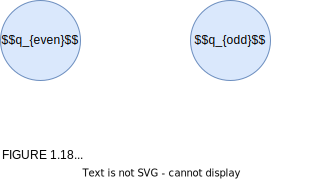

Introduction To The Theory Of Computation
=========================================

   

   https://github.com/gaurangsaini/sipser-computation-3rd-solutions
   https://math.mit.edu/~sipser/book.html
   https://math.mit.edu/~sipser/18404/
   https://www.amazon.com/Introduction-Theory-Computation-Michael-Sipser/dp/113318779X
   http://debracollege.dspaces.org/bitstream/123456789/671/1/Introduction%20to%20the%20Theory%20of%20Computation_2013%20Sipser.pdf

   This is an electronic version of the print textbook. Due to electronic rights restrictions,
   some third party content may be suppressed. Editorial review has deemed that any suppressed
   content does not materially affect the overall learning experience. The publisher reserves
   the right to remove content from this title at any time if subsequent rights restrictions
   require it. For valuable information on pricing, previous editions, changes to current editions,
   and alternate formats, please visit www.cengage.com/highered to search by ISBN#, author, title,
   or keyword for materials in your areas of interest.

   Copyright 2012 Cengage Learning. All Rights Reserved. May not be copied, scanned, or duplicated,
   in whole or in part. Due to electronic rights, some third party content may be suppressed from
   the eBook and/or eChapter(s). Editorial review has deemed that any suppressed content does not
   materially affect the overall learning experience. Cengage Learning reserves the right to
   remove additional content at any time if subsequent rights restrictions require it.

   Introduction to the Theory of Computation
   third Edition
   Michael Sipser

   Australia • Brazil • Japan • Korea • Mexico • Singapore • Spain • United Kingdom • United States

      Introduction to the Theory of
      Computation, Third Edition
      Michael Sipser
      Editor-in-Chief: Marie Lee
      Senior Product Manager:
      Alyssa Pratt
      Associate Product Manager:
      Stephanie Lorenz
      Content Project Manager:
      Jennifer Feltri-George
      Art Director: GEX Publishing Services
      Associate Marketing Manager:
      Shanna Shelton
      Cover Designer: Wing-ip Ngan,
      Ink design, inc
      Cover Image Credit: @Superstock

   © 2013 Cengage Learning

   ALL RIGHTS RESERVED. No part of this work covered by the
   copyright herein may be reproduced, transmitted, stored or used in any
   form or by any means graphic, electronic, or mechanical, including
   but not limited to photocopying, recording, scanning, digitizing,
   taping, Web distribution, information networks, or information storage
   and retrieval systems, except as permitted under Section 107 or 108
   of the 1976 United States Copyright Act, without the prior written
   permission of the publisher.States Copyright Act, without the prior
   written permission of the publisher.

    ┌──────────────────────────────────────────────────────────────────┐
    │ For product information and technology assistance, contact us at │
    │ Cengage Learning Customer & Sales Support,                       │
    │ 1-800-354-9706                                                   │
    │ For permission to use material from this text or product,        │
    │ submit all requests online at cengage.com/permissions            │
    │ Further permissions questions can be emailed to                  │
    │ permissionrequest@cengage.com                                    │
    └──────────────────────────────────────────────────────────────────┘

      Library of Congress Control Number: 2012938665
      ISBN-13: 978-1-133-18779-0
      ISBN-10: 1-133-18779-X

      Cengage Learning
      20 Channel Center Street
      Boston, MA 02210
      USA

   Cengage Learning is a leading provider of customized learning
   solutions with office locations around the globe, including Singapore, the
   United Kingdom, Australia, Mexico, Brazil, and Japan. Locate your
   local office at: international.cengage.com/region

   Cengage Learning products are represented in Canada by Nelson
   Education, Ltd.

   For your lifelong learning solutions, visit www.cengage.com

   Cengage Learning reserves the right to revise this publication and
   make changes from time to time in its content without notice.

   The programs in this book are for instructional purposes only.

   They have been tested with care, but are not guaranteed for any
   particular intent beyond educational purposes. The author and
   the publisher do not offer any warranties or representations,
   nor do they accept any liabilities with respect to the programs.

   Printed in the United States of America
   1 2 3 4 5 6 7 8 16 15 14 13 12

   **To Ina, Rachel, and Aaron**

MIT 18.404J Theory of Computation | Fall 2020 | Undergraduate, Graduate
=======================================================================

   https://ocw.mit.edu/courses/18-404j-theory-of-computation-fall-2020/pages/syllabus/  
   MIT18.404 Theory of Computation - Michael Sipser https://www.bilibili.com/video/BV1uE1BY5Eaa/  

   **Syllabus**

   **Course Meeting Times**
   Lectures: 2 sessions / week, 1.5 hours / session
   Recitations: 1 session / week, 1 hour / session

   **Prerequisites**
   6.042J Mathematics for Computer Science
   18.200 Principles of Discrete Applied Mathematics

   **Course Description**
   This course emphasizes computability and computational complexity theory.
   Topics include regular and context-free languages, decidable and undecidable
   problems, reducibility, recursive function theory, time and space measures on
   computation, completeness, hierarchy theorems, inherently complex problems,
   oracles, probabilistic computation, and interactive proof systems.

   **Course Outline**
   Automata and Language Theory (2 weeks)
   Finite automata, regular expressions, push-down automata, context-free grammars, pumping lemmas.

   Computability Theory (3 weeks)
   Turing machines, the Church-Turing thesis, decidability, the halting problem,
   reducibility, the recursion theorem.

   Complexity Theory (7 weeks)
   Time and space measures of complexity, complexity classes P, NP, L, NL, PSPACE,
   BPP and IP, complete problems, the P versus NP conjecture, quantifiers and games,
   hierarchy theorems, provably hard problems, relativized computation and oracles,
   probabilistic computation, interactive proof systems.

   **Online Course Format**
   This course is offered entirely online while the MIT campus is shut down due to
   the Covid-19 pandemic. Lectures are offered live online via Zoom. The lectures
   are also recorded for viewing at a later time to accomodate students who cannot
   participate in the live lectures due to time-zone differences or other reasons.
   Weekly TA-led recitations are offered both live online and in person, at various times.

   Following student recommendations, we can de-emphasize (but not eliminate) the
   midterm and final exams by adding graded live mini-quizzes for credit during
   the lectures, to be conducted via Zoom’s polling feature. For students viewing
   a recorded lecture, an alternate timed and graded recorded mini-quiz will be
   available, but it must be completed within 24 hours of the original live lecture.
   Students may chose whether to take the live mini-quiz or the recorded mini-quiz
   on a lecture-by-lecture basis, and if both are taken for any given lecture, the
   higher score will be used. We expect that all students will complete the exams
   and mini-quizzes on their own individually, without assistance from others.

   **Textbook**
   Sipser, Michael. Introduction to the Theory of Computation. 3rd ed. Cengage Learning, 2012.
   ISBN: 9781133187790.

   You may use the second edition, but it is missing some additional practice problems.
   Errata for 2nd edition of textbook.

   We will cover Chapters 1, 2 (except 2.4), 3, 4, 5, 6.1, 7, 8, 9.1, 9.2, 10.2
   (except the part on Primality), and 10.4 through Theorem 10.33.

   **Recitations**
   Recitations are primarily for going over lecture material in more detail with
   additional examples and for answering questions. Recitation attendance is optional,
   and you may attend any recitation you wish. BUT, if you are having trouble, we
   expect you to attend recitations weekly, and active participation may improve low grades.

   **Grading**

      ACTIVITIES	   PERCENTAGES
      Homework	      35%
      Quizzes	      25%
      Midterm Exam	15%
      Final Exam	   25%

   **Homework**
   35% of grade. There will be 6 biweekly problem sets. Cooperating on homework
   is allowed and may be helpful, but you are strongly encouraged to spend some
   time thinking about each problem yourself first. Solutions must be written up
   individually (not copied). Using course bibles or other outside or online
   materials is not permitted.

   **Quizzes**
   25% of grade. Given during each live lecture and following each recorded lecture.

   **Exams**
   One midterm (15% of grade) during a class session and one final exam (25% of grade)
   during finals week. The exams are both open book and open notes. You may only use
   the class textbook and notes you took in lectures and in recitation.

<a id=toc href=#toc>⋈TOC</a>

Contents
========

   *  [Preface to the First Edition](#Pxi)
      [To the student](#Pxi)
      [To the educator](#Pxii)
      [The first edition](#Pxiii)
      [Feedback to the author](#Pxiii)
      [Acknowledgments](#Pxiv)
   *  [Preface to the Second Edition](#Pxvii)
   *  [Preface to the Third Edition](#Pxxi)

   *  [0 Introduction](#P001)
      [0.1 Automata, Computability, and Complexity](#P001)
      | [Complexity theory](#P002)
      | [Computability theory](#P003)
      | [Automata theory](#P003)
      [0.2 Mathematical Notions and Terminology](#P003)
      | [Sets](#P003)
      | [Sequences and tuples](#P006)
      | [Functions and relations](#P007)
      | [Graphs](#P010)
      | [Strings and languages](#P013)
      | [Boolean logic](#P014)
      | [Summary of mathematical terms](#P016)
      [0.3 Definitions, Theorems, and Proofs](#P017)
      | [Finding proofs](#P017)
      [0.4 Types of Proof](#P021)
      | [Proof by construction](#P021)
      | [Proof by contradiction](#P021)
      | [Proof by induction](#P022)
      | [Exercises, Problems, and Solutions](#P025)

   [Part One: Automata and Languages](#P029)

   *  [1 Regular Languages](#P031)
      [1.1 Finite Automata](#P031)
      | [Formal definition of a finite automaton](#P035)
      | [Examples of finite automata](#P037)
      | [Formal definition of computation](#P040)
      | [Designing finite automata](#P041)
      | [The regular operations](#P044)
      [1.2 Nondeterminism](#P047)
      | [Formal definition of a nondeterministic finite automaton](#P053)
      | [Equivalence of NFAs and DFAs](#P054)
      | [Closure under the regular operations](#P058)
      [1.3 Regular Expressions](#P063)
      | [Formal definition of a regular expression](#P064)
      | [Equivalence with finite automata](#P066)
      [1.4 Nonregular Languages](#P077)
      | [The pumping lemma for regular languages](#P077)
      | [Exercises, Problems, and Solutions](#P082)

   *  [2 Context-Free Languages](#P101)
      [2.1 Context-Free Grammars](#P102)
      | [Formal definition of a context-free grammar](#P104)
      | [Examples of context-free grammars](#P105)
      | [Designing context-free grammars](#P106)
      | [Ambiguity](#P107)
      | [Chomsky normal form](#P108)
      [2.2 Pushdown Automata](#P111)
      | [Formal definition of a pushdown automaton](#P113)
      | [Examples of pushdown automata](#P114)
      | [Equivalence with context-free grammars](#P117)
      [2.3 Non-Context-Free Languages](#P125)
      | [The pumping lemma for context-free languages](#P125)
      [2.4 Deterministic Context-Free Languages](#P130)
      | [Properties of DCFLs](#P133)
      | [Deterministic context-free grammars](#P135)
      | [Relationship of DPDAs and DCFGs](#P146)
      | [Parsing and LR(k) Grammars](#P151)
      | [Exercises, Problems, and Solutions](#P154)

   [Part Two: Computability Theory](#P163)

   *  [3 The Church–Turing Thesis](#P165)
      [3.1 Turing Machines](#P165)
      | [Formal definition of a Turing machine](#P167)
      | [Examples of Turing machines](#P170)
      [3.2 Variants of Turing Machines](#P176)
      | [Multitape Turing machines](#P176)
      | [Nondeterministic Turing machines](#P178)
      | [Enumerators](#P180)
      | [Equivalence with other models](#P181)
      [3.3 The Definition of Algorithm](#P182)
      | [Hilbert’s problems](#P182)
      | [Terminology for describing Turing machines](#P184)
      | [Exercises, Problems, and Solutions](#P187)

   *  [4 Decidability](#P193)
      [4.1 Decidable Languages](#P194)
      | [Decidable problems concerning regular languages](#P194)
      | [Decidable problems concerning context-free languages](#P198)
      [4.2 Undecidability](#P201)
      | [The diagonalization method](#P202)
      | [An undecidable language](#P207)
      | [A Turing-unrecognizable language](#P209)
      | [Exercises, Problems, and Solutions](#P210)

   *  [5 Reducibility](#P215)
      [5.1 Undecidable Problems from Language Theory](#P216)
      | [Reductions via computation histories](#P220)
      [5.2 A Simple Undecidable Problem](#P227)
      [5.3 Mapping Reducibility](#P234)
      | [Computable functions](#P234)
      | [Formal definition of mapping reducibility](#P235)
      | [Exercises, Problems, and Solutions](#P239)

   *  [6 Advanced Topics in Computability Theory](#P245)
      [6.1 The Recursion Theorem](#P245)
      | [Self-reference](#P246)
      | [Terminology for the recursion theorem](#P249)
      | [Applications](#P250)
      [6.2 Decidability of logical theories](#P252)
      | [A decidable theory](#P255)
      | [An undecidable theory](#P257)
      [6.3 Turing Reducibility](#P260)
      [6.4 A Definition of Information](#P261)
      | [Minimal length descriptions](#P262)
      | [Optimality of the definition](#P266)
      | [Incompressible strings and randomness](#P267)
      | [Exercises, Problems, and Solutions](#P270)

   [Part Three: Complexity Theory](#P273)

   *  [7 Time Complexity](#P275)
      [7.1 Measuring Complexity](#P275)
      | [Big-O and small-o notation](#P276)
      | [Analyzing algorithms](#P279)
      | [Complexity relationships among models](#P282)
      [7.2 The Class P](#P284)
      | [Polynomial time](#P284)
      | [Examples of problems in P](#P286)
      [7.3 The Class NP](#P292)
      | [Examples of problems in NP](#P295)
      | [The P versus NP question](#P297)
      [7.4 NP-completeness](#P299)
      | [Polynomial time reducibility](#P300)
      | [Definition of NP-completeness](#P304)
      | [The Cook–Levin Theorem](#P304)
      [7.5 Additional NP-complete Problems](#P311)
      | [The vertex cover problem](#P312)
      | [The Hamiltonian path problem](#P314)
      | [The subset sum problem](#P319)
      | [Exercises, Problems, and Solutions](#P322)

   *  [8 Space Complexity](#P331)
      [8.1 Savitch’s Theorem](#P333)
      [8.2 The Class PSPACE](#P336)
      [8.3 PSPACE-completeness](#P337)
      | [The TQBF problem](#P338)
      | [Winning strategies for games](#P341)
      | [Generalized geography](#P343)
      [8.4 The Classes L and NL](#P348)
      [8.5 NL-completeness](#P351)
      | [Searching in graphs](#P353)
      [8.6 NL equals coNL](#P354)
      | [Exercises, Problems, and Solutions](#P356)

   *  [9 Intractability](#P363)
      [9.1 Hierarchy Theorems](#P364)
      | [Exponential space completeness](#P371)
      [9.2 Relativization](#P376)
      | [Limits of the diagonalization method](#P377)
      [9.3 Circuit Complexity](#P379)
      | [Exercises, Problems, and Solutions](#P388)

   *  [10 Advanced Topics in Complexity Theory](#P393)
      [10.1 Approximation Algorithms](#P393)
      [10.2 Probabilistic Algorithms](#P396)
      | [The class BPP](#P396)
      | [Primality](#P399)
      | [Read-once branching programs](#P404)
      [10.3 Alternation](#P408)
      | [Alternating time and space](#P410)
      | [The Polynomial time hierarchy](#P414)
      [10.4 Interactive Proof Systems](#P415)
      | [Graph nonisomorphism](#P415)
      | [Definition of the model](#P416)
      | [IP = PSPACE](#P418)
      [10.5 Parallel Computation](#P427)
      | [Uniform Boolean circuits](#P428)
      | [The class NC](#P430)
      | [P-completeness](#P432)
      [10.6 Cryptography](#P433)
      | [Secret keys](#P433)
      | [Public-key cryptosystems](#P435)
      | [One-way functions](#P435)
      | [Trapdoor functions](#P437)
      | [Exercises, Problems, and Solutions](#P439)
      | [Selected Bibliography](#P443)

   *  [Index](#P448)

<a id=Pxi href=#toc>⋈xi</a>

Preface To The First Edition
============================

To The Student
--------------

   Welcome!

   You are about to embark on the study of a fascinating and important subject:
   the theory of computation. It comprises the fundamental mathematical
   properties of computer hardware, software, and certain applications thereof. In
   studying this subject, we seek to determine what can and cannot be computed, how
   quickly, with how much memory, and on which type of computational model.
   The subject has obvious connections with engineering practice, and, as in many
   sciences, it also has purely philosophical aspects.

   I know that many of you are looking forward to studying this material but
   some may not be here out of choice. You may want to obtain a degree in
   computer science or engineering, and a course in theory is required—God knows
   why. After all, isn’t theory arcane, boring, and worst of all, irrelevant?
   To see that theory is neither arcane nor boring, but instead quite
   understandable and even interesting, read on. Theoretical computer science does have
   many fascinating big ideas, but it also has many small and sometimes dull details
   that can be tiresome. Learning any new subject is hard work, but it becomes
   easier and more enjoyable if the subject is properly presented. My primary
   objective in writing this book is to expose you to the genuinely exciting aspects of
   computer theory, without getting bogged down in the drudgery. Of course, the
   only way to determine whether theory interests you is to try learning it.

<a id=Pxii href=#toc>⋈xii</a>

   Theory is relevant to practice. It provides conceptual tools that
   practitioners use in computer engineering. Designing a new programming language for a
   specialized application? What you learned about grammars in this course comes
   in handy. Dealing with string searching and pattern matching? Remember finite
   automata and regular expressions. Confronted with a problem that seems to
   require more computer time than you can afford? Think back to what you learned
   about NP-completeness. Various application areas, such as modern cryptographic
   protocols, rely on theoretical principles that you will learn here.

   Theory also is relevant to you because it shows you a new, simpler, and more
   elegant side of computers, which we normally consider to be complicated
   machines. The best computer designs and applications are conceived with elegance
   in mind. A theoretical course can heighten your aesthetic sense and help you
   build more beautiful systems.

   Finally, theory is good for you because studying it expands your mind. Com-
   puter technology changes quickly. Specific technical knowledge, though useful
   today, becomes outdated in just a few years. Consider instead the abilities to
   think, to express yourself clearly and precisely, to solve problems, and to know
   when you haven’t solved a problem. These abilities have lasting value. Studying
   theory trains you in these areas.

   Practical considerations aside, nearly everyone working with computers is
   curious about these amazing creations, their capabilities, and their limitations. A
   whole new branch of mathematics has grown up in the past 30 years to answer
   certain basic questions. Here’s a big one that remains unsolved: If I give you a
   large number—say, with 500 digits—can you find its factors (the numbers that
   divide it evenly) in a reasonable a mount of time? Even using a super computer, no
   one presently knows how to do that in all cases within the lifetime of the universe!
   The factoring problem is connected to certain secret codes in modern
   cryptosystems. Find a fast way to factor, and fame is yours!

To The Educator
---------------

   This book is intended as an upper-level undergraduate or introductory
   graduate text in computer science theory. It contains a mathematical treatment of
   the subject, designed around theorems and proofs. I have made some effort to
   accommodate students with little prior experience in proving theorems, though
   more experienced students will have an easier time.

   My primary goal in presenting the material has been to make it clear and
   interesting. In so doing, I have emphasized intuition and “the big picture” in the
   subject over some lower level details.

   For example, even though I present the method of proof by induction in
   Chapter 0 along with other mathematical preliminaries, it doesn’t play an
   important role subsequently. Generally, I do not present the usual induction proofs
   of the correctness of various constructions concerning automata. If presented
   clearly, these constructions convince and do not need further argument. An
   induction may confuse rather than enlighten because induction itself is a rather
   sophisticated technique that many find mysterious. Belaboring the obvious with
   an induction risks teaching students that a mathematical proof is a formal
   manipulation instead of teaching them what is and what is not a cogent argument.

<a id=Pxiii href=#toc>⋈xiii</a>

   A second example occurs in Parts Two and Three, where I describe algorithms
   in prose instead of pseudocode. I don’t spend much time programming Turing
   machines (or any other formal model). Students today come with a
   programming background and find the Church–Turing thesis to be self-evident. Hence
   I don’t present lengthy simulations of one model by another to establish their
   equivalence.

   Besides giving extra intuition and suppressing some details, I give what might
   be called a classical presentation of the subject material. Most theorists will find
   the choice of material, terminology, and order of presentation consistent with
   that of other widely used textbooks. I have introduced original terminology in
   only a few places, when I found the standard terminology particularly obscure
   or confusing. For example, I introduce the term mapping reducibility instead of
   many–one reducibility.

   Practice through solving problems is essential to learning any
   mathematical subject. In this book, the problems are organized into two main categories
   called Exercises and Problems. The Exercises review definitions and concepts.
   The Problems require some ingenuity. Problems marked with a star are more
   difficult. I have tried to make the Exercises and Problems interesting challenges.

The First Edition
-----------------

   Introduction to the Theory of Computation first appeared as a Preliminary Edition
   in paperback. The first edition differs from the Preliminary Edition in several
   substantial ways. The final three chapters are new: Chapter 8 on space
   complexity; Chapter 9 on provable intractability; and Chapter 10 on advanced topics in
   complexity theory. Chapter 6 was expanded to include several advanced topics
   in computability theory. Other chapters were improved through the inclusion
   of additional examples and exercises.

   Comments from instructors and students who used the Preliminary Edition
   were helpful in polishing Chapters 0–7. Of course, the errors they reported have
   been corrected in this edition.

   Chapters 6 and 10 give a survey of several more advanced topics in
   computability and complexity theories. Theyare notintended tocompriseacohesive
   unit in the way that the remaining chapters are. These chapters are included to
   allowthe instructor to select optionaltopicsthat may be of interest to the serious
   student. The topics themselves range widely. Some, such as Turing reducibility
   and alternation, are direct extensions of other concepts in the book. Others, such
   as decidable logical theories and cryptography, are brief introductions to large fields.

Feedback To The Author
----------------------

   The internet provides new opportunities for interaction between authors and
   readers. I have received much e-mail offering suggestions, praise, and criticism,
   andreporting errors for thePreliminary Edition. Please continuetocorrespond!

<a id=Pxiv href=#toc>⋈xiv</a>

   I try to respond to each message personally, as time permits. The e-mail address
   for correspondence related to this book is

                           sipserbook@math.mit.edu.

   A web site that contains a list of errata is maintained. Other material may be
   added to that site to assist instructors and students. Let me know what you
   would like to see there. The location for that site is
   http://math.mit.edu/~sipser/book.html.

Acknowledgments
---------------

   I could not have written this book without the help of many friends, colleagues,
   and my family.

   I wish to thank the teachers who helped shape my scientific viewpoint and
   educational style. Five of them stand out. My thesis advisor, Manuel Blum, is
   due a special note for his unique way of inspiring students through clarity of
   thought, enthusiasm, and caring. He is a model for me and for many others.
   I am grateful to Richard Karp for introducing me to complexity theory, to John
   Addison for teaching me logic and assigning those wonderful homework sets,
   to Juris Hartmanis for introducing me to the theory of computation, and to my
   father for introducing me to mathematics, computers, and the art of teaching.

   This book grew out of notes from a course that I have taught at MIT for
   the past 15 years. Students in my classes took these notes from my lectures. I
   hope they will forgive me for not listing them all. My teaching assistants over
   the years—Avrim Blum, Thang Bui, Benny Chor, Andrew Chou, Stavros Cos-
   madakis, Aditi Dhagat, Wayne Goddard, Parry Husbands, Dina Kravets, Jakov
   Kučan, Brian O’Neill, Ioana Popescu, and Alex Russell—helped me to edit and
   expand these notes and provided some of the homework problems.

   Nearly three years ago, Tom Leighton persuaded me to write a textbook on
   the theory of computation. I had been thinking of doing so for some time, but
   it took Tom’s persuasion to turn theory into practice. I appreciate his generous
   advice on book writing and on many other things.

   I wish to thank Eric Bach, Peter Beebee, Cris Calude, Marek Chrobak, Anna
   Chefter, Guang-Ien Cheng, Elias Dahlhaus, Michael Fischer, Steve Fisk, Lance
   Fortnow, Henry J. Friedman, Jack Fu, Seymour Ginsburg, Oded Goldreich,
   Brian Grossman, David Harel, Micha Hofri, Dung T. Huynh, Neil Jones, H.
   Chad Lane, Kevin Lin, Michael Loui, Silvio Micali, Tadao Murata, Chris-
   tos Papadimitriou, Vaughan Pratt, Daniel Rosenband, Brian Scassellati, Ashish
   Sharma, Nir Shavit, Alexander Shen, Ilya Shlyakhter, Matt Stallmann, Perry
   Susskind, Y. C. Tay, Joseph Traub, Osamu Watanabe, Peter Widmayer, David
   Williamson, Derick Wood, and Charles Yang for comments, suggestions, and
   assistance as the writing progressed.

<a id=Pxv href=#toc>⋈xv</a>

   The following people provided additional comments that have improved
   this book: Isam M. Abdelhameed, Eric Allender, Shay Artzi, Michelle Ather-
   ton, Rolfe Blodgett, Al Briggs, Brian E. Brooks, Jonathan Buss, Jin Yi Cai,
   Steve Chapel, David Chow, Michael Ehrlich, Yaakov Eisenberg, Farzan Fallah,
   Shaun Flisakowski,Hjalmtyr Hafsteinsson, C. R. Hale, MauriceHerlihy, Vegard
   Holmedahl, Sandy Irani, Kevin Jiang, Rhys Price Jones, James M. Jowdy, David
   M. Martin Jr., Manrique Mata-Montero, Ryota Matsuura, Thomas Minka,
   Farooq Mohammed, Tadao Murata, Jason Murray, Hideo Nagahashi, Kazuo
   Ohta, ConstantinePapageorgiou, JosephRaj, Rick Regan, Rhonda A. Reumann,
   Michael Rintzler, Arnold L. Rosenberg, Larry Roske, Max Rozenoer, Walter L.
   Ruzzo, Sanatan Sahgal, Leonard Schulman, Steve Seiden, Joel Seiferas, Ambuj
   Singh, David J. Stucki, Jayram S. Thathachar, H. Venkateswaran, Tom Whaley,
   Christopher Van Wyk, Kyle Young, and Kyoung Hwan Yun.

   Robert Sloan used an early version of the manuscript for this book in a class
   that he taught and provided me with invaluable commentary and ideas from
   his experience with it. Mark Herschberg, Kazuo Ohta, and Latanya Sweeney
   read over parts of the manuscript and suggested extensive improvements. Shafi
   Goldwasser helped me with material in Chapter 10.

   I received expert technical support from William Baxter at Superscript, who
   wrote the LaTeX macro package implementing the interior design, and from
   Larry Nolan at the MIT mathematics department, who keeps things running.
   It has been a pleasure to work with the folks at PWS Publishing in
   creating the final product. I mention Michael Sugarman, David Dietz, Elise Kaiser,
   Monique Calello, Susan Garland and Tanja Brull because I have had the most
   contactwith them, but I knowthat many others have been involved, too. Thanks
   to Jerry Moore for the copy editing, to Diane Levy for the cover design, and to
   Catherine Hawkes for the interior design.

   I am grateful to the National Science Foundation for support provided under
   grant CCR-9503322.

   My father, Kenneth Sipser, and sister, Laura Sipser, converted the book
   diagrams into electronic form. My other sister, Karen Fisch, saved us in various
   computer emergencies, and my mother, JustineSipser, helped outwith motherly
   advice. I thank them for contributing under difficult circumstances, including
   insane deadlines and recalcitrant software.

   Finally, my love goes to my wife, Ina, and my daughter, Rachel. Thanks for
   putting up with all of this.

      Cambridge, Massachusetts                                    Michael Sipser
      October, 1996

<a id=Pxvii href=#toc>⋈xvii</a>

Perface To The Second Edition
=============================

   Judging from the email communications that I’ve received from so many of you,
   the biggest deficiency of the first edition is that it provides no sample solutions
   to any of the problems. So here they are. Every chapter now contains a new
   Selected Solutions section that gives answers to a representative cross-section of
   that chapter’s exercises and problems. To make up for the loss of the solved
   problems as interesting homework challenges, I’ve also added a variety of new
   problems. Instructors may request an Instructor’s Manual that contains
   additional solutionsby contacting the sales representative for their region designated
   at www.course.com.

   A number of readers would have liked more coverage of certain “standard”
   topics, particularly the Myhill–Nerode Theorem and Rice’s Theorem. I’ve
   partially accommodatedthese readers by developing these topicsin thesolved
   problems. I didnot includethe Myhill–Nerode Theorem in the main bodyof thetext
   because I believe that this course should provide only an introduction to finite
   automata and not a deep investigation. In my view, the role of finite automata
   here is for studentsto explore a simple formal model of computationas a prelude
   to more powerful models, and to provide convenient examples for subsequent
   topics. Of course, some people would prefer a more thorough treatment, while
   others feel that I ought to omit all references to (or at least dependence on) finite
   automata. I did not include Rice’s Theorem in the main bodyof the text because,
   though it can be a useful “tool” for proving undecidability, some students might
   use it mechanically without really understanding what is going on. Using
   reductions instead, for proving undecidability, gives more valuable preparation for the
   reductions that appear in complexity theory.

   I am indebted to my teaching assistants—Ilya Baran, Sergi Elizalde, Rui Fan,
   Jonathan Feldman, Venkatesan Guruswami, Prahladh Harsha, Christos Kapout-
   sis, Julia Khodor, Adam Klivans, Kevin Matulef, Ioana Popescu, April Rasala,
   Sofya Raskhodnikova, and Iuliu Vasilescu—who helped me to craft some of
   the new problems and solutions. Ching Law, Edmond Kayi Lee, and Zulfikar
   Ramzan also contributed to the solutions. I thank Victor Shoup for coming up
   with a simple way to repair the gap in the analysis of the probabilistic primality
   algorithm that appears in the first edition.

   I appreciate the efforts of the people at Course Technology in pushing me
   and the other parts of this project along, especially Alyssa Pratt and Aimee
   Poirier. Many thanks to Gerald Eisman, Weizhen Mao, Rupak Majumdar,
   Chris Umans, and Christopher Wilson for their reviews. I’m indebted to Jerry
   Moore for his superb job copy editing and to Laura Segel of ByteGraphics
   (lauras@bytegraphics.com)for her beautiful rendition of the figures.

   The volume of email I’ve received has been more than I expected. Hearing
   from so many of youfrom so many places has been absolutelydelightful, and I’ve
   tried to respond to all eventually—my apologies for those I missed. I’ve listed
   here the people who made suggestions that specifically affected this edition, but
   I thank everyone for their correspondence:

   Luca Aceto, Arash Afkanpour, Rostom Aghanian, Eric Allender, Karun Bak-
   shi, Brad Ballinger, Ray Bartkus, Louis Barton, Arnold Beckmann, Mihir Bel-
   lare, Kevin Trent Bergeson, Matthew Berman, Rajesh Bhatt, Somenath Biswas,
   Lenore Blum, Mauro A. Bonatti, Paul Bondin, Nicholas Bone, Ian Bratt, Gene
   Browder, Doug Burke, Sam Buss, Vladimir Bychkovsky, Bruce Carneal, Soma
   Chaudhuri, Rong-Jaye Chen, Samir Chopra, Benny Chor, John Clausen, Alli-
   son Coates, Anne Condon, Jeffrey Considine, John J. Crashell, Claude Crepeau,
   Shaun Cutts, Susheel M. Daswani, Geoff Davis, Scott Dexter, Peter Drake,
   Jeff Edmonds, Yaakov Eisenberg, Kurtcebe Eroglu, Georg Essl, Alexander T.
   Fader, Farzan Fallah, Faith Fich, Joseph E. Fitzgerald, Perry Fizzano, David
   Ford, Jeannie Fromer, Kevin Fu, Atsushi Fujioka, Michel Galley, K. Gane-
   san, Simson Garfinkel, Travis Gebhardt, Peymann Gohari, Ganesh Gopalakr-
   ishnan, Steven Greenberg, Larry Griffith, Jerry Grossman, Rudolf de Haan,
   Michael Halper, Nick Harvey, Mack Hendricks, Laurie Hiyakumoto, Steve
   Hockema, Michael Hoehle, Shahadat Hossain, Dave Isecke, Ghaith Issa, Raj D.
   Iyer, Christian Jacobi, Thomas Janzen, Mike D. Jones, Max Kanovitch, Aaron
   Kaufman, Roger Khazan, Sarfraz Khurshid, Kevin Killourhy, Seungjoo Kim,
   Victor Kuncak, Kanata Kuroda, Thomas Lasko, Suk Y. Lee, Edward D. Leg-
   enski, Li-Wei Lehman, Kong Lei, Zsolt Lengvarszky, Jeffrey Levetin, Baekjun
   Lim, Karen Livescu, Stephen Louie, TzerHung Low, Wolfgang Maass, Arash
   Madani, Michael Manapat, Wojciech Marchewka, David M. Martin Jr., Anders
   Martinson, Lyle McGeoch, Alberto Medina, Kurt Mehlhorn, Nihar Mehta, Al-
   bert R. Meyer, Thomas Minka, Mariya Minkova, Daichi Mizuguchi, G. Allen
   Morris III, Damon Mosk-Aoyama, Xiaolong Mou, Paul Muir, German Muller,
   Donald Nelson, Gabriel Nivasch, Mary Obelnicki, Kazuo Ohta, Thomas M.
   Oleson, Jr., Curtis Oliver, Owen Ozier, Rene Peralta, Alexander Perlis, Holger
   Petersen, Detlef Plump, Robert Prince, David Pritchard, Bina Reed, Nicholas
   Riley, Ronald Rivest, Robert Robinson, Christi Rockwell, Phil Rogaway, Max
   Rozenoer, John Rupf, Teodor Rus, Larry Ruzzo, Brian Sanders, Cem Say, Kim
   Schioett, Joel Seiferas, Joao Carlos Setubal, Geoff Lee Seyon, Mark Skandera,
   Bob Sloan, Geoff Smith, Marc L. Smith, Stephen Smith, Alex C. Snoeren, Guy
   St-Denis, Larry Stockmeyer, Radu Stoleru, David Stucki, Hisham M. Sueyllam,
   Kenneth Tam, Elizabeth Thompson, Michel Toulouse, Eric Tria, Chittaranjan
   Tripathy, Dan Trubow, Hiroki Ueda, Giora Unger, Kurt L. Van Etten, Jesir
   Vargas, Bienvenido Velez-Rivera, Kobus Vos, Alex Vrenios, Sven Waibel, Marc
   Waldman, Tom Whaley, Anthony Widjaja, Sean Williams, Joseph N. Wilson,
   Chris Van Wyk, Guangming Xing, Vee Voon Yee, Cheng Yongxi, Neal Young,
   Timothy Yuen, Kyle Yung, Jinghua Zhang, Lilla Zollei.

<a id=Pxix href=#toc>⋈xix</a>

   I thank Suzanne Balik, Matthew Kane, Kurt L. Van Etten, Nancy Lynch,
   Gregory Roberts, and Cem Say for pointing out errata in the first printing.
   Most of all, I thank my family—Ina, Rachel, and Aaron—for their patience,
   understanding, and love as I sat for endless hours here in front of my computer
   screen.

      Cambridge, Massachusetts                                    Michael Sipser
      December, 2004

<a id=Pxx href=#toc>⋈xx</a>

<a id=Pxxi href=#toc>⋈xxi</a>

Preface To The Third Edition
============================

   The third edition contains an entirely new section on deterministic context-free
   languages. I chose this topic for several reasons. First of all, it fills an obvious
   gap in my previous treatment of the theory of automata and languages. The
   older editions introduced finite automata and Turing machines in deterministic
   and nondeterministic variants, but covered only the nondeterministic variant of
   pushdown automata. Adding a discussion of deterministic pushdown automata
   provides a missing piece of the puzzle.

   Second, the theory of deterministic context-free grammars is the basis for
   LR(k) grammars, an important and nontrivial application of automata theory in
   programming languages and compiler design. This application brings together
   several key concepts, including the equivalence of deterministic and
   nondeterministic finite automata, and the conversions between context-free grammars
   and pushdown automata, to yield an efficient and beautiful method for parsing.
   Here we have a concrete interplay between theory and practice.

   Last, this topic seems underserved in existing theory textbooks, considering
   its importance as a genuine applicationof automatatheory. I studied LR(k)
   grammars years ago but without fully understanding how they work, and without
   seeing hownicely they fitintothetheory ofdeterministiccontext-free languages.
   My goal in writing this section is to give an intuitive yet rigorous introduction
   to this area for theorists as well as practitioners, and thereby contribute to its
   broader appreciation. One note of caution, however: Some of the material in
   this section is rather challenging, so an instructor in a basic first theory course
   may prefer to designate it as supplementary reading. Later chapters do not
   depend on this material.

<a id=Pxxii href=#toc>⋈xxii</a>

   Many people helped directly or indirectly in developing this edition. I’m
   indebted to reviewers Christos Kapoutsisand Cem Say who read a draft of the new
   sectionand providedvaluablefeedback. Several individualsat Cengage Learning
   assisted with the production, notably Alyssa Pratt and Jennifer Feltri-George.
   Suzanne Huizenga copyedited the text and Laura Segel of ByteGraphics created
   the new figures and modified some of the older figures.

   I wish to thank my teaching assistants at MIT, Victor Chen, Andy Drucker,
   Michael Forbes, Elena Grigorescu, Brendan Juba, Christos Kapoutsis, Jon Kel-
   ner, Swastik Kopparty, Kevin Matulef, Amanda Redlich, Zack Remscrim, Ben
   Rossman, Shubhangi Saraf, and Oren Weimann. Each of them helped me by
   discussing new problems and their solutions, and by providing insight into how
   well our students understood the course content. I’ve greatly enjoyed working
   with such talented and enthusiastic young people.

   It has been gratifying to receive email from around the globe. Thanks to all
   for your suggestions, questions, and ideas. Here is a list of those correspondents
   whose comments affected this edition:

   Djihed Afifi, Steve Aldrich, Eirik Bakke, Suzanne Balik, Victor Bandur, Paul
   Beame, Elazar Birnbaum, Goutam Biswas, Rob Bittner, Marina Blanton, Rod-
   ney Bliss, Promita Chakraborty, Lewis Collier, Jonathan Deber, Simon Dex-
   ter, Matt Diephouse, Peter Dillinger, Peter Drake, Zhidian Du, Peter Fe-
   jer, Margaret Fleck, Atsushi Fujioka, Valerio Genovese, Evangelos Georgiadis,
   Joshua Grochow, Jerry Grossman, Andreas Guelzow, Hjalmtyr Hafsteinsson,
   Arthur Hall III, Cihat Imamoglu, Chinawat Isradisaikul, Kayla Jacobs, Flem-
   ming Jensen, Barbara Kaiser, Matthew Kane, Christos Kapoutsis, Ali Durlov
   Khan, Edwin Sze Lun Khoo, Yongwook Kim, Akash Kumar, Eleazar Leal, Zsolt
   Lengvarszky, Cheng-Chung Li, Xiangdong Liang, Vladimir Lifschitz, Ryan
   Lortie, Jonathan Low, Nancy Lynch, Alexis Maciel, Kevin Matulef, Nelson
   Max, Hans-Rudolf Metz, Mladen Mikˆ sa, Sara Miner More, Rajagopal Nagara-
   jan, Marvin Nakayama, JonasNyrup, Gregory Roberts, Ryan Romero, Santhosh
   Samarthyam, Cem Say, Joel Seiferas, John Sieg, Marc Smith, John Steinberger,
   Nuri Tas ¸demir, Tamir Tassa, Mark Testa, Jesse Tjang, John Trammell, Hi-
   roki Ueda, Jeroen Vaelen, Kurt L. Van Etten, Guillermo Vázquez, Phanisekhar
   Botlaguduru Venkata, Benjamin Bing-Yi Wang, Lutz Warnke, David Warren,
   Thomas Watson, Joseph Wilson, David Wittenberg, Brian Wongchaowart, Kis-
   han Yerubandi, Dai Yi.

   Above all, I thank my family—my wife, Ina, and our children, Rachel and
   Aaron. Time is finite and fleeting. Your love is everything.

      Cambridge, Massachusetts                                    Michael Sipser
      April, 2012

<a id=P001 href=#c00toc>⋈1</a>

Chapter 0 Introduction
======================

   We begin with an overview of those areas in the theory of computation that
   we present in this course. Following that, you’ll have a chance to learn and/or
   review some mathematical concepts that you will need later.

0.1 Automata, Computability, And Complexity
-------------------------------------------

   This book focuses on three traditionally central areas of the theory of
   computation: automata, computability, and complexity. They are linked by the question:

   What are the fundamental capabilities and limitations of computers?

   This question goes back to the 1930s when mathematical logicians first began
   to explore the meaning of computation. Technological advances since that time
   have greatly increased our ability to compute and have brought this question out
   of the realm of theory into the world of practical concern.

   In each of the three areas—automata, computability, and complexity—this
   question is interpreted differently, and the answers vary according to the
   interpretation. Following this introductory chapter, we explore each area in a
   separate part of this book. Here, we introduce these parts in reverse order
   because by starting from the end you can better understand the reason for the
   beginning.

<a id=P002 href=#toc>⋈2</a>

Complexity Theory
-----------------

   Computer problems come in different varieties; some are easy, and some are
   hard. For example, the sorting problem is an easy one. Say that you need to
   arrange a list of numbers in ascending order. Even a small computer can sort
   a million numbers rather quickly. Compare that to a scheduling problem. Say
   that you must find a schedule of classes for the entire university to satisfy some
   reasonable constraints, such as that no two classes take place in the same room
   at the same time. The scheduling problem seems to be much harder than the
   sorting problem. If you have just a thousand classes, finding the best schedule
   may require centuries, even with a supercomputer.

   What makes some problems computationally hard and others easy?

   This is the central question of complexity theory. Remarkably, we don’t know
   the answer to it, though it has been intensively researched for over 40 years.
   Later, we explore this fascinating question and some of its ramifications.

   In one important achievement of complexity theory thus far, researchers have
   discovered an elegant scheme for classifying problems according to their computational
   difficulty. It is analogous to the periodic table for classifying elements
   according to their chemical properties. Using this scheme, we can demonstrate
   a method for giving evidence that certain problems are computationally hard,
   even if we are unable to prove that they are.

   You have several options when you confront a problem that appears to be
   computationally hard. First, by understanding which aspect of the problem is at
   the root of the difficulty, you may be able to alter it so that the problem is more
   easily solvable. Second, you may be able to settle for less than a perfect solution
   to the problem. In certain cases, finding solutions that only approximate the
   perfect one is relatively easy. Third, some problems are hard only in the worst
   case situation, but easy most of the time. Depending on the application, you may
   be satisfied with a procedure that occasionally is slow but usually runs quickly.
   Finally, you may consider alternative types of computation, such as randomized
   computation, that can speed up certain tasks.

   One applied area that has been affected directly by complexity theory is the
   ancient field of cryptography. In most fields, an easy computational problem is
   preferable to a hard one because easy ones are cheaper to solve. Cryptography
   is unusual because it specifically requires computational problems that are hard,
   rather than easy. Secret codes should be hard to break without the secret key
   or password. Complexity theory has pointed cryptographers in the direction of
   computationally hard problems around which they have designed revolutionary
   new codes.

<a id=P003 href=#toc>⋈3</a>

Computability Theory
--------------------

   During the first half of the twentieth century, mathematicians such as Kurt
   Gödel, Alan Turing, and Alonzo Church discovered that certain basic problems
   cannot be solved by computers. One example of this phenomenon is the
   problem of determining whether a mathematical statement is true or false. This task
   is the bread and butter of mathematicians. It seems like a natural for solution
   by computer because it lies strictly within the realm of mathematics. But no
   computer algorithm can perform this task.

   Among the consequences of this profound result was the development of ideas
   concerning theoretical models of computers that eventually would help lead to
   the construction of actual computers.

   The theories of computability and complexity are closely related. In complexity
   theory, the objective is to classify problems as easy ones and hard ones;
   whereas in computability theory, the classification of problems is by those that
   are solvable and those that are not. Computability theory introduces several of
   the concepts used in complexity theory.

Automata Theory
---------------

   Automata theory deals with the definitions and properties of mathematical
   models of computation. These models play a role in several applied areas of computer
   science. One model, called the finite automaton, is used in text processing,
   compilers, and hardware design. Another model, called the context-free grammar, is
   used in programming languages and artificial intelligence.

   Automata theory is an excellent place to begin the study of the theory of
   computation. The theories of computability and complexity require a precise
   definition of a computer. Automata theory allows practice with formal definitions
   of computation as it introduces concepts relevant to other nontheoretical areas
   of computer science.

0.2 Mathematical Notions And Terminology
----------------------------------------

   As in any mathematical subject, we begin with a discussion of the basic
   mathematical objects, tools, and notation that we expect to use.

SETS
----

   A set is a group of objects represented as a unit. Sets may contain any type of
   object, including numbers, symbols, and even other sets. The objects in a set are
   called its **elements** or **members**. Sets may be described formally in several ways.

<a id=P004 href=#toc>⋈4</a>

   One way is by listing a set’s elements inside braces. Thus the set

      S = {7,21,57}

   contains the elements 7, 21, and 57. The symbols ∈ and $ \notin $ denote set
   membership and nonmembership. We write 7 ∈ {7,21,57} and 8 ∉ {7,21,57}. For two
   sets A and B, we say that A is a **subset** of B, written A ⊆ B, if every member of
   A also is a member of B. We say that A is a **proper subset** of B, written A ⊊ B,
   if A is a subset of B and not equal to B.

   The order of describing a set doesn’t matter, nor does repetition of its
   members. We get the same set S by writing {57,7,7,7,21}. If we do want to take the
   number of occurrences of members into account, we call the group a **multiset**
   instead of a set. Thus {7} and {7,7} are different as multisets but identical as
   sets. An **infinite set** contains infinitely many elements. We cannot write a list of
   all the elements of an infinite set, so we sometimes use the “...” notation to mean
   “continue the sequence forever.” Thus we write the set of **natural numbers** 𝒩 as

      {1,2,3,...}.

   The set of integers Z is written as

      {...,−2,−1,0,1,2,...}.

   The set with zero members is called the **empty set** and is written ∅. A set with
   one member is sometimes called a **singleton set**, and a set with two members is
   called an **unordered pair**.

   When we want to describe a set containing elements according to some rule,
   we write {n|rule about n}. Thus {n|n = $ m^2 $ for some m ∈ 𝒩} means the set of
   perfect squares.

   If we have two sets A and B, the **union** of A and B, written A∪B, is the set we
   get by combining all the elements in A and B into a single set. The **intersection**
   of A and B, written A ∩ B, is the set of elements that are in both A and B. The
   **complement** of A, written $ \overline{A} $, is the set of all elements under consideration that
   are not in A.

   As is often the case in mathematics, a picture helps clarify a concept. For sets,
   we use a type of picture called a **Venn diagram**. It represents sets as regions
   enclosed by circular lines. Let the set START-t be the set of all English words
   that start with the letter “t”. For example, in the figure, the circle represents the
   set START-t. Several members of this set are represented as points inside the
   circle.

<a id=P005 href=#toc>⋈5</a>

     START-t
    ┌───────┐
    │ · ────┼───terrific
    │   · ──┼───tundra
    │     · ┼───theory
    └───────┘

   **FIGURE 0.1**         ┄┄┄┄┄┄┄┄┄┄┄┄┄┄┄┄┄┄┄┄┄┄┄┄┄┄┄┄┄┄┄┄┄┄┄┄┄┄┄┄┄┄┄┄┄┄┄┄┄┄┄┄┄┄  
   Venn diagram for the set of English words starting with “t”

   Similarly, we represent the set END-z of English words that end with “z” in
   the following figure.

     END-z
    ┌───────┐
    │ · ────┼───quartz
    │   · ──┼───jazz
    │     · ┼───razzmatazz
    └───────┘

   **FIGURE 0.2**         ┄┄┄┄┄┄┄┄┄┄┄┄┄┄┄┄┄┄┄┄┄┄┄┄┄┄┄┄┄┄┄┄┄┄┄┄┄┄┄┄┄┄┄┄┄┄┄┄┄┄┄┄┄┄  
   Venn diagram for the set of English words ending with “z”

   To represent both sets in the same Venn diagram, we must draw them so that
   they overlap, indicating thatthey share someelements, as shown in the following
   figure. For example, the word `topaz` is in both sets. The figure also contains a
   circle for the set START-j. It doesn’t overlap the circle for START-t because no
   word lies in both sets.

     START-t  END-z  START-j

         ┌────────────┐
    ┌────┼──┐      ┌──┼────┐
    │ ·  │  │      │ ·│    │
    │   ·│· │      │ ││·   │
    │    └┼──────────┼┘  · │
    └─────┼─┘      └─┼─────┘
          │          │
          │          │
         topaz     jazz

   **FIGURE 0.3**         ┄┄┄┄┄┄┄┄┄┄┄┄┄┄┄┄┄┄┄┄┄┄┄┄┄┄┄┄┄┄┄┄┄┄┄┄┄┄┄┄┄┄┄┄┄┄┄┄┄┄┄┄┄┄  
   Overlapping circles indicate common elements

<a id=P006 href=#toc>⋈6</a>

   The next two Venn diagrams depict the union and intersection of sets A
   and B.

         ┌───────┐                    ┌───────┐
         │·······│                    │       │
    ┌────│──┐····│ B             ┌────│──┐    │ B
    │····│··│····│               │    │··│    │
    │····└───────┘               │    └───────┘
    │·······│ A                  │       │ A
    └───────┘                    └───────┘
         (a)                        (b)

   **FIGURE 0.4**         ┄┄┄┄┄┄┄┄┄┄┄┄┄┄┄┄┄┄┄┄┄┄┄┄┄┄┄┄┄┄┄┄┄┄┄┄┄┄┄┄┄┄┄┄┄┄┄┄┄┄┄┄┄┄  
   Diagrams for (a) A ∪ B and (b) A ∩ B

Sequences And Tuples
--------------------

   A sequence of objects is a list of these objects in some order. We usually designate
   a sequence by writing the list within parentheses. For example, the sequence 7,
   21, 57 would be written

      (7,21,57).

   The order doesn’t matter in a set, but in a sequence it does. Hence (7,21,57) is
   not the same as (57,7,21). Similarly, repetition does matter in a sequence, but
   it doesn’t matter in a set. Thus (7,7,21,57) is different from both of the other
   sequences, whereas the set {7,21,57} is identical to the set {7,7,21,57}.

   As with sets, sequences may be finite or infinite. Finite sequences often are
   called **tuples**. A sequence with k elements is a **k-tuple**. Thus (7,21,57) is a
   3-tuple. A_2-tuple is also called an **ordered pair**.

   Sets and sequences may appear as elements of other sets and sequences. For
   example, the **power set** of A is the set of all subsets of A. If A is the set {0,1},
   the power set of A is the set {∅, {0}, {1}, {0,1}}. The set of all ordered pairs
   whose elements are 0s and 1s is {(0,0), (0,1), (1,0), (1,1)}.

   If A and B are two sets, the **Cartesian product** or **cross product** of A and
   B, written A × B, is the set of all ordered pairs wherein the first element is a
   member of A and the second element is a member of B.

   >  [!TIP]
      元组（Tuple）是一种常用的多数数据或多集合的组织形式，使用逗号作为分隔符号，使用圆括号包括多组
      有序的数据，有序性是元组与数组、列表区别之处。在编程语言中，元组是只读的数据结构，而数组可读写。

   >  [!TIP]
      **由集合 S 所有子集（包括空集）构成的集合就是 S 的幂集，记作 $ 2^S $。设集合 S = {a,b,c}，则其
      子集包括：空集 {}、全集 {a,b,c}，以及其它真子集，{a}, {b}, {c}, {a,b}, {a,c} 等等。
      所谓幂集（Power Set）就是原集合中所有的子集（包括全集和空集）构成的集族。可数集是最小的无限集，
      它的幂集和实数集一一对应（也称同势），是不可数集。集合的势（power of a set）是表征集合中元素
      “多少”的一个概念。设 X 是一个有限集，|X| = k，根据二项式定理，X 的幂集的势为 $ 2^k $。
      集合的基数（cardinal number）也是衡量一个集合元素“多少”的量。集合 S 的基数记作 |S| 或 card(S)。**

   **EXAMPLE 0.5**        ┄┄┄┄┄┄┄┄┄┄┄┄┄┄┄┄┄┄┄┄┄┄┄┄┄┄┄┄┄┄┄┄┄┄┄┄┄┄┄┄┄┄┄┄┄┄┄┄┄┄┄┄┄┄  
   If A = {1,2} and B = {x,y,z},

            A × B = {(1,x), (1,y), (1,z), (2,x), (2,y), (2,z)}.

   We can also take the Cartesian product of k sets, $ A_1 , A_2 , ... , A_k $ , written
   $ A_1 ×A_2 ×··· ×A_k $. It is the set consisting of all k-tuples $ (a_1 ,a_2 ,...,a_k ) $ where
   $ a_i ∈ A_i $ .

<a id=P007 href=#toc>⋈7</a>

   **EXAMPLE 0.6**        ┄┄┄┄┄┄┄┄┄┄┄┄┄┄┄┄┄┄┄┄┄┄┄┄┄┄┄┄┄┄┄┄┄┄┄┄┄┄┄┄┄┄┄┄┄┄┄┄┄┄┄┄┄┄  
   If A and B are as in Example 0.5,

      A × B × A = { (1,x,1), (1,x,2), (1,y,1), (1,y,2), (1,z,1), (1,z,2),
                    (2,x,1), (2,x,2), (2,y,1), (2,y,2), (2,z,1), (2,z,2) }.

   If we have the Cartesian product of a set with itself, we use the shorthand

              k
      ┌───────┴──────┐
      A × A × ··· × A = A^k.

   **EXAMPLE 0.7**        ┄┄┄┄┄┄┄┄┄┄┄┄┄┄┄┄┄┄┄┄┄┄┄┄┄┄┄┄┄┄┄┄┄┄┄┄┄┄┄┄┄┄┄┄┄┄┄┄┄┄┄┄┄┄  
   The set $ 𝒩^2 $ equals 𝒩 × 𝒩. It consists of all ordered pairs of natural numbers.
   We also may write it as {(i,j)| i,j ≥ 1}.

Functions And Relations
-----------------------

   Functions are central to mathematics. A **function** is an object that sets up an
   input–output relationship. A function takes an input and produces an output.
   In every function, the same input always produces the same output. If f is a
   function whose output value is b when the input value is a, we write

   $$ f(a) = b. $$

   A function also is called a **mapping**, and, if f(a) = b, we say that f maps a to b.

   For example, the absolute value function `abs` takes a number x as input and
   returns x if x is positive and −x if x is negative. Thus $ abs(2) = abs(−2) = 2 $.
   Addition is another example of a function, written add. The input to the
   addition function is an ordered pair of numbers, and the output is the sum of
   those numbers.

   The set of possible inputs to the function is called its **domain**. The outputs
   of a function come from a set called its **range**. The notation for saying that f is
   a function with domain D and range R is

   $$ f : D→R. $$

   In the case of the function `abs`, if we are working with integers, the domain and
   the range are 𝒵, so we write $ abs: 𝒵→𝒵 $. In the case of the addition function
   for integers, the domain is the set of pairs of integers 𝒵 × 𝒵 and the range is 𝒵,
   so we write $ add : 𝒵 × 𝒵→𝒵 $. Note that a function may not necessarily use all
   the elements of the specified range. The function `abs` never takes on the value
   −1 even though −1 ∈ 𝒵. A function that does use all the elements of the range
   is said to be **onto** the range.

<a id=P008 href=#toc>⋈8</a>

   We may describe a specific function in several ways. One way is with a
   procedure for computing an output from a specified input. Another way is with a
   table that lists all possible inputs and gives the output for each input.

   **EXAMPLE 0.8**        ┄┄┄┄┄┄┄┄┄┄┄┄┄┄┄┄┄┄┄┄┄┄┄┄┄┄┄┄┄┄┄┄┄┄┄┄┄┄┄┄┄┄┄┄┄┄┄┄┄┄┄┄┄┄  
   Consider the function f : {0,1,2,3,4}−→{0,1,2,3,4}.

       n │ f(n)
     ────┼──────
       0 │   1
       1 │   2
       2 │   3
       3 │   4
       4 │   0

   This functionadds1 toits inputand then outputstheresult modulo5. A number
   modulo m is the remainder after division by m. For example, the minute hand
   on a clock face counts modulo 60. When we do modular arithmetic, we define
   $ 𝒵_m $ = {0,1,2,...,m − 1}. With this notation, the aforementioned function f
   has the form $ f : 𝒵_5 $ → $ 𝒵_5 $.

   **EXAMPLE 0.9**        ┄┄┄┄┄┄┄┄┄┄┄┄┄┄┄┄┄┄┄┄┄┄┄┄┄┄┄┄┄┄┄┄┄┄┄┄┄┄┄┄┄┄┄┄┄┄┄┄┄┄┄┄┄┄  
   Sometimes a two-dimensional table is used if the domain of the function is the
   Cartesian product of two sets. Here is another function, $ g: 𝒵_4 × 𝒵_4 →𝒵_4 $. The
   entry at the row labeled i and the column labeled j in the table is the value of
   g(i,j).

     g │ 0  1 2 3
    ───┼──────────
     0 │ 0  1 2 3
     1 │ 1  2 3 0
     2 │ 2  3 0 1
     3 │ 3  0 1 2

   The function g is the addition function modulo 4.

   When the domain of a function f is $ A_1 ×···×A_k $ for some sets $ A_1 ,...,A_k $, the input
   to f is a k-tuple $ (a_1 ,a_2 ,...,a_k ) $ and we call the $ a_i $ the **arguments** to f. A
   function with k arguments is called a **k-ary function**, and k is called the **arity** of
   the function. If k is 1, f has a single argument and f is called a **unary function**.
   If k is 2, f is a **binary function**. Certain familiar binary functions are written
   in a special **infix notation**, with the symbol for the function placed between its
   two arguments, rather than in **prefix notation**, with the symbol preceding. For
   example, the addition function add usually is written in infix notation with
   the + symbol between its two arguments as in a + b instead of in prefix notation
   add(a,b).

<a id=P009 href=#toc>⋈9</a>

   A **predicate** or **property** is a function whose range is { TRUE , FALSE }. For
   example, let even be a property that is TRUE if its input is an even number and
   FALSE if its input is an odd number. Thus even(4) = TRUE and even(5) =
   FALSE .

   A property whose domain is a set of k-tuples A × ··· × A is called a **relation**,
   a **k-ary relation**, or **a k-ary relation on A**. A common case is a 2-ary relation,
   called a **binary relation**. When writing an expression involving a binary
   relation, we customarily use infix notation. For example, “less than” is a relation
   usually written with the infix operation symbol <. “Equality”, written with the
   = symbol, is another familiar relation. If R is a binary relation, the statement
   aRb means that aRb = TRUE . Similarly, if R is a k-ary relation, the statement
   $ R(a_1 ,...,a_k) $ means that $ R(a_1 ,...,a_k ) = TRUE  $.

   **EXAMPLE 0.10**       ┄┄┄┄┄┄┄┄┄┄┄┄┄┄┄┄┄┄┄┄┄┄┄┄┄┄┄┄┄┄┄┄┄┄┄┄┄┄┄┄┄┄┄┄┄┄┄┄┄┄┄┄┄┄  
   In a children’s game called Scissors–Paper–Stone, the two players simultaneously
   select a member of the set { SCISSORS , PAPER , STONE } and indicate their
   selections with hand signals. If the two selections are the same, the game starts over.
   If the selections differ, one player wins, according to the relation beats.

    beats     │  SCISSORS    PAPER    STONE
    ──────────┼────────────────────────────
    SCISSORS  │  FALSE       TRUE     FALSE
    PAPER     │  FALSE       FALSE    TRUE
    STONE     │  TRUE        FALSE    FALSE

   From this table we determine that SCISSORS beats PAPER is TRUE and that
   PAPER beats SCISSORS is FALSE .

   Sometimes describing predicates with sets instead of functions is more
   convenient. The predicate P : D−→{ TRUE , FALSE } may be written (D,S), where
   S = {a ∈ D| P(a) = TRUE }, or simply S if the domain D is obvious from the
   context. Hence the relation beats may be written

      {( SCISSORS , PAPER ), ( PAPER , STONE ), ( STONE , SCISSORS )}.

   A special type of binary relation, called an equivalence relation, captures the
   notion of two objects being equal in some feature. A binary relation R is an
   equivalence relation if R satisfies three conditions:

   1. R is **reflexive** if for every x, xRx;
   2. R is **symmetric** if for every x and y, xRy implies yRx; and
   3. R is **transitive** if for every x, y, and z, xRy and yRz implies xRz.

<a id=P010 href=#toc>⋈10</a>

   **EXAMPLE 0.11**       ┄┄┄┄┄┄┄┄┄┄┄┄┄┄┄┄┄┄┄┄┄┄┄┄┄┄┄┄┄┄┄┄┄┄┄┄┄┄┄┄┄┄┄┄┄┄┄┄┄┄┄┄┄┄  
   Define an equivalence relation on the natural numbers, written ≡ 7 . For i,j ∈ 𝒩,
   say that i ≡ 7 j, if i−j is a multiple of 7. This is an equivalence relation because it
   satisfies the three conditions. First, it is reflexive, as i−i = 0, which is a multiple
   of 7. Second, it is symmetric, as i − j is a multiple of 7 if j − i is a multiple of 7.
   Third, it is transitive, as whenever i − j is a multiple of 7 and j − k is a multiple
   of 7, then i − k = (i − j) + (j − k) is the sum of two multiples of 7 and hence a
   multiple of 7, too.

Graphs
------

   An undirected graph, or simply a graph, is a set of points with lines connecting
   some of the points. The points are called nodes or vertices, and the lines are
   called edges, as shown in the following figure.

               ┌───┐
               │ 1 │                         ┌───┐             ┌───┐
               └───┘                         │ 1 ├─────────────┤ 2 │
                /  \                         └─┬─┘\           /└─┬─┘
    ┌───┐      /    \      ┌───┐               │   \         /   │
    │ 3 │\─────/────\─────/│ 4 │               │     \     /     │
    └───┘  \  /      \  /  └───┘               │        \/       │
             \/      \/                        │       /  \      │
             / \    / \                        │    /       \    │
            /    \/    \                     ┌─┴─┐/           \┌─┴─┐
          ┌───┐/    \ ┌───┐                  │ 3 ├─────────────┤ 4 │
          │ 5 │       │ 2 │                  └───┘             └───┘
          └───┘       └───┘
                  (a)                                 (b)

   **FIGURE 0.12**        ┄┄┄┄┄┄┄┄┄┄┄┄┄┄┄┄┄┄┄┄┄┄┄┄┄┄┄┄┄┄┄┄┄┄┄┄┄┄┄┄┄┄┄┄┄┄┄┄┄┄┄┄┄┄  
   Examples of graphs

   The number of edges at a particular node is the **degree** of that node. In
   Figure 0.12(a), all the nodes have degree 2. In Figure 0.12(b), all the nodes have
   degree 3. No more than one edge is allowed between any two nodes. We may
   allow an edge from a nodeto itself, called a **self-loop**, depending on the situation.

   In a graph G that contains nodes i and j, the pair (i,j) represents the edge that
   connects i and j. The order of i and j doesn’t matter in an undirected graph,
   so the pairs (i,j) and (j,i) represent the same edge. Sometimes we describe
   undirected edges with unordered pairs using set notation as in {i,j}. If V is the
   set of nodes of G and E is the set of edges, we say G = (V,E). We can describe
   a graph with a diagram or more formally by specifying V and E. For example, a
   formal description of the graph in Figure 0.12(a) is

      ({1,2,3,4,5}, {(1,2), (2,3), (3,4), (4,5), (5,1)}),

<a id=P011 href=#toc>⋈11</a>

   and a formal description of the graph in Figure 0.12(b) is

      ({1,2,3,4}, {(1,2), (1,3), (1,4), (2,3), (2,4), (3,4)}) .

   Graphs frequently are used to represent data. Nodes might be cities and edges
   the connecting highways, or nodes might be people and edges the friendships
   between them. Sometimes, for convenience, we label the nodes and/or edges of
   a graph, which then is called a **labeled graph**. Figure 0.13 depicts a graph whose
   nodes are cities and whose edges are labeled with the dollar cost of the cheapest
   nonstop airfare for travel between those cities if flying nonstop between them is
   possible.

    ┌──────┐            ┌────────┐
    │ New  ├────────────┤ Ithaca │
    │ York │    98      └────────┘
    └──┬──┬┘
       │  │             ┌────────┐
       │  │             │ Oswego │
    109│  │             └────────┘
       │  │    378
       │  └──────┐   ┌───────────┐
    ┌──┴─────┐   └───┤ San       │
    │ Boston ├───────┤ Francisco │
    └────────┘ 378   └───────────┘

   **FIGURE 0.13**        ┄┄┄┄┄┄┄┄┄┄┄┄┄┄┄┄┄┄┄┄┄┄┄┄┄┄┄┄┄┄┄┄┄┄┄┄┄┄┄┄┄┄┄┄┄┄┄┄┄┄┄┄┄┄  
   Cheapest nonstop airfares between various cities

   We say that graph G is a **subgraph** of graph H if the nodes of G are a subset
   of the nodes of H, and the edges of G are the edges of H on the corresponding
   nodes. The following figure shows a graph H and a subgraph G.

   

   **FIGURE 0.14**        ┄┄┄┄┄┄┄┄┄┄┄┄┄┄┄┄┄┄┄┄┄┄┄┄┄┄┄┄┄┄┄┄┄┄┄┄┄┄┄┄┄┄┄┄┄┄┄┄┄┄┄┄┄┄  
   Graph G (shown darker) is a subgraph of H

<a id=P012 href=#toc>⋈12</a>

   A path in a graph is a sequence of nodes connected by edges. A simple path
   is a path that doesn’t repeat any nodes. A graph is connected if every two nodes
   have a path between them. A path is a cycle if it starts and ends in the same node.
   A simple cycle is one that contains at least three nodes and repeats only the first
   and last nodes. A graph is a tree if it is connected and has no simple cycles, as
   shown in Figure 0.15. A tree may contain a specially designated node called the
   root. The nodes of degree 1 in a tree, other than the root, are called the leaves
   of the tree.

   

   **FIGURE 0.15**        ┄┄┄┄┄┄┄┄┄┄┄┄┄┄┄┄┄┄┄┄┄┄┄┄┄┄┄┄┄┄┄┄┄┄┄┄┄┄┄┄┄┄┄┄┄┄┄┄┄┄┄┄┄┄  
   (a) A path in a graph, (b) a cycle in a graph, and (c) a tree

   A **directed graph** has arrows instead of lines, as shown in the following figure.
   The number of arrows pointing from a particular node is the **outdegree** of that
   node, and the number of arrows pointing to a particular node is the **indegree**.

   

   **FIGURE 0.16**        ┄┄┄┄┄┄┄┄┄┄┄┄┄┄┄┄┄┄┄┄┄┄┄┄┄┄┄┄┄┄┄┄┄┄┄┄┄┄┄┄┄┄┄┄┄┄┄┄┄┄┄┄┄┄  
   A directed graph

<a id=P013 href=#toc>⋈13</a>

   In a directed graph, we represent an edge from i to j as a pair (i,j). The
   formal description of a directed graph G is (V,E), where V is the set of nodes
   and E is the set of edges. The formal description of the graph in Figure 0.16 is

      ( {1,2,3,4,5,6}, {(1,2),(1,5),(2,1),(2,4),(5,4),(5,6),(6,1),(6,3)} ) .

   A path in which all the arrows point in the same direction as its steps is called a
   **directed path**. A directed graph is **strongly connected** if a directed path connects
   every two nodes. Directed graphs are a handy way of depicting binary relations.
   If R is a binary relation whose domain is D × D, a labeled graph G = (D,E)
   represents R, where E = {(x,y)| xRy}.

   **EXAMPLE 0.17**       ┄┄┄┄┄┄┄┄┄┄┄┄┄┄┄┄┄┄┄┄┄┄┄┄┄┄┄┄┄┄┄┄┄┄┄┄┄┄┄┄┄┄┄┄┄┄┄┄┄┄┄┄┄┄  
   The directed graph shown here represents the relation given in Example 0.10.

   

   **FIGURE 0.18**        ┄┄┄┄┄┄┄┄┄┄┄┄┄┄┄┄┄┄┄┄┄┄┄┄┄┄┄┄┄┄┄┄┄┄┄┄┄┄┄┄┄┄┄┄┄┄┄┄┄┄┄┄┄┄  
   The graph of the relation beats

Strings And Languages
---------------------

   Strings of characters are fundamental building blocks in computer science. The
   alphabet over which the strings are defined may vary with the application. For
   ourpurposes, we define an **alphabet** to be any nonempty finite set. The members
   of the alphabet are the **symbols** of the alphabet. We generally use capital Greek
   letters Σ and Γ to designate alphabets and a typewriter font for symbols from an
   alphabet. The following are a few examples of alphabets.

   $ Σ_1 $ = {0,1}
   $ Σ_2 $ = {a,b,c,d,e,f,g,h,i,j,k,l,m,n,o,p,q,r,s,t,u,v,w,x,y,z}
   Γ = {0,1,x,y,z}

<a id=P014 href=#toc>⋈14</a>

   A **string over an alphabet** is a finite sequence of symbols from that alphabet,
   usually written next to one another and not separated by commas. If $ Σ_1 $ = {0,1},
   then `01001` is a string over $ Σ_1 $ . If $ Σ_2 $ = {a,b,c,...,z}, then `abracadabra` is a
   string over $ Σ_2 $ . If w is a string over Σ, the **length** of w, written |w|, is the number
   of symbols that it contains. The string of length zero is called the **empty string**
   and is written ε. The empty string plays the role of 0 in a number system. If w
   has length n, we can write w = $ w_1 w_2 ···w_n $ where each w i ∈ Σ. The **reverse**
   of w, written $ w^R $, is the string obtained by writing w in the opposite order (i.e.,
   $ w_n w_n−1 ···w_1 $). String z is a **substring** of w if z appears consecutively within w.
   For example, `cad` is a substring of `abracadabra`.

   If we have string x of length m and string y of length n, the **concatenation**
   of x and y, written xy, is the string obtained by appending y to the end of x, as
   in $ x_1 ···x_m y_1 ···y_n $. To concatenate a string with itself many times, we use the
   superscript notation $ x^k $ to mean

       k
    ┌──┴──┐
    xx···x.

   The **lexicographic order** of strings is the same as the familiar dictionary order.
   We’ll occasionally use a modified lexicographic order, called **shortlex order** or
   simply **string order**, that is identical to lexicographic order, except that shorter
   strings precede longer strings. Thus the string ordering of all strings over the
   alphabet {0,1} is

      (ε,0,1,00,01,10,11,000,...).

   Say that string x is a **prefix** of string y if a string z exists where xz = y, and that
   x is a **proper prefix** of y if in addition x 6= y. A **language** is a set of strings. A
   language is **prefix-free** if no member is a proper prefix of another member.

Boolean Logic
-------------

   Boolean logic is a mathematical system built around the two values TRUE and
   FALSE . Though originally conceived of as pure mathematics, this system is now
   considered to be the foundation of digital electronics and computer design. The
   values TRUE and FALSE are called the **Boolean values** and are often represented
   by the values 1 and 0. We use Boolean values in situations with two possibilities,
   such as a wire that may have a high or a low voltage, a proposition that may be
   true or false, or a question that may be answered yes or no.

   We can manipulate Boolean values with the **Boolean operations**. The
   simplest Boolean operation is the **negation** or **NOT** operation, designated with the
   symbol ¬. The negation of a Boolean value is the opposite value. Thus ¬0 = 1
   and ¬1 = 0. We designate the **conjunction** or **AND** operation with the
   symbol ∧. The conjunction of two Boolean values is 1 if both of those values are 1.
   The **disjunction** or **OR** operation is designated with the symbol ∨. The disjunction
   of two Boolean values is 1 if either of those values is 1. We summarize this
   information as follows.

<a id=P015 href=#toc>⋈15</a>

      0 ∧ 0 = 0      0 ∨ 0 = 0      ¬0 = 1
      0 ∧ 1 = 0      0 ∨ 1 = 1      ¬1 = 0
      1 ∧ 0 = 0      1 ∨ 0 = 1
      1 ∧ 1 = 1      1 ∨ 1 = 1

   We use Boolean operations for combining simple statements into more
   complex Boolean expressions, just as we use the arithmetic operations + and × to
   constructcomplex arithmetic expressions. For example, if P is the Boolean value
   representing the truth of the statement “the sun is shining” and Q represents the
   truth of the statement “today is Monday”, we may write P ∧ Q to represent the
   truth value of the statement “the sun is shining and today is Monday” and
   similarly for P ∨ Q with and replaced by or. The values P and Q are called the
   **operands** of the operation.

   Several other Boolean operations occasionally appear. The **exclusive or**, or
   **XOR** , operation is designated by the ⊕ symbol and is 1 if either but not both of
   its two operands is 1. The **equality** operation, written with the symbol ↔, is 1
   if both of its operands have the same value. Finally, the **implication** operation
   is designated by the symbol → and is 0 if its first operand is 1 and its second
   operand is 0; otherwise, → is 1. We summarize this information as follows.

      0 ⊕ 0 = 0      0 ↔ 0 = 1      0 → 0 = 1
      0 ⊕ 1 = 1      0 ↔ 1 = 0      0 → 1 = 1
      1 ⊕ 0 = 1      1 ↔ 0 = 0      1 → 0 = 0
      1 ⊕ 1 = 0      1 ↔ 1 = 1      1 → 1 = 1

   We can establish various relationships among these operations. In fact, we
   can express all Boolean operations in terms of the AND and NOT operations, as
   the following identities show. The two expressions in each row are equivalent.
   Each row expresses the operation in the left-hand column in terms of operations
   above it and AND and NOT .

      P ∨ Q          ¬(¬P ∧ ¬Q)
      P → Q          ¬P ∨ Q
      P ↔ Q          (P → Q) ∧ (Q → P)
      P ⊕ Q          ¬(P ↔ Q)

   The **distributive law** for AND and OR comes in handy when we manipulate
   Boolean expressions. It is similar to the distributive law for addition and
   multiplication, which states that a×(b+c) = (a×b)+(a×c). The Boolean version
   comes in two forms:

   *  P ∧ (Q ∨ R) equals (P ∧ Q) ∨ (P ∧ R), and its dual
   *  P ∨ (Q ∧ R) equals (P ∨ Q) ∧ (P ∨ R).

<a id=P016 href=#toc>⋈16</a>

Summary Of Mathematical Terms
-----------------------------

   | TERMS              | Notes |
   | ------------------ | ------------------------- |
   | **Alphabet**       | A finite, nonempty set of objects called symbols
   | **Argument**       | An input to a function
   | **Binary relation**| A relation whose domain is a set of pairs
   | **Boolean operation** | An operation on Boolean values
   | **Boolean value**  | The values TRUE or FALSE , often represented by 1 or 0
   | **Cartesian product** | An operation on sets forming a set of all tuples of elements from respective sets
   | **Complement**     | An operation on a set, forming the set of all elements not present
   | **Concatenation**  | An operation that joins strings together
   | **Conjunction**    | Boolean AND operation
   | **Connected graph**| A graph with paths connecting every two nodes
   | **Cycle**          | A path that starts and ends in the same node
   | **Directed graph** | A collection of points and arrows connecting some pairs of points
   | **Disjunction**    | Boolean OR operation
   | **Domain**         | The set of possible inputs to a function
   | **Edge**           | A line in a graph
   | **Element**        | An object in a set
   | **Empty set**      | The set with no members
   | **Empty string**   | The string of length zero
   | **Equivalence relation** | A binary relation that is reflexive, symmetric, and transitive
   | **Function**       | An operation that translates inputs into outputs
   | **Graph**          | A collection of points and lines connecting some pairs of points
   | **Intersection**   | An operation on sets forming the set of common elements
   | **k-tuple**        | A list of k objects
   | **Language**       | A set of strings
   | **Member**         | An object in a set
   | **Node**           | A point in a graph
   | **Ordered pair**   | A list of two elements
   | **Path**           | A sequence of nodes in a graph connected by edges
   | **Predicate**      | A function whose range is { TRUE , FALSE }
   | **Property**       | A predicate
   | **Range**          | The set from which outputs of a function are drawn
   | **Relation**       | A predicate, most typically when the domain is a set of k-tuples
   | **Sequence**       | A list of objects
   | **Set**            | A group of objects
   | **Simple path**    | A path without repetition
   | **Singleton set**  | A set with one member
   | **String**         | A finite list of symbols from an alphabet
   | **Symbol**         | A member of an alphabet
   | **Tree**           | A connected graph without simple cycles
   | **Union**          | An operation on sets combining all elements into a single set
   | **Unordered pair** | A set with two members
   | **Vertex**         | A point in a graph

<a id=P017 href=#toc>⋈17</a>

0.3 Definitions, Theorems, And Proofs
-------------------------------------

   Theorems and proofs are the heart and soul of mathematics and definitions are
   its spirit. These three entities are central to every mathematical subject,
   including ours.

   **Definitions** describe the objects and notions that we use. A definition may be
   simple, as in the definition of set given earlier in this chapter, or complex as in
   the definition of security in a cryptographic system. Precision is essential to any
   mathematical definition. When defining some object, we must make clear what
   constitutes that object and what does not.

   After we have defined various objects and notions, we usually make
   **mathematical statements** about them. Typically, a statement expresses that some
   object has a certain property. The statement may or may not be true; but like a
   definition, it must be precise. No ambiguity about its meaning is allowed.

   A **proof** is a convincing logical argument that a statement is true. In
   mathematics, an argument must be airtight; that is, convincing in an absolute sense. In
   everyday lifeor in thelaw, the standardof proofis lower. A murder trial demands
   proof “beyond any reasonable doubt.” The weight of evidence may compel the
   jury to accept the innocence or guilt of the suspect. However, evidence plays
   no role in a mathematical proof. A mathematician demands proof beyond any
   doubt.

   A **theorem** is a mathematical statement proved true. Generally we reserve the
   use of that word for statements of special interest. Occasionally we prove
   statements that are interesting only because they assist in the proof of another, more
   significant statement. Such statements are called **lemmas**. Occasionally a
   theorem or its proof may allow us to conclude easily that other, related statements
   are true. These statements are called **corollaries** of the theorem.

Finding Proofs
--------------

   The only way to determine the truth or falsity of a mathematical statement is
   with a mathematical proof. Unfortunately, finding proofs isn’t always easy. It
   can’t be reduced to a simpleset of rules or processes. During this course, you will
   be asked to present proofs of various statements. Don’t despair at the prospect!
   Even though no one has a recipe for producing proofs, some helpful general
   strategies are available.

   First, carefully read the statement you want to prove. Do you understand
   all the notation? Rewrite the statement in your own words. Break it down and
   consider each part separately.

<a id=P018 href=#toc>⋈18</a>

   Sometimes the parts of a multipart statement are not immediately evident.
   One frequently occurring type of multipart statement has the form “P if and
   only if Q”, often written “P iff Q”, where both P and Q are mathematical
   statements. This notation is shorthand for a two-part statement. The first part is “P
   only if Q,” which means: If P is true, then Q is true, written P ⇒ Q. The second
   is “P if Q,” which means: If Q is true, then P is true, written P ⇐ Q. The first
   of these parts is the **forward direction** of the original statement and the second
   is the **reverse direction**. We write “P if and only if Q” as P ⇐⇒ Q. To prove a
   statement of this form, you must prove each of the two directions. Often, one of
   these directions is easier to prove than the other.

   Another type of multipart statement states that two sets A and B are equal.
   The first part states that A is a subset of B, and the second part states that B
   is a subset of A. Thus one common way to prove that A = B is to prove that
   every member of A also is a member of B, and that every member of B also is a
   member of A.

   Next, when you want to prove a statement or part thereof, try to get an
   intuitive, “gut” feeling of why it should be true. Experimenting with examples is
   especially helpful. Thus if the statement says that all objects of a certain type
   have a particular property, pick a few objects of that type and observe that they
   actually do have that property. After doing so, try to find an object that fails to
   have the property, called a **counterexample**. If the statement actually is true, you
   will not be able to find a counterexample. Seeing where you run into difficulty
   when you attempt to find a counterexample can help you understand why the
   statement is true.

   **EXAMPLE 0.19**       ┄┄┄┄┄┄┄┄┄┄┄┄┄┄┄┄┄┄┄┄┄┄┄┄┄┄┄┄┄┄┄┄┄┄┄┄┄┄┄┄┄┄┄┄┄┄┄┄┄┄┄┄┄┄  
   Suppose that you want to prove the statement for every graph G, the sum of the
   degrees of all the nodes in G is an even number.

   First, pick a few graphs and observe this statement in action. Here are two
   examples.

   Next, try to find a counterexample; that is, a graph in which the sum is an odd
   number.

   

   >  [!TIP]
      **将图中与点 v 关联的边数 e 记为点 v 的 degree，符号表示为 d(v)。**

<a id=P019 href=#toc>⋈19</a>

   Can you now begin to see why the statement is true and how to prove it?

   If you are still stuck trying to prove a statement, try something easier. Attempt
   to prove a special case of the statement. For example, if you are trying to prove
   that some property is true for every k > 0, first try to prove it for k = 1. If you
   succeed, try it for k = 2, and so on until you can understand the more general
   case. If a special case is hard to prove, try a different special case or perhaps a
   special case of the special case.

   Finally, when you believe that you have found the proof, you must write it
   up properly. A well-written proof is a sequence of statements, wherein each one
   follows by simple reasoning from previous statements in the sequence. Carefully
   writing a proof is important, both to enable a reader to understand it, and for
   you to be sure that it is free from errors.

   The following are a few tips for producing a proof.

   • **Be patient**. Finding proofs takes time. If you don’t see how to do it right
   away, don’t worry. Researchers sometimes work for weeks or even years to
   find a single proof.

   • **Come back to it**. Look over the statement you want to prove, think about
   it a bit, leave it, and then return a few minutes or hours later. Let the
   unconscious, intuitive part of your mind have a chance to work.

   • **Be neat**. When you are building your intuition for the statement you are
   trying to prove, use simple, clear pictures and/or text. You are trying to
   develop your insight into the statement, and sloppiness gets in the way of
   insight. Furthermore, when you are writing a solution for another person
   to read, neatness will help that person understand it.

   • **Be concise**. Brevity helps you express high-level ideas without getting lost in
   details. Good mathematical notationis useful for expressing ideas concisely.
   But be sure to include enough of your reasoning when writing up a proof
   so that the reader can easily understand what you are trying to say.

<a id=P020 href=#toc>⋈20</a>

   For practice, let’s prove one of DeMorgan’s laws.

   **THEOREM 0.20**       ┄┄┄┄┄┄┄┄┄┄┄┄┄┄┄┄┄┄┄┄┄┄┄┄┄┄┄┄┄┄┄┄┄┄┄┄┄┄┄┄┄┄┄┄┄┄┄┄┄┄┄┄┄┄  
   For any two sets A and B, $ \overline{A ∪ B} = \overline{A} ∩ \overline{B} $.

   First, is the meaning of this theorem clear? If you don’t understand the
   meaning of the symbols ∪ or ∩ or the overbar, review the discussion on page 4.

   To prove this theorem, we must show that the two sets $ \overline{A ∪ B} $ and
   $ \overline{A} ∩ \overline{B} $ are
   equal. Recall that we may prove that two sets are equal by showing that every
   member of one set also is a member of the other and vice versa. Before looking
   at the following proof, consider a few examples and then try to prove it yourself.

   **PROOF** This theorem states that two sets, $ \overline{A ∪ B} $ and
   $ \overline{A} ∩ \overline{B} $ are equal. We prove this assertion by showing
   that every element of one also is an element of the other and vice versa.

   Suppose that x is an element of $ \overline{A ∪ B} $. Then x is not in A ∪ B from the
   definition of the complement of a set. Therefore, x is not in A and x is not in B,
   from the definition of the union of two sets. In other words, x is in $ \overline{A} $
   and x is in $ \overline{B} $. Hence the definition of the intersection of two sets shows
   that x is in $ \overline{A} ∩ \overline{B} $.

   For the other direction, suppose that x is in  $ \overline{A} ∩ \overline{B} $.
   Then x is in both $ \overline{A} $ and $ \overline{B} $. Therefore, x is not in
   A and x is not in B, and thus not in the union of these two sets. Hence x is in
   the complement of the union of these sets; in other words, x is in $ \overline{A ∪ B} $,
   which completes the proof of the theorem.

   Let’s now prove the statement in Example 0.19.

   **THEOREM 0.21**       ┄┄┄┄┄┄┄┄┄┄┄┄┄┄┄┄┄┄┄┄┄┄┄┄┄┄┄┄┄┄┄┄┄┄┄┄┄┄┄┄┄┄┄┄┄┄┄┄┄┄┄┄┄┄  
   For every graph G, the sum of the degrees of all the nodes in G is an even number.

   **PROOF** Every edge in G is connected to two nodes. Each edge contributes 1
   to the degree of each node to which it is connected. Therefore, each edge
   contributes 2 to the sum of the degrees of all the nodes. Hence, if G contains e
   edges, then the sum of the degrees of all the nodes of G is 2e, which is an even
   number.

<a id=P021 href=#toc>⋈21</a>

0.4 Types Of Proof
------------------

   Several types of arguments arise frequently in mathematical proofs. Here, we
   describe a few that often occur in the theory of computation. Note that a proof
   may contain more than one type of argument because the proof may contain
   within it several different subproofs.

Proof By Construction
---------------------

   Many theorems state that a particular type of object exists. One way to prove
   such a theorem is by demonstrating how to construct the object. This technique
   is a **proof by construction**.

   Let’s use a proof by construction to prove the following theorem. We define
   a graph to be **k-regular** if every node in the graph has degree k.

   >  [!TIP]
      **正规图（Regular Graph）是指每一个顶点（Vertex）或节点（Node）连接有同样数量的边（Edge）的图。
      比如，立方体 4 个顶点各自都有 3 条边相连；或者各自都有 2 条边相连形成一个矩形；或者两个顶点为一组，
      每组用一条边连接；这三种图都是正规图。图中不与任何节点连接的节点称为孤立节点（Isolated Vertex）。
      仅由孤立节点组成的图称为零图（Null Graph）即 0 度图，仅由一个孤立节点构成的图称为平凡图。由定义知，
      平凡图一定是零图。关联于同一节点的两条边称为邻接边（Adjacent Edges）。关联于同一节点的一条边称为
      自回路或环（Loop）。**

   **THEOREM 0.22**       ┄┄┄┄┄┄┄┄┄┄┄┄┄┄┄┄┄┄┄┄┄┄┄┄┄┄┄┄┄┄┄┄┄┄┄┄┄┄┄┄┄┄┄┄┄┄┄┄┄┄┄┄┄┄  
   For each even number n greater than 2, there exists a 3-regular graph with n nodes.

   **PROOF** Let n bean even number greater than 2. Construct graph G = (V,E)
   with n nodes as follows. The set of nodes of G is V = {0,1,...,n − 1}, and the
   set of edges of G is the set

   $$ E = \{\{i, i + 1\}| \text{ for } 0 ≤ i ≤ n − 2 \}
      ∪ \{\{n − 1, 0\}\} \\
      ∪ \{\{i, i + n/2\}| \text{ for } 0 ≤ i ≤ n/2 − 1 \}. $$

   Picture the nodes of this graph written consecutively around the circumference
   of a circle. In that case, the edges described in the top line of E go between
   adjacent pairs around the circle. The edges described in the bottom line of E go
   between nodes on opposite sides of the circle. This mental picture clearly shows
   that every node in G has degree 3.

   >   [!TIP]
      **想象一下，一张图的节点围绕圆周连续构建，E 顶线描述的边位于圆周上相邻的一对节点之间，E 底线
      描述的边位于圆周对面节点之间。也就是分布在圆周上的节点，两两相邻接，并且每人顶点还与圆周对面
      的顶点相连接。这个想象中构造的图像清楚地表明，G 图中的每个节点都有 3 阶。**

Proof By Contradiction
----------------------

   In one common form of argument for proving a theorem, we assume that the
   theorem is false and then show that this assumption leads to an obviously false
   consequence, called a contradiction. We use this type of reasoning frequently in
   everyday life, as in the following example.

<a id=P022 href=#toc>⋈22</a>

   **EXAMPLE 0.23**       ┄┄┄┄┄┄┄┄┄┄┄┄┄┄┄┄┄┄┄┄┄┄┄┄┄┄┄┄┄┄┄┄┄┄┄┄┄┄┄┄┄┄┄┄┄┄┄┄┄┄┄┄┄┄  
   Jack sees Jill, who has just come in from outdoors. On observing that she is
   completely dry, he knows that it is not raining. His “proof” that it is not raining
   is that if it were raining (the assumption that the statement is false), Jill would be
   wet (the obviously false consequence). Therefore, it must not be raining.

   Next, let’s prove by contradiction that the square root of 2 is an irrational
   number. A number is **rational** if it is a fraction $ \frac{m}{n} $, where *m*
   and *n* are integers; in other words, a rational number is the ratio of integers
   *m* and *n*. For example, $ \frac{2}{3} $ obviously is a rational number. A number
   is irrational if it is not rational.

   **THEOREM 0.24**       ┄┄┄┄┄┄┄┄┄┄┄┄┄┄┄┄┄┄┄┄┄┄┄┄┄┄┄┄┄┄┄┄┄┄┄┄┄┄┄┄┄┄┄┄┄┄┄┄┄┄┄┄┄┄  
   $ \sqrt{2} $ is irrational.

   **PROOF** First, we assume for the purpose of later obtaining a contradiction
   that $ \sqrt{2} is rational. Thus

   $$ \sqrt{2} = \frac{m}{n} ,$$

   where m and n are integers. If both m and n are divisible by the same integer
   greater than 1, divide both by the largest such integer. Doing so doesn’t change
   the value of the fraction. Now, at least one of m and n must be an odd number.
   We multiply both sides of the equation by n and obtain

   $$ n \sqrt{2} = m. $$

   We square both sides and obtain

   $$ 2n^2 = m^2 .$$

   Because $ m^2 $ is 2 times the integer $ n^2 $, we know that $ m^2 $ is even. Therefore,
   m, too, is even, as the square of an odd number always is odd. So we can write
   m = 2k for some integer k. Then, substituting 2k for m, we get

   $$ 2n^2 = (2k)^2
           = 4k^2 .$$

   Dividing both sides by 2, we obtain

   $$ n^2 = 2k^2 .$$

   But this result shows that $ n^2 $ is even and hence that n is even. Thus we have
   established that both m and n are even. But we had earlier reduced m and n so
   that they were not both even—a contradiction.

   >  [!TIP]
      **那些大于 0 的整数（Integer）归类为自然数（Natural），而能用自然数的分式表达的数都是有理数
      （Rational），否则就是无理数（irrational number），即无限且不循环的数。因此，无理数可以表示
      为 $ \frac{m}{n} $ 这样的分数形式。在数学发展过程中，数的概念由自然数开始，逐步扩展到可以单轴
      表示的负数（Negative）、正数（Positive），和小数，或者叫分数（Fraction）。再扩展到十字坐标轴
      表示的复数（Complex）概念，水平数轴上的称为实数（Real），竖轴上的称为虚数（Imaginary Number）。
      质数（Prime）也叫素数，指那些只能被 1 或其自己整除的正整数。互质的数是指它们只有 1 为公约数。**

   >  [!TIP]
      **假设 $ \sqrt{2} = \frac{m}{n} $ 为有理数前提下，恒等式 $ 2n^2 = m^2 $ 中 m 必需为偶数。
      因为，恒等式左侧是一个偶数（任何自然数的 2 倍必然是偶数），并且偶数平方才是偶数，奇数的平方是奇数。
      由此可假设 m = 2k，得到 $ 2n^2 = (2k)^2 $，换元并约分化简后得到 $ n^2 = 2k^2 $，同理得出
      n 也必需为偶数。于是 m、n 都是偶数，并且 m、n 可以约分，这就和假设 m、n 互质相矛盾，所以假设不成立，
      即 $ \sqrt{2} $ 不可能是有理数。此反证法有效在于一个隐含前提：数只能是有理数或无理数。如果存在
      既不是有理数、又不是无理数的数，那么反证法失去效用。当然目前并不存在这样的数。**

   >  [!TIP]
      在学习的道路上，特别是在学习新知识或新领域时，由于潜在缺失大量基础知识，这会给增加掌握新知识的难度。
      这些难度增加的因素还不是因为智力引起的，而是缺失基础知识导致的，也就是理解新知识的前提知识。我称这
      些缺失的知识为学习道路上的“坑”，而好的学习方法或能力就是能快速找出这坑。一种易于执行的方法是利用
      各知名院校的课程设计及相关的优质教材。这种方式能直接高效率解决当前有的阻碍深入学习的问题，但是
      不能解决那些未知的因素。比如对于非计算机专业、非人工智能专业的人，想要进入人工智能领域，这不仅需要
      付出大量的时间，还需要找出那些涉及“基础”知识的教材或参考材料。对付这种问题，一个方法是向专业的人士
      学习，而且需要针对个人基础状态来制订教学内容。显然，对于自学（self-education）人士，这种方法是
      不会进入备选项目列表的。那么，另一个最佳的替补方法就是向“历史”这位名师请教，人类一切知识都可以向
      它请教。这个方法不是无门槛的，它需要你掌握至少一门外语，当然精通多门外语更会。其次需要你精通阅读技术，
      能从高效的泛读过程中筛选出你需要的知识。最后，能整理自己的知识档案库，最好以便于检索的数字化图书馆的
      形式管理。由于数学语言会出现在各行各业，并且深入的行业研究是不可能脱离数学语言的，所以最好还是掌握
      LaTeX 排版技术中的数学公式表达，它可以用于现有多数的数字笔记文档中使用。比如 reStructuredText、
      markdown 等开源、易读的文档格式，或者 Inkscape 或者 Draw.io 等图形工具中使用。

Proof By Induction
------------------

   Proof by induction is an advanced method used to show that all elements of
   an infinite set have a specified property. For example, we may use a proof by
   induction to show that an arithmetic expression computes a desired quantity for
   every assignment to its variables, or that a program works correctly at all steps
   or for all inputs.

<a id=P023 href=#toc>⋈23</a>

   To illustrate how proof by induction works, let’s take the infinite set to be the
   natural numbers, 𝒩 = {1,2,3, ...}, and say that the property is called 𝒫. Our
   goal is to prove that 𝒫(k) is true for each natural number k. In other words, we
   want to prove that 𝒫(1) is true, as well as 𝒫(2), 𝒫(3), 𝒫(4), and so on.

   Every proof by induction consists of two parts, the **basis** and the **induction step**.
   Each part is an individual proof on its own. The basis proves that 𝒫(1) is
   true. The induction step proves that for each i ≥ 1, if 𝒫(i) is true, then so is
   𝒫(i + 1).

   When we have proven both of these parts, the desired result follows—namely,
   that 𝒫(i) is true for each i. Why? First, we know that 𝒫(1) is true because the
   basis alone proves it. Second, we know that 𝒫(2) is true because the induction
   step proves that if 𝒫(1) is true then 𝒫(2) is true, and we already know that 𝒫(1)
   is true. Third, we know that 𝒫(3) is true because the induction step proves that
   if 𝒫(2) is true then 𝒫(3) is true, and we already know that 𝒫(2) is true. This
   process continues for all natural numbers, showing that 𝒫(4) is true, 𝒫(5) is
   true, and so on.

   Once you understand the preceding paragraph, you can easily understand
   variations and generalizations of the same idea. For example, the basis doesn’t
   necessarily need to start with 1; it may start with any value b. In that case, the
   induction proof shows that 𝒫(k) is true for every k that is at least b.

   In the induction step, the assumption that 𝒫(i) is true is called the
   **induction hypothesis**. Sometimes having the stronger induction hypothesis that 𝒫(j)
   is true for every j ≤ i is useful. The induction proof still works because when we
   want to prove that 𝒫(i + 1) is true, we have already proved that 𝒫(j) is true for
   every j ≤ i.

   The format for writing down a proof by induction is as follows.

   **Basis**: Prove that 𝒫(1) is true.

   $   ⋮   $

   **Induction step**: For each i ≥ 1, assume that 𝒫(i) is true and use this assumption
   to show that 𝒫(i + 1) is true.

   $   ⋮   $

   Now, let’s prove by induction the correctness of the formula used to calculate
   the size of monthly payments of home mortgages. When buying a home, many
   people borrow some of the money needed for the purchase and repay this loan
   over a certain number of years. Typically, the terms of such repayments stipulate
   that a fixed amount of money is paid each month to cover the interest, as well as
   part of the original sum, so that the total is repaid in 30 years. The formula for
   calculating the size of the monthly payments is shrouded in mystery, but actually
   is quite simple. It touches many people’s lives, so you should find it interesting.
   We use induction to prove that it works, making it a good illustration of that
   technique.

<a id=P024 href=#toc>⋈24</a>

   First, we set up the names and meanings of several variables. Let 𝒫 be the
   principal, the amount of the original loan. Let I > 0 be the yearly interest rate of
   the loan, where I = 0.06 indicates a 6% rate of interest. Let Y be the monthly
   payment. For convenience, we use I to define another variable M, the monthly
   multiplier. It is the rate at which the loan changes each month because of the
   interest on it. Following standard banking practice, the monthly interest rate is
   one-twelfth of the annual rate so M = 1 + I/12, and interest is paid monthly
   (monthly compounding).

   Two things happen each month. First, the amount of the loan tends to
   increase because of the monthly multiplier. Second, the amount tends to decrease
   because of the monthly payment. Let $ 𝒫_t $ be the amount of the loan
   outstanding after the tth month. Then $ 𝒫_0 = 𝒫 $ is the amount of the original loan,
   $ 𝒫_1 = M𝒫_0 − Y $ is the amount of the loan after one month, $ 𝒫_2 = M𝒫_1 − Y $ is
   the amount of the loan after two months, and so on. Now we are ready to state
   and prove a theorem by induction on t that gives a formula for the value of $ 𝒫_t $.

   **THEOREM 0.25**       ┄┄┄┄┄┄┄┄┄┄┄┄┄┄┄┄┄┄┄┄┄┄┄┄┄┄┄┄┄┄┄┄┄┄┄┄┄┄┄┄┄┄┄┄┄┄┄┄┄┄┄┄┄┄  
   For each t ≥ 0,

   $$ P_t = PM^t − Y （ \frac{M^t - 1}{M - 1} ). $$

   **PROOF**
   **Basis**: Prove that the formula is true for t = 0. If t = 0, then the formula states that

   $$ P_0 = PM^0 − Y( \frac{M^0 - 1}{M - 1} ). $$

   We can simplify the right-hand side by observing that $ M^0 = 1 $. Thus we get

   $$ P_0 = P, $$

   which holds because we have defined $ P_0 $ to be P. Therefore, we have proved
   that the basis of the induction is true.

   Induction step: For each $ k ≥ 0 $, assume that the formula is true for t = k and
   show that it is true for t = k + 1. The induction hypothesis states that

   $$ P_k = PM^k − Y( \frac{M^k - 1}{M - 1} ). $$

   Our objective is to prove that

   $$ P_{k+1} = PM^{k+1} − Y ( \frac{M^{k+1} - 1}{M - 1} ). $$

<a id=P025 href=#toc>⋈25</a>

   We do so with the following steps. First, from the definition of $ P_{k+1} $ from
   $ P_k $ , we know that

   $$ P_{k+1} = P_k M − Y. $$

   Therefore, using the induction hypothesis to calculate $ P_k $,

   $$ P_{k+1} = \begin{bmatrix} PM^k − Y \begin{pmatrix} \frac{M^k - 1}{M - 1}
                \end{pmatrix} \end{bmatrix} M - Y. $$

   Multiplying through by M and rewriting Y yields

   $$ P_{k+1} = PM^{k+1} − Y \begin{pmatrix} \frac{M^{k+1} - M}{M - 1} \end{pmatrix}
                         - Y \begin{pmatrix} \frac{M - 1}{M - 1} \end{pmatrix} \\
              = PM^{k+1} - Y \begin{pmatrix} \frac{M^{k+1} - 1}{M - 1} \end{pmatrix}. $$

   Thus the formula is correct for t = k + 1, which proves the theorem.

   Problem 0.15 asks you to use the preceding formula to calculate actual
   mortgage payments.

Exercises
---------

   **0.1** Examine the following formal descriptions of sets so that you understand which
   members they contain. Write a short informal English description of each set.

   a. {1,3,5,7, ...}
   b. {...,−4,−2,0,2,4, ...}
   c. {n| n = 2m for some m in 𝒩}
   d. {n| n = 2m for some m in 𝒩, and n = 3k for some k in 𝒩}
   e. {w| w is a string of 0s and 1s and w equals the reverse of w}
   f. {n| n is an integer and n = n + 1}

   **0.2** Write formal descriptions of the following sets.

   a. The set containing the numbers 1, 10, and 100
   b. The set containing all integers that are greater than 5
   c. The set containing all natural numbers that are less than 5
   d. The set containing the string aba
   e. The set containing the empty string
   f. The set containing nothing at all

<a id=P026 href=#toc>⋈26</a>

   **0.3** Let A be the set {x,y,z} and B be the set {x,y}.

   a. Is A a subset of B?
   b. Is B a subset of A?
   c. What is A ∪ B?
   d. What is A ∩ B?
   e. What is A × B?
   f. What is the power set of B?

   **0.4** If A has a elements and B has b elements, how many elements are in A × B?
   Explain your answer.

   **0.5** If C is a set with c elements,how many elements are in the power set of C? Explain
   your answer.

   **0.6** Let X be the set {1,2,3,4,5} and Y be the set {6,7,8,9,10}. The unary function
   $ f : X→Y $ and the binary function $ g: X×Y→Y $ are described in the following
   tables.

     n │ f(n)            g │   6   7   8   9  10
    ───┼─────           ───┼────────────────────
     1 │ 6               1 │  10  10  10  10  10
     2 │ 7               2 │   7   8   9  10   6
     3 │ 6               3 │   7   7   8   8   9
     4 │ 7               4 │   9   8   7   6  10
     5 │ 6               5 │   6   6   6   6   6

   a. What is the value of f(2)?
   b. What are the range and domain of f?
   c. What is the value of g(2,10)?
   d. What are the range and domain of g?
   e. What is the value of g(4,f(4))?

   **0.7** For each part, give a relation that satisfies the condition.

   a. Reflexive and symmetric but not transitive
   b. Reflexive and transitive but not symmetric
   c. Symmetric and transitive but not reflexive

   **0.8** Consider the undirected graph G=(V,E) where V , the set of nodes, is {1,2,3,4}
   and E, the set of edges, is {{1,2}, {2,3}, {1,3}, {2,4}, {1,4}}. Draw the
   graph G. What are the degrees of each node? Indicate a path from node 3 to
   node 4 on your drawing of G.

<a id=P027 href=#toc>⋈27</a>

   **0.9** Write a formal description of the following graph.

   

Problems
--------

   **0.10** Find the error in the following proof that 2 = 1.

   Consider the equation a = b. Multiply both sides by a to obtain $ a^2 = ab $. Subtract
   $ b^2 $ from both sides to get $ a^2 − b^2 = ab−b^2 $. Now factor each side, $ (a+b)(a−b) =
   b(a−b) $, and divide each side by (a−b) to get $ a+b = b $. Finally, let a and b equal 1,
   which shows that 2 = 1.

   **0.11** Let S(n) = 1 + 2 + ··· + n be the sum of the first n natural numbers and let
   $ C(n) = 1^3 + 2^3 + ··· + n^3 $ be the sum of the first n cubes. Prove the following
   equalities by induction on n, to arrive at the curious conclusion that $ C(n) = S^2 (n) $
   for every n.

   a. $ S(n) = \frac{1}{2} n(n + 1). $

   b. $ C(n) = \frac{1}{4} (n^4 + 2n^3 + n^2 ) = \frac{1}{4} n^2 (n + 1)^2 . $

   **0.12** Find the error in the following proof that all horses are the same color.
   CLAIM : In any set of h horses, all horses are the same color.
   PROOF : By induction on h.

   **Basis**: For h = 1. In any set containing just one horse, all horses clearly are the
   same color.

   **Induction step**: For $ k ≥ 1 $, assume that the claim is true for h = k and prove that
   it is true for h = k+1. Take any set H of k+1 horses. We show that all the horses
   in this set are the same color. Remove one horse from this set to obtain the set $ H_1 $
   with just k horses. By the induction hypothesis, all the horses in $ H_1 $ are the same
   color. Now replace the removed horse and remove a different one to obtain the set
   $ H_2 $ . By the same argument, all the horses in $ H_2 $ are the same color. Therefore, all
   the horses in H must be the same color, and the proof is complete.

   **0.13** Show that every graph with two or more nodes contains two nodes that have equal
   degrees.

<a id=P028 href=#toc>⋈28</a>

   $ ^{A*} $ 0.14 **Ramsey’s theorem**. Let G be a graph. A **clique** in G is a subgraph
   in which every two nodes are connected by an edge. An **anti-clique**, also called an
   **independent set**, is a subgraph in which every two nodes are not connected by an edge.
   Show that every graph with n nodes contains either a clique or an anti-clique with at least
   $ \frac{1}{2} \log_{2}n $ nodes.

   $ ^{A} $ 0.15 Use Theorem 0.25 to derive a formula for calculating the size of the monthly
   payment for amortgage in terms of the principal P, the interest rate I, and the number
   of payments t. Assume that after t payments have been made, the loan amount is
   reduced to 0. Use the formula to calculate the dollar amount of each monthly
   payment for a 30-year mortgage with 360 monthly payments on an initial loan amount
   of $100,000 with a 5% annual interest rate.

Selected Solutions
------------------

   **0.14** Make space for two piles of nodes: A and B. Then, starting with the entire graph,
   repeatedly add each remaining node x to A if its degree is greater than one half the
   number of remaining nodes and to B otherwise, and discard all nodes to which x
   isn’t (is) connected if it was added to A (B). Continue until no nodes are left. At
   most half of the nodes are discarded at each of these steps, so at least $ \log_{2}n $ steps
   will occur before the process terminates. Each step adds a node to one of the piles,
   so one of the piles ends up with at least $ \frac{1}{2} \log_{2}n $ nodes. The A pile
   contains the nodes of a clique and the B pile contains the nodes of an anti-clique.

   **0.15** We let $ P_t = 0 $ and solve for Y to get the formula: $ Y = PM^t (M − 1)/(M^t − 1) $.
   For P = $100,000, I = 0.05, and t = 360, we have M = 1 + (0.05)/12. We use a
   calculator to find that Y ≈ $536.82 is the monthly payment.

Answers
-------

   **Answer to 0.1**

   a) A set of all odd natural numbers.
   b) A set of all even integers.
   c) A set of all even natural numbers.
      (or) A set of all natural numbers divisible by 2.
   d) A set of all natural numbers, divisible by both 2 and 3.
      (or) A set of all natural multiples of 6.
   e) The set of all strings comprising of 0’s and 1’s and every string is a palindrome.
   f) The set of all integers that are equal to one added to that number.
      This is an empty set which is usually denoted by {}. In this case, the integer n
      is equal to itself while incremented by 1 which is mathematically impossible.
      Thus, this is an empty set.

   **Answer to 0.2**

   a. Consider the given information:
   The set containing the number of series of 10. It means n contain 10 and 10 to
   the power of m, contain the series of 0, 1, and 2, is as shown below:

   $$ \{ n : n = 10^m \text{ for some } m \in \{0,1,2\} \} $$

   b. Consider the given information:
   The set contains the all integer number which is greater than 5.
   Thus, the n which contains only those integer numbers which are greater than 5
   is as shown below:

   $$ \{ n : \text{ n is an integer and n > 5} \} $$

   c. Consider the given information:
   The set contains the all natural number which is less than 5.
   Thus, the n which contains only those natural numbers which are less than 5
   is as shown below:

   $$ \{ n : \text{ n is a natural number and n < 5> } \} $$

   d. Consider the given information:
   The set contains the string which is aba.
   Thus, the n which contains only the string ‘aba’, is as shown below:

   $$ \{ n : \text{ n contains \{aba\} } \} $$

   e. Consider the given information:
   The set contains the empty string. Empty is denoted by ε
   Thus, the set which contains only the empty string, is as shown below:

   $$ \{ \varepsilon \} $$

   f. Consider the given information:
   The set contains nothing, it means set contain only null. Null is denoted by ϕ .
   Thus, the set which does not contains anything is as shown below:

   $$ \empty $$

   **Answer to 0.3**

   (a). No, A is not a subset of B. A contains an extra element z which is not there in B.
   (b). Yes, B is a subset of A, because every member of B also is a member of A. In fact
      . B is a proper subset of A in this case.
   (c). $ A \cup B = \{x,y,x\} \cup \{x,y\} \\ \qquad\qquad = \{x,y,z\} \\  \qquad\qquad = A$
   (d). $ A \cap B = \{x,y,z\} \cap \{x,y\} \\ \qquad\qquad = \{x,y\}   \\  \qquad\qquad = B$
   (e). $ A \times B = \{(a,b) : a \in A \text{ and } b \in B\} \\  \qquad\qquad = \{(x,x),(x,y),(y,x),(y,y),(z,x),(z,y)\} $
   (f). Power set of B is $ \{ \empty, \{x\},\{y\},\{x,y\} \} $

   **Answer to 0.4**

   $ A \times B $ will have $ a \times b $ number of elements in it.

   One of the method of constructing the Cartesian product is to select an element of
   $ A(x_a) $ and pair it with each and every element of B: $ B(y_1,y_2 ⋯ y_b) $.
   This produces the pairings $ \{(x_1,y_1),(x_1,y_2),⋯,(x_1,y_b)\} $. On repeating
   this procedure for each remaining element of $ A(x_2) $ through $ x_a $ .

   First pairing will produce $ \sum_{i=1}^{n}(x_1,y_1) = a $ pairs. As the iteration
   continues over the elements of A, a number of sets will get generated, each set having
   b pairs.

   Thus, the number of elements in $ A \times B $ is $ a \times b $.

   **Answer to 0.5**

   Consider the data, Number of elements in set C = c

   **Formula**:
   When the number of elements in the set S is n, then its power set consists of $ 2^n $ elements.

   The Power set is the set of all subsets of the set S.

   The set C contains c elements such as $ \{ c_1,c_2,c_3,⋯,c_c \}$. Substituting,
   ‘c’ instead of ‘n’. The number of elements in the power set of C is $ 2^c $ elements.

   **EXAMPLE**:
   Assume C = {1,2,3,4}. So, the number of elements in set C is 4.

   The total subsets of the set C are:
   {},{1},{2},{3},{4},{1,2},{1,3},{1,4},{2,3},{2,4},{3,4},{1,2,3},{1,2,4},{1,3,4},{2,3,4},{1,2,3,4}

   The set of all subsets is called a Power set. Thus, the power set is as follows:

   $$ P(C) = \begin{Bmatrix}
   \{\},\{1\},\{2\},\{3\},\{4\},\{1,2\},\{1,3\},\{1,4\},\{2,3\},\{2,4\},\\
   \{3,4\},\{1,2,3\},\{1,2,4\},\{1,3,4\},\{2,3,4\},\{1,2,3,4\}
            \end{Bmatrix} $$

   The number of elements in the power set is 16 ($ 2^4 $).

   Thus, when the number of elements in a set C is c, then the number of elements
   in its power set consists of $ 2^c $ elements.

   **Answer to 0.6**

   a) The value of the function f at n is 2 is 7.
      Therefore, the value of f(2) = 7

   b) The set of all possible dependent value of the outputs of a function is called the Range.
      The set of all possible inputs to the function is called its Domain.
      From the given values n, and f(n), the Range and Domain are as follows:

   • Range $ R = \{6,7\} $
   • Domain $ D = \{1,2,3,4,5\} $

   c) The value in the function $ g(i,j) $, where i is the row label and j is the column label.

   Then the value at the row labeled 2 and the column labeled 10 in the table is $ g(2,10) = 6 $

   d) The Range of the function g is $ R = \{6,8,9,10\} $

   The Domain of the function g, which is the input values in the table goes into the function $ g(i,j) $

   From the table $ g(i,j) $

   $$ X = \{1,2,3,4,5\} $$
   $$ Y = \{6,7,8,9,10\} $$

   Domain D = $ X \times Y $
   = $ \begin{Bmatrix}
      (1,6),(1,7),(1,8),(1,9),(1,10), \\
      (2,6),(2,7),(2,8),(2,9),(2,10), \\
      (3,6),(3,7),(3,8),(3,9),(3,10), \\
      (4,6),(4,7),(4,8),(4,9),(4,10), \\
      (5,6),(5,7),(5,8),(5,9),(5,10) \end{Bmatrix} $

   e)
   • If f is a function of the form f(a) = b, b is the output value when the input value is a
   • The entry at the row labeled i and the column labeled j in the table is the value of g (i, j).
   • The value of the function f at n=4 is 7, which is f(4) = 7
     The value of function g(4, f(4)) = g(4,7) = 8

   **Answer to 0.7**

   A binary relation R is
   **Reflexive** if for every x, $ xRx $
   **Symmetric** if for every x and y, $ xRy $ implies $ yRx $
   **Transitive** if for every x, y, and z, $ xRy $ and $ yRz $ implies $ xRz $

   (a) Reflexive and symmetric but not transitive

   $ xRy $ : x, y are people and they share at least one biological parent.

   • This relation is clearly reflexive, since everyone has their own parents for parents.
   • This relation is symmetric, if person x shares a parent with person y, then person y
     shares that same parent with person x.
   • However, this relation is not transitive. Assume a person m who shares exactly one
     parent (a mother) with person g and exactly one parent with person(s) (a father).
     g’s father is not s’s father, and g’s mother is not s’s mother. Hence, while $ gRm $
     and $ mRs $ are true, $ gRs $ is false.

   (b) Reflexive and transitive but not symmetric
   $ xRy $ : $ x, y ∈ N $ and $ x − y ≤ 0 $.
   • This relation is Reflexive, because x-x = 0.
   • This is transitive, because if $ xRy $ then $ x ≥ y $ and if then $ y ≥ z $, thus because $ x ≥ y ≥ z $.
   • However, this relation is not symmetric, because $ 5 − 3 ≥ 0 $, but 3 − 5 < 0.

   (c) Symmetric and transitive but not reflexive
   $ xRy $: x, y ∈ Z and i ∗ j > 0
   • This relation is Symmetric, because multiplication is symmetric.
   • It is transitive, as well, since if $ xRy $ then neither x nor y is zero and if $ yRz $,
     then neither y nor z is zero. Thus because neither x nor z is zero.
   • However, this relation is not symmetric, because 0 ∗ 0 = 0

   **Answer to 0.8**

   An undirected graph is a set of vertices (nodes) and edges where an edge connects
   a pair of vertices and it has no orientation.

   Consider the undirected graph $ G = (V,E) $
   Where, V is the set of nodes, {1,2,3,4}
   And, E is the set of edges, {{1,2},{2,3},{1,3},{2,4},{1,4}}.

   The graph G is as shown below, and path from node 3 to node 4 is as show in weighted edge.:

   

   Degree of nodes:
   The degree of a node is the number of edges at that particular node. The degrees of
   each node of graph G are as shown in the table below:

    Node │ Degree
    ─────┼────────
     1   │ 3
     2   │ 3
     3   │ 2
     4   │ 2

   **Answer to 0.9**

   Given graph:
   

   Formal description of the graph is
   ({1, 2, 3, 4, 5, 6}, {(1, 4), (1, 5), (1, 6), (2, 4), (2, 5), (2, 6), (3, 4), (3, 5), (3, 6)})

   This 2-tuple shows a set of nodes and a set of edges.

   In a graph G, we say $ G = (V, E) $ where V is the set of nodes and E is the set of edges.

   V = {1,2,3,4,5,6}
   V = {{1,4},{1,5},{1,6},{2,4},{2,5},{2,6},{3,4},{3,5},{3,6}}

   **Answer to 0.10**

   To prove: 2 = 1
   Given proof is:
   • Consider the equation                $ a = b $
   • Multiply both sides by a to obtain   $ a^2 = ab $
   • Subtract from both sides to get      $ a^2 - b^2 = ab - b^2 $
   • Now factor each side,                $ (a+b)(a-b) = b(a-b) $
   • Divide each side by , to get         $ a+b = b $
   • Let a and b equal 1, which shows that 2 = 1.

   The fallacy lies in the step which involves division by , which is zero.
   Since a is equal to b as stated in the problem statement, a – b gives zero.
   Since division by zero is undefined, the argument cannot be considered as valid.

   **Answer to 0.11**

   a) The sum of the first n natural numbers is given by:
      $ S_n = \frac{1}{2}n(n+1) $.

   Here, induction method is used to prove the above equality. Let’s write $ S_n = 1+2+3+⋯+n $
   in shorter form like: $ \sum_{i=1}^{n}i = \frac{1}{2}n(n+1) $.

   • For n=1, it is true that $ 1 = \frac{1}{2}2(1+1) $.
   • For n=2, it is true that $ 2 = \frac{1}{2}2(2+1) $.
   • In the same way it is true for n $ \sum_{i=1}^{n}i = \frac{1}{2}n(n+1) $.

   So, finally it has to prove that for n+1 or $ S_{n+1} = \sum_{i=1}^{n+1}i = \frac{1}{2}(n+1)(n+2) $.

   • If n+1 is added to each side of the next identity:
     $$ S_{n+1} = 1+2+⋯+n+n+1 = S_n+n+1 = \frac{n(n+1)}{2}+n+1 = \frac{(n+1)(n+2)}{2} $$

   • Which is equivalent to:
     $$ \sum_{i=1}^{n+1}i = \frac{1}{2}n(n+1) + \frac{2(n+1)}{2} $$
     or
     $$ S_{n+1} = \sum_{i=1}^{n+1}i = \frac{(n+1)(n+2)}{2} $$

   So, the above equality proves that the given equality for the sum of n natural or
   $ S_n = \frac{2}{2}n(n+1) $ is also true for $ (n+1) $. Hence the given equality
   is correct.

   b) The sum of the cube of the first n natural numbers or $ C_n = 1^3+2^3+⋯+n^3 $ is given by:
      $$ C_n = \frac{1}{4}(n^4 + 2n^3 + n^2) = \frac{1}{4}n^2(n + 1)^2 $$

   The above equality can be proved by induction method. Let’s write $ C_n = \frac{1}{4}n^2(n+1)^2 $
   in shorter form like:
   $$ \sum_{i=1}^{k=n}i^3 = 1^3 + 2^3 + ⋯ + n^3 = \frac{1}{4}n^2(n+1)^2 $$

   • For n=1, it is true that: $ 1^3 = \frac{1}{4}1^2(1 + 1)^2 $ or 1=1.
   • In the same way it is true for n: $ \sum_{i=1}^{k=n}i^3 = 1^3 + 2^3 +⋯+ n^3 = \frac{1}{4}n^2(n+1)^2 $.

   So, finally it has to prove that for n+1 or
   $$ \begin{aligned}
      C_n     & = 1^3 + 2^3 +⋯+ n^3 + (n+1)^3         \\
              & = \frac{(n+1)^2(n+2)^2}{4}            \\
      C_{n+1} & = 1^3 + 2^3 + 3^3 +⋯+ n^3 + (n+1)^3   \\
              & = \frac{1}{4}n^2(n+1)^2 + (n+1)^3     \\
              & = (n+1)^2(\frac{n^2 + 4n + 4}{4})     \\
              & = \frac{(n+1)^2(n+2)^2}{4}
      \end{aligned} $$

   Therefore, $ C_{n+1} = \frac{(n+1)^2(n+2)^2}{4} $. So, the above equality proves
   that the given equality for the sum of the cube of n natural numbers is also true
   for n+1. Hence, the given equality is correct.

   From the above explanation:

   $$ \begin{aligned}
      C_n & = \frac{1}{4}(n^4 + 2n^3 + n^2) = \frac{1}{4}n^2(n+1)^2     \\
          & = \begin{bmatrix} \frac{n(n+1)}{2} \end{bmatrix}^2          \\
          & = S_n^2
      \end{aligned} $$

   It is concluded that “the sum of the cube of the first n natural number is equal
   to the square of the sum of first n natural number”.

   **Answer to 0.12**

   The error has occurred in the last sentence. There are two statements “all horses
   in $ H_1 $ are the same or identical in color” And “all horses in $ H_2 $ are identical
   or the same color” for the choice of $ H_1 $ and $ H_2 $ which has taken.

   The induction is valid only for value greater than 2 but fails for 2.

   • It indicates that all the horses present in $ H = H_1 \cup H_2 $ are identical (that is,
   the same color) if $ H = H_1 \cap H_2 $ is not empty which returns always true result
   except when exactly two horses (h = 2) contained in H. Then exactly one horse out of
   the two horses will be consist in each $ H_1 $ and $ H_2 $.

   • Certainly the single horse in $ H_1 $ and only the single horse in $ H_2 $ has its
   peculiar color. Therefore, it has no meaning to conclude that the horses have the same color.

   • So the base case should be for value 2 not for 1. Since the base case is false,
   the above proof is wrong.

   >  [!TIP]
      “马皆同色”是一个关于错误使用数学归纳法的例子，大概叙述如下：如果每匹马有一种颜色，那么断言
      所有马的颜色都是一样的。证明：如果马只有一匹，显然命题成立，因为马有一种颜色。假设命题对于 n
      匹马的情形成立，那么对于 n + 1 的情形，用集合表示这些马标记 {1, 2, 3, ..., n, n + 1}。
      并且分成两部分：{1,2,3,..., n} 及 {2,3,4, ..., n + 1}, 分别有 n 匹马。由归纳假设，
      它们是同色的，又有两组序号存在公共部分, 即有交集 {2,3,..., n}，所以整个全集必定是同色的。
      上述的推证过程，关于交集的陈述存在问题。如果 n = 1，上面讨论 n + 1 即 2 的情况的时候，
      这么分割并没有出现公共部分，它是两个不相交的集合 {1} 和 {2} 因而不能得到后面的结论。

   **Answer to 0.13**

   Let us consider a graph G which has at least one edge and without having any
   loops or cycles in the graph. In graph G we would prove that there are at least
   two nodes with degree 1 i.e. with equal degree. This conclusion would be taken
   forward for a graph with 2 or more nodes.

   In a graph G we must get a node, say  $ V_1 $ at which only one edge is incident,
   i.e. $ degree(V_1) = 1 $ . Let $ E_1 $ be this edge which is incident at $ V_1 $.
   Since G has no cycles other end of $ E_1 $ is not $ V_1 $. Let it be $ V_2 $.
   If there exists no other edges which is incident at $ V_2 $ then $ degree(V_2) = 1 $.

   Otherwise let $ E_2 $ be the edge which is incident at $ V_2 $. Arguing similar
   way and proceeding in this way we get a node $ V_k $ having degree 1 and is equal to degree
   of $ V_1 $. Thus we get that graph G has at least two nodes of degree 1. Thus two
   nodes have the same degrees in a graph with two or more nodes.

   **Answer to 0.14**

   Consider the graph G. A clique is a subgraph of G in which every pair of vertices
   are connected. An anti-clique is a subgraph in which in which every pair of vertices
   are not connected.

   In order to show that every graph with n vertices contains either clique or anti-clique
   with at least $ \frac{1}{2}\log_2n $ vertices, create two piles A and B to store
   the vertices of a graph. Here, the pile A contains the vertices of a clique whereas
   the pile B contains the vertices of an anti-clique.

   Procedure to identify a clique or an anti-clique is as follows:

   •  Take each vertex v of the graph G.
   •  If the degree of the vertex is greater than one half of the remaining vertices
      then add the vertex to pile A. Otherwise, add the vertex to the pile B.
   •  Discard all vertices to which v is not connected if it was added to the pile A.
   •  Discard all vertices to which v is connected if it was added to the pile B.
   •  Continue this procedure until no vertices left.

   Consider the whole procedure as a step. For each step, at most half of the vertices
   are discarded. Thus, at least $ \log_2n $ steps occur before completion of the process.
   Each step adds a vertex to one of the piles. Thus, one of the piles contains at least
   $ \frac{1}{2}\log_2n $ vertices.

   Therefore, it is proved that that every graph with n vertices contains either clique
   or anti-clique with at least $ \frac{1}{2}\log_2n $ vertices.

   **Answer to 0.15**

   Given formula related to loan is

   $$ P_t = PM^t - Y(\frac{M^t - 1}{M - 1}) $$

   where,
   $ P_t $ is the amount of loan outstanding after the $ t^{th} $month.
   $ P $ is the principal (original loan amount).
   $ Y $ is the monthly payment.
   $ t $ is the number of months in which loan is repaid.
   $ I $ is the yearly interest rate.
   $ M $ is the monthly multiplier $ (M = 1 + \frac{I}{12}) $.

   Now we have to derive the formula for calculating the size of the monthly payments for
   a mortgage in terms of the principal P, interest rate I, and the number of payments t.

   In order to derive the formula we have to get Y (monthly payment) on left hand side and
   remaining terms to right hand side.

   $$ \begin{aligned}
                           P_t & = PM^t - Y(\frac{M^t - 1}{M - 1})   \\
      Y(\frac{M^t - 1}{M - 1}) & = PM^t - P_t                        \\
                           Y   & = (\frac{M - 1}{M^t - 1})(PM^t - P_t)
      \end{aligned} $$

   The formula required for calculation is

   $$ Y = (\frac{M - 1}{M^t - 1})(PM^t - P_t) $$

   Given data is

   $$ \begin{aligned}
      P_t & = \$0                            \\
      P   & = \$100,000                      \\
      t   & = 360 months                     \\
      I   & = 5\% = \frac{5}{100} = 0.05     \\
      M   & = 1 + I = 1 + \frac{0.05}{12} = 1.0042(approx)
      \end{aligned} $$

   We get

   $$ \begin{aligned}
      Y  & = (\frac{M - 1}{M^t - 1})(PM^t - P_t) \\
         & = (\frac{1.00417 - 1}{1.00417^{360} - 1})(1000000 \times 1.00417^{360} - 0) \\
         & = (\frac{0.00417}{3.47309})(100000 \times 4.47309) \\
         & = 0.0012 \times 447309 \\
         & \thickapprox 536.7708
      \end{aligned} $$

   Therefore, the monthly payment is $536.78.

<a id=P029 href=#c01toc>⋈29</a>

🎨Part One Automata And Languages
===============================

<a id=P030 href=#c01toc>⋈30</a>

<a id=P031 href=#c01toc>⋈31</a>

Chapter 1 Regular Languages
===========================

   The theory of computation begins with a question: What is a computer? It is
   perhaps a silly question, as everyone knows that this thing I type on is a
   computer. But these real computers are quite complicated—too much so to allow us
   to set up a manageable mathematical theory of them directly. Instead, we use an
   idealized computer called a **computational model**. As with any model in science,
   a computational model may be accurate in some ways but perhaps not in others.
   Thus we will use several different computational models, depending on the
   features we want to focus on. We begin with the simplest model, called the
   **finite state machine** or **finite automaton**.

1.1 Finite Automata
-------------------

   Finite automata are good models for computers with an extremely limited
   amount of memory. What can a computer do with such a small memory? Many
   useful things! In fact, we interact with such computers all the time, as they lie at
   the heart of various electromechanical devices.

   The controller for an automatic door is one example of such a device. Often
   found at supermarket entrances and exits, automatic doors swing open when the
   controller senses that a person is approaching. An automatic door has a pad
   in front to detect the presence of a person about to walk through the doorway.
   Another pad is located to the rear of the doorway so that the controller can hold
   the door open long enough for the person to pass all the way through and also
   so that the door does not strike someone standing behind it as it opens. This
   configuration is shown in the following figure.

<a id=P032 href=#toc>⋈32</a>

                ─┬──
    ┌─────────┐  │  ┌──────────┐
    │         │  │  │          │
    │  front  │  │  │   rear   │
    │  pad    │  │  │   pad    │
    │         │  │  │          │
    └─────────┘  │  └──────────┘
                ─┴──
                door

   **FIGURE 1.1**         ┄┄┄┄┄┄┄┄┄┄┄┄┄┄┄┄┄┄┄┄┄┄┄┄┄┄┄┄┄┄┄┄┄┄┄┄┄┄┄┄┄┄┄┄┄┄┄┄┄┄┄┄┄┄  
   Top view of an automatic door

   The controller is in either of two states: “ OPEN ” or “ CLOSED ,” representing
   the corresponding condition of the door. As shown in the following figures,
   there are four possible input conditions: “ FRONT ” (meaning that a person is
   standing on the pad in front of the doorway), “ REAR ” (meaning that a person is
   standing on the pad to the rear of the doorway), “ BOTH ” (meaning that people
   are standing on both pads), and “ NEITHER ” (meaning that no one is standing
   on either pad).

   

   **FIGURE 1.2**         ┄┄┄┄┄┄┄┄┄┄┄┄┄┄┄┄┄┄┄┄┄┄┄┄┄┄┄┄┄┄┄┄┄┄┄┄┄┄┄┄┄┄┄┄┄┄┄┄┄┄┄┄┄┄  
   State diagram for an automatic door controller

<a id=P033 href=#toc>⋈33</a>

      state  │        input signal
             │
             │ NEITHER  FRONT   REAR  BOTH
       ──────┼──────────────────────────────
      CLOSED │  CLOSED  OPEN  CLOSED  CLOSED
      OPEN   │  CLOSED  OPEN  OPEN    OPEN

   **FIGURE 1.3**         ┄┄┄┄┄┄┄┄┄┄┄┄┄┄┄┄┄┄┄┄┄┄┄┄┄┄┄┄┄┄┄┄┄┄┄┄┄┄┄┄┄┄┄┄┄┄┄┄┄┄┄┄┄┄  
   State transition table for an automatic door controller

   The controller moves from state to state, depending on the input it receives.
   When in the CLOSED state and receiving input NEITHER or REAR , it remains
   in the CLOSED state. In addition,if the input BOTH is received, it stays CLOSED
   because opening the door risks knocking someone over on the rear pad. But if
   the input FRONT arrives, it moves to the OPEN state. In the OPEN state, if input
   FRONT , REAR , or BOTH is received, it remains in OPEN . If input NEITHER
   arrives, it returns to CLOSED .

   For example, a controller might start in state CLOSED and receive the series
   of input signals FRONT , REAR , NEITHER , FRONT , BOTH , NEITHER , REAR ,
   and NEITHER . It then would go through the series of states CLOSED (starting),
   OPEN , OPEN , CLOSED , OPEN , OPEN , CLOSED , CLOSED , and CLOSED .

   Thinking of an automatic door controller as a finite automaton is useful
   because that suggests standard ways of representation as in Figures 1.2 and 1.3.
   This controller is a computer that has just a single bit of memory, capable of
   recording which of the two states the controller is in. Other common devices
   have controllers with somewhat larger memories. In an elevator controller, a
   state may represent the floor the elevator is on and the inputs might be the
   signals received from the buttons. This computer might need several bits to keep
   track of this information. Controllers for various household appliances such as
   dishwashers and electronic thermostats, as well as parts of digital watches and
   calculators, are additional examples of computers with limited memories. The
   design of such devices requires keeping the methodology and terminology of
   finite automata in mind.

   Finite automata and their probabilistic counterpart **Markov chains** are useful
   tools when we are attempting to recognize patterns in data. These devices are
   used in speech processing and in optical character recognition. Markov chains
   have even been used to model and predict price changes in financial markets.

   We will now take a closer look at finite automata from a mathematical
   perspective. We will develop a precise definition of a finite automaton, terminology
   for describing and manipulating finite automata, and theoretical results that
   describe their power and limitations. Besides giving you a clearer understanding
   of what finite automata are and what they can and cannot do, this
   theoretical development will allow you to practice and become more comfortable with
   mathematical definitions, theorems, and proofs in a relatively simple setting.

<a id=P034 href=#toc>⋈34</a>

   In beginning to describe the mathematical theory of finite automata, we do
   so in the abstract, without reference to any particular application. The following
   figure depicts a finite automaton called $ M_1 $ .

   

   **FIGURE 1.4**         ┄┄┄┄┄┄┄┄┄┄┄┄┄┄┄┄┄┄┄┄┄┄┄┄┄┄┄┄┄┄┄┄┄┄┄┄┄┄┄┄┄┄┄┄┄┄┄┄┄┄┄┄┄┄  
   A finite automaton called $ M_1 $ that has three states

   Figure 1.4 is called the **state diagram** of $ M_1 $ . It has three **states**, labeled $ q_1 , q_2 $,
   and $ q_3 $. The **start state**, $ q_1 $, is indicated by the arrow pointing at it from nowhere.
   The **accept state**, $ q_2 $, is the one with a double circle. The arrows going from one
   state to another are called **transitions**.

   When this automaton receives an input string such as 1101, it processes that
   string and produces an output. The output is either **accept** or **reject**. We will
   consider only this yes/no type of output for now to keep things simple. The
   processing begins in $ M_1 $ ’s start state. The automaton receives the symbols from
   the input string one by one from left to right. After reading each symbol, $ M_1 $
   moves from one state to another along the transition that has that symbol as its
   label. When it reads the last symbol, $ M_1 $ produces its output. The output is
   *accept* if $ M_1 $ is now in an accept state and *reject* if it is not.

   For example, when we feed the input string 1101 into the machine $ M_1 $ in
   Figure 1.4, the processing proceeds as follows:

   1. Start in state $ q_1 $ .
   2. Read 1, follow transition from $ q_1 $ to $ q_2 $ .
   3. Read 1, follow transition from $ q_2 $ to $ q_2 $ .
   4. Read 0, follow transition from $ q_2 $ to $ q_3 $ .
   5. Read 1, follow transition from $ q_3 $ to $ q_2 $ .
   6. Accept because $ M_1 $ is in an accept state $ q_2 $ at the end of the input.

   Experimenting with this machine on a variety of input strings reveals that it
   accepts the strings 1, 01, 11, and 0101010101. In fact, $ M_1 $ accepts any string that
   ends with a 1, as it goes to its accept state $ q_2 $ whenever it reads the symbol 1. In
   addition, it accepts strings 100, 0100, 110000, and 0101000000, and any string
   that ends with an even number of 0s following the last 1. It rejects other strings,
   such as 0, 10, 101000. Can you describe the language consisting of all strings
   that $ M_1 $ accepts? We will do so shortly.

<a id=P035 href=#toc>⋈35</a>

Formal Definition Of A Finite Automaton
---------------------------------------

   In the preceding section, we used state diagrams to introduce finite automata.
   Now we define finite automata formally. Although state diagrams are easier to
   grasp intuitively, we need the formal definition, too, for two specific reasons.

   First, a formal definition is precise. It resolves any uncertainties about what
   is allowed in a finite automaton. If you were uncertain about whether finite
   automata were allowed to have 0 accept states or whether they must have
   exactly one transition exiting every state for each possible input symbol, you could
   consult the formal definition and verify that the answer is yes in both cases.

   Second, a formal definition provides notation. Good notation helps you think and
   express your thoughts clearly.

   The language of a formal definition is somewhat arcane, having some
   similarity to the language of a legal document. Both need to be precise, and every
   detail must be spelled out.

   A finite automaton has several parts. It has a set of states and rules for going
   from one state to another, depending on the input symbol. It has an input
   alphabet that indicates the allowed input symbols. It has a start state and a set of
   accept states. The formal definition says that a finite automaton is a list of those
   five objects: set of states, input alphabet, rules for moving, start state, and accept
   states. In mathematical language, a list of five elements is often called a 5-tuple.
   Hence we define a finite automaton to be a 5-tuple consisting of these five parts.

   We use something called a **transition function**, frequently denoted δ, to
   define the rules for moving. If the finite automaton has an arrow from a state 𝒳
   to a state 𝒴 labeled with the input symbol 1, that means that if the automaton is
   in state 𝒳 when it reads a 1, it then moves to state 𝒴. We can indicate the same
   thing with the transition function by saying that δ(𝒳,1) = 𝒴. This notation is a
   kind of mathematical shorthand. Putting it all together, we arrive at the formal
   definition of finite automata.

   **DEFINITION 1.5**     ┄┄┄┄┄┄┄┄┄┄┄┄┄┄┄┄┄┄┄┄┄┄┄┄┄┄┄┄┄┄┄┄┄┄┄┄┄┄┄┄┄┄┄┄┄┄┄┄┄┄┄┄┄┄  
   A finite automaton is a 5-tuple $ (Q,Σ,δ,q_0,F) $, where

   1. $ Q $ is a finite set called the **states**,
   2. $ Σ $ is a finite set called the **alphabet**,
   3. $ δ: Q × Σ→Q $ is the **transition function**, ➊
   4. $ q_0 ∈ Q $ is the **start state**, and
   5. $ F ⊆ Q $ is the **set of accept states**. ➋

   >  [!TIP]
      **状态转换方程（transition function）的含义是：δ(q, a) = r 表示从状态 q 接收到输入 a 后
      转换为状态 r。由于所有状态都是 Q 集合的元素，所以状态转换方程表示为 $ δ: Q × Σ→Q $，即一个
      状态机会根据当前的状态与输入 Σ 集合中的不同元素，在 Q 集合中的不同状态之间转换。自动机的输入
      是字线表，使用 Σ 表示。状态接收到输入后进行的某种运算（二元运算）使用 × 符号表示。当一个自动机
      可以处理某字符串输入（在有效状态中转换），即表示它接收（识别）了这种语言。分别使用 A 和 M 表示
      一种语言和自动机，那么可以使用 $ L(M) = A $ 表示这种自动机可以识别这种语言。状态机可能输入
      任意字符串（句子），但是只能识别一种语言。自动机可以不接收任何字符输入，无任何句子的语言称为
      空语言（empty language ∅）。**

   ➊ Refer back to page 7 if you are uncertain about the meaning of $ δ: Q × Σ→Q $.
   ➋ Accept states sometimes are called final states.

<a id=P036 href=#toc>⋈36</a>

   The formal definition precisely describes what we mean by a finite
   automaton. For example, returning to the earlier question of whether 0 accept states is
   allowable, you can see that setting F to be the empty set ∅ yields 0 accept states,
   which is allowable. Furthermore, the transition function δ specifies exactly one
   next statefor each possiblecombination of a state and an input symbol. That
   answers our other question affirmatively, showing that exactly one transition arrow
   exits every state for each possible input symbol.

   We can use the notation of the formal definition to describe individual finite
   automata by specifying each of the five parts listed in Definition 1.5. For
   example, let’s return to the finite automaton $ M_1 $ we discussed earlier, redrawn here
   for convenience.

   

   **FIGURE 1.6**         ┄┄┄┄┄┄┄┄┄┄┄┄┄┄┄┄┄┄┄┄┄┄┄┄┄┄┄┄┄┄┄┄┄┄┄┄┄┄┄┄┄┄┄┄┄┄┄┄┄┄┄┄┄┄  
   The finite automaton $ M_1 $

   We can describe $ M_1 $ formally by writing $ M_1 = (Q,Σ,δ,q_1,F) $, where

   1. $ Q = \{q_1 ,q_2 ,q_3 \} $,
   2. $ Σ = \{0,1\} $,
   3. $ δ $ is described as
      |         | 0       | 1       |
      | ------- | ------- | ------- |
      | $ q_1 $ | $ q_1 $ | $ q_2 $ |
      | $ q_2 $ | $ q_3 $ | $ q_2 $ |
      | $ q_3 $ | $ q_2 $ | $ q_2 $ |,
   4. $ q_1 $  is the start state, and
   5. $ F = \{ q_2 \} $.

   If A is the set of all strings that machine M accepts, we say that A is the
   **language of machine M** and write $ L(M) = A $. We say that **M recognizes A** or
   that **M accepts A**. Because the term accept has different meanings when we refer
   to machines accepting strings and machines accepting languages, we prefer the
   term recognize for languages in order to avoid confusion.

   A machine may accept several strings, but it always recognizes only one
   language. If the machine accepts no strings, it still recognizes one
   language—namely, the empty language ∅.

<a id=P037 href=#toc>⋈37</a>

   In our example, let

   $$ A = \{w| w \text{ contains at least one 1 and an even number of 0s follow the last 1 } \}. $$

   Then $ L(M_1 ) = A $, or equivalently, $ M_1 $ recognizes A.

Examples Of Finite Automata
---------------------------

   **EXAMPLE 1.7**        ┄┄┄┄┄┄┄┄┄┄┄┄┄┄┄┄┄┄┄┄┄┄┄┄┄┄┄┄┄┄┄┄┄┄┄┄┄┄┄┄┄┄┄┄┄┄┄┄┄┄┄┄┄┄  
   Here is the state diagram of finite automaton $ M_2 $ .

   

   **FIGURE 1.8**         ┄┄┄┄┄┄┄┄┄┄┄┄┄┄┄┄┄┄┄┄┄┄┄┄┄┄┄┄┄┄┄┄┄┄┄┄┄┄┄┄┄┄┄┄┄┄┄┄┄┄┄┄┄┄  
   State diagram of the two-state finite automaton $ M_2 $

   In the formal description, $ M_2 $ is $ (\{q_1,q_2\},\{0,1\},δ,q_1,\{q_2\}) $.
   The transition function δ is

   |         | 0       | 1       |
   | ------- | ------- | ------- |
   | $ q_1 $ | $ q_1 $ | $ q_2 $ |
   | $ q_2 $ | $ q_3 $ | $ q_2 $ |

   Remember that the state diagram of $ M_2 $ and the formal description of $ M_2 $
   contain the same information, only in different forms. You can always go from
   one to the other if necessary.

   A good way to begin understanding any machine is to try it on some sample input
   strings. When you do these “experiments” to see how the machine is working, its
   method of functioning often becomes apparent. On the sample string `1101`, the machine
   $ M_2 $ starts in its start state $ q_1 $ and proceeds first to state $ q_2 $ after
   reading the first 1, and then to states $ q_2 $ , $ q_1 $ , and $ q_2 $ after reading 1, 0,
   and 1. The string is accepted because $ q_2 $ is an accept state. But string `110` leaves
   $ M_2 $ in state $ q_1 $ , so it is rejected. After trying a few more examples, you would see
   that $ M_2 $ accepts all strings that end in a 1. Thus $ L(M_2 ) = \{w| w \text{ ends in a 1 }\} $.

<a id=P038 href=#toc>⋈38</a>

   **EXAMPLE 1.9**        ┄┄┄┄┄┄┄┄┄┄┄┄┄┄┄┄┄┄┄┄┄┄┄┄┄┄┄┄┄┄┄┄┄┄┄┄┄┄┄┄┄┄┄┄┄┄┄┄┄┄┄┄┄┄  
   Consider the finite automaton $ M_3 $.

   

   **FIGURE 1.10**        ┄┄┄┄┄┄┄┄┄┄┄┄┄┄┄┄┄┄┄┄┄┄┄┄┄┄┄┄┄┄┄┄┄┄┄┄┄┄┄┄┄┄┄┄┄┄┄┄┄┄┄┄┄┄  
   State diagram of the two-state finite automaton $ M_3 $

   Machine $ M_3 $ is similar to $ M_2 $ except for the location of the accept state. As
   usual, the machine accepts all strings that leave it in an accept state when it has
   finished reading. Note that because the start state is also an accept state, $ M_3 $
   accepts the empty string ε. As soon as a machine begins reading the empty
   string, it is at the end; so if the start state is an accept state, ε is accepted. In
   addition to the empty string, this machine accepts any string ending with a 0.
   Here,

   $$ L(M_3 ) = \{w| w \text{ is the empty string ε or ends in a 0} \}. $$

   **EXAMPLE 1.11**       ┄┄┄┄┄┄┄┄┄┄┄┄┄┄┄┄┄┄┄┄┄┄┄┄┄┄┄┄┄┄┄┄┄┄┄┄┄┄┄┄┄┄┄┄┄┄┄┄┄┄┄┄┄┄  
   The following figure shows a five-state machine $ M_4 $ .

   

   **FIGURE 1.12**        ┄┄┄┄┄┄┄┄┄┄┄┄┄┄┄┄┄┄┄┄┄┄┄┄┄┄┄┄┄┄┄┄┄┄┄┄┄┄┄┄┄┄┄┄┄┄┄┄┄┄┄┄┄┄  
   Finite automaton $ M_4 $

<a id=P039 href=#toc>⋈39</a>

   Machine $ M_4 $ has two accept states, $ q_1 $ and $ r_1 $, and operates over the alphabet
   $ Σ = \{a,b\} $. Some experimentation shows that it accepts strings a, b, aa, bb, and
   bab, but not strings ab, ba, or bbba. This machine begins in state s, and after
   it reads the first symbol in the input, it goes either left into the q states or right
   into the r states. In both cases, it can never return to the start state (in contrast
   to the previous examples), as it has no way to get from any other state back to s.
   If the first symbol in the input string is a, then it goes left and accepts when the
   string ends with an a. Similarly, if the first symbol is a b, the machine goes right
   and accepts when the string ends in b. So $ M_4 $ accepts all strings that start and
   end with a or that start and end with b. In other words, $ M_4 $ accepts strings that
   start and end with the same symbol.

   **EXAMPLE 1.13**       ┄┄┄┄┄┄┄┄┄┄┄┄┄┄┄┄┄┄┄┄┄┄┄┄┄┄┄┄┄┄┄┄┄┄┄┄┄┄┄┄┄┄┄┄┄┄┄┄┄┄┄┄┄┄  
   Figure 1.14 shows the three-state machine $ M_5 $ , which has a four-symbol input
   alphabet, $ Σ = \{⟨RESET⟩,0,1,2}. We treat `⟨RESET⟩` as a single symbol.

   

   **FIGURE 1.14**        ┄┄┄┄┄┄┄┄┄┄┄┄┄┄┄┄┄┄┄┄┄┄┄┄┄┄┄┄┄┄┄┄┄┄┄┄┄┄┄┄┄┄┄┄┄┄┄┄┄┄┄┄┄┄  
   Finite automaton $ M_5 $

   Machine $ M_5 $ keeps a running count of the sum of the numerical input symbols
   it reads, modulo 3. Every time it receives the `⟨RESET⟩` symbol, it resets the count
   to 0. It accepts if the sum is 0 modulo 3, or in other words, if the sum is a multiple
   of 3.

   Describing a finite automaton by state diagram is not possible in some cases.
   That may occur when the diagram would be too big to draw or if, as in the next
   example, the description depends on some unspecified parameter. In these cases,
   we resort to a formal description to specify the machine.

<a id=P040 href=#toc>⋈40</a>

   **EXAMPLE 1.15**       ┄┄┄┄┄┄┄┄┄┄┄┄┄┄┄┄┄┄┄┄┄┄┄┄┄┄┄┄┄┄┄┄┄┄┄┄┄┄┄┄┄┄┄┄┄┄┄┄┄┄┄┄┄┄  
   Consider a generalization of Example 1.13, using the same four-symbol alphabet Σ.
   For each $ i ≥ 1 $ let $ A_i $ be the language of all strings where the sum of the
   numbers is a multiple of i, except that the sum is reset to 0 whenever the symbol
   ⟨RESET⟩ appears. For each $ A_i $ we give a finite automaton $ B_i $ , recognizing $ A_i $.
   We describe the machine $ B_i $ formally as follows: $ B_i = (Q_i,Σ,δ_i,q_0,\{q_0\}) $,
   where $ Q_i $ is the set of i states $ \{q_0,q_1,q_2,...,q_i−1\} $, and we design the
   transition function $ δ_i $ so that for each j, if $ B_i $ is in $ q_j $, the running
   sum is j, modulo i. For each $ q_j $ let

   $$ \begin{aligned}
      δ_i (q_j ,0) &= q_j ,  \\
      δ_i (q_j ,1) &= q_k , \text{ where k = j + 1 modulo i },  \\
      δ_i (q_j ,2) &= q_k , \text{ where k = j + 2 modulo i }, and  \\
      δ_i (q_j ,⟨RESET⟩) &= q_0 . \end{aligned} $$

Formal Definition Of Computation
--------------------------------

   So far we have described finite automata informally, using state diagrams, and
   with a formal definition, as a 5-tuple. The informal description is easier to grasp
   at first, but the formal definition is useful for making the notion precise,
   resolving any ambiguities that may have occurred in the informal description. Next we
   do the same for a finite automaton’s computation. We already have an informal
   idea of the way it computes, and we now formalize it mathematically.

   Let $ M = (Q,Σ,δ,q_0,F) $ be a finite automaton and let $ w = w_1 w_2 ··· w_n $ be
   a string where each $ w_i $ is a member of the alphabet Σ. Then M accepts w if a
   sequence of states $ r_0 ,r_1 ,...,r_n $ in Q exists with three conditions:

   1. $ r_0 = q_0 , $
   2. $ δ(r_i ,w i+1 ) = r_i+1 $, for i = 0,...,n − 1, and
   3. $ r_n ∈ F. $

   Condition 1 says that the machine starts in the start state. Condition 2 says
   that the machine goes from state to state according to the transition function.
   Condition 3 says that the machine accepts its input if it ends up in an accept
   state. We say that M **recognizes language** A if A = {w| M accepts w}.

   **DEFINITION 1.16**    ┄┄┄┄┄┄┄┄┄┄┄┄┄┄┄┄┄┄┄┄┄┄┄┄┄┄┄┄┄┄┄┄┄┄┄┄┄┄┄┄┄┄┄┄┄┄┄┄┄┄┄┄┄┄  
   A language is called a regular language if some finite automaton
   recognizes it.

<a id=P041 href=#toc>⋈41</a>

   **EXAMPLE 1.17**       ┄┄┄┄┄┄┄┄┄┄┄┄┄┄┄┄┄┄┄┄┄┄┄┄┄┄┄┄┄┄┄┄┄┄┄┄┄┄┄┄┄┄┄┄┄┄┄┄┄┄┄┄┄┄  
   Take machine $ M_5 $ from Example 1.13. Let w be the string
   10⟨RESET⟩22⟨RESET⟩012.

   Then $ M_5 $ accepts w according to the formal definition of computation because
   the sequence of states it enters when computing on w is

   $$ q_0,q_1,q_1,q_0,q_2,q_1,q_0,q_0,q_1,q_0, $$

   which satisfies the three conditions. The language of $ M_5 $ is

   $$ L(M_5) = \{w| \text{ the sum of the symbols in w is 0 modulo 3,
                           except that ⟨RESET⟩ resets the count to 0} \}. $$

   As $ M_5 $ recognizes this language, it is a regular language.

Designing Finite Automata
-------------------------

   Whether it be of automaton or artwork, design is a creative process. As such,
   it cannot be reduced to a simple recipe or formula. However, you might find
   a particular approach helpful when designing various types of automata. That
   is, put yourself in the place of the machine you are trying to design and then see
   how you would go about performing the machine’s task. Pretending that you are
   the machine is a psychological trick that helps engage your whole mind in the
   design process.

   Let’s design a finite automaton using the “reader as automaton” method just
   described. Suppose that you are given some language and want to design a finite
   automaton that recognizes it. Pretending to be the automaton, you receive an
   input string and must determine whether it is a member of the language the
   automaton is supposed to recognize. You get to see the symbols in the string
   one by one. After each symbol, you must decide whether the string seen so far is
   in the language. The reason is that you, like the machine, don’t know when the
   end of the string is coming, so you must always be ready with the answer.

   First, in order to make these decisions, you have to figure out what you need
   to remember about the string as you are reading it. Why not simply remember
   all you have seen? Bear in mind that you are pretending to be a finite automaton
   and that this type of machine has only a finite number of states, which means
   a finite memory. Imagine that the input is extremely long—say, from here to
   the moon—so that you could not possibly remember the entire thing. You have
   a finite memory—say, a single sheet of paper—which has a limited storage
   capacity. Fortunately, for many languages you don’t need to remember the entire
   input. You need to remember only certain crucial information. Exactly which
   information is crucial depends on the particular language considered.

   For example, supposethat the alphabet is {0,1} and that the language consists
   of all strings with an odd number of 1s. You want to construct a finite automaton
   $ E_1 $ to recognize this language. Pretending to be the automaton,you start getting
   an input string of 0s and 1s symbol by symbol. Do you need to remember the
   entire string seen so far in order to determine whether the number of 1s is odd?
   Of course not. Simply remember whether the number of 1s seen so far is even
   or odd and keep track of this information as you read new symbols. If you read
   a 1, flip the answer; but if you read a 0, leave the answer as is.

<a id=P042 href=#toc>⋈42</a>

   But how does this help you design $ E_1 $? Once you have determined the
   necessary information to remember about the string as it is being read, you represent
   this information as a finite list of possibilities. In this instance, the possibilities
   would be

   1. even so far, and
   2. odd so far.

   Then you assign a state to each of the possibilities. These are the states of $ E_1 $, as
   shown here.

   

   **FIGURE 1.18**        ┄┄┄┄┄┄┄┄┄┄┄┄┄┄┄┄┄┄┄┄┄┄┄┄┄┄┄┄┄┄┄┄┄┄┄┄┄┄┄┄┄┄┄┄┄┄┄┄┄┄┄┄┄┄  
   The two states $ q_{even} $ and $ q_{odd} $

   Next, you assign the transitions by seeing how to go from one possibility to
   another upon reading a symbol. So, if state $ q_{even} $ represents the even possibility
   and state $ q_{odd} $ represents the odd possibility, you would set the transitions to flip
   state on a 1 and stay put on a 0, as shown here.

   

   **FIGURE 1.19**        ┄┄┄┄┄┄┄┄┄┄┄┄┄┄┄┄┄┄┄┄┄┄┄┄┄┄┄┄┄┄┄┄┄┄┄┄┄┄┄┄┄┄┄┄┄┄┄┄┄┄┄┄┄┄  
   Transitions telling how the possibilities rearrange

   Next, you set the start state to be the state corresponding to the possibility
   associated with having seen 0 symbols so far (the empty string ε). In this case,
   the start state corresponds to state $ q_{even} $ because 0 is an even number. Last,
   set the accept states to be those corresponding to possibilities where you want to
   accept the input string. Set $ q_{odd} $ to be an accept state because you want to accept
   when you have seen an odd number of 1s. These additions are shown in the
   following figure.

<a id=P043 href=#toc>⋈43</a>

   

   **FIGURE 1.20**        ┄┄┄┄┄┄┄┄┄┄┄┄┄┄┄┄┄┄┄┄┄┄┄┄┄┄┄┄┄┄┄┄┄┄┄┄┄┄┄┄┄┄┄┄┄┄┄┄┄┄┄┄┄┄  
   Adding the start and accept states

   **EXAMPLE 1.21**       ┄┄┄┄┄┄┄┄┄┄┄┄┄┄┄┄┄┄┄┄┄┄┄┄┄┄┄┄┄┄┄┄┄┄┄┄┄┄┄┄┄┄┄┄┄┄┄┄┄┄┄┄┄┄  
   This example shows how to design a finite automaton $ E_2 $ to recognize the
   regular language of all strings that contain the string 001 as a substring. For example,
   0010, 1001, 001, and 11111110011111 are all in the language, but 11 and 0000
   are not. How would you recognize this language if you were pretending to
   be $ E_2 $? As symbols come in, you would initially skip over all 1s. If you come
   to a 0, then you note that you may have just seen the first of the three symbols
   in the pattern 001 you are seeking. If at this point you see a 1, there were too
   few 0s, so you go back to skipping over 1s. But if you see a 0 at that point, you
   should remember that you have just seen two symbols of the pattern. Now you
   simply need to continue scanning until you see a 1. If you find it, remember that
   you succeeded in finding the pattern and continue reading the input string until
   you get to the end.

   So there are four possibilities: You

   1. haven’t just seen any symbols of the pattern,
   2. have just seen a 0,
   3. have just seen 00, or
   4. have seen the entire pattern 001.

   Assign the states $ q, q_0, q_{00} $, and $ q_{001} $ to these possibilities. You can assign
   the transitions by observing that from q reading a 1 you stay in q, but reading a 0 you
   move to $ q_0 $. In $ q_0 $ reading a 1 you return to q, but reading a 0 you move to $ q_{00} $.
   In $ q_{00} $ reading a 1 you move to $ q_{001} $, but reading a 0 leaves you in $ q_{00} $.
   Finally, in $ q_{001} $ reading a 0 or a 1 leaves you in $ q_{001} $. The start state is q,
   and the only accept state is $ q_{001} $, as shown in Figure 1.22.

<a id=P044 href=#toc>⋈44</a>

   

   **FIGURE 1.22**        ┄┄┄┄┄┄┄┄┄┄┄┄┄┄┄┄┄┄┄┄┄┄┄┄┄┄┄┄┄┄┄┄┄┄┄┄┄┄┄┄┄┄┄┄┄┄┄┄┄┄┄┄┄┄  
   Accepts strings containing 001

The Regular Operations
----------------------

   In the preceding two sections, we introduced and defined finite automata and
   regular languages. We now begin to investigate their properties. Doing so will
   help develop a toolboxof techniques for designing automata to recognize
   particular languages. The toolbox also will include ways of proving that certain other
   languages are nonregular (i.e., beyond the capability of finite automata).
   In arithmetic, the basic objects are numbers and the tools are operations for
   manipulating them, such as + and ×. In the theory of computation, the
   objects are languages and the tools include operations specifically designed for
   manipulating them. We define three operations on languages, called the
   regular operations, and use them to study properties of the regular languages.

   **DEFINITION 1.23**    ┄┄┄┄┄┄┄┄┄┄┄┄┄┄┄┄┄┄┄┄┄┄┄┄┄┄┄┄┄┄┄┄┄┄┄┄┄┄┄┄┄┄┄┄┄┄┄┄┄┄┄┄┄┄  
   Let A and B be languages. We define the regular operations **union**,
   **concatenation**, and **star** as follows:

   • **Union**: $ A ∪ B = \{x| x ∈ A \text{ or } x ∈ B \} $.

   • **Concatenation**: $ A ◦ B = \{xy| x ∈ A \text{ and } y ∈ B \} $.

   • **Star**: $ A^∗ = \{x_1 x_2 ...x_k | k ≥ 0 \text{ and each } x_i ∈ A \} $.

   >  [!TIP]
      **字符串运算中有 *（Star）和 +（Cross）两个特别的符号，它们分别产生克林闭包 (Kleene Closure)
      $ ∑^* $ 和正闭包 (Positive Closure) $ ∑^+ $。两者的差别在于：前者运算结果包含空字符串
      $ \varepsilon $，后者则不含空字符串。注意空字符串（empty string) 也可以是集合元素，{ε}
      并不等于空集合。空字符串和编程中的 EOF 符号概念上比较接近。讨论数学上的闭包，就是在讨论集合的
      封闭性。数学中，若对某个集合的成员进行某种运算，得到的结果仍然是这个集合的成员，则该称集合在这个
      运算下闭合。**

   You are already familiar with the union operation. It simply takes all the
   strings in both A and B and lumps them together into one language.

   The concatenation operation is a little trickier. It attaches a string from A
   in front of a string from B in all possible ways to get the strings in the new
   language.

   The star operation is a bit different from the other two because it applies to
   a single language rather than to two different languages. That is, the star operation
   is a **unary operation** instead of a **binary operation**. It works by attaching
   any number of strings in A together to get a string in the new language. Because
   “any number” includes 0 as a possibility, the empty string ε is always a member
   of $ A^∗ $, no matter what A is.

<a id=P045 href=#toc>⋈45</a>

   **EXAMPLE 1.24**       ┄┄┄┄┄┄┄┄┄┄┄┄┄┄┄┄┄┄┄┄┄┄┄┄┄┄┄┄┄┄┄┄┄┄┄┄┄┄┄┄┄┄┄┄┄┄┄┄┄┄┄┄┄┄  
   Let the alphabet $ Σ $ be the standard 26 letters {a,b,...,z}. If A = {good,bad}
   and B = {boy,girl}, then

   $$ \begin{aligned}
      A ∪ B &= \{good,bad,boy,girl\},                                   \\
      A ◦ B &= \{goodboy,goodgirl,badboy,badgirl\}, and                 \\
      A^∗   &= \begin{Bmatrix} ε, good, bad, goodgood, goodbad, badgood, badbad, \\
                  goodgoodgood, goodgoodbad, goodbadgood, goodbadbad, ...\end{Bmatrix}.
      \end{aligned} $$

   Let 𝒩 = {1,2,3,...} be the set of natural numbers. When we say that 𝒩
   is *closed under multiplication*, we mean that for any x and y in 𝒩, the product
   x × y also is in 𝒩. In contrast, 𝒩 is not closed under division, as 1 and 2 are
   in 𝒩 but 1/2 is not. Generally speaking, a collection of objects is **closed** under
   some operation if applying that operation to members of the collection returns
   an object still in the collection. We show that the collection of regular languages
   is closed under all three of the regular operations. In Section 1.3, we show that
   these are useful tools for manipulating regular languages and understanding the
   power of finite automata. We begin with the union operation.

   **THEOREM 1.25**       ┄┄┄┄┄┄┄┄┄┄┄┄┄┄┄┄┄┄┄┄┄┄┄┄┄┄┄┄┄┄┄┄┄┄┄┄┄┄┄┄┄┄┄┄┄┄┄┄┄┄┄┄┄┄  
   The class of regular languages is closed under the union operation.

   In other words, if $ A_1 $ and $ A_2 $ are regular languages, so is $ A_1 ∪ A_2 $.

   **PROOF IDEA** We have regular languages $ A_1 $ and $ A_2 $ and want to show that
   $ A_1 ∪ A_2 $ also is regular. Because $ A_1 $ and $ A_2 $ are regular, we know that some
   finite automaton M_1 recognizes $ A_1 $ and some finite automaton $ M_2 $ recognizes $ A_2 $.
   To prove that $ A_1 ∪ A_2 $ is regular, we demonstrate a finite automaton, call it M, that
   recognizes $ A_1 ∪ A_2 $.

   This is a proof by construction. We construct M from $ M_1 $ and $ M_2 $ . Machine
   M must accept its input exactly when either $ M_1 $ or $ M_2 $ would accept it in order
   to recognize the union language. It works by simulating both $ M_1 $ and $ M_2 $ and
   accepting if either of the simulations accept.

   How can we makemachine M $ simulateM_1 $ and $ M_2 $ ? Perhaps it first simulates
   $ M_1 $ on the input and then simulates $ M_2 $ on the input. But we must be careful
   here! Once the symbols of the input have been read and used to simulate $ M_1 $ ,
   we can’t “rewind the input tape” to try the simulation on $ M_2 $ . We need another
   approach.

<a id=P046 href=#toc>⋈46</a>

   Pretend that you are M. As the input symbols arrive one by one, you simulate
   both $ M_1 $ and $ M_2 $ simultaneously. That way, only one pass through the input is
   necessary. But can you keep track of both simulations with finite memory? All
   you need to remember is the state that each machine would be in if it had read
   up to this point in the input. Therefore, you need to remember a pair of states.

   How many possible pairs are there? If $ M_1 $ has $ k_1 $ states and $ M_2 $ has $ k_2 $ states,
   the number of pairs of states, one from $ M_1 $ and the other from $ M_2 $ , is the product
   $ k_1 × k_2 $ . This product will be the number of states in M, one for each pair. The
   transitions of M go from pair to pair, updating the current state for both $ M_1 $ and
   $ M_2 $ . The accept states of M are those pairs wherein either $ M_1 $ or $ M_2 $ is in an
   accept state.

   **PROOF**
   Let $ M_1 $ recognize $ A_1 $, where $ M_1 = (Q_1,Σ,δ_1,q_1,F_1) $, and
       $ M_2 $ recognize $ A_2 $, where $ M_2 = (Q_2,Σ,δ_2,q_2,F_2) $.

   Construct M to recognize $ A_1 ∪ A_2 $, where $ M = (Q,Σ,δ,q_0,F) $.

   1. $ Q = \{(r_1,r_2)| r_1 ∈ Q_1 and r_2 ∈ Q_2 \} $.

      This set is the **Cartesian product** of sets $ Q_1 $ and $ Q_2 $ and is written $ Q_1 ×Q_2 $.
      It is the set of all pairs of states, the first from $ Q_1 $ and the second from $ Q_2 $ .

   2. $ Σ $, the alphabet, is the same as in $ M_1 $ and $ M_2 $ . In this theorem and in all
      subsequent similar theorems, we assume for simplicity that both $ M_1 $ and
      $ M_2 $ have the same input alphabet $ Σ $. The theorem remains true if they
      have different alphabets, $ Σ_1 $ and $ Σ_2 $. We would then modify the proof to
      let $ Σ = Σ_1 ∪ Σ_2 $.

   3. $ δ $, the transition function, is defined as follows. For each $ (r_1 ,r_2 ) ∈ Q $ and
      each $ a ∈ Σ $, let

      $$ δ ((r_1 ,r_2 ),a) = (δ_1 (r_1 ,a),δ_2 (r_2,a) ) . $$

      Hence δ gets a state of M (which actually is a pair of states from $ M_1 $ and
      $ M_2 $ ), together with an input symbol, and returns M’s next state.

   4. $ q_0 $ is the pair $ (q_1 ,q_2) $.

   5. $ F $ is the set of pairs in which either member is an accept state of $ M_1 $ or $ M_2 $ .
      We can write it as

      $$ F = \{(r_1 ,r_2 )| r_1 ∈ F_1 \text{ or } r_2 ∈ F_2 \}. $$

      This expression is the same as $ F = (F_1 ×Q_2 )∪(Q_1 ×F_2) $. (Note that it is
      not the same as $ F = F_1 × F_2 $. What would that give us instead? ➌ )

   ➌ This expression would define M’s accept states to be those for which both members of
   the pair are accept states. In this case, M would accept a string only if both $ M_1 $ and $ M_2 $
   accept it, so the resulting language would be the intersection and not the union. In fact,
   this result proves that the class of regular languages is closed under intersection.

<a id=P047 href=#toc>⋈47</a>

   This concludes the construction of the finite automaton M that recognizes
   the union of $ A_1 $ and $ A_2 $. This construction is fairly simple, and thus its
   correctness is evident from the strategy described in the proof idea. More complicated
   constructions require additional discussion to prove correctness. A formal
   correctness proof for a construction of this type usually proceeds by induction. For
   an example of a construction proved correct, see the proof of Theorem 1.54.
   Most of the constructions that you will encounter in this course are fairly simple
   and so do not require a formal correctness proof.

   We have just shown that the union of two regular languages is regular, thereby
   proving that the class of regular languages is closed under the union operation.
   We now turn to the concatenation operation and attempt to show that the class
   of regular languages is closed under that operation, too.

   **THEOREM 1.26**       ┄┄┄┄┄┄┄┄┄┄┄┄┄┄┄┄┄┄┄┄┄┄┄┄┄┄┄┄┄┄┄┄┄┄┄┄┄┄┄┄┄┄┄┄┄┄┄┄┄┄┄┄┄┄  
   The class of regular languages is closed under the concatenation operation.

   In other words, if $ A_1 $ and $ A_2 $ are regular languages then so is $ A_1 ◦ A_2 $.

   To prove this theorem, let’s try something along the lines of the proof of the
   union case. As before, we can start with finite automata $ M_1 $ and $ M_2 $ recognizing
   the regular languages $ A_1 $ and $ A_2 $. But now, instead of constructing automaton
   M to accept its input if either $ M_1 $ or $ M_2 $ accept, it must accept if its input can
   be broken into two pieces, where $ M_1 $ accepts the first piece and $ M_2 $ accepts the
   second piece. The problem is that M doesn’t know where to break its input
   (i.e., where the first part ends and the second begins). To solve this problem, we
   introduce a new technique called nondeterminism.

1.2 Nondeterminism
------------------

   Nondeterminism is a useful concept that has had great impact on the theory of
   computation. So far in our discussion, every step of a computation follows in a
   unique way from the preceding step. When the machine is in a given state and
   reads the next input symbol, we know what the next state will be—it is determined.
   We call this **deterministic** computation. In a **nondeterministic** machine,
   several choices may exist for the next state at any point.

   Nondeterminism is a generalization of determinism, so every deterministic
   finite automaton is automatically a nondeterministic finite automaton. As
   Figure 1.27 shows, nondeterministic finite automata may have additional features.

<a id=P048 href=#toc>⋈48</a>

   

   **FIGURE 1.27**        ┄┄┄┄┄┄┄┄┄┄┄┄┄┄┄┄┄┄┄┄┄┄┄┄┄┄┄┄┄┄┄┄┄┄┄┄┄┄┄┄┄┄┄┄┄┄┄┄┄┄┄┄┄┄  
   The nondeterministic finite automaton $ N_1 $

   The difference between a deterministic finite automaton, abbreviated DFA ,
   and a nondeterministic finite automaton, abbreviated NFA , is immediately
   apparent. First, every state of a DFA always has exactly one exiting transition arrow
   for each symbol in the alphabet. The NFA shown in Figure 1.27 violates that rule.
   State $ q_1 $ has one exiting arrow for 0, but it has two for 1; $ q_2 $ has one arrow
   for 0, but it has none for 1. In an NFA, a state may have zero, one, or many
   exiting arrows for each alphabet symbol.

   Second, in a DFA, labels on the transition arrows are symbols from the alphabet.
   This NFA has an arrow with the label ε. In general, an NFA may have arrows
   labeled with members of the alphabet or ε. Zero, one, or many arrows may exit
   from each state with the label ε.

   How does an NFA compute? Suppose that we are running an NFA on an input string and
   come to a state with multiple ways to proceed. For example, say that we are in state
   $ q_1 $ in NFA $ N_1 $ and that the next input symbol is a 1. After reading
   that symbol, the machine splits into multiple copies of itself and follows all the
   possibilities in parallel. Each copy of the machine takes one of the possible ways
   to proceed and continues as before. If there are subsequent choices, the machine
   splits again. If the next input symbol doesn’t appear on any of the arrows exiting
   the stateoccupied by a copy of the machine, that copy of the machine dies, along
   with the branch of the computation associated with it. Finally, if any one of these
   copies of the machine is in an accept stateat the end of the input, the NFA accepts
   the input string.

   If a state with an ε symbol on an exiting arrow is encountered, something
   similar happens. Without reading any input, the machine splits into multiple
   copies, one following each of the exiting ε-labeled arrows and one staying at the
   current state. Then the machine proceeds nondeterministically as before.

   Nondeterminism may be viewed as a kind of parallel computation wherein
   multiple independent “processes” or “threads” can be running concurrently.
   When the NFA splits to follow several choices, that corresponds to a process
   “forking” into several children, each proceeding separately. If at least one of
   these processes accepts, then the entire computation accepts.

   Another way to think of a nondeterministic computation is as a tree of
   possibilities. The root of the tree corresponds to the start of the computation. Every
   branching point in the tree corresponds to a point in the computation at which
   the machine has multiple choices. The machine accepts if at least one of the
   computation branches ends in an accept state, as shown in Figure 1.28.

<a id=P049 href=#toc>⋈49</a>

   

   **FIGURE 1.28**        ┄┄┄┄┄┄┄┄┄┄┄┄┄┄┄┄┄┄┄┄┄┄┄┄┄┄┄┄┄┄┄┄┄┄┄┄┄┄┄┄┄┄┄┄┄┄┄┄┄┄┄┄┄┄  
   Deterministic and nondeterministic computations with an accepting branch

   Let’s consider some sample runs of the NFA $ N_1 $ shown in Figure 1.27. The
   computation of $ N_1 $ on input 010110 is depicted in the following figure.

   

   **FIGURE 1.29**        ┄┄┄┄┄┄┄┄┄┄┄┄┄┄┄┄┄┄┄┄┄┄┄┄┄┄┄┄┄┄┄┄┄┄┄┄┄┄┄┄┄┄┄┄┄┄┄┄┄┄┄┄┄┄  
   The computation of $ N_1 $ on input 010110

<a id=P050 href=#toc>⋈50</a>

   On input 010110, start in the start state $ q_1 $ and read the first symbol 0. From
   $ q_1 $ there is only one place to go on a 0—namely, back to $ q_1 $ —so remain there.
   Next, read the second symbol 1. In $ q_1 $ on a 1 there are two choices: either stay in
   $ q_1 $ or move to $ q_2 $. Nondeterministically, the machine splits in two to follow each
   choice. Keep track of the possibilities by placing a finger on each state where a
   machine could be. So you now have fingers on states $ q_1 $ and $ q_2 $ . An ε arrow exits
   state $ q_2 $ so the machine splits again; keep one finger on $ q_2 $ , and move the other
   to $ q_3 $ . You now have fingers on $ q_1, q_2 $ , and $ q_3 $ .

   When the third symbol 0 is read, take each finger in turn. Keep the finger
   on $ q_1 $ in place, move the finger on $ q_2 $ to $ q_3 $ , and remove the finger that has been
   on $ q_3 $. That last finger had no 0 arrow to follow and corresponds to a process
   that simply “dies.” At this point, you have fingers on states $ q_1 $ and $ q_3 $.
   When the fourth symbol 1 is read, split the finger on $ q_1 $ into fingers on states
   $ q_1 $ and $ q_2 $ , then further split the finger on $ q_2 $ to follow the ε arrow to $ q_3 $ ,
   and move the finger that was on $ q_3 $ to $ q_4 $ . You now have a finger on each of the four
   states.

   When the fifth symbol 1 is read, the fingers on $ q_1 $ and $ q_3 $ result in fingers on
   states $ q_1 , q_2 , q_3 $, and $ q_4 $ , as you saw with the fourth symbol. The finger on state
   $ q_2 $ is removed. The finger that was on $ q_4 $ stays on $ q_4 $ . Now you have two fingers
   on $ q_4 $ , so remove one because you only need to remember that $ q_4 $ is a possible
   state at this point, not that it is possible for multiple reasons.

   When the sixth and final symbol 0 is read, keep the finger on $ q_1 $ in place,
   move the one on $ q_2 $ to $ q_3 $ , remove the one that was on $ q_3 $ , and leave the one on
   $ q_4 $ in place. You are now at the end of the string, and you accept if some finger is
   on an accept state. You have fingers on states $ q_1 , q_3 $ , and $ q_4 $ ; and as $ q_4 $ is an accept
   state, $ N_1 $ accepts this string.

   What does $ N_1 $ do on input 010? Start with a finger on $ q_1 $ . After reading the
   0, you still have a finger only on $ q_1 $ ; but after the 1 there are fingers on $ q_1 $ , $ q_2 $ ,
   and $ q_3 $ (don’t forget the ε arrow). After the third symbol 0, remove the finger
   on $ q_3 $ , move the finger on $ q_2 $ to $ q_3 $ , and leave the finger on $ q_1 $ where it is.
   At this point you are at the end of the input; and as no finger is on an accept state, $ N_1 $
   rejects this input.

   By continuing to experiment in this way, you will see that $ N_1 $ accepts all
   strings that contain either 101 or 11 as a substring.

   Nondeterministic finite automata are useful in several respects. As we will
   show, every NFA can be converted into an equivalent DFA , and constructing
   NFAs is sometimes easier than directly constructing DFAs. An NFA may be much
   smaller than its deterministic counterpart, or its functioning may be easier to
   understand. Nondeterminism in finite automata is also a good introduction
   to nondeterminism in more powerful computational models because finite
   automata are especially easy to understand. Now we turn to several examples of
   NFAs.

<a id=P051 href=#toc>⋈51</a>

   **EXAMPLE 1.30**       ┄┄┄┄┄┄┄┄┄┄┄┄┄┄┄┄┄┄┄┄┄┄┄┄┄┄┄┄┄┄┄┄┄┄┄┄┄┄┄┄┄┄┄┄┄┄┄┄┄┄┄┄┄┄  
   Let A be the language consisting of all strings over {0,1} containing a 1 in the
   third position from the end (e.g., 000100 is in A but 0011 is not). The following
   four-state NFA $ N_2 $ recognizes A.

   

   **FIGURE 1.31**        ┄┄┄┄┄┄┄┄┄┄┄┄┄┄┄┄┄┄┄┄┄┄┄┄┄┄┄┄┄┄┄┄┄┄┄┄┄┄┄┄┄┄┄┄┄┄┄┄┄┄┄┄┄┄  
   The NFA $ N_2 $ recognizing A

   One good way to view the computation of this NFA is to say that it stays in the
   start state $ q_1 $ until it “guesses” that it is three places from the end. At that point,
   if the input symbol is a 1, it branches to state $ q_2 $ and uses $ q_3 $ and $ q_4 $ to “check” on
   whether its guess was correct.

   As mentioned, every NFA can be converted into an equivalent DFA ; but
   sometimes that DFA may have many more states. The smallest DFA for A contains
   eight states. Furthermore, understanding the functioning of the NFA is much
   easier, as you may see by examining the following figure for the DFA .

   

   **FIGURE 1.32**        ┄┄┄┄┄┄┄┄┄┄┄┄┄┄┄┄┄┄┄┄┄┄┄┄┄┄┄┄┄┄┄┄┄┄┄┄┄┄┄┄┄┄┄┄┄┄┄┄┄┄┄┄┄┄  
   A DFA recognizing A

   Suppose that we added ε to the labels on the arrows going from $ q_2 $ to $ q_3 $ and
   from $ q_3 $ to $ q_4 $ in machine $ N_2 $ in Figure 1.31. So both arrows would then have
   the label 0,1,ε instead of just 0,1. What language would $ N_2 $ recognize with this
   modification? Try modifying the DFA in Figure 1.32 to recognize that language.

<a id=P052 href=#toc>⋈52</a>

   **EXAMPLE 1.33**       ┄┄┄┄┄┄┄┄┄┄┄┄┄┄┄┄┄┄┄┄┄┄┄┄┄┄┄┄┄┄┄┄┄┄┄┄┄┄┄┄┄┄┄┄┄┄┄┄┄┄┄┄┄┄  
   The following NFA $ N_3 $ has an input alphabet {0} consisting of a single symbol.
   An alphabet containing only one symbol is called a unary alphabet.

   

   **FIGURE 1.34**        ┄┄┄┄┄┄┄┄┄┄┄┄┄┄┄┄┄┄┄┄┄┄┄┄┄┄┄┄┄┄┄┄┄┄┄┄┄┄┄┄┄┄┄┄┄┄┄┄┄┄┄┄┄┄  
   The NFA $ N_3 $

   This machine demonstrates the convenience of having ε arrows. It accepts
   all strings of the form $ 0^k $ where k is a multiple of 2 or 3. (Remember that the
   superscript denotes repetition, not numerical exponentiation.) For example, $ N_3 $
   accepts the strings ε, 00, 000, 0000, and 000000, but not 0 or 00000.

   Think of the machine operating by initially guessing whether to test for a
   multiple of 2 or a multiple of 3 by branching into either the top loop or the
   bottom loop and then checking whether its guess was correct. Of course, we could
   replace this machine by one that doesn’t have ε arrows or even any nondeterminism
   at all, but the machine shown is the easiest one to understand for this language.

   **EXAMPLE 1.35**       ┄┄┄┄┄┄┄┄┄┄┄┄┄┄┄┄┄┄┄┄┄┄┄┄┄┄┄┄┄┄┄┄┄┄┄┄┄┄┄┄┄┄┄┄┄┄┄┄┄┄┄┄┄┄  
   We give another example of an NFA in Figure 1.36. Practice with it to satisfy
   yourself that it accepts the strings ε, a, baba, and baa, but that it doesn’t
   accept the strings b, bb, and babba. Later we use this machine to illustrate the
   procedure for converting NFAs to DFAs.

<a id=P053 href=#toc>⋈53</a>

   

   **FIGURE 1.36**        ┄┄┄┄┄┄┄┄┄┄┄┄┄┄┄┄┄┄┄┄┄┄┄┄┄┄┄┄┄┄┄┄┄┄┄┄┄┄┄┄┄┄┄┄┄┄┄┄┄┄┄┄┄┄  
   The NFA $ N_4 $

Formal Definition Of A Nondeterministic Finite Automaton
--------------------------------------------------------

   The formal definition of a nondeterministic finite automaton is similar to that of
   a deterministic finiteautomaton. Both have states,an input alphabet, a transition
   function, a start state, and a collection of accept states. However, they differ in
   one essential way: in the type of transition function. In a DFA , the transition
   function takes a state and an input symbol and produces the next state. In an
   NFA , the transition function takes a state and an input symbol or the empty string
   and produces the set of possible next states. In order to write the formal definition,
   we need to set up some additional notation. For any set Q we write P(Q) to be
   thecollection of all subsetsof Q. Here P(Q) is called the power set of Q. For any
   alphabet Σ we write $ Σ_ε $ to be Σ ∪ {ε}. Now we can write the formal description
   of the type of the transition function in an NFA as $ δ: Q × Σ_ε → P(Q) $.

   **DEFINITION 1.37**    ┄┄┄┄┄┄┄┄┄┄┄┄┄┄┄┄┄┄┄┄┄┄┄┄┄┄┄┄┄┄┄┄┄┄┄┄┄┄┄┄┄┄┄┄┄┄┄┄┄┄┄┄┄┄  
   A nondeterministic finite automaton is a 5-tuple (Q,Σ,δ,q_0 ,F),
   where

   1. Q is a finite set of states,
   2. Σ is a finite alphabet,
   3. $ δ: Q × Σ_ε → P(Q) $ is the transition function,
   4. $ q_0 ∈ Q $ is the start state, and
   5. F ⊆ Q is the set of accept states.

<a id=P054 href=#toc>⋈54</a>

   **EXAMPLE 1.38**       ┄┄┄┄┄┄┄┄┄┄┄┄┄┄┄┄┄┄┄┄┄┄┄┄┄┄┄┄┄┄┄┄┄┄┄┄┄┄┄┄┄┄┄┄┄┄┄┄┄┄┄┄┄┄  
   Recall the NFA $ N_1 $:

      ┌─────┐ 0,1                                      ┌────┐ 0,1
      │     │                                          │    │
      │   ┌─▼──┐         ┌────┐         ┌────┐         │ ┌──▼─┐
      └───┤    │   1     │    │   0,ε   │    │    1    └─┤    │
    ─────►│ q1 ├────────►│ q2 ├────────►│ q3 ├──────────►│ q4 │
          └────┘         └────┘         └────┘           └────┘

   The formal description of $ N_1 is (Q,Σ,δ,q_1 ,F) $, where
   1. Q = {$ q_1 ,q_2 ,q_3 ,q_4 $},
   2. Σ = {0,1},
   3. δ is given as

   |         |     0     |       1        |     ε     |
   | ------- | --------- | -------------- | --------- |
   | $ q_1 $ | {$ q_1 $} | {$ q_1 ,q_2 $} | ∅
   | $ q_2 $ | {$ q_3 $} | ∅              | {$ q_3 $}
   | $ q_3 $ | ∅         | {$ q_4 $}      | ∅
   | $ q_4 $ | {$ q_4 $} | {$ q_4 $}      | ∅,

   4. $ q_1 $ is the start state, and
   5. F = {$ q_4 $}.

   The formal definition of computation for an NFA is similar to that for a DFA .
   Let $ N = (Q,Σ,δ,q_0 ,F) $ be an NFA and w a string over the alphabet Σ. Then
   we say that N accepts w if we can write w as w = $ y_1 y_2 ···y_m $, where each $ y_i $
   is a member of $ Σ_ε $ and a sequence of states $ r_0 ,r_1 ,...,r_m $ exists in Q with three
   conditions:

   1. $ r_0 = q_0 $,
   2. $ r_{i+1} ∈ δ(r_i ,y_{i+1}) $, for i = 0,...,m − 1, and
   3. $ r_m ∈ F $.

   Condition 1 says that the machine starts out in the start state. Condition 2 says
   that stater i+1 is oneof theallowable next stateswhen N is in state $ r_i $ and reading
   $ y_i+1 $. Observe that $ δ(r_i ,y_{i+1}) $ is the set of allowable next states and so we say that
   $ r_i+1 $ is a member of that set. Finally, condition 3 says that the machine accepts
   its input if the last state is an accept state.

   >  [!NOTE]
      NFA 的状态转变存在多条不确定的路径，所以应该根据其特性判断输入串是不否合法，只要能在不读取 ε
      字符的情况抵达终结状态（◎）就可以认为是合法输入。NFA 推广可以得到更复杂的泛化的（Generalized)、
      可用于处理正则语言的 GNFA。New features of NFA:
      ● multile paths possible （0, 1 or maany a each step)
      ● ε-transition is a "free" move without reading input
      ● Accept input if some path leads to ◎ accept

Equivalence Of NFAS And DFAS
----------------------------

   Deterministic and nondeterministic finite automata recognize the same class of
   languages. Such equivalence is both surprising and useful. It is surprising
   because NFAs appear to have more power than DFAs, so we might expect that NFAs
   recognize more languages. It is useful because describing an NFA for a given
   language sometimes is much easier than describing a DFA for that language.
   Say that two machines are equivalent if they recognize the same language.

<a id=P055 href=#toc>⋈55</a>

   **THEOREM 1.39**       ┄┄┄┄┄┄┄┄┄┄┄┄┄┄┄┄┄┄┄┄┄┄┄┄┄┄┄┄┄┄┄┄┄┄┄┄┄┄┄┄┄┄┄┄┄┄┄┄┄┄┄┄┄┄  
   Every nondeterministic finite automaton has an equivalent deterministic finite automaton.

   **PROOF IDEA** If a language is recognized by an NFA , then we must show the
   existence of a DFA that also recognizes it. The idea is to convert the NFA into an
   equivalent DFA that simulates the NFA .

   Recall the “reader as automaton” strategy for designing finite automata. How
   would you simulate the NFA if you were pretending to be a DFA ? What do you
   need to keep track of as the input string is processed? In the examples of NFAs,
   you kept track of the various branches of the computation by placing a finger
   on each state that could be active at given points in the input. You updated the
   simulation by moving, adding, and removing fingers according to the way the
   NFA operates. All you needed to keep track of was the set of states having fingers
   on them.

   If k is the number of states of the NFA , it has $2^k$ subsets of states. Each subset
   corresponds to one of the possibilities that the DFA must remember, so the DFA
   simulating the NFA will have $2^k$ states. Now we need to figure out which will
   be the start state and accept states of the DFA , and what will be its transition
   function. We can discuss this more easily after setting up some formal notation.

   **PROOF** Let $N = (Q,Σ,δ,q_0,F)$ be the NFA recognizing some language A.
   We construct a DFA $M = (Q',Σ,δ',q'_0,F')$ recognizing A. Before doing the full
   construction,let’s first consider the easier case wherein N has no ε arrows. Later
   we take the ε arrows into account.

   1. $Q' = P(Q)$.  
      Every state of M is a set of states of N. Recall that P(Q) is the set of
      subsets of Q.

   2. For $R ∈ Q'$ and a ∈ Σ, let δ'(R,a) = {q ∈ Q| q ∈ δ(r,a) for some r ∈ R}.
      If R is a state of M, it is also a set of states of N. When M reads a symbol
      a in state R, it shows where a takes each state in R. Because each state may
      go to a set of states, we take the union of all these sets. Another way to
      write this expression is 

      $$ δ'(R,a) = \bigcup_{r∈R} δ(r,a). ➌ $$

   3. $ q'_0 = {q_0}$.  
      M starts in the state corresponding to the collection containing just the
      start state of N.

   4. F' = {R ∈ Q' | R contains an accept state of N}.  
      The machine M accepts if one of the possible states that N could be in at
      this point is an accept state.

   ➍ The notation $\displaystyle\bigcup_{r∈R} δ(r,a)$ means: the union of the sets δ(r,a) for each possible r in R.

<a id=P056 href=#toc>⋈56</a>

   Now we need to consider the ε arrows. To do so, we set up an extra bit of
   notation. For any state R of M, we define E(R) to be the collection of states
   that can be reached from members of R by going only along ε arrows, including
   the members of R themselves. Formally, for R ⊆ Q let

   $$ E(R) = \{q| \text{ q can be reached from R by traveling along 0 or more ε arrows} \}. $$

   Then we modify the transition function of M to place additional fingers on all
   states that can be reached by going along ε arrows after every step. Replacing
   δ(r,a) by E(δ(r,a)) achieves this effect. Thus

   $$δ'(R,a) = \{q ∈ Q| q ∈ E(δ(r,a)) \text{ for some } r ∈ R\}. $$

   Additionally, we need to modify the start state of M to move the fingers
   initially to all possible states that can be reached from the start state of N along
   the ε arrows. Changing $q'_0$ to be $E(\{q_0\})$ achieves this effect. We have now
   completed the construction of the DFA M that simulates the NFA N.

   The construction of M obviously works correctly. At every step in the computation 
   of M on an input, it clearly enters a state that corresponds to the subset
   of states that N could be in at that point. Thus our proof is complete.

   Theorem 1.39 states that every NFA can be converted into an equivalent DFA .
   Thus nondeterministic finite automata give an alternative way of characterizing
   the regular languages. We state this fact as a corollary of Theorem 1.39.

   **COROLLARY 1.40**     ┄┄┄┄┄┄┄┄┄┄┄┄┄┄┄┄┄┄┄┄┄┄┄┄┄┄┄┄┄┄┄┄┄┄┄┄┄┄┄┄┄┄┄┄┄┄┄┄┄┄┄┄┄┄  
   A language is regular if and only if some nondeterministic finite automaton
   recognizes it.

   One direction of the “if and only if” condition states that a language is regular
   if some NFA recognizes it. Theorem 1.39 shows that any NFA can be converted
   into an equivalent DFA . Consequently, if an NFA recognizes some language, so
   does some DFA , and hence the language is regular. The other direction of the
   “if and only if” condition states that a language is regular only if some NFA
   recognizes it. That is, if a language is regular, some NFA must be recognizing it.
   Obviously, this condition is true because a regular language has a DFA
   recognizing it and any DFA is also an NFA .

   **EXAMPLE 1.41**       ┄┄┄┄┄┄┄┄┄┄┄┄┄┄┄┄┄┄┄┄┄┄┄┄┄┄┄┄┄┄┄┄┄┄┄┄┄┄┄┄┄┄┄┄┄┄┄┄┄┄┄┄┄┄  
   Let’s illustrate the procedure we gave in the proof of Theorem 1.39 for converting 
   an NFA to a DFA by using the machine $N_4$ that appears in Example 1.35. For
   clarity, we have relabeled the states of $N_4$ to be {1,2,3}. Thus in the formal
   description of $N_4 = (Q,\{a,b\},δ,1,\{1\})$, the set of states Q is {1,2,3} as shown
   in Figure 1.42.

<a id=P057 href=#toc>⋈57</a>

   To construct a DFA D that is equivalent to $N_4$ , we first determine D’s states.
   $N_4$ has three states, {1,2,3}, so we construct D with eight states, one for each
   subset of $N_4$’s states. We label each of D’s states with the corresponding subset.
   Thus D’s state set is { ∅,{1},{2},{3},{1,2},{1,3},{2,3},{1,2,3} } .

                  ┌─────┐           
                  │┌───┐│           
           ──────►││ 1 ││◄───────┐  
                  │└───┘│        │  
                  └─┬─┬─┘        │  
                    │ │          │  
       a           b│ │ ε        │a 
      ┌──┐          │ │          │  
      │ ┌┴──┐◄──────┘ └───────►┌─┴─┐
      └►│ 2 │ ───────────────► │ 3 │
        └───┘       a,b        └───┘

   **FIGURE 1.42**        ┄┄┄┄┄┄┄┄┄┄┄┄┄┄┄┄┄┄┄┄┄┄┄┄┄┄┄┄┄┄┄┄┄┄┄┄┄┄┄┄┄┄┄┄┄┄┄┄┄┄┄┄┄┄  
   The NFA $N_4$

   Next, we determine the start and accept states of D. The start state is E({1}),
   the set of states that are reachable from 1 by traveling along ε arrows, plus 1
   itself. An ε arrow goes from 1 to 3, so E({1}) = {1,3}. The new accept states
   are those containing $N_4$’s accept state; thus

      { {1},{1,2},{1,3},{1,2,3} }.

   Finally, we determine D’s transition function. Each of D’s states goes to one
   place on input a and one place on input b. We illustrate the process of
   determining the placement of D’s transition arrows with a few examples.

   In D, state {2} goes to {2,3} on input a because in $N_4$ , state 2 goes to both 2
   and 3 on input a and we can’t go farther from 2 or 3 along ε arrows. State {2}
   goes to state {3} on input b because in $N_4$, state 2 goes only to state 3 on input
   b and we can’t go farther from 3 along ε arrows.

   State {1} goes to ∅ on a because no a arrows exit it. It goes to {2} on b.
   Note that the procedure in Theorem 1.39 specifies that we follow the ε arrows
   after each input symbol is read. An alternative procedure based on following the
   ε arrows before reading each input symbol works equally well, but that method
   is not illustrated in this example.

   State {3} goes to {1,3} on a because in $N_4$, state 3 goes to 1 on a and 1 in
   turn goes to 3 with an ε arrow. State {3} on b goes to ∅.

   State {1,2} on a goes to {2,3} because 1 points at no states with a arrows,
   2 points at both 2 and 3 with a arrows, and neither points anywhere with ε
   arrows. State {1,2} on b goes to {2,3}. Continuing in this way, we obtain the
   diagram for D in Figure 1.43.

<a id=P058 href=#toc>⋈58</a>

   **FIGURE 1.43**        ┄┄┄┄┄┄┄┄┄┄┄┄┄┄┄┄┄┄┄┄┄┄┄┄┄┄┄┄┄┄┄┄┄┄┄┄┄┄┄┄┄┄┄┄┄┄┄┄┄┄┄┄┄┄  
   A DFA D that is equivalent to the NFA $N_4$
   We may simplify this machine by observing that no arrows point at states {1}
   and {1,2}, so they may be removed without affecting the performance of the
   machine. Doing so yields the following figure.

   **FIGURE 1.44**        ┄┄┄┄┄┄┄┄┄┄┄┄┄┄┄┄┄┄┄┄┄┄┄┄┄┄┄┄┄┄┄┄┄┄┄┄┄┄┄┄┄┄┄┄┄┄┄┄┄┄┄┄┄┄  
   DFA D after removing unnecessary states

Closure Under The Regular Operations
------------------------------------

   Now we return to the closure of the class of regular languages under the regular
   operations that we began in Section 1.1. Our aim is to prove that the union,
   concatenation, and star of regular languages are still regular. We abandoned the
   original attempt to do so when dealing with the concatenation operation was too
   complicated. The use of nondeterminism makes the proofs much easier.

   First, let’s consider again closure under union. Earlier we proved closure
   under union by simulating deterministically both machines simultaneously via
   a Cartesian product construction. We now give a new proof to illustrate the

<a id=P059 href=#toc>⋈59</a>

   technique of nondeterminism. Reviewing the first proof, appearing on page 45,
   may be worthwhile to see how much easier and more intuitive the new proof is.

   **THEOREM 1.45**       ┄┄┄┄┄┄┄┄┄┄┄┄┄┄┄┄┄┄┄┄┄┄┄┄┄┄┄┄┄┄┄┄┄┄┄┄┄┄┄┄┄┄┄┄┄┄┄┄┄┄┄┄┄┄  
   The class of regular languages is closed under the union operation.

   **PROOF IDEA** We have regular languages A_1 and A_2 and want to prove that
   A_1 ∪ A_2 is regular. The idea is to take two NFAs, N_1 and N_2 for A_1 and A_2 , and
   combine them into one new NFA , N.

   Machine N must accept its input if either N_1 or N_2 accepts this input. The
   new machine has a new start state that branches to the start states of the old
   machines with ε arrows. In this way, the new machine nondeterministically guesses
   which of the two machines accepts the input. If one of them accepts the input,
   N will accept it, too.

   We represent this construction in the following figure. On the left, we
   indicate the start and accept states of machines N_1 and N_2 with large circles and
   some additional states with small circles. On the right, we show how to combine
   N_1 and N_2 into N by adding additional transition arrows.

   **FIGURE 1.46**        ┄┄┄┄┄┄┄┄┄┄┄┄┄┄┄┄┄┄┄┄┄┄┄┄┄┄┄┄┄┄┄┄┄┄┄┄┄┄┄┄┄┄┄┄┄┄┄┄┄┄┄┄┄┄  
   Construction of an NFA N to recognize A_1 ∪ A_2

<a id=P060 href=#toc>⋈60</a>

   **PROOF**
   Let N_1 = (Q_1 ,Σ,δ 1 ,q_1 ,F_1 ) recognize A_1 , and
   N_2 = (Q_2 ,Σ,δ 2 ,q_2 ,F_2 ) recognize A_2 .

   Construct N = (Q,Σ,δ,q_0 ,F) to recognize A_1 ∪ A_2 .

   1. Q = {q_0 } ∪ Q_1 ∪ Q_2 .

   The states of N are all the states of N_1 and N_2 , with the addition of a new
   start state q_0 .

   2. The state q_0 is the start state of N.

   3. The set of accept states F = F_1 ∪ F_2 .

   The accept states of N are all the accept states of N_1 and N_2 . That way, N
   accepts if either N_1 accepts or N_2 accepts.

   4. Define δ so that for any q ∈ Q and any a ∈ $ Σ_ε $ ,
   δ(q,a) =
   
   
   
   
   
   δ 1 (q,a) q ∈ Q_1
   δ 2 (q,a) q ∈ Q_2
   {q_1 ,q_2 } q = q_0 and a = ε
   ∅ q = q_0 and a 6= ε.

   Now we can prove closure under concatenation. Recall that earlier, without
   nondeterminism, completing the proof would have been difficult.

   **THEOREM 1.47**       ┄┄┄┄┄┄┄┄┄┄┄┄┄┄┄┄┄┄┄┄┄┄┄┄┄┄┄┄┄┄┄┄┄┄┄┄┄┄┄┄┄┄┄┄┄┄┄┄┄┄┄┄┄┄  
   The class of regular languages is closed under the concatenation operation.

   **PROOF ID  EA** We have regular languages A_1 and A_2 and want to prove that
   A_1 ◦ A_2 is regular. The idea is to take two NFAs, N_1 and N_2 for A_1 and A_2 , and
   combine them into a new NFA N as we did for the case of union, but this time
   in a different way, as shown in Figure 1.48.

   Assign N’s start state to be the start state of N_1 . The accept states of N_1 have
   additional ε arrows that nondeterministically allow branching to N_2 whenever
   N_1 is in an accept state, signifying that it has found an initial piece of the input
   that constitutes a string in A_1 . The accept states of N are the accept states of N_2
   only. Therefore, it accepts when the input can be split into two parts, the first
   acceptedbyN 1 and thesecondbyN 2 . Wecanthink ofN asnondeterministically
   guessing where to make the split.

<a id=P061 href=#toc>⋈61</a>

   **FIGURE 1.48**        ┄┄┄┄┄┄┄┄┄┄┄┄┄┄┄┄┄┄┄┄┄┄┄┄┄┄┄┄┄┄┄┄┄┄┄┄┄┄┄┄┄┄┄┄┄┄┄┄┄┄┄┄┄┄  
   Construction of N to recognize A_1 ◦ A_2

   **PROOF**
   Let N_1 = (Q_1 ,Σ,δ 1 ,q_1 ,F_1 ) recognize A_1 , and
   N_2 = (Q_2 ,Σ,δ 2 ,q_2 ,F_2 ) recognize A_2 .

   Construct N = (Q,Σ,δ,q_1 ,F_2 ) to recognize A_1 ◦ A_2 .

   1. Q = Q_1 ∪ Q_2 .

   The states of N are all the states of N_1 and N_2 .

   2. The state q_1 is the same as the start state of N_1 .

   3. The accept states F_2 are the same as the accept states of N_2 .

   4. Define δ so that for any q ∈ Q and any a ∈ $ Σ_ε $ ,
   δ(q,a) =
   
   
   
   
   
   δ 1 (q,a) q ∈ Q_1 and q_6∈ F_1
   δ 1 (q,a) q ∈ F_1 and a 6= ε
   δ 1 (q,a) ∪ {q_2 } q ∈ F_1 and a = ε
   δ 2 (q,a) q ∈ Q_2 .

<a id=P062 href=#toc>⋈62</a>

   **THEOREM 1.49**       ┄┄┄┄┄┄┄┄┄┄┄┄┄┄┄┄┄┄┄┄┄┄┄┄┄┄┄┄┄┄┄┄┄┄┄┄┄┄┄┄┄┄┄┄┄┄┄┄┄┄┄┄┄┄  
   The class of regular languages is closed under the star operation.

   **PROOF IDEA** We have a regular language A_1 and want to prove that A ∗
   1 also
   is regular. We take an NFA N_1 for A_1 and modify it to recognize A ∗
   1 , as shown in
   the following figure. The resulting NFA N will accept its input whenever it can
   be broken into several pieces and N_1 accepts each piece.

   We can construct N like N_1 with additional ε arrows returning to the start
   state from the accept states. This way, when processing gets to the end of a piece
   that N_1 accepts, the machine N has the option of jumping back to the start state
   to try to read another piece that N_1 accepts. In addition, we must modify N
   so that it accepts ε, which always is a member of A ∗
   1 . One (slightly bad) idea is
   simply to add the start state to the set of accept states. This approach certainly
   adds ε to the recognized language, but it may also add other, undesired strings.
   Exercise 1.15 asks for an example of the failure of this idea. The way to fix it is
   to add a new start state, which also is an accept state, and which has an ε arrow
   to the old start state. This solution has the desired effect of adding ε to the
   language without adding anything else.

   **FIGURE 1.50**        ┄┄┄┄┄┄┄┄┄┄┄┄┄┄┄┄┄┄┄┄┄┄┄┄┄┄┄┄┄┄┄┄┄┄┄┄┄┄┄┄┄┄┄┄┄┄┄┄┄┄┄┄┄┄  
   Construction of N to recognize A ∗

   **PROOF** Let N_1 = (Q_1 ,Σ,δ 1 ,q_1 ,F_1 ) recognize A_1 .

   Construct N = (Q,Σ,δ,q_0 ,F) to recognize A ∗
   1 .

   1. Q = {q_0 } ∪ Q_1 .

   The states of N are the states of N_1 plus a new start state.

   2. The state q_0 is the new start state.

   3. F = {q_0 } ∪ F_1 .

   The accept states are the old accept states plus the new start state.

<a id=P063 href=#toc>⋈63</a>

   4. Define δ so that for any q ∈ Q and any a ∈ $ Σ_ε $ ,
   δ(q,a) =
   
   
   
   
   
   δ 1 (q,a) q ∈ Q_1 and q_6∈ F_1
   δ 1 (q,a) q ∈ F_1 and a 6= ε
   δ 1 (q,a) ∪ {q_1 } q ∈ F_1 and a = ε
   {q_1 } q = q_0 and a = ε
   ∅ q = q_0 and a 6= ε.

1.3 Regular Expressions
-----------------------

   In arithmetic, we can use the operations + and × to build up expressions such as
   (5 + 3) × 4.

   Similarly, we can use the regular operations to build up expressions describing
   languages, which are called regular expressions. An example is:
   (0 ∪ 1)0 ∗ .

   The value of the arithmetic expression is the number 32. The value of a regular
   expression is a language. In this case, the value is the language consisting of all
   stringsstartingwith a0or a1followedbyanynumber of0s. Wegetthisresult by
   dissecting the expression into its parts. First, the symbols 0 and 1 are shorthand
   for the sets {0} and {1}. So (0 ∪ 1) means ({0} ∪ {1}). The value of this part
   is the language {0,1}. The part 0 ∗ means {0} ∗ , and its value is the language
   consisting of all strings containing any number of 0s. Second, like the × symbol
   in algebra, the concatenation symbol ◦ often is implicit in regular expressions.
   Thus (0∪1)0 ∗ actually is shorthand for (0∪1)◦0 ∗ . The concatenation attaches
   the strings from the two parts to obtain the value of the entire expression.
   Regular expressions have an important role in computer science applications.
   In applications involving text, users may want to search for strings that satisfy
   certain patterns. Regular expressions provide a powerful method for describing
   such patterns. Utilities such as awk and grep in UNIX, modern programming
   languages such as Perl, and text editors all provide mechanisms for the
   description of patterns by using regular expressions.

<a id=P064 href=#toc>⋈64</a>

   **EXAMPLE 1.51**       ┄┄┄┄┄┄┄┄┄┄┄┄┄┄┄┄┄┄┄┄┄┄┄┄┄┄┄┄┄┄┄┄┄┄┄┄┄┄┄┄┄┄┄┄┄┄┄┄┄┄┄┄┄┄  
   Another example of a regular expression is (0 ∪ 1) ∗ .

   It starts with the language (0 ∪ 1) and applies the ∗ operation. The value of
   this expression is the language consisting of all possible strings of 0s and 1s. If
   Σ = {0,1}, we can write Σ as shorthand for the regular expression (0∪1). More
   generally, if Σ is any alphabet, the regular expression Σ describes the language
   consisting of all strings of length 1 over this alphabet, and Σ ∗ describes the
   language consisting of all strings over that alphabet. Similarly, Σ ∗ 1 is the language
   that contains all strings that end in a 1. The language (0Σ ∗ ) ∪ (Σ ∗ 1) consists of
   all strings that start with a 0 or end with a 1.

   In arithmetic, we say that × has precedence over + to mean that when there
   is a choice, we do the × operation first. Thus in 2+3×4, the 3×4 is done before
   the addition. To have the addition done first, we must add parentheses to obtain
   (2 + 3) × 4. In regular expressions, the star operation is done first, followed by
   concatenation, and finally union, unless parentheses change the usual order.

Formal Definition Of A Regular Expression
-----------------------------------------

   **DEFINITION 1.52**    ┄┄┄┄┄┄┄┄┄┄┄┄┄┄┄┄┄┄┄┄┄┄┄┄┄┄┄┄┄┄┄┄┄┄┄┄┄┄┄┄┄┄┄┄┄┄┄┄┄┄┄┄┄┄  
   Say that R is a regular expression if R is

   1. a for some a in the alphabet Σ,
   2. ε,
   3. ∅,
   4. (R_1 ∪ R_2 ), where R_1 and R_2 are regular expressions,
   5. (R_1 ◦ R_2 ), where R_1 and R_2 are regular expressions, or
   6. (R ∗
   1 ), where R_1 is a regular expression.

   In items 1 and 2, the regular expressions a and ε represent the
   languages {a} and {ε}, respectively. In item 3, the regular
   expression ∅ represents the empty language. In items 4, 5, and 6, the
   expressions represent the languages obtained by taking the union
   or concatenation of the languages R_1 and R_2 , or the star of the
   language R_1 , respectively.

   Don’t confuse the regular expressions ε and ∅. The expression ε represents
   the language containing a single string—namely, the empty string—whereas ∅
   represents the language that doesn’t contain any strings.

<a id=P065 href=#toc>⋈65</a>

   Seemingly, we are in danger of defining the notion of a regular expression
   in terms of itself. If true, we would have a circular definition, which would be
   invalid. However, R_1 and R_2 always are smaller than R. Thus we actually are
   defining regular expressions in terms of smaller regular expressions and thereby
   avoiding circularity. A definition of this type is called an inductive definition.
   Parentheses in an expression may be omitted. If they are, evaluation is done
   in the precedence order: star, then concatenation, then union.

   For convenience, we let R + be shorthand for RR ∗ . In other words, whereas
   R ∗ has all strings that are 0 or more concatenations of strings from R, the
   language R + has all strings that are 1 or more concatenations of strings from R. So
   R + ∪ε = R ∗ . In addition, we let R k be shorthand for the concatenation of k R’s
   with each other.

   When we want to distinguish between a regular expression R and the
   language that it describes, we write L(R) to be the language of R.

   **EXAMPLE 1.53**       ┄┄┄┄┄┄┄┄┄┄┄┄┄┄┄┄┄┄┄┄┄┄┄┄┄┄┄┄┄┄┄┄┄┄┄┄┄┄┄┄┄┄┄┄┄┄┄┄┄┄┄┄┄┄  
   In the following instances, we assume that the alphabet Σ is {0,1}.

   1. 0 ∗ 10 ∗ = {w| w contains a single 1}.

   2. Σ ∗ 1Σ ∗ = {w| w has at least one 1}.

   3. Σ ∗ 001Σ ∗ = {w| w contains the string 001 as a substring}.

   4. 1 ∗ (01 + ) ∗ = {w| every 0 in w is followed by at least one 1}.

   5. (ΣΣ) ∗ = {w| w is a string of even length}. 5
   6. (ΣΣΣ) ∗ = {w| the length of w is a multiple of 3}.

   7. 01 ∪ 10 = {01,10}.

   8. 0Σ ∗ 0 ∪ 1Σ ∗ 1 ∪ 0 ∪ 1 = {w| w starts and ends with the same symbol}.
   9. (0 ∪ ε)1 ∗ = 01 ∗ ∪ 1 ∗ .

   The expression 0 ∪ ε describes the language {0,ε}, so the concatenation
   operation adds either 0 or ε before every string in 1 ∗ .

   10. (0 ∪ ε)(1 ∪ ε) = {ε,0,1,01}.

   11. 1 ∗ ∅ = ∅.

   Concatenating the empty set to any set yields the empty set.

   12. ∅ ∗ = {ε}.

   The star operation puts together any number of strings from the language
   to get a string in the result. If the language is empty, the star operation can
   put together 0 strings, giving only the empty string.

   5 The length of a string is the number of symbols that it contains.

<a id=P066 href=#toc>⋈66</a>

   If we let R be any regular expression, we have the following identities. They
   are good tests of whether you understand the definition.

   R ∪ ∅ = R.

   Adding the empty language to any other language will not change it.

   R ◦ ε = R.

   Joining the empty string to any string will not change it.

   However, exchanging ∅ and ε in the preceding identities may causethe equalities
   to fail.

   R ∪ ε may not equal R.

   For example, if R = 0, then L(R) = {0} but L(R ∪ ε) = {0,ε}.

   R ◦ ∅ may not equal R.

   For example, if R = 0, then L(R) = {0} but L(R ◦ ∅) = ∅.

   Regular expressions are useful tools in the design of compilers for
   programming languages. Elemental objects in a programming language, called tokens,
   such as the variable names and constants, may be described with regular
   expressions. For example, a numerical constant that may include a fractional part
   and/or a sign may be described as a member of the language
   ? + ∪ - ∪ ε ?? D +
   ∪ D + .D ∗ ∪ D ∗ .D + ?
   where D = {0,1,2,3,4,5,6,7,8,9} is the alphabet of decimal digits. Examples
   of generated strings are: 72, 3.14159, +7., and -.01.

   Oncethe syntaxof a programming languagehas been described with a regular
   expression in terms of its tokens, automatic systems can generate the lexical
   analyzer, the part of a compiler that initially processes the input program.

Equivalence With Finite Automata
--------------------------------

   Regular expressions and finite automata are equivalent in their descriptive
   power. This fact is surprising because finite automata and regular expressions
   superficially appear to be rather different. However, any regular expression can
   be converted into a finite automaton that recognizes the language it describes,
   and vice versa. Recall that a regular language is one that is recognized by some
   finite automaton.

   **THEOREM 1.54**       ┄┄┄┄┄┄┄┄┄┄┄┄┄┄┄┄┄┄┄┄┄┄┄┄┄┄┄┄┄┄┄┄┄┄┄┄┄┄┄┄┄┄┄┄┄┄┄┄┄┄┄┄┄┄  
   A language is regular if and only if some regular expression describes it.

   This theor  em has two directions. Westate and prove each direction as a separate
   lemma.

<a id=P067 href=#toc>⋈67</a>

   **LEMMA 1.55**         ┄┄┄┄┄┄┄┄┄┄┄┄┄┄┄┄┄┄┄┄┄┄┄┄┄┄┄┄┄┄┄┄┄┄┄┄┄┄┄┄┄┄┄┄┄┄┄┄┄┄┄┄┄┄  
   If a language is described by a regular expression, then it is regular.
   **PROOF IDEA** Say that we have a regular expression R describing some
   language A. We show how to convert R into an NFA recognizing A. By Corol-
   lary 1.40, if an NFA recognizes A then A is regular.

   **PROOF** Let’s convert R into an NFA N. We consider the six cases in the
   formal definition of regular expressions.

   1. R = a for some a ∈ Σ. Then L(R) = {a}, and the following NFA
   recognizes L(R).

   Note that this machine fits the definition of an NFA but not that of
   a DFA because it has some states with no exiting arrow for each possible
   input symbol. Of course, we could have presented an equivalent DFA here;
   but an NFA is all we need for now, and it is easier to describe.

   Formally, N =
   ? {q
   1 ,q_2 }, Σ, δ, q_1 , {q_2 }
   ? , where we describe δ by saying
   that δ(q_1 ,a) = {q_2 } and that δ(r,b) = ∅ for r_6= q_1 or b_6= a.

   2. R = ε. Then L(R) = {ε}, and the following NFA recognizes L(R).

   Formally, N =
   ? {q
   1 },Σ,δ,q_1 ,{q_1 }
   ? , where δ(r,b) = ∅ for any r and b.

   3. R = ∅. Then L(R) = ∅, and the following NFA recognizes L(R).

   Formally, N =
   ? {q},Σ,δ,q,∅ ? , where δ(r,b) = ∅ for any r and b.

   4. R = R_1 ∪ R_2 .

   5. R = R_1 ◦ R_2 .

   6. R = R ∗
   1 .

   For the last three cases, we use the constructions given in the proofs that the
   class of regular languages is closed under the regular operations. In other words,
   we construct the NFA for R from the NFAs for R_1 and R_2 (or just R_1 in case 6)
   and the appropriate closure construction.

<a id=P068 href=#toc>⋈68</a>

   That ends the first part of the proof of Theorem 1.54, giving the easier
   direction of the if and only if condition. Before going on to the other direction,
   let’s consider some examples whereby we use this procedure to convert a regular
   expression to an NFA .

   **EXAMPLE 1.56**       ┄┄┄┄┄┄┄┄┄┄┄┄┄┄┄┄┄┄┄┄┄┄┄┄┄┄┄┄┄┄┄┄┄┄┄┄┄┄┄┄┄┄┄┄┄┄┄┄┄┄┄┄┄┄  
   We convert the regular expression (ab ∪ a) ∗ to an NFA in a sequence of stages.
   We build up from the smallest subexpressions to larger subexpressions until we
   have an NFA for the original expression, as shown in the following diagram.
   Note that this procedure generally doesn’t give the NFA with the fewest states.
   In this example, the procedure gives an NFA with eight states, but the smallest
   equivalent NFA has only two states. Can you find it?
   **FIGURE 1.57**        ┄┄┄┄┄┄┄┄┄┄┄┄┄┄┄┄┄┄┄┄┄┄┄┄┄┄┄┄┄┄┄┄┄┄┄┄┄┄┄┄┄┄┄┄┄┄┄┄┄┄┄┄┄┄  
   Building an NFA from the regular expression (ab ∪ a) ∗

<a id=P069 href=#toc>⋈69</a>

   **EXAMPLE 1.58**       ┄┄┄┄┄┄┄┄┄┄┄┄┄┄┄┄┄┄┄┄┄┄┄┄┄┄┄┄┄┄┄┄┄┄┄┄┄┄┄┄┄┄┄┄┄┄┄┄┄┄┄┄┄┄  
   In Figure 1.59, we convert the regular expression (a ∪ b) ∗ aba to an NFA . A few
   of the minor steps are not shown.

   **FIGURE 1.59**        ┄┄┄┄┄┄┄┄┄┄┄┄┄┄┄┄┄┄┄┄┄┄┄┄┄┄┄┄┄┄┄┄┄┄┄┄┄┄┄┄┄┄┄┄┄┄┄┄┄┄┄┄┄┄  
   Building an NFA from the regular expression (a ∪ b) ∗ aba
   Now let’s turn to the other direction of the proof of Theorem 1.54.

   **LEMMA 1.60**         ┄┄┄┄┄┄┄┄┄┄┄┄┄┄┄┄┄┄┄┄┄┄┄┄┄┄┄┄┄┄┄┄┄┄┄┄┄┄┄┄┄┄┄┄┄┄┄┄┄┄┄┄┄┄  
   If a language is regular, then it is described by a regular expression.
   **PROOF IDEA** We need to show that if a language A is regular, a regular
   expression describes it. Because A is regular, it is accepted by a DFA . We describe
   a procedure for converting DFAs into equivalent regular expressions.

<a id=P070 href=#toc>⋈70</a>

   We break this procedure into two parts, using a new type of finite automaton
   called a generalized nondeterministic finite automaton, GNFA . First we show
   how to convert DFAs into GNFAs, and then GNFAs into regular expressions.
   Generalized nondeterministic finite automata are simply nondeterministic
   finite automata wherein the transition arrows may have any regular expressions as
   labels, instead of only members of the alphabet or ε. The GNFA reads blocks of
   symbols from the input, not necessarily just one symbol at a time as in an
   ordinary NFA . The GNFA moves along a transition arrow connecting two states by
   reading a block of symbols from the input, which themselves constitute a string
   described by the regular expression on that arrow. A GNFA is nondeterministic
   and so may have several different ways to process the same input string. It
   accepts its input if its processing can cause the GNFA to be in an accept state at the
   end of the input. The following figure presents an example of a GNFA .

   **FIGURE 1.61**        ┄┄┄┄┄┄┄┄┄┄┄┄┄┄┄┄┄┄┄┄┄┄┄┄┄┄┄┄┄┄┄┄┄┄┄┄┄┄┄┄┄┄┄┄┄┄┄┄┄┄┄┄┄┄  
   A generalized nondeterministic finite automaton
   For convenience, we require that GNFAs always have a special form that meets
   the following conditions.

   • Thestartstatehastransition arrows goingto every other statebutnoarrows
   coming in from any other state.

   • There is only a single accept state, and it has arrows coming in from every
   other state but no arrows going to any other state. Furthermore, the accept
   state is not the same as the start state.

   • Except for the start and accept states, one arrow goes from every state to
   every other state and also from each state to itself.

<a id=P071 href=#toc>⋈71</a>

   We can easily convert a DFA into a GNFA in the special form. We simply add a
   new start state with an ε arrow to the old start state and a new accept state with ε
   arrows from the old accept states. If any arrows have multiple labels (or if there
   are multiplearrows going between the same two states in the same direction), we
   replace each with a single arrow whose label is the union of the previous labels.
   Finally, we add arrows labeled ∅ between states that had no arrows. This last
   step won’t change the language recognized because a transition labeled with ∅
   can never be used. From here on we assume that all GNFAs are in the special
   form.

   Now we show how to convert a GNFA into a regular expression. Say that the
   GNFA has k states. Then, because a GNFA must have a start and an accept state
   and they must be different from each other, we know that k ≥ 2. If k > 2, we
   construct an equivalent GNFA with k − 1 states. This step can be repeated on
   the new GNFA until it is reduced to two states. If k = 2, the GNFA has a single
   arrow that goes from the start state to the accept state. The label of this arrow
   is the equivalent regular expression. For example, the stages in converting a DFA
   with three states to an equivalent regular expression are shown in the following
   figure.

   **FIGURE 1.62**        ┄┄┄┄┄┄┄┄┄┄┄┄┄┄┄┄┄┄┄┄┄┄┄┄┄┄┄┄┄┄┄┄┄┄┄┄┄┄┄┄┄┄┄┄┄┄┄┄┄┄┄┄┄┄  
   Typical stages in converting a DFA to a regular expression
   The crucial step is constructing an equivalent GNFA with one fewer state
   when k > 2. We do so by selecting a state, ripping it out of the machine, and
   repairing the remainder so that the same language is still recognized. Any state
   will do, provided that it is not the start or accept state. We are guaranteed that
   such a state will exist because k > 2. Let’s call the removed state q rip .
   After removing q rip we repair the machine by altering the regular expressions
   that label each of the remaining arrows. The new labels compensate for the
   absence of q rip by adding back the lost computations. The new label going from
   a state q i to a state q j is a regular expression that describes all strings that would

<a id=P072 href=#toc>⋈72</a>

   take the machine from q i to q j either directly or via q rip . We illustrate this
   approach in Figure 1.63.

   **FIGURE 1.63**        ┄┄┄┄┄┄┄┄┄┄┄┄┄┄┄┄┄┄┄┄┄┄┄┄┄┄┄┄┄┄┄┄┄┄┄┄┄┄┄┄┄┄┄┄┄┄┄┄┄┄┄┄┄┄  
   Constructing an equivalent GNFA with one fewer state
   In the old machine, if
   1. q i goes to q rip with an arrow labeled R_1 ,
   2. q rip goes to itself with an arrow labeled R_2 ,
   3. q rip goes to q j with an arrow labeled R_3 , and
   4. q i goes to q j with an arrow labeled R_4 ,
   then in the new machine, the arrow from q i to q j gets the label
   (R_1 )(R_2 ) ∗ (R_3 ) ∪ (R_4 ).

   We make this change for each arrow going from any state q i to any state q j ,
   including the case where q i = q j . The new machine recognizes the original
   language.

   **PROOF** Let’s now carry out this idea formally. First, to facilitate the proof,
   we formally define the new type of automaton introduced. A GNFA is similar
   to a nondeterministic finite automaton except for the transition function, which
   has the form
   δ:
   ? Q − {q
   accept }
   ?
   ×
   ? Q − {q
   start }
   ? −→R.

   The symbol R is the collection of all regular expressions over the alphabet Σ,
   and q start and q accept are the start and accept states. If δ(q i ,q j ) = R, the arrow
   from state q i to state q j has the regular expression R as its label. The domain
   of the transition function is
   ? Q − {q
   accept }
   ?
   ×
   ? Q − {q
   start }
   ?
   because an arrow
   connects every state to every other state, except that no arrows are coming from
   q accept or going to q start .

<a id=P073 href=#toc>⋈73</a>

   **DEFINITION 1.64**    ┄┄┄┄┄┄┄┄┄┄┄┄┄┄┄┄┄┄┄┄┄┄┄┄┄┄┄┄┄┄┄┄┄┄┄┄┄┄┄┄┄┄┄┄┄┄┄┄┄┄┄┄┄┄  
   A generalized nondeterministic finite automaton is a 5-tuple,

   (Q,Σ,δ,q start ,q accept ), where
   1. Q is the finite set of states,
   2. Σ is the input alphabet,
   3. δ:
   ? Q − {q
   accept }
   ?
   ×
   ? Q − {q
   start }
   ? −→R is the transition
   function,
   4. q start is the start state, and
   5. q accept is the accept state.

   A GNFA accepts a string w in Σ ∗ if w = w_1 w_2 ···w k , where each w i is in Σ ∗
   and a sequence of states q_0 ,q_1 ,...,q k exists such that
   1. q_0 = q start is the start state,
   2. q k = q accept is the accept state, and
   3. for each i, we have w i ∈ L(R i ), where R i = δ(q i−1 ,q i ); in other words, R i
   is the expression on the arrow from q i−1 to q i .

   Returning to the proof of Lemma 1.60, we let M be the DFA for language
   A. Then we convert M to a GNFA G by adding a new start state and a new
   accept state and additional transition arrows as necessary. We use the procedure
   CONVERT (G), which takes a GNFA and returns an equivalent regular expression.
   This procedure uses recursion, which means that it calls itself. An infinite loop
   is avoided because the procedure calls itself only to process a GNFA that has
   one fewer state. The case where the GNFA has two states is handled without
   recursion.

   CONVERT (G):
   1. Let k be the number of states of G.

   2. If k = 2, then G must consist of a start state, an accept state, and a single
   arrow connecting them and labeled with a regular expression R.

   Return the expression R.

   3. If k > 2, we select any state q rip ∈ Q different from q start and q accept and let
   G_0 be the GNFA (Q_0 ,Σ,δ 0 ,q start ,q accept ), where
   Q_0 = Q − {q rip },
   and for any q i ∈ Q_0 − {q accept } and any q j ∈ Q_0 − {q start }, let
   δ 0 (q i ,q j ) = (R_1 )(R_2 ) ∗ (R_3 ) ∪ (R_4 ),
   for R_1 = δ(q i ,q rip ), R_2 = δ(q rip ,q rip ), R_3 = δ(q rip ,q j ), and R_4 = δ(q i ,q j ).
   4. Compute CONVERT (G_0 ) and return this value.

<a id=P074 href=#toc>⋈74</a>

   Next we prove that CONVERT returns a correct value.

   **CLAIM 1.65**         ┄┄┄┄┄┄┄┄┄┄┄┄┄┄┄┄┄┄┄┄┄┄┄┄┄┄┄┄┄┄┄┄┄┄┄┄┄┄┄┄┄┄┄┄┄┄┄┄┄┄┄┄┄┄  
   For any GNFA G, CONVERT (G) is equivalent to G.

   We prove this claim by induction on k, the number of states of the GNFA .
   Basis: Prove the claim true for k = 2 states. If G has only two states, it can
   have only a single arrow, which goes from the start state to the accept state. The
   regular expression label on this arrow describes all the strings that allow G to get
   to the accept state. Hence this expression is equivalent to G.

   Induction step: Assume that the claim is true for k − 1 states and use this
   assumption to prove that the claim is true for k states. First we show that G and
   G_0 recognize the same language. Suppose that G accepts an input w. Then in an
   accepting branch of the computation, G enters a sequence of states:
   q start ,q_1 ,q_2 ,q_3 ,...,q accept .

   Ifnoneof them istheremoved stateq rip , clearly G_0 alsoacceptsw. Thereason
   is that each of the new regular expressions labeling the arrows of G_0 contains the
   old regular expression as part of a union.

   If q rip does appear, removing each run of consecutive q rip states forms an
   accepting computation for G_0 . The states q i and q j bracketing a run have a new
   regular expression on the arrow between them that describes all strings taking q i
   to q j via q rip on G. So G_0 accepts w.

   Conversely, suppose that G_0 accepts an input w. As each arrow between any
   two states q i and q j in G_0 describes the collection of strings taking q i to q j in G,
   either directly or via q rip , G must also accept w. Thus G and G_0 are equivalent.
   The induction hypothesis states that when the algorithm calls itself
   recursively on input G_0 , the result is a regular expression that is equivalent to G_0
   because G_0 has k − 1 states. Hence this regular expression also is equivalent to
   G, and the algorithm is proved correct.

   This concludes the proof of Claim 1.65, Lemma 1.60, and Theorem 1.54.

   **EXAMPLE 1.66**       ┄┄┄┄┄┄┄┄┄┄┄┄┄┄┄┄┄┄┄┄┄┄┄┄┄┄┄┄┄┄┄┄┄┄┄┄┄┄┄┄┄┄┄┄┄┄┄┄┄┄┄┄┄┄  
   In this example, we use the preceding algorithm to convert a DFA into a regular
   expression. We begin with the two-state DFA in Figure 1.67(a).

   In Figure 1.67(b), we make a four-state GNFA by adding a new start state and
   a new accept state, called s and a instead of q start and q accept so that we can draw
   them conveniently. To avoid cluttering up the figure, we do not draw the arrows

<a id=P075 href=#toc>⋈75</a>

   labeled ∅, even though they are present. Note that we replace the label a,b on
   the self-loop at state 2 on the DFA with the label a∪b at the corresponding point
   on the GNFA . We do so because the DFA ’s label represents two transitions, one
   for a and the other for b, whereas the GNFA may have only a single transition
   going from 2 to itself.

   In Figure 1.67(c), we remove state 2 and update the remaining arrow labels.
   In this case, the only label that changes is the one from 1 to a. In part (b) it was
   ∅, but in part (c) it is b(a ∪ b) ∗ . We obtain this result by following step 3 of the
   CONVERT procedure. State q i is state 1, state q j is a, and q rip is 2, so R_1 = b,
   R_2 = a ∪ b, R_3 = ε, and R_4 = ∅. Therefore, the new label on the arrow from 1
   to a is (b)(a ∪ b) ∗ (ε) ∪ ∅. We simplify this regular expression to b(a ∪ b) ∗ .
   In Figure 1.67(d), we remove state 1 from part (c) and follow the same
   procedure. Because only the start and accept states remain, the label on the arrow
   joining them is the regular expression that is equivalent to the original DFA .
   **FIGURE 1.67**        ┄┄┄┄┄┄┄┄┄┄┄┄┄┄┄┄┄┄┄┄┄┄┄┄┄┄┄┄┄┄┄┄┄┄┄┄┄┄┄┄┄┄┄┄┄┄┄┄┄┄┄┄┄┄  
   Converting a two-state DFA to an equivalent regular expression

<a id=P076 href=#toc>⋈76</a>

   **EXAMPLE 1.68**       ┄┄┄┄┄┄┄┄┄┄┄┄┄┄┄┄┄┄┄┄┄┄┄┄┄┄┄┄┄┄┄┄┄┄┄┄┄┄┄┄┄┄┄┄┄┄┄┄┄┄┄┄┄┄  
   In this example, we begin with a three-state DFA . The steps in the conversion are
   shown in the following figure.

   **FIGURE 1.69**        ┄┄┄┄┄┄┄┄┄┄┄┄┄┄┄┄┄┄┄┄┄┄┄┄┄┄┄┄┄┄┄┄┄┄┄┄┄┄┄┄┄┄┄┄┄┄┄┄┄┄┄┄┄┄  
   Converting a three-state DFA to an equivalent regular expression

<a id=P077 href=#toc>⋈77</a>

1.4 Nonregular Languages
------------------------

   To understand the power of finite automata, you must also understand their
   limitations. In this section, we show how to prove that certain languages cannot
   be recognized by any finite automaton.

   Let’s take the language B = {0 n_1 n | n ≥ 0}. If we attempt to find a DFA
   that recognizes B, we discover that the machine seems to need to remember
   how many 0s have been seen so far as it reads the input. Because the number of
   0s isn’t limited, the machine will have to keep track of an unlimited number of
   possibilities. But it cannot do so with any finite number of states.

   Next, we present a method for proving that languages such as B are not
   regular. Doesn’tthe argument already given prove nonregularity becausethe number
   of 0s is unlimited? It does not. Just because the language appears to require
   unboundedmemory doesn’t mean that it is necessarily so. It does happen to be true
   for the language B; but other languages seem to require an unlimited number of
   possibilities, yet actually they are regular. For example, consider two languages
   over the alphabet Σ = {0,1}:
   C = {w| w has an equal number of 0s and 1s}, and
   D = {w| w has an equal number of occurrences of 01 and 10 as substrings}.
   At first glance, a recognizing machine appears to need to count in each case,
   and therefore neither language appears to be regular. As expected, C is not
   regular, but surprisingly D is regular! ➏ Thus our intuition can sometimes lead
   usastray,which iswhy weneed mathematical proofsforcertainty. In thissection,
   we show how to prove that certain languages are not regular.

The Pumping Lemma For Regular Languages
---------------------------------------

   Our technique for proving nonregularity stems from a theorem about regular
   languages, traditionally called the pumping lemma. This theorem states that all
   regular languages have a special property. If we can show that a language does
   not have this property, we are guaranteed that it is not regular. The property
   states that all strings in the language can be “pumped” if they are at least as
   long as a certain special value, called the pumping length. That means each
   such string contains a section that can be repeated any number of times with the
   resulting string remaining in the language.

   ➏ See Problem 1.48.

   >  [!Note]
      在可计算性理论中的形式语言理论中，泵引理声称给定类的任何语言可以被“抽吸”并仍属于这个类。
      泵引理是形式语言与自动机理论中判定一个语言不是正则语言的重要工具：如果某种语言可以用 DFA、
      NFA 或者使用正则表达式来描述，那么这个语言就是正则语言。没有办法画出 DFA 和 NFA 或者
      写出正则表达式，则可以用 pumping lemma 来证明。在可计算性理论中的形式语言理论中，泵引理
      声称给定类的任何语言可以被“抽吸”并仍属于这个类。两个最重要例子是正则语言的泵引理和上下文无关
      语言的泵引理。鄂登引理是另一种更强的上下文无关语言的泵引理。泵引理用于证明某些语言不是正则语言，
      它永远不应该被用来证明一种语言是正则的。如果 L 不满足 Pumping 引理，它就是非正则的。如果 L
      是正则的，它就满足 Pumping 引理，但反之不行。

<a id=P078 href=#toc>⋈78</a>

   **THEOREM 1.70**       ┄┄┄┄┄┄┄┄┄┄┄┄┄┄┄┄┄┄┄┄┄┄┄┄┄┄┄┄┄┄┄┄┄┄┄┄┄┄┄┄┄┄┄┄┄┄┄┄┄┄┄┄┄┄  
   Pumping lemma If A is a regular language, then there is a number p (the

   pumping le  ngth) where if s is any string in A of length at least p, then s may be
   divided into three pieces, s = xyz, satisfying the following conditions:
   1. for each i ≥ 0, xy i z ∈ A,
   2. |y| > 0, and
   3. |xy| ≤ p.

   Recall the notation where |s| represents the length of string s, y i means that i
   copies of y are concatenated together, and y_0 equals ε.

   When s is divided into xyz, either x or z may be ε, but condition 2 says that
   y_6= ε. Observe that without condition 2 the theorem would be trivially true.
   Condition 3 states that the pieces x and y together have length at most p. It is an
   extra technical condition that we occasionally find useful when proving certain
   languages to be nonregular. See Example 1.74 for an application of condition 3.
   **PROOF IDEA** Let M = (Q,Σ,δ,q_1 ,F) bea DFA thatrecognizes A. Weassign
   the pumping length p to be the number of states of M. We show that any string
   s in A of length at least p may be broken into the three pieces xyz, satisfying our
   three conditions. What if no strings in A are of length at least p? Then our task
   is even easier because the theorem becomes vacuously true: Obviously the three
   conditions hold for all strings of length at least p if there aren’t any such strings.
   If s in A has length at least p, consider the sequence of states that M goes
   through when computing with input s. It starts with q_1 the start state, then goes
   to, say, q_3 , then, say, q 20 , then q_9 , and so on, until it reaches the end of s in state
   q 13 . With s in A, we know that M accepts s, so q 13 is an accept state.
   If we let n be the length of s, the sequence of states q_1 ,q_3 ,q 20 ,q_9 ,...,q 13 has
   length n + 1. Because n is at least p, we know that n + 1 is greater than p, the
   number of states of M. Therefore, the sequence must contain a repeated state.
   This result is an example of the pigeonhole principle, a fancy name for the rather
   obvious fact that if p pigeons are placed into fewer than p holes, some hole has
   to have more than one pigeon in it.

   The following figure shows the string s and the sequence of states that M
   goes through when processing s. State q_9 is the one that repeats.

   **FIGURE 1.71**        ┄┄┄┄┄┄┄┄┄┄┄┄┄┄┄┄┄┄┄┄┄┄┄┄┄┄┄┄┄┄┄┄┄┄┄┄┄┄┄┄┄┄┄┄┄┄┄┄┄┄┄┄┄┄  
   Example showing state q_9 repeating when M reads s
   We now divide s into the three pieces x, y, and z. Piece x is the part of s
   appearing before q_9 , piece y is the part between the two appearances of q_9 , and

<a id=P079 href=#toc>⋈79</a>

   piece z is the remaining part of s, coming after the second occurrence of q_9 . So
   x takes M from the state q_1 to q_9 , y takes M from q_9 back to q_9 , and z takes M
   from q_9 to the accept state q 13 , as shown in the following figure.

   **FIGURE 1.72**        ┄┄┄┄┄┄┄┄┄┄┄┄┄┄┄┄┄┄┄┄┄┄┄┄┄┄┄┄┄┄┄┄┄┄┄┄┄┄┄┄┄┄┄┄┄┄┄┄┄┄┄┄┄┄  
   Example showing how the strings x, y, and z affect M
   Let’s see why this division of s satisfies the three conditions. Suppose that we
   run M on input xyyz. We know that x takes M from q_1 to q_9 , and then the first
   y takes it from q_9 back to q_9 , as does the second y, and then z takes it to q 13 .
   With q 13 being an accept state, M accepts input xyyz. Similarly, it will accept
   xy i z for any i > 0. For the case i = 0, xy i z = xz, which is accepted for similar
   reasons. That establishes condition 1.

   Checking condition 2, we see that |y| > 0, as it was the part of s that occurred
   between two different occurrences of state q_9 .

   In order to get condition 3, we make sure that q_9 is the first repetition in the
   sequence. By the pigeonhole principle, the first p+1 states in the sequence must
   contain a repetition. Therefore, |xy| ≤ p.

   **PROOF** Let M = (Q,Σ,δ,q_1 ,F) bea DFA recognizing A and p bethe number
   of states of M.

   Let s = s_1 s_2 ···s n be a string in A of length n, where n ≥ p. Let r_1 ,...,r n+1
   be the sequence of states that M enters while processing s, so r i+1 = δ(r i ,s i )
   for 1 ≤ i ≤ n. This sequence has length n + 1, which is at least p + 1. Among
   the first p + 1 elements in the sequence, two must be the same state, by the
   pigeonhole principle. We call the first of these r j and the second r l . Because r l
   occurs among the first p+1 places in a sequence starting at r_1 , we have l ≤ p+1.
   Now let x = s_1 ···s j−1 , y = s j ···s l−1 , and z = s l ···s n .

   As x takes M from r_1 to r j , y takes M from r j to r j , and z takes M from r j
   to r n+1 , which is an accept state, M must accept xy i z for i ≥ 0. We know that
   j_6= l, so |y| > 0; and l ≤ p+1, so |xy| ≤ p. Thus we have satisfied all conditions
   of the pumping lemma.

<a id=P080 href=#toc>⋈80</a>

   To use the pumping lemma to prove that a language B is not regular, first
   assume that B is regular in order to obtain a contradiction. Then use the pumping
   lemma to guarantee the existence of a pumping length p such that all strings of
   length p or greater in B can be pumped. Next, find a string s in B that has length
   p or greater but that cannot be pumped. Finally, demonstrate that s cannot be
   pumped by considering all ways of dividing s into x, y, and z (taking condition 3
   of the pumping lemma into account if convenient) and, for each such division,
   finding a value i where xy i z_6∈ B. This final step often involves grouping the
   various ways of dividing s into several cases and analyzing them individually.
   The existence of s contradicts the pumping lemma if B were regular. Hence B
   cannot be regular.

   Finding s sometimes takes a bit of creative thinking. You may need to hunt
   through several candidates for s before you discover one that works. Try
   members of B that seem to exhibit the “essence” of B’s nonregularity. We further
   discuss the task of finding s in some of the following examples.

   **EXAMPLE 1.73**       ┄┄┄┄┄┄┄┄┄┄┄┄┄┄┄┄┄┄┄┄┄┄┄┄┄┄┄┄┄┄┄┄┄┄┄┄┄┄┄┄┄┄┄┄┄┄┄┄┄┄┄┄┄┄  
   Let B be the language {0 n_1 n |n ≥ 0}. We use the pumping lemma to prove that
   B is not regular. The proof is by contradiction.

   Assume to the contrary that B is regular. Let p be the pumping length given
   by the pumping lemma. Choose s to be the string 0 p_1 p . Because s is a member
   of B and s has length more than p, the pumping lemma guarantees that s can be
   split into three pieces, s = xyz, where for any i ≥ 0 the string xy i z is in B. We
   consider three cases to show that this result is impossible.

   1. The string y consists only of 0s. In this case, the string xyyz has more 0s
   than 1s and so is not a member of B, violating condition 1 of the pumping
   lemma. This case is a contradiction.

   2. The string y consists only of 1s. This case also gives a contradiction.
   3. The string y consists of both 0s and 1s. In this case, the string xyyz may
   have the same number of 0s and 1s, but they will be out of order with some
   1s before 0s. Hence it is not a member of B, which is a contradiction.

   Thus a contradiction is unavoidable if we make the assumption that B is
   regular, so B is not regular. Note that we can simplify this argument by applying
   condition 3 of the pumping lemma to eliminate cases 2 and 3.

   In this example, finding the string s was easy because any string in B of
   length p or more would work. In the next two examples, some choices for s
   do not work so additional care is required.

   **EXAMPLE 1.74**       ┄┄┄┄┄┄┄┄┄┄┄┄┄┄┄┄┄┄┄┄┄┄┄┄┄┄┄┄┄┄┄┄┄┄┄┄┄┄┄┄┄┄┄┄┄┄┄┄┄┄┄┄┄┄  
   Let C = {w| w has an equal number of 0s and 1s}. We use the pumping lemma
   to prove that C is not regular. The proof is by contradiction.

<a id=P081 href=#toc>⋈81</a>

   Assume to the contrary that C is regular. Let p be the pumping length given
   by the pumping lemma. As in Example 1.73, let s be the string 0 p_1 p . With
   s being a member of C and having length more than p, the pumping lemma
   guarantees that s can be split into three pieces, s = xyz, where for any i ≥ 0 the
   string xy i z is in C. We would like to show that this outcome is impossible. But
   wait, it is possible! If we let x and z be the empty string and y be the string 0 p_1 p ,
   then xy i z always has an equal number of 0s and 1s and hence is in C. So it seems
   that s can be pumped.

   Here condition 3 in the pumping lemma is useful. It stipulates that when
   pumping s, it must be divided so that |xy| ≤ p. That restriction on the way that
   s may be divided makes it easier to show that the string s = 0 p_1 p we selected
   cannot be pumped. If |xy| ≤ p, then y must consist only of 0s, so xyyz 6∈ C.
   Therefore, s cannot be pumped. That gives us the desired contradiction.
   Selecting the string s in this example required more care than in Exam-
   ple 1.73. If we had chosen s = (01) p instead, we would have run into trouble
   because we need a string that cannot be pumped and that string can be pumped,
   even taking condition 3 into account. Can you see how to pump it? One way to
   do so sets x = ε, y = 01, and z = (01) p−1 . Then xy i z ∈ C for every value of
   i. If you fail on your first attempt to find a string that cannot be pumped, don’t
   despair. Try another one!
   An alternative method of proving that C is nonregular follows from our
   knowledge that B is nonregular. If C were regular, C ∩ 0 ∗ 1 ∗ also would be
   regular. The reasons are that the language 0 ∗ 1 ∗ is regular and that the class of
   regular languages is closed under intersection, which we proved in footnote 3
   (page 46). But C ∩ 0 ∗ 1 ∗ equals B, and we know that B is nonregular from
   Example 1.73.

   **EXAMPLE 1.75**       ┄┄┄┄┄┄┄┄┄┄┄┄┄┄┄┄┄┄┄┄┄┄┄┄┄┄┄┄┄┄┄┄┄┄┄┄┄┄┄┄┄┄┄┄┄┄┄┄┄┄┄┄┄┄  
   Let F = {ww| w ∈ {0,1} ∗ }. We show that F is nonregular, using the pumping
   lemma.

   Assume to the contrary that F is regular. Let p be the pumping length given
   by the pumping lemma. Let s be the string 0 p 10 p_1. Because s is a member of
   F and s has length more than p, the pumping lemma guarantees that s can be
   split into three pieces, s = xyz, satisfying the three conditions of the lemma.
   We show that this outcome is impossible.

   Condition 3 is once again crucial because without it we could pump s if we
   let x and z be the empty string. With condition 3 the proof follows because y
   must consist only of 0s, so xyyz 6∈ F.

   Observe that we chose s = 0 p 10 p_1 to be a string that exhibits the “essence” of
   the nonregularity of F, as opposed to, say, the string 0 p_0 p . Even though 0 p_0 p is
   a member of F, it fails to demonstrate a contradiction because it can be pumped.

<a id=P082 href=#toc>⋈82</a>

   **EXAMPLE 1.76**       ┄┄┄┄┄┄┄┄┄┄┄┄┄┄┄┄┄┄┄┄┄┄┄┄┄┄┄┄┄┄┄┄┄┄┄┄┄┄┄┄┄┄┄┄┄┄┄┄┄┄┄┄┄┄  
   Here we demonstrate a nonregular unary language. Let D = {1 n
   2 | n ≥ 0}.

   In other words, D contains all strings of 1s whose length is a perfect square.
   We use the pumping lemma to prove that D is not regular. The proof is by
   contradiction.

   Assume to the contrary that D is regular. Let p be the pumping length given
   by the pumping lemma. Let s be the string 1 p
   2 . Because s is a member of D and
   s has length at least p, the pumping lemma guarantees that s can be split into
   three pieces, s = xyz, where for any i ≥ 0 the string xy i z is in D. As in the
   preceding examples, we show that this outcome is impossible. Doing so in this
   case requires a little thought about the sequence of perfect squares:
   0,1,4,9,16,25,36,49,...

   Note the growing gap between successive members of this sequence. Large
   members of this sequence cannot be near each other.

   Now consider the two strings xyz and xy 2 z. These strings differ from each
   other by a single repetition of y, and consequently their lengths differ by the
   length of y. By condition 3 of the pumping lemma, |xy| ≤ p and thus |y| ≤ p.
   We have |xyz| = p_2 and so |xy 2 z| ≤ p_2 +p. But p_2 +p < p_2 +2p+1 = (p+1) 2 .
   Moreover, condition 2 implies that y is not the empty string and so |xy 2 z| >
   p_2 . Therefore, the length of xy 2 z lies strictly between the consecutive perfect
   squares p_2 and (p + 1) 2 . Hence this length cannot be a perfect square itself. So
   we arrive at the contradiction xy 2 z_6∈ D and conclude that D is not regular.

   **EXAMPLE 1.77**       ┄┄┄┄┄┄┄┄┄┄┄┄┄┄┄┄┄┄┄┄┄┄┄┄┄┄┄┄┄┄┄┄┄┄┄┄┄┄┄┄┄┄┄┄┄┄┄┄┄┄┄┄┄┄  
   Sometimes “pumping down” is useful when we apply the pumping lemma. We
   use the pumping lemma to show that E = {0 i_1 j | i > j} is not regular. The
   proof is by contradiction.

   Assume that E is regular. Let p be the pumping length for E given by the
   pumping lemma. Let s = 0 p+1 1 p . Then s can be split into xyz, satisfying the
   conditions of the pumping lemma. By condition 3, y consists only of 0s. Let’s
   examine the string xyyz to see whether it can be in E. Adding an extra copy
   of y increases the number of 0s. But, E contains all strings in 0 ∗ 1 ∗ that have
   more 0s than 1s, so increasing the number of 0s will still give a string in E. No
   contradiction occurs. We need to try something else.

   The pumping lemma states that xy i z ∈ E even when i = 0, so let’s consider
   the string xy 0 z = xz. Removing string y decreases the number of 0s in s. Recall
   that s has just one more 0 than 1. Therefore, xz cannot have more 0s than 1s,
   so it cannot be a member of E. Thus we obtain a contradiction.

<a id=P083 href=#toc>⋈83</a>

Exercises
---------

   A_1.1 The following are the state diagrams of two DFAs, M_1
   and $ M_2 $ . Answer the
   following questions about each of these machines.

   a. What is the start state?
   b. What is the set of accept states?
   c. What sequence of states does the machine go through on input aabb?
   d. Does the machine accept the string aabb?
   e. Does the machine accept the string ε?
   A_1.2 Give the formal description of the machines M_1
   and $ M_2 $ pictured in Exercise 1.1.

   1.3 The formal description of a DFA M is
   ? {q
   1 ,q_2 ,q_3 ,q_4 ,q_5 },{u,d},δ,q_3 ,{q_3 }
   ? ,
   where δ is given by the following table. Give the state diagram of this machine.
   u d
   q_1 q_1 q_2
   q_2 q_1 q_3
   q_3 q_2 q_4
   q_4 q_3 q_5
   q_5 q_4 q_5
   1.4 Each of the following languages is the intersection of two simpler languages. In
   each part, construct DFAs for the simpler languages, then combine them using the
   construction discussed in footnote 3 (page 46) to give the state diagram of a DFA
   for the language given. In all parts, Σ = {a,b}.

   a. {w| w has at least three a’s and at least two b’s}
   A b. {w| w has exactly two a’s and at least two b’s}
   c. {w| w has an even number of a’s and one or two b’s}
   A d. {w| w has an even number of a’s and each a is followed by at least one b}
   e. {w| w starts with an a and has at most one b}
   f. {w| w has an odd number of a’s and ends with a b}
   g. {w| w has even length and an odd number of a’s}

<a id=P084 href=#toc>⋈84</a>

   1.5 Each of the following languages is the complement of a simpler language. In each
   part, construct a DFA for the simpler language, then use it to give the state diagram
   of a DFA for the language given. In all parts, Σ = {a,b}.

   A a. {w| w does not contain the substring ab}
   A b. {w| w does not contain the substring baba}
   c. {w| w contains neither the substrings ab nor ba}
   d. {w| w is any string not in a ∗ b ∗ }
   e. {w| w is any string not in (ab + ) ∗ }
   f. {w| w is any string not in a ∗ ∪ b ∗ }
   g. {w| w is any string that doesn’t contain exactly two a’s}
   h. {w| w is any string except a and b}
   1.6 Give state diagrams of DFAs recognizing the following languages. In all parts, the
   alphabet is {0,1}.

   a. {w| w begins with a 1 and ends with a 0}
   b. {w| w contains at least three 1s}
   c. {w| w contains the substring 0101 (i.e., w = x0101y for some x and y)}
   d. {w| w has length at least 3 and its third symbol is a 0}
   e. {w| w starts with 0 and has odd length, or starts with 1 and has even length}
   f. {w| w doesn’t contain the substring 110}
   g. {w| the length of w is at most 5}
   h. {w| w is any string except 11 and 111}
   i. {w| every odd position of w is a 1}
   j. {w| w contains at least two 0s and at most one 1}
   k. {ε,0}
   l. {w| w contains an even number of 0s, or contains exactly two 1s}
   m. The empty set
   n. All strings except the empty string
   1.7 Give state diagrams of NFAs with the specified number of states recognizing each
   of the following languages. In all parts, the alphabet is {0,1}.

   A a. The language {w| w ends with 00} with three states
   b. The language of Exercise 1.6c with five states
   c. The language of Exercise 1.6l with six states
   d. The language {0} with two states
   e. The language 0 ∗ 1 ∗ 0 + with three states
   A f. The language 1 ∗ (001 + ) ∗
   with three states
   g. The language {ε} with one state
   h. The language 0 ∗ with one state
   1.8 Use the construction in the proof of Theorem 1.45 to give the state diagrams of
   NFAs recognizing the union of the languages described in
   a. Exercises 1.6a and 1.6b.

   b. Exercises 1.6c and 1.6f.

<a id=P085 href=#toc>⋈85</a>

   1.9 Use the construction in the proof of Theorem 1.47 to give the state diagrams of
   NFAs recognizing the concatenation of the languages described in
   a. Exercises 1.6g and 1.6i.

   b. Exercises 1.6b and 1.6m.

   1.10 Use the construction in the proof of Theorem 1.49 to give the state diagrams of
   NFAs recognizing the star of the languages described in
   a. Exercise 1.6b.

   b. Exercise 1.6j.

   c. Exercise 1.6m.

   A_1.11 Prove that every NFA can be converted to an equivalent one that has a single accept
   state.

   1.12 Let D = {w| w contains an even number of a’s and an odd number of b’s and does
   not contain the substring ab}. Give a DFA with five states that recognizes D and a
   regular expression that generates D. (Suggestion: Describe D more simply.)
   1.13 Let F be the language of all strings over {0,1} that do not contain a pair of 1s that
   are separated by an odd number of symbols. Give the state diagram of a DFA with
   five states that recognizes F. (You may find it helpful first to find a 4-state NFA for
   the complement of F.)
   1.14 a. Show that if M is a DFA that recognizes language B, swapping the accept
   and nonaccept states in M yields a new DFA recognizing the complement of
   B. Conclude that the class of regular languages is closed under complement.
   b. Show by giving an example that if M is an NFA that recognizes language
   C, swapping the accept and nonaccept states in M doesn’t necessarily yield
   a new NFA that recognizes the complement of C. Is the class of languages
   recognized by NFAs closed under complement? Explain your answer.

   1.15 Give a counterexample to show that the following construction fails to prove The-
   orem 1.49, the closure of the class of regular languages under the star operation. 7
   Let N_1 = (Q_1 ,Σ,δ 1 ,q_1 ,F_1 ) recognize A_1 . Construct N = (Q_1 ,Σ,δ,q_1 ,F) as
   follows. N is supposed to recognize A ∗
   1 .

   a. The states of N are the states of N_1 .

   b. The start state of N is the same as the start state of N_1 .

   c. F = {q_1 } ∪ F_1 .

   The accept states F are the old accept states plus its start state.

   d. Define δ so that for any q ∈ Q_1 and any a ∈ $ Σ_ε $ ,
   δ(q,a) =
   (
   δ 1 (q,a) q_6∈ F_1 or a 6= ε
   δ 1 (q,a) ∪ {q_1 } q ∈ F_1 and a = ε.

   (Suggestion: Show this construction graphically, as in Figure 1.50.)
   7 In other words, you must present a finite automaton, N_1 , for which the constructed
   automaton N does not recognize the star of N_1 ’s language.

<a id=P086 href=#toc>⋈86</a>

   1.16 Use the construction given in Theorem 1.39 to convert the following two
   nondeterministic finite automata to equivalent deterministic finite automata.
   1.17 a. Give an NFA recognizing the language (01 ∪ 001 ∪ 010) ∗ .

   b. Convert this NFA to an equivalent DFA. Give only the portion of the DFA
   that is reachable from the start state.

   1.18 Give regular expressions generating the languages of Exercise 1.6.
   1.19 Use the procedure described in Lemma 1.55 to convert the following regular
   expressions to nondeterministic finite automata.

   a. (0 ∪ 1) ∗ 000(0 ∪ 1) ∗
   b. (((00) ∗ (11)) ∪ 01) ∗
   c. ∅ ∗
   1.20 For each of the following languages, give two strings that are members and two
   strings that are not members—a total of four strings for each part. Assume the
   alphabet Σ = {a,b} in all parts.

   a. a ∗ b ∗
   b. a(ba) ∗ b
   c. a ∗ ∪ b ∗
   d. (aaa) ∗
   e. Σ ∗ aΣ ∗ bΣ ∗ aΣ ∗
   f. aba ∪ bab
   g. (ε ∪ a)b
   h. (a ∪ ba ∪ bb)Σ ∗
   1.21 Use the procedure described in Lemma 1.60 to convert the following finite
   automata to regular expressions.

<a id=P087 href=#toc>⋈87</a>

   1.22 In certain programming languages, comments appear between delimiters such as
   /# and #/. Let C be the language of all valid delimited comment strings. A
   member of C must begin with /# and end with #/ but have no intervening #/. For
   simplicity, assume that the alphabet for C is Σ = {a,b,/,#}.

   a. Give a DFA that recognizes C.

   b. Give a regular expression that generates C.

   A_1.23 Let B be any language over the alphabet Σ. Prove that B = B +
   iff BB ⊆ B.

   1.24 A finite state transducer (FST) is a type of deterministic finite automaton whose
   output is a string and not just accept or reject. The following are state diagrams of
   finite state transducers T_1 and T_2 .

   Each transition of an FST is labeled with two symbols, one designating the input
   symbol for that transition and the other designating the output symbol. The two
   symbols are written with a slash, /, separating them. In T_1 , the transition from
   q_1 to q_2 has input symbol 2 and output symbol 1. Some transitions may have
   multiple input–output pairs, such as the transition in T_1 from q_1 to itself. When
   an FST computes on an input string w, it takes the input symbols w_1 ···w n one by
   one and, starting at the start state, follows the transitions by matching the input
   labels with the sequence of symbols w_1 ···w n = w. Every time it goes along a
   transition, it outputs the corresponding output symbol. For example, on input
   2212011, machine T_1 enters the sequence of states q_1 , q_2 , q_2 , q_2 , q_2 , q_1 , q_1 , q_1 and
   produces output 1111000. On input abbb, T_2 outputs 1011. Give the sequence of
   states entered and the output produced in each of the following parts.

   a. T_1 on input 011
   b. T_1 on input 211
   c. T_1 on input 121
   d. T_1 on input 0202
   e. T_2 on input b
   f. T_2 on input bbab
   g. T_2 on input bbbbbb
   h. T_2 on input ε
   1.25 Read the informal definition of the finite state transducer given in Exercise 1.24.
   Give a formal definition of this model, following the pattern in Definition 1.5
   (page 35). Assumethat an FSThas an input alphabet Σ andan output alphabet Γ but
   not a set of accept states. Include a formal definition of the computation of an FST.
   (Hint: An FSTis a 5-tuple. Its transitionfunction is of the form δ: Q×Σ−→Q×Γ.)
   1.26 Using the solution you gave to Exercise 1.25, give a formal description of the
   machines T_1 and T_2 depicted in Exercise 1.24.

<a id=P088 href=#toc>⋈88</a>

   1.27 Read the informal definition of the finite state transducer given in Exercise 1.24.
   Give the state diagram of an FST with the following behavior. Its input and output
   alphabets are {0,1}. Its output string is identical to the input string on the even
   positions but inverted on the odd positions. For example, on input 0000111 it
   should output 1010010.

   1.28 Convert the following regular expressions to NFAs using the procedure given in
   Theorem 1.54. In all parts, Σ = {a,b}.

   a. a(abb) ∗ ∪ b
   b. a + ∪ (ab) +
   c. (a ∪ b + )a + b +
   1.29 Use the pumping lemma to show that the following languages are not regular.
   A a. A_1
   = {0 n_1 n_2 n | n ≥ 0}
   b. A_2 = {www| w ∈ {a,b} ∗ }
   A c. A_3
   = {a 2
   n | n ≥ 0} (Here, a 2 n
   means a string of 2 n a’s.)
   1.30 Describe the error in the following “proof” that 0 ∗ 1 ∗ is not a regular language. (An
   error must exist because 0 ∗ 1 ∗ is regular.) The proof is by contradiction. Assume
   that 0 ∗ 1 ∗ is regular. Let p be the pumping length for 0 ∗ 1 ∗ given by the pumping
   lemma. Choose s to be the string 0 p_1 p . You know that s is a member of 0 ∗ 1 ∗ , but
   Example 1.73 shows that s cannot be pumped. Thus you have a contradiction. So
   0 ∗ 1 ∗ is not regular.

Problems
--------

   1.31 For any string w = w_1 w_2 ···w n , the reverse of w, written w R , is the string w in
   reverse order, w n ···w_2 w_1 . For any language A, let A R = {w R | w ∈ A}.
   Show that if A is regular, so is A R .

   1.32 Let
   Σ 3 =
   nh
   0
   0
   0
   i
   ,
   h
   0
   0
   1
   i
   ,
   h
   0
   1
   0
   i
   ,...,
   h
   1
   1
   1
   io
   .

   Σ 3 contains all size 3 columns of 0s and 1s. A string of symbols in Σ 3 gives three
   rows of 0s and 1s. Consider each row to be a binary number and let
   B = {w ∈ Σ ∗
   3 | the bottom row of w is the sum of the top two rows}.

   For example,
   h
   0
   0
   1
   ih
   1
   0
   0
   ih
   1
   1
   0
   i
   ∈ B, but
   h
   0
   0
   1
   ih
   1
   0
   1
   i
   6∈ B.

   Show that B is regular. (Hint: Working with B R is easier. You may assume the
   result claimed in Problem 1.31.)

<a id=P089 href=#toc>⋈89</a>

   1.33 Let
   Σ 2 =
   ?? 0
   0
   ? , ? 0
   1
   ? , ? 1
   0
   ? , ? 1
   1
   ??
   .

   Here, Σ 2 contains all columns of 0s and 1s of height two. A string of symbols in
   Σ 2 gives two rows of 0s and 1s. Consider each row to be a binary number and let
   C = {w ∈ Σ ∗
   2 | the bottom row of w is three times the top row}.

   For example,
   ? 0
   0
   ?? 0
   1
   ?? 1
   1
   ?? 0
   0
   ?
   ∈ C, but
   ? 0
   1
   ?? 0
   1
   ?? 1
   0
   ?
   6∈ C. Show that C is regular.

   (You may assume the result claimed in Problem 1.31.)
   1.34 Let Σ 2 be the same as in Problem 1.33. Consider each row to be a binary number
   and let
   D = {w ∈ Σ ∗
   2 | the top row of w is a larger number than is the bottom row}.

   For example,
   ? 0
   0
   ?? 1
   0
   ?? 1
   1
   ?? 0
   0
   ?
   ∈ D, but
   ? 0
   0
   ?? 0
   1
   ?? 1
   1
   ?? 0
   0
   ?
   6∈ D. Show that D is regular.

   1.35 Let Σ 2 be the same as in Problem 1.33. Consider the top and bottom rows to be
   strings of 0s and 1s, and let
   E = {w ∈ Σ ∗
   2 | the bottom row of w is the reverse of the top row of w}.

   Show that E is not regular.

   1.36 Let B n = {a k | k is a multiple of n}. Show that for each n ≥ 1, the language B n is
   regular.

   1.37 Let C n = {x| x is a binary number that is a multiple of n}. Show that for each
   n ≥ 1, the language C n is regular.

   1.38 An all-NFA M is a 5-tuple (Q,Σ,δ,q_0 ,F) that accepts x ∈ Σ ∗ if every possible
   state that M could be in after reading input x is a state from F. Note, in contrast,
   that an ordinary NFA accepts a string if some state among these possible states is an
   accept state. Prove that all-NFAs recognize the class of regular languages.
   1.39 TheconstructioninTheorem1.54showsthateveryGNFA isequivalenttoaGNFA
   with only two states. We can show that an opposite phenomenon occurs for DFAs.
   Prove that for every k > 1, a language A k ⊆ {0,1} ∗ exists that is recognized by a
   DFA with k states but not by one with only k − 1 states.

   1.40 Recall that string x is a prefix of string y if a string z exists where xz = y, and that
   x is a proper prefix of y if in addition x 6= y. In each of the following parts, we
   define an operation on a language A. Show that the class of regular languages is
   closed under that operation.

   A a. NOPREFIX(A) = {w ∈ A| no proper prefix of w is a member of A}.

   b. NOEXTEND(A) = {w ∈ A|w is not the proper prefix of any string in A}.
   1.41 For languages A and B, let the perfect shuffle of A and B be the language
   {w| w = a 1 b_1 ···a k b k , where a 1 ···a k ∈ A and b_1 ···b k ∈ B, each a i ,b i ∈ Σ}.
   Show that the class of regular languages is closed under perfect shuffle.
   1.42 For languages A and B, let the shuffle of A and B be the language
   {w| w = a 1 b_1 ···a k b k , where a 1 ···a k ∈ A and b_1 ···b k ∈ B, each a i ,b i ∈ Σ ∗ }.
   Show that the class of regular languages is closed under shuffle.

<a id=P090 href=#toc>⋈90</a>

   1.43 Let A be any language. Define DROP-OUT(A) to be the language containing all
   strings that can be obtained by removing one symbol from a string in A. Thus,
   DROP-OUT(A) = {xz| xyz ∈ A where x,z ∈ Σ ∗ ,y ∈ Σ}. Show that the class
   of regular languages is closed under the DROP-OUT operation. Give both a proof
   by picture and a more formal proof by construction as in Theorem 1.47.

   A_1.44 Let B and C be languages over Σ = {0,1}. Define
   B
   1
   ← C = {w∈B| for some y∈C, strings w and y contain equal numbers of 1s}.
   Show that the class of regular languages is closed under the
   1
   ← operation.

   ? 1.45 Let A/B = {w| wx ∈ A for some x ∈ B}. Show that if A is regular and B is any
   language, then A/B is regular.

   1.46 Prove that the following languages are not regular. You may use the pumping
   lemma and the closure of the class of regular languages under union, intersection,
   and complement.

   a. {0 n_1 m_0 n | m,n ≥ 0}
   A b. {0 m_1 n | m_6= n}
   c. {w| w ∈ {0,1} ∗ is not a palindrome} 8
   ? d. {wtw| w,t ∈ {0,1} + }
   1.47 Let Σ = {1,#} and let
   Y = {w| w = x 1 #x 2 #···#x k for k ≥ 0, each x i ∈ 1 ∗ , and x i_6= x j for i_6= j}.
   Prove that Y is not regular.

   1.48 Let Σ = {0,1} and let
   D = {w|w contains an equal number of occurrences of the substrings 01 and 10}.
   Thus 101 ∈ D because 101 contains a single 01 and a single 10, but 1010 6∈ D
   because 1010 contains two 10s and one 01. Show that D is a regular language.
   1.49 a. Let B = {1 k y| y ∈ {0,1} ∗ and y contains at least k 1s, for k ≥ 1}.
   Show that B is a regular language.

   b. Let C = {1 k y| y ∈ {0,1} ∗ and y contains at most k 1s, for k ≥ 1}.
   Show that C isn’t a regular language.

   A_1.50 Read the informal definition of the finite state transducer given in Exercise 1.24.
   Prove that no FST can output w R for every input w if the input and output
   alphabets are {0,1}.

   1.51 Let x and y be strings and let L be any language. We say that x and y are
   distinguishable by L if some string z exists whereby exactly one of the strings xz and yz
   is a member of L; otherwise, for every string z, we have xz ∈ L whenever yz ∈ L
   and we say that x and y are indistinguishable by L. If x and y are indistinguishable
   by L, we write x ≡ L y. Show that ≡ L is an equivalence relation.

   8 A palindrome is a string that reads the same forward and backward.

<a id=P091 href=#toc>⋈91</a>

   A? 1.52 Myhill–Nerode theorem. Refer to Problem 1.51. Let L be a language and let X
   be a set of strings. Say that X is pairwise distinguishable by L if every two distinct
   strings in X are distinguishable by L. Define the index of L to be the maximum
   number of elements in any set that is pairwise distinguishable by L. The index of
   L may be finite or infinite.

   a. Show that if L is recognized by a DFA with k states, L has index at most k.
   b. Show that if the index of L is a finite number k, it is recognized by a DFA
   with k states.

   c. Conclude that L is regular iff it has finite index. Moreover, its index is the
   size of the smallest DFA recognizing it.

   1.53 Let Σ = {0,1,+,=} and
   ADD = {x=y+z| x,y,z are binary integers, and x is the sum of y and z}.

   Show that ADD is not regular.

   1.54 Consider the language F = {a i b j c k | i,j,k ≥ 0 and if i = 1 then j = k}.
   a. Show that F is not regular.

   b. Show that F acts like a regular language in the pumping lemma. In other
   words, give a pumping length p and demonstrate that F satisfies the three
   conditions of the pumping lemma for this value of p.

   c. Explain why parts (a) and (b) do not contradict the pumping lemma.

   1.55 The pumping lemma says that every regular language has a pumping length p, such
   that every string in the language can be pumped if it has length p or more. If p is a
   pumping length for language A, so is any length p_0 ≥ p. The minimum pumping
   length for A is the smallest p that is a pumping length for A. For example, if
   A = 01 ∗ , the minimum pumping length is 2. The reason is that the string s = 0 is
   in A and has length 1 yet s cannot be pumped; but any string in A of length 2 or
   more contains a 1 and hence can be pumped by dividing it so that x = 0, y = 1,
   and z is the rest. For each of the following languages, give the minimum pumping
   length and justify your answer.

   A a. 0001 ∗
   A b. 0 ∗ 1 ∗
   c. 001 ∪ 0 ∗ 1 ∗
   A d. 0 ∗ 1 + 0 + 1 ∗
   ∪ 10 ∗ 1
   e. (01) ∗
   f. ε
   g. 1 ∗ 01 ∗ 01 ∗
   h. 10(11 ∗ 0) ∗ 0
   i. 1011
   j. Σ ∗
   ? 1.56 If A is a set of natural numbers and k is a natural number greater than 1, let
   B k (A) = {w| w is the representation in base k of some number in A}.

   Here, we do not allow leading 0s in the representation of a number. For example,
   B_2 ({3,5}) = {11,101} and B_3 ({3,5}) = {10,12}. Give an example of a set A for
   which B_2 (A) is regular but B_3 (A) is not regular. Prove that your example works.

<a id=P092 href=#toc>⋈92</a>

   ? 1.57 If A is any language, let A
   1
   2 −
   be the set of all first halves of strings in A so that
   A_1
   2 −
   = {x| for some y, |x| = |y| and xy ∈ A}.

   Show that if A is regular, then so is A_1
   2 − .

   ? 1.58 If A is any language, let A
   1
   3 −
   1
   3
   be the set of all strings in A with their middle thirds
   removed so that
   A_1
   3 −
   1
   3
   = {xz| for some y, |x| = |y| = |z| and xyz ∈ A}.

   Show that if A is regular, then A_1
   3 −
   1
   3
   is not necessarily regular.

   ? 1.59 Let M = (Q,Σ,δ,q_0 ,F) be a DFA and let h be a state of M called its “home”.
   A synchronizing sequence for M and h is a string s ∈ Σ ∗ where δ(q,s) = h for
   every q ∈ Q. (Here we have extended δ to strings, so that δ(q,s) equals the state
   where M ends up when M starts at state q and reads input s.) Say that M is
   synchronizable if it has a synchronizing sequence for some state h. Prove that if M
   is a k-state synchronizable DFA, then it has a synchronizing sequence of length at
   most k_3 . Can you improve upon this bound?
   1.60 Let Σ = {a,b}. For each k ≥ 1, let C k be the language consisting of all strings
   that contain an a exactly k places from the right-hand end. Thus C k = Σ ∗ aΣ k−1 .
   Describe an NFA with k + 1 states that recognizes C k in terms of both a state
   diagram and a formal description.

   1.61 Consider the languages C k defined in Problem 1.60. Prove that for each k, no DFA
   can recognize C k with fewer than 2 k states.

   1.62 Let Σ = {a,b}. For each k ≥ 1, let D k be the language consisting of all strings
   that have at least one a among the last k symbols. Thus D k = Σ ∗ a(Σ ∪ ε) k−1 .
   Describe a DFA with at most k+1 states that recognizes D k in terms of both a state
   diagram and a formal description.

   ? 1.63
   a. Let A be an infinite regular language. Prove that A can be split into two
   infinite disjoint regular subsets.

   b. Let B and D be two languages. Write B b D if B ⊆ D and D contains
   infinitely many strings that are not in B. Show that if B and D are two
   regular languages where B b D, then we can find a regular language C
   where B b C b D.

   1.64 Let N be an NFA with k states that recognizes some language A.

   a. Show that if A is nonempty, A contains some string of length at most k.
   b. Show, by giving an example, that part (a) is not necessarily true if you replace
   both A’s by A.

   c. Show that if A is nonempty, A contains some string of length at most 2 k .
   d. Show that the bound given in part (c) is nearly tight; that is, for each k,
   demonstrate an NFA recognizing a language A k where A k is nonempty and
   where A k ’s shortest member strings are of length exponential in k. Come as
   close to the bound in (c) as you can.

<a id=P093 href=#toc>⋈93</a>

   ? 1.65 Prove that for each n > 0, a language B n
   exists where
   a. B n is recognizable by an NFA that has n states, and
   b. if B n = A_1 ∪ ··· ∪A k , for regular languages A i , then at least one of the A i
   requires a DFA with exponentially many states.

   1.66 A homomorphism is a function f : Σ−→Γ ∗ from one alphabet to strings over
   another alphabet. We can extend f to operate on strings by defining f(w) =
   f(w_1 )f(w_2 )···f(w n ), where w = w_1 w_2 ···w n and each w i ∈ Σ. We further
   extend f to operate on languages by defining f(A) = {f(w)| w ∈ A}, for any
   language A.

   a. Show, by giving a formal construction, that the class of regular languages
   is closed under homomorphism. In other words, given a DFA M that
   recognizes B and a homomorphism f, construct a finite automaton M_0 that
   recognizes f(B). Consider the machine M_0 that you constructed. Is it a
   DFA in every case?
   b. Show, by giving an example, that the class of non-regular languages is not
   closed under homomorphism.

   ? 1.67 Let the rotational closure of language A be RC(A) = {yx| xy ∈ A}.
   a. Show that for any language A, we have RC(A) = RC(RC(A)).

   b. Show that the class of regular languages is closed under rotational closure.
   ? 1.68 In the traditional method for cutting a deck of playing cards, the deck is arbitrarily
   split two parts, which are exchanged before reassembling the deck. In a more
   complex cut, called Scarne’s cut, the deck is broken into three parts and the middle
   part in placed first in the reassembly. We’ll take Scarne’s cut as the inspiration for
   an operation on languages. For a language A, let CUT(A) = {yxz| xyz ∈ A}.
   a. Exhibit a language B for which CUT(B) 6= CUT(CUT(B)).

   b. Show that the class of regular languages is closed under CUT.

   1.69 Let Σ = {0,1}. Let WW k = {ww| w ∈ Σ ∗ and w is of length k}.

   a. Show that for each k, no DFA can recognize WW k with fewer than 2 k states.
   b. Describe a much smaller NFA for WW k , the complement of WW k .

   1.70 We define the avoids operation for languages A and B to be
   A avoids B = {w| w ∈ A and w doesn’t contain any string in B as a substring}.
   Prove that the class of regular languages is closed under the avoids operation.
   1.71 Let Σ = {0,1}.

   a. Let A = {0 k u0 k | k ≥ 1 and u ∈ Σ ∗ }. Show that A is regular.

   b. Let B = {0 k 1u0 k | k ≥ 1 and u ∈ Σ ∗ }. Show that B is not regular.
   1.72 Let M_1 and $ M_2 $ be DFAs that have k_1 and k_2 states, respectively, and then let
   U = L(M_1 ) ∪ L(M_2 ).

   a. Show that if U_6= ∅, then U contains some string s, where |s| < max(k_1 ,k_2 ).
   b. Show that if U_6= Σ ∗ , then U excludes some string s, where |s| < k_1 k_2 .
   1.73 Let Σ = {0,1,#}. Let C = {x#x R #x| x ∈ {0,1} ∗ }. Show that C is a CFL.

<a id=P094 href=#toc>⋈94</a>

Selected Solutions
------------------

   1.1 For M_1 : (a) q_1 ; (b) {q_2 }; (c) q_1 , q_2 , q_3 , q_1 , q_1 ; (d) No; (e) No
   For $ M_2 $ : (a) q_1 ; (b) {q_1 ,q_4 }; (c) q_1 , q_1 , q_1 , q_2 , q_4 ; (d) Yes; (e) Yes
   1.2 M_1 = ({q_1 ,q_2 ,q_3 },{a,b},δ 1 ,q_1 ,{q_2 }).

   $ M_2 $ = ({q_1 ,q_2 ,q_3 ,q_4 },{a,b},δ 2 ,q_1 ,{q_1 ,q_4 }).

   The transition functions are
   δ 1 a b
   q_1 q_2 q_1
   q_2 q_3 q_3
   q_3 q_2 q_1
   δ 2 a b
   q_1 q_1 q_2
   q_2 q_3 q_4
   q_3 q_2 q_1
   q_4 q_3 q_4 .

   1.4 (b) The following are DFAs for the two languages {w| w has exactly two a’s} and
   {w| w has at least two b’s}.

   a a a,b
   b b
   Combining them using the intersection construction gives the following DFA.
   Though the problem doesn’t request you to simplify the DFA, certain states can be
   combined to give the following DFA.

<a id=P095 href=#toc>⋈95</a>

   (d) These are DFAs for the two languages {w| w has an even number of a’s} and
   {w| each a in w is followed by at least one b}.

   Combining them using the intersection construction gives the following DFA.
   Though the problem doesn’t request you to simplify the DFA, certain states can be
   combined to give the following DFA.

<a id=P096 href=#toc>⋈96</a>

   1.5 (a) The left-hand DFA recognizes {w| w contains ab}. The right-hand DFA
   recognizes its complement, {w| w doesn’t contain ab}.

   (b) This DFA recognizes {w| w contains baba}.

   This DFA recognizes {w| w does not contain baba}.

   1.7 (a) (f)
   1.11 Let N = (Q,Σ,δ,q_0 ,F) be any NFA. Construct an NFA N_0 with a single accept
   state that recognizes the same language as N. Informally, N_0 is exactly like N
   except it has ε-transitions from the states corresponding to the accept states of
   N, to a new accept state, q accept . State q accept has no emerging transitions. More
   formally, N_0 = (Q∪{q accept },Σ,δ 0 ,q_0 ,{q accept }), where for each q ∈ Q and a ∈ Σ ε
   δ 0 (q,a) =
   (
   δ(q,a) if a 6= ε or q_6∈ F
   δ(q,a) ∪ {q accept } if a = ε and q ∈ F
   and δ 0 (q accept ,a) = ∅ for each a ∈ $ Σ_ε $ .

   1.23 We prove both directions of the “iff.”
   (→) Assume that B = B + and show that BB ⊆ B.

   For every language BB ⊆ B + holds, so if B = B + , then BB ⊆ B.

   (←) Assume that BB ⊆ B and show that B = B + .

   For every language B ⊆ B + , so we need to show only B + ⊆ B. If w ∈ B + ,
   then w = x 1 x 2 ···x k where each x i ∈ B and k ≥ 1. Because x 1 ,x 2 ∈ B and
   BB ⊆ B, we have x 1 x 2 ∈ B. Similarly, because x 1 x 2 is in B and x 3 is in B, we
   have x 1 x 2 x 3 ∈ B. Continuing in this way, x 1 ···x k ∈ B. Hence w ∈ B, and so
   we may conclude that B + ⊆ B.

<a id=P097 href=#toc>⋈97</a>

   The latter argument may be written formally as the following proof by induction.
   Assume that BB ⊆ B.

   Claim: For each k ≥ 1, if x 1 ,...,x k ∈ B, then x 1 ···x k ∈ B.

   Basis: Prove for k = 1. This statement is obviously true.

   Induction step: For each k ≥ 1, assume that the claim is true for k and prove it to be
   true for k + 1.

   If x 1 ,...,x k ,x k+1 ∈ B, then by the induction assumption, x 1 ···x k ∈ B. There-
   fore, x 1 ···x k x k+1 ∈ BB, but BB ⊆ B, so x 1 ···x k+1 ∈ B. That proves the
   induction step and the claim. The claim implies that if BB ⊆ B, then B + ⊆ B.
   1.29 (a) Assume that A_1 = {0 n_1 n_2 n | n ≥ 0} is regular. Let p be the pumping length
   given by the pumping lemma. Choose s to be the string 0 p_1 p_2 p . Because s is a
   member of A_1 and s is longer than p, the pumping lemma guarantees that s can
   be split into three pieces, s = xyz, where for any i ≥ 0 the string xy i z is in A_1 .
   Consider two possibilities:
   1. The string y consists only of 0s, only of 1s, or only of 2s. In these cases, the
   string xyyz will not have equal numbers of 0s, 1s, and 2s. Hence xyyz is not
   a member of A_1 , a contradiction.

   2. The string y consists of more than one kind of symbol. In this case, xyyz
   will have the 0s, 1s, or 2s out of order. Hence xyyz is not a member of A_1 ,
   a contradiction.

   Either way we arrive at a contradiction. Therefore, A_1 is not regular.
   (c) Assume that A_3 = {a 2
   n | n ≥ 0} is regular. Let p be the pumping length given
   by the pumping lemma. Choose s to be the string a 2
   p . Because s is a member of
   A_3 and s is longer than p, the pumping lemma guarantees that s can be split into
   three pieces, s = xyz, satisfying the three conditions of the pumping lemma.
   The third condition tells us that |xy| ≤ p. Furthermore, p < 2 p and so |y| < 2 p .
   Therefore, |xyyz| = |xyz|+|y| < 2 p +2 p = 2 p+1 . The second condition requires
   |y| > 0 so 2 p < |xyyz| < 2 p+1 . The length of xyyz cannot be a power of 2. Hence
   xyyz is not a member of A_3 , a contradiction. Therefore, A_3 is not regular.
   1.40 (a) Let M = (Q,Σ,δ,q_0 ,F) be a DFA recognizing A, where A is some regular
   language. Construct M_0 = (Q_0 ,Σ,δ 0 ,q_0 0 ,F_0 ) recognizing NOPREFIX(A) as
   follows:
   1. Q_0 = Q.

   2. For r ∈ Q_0 and a ∈ Σ, define δ 0 (r,a) =
   (
   {δ(r,a)} if r / ∈ F
   ∅ if r ∈ F.

   3. q_0 0 = q_0 .

   4. F_0 = F.

<a id=P098 href=#toc>⋈98</a>

   1.44 Let M B = (Q B ,Σ,δ B ,q B ,F B ) and M C = (Q C ,Σ,δ C ,q C ,F C ) be DFAs
   recognizing B and C, respectively. Construct NFA M = (Q,Σ,δ,q_0 ,F) that recognizes
   B
   1
   ← C as follows. To decide whether its input w is in B
   1
   ← C, the machine
   M checks that w ∈ B, and in parallel nondeterministically guesses a string y that
   contains the same number of 1s as contained in w and checks that y ∈ C.
   1. Q = Q B × Q C .

   2. For (q,r) ∈ Q and a ∈ $ Σ_ε $ , define
   δ((q,r),a) =
   
   
   
   
   
   {(δ B (q,0),r)} if a = 0
   {(δ B (q,1),δ C (r,1))} if a = 1
   {(q,δ C (r,0))} if a = ε.

   3. q_0 = (q B ,q C ).

   4. F = F B × F C .

   1.46 (b) Let B = {0 m_1 n | m_6= n}. Observe that B ∩ 0 ∗ 1 ∗ = {0 k_1 k | k ≥ 0}. If B were
   regular, then B would be regular and so would B∩0 ∗ 1 ∗ . But we already know that
   {0 k_1 k | k ≥ 0} isn’t regular, so B cannot be regular.

   Alternatively, we can prove B to be nonregular by using the pumping lemma
   directly, though doing so is trickier. Assume that B = {0 m_1 n | m_6= n} is regular.
   Let p be the pumping length given by the pumping lemma. Observe that p! is
   divisible by all integers from 1 to p, where p! = p(p − 1)(p − 2)···1. The string
   s = 0 p_1 p+p! ∈ B, and |s| ≥ p. Thus the pumping lemma implies that s can be
   divided as xyz with x = 0 a , y = 0 b , and z = 0 c_1 p+p! , where b ≥ 1 and a+b+c = p.
   Let s_0 be the string xy i+1 z, where i = p!/b. Then y i = 0 p! so y i+1 = 0 b+p! , and
   so s_0 = 0 a+b+c+p! 1 p+p! . That gives s_0 = 0 p+p! 1 p+p! 6∈ B, a contradiction.
   1.50 Assume to the contrary that some FST T outputs w R on input w. Consider the
   input strings 00 and 01. On input 00, T must output 00, and on input 01, T must
   output 10. In both cases, the first input bit is a 0 but the first output bits differ.
   Operating in this way is impossible for an FST because it produces its first output
   bit before it reads its second input. Hence no such FST can exist.

   1.52 (a) We prove this assertion by contradiction. Let M be a k-state DFA that
   recognizes L. Suppose for a contradiction that L has index greater than k. That means
   some set X with more than k elementsis pairwise distinguishableby L. Because M
   has k states, the pigeonhole principle implies that X contains two distinct strings x
   and y, where δ(q_0 ,x) = δ(q_0 ,y). Here δ(q_0 ,x) is the state that M is in after
   starting in the start state q_0 and reading input string x. Then, for any string z ∈ Σ ∗ ,
   δ(q_0 ,xz) = δ(q_0 ,yz). Therefore, either both xz and yz are in L or neither are
   in L. But then x and y aren’t distinguishable by L, contradicting our assumption
   that X is pairwise distinguishable by L.

   (b) Let X = {s_1 ,...,s k } be pairwise distinguishable by L. We construct DFA
   M = (Q,Σ,δ,q_0 ,F) with k states recognizing L. Let Q = {q_1 ,...,q k }, and
   define δ(q i ,a) to be q j , where s j ≡ L s i a (the relation ≡ L is defined in Prob-
   lem 1.51). Note that s j ≡ L s i a for some s j ∈ X; otherwise, X ∪ s i a would have
   k + 1 elements and would be pairwise distinguishable by L, which would
   contradict the assumption that L has index k. Let F = {q i | s i ∈ L}. Let the start
   state q_0 be the q i such that s i ≡ L ε. M is constructed so that for any state q i ,
   {s| δ(q_0 ,s) = q i } = {s| s ≡ L s i }. Hence M recognizes L.

<a id=P099 href=#toc>⋈99</a>

   (c) Suppose that L is regular and let k be the number of states in a DFA recognizing
   L. Then from part (a), L has index at most k. Conversely, if L has index k, then
   by part (b) it is recognized by a DFA with k states and thus is regular. To show that
   the index of L is the size of the smallest DFA accepting it, suppose that L’s index
   is exactly k. Then, by part (b), there is a k-state DFA accepting L. That is the
   smallest such DFA because if it were any smaller, then we could show by part (a)
   that the index of L is less than k.

   1.55 (a) The minimum pumping length is 4. The string 000 is in the language but
   cannot be pumped, so 3 is not a pumping length for this language. If s has length
   4 or more, it contains 1s. By dividing s into xyz, where x is 000 and y is the first 1
   and z is everything afterward, we satisfy the pumping lemma’s three conditions.
   (b) The minimum pumping length is 1. The pumping length cannot be 0 because
   the string ε is in the language and it cannot be pumped. Every nonempty string in
   the language can be divided into xyz, where x, y, and z are ε, the first character,
   and the remainder, respectively. This division satisfies the three conditions.
   (d) The minimum pumping length is 3. The pumping length cannot be 2 because
   the string 11 is in the language and it cannot be pumped. Let s be a string in the
   language of length at least 3. If s is generated by 0 ∗ 1 + 0 + 1 ∗ and s begins either 0
   or 11, write s = xyz where x = ε, y is the first symbol, and z is the remainder of
   s. If s is generated by 0 ∗ 1 + 0 + 1 ∗ and s begins 10, write s = xyz where x = 10, y is
   the next symbol, and z is the remainder of s. Breaking s up in this way shows that
   it can be pumped. If s is generated by 10 ∗ 1, we can write it as xyz where x = 1,
   y = 0, and z is the remainder of s. This division gives a way to pump s.

<a id=P100 href=#c02toc>⋈100</a>

<a id=P101 href=#c02toc>⋈101</a>

Chapter 2 Context-Free Languages
================================

   In Chapter 1 we introduced two different, though equivalent, methods of
   describing languages: finite automata and regular expressions. We showed that many
   languages can be described in this way but that some simple languages, such as
   {0 n_1 n | n ≥ 0}, cannot.

   In this chapter we present context-free grammars, a more powerful method
   of describing languages. Such grammars can describe certain features that have
   a recursive structure, which makes them useful in a variety of applications.
   Context-free grammars were first used in the study of human languages. One
   way of understanding the relationship of terms such as noun, verb, and preposition
   and their respective phrases leads to a natural recursion because noun phrases
   may appear inside verb phrases and vice versa. Context-free grammars help us
   organize and understand these relationships.

   An important applicationof context-free grammars occurs in the specification
   and compilationof programming languages. A grammar for a programming
   language often appears as a reference for people trying to learn the language syntax.
   Designers of compilers and interpreters for programming languages often start
   by obtaining a grammar for the language. Most compilers and interpreters
   contain a component called a parser that extracts the meaning of a program prior to
   generating the compiled code or performing the interpreted execution. A
   number of methodologies facilitate the construction of a parser once a context-free
   grammar is available. Some tools even automatically generate the parser from
   the grammar.

<a id=P102 href=#toc>⋈102</a>

   The collection of languages associated with context-free grammars are called
   the context-free languages. They include all the regular languages and many
   additional languages. In this chapter, we give a formal definition of context-free
   grammars and study the properties of context-free languages. We also introduce
   pushdown automata, a class of machines recognizing the context-free languages.
   Pushdown automata are useful because they allow us to gain additional insight
   into the power of context-free grammars.

2.1 Context-Free Grammars
-------------------------

   The following is an example of a context-free grammar, which we call G_1 .
   A → 0A1
   A → B
   B → #
   A grammar consists of a collection of substitution rules, also called
   productions. Each rule appears as a line in the grammar, comprising a symbol and
   a string separated by an arrow. The symbol is called a variable. The string
   consists of variables and other symbols called terminals. The variable symbols
   often are represented by capital letters. The terminals are analogous to the
   input alphabet and often are represented by lowercase letters, numbers, or special
   symbols. One variable is designated as the start variable. It usually occurs on
   the left-hand side of the topmost rule. For example, grammar G_1 contains three
   rules. G_1 ’s variables are A and B, where A is the start variable. Its terminals are
   0, 1, and #.

   You use a grammar to describe a language by generating each string of that
   language in the following manner.

   1. Write down the start variable. It is the variable on the left-hand side of the
   top rule, unless specified otherwise.

   2. Find a variable that is written down and a rule that starts with that variable.
   Replace the written down variable with the right-hand side of that rule.
   3. Repeat step 2 until no variables remain.

   For example, grammar G_1 generates the string 000#111. The sequence of
   substitutions to obtain a string is called a derivation. A derivation of string
   000#111 in grammar G_1 is
   A ⇒ 0A1 ⇒ 00A11 ⇒ 000A111 ⇒ 000B111 ⇒ 000#111.

   You may also represent the same information pictorially with a parse tree. An
   example of a parse tree is shown in Figure 2.1.

<a id=P103 href=#toc>⋈103</a>

   **FIGURE 2.1**         ┄┄┄┄┄┄┄┄┄┄┄┄┄┄┄┄┄┄┄┄┄┄┄┄┄┄┄┄┄┄┄┄┄┄┄┄┄┄┄┄┄┄┄┄┄┄┄┄┄┄┄┄┄┄  
   Parse tree for 000#111 in grammar G_1
   All strings generated in this way constitute the language of the grammar.
   We write L(G_1 ) for the language of grammar G_1 . Some experimentation with
   the grammar G_1 shows us that L(G_1 ) is {0 n #1 n | n ≥ 0}. Any language that can
   be generated by some context-free grammar is called a context-free language
   ( CFL ). For convenience when presenting a context-free grammar, we abbreviate
   several rules with the same left-hand variable, such as A → 0A1 and A → B,
   into a single line A → 0A1 | B, using the symbol “ | ” as an “or”.

   The following is a second example of a context-free grammar, called G_2 ,
   which describes a fragment of the English language.

   h SENTENCE i → h NOUN - PHRASE ih VERB - PHRASE i
   h NOUN - PHRASE i → h CMPLX - NOUN i | h CMPLX - NOUN ih PREP - PHRASE i
   h VERB - PHRASE i → h CMPLX - VERB i | h CMPLX - VERB ih PREP - PHRASE i
   h PREP - PHRASE i → h PREP ih CMPLX - NOUN i
   h CMPLX - NOUN i → h ARTICLE ih NOUN i
   h CMPLX - VERB i → h VERB i | h VERB ih NOUN - PHRASE i
   h ARTICLE i → a | the
   h NOUN i → boy | girl | flower
   h VERB i → touches | likes | sees
   h PREP i → with
   Grammar G_2 has 10 variables (the capitalized grammatical terms written
   inside brackets); 27 terminals (the standard English alphabet plus a space
   character); and 18 rules. Strings in L(G_2 ) include:
   a boy sees
   the boy sees a flower
   a girl with a flower likes the boy
   Each of these strings has a derivation in grammar G_2 . The following is a
   derivation of the first string on this list.

<a id=P104 href=#toc>⋈104</a>

   h SENTENCE i ⇒ h NOUN - PHRASE ih VERB - PHRASE i
   ⇒ h CMPLX - NOUN ih VERB - PHRASE i
   ⇒ h ARTICLE ih NOUN ih VERB - PHRASE i
   ⇒ a h NOUN ih VERB - PHRASE i
   ⇒ a boy h VERB - PHRASE i
   ⇒ a boy h CMPLX - VERB i
   ⇒ a boy h VERB i
   ⇒ a boy sees

Formal Definition Of A Context-Free Grammar
-------------------------------------------

   Let’s formalize our notion of a context-free grammar ( CFG ).

   **DEFINITION 2.2**     ┄┄┄┄┄┄┄┄┄┄┄┄┄┄┄┄┄┄┄┄┄┄┄┄┄┄┄┄┄┄┄┄┄┄┄┄┄┄┄┄┄┄┄┄┄┄┄┄┄┄┄┄┄┄  
   A context-free grammar is a 4-tuple (V,Σ,R,S), where

   1. V is a finite set called the variables,
   2. Σ is a finite set, disjoint from V , called the terminals,
   3. R is a finite set of rules, with each rule being a variable and a
   string of variables and terminals, and
   4. S ∈ V is the start variable.

   If u, v, and w are strings of variables and terminals, and A → w is a rule of the
   grammar, we say that uAv yields uwv, written uAv ⇒ uwv. Say that u derives v,
   written u
   ∗
   ⇒ v, if u = v or if a sequence u_1 ,u_2 ,...,u k exists for k ≥ 0 and
   u ⇒ u_1 ⇒ u_2 ⇒ ... ⇒ u k ⇒ v.

   The language of the grammar is {w ∈ Σ ∗ | S
   ∗
   ⇒ w}.

   In grammar G_1 , V = {A,B}, Σ = {0,1,#}, S = A, and R is the collection
   of the three rules appearing on page 102. In grammar G_2 ,
   V =
   ? h
   SENTENCE i,h NOUN - PHRASE i,h VERB - PHRASE i,
   h PREP - PHRASE i,h CMPLX - NOUN i,h CMPLX - VERB i,
   h ARTICLE i,h NOUN i,h VERB i,h PREP i ? ,
   and Σ = {a,b,c,...,z,“ ”}. The symbol “ ” is the blank symbol, placed invisibly
   after each word (a, boy, etc.), so the words won’t run together.

   Often we specify a grammar by writing down only its rules. We can identify
   the variables as the symbols that appear on the left-hand side of the rules and
   the terminals as the remaining symbols. By convention, the start variable is the
   variable on the left-hand side of the first rule.

<a id=P105 href=#toc>⋈105</a>

Examples Of Context-Free Grammars
---------------------------------

   **EXAMPLE 2.3**        ┄┄┄┄┄┄┄┄┄┄┄┄┄┄┄┄┄┄┄┄┄┄┄┄┄┄┄┄┄┄┄┄┄┄┄┄┄┄┄┄┄┄┄┄┄┄┄┄┄┄┄┄┄┄  
   Consider grammar G_3 = ({S},{a,b},R,S). The set of rules, R, is
   S → aSb | SS | ε.

   This grammar generates strings such as abab, aaabbb, and aababb. You can
   see more easily what this language is if you think of a as a left parenthesis “(”
   and b as a right parenthesis “)”. Viewed in this way, L(G_3 ) is the language of
   all strings of properly nested parentheses. Observe that the right-hand side of a
   rule may be the empty string ε.

   **EXAMPLE 2.4**        ┄┄┄┄┄┄┄┄┄┄┄┄┄┄┄┄┄┄┄┄┄┄┄┄┄┄┄┄┄┄┄┄┄┄┄┄┄┄┄┄┄┄┄┄┄┄┄┄┄┄┄┄┄┄  
   Consider grammar G_4 = (V,Σ,R,h EXPR i).

   V is {h EXPR i,h TERM i,h FACTOR i} and Σ is {a,+, x,(,)}. The rules are
   h EXPR i → h EXPR i+h TERM i | h TERM i
   h TERM i → h TERM ixh FACTOR i | h FACTOR i
   h FACTOR i → (h EXPR i) | a
   The two strings a+axa and (a+a)xa can be generated with grammar G_4 .

   The parse trees are shown in the following figure.

   **FIGURE 2.5**         ┄┄┄┄┄┄┄┄┄┄┄┄┄┄┄┄┄┄┄┄┄┄┄┄┄┄┄┄┄┄┄┄┄┄┄┄┄┄┄┄┄┄┄┄┄┄┄┄┄┄┄┄┄┄  
   Parse trees for the strings a+axa and (a+a)xa
   A compiler translates code written in a programming language into another
   form, usually one more suitable for execution. To do so, the compiler extracts

<a id=P106 href=#toc>⋈106</a>

   the meaning of the code to be compiled in a process called parsing. One
   representation of this meaning is the parse tree for the code, in the context-free
   grammar for the programming language. We discuss an algorithm that parses
   context-free languages later in Theorem 7.16 and in Problem 7.45.

   Grammar G_4 describes a fragment of a programming language concerned
   with arithmetic expressions. Observe how the parse trees in Figure 2.5 “group”
   the operations. The tree for a+axa groups the x operator and its operands
   (the second two a’s) as one operand of the + operator. In the tree for (a+a)xa,
   the grouping is reversed. These groupings fit the standard precedence of
   multiplication before addition and the use of parentheses to override the standard
   precedence. Grammar G_4 is designed to capture these precedence relations.

Designing Context-Free Grammars
-------------------------------

   As with the design of finite automata, discussed in Section 1.1 (page 41), the
   design of context-free grammars requires creativity. Indeed, context-free
   grammars are even trickier to construct than finite automata because we are more
   accustomed to programming a machine for specific tasks than we are to
   describing languages with grammars. The following techniques are helpful, singly or in
   combination, when you’re faced with the problem of constructing a CFG .
   First,many CFL sare theunionof simpler CFL s. Ifyoumustconstructa CFG for
   a CFL that you can break into simpler pieces, do so and then construct individual
   grammars for each piece. These individual grammars can be easily merged into
   a grammar for the original language by combining their rules and then adding
   the new rule S → S_1 | S_2 | ··· | S k , where the variables S i are the start variables
   for the individual grammars. Solving several simpler problems is often easier
   than solving one complicated problem.

   For example, to get a grammar for the language {0 n_1 n |n≥0}∪{1 n_0 n |n≥0},
   first construct the grammar
   S_1 → 0S 1 1 | ε
   for the language {0 n_1 n | n ≥ 0} and the grammar
   S_2 → 1S 2 0 | ε
   for the language {1 n_0 n | n ≥ 0} and then add the rule S → S_1 | S_2 to give the
   grammar
   S → S_1 | S_2
   S_1 → 0S 1 1 | ε
   S_2 → 1S 2 0 | ε.

<a id=P107 href=#toc>⋈107</a>

   Second, constructing a CFG for a language that happens to be regular is easy
   if you can first construct a DFA for that language. You can convert any DFA into
   an equivalent CFG as follows. Make a variable R i for each state q i of the DFA .
   Add the rule R i → aR j to the CFG if δ(q i ,a) = q j is a transition in the DFA . Add
   the rule R i → ε if q i is an accept state of the DFA . Make R_0 the start variable of
   the grammar, where q_0 is the start state of the machine. Verify on your own that
   the resulting CFG generates the same language that the DFA recognizes.

   Third, certain context-free languages contain strings with two substrings that
   are “linked” in the sense that a machine for such a language would need to
   remember an unbounded amount of information about one of the substrings to
   verify that it corresponds properly to the other substring. This situation occurs
   in the language {0 n_1 n | n ≥ 0} because a machine would need to remember the
   number of 0s in order to verify that it equals the number of 1s. You can construct
   a CFG to handle this situation by using a rule of the form R → uRv, which
   generates strings wherein the portion containing the u’s corresponds to the portion
   containing the v’s.

   Finally, in more complex languages, the strings may contain certain structures
   that appear recursively as part of other (or the same) structures. That situation
   occurs in the grammar that generates arithmetic expressions in Example 2.4.
   Any time the symbol a appears, an entire parenthesized expression might appear
   recursively instead. To achieve this effect, place the variable symbol generating
   the structure in the location of the rules corresponding to where that structure
   may recursively appear.

Ambiguity
---------

   Sometimes a grammar can generate the same string in several different ways.
   Such a string will have several different parse trees and thus several different
   meanings. This result may be undesirable for certain applications, such as
   programming languages, where a program should have a unique interpretation.
   If a grammar generates the same string in several different ways, we say that
   the string is derived ambiguously in that grammar. If a grammar generates some
   string ambiguously, we say that the grammar is ambiguous.

   For example, consider grammar G_5 :
   h EXPR i → h EXPR i+h EXPR i | h EXPR ixh EXPR i | (h EXPR i) | a
   This grammar generates the string a+axa ambiguously. The following figure
   shows the two different parse trees.

<a id=P108 href=#toc>⋈108</a>

   **FIGURE 2.6**         ┄┄┄┄┄┄┄┄┄┄┄┄┄┄┄┄┄┄┄┄┄┄┄┄┄┄┄┄┄┄┄┄┄┄┄┄┄┄┄┄┄┄┄┄┄┄┄┄┄┄┄┄┄┄  
   The two parse trees for the string a+axa in grammar G_5
   This grammar doesn’t capture the usual precedence relations and so may
   group the + before the × or vice versa. In contrast, grammar G_4 generates
   exactly the same language, but every generated string has a unique parse tree.
   Hence G_4 is unambiguous, whereas G_5 is ambiguous.

   Grammar G_2 (page 103) is another example of an ambiguous grammar. The
   sentence the girl touches the boy with the flower has two different
   derivations. In Exercise 2.8 you are asked to give the two parse trees and observe
   their correspondence with the two different ways to read that sentence.
   Now we formalize the notion of ambiguity. When we say that a grammar
   generates a string ambiguously, we mean that the string has two different parse
   trees, not two different derivations. Two derivations may differ merely in the
   order in which they replace variables yet not in their overall structure. To
   concentrate on structure, we define a type of derivation that replaces variables in a
   fixed order. A derivation of a string w in a grammar G is a leftmost derivation if
   at every step the leftmost remaining variable is the one replaced. The derivation
   preceding Definition 2.2 (page 104) is a leftmost derivation.

   **DEFINITION 2.7**     ┄┄┄┄┄┄┄┄┄┄┄┄┄┄┄┄┄┄┄┄┄┄┄┄┄┄┄┄┄┄┄┄┄┄┄┄┄┄┄┄┄┄┄┄┄┄┄┄┄┄┄┄┄┄  
   A string w is derived ambiguously in context-free grammar G if

   it has two or more different leftmost derivations. Grammar G is
   ambiguous if it generates some string ambiguously.

   Sometimes when we have an ambiguous grammar we can find an
   unambiguous grammar that generates the same language. Some context-free languages,
   however, can be generated only by ambiguous grammars. Such languages are
   called inherently ambiguous. Problem 2.29 asks you to prove that the language
   {a i b j c k | i = j or j = k} is inherently ambiguous.

Chomsky Normal Form
-------------------

   When working with context-free grammars, it is often convenient to have them
   in simplified form. One of the simplest and most useful forms is called the

<a id=P109 href=#toc>⋈109</a>

   Chomsky normal form. Chomsky normal form is useful in giving algorithms
   for working with context-free grammars, as we do in Chapters 4 and 7.

   **DEFINITION 2.8**     ┄┄┄┄┄┄┄┄┄┄┄┄┄┄┄┄┄┄┄┄┄┄┄┄┄┄┄┄┄┄┄┄┄┄┄┄┄┄┄┄┄┄┄┄┄┄┄┄┄┄┄┄┄┄  
   A context-free grammar is in Chomsky normal form if every rule is

   of the form
   A → BC
   A → a
   where a is any terminal and A, B, and C are any variables—except
   that B and C may not be the start variable. In addition, we permit
   the rule S → ε, where S is the start variable.

   **THEOREM 2.9**        ┄┄┄┄┄┄┄┄┄┄┄┄┄┄┄┄┄┄┄┄┄┄┄┄┄┄┄┄┄┄┄┄┄┄┄┄┄┄┄┄┄┄┄┄┄┄┄┄┄┄┄┄┄┄  
   Any context-free language is generated by a context-free grammar in Chomsky

   normal for  m.

   **PROOF IDEA** We can convert any grammar G into Chomsky normal form.

   The conversion has several stages wherein rules that violate the conditions are
   replaced with equivalent ones that are satisfactory. First, we add a new start
   variable. Then, we eliminate all ε-rules of the form A → ε. We also eliminate
   all unit rules of the form A → B. In both cases we patch up the grammar to be
   sure that it still generates the same language. Finally, we convert the remaining
   rules into the proper form.

   **PROOF** First, we add a new start variable S_0 and the rule S_0 → S, where
   S was the original start variable. This change guarantees that the start variable
   doesn’t occur on the right-hand side of a rule.

   Second, we take care of all ε-rules. We remove an ε-rule A → ε, where A
   is not the start variable. Then for each occurrence of an A on the right-hand
   side of a rule, we add a new rule with that occurrence deleted. In other words,
   if R → uAv is a rule in which u and v are strings of variables and terminals, we
   add rule R → uv. We do so for each occurrence of an A, so the rule R → uAvAw
   causes us to add R → uvAw, R → uAvw, and R → uvw. If we have the rule
   R → A, we add R → ε unless we had previously removed the rule R → ε. We
   repeat these steps until we eliminate all ε-rules not involving the start variable.
   Third, we handle all unit rules. We remove a unit rule A → B. Then,
   whenever a rule B → u appears, we add the rule A → u unless this was a unit
   rule previously removed. As before, u is a string of variables and terminals. We
   repeat these steps until we eliminate all unit rules.

   Finally, we convert all remaining rules into the proper form. We replace each
   rule A → u_1 u_2 ···u k , where k ≥ 3 and each u i is a variable or terminal symbol,

<a id=P110 href=#toc>⋈110</a>

   with the rules A → u_1 A_1 , A_1 → u_2 A_2 , A_2 → u_3 A_3 , ... , and A k−2 → u k−1 u k .
   The A i ’s are new variables. We replace any terminal u i in the preceding rule(s)
   with the new variable U i and add the rule U i → u i .

   **EXAMPLE 2.10**       ┄┄┄┄┄┄┄┄┄┄┄┄┄┄┄┄┄┄┄┄┄┄┄┄┄┄┄┄┄┄┄┄┄┄┄┄┄┄┄┄┄┄┄┄┄┄┄┄┄┄┄┄┄┄  
   Let G_6 be the following CFG and convert it to Chomsky normal form by using
   the conversion procedure just given. The series of grammars presented
   illustrates the steps in the conversion. Rules shown in bold have just been added.
   Rules shown in gray have just been removed.

   1. The original CFG G_6 is shown on the left. The result of applying the first
   step to make a new start variable appears on the right.

   S → ASA | aB
   A → B | S
   B → b | ε
   S_0 → S
   S → ASA | aB
   A → B | S
   B → b | ε
   2. Remove ε-rules B → ε, shown on the left, and A → ε, shown on the right.
   S_0 → S
   S → ASA | aB | a a a
   A → B | S | ε ε ε
   B → b | ε ε ε
   S_0 → S
   S → ASA | aB | a | SA | AS | S
   A → B | S | ε ε ε
   B → b
   3a. Remove unit rules S → S, shown on the left, and S_0 → S, shown on the
   right.

   S_0 → S
   S → ASA | aB | a | SA | AS | S
   A → B | S
   B → b
   S_0 → S | ASA | a a aB | a a a | SA | AS
   S → ASA | aB | a | SA | AS
   A → B | S
   B → b
   3b. Remove unit rules A → B and A → S.

   S_0 → ASA | aB | a | SA | AS
   S → ASA | aB | a | SA | AS
   A → B | S | b b b
   B → b
   S_0 → ASA | aB | a | SA | AS
   S → ASA | aB | a | SA | AS
   A → S | b | ASA | a a aB | a a a | SA | AS
   B → b

<a id=P111 href=#toc>⋈111</a>

   4. Convert the remaining rules into the proper form by adding additional
   variables and rules. Thefinal grammar in Chomsky normal form is equivalent to G_6 .
   (Actually the procedure given in Theorem 2.9 produces several variables U i and
   several rules U i → a. We simplified the resulting grammar by using a single
   variable U and rule U → a.)
   S_0 → AA 1 | UB | a | SA | AS
   S → AA 1 | UB | a | SA | AS
   A → b | AA 1 | UB | a | SA | AS
   A_1 → SA
   U → a
   B → b

2.2 Pushdown Automata
---------------------

   In this section we introduce a new type of computationalmodel called pushdown
   automata. These automataare like nondeterministic finiteautomatabut have an
   extra component called a stack. The stack provides additional memory beyond
   the finite amount available in the control. The stack allows pushdown automata
   to recognize some nonregular languages.

   Pushdown automata are equivalent in power to context-free grammars. This
   equivalence is usefulbecauseit gives ustwo optionsfor proving that a languageis
   context free. We can give either a context-free grammar generating it or a
   pushdown automaton recognizing it. Certain languages are more easily described in
   terms of generators, whereas others are more easily described by recognizers.
   The following figure is a schematic representation of a finite automaton. The
   control represents the states and transition function, the tape contains the
   input string, and the arrow represents the input head, pointing at the next input
   symbol to be read.

   **FIGURE 2.11**        ┄┄┄┄┄┄┄┄┄┄┄┄┄┄┄┄┄┄┄┄┄┄┄┄┄┄┄┄┄┄┄┄┄┄┄┄┄┄┄┄┄┄┄┄┄┄┄┄┄┄┄┄┄┄  
   Schematic of a finite automaton

<a id=P112 href=#toc>⋈112</a>

   With the addition of a stack component we obtain a schematic representation
   of a pushdown automaton, as shown in the following figure.

   **FIGURE 2.12**        ┄┄┄┄┄┄┄┄┄┄┄┄┄┄┄┄┄┄┄┄┄┄┄┄┄┄┄┄┄┄┄┄┄┄┄┄┄┄┄┄┄┄┄┄┄┄┄┄┄┄┄┄┄┄  
   Schematic of a pushdown automaton
   A pushdown automaton ( PDA ) can write symbols on the stack and read them
   back later. Writing a symbol “pushes down” all the other symbols on the stack.
   At any time the symbol on the top of the stack can be read and removed. The
   remaining symbols then move back up. Writing a symbol on the stack is
   often referred to as pushing the symbol, and removing a symbol is referred to as
   popping it. Note that all access to the stack, for both reading and writing, may
   be done only at the top. In other words a stack is a “last in, first out” storage
   device. If certain information is written on the stack and additional information
   is written afterward, the earlier information becomes inaccessible until the later
   information is removed.

   Plates on a cafeteria serving counter illustrate a stack. The stack of plates
   rests on a spring so that when a new plate is placed on top of the stack, the plates
   below it move down. The stack on a pushdown automaton is like a stack of
   plates, with each plate having a symbol written on it.

   A stack is valuable because it can hold an unlimited amount of information.
   Recall that a finite automaton is unable to recognize the language {0 n_1 n |n ≥ 0}
   because it cannot store very large numbers in its finite memory. A PDA is able to
   recognize this language because it can use its stack to store the number of 0s it
   has seen. Thustheunlimited natureof a stackallows the PDA tostorenumbers of
   unbounded size. The following informal description shows how the automaton
   for this language works.

   Read symbols from the input. As each 0 is read, push it onto the stack. As
   soon as 1s are seen, pop a 0 off the stack for each 1 read. If reading the
   input is finished exactly when the stack becomes empty of 0s, accept the
   input. If the stack becomes empty while 1s remain or if the 1s are finished
   while the stack still contains 0s or if any 0s appear in the input following
   1s, reject the input.

   As mentioned earlier, pushdown automata may be nondeterministic. Deter-
   ministic and nondeterministic pushdown automata are not equivalent in power.

<a id=P113 href=#toc>⋈113</a>

   Nondeterministic pushdown automata recognize certain languages that no
   deterministic pushdown automata can recognize, as we will see in Section 2.4. We
   give languages requiring nondeterminism in Examples 2.16 and 2.18. Recall
   that deterministic and nondeterministic finite automata do recognize the same
   class of languages, so the pushdown automata situation is different. We focus on
   nondeterministic pushdown automata because these automata are equivalent in
   power to context-free grammars.

Formal Definition Of A Pushdown Automaton
-----------------------------------------

   The formal definition of a pushdown automaton is similar to that of a finite
   automaton, except for the stack. The stack is a device containing symbols drawn
   from some alphabet. The machine may use different alphabets for its input and
   its stack, so now we specify both an input alphabet Σ and a stack alphabet Γ.
   At the heart of any formal definition of an automaton is the transition
   function, which describes its behavior. Recall that $ Σ_ε $ = Σ ∪ {ε} and Γ ε = Γ ∪ {ε}.
   The domain of the transition function is Q × $ Σ_ε $ × Γ ε . Thus the current state,
   next input symbol read, and top symbol of the stack determine the next move of
   a pushdown automaton. Either symbol may be ε, causing the machine to move
   without reading a symbol from the input or without reading a symbol from the
   stack.

   For the range of the transition function we need to consider what to allow
   the automaton to do when it is in a particular situation. It may enter some
   new state and possibly write a symbol on the top of the stack. The function δ
   can indicate this action by returning a member of Q together with a member
   of Γ ε , that is, a member of Q × Γ ε . Because we allow nondeterminism in this
   model, a situation may have several legal next moves. The transition function
   incorporates nondeterminism in the usual way, by returning a set of members of
   Q × Γ ε , that is, a member of P(Q × Γ ε ). Putting it all together, our transition
   function δ takes the form δ: Q × $ Σ_ε $ × Γ ε −→P(Q × Γ ε ).

   **DEFINITION 2.13**    ┄┄┄┄┄┄┄┄┄┄┄┄┄┄┄┄┄┄┄┄┄┄┄┄┄┄┄┄┄┄┄┄┄┄┄┄┄┄┄┄┄┄┄┄┄┄┄┄┄┄┄┄┄┄  
   A pushdown automaton is a 6-tuple (Q,Σ,Γ,δ,q_0 ,F), where Q, Σ,

   Γ, and F are all finite sets, and
   1. Q is the set of states,
   2. Σ is the input alphabet,
   3. Γ is the stack alphabet,
   4. δ: Q × $ Σ_ε $ × Γ ε −→P(Q × Γ ε ) is the transition function,
   5. q_0 ∈ Q is the start state, and
   6. F ⊆ Q is the set of accept states.

<a id=P114 href=#toc>⋈114</a>

   A pushdown automaton M = (Q,Σ,Γ,δ,q_0 ,F) computes as follows. It
   accepts input w if w can be written as w = w_1 w_2 ···w m , where each w i ∈ $ Σ_ε $ and
   sequences of states r_0 ,r_1 ,...,r m ∈ Q and strings s_0 ,s_1 ,...,s m ∈ Γ ∗ exist that
   satisfy the following three conditions. The strings s i represent the sequence of
   stack contents that M has on the accepting branch of the computation.

   1. r_0 = q_0 and s_0 = ε. This condition signifies that M starts out properly, in
   the start state and with an empty stack.

   2. For i = 0,...,m − 1, we have (r i+1 ,b) ∈ δ(r i ,w i+1 ,a), where s i = at
   and s i+1 = bt for some a,b ∈ Γ ε and t ∈ Γ ∗ . This condition states that M
   moves properly according to the state, stack, and next input symbol.

   3. r m ∈ F. This condition states that an accept state occurs at the input end.

Examples Of Pushdown Automata
-----------------------------

   **EXAMPLE 2.14**       ┄┄┄┄┄┄┄┄┄┄┄┄┄┄┄┄┄┄┄┄┄┄┄┄┄┄┄┄┄┄┄┄┄┄┄┄┄┄┄┄┄┄┄┄┄┄┄┄┄┄┄┄┄┄  
   The following is the formal description of the PDA (page 112) that recognizes
   the language {0 n_1 n | n ≥ 0}. Let M_1 be (Q,Σ,Γ,δ,q_1 ,F), where
   Q = {q_1 ,q_2 ,q_3 ,q_4 },
   Σ = {0,1},
   Γ = {0,$},
   F = {q_1 ,q_4 }, and
   δ is given by the following table, wherein blank entries signify ∅.

   Input: 0 1 ε
   Stack: 0 $ ε 0 $ ε 0 $ ε
   q_1 {(q_2 ,$)}
   q_2 {(q_2 ,0)} {(q_3 ,ε)}
   q_3 {(q_3 ,ε)} {(q_4 ,ε)}
   q_4
   We can also use a state diagram to describe a PDA , as in Figures 2.15, 2.17,
   and 2.19. Such diagrams are similar to the state diagrams used to describe finite
   automata, modified to show how the PDA uses its stack when going from state
   to state. We write “a,b → c” to signify that when the machine is reading an
   a from the input, it may replace the symbol b on the top of the stack with a c.
   Any of a, b, and c may be ε. If a is ε, the machine may make this transition
   without reading any symbol from the input. If b is ε, the machine may make
   this transition without reading and popping any symbol from the stack. If c
   is ε, the machine does not write any symbol on the stack when going along this
   transition.

<a id=P115 href=#toc>⋈115</a>

   **FIGURE 2.15**        ┄┄┄┄┄┄┄┄┄┄┄┄┄┄┄┄┄┄┄┄┄┄┄┄┄┄┄┄┄┄┄┄┄┄┄┄┄┄┄┄┄┄┄┄┄┄┄┄┄┄┄┄┄┄  
   State diagram for the PDA M_1 that recognizes {0 n_1 n | n ≥ 0}
   The formal definition of a PDA contains no explicit mechanism to allow the
   PDA to test for an empty stack. This PDA is able to get the same effect by initially
   placing a special symbol $ on the stack. Then if it ever sees the $ again, it knows
   that the stack effectively is empty. Subsequently, when we refer to testing for an
   empty stack in an informal description of a PDA , we implement the procedure in
   the same way.

   Similarly, PDA s cannot test explicitly for having reached the end of the input
   string. This PDA is able to achieve that effect because the accept state takes effect
   only when the machine is at the end of the input. Thus from now on, we assume
   that PDA s can test for the end of the input, and we know that we can implement
   it in the same manner.

   **EXAMPLE 2.16**       ┄┄┄┄┄┄┄┄┄┄┄┄┄┄┄┄┄┄┄┄┄┄┄┄┄┄┄┄┄┄┄┄┄┄┄┄┄┄┄┄┄┄┄┄┄┄┄┄┄┄┄┄┄┄  
   This example illustrates a pushdown automaton that recognizes the language
   {a i b j c k | i,j,k ≥ 0 and i = j or i = k}.

   Informally, the PDA for this language works by first reading and pushing
   the a’s. When the a’s are done, the machine has all of them on the stack so
   that it can match, them with either the b’s or the c’s. This maneuver is a bit
   tricky because the machine doesn’t know in advance whether to match the a’s
   with the b’s or the c’s. Nondeterminism comes in handy here.

   Using its nondeterminism, the PDA can guess whether to match the a’s with
   the b’s or with the c’s, as shown in Figure 2.17. Think of the machine as having
   two branches of its nondeterminism, one for each possible guess. If either of
   them matches, that branchacceptsand theentire machine accepts. Problem 2.57
   asks you to show that nondeterminism is essential for recognizing this language
   with a PDA .

<a id=P116 href=#toc>⋈116</a>

   **FIGURE 2.17**        ┄┄┄┄┄┄┄┄┄┄┄┄┄┄┄┄┄┄┄┄┄┄┄┄┄┄┄┄┄┄┄┄┄┄┄┄┄┄┄┄┄┄┄┄┄┄┄┄┄┄┄┄┄┄  
   State diagram for PDA $ M_2 $ that recognizes
   {a i b j c k | i,j,k ≥ 0 and i = j or i = k}

   **EXAMPLE 2.18**       ┄┄┄┄┄┄┄┄┄┄┄┄┄┄┄┄┄┄┄┄┄┄┄┄┄┄┄┄┄┄┄┄┄┄┄┄┄┄┄┄┄┄┄┄┄┄┄┄┄┄┄┄┄┄  
   In this example we give a PDA M_3 recognizing the language {ww R |w ∈ {0,1} ∗ }.
   Recall that w R means w written backwards. The informal description and state
   diagram of the PDA follow.

   Begin by pushing the symbols that are read onto the stack. At each point,
   nondeterministically guess that the middle of the string has been reached and
   then change into popping off the stackfor each symbol read, checking to see that
   they are the same. If they were always the same symbol and the stack empties at
   the same time as the input is finished, accept; otherwise reject.

   **FIGURE 2.19**        ┄┄┄┄┄┄┄┄┄┄┄┄┄┄┄┄┄┄┄┄┄┄┄┄┄┄┄┄┄┄┄┄┄┄┄┄┄┄┄┄┄┄┄┄┄┄┄┄┄┄┄┄┄┄  
   State diagram for the PDA M_3 that recognizes {ww R | w ∈ {0,1} ∗ }
   Problem 2.58 shows that this language requires a nondeterministic PDA .

<a id=P117 href=#toc>⋈117</a>

Equivalence With Context-Free Grammars
--------------------------------------

   In this section we show that context-free grammars and pushdown automata are
   equivalent in power. Both are capable of describing the class of context-free
   languages. We show how to convert any context-free grammar into a pushdown
   automaton that recognizes the same language and vice versa. Recalling that we
   defined a context-free language to be any language that can be described with a
   context-free grammar, our objective is the following theorem.

   **THEOREM 2.20**       ┄┄┄┄┄┄┄┄┄┄┄┄┄┄┄┄┄┄┄┄┄┄┄┄┄┄┄┄┄┄┄┄┄┄┄┄┄┄┄┄┄┄┄┄┄┄┄┄┄┄┄┄┄┄  
   A language is context free if and only if some pushdown automatonrecognizes it.

   As usual f  or “if and only if” theorems, we have two directions to prove. In
   this theorem, both directions are interesting. First, we do the easier forward
   direction.

   **LEMMA 2.21**         ┄┄┄┄┄┄┄┄┄┄┄┄┄┄┄┄┄┄┄┄┄┄┄┄┄┄┄┄┄┄┄┄┄┄┄┄┄┄┄┄┄┄┄┄┄┄┄┄┄┄┄┄┄┄  
   If a language is context free, then some pushdown automaton recognizes it.
   **PROOF IDEA** Let A be a CFL . From the definition we know that A has a CFG ,
   G, generating it. We show how to convert G into an equivalent PDA , which we
   call P.

   The PDA P that we now describe will work by accepting its input w, if G
   generates that input, by determining whether there is a derivation for w. Recall that
   a derivation is simply the sequence of substitutionsmade as a grammar generates
   a string. Each step of the derivation yields an intermediate string of variables
   and terminals. We design P to determine whether some series of substitutions
   using the rules of G can lead from the start variable to w.

   One of the difficulties in testing whether there is a derivation for w is in
   figuring out which substitutions to make. The PDA ’s nondeterminism allows it
   to guess the sequence of correct substitutions. At each step of the derivation, one
   of the rules for a particular variable is selected nondeterministically and used to
   substitute for that variable.

   The PDA P begins by writing the start variable on its stack. It goes through a
   series of intermediate strings, making one substitution after another. Eventually
   it may arrive at a string that contains only terminal symbols, meaning that it has
   used the grammar to derive a string. Then P accepts if this string is identical to
   the string it has received as input.

   Implementing this strategy on a PDA requires one additional idea. We need
   to see how the PDA stores the intermediate strings as it goes from one to
   another. Simply using the stack for storing each intermediate string is tempting.
   However, that doesn’t quite work because the PDA needs to find the variables in
   the intermediate string and make substitutions. The PDA can access only the top

<a id=P118 href=#toc>⋈118</a>

   symbol on the stack and that may be a terminal symbol instead of a variable. The
   way around this problem is to keep only part of the intermediate string on the
   stack: the symbols starting with the first variable in the intermediate string. Any
   terminal symbols appearing before the first variable are matched immediately
   with symbols in the input string. The following figure shows the PDA P.
   **FIGURE 2.22**        ┄┄┄┄┄┄┄┄┄┄┄┄┄┄┄┄┄┄┄┄┄┄┄┄┄┄┄┄┄┄┄┄┄┄┄┄┄┄┄┄┄┄┄┄┄┄┄┄┄┄┄┄┄┄  
   P representing the intermediate string 01A1A0
   The following is an informal description of P.

   1. Place the marker symbol $ and the start variable on the stack.

   2. Repeat the following steps forever.

   a. If the top of stack is a variable symbol A, nondeterministically select
   oneof therules forA and substituteA bythestring ontheright-hand
   side of the rule.

   b. If the top of stack is a terminal symbol a, read the next symbol from
   the input and compare it to a. If they match, repeat. If they do not
   match, reject on this branch of the nondeterminism.

   c. If the top of stack is the symbol $, enter the accept state. Doing so
   accepts the input if it has all been read.

   **PROOF** We now give the formal details of the construction of the pushdown
   automaton P = (Q,Σ,Γ,δ,q start ,F). To make the construction clearer, we use
   shorthand notation for the transition function. This notation provides a way to
   write an entire string on the stack in one step of the machine. We can simulate
   this action by introducing additional states to write the string one symbol at a
   time, as implemented in the following formal construction.

   Let q and r be states of the PDA and let a be in $ Σ_ε $ and s be in Γ ε . Say that
   we want the PDA to go from q to r when it reads a and pops s. Furthermore, we
   want it to push the entire string u = u_1 ···u l on the stack at the same time. We
   can implement this action by introducing new states q_1 ,...,q l−1 and setting the

<a id=P119 href=#toc>⋈119</a>

   transition function as follows:
   δ(q,a,s) to contain (q_1 ,u l ),
   δ(q_1 ,ε,ε) = {(q_2 ,u l−1 )},
   δ(q_2 ,ε,ε) = {(q_3 ,u l−2 )},
   .

   .

   .

   δ(q l−1 ,ε,ε) = {(r,u_1 )}.

   We use the notation (r,u) ∈ δ(q,a,s) to mean that when q is the state of the
   automaton, a is the next input symbol, and s is the symbol on the top of the
   stack, the PDA may read the a and pop the s, then push the string u onto the
   stack and go on to the state r. The following figure shows this implementation.
   a s xyz
   a s z
   y
   x
   **FIGURE 2.23**        ┄┄┄┄┄┄┄┄┄┄┄┄┄┄┄┄┄┄┄┄┄┄┄┄┄┄┄┄┄┄┄┄┄┄┄┄┄┄┄┄┄┄┄┄┄┄┄┄┄┄┄┄┄┄  
   Implementing the shorthand (r,xyz) ∈ δ(q,a,s)
   The states of P are Q = {q start ,q loop ,q accept } ∪ E, where E is the set of states
   we need for implementing the shorthand just described. The start state is q start .
   The only accept state is q accept .

   The transition function is defined as follows. We begin by initializing the
   stack to contain the symbols $ and S, implementing step 1 in the informal
   description: δ(q start ,ε,ε) = {(q loop ,S$)}. Then we put in transitions for the main
   loop of step 2.

   First, we handle case (a) wherein the top of the stack contains a variable. Let
   δ(q loop ,ε,A) = {(q loop ,w)| where A → w is a rule in R}.

   Second, we handle case (b) wherein the top of the stack contains a terminal.
   Let δ(q loop ,a,a) = {(q loop ,ε)}.

   Finally, we handle case (c) wherein the empty stack marker $ is on the top of
   the stack. Let δ(q loop ,ε,$) = {(q accept ,ε)}.

   The state diagram is shown in Figure 2.24.

<a id=P120 href=#toc>⋈120</a>

   **FIGURE 2.24**        ┄┄┄┄┄┄┄┄┄┄┄┄┄┄┄┄┄┄┄┄┄┄┄┄┄┄┄┄┄┄┄┄┄┄┄┄┄┄┄┄┄┄┄┄┄┄┄┄┄┄┄┄┄┄  
   State diagram of P
   That completes the proof of Lemma 2.21.

   **EXAMPLE 2.25**       ┄┄┄┄┄┄┄┄┄┄┄┄┄┄┄┄┄┄┄┄┄┄┄┄┄┄┄┄┄┄┄┄┄┄┄┄┄┄┄┄┄┄┄┄┄┄┄┄┄┄┄┄┄┄  
   We use the procedure developed in Lemma 2.21 to construct a PDA P_1 from the
   following CFG G.

   S → aTb | b
   T → Ta | ε
   The transition function is shown in the following diagram.

   **FIGURE 2.26**        ┄┄┄┄┄┄┄┄┄┄┄┄┄┄┄┄┄┄┄┄┄┄┄┄┄┄┄┄┄┄┄┄┄┄┄┄┄┄┄┄┄┄┄┄┄┄┄┄┄┄┄┄┄┄  
   State diagram of P_1

<a id=P121 href=#toc>⋈121</a>

   Now we prove the reverse direction of Theorem 2.20. For the forward
   direction, we gave a procedure for converting a CFG into a PDA . The main idea
   was to design the automaton so that it simulates the grammar. Now we want
   to give a procedure for going the other way: converting a PDA into a CFG . We
   design the grammar to simulate the automaton. This task is challenging because
   “programming” an automaton is easier than “programming” a grammar.

   **LEMMA 2.27**         ┄┄┄┄┄┄┄┄┄┄┄┄┄┄┄┄┄┄┄┄┄┄┄┄┄┄┄┄┄┄┄┄┄┄┄┄┄┄┄┄┄┄┄┄┄┄┄┄┄┄┄┄┄┄  
   If a pushdown automaton recognizes some language, then it is context free.
   **PROOF IDEA** We have a PDA P, and we want to make a CFG G that generates
   all the strings that P accepts. In other words, G should generate a string if that
   string causes the PDA to go from its start state to an accept state.

   To achieve this outcome, we design a grammar that does somewhat more.

   For each pair of states p and q in P, the grammar will have a variable A pq . This
   variable generates all the strings that can take P from p with an empty stack to
   q with an empty stack. Observe that such strings can also take P from p to q,
   regardless of the stack contents at p, leaving the stack at q in the same condition
   as it was at p.

   First, we simplify our task by modifying P slightly to give it the following
   three features.

   1. It has a single accept state, q accept .

   2. It empties its stack before accepting.

   3. Each transition either pushes a symbol ontothe stack(a push move) or pops
   one off the stack (a pop move), but it does not do both at the same time.
   Giving P features 1 and 2 is easy. To give it feature 3, we replace each transition
   that simultaneously pops and pushes with a two transition sequence that goes
   through a new state, and we replace each transition that neither pops nor pushes
   with a two transition sequence that pushes then pops an arbitrary stack symbol.
   To design G so that A pq generates all strings that take P from p to q, starting
   and ending with an empty stack, we must understand how P operates on these
   strings. For any such string x, P’s first move on x must be a push, because every
   move is either a push or a pop and P can’t pop an empty stack. Similarly, the last
   move on x must be a pop because the stack ends up empty.

   Two possibilities occur during P’s computation on x. Either the symbol
   popped at the end is the symbol that was pushed at the beginning, or not. If
   so, the stack could be empty only at the beginning and end of P’s computation
   on x. If not, the initially pushed symbol must get popped at some point
   before the end of x and thus the stack becomes empty at this point. We simulate
   the former possibility with the rule A pq → aA rs b, where a is the input read at
   the first move, b is the input read at the last move, r is the state following p,
   and s is the state preceding q. We simulate the latter possibility with the rule
   A pq → A pr A rq , where r is the state when the stack becomes empty.

<a id=P122 href=#toc>⋈122</a>

   **PROOF** Say that P = (Q,Σ,Γ,δ,q_0 ,{q accept }) and constructG. Thevariables
   of G are {A pq | p,q ∈ Q}. The start variable is A q_0 ,q accept . Now we describe G’s
   rules in three parts.

   1. For each p,q,r,s ∈ Q, u ∈ Γ, and a,b ∈ $ Σ_ε $ , if δ(p,a,ε) contains (r,u)
   and δ(s,b,u) contains (q,ε), put the rule A pq → aA rs b in G.

   2. For each p,q,r ∈ Q, put the rule A pq → A pr A rq in G.

   3. Finally, for each p ∈ Q, put the rule A pp → ε in G.

   You may gain some insight for this construction from the following figures.
   **FIGURE 2.28**        ┄┄┄┄┄┄┄┄┄┄┄┄┄┄┄┄┄┄┄┄┄┄┄┄┄┄┄┄┄┄┄┄┄┄┄┄┄┄┄┄┄┄┄┄┄┄┄┄┄┄┄┄┄┄  
   PDA computation corresponding to the rule A pq → A pr A rq
   **FIGURE 2.29**        ┄┄┄┄┄┄┄┄┄┄┄┄┄┄┄┄┄┄┄┄┄┄┄┄┄┄┄┄┄┄┄┄┄┄┄┄┄┄┄┄┄┄┄┄┄┄┄┄┄┄┄┄┄┄  
   PDA computation corresponding to the rule A pq → aA rs b

<a id=P123 href=#toc>⋈123</a>

   Now we prove that this construction works by demonstrating that A pq
   generates x if and only if (iff) x can bring P from p with empty stack to q with empty
   stack. We consider each direction of the iff as a separate claim.

   **CLAIM 2.30**         ┄┄┄┄┄┄┄┄┄┄┄┄┄┄┄┄┄┄┄┄┄┄┄┄┄┄┄┄┄┄┄┄┄┄┄┄┄┄┄┄┄┄┄┄┄┄┄┄┄┄┄┄┄┄  
   If A pq generates x, then x can bring P from p with empty stack to q with empty
   stack.

   We prove this claim by induction on the number of steps in the derivation of
   x from A pq .

   Basis: The derivation has 1 step.

   A derivation with a single step must use a rule whose right-hand side contains no
   variables. The only rules in G where no variables occur on the right-hand side
   are A pp → ε. Clearly, input ε takes P from p with empty stack to p with empty
   stack so the basis is proved.

   Induction step: Assume true for derivations of length at most k, where k ≥ 1,
   and prove true for derivations of length k + 1.

   Suppose that A pq
   ∗
   ⇒ x with k +1 steps. The first step in this derivation is either
   A pq ⇒ aA rs b or A pq ⇒ A pr A rq . We handle these two cases separately.
   In the first case, consider the portion y of x that A rs generates, so x = ayb.
   Because A rs
   ∗
   ⇒ y with k steps, the induction hypothesis tells us that P can go
   from r on empty stack to s on empty stack. Because A pq → aA rs b is a rule of
   G, δ(p,a,ε) contains (r,u) and δ(s,b,u) contains (q,ε), for some stack symbol
   u. Hence, if P starts at p with empty stack, after reading a it can go to state r
   and push u onto the stack. Then reading string y can bring it to s and leave u
   on the stack. Then after reading b it can go to state q and pop u off the stack.
   Therefore, x can bring it from p with empty stack to q with empty stack.
   In the second case, consider the portions y and z of x that A pr and A rq
   respectively generate, so x = yz. Because A pr
   ∗
   ⇒ y in at most k steps and A rq
   ∗
   ⇒ z
   in at most k steps, the induction hypothesis tells us that y can bring P from p
   to r, and z can bring P from r to q, with empty stacks at the beginning and
   end. Hence x can bring it from p with empty stack to q with empty stack. This
   completes the induction step.

   **CLAIM 2.31**         ┄┄┄┄┄┄┄┄┄┄┄┄┄┄┄┄┄┄┄┄┄┄┄┄┄┄┄┄┄┄┄┄┄┄┄┄┄┄┄┄┄┄┄┄┄┄┄┄┄┄┄┄┄┄  
   If x can bring P from p with empty stack to q with empty stack, A pq generates x.
   We prove this claim by induction on the number of steps in the computation
   of P that goes from p to q with empty stacks on input x.

<a id=P124 href=#toc>⋈124</a>

   Basis: The computation has 0 steps.

   If a computation has 0 steps, it starts and ends at the same state—say, p. So we
   must show that A pp
   ∗
   ⇒ x. In 0 steps, P cannot read any characters, so x = ε. By
   construction, G has the rule A pp → ε, so the basis is proved.

   Induction step: Assume true for computations of length at most k, where k ≥ 0,
   and prove true for computations of length k + 1.

   Suppose that P has a computation wherein x brings p to q with empty stacks
   in k + 1 steps. Either the stack is empty only at the beginning and end of this
   computation, or it becomes empty elsewhere, too.

   In the first case, the symbol that is pushed at the first move must be the same
   as the symbol that is popped at the last move. Call this symbol u. Let a be
   the input read in the first move, b be the input read in the last move, r be the
   state after the first move, and s be the state before the last move. Then δ(p,a,ε)
   contains (r,u) and δ(s,b,u) contains (q,ε), and so rule A pq → aA rs b is in G.
   Let y be the portion of x without a and b, so x = ayb. Input y can bring
   P from r to s without touching the symbol u that is on the stack and so P can
   go from r with an empty stack to s with an empty stack on input y. We have
   removed the first and last steps of the k +1 steps in the original computation on
   x so the computation on y has (k + 1) − 2 = k − 1 steps. Thus the induction
   hypothesis tells us that A rs
   ∗
   ⇒ y. Hence A pq
   ∗
   ⇒ x.

   In the second case, let r be a state where the stack becomes empty other than
   at the beginning or end of the computation on x. Then the portions of the
   computation from p to r and from r to q each contain at most k steps. Say that
   y is the input read during the first portion and z is the input read during the
   second portion. The induction hypothesis tells us that A pr
   ∗
   ⇒ y and A rq
   ∗
   ⇒ z.

   Because rule A pq → A pr A rq is in G, A pq
   ∗
   ⇒ x, and the proof is complete.

   That completes the proof of Lemma 2.27 and of Theorem 2.20.

   We have just proved that pushdown automata recognize the class of
   contextfree languages. This proof allows us to establish a relationship between the
   regular languages and the context-free languages. Because every regular language
   is recognized by a finite automaton and every finite automaton is automatically
   a pushdown automaton that simply ignores its stack, we now know that every
   regular language is also a context-free language.

   **COROLLARY 2.32**     ┄┄┄┄┄┄┄┄┄┄┄┄┄┄┄┄┄┄┄┄┄┄┄┄┄┄┄┄┄┄┄┄┄┄┄┄┄┄┄┄┄┄┄┄┄┄┄┄┄┄┄┄┄┄  
   Every regular language is context free.

<a id=P125 href=#toc>⋈125</a>

   **FIGURE 2.33**        ┄┄┄┄┄┄┄┄┄┄┄┄┄┄┄┄┄┄┄┄┄┄┄┄┄┄┄┄┄┄┄┄┄┄┄┄┄┄┄┄┄┄┄┄┄┄┄┄┄┄┄┄┄┄  
   Relationship of the regular and context-free languages

2.3 Non-Context-Free Languages
------------------------------

   In this section we present a technique for proving that certain languages are not
   context free. Recall that in Section 1.4 we introduced the pumping lemma for
   showing that certain languages are not regular. Here we present a similar
   pumping lemma for context-free languages. It states that every context-free language
   has a special value called the pumping length such that all longer strings in the
   language can be “pumped.” This time the meaning of pumped is a bit more
   complex. It means that the string can be divided into five parts so that the second and
   the fourth parts may be repeated together any number of times and the resulting
   string still remains in the language.

The Pumping Lemma For Context-Free Languages
--------------------------------------------

   **THEOREM 2.34**       ┄┄┄┄┄┄┄┄┄┄┄┄┄┄┄┄┄┄┄┄┄┄┄┄┄┄┄┄┄┄┄┄┄┄┄┄┄┄┄┄┄┄┄┄┄┄┄┄┄┄┄┄┄┄  
   Pumping lemma for context-free languages If A is a context-free language,

   then there   is a number p (the pumping length) where, if s is any string in A of
   length at least p, then s may be divided into five pieces s = uvxyz satisfying the
   conditions
   1. for each i ≥ 0, uv i xy i z ∈ A,
   2. |vy| > 0, and
   3. |vxy| ≤ p.

   When s is being divided into uvxyz, condition 2 says that either v or y is not
   the empty string. Otherwise the theorem would be trivially true. Condition 3

<a id=P126 href=#toc>⋈126</a>

   states that the pieces v, x, and y together have length at most p. This technical
   condition sometimes is useful in proving that certain languages are not context
   free.

   **PROOF IDEA** Let A be a CFL and let G be a CFG that generates it. We must
   show that any sufficiently long string s in A can be pumped and remain in A.
   The idea behind this approach is simple.

   Let s be a very long string in A. (We make clear later what we mean by “very
   long.”) Because s is in A, it is derivable from G and so has a parse tree. The
   parse tree for s must be very tall because s is very long. That is, the parse tree
   must contain some long path from the start variable at the root of the tree to
   one of the terminal symbols at a leaf. On this long path, some variable symbol R
   must repeat because of the pigeonhole principle. As the following figure shows,
   this repetition allows us to replace the subtree under the second occurrence of
   R with the subtree under the first occurrence of R and still get a legal parse tree.
   Therefore, we may cut s into five pieces uvxyz as the figure indicates, and we
   may repeat the second and fourth pieces and obtain a string still in the language.
   In other words, uv i xy i z is in A for any i ≥ 0.

   **FIGURE 2.35**        ┄┄┄┄┄┄┄┄┄┄┄┄┄┄┄┄┄┄┄┄┄┄┄┄┄┄┄┄┄┄┄┄┄┄┄┄┄┄┄┄┄┄┄┄┄┄┄┄┄┄┄┄┄┄  
   Surgery on parse trees
   Let’s now turn to the details to obtain all three conditions of the pumping
   lemma. We also show how to calculate the pumping length p.

<a id=P127 href=#toc>⋈127</a>

   **PROOF** Let G be a CFG for CFL A. Let b be the maximum number of symbols
   in the right-hand side of a rule (assume at least 2). In any parse tree using this
   grammar, we know that a node can have no more than b children. In other
   words, at most b leaves are 1 step from the start variable; at most b_2 leaves are
   within 2 steps of the start variable; and at most b h leaves are within h steps of the
   start variable. So, if the height of the parse tree is at most h, the length of the
   string generated is at most b h . Conversely, if a generated string is at least b h + 1
   long, each of its parse trees must be at least h + 1 high.

   Say |V | is the number of variables in G. We set p, the pumping length, to be
   b |V |+1 . Now if s is a string in A and its length is p or more, its parse tree must
   be at least |V | + 1 high, because b |V |+1 ≥ b |V | + 1.

   To see how to pump any such string s, let τ be one of its parse trees. If s has
   several parse trees, choose τ to be a parse tree that has the smallest number of
   nodes. We know that τ must be at least |V | + 1 high, so its longest path from
   the root to a leaf has length at least |V |+1. That path has at least |V |+2 nodes;
   one at a terminal, the others at variables. Hence that path has at least |V | + 1
   variables. With G having only |V | variables, some variable R appears more than
   onceon thatpath. For convenience later, we select R to bea variable that repeats
   among the lowest |V | + 1 variables on this path.

   We divide s into uvxyz according to Figure 2.35. Each occurrence of R has
   a subtree under it, generating a part of the string s. The upper occurrence of R
   has a larger subtree and generates vxy, whereas the lower occurrence generates
   just x with a smaller subtree. Both of these subtrees are generated by the same
   variable, so we may substituteone for the other and still obtain a valid parse tree.
   Replacing the smaller by the larger repeatedly gives parse trees for the strings
   uv i xy i z at each i > 1. Replacing the larger by the smaller generates the string
   uxz. That establishes condition 1 of the lemma. We now turn to conditions 2
   and 3.

   To get condition 2, we must be sure that v and y are not both ε. If they were,
   the parse tree obtained by substituting the smaller subtree for the larger would
   have fewer nodes than τ does and would still generate s. This result isn’tpossible
   becausewe had already chosen τ to bea parse tree for s with the smallest number
   of nodes. That is the reason for selecting τ in this way.

   In order to get condition 3, we need to be sure that vxy has length at most p.
   In the parse tree for s the upper occurrence of R generates vxy. We chose R so
   that both occurrences fall within the bottom |V | + 1 variables on the path, and
   we chose the longest path in the parse tree, so the subtree where R generates
   vxy is at most |V | + 1 high. A tree of this height can generate a string of length
   at most b |V |+1 = p.

   For some tips on using the pumping lemma to prove that languages are not
   context free, review the text preceding Example 1.73 (page 80) where we
   discuss the related problem of proving nonregularity with the pumping lemma for
   regular languages.

<a id=P128 href=#toc>⋈128</a>

   **EXAMPLE 2.36**       ┄┄┄┄┄┄┄┄┄┄┄┄┄┄┄┄┄┄┄┄┄┄┄┄┄┄┄┄┄┄┄┄┄┄┄┄┄┄┄┄┄┄┄┄┄┄┄┄┄┄┄┄┄┄  
   Use the pumping lemma to show that the language B = {a n b n c n | n ≥ 0} is not
   context free.

   We assume that B is a CFL and obtain a contradiction. Let p be the pumping
   length for B that is guaranteed to exist by the pumping lemma. Select the string
   s = a p b p c p . Clearly s is a member of B and of length at least p. The pumping
   lemma states that s can be pumped, but we show that it cannot. In other words,
   we show that no matter how we divide s into uvxyz, one of the three conditions
   of the lemma is violated.

   First, condition 2 stipulates that either v or y is nonempty. Then we consider
   one of two cases, depending on whether substrings v and y contain more than
   one type of alphabet symbol.

   1. When both v and y contain only one type of alphabet symbol, v does not
   contain both a’s and b’s or both b’s and c’s, and the same holds for y. In
   this case, the string uv 2 xy 2 z cannot contain equal numbers of a’s, b’s, and
   c’s. Therefore, it cannot be a member of B. That violates condition 1 of
   the lemma and is thus a contradiction.

   2. When either v or y contains more than one type of symbol, uv 2 xy 2 z may
   contain equal numbers of the three alphabet symbols but not in the correct
   order. Hence it cannot be a member of B and a contradiction occurs.

   One of these cases must occur. Because both cases result in a contradiction, a
   contradiction is unavoidable. So the assumption that B is a CFL must be false.
   Thus we have proved that B is not a CFL .

   **EXAMPLE 2.37**       ┄┄┄┄┄┄┄┄┄┄┄┄┄┄┄┄┄┄┄┄┄┄┄┄┄┄┄┄┄┄┄┄┄┄┄┄┄┄┄┄┄┄┄┄┄┄┄┄┄┄┄┄┄┄  
   Let C = {a i b j c k |0 ≤ i ≤ j ≤ k}. We use the pumping lemma to show that C is
   not a CFL . This language is similar to language B in Example 2.36, but proving
   that it is not context free is a bit more complicated.

   Assume that C is a CFL and obtain a contradiction. Let p be the pumping
   length given by the pumping lemma. We use the string s = a p b p c p that we
   used earlier, but this time we must “pump down” as well as “pump up.” Let
   s = uvxyz and again consider the two cases that occurred in Example 2.36.
   1. When both v and y contain only one type of alphabet symbol, v does not
   contain both a’s and b’s or both b’s and c’s, and the same holds for y. Note
   that the reasoning used previously in case 1 no longer applies. The reason
   is that C contains strings with unequal numbers of a’s, b’s, and c’s as long
   as the numbers are not decreasing. We must analyze the situation more
   carefully to show that s cannot be pumped. Observe that because v and
   y contain only one type of alphabet symbol, one of the symbols a, b, or c
   doesn’t appear in v or y. We further subdivide this case into three subcases
   according to which symbol does not appear.

<a id=P129 href=#toc>⋈129</a>

   a. The a’s do not appear. Then we try pumping down to obtain the string
   uv 0 xy 0 z = uxz. That contains the same number of a’s as s does, but
   it contains fewer b’s or fewer c’s. Therefore, it is not a member of C,
   and a contradiction occurs.

   b. The b’s do not appear. Then either a’s or c’s must appear in v or y
   because both can’t be the empty string. If a’s appear, the string uv 2 xy 2 z
   contains more a’s than b’s, so it is not in C. If c’s appear, the string
   uv 0 xy 0 z contains more b’s than c’s, so it is not in C. Either way, a
   contradiction occurs.

   c. The c’s do not appear. Then the string uv 2 xy 2 z contains more a’s or
   more b’s than c’s, so it is not in C, and a contradiction occurs.

   2. When either v or y contains more than one type of symbol, uv 2 xy 2 z will
   not contain the symbols in the correct order. Hence it cannot be a member
   of C, and a contradiction occurs.

   Thus we have shown that s cannot be pumped in violation of the pumping
   lemma and that C is not context free.

   **EXAMPLE 2.38**       ┄┄┄┄┄┄┄┄┄┄┄┄┄┄┄┄┄┄┄┄┄┄┄┄┄┄┄┄┄┄┄┄┄┄┄┄┄┄┄┄┄┄┄┄┄┄┄┄┄┄┄┄┄┄  
   Let D = {ww| w ∈ {0,1} ∗ }. Use the pumping lemma to show that D is not a
   CFL . Assume that D is a CFL and obtain a contradiction. Let p be the pumping
   length given by the pumping lemma.

   This time choosing string s is less obvious. One possibility is the string
   0 p 10 p_1. It is a member of D and has length greater than p, so it appears to
   be a good candidate. But this string can be pumped by dividing it as follows, so
   it is not adequate for our purposes.

   0 p_1
   z }| {
   000···000
   | {z }
   u
   0
   |{z}
   v
   1
   |{z}
   x
   0 p_1
   z }| {
   0
   |{z}
   y
   000···0001
   | {z }
   z
   Let’s try another candidate for s. Intuitively, the string 0 p_1 p_0 p_1 p seems to
   capture more of the “essence” of the language D than the previous candidate
   did. In fact, we can show that this string does work, as follows.

   We show that the string s = 0 p_1 p_0 p_1 p cannot be pumped. This time we use
   condition 3 of the pumping lemma to restrict the way that s can be divided. It
   says that we can pump s by dividing s = uvxyz, where |vxy| ≤ p.

   First, we show that the substring vxy must straddle the midpoint of s. Other-
   wise, if the substring occurs only in the first half of s, pumping s up to uv 2 xy 2 z
   moves a 1 into the first position of the second half, and so it cannot be of the
   form ww. Similarly, if vxy occurs in the second half of s, pumping s up to
   uv 2 xy 2 z moves a 0 into the last position of the first half, and so it cannot be of
   the form ww.

   But if the substring vxy straddles the midpoint of s, when we try to pump s
   down to uxz it has the form 0 p_1 i_0 j_1 p , where i and j cannot both be p. This
   string is not of the form ww. Thus s cannot be pumped, and D is not a CFL .

<a id=P130 href=#toc>⋈130</a>

2.4 Deterministic Context-Free Languages
----------------------------------------

   As you recall, deterministic finite automataand nondeterministic finiteautomata
   are equivalent in language recognition power. In contrast, nondeterministic
   pushdown automata are more powerful than their deterministic counterparts.
   We will show that certain context-free languages cannot be recognized by
   deterministic PDA s—these languages require nondeterministic PDA s. The languages
   that are recognizable by deterministic pushdown automata ( DPDA s) are called
   deterministic context-free languages ( DCFL s). This subclass of the context-free
   languages is relevant to practical applications, such as the design of parsers in
   compilers for programming languages, because the parsing problem is
   generally easier for DCFL s than for CFL s. This section gives a short overview of this
   important and beautiful subject.

   In defining DPDA s, we conform to the basic principle of determinism: at each
   step of its computation, the DPDA has at most one way to proceed according to
   its transition function. Defining DPDA s is more complicated than defining DFAs
   because DPDA s may read an input symbol without popping a stack symbol, and
   vice versa. Accordingly, we allow ε-moves in the DPDA ’s transition function even
   though ε-moves are prohibited in DFAs. These ε-moves take two forms: ε-input
   moves correspondingtoδ(q,ε,x), andε-stack moves correspondingtoδ(q,a,ε).
   A move may combine both forms, corresponding to δ(q,ε,ε). If a DPDA can
   make an ε-move in a certain situation, it is prohibited from making a move in
   that same situation that involves processing a symbol instead of ε. Otherwise
   multiple valid computation branches might occur, leading to nondeterministic
   behavior. The formal definition follows.

   **DEFINITION 2.39**    ┄┄┄┄┄┄┄┄┄┄┄┄┄┄┄┄┄┄┄┄┄┄┄┄┄┄┄┄┄┄┄┄┄┄┄┄┄┄┄┄┄┄┄┄┄┄┄┄┄┄┄┄┄┄  
   A deterministic pushdown automaton isa6-tuple(Q,Σ,Γ,δ,q_0 ,F),

   where Q, Σ, Γ, and F are all finite sets, and
   1. Q is the set of states,
   2. Σ is the input alphabet,
   3. Γ is the stack alphabet,
   4. δ: Q × $ Σ_ε $ × Γ ε −→(Q × Γ ε ) ∪ {∅} is the transition function,
   5. q_0 ∈ Q is the start state, and
   6. F ⊆ Q is the set of accept states.

   The transition function δ must satisfy the following condition.

   For every q ∈ Q, a ∈ Σ, and x ∈ Γ, exactly one of the values
   δ(q,a,x),δ(q,a,ε),δ(q,ε,x), and δ(q,ε,ε)
   is not ∅.

<a id=P131 href=#toc>⋈131</a>

   The transition function may output either a single move of the form (r,y)
   or it may indicate no action by outputting ∅. To illustrate these possibilities,
   let’s consider an example. Suppose a DPDA M with transition function δ is in
   state q, has a as its next input symbol, and has symbol x on the top of its stack.
   If δ(q,a,x) = (r,y) then M reads a, pops x off the stack, enters state r, and
   pushes y on the stack. Alternatively, if δ(q,a,x) = ∅ then when M is in state q,
   it has no move that reads a and pops x. In that case, the condition on δ requires
   that one of δ(q,ε,x), δ(q,a,ε), or δ(q,ε,ε) is nonempty, and then M moves
   accordingly. The condition enforces deterministic behavior by preventing the
   DPDA from taking two different actions in the same situation, such as would be
   the case if both δ(q,a,x) 6= ∅ and δ(q,a,ε) 6= ∅. A DPDA has exactly one legal
   move in every situation where its stack is nonempty. If the stack is empty, a DPDA
   can move only if the transition function specifies a move that pops ε. Otherwise
   the DPDA has no legal move and it rejects without reading the rest of the input.
   Acceptance for DPDA s works in the same way it does for PDA s. If a DPDA
   enters an accept state after it has read the last input symbol of an input string,
   it accepts that string. In all other cases, it rejects that string. Rejection occurs if
   the DPDA reads the entire input but doesn’t enter an accept state when it is at the
   end, or if the DPDA fails to read the entire input string. The latter case may arise
   if the DPDA tries to pop an empty stack or if the DPDA makes an endless sequence
   of ε-input moves without reading the input past a certain point.

   The language of a DPDA is called a deterministic context-free language.

   **EXAMPLE 2.40**       ┄┄┄┄┄┄┄┄┄┄┄┄┄┄┄┄┄┄┄┄┄┄┄┄┄┄┄┄┄┄┄┄┄┄┄┄┄┄┄┄┄┄┄┄┄┄┄┄┄┄┄┄┄┄  
   The language {0 n_1 n |n ≥ 0} in Example 2.14 is a DCFL . We can easily modify its
   PDA M_1 to be a DPDA by adding transitions for any missing state, input symbol,
   and stack symbol combinations to a “dead” state from which acceptance isn’t
   possible.

   Examples 2.16 and 2.18 give CFL s {a i b j c k | i,j,k ≥ 0 and i = j or i = k} and
   {ww R | w ∈ {0,1} ∗ }, which are not DCFL s. Problems 2.57 and 2.58 show that
   nondeterminism is necessary for recognizing these languages.

   Arguments involving DPDA s tend to be somewhat technical in nature, and
   though we strive to emphasize the primary ideas behind the constructions,
   readers may find this section to be more challenging than other sections in the first
   few chapters. Later material in the book doesn’t depend on this section, so it
   may be skipped if desired.

   We’ll begin with a technical lemma that will simplify the discussion later on.
   As noted, DPDA s may reject inputs by failing to read the entire input string, but
   such DPDA s introduce messy cases. Fortunately, the next lemma shows that we
   can convert a DPDA into one that avoids this inconvenient behavior.

<a id=P132 href=#toc>⋈132</a>

   **LEMMA 2.41**         ┄┄┄┄┄┄┄┄┄┄┄┄┄┄┄┄┄┄┄┄┄┄┄┄┄┄┄┄┄┄┄┄┄┄┄┄┄┄┄┄┄┄┄┄┄┄┄┄┄┄┄┄┄┄  
   Every DPDA has an equivalent DPDA that always reads the entire input string.
   **PROOF IDEA** A DPDA may fail to read the entire input if it tries to pop an
   empty stack or because it makes an endless sequence of ε-input moves. Call the
   first situation hanging and the second situation looping. We solve the hanging
   problem by initializing the stack with a special symbol. If that symbol is later
   popped from the stack before the end of the input, the DPDA reads to the end of
   the input and rejects. We solve the looping problem by identifying the looping
   situations, i.e., those from which no further input symbol is ever read, and
   reprogramming the DPDA so that it reads and rejects the input instead of looping.
   We must adjust these modifications to accommodate the case where hanging or
   looping occurs on the last symbol of the input. If the DPDA enters an accept state
   at any point after it has read the last symbol, the modified DPDA accepts instead
   of rejects.

   **PROOF** Let P = (Q,Σ,Γ,δ,q_0 ,F) be a DPDA . First, add a new start state
   q start , an additional accept state q accept , a new state q reject , as well as other new
   states as described. Perform the following changes for for every r ∈ Q, a ∈ $ Σ_ε $ ,
   and x,y ∈ Γ ε .

   First modify P so that, once it enters an accept state, it remains in accepting
   states until it reads the next input symbol. Add a new accept state q a for every
   q ∈ Q. For each q ∈ Q, if δ(q,ε,x) = (r,y), set δ(q a ,ε,x) = (r a ,y), and then if
   q ∈ F, also change δ so that δ(q,ε,x) = (r a ,y). For each q ∈ Q and a ∈ Γ, if
   δ(q,a,x) = (r,y) set δ(q a ,a,x) = (r,y). Let F_0 be the set of new and old accept
   states.

   Next, modify P to reject when it tries to pop an empty stack, by initializing
   the stack with a special new stack symbol $. If P subsequently detects $ while in
   a non-accepting state, it enters q reject and scans the input to the end. If P detects
   $ while in an accept state, it enters q accept . Then, if any input remains unread, it
   enters q reject and scans the input to the end. Formally, set δ(q start ,ε,ε) = (q_0 ,$).
   For x ∈ Γ and δ(q,a,x) 6= ∅, if q_6∈ F_0 then set δ(q,a,$) = (q reject ,ε), and if
   q ∈ F_0 then set δ(q,a,$) = (q accept ,ε). For a ∈ Σ, set δ(q reject ,a,ε) = (q reject ,ε)
   and δ(q accept ,a,ε) = (q reject ,ε).

   Lastly, modify P to reject instead of making an endless sequence of ε-input
   moves prior to the end of the input. For every q ∈ Q and x ∈ Γ, call (q,x)
   a looping situation if, when P is started in state q with x ∈ Γ on the top of the
   stack, it never pops anything below x and it never reads an input symbol. Say
   the looping situation is accepting if P enters an accept state during its subsequent
   moves, and otherwise it is rejecting. If (q,x) is an accepting looping situation,
   set δ(q,ε,x) = (q accept ,ε), whereas if (q,x) is a rejecting looping situation, set
   δ(q,ε,x) = (q reject ,ε).

   For simplicity, we’ll assume henceforth that DPDA s read their input to the end.

<a id=P133 href=#toc>⋈133</a>

Properties Of DCFLS
-------------------

   We’ll explore closure and nonclosure properties of the class of DCFL s, and use
   these to exhibit a CFL that is not a DCFL .

   **THEOREM 2.42**       ┄┄┄┄┄┄┄┄┄┄┄┄┄┄┄┄┄┄┄┄┄┄┄┄┄┄┄┄┄┄┄┄┄┄┄┄┄┄┄┄┄┄┄┄┄┄┄┄┄┄┄┄┄┄  
   The class of DCFL s is closed under complementation.

   **PROOF IDEA** Swapping the accept and non-accept states of a DFA yields a
   new DFA that recognizes the complementary language, thereby proving that the
   class of regular languages is closed under complementation. The same approach
   works for DPDA s, except for one problem. The DPDA may accept its input by
   entering both accept and non-accept states in a sequence of moves at the end of
   the input string. Interchanging accept and non-accept states would still accept
   in this case.

   We fix this problem by modifying the DPDA to limit when acceptance can
   occur. For each symbol of the input, the modified DPDA can enter an accept
   state only when it is about to read the next symbol. In other words, only reading
   states—states that always read an input symbol—may be accept states. Then, by
   swapping acceptance and non-acceptance only among these reading states, we
   invert the output of the DPDA .

   **PROOF** First modify P as described in the proof of Lemma 2.41 and let
   (Q,Σ,Γ,δ,q_0 ,F) be the resulting machine. This machine always reads the
   entire input string. Moreover, once enters an accept state, it remains in accept
   states until it reads the next input symbol.

   In order to carry out the proof idea, we need to identify the reading states.
   If the DPDA in state q reads an input symbol a ∈ Σ without popping the stack,
   i.e., δ(q,a,ε) 6= ∅, designate q to be a reading state. However, if it reads and also
   pops, the decision to read may depend on the popped symbol, so divide that step
   into two: a pop and then a read. Thus if δ(q,a,x) = (r,y) for a ∈ Σ and x ∈ Γ,
   add a new state q x and modify δ so δ(q,ε,x) = (q x ,ε) and δ(q x ,a,ε) = (r,y).
   Designate q x to be a reading state. The states q x never pop the stack, so their
   action is independent of the stack contents. Assign q x to be an accept state if
   q ∈ F. Finally, remove the accepting state designation from any state which isn’t
   a reading state. The modified DPDA is equivalent to P, but it enters an accept
   state at most once per input symbol, when it is about to read the next symbol.
   Now, invert which reading states are classified as accepting. The resulting
   DPDA recognizes the complementary language.

   This theorem implies that some CFL s are not DCFL s. Any CFL whose
   complement isn’t a CFL isn’t a DCFL . Thus A = {a i b j c k |i_6= j or j_6= k where i,j,k ≥ 0}
   isa CFL butnot a DCFL .Otherwise A would bea CFL ,sothe result of Problem 2.18
   would incorrectly imply that A ∩ a ∗ b ∗ c ∗ = {a n b n c n | n ≥ 0} is context free.

<a id=P134 href=#toc>⋈134</a>

   Problem 2.53 asks you to show that the class of DCFL s isn’t closed under other
   familiar operations such as union, intersection, star, and reversal.

   To simplify arguments, we will occasionally consider endmarked inputs
   whereby the special endmarker symbol a a a is appended to the input string. Here
   we add a a a to the DPDA ’s input alphabet. As we show in the next theorem, adding
   endmarkers doesn’t change the power of DPDA s. However, designing DPDA s on
   endmarked inputsis ofteneasier becausewe cantakeadvantageof knowingwhen
   the input string ends. For any language A, we write the endmarked language
   A a a a to be the collection of strings w a a a where w ∈ A.

   **THEOREM 2.43**       ┄┄┄┄┄┄┄┄┄┄┄┄┄┄┄┄┄┄┄┄┄┄┄┄┄┄┄┄┄┄┄┄┄┄┄┄┄┄┄┄┄┄┄┄┄┄┄┄┄┄┄┄┄┄  
   A is a DCFL if and only if A a a a is a DCFL .

   **PROOF IDEA** Proving the forward direction of this theorem is routine. Say
   DPDA P recognizes A. Then DPDA P_0 recognizes A a a a by simulating P until P_0
   reads a a a . At that point, P_0 accepts if P had entered an accept state during the
   previous symbol. P_0 doesn’t read any symbols after a a a .

   To prove the reverse direction, let DPDA P recognize A a a a and construct a
   DPDA P_0 that recognizes A. As P_0 reads its input, it simulates P. Prior to
   reading each input symbol, P_0 determines whether P would accept if that symbol
   were a a a . If so, P_0 enters an accept state. Observe that P may operate the stack
   after it reads a a a , so determining whether it accepts after reading a a a may depend
   on the stack contents. Of course, P_0 cannot afford to pop the entire stack at
   every input symbol, so it must determine what P would do after reading a a a , but
   without poppingthe stack. Instead, P_0 stores additionalinformation on the stack
   that allows P_0 to determine immediately whether P would accept. This
   information indicates from which states P would eventually accept while (possibly)
   manipulating the stack, but without reading further input.

   **PROOF** Wegive proofdetailsof thereverse direction only. As we describedin
   theproof idea, let DPDA P = (Q,Σ∪{ a a a },Γ,δ,q_0 ,F) recognize A a a a and construct
   a DPDA P_0 = (Q_0 ,Σ,Γ 0 ,δ 0 ,q_0 0 ,F_0 ) that recognizes A. First, modify P so that
   each of its moves does exactly one of the following operations: read an input
   symbol; push a symbol onto the stack; or pop a symbol from the stack. Making
   this modification is straightforward by introducing new states.

   P_0 simulates P, while maintaining a copy of its stack contents interleaved
   with additional information on the stack. Every time P_0 pushes one of P’s stack
   symbols, P_0 follows that by pushing a symbol that represents a subset of P’s
   states. Thus we set Γ 0 = Γ ∪ P(Q). The stack in P_0 interleaves members of Γ
   with members of P(Q). If R ∈ P(Q) is the top stack symbol, then by starting
   P in any one of R’s states, P will eventually accept without reading any more
   input.

<a id=P135 href=#toc>⋈135</a>

   Initially, P_0 pushes the set R_0 on the stack, where R_0 contains every state
   q such that when P is started in q with an empty stack, it eventually accepts
   without reading any input symbols. Then P_0 begins simulating P. To simulate a
   pop move, P_0 first pops and discards the set of states that appears as the top stack
   symbol, then it pops again to obtain the symbol that P would have popped at
   this point, and uses it to determine the next move of P. Simulating a push move
   δ(q,ε,ε) = (r,x), where P pushes x as it goes from state q to state r, goes as
   follows. First P_0 examines the set of states R on the top of its stack, and then it
   pushes x and after that the set S, where q ∈ S if q ∈ F or if δ(q,ε,x) = (r,ε) and
   r ∈ R. In other words, S is theset of statesthat are either accepting immediately,
   or that would lead to a state in R after popping x. Lastly, P_0 simulates a read
   move δ(q,a,ε) = (r,ε), by examining the set R on the top of the stack and
   entering an accept state if r ∈ R. If P_0 is at the end of the input string when
   it enters this state, it will accept the input. If it is not at the end of the input
   string, it will continue simulating P, so this accept state must also record P’s
   state. Thus we create this state as a second copy of P’s original state, marking it
   as an accept state in P_0 .

Deterministic Context-Free Grammars
-----------------------------------

   This section defines deterministic context-free grammars, the counterpart to
   deterministic pushdown automata. We will show that these two models are
   equivalent in power, provided that we restrict our attention to endmarked
   languages, where all strings are terminated with a a a . Thus the correspondence isn’t
   quite as strong as we saw in regular expressions and finite automata, or in CFG s
   and PDA s, where the generating model and the recognizing model describe
   exactly the same class of languages without the need for endmarkers. However, in
   the case of DPDA s and DCFG s, the endmarkers are necessary because equivalence
   doesn’t hold otherwise.

   In a deterministic automaton, each step in a computation determines the next
   step. The automaton cannot make choices about how it proceeds because only a
   single possibilityis available at every point. To define determinism in a grammar,
   observe that computations in automata correspond to derivations in grammars.
   In a deterministic grammar, derivations are constrained, as you will see.
   Derivations in CFG s begin with the start variable and proceed “top down”
   with a series of substitutions according to the grammar’s rules, until the
   derivation obtains a string of terminals. For defining DCFG s we take a “bottom up”
   approach, by starting with a string of terminals and processing the derivation
   in reverse, employing a series of reduce steps until reaching the start variable.
   Each reduce step is a reversed substitution, whereby the string of terminals and
   variables on the right-hand side of a rule is replaced by the variable on the
   corresponding left-hand side. The string replaced is called the reducing string. We
   call the entire reversed derivation a reduction. Deterministic CFG s are defined
   in terms of reductions that have a certain property.

<a id=P136 href=#toc>⋈136</a>

   More formally, if u and v are strings of variables and terminals, write u ? v
   to mean that v can be obtained from u by a reduce step. In other words, u ? v
   means the same as v ⇒ u. A reduction from u to v is a sequence
   u = u_1 ? u_2 ? ... ? u k = v
   and we say that u is reducible to v, written u
   ∗
   ? v. Thus u
   ∗
   ? v whenever
   v
   ∗
   ⇒ u. A reduction from u is a reduction from u to the start variable. In a
   leftmost reduction, each reducing string is reduced only after all other reducing
   strings that lie entirely to its left. With a little thought we can see that a leftmost
   reduction is a rightmost derivation in reverse.

   Here’s the idea behind determinism in CFG s. In a CFG with start variable S
   and string w in its language, say that a leftmost reduction of w is
   w = u_1 ? u_2 ? ... ? u k = S.

   First, we stipulate that every u i determines the next reduce step and hence u i+1 .
   Thus w determines its entire leftmost reduction. This requirement implies only
   that the grammar is unambiguous. To get determinism, we need to go further.
   In each u i , the next reduce step must be uniquely determined by the prefix of
   u i up through and including the reducing string h of that reduce step. In other
   words, the leftmost reduce step in u i doesn’t depend on the symbols in u i to the
   right of its reducing string.

   Introducing terminology will help us make this idea precise. Let w be a string
   in the language of CFG G, and let u i appear in a leftmost reduction of w. In
   the reduce step u i ? u i+1 , say that rule T → h was applied in reverse. That
   means we can write u i = xhy and u i+1 = xTy, where h is the reducing string,
   x is the part of u i that appears leftward of h, and y is the part of u i that appears
   rightward of h. Pictorially,
   u i =
   x
   z }| {
   x 1 ···x j
   h
   z }| {
   h_1 ···h k
   y
   z }| {
   y_1 ···y l ?
   x
   z }| {
   x 1 ···x j
   T
   z}|{
   T
   y
   z }| {
   y_1 ···y l = u i+1 .

   **FIGURE 2.44**        ┄┄┄┄┄┄┄┄┄┄┄┄┄┄┄┄┄┄┄┄┄┄┄┄┄┄┄┄┄┄┄┄┄┄┄┄┄┄┄┄┄┄┄┄┄┄┄┄┄┄┄┄┄┄  
   Expanded view of xhy ? xTy
   We call h, together with its reducing rule T → h, a handle of u i . In other
   words, a handle of a string u i that appears in a leftmost reduction of w ∈ L(G) is
   the occurrence of the reducing string in u i , together with the reducing rule for
   u i in this reduction. Occasionally we associate a handle with its reducing string
   only, when we aren’t concerned with the reducing rule. A string that appears in
   a leftmost reduction of some string in L(G) is called a valid string. We define
   handles only for valid strings.

   A valid string may have several handles, but only if the grammar is
   ambiguous. Unambiguous grammars may generate strings by one parse tree only, and

<a id=P137 href=#toc>⋈137</a>

   therefore the leftmost reductions, and hence the handles, are also unique. In
   that case, we may refer to the handle of a valid string.

   Observe that y, the portion of u i following a handle, is always a string of
   terminals because the reduction is leftmost. Otherwise, y would contain a variable
   symbol and that could arise only from a previous reduce step whose reducing
   string was completely to the right of h. But then the leftmost reduction should
   have reduced the handle at an earlier step.

   **EXAMPLE 2.45**       ┄┄┄┄┄┄┄┄┄┄┄┄┄┄┄┄┄┄┄┄┄┄┄┄┄┄┄┄┄┄┄┄┄┄┄┄┄┄┄┄┄┄┄┄┄┄┄┄┄┄┄┄┄┄  
   Consider the grammar G_1 :
   R → S | T
   S → aSb | ab
   T → aTbb | abb
   Its language is B ∪ C where B = {a m b m | m ≥ 1} and C = {a m b 2m | m ≥ 1}.
   In this leftmost reduction of the string aaabbb ∈ L(G_1 ), we’ve underlined the
   handle at each step:
   aaabbb ? aaSbb ? aSb ? S ? R.

   Similarly, this is a leftmost reduction of the string aaabbbbbb:
   aaabbbbbb ? aaTbbbb ? aTbb ? T ? R.

   In both cases, the leftmost reduction shown happens to be the only reduction
   possible; but in other grammars where several reductions may occur, we must
   usea leftmost reductionto define thehandles. Notice thatthe handles of aaabbb
   and aaabbbbbb are unequal, even though the initial parts of these strings agree.
   We’ll discuss this point in more detail shortly when we define DCFG s.

   A PDA can recognize L(G_1 ) by using its nondeterminism to guess whether its
   input is in B or in C. Then, after it pushes the a’s on the stack, it pops the a’s and
   matches each one with b or bb accordingly. Problem 2.55 asks you to show that
   L(G_1 ) is not a DCFL . If you try to make a DPDA that recognizes this language,
   you’ll see that the machine cannot know in advance whether the input is in B or
   in C so it doesn’t know how to match the a’s with the b’s. Contrast this grammar
   with grammar G_2 :
   R → 1S | 2T
   S → aSb | ab
   T → aTbb | abb
   where the first symbol in the input provides this information. Our definition of
   DCFG s must include G_2 yet exclude G_1 .

<a id=P138 href=#toc>⋈138</a>

   **EXAMPLE 2.46**       ┄┄┄┄┄┄┄┄┄┄┄┄┄┄┄┄┄┄┄┄┄┄┄┄┄┄┄┄┄┄┄┄┄┄┄┄┄┄┄┄┄┄┄┄┄┄┄┄┄┄┄┄┄┄  
   Let G_3 be the following grammar:
   S → T a a a
   T → T(T) | ε
   This grammar illustrates several points. First, it generates an endmarked
   language. We will focus on endmarked languages later on when we prove the
   equivalence between DPDA s and DCFG s. Second, ε handles may occur in
   reductions, as indicated with short underscores in the leftmost reduction of the
   string ()() a a a :
   ()() a a a ? T()() a a a ? T(T)() a a a ? T() a a a ? T(T) a a a ? T a a a ? S.
   Handles play an important role in defining DCFG s because handles determine
   reductions. Once we know the handle of a string, we know the next reduce step.
   To make sense of the coming definition, keep our goal in mind: we aim to define
   DCFG s so that they correspond to DPDA s. We’ll establish that correspondence
   by showing how to convert DCFG s to equivalent DPDA s, and vice versa. For this
   conversion to work, the DPDA needs tofind handles so thatit can find reductions.
   But finding a handle may be tricky. It seems that we need to know a string’s next
   reduce step to identify its handle, but a DPDA doesn’t know the reduction in
   advance. We’ll solve this by restricting handles in a DCFG so that the DPDA can
   find them more easily.

   To motivate the definition, consider ambiguous grammars, where some
   strings have several handles. Selecting a specific handle may require advance
   knowledge of which parse tree derives the string, information that is certainly
   unavailable to the DPDA . We’ll see that DCFG s are unambiguous so handles
   are unique. However, uniqueness alone is unsatisfactory for defining DCFG s as
   grammar G_1 in Example 2.45 shows.

   Why don’t unique handles imply that we have a DCFG ? The answer is evident
   byexamining thehandles inG 1 . If w ∈ B, thehandleisab, whereas if w ∈ C, the
   handle is abb. Though w determines which of these cases applies, discovering
   which of ab or abb is the handle may require examining all of w, and a DPDA
   hasn’t read the entire input when it needs to select the handle.

   In order to define DCFG s that correspond to DPDA s, we impose a stronger
   requirement on thehandles. The initial part of a valid string, upto and including
   its handle, must be sufficient to determine the handle. Thus, if we are reading a
   valid string from left to right, as soon as we read the handle we know we have it.
   We don’t need to read beyond the handle in order to identify the handle. Recall
   that the unread part of the valid string contains only terminals because the valid
   string has been obtained by a leftmost reduction of an initial string of terminals,
   and the unread part hasn’t been processed yet. Accordingly, we say that a handle
   h of a valid string v = xhy is a forced handle if h is the unique handle in every
   valid string xhˆ y where ˆ y ∈ Σ ∗ .

<a id=P139 href=#toc>⋈139</a>

   **DEFINITION 2.47**    ┄┄┄┄┄┄┄┄┄┄┄┄┄┄┄┄┄┄┄┄┄┄┄┄┄┄┄┄┄┄┄┄┄┄┄┄┄┄┄┄┄┄┄┄┄┄┄┄┄┄┄┄┄┄  
   A deterministic context-free grammar is a context-free grammar

   such that every valid string has a forced handle.

   For simplicity, we’ll assume throughout this section on deterministic
   contextfree languages that the start variable of a CFG doesn’t appear on the right-hand
   side of any rule and that every variable in a grammar appears in a reduction of
   some string in the grammar’s language, i.e., grammars contain no useless
   variables.

   Though our definition of DCFG s is mathematically precise, it doesn’t give any
   obvious way to determine whether a CFG is deterministic. Next we’ll present a
   procedure to do exactly that, called the DK-test. We’ll also use the construction
   underlying the DK-test to enable a DPDA to find handles, when we show how to
   convert a DCFG to a DPDA .

   The DK-test relies on one simple but surprising fact. For any CFG G we
   can construct an associated DFA DK that can identify handles. Specifically, DK
   accepts its input z if
   1. z is the prefix of some valid string v = zy, and
   2. z ends with a handle of v.

   Moreover, each accept state of DK indicates the associated reducing rule(s). In
   a general CFG , multiple reducing rules may apply, depending on which valid v
   extends z. But in a DCFG , as we’ll see, each accept state corresponds to exactly
   one reducing rule.

   We will describe the DK-test after we’ve presented DK formally and
   established its properties, but here’s the plan. In a DCFG , all handles are forced. Thus
   if zy is a valid string with a prefix z that ends in a handle of zy, that handle is
   unique, and it is also the handle for all valid strings zˆ y. For these properties
   to hold, each of DK’s accept states must be associated with a single handle and
   hence with a single applicable reducing rule. Moreover, the accept state must
   not have an outgoing path that leads to an accept state by reading a string in Σ ∗ .
   Otherwise, the handle of zy would not be unique or it would depend on y. In
   the DK-test, we construct DK and then conclude that G is deterministic if all of
   its accept states have these properties.

   To construct DFA DK, we’ll construct an equivalent NFA K and convert K to
   DK 1 via the subset construction introduced in Theorem 1.39. To understand
   K, first consider an NFA J that performs a simpler task. It accepts every input
   string that ends with the right-hand side of any rule. Constructing J is easy. It
   guesses which rule to use and it also guesses the point at which to start matching
   the input with that rule’s right-hand side. As it matches the input, J keeps track
   1 The name DK is a mnemonic for “deterministic K” but it also stands for Donald Knuth,
   who first proposed this idea.

<a id=P140 href=#toc>⋈140</a>

   of its progress through the chosen right-hand side. We represent this progress
   by placing a dot in the corresponding point in the rule, yielding a dotted rule,
   also called an item in some other treatments of this material. Thus for each rule
   B → u_1 u_2 ···u k with k symbols on the right-hand side, we get k + 1 dotted
   rules:
   B → . u_1 u_2 ···u k
   B → u_1 . u_2 ···u k
   .

   .

   .

   B → u_1 u_2 ··· . u k
   B → u_1 u_2 ···u k .

   Each of these dotted rules corresponds to one state of J. We indicate the state
   associated with the dotted rule B → u . v with a box around it,
   ?
   ?
   ?
   ?
   B → u . v . The
   accept states
   ?
   ?
   ?
   ?
   ?
   ?
   ?
   ?
   B → u . correspond to the completed rules that have the dot at
   the end. We add a separate start state with a self-loop on all symbols and an
   ε-move to
   ?
   ?
   ?
   ?
   B → . u for each rule B → u. Thus J accepts if the match completes
   successfully at the end of the input. If a mismatch occurs or if the end of the
   match doesn’t coincide with the end of the input, this branch of J’s computation
   rejects.

   NFA K operates similarly, but it is more judicious about choosing a rule for
   matching. Only potential reducing rules are allowed. Like J, its states
   correspond to all dotted rules. It has a special start state that has an ε-move to
   ?
   ?
   ?
   ?
   S_1 → . u for every rule involving the start variable S_1 . On each branch of its
   computation, K matches a potential reducing rule with a substring of the input.
   If that rule’s right-hand side contains a variable, K may nondeterministically
   switch to some rule that expands that variable. Lemma 2.48 formalizes this idea.
   First we describe K in detail.

   The transitions come in two varieties: shift-moves and ?-moves. The
   shiftmoves appear for every a that is a terminal or variable, and every rule B → uav:
   B u • av B ua • v
   a
   The ?-moves appear for all rules B → uCv and C → r:
   B u • Cv C • r
   ε
   The accept states are all
   ?
   ?
   ?
   ?
   ?
   ?
   ?
   ?
   B → u . corresponding to a completed rule. Accept
   states have no outgoing transitions and are written with a double box.

   The next lemma and its corollary prove that K accepts all strings z that end
   with handles for some valid extension of z. Because K is nondeterministic, we
   say that it “may” enter a state to mean that K does enter that state on some
   branch of its nondeterminism.

<a id=P141 href=#toc>⋈141</a>

   **LEMMA 2.48**         ┄┄┄┄┄┄┄┄┄┄┄┄┄┄┄┄┄┄┄┄┄┄┄┄┄┄┄┄┄┄┄┄┄┄┄┄┄┄┄┄┄┄┄┄┄┄┄┄┄┄┄┄┄┄  
   K may enter state
   ?
   ?
   ?
   ?
   T → u . v on reading input z iff z = xu and xuvy is a valid
   string with handle uv and reducing rule T → uv, for some y ∈ Σ ∗ .

   **PROOF IDEA** K operates by matching a selected rule’s right-hand side with
   a portion of the input. If that match completes successfully, it accepts. If that
   right-hand side contains a variable C, either of two situations may arise. If C
   is the next input symbol, then matching the selected rule simply continues. If
   C has been expanded, the input will contain symbols derived from C, so K
   nondeterministically selects a substitution rule for C and starts matching from
   the beginning of the right-hand side of that rule. It accepts when the right-hand
   side of the currently selected rule has been matched completely.

   **PROOF** First we prove the forward direction. Assume that K on w enters
   ?
   ?
   ?
   ?
   T → u . v . Examine K’s path from its start state to
   ?
   ?
   ?
   ?
   T → u . v . Think of the path
   as runs of shift-moves separated by ε-moves. The shift-moves are transitions
   between states sharing the same rule, shifting the dot rightward over symbols
   read from the input. In the i th run, say that the rule is S i → u i S i+1 v i , where
   S i+1 is the variable expanded in the next run. The penultimate run is for rule
   S l → u l Tv l , and the final run has rule T → uv.

   Input z must then equal u_1 u_2 ...u l u = xu because the strings u i and u were
   the shift-move symbols read from the input. Letting y_0 = v l ...v_2 v_1 , we see that
   xuvy 0 is derivable in G because the rules above give the derivation as shown in
   the parse tree illustrated in Figure 2.49.

   … …
   S_1
   S_2
   S_3
   T
   x y’ u v
   …
   x
   **FIGURE 2.49**        ┄┄┄┄┄┄┄┄┄┄┄┄┄┄┄┄┄┄┄┄┄┄┄┄┄┄┄┄┄┄┄┄┄┄┄┄┄┄┄┄┄┄┄┄┄┄┄┄┄┄┄┄┄┄  
   Parse tree leading to xuvy 0

<a id=P142 href=#toc>⋈142</a>

   To obtain a valid string, fully expand all variables that appear in y_0 until each
   variable derives some string of terminals, and call the resulting string y. The
   string xuvy is valid because it occurs in a leftmost reduction of w ∈ L(G), a
   string of terminals obtained by fully expanding all variables in xuvy.

   As is evident from the figure below, uv is the handle in the reduction and its
   reducing rule is T → uv.

   …
   …
   S_1
   S_2
   S_3
   T
   x y u v
   …
   x
   **FIGURE 2.50**        ┄┄┄┄┄┄┄┄┄┄┄┄┄┄┄┄┄┄┄┄┄┄┄┄┄┄┄┄┄┄┄┄┄┄┄┄┄┄┄┄┄┄┄┄┄┄┄┄┄┄┄┄┄┄  
   Parse tree leading to valid string xuvy with handle uv
   Now we prove the reverse direction of the lemma. Assume that string xuvy is
   a valid string with handle uv and reducing rule T → uv. Show that K on input
   xu may enter state
   ?
   ?
   ?
   ?
   T → u . v .

   The parse tree for xuvy appears in the preceding figure. It is rooted at the
   start variable S_1 and it must contain the variable T because T → uv is the first
   reduce step in the reduction of xuvy. Let S_2 ,...,S l be the variables on the path
   from S_1 to T as shown. Note that all variables in the parse tree that appear
   leftward of this path must be unexpanded, or else uv wouldn’t be the handle.
   In this parse tree, each S i leads to S i+1 by some rule S i → u i S i+1 v i . Thus
   the grammar must contain the following rules for some strings u i and v i .
   S_1 → u_1 S_2 v_1
   S_2 → u_2 S_3 v_2
   .

   .

   .

   S l → u l Tv l
   T → uv

<a id=P143 href=#toc>⋈143</a>

   K contains the following path from its start stateto state
   ?
   ?
   ?
   ?
   T → u . v on reading
   input z = xu. First, K makes an ?-move to
   ?
   ?
   ?
   ?
   S_1 → . u_1 S_2 v_1 . Then, while
   reading the symbols of u_1 , it performs the corresponding shift-moves until it enters
   ?
   ?
   ?
   ?
   S_1 → u_1 . S_2 v_1 at the end of u_1 . Then it makes an ε-move to
   ?
   ?
   ?
   ?
   S_2 → . u_2 S_3 v_2 and
   continues with shift-moves on reading u_2 until it reaches
   ?
   ?
   ?
   ?
   S_2 → u_2 . S_3 v_2 and so
   on. After reading u l it enters
   ?
   ?
   ?
   ?
   S l → u l . Tv l which leads by an ?-move to
   ?
   ?
   ?
   ?
   T → . uv
   and finally after reading u it is in
   ?
   ?
   ?
   ?
   T → u . v .

   The following corollary shows that K accepts all strings ending with a handle
   of some valid extension. It follows from Lemma 2.48 by taking u = h and v = ε.

   **COROLLARY 2.51**     ┄┄┄┄┄┄┄┄┄┄┄┄┄┄┄┄┄┄┄┄┄┄┄┄┄┄┄┄┄┄┄┄┄┄┄┄┄┄┄┄┄┄┄┄┄┄┄┄┄┄┄┄┄┄  
   K may enter accept state
   ?
   ?
   ?
   ?
   ?
   ?
   ?
   ?
   T → h . on input z iff z = xh and h is a handle of
   some valid string xhy with reducing rule T → h.

   Finally, we convert NFA K to DFA DK by using the subset construction in
   the proof of Theorem 1.39 on page 55 and then removing all states that are
   unreachable from the start state. Each of DK’s states thus contains one or more
   dotted rules. Each accept state contains at least one completed rule. We can
   apply Lemma 2.48 and Corollary 2.51 to DK by referring to the states that contain
   the indicated dotted rules.

   Now we are ready to describe the DK-test.

   Starting with a CFG G, construct the associated DFA DK. Determine whether
   G is deterministic by examining DK’s accept states. The DK-test stipulates that
   every accept state contains
   1. exactly one completed rule, and
   2. no dotted rule in which a terminal symbol immediately follows the dot,
   i.e., no dotted rule of the form B → u . av for a ∈ Σ.

   **THEOREM 2.52**       ┄┄┄┄┄┄┄┄┄┄┄┄┄┄┄┄┄┄┄┄┄┄┄┄┄┄┄┄┄┄┄┄┄┄┄┄┄┄┄┄┄┄┄┄┄┄┄┄┄┄┄┄┄┄  
   G passes the DK-test iff G is a DCFG .

   **PROOF IDEA** We’ll show that the DK-test passes if and only if all handles
   are forced. Equivalently, the test fails iff some handle isn’t forced. First, suppose
   that some valid string has an unforced handle. If we run DK on this string,
   Corollary 2.51 says that DK enters an accept state at the end of the handle. The
   DK-test fails because that accept state has either a second completed rule or an
   outgoing path leading to an accept state, where the outgoing path begins with a
   terminal symbol. In the latter case, the accept state would contain a dotted rule
   with a terminal symbol following the dot.

<a id=P144 href=#toc>⋈144</a>

   Conversely, if the DK-test fails because an accept state has two completed
   rules, extend the associated string to two valid strings with differing handles at
   that point. Similarly, if it has a completed rule and a dotted rule with a terminal
   following the dot, employ Lemma 2.48 to get two valid extensions with differing
   handles at that point. Constructing the valid extension corresponding to the
   second rule is a bit delicate.

   **PROOF** Start with the forward direction. Assume that G isn’t deterministic
   and show that it fails the DK-test. Take a valid string xhy that has an unforced
   handle h. Hence some valid string xhy 0 has a different handle ˆ h_6= h, where y_0
   is a string of terminals. We can thus write xhy 0 as xhy 0 = ˆ x ˆ hˆ y.
   If xh = ˆ x ˆ h, the reducing rules differ because h and ˆ h aren’t the same handle.
   Therefore, input xh sends DK to a state that contains two completed rules, a
   violation of the DK-test.

   If xh 6= ˆ x ˆ h, one of these extends the other. Assume that xh is the proper
   prefix of ˆ x ˆ h. The argument is the same with the strings interchanged and y in
   place of y_0 , if ˆ x ˆ h is the shorter string. Let q be the state that DK enters on input
   xh. State q must be accepting because h is a handle of xhy. A transition arrow
   must exit q because ˆ x ˆ h sends DK to an accept state via q. Furthermore, that
   transition arrow is labeled with a terminal symbol, because y_0 ∈ Σ + . Here y_0 6= ε
   because ˆ x ˆ h extends xh. Hence q contains a dotted rule with a terminal symbol
   immediately following the dot, violating the DK-test.

   To prove the reverse direction, assume G fails the DK-test at some accept
   state q, and show that G isn’t deterministic by exhibiting an unforced handle.
   Because q is accepting, it has a completed rule T → h . . Let z be a string that
   leads DK to q. Then z = xh where some valid string xhy has handle h with
   reducing rule T → h, for y ∈ Σ ∗ . Now we consider two cases, depending on
   how the DK-test fails.

   First, say q has another completed rule B → ˆ h . . Then some valid string xhy 0
   must have a different handle ˆ h with reducing rule B →
   ˆ
   h. Therefore, h isn’t a
   forced handle.

   Second, say q contains a rule B → u . av where a ∈ Σ. Because xh takes DK
   to q, we have xh = ˆ xu, where ˆ xuavˆ y is valid and has a handle uav with reducing
   rule B → uav, for some ˆ y ∈ Σ ∗ . To show that h is unforced, fully expand all
   variables in v to get the result v_0 ∈ Σ ∗ , then let y_0 = av 0 ˆ y and noticethaty 0 ∈ Σ ∗ .
   The following leftmost reduction shows that xhy 0 is a valid string and h is not
   the handle.

   xhy 0 = xhav 0 ˆ y = ˆ xuav 0 ˆ y
   ∗
   ? ˆ xuav ˆ y ? ˆ xB ˆ y
   ∗
   ? S
   where S is the start variable. We know that ˆ xuav ˆ y is valid and we can obtain
   ˆ xuav 0 ˆ y from it by using a rightmost derivation so ˆ xuav 0 ˆ y is also valid. More-
   over, the handle of ˆ xuav 0 ˆ y either lies inside v_0 (if v_6= v_0 ) or is uav (if v = v_0 ).
   In either case, the handle includes a or follows a and thus cannot be h because h
   fully precedes a. Hence h isn’t a forced handle.

<a id=P145 href=#toc>⋈145</a>

   When building the DFA DK in practice, a direct construction may be faster
   than first constructing the NFA K. Begin by adding a dot at the initial point in
   all rules involving the start variable and place these now-dotted rules into DK’s
   start state. If a dot precedes a variable C in any of these rules, place dots at the
   initial position in all rules that have C on the left-hand side and add these rules
   to the state, continuing this process until no new dotted rules are obtained. For
   any symbol c that follows a dot, add an outgoing edge labeled c to a new state
   containing the dotted rules obtained by shifting the dot across the c in any of the
   dotted rules where the dot precedes the c, and add rules corresponding to the
   rules where a dot precedes a variable as before.

   **EXAMPLE 2.53**       ┄┄┄┄┄┄┄┄┄┄┄┄┄┄┄┄┄┄┄┄┄┄┄┄┄┄┄┄┄┄┄┄┄┄┄┄┄┄┄┄┄┄┄┄┄┄┄┄┄┄┄┄┄┄  
   Here we illustrate how the DK-test fails for the following grammar.

   S → E a a a
   E → E + T | T
   T → T x a | a
   E
   S •Ea
   E •E+T
   E •T
   T •T×a
   T • a
   S E•a
   E E•+T
   E E+•T
   T •T×a
   T • a
   T a •
   S Ea•
   E E+T •
   T T •×a
   E T •
   T T •×a
   a
   T Tו a
   T
   T T ×a•
   +
   a
   ×
   ×
   a
   T
   T T×a •
   a
   **FIGURE 2.54**        ┄┄┄┄┄┄┄┄┄┄┄┄┄┄┄┄┄┄┄┄┄┄┄┄┄┄┄┄┄┄┄┄┄┄┄┄┄┄┄┄┄┄┄┄┄┄┄┄┄┄┄┄┄┄  
   Example of a failed DK-test
   Notice the two problematic states at the lower left and the second from the
   top right, where an accept state contains a dotted rule where a terminal symbol
   follows the dot.

<a id=P146 href=#toc>⋈146</a>

   **EXAMPLE 2.55**       ┄┄┄┄┄┄┄┄┄┄┄┄┄┄┄┄┄┄┄┄┄┄┄┄┄┄┄┄┄┄┄┄┄┄┄┄┄┄┄┄┄┄┄┄┄┄┄┄┄┄┄┄┄┄  
   Here is the DFA DK showing that the grammar below is a DCFG .

   S → T a a a
   T → T(T) | ε
   S • T a
   T •T(T)
   T •
   T T( • T)
   T •T(T)
   T •
   T S T • a
   T T •(T)
   T
   T T(T •)
   T T • (T)
   S Ta•
   a
   T (T)•
   )
   (
   (
   **FIGURE 2.56**        ┄┄┄┄┄┄┄┄┄┄┄┄┄┄┄┄┄┄┄┄┄┄┄┄┄┄┄┄┄┄┄┄┄┄┄┄┄┄┄┄┄┄┄┄┄┄┄┄┄┄┄┄┄┄  
   Example of a DK-test that passes
   Observe that all accept states satisfy the DK-test conditions.

Relationship Of DPDAS And DCFGS
-------------------------------

   In this section we will show that DPDA s and DCFG s describe the same class of
   endmarked languages. First, we will demonstrate how to convert DCFG s to
   equivalent DPDA s. This conversion works in all cases. Second, we will show
   how to do the reverse conversion, from DPDA s to equivalent DCFG s. The latter
   conversion works only for endmarked languages. We restrict the equivalence
   to endmarked languages, because the models are not equivalent without this
   restriction. We showed earlier that endmarkers don’t affect the class of languages
   that DPDA s recognize, but they do affect the class of languages that DCFG s
   generate. Without endmarkers, DCFG s generate only a subclass of the DCFL s—those
   that are prefix-free (see Problem 2.52). Note that every endmarked language is
   prefix-free.

   **THEOREM 2.57**       ┄┄┄┄┄┄┄┄┄┄┄┄┄┄┄┄┄┄┄┄┄┄┄┄┄┄┄┄┄┄┄┄┄┄┄┄┄┄┄┄┄┄┄┄┄┄┄┄┄┄┄┄┄┄  
   An endmarked language is generated by a deterministic context-free grammar if

   and only i  f it is deterministic context free.

<a id=P147 href=#toc>⋈147</a>

   We have two directions to prove. First we will show that every DCFG has an
   equivalent DPDA . Then we will show that every DPDA that recognizes an
   endmarked language has an equivalent DCFG . We handle these two directions in
   separate lemmas.

   **LEMMA 2.58**         ┄┄┄┄┄┄┄┄┄┄┄┄┄┄┄┄┄┄┄┄┄┄┄┄┄┄┄┄┄┄┄┄┄┄┄┄┄┄┄┄┄┄┄┄┄┄┄┄┄┄┄┄┄┄  
   Every DCFG has an equivalent DPDA .

   **PROOF IDEA** We show how to convert a DCFG G to an equivalent DPDA P.

   P uses the DFA DK to operate as follows. It simulates DK on the symbols it reads
   from the input until DK accepts. As shown in the proof of Theorem 2.52, DK’s
   accept state indicates a specific dotted rule because G is deterministic, and that
   ruleidentifies a handlefor somevalid string extending theinputit has seen sofar.
   Moreover, this handle applies to every valid extension because G is deterministic,
   and in particular it will apply to the full input to P, if that input is in L(G). So
   P can use this handle to identify the first reduce step for its input string, even
   though it has read only a part of its input at this point.

   How does P identify the second and subsequent reduce steps? One idea is to
   perform the reduce step directly on the input string, and then run the modified
   input through DK as we did above. But the input can be neither modified nor
   reread so this idea doesn’t work. Another approach would be to copy the input
   to the stack and carry out the reduce step there, but then P would need to pop
   the entire stack to run the modified input through DK and so the modified input
   would not remain available for later steps.

   The trick here is to store the states of DK on the stack, instead of storing the
   input string there. Every time P reads an input symbol and simulates a move in
   DK, it records DK’s state by pushing it on the stack. When it performs a reduce
   step using reducing rule T → u, it pops |u| states off the stack, revealing the
   state DK was in prior to reading u. It resets DK to that state, then simulates
   it on input T and pushes the resulting state on the stack. Then P proceeds by
   reading and processing input symbols as before.

   When P pushes the start variable on the stack, it has found a reduction of its
   input to the start variable, so it enters an accept state.

   Next we prove the other direction of Theorem 2.57.

   **LEMMA 2.59**         ┄┄┄┄┄┄┄┄┄┄┄┄┄┄┄┄┄┄┄┄┄┄┄┄┄┄┄┄┄┄┄┄┄┄┄┄┄┄┄┄┄┄┄┄┄┄┄┄┄┄┄┄┄┄  
   Every DPDA that recognizes an endmarked language has an equivalent DCFG .
   **PROOF IDEA** Thisproofis a modificationof theconstructionin Lemma 2.27
   on page 121 that describes the conversion of a PDA P to an equivalent CFG G.

<a id=P148 href=#toc>⋈148</a>

   Here P and G are deterministic. In the proof idea for Lemma 2.27, we altered
   P to empty its stack and enter a specific accept state q accept when it accepts. A
   PDA cannot directly determine that it is at the end of its input, so P uses its
   nondeterminism to guess that it is in that situation. We don’t want to introduce
   nondeterminism in constructing DPDA P. Instead we use the assumption that
   L(P) is endmarked. We modify P to empty its stack and enter q accept when it
   enters one of its original accept states after it has read the endmarker a a a .
   Next we apply the grammar construction to obtain G. Simply applying the
   original construction to a DPDA produces a nearly deterministic grammar
   becausethe CFG ’s derivations closely correspond to the DPDA ’scomputations. That
   grammar fails to be deterministic in one minor, fixable way.

   The original construction introduces rules of the form A pq → A pr A rq and
   these may cause ambiguity. These rules cover the case where A pq generates a
   string that takes P from state p to state q with its stack empty at both ends,
   and the stack empties midway. The substitution corresponds to dividing the
   computationatthatpoint. Butifthestackempties several times, several divisions
   are possible. Each of these divisions yields different parse trees, so the resulting
   grammar is ambiguous. We fix this problem by modifying the grammar to divide
   the computation only at the very last point where the stack empties midway,
   thereby removing this ambiguity. For illustration, a similar but simpler situation
   occurs in the ambiguous grammar
   S → T a a a
   T → TT | (T) | ε
   which is equivalent to the unambiguous, and deterministic, grammar
   S → T a a a
   T → T(T) | ε.

   Next we show the modified grammar is deterministic by using the DK-test.
   The grammar is designed to simulate the DPDA . As we proved in Lemma 2.27,
   A pq generates exactly those strings on which P goes from state p on empty stack
   to state q on empty stack. We’ll prove G’s determinism using P’s determinism
   so we will find it useful to define P’s computation on valid strings to observe
   its action on handles. Then we can use P’s deterministic behavior to show that
   handles are forced.

   **PROOF** Say that P = (Q,Σ,Γ,δ,q_0 ,{q accept }) and construct G. The start
   variable is A q_0 ,q accept . The construction on page 121 contains parts 1, 2, and 3,
   repeated here for convenience.

<a id=P149 href=#toc>⋈149</a>

   1. For each p,q,r,s ∈ Q, u ∈ Γ, and a,b ∈ $ Σ_ε $ , if δ(p,a,ε) contains (r,u)
   and δ(s,b,u) contains (q,ε), put the rule A pq → aA rs b in G.

   2. For each p,q,r ∈ Q, put the rule A pq → A pr A rq in G.

   3. For each p ∈ Q, put the rule A pp → ε in G.

   We modify the construction to avoid introducing ambiguity, by combining
   rules of types 1 and 2 into a single type 1-2 rule that achieves the same effect.
   1-2. For each p,q,r,s,t ∈ Q, u ∈ Γ, and a,b ∈ $ Σ_ε $ , if δ(r,a,ε) = (s,u) and
   δ(t,b,u) = (q,ε), put the rule A pq → A pr aA st b in G.

   To see that the modified grammar generates the same language, consider any
   derivation in the original grammar. For each substitution due to a type 2 rule
   A pq → A pr A rq , we can assumethat r is P’s state when it is at the rightmost point
   where the stack becomes empty midway by modifying the proof of Claim 2.31
   on page 123 to select r in this way. Then the subsequent substitution of A rq
   must expand it using a type 1 rule A rq → aA st b. We can combine these two
   substitutions into a single type 1-2 rule A pq → A pr aA st b.

   Conversely, in a derivation using the modified grammar, if we replace each
   type 1-2 rule A pq → A pr aA st b by the type 2 rule A pq → A pr A rq followed by
   the type 1 rule A rq → aA st b, we get the same result.

   Now we use the DK-test to show that G is deterministic. To do that, we’ll
   analyze how P operates on valid strings by extending its input alphabet and
   transition function to process variable symbols in addition to terminal symbols. We
   add all symbols A pq to P’s input alphabet and we extend its transition function δ
   by defining δ(p,A pq ,ε) = (q,ε). Set all other transitions involving A pq to ∅. To
   preserve P’s deterministic behavior, if P reads A pq from the input then disallow
   an ε-input move.

   The following claim applies to a derivation of any string w in L(G) such as
   A q_0 ,q accept = v_0 ⇒ v_1 ⇒ ··· ⇒ v i ⇒ ··· ⇒ v k = w.

   **CLAIM 2.60**         ┄┄┄┄┄┄┄┄┄┄┄┄┄┄┄┄┄┄┄┄┄┄┄┄┄┄┄┄┄┄┄┄┄┄┄┄┄┄┄┄┄┄┄┄┄┄┄┄┄┄┄┄┄┄  
   If P reads v i containing a variable A pq , it enters state p just prior to reading A pq .
   The proof uses induction on i, the number of steps to derive v i from A q_0 ,q accept .
   Basis: i = 0.

   In this case, v i = A q_0 ,q accept and P starts in state q_0 so the basis is true.
   Induction step: Assume the claim for i and prove it for i + 1.

   First consider the case where v i = xA pq y and A pq is the variable substituted
   in the step v i ⇒ v i+1 . The induction hypothesis implies that P enters state p
   after it reads x, prior to reading symbol A pq . According to G’s construction the
   substitution rules may be of two types:

<a id=P150 href=#toc>⋈150</a>

   1. A pq → A pr aA st b or
   2. A pp → ε.

   Thus either v i+1 = xA pr aA st by or v i+1 = xy, depending on which type of
   rule was used. In the first case, when P reads A pr aA st b in v i+1 , we know it
   starts in state p, because it has just finished reading x. As P reads A pr aA st b in
   v i+1 , it enters the sequence of states r, s, t, and q, due to the substitution rule’s
   construction. Therefore, it enters state p just prior to reading A pr and it enters
   state s just prior to reading A st , thereby establishing the claim for these two
   occurrences of variables. The claim holds on occurrences of variables in the y
   part because, after P reads b it enters state q and then it reads string y. On input
   v i , it also enters q just before reading y, so the computationsagree on the y parts
   of v i and v i+1 . Obviously, the computations agree on the x parts. Therefore,
   the claim holds for v i+1 . In the second case, no new variables are introduced, so
   we only need to observe that the computations agree on the x and y parts of v i
   and v i+1 . This proves the claim.

   **CLAIM 2.61**         ┄┄┄┄┄┄┄┄┄┄┄┄┄┄┄┄┄┄┄┄┄┄┄┄┄┄┄┄┄┄┄┄┄┄┄┄┄┄┄┄┄┄┄┄┄┄┄┄┄┄┄┄┄┄  
   G passes the DK-test.

   We show that each of DK’s accept states satisfies the DK-test requirements.
   Select one of these accept states. It contains a completed rule R. This
   completed rule may have one of two forms:
   1. A pq → A pr aA st b .

   2. A pp → .

   In both situations, we need to show that the accept state cannot contain
   a. another completed rule, and
   b. a dotted rule that has a terminal symbol immediately after the dot.

   We consider each of these four cases separately. In each case, we start by
   considering a string z on which DK goes to the accept state we selected above.
   Case 1a. Here R is a completed type 1-2 rule. For any rule in this accept state,
   z must end with the symbols preceding the dot in that rule because DK goes to
   that state on z. Hence the symbols preceding the dot must be consistent in all
   such rules. These symbols are A pr aA st b in R so any other type 1-2 completed
   rule must have exactly the same symbols on the right-hand side. It follows that
   the variables on the left-hand side must also agree, so the rules must be the same.
   Suppose the accept state contains R and some type 3 completed ε-rule T.
   From R we know that z ends with A pr aA st b. Moreover, we know that P pops
   its stack at the very end of z because a pop occurs at that point in R, due to
   G’s construction. According to the way we build DK, a completed ε-rule in a
   state must derive from a dotted rule that resides in the same state, where the dot
   isn’t at the very beginning and the dot immediately precedes some variable. (An

<a id=P151 href=#toc>⋈151</a>

   exception occurs at DK’s start state, where this dot may occur at the beginning
   of the rule, but this accept state cannot be the start state because it contains a
   completed type 1-2 rule.) In G, that means T derives from a type 1-2 dotted
   rule where the dot precedes the second variable. From G’s construction a push
   occurs just before the dot. This implies that P does a push move at the very end
   of z, contradicting our previous statement. Thus the completed ε-rule T cannot
   exist. Either way, a second completed rule of either type cannot occur in this
   accept state.

   Case 2a. Here R is a completed ε-rule A pp → . . We show that no other
   completed ε-rule A qq → . can coexist with R. If it does, the preceding claim shows
   that P must be in p after reading z and it must also be in q after reading z. Hence
   p = q and therefore the two completed ε-rules are the same.

   Case 1b. Here R is a completed type 1-2 rule. From Case 1a, we know that
   P pops its stack at the end of z. Suppose the accept state also contains a dotted
   rule T where a terminal symbol immediately follows the dot. From T we know
   that P doesn’t pop its stack at the end of z. This contradiction shows that this
   situation cannot arise.

   Case 2b. Here R is a completed ε-rule. Assume that the accept state also
   contains a dotted rule T where a terminal symbol immediately follows the dot.
   Because T is of type 1-2, a variable symbol immediately precedes the dot, and
   thus z ends with that variable symbol. Moreover, after P reads z it is prepared
   to read a non-ε input symbol because a terminal follows the dot. As in Case 1a,
   the completed ε-rule R derives from a type 1-2 dotted rule S where the dot
   immediately precedes the second variable. (Again this accept state cannot be
   DK’s start state because the dot doesn’t occur at the beginning of T.) Thus some
   symbol â ∈ $ Σ_ε $ immediately precedes the dot in S and so z ends with â. Either
   â ∈ Σ or â = ε, but because z ends with a variable symbol, â 6∈ Σ so â = ε.
   Therefore, after P reads z but before it makes the ε-input move to process â, it
   is prepared to read an ε input. We also showed above that P is prepared to read
   a non-ε input symbol at this point. But a DPDA isn’t allowed to make both an
   ε-input move and a move that reads a non-ε input symbol at a given state and
   stack, so the above situation is impossible. Thus this situation cannot occur.
   PARSING AND LR(K) GRAMMARS
   Deterministic context-free languages are of major practical importance. Their
   algorithms for membership and parsing are based on DPDA s and are therefore
   efficient, and they encompass a rich class of CFL s that include most programming
   languages. However, DCFG s are sometimes inconvenient for expressing
   particular DCFL s. The requirement that all handles are forced is often an obstacle to
   designing intuitive DCFG s.

<a id=P152 href=#toc>⋈152</a>

   Fortunately, a broader class of grammars called the LR(k) grammars gives us
   the best of both worlds. They are close enough to DCFG s to allow direct
   conversion into DPDA s. Yet they are expressive enough for many applications.
   Algorithms for LR(k) grammars introduce lookahead. In a DCFG , all handles
   are forced. A handle depends only on the symbols in a valid string up through
   and including the handle, but not on terminal symbols that follow the handle. In
   an LR(k) grammar, a handle may also depend on symbols that follow the handle,
   but only on the first k of these. The acronym LR(k) stands for: Left to right input
   processing, Rightmost derivations (or equivalently, leftmost reductions), and k
   symbols of lookahead.

   To make this precise, let h be a handle of a valid string v = xhy. Say that h is
   forced by lookahead k if h is the unique handle of every valid string xhˆ y where
   ˆ y ∈ Σ ∗ and where y and ˆ y agree on their first k symbols. (If either string is
   shorter than k, the strings must agree up to the length of the shorter one.)

   **DEFINITION 2.62**    ┄┄┄┄┄┄┄┄┄┄┄┄┄┄┄┄┄┄┄┄┄┄┄┄┄┄┄┄┄┄┄┄┄┄┄┄┄┄┄┄┄┄┄┄┄┄┄┄┄┄┄┄┄┄  
   An LR (k) grammar is a context-free grammar such that the handle

   of every valid string is forced by lookahead k.

   Thus a DCFG is the same as an LR(0) grammar. We can show that for every k
   we can convert LR(k) grammars to DPDA s. We’ve already shown that DPDA s are
   equivalent to LR(0) grammars. Hence LR(k) grammars are equivalent in power for
   all k and all describe exactly the DCFL s. The following example shows that LR(1)
   grammars are more convenient than DCFG s for specifying certain languages.
   To avoid cumbersome notation and technical details, we will show how to
   convert LR(k) grammars to DPDA s only for the special case where k = 1. The
   conversion in the general case works in essentially the same way.

   To begin, we’ll present a variant of the DK-test, modified for LR(1) grammars.
   We call it the DK-test with lookahead 1, or simply the DK 1 -test. As before,
   we’ll construct an NFA , called K_1 here, and convert it to a DFA DK 1 . Each of
   K_1 ’s states has a dotted rule T → u . v and now also a terminal symbol a, called
   the lookahead symbol, shown as
   ?
   ?
   ?
   ?
   T → u . v a . This state indicates that K_1 has
   recently read the string u, which would be a part of a handle uv provided that v
   follows after u and a follows after v.

   Theformal constructionworks much as before. The startstatehas an ε-move
   to
   ?
   ?
   ?
   ?
   S_1 → . u a for every rule involving the start variable S_1 and every a ∈ Σ.
   The shift transitions take
   ?
   ?
   ?
   ?
   T → u . xv a to
   ?
   ?
   ?
   ?
   T → ux . v a on input x where x is
   a variable symbol or terminal symbol. The ε-transitions take
   ?
   ?
   ?
   ?
   T → u . Cv a to
   ?
   ?
   ?
   ?
   C → . r b for each rule C → r, where b is the first symbol of any string of
   terminals that can be derived from v. If v derives ε, add b = a. The accept states
   are all
   ?
   ?
   ?
   ?
   ?
   ?
   ?
   ?
   B → u . a for completed rules B → u . and a ∈ Σ.

<a id=P153 href=#toc>⋈153</a>

   Let R_1 be a completed rule with lookahead symbol a 1 , and let R_2 be a dotted
   rule with lookahead symbol a 2 . Say that R_1 and R_2 are consistent if
   1. R_2 is completed and a 1 = a 2 , or
   2. R_2 is not completed and a 1 immediately follows its dot.

   Now we are ready to describe the DK 1 -test. Construct the DFA DK 1 . The test
   stipulates that every accept state must not contain any two consistent dotted
   rules.

   **THEOREM 2.63**       ┄┄┄┄┄┄┄┄┄┄┄┄┄┄┄┄┄┄┄┄┄┄┄┄┄┄┄┄┄┄┄┄┄┄┄┄┄┄┄┄┄┄┄┄┄┄┄┄┄┄┄┄┄┄  
   G passes the DK 1 -test iff G is an LR(1) grammar.

   **PROOF IDEA** Corollary 2.51 still applies to DK 1 because we can ignore the
   lookahead symbols.

   **EXAMPLE 2.64**       ┄┄┄┄┄┄┄┄┄┄┄┄┄┄┄┄┄┄┄┄┄┄┄┄┄┄┄┄┄┄┄┄┄┄┄┄┄┄┄┄┄┄┄┄┄┄┄┄┄┄┄┄┄┄  
   This example shows that the following grammar passes the DK 1 -test. Recall
   that in Example 2.53 this grammar was shown to fail the DK-test. Hence it is an
   example of a grammar that is LR(1) but not a DCFG .

   S → E a a a
   E → E + T | T
   T → T x a | a
   E
   S •Ea
   E •E+T
   E •T
   T •T × a
   T • a
   a +×a
   +a
   +a
   ×+a
   ×+a
   S E•a
   E E•+T
   a +×a
   +a
   E E+•T
   T •T× a
   T • a
   +a
   ×+a
   ×+a
   T a • ×+a
   S Ea•
   a +×a
   E E+T •
   T T•× a
   +a
   ×+a
   E T•
   T T•× a
   +a
   ×+a
   a
   T T ו a
   ×+a
   T
   T T× a • ×+a
   +
   a
   ×
   ×
   a
   T
   a
   **FIGURE 2.65**        ┄┄┄┄┄┄┄┄┄┄┄┄┄┄┄┄┄┄┄┄┄┄┄┄┄┄┄┄┄┄┄┄┄┄┄┄┄┄┄┄┄┄┄┄┄┄┄┄┄┄┄┄┄┄  
   Passing the DK 1 -test

<a id=P154 href=#toc>⋈154</a>

   **THEOREM 2.66**       ┄┄┄┄┄┄┄┄┄┄┄┄┄┄┄┄┄┄┄┄┄┄┄┄┄┄┄┄┄┄┄┄┄┄┄┄┄┄┄┄┄┄┄┄┄┄┄┄┄┄┄┄┄┄  
   An endmarked language is generated by an LR(1) grammar iff it is a DCFL .

   We’ve alre  ady shown that every DCFL has an LR(0) grammar, because an LR(0)
   grammar is the same as a DCFG . That proves the reverse direction of the
   theorem. What remains is the following lemma, which shows how to convert an
   LR(1) grammar to a DPDA .

   **LEMMA 2.67**         ┄┄┄┄┄┄┄┄┄┄┄┄┄┄┄┄┄┄┄┄┄┄┄┄┄┄┄┄┄┄┄┄┄┄┄┄┄┄┄┄┄┄┄┄┄┄┄┄┄┄┄┄┄┄  
   Every LR(1) grammar has an equivalent DPDA .

   **PROOF IDEA** We construct P_1 , a modified version of the DPDA P that we
   presented in Lemma 2.67. P_1 reads its input and simulates DK 1 , while using the
   stack to keep track of the state DK 1 would be in if all reduce steps were applied
   to this input up to this point. Moreover, P_1 reads 1 symbol ahead and stores this
   lookahead information in its finite state memory. Whenever DK 1 reaches an
   accept state, P_1 consults its lookahead to see whether to perform a reduce step,
   and which step to do if several possibilities appear in this state. Only one option
   can apply because the grammar is LR(1) .

Exercises
---------

   2.1 Recall the CFG G_4 that we gave in Example 2.4. For convenience, let’s rename its
   variables with single letters as follows.

   E → E + T | T
   T → T x F | F
   F → (E) | a
   Give parse trees and derivations for each string.

   a. a
   b. a+a
   c. a+a+a
   d. ((a))
   2.2 a. Use the languages A = {a m b n c n |m,n ≥ 0} and B = {a n b n c m |m,n ≥ 0}
   together with Example 2.36 to show that the class of context-free languages
   is not closed under intersection.

   b. Use part (a) and DeMorgan’s law (Theorem 0.20) to show that the class of
   context-free languages is not closed under complementation.

<a id=P155 href=#toc>⋈155</a>

   A_2.3 Answer each part for the following context-free grammar G.

   R → XRX | S
   S → aTb | bTa
   T → XTX | X | ε
   X → a | b
   a. What are the variables of G?
   b. What are the terminals of G?
   c. Which is the start variable of G?
   d. Give three strings in L(G).

   e. Give three strings not in L(G).

   f. True or False: T ⇒ aba.

   g. True or False: T
   ∗
   ⇒ aba.

   h. True or False: T ⇒ T.

   i. True or False: T
   ∗
   ⇒ T.

   j. True or False: XXX
   ∗
   ⇒ aba.

   k. True or False: X
   ∗
   ⇒ aba.

   l. True or False: T
   ∗
   ⇒ XX.

   m. True or False: T
   ∗
   ⇒ XXX.

   n. True or False: S
   ∗
   ⇒ ε.

   o. Give a description in English of
   L(G).

   2.4 Give context-free grammars that generate the following languages. In all parts, the
   alphabet Σ is {0,1}.

   A a. {w| w contains at least three 1s}
   b. {w| w starts and ends with the same symbol}
   c. {w| the length of w is odd}
   A d. {w| the length of w is odd and its middle symbol is a 0}
   e. {w| w = w R , that is, w is a palindrome}
   f. The empty set
   2.5 Give informal descriptions and state diagrams of pushdown automata for the
   languages in Exercise 2.4.

   2.6 Give context-free grammars generating the following languages.

   A a. The set of strings over the alphabet {a,b} with more a’s than b’s
   b. The complement of the language {a n b n | n ≥ 0}
   A c. {w#x| w R
   is a substring of x for w,x ∈ {0,1} ∗ }
   d. {x 1 #x 2 #···#x k | k ≥ 1, each x i ∈ {a,b} ∗ , and for some i and j, x i = x R
   j }
   A_2.7 Give informal English descriptions of PDAs for the languages in Exercise 2.6.
   A_2.8 Show that the string
   the girl touches the boy with the flower has two
   different leftmost derivations in grammar G_2 on page 103. Describe in English the
   two different meanings of this sentence.

   2.9 Give a context-free grammar that generates the language
   A = {a i b j c k | i = j or j = k where i,j,k ≥ 0}.

   Is your grammar ambiguous? Why or why not?
   2.10 Give an informal description of a pushdown automaton that recognizes the
   language A in Exercise 2.9.

   2.11 Convert the CFG G_4 given in Exercise 2.1 to an equivalent PDA, using the
   procedure given in Theorem 2.20.

<a id=P156 href=#toc>⋈156</a>

   2.12 ConverttheCFGGgiveninExercise2.3 toanequivalentPDA,usingtheprocedure
   given in Theorem 2.20.

   2.13 Let G = (V,Σ,R,S) be the following grammar. V = {S,T,U}; Σ = {0,#}; and
   R is the set of rules:
   S → TT | U
   T → 0T | T0 | #
   U → 0U00 | #
   a. Describe L(G) in English.

   b. Prove that L(G) is not regular.

   2.14 Convert the following CFG into an equivalent CFG in Chomsky normal form,
   using the procedure given in Theorem 2.9.

   A → BAB | B | ε
   B → 00 | ε
   2.15 Give a counterexample to show that the following construction fails to prove that
   the class of context-free languages is closed under star. Let A be a CFL that is
   generated by the CFG G = (V,Σ,R,S). Add the new rule S → SS and call the
   resulting grammar G_0 . This grammar is supposed to generate A ∗ .

   2.16 Showthat theclass of context-freelanguagesis closedunder theregular operations,
   union, concatenation, and star.

   2.17 Use the results of Exercise 2.16 to give another proof that every regular language is
   context free, by showing how to convert a regular expression directly to an
   equivalent context-free grammar.

Problems
--------

   A_2.18
   a. Let C be a context-free language and R be a regular language. Prove that
   the language C ∩ R is context free.

   b. Let A = {w|w∈{a,b,c} ∗ and w contains equal numbers of a’s, b’s, and c’s}.
   Use part (a) to show that A is not a CFL.

   ? 2.19 Let CFG G be the following grammar.

   S → aSb | bY | Y a
   Y → bY | aY | ε
   Give a simple description of L(G) in English. Use that description to give a CFG
   for L(G), the complement of L(G).

   2.20 Let A/B = {w| wx ∈ A for some x ∈ B}. Show that if A is context free and B is
   regular, then A/B is context free.

   ? 2.21 Let Σ = {a,b}. Give a CFG generating the language of strings with twice as many
   a’s as b’s. Prove that your grammar is correct.

   ? 2.22 Let C = {x#y| x,y ∈ {0,1} ∗
   and x 6= y}. Show that C is a context-free language.

<a id=P157 href=#toc>⋈157</a>

   ? 2.23 Let D = {xy|x,y ∈ {0,1} ∗
   and|x| = |y|but x 6= y}. Showthat D isa context-free
   language.

   ? 2.24 Let E = {a i b j | i_6= j and 2i 6= j}. Show that E is a context-free language.
   2.25 For any language A, let SUFFIX(A) = {v| uv ∈ A for some string u}. Show that
   the class of context-free languages is closed under the SUFFIX operation.
   2.26 Show that if G is a CFG in Chomsky normal form, then for any string w ∈ L(G)
   of length n ≥ 1, exactly 2n − 1 steps are required for any derivation of w.
   ? 2.27 Let G = (V,Σ,R,h STMT i) be the following grammar.

   h STMT i → h ASSIGN i | h IF - THEN i | h IF - THEN - ELSE i
   h IF - THEN i → if condition then h STMT i
   h IF - THEN - ELSE i → if condition then h STMT i else h STMT i
   h ASSIGN i → a:=1
   Σ = {if,condition,then,else,a:=1}
   V = {h STMT i,h IF - THEN i,h IF - THEN - ELSE i,h ASSIGN i}
   G is a natural-looking grammar for a fragment of a programming language, but G
   is ambiguous.

   a. Show that G is ambiguous.

   b. Give a new unambiguous grammar for the same language.

   ? 2.28 Give unambiguous CFGs for the following languages.

   a. {w| in every prefix of w the number of a’s is at least the number of b’s}
   b. {w| the number of a’s and the number of b’s in w are equal}
   c. {w| the number of a’s is at least the number of b’s in w}
   ? 2.29 Show that the language A in Exercise 2.9 is inherently ambiguous.
   2.30 Use the pumping lemma to show that the following languages are not context free.
   a. {0 n_1 n_0 n_1 n | n ≥ 0}
   A b. {0 n #0 2n #0 3n | n ≥ 0}
   A c. {w#t| w is a substring of t, where w,t ∈ {a,b} ∗ }
   d. {t_1 #t_2 #···#t k | k ≥ 2, each t i ∈ {a,b} ∗ , and t i = t j for some i_6= j}
   2.31 Let B be the language of all palindromes over {0,1} containing equal numbers of
   0s and 1s. Show that B is not context free.

   2.32 Let Σ = {1,2,3,4} and C = {w ∈ Σ ∗ | in w, the number of 1s equals the number
   of 2s, and the number of 3s equals the number of 4s}. Show that C is not context
   free.

   ? 2.33 Show that F = {a i b j | i = kj for some positive integer k} is not context free.
   2.34 Consider the language B = L(G), where G is the grammar given in Exercise 2.13.
   The pumping lemma for context-free languages, Theorem 2.34, states the
   existence of a pumping length p for B. What is the minimum value of p that works in
   the pumping lemma? Justify your answer.

   2.35 Let G be a CFG in Chomsky normal form that contains b variables. Show that if G
   generates some string with a derivation having at least 2 b steps, L(G) is infinite.

<a id=P158 href=#toc>⋈158</a>

   2.36 Give an example of a language that is not context free but that acts like a CFL in the
   pumping lemma. Prove that your example works. (See the analogous example for
   regular languages in Problem 1.54.)
   ? 2.37 Prove the following stronger form of the pumping lemma, wherein both pieces v
   and y must be nonempty when the string s is broken up.

   If A is a context-free language, then there is a number k where, if s is any string in
   A of length at least k, then s may be divided into five pieces, s = uvxyz, satisfying
   the conditions:
   a. for each i ≥ 0, uv i xy i z ∈ A,
   b. v_6= ε and y_6= ε, and
   c. |vxy| ≤ k.

   A_2.38 Refer to Problem 1.41 for the definition of the perfect shuffle operation. Show that
   the class of context-free languages is not closed under perfect shuffle.
   2.39 Refer to Problem 1.42 for the definition of the shuffle operation. Show that the
   class of context-free languages is not closed under shuffle.

   ? 2.40 Say that a language is prefix-closed if all prefixes of every string in the language
   are also in the language. Let C be an infinite, prefix-closed, context-free language.
   Show that C contains an infinite regular subset.

   ? 2.41 Read the definitions of NOPREFIX(A) and NOEXTEND(A) in Problem 1.40.
   a. Show that the class of CFLs is not closed under NOPREFIX.

   b. Show that the class of CFLs is not closed under NOEXTEND.

   ? 2.42 Let Y ={w| w=t_1 #t_2 #···#t k
   for k≥0, each t i ∈1 ∗ , and t i_6=t j whenever i6=j}.

   Here Σ = {1,#}. Prove that Y is not context free.

   2.43 For strings w and t, write w $ t if the symbols of w are a permutation of the
   symbols of t. In other words, w $ t if t and w have the same symbols in the same
   quantities, but possibly in a different order.

   For any string w, define SCRAMBLE(w) = {t| t $ w}. For any language A, let
   SCRAMBLE(A) = {t| t ∈ SCRAMBLE(w) for some w ∈ A}.

   a. Show that if Σ = {0,1}, then the SCRAMBLE of a regular language is
   context free.

   b. What happens in part (a) if Σ contains three or more symbols? Prove your
   answer.

   2.44 If A and B are languages, define A ? B = {xy| x ∈ A and y ∈ B and |x| = |y|}.
   Show that if A and B are regular languages, then A ? B is a CFL.

   ? 2.45 Let A = {wtw R | w,t ∈ {0,1} ∗
   and |w| = |t|}. Prove that A is not a CFL.

   2.46 Consider the following CFG G:
   S → SS | T
   T → aTb | ab
   Describe L(G) and show that G is ambiguous. Give an unambiguous grammar H
   where L(H) = L(G) and sketch a proof that H is unambiguous.

<a id=P159 href=#toc>⋈159</a>

   2.47 Let Σ = {0,1} and let B be the collection of strings that contain at least one 1 in
   their second half. In other words, B = {uv| u ∈ Σ ∗ , v ∈ Σ ∗ 1Σ ∗ and |u| ≥ |v|}.
   a. Give a PDA that recognizes B.

   b. Give a CFG that generates B.

   2.48 Let Σ = {0,1}. Let C_1 be the language of all strings that contain a 1 in their
   middle third. Let C_2 be the language of all strings that contain two 1s in their
   middle third. So C_1 = {xyz| x,z ∈ Σ ∗ and y ∈ Σ ∗ 1Σ ∗ , where |x| = |z| ≥ |y|}
   and C_2 = {xyz| x,z ∈ Σ ∗ and y ∈ Σ ∗ 1Σ ∗ 1Σ ∗ , where |x| = |z| ≥ |y|}.
   a. Show that C_1 is a CFL.

   b. Show that C_2 is not a CFL.

   ? 2.49 We defined the rotational closure of language A to be RC(A) = {yx| xy ∈ A}.
   Show that the class of CFLs is closed under rotational closure.

   ? 2.50 We defined the CUT of language A to be CUT(A) = {yxz| xyz ∈ A}. Show that
   the class of CFLs is not closed under CUT.

   2.51 Show that every DCFG is an unambiguous CFG.

   A? 2.52 Show that every DCFG generates a prefix-free language.

   ? 2.53 Show that the class of DCFLs is not closed under the following operations:
   a. Union
   b. Intersection
   c. Concatenation
   d. Star
   e. Reversal
   2.54 Let G be the following grammar:
   S → Ta a a
   T → TaTb | TbTa | ε
   a. Show that L(G) = {wa a a| w contains equal numbers of a’s and b’s}. Use a
   proof by induction on the length of w.

   b. Use the DK-test to show that G is a DCFG.

   c. Describe a DPDA that recognizes L(G).

   2.55 Let G_1 be the following grammar that we introduced in Example 2.45. Use the
   DK-test to show that G_1 is not a DCFG.

   R → S | T
   S → aSb | ab
   T → aTbb | abb

<a id=P160 href=#toc>⋈160</a>

   ? 2.56 Let A = L(G_1 ) where G_1
   is defined in Problem 2.55. Show that A is not a DCFL.

   (Hint: Assume that A is a DCFL and consider its DPDA P. Modify P so that its
   input alphabet is {a,b,c}. When it first enters an accept state, it pretends that
   c’s are b’s in the input from that point on. What language would the modified P
   accept?)
   ? 2.57 Let B = {a i b j c k | i,j,k ≥ 0 and i = j or i = k}. Prove that B is not a DCFL.
   ? 2.58 Let C = {ww R | w ∈ {0,1} ∗ }. Prove that C is not a DCFL. (Hint: Suppose that
   when some DPDA P is started in state q with symbol x on the top of its stack, P
   never pops its stack below x, no matter what input string P reads from that point
   on. In that case, the contents of P’s stack at that point cannot affect its subsequent
   behavior, so P’s subsequent behavior can depend only on q and x.)
   ? 2.59 If we disallow ε-rules in CFGs, we can simplify the DK-test. In the simplified test,
   we only need to check that each of DK’s accept states has a single rule. Prove that
   a CFG without ε-rules passes the simplified DK-test iff it is a DCFG.

Selected Solutions
------------------

   2.3 (a) R,X,S,T; (b) a,b; (c) R; (d) Three strings in L(G) are ab,ba, and aab;
   (e) Three strings not in L(G) are a,b, and ε; (f) False; (g) True; (h) False;
   (i) True; (j) True; (k) False; (l) True; (m) True; (n) False; (o) L(G) consists
   of all strings over a and b that are not palindromes.

   2.4 (a) S → R1R1R1R
   R → 0R | 1R | ε
   (d) S → 0 | 0S0 | 0S1 | 1S0 | 1S1
   2.6 (a) S → TaT
   T → TT | aTb | bTa | a | ε
   T generates all strings with at least as
   many a’s as b’s, and S forces an extra a.

   (c) S → TX
   T → 0T0 | 1T1 | #X
   X → 0X | 1X | ε
   2.7 (a) The PDA uses its stack to count the number of a’s minus the number of b’s. It
   enters an accepting state whenever this count is positive. In more detail, it operates
   as follows. The PDA scans across the input. If it sees a b and its top stack symbol
   is an a, it pops the stack. Similarly, if it scans an a and its top stack symbol is a
   b, it pops the stack. In all other cases, it pushes the input symbol onto the stack.
   After the PDA finishes the input, if a is on top of the stack, it accepts. Otherwise it
   rejects.

   (c) The PDA scans across the input string and pushes every symbol it reads until
   it reads a #. If a # is never encountered, it rejects. Then, the PDA skips over part
   of the input, nondeterministically deciding when to stop skipping. At that point,
   it compares the next input symbols with the symbols it pops off the stack. At any
   disagreement, or if the input finishes while the stack is nonempty, this branch of
   the computation rejects. If the stack becomes empty, the machine reads the rest of
   the input and accepts.

<a id=P161 href=#toc>⋈161</a>

   2.8 Here is one derivation:
   h SENTENCE i → h NOUN - PHRASE ih VERB - PHRASE i →
   h CMPLX - NOUN ih VERB - PHRASE i →
   h ARTICLE ih NOUN ih VERB - PHRASE i →
   The h NOUN ih VERB - PHRASE i →
   The girl h VERB - PHRASE i →
   The girl h CMPLX - VERB ih PREP - PHRASE i →
   The girl h VERB ih NOUN - PHRASE ih PREP - PHRASE i →
   The girl touches h NOUN - PHRASE ih PREP - PHRASE i →
   The girl touches h CMPLX - NOUN ih PREP - PHRASE i →
   The girl touches h ARTICLE ih NOUN ih PREP - PHRASE i →
   The girl touches the h NOUN ih PREP - PHRASE i →
   The girl touches the boy h PREP - PHRASE i →
   The girl touches the boy h PREP ih CMPLX - NOUN i →
   The girl touches the boy with h CMPLX - NOUN i →
   The girl touches the boy with h ARTICLE ih NOUN i →
   The girl touches the boy with the h NOUN i →
   The girl touches the boy with the flower
   Here is another leftmost derivation:
   h SENTENCE i → h NOUN - PHRASE ih VERB - PHRASE i →
   h CMPLX - NOUN ih VERB - PHRASE i →
   h ARTICLE ih NOUN ih VERB - PHRASE i →
   The h NOUN ih VERB - PHRASE i →
   The girl h VERB - PHRASE i →
   The girl h CMPLX - VERB i →
   The girl h VERB ih NOUN - PHRASE i →
   The girl touches h NOUN - PHRASE i →
   The girl touches h CMPLX - NOUN ih PREP - PHRASE i →
   The girl touches h ARTICLE ih NOUN ih PREP - PHRASE i →
   The girl touches the h NOUN ih PREP - PHRASE i →
   The girl touches the boy h PREP - PHRASE i →
   The girl touches the boy h PREP ih CMPLX - NOUN i →
   The girl touches the boy with h CMPLX - NOUN i →
   The girl touches the boy with h ARTICLE ih NOUN i →
   The girl touches the boy with the h NOUN i →
   The girl touches the boy with the flower
   Each of these derivations corresponds to a different English meaning. In the first
   derivation, the sentence means that the girl used the flower to touch the boy. In
   the second derivation, the boy is holding the flower when the girl touches her.
   2.18 (a) Let C be a context-free language and R be a regular language. Let P be the
   PDA that recognizes C, and D be the DFA that recognizes R. If Q is the set of
   states of P and Q_0 is the set of states of D, we construct a PDA P_0 that recognizes
   C ∩ R with the set of states Q × Q_0 . P_0 will do what P does and also keep track of
   the states of D. It accepts a string w if and only if it stops at a state q ∈ F P × F D ,
   where F P is the set of accept states of P and F D is the set of accept states of D.
   Since C ∩ R is recognized by P_0 , it is context free.

   (b) Let R be the regular language a ∗ b ∗ c ∗ . If A were a CFL then A ∩ R would be
   a CFL by part (a). However, A ∩ R = {a n b n c n | n ≥ 0}, and Example 2.36 proves
   that A ∩ R is not context free. Thus A is not a CFL.

<a id=P162 href=#toc>⋈162</a>

   2.30 (b) Let B = {0 n #0 2n #0 3n | n ≥ 0}. Let p be the pumping length given by the
   pumping lemma. Let s = 0 p #0 2p #0 3p . We show that s = uvxyz cannot be
   pumped.

   Neither v nor y can contain #, otherwise uv 2 xy 2 z contains more than two #s.
   Therefore, if we divide s into three segments by #’s: 0 p ,0 2p ,and 0 3p , at least one
   of the segments is not contained within either v or y. Hence uv 2 xy 2 z is not in B
   because the 1 : 2 : 3 length ratio of the segments is not maintained.

   (c) Let C = {w#t| w is a substring of t, where w,t ∈ {a,b} ∗ }. Let p be the
   pumping length given by the pumping lemma. Let s = a p b p #a p b p . We show that
   the string s = uvxyz cannot be pumped.

   Neither v nor y can contain #, otherwise uv 0 xy 0 z does not contain # and therefore
   is not in C. If both v and y occur on the left-hand side of the #, the string uv 2 xy 2 z
   cannot be in C because it is longer on the left-hand side of the #. Similarly, if both
   strings occur on the right-hand side of the #, the string uv 0 xy 0 z cannot be in C
   because it is again longer on the left-hand side of the #. If one of v and y is empty
   (both cannot be empty), treat them as if both occurred on the same side of the # as
   above.

   The only remaining case is where both v and y are nonempty and straddle the #.
   But then v consists of b’s and y consists of a’s because of the third pumping lemma
   condition |vxy| ≤ p. Hence, uv 2 xy 2 z contains more b’s on the left-hand side of
   the #, so it cannot be a member of C.

   2.38 Let A be the language {0 k_1 k | k ≥ 0} and let B be the language {a k b 3k | k ≥ 0}.
   The perfect shuffle of A and B is the language C = {(0a) k (0b) k (1b) 2k | k ≥ 0}.
   Languages A and B are easily seen to be CFLs, but C is not a CFL, as follows.
   If C were a CFL, let p be the pumping length given by the pumping lemma, and
   let s be the string (0a) p (0b) p (1b) 2p . Because s is longer than p and s ∈ C, we
   can divide s = uvxyz satisfying the pumping lemma’s three conditions. Strings
   in C are exactly one-fourth 1s and one-eighth a’s. In order for uv 2 xy 2 z to have
   that property, the string vxy must contain both 1s and a’s. But that is impossible,
   because the 1s and a’s are separated by 2p symbols in s yet the third condition says
   that |vxy| ≤ p. Hence C is not context free.

   2.52 We use a proof by contradiction. Assume that w and wz are two unequal strings in
   L(G), where G is a DCFG. Both are valid strings so both have handles, and these
   handles must agree because we can write w = xhy and wz = xhyz = xhˆ y where h
   is the handle of w. Hence, the first reduce steps of w and wz produce valid strings
   u and uz, respectively. We can continue this process until we obtain S_1 and S_1 z
   where S_1 is the start variable. However, S_1 does not appear on the right-hand side
   of any rule so we cannot reduce S_1 z. That gives a contradiction.

<a id=P163 href=#c03toc>⋈163</a>

🎨Part Two Computability Theory
=============================

<a id=P164 href=#c03toc>⋈164</a>

<a id=P165 href=#c03toc>⋈165</a>

Chapter 3 The Church---Turing Thesis
====================================

   So far in our development of the theory of computation, we have presented
   several models of computing devices. Finite automata are good models for devices
   that have a small amount of memory. Pushdown automata are good models for
   devices that have an unlimited memory that is usable only in the last in, first out
   manner of a stack. We have shown that some very simple tasks are beyond the
   capabilities of these models. Hence they are too restricted to serve as models of
   general purpose computers.

3.1 Turing Machines
-------------------

   We turn now to a much more powerful model, first proposed by Alan Turing
   in 1936, called the **Turing machine**. Similar to a finite automaton but with an
   unlimited and unrestricted memory, a Turing machine is a much more accurate
   model of a general purpose computer. A Turing machine can do everything
   that a real computer can do. Nonetheless, even a Turing machine cannot solve
   certain problems. In a very real sense, these problems are beyond the theoretical
   limits of computation.

   The Turing machine model uses an infinite tape as its unlimited memory. It
   has a tape head that can read and write symbols and move around on the tape.

<a id=P166 href=#toc>⋈166</a>

   Initially the tape contains only the input string and is blank everywhere else. If
   the machine needs to store information, it may write this information on the
   tape. To read the information that it has written, the machine can move its
   head back over it. The machine continues computing until it decides to produce
   an output. The outputs accept and reject are obtained by entering designated
   accepting and rejecting states. If it doesn’t enter an accepting or a rejecting state,
   it will go on forever, never halting.

    ┌─────────┐
    │ control ├────┐
    └─────────┘  ┌─▼─┬───┬───┬───┬───┬───┬───┬─
                 │ a │ b │ a │ b │ ⊔ │ ⊔ │ ⊔ │ ...
                 └───┴───┴───┴───┴───┴───┴───┴──

   **FIGURE 3.1**         ┄┄┄┄┄┄┄┄┄┄┄┄┄┄┄┄┄┄┄┄┄┄┄┄┄┄┄┄┄┄┄┄┄┄┄┄┄┄┄┄┄┄┄┄┄┄┄┄┄┄┄┄┄┄  
   Schematic of a Turing machine

   The following list summarizes the differences between finite automata and
   Turing machines.

   1. A Turing machine can both write on the tape and read from it.
   2. The read–write head can move both to the left and to the right.
   3. The tape is infinite.
   4. The special states for rejecting and accepting take effect immediately.

   Let’s introduce a Turing machine $ M_1 $ for testing membership in the language
   $ B = \{w\#w| w ∈ \{0,1\}^∗ \} $. We want $ M_1 $ to accept if its input is a member of B
   and to reject otherwise. To understand $ M_1 $ better, put yourself in its place by
   imagining that you are standing on a mile-long input consisting of millions of
   characters. Your goal is to determine whether the input is a member of B—that
   is, whether the input comprises two identical strings separated by a # symbol.
   The input is too long for you to remember it all, but you are allowed to move
   back and forth over the input and make marks on it. The obvious strategy is
   to zig-zag to the corresponding places on the two sides of the # and determine
   whether they match. Place marks on the tape to keep track of which places
   correspond.

   We design $ M_1 $ to work in that way. It makes multiple passes over the input
   string with the read–write head. On each pass it matches one of the characters
   on each side of the # symbol. To keep track of which symbols have been checked
   already, $ M_1 $ crosses off each symbol as it is examined. If it crosses off all the
   symbols, that means that everything matched successfully, and $ M_1 $ goes into an
   accept state. If it discovers a mismatch, it enters a reject state. In summary, $ M_1 $ ’s
   algorithm is as follows.

<a id=P167 href=#toc>⋈167</a>

   $ M_1 $ = “On input string w:

   1. Zig-zag across the tape to corresponding positions on either
      side of the # symbol to check whether these positions contain
      th same symbol. If they do not, or if no # is found, *reject*.
      Cross off symbols as they are checked to keep track of which
      symbols correspond.

   2. When all symbols to the left of the # have been crossed off,
      check for any remaining symbols to the right of the #. If any
      symbols remain, *reject*; otherwise, *accept*.”

   The following figure contains several nonconsecutive snapshots of $ M_1 $’s tape
   after it is started on input 011000#011000.

      ──┐
        ▼
        0 1 1 0 0 0 # 0 1 1 0 0 0 ⊔ ...
        ──┐
          ▼
        x 1 1 0 0 0 # 0 1 1 0 0 0 ⊔ ...
                    ──┐
                      ▼
        x 1 1 0 0 0 # x 1 1 0 0 0 ⊔ ...
      ──┐
        ▼
        x 1 1 0 0 0 # x 1 1 0 0 0 ⊔ ...
        ──┐
          ▼
        x x 1 0 0 0 # x 1 1 0 0 0 ⊔ ...
                                ──┐
                                  ▼
        x x x x x x # x x x x x x ⊔ ...
                               accept

   **FIGURE 3.2**         ┄┄┄┄┄┄┄┄┄┄┄┄┄┄┄┄┄┄┄┄┄┄┄┄┄┄┄┄┄┄┄┄┄┄┄┄┄┄┄┄┄┄┄┄┄┄┄┄┄┄┄┄┄┄  
   Snapshots of Turing machine $ M_1 $ computing on input 011000#011000

   This description of Turing machine $ M_1 $ sketches the way it functions but does
   not give all its details. We can describe Turing machines in complete detail by
   giving formal descriptions analogous to those introduced for finite and
   pushdown automata. The formal descriptions specify each of the parts of the formal
   definition of the Turing machine model to be presented shortly. In actuality, we
   almost never give formal descriptions of Turing machines because they tend to
   be very big.

Formal Definition Of A Turing Machine
-------------------------------------

   The heart of the definition of a Turing machine is the transition function δ
   because it tells us how the machine gets from one step to the next. For a Turing
   machine, δ takes the form: Q×Γ → Q×Γ×{L,R} . That is, when the machine
   is in a certain state q and the head is over a tape square containing a symbol a,
   and if δ(q,a) = (r,b,L), the machine writes the symbol b replacing the a, and
   goes to state r. The third component is either L or R and indicates whether the
   head moves to the left or right after writing. In this case, the L indicates a move
   to the left.

<a id=P168 href=#toc>⋈168</a>

   **DEFINITION 3.3**     ┄┄┄┄┄┄┄┄┄┄┄┄┄┄┄┄┄┄┄┄┄┄┄┄┄┄┄┄┄┄┄┄┄┄┄┄┄┄┄┄┄┄┄┄┄┄┄┄┄┄┄┄┄┄  
   A Turing machine is a 7-tuple, (Q,Σ,Γ,δ,q_0 ,q accept ,q reject ), where
   Q, Σ, Γ are all finite sets and

   1. Q is the set of states,
   2. Σ is the input alphabet not containing the **blank symbol** ⊔,
   3. Γ is the tape alphabet, where ∈ Γ and Σ ⊆ Γ,
   4. δ: Q × Γ → Q × Γ × {L,R} is the transition function,
   5. $ q_0 ∈ Q $ is the start state,
   6. q accept ∈ Q is the accept state, and
   7. q reject ∈ Q is the reject state, where q reject 6= q accept .

   A Turing machine $ M = (Q,Σ,Γ,δ,q_0 ,q_{accept}, q_{reject} ) $ computes as follows. 
   Initially, M receives its input $ w = w_1 w_2 ...w_n ∈ Σ^∗ $ on the leftmost n squares of
   the tape, and the rest of the tape is blank (i.e., filled with blank symbols). The
   head starts on the leftmost square of the tape. Note that Σ does not contain the
   blank symbol, so the first blank appearing on the tapemarks the end of the input.
   Once M has started, the computation proceeds according to the rules described
   by the transition function. If M ever tries to move its head to the left off the
   left-hand end of the tape, the head stays in the same place for that move, even
   though the transition function indicates L. The computation continues until it
   enters either the accept or reject states, at which point it halts. If neither occurs,
   M goes on forever.

   As a Turing machine computes, changes occur in the current state, the current 
   tape contents, and the current head location. A setting of these three items
   is called a **configuration** of the Turing machine. Configurations often are
   represented in a special way. For a state q and two strings u and v over the tape
   alphabet Γ, we write u q v for the configuration where the current state is q, the
   current tape contents is uv, and the current head location is the first symbol
   of v. The tape contains only blanks following the last symbol of v. For example,
   $ 1011 q_7 01111 $ represents the configuration when the tape is 101101111, the
   current state is $ q_7 $, and the head is currently on the second 0. Figure 3.4 depicts a
   Turing machine with that configuration.

<a id=P169 href=#toc>⋈169</a>

     ┌────┐
     │ q7 ├────────────────────┐
     └────┘  ┌───┬───┬───┬───┬─▼─┬───┬───┬───┬───┬───┬───┬───┬─
             │ 1 │ 0 │ 1 │ 1 │ 0 │ 1 │ 1 │ 1 │ 1 │ ⊔ │ ⊔ │ ⊔ │ ...
             └───┴───┴───┴───┴───┴───┴───┴───┴───┴───┴───┴───┴──

   **FIGURE 3.4**         ┄┄┄┄┄┄┄┄┄┄┄┄┄┄┄┄┄┄┄┄┄┄┄┄┄┄┄┄┄┄┄┄┄┄┄┄┄┄┄┄┄┄┄┄┄┄┄┄┄┄┄┄┄┄  
   A Turing machine with configuration $ 1011 q_7 01111 $

   Here we formalize our intuitive understanding of the way that a Turing machine 
   computes. Say that configuration $ C_1 $ **yields** configuration $ C_2 $ if the Turing
   machine can legally go from $ C_1 $ to $ C_2 $ in a single step. We define this notion
   formally as follows.

   Suppose that we have a, b, and c in Γ, as well as u and v in $ Γ^∗ $ and states $ q_i $
   and $ q_j $ . In that case, $ ua q_i bv $ and $ u q_j acv $ are two configurations. Say that

   $$ ua q_i bv \text{ yields } u q_j acv $$

   if in the transition function $ δ(q_i ,b) = (q_j, c,L) $. That handles the case where the
   Turing machine moves leftward. For a rightward move, say that

   $$ ua q_i bv \text{ yields } uac q_j v $$

   if $ δ(q_i,b) = (q_j, c,R) $.

   Special cases occur when the head is at one of the ends of the configuration.
   For the left-hand end, the configuration $ q_i bv $ yields $ q_j cv $ if the transition is
   leftmoving (because we prevent the machine from going off the left-hand end of the
   tape), and it yields $ c q_j v $ for the right-moving transition. For the right-hand end,
   the configuration $ ua q_i $ is equivalent to $ ua q_i ⊔ $ because we assume that blanks
   follow the part of the tape represented in the configuration. Thus we can handle
   this case as before, with the head no longer at the right-hand end.

   The **start configuration** of M on input w is the configuration $ q_0 w $, which
   indicates that the machine is in the start state q_0 with its head at the leftmost
   positiononthe tape. Inan **accepting configuration**, the stateoftheconfiguration
   is $ q_{accept} $. In a **rejecting configuration**, the state of the configuration is $ q_{reject} $.
   Accepting and rejecting configurations are **halting configurations** and do not
   yield further configurations. Because the machine is defined to halt when in the
   statesq accept and q reject , we equivalently couldhave defined the transition function
   to have the more complicated form $ δ: Q_0×Γ → Q×Γ×\{L,R\} $, where $ Q_0 $ is Q
   without $ q_{accept} $ and $ q_{reject} $. A Turing machine M **accepts** input w if a sequence of
   configurations $ C_1 , C_2 , ... , C_k $ exists, where

   1. $ C_1 $ is the start configuration of M on input w,
   2. each $ C_i $ yields $ C_{i+1} $, and
   3. $ C_k $ is an accepting configuration.

<a id=P170 href=#toc>⋈170</a>

   The collection of strings that M accepts is **the language of M**, or 
   **the language recognized by M**, denoted L(M).

   **DEFINITION 3.5**     ┄┄┄┄┄┄┄┄┄┄┄┄┄┄┄┄┄┄┄┄┄┄┄┄┄┄┄┄┄┄┄┄┄┄┄┄┄┄┄┄┄┄┄┄┄┄┄┄┄┄┄┄┄┄  
   Call a language **Turing-recognizable** if some Turing machine
   recognizes it. ➊

   When we start a Turing machine on an input, three outcomes are possible.
   The machine may accept, reject, or **loop**. By loop we mean that the machine simply
   does not halt. Looping may entail any simple or complex behavior that never
   leads to a halting state.

   A Turing machine M can fail to accept an input by entering the q reject state
   and rejecting, or by looping. Sometimes distinguishing a machine that is looping
   from one that is merely taking a long time is difficult. For this reason, we prefer
   Turing machines that halt on all inputs; such machines never loop. These
   machines are called **deciders** becausethey always makea decision to accept or reject.
   A decider that recognizes some language also is said to **decide** that language.

   **DEFINITION 3.6**     ┄┄┄┄┄┄┄┄┄┄┄┄┄┄┄┄┄┄┄┄┄┄┄┄┄┄┄┄┄┄┄┄┄┄┄┄┄┄┄┄┄┄┄┄┄┄┄┄┄┄┄┄┄┄  
   Call a language **Turing-decidable** or simply **decidable** if some
   Turing machine decides it. ➋

   Next, we give examples of decidable languages. Every decidable language
   is Turing-recognizable. We present examples of languages that are Turing-
   recognizable but not decidable after we develop a technique for proving
   undecidability in Chapter 4.

Examples Of Turing Machines
---------------------------

   As we did for finite and pushdown automata, we can formally describe a
   particular Turing machine by specifying each of its seven parts. However, going to
   that level of detail can be cumbersome for all but the tiniest Turing machines.
   Accordingly, we won’t spend much time giving such descriptions. Mostly we
   will give only higher level descriptions because they are precise enough for our
   purposes and are much easier to understand. Nevertheless, it is important to
   remember that every higher level description is actually just shorthand for its
   formal counterpart. With patience and care we could describe any of the Turing
   machines in this book in complete formal detail.

   ➊ It is called a **recursively enumerable language** in some other textbooks.  
   ➋ It is called a **recursive language** in some other textbooks.  

<a id=P171 href=#toc>⋈171</a>

   To help you make the connection between the formal descriptions and the
   higher level descriptions, we give state diagrams in the next two examples. You
   may skip over them if you already feel comfortable with this connection.

   **EXAMPLE 3.7**        ┄┄┄┄┄┄┄┄┄┄┄┄┄┄┄┄┄┄┄┄┄┄┄┄┄┄┄┄┄┄┄┄┄┄┄┄┄┄┄┄┄┄┄┄┄┄┄┄┄┄┄┄┄┄  
   Here we describe a Turing machine ( TM ) $ M_2 $ that decides $A = \{0^{2^n} |n ≥ 0 \}$, the
   language consisting of all strings of 0s whose length is a power of 2.

   $M_2$ = “On input string w:
   1. Sweep left to right across the tape, crossing off every other 0.
   2. If in stage 1 the tape contained a single 0, accept.
   3. If in stage 1 the tape contained more than a single 0 and the number of 0s was odd, reject.
   4. Return the head to the left-hand end of the tape.
   5. Go to stage 1.”

   Each iteration of stage 1 cuts the number of 0s in half. As the machine sweeps
   across the tape in stage 1, it keeps track of whether the number of 0s seen is even
   or odd. If that number is odd and greater than 1, the original number of 0s in
   the input could not have been a power of 2. Therefore, the machine rejects in
   this instance. However, if the number of 0s seen is 1, the original number must
   have been a power of 2. So in this case, the machine accepts.

   Now we give the formal description of M_2 = (Q,Σ,Γ,δ,q_1 ,q accept ,q reject ):

   • Q = {$ q_1 ,q_2 ,q_3 ,q_4 ,q_5 ,q_{accept} ,q_{reject} $},  
   • Σ = {0}, and  
   • Γ = {0,x,⊔}.  
   • We describe δ with a state diagram (see Figure 3.8).  
   • The start, accept, and reject states are $q_1 , q_{accept} $, and $q_{reject}$, respectively.  

<a id=P172 href=#toc>⋈172</a>

   **FIGURE 3.8**         ┄┄┄┄┄┄┄┄┄┄┄┄┄┄┄┄┄┄┄┄┄┄┄┄┄┄┄┄┄┄┄┄┄┄┄┄┄┄┄┄┄┄┄┄┄┄┄┄┄┄┄┄┄┄  
   State diagram for Turing machine $M_2$

   In this state diagram, the label 0→ ,R appears on the transition from q_1 to q_2 .
   This label signifies that when in state q_1 with the head reading 0, the machine
   goes to state q_2 , writes , and moves the head to the right. In other words,
   δ(q_1 ,0) = (q_2 , ,R). For clarity we use the shorthand 0→R in the transition from
   q_3 to q_4 , to mean that the machine moves to the right when reading 0 in state q_3
   but doesn’t alter the tape, so δ(q_3 ,0) = (q_4 ,0,R).

   This machine begins by writing a blank symbol over the leftmost 0 on the
   tape so that it can find the left-hand end of the tape in stage 4. Whereas we
   would normally use a more suggestive symbol such as # for the left-hand end
   delimiter, we use a blank here to keep the tape alphabet, and hence the state
   diagram, small. Example 3.11 gives another method of finding the left-hand end
   of the tape.

   Next we give a sample run of this machine on input 0000. The starting
   configuration is q_1 0000. The sequence of configurations the machine enters appears
   as follows; read down the columns and left to right.

      q_1 0000    ⊔q_5 x0x     ⊔xq_5 xx⊔
      ⊔q_2 000    q_5⊔x0x⊔     ⊔q_5 xxx⊔
      ⊔xq_3 00    ⊔q_2 x0x⊔    q_5⊔xxx⊔
      ⊔x0q_4 0    ⊔xq_2 0x⊔    ⊔q_2 xxx⊔
      ⊔x0xq_3⊔    ⊔xxq_3 x⊔    ⊔xq_2 xx⊔
      ⊔x0q_5 x⊔   ⊔xxxq_3 ⊔    ⊔xxq_2 x⊔
      ⊔xq_5 0x⊔   ⊔xxq_5 x⊔    ⊔xxxq_2⊔
                               ⊔xxx⊔q_accept

<a id=P173 href=#toc>⋈173</a>

   **EXAMPLE 3.9**        ┄┄┄┄┄┄┄┄┄┄┄┄┄┄┄┄┄┄┄┄┄┄┄┄┄┄┄┄┄┄┄┄┄┄┄┄┄┄┄┄┄┄┄┄┄┄┄┄┄┄┄┄┄┄  
   The following is a formal description of M_1 = (Q,Σ,Γ,δ,q_1 ,q accept ,q reject ), the
   Turing machine that we informally described (page 167) for deciding the
   language B = {w#w| w ∈ {0,1}^∗ }.

   • Q = {q_1 ,...,q_8 ,q accept ,q reject },  
   • Σ = {0,1,#}, and Γ = {0,1,#,x, }.  
   • We describe δ with a state diagram (see the following figure).  
   • The start, accept, and reject states are q_1 , q accept , and q reject , respectively.  

   **FIGURE 3.10**        ┄┄┄┄┄┄┄┄┄┄┄┄┄┄┄┄┄┄┄┄┄┄┄┄┄┄┄┄┄┄┄┄┄┄┄┄┄┄┄┄┄┄┄┄┄┄┄┄┄┄┄┄┄┄  
   State diagram for Turing machine M_1

   In Figure 3.10, which depicts the state diagram of TM M_1 , you will find the
   label 0,1→R on the transition going from q_3 to itself. That label means that the
   machine stays in q_3 and moves to the right when it reads a 0 or a 1 in state q_3 . It
   doesn’t change the symbol on the tape.

   Stage 1 is implemented by states q_1 through q_7 , and stage 2 by the remaining
   states. To simplify the figure, we don’t show the reject state or the transitions
   going to the reject state. Those transitions occur implicitly whenever a state
   lacks an outgoing transition for a particular symbol. Thus because in state q_5
   no outgoing arrow with a # is present, if a # occurs under the head when the
   machine is in state q_5 , it goes to state q reject . For completeness, we say that the
   head moves right in each of these transitions to the reject state.

<a id=P174 href=#toc>⋈174</a>

   **EXAMPLE 3.11**       ┄┄┄┄┄┄┄┄┄┄┄┄┄┄┄┄┄┄┄┄┄┄┄┄┄┄┄┄┄┄┄┄┄┄┄┄┄┄┄┄┄┄┄┄┄┄┄┄┄┄┄┄┄┄  
   Here, a TM M_3 is doing some elementary arithmetic. It decides the language
   C = {a i b j c k | i × j = k and i,j,k ≥ 1}.

   M_3 = “On input string w:
   1. Scan the input from left to right to determine whether it is a
   member of a + b + c + and reject if it isn’t.

   2. Return the head to the left-hand end of the tape.

   3. Cross off an a and scan to the right until a b occurs. Shuttle
   between the b’s and the c’s, crossing off one of each until all b’s
   are gone. If all c’s have been crossed off and some b’s remain,
   reject.

   4. Restore the crossed off b’s and repeat stage 3 if there is another
   a to cross off. If all a’s have been crossed off, determine whether
   all c’s also have been crossed off. If yes, accept; otherwise,
   reject.”
   Let’s examine the four stages of M_3 more closely. In stage 1, the machine
   operates like a finite automaton. No writing is necessary as the head moves from
   left to right, keeping track by using its states to determine whether the input is
   in the proper form.

   Stage 2 looks equally simple but contains a subtlety. How can the TM find
   the left-hand end of the input tape? Finding the right-hand end of the input
   is easy because it is terminated with a blank symbol. But the left-hand end has
   no terminator initially. One technique that allows the machine to find the
   lefthand end of the tape is for it to mark the leftmost symbol in some way when
   the machine starts with its head on that symbol. Then the machine may scan
   left until it finds the mark when it wants to reset its head to the left-hand end.
   Example 3.7 illustrated this technique; a blank symbol marks the left-hand end.
   A trickier method of finding the left-hand end of the tape takes advantage of
   the way that we defined the Turing machine model. Recall that if the machine
   tries to move its head beyond the left-hand end of the tape, it stays in the same
   place. We can use this feature to make a left-hand end detector. To detect
   whether the head is sitting on the left-hand end, the machine can write a special
   symbol over the current position while recording the symbol that it replaced in
   the control. Then it can attempt to move the head to the left. If it is still over
   the special symbol, the leftward move didn’t succeed, and thus the head must
   have been at the left-hand end. If instead it is over a different symbol, some
   symbols remained to the left of that position on the tape. Before going farther,
   the machine must be sure to restore the changed symbol to the original.
   Stages 3 and 4 have straightforward implementations and use several states
   each.

<a id=P175 href=#toc>⋈175</a>

   **EXAMPLE 3.12**       ┄┄┄┄┄┄┄┄┄┄┄┄┄┄┄┄┄┄┄┄┄┄┄┄┄┄┄┄┄┄┄┄┄┄┄┄┄┄┄┄┄┄┄┄┄┄┄┄┄┄┄┄┄┄  
   Here, a TM M_4 is solving what is called the element distinctness problem. It is given
   a list of strings over {0,1} separated by #s and its job is to accept if all the strings
   are different. The language is
   E = {#x 1 #x 2 #···#x l | each x i ∈ {0,1} ∗ and x i_6= x j for each i_6= j}.
   Machine M_4 works by comparing x 1 with x 2 through x l , then by comparing x 2
   with x 3 through x l , and so on. An informal description of the TM M_4 deciding
   this language follows.

   M_4 = “On input w:
   1. Place a mark on top of the leftmost tape symbol. If that symbol
   was a blank, accept. If that symbol was a #, continue with the
   next stage. Otherwise, reject.

   2. Scan right to the next # and place a second mark on top of it. If
   no # is encountered before a blank symbol, only x 1 was present,
   so accept.

   3. By zig-zagging, compare the two strings to the right of the
   marked #s. If they are equal, reject.

   4. Move the rightmost of the two marks to the next # symbol to
   the right. If no # symbol is encountered before a blank
   symbol, move the leftmost mark to the next # to its right and the
   rightmost mark to the # after that. This time, if no # is available
   for the rightmost mark, all the strings have been compared, so
   accept.

   5. Go to stage 3.”
   This machine illustrates the technique of marking tape symbols. In stage 2,
   the machine places a mark above a symbol, # in this case. In the actual
   implementation, the machine has two different symbols, # and
   • #, in its tape alphabet.

   Saying that the machine places a mark above a # means that the machine writes
   the symbol
   • # at that location. Removing the mark means that the machine writes
   the symbol without the dot. In general, we may want to place marks over
   various symbols on the tape. To do so, we merely include versions of all these tape
   symbols with dots in the tape alphabet.

   We conclude from the preceding examples that the described languages A,
   B, C, and E are decidable. All decidable languages are Turing-recognizable, so
   these languages are also Turing-recognizable. Demonstrating a language that is
   Turing-recognizable but undecidable is more difficult. We do so in Chapter 4.

<a id=P176 href=#toc>⋈176</a>

3.2 Variants Of Turing Machines
-------------------------------

   Alternative definitions of Turing machines abound, including versions with
   multiple tapes or with nondeterminism. They are called variants of the Turing
   machine model. The original model and its reasonable variants all have the
   same power—they recognize the same class of languages. In this section, we
   describe some of these variants and the proofs of equivalence in power. We call this
   invariance to certain changes in the definition robustness. Both finite automata
   and pushdownautomataare somewhat robustmodels, butTuring machines have
   an astonishing degree of robustness.

   To illustrate the robustness of the Turing machine model, let’s vary the type
   of transition function permitted. In our definition, the transition function forces
   the head to move to the left or right after each step; the head may not simply
   stay put. Supposethat we had allowed the Turing machine the ability to stay put.
   The transition function would then have the form δ: Q×Γ−→Q×Γ×{L,R,S}.

   MightthisfeatureallowTuring machinestorecognize additionallanguages,thus
   adding to the power of the model? Of course not, because we can convert any
   TM with the “stay put”feature to one thatdoes not have it. Wedo so by replacing
   each stay put transition with two transitions: one that moves to the right and the
   second back to the left.

   This small example contains the key to showing the equivalence of TM
   variants. To show that two models are equivalent, we simply need to show that one
   can simulate the other.

Multitape Turing Machines
-------------------------

   A multitape Turing machine is like an ordinary Turing machine with several
   tapes. Each tape has its own head for reading and writing. Initially the input
   appears on tape 1, and the others start out blank. The transition function is
   changed to allow for reading, writing, and moving the heads on some or all of
   the tapes simultaneously. Formally, it is
   δ: Q × Γ k −→Q × Γ k × {L,R,S} k ,
   where k is the number of tapes. The expression
   δ(q i ,a 1 ,...,a k ) = (q j ,b_1 ,...,b k ,L,R,...,L)
   means thatif the machineis in stateq i andheads 1 throughk arereading symbols
   a 1 through a k , the machine goes to state q j , writes symbols b_1 through b k , and
   directs each head to move left or right, or to stay put, as specified.

   MultitapeTuring machines appear to be more powerful than ordinary Turing
   machines, but we can show that they are equivalent in power. Recall that two
   machines are equivalent if they recognize the same language.

<a id=P177 href=#toc>⋈177</a>

   **THEOREM 3.13**       ┄┄┄┄┄┄┄┄┄┄┄┄┄┄┄┄┄┄┄┄┄┄┄┄┄┄┄┄┄┄┄┄┄┄┄┄┄┄┄┄┄┄┄┄┄┄┄┄┄┄┄┄┄┄  
   Every multitape Turing machine has an equivalent single-tape Turing machine.

   **PROOF**   We show how to convert a multitape TM M to an equivalent
   singletape TM S. The key idea is to show how to simulate M with S.

   Say that M has k tapes. Then S simulates the effect of k tapes by storing
   their information on its single tape. It uses the new symbol # as a delimiter to
   separate the contents of the different tapes. In addition to the contents of these
   tapes, S must keep track of the locationsof the heads. It does so by writing a tape
   symbol with a dot above it to mark the place where the head on that tape would
   be. Think of these as “virtual” tapes and heads. As before, the “dotted” tape
   symbols are simply new symbols that have been added to the tape alphabet. The
   following figure illustrates how one tape can be used to represent three tapes.
   **FIGURE 3.14**        ┄┄┄┄┄┄┄┄┄┄┄┄┄┄┄┄┄┄┄┄┄┄┄┄┄┄┄┄┄┄┄┄┄┄┄┄┄┄┄┄┄┄┄┄┄┄┄┄┄┄┄┄┄┄  
   Representing three tapes with one
   S = “On input w = w_1 ··· w n :
   1. First S puts its tape into the format that represents all k tapes
   of M. The formatted tape contains #
   •
   w_1 w_2 ··· w n # • # • # ··· #.

   2. To simulate a single move, S scans its tape from the first #,
   which marks the left-hand end, to the (k + 1)st #, which marks
   the right-hand end, in order to determine the symbols under
   the virtual heads. Then S makes a second pass to update the
   tapes according to the way that M’s transition function dictates.

   3. If at any point S moves one of the virtual heads to the right onto
   a #, this action signifies that M has moved the corresponding
   head onto the previously unread blank portion of that tape. So
   S writes a blank symbol on this tape cell and shifts the tape
   contents, from this cell until the rightmost #, one unit to the
   right. Then it continues the simulation as before.”

<a id=P178 href=#toc>⋈178</a>

   **COROLLARY 3.15**     ┄┄┄┄┄┄┄┄┄┄┄┄┄┄┄┄┄┄┄┄┄┄┄┄┄┄┄┄┄┄┄┄┄┄┄┄┄┄┄┄┄┄┄┄┄┄┄┄┄┄┄┄┄┄  
   A language is Turing-recognizable if and only if some multitape Turing machine
   recognizes it.

   **PROOF** A Turing-recognizable language is recognized by an ordinary (single-
   tape) Turing machine, which is a special case of a multitape Turing machine.
   That proves one direction of this corollary. The other direction follows from
   Theorem 3.13.

Nondeterministic Turing Machines
--------------------------------

   A nondeterministic Turing machine is defined in the expected way. At any point
   in a computation, the machine may proceed according to several possibilities.
   The transition function for a nondeterministic Turing machine has the form
   δ: Q × Γ−→P(Q × Γ × {L,R}).

   The computationof a nondeterministic Turing machine is a tree whosebranches
   correspond to different possibilities for the machine. If some branch of the
   computation leads to the accept state, the machine accepts its input. If you feel the
   need to review nondeterminism, turn to Section 1.2 (page 47). Now we show
   that nondeterminism does not affect the power of the Turing machine model.

   **THEOREM 3.16**       ┄┄┄┄┄┄┄┄┄┄┄┄┄┄┄┄┄┄┄┄┄┄┄┄┄┄┄┄┄┄┄┄┄┄┄┄┄┄┄┄┄┄┄┄┄┄┄┄┄┄┄┄┄┄  
   Every nondeterministic Turing machine has an equivalent deterministic Turing

   machine.

   **PROOF IDEA** We can simulate any nondeterministic TM N with a
   deterministic TM D. The idea behind the simulation is to have D try all possible branches
   of N’s nondeterministic computation. If D ever finds the accept state on one of
   these branches, D accepts. Otherwise, D’s simulation will not terminate.
   We view N’s computation on an input w as a tree. Each branch of the tree
   represents one of the branches of the nondeterminism. Each node of the tree
   is a configuration of N. The root of the tree is the start configuration. The
   TM D searches this tree for an accepting configuration. Conducting this search
   carefully is crucial lest D fail to visit the entire tree. A tempting, though bad,
   idea is to have D explore the tree by using depth-first search. The depth-first
   search strategy goes all the way down one branch before backing up to explore
   other branches. If D were to explore the tree in this manner, D could go forever
   down one infinite branch and miss an accepting configuration on some other
   branch. Hence we design D to explore the tree by using breadth-first search
   instead. This strategy explores all branches to the same depth before going on
   to explore any branch to the next depth. This method guarantees that D will
   visit every node in the tree until it encounters an accepting configuration.

<a id=P179 href=#toc>⋈179</a>

   **PROOF** The simulating deterministic TM D has three tapes. By Theo-
   rem 3.13, this arrangement is equivalent to having a single tape. The machine
   D uses its three tapes in a particular way, as illustrated in the following figure.
   Tape 1 always contains the input string and is never altered. Tape 2 maintains a
   copy of N’s tape on some branch of its nondeterministic computation. Tape 3
   keeps track of D’s location in N’s nondeterministic computation tree.

   **FIGURE 3.17**        ┄┄┄┄┄┄┄┄┄┄┄┄┄┄┄┄┄┄┄┄┄┄┄┄┄┄┄┄┄┄┄┄┄┄┄┄┄┄┄┄┄┄┄┄┄┄┄┄┄┄┄┄┄┄  
   Deterministic TM D simulating nondeterministic TM N
   Let’s first consider the data representation on tape 3. Every node in the tree
   can have at most b children, where b is the size of the largest set of possible
   choices given by N’s transition function. To every node in the tree we assign
   an address that is a string over the alphabet Γ b = {1,2,...,b}. We assign the
   address 231to the node we arrive at by starting at the root, going to its 2nd child,
   going to that node’s 3rd child, and finally going to that node’s 1st child. Each
   symbol in the string tells us which choice to make next when simulating a step
   in one branch in N’s nondeterministic computation. Sometimes a symbol may
   not correspond to any choice if too few choices are available for a configuration.
   In that case, the address is invalid and doesn’t correspond to any node. Tape 3
   contains a string over Γ b . It represents the branch of N’s computation from the
   rootto thenodeaddressed by that string unless the addressis invalid. Theempty
   string is the address of the root of the tree. Now we are ready to describe D.
   1. Initially, tape 1 contains the input w, and tapes 2 and 3 are empty.
   2. Copy tape 1 to tape 2 and initialize the string on tape 3 to be ε.

   3. Use tape 2 to simulate N with input w on one branch of its
   nondeterministic computation. Before each step of N, consult the next symbol on tape 3
   to determine which choice to make among those allowed by N’s transition
   function. If no more symbols remain on tape 3 or if this nondeterministic
   choice is invalid, abort this branch by going to stage 4. Also go to stage 4
   if a rejecting configuration is encountered. If an accepting configuration is
   encountered, accept the input.

   4. Replace the string on tape 3 with the next string in the string ordering.
   Simulate the next branch of N’s computation by going to stage 2.

<a id=P180 href=#toc>⋈180</a>

   **COROLLARY 3.18**     ┄┄┄┄┄┄┄┄┄┄┄┄┄┄┄┄┄┄┄┄┄┄┄┄┄┄┄┄┄┄┄┄┄┄┄┄┄┄┄┄┄┄┄┄┄┄┄┄┄┄┄┄┄┄  
   A language is Turing-recognizable if and only if some nondeterministic Turing
   machine recognizes it.

   **PROOF** Any deterministic TM is automatically a nondeterministic TM , and so
   one direction of this corollary follows immediately. The other direction follows
   from Theorem 3.16.

   We can modify the proof of Theorem 3.16 so that if N always halts on all
   branches of its computation, D will always halt. We call a nondeterministic Tur-
   ing machine a decider if all branches halt on all inputs. Exercise 3.3 asks you to
   modify the proof in this way to obtain the following corollary to Theorem 3.16.

   **COROLLARY 3.19**     ┄┄┄┄┄┄┄┄┄┄┄┄┄┄┄┄┄┄┄┄┄┄┄┄┄┄┄┄┄┄┄┄┄┄┄┄┄┄┄┄┄┄┄┄┄┄┄┄┄┄┄┄┄┄  
   A language is decidable if and only if some nondeterministic Turing machine
   decides it.

Enumerators
-----------

   As we mentioned earlier, some people use the term recursively enumerable
   language for Turing-recognizable language. That term originates from a type of
   Turing machine variant called an enumerator. Loosely defined, an
   enumerator is a Turing machine with an attached printer. The Turing machine can use
   that printer as an output device to print strings. Every time the Turing machine
   wants toadda string tothelist, it sends thestring totheprinter. Exercise 3.4 asks
   you to give a formal definition of an enumerator. The following figure depicts a
   schematic of this model.

   **FIGURE 3.20**        ┄┄┄┄┄┄┄┄┄┄┄┄┄┄┄┄┄┄┄┄┄┄┄┄┄┄┄┄┄┄┄┄┄┄┄┄┄┄┄┄┄┄┄┄┄┄┄┄┄┄┄┄┄┄  
   Schematic of an enumerator

<a id=P181 href=#toc>⋈181</a>

   An enumerator E starts with a blank input on its work tape. If the enumerator
   doesn’t halt, it may print an infinite list of strings. The language enumerated by
   E is the collection of all the strings that it eventually prints out. Moreover, E
   may generate the strings of the language in any order, possibly with repetitions.
   Now we are ready to develop the connection between enumerators and Turing-
   recognizable languages.

   **THEOREM 3.21**       ┄┄┄┄┄┄┄┄┄┄┄┄┄┄┄┄┄┄┄┄┄┄┄┄┄┄┄┄┄┄┄┄┄┄┄┄┄┄┄┄┄┄┄┄┄┄┄┄┄┄┄┄┄┄  
   A language is Turing-recognizable if and only if some enumerator enumerates it.

   **PROOF**   First we show that if we have an enumerator E that enumerates a
   language A, a TM M recognizes A. The TM M works in the following way.

   M = “On input w:
   1. Run E. Every time that E outputs a string, compare it with w.

   2. If w ever appears in the output of E, accept.”
   Clearly, M accepts those strings that appear on E’s list.

   Now we do the other direction. If TM M recognizes a language A, we can
   construct the following enumerator E for A. Say that s_1 ,s_2 ,s_3 ,... is a list of all
   possible strings in Σ ∗ .

   E = “Ignore the input.

   1. Repeat the following for i = 1,2,3,... .

   2. Run M for i steps on each input, s_1 ,s_2 ,...,s i .

   3. If any computations accept, print out the corresponding s j .”
   If M accepts a particular string s, eventually it will appear on the list generated
   by E. In fact, it will appear on the list infinitely many times because M runs
   from the beginning on each string for each repetition of step 1. This procedure
   gives the effect of running M in parallel on all possible input strings.

Equivalence With Other Models
-----------------------------

   So far we have presented several variants of the Turing machine model and have
   shown them to be equivalent in power. Many other models of general
   purpose computation have been proposed. Some of these models are very much
   like Turing machines, but others are quite different. All share the essential
   feature of Turing machines—namely, unrestricted access to unlimited memory—
   distinguishing them from weaker models such as finite automata and pushdown
   automata. Remarkably, all models with that feature turn out to be equivalent in
   power, so long as they satisfy reasonable requirements. 3
   3 For example, one requirement is the ability to perform only a finite amount of work in
   a single step.

<a id=P182 href=#toc>⋈182</a>

   To understand this phenomenon, consider the analogous situation for
   programming languages. Many, such as Pascal and LISP, look quite different from
   one another in style and structure. Can some algorithm be programmed in one
   of them and not the others? Of course not—we can compile LISP into Pascal
   and Pascal into LISP, which means that the two languages describe exactly the
   same class of algorithms. So do all other reasonable programming languages.
   The widespread equivalence of computational models holds for precisely the
   same reason. Any two computational models that satisfy certain reasonable
   requirements can simulate one another and hence are equivalent in power.

   This equivalence phenomenon has an important philosophical corollary.

   Even though we can imagine many different computational models, the class
   of algorithms that they describe remains the same. Whereas each individual
   computational model has a certain arbitrariness to its definition, the underlying
   class of algorithms that it describes is natural because the other models arrive
   at the same, unique class. This phenomenon has had profound implications for
   mathematics, as we show in the next section.

3.3 The Definition Of Algorithm
-------------------------------

   Informally speaking, an algorithm is a collection of simple instructions for
   carrying out some task. Commonplace in everyday life, algorithms sometimes are
   called procedures or recipes. Algorithms also play an important role in
   mathematics. Ancient mathematical literature contains descriptions of algorithms for a
   variety of tasks, such as finding prime numbers and greatest common divisors.
   In contemporary mathematics, algorithms abound.

   Even though algorithms have had a long history in mathematics, the notion
   of algorithm itself was not defined precisely until the twentieth century. Before
   that, mathematicians had an intuitive notion of what algorithms were, and relied
   upon that notion when using and describing them. But that intuitive notion was
   insufficient for gaining a deeper understanding of algorithms. The following
   story relates howthe precise definition of algorithm was crucial to oneimportant
   mathematical problem.

Hilbert’S Problems
------------------

   In 1900, mathematician David Hilbert delivered a now-famous address at the
   International Congress of Mathematicians in Paris. In his lecture, he identified
   23 mathematicalproblemsandposedthem asachallengefor thecoming century.

   The tenth problem on his list concerned algorithms.

   Before describing that problem, let’s briefly discuss polynomials. A
   polynomial is a sum of terms, where each term is a product of certain variables and a

<a id=P183 href=#toc>⋈183</a>

   constant, called a coefficient. For example,
   6 · x · x · x · y · z · z = 6x 3 yz 2
   is a term with coefficient 6, and
   6x 3 yz 2 + 3xy 2 − x 3 − 10
   is a polynomial with four terms, over the variables x, y, and z. For this
   discussion, we consider only coefficients that are integers. A root of a polynomial is an
   assignment of values to its variables so that the value of the polynomial is 0. This
   polynomial has a root at x = 5, y = 3, and z = 0. This root is an integral root
   because all the variables are assigned integer values. Some polynomials have an
   integral root and some do not.

   Hilbert’s tenth problem was to devise an algorithm that tests whether a
   polynomial has an integral root. He did not use the term algorithm but rather “a
   process according to which it can be determined by a finite number of
   operations.” 4 Interestingly, in the way he phrased this problem, Hilbert explicitly
   asked that an algorithm be “devised.” Thus he apparently assumed that such an
   algorithm must exist—someone need only find it.

   As we now know, no algorithm exists for this task; it is algorithmically
   unsolvable. For mathematicians of that period to come to this conclusion with their
   intuitive concept of algorithm would have been virtually impossible. The
   intuitive concept may have been adequate for giving algorithms for certain tasks, but
   it was useless for showing that no algorithm exists for a particular task. Proving
   that an algorithm does not exist requires having a clear definition of algorithm.
   Progress on the tenth problem had to wait for that definition.

   The definition came in the 1936 papers of Alonzo Church and Alan Tur-
   ing. Church used a notational system called the λ-calculus to define algorithms.
   Turing did it with his “machines.” These two definitions were shown to be
   equivalent. This connection between the informal notion of algorithm and the
   precise definition has come to be called the Church–Turing thesis.

   The Church–Turing thesis provides the definition of algorithm necessary to
   resolve Hilbert’s tenth problem. In 1970, Yuri Matijasevi˘ c, building on the work
   of Martin Davis, Hilary Putnam, and Julia Robinson, showed that no algorithm
   exists for testing whether a polynomial has integral roots. In Chapter 4 we
   develop the techniques that form the basis for proving that this and other problems
   are algorithmically unsolvable.

   Intuitive notion Turing machine
   of algorithms
   equals
   algorithms
   **FIGURE 3.22**        ┄┄┄┄┄┄┄┄┄┄┄┄┄┄┄┄┄┄┄┄┄┄┄┄┄┄┄┄┄┄┄┄┄┄┄┄┄┄┄┄┄┄┄┄┄┄┄┄┄┄┄┄┄┄  
   The Church–Turing thesis
   4 Translated from the original German.

<a id=P184 href=#toc>⋈184</a>

   Let’s phrase Hilbert’s tenth problem in our terminology. Doing so helps to
   introduce some themes that we explore in Chapters 4 and 5. Let
   D = {p| p is a polynomial with an integral root}.

   Hilbert’s tenth problem asks in essence whether the set D is decidable. The
   answer is negative. In contrast, we can show that D is Turing-recognizable.
   Before doing so, let’s consider a simpler problem. It is an analog of Hilbert’s
   tenth problem for polynomials that have only a single variable, such as 4x 3 −
   2x 2 + x − 7. Let
   D_1 = {p| p is a polynomial over x with an integral root}.

   Here is a TM M_1 that recognizes D_1 :
   M_1 = “On input hpi: where p is a polynomial over the variable x.

   1. Evaluatep with x set successively to the values 0, 1, −1, 2, −2, 3,
   −3, ... . If at any point the polynomial evaluates to 0, accept.”
   If p has an integral root, M_1 eventually will find it and accept. If p does not have
   an integral root, M_1 will run forever. For the multivariable case, we can present
   a similar TM M that recognizes D. Here, M goes through all possible settings of
   its variables to integral values.

   Both M_1 and M are recognizers but not deciders. We can convert M_1 to be
   a decider for D_1 because we can calculate bounds within which the roots of a
   single variable polynomial must lie and restrict the search to these bounds. In
   Problem 3.21 you are asked to show that the roots of such a polynomial must lie
   between the values
   ±k
   c max
   c_1
   ,
   where k is the number of terms in the polynomial, c max is the coefficient with
   the largest absolute value, and c_1 is the coefficient of the highest order term. If a
   root is not found within these bounds, the machine rejects. Matijasevi˘ c’s theorem
   shows that calculating such bounds for multivariable polynomials is impossible.

Terminology For Describing Turing Machines
------------------------------------------

   We have come to a turning point in the study of the theory of computation. We
   continue to speak of Turing machines, but our real focus from now on is on
   algorithms. That is, the Turing machine merely serves as a precise model for the
   definition of algorithm. We skip over the extensive theory of Turing machines
   themselves and do not spend much time on the low-level programming of Tur-
   ing machines. We need only to be comfortable enough with Turing machines to
   believe that they capture all algorithms.

   Withthat in mind, let’s standardizetheway we describe Turing machine
   algorithms. Initially, we ask: What is the right level of detail to give when describing

<a id=P185 href=#toc>⋈185</a>

   such algorithms? Students commonly ask this question, especially when
   preparing solutions to exercises and problems. Let’s entertain three possibilities. The
   first is the formal description that spells out in full the Turing machine’s states,
   transition function, and so on. It is the lowest, most detailed level of description.
   The second is a higher level of description, called the implementation
   description, in which we use English prose to describe the way that the Turing machine
   moves its head and the way that it stores data on its tape. At this level we do not
   give details of states or transition function. The third is the high-level description,
   wherein we use English prose to describe an algorithm, ignoring the
   implementation details. At this level we do not need to mention how the machine manages
   its tape or head.

   In this chapter, we have given formal and implementation-level descriptions
   of various examples of Turing machines. Practicing with lower level Turing
   machine descriptions helps you understand Turing machines and gain confidence
   in using them. Once you feel confident, high-level descriptions are sufficient.
   Wenowsetupa format andnotationfor describingTuring machines. The
   input to a Turing machine is always a string. If we want to provide an object other
   than a string as input, we must first represent that object as a string. Strings
   can easily represent polynomials, graphs, grammars, automata, and any
   combination of those objects. A Turing machine may be programmed to decode the
   representation so that it can be interpreted in the way we intend. Our
   notation for the encoding of an object O into its representation as a string is hOi. If
   we have several objects O_1 ,O_2 ,...,O k , we denote their encoding into a single
   string hO 1 ,O_2 ,...,O k i. The encoding itself can be done in many reasonable
   ways. It doesn’t matter which one we pick because a Turing machine can always
   translate one such encoding into another.

   In our format, we describe Turing machine algorithms with an indented
   segment of text within quotes. We break the algorithm into stages, each usually
   involving many individual steps of the Turing machine’s computation. We
   indicate the block structure of the algorithm with further indentation. The first line
   of the algorithm describes the input to the machine. If the input description is
   simply w, the input is taken to be a string. If the input description is the
   encoding of an object as in hAi, the Turing machine first implicitly tests whether the
   input properly encodes an object of the desired form and rejects it if it doesn’t.

   **EXAMPLE 3.23**       ┄┄┄┄┄┄┄┄┄┄┄┄┄┄┄┄┄┄┄┄┄┄┄┄┄┄┄┄┄┄┄┄┄┄┄┄┄┄┄┄┄┄┄┄┄┄┄┄┄┄┄┄┄┄  
   Let A be the language consisting of all strings representing undirected graphs
   that are connected. Recall that a graph is connected if every node can be reached
   from every other node by traveling along the edges of the graph. We write
   A = {hGi| G is a connected undirected graph}.

<a id=P186 href=#toc>⋈186</a>

   The following is a high-level description of a TM M that decides A.

   M = “On input hGi, the encoding of a graph G:
   1. Select the first node of G and mark it.

   2. Repeat the following stage until no new nodes are marked:
   3. For each node in G, mark it if it is attached by an edge to a
   node that is already marked.

   4. Scan all the nodes of G to determine whether they all are
   marked. If they are, accept; otherwise, reject.”
   For additional practice, let’s examine some implementation-level details of
   Turing machine M. Usually we won’t give this level of detail in the future and
   you won’t need to either, unless specifically requested to do so in an exercise.
   First, we must understand how hGi encodes the graph G as a string. Consider
   an encoding that is a list of the nodes of G followed by a list of the edges of G.
   Each node is a decimal number, and each edge is the pair of decimal numbers
   that represent the nodes at the two endpoints of the edge. The following figure
   depicts such a graph and its encoding.

   **FIGURE 3.24**        ┄┄┄┄┄┄┄┄┄┄┄┄┄┄┄┄┄┄┄┄┄┄┄┄┄┄┄┄┄┄┄┄┄┄┄┄┄┄┄┄┄┄┄┄┄┄┄┄┄┄┄┄┄┄  
   A graph G and its encoding hGi
   When M receives the input hGi, it first checks to determine whether the
   input is the proper encoding of some graph. To do so, M scans the tape to be
   sure that there are two lists and that they are in the proper form. The first list
   should be a list of distinct decimal numbers, and the second should be a list of
   pairs of decimal numbers. Then M checks several things. First, the node list
   should contain no repetitions; and second, every node appearing on the edge list
   should also appear on the node list. For the first, we can use the procedure given
   in Example 3.12 for TM M_4 that checks element distinctness. A similar method
   works for the second check. If the input passes these checks, it is the encoding
   of some graph G. This verification completes the input check, and M goes on
   to stage 1.

   For stage 1, M marks the first node with a dot on the leftmost digit.

   For stage 2, M scans the list of nodes to find an undotted node n_1 and flags
   it by marking it differently—say, by underlining the first symbol. Then M scans
   the list again to find a dotted node n_2 and underlines it, too.

<a id=P187 href=#toc>⋈187</a>

   Now M scans the list of edges. For each edge, M tests whether the two
   underlined nodes n_1 and n_2 are the ones appearing in that edge. If they are,
   M dots n_1 , removes the underlines, and goes on from the beginning of stage 2.
   If they aren’t, M checks the next edge on the list. If there are no more edges,
   {n_1 ,n_2 } is not an edge of G. Then M moves the underline on n_2 to the next
   dotted node and now calls this node n_2 . It repeats the steps in this paragraph
   to check, as before, whether the new pair {n_1 ,n_2 } is an edge. If there are no
   more dotted nodes, n_1 is not attached to any dotted nodes. Then M sets the
   underlines so that n_1 is the next undotted node and n_2 is the first dotted node
   and repeats the steps in this paragraph. If there are no more undotted nodes, M
   has not been able to find any new nodes to dot, so it moves on to stage 4.
   For stage 4, M scans the list of nodes to determine whether all are dotted.
   If they are, it enters the accept state; otherwise, it enters the reject state. This
   completes the description of TM M.

Exercises
---------

   3.1 This exercise concerns TM M_2 , whose description and state diagram appear in Ex-
   ample 3.7. In each of the parts, give the sequence of configurations that M_2 enters
   when started on the indicated input string.

   a. 0.

   A b. 00.

   c. 000.

   d. 000000.

   3.2 This exercise concerns TM M_1 , whose description and state diagram appear in Ex-
   ample 3.9. In each of the parts, give the sequence of configurations that M_1 enters
   when started on the indicated input string.

   A a. 11.

   b. 1#1.

   c. 1##1.

   d. 10#11.

   e. 10#10.

   A_3.3 Modify the proof of Theorem 3.16 to obtain Corollary 3.19, showing that a
   language is decidable iff some nondeterministic Turing machine decides it. (You may
   assume the following theorem about trees. If every node in a tree has finitely many
   children and every branch of the tree has finitely many nodes, the tree itself has
   finitely many nodes.)
   3.4 Give a formal definition of an enumerator. Consider it to be a type of two-tape
   Turing machine that uses its second tape as the printer. Include a definition of the
   enumerated language.

<a id=P188 href=#toc>⋈188</a>

   A_3.5 Examine the formal definition of a Turing machine to answer the following
   questions, and explain your reasoning.

   a. Can a Turing machine ever write the blank symbol on its tape?
   b. Can the tape alphabet Γ be the same as the input alphabet Σ?
   c. Can a Turing machine’s head ever be in the same location in two successive
   steps?
   d. Can a Turing machine contain just a single state?
   3.6 In Theorem 3.21, we showed that a language is Turing-recognizable iff some
   enumerator enumerates it. Why didn’t we use the following simpler algorithm for the
   forward direction of the proof? As before, s_1 ,s_2 ,... is a list of all strings in Σ ∗ .
   E = “Ignore the input.

   1. Repeat the following for i = 1,2,3,... .

   2. Run M on s i .

   3. If it accepts, print out s i .”
   3.7 Explain why the following is not a description of a legitimate Turing machine.
   M bad = “On input hpi, a polynomial over variables x 1 ,...,x k :
   1. Try all possible settings of x 1 ,...,x k to integer values.

   2. Evaluate p on all of these settings.

   3. If any of these settings evaluates to 0, accept; otherwise, reject.”
   3.8 Give implementation-leveldescriptions of Turing machines that decide the
   following languages over the alphabet {0,1}.

   A a. {w| w contains an equal number of 0s and 1s}
   b. {w| w contains twice as many 0s as 1s}
   c. {w| w does not contain twice as many 0s as 1s}

Problems
--------

   3.9 Let a k-PDA be a pushdown automaton that has k stacks. Thus a 0-PDA is an
   NFA and a 1-PDA is a conventional PDA. You already know that 1-PDAs are more
   powerful (recognize a larger class of languages) than 0-PDAs.

   a. Show that 2-PDAs are more powerful than 1-PDAs.

   b. Show that 3-PDAs are not more powerful than 2-PDAs.

   (Hint: Simulate a Turing machine tape with two stacks.)
   A_3.10 Say that a write-once Turing machine is a single-tape TM that can alter each tape
   square at most once (includingthe inputportion of thetape). Showthat thisvariant
   Turing machine model is equivalent to the ordinary Turing machine model. (Hint:
   As a first step, consider the case whereby the Turing machine may alter each tape
   square at most twice. Use lots of tape.)

<a id=P189 href=#toc>⋈189</a>

   3.11 A Turing machine with doubly infinite tape is similar to an ordinary Turing
   machine, but its tape is infinite to the left as well as to the right. The tape is initially
   filled with blanks except for the portion that contains the input. Computation is
   defined as usual except that the head never encounters an end to the tape as it
   moves leftward. Show that this type of Turing machine recognizes the class of
   Turing-recognizable languages.

   3.12 A Turing machine with left reset is similar to an ordinary Turing machine, but the
   transition function has the form
   δ: Q × Γ−→Q × Γ × {R,RESET}.

   If δ(q,a) = (r,b,RESET), when the machine is in state q reading an a, the
   machine’s head jumps to the left-hand end of the tape after it writes b on the tape and
   enters state r. Note that these machines do not have the usual ability to move the
   headone symbol left. Show that Turing machines with left reset recognize the class
   of Turing-recognizable languages.

   3.13 A Turing machine with stay put instead of left is similar to an ordinary Turing
   machine, but the transition function has the form
   δ: Q × Γ−→Q × Γ × {R,S}.

   At each point, the machine can move its head right or let it stay in the same
   position. Show that this Turing machine variant is not equivalent to the usual version.
   What class of languages do these machines recognize?
   3.14 A queue automatonis like a push-down automaton except that the stack is replaced
   by a queue. A queue is a tape allowing symbols to be written only on the left-hand
   end and read only at the right-hand end. Each write operation (we’ll call it a push)
   adds a symbol to the left-hand end of the queue and each read operation (we’ll
   call it a pull) reads and removes a symbol at the right-hand end. As with a PDA,
   the input is placed on a separate read-only input tape, and the head on the input
   tape can move only from left to right. The input tape contains a cell with a blank
   symbol following the input, so that the end of the input can be detected. A queue
   automaton accepts its input by enteringa special accept state at any time. Show that
   a language can be recognized by a deterministic queue automaton iff the language
   is Turing-recognizable.

   3.15 Show that the collection of decidable languages is closed under the operation of
   A a. union.

   b. concatenation.

   c. star.

   d. complementation.

   e. intersection.

   3.16 Show that the collection of Turing-recognizable languages is closed under the
   operation of
   A a. union.

   b. concatenation.

   c. star.

   d. intersection.

   e. homomorphism.

   ? 3.17 Let B = {hM 1 i,hM 2 i,...} be a Turing-recognizable language consisting of TM
   descriptions. Show that there is a decidable language C consisting of TM
   descriptions such that every machine described in B has an equivalent machine in C and
   vice versa.

<a id=P190 href=#toc>⋈190</a>

   ? 3.18 Show that a language is decidable iff some enumerator enumerates the language in
   the standard string order.

   ? 3.19 Show that every infinite Turing-recognizable language has an infinite decidable
   subset.

   ? 3.20 Show that single-tape TMs that cannot write on the portion of the tape containing
   the input string recognize only regular languages.

   3.21 Let c_1 x n + c_2 x n−1 +···+ c n x+c n+1 be a polynomial with a root at x = x 0 . Let
   c max be the largest absolute value of a c i . Show that
   |x 0 | < (n + 1) c max
   |c_1 |
   .

   A_3.22 Let A be the language containing only the single string s, where
   s =
   (
   0 if life never will be found on Mars.

   1 if life will be found on Mars someday.

   Is A decidable? Why or why not? For the purposes of this problem, assume that
   the question of whether life will be found on Mars has an unambiguous Y ES or N O
   answer.

Selected Solutions
------------------

   3.1 (b) q_1 00, q_2 0, xq 3 , q_5 x ,q_5 x , q_2 x , xq 2 , x q accept .
   3.2 (a) q_1 11,xq 3 1,x1q 3 ,x1 q reject .

   3.3 We prove both directions of the iff. First, if a language L is decidable, it can be
   decided by a deterministic Turing machine, and that is automatically a
   nondeterministic Turing machine.

   Second, if a language L is decided by a nondeterministic TM N, we modify the
   deterministic TM D that was given in the proof of Theorem 3.16 as follows.
   Move stage 4 to be stage 5.

   Add new stage 4: Reject if all branches of N’s nondeterminism have rejected.
   We argue that this new TM D_0 is a decider for L. If N accepts its input, D_0 will
   eventually find an accepting branch and accept, too. If N rejects its input, all of
   its branches halt and reject because it is a decider. Hence each of the branches has
   finitelymany nodes, whereeach node representsone stepof N’s computation along
   that branch. Therefore,N’s entirecomputation tree on thisinput is finite,by virtue
   of the theorem about trees given in the statement of the exercise. Consequently,
   D_0 will halt and reject when this entire tree has been explored.

   3.5 (a) Yes. The tape alphabet Γ contains . A Turing machine can write any characters
   in Γ on its tape.

   (b) No. Σ never contains , but Γ always contains . So they cannot be equal.
   (c) Yes. If the Turing machine attempts to move its head off the left-hand end of
   the tape, it remains on the same tape cell.

   (d) No. Any Turing machine must contain two distinct states: q accept and q reject . So,
   a Turing machine contains at least two states.

<a id=P191 href=#toc>⋈191</a>

   3.8 (a) “On input string w:
   1. Scan the tape and mark the first 0 that has not been marked. If
   no unmarked 0 is found, go to stage 4. Otherwise, move the
   head back to the front of the tape.

   2. Scan the tape and mark the first 1 that has not been marked. If
   no unmarked 1 is found, reject.

   3. Move the head back to the front of the tape and go to stage 1.

   4. Move the head back to the front of the tape. Scan the tape to see
   if any unmarked 1s remain. If noneare found, accept; otherwise,
   reject.”
   3.10 We first simulate an ordinary Turing machine by a write-twice Turing machine.
   The write-twicemachine simulates a singlestep of the original machine by copying
   the entire tape over to a fresh portion of the tape to the right-hand side of the
   currently used portion. The copying procedure operates character by character,
   marking a character as it is copied. This procedure alters each tape square twice:
   once to write the character for the first time, and again to mark that it has been
   copied. The position of the original Turing machine’s tape head is marked on
   the tape. When copying the cells at or adjacent to the marked position, the tape
   content is updated according to the rules of the original Turing machine.
   To carry out the simulation with a write-once machine, operate as before, except
   that each cell of the previous tape is now representedby two cells. The first of these
   contains the original machine’s tape symbol and the second is for the mark used in
   the copying procedure. The input is not presented to the machine in the format
   with two cells per symbol, so the very first time the tape is copied, the copying
   marks are put directly over the input symbols.

   3.15 (a) For any two decidable languages L_1 and L_2 , let M_1 and M_2 be the TMs that
   decide them. We construct a TM M_0 that decides the union of L_1 and L_2 :
   “On input w:
   1. Run M_1 on w. If it accepts, accept.

   2. Run M_2 on w. If it accepts, accept. Otherwise, reject.”
   M_0 accepts w if either M_1 or M_2 accepts it. If both reject, M_0 rejects.
   3.16 (a) For any two Turing-recognizable languages L_1 and L_2 , let M_1 and M_2 be the
   TMs that recognize them. We construct a TM M_0 that recognizes the union of L_1
   and L_2 :
   “On input w:
   1. Run M_1 and M_2 alternately on w step by step. If either accepts,
   accept. If both halt and reject, reject.”
   If either M_1 or M_2 accepts w, M_0 accepts w because the accepting TM arrives to its
   accepting state after a finite number of steps. Note that if both M_1 and M_2 reject
   and either of them does so by looping, then M_0 will loop.

   3.22 The languageA is one of the twolanguages{0} or {1}. Ineithercase, thelanguage
   is finite and hence decidable. If you aren’t able to determine which of these two
   languages is A, you won’t be able to describe the decider for A. However, you can
   give two Turing machines, one of which is A’s decider.

<a id=P192 href=#c04toc>⋈192</a>

<a id=P193 href=#c04toc>⋈193</a>

Chapter 4 Decidability
======================

   In Chapter 3 we introduced the Turing machine as a model of a general purpose
   computer and defined the notion of algorithm in terms of Turing machines by
   means of the Church–Turing thesis.

   In this chapter we begin to investigate the power of algorithms to solve
   problems. We demonstrate certain problems that can be solved algorithmically and
   others that cannot. Our objective is to explore the limits of algorithmic
   solvability. You are probably familiar with solvability by algorithms because much of
   computer science is devoted to solving problems. The unsolvability of certain
   problems may come as a surprise.

   Why should you study unsolvability? After all, showing that a problem is
   unsolvable doesn’t appear to be of any use if you have to solve it. You need
   to study this phenomenon for two reasons. First, knowing when a problem is
   algorithmically unsolvable is useful because then you realize that the problem
   must be simplified or altered before you can find an algorithmic solution. Like
   any tool, computers have capabilities and limitations that must be appreciated if
   they are to be used well. The second reason is cultural. Even if you deal with
   problems that clearly are solvable, a glimpse of the unsolvable can stimulate your
   imagination and help you gain an important perspective on computation.

<a id=P194 href=#toc>⋈194</a>

4.1 Decidable Languages
-----------------------

   In this section we give some examples of languages that are decidable by
   algorithms. We focus on languages concerning automata and grammars. For
   example, we present an algorithm that tests whether a string is a member of a
   context-free language ( CFL ). These languages are interesting for several reasons.
   First, certain problems of this kind are related to applications. This problem of
   testing whether a CFG generates a string is related to the problem of
   recognizing and compiling programs in a programming language. Second, certain other
   problems concerning automata and grammars are not decidable by algorithms.
   Starting with examples where decidability is possible helps you to appreciate the
   undecidable examples.

   DECIDABLE PROBLEMS CONCERNING
   REGULAR LANGUAGES
   We begin with certain computational problems concerning finite automata. We
   give algorithms for testing whether a finite automaton accepts a string, whether
   the language of a finite automaton is empty, and whether two finite automata are
   equivalent.

   Note that we chose to represent various computational problems by
   languages. Doing so is convenient because we have already set up terminology for
   dealing with languages. For example, the acceptance problem for DFAs of testing
   whether a particular deterministic finite automaton accepts a given string can be
   expressed as a language, A DFA . This language contains the encodings of all DFAs
   together with strings that the DFAs accept. Let
   A DFA = {hB,wi| B is a DFA that accepts input string w}.

   The problem of testing whether a DFA B accepts an input w is the same as the
   problem of testing whether hB,wi is a member of the language A DFA . Similarly,
   we can formulate other computational problems in terms of testing membership
   in a language. Showing that the language is decidable is the same as showing
   that the computational problem is decidable.

   In thefollowing theorem we showthatA DFA is decidable. Hence this theorem
   shows that the problem of testing whether a given finite automaton accepts a
   given string is decidable.

   **THEOREM 4.1**        ┄┄┄┄┄┄┄┄┄┄┄┄┄┄┄┄┄┄┄┄┄┄┄┄┄┄┄┄┄┄┄┄┄┄┄┄┄┄┄┄┄┄┄┄┄┄┄┄┄┄┄┄┄┄  
   A DFA is a decidable language.

<a id=P195 href=#toc>⋈195</a>

   **PROOF IDEA** We simply need to present a TM M that decides A DFA .

   M = “On input hB,wi, where B is a DFA and w is a string:
   1. Simulate B on input w.

   2. If the simulation ends in an accept state, accept. If it ends in a
   nonaccepting state, reject.”

   **PROOF** We mention just a few implementation details of this proof. For
   those of you familiar with writing programs in any standard programming
   language, imagine how you would write a program to carry out the simulation.
   First, let’s examine the input hB,wi. It is a representation of a DFA B together
   with a string w. One reasonable representation of B is simply a list of its five
   components: Q, Σ, δ, q_0 , and F. When M receives its input, M first determines
   whether it properly represents a DFA B and a string w. If not, M rejects.
   Then M carries out the simulation directly. It keeps track of B’s current
   state and B’s current position in the input w by writing this information down
   on its tape. Initially, B’s current state is q_0 and B’s current input position is
   the leftmost symbol of w. The states and position are updated according to the
   specified transition function δ. When M finishes processing the last symbol of
   w, M accepts the input if B is in an accepting state; M rejects the input if B is
   in a nonaccepting state.

   We can prove a similar theorem for nondeterministic finite automata. Let
   A NFA = {hB,wi| B is an NFA that accepts input string w}.

   **THEOREM 4.2**        ┄┄┄┄┄┄┄┄┄┄┄┄┄┄┄┄┄┄┄┄┄┄┄┄┄┄┄┄┄┄┄┄┄┄┄┄┄┄┄┄┄┄┄┄┄┄┄┄┄┄┄┄┄┄  
   A NFA is a decidable language.

   **PROOF** We present a TM N that decides A NFA . We could design N to operate
   like M, simulating an NFA instead of a DFA . Instead, we’ll do it differently to
   illustrate a new idea: Have N use M as a subroutine. Because M is designed
   to work with DFAs, N first converts the NFA it receives as input to a DFA before
   passing it to M.

   N = “On input hB,wi, where B is an NFA and w is a string:
   1. Convert NFA B to an equivalent DFA C, using the procedure for
   this conversion given in Theorem 1.39.

   2. Run TM M from Theorem 4.1 on input hC,wi.

   3. If M accepts, accept; otherwise, reject.”
   Running TM M in stage 2 means incorporating M into the design of N as a
   subprocedure.

<a id=P196 href=#toc>⋈196</a>

   Similarly, we can determine whether a regular expression generates a given
   string. Let A REX = {hR,wi| R is a regular expression that generates string w}.

   **THEOREM 4.3**        ┄┄┄┄┄┄┄┄┄┄┄┄┄┄┄┄┄┄┄┄┄┄┄┄┄┄┄┄┄┄┄┄┄┄┄┄┄┄┄┄┄┄┄┄┄┄┄┄┄┄┄┄┄┄  
   A REX is a decidable language.

   **PROOF** The following TM P decides A REX .

   P = “On input hR,wi, where R is a regular expression and w is a string:
   1. Convert regular expression R to an equivalent NFA A by using
   the procedure for this conversion given in Theorem 1.54.

   2. Run TM N on input hA,wi.

   3. If N accepts, accept; if N rejects, reject.”
   Theorems 4.1, 4.2, and 4.3 illustrate that, for decidability purposes, it is
   equivalent to present the Turing machine with a DFA , an NFA , or a regular
   expression because the machine can convert one form of encoding to another.
   Now we turn to a different kind of problem concerning finite automata:
   emptiness testing for the language of a finite automaton. In the preceding three
   theorems we had to determine whether a finite automaton accepts a particular
   string. In the next proof we must determine whether or not a finite automaton
   accepts any strings at all. Let
   E DFA = {hAi| A is a DFA and L(A) = ∅}.

   **THEOREM 4.4**        ┄┄┄┄┄┄┄┄┄┄┄┄┄┄┄┄┄┄┄┄┄┄┄┄┄┄┄┄┄┄┄┄┄┄┄┄┄┄┄┄┄┄┄┄┄┄┄┄┄┄┄┄┄┄  
   E DFA is a decidable language.

   **PROOF** A DFA accepts some string iff reaching an accept state from the start
   state by traveling along the arrows of the DFA is possible. To test this condition,
   we can design a TM T that uses a marking algorithm similar to that used in
   Example 3.23.

   T = “On input hAi, where A is a DFA :
   1. Mark the start state of A.

   2. Repeat until no new states get marked:
   3. Mark any state that has a transition coming into it from any
   state that is already marked.

   4. If no accept state is marked, accept; otherwise, reject.”

<a id=P197 href=#toc>⋈197</a>

   The next theorem states that determining whether two DFAs recognize the
   same language is decidable. Let
   EQ DFA = {hA,Bi| A and B are DFAs and L(A) = L(B)}.

   **THEOREM 4.5**        ┄┄┄┄┄┄┄┄┄┄┄┄┄┄┄┄┄┄┄┄┄┄┄┄┄┄┄┄┄┄┄┄┄┄┄┄┄┄┄┄┄┄┄┄┄┄┄┄┄┄┄┄┄┄  
   EQ DFA is a decidable language.

   **PROOF** To prove this theorem, we use Theorem 4.4. We construct a new
   DFA C from A and B, where C accepts only those strings that are accepted by
   either A or B but not by both. Thus, if A and B recognize the same language,
   C will accept nothing. The language of C is
   L(C) =
   ?
   L(A) ∩ L(B)
   ?
   ∪
   ?
   L(A) ∩ L(B)
   ?
   .

   This expression is sometimes called the symmetric difference of L(A) and L(B)
   and is illustrated in the following figure. Here, L(A) is the complement of L(A).
   The symmetric difference is useful here because L(C) = ∅ iff L(A) = L(B).
   We can construct C from A and B with the constructions for proving the class
   of regular languages closed under complementation, union, and intersection.
   These constructions are algorithms that can be carried out by Turing machines.
   Once we have constructed C, we can use Theorem 4.4 to test whether L(C) is
   empty. If it is empty, L(A) and L(B) must be equal.

   F = “On input hA,Bi, where A and B are DFAs:
   1. Construct DFA C as described.

   2. Run TM T from Theorem 4.4 on input hCi.

   3. If T accepts, accept. If T rejects, reject.”
   **FIGURE 4.6**         ┄┄┄┄┄┄┄┄┄┄┄┄┄┄┄┄┄┄┄┄┄┄┄┄┄┄┄┄┄┄┄┄┄┄┄┄┄┄┄┄┄┄┄┄┄┄┄┄┄┄┄┄┄┄  
   The symmetric difference of L(A) and L(B)

<a id=P198 href=#toc>⋈198</a>

   DECIDABLE PROBLEMS CONCERNING
   CONTEXT-FREE LANGUAGES
   Here, we describe algorithms to determine whether a CFG generates a particular
   string and to determine whether the language of a CFG is empty. Let
   A CFG = {hG,wi| G is a CFG that generates string w}.

   **THEOREM 4.7**        ┄┄┄┄┄┄┄┄┄┄┄┄┄┄┄┄┄┄┄┄┄┄┄┄┄┄┄┄┄┄┄┄┄┄┄┄┄┄┄┄┄┄┄┄┄┄┄┄┄┄┄┄┄┄  
   A CFG is a decidable language.

   **PROOF IDEA** For CFG G and string w, we want to determine whether G
   generates w. One idea is to use G to go through all derivations to determine
   whether any is a derivation of w. This idea doesn’t work, as infinitely many
   derivations may have to be tried. If G does not generate w, this algorithm would
   never halt. This idea gives a Turing machine that is a recognizer, but not a
   decider, for A CFG .

   To make this Turing machine into a decider, we need to ensure that the
   algorithm tries only finitely many derivations. In Problem 2.26 (page 157) we
   showed that if G were in Chomsky normal form, any derivation of w has 2n − 1
   steps, where n is the length of w. In that case, checking only derivations with
   2n − 1 steps to determine whether G generates w would be sufficient. Only
   finitely many such derivations exist. We can convert G to Chomsky normal
   form by using the procedure given in Section 2.1.

   **PROOF** The TM S for A CFG follows.

   S = “On input hG,wi, where G is a CFG and w is a string:
   1. Convert G to an equivalent grammar in Chomsky normal form.

   2. List all derivations with 2n−1 steps, where n is the length of w;
   except if n = 0, then instead list all derivations with one step.

   3. If any of these derivations generate w, accept; if not, reject.”
   The problem of determining whether a CFG generates a particular string is
   related to the problem of compiling programming languages. The algorithm in
   TM S is very inefficient and would never be used in practice, but it is easy to
   describe and we aren’t concerned with efficiency here. In Part Three of this book,
   we address issues concerning the running time and memory use of algorithms.
   In the proof of Theorem 7.16, we describe a more efficient algorithm for
   recognizing general context-free languages. Even greater efficiency is possible for
   recognizing deterministic context-free languages.

<a id=P199 href=#toc>⋈199</a>

   Recall that we have given procedures for converting back and forth between
   CFG sand PDA sin Theorem 2.20. Hence everything wesayaboutthedecidability
   of problems concerning CFG s applies equally well to PDA s.

   Let’s turn now to the emptiness testing problem for the language of a CFG .
   As we did for DFAs, we can show that the problem of determining whether a CFG
   generates any strings at all is decidable. Let
   E CFG = {hGi| G is a CFG and L(G) = ∅}.

   **THEOREM 4.8**        ┄┄┄┄┄┄┄┄┄┄┄┄┄┄┄┄┄┄┄┄┄┄┄┄┄┄┄┄┄┄┄┄┄┄┄┄┄┄┄┄┄┄┄┄┄┄┄┄┄┄┄┄┄┄  
   E CFG is a decidable language.

   **PROOF IDEA** To find an algorithm for this problem, we might attempt to
   use TM S from Theorem 4.7. It states that we can test whether a CFG generates
   some particular string w. To determine whether L(G) = ∅, the algorithm might
   try going through all possible w’s, one by one. But there are infinitely many w’s
   to try, so this method could end up running forever. We need to take a different
   approach.

   In order to determine whether the language of a grammar is empty, we need
   to test whether the start variable can generate a string of terminals. The
   algorithm does so by solving a more general problem. It determines for each variable
   whether that variable is capable of generating a string of terminals. When the
   algorithm has determined that a variable can generate some string of terminals,
   the algorithm keeps track of this information by placing a mark on that variable.
   First, the algorithm marks all the terminal symbols in the grammar. Then, it
   scans all the rules of the grammar. If it ever finds a rule that permits some
   variable to be replaced by some string of symbols, all of which are already marked,
   the algorithm knows that this variable can be marked, too. The algorithm
   continues in this way until it cannot mark any additional variables. The TM R
   implements this algorithm.

   **PROOF**
   R = “On input hGi, where G is a CFG :
   1. Mark all terminal symbols in G.

   2. Repeat until no new variables get marked:
   3. Mark any variable A where G has a rule A → U_1 U_2 ···U k and
   each symbol U_1 ,...,U k has already been marked.

   4. If the start variable is not marked, accept; otherwise, reject.”

<a id=P200 href=#toc>⋈200</a>

   Next, we consider the problem of determining whether two context-free
   grammars generate the same language. Let
   EQ CFG = {hG,Hi| G and H are CFG s and L(G) = L(H)}.

   Theorem 4.5 gave an algorithm that decides the analogous language EQ DFA for
   finite automata. We used the decision procedure for E DFA to prove that EQ DFA
   is decidable. Because E CFG also is decidable, you might think that we can use
   a similar strategy to prove that EQ CFG is decidable. But something is wrong
   with this idea! The class of context-free languages is not closed under
   complementation or intersection, as you proved in Exercise 2.2. In fact, EQ CFG is not
   decidable. The technique for proving so is presented in Chapter 5.

   Now we show that context-free languages are decidable by Turing machines.

   **THEOREM 4.9**        ┄┄┄┄┄┄┄┄┄┄┄┄┄┄┄┄┄┄┄┄┄┄┄┄┄┄┄┄┄┄┄┄┄┄┄┄┄┄┄┄┄┄┄┄┄┄┄┄┄┄┄┄┄┄  
   Every context-free language is decidable.

   **PROOF IDEA** Let A be a CFL . Our objective is to show that A is decidable.
   One (bad) idea is to convert a PDA for A directly into a TM . That isn’t hard to
   do because simulating a stack with the TM ’s more versatile tape is easy. The PDA
   for A may be nondeterministic, but that seems okay because we can convert it
   into a nondeterministic TM and we know that any nondeterministic TM can be
   converted into an equivalent deterministic TM . Yet, there is a difficulty. Some
   branches of the PDA ’s computation may go on forever, reading and writing the
   stack without ever halting. The simulating TM then would also have some
   nonhalting branches in its computation, and so the TM would not be a decider. A
   different idea is necessary. Instead, we prove this theorem with the TM S that we
   designed in Theorem 4.7 to decide A CFG .

   **PROOF** Let G be a CFG for A and design a TM M G that decides A. We build
   a copy of G into M G . It works as follows.

   M G = “On input w:
   1. Run TM S on input hG,wi.

   2. If this machine accepts, accept; if it rejects, reject.”
   Theorem 4.9 provides the final link in the relationship among the four main
   classes of languages that we have described so far: regular, context-free,
   decidable, and Turing-recognizable. Figure 4.10 depicts this relationship.

<a id=P201 href=#toc>⋈201</a>

   **FIGURE 4.10**        ┄┄┄┄┄┄┄┄┄┄┄┄┄┄┄┄┄┄┄┄┄┄┄┄┄┄┄┄┄┄┄┄┄┄┄┄┄┄┄┄┄┄┄┄┄┄┄┄┄┄┄┄┄┄  
   The relationship among classes of languages

4.2 Undecidability
------------------

   In this section, we prove one of the most philosophically important theorems of
   the theory of computation: There is a specific problem that is algorithmically
   unsolvable. Computers appear to be so powerful that you may believe that all
   problems will eventually yield to them. The theorem presented here
   demonstrates that computers are limited in a fundamental way.

   What sorts of problems are unsolvable by computer? Are they esoteric,
   dwelling only in the minds of theoreticians? No! Even some ordinary
   problems that people want to solve turn out to be computationally unsolvable.
   In one type of unsolvable problem, you are given a computer program and
   a precise specification of what that program is supposed to do (e.g., sort a list
   of numbers). You need to verify that the program performs as specified (i.e.,
   that it is correct). Because both the program and the specification are
   mathematically precise objects, you hope to automate the process of verification by
   feeding these objects into a suitably programmed computer. However, you will
   be disappointed. The general problem of software verification is not solvable by
   computer.

   In this section and in Chapter 5, you will encounter several computationally
   unsolvable problems. We aim to help you develop a feeling for the types of
   problems that are unsolvable and to learn techniques for proving unsolvability.
   Now we turn to our first theorem that establishes the undecidability of a
   specific language: the problem of determining whether a Turing machine accepts a

<a id=P202 href=#toc>⋈202</a>

   given input string. We call it A TM by analogy with A DFA and A CFG . But, whereas
   A DFA and A CFG were decidable, A TM is not. Let
   A TM = {hM,wi| M is a TM and M accepts w}.

   **THEOREM 4.11**       ┄┄┄┄┄┄┄┄┄┄┄┄┄┄┄┄┄┄┄┄┄┄┄┄┄┄┄┄┄┄┄┄┄┄┄┄┄┄┄┄┄┄┄┄┄┄┄┄┄┄┄┄┄┄  
   A TM is undecidable.

   Before we get to the proof, let’s first observe that A TM is Turing-recognizable.
   Thus, this theorem shows that recognizers are more powerful than deciders.
   Requiring a TM to halt on all inputs restricts the kinds of languages that it can
   recognize. The following Turing machine U recognizes A TM .

   U = “On input hM,wi, where M is a TM and w is a string:
   1. Simulate M on input w.

   2. If M ever enters its accept state, accept; if M ever enters its
   reject state, reject.”
   Note that this machine loops on input hM,wi if M loops on w, which is why
   this machine does not decide A TM . If the algorithm had some way to determine
   that M was not halting on w, it could reject in this case. However, an algorithm
   has no way to make this determination, as we shall see.

   The Turing machine U is interesting in its own right. It is an example of the
   universal Turing machine first proposed by Alan Turing in 1936. This machine
   is called universal because it is capable of simulating any other Turing machine
   from the description of that machine. The universal Turing machine played an
   important early role in the development of stored-program computers.

The Diagonalization Method
--------------------------

   The proof of the undecidability of A TM uses a technique called diagonalization,
   discovered by mathematician Georg Cantor in 1873. Cantor was concerned
   with the problem of measuring the sizes of infinite sets. If we have two infinite
   sets, how can we tell whether one is larger than the other or whether they are of
   the same size? For finite sets, of course, answering these questions is easy. We
   simply count the elements in a finite set, and the resulting number is its size. But
   if we try to count the elements of an infinite set, we will never finish! So we can’t
   use the counting method to determine the relative sizes of infinite sets.
   For example, take the set of even integers and the set of all strings over {0,1}.
   Both sets are infinite and thus larger than any finite set, but is one of the two
   larger than the other? How can we compare their relative size?
   Cantor proposed a rather nice solutionto this problem. He observed that two
   finite sets have the same size if the elements of one set can be paired with the
   elements of the other set. This method compares the sizes without resorting to
   counting. We can extend this idea to infinite sets. Here it is more precisely.

<a id=P203 href=#toc>⋈203</a>

   **DEFINITION 4.12**    ┄┄┄┄┄┄┄┄┄┄┄┄┄┄┄┄┄┄┄┄┄┄┄┄┄┄┄┄┄┄┄┄┄┄┄┄┄┄┄┄┄┄┄┄┄┄┄┄┄┄┄┄┄┄  
   Assume that we have sets A and B and a function f from A to B.

   Say that f is one-to-one if it never maps two different elements to
   the same place—that is, if f(a) 6= f(b) whenever a 6= b. Say that
   f is onto if it hits every element of B—that is, if for every b ∈ B
   there is an a ∈ A such that f(a) = b. Say that A and B are the same
   size if there is a one-to-one, onto function f : A−→B. A function
   that is both one-to-one and onto is called a correspondence. In a
   correspondence, every element of A maps to a unique element of
   B and each element of B has a unique element of A mapping to it.

   A correspondence is simply a way of pairing the elements of A with
   the elements of B.

   Alternative common terminology for these types of functions is injective for
   one-to-one, surjective for onto, and bijective for one-to-one and onto.

   **EXAMPLE 4.13**       ┄┄┄┄┄┄┄┄┄┄┄┄┄┄┄┄┄┄┄┄┄┄┄┄┄┄┄┄┄┄┄┄┄┄┄┄┄┄┄┄┄┄┄┄┄┄┄┄┄┄┄┄┄┄  
   Let N be the set of natural numbers {1,2,3,...} and let E be the set of even
   natural numbers {2,4,6,...}. Using Cantor’s definition of size, we can see that
   N and E have the same size. The correspondence f mapping N to E is simply
   f(n) = 2n. We can visualize f more easily with the help of a table.

   n f(n)
   1 2
   2 4
   3 6
   .

   .

   .

   .

   .

   .

   Of course, this example seems bizarre. Intuitively, E seems smaller than N
   because E is a proper subset of N. But pairing each member of N with its own
   member of E is possible, so we declare these two sets to be the same size.

   **DEFINITION 4.14**    ┄┄┄┄┄┄┄┄┄┄┄┄┄┄┄┄┄┄┄┄┄┄┄┄┄┄┄┄┄┄┄┄┄┄┄┄┄┄┄┄┄┄┄┄┄┄┄┄┄┄┄┄┄┄  
   A set A is countable if either it is finite or it has the same size as N.

   **EXAMPLE 4.15**       ┄┄┄┄┄┄┄┄┄┄┄┄┄┄┄┄┄┄┄┄┄┄┄┄┄┄┄┄┄┄┄┄┄┄┄┄┄┄┄┄┄┄┄┄┄┄┄┄┄┄┄┄┄┄  
   Now we turn to an even stranger example. If we let Q = { m
   n | m,n ∈ N} be the
   set of positive rational numbers, Q seems to be much larger than N. Yet these
   two sets are the same size according to our definition. We give a correspondence
   with N to show that Q is countable. One easy way to do so is to list all the

<a id=P204 href=#toc>⋈204</a>

   elements of Q. Then we pair the first element on the list with the number 1
   from N, the second element on the list with the number 2 from N, and so on.
   We must ensure that every member of Q appears only once on the list.

   To get this list, we make an infinite matrix containing all the positive
   rational numbers, as shown in Figure 4.16. The ith row contains all numbers with
   numerator i and the jth column has all numbers with denominator j. So the
   number
   i
   j
   occurs in the ith row and jth column.

   Now we turn this matrix into a list. One (bad) way to attempt it would be to
   begin the list with all the elements in the first row. That isn’t a good approach
   because the first row is infinite, so the list would never get to the second row.
   Instead we list the elements on the diagonals, which are superimposed on the
   diagram, starting from the corner. The first diagonal contains the single element
   1
   1 , and the second diagonal contains the two elements
   2
   1
   and
   1
   2 . So the first
   three elements on the list are
   1
   1 ,
   2
   1 , and
   1
   2 . In the third diagonal, a complication
   arises. It contains
   3
   1 ,
   2
   2 , and
   1
   3 . If we simply added these to the list, we would
   repeat
   1
   1 = 2
   2 . We avoid doing so by skipping an element when it would cause
   a repetition. So we add only the two new elements
   3
   1
   and
   1
   3 . Continuing in this
   way, we obtain a list of all the elements of Q.

   **FIGURE 4.16**        ┄┄┄┄┄┄┄┄┄┄┄┄┄┄┄┄┄┄┄┄┄┄┄┄┄┄┄┄┄┄┄┄┄┄┄┄┄┄┄┄┄┄┄┄┄┄┄┄┄┄┄┄┄┄  
   A correspondence of N and Q
   After seeing the correspondence of N and Q, you might think that any two
   infinite sets can be shown to have the same size. After all, you need only
   demonstratea correspondence, and thisexample shows thatsurprising correspondences
   do exist. However, for some infinite sets, no correspondence with N exists.
   These sets are simply too big. Such sets are called uncountable.

   The set of real numbers is an example of an uncountable set. A real number
   is one that has a decimal representation. The numbers π = 3.1415926... and

<a id=P205 href=#toc>⋈205</a>

   √ 2 = 1.4142135... are examples of real numbers. Let R be the set of real
   numbers. Cantor proved that R is uncountable. In doing so, he introduced the
   diagonalization method.

   **THEOREM 4.17**       ┄┄┄┄┄┄┄┄┄┄┄┄┄┄┄┄┄┄┄┄┄┄┄┄┄┄┄┄┄┄┄┄┄┄┄┄┄┄┄┄┄┄┄┄┄┄┄┄┄┄┄┄┄┄  
   R is uncountable.

   **PROOF** In order to show that R is uncountable, we show that no
   correspondence exists between N and R. The proof is by contradiction. Suppose that a
   correspondence f existed between N and R. Our job is to show that f fails to
   work as it should. For it to be a correspondence, f must pair all the members of
   N with all the members of R. But we will find an x in R that is not paired with
   anything in N, which will be our contradiction.

   The way we find this x is by actually constructing it. We choose each digit
   of x to make x different from one of the real numbers that is paired with an
   element of N. In the end, we are sure that x is different from any real number
   that is paired.

   We can illustrate this idea by giving an example. Suppose that the
   correspondence f exists. Let f(1) = 3.14159..., f(2) = 55.55555..., f(3) = ...,
   and so on, just to make up some values for f. Then f pairs the number 1 with
   3.14159..., the number 2 with 55.55555..., and so on. The following table
   shows a few values of a hypothetical correspondence f between N and R.

   n f(n)
   1 3.14159...

   2 55.55555...

   3 0.12345...

   4 0.50000...

   .

   .

   .

   .

   .

   .

   We construct the desired x by giving its decimal representation. It is a
   number between 0 and 1, so all its significant digits are fractional digits following the
   decimal point. Our objective is to ensure that x 6= f(n) for any n. To ensure
   that x 6= f(1), we let the first digit of x be anything different from the first
   fractional digit 1 of f(1) = 3.14159... . Arbitrarily, we let it be 4. To ensure
   that x 6= f(2), we let the second digit of x be anything different from the second
   fractional digit 5 of f(2) = 55.555555... . Arbitrarily, we let it be 6. The third
   fractional digit of f(3) = 0.12345... is 3, so we let x be anything different—
   say, 4. Continuing in this way down the diagonal of the table for f, we obtain
   all the digits of x, as shown in the following table. We know that x is not f(n)
   for any n because it differs from f(n) in the nth fractional digit. (A slight
   problem arises because certain numbers, such as 0.1999... and 0.2000..., are equal
   even though their decimal representations are different. We avoid this problem
   by never selecting the digits 0 or 9 when we construct x.)

<a id=P206 href=#toc>⋈206</a>

   n f(n)
   1 3.14159...

   2 55.55555...

   3 0.12345...

   4 0.50000...

   .

   .

   .

   .

   .

   .

   x = 0.4641 ...

   The preceding theorem has an important application to the theory of
   computation. It shows that some languages are not decidable or even Turing-
   recognizable, for the reason that there are uncountably many languages yet only
   countably many Turing machines. Because each Turing machine can recognize
   a single language and there are more languages than Turing machines, some
   languages are not recognized by any Turing machine. Such languages are not
   Turing-recognizable, as we state in the following corollary.

   **COROLLARY 4.18**     ┄┄┄┄┄┄┄┄┄┄┄┄┄┄┄┄┄┄┄┄┄┄┄┄┄┄┄┄┄┄┄┄┄┄┄┄┄┄┄┄┄┄┄┄┄┄┄┄┄┄┄┄┄┄  
   Some languages are not Turing-recognizable.

   **PROOF** To show that the set of all Turing machines is countable, we first
   observe that the set of all strings Σ ∗ is countable for any alphabet Σ. With only
   finitely many strings of each length, we may form a list of Σ ∗ by writing down
   all strings of length 0, length 1, length 2, and so on.

   The set of all Turing machines is countable because each Turing machine M
   has an encoding into a string hMi. If we simply omit those strings that are not
   legal encodings of Turing machines, we can obtain a list of all Turing machines.
   To show that the set of all languages is uncountable, we first observe that the
   set of all infinite binary sequences is uncountable. An infinite binary sequence is an
   unending sequence of 0s and 1s. Let B be the set of all infinite binary sequences.
   We can show that B is uncountable by using a proof by diagonalization similar
   to the one we used in Theorem 4.17 to show that R is uncountable.

   Let L be the set of all languages over alphabet Σ. We show that L is
   uncountable by giving a correspondence with B, thus showing that the two sets are
   the same size. Let Σ ∗ = {s_1 ,s_2 ,s_3 ,...}. Each language A ∈ L has a unique
   sequence in B. The ith bit of that sequence is a 1 if s i ∈ A and is a 0 if s i_6∈ A,
   which is called the characteristic sequence of A. For example, if A were the
   language of all strings starting with a 0 over the alphabet {0,1}, its characteristic
   sequence χ A would be
   Σ ∗ = { ε, 0, 1, 00, 01, 10, 11, 000, 001, ··· } ;
   A = { 0, 00, 01, 000, 001, ··· } ;
   χ A = 0 1 0 1 1 0 0 1 1 ··· .

   The function f : L−→B, where f(A) equals the characteristic sequence of
   A, is one-to-one and onto, and hence is a correspondence. Therefore, as B is
   uncountable, L is uncountable as well.

<a id=P207 href=#toc>⋈207</a>

   Thus we have shown that the set of all languages cannot be put into a
   correspondencewith thesetof allTuring machines. Weconcludethatsomelanguages
   are not recognized by any Turing machine.

An Undecidable Language
-----------------------

   Now we are ready to prove Theorem 4.11, the undecidability of the language
   A TM = {hM,wi| M is a TM and M accepts w}.

   **PROOF** We assume that A TM is decidable and obtain a contradiction. Sup-
   pose that H is a decider for A TM . On input hM,wi, where M is a TM and w is a
   string, H halts and accepts if M accepts w. Furthermore, H halts and rejects if
   M fails to accept w. In other words, we assume that H is a TM , where
   H ? hM,wi ? =
   (
   accept if M accepts w
   reject if M does not accept w.

   Now we construct a new Turing machine D with H as a subroutine. This
   new TM calls H to determine what M does when the input to M is its own
   description hMi. Once D has determined this information, it does the opposite.
   That is, it rejects if M accepts and accepts if M does not accept. The following
   is a description of D.

   D = “On input hMi, where M is a TM :
   1. Run H on input hM,hMii.

   2. Output the opposite of what H outputs. That is, if H accepts,
   reject; and if H rejects, accept.”
   Don’t be confused by the notion of running a machine on its own description!
   That is similar to running a program with itself as input, something that does
   occasionally occur in practice. For example, a compiler is a program that
   translates other programs. A compiler for the language Python may itself be written
   in Python, so running that program on itself would make sense. In summary,
   D ? hMi ? =
   (
   accept if M does not accept hMi
   reject if M accepts hMi.

   What happens when we run D with its own description hDi as input? In that
   case, we get
   D ? hDi ? =
   (
   accept if D does not accept hDi
   reject if D accepts hDi.

   No matter what D does, it is forced to do the opposite, which is obviously a
   contradiction. Thus, neither TM D nor TM H can exist.

<a id=P208 href=#toc>⋈208</a>

   Let’s review the steps of this proof. Assume that a TM H decides A TM . Use H
   to build a TM D that takes an input hMi, where D accepts its input hMi exactly
   when M does not accept its input hMi. Finally, run D on itself. Thus, the
   machines take the following actions, with the last line being the contradiction.
   • H accepts hM,wi exactly when M accepts w.

   • D rejects hMi exactly when M accepts hMi.

   • D rejects hDi exactly when D accepts hDi.

   Where is the diagonalization in the proof of Theorem 4.11? It becomes
   apparent when you examine tables of behavior for TM s H and D. In these tables
   we list all TM s down the rows, M_1 , M_2 , ... , and all their descriptions across the
   columns, hM 1 i, hM 2 i, ... . The entries tell whether the machine in a given row
   accepts the input in a given column. The entry is accept if the machine accepts
   the input but is blank if it rejects or loops on that input. We made up the entries
   in the following figure to illustrate the idea.

   hM 1 i hM 2 i hM 3 i hM_4 i ···
   M_1 accept accept
   M_2 accept accept accept accept
   M_3
   M_4 accept accept
   ···
   .

   .

   .

   .

   .

   .

   **FIGURE 4.19**        ┄┄┄┄┄┄┄┄┄┄┄┄┄┄┄┄┄┄┄┄┄┄┄┄┄┄┄┄┄┄┄┄┄┄┄┄┄┄┄┄┄┄┄┄┄┄┄┄┄┄┄┄┄┄  
   Entry i,j is accept if M i accepts hM j i
   In the following figure, the entries are the results of running H on inputs
   corresponding to Figure 4.19. So if M_3 does not accept input hM 2 i, the entry
   for row M_3 and column hM 2 i is reject because H rejects input hM 3 ,hM 2 ii.
   hM 1 i hM 2 i hM 3 i hM_4 i ···
   M_1 accept reject accept reject
   M_2 accept accept accept accept
   M_3 reject reject reject reject
   ···
   M_4 accept accept reject reject
   .

   .

   .

   .

   .

   .

   **FIGURE 4.20**        ┄┄┄┄┄┄┄┄┄┄┄┄┄┄┄┄┄┄┄┄┄┄┄┄┄┄┄┄┄┄┄┄┄┄┄┄┄┄┄┄┄┄┄┄┄┄┄┄┄┄┄┄┄┄  
   Entry i,j is the value of H on input hM i ,hM j ii

<a id=P209 href=#toc>⋈209</a>

   In the following figure, we added D to Figure 4.20. By our assumption, H is
   a TM and so is D. Therefore, it must occur on the list M_1 , M_2 , ... of all TM s.
   Note that D computes the opposite of the diagonal entries. The contradiction
   occurs at the point of the question mark where the entry must be the opposite
   of itself.

   hM 1 i hM 2 i hM 3 i hM_4 i ··· hDi ···
   M_1 accept reject accept reject accept
   M_2 accept accept accept accept accept
   M_3 reject reject reject reject
   ···
   reject
   ···
   M_4 accept accept reject reject accept
   .

   .

   .

   .

   .

   .

   . . .

   D reject reject accept accept ?
   .

   .

   .

   .

   .

   .

   . . .

   **FIGURE 4.21**        ┄┄┄┄┄┄┄┄┄┄┄┄┄┄┄┄┄┄┄┄┄┄┄┄┄┄┄┄┄┄┄┄┄┄┄┄┄┄┄┄┄┄┄┄┄┄┄┄┄┄┄┄┄┄  
   If D is in the figure, a contradiction occurs at “?”

A Turing-Unrecognizable Language
--------------------------------

   In the preceding section, we exhibited a language—namely, A TM —that is
   undecidable. Now we exhibit a language that isn’t even Turing-recognizable.
   Note that A TM will not suffice for this purpose because we showed that A TM
   is Turing-recognizable (page 202). The following theorem shows that if both
   a language and its complement are Turing-recognizable, the language is
   decidable. Hence for any undecidable language, either it or its complement is not
   Turing-recognizable. Recall that the complement of a language is the language
   consisting of all strings that are not in the language. We say that a language is
   coTuring-recognizable if it is the complement of a Turing-recognizable language.

   **THEOREM 4.22**       ┄┄┄┄┄┄┄┄┄┄┄┄┄┄┄┄┄┄┄┄┄┄┄┄┄┄┄┄┄┄┄┄┄┄┄┄┄┄┄┄┄┄┄┄┄┄┄┄┄┄┄┄┄┄  
   A language is decidableiff it is Turing-recognizable and co-Turing-recognizable.

   In other w  ords, a language is decidable exactly when both it and its complement
   are Turing-recognizable.

   **PROOF** Wehave two directionstoprove. First, if A isdecidable, we can easily
   see that both A and its complement A are Turing-recognizable. Any decidable
   language is Turing-recognizable, and the complement of a decidable language
   also is decidable.

<a id=P210 href=#toc>⋈210</a>

   For the other direction, if both A and A are Turing-recognizable, we let M_1
   be the recognizer for A and M_2 be the recognizer for A. The following Turing
   machine M is a decider for A.

   M = “On input w:
   1. Run both M_1 and M_2 on input w in parallel.

   2. If M_1 accepts, accept; if M_2 accepts, reject.”
   Running the two machines in parallel means that M has two tapes, one for
   simulating M_1 and the other for simulating M_2 . In this case, M takesturns simulating
   one step of each machine, which continues until one of them accepts.

   Now we show that M decides A. Every string w is either in A or A. There-
   fore, either M_1 or M_2 must accept w. Because M halts whenever M_1 or M_2
   accepts, M always halts and so it is a decider. Furthermore, it accepts all strings
   in A and rejects all strings not in A. So M is a decider for A, and thus A is
   decidable.

   **COROLLARY 4.23**     ┄┄┄┄┄┄┄┄┄┄┄┄┄┄┄┄┄┄┄┄┄┄┄┄┄┄┄┄┄┄┄┄┄┄┄┄┄┄┄┄┄┄┄┄┄┄┄┄┄┄┄┄┄┄  
   A TM is not Turing-recognizable.

   **PROOF** We know that A TM is Turing-recognizable. If A TM also were Turing-
   recognizable, A TM would be decidable. Theorem 4.11 tells us that A TM is not
   decidable, so A TM must not be Turing-recognizable.

Exercises
---------

   A_4.1 Answer all parts for the following DFA M and give reasons for your answers.
   a. Is hM,0100i ∈ A DFA ?
   b. Is hM,011i ∈ A DFA ?
   c. Is hMi ∈ A DFA ?
   d. Is hM,0100i ∈ A REX ?
   e. Is hMi ∈ E DFA ?
   f. Is hM,Mi ∈ EQ DFA ?

<a id=P211 href=#toc>⋈211</a>

   4.2 Consider the problem of determining whether a DFA and a regular expression are
   equivalent. Express this problem as a language and show that it is decidable.
   4.3 Let ALL DFA = {hAi| A is a DFA and L(A) = Σ ∗ }. Show that ALL DFA is decidable.
   4.4 Let Aε CFG = {hGi| G is a CFG that generates ε}. Show that Aε CFG is decidable.
   A_4.5 Let E TM
   = {hMi| M is a TM and L(M) = ∅}. Show that E TM , the complement of
   E TM , is Turing-recognizable.

   4.6 Let X be the set {1,2,3,4,5} and Y be the set {6,7,8,9,10}. We describe the
   functions f : X−→Y and g: X−→Y in the following tables. Answer each part
   and give a reason for each negative answer.

   n f(n)
   1 6
   2 7
   3 6
   4 7
   5 6
   n g(n)
   1 10
   2 9
   3 8
   4 7
   5 6
   A a. Is f one-to-one?
   b. Is f onto?
   c. Is f a correspondence?
   A d. Is g one-to-one?
   e. Is g onto?
   f. Is g a correspondence?
   4.7 Let B be the set of all infinite sequences over {0,1}. Show that B is uncountable
   using a proof by diagonalization.

   4.8 Let T = {(i,j,k)| i,j,k ∈ N}. Show that T is countable.

   4.9 Reviewtheway that we definesetsto be thesame size inDefinition4.12 (page 203).
   Show that “is the same size” is an equivalence relation.

Problems
--------

   A_4.10 Let INFINITE DFA
   = {hAi| A is a DFA and L(A) is an infinite language}. Show
   that INFINITE DFA is decidable.

   4.11 Let INFINITE PDA = {hMi| M is a PDA and L(M) is an infinite language}. Show
   that INFINITE PDA is decidable.

   A_4.12 Let A = {hMi| M is a DFA that doesn’t accept any string containing an odd
   number of 1s}. Show that A is decidable.

   4.13 Let A = {hR,Si| R and S are regular expressions and L(R) ⊆ L(S)}. Show that
   A is decidable.

   A_4.14 Let Σ = {0,1}. Show that the problem of determining whether a CFG generates
   some string in 1 ∗ is decidable. In other words, show that
   {hGi| G is a CFG over {0,1} and 1 ∗ ∩ L(G) 6= ∅}
   is a decidable language.

<a id=P212 href=#toc>⋈212</a>

   ? 4.15 Show that the problem of determining whether a CFG generates all strings in 1 ∗
   is
   decidable. In other words, show that {hGi| G is a CFG over {0,1} and 1 ∗ ⊆ L(G)}
   is a decidable language.

   4.16 Let A = {hRi| R is a regular expression describing a language containing at least
   one string w that has 111 as a substring (i.e., w = x111y for some x and y)}. Show
   that A is decidable.

   4.17 Prove that EQ DFA is decidable by testing the two DFAs on all strings up to a certain
   size. Calculate a size that works.

   ? 4.18 Let C be a language. Prove that C is Turing-recognizable iff a decidable language
   D exists such that C = {x| ∃y (hx,yi ∈ D)}.

   ? 4.19 Prove that the class of decidable languages is not closed under homomorphism.
   4.20 Let A and B be two disjoint languages. Say that language C separates A and B if
   A ⊆ C and B ⊆ C. Show that any two disjoint co-Turing-recognizable languages
   are separable by some decidable language.

   4.21 Let S = {hMi| M is a DFA that accepts w R whenever it accepts w}. Show that S
   is decidable.

   4.22 Let PREFIX-FREE REX = {hRi| R is a regular expression and L(R) is prefix-free}.
   Show that PREFIX-FREE REX is decidable. Why does a similar approach fail to
   show that PREFIX-FREE CFG is decidable?
   A? 4.23 Say that an NFA is ambiguous if it accepts some string along two different
   computation branches. Let AMBIG NFA = {hNi| N is an ambiguous NFA}. Show that
   AMBIG NFA is decidable. (Suggestion: One elegant way to solve this problem is to
   construct a suitable DFA and then run E DFA on it.)
   4.24 A useless state in a pushdown automaton is never enteredon any input string. Con-
   sider the problem of determining whether a pushdown automaton has any useless
   states. Formulate this problem as a language and show that it is decidable.
   A? 4.25 Let BAL DFA
   = {hMi| M is a DFA that accepts some string containing an equal
   number of 0s and 1s}. Show that BAL DFA is decidable. (Hint: Theorems about
   CFLs are helpful here.)
   ? 4.26 Let PAL DFA
   = {hMi| M is a DFA that accepts some palindrome}. Show that
   PAL DFA is decidable. (Hint: Theorems about CFLs are helpful here.)
   ? 4.27 Let E = {hMi| M is a DFA that accepts some string with more 1s than 0s}. Show
   that E is decidable. (Hint: Theorems about CFLs are helpful here.)
   4.28 Let C = {hG,xi| G is a CFG x is a substring of some y ∈ L(G)}. Show that C is
   decidable. (Hint: An elegant solution to this problem uses the decider for E CFG .)
   4.29 Let C CFG = {hG,ki| G is a CFG and L(G) contains exactly k strings where k ≥ 0
   or k = ∞}. Show that C CFG is decidable.

   4.30 Let A be a Turing-recognizable language consisting of descriptions of Turing
   machines, {hM 1 i,hM 2 i, ...}, where every M i is a decider. Prove that some decidable
   language D is not decided by any decider M i whose description appears in A.
   (Hint: You may find it helpful to consider an enumerator for A.)
   4.31 Say that a variable A in CFL G is usable if it appears in some derivation of some
   string w ∈ G. Given a CFG G and a variable A, consider the problem of testing
   whether A is usable. Formulate this problem as a language and show that it is
   decidable.

<a id=P213 href=#toc>⋈213</a>

   4.32 The proof of Lemma 2.41 says that (q,x) is a looping situation for a DPDA P if
   when P is started in state q with x ∈ Γ on the top of the stack, it never pops
   anything below x and it never reads an input symbol. Show that F is decidable,
   where F = {hP,q,xi| (q,x) is a looping situation for P}.

Selected Solutions
------------------

   4.1 (a) Yes. The DFA M accepts 0100.

   (b) No. M doesn’t accept 011.

   (c) No. This input has only a single component and thus is not of the correct form.
   (d) No. The first component is not a regular expression and so the input is not of
   the correct form.

   (e) No. M’s language isn’t empty.

   (f) Yes. M accepts the same language as itself.

   4.5 Let s_1 ,s_2 ,... be a list of all strings in Σ ∗ . The following TM recognizes E TM .
   “On input hMi, where M is a TM:
   1. Repeat the following for i = 1,2,3,... .

   2. Run M for i steps on each input, s_1 ,s_2 ,...,s i .

   3. If M has accepted any of these, accept. Otherwise, continue.”
   4.6 (a) No, f is not one-to-one because f(1) = f(3).

   (d) Yes, g is one-to-one.

   4.10 The following TM I decides INFINITE DFA .

   I = “On input hAi, where A is a DFA:
   1. Let k be the number of states of A.

   2. Construct a DFA D that accepts all strings of length k or more.

   3. Construct a DFA M such that L(M) = L(A) ∩ L(D).

   4. Test L(M) = ∅ using the E DFA decider T from Theorem 4.4.

   5. If T accepts, reject; if T rejects, accept.”
   This algorithm works because a DFA that accepts infinitely many strings must
   accept arbitrarily long strings. Therefore, this algorithm accepts such DFAs. Con-
   versely, if the algorithm accepts a DFA, the DFA accepts some string of length k or
   more, where k is the number of states of the DFA. This string may be pumped in
   the manner of the pumping lemma for regular languages to obtain infinitely many
   accepted strings.

<a id=P214 href=#toc>⋈214</a>

   4.12 The following TM decides A.

   “On input hMi:
   1. Construct a DFA O that accepts every string containing an odd
   number of 1s.

   2. Construct a DFA B such that L(B) = L(M) ∩ L(O).

   3. Test whether L(B) = ∅ using the E DFA decider T from Theo-
   rem 4.4.

   4. If T accepts, accept; if T rejects, reject.”
   4.14 You showed in Problem 2.18 that if C is a context-free language and R is a regular
   language, then C ∩ R is context free. Therefore, 1 ∗ ∩ L(G) is context free. The
   following TM decides the language of this problem.

   “On input hGi:
   1. Construct CFG H such that L(H) = 1 ∗ ∩ L(G).

   2. Test whether L(H) = ∅ using the E CFG decider R from Theo-
   rem 4.8.

   3. If R accepts, reject; if R rejects, accept.”
   4.23 The following procedure decides AMBIG NFA . Given an NFA N, we design a DFA
   D that simulates N and accepts a string iff it is accepted by N along two different
   computational branches. Then we use a decider for E DFA to determine whether D
   accepts any strings.

   Our strategy for constructing D is similar to the NFA-to-DFA conversion in the
   proof of Theorem 1.39. We simulate N by keeping a pebble on each active state.
   We begin by putting a red pebble on the start state and on each state reachable
   from the start state along ε transitions. We move, add, and remove pebbles in
   accordance with N’s transitions, preserving the color of the pebbles. Whenever
   two or more pebbles are moved to the same state, we replace its pebbles with a
   blue pebble. After reading the input, we accept if a blue pebble is on an accept
   state of N or if two different accept states of N have red pebbles on them.
   The DFA D has a state corresponding to each possible position of pebbles. For
   each state of N, three possibilities occur: It can contain a red pebble, a blue pebble,
   or no pebble. Thus, if N has n states, D will have 3 n states. Its start state, accept
   states, and transition function are defined to carry out the simulation.
   4.25 The language of all strings with an equal number of 0s and 1s is a context-free
   language, generated by the grammar S → 1S0S | 0S1S | ε. Let P be the PDA that
   recognizes this language. Build a TM M for BAL DFA , which operates as follows.
   On input hBi, where B is a DFA, use B and P to construct a new PDA R that
   recognizes the intersection of the languages of B and P. Then test whether R’s
   language is empty. If its language is empty, reject; otherwise, accept.

<a id=P215 href=#c05toc>⋈215</a>

Chapter 5 Reducibility
======================

   In Chapter 4 we established the Turing machine as our model of a general
   purpose computer. We presented several examples of problems that are solvable
   on a Turing machine and gave one example of a problem, A TM , that is
   computationally unsolvable. In this chapter we examine several additional unsolvable
   problems. In doing so, we introduce the primary method for proving that
   problems are computationally unsolvable. It is called reducibility.

   A reduction is a way of converting one problem to another problem in such a
   way that a solution to the second problem can be used to solve the first problem.
   Such reducibilities come up often in everyday life, even if we don’t usually refer
   to them in this way.

   For example, suppose that you want to find your way around a new city. You
   know that doing so would be easy if you had a map. Thus, you can reduce the
   problem of finding your way around the city to the problem of obtaining a map
   of the city.

   Reducibility always involves two problems, which we call A and B. If A
   reduces to B, we can use a solution to B to solve A. So in our example, A is the
   problem of finding your way around the city and B is the problem of obtaining
   a map. Note that reducibility says nothing about solving A or B alone, but only
   about the solvability of A in the presence of a solution to B.

   The following are further examples of reducibilities. The problem of
   traveling from Bostonto Paris reduces totheproblem ofbuying a planeticketbetween
   the two cities. That problem in turn reduces to the problem of earning the
   money for the ticket. And that problem reduces to the problem of finding a job.

<a id=P216 href=#toc>⋈216</a>

   Reducibilityalso occurs in mathematical problems. For example, the problem
   of measuring the area of a rectangle reduces to the problem of measuring its
   length and width. The problem of solving a system of linear equations reduces
   to the problem of inverting a matrix.

   Reducibility plays an important role in classifying problems by decidability,
   and later in complexity theory as well. When A is reducible to B, solving A
   cannot be harder than solving B because a solution to B gives a solution to A. In
   terms of computability theory, if A is reducible to B and B is decidable, A also is
   decidable. Equivalently, if A isundecidableand reducibletoB, B is undecidable.
   This last version is key to proving that various problems are undecidable.
   In short, our method for proving that a problem is undecidable will be to
   show that some other problem already known to be undecidable reduces to it.

5.1 Undecidable Problems From Language Theory
---------------------------------------------

   We have already established the undecidability of A TM , the problem of
   determining whether a Turing machine accepts a given input. Let’s consider a related
   problem, HALT TM , theproblem ofdetermining whether aTuring machine halts
   (by accepting or rejecting) on a given input. This problem is widely known as the
   halting problem. We use the undecidability of A TM to prove the undecidability
   of the halting problem by reducing A TM to HALT TM . Let
   HALT TM = {hM,wi| M is a TM and M halts on input w}.

   **THEOREM 5.1**        ┄┄┄┄┄┄┄┄┄┄┄┄┄┄┄┄┄┄┄┄┄┄┄┄┄┄┄┄┄┄┄┄┄┄┄┄┄┄┄┄┄┄┄┄┄┄┄┄┄┄┄┄┄┄  
   HALT TM is undecidable.

   **PROOF IDEA** This proof is by contradiction. We assume that HALT TM is
   decidable and use that assumption to show that A TM is decidable, contradicting
   Theorem 4.11. The key idea is to show that A TM is reducible to HALT TM .
   Let’s assume that we have a TM R that decides HALT TM . Then we use R to
   construct S, a TM that decides A TM . To get a feel for the way to construct S,
   pretend that you are S. Your task is to decide A TM . You are given an input of
   the form hM,wi. You must output accept if M accepts w, and you must output
   reject if M loops or rejects on w. Try simulating M on w. If it accepts or rejects,
   do the same. But you may not be able to determine whether M is looping, and
   in that case your simulation will not terminate. That’s bad because you are a
   decider and thus never permitted to loop. So this idea by itself does not work.

<a id=P217 href=#toc>⋈217</a>

   Instead, use the assumption that you have TM R that decides HALT TM . With
   R, you can test whether M halts on w. If R indicates that M doesn’t halt on w,
   reject because hM,wi isn’t in A TM . However, if R indicates that M does halt on
   w, you can do the simulation without any danger of looping.

   Thus, if TM R exists, we can decide A TM , but we know that A TM is
   undecidable. By virtue of this contradiction, we can conclude that R does not exist.
   Therefore, HALT TM is undecidable.

   **PROOF** Let’s assume for the purpose of obtaining a contradiction that TM
   R decides HALT TM . We construct TM S to decide A TM , with S operating as
   follows.

   S = “On input hM,wi, an encoding of a TM M and a string w:
   1. Run TM R on input hM,wi.

   2. If R rejects, reject.

   3. If R accepts, simulate M on w until it halts.

   4. If M has accepted, accept; if M has rejected, reject.”
   Clearly, if R decides HALT TM , then S decides A TM . Because A TM is
   undecidable, HALT TM also must be undecidable.

   Theorem 5.1 illustrates our strategy for proving that a problem is
   undecidable. This strategy is common to most proofs of undecidability, except for the
   undecidability of A TM itself, which is proved directly via the diagonalization
   method.

   We now present several other theorems and their proofs as further examples
   of the reducibility method for proving undecidability. Let
   E TM = {hMi| M is a TM and L(M) = ∅}.

   **THEOREM 5.2**        ┄┄┄┄┄┄┄┄┄┄┄┄┄┄┄┄┄┄┄┄┄┄┄┄┄┄┄┄┄┄┄┄┄┄┄┄┄┄┄┄┄┄┄┄┄┄┄┄┄┄┄┄┄┄  
   E TM is undecidable.

   **PROOF IDEA** We follow the pattern adopted in Theorem 5.1. We assume
   that E TM is decidable and then show that A TM is decidable—a contradiction.
   Let R be a TM that decides E TM . We use R to construct TM S that decides A TM .
   How will S work when it receives input hM,wi?
   One idea is for S to run R on input hMi and see whether it accepts. If it does,
   we know that L(M) is empty and therefore that M does not accept w. But if R
   rejects hMi, all we know is that L(M) is not empty and therefore that M accepts
   some string—but we still do not know whether M accepts the particular string
   w. So we need to use a different idea.

<a id=P218 href=#toc>⋈218</a>

   Instead of running R on hMi, we run R on a modification of hMi. We modify
   hMi to guarantee that M rejects all strings except w, but on input w it works as
   usual. Then we use R to determine whether the modified machine recognizes
   the empty language. The only string the machine can now accept is w, so its
   language will be nonempty iff it accepts w. If R accepts when it is fed a
   description of the modified machine, we know that the modified machine doesn’t accept
   anything and that M doesn’t accept w.

   **PROOF** Let’s write the modified machine described in the proof idea using
   our standard notation. We call it M_1 .

   M_1 = “On input x:
   1. If x 6= w, reject.

   2. If x = w, run M on input w and accept if M does.”
   This machine has the string w as part of its description. It conducts the test
   of whether x = w in the obvious way, by scanning the input and comparing it
   character by character with w to determine whether they are the same.

   Putting all this together, we assume that TM R decides E TM and construct TM
   S that decides A TM as follows.

   S = “On input hM,wi, an encoding of a TM M and a string w:
   1. Use the description of M and w to construct the TM M_1 just
   described.

   2. Run R on input hM 1 i.

   3. If R accepts, reject; if R rejects, accept.”
   Note that S must actually be able to compute a description of M_1 from a
   description of M and w. It is able to do so because it only needs to add extra
   states to M that perform the x = w test.

   If R were a decider for E TM , S would be a decider for A TM . A decider for
   A TM cannot exist, so we know that E TM must be undecidable.

   Another interesting computational problem regarding Turing machines
   concerns determining whether a given Turing machine recognizes a language that
   also can be recognized by a simpler computational model. For example, we let
   REGULAR TM be the problem of determining whether a given Turing machine
   has an equivalent finite automaton. This problem is the same as determining
   whether the Turing machine recognizes a regular language. Let
   REGULAR TM = {hMi| M is a TM and L(M) is a regular language}.

<a id=P219 href=#toc>⋈219</a>

   **THEOREM 5.3**        ┄┄┄┄┄┄┄┄┄┄┄┄┄┄┄┄┄┄┄┄┄┄┄┄┄┄┄┄┄┄┄┄┄┄┄┄┄┄┄┄┄┄┄┄┄┄┄┄┄┄┄┄┄┄  
   REGULAR TM is undecidable.

   **PROOF IDEA** As usual for undecidabilitytheorems, this proof is by reduction
   from A TM . We assume that REGULAR TM is decidable by a TM R and use this
   assumption to construct a TM S that decides A TM . Less obvious now is how to
   use R’s ability to assist S in its task. Nonetheless, we can do so.

   The idea is for S to take its input hM,wi and modify M so that the
   resulting TM recognizes a regular language if and only if M accepts w. We call the
   modified machine M_2 . We design M_2 to recognize the nonregular language
   {0 n_1 n |n ≥ 0} if M does not accept w, and to recognize the regular language Σ ∗
   if M accepts w. We must specify how S can construct such an M_2 from M and
   w. Here, M_2 works by automatically accepting all strings in {0 n_1 n | n ≥ 0}. In
   addition, if M accepts w, M_2 accepts all other strings.

   Note that the TM M_2 is not constructed for the purposes of actually running it
   on some input—a common confusion. We construct M_2 only for the purpose of
   feeding its description into the decider for REGULAR TM that we have assumed
   to exist. Once this decider returns its answer, we can use it to obtain the answer
   to whether M accepts w. Thus, we can decide A TM , a contradiction.

   **PROOF** We let R be a TM that decides REGULAR TM and construct TM S to
   decide A TM . Then S works in the following manner.

   S = “On input hM,wi, where M is a TM and w is a string:
   1. Construct the following TM M_2 .

   M_2 = “On input x:
   1. If x has the form 0 n_1 n , accept.

   2. If x does not have this form, run M on input w and
   accept if M accepts w.”
   2. Run R on input hM 2 i.

   3. If R accepts, accept; if R rejects, reject.”
   Similarly, the problems of testing whether the language of a Turing machine
   is a context-free language, a decidable language, or even a finite language can
   be shown to be undecidable with similar proofs. In fact, a general result, called
   Rice’s theorem, states that determining any property of the languages recognized
   by Turing machines is undecidable. We give Rice’s theorem in Problem 5.28.
   So far, our strategy for proving languages undecidable involves a reduction
   from A TM . Sometimes reducing from some other undecidable language, such
   as E TM , is more convenient when we are showing that certain languages are
   undecidable. Theorem 5.4 shows that testing the equivalence of two Turing

<a id=P220 href=#toc>⋈220</a>

   machines is an undecidable problem. We could prove it by a reduction from
   A TM , but we use this opportunity to give an example of an undecidability proof
   by reduction from E TM . Let
   EQ TM = {hM 1 ,M_2 i| M_1 and M_2 are TM s and L(M_1 ) = L(M_2 )}.

   **THEOREM 5.4**        ┄┄┄┄┄┄┄┄┄┄┄┄┄┄┄┄┄┄┄┄┄┄┄┄┄┄┄┄┄┄┄┄┄┄┄┄┄┄┄┄┄┄┄┄┄┄┄┄┄┄┄┄┄┄  
   EQ TM is undecidable.

   **PROOF IDEA** Show that if EQ TM were decidable, E TM also would be
   decidable by giving a reduction from E TM to EQ TM . The idea is simple. E TM is the
   problem of determining whether the language of a TM is empty. EQ TM is the
   problem of determining whether the languages of two TM s are the same. If one
   of these languages happens to be ∅, we end up with the problem of determining
   whether the language of the other machine is empty—that is, the E TM problem.
   So in a sense, the E TM problem is a special case of the EQ TM problem wherein
   one of the machines is fixed to recognize the empty language. This idea makes
   giving the reduction easy.

   **PROOF** We let TM R decide EQ TM and construct TM S to decide E TM as
   follows.

   S = “On input hMi, where M is a TM :
   1. Run R on input hM,M_1 i, where M_1 is a TM that rejects all
   inputs.

   2. If R accepts, accept; if R rejects, reject.”
   If R decides EQ TM , S decides E TM . But E TM is undecidable by Theorem 5.2,
   so EQ TM also must be undecidable.

Reductions Via Computation Histories
------------------------------------

   The computation history method is an important technique for proving that
   A TM is reducible to certain languages. This method is often useful when the
   problem to be shown undecidable involves testing for the existence of
   something. For example, this method is used to show the undecidability of Hilbert’s
   tenth problem, testing for the existence of integral roots in a polynomial.
   The computation history for a Turing machine on an input is simply the
   sequence of configurationsthat the machine goes through as it processes the input.
   It is a complete record of the computation of this machine.

<a id=P221 href=#toc>⋈221</a>

   **DEFINITION 5.5**     ┄┄┄┄┄┄┄┄┄┄┄┄┄┄┄┄┄┄┄┄┄┄┄┄┄┄┄┄┄┄┄┄┄┄┄┄┄┄┄┄┄┄┄┄┄┄┄┄┄┄┄┄┄┄  
   Let M be a Turing machine and w an input string. An accepting

   computation history for M on w is a sequence of configurations,
   C_1 , C_2 ,...,C l , where C_1 is the start configuration of M on w, C l is
   an accepting configuration of M, and each C i legally follows from
   C i−1 according to the rules of M. A rejecting computation
   history for M on w is defined similarly, except that C l is a rejecting
   configuration.

   Computationhistories arefinitesequences. If M doesn’thalt on w,
   noaccepting or rejecting computation history exists for M on w. Deterministic machines
   have at most onecomputationhistory on any given input. Nondeterministic
   machines may have many computation histories on a single input, corresponding
   to the various computation branches. For now, we continue to focus on
   deterministic machines. Our first undecidability proof using the computation history
   method concerns a type of machine called a linear bounded automaton.

   **DEFINITION 5.6**     ┄┄┄┄┄┄┄┄┄┄┄┄┄┄┄┄┄┄┄┄┄┄┄┄┄┄┄┄┄┄┄┄┄┄┄┄┄┄┄┄┄┄┄┄┄┄┄┄┄┄┄┄┄┄  
   A linear bounded automaton is a restricted type of Turing machine

   wherein the tape head isn’t permitted to move off the portion of
   the tape containing the input. If the machine tries to move its head
   off either end of the input, the head stays where it is—in the same
   way that the head will not move off the left-hand end of an ordinary
   Turing machine’s tape.

   A linear bounded automaton is a Turing machine with a limited amount of
   memory, as shown schematically in the following figure. It can only solve
   problems requiring memory that can fit within the tape used for the input. Using a
   tape alphabet larger than the input alphabet allows the available memory to be
   increased up to a constant factor. Hence we say that for an input of length n, the
   amount of memory available is linear in n—thus the name of this model.

   **FIGURE 5.7**         ┄┄┄┄┄┄┄┄┄┄┄┄┄┄┄┄┄┄┄┄┄┄┄┄┄┄┄┄┄┄┄┄┄┄┄┄┄┄┄┄┄┄┄┄┄┄┄┄┄┄┄┄┄┄  
   Schematic of a linear bounded automaton

<a id=P222 href=#toc>⋈222</a>

   Despite their memory constraint, linear bounded automata ( LBA s) are quite
   powerful. For example, the deciders for A DFA , A CFG , E DFA , and E CFG all are
   LBA s. Every CFL can be decided by an LBA . In fact, coming up with a decidable
   language that can’t be decided by an LBA takes some work. We develop the
   techniques to do so in Chapter 9.

   Here, A LBA is the problem of determining whether an LBA accepts its input.
   Even though A LBA is the same as the undecidable problem A TM where the Tur-
   ing machine is restricted to be an LBA , we can show that A LBA is decidable. Let
   A LBA = {hM,wi| M is an LBA that accepts string w}.

   Before proving the decidability of A LBA , we find the following lemma useful.
   It says that an LBA can have only a limited number of configurations when a
   string of length n is the input.

   **LEMMA 5.8**          ┄┄┄┄┄┄┄┄┄┄┄┄┄┄┄┄┄┄┄┄┄┄┄┄┄┄┄┄┄┄┄┄┄┄┄┄┄┄┄┄┄┄┄┄┄┄┄┄┄┄┄┄┄┄  
   Let M be an LBA with q states and g symbols in the tape alphabet. There are
   exactly qng n distinct configurations of M for a tape of length n.

   **PROOF** Recall that a configuration of M is like a snapshot in the middle of its
   computation. A configuration consists of the state of the control, position of the
   head, and contents of the tape. Here, M has q states. The length of its tape is n,
   so the head can be in one of n positions, and g n possible strings of tape symbols
   appear on the tape. The product of these three quantities is the total number of
   different configurations of M with a tape of length n.

   **THEOREM 5.9**        ┄┄┄┄┄┄┄┄┄┄┄┄┄┄┄┄┄┄┄┄┄┄┄┄┄┄┄┄┄┄┄┄┄┄┄┄┄┄┄┄┄┄┄┄┄┄┄┄┄┄┄┄┄┄  
   A LBA is decidable.

   **PROOF IDEA** In order to decide whether LBA M accepts input w, we simulate
   M on w. During the course of the simulation, if M halts and accepts or rejects,
   we accept or reject accordingly. The difficulty occurs if M loops on w. We need
   to be able to detect looping so that we can halt and reject.

   The idea for detecting when M is looping is that as M computes on w, it
   goes from configuration to configuration. If M ever repeats a configuration,
   it would go on to repeat this configuration over and over again and thus be
   in a loop. Because M is an LBA , the amount of tape available to it is limited.
   By Lemma 5.8, M can be in only a limited number of configurations on this
   amount of tape. Therefore, only a limited amount of time is available to M
   before it will enter some configuration that it has previously entered. Detecting
   that M is looping is possible by simulating M for the number of steps given by
   Lemma 5.8. If M has not halted by then, it must be looping.

<a id=P223 href=#toc>⋈223</a>

   **PROOF** The algorithm that decides A LBA is as follows.

   L = “On input hM,wi, where M is an LBA and w is a string:
   1. Simulate M on w for qng n steps or until it halts.

   2. If M has halted, accept if it has accepted and reject if it has
   rejected. If it has not halted, reject.”
   If M on w has not halted within qng n steps, it must be repeating a
   configuration according to Lemma 5.8 and therefore looping. That is why our algorithm
   rejects in this instance.

   Theorem 5.9 shows that LBA s and TM s differ in one essential way: For LBA s
   the acceptance problem is decidable, but for TM s it isn’t. However, certain other
   problems involving LBA s remain undecidable. One is the emptiness problem
   E LBA = {hMi| M is an LBA where L(M) = ∅}. To prove that E LBA is
   undecidable, we give a reduction that uses the computation history method.

   **THEOREM 5.10**       ┄┄┄┄┄┄┄┄┄┄┄┄┄┄┄┄┄┄┄┄┄┄┄┄┄┄┄┄┄┄┄┄┄┄┄┄┄┄┄┄┄┄┄┄┄┄┄┄┄┄┄┄┄┄  
   E LBA is undecidable.

   **PROOF IDEA** This proof is by reduction from A TM . We show that if E LBA
   were decidable, A TM would also be. Suppose that E LBA is decidable. How can
   we use this supposition to decide A TM ?
   For a TM M and an input w, we can determine whether M accepts w by
   constructing a certain LBA B and then testing whether L(B) is empty. The language
   that B recognizes comprises all accepting computation histories for M on w. If
   M accepts w, this language contains one string and so is nonempty. If M does
   not accept w, this language is empty. If we can determine whether B’s language
   is empty, clearly we can determine whether M accepts w.

   Now we describe how to construct B from M and w. Note that we need
   to show more than the mere existence of B. We have to show how a Turing
   machine can obtain a description of B, given descriptions of M and w.

   As in the previous reductions we’ve given for proving undecidability, we
   construct B only to feed its description into the presumed E LBA decider, but not to
   run B on some input.

   We construct B to accept its input x if x is an accepting computation history
   for M on w. Recall that an accepting computation history is the sequence of
   configurations, C_1 , C_2 ,..., C l that M goes through as it accepts some string w.
   Forthepurposesof thisproof, we assumethattheaccepting computationhistory
   is presented as a single string with the configurations separated from each other
   by the # symbol, as shown in Figure 5.11.

<a id=P224 href=#toc>⋈224</a>

   {z }
   C_1 # |
   {z }
   C_2 # |
   {z }
   C_3 # ··· # |
   {z }
   C l #
   **FIGURE 5.11**        ┄┄┄┄┄┄┄┄┄┄┄┄┄┄┄┄┄┄┄┄┄┄┄┄┄┄┄┄┄┄┄┄┄┄┄┄┄┄┄┄┄┄┄┄┄┄┄┄┄┄┄┄┄┄  
   A possible input to B
   The LBA B works as follows. When it receives an input x, B is supposed to
   accept if x is an accepting computation history for M on w. First, B breaks up
   x according to the delimiters into strings C_1 , C_2 ,..., C l . Then B determines
   whether theC i ’s satisfythethree conditionsof an accepting computationhistory.
   1. C_1 is the start configuration for M on w.

   2. Each C i+1 legally follows from C i .

   3. C l is an accepting configuration for M.

   The start configuration C_1 for M on w is the string q_0 w_1 w_2 ···w n , where
   q_0 is the start state for M on w. Here, B has this string directly built in, so
   it is able to check the first condition. An accepting configuration is one that
   contains the q accept state, so B can check the third condition by scanning C l for
   q accept . The second condition is the hardest to check. For each pair of adjacent
   configurations, B checks on whether C i+1 legally follows from C i . This step
   involves verifying that C i and C i+1 are identical except for the positions under
   and adjacentto thehead in C i . Thesepositionsmustbeupdatedaccordingtothe
   transition function of M. Then B verifies that the updating was done properly
   by zig-zagging between corresponding positions of C i and C i+1 . To keep track
   of the current positions while zig-zagging, B marks the current position with
   dots on the tape. Finally, if conditions 1, 2, and 3 are satisfied, B accepts its
   input.

   By inverting the decider’s answer, we obtain the answer to whether M accepts
   w. Thus we can decide A TM , a contradiction.

   **PROOF** Now we are ready to state the reduction of A TM to E LBA . Suppose
   that TM R decides E LBA . Construct TM S to decide A TM as follows.

   S = “On input hM,wi, where M is a TM and w is a string:
   1. Construct LBA B from M and w as described in the proof idea.

   2. Run R on input hBi.

   3. If R rejects, accept; if R accepts, reject.”
   If R accepts hBi, then L(B) = ∅. Thus, M has no accepting computation
   history on w and M doesn’t accept w. Consequently, S rejects hM,wi. Similarly,
   if R rejects hBi, the language of B is nonempty. The only string that B can
   accept is an accepting computationhistory for M on w. Thus, M must accept w.
   Consequently, S accepts hM,wi. Figure 5.12 illustrates LBA B.

<a id=P225 href=#toc>⋈225</a>

   **FIGURE 5.12**        ┄┄┄┄┄┄┄┄┄┄┄┄┄┄┄┄┄┄┄┄┄┄┄┄┄┄┄┄┄┄┄┄┄┄┄┄┄┄┄┄┄┄┄┄┄┄┄┄┄┄┄┄┄┄  
   LBA B checking a TM computation history
   We can also use the technique of reduction via computation histories to
   establish the undecidability of certain problems related to context-free grammars
   and pushdown automata. Recall that in Theorem 4.8 we presented an
   algorithm to decide whether a context-free grammar generates any strings—that is,
   whether L(G) = ∅. Now we show that a related problem is undecidable. It is the
   problem of determining whether a context-free grammar generates all possible
   strings. Proving that this problem is undecidable is the main step in showing
   that the equivalence problem for context-free grammars is undecidable. Let
   ALL CFG = {hGi| G is a CFG and L(G) = Σ ∗ }.

   **THEOREM 5.13**       ┄┄┄┄┄┄┄┄┄┄┄┄┄┄┄┄┄┄┄┄┄┄┄┄┄┄┄┄┄┄┄┄┄┄┄┄┄┄┄┄┄┄┄┄┄┄┄┄┄┄┄┄┄┄  
   ALL CFG is undecidable.

   **PROOF** This proof is by contradiction. To get the contradiction, we assume
   that ALL CFG is decidable and use this assumption to show that A TM is decidable.
   This proof is similar to that of Theorem 5.10 but with a small extra twist: It is a
   reductionfrom A TM via computationhistories, butwe modify the representation
   of the computation histories slightly for a technical reason that we will explain
   later.

   We now describe how to use a decision procedure for ALL CFG to decide A TM .
   For a TM M and an input w, we construct a CFG G that generates all strings if
   and only if M does not accept w. So if M does accept w, G does not generate
   some particular string. This string is—guess what—the accepting computation
   history for M on w. That is, G is designed to generate all strings that are not
   accepting computation histories for M on w.

   To make the CFG G generate all strings that fail to be an accepting
   computation history for M on w, we utilize the following strategy. A string may fail to be
   an accepting computation history for several reasons. An accepting computation
   history for M on w appears as #C_1 #C_2 #···#C l #, where C i is the configuration
   of M on the ith step of the computation on w. Then, G generates all strings

<a id=P226 href=#toc>⋈226</a>

   1. that do not start with C_1 ,
   2. that do not end with an accepting configuration, or
   3. in which some C i does not properly yield C i+1 under the rules of M.
   If M does not accept w, no accepting computationhistory exists, so all strings
   fail in one way or another. Therefore, G would generate all strings, as desired.
   Now we get down to the actual construction of G. Instead of constructing
   G, we construct a PDA D. We know that we can use the construction given in
   Theorem 2.20 (page 117) to convert D to a CFG . We do so because, for our
   purposes, designing a PDA is easier than designing a CFG . In this instance, D will
   start by nondeterministically branching to guess which of the preceding three
   conditions to check. One branch checks on whether the beginning of the input
   string is C_1 and accepts if it isn’t. Another branch checks on whether the input
   string ends with a configuration containing the accept state, q accept , and accepts
   if it isn’t.

   The third branch is supposed to accept if some C i does not properly yield
   C i+1 . It works by scanning the input until it nondeterministically decides that
   it has come to C i . Next, it pushes C i onto the stack until it comes to the end as
   marked by the # symbol. Then D pops the stack to compare with C i+1 . They
   are supposed to match except around the head position, where the difference
   is dictated by the transition function of M. Finally, D accepts if it discovers a
   mismatch or an improper update.

   The problem with this idea is that when D pops C i off the stack, it is in
   reverse order and not suitable for comparison with C i+1 . At this point, the twist
   in the proof appears: We write the accepting computation history differently.
   Every other configuration appears in reverse order. The odd positions remain
   written in the forward order, but the even positions are written backward. Thus,
   an accepting computationhistory would appear as shown in the following figure. # −→
   | {z }
   C_1 # ←−
   | {z }
   C R
   2 # −→
   | {z }
   C_3 # ←−
   | {z }
   C R
   4 # ··· # |
   {z }
   C l #
   **FIGURE 5.14**        ┄┄┄┄┄┄┄┄┄┄┄┄┄┄┄┄┄┄┄┄┄┄┄┄┄┄┄┄┄┄┄┄┄┄┄┄┄┄┄┄┄┄┄┄┄┄┄┄┄┄┄┄┄┄  
   Every other configuration written in reverse order
   In this modified form, the PDA is able to push a configuration so that when it
   is popped, the order is suitable for comparison with the next one. We design D
   to accept any string that is not an accepting computation history in the modified
   form.

   In Exercise 5.1 you can useTheorem 5.13 to show that EQ CFG is undecidable.

<a id=P227 href=#toc>⋈227</a>

5.2 A Simple Undecidable Problem
--------------------------------

   In this section we show that thephenomenon of undecidabilityis not confined to
   problems concerning automata. We give an example of an undecidable problem
   concerning simple manipulations of strings. It is called the Post Correspondence
   Problem, or PCP.

   We can describe this problem easily as a type of puzzle. We begin with a
   collection of dominos, each containing two strings, one on each side. An individual
   domino looks like
   h
   a
   ab
   i
   and a collection of dominos looks like
   ? h
   b
   ca
   i
   ,
   h
   a
   ab
   i
   ,
   h ca
   a
   i
   ,
   h abc
   c
   i ?
   .

   The task is to make a list of these dominos (repetitions permitted) so that the
   string we get by reading off the symbols on the top is the same as the string of
   symbols on the bottom. This list is called a match. For example, the following
   list is a match for this puzzle.

   h
   a
   ab
   ih
   b
   ca
   ih ca
   a
   ih
   a
   ab
   ih abc
   c
   i
   Reading off the top string we get abcaaabc, which is the same as reading off the
   bottom. We can also depict this match by deforming the dominos so that the
   corresponding symbols from top and bottom line up.

   For some collections of dominos, finding a match may not be possible. For
   example, the collection
   ? h
   abc
   ab
   i
   ,
   h ca
   a
   i
   ,
   h acc
   ba
   i ?
   cannotcontain amatch becauseevery topstringis longer than thecorresponding
   bottom string.

   The Post Correspondence Problem is to determine whether a collection of
   dominos has a match. This problem is unsolvable by algorithms.

<a id=P228 href=#toc>⋈228</a>

   Before getting to the formal statement of this theorem and its proof, let’s state
   the problem precisely and then express it as a language. An instance of the PCP
   is a collection P of dominos
   P =
   ? h
   t_1
   b_1
   i
   ,
   h t_2
   b_2
   i
   , ... ,
   h t k
   b k
   i ?
   ,
   and a match is a sequence i_1 ,i_2 ,...,i l , where t i_1 t i_2 ··· t i l = b i_1 b i_2 ··· b i l . The
   problem is to determine whether P has a match. Let
   PCP = {hPi| P is an instance of the Post Correspondence Problem
   with a match}.

   **THEOREM 5.15**       ┄┄┄┄┄┄┄┄┄┄┄┄┄┄┄┄┄┄┄┄┄┄┄┄┄┄┄┄┄┄┄┄┄┄┄┄┄┄┄┄┄┄┄┄┄┄┄┄┄┄┄┄┄┄  
   PCP is undecidable.

   **PROOF IDEA** Conceptually this proof is simple, though it involves many
   details. The main technique is reduction from A TM via accepting computation
   histories. We show that from any TM M and input w, we can construct an
   instance P where a match is an accepting computation history for M on w. If we
   could determine whether the instance has a match, we would be able to
   determine whether M accepts w.

   How can we construct P so that a match is an accepting computation history
   for M on w? We choose the dominos in P so that making a match forces a
   simulationof M tooccur. In thematch, each dominolinksapositionorpositions
   in one configuration with the corresponding one(s) in the next configuration.
   Before getting to the construction, we handle three small technical points.
   (Don’t worry about them too much on your initial reading through this
   construction.) First, for convenience in constructing P, we assume that M on w
   never attempts to move its head off the left-hand end of the tape. That requires
   first altering M to prevent this behavior. Second, if w = ε, we use the string
   in place of w in the construction. Third, we modify the PCP to require that a
   match starts with the first domino,
   h t_1
   b_1
   i
   .

   Later we show how to eliminate this requirement. We call this problem the
   Modified Post Correspondence Problem (MPCP). Let
   MPCP = {hPi| P is an instance of the Post Correspondence Problem
   with a match that starts with the first domino}.

   Now let’s move into the details of the proof and design P to simulate M on w.

   **PROOF** We let TM R decide the PCP and construct S deciding A TM . Let
   M = (Q,Σ,Γ,δ,q_0 ,q accept ,q reject ),

<a id=P229 href=#toc>⋈229</a>

   where Q, Σ, Γ, and δ are the state set, input alphabet, tape alphabet, and
   transition function of M, respectively.

   In this case, S constructs an instance of the PCP P that has a match iff M
   accepts w. To do that, S first constructs an instance P_0 of the MPCP. We
   describe the construction in seven parts, each of which accomplishes a particular
   aspect of simulating M on w. To explain what we are doing, we interleave the
   construction with an example of the construction in action.

   Part 1. The construction begins in the following manner.

   Put
   h # #q_0 w_1 w_2 ···w n #
   i
   into P_0 as the first domino
   h t_1
   b_1
   i
   .

   Because P_0 is an instance of the MPCP, the match must begin with this domino.
   Thus, the bottom string begins correctly with C_1 = q_0 w_1 w_2 ···w n , the first
   configuration in the accepting computation history for M on w, as shown in the
   following figure.

   **FIGURE 5.16**        ┄┄┄┄┄┄┄┄┄┄┄┄┄┄┄┄┄┄┄┄┄┄┄┄┄┄┄┄┄┄┄┄┄┄┄┄┄┄┄┄┄┄┄┄┄┄┄┄┄┄┄┄┄┄  
   Beginning of the MPCP match
   In this depiction of the partial match achieved so far, the bottom string
   consists of #q_0 w_1 w_2 ···w n # and the top string consists only of #. To get a match, we
   need to extend the top string to match the bottom string. We provide additional
   dominos to allow this extension. The additional dominos cause M’s next
   configuration to appear at the extension of the bottom string by forcing a single-step
   simulation of M.

   In parts 2, 3, and 4, we add to P_0 dominos that perform the main part of
   the simulation. Part 2 handles head motions to the right, part 3 handles head
   motions to the left, and part 4 handles the tape cells not adjacent to the head.
   Part 2. For every a,b ∈ Γ and every q,r ∈ Q where q_6= q reject ,
   if δ(q,a) = (r,b,R), put
   h qa
   br
   i
   into P_0 .

   Part 3. For every a,b,c ∈ Γ and every q,r ∈ Q where q_6= q reject ,
   if δ(q,a) = (r,b,L), put
   h cqa
   rcb
   i
   into P_0 .

<a id=P230 href=#toc>⋈230</a>

   Part 4. For every a ∈ Γ,
   put
   h a
   a
   i
   into P_0 .

   Now we make up a hypothetical example to illustrate what we have built so
   far. Let Γ = {0,1,2, }. Say that w is the string 0100 and that the start state
   of M is q_0 . In state q_0 , upon reading a 0, let’s say that the transition function
   dictates that M enters state q_7 , writes a 2 on the tape, and moves its head to the
   right. In other words, δ(q_0 ,0) = (q_7 ,2,R).

   Part 1 places the domino
   h # #q_0 0100#
   i = h t_1
   b_1
   i
   in P_0 , and the match begins
   In addition, part 2 places the domino
   h q_0 0
   2q 7
   i
   as δ(q_0 ,0) = (q_7 ,2,R) and part 4 places the dominos
   h_0
   0
   i
   ,
   h_1
   1
   i
   ,
   h_2
   2
   i
   , and
   h

   i
   in P_0 , as 0, 1, 2, and are the members of Γ. Together with part 5, that allows
   us to extend the match to
   Thus, the dominos of parts 2, 3, and 4 let us extend the match by adding
   the second configuration after the first one. We want this process to continue,
   adding the third configuration, then the fourth, and so on. For it to happen, we
   need to add one more domino for copying the # symbol.

<a id=P231 href=#toc>⋈231</a>

   Part 5.

   Put
   h # #
   i
   and
   h # #
   i
   into P_0 .

   The first of these dominos allows us to copy the # symbol that marks the
   separation of the configurations. In addition to that, the second domino allows us
   to add a blank symbol at the end of the configuration to simulate the infinitely
   many blanks to the right that are suppressed when we write the configuration.
   Continuing with the example, let’s say that in state q_7 , upon reading a 1, M
   goes to state q_5 , writes a 0, and moves the head to the right. That is, δ(q_7 ,1) =
   (q_5 ,0,R). Then we have the domino
   h q_7 1
   0q 5
   i
   in P_0 .

   So the latest partial match extends to
   Then, suppose that in state q_5 , upon reading a 0, M goes to state q_9 , writes
   a 2, and moves its head to the left. So δ(q_5 ,0) = (q_9 ,2,L). Then we have the
   dominos
   h 0q 5 0
   q_9 02
   i
   ,
   h 1q 5 0
   q_9 12
   i
   ,
   h 2q 5 0
   q_9 22
   i
   , and
   h q_5 0
   q_9 2
   i
   .

   The first one is relevant because the symbol to the left of the head is a 0. The
   preceding partial match extends to
   Note that as we construct a match, we are forced to simulate M on input w.
   This process continues until M reaches a halting state. If the accept state occurs,
   we want to let the top of the partial match “catch up” with the bottom so that
   the match is complete. We can arrange for that to happen by adding additional
   dominos.

<a id=P232 href=#toc>⋈232</a>

   Part 6. For every a ∈ Γ,
   put
   h aq accept
   q accept
   i
   and
   h q accept
   a
   q accept
   i
   into P_0 .

   This step has the effect of adding “pseudo-steps” of the Turing machine after
   it has halted, where the head “eats” adjacent symbols until none are left. Con-
   tinuing with the example, if the partial match up to the point when the machine
   halts in the accept state is
   The dominos we have just added allow the match to continue:
   Part 7. Finally, we add the domino
   h q accept ## #
   i
   and complete the match:
   That concludes the construction of P_0 . Recall that P_0 is an instance of the
   MPCP whereby the match simulates the computation of M on w. To finish
   the proof, we recall that the MPCP differs from the PCP in that the match is
   required to start with the first domino in the list. If we view P_0 as an instance of

<a id=P233 href=#toc>⋈233</a>

   the PCP instead of the MPCP, it obviously has a match, regardless of whether
   M accepts w. Can you find it? (Hint: It is very short.)
   We now show how to convert P_0 to P, an instance of the PCP that still
   simulates M on w. We do so with a somewhat technical trick. The idea is to take
   the requirement that the match starts with the first domino and build it directly
   into the problem instance itself so that it becomes enforced automatically. After
   that, the requirement isn’t needed. We introduce some notation to implement
   this idea.

   Let u = u_1 u_2 ···u n be any string of length n. Define ?u, u?, and ?u? to be
   the three strings
   ?u = ∗u_1 ∗u_2 ∗u_3 ∗ ··· ∗u n
   u? = u_1 ∗u_2 ∗u_3 ∗ ··· ∗u n ∗
   ?u? = ∗u_1 ∗u_2 ∗u_3 ∗ ··· ∗u n ∗.

   Here, ?u adds the symbol ∗ before every character in u, u? adds one after each
   character in u, and ?u? adds one both before and after each character in u.
   To convert P_0 to P, an instance of the PCP, we do the following. If P_0 were
   the collection
   ? h
   t_1
   b_1
   i
   ,
   h t_2
   b_2
   i
   ,
   h t_3
   b_3
   i
   , ... ,
   h t k
   b k
   i ?
   ,
   we let P be the collection
   ? h
   ?t_1
   ?b_1 ?
   i
   ,
   h ?t_1
   b_1 ?
   i
   ,
   h ?t_2
   b_2 ?
   i
   ,
   h ?t_3
   b_3 ?
   i
   , ... ,
   h ?t k
   b k ?
   i
   ,
   h ∗3
   3
   i ?
   .

   Considering P as an instance of the PCP, we see that the only domino that
   could possibly start a match is the first one,
   h
   ?t_1
   ?b_1 ?
   i
   ,
   because it is the only one where both the top and the bottom start with the same
   symbol—namely, ∗. Besides forcing the match to start with the first domino, the
   presence of the ∗s doesn’t affect possible matches because they simply interleave
   with the original symbols. The original symbols now occur in the even positions
   of the match. The domino
   h ∗3
   3
   i
   is there to allow the top to add the extra ∗ at the end of the match.

<a id=P234 href=#toc>⋈234</a>

5.3 Mapping Reducibility
------------------------

   Wehave shown howto use the reducibility techniqueto prove that various
   problems are undecidable. In this section we formalize the notion of reducibility.
   Doing so allows us to use reducibility in more refined ways, such as for
   proving that certain languages are not Turing-recognizable and for applications in
   complexity theory.

   The notion of reducing one problem to another may be defined formally in
   one of several ways. The choice of which one to use depends on the application.
   Our choice is a simple type of reducibility called mapping reducibility. 1
   Roughly speaking, being able to reduce problem A to problem B by using
   a mapping reducibility means that a computable function exists that converts
   instances of problem A to instances of problem B. If we have such a conversion
   function, called a reduction, we can solve A with a solver for B. The reason is
   that any instance of A can be solved by first using the reduction to convert it
   to an instance of B and then applying the solver for B. A precise definition of
   mapping reducibility follows shortly.

Computable Functions
--------------------

   A Turing machine computes a function by starting with the input to the function
   on the tape and halting with the output of the function on the tape.

   **DEFINITION 5.17**    ┄┄┄┄┄┄┄┄┄┄┄┄┄┄┄┄┄┄┄┄┄┄┄┄┄┄┄┄┄┄┄┄┄┄┄┄┄┄┄┄┄┄┄┄┄┄┄┄┄┄┄┄┄┄  
   A function f : Σ ∗ −→Σ ∗ is a computable function if some Turing

   machine M, on every input w, halts with just f(w) on its tape.

   **EXAMPLE 5.18**       ┄┄┄┄┄┄┄┄┄┄┄┄┄┄┄┄┄┄┄┄┄┄┄┄┄┄┄┄┄┄┄┄┄┄┄┄┄┄┄┄┄┄┄┄┄┄┄┄┄┄┄┄┄┄  
   All usual, arithmetic operations on integers are computable functions. For
   example, we can make a machine that takes input hm,ni and returns m + n, the
   sum of m and n. We don’t give any details here, leaving them as exercises.

   **EXAMPLE 5.19**       ┄┄┄┄┄┄┄┄┄┄┄┄┄┄┄┄┄┄┄┄┄┄┄┄┄┄┄┄┄┄┄┄┄┄┄┄┄┄┄┄┄┄┄┄┄┄┄┄┄┄┄┄┄┄  
   Computable functions may be transformations of machine descriptions. For
   example, one computable function f takes input w and returns the description
   of a Turing machine hM 0 i if w = hMi is an encoding of a Turing machine M.
   1 It is called many–one reducibility in some other textbooks.

<a id=P235 href=#toc>⋈235</a>

   The machine M_0 is a machine that recognizes the same language as M, but
   never attempts to move its head off the left-hand end of its tape. The function
   f accomplishes this task by adding several states to the description of M. The
   function returns ε if w is not a legal encoding of a Turing machine.

Formal Definition Of Mapping Reducibility
-----------------------------------------

   Now we define mapping reducibility. As usual, we represent computational
   problems by languages.

   **DEFINITION 5.20**    ┄┄┄┄┄┄┄┄┄┄┄┄┄┄┄┄┄┄┄┄┄┄┄┄┄┄┄┄┄┄┄┄┄┄┄┄┄┄┄┄┄┄┄┄┄┄┄┄┄┄┄┄┄┄  
   Language A is mapping reducible to language B, written A ≤ m B,

   if there is a computable function f : Σ ∗ −→Σ ∗ , where for every w,
   w ∈ A ⇐⇒ f(w) ∈ B.

   The function f is called the reduction from A to B.

   The following figure illustrates mapping reducibility.

   **FIGURE 5.21**        ┄┄┄┄┄┄┄┄┄┄┄┄┄┄┄┄┄┄┄┄┄┄┄┄┄┄┄┄┄┄┄┄┄┄┄┄┄┄┄┄┄┄┄┄┄┄┄┄┄┄┄┄┄┄  
   Function f reducing A to B
   A mapping reduction of A to B provides a way to convert questions about
   membership testing in A to membership testing in B. To test whether w ∈ A,
   we use the reduction f to map w to f(w) and test whether f(w) ∈ B. The term
   mapping reduction comes from the function or mapping that provides the means
   of doing the reduction.

   If one problem is mapping reducible to a second, previously solved problem,
   we can thereby obtain a solution to the original problem. We capture this idea
   in Theorem 5.22.

<a id=P236 href=#toc>⋈236</a>

   **THEOREM 5.22**       ┄┄┄┄┄┄┄┄┄┄┄┄┄┄┄┄┄┄┄┄┄┄┄┄┄┄┄┄┄┄┄┄┄┄┄┄┄┄┄┄┄┄┄┄┄┄┄┄┄┄┄┄┄┄  
   If A ≤ m B and B is decidable, then A is decidable.

   **PROOF** We let M be the decider for B and f be the reduction from A to B.
   We describe a decider N for A as follows.

   N = “On input w:
   1. Compute f(w).

   2. Run M on input f(w) and output whatever M outputs.”
   Clearly, if w ∈ A, then f(w) ∈ B because f is a reduction from A to B. Thus,
   M accepts f(w) whenever w ∈ A. Therefore, N works as desired.

   The following corollary of Theorem 5.22 has been our main tool for proving
   undecidability.

   **COROLLARY 5.23**     ┄┄┄┄┄┄┄┄┄┄┄┄┄┄┄┄┄┄┄┄┄┄┄┄┄┄┄┄┄┄┄┄┄┄┄┄┄┄┄┄┄┄┄┄┄┄┄┄┄┄┄┄┄┄  
   If A ≤ m B and A is undecidable, then B is undecidable.

   Now we revisit some of our earlier proofs that used the reducibility method
   to get examples of mapping reducibilities.

   **EXAMPLE 5.24**       ┄┄┄┄┄┄┄┄┄┄┄┄┄┄┄┄┄┄┄┄┄┄┄┄┄┄┄┄┄┄┄┄┄┄┄┄┄┄┄┄┄┄┄┄┄┄┄┄┄┄┄┄┄┄  
   In Theorem 5.1 we used a reduction from A TM to prove that HALT TM is
   undecidable. This reduction showed how a decider for HALT TM could be used to
   give a decider for A TM . We can demonstrate a mapping reducibility from A TM
   to HALT TM as follows. To do so, we must present a computable function f that
   takes input of the form hM,wi and returns output of the form hM 0 ,w_0 i, where
   hM,wi ∈ A TM if and only if hM 0 ,w_0 i ∈ HALT TM .

   The following machine F computes a reduction f.

   F = “On input hM,wi:
   1. Construct the following machine M_0 .

   M_0 = “On input x:
   1. Run M on x.

   2. If M accepts, accept.

   3. If M rejects, enter a loop.”
   2. Output hM 0 ,wi.”
   A minor issue arises here concerning improperly formed input strings. If TM F
   determines that its input is not of the correct form as specified in the input line
   “On input hM,wi:” and hence that the input is not in A TM , the TM outputs a

<a id=P237 href=#toc>⋈237</a>

   string not in HALT TM . Any string not in HALT TM will do. In general, when we
   describe a Turing machine that computes a reduction from A to B, improperly
   formed inputs are assumed to map to strings outside of B.

   **EXAMPLE 5.25**       ┄┄┄┄┄┄┄┄┄┄┄┄┄┄┄┄┄┄┄┄┄┄┄┄┄┄┄┄┄┄┄┄┄┄┄┄┄┄┄┄┄┄┄┄┄┄┄┄┄┄┄┄┄┄  
   The proof of the undecidability of the Post Correspondence Problem in Theo-
   rem 5.15 contains two mapping reductions. First, it shows that A TM ≤ m MPCP
   and then it shows that MPCP ≤ m PCP. In both cases, we can easily
   obtain the actual reduction function and show that it is a mapping reduction. As
   Exercise 5.6 shows, mapping reducibility is transitive, so these two reductions
   together imply that A TM ≤ m PCP.

   **EXAMPLE 5.26**       ┄┄┄┄┄┄┄┄┄┄┄┄┄┄┄┄┄┄┄┄┄┄┄┄┄┄┄┄┄┄┄┄┄┄┄┄┄┄┄┄┄┄┄┄┄┄┄┄┄┄┄┄┄┄  
   A mapping reduction from E TM to EQ TM lies in the proof of Theorem 5.4. In
   this case, the reduction f maps the input hMi to the output hM,M_1 i, where M_1
   is the machine that rejects all inputs.

   **EXAMPLE 5.27**       ┄┄┄┄┄┄┄┄┄┄┄┄┄┄┄┄┄┄┄┄┄┄┄┄┄┄┄┄┄┄┄┄┄┄┄┄┄┄┄┄┄┄┄┄┄┄┄┄┄┄┄┄┄┄  
   The proof of Theorem 5.2 showing that E TM is undecidable illustrates the
   difference between the formal notion of mapping reducibility that we have defined
   in this section and the informal notion of reducibility that we used earlier in this
   chapter. The proof shows that E TM is undecidable by reducing A TM to it. Let’s
   see whether we can convert this reduction to a mapping reduction.

   From the original reduction, we may easily construct a function f that takes
   input hM,wi and produces output hM 1 i, where M_1 is the Turing machine
   described in that proof. But M accepts w iff L(M_1 ) is not empty so f is a mapping
   reduction from A TM to E TM . It still shows that E TM is undecidable because
   decidability is not affected by complementation, but it doesn’t give a mapping
   reduction from A TM to E TM . In fact, no such reduction exists, as you are asked
   to show in Exercise 5.5.

   The sensitivity of mapping reducibility to complementation is important
   in the use of reducibility to prove nonrecognizability of certain languages.
   We can also use mapping reducibility to show that problems are not Turing-
   recognizable. The following theorem is analogous to Theorem 5.22.

   **THEOREM 5.28**       ┄┄┄┄┄┄┄┄┄┄┄┄┄┄┄┄┄┄┄┄┄┄┄┄┄┄┄┄┄┄┄┄┄┄┄┄┄┄┄┄┄┄┄┄┄┄┄┄┄┄┄┄┄┄  
   If A ≤ m B and B is Turing-recognizable, then A is Turing-recognizable.

   The proof   is the same as that of Theorem 5.22, except that M and N are
   recognizers instead of deciders.

<a id=P238 href=#toc>⋈238</a>

   **COROLLARY 5.29**     ┄┄┄┄┄┄┄┄┄┄┄┄┄┄┄┄┄┄┄┄┄┄┄┄┄┄┄┄┄┄┄┄┄┄┄┄┄┄┄┄┄┄┄┄┄┄┄┄┄┄┄┄┄┄  
   If A ≤ m B and A is not Turing-recognizable, then B is not Turing-recognizable.
   In a typical application of this corollary, we let A be A TM , the complement
   of A TM . We know that A TM is not Turing-recognizable from Corollary 4.23.
   The definition of mapping reducibility implies that A ≤ m B means the same
   as A ≤ m B. To prove that B isn’t recognizable, we may show that A TM ≤ m B.
   We can also use mapping reducibility to show that certain problems are neither
   Turing-recognizable nor co-Turing-recognizable, as in the following theorem.

   **THEOREM 5.30**       ┄┄┄┄┄┄┄┄┄┄┄┄┄┄┄┄┄┄┄┄┄┄┄┄┄┄┄┄┄┄┄┄┄┄┄┄┄┄┄┄┄┄┄┄┄┄┄┄┄┄┄┄┄┄  
   EQ TM is neither Turing-recognizable nor co-Turing-recognizable.

   **PROOF** First we show that EQ TM is not Turing-recognizable. We do so by
   showing that A TM is reducible to EQ TM . The reducing function f works as
   follows.

   F = “On input hM,wi, where M is a TM and w a string:
   1. Construct the following two machines, M_1 and M_2 .

   M_1 = “On any input:
   1. Reject.”
   M_2 = “On any input:
   1. Run M on w. If it accepts, accept.”
   2. Output hM 1 ,M_2 i.”
   Here, M_1 accepts nothing. If M accepts w, M_2 accepts everything, and so the
   two machines are not equivalent. Conversely, if M doesn’t accept w, M_2 accepts
   nothing, and they are equivalent. Thus f reduces A TM to EQ TM , as desired.
   To show that EQ TM is not Turing-recognizable, we give a reduction from
   A TM to the complement of EQ TM —namely, EQ TM . Hence we show that
   A TM ≤ m EQ TM . The following TM G computes the reducing function g.

   G = “On input hM,wi, where M is a TM and w a string:
   1. Construct the following two machines, M_1 and M_2 .

   M_1 = “On any input:
   1. Accept.”
   M_2 = “On any input:
   1. Run M on w.

   2. If it accepts, accept.”
   2. Output hM 1 ,M_2 i.”
   The only difference between f and g is in machine M_1 . In f, machine M_1
   always rejects, whereas in g it always accepts. In both f and g, M accepts w iff
   M_2 always accepts. In g, M accepts w iff M_1 and M_2 are equivalent. That is why
   g is a reduction from A TM to EQ TM .

<a id=P239 href=#toc>⋈239</a>

Exercises
---------

   5.1 Show that EQ CFG is undecidable.

   5.2 Show that EQ CFG is co-Turing-recognizable.

   5.3 Find a match in the following instance of the Post Correspondence Problem.
   ? h
   ab
   abab
   i
   ,
   h b
   a
   i
   ,
   h aba
   b
   i
   ,
   h aa
   a
   i ?
   5.4 If A ≤ m B and B is a regular language, does that imply that A is a regular
   language? Why or why not?
   A_5.5 Show that A TM
   is not mapping reducible to E TM . In other words, show that no
   computable function reduces A TM to E TM . (Hint: Use a proof by contradiction,
   and facts you already know about A TM and E TM .)
   A_5.6 Show that ≤ m
   is a transitive relation.

   A_5.7 Show that if A is Turing-recognizable and A ≤ m
   A, then A is decidable.

   A_5.8 In the proof of Theorem 5.15, we modified the Turing machine M so that it never
   tries to move its head off the left-hand end of the tape. Suppose that we did not
   make this modification to M. Modify the PCP construction to handle this case.

Problems
--------

   5.9 Let T = {hMi| M is a TM that accepts w R whenever it accepts w}. Show that T
   is undecidable.

   A_5.10 Consider the problem of determining whether a two-tape Turing machine ever
   writes a nonblank symbol on its second tape when it is run on input w. Formulate
   this problem as a language and show that it is undecidable.

   A_5.11 Consider the problem of determining whether a two-tape Turing machine ever
   writes a nonblank symbol on its second tape during the course of its computation
   on any input string. Formulate this problem as a language and show that it is
   undecidable.

   5.12 Consider the problem of determining whether a single-tape Turing machine ever
   writes a blank symbol over a nonblank symbol during the course of its computation
   on any input string. Formulate this problem as a language and show that it is
   undecidable.

   5.13 A useless state in a Turing machine is one that is never entered on any input string.
   Consider the problem of determining whether a Turing machine has any useless
   states. Formulate this problem as a language and show that it is undecidable.

<a id=P240 href=#toc>⋈240</a>

   5.14 Consider the problem of determining whether a Turing machine M on an input
   w ever attempts to move its head left when its head is on the left-most tape cell.
   Formulate this problem as a language and show that it is undecidable.

   5.15 Consider the problem of determining whether a Turing machine M on an input
   w ever attempts to move its head left at any point during its computation on w.
   Formulate this problem as a language and show that it is decidable.

   5.16 Let Γ = {0,1, } be the tape alphabet for all TMs in this problem. Define the busy
   beaver function BB: N−→N as follows. For each value of k, consider all k-state
   TMs that halt when started with a blank tape. Let BB(k) be the maximum number
   of 1s that remain on the tape among all of these machines. Show that BB is not a
   computable function.

   5.17 Show that the Post Correspondence Problem is decidable over the unary alphabet
   Σ = {1}.

   5.18 Show that the Post Correspondence Problem is undecidable over the binary
   alphabet Σ = {0,1}.

   5.19 In the silly Post Correspondence Problem, SPCP, the top string in each pair has the
   same length as the bottom string. Show that the SPCP is decidable.

   5.20 Prove that there exists an undecidable subset of {1} ∗ .

   5.21 Let AMBIG CFG = {hGi| G is an ambiguous CFG}. Show that AMBIG CFG is
   undecidable. (Hint: Use a reduction from PCP. Given an instance
   P =
   ? h
   t_1
   b_1
   i
   ,
   h t_2
   b_2
   i
   , ... ,
   h t k
   b k
   i ?
   of the Post Correspondence Problem, construct a CFG G with the rules
   S → T | B
   T → t_1 Ta 1 | ··· | t k Ta k | t_1 a 1 | ··· | t k a k
   B → b_1 Ba 1 | ··· | b k Ba k | b_1 a 1 | ··· | b k a k ,
   where a 1 ,...,a k are new terminal symbols. Prove that this reduction works.)
   5.22 Show that A is Turing-recognizable iff A ≤ m A TM .

   5.23 Show that A is decidable iff A ≤ m_0 ∗ 1 ∗ .

   5.24 Let J = {w| either w = 0x for some x ∈ A TM , or w = 1y for some y ∈ A TM }.
   Show that neither J nor J is Turing-recognizable.

   5.25 Give an example of an undecidable language B, where B ≤ m B.

   5.26 Define a two-headed finite automaton (2DFA) to be a deterministic finite
   automaton that has two read-only, bidirectional heads that start at the left-hand end of the
   input tape and can be independently controlled to move in either direction. The
   tape of a 2DFA is finite and is just large enough to contain the input plus two
   additional blank tape cells, one on the left-hand end and one on the right-hand end,
   that serve as delimiters. A 2DFA accepts its input by entering a special accept state.
   For example, a 2DFA can recognize the language {a n b n c n | n ≥ 0}.

   a. Let A 2DFA = {hM,xi| M is a 2DFA and M accepts x}. Show that A 2DFA is
   decidable.

   b. Let E 2DFA = {hMi| M is a 2DFA and L(M) = ∅}. Show that E 2DFA is not
   decidable.

<a id=P241 href=#toc>⋈241</a>

   5.27 A two-dimensional finite automaton (2DIM-DFA) is defined as follows. The input
   is an m × n rectangle, for any m,n ≥ 2. The squares along the boundary of the
   rectangle contain the symbol # and the internal squares contain symbols over the
   input alphabet Σ. The transition function δ: Q × (Σ ∪ {#})−→Q × {L,R,U,D}
   indicates the next state and the new head position (Left, Right, Up, Down). The
   machine accepts when it enters one of the designated accept states. It rejects if it
   tries to move off the input rectangle or if it never halts. Two such machines are
   equivalent if they accept the same rectangles. Consider the problem of
   determining whether two of these machines are equivalent. Formulate this problem as a
   language and show that it is undecidable.

   A? 5.28 Rice’s theorem. Let P be any nontrivial property of the language of a Turing
   machine. Prove that the problem of determiningwhether a given Turing machine’s
   language has property P is undecidable.

   In more formal terms, let P be a language consisting of Turing machine
   descriptions where P fulfills two conditions. First, P is nontrivial—it contains some, but
   not all, TM descriptions. Second, P is a property of the TM’s language—whenever
   L(M_1 ) = L(M_2 ), we have hM 1 i ∈ P iff hM 2 i ∈ P. Here, M_1 and M_2 are any
   TMs. Prove that P is an undecidable language.

   5.29 Show that both conditions in Problem 5.28 are necessary for proving that P is
   undecidable.

   5.30 Use Rice’s theorem, which appears in Problem 5.28, to prove the undecidability of
   each of the following languages.

   A a. INFINITE TM
   = {hMi| M is a TM and L(M) is an infinite language}.

   b. {hMi| M is a TM and 1011 ∈ L(M)}.

   c. ALL TM = {hMi| M is a TM and L(M) = Σ ∗ }.

   5.31 Let
   f(x) =
   (
   3x + 1 for odd x
   x/2 for even x
   for any natural number x. If you start with an integer x and iterate f, you obtain a
   sequence, x,f(x),f(f(x)),... . Stop if you ever hit 1. For example, if x = 17, you
   get the sequence 17, 52, 26, 13, 40, 20, 10, 5, 16, 8, 4, 2, 1. Extensive computer
   tests have shown that every starting point between 1 and a large positive integer
   gives a sequence that ends in 1. But the question of whether all positive starting
   points end up at 1 is unsolved; it is called the 3x + 1 problem.

   Suppose that A TM were decidable by a TM H. Use H to describe a TM that is
   guaranteed to state the answer to the 3x + 1 problem.

   5.32 Prove that the following two languages are undecidable.

   a. OVERLAP CFG = {hG,Hi| G and H are CFGs where L(G) ∩ L(H) 6= ∅}.

   (Hint: Adapt the hint in Problem 5.21.)
   b. PREFIX-FREE CFG = {hGi| G is a CFG where L(G) is prefix-free}.

   5.33 Consider the problem of determining whether a PDA accepts some string of the
   form {ww| w ∈ {0,1} ∗ } . Use the computation history method to show that this
   problem is undecidable.

   5.34 Let X = {hM,wi| M is a single-tape TM that never modifies the portion of the
   tape that contains the input w}. Is X decidable? Prove your answer.

<a id=P242 href=#toc>⋈242</a>

   5.35 Say that a variable A in CFG G is necessary if it appears in every derivation of some
   string w ∈ G. Let NECESSARY CFG = {hG,Ai| A is a necessary variable in G}.
   a. Show that NECESSARY CFG is Turing-recognizable.

   b. Show that NECESSARY CFG is undecidable.

   ? 5.36 Say that a CFG is minimal if none of its rules can be removed without changing the
   language generated. Let MIN CFG = {hGi| G is a minimal CFG}.

   a. Show that MIN CFG is T-recognizable.

   b. Show that MIN CFG is undecidable.

Selected Solutions
------------------

   5.5 Suppose for a contradiction that A TM ≤ m E TM via reduction f. It follows from
   the definition of mapping reducibility that A TM ≤ m E TM via the same reduction
   function f. However, E TM is Turing-recognizable (see the solution to Exercise 4.5)
   and A TM is not Turing-recognizable, contradicting Theorem 5.28.

   5.6 Suppose A ≤ m B and B ≤ m C. Then there are computable functions f and
   g such that x ∈ A ⇐⇒ f(x) ∈ B and y ∈ B ⇐⇒ g(y) ∈ C. Consider the
   composition function h(x) = g(f(x)). We can build a TM that computes h as
   follows: First, simulate a TM for f (such a TM exists because we assumed that f
   is computable) on input x and call the output y. Then simulate a TM for g on y.
   The output is h(x) = g(f(x)). Therefore, h is a computable function. Moreover,
   x ∈ A ⇐⇒ h(x) ∈ C. Hence A ≤ m C via the reduction function h.

   5.7 Suppose that A ≤ m A. Then A ≤ m A via the same mapping reduction. Because A
   is Turing-recognizable, Theorem 5.28 implies that A is Turing-recognizable, and
   then Theorem 4.22 implies that A is decidable.

   5.8 You need to handle the case where the head is at the leftmost tape cell and attempts
   to move left. To do so, add dominos
   h #qa #rb
   i
   for every q,r ∈ Q and a,b ∈ Γ, where δ(q,a) = (r,b,L). Additionally, replace the
   first domino with
   h # ##q_0 w_1 w_2 ···w n
   i
   to handle the case where the head attempts to move left in the very first move.

<a id=P243 href=#toc>⋈243</a>

   5.10 Let B = {hM,wi| M is a two-tape TM that writes a nonblank symbol on its second
   tape when it is run on w}. Show that A TM reduces to B. Assume for the sake of
   contradiction that TM R decides B. Then construct a TM S that uses R to decide
   A TM .

   S = “On input hM,wi:
   1. Use M to construct the following two-tape TM T.

   T = “On input x:
   1. Simulate M on x using the first tape.

   2. If the simulation shows that M accepts, write a
   nonblank symbol on the second tape.”
   2. Run R on hT,wi to determine whether T on input w writes a
   nonblank symbol on its second tape.

   3. If R accepts, M accepts w, so accept. Otherwise, reject.”
   5.11 Let C = {hMi| M is a two-tape TM that writes a nonblank symbol on its second
   tape when it is run on some input}. Show that A TM reduces to C. Assume for the
   sake of contradiction that TM R decides C. Construct a TM S that uses R to decide
   A TM .

   S = “On input hM,wi:
   1. Use M and w to construct the following two-tape TM T w .

   T w = “On any input:
   1. Simulate M on w using the first tape.

   2. If the simulation shows that M accepts, write a
   nonblank symbol on the second tape.”
   2. Run R on hT w i to determine whether T w ever writes a nonblank
   symbol on its second tape.

   3. If R accepts, M accepts w, so accept. Otherwise, reject.”
   5.28 Assume for the sake of contradiction that P is a decidable language satisfying the
   properties and let R P be a TM that decides P. We show how to decide A TM using
   R P by constructing TM S. First, let T ∅ be a TM that always rejects, so L(T ∅ )=∅.
   You may assume that hT ∅ i_6∈ P without loss of generality because you could
   proceed with P instead of P if hT ∅ i ∈ P. Because P is not trivial, there exists a TM T
   with hTi ∈ P. Design S to decide A TM using R P ’s ability to distinguish between
   T ∅ and T.

   S = “On input hM,wi:
   1. Use M and w to construct the following TM M w .

   M w = “On input x:
   1. Simulate M on w. If it halts and rejects, reject.

   If it accepts, proceed to stage 2.

   2. Simulate T on x. If it accepts, accept.”
   2. Use TM R P to determine whether hM w i ∈ P. If YES , accept.

   If NO , reject.”
   TM M w simulates T if M accepts w. Hence L(M w ) equals L(T) if M accepts w
   and ∅ otherwise. Therefore, hM w i ∈ P iff M accepts w.

<a id=P244 href=#toc>⋈244</a>

   5.30 (a) INFINITE TM is a language of TM descriptions. It satisfies the two conditions
   of Rice’s theorem. First, it is nontrivial because some TMs have infinite languages
   and others do not. Second, it depends only on the language. If two TMs recognize
   the same language, either both have descriptions in INFINITE TM or neither do.
   Consequently, Rice’s theorem implies that INFINITE TM is undecidable.

<a id=P245 href=#c06toc>⋈245</a>

Chapter 6 Advanced Topics In Computability Theory
=================================================

   In this chapter we delve into four deeper aspects of computability theory: (1) the
   recursion theorem, (2) logical theories, (3) Turing reducibility, and (4)
   descriptive complexity. The topic covered in each section is mainly independent of the
   others, except for an application of the recursion theorem at the end of the
   section on logical theories. Part Three of this book doesn’t depend on any material
   from this chapter.

6.1 The Recursion Theorem
-------------------------

   The recursion theorem is a mathematical result that plays an important role in
   advanced work in the theory of computability. It has connections to
   mathematical logic, the theory of self-reproducing systems, and even computer viruses.
   To introduce the recursion theorem, we consider a paradox that arises in the
   study of life. It concerns the possibility of making machines that can construct
   replicas ofthemselves. The paradoxcan be summarizedin thefollowing manner.

<a id=P246 href=#toc>⋈246</a>

   1. Living things are machines.

   2. Living things can self-reproduce.

   3. Machines cannot self-reproduce.

   Statement 1 is a tenet of modern biology. We believe that organisms operate
   in a mechanistic way. Statement 2 is obvious. The ability to self-reproduce
   is an essential characteristic of every biological species. For statement 3, we
   make the following argument that machines cannot self-reproduce. Consider
   a machine that constructs other machines, such as an automated factory that
   produces cars. Raw materials go in at one end, the manufacturing robots follow
   a set of instructions, and then completed vehicles come out the other end.
   We claim that the factory must be more complex than the cars produced, in
   the sense that designing the factory would be more difficult than designing a car.
   This claim must be true because the factory itself has the car’s design within it,
   in addition to the design of all the manufacturing robots. The same reasoning
   applies to any machine A that constructs a machine B: A must be more complex
   than B. But a machine cannot be more complex than itself. Consequently, no
   machine can construct itself, and thus self-reproduction is impossible.
   How can we resolve this paradox? The answer is simple: Statement 3 is
   incorrect. Making machines that reproduce themselves is possible. The recursion
   theorem demonstrates how.

Self-Reference
--------------

   Let’s begin by making a Turing machine that ignores its input and prints out
   a copy of its own description. We call this machine SELF. To help describe
   SELF, we need the following lemma.

   **LEMMA 6.1**          ┄┄┄┄┄┄┄┄┄┄┄┄┄┄┄┄┄┄┄┄┄┄┄┄┄┄┄┄┄┄┄┄┄┄┄┄┄┄┄┄┄┄┄┄┄┄┄┄┄┄┄┄┄┄  
   There is a computable function q: Σ ∗ −→Σ ∗ , where if w is any string, q(w) is
   the description of a Turing machine P w that prints out w and then halts.

   **PROOF** Once we understand the statement of this lemma, the proof is easy.
   Obviously, we can take any string w and construct from it a Turing machine that
   has w built into a table so that the machine can simply output w when started.
   The following TM Q computes q(w).

   Q = “On input string w:
   1. Construct the following Turing machine P w .

   P w = “On any input:
   1. Erase input.

   2. Write w on the tape.

   3. Halt.”
   2. Output hP w i.”

<a id=P247 href=#toc>⋈247</a>

   The Turing machine SELF is in two parts: A and B. We think of A and B
   as being two separate procedures that go together to make up SELF. We want
   SELF to print out hSELFi = hABi.

   Part A runs first and upon completion passes control to B. The job of A is
   to print out a description of B, and conversely the job of B is to print out a
   description of A. The result is the desired description of SELF. The jobs are
   similar, but they are carried out differently. We show how to get part A first.
   For A we use the machine P hBi , described by q ? hBi ? , which is the result of
   applying the function q to hBi. Thus, part A is a Turing machine that prints out
   hBi. Our description of A depends on having a description of B. So we can’t
   complete the description of A until we construct B.

   Now for part B. We might be tempted to define B with q ? hAi ? , but that
   doesn’t make sense! Doing so would define B in terms of A, which in turn is
   defined in terms of B. That would be a circular definition of an object in terms
   of itself, a logical transgression. Instead, we define B so that it prints A by using
   a different strategy: B computes A from the output that A produces.

   We defined hAi to be q ? hBi ? . Now comes the tricky part: If B can obtain
   hBi, it can apply q to that and obtain hAi. But how does B obtain hBi? It was
   left on the tape when A finished! So B only needs to look at the tape to obtain
   hBi. Then after B computes q ? hBi ? = hAi, it combines A and B into a single
   machine and writes its description hABi = hSELFi on the tape. In summary,
   we have:
   A = P hBi , and
   B = “On input hMi, where M is a portion of a TM :
   1. Compute q ? hMi ? .

   2. Combine the result with hMi to make a complete TM .

   3. Print the description of this TM and halt.”
   This completes the construction of SELF, for which a schematic diagram is
   presented in the following figure.

   **FIGURE 6.2**         ┄┄┄┄┄┄┄┄┄┄┄┄┄┄┄┄┄┄┄┄┄┄┄┄┄┄┄┄┄┄┄┄┄┄┄┄┄┄┄┄┄┄┄┄┄┄┄┄┄┄┄┄┄┄  
   Schematic of SELF, a TM that prints its own description

<a id=P248 href=#toc>⋈248</a>

   If we now run SELF, we observe the following behavior.

   1. First A runs. It prints hBi on the tape.

   2. B starts. It looks at the tape and finds its input, hBi.

   3. B calculates q ? hBi ? = hAi and combines that with hBi into a
   TM description, hSELFi.

   4. B prints this description and halts.

   We can easily implement this construction in any programming language to
   obtain a program that outputs a copy of itself. We can even do so in plain En-
   glish. Suppose that we want to give an English sentence that commands the
   reader to print a copy of the same sentence. One way to do so is to say:
   Print out this sentence.

   This sentence has the desired meaning because it directs the reader to print a
   copy of the sentence itself. However, it doesn’t have an obvious translation into
   a programming language because the self-referential word “this” in the sentence
   usually has no counterpart. But no self-reference is needed to make such a
   sentence. Consider the following alternative.

   Print out two copies of the following, the second one in quotes:
   “Print out two copies of the following, the second one in quotes:”
   In this sentence, the self-reference is replaced with the same construction used
   to make the TM SELF. Part B of the construction is the clause:
   Print out two copies of the following, the second one in quotes:
   Part A is the same, with quotes around it. A provides a copy of B to B so B can
   process that copy as the TM does.

   The recursion theorem provides the ability to implement the self-referential
   this intoany programminglanguage. Withit, anyprogram hastheabilitytorefer
   to its own description, which has certain applications, as you will see. Before
   getting to that, we state the recursion theorem itself. The recursion theorem
   extends the technique we used in constructing SELF so that a program can
   obtain its own description and then go on to compute with it, instead of merely
   printing it out.

   **THEOREM 6.3**        ┄┄┄┄┄┄┄┄┄┄┄┄┄┄┄┄┄┄┄┄┄┄┄┄┄┄┄┄┄┄┄┄┄┄┄┄┄┄┄┄┄┄┄┄┄┄┄┄┄┄┄┄┄┄  
   Recursion theorem Let T be a Turing machine that computes a function

   t: Σ ∗ × Σ   ∗ −→Σ ∗ . There is a Turing machine R that computes a function
   r: Σ ∗ −→Σ ∗ , where for every w,
   r(w) = t ? hRi,w ? .

   The statement of this theorem seems a bit technical, but it actually represents
   something quite simple. To make a Turing machine that can obtain its own
   description and then compute with it, we need only make a machine, called T

<a id=P249 href=#toc>⋈249</a>

   in the statement, that receives the description of the machine as an extra input.
   Then the recursion theorem produces a new machine R, which operates exactly
   as T does but with R’s description filled in automatically.

   **PROOF** The proof is similar to the construction of SELF. We construct a TM
   R in three parts, A, B, and T, where T is given by the statement of the theorem;
   a schematic diagram is presented in the following figure.

   **FIGURE 6.4**         ┄┄┄┄┄┄┄┄┄┄┄┄┄┄┄┄┄┄┄┄┄┄┄┄┄┄┄┄┄┄┄┄┄┄┄┄┄┄┄┄┄┄┄┄┄┄┄┄┄┄┄┄┄┄  
   Schematic of R
   Here, A is the Turing machine P hBTi described by q ? hBTi ? . To preserve
   the input w, we redesign q so that P hBTi writes its output following any string
   preexisting on the tape. After A runs, the tape contains whBTi.

   Again, B is a procedure that examines its tape and applies q to its contents.
   The result is hAi. Then B combines A, B, and T into a single machine and
   obtains its description hABTi = hRi. Finally, it encodes that description together
   with w, places the resulting string hR,wi on the tape, and passes control to T.

Terminology For The Recursion Theorem
-------------------------------------

   The recursion theorem states that Turing machines can obtain their own
   description and then go on to compute with it. At first glance, this capability may
   seem to be useful only for frivolous tasks such as making a machine that prints a
   copy of itself. But, as we demonstrate, the recursion theorem is a handy tool for
   solving certain problems concerning the theory of algorithms.

   You can use the recursion theorem in the following way when designing Tur-
   ing machine algorithms. If you are designing a machine M, you can include the
   phrase “obtain own description hMi” in the informal description of M’s
   algorithm. Upon having obtained its own description, M can then go on to use it as
   it would use any other computed value. For example, M might simply print out
   hMi as happens in the TM SELF, or it might count the number of states in hMi,
   or possibly even simulate hMi. To illustrate this method, we use the recursion
   theorem to describe the machine SELF.

<a id=P250 href=#toc>⋈250</a>

   SELF = “On any input:
   1. Obtain, via the recursion theorem, own description hSELFi.

   2. Print hSELFi.”
   The recursion theorem shows how to implement the “obtain own
   description” construct. To produce the machine SELF, we first write the following
   machine T.

   T = “On input hM,wi:
   1. Print hMi and halt.”
   The TM T receives a description of a TM M and a string w as input, and it prints
   the description of M. Then the recursion theorem shows how to obtain a TM R,
   which on inputw operates like T on inputhR,wi. Thus, R prints thedescription
   of R—exactly what is required of the machine SELF.

Applications
------------

   A computer virus is a computer program that is designed to spread itself among
   computers. Aptly named, it has much in common with a biological virus. Com-
   puter viruses are inactive when standing alone as a piece of code. But when
   placed appropriately in a host computer, thereby “infecting” it, they can become
   activated and transmit copies of themselves to other accessible machines. Vari-
   ous media can transmit viruses, including the Internet and transferable disks. In
   order to carry out its primary task of self-replication, a virus may contain the
   construction described in the proof of the recursion theorem.

   Let’s now consider three theorems whose proofs use the recursion theorem.
   An additional application appears in the proof of Theorem 6.17 in Section 6.2.
   First we return to the proof of the undecidability of A TM . Recall that we
   earlier proved it in Theorem 4.11, using Cantor’s diagonal method. The recursion
   theorem gives us a new and simpler proof.

   **THEOREM 6.5**        ┄┄┄┄┄┄┄┄┄┄┄┄┄┄┄┄┄┄┄┄┄┄┄┄┄┄┄┄┄┄┄┄┄┄┄┄┄┄┄┄┄┄┄┄┄┄┄┄┄┄┄┄┄┄  
   A TM is undecidable.

   **PROOF** We assume that Turing machine H decides A TM , for the purpose of
   obtaining a contradiction. We construct the following machine B.

   B = “On input w:
   1. Obtain, via the recursion theorem, own description hBi.

   2. Run H on input hB,wi.

   3. Do the opposite of what H says. That is, accept if H rejects and
   reject if H accepts.”
   Running B on input w does the opposite of what H declares it does. Therefore,
   H cannot be deciding A TM . Done!

<a id=P251 href=#toc>⋈251</a>

   The following theorem concerning minimal Turing machines is another
   application of the recursion theorem.

   **DEFINITION 6.6**     ┄┄┄┄┄┄┄┄┄┄┄┄┄┄┄┄┄┄┄┄┄┄┄┄┄┄┄┄┄┄┄┄┄┄┄┄┄┄┄┄┄┄┄┄┄┄┄┄┄┄┄┄┄┄  
   If M is a Turing machine, then we say that the length of the

   description hMi of M is the number of symbols in the string describing M.

   Say that M is minimal if there is no Turing machine equivalent to
   M that has a shorter description. Let
   MIN TM = {hMi| M is a minimal TM }.

   **THEOREM 6.7**        ┄┄┄┄┄┄┄┄┄┄┄┄┄┄┄┄┄┄┄┄┄┄┄┄┄┄┄┄┄┄┄┄┄┄┄┄┄┄┄┄┄┄┄┄┄┄┄┄┄┄┄┄┄┄  
   MIN TM is not Turing-recognizable.

   **PROOF** Assume that some TM E enumerates MIN TM and obtain a
   contradiction. We construct the following TM C.

   C = “On input w:
   1. Obtain, via the recursion theorem, own description hCi.

   2. Run the enumerator E until a machine D appears with a longer
   description than that of C.

   3. Simulate D on input w.”
   Because MIN TM is infinite, E’s list must contain a TM with a longer
   description than C’s description. Therefore, step 2 of C eventually terminates with
   some TM D that is longer than C. Then C simulates D and so is equivalent to it.
   Because C is shorter than D and is equivalent to it, D cannot be minimal. But
   D appears on the list that E produces. Thus, we have a contradiction.

   Our final application of the recursion theorem is a type of fixed-point
   theorem. A fixed point of a function is a value that isn’t changed by application of
   thefunction. In this case, we consider functionsthat are computable
   transformations of Turing machine descriptions. Weshowthatfor any suchtransformation,
   someTuring machine exists whose behavior is unchanged by the transformation.
   This theorem is called the fixed-point version of the recursion theorem.

<a id=P252 href=#toc>⋈252</a>

   **THEOREM 6.8**        ┄┄┄┄┄┄┄┄┄┄┄┄┄┄┄┄┄┄┄┄┄┄┄┄┄┄┄┄┄┄┄┄┄┄┄┄┄┄┄┄┄┄┄┄┄┄┄┄┄┄┄┄┄┄  
   Let t: Σ ∗ −→Σ ∗ be a computable function. Then there is a Turing machine

   F for whic  h t ? hFi ? describes a Turing machine equivalent to F. Here we’ll
   assume that if a string isn’t a proper Turing machine encoding, it describes a
   Turing machine that always rejects immediately.

   In this theorem, t plays the role of the transformation, and F is the fixed point.

   **PROOF** Let F be the following Turing machine.

   F = “On input w:
   1. Obtain, via the recursion theorem, own description hFi.

   2. Compute t ? hFi ? to obtain the description of a TM G.

   3. Simulate G on w.”
   Clearly, hFi and t ? hFi ? = hGi describe equivalent Turing machines because
   F simulates G.

6.2 Decidability Of Logical Theories
------------------------------------

   Mathematical logic is the branch of mathematics that investigates mathematics
   itself. It addresses questions such as: What is a theorem? What is a proof? What
   is truth? Can an algorithm decide which statements are true? Are all true
   statements provable? We’ll touch on a few of these topics in our brief introduction
   to this rich and fascinating subject.

   We focus on the problem of determining whether mathematical statements
   are true or false and investigate the decidability of this problem. The answer
   depends on the domain of mathematics from which the statements are drawn.
   We examine two domains: one for which we can give an algorithm to decide
   truth, and another for which this problem is undecidable.

   First, we need to set up a precise language to formulate these problems. Our
   intention is to be able to consider mathematical statements such as
   1. ∀q ∃p∀x,y
   ?
   p>q ∧ (x,y>1 → xy6=p)
   ? ,
   2. ∀a,b,c,n
   ? (a,b,c>0 ∧ n>2) → a n +b n_6=c n ? , and
   3. ∀q ∃p∀x,y
   ? p>q ∧ (x,y>1 → (xy6=p ∧ xy6=p+2)) ? .

   Statement 1 says that infinitely many prime numbers exist, which has been
   known to be true since the time of Euclid, about 2,300 years ago. Statement 2 is
   Fermat’s last theorem, which has been known to be true only since Andrew Wiles
   proved it in 1994. Finally, statement 3 says that infinitely many prime pairs 1
   exist. Known as the twin prime conjecture, it remains unsolved.

   1 Prime pairs are primes that differ by 2.

<a id=P253 href=#toc>⋈253</a>

   To consider whether we could automate the process of determining which of
   these statements are true, we treat such statements merely as strings and define a
   language consisting of those statements that are true. Then we ask whether this
   language is decidable.

   To make this a bit more precise, let’s describe the form of the alphabet of this
   language:
   {∧,∨,¬,(,),∀,∃,x,R_1 ,...,R k }.

   The symbols ∧, ∨, and ¬ are called Boolean operations; “(” and “)” are the
   parentheses; the symbols ∀ and ∃ are called quantifiers; the symbol x is used to
   denote variables; 2 and the symbols R_1 ,...,R k are called relations.

   A formula is a well-formed string over this alphabet. For completeness, we’ll
   sketch the technical but obvious definition of a well-formed formula here, but
   feel free to skip this part and go on to the next paragraph. A string of the form
   R i (x 1 ,...,x k ) is an atomic formula. The value j is the arity of the relation
   symbolR i . All appearancesofthesamerelation symbolin awell-formed formula
   must have the same arity. Subject to this requirement, a string φ is a formula if it
   1. is an atomic formula,
   2. has the form φ 1 ∧ φ 2 or φ 1 ∨ φ 2 or ¬φ 1 , where φ 1 and φ 2 are smaller
   formulas, or
   3. has the form ∃x i [φ 1 ] or ∀x i [φ 1 ], where φ 1 is a smaller formula.
   A quantifier may appear anywhere in a mathematical statement. Its scope is
   the fragment of the statement appearing within the matched pair of parentheses
   or brackets following the quantified variable. We assume that all formulas are in
   prenex normal form, where all quantifiers appear in the front of the formula. A
   variable that isn’t bound within the scope of a quantifier is called a free variable.
   A formula with no free variables is called a sentence or statement.

   **EXAMPLE 6.9**        ┄┄┄┄┄┄┄┄┄┄┄┄┄┄┄┄┄┄┄┄┄┄┄┄┄┄┄┄┄┄┄┄┄┄┄┄┄┄┄┄┄┄┄┄┄┄┄┄┄┄┄┄┄┄  
   Among the following examples of formulas, only the last one is a sentence.
   1. R_1 (x 1 ) ∧ R_2 (x 1 ,x 2 ,x 3 )
   2. ∀x 1
   ?
   R_1 (x 1 ) ∧ R_2 (x 1 ,x 2 ,x 3 )
   ?
   3. ∀x 1 ∃x 2 ∃x 3
   ?
   R_1 (x 1 ) ∧ R_2 (x 1 ,x 2 ,x 3 )
   ?
   Having established the syntax of formulas, let’s discuss their meanings. The
   Boolean operations and the quantifiers have their usual meanings. But to
   determine the meaning of the variables and relation symbols, we need to specify two
   items. One is the universe over which the variables may take values. The other
   2 If we need to write several variables in a formula, we use the symbols w, y, z, or x 1 , x 2 ,
   x 3 , and so on. We don’t list all the infinitely many possible variables in the alphabet to
   keep the alphabet finite. Instead, we list only the variable symbol x, and use strings of x’s
   to indicate other variables, as in xx for x 2 , xxx for x 3 , and so on.

<a id=P254 href=#toc>⋈254</a>

   is an assignment of specific relations to the relation symbols. As we described in
   Section 0.2 (page 9), a relation is a function from k-tuples over the universe to
   { TRUE , FALSE }. The arity of a relation symbol must match that of its assigned
   relation.

   A universe together with an assignment of relations to relation symbols is
   called a model. 3 Formally, we say that a model M is a tuple (U,P_1 ,...,P k ),
   where U is the universe and P_1 through P k are the relations assigned to symbols
   R_1 through R k . We sometimes refer to the language of a model to be the
   collection of formulas that use only the relation symbols the model assigns, and
   that use each relation symbol with the correct arity. If φ is a sentence in the
   language of a model, φ is either true or false in that model. If φ is true in a
   model M, we say that M is a model of φ.

   If you feel overwhelmed by these definitions, concentrate on our objective in
   stating them. We want to set up a precise language of mathematical statements
   so that we can ask whether an algorithm can determine which are true and which
   are false. The following two examples should be helpful.

   **EXAMPLE 6.10**       ┄┄┄┄┄┄┄┄┄┄┄┄┄┄┄┄┄┄┄┄┄┄┄┄┄┄┄┄┄┄┄┄┄┄┄┄┄┄┄┄┄┄┄┄┄┄┄┄┄┄┄┄┄┄  
   Let φ be the sentence ∀x∀y
   ?
   R_1 (x,y)∨R_1 (y,x)
   ? . Let model M
   1 = (N,≤) be
   the model whose universe is the natural numbers and that assigns the “less than
   or equal” relation to the symbol R_1 . Obviously, φ is true in model M_1 because
   either a ≤ b or b ≤ a for any two natural numbers a and b. However, if M_1
   assigned “less than” instead of “less than or equal” to R_1 , then φ would not be
   true because it fails when x and y are equal.

   If we know in advance which relation will be assigned to R i , we may use the
   customary symbol for that relation in place of R i with infix notation rather than
   prefix notation if customary for that symbol. Thus, with model M_1 in mind, we
   could write φ as ∀x∀y
   ?
   x≤y ∨ y≤x
   ? .

   **EXAMPLE 6.11**       ┄┄┄┄┄┄┄┄┄┄┄┄┄┄┄┄┄┄┄┄┄┄┄┄┄┄┄┄┄┄┄┄┄┄┄┄┄┄┄┄┄┄┄┄┄┄┄┄┄┄┄┄┄┄  
   Now let M_2 be the model whose universe is the real numbers R and that assigns
   the relation PLUS to R_1 , where PLUS(a,b,c) = TRUE whenever a + b = c.
   Then M_2 is a model of ψ = ∀y ∃x
   ?
   R_1 (x,x,y)
   ? . However, if N were used for
   the universe instead of R in M_2 , the sentence would be false.

   As in Example 6.10, we may write ψ as ∀y ∃x
   ?
   x + x = y
   ?
   in place of
   ∀y ∃x
   ?
   R_1 (x,x,y)
   ?
   when we know in advance that we will be assigning the
   addition relation to R_1 .

   As Example 6.11 illustrates, we can represent functions such as the addition
   function by relations. Similarly, we can represent constants such as 0 and 1 by
   relations.

   3 A model is also variously called an interpretation or a structure.

<a id=P255 href=#toc>⋈255</a>

   Now we give one final definition in preparation for the next section. If M
   is a model, we let the theory of M, written Th(M), be the collection of true
   sentences in the language of that model.

A Decidable Theory
------------------

   Number theory is one of the oldest branches of mathematics and also one of
   its most difficult. Many innocent-looking statements about the natural
   numbers with the plus and times operations have confounded mathematicians for
   centuries, such as the twin prime conjecture mentioned earlier.

   In one of the celebrated developments in mathematical logic, Alonzo Church,
   building on the work of Kurt Gödel, showed that no algorithm can decide in
   general whether statements in number theory are true or false. Formally, we
   write (N,+,×) to be the model whose universe is the natural numbers 4 with
   the usual + and × relations. Church showed that Th(N,+,×), the theory of
   this model, is undecidable.

   Before looking at this undecidable theory, let’s examine one that is decidable.
   Let (N,+) be the same model, without the × relation. Its theory is Th(N,+).
   For example, the formula ∀x∃y
   ?
   x + x = y
   ?
   is true and is therefore a member
   of Th(N,+), but the formula ∃y∀x
   ?
   x + x = y
   ?
   is false and is therefore not a
   member.

   **THEOREM 6.12**       ┄┄┄┄┄┄┄┄┄┄┄┄┄┄┄┄┄┄┄┄┄┄┄┄┄┄┄┄┄┄┄┄┄┄┄┄┄┄┄┄┄┄┄┄┄┄┄┄┄┄┄┄┄┄  
   Th(N,+) is decidable.

   **PROOF IDEA** This proof is an interesting and nontrivial application of the
   theory of finite automata that we presented in Chapter 1. One fact about finite
   automata that we use appears in Problem 1.32, (page 88) where you were asked
   to show that they are capable of doing addition if the input is presented in a
   special form. The input describes three numbers in parallel by representing one
   bit of each number in a single symbol from an eight-symbol alphabet. Here we
   use a generalization of this method to present i-tuples of numbers in parallel
   using an alphabet with 2 i symbols.

   We give an algorithm that can determine whether its input, a sentence φ in
   the language of (N,+), is true in that model. Let
   φ = Q_1 x 1 Q_2 x 2 ··· Q l x l
   ?
   ψ
   ? ,
   where Q_1 ,...,Q l each represents either ∃ or ∀ and ψ is a formula without
   quantifiers that has variables x 1 ,...,x l . For each i from 0 to l, define formula φ i as
   φ i = Q i+1 x i+1 Q i+2 x i+2 ··· Q l x l
   ?
   ψ
   ? .

   Thus φ 0 = φ and φ l = ψ.

   4 For convenience in this chapter, we change our usual definition of N to be {0,1,2,...}.

<a id=P256 href=#toc>⋈256</a>

   Formula φ i has i free variables. For a 1 ,...,a i ∈ N, write φ i (a 1 ,...,a i ) to be
   the sentence obtained by substituting the constants a 1 ,...,a i for the variables
   x 1 ,...,x i in φ i .

   For each i from 0 to l, the algorithm constructs a finite automaton A i that
   recognizes the collection of strings representing i-tuples of numbers that make
   φ i true. The algorithm begins by constructing A l directly, using a generalization
   of the method in the solution to Problem 1.32. Then, for each i from l down
   to 1, it uses A i to construct A i−1 . Finally, once the algorithm has A_0 , it tests
   whether A_0 accepts the empty string. If it does, φ is true and the algorithm
   accepts.

   **PROOF** For i > 0, define the alphabet
   Σ i =
   (" 0
   .

   .

   .

   0
   0 #
   ,
   " 0
   .

   .

   .

   0
   1 #
   ,
   " 0
   .

   .

   .

   1
   0 #
   ,
   " 0
   .

   .

   .

   1
   1 #
   , ...,
   " 1
   .

   .

   .

   1
   1 #)
   .

   Hence Σ i contains all size i columns of 0s and 1s. A string over Σ i represents i
   binary integers (reading across the rows). We also define Σ 0 = {[]}, where [] is
   a symbol.

   We now present an algorithm that decides Th(N,+). On input φ, where
   φ is a sentence, the algorithm operates as follows. Write φ and define φ i for
   each i from 0 to l, as in the proof idea. For each such i, construct a finite
   automaton A i from φ i that accepts strings over Σ i corresponding to i-tuples
   a 1 ,...,a i whenever φ i (a 1 ,...,a i ) is true, as follows.

   To construct the first machine A l , observe that φ l = ψ is a Boolean
   combination of atomic formulas. An atomic formula in the language of Th(N,+) is a
   single addition. Finite automata can be constructed to compute any of these
   individual relations corresponding to a single addition and then combined to give
   the automaton A l . Doing so involves the use of the regular language closure
   constructionsfor union, intersection, and complementation to computeBoolean
   combinations of the atomic formulas.

   Next, we show how to construct A i from A i+1 . If φ i = ∃x i+1 φ i+1 , we
   construct A i to operate as A i+1 operates, except that it nondeterministically guesses
   the value of a i+1 instead of receiving it as part of the input.

   More precisely, A i contains a state for each A i+1 state and a new start state.
   Every time A i reads a symbol
   
   
   b_1
   .

   .

   .

   b i−1
   b i
   
   
   ,
   where every b j ∈ {0,1} is a bit of the number a j , it nondeterministically guesses
   z ∈ {0,1} and simulates A i+1 on the input symbol
   
   
   
   b_1
   .

   .

   .

   b i−1
   b i
   z
   
   
   
   .

<a id=P257 href=#toc>⋈257</a>

   Initially, A i nondeterministically guesses the leading bits of a i+1 corresponding
   to suppressed leading 0s in a 1 through a i by nondeterministically branching
   using ε-transitions from its new start state to all states that A i+1 could reach
   from its start state with input strings of the symbols
   (" 0
   .

   .

   .

   0
   0 #
   ,
   " 0
   .

   .

   .

   0
   1 #)
   in Σ i+1 . Clearly, A i accepts its input (a 1 ,...,a i ) if some a i+1 exists where A i+1
   accepts (a 1 ,...,a i+1 ).

   If φ i = ∀x i+1 φ i+1 , it is equivalent to ¬∃x i+1 ¬ φ i+1 . Thus, we can construct
   the finite automaton that recognizes the complement of the language of A i+1 ,
   then applythepreceding constructionfor the ∃ quantifier, andfinally
   applycomplementation once again to obtain A i .

   Finite automaton A_0 accepts any input iff φ 0 is true. So the final step of the
   algorithm tests whether A_0 accepts ε. If it does, φ is true and the algorithm
   accepts; otherwise, it rejects.

An Undecidable Theory
---------------------

   As we mentioned earlier, Th(N,+,×) is an undecidable theory. No algorithm
   exists for deciding the truth or falsity of mathematical statements, even when
   restricted to the language of (N,+,×). This theorem has great importance
   philosophically because it demonstrates that mathematics cannot be mechanized. We
   state this theorem, but give only a brief sketch of its proof.

   **THEOREM 6.13**       ┄┄┄┄┄┄┄┄┄┄┄┄┄┄┄┄┄┄┄┄┄┄┄┄┄┄┄┄┄┄┄┄┄┄┄┄┄┄┄┄┄┄┄┄┄┄┄┄┄┄┄┄┄┄  
   Th(N,+,×) is undecidable.

   Although it contains many details, the proof of this theorem is not difficult
   conceptually. It follows the pattern of the other proofs of undecidability
   presentedin Chapter 4. WeshowthatTh(N,+,×) isundecidablebyreducing A TM
   to it, using the computation history method as previously described (page 220).
   The existence of the reduction depends on the following lemma.

   **LEMMA 6.14**         ┄┄┄┄┄┄┄┄┄┄┄┄┄┄┄┄┄┄┄┄┄┄┄┄┄┄┄┄┄┄┄┄┄┄┄┄┄┄┄┄┄┄┄┄┄┄┄┄┄┄┄┄┄┄  
   Let M be a Turing machine and w a string. We can construct from M and w a
   formula φ M,w in the language of (N,+,×) that contains a single free variable x,
   whereby the sentence ∃x φ M,w is true iff M accepts w.

   **PROOF IDEA** Formula φ M,w “says” that x is a (suitably encoded) accepting
   computation history of M on w. Of course, x actually is just a rather large
   integer, but it represents a computation history in a form that can be checked by
   using the + and × operations.

<a id=P258 href=#toc>⋈258</a>

   The actual construction of φ M,w is too complicated to present here. It
   extracts individual symbols in thecomputationhistorywith the + and× operations
   to check that the start configuration for M on w is correct, that each
   configuration legally follows from the one preceding it, and that the last configuration is
   accepting.

   **PROOF** OF THEOREM 6.13 We give a mapping reduction from A TM to
   Th(N,+,×). The reduction constructs the formula φ M,w from the input
   hM,wi by using Lemma 6.14. Then it outputs the sentence ∃x φ M,w .

   Next, we sketch the proof of Kurt Gödel’s celebrated incompleteness theorem.
   Informally, this theorem says that in any reasonable system of formalizing the
   notion of provability in number theory, some true statements are unprovable.
   Loosely speaking, the formal proof π of a statement φ is a sequence of
   statements, S_1 ,S_2 ,...,S l , where S l = φ. Each S i follows from the preceding
   statements and certain basic axioms about numbers, using simple and precise rules
   of implication. We don’t have space to define the concept of proof; but for our
   purposes, assuming the following two reasonable properties of proofs will be
   enough.

   1. The correctness of a proof of a statement can be checked by machine.
   Formally, {hφ,πi| π is a proof of φ} is decidable.

   2. The system of proofs is sound. That is, if a statement is provable (i.e., has a
   proof), it is true.

   If a system of provability satisfies these two conditions, the following three
   theorems hold.

   **THEOREM 6.15**       ┄┄┄┄┄┄┄┄┄┄┄┄┄┄┄┄┄┄┄┄┄┄┄┄┄┄┄┄┄┄┄┄┄┄┄┄┄┄┄┄┄┄┄┄┄┄┄┄┄┄┄┄┄┄  
   The collection of provable statements in Th(N,+,×) is Turing-recognizable.

   **PROOF**   The following algorithm P accepts its input φ if φ is provable. Al-
   gorithm P tests each string as a candidate for a proof π of φ, using the proof
   checker assumed in provability property 1. If it finds that any of these
   candidates is a proof, it accepts.

   Now we can use the preceding theorem to prove our version of the
   incompleteness theorem.

<a id=P259 href=#toc>⋈259</a>

   **THEOREM 6.16**       ┄┄┄┄┄┄┄┄┄┄┄┄┄┄┄┄┄┄┄┄┄┄┄┄┄┄┄┄┄┄┄┄┄┄┄┄┄┄┄┄┄┄┄┄┄┄┄┄┄┄┄┄┄┄  
   Some true statement in Th(N,+,×) is not provable.

   **PROOF** We give a proof by contradiction. We assume to the contrary that all
   true statements are provable. Using this assumption, we describe an algorithm
   D that decides whether statements are true, contradicting Theorem 6.13.
   On input φ, algorithm D operates by running algorithm P given in the proof
   of Theorem 6.15 in parallel on inputs φ and ¬φ. One of these two statements
   is true and thus by our assumption is provable. Therefore, P must halt on one
   of the two inputs. By provability property 2, if φ is provable, then φ is true; and
   if ¬φ is provable, then φ is false. So algorithm D can decide the truth or falsity
   of φ.

   In the final theorem of this section, we use the recursion theorem to give
   an explicit sentence in the language of (N,+,×) that is true but not provable.
   In Theorem 6.16 we demonstrated the existence of such a sentence but didn’t
   actually describe one, as we do now.

   **THEOREM 6.17**       ┄┄┄┄┄┄┄┄┄┄┄┄┄┄┄┄┄┄┄┄┄┄┄┄┄┄┄┄┄┄┄┄┄┄┄┄┄┄┄┄┄┄┄┄┄┄┄┄┄┄┄┄┄┄  
   The sentence ψ unprovable , as described in the proof, is unprovable.

   **PROOF IDEA** Construct a sentence that says “This sentence is not provable,”
   using the recursion theorem to obtain the self-reference.

   **PROOF** Let S be a TM that operates as follows.

   S = “On any input:
   1. Obtain own description hSi via the recursion theorem.

   2. Construct the sentence ψ = ¬∃c
   ?
   φ S,0
   ? , using Lemma 6.14.

   3. Run algorithm P from the proof of Theorem 6.15 on input ψ.

   4. If stage 3 accepts, accept.”
   Let ψ unprovable be the sentence ψ described in stage 2 of algorithm S. That
   sentence is true iff S doesn’t accept 0 (the string 0 was selected arbitrarily).
   If S finds a proof of ψ unprovable , S accepts 0, and the sentence would thus be
   false. A false sentence cannot be provable, so this situation cannot occur. The
   only remaining possibility is that S fails to find a proof of ψ unprovable and so S
   doesn’t accept 0. But then ψ unprovable is true, as we claimed.

<a id=P260 href=#toc>⋈260</a>

6.3 Turing Reducibility
-----------------------

   We introduced the reducibility concept in Chapter 5 as a way of using a solution
   to one problem to solve other problems. Thus, if A is reducible to B, and we
   find a solution to B, we can obtain a solution to A. Subsequently, we described
   mapping reducibility, a specificform of reducibility. But doesmapping reducibility
   capture our intuitive concept of reducibility in the most general way? It doesn’t.
   For example, consider the two languages A TM and A TM . Intuitively, they
   are reducible to one another because a solution to either could be used to solve
   the other by simply reversing the answer. However, we know that A TM is not
   mapping reducible to A TM because A TM is Turing-recognizable but A TM isn’t.
   Here we present a very general form of reducibility, called Turing reducibility,
   which captures our intuitive concept of reducibility more closely.

   **DEFINITION 6.18**    ┄┄┄┄┄┄┄┄┄┄┄┄┄┄┄┄┄┄┄┄┄┄┄┄┄┄┄┄┄┄┄┄┄┄┄┄┄┄┄┄┄┄┄┄┄┄┄┄┄┄┄┄┄┄  
   An oracle for a language B is an external device that is capable of

   reporting whether any string w is a member of B. An oracle Turing
   machine is a modified Turing machine that has the additional
   capability of querying an oracle. We write M B to describe an oracle
   Turing machine that has an oracle for language B.

   Wearen’t concerned with theway theoracle determines itsresponses. Weuse
   the term oracle to connote a magical ability and consider oracles for languages
   that aren’t decidable by ordinary algorithms, as the following example shows.

   **EXAMPLE 6.19**       ┄┄┄┄┄┄┄┄┄┄┄┄┄┄┄┄┄┄┄┄┄┄┄┄┄┄┄┄┄┄┄┄┄┄┄┄┄┄┄┄┄┄┄┄┄┄┄┄┄┄┄┄┄┄  
   Consider an oracle for A TM . An oracle Turing machine with an oracle for A TM
   can decide more languages than an ordinary Turing machine can. Such a
   machine can (obviously) decide A TM itself, by querying the oracle about the input.
   It can also decide E TM , the emptiness testing problem for TM s with the following
   procedure called T A TM .

   T A TM = “On input hMi, where M is a TM :
   1. Construct the following TM N.

   N = “On any input:
   1. Run M in parallel on all strings in Σ ∗ .

   2. If M accepts any of these strings, accept.”
   2. Query the oracle to determine whether hN,0i ∈ A TM .

   3. If the oracle answers NO , accept; if YES , reject.”

<a id=P261 href=#toc>⋈261</a>

   If M’s language isn’t empty, N will accept every input and, in particular,
   input 0. Hence the oracle will answer YES , and T A TM will reject. Conversely, if
   M’s language is empty, T A TM will accept. Thus T A TM decides E TM . We say that
   E TM is decidable relative to A TM . That brings us to the definition of Turing
   reducibility.

   **DEFINITION 6.20**    ┄┄┄┄┄┄┄┄┄┄┄┄┄┄┄┄┄┄┄┄┄┄┄┄┄┄┄┄┄┄┄┄┄┄┄┄┄┄┄┄┄┄┄┄┄┄┄┄┄┄┄┄┄┄  
   Language A is Turing reducible to language B, written A ≤ T B, if

   A is decidable relative to B.

   Example 6.19 shows that E TM is Turing reducible to A TM . Turing reducibility
   satisfies our intuitive concept of reducibility as shown by the following theorem.

   **THEOREM 6.21**       ┄┄┄┄┄┄┄┄┄┄┄┄┄┄┄┄┄┄┄┄┄┄┄┄┄┄┄┄┄┄┄┄┄┄┄┄┄┄┄┄┄┄┄┄┄┄┄┄┄┄┄┄┄┄  
   If A ≤ T B and B is decidable, then A is decidable.

   **PROOF** If B is decidable, then we may replace the oracle for B by an actual
   procedure that decides B. Thus, we may replace the oracle Turing machine that
   decides A by an ordinary Turing machine that decides A.

   Turing reducibility is a generalization of mapping reducibility. If A ≤ m B,
   then A ≤ T B because the mapping reduction may be used to give an oracle
   Turing machine that decides A relative to B.

   An oracle Turing machine with an oracle for A TM is very powerful. It can
   solve many problems that are not solvable by ordinary Turing machines. But
   even such a powerful machine cannot decide all languages (see Exercise 6.4).

6.4 A Definition Of Information
-------------------------------

   The concepts algorithm and information are fundamental in computer science.
   While the Church–Turing thesis gives a universally applicable definition of
   algorithm, no equally comprehensive definition of information is known. Instead
   of a single, universal definition of information, several definitions are used—
   depending upon the application. In this section we present one way of defining
   information, using computability theory.

<a id=P262 href=#toc>⋈262</a>

   We start with an example. Consider the information content of the following
   two binary sequences.

   A = 0101010101010101010101010101010101010101
   B = 1110010110100011101010000111010011010111
   Intuitively, sequence A contains little information because it is merely a
   repetition of the pattern 01 twenty times. In contrast, sequence B appears to contain
   more information.

   We can use this simple example to illustrate the idea behind the definition of
   information that we present. We define the quantity of information contained in
   an object to be the size of that object’s smallest representation or description. By
   a description of an object, we mean a precise and unambiguous characterization
   of the object so that we may recreate it from the description alone. Thus,
   sequence A contains little information because it has a small description, whereas
   sequence B apparently contains more information because it seems to have no
   concise description.

   Why do we consider only the shortest description when determining an
   object’s quantity of information? We may always describe an object, such as a
   string, by placing a copy of the object directly into the description. Thus, we
   can obviously describe the preceding string B with a table that is 40 bits long
   containing a copy of B. This type of description is never shorter than the object
   itself and doesn’t tell us anything about its information quantity. However, a
   description that is significantly shorter than the object implies that the information
   contained within it can be compressed into a small volume, and so the amount
   of information can’t be very large. Hence the size of the shortest description
   determines the amount of information.

   Now we formalize this intuitive idea. Doing so isn’t difficult, but we must do
   some preliminary work. First, we restrict our attention to objects that are binary
   strings. Other objects can be represented as binary strings, so this restriction
   doesn’t limit the scope of the theory. Second, we consider only descriptions
   that are themselves binary strings. By imposing this requirement, we may easily
   compare the length of the object with the length of its description. In the next
   section, we consider the type of description that we allow.

Minimal Length Descriptions
---------------------------

   Many types of description language can be used to define information. Selecting
   which language to use affects the characteristics of the definition. Our
   description language is based on algorithms.

<a id=P263 href=#toc>⋈263</a>

   Oneway tousealgorithmstodescribestrings istoconstructa Turingmachine
   that prints out the string when it is started on a blank tape and then represent
   that Turing machine itself as a string. Thus, the string representing the Turing
   machine is a description of the original string. A drawback to this approach is
   that a Turing machine cannot represent a table of information concisely with its
   transition function. To represent a string of n bits, you might use n states and
   n rows in the transition function table. That would result in a description that
   is excessively long for our purpose. Instead, we use the following more concise
   description language.

   We describe a binary string x with a Turing machine M and a binary input
   w to M. The length of the description is the combined length of representing
   M and w. We write this description with our usual notation for encoding
   several objects into a single binary string hM,wi. But here we must pay additional
   attention to the encoding operation h·,·i because we need to produce a concise
   result. We define the string hM,wi to be hMiw, where we simply concatenate
   the binary string w onto the end of the binary encoding of M. The encoding
   hMi of M may be done in any standard way, except for the subtlety that we
   describe in the next paragraph. (Don’t worry about this subtle point on your first
   reading of this material. For now, skip past the next paragraph and the following
   figure.)
   When concatenating w onto the end of hMi to yield a description of x, you
   might run into trouble if the point at which hMi ends and w begins is not
   discernible from the description itself. Otherwise, several ways of partitioning the
   description hMiw into a syntactically correct TM and an input may occur, and
   then the description would be ambiguousand hence invalid. We avoid this
   problem by ensuring that we can locate the separation between hMi and w in hMiw.
   One way to do so is to write each bit of hMi twice, writing 0 as 00 and 1 as 11,
   and then follow it with 01 to mark the separation point. We illustrate this idea
   in the following figure, depicting the description hM,wi of some string x.
   hM,wi = 11001111001100···1100
   delimiter
   z}|{
   01
   | {z }
   hMi
   01101011···010
   | {z }
   w
   **FIGURE 6.22**        ┄┄┄┄┄┄┄┄┄┄┄┄┄┄┄┄┄┄┄┄┄┄┄┄┄┄┄┄┄┄┄┄┄┄┄┄┄┄┄┄┄┄┄┄┄┄┄┄┄┄┄┄┄┄  
   Example of the format of the description hM,wi of some string x
   Now that we have fixed our description language, we are ready to define our
   measure of the quantity of information in a string.

<a id=P264 href=#toc>⋈264</a>

   **DEFINITION 6.23**    ┄┄┄┄┄┄┄┄┄┄┄┄┄┄┄┄┄┄┄┄┄┄┄┄┄┄┄┄┄┄┄┄┄┄┄┄┄┄┄┄┄┄┄┄┄┄┄┄┄┄┄┄┄┄  
   Let x be a binary string. The minimal description of x, written

   d(x), is the shortest string hM,wi where TM M on input w halts
   with x on its tape. If several such strings exist, select the
   lexicographically first among them. The descriptive complexity 5 of x,
   written K(x), is
   K(x) = |d(x)|.

   In other words, K(x) is the length of the minimal description of x. The
   definition of K(x) is intended to capture our intuition for the amount of
   information in the string x. Next we establish some simple results about descriptive
   complexity.

   **THEOREM 6.24**       ┄┄┄┄┄┄┄┄┄┄┄┄┄┄┄┄┄┄┄┄┄┄┄┄┄┄┄┄┄┄┄┄┄┄┄┄┄┄┄┄┄┄┄┄┄┄┄┄┄┄┄┄┄┄  
   ∃c∀x

   ?
   K(x) ≤ |x| + c
   ?
   This theorem says that the descriptive complexity of a string is at most a fixed
   constant more than its length. The constant is a universal one, not dependent
   on the string.

   **PROOF** To prove an upper bound on K(x) as this theorem claims, we need
   only demonstrate some description of x that is no longer than the stated bound.
   Then the minimal description of x may be shorter than the demonstrated
   description, but not longer.

   Consider the following description of the string x. Let M be a Turing
   machine that halts as soon as it is started. This machine computes the identity
   function—its output is the same as its input. A description of x is simply hMix.
   Letting c be the length of hMi completes the proof.

   Theorem 6.24 illustrates how we use the input to the Turing machine to
   represent information that would require a significantly larger description if stored
   instead by using the machine’s transition function. It conforms to our intuition
   that the amount of information contained by a string cannot be (substantially)
   more than its length. Similarly, intuition says that the information contained by
   the string xx is not significantly more than the information contained by x. The
   following theorem verifies this fact.

   5 Descriptive complexity is called Kolmogorov complexity or Kolmogorov–Chaitin
   complexity in some treatments.

<a id=P265 href=#toc>⋈265</a>

   **THEOREM 6.25**       ┄┄┄┄┄┄┄┄┄┄┄┄┄┄┄┄┄┄┄┄┄┄┄┄┄┄┄┄┄┄┄┄┄┄┄┄┄┄┄┄┄┄┄┄┄┄┄┄┄┄┄┄┄┄  
   ∃c∀x

   ?
   K(xx) ≤ K(x) + c
   ?

   **PROOF** Consider the following Turing machine M, which expects an input
   of the form hN,wi, where N is a Turing machine and w is an input for it.
   M = “On input hN,wi, where N is a TM and w is a string:
   1. Run N on w until it halts and produces an output string s.

   2. Output the string ss.”
   A description of xx is hMid(x). Recall that d(x) is a minimal description of x.
   The length of this description is |hMi|+|d(x)|, which is c+K(x) where c is the
   length of hMi.

   Next we examine how the descriptive complexity of the concatenation xy of
   two strings x and y is related to their individual complexities. Theorem 6.24
   might lead us to believe that the complexity of the concatenation is at most the
   sum of the individual complexities (plus a fixed constant), but the cost of
   combining two descriptions leads to a greater bound, as described in the following
   theorem.

   **THEOREM 6.26**       ┄┄┄┄┄┄┄┄┄┄┄┄┄┄┄┄┄┄┄┄┄┄┄┄┄┄┄┄┄┄┄┄┄┄┄┄┄┄┄┄┄┄┄┄┄┄┄┄┄┄┄┄┄┄  
   ∃c∀x,y

   ?
   K(xy) ≤ 2K(x) + K(y) + c
   ?

   **PROOF** We construct a TM M that breaks its input w into two separate
   descriptions. The bits of the first description d(x) are all doubled and terminated
   with string 01 before the second description d(y) appears, as described in the
   text preceding Figure 6.22. Once both descriptions have been obtained, they are
   run to obtain the strings x and y and the output xy is produced.

   The length of this description of xy is clearly twice the complexity of x plus
   the complexity of y plus a fixed constant for describing M. This sum is
   2K(x) + K(y) + c,
   and the proof is complete.

   We may improve this theorem somewhat by using a more efficient method
   of indicating the separation between the two descriptions. One way avoids
   doubling the bits of d(x). Instead we prepend the length of d(x) as a binary integer
   that has been doubled to differentiate it from d(x). The description still contains
   enough information to decode it into the two descriptions of x and y, and it now
   has length at most
   2log 2 (K(x)) + K(x) + K(y) + c.

<a id=P266 href=#toc>⋈266</a>

   Further small improvements are possible. However, as Problem 6.26 asks you to
   show, we cannot reach the bound K(x) + K(y) + c.

Optimality Of The Definition
----------------------------

   Now that we have established some of the elementary properties of descriptive
   complexity and you have had a chance to develop some intuition, we discuss
   some features of the definitions.

   Our definition of K(x) has an optimality property among all possible ways
   of defining descriptive complexity with algorithms. Suppose that we consider a
   general description language to be any computable function p: Σ ∗ −→Σ ∗ and
   define the minimal description of x with respect to p, written d p (x), to be the
   first string s where p(s) = x, in the standard string order. Thus, s is
   lexicographically first among the shortest descriptions of x. Define K p (x) = |d p (x)|.
   For example, consider a programming language such as Python (encoded into
   binary) as the description language. Then d Python (x) would be the minimal
   Python program that outputs x, and K Python (x) would be the length of the
   minimal program.

   The following theorem shows that any description language of this type is
   not significantly more concise than the language of Turing machines and inputs
   that we originally defined.

   **THEOREM 6.27**       ┄┄┄┄┄┄┄┄┄┄┄┄┄┄┄┄┄┄┄┄┄┄┄┄┄┄┄┄┄┄┄┄┄┄┄┄┄┄┄┄┄┄┄┄┄┄┄┄┄┄┄┄┄┄  
   For any description language p, a fixed constant c exists that depends only on p,

   where
   ∀x
   ?
   K(x) ≤ K p (x) + c
   ? .

   **PROOF IDEA** We illustrate the idea of this proof by using the Python
   example. Suppose that x has a short description w in Python. Let M be a TM that
   can interpret Python and use the Python program for x as M’s input w. Then
   hM,wi is a description of x that is only a fixed amount larger than the Python
   description of x. The extra length is for the Python interpreter M.

   **PROOF** Take any description language p and consider the following Turing
   machine M.

   M = “On input w:
   1. Output p(w).”
   Then hMid p (x) is a description of x whose length is at most a fixed constant
   greater than K p (x). The constant is the length of hMi.

<a id=P267 href=#toc>⋈267</a>

Incompressible Strings And Randomness
-------------------------------------

   Theorem 6.24 shows that a string’s minimal description is never much longer
   than the string itself. Of course for some strings, the minimal description may
   be much shorter if the information in the string appears sparsely or redundantly.
   Do some strings lack short descriptions? In other words, is the minimal
   description of some strings actually as long as the string itself? We show that such
   strings exist. These strings can’t be described any more concisely than simply
   writing them out explicitly.

   **DEFINITION 6.28**    ┄┄┄┄┄┄┄┄┄┄┄┄┄┄┄┄┄┄┄┄┄┄┄┄┄┄┄┄┄┄┄┄┄┄┄┄┄┄┄┄┄┄┄┄┄┄┄┄┄┄┄┄┄┄  
   Let x be a string. Say that x is c-compressible if

   K(x) ≤ |x| − c.

   If x is not c-compressible, we say that x is incompressible by c.

   If x is incompressible by 1, we say that x is incompressible.

   In other words, if x has a description that is c bits shorter than its length,
   x is c-compressible. If not, x is incompressible by c. Finally, if x doesn’t have
   any description shorter than itself, x is incompressible. We first show that
   incompressible strings exist, and then we discuss their interesting properties. In
   particular, we show that incompressiblestrings look like strings that are obtained
   from random coin tosses.

   **THEOREM 6.29**       ┄┄┄┄┄┄┄┄┄┄┄┄┄┄┄┄┄┄┄┄┄┄┄┄┄┄┄┄┄┄┄┄┄┄┄┄┄┄┄┄┄┄┄┄┄┄┄┄┄┄┄┄┄┄  
   Incompressible strings of every length exist.

   **PROOF IDEA** The number of strings of length n is greater than the number
   of descriptions of length less than n. Each description describes at most one
   string. Therefore, some string of length n is not described by any description of
   length less than n. That string is incompressible.

   **PROOF** The number of binary strings of length n is 2 n . Each description is a
   binary string, so the number of descriptions of length less than n is at most the
   sum of the number of strings of each length up to n − 1, or
   X
   0≤i≤n−1
   2 i = 1 + 2 + 4 + 8 + ··· + 2 n−1 = 2 n − 1.

   The number of short descriptions is less than the number of strings of length n.
   Therefore, at least one string of length n is incompressible.

<a id=P268 href=#toc>⋈268</a>

   **COROLLARY 6.30**     ┄┄┄┄┄┄┄┄┄┄┄┄┄┄┄┄┄┄┄┄┄┄┄┄┄┄┄┄┄┄┄┄┄┄┄┄┄┄┄┄┄┄┄┄┄┄┄┄┄┄┄┄┄┄  
   At least 2 n − 2 n−c+1 + 1 strings of length n are incompressible by c.

   **PROOF** We extend the proof of Theorem 6.29. Every c-compressible string
   has a description of length at most n − c. No more than 2 n−c+1 − 1 such
   descriptions can occur. Therefore, at most 2 n−c+1 − 1 of the 2 n strings of
   length n may have such descriptions. The remaining strings, numbering at least
   2 n − (2 n−c+1 − 1), are incompressible by c.

   Incompressible strings have many properties that we would expect to find in
   randomly chosen strings. For example, we can show that any incompressible
   string of length n has roughly an equal number of 0s and 1s, and that the length
   of its longest run of 0s is approximately log 2 n, as we would expect to find in
   a random string of that length. Proving such statements would take us too far
   afield into combinatoricsand probability, but we will prove a theorem that forms
   the basis for these statements.

   That theorem shows that any computableproperty that holds for “almost all”
   strings also holds for all sufficiently long incompressible strings. As we
   mentioned in Section 0.2, a property of strings is simply a function f that maps
   strings to { TRUE , FALSE }. We say that a property holds for almost all strings if
   the fraction of strings of length n on which it is FALSE approaches 0 as n grows
   large. A randomly chosen long string is likely to satisfy a computable property
   that holds for almost all strings. Therefore, random strings and incompressible
   strings share such properties.

   **THEOREM 6.31**       ┄┄┄┄┄┄┄┄┄┄┄┄┄┄┄┄┄┄┄┄┄┄┄┄┄┄┄┄┄┄┄┄┄┄┄┄┄┄┄┄┄┄┄┄┄┄┄┄┄┄┄┄┄┄  
   Let f be a computable property that holds for almost all strings. Then, for any

   b > 0, the   property f is FALSE on only finitely many strings that are
   incompressible by b.

   **PROOF** Let M be the following algorithm.

   M = “On input i, a binary integer:
   1. Find theith string s where f(s) = FALSE , in the standardstring
   order.

   2. Output string s.”
   We can use M to obtain short descriptions of strings that fail to have property
   f as follows. For any such string x, let i x be the position or index of x on a list of
   all strings that fail to have property f, in the standard string order (i.e., by length
   and lexicographically within each length). Then hM,i x i is a description of x.
   The length of this description is |i x | + c, where c is the length of hMi. Because
   few strings fail to have property f, the index of x is small and its description is
   correspondingly short.

<a id=P269 href=#toc>⋈269</a>

   Fix any number b > 0. Select n such that at most a 1/2 b+c+1 fraction of
   strings of length n or less fail to have property f. All sufficiently large n satisfy
   this condition because f holds for almost all strings. Let x be a string of length
   n that fails to have property f. We have 2 n+1 − 1 strings of length n or less, so
   i x ≤
   2 n+1 − 1
   2 b+c+1
   ≤ 2 n−b−c .

   Therefore, |i x | ≤ n−b−c,sothelength ofhM,i x iis atmost(n−b−c)+c = n−b,
   which implies that
   K(x) ≤ n − b.

   Thus every sufficiently long x that fails to have property f is compressible by b.
   Hence only finitely many strings that fail to have property f are incompressible
   by b, and the theorem is proved.

   At this point, exhibiting some examples of incompressible strings would be
   appropriate. However, as Problem 6.23 asks you to show, the K measure of
   complexity is not computable. Furthermore, no algorithm can decide in general
   whether strings are incompressible, by Problem 6.24. Indeed, by Problem 6.25,
   no infinite subset of them is Turing-recognizable. So we have no way to
   obtain long incompressible strings and would have no way to determine whether
   a string is incompressible even if we had one. The following theorem describes
   certain strings that are nearly incompressible, although it doesn’t provide a way
   to exhibit them explicitly.

   **THEOREM 6.32**       ┄┄┄┄┄┄┄┄┄┄┄┄┄┄┄┄┄┄┄┄┄┄┄┄┄┄┄┄┄┄┄┄┄┄┄┄┄┄┄┄┄┄┄┄┄┄┄┄┄┄┄┄┄┄  
   For some constant b, for every string x, the minimal description d(x) of x is

   incompress  ible by b.

   **PROOF** Consider the following TM M:
   M = “On input hR,yi, where R is a TM and y is a string:
   1. Run R on y and reject if its output is not of the form hS,zi.

   2. Run S on z and halt with its output on the tape.”
   Let b be |hMi| + 1. We show that b satisfies the theorem. Suppose to the
   contrary that d(x) is b-compressible for some string x. Then
   |d(d(x))| ≤ |d(x)| − b.

   But then hMid(d(x)) is a description of x whose length is at most
   |hMi| + |d(d(x))| ≤ (b − 1) + (|d(x)| − b) = |d(x)| − 1.

   This description of x is shorter than d(x), contradicting the latter’s minimality.

<a id=P270 href=#toc>⋈270</a>

Exercises
---------

   6.1 Give an example in the spirit of the recursion theorem of a program in a real
   programming language (or a reasonable approximation thereof) that prints itself out.
   6.2 Show that any infinite subset of MIN TM is not Turing-recognizable.
   A_6.3 Show that if A ≤ T
   B and B ≤ T C, then A ≤ T C.

   6.4 Let A TM 0 = {hM,wi| M is an oracle TM and M A TM accepts w}. Show that A TM 0
   is undecidable relative to A TM .

   A_6.5 Is thestatement∃x∀y ? x+y=y ? amember of Th(N,+)? Whyor whynot? What
   about the statement ∃x∀y
   ?
   x+y=x
   ? ?

Problems
--------

   6.6 Describe two different Turing machines, M and N, where M outputs hNi and N
   outputs hMi, when started on any input.

   6.7 In the fixed-point version of the recursion theorem (Theorem 6.8), let the
   transformation t be a function that interchanges the states q accept and q reject in Turing
   machine descriptions. Give an example of a fixed point for t.

   ? 6.8 Show that EQ
   TM 6≤ m EQ TM .

   A_6.9 Use the recursion theorem to give an alternative proof of Rice’s theorem in Prob-
   lem 5.28.

   A_6.10 Give a model of the sentence
   φ eq = ∀x
   ?
   R_1 (x,x)
   ?
   ∧∀x,y ? R_1 (x,y) ↔ R_1 (y,x)
   ?
   ∧∀x,y,z ? (R_1 (x,y) ∧ R_1 (y,z)) → R_1 (x,z)
   ? .

   ? 6.11 Let φ eq
   be defined as in Problem 6.10. Give a model of the sentence
   φ lt = φ eq
   ∧∀x,y
   ?
   R_1 (x,y) → ¬R_2 (x,y)
   ?
   ∧∀x,y
   ?
   ¬R_1 (x,y) → (R_2 (x,y) ⊕ R_2 (y,x))
   ?
   ∧∀x,y,z
   ?
   (R_2 (x,y) ∧ R_2 (y,z)) → R_2 (x,z)
   ?
   ∧∀x∃y
   ?
   R_2 (x,y)
   ? .

   A_6.12 Let (N,<) be the model with universe N and the “less than” relation. Show that
   Th(N,<) is decidable.

<a id=P271 href=#toc>⋈271</a>

   6.13 For each m > 1 let Z m = {0,1,2,...,m − 1}, and let F m = (Z m ,+,×) be the
   model whose universe is Z m and that has relations corresponding to the + and
   × relations computed modulo m. Show that for each m, the theory Th(F m ) is
   decidable.

   6.14 Show that for any two languages A and B, a language J exists, where A ≤ T J and
   B ≤ T J.

   6.15 Show that for any language A, a language B exists, where A ≤ T B and B_6≤ T A.
   ? 6.16 Prove that there exist two languages A and B that are Turing-incomparable—that
   is, where A_6≤ T B and B_6≤ T A.

   ? 6.17 Let A and B be two disjoint languages. Say that language C separates A and B
   if A ⊆ C and B ⊆ C. Describe two disjoint Turing-recognizable languages that
   aren’t separable by any decidable language.

   6.18 Show that EQ TM is recognizable by a Turing machine with an oracle for A TM .
   6.19 In Corollary 4.18, we showed that the set of all languages is uncountable. Use this
   result to prove that languages exist that are not recognizable by an oracle Turing
   machine with an oracle for A TM .

   6.20 Recall the Post Correspondence Problem that we defined in Section 5.2 and its
   associated language PCP. Show that PCP is decidable relative to A TM .

   6.21 Show how to compute the descriptive complexity of strings K(x) with an oracle
   for A TM .

   6.22 Use the result of Problem 6.21 to give a function f that is computable with an
   oracle for A TM , where for each n, f(n) is an incompressible string of length n.
   6.23 Show that the function K(x) is not a computable function.

   6.24 Show that the set of incompressible strings is undecidable.

   6.25 Show that the set of incompressible strings contains no infinite subset that is
   Turing-recognizable.

   ? 6.26 Show that for any c, some strings x and y exist, where K(xy) > K(x)+K(y)+ c.
   6.27 Let S = {hMi| M is a TM and L(M) = {hMi}}. Show that neither S nor S is
   Turing-recognizable.

   6.28 Let R ⊆ N k be a k-ary relation. Say that R is definable in Th(N,+) if we can
   give a formula φ with k free variables x 1 ,...,x k such that for all a 1 ,...,a k ∈ N,
   φ(a 1 ,...,a k ) is true exactly when a 1 ,...,a k ∈ R. Show that each of the following
   relations is definable in Th(N,+).

   A a. R_0
   = {0}
   b. R_1 = {1}
   c. R = = {(a,a)| a ∈ N}
   d. R < = {(a,b)| a,b ∈ N and a < b}

<a id=P272 href=#toc>⋈272</a>

Selected Solutions
------------------

   6.3 Say that M B
   1
   decides A and M C
   2
   decides B. Use an oracle TM M_3 , where M C
   3
   decides A. Machine M_3 simulates M_1 . Every time M_1 queries its oracle about
   some string x, machine M_3 tests whether x ∈ B and provides the answer to M_1 .
   Because machine M_3 doesn’t have an oracle for B and cannot perform that test
   directly, it simulates M_2 on input x to obtain that information. Machine M_3 can
   obtain the answer to M_2 ’s queries directly because thesetwo machines use the same
   oracle, C.

   6.5 The statement ∃x∀y
   ?
   x+y=y
   ?
   is a member of Th(N,+) because that statement
   is true for the standard interpretation of + over the universe N. Recall that we
   use N = {0,1,2,...} in this chapter and so we may use x = 0. The statement
   ∃x∀y
   ?
   x+y=x
   ?
   is not a member of Th(N,+) because that statement isn’t true in
   this model. For any value of x, setting y = 1 causes x+y=x to fail.

   6.9 Assume for the sake of contradiction that some TM X decides a property P, and P
   satisfies the conditions of Rice’s theorem. One of these conditions says that TMs A
   and B exist where hAi ∈ P and hBi 6∈ P. Use A and B to construct TM R:
   R = “On input w:
   1. Obtain own description hRi using the recursion theorem.

   2. Run X on hRi.

   3. If X accepts hRi, simulate B on w.

   If X rejects hRi, simulate A on w.”
   If hRi ∈ P, then X accepts hRi and L(R) = L(B). But hBi 6∈ P, contradicting
   hRi ∈ P, because P agrees on TMs that have the same language. We arrive at
   a similar contradiction if hRi 6∈ P. Therefore, our original assumption is false.
   Every property satisfying the conditions of Rice’s theorem is undecidable.
   6.10 The statement φ eq gives the three conditions of an equivalence relation. A model
   (A,R_1 ), where A is any universe and R_1 is any equivalence relation over A, is a
   model of φ eq . For example, let A be the integers Z and let R_1 = {(i,i)| i ∈ Z}.
   6.12 Reduce Th(N,<) to Th(N,+), which we’ve already shown to be decidable. Show
   how to convert a sentence φ 1 over the language of (N,<) to a sentence φ 2 over
   the language of (N,+) while preserving truth or falsity in the respective models.
   Replaceeveryoccurrenceof i < j inφ 1 withtheformula ∃k ? (i+k=j)∧(k+k6=k)
   ?
   in φ 2 , where k is a different new variable each time.

   Sentence φ 2 is equivalent to φ 1 because “i is less than j” means that we can add
   a nonzero value to i and obtain j. Putting φ 2 into prenex-normal form, as
   required by the algorithm for deciding Th(N,+), requires a bit of additional work.
   The new existential quantifiers are brought to the front of the sentence. To do
   so, these quantifiers must pass through Boolean operations that appear in the
   sentence. Quantifiers can be brought through the operations of ∧ and ∨ without
   change. Passing through ¬ changes ∃ to ∀ and vice versa. Thus, ¬∃k ψ becomes
   the equivalent expression ∀k¬ψ, and ¬∀k ψ becomes ∃k ¬ψ.

   6.28 (a) R_0 is definable in Th(N,+) by φ 0 (x) = ∀y[x + y = y].

   (c) R = is definable in Th(N,+) by φ = (u,v) = ∀x[φ 0 (x) → x+u=v].

<a id=P273 href=#c07toc>⋈273</a>

🎨Part Three Complexity Theory
============================

<a id=P274 href=#c07toc>⋈274</a>

<a id=P275 href=#c07toc>⋈275</a>

Chapter 7 Time Complexity
=========================

   Even when a problem is decidable and thus computationally solvable in
   principle, it may not be solvable in practice if the solution requires an inordinate
   amount of time or memory. In this final part of the book, we introduce
   computational complexity theory—an investigation of the time, memory, or other
   resources required for solving computational problems. We begin with time.
   Our objectiveinthischapter istopresentthebasicsof timecomplexitytheory.
   Firstweintroducea way ofmeasuring thetimeusedtosolvea problem. Then we
   show how to classify problems according to the amount of time required. After
   that we discuss the possibility that certain decidable problems require enormous
   amountsof time, and how to determine when you are faced with such a problem.

7.1 Measuring Complexity
------------------------

   Let’s begin with an example. Take the language A = {0 k_1 k | k ≥ 0}. Obviously,
   A is a decidable language. How much time does a single-tape Turing machine
   need to decide A? We examine the following single-tape TM M_1 for A. We give

<a id=P276 href=#toc>⋈276</a>

   the Turing machine description at a low level, including the actual head motion
   on the tape so that we can count the number of steps that M_1 uses when it runs.
   M_1 = “On input string w:
   1. Scan across the tape and reject if a 0 is found to the right of a 1.
   2. Repeat if both 0s and 1s remain on the tape:
   3. Scan across the tape, crossing off a single 0 and a single 1.

   4. If 0s still remain after all the 1s have been crossed off, or if 1s
   still remain after all the 0s have been crossed off, reject. Other-
   wise, if neither 0s nor 1s remain on the tape, accept.”
   We will analyze the algorithm for TM M_1 deciding A to determine how much
   time it uses. First, we introducesome terminology and notation for this purpose.
   The number of steps that an algorithm uses on a particular input may depend
   on several parameters. For instance, if the input is a graph, the number of steps
   may depend on the number of nodes, the number of edges, and the maximum
   degree of the graph, or some combination of these and/or other factors. For
   simplicity, we compute the running time of an algorithm purely as a function
   of the length of the string representing the input and don’t consider any other
   parameters. In worst-case analysis, the form we consider here, we consider the
   longest running time of all inputs of a particular length. In average-case
   analysis, we consider the average of all the running times of inputs of a particular
   length.

   **DEFINITION 7.1**     ┄┄┄┄┄┄┄┄┄┄┄┄┄┄┄┄┄┄┄┄┄┄┄┄┄┄┄┄┄┄┄┄┄┄┄┄┄┄┄┄┄┄┄┄┄┄┄┄┄┄┄┄┄┄  
   Let M be a deterministic Turing machine that halts on all

   inputs. The running time or time complexity of M is the function
   f : N−→N, where f(n) is the maximum number of steps that M
   uses on any input of length n. If f(n) is the running time of M,
   we say that M runs in time f(n) and that M is an f(n) time Tur-
   ing machine. Customarily we use n to represent the length of the
   input.

Big-O And Small-O Notation
--------------------------

   Because the exact running time of an algorithm often is a complex expression,
   we usually just estimate it. In one convenient form of estimation, called
   asymptotic analysis, we seek to understand the running time of the algorithm when
   it is run on large inputs. We do so by considering only the highest order term
   of the expression for the running time of the algorithm, disregarding both the
   coefficient of that term and any lower order terms, because the highest order
   term dominates the other terms on large inputs.

<a id=P277 href=#toc>⋈277</a>

   For example, the function f(n) = 6n 3 + 2n 2 + 20n + 45 has four terms
   and the highest order term is 6n 3 . Disregarding the coefficient 6, we say that
   f is asymptotically at most n_3 . The asymptotic notation or big-O notation for
   describing this relationship is f(n) = O(n_3 ). We formalize this notion in the
   following definition. Let R + be the set of nonnegative real numbers.

   **DEFINITION 7.2**     ┄┄┄┄┄┄┄┄┄┄┄┄┄┄┄┄┄┄┄┄┄┄┄┄┄┄┄┄┄┄┄┄┄┄┄┄┄┄┄┄┄┄┄┄┄┄┄┄┄┄┄┄┄┄  
   Let f and g be functionsf,g: N−→R + . Say that f(n) = O(g(n))

   if positive integers c and n_0 exist such that for every integer n ≥ n_0 ,
   f(n) ≤ cg(n).

   When f(n) = O(g(n)), we say that g(n) is an upper bound for
   f(n), or more precisely, that g(n) is an asymptotic upper bound for
   f(n), to emphasize that we are suppressing constant factors.

   Intuitively, f(n) = O(g(n)) means that f is less than or equal to g if we
   disregard differences up to a constant factor. You may think of O as
   representing a suppressed constant. In practice, most functions f that you are
   likely to encounter have an obvious highest order term h. In that case, write
   f(n) = O(g(n)), where g is h without its coefficient.

   **EXAMPLE 7.3**        ┄┄┄┄┄┄┄┄┄┄┄┄┄┄┄┄┄┄┄┄┄┄┄┄┄┄┄┄┄┄┄┄┄┄┄┄┄┄┄┄┄┄┄┄┄┄┄┄┄┄┄┄┄┄  
   Let f_1 (n) be the function 5n 3 +2n 2 +22n+6. Then, selecting the highest order
   term 5n 3 and disregarding its coefficient 5 gives f_1 (n) = O(n_3 ).

   Let’s verify that this result satisfies the formal definition. We do so by letting
   c be 6 and n_0 be 10. Then, 5n 3 + 2n 2 + 22n + 6 ≤ 6n 3 for every n ≥ 10.
   In addition, f_1 (n) = O(n_4 ) because n_4 is larger than n_3 and so is still an
   asymptotic upper bound on f_1 .

   However, f_1 (n) is not O(n_2 ). Regardless of the values we assign to c and n_0 ,
   the definition remains unsatisfied in this case.

   **EXAMPLE 7.4**        ┄┄┄┄┄┄┄┄┄┄┄┄┄┄┄┄┄┄┄┄┄┄┄┄┄┄┄┄┄┄┄┄┄┄┄┄┄┄┄┄┄┄┄┄┄┄┄┄┄┄┄┄┄┄  
   The big-O interacts with logarithms in a particular way. Usually when we use
   logarithms, we must specify the base, as in x = log 2 n. The base 2 here indicates
   that this equality is equivalent to the equality 2 x = n. Changing the value of
   the base b changes the value of log b n by a constant factor, owing to the identity
   log b n = log 2 n/log 2 b. Thus, when we write f(n) = O(logn), specifying the
   base is no longer necessary because we are suppressing constant factors anyway.
   Let f_2 (n) be the function 3nlog 2 n +5nlog 2 log 2 n +2. In this case, we have
   f_2 (n) = O(nlogn) because logn dominates loglogn.

<a id=P278 href=#toc>⋈278</a>

   Big-O notation also appears in arithmetic expressions such as the expression
   f(n) = O(n_2 )+O(n). In that case, each occurrence of the O symbol represents
   a different suppressed constant. Because the O(n_2 ) term dominates the O(n)
   term, that expression is equivalent to f(n) = O(n_2 ). When the O symbol occurs
   in an exponent, as in the expression f(n) = 2 O(n) , the same idea applies. This
   expression represents an upper bound of 2 cn for some constant c.

   The expression f(n) = 2 O(log n) occurs in some analyses. Using the identity
   n = 2 log 2
   n
   and thus n c = 2 clog 2
   n , we see that 2 O(log n)
   represents an upper
   bound of n c for some c. The expression n O(1) represents the same bound in a
   different way because the expression O(1) represents a value that is never more
   than a fixed constant.

   Frequently, we derive boundsof theform n c for c greater than0. Suchbounds
   are called polynomial bounds. Bounds of the form 2 (n
   δ )
   are called exponential
   bounds when δ is a real number greater than 0.

   Big-O notation has a companion called small-o notation. Big-O notationsays
   that one function is asymptotically no more than another. To say that one
   function is asymptotically less than another, we use small-o notation. The difference
   between the big-O and small-o notations is analogous to the difference between
   ≤ and <.

   **DEFINITION 7.5**     ┄┄┄┄┄┄┄┄┄┄┄┄┄┄┄┄┄┄┄┄┄┄┄┄┄┄┄┄┄┄┄┄┄┄┄┄┄┄┄┄┄┄┄┄┄┄┄┄┄┄┄┄┄┄  
   Let f and g be functions f,g: N−→R + . Say that f(n) = o(g(n))

   if
   lim
   n→∞
   f(n)
   g(n)
   = 0.

   In other words, f(n) = o(g(n)) means that for any real number
   c > 0, a number n_0 exists, where f(n) < cg(n) for all n ≥ n_0 .

   **EXAMPLE 7.6**        ┄┄┄┄┄┄┄┄┄┄┄┄┄┄┄┄┄┄┄┄┄┄┄┄┄┄┄┄┄┄┄┄┄┄┄┄┄┄┄┄┄┄┄┄┄┄┄┄┄┄┄┄┄┄  
   The following are easy to check.

   1.

   √ n = o(n).

   2. n = o(nloglogn).

   3. nloglogn = o(nlogn).

   4. nlogn = o(n_2 ).

   5. n_2 = o(n_3 ).

   However, f(n) is never o(f(n)).

<a id=P279 href=#toc>⋈279</a>

Analyzing Algorithms
--------------------

   Let’s analyze the TM algorithm we gave for the language A = {0 k_1 k |k ≥ 0}. We
   repeat the algorithm here for convenience.

   M_1 = “On input string w:
   1. Scan across the tape and reject if a 0 is found to the right of a 1.
   2. Repeat if both 0s and 1s remain on the tape:
   3. Scan across the tape, crossing off a single 0 and a single 1.

   4. If 0s still remain after all the 1s have been crossed off, or if 1s
   still remain after all the 0s have been crossed off, reject. Other-
   wise, if neither 0s nor 1s remain on the tape, accept.”
   To analyze M_1 , we consider each of its four stages separately. In stage 1,
   the machine scans across the tape to verify that the input is of the form 0 ∗ 1 ∗ .
   Performing this scan uses n steps. As we mentioned earlier, we typically use n
   to represent the length of the input. Repositioning the head at the left-hand
   end of the tape uses another n steps. So the total used in this stage is 2n steps.
   In big-O notation, we say that this stage uses O(n) steps. Note that we didn’t
   mention the repositioning of the tape head in the machine description. Using
   asymptotic notation allows us to omit details of the machine description that
   affect the running time by at most a constant factor.

   In stages 2 and 3, the machine repeatedly scans the tape and crosses off a 0
   and 1 on each scan. Each scan uses O(n) steps. Because each scan crosses off
   two symbols, at most n/2 scans can occur. So the total time taken by stages 2
   and 3 is (n/2)O(n) = O(n_2 ) steps.

   In stage 4, the machine makes a single scan to decide whether to accept or
   reject. The time taken in this stage is at most O(n).

   Thus, the total time of M_1 on an input of length n is O(n) + O(n_2 ) + O(n),
   or O(n_2 ). In other words, its running time is O(n_2 ), which completes the time
   analysis of this machine.

   Let’s set up some notation for classifying languages according to their time
   requirements.

   **DEFINITION 7.7**     ┄┄┄┄┄┄┄┄┄┄┄┄┄┄┄┄┄┄┄┄┄┄┄┄┄┄┄┄┄┄┄┄┄┄┄┄┄┄┄┄┄┄┄┄┄┄┄┄┄┄┄┄┄┄  
   Let t: N−→R + be a function. Define the time complexity class,

   TIME(t(n)), to be the collection of all languages that are
   decidable by an O(t(n)) time Turing machine.

   Recall the language A = {0 k_1 k | k ≥ 0}. The preceding analysis shows that
   A ∈ TIME(n_2 ) because M_1 decides A in time O(n_2 ) and TIME(n_2 ) contains all
   languages that can be decided in O(n_2 ) time.

<a id=P280 href=#toc>⋈280</a>

   Is there a machine that decides A asymptotically more quickly? In other
   words, is A in TIME(t(n)) for t(n) = o(n_2 )? We can improve the running
   time by crossing off two 0s and two 1s on every scan instead of just one because
   doing so cuts the number of scans by half. But that improves the running time
   only by a factor of 2 and doesn’t affect the asymptotic running time. The
   following machine, M_2 , uses a different method to decide A asymptotically faster.
   It shows that A ∈ TIME(nlogn).

   M_2 = “On input string w:
   1. Scan across the tape and reject if a 0 is found to the right of a 1.
   2. Repeat as long as some 0s and some 1s remain on the tape:
   3. Scan across the tape, checking whether the total number of
   0s and 1s remaining is even or odd. If it is odd, reject.

   4. Scan again across the tape, crossing off every other 0 starting
   with the first 0, and then crossing off every other 1 starting
   with the first 1.

   5. If no 0s and no 1s remain on the tape, accept. Otherwise,
   reject.”
   Before analyzing M_2 , let’s verify that it actually decides A. On every scan
   performed in stage 4, the total number of 0s remaining is cut in half and any
   remainder is discarded. Thus, if we started with 13 0s, after stage 4 is executed a
   single time, only 6 0s remain. After subsequent executions of this stage, 3, then
   1, and then 0 remain. This stage has the same effect on the number of 1s.
   Now we examine the even/odd parity of the number of 0s and the number
   of 1s at each execution of stage 3. Consider again starting with 13 0s and 13
   1s. The first execution of stage 3 finds an odd number of 0s (because 13 is an
   odd number) and an odd number of 1s. On subsequent executions, an even
   number (6) occurs, then an odd number (3), and an odd number (1). We do not
   execute this stage on 0 0s or 0 1s because of the condition on the repeat loop
   specified in stage 2. For the sequence of parities found (odd, even, odd, odd), if
   we replace the evens with 0s and the odds with 1s and then reverse the sequence,
   we obtain 1101, the binary representation of 13, or the number of 0s and 1s at
   the beginning. The sequence of parities always gives the reverse of the binary
   representation.

   When stage 3 checks to determine that the total number of 0s and 1s
   remaining is even, it actually is checking on the agreement of the parity of the 0s
   with the parity of the 1s. If all parities agree, the binary representations of the
   numbers of 0s and of 1s agree, and so the two numbers are equal.

   To analyze the running time of M_2 , we first observe that every stage takes
   O(n) time. We then determine the number of times that each is executed.
   Stages 1 and 5 are executed once, taking a total of O(n) time. Stage 4 crosses
   off at least half the 0s and 1s each time it is executed, so at most 1 + log 2 n
   iterations of the repeat loop occur before all get crossed off. Thus the total time of
   stages 2, 3, and 4 is (1 + log 2 n)O(n), or O(nlogn). The running time of M_2 is
   O(n) + O(nlogn) = O(nlogn).

<a id=P281 href=#toc>⋈281</a>

   Earlier we showed that A ∈ TIME(n_2 ), but now we have a better bound—
   namely, A ∈ TIME(nlogn). This result cannot be further improved on
   singletape Turing machines. In fact, any language that can be decided in o(nlogn)
   time on a single-tape Turing machine is regular, as Problem 7.49 asks you to
   show.

   We can decide the language A in O(n) time (also called linear time) if the
   Turing machine has a second tape. The following two-tape TM M_3 decides A in
   linear time. Machine M_3 operates differently from the previous machines for A.
   It simply copies the 0s to its second tape and then matches them against the 1s.
   M_3 = “On input string w:
   1. Scan across tape 1 and reject if a 0 is found to the right of a 1.

   2. Scan across the 0s on tape 1 until the first 1. At the same time,
   copy the 0s onto tape 2.

   3. Scan across the 1s on tape 1 until the end of the input. For each
   1 read on tape 1, cross off a 0 on tape 2. If all 0s are crossed off
   before all the 1s are read, reject.

   4. If all the 0s have now been crossed off, accept. If any 0s remain,
   reject.”
   This machine is simple to analyze. Each of the four stages uses O(n) steps, so
   the total running time is O(n) and thus is linear. Note that this running time is
   the best possible because n steps are necessary just to read the input.
   Let’s summarize what we have shown about the time complexity of A, the
   amount of time required for deciding A. We produced a single-tape TM M_1
   that decides A in O(n_2 ) time and a faster single tape TM M_2 that decides A in
   O(nlogn) time. The solution to Problem 7.49 implies that no single-tape TM
   can do it more quickly. Then we exhibited a two-tape TM M_3 that decides A in
   O(n) time. Hence the time complexity of A on a single-tape TM is O(nlogn),
   and on a two-tape TM it is O(n). Note that the complexity of A depends on the
   model of computation selected.

   This discussion highlights an important difference between complexity
   theory andcomputabilitytheory. In computabilitytheory, the Church–Turing thesis
   implies that all reasonable models of computation are equivalent—that is, they
   all decide the same class of languages. In complexity theory, the choice of model
   affects the time complexity of languages. Languages that are decidable in, say,
   linear time on one model aren’t necessarily decidable in linear time on another.
   In complexity theory, we classify computational problems according to their
   timecomplexity. Butwithwhich model dowemeasuretime? Thesamelanguage
   may have different time requirements on different models.

   Fortunately, time requirements don’t differ greatly for typical deterministic
   models. So, if our classification system isn’t very sensitive to relatively small
   differences in complexity, the choice of deterministic model isn’t crucial. We
   discuss this idea further in the next several sections.

<a id=P282 href=#toc>⋈282</a>

Complexity Relationships Among Models
-------------------------------------

   Here we examine how the choice of computational model can affect the time
   complexity of languages. We consider three models: the single-tape Turing
   machine; the multitape Turing machine; and the nondeterministic Turing machine.

   **THEOREM 7.8**        ┄┄┄┄┄┄┄┄┄┄┄┄┄┄┄┄┄┄┄┄┄┄┄┄┄┄┄┄┄┄┄┄┄┄┄┄┄┄┄┄┄┄┄┄┄┄┄┄┄┄┄┄┄┄  
   Let t(n) be a function, where t(n) ≥ n. Then every t(n) time multitape Turing

   machine ha  s an equivalent O(t_2 (n)) time single-tape Turing machine.

   **PROOF IDEA** The idea behind the proof of this theorem is quite simple.

   Recall that in Theorem 3.13, we showed how to convert any multitape TM into
   a single-tape TM that simulates it. Now we analyze that simulation to determine
   how much additional time it requires. We show that simulating each step of
   the multitape machine uses at most O(t(n)) steps on the single-tape machine.
   Hence the total time used is O(t_2 (n)) steps.

   **PROOF** Let M be a k-tape TM that runs in t(n) time. We construct a
   singletape TM S that runs in O(t_2 (n)) time.

   Machine S operates by simulating M, as described in Theorem 3.13. To
   review that simulation, we recall that S uses its single tape to represent the
   contents on all k of M’s tapes. The tapes are stored consecutively, with the positions
   of M’s heads marked on the appropriate squares.

   Initially, S puts its tape into the format that represents all the tapes of M
   and then simulates M’s steps. To simulate one step, S scans all the information
   stored on its tapeto determine the symbolsunder M’stapeheads. Then S makes
   another pass over its tape to update the tape contents and head positions. If one
   of M’s heads moves rightward onto the previously unread portion of its tape, S
   must increase the amount of space allocated to this tape. It does so by shifting a
   portion of its own tape one cell to the right.

   Now we analyze this simulation. For each step of M, machine S makes two
   passes over the active portion of its tape. The first obtains the information
   necessary to determine the next move and the second carries it out. The length
   of the active portion of S’s tape determines how long S takes to scan it, so we
   must determine an upper bound on this length. To do so, we take the sum of the
   lengths of the active portions of M’s k tapes. Each of these active portions has
   length at most t(n) because M uses t(n) tape cells in t(n) steps if the head moves
   rightward at every step, and even fewer if a head ever moves leftward. Thus, a
   scan of the active portion of S’s tape uses O(t(n)) steps.

   To simulate each of M’s steps, S performs two scans and possibly up to k
   rightward shifts. Each uses O(t(n)) time, so the total time for S to simulate one
   of M’s steps is O(t(n)).

   Now we bound the total time used by the simulation. The initial stage, where
   S puts its tape into the proper format, uses O(n) steps. Afterward, S simulates
   each of the t(n) steps of M, using O(t(n)) steps, so this part of the simulation

<a id=P283 href=#toc>⋈283</a>

   uses t(n) × O(t(n)) = O(t_2 (n)) steps. Therefore, the entire simulation of M
   uses O(n) + O(t_2 (n)) steps.

   We have assumed that t(n) ≥ n (a reasonable assumption because M could
   not even read the entire input in less time). Therefore, the running time of S is
   O(t_2 (n)) and the proof is complete.

   Next, we consider the analogous theorem for nondeterministic single-tape
   Turing machines. We show that any language that is decidable on such a
   machine is decidable on a deterministic single-tape Turing machine that requires
   significantly more time. Before doing so, we must define the running time of
   a nondeterministic Turing machine. Recall that a nondeterministic Turing
   machine is a decider if all its computation branches halt on all inputs.

   **DEFINITION 7.9**     ┄┄┄┄┄┄┄┄┄┄┄┄┄┄┄┄┄┄┄┄┄┄┄┄┄┄┄┄┄┄┄┄┄┄┄┄┄┄┄┄┄┄┄┄┄┄┄┄┄┄┄┄┄┄  
   Let N be a nondeterministic Turing machine that is a decider. The

   running time of N is the function f : N−→N, where f(n) is the
   maximum number of steps that N uses on any branch of its
   computation on any input of length n, as shown in the following figure.

   **FIGURE 7.10**        ┄┄┄┄┄┄┄┄┄┄┄┄┄┄┄┄┄┄┄┄┄┄┄┄┄┄┄┄┄┄┄┄┄┄┄┄┄┄┄┄┄┄┄┄┄┄┄┄┄┄┄┄┄┄  
   Measuring deterministic and nondeterministic time
   The definition of the running time of a nondeterministic Turing machine is
   not intended to correspond to any real-world computing device. Rather, it is a
   useful mathematical definition that assists in characterizing the complexity of an
   important class of computational problems, as we demonstrate shortly.

<a id=P284 href=#toc>⋈284</a>

   **THEOREM 7.11**       ┄┄┄┄┄┄┄┄┄┄┄┄┄┄┄┄┄┄┄┄┄┄┄┄┄┄┄┄┄┄┄┄┄┄┄┄┄┄┄┄┄┄┄┄┄┄┄┄┄┄┄┄┄┄  
   Let t(n) be a function, where t(n) ≥ n. Then every t(n) time nondeterministic

   single-tap  e Turing machine has an equivalent 2 O(t(n)) time deterministic
   singletape Turing machine.

   **PROOF** Let N bea nondeterministic TM running in t(n) time. Weconstructa
   deterministic TM D that simulates N as in the proof of Theorem 3.16 by
   searching N’s nondeterministic computation tree. Now we analyze that simulation.
   On an input of length n, every branch of N’s nondeterministic computation
   tree has a length of at most t(n). Every node in the tree can have at most b
   children, where bisthemaximumnumber oflegal choicesgiven byN’stransition
   function. Thus, the total number of leaves in the tree is at most b t(n) .
   The simulation proceeds by exploring this tree breadth first. In other words,
   it visits all nodes at depth d before going on to any of the nodes at depth d + 1.
   The algorithm given in the proof of Theorem 3.16 inefficiently starts at the root
   and travels down to a node whenever it visits that node. But eliminating this
   inefficiency doesn’t alter the statement of the current theorem, so we leave it
   as is. The total number of nodes in the tree is less than twice the maximum
   number of leaves, so we bound it by O(b t(n) ). The time it takes to start from the
   root and travel down to a node is O(t(n)). Therefore, the running time of D is
   O(t(n)b t(n) ) = 2 O(t(n)) .

   As described in Theorem 3.16, the TM D has three tapes. Converting to a
   single-tape TM at most squares the running time, by Theorem 7.8. Thus, the
   running time of the single-tape simulator is (2 O(t(n)) )
   2
   = 2 O(2t(n)) = 2 O(t(n))
   and the theorem is proved.

7.2 The Class P
---------------

   Theorems 7.8 and 7.11 illustrate an important distinction. On the one hand, we
   demonstrated at most a square or polynomial difference between the time
   complexity of problems measured on deterministic single-tape and multitape Turing
   machines. On the other hand, we showed at most an exponential difference
   between the time complexity of problems on deterministic and nondeterministic
   Turing machines.

Polynomial Time
---------------

   For our purposes, polynomial differences in running time are considered to be
   small, whereas exponential differences are considered to be large. Let’s look at

<a id=P285 href=#toc>⋈285</a>

   why we chose to make this separation between polynomials and exponentials
   rather than between some other classes of functions.

   First, note the dramatic difference between the growth rate of typically
   occurring polynomials such as n_3 and typically occurring exponentials such as 2 n .
   For example, let n be 1000, the size of a reasonable input to an algorithm. In
   that case, n_3 is 1 billion, a large but manageable number, whereas 2 n is a
   number much larger than the number of atoms in the universe. Polynomial time
   algorithms are fast enough for many purposes, but exponential time algorithms
   rarely are useful.

   Exponential time algorithms typically arise when we solve problems by
   exhaustively searching through a space of solutions, called brute-force search. For
   example, one way to factor a number into its constituent primes is to search
   through all potential divisors. The size of the search space is exponential, so
   this search uses exponential time. Sometimes brute-force search may be avoided
   through a deeper understanding of a problem, which may reveal a polynomial
   time algorithm of greater utility.

   All reasonable deterministic computational models are polynomially
   equivalent. That is, any one of them can simulate another with only a polynomial
   increase in running time. When we say that all reasonable deterministic models
   are polynomially equivalent, we do not attempt to define reasonable. However,
   we have in mind a notion broad enough to include models that closely
   approximate running times on actual computers. For example, Theorem 7.8 shows that
   the deterministic single-tape and multitape Turing machine models are
   polynomially equivalent.

   From here on we focus on aspects of time complexity theory that are
   unaffected by polynomial differences in running time. Ignoring these differences
   allows us to develop a theory that doesn’t depend on the selection of a
   particular model of computation. Remember, our aim is to present the fundamental
   properties of computation, rather than properties of Turing machines or any other
   special model.

   You may feel that disregarding polynomial differences in running time is
   absurd. Real programmers certainly care aboutsuch differences and work hard just
   to make their programs run twice as quickly. However, we disregarded constant
   factors a while back when we introduced asymptotic notation. Now we propose
   to disregard the much greater polynomial differences, such as that between time
   n and time n_3 .

   Our decision to disregard polynomial differences doesn’t imply that we
   consider such differences unimportant. On the contrary, we certainly do consider
   the difference between time n and time n_3 to be an important one. But some
   questions, such as the polynomiality or nonpolynomiality of the factoring
   problem, do not depend on polynomial differences and are important, too. We
   merely choose to focus on this type of question here. Ignoring the trees to see
   the forest doesn’t mean that one is more important than the other—it just gives
   a different perspective.

   Now we come to an important definition in complexity theory.

<a id=P286 href=#toc>⋈286</a>

   **DEFINITION 7.12**    ┄┄┄┄┄┄┄┄┄┄┄┄┄┄┄┄┄┄┄┄┄┄┄┄┄┄┄┄┄┄┄┄┄┄┄┄┄┄┄┄┄┄┄┄┄┄┄┄┄┄┄┄┄┄  
   P is the class of languages that are decidable in polynomial time on

   a deterministic single-tape Turing machine. In other words,
   P =
   [
   k
   TIME(n k ).

   The class P plays a central role in our theory and is important because
   1. P is invariant for all models of computation that are polynomially
   equivalent to the deterministic single-tape Turing machine, and
   2. P roughly corresponds to the class of problems that are realistically
   solvable on a computer.

   Item 1 indicates that P is a mathematically robust class. It isn’t affected by the
   particulars of the model of computation that we are using.

   Item 2 indicates that P is relevant from a practical standpoint. When a
   problem is in P, we have a method of solving it that runs in time n k for some
   constant k. Whether this running time is practical depends on k and on the
   application. Of course, a running time of n 100 is unlikely to be of any practical
   use. Nevertheless, calling polynomial time the threshold of practical solvability
   has proven to be useful. Once a polynomial time algorithm has been found for
   a problem that formerly appeared to require exponential time, some key insight
   into it has been gained and further reductions in its complexity usually follow,
   often to the point of actual practical utility.

Examples Of Problems In P
-------------------------

   When we present a polynomial time algorithm, we give a high-level description
   of it without reference to features of a particular computationalmodel. Doing so
   avoids tedious details of tapes and head motions. We follow certain conventions
   when describing an algorithm so that we can analyze it for polynomiality.
   We continue to describe algorithms with numbered stages. Now we must
   be sensitive to the number of Turing machine steps required to implement each
   stage, as well as to the total number of stages that the algorithm uses.
   When we analyze an algorithm to show that it runs in polynomial time, we
   need to do two things. First, we have to give a polynomial upper bound (usu-
   ally in big-O notation) on the number of stages that the algorithm uses when it
   runs on an input of length n. Then, we have to examine the individual stages
   in the description of the algorithm to be sure that each can be implemented in
   polynomial time on a reasonable deterministic model. We choose the stages
   when we describe the algorithm to make this second part of the analysis easy to
   do. When both tasks have been completed, we can conclude that the algorithm

<a id=P287 href=#toc>⋈287</a>

   runs in polynomial time because we have demonstrated that it runs for a
   polynomial number of stages, each of which can be done in polynomial time, and the
   composition of polynomials is a polynomial.

   One point that requires attention is the encoding method used for problems.
   We continue to use the angle-bracket notation h·i to indicate a reasonable
   encoding of one or more objects into a string, without specifying any particular
   encoding method. Now, a reasonable method is one that allows for
   polynomial time encoding and decoding of objects into natural internal representations
   or into other reasonable encodings. Familiar encoding methods for graphs,
   automata,andthe likeall are reasonable. Butnotethatunary notationfor encoding
   numbers(as in the number 17 encodedby theunary string 11111111111111111)
   isn’t reasonable because it is exponentially larger than truly reasonable
   encodings, such as base k notation for any k ≥ 2.

   Many computational problems you encounter in this chapter contain
   encodings of graphs. One reasonable encoding of a graph is a list of its nodes and
   edges. Another is the adjacency matrix, where the (i,j)th entry is 1 if there is
   an edge from node i to node j and 0 if not. When we analyze algorithms on
   graphs, the running time may be computed in terms of the number of nodes
   instead of the size of the graph representation. In reasonable graph
   representations, the size of the representation is a polynomial in the number of nodes.
   Thus, if we analyze an algorithm and show that its running time is polynomial
   (or exponential) in the number of nodes, we know that it is polynomial (or
   exponential) in the size of the input.

   The first problem concerns directed graphs. A directed graph G contains
   nodes s and t, as shown in the following figure. The PATH problem is to
   determine whether a directed path exists from s to t. Let
   PATH = {hG,s,ti| G is a directed graph that has a directed path from s to t}.
   **FIGURE 7.13**        ┄┄┄┄┄┄┄┄┄┄┄┄┄┄┄┄┄┄┄┄┄┄┄┄┄┄┄┄┄┄┄┄┄┄┄┄┄┄┄┄┄┄┄┄┄┄┄┄┄┄┄┄┄┄  
   The PATH problem: Is there a path from s to t?

<a id=P288 href=#toc>⋈288</a>

   **THEOREM 7.14**       ┄┄┄┄┄┄┄┄┄┄┄┄┄┄┄┄┄┄┄┄┄┄┄┄┄┄┄┄┄┄┄┄┄┄┄┄┄┄┄┄┄┄┄┄┄┄┄┄┄┄┄┄┄┄  
   PATH ∈ P.

   **PROOF IDEA** We prove this theorem by presenting a polynomial time
   algorithm that decides PATH. Before describing that algorithm, let’s observe that a
   brute-force algorithm for this problem isn’t fast enough.

   A brute-force algorithm for PATH proceeds by examining all potential paths
   in G and determining whether any is a directed path from s to t. A potential path
   is a sequence of nodes in G having a length of at most m, where m is the number
   of nodes in G. (If any directed path exists from s to t, one having a length of at
   most m exists because repeating a node never is necessary.) But the number of
   such potential paths is roughly m m , which is exponential in the number of nodes
   in G. Therefore, this brute-force algorithm uses exponential time.

   To get a polynomial time algorithm for PATH, we must do something that
   avoids brute force. One way is to use a graph-searching method such as
   breadthfirst search. Here, we successively mark all nodes in G that are reachable from s
   by directed paths of length 1, then 2, then 3, through m. Bounding the running
   time of this strategy by a polynomial is easy.

   **PROOF** A polynomial time algorithm M for PATH operates as follows.

   M = “On input hG,s,ti, where G is a directed graph with nodes s and t:
   1. Place a mark on node s.

   2. Repeat the following until no additional nodes are marked:
   3. Scan all the edges of G. If an edge (a,b) is found going from
   a marked node a to an unmarked node b, mark node b.

   4. If t is marked, accept. Otherwise, reject.”
   Now we analyze this algorithm to show that it runs in polynomial time. Ob-
   viously, stages 1 and 4 are executed only once. Stage 3 runs at most m times
   because each time except the last it marks an additional node in G. Thus, the
   total number of stages used is at most 1+ 1+m, giving a polynomial in the size
   of G.

   Stages 1 and 4 of M are easily implemented in polynomial time on any
   reasonable deterministic model. Stage 3 involves a scan of the input and a test of
   whether certain nodes are marked, which also is easily implemented in
   polynomial time. Hence M is a polynomial time algorithm for PATH.

   Let’s turn to another example of a polynomial time algorithm. Say that two
   numbers are relatively prime if 1 is the largest integer that evenly divides them
   both. For example, 10 and 21 are relatively prime, even though neither of them
   is a prime number by itself, whereas 10 and 22 are not relatively prime because

<a id=P289 href=#toc>⋈289</a>

   both are divisible by 2. Let RELPRIME be the problem of testing whether two
   numbers are relatively prime. Thus
   RELPRIME = {hx,yi| x and y are relatively prime}.

   **THEOREM 7.15**       ┄┄┄┄┄┄┄┄┄┄┄┄┄┄┄┄┄┄┄┄┄┄┄┄┄┄┄┄┄┄┄┄┄┄┄┄┄┄┄┄┄┄┄┄┄┄┄┄┄┄┄┄┄┄  
   RELPRIME ∈ P.

   **PROOF IDEA** One algorithm that solves this problem searches through all
   possible divisors of both numbers and accepts if none are greater than 1. How-
   ever, the magnitude of a number represented in binary, or in any other base k
   notation for k ≥ 2, is exponential in the length of its representation. Therefore,
   this brute-force algorithm searches through an exponential number of potential
   divisors and has an exponential running time.

   Instead, we solve this problem with an ancient numerical procedure, called
   the Euclidean algorithm, for computing the greatest common divisor. The
   greatest common divisor of natural numbers x and y, written gcd(x,y), is the
   largest integer that evenly divides both x and y. For example, gcd(18,24) = 6.
   Obviously, x and y are relatively prime iff gcd(x,y) = 1. We describe the Eu-
   clidean algorithm as algorithm E in the proof. It uses the mod function, where
   x mod y is the remainder after the integer division of x by y.

   **PROOF** The Euclidean algorithm E is as follows.

   E = “On input hx,yi, where x and y are natural numbers in binary:
   1. Repeat until y = 0:
   2. Assign x ← x mod y.

   3. Exchange x and y.

   4. Output x.”
   Algorithm R solves RELPRIME, using E as a subroutine.

   R = “On input hx,yi, where x and y are natural numbers in binary:
   1. Run E on hx,yi.

   2. If the result is 1, accept. Otherwise, reject.”
   Clearly, if E runs correctly in polynomial time, so does R and hence we only
   need to analyze E for time and correctness. The correctness of this algorithm is
   well known so we won’t discuss it further here.

   To analyze the time complexity of E, we first show that every execution of
   stage 2 (except possibly the first) cuts the value of x by at least half. After stage 2
   is executed, x < y because of the nature of the mod function. After stage 3,
   x > y because the two have been exchanged. Thus, when stage 2 is subsequently

<a id=P290 href=#toc>⋈290</a>

   executed, x > y. If x/2 ≥ y, then x mod y < y ≤ x/2 and x drops by at least
   half. If x/2 < y, then x mod y = x − y < x/2 and x drops by at least half.
   The values of x and y are exchanged every time stage 3 is executed, so each
   of the original values of x and y are reduced by at least half every other time
   through the loop. Thus, the maximum number of times that stages 2 and 3 are
   executed is the lesser of 2log 2 x and 2log 2 y. These logarithms are proportional
   to the lengths of the representations, giving the number of stages executed as
   O(n). Each stage of E uses only polynomial time, so the total running time is
   polynomial.

   The final example of a polynomial time algorithm shows that every
   contextfree language is decidable in polynomial time.

   **THEOREM 7.16**       ┄┄┄┄┄┄┄┄┄┄┄┄┄┄┄┄┄┄┄┄┄┄┄┄┄┄┄┄┄┄┄┄┄┄┄┄┄┄┄┄┄┄┄┄┄┄┄┄┄┄┄┄┄┄  
   Every context-free language is a member of P.

   **PROOF IDEA** In Theorem 4.9, we proved that every CFL is decidable. To
   do so, we gave an algorithm for each CFL that decides it. If that algorithm runs
   in polynomial time, the current theorem follows as a corollary. Let’s recall that
   algorithm and find out whether it runs quickly enough.

   Let L be a CFL generated by CFG G that is in Chomsky normal form. From
   Problem 2.26, any derivation of a string w has 2n−1 steps, where n is the length
   of w because G is in Chomsky normal form. The decider for L works by trying
   all possible derivations with 2n−1 steps when its input is a string of length n. If
   any of these is a derivation of w, the decider accepts; if not, it rejects.
   A quick analysis of this algorithm shows that it doesn’t run in polynomial
   time. The number of derivations with k steps may be exponential in k, so this
   algorithm may require exponential time.

   To get a polynomial time algorithm, we introducea powerful technique called
   dynamic programming. This technique uses the accumulation of information
   about smaller subproblems to solve larger problems. We record the solution to
   any subproblem so that we need to solve it only once. We do so by making a
   table of all subproblems and entering their solutions systematically as we find
   them.

   In this case, we consider the subproblems of determining whether each
   variable in G generates each substring of w. The algorithm enters the solution to
   this subproblem in an n × n table. For i ≤ j, the (i,j)th entry of the table
   contains the collection of variables that generate the substring w i w i+1 ···w j . For
   i > j, the table entries are unused.

   The algorithm fills in the table entries for each substring of w. First it fills
   in the entries for the substrings of length 1, then those of length 2, and so on.

<a id=P291 href=#toc>⋈291</a>

   It uses the entries for the shorter lengths to assist in determining the entries for
   the longer lengths.

   For example, suppose that the algorithm has already determined which
   variables generate all substrings up to length k. To determine whether a variable A
   generates aparticularsubstringof length k+1, thealgorithm splitsthatsubstring
   into two nonempty pieces in the k possible ways. For each split, the algorithm
   examines each rule A → BC to determine whether B generates the first piece
   and C generates the second piece, using table entries previously computed. If
   both B and C generate the respective pieces, A generates the substring and so
   is added to the associated table entry. The algorithm starts the process with the
   strings of length 1 by examining the table for the rules A → b.

   **PROOF** The following algorithm D implements the proof idea. Let G be
   a CFG in Chomsky normal form generating the CFL L. Assume that S is the
   start variable. (Recall that the empty string is handled specially in a Chomsky
   normal form grammar. The algorithm handles the special case in which w = ε
   in stage 1.) Comments appear inside double brackets.

   D = “On input w = w_1 ···w n :
   1. For w = ε, if S → ε is a rule, accept; else, reject. [[w = ε case]]
   2. For i = 1 to n: [[examine each substring of length 1]]
   3. For each variable A:
   4. Test whether A → b is a rule, where b = w i .

   5. If so, place A in table(i,i).

   6. For l = 2 to n: [[l is the length of the substring]]
   7. For i = 1 to n − l + 1: [[i is the start position of the substring]]
   8. Let j = i + l − 1. [[j is the end position of the substring]]
   9. For k = i to j − 1: [[k is the split position]]
   10. For each rule A → BC:
   11. If table(i,k) contains B and table(k + 1,j) contains
   C, put A in table(i,j).

   12. If S is in table(1,n), accept; else, reject.”
   Now we analyze D. Each stage is easily implemented to run in polynomial
   time. Stages 4 and 5 run at most nv times, where v is the number of variables in
   G and is a fixed constant independent of n; hence these stages run O(n) times.
   Stage 6 runs at most n times. Each time stage 6 runs, stage 7 runs at most n
   times. Each time stage 7 runs, stages 8 and 9 run at most n times. Each time
   stage 9 runs, stage 10 runs r times, where r is the number of rules of G and
   is another fixed constant. Thus stage 11, the inner loop of the algorithm, runs
   O(n_3 ) times. Summing the total shows that D executes O(n_3 ) stages.

<a id=P292 href=#toc>⋈292</a>

7.3 The Class NP
----------------

   As we observed in Section 7.2, wecan avoid brute-forcesearch in many problems
   and obtain polynomial time solutions. However, attempts to avoid brute force
   in certain other problems, including many interesting and useful ones, haven’t
   been successful, and polynomial time algorithms that solve them aren’t known
   to exist.

   Why have we been unsuccessful in finding polynomial time algorithms for
   these problems? We don’t know the answer to this important question. Perhaps
   these problems have as yet undiscovered polynomial time algorithms that rest
   on unknown principles. Or possibly some of these problems simply cannot be
   solved in polynomial time. They may be intrinsically difficult.

   One remarkable discovery concerning this question shows that the
   complexities of many problems are linked. A polynomial time algorithm for one such
   problem can be used to solve an entire class of problems. To understand this
   phenomenon, let’s begin with an example.

   A Hamiltonian pathin adirected graph G isa directedpaththatgoes through
   each node exactly once. We consider the problem of testing whether a directed
   graph contains a Hamiltonian path connecting two specified nodes, as shown in
   the following figure. Let
   HAMPATH = {hG,s,ti| G is a directed graph
   with a Hamiltonian path from s to t}.

   **FIGURE 7.17**        ┄┄┄┄┄┄┄┄┄┄┄┄┄┄┄┄┄┄┄┄┄┄┄┄┄┄┄┄┄┄┄┄┄┄┄┄┄┄┄┄┄┄┄┄┄┄┄┄┄┄┄┄┄┄  
   A Hamiltonian path goes through every node exactly once
   We can easily obtain an exponential time algorithm for the HAMPATH
   problem by modifying the brute-force algorithm for PATH given in Theorem 7.14.
   We need only add a check to verify that the potential path is Hamiltonian. No
   one knows whether HAMPATH is solvable in polynomial time.

<a id=P293 href=#toc>⋈293</a>

   The HAMPATH problem has a feature called polynomial verifiability that is
   importantfor understanding its complexity. Even though we don’tknowof a fast
   (i.e.,polynomialtime) way todetermine whether a graphcontainsa Hamiltonian
   path, if such a path were discovered somehow (perhaps using the exponential
   time algorithm), we could easily convince someone else of its existence simply
   by presenting it. In other words, verifying the existence of a Hamiltonian path
   may be much easier than determining its existence.

   Another polynomially verifiable problem is compositeness. Recall that a
   natural number is composite if it is the product of two integers greater than 1 (i.e., a
   composite number is one that is not a prime number). Let
   COMPOSITES = {x| x = pq, for integers p,q > 1}.

   We can easily verify that a number is composite—all that is needed is a divisor
   of that number. Recently, a polynomial time algorithm for testing whether a
   number is prime or composite was discovered, but it is considerably more
   complicated than the preceding method for verifying compositeness.

   Some problems may not be polynomially verifiable. For example, take
   HAMPATH, the complement of the HAMPATH problem. Even if we could
   determine (somehow) that a graph did not have a Hamiltonian path, we don’t
   know of a way for someone else to verify its nonexistence without using the
   same exponential time algorithm for making the determination in the first place.
   A formal definition follows.

   **DEFINITION 7.18**    ┄┄┄┄┄┄┄┄┄┄┄┄┄┄┄┄┄┄┄┄┄┄┄┄┄┄┄┄┄┄┄┄┄┄┄┄┄┄┄┄┄┄┄┄┄┄┄┄┄┄┄┄┄┄  
   A verifier for a language A is an algorithm V , where

   A = {w| V accepts hw,ci for some string c}.

   We measure the time of a verifier only in terms of the length of w,
   so a polynomial time verifier runs in polynomial time in the length
   of w. A language A is polynomially verifiable if it has a polynomial
   time verifier.

   A verifier uses additional information, represented by the symbol c in Defini-
   tion 7.18, to verify that a string w is a member of A. This information is called a
   certificate, or proof, of membership in A. Observe that for polynomial verifiers,
   the certificate has polynomial length (in the length of w) because that is all the
   verifier can access in its time bound. Let’s apply this definition to the languages
   HAMPATH and COMPOSITES.

   For the HAMPATH problem, a certificate for a string hG,s,ti ∈ HAMPATH
   simply is a Hamiltonian path from s to t. For the COMPOSITES problem, a
   certificate for the composite number x simply is one of its divisors. In both
   cases, the verifier can check in polynomial time that the input is in the language
   when it is given the certificate.

<a id=P294 href=#toc>⋈294</a>

   **DEFINITION 7.19**    ┄┄┄┄┄┄┄┄┄┄┄┄┄┄┄┄┄┄┄┄┄┄┄┄┄┄┄┄┄┄┄┄┄┄┄┄┄┄┄┄┄┄┄┄┄┄┄┄┄┄┄┄┄┄  
   NP is the class of languages that have polynomial time verifiers.

   The class NP is important because it contains many problems of practical
   interest. From the preceding discussion, both HAMPATH and COMPOSITES are
   members of NP. As we mentioned, COMPOSITES is also a member of P, which
   is a subset of NP; but proving this stronger result is much more difficult. The
   term NP comes from nondeterministic polynomial time and is derived from an
   alternative characterization by using nondeterministic polynomial time Turing
   machines. Problems in NP are sometimes called NP-problems.

   The following is a nondeterministic Turing machine ( NTM ) that decides the
   HAMPATH problem in nondeterministic polynomial time. Recall that in Def-
   inition 7.9, we defined the time of a nondeterministic machine to be the time
   used by the longest computation branch.

   N_1 = “On input hG,s,ti, where G is a directed graph with nodes s and t:
   1. Write a list of m numbers, p_1 ,...,p m , where m is the number
   of nodes in G. Each number in the list is nondeterministically
   selected to be between 1 and m.

   2. Check for repetitions in the list. If any are found, reject.

   3. Check whether s = p_1 and t = p m . If either fail, reject.

   4. For each i between 1 and m − 1, check whether (p i ,p i+1 ) is an
   edge of G. If any are not, reject. Otherwise, all tests have been
   passed, so accept.”
   To analyze this algorithm and verify that it runs in nondeterministic
   polynomial time, we examine each of its stages. In stage 1, the nondeterministic
   selection clearly runs in polynomial time. In stages 2 and 3, each part is a simple
   check, so together they run in polynomial time. Finally, stage 4 also clearly runs
   in polynomial time. Thus, this algorithm runs in nondeterministic polynomial
   time.

   **THEOREM 7.20**       ┄┄┄┄┄┄┄┄┄┄┄┄┄┄┄┄┄┄┄┄┄┄┄┄┄┄┄┄┄┄┄┄┄┄┄┄┄┄┄┄┄┄┄┄┄┄┄┄┄┄┄┄┄┄  
   A language is in NP iff it is decided by some nondeterministic polynomial time

   Turing mac  hine.

   **PROOF IDEA** We show how to convert a polynomial time verifier to an
   equivalent polynomial time NTM and vice versa. The NTM simulates the
   verifier by guessing the certificate. The verifier simulates the NTM by using the
   accepting branch as the certificate.

   **PROOF** For the forward direction of this theorem, let A ∈ NP and show that
   A is decided by a polynomial time NTM N. Let V be the polynomial time verifier
   for A that exists by the definition of NP. Assume that V is a TM that runs in time
   n k and construct N as follows.

<a id=P295 href=#toc>⋈295</a>

   N = “On input w of length n:
   1. Nondeterministically select string c of length at most n k .

   2. Run V on input hw,ci.

   3. If V accepts, accept; otherwise, reject.”
   To prove the other direction of the theorem, assume that A is decided by a
   polynomial time NTM N and construct a polynomial time verifier V as follows.
   V = “On input hw,ci, where w and c are strings:
   1. Simulate N on input w, treating each symbol of c as a
   description of the nondeterministic choice to make at each step (as in
   the proof of Theorem 3.16).

   2. If this branch of N’s computation accepts, accept; otherwise,
   reject.”
   We define the nondeterministic time complexity class NTIME(t(n)) as
   analogous to the deterministic time complexity class TIME(t(n)).

   **DEFINITION 7.21**    ┄┄┄┄┄┄┄┄┄┄┄┄┄┄┄┄┄┄┄┄┄┄┄┄┄┄┄┄┄┄┄┄┄┄┄┄┄┄┄┄┄┄┄┄┄┄┄┄┄┄┄┄┄┄  
   NTIME(t(n)) = {L| L is a language decided by an O(t(n)) time

   nondeterministic Turing machine}.

   **COROLLARY 7.22**     ┄┄┄┄┄┄┄┄┄┄┄┄┄┄┄┄┄┄┄┄┄┄┄┄┄┄┄┄┄┄┄┄┄┄┄┄┄┄┄┄┄┄┄┄┄┄┄┄┄┄┄┄┄┄  
   NP =
   S
   k NTIME(n
   k ).

   The class NP is insensitive to the choice of reasonable nondeterministic
   computational model because all such models are polynomially equivalent. When
   describing and analyzing nondeterministic polynomial time algorithms, we
   follow the preceding conventions for deterministic polynomial time algorithms.
   Each stage of a nondeterministic polynomial time algorithm must have an
   obvious implementation in nondeterministic polynomial time on a reasonable
   nondeterministic computational model. We analyze the algorithm to show that
   every branch uses at most polynomially many stages.

Examples Of Problems In NP
--------------------------

   A clique in an undirected graph is a subgraph, wherein every two nodes are
   connected by an edge. A k-clique is a clique that contains k nodes. Figure 7.23
   illustrates a graph with a 5-clique.

<a id=P296 href=#toc>⋈296</a>

   **FIGURE 7.23**        ┄┄┄┄┄┄┄┄┄┄┄┄┄┄┄┄┄┄┄┄┄┄┄┄┄┄┄┄┄┄┄┄┄┄┄┄┄┄┄┄┄┄┄┄┄┄┄┄┄┄┄┄┄┄  
   A graph with a 5-clique
   The clique problem is to determine whether a graph contains a clique of a
   specified size. Let
   CLIQUE = {hG,ki| G is an undirected graph with a k-clique}.

   **THEOREM 7.24**       ┄┄┄┄┄┄┄┄┄┄┄┄┄┄┄┄┄┄┄┄┄┄┄┄┄┄┄┄┄┄┄┄┄┄┄┄┄┄┄┄┄┄┄┄┄┄┄┄┄┄┄┄┄┄  
   CLIQUE is in NP.

   **PROOF IDEA** The clique is the certificate.

   **PROOF** The following is a verifier V for CLIQUE.

   V = “On input hhG,ki,ci:
   1. Test whether c is a subgraph with k nodes in G.

   2. Test whether G contains all edges connecting nodes in c.

   3. If both pass, accept; otherwise, reject.”
   ALTERNATIVE PROOF If you prefer to think of NP in terms of
   nondeterministic polynomial time Turing machines, you may prove this theorem by
   giving one that decides CLIQUE. Observe the similarity between the two proofs.
   N = “On input hG,ki, where G is a graph:
   1. Nondeterministically select a subset c of k nodes of G.

   2. Test whether G contains all edges connecting nodes in c.

   3. If yes, accept; otherwise, reject.”
   Next, weconsidertheSUBSET-SUM problemconcerning integer arithmetic.

   We are given a collection of numbers x 1 ,...,x k and a target number t. We want
   to determine whether the collection contains a subcollection that adds up to t.

<a id=P297 href=#toc>⋈297</a>

   Thus,
   SUBSET-SUM = {hS,ti| S = {x 1 ,...,x k }, and for some
   {y_1 ,...,y l } ⊆ {x 1 ,...,x k }, we have Σy i = t}.

   For example, h{4,11,16,21,27}, 25i ∈ SUBSET-SUM because 4 + 21 = 25.

   Note that {x 1 ,...,x k } and {y_1 ,...,y l } are considered to be multisets and so
   allow repetition of elements.

   **THEOREM 7.25**       ┄┄┄┄┄┄┄┄┄┄┄┄┄┄┄┄┄┄┄┄┄┄┄┄┄┄┄┄┄┄┄┄┄┄┄┄┄┄┄┄┄┄┄┄┄┄┄┄┄┄┄┄┄┄  
   SUBSET-SUM is in NP.

   **PROOF IDEA** The subset is the certificate.

   **PROOF** The following is a verifier V for SUBSET-SUM.

   V = “On input hhS,ti,ci:
   1. Test whether c is a collection of numbers that sum to t.

   2. Test whether S contains all the numbers in c.

   3. If both pass, accept; otherwise, reject.”
   ALTERNATIVE PROOF We can also prove this theorem by giving a
   nondeterministic polynomial time Turing machine for SUBSET-SUM as follows.

   N = “On input hS,ti:
   1. Nondeterministically select a subset c of the numbers in S.

   2. Test whether c is a collection of numbers that sum to t.

   3. If the test passes, accept; otherwise, reject.”
   Observe that the complements of these sets, CLIQUE and SUBSET-SUM,
   are not obviously members of NP. Verifying that something is not present seems
   to be more difficult than verifying that it is present. We make a separate
   complexity class, called coNP, which contains the languages that are complements
   of languages in NP. We don’t know whether coNP is different from NP.

The P Versus NP Question
------------------------

   As we have been saying, NP is the class of languages that are solvable in
   polynomial time on a nondeterministic Turing machine; or, equivalently, it is the class
   of languages whereby membership in the language can be verified in polynomial

<a id=P298 href=#toc>⋈298</a>

   time. P is the class of languages where membership can be tested in
   polynomial time. We summarize this information as follows, where we loosely refer to
   polynomial time solvable as solvable “quickly.”
   P = the class of languages for which membership can be decided quickly.
   NP = the class of languages for which membership can be verified quickly.
   We have presented examples of languages, such as HAMPATH and CLIQUE,
   thatare members ofNP butthatare notknown to bein P. Thepower
   ofpolynomial verifiability seems to be much greater than that of polynomial decidability.
   But, hard as it may be to imagine, P and NP could be equal. We are unable to
   prove the existence of a single language in NP that is not in P.

   The question of whether P = NP is one of the greatest unsolved problems
   in theoretical computer science and contemporary mathematics. If these classes
   were equal, any polynomially verifiable problem would be polynomially
   decidable. Most researchers believe that the two classes are not equal because people
   have invested enormous effort to find polynomial time algorithms for certain
   problems in NP, without success. Researchers also have tried proving that the
   classes are unequal, but that would entail showing that no fast algorithm exists
   to replace brute-force search. Doing so is presently beyond scientific reach. The
   following figure shows the two possibilities.

   **FIGURE 7.26**        ┄┄┄┄┄┄┄┄┄┄┄┄┄┄┄┄┄┄┄┄┄┄┄┄┄┄┄┄┄┄┄┄┄┄┄┄┄┄┄┄┄┄┄┄┄┄┄┄┄┄┄┄┄┄  
   One of these two possibilities is correct
   Thebest deterministic method currently known for deciding languages in NP
   uses exponential time. In other words, we can prove that
   NP ⊆ EXPTIME =
   [
   k
   TIME(2 n
   k ),
   but we don’t know whether NP is contained in a smaller deterministic time
   complexity class.

<a id=P299 href=#toc>⋈299</a>

7.4 NP-Completeness
-------------------

   One important advance on the P versus NP question came in the early 1970s
   with the work of Stephen Cook and Leonid Levin. They discovered certain
   problems in NP whose individual complexity is related to that of the entire class.
   If a polynomial time algorithm exists for any of these problems, all problems in
   NPwould bepolynomialtimesolvable. Theseproblems arecalled NP-complete.

   The phenomenon of NP-completeness is important for both theoretical and
   practical reasons.

   On the theoretical side, a researcher trying to show that P is unequal to NP
   may focus on an NP-complete problem. If any problem in NP requires more
   than polynomial time, an NP-complete one does. Furthermore, a researcher
   attempting to prove that P equals NP only needs to find a polynomial time
   algorithm for an NP-complete problem to achieve this goal.

   On the practical side, the phenomenon of NP-completeness may prevent
   wasting time searching for a nonexistent polynomial time algorithm to solve
   a particular problem. Even though we may not have the necessary mathematics
   to prove that the problem is unsolvable in polynomial time, we believe that P is
   unequal to NP. So proving that a problem is NP-complete is strong evidence of
   its nonpolynomiality.

   The first NP-complete problem that we present is called the satisfiability
   problem. Recall that variables that can take on the values TRUE and FALSE are
   called Boolean variables (see Section 0.2). Usually, we represent TRUE by 1 and
   FALSE by 0. The Boolean operations AND , OR , and NOT , represented by the
   symbols ∧, ∨, and ¬, respectively, are described in the following list. We use the
   overbar as a shorthand for the ¬ symbol, so x means ¬ x.

   0 ∧ 0 = 0 0 ∨ 0 = 0 0 = 1
   0 ∧ 1 = 0 0 ∨ 1 = 1 1 = 0
   1 ∧ 0 = 0 1 ∨ 0 = 1
   1 ∧ 1 = 1 1 ∨ 1 = 1
   A Boolean formula is an expression involving Boolean variables and
   operations. For example,
   φ = (x ∧ y) ∨ (x ∧ z)
   is a Boolean formula. A Boolean formula is satisfiable if some assignment of 0s
   and1s tothevariables makes theformula evaluate to1. The preceding formula is
   satisfiablebecause the assignment x = 0, y = 1, and z = 0 makes φ evaluate to 1.
   We say the assignment satisfies φ. The satisfiability problem is to test whether a
   Boolean formula is satisfiable. Let
   SAT = {hφi| φ is a satisfiable Boolean formula}.

   Now we state a theorem that links the complexity of the SAT problem to the
   complexities of all problems in NP.

<a id=P300 href=#toc>⋈300</a>

   **THEOREM 7.27**       ┄┄┄┄┄┄┄┄┄┄┄┄┄┄┄┄┄┄┄┄┄┄┄┄┄┄┄┄┄┄┄┄┄┄┄┄┄┄┄┄┄┄┄┄┄┄┄┄┄┄┄┄┄┄  
   SAT ∈ P iff P = NP.

   Next, we develop the method that is central to the proof of this theorem.

Polynomial Time Reducibility
----------------------------

   In Chapter5, wedefined theconceptofreducing oneproblemtoanother. When
   problem A reduces to problem B, a solution to B can be used to solve A. Now
   we define a version of reducibility that takes the efficiency of computation into
   account. When problem A is efficiently reducible to problem B, an efficient
   solution to B can be used to solve A efficiently.

   **DEFINITION 7.28**    ┄┄┄┄┄┄┄┄┄┄┄┄┄┄┄┄┄┄┄┄┄┄┄┄┄┄┄┄┄┄┄┄┄┄┄┄┄┄┄┄┄┄┄┄┄┄┄┄┄┄┄┄┄┄  
   A function f : Σ ∗ −→Σ ∗ is a polynomial time computable function

   if some polynomial time Turing machine M exists that halts with
   just f(w) on its tape, when started on any input w.

   **DEFINITION 7.29**    ┄┄┄┄┄┄┄┄┄┄┄┄┄┄┄┄┄┄┄┄┄┄┄┄┄┄┄┄┄┄┄┄┄┄┄┄┄┄┄┄┄┄┄┄┄┄┄┄┄┄┄┄┄┄  
   LanguageA is polynomial time mapping reducible, 1 orsimply

   polynomial time reducible, to language B, written A ≤ P B, if a
   polynomial time computable function f : Σ ∗ −→Σ ∗ exists, where for every
   w,
   w ∈ A ⇐⇒ f(w) ∈ B.

   The function f is called the polynomial time reduction of A to B.

   Polynomial time reducibility is the efficient analog to mapping reducibility
   as defined in Section 5.3. Other forms of efficient reducibility are available, but
   polynomial time reducibility is a simple form that is adequate for our purposes
   so we won’t discuss the others here. Figure 7.30 illustrates polynomial time
   reducibility.

   1 It is called polynomial time many–one reducibility in some other textbooks.

<a id=P301 href=#toc>⋈301</a>

   **FIGURE 7.30**        ┄┄┄┄┄┄┄┄┄┄┄┄┄┄┄┄┄┄┄┄┄┄┄┄┄┄┄┄┄┄┄┄┄┄┄┄┄┄┄┄┄┄┄┄┄┄┄┄┄┄┄┄┄┄  
   Polynomial time function f reducing A to B
   As with an ordinary mapping reduction, a polynomial time reduction of A to
   B provides a way to convert membership testing in A to membership testing in
   B—but now the conversion is done efficiently. To test whether w ∈ A, we use
   the reduction f to map w to f(w) and test whether f(w) ∈ B.

   If one language is polynomial time reducible to a language already known to
   have a polynomial time solution, we obtain a polynomial time solution to the
   original language, as in the following theorem.

   **THEOREM 7.31**       ┄┄┄┄┄┄┄┄┄┄┄┄┄┄┄┄┄┄┄┄┄┄┄┄┄┄┄┄┄┄┄┄┄┄┄┄┄┄┄┄┄┄┄┄┄┄┄┄┄┄┄┄┄┄  
   If A ≤ P B and B ∈ P, then A ∈ P.

   **PROOF** Let M be the polynomial time algorithm deciding B and f be the
   polynomial time reduction from A to B. We describe a polynomial time
   algorithm N deciding A as follows.

   N = “On input w:
   1. Compute f(w).

   2. Run M on input f(w) and output whatever M outputs.”
   We have w ∈ A whenever f(w) ∈ B because f is a reduction from A to B.

   Thus, M accepts f(w) whenever w ∈ A. Moreover, N runs in polynomial time
   because each of its two stages runs in polynomial time. Note that stage 2 runs in
   polynomial time because the composition of two polynomials is a polynomial.
   Before demonstrating a polynomial time reduction, we introduce 3SAT, a
   special case of the satisfiability problem whereby all formulas are in a special

<a id=P302 href=#toc>⋈302</a>

   form. A literal is a Boolean variable or a negated Boolean variable, as in x or x.
   A clause is several literals connected with ∨s, as in (x 1 ∨x 2 ∨x 3 ∨x 4 ). A Boolean
   formula is in conjunctive normal form, called a cnf-formula, if it comprises
   several clauses connected with ∧s, as in
   (x 1 ∨ x 2 ∨ x 3 ∨ x 4 ) ∧ (x 3 ∨ x 5 ∨ x 6 ) ∧ (x 3 ∨ x 6 ).

   It is a 3cnf-formula if all the clauses have three literals, as in
   (x 1 ∨ x 2 ∨ x 3 ) ∧ (x 3 ∨ x 5 ∨ x 6 ) ∧ (x 3 ∨ x 6 ∨ x 4 ) ∧ (x 4 ∨ x 5 ∨ x 6 ).
   Let 3SAT = {hφi| φ is a satisfiable 3cnf-formula}. If an assignment satisfies a
   cnf-formula, each clause must contain at least one literal that evaluates to 1.
   The following theorem presents a polynomial time reduction from the 3SAT
   problem to the CLIQUE problem.

   **THEOREM 7.32**       ┄┄┄┄┄┄┄┄┄┄┄┄┄┄┄┄┄┄┄┄┄┄┄┄┄┄┄┄┄┄┄┄┄┄┄┄┄┄┄┄┄┄┄┄┄┄┄┄┄┄┄┄┄┄  
   3SAT is polynomial time reducible to CLIQUE.

   **PROOF IDEA** The polynomial time reduction f that we demonstrate from
   3SAT to CLIQUE converts formulas to graphs. In the constructed graphs,
   cliques of a specified size correspond to satisfying assignments of the formula.
   Structures within the graph are designed to mimic the behavior of the variables
   and clauses.

   **PROOF** Let φ be a formula with k clauses such as
   φ = (a 1 ∨ b_1 ∨ c_1 ) ∧ (a 2 ∨ b_2 ∨ c_2 ) ∧ ··· ∧ (a k ∨ b k ∨ c k ).
   The reduction f generates the string hG,ki, where G is an undirected graph
   defined as follows.

   The nodes in G are organized into k groups of three nodes each called the
   triples, t_1 ,...,t k . Each triple corresponds to one of the clauses in φ, and each
   node in a triple corresponds to a literal in the associated clause. Label each node
   of G with its corresponding literal in φ.

   The edges of G connect all but two types of pairs of nodes in G. No edge
   is present between nodes in the same triple, and no edge is present between
   two nodes with contradictory labels, as in x 2 and x 2 . Figure 7.33 illustrates this
   construction when φ = (x 1 ∨ x 1 ∨ x 2 ) ∧ (x 1 ∨ x 2 ∨ x 2 ) ∧ (x 1 ∨ x 2 ∨ x 2 ).

<a id=P303 href=#toc>⋈303</a>

   **FIGURE 7.33**        ┄┄┄┄┄┄┄┄┄┄┄┄┄┄┄┄┄┄┄┄┄┄┄┄┄┄┄┄┄┄┄┄┄┄┄┄┄┄┄┄┄┄┄┄┄┄┄┄┄┄┄┄┄┄  
   The graph that the reduction produces from
   φ = (x 1 ∨ x 1 ∨ x 2 ) ∧ (x 1 ∨ x 2 ∨ x 2 ) ∧ (x 1 ∨ x 2 ∨ x 2 )
   Now we demonstrate why this construction works. We show that φ is
   satisfiable iff G has a k-clique.

   Suppose that φ has a satisfying assignment. In that satisfying assignment, at
   least one literal is true in every clause. In each triple of G, we select one node
   corresponding to a true literal in the satisfying assignment. If more than one
   literal is true in a particular clause, we choose one of the true literals arbitrarily.
   The nodes just selected form a k-clique. The number of nodes selected is k
   because we chose one for each of the k triples. Each pair of selected nodes is
   joined by an edge because no pair fits one of the exceptions described previously.
   They could not be from the same triple because we selected only one node per
   triple. They could not have contradictory labels because the associated literals
   were both true in the satisfying assignment. Therefore, G contains a k-clique.
   Suppose that G has a k-clique. No two of the clique’s nodes occur in the same
   triple because nodes in the same triple aren’t connected by edges. Therefore,
   each of the k triples contains exactly one of the k clique nodes. We assign truth
   values to the variables of φ so that each literal labeling a clique node is made
   true. Doing so is always possible because two nodes labeled in a contradictory
   way are not connected by an edge and hence both can’t be in the clique. This
   assignment to the variables satisfies φ because each triple contains a clique node
   and hence each clause contains a literal that is assigned TRUE . Therefore, φ is
   satisfiable.

   Theorems 7.31 and 7.32 tell us that if CLIQUE is solvable in polynomialtime,
   so is 3SAT. At first glance, this connection between these two problems appears
   quiteremarkable because, superficially, they are rather different. But polynomial
   timereducibility allows usto link their complexities. Now we turn toa definition
   that will allow us similarly to link the complexities of an entire class of problems.

<a id=P304 href=#toc>⋈304</a>

Definition Of NP-Completeness
-----------------------------

   **DEFINITION 7.34**    ┄┄┄┄┄┄┄┄┄┄┄┄┄┄┄┄┄┄┄┄┄┄┄┄┄┄┄┄┄┄┄┄┄┄┄┄┄┄┄┄┄┄┄┄┄┄┄┄┄┄┄┄┄┄  
   A language B is NP-complete if it satisfies two conditions:

   1. B is in NP, and
   2. every A in NP is polynomial time reducible to B.

   **THEOREM 7.35**       ┄┄┄┄┄┄┄┄┄┄┄┄┄┄┄┄┄┄┄┄┄┄┄┄┄┄┄┄┄┄┄┄┄┄┄┄┄┄┄┄┄┄┄┄┄┄┄┄┄┄┄┄┄┄  
   If B is NP-complete and B ∈ P, then P = NP.

   **PROOF** This theorem follows directly from the definition of polynomial time
   reducibility.

   **THEOREM 7.36**       ┄┄┄┄┄┄┄┄┄┄┄┄┄┄┄┄┄┄┄┄┄┄┄┄┄┄┄┄┄┄┄┄┄┄┄┄┄┄┄┄┄┄┄┄┄┄┄┄┄┄┄┄┄┄  
   If B is NP-complete and B ≤ P C for C in NP, then C is NP-complete.

   **PROOF** We already know that C is in NP, so we must show that every A in
   NP is polynomial time reducible to C. Because B is NP-complete, every
   language in NP is polynomial time reducible to B, and B in turn is polynomial
   time reducible to C. Polynomial time reductions compose; that is, if A is
   polynomial time reducible to B and B is polynomial time reducible to C, then A
   is polynomial time reducible to C. Hence every language in NP is polynomial
   time reducible to C.

   THE COOK---LEVIN THEOREM
   Once we have one NP-complete problem, we may obtain others by polynomial
   time reduction from it. However, establishing the first NP-complete problem is
   more difficult. Now we do so by proving that SAT is NP-complete.

   **THEOREM 7.37**       ┄┄┄┄┄┄┄┄┄┄┄┄┄┄┄┄┄┄┄┄┄┄┄┄┄┄┄┄┄┄┄┄┄┄┄┄┄┄┄┄┄┄┄┄┄┄┄┄┄┄┄┄┄┄  
   SAT is NP-complete. 2

   This theor  em implies Theorem 7.27.

   2 An alternative proof of this theorem appears in Section 9.3.

<a id=P305 href=#toc>⋈305</a>

   **PROOF IDEA** Showing that SAT is in NP is easy, and we do so shortly. The
   hard part of the proof is showing that any language in NP is polynomial time
   reducible to SAT.

   Todoso,we constructa polynomialtimereductionfor each languageAin NP
   to SAT. The reduction for A takes a string w and produces a Boolean formula φ
   that simulates the NP machine for A on input w. If the machine accepts, φ has
   a satisfying assignment that corresponds to the accepting computation. If the
   machine doesn’t accept, no assignment satisfies φ. Therefore, w is in A if and
   only if φ is satisfiable.

   Actually constructing the reduction to work in this way is a conceptually
   simple task, though we must cope with many details. A Boolean formula may
   contain the Boolean operations AND , OR , and NOT , and these operations form
   the basis for the circuitry used in electronic computers. Hence the fact that we
   can design a Boolean formula to simulate a Turing machine isn’t surprising. The
   details are in the implementation of this idea.

   **PROOF** First, we show that SAT is in NP. A nondeterministic polynomial
   time machine can guess an assignment to a given formula φ and accept if the
   assignment satisfies φ.

   Next, we take any language A in NP and show that A is polynomial time
   reducible to SAT. Let N be a nondeterministic Turing machine that decides A
   in n k time for some constant k. (For convenience, we actually assume that N
   runs in time n k − 3; but only those readers interested in details should worry
   about this minor point.) The following notion helps to describe the reduction.
   A tableau for N on w is an n k ×n k table whose rows are the configurations of
   a branch of the computation of N on input w, as shown in the following figure.
   **FIGURE 7.38**        ┄┄┄┄┄┄┄┄┄┄┄┄┄┄┄┄┄┄┄┄┄┄┄┄┄┄┄┄┄┄┄┄┄┄┄┄┄┄┄┄┄┄┄┄┄┄┄┄┄┄┄┄┄┄  
   A tableau is an n k × n k table of configurations

<a id=P306 href=#toc>⋈306</a>

   For convenience later, we assume that each configuration starts and ends with
   a # symbol. Therefore, the first and last columns of a tableau are all #s. The first
   row of the tableau is the starting configuration of N on w, and each row follows
   the previous one according to N’s transition function. A tableau is accepting if
   any row of the tableau is an accepting configuration.

   Every accepting tableau for N on w corresponds to an accepting computation
   branch of N on w. Thus, the problem of determining whether N accepts w is
   equivalent to the problem of determining whether an accepting tableau for N
   on w exists.

   Now we get to the description of the polynomial time reduction f from A to
   SAT. On input w, the reduction produces a formula φ. We begin by describing
   the variables of φ. Say that Q and Γ are the state set and tape alphabet of N,
   respectively. Let C = Q ∪ Γ ∪ {#}. For each i and j between 1 and n k and for
   each s in C, we have a variable, x i,j,s .

   Each of the (n k ) 2 entries of a tableau is called a cell. The cell in row i and
   column j is called cell[i,j] and contains a symbol from C. We represent the
   contents of the cells with the variables of φ. If x i,j,s takes on the value 1, it
   means that cell[i,j] contains an s.

   Now we design φ so that a satisfying assignment to the variables does
   correspond to an accepting tableau for N on w. The formula φ is the AND of four
   parts: φ cell ∧ φ start ∧ φ move ∧ φ accept . We describe each part in turn.
   As we mentioned previously, turning variable x i,j,s on corresponds to placing
   symbol s in cell[i,j]. The first thing we must guarantee in order to obtain a
   correspondence between an assignment and a tableau is that the assignment turns
   on exactly one variable for each cell. Formula φ cell ensures this requirement by
   expressing it in terms of Boolean operations:
   φ cell =
   ^
   1≤i,j≤n k
   ? ?
   _
   s∈C
   x i,j,s
   ?
   ∧
   ? ^
   s,t∈C
   s6=t
   (x i,j,s ∨ x i,j,t )
   ? ?
   .

   The symbols
   V
   and
   W
   stand for iterated AND and OR . For example, the
   expression in the preceding formula
   _
   s∈C
   x i,j,s
   is shorthand for
   x i,j,s_1 ∨ x i,j,s_2 ∨ ··· ∨ x i,j,s l
   where C = {s_1 ,s_2 ,...,s l }. Hence φ cell is actually a large expression that
   contains a fragment for each cell in the tableau because i and j range from 1 to n k .
   The first part of each fragment says that at least one variable is turned on in the
   corresponding cell. The second part of each fragment says that no more than
   one variable is turned on (literally, it says that in each pair of variables, at least
   one is turned off) in the corresponding cell. These fragments are connected by
   ∧ operations.

<a id=P307 href=#toc>⋈307</a>

   The first part of φ cell inside the brackets stipulates that at least one variable
   that is associated with each cell is on, whereas the second part stipulates that no
   more than one variable is on for each cell. Any assignment to the variables that
   satisfies φ (and therefore φ cell ) must have exactly one variable on for every cell.
   Thus, any satisfying assignment specifies one symbol in each cell of the table.
   Parts φ start , φ move , and φ accept ensure that these symbols actually correspond to an
   accepting tableau as follows.

   Formula φ start ensures that the first row of the table is the starting
   configuration of N on w by explicitly stipulating that the corresponding variables are
   on:
   φ start = x 1,1,# ∧ x 1,2,q_0 ∧
   x 1,3,w_1 ∧ x 1,4,w_2 ∧ ... ∧ x 1,n+2,w n ∧
   x 1,n+3, ∧ ... ∧ x 1,n k −1, ∧ x 1,n k ,# .

   Formula φ accept guarantees that an accepting configuration occurs in the
   tableau. It ensures that q accept , the symbol for the accept state, appears in one
   of the cells of the tableau by stipulating that one of the corresponding variables
   is on:
   φ accept =
   _
   1≤i,j≤n k
   x i,j,q accept .

   Finally, formula φ move guarantees that each row of the tableau corresponds to
   a configuration that legally follows the preceding row’s configuration according
   to N’s rules. It does so by ensuring that each 2 × 3 window of cells is legal.
   We say that a 2 × 3 window is legal if that window does not violate the actions
   specified by N’s transition function. In other words, a window is legal if it might
   appear when one configuration correctly follows another. 3
   For example, say that a, b, and c are members of the tape alphabet, and q_1
   and q_2 are states of N. Assume that when in state q_1 with the head reading an a,
   N writes a b, stays in state q_1 , and moves right; and that when in state q_1 with
   the head reading a b, N nondeterministically either
   1. writes a c, enters q_2 , and moves to the left, or
   2. writes an a, enters q_2 , and moves to the right.

   Expressed formally, δ(q_1 ,a) = {(q_1 ,b,R)} and δ(q_1 ,b) = {(q_2 ,c,L),(q_2 ,a,R)}.
   Examples of legal windows for this machine are shown in Figure 7.39.

   3 We could give a precise definition of legal window here, in terms of the transition
   function. But doing so is quite tedious and would distract us from the main thrust of the
   proof argument. Anyone desiring more precision should refer to the related analysis in
   the proof of Theorem 5.15, the undecidability of the Post Correspondence Problem.

<a id=P308 href=#toc>⋈308</a>

   (a)
   a q_1 b
   q_2 a c
   (b)
   a q_1 b
   a a q_2
   (c)
   a a q_1
   a a b
   (d) # b a # b a
   (e)
   a b a
   a b q_2
   (f)
   b b b
   c b b
   **FIGURE 7.39**        ┄┄┄┄┄┄┄┄┄┄┄┄┄┄┄┄┄┄┄┄┄┄┄┄┄┄┄┄┄┄┄┄┄┄┄┄┄┄┄┄┄┄┄┄┄┄┄┄┄┄┄┄┄┄  
   Examples of legal windows
   In Figure 7.39, windows (a) and (b) are legal because the transition function
   allows N to move in the indicated way. Window (c) is legal because, with q_1
   appearing on the right side of the top row, we don’t know what symbol the head
   is over. That symbol couldbe an a, and q_1 might change it to a b and move to the
   right. That possibility would give rise to this window, so it doesn’t violate N’s
   rules. Window (d) is obviously legal because the top and bottom are identical,
   which would occur if the head weren’t adjacent to the location of the window.
   Note that # may appear on the left or right of both the top and bottom rows
   in a legal window. Window (e) is legal because state q_1 reading a b might have
   been immediately to the right of the top row, and it would then have moved to
   the left in state q_2 to appear on the right-hand end of the bottom row. Finally,
   window (f) is legal because state q_1 might have been immediately to the left of
   the top row, and it might have changed the b to a c and moved to the left.
   The windows shown in the following figure aren’t legal for machine N.

   (a)
   a b a
   a a a
   (b)
   a q_1 b
   q_2 a a
   (c)
   b q_1 b
   q_2 b q_2
   **FIGURE 7.40**        ┄┄┄┄┄┄┄┄┄┄┄┄┄┄┄┄┄┄┄┄┄┄┄┄┄┄┄┄┄┄┄┄┄┄┄┄┄┄┄┄┄┄┄┄┄┄┄┄┄┄┄┄┄┄  
   Examples of illegal windows
   In window (a), the central symbol in the top row can’t change because a state
   wasn’t adjacent to it. Window (b) isn’t legal because the transition function
   specifies that the b gets changed to a c but not to an a. Window(c) isn’t legal because
   two states appear in the bottom row.

   **CLAIM 7.41**         ┄┄┄┄┄┄┄┄┄┄┄┄┄┄┄┄┄┄┄┄┄┄┄┄┄┄┄┄┄┄┄┄┄┄┄┄┄┄┄┄┄┄┄┄┄┄┄┄┄┄┄┄┄┄  
   If the top row of the tableau is the start configuration and every window in the
   tableau is legal, each row of the tableau is a configuration that legally follows the
   preceding one.

<a id=P309 href=#toc>⋈309</a>

   We prove this claim by considering any two adjacent configurations in the
   tableau, called the upper configuration and the lower configuration. In the
   upper configuration, every cell that contains a tape symbol and isn’t adjacent to
   a state symbol is the center top cell in a window whose top row contains no
   states. Therefore, that symbol must appear unchanged in the center bottom of
   the window. Hence it appears in the same position in the bottom configuration.
   The window containing the statesymbolin the center top cell guarantees that
   the corresponding three positions are updated consistently with the transition
   function. Therefore, if the upper configuration is a legal configuration, so is the
   lower configuration, and the lower one follows the upper one according to N’s
   rules. Note that this proof, though straightforward, depends crucially on our
   choice of a 2 × 3 window size, as Problem 7.41 shows.

   Now we return to the construction of φ move . It stipulates that all the windows
   in the tableau are legal. Each window contains six cells, which may be set in
   a fixed number of ways to yield a legal window. Formula φ move says that the
   settings of those six cells must be one of these ways, or
   φ move =
   ^
   1≤i<n k , 1<j<n k
   ? the (i,j)-window is legal ? .

   The (i,j)-window has cell[i,j] as the upper central position. We replace the
   text “the (i,j)-window is legal” in this formula with the following formula. We
   write the contents of six cells of a window as a 1 ,...,a 6 .

   _
   a 1 ,...,a 6
   is a legal window
   ? x
   i,j−1,a 1 ∧ x i,j,a 2 ∧ x i,j+1,a 3 ∧ x i+1,j−1,a 4 ∧ x i+1,j,a 5 ∧ x i+1,j+1,a 6
   ?
   Next, we analyze the complexity of the reduction to show that it operates in
   polynomial time. To do so, we examine the size of φ. First, we estimate the
   number of variables it has. Recall that the tableau is an n k × n k table, so it
   contains n 2k cells. Each cell has l variables associated with it, where l is the
   number of symbols in C. Because l depends only on the TM N and not on the
   length of the input n, the total number of variables is O(n 2k ).

   We estimate the size of each of the parts of φ. Formula φ cell contains a
   fixedsize fragment of the formula for each cell of the tableau, so its size is O(n 2k ).
   Formula φ start has a fragment for each cell in the top row, so its size is O(n k ).
   Formulas φ move and φ accept each contain a fixed-size fragment of the formula for
   each cell of the tableau, so their size is O(n 2k ). Thus, φ’s total size is O(n 2k ).
   That bound is sufficient for our purposes because it shows that the size of φ
   is polynomial in n. If it were more than polynomial, the reduction wouldn’t
   have any chance of generating it in polynomial time. (Actually, our estimates are
   low by a factor of O(logn) because each variable has indices that can range up
   to n k and so may require O(logn) symbols to write into the formula, but this
   additional factor doesn’t change the polynomiality of the result.)
   To see that we can generate the formula in polynomial time, observe its highly
   repetitive nature. Each component of the formula is composed of many nearly

<a id=P310 href=#toc>⋈310</a>

   identical fragments, which differ only at the indices in a simple way. Therefore,
   we may easily construct a reduction that produces φ in polynomial time from the
   input w.

   Thus, we have concluded the proof of the Cook–Levin theorem, showing
   that SAT is NP-complete. Showing the NP-completeness of other languages
   generally doesn’t require such a lengthy proof. Instead, NP-completeness can be
   proved with a polynomial time reduction from a language that is already known
   to be NP-complete. We can use SAT for this purpose; but using 3SAT, the
   special case of SAT that we defined on page 302, is usually easier. Recall that
   the formulas in 3SAT are in conjunctive normal form (cnf) with three literals
   per clause. First, we must show that 3SAT itself is NP-complete. We prove this
   assertion as a corollary to Theorem 7.37.

   **COROLLARY 7.42**     ┄┄┄┄┄┄┄┄┄┄┄┄┄┄┄┄┄┄┄┄┄┄┄┄┄┄┄┄┄┄┄┄┄┄┄┄┄┄┄┄┄┄┄┄┄┄┄┄┄┄┄┄┄┄  
   3SAT is NP-complete.

   **PROOF** Obviously 3SAT is in NP, so we only need to prove that all languages
   in NP reduce to 3SAT in polynomial time. One way to do so is by showing
   that SAT polynomial time reduces to 3SAT. Instead, we modify the proof of
   Theorem 7.37 so that it directly produces a formula in conjunctive normal form
   with three literals per clause.

   Theorem 7.37 produces a formula that is already almost in conjunctive
   normal form. Formula φ cell is a big AND of subformulas, each of which contains a
   big OR and a big AND of OR s. Thus, φ cell is an AND of clauses and so is already
   in cnf. Formula φ start is a big AND of variables. Taking each of these variables
   to be a clause of size 1, we see that φ start is in cnf. Formula φ accept is a big OR
   of variables and is thus a single clause. Formula φ move is the only one that isn’t
   already in cnf, but we may easily convert it into a formula that is in cnf as follows.
   Recall that φ move is a big AND of subformulas, each of which is an OR of AND s
   that describes all possible legal windows. The distributive laws, as described in
   Chapter 0, state that we can replace an OR of AND s with an equivalent AND of
   OR s. Doing so may significantly increase the size of each subformula, but it can
   only increase the total size of φ move by a constant factor because the size of each
   subformula depends only on N. The result is a formula that is in conjunctive
   normal form.

   Now that we have written the formula in cnf, we convert it to one with three
   literals per clause. In each clause that currently has one or two literals, we
   replicate one of the literals until the total number is three. In each clause that has
   more than three literals, we split it into several clauses and add additional
   variables to preserve the satisfiability or nonsatisfiability of the original.
   For example, we replace clause (a 1 ∨a 2 ∨a 3 ∨a 4 ), wherein each a i is a literal,
   with the two-clause expression (a 1 ∨ a 2 ∨ z) ∧ (z ∨ a 3 ∨ a 4 ), wherein z is a new

<a id=P311 href=#toc>⋈311</a>

   variable. If some setting of the a i ’s satisfies the original clause, we can find some
   setting of z so that the two new clauses are satisfied and vice versa. In general, if
   the clause contains l literals,
   (a 1 ∨ a 2 ∨ ··· ∨ a l ),
   we can replace it with the l − 2 clauses
   (a 1 ∨ a 2 ∨ z_1 ) ∧ (z_1 ∨ a 3 ∨ z_2 ) ∧ (z_2 ∨ a 4 ∨ z_3 ) ∧ ··· ∧ (z l−3 ∨ a l−1 ∨ a l ).
   We may easily verify that the new formula is satisfiable iff the original formula
   was, so the proof is complete.

7.5 Additional NP-Complete Problems
-----------------------------------

   The phenomenon of NP-completeness is widespread. NP-complete problems
   appear in many fields. For reasons that are not well understood, most naturally
   occurring NP-problems are known either to be in P or to be NP-complete. If
   you seek a polynomial time algorithm for a new NP-problem, spending part of
   your effort attempting to prove it NP-complete is sensible because doing so may
   prevent you from working to find a polynomial time algorithm that doesn’t exist.
   In this section, we present additional theorems showing that various
   languages are NP-complete. These theorems provide examples of the techniques
   that are used in proofs of this kind. Our general strategy is to exhibit a
   polynomial time reduction from 3SAT to the language in question, though we
   sometimes reduce from other NP-complete languages when that is more convenient.
   When constructinga polynomialtimereductionfrom 3SAT toa language, we
   look for structures in that language that can simulate the variables and clauses in
   Boolean formulas. Such structures are sometimes called gadgets. For example,
   in the reduction from 3SAT to CLIQUE presented in Theorem 7.32, individual
   nodes simulate variables and triples of nodes simulate clauses. An individual
   node may or may not be a member of the clique, corresponding to a variable
   that may or may not be true in a satisfying assignment. Each clause must contain
   a literal that is assigned TRUE . Correspondingly, each triple must contain a
   node in the clique (in order to reach the target size). The following corollary to
   Theorem 7.32 states that CLIQUE is NP-complete.

   **COROLLARY 7.43**     ┄┄┄┄┄┄┄┄┄┄┄┄┄┄┄┄┄┄┄┄┄┄┄┄┄┄┄┄┄┄┄┄┄┄┄┄┄┄┄┄┄┄┄┄┄┄┄┄┄┄┄┄┄┄  
   CLIQUE is NP-complete.

<a id=P312 href=#toc>⋈312</a>

The Vertex Cover Problem
------------------------

   If G is an undirected graph, a vertex cover of G is a subset of the nodes where
   every edge of G touches one of those nodes. The vertex cover problem asks
   whether a graph contains a vertex cover of a specified size:
   VERTEX-COVER = {hG,ki| G is an undirected graph that
   has a k-node vertex cover}.

   **THEOREM 7.44**       ┄┄┄┄┄┄┄┄┄┄┄┄┄┄┄┄┄┄┄┄┄┄┄┄┄┄┄┄┄┄┄┄┄┄┄┄┄┄┄┄┄┄┄┄┄┄┄┄┄┄┄┄┄┄  
   VERTEX-COVER is NP-complete.

   **PROOF IDEA** To show that VERTEX-COVER is NP-complete, we must
   show that it is in NP and that all NP-problems are polynomial time reducible
   to it. The first part is easy; a certificate is simply a vertex cover of size k.
   To prove the second part, we show that 3SAT is polynomial time reducible to
   VERTEX-COVER. The reduction converts a 3cnf-formula φ into a graph G and
   a number k, so that φ is satisfiable whenever G has a vertex cover with k nodes.
   The conversion is done without knowing whether φ is satisfiable. In effect, G
   simulates φ. The graph contains gadgets that mimic the variables and clauses of
   the formula. Designing these gadgets requires a bit of ingenuity.

   For the variable gadget, we look for a structure in G that can participate in
   the vertex cover in either of two possible ways, corresponding to the two
   possible truth assignments to the variable. The variable gadget contains two nodes
   connected by an edge. That structure works because one of these nodes must
   appear in the vertex cover. We arbitrarily associate TRUE and FALSE with these
   two nodes.

   For the clause gadget, we look for a structure that induces the vertex cover to
   include nodes in the variable gadgets corresponding to at least one true literal in
   the clause. The gadget containsthree nodesand additionaledges so that any
   vertex cover must include at least two of the nodes, or possibly all three. Only two
   nodes would be required if one of the variable gadget nodes helps by covering
   an edge, as would happen if the associated literal satisfies that clause. Other-
   wise, three nodes would be required. Finally, we chose k so that the sought-after
   vertex cover has one node per variable gadget and two nodes per clause gadget.

   **PROOF** Here are the details of a reduction from 3SAT to VERTEX-COVER
   that operates in polynomial time. The reduction maps a Boolean formula φ to a
   graph G and a value k. For each variable x in φ, we produce an edge connecting
   two nodes. We label the two nodes in this gadget x and x. Setting x to be TRUE
   corresponds to selecting the node labeled x for the vertex cover, whereas FALSE
   corresponds to the node labeled x.

<a id=P313 href=#toc>⋈313</a>

   The gadgets for the clauses are a bit more complex. Each clause gadget is a
   triple of nodes that are labeled with the three literals of the clause. These three
   nodes are connected to each other and to the nodes in the variable gadgets that
   have the identical labels. Thus, the total number of nodes that appear in G is
   2m + 3l, where φ has m variables and l clauses. Let k be m + 2l.

   For example, if φ = (x 1 ∨ x 1 ∨ x 2 ) ∧ (x 1 ∨ x 2 ∨ x 2 ) ∧ (x 1 ∨ x 2 ∨ x 2 ), the
   reduction produces hG,ki from φ, where k = 8 and G takes the form shown in
   the following figure.

   **FIGURE 7.45**        ┄┄┄┄┄┄┄┄┄┄┄┄┄┄┄┄┄┄┄┄┄┄┄┄┄┄┄┄┄┄┄┄┄┄┄┄┄┄┄┄┄┄┄┄┄┄┄┄┄┄┄┄┄┄  
   The graph that the reduction produces from
   φ = (x 1 ∨ x 1 ∨ x 2 ) ∧ (x 1 ∨ x 2 ∨ x 2 ) ∧ (x 1 ∨ x 2 ∨ x 2 )
   To prove that this reduction works, we need to show that φ is satisfiable if and
   only if G has a vertex cover with k nodes. We start with a satisfying assignment.
   We first put the nodes of the variable gadgets that correspond to the true literals
   in the assignment into the vertex cover. Then, we select one true literal in every
   clause and put the remaining two nodes from every clause gadget into the vertex
   cover. Now we have a total of k nodes. They cover all edges because every
   variable gadget edge is clearly covered, all three edges within every clause gadget are
   covered, and all edges between variable and clause gadgets are covered. Hence
   G has a vertex cover with k nodes.

   Second, if G has a vertex cover with k nodes, we show that φ is satisfiable
   by constructing the satisfying assignment. The vertex cover must contain one
   node in each variable gadget and two in every clause gadget in order to cover the
   edges of the variable gadgets and the three edges within the clause gadgets. That
   accounts for all the nodes, so none are left over. We take the nodes of the
   variable gadgets that are in the vertex cover and assign TRUE to the corresponding
   literals. That assignment satisfies φ because each of the three edges connecting
   the variable gadgets with each clause gadget is covered, and only two nodes of
   the clause gadget are in the vertex cover. Therefore, one of the edges must be
   covered by a node from a variable gadget and so that assignment satisfies the
   corresponding clause.

<a id=P314 href=#toc>⋈314</a>

The Hamiltonian Path Problem
----------------------------

   Recall that the Hamiltonian path problem asks whether the input graph contains
   a path from s to t that goes through every node exactly once.

   **THEOREM 7.46**       ┄┄┄┄┄┄┄┄┄┄┄┄┄┄┄┄┄┄┄┄┄┄┄┄┄┄┄┄┄┄┄┄┄┄┄┄┄┄┄┄┄┄┄┄┄┄┄┄┄┄┄┄┄┄  
   HAMPATH is NP-complete.

   **PROOF IDEA** We showed that HAMPATH is in NP in Section 7.3. To show
   that every NP-problem is polynomial time reducible to HAMPATH, we show
   that3SAT ispolynomialtime reducibleto HAMPATH. Wegive a way toconvert
   3cnf-formulas to graphs in which Hamiltonian paths correspond to satisfying
   assignments of the formula. The graphs contain gadgets that mimic variables
   and clauses. The variable gadget is a diamond structure that can be traversed in
   either of two ways, corresponding to the two truth settings. The clause gadget
   is a node. Ensuring that the path goes through each clause gadget corresponds
   to ensuring that each clause is satisfied in the satisfying assignment.

   **PROOF** We previously demonstrated that HAMPATH is in NP, so all that
   remains to be done is to show 3SAT ≤ P HAMPATH. For each 3cnf-formula φ,
   we show how to construct a directed graph G with two nodes, s and t, where a
   Hamiltonian path exists between s and t iff φ is satisfiable.

   We start the construction with a 3cnf-formula φ containing k clauses,
   φ = (a 1 ∨ b_1 ∨ c_1 ) ∧ (a 2 ∨ b_2 ∨ c_2 ) ∧ ··· ∧ (a k ∨ b k ∨ c k ),
   where each a, b, and c is a literal x i or x i . Let x 1 ,...,x l be the l variables of φ.
   Now we show how to convert φ to a graph G. The graph G that we construct
   has various parts to represent the variables and clauses that appear in φ.
   We represent each variable x i with a diamond-shaped structure that contains
   a horizontal row of nodes, as shown in the following figure. Later we specify the
   number of nodes that appear in the horizontal row.

   **FIGURE 7.47**        ┄┄┄┄┄┄┄┄┄┄┄┄┄┄┄┄┄┄┄┄┄┄┄┄┄┄┄┄┄┄┄┄┄┄┄┄┄┄┄┄┄┄┄┄┄┄┄┄┄┄┄┄┄┄  
   Representing the variable x i as a diamond structure

<a id=P315 href=#toc>⋈315</a>

   We represent each clause of φ as a single node, as follows.

   **FIGURE 7.48**        ┄┄┄┄┄┄┄┄┄┄┄┄┄┄┄┄┄┄┄┄┄┄┄┄┄┄┄┄┄┄┄┄┄┄┄┄┄┄┄┄┄┄┄┄┄┄┄┄┄┄┄┄┄┄  
   Representing the clause c j as a node
   The following figure depicts the global structure of G. It shows all the
   elements of G and their relationships, except the edges that represent the
   relationship of the variables to the clauses that contain them.

   **FIGURE 7.49**        ┄┄┄┄┄┄┄┄┄┄┄┄┄┄┄┄┄┄┄┄┄┄┄┄┄┄┄┄┄┄┄┄┄┄┄┄┄┄┄┄┄┄┄┄┄┄┄┄┄┄┄┄┄┄  
   The high-level structure of G

<a id=P316 href=#toc>⋈316</a>

   Next, we show how to connect the diamonds representing the variables to the
   nodes representing the clauses. Each diamond structure contains a horizontal
   row of nodes connected by edges running in both directions. The horizontal
   row contains 3k+1 nodes in addition to the two nodes on the ends belonging to
   the diamond. These nodes are grouped into adjacent pairs, one for each clause,
   with extra separator nodes next to the pairs, as shown in the following figure.
   **FIGURE 7.50**        ┄┄┄┄┄┄┄┄┄┄┄┄┄┄┄┄┄┄┄┄┄┄┄┄┄┄┄┄┄┄┄┄┄┄┄┄┄┄┄┄┄┄┄┄┄┄┄┄┄┄┄┄┄┄  
   The horizontal nodes in a diamond structure
   If variable x i appears in clause c j , we add the following two edges from the
   jth pair in the ith diamond to the jth clause node.

   **FIGURE 7.51**        ┄┄┄┄┄┄┄┄┄┄┄┄┄┄┄┄┄┄┄┄┄┄┄┄┄┄┄┄┄┄┄┄┄┄┄┄┄┄┄┄┄┄┄┄┄┄┄┄┄┄┄┄┄┄  
   The additional edges when clause c j contains x i
   If x i appears in clause c j , we add two edges from the jth pair in the ith
   diamond to the jth clause node, as shown in Figure 7.52.

   After we add all the edges corresponding to each occurrence of x i or x i in
   each clause, the construction of G is complete. To show that this construction
   works, we argue that if φ is satisfiable, a Hamiltonian path exists from s to t; and,
   conversely, if such a path exists, φ is satisfiable.

<a id=P317 href=#toc>⋈317</a>

   **FIGURE 7.52**        ┄┄┄┄┄┄┄┄┄┄┄┄┄┄┄┄┄┄┄┄┄┄┄┄┄┄┄┄┄┄┄┄┄┄┄┄┄┄┄┄┄┄┄┄┄┄┄┄┄┄┄┄┄┄  
   The additional edges when clause c j contains x i
   Suppose that φ is satisfiable. To demonstrate a Hamiltonian path from s to
   t, we first ignore the clause nodes. The path begins at s, goes through each
   diamond in turn, and ends up at t. To hit the horizontal nodes in a diamond,
   the path either zig-zags from left to right or zag-zigs from right to left; the
   satisfying assignment to φ determines which. If x i is assigned TRUE , the path
   zig-zags through the corresponding diamond. If x i is assigned FALSE , the path
   zag-zigs. We show both possibilities in the following figure.

   **FIGURE 7.53**        ┄┄┄┄┄┄┄┄┄┄┄┄┄┄┄┄┄┄┄┄┄┄┄┄┄┄┄┄┄┄┄┄┄┄┄┄┄┄┄┄┄┄┄┄┄┄┄┄┄┄┄┄┄┄  
   Zig-zagging and zag-zigging through a diamond, as determined by the
   satisfying assignment
   So far, this path covers all the nodes in G except the clause nodes. We can
   easily include them by adding detours at the horizontal nodes. In each clause,
   we select one of the literals assigned TRUE by the satisfying assignment.
   If we selected x i in clause c j , we can detour at the jth pair in the ith diamond.
   Doing so is possible because x i must be TRUE , so the path zig-zags from left to
   right through the corresponding diamond. Hence the edges to the c j node are
   in the correct order to allow a detour and return.

   Similarly, if we selected x i in clause c j , we can detour at the jth pair in the
   ith diamond because x i must be FALSE , so the path zag-zigs from right to left
   through the corresponding diamond. Hence the edges to the c j node again are

<a id=P318 href=#toc>⋈318</a>

   in the correct order to allow a detour and return. (Note that each true literal in a
   clause provides an option of a detour to hit the clause node. As a result, if several
   literals in a clause are true, only one detour is taken.) Thus, we have constructed
   the desired Hamiltonian path.

   For the reverse direction, if G has a Hamiltonian path from s to t, we
   demonstrate a satisfying assignment for φ. If the Hamiltonian path is normal—that is, it
   goes through the diamonds in order from the top one to the bottom one, except
   for the detours to the clause nodes—we can easily obtain the satisfying
   assignment. If the path zig-zags through the diamond, we assign the corresponding
   variable TRUE ; and if it zag-zigs, we assign FALSE . Because each clause node
   appears on the path, by observing how the detour to it is taken, we may determine
   which of the literals in the corresponding clause is TRUE .

   All that remains to be shown is that a Hamiltonian path must be normal.
   Normality may fail only if the path enters a clausefrom one diamond but returns
   to another, as in the following figure.

   **FIGURE 7.54**        ┄┄┄┄┄┄┄┄┄┄┄┄┄┄┄┄┄┄┄┄┄┄┄┄┄┄┄┄┄┄┄┄┄┄┄┄┄┄┄┄┄┄┄┄┄┄┄┄┄┄┄┄┄┄  
   This situation cannot occur
   The path goes from node a 1 to c; but instead of returning to a 2 in the same
   diamond, it returns to b_2 in a different diamond. If that occurs, either a 2 or a 3
   must be a separator node. If a 2 were a separator node, the only edges entering
   a 2 would be from a 1 and a 3 . If a 3 were a separator node, a 1 and a 2 would be
   in the same clause pair, and hence the only edges entering a 2 would be from a 1 ,
   a 3 , and c. In either case, the path could not contain node a 2 . The path cannot
   enter a 2 from c or a 1 because the path goes elsewhere from these nodes. The
   path cannot enter a 2 from a 3 because a 3 is the only available node that a 2 points
   at, so the path must exit a 2 via a 3 . Hence a Hamiltonian path must be normal.
   This reduction obviously operates in polynomial time and the proof is complete.

<a id=P319 href=#toc>⋈319</a>

   Next, we consider an undirected version of the Hamiltonian path problem,
   called UHAMPATH. To show that UHAMPATH is NP-complete, we give a
   polynomial time reduction from the directed version of the problem.

   **THEOREM 7.55**       ┄┄┄┄┄┄┄┄┄┄┄┄┄┄┄┄┄┄┄┄┄┄┄┄┄┄┄┄┄┄┄┄┄┄┄┄┄┄┄┄┄┄┄┄┄┄┄┄┄┄┄┄┄┄  
   UHAMPATH is NP-complete.

   **PROOF** The reduction takes a directed graph G with nodes s and t, and
   constructs an undirected graph G_0 with nodes s_0 and t_0 . Graph G has a Hamiltonian
   path from s to t iff G_0 has a Hamiltonian path from s_0 to t_0 . We describe G_0 as
   follows.

   Each node u of G, except for s and t, is replaced by a triple of nodes u in , u mid ,
   and u out in G_0 . Nodes s and t in G are replaced by nodes s out = s_0 and t in = t_0 in
   G_0 . Edges of two types appear in G_0 . First, edges connect u mid with u in and u out .
   Second, an edge connects u out with v in if an edge goes from u to v in G. That
   completes the construction of G_0 .

   We can demonstrate that this construction works by showing that G has a
   Hamiltonian path from s to t iff G_0 has a Hamiltonian path from s out to t in . To
   show one direction, we observe that a Hamiltonian path P in G,
   s,u_1 ,u_2 ,...,u k ,t,
   has a corresponding Hamiltonian path P_0 in G_0 ,
   s out , u in
   1 ,u
   mid
   1
   ,u out
   1
   , u in
   2 ,u
   mid
   2
   ,u out
   2
   ,..., t in .

   To show the other direction, we claim that any Hamiltonian path in G_0 from
   s out to t in must go from a triple of nodes to a triple of nodes, except for the start
   and finish, as does the path P_0 we just described. That would complete the proof
   because any such path has a corresponding Hamiltonian path in G. We prove
   the claim by following the path starting at node s out . Observe that the next node
   in the path must beu in
   i
   for some i becauseonly thosenodes are connected to s out .

   The next node must be u mid
   i
   because no other way is available to include u mid
   i
   in
   the Hamiltonian path. After u mid
   i
   comes u out
   i
   because that is the only other node
   to which u mid
   i
   is connected. The next node must be u in
   j
   for some j because no
   other available node is connected to u out
   i
   . The argument then repeats until t in is
   reached.

The Subset Sum Problem
----------------------

   Recall the SUBSET-SUM problem defined on page 297. In that problem, we
   were given a collection of numbers x 1 ,...,x k together with a target number t,
   and were to determine whether the collection contains a subcollection that adds
   up to t. We now show that this problem is NP-complete.

<a id=P320 href=#toc>⋈320</a>

   **THEOREM 7.56**       ┄┄┄┄┄┄┄┄┄┄┄┄┄┄┄┄┄┄┄┄┄┄┄┄┄┄┄┄┄┄┄┄┄┄┄┄┄┄┄┄┄┄┄┄┄┄┄┄┄┄┄┄┄┄  
   SUBSET-SUM is NP-complete.

   **PROOF IDEA** We have already shown that SUBSET-SUM is in NP in The-
   orem 7.25. We prove that all languages in NP are polynomial time reducible
   to SUBSET-SUM by reducing the NP-complete language 3SAT to it. Given
   a 3cnf-formula φ, we construct an instance of the SUBSET-SUM problem that
   contains a subcollection summing to the target t if and only if φ is satisfiable.
   Call this subcollection T.

   To achieve this reduction, we find structures of the SUBSET-SUM problem
   that represent variables and clauses. The SUBSET-SUM problem instance that
   we construct contains numbers of large magnitude presented in decimal
   notation. We represent variables by pairs of numbers and clauses by certain positions
   in the decimal representations of the numbers.

   We represent variable x i by two numbers, y i and z i . We prove that either y i
   or z i must be in T for each i, which establishes the encoding for the truth value
   of x i in the satisfying assignment.

   Each clause position contains a certain value in the target t, which imposes a
   requirement on the subset T. We prove that this requirement is the same as the
   one in the corresponding clause—namely, that one of the literals in that clause
   is assigned TRUE .

   **PROOF** We already know that SUBSET-SUM ∈ NP, so we now show that
   3SAT ≤ P SUBSET-SUM.

   Let φ be a Boolean formula with variables x 1 ,...,x l and clauses c_1 ,...,c k .
   The reduction converts φ to an instance of the SUBSET-SUM problem hS,ti,
   wherein the elements of S and the number t are the rows in the table in Fig-
   ure 7.57, expressed in ordinary decimal notation. The rows above the double
   line are labeled
   y_1 ,z_1 , y_2 ,z_2 ,...,y l ,z l and g_1 ,h_1 , g_2 ,h_2 ,...,g k ,h k
   and constitute the elements of S. The row below the double line is t.

   Thus, S contains one pair of numbers, y i ,z i , for each variable x i in φ. The
   decimal representation of these numbers is in two parts, as indicated in the table.
   The left-hand part comprises a 1 followed by l − i 0s. The right-hand part
   contains one digit for each clause, where the digit of y i in column c j is 1 if clause
   c j contains literal x i , and the digit of z i in column c j is 1 if clause c j contains
   literal x i . Digits not specified to be 1 are 0.

   The table is partially filled in to illustrate sample clauses, c_1 , c_2 , and c k :
   (x 1 ∨ x 2 ∨ x 3 ) ∧ (x 2 ∨ x 3 ∨ ···) ∧ ··· ∧ (x 3 ∨ ··· ∨ ···).

   Additionally, S contains one pair of numbers, g j ,h j , for each clause c j . These
   two numbers are equal and consist of a 1 followed by k − j 0s.

<a id=P321 href=#toc>⋈321</a>

   Finally, the target number t, the bottom row of the table, consists of l 1s
   followed by k 3s.

   1 2 3 4 ··· l c_1 c_2 ··· c k
   y_1 1 0 0 0 ··· 0 1 0 ··· 0
   z_1 1 0 0 0 ··· 0 0 0 ··· 0
   y_2 1 0 0 ··· 0 0 1 ··· 0
   z_2 1 0 0 ··· 0 1 0 ··· 0
   y_3 1 0 ··· 0 1 1 ··· 0
   z_3 1 0 ··· 0 0 0 ··· 1
   .

   .

   .

   . . . . .

   .

   .

   .

   .

   .

   .

   .

   .

   .

   .

   y l_1 0 0 ··· 0
   z l_1 0 0 ··· 0
   g_1 1 0 ··· 0
   h_1 1 0 ··· 0
   g_2 1 ··· 0
   h_2 1 ··· 0
   .

   .

   .

   . . . . .

   .

   g k_1
   h k_1
   t_1 1 1 1 ··· 1 3 3 ··· 3
   **FIGURE 7.57**        ┄┄┄┄┄┄┄┄┄┄┄┄┄┄┄┄┄┄┄┄┄┄┄┄┄┄┄┄┄┄┄┄┄┄┄┄┄┄┄┄┄┄┄┄┄┄┄┄┄┄┄┄┄┄  
   Reducing 3SAT to SUBSET-SUM
   Next, we show why this construction works. We demonstrate that φ is
   satisfiable iff some subset of S sums to t.

   Suppose that φ is satisfiable. We construct a subset of S as follows. We select
   y i if x i is assigned TRUE in the satisfying assignment, and z i if x i is assigned
   FALSE . If we add up what we have selected so far, we obtain a 1 in each of the
   firstl digitsbecausewe have selected either y i or z i foreach i. Furthermore, each
   of the last k digits is a number between 1 and 3 because each clause is satisfied
   and so contains between 1 and 3 true literals. We additionally select enough of
   the g and h numbers to bring each of the last k digits up to 3, thus hitting the
   target.

   Suppose that a subset of S sums to t. We construct a satisfying assignment
   to φ after making several observations. First, all the digits in members of S are
   either 0 or 1. Furthermore, each column in the table describing S contains at
   most five 1s. Hence a “carry” into the next column never occurs when a subset
   of S is added. To get a 1 in each of the first l columns, the subset must have
   either y i or z i for each i, but not both.

<a id=P322 href=#toc>⋈322</a>

   Now we make the satisfying assignment. If the subset contains y i , we assign
   x i TRUE ; otherwise, we assign it FALSE . This assignment must satisfy φ because
   in each of the final k columns, the sum is always 3. In column c j , at most 2 can
   come from g j and h j , so at least 1 in this column must come from some y i or
   z i in the subset. If it is y i , then x i appears in c j and is assigned TRUE , so c j
   is satisfied. If it is z i , then x i appears in c j and x i is assigned FALSE , so c j is
   satisfied. Therefore, φ is satisfied.

   Finally, we must be sure that the reduction can be carried out in polynomial
   time. The table has a size of roughly (k + l) 2 and each entry can be easily
   calculated for any φ. So the total time is O(n_2 ) easy stages.

Exercises
---------

   7.1 Answer each part TRUE or FALSE .

   a. 2n = O(n).

   b. n_2 = O(n).

   A c. n_2
   = O(nlog 2 n).

   A d. nlogn = O(n_2 ).

   e. 3 n = 2 O(n) .

   f. 2 2
   n
   = O(2 2
   n ).

   7.2 Answer each part TRUE or FALSE .

   a. n = o(2n).

   b. 2n = o(n_2 ).

   A c. 2 n
   = o(3 n ).

   A d. 1 = o(n).

   e. n = o(logn).

   f. 1 = o(1/n).

   7.3 Which of the following pairs of numbers are relatively prime? Show the
   calculations that led to your conclusions.

   a. 1274 and 10505
   b. 7289 and 8029
   7.4 Fill out the table described in the polynomial time algorithm for context-free
   language recognition from Theorem 7.16 for string w = baba and CFG G:
   S → RT
   R → TR | a
   T → TR | b
   7.5 Is the following formula satisfiable?
   (x ∨ y) ∧ (x ∨ y) ∧ (x ∨ y) ∧ (x ∨ y)
   7.6 Show that P is closed under union, concatenation, and complement.

   7.7 Show that NP is closed under union and concatenation.

<a id=P323 href=#toc>⋈323</a>

   7.8 Let CONNECTED = {hGi| G is a connected undirected graph}. Analyze the
   algorithm given on page 185 to show that this language is in P.

   7.9 A triangle in an undirected graph is a 3-clique. Show that TRIANGLE ∈ P, where
   TRIANGLE = {hGi| G contains a triangle}.

   7.10 Show that ALL DFA is in P.

   7.11 In both parts, provide an analysis of the time complexity of your algorithm.
   a. Show that EQ DFA ∈ P.

   b. Say that a language A is star-closed if A = A ∗ . Give a polynomial time
   algorithm to test whether a DFA recognizes a star-closed language. (Note
   that EQ NFA is not known to be in P.)
   7.12 Call graphs G and H isomorphic if the nodes of G may be reordered so that it is
   identical to H. Let ISO = {hG,Hi| G and H are isomorphic graphs}. Show that
   ISO ∈ NP.

Problems
--------

   7.13 Let
   MODEXP = {ha,b,c,pi| a,b,c, and p are positive binary integers
   such that a b ≡ c (mod p)}.

   Show that MODEXP ∈ P. (Note that the most obvious algorithm doesn’t run in
   polynomial time. Hint: Try it first where b is a power of 2.)
   7.14 A permutation on the set {1,...,k} is a one-to-one, onto function on this set.
   When p is a permutation, p t means the composition of p with itself t times. Let
   PERM-POWER = {hp,q,ti| p = q t where p and q are permutations
   on {1,...,k} and t is a binary integer}.

   Show that PERM-POWER ∈ P. (Note that the most obvious algorithm doesn’t
   run within polynomial time. Hint: First try it where t is a power of 2.)
   7.15 Show that P is closed under the star operation. (Hint: Use dynamic programming.
   On input y = y_1 ···y n for y i ∈ Σ, build a table indicating for each i ≤ j whether
   the substring y i ···y j ∈ A ∗ for any A ∈ P.)
   A_7.16 Show that NP is closed under the star operation.

   7.17 Let UNARY-SSUM be the subset sum problem in which all numbers are
   represented in unary. Why does the NP-completeness proof for SUBSET-SUM fail to
   show UNARY-SSUM is NP-complete? Show that UNARY-SSUM ∈ P.

   7.18 Show that if P = NP, then every language A ∈ P, except A = ∅ and A = Σ ∗ , is
   NP-complete.

<a id=P324 href=#toc>⋈324</a>

   ? 7.19 Show that PRIMES = {m| m is a prime number in binary} ∈ NP. (Hint: For
   p > 1, the multiplicative group Z ∗
   p = {x|x is relatively prime to p and 1 ≤ x < p}
   is both cyclic and of order p − 1 iff p is prime. You may use this fact without
   justifying it. The stronger statement PRIMES ∈ P is now known to be true, but it
   is more difficult to prove.)
   7.20 We generally believe that PATH is not NP-complete. Explain the reason behind
   this belief. Show that proving PATH is not NP-complete would prove P_6= NP.
   7.21 Let G represent an undirected graph. Also let
   SPATH = {hG,a,b,ki| G contains a simple path of
   length at most k from a to b},
   and
   LPATH = {hG,a,b,ki| G contains a simple path of
   length at least k from a to b}.

   a. Show that SPATH ∈ P.

   b. Show that LPATH is NP-complete.

   7.22 Let DOUBLE-SAT = {hφi| φ has at least two satisfying assignments}. Show that
   DOUBLE-SAT is NP-complete.

   A_7.23 Let HALF-CLIQUE = {hGi| G is an undirected graph having a complete
   subgraph with at least m/2 nodes, where m is the number of nodes in G}. Show that
   HALF-CLIQUE is NP-complete.

   7.24 Let CNF k = {hφi| φ is a satisfiable cnf-formula where each variable appears in at
   most k places}.

   a. Show that CNF 2 ∈ P.

   b. Show that CNF 3 is NP-complete.

   7.25 Let CNF H = {hφi| φ is a satisfiable cnf-formula where each clause contains any
   number of literals, but at most one negated literal}. Show that CNF H ∈ P.
   7.26 Let φ be a 3cnf-formula. An 6=-assignment to the variables of φ is one where
   each clause contains two literals with unequal truth values. In other words, an
   6=-assignment satisfies φ without assigning three true literals in any clause.
   a. Show that the negation of any 6=-assignment to φ is also an 6=-assignment.
   b. Let 6=SAT be the collection of 3cnf-formulas that have an 6=-assignment.
   Show that we obtain a polynomial time reduction from 3SAT to 6=SAT by
   replacing each clause c i
   (y_1 ∨ y_2 ∨ y_3 )
   with the two clauses
   (y_1 ∨ y_2 ∨ z i ) and (z i ∨ y_3 ∨ b),
   where z i is a new variable for each clause c i , and b is a single additional new
   variable.

   c. Conclude that 6=SAT is NP-complete.

<a id=P325 href=#toc>⋈325</a>

   7.27 A cut in an undirected graph is a separation of the vertices V into two disjoint
   subsets S and T. The size of a cut is the number of edges that have one endpoint
   in S and the other in T. Let
   MAX-CUT = {hG,ki| G has a cut of size k or more}.

   Show that MAX-CUT is NP-complete. You may assume the result of Prob-
   lem 7.26. (Hint: Show that 6=SAT ≤ P MAX-CUT. The variable gadget for
   variable x is a collection of 3c nodes labeled with x and another 3c nodes labeled
   with x, where c is the number of clauses. All nodes labeled x are connected with
   all nodes labeled x. The clause gadget is a triangle of three edges connecting three
   nodes labeled with the literals appearing in the clause. Do not use the same node
   in more than one clause gadget. Prove that this reduction works.)
   7.28 You are given a box and a collection of cards as indicated in the following figure.
   Because of the pegs in the box and the notches in the cards, each card will fit in the
   box in either of two ways. Each card contains two columns of holes, some of which
   may not be punched out. The puzzle is solved by placing all the cards in the box
   so as to completely cover the bottom of the box (i.e., every hole position is blocked
   by at least one card that has no hole there). Let PUZZLE = {hc 1 ,...,c k i| each c i
   represents a card and this collection of cards has a solution}. Show that PUZZLE
   is NP-complete.

   7.29 A coloring of a graph is an assignment of colors to its nodes so that no two adjacent
   nodes are assigned the same color. Let
   3COLOR = {hGi| G is colorable with 3 colors}.

   Show that 3COLOR is NP-complete. (Hint: Use the following three subgraphs.)

<a id=P326 href=#toc>⋈326</a>

   7.30 Let SET-SPLITTING = {hS,Ci| S is a finite set and C = {C_1 ,...,C k } is a
   collection of subsets of S, for some k > 0, such that elements of S can be colored
   red or blue so that no C i has all its elements colored with the same color}. Show
   that SET-SPLITTING is NP-complete.

   7.31 Consider the following scheduling problem. You are given a list of final exams
   F_1 ,...,F k to be scheduled, and a list of students S_1 ,...,S l . Each student is taking
   some specified subset of these exams. You must schedule these exams into slots so
   that no student is required to take two exams in the same slot. The problem is to
   determine if such a schedule exists that uses only h slots. Formulate this problem
   as a language and show that this language is NP-complete.

   7.32 This problem is inspired by the single-player game Minesweeper, generalized to an
   arbitrary graph. Let G be an undirected graph, where each node either contains
   a single, hidden mine or is empty. The player chooses nodes, one by one. If the
   player chooses a node containing a mine, the player loses. If the player chooses an
   empty node, the player learns the number of neighboring nodes containing mines.
   (A neighboring node is one connected to the chosen node by an edge.) The player
   wins if and when all empty nodes have been so chosen.

   In the mine consistencyproblem, you are given a graph G along with numbers labeling
   some of G’s nodes. You must determine whether a placement of mines on the
   remaining nodes is possible, so that any node v that is labeled m has exactly m
   neighboring nodes containing mines. Formulate this problem as a language and
   show that it is NP-complete.

   A_7.33 In the following solitaire game, you are given an m × m board. On each of its
   m_2 positions lies either a blue stone, a red stone, or nothing at all. You play by
   removing stones from the board until each column contains only stones of a
   single color and each row contains at least one stone. You win if you achieve this
   objective. Winning may or may not be possible, depending upon the initial
   configuration. Let SOLITAIRE = {hGi| G is a winnable game configuration}. Prove
   that SOLITAIRE is NP-complete.

   7.34 Recall, in our discussion of the Church–Turing thesis, that we introduced the
   language D = {hpi| p is a polynomial in several variables having an integral root}. We
   stated, but didn’t prove, that D is undecidable. In this problem, you are to prove a
   different property of D—namely, that D is NP-hard. A problem is NP-hard if all
   problems in NP are polynomial time reducible to it, even though it may not be in
   NP itself. So you must show that all problems in NP are polynomial time reducible
   to D.

   7.35 A subset of the nodes of a graph G is a dominating set if every other node of G is
   adjacent to some node in the subset. Let
   DOMINATING-SET = {hG,ki| G has a dominating set with k nodes}.

   Show that it is NP-complete by giving a reduction from VERTEX-COVER.

   ? 7.36 Show that the following problem is NP-complete. You are given a set of states Q =
   {q_0 ,q_1 ,...,q l } and a collection of pairs {(s_1 ,r_1 ),...,(s k ,r k )} where the s i are
   distinct strings over Σ = {0,1}, and the $ r_i $ are (not necessarily distinct) members
   of Q. Determine whether a DFA M = (Q,Σ,δ,q_0 ,F) exists where δ(q_0 ,s i ) = r i
   for each i. Here, δ(q,s) is the state that M enters after reading s, starting at state q.
   (Note that F is irrelevant here.)

<a id=P327 href=#toc>⋈327</a>

   7.37 Let U = {hM,x,# t i| NTM M accepts x within t steps on at least one branch}.
   Note that M isn’t required to halt on all branches. Show that U is NP-complete.
   ? 7.38 Show that if P = NP, a polynomial time algorithm exists that produces a satisfying
   assignment when given a satisfiable Boolean formula. (Note: The algorithm you
   are asked to provide computes a function; but NP contains languages, not
   functions. The P = NP assumption implies that SAT is in P, so testing satisfiability is
   solvable in polynomial time. But the assumption doesn’t say how this test is done,
   and the test may not reveal satisfyingassignments. Youmust show that you can find
   them anyway. Hint: Use the satisfiability tester repeatedly to find the assignment
   bit-by-bit.)
   ? 7.39 Show that if P = NP, you can factor integers in polynomial time. (See the note in
   Problem 7.38.)
   A? 7.40 Show that if P = NP, a polynomial time algorithm exists that takes an undirected
   graph as input and finds a largest clique contained in that graph. (See the note in
   Problem 7.38.)
   7.41 In the proof of the Cook–Levin theorem, a window is a 2 × 3 rectangle of cells.
   Show why the proof would have failed if we had used 2 × 2 windows instead.
   ? 7.42 Consider the algorithm MINIMIZE, which takes a DFA M as input and outputs
   DFA M_0 .

   MINIMIZE = “On input hMi, where M = (Q,Σ,δ,q_0 ,A) is a DFA:
   1. Remove all states of M that are unreachable from the start state.

   2. Construct the following undirected graph G whose nodes are
   the states of M.

   3. Place an edge in G connecting every accept state with every
   nonaccept state. Add additional edges as follows.

   4. Repeat until no new edges are added to G:
   5. For every pair of distinct states q and r of M and every a ∈ Σ:
   6. Add the edge (q,r) to G if (δ(q,a),δ(r,a)) is an edge of G.

   7. For each state q, let [q] be the collection of states
   [q] = {r ∈ Q| no edge joins q and r in G}.

   8. Form a new DFA M_0 = (Q_0 ,Σ,δ 0 ,q_0 0 ,A_0 ) where
   Q_0 = {[q]| q ∈ Q} (if [q] = [r], only one of them is in Q_0 ),
   δ 0 ([q],a) = [δ(q,a)] for every q ∈ Q and a ∈ Σ,
   q_0 0 = [q_0 ], and
   A_0 = {[q]| q ∈ A}.

   9. Output hM 0 i.”
   a. Show that M and M_0 are equivalent.

   b. Show that M_0 is minimal—that is, no DFA with fewer states recognizes the
   same language. You may use the result of Problem 1.52 without proof.

   c. Show that MINIMIZE operates in polynomial time.

   7.43 For a cnf-formula φ with m variables and c clauses, show that you can construct
   in polynomial time an NFA with O(cm) states that accepts all nonsatisfying
   assignments, represented as Boolean strings of length m. Conclude that P_6= NP implies
   that NFAs cannot be minimized in polynomial time.

   ? 7.44 A 2cnf-formula is an
   AND of clauses, where each clause is an OR of at most two
   literals. Let 2SAT = {hφi| φ is a satisfiable 2cnf-formula}. Show that 2SAT ∈ P.

<a id=P328 href=#toc>⋈328</a>

   7.45 Modify the algorithm for context-free language recognition in the proof of The-
   orem 7.16 to give a polynomial time algorithm that produces a parse tree for a
   string, given the string and a CFG, if that grammar generates the string.
   7.46 Say that two Boolean formulas are equivalent if they have the same set of variables
   and are true on the same set of assignments to those variables (i.e., they describe
   the same Boolean function). A Boolean formula is minimal if no shorter Boolean
   formula is equivalent to it. Let MIN-FORMULA be the collection of minimal
   Boolean formulas. Show that if P = NP, then MIN-FORMULA ∈ P.

   7.47 The difference hierarchy D i P is defined recursively as
   a. D_1 P = NP and
   b. D i P = {A| A = B \ C for B in NP and C in D i−1 P}.

   (Here B \ C = B ∩ C.)
   For example, a language in D_2 P is the difference of two NP languages. Sometimes
   D_2 P is called DP (and may be written D P ). Let
   Z = {hG 1 ,k_1 ,G_2 ,k_2 i| G_1 has a k_1 -clique and G_2 doesn’t have a k_2 -clique}.
   Show that Z is complete for DP. In other words, show that Z is in DP and every
   language in DP is polynomial time reducible to Z.

   ? 7.48 Let MAX-CLIQUE = {hG,ki| a largest clique in G is of size exactly k}. Use the
   result of Problem 7.47 to show that MAX-CLIQUE is DP-complete.

   ? 7.49 Let f : N−→N be any function where f(n) = o(nlogn). Show that TIME(f(n))
   contains only the regular languages.

   ? 7.50 Call a regular expression star-free if it does not contain any star operations. Then,
   let EQ SF−REX = {hR,Si| R and S are equivalent star-free regular expressions}.
   Show that EQ SF−REX is in coNP. Why does your argument fail for general regular
   expressions?
   ? 7.51 This problem investigates resolution, a method for proving the unsatisfiability of
   cnf-formulas. Let φ = C_1 ∧C_2 ∧···∧C m be a formula in cnf, where the C i are its
   clauses. Let C = {C i | C i is a clause of φ}. In a resolution step, we take two clauses
   C a and C b in C, which both have some variable x occurring positively in one of
   the clauses and negatively in the other. Thus, C a = (x ∨ y_1 ∨ y_2 ∨ ··· ∨ y k ) and
   C b = (x ∨ z_1 ∨ z_2 ∨ ··· ∨ z l ), where the y i and z i are literals. We form the new
   clause (y_1 ∨ y_2 ∨ ··· ∨ y k ∨ z_1 ∨ z_2 ∨ ··· ∨ z l ) and remove repeated literals. Add
   this new clause to C. Repeat the resolution steps until no additional clauses can be
   obtained. If the empty clause () is in C, then declare φ unsatisfiable.
   Say that resolution is sound if it never declares satisfiable formulas to be
   unsatisfiable. Say that resolution is complete if all unsatisfiable formulas are declared to be
   unsatisfiable.

   a. Show that resolution is sound and complete.

   b. Use part (a) to show that 2SAT ∈ P.

   ? 7.52 Show that P is closed under homomorphism iff P = NP.

   ? 7.53 Let A ⊆ 1 ∗
   be any unary language. Show that if A is NP-complete, then P = NP.

   (Hint: Consider a polynomial time reduction f from SAT to A. For a formula φ,
   let φ 0100 be the reduced formula where variables x 1 , x 2 , x 3 , and x 4 in φ are set to
   the values 0, 1, 0, and 0, respectively. What happens when you apply f to all of
   these exponentially many reduced formulas?)

<a id=P329 href=#toc>⋈329</a>

   7.54 In a directed graph, the indegree of a node is the number of incoming edges and
   the outdegree is the number of outgoing edges. Show that the following problem
   is NP-complete. Given an undirected graph G and a designated subset C of G’s
   nodes, is it possible to convert G to a directed graph by assigningdirections to each
   of its edges so that every node in C has indegree 0 or outdegree 0, and every other
   node in G has indegree at least 1?
Selected Solutions
------------------

   7.1 (c) FALSE ; (d) TRUE .

   7.2 (c) TRUE ; (d) TRUE .

   7.16 Let A∈NP. Construct NTM M to decide A ∗ in nondeterministicpolynomial time.
   M = “On input w:
   1. Nondeterministically divide w into pieces w = x 1 x 2 ···x k .

   2. For each x i , nondeterministically guess the certificates that
   show x i ∈ A.

   3. Verify all certificates if possible, then accept.

   Otherwise, if verification fails, reject.”
   7.23 We give a polynomial time mapping reduction from CLIQUE to HALF-CLIQUE.
   The input to the reduction is a pair hG,ki and the reduction produces the graph
   hHi as output where H is as follows. If G has m nodes and k = m/2, then H =G.
   If k < m/2, then H is the graph obtained from G by adding j nodes, each
   connected to every one of the original nodes and to each other, where j = m − 2k.
   Thus, H has m + j = 2m − 2k nodes. Observe that G has a k-clique iff H has a
   clique of size k + j = m − k, and so hG,ki∈CLIQUE iff hHi∈HALF-CLIQUE.

   If k > m/2, then H is the graph obtained by adding j nodes to G without any
   additional edges, where j = 2k − m. Thus, H has m + j = 2k nodes, and so
   G has a k-clique iff H has a clique of size k. Therefore, hG,ki ∈ CLIQUE iff
   hHi∈HALF-CLIQUE. We also need to show HALF-CLIQUE∈NP. The
   certificate is simply the clique.

   7.33 First, SOLITAIRE ∈ NP because we can verify that a solution works, in polynomial
   time. Second, we show that 3SAT ≤ P SOLITAIRE. Given φ with m variables
   x 1 ,...,x m and k clauses c_1 ,...,c k , construct the following k × m game G. We
   assume that φ has no clauses that contain both x i and x i because such clauses may
   be removed without affecting satisfiability.

   If x i is in clause c j , put a blue stone in row c j , column x i . If x i is in clause c j , put a
   red stone in row c j , column x i . We can make the board square by repeating a row
   or adding a blank column as necessary without affecting solvability. We show that
   φ is satisfiable iff G has a solution.

   (→) Take a satisfying assignment. If x i is true (false), remove the red (blue) stones
   from the corresponding column. So stones corresponding to true literals remain.
   Because every clause has a true literal, every row has a stone.

   (←) Take a game solution. If the red (blue) stones were removed from a column,
   set the corresponding variable true (false). Every row has a stone remaining, so
   every clause has a true literal. Therefore, φ is satisfied.

<a id=P330 href=#toc>⋈330</a>

   7.40 If you assume that P = NP, then CLIQUE ∈ P, and you can test whether G
   contains a clique of size k in polynomial time, for any value of k. By testing whether G
   contains a clique of each size, from 1 to the number of nodes in G, you can
   determine the size t of a maximum clique in G in polynomial time. Once you know t,
   you can find a clique with t nodes as follows. For each node x of G, remove x and
   calculate the resulting maximum clique size. If the resulting size decreases, replace
   x and continue with the next node. If the resulting size is still t, keep x
   permanently removed and continue with the next node. When you have considered all
   nodes in this way, the remaining nodes are a t-clique.

<a id=P331 href=#c08toc>⋈331</a>

Chapter 8 Space Complexity
==========================

   In this chapter, we consider the complexity of computational problems in terms
   of the amount of space, or memory, that they require. Time and space are two
   of the most important considerations when we seek practical solutions to many
   computational problems. Space complexity shares many of the features of time
   complexity and serves as a further way of classifying problems according to their
   computational difficulty.

   As we did with time complexity, we need to select a model for measuring the
   space used by an algorithm. We continue with the Turing machine model for
   the same reason that we used it to measure time. Turing machines are
   mathematically simple and close enough to real computers to give meaningful results.

   **DEFINITION 8.1**     ┄┄┄┄┄┄┄┄┄┄┄┄┄┄┄┄┄┄┄┄┄┄┄┄┄┄┄┄┄┄┄┄┄┄┄┄┄┄┄┄┄┄┄┄┄┄┄┄┄┄┄┄┄┄  
   Let M be a deterministic Turing machine that halts on all inputs.

   The space complexity of M is the function f : N−→N, where f(n)
   is the maximum number of tape cells that M scans on any input of
   length n. If the space complexity of M is f(n), we also say that M
   runs in space f(n).

   If M is a nondeterministic Turing machine wherein all branches
   halt on all inputs, we define its space complexity f(n) to be the
   maximum number of tape cells that M scans on any branch of its
   computation for any input of length n.

<a id=P332 href=#toc>⋈332</a>

   We typically estimate the space complexity of Turing machines by using
   asymptotic notation.

   **DEFINITION 8.2**     ┄┄┄┄┄┄┄┄┄┄┄┄┄┄┄┄┄┄┄┄┄┄┄┄┄┄┄┄┄┄┄┄┄┄┄┄┄┄┄┄┄┄┄┄┄┄┄┄┄┄┄┄┄┄  
   Let f : N−→R + be a function. The space complexity classes,

   SPACE(f(n)) and NSPACE(f(n)), are defined as follows.

   SPACE(f(n)) = {L| L is a language decided by an O(f(n)) space
   deterministic Turing machine}.

   NSPACE(f(n)) = {L| L is a language decided by an O(f(n)) space
   nondeterministic Turing machine}.

   **EXAMPLE 8.3**        ┄┄┄┄┄┄┄┄┄┄┄┄┄┄┄┄┄┄┄┄┄┄┄┄┄┄┄┄┄┄┄┄┄┄┄┄┄┄┄┄┄┄┄┄┄┄┄┄┄┄┄┄┄┄  
   In Chapter 7, we introduced the NP-complete problem SAT. Here, we show
   that SAT can be solved with a linear space algorithm. We believe that SAT
   cannot be solved with a polynomial time algorithm, much less with a linear time
   algorithm, because SAT is NP-complete. Space appears to be more powerful
   than time because space can be reused, whereas time cannot.

   M_1 = “On input hφi, where φ is a Boolean formula:
   1. For each truth assignment to the variables x 1 ,...,x m of φ:
   2. Evaluate φ on that truth assignment.

   3. If φ ever evaluated to 1, accept; if not, reject.”
   Machine M_1 clearly runs in linear space because each iteration of the loop
   can reuse the same portion of the tape. The machine needs to store only the
   current truth assignment, and that can be done with O(m) space. The number
   of variables m is at most n, the length of the input, so this machine runs in space
   O(n).

   **EXAMPLE 8.4**        ┄┄┄┄┄┄┄┄┄┄┄┄┄┄┄┄┄┄┄┄┄┄┄┄┄┄┄┄┄┄┄┄┄┄┄┄┄┄┄┄┄┄┄┄┄┄┄┄┄┄┄┄┄┄  
   Here, we illustrate the nondeterministic space complexity of a language. In the
   next section, we show how determining the nondeterministic space
   complexity can be useful in determining its deterministic space complexity. Consider

<a id=P333 href=#toc>⋈333</a>

   the problem of testing whether a nondeterministic finite automaton accepts all
   strings. Let
   ALL NFA = {hAi| A is an NFA and L(A) = Σ ∗ }.

   We give a nondeterministic linear space algorithm that decides the complement
   of this language, ALL NFA . The idea behind this algorithm is to use
   nondeterminism to guess a string that is rejected by the NFA , and to use linear space to
   keep track of which states the NFA could be in at a particular time. Note that
   this language is not known to be in NP or in coNP.

   N = “On input hMi, where M is an NFA :
   1. Place a marker on the start state of the NFA .

   2. Repeat 2 q times, where q is the number of states of M:
   3. Nondeterministically select an input symbol and change the
   positions of the markers on M’s states to simulate reading
   that symbol.

   4. Accept if stages 2 and 3 reveal some string that M rejects; that
   is, if at some point none of the markers lie on accept states of
   M. Otherwise, reject.”
   If M rejects any strings, it must reject one of length at most 2 q because in
   any longer string that is rejected, the locations of the markers described in the
   preceding algorithm would repeat. The section of the string between the
   repetitions can be removed to obtain a shorter rejected string. Hence N decides
   ALL NFA . (Note that N accepts improperly formed inputs, too.)
   The only space needed by this algorithm is for storing the location of the
   markers and the repeat loop counter, and that can be done with linear space.
   Hence the algorithm runs in nondeterministic space O(n). Next, we prove a
   theorem that provides information about the deterministic space complexity of
   ALL NFA .

8.1 Savitch’S Theorem
---------------------

   Savitch’s theorem is one of the earliest results concerning space complexity. It
   shows that deterministic machines can simulate nondeterministic machines by
   using a surprisingly small amount of space. For time complexity, such a
   simulation seems to require an exponential increase in time. For space complexity,
   Savitch’s theorem shows that any nondeterministic TM that uses f(n) space can
   be converted to a deterministic TM that uses only f_2 (n) space.

<a id=P334 href=#toc>⋈334</a>

   **THEOREM 8.5**        ┄┄┄┄┄┄┄┄┄┄┄┄┄┄┄┄┄┄┄┄┄┄┄┄┄┄┄┄┄┄┄┄┄┄┄┄┄┄┄┄┄┄┄┄┄┄┄┄┄┄┄┄┄┄  
   Savitch’s theorem For any 1 function f : N−→R + , where f(n) ≥ n,

   NSPACE(f(n  )) ⊆ SPACE(f_2 (n)).

   **PROOF IDEA** We need to simulate an f(n) space NTM deterministically. A
   naive approachistoproceed bytrying allthebranches ofthe NTM ’scomputation,
   one by one. The simulation needs to keep track of which branch it is currently
   trying so that it is able to go on to the next one. But a branch that uses f(n)
   space may run for 2 O(f(n)) steps and each step may be a nondeterministic choice.
   Exploring the branches sequentially would require recording all the choices used
   on a particular branch in order to be able to find the next branch. Therefore,
   this approach may use 2 O(f(n)) space, exceeding our goal of O(f_2 (n)) space.
   Instead, we take a different approach by considering the following more
   general problem. We are given two configurations of the NTM , c_1 and c_2 , together
   with a number t, andwe testwhether the NTM can get from c_1 toc 2 within t steps
   using only f(n) space. We call this problem the yieldability problem. By
   solving the yieldability problem, where c_1 is the start configuration, c_2 is the accept
   configuration, and t is the maximum number of steps that the nondeterministic
   machine can use, we can determine whether the machine accepts its input.
   We give a deterministic, recursive algorithm that solves the yieldability
   problem. It operates by searching for an intermediate configuration c m , and
   recursively testing whether (1) c_1 can get to c m within t/2 steps, and (2) whether c m
   can get to c_2 within t/2 steps. Reusing the space for each of the two recursive
   tests allows a significant savings of space.

   This algorithm needs space for storing the recursion stack. Each level of the
   recursion uses O(f(n)) space to store a configuration. The depth of the
   recursion is logt, where t is the maximum time that the nondeterministic machine
   may use on any branch. We have t = 2 O(f(n)) , so logt = O(f(n)). Hence the
   deterministic simulation uses O(f_2 (n)) space.

   **PROOF** Let N be an NTM deciding a language A in space f(n). We construct
   a deterministic TM M deciding A. Machine M uses the procedure CANYIELD ,
   which tests whether one of N’s configurations can yield another within a
   specified number of steps. This procedure solves the yieldability problem described
   in the proof idea.

   Let w be a string considered as input to N. For configurations c_1 and c_2 of
   N, and integer t, CANYIELD (c_1 ,c_2 ,t) outputs accept if N can go from
   configuration c_1 to configuration c_2 in t or fewer steps along some nondeterministic
   1 On page 351, we show that Savitch’s theorem also holds whenever f(n) ≥ logn.

<a id=P335 href=#toc>⋈335</a>

   path. If not, CANYIELD outputs reject. For convenience, we assume that t is a
   power of 2.

   CANYIELD = “On input c_1 , c_2 , and t:
   1. If t = 1, then test directly whether c_1 = c_2 or whether c_1 yields
   c_2 in one step according to the rules of N. Accept if either test
   succeeds; reject if both fail.

   2. If t > 1, then for each configuration c m of N using space f(n):
   3. Run CANYIELD (c_1 ,c m ,
   t
   2 ).

   4. Run CANYIELD (c m ,c_2 ,
   t
   2 ).

   5. If steps 3 and 4 both accept, then accept.

   6. If haven’t yet accepted, reject.”
   Now we define M to simulate N as follows. We first modify N so that when
   it accepts, it clears its tape and moves the head to the leftmost cell—thereby
   entering a configuration called c accept . We let c start be the start configuration of
   N on w. We select a constant d so that N has no more than 2 df(n) configurations
   using f(n) tape, where n is the length of w. Then we know that 2 df(n) provides
   an upper bound on the running time of any branch of N on w.

   M = “On input w:
   1. Output the result of CANYIELD (c start ,c accept ,2 df(n) ).”
   Algorithm CANYIELD obviously solves the yieldability problem, and hence
   M correctly simulates N. We need to analyze it to verify that M works within
   O(f_2 (n)) space.

   Whenever CANYIELD invokes itself recursively, it stores the current stage
   number and the values of c_1 , c_2 , and t on a stack so that these values may be
   restored upon return from the recursive invocation. Each level of the recursion
   thus uses O(f(n)) additional space. Furthermore, each level of the recursion
   divides the size of t in half. Initially t starts out equal to 2 df(n) , so the depth
   of the recursion is O(log2 df(n) ) or O(f(n)). Therefore, the total space used is
   O(f_2 (n)), as claimed.

   One technical difficulty arises in this argument because algorithm M needs to
   know the value of f(n) when it calls CANYIELD . We can handle this difficulty
   by modifying M so that it tries f(n) = 1,2,3,... . For each value f(n) = i, the
   modified algorithm uses CANYIELD to determine whether the accept
   configuration is reachable. In addition, it uses CANYIELD to determine whether N uses
   at least space i + 1 by testing whether N can reach any of the configurations of
   length i+1 from the start configuration. If the accept configuration is reachable,
   M accepts; if no configuration of length i+1 is reachable, M rejects; and
   otherwise, M continues with f(n) = i + 1. (We could have handled this difficulty in
   another way by assuming that M can compute f(n) within O(f(n)) space, but
   then we would need to add that assumption to the statement of the theorem.)

<a id=P336 href=#toc>⋈336</a>

8.2 The Class PSPACE
--------------------

   By analogy with the class P, we define the class PSPACE for space complexity.

   **DEFINITION 8.6**     ┄┄┄┄┄┄┄┄┄┄┄┄┄┄┄┄┄┄┄┄┄┄┄┄┄┄┄┄┄┄┄┄┄┄┄┄┄┄┄┄┄┄┄┄┄┄┄┄┄┄┄┄┄┄  
   PSPACE is the class of languages that are decidable in polynomial

   space on a deterministic Turing machine. In other words,
   PSPACE =
   [
   k
   SPACE(n k ).

   We define NPSPACE, the nondeterministic counterpart to PSPACE, in
   terms of the NSPACE classes. However, PSPACE = NPSPACE by virtue of
   Savitch’s theorem because the square of any polynomial is still a polynomial.
   In Examples 8.3 and 8.4, we showed that SAT is in SPACE(n) and that
   ALL NFA is in coNSPACE(n) and hence, by Savitch’s theorem, in SPACE(n_2 )
   becausethedeterministic spacecomplexity classesare closed under complement.
   Therefore, both languages are in PSPACE.

   Let’s examine the relationship of PSPACE with P and NP. We observe that
   P ⊆ PSPACE because a machine that runs quickly cannot use a great deal of
   space. More precisely, for t(n) ≥ n, any machine that operates in time t(n) can
   useatmostt(n) spacebecauseamachine can exploreat mostonenew cell ateach
   step of its computation. Similarly, NP ⊆ NPSPACE, and so NP ⊆ PSPACE.

   Conversely, we can bound the time complexity of a Turing machine in terms
   of its space complexity. For f(n) ≥ n, a TM that uses f(n) space can have at most
   f(n)2 O(f(n)) different configurations, by a simple generalization of the proof of
   Lemma 5.8 on page 222. A TM computation that halts may not repeat a
   configuration. Therefore, a TM 2 that uses space f(n) must run in time f(n)2 O(f(n)) , so
   PSPACE ⊆ EXPTIME =
   S
   k TIME(2
   n k ).

   We summarize our knowledge of the relationships among the complexity
   classes defined so far in the series of containments
   P ⊆ NP ⊆ PSPACE = NPSPACE ⊆ EXPTIME.

   We don’t know whether any of these containments is actually an equality.
   Someone may yet discover a simulation like the one in Savitch’s theorem that
   merges some of these classes into the same class. However, in Chapter 9 we
   prove that P_6= EXPTIME. Therefore, at least one of the preceding
   containments is proper, but we are unable to say which! Indeed, most researchers
   2 The requirement here that f(n) ≥ n is generalized later to f(n) ≥ logn when we
   introduce TMs that use sublinear space on page 350.

<a id=P337 href=#toc>⋈337</a>

   believe that all the containments are proper. The following diagram depicts
   the relationships among these classes, assuming that all are different.
   **FIGURE 8.7**         ┄┄┄┄┄┄┄┄┄┄┄┄┄┄┄┄┄┄┄┄┄┄┄┄┄┄┄┄┄┄┄┄┄┄┄┄┄┄┄┄┄┄┄┄┄┄┄┄┄┄┄┄┄┄  
   Conjectured relationships among P, NP, PSPACE, and EXPTIME

8.3 PSPACE-Completeness
-----------------------

   In Section 7.4, we introduced the category of NP-complete languages as
   representing the most difficult languages in NP. Demonstrating that a language is
   NP-complete provides strong evidence that the language is not in P. If it were,
   P and NP would be equal. In this section, we introduce the analogous notion
   PSPACE-completeness for the class PSPACE.

   **DEFINITION 8.8**     ┄┄┄┄┄┄┄┄┄┄┄┄┄┄┄┄┄┄┄┄┄┄┄┄┄┄┄┄┄┄┄┄┄┄┄┄┄┄┄┄┄┄┄┄┄┄┄┄┄┄┄┄┄┄  
   A language B is PSPACE-complete if it satisfies two conditions:

   1. B is in PSPACE, and
   2. every A in PSPACE is polynomial time reducible to B.

   If B merely satisfies condition 2, we say that it is PSPACE-hard.

   In defining PSPACE-completeness, we use polynomial time reducibility as
   given in Definition 7.29. Why don’t we define a notion of polynomial space
   reducibility and use that instead of polynomial time reducibility? To understand
   theanswer to thisimportantquestion,consider ourmotivationfor defining
   complete problems in the first place.

<a id=P338 href=#toc>⋈338</a>

   Complete problems are important because they are examples of the most
   difficult problems in a complexity class. A complete problem is most difficult
   because any other problem in the class is easily reduced into it. So if we find an
   easy way to solve the complete problem, we can easily solve all other problems in
   the class. The reduction must be easy, relative to the complexity of typical
   problems in the class, for this reasoning to apply. If the reduction itself were difficult
   to compute, an easy solution to the complete problem wouldn’t necessarily yield
   an easy solution to the problems reducing to it.

   Therefore, the rule is: Whenever we define complete problems for a
   complexity class, the reduction model must be more limited than the model used for
   defining the class itself.

The TQBF Problem
----------------

   Our first example of a PSPACE-complete problem involves a generalization of
   the satisfiability problem. Recall that a Boolean formula is an expression that
   contains Boolean variables, the constants 0 and 1, and the Boolean operations ∧,
   ∨, and ¬. We now introduce a more general type of Boolean formula.

   The quantifiers ∀ (for all) and ∃ (there exists) make frequent appearances in
   mathematical statements. Writing the statement ∀xφ means that for every value
   for the variable x, the statement φ is true. Similarly, writing the statement ∃x φ
   means that for some value of the variable x, the statement φ is true. Sometimes,
   ∀ is referred to as the universal quantifier and ∃ as the existential quantifier.
   We say that the variable x immediately following the quantifier is bound to the
   quantifier.

   For example, considering the natural numbers, the statement ∀x [x + 1 > x]
   means that the successor x + 1 of every natural number x is greater than
   the number itself. Obviously, this statement is true. However, the statement
   ∃y [y + y = 3] obviously is false. When interpreting the meaning of statements
   involving quantifiers, we must consider the universe from which the values are
   drawn. In the preceding cases, the universe comprised the natural numbers; but
   if we took the real numbers instead, the existentially quantified statement would
   become true.

   Statements may contain several quantifiers, as in ∀x∃y [y > x]. For the
   universe of the natural numbers, this statement says that every natural number has
   another natural number larger than it. The order of the quantifiers is
   important. Reversing the order, as in the statement ∃y ∀x [y > x], gives an entirely
   different meaning—namely, that some natural number is greater than all others.
   Obviously, the first statement is true and the second statement is false.
   A quantifier may appear anywhere in a mathematical statement. It applies to
   the fragment of the statement appearing within the matched pair of parentheses
   or brackets following the quantified variable. This fragment is called the scope
   of the quantifier. Often, it is convenient to require that all quantifiers appear at
   the beginning of the statement and that each quantifier’s scope is everything
   following it. Such statements are said to be in prenex normal form. Any statement

<a id=P339 href=#toc>⋈339</a>

   may be put into prenex normal form easily. We consider statements in this form
   only, unless otherwise indicated.

   Boolean formulas with quantifiers are called quantified Boolean formulas.
   For such formulas, the universe is {0,1}. For example,
   φ = ∀x∃y
   ?
   (x ∨ y) ∧ (x ∨ y)
   ?
   is a quantified Boolean formula. Here, φ is true, but it would be false if the
   quantifiers ∀x and ∃y were reversed.

   When each variable of a formula appears within the scope of some quantifier,
   the formula is said to be fully quantified. A fully quantified Boolean formula
   is sometimes called a sentence and is always either true or false. For example,
   the preceding formula φ is fully quantified. However, if the initial part, ∀x, of
   φ were removed, the formula would no longer be fully quantified and would be
   neither true nor false.

   The TQBF problem is to determine whether a fully quantified Boolean
   formula is true or false. We define the language
   TQBF = {hφi| φ is a true fully quantified Boolean formula}.

   **THEOREM 8.9**        ┄┄┄┄┄┄┄┄┄┄┄┄┄┄┄┄┄┄┄┄┄┄┄┄┄┄┄┄┄┄┄┄┄┄┄┄┄┄┄┄┄┄┄┄┄┄┄┄┄┄┄┄┄┄  
   TQBF is PSPACE-complete.

   **PROOF IDEA** To show that TQBF is in PSPACE, we give a straightforward
   algorithm that assigns values to the variables and recursively evaluates the truth
   of the formula for those values. From that information, the algorithm can
   determine the truth of the original quantified formula.

   To show that every language A in PSPACE reduces to TQBF in polynomial
   time, we begin with a polynomial space-bounded Turing machine for A. Then
   we give a polynomial time reduction that maps a string to a quantified Boolean
   formula φ that encodes a simulation of the machine on that input. The formula
   is true iff the machine accepts.

   As a first attempt at this construction, let’s try to imitate the proof of the
   Cook–Levin theorem, Theorem 7.37. We can construct a formula φ that
   simulates M on an input w by expressing the requirements for an accepting tableau.
   A tableau for M on w has width O(n k ), the space used by M, but its height is
   exponential in n k because M can run for exponential time. Thus, if we were to
   represent the tableau with a formula directly, we would end up with a formula
   of exponential size. However, a polynomial time reduction cannot produce an
   exponential-size result, so this attempt fails to show that A ≤ P TQBF.
   Instead, we use a technique related to the proof of Savitch’s theorem to
   construct the formula. The formula divides the tableau into halves and employs the
   universal quantifier to represent each half with the same part of the formula.
   The result is a much shorter formula.

<a id=P340 href=#toc>⋈340</a>

   **PROOF** First, we give a polynomial space algorithm deciding TQBF.

   T = “On input hφi, a fully quantified Boolean formula:
   1. If φ contains no quantifiers, then it is an expression with only
   constants,soevaluate φ andaccept if it is true; otherwise, reject.

   2. If φ equals ∃x ψ, recursively call T on ψ, first with 0 substituted
   for x and then with 1 substituted for x. If either result is accept,
   then accept; otherwise, reject.

   3. If φ equals ∀x ψ, recursively call T on ψ, first with 0 substituted
   for x and then with 1 substituted for x. If both results are
   accept, then accept; otherwise, reject.”
   Algorithm T obviously decides TQBF. To analyze its space complexity, we
   observe that the depth of the recursion is at most the number of variables. At
   each level we need only store the value of one variable, so the total space used is
   O(m), where m is the number of variables that appear in φ. Therefore, T runs
   in linear space.

   Next, we show that TQBF is PSPACE-hard. Let A be a language decided by
   a TM M in space n k for some constant k. We give a polynomial time reduction
   from A to TQBF.

   The reduction maps a string w to a quantified Boolean formula φ that is true
   iff M accepts w. To show how to construct φ, we solve a more general problem.
   Using two collections of variables denoted c_1 and c_2 representing two
   configurations and a number t > 0, we construct a formula φ c_1 ,c_2 ,t . If we assign c_1 and
   c_2 to actual configurations, the formula is true iff M can go from c_1 to c_2 in at
   most t steps. Then we can let φ be the formula φ c start ,c accept ,h , where h = 2 df(n) for
   a constant d, chosen so that M has no more than 2 df(n) possible configurations
   on an input of length n. Here, let f(n) = n k . For convenience, we assume that
   t is a power of 2.

   The formula encodes the contents of configuration cells as in the proof of the
   Cook–Levin theorem. Each cell has several variables associated with it, one for
   each tape symbol and state, corresponding to the possible settings of that cell.
   Each configuration has n k cells and so is encoded by O(n k ) variables.
   If t = 1, we can easily construct φ c_1 ,c_2 ,t . We design the formula to say that
   either c_1 equals c_2 , or c_2 follows from c_1 in a single step of M. We express
   the equality by writing a Boolean expression saying that each of the variables
   representing c_1 contains the same Boolean value as the corresponding variable
   representing c_2 . We express the second possibility by using the technique
   presented in the proof of the Cook–Levin theorem. That is, we can express that
   c_1 yields c_2 in a single step of M by writing Boolean expressions stating that
   the contents of each triple of c_1 ’s cells correctly yields the contents of the
   corresponding triple of c_2 ’s cells.

   If t > 1, we construct φ c_1 ,c_2 ,t recursively. As a warm-up, let’s try one idea that
   doesn’t quite work and then fix it. Let
   φ c_1 ,c_2 ,t = ∃m_1
   ? φ
   c_1 ,m_1 , t
   2
   ∧ φ m_1 ,c_2 , t
   2
   ? .

<a id=P341 href=#toc>⋈341</a>

   The symbol m_1 represents a configuration of M. Writing ∃m_1 is shorthand for
   ∃x 1 ,...,x l , where l = O(n k ) and x 1 ,...,x l are the variables that encode m_1 .
   So this construction of φ c_1 ,c_2 ,t says that M can go from c_1 to c_2 in at most t steps
   if some intermediate configuration m_1 exists, whereby M can go from c_1 to m_1
   in at most
   t
   2
   steps and then from m_1 to c_2 in at most
   t
   2
   steps. Then we construct
   the two formulas φ c_1 ,m_1 , t
   2
   and φ m_1 ,c_2 , t
   2
   recursively.

   The formula φ c_1 ,c_2 ,t has the correct value; that is, it is TRUE whenever M
   can go from c_1 to c_2 within t steps. However, it is too big. Every level of the
   recursion involved in the construction cuts t in half but roughly doubles the size
   of the formula. Hence we end up with a formula of size roughly t. Initially
   t = 2 df(n) , so this method gives an exponentially large formula.

   To reduce the size of the formula, we use the ∀ quantifier in addition to the ∃
   quantifier. Let
   φ c_1 ,c_2 ,t = ∃m_1 ∀(c_3 ,c_4 )∈{(c_1 ,m_1 ),(m_1 ,c_2 )}
   ? φ
   c_3 ,c_4 , t
   2
   ? .

   The introduction of the new variables representing the configurations c_3 and c_4
   allows us to “fold” the two recursive subformulas into a single subformula, while
   preserving the original meaning. By writing ∀(c_3 ,c_4 ) ∈ {(c_1 ,m_1 ),(m_1 ,c_2 )}, we
   indicate that the variables representing the configurations c_3 and c_4 may take the
   values of the variables of c_1 and m_1 or of m_1 and c_2 , respectively, and that the
   resulting formula φ c_3 ,c_4 , t
   2
   is true in either case. We may replace the construct
   ∀x ∈ {y,z} [...] with the equivalent construct ∀x [(x = y ∨ x = z) → ...] to
   obtain a syntactically correct quantified Boolean formula. Recall that in Sec-
   tion 0.2, we showed that Boolean implication (→) and Boolean equality (=) can
   be expressed in terms of AND and NOT . Here, for clarity, we use the symbol =
   for Boolean equality instead of the equivalent symbol ↔ used in Section 0.2.
   To calculate the size of the formula φ c start ,c accept ,h , where h = 2 df(n) , we note
   that each level of the recursion adds a portion of the formula that is linear in the
   size of the configurations and is thus of size O(f(n)). The number of levels of
   the recursion is log(2 df(n) ), or O(f(n)). Hence the size of the resulting formula
   is O(f_2 (n)).

Winning Strategies For Games
----------------------------

   For the purposes of this section, a game is loosely defined to be a competition
   in which opposing parties attempt to achieve some goal according to
   prespecified rules. Games appear in many forms, from board games such as chess to
   economic and war games that model corporate or societal conflict.

   Games are closely related to quantifiers. A quantified statement has a
   corresponding game; conversely, a game often has a corresponding quantified
   statement. These correspondences are helpful in several ways. For one, expressing a
   mathematical statement that uses many quantifiers in terms of the
   corresponding game may give insight into the statement’s meaning. For another, expressing
   a game in terms of a quantified statement aids in understanding the complexity
   of the game. To illustrate the correspondence between games and quantifiers,
   we turn to an artificial game called the formula game.

<a id=P342 href=#toc>⋈342</a>

   Let φ = ∃x 1 ∀x 2 ∃x 3 ··· Qx k [ψ ] be a quantified Boolean formula in prenex
   normal form. Here, Q represents either a ∀ or an ∃ quantifier. We associate a
   game with φ as follows. Two players, called Player A and Player E, take turns
   selecting the values of the variables x 1 ,...,x k . Player A selects values for the
   variables that are bound to ∀ quantifiers, and Player E selects values for the
   variables that are bound to ∃ quantifiers. The order of play is the same as that
   of the quantifiers at the beginning of the formula. At the end of play, we use the
   values that the players have selected for the variables and declare that Player E
   has won the game if ψ, the part of the formula with the quantifiers stripped off,
   is now TRUE . Player A has won if ψ is now FALSE .

   **EXAMPLE 8.10**       ┄┄┄┄┄┄┄┄┄┄┄┄┄┄┄┄┄┄┄┄┄┄┄┄┄┄┄┄┄┄┄┄┄┄┄┄┄┄┄┄┄┄┄┄┄┄┄┄┄┄┄┄┄┄  
   Say that φ 1 is the formula
   ∃x 1 ∀x 2 ∃x 3
   ? (x
   1 ∨ x 2 ) ∧ (x 2 ∨ x 3 ) ∧ (x 2 ∨ x 3 )
   ? .

   In the formula game for φ 1 , Player E picks the value of x 1 , then Player A picks
   the value of x 2 , and finally Player E picks the value of x 3 .

   To illustrate a sample play of this game, we begin by representing the Boolean
   value TRUE with 1 and FALSE with 0, as usual. Let’s say that Player E picks
   x 1 = 1, then Player A picks x 2 = 0, and finally Player E picks x 3 = 1. With
   these values for x 1 , x 2 , and x 3 , the subformula
   (x 1 ∨ x 2 ) ∧ (x 2 ∨ x 3 ) ∧ (x 2 ∨ x 3 )
   is 1, so Player E has won the game. In fact, Player E may always win this game by
   selecting x 1 = 1 and then selecting x 3 to be the negation of whatever Player A
   selects for x 2 . We say that Player E has a winning strategy for this game. A
   player has a winning strategy for a game if that player wins when both sides play
   optimally.

   Now let’s change the formula slightly to get a game in which Player A has a
   winning strategy. Let φ 2 be the formula
   ∃x 1 ∀x 2 ∃x 3
   ? (x
   1 ∨ x 2 ) ∧ (x 2 ∨ x 3 ) ∧ (x 2 ∨ x 3 )
   ? .

   Player A now has a winning strategy because no matter what Player E selects
   for x 1 , Player A may select x 2 = 0, thereby falsifying the part of the formula
   appearing after the quantifiers, whatever Player E’s last move may be.

   We next consider the problem of determining which player has a winning
   strategy in the formula game associated with a particular formula. Let
   FORMULA-GAME = {hφi| Player E has a winning strategy in
   the formula game associated with φ}.

<a id=P343 href=#toc>⋈343</a>

   **THEOREM 8.11**       ┄┄┄┄┄┄┄┄┄┄┄┄┄┄┄┄┄┄┄┄┄┄┄┄┄┄┄┄┄┄┄┄┄┄┄┄┄┄┄┄┄┄┄┄┄┄┄┄┄┄┄┄┄┄  
   FORMULA-GAME is PSPACE-complete.

   **PROOF IDEA** FORMULA-GAME is PSPACE-complete for a simple reason.

   It is the same as TQBF. To see that FORMULA-GAME = TQBF, observe that a
   formula is TRUE exactly when Player E has a winning strategy in the associated
   formula game. The two statements are different ways of saying the same thing.

   **PROOF** The formula φ = ∃x 1 ∀x 2 ∃x 3 ··· [ψ] is TRUE when some setting
   for x 1 exists such that for any setting of x 2 , a setting of x 3 exists such that, and so
   on ..., where ψ is TRUE under the settings of the variables. Similarly, Player E
   has a winning strategy in the game associated with φ when Player E can make
   some assignment to x 1 such that for any setting of x 2 , Player E can make an
   assignment to x 3 such that, and so on ..., where ψ is TRUE under these settings
   of the variables.

   The same reasoning applies when the formula doesn’t alternate between
   existential and universal quantifiers. If φ has the form ∀x 1 ,x 2 ,x 3 ∃x 4 ,x 5 ∀x 6 [ψ],
   Player A would make the first three moves in the formula game to assign values
   to x 1 , x 2 , and x 3 ; then Player E would make two moves to assign x 4 and x 5 ; and
   finally Player A would assign a value x 6 .

   Hence φ ∈ TQBF exactly when φ ∈ FORMULA-GAME, and the theorem
   follows from Theorem 8.9.

Generalized Geography
---------------------

   Now that we know that the formula game is PSPACE-complete, we can
   establish the PSPACE-completeness or PSPACE-hardness of some other games
   more easily. We’ll begin with a generalization of the game geography and later
   discuss games such as chess, checkers, and GO.

   Geography is a child’s game in which players take turns naming cities from
   anywhere in the world. Each city chosen must begin with the same letter that
   ended the previous city’s name. Repetition isn’t permitted. The game starts with
   some designated starting city and ends when some player loses because he or she
   is unable to continue. For example, if the game starts with Peoria, then Amherst
   might legally follow (because Peoria ends with the letter a, and Amherst begins
   with the letter a), then Tucson, then Nashua, and so on until one player gets
   stuck and thereby loses.

   We can model this game with a directed graph whose nodes are the cities of
   the world. We draw an arrow from one city to another if the first can lead to the
   second according to the game rules. In other words, the graph contains an edge
   from a city X to a city Y if city X ends with the same letter that begins city Y. We
   illustrate a portion of the geography graph in Figure 8.12.

<a id=P344 href=#toc>⋈344</a>

   **FIGURE 8.12**        ┄┄┄┄┄┄┄┄┄┄┄┄┄┄┄┄┄┄┄┄┄┄┄┄┄┄┄┄┄┄┄┄┄┄┄┄┄┄┄┄┄┄┄┄┄┄┄┄┄┄┄┄┄┄  
   Portion of the graph representing the geography game
   When the rules of geography are interpreted for this graphic representation,
   one player starts by selecting the designated start node and then the players take
   turns picking nodes that form a simple path in the graph. The requirement that
   the path be simple (i.e., doesn’t use any node more than once) corresponds to the
   requirement that a city may not be repeated. The first player unable to extend
   the path loses the game.

   In generalized geography, we take an arbitrary directed graph with a
   designated start node instead of the graph associated with the actual cities. For
   example, the following graph is an example of a generalized geography game.
   **FIGURE 8.13**        ┄┄┄┄┄┄┄┄┄┄┄┄┄┄┄┄┄┄┄┄┄┄┄┄┄┄┄┄┄┄┄┄┄┄┄┄┄┄┄┄┄┄┄┄┄┄┄┄┄┄┄┄┄┄  
   A sample generalized geography game

<a id=P345 href=#toc>⋈345</a>

   Say that Player I is the one who moves first and Player II second. In this
   example, Player I has a winning strategy as follows. Player I starts at node 1,
   the designated start node. Node 1 points only at nodes 2 and 3, so Player I’s
   first move must be one of these two choices. He chooses 3. Now Player II must
   move, but node 3 points only to node 5, so she is forced to select node 5. Then
   Player I selects 6, from choices 6, 7, and 8. NowPlayer II mustplay from node6,
   but it points only to node 3, and 3 was previously played. Player II is stuck and
   thus Player I wins.

   If we change the example by reversing the direction of the edge between
   nodes 3 and 6, Player II has a winning strategy. Can you see it? If Player I starts
   out with node 3 as before, Player II responds with 6 and wins immediately, so
   Player I’s only hope is to begin with 2. In that case, however, Player II responds
   with 4. If Player I now takes 5, Player II wins with 6. If Player I takes 7, Player II
   wins with 9. No matter what Player I does, Player II can find a way to win, so
   Player II has a winning strategy.

   The problem of determining which player has a winning strategy in a
   generalized geography game is PSPACE-complete. Let
   GG = {hG,bi| Player I has a winning strategy for the generalized
   geography game played on graph G starting at node b}.

   **THEOREM 8.14**       ┄┄┄┄┄┄┄┄┄┄┄┄┄┄┄┄┄┄┄┄┄┄┄┄┄┄┄┄┄┄┄┄┄┄┄┄┄┄┄┄┄┄┄┄┄┄┄┄┄┄┄┄┄┄  
   GG is PSPACE-complete.

   **PROOF IDEA** A recursive algorithm similar to the one used for TQBF in
   Theorem 8.9 determines which player has a winning strategy. This algorithm
   runs in polynomial space and so GG ∈ PSPACE.

   To prove that GG is PSPACE-hard, we give a polynomial time reduction
   from FORMULA-GAME to GG. This reduction converts a formula game to
   a generalized geography graph so that play on the graph mimics play in the
   formula game. In effect, the players in the generalized geography game are
   really playing an encoded form of the formula game.

   **PROOF** The following algorithm decides whether Player I has a winning
   strategy in instances of generalized geography; in other words, it decides GG.
   We show that it runs in polynomial space.

   M = “On input hG,bi, where G is a directed graph and b is a node of G:
   1. If b has outdegree 0, reject because Player I loses immediately.

   2. Remove node b and all connected arrows to get a new graph G_0 .

   3. For each of the nodes b_1 ,b_2 ,...,b k that b originally pointed at,
   recursively call M on hG 0 ,b i i.

   4. If all of these accept, Player II has a winning strategy in the
   original game, so reject. Otherwise, Player II doesn’t have a
   winning strategy, so Player I must; therefore, accept.”

<a id=P346 href=#toc>⋈346</a>

   The only space required by this algorithm is for storing the recursion stack.
   Each level of the recursion adds a single node to the stack, and at most m levels
   occur, where m is the number of nodes in G. Hence the algorithm runs in linear
   space.

   To establish the PSPACE-hardness of GG, we show that FORMULA-GAME
   is polynomial time reducible to GG. The reduction maps the formula
   φ = ∃x 1 ∀x 2 ∃x 3 ··· Qx k [ψ ]
   to an instance hG,bi of generalized geography. Here we assume for simplicity
   that φ’s quantifiers begin and end with ∃, and that they strictly alternate between
   ∃ and ∀. A formula that doesn’t conform to this assumption may be converted
   to a slightly larger one that does by adding extra quantifiers binding otherwise
   unused or “dummy” variables. We assume also that ψ is in conjunctive normal
   form (see Problem 8.12).

   The reduction constructs a geography game on a graph G where optimal play
   mimics optimal play of the formula game on φ. Player I in the geography game
   takes the role of Player E in the formula game, and Player II takes the role of
   Player A.

   The structureof graph G is partially shown in the following figure. Play starts
   at nodeb, which appears at thetop left-hand sideof G. Underneath b, a sequence
   of diamond structures appears, one for each of the variables of φ. Before getting
   to the right-hand side of G, let’s see how play proceeds on the left-hand side.
   **FIGURE 8.15**        ┄┄┄┄┄┄┄┄┄┄┄┄┄┄┄┄┄┄┄┄┄┄┄┄┄┄┄┄┄┄┄┄┄┄┄┄┄┄┄┄┄┄┄┄┄┄┄┄┄┄┄┄┄┄  
   Partial structure of the geography game simulating the formula game

<a id=P347 href=#toc>⋈347</a>

   Play starts at b. Player I must select one of the two edges going from b. These
   edges correspond to Player E’s possible choices at the beginning of the formula
   game. Theleft-hand choicefor Player I correspondsto TRUE for Player E in the
   formula game and the right-hand choice to FALSE . After Player I has selected
   one of these edges—say, the left-hand one—Player II moves. Only one outgoing
   edge is present, so this move is forced. Similarly, Player I’s next move is forced
   and play continues from the top of the second diamond. Now two edges again
   are present, but Player II gets the choice. This choice corresponds to Player A’s
   first move in the formula game. As play continues in this way, Players I and II
   choose a rightward or leftward path through each of the diamonds.

   After play passes through all the diamonds, the head of the path is at the
   bottom node in the last diamond, and it is Player I’s turn because we assumed
   that the last quantifier is ∃. Player I’s next move is forced. Then they are at node
   c in Figure 8.15 and Player II makes the next move.

   This point in the geography game corresponds to the end of play in the
   formula game. The chosen path through the diamonds corresponds to an
   assignment to φ’s variables. Under that assignment, if ψ is TRUE , Player E wins
   the formula game; and if ψ is FALSE , Player A wins. The structure on the
   righthand side of the following figure guarantees that Player I can win if Player E has
   won, and that Player II can win if Player A has won.

   **FIGURE 8.16**        ┄┄┄┄┄┄┄┄┄┄┄┄┄┄┄┄┄┄┄┄┄┄┄┄┄┄┄┄┄┄┄┄┄┄┄┄┄┄┄┄┄┄┄┄┄┄┄┄┄┄┄┄┄┄  
   Full structure of the geography game simulating the formula game, where
   φ = ∃x 1 ∀x 2 ··· ∃x k [(x 1 ∨ x 2 ∨ x 3 ) ∧ (x 2 ∨ x 3 ∨ ···) ∧ ··· ∧ ( )]

<a id=P348 href=#toc>⋈348</a>

   At node c, Player II may choose a node corresponding to one of ψ’s clauses.
   Then Player I may choose a node corresponding to a literal in that clause.
   The nodes corresponding to unnegated literals are connected to the left-hand
   ( TRUE ) sides of the diamond for associated variables, and similarly for negated
   literals and right-hand ( FALSE ) sides as shown in Figure 8.16.

   If ψ is FALSE , Player II may win by selecting the unsatisfied clause. Any
   literal that Player I may then pick is FALSE and is connected to the side of the
   diamond that hasn’t yet been played. Thus Player II may play the node in the
   diamond, but then Player I is unable to move and loses. If ψ is TRUE , any clause
   that Player II picks contains a TRUE literal. Player I selects that literal after
   Player II’s move. Because the literal is TRUE , it is connected to the side of the
   diamond that has already been played, so Player II is unable to move and loses.
   In Theorem 8.14, we showed that no polynomial time algorithm exists for
   optimal play in generalized geography unless P = PSPACE. We’d like to prove
   a similar theorem regarding the difficulty of computing optimal play in board
   games such as chess, but an obstacle arises. Only a finite number of different
   game positions may occur on the standard 8 × 8 chess board. In principle, all
   these positions may be placed in a table, along with a best move in each position.
   The table would be too large to fit inside our galaxy but, being finite, could be
   stored in the control of a Turing machine (or even that of a finite automaton!).
   Thus, the machine would be able to play optimally in linear time, using table
   lookup. Perhaps at some time in the future, methods that can quantify the
   complexity of finite problems will be developed. But current methods are asymptotic
   and hence apply only to the rate of growth of the complexity as the problem size
   increases—not to any fixed size. Nevertheless, we can give some evidence for
   the difficulty of computing optimal play for many board games by
   generalizing them to an n × n board. Such generalizations of chess, checkers, and GO
   have been shown to be PSPACE-hard or hard for even larger complexity classes,
   depending on the details of the generalization.

8.4 The Classes L And NL
------------------------

   Until now, we have considered only time and space complexity bounds that are
   at least linear—that is, boundswhere f(n) is at least n. Now we examine smaller,
   sublinear space bounds. In time complexity, sublinear bounds are insufficient for
   reading theentire input,sowedon’tconsider them here. Insublinear
   spacecomplexity, the machine is able to read the entire input but it doesn’t have enough
   spaceto store the input. To consider this situationmeaningfully, we must modify
   our computational model.

<a id=P349 href=#toc>⋈349</a>

   We introduce a Turing machine with two tapes: a read-only input tape, and a
   read/write work tape. On the read-only tape, the input head can detect symbols
   butnot change them. We provide a way for the machine to detect when the head
   is at the left-hand and right-hand ends of the input. The input head must remain
   on the portion of the tape containing the input. The work tape may be read and
   written in the usual way. Only the cells scanned on the work tape contribute to
   the space complexity of this type of Turing machine.

   Think of a read-only input tape as a CD-ROM, a device used for input on
   many personal computers. Often, the CD-ROM contains more data than the
   computer can store in its main memory. Sublinear space algorithms allow the
   computer to manipulate the data without storing all of it in main memory.
   For space bounds that are at least linear, the two-tape TM model is equivalent
   to the standard one-tape model (see Exercise 8.1). For sublinear space bounds,
   we use only the two-tape model.

   **DEFINITION 8.17**    ┄┄┄┄┄┄┄┄┄┄┄┄┄┄┄┄┄┄┄┄┄┄┄┄┄┄┄┄┄┄┄┄┄┄┄┄┄┄┄┄┄┄┄┄┄┄┄┄┄┄┄┄┄┄  
   L is the class of languages that are decidable in logarithmic space

   on a deterministic Turing machine. In other words,
   L = SPACE(logn).

   NL is the class of languages that are decidable in logarithmic space
   on a nondeterministic Turing machine. In other words,
   NL = NSPACE(logn).

   We focus on logn space instead of, say,
   √ n or log 2
   n space, for several
   reasons that are similar to those for our selection of polynomial time and space
   bounds. Logarithmic space is just large enough to solve a number of interesting
   computational problems, and it has attractive mathematical properties such as
   robustness even when the machine model and input encoding method change.
   Pointers into the input may be represented in logarithmic space, so one way to
   think about the power of log space algorithms is to consider the power of a fixed
   number of input pointers.

   **EXAMPLE 8.18**       ┄┄┄┄┄┄┄┄┄┄┄┄┄┄┄┄┄┄┄┄┄┄┄┄┄┄┄┄┄┄┄┄┄┄┄┄┄┄┄┄┄┄┄┄┄┄┄┄┄┄┄┄┄┄  
   The language A = {0 k_1 k | k ≥ 0} is a member of L. In Section 7.1, on page 275
   we described a Turing machine that decides A by zig-zagging back and forth
   across the input, crossing off the 0s and 1s as they are matched. That algorithm
   uses linear space to record which positions have been crossed off, but it can be
   modified to use only log space.

<a id=P350 href=#toc>⋈350</a>

   The log space TM for A cannot cross off the 0s and 1s that have been matched
   on the input tape because that tape is read-only. Instead, the machine counts
   the number of 0s and, separately, the number of 1s in binary on the work tape.
   The only space required is that used to record the two counters. In binary, each
   counter uses only logarithmic space and hence the algorithm runs in O(logn)
   space. Therefore, A ∈ L.

   **EXAMPLE 8.19**       ┄┄┄┄┄┄┄┄┄┄┄┄┄┄┄┄┄┄┄┄┄┄┄┄┄┄┄┄┄┄┄┄┄┄┄┄┄┄┄┄┄┄┄┄┄┄┄┄┄┄┄┄┄┄  
   Recall the language
   PATH = {hG,s,ti| G is a directed graph that has a directed path from s to t}
   defined in Section 7.2. Theorem 7.14 shows that PATH is in P, but that the
   algorithm given uses linear space. We don’t know whether PATH can be solved
   in logarithmic space deterministically, but we do know a nondeterministic log
   space algorithm for PATH.

   The nondeterministic log space Turing machine deciding PATH operates by
   starting at node s and nondeterministically guessing the nodes of a path from s
   to t. The machine records only the position of the current node at each step on
   the work tape, not the entire path (which would exceed the logarithmic space
   requirement). The machine nondeterministically selects the next node from
   among thosepointed at by the current node. It repeats this actionuntil it reaches
   node t and accepts, or until it has gone on for m steps and rejects, where m is
   the number of nodes in the graph. Thus, PATH is in NL.

   Our earlier claim that any f(n) space bounded Turing machine also runs in
   time 2 O(f(n)) is no longer true for very small space bounds. For example, a
   Turing machine that uses O(1) (i.e., constant) space may run for n steps. To
   obtain a bound on the running time that applies for every space bound f(n), we
   give the following definition.

   **DEFINITION 8.20**    ┄┄┄┄┄┄┄┄┄┄┄┄┄┄┄┄┄┄┄┄┄┄┄┄┄┄┄┄┄┄┄┄┄┄┄┄┄┄┄┄┄┄┄┄┄┄┄┄┄┄┄┄┄┄  
   If M is a Turing machine that has a separate read-only input tape

   and w is an input, a configuration of M on w is a setting of the
   state, the work tape, and the positions of the two tape heads. The
   input w is not a part of the configuration of M on w.

   If M runs in f(n) space and w is an input of length n, the number of
   configurations of M on w is n2 O(f(n)) . To explain this result, let’s say that M has c states
   and g tape symbols. The number of strings that can appear on the work tape is

<a id=P351 href=#toc>⋈351</a>

   g f(n) . The input head can be in one of n positions, and the work tape head can
   be in one of f(n) positions. Therefore, the total number of configurations of M
   on w, which is an upper bound on the running time of M on w, is cnf(n)g f(n) ,
   or n2 O(f(n)) .

   We focus almost exclusively on space bounds f(n) that are at least logn. Our
   earlier claim that the time complexity of a machine is at most exponential in
   its space complexity remains true for such bounds because n2 O(f(n)) is 2 O(f(n))
   when f(n) ≥ logn.

   Recall thatSavitch’s theorem shows thatwe can convert nondeterministic TM s
   to deterministic TM s and increase the space complexity f(n) by only a squaring,
   provided that f(n) ≥ n. We can extend Savitch’s theorem to hold for sublinear
   space bounds down to f(n) ≥ logn. The proof is identical to the original one
   we gave on page 334, except that we use Turing machines with a read-only input
   tape; and instead of referring to configurations of N, we refer to configurations
   of N on w. Storing a configuration of N on w uses log(n2 O(f(n)) ) = logn +
   O(f(n)) space. If f(n) ≥ logn, the storage used is O(f(n)) and the remainder
   of the proof remains the same.

8.5 NL-Completeness
-------------------

   As we mentioned in Example 8.19, the PATH problem is known to be in NL but
   isn’t known to be in L. We believe that PATH doesn’t belong to L, but we don’t
   know how to prove this conjecture. In fact, we don’t know of any problem in
   NL that can be proven to be outside L. Analogous to the question of whether
   P = NP, we have the question of whether L = NL.

   As a step toward resolving the L versus NL question, we can exhibit certain
   languages that are NL-complete. As with complete languages for other
   complexity classes, the NL-complete languages are examples of languages that are,
   in a certain sense, the most difficult languages in NL. If L and NL are different,
   all NL-complete languages don’t belong to L.

   As with our previous definitions of completeness, we define an NL-complete
   language to be one that is in NL and to which any other language in NL is
   reducible. However, we don’t use polynomial time reducibility here because, as
   you will see, all problems in NL are solvable in polynomial time. Therefore,
   every two problems in NL except ∅ and Σ ∗ are polynomial time reducible to one
   another (see the discussion of polynomial time reducibility in the definition of
   PSPACE-completeness on page 337). Hence polynomial time reducibility is too
   strong to differentiate problems in NL from one another. Instead we use a new
   type of reducibility called log space reducibility.

<a id=P352 href=#toc>⋈352</a>

   **DEFINITION 8.21**    ┄┄┄┄┄┄┄┄┄┄┄┄┄┄┄┄┄┄┄┄┄┄┄┄┄┄┄┄┄┄┄┄┄┄┄┄┄┄┄┄┄┄┄┄┄┄┄┄┄┄┄┄┄┄  
   A log space transducer is a Turing machine with a read-only input

   tape, a write-only output tape, and a read/write work tape. The
   head on the output tape cannot move leftward, so it cannot read
   what it has written. The work tape may contain O(logn) symbols.

   A log space transducer M computes a function f : Σ ∗ −→Σ ∗ , where
   f(w) is the string remaining on the output tape after M halts when
   it is started with w on its input tape. We call f a log space
   computable function. Language A is log space reducible to language B,
   written A ≤ L B, if A is mapping reducible to B by means of a log
   space computable function f.

   Now we are ready to define NL-completeness.

   **DEFINITION 8.22**    ┄┄┄┄┄┄┄┄┄┄┄┄┄┄┄┄┄┄┄┄┄┄┄┄┄┄┄┄┄┄┄┄┄┄┄┄┄┄┄┄┄┄┄┄┄┄┄┄┄┄┄┄┄┄  
   A language B is NL-complete if

   1. B ∈ NL, and
   2. every A in NL is log space reducible to B.

   If one language is log space reducible to another language already known to
   bein L, theoriginal languageis alsoin L, as thefollowing theorem demonstrates.

   **THEOREM 8.23**       ┄┄┄┄┄┄┄┄┄┄┄┄┄┄┄┄┄┄┄┄┄┄┄┄┄┄┄┄┄┄┄┄┄┄┄┄┄┄┄┄┄┄┄┄┄┄┄┄┄┄┄┄┄┄  
   If A ≤ L B and B ∈ L, then A ∈ L.

   **PROOF** A tempting approach to the proof of this theorem is to follow the
   model presented in Theorem 7.31, the analogous result for polynomial time
   reducibility. In that approach, a log space algorithm for A first maps its input w to
   f(w), using the log space reduction f, and then applies the log space algorithm
   for B. However, the storage required for f(w) may be too large to fit within the
   log space bound, so we need to modify this approach.

   Instead, A’s machine M A computes individual symbols of f(w) as requested
   by B’s machine M B . In the simulation, M A keeps track of where M B ’s input
   head would be on f(w). Every time M B moves, M A restarts the computation
   of f on w from the beginning and ignores all the output except for the desired
   location of f(w). Doing so may require occasional recomputation of parts of
   f(w) and so is inefficient in its time complexity. The advantage of this method
   is that only a single symbol of f(w) needs to be stored at any point, in effect
   trading time for space.

<a id=P353 href=#toc>⋈353</a>

   **COROLLARY 8.24**     ┄┄┄┄┄┄┄┄┄┄┄┄┄┄┄┄┄┄┄┄┄┄┄┄┄┄┄┄┄┄┄┄┄┄┄┄┄┄┄┄┄┄┄┄┄┄┄┄┄┄┄┄┄┄  
   If any NL-complete language is in L, then L = NL.

Searching In Graphs
-------------------

   **THEOREM 8.25**       ┄┄┄┄┄┄┄┄┄┄┄┄┄┄┄┄┄┄┄┄┄┄┄┄┄┄┄┄┄┄┄┄┄┄┄┄┄┄┄┄┄┄┄┄┄┄┄┄┄┄┄┄┄┄  
   PATH is NL-complete.

   **PROOF IDEA** Example 8.19 shows that PATH is in NL, so we only need to
   show that PATH is NL-hard. In other words, we must show that every language
   A in NL is log space reducible to PATH.

   The idea behind the log space reduction from A to PATH is to construct a
   graph that represents the computation of the nondeterministic log space Turing
   machine for A. The reduction maps a string w to a graph whose nodes
   correspond to the configurations of the NTM on input w. One node points to a
   second node if the corresponding first configuration can yield the second
   configuration in a single step of the NTM . Hence the machine accepts w whenever
   some path from the node corresponding to the start configuration leads to the
   node corresponding to the accepting configuration.

   **PROOF** We show how to give a log space reduction from any language A in
   NL to PATH. Let’s say that NTM M decides A in O(logn) space. Given an
   input w, we construct hG,s,ti in log space, where G is a directed graph that
   contains a path from s to t if and only if M accepts w.

   The nodes of G are the configurations of M on w. For configurations c_1 and
   c_2 of M on w, the pair (c_1 ,c_2 ) is an edge of G if c_2 is one of the possible next
   configurations of M starting from c_1 . More precisely, if M’s transition function
   indicates that c_1 ’s state together with the tape symbols under its input and work
   tape heads can yield the next state and head actions to make c_1 into c_2 , then
   (c_1 ,c_2 ) is an edge of G. Node s is the start configuration of M on w. Machine
   M is modified to have a unique accepting configuration, and we designate this
   configuration to be node t.

   This mapping reduces A to PATH because whenever M accepts its input,
   some branch of its computation accepts, which corresponds to a path from the
   start configuration s to the accepting configuration t in G. Conversely, if some
   path exists from s to t in G, some computation branch accepts when M runs on
   input w, and M accepts w.

   To show that the reduction operates in log space, we give a log space
   transducer that outputs hG,s,ti on input w. We describe G by listing its nodes and
   edges. Listing the nodes is easy because each node is a configuration of M on w
   and can be represented in clogn space for some constant c. The transducer
   sequentially goes through all possible strings of length clogn, tests whether each

<a id=P354 href=#toc>⋈354</a>

   is a legal configuration of M on w, and outputs those that pass the test. The
   transducer lists the edges similarly. Log space is sufficient for verifying that a
   configuration c_1 of M on w can yield configuration c_2 because the transducer
   only needs to examine the actual tape contents under the head locations given
   in c_1 to determine that M’s transition function would give configuration c_2 as
   a result. The transducer tries all pairs (c_1 ,c_2 ) in turn to find which qualify as
   edges of G. Those that do are added to the output tape.

   One immediate spinoff of Theorem 8.25 is the following corollary, which
   states that NL is a subset of P.

   **COROLLARY 8.26**     ┄┄┄┄┄┄┄┄┄┄┄┄┄┄┄┄┄┄┄┄┄┄┄┄┄┄┄┄┄┄┄┄┄┄┄┄┄┄┄┄┄┄┄┄┄┄┄┄┄┄┄┄┄┄  
   NL ⊆ P.

   **PROOF** Theorem 8.25 shows that any language in NL is log space reducible
   to PATH. Recall that a Turing machine that uses space f(n) runs in time
   n2 O(f(n)) , so a reducer that runs in log space also runs in polynomial time.
   Therefore, any language in NL is polynomial time reducible to PATH, which
   in turn is in P, by Theorem 7.14. We know that every language that is
   polynomial time reducible to a language in P is also in P, so the proof is complete.
   Though log space reducibility appears to be highly restrictive, it is adequate
   for most reductions in complexity theory because these are usually
   computationally simple. For example, in Theorem 8.9 we showed that every PSPACE
   problem is polynomial time reducible to TQBF. The highly repetitive
   formulas that these reductions produce may be computed using only log space, and
   therefore we may conclude that TQBF is PSPACE-complete with respect to log
   space reducibility. This conclusion is important because Corollary 9.6 shows
   that NL ( PSPACE. This separation and log space reducibility imply that
   TQBF 6∈ NL.

8.6 NL Equals coNL
------------------

   This section contains one of the most surprising results known concerning the
   relationships among complexity classes. The classes NP and coNP are generally
   believed to be different. At first glance, the same appears to hold for the classes
   NL and coNL. The fact that NL equals coNL, as we are about to prove, shows
   that our intuition about computation still has many gaps in it.

<a id=P355 href=#toc>⋈355</a>

   **THEOREM 8.27**       ┄┄┄┄┄┄┄┄┄┄┄┄┄┄┄┄┄┄┄┄┄┄┄┄┄┄┄┄┄┄┄┄┄┄┄┄┄┄┄┄┄┄┄┄┄┄┄┄┄┄┄┄┄┄  
   NL = coNL.

   **PROOF IDEA** We show that PATH is in NL, and thereby establish that
   every problem in coNL is also in NL, because PATH is NL-complete. The NL
   algorithm M that we present for PATH must have an accepting computation
   whenever the input graph G does not contain a path from s to t.

   First, let’s tackle an easier problem. Let c be the number of nodes in G that
   are reachable from s. We assume that c is provided as an input to M and show
   how to use c to solve PATH. Later we show how to compute c.

   Given G, s, t, and c, the machine M operates as follows. One by one, M
   goes through all the m nodes of G and nondeterministically guesses whether
   each one is reachable from s. Whenever a node u is guessed to be reachable, M
   attempts to verify this guess by guessing a path of length m or less from s to u. If
   a computation branch fails to verify this guess, it rejects. In addition, if a branch
   guesses that t is reachable, it rejects. Machine M counts the number of nodes
   that have been verified to be reachable. When a branch has gone through all
   of G’s nodes, it checks that the number of nodes that it verified to be reachable
   from s equals c, the number of nodes that actually are reachable, and rejects if
   not. Otherwise, this branch accepts.

   In other words, if M nondeterministically selects exactly c nodes reachable
   from s, not including t, and proves that each is reachable from s by guessing the
   path, M knows that the remaining nodes, including t, are not reachable, so it can
   accept.

   Next, we show how to calculate c, the number of nodes reachable from s. We
   describe a nondeterministic log space procedure whereby at least one
   computation branch has the correct value for c and all other branches reject.

   For each i from 0 to m, we define A i to be the collection of nodes that are at
   a distance of i or less from s (i.e., that have a path of length at most i from s).
   So A_0 = {s}, each A i ⊆ A i+1 , and A m contains all nodes that are reachable
   from s. Let c i be the number of nodes in A i . We next describe a procedure that
   calculates c i+1 from c i . Repeated application of this procedure yields the desired
   value of c = c m .

   We calculate c i+1 from c i , using an idea similar to the one presented earlier
   in this proof sketch. The algorithm goes through all the nodes of G, determines
   whether each is a member of A i+1 , and counts the members.

   To determine whether a node v is in A i+1 , we use an inner loop to go through
   all the nodes of G and guess whether each node is in A i . Each positive guess is
   verified by guessing the path of length at most i from s. For each node u verified
   to be in A i , the algorithm tests whether (u,v) is an edge of G. If it is an edge,
   v is in A i+1 . Additionally, the number of nodes verified to be in A i is counted.
   At the completion of the inner loop, if the total number of nodes verified to be
   in A i is not c i , all A i have not been found, so this computation branch rejects.
   If the count equals c i and v has not yet been shown to be in A i+1 , we conclude
   that it isn’t in A i+1 . Then we go on to the next v in the outer loop.

<a id=P356 href=#toc>⋈356</a>

   **PROOF** Here is an algorithm for PATH. Let m be the number of nodes of G.
   M = “On input hG,s,ti:
   1. Let c_0 = 1. [[A_0 = {s} has 1 node]]
   2. For i = 0 to m − 1: [[compute c i+1 from c i ]]
   3. Let c i+1 = 1. [[c i+1 counts nodes in A i+1 ]]
   4. For each node v_6= s in G: [[check if v ∈ A i+1 ]]
   5. Let d = 0. [[d re-counts A i ]]
   6. For each node u in G: [[check if u ∈ A i ]]
   7. Nondeterministically either perform or skip these steps:
   8. Nondeterministically follow a path of length at most i
   from s and reject if it doesn’t end at u.

   9. Increment d. [[verified that u ∈ A i ]]
   10. If (u,v) is an edge of G, increment c i+1 and go to
   stage 5 with the next v. [[verified that v ∈ A i+1 ]]
   11. If d_6= c i , then reject. [[check whether found all A i ]]
   12. Let d = 0. [[c m now known; d re-counts A m ]]
   13. For each node u in G: [[check if u ∈ A m ]]
   14. Nondeterministically either perform or skip these steps:
   15. Nondeterministically follow a path of length at most m
   from s and reject if it doesn’t end at u.

   16. If u = t, then reject. [[found path from s to t]]
   17. Increment d. [[verified that u ∈ A m ]]
   18. If d_6= c m , then reject. [[check whether found all of A m ]]
   Otherwise, accept.”
   This algorithm only needs to store m, u, v, c i , c i+1 , d, i, and a pointer to the
   head of a path at any given time. Hence it runs in log space. (Note that M
   accepts improperly formed inputs, too.)
   We summarize our present knowledge of the relationships among several
   complexity classes as follows:
   L ⊆ NL = coNL ⊆ P ⊆ NP ⊆ PSPACE.

   We don’t know whether any of these containments are proper, although we
   prove NL ( PSPACE in Corollary 9.6. Consequently, either coNL ( P or
   P ( PSPACE must hold, but we don’t know which one does! Most researchers
   conjecture that all these containments are proper.

<a id=P357 href=#toc>⋈357</a>

Exercises
---------

   8.1 Show that for any function f : N−→R + , where f(n) ≥ n, the space complexity
   class SPACE(f(n)) is the same whether you define the class by using the
   singletape TM model or the two-tape read-only input TM model.

   8.2 Consider the following position in the standard tic-tac-toe game.

   ×
   ?
   ? ×
   Let’s say that it is the × -player’s turn to move next. Describe a winning strategy
   for this player. (Recall that a winning strategy isn’t merely the best move to make
   in the current position. It also includes all the responses that this player must make
   in order to win, however the opponent moves.)
   8.3 Consider the following generalized geography game wherein the start node is the
   one with the arrow pointing in from nowhere. Does Player I have a winning
   strategy? Does Player II? Give reasons for your answers.

   8.4 Show that PSPACE is closed under the operations union, complementation, and
   star.

   A_8.5 Show that A DFA
   ∈ L.

   8.6 Show that any PSPACE-hard language is also NP-hard.

   A_8.7 Show that NL is closed under the operations union, concatenation, and star.

<a id=P358 href=#toc>⋈358</a>

Problems
--------

   8.8 Let EQ REX = {hR,Si| R and S are equivalent regular expressions}. Show that
   EQ REX ∈ PSPACE.

   8.9 A ladder is a sequence of strings s_1 ,s_2 ,...,s k , wherein every string differs from
   the preceding one by exactly one character. For example, the following is a ladder
   of English words, starting with “head” and ending with “free”:
   head, hear, near, fear, bear, beer, deer, deed, feed, feet, fret, free.
   Let LADDER DFA = {hM,s,ti| M is a DFA and L(M) contains a ladder of strings,
   starting with s and ending with t}. Show that LADDER DFA is in PSPACE.

   8.10 The Japanese game go-moku is played by two players, “X” and “O,” on a 19 × 19
   grid. Players take turns placing markers, and the first player to achieve five of her
   markers consecutively in a row, column, or diagonal is the winner. Consider this
   game generalized to an n × n board. Let
   GM = {hBi| B is a position in generalized go-moku,
   where player “X” has a winning strategy}.

   By a position we mean a board with markers placed on it, such as may occur in the
   middle of a play of the game, together with an indication of which player moves
   next. Show that GM ∈ PSPACE.

   8.11 Show that if every NP-hard language is also PSPACE-hard, then PSPACE = NP.
   8.12 Show that TQBF restricted to formulas where the part following the quantifiers is
   in conjunctive normal form is still PSPACE-complete.

   8.13 Define A LBA = {hM,wi| M is an LBA that accepts input w}. Show that A LBA is
   PSPACE-complete.

   ? 8.14 The cat-and-mouse game is played by two players, “Cat” and “Mouse,” on an
   arbitrary undirected graph. At a given point, each player occupies a node of the graph.
   The players take turns moving to a node adjacent to the one that they currently
   occupy. A special node of the graph is called “Hole.” Cat wins if the two players
   ever occupy the same node. Mouse wins if it reaches the Hole before the preceding
   happens. The game is a draw if a situation repeats (i.e., the two players
   simultaneously occupy positions that they simultaneously occupied previously, and it is the
   same player’s turn to move).

   HAPPY-CAT = {hG,c,m,hi| G,c,m,h are respectively a graph, and
   positions of the Cat, Mouse, and Hole, such that
   Cat has a winning strategy if Cat moves first}.

   Show that HAPPY-CAT is in P. (Hint: The solution is not complicated and doesn’t
   depend on subtle details in the way the game is defined. Consider the entire game
   tree. It is exponentially big, but you can search it in polynomial time.)

<a id=P359 href=#toc>⋈359</a>

   8.15 Consider the following two-person version of the language PUZZLE that was
   described in Problem 7.28. Each player starts with an ordered stack of puzzle cards.
   The players take turns placing the cards in order in the box and may choose which
   side faces up. Player I wins if all hole positions are blocked in the final stack, and
   Player II wins if some hole position remains unblocked. Show that the problem of
   determining which player has a winning strategy for a given starting configuration
   of the cards is PSPACE-complete.

   8.16 Read the definition of MIN-FORMULA in Problem 7.46.

   a. Show that MIN-FORMULA ∈ PSPACE.

   b. Explain why this argument fails to show that MIN-FORMULA ∈ coNP:
   If φ 6∈ MIN-FORMULA, then φ has a smaller equivalent formula. An NTM
   can verify that φ ∈ MIN-FORMULA by guessing that formula.

   8.17 Let A be the language of properly nested parentheses. For example, (()) and
   (()(()))() are in A, but )( is not. Show that A is in L.

   ? 8.18 Let B be the language of properly nested parentheses and brackets. For example,
   ([()()]()[]) is in B but ([)] is not. Show that B is in L.

   ? 8.19 The game of Nim is played with a collection of piles of sticks. In one move, a
   player may remove any nonzero number of sticks from a single pile. The players
   alternately take turns making moves. The player who removes the very last stick
   loses. Say that we have a game position in Nim with k piles containing s_1 ,...,s k
   sticks. Call the position balanced if each column of bits contains an even number
   of 1s when each of the numbers s i is written in binary, and the binary numbers are
   written as rows of a matrix aligned at the low order bits. Prove the following two
   facts.

   a. Starting in an unbalanced position, a single move exists that changes the
   position into a balanced one.

   b. Starting in a balanced position, every single move changes the position into
   an unbalanced one.

   Let NIM = {hs 1 ,...,s k i| each s i is a binary number and Player I has a winning
   strategy in the Nim game starting at this position}. Use the preceding facts about
   balanced positions to show that NIM ∈ L.

   8.20 Let MULT = {a#b#c| a, b, c are binary natural numbers and a × b = c}. Show
   that MULT ∈ L.

   8.21 For any positive integer x, let x R be the integer whose binary representation is
   the reverse of the binary representation of x. (Assume no leading 0s in the binary
   representation of x.) Define the function R + : N−→N where R + (x) = x + x R .
   a. Let A_2 = {hx,yi| R + (x) = y}. Show A_2 ∈ L.

   b. Let A_3 = {hx,yi| R + (R + (x)) = y}. Show A_3 ∈ L.

   8.22 a. Let ADD = {hx,y,zi| x,y,z > 0 are binary integers and x+ y = z}. Show
   that ADD ∈ L.

   b. Let PAL-ADD = {hx,yi| x,y > 0 are binary integers where x + y is an
   integer whose binary representation is a palindrome}. (Note that the binary
   representation of the sum is assumed not to have leading zeros. A
   palindrome is a string that equals its reverse.) Show that PAL-ADD ∈ L.

<a id=P360 href=#toc>⋈360</a>

   ? 8.23 Define UCYCLE = {hGi| G is an undirected graph that contains a simple cycle}.
   Show that UCYCLE ∈ L. (Note: G may be a graph that is not connected.)
   ? 8.24 For each n, exhibit two regular expressions, R and S, of length poly(n), where
   L(R) 6= L(S), but where the first string on which they differ is exponentially long.
   In other words, L(R) and L(S) must be different, yet agree on all strings of length
   up to 2 ?n for some constant ? > 0.

   8.25 An undirected graph is bipartite if its nodes may be divided into two sets so that
   all edges go from a node in one set to a node in the other set. Show that a graph is
   bipartite if and only if it doesn’t contain a cycle that has an odd number of nodes.
   Let BIPARTITE = {hGi| G is a bipartite graph}. Show that BIPARTITE ∈ NL.
   8.26 Define UPATH to be the counterpart of PATH for undirected graphs. Show that
   BIPARTITE ≤ L UPATH. (Note: In fact, we can prove UPATH ∈ L, and therefore
   BIPARTITE ∈ L, but the algorithm [62] is too difficult to present here.)
   8.27 Recall that a directed graph is strongly connected if every two nodes are connected
   by a directed path in each direction. Let
   STRONGLY-CONNECTED = {hGi| G is a strongly connected graph}.

   Show that STRONGLY-CONNECTED is NL-complete.

   8.28 Let BOTH NFA = {hM 1 ,M_2 i| M_1 and M_2 are NFAs where L(M_1 )∩L(M_2 ) 6= ∅}.
   Show that BOTH NFA is NL-complete.

   8.29 Show that A NFA is NL-complete.

   8.30 Show that E DFA is NL-complete.

   ? 8.31 Show that 2SAT is NL-complete.

   8.32 Let CNF H1 = {hφi| φ is a satisfiable cnf-formula where each clause contains
   any number of positive literals and at most one negated literal. Furthermore,
   each negated literal has at most one occurrence in φ}. Show that CNF H1 is NL-
   complete.

   ? 8.33 Give an example of an NL-complete context-free language.

   A? 8.34 Define CYCLE = {hGi| G is a directedgraph that contains a directedcycle}. Show
   that CYCLE is NL-complete.

Selected Solutions
------------------

   8.5 Construct a TM M to decide A DFA . When M receives input hA,wi, a DFA and a
   string, M simulates A on w by keeping track of A’s current state and its current
   head location, and updating them appropriately. The space required to carry out
   this simulation is O(log n) because M can record each of these values by storing a
   pointer into its input.

<a id=P361 href=#toc>⋈361</a>

   8.7 Let A_1 and A_2 be languages that are decided by NL-machines N_1 and N_2 . Con-
   struct three Turing machines: N ∪ deciding A_1 ∪ A_2 ; N ◦ deciding A_1 ◦ A_2 ;
   and N ∗ deciding A ∗
   1 . Each of these machines operates as follows.

   Machine N ∪ nondeterministically branches to simulate N_1 or to simulate N_2 . In
   either case, N ∪ accepts if the simulated machine accepts.

   Machine N ◦ nondeterministically selects a position on the input to divide it into
   two substrings. Only a pointer to that position is stored on the work tape—
   insufficientspace is available to store the substringsthemselves. Then N ◦ simulates
   N_1 on the first substring, branching nondeterministically to simulate N_1 ’s
   nondeterminism. On any branch that reaches N_1 ’s accept state, N ◦ simulates N_2 on the
   second substring. On any branch that reaches N_2 ’s accept state, N ◦ accepts.
   Machine N ∗ has a more complex algorithm, so we describe its stages.

   N ∗ = “On input w:
   1. Initialize two input position pointers p_1 and p_2 to 0, the position
   immediately preceding the first input symbol.

   2. Accept if no input symbols occur after p_2 .

   3. Move p_2 forward to a nondeterministically selected position.

   4. Simulate N_1 on the substring of w from the position following
   p_1 to the position at p_2 , branching nondeterministically to
   simulate N_1 ’s nondeterminism.

   5. If this branch of the simulation reaches N_1 ’s accept state, copy
   p_2 to p_1 and go to stage 2. If N_1 rejects on this branch, reject.”
   8.34 Reduce PATH to CYCLE. The idea behind the reduction is to modify the PATH
   problem instance hG,s,ti by adding an edge from t to s in G. If a path exists from
   s to t in G, a directed cycle will exist in the modified G. However, other cycles may
   exist in the modified G because they may already be present in G. To handle that
   problem, first change G so that it contains no cycles. A leveled directed graph is
   one where the nodes are dividedintogroups, A_1 ,A_2 ,...,A k , called levels, and only
   edges from one level to the next higher level are permitted. Observe that a leveled
   graph is acyclic. The PATH problem for leveled graphs is still NL-complete, as the
   following reduction from the unrestricted PATH problem shows. Given a graph G
   with two nodes s and t, and m nodes in total, produce the leveled graph G_0 whose
   levels are m copies of G’s nodes. Draw an edge from node i at each level to node j
   in the next level if G contains an edge from i to j. Additionally, draw an edge from
   node i in each level to node i in the next level. Let s_0 be the node s in the first level
   and let t_0 be the node t in the last level. Graph G contains a path from s to t iff G_0
   contains a path from s_0 to t_0 . If you modify G_0 by adding an edge from t_0 to s_0 , you
   obtain a reduction from PATH to CYCLE. The reduction is computationally
   simple, and its implementation in logspace is routine. Furthermore, a straightforward
   procedure shows that CYCLE ∈ NL. Hence CYCLE is NL-complete.

<a id=P362 href=#c09toc>⋈362</a>

<a id=P363 href=#c09toc>⋈363</a>

Chapter 9 Intractability
========================

   Certain computational problems are solvable in principle, but the solutions
   require so much time or space that they can’t be used in practice. Such problems
   are called intractable.

   In Chapters 7 and8, weintroducedseveral problems thoughtto beintractable
   but none that have been proven to be intractable. For example, most people
   believe the SAT problem and all other NP-complete problems are intractable,
   although we don’t know how to prove that they are. In this chapter, we give
   examples of problems that we can prove to be intractable.

   In order to present these examples, we develop several theorems that relate
   the power of Turing machines to the amount of time or space available for
   computation. We conclude the chapter with a discussion of the possibility of
   proving that problems in NP are intractable and thereby solving the P versus
   NP question. First, we introduce the relativization technique and use it to argue
   that certain methods won’t allow us to achieve this goal. Then, we discuss
   circuit complexity theory, an approach taken by researchers that has shown some
   promise.

<a id=P364 href=#toc>⋈364</a>

9.1 Hierarchy Theorems
----------------------

   Common sense suggests that giving a Turing machine more time or more space
   should increase the class of problems that it can solve. For example, Turing
   machines should be able to decide more languages in time n_3 than they can in
   time n_2 . The hierarchy theorems prove that this intuition is correct, subject to
   certain conditions described below. We use the term hierarchy theorem because
   these theorems prove that the time and space complexity classes aren’t all the
   same—they form a hierarchy whereby the classes with larger bounds contain
   more languages than do the classes with smaller bounds.

   The hierarchy theorem for space complexity is slightly simpler than the one
   for time complexity, so we present it first. We begin with the following technical
   definition.

   **DEFINITION 9.1**     ┄┄┄┄┄┄┄┄┄┄┄┄┄┄┄┄┄┄┄┄┄┄┄┄┄┄┄┄┄┄┄┄┄┄┄┄┄┄┄┄┄┄┄┄┄┄┄┄┄┄┄┄┄┄  
   A function f : N−→N, where f(n) is at least O(logn), is called

   space constructible if the function that maps the string 1 n to the
   binary representation of f(n) is computable in space O(f(n)). 1
   In other words, f is space constructible if some O(f(n)) space TM exists that
   always halts with the binary representation of f(n) on its tape when started on
   input 1 n . Fractional functions such as nlog 2 n and
   √ n are rounded down to the
   next lower integer for the purposes of time and space constructibility.

   **EXAMPLE 9.2**        ┄┄┄┄┄┄┄┄┄┄┄┄┄┄┄┄┄┄┄┄┄┄┄┄┄┄┄┄┄┄┄┄┄┄┄┄┄┄┄┄┄┄┄┄┄┄┄┄┄┄┄┄┄┄  
   All commonly occurring functions that are at least O(logn) are space
   constructible, including the functions log 2 n, nlog 2 n, and n_2 .

   For example, n_2 is space constructible because a machine may take its input
   1 n , obtain n in binary by counting the number of 1s, and output n_2 by using any
   standard method for multiplying n by itself. The total space used is O(n), which
   is certainly O(n_2 ).

   When showing functions f(n) that are o(n) to be space constructible, we use
   a separate read-only input tape, as we did when we defined sublinear space
   complexity in Section 8.4. For example, such a machine can compute the function
   that maps 1 n to the binary representation of log 2 n as follows. It first counts the
   number of 1s in its input in binary, using its work tape as it moves its head along
   the input tape. Then, with n in binary on its work tape, it can compute log 2 n
   by counting the number of bits in the binary representation of n.

   1 Recall that 1 n
   means a string of n 1s.

<a id=P365 href=#toc>⋈365</a>

   The role of space constructibility in the space hierarchy theorem may be
   understood from the following situation. If f(n) and g(n) are two space bounds,
   where f(n) is asymptotically larger than g(n), we would expect a machine to be
   able to decide more languages in f(n) space than in g(n) space. However,
   suppose that f(n) exceeds g(n) by only a very small and hard to compute amount.
   Then, the machine may not beableto usetheextra spaceprofitablybecauseeven
   computing the amount of extra space may require more space than is available.
   In this case, a machine may not be able to computemore languages in f(n) space
   than it can in g(n) space. Stipulating that f(n) is space constructible avoids this
   situation and allows us to prove that a machine can compute more than it would
   be able to in any asymptotically smaller bound, as the following theorem shows.

   **THEOREM 9.3**        ┄┄┄┄┄┄┄┄┄┄┄┄┄┄┄┄┄┄┄┄┄┄┄┄┄┄┄┄┄┄┄┄┄┄┄┄┄┄┄┄┄┄┄┄┄┄┄┄┄┄┄┄┄┄  
   Space hierarchy theorem For any space constructible function f : N−→N,

   a language   A exists that is decidable in O(f(n)) space but not in o(f(n)) space.
   **PROOF IDEA** We must demonstrate a language A that has two properties.

   The first says that A is decidable in O(f(n)) space. The second says that A isn’t
   decidable in o(f(n)) space.

   We describe A by giving an algorithm D that decides it. Algorithm D runs in
   O(f(n)) space, thereby ensuring the first property. Furthermore, D guarantees
   that A is different from any language that is decidable in o(f(n)) space, thereby
   ensuring the second property. Language A is different from languages we have
   discussed previously in that it lacks a nonalgorithmic definition. Therefore, we
   cannot offer a simple mental picture of A.

   In order to ensure that A not be decidable in o(f(n)) space, we design D to
   implement the diagonalization method that we used to prove the unsolvability
   of the acceptance problem A TM in Theorem 4.11 on page 202. If M is a TM
   that decides a language in o(f(n)) space, D guarantees that A differs from M’s
   language in at least one place. Which place? The place corresponding to a
   description of M itself.

   Let’s look at the way D operates. Roughly speaking, D takes its input to be
   the description of a TM M. (If the input isn’t the description of any TM , then D’s
   action is inconsequential on this input, so we arbitrarily make D reject.) Then,
   D runs M on the same input—namely, hMi—within the space bound f(n). If
   M halts within that much space, D accepts iff M rejects. If M doesn’t halt,
   D just rejects. So if M runs within space f(n), D has enough space to ensure
   that its language is different from M’s. If not, D doesn’t have enough space to
   figure out what M does. But fortunately D has no requirement to act differently
   from machines that don’t run in o(f(n)) space, so D’s action on this input is
   inconsequential.

   This description captures the essence of the proof but omits several
   important details. If M runs in o(f(n)) space, D must guarantee that its language is

<a id=P366 href=#toc>⋈366</a>

   different from M’s language. But even when M runs in o(f(n)) space, it may use
   more than f(n) space for small n, when the asymptotic behavior hasn’t “kicked
   in” yet. Possibly, D might not have enough space to run M to completion on
   input hMi, and hence D will miss its one opportunityto avoid M’s language. So,
   if we aren’t careful, D might end up deciding the same language that M decides,
   and the theorem wouldn’t be proved.

   We can fix this problem by modifying D to give it additional opportunities
   to avoid M’s language. Instead of running M only when D receives input hMi,
   it runs M whenever it receives an input of the form hMi10 ∗ ; that is, an input
   of the form hMi followed by a 1 and some number of 0s. Then, if M really is
   running in o(f(n)) space, D will have enough space to run it to completion on
   input hMi10 k for some large value of k because the asymptotic behavior must
   eventually kick in.

   One last technical point arises. When D runs M on some string, M may get
   into an infinite loop while using only a finite amount of space. But D is supposed
   to be a decider, so we must ensure that D doesn’t loop while simulating M. Any
   machine that runs in space o(f(n)) uses only 2 o(f(n)) time. We modify D so that
   it counts the number of steps used in simulating M. If this count ever exceeds
   2 f(n) , then D rejects.

   **PROOF** The following O(f(n)) space algorithm D decides a language A that
   is not decidable in o(f(n)) space.

   D = “On input w:
   1. Let n be the length of w.

   2. Compute f(n) using space constructibility and mark off this
   much tape. If later stages ever attempt to use more, reject.

   3. If w is not of the form hMi10 ∗ for some TM M, reject.

   4. Simulate M on w while counting the number of steps used in
   the simulation. If the count ever exceeds 2 f(n) , reject.

   5. If M accepts, reject. If M rejects, accept.”
   In stage 4, we need to give additional details of the simulation in order to
   determine the amount of space used. The simulated TM M has an arbitrary tape
   alphabet and D has a fixed tape alphabet, so we represent each cell of M’s tape
   with several cells on D’s tape. Therefore, the simulation introduces a constant
   factor overhead in the space used. In other words, if M runs in g(n) space, then
   D uses dg(n) space to simulate M for some constant d that depends on M.
   Machine D is a decider because each of its stages can run for a limited time.
   Let A be the language that D decides. Clearly, A is decidable in space O(f(n))
   because D does so. Next, we show that A is not decidable in o(f(n)) space.
   Assume to the contrary that some Turing machine M decides A in space g(n),
   where g(n) is o(f(n)). As mentioned earlier, D can simulate M, using space
   dg(n) for some constant d. Because g(n) is o(f(n)), some constant n_0 exists,
   where dg(n) < f(n) for all n ≥ n_0 . Therefore, D’s simulation of M will run to
   completion so long as the input has length n_0 or more. Consider what happens

<a id=P367 href=#toc>⋈367</a>

   when D is run on input hMi10 n_0 . This input is longer than n_0 , so the simulation
   in stage 4 will complete. Therefore, D will do the oppositeof M on the same
   input. Hence M doesn’t decide A, which contradicts our assumption. Therefore,
   A is not decidable in o(f(n)) space.

   **COROLLARY 9.4**      ┄┄┄┄┄┄┄┄┄┄┄┄┄┄┄┄┄┄┄┄┄┄┄┄┄┄┄┄┄┄┄┄┄┄┄┄┄┄┄┄┄┄┄┄┄┄┄┄┄┄┄┄┄┄  
   For any two functions f_1 ,f_2 : N−→N, where f_1 (n) is o(f_2 (n)) and f_2 is space
   constructible, SPACE(f_1 (n)) ( SPACE(f_2 (n)). 2
   This corollary allows us to separate various space complexity classes. For
   example, we can show that the function n c is space constructible for any
   natural number c. Hence for any two natural numbers c_1 < c_2 , we can prove that
   SPACE(n c_1 ) ( SPACE(n c_2 ). With a bit more work, we can show that n c is
   space constructible for any rational number c > 0 and thereby extend the
   preceding containment to hold for any rational numbers 0 ≤ c_1 < c_2 . Observing
   that two rational numbers c_1 and c_2 always exist between any two real numbers
   ? 1 < ? 2 such that ? 1 < c_1 < c_2 < ? 2 , we obtain the following additional corollary
   demonstrating a fine hierarchy within the class PSPACE.

   **COROLLARY 9.5**      ┄┄┄┄┄┄┄┄┄┄┄┄┄┄┄┄┄┄┄┄┄┄┄┄┄┄┄┄┄┄┄┄┄┄┄┄┄┄┄┄┄┄┄┄┄┄┄┄┄┄┄┄┄┄  
   For any two real numbers 0 ≤ ? 1 < ? 2 ,
   SPACE(n ? 1 ) ( SPACE(n ? 2 ).

   Wecan also usethe spacehierarchy theorem to separate two spacecomplexity
   classes we previously encountered.

   **COROLLARY 9.6**      ┄┄┄┄┄┄┄┄┄┄┄┄┄┄┄┄┄┄┄┄┄┄┄┄┄┄┄┄┄┄┄┄┄┄┄┄┄┄┄┄┄┄┄┄┄┄┄┄┄┄┄┄┄┄  
   NL ( PSPACE.

   **PROOF** Savitch’s theorem shows that NL ⊆ SPACE(log 2 n), and the space
   hierarchy theorem shows that SPACE(log 2 n) ( SPACE(n). Hence the
   corollary follows.

   As we observed on page 354, this separation shows that TQBF 6∈ NL because
   TQBF is PSPACE-complete with respect to log space reducibility.

   2 Recall that A ( B means A is a proper (i.e., not equal) subset of B.

<a id=P368 href=#toc>⋈368</a>

   Now we establish the main objective of this chapter: proving the existence of
   problems that are decidable in principle but not in practice—that is, problems
   that are decidable but intractable. Each of the SPACE(n k ) classes is contained
   within the class SPACE(n log n ), which in turn is strictly contained within the
   class SPACE(2 n ). Therefore, we obtain the following additional corollary
   separating PSPACE from EXPSPACE =
   S
   k SPACE(2
   n k ).

   **COROLLARY 9.7**      ┄┄┄┄┄┄┄┄┄┄┄┄┄┄┄┄┄┄┄┄┄┄┄┄┄┄┄┄┄┄┄┄┄┄┄┄┄┄┄┄┄┄┄┄┄┄┄┄┄┄┄┄┄┄  
   PSPACE ( EXPSPACE.

   This corollary establishes the existence of decidable problems that are
   intractable, in the sense that their decision procedures must use more than
   polynomial space. The languages themselves are somewhat artificial—interesting
   only for the purpose of separating complexity classes. We use these languages
   to prove the intractability of other, more natural, languages after we discuss the
   time hierarchy theorem.

   **DEFINITION 9.8**     ┄┄┄┄┄┄┄┄┄┄┄┄┄┄┄┄┄┄┄┄┄┄┄┄┄┄┄┄┄┄┄┄┄┄┄┄┄┄┄┄┄┄┄┄┄┄┄┄┄┄┄┄┄┄  
   A function t: N−→N, where t(n) is at least O(nlogn), is called

   time constructible if the function that maps the string 1 n to the
   binary representation of t(n) is computable in time O(t(n)).

   In other words, t is time constructible if some O(t(n)) time TM exists that
   always halts with the binary representation of t(n) on its tape when started on
   input 1 n .

   **EXAMPLE 9.9**        ┄┄┄┄┄┄┄┄┄┄┄┄┄┄┄┄┄┄┄┄┄┄┄┄┄┄┄┄┄┄┄┄┄┄┄┄┄┄┄┄┄┄┄┄┄┄┄┄┄┄┄┄┄┄  
   All commonly occurring functions that are at least nlogn are time constructible,
   including the functions nlogn, n √ n, n_2 , and 2 n .

   For example, to show that n √ n is time constructible, we first design a TM
   to count the number of 1s in binary. To do so, the TM moves a binary counter
   along the tape, incrementing it by 1 for every input position, until it reaches
   the end of the input. This part uses O(nlogn) steps because O(logn) steps are
   used for each of the n input positions. Then, we compute bn √ nc in binary from
   the binary representation of n. Any reasonable method of doing so will work in
   O(nlogn) time because the length of the numbers involved is O(logn).

   Thetimehierarchy theorem is an analog for time complexityto Theorem 9.3.
   For technical reasons that will appear in its proof, the time hierarchy theorem

<a id=P369 href=#toc>⋈369</a>

   is slightly weaker than the one we proved for space. Whereas any space
   constructible asymptotic increase in the space bound enlarges the class of languages
   decidable therein, for time we must further increase the time bound by a
   logarithmic factor in order to guarantee that we can obtain additional languages.
   Conceivably, a tighter time hierarchy theorem is true; but at present, we don’t
   know how to prove it. This aspect of the time hierarchy theorem arises because
   we measure time complexity with single-tape Turing machines. We can prove
   tighter time hierarchy theorems for other models of computation.

   **THEOREM 9.10**       ┄┄┄┄┄┄┄┄┄┄┄┄┄┄┄┄┄┄┄┄┄┄┄┄┄┄┄┄┄┄┄┄┄┄┄┄┄┄┄┄┄┄┄┄┄┄┄┄┄┄┄┄┄┄  
   Time hierarchy theorem For any time constructible function t: N−→N,

   a language   A exists that is decidable in O(t(n)) time but not decidable in time
   o(t(n)/logt(n)).

   **PROOF IDEA** This proof is similar to the proof of Theorem 9.3. We
   construct a TM D that decides a language A in time O(t(n)), whereby A cannot be
   decided in o(t(n)/logt(n)) time. Here, D takes an input w of the form hMi10 ∗
   and simulates M on input w, making sure not to use more than t(n) time. If M
   halts within that much time, D gives the opposite output.

   The important difference in the proof concerns the cost of simulating M
   while, at the same time, counting the number of steps that the simulation is
   using. Machine D must perform this timed simulation efficiently so that D runs
   in O(t(n)) time while accomplishing the goal of avoiding all languages
   decidable in o(t(n)/logt(n)) time. For space complexity, the simulation introduced
   a constant factor overhead, as we observed in the proof of Theorem 9.3. For
   time complexity, the simulation introduces a logarithmic factor overhead. The
   larger overhead for time is the reason for the appearance of the 1/logt(n) factor
   in the statement of this theorem. If we had a way of simulating a single-tape
   TM by another single-tape TM for a prespecified number of steps, using only a
   constant factor overhead in time, we would be able to strengthen this theorem
   by changing o(t(n)/logt(n)) to o(t(n)). No such efficient simulation is known.

   **PROOF** The following O(t(n)) time algorithm D decides a language A that
   is not decidable in o(t(n)/logt(n)) time.

   D = “On input w:
   1. Let n be the length of w.

   2. Compute t(n) using time constructibility and store the value
   dt(n)/logt(n)e in a binary counter. Decrement this counter
   before each step used to carry out stages 4 and 5. If the counter
   ever hits 0, reject.

   3. If w is not of the form hMi10 ∗ for some TM M, reject.

   4. Simulate M on w.

   5. If M accepts, then reject. If M rejects, then accept.”

<a id=P370 href=#toc>⋈370</a>

   We examine each of the stages of this algorithm to determine the running
   time. Stages 1, 2, and 3 can be performed within O(t(n)) time.

   In stage 4, every time D simulates one step of M, it takes M’s current state
   together with the tape symbol under M’s tape head and looks up M’s next action
   in its transition function so that it can update M’s tape appropriately. All three
   of these objects (state, tape symbol, and transition function) are stored on D’s
   tape somewhere. If they are stored far from each other, D will need many steps
   to gather this information each time it simulates one of M’s steps. Instead, D
   always keeps this information close together.

   We can think of D’s single tape as organized into tracks. One way to get two
   tracks is by storing one track in the odd positions and the other in the even
   positions. Alternatively, the two-track effect may be obtained by enlarging D’s tape
   alphabet to include each pair of symbols: one from the top track and the second
   from the bottom track. We can get the effect of additional tracks similarly. Note
   that multiple tracks introduce only a constant factor overhead in time, provided
   that only a fixed number of tracks are used. Here, D has three tracks.

   One of the tracks contains the information on M’stape, and a second contains
   its current state and a copy of M’s transition function. During the simulation,
   D keeps the information on the second track near the current position of M’s
   head on the first track. Every time M’s head position moves, D shifts all the
   information on the second track to keep it near the head. Because the size of the
   information on the second track depends only on M and not on the length of
   the input to M, the shifting adds only a constant factor to the simulation time.
   Furthermore, because the required information is kept close together, the cost
   of looking up M’s next action in its transition function and updating its tape is
   only a constant. Hence if M runs in g(n) time, D can simulate it in O(g(n))
   time.

   At every step in stage 4, D must decrement the step counter it originally set in
   stage 2. Here, D can do so without adding excessively to the simulation time by
   keeping the counter in binary on a third track and moving it to keep it near the
   present head position. This counter has a magnitude of about t(n)/logt(n), so
   its length is log(t(n)/logt(n)), which is O(logt(n)). Hence the cost of updating
   and moving it at each step adds a logt(n) factor to the simulation time, thus
   bringing the total running time to O(t(n)). Therefore, A is decidable in time
   O(t(n)).

   To show that A is not decidable in o(t(n)/logt(n)) time, we use an argument
   similar to one used in the proof of Theorem 9.3. Assume to the contrary that
   TM M decides A in time g(n), where g(n) is o(t(n)/logt(n)). Here, D can
   simulate M, using time dg(n) for some constant d. If the total simulation time (not
   counting the time to update the step counter) is at most t(n)/logt(n), the
   simulation will run to completion. Because g(n) is o(t(n)/logt(n)), some constant
   n_0 exists where dg(n) < t(n)/logt(n) for all n ≥ n_0 . Therefore, D’s
   simulation of M will run to completion as long as the input has length n_0 or more.
   Consider what happens when we run D on input hMi10 n_0 . This input is longer
   than n_0 , so the simulation in stage 4 will complete. Therefore, D will do the

<a id=P371 href=#toc>⋈371</a>

   opposite of M on the same input. Hence M doesn’t decide A, which contradicts
   our assumption. Therefore, A is not decidable in o(t(n)/logt(n)) time.

   We establish analogs to Corollaries 9.4, 9.5, and 9.7 for time complexity.

   **COROLLARY 9.11**     ┄┄┄┄┄┄┄┄┄┄┄┄┄┄┄┄┄┄┄┄┄┄┄┄┄┄┄┄┄┄┄┄┄┄┄┄┄┄┄┄┄┄┄┄┄┄┄┄┄┄┄┄┄┄  
   For any two functions t_1 ,t_2 : N−→N, where t_1 (n) is o(t_2 (n)/logt 2 (n)) and
   t_2 is time constructible, TIME(t_1 (n)) ( TIME(t_2 (n)).

   **COROLLARY 9.12**     ┄┄┄┄┄┄┄┄┄┄┄┄┄┄┄┄┄┄┄┄┄┄┄┄┄┄┄┄┄┄┄┄┄┄┄┄┄┄┄┄┄┄┄┄┄┄┄┄┄┄┄┄┄┄  
   For any two real numbers 1 ≤ ? 1 < ? 2 , we have TIME(n ? 1 ) ( TIME(n ? 2 ).

   **COROLLARY 9.13**     ┄┄┄┄┄┄┄┄┄┄┄┄┄┄┄┄┄┄┄┄┄┄┄┄┄┄┄┄┄┄┄┄┄┄┄┄┄┄┄┄┄┄┄┄┄┄┄┄┄┄┄┄┄┄  
   P ( EXPTIME.

Exponential Space Completeness
------------------------------

   We can use the preceding results to demonstrate that a specific language is
   actually intractable. We do so in two steps. First, the hierarchy theorems tell us
   that a Turing machine can decide more languages in EXPSPACE than it can
   in PSPACE. Then, we show that a particular language concerning generalized
   regular expressions is complete for EXPSPACE and hence can’t be decided in
   polynomial time or even in polynomial space.

   Before getting to their generalization, let’s briefly review the way we
   introduced regular expressions in Definition 1.52. They are built up from the atomic
   expressions ∅, ε, and members of the alphabet, by using the regular operations
   union, concatenation, and star, denoted ∪ , ◦, and
   ∗ , respectively. From Prob-
   lem 8.8, we know that we can test the equivalence of two regular expressions in
   polynomial space.

   We show that by allowing regular expressions with more operations than the
   usual regular operations, the complexity of analyzing the expressions may grow
   dramatically. Let ↑ be the exponentiation operation. If R is a regular expression
   and k is a nonnegative integer, writing R ↑ k is equivalent to the concatenation
   of R with itself k times. We also write R k as shorthand for R ↑ k. In other
   words,
   R k = R ↑ k =
   k
   z }| {
   R ◦ R ◦ ··· ◦ R.

   Generalized regular expressions allow the exponentiation operation in addition
   to the usual regular operations. Obviously, these generalized regular expressions

<a id=P372 href=#toc>⋈372</a>

   still generate the same class of regular languages as do the standard regular
   expressions because we can eliminate the exponentiation operation by repeating
   the base expression. Let
   EQ REX↑ = {hQ,Ri| Q and R are equivalent regular
   expressions with exponentiation}.

   Toshow that EQ REX↑ is intractable, we demonstratethat it is complete for the
   class EXPSPACE. Any EXPSPACE-complete problem cannot be in PSPACE,
   much less in P. Otherwise, EXPSPACE would equal PSPACE, contradicting
   Corollary 9.7.

   **DEFINITION 9.14**    ┄┄┄┄┄┄┄┄┄┄┄┄┄┄┄┄┄┄┄┄┄┄┄┄┄┄┄┄┄┄┄┄┄┄┄┄┄┄┄┄┄┄┄┄┄┄┄┄┄┄┄┄┄┄  
   A language B is EXPSPACE-complete if

   1. B ∈ EXPSPACE, and
   2. every A in EXPSPACE is polynomial time reducible to B.

   **THEOREM 9.15**       ┄┄┄┄┄┄┄┄┄┄┄┄┄┄┄┄┄┄┄┄┄┄┄┄┄┄┄┄┄┄┄┄┄┄┄┄┄┄┄┄┄┄┄┄┄┄┄┄┄┄┄┄┄┄  
   EQ REX↑ is EXPSPACE-complete.

   **PROOF IDEA** In measuring the complexity of deciding EQ REX↑ , we assume
   that all exponents are written as binary integers. The length of an expression is
   the total number of symbols that it contains.

   We sketch an EXPSPACE algorithm for EQ REX↑ . To test whether two
   expressions with exponentiation are equivalent, we first use repetition to eliminate
   exponentiation, then convert the resulting expressions to NFAs. Finally, we use
   an NFA equivalence testing procedure similar to the one used for deciding the
   complement of ALL NFA in Example 8.4.

   To show that a language A in EXPSPACE is polynomial time reducible to
   EQ REX↑ , we utilize the technique of reductions via computation histories that
   we introduced in Section 5.1. The construction is similar to the construction
   given in the proof of Theorem 5.13.

   Given a TM M for A, we design a polynomial time reduction mapping an
   input w to a pair of expressions, R_1 and R_2 , that are equivalent exactly when M
   accepts w. The expressions R_1 and R_2 simulate the computationof M on w. Ex-
   pression R_1 simply generates all strings over the alphabet consisting of symbols
   that may appear in computation histories. Expression R_2 generates all strings
   that are not rejecting computation histories. So if the TM accepts its input, no
   rejecting computation histories exist, and expressions R_1 and R_2 generate the
   same language. Recall that a rejecting computation history is the sequence of
   configurations that the machine enters in a rejecting computation on the input.
   See page 220 in Section 5.1 for a review of computation histories.

<a id=P373 href=#toc>⋈373</a>

   The difficulty in this proof is that the size of the expressions constructed must
   be polynomial in n (so that the reduction can run in polynomial time), whereas
   the simulated computation may have exponential length. The exponentiation
   operation is useful here to represent the long computationwith a relatively short
   expression.

   **PROOF** First, we present a nondeterministic algorithm for testing whether
   two NFAs are inequivalent.

   N = “On input hN 1 ,N_2 i, where N_1 and N_2 are NFAs:
   1. Place a marker on each of the start states of N_1 and N_2 .

   2. Repeat 2 q_1 +q_2 times, where q_1 and q_2 are the numbers of states
   in N_1 and N_2 :
   3. Nondeterministically select an input symbol and change the
   positions of the markers on the states of N_1 and N_2 to
   simulate reading that symbol.

   4. If at any point a marker was placed on an accept state of one
   of the finite automata and not on any accept state of the other
   finite automaton, accept. Otherwise, reject.”
   If automata N_1 and N_2 are equivalent, N clearly rejects because it only
   accepts when it determines that one machine accepts a string that the other does
   not accept. If the automata are not equivalent, some string is accepted by one
   machineandnotbytheother. Somesuchstringmustbeoflength atmost2 q_1 +q_2 .
   Otherwise, consider using the shortest such string as the sequence of
   nondeterministic choices. Only 2 q_1 +q_2 different ways exist to place markers on the states
   of N_1 and N_2 ; so in a longer string, the positions of the markers would repeat.
   By removing the portion of the string between the repetitions, a shorter such
   string would be obtained. Hence algorithm N would guess this string among its
   nondeterministic choices and would accept. Thus, N operates correctly.

   Algorithm N runs in nondeterministic linear space. Thus, Savitch’s theorem
   provides a deterministic O(n_2 ) space algorithm for this problem. Next, we use
   the deterministic form of this algorithm to design the following algorithm E
   that decides EQ REX↑ .

   E = “On input hR 1 ,R_2 i, where R_1 and R_2 are regular expressions with
   exponentiation:
   1. Convert R_1 and R_2 to equivalent regular expressions B_1 and B_2
   that use repetition instead of exponentiation.

   2. Convert B_1 and B_2 to equivalent NFAs N_1 and N_2 , using the
   conversion procedure given in the proof of Lemma 1.55.

   3. Use the deterministic version of algorithm N to determine
   whether N_1 and N_2 are equivalent.”

<a id=P374 href=#toc>⋈374</a>

   Algorithm E obviously is correct. To analyze its space complexity, we
   observe that using repetition to replace exponentiation may increase the length
   of an expression by a factor of 2 l , where l is the sum of the lengths of the
   exponents. Thus, expressions B_1 and B_2 have a length of at most n2 n , where
   n is the input length. The conversion procedure of Lemma 1.55 increases the
   size linearly, and hence NFAs N_1 and N_2 have at most O(n2 n ) states. Thus,
   with input size O(n2 n ), the deterministic version of algorithm N uses space
   O((n2 n ) 2 ) = O(n_2 2 2n ). Hence EQ REX↑ is decidable in exponential space.
   Next, we show that EQ REX↑ is EXPSPACE-hard. Let A be a language that
   is decided by TM M running in space 2 (n
   k )
   for some constant k. The reduction
   maps an input w to a pair of regular expressions, R_1 and R_2 . Expression R_1 is ∆ ∗
   where if Γ andQ are M’stapealphabetand states, ∆ = Γ∪Q∪{#} is thealphabet
   consisting of all symbolsthat may appear in a computationhistory. We construct
   expression R_2 to generate all strings that aren’t rejecting computation histories
   of M on w. Of course, M accepts w iff M on w has no rejecting computation
   histories. Therefore, the two expressions are equivalent iff M accepts w. The
   construction is as follows.

   A rejecting computation history for M on w is a sequence of
   configurations separated by # symbols. We use our standard encoding of configurations
   whereby a symbol corresponding to the current state is placed to the left of the
   current head position. We assume that all configurations have length 2 (n
   k )
   and
   are padded on the right by blank symbols if they otherwise would be too short.
   The first configuration in a rejecting computation history is the start
   configuration of M on w. The last configuration is a rejecting configuration. Each
   configuration must follow from the preceding one according to the rules
   specified in the transition function.

   A string may fail to be a rejecting computation in several ways: It may fail
   to start or end properly, or it may be incorrect somewhere in the middle. Ex-
   pression R_2 equals R bad-start ∪ R bad-window ∪ R bad-reject , where each subexpression
   corresponds to one of the three ways a string may fail.

   We construct expression R bad-start to generate all strings that fail to start with
   the start configuration C_1 of M on w, as follows. Configuration C_1 looks like
   q_0 w_1 w_2 ···w n ··· #. We write R bad-start as the union of several
   subexpressions to handle each part of C_1 :
   R bad-start = S_0 ∪ S_1 ∪ ··· ∪ S n ∪ S b ∪ S # .

   Expression S_0 generates all strings that don’t start with q_0 . We let S_0 be the
   expression ∆ −q_0 ∆ ∗ . The notation ∆ −q_0 is shorthand for writing the union of
   all symbols in ∆ except q_0 .

   Expression S_1 generates all strings that don’t contain w_1 in the second
   position. We let S_1 be ∆∆ −w_1 ∆ ∗ . In general, for 1 ≤ i ≤ n, expression S i is
   ∆ i ∆ −w i ∆ ∗ . Thus, S i generates all strings that contain any symbols in the first
   i positions, any symbol except w i in position i+1, and any string of symbols
   following positioni+1. Note that we have used the exponentiation operation here.
   Actually, at this point, exponentiation is more of a convenience than a necessity
   because we could have instead repeated the symbol ∆ i times without
   excessively increasing the length of the expression. But in the next subexpression,
   exponentiation is crucial to keeping the size polynomial.

<a id=P375 href=#toc>⋈375</a>

   Expression S b generates all strings that fail to contain a blank symbol in some
   position n + 2 through 2 (n
   k ) . We could introduce subexpressions S
   n+2 through
   S_2 (n k ) for this purpose, but then expression R bad-start would have exponential
   length. Instead, we let
   S b = ∆ n+1 (∆ ∪ ε) 2
   (n k ) −n−2
   ∆ − ∆ ∗ .

   Thus, S b generates strings that contain any symbols in the first n + 1 positions,
   any symbols in the next t positions, where t can range from 0 to 2 (n
   k )
   − n − 2,
   and any symbol except blank in the next position.

   Finally, S # generates all strings thatdon’thave a # symbolin position2 (n
   k ) +1.

   Let S # be ∆ (2
   (n k ) )
   ∆ −# ∆ ∗ .

   Now that we have completed the construction of R bad-start , we turn to the
   next piece, R bad-reject . It generates all strings that don’t end properly; that is,
   strings that fail to contain a rejecting configuration. Any rejecting configuration
   contains the state q reject , so we let
   R bad-reject = ∆ ∗
   −q reject .

   Thus, R bad-reject generates all strings that don’t contain q reject .

   Finally, we construct R bad-window , the expression that generates all strings
   whereby one configuration does not properly lead to the next configuration.
   Recall that in the proof of the Cook–Levin theorem, we determined that one
   configuration legally yields another whenever every three consecutive symbols
   in the first configuration correctly yield the corresponding three symbols in the
   second configuration according to the transition function. Hence, if one
   configuration fails to yield another, the error will be apparent from an examination of
   the appropriate six symbols. We use this idea to construct R bad-window :
   R bad-window =
   [
   bad(abc,def)
   ∆ ∗ abc ∆ (2
   (n k ) −2)
   def ∆ ∗ ,
   where bad(abc,def ) means that abc doesn’t yield def according to the transition
   function. The union is taken only over such symbols a, b, c, d, e, and f in ∆.
   The following figure illustrates the placement of these symbols in a computation
   history.

   **FIGURE 9.16**        ┄┄┄┄┄┄┄┄┄┄┄┄┄┄┄┄┄┄┄┄┄┄┄┄┄┄┄┄┄┄┄┄┄┄┄┄┄┄┄┄┄┄┄┄┄┄┄┄┄┄┄┄┄┄  
   Corresponding places in adjacent configurations
   To calculate the length of R_2 , we determine the length of the exponents that
   appear in it. Several exponents of magnitude roughly 2 (n
   k )
   appear, and their
   total length in binary is O(n k ). Therefore, the length of R_2 is polynomial in n.

<a id=P376 href=#toc>⋈376</a>

9.2 Relativization
------------------

   The proof that EQ REX↑ is intractable rests on the diagonalization method. Why
   don’t we show that SAT is intractable in the same way? Possibly we could use
   diagonalization to show that a nondeterministic polynomial time TM can decide
   a language that is provably not in P. In this section, we introduce the method
   of relativization to give strong evidence against the possibility of solving the P
   versus NP question by using a proof by diagonalization.

   In the relativization method, we modify our model of computation by
   giving the Turing machine certain information essentially for “free.” Depending
   on which information is actually provided, the TM may be able to solve some
   problems more easily than before.

   For example, supposethat we grant the TM the ability to solve the satisfiability
   problem in a single step, for any size Boolean formula. Never mind how this feat
   is accomplished—imagine an attached “black box” that gives the machine this
   capability. We call the black box an oracle to emphasize that it doesn’t necessarily
   correspond to any physical device. Obviously, the machine could use the oracle
   to solve any NP problem in polynomial time, regardless of whether P equals
   NP, because every NP problem is polynomial time reducible to the satisfiability
   problem. Such a TM is said to be computing relative to the satisfiability problem;
   hence the term relativization.

   In general, an oracle can correspond to any particular language, not just the
   satisfiability problem. The oracle allows the TM to test membership in the
   language without actually having to compute the answer itself. We formalize this
   notion shortly. You may recall that we introduced oracles in Section 6.3. There,
   we defined them for the purpose of classifying problems according to the
   degree of unsolvability. Here, we use oracles to understand better the power of the
   diagonalization method.

   **DEFINITION 9.17**    ┄┄┄┄┄┄┄┄┄┄┄┄┄┄┄┄┄┄┄┄┄┄┄┄┄┄┄┄┄┄┄┄┄┄┄┄┄┄┄┄┄┄┄┄┄┄┄┄┄┄┄┄┄┄  
   An oracle for a language A is a device that is capable of reporting

   whether any string w is a member of A. An oracle Turing machine
   M A is a modified Turing machine that has the additional capability
   of querying an oracle for A. Whenever M A writes a string on a
   special oracle tape, it is informed whether that string is a member
   of A in a single computation step.

   Let P A be the class of languages decidable with a polynomial
   time oracle Turing machine that uses oracle A. Define the class
   NP A similarly.

<a id=P377 href=#toc>⋈377</a>

   **EXAMPLE 9.18**       ┄┄┄┄┄┄┄┄┄┄┄┄┄┄┄┄┄┄┄┄┄┄┄┄┄┄┄┄┄┄┄┄┄┄┄┄┄┄┄┄┄┄┄┄┄┄┄┄┄┄┄┄┄┄  
   As we mentioned earlier, polynomial time computation relative to the
   satisfiability problem contains all of NP. In other words, NP ⊆ P SAT . Furthermore,
   coNP ⊆ P SAT because P SAT , being a deterministic complexity class, is closed
   under complementation.

   **EXAMPLE 9.19**       ┄┄┄┄┄┄┄┄┄┄┄┄┄┄┄┄┄┄┄┄┄┄┄┄┄┄┄┄┄┄┄┄┄┄┄┄┄┄┄┄┄┄┄┄┄┄┄┄┄┄┄┄┄┄  
   Just as P SAT contains languages that we believe are not in P, the class NP SAT
   contains languages that we believe are not in NP. The complement of the
   language MIN-FORMULA that we defined in Problem 7.46 on page 328 provides
   one such example.

   MIN-FORMULA doesn’t seem to be in NP (though whether it actually
   belongs to NP is not known). However, MIN-FORMULA is in NP SAT because a
   nondeterministic polynomial time oracle Turing machine with a SAT oracle can
   test whether φ is a member, as follows. First, the inequivalence problem for two
   Boolean formulas is solvable in NP, and hence the equivalence problem is in
   coNP because a nondeterministic machine can guess the assignment on which
   the two formulas have different values. Then, the nondeterministic oracle
   machine for MIN-FORMULA nondeterministically guesses the smaller equivalent
   formula, tests whether it actually is equivalent, using the SAT oracle, and accepts
   if it is.

Limits Of The Diagonalization Method
------------------------------------

   The next theorem demonstrates oracles A and B for which P A and NP A are
   provably different, and P B and NP B are provably equal. These two oracles are
   important because their existence indicates that we are unlikely to resolve the P
   versus NP question by using the diagonalization method.

   At its core, the diagonalization method is a simulation of one Turing machine
   by another. The simulation is done so that the simulating machine can
   determine the behavior of the other machine and then behave differently. Suppose
   thatbothoftheseTuring machines were given identicaloracles. Then, whenever
   the simulated machine queries the oracle, so can the simulator; and therefore,
   the simulation can proceed as before. Consequently, any theorem proved about
   Turing machines by using only the diagonalization method would still hold if
   both machines were given the same oracle.

   In particular, if we could prove that P and NP were different by
   diagonalizing, we could conclude that they are different relative to any oracle as well. But
   P B and NP B are equal, so that conclusion is false. Hence diagonalization isn’t
   sufficient to separate these two classes. Similarly, no proof that relies on a
   simple simulation could show that the two classes are the same because that would

<a id=P378 href=#toc>⋈378</a>

   show that they are the same relative to any oracle; but in fact, P A and NP A are
   different.

   **THEOREM 9.20**       ┄┄┄┄┄┄┄┄┄┄┄┄┄┄┄┄┄┄┄┄┄┄┄┄┄┄┄┄┄┄┄┄┄┄┄┄┄┄┄┄┄┄┄┄┄┄┄┄┄┄┄┄┄┄  
   1. An oracle A exists whereby P A_6= NP A .

   2. An oracle B exists whereby P B = NP B .

   **PROOF IDEA** Exhibiting oracle B is easy. Let B be any PSPACE-complete
   problem such as TQBF.

   We exhibit oracle A by construction. We design A so that a certain language
   L A in NP A provably requires brute-force search, and so L A cannot be in P A .
   Hence we can conclude that P A_6= NP A . The construction considers every
   polynomial time oracle machine in turn and ensures that each fails to decide the
   language L A .

   **PROOF** Let B be TQBF. We have the series of containments
   NP TQBF
   1
   ⊆ NPSPACE
   2
   ⊆ PSPACE
   3
   ⊆ P TQBF .

   Containment 1 holds because we can convert the nondeterministic polynomial
   time oracle TM to a nondeterministic polynomial space machine that computes
   the answers to queries regarding TQBF instead of using the oracle. Contain-
   ment 2 follows from Savitch’s theorem. Containment 3 holds because TQBF is
   PSPACE-complete. Hence we conclude that P TQBF = NP TQBF .

   Next, we show how to construct oracle A. For any oracle A, let L A be the
   collection of all strings for which a string of equal length appears in A. Thus,
   L A = {w| ∃x∈A [|x|=|w|]}.

   Obviously, for any A, the language L A is in NP A .

   To show L A is not in P A , we design A as follows. Let M_1 , M_2 , ... be a list of
   all polynomial time oracle TM s. We may assume for simplicity that M i runs in
   time n i . The construction proceeds in stages, where stage i constructs a part of
   A, which ensures that M A
   i
   doesn’t decide L A . We construct A by declaring that
   certain strings are in A and others aren’t in A. Each stage determines the status
   of only a finite number of strings. Initially, we have no information about A. We
   begin with stage 1.

   Stage i. So far, a finite number of strings have been declared to be in or out
   of A. We choose n greater than the length of any such string and large enough
   that 2 n is greater than n i , the running time of M i . We show how to extend our
   information about A so that M A
   i
   accepts 1 n whenever that string is not in L A .

<a id=P379 href=#toc>⋈379</a>

   We run M i on input 1 n and respond to its oracle queries as follows. If M i
   queries a string y whose status has already been determined, we respond
   consistently. If y’s status is undetermined, we respond NO to the query and declare y
   to be out of A. We continue the simulation of M i until it halts.

   Now consider the situation from M i ’s perspective. If it finds a string of
   length n in A, it should accept because it knows that 1 n is in L A . If M i
   determines that all strings of length n aren’t in A, it should reject because it knows
   that 1 n is not in L A . However, it doesn’t have enough time to ask about all
   strings of length n, and we have answered NO to each of the queries it has made.
   Hence when M i halts and must decide whether to accept or reject, it doesn’t
   have enough information to be sure that its decision is correct.

   Our objective is to ensure that its decision is not correct. We do so by
   observing its decision and then extending A so that the reverse is true. Specifically, if
   M i accepts 1 n , we declare all the remaining strings of length n to be out of A
   and so determine that 1 n is not in L A . If M i rejects 1 n , we find a string of length
   n that M i hasn’t queried and declare that string to be in A to guarantee that 1 n
   is in L A . Such a string must exist because M i runs for n i steps, which is fewer
   than 2 n , the total number of strings of length n. Either way, we have ensured
   that M A
   i
   doesn’t decide L A .

   We finish stage i by arbitrarily declaring that any string of length at most n,
   whose status remains undetermined at this point, is out of A. Stage i is
   completed and we proceed with stage i + 1.

   We have shown that no polynomial time oracle TM decides L A with oracle A,
   thereby proving the theorem.

   In summary, the relativization method tells us that to solve the P versus NP
   question, we must analyze computations, not just simulate them. In Section 9.3,
   we introduce one approach that may lead to such an analysis.

9.3 Circuit Complexity
----------------------

   Computers are built from electronic devices wired together in a design called a
   digital circuit. We can also simulate theoretical models, such as Turing machines,
   with the theoretical counterpart to digital circuits, called Boolean circuits. Two
   purposes are served by establishing the connection between TM s and Boolean
   circuits. First, researchers believe that circuits provide a convenient
   computational model for attacking the P versus NP and related questions. Second,
   circuits provide an alternative proof of the Cook–Levin theorem that SAT is
   NP-complete. We cover both topics in this section.

<a id=P380 href=#toc>⋈380</a>

   **DEFINITION 9.21**    ┄┄┄┄┄┄┄┄┄┄┄┄┄┄┄┄┄┄┄┄┄┄┄┄┄┄┄┄┄┄┄┄┄┄┄┄┄┄┄┄┄┄┄┄┄┄┄┄┄┄┄┄┄┄  
   A Boolean circuit is a collection of gates and inputs connected by

   wires. Cycles aren’t permitted. Gates take three forms: AND gates,
   OR gates, and NOT gates, as shown schematically in the following
   figure.

   **FIGURE 9.22**        ┄┄┄┄┄┄┄┄┄┄┄┄┄┄┄┄┄┄┄┄┄┄┄┄┄┄┄┄┄┄┄┄┄┄┄┄┄┄┄┄┄┄┄┄┄┄┄┄┄┄┄┄┄┄  
   An AND gate, an OR gate, and a NOT gate
   The wires in a Boolean circuit carry the Boolean values 0 and 1. The gates are
   simple processors that compute the Boolean functions AND , OR , and NOT . The
   AND function outputs 1 if both of its inputs are 1 and outputs 0 otherwise. The
   OR function outputs 0 if both of its inputs are 0 and outputs 1 otherwise. The
   NOT function outputs the opposite of its input; in other words, it outputs a 1 if
   its input is 0 and a 0 if its input is 1. The inputs are labeled x 1 ,...,x n . One of
   the gates is designated the output gate. The following figure depicts a Boolean
   circuit.

   **FIGURE 9.23**        ┄┄┄┄┄┄┄┄┄┄┄┄┄┄┄┄┄┄┄┄┄┄┄┄┄┄┄┄┄┄┄┄┄┄┄┄┄┄┄┄┄┄┄┄┄┄┄┄┄┄┄┄┄┄  
   An example of a Boolean circuit
   A Boolean circuit computes an output value from a setting of the inputs by
   propagating values along the wires and computing the function associated with
   the respective gates until the output gate is assigned a value. The following
   figure shows a Boolean circuit computing a value from a setting of its inputs.

<a id=P381 href=#toc>⋈381</a>

   **FIGURE 9.24**        ┄┄┄┄┄┄┄┄┄┄┄┄┄┄┄┄┄┄┄┄┄┄┄┄┄┄┄┄┄┄┄┄┄┄┄┄┄┄┄┄┄┄┄┄┄┄┄┄┄┄┄┄┄┄  
   An example of a Boolean circuit computing
   We use functions to describe the input/output behavior of Boolean
   circuits. To a Boolean circuit C with n input variables, we associate a function
   f C : {0,1} n −→{0,1}, where if C outputs b when its inputs x 1 ,...,x n are set to
   a 1 ,...,a n , we write f C (a 1 ,...,a n ) = b. We say that C computes the function
   f C . We sometimes consider Boolean circuits that have multiple output gates. A
   function with k output bits computes a function whose range is {0,1} k .

   **EXAMPLE 9.25**       ┄┄┄┄┄┄┄┄┄┄┄┄┄┄┄┄┄┄┄┄┄┄┄┄┄┄┄┄┄┄┄┄┄┄┄┄┄┄┄┄┄┄┄┄┄┄┄┄┄┄┄┄┄┄  
   The n-input parity function parity n : {0,1} n −→{0,1} outputs 1 if an odd
   number of 1s appear in the input variables. The circuit in Figure 9.26 computes
   parity 4 , the parity function on 4 variables.

   **FIGURE 9.26**        ┄┄┄┄┄┄┄┄┄┄┄┄┄┄┄┄┄┄┄┄┄┄┄┄┄┄┄┄┄┄┄┄┄┄┄┄┄┄┄┄┄┄┄┄┄┄┄┄┄┄┄┄┄┄  
   A Boolean circuit that computes the parity function on 4 variables

<a id=P382 href=#toc>⋈382</a>

   We plan to use circuits to test membership in languages once they have been
   suitably encoded into {0,1}. One problem that occurs is that any particular
   circuit can handle only inputs of some fixed length, whereas a language may
   contain strings of different lengths. So instead of using a single circuit to test
   language membership, we use an entire family of circuits, one for each input
   length, toperform thistask. Weformalizethisnotionin thefollowing definition.

   **DEFINITION 9.27**    ┄┄┄┄┄┄┄┄┄┄┄┄┄┄┄┄┄┄┄┄┄┄┄┄┄┄┄┄┄┄┄┄┄┄┄┄┄┄┄┄┄┄┄┄┄┄┄┄┄┄┄┄┄┄  
   A circuit family C is an infinite list of circuits, (C_0 ,C_1 ,C_2 ,...),

   where C n has n input variables. We say that C decides a language
   A over {0,1} if for every string w,
   w ∈ A iff C n (w) = 1,
   where n is the length of w.

   The size of a circuit is the number of gates that it contains. Two circuits
   are equivalent if they have the same input variables and output the same value
   on every input assignment. A circuit is size minimal if no smaller circuit is
   equivalent to it. The problem of minimizing circuits has obvious engineering
   applications but is very difficult to solve in general. Even the problem of testing
   whether a particular circuit is minimal does not appear to be solvable in P or in
   NP. A circuit family is minimal if every C i on the list is a minimal circuit. The
   size complexity of a circuit family (C_0 ,C_1 ,C_2 ,...) is the function f : N−→N,
   where f(n) is the size of C n . We may simply refer to the complexity of a circuit
   family, instead of the size complexity, when it is clear that we are speaking about
   size.

   The depth of a circuit is the length (number of wires) of the longest path
   from an input variable to the output gate. We define depth minimal circuits
   and circuit families, and the depth complexity of circuit families, as we did with
   circuit size. Circuit depth complexity is of particular interest in Section 10.5
   concerning parallel computation.

   **DEFINITION 9.28**    ┄┄┄┄┄┄┄┄┄┄┄┄┄┄┄┄┄┄┄┄┄┄┄┄┄┄┄┄┄┄┄┄┄┄┄┄┄┄┄┄┄┄┄┄┄┄┄┄┄┄┄┄┄┄  
   The circuit complexity of a language is the size complexityof a

   minimal circuit family for that language. The circuit depth complexity
   of a language is defined similarly, using depth instead of size.

   **EXAMPLE 9.29**       ┄┄┄┄┄┄┄┄┄┄┄┄┄┄┄┄┄┄┄┄┄┄┄┄┄┄┄┄┄┄┄┄┄┄┄┄┄┄┄┄┄┄┄┄┄┄┄┄┄┄┄┄┄┄  
   We can easily generalize Example 9.25 to give circuits that compute the parity
   function on n variables with O(n) gates. One way to do so is to build a binary
   tree of gates that compute the XOR function, where the XOR function is the

<a id=P383 href=#toc>⋈383</a>

   same as the parity 2 function, and then implement each XOR gate with two NOT s,
   two AND s, and one OR , as we did in that earlier example.

   Let A be the language of strings that contain an odd number of 1s. Then A
   has circuit complexity O(n).

   The circuit complexity of a language is related to its time complexity. Any
   language with small time complexity also has small circuit complexity, as the
   following theorem shows.

   **THEOREM 9.30**       ┄┄┄┄┄┄┄┄┄┄┄┄┄┄┄┄┄┄┄┄┄┄┄┄┄┄┄┄┄┄┄┄┄┄┄┄┄┄┄┄┄┄┄┄┄┄┄┄┄┄┄┄┄┄  
   Let t: N−→N be a function, where t(n) ≥ n. If A ∈ TIME(t(n)), then A has

   circuit co  mplexity O(t_2 (n)).

   This theorem gives an approach to proving that P_6= NP whereby we attempt
   to show that some language in NP has more than polynomial circuit complexity.
   **PROOF IDEA** Let M be a TM that decides A in time t(n). (For simplicity, we
   ignore the constant factor in O(t(n)), the actual running time of M.) For each
   n, we construct a circuit C n that simulates M on inputs of length n. The gates
   of C n are organized in rows, one for each of the t(n) steps in M’s computation
   on an input of length n. Each row of gates represents the configuration of M at
   the corresponding step. Each row is wired into the previous row so that it can
   calculate its configuration from the previous row’s configuration. We modify M
   so that the input is encoded into {0,1}. Moreover, when M is about to accept,
   it moves its head onto the leftmost tape cell and writes the symbol on that cell
   prior to entering the accept state. That way, we can designate a gate in the final
   row of the circuit to be the output gate.

   **PROOF** Let M = (Q,Σ,Γ,δ,q_0 ,q accept ,q reject ) decide A in time t(n), and let
   w be an input of length n to M. Define a tableau for M on w to be a t(n)×t(n)
   table whose rows are configurations of M. The top row of the tableau contains
   the start configuration of M on w. The ith row contains the configuration at the
   ith step of the computation.

   For convenience, we modify the representation format for configurations in
   this proof. Instead of the old format, described on page 168, where the state
   appears to the left of the symbol that the head is reading, we represent both the
   state and the tape symbol under the tape head by a single composite character.
   For example, if M is in state q and its tape contains the string 1011 with the head
   reading the second symbol from the left, the old format would be 1q011 and the
   newformat wouldbe1q011—where thecompositecharacter q0 represents both
   q, the state, and 0, the symbol under the head.

   Each entry of the tableau can contain a tape symbol (member of Γ) or a
   combination of a state and a tape symbol (member of Q × Γ). The entry at the ith
   row and jth column of the tableau is cell[i,j]. The top row of the tableau then
   is cell[1,1],...,cell[1,t(n)] and contains the starting configuration.

<a id=P384 href=#toc>⋈384</a>

   We make two assumptions about TM M in defining the notion of a tableau.
   First, as we mentioned in the proof idea, M accepts only when its head is on
   the leftmost tape cell and that cell contains the symbol. Second, once M has
   halted, it stays in the same configuration for all future time steps. So by looking
   at the leftmost cell in the final row of the tableau, cell[t(n),1], we can determine
   whether M has accepted. The following figure shows part of a tableau for M on
   the input 0010.

   **FIGURE 9.31**        ┄┄┄┄┄┄┄┄┄┄┄┄┄┄┄┄┄┄┄┄┄┄┄┄┄┄┄┄┄┄┄┄┄┄┄┄┄┄┄┄┄┄┄┄┄┄┄┄┄┄┄┄┄┄  
   A tableau for M on input 0010
   The content of each cell is determined by certain cells in the preceding row.
   If we know the values at cell[i − 1,j − 1], cell[i − 1,j], and cell[i − 1,j + 1], we
   can obtain the value at cell[i,j] with M’s transition function. For example, the
   following figure magnifies a portion of the tableau in Figure 9.31. The three top
   symbols, 0, 0, and 1, are tape symbols without states, so the middle symbol must
   remain a 0 in the next row, as shown.

   Now we can begin to construct the circuit C n . It has several gates for each
   cell in the tableau. These gates compute the value at a cell from the values of the
   three cells that affect it.

<a id=P385 href=#toc>⋈385</a>

   To make the construction easier to describe, we add lights that show the
   output of some of the gates in the circuit. The lights are for illustrative purposes
   only and don’t affect the operation of the circuit.

   Let k be the number of elements in Γ ∪ (Q × Γ). We create k lights for
   each cell in the tableau—one light for each member of Γ, and one light for each
   member of (Q×Γ)—or a total of kt 2 (n) lights. We call these lights light[i,j,s],
   where 1 ≤ i,j ≤ t(n) and s ∈ Γ ∪ (Q × Γ). The condition of the lights in a
   cell indicates the contents of that cell. If light[i,j,s] is on, cell[i,j] contains the
   symbol s. Of course, if the circuit is constructed properly, only one light would
   be on per cell.

   Let’s pick one of the lights—say, light[i,j,s] in cell[i,j]. This light should be
   on if that cell contains the symbol s. We consider the three cells that can affect
   cell[i,j] and determine which of their settings cause cell[i,j] to contain s. This
   determination can be made by examining the transition function δ.

   Suppose that if the cells cell[i − 1,j − 1], cell[i − 1,j], and cell[i − 1,j + 1]
   contain a, b, and c, respectively, cell[i,j] contains s, according to δ. We wire the
   circuit so that if light[i − 1,j − 1,a], light[i − 1,j,b], and light[i − 1,j + 1,c]
   are on, then so is light[i,j,s]. We do so by connecting the three lights at the
   i − 1 level to an AND gate whose output is connected to light[i,j,s].

   In general, several different settings (a 1 ,b_1 ,c_1 ), (a 2 ,b_2 ,c_2 ),..., (a l ,b l ,c l ) of
   cell[i−1,j −1], cell[i−1,j], and cell[i−1,j +1] may cause cell[i,j] to contain
   s. In this case, we wire the circuit so that for each setting a i ,b i ,c i , the respective
   lights are connected with an AND gate, and all the AND gates are connected with
   an OR gate. This circuitry is illustrated in the following figure.

   **FIGURE 9.32**        ┄┄┄┄┄┄┄┄┄┄┄┄┄┄┄┄┄┄┄┄┄┄┄┄┄┄┄┄┄┄┄┄┄┄┄┄┄┄┄┄┄┄┄┄┄┄┄┄┄┄┄┄┄┄  
   Circuitry for one light

<a id=P386 href=#toc>⋈386</a>

   The circuitry just described is repeated for each light, with a few exceptions
   at the boundaries. Each cell at the left boundary of the tableau—that is, cell[i,1]
   for 1 ≤ i ≤ t(n)—has only two preceding cells that affect its contents. The
   cells at the right boundary are similar. In these cases, we modify the circuitry to
   simulate the behavior of TM M in this situation.

   The cells in the first row have no predecessors and are handled in a special
   way. These cells contain the start configuration and their lights are wired to
   the input variables. Thus, light[1,1, q_0 1 ] is connected to input w_1 because the
   start configuration begins with the start state symbol q_0 and the head starts over
   w_1 . Similarly, light[1,1, q_0 0 ] is connected through a NOT gate to input w_1 .
   Furthermore, light[1,2,1],...,light[1,n,1] are connected to inputs w_2 ,...,w n ,
   and light[1,2,0],...,light[1,n,0] are connected through NOT gates to inputs
   w_2 ,...,w n because the input string w determines these values. Additionally,
   light[1,n + 1, ],...,light[1,t(n), ] are on because the remaining cells in the
   first row correspond to positions on the tape that initially are blank ( ). Finally,
   all other lights in the first row are off.

   So far, we have constructed a circuit that simulates M through its t(n)th step.
   All that remains to be done is to assign one of the gates to be the output gate of
   the circuit. We know that M accepts w if it is in an accept state q accept on a cell
   containing at the left-hand end of the tape at step t(n). So we designate the
   output gate to be the one attached to light[t(n),1, q accept ]. This completes the
   proof of the theorem.

   Besides linking circuit complexity and time complexity, Theorem 9.30 yields
   an alternative proof of Theorem 7.27, the Cook–Levin theorem, as follows. We
   say that a Boolean circuit is satisfiable if some setting of the inputs causes the
   circuit to output 1. The circuit-satisfiability problem tests whether a circuit is
   satisfiable. Let
   CIRCUIT-SAT = {hCi| C is a satisfiable Boolean circuit}.

   Theorem 9.30 shows that Boolean circuits are capable of simulating Turing
   machines. We use that result to show that CIRCUIT-SAT is NP-complete.

   **THEOREM 9.33**       ┄┄┄┄┄┄┄┄┄┄┄┄┄┄┄┄┄┄┄┄┄┄┄┄┄┄┄┄┄┄┄┄┄┄┄┄┄┄┄┄┄┄┄┄┄┄┄┄┄┄┄┄┄┄  
   CIRCUIT-SAT is NP-complete.

   **PROOF** To prove this theorem, we must show that CIRCUIT-SAT is in NP,
   and that any language A in NP is reducible to CIRCUIT-SAT. The first is
   obvious. To do the second, we must give a polynomial time reduction f that maps

<a id=P387 href=#toc>⋈387</a>

   strings to circuits, where
   f(w) = hCi
   implies that
   w ∈ A ⇐⇒ Boolean circuit C is satisfiable.

   Because A is in NP, it has a polynomial time verifier V whose input has the
   form hx,ci, where c may be the certificate showing that x is in A. To construct
   f, we obtain the circuit simulating V using the method in Theorem 9.30. We
   fill in the inputs to the circuit that correspond to x with the symbols of w. The
   only remaining inputs to the circuit correspond to the certificate c. We call this
   circuit C and output it.

   If C is satisfiable, a certificate exists, so w is in A. Conversely, if w is in A, a
   certificate exists, so C is satisfiable.

   To show that this reduction runs in polynomial time, we observe that in the
   proof of Theorem 9.30, the construction of the circuit can be done in time that
   is polynomial in n. The running time of the verifier is n k for some k, so the size
   of the circuit constructed is O(n 2k ). The structure of the circuit is quite simple
   (actually, it is highly repetitious), so the running time of the reduction is O(n 2k ).
   Now we show that 3SAT is NP-complete, completing the alternative proof
   of the Cook–Levin theorem.

   **THEOREM 9.34**       ┄┄┄┄┄┄┄┄┄┄┄┄┄┄┄┄┄┄┄┄┄┄┄┄┄┄┄┄┄┄┄┄┄┄┄┄┄┄┄┄┄┄┄┄┄┄┄┄┄┄┄┄┄┄  
   3SAT is NP-complete.

   **PROOF IDEA** 3SAT is obviously in NP. We show that all languages in NP
   reduce to 3SAT in polynomial time. We do so by reducing CIRCUIT-SAT to
   3SAT in polynomial time. The reduction converts a circuit C to a formula φ,
   whereby C is satisfiable iff φ is satisfiable. The formula contains one variable for
   each variable and each gate in the circuit.

   Conceptually, the formula simulates the circuit. A satisfying assignment for
   φ contains a satisfying assignment to C. It also contains the values at each of
   C’s gates in C’s computation on its satisfying assignment. In effect, φ’s satisfying
   assignment “guesses” C’s entire computation on its satisfying assignment, and
   φ’s clauses check the correctness of that computation. In addition, φ contains a
   clause stipulating that C’s output is 1.

   **PROOF** We give a polynomial time reduction f from CIRCUIT-SAT to
   3SAT. Let C be a circuit containing inputs x 1 ,...,x l and gates g_1 ,...,g m . The

<a id=P388 href=#toc>⋈388</a>

   reduction builds from C a formula φ with variables x 1 ,...,x l , g_1 ,...,g m . Each
   of φ’s variables corresponds to a wire in C. The x i variables correspond to the
   input wires, and the g i variables correspond to the wires at the gate outputs. We
   relabel φ’s variables as w_1 ,...,w l+m .

   Now we describe φ’s clauses. We write φ’s clauses more intuitively using
   implications. Recall that we can convert the implication operation (P → Q) to the
   clause (P ∨ Q). Each NOT gate in C with input wire w i and output wire w j is
   equivalent to the expression
   (w i → w j ) ∧ (w i → w j ),
   which in turn yields the two clauses
   (w i ∨ w j ) ∧ (w i ∨ w j ).

   Observe that both clauses are satisfied iff an assignment is made to the variables
   w i and w j corresponding to the correct functioning of the NOT gate.

   Each AND gate in C with inputs w i and w j and output w k is equivalent to
   ((w i ∧w j ) → w k ) ∧ ((w i ∧w j ) → w k ) ∧ ((w i ∧w j ) → w k ) ∧ ((w i ∧w j ) → w k ),
   which in turn yields the four clauses
   (w i ∨ w j ∨ w k ) ∧ (w i ∨ w j ∨ w k ) ∧ (w i ∨ w j ∨ w k ) ∧ (w i ∨ w j ∨ w k ).
   Similarly, each OR gate in C with inputs w i and w j and output w k is equivalent
   to
   ((w i ∧w j ) → w k ) ∧ ((w i ∧w j ) → w k ) ∧ ((w i ∧w j ) → w k ) ∧ ((w i ∧w j ) → w k ),
   which in turn yields the four clauses
   (w i ∨ w j ∨ w k ) ∧ (w i ∨ w j ∨ w k ) ∧ (w i ∨ w j ∨ w k ) ∧ (w i ∨ w j ∨ w k ).
   In each case, all four clauses are satisfied when an assignment is made to the
   variables w i , w j , and w k , corresponding to the correct functioning of the gate.
   Additionally, we add the clause (w m ) to φ, where w m is C’s output gate.
   Some of the clauses described contain fewer than three literals. We expand
   such clauses to the desired size by repeating literals. For example, we expand
   the clause (w m ) to the equivalent clause (w m ∨ w m ∨ w m ). That completes the
   construction.

   We briefly argue that the construction works. If a satisfying assignment for
   C exists, we obtain a satisfying assignment for φ by assigning the g i variables
   according to C’s computation on this assignment. Conversely, if a satisfying
   assignment for φ exists, it gives an assignment for C because it describes C’s entire
   computation where the output value is 1. The reduction can be done in
   polynomial time because it is simple to compute and the output size is polynomial
   (actually linear) in the size of the input.

<a id=P389 href=#toc>⋈389</a>

Exercises
---------

   A_9.1 Prove that TIME(2 n ) = TIME(2 n+1 ).

   A_9.2 Prove that TIME(2 n ) ( TIME(2 2n ).

   A_9.3 Prove that NTIME(n) ( PSPACE.

   9.4 Show how the circuit depicted in Figure 9.26 computes on input 0110 by showing
   the values computed by all of the gates, as we did in Figure 9.24.

   9.5 Give a circuit that computes the parity function on three input variables and show
   how it computes on input 011.

   9.6 Prove that if A ∈ P, then P A = P.

   9.7 Giveregular expressionswithexponentiationthat generatethe followinglanguages
   over the alphabet {0,1}.

   A a. All strings of length 500
   A b. All strings of length 500 or less
   A c. All strings of length 500 or more
   A d. All strings of length different than 500
   e. All strings that contain exactly 500 1s
   f. All strings that contain at least 500 1s
   g. All strings that contain at most 500 1s
   h. All strings of length 500 or more that contain a 0 in the 500th position
   i. All strings that contain two 0s that have at least 500 symbols between them
   9.8 If R is a regular expression, let R {m,n} represent the expression
   R m ∪ R m+1 ∪ ··· ∪ R n .

   Show how to implement the R {m,n} operator, using the ordinary exponentiation
   operator, but without “···”.

   9.9 Show that if NP = P SAT , then NP = coNP.

   9.10 Problem 8.13 showed that A LBA is PSPACE-complete.

   a. Do we know whether A LBA ∈ NL? Explain your answer.

   b. Do we know whether A LBA ∈ P? Explain your answer.

   9.11 Show that the language MAX-CLIQUE from Problem 7.48 is in P SAT .

Problems
--------

   9.12 Describe the error in the following fallacious “proof” that P_6= NP. Assume that
   P = NP and obtain a contradiction. If P = NP, then SAT ∈ P and so for some k,
   SAT ∈TIME(n k ). Because every language in NP is polynomial time reducible
   to SAT, you have NP ⊆ TIME(n k ). Therefore, P ⊆ TIME(n k ). But by the
   time hierarchy theorem, TIME(n k+1 ) contains a language that isn’t in TIME(n k ),
   which contradicts P ⊆ TIME(n k ). Therefore, P_6= NP.

<a id=P390 href=#toc>⋈390</a>

   9.13 Consider the function pad : Σ ∗ × N−→Σ ∗ # ∗ that is defined as follows. Let
   pad(s,l) = s# j , where j = max(0,l−m) and m is the length of s. Thus, pad(s,l)
   simply adds enough copies of the new symbol # to the end of s so that the length
   of the result is at least l. For any language A and function f : N−→N, define the
   language pad(A,f) as
   pad(A,f) = {pad(s,f(m))| where s ∈ A and m is the length of s}.

   Prove that if A ∈ TIME(n_6 ), then pad(A,n_2 ) ∈ TIME(n_3 ).

   9.14 Prove that if NEXPTIME 6= EXPTIME, then P_6= NP. You may find the
   function pad, defined in Problem 9.13, to be helpful.

   A_9.15 Define pad as in Problem 9.13.

   a. Prove that for every A and natural number k, A ∈ P iff pad(A,n k ) ∈ P.
   b. Prove that P_6= SPACE(n).

   9.16 Prove that TQBF 6∈ SPACE(n_1/3 ).

   ? 9.17 Read the definition of a 2DFA (two-headed finite automaton) given in Prob-
   lem 5.26. Prove that P contains a language that is not recognizable by a 2DFA.
   9.18 Let E REX↑ = {hRi| R is a regular expression with exponentiation and L(R) = ∅}.
   Show that E REX↑ ∈ P.

   9.19 Define the unique-sat problem to be
   USAT = {hφi| φ is a Boolean formula that has a single satisfying assignment}.
   Show that USAT ∈ P SAT .

   9.20 Prove that an oracle C exists for which NP C_6= coNP C .

   9.21 A k-query oracle Turing machine is an oracle Turing machine that is permitted to
   make at most k queries on each input. A k-query oracle Turing machine M with
   an oracle for A is written M A,k . Define P A,k to be the collection of languages that
   are decidable by polynomial time k-query oracle Turing machines with an oracle
   for A.

   a. Show that NP ∪ coNP ⊆ P SAT,1 .

   b. Assume that NP 6= coNP. Show that NP ∪ coNP ( P SAT,1 .

   9.22 Suppose that A and B are two oracles. One of them is an oracle for TQBF, but you
   don’t know which. Give an algorithm that has access to both A and B, and that is
   guaranteed to solve TQBF in polynomial time.

   9.23 Recall that you may consider circuits that output strings over {0,1} by designating
   several output gates. Let add n : {0,1} 2n −→{0,1} n+1 take two n bit binary
   integers and produce the n+1 bit sum. Show that you can compute the add n function
   with O(n) size circuits.

<a id=P391 href=#toc>⋈391</a>

   9.24 Define the function majority n : {0,1} n −→{0,1} as
   majority n (x 1 ,...,x n ) =
   (
   0
   P
   x i < n/2;
   1
   P
   x i ≥ n/2.

   Thus, the majority n function returns the majority vote of the inputs. Show that
   majority n can be computed with:
   a. O(n_2 ) size circuits.

   b. O(nlogn) size circuits. (Hint: Recursively divide the number of inputs in
   half and use the result of Problem 9.23.)
   ? 9.25 Define the function majority
   n as in Problem 9.24. Show that it may be computed
   with O(n) size circuits.

Selected Solutions
------------------

   9.1 The time complexity classes are definedin terms of the big-O notation, so constant
   factors have no effect. The function 2 n+1 is O(2 n ) and thus A ∈ TIME(2 n ) iff
   A ∈ TIME(2 n+1 ).

   9.2 The containment TIME(2 n ) ⊆ TIME(2 2n ) holds because 2 n ≤ 2 2n . The
   containment is proper by virtue of the time hierarchy theorem. The function 2 2n
   is time constructible because a TM can write the number 1 followed by 2n 0s in
   O(2 2n ) time. Hence the theorem guarantees that a language A exists that can be
   decided in O(2 2n ) time but not in o(2 2n /log2 2n ) = o(2 2n /2n) time. Therefore,
   A ∈ TIME(2 2n ) but A_6∈ TIME(2 n ).

   9.3 NTIME(n) ⊆ NSPACE(n) because any Turing machine that operates in time
   t(n) on every computation branch can use at most t(n) tape cells on every branch.
   Furthermore, NSPACE(n) ⊆ SPACE(n_2 ) due to Savitch’s theorem. However,
   SPACE(n_2 ) ( SPACE(n_3 ) because of the space hierarchy theorem. The result
   follows because SPACE(n_3 ) ⊆ PSPACE.

   9.7 (a) Σ 500 ; (b) (Σ ∪ ε) 500 ; (c) Σ 500 Σ ∗ ; (d) (Σ ∪ ε) 499 ∪ Σ 501 Σ ∗ .
   9.15 (a) Let A be any language and k ∈ N. If A ∈ P, then pad(A,n k ) ∈ P because you
   can determinewhetherw ∈ pad(A,n k ) by writingw as s# l wheres doesn’tcontain
   the # symbol, then testing whether |w| = |s| k ; and finally testing whether s ∈ A.
   Implementing the first test in polynomial time is straightforward. The second test
   runs in time poly(|s|), and because |s| ≤ |w|, the test runs in time poly(|w|) and
   hence is in polynomial time. If pad(A,n k ) ∈ P, then A ∈ P because you can
   determine whether w ∈ A by padding w with # symbols until it has length |w| k
   and then testing whether the result is in pad(A,n k ). Both of these actions require
   only polynomial time.

<a id=P392 href=#toc>⋈392</a>

   (b) Assume that P = SPACE(n). Let A be a language in SPACE(n_2 ) but not
   in SPACE(n) as shown to exist in the space hierarchy theorem. The language
   pad(A,n_2 ) ∈ SPACE(n) because you have enough space to run the O(n_2 ) space
   algorithm for A, using space that is linear in the padded language. Because of the
   assumption, pad(A,n_2 ) ∈ P, hence A ∈ P by part (a), and hence A ∈ SPACE(n),
   due to the assumption once again. But that is a contradiction.

<a id=P393 href=#c10toc>⋈393</a>

Chapter 10 Advanced Topics In Complexity Theory
===============================================

   In this chapter, we briefly introduce a few additional topics in complexity theory.
   This subject is an active field of research, and it has an extensive literature. This
   chapter is a sample of more advanced developments, but is not a comprehensive
   survey. In particular, two important topicsthat are beyond the scopeof this book
   are quantum computation and probabilistically checkable proofs. The Handbook
   of Theoretical Computer Science [77] presents a survey of earlier work in complexity
   theory.

   This chapter contains sections on approximation algorithms, probabilistic
   algorithms, interactive proof systems, parallel computation, and cryptography.
   These sections are independent except that probabilistic algorithms are used in
   the sections on interactive proof systems and cryptography.

10.1 Approximation Algorithms
-----------------------------

   In certain problems called optimization problems, we seek the best solution
   among a collection of possible solutions. For example, we may want to find a
   largest clique in a graph, a smallest vertex cover, or a shortest path connecting
   two nodes. When an optimization problem is NP-hard, as is the case with the
   first two of these types of problems, no polynomial time algorithm exists that
   finds the best solution unless P = NP.

<a id=P394 href=#toc>⋈394</a>

   In practice, we may not need the absolute best or optimal solution to a
   problem. A solution that is nearly optimal may be good enough and may be much
   easier to find. As its name implies, an approximation algorithm is designed to
   find such approximately optimal solutions.

   For example, take the vertex cover problem that we introduced in Section 7.5.
   There we presented theproblem asthelanguageVERTEX-COVER representing
   a decision problem—one that has a yes/no answer. In the optimization
   version of this problem, called MIN-VERTEX-COVER, we aim to produce one of
   the smallest vertex covers among all possible vertex covers in the input graph.
   The following polynomial time algorithm approximately solves this
   optimization problem. It produces a vertex cover that is never more than twice the size
   of one of the smallest vertex covers.

   A = “On input hGi, where G is an undirected graph:
   1. Repeat the following until all edges in G touch a marked edge:
   2. Find an edge in G untouched by any marked edge.

   3. Mark that edge.

   4. Output all nodes that are endpoints of marked edges.”

   **THEOREM 10.1**       ┄┄┄┄┄┄┄┄┄┄┄┄┄┄┄┄┄┄┄┄┄┄┄┄┄┄┄┄┄┄┄┄┄┄┄┄┄┄┄┄┄┄┄┄┄┄┄┄┄┄┄┄┄┄  
   A is a polynomial time algorithm that produces a vertex cover of G that is no

   more than   twice as large as a smallest vertex cover.

   **PROOF** A obviously runs in polynomial time. Let X be the set of nodes that
   it outputs. Let H be the set of edges that it marks. We know that X is a vertex
   cover because H contains or touches every edge in G, and hence X touches all
   edges in G.

   To prove that X is at most twice as large as a smallest vertex cover Y , we
   establish two facts: X is twice as large as H, and H is not larger than Y . First,
   every edge in H contributes two nodes to X, so X is twice as large as H. Second,
   Y is a vertex cover, so every edge in H is touched by some node in Y . No such
   node touches two edges in H because the edges in H do not touch each other.

<a id=P395 href=#toc>⋈395</a>

   Therefore, vertex cover Y is at least as large as H because Y contains a different
   node that touches every edge in H. Hence X is no more than twice as large as Y .
   MIN-VERTEX-COVER is an example of a minimization problem because
   we aim to find a smallest among the collection of possible solutions. In a
   maximization problem, we seek a largest solution. An approximation algorithm for a
   minimization problem is k-optimal if it always finds a solution that is not more
   than k times optimal. The preceding algorithm is 2-optimal for the vertex cover
   problem. For a maximization problem, a k-optimal approximation algorithm
   always finds a solution that is at least
   1
   k
   times the size of the optimal.

   The following is an approximation algorithm for a maximization problem
   called MAX-CUT. A cut in an undirected graph is a separation of the vertices V
   into two disjoint subsets S and T. A cut edge is an edge that goes between a node
   in S and a node in T. An uncut edge is an edge that is not a cut edge. The size
   of a cut is the number of cut edges. The MAX-CUT problem asks for a largest
   cut in a graph G. As we showed in Problem 7.27, this problem is NP-complete.
   The following algorithm approximates MAX-CUT within a factor of 2.

   B = “On input hGi, where G is an undirected graph with nodes V :
   1. Let S = ∅ and T = V .

   2. If moving a single node, either from S to T or from T to S,
   increases the size of the cut, make that move and repeat this
   stage.

   3. If no such node exists, output the current cut and halt.”
   This algorithm starts with a (presumably) bad cut and makes local
   improvements until no further local improvement is possible. Although this procedure
   won’t give an optimal cut in general, we show that it does give one that is at least
   half the size of an optimal one.

   **THEOREM 10.2**       ┄┄┄┄┄┄┄┄┄┄┄┄┄┄┄┄┄┄┄┄┄┄┄┄┄┄┄┄┄┄┄┄┄┄┄┄┄┄┄┄┄┄┄┄┄┄┄┄┄┄┄┄┄┄  
   B is a polynomial time, 2-optimal approximation algorithm for MAX-CUT.

   **PROOF** B runs in polynomial time because every execution of stage 2
   increases the size of the cut to a maximum of the total number of edges in G.
   Now we show that B’s cut is at least half optimal. Actually, we show
   something stronger: B’s cut edges are at least half of all edges in G. Observe that at
   every node of G, the number of cut edges is at least as large as the number of
   uncut edges, or B would have shifted that node to the other side. We add up
   the numbers of cut edges at every node. That sum is twice the total number of
   cut edges because every cut edge is counted once for each of its two endpoints.
   By the preceding observation, that sum must be at least the corresponding sum
   of the numbers of uncut edges at every node. Thus, G has at least as many cut
   edges as uncut edges. Therefore, the cut contains at least half of all edges.

<a id=P396 href=#toc>⋈396</a>

10.2 Probabilistic Algorithms
-----------------------------

   A probabilistic algorithm is an algorithm designed to use the outcome of a
   random process. Typically, such an algorithm would contain an instruction to “flip a
   coin” and the result of that coin flip would influence the algorithm’s subsequent
   execution and output. Certain types of problems seem to be more easily solvable
   by probabilistic algorithms than by deterministic algorithms.

   How can making a decision by flipping a coin ever be better than actually
   calculating, or even estimating, the best choice in a particular situation? Some-
   times, calculating the best choice may require excessive time, and estimating it
   may introduce a bias that invalidates the result. For example, statisticians use
   random sampling to determine information about the individuals in a large
   population, such as their tastes or political preferences. Querying all the individuals
   might take too long, and querying a nonrandomly selected subset might tend to
   give erroneous results.

The Class BPP
-------------

   Webegin ourformal discussionof probabilisticcomputationbydefininga model
   of a probabilistic Turing machine. Then we give a complexity class associated
   with efficient probabilistic computation and a few examples.

   **DEFINITION 10.3**    ┄┄┄┄┄┄┄┄┄┄┄┄┄┄┄┄┄┄┄┄┄┄┄┄┄┄┄┄┄┄┄┄┄┄┄┄┄┄┄┄┄┄┄┄┄┄┄┄┄┄┄┄┄┄  
   A probabilistic Turing machine M is a type of nondeterministic

   Turing machine in which each nondeterministic step is called a
   coin-flip step and has two legal next moves. We assign a
   probability to each branch b of M’s computation on input w as follows.

   Define the probability of branch b to be
   Pr[b] = 2 −k ,
   where k is the number of coin-flip steps that occur on branch b.

   Define the probability that M accepts w to be
   Pr[M accepts w] =
   X
   b is an
   accepting branch
   Pr[b].

   In other words, the probability that M accepts w is the probability that we
   would reach an accepting configuration if we simulated M on w by flipping a
   coin to determine which move to follow at each coin-flip step. We let
   Pr[M rejects w] = 1 − Pr[M accepts w].

<a id=P397 href=#toc>⋈397</a>

   When a probabilistic Turing machine decides a language, it must accept all
   strings in the language and reject all strings out of the language as usual, except
   that now we allow the machine a small probability of error. For 0 ≤ ? <
   1
   2 , we
   say that M decides language A with error probability ? if
   1. w ∈ A implies Pr[M accepts w] ≥ 1 − ?, and
   2. w_6∈ A implies Pr[M rejects w] ≥ 1 − ?.

   In other words, the probability that we would obtain the wrong answer by
   simulating M is at most ?. We also consider error probability bounds that depend
   on the input length n. For example, error probability ? = 2 −n indicates an
   exponentially small probability of error.

   We are interested in probabilistic algorithms that run efficiently in time
   and/or space. We measure the time and space complexity of a probabilistic Tur-
   ing machine in the same way we do for a nondeterministic Turing machine: by
   using the worst case computation branch on each input.

   **DEFINITION 10.4**    ┄┄┄┄┄┄┄┄┄┄┄┄┄┄┄┄┄┄┄┄┄┄┄┄┄┄┄┄┄┄┄┄┄┄┄┄┄┄┄┄┄┄┄┄┄┄┄┄┄┄┄┄┄┄  
   BPP istheclassof languages thataredecidedby probabilistic

   polynomial time Turing machines with an error probability of
   1
   3 .

   We defined this class with an error probability of
   1
   3 , but any constant error
   probability would yield an equivalent definition as long as it is strictly between 0
   and
   1
   2
   by virtue of the following amplification lemma. It gives a simple way of
   making the error probability exponentially small. Note that a probabilistic
   algorithm with an error probability of 2 −100 is far more likely to give an erroneous
   result becausethe computer on which it runs has a hardware failure than because
   of an unlucky toss of its coins.

   **LEMMA 10.5**         ┄┄┄┄┄┄┄┄┄┄┄┄┄┄┄┄┄┄┄┄┄┄┄┄┄┄┄┄┄┄┄┄┄┄┄┄┄┄┄┄┄┄┄┄┄┄┄┄┄┄┄┄┄┄  
   Let ? be a fixed constantstrictly between 0 and
   1
   2 . Then for any polynomial p(n),
   a probabilistic polynomial time Turing machine M_1 that operates with error
   probability ? has an equivalent probabilistic polynomial time Turing machine
   M_2 that operates with an error probability of 2 −p(n) .

   **PROOF IDEA** M_2 simulates M_1 by running it a polynomial number of times
   and taking the majority vote of the outcomes. The probability of error decreases
   exponentially with the number of runs of M_1 made.

   Consider the case where ? =
   1
   3 . It corresponds to a box that contains many
   red and blue balls. We know that
   2
   3
   of the balls are of one color and that the
   remaining
   1
   3
   are of the other color, but we don’t know which color is
   predominant. We can test for that color by sampling several—say, 100—balls at random

<a id=P398 href=#toc>⋈398</a>

   to determine which color comes up most frequently. Almost certainly, the
   predominant color in the box will be the most frequent one in the sample.

   The balls correspond to branches of M_1 ’s computation: red to accepting and
   blue to rejecting. M_2 samples the color by running M_1 . A calculation shows that
   M_2 errs with exponentially small probability if it runs M_1 a polynomial number
   of times and outputs the result that comes up most often.

   **PROOF** Given TM M_1 deciding a language with an error probability of ? <
   1
   2
   and a polynomial p(n), we construct a TM M_2 that decides the same language
   with an error probability of 2 −p(n) .

   M_2 = “On input x:
   1. Calculate k (see analysis below).

   2. Run 2k independent simulations of M_1 on input x.

   3. If most runs of M_1 accept, then accept; otherwise, reject.”
   We bound 1 the probability that M_2 gives the wrong answer on an input x.
   Stage 2 yields a sequence of 2k results from simulating M_1 , each result either
   correct or wrong. If most of these results are correct, M_2 gives the correct
   answer. We bound the probability that at least half of these results are wrong.
   Let S be any sequence of results that M_2 might obtain in stage 2. Let P S
   be the probability M_2 obtains S. Say that S has c correct results and w wrong
   results, so c + w = 2k. If c ≤ w and M_2 obtains S, then M_2 outputs incorrectly.
   We call such an S a bad sequence. Let ? x be the probability that M_1 is wrong on x.
   If S is any bad sequence, then P S ≤ (? x ) w (1 − ? x ) c , which is at most ? w (1 − ?) c
   because ? x ≤ ? <
   1
   2
   so ? x (1 − ? x ) ≤ ?(1 − ?), and because c ≤ w. Furthermore,
   ? w (1 − ?) c is at most ? k (1 − ?) k because k ≤ w and ? < 1 − ?.

   Summing P S for all bad sequences S gives the probability that M_2 outputs
   incorrectly. We have at most 2 2k bad sequences because 2 2k is the number of all
   sequences. Hence
   Pr ? M_2 outputs incorrectly on input x
   ? = X
   bad S
   P S ≤ 2 2k · ? k (1 − ?) k = (4?(1 − ?)) k .

   We’ve assumed ? <
   1
   2 , so 4?(1 − ?) < 1. Therefore, the above probability
   decreases exponentially in k and so does M_2 ’s error probability. To calculate a
   specific value of k that allows us to bound M_2 ’s error probability by 2 −t for any
   t ≥ 1, we let α = −log 2 (4?(1 − ?)) and choose k ≥ t/α. Then we obtain an
   error probability of 2 −p(n) within polynomial time.

   1 The analysis of the error probability follows from the Chernoff bound, a standard result
   in probability theory. Here we give an alternative, self-contained calculation that avoids
   any dependence on that result.

<a id=P399 href=#toc>⋈399</a>

Primality
---------

   A prime number is an integer greater than 1 that is not divisible by positive
   integers other than 1 and itself. A nonprime number greater than 1 is called
   composite. The ancient problem of testing whether an integer is prime or
   composite has been the subject of extensive research. A polynomial time algorithm
   for this problem is now known [4], but it is too difficult to include here. In-
   stead, we describe a much simpler probabilistic polynomial time algorithm for
   primality testing.

   One way todetermine whether a number is primeis to try all possibleintegers
   less than that number and see whether any are divisors, also called factors. That
   algorithm has exponential time complexity because the magnitude of a number
   is exponential in its length. The probabilistic primality testing algorithm that
   we describe operates in a different manner entirely. It doesn’t search for factors.
   Indeed, no probabilistic polynomial time algorithm for finding factors is known
   to exist.

   Before discussing the algorithm, we mention some notation from number
   theory. All numbers in this section are integers. For any p greater than 1, we
   say that two numbers are equivalent modulo p if they differ by a multiple of p.
   If numbers x and y are equivalent modulo p, we write x ≡ y (mod p). We let
   x mod p be the smallest nonnegative y where x ≡ y (mod p). Every number
   is equivalent modulo p to some member of the set Z p = {0,...,p − 1}. For
   convenience, we let Z +
   p
   = {1,...,p−1}. We may refer to the elements of these
   sets by other numbers that are equivalent modulo p, as when we refer to p − 1
   by −1.

   The main idea behind the algorithm stems from the following result, called
   Fermat’s little theorem.

   **THEOREM 10.6**       ┄┄┄┄┄┄┄┄┄┄┄┄┄┄┄┄┄┄┄┄┄┄┄┄┄┄┄┄┄┄┄┄┄┄┄┄┄┄┄┄┄┄┄┄┄┄┄┄┄┄┄┄┄┄  
   If p is prime and a ∈ Z +

   p , then a   p−1 ≡ 1 (mod p).

   For example, if p = 7 and a = 2, the theorem says that 2 (7−1) mod 7 should be
   1 because 7 is prime. The simple calculations
   2 (7−1) = 2 6 = 64 and 64 mod 7 = 1
   confirm this result. Suppose that we try p = 6 instead. Then
   2 (6−1) = 2 5 = 32 and 32 mod 6 = 2
   give a result different from 1, implying by the theorem that 6 is not prime. Of
   course, we already knew that. However, this method demonstrates that 6 is
   compositewithout finding its factors. Problem 10.15 asks you to provide a proof
   of this theorem.

<a id=P400 href=#toc>⋈400</a>

   Think of the preceding theorem as providing a type of “test” for primality,
   called a Fermat test. When we say that p passes the Fermat test at a, we mean
   that a p−1 ≡ 1 (mod p). The theorem states that primes pass all Fermat tests for
   a ∈ Z +
   p . We observed that 6 fails some Fermat test, so 6 isn’t prime.

   Can we use the Fermat tests to give an algorithm for determining primality?
   Almost. Call a number pseudoprime if it passes Fermat tests for all smaller a’s
   relatively prime to it. With the exception of the infrequent Carmichael
   numbers, which are composite yet pass all Fermat tests, the pseudoprime numbers
   are identical to the prime numbers. We begin by giving a very simple
   probabilistic polynomial time algorithm that distinguishes primes from composites except
   for the Carmichael numbers. Afterwards, we present and analyze the complete
   probabilistic primality testing algorithm.

   A pseudoprimalityalgorithm that goes through all Fermat tests would require
   exponential time. The key to the probabilistic polynomial time algorithm is that
   if a number is not pseudoprime, it fails at least half of all tests. (Just accept this
   assertion for now. Problem 10.16 asks you to prove it.) The algorithm works by
   trying several tests chosen at random. If any fail, the number must be composite.
   The algorithm contains a parameter k that determines the error probability.
   PSEUDOPRIME = “On input p:
   1. Select a 1 ,...,a k randomly in Z +
   p .

   2. Compute a p−1
   i
   mod p for each i.

   3. If all computed values are 1, accept; otherwise, reject.”
   If p is pseudoprime, it passes all tests and the algorithm accepts with certainty.
   If p isn’tpseudoprime, it passes at most half of all tests. In that case, it passeseach
   randomly selected test with probability at most
   1
   2 . The probability that it passes
   all k randomly selected tests is thus at most 2 −k . The algorithm operates in
   polynomial time because modular exponentiation is computable in polynomial
   time (see Problem 7.13).

   To convert the preceding algorithm to a primality algorithm, we introduce a
   more sophisticated test that avoids the problem with the Carmichael numbers.
   The underlying principle is that the number 1 has exactly two square roots,
   1 and −1, modulo any prime p. For many composite numbers, including all
   the Carmichael numbers, 1 has four or more square roots. For example, ±1 and
   ±8 are the four square roots of 1, modulo 21. If a number passes the Fermat test
   at a, the algorithm finds one of its square roots of 1 at random and determines
   whether that square root is 1 or −1. If it isn’t, we know that the number isn’t
   prime.

   We can obtain square roots of 1 if p passes the Fermat test at a because
   a p−1 mod p = 1, and so a (p−1)/2 mod p is a square root of 1. If that value is
   still 1, we may repeatedly divide the exponent by 2, so long as the resulting
   exponent remains an integer, and see whether the first number that is different
   from 1 is −1 or some other number. We give a formal proof of the correctness of
   the algorithm immediately following its description. Select k ≥ 1 as a parameter
   that determines the maximum error probability to be 2 −k .

<a id=P401 href=#toc>⋈401</a>

   PRIME = “On input p:
   1. If p is even, accept if p = 2; otherwise, reject.

   2. Select a 1 ,...,a k randomly in Z +
   p .

   3. For each i from 1 to k:
   4. Compute a p−1
   i
   mod p and reject if different from 1.

   5. Let p − 1 = s · 2 l where s is odd.

   6. Compute the sequence a s·2
   0
   i
   ,a s·2
   1
   i
   ,a s·2
   2
   i
   ,...,a s·2
   l
   i
   modulo p.

   7. If someelement ofthissequenceis not1, findthelastelement
   that is not 1 and reject if that element is not −1.

   8. All tests have passed at this point, so accept.”
   The following two lemmas show that algorithm PRIME works correctly. Obvi-
   ously the algorithm is correct when p is even, so we only consider the case when
   p is odd. Say that a i is a (compositeness) witness if the algorithm rejects at either
   stage 4 or 7, using a i .

   **LEMMA 10.7**         ┄┄┄┄┄┄┄┄┄┄┄┄┄┄┄┄┄┄┄┄┄┄┄┄┄┄┄┄┄┄┄┄┄┄┄┄┄┄┄┄┄┄┄┄┄┄┄┄┄┄┄┄┄┄  
   If p is an odd prime number, Pr ? PRIME accepts p
   ?
   = 1.

   **PROOF** We first show that if p is prime, no witness exists and so no branch
   of the algorithm rejects. If a were a stage 4 witness, (a p−1 mod p) 6= 1 and
   Fermat’s little theorem implies that p is composite. If a were a stage 7 witness,
   some b exists in Z +
   p , where b_6≡ ±1 (mod p) and b_2 ≡ 1 (mod p).

   Therefore, b_2 − 1 ≡ 0 (mod p). Factoring b_2 − 1 yields
   (b − 1)(b + 1) ≡ 0 (mod p),
   which implies that
   (b − 1)(b + 1) = cp
   for some positive integer c. Because b_6≡ ±1 (mod p), both b − 1 and b + 1 are
   strictly between 0 and p. Therefore, p is compositebecause a multiple of a prime
   number cannot be expressed as a product of numbers that are smaller than it is.
   The next lemma shows that the algorithm identifies composite numbers with
   high probability. First, we present an important elementary tool from number
   theory. Two numbers are relatively prime if they have no common divisor other
   than 1. The Chinese remainder theorem says that a one-to-one correspondence
   exists between Z pq and Z p × Z q if p and q are relatively prime. Each number
   r ∈ Z pq corresponds to a pair (a,b), where a ∈ Z p and b ∈ Z q , such that
   r ≡ a (mod p), and
   r ≡ b (mod q).

<a id=P402 href=#toc>⋈402</a>

   **LEMMA 10.8**         ┄┄┄┄┄┄┄┄┄┄┄┄┄┄┄┄┄┄┄┄┄┄┄┄┄┄┄┄┄┄┄┄┄┄┄┄┄┄┄┄┄┄┄┄┄┄┄┄┄┄┄┄┄┄  
   If p is an odd composite number, Pr ? PRIME accepts p
   ?
   ≤ 2 −k .

   **PROOF** We show that if p is an odd composite number and a is selected
   randomly in Z +
   p ,
   Pr ? a is a witness
   ?
   ≥
   1
   2
   by demonstrating that at least as many witnesses as nonwitnesses exist in Z +
   p .

   We do so by finding a unique witness for each nonwitness.

   In every nonwitness, the sequence computed in stage 6 is either all 1s or
   contains −1 at some position, followed by 1s. For example, 1 itself is a nonwitness
   of the first kind, and −1 is a nonwitness of the second kind because s is odd and
   (−1) s·2
   0
   ≡ −1 and (−1) s·2
   1
   ≡ 1. Among all nonwitnesses of the second kind,
   find a nonwitness for which the −1 appears in the largest position in the
   sequence. Let h be that nonwitness and let j be the position of −1 in its sequence,
   where the sequence positions are numbered starting at 0. Hence h s·2
   j
   ≡ −1
   (mod p).

   Because p is composite, either p is the power of a prime or we can write p as
   the product of q and r—two numbers that are relatively prime. We consider the
   latter case first. The Chinese remainder theorem implies that some number t
   exists in Z p whereby
   t ≡ h (mod q) and
   t ≡ 1 (mod r).

   Therefore,
   t s·2
   j
   ≡ −1 (mod q) and
   t s·2
   j
   ≡ 1 (mod r).

   Hence t is a witness because t s·2
   j
   6≡ ±1 (mod p) but t s·2
   j+1
   ≡ 1 (mod p).

   Now that we have one witness, we can get many more. We prove that
   dt mod p is a unique witness for each nonwitness d by making two observations.
   First, d s·2
   j
   ≡ ±1 (mod p) and d s·2
   j+1
   ≡ 1 (mod p) owing to the way j was
   chosen. Therefore, dt mod p is a witness because (dt) s·2
   j
   6≡ ±1 and (dt) s·2
   j+1
   ≡ 1
   (mod p).

   Second, if d_1 and d_2 are distinct nonwitnesses, d_1 t mod p_6= d_2 t mod p. The
   reason is that t s·2
   j+1
   mod p = 1. Hence t · t s·2
   j+1 −1
   mod p = 1. Therefore, if
   td 1 mod p = td 2 mod p, then
   d_1 = t · t s·2
   j+1 −1 d
   1 mod p = t · t s·2
   j+1 −1 d
   2 mod p = d_2 .

   Thus, the number of witnesses must be as large as the number of nonwitnesses,
   and we have completed the analysis for the case where p is not a prime power.

<a id=P403 href=#toc>⋈403</a>

   For the prime power case, we have p = q e where q is prime and e > 1. Let
   t = 1 + q e−1 . Expanding t p using the binomial theorem, we obtain
   t p = (1 + q e−1 ) p = 1 + p · q e−1 + multiples of higher powers of q e−1 ,
   which is equivalent to 1 mod p. Hence t is a stage 4 witness because if t p−1 ≡ 1
   (mod p), then t p ≡ t_6≡ 1 (mod p). As in the previous case, we use this one
   witness to get many others. If d is a nonwitness, we have d p−1 ≡ 1 (mod p),
   but then dt mod p is a witness. Moreover, if d_1 and d_2 are distinct nonwitnesses,
   then d_1 t mod p_6= d_2 t mod p. Otherwise,
   d_1 = d_1 · t · t p−1 mod p = d_2 · t · t p−1 mod p = d_2 .

   Thus, the number of witnesses must be as large as the number of nonwitnesses
   and the proof is complete.

   The preceding algorithm and its analysis establishes the following theorem.
   Let PRIMES = {n| n is a prime number in binary}.

   **THEOREM 10.9**       ┄┄┄┄┄┄┄┄┄┄┄┄┄┄┄┄┄┄┄┄┄┄┄┄┄┄┄┄┄┄┄┄┄┄┄┄┄┄┄┄┄┄┄┄┄┄┄┄┄┄┄┄┄┄  
   PRIMES ∈ BPP.

   Note that the probabilistic primality algorithm has one-sided error. When
   the algorithm outputs reject, we know that the input must be composite. When
   the output is accept, we know only that the input could be prime or composite.
   Thus, an incorrect answer can only occur when the input is a compositenumber.
   The one-sided error feature is common to many probabilistic algorithms, so the
   special complexity class RP is designated for it.

   **DEFINITION 10.10**   ┄┄┄┄┄┄┄┄┄┄┄┄┄┄┄┄┄┄┄┄┄┄┄┄┄┄┄┄┄┄┄┄┄┄┄┄┄┄┄┄┄┄┄┄┄┄┄┄┄┄┄┄┄┄  
   RP is the class of languages that are decided by probabilistic

   polynomial time Turing machines where inputs in the language are
   accepted with a probability of at least
   1
   2 , and inputs not in the
   language are rejected with a probability of 1.

   We can make the error probability exponentially small and maintain a
   polynomial running time by using a probability amplification technique similar to
   (actually simpler than) the one we used in Lemma 10.5. Our earlier algorithm
   shows that COMPOSITES ∈ RP.

<a id=P404 href=#toc>⋈404</a>

Read-Once Branching Programs
----------------------------

   A branching program is a model of computation used in complexity theory and in
   certain practical areas such as computer-aided design. This model represents a
   decision process that queries the values of input variables and determines how
   to proceed based on the answers to those queries. We represent this decision
   process as a graph whose nodes correspond to the particular variable queried at
   that point in the process.

   In this section, we investigate the complexity of testing whether two
   branching programs are equivalent. In general, that problem is coNP-complete. If
   we place a certain natural restriction on the class of branching programs, we
   can give a probabilistic polynomial time algorithm for testing equivalence. This
   algorithm is especially interesting for two reasons. First, no polynomial time
   algorithm is known for this problem, so it provides an example of probabilism
   apparently expanding the class of languages whereby membership can be tested
   efficiently. Second, this algorithm introduces the technique of assigning
   nonBoolean values to normally Boolean variables in order to analyze the behavior of
   some Boolean function of those variables. That technique is used to great effect
   in interactive proof systems, as we show in Section 10.4.

   **DEFINITION 10.11**   ┄┄┄┄┄┄┄┄┄┄┄┄┄┄┄┄┄┄┄┄┄┄┄┄┄┄┄┄┄┄┄┄┄┄┄┄┄┄┄┄┄┄┄┄┄┄┄┄┄┄┄┄┄┄  
   A branching program is a directed acyclic 2 graph where all nodes

   are labeled by variables, except for two output nodes labeled 0 or 1.

   The nodes that are labeled by variables are called query nodes.

   Every query node has two outgoing edges: one labeled 0 and the
   other labeled 1. Both output nodes have no outgoing edges. One
   of the nodes in a branching program is designated the start node.

   A branching program determines a Boolean function as follows. Take any
   assignment to the variables appearing on its query nodes and, beginning at the
   start node, follow the path determined by taking the outgoing edge from each
   query node according to the value assigned to the indicated variable until one
   of the output nodes is reached. The output is the label of that output node.
   Figure 10.12 gives two examples of branching programs.

   Branching programs are related to the class L in a way that is analogous to
   the relationship between Boolean circuits and the class P. Problem 10.17 asks
   you to show that a branching program with polynomially many nodes can test
   membership in any language over {0,1} that is in L.

   2 A directed graph is acyclic if it has no directed cycles.

<a id=P405 href=#toc>⋈405</a>

   **FIGURE 10.12**       ┄┄┄┄┄┄┄┄┄┄┄┄┄┄┄┄┄┄┄┄┄┄┄┄┄┄┄┄┄┄┄┄┄┄┄┄┄┄┄┄┄┄┄┄┄┄┄┄┄┄┄┄┄┄  
   Two read-once branching programs
   Two branching programs are equivalent if they determine equal functions.
   Problem 10.21 asks you to show that the problem of testing equivalence for
   branching programs is coNP-complete. Here we consider a restricted form of
   branching programs. A read-once branching program is onethat can query each
   variable at most one time on every directed path from the start node to an output
   node. Both branching programs in Figure 10.12 have the read-once feature. Let
   EQ ROBP ={hB 1 ,B_2 i|B_1 and B_2 are equivalent read-once branching programs}.

   **THEOREM 10.13**      ┄┄┄┄┄┄┄┄┄┄┄┄┄┄┄┄┄┄┄┄┄┄┄┄┄┄┄┄┄┄┄┄┄┄┄┄┄┄┄┄┄┄┄┄┄┄┄┄┄┄┄┄┄┄  
   EQ ROBP is in BPP.

   **PROOF IDEA** First, let’s try assigning random values to the variables x 1
   through x m that appear in B_1 and B_2 , and evaluate these branching programs
   on that setting. We accept if B_1 and B_2 agree on the assignment and reject
   otherwise. However, this strategy doesn’t work because two inequivalent read-once
   branching programs may disagree only on a single assignment out of the 2 m
   possible Boolean assignments to the variables. The probability that we would
   select that assignment is exponentially small. Hence we would accept with high
   probability even when B_1 and B_2 are not equivalent, and that is unsatisfactory.
   Instead, we modify this strategy by randomly selecting a non-Boolean
   assignment to the variables, and evaluate B_1 and B_2 in a suitably defined manner. We
   can then show that if B_1 and B_2 are not equivalent, the random evaluations will
   likely be unequal.

<a id=P406 href=#toc>⋈406</a>

   **PROOF** We assign polynomials over x 1 ,...,x m to the nodes and to the edges
   of a read-once branching program B as follows. The constant function 1 is
   assigned to the start node. If a node labeled x has been assigned polynomial
   p, assign the polynomial xp to its outgoing 1-edge, and assign the polynomial
   (1 − x)p to its outgoing 0-edge. If the edges incoming to some node have been
   assigned polynomials, assign the sum of those polynomials to that node. Fi-
   nally, the polynomial that has been assigned to the output node labeled 1 is also
   assigned to the branching program itself. Now we are ready to present the
   probabilistic polynomial time algorithm for EQ ROBP . Let F be a finite field with at
   least 3m elements.

   D = “On input hB 1 ,B_2 i, two read-once branching programs:
   1. Select elements a 1 through a m at random from F.

   2. Evaluate the assigned polynomials p_1 and p_2 at a 1 through a m .

   3. If p_1 (a 1 ,...,a m ) = p_2 (a 1 ,...,a m ), accept; otherwise, reject.”
   This algorithm runs in polynomial time because we can evaluate the
   polynomial corresponding to a branching program without actually constructing the
   polynomial. We show that the algorithm decides EQ ROBP with an error
   probability of at most
   1
   3 .

   Let’s examine the relationship between a read-once branching program B
   and its assigned polynomial p. Observe that for any Boolean assignment to B’s
   variables, all polynomials assigned to its nodes evaluate to either 0 or 1. The
   polynomials that evaluate to 1 are those on the computation path for that
   assignment. Hence B and p agree when the variables take on Boolean values.
   Similarly, because B is read-once, we may write p as a sum of product terms
   y_1 y_2 ···y m , where each y i is x i , (1 − x i ), or 1, and where each product term
   corresponds to a path in B from the start node to the output node labeled 1.
   The case of y i = 1 occurs when a path doesn’t contain variable x i .

   Take each such product term of p containing a y i that is 1 and split it into the
   sum of two product terms, one where y i = x i and the other where y i = (1−x i ).
   Doing so yields an equivalent polynomial because 1 = x i + (1 − x i ). Continue
   splitting product terms until each y i is either x i or (1 − x i ). The end result
   is an equivalent polynomial q that contains a product term for each assignment
   on which B evaluates to 1. Now we are ready to analyze the behavior of the
   algorithm D.

   First, we show that if B_1 and B_2 are equivalent, D always accepts. If the
   branching programsareequivalent, they evaluateto1onexactlythesameassign-
   ments. Consequently, the polynomials q_1 and q_2 are equal because they contain
   identical product terms. Therefore, p_1 and p_2 are equal on every assignment.
   Second, we show that if B_1 and B_2 aren’t equivalent, D rejects with a
   probability of at least
   2
   3 . This conclusion follows immediately from Lemma 10.15.

   The preceding proof relies on the following lemmas concerning the
   probability of randomly finding a root of a polynomial as a function of the number of
   variables it has, the degrees of its variables, and the size of the underlying field.

<a id=P407 href=#toc>⋈407</a>

   **LEMMA 10.14**        ┄┄┄┄┄┄┄┄┄┄┄┄┄┄┄┄┄┄┄┄┄┄┄┄┄┄┄┄┄┄┄┄┄┄┄┄┄┄┄┄┄┄┄┄┄┄┄┄┄┄┄┄┄┄  
   For every d ≥ 0, a degree-d polynomial p on a single variable x either has at
   most d roots, or is everywhere equal to 0.

   **PROOF** We use induction on d.

   Basis: Prove for d = 0. A polynomial of degree 0 is constant. If that constant is
   not 0, the polynomial clearly has no roots.

   Induction step: Assume true for d − 1 and prove true for d. If p is a nonzero
   polynomial of degree d with a root at a, the polynomial x − a divides p evenly.
   Then p/(x−a) is a nonzero polynomial of degree d−1, and it has at most d−1
   roots by virtue of the induction hypothesis.

   **LEMMA 10.15**        ┄┄┄┄┄┄┄┄┄┄┄┄┄┄┄┄┄┄┄┄┄┄┄┄┄┄┄┄┄┄┄┄┄┄┄┄┄┄┄┄┄┄┄┄┄┄┄┄┄┄┄┄┄┄  
   Let F be a finite field with f elements and let p be a nonzero polynomial on the
   variables x 1 through x m , where each variable has degree at most d. If a 1 through
   a m are selected randomly in F, then Pr ? p(a 1 ,...,a m ) = 0
   ?
   ≤ md/f.

   **PROOF** We use induction on m.

   Basis: Prove for m = 1. By Lemma 10.14, p has at most d roots, so the
   probability that a 1 is one of them is at most d/f.

   Induction step: Assume true for m − 1 and prove true for m. Let x 1 be one of
   p’s variables. For each i ≤ d, let p i be the polynomial comprising the terms of p
   containing x i
   1 , but where x i_1 has been factored out. Then
   p = p_0 + x 1 p_1 + x 2
   1 p_2 + ··· + x
   d
   1 p d .

   If p(a 1 ,...,a m ) = 0, one of two cases arises. Either all p i evaluate to 0, or some
   p i doesn’t evaluateto 0 and a 1 is a rootof thesingle variable polynomial obtained
   by evaluating p_0 through p d on a 2 through a m .

   To bound the probability that the first case occurs, observe that one of the p j
   must be nonzero because p is nonzero. Then the probability that all p i evaluate
   to 0 is at most the probability that p j evaluates to 0. By the induction hypothesis,
   that is at most (m − 1)d/f because p j has at most m − 1 variables.

   To bound the probability that the second case occurs, observe that if some p i
   doesn’t evaluate to 0, then on the assignment of a 2 through a m , p reduces to a
   nonzero polynomial in the single variable x 1 . The basis already shows that a 1 is
   a root of such a polynomial with a probability of at most d/f.

   Therefore, the probability that a 1 through a m is a root of the polynomial is
   at most (m − 1)d/f + d/f = md/f.

<a id=P408 href=#toc>⋈408</a>

   We conclude this section with one important point concerning the use of
   randomness in probabilistic algorithms. In our analyses, we assume that these
   algorithms are implemented using true randomness. True randomness may be
   difficult (or impossible) to obtain, so it is usually simulated with pseudorandom
   generators, which are deterministic algorithms whose output appears random.
   Although the output of any deterministic procedure can never be truly random,
   some of these procedures generate results that have certain characteristics of
   randomly generated results. Algorithms that are designed to use randomness
   may work equally well with these pseudorandom generators, but proving that
   they do is generally more difficult. Indeed, sometimes probabilistic algorithms
   may not work well with certain pseudorandom generators. Sophisticated
   pseudorandom generators have been devised that produce results indistinguishable
   from truly random results by any test that operates in polynomial time, under
   the assumption that a one-way function exists. (See Section 10.6 for a discussion
   of one-way functions.)

10.3 Alternation
----------------

   Alternation is a generalization of nondeterminism that has proven to be useful in
   understanding relationships among complexity classes, and in classifying specific
   problems according to their complexity. Using alternation, we may simplify
   various proofs in complexity theory and exhibit a surprising connection between
   the time and space complexity measures.

   An alternating algorithm may contain instructions to branch a process into
   multiple child processes, just as in a nondeterministic algorithm. The difference
   between the two lies in the modeof determining acceptance. A nondeterministic
   computationaccepts if any one of the initiated processes accepts. When an
   alternating computation divides into multiple processes, two possibilities arise. The
   algorithm can designate that the current process accepts if any of the children
   accept, or it can designate that the current process accepts if all of the children
   accept.

   Picture the difference between alternating and nondeterministic computation
   with trees that represent the branching structure of the spawned processes. Each
   node represents a configuration in a process. In a nondeterministic
   computation, each node computes the OR operation of its children. That corresponds
   to the usual nondeterministic acceptance mode whereby a process is accepting
   if any of its children are accepting. In an alternating computation, the nodes
   may compute the AND or OR operations as determined by the algorithm. That
   corresponds to the alternating acceptance mode whereby a process is accepting

<a id=P409 href=#toc>⋈409</a>

   if all or any of its children accept. We define an alternating Turing machine as
   follows.

   **DEFINITION 10.16**   ┄┄┄┄┄┄┄┄┄┄┄┄┄┄┄┄┄┄┄┄┄┄┄┄┄┄┄┄┄┄┄┄┄┄┄┄┄┄┄┄┄┄┄┄┄┄┄┄┄┄┄┄┄┄  
   An alternating Turing machine is a nondeterministic Turing

   machine with an additional feature. Its states, except for q accept and
   q reject , are divided into universal states and existential states. When
   we run an alternating Turing machine on an input string, we label
   each node of its nondeterministic computation tree with ∧ or ∨,
   depending on whether the corresponding configuration contains a
   universal state or an existential state. We designate a node to be
   accepting if it is labeled with ∧ and all of its children are accepting,
   or if it is labeled with ∨ and any of its children are accepting. The
   input is accepted if the start node is designated accepting.

   The following figure shows nondeterministic and alternating computation
   trees. We label the nodes of the alternating computation tree with ∧ or ∨ to
   indicate which function of their children they compute.

   **FIGURE 10.17**       ┄┄┄┄┄┄┄┄┄┄┄┄┄┄┄┄┄┄┄┄┄┄┄┄┄┄┄┄┄┄┄┄┄┄┄┄┄┄┄┄┄┄┄┄┄┄┄┄┄┄┄┄┄┄  
   Nondeterministic and alternating computation trees

<a id=P410 href=#toc>⋈410</a>

Alternating Time And Space
--------------------------

   We define the time and space complexity of these machines in the same way that
   we did for nondeterministic Turing machines: by taking the maximum time or
   spaceused by any computationbranch. We define the alternating time and space
   complexity classes as follows.

   **DEFINITION 10.18**   ┄┄┄┄┄┄┄┄┄┄┄┄┄┄┄┄┄┄┄┄┄┄┄┄┄┄┄┄┄┄┄┄┄┄┄┄┄┄┄┄┄┄┄┄┄┄┄┄┄┄┄┄┄┄  
   ATIME(t(n)) = {L| L is decided by an O(t(n)) time

   alternating Turing machine}.

   ASPACE(f(n)) = {L| L is decided by an O(f(n)) space
   alternating Turing machine}.

   We define AP, APSPACE, and AL to be the classes of languages that are
   decided by alternating polynomial time, alternating polynomial space, and
   alternating logarithmic space Turing machines, respectively.

   **EXAMPLE 10.19**      ┄┄┄┄┄┄┄┄┄┄┄┄┄┄┄┄┄┄┄┄┄┄┄┄┄┄┄┄┄┄┄┄┄┄┄┄┄┄┄┄┄┄┄┄┄┄┄┄┄┄┄┄┄┄  
   A tautology is a Boolean formula that evaluates to 1 on every assignment to
   its variables. Let TAUT = {hφi| φ is a tautology}. The following alternating
   algorithm shows that TAUT is in AP.

   “On input hφi:
   1. Universally select all assignments to the variables of φ.

   2. For a particular assignment, evaluate φ.

   3. If φ evaluates to 1, accept; otherwise, reject.”
   Stage 1 of this algorithm nondeterministically selects every assignment to φ’s
   variables with universal branching. That requires all branches to accept in order
   for the entire computation to accept. Stages 2 and 3 deterministically check
   whether the assignment that was selected on a particular computation branch
   satisfies the formula. Hence this algorithm accepts its input if it determines that
   all assignments are satisfying.

   Observe that TAUT is a member of coNP. In fact, any problem in coNP can
   easily be shown to be in AP by using an algorithm similar to the preceding one.

<a id=P411 href=#toc>⋈411</a>

   **EXAMPLE 10.20**      ┄┄┄┄┄┄┄┄┄┄┄┄┄┄┄┄┄┄┄┄┄┄┄┄┄┄┄┄┄┄┄┄┄┄┄┄┄┄┄┄┄┄┄┄┄┄┄┄┄┄┄┄┄┄  
   This example features a language in AP that isn’t known to be in NP or in
   coNP. Recall the language MIN-FORMULA that we defined in Problem 7.46
   on page 328. The following algorithm shows that MIN-FORMULA is in AP.

   “On input hφi:
   1. Universally select all formulas ψ that are shorter than φ.

   2. Existentially select an assignment to the variables of φ.

   3. Evaluate both φ and ψ on this assignment.

   4. Accept if the formulas evaluate to different values.

   Reject if they evaluate to the same value.”
   This algorithm starts with universal branching to select all shorter formulas
   in stage 1 and then switches to existential branching to select an assignment
   in stage 2. The term alternation stems from the ability to alternate, or switch,
   between universal and existential branching.

   Alternation allows us to make a remarkable connection between the time
   and space measures of complexity. Roughly speaking, the following theorem
   demonstrates an equivalence between alternating time and deterministic space
   for polynomially related bounds, and another equivalence between alternating
   space and deterministic time when the time bound is exponentially more than
   the space bound.

   **THEOREM 10.21**      ┄┄┄┄┄┄┄┄┄┄┄┄┄┄┄┄┄┄┄┄┄┄┄┄┄┄┄┄┄┄┄┄┄┄┄┄┄┄┄┄┄┄┄┄┄┄┄┄┄┄┄┄┄┄  
   For f(n) ≥ n, we have ATIME(f(n)) ⊆ SPACE(f(n)) ⊆ ATIME(f_2 (n)).

   For f(n) ≥ logn, we have ASPACE(f(n)) = TIME(2 O(f(n)) ).

   Consequently, AL = P, AP = PSPACE, and APSPACE = EXPTIME. The
   proof of this theorem is in the following four lemmas.

   **LEMMA 10.22**        ┄┄┄┄┄┄┄┄┄┄┄┄┄┄┄┄┄┄┄┄┄┄┄┄┄┄┄┄┄┄┄┄┄┄┄┄┄┄┄┄┄┄┄┄┄┄┄┄┄┄┄┄┄┄  
   For f(n) ≥ n, we have ATIME(f(n)) ⊆ SPACE(f(n)).

   **PROOF** We convert an alternating time O(f(n)) machine M to a
   deterministic space O(f(n)) machine S that simulates M as follows. On input w, the
   simulator S performs a depth-first search of M’s computation tree to determine
   which nodes in the tree are accepting. Then S accepts if it determines that the
   root of the tree, corresponding to M’s starting configuration, is accepting.

<a id=P412 href=#toc>⋈412</a>

   Machine S requires space for storing the recursion stack that is used in the
   depth-first search. Each level of the recursion stores one configuration. The
   recursion depth is M’s time complexity. Each configuration uses O(f(n)) space,
   and M’s time complexity is O(f(n)). Hence S uses O(f_2 (n)) space.

   We can improve the space complexity by observing that S does not need to
   store the entire configuration at each level of the recursion. Instead it records
   only the nondeterministic choice that M made to reach that configuration from
   its parent. Then S can recover this configuration by replaying the computation
   from the start and following the recorded “signposts.” Making this change
   reduces the space usage to a constant at each level of the recursion. The total used
   now is thus O(f(n)).

   **LEMMA 10.23**        ┄┄┄┄┄┄┄┄┄┄┄┄┄┄┄┄┄┄┄┄┄┄┄┄┄┄┄┄┄┄┄┄┄┄┄┄┄┄┄┄┄┄┄┄┄┄┄┄┄┄┄┄┄┄  
   For f(n) ≥ n, we have SPACE(f(n)) ⊆ ATIME(f_2 (n)).

   **PROOF** We start with a deterministic space O(f(n)) machine M and
   construct an alternating machine S that uses time O(f_2 (n)) to simulate it. The
   approach is similar to that used in the proof of Savitch’s theorem (Theorem 8.5),
   where we constructed a general procedure for the yieldability problem.

   In the yieldability problem, we are given configurations c_1 and c_2 of M and
   a number t. We must test whether M can get from c_1 to c_2 within t steps.
   An alternating procedure for this problem first branches existentially to guess a
   configuration c m midway between c_1 and c_2 . Then it branches universally into
   two processes: one that recursively tests whether c_1 can get to c m within t/2
   steps, and the other whether c m can get to c_2 within t/2 steps.

   Machine S uses this recursive alternating procedure to test whether the start
   configuration can reach an accepting configuration within 2 df(n) steps. Here,
   d is selected so that M has no more than 2 df(n) configurations within its space
   bound.

   The maximum time used on any branch of this alternating procedure is
   O(f(n)) to write a configuration at each level of the recursion, times the depth
   of the recursion, which is log2 df(n) = O(f(n)). Hence this algorithm runs in
   alternating time O(f_2 (n)).

   **LEMMA 10.24**        ┄┄┄┄┄┄┄┄┄┄┄┄┄┄┄┄┄┄┄┄┄┄┄┄┄┄┄┄┄┄┄┄┄┄┄┄┄┄┄┄┄┄┄┄┄┄┄┄┄┄┄┄┄┄  
   For f(n) ≥ logn, we have ASPACE(f(n)) ⊆ TIME(2 O(f(n)) ).

   **PROOF** We construct a deterministic time 2 O(f(n)) machine S to simulate an
   alternating space O(f(n)) machine M. On input w, the simulator S constructs
   the following graph of the computation of M on w. The nodes are the
   configurations of M on w that use at most df(n) space, where d is the appropriate
   constant factor for M. Edges go from a configuration to those configurations it

<a id=P413 href=#toc>⋈413</a>

   can yield in a single move of M. After constructingthe graph, S repeatedly scans
   it and marks certain configurations as accepting. Initially, only the actual
   accepting configurations of M are marked this way. A configuration that performs
   universal branching is marked accepting if all of its children are so marked, and
   an existential configuration is marked if any of its children are marked. Machine
   S continues scanning and marking until no additional nodes are marked on a
   scan. Finally, S accepts if the start configuration of M on w is marked.
   The number of configurations of M on w is 2 O(f(n)) because f(n) ≥ logn.
   Therefore, the sizeof theconfigurationgraph is 2 O(f(n)) andconstructingit may
   be done in 2 O(f(n)) time. Scanning the graph once takes roughly the same time.
   The total number of scans is at most the number of nodes in the graph because
   each scan except for the final one marks at least one additional node. Hence the
   total time used is 2 O(f(n)) .

   **LEMMA 10.25**        ┄┄┄┄┄┄┄┄┄┄┄┄┄┄┄┄┄┄┄┄┄┄┄┄┄┄┄┄┄┄┄┄┄┄┄┄┄┄┄┄┄┄┄┄┄┄┄┄┄┄┄┄┄┄  
   For f(n) ≥ logn, we have ASPACE(f(n)) ⊇ TIME(2 O(f(n)) ).

   **PROOF** We show how to simulate a deterministic time 2 O(f(n)) machine M
   by an alternating Turing machine S that uses space O(f(n)). This simulation
   is tricky because the space available to S is so much less than the size of M’s
   computation. In this case, S has only enough space to store pointers into a
   tableau for M on w, as depicted in the following figure.

   **FIGURE 10.26**       ┄┄┄┄┄┄┄┄┄┄┄┄┄┄┄┄┄┄┄┄┄┄┄┄┄┄┄┄┄┄┄┄┄┄┄┄┄┄┄┄┄┄┄┄┄┄┄┄┄┄┄┄┄┄  
   A tableau for M on w

<a id=P414 href=#toc>⋈414</a>

   We use the representation for configurations as given in the proof of Theo-
   rem 9.30, whereby a single symbol may represent both the state of the machine
   and the content of the tape cell under the head. The contents of cell d in Fig-
   ure 10.26 are then determined by the contents of its parents a, b, and c. (A cell
   on the left or right boundary has only two parents.)
   Simulator S operates recursively to guess and then verify the contents of the
   individual cells of the tableau. To verify the contents of a cell d outside the first
   row, simulatorS existentially guesses thecontents of theparents, checks whether
   their contents would yield d’s contents according to M’s transition function, and
   then universally branches to verify these guesses recursively. If d were in the first
   row, S verifies the answer directly because it knows M’s starting configuration.
   Weassumethat M moves its head to theleft-hand end of the tapeon acceptance,
   so S can determine whether M accepts w by checking the contents of the lower
   leftmost cell of the tableau. Hence S never needs to store more than a single
   pointer to a cell in the tableau, so it uses space log2 O(f(n)) = O(f(n)).

The Polynomial Time Hierarchy
-----------------------------

   Alternating machines provideaway todefineanaturalhierarchy ofclasseswithin
   the class PSPACE.

   **DEFINITION 10.27**   ┄┄┄┄┄┄┄┄┄┄┄┄┄┄┄┄┄┄┄┄┄┄┄┄┄┄┄┄┄┄┄┄┄┄┄┄┄┄┄┄┄┄┄┄┄┄┄┄┄┄┄┄┄┄  
   Let i be a natural number. A Σ i -alternating Turing machine is

   an alternating Turing machine that on every input and on every
   computation branch contains at most i runs of universal or
   existential steps, starting with existential steps. A Π i -alternating Turing
   machine is similar except that it starts with universal steps.

   Define Σ i TIME(f(n)) to be the class of languages that a Σ i -alternating
   TM can decide in O(f(n)) time. Similarly, define the class Π i TIME(f(n)) for
   Π i -alternating Turing machines, and define the classes Σ i SPACE(f(n)) and
   Π i SPACE(f(n)) for space bounded alternating Turing machines. We define
   the polynomial time hierarchy to be the collection of classes
   Σ i P =
   [
   k
   Σ i TIME(n k ) and
   Π i P =
   [
   k
   Π i TIME(n k ).

   Define class PH =
   S
   i Σ i P =
   S
   i Π i P. Clearly, NP = Σ 1 P and coNP = Π 1 P.

   Additionally, MIN-FORMULA ∈ Π 2 P.

<a id=P415 href=#toc>⋈415</a>

10.4 Interactive Proof Systems
------------------------------

   Interactive proof systems provide a way to define a probabilistic analog of the
   class NP, much like probabilistic polynomial time algorithms provide a
   probabilistic analog to P. The development of interactive proof systems has
   profoundly affected complexity theory and has led to important advances in the
   fields of cryptography and approximation algorithms. To get a feel for this new
   concept, let’s revisit our intuition about NP.

   The languages in NP are those whose members all have short certificates of
   membership that can be easily checked. If you need to, go back to page 294
   and review this formulation of NP. Let’s rephrase this formulation by creating
   two entities: a Prover that finds the proofs of membership, and a Verifier that
   checks them. Think of the Prover as if it were convincing the Verifier of w’s
   membership in A. We require the Verifier to be a polynomial time bounded
   machine; otherwise, it could figure out the answer itself. We don’t impose any
   computational bound on the Prover because finding the proof may be
   timeconsuming.

   Take the SAT problem, for example. A Prover can convince a polynomial
   time Verifier that a formula φ is satisfiable by supplying a satisfying assignment.
   Can a Prover similarly convince a computationally limited Verifier that a
   formula is not satisfiable? The complement of SAT is not known to be in NP, so
   we can’t rely on the certificate idea. Nonetheless, the surprising answer is yes,
   provided we give the Prover and Verifier two additional features. First, they are
   permitted to engage in a two-way dialog. Second, the Verifier may be a
   probabilistic polynomial time machine that reaches the correct answer with a high
   degree of, but not absolute, certainty. Such a Prover and Verifier constitute an
   interactive proof system.

Graph Nonisomorphism
--------------------

   We illustrate the interactive proof concept through the elegant example of the
   graph isomorphism problem. Call graphs G and H isomorphic if the nodes of G
   may be reordered so that it is identical to H. Let
   ISO = {hG,Hi| G and H are isomorphic graphs}.

   Although ISO is obviously in NP, extensive research has so far failed to
   demonstrate either a polynomial time algorithm for this problem or a proof that it is
   NP-complete. It is one of a relatively small number of naturally occurring
   languages in NP that haven’t been placed in either category.

   Here, we consider the language that is complementary to ISO—namely, the
   languageNONISO = {hG,Hi| G andH are not isomorphic graphs}. NONISOis
   not known to be in NP because we don’t know how to provide short certificates
   that graphs aren’t isomorphic. Nonetheless, when two graphs aren’t isomorphic,
   a Prover can convince a Verifier of this fact, as we will show.

<a id=P416 href=#toc>⋈416</a>

   Suppose that we have two graphs: G_1 and G_2 . If they are isomorphic, the
   Prover can convince the Verifier of this fact by presenting the isomorphism or
   reordering. But if they aren’t isomorphic, how can the Prover convince the
   Verifier of that fact? Don’t forget: The Verifier doesn’t necessarily trust the
   Prover, so it isn’t enough for the Prover to declare that they aren’t isomorphic.
   The Prover must convince the Verifier. Consider the following short protocol.
   The Verifier randomly selects either G_1 or G_2 and then randomly reorders its
   nodes toobtaina graph H. The Verifier sends H tothe Prover. TheProver must
   respond by declaring whether G_1 or G_2 was the source of H. That concludes
   the protocol.

   If G_1 and G_2 were indeed nonisomorphic, the Prover could always carry out
   the protocol because the Prover could identify whether H came from G_1 or G_2 .
   However, if the graphs were isomorphic, H might have come from either G_1
   or G_2 . So even with unlimited computational power, the Prover would have no
   better than a 50–50 chance of getting the correct answer. Thus, if the Prover is
   able to answer correctly consistently (say in 100 repetitions of the protocol), the
   Verifier has convincing evidence that the graphs are actually nonisomorphic.

Definition Of The Model
-----------------------

   To define the interactive proof system model formally, we describe the Verifier,
   the Prover, and their interaction. You’ll find it helpful to keep the graph
   nonisomorphism example in mind. We define the Verifier to be a function V that
   computes its next transmission to the Prover from the message history sent so
   far. The function V has three inputs:
   1. Input string. The objective is to determine whether this string is a
   member of some language. In the NONISO example, the input string encoded
   the two graphs.

   2. Random input. For convenience in making the definition, we provide
   the Verifier with a randomly chosen input string instead of the equivalent
   capability to make probabilistic moves during its computation.

   3. Partial message history. A function has no memory of the dialog that
   has been sent so far, so we provide the memory externally via a string
   representing the exchange of messages up to the present point. We use
   the notation m_1 #m_2 #···#m i to represent the exchange of messages m_1
   through m i .

   The Verifier’s output is either the next message m i+1 in the sequence or accept
   or reject, designating the conclusion of the interaction. Thus, V has the
   functional form V : Σ ∗ × Σ ∗ × Σ ∗ −→Σ ∗ ∪ {accept,reject}.

   V (w,r,m_1 #···#m i ) = m i+1 means that the input string is w, the random
   input is r, the current message history is m_1 through m i , and the Verifier’s next
   message to the Prover is m i+1 .

   The Prover is a party with unlimited computational ability. We define it to
   be a function P with two inputs:

<a id=P417 href=#toc>⋈417</a>

   1. Input string
   2. Partial message history
   The Prover’s outputis the next message to the Verifier. Formally, P has the form
   P : Σ ∗ × Σ ∗ −→Σ ∗ .

   P(w,m_1 #···#m i ) = m i+1 means that the Prover sends m i+1 to the Verifier
   after having exchanged messages m_1 through m i so far.

   Next, we define the interaction between the Prover and the Verifier. For
   particular strings w and r, we write (V ↔P)(w,r) = accept if a message sequence
   m_1 through m k exists for some k whereby
   1. for 0 ≤ i < k, where i is an even number, V (w,r,m_1 #···#m i ) = m i+1 ;
   2. for 0 < i < k, where i is an odd number, P(w,m_1 #···#m i ) = m i+1 ; and
   3. the final message m k in the message history is accept.

   To simplify the definition of the class IP, we assume that the lengths of the
   Verifier’s random input and each of the messages exchanged between the Verifier
   and the Prover are p(n) for some polynomial p that depends only on the Verifier.
   Furthermore, we assume that the total number of messages exchanged is at most
   p(n). The following definition gives the probability that an interactive proof
   system accepts an input string w. For any string w of length n, we define
   Pr ? V ↔P accepts w
   ?
   = Pr ? (V ↔P)(w,r) = accept
   ? ,
   where r is a randomly selected string of length p(n).

   **DEFINITION 10.28**   ┄┄┄┄┄┄┄┄┄┄┄┄┄┄┄┄┄┄┄┄┄┄┄┄┄┄┄┄┄┄┄┄┄┄┄┄┄┄┄┄┄┄┄┄┄┄┄┄┄┄┄┄┄┄  
   Say that language A is in IP if some polynomial time computable

   function V exists such that for some (arbitrary) function P and for
   every (arbitrary) function
   e
   P and for every string w,
   1. w ∈ A implies Pr ? V ↔P accepts w
   ?
   ≥
   2
   3 , and
   2. w_6∈ A implies Pr ? V ↔ e P accepts w
   ?
   ≤
   1
   3 .

   In other words, if w ∈ A then some Prover P (an “honest” Prover) causes the
   Verifier to accept with high probability; but if w_6∈ A, then no Prover (not even
   a “crooked” Prover
   e
   P) causes the Verifier to accept with high probability.

   We may amplify the success probability of an interactive proof system by
   repetition, as we did in Lemma 10.5, to make the error probability exponentially
   small. Obviously, IP contains both the classes NP and BPP. We have also shown
   that it contains the language NONISO, which is not known to be in either NP
   or BPP. As we will next show, IP is a surprisingly large class, equal to the class
   PSPACE.

<a id=P418 href=#toc>⋈418</a>

IP = PSPACE
-----------

   In this section, we prove one of the more remarkable theorems in complexity
   theory: the equality of the classes IP and PSPACE. Thus, for any language in
   PSPACE, a Prover can convince a probabilistic polynomial time Verifier about
   the membership of a string in the language, even though a conventional proof
   of membership might be exponentially long.

   **THEOREM 10.29**      ┄┄┄┄┄┄┄┄┄┄┄┄┄┄┄┄┄┄┄┄┄┄┄┄┄┄┄┄┄┄┄┄┄┄┄┄┄┄┄┄┄┄┄┄┄┄┄┄┄┄┄┄┄┄  
   IP = PSPACE.

   We divide the proof of this theorem into lemmas that establish containment
   in each direction. The first lemma shows IP ⊆ PSPACE. Though a bit
   technical, the proof of this lemma is a standard simulation of an interactive proof
   system by a polynomial space machine.

   **LEMMA 10.30**        ┄┄┄┄┄┄┄┄┄┄┄┄┄┄┄┄┄┄┄┄┄┄┄┄┄┄┄┄┄┄┄┄┄┄┄┄┄┄┄┄┄┄┄┄┄┄┄┄┄┄┄┄┄┄  
   IP ⊆ PSPACE.

   **PROOF** Let A be a language in IP. Assume that A’s Verifier V exchanges
   exactly p = p(n) messages when the input w has length n. We construct a
   PSPACE machine that simulates V . First, for any string w, we define
   Pr ? V accepts w
   ?
   = max
   P
   Pr ? V ↔P accepts w
   ? .

   This value is at least
   2
   3
   if w is in A, and is at most
   1
   3
   if not. We show how
   to calculate this value in polynomial space. Let M j denote a message history
   m_1 #···#m j . We generalize the definition of the interaction of V and P to start
   with an arbitrary message stream M j . We write (V ↔P)(w,r,M j ) = accept if
   we can extend M j with messages m j+1 through m p so that
   1. for 0 ≤ i < p, where i is an even number, V (w,r,m_1 #···#m i ) = m i+1 ;
   2. for j ≤ i < p, where i is an odd number, P(w,m_1 #···#m i ) = m i+1 ; and
   3. the final message m p in the message history is accept.

   Observe that these conditions require that V ’s messages be consistent with the
   messages already present in M j . Further generalizing our earlier definitions, we
   define
   Pr ? V ↔P accepts w starting at M j
   ?
   = Pr r ? (V ↔P)(w,r,M j ) = accept
   ? .

   Here, and for the remainder of this proof, the notation Pr r means that the
   probability is taken over all strings r that are consistent with M j . If no such r exist,
   then define the probability to be 0. We then define
   Pr ? V accepts w starting at M j
   ?
   = max
   P
   Pr ? V ↔P accepts w starting at M j
   ? .

<a id=P419 href=#toc>⋈419</a>

   For every 0 ≤ j ≤ p and every message stream M j , let N M j be defined
   inductively for decreasing j, starting from the base cases at j = p. For a message
   stream M p that contains p messages, let N M p = 1 if M p is consistent with V ’s
   messages for some string r and m p = accept. Otherwise, let N M p = 0.

   For j < p and a message stream M j , define N M j as follows.

   N M j =
   (
   max m j+1 N M j+1 odd j < p
   wt-avg m j+1 N M j+1 even j < p
   Here, wt-avg m j+1 N M j+1 means
   P
   m j+1
   ? Pr
   r
   ?
   V (w,r,M j ) = m j+1
   ?
   · N M j+1 ? .

   The expression is the average of N M j+1 , weighted by the probability that the
   Verifier sent message m j+1 .

   Let M_0 be the empty message stream. We make two claims about the value
   N M_0 . First, we can calculate N M_0 in polynomial space. We do so recursively by
   calculating N M j for every j and M j . Calculating max m j+1 is straightforward. To
   calculatewt-avg m j+1 , we go through all stringsr of length p, and eliminatethose
   that cause the Verifier to produce an output that is inconsistent with M j . If no
   strings r remain, then wt-avg m j+1 is 0. If some strings remain, we determine the
   fraction of the remaining strings r that cause the Verifier to output m j+1 . Then
   we weight N M j+1 by that fraction to compute the average value. The depth of
   the recursion is p, and therefore only polynomial space is needed.

   Second, N M_0 equals Pr ? V accepts w
   ? , the value needed in order to
   determine whether w is in A. We prove this second claim by induction as follows.
   **CLAIM 10.31**        ┄┄┄┄┄┄┄┄┄┄┄┄┄┄┄┄┄┄┄┄┄┄┄┄┄┄┄┄┄┄┄┄┄┄┄┄┄┄┄┄┄┄┄┄┄┄┄┄┄┄┄┄┄┄  
   For every 0 ≤ j ≤ p and every M j ,
   N M j = Pr ? V accepts w starting at M j
   ? .

   We prove this claim by induction on j, where the basis occurs at j = p and the
   induction proceeds from p down to 0.

   Basis: Prove the claim for j = p. We know that m p is either accept or reject. If
   m p is accept, N M p is defined to be 1, and Pr ? V accepts w starting at M j
   ?
   = 1
   because the message stream already indicates acceptance, so the claim is true.
   The case when m p is reject is similar.

   Induction step: Assume thatthe claim is true for some j+1 ≤ p and any message
   stream M j+1 . Prove that it is true for j and any message stream M j . If j is even,
   m j+1 is a message from V to P. We then have the series of equalities:
   N M j
   1 = X
   m j+1
   ? Pr
   r
   ?
   V (w,r,M j ) = m j+1
   ?
   · N M j+1 ?
   2 = X
   m j+1
   ? Pr
   r
   ?
   V (w,r,M j ) = m j+1
   ?
   · Pr ? V accepts w starting at M j+1
   ??
   3
   = Pr ? V accepts w starting at M j
   ? .

<a id=P420 href=#toc>⋈420</a>

   Equality 1 is the definition of N M j . Equality 2 is based on the induction
   hypothesis. Equality 3 follows from the definition of Pr ? V accepts w starting at M j
   ? .

   Thus, the claim holds if j is even. If j is odd, m j+1 is a message from P to V .
   We then have the series of equalities:
   N M j
   1
   = max
   m j+1
   N M j+1
   2
   = max
   m j+1
   Pr ? V accepts w starting at M j+1
   ?
   3
   = Pr ? V accepts w starting at M j
   ? .

   Equality 1 is the definition of N M j . Equality 2 uses the induction hypothesis.
   We break equality 3 into two inequalities. We have ≤ because the Prover that
   maximizes the lower line could send the message m j+1 that maximizes the
   upper line. We have ≥ because that same Prover cannot do any better than send
   that same message. Sending anything other than a message that maximizes the
   upper line would lower the resulting value. That proves the claim for odd j and
   completes one direction of the proof of Theorem 10.29.

   Now we prove the other direction of the theorem. The proof of this lemma
   introduces a novel algebraic method of analyzing computation.

   **LEMMA 10.32**        ┄┄┄┄┄┄┄┄┄┄┄┄┄┄┄┄┄┄┄┄┄┄┄┄┄┄┄┄┄┄┄┄┄┄┄┄┄┄┄┄┄┄┄┄┄┄┄┄┄┄┄┄┄┄  
   PSPACE ⊆ IP.

   Before getting to the proof of this lemma, we prove a weaker result that
   illustrates the technique. Define the counting problem for satisfiability to be the
   language #SAT = {hφ,ki| φ is a cnf-formula with exactly k satisfying assignments}.

   **THEOREM 10.33**      ┄┄┄┄┄┄┄┄┄┄┄┄┄┄┄┄┄┄┄┄┄┄┄┄┄┄┄┄┄┄┄┄┄┄┄┄┄┄┄┄┄┄┄┄┄┄┄┄┄┄┄┄┄┄  
   #SAT ∈ IP.

   **PROOF IDEA** This proof presents a protocol whereby the Prover persuades
   the Verifier that k is the actual number of satisfying assignments of a given
   cnfformula φ. Before getting to the protocol itself, let’s consider another protocol
   that has some of the flavor of the correct one but is unsatisfactory because it
   requires an exponential time Verifier. Say that φ has variables x 1 through x m .
   Let f i be the function where for 0 ≤ i ≤ m and a 1 ,...,a i ∈ {0,1}, we set
   f i (a 1 ,...,a i ) equal to the number of satisfying assignments of φ such that each

<a id=P421 href=#toc>⋈421</a>

   x j = a j for j ≤ i. The constant function f_0 () is the number of satisfying
   assignments of φ. The function f m (a 1 ,...,a m ) is 1 if those a i ’s satisfy φ; otherwise, it
   is 0. An easy identity holds for every i < m and a 1 ,...,a i :
   f i (a 1 ,...,a i ) = f i+1 (a 1 ,...,a i ,0) + f i+1 (a 1 ,...,a i ,1).
   The protocol for #SAT begins with phase 0 and ends with phase m + 1. The
   input is the pair hφ,ki.

   Phase 0. P sends f_0 () to V .

   V checks that k = f_0 () and rejects if not.

   Phase 1. P sends f_1 (0) and f_1 (1) to V .

   V checks that f_0 () = f_1 (0) + f_1 (1) and rejects if not.

   Phase 2. P sends f_2 (0,0), f_2 (0,1), f_2 (1,0), and f_2 (1,1) to V .

   V checks that f_1 (0) = f_2 (0,0)+f_2 (0,1) and f_1 (1) = f_2 (1,0)+f_2 (1,1) and rejects
   if not.

   .

   .

   .

   Phase m. P sends f m (a 1 ,...,a m ) for each assignment to the a i ’s.
   V checks the 2 m−1 equations linking f m−1 with f m and rejects if any fail.
   Phase m+1. V checks that the values f m (a 1 ,...,a m ) are correct for each
   assignment to the a i ’s by evaluating φ on each assignment. If all assignments are
   correct, V accepts; otherwise, V rejects. That completes the description of the
   protocol.

   This protocol doesn’t provide a proof that #SAT is in IP because the Verifier
   must spend exponential time just to read the exponentially long messages that
   the Prover sends. Let’s examine it for correctness anyway because that helps us
   understand the next, more efficient protocol.

   Intuitively, a protocol decides a language A if a Prover can convince the Ver-
   ifier of the membership of strings in A. In other words, if a string is a member
   of A, some Prover can cause the Verifier to accept with high probability. If the
   string isn’t a member of A, no Prover—not even a crooked or devious one—can
   cause the Verifier to accept with more than low probability. We use the symbol
   P to designate the Prover that correctly follows the protocol, and that thereby
   makes V accept with high probability when the input is in A. We use the
   symbol
   e
   P to designate any Prover that interacts with the Verifier when the input
   isn’t in A. Think of
   e
   P as an adversary—as though
   e
   P were attempting to make
   V accept when V should reject. The notation
   e
   P is suggestive of a “crooked”
   Prover.

   In the #SAT protocol we just described, the Verifier ignores its random input
   and operates deterministically once the Prover has been selected. To prove the
   protocolis correct, we establish two facts. First, if k is the correct number of
   satisfying assignments for φ in the input hφ,ki, some Prover P causes V to accept.
   The Prover that gives accurate responses at every phase does the job. Second, if
   k isn’t correct, every Prover
   e
   P causes V to reject. We argue this case as follows.

<a id=P422 href=#toc>⋈422</a>

   If k is not correct and
   e
   P gives accurateresponses, V rejects outright in phase0
   because f_0 () is the number of φ’s satisfying assignments and therefore f_0 () 6= k.
   To prevent V from rejecting in phase 0,
   e
   P must send an incorrect value for f_0 (),
   denoted
   e
   f_0 (). Intuitively,
   e
   f_0 () is a lie about the value of f_0 (). As in real life, lies
   beget lies, and
   e
   P is forced to continue lying about other values of f i in order to
   avoid being caught during later phases. Eventually these lies catch up with
   e
   P in
   phase m + 1, where V checks the values of f m directly.

   More precisely, because
   e
   f_0 () 6= f_0 (), at least one of the values f_1 (0) and f_1 (1)
   that
   e
   P sends in phase 1 must be incorrect; otherwise, V rejects when it checks
   whether f_0 () = f_1 (0) + f_1 (1). Let’s say that f_1 (0) is incorrect and call the value
   that is sent instead
   e
   f_1 (0). Continuing in this way, we see that at every phase
   e
   P must end up sending some incorrect value
   e
   f i (a 1 ,...,a i ), or V would have
   rejected by that point. But when V checks the incorrect value
   e
   f m (a 1 ,...,a m )
   in phase m + 1, it rejects anyway. Thus, we have shown that if k is incorrect, V
   rejects no matter what
   e
   P does. Therefore, the protocol is correct.

   The problem with this protocol is that the number of messages doubles with
   every phase. This doubling occurs because the Verifier requires the two values
   f i+1 (...,0) and f i+1 (...,1) to confirm the one value f i (...). If we could find
   a way for the Verifier to confirm a value of f i with only a single value of f i+1 ,
   the number of messages wouldn’t grow at all. We can do so by extending the
   functions f i to non-Boolean inputs and confirming the single value f i+1 (...,z)
   for some z selected at random from a finite field.

   **PROOF** Let φ be a cnf-formula with variables x 1 through x m . In a technique
   called arithmetization, we associate with φ a polynomial p(x 1 ,...,x m ) where
   p mimics φ by simulating the Boolean ∧, ∨, and ¬ operations with the
   arithmetic operations + and × as follows. If α and β are subformulas, we replace
   expressions
   α ∧ β with αβ,
   ¬α with 1 − α, and
   α ∨ β with α ∗ β = 1 − (1 − α)(1 − β).

   One observation regarding p that will be important to us later is that the
   degree of any of its variables is not large. The operations αβ and α ∗ β each
   produce a polynomial whose degree is at most the sum of the degrees of the
   polynomials for α and β. Thus, the degree of any variable is at most n, the
   length of φ.

   If p’s variables are assigned Boolean values, it agrees with φ on that
   assignment. Evaluating p when the variables are assigned non-Boolean values has no
   obvious interpretation in φ. However, the proof uses such assignments anyway
   to analyze φ, much as the proof of Theorem 10.13 uses non-Boolean
   assignments to analyze read-once branching programs. The variables range over a
   finite field F with q elements, where q is at least 2 n .

<a id=P423 href=#toc>⋈423</a>

   We usep to redefine the functions f i that we defined in the proof idea section.
   For 0 ≤ i ≤ m and for a 1 ,...,a i ∈ F, let
   f i (a 1 ,...,a i ) =
   X
   a i+1 ,...,a m ∈{0,1}
   p(a 1 ,...,a m ).

   Observe that this redefinition extends the original definition because the two
   agree when a 1 through a i take on Boolean values. Thus, f_0 () is still the
   number of satisfying assignments of φ. Each of the functions f i (x 1 ,...,x i ) can be
   expressed as a polynomial in x 1 through x i . The degree of each of these
   polynomials is at most that of p.

   Next, we present the protocol for #SAT. Initially, V receives input hφ,ki and
   arithmetizes φ to obtain polynomial p. All arithmetic is done in the field F with
   q elements, where q is a prime that is larger than 2 n . (Finding such a prime q
   requires an extra step, but we ignore this point here because the proof we give
   shortly of the stronger result IP = PSPACE doesn’t require it.) A comment in
   double brackets appears at the start of the description of each phase.

   Phase 0. [[ P sends f_0 (). ]]
   P→V : P sends f_0 () to V .

   V checks that k = f_0 (). V rejects if that fails.

   Phase 1. [[ P persuades V that f_0 () is correct if f_1 (r_1 ) is correct. ]]
   P→V : P sends the coefficients of f_1 (z) as a polynomial in z.

   V uses these coefficients to evaluate f_1 (0) and f_1 (1).

   V checks that f_0 () = f_1 (0) + f_1 (1) and rejects if not.

   (Remember that all calculations are done over F.)
   V →P : V selects r_1 at random from F and sends it to P.

   Phase 2. [[ P persuades V that f_1 (r_1 ) is correct if f_2 (r_1 ,r_2 ) is correct. ]]
   P→V : P sends the coefficients of f_2 (r_1 ,z) as a polynomial in z.

   V uses these coefficients to evaluate f_2 (r_1 ,0) and f_2 (r_1 ,1).

   V checks that f_1 (r_1 ) = f_2 (r_1 ,0) + f_2 (r_1 ,1) and rejects if not.
   V →P : V selects r_2 at random from F and sends it to P.

   .

   .

   .

   Phase i. [[ P persuades V that f i−1 (r_1 ,...,r i−1 ) is correct if f i (r_1 ,...,r i ) is correct. ]]
   P→V : P sends the coefficients of f i (r_1 ,...,r i−1 ,z) as a polynomial in z.
   V uses these coefficients to evaluate f i (r_1 ,...,r i−1 ,0) and f i (r_1 ,...,r i−1 ,1).
   V checks that f i−1 (r_1 ,...,r i−1 ) = f i (r_1 ,...,r i−1 ,0) + f i (r_1 ,...,r i−1 ,1) and
   rejects if not.

   V →P : V selects $ r_i $ at random from F and sends it to P.

   .

   .

   .

   Phase m+1. [[ V checks directly that f m (r_1 ,...,r m ) is correct. ]]
   V evaluates p(r_1 ,...,r m ) to compare with the value V has for f m (r_1 ,...,r m ).
   If they are equal, V accepts; otherwise, V rejects.

   That completes the description of the protocol.

<a id=P424 href=#toc>⋈424</a>

   Now we show that this protocol decides #SAT. First, if φ has k satisfying
   assignments, V obviouslyaccepts with certainty if Prover P follows the protocol.
   Second, we show that if φ doesn’t have k assignments, no Prover can make it
   accept with more than a low probability. Let
   e
   P be any Prover.

   To prevent V from rejecting outright,
   e
   P must send an incorrect value
   e
   f_0 ()
   for f_0 () in phase 0. Therefore, in phase 1, one of the values that V calculates
   for f_1 (0) and f_1 (1) must be incorrect. Thus, the coefficients that
   e
   P sent for
   f_1 (z) as a polynomial in z must be wrong. Let
   e
   f_1 (z) be the function that these
   coefficients represent instead. Next comes a key step of the proof.

   When V picks a random r_1 in F, we claim that
   e
   f_1 (r_1 ) is unlikely to equal
   f_1 (r_1 ). For n ≥ 10, we show that
   Pr ?
   e
   f_1 (r_1 ) = f_1 (r_1 )
   ?
   < n −2 .

   That bound on the probability follows from Lemma 10.14: A polynomial in
   a single variable of degree at most d can have no more than d roots, unless it
   always evaluates to 0. Therefore, any two polynomials in a single variable of
   degree at most d can agree in at most d places, unless they agree everywhere.
   Recall that the degree of the polynomial for f_1 is at most n, and that V rejects
   if the degree of the polynomial
   e
   P sends for
   e
   f_1 is greater than n. We have
   already determined that these functions don’t agree everywhere, so Lemma 10.14
   implies they can agree in at most n places. The size of F is greater than 2 n . The
   chance that r_1 happens to be one of the places where the functions agree is at
   most n/2 n , which is less than n −2 for n ≥ 10.

   To recap what we’ve shown so far, if
   e
   f_0 () is wrong,
   e
   f_1 ’s polynomial must be
   wrong, and then
   e
   f_1 (r_1 ) would likely be wrong by virtue of the preceding claim.

   In the unlikely event that
   e
   f_1 (r_1 ) agrees with f_1 (r_1 ),
   e
   P was “lucky” at this phase
   and it will be able to make V accept (even though V should reject) by following
   the instructions for P in the rest of the protocol.

   Continuing further with the argument, if
   e
   f_1 (r_1 ) were wrong, at least one of
   the values V computes for f_2 (r_1 ,0) and f_2 (r_1 ,1) in phase 2 must be wrong, so
   the coefficients that
   e
   P sent for f_2 (r_1 ,z) as a polynomial in z must be wrong. Let
   e
   f_2 (r_1 ,z) be the function these coefficients represent instead. The polynomials
   for f_2 (r_1 ,z) and
   e
   f_2 (r_1 ,z) have degree at most n. So as before, the probability
   that they agree at a random r_2 in F is at most n −2 . Thus, when V picks r_2 at
   random,
   e
   f_2 (r_1 ,r_2 ) is likely to be wrong.

   The general case follows in the same way to show that for each 1 ≤ i ≤ m, if
   e
   f i−1 (r_1 ,...,r i−1 ) 6= f i−1 (r_1 ,...,r i−1 ),
   then for n ≥ 10 and for $ r_i $ chosen at random in F,
   Pr ?
   e
   f i (r_1 ,...,r i ) = f i (r_1 ,...,r i )
   ?
   ≤ n −2 .

   Thus, by giving an incorrect value for f_0 (),
   e
   P is probablyforced to give
   incorrect values for f_1 (r_1 ), f_2 (r_1 ,r_2 ), and so on to f m (r_1 ,...,r m ). The probability
   that
   e
   P gets lucky because V selects an $ r_i $ , where
   e
   f i (r_1 ,...,r i ) = f i (r_1 ,...,r i )
   even though
   e
   f i and f i are different in some phase, is at most the number of

<a id=P425 href=#toc>⋈425</a>

   phases m times n −2 or at most 1/n. If
   e
   P never gets lucky, it eventually sends
   an incorrect value for f m (r_1 ,...,r m ). But V checks that value of f m directly
   in phase m + 1 and will catch any error at that point. So if k is not the
   number of satisfying assignments of φ, no Prover can make the Verifier accept with
   probability greater than 1/n.

   To complete the proof of the theorem, we need only show that the Verifier
   operates in probabilistic polynomial time, which is obvious from its description.
   Next, we return to the proof of Lemma 10.32, that PSPACE ⊆ IP. The
   proof is similar to that of Theorem 10.33 except for an additional idea used here
   to lower the degrees of polynomials that occur in the protocol.

   **PROOF IDEA** Let’s first try the idea we used in the preceding proof and
   determine where the difficulty occurs. To show that every language in PSPACE is
   in IP, we need only show that the PSPACE-complete language TQBF is in IP.
   Let ψ be a quantified Boolean formula of the form
   ψ = Q_1 x 1 Q_2 x 2 ··· Q m x m [φ],
   where φ is a cnf-formula and each Q i is ∃ or ∀. We define functions f i as before,
   except that now we take the quantifiers into account. For 0 ≤ i ≤ m and
   a 1 ,...,a m ∈ {0,1}, let
   f i (a 1 ,...,a i ) =
   (
   1 if Q i+1 x i+1 ··· Q m x m [φ(a 1 ,...,a i )] is true;
   0 otherwise,
   where φ(a 1 ,...,a i ) is φ with a 1 through a i substituted for x 1 through x i . Thus,
   f_0 () is the truth value of ψ. We then have the arithmetic identities
   Q i+1 = ∀: f i (a 1 ,...,a i ) = f i+1 (a 1 ,...,a i ,0) · f i+1 (a 1 ,...,a i ,1) and
   Q i+1 = ∃: f i (a 1 ,...,a i ) = f i+1 (a 1 ,...,a i ,0) ∗ f i+1 (a 1 ,...,a i ,1).
   Recall that we defined x ∗ y to be 1 − (1 − x)(1 − y).

   A natural variation of the protocol for #SAT suggests itself where we extend
   the f i ’s to a finite field and use the identities for quantifiers instead of the
   identities for summation. The problem with this idea is that when arithmetized, every
   quantifier may double the degree of the resulting polynomial. The degrees of
   the polynomials might then grow exponentially large, which would require the
   Verifier to run for exponential time to process the exponentially many
   coefficients that the Prover would need to send to describe the polynomials.

   To keep the degrees of the polynomials small, we introduce a reduction
   operation R that reduces the degrees of polynomials without changing their behavior
   on Boolean inputs.

<a id=P426 href=#toc>⋈426</a>

   **PROOF** Let ψ = Qx 1 ··· Qx m [φ] be a quantified Boolean formula, where φ
   is a cnf-formula. To arithmetize ψ, we introduce the expression
   ψ 0 = Qx 1 Rx 1 Qx 2 Rx 1 Rx 2 Qx 3 Rx 1 Rx 2 Rx 3 ··· Qx m Rx 1 ···Rx m [φ].
   Don’t worry about the meaning of Rx i for now. It is useful only for defining the
   functions f i . We rewrite ψ 0 as
   ψ 0 = S_1 y_1 S_2 y_2 ··· S k y k [φ],
   where each S i ∈ {∀,∃,R} and y i ∈ {x 1 ,...,x m }.

   For each i ≤ k, we define the function f i . We define f k (x 1 ,...,x m ) to be the
   polynomial p(x 1 ,...,x m ) obtained by arithmetizing φ. For i < k, we define f i
   in terms of f i+1 :
   S i+1 = ∀: f i (...) = f i+1 (...,0) · f i+1 (...,1);
   S i+1 = ∃: f i (...) = f i+1 (...,0) ∗ f i+1 (...,1);
   S i+1 = R: f i (...,a) = (1−a)f i+1 (...,0) + af i+1 (...,1).

   If S i+1 is ∀ or ∃, f i has one fewer input variable than f i+1 does. If S i+1 is R,
   the two functions have the same number of input variables. Thus, function f i
   will not, in general, depend on i variables. To avoid cumbersome subscripts, we
   use “...” in place of a 1 through a j for the appropriate values of j. Furthermore,
   we reorder the inputs to the functions so that input variable y i+1 is the last
   argument.

   Note that the Rx operation on polynomials doesn’t change their values on
   Boolean inputs. Therefore, f_0 () is still the truth value of ψ. However, note that
   the Rx operation produces a result that is linear in x. We added Rx 1 ···Rx i
   after Q i x i in ψ 0 in order to reduce the degree of each variable to 1 prior to the
   squaring due to arithmetizing Q i .

   Now we are ready to describe the protocol. All arithmetic operations in this
   protocol are over a field F of size at least n_4 , where n is the length of ψ. V can
   find a prime of this size on its own, so P doesn’t need to provide one.
   Phase 0. [[ P sends f_0 (). ]]
   P→V : P sends f_0 () to V .

   V checks that f_0 () = 1 and rejects if not.

   .

   .

   .

   Phase i. [[ P persuades V that f i−1 (r_1 ···) is correct if f i (r_1 ··· ,r) is correct. ]]
   P→V : P sends the coefficients of f i (r_1 ··· ,z) as a polynomial in z.
   (Here r_1 ··· denotes a setting of the variables to the previously selected random
   values r_1 ,r_2 , ... .)
   V uses these coefficients to evaluate f i (r_1 ··· ,0) and f i (r_1 ··· ,1).
   V checks that these identities hold:
   f i−1 (r_1 ···) =
   (
   f i (r_1 ··· ,0) · f i (r_1 ··· ,1) S i = ∀,
   f i (r_1 ··· ,0) ∗ f i (r_1 ··· ,1) S i = ∃,

<a id=P427 href=#toc>⋈427</a>

   and
   f i−1 (r_1 ··· ,r) = (1 − r)f i (r_1 ··· ,0) + rf i (r_1 ··· ,1) S i = R.
   If not, V rejects.

   V →P : V picks a random r in F and sends it to P.

   (When S i = R, this r replaces the previous r.)
   Go to Phase i + 1, where P must persuade V that f i (r_1 ··· ,r) is correct.
   .

   .

   .

   Phase k+1. [[ V checks directly that f k (r_1 ,...,r m ) is correct. ]]
   V evaluates p(r_1 ,...,r m ) to compare with the value V has for f k (r_1 ,...,r m ). If
   they are equal, V accepts; otherwise, V rejects.

   That completes the description of the protocol.

   Proving the correctness of this protocol is similar to proving the correctness
   of the #SAT protocol. Clearly, if ψ is true, P can follow the protocol and V
   will accept. If ψ is false,
   e
   P must lie at phase 0 by sending an incorrect value for
   f_0 (). At phase i, if V has an incorrect value for f i−1 (r_1 ···), one of the values
   f i (r_1 ··· ,0) and f i (r_1 ··· ,1) must be incorrect and the polynomial for f i must
   be incorrect. Consequently, for a random r, the probability that
   e
   P gets lucky
   at this phase because f i (r_1 ··· ,r) is correct is at most the polynomial degree
   divided by the field size or n/n_4 . The protocol proceeds for O(n_2 ) phases, so
   the probability that
   e
   P gets lucky at some phase is at most 1/n. If
   e
   P is never
   lucky, V will reject at phase k + 1.

10.5 Parallel Computation
-------------------------

   A parallel computer is one that can perform multiple operations simultaneously.
   Parallel computers may solve certain problems much faster than sequential
   computers, which can only do a single operation at a time. In practice, the
   distinction between the two is slightly blurred because most real computers (including
   “sequential” ones) are designed to use some parallelism as they execute
   individual instructions. We focus here on massive parallelism whereby a huge number
   (think of millions or more) of processing elements are actively participating in a
   single computation.

   In this section, we briefly introduce the theory of parallel computation. We
   describe one model of a parallel computer and use it to give examples of
   certain problems that lend themselves well to parallelization. We also explore the
   possibility that parallelism may not be suitable for certain other problems.

<a id=P428 href=#toc>⋈428</a>

Uniform Boolean Circuits
------------------------

   One of the most popular models in theoretical work on parallel algorithms is
   called the Parallel Random Access Machine or PRAM. In the PRAM model,
   idealized processors with a simple instruction set patterned on actual computers
   interact via a shared memory. In this short section we can’t describe PRAMs
   in detail. Instead, we use an alternative model of parallel computer that we
   introduced for another purpose in Chapter 9: Boolean circuits.

   Boolean circuits have certain advantages and disadvantages as a parallel
   computation model. On the positive side, the model is simple to describe, which
   makes proofs easier. Circuits also bear an obvious resemblance to actual
   hardware designs, and in that sense the model is realistic. On the negative side,
   circuits are awkward to “program” becausethe individual processors are so weak.
   Furthermore, we disallow cycles in our definition of Boolean circuits, in contrast
   to circuits that we can actually build.

   In the Boolean circuit model of a parallel computer, we takeeach gate to bean
   individual processor, so we define the processor complexity of a Boolean circuit
   to be its size. We consider each processor to compute its function in a single
   time step, so we define the parallel time complexity of a Boolean circuit to be its
   depth, or the longest distance from an input variable to the output gate.
   Any particular circuit has a fixed number of input variables, so we use
   circuit families as defined in Definition 9.27 for deciding languages. We need to
   impose a technical requirement on circuit families so that they correspond to
   parallel computation models such as PRAMs, where a single machine is capable
   of handling all input lengths. That requirement states that we can easily
   obtain all members in a circuit family. This uniformity requirement is reasonable
   because knowing that a small circuit exists for deciding certain elements of a
   language isn’t very useful if the circuit itself is hard to find. That leads us to the
   following definition.

   **DEFINITION 10.34**   ┄┄┄┄┄┄┄┄┄┄┄┄┄┄┄┄┄┄┄┄┄┄┄┄┄┄┄┄┄┄┄┄┄┄┄┄┄┄┄┄┄┄┄┄┄┄┄┄┄┄┄┄┄┄  
   A family of circuits (C_0 ,C_1 ,C_2 ,...) is uniform if some log space

   transducer T outputs hC n i when T’s input is 1 n .

   Recall thatDefinition 9.28 defined thesize anddepth complexity of languages
   in terms of families of circuits of minimal size and depth. Here, we consider
   the simultaneous size and depth of a single circuit family in order to identify how
   many processorswe need in ordertoachieve a particularparallel timecomplexity
   or vice versa. Say that a language has simultaneous size–depth circuit complexity
   at most (f(n),g(n)) if a uniform circuit family exists for that language with size
   complexity f(n) and depth complexity g(n).

<a id=P429 href=#toc>⋈429</a>

   **EXAMPLE 10.35**      ┄┄┄┄┄┄┄┄┄┄┄┄┄┄┄┄┄┄┄┄┄┄┄┄┄┄┄┄┄┄┄┄┄┄┄┄┄┄┄┄┄┄┄┄┄┄┄┄┄┄┄┄┄┄  
   Let A be the language over {0,1} consisting of all strings with an odd number
   of 1s. We can test membership in A by computing the parity function. We can
   implement the two-input parity gate x⊕y with the standard AND , OR , and NOT
   operations as (x ∧ ¬y) ∨ (¬x ∧ y). Let the inputs to the circuit be x 1 ,...,x n .
   One way to get a circuit for the parity function is to construct gates g i whereby
   g_1 = x 1 and g i = x i ⊕ g i−1 for i ≤ n. This construction uses O(n) size and
   depth.

   Example 9.29 described another circuit for the parity function with O(n) size
   and O(logn) depth by constructing a binary tree of ⊕ gates. This
   construction is a significant improvement because it uses exponentially less parallel time
   than does the preceding construction. Thus, the size–depth complexity of A is
   (O(n),O(logn)).

   **EXAMPLE 10.36**      ┄┄┄┄┄┄┄┄┄┄┄┄┄┄┄┄┄┄┄┄┄┄┄┄┄┄┄┄┄┄┄┄┄┄┄┄┄┄┄┄┄┄┄┄┄┄┄┄┄┄┄┄┄┄  
   Recall that we may use circuits to compute functions that output strings. Con-
   sider the Boolean matrix multiplication function. The input has 2m 2 = n
   variables representing two m × m matrices A = {a ik } and B = {b ik }. The
   output is m_2 values representing the m × m matrix C = {c ik }, where
   c ik =
   _
   j
   ?
   a ij ∧ b jk
   ? .

   The circuit for this function has gates g ijk that compute a ij ∧ b jk for each i,
   j, and k. Additionally, for each i and k, the circuit contains a binary tree of ∨
   gates to compute
   W
   j g ijk . Each such tree contains m−1
   OR gates and has logm
   depth. Consequently, these circuits for Boolean matrix multiplication have size
   O(m_3 ) = O(n_3/2 ) and depth O(logn).

   **EXAMPLE 10.37**      ┄┄┄┄┄┄┄┄┄┄┄┄┄┄┄┄┄┄┄┄┄┄┄┄┄┄┄┄┄┄┄┄┄┄┄┄┄┄┄┄┄┄┄┄┄┄┄┄┄┄┄┄┄┄  
   If A = {a ij } is an m×m matrix, we let the transitive closure of A be the matrix
   A ∨ A_2 ∨ ··· ∨ A m ,
   where A i is the matrix product of A with itself i times and ∨ is the bitwise OR
   of the matrix elements. The transitive closure operation is closely related to the
   PATH problem and hence to the class NL. If A is the adjacency matrix of a
   directed graph G, A i is the adjacency matrix of the graph with the same nodes
   in which an edge indicates the presence of a path of length i in G. The transitive
   closure of A is the adjacency matrix of the graph in which an edge indicates the
   presence of a path of any length in G.

   We can represent the computation of A i with a binary tree of size i and depth
   logi wherein a node computes the product of the two matrices below it. Each
   node is computed by a circuit of O(n_3/2 ) size and logarithmic depth. Hence
   the circuit computing A m has size O(n_2 ) and depth O(log 2 n). We make

<a id=P430 href=#toc>⋈430</a>

   circuits for each A i , which adds another factor of m to the size and an additional
   layer of O(logn) depth. Hence the size–depth complexity of transitive closure is
   (O(n_5/2 ),O(log 2 n)).

The Class NC
------------

   Many interesting problems have size–depth complexity (O(n k ),O(log k n)) for
   some constant k. Such problems may be considered to be highly parallelizable
   with a moderate number of processors. That prompts the following definition.

   **DEFINITION 10.38**   ┄┄┄┄┄┄┄┄┄┄┄┄┄┄┄┄┄┄┄┄┄┄┄┄┄┄┄┄┄┄┄┄┄┄┄┄┄┄┄┄┄┄┄┄┄┄┄┄┄┄┄┄┄┄  
   For i ≥ 1, let NC i be the class of languages that can be decided

   by a uniform 3 family of circuits with polynomial size and O(log i n)
   depth. Let NC be the class of languages that are in NC i for some i.

   Functionsthatare computedby suchcircuit families arecalled NC i
   computable or NC computable. 4
   We explore the relationship of these complexity classes with other classes of
   languages we have encountered. First, we make a connection between Turing
   machinespaceandcircuitdepth. Problems thatare solvablein logarithmic depth
   are also solvable in logarithmic space. Conversely, problems that are solvable in
   logarithmic space, even nondeterministically, are solvablein logarithmic squared
   depth.

   **THEOREM 10.39**      ┄┄┄┄┄┄┄┄┄┄┄┄┄┄┄┄┄┄┄┄┄┄┄┄┄┄┄┄┄┄┄┄┄┄┄┄┄┄┄┄┄┄┄┄┄┄┄┄┄┄┄┄┄┄  
   NC 1 ⊆ L.

   **PROOF** We sketch a log space algorithm to decide a language A in NC 1 . On
   input w of length n, the algorithm can construct the description as needed of
   the nth circuit in the uniform circuit family for A. Then the algorithm can
   evaluate the circuit by using a depth-first search from the output gate. Memory
   for this search is needed only to record the path to the currently explored gate,
   and to record any partial results that have been obtained along that path. The
   circuit has logarithmic depth; hence only logarithmic space is required by the
   simulation.

   3 Defining uniformity in terms of log space transducers is standard for NC i
   when i ≥
   2, but gives a nonstandard result for NC 1 (which contains the standard class NC 1 as
   a subset). We give this definition anyway because it is simpler and adequate for our
   purposes.

   4 Steven Cook coined the name NC for “Nick’s class” because Nick Pippenger was the
   first person to recognize its importance.

<a id=P431 href=#toc>⋈431</a>

   **THEOREM 10.40**      ┄┄┄┄┄┄┄┄┄┄┄┄┄┄┄┄┄┄┄┄┄┄┄┄┄┄┄┄┄┄┄┄┄┄┄┄┄┄┄┄┄┄┄┄┄┄┄┄┄┄┄┄┄┄  
   NL ⊆ NC 2 .

   **PROOF IDEA** Compute the transitive closure of the graph of configurations
   of an NL-machine. Output the position corresponding to the presence of a path
   from the start configuration to the accept configuration.

   **PROOF** Let A be a language that is decided by an NL machine M, where
   A has been encoded into the {0,1} alphabet. We construct a uniform circuit
   family (C_0 ,C_1 ,...) for A. To get C n , we construct a graph G that is similar to
   the computation graph for M on an input w of length n. We do not know the
   input w when we construct the circuit—only its length n. The inputs to the
   circuit are variables w_1 through w n —each corresponding to a position in the
   input.

   Recall that a configuration of M on w describes the state, the contents of
   the work tape, and the positions of both the input and the work tape heads, but
   does not include w itself. Hence the collection of configurations of M on w
   does not actually depend on w—only on w’s length n. These polynomially many
   configurations form the nodes of G.

   The edges of G are labeled with the input variables w i . If c_1 and c_2 are two
   nodes of G, and c_1 indicates input head position i, we put edge (c_1 ,c_2 ) in G with
   label w i (or w i ) if c_1 can yield c_2 in a single step when the input head is reading
   a 1 (or 0), according to M’s transition function. If c_1 can yield c_2 in a single step,
   whatever the input head is reading, we put that edge in G unlabeled.

   If we set the edges of G according to a string w of length n, a path exists from
   the start configuration to the accepting configuration if and only if M accepts
   w. Hence a circuit that computes the transitive closure of G and outputs the
   position indicating the presence of such a path accepts exactly those strings in A
   of length n. That circuit has polynomial size and O(log 2 n) depth.

   A log space transducer is capable of constructing G and therefore C n on input
   1 n . See Theorem 8.25 for a more detailed description of a similar log space
   transducer.

   The class of problems solvable in polynomial time includes all the problems
   solvable in NC, as the following theorem shows.

   **THEOREM 10.41**      ┄┄┄┄┄┄┄┄┄┄┄┄┄┄┄┄┄┄┄┄┄┄┄┄┄┄┄┄┄┄┄┄┄┄┄┄┄┄┄┄┄┄┄┄┄┄┄┄┄┄┄┄┄┄  
   NC ⊆ P.

   **PROOF** A polynomial time algorithm can run the log space transducer to
   generate circuit C n and simulate it on an input of length n.

<a id=P432 href=#toc>⋈432</a>

P-Completeness
--------------

   Now we consider the possibility that all problems in P are also in NC. Equal-
   ity between these classes would be surprising because it would imply that all
   polynomial time solvable problems are highly parallelizable. We introduce the
   phenomenon of P-completeness togive theoretical evidence thatsomeproblems
   in P are inherently sequential.

   **DEFINITION 10.42**   ┄┄┄┄┄┄┄┄┄┄┄┄┄┄┄┄┄┄┄┄┄┄┄┄┄┄┄┄┄┄┄┄┄┄┄┄┄┄┄┄┄┄┄┄┄┄┄┄┄┄┄┄┄┄  
   A language B is P-complete if

   1. B ∈ P, and
   2. every A in P is log space reducible to B.

   The next theorem follows in the spirit of Theorem 8.23 and has a similar
   proof because NC circuit families can compute log space reductions. We leave
   its proof as Exercise 10.3.

   **THEOREM 10.43**      ┄┄┄┄┄┄┄┄┄┄┄┄┄┄┄┄┄┄┄┄┄┄┄┄┄┄┄┄┄┄┄┄┄┄┄┄┄┄┄┄┄┄┄┄┄┄┄┄┄┄┄┄┄┄  
   If A ≤ L B and B is in NC, then A is in NC.

   We show that the problem of circuit evaluation is P-complete. For a circuit
   C and input setting x, we write C(x) to be the value of C on x. Let
   CIRCUIT-VALUE = {hC,xi| C is a Boolean circuit and C(x) = 1}.

   **THEOREM 10.44**      ┄┄┄┄┄┄┄┄┄┄┄┄┄┄┄┄┄┄┄┄┄┄┄┄┄┄┄┄┄┄┄┄┄┄┄┄┄┄┄┄┄┄┄┄┄┄┄┄┄┄┄┄┄┄  
   CIRCUIT-VALUE is P-complete.

   **PROOF** The construction given in Theorem 9.30 shows how to reduce any
   language A in P to CIRCUIT-VALUE. On input w, the reduction produces a
   circuit that simulates the polynomial time Turing machine for A. The input to
   the circuit is w itself. The reduction can be carried out in log space because the
   circuit it produces has a simple and repetitive structure.

<a id=P433 href=#toc>⋈433</a>

10.6 Cryptography
-----------------

   The practice of encryption, using secret codes for private communication, dates
   back thousands of years. During Roman times, Julius Caesar encoded
   messages to his generals to protect against the possibility of interception. More
   recently, Alan Turing, the inventor of the Turing machine, led a group of British
   mathematicians who broke the German code used in World War II for sending
   instructionsto U-boats patrolling the Atlantic Ocean. Governments still depend
   on secret codes and invest a great deal of effort in devising codes that are hard to
   break, and in finding weaknesses in codes that others use. These days,
   corporations and individuals use encryption to increase the security of their information.
   Soon, nearly all electronic communication will be cryptographically protected.
   In recent years, computational complexity theory has led to a revolution in
   the design of secret codes. The field of cryptography, as this area is known,
   now extends well beyond secret codes for private communication and addresses
   a broad range of issues concerning the security of information. For example, we
   now have the technology to digitally “sign” messages to authenticate the identity
   of the sender; to allow electronic elections whereby participants can vote over a
   network and the results can be publicly tallied without revealing any individual’s
   vote, while preventing multiplevoting andother violations; and toconstructnew
   kinds of secret codes that do not require the communicators to agree in advance
   on the encryption and decryption algorithms.

   Cryptography is an important practical application of complexity theory.
   Digital cellular telephones, direct satellite television broadcast, and electronic
   commerce over the Internet all depend on cryptographic measures to protect
   information. Such systems will soon play a role in most people’s lives. Indeed,
   cryptography has stimulated much research in complexity theory and in other
   mathematical fields.

Secret Keys
-----------

   Traditionally, when a sender wants to encrypt a message so that only a certain
   recipient can decrypt it, the sender and receiver share a secret key. The secret
   key is a piece of information that is used by the encrypting and decrypting
   algorithms. Maintaining the secrecy of the key is crucial to the security of the code
   because any person with access to the key can encrypt and decrypt messages.
   A key that is too short may be discovered through a brute-force search of the
   entire space of possible keys. Even a somewhat longer key may be vulnerable
   to certain kinds of attack—we say more about that shortly. The only way to
   get perfect cryptographic security is with keys that are as long as the combined
   length of all messages sent.

<a id=P434 href=#toc>⋈434</a>

   A key that is as long as the combined message length is called a one-time pad.
   Essentially, every bit of a one-time pad key is used just once to encrypt a bit of
   the message, and then that bit of the key is discarded. The main problem with
   one-time pads is that they may be rather large if a significant amount of
   communication is anticipated. For most purposes, one-time pads are too cumbersome
   to be considered practical.

   A cryptographic code that allows an unlimited amount of secure
   communication with keys of only moderate length is preferable. Interestingly, such codes
   can’t exist in principle but paradoxically are used in practice. This type of code
   can’t exist in principle because a key that is significantly shorter than the
   combined message length can be found by a brute-force search through the space of
   possiblekeys. Therefore, a code that is based on such keys is breakable in
   principle. But therein lies the solution to the paradox. A code could provide adequate
   security in practice anyway because brute-force search is extremely slow when
   the key is moderately long—say, in the range of 100 bits. Of course, if the code
   could be broken in some other, fast way, it is insecure and shouldn’t be used.
   The difficulty lies in being sure that the code can’t be broken quickly.
   We currently have no way of ensuring that a code with moderate-length keys
   is actually secure. To guarantee that a code can’t be broken quickly, we’d need a
   mathematical proof that, at the very least, finding the key can’t be done quickly.
   However, such proofs seem beyond the capabilities of contemporary
   mathematics! The reason is that once a key is discovered, verifying its correctness is easily
   done by inspecting the messages that have been decrypted with it. Therefore,
   the key verification problem can be formulated so as to be in P. If we could
   prove that keys can’t be found in polynomial time, we would achieve a major
   mathematical advance by proving that P is different from NP.

   Because we are unable to prove mathematically that codes are unbreakable,
   we rely instead on circumstantial evidence. In the past, evidence of a code’s
   quality was obtainedby hiring experts who tried to break it. If they were unableto do
   so, confidence in its security increased. That approach has obvious deficiencies.
   If someone has better experts than ours, or if we can’t trust our own experts, the
   integrity of our code may be compromised. Nonetheless, this approach was the
   only one available until recently and was used to support the reliability of widely
   used codes such as the Data Encryption Standard (DES) that was sanctioned by
   the U.S. National Institute of Standards and Technology.

   Complexity theory provides another way to gain evidence for a code’s
   security. We may show that the complexity of breaking the code is linked to the
   complexity of some other problem for which compelling evidence of
   intractability is already available. Recall that we have used NP-completeness to provide
   evidence that certain problems are intractable. Reducing an NP-complete
   problem to the code-breaking problem would show that the code-breaking problem
   was itself NP-complete. However, that doesn’t provide sufficient evidence of
   security because NP-completeness concerns worst-case complexity. A problem
   may be NP-complete, yet easy to solve most of the time. Codes must almost
   always be difficult to break, so we need to measure average-case complexity rather
   than worst-case complexity.

<a id=P435 href=#toc>⋈435</a>

   One problem that is generally believed to be difficult for the average case is
   the problem of integer factorization. Top mathematicians have been interested
   in factorization for centuries, but no one has yet discovered a fast procedure for
   doing so. Certain modern codes have been built around the factoring problem
   so that breaking the code corresponds to factoring a number. That constitutes
   convincing evidence for the security of these codes because an efficient way of
   breaking such a code would lead to a fast factoring algorithm, which would be a
   remarkable development in computational number theory.

Public-Key Cryptosystems
------------------------

   Even when cryptographic keys are moderately short, their management still
   presents an obstacle to their widespread use in conventional cryptography. One
   problem is that every pair of parties that desires private communication needs to
   establish a joint secret key for this purpose. Another problem is that each
   individual needs to keep a secret database of all keys that have been so established.
   Therecent development ofpublic-keycryptographyprovides anelegant
   solution to both problems. In a conventional or private-key cryptosystem, the same
   key is used for both encryption and decryption. Compare that with the novel
   public-key cryptosystem for which the decryption key is different from, and not
   easily computed from, the encryption key.

   Although it is a deceptively simple idea, separating the two keys has profound
   consequences. Now each individual only needs to establish a single pair of keys:
   an encryption key E and a decryption key D. The individual keeps D secret
   but publicizes E. If another individual wants to send him a message, she looks
   up E in the public directory, encrypts the message with it, and sends it to him.
   The first individual is the only one who knows D, so only he can decrypt that
   message.

   Certain public-key cryptosystems can also be used for digital signatures. If
   an individual applies his secret decryption algorithm to a message before
   sending it, anyone can check that it actually came from him by applying the public
   encryption algorithm. He has thus effectively “signed” that message. This
   application assumes that the encryption and decryption functions may be applied
   in either order, as is the case with the RSA cryptosystem.

One-Way Functions
-----------------

   Now we briefly investigate some of the theoretical underpinnings of the modern
   theory of cryptography, called one-way functions and trapdoor functions. One of the
   advantages of using complexity theory as a foundation for cryptography is that
   it helps to clarify the assumptions being made when we argue about security. By
   assuming the existence of a one-way function, we may construct secure
   privatekey cryptosystems. Assuming the existence of trapdoor functions allows us to
   construct public-key cryptosystems. Both assumptions have additional
   theoretical and practical consequences. We define these types of functions after some
   preliminaries.

<a id=P436 href=#toc>⋈436</a>

   A function f : Σ ∗ −→Σ ∗ is length-preserving if the lengths of w and f(w) are
   equal for every w. A length-preserving function is a permutation if it never maps
   two strings to the same place; that is, if f(x) 6= f(y) whenever x 6= y.
   Recall the definition of a probabilistic Turing machine given in Section 10.2.
   Let’s say that a probabilistic Turing machine M computes a probabilistic
   function M : Σ ∗ −→Σ ∗ , where if w is an input and x is an output, we assign
   Pr ? M(w) = x
   ?
   to be the probability that M halts in an accept state with x on its tape when it is
   started on input w. Note that M may sometimes fail to accept on input w, so
   X
   x∈Σ ∗
   Pr ? M(w) = x
   ?
   ≤ 1.

   Next, we get to the definition of a one-way function. Roughly speaking, a
   function is one-way if it is easy to compute but nearly always hard to invert. In
   the following definition, f denotes the easily computed one-way function and
   M denotes the probabilistic polynomial time algorithm that we may think of as
   trying to invert f. We define one-way permutations first because that case is
   somewhat simpler.

   **DEFINITION 10.45**   ┄┄┄┄┄┄┄┄┄┄┄┄┄┄┄┄┄┄┄┄┄┄┄┄┄┄┄┄┄┄┄┄┄┄┄┄┄┄┄┄┄┄┄┄┄┄┄┄┄┄┄┄┄┄  
   A one-way permutation is a permutation f with the following two

   properties.

   1. It is computable in polynomial time.

   2. For every probabilistic polynomial time TM M, every k, and
   sufficiently large n, if we pick a random w of length n and run
   M on input f(w),
   Pr M,w ? M(f(w)) = w
   ?
   ≤ n −k .

   Here, Pr M,w means that the probability is taken over the
   random choices made by M and the random selection of w.

   A one-way function is a length-preserving function f with the
   following two properties.

   1. It is computable in polynomial time.

   2. For every probabilistic polynomial time TM M, every k, and
   sufficiently large n, if we pick a random w of length n and run
   M on input f(w),
   Pr M,w ? M(f(w)) = y, where f(y) = f(w)
   ?
   ≤ n −k .

   For one-way permutations, any probabilistic polynomial time algorithm has
   only a small probability of inverting f; that is, it is unlikely to compute w from

<a id=P437 href=#toc>⋈437</a>

   f(w). For one-way functions, any probabilistic polynomial time algorithm is
   unlikely to be able to find any y that maps to f(w).

   **EXAMPLE 10.46**      ┄┄┄┄┄┄┄┄┄┄┄┄┄┄┄┄┄┄┄┄┄┄┄┄┄┄┄┄┄┄┄┄┄┄┄┄┄┄┄┄┄┄┄┄┄┄┄┄┄┄┄┄┄┄  
   The multiplication function mult is a candidate for a one-way function. We let
   Σ = {0,1}; and for any w ∈ Σ ∗ , we let mult(w) be the string representing the
   product of the first and second halves of w. Formally,
   mult(w) = w_1 · w_2 ,
   where w = w_1 w_2 such that |w_1 | = |w_2 |, or |w_1 | = |w_2 | + 1 if |w| is odd. The
   strings w_1 and w_2 are treated as binary numbers. We pad mult(w) with leading
   0s so that it has the same length as w. Despite a great deal of research into
   the integer factorization problem, no probabilistic polynomial time algorithm is
   known that can invert mult, even on a polynomial fraction of inputs.

   If we assume the existence of a one-way function, we may construct a
   privatekey cryptosystem that is provably secure. That construction is too complicated
   to present here. Instead, we illustrate how to implement a different
   cryptographic application with a one-way function.

   One simple application of a one-way function is a provably secure password
   system. In a typical password system, a user must enter a password to gain
   access to some resource. The system keeps a database of users’ passwords in an
   encrypted form. The passwords are encrypted to protect them if the database
   is left unprotected either by accident or design. Password databases are often
   left unprotected so that various application programs can read them and check
   passwords. When a user enters a password, the system checks it for validity by
   encrypting it to determine whether it matches the version stored in the database.
   Obviously, an encryption scheme that is difficult to invert is desirable because it
   makes the unencrypted password difficult to obtain from the encrypted form. A
   one-way function is a natural choice for a password encryption function.

Trapdoor Functions
------------------

   We don’t know whether the existence of a one-way function alone is enough to
   allow the construction of a public-key cryptosystem. To get such a construction,
   we use a related object called a trapdoor function, which can be efficiently inverted
   in the presence of special information.

   First, we need to discuss the notion of a function that indexes a family of
   functions. If we have a family of functions {f i } for i in Σ ∗ , we can represent
   them by the single function f : Σ ∗ × Σ ∗ −→Σ ∗ , where f(i,w) = f i (w) for any i
   and w. We call f an indexing function. Say that f is length-preserving if each of
   the indexed functions f i is length preserving.

<a id=P438 href=#toc>⋈438</a>

   **DEFINITION 10.47**   ┄┄┄┄┄┄┄┄┄┄┄┄┄┄┄┄┄┄┄┄┄┄┄┄┄┄┄┄┄┄┄┄┄┄┄┄┄┄┄┄┄┄┄┄┄┄┄┄┄┄┄┄┄┄  
   A trapdoor function f : Σ ∗ × Σ ∗ −→Σ ∗ is a length-preserving

   indexing function that has an auxiliary probabilistic polynomial time
   TM G and an auxiliary function h: Σ ∗ × Σ ∗ −→Σ ∗ . The trio f, G,
   and h satisfy the following three conditions.

   1. Functions f and h are computable in polynomial time.

   2. For every probabilistic polynomial time TM E, and every k
   and sufficiently large n, if we take a random output hi,ti of G
   on 1 n and a random w ∈ Σ n , then
   Pr E,w ? E(i,f i (w)) = y, where f i (y) = f i (w)
   ?
   ≤ n −k .

   3. For every n, every w of length n, and every output hi,ti of G
   that occurs with nonzero probability for some input to G,
   h(t,f i (w)) = y, where f i (y) = f i (w).

   The probabilistic TM G generates an index i of a function in the index family
   while simultaneously generating a value t that allows f i to be inverted quickly.
   Condition 2 says that f i is hard to invert in the absence of t. Condition 3 says
   that f i is easy to invert when t is known. Function h is the inverting function.

   **EXAMPLE 10.48**      ┄┄┄┄┄┄┄┄┄┄┄┄┄┄┄┄┄┄┄┄┄┄┄┄┄┄┄┄┄┄┄┄┄┄┄┄┄┄┄┄┄┄┄┄┄┄┄┄┄┄┄┄┄┄  
   Here, we describe the trapdoor function that underlies the well-known RSA
   cryptosystem. We give its associated trio f, G, and h. The generator machine
   G operates as follows. On input 1 n , it selects two numbers of size n at random
   and tests them for primality. If they aren’t prime, it repeats the selection until it
   succeeds or until it reaches a prespecified timeout limit and reports failure. After
   finding p and q, it computes N = pq and the value φ(N) = (p −1)(q − 1). It
   selects a random number e between 1 and φ(N), and checks whether that number
   is relatively prime to φ(N). If not, the algorithm selects another number and
   repeats the check. Finally, the algorithm computes the multiplicative inverse d of e
   modulo φ(N). Doing so is possible because the set of numbers in {1,...,φ(N)}
   that are relatively prime to φ(N) forms a group under the operation of
   multiplication modulo φ(N). Finally, G outputs ((N,e),d). The index to the function f
   consists of the two numbers N and e. Let
   f N,e (w) = w e mod N.

   The inverting function h is
   h(d,x) = x d mod N.

   Function h properly inverts because h(d,f N,e (w)) = w ed mod N = w.

<a id=P439 href=#toc>⋈439</a>

   We can use a trapdoor function such as the RSA trapdoor function to
   construct a public-key cryptosystem as follows. The public key is the index i
   generated by the probabilistic machine G. The secret key is the corresponding value t.
   The encryption algorithm breaks the message m into blocks of size at most
   logN. For each block w, the sender computes f i . The resulting sequence of
   strings is the encrypted message. The receiver uses the function h to obtain the
   original message from its encryption.

Exercises
---------

   10.1 Show that a circuit family with depth O(log n) is also a polynomial size circuit
   family.

   10.2 Show that 12 is not pseudoprime because it fails some Fermat test.
   10.3 Prove that if A ≤ L B and B is in NC, then A is in NC.

   10.4 Show that the parity function with n inputs can be computed by a branching
   program that has O(n) nodes.

   10.5 Show that the majority function with n inputs can be computed by a branching
   program that has O(n_2 ) nodes.

   10.6 Show that any function with n inputs can be computed by a branching program
   that has O(2 n ) nodes.

   A 10.7 Show that BPP ⊆ PSPACE.

Problems
--------

   10.8 Let A be a regular language over {0,1}. Show that A has size–depth complexity
   (O(n),O(log n)).

   ? 10.9 A Boolean formula is a Boolean circuit wherein every gate has only one output
   wire. The same input variable may appear in multiple places of a Boolean formula.
   Prove that a language has a polynomial size family of formulas iff it is in NC 1 .
   Ignore uniformity considerations.

   ? 10.10 A k-head pushdown automaton (k-PDA) is a deterministic pushdown automaton
   with k read-only, two-way input heads and a read/write stack. Define the class
   PDA k = {A| A is recognized by a k-PDA}. Show that P =
   S
   k PDA k . (Hint:
   Recall that P equals alternating log space.)

<a id=P440 href=#toc>⋈440</a>

   10.11 Let M be a probabilistic polynomial time Turing machine, and let C be a language
   where for some fixed 0 < ? 1 < ? 2 < 1,
   a. w_6∈ C implies Pr[M accepts w] ≤ ? 1 , and
   b. w ∈ C implies Pr[M accepts w] ≥ ? 2 .

   Show that C ∈ BPP. (Hint: Use the result of Lemma 10.5.)
   10.12 Show that if P = NP, then P = PH.

   10.13 Show that if PH = PSPACE, then the polynomial time hierarchy has only finitely
   many distinct levels.

   10.14 Recall that NP SAT is the class of languages that are decided by
   nondeterministic polynomial time Turing machines with an oracle for the satisfiability problem.
   Show that NP SAT = Σ 2 P.

   ? 10.15 Prove Fermat’s little theorem, which is given in Theorem 10.6. (Hint: Consider
   the sequence a 1 ,a 2 ,... . What must happen, and how?)
   A? 10.16 Prove that for any integer p > 1, if p isn’t pseudoprime, then p fails the Fermat test
   for at least half of all numbers in Z +
   p .

   10.17 Prove that if A is a language in L, a family of branching programs (B_1 ,B_2 ,...)
   exists wherein each B n accepts exactly the strings in A of length n and is bounded
   in size by a polynomial in n.

   10.18 Prove that if A is a regular language, a family of branching programs (B_1 ,B_2 ,...)
   exists wherein each B n accepts exactly the strings in A of length n and is bounded
   in size by a constant times n.

   10.19 Show that if NP ⊆ BPP, then NP = RP.

   10.20 Define a ZPP-machine to be a probabilistic Turing machine that is permitted
   three types of output on each of its branches: accept, reject, and ?. A ZPP-machine
   M decides a language A if M outputs the correct answer on every input string w
   (accept if w ∈ A and reject if w_6∈ A) with probability at least
   2
   3 , and M never
   outputs the wrong answer. On every input, M may output ? with probability at
   most
   1
   3 . Furthermore, the average running time over all branches of M on w must
   be bounded by a polynomial in the length of w. Show that RP ∩ coRP = ZPP,
   where ZPP is the collection of languages that are recognized by ZPP-machines.
   10.21 Let EQ BP = {hB 1 ,B_2 i| B_1 and B_2 are equivalent branching programs}. Show
   that EQ BP is coNP-complete.

   10.22 Let BPL be the collection of languages that are decided by probabilistic log space
   Turing machines with error probability
   1
   3 . Prove that BPL ⊆ P.

   10.23 Let CNF H = {hφi| φ is a satisfiable cnf-formula where each clause contains any
   number of literals, but at most one negated literal}. Problem 7.25 asked you to
   show that CNF H ∈ P. Now give a log-space reduction from CIRCUIT-VALUE to
   CNF H to conclude that CNF H is P-complete.

<a id=P441 href=#toc>⋈441</a>

Selected Solutions
------------------

   10.7 If M is a probabilistic TM that runs in polynomial time, we can modify M so that
   it makes exactly n r coin tosses on each branch of its computation, for some
   constant r. Thus, the problem of determining the probability that M accepts its input
   string reduces to counting how many branches are accepting and comparing this
   number with
   2
   3 2
   (n r ) . This count can be performed by using polynomial space.

   10.16 Call a a witness if it fails the Fermat test for p; that is, if a p−1 6≡ 1 (mod p).
   Let Z ∗
   p be all numbers in {1,...,p − 1} that are relatively prime to p. If p isn’t
   pseudoprime, it has a witness a in Z ∗
   p .

   Use a to get many more witnesses. Find a unique witness in Z ∗
   p for each
   nonwitness. If d ∈ Z ∗
   p
   is a nonwitness, you have d p−1 ≡ 1 (mod p). Hence
   (da mod p) p−1 6≡ 1 (mod p) and soda mod p isa witness. If d_1 andd 2 are distinct
   nonwitnesses in Z ∗
   p , then d_1 a mod p_6= d_2 a mod p. Otherwise, (d_1 − d_2 )a ≡ 0
   (mod p), and thus (d_1 − d_2 )a = cp for some integer c. But d_1 and d_2 are in Z ∗
   p ,
   and thus (d_1 − d_2 ) < p, so a = cp/(d_1 − d_2 ) and p have a factor greater than 1
   in common, which is impossible because a and p are relatively prime. Thus, the
   number of witnesses in Z ∗
   p must be as large as the number of nonwitnesses in Z
   ∗
   p ,
   and consequently at least half of the members of Z ∗
   p are witnesses.

   Next, show that every member b of Z +
   p that is not relatively prime to p is a witness.

   If b and p share a factor, then b e and p share that factor for any e > 0. Hence
   b p−1 6≡ 1 (mod p). Therefore, you can conclude that at least half of the members
   of Z +
   p
   are witnesses.

<a id=P442 href=#c00toc>⋈442</a>

<a id=P443 href=#c00toc>⋈443</a>

Selected Bibliography
---------------------

   1. A DLEMAN , L. Two theorems on random polynomial time. In Proceedings
   of the Nineteenth IEEE Symposium on Foundations of Computer Science (1978),
   75–83.

   2. A DLEMAN , L. M., AND H UANG , M. A. Recognizing primes in random
   polynomial time. In Proceedings of the Nineteenth Annual ACM Symposium on
   the Theory of Computing (1987), 462–469.

   3. A DLEMAN , L. M., P OMERANCE , C., AND R UMELY , R. S. On
   distinguishing prime numbers from composite numbers. Annals of Mathematics 117
   (1983), 173–206.

   4. A GRAWAL , M., K AYAL , N., AND S AXENA , N. PRIMES is in P. The Annals
   of Mathematics, Second Series, vol. 160, no. 2 (2004), 781–793.

   5. A HO , A. V., H OPCROFT , J. E., AND U LLMAN , J. D. Data Structures and
   Algorithms. Addison-Wesley, 1982.

   6. A HO , A. V., S ETHI , R., AND U LLMAN , J. D. Compilers: Principles, Tech-
   niques, Tools. Addison-Wesley, 1986.

   7. A KL , S. G. The Design and Analysis of Parallel Algorithms. Prentice-Hall
   International, 1989.

   8. A LON , N., E RD ¨ OS , P., AND S PENCER , J. H. The Probabilistic Method. John
   Wiley & Sons, 1992.

   9. A NGLUIN , D., AND V ALIANT , L. G. Fast probabilistic algorithms for
   Hamiltonian circuits and matchings. Journal of Computer and System Sciences
   18 (1979), 155–193.

   10. A RORA , S., L UND , C., M OTWANI , R., S UDAN , M., AND S ZEGEDY , M.
   Proof verification and hardness of approximation problems. In Proceedings
   of the Thirty-third IEEE Symposium on Foundations of Computer Science (1992),
   14–23.

   11. B AASE , S. Computer Algorithms: Introduction to Design and Analysis. Addison-
   Wesley, 1978.

   12. B ABAI , L. E-mail and the unexpected power of interaction. In Proceedings of
   the Fifth Annual Conference on Structure in Complexity Theory (1990), 30–44.
   13. B ACH , E., AND S HALLIT , J. Algorithmic Number Theory, Vol. 1. MIT Press,
   1996.

<a id=P444 href=#c00toc>⋈444</a>

   14. B ALC ´ AZAR , J. L., D ´ IAZ , J., AND G ABARR ´ O , J. Structural Complexity I, II.
   EATCS Monographs on Theoretical Computer Science. Springer Verlag,
   1988 (I) and 1990 (II).

   15. B EAME , P. W., C OOK , S. A., AND H OOVER , H. J. Log depth circuits for
   division and related problems. SIAM Journal on Computing 15, 4 (1986),
   994–1003.

   16. B LUM , M., C HANDRA , A., AND W EGMAN , M. Equivalence offree boolean
   graphs can be decided probabilistically in polynomial time. Information Pro-
   cessing Letters 10 (1980), 80–82.

   17. B RASSARD , G., AND B RATLEY , P. Algorithmics: Theory and Practice. Pren-
   tice-Hall, 1988.

   18. C ARMICHAEL , R. D. On composite numbers p which satisfy the Fermat
   congruence a P−1 ≡ P mod P. American Mathematical Monthly 19 (1912),
   22–27.

   19. C HOMSKY , N. Three models for the description of language. IRE Trans. on
   Information Theory 2 (1956), 113–124.

   20. C OBHAM , A. The intrinsic computational difficulty of functions. In Pro-
   ceedings of the International Congress for Logic, Methodology, and Philosophy of
   Science, Y. Bar-Hillel, Ed., North-Holland, 1964, 24–30.

   21. C OOK , S. A. The complexity of theorem-proving procedures. In Proceedings
   of the Third Annual ACM Symposium on the Theory of Computing (1971), 151–
   158.

   22. C ORMEN , T., L EISERSON , C., AND R IVEST , R. Introduction to Algorithms.
   MIT Press, 1989.

   23. E DMONDS , J. Paths, trees, and flowers. Canadian Journal of Mathematics 17
   (1965), 449–467.

   24. E NDERTON , H. B. A Mathematical Introduction to Logic. Academic Press,
   1972.

   25. E VEN , S. Graph Algorithms. Pitman, 1979.

   26. F ELLER , W. An Introduction to Probability Theory and Its Applications, Vol. 1.
   John Wiley & Sons, 1970.

   27. F EYNMAN , R. P., H EY , A. J. G., AND A LLEN , R. W. Feynman lectures on
   computation. Addison-Wesley, 1996.

   28. G AREY , M. R., AND J OHNSON , D. S. Computers and Intractability—A Guide
   to the Theory of NP-completeness. W. H. Freeman, 1979.

   29. G ILL , J. T. Computational complexity of probabilistic Turing machines.
   SIAM Journal on Computing 6, 4 (1977), 675–695.

   30. G ¨ ODEL , K. On formally undecidable propositions in Principia Mathematica
   and related systems I. In The Undecidable, M. Davis, Ed., Raven Press, 1965,
   4–38.

   31. G OEMANS , M. X., AND W ILLIAMSON , D. P. .878-approximation
   algorithms for MAX CUT and MAX 2SAT. In Proceedings of the Twenty-sixth
   Annual ACM Symposium on the Theory of Computing (1994), 422–431.

<a id=P445 href=#c00toc>⋈445</a>

   32. G OLDWASSER , S., AND M ICALI , S. Probabilistic encryption. Journal of
   Computer and System Sciences (1984), 270–299.

   33. G OLDWASSER , S., M ICALI , S., AND R ACKOFF , C. The knowledge
   complexity of interactive proof-systems. SIAM Journal on Computing (1989),
   186–208.

   34. G REENLAW , R., H OOVER , H. J., AND R UZZO , W. L. Limits to Parallel
   Computation: P-completeness Theory. Oxford University Press, 1995.

   35. H ARARY , F. Graph Theory, 2d ed. Addison-Wesley, 1971.

   36. H ARTMANIS , J., AND S TEARNS , R. E. On the computational complexity
   of algorithms. Transactions of the American Mathematical Society 117 (1965),
   285–306.

   37. H ILBERT , D. Mathematical problems. Lecture delivered before the In-
   ternational Congress of Mathematicians at Paris in 1900. In Mathematical
   Developments Arising from Hilbert Problems, vol. 28. American Mathematical
   Society, 1976, 1–34.

   38. H OFSTADTER , D. R. Goedel, Escher, Bach: An Eternal Golden Braid. Basic
   Books, 1979.

   39. H OPCROFT , J. E., AND U LLMAN , J. D. Introduction to Automata Theory,
   Languages and Computation. Addison-Wesley, 1979.

   40. I MMERMAN , N. Nondeterminstic spaceis closed under complement. SIAM
   Journal on Computing 17 (1988), 935–938.

   41. J OHNSON , D. S. The NP-completeness column: Interactive proof systems
   for fun and profit. Journal of Algorithms 9, 3 (1988), 426–444.

   42. K ARP , R. M. Reducibility among combinatorial problems. In Complexity
   of Computer Computations (1972), R. E. Miller and J. W. Thatcher, Eds.,
   Plenum Press, 85–103.

   43. K ARP , R. M., AND L IPTON , R. J. Turing machines that take advice. EN-
   SEIGN: L’Enseignement Mathematique Revue Internationale 28 (1982).

   44. K NUTH , D. E. On the translation of languages from left to right. Informa-
   tion and Control (1965), 607–639.

   45. L AWLER , E. L. Combinatorial Optimization: Networks and Matroids. Holt,
   Rinehart and Winston, 1991.

   46. L AWLER , E. L., L ENSTRA , J. K., R INOOY K AN , A. H. G., AND S HMOYS ,
   D. B. The Traveling Salesman Problem. John Wiley & Sons, 1985.

   47. L EIGHTON , F. T. Introduction to Parallel Algorithms and Architectures: Array,
   Trees, Hypercubes. Morgan Kaufmann, 1991.

   48. L EVIN , L. Universal search problems (in Russian). Problemy Peredachi Infor-
   matsii 9, 3 (1973), 115–116.

   49. L EWIS , H., AND P APADIMITRIOU , C. Elements of the Theory of Computation.
   Prentice-Hall, 1981.

   50. L I , M., AND V ITANYI , P. Introduction to Kolmogorov Complexity and its Appli-
   cations. Springer-Verlag, 1993.

<a id=P446 href=#c00toc>⋈446</a>

   51. L ICHTENSTEIN , D., AND S IPSER , M. GO is PSPACE hard. Journal of the
   ACM (1980), 393–401.

   52. L UBY , M. Pseudorandomness and Cryptographic Applications. Princeton Uni-
   versity Press, 1996.

   53. L UND , C., F ORTNOW , L., K ARLOFF , H., AND N ISAN , N. Algebraic
   methods for interactive proof systems. Journal of the ACM 39, 4 (1992), 859–868.
   54. M ILLER , G. L. Riemann’s hypothesis and tests for primality. Journal of
   Computer and System Sciences 13 (1976), 300–317.

   55. N IVEN , I., AND Z UCKERMAN , H. S. An Introduction to the Theory of Num-
   bers, 4th ed. John Wiley & Sons, 1980.

   56. P APADIMITRIOU , C. H. Computational Complexity. Addison-Wesley, 1994.
   57. P APADIMITRIOU , C. H., AND S TEIGLITZ , K. Combinatorial Optimization
   (Algorithms and Complexity). Prentice-Hall, 1982.

   58. P APADIMITRIOU , C. H., AND Y ANNAKAKIS , M. Optimization,
   approximation, and complexity classes. Journal of Computer and System Sciences 43, 3
   (1991), 425–440.

   59. P OMERANCE , C. On the distributionof pseudoprimes. Mathematics of Com-
   putation 37, 156 (1981), 587–593.

   60. P RATT , V. R. Every prime has a succinct certificate. SIAM Journal on Com-
   puting 4, 3 (1975), 214–220.

   61. R ABIN , M. O. Probabilistic algorithms. In Algorithms and Complexity: New
   Directions and Recent Results, J. F. Traub, Ed., Academic Press (1976) 21–39.
   62. R EINGOLD , O. Undirected st-connectivity in log-space. Journal of the ACM
   55, 4 (2008), 1–24.

   63. R IVEST , R. L., S HAMIR , A., AND A DLEMAN , L. A method for obtaining
   digital signatures and public key cryptosystems. Communications of the ACM
   21, 2 (1978), 120–126.

   64. R OCHE , E., AND S CHABES , Y. Finite-State Language Processing. MIT Press, 1997.

   65. S CHAEFER , T. J. On the complexity of some two-person perfect-infor-
   mation games. Journal of Computer and System Sciences 16, 2 (1978), 185–225.

   66. S EDGEWICK , R. Algorithms, 2d ed. Addison-Wesley, 1989.

   67. S HAMIR , A. IP = PSPACE. Journal of the ACM 39, 4 (1992), 869–877.
   68. S HEN , A. IP = PSPACE: Simplified proof. Journal of the ACM 39, 4 (1992),
   878–880.

   69. S HOR , P. W. Polynomial-time algorithms for prime factorization and
   discrete logarithms on a quantum computer. SIAM Journal on Computing 26,
   (1997), 1484–1509.

   70. S IPSER , M. Lower bounds on the size of sweeping automata. Journal of
   Computer and System Sciences 21, 2 (1980), 195–202.

<a id=P447 href=#c00toc>⋈447</a>

   71. S IPSER , M. The history and status of the P versus NP question. In Proceed-
   ings of the Twenty-fourth Annual ACM Symposium on the Theory of Computing
   (1992), 603–618.

   72. S TINSON , D. R. Cryptography: Theory and Practice. CRC Press, 1995.
   73. S ZELEPCZ ´ ENYI , R. The method of forced enumeration for
   nondeterministic automata, Acta Informatica 26, (1988), 279–284.

   74. T ARJAN , R. E. Data structures and network algorithms, vol. 44 of CBMS-NSF
   Regional Conference Series in Applied Mathematics, SIAM, 1983.

   75. T URING , A. M. On computable numbers, with an application to the
   Entscheidungsproblem. In Proceedings, London Mathematical Society, (1936),
   230–265.

   76. U LLMAN , J. D., A HO , A. V., AND H OPCROFT , J. E. The Design and Analysis
   of Computer Algorithms. Addison-Wesley, 1974.

   77. VAN L EEUWEN , J., Ed. Handbook of Theoretical Computer Science A: Algo-
   rithms and Complexity. Elsevier, 1990.

<a id=P448 href=#c00toc>⋈448</a>

Index
=====

    N (natural numbers), 4, 255               ⇐⇒ (logical equivalence), 18
    R (real numbers), 185, 205                ◦ (concatenation operation), 44
    R^+ (nonnegative real numbers), 277       ∗ (star operation), 44
    ∅ (empty set), 4                          + (plus operation), 65
    ∈ (element), 4                            P(Q) (power set), 53
    ∉ (not element), 4                        Σ (alphabet), 53
    ⊆ (subset), 4                             $ Σ_ε $ (Σ ∪ {ε}), 53
    ( (proper subset), 4                      h·i (encoding), 185, 287
    ∪ (union operation), 4, 44                ⊔ (blank), 168
    ∩ (intersection operation), 4             ≤ m (mapping reduction), 235
    × (Cartesian or cross product), 6         ≤ T (Turing reduction), 261
    Z (integers), 4                           ≤ L (log space reduction), 352
    ε (empty string), 14                      ≤ P (polynomial time reduction), 300
    w^R (reverse of w), 14                    d(x) (minimal description), 264
    ¬ (negation operation), 14                Th(M) (theory of model), 255
    ∧ (conjunction operation), 14             K(x) (descriptive complexity), 264
    ∨ (disjunction operation), 14             ∀ (universal quantifier), 338
    ⊕ (exclusive OR operation), 15            ∃ (existential quantifier), 338
    → (implication operation), 15             ↑ (exponentiation), 371
    ↔ (equality operation), 15                O(f(n)) (big-O notation), 277–278
    ⇐ (reverse implication), 18               o(f(n)) (small-o notation), 278
    ⇒ (implication), 18

<a id=P449 href=#c00toc>⋈449</a>

   Accept state, 34, 35  
   Acceptance problem  
   for CFG, 198  
   for DFA, 194  
   for LBA, 222  
   for NFA, 195  
   for TM, 202  
   Accepting computation history, 221  
   Accepting configuration, 169  
   Accepts a language, meaning of, 36  
   $ A_{CFG} $ , 198  
   Acyclic graph, 404  
   $ A_{DFA} $ , 194  
   Adjacency matrix, 287  
   Adleman, Leonard M., 443, 446  
   Agrawal, Manindra, 443  
   Aho, Alfred V., 443, 447  
   Akl, Selim G., 443  
   $ A_{LBA} $ , 222  
   Algorithm  
   complexity analysis, 276–281  
   decidability and undecidability, 193–210  
   defined, 182–184  
   describing, 184–187  
   Euclidean, 289  
   polynomial time, 284–291  
   running time, 276  
   ALL CFG , 225  
   Allen, Robin W., 444  
   Alon, Noga, 443  
   Alphabet, defined, 13  
   Alternating Turing machine, 409  
   Alternation, 408–414  
   Ambiguity, 107–108  
   Ambiguous  
   NFA, 212  
   grammar, 107, 240  
   Amplification lemma, 397  
   AND operation, 14  
   $ A_{NFA} $ , 195  
   Angluin, Dana, 443  
   Anti-clique, 28  
   Approximation algorithm, 393–395  
   $ A_{REX} $ , 196  
   Argument, 8  
   Arithmetization, 422  
   Arity, 8, 253  
   Arora, Sanjeev, 443  
   ASPACE(f(n)), 410  
   Asymptotic analysis, 276  
   Asymptotic notation  
   big-O notation, 277–278  
   small-o notation, 278  
   Asymptotic upper bound, 277  
   ATIME(t(n)), 410  
   ATM , 202  
   Atomic formula, 253  
   Automata theory, 3, see also  
   Context-free language;  
   Regular language  
   Average-case analysis, 276  
   Baase, Sara, 443  
   Babai, Laszlo, 443  
   Bach, Eric, 443  
   Balcázar, José Luis, 444  
   Basis of induction, 23  
   Beame, Paul W., 444  
   Big-O notation, 276–278  
   Bijective function, 203  
   Binary function, 8  
   Binary operation, 44  
   Binary relation, 9  
   Bipartite graph, 360  
   Blank symbol , 168  
   Blum, Manuel, 444  
   Boolean circuit, 379–387  
   depth, 428  
   gate, 380  
   size, 428  
   uniform family, 428  
   wire, 380  
   Boolean formula, 299, 338  
   minimal, 328, 377, 411, 414  
   quantified, 339  
   Boolean logic, 14–15  
   Boolean matrix multiplication, 429  
   Boolean operation, 14, 253, 299  
   Boolean variable, 299  
   Bound variable, 338  
   Branching program, 404  
   read-once, 405  
   Brassard, Gilles, 444  
   Bratley, Paul, 444  
   Breadth-first search, 284  
   Brute-force search, 285, 288, 292, 298  
   Cantor, Georg, 202  
   Carmichael number, 400  

<a id=P450 href=#c00toc>⋈450</a>

   Carmichael, R. D., 444  
   Cartesian product, 6, 46  
   CD-ROM, 349  
   Certificate, 293  
   CFG, see Context-free grammar  
   CFL, see Context-free language  
   Chaitin, Gregory J., 264  
   Chandra, Ashok, 444  
   Characteristic sequence, 206  
   Checkers, game of, 348  
   Chernoff bound, 398  
   Chess, game of, 348  
   Chinese remainder theorem, 401  
   Chomsky normal form, 108–111, 157, 198, 291  
   Chomsky, Noam, 444  
   Church, Alonzo, 3, 183, 255  
   Church–Turing thesis, 183–184, 281  
   CIRCUIT-SAT, 386  
   Circuit-satisfiability problem, 386  
   CIRCUIT-VALUE, 432  
   Circular definition, 65  
   Clause, 302  
   Clique, 28, 296  
   CLIQUE, 296  
   Closed under, 45  
   Closure under complementation  
   context-free languages, non-, 154  
   deterministic context-free  
   languages, 133  
   P, 322  
   regular languages, 85  
   Closure under concatenation  
   context-free languages, 156  
   NP, 322  
   P, 322  
   regular languages, 47, 60  
   Closure under intersection  
   context-free languages, non-, 154  
   regular languages, 46  
   Closure under star  
   context-free languages, 156  
   NP, 323  
   P, 323  
   regular languages, 62  
   Closure under union  
   context-free languages, 156  
   NP, 322  
   P, 322  
   regular languages, 45, 59  
   CNF-formula, 302  
   Co-Turing-recognizable language, 209  
   Cobham, Alan, 444  
   Coefficient, 183  
   Coin-flip step, 396  
   Complement operation, 4  
   Completed rule, 140  
   Complexity class  
   ASPACE(f(n)), 410  
   ATIME(t(n)), 410  
   BPP, 397  
   coNL, 354  
   coNP, 297  
   EXPSPACE, 368  
   EXPTIME, 336  
   IP, 417  
   L, 349  
   NC, 430  
   NL, 349  
   NP, 292–298  
   NPSPACE, 336  
   NSPACE(f(n)), 332  
   NTIME(f(n)), 295  
   P, 284–291, 297–298  
   PH, 414  
   PSPACE, 336  
   RP, 403  
   SPACE(f(n)), 332  
   TIME(f(n)), 279  
   ZPP, 440  
   Complexity theory, 2  
   Composite number, 293, 399  
   Compositeness witness, 401  
   COMPOSITES, 293  
   Compressible string, 267  
   Computability theory, 3  
   decidability and undecidability, 193–210  
   recursion theorem, 245–252  
   reducibility, 215–239  
   Turing machines, 165–182  
   Computable function, 234  
   Computation history  
   context-free languages, 225–226  
   defined, 220  
   linear bounded automata, 221–225  
   Post Correspondence Problem, 227–233  
   reducibility, 220–233  

<a id=P451 href=#c00toc>⋈451</a>

   Computational model, 31  
   Computer virus, 250  
   Concatenation of strings, 14  
   Concatenation operation, 44, 47, 60–61  
   Configuration, 168, 169, 350  
   Conjunction operation, 14  
   Conjunctive normal form, 302  
   coNL, 354  
   Connected graph, 12, 185  
   coNP, 297  
   Context-free grammar  
   ambiguous, 107, 240  
   defined, 104  
   Context-free language  
   decidability, 198–200  
   defined, 103  
   deterministic, 131  
   efficient decidability, 290–291  
   inherently ambiguous, 108  
   pumping lemma, 125–130  
   Cook, Stephen A., 299, 387, 430, 444  
   Cook–Levin theorem, 299–388  
   Cormen, Thomas, 444  
   Corollary, 17  
   Correspondence, 203  
   Countable set, 203  
   Counterexample, 18  
   Counting problem, 420  
   Cross product, 6  
   Cryptography, 433–439  
   Cut edge, 395  
   Cut, in a graph, 325, 395  
   Cycle, 12  
   Davis, Martin, 183  
   DCFG, see Deterministic context-free  
   grammar  
   Decidability, see also Undecidability  
   context-free language, 198–200  
   of $ A_{CFG} $ , 198  
   of $ A_{DFA} $ , 194  
   of $ A_{REX} $ , 196  
   of $ E_{CFG} $ , 199  
   of $ EQ_{DFA} $ , 197  
   regular language, 194–198  
   Decidable language, 170  
   Decider  
   deterministic, 170  
   nondeterministic, 180  
   Decision problem, 394  
   Definition, 17  
   Degree of a node, 10  
   DeMorgan’s laws, example of proof, 20  
   Depth complexity, 428  
   Derivation, 102  
   leftmost, 108  
   Derives, 104  
   Descriptive complexity, 264  
   Deterministic computation, 47  
   Deterministic context-free grammar, 139  
   Deterministic context-free language  
   defined, 131  
   properties, 133  
   Deterministic finite automaton  
   acceptance problem, 194  
   defined, 35  
   emptiness testing, 196  
   minimization, 327  
   Deterministic pushdown automaton, 131  
   defined, 130  
   DFA, see Deterministic finite automaton  
   Diagonalization method, 202–209  
   Díaz, Josep, 444  
   Difference hierarchy, 328  
   Digital signatures, 435  
   Directed graph, 12  
   Directed path, 13  
   Disjunction operation, 14  
   Distributive law, 15  
   DK-test, 143  
   DK 1 -test, 152  
   Domain of a function, 7  
   Dotted rule, 140  
   DPDA, see Deterministic pushdown  
   automaton  
   Dynamic programming, 290  
   $ E_{CFG} $ , 199  
   $ E_{DFA} $ , 196  
   Edge of a graph, 10  
   Edmonds, Jack, 444  
   $ E_{LBA} $ , 223  
   Element distinctness problem, 175  
   Element of a set, 3  
   Emptiness testing  
   for CFG, 199  
   for DFA, 196  
   for LBA, 223  

<a id=P452 href=#c00toc>⋈452</a>

   for TM, 217  
   Empty set, 4  
   Empty string, 14  
   Encoding, 185, 287  
   Enderton, Herbert B., 444  
   Endmarked language, 134  
   Enumerator, 180–181  
   $ EQ_{CFG} $ , 200  
   $ EQ_{DFA} $ , 197  
   $ EQ_{REX↑} $ , 372  
   $ EQ_{TM} $  
   Turing-unrecognizability, 238  
   undecidability, 220  
   Equality operation, 15  
   Equivalence relation, 9  
   Equivalent machines, 54  
   Erdös, Paul, 443  
   Error probability, 397  
   $ E_{TM} $ , 211  
   $ E_{TM} $ , undecidability, 217  
   Euclidean algorithm, 289  
   Even, Shimon, 444  
   EXCLUSIVE OR operation, 15  
   Existential state, 409  
   Exponential bound, 278  
   Exponential, versus polynomial, 285  
   EXPSPACE, 368  
   EXPSPACE-completeness, 371–376  
   EXPTIME, 336  
   Factor of a number, 399  
   Feller, William, 444  
   Fermat test, 400  
   Fermat’s little theorem, 399  
   Feynman, Richard P., 444  
   Final state, 35  
   Finite automaton  
   automatic door example, 32  
   computation of, 40  
   decidability, 194–198  
   defined, 35  
   designing, 41–44  
   transition function, 35  
   two-dimensional, 241  
   two-headed, 240  
   Finite state machine, see  
   Finite automaton  
   Finite state transducer, 87  
   Fixed point theorem, 251  
   Forced handle, 138  
   Formal proof, 258  
   Formula, 253, 299  
   FORMULA-GAME, 342  
   Fortnow, Lance, 446  
   Free variable, 253  
   FST, see Finite state transducer  
   Function, 7–10  
   argument, 8  
   binary, 8  
   computable, 234  
   domain, 7  
   one-to-one, 203  
   one-way, 436  
   onto, 7, 203  
   polynomial time computable, 300  
   range, 7  
   space constructible, 364  
   time constructible, 368  
   transition, 35  
   unary, 8  
   Gabarró, Joaquim, 444  
   Gadget in a completeness proof, 311  
   Game, 341  
   Garey, Michael R., 444  
   Gate in a Boolean circuit, 380  
   Generalized geography, 344  
   Generalized nondeterministic finite  
   automaton, 70–76  
   converting to a regular  
   expression, 71  
   defined, 70, 73  
   Geography game, 343  
   GG (generalized geography), 345  
   Gill, John T., 444  
   GNFA, see Generalized  
   nondeterministic finite  
   automaton  
   GO, game of, 348  
   Go-moku, game of, 358  
   Gödel, Kurt, 3, 255, 258, 444  
   Goemans, Michel X., 444  
   Goldwasser, Shafi, 445  
   Graph  
   acyclic, 404  
   coloring, 325  
   cycle in, 12  
   degree, 10  
   directed, 12  
   edge, 10  

<a id=P453 href=#c00toc>⋈453</a>

   isomorphism problem, 323, 415  
   k-regular, 21  
   labeled, 11  
   node, 10  
   strongly connected, 13  
   sub-, 11  
   undirected, 10  
   vertex, 10  
   Greenlaw, Raymond, 445  
   Halting configuration, 169  
   Halting problem, 216–217  
   unsolvability of, 216  
   $ HALT_{TM} $ , 216  
   Hamiltonian path problem, 292  
   exponential time algorithm, 292  
   NP-completeness of, 314–319  
   polynomial time verifier, 293  
   HAMPATH, 292, 314  
   Handle, 136  
   forced, 138  
   Harary, Frank, 445  
   Hartmanis, Juris, 445  
   Hey, Anthony J. G., 444  
   Hierarchy theorem, 364–371  
   space, 365  
   time, 369  
   High-level description of a Turing  
   machine, 185  
   Hilbert, David, 182, 445  
   Hofstadter, Douglas R., 445  
   Hoover, H. James, 444, 445  
   Hopcroft, John E., 443, 445, 447  
   Huang, Ming-Deh A., 443  
   iff, 18  
   Immerman, Neil, 445  
   Implementation description of a  
   Turing machine, 185  
   Implication operation, 15  
   Incompleteness theorem, 258  
   Incompressible string, 267  
   Indegree of a node, 12  
   Independent set, 28  
   Induction  
   basis, 23  
   proof by, 22–25  
   step, 23  
   Induction hypothesis, 23  
   Inductive definition, 65  
   Infinite set, 4  
   Infix notation, 8  
   Inherent ambiguity, 108  
   Inherently ambiguous context-free  
   language, 108  
   Injective function, 203  
   Integers, 4  
   Interactive proof system, 415–427  
   Interpretation, 254  
   Intersection operation, 4  
   IP, 417  
   ISO, 415  
   Isomorphic graphs, 323  
   Johnson, David S., 444, 445  
   k-ary function, 8  
   k-ary relation, 9  
   k-clique, 295  
   k-optimal approximation algorithm, 395  
   k-tuple, 6  
   Karloff, Howard, 446  
   Karp, Richard M., 445  
   Kayal, Neeraj, 443  
   Knuth, Donald E., 139, 445  
   Kolmogorov, Andrei N., 264  
   L, 349  
   Labeled graph, 11  
   Ladder, 358  
   Language  
   co-Turing-recognizable, 209  
   context-free, 103  
   decidable, 170  
   defined, 14  
   deterministic context-free, 131  
   endmarked, 134  
   of a grammar, 103  
   recursively enumerable, 170  
   regular, 40  
   Turing-decidable, 170  
   Turing-recognizable, 170  
   Turing-unrecognizable, 209  
   Lawler, Eugene L., 445  
   LBA, see Linear bounded automaton  
   Leaf in a tree, 12  
   Leeuwen, Jan van, 447  
   Leftmost derivation, 108  
   Leighton, F. Thomson, 445  

<a id=P454 href=#c00toc>⋈454</a>

   Leiserson, Charles E., 444  
   Lemma, 17  
   Lenstra, Jan Karel, 445  
   Leveled graph, 361  
   Levin, Leonid A., 299, 387, 445  
   Lewis, Harry, 445  
   Lexical analyzer, 66  
   Lexicographic order, 14  
   Li, Ming, 445  
   Lichtenstein, David, 446  
   Linear bounded automaton, 221–225  
   Linear time, 281  
   Lipton, Richard J., 445  
   LISP, 182  
   Literal, 302  
   Log space computable function, 352  
   Log space reduction, 352, 432  
   Log space transducer, 352  
   Lookahead, 152  
   LR(k) grammar, 152  
   Luby, Michael, 446  
   Lund, Carsten, 443, 446  
   Majority function, 391  
   Many–one reducibility, 234  
   Mapping, 7  
   Mapping reducibility, 234–239  
   polynomial time, 300  
   Markov chain, 33  
   Match, 227  
   Matijasevi˘ c, Yuri, 183  
   MAX-CLIQUE, 328, 389  
   MAX-CUT, 325  
   Maximization problem, 395  
   Member of a set, 3  
   Micali, Silvio, 445  
   Miller, Gary L., 446  
   MIN-FORMULA, 328, 359, 377, 411, 414  
   Minesweeper, 326  
   Minimal description, 264  
   Minimal formula, 328, 359, 377, 411, 414  
   Minimization of a DFA, 327  
   Minimization problem, 394  
   Minimum pumping length, 91  
   $ MIN_{TM} $ , 251, 270  
   Model, 254  
   MODEXP, 323  
   Modulo operation, 8  
   Motwani, Rajeev, 443  
   Multiset, 4, 297  
   Multitape Turing machine, 176–178  
   Myhill–Nerode theorem, 91  
   Natural numbers, 4  
   NC, 430  
   Negation operation, 14  
   NFA, see Nondeterministic finite  
   automaton  
   Nim, game of, 359  
   Nisan, Noam, 446  
   Niven, Ivan, 446  
   NL, 349  
   NL-complete problem  
   PATH, 350  
   NL-completeness  
   defined, 352  
   Node of a graph, 10  
   degree, 10  
   indegree, 12  
   outdegree, 12  
   Nondeterministic computation, 47  
   Nondeterministic finite automaton, 47–58  
   computation by, 48  
   defined, 53  
   equivalence with deterministic  
   finite automaton, 55  
   equivalence with regular  
   expression, 66  
   Nondeterministic polynomial time, 294  
   Nondeterministic Turing machine, 178–180  
   space complexity of, 332  
   time complexity of, 283  
   NONISO, 415  
   NOT operation, 14  
   NP, 292–298  
   NP-complete problem  
   3SAT, 302, 387  
   CIRCUIT-SAT, 386  
   HAMPATH, 314  
   SUBSET-SUM, 320  
   3COLOR, 325  
   UHAMPATH, 319  
   VERTEX-COVER, 312  
   NP-completeness, 299–322  
   defined, 304  
   NP-hard, 326  

<a id=P455 href=#c00toc>⋈455</a>

   NP-problem, 294  
   $ NP^A $ , 376  
   NPSPACE, 336  
   NSPACE(f(n)), 332  
   NTIME(f(n)), 295  
   NTM, see Nondeterministic Turing  
   machine  
   o(f(n)) (small-o notation), 278  
   One-sided error, 403  
   One-time pad, 434  
   One-to-one function, 203  
   One-way function, 436  
   One-way permutation, 436  
   Onto function, 7, 203  
   Optimal solution, 394  
   Optimization problem, 393  
   OR operation, 14  
   Oracle, 260, 376  
   Oracle tape, 376  
   Ordered pair, 6  
   Outdegree of a node, 12  
   P, 284–291, 297–298  
   P-complete problem  
   CIRCUIT-VALUE, 432  
   P-completeness, 432  
   $ P^A $ , 376  
   Pair  
   ordered, 6  
   unordered, 4  
   Palindrome, 90, 155  
   Papadimitriou, Christos H., 445, 446  
   Parallel computation, 427–432  
   Parallel random access machine, 428  
   Parity function, 381  
   Parse tree, 102  
   Parser, 101  
   Pascal, 182  
   Path  
   Hamiltonian, 292  
   in a graph, 12  
   simple, 12  
   PATH, 287, 350  
   PCP, see Post Correspondence Problem  
   PDA, see Pushdown automaton  
   Perfect shuffle operation, 89, 158  
   PH, 414  
   Pigeonhole principle, 78, 79, 126  
   Pippenger, Nick, 430  
   Polynomial, 182  
   Polynomial bound, 278  
   Polynomial time  
   algorithm, 284–291  
   computable function, 300  
   hierarchy, 414  
   verifier, 293  
   Polynomial verifiability, 293  
   Polynomial, versus exponential, 285  
   Polynomially equivalent models, 285  
   Pomerance, Carl, 443, 446  
   Popping a symbol, 112  
   Post Correspondence Problem (PCP), 227–233  
   modified, 228  
   Power set, 6, 53  
   PRAM, 428  
   Pratt, Vaughan R., 446  
   Prefix notation, 8  
   Prefix of a string, 14, 89  
   Prefix-free language, 14, 212  
   Prenex normal form, 253, 339  
   Prime number, 293, 324, 399  
   Private-key cryptosystem, 435  
   Probabilistic algorithm, 396–408  
   Probabilistic function, 436  
   Probabilistic Turing machine, 396  
   Processor complexity, 428  
   Production, 102  
   Proof, 17  
   by construction, 21  
   by contradiction, 21–22  
   by induction, 22–25  
   finding, 17–20  
   necessity for, 77  
   Proper subset, 4  
   Prover, 416  
   Pseudoprime, 400  
   PSPACE, 336  
   PSPACE-complete problem  
   FORMULA-GAME, 342  
   GG, 345  
   TQBF, 339  
   PSPACE-completeness, 337–348  
   defined, 337  
   PSPACE-hard, 337  
   Public-key cryptosystem, 435  
   Pumping lemma  
   for context-free languages, 125–130  

<a id=P456 href=#c00toc>⋈456</a>

   for regular languages, 77–82  
   Pumping length, 77, 91, 125  
   Pushdown automaton, 111–124  
   context-free grammars, 117–124  
   defined, 113  
   deterministic, 131  
   examples, 114–116  
   schematic of, 112  
   Pushing a symbol, 112  
   Putnam, Hilary, 183  
   PUZZLE, 325, 359  
   Quantified Boolean formula, 339  
   Quantifier, 338  
   in a logical sentence, 253  
   Query node in a branching program, 404  
   Rabin, Michael O., 446  
   Rackoff, Charles, 445  
   Ramsey’s theorem, 28  
   Range of a function, 7  
   Read-once branching program, 405  
   Real number, 204  
   Recognizes a language, meaning of, 36, 40  
   Recursion theorem, 245–252  
   fixed-point version, 251  
   terminology for, 249  
   Recursive language, see  
   Decidable language  
   Recursively enumerable, see  
   Turing-recognizable  
   Recursively enumerable language, 170  
   Reduce step, 135  
   Reducibility, 215–239  
   mapping, 234–239  
   polynomial time, 300  
   via computation histories, 220–233  
   Reducing string, 135  
   Reduction  
   between problems, 215  
   function, 235  
   mapping, 235  
   reversed derivation, 135  
   Turing, 261  
   Reflexive relation, 9  
   Regular expression, 63–76  
   defined, 64  
   equivalence to finite automaton, 66–76  
   examples of, 65  
   Regular language, 31–82  
   closure under concatenation, 47, 60  
   closure under intersection, 46  
   closure under star, 62  
   closure under union, 45, 59  
   decidability, 194–198  
   defined, 40  
   Regular operation, 44  
   $ REGULAR_{TM} $ , 218  
   Reingold, Omer, 446  
   Rejecting computation history, 221  
   Rejecting configuration, 169  
   Relation, 9, 253  
   binary, 9  
   Relatively prime, 288  
   Relativization, 376–379  
   RELPRIME, 289  
   Reverse of a string, 14  
   Rice’s theorem, 219, 241, 243, 270, 272  
   Rinooy Kan, A. H. G., 445  
   Rivest, Ronald L., 444, 446  
   Robinson, Julia, 183  
   Roche, Emmanuel, 446  
   Root  
   in a tree, 12  
   of a polynomial, 183  
   Rule in a context-free grammar, 102, 104  
   Rumely, Robert S., 443  
   Ruzzo, Walter L., 445  
   SAT, 304, 336 #SAT, 420  
   Satisfiability problem, 299  
   Satisfiable formula, 299  
   Savitch’s theorem, 333–335  
   Saxena, Nitin, 443  
   Schabes, Yves, 446  
   Schaefer, Thomas J., 446  
   Scope, 338  
   Scope, of a quantifier, 253  
   Secret key, 433  
   Sedgewick, Robert, 446  
   Self-loop, 10  
   Self-reference, 246  
   Sentence, 339  

<a id=P457 href=#c00toc>⋈457</a>

   Sequence, 6  
   Sequential computer, 427  
   Set, 3  
   countable, 203  
   uncountable, 204  
   Sethi, Ravi, 443  
   Shallit, Jeffrey, 443  
   Shamir, Adi, 446  
   Shen, Alexander, 446  
   Shmoys, David B., 445  
   Shor, Peter W., 446  
   Shortlex order, 14  
   Shuffle operation, 89, 158  
   Simple path, 12  
   Singleton set, 4  
   Sipser, Michael, 446, 447  
   Size complexity, 428  
   Small-o notation, 278  
   SPACE(f(n)), 332  
   Space complexity, 331–361  
   Space complexity class, 332  
   Space complexity of  
   nondeterministic Turing machine, 332  
   Space constructible function, 364  
   Space hierarchy theorem, 365  
   Spencer, Joel H., 443  
   Stack, 111  
   Star operation, 44, 62–63, 323  
   Start configuration, 169  
   Start state, 34  
   Start variable, in a context-free  
   grammar, 102, 104  
   State diagram  
   finite automaton, 34  
   pushdown automaton, 114  
   Turing machine, 172  
   Stearns, Richard E., 445  
   Steiglitz, Kenneth, 446  
   Stinson, Douglas R., 447  
   String, 14  
   String order, 14  
   Strongly connected graph, 13, 360  
   Structure, 254  
   Subgraph, 11  
   Subset of a set, 4  
   SUBSET-SUM, 296, 320  
   Substitution rule, 102  
   Substring, 14  
   Sudan, Madhu, 443  
   Surjective function, 203  
   Symmetric difference, 197  
   Symmetric relation, 9  
   Synchronizing sequence, 92  
   Szegedy, Mario, 443  
   Szelepczényi, Róbert, 447  
   Tableau, 383  
   Tarjan, Robert E., 447  
   Tautology, 410  
   Term, in a polynomial, 182  
   Terminal, 102  
   Terminal in a context-free grammar, 104  
   Th(M), 255  
   Theorem, 17  
   Theory, of a model, 255  
   3COLOR, 325  
   3SAT, 302, 387  
   Tic-tac-toe, game of, 357  
   TIME(f(n)), 279  
   Time complexity, 275–322  
   analysis of, 276–281  
   of nondeterministic Turing  
   machine, 283  
   Time complexity class, 295  
   Time constructible function, 368  
   Time hierarchy theorem, 369  
   TM, see Turing machine  
   TQBF, 339  
   Transducer  
   finite state, 87  
   log space, 352  
   Transition, 34  
   Transition function, 35  
   Transitive closure, 429  
   Transitive relation, 9  
   Trapdoor function, 438  
   Tree, 12  
   leaf, 12  
   parse, 102  
   root, 12  
   Triangle in a graph, 323  
   Tuple, 6  
   Turing machine, 165–182  
   alternating, 409  
   comparison with finite  
   automaton, 166  
   defined, 168  
   describing, 184–187  

<a id=P458 href=#c00toc>⋈458</a>

   examples of, 170–175  
   marking tape symbols, 174  
   multitape, 176–178  
   nondeterministic, 178–180  
   oracle, 260, 376  
   schematic of, 166  
   universal, 202  
   Turing reducibility, 260–261  
   Turing, Alan M., 3, 165, 183, 447  
   Turing-decidable language, 170  
   Turing-recognizable language, 170  
   Turing-unrecognizable language, 209–210  
   $ EQ_{TM} $ , 238  
   Two-dimensional finite automaton, 241  
   Two-headed finite automaton, 240  
   2DFA, see Two-headed finite automaton  
   2DIM-DFA, see Two-dimensional finite  
   automaton  
   2SAT, 327  
   Ullman, Jeffrey D., 443, 445, 447  
   Unary  
   alphabet, 52, 82, 240  
   function, 8  
   notation, 287, 323  
   operation, 44  
   Uncountable set, 204  
   Undecidability  
   diagonalization method, 202–209  
   of ATM , 202  
   of $ E_{LBA} $ , 223  
   of $ EQ_{TM} $ , 220  
   of $ E_{TM} $ , 217  
   of $ HALT_{TM} $ , 216  
   of $ REGULAR_{TM} $ , 219  
   of $ EQ_{CFG} $ , 200  
   of Post Correspondence Problem, 228  
   via computation histories, 220–233  
   Undirected graph, 10  
   Union operation, 4, 44, 45, 59–60  
   Unit rule, 109  
   Universal quantifier, 338  
   Universal state, 409  
   Universal Turing machine, 202  
   Universe, 253, 338  
   Unordered pair, 4  
   Useless state  
   in PDA, 212  
   in TM, 239  
   Valiant, Leslie G., 443  
   Valid string, 136  
   Variable  
   Boolean, 299  
   bound, 338  
   in a context-free grammar, 102, 104  
   start, 102, 104  
   Venn diagram, 4  
   Verifier, 293, 416  
   Vertex of a graph, 10  
   VERTEX-COVER, 312  
   Virus, 250  
   Vitanyi, Paul, 445  
   Wegman, Mark, 444  
   Well-formed formula, 253  
   Williamson, David P., 444  
   Window, in a tableau, 307  
   Winning strategy, 342  
   Wire in a Boolean circuit, 380  
   Worst-case analysis, 276  
   XOR operation, 15, 383  
   Yannakakis, Mihalis, 446  
   Yields  
   for configurations, 169  
   for context-free grammars, 104  
   ZPP, 440  
   Zuckerman, Herbert S., 446  
