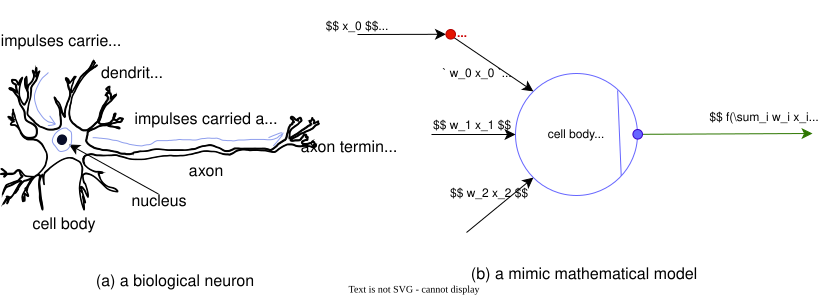

:source-highlighter: highlight.js
:stem: latexmath
:icons: font
:experimental:
:toc: auto
:toclevels: 2
:sounds: https://www.polyu.edu.hk/cbs/pronunciation/sound_file
:sounds: ../cantonese/

== 多语言

• https://developer.mozilla.org/en-US/docs/Web/HTTP/Reference/Headers/Content-Security-Policy[Content-Security-Policy]
• https://developer.mozilla.org/en-US/docs/Web/API/HTMLIFrameElement/allow[HTMLIFrameElement: allow property]
• https://docs.asciidoctor.org/asciidoctor.js/latest/[Asciidoctor.js Documentation]
• https://docs.asciidoctor.org/asciidoctor/latest/extensions/[Extensions]
• https://vscode.dev/github/asciidoctor/asciidoctor-extensions-lab[Ruby-based extensions]
• https://vscode.dev/github.com/asciidoctor/asciidoctor.js/blob/main/packages/core/types/index.d.ts[types/index.d.ts]
• https://vscode.dev/github.com/asciidoctor/asciidoctor.js/blob/main/packages/core/src/asciidoctor-extensions-api.js[asciidoctor-extensions-api.js]

== 必利其器

语言学习是一个“多输入，多输出”的实践行为，两个“多”字的内涵体现在：多种感官参与（视觉、触觉、嗅觉、感觉、想象），需要将你的一切能力调动起来；多时段重复调取记忆，重复是让大脑认真看待你所接触到的信息最基本手段，浅尝的食物一般都只在海马体中暂存，不会登记到大脑皮层———这里是记忆产生的主要位置。如果能够创造出“毕生难忘”的体验，将能够大大的提升记忆效率，这是一种全方位的感官刺激，具有最大效率地迫使大脑皮层建立新的神经网络。请相信，神经网络是可以改造的，只不过有效率快慢的差别。甚至，可以多门语言合并一起学习，作为现代的中国年轻人，我会选择英语加日语。语言学习的一般规律是多输入輸出（阅读、听、模仿），语法学习并非必须，除非需要应付考试。输入且大量的输入才是改造大脑皮层神经网络结构的能量来源，不要用任何行为替代大量的输入。与之相对应的就是大量的输出锻炼，口语、自言自语、默写或作笔记等等都是有效的输出形式，这是一个重复不断组合内化知识，并在每次重复过程中加固知识连结的过程。值得一提的是，汉语学习中的组词造句就是非常好的实践活动，能极大地发展联想思维能力。这里非常强调输入、输出的两个层面的“多”，提出了一个基本假定：学习者有大量时间（脱产者或全日制学生）或者学习者有更高效的时间规划。如果是 996 工作者，这不是可行的实践活动。另一个实践过程的问题就是：某一语言的初学者普遍存在阅读效率极低，阅读速度极低问题，这是拦路的纸老虎。但是“多输入，多输出”基本原理依然适用，这就需要学习者强行实施泛读技巧、不求甚解、一目十行，主动选择性“忽视”大量的生词，有计划地攻克部分生词，最终会在不断重复中慢慢掌握更多的生词。为了避免过多生词给大脑带来信息过载的副作用，应该有选择的挑选难度不过分超出自己能力范围的内容（文字、音频或视频）。这个过程就是一个渐进式，用计算机程序语言来说就是 i++ 或者 ++i，这里的“++”代表的就是渐进提高的那一小部分内容。Kató Lomb 在她的 Polyglot: How I Learn Languages 一书中说到一个关于“墙壁的钉子”的故事。你掌握的知识就是那面墙壁，钉子突出部分 (juts out) 就是渐进提升的那部分新知识。史蒂芬·克拉申 (Stephen Krashen) 称之为可理解性输入假说 (Comprehensible Hypothesis)，简化表达为 (i+1)，其中的 i 就是那面墙，+1 就是可习得的那部分知识。这一语言学习方法与理工类知识学习是完全不同的两个方法论系统。

记忆的秘密——以“山葉寅楠（やまは とらくす）”为例。Yama 是山，Ha 是我的姓氏（わたし の せい、みょうじ）。哆啦（とら）诶梦带着唐寅（とう いん）——唐伯虎（とう はくこ）向南哭拜树（楠木）。一是利用记忆中最普遍的元素——这意味这拥有良好神经元连接的网络，这个例子中的“山”和“葉”、哆啦诶梦、唐伯虎、楠木都是；二是多层次叠加感官展开抽象的联想——调动你五官深刻体验过的历史往事、或文化经历。就像给一座楼打下多个承重柱子，而记忆的对象或内容就是这座楼，并且可以久经考验，这种带有故事性的记忆非常持久，在未来某刻回忆起这个记忆故事中的任何一个意像，都可以按设定跟随整个故事脉络还原出原貌。高效记忆的深层原理：用已知锚定未知，用故事赋予意义，用多重感官编织网络。现代学习科学的四个关键原则：*精细化编码 (Elaborative Encoding)*——新旧知识之间建立多重联系，联系越多，未来提取的路径就越多；*双重编码理论 (Dual Coding Theory)*——例子中调动了语言系统（“山”、“葉”、“とら”）和非语言系统（山的图像、哆啦A梦的形象、唐伯虎拜树的动作场景），图文并茂的双重编码记忆远深于纯文字；*故事记忆优势 (Story Memory Advantage)*——人类大脑天生对有因果、有情节的故事记忆深刻。例子“唐伯虎向南哭拜一棵树”变成了一个微型戏剧，故事中的“唐伯虎”、“向南”、“哭”、“拜”、“树”都是提取线索，任何一个都可能唤醒整个记忆；*多重提取路径 (Multiple Retrieval Paths)*——这里比喻为“多个承重柱子”，未来你想回忆「山葉寅楠」时，可以从“山”、“叶”等线索想起，也可以从“我的姓氏「は」”、“唐寅”、“唐伯虎”想起。一条路堵了，还有其他路，取决于哪条线索更快捷。到了 20 世纪，理查德·西蒙（Richard Semon）引入了“印迹”（engram）一词来描述存储和回忆的神经基础。提出：一次经验可以激活一群神经元，使其经历持续的化学和/或物理变化，从而成为一群“印迹”细胞。随后通过该次经验中的某个线索，可以重新激活这群“印迹”细胞，从而引起记忆提取。这个过程可以理解为神经网络的训练，构成印迹的神经元间的树突 (dendrites) 与轴突 (axon) 的链接通路，在每一次记忆活动过程中都会得到加强。这一个过程可复用——打造各种“记忆故事”，总结为四个通用步骤：拆解 (Chunking)——陌生信息拆成最小、有意义的单位；转换 (Translating)——每个单位转换成你已经熟悉的、有强烈感官体验的元素；串联 (Weaving)——这些元素编织成一个有画面、有动作、有情绪的小故事。故事要夸张、不合常理（如“唐伯虎哭拜树”），因为反常理的东西记得更牢；复习 (Reviewing)——不是机械重复，而是在脑中“播放”这个故事，每次播放，都在强化那些神经连接。最终完成新旧信息的“条条大路通罗马”。但是，大脑作为一个高能耗器官（人体 1/4 的能耗），编织这样的记忆故事需要大量能量和时间，因此要有限度地使用这个极其强大的“法术”，通常可以用于点状离散信息。对于复杂的逻辑体系（如微积分、编程范式），还需要理解、重复练习和应用。新增信息需要消耗大脑中的营养物质，这直接体现为认知负荷。为每个陌生的信息编一个复杂故事也不太现实，可能会让大脑过载而降低效能，应该优先给那些你反复记不住的“钉子户”用这个方法。这个“法术”的最终目的是要“褪去”故事外壳，直接按原貌展示其中最宝贵的核心信息。长期使用后，应能直接认出「山葉寅楠」<--> Yamaha torakusu，而不再需要回忆整个“记忆故事”。故事结构是脚手架，大楼建成后可以拆除。换句话说，记住语言表达不是目的，用语言交流（与人现场交流或者书写文字间接交流）才是，并且记忆强化也是因为重复使用导致的作用。

人类是如何记住文字符号的？大脑中的文字符号记忆是一套高度专业化的、与语言处理深度绑定的神经通路。可以想象一下，写字的时候大脑通常是不会有文字符号的图形意像呈现的。而对应生活中的实物就完全不同，通常是以图像意像呈现的，比如想到“苹果”，通常会在大脑中呈现见过的苹果实物的意像。这个意像是动态的，是综合大脑已有视觉图像经验总和的动态结果。由此可以推测，人类文字符号记忆，与图像记忆法，是两条不同的路径。意像 (imagery) 不同于图像 (photographic image)，也不同于抽象的符号 (symbol)，是指大脑在理解意义时，不由自主产生的心理画面、声音、感受或动态模拟。包括文字符号的意义，因此意像会伴随文字符号存在。认知心理学家 艾伦·巴德利 (Alan David Baddeley) 提出的工作记忆模型（扩展短时记忆概念），Working Memory Model，这两种记忆对应为 **语音环路 (Phonological Loop)** 与 **图像记忆 (Iconic Memory)**。Sperling 在 1960 年首次提出图像记忆模型，Baddeley 的模型重点则在于工作记忆的主动加工部分。语音环路短暂维持约 2 秒，依赖默读复述防止遗忘；文字记忆依赖稀疏编码 (Sparse Coding)，前额叶神经元以特定放电模式表征不同词汇，不同的文字符号激活不同的神经元集群；文字的短时记忆平均仅容纳 4±1 个独立组块（Cowan, 2001），例如随机字母序列“XKQMF”可能超出未训练者的记忆极限；感觉记忆阶段，图像信息在图像记忆中暂存约 300 毫秒，容量近乎无限。视觉记忆采用分布式编码 (Distributed Coding)，一个物体（如苹果）由颜色、形状、纹理等对应大脑神经中的多个特征集群共同表征，冗余度高且抗干扰性强。单独记忆文字符号是非常费劲的，因为信息孤岛效应。但是配合图像记忆就会轻松得多，记忆线索越丰富效果越好。比如，记忆电话号码，在大脑中模拟一下电话键盘拨号过程，形成一个动态意像就比较容易记住抽象的数字序列。工作记忆对学习能力的影响，是工作记忆研究应用最多的一个领域，特别是在中小学时期。比如，计算 1 + 2 + 3 + 4，如果完全按照工作记忆模型，就需要临时记住 1 + 2 = 3 这样的计算过程中间产物，最后才能计算得到 10 这个结果。当大脑将 1 + 2 + 3 + 4 = 10 记住，就不需中间过程，而是直接呈现记忆中的信息，这两条记忆路径在乘法口诀应用中、或考试中题目阅读中的，最能体现效率对比差异。参考书籍： Memory, Third Edition, Alan Baddeley & Michael W. Eysenck & Michael C. Anderson.

德国心理学家 赫尔曼·艾宾浩斯 (Hermann Ebbinghaus) 做个一个实验，得出一条遗忘曲线：遗忘在学习结束后立即开始，先快后慢，最终趋于稳定。很多人把这条曲线当作记忆“铁律”，但没有了解艾宾浩斯实验的三个重要前提：实验使用材料是无意义音节（符号）、记忆方法是是死记硬背、测量方法是节省量。测试者（就是艾宾浩斯本人）进行纯粹机械重复，无联想、无生成操作。测试的不是“能不能回忆”，而是“重新学节省多少时间”，你觉得自己“忘了”，但大脑其实保留了痕迹，只是提取线索变弱了。艾宾浩斯曲线描述的是在最低效学习方式下、对无意义材料的遗忘规律。“无生成”——这正是艾宾浩斯实验与真实语言学习之间最根本的鸿沟。“无生成”的内涵是：无意义符号、无具体语言结构、不可联想。简单理解就是不能用于造句的无意义符号。当年为了背英语单词，在一些书中说到了遗忘曲线，就以为这就是真理，导致失去探索高效记忆方法动力。这种垃圾书籍可以说害人不浅，说是这类人写书以讹传讹误人子弟也不为过。这条遗忘曲线不是给后人用来设计复习表的，更不能按此设计记忆方法 ，这是致命的根源上的错！

生理心理学有个名词——遗觉像 (eidetic imagery)，由德国心理学家 埃里克·杨施 (Erich Rudolf Jaensch，1883-1940) 于 1920 年正式提出，源自希腊语 eidos（形式/图像），用以描述儿童中常见的、在刺激消失后仍能在脑中保持异常清晰、逼真的视觉表象现象。该研究传统可追溯至格丁根大学的 G.E. 缪勒实验室。遗觉像是是一种罕见的、在刺激物移除后，仍能以近乎感官的逼真度在脑海中“看见”该刺激物的能力。这是区别普通意象 (mental imagery) 的能力，遗觉像能在大脑中复现近乎照片级的图像，这种记忆能力稳定性不如普通意像那样无限堆叠、无限时效，仅能维持相对稳定，几十秒到几分钟。遗觉像不是记忆力好，它不是记住，而是看见图像，看见原始图像中的细节，可以在脑海中“移动视线”，查看图像的不同部分。对遗觉像的进一步提炼就是所谓的“照相机记忆法”，如果文科生拥有这种能力，毫不夸张就是有神助。这种方法的缺点就是时效较短，需要大量反复练习，让信息稳固地记录到大脑中。

正所谓“不动笔墨不读书”，数字时代也同样“不做图表不读书。”语言学习一定要多动手（抄录腾挪以提升记忆效果），多动眼睛（看视频、文字材料做文字书写的输入训练），多用耳朵（听日语视频或音频节目做语音听力输入训练），多用嘴巴（同时训练语言组织、语音输出能力）。输出能力体现的是大脑的语言组织能力，通过嘴巴说出来，和通过手写到纸面上，又或者通过键盘敲到电脑文档中，甚至是自言自语都是这种能力的体现。正如形式语言理论开创者——乔姆斯基所说：“语言主要不是用于交流，而是用于思维和自我表达。它是将思想以可外化的形式呈现出来的内在系统”。靠背诵的方式记下的内容不用于思维和自我表达，那么你就不是在“学语言”，而是在磨练记忆力。需要注意，同样是动手，抄录和写文章锻炼的是不同的大脑功能，抄录对应的是大脑的短期记忆（working memory），抄录的过程潜在激发深入联想的功能，写文章则是锻炼大脑的文字组织思维能力，是强制联想、自我表达、思想外化。

记忆方式有多种形式，分类也同样可以按照不同因素来划分。我认为按逻辑能力分类是比较合理的：逻辑推理思维与联想思维，两者不是排他性的记忆方法。不同的记忆方法无非解决两大问题：存、取，存得住存得快，取得出取得快。其实记忆方法有了，再花时间咀嚼重要内容，学习文科内容的效率是极大的。有些人先天（或者后天、幼儿时期导致的）是理工思维，要记住文学性的文字，不说难如登天，也是事倍功半。每个人使用的记忆方法和日常习惯关联，如果没有外界的干扰，每个人通常都是有路径依赖的，走同一种路是默认选择。每种记忆方法都是可以通过训练强化，当然每个人的情况都不同，有人就是在某个方面特长，选一个擅长的方法发挥就好。每种记忆方法追根溯源，其实就是在设置一个个记忆线索，让信息形成记忆线索网络，不同人在不同时期都有其特别擅长的线索处理能力。比如说脑图（思维导图，Mindmap），它其实就是提供多个线索（视觉线索、空间联想线索、条理逻辑），可以有效地提升记忆的兴奋度。人类的五种感官都是可以用来构造记忆线索的，比如听觉，假如经常某一首歌曲并且记住了歌词（旋律关联了文字），只以后听到这个旋律，就会立即呈现相应的歌词。根据学习者的感官强弱，可以划分为视觉型 (Visual)、听觉型 (Auditory)、动觉型 (Kinesthetic) 学习者，可以通过刻意练习加强这种特长。比如，对于视觉特长的学习者，可能很容易认人脸，但经常忘记对方的名字，这就需要设计一个可以利用意像记忆来关联像名字这样的抽象文字符号。

日语假名学习提示：

• 拒绝死记硬背：线性输入导致输出也是线性。按使用频率分组记忆更快，随机抽签检查；
• 警惕发音陷阱：勿用中文谐音记忆，比如日语「し→西」，发音不准将导致发音永久性偏差；
• 片假名同步学：避免先学平假名再学片假名造成的混淆拖延，本质上也是线性记忆问题。

和背乘法口诀同理，以计算机数据结构的链表、映射两种近似情形来举例：

A. 2x7 => 14 ... 3x7 => 21 ... 4x7 => 28 ✔GET IT，这称之为线性记忆，需要查询前置的记忆线索。
​B. 4 7 => 28 ✔GET IT，这称之映射记忆，直接由意像线索提取记忆，高效无需大脑计算记忆线索。

利用谐音、意像相结合的情节化故事是建立高效记忆——映射记忆、打破线性记忆的有效手段，我将这种记忆技巧称为意像记忆 (imagery memory)。再深入一步就是打造记忆宫殿，或者称之为思维轨迹法。通过训练，强化意像记忆，在此基础上拓展这个意像模型，以思维游动的方式串联多个需要记忆的信息，就可以实现一组有顺序信息的高效记忆。谐音文字上的设计要求不在于语音上的近似程度，重点在于它作为意像记忆线索本职——高效地检索信息。因此，谐音文字的选择条件可以非常松散，但是它要对大脑有足够高效的提示作用。因为每个人内化的知识千差万别，建立这个记忆模型也需要按自身的条件来设计，这是非常个性化操作。这里以日語词汇「上」「下」「白老町」为例，打造一个微型记忆宫殿：白老町 (しらおいちょう) 意像记忆线索：锡蜡坳有座桥，叫做希腊桥，桥上有只乌鸦 (うえ)，桥下 (した) 还有一只洗它的脚丫。思维轨迹可以有一定的顺序性，但是又可以根据意像模型高效地跳转到任意位置，打破线性依赖。意象记忆还可以进一步提炼为意境，这是自然的延伸，也符合文学创作手法。意象到意境的跳跃，真是从认知工具到审美体验的深层连接。尽管大胆发挥联想设计属于自己的意像素材，示例二，中英日三语言联合：awkward + 欢迎光临 + 京都方言（关西）。意像记忆线索：街边店铺闸门很容易拉下来，看得见一个圆圈里有“谢”字，开门迎客第一面的很尴尬 (awkward)，尴尬一下舒服。いらっしゃいませ（“欢迎光临”的固定句式），おこしやす（关西京都方言）。

人工智能技术的成熟，极大地方便了计算机辅助教育，可以利用 https://chat.deepseek.com/[深度求索] 这样的产品来辅助学习。语言是鲜活的，第一个人掌握的第一个外语单词必然是实践活动中学习到的，历史的堆积作用下，世界上各种语言都有了相应的交叉翻译的文书记录。当你不会一门语言时，当然你此时只能会母语，这时学习其它语言有两条路：一是像古人那样，通过实践（找懂外语的人交流）习得，二是通过阅读使用母语编写的教材来学习外语。第一种方法总是可行的，即使全世界的文字书籍都销毁了也依然有效。第二种方法则更便利，只有手头有文字材料就可以，并且也衍生出一种更高效的学习路径：用一门已经掌握的外语来学习另一门外语！这也是我目前在走的一条路径：用英语编写的教材学习日语。开源教材： Japanese Introdutory 1 by 濱田伊織 (Iori Hamada)。

简单来说，語言 = 語音 + 言詞，是人類文明的載體。其中语音部分是各种语言的发音系统，世界上的各种语言都有其特别的韵律类型来区别语音的意义，主要有三种类型：声调型，包括普通话、粤语、约鲁巴语；重音型，包括英语、俄语；音高重音型，包括日语、古希腊语。

1. 声调语言 (Tonal Languages)，普通话 (4声)、粤语 (6-9声)、泰语 (5声)、约鲁巴语 (3声)、越南语 (6声) 等等。核心特征：音节的音高轮廓改变单词意义。使用相同辅音和元音，通过不同声调（声音频率的升降变化）表示不同的字。例如普通话：妈 (mā，高平)、麻 (má，上升)、马 (mǎ，降升)、骂 (mà，高降)。声调语言通常辅音库相对简单，音节结构也简单，多为 CV 或 CVN (C = Consonant, V = Vowel, N = Nasal)，因为声调已经承载了大量区别信息。

2. 重音语言 (Stress Languages)，英语、俄语、阿拉伯语、西班牙语、德语等等。核心特征：一个音节比其它音节更“突出”（更响、更长、音高变化）。重音位置可能区分词义或词性。发音难点在于非重读音节的元音会弱化，英语 schwa /ə/，俄语 /ə/ 和 /ɐ/。此外还有亚型：固定重音类型语言（重音总是在固定位置），如捷克语 (首音节)、波兰语 (倒数第二)、法语 (末音节，无词义区分)。自由重音（重音位置能区分词义），如英语 (record /ˈrɛkərd/ 名词 vs. /rɪˈkɔrd/ 动词)、俄语 (мука́ 痛苦 vs. му́ка 面粉)。

3. 音高重音语言 (Pitch-Accent Languages)，日语 (东京方言)、塞尔维亚-克罗地亚语、古希腊语、立陶宛语、挪威语/瑞典语 (部分方言) 等等。核心特征：介于声调和重音之间。每个词有指定的音高配置（如“高-低”或“低-高”），但整个词只有一个高音峰。例词（日语）：hashi 的高-低式 (hásì) 和低-高式 (hàshí) 不同读音对应两种不同的意思：はし 箸 ① [名] 筷子；はし 橋 ② [名] 桥梁。还有低-低后高尾 (hàshí—)：はし 端 ⓪ [名] 边缘；末端；起点；开始。单独的词汇听起来和 はし 橋 ② 一样，需要放在句子中才能体现差别。

4. 极端音库语言，音库极大 vs 音库极小。非洲的 !Xóõ 语 (图乌语系)，辅音数上百，有五种不同的搭嘴音（吸气音/click consonants）以及普通、喷音、浊送气等复杂对立。元音也分清楚、气声、嘎裂声。夏威夷语 (8个辅音 /p, k, ʔ, h, m, n, l, w/ + 5个元音，允许长元音)，玻利尼西亚语族。音节严格为 (C)V 结构，不允许辅音连缀。

TIP: https://rime.im/[中州韵 RIME] 是极值得推荐按的输入法「引擎」，可以通过配置够“创造”输入法，比如日语输入法是配置 https://github.com/gkovacs/rime-japanese[RIME Japanese]。把整个仓库里的文件全部下载下来，把这些文件复制到 rime 的用户文件夹就可以了。通过输入法图标的右键菜单打开“用户目录”，并在完成文件复制后重新部署，然后在”输入法设定”勾选“日本语”输入法，在打字时候使用 Ctrl+` 快捷键切换。输入促音需要重复后接的辅音字母（仅限清音），或在假名键盘中找到「小」或「っ」键（通常位于右下角）。比如邮票 きって（切手）对应输入 kitte。再如 がっこう（学校）对应输入 gakkou。日文输入法下按连字符“-”键自动转换，或者使用片假名键盘中单独存在「ー」键。在打字输时，可以使用 ja/ju/jo/sha/shu/so/cha/chu/cho 输入相应的抝音，也可以使用 zya/zyu/zyo/sya/syu/syo/cya/cyu/cyo。还有 を ヲ o 也可以写作 wo。

TIP: https://github.com/rime/rime-cantonese[RIME Cantonese] 粵語輸入法。本方案預設**不支援**任何模糊音或懶音，即區分 n-/l-, ∅-/ng- 等常見懶音。若要啓用模糊音，先打開 `jyut6ping3.schema.yaml` ，取消 `speller/algebra:` 相應代碼的註釋（刪除前置 `#` 號）。例如想支援 n-/l- 不分，`speller/algebra:` 相應行數應作修改：加入 `derive/^n(?!g)/l/` 这句配置。輸入時可忽略聲調，也可按照下列鍵位輸入：

1. 陰平 1 = kbd:[v]，示范：kbd:[s i v] 輸出「詩」；上陰入，打 kbd:[s i k v] 輸出「色」
2. 陰上 2 = kbd:[x]，示范：kbd:[s i x] 輸出「史」
3. 陰去 3 = kbd:[q]，示范：kbd:[s i q] 輸出「試」；下陰入，打 kbd:[s e k q] 輸出「錫」
4. 陽平 4 = kbd:[vv]，示范：kbd:[s i v v] 輸出「時」
5. 陽上 5 = kbd:[xx]，示范：kbd:[s i x x] 輸出「市」
6. 陽去 6 = kbd:[qq]，示范：kbd:[s i q q] 輸出「事」；陽入，打 kbd:[s i k q q] 輸出「食」

本方案支援普通話、Loengfan (粵語兩分)、筆畫、倉頡反查，可以用嚟反查鍵：普通話（kbd:[`]）、粵語兩分（kbd:[r]）、筆畫（kbd:[x]）、倉頡五代（kbd:[v]）。

https://ctan.org/tex-archive/info/lshort/japanese[A Short Introduction to LaTeX2ε] 是一个多国语言版本的 LaTeX 数字化排版／写作教程，包括日语版本，这是非常好的学习资源。可以在 LaTeX 文档中给日文加注罗马音，也可以使用 Python 脚本生成罗马音。利用 LaTeX 排版功能，只需要将每行文本切分为两行，一行摆注音，另一行摆主文本。甚至，使用 `\over` 或者 `\frac` 这些用在公式中表示分数的宏命令都可以用来 stem:[{zhù \over 注}\frac{yìn}{音}]。希望去掉中间线，标准的做法是使用 `\genfrac` 命令来自定义分数线的样式，指定左边、右边、线的厚度以及样式。如果将线的厚度设置为 0pt，就可以实现隐藏分数线的效果。例如，使用 `\genfrac{}{}{0pt}{}{numerator}{denominator}` 就可以生成没有分数线的分数形式。将注音作分子、主文本作分母，就像这样 stem:[\genfrac{}{}{0pt}{}{fēnshù}{分数}]。分子和分母的位置可能会过于紧凑，需要调整间距可以考虑使用 `\phantom` 或者 `\mathrlap` 等命令来调整排版，确保分子和分母的位置合适。

HTML5 提供了专用标签：`<ruby>`: The Ruby Annotation element，用于东亚文字排版中注音。Ruby 文本（ruby text）是一种通常放置在字符上方或右侧的小字体文本注释。也可以用在 AsciiDoc 文档中，只需要使用其直通宏命令，使用 `\pass:[<ruby>東京<rt>とうきょう</rt></ruby>]` 这样的代码片段得到“pass:[<ruby>東京<rt>とうきょう</rt></ruby>]”这样带有注音的文本。显然这个功能并不能完全满足我的需要：简洁的文本文档。AsciiDoc 支持扩展，可以自定义用户宏。但是，这要求你使用 Ruby, Java, Groovy or JavaScript 等语言编写扩展脚本（取决于使用的解释器），也会让文档结构变复杂，单个文档变文档工程。VS Code AsciiDoc 插件基于　JavaScript 语言的 Asciidoctor.js 库，在某些功能上与 Ruby 版本的 Asciidoctor 有差异，尤其是在处理扩展和自定义宏方面。用户的自定义宏依赖于 Ruby 扩展就会导致在 VS Code 中预览时无法正确渲染。其它参考 Asciidoctor.js Live Preview 或者 Live Server。

TIP: 最直接的解决办法是编写 JavaScript 脚本，手动修改 HTML 节点内容。

官方提供扩展示范，比如 link:https://github.com/mogztter/asciidoctor-emoji[Inline macro] 
`emoji:heart[]`。用户编写扩展脚本只需要像以下一样在脚本模块中导出一个 `registry` 注册函数。
如果脚本模块没有导出此函数，则会报错：TypeError: extjs.register is not a function。
导出函数的目地是在加载时调用 inlineMacro 这些 API 以注册一个宏对象。注意 JavaScript 的函数
就是类型对象，这取决于函数的执行方式：使用 `new` 关键字执行将其作为类型的构造函数。因为脚本可能
存在潜在的安全威胁，VS Code 默认禁止插件加载脚本，需要用户手动执行授权命令以加载扩展脚本：
AsciiDoc: Manage Asciidoctor.js Extensions Trust Mode。

为了演示通过 hack 源代码实现用户定制功能，后面将通过修改 AsciiDoc 代码来实现一个注音扩展。
这里直接给出扩展脚本的实现：

[source,js]
----
/**
 * Ruby Annotation Extension for Asciidoctor.js
 * 
 * Install::
 * 
 * Setting AsciiDoctor.js to enabled "Extensions: Register Workspace Extensions"
 * 
 * [Optional] Then open an asciidoc document, and set to Trusted Mode
 * >AsciiDoc: Manage Asciidoctor.js Extensions Trust 
 *
 * Just save this script (ruby.js) in you vscode project:
 *  .asciidoctor/lib/ruby.js
 * 
 * Test::
 * 
 *  oo:テスト[/test/]
 *  oo:テスト[rt=/test/]
 */
function ruby_annotation_macro_oo() {
    const self = this
    self.named('oo')
    self.positionalAttributes('rt')

    self.process((...args)=>process(self, ...args))
}

function ruby_annotation_macro() {
    const self = this
    self.named('ruby')
    self.positionalAttributes('rt')

    self.process((...args)=>process(self, ...args))
}

function process (self, parent, target="", attr=null) {
    console.log({ln:parent.constructor, target, attr},attr["$positional"])
    let pos = attr["$positional"] || [""]
    let anno = attr.rt || pos[0]
    anno = anno.replace(/\^(\d)/g, "$1")
    var text = `<ruby>${target}<rt>${anno}</rt></ruby>`
    return self.createInline(parent, 'quoted', text, { 'type': 'normal' })
}

module.exports.register = function register (registry) {
    if (typeof registry.register === 'function') {
        registry.register(function () {
            this.inlineMacro(ruby_annotation_macro)
            this.inlineMacro(ruby_annotation_macro_oo)
        })
    } else if (typeof registry.block === 'function') {
        registry.inlineMacro(ruby_annotation_macro)
        registry.inlineMacro(ruby_annotation_macro_oo)
    }
    return registry
}
----

AsciiDoc 文档解析器（Asciidoctor）原本使用 Ruby 语言编写，但是考虑到 JavaScript 的流行，转而使用 Opal 也就是 Ruby-to-JavaScript 转译生成 JavaScript 版本，这样就可以在流行的 Node/Deno 等平台，或者直接在浏览器中渲染 AsciiDoc！link:https://opalrb.com/[Opal] 是一个高度成熟的开源项目，它充当着 Ruby 代码与 JavaScript 世界的中介，允许开发者以熟悉的 Ruby 语法编写前端或 Node.js 应用。Opal 使用 Ruby 语言开发，同时也处理 JavaScript 代码的交互调用。Asciidoctor.js 只需要依赖 https://www.npmjs.com/package/asciidoctor-opal-runtime[Opal Runtime] 就可以在 JavaScript 环境下工作。

    $ tree -d ./packages
    ./packages
    ├── asciidoctor   提供 @asciidoctor/cli 命令行工具
    └── core       
        ├── benchmark      性能跑分
        ├── examples       示例
        ├── lib            Ruby 实现代码库
        ├── spec           规范测试
        ├── src            @asciidoctor/core 核心代码
        ├── tasks          Node.js 任务脚本
        └── types          TypeScript Declaration File

假定设计这样一个 AsciiDoc 宏：`ruby:[tā|铊]` 用于文字注音，那么就可以像以下代码片段一样给预览 AsciiDoc 来点 tricky 处理。你可以根据需要来选择哪些 HTML 标签，这里作为演示只处理 `
` 标签下的内容。这种实现有个缺点，需要脚本支持。因为 VS Code 为了提高安全性，启用了 Content-Security-Policy 安全策略，可以通过开发者工具查看 HTML 中包含 `<meta http-equiv="Content-Security-Policy" content="..."/>` 这个标签，用户要在 AsciiDoc 使用直通输出的脚本时，就需要正确编写包含 `nonce=...` 属性的脚本块，否则不能大道安全要求而被拒绝执行。可以看到安全规则配置包含以下两条，默认设置 fallback 为禁止（default-src 'none';），也就是一定要提供符合安全规则约束的脚本、资源才能通过安全审查。AsciiDoc 预览窗口通过 WebView 嵌入的 `<iframe>` 与主窗口隔离。AsciiDoc 预览窗口中也同样使用 `<meta>` 设置了安全规则。可以看到包含动态生成的 384-bit 或者 256-bit Secure Hash Algorithm (SHA) 摘要数据（经过编码作为文本显示），以及 nonce 随机数，还包含 kroki.io 等需要使用的服务器地址，也包括 localhost（用于执行插件本身内部脚本）。综合以上内容，可以通过修改 AsciiDoc 插件代码来实现你自己定制的 AsciiDoc 预览功能。

    default-src 'none' ;
    script-src 'self' 'unsafe-eval' blob: ;

可以在插件的 asciidoctorWebViewConverter.js 代码文件中找到这个随机数的生成过程，就是时间值，getTime()+ '' + getMilliseconds()。建议不要修改此代码，如果使用固定值的 nonce，虽然可以方便在文档中插入直通脚本，但是也引入了潜在的安全隐患，让其他恶意用户有机会通过同样方式在文档中嵌入恶意代码。一旦用这个修改过的插件（有漏洞）打开包含恶意代码的文档，就有可能导致信息、财产安全问题。一个安全的方法是修改插件中嵌入 HTML 代码，注入功能补丁脚本。需要注意，AsciiDoc 插件支持 VS Code 本地环境和 Web 环境，如果只需要本地环境使用，则修改 package.json 配置文件 "main" 属性指定的模块代码即可。

    "browser": "./dist/browser/extension",
    "main": "./dist/src/extension",

也就是 AsciidoctorWebViewConverter 类型实现代码。在本地环境下还可以导出 HTML 格式，参考插件的 SaveHTML 类型实现，为了让“自定义宏”在导出的 HTML 文档中有效果，可以使用直通宏将脚本一并输出，或者修改插件代码。正常来说，应该编写 AsciiDoc 扩展，只需要实现一个 Inline Macro Processor 并注册到解析器中即可处理这样的文本生成工作。而不是直接修改其代码，除非研究其内部结构或者作开源贡献。导出功能调用 asciidocEngine 对象的 `export(textDocument, 'html5')` 方法执行 processor 程序生成 HTML 文档。每个扩展宏（函数）都是一个 InlineMacroFunctions 接口实例。

为了让功能补丁适用性更好，采用给插件代码打补丁。因为 WebView 预览以及 Export HTML 功能都需要对 AsciiDoc 文档内容进行处理。可以将补丁代码写入 @Asciidoctor/core 模块或者插件代码文件，这里选择将自定义宏函数写入 asciidocEngine.js。另外，宏调用格式采用 AsciiDoc 文档的规范格式，也就是内联宏 `<name>:<target>[<attrs>]` 或者块宏 `<name>:<target>[<attrs>]`。调用时，使用 `+ruby:铊[tā]+` 格式，可以使用上尖括号来标记粤语的声调，比如 `+ruby:上岸[soeng^6 ngon^6]+`。为了让文档文本更短，考虑使用 `oo:` 替代 `ruby:`。本来想用 `__:` 宏标记，但是解析器不支持标点符号作宏名。可惜的是，AsciiDoc 解析器未能提供像 stem:[\LaTeX] 那样的宏扩展机制，不然会方便很多。

测试 JavaScript 实现的 AsciiDoc 宏扩展：`ruby:铊[tā] oo:上岸[soeng^6 ngon^6]`。

以下直通代码片段用于直接修改 HTML 标签，仅供参考。

[source,js]
----
[pass]
++++++

++++++
----

用户宏函数 `ruby_inline_macro(registry)` 实现以及修改代码片段参考，仅支持 HTML5：

[source,js]
----
//asciidoctor.asciidoctor-vscode-3.4.2\dist\src\asciidocEngine.js

function _ruby_inline_macro() {
    var self = this
    self.process(function (parent, target="", attr=null) {
        console.log({ln:parent.constructor, target, attr},attr["$positional"])
        let pos = attr["$positional"] || [""]
        let anno = attr.anno || pos[0]
        anno = anno.replace(/\^(\d)/g, "$1")
        var text = `<ruby>${target}<rt>${anno}</rt></ruby>`
        return self.createInline(parent, 'quoted', text, { 'type': 'normal' })
    })
}
function ruby_inline_macro(registry){
    registry.inlineMacro('ruby', _ruby_inline_macro)
    registry.inlineMacro('o', _ruby_inline_macro)
}

class AsciidocEngine {

    async export(textDocument, backend, asciidoctorAttributes = {}) {
      //...
      const registry = processor.Extensions.create();
      ruby_inline_macro(registry)
      //...
    }

    async convertFromTextDocument(textDocument, context, editor, line) {
      //...
      const registry = processor.Extensions.create();
      ruby_inline_macro(registry);
      //...
    }
}
----

.AsciiDoc 宏属性控制
[opts="header,autowidth",frame=ends,grid=rows]
|===
|属性类型|示例语法                 |功能说明
|位置参数|[arg1,arg2]            |通过序号访问 (attr["$positional"])
|命名属性|[key="value", size=20] |键值对配置 attr.key, attr.size
|特殊属性|[%unchecked]           |添加 CSS 类/状态标记
|内容继承|[context=section]      |继承父级上下文设置
|===

[source,tex]
----
% 实例１：导言区加载 amsmath，并定义无横线的分数命令
\usepackage{amsmath}
\newcommand{\nolinefrac}[2]{\genfrac{}{}{0pt}{}{#1}{#2}}
\nolinefrac{a}{b}

% 实例２：隐藏横线但保留分子分母位置
\newcommand{\hidefrac}[2]{%
  \genfrac{}{}{0pt}{0}{#1}{\phantom{#2}}%
  \genfrac{}{}{0pt}{0}{\phantom{#1}}{#2}%
}
\hidefrac{a}{b}

% 实例３：加载 mathtools　并定义隐藏横线的分数，显示为 a⁄b（横线不可见）
\usepackage{mathtools}
\newcommand{\invisiblefrac}[2]{%
  \frac{\mathrlap{#1}}{#2}%
}
\invisiblefrac{a}{b}  % 
----

• http://kakasi.namazu.org/index.html.en[KAKASI - Kanji Kana Simple Inverter]

[source,python]
----
#!/usr/bin/env python
import io
import sys
import pykakasi
kks = pykakasi.kakasi()
text = "日本語を勉強します"
sin = sys.stdin.readlines()
result = kks.convert(text if len(sin)==0 else "".join(sin))
print("".join([f"ruby:{it['orig']}[{it['hira']}]" 
                 if it['orig'] != it['hira'] 
                 else it['orig'] for it in result]))
# Press Ctrl+D or Ctrl+Z (on Windows)
# Output: ruby:日本語[にほんご]をruby:勉強[べんきょう]します
----

• https://pypi.org/project/pypinyin/[汉字拼音转换]
• https://ctan.org/pkg/xpinyin[xpinyin 汉字自动注音宏包]
• https://pycantonese.org/parsing.html[粤语 NLP 处理工具]

此粤语 NLP 工具不能处理一些异体字，譬如 ruby:𧦠人[ngaak^1 jan^4] = ruby:訹人[seot^1 jan^4]。作为客家人，小时候我在农村经常听到大人用“訹人”这个词，所以小朋友经常被教育防“骗”。

[source,tex]
----
>>> import pycantonese
>>> data = "你食咗飯未呀？食咗喇！你聽日得唔得閒呀？"
>>> corpus = pycantonese.parse_text(data)
>>> corpus.head()
*X:    你         食         咗        飯          未        呀        ？
%mor:  PRON|nei5  VERB|sik6  PART|zo2  NOUN|faan6  ADV|mei6  PART|aa4  ？

*X:    食         咗        喇         ！
%mor:  VERB|sik6  PART|zo2  PART|laa1  ！

*X:    你         聽日           得         唔      得閒           呀        ？
%mor:  PRON|nei5  ADV|ting1jat6  VERB|dak1  ADV|m4  ADJ|dak1haan4  PART|aa4  ？
----

****
[source,tikz]
----
\documentclass{article}
\usepackage{ruby}
\renewcommand{\rubyfont}{\footnotesize} % Smaller annotation
\renewcommand{\rubysep}{-0.3em} % Tighter spacing
\usepackage{fontspec}
\setmainfont{Noto Sans CJK JP} % Requires XeLaTeX/LuaLaTeX

\begin{document}
\ruby{東京}{とうきょう}へ行きます。 % Tokyo (with furigana)
\end{document}
----

[source,tikz]
----
% Use LuaLaTeX engine
\documentclass{standalone}
\usepackage{ruby}
\begin{document}
% Horizontal Ruby (e.g., furigana)
\ruby{漢}{かん}字
% Output: 漢 (with "かん" above it) followed by 字
\end{document}
----

[source,tex]
----
% Use LuaLaTeX engine
\documentclass{standalone}
\usepackage{pinyin}
\begin{document}
\Hanyu{汉字} % Auto-generates pinyin (needs setup)
% Or manually:
\ruby{汉}{hàn}字
\end{document}
----

[source,tex]
----
% Use LuaLaTeX engine
\documentclass{ltjsarticle}
\usepackage{luatexja}
\begin{document}
\rensuji{漢\kenten{かん}字} % Furigana example
\end{document}
----

[source,tex]
----
\documentclass{article}
\usepackage{CJKutf8}
\usepackage{xpinyin}
\usepackage[T1]{fontenc}
\usepackage{lmodern}

\begin{document}
\begin{CJK}{UTF8}{gbsn}
\xpinyin*{汉语拼音示例}
\end{CJK}
\end{document}
----
****

== 汉语音标

开明书店于 1933 年初出版的林語堂《开明英文文法》(Kaiming English Grammar) 就強調對比學習方法。普通話、粵語、英語喺我嘅語言學習對比。以汉语拼音方案做对比，声母、韵母加整体认读音节也只有六十三个，但是组合四声调，就具有强大的拟音能力。更别说有九声六调的粤语。中古汉语四声八调：平、上、去、入四声各分阴阳（阴平/阳平、阴上/阳上等），共八种声调。粤语声调演化：保留中古四声，进一步分化出“中入声”，形成 “九声”；但实际教学中常将入声调合并为三类，统称 “六调”。

.汉语拼音核心元素分类
[opts="header,autowidth",frame=ends,grid=rows]
|===
|类别          |数量   |具体内容
|声母          |23个   |b, p, m, f, d, t, n, l, g, k, h, j, q, x, zh, ch, sh, r, z, c, s, y, w
1.3+|韵母  1.3+|24个  |单韵母（6个）：a, o, e, i, u, ü
                     |复韵母（9个）：ai, ei, ui, ao, ou, iu, ie, üe, er
                     |鼻韵母（9个）：an, en, in, un, ün, ang, eng, ing, ong
|声调           |5种  |阴平（ˉ）、阳平（ˊ）、上声（ˇ）、去声（ˋ）、轻声（无符号）
|整体认读音节    |16个  |zhi, chi, shi, ri, zi, ci, si, yi, wu, yu, ye, yue, yuan, yin, yun, ying
|===

汉语拼音（Pinyin）起源从清末至近代时期，出现了废除汉字、改用拼音文字的“切音字运动”。鸦片战争后，一些学者将落后的原因归结到汉字上，进而要求废除汉字，改用切音字即字母文字。钱玄同、鲁迅都有类似的言论。最终于 1955—1957 年文字改革时被原中国文字改革委员会（现国家语言文字工作委员会）汉语拼音方案委员会研究制定。

我国在古代是使用汉字为载体，采用直音、反切等方法来给汉字注音。直音，就是用同音字注明汉字的读音，如果同音字都是生僻字，即使注了音也读不出来。反切，就是用两个汉字来给另一个汉字注音，「反切上字」与所注字的声母相同，「反切下字」与所注字的韵母和声调相同。周有光先生称反切是“心中切削焊接法”。这两种注音方法，用起来都不方便。

切音字运动盛于1892年至1911年间，时值中日甲午战争和变法维新运动的时期，是以当时一些深受欧美和日本文化影响的士大夫阶层为主力掀起的一场盛极一时的汉字拼音化热潮。王照的切音字方案称为“官话合声字母”，是一种“假名式”方案，也是切音字运动中影响最为广泛的方案。1898年9月戊戌变法失败后，身为戊戌党人的王照被朝廷通缉不得已流亡日本。流亡期间，受日本假名字母启发，制定了一种假名式的拼音方案。1900年王照化名“赵世铭”秘密返华回到天津，出版了他的第一本切音字著作《官话合声字母》，署名“芦中居士”。到了1909年，政局变动，摄政王载沣下令查禁“官话字母”，《拼音官话报》被封。从1900年到1910年这十年间，“官话字母”被推广到了13个省，编印书籍达六万余部，成立推行官话字母的团体达数十个，也因此王照可以说是切音字运动中最有影响力的代表人物。

清末民初时期，中国面临文字改革需求，旨在通过标准化发音提高国民识字率。1913 年由中华民国教育部成立的“读音统一会”开始研制，目的是统一汉字读音、推广国语（普通话）。1918 年正式公布《注音字母表》（后改称“注音符号”，Bopomofo），成为中国第一套官方汉字拼音系统。目前主要在台湾地区使用。

周恩来总理在《当前文字改革的任务》中，高度评价了注音字母的作用。他说：“辛亥革命之后产生了注音字母，这是中国第一套由国家正式公布，并且在中小学校普遍推行过的拼音字母。注音字母对于识字教育和读音统一有过一定贡献。尽管今天看来，注音字母还有不少缺点（例如，作为各少数民族的共同基础和促进国际文化交流的工具，注音字母显然远不如拉丁字母），但是注音字母在历史上的功绩，我们应该加以肯定。对于近四十年来的拼音字母运动，注音字母也起了开创的作用。”

在1951年，毛泽东就指出：“文字必须改革，必须走世界文字共同的拼音方向”，并指示中国文字改革研究委员会制订民族形式的拼音方案。但这个意见却被后人曲解成汉字拼音化。后来为了消除人们的疑虑和理解歧义，毛泽东对文字改革的任务作了明确界定，指出文字改革的主要任务就是“简化汉字，推广普通话，制定和推行汉语拼音方案”。

.拼音、注音对照：21 个声母（Initials）
[opts="header,autowidth",frame=ends,grid=rows]
|===
| 拼音 | 注音  | 例字     | 拼音  | 注音 | 例字
| b    | ㄅ   | 爸 (bà)  | j    | ㄐ   | 机 (jī)
| p    | ㄆ   | 怕 (pà)  | q    | ㄑ   | 七 (qī)
| m    | ㄇ   | 妈 (mā)  | x    | ㄒ   | 西 (xī)
| f    | ㄈ   | 发 (fā)  | zh   | ㄓ   | 知 (zhī)
| d    | ㄉ   | 大 (dà)  | ch   | ㄔ   | 吃 (chī)
| t    | ㄊ   | 他 (tā)  | sh   | ㄕ   | 师 (shī)
| n    | ㄋ   | 那 (nà)  | r    | ㄖ   | 日 (rì)
| l    | ㄌ   | 拉 (lā)  | z    | ㄗ   | 子 (zǐ)
| g    | ㄍ   | 哥 (gē)  | c    | ㄘ   | 次 (cì)
| k    | ㄎ   | 科 (kē)  | s    | ㄙ   | 思 (sī)
| h    | ㄏ   | 喝 (hē)  |      |      |
|===

.拼音、注音对照：15 个韵母（Finals）
[opts="header,autowidth",frame=ends,grid=rows]
|===
| 拼音 | 注音  | 例字       || 拼音    | 注音 | 例字
| a    | ㄚ   | 阿 (ā)     || an/n    | ㄢ   | 安全 (ān quán) 拼 (pīn)
| o    | ㄛ   | 哦 (ó)     || ang     | ㄤ   | 昂 (áng)
| e    | ㄜ   | 饿 (è)     || eng/ing | ㄥ   | 鞥 (ēng) 清(qīng)
| ue   | ㄝ   | 月 (ê)     || er      | ㄦ   | 而 (ér)
| ai   | ㄞ   | 爱 (ài)    || i       | ㄧ   | 衣 (yī)
| ei   | ㄟ   | 诶 (ēi)    || u       | ㄨ   | 乌 (wū)
| ao   | ㄠ   | 奥 (ào)    || ü       | ㄩ   | 鱼 (yú)
| ou   | ㄡ   | 欧 (ōu)    ||         |      |
|===

.注音输入法键盘鍵位配置示意圖
----
聲母區（ㄕㄥㄇㄨ）      韻母區（ㄩㄣ ㄇㄨ）
╭─────────────────────────────────────╮
│ ~ ㄅ ㄉ ３ ４ ㄓ │ ２ • ㄚ ㄞ ㄢ ㄦ ＝│
│─────────────────╰─╮─────────────────│
│  ㄆ ㄊ ㄍ ㄐ ㄔ ㄗ │ ㄧ ㄛ ㄟ ㄣ ［ ］│
│───────────────────╰╮────────────────│
│   ㄇ ㄋ ㄎ ㄑ ㄕ ㄘ │ ㄨ ㄜ ㄠ ㄤ ”   │
│────────────────────╰╮───────────────│
│ ㄈ ㄌ ㄏ ㄒ ㄖ ㄙ ㄩ │ ㄝ ㄡ ㄥ SHIFT │
╰─────────────────────────────────────╯
╭─────────────────────────────────────╮
│ ~ １ ２ ３ ４ ５ │ ６ ７ ８ ９ ０ - = │
│─────────────────╰─╮─────────────────│
│  Ｑ Ｗ Ｅ Ｒ Ｔ Ｙ │ Ｕ Ｉ Ｏ Ｐ ［ ］│
│───────────────────╰╮────────────────│
│   Ａ Ｓ Ｄ Ｆ Ｇ Ｈ │ Ｊ Ｋ Ｌ ； ”   │
│────────────────────╰╮───────────────│
│ Ｚ Ｘ Ｃ Ｖ Ｂ Ｎ Ｍ │ ， ． ／ SHIFT │
╰─────────────────────────────────────╯
----

* 介音：ㄧ、ㄨ、ㄩ（可单独或组合使用）

1. 分组记忆法
• 唇音组（ㄅ b、ㄆ p、ㄇ m、ㄈ f）→ 与英文 b/p/m/f 相似。
• 舌尖音组（ㄉ d、ㄊ t、ㄋ n、ㄌ l）→ 对应 d/t/n/l。
• 卷舌音组（ㄓ zh、ㄔ ch、ㄕ sh、ㄖ r）→ 注意翘舌发音。
• 齿龈音组（ㄗ z、ㄘ c、ㄙ s）→ 平舌音。
2. 形象联想
• ㄇ (m)：像张开的嘴（"口"字变形），发“m”音。
• ㄈ (f)：像倒下的旗帜，联想“旗帜在风（f）中飘”。
• ㄩ (ü)：像鱼嘴吐泡，发音如德语"ü"。
• ㄖ (r)：像键盘Ｂ的字形，发音如翘舌的ㄧ。
3. 韵母规律（尾音关联、介音组合）
• "n" 结尾：ㄢ(an)、ㄣ(en)
• "ng" 结尾：ㄤ(ang)、ㄥ(eng)
• ㄧ+ㄚ → ㄧㄚ (ia)
• ㄨ+ㄛ → ㄨㄛ (uo)

.常见易混淆符号辨析
[opts="header,autowidth",frame=ends,grid=rows]
|===
| 符号  | 发音   | 记忆点              | 易混符号
| ㄉ    | d     | 像刀锋（刀→dāo）     | ㄌ (l)
| ㄌ    | l     | 像弯曲的线（线→xiàn）| ㄉ (d)
| ㄓ    | zh    | 上方有“点”代表卷舌   | ㄗ (z)
| ㄗ    | z     | 平直无点             | ㄓ (zh)
| ㄣ    | en    | 形似字母"n"          | ㄥ (eng)
| ㄥ    | eng   | 尾部勾起像"g"        | ㄣ (en)
|===

== 吴侬方言

· 《上海方言与文化》钱乃荣著
· https://www.qiuwenbaike.cn/wiki/钱乃荣式上海话拼音方案[钱乃荣式上海话拼音方案]
· https://www.bilibili.com/video/BV13B4y1N7Tw[吴语注音符号介绍]
· https://www.bilibili.com/video/BV1qi4y1U7YE[郑瑜：上海方言与文化]
· https://www.bilibili.com/video/BV12A41157E9/[学说上海话]
· https://zhongguoyuyan.cn/index[语保工程采录展示平台]

常说“普通话是胡化的汉语”、“粤闽客等南方方言才是古汉语”。所有语言在发展中都会与其他语言发生接触，汉语在数千年间与匈奴、鲜卑、蒙古、满等语言存在词汇互借。例：普通话"胡同"借自蒙古语"gudum"（水井），但核心语法结构仍属汉藏语系。公元 304~439 年，中国经历第二个大乱时代——五胡十六国时期，最后“五胡归汉”，五胡十六国时期北方少数民族与汉族的融合。这个时期确实有大规模的民族融合，对汉语的发展有一定影响，但需要具体分析这些影响在哪些方面，比如词汇、语法结构等。

[mermaid]
----
timeline
    title 汉语与少数民族语言接触史
    section 秦汉时期
    前3世纪 : 匈奴语借词"琵琶""骆驼"
    section 魏晋南北朝
    4世纪 : 鲜卑语影响官话雏形
    section 宋元时期
    13世纪 : 蒙古语带来新量词系统
    section 明清时期
    17世纪 : 满语贡献词汇"阿哥""格格"
----

结构性影响局限。语音层面：北方官话儿化韵可能受阿尔泰语卷舌音影响；语法层面：处置式"把"字句发展成熟于唐五代，早于大规模民族融合；核心词汇：Swadesh 基本词表中 90% 仍为原生汉语词。
粤语、上海话和日语有相似的地方，都没有翘舌音。但是都有鼻音，粤语有前鼻韵、后鼻韵。普通话不仅有鼻音，前后鼻蕴还明确区分，还有特有的翘舌音，这是国语的特色。上海人讲普通话，就是“王黄不分”，没有翘舌，没有鼻韵，或者鼻韵翘舌乱用，就像很多南方人“只字”不分。上海话算吴语的一个分支，与苏州话，杭州话，宁波话，绍兴话，可以直接交流无需翻译。

上海话和日语、粤语有个别话的发音比较像，但那纯属巧合。比如上海话说“oo:四面没山[si mi me se]”，就和日语“对不起”「すみません」发音几乎一样。又譬如说，小朋友瞎胡闹说着玩的“あつまわ，あたしわ”，几乎等于上海话说“oo:鞋子没坏，鞋带先坏[阿兹么哇，阿哒西哇]！”

和粤语九声六调相比，上海话只有五个声调：阴平，阴去，阳去，阴入，阳入。丁迪蒙《学说上海话》总结了四个重要的上海话单韵母，以下用日语假名注音：link:https://www.bilibili.com/video/BV1qi4y1U7YE?t=4664.3[Video Here]

• “oo:哎[え]”：来来来，侬来伊来大家来，侪到阿拉屋里来。
• “oo:安[う]”：衣裳穿穿，电影看看，钞票算算，饭碗端端。
• “oo:凹[お]”：摇啊摇，摇到外婆桥。外婆叫我好宝宝。
• “oo:欧[おう]”：落雨喽，打烊喽，小八辣子开会喽。

上海话拼音方案，是在搜集了 21 个上海话拼音方案的情况下，于2006年深圳召开的第一届国际上海方言学术研讨会上，由海内外的研究和教学上海话的老中青专家学者投票，以压倒多数票数通过的方案，是与普通话汉语拼音方案最为靠拢的方案。

    一、声母28个。（以下字母凡下面带“_”的为浊辅音，共13个）

    唇   音：  b（玻） b（薄） p（扑）  m（摸） f（福）  v[f]（服）
    舌尖中音： d（德）  d（达） t（塔）  n （纳） l（勒） 
    舌尖前音： z（资）  z[s]（兹） c（次） s（思）   
    舌 根 音： g（哥）  g（格） ng（额） k （科）  h（喝） h（合）
    舌面前音： j（鸡）  j（其） q（欺）  x（西）  x（齐）
    零声母：   w[u]（乌） w[u]（胡）  y[i]（衣）  y[i]（乙）

    二、韵母共14个

    单 韵 母：  哎 安  凹  欧 en（恩） in（因）
    辅音作韵母： m（姆）  n（唔）   ng（鱼）
    入声韵母：  ak（压）压 合 袜 勒 脚
              ek（厄）德 克 勒 脱 辣
              ik（噎）一 急 歇 滴七
              ok（喔）北 恶 角 叔 录
          uek（约）决 缺 血 略月

    三、零声母音节： 

     a（矮）    ak（鸭）  ang（肮） 哎  安 凹        
     o（窝）    ok（屋）  ong（嗡）
     e（欧)     en（恩）
    yi（衣）   yik（乙） yi（烟）  yin（因）                   
    wu（乌）    wu(胡）          
    yu（迂）    yu（雨） yu安（圆）  yuek（月）
    ya（夜）  yang（羊） yong（永）  y凹（摇） y欧（游）
    wen（温）   er（而）

一、上海话拼音用和汉语拼音一样的字母拼写。其中声母共 26 个，以下 17 个声母与普通话相同。

[source,subs=normal]
    oo:剥[b]     oo:朴[p]     oo:摸[m]     oo:福[f]
    oo:答[d]     oo:塔[t]     oo:纳[n]     oo:蜡[l]
    oo:鸽[g]     oo:渴[k]     oo:喝[h]
    oo:鸡[j]     oo:妻[q]     oo:希[x]
    oo:资[z]     oo:雌[c]     oo:思[s]

以下 5 个声母，普通话没有，但是与英语的读音相同，通常称作"浊辅音"声母，圆括号"()"内为国际音标注音。

[source,subs=normal]
    oo:薄[bh] （b）    oo:达[dh] （d）    oo:轧[gh] （g）
    oo:词[sh] （z）    oo:服[fh] （v）    

这些声母，本拼音方案一律用“h”加在同部位发音的“清辅音”后面表示”这些声母相对应的“清辅音”依次为 b、d、g、s、f。还有 3 个声母，也是浊辅音声母，也是在相对的“清辅音”后面加个“h”。最后还有一个后鼻音，上海话中能做声母。

[source,subs=normal]
    oo:旗[jh] （dʑ）   oo:齐[xh] （ʑ）    oo:盒[hh] （ɦ）    oo:额[ng] （ŋ）

二、韵母（共22个）

[source,subs=normal]
    oo:衣[i]         oo:乌[u]           oo:迂[yu]
    oo:啊[a]         oo:哦[o]           oo:字[y]
    oo:恩[en]        oo:翁[ong]         oo:而[er]

其中，oo:迂[yu] 和 oo:字[y] 两个音用的字母与普通话拼音不同，用 yu 是为了避免电脑上难以打出的“ü”，用 y 不用 i 作为“字”的韵母，是因为仍需要用 i 照顾到一些沪剧语音中“分尖团”的老上海话音（如“oo:死[si]”和 oo:喜[xi] 有别，oo:死[si] 与 oo:四[sy] 有别）。

下面一个韵与普通话，oo:耶[ye]、oo:约[yue] 中的“e”读音相同。

[source,subs=normal]
    oo:埃[e] [ᴇ] 

以下 2 个韵母与普通话的读音稍有不同，上海话读成口腔不动的单元音，但本方案中字母写法与普通话相同。

[source,subs=normal]
    oo:澳[ao] [ɔ]    oo:欧[ou] [ɤ] 

以下 2 个鼻化元音

[source,subs=normal]
    oo:张[an] [ã]    oo:章[ang] [ɑ̃] 

发音方法是:鼻音与元音 [a] [ɑ] 同时发出，因此与普通话的鼻音稍后发出的 an、ang，有点区别。

以下 4 个入声韵读音，“k” 在韵母里是入声的标志，表示喉部的急促收尾音。

[source,subs=normal]
      oo:鸭[ak]      oo:扼[ek]      oo:喔[ok]      oo:益[ik]

· ak 读  [阿] 的短促音，如上海话 "阿哥、阿弟"的 "阿"。
· ek 读上海话、普通话 "扼制"的 "扼"，读如英语不定冠词 "a"的发音。
· ok 读 "哦"的短促音，读如英语 "book"中 "oo"的发音。
· ik 读 "已"的短促音，读如英语 "is" "it"中的 "i"的发音。

以下 3 个辅音能独立做韵母。

[source,subs=normal]
    oo:姆[m]       oo:唔[n]       oo:鱼[ng]

还有一个韵母为普通话、英语所无，但在德语、法语中有。

[source,subs=normal]
    oo:安[oe] [ɸ]

它的发音，如发普通话 ü 的圆嘴唇口形，只要把口张大一点儿，就读出了 "oe" 音。

三、i、u、yu 开头的零声母的标音法

与普通话一样，标为 y、w、yu。如: oo:衣[yi]，oo:呀[ya]，oo:央[yan]，oo:音[yin]，oo:永[yong]，oo:一[yik]，oo:郁[yok]；oo:乌[wu]，oo:喂[we]，oo:碗[woe]，oo:汪[wang]，oo:挖[wak]；oo:淤[yu]，oo:鸳[yuoe]。

上海话中 i、u、yu 开头的字，有部分读浊音的零声母，拼写时就在第二个字母的位置加上 h ，用以区别读清音的零声母字。譬如 oo:加油[ga yhou]，试比较:

[source,subs=normal]
    oo:意[yi]，oo:移[yhi]； oo:要[yao]， oo:摇[yhao]
    oo:污[wu]，oo:舞[whu]； oo:往[wang]，oo:黄[whang]
    oo:迂[yu]，oo:雨[yhu]； oo:怨[yuoe]，oo:园[yhuoe]

其他浊的零声母字，都用 hh 表示声母，试比较:

[source,subs=normal]
    oo:澳[ao]，oo:号[hhao]；oo:呕[ou]，oo:后[hhou]
    oo:矮[a]， oo:鞋[hha]； oo:爱[e]， oo:害[hhe]
    oo:暗[oe]，oo:汗[hhoe]

四、其他拼写法

1.yu 和 yuoe 开头的韵母，在与声母相拼时，除了声母 "n" "l" 外 ，都可省去 "y" ，只写作 "u" 。如:

oo:贵[ju]，oo:券[quoe]，oo:许[xu]，oo:倦[juoe]。但 "oo:女[nyu]" "oo:旅[lyu]"不能省。

2.iou、uen 两个韵母，与声母相拼时，写作 iu、un，即与普通话拼音处理相同。如:oo:救[jiu]，oo:昏[hun]。

五、声调

上海话有5个声调，用1到5的五度来表示声调的高低，1度最低，5度最高。

1. 第一声阴平，读 52（低），读如普通话的第四声去声；
2. 第二声阴去，读 34（底）；
3. 第三声阳去，读 23（地）；
4. 第四声阴入，读 5（跌）；
5. 第五声阳入，读 12（蝶）。

第二声和第三声调形相同，一个配清辅音开头的音节，所以高一点；一个配浊辅音开头的音节，所以低一点。

上海话在说话中实际是有"连读变调"的。两字的连读调大致就是前字声调向后字的延伸。三字组以上的连读调，阴平字和阳平字领头的，也是第一字调向后两字的延伸。其余三个声调都用先低后高再加上一个最低的低降调21构成。所以，上海话在实际连读中，其实从两字组到五字组的词除了首字外，后面的字都失去了原来本字的原调。

连读调调型总表:（A、B表示两式或两用）

    单 字 调      两字连读调           三字连读调
    阴平52          55＋21              55＋33＋21
    阴去34          33＋44              33＋55＋21
    阳去23          22＋44              22＋55＋21
    阴入5            3＋44                3＋55＋21
    阳入12         1＋23                1＋22＋23

    - - - - - - - - - - - -

    单 字 调       四字连读调           

    阴平52     55＋33＋33＋21
    阴去34     33＋55＋33＋21
    阳去23     22＋55＋33＋21             
    阴入5      3＋55＋33＋21              
    阳入12    A.1＋22＋22＋23

B.2＋55＋33＋21  

表示连读调的两个数字也可以简化成一个数字，用 "下标" 方式标在音节字母后，举例说明如下:

    天ti₅₃，
    天堂ti₅dhang₁，
    天落水 ti₅lok₃sy₁，
    天下世界 ti₅hho₃sy₃ga₁
    快 kua₃₄，
    快手 kua₃sou₄，
    快手脚 kua₃sou₅jiak₁，
    快手快脚 kua₃sou₅kua₃jiak₁
    后 hhou₂₃，
    后头 hhou₂dhou₄，
    后天井 hhou₂ti₅jin₁，
    后门口头 hhou₂men₅kou₃dhou₁
    一 yik₅，
    一级 yik₃jik₅，
    一末生 yik₃mek₅san₁，
    一天世界yik₃ti₅sy₃ga₁，
    一本三正经 yik₃ben₅se₃zen₃jin₁
    热 nik₁₂，
    热煞 nik₁sak₃，
    热天色 nik₁ti₂sek₃，
    热汤热水 nik₁tang₂nik₂sy₃／ nik₂tang₅nik₃sy₁，
    热侬大头昏 nik₂nong₅dhu₃dhou₃hun₁。

"上海话拼音方案" 设计巧妙，可以不用数字标示声调，依靠声母和韵母的字母来暗示单字声调和连读调。

从上面的例示可以看到，上海话中只有阴平单字调和阴平开头的连读调是直往下降的调，我们在阴平声调开头的词条前头用" ’ " 符号标示出来。其他声调大致都是由下往上升的调子。在一个字的拼音里，凡是声母第二个字母是h的和声母是m、n、ng、l的（第1条件），都为阳声调；韵尾有k的（第2条件），都为入声调。这样就可以在拼式上区分阴去、阳去、阴入、阳入四个声调（阴去两个条件均无；阳去条件1有，条件2无；阳去条件1无，条件2有；阳入两个条件均有）。阴平声调单字调（和阴去一样两个条件均无）和阴平开头的连读调，就在开头的地方加一个符号" ’ " ，如"天下世界 ’ti hho sy ga" ，用以标识与阴去声调的区别。

有的词条在注音中有一个空档，因为这个词条在发音中有个小停顿，即是用前后两个单字调或连读调一起来读的。比如号" 荡马路 "这个词条有两种发音:dhangmolu（2＋5＋1）和dhang molu（23 2＋4），前者三字连读，后者第一字和后两字分读，它们的声调有很大的差异，但大多数词语只有一种读法。

　　上海话中有一个连调规律例外的情况:否定字"勿（阳入字）"开头的三字组词语，不读阳入开头的1＋22＋23连读调式，而一定读成阴入开头的3＋55＋21调式，还有很少数以"勿"字开头的四字组 词语只能用A 式。这时，我们用字母v替换了fh，如"勿开心"的拼写式为"vekkexin"，用于反映这个三字组不读通常的 "1＋22＋23"调式，而读 "3＋55＋21 "调式。

== 国际音标

• https://www.cambridge.org/gb/files/1413/8018/5069/PhoneticsOverview.pdf[Phonetics Overview]
• https://repository.bbg.ac.id/bitstream/532/1/Introducing_Phonology.pdf[Introducing Phonology 1st]

人类再漫长的生物进化道路上，除了获得了地球最强智力机器：大脑，还有最强交流器官：喉舌機構。元音（vowel）和辅音（consonant）是人类语言中最基本的两种声音。Phonetics Overview 一文做了语音（元音、辅音）的概览说明。

____
Phonetics Overview

This is a brief overview of basic phonetic properties and symbols, encountered in languages of the world. It is intended for students who have not had a prior course in phonetics, and is based on Chapter 2 of the first edition of Introducing Phonology.

1 Vowels: their symbols and properties

Conventionally, the first division in speech sounds is made between vowels and consonants. Symbols for vowels will be considered first, because there are fewer vowels than consonants. American English has a fairly rich vowel inventory, so we can illustrate most of the vowel symbols with English words.

    (1) Symbol  English equivalent
        i       beat [bijt]
        ɪ       bit [bɪt]
        e       bait [bejt]
        ε       bet [bεt]
        æ       bat [bæt]
        a       cot [kat]
        ɔ       caught [kɔt]
        o       coat [kowt]
        ʊ       could [kʊd]
        u       cooed [kuwd]
        ʌ       cud [kʌd]
        ə       (unstressed vowel in) ‘array’ [ə̍ rej] 

2 Consonants: their symbols and properties

There are many more consonants than vowels. English only has a fraction of the full range of possible consonants, so illustration of many of these symbols involves more extensive consideration of languages other than English. Most English dialects systematically use the following consonants:

    (9) p pig         b   big
        m mug         f   fog
        v varmint     θ   thing
        ð this        t   top
        s sop         d   dog
        n nog         tʃ  chuck
        ʃ shuck       dʒ  jug
        ʒ measure     k   cot
        g got         ŋ   hang
        h horse 
____

汉语的声母是音节开头的辅音，而韵母包括介音、主要元音和韵尾。英语中使用元音（vowel）和辅音（consonant），并没有完全对应的概念，但可以通过国际音标（IPA,  International Phonetic Alphabet）或英文中的类似发音来近似表达。

中文声母（Initials）英语表达对照表

[opts="header,autowidth",frame=ends,grid=rows]
|===
| 拼音   | 英语描述                      | IPA    | 近似英语发音示例
| **b** | Voiceless bilabial plosive   | [p]    | **p** in "spin" (不送气)
| **p** | Aspirated **b**              | [pʰ]   | **p** in "pie" (送气)
| **m** | Bilabial nasal               | [m]    | **m** in "moon"
| **f** | Labiodental fricative        | [f]    | **f** in "fish"
| **d** | Voiceless alveolar plosive   | [t]    | **t** in "stop" (不送气)
| **t** | Aspirated **d**              | [tʰ]   | **t** in "top" (送气)
| **n** | Alveolar nasal               | [n]    | **n** in "noon"
| **l** | Alveolar lateral approximant | [l]    | **l** in "light"
| **g** | Voiceless velar plosive      | [k]    | **k** in "skate" (不送气)
| **k** | Aspirated **g**              | [kʰ]   | **k** in "kite" (送气)
| **h** | Glottal fricative            | [h]    | **h** in "hat"
| **j** | Alveolo-palatal affricate    | [tɕ]   | **j** in "jeep" (轻颚化)
| **q** | Aspirated **j**              | [tɕʰ]  | **ch** in "cheese" (更紧)
| **x** | Alveolo-palatal fricative    | [ɕ]    | **sh** in "sheep" (舌位前)
| **zh** | Retroflex affricate         | [ʈʂ]   | **j** in "judge" (卷舌)
| **ch** | Aspirated **zh**            | [ʈʂʰ]  | **ch** in "church" (卷舌)
| **sh** | Retroflex fricative         | [ʂ]    | **sh** in "shoe" (卷舌)
| **r** | Voiced retroflex approximant | [ɻ]    | **r** in "red" (舌卷起)
| **z** | Alveolar affricate           | [ts]   | **ts** in "cats"
| **c** | Aspirated **z**              | [tsʰ]  | **ts** in "tsunami" (送气)
| **s** | Alveolar fricative           | [s]    | **s** in "see"
|===

韵母（Finals）对照表

.单韵母（Simple Finals）
[opts="header,autowidth",frame=ends,grid=rows]
|===
| 拼音 | 英语描述                       | IPA       | 近似英语发音示例
| **a** | Open front unrounded vowel  | [a]       | **a** in "father"
| **o** | Mid-back rounded vowel      | [o]       | **o** in "law" (短促)
| **e** | Mid-central unrounded vowel | [ɤ]       | **e** in "the" (舌位后)
| **i** | Close front unrounded vowel | [i]       | **ee** in "see"
| **u** | Close back rounded vowel    | [u]       | **oo** in "food"
| **ü** | Close front rounded vowel   | [y]       | **u** in French "lune"
|===

.复韵母（Compound Finals）
[opts="header,autowidth",frame=ends,grid=rows]
|===
| 拼音   | 英语描述                      | IPA       | 近似英语发音示例
| **ai** | Diphthong: [a] → [i]        | [aɪ]      | **i** in "kite"
| **ei** | Diphthong: [e] → [i]        | [eɪ]      | **a** in "cake"
| **ao** | Diphthong: [a] → [u]        | [ɑʊ]      | **ou** in "cow"
| **ou** | Diphthong: [o] → [u]        | [oʊ]      | **o** in "go"
| **ie** | Diphthong: [i] + [ɛ]        | [iɛ]      | **ye** in "yes" (延长)
| **üe** | Diphthong: [y] + [ɛ]        | [yɛ]      | **ü** + "e" in "bed"
|===

.鼻韵母（Nasal Finals）
[opts="header,autowidth",frame=ends,grid=rows]
|===
| 拼音    | 英语描述                      | IPA       | 近似英语发音示例
| **an**  | [a] + nasal [n]             | [an]      | **an** in "can"
| **en**  | [ə] + nasal [n]             | [ən]      | **un** in "taken"
| **ang** | [a] + nasal [ŋ]             | [ɑŋ]      | **ong** in "song" (开口大)
| **eng** | [ɤ] + nasal [ŋ]             | [ɤŋ]      | **ung** in "lung" (舌位高)
| **ong** | [u] + nasal [ŋ]             | [ʊŋ]      | **oong** (圆唇)
|===

.发音要点对比
[opts="header,autowidth",frame=ends,grid=rows]
|===
| 特征          | 英语发音               | 中文发音
| **声母送气**  | 无系统送气区分           | 送气/不送气对立（如 b vs. p）
| **卷舌音**    | 仅 /r/ 有轻微卷舌       | zh/ch/sh/r 需明显卷舌
| **韵母圆唇**  | /u/ 圆唇度低            | ü/u 需高圆唇度
| **鼻音韵尾**  | /n/ 常弱化              | -n/-ng 需清晰区分
|===

关于英语，link:https://space.bilibili.com/631186842[瑞秋英语Rachel] 的教程讲解英语母语者的吞音、略读，单词间的同化现象，非常实用。英语音标有台大周育如老师给“小朋友”录的一套课程，生动活泼，非常好。台大教授史嘉琳老师 Karen 有一套回音法 link:https://www.bilibili.com/video/BV1XT4y1K7kM/[echo method]，最大化利用大脑的短时记忆，通常容纳 1~7 个信息，但是一般占用其中 3、4 个就可以了。例如：“How many credit | do you have this semester?”这个例句，可以沿着竖线将它分成前后两段。每次只需要念其中一部分，暂停，感觉这段声音在你大脑中的回响。在日常生活中，也有这样的现象，听到一段语音，可能当下没理解其中意，但是一会就反应过来是什么意思了。因为中文文字象形设计，文字包含的信息更密集，所以汉语使用者通常拥有更高效的文字阅读效率。但是在英语的听力上，这可能影响到能力的训练。The Echo method 有三个要点，先找到带文本的语音档，取其中的一小部分内容，看几遍后，重复这三个步骤：播放几个词，专心听；暂停一下，听大脑中的“回响”；模仿大脑中的回响 (imitation)。这里“大脑中的回响”就是大脑皮层信号处理工作的迹象，如果能认真对待，将可以加深听觉与记忆的联系，我将这种行为成为“与你大脑的对话”。这里的音频素材就很重要，最好是母语者的语音材料。通常，音樂、电影、电视节目就是一个很好的素材来源。

史嘉琳，Karen Steffen Chung，荷兰莱顿大学语言学博士，拥有一口极其流利的中文，在她的 link:https://www.bilibili.com/video/BV1Na4y1p7kF/[神奇的 Echo Method 讓你講英文更像 native speaker] 公开演讲中，“处刑”了 费事 book 创始人在华演讲的口音问题。语言学习重点在语音输入，这也是母语学习者的最大优势。Karen 老师在演讲中反问：“我们的英语教学全都是白纸黑字，几乎是没有声音的，难道学生是用猜的吗？”这也是我们学习外语的最大硬伤，不仅仅是学英语的问题。就算学生可以自己读出来，如前面提到的 echo method，只有读出纯正的口音，才是正确的语音输入，否则就是“白沙在涅与之俱黑”，你朗读越大声，受到的能力损伤越大。正确的语言学习与是否 reading alond 没有关系。语言的学习也不应该以语法为重，而应该以语音输入为重，模仿为辅助，听！听！听！我们经历的英语教育却是围绕语法开展的，这可能在文字阅读上有较好的成效。但是会培养出大量的“哑巴”学生。Karen 强调，回音法需要你重复到想吐为止。这也是学习其它任何语言的不二法门，我们学汉语何尝不是，从小到大一直在重复。

英语属于强节奏语音，其句子的含义完全由语调表现，这方面要比汉语、日语多变。能否说好一口纯正的英语，很大程度上取决与能否把握**句重音与弱式**，Strong Forms vs. Weak Forms 弱读。句重音 (Stress) 落在实词、疑问代词、感叹词、副词、形容词、动词、名词的重音节上，其它功能词不重读（助词、连词、人称代词等）。link:https://www.bilibili.com/video/BV1Bb411578k[田朝霞教授-英语口语能力标准教程] 中生动演示了汉语、英语的语调（intonation）差异，stress-timed vs. syllable-timed。英语是重音节奏型语言，每个音节的分布都不同，但是重音间隔差不多。所以，重音之间的音节会被弱化处理，并且同一句话在不同为重上重音处理后，得到的意思完全不一样。汉语则基本和每个字一致。譬如，“发音很重要”，如果按照英语的“重音”模式来给不同的汉字加语调，那么就会出来一口“洋味”。

.英语音节连接、弱化处理
[opts="header,autowidth",frame=ends,grid=rows]
|===
|技巧            |核心原理      |例句
|连读（Linking）  |辅音结尾+元音开头自然衔接，元音间插入半元音（/w/或/j/）
                |How about → /haʊwəˈbaʊt/
|加音（Intrusion）|词尾元音+词首元音时，加/r/的情况仅适用于英式RP口音，美式英语常见/w/插入
                |law(r) and order, go(w) out /ɡoʊwaʊt/
|爆破音处理（Plosive Release）|不完全爆破时保持发音器官位置
                |button /ˈbʌtn̩/, little /ˈlɪtl̩/
|同化（Assimilation）|顺向同化、逆向同化（更常见）、齿音化（/t,d,n/后接θ/ð）
                |this shop → /ðɪʃ ʃɒp/, read these → /riːd diːz/, in the → /ɪn nə/
|省音（Elision）  |词中非重读音节脱落、辅音丛简化、弱读式省音
                |comfortable → /ˈkʌmftəbl/,
                months → /mʌnθs/→/mʌns/,
                and → /ænd/→/ən/→/n/
|弱读（Weak Forms）|元音中央化、辅音脱落、时长缩短
                |/æ/→/ə/, /iː/→/ɪ/;
                h 在 he, her, him 中常省略;
                can /kæn/→/kən/
|浊化（Voicing）  |/s/+清辅音→浊化条件
                |sport /sp/ 重读音节首;	discuss /sg/ 非重读位置; water → /ˈwɔːdər/
|===

== Swadesh list

斯瓦迪士核心词表（Swadesh list）是美国语言学家斯瓦迪士提出的一个列表。 他从统计学的角度用分析不同的语言（以印欧语系为主），得出由 200 多个的核心词组成的列表。

[opts="autowidth"]
|===
|指称 |
    oo:我[1]       oo:你[2]       oo:他[3]      oo:我们[4]     oo:你们[5]
    oo:他们[6]     oo:这[7]       oo:那[8]       oo:这里[9]     oo:那里[10]
    oo:谁[11]      oo:什么[12]    oo:哪[13]      oo:何时[14]    oo:如何[15]
    oo:不[16]      oo:所有[17]    oo:多[18]      oo:一些[19]    oo:少[20]
    oo:其他[21]

|数量&尺度&人 |
    oo:一[22]      oo:二[23]     oo:三[24]      oo:四[25]      oo:五[26]
    oo:大[27]      oo:长[28]     oo:宽[29]      oo:厚[30]      oo:重[31]
    oo:小[32]      oo:短[33]     oo:窄[34]      oo:薄[35]
    oo:女[36]      oo:男[37]     oo:人[38]      oo:孩[39]
    oo:妻[40]      oo:夫[41]     oo:母[42]      oo:父[43]

|自然物 |
    oo:动物[44]     oo:鱼[45]     oo:鸟[46]      oo:狗[47]     oo:虱[48]
    oo:蛇[49]       oo:虫[50]     oo:树[51]      oo:森[52]     oo:枝[53]
    oo:果[54]      oo:种[55]      oo:叶[56]      oo:根[57]     oo:树皮[58]
    oo:花[59]      oo:草[60]      oo:绳[61]

|器官 |
    oo:肤[62]      oo:肉[63]     oo:血[64]      oo:骨[65]      oo:脂[66]
    oo:蛋[67]      oo:角[68]     oo:尾[69]      oo:羽[70]      oo:发[71]
    oo:头[72]      oo:耳[73]     oo:眼[74]      oo:鼻[75]      oo:口[76]
    oo:牙[77]      oo:舌[78]     oo:指甲[79]    oo:脚[80]      oo:腿[81]
    oo:膝[82]      oo:手[83]     oo:翅[84]      oo:腹[85]      oo:肠[86]
    oo:颈[87]      oo:背[88]     oo:乳[89]      oo:心[90]      oo:肝[91]

|动词 |
    oo:喝[92]      oo:吃[93]     oo:咬[94]      oo:吸[95]      oo:吐[96]
    oo:呕[97]      oo:吹[98]     oo:呼吸[99]    oo:笑[100]     oo:看[101]
    oo:听[102]     oo:知[103]    oo:想[104]     oo:嗅[105]     oo:怕[106]
    oo:睡[107]     oo:住[108]    oo:死[109]     oo:杀[110]     oo:斗[111]
    oo:猎[112]     oo:击[113]    oo:切[114]     oo:分[115]     oo:刺[116]
    oo:挠[117]     oo:挖[118]    oo:游[119]     oo:飞[120]     oo:走[121]
    oo:来[122]     oo:躺[123]    oo:坐[124]     oo:站[125]     oo:转[126]
    oo:落[127]     oo:给[128]    oo:拿[129]     oo:挤[130]     oo:磨[131]
    oo:洗[132]     oo:擦[133]    oo:拉[134]     oo:推[135]     oo:扔[136]
    oo:系[137]     oo:缝[138]    oo:计[139]     oo:说[140]     oo:唱[141]
    oo:玩[142]     oo:浮[143]    oo:流[144]     oo:冻[145]     oo:肿[146]

|自然环境 |
    oo:日[147]     oo:月[148]    oo:星[149]     oo:夜[177]     oo:昼[178]
    oo:年[179]     oo:天[162]    oo:水[150]     oo:雨[151]     oo:云[160]
    oo:雾[161]     oo:风[163]    oo:雪[164]     oo:冰[165]     oo:河[152]
    oo:湖[153]     oo:海[154]    oo:尘[158]     oo:地[159]     oo:石[156]
    oo:沙[157]     oo:盐[155]    oo:路[170]     oo:山[171]     oo:烟[166]
    oo:火[167]     oo:灰[168]    oo:烧[169]

|形容词　|
    oo:暖[180]     oo:冷[181]    oo:满[182]     oo:新[183]     oo:旧[184]
    oo:好[185]     oo:坏[186]    oo:腐[187]     oo:脏[188]     oo:直[189]
    oo:圆[190]     oo:尖[191]    oo:钝[192]     oo:滑[193]     oo:湿[194]
    oo:干[195]     oo:对[196]

|颜色　|
    oo:红[172]     oo:绿[173]    oo:黄[174]     oo:白[175]     oo:黑[176]

|方位　|
    oo:近[197]     oo:远[198]    oo:右[199]     oo:左[200]

|介词连词　|
    oo:在[201]     oo:里[202]    oo:与[203]     oo:和[204]     oo:若[205]
    oo:因[206]     oo:名[207]
|===

== 九声六调

粤语與普通話拼音的主要區別就在九声六调与四声调。拼音嘅一聲（阴平），可以通過註音符號理解其發音喺沒有聲波頻率嘅變化，無倫發音高低都可以分清，其它三個則有頻率上嘅變化，频率走向可以用 —/V\ 四个符号表示。粵語有九個聲調，難以在單一頻率變化上体現，需要在同一句話中結合不同頻率高低的變化。因此，粵語發音中的音調不同，都具有不同意義，並且聲調的作用更重有，亦更有重量。音调中使用「阳」表示低音，使用「阴」表示高音，使用「入」表示闭塞音，使用「平」表示降调，使用「去」表示平调，使用「上」表示升调。第二聲（陰上）與第五聲（陽上）都係升調，但喺第二聲音調更高。参考后面 stem:[\large{fan^2_2 \over 粉}] 同埋 stem:[\large{fan^5_5 \over 奮}] 嘅音頻示範。音调随序号增加而相对下降，原理与音乐十二平均率相似。重点是，你不能单独去听一个字的发声，粤语中的声调需要将单字放到整句中才有意义，这一点与日语这种“平稳调”语言非常不同。另外，传统使用「平」表示降调，這個矛盾用词根源可能是於歷史音變——名字是 1000 多年前中古漢語時期定下的，但實際讀音在後來的語言演變中發生了變化。

为便于理解六个基本音调（除去三种入声）的音高及走向，以下给出中文音调名及英文译名、发音示意符号对照：

1. 阴平 (dark flat) high level, high falling (siː˥, siː˥˧)
2. 阴上 (dark rising) medium rising (siː˧˥)
3. 阴去 (dark departing) medium level (siː˧)
4. 阳平 (light flat) low falling, very low level (siː˨˩)
5. 阳上 (light rising) low rising (siː˩˧)
6. 阳去 (light departing) low level (siː˨)

[link=https://opencantonese.org/cantonese-pronunciation-yale/tones/overview-cantonese-tones]
image::https://opencantonese.org/files/cantonese-pronunciation/0201_02_six-tones.png[six tones of Cantonese]

// 香港教育大學粵語自學平台-活學活用廣東話
// https://corpus.eduhk.hk/cantonese

[link=https://corpus.eduhk.hk/mandarin_pronunciation/?page_id=674]
image::https://corpus.eduhk.hk/english_pronunciation/wp-content/uploads/2020/03/Praat4.31.jpg[Spectrogram of Six Cantonese tones]

// How Pitch Moves: Production of Cantonese Tones by Speakers with Different Tonal Experiences 
// https://www.isca-archive.org/tal_2016/wu16_tal.pdf

TIP: 粵語講究避忌，譬如“stem:[gat^1 uk^1 \over 吉屋]”避忌 stem:[{hung^1 \over 空 = 凶}]，就連“同埋”這個詞匯，亦容易令人聯想到“一齊埋”。經商要忌諱“蝕本”，所以講 stem:[ngau^4 lei^6 \over 牛利]，而非“牛舌”，stem:[{sik^6 \over 蝕} vs. {sit^6 \over 舌}]。

TIP: 受到英國 stem:[jeng^2 hoeng^2\over 影響]，粵語中有好多 stem:[ngoi^6 loi^4 \over 外來] stem:[ci^4 wui^6 \over 詞匯]，stem:[pei^3 jyu^4 \over 譬如] oo:𡆇[watt]。

粵語的音節分為**聲母**、**韻母**和**聲調**三個部分。粵語聲母 20 個（包括零聲母），韻母 53 個，聲調 6 個。聲母指音節前一部分，多數由輔音充當。韻母指音節後一部分，是介音、主元音和尾音的總稱。粵語韻母的構成方式：**主元音＋尾音**。主元音又稱**韻腹**，是音節中最響亮的部分。**韻尾**位於主元音之後，粵語有元音韻尾（如-i、-u）、鼻音韻尾（如-m、-n、-ng）和塞音韻尾（如-p、-t、-k）。傳統的粵音 1 至 9 調，第 1 至 6 調與粵拼系統的第 1 至 6 調音高相同；它把入聲字（即以 p、t、k 收音的韻母）分開，並以 7、8、9 調標示。其實，7、8、9 調的調值與第 1、3、6 調相同；粵拼系統把它們統一，以 6 個調把粵音分類。

零聲母嘅例子：stem:[丫\ aa^1\ 嗌\ aai^3\ 吳\ ng^4\ 安\ on^1]。

[stem]
++++++
\begin{matrix}
tai^2 &maai^4 &lai^4  && gong^2 &jyut^6 &jyu^5  && hou^2 &ceoi^2 &zi^3 \\
睇    & 𠹺     & 嚟    && 講      &粵     &語     && 好    & 趣     & 致  \\

fan^1 &dak^1 &ceng^1  && gou^1 &waak^6 &dai^1   && dou^1 &ho^2 &ji^5  \\
分     & 得   & 清     && 高    & 或     & 低     && 都    & 可   & 以   \\

jat^1 &ji^6 &saam^3 && ng^5 &liu^6 &cat^1 && baat^3 &gau^2tung^4 &si^3 sap^6 \\
一    &二    &三     && 五    & 六   & 七   && 八    　& 九同       & 四十  \\

saam3 &gau2 &si3      && ling4 &ng5 &ji6        && cat1 &baat3  &liu1  \\
三    &九   &四        && 〇    &五   &二         && 七    &八     &六    \\

pan^4 &leot^2 &soeng^5 && ting^1 &bin^3 &faa^1 && jau^5 &kwai^1 &zak^1 \\
頻    & 率     & 上     && 听     & 變   & 化    && 有    & 規     & 則   \\
\end{matrix}
++++++

[stem]
++++++
\begin{matrix}
{\large jyut^6 yu^5 seng^1 mou^5\over   \huge 粵語聲母} & （19 個，不包括零聲母）&
  \begin{matrix}
    &b\ 叭  & p\ 琶 & m\ 孖  & f\ 花  & d\ 打 & t\ 鉈 & n\ 哪 & l\ 啦 & g\ 家 & k\ 卡 \\
    &ng\ 雅 & h\ 蝦 & gw\ 瓜 & kw\ 夸 & w\ 哇 & j(y)\ 入 & z\ 知 & c\ 䧳 & s\ 思
  \end{matrix} \\ \\
{\large jyun^4 jam^1 wan^2 mou^5  \over \huge 元音韵母} & 单韵母[IPA] &
  \begin{matrix}
  \large aa [aː] {baa^3 \over 爸} &
  \large a [ɐ]   {sam^1 \over 心} &
  \large e [ɛː]  { se^1 \over 些} &
  \large i [iː]  { si^1 \over 诗} & \\
  \large o [ɔː]  { go^1 \over 哥} &
  \large oe [œː] {hoe^1 \over 靴} &
  \large u [uː]  { fu^1 \over 夫} &
  \large yu [yː] {syu^1 \over 书} & \\
  \end{matrix} \\ \\
{\large fuk^6 hap^6 wan^5 mou^5 \over   \huge 复合韵母} & （\hbox{~i/~u}） &
  \begin{matrix}
  \large aai[aːi] {gaai^1 \over 街} &
  \large  ei[ei]  { sei^3 \over 四}  &
  \large aau[aːu] {gaau^1 \over 交} &
  \large  ou[ou]  { hou^2 \over 好}  &
  \end{matrix} \\ \\
{\large bei^6 jam^1 wan^5 mou^5 \over   \huge 鼻音韵母} & （\hbox{~m/~n/~ng}） &
  \begin{matrix}
  \large am[ɐm]   {  sam^1 \over 森}  &
  \large an[ɐn]   {  san^1 \over 新}  &
  \large ang[aːŋ] {saang^1 \over 生}&
  \large ong[ɔːŋ] {gwong^1 \over 光}&
  \end{matrix} \\ \\
{\large jap^6 seng^1 wan^5 mou^5 \over  \huge 入声韵母} & （\hbox{~p/~t/~k}） &
  \begin{matrix}
  \large ap[ɐp]  { hap^6 \over 合}   &
  \large at[ɐt]  {baat^3 \over 八}  &
  \large ak[ɐk]  { bak^1 \over 北}   &
  \end{matrix} \\ \\
\end{matrix}
++++++

[stem]
++++++
\begin{align}
\begin{matrix}
   king^4  lau^2   toi^1  \\ 瓊樓台 \\
   wong^4 saan^1  cung^4  \\ 黃山松 \\
    hou^2  git^3   hap^6  \\ 好結合 \\
    hou^2   ji^3   tau^4  \\ 好意頭 \\
    jik^6 zung^6   jiu^3  \\ 亦重要 \\
    jau^6 cung^5 leong^6  \\ 有重量 \\
    jau^6  fan^1   sou^3  \\ 有分数 \\
\end{matrix} &
\begin{matrix}
    hai^2  gam^3     a^3  \\ 喺咁啊 \\
    jau^5  mat^1  jung^6  \\ 有乜用 \\
     si^6 faan^6   haa^1  \\ 示范吓 \\
    gei^6  taa^1    le^2  \\ 其它咧 \\
    mut^6  jau^6    la^1  \\ 末有啦 \\
    dak^1   go^3   gat^1  \\ 得個桔 \\
    jau^5  mou^5   paa^3  \\ 有冇怕 \\
\end{matrix} &
\begin{matrix}
    hai^2   ng^5   hai^2  \\ 喺嗯喺 \\
    jat^1  gau^1   waa^2  \\ 一句話 \\
   gong^2   me^1          \\ 講　咩 \\
   seoi^3  jiu^3   ngo^5  \\ 需要我 \\
     si^6  sam^6    mo^1  \\ 是什么 \\
    fun^1  lok^6    do^1  \\ 歡樂哆 \\
    jam^1 ngok^6    lo^1  \\ 音樂咯 \\
\end{matrix} &
\begin{matrix}
   zung^1  zau^1   wan^2  \\ 中州韻 \\
     zi^6 dung^6    ge^2  \\ 自動嘅 \\
    jau^6  zyu^3   jam^1  \\ 有註音 \\
    deu^6 gang^3   gou^1  \\ 調更高 \\
    hai^2 sing^1   deu^6  \\ 喺升調 \\
    tai^2  jin^6   laa^3  \\ 體現喇 \\
   naan^4 caai^1   tau^3  \\ 難猜透 \\
\end{matrix} &
\begin{matrix}
    zyu^1 jeon^6  ngau^4  lei^6 \\ 豬潤牛利 \\
   ngau^4  fun^1   hei^2  \\ 牛歡喜 \\
    jik^1 maak^6   san^1  gaa^1 \\ 億萬身家 \\
   baak^3  cin^1  zyun^3  \\ 百千轉 \\
     lo^4  dai^2 caang^2  \\ 蘿底橙 \\
   maai^6 sing^6    ze^3  \\ 賣剩蔗 \\
  laang^5 faan^5  sung^3  \\ 冷飯餸 \\
\end{matrix}
\end{align}
++++++

[stem]
++++++
\begin{align}
\begin{matrix}
     si^6   do^1 be^1 lei^2 \\ 士多俾梨_{strawberry} \\
    dim^2  sam^1        \\ 点心_{dim sum} \\
   daai^6  wok^6        \\ 大鑊_{wok} \\
   baak^6  coi^3        \\ 小白菜_{pak choi} \\
    ung^3  coi^3        \\ 蕹菜_{ong choy} \\
     ke^1  zap^1        \\ 茄汁_{ketchup} \\
    dau^6   fu^6        \\ 荳腐_{tofu} \\
\end{matrix} &
\begin{matrix}
  coeng^4 saam^1        \\ 旗袍(長衫)_{cheongsam} \\
    puk^1 gaai^1        \\ 仆街_{Poor guy} \\
   baau^3 gaak^3        \\ 爆甲_{burglary} \\
     ke^1   le^1 fe^1   \\ 茄哩啡_{carefree} \\
     si^6  baa^1 na^2   \\ 士巴拿_{spanner} \\
    syu^4  mak^1        \\ 薯嘜_{schmuck} \\
    zyu^1 daam^6 dau^1  \\ 豬噉㨮_{dumb} \\
   paak^3   ce^1        \\ 泊車_{park} \\
    sek^6  kiu^1        \\ 石Q_{security guard} \\
\end{matrix} &
\begin{matrix}
    jan^1   ci^2        \\ 因此 \\
    dik^1   si^2        \\ 的士 \\
    bat^1 tung^4        \\ 不同 \\
    bin^3  faa^3        \\ 變化 \\
   bing^6   ce^2        \\ 並且 \\
    tiu^4 zing^2        \\ 調整 \\
   seng^1  deu^6        \\ 聲調 \\
    syu^1  jap^6        \\ 输入 \\
    syu^1 ceot^1        \\ 輸出 \\
\end{matrix} &
\begin{matrix}
   ling^5   wik^6       \\ 領域 \\
  gwong^2  faan^3       \\ 廣泛 \\
    sai^2  jung^6       \\ 使用 \\
    naa^4   hei^2       \\ 拿起 \\
   zung^1 waang^4       \\ 縱橫 \\
   gang^2  gaai^3       \\ 耿介 \\
     je^5  maan^4       \\ 野蠻 \\
   ngou^6  ngon^6       \\ 傲岸 \\
\end{matrix} &
\begin{matrix}
    bak^1  ging^1       \\ 北京 \\
    jau^4  laam^4       \\ 遊覽 \\
     au^1    aa^3       \\ 歐亞 \\
     on^1  ngai^4       \\ 安危 \\
    ngo^2   aap^2       \\ 鵝鴨 \\
    han^2   duk^6       \\ 狠毒 \\
    gan^1  gwok^3       \\ 巾幗 \\
  gwong^1  gwan^3       \\ 光棍 \\
\end{matrix}
\end{align}
++++++

[stem]
++++++
\begin{align}
\begin{matrix}
   gwan^1  gong^2       \\ 軍港 \\
   baau^1   gwo^2       \\ 包裹 \\
   saan^1  gong^1       \\ 山崗 \\
    gwo^3  leoi^6       \\ 過濾 \\
    kai^1   kok^3       \\ 溪壑 \\
    gok^3  sing^2       \\ 覺醒 \\
   hung^1 kwong^3       \\ 空曠 \\
\end{matrix} &
\begin{matrix}
     lo^4  baak^6       \\ 蘿蔔 \\
    gok^3  sing^2       \\ 覺醒 \\
     aa^2  ling^4       \\ 啞鈴 \\
   laap^6   bat^1       \\ 蠟筆 \\
  ngaan^5  leoi^6       \\ 眼淚 \\
    pan^4   mat^6       \\ 頻密 \\
     on^3  naat^6       \\ 按捺 \\
\end{matrix} &
\begin{matrix}
   baat^3   zam^6       \\ 八陣 \\
    wui^4  gwai^3       \\ 回饋 \\
   zing^1   fuk^6       \\ 征服 \\
  kwong^3   mat^6       \\ 礦物 \\
   leon^4  kwok^3       \\ 輪廓 \\
   ngai^5  waan^6       \\ 蟻患 \\
    sau^2   lei^5       \\ 手裡 \\
\end{matrix} &
\begin{matrix}
   daai^6  tong^4       \\ 大堂 \\
    baa^2   aak^1       \\ 把握 \\
    pin^3    zi^2       \\ 騙子 \\
    zai^2  neoi^2       \\ 仔女 \\
   seot^1   jan^4       \\ 訹人 \\
   ngak^1   jan^4       \\ 𧦠人 \\
  seong^6  ngon^6       \\ 上岸 \\
\end{matrix} &
\end{align}
++++++

[source,python]
----
import pycantonese as p
reader = p.parse_text("領域廣泛使用拿起縱橫耿介野蠻傲岸遊覽歐亞安危鵝鴨狠毒巾幗騙子仔女訹人")
print("\n".join([jyut.jyutping+"\\\\"+jyut.word+"\\\\" for jyut in reader.tokens()]))
----

=== 粤语音标

香港人講「懶音」的情況愈來愈普遍，如「女仔」說成「呂仔」（n-、l-不分），「過」、「個」不分（gw-、g-不分），「講解」說成「趕解」(-ng、-n不分)，「襪」、「默」不分（-t、-k不分）等等。為了加強學生對粵語的敏感度，香港理工大學「教學發展及語文培訓補助金」支持社團開展「『粵語懶音測試及糾正』網站」計劃。參考網頁 https://www.polyu.edu.hk/cbs/pronunciation/cantonese/intro[懶音診療室-認識粵語]，頁面有標準讀音參考。

NOTE: 香港理工大學「教學發展及語文培訓補助金」支持的社團项目【懶音診療室-認識粵語】是学习粤语拼音系统的优秀资源。但是最近发现官方网站已经不可用，为了让这么优秀的资源共享下去，特将不久前（一年前）下载到的音频以及 linguistics.adoc 开源文档打包上传。语音包：https://pan.baidu.com/s/1I4cwPUdblaZsnB6BAL9v3g?pwd=jtz6

漢字舉例及粵拼，粵語 6 個聲調以阿拉伯數字 1 至 6 在每個音節的拼音上標標示，下標指示傳統字調。

• 播放九聲調 icon:play-circle[role="ac_jyutping"]。
• 播放十九个声母 icon:play-circle[role="ac_vocal"]。
• 播放五十三个韵母 icon:play-circle[role="ac_rhyme"]。

[cols="9*",subs=normal,frame=ends,grid=rows]
|===
|icon:play-circle[role=" ac_fan1"]  stem:[\large{fan^1_1 \over 分} ]
|icon:play-circle[role=" ac_fan2"]  stem:[\large{fan^2_2 \over 粉} ]
|icon:play-circle[role=" ac_fan3"]  stem:[\large{fan^3_3 \over 訓} ]
|icon:play-circle[role=" ac_fan4"]  stem:[\large{fan^4_4 \over 焚} ]
|icon:play-circle[role=" ac_fan5"]  stem:[\large{fan^5_5 \over 奮} ]
|icon:play-circle[role=" ac_fan6"]  stem:[\large{fan^6_6 \over 份} ]
|icon:play-circle[role=" ac_fat1"]  stem:[\large{fat^1_7 \over 忽} ]
|icon:play-circle[role=" ac_faat3"] stem:[\large{faat^3_8 \over 發} ]
|icon:play-circle[role=" ac_fat6"]  stem:[\large{fat^6_9 \over 佛} ]
|===

[opts=collapsible,title="Audio List"]
=====
[cols="9*",subs=normal,frame=ends,grid=rows]
|===
a|audio::{sounds}/fan1.wav[title=stem:[fan^1_1 \over 分]]
a|audio::{sounds}/fan2.wav[title=stem:[fan^2_2 \over 粉]]
a|audio::{sounds}/fan3.wav[title=stem:[fan^3_3 \over 訓]]
a|audio::{sounds}/fan4.wav[title=stem:[fan^4_4 \over 焚]]
a|audio::{sounds}/fan5.wav[title=stem:[fan^5_5 \over 奮]]
a|audio::{sounds}/fan6.wav[title=stem:[fan^6_6 \over 份]]
a|audio::{sounds}/fat1.wav[title=stem:[fat^1_7 \over 忽]]
a|audio::{sounds}/faat3.wav[title=stem:[faat^3_8 \over 發]]
a|audio::{sounds}/fat6.wav[title=stem:[fat^6_9 \over 佛]]
|===
=====

[pass]
++++++

++++++

粵語 20 個聲母，零聲母用 / 符号作標記。

[cols="9*",subs=normal,frame=ends,grid=rows]
|===
|b  [p]   |icon:play-circle[role="ac_baa1"] stem:[{baa^1 \over 爸}]  |icon:play-circle[role="ac_baai3"]stem:[{baai^3 \over 拜}]
|p  [ph]  |icon:play-circle[role="ac_paa4"] stem:[{paa^4 \over 爬}]  |icon:play-circle[role="ac_paai3"]stem:[{paai^3 \over 派}]
|m  [m]   |icon:play-circle[role="ac_maa1"] stem:[{maa^1 \over 媽}]  |icon:play-circle[role="ac_maai5"]stem:[{maai^5 \over 買}]
|f  [f]   |icon:play-circle[role="ac_faa1"] stem:[{faa^1 \over 花}]  |icon:play-circle[role="ac_faai3"]stem:[{faai^3 \over 快}]
|d  [t]   |icon:play-circle[role="ac_daa2"] stem:[{daa^2 \over 打}]  |icon:play-circle[role="ac_daai3"]stem:[{daai^3 \over 帶}]
|t  [th]  |icon:play-circle[role="ac_taa1"] stem:[{taa^1 \over 他}]  |icon:play-circle[role="ac_taai3"]stem:[{taai^3 \over 太}]
|n  [n]   |icon:play-circle[role="ac_naa4"] stem:[{naa^4 \over 拿}]  |icon:play-circle[role="ac_naai5"]stem:[{naai^5 \over 奶}]
|l  [l]   |icon:play-circle[role="ac_laa1"] stem:[{laa^1 \over 啦}]  |icon:play-circle[role="ac_laai3"]stem:[{laai^3 \over 癩}]
|g  [k]   |icon:play-circle[role="ac_gaa1"] stem:[{gaa^1 \over 家}]  |icon:play-circle[role="ac_gaai3"]stem:[{gaai^3 \over 界}]
|k  [kh]  |icon:play-circle[role="ac_kaa1"] stem:[{kaa^1 \over 卡}]  |icon:play-circle[role="ac_kaai2"]stem:[{kaai^2 \over 楷}]
|ng [ŋ]   |icon:play-circle[role="ac_ngaa4"]stem:[{ngaa^4 \over 牙}] |icon:play-circle[role="ac_ngaai6"]stem:[{ngaai^6 \over 艾}]
|h  [h]   |icon:play-circle[role="ac_haa1"] stem:[{haa^1 \over 哈}]  |icon:play-circle[role="ac_haai4"]stem:[{haai^4 \over 鞋}]
|gw [kw]  |icon:play-circle[role="ac_gwaa1"]stem:[{gwaa^1 \over 瓜}] |icon:play-circle[role="ac_gwaai1"]stem:[{gwaai^1 \over 乖}]
|kw [kwh] |icon:play-circle[role="ac_kwaa1"]stem:[{kwaa^1 \over 誇}] |icon:play-circle[role="ac_kwaai3"]stem:[{kwaai^3 \over 嘳}]
|w  [w]   |icon:play-circle[role="ac_waa1"] stem:[{waa^1 \over 蛙}]  |icon:play-circle[role="ac_waai1"]stem:[{waai^1 \over 歪}]
|z  [ts]  |icon:play-circle[role="ac_zaa1"] stem:[{zaa^1 \over 渣}]  |icon:play-circle[role="ac_zaai1"]stem:[{zaai^1 \over 齋}]
|c  [tsh] |icon:play-circle[role="ac_caa1"] stem:[{caa^1 \over 叉}]  |icon:play-circle[role="ac_caai2"]stem:[{caai^2 \over 踩}]
|s  [s]   |icon:play-circle[role="ac_saa1"] stem:[{saa^1 \over 沙}]  |icon:play-circle[role="ac_saai2"]stem:[{saai^2 \over 壐}]
|j  [j]   |icon:play-circle[role="ac_jaa5"] stem:[{jaa^5 \over 也}]  |icon:play-circle[role="ac_jaai2"]stem:[{jaai^2 \over 踹}]
|/        |icon:play-circle[role="ac_aa1"]  stem:[{aa^1  \over 丫}]  |icon:play-circle[role="ac_aai3"]stem:[{aai^3 \over 嗌}]
|||
|===

[opts=collapsible,title="Audio List"]
=====
[cols="6*",subs=normal,frame=ends,grid=rows]
|===
a|audio::{sounds}/baa1.wav[title="stem:[\Large{baa^1 \over 爸}]"]
a|audio::{sounds}/baai3.wav[title="stem:[\Large{baai^3 \over 拜}]"]
a|audio::{sounds}/paa4.wav[title="stem:[\Large{paa^4 \over 爬}]"]
a|audio::{sounds}/paai3.wav[title="stem:[\Large{paai^3 \over 派}]"]
a|audio::{sounds}/maa1.wav[title="stem:[\Large{maa^1 \over 媽}]"]
a|audio::{sounds}/maai5.wav[title="stem:[\Large{maai^5 \over 買}]"]
a|audio::{sounds}/faa1.wav[title="stem:[\Large{faa^1 \over 花}]"]
a|audio::{sounds}/faai3.wav[title="stem:[\Large{faai^3 \over 快}]"]
a|audio::{sounds}/daa2.wav[title="stem:[\Large{daa^2 \over 打}]"]
a|audio::{sounds}/daai3.wav[title="stem:[\Large{daai^3 \over 帶}]"]
a|audio::{sounds}/taa1.wav[title="stem:[\Large{taa^1 \over 他}]"]
a|audio::{sounds}/taai3.wav[title="stem:[\Large{taai^3 \over 太}]"]
a|audio::{sounds}/naa4.wav[title="stem:[\Large{naa^4 \over 拿}]"]
a|audio::{sounds}/naai5.wav[title="stem:[\Large{naai^5 \over 奶}]"]
a|audio::{sounds}/laa1.wav[title="stem:[\Large{laa^1 \over 啦}]"]
a|audio::{sounds}/laai3.wav[title="stem:[\Large{laai^3 \over 癩}]"]
a|audio::{sounds}/gaa1.wav[title="stem:[\Large{gaa^1 \over 家}]"]
a|audio::{sounds}/gaai3.wav[title="stem:[\Large{gaai^3 \over 界}]"]
a|audio::{sounds}/kaa1.wav[title="stem:[\Large{kaa^1 \over 卡}]"]
a|audio::{sounds}/kaai2.wav[title="stem:[\Large{kaai^2 \over 楷}]"]
a|audio::{sounds}/ngaa4.wav[title="stem:[\Large{ngaa^4 \over 牙}]"]
a|audio::{sounds}/ngaai6.wav[title="stem:[\Large{ngaai^6 \over 艾}]"]
a|audio::{sounds}/haa1.wav[title="stem:[\Large{haa^1 \over 哈}]"]
a|audio::{sounds}/haai4.wav[title="stem:[\Large{haai^4 \over 鞋}]"]
a|audio::{sounds}/gwaa1.wav[title="stem:[\Large{gwaa^1 \over 瓜}]"]
a|audio::{sounds}/gwaai1.wav[title="stem:[\Large{gwaai^1 \over 乖}]"]
a|audio::{sounds}/kwaa1.wav[title="stem:[\Large{kwaa^1 \over 誇}]"]
a|audio::{sounds}/kwaai3.wav[title="stem:[\Large{kwaai^3 \over 嘳}]"]
a|audio::{sounds}/waa1.wav[title="stem:[\Large{waa^1 \over 蛙}]"]
a|audio::{sounds}/waai1.wav[title="stem:[\Large{waai^1 \over 歪}]"]
a|audio::{sounds}/zaa1.wav[title="stem:[\Large{zaa^1 \over 渣}]"]
a|audio::{sounds}/zaai1.wav[title="stem:[\Large{zaai^1 \over 齋}]"]
a|audio::{sounds}/caa1.wav[title="stem:[\Large{caa^1 \over 叉}]"]
a|audio::{sounds}/caai2.wav[title="stem:[\Large{caai^2 \over 踩}]"]
a|audio::{sounds}/saa1.wav[title="stem:[\Large{saa^1 \over 沙}]"]
a|audio::{sounds}/saai2.wav[title="stem:[\Large{saai^2 \over 壐}]"]
a|audio::{sounds}/jaa5.wav[title="stem:[\Large{jaa^5 \over 也}]"]
a|audio::{sounds}/jaai2.wav[title="stem:[\Large{jaai^2 \over 踹}]"]
a|audio::{sounds}/aa1.wav[title="stem:[\Large{aa^1  \over 丫}]"]
a|audio::{sounds}/aai3.wav[title="stem:[\Large{aai^3 \over 嗌}]"]
||||
|===
=====

粵語 53 個韻母发音参考：

[cols="4*",subs=normal,frame=ends,grid=rows]
|===
a|audio::{sounds}/aa3.wav[title=stem:[\Large{aa^3        \over 阿}]  aa [a:] ]
a|audio::{sounds}/aai1.wav[title=stem:[\Large{aai^1      \over 挨}] aai [a:i]]
a|audio::{sounds}/aau3.wav[title=stem:[\Large{aau^3      \over 坳}] aau [a:u]]
a|audio::{sounds}/aam1.wav[title=stem:[\Large{aam^1      \over 啱}] aam [a:m]]
a|audio::{sounds}/aan3.wav[title=stem:[\Large{aan^3      \over 晏}] aan [a:n]]
a|audio::{sounds}/ngaang6.wav[title=stem:[\Large{ngaang^6\over 硬}]aang [aːŋ]]
a|audio::{sounds}/aap3.wav[title=stem:[\Large{aap^3      \over 鴨}] aap [aːp̚]]
a|audio::{sounds}/aat3.wav[title=stem:[\Large{aat^3      \over 壓}] aat [aːt̚]]
a|audio::{sounds}/ngaak6.wav[title=stem:[\Large{ngaak^6  \over 額}] aak [aːk̚]]
a|audio::{sounds}/ai3.wav[title=stem:[\Large{ai^3        \over 縊}]  ai [ɐi] ]
a|audio::{sounds}/ngau4.wav[title=stem:[\Large{ngau^4    \over 牛}]  au [ɐu] ]
a|audio::{sounds}/am1.wav[title=stem:[\Large{am^1        \over 庵}]  am [ɐm] ]
a|audio::{sounds}/ngan4.wav[title=stem:[\Large{ngan^4    \over 銀}]  an [ɐn] ]
a|audio::{sounds}/ang1.wav[title=stem:[\Large{ang^1      \over 鶯}] ang [ɐŋ] ]
a|audio::{sounds}/jap1.wav[title=stem:[\Large{jap^1      \over 邑}]  ap [ɐp̚] ]
a|audio::{sounds}/ngat6.wav[title=stem:[\Large{ngat^6    \over 屹}]  at [ɐt̚] ]
a|audio::{sounds}/dak1.wav[title=stem:[\Large{dak^1      \over 得}]  ak [ɐk̚] ]
a|audio::{sounds}/de1.wav[title=stem:[\Large{de^1        \over 爹}]   e [ɛː] ]
a|audio::{sounds}/dei6.wav[title=stem:[\Large{dei^6      \over 地}]  ei [ei] ]
a|audio::{sounds}/deng1.wav[title=stem:[\Large{deng^1    \over 釘}] eng [ɛːŋ]]
a|audio::{sounds}/dek6.wav[title=stem:[\Large{dek^6      \over 糴}]  ek [ɛːk̚]]
a|audio::{sounds}/goe3.wav[title=stem:[\Large{goe^3      \over 鋸}]  oe [œː] ]
a|audio::{sounds}/joeng1.wav[title=stem:[\Large{joeng^1  \over 央}]oeng [œːŋ]]
a|audio::{sounds}/joek3.wav[title=stem:[\Large{joek^3    \over 約}] oek [œːk̚]]
a|audio::{sounds}/jeoi6.wav[title=stem:[\Large{jeoi^6    \over 睿}] eoi [ɵy] ]
a|audio::{sounds}/jeon6.wav[title=stem:[\Large{jeon^6    \over 潤}] eon [ɵn] ]
a|audio::{sounds}/leot6.wav[title=stem:[\Large{leot^6    \over 律}] eot [ɵt̚] ]
a|audio::{sounds}/o1.wav[title=stem:[\Large{o^1          \over 屙}]   o [ɔː] ]
a|audio::{sounds}/oi1.wav[title=stem:[\Large{oi^1        \over 哀}]  oi [ɔːi]]
a|audio::{sounds}/ou3.wav[title=stem:[\Large{ou^3        \over 澳}]  ou [ou] ]
a|audio::{sounds}/on1.wav[title=stem:[\Large{on^1        \over 安}]  on [ɔːn]]
a|audio::{sounds}/ong1.wav[title=stem:[\Large{ong^1      \over 骯}] ong [ɔːŋ]]
a|audio::{sounds}/hot3.wav[title=stem:[\Large{hot^3      \over 渴}]  ot [ɔːt̚]]
a|audio::{sounds}/ok3.wav[title=stem:[\Large{ok^3        \over 惡}]  ok [ɔːk̚]]
a|audio::{sounds}/ji1.wav[title=stem:[\Large{ji^1        \over 衣}]   i [iː] ]
a|audio::{sounds}/jiu1.wav[title=stem:[\Large{jiu^1      \over 腰}]  iu [iːu]]
a|audio::{sounds}/jim1.wav[title=stem:[\Large{jim^1      \over 閹}]  im [iːm]]
a|audio::{sounds}/jin1.wav[title=stem:[\Large{jin^1      \over 煙}]  in [iːn]]
a|audio::{sounds}/jing1.wav[title=stem:[\Large{jing^1    \over 英}] ing [ɪŋ] ]
a|audio::{sounds}/jip6.wav[title=stem:[\Large{jip^6      \over 葉}]  ip [iːp̚]]
a|audio::{sounds}/jit6.wav[title=stem:[\Large{jit^6      \over 熱}]  it [iːt̚]]
a|audio::{sounds}/jik1.wav[title=stem:[\Large{jik^1      \over 益}]  ik [ɪk̚] ]
a|audio::{sounds}/jyu1.wav[title=stem:[\Large{jyu^1      \over 於}]  yu [yː] ]
a|audio::{sounds}/jyun1.wav[title=stem:[\Large{jyun^1    \over 淵}] yun [yːn]]
a|audio::{sounds}/jyut6.wav[title=stem:[\Large{jyut^6    \over 月}] yut [yːt̚]]
a|audio::{sounds}/wu1.wav[title=stem:[\Large{wu^1        \over 烏}]   u [uː] ]
a|audio::{sounds}/bui1.wav[title=stem:[\Large{bui^1      \over 杯}]  ui [uːi]]
a|audio::{sounds}/bun1.wav[title=stem:[\Large{bun^1      \over 搬}]  un [u:n]]
a|audio::{sounds}/ung3.wav[title=stem:[\Large{ung^3      \over 甕}] ung [ʊŋ] ]
a|audio::{sounds}/but6.wav[title=stem:[\Large{but^6      \over 缽}]  ut [uːt̚]]
a|audio::{sounds}/uk1.wav[title=stem:[\Large{uk^1        \over 屋}]  uk [ʊk̚] ]
a|audio::{sounds}/m4.wav[title=stem:[\Large{m^4          \over 唔}]   m [m̩]  ]
a|audio::{sounds}/ng4.wav[title=stem:[\Large{ng^4        \over 吳}]  ng [ŋ̩]  ]
|||
|===

=== 聲母混讀：n 聲母、l聲母

今日香港，n 聲母、l 聲母相混的情況極為普遍。「你」（nei5）、「李」（lei5）都讀lei5，「年」（nin4）、「連」（lin4）都讀lin4，「腦」（nou5）、「老」（lou5）都讀lou5，主要把n-唸成l-。

• n- 是鼻音，發音時氣流通過鼻腔發出。stem:[nei^5] icon:play-circle[role="ac_nei5"]
• l- 是邊音，發音時氣流從舌頭的兩邊通過。stem:[lei^5] icon:play-circle[role="ac_lei5"]

[cols="4*",subs=normal,frame=ends,grid=rows]
|===
a|audio::{sounds}/nei5.wav[title=stem:[\Large{nei^5                \over 你}]]
a|audio::{sounds}/lei5.wav[title=stem:[\Large{lei^5                \over 李}]]
||
a|audio::{sounds}/naam4.wav[title=stem:[\Large{naam^4              \over 南}]]
a|audio::{sounds}/naam4_fong1.wav[title=stem:[\Large{naam^4 fong^1 \over 南方}]]
a|audio::{sounds}/laam4.wav[title=stem:[\Large{laam^4              \over 藍}]]
a|audio::{sounds}/laam4_tin1.wav[title=stem:[\Large{laam^4 tin^1   \over 藍天}]]
a|audio::{sounds}/nap1.wav[title=stem:[\Large{nap^1                \over 凹}]]
a|audio::{sounds}/nap1_dat6.wav[title=stem:[\Large{nap^1  dat^6    \over 凹凸}]]
a|audio::{sounds}/lap1.wav[title=stem:[\Large{lap^1                \over 笠}]]
a|audio::{sounds}/lap1_saam1.wav[title=stem:[\Large{lap^1  saam^1  \over 笠衫}]]
a|audio::{sounds}/nin4.wav[title=stem:[\Large{nin^4                \over 年}]]
a|audio::{sounds}/nin4_seoi3.wav[title=stem:[\Large{nin^4  seoi^3  \over 年歲}]]
a|audio::{sounds}/lin4.wav[title=stem:[\Large{lin^4                \over 連}]]
a|audio::{sounds}/lin4_sing4.wav[title=stem:[\Large{lin^4  sing^4  \over 連城}]]
a|audio::{sounds}/naat6.wav[title=stem:[\Large{naat^6              \over 捺}]]
a|audio::{sounds}/naat6_jan3.wav[title=stem:[\Large{naat^6 jan^3   \over 捺印}]]
a|audio::{sounds}/laat6.wav[title=stem:[\Large{laat^6              \over 辣}]]
a|audio::{sounds}/laat6_ziu1.wav[title=stem:[\Large{laat^6 ziu^1   \over 辣椒}]]
a|audio::{sounds}/nai4.wav[title=stem:[\Large{nai^4                \over 泥}]]
a|audio::{sounds}/nai4_tou2.wav[title=stem:[\Large{nai^4  tou^2    \over 泥土}]]
a|audio::{sounds}/lai4.wav[title=stem:[\Large{lai^4                \over 黎}]]
a|audio::{sounds}/lai4_ming4.wav[title=stem:[\Large{lai^4  ming^4  \over 黎明}]]
a|audio::{sounds}/nok6.wav[title=stem:[\Large{nok^6                \over 諾}]]
a|audio::{sounds}/sing4_nok6.wav[title=stem:[\Large{sing^4 nok^6   \over 承諾}]]
a|audio::{sounds}/lok6.wav[title=stem:[\Large{lok^6                \over 樂}]]
a|audio::{sounds}/faai3_lok6.wav[title=stem:[\Large{faai^3 lok^6   \over 快樂}]]
a|audio::{sounds}/nim6.wav[title=stem:[\Large{nim^6                \over 念}]]
a|audio::{sounds}/jyun4_nim6.wav[title=stem:[\Large{jyun^4 nim^6   \over 懸念}]]
a|audio::{sounds}/lim6.wav[title=stem:[\Large{lim^6                \over 臉}]]
a|audio::{sounds}/jyun4_lim6.wav[title=stem:[\Large{jyun^4 lim^6   \over 圓臉}]]
a|audio::{sounds}/nou4.wav[title=stem:[\Large{nou^4                \over 奴}]]
a|audio::{sounds}/gaa1_nou4.wav[title=stem:[\Large{gaa^1  nou^4    \over 家奴}]]
a|audio::{sounds}/lou4.wav[title=stem:[\Large{lou^4                \over 勞}]]
a|audio::{sounds}/wai3_lou4.wav[title=stem:[\Large{wai^3  lou^4    \over 慰勞}]]
a|audio::{sounds}/nong4.wav[title=stem:[\Large{nong^4              \over 囊}]]
a|audio::{sounds}/bui3_nong4.wav[title=stem:[\Large{bui^3  nong^4  \over 背囊}]]
a|audio::{sounds}/long4.wav[title=stem:[\Large{long^4              \over 狼}]]
a|audio::{sounds}/ngo6_long4.wav[title=stem:[\Large{ngo^6  long^4  \over 餓狼}]]
a|audio::{sounds}/nung4.wav[title=stem:[\Large{nung^4              \over 農}]]
a|audio::{sounds}/mou6_nung4.wav[title=stem:[\Large{mou^6  nung^4  \over 務農}]]
a|audio::{sounds}/lung4.wav[title=stem:[\Large{lung^4              \over 龍}]]
a|audio::{sounds}/jan4_lung4.wav[title=stem:[\Large{jan^4  lung^4  \over 人龍}]]
|===

=== 聲母混讀：ng 聲母、零聲母

今日香港，有些人不會辨別 ng 聲母和零聲母。如「我」（ngo5），有些人讀 o5；「柯」（o1），有些人讀 ngo1；「牛」（ngau4），有些人讀 au4，「歐」（au1），有些人讀 ngau1。到底哪些字是 ng 聲母？哪些字是零聲母？該字屬於 1、2 或 3 調時，多數是零聲母，如果屬於 4、5 或 6 調時，多數是 ng 聲母。

ng-是鼻音，發音時以舌根部位抵住軟顎，讓氣流通過鼻腔發出。省去 ng 不讀，直接把韻母讀出來，就是零聲母。

[cols="4*",subs=normal,frame=ends,grid=rows]
|===
a|audio::{sounds}/ngong4.wav[title=stem:[\Large{ngong^4              \over 昂}]]
a|audio::{sounds}/ngong4_gwai3.wav[title=stem:[\Large{ngong^4 gwai^3 \over 昂貴}]]
a|audio::{sounds}/ong1.wav[title=stem:[\Large{ong^1                  \over 骯}]]
a|audio::{sounds}/ong1_zong1.wav[title=stem:[\Large{ong^1 zong^1     \over 骯髒}]]
a|audio::{sounds}/ngok6.wav[title=stem:[\Large{ngok^6                \over 樂}]]
a|audio::{sounds}/ngok6_hei3.wav[title=stem:[\Large{ngok^6 hei^3     \over 樂器}]]
a|audio::{sounds}/ok3.wav[title=stem:[\Large{ok^3                    \over 惡}]]
a|audio::{sounds}/ok3_hang6.wav[title=stem:[\Large{ok^3 hang^6       \over 惡行}]]
a|audio::{sounds}/ngaa4.wav[title=stem:[\Large{ngaa^4                \over 牙}]]
a|audio::{sounds}/ngaa4_ci2.wav[title=stem:[\Large{ngaa^4 ci^2       \over 牙齒}]]
a|audio::{sounds}/aa1.wav[title=stem:[\Large{aa^1                    \over 丫}]]
a|audio::{sounds}/aa1_tau4.wav[title=stem:[\Large{aa^1 tau^4         \over 丫頭}]]
a|audio::{sounds}/ngai5.wav[title=stem:[\Large{ngai^5                \over 蟻}]]
a|audio::{sounds}/ngai5_man4.wav[title=stem:[\Large{ngai^5 man^4     \over 蟻民}]]
a|audio::{sounds}/ai2.wav[title=stem:[\Large{ai^2                    \over 矮}]]
a|audio::{sounds}/ai2_dang3.wav[title=stem:[\Large{ai^2 dang^3       \over 矮凳}]]
a|audio::{sounds}/ngaa5.wav[title=stem:[\Large{ngaa^5                \over 雅}]]
a|audio::{sounds}/ngaa5_din2.wav[title=stem:[\Large{ngaa^5 din^2     \over 雅典}]]
a|audio::{sounds}/aa1.wav[title=stem:[\Large{aa^1                    \over 椏}]]
a|audio::{sounds}/aa1_zi1.wav[title=stem:[\Large{aa^1 zi^1           \over 椏枝}]]
a|audio::{sounds}/ngaak6.wav[title=stem:[\Large{ngaak^6              \over 額}]]
a|audio::{sounds}/cin4_ngaak6.wav[title=stem:[\Large{cin^4 ngaak^6   \over 前額}]]
a|audio::{sounds}/aak1.wav[title=stem:[\Large{aak^1                  \over 軛}]]
a|audio::{sounds}/hang4_aak1.wav[title=stem:[\Large{hang^4 aak^1     \over 衡軛}]]
a|audio::{sounds}/ngoi6.wav[title=stem:[\Large{ngoi^6                \over 外}]]
a|audio::{sounds}/zung1_ngoi6.wav[title=stem:[\Large{zung^1 ngoi^6   \over 中外}]]
a|audio::{sounds}/oi3.wav[title=stem:[\Large{oi^3                    \over 愛}]]
a|audio::{sounds}/zung1_oi3.wav[title=stem:[\Large{zung^1 oi^3       \over 鍾愛}]]
a|audio::{sounds}/ngo5.wav[title=stem:[\Large{ngo^5                  \over 我}]]
a|audio::{sounds}/mong4_ngo5.wav[title=stem:[\Large{mong^4 ngo^5     \over 忘我}]]
a|audio::{sounds}/o1.wav[title=stem:[\Large{o^1                      \over 柯}]]
a|audio::{sounds}/naam4_o1.wav[title=stem:[\Large{naam^4 o^1         \over 南柯}]]
a|audio::{sounds}/ngau4.wav[title=stem:[\Large{ngau^4                \over 牛}]]
a|audio::{sounds}/sai1_ngau4.wav[title=stem:[\Large{sai^1 ngau^4     \over 犀牛}]]
a|audio::{sounds}/au1.wav[title=stem:[\Large{au^1                    \over 歐}]]
a|audio::{sounds}/sai1_au1.wav[title=stem:[\Large{sai^1 au^1         \over 西歐}]]
a|audio::{sounds}/ngaai6.wav[title=stem:[\Large{ngaai^6              \over 艾}]]
a|audio::{sounds}/siu3_ngaai6.wav[title=stem:[\Large{siu^3 ngaai^6   \over 少艾}]]
a|audio::{sounds}/oi1.wav[title=stem:[\Large{oi^1                    \over 埃}]]
a|audio::{sounds}/can4_oi1.wav[title=stem:[\Large{can^4 oi^1         \over 塵埃}]]
|===

=== 聲母混讀：gw/kw 聲母、g/k 聲母

不少人會把圓唇的 gw-、kw- 讀成不圓唇的 g-、k-，把 gw-、kw -讀成 g-、k-，主要是涉及 o 的韻母，例如「過」（gwo3）和「個」（go1）、「鄺」（kwong3）和「抗」（kong3）。

[cols="4*",subs=normal,frame=ends,grid=rows]
|===
a|audio::{sounds}/gwo3.wav[title=stem:[\Large{gwo^3                \over 過}]]
a|audio::{sounds}/gwo3_jan4.wav[title=stem:[\Large{gwo^3 jan^4     \over 過人}]]
a|audio::{sounds}/go3.wav[title=stem:[\Large{go^3                  \over 個}]]
a|audio::{sounds}/go3_jan4.wav[title=stem:[\Large{go^3 jan^4       \over 個人}]]
a|audio::{sounds}/gwok3.wav[title=stem:[\Large{gwok^3              \over 國}]]
a|audio::{sounds}/gwok3_gaa1.wav[title=stem:[\Large{gwok^3 gaa^1   \over 國家}]]
a|audio::{sounds}/gok3.wav[title=stem:[\Large{gok^3                \over 各}]]
a|audio::{sounds}/gok3_gaa1.wav[title=stem:[\Large{gok^3 gaa^1     \over 各家}]]
a|audio::{sounds}/gwong2.wav[title=stem:[\Large{gwong^2            \over 廣}]]
a|audio::{sounds}/gong2.wav[title=stem:[\Large{gong^2              \over 港}]]
a|audio::{sounds}/gong2_daai6.wav[title=stem:[\Large{gong^2 daai^6 \over 港大}]]
a|audio::{sounds}/gwok3.wav[title=stem:[\Large{gwok^3              \over 郭}]]
a|audio::{sounds}/sing4_gwok3.wav[title=stem:[\Large{sing^4 gwok^3 \over 城郭}]]
a|audio::{sounds}/gok3.wav[title=stem:[\Large{gok^3                \over 角}]]
a|audio::{sounds}/sing4_gok3.wav[title=stem:[\Large{sing^4 gok^3   \over 城角}]]
a|audio::{sounds}/gwong1.wav[title=stem:[\Large{gwong^1            \over 光}]]
a|audio::{sounds}/daa2_gwong1.wav[title=stem:[\Large{daa^2 gwong^1 \over 打光}]]
a|audio::{sounds}/gong1.wav[title=stem:[\Large{gong^1              \over 綱}]]
a|audio::{sounds}/daai6_gong1.wav[title=stem:[\Large{daai^6 gong^1 \over 大綱}]]
a|audio::{sounds}/kwok3.wav[title=stem:[\Large{kwok^3              \over 擴}]]
a|audio::{sounds}/kwok3_gin3.wav[title=stem:[\Large{kwok^3 gin^3   \over 擴建}]]
a|audio::{sounds}/kok3.wav[title=stem:[\Large{kok^3                \over 涸}]]
a|audio::{sounds}/gon1_kok3.wav[title=stem:[\Large{gon^1 kok^3     \over 乾涸}]]
a|audio::{sounds}/kwong3.wav[title=stem:[\Large{kwong^3            \over 礦}]]
a|audio::{sounds}/kwong3_sek6.wav[title=stem:[\Large{kwong^3 sek^6 \over 礦石}]]
a|audio::{sounds}/kong3.wav[title=stem:[\Large{kong^3              \over 抗}]]
a|audio::{sounds}/kwong3.wav[title=stem:[\Large{kwong^3            \over 曠}]]
a|audio::{sounds}/kwong3_fo3.wav[title=stem:[\Large{kwong^3 fo^3   \over 曠課}]]
a|audio::{sounds}/kong3.wav[title=stem:[\Large{kong^3              \over 炕}]]
a|audio::{sounds}/kong3_cong4.wav[title=stem:[\Large{kong^3 cong^4 \over 炕床}]]
a|audio::{sounds}/kwong4.wav[title=stem:[\Large{kwong^4            \over 狂}]]
a|audio::{sounds}/kwong4_jit6.wav[title=stem:[\Large{kwong^4 jit^6 \over 狂熱}]]
a|audio::{sounds}/kong3.wav[title=stem:[\Large{kong^3              \over 伉}]]
a|audio::{sounds}/kong3_lai6.wav[title=stem:[\Large{kong^3 lai^6   \over 伉儷}]]
a|audio::{sounds}/kwok3.wav[title=stem:[\Large{kwok^3              \over 廓}]]
a|audio::{sounds}/leon4_kwok3.wav[title=stem:[\Large{leon^4 kwok^3 \over 輪廓}]]
a|audio::{sounds}/kok3.wav[title=stem:[\Large{kok^3                \over 確}]]
a|audio::{sounds}/dik1_kok3.wav[title=stem:[\Large{dik^1 kok^3     \over 的確}]]
|===

=== 韻母混讀：n 韻尾、ng 韻尾

韻尾指韻母除去主要元音後，剩下來收音的部分，位於主元音之後。粵語的鼻音韻尾有 -m、-n、-ng。

韻尾 n、ng 不分是港人最常出現的韻母混讀現象，最典型的例子是把 stem:[Hoeng^1 gong^2 hang^4 sang^1 ngan^4 hong^4 \over 「香港恒生銀行」] 讀成 stem:[Hoen^1 gon^2 han^4 san^1 an^4 hon^4 \over Hoen 擀痕身 an 寒]。

• n 韻尾，舌尖要上翹抵住上齒背。stem:[pan^4 \over 貧] icon:play-circle[role="ac_pan4"]
• ng 韻尾，舌根部位抵住軟顎。stem:[pang^4 \over 朋] icon:play-circle[role="ac_pang4"]

[cols="4*",subs=normal,frame=ends,grid=rows]
|===
a|audio::{sounds}/man4.wav[title="stem:[\Large{man^4                  \over 民}]"]
a|audio::{sounds}/man4_gwok3.wav[title="stem:[\Large{man^4_gwok^3     \over 民國}]"]
a|audio::{sounds}/mang4.wav[title="stem:[\Large{mang^4                \over 盟}]"]
a|audio::{sounds}/mang4_gwok3.wav[title="stem:[\Large{mang^4_gwok^3   \over 盟國}]"]
a|audio::{sounds}/dan2.wav[title="stem:[\Large{dan^2                  \over 躉}]"]
a|audio::{sounds}/dan2_syun4.wav[title="stem:[\Large{dan^2_syun^4     \over 躉船}]"]
a|audio::{sounds}/dang2.wav[title="stem:[\Large{dang^2                \over 等}]"]
a|audio::{sounds}/dang2_hau6.wav[title="stem:[\Large{dang^2_hau^6     \over 等候}]"]
a|audio::{sounds}/zan1.wav[title="stem:[\Large{zan^1                  \over 真}]"]
a|audio::{sounds}/zan1_sing4.wav[title="stem:[\Large{zan^1_sing^4     \over 真誠}]"]
a|audio::{sounds}/zang1.wav[title="stem:[\Large{zang^1                \over 曾}]"]
a|audio::{sounds}/zang1_syun1.wav[title="stem:[\Large{zang^1_syun^1   \over 曾孫}]"]
a|audio::{sounds}/pan4.wav[title="stem:[\Large{pan^4                  \over 貧}]"]
a|audio::{sounds}/pan4_kung4.wav[title="stem:[\Large{pan^4_kung^4     \over 貧窮}]"]
a|audio::{sounds}/pang4.wav[title="stem:[\Large{pang^4                \over 朋}]"]
a|audio::{sounds}/pang4_jau5.wav[title="stem:[\Large{pang^4_jau^5     \over 朋友}]"]
a|audio::{sounds}/wan4.wav[title="stem:[\Large{wan^4                  \over 雲}]"]
a|audio::{sounds}/wan4_dyun1.wav[title="stem:[\Large{wan^4_dyun^1     \over 雲端}]"]
a|audio::{sounds}/wang4.wav[title="stem:[\Large{wang^4                \over 宏}]"]
a|audio::{sounds}/wang4_gun1.wav[title="stem:[\Large{wang^4_gun^1     \over 宏觀}]"]
a|audio::{sounds}/laan5.wav[title="stem:[\Large{laan^5                \over 懶}]"]
a|audio::{sounds}/faat3_laan5.wav[title="stem:[\Large{faat^3_laan^5   \over 發懶}]"]
a|audio::{sounds}/laang5.wav[title="stem:[\Large{laang^5              \over 冷}]"]
a|audio::{sounds}/faat3_laang5.wav[title="stem:[\Large{faat^3_laang^5 \over 發冷}]"]
a|audio::{sounds}/hon4.wav[title="stem:[\Large{hon^4                  \over 鼾}]"]
a|audio::{sounds}/bei6_hon4.wav[title="stem:[\Large{bei^6_hon^4       \over 鼻鼾}]"]
a|audio::{sounds}/hong4.wav[title="stem:[\Large{hong^4                \over 行}]"]
a|audio::{sounds}/ngan4_hong4.wav[title="stem:[\Large{ngan^4_hong^4   \over 銀行}]"]
a|audio::{sounds}/han6.wav[title="stem:[\Large{han^6                  \over 恨}]"]
a|audio::{sounds}/jyun3_han6.wav[title="stem:[\Large{jyun^3_han^6     \over 怨恨}]"]
a|audio::{sounds}/hang6.wav[title="stem:[\Large{hang^6                \over 幸}]"]
a|audio::{sounds}/maan6_hang6.wav[title="stem:[\Large{maan^6_hang^6   \over 萬幸}]"]
a|audio::{sounds}/han2.wav[title="stem:[\Large{han^2                  \over 狠}]"]
a|audio::{sounds}/dau3_han2.wav[title="stem:[\Large{dau^3_han^2       \over 鬥狠}]"]
a|audio::{sounds}/hang2.wav[title="stem:[\Large{hang^2                \over 肯}]"]
a|audio::{sounds}/sau2_hang2.wav[title="stem:[\Large{sau^2 hang^2     \over 首肯}]"]
a|audio::{sounds}/gon2.wav[title="stem:[\Large{gon^2                  \over 趕}]"]
a|audio::{sounds}/keoi1_gon2.wav[title="stem:[\Large{keoi^1_gon^2     \over 驅趕}]"]
a|audio::{sounds}/gong2.wav[title="stem:[\Large{gong^2                \over 講}]"]
a|audio::{sounds}/syun1_gong2.wav[title="stem:[\Large{syun^1_gong^2   \over 宣講}]"]
|===

=== 韻母混讀：t 韻尾、k 韻尾

韻尾指韻母除去主要元音後，剩下來收音的部分，位於主元音之後。粵語的塞音韻尾有 -p、-t、-k。

塞音韻尾 -k 和 -t 經常被误用，将 -k 唸成 -t。例如「黑」（hak1）讀成「乞」(hat1)、「北」（bak1）讀成「不」（bat1）、「則」（zak1）讀成「質」（zat1）等等。

• 發 t 入聲韻尾時，舌尖要上翹，抵住上齒背。stem:[baat^3] icon:play-circle[role="ac_baat3"]
• 發 k 入聲韻尾時，舌根部位抵住軟顎，而且要張開口。stem:[baak^3] icon:play-circle[role="ac_baak3"]

［懒音诊疗室］网站 stem:[\Large{mak^6  zi^2 \over 墨子}] 一词音频缺失。

[cols="4*",subs=normal,frame=ends,grid=rows]
|===
a|audio::{sounds}/dat6.wav[title=stem:[\Large{dat^6                \over 突}]]
a|audio::{sounds}/dat6_ceot1.wav[title=stem:[\Large{dat^6  ceot^1  \over 突出}]]
a|audio::{sounds}/dak6.wav[title=stem:[\Large{dak^6                \over 特}]]
a|audio::{sounds}/dak6_bit6.wav[title=stem:[\Large{dak^6  bit^6    \over 特別}]]
a|audio::{sounds}/mat6.wav[title=stem:[\Large{mat^6                \over 襪}]]
a|audio::{sounds}/mat6_zi2.wav[title=stem:[\Large{mat^6  zi^2      \over 襪子}]]
a|audio::{sounds}/mak6.wav[title=stem:[\Large{mak^6                \over 墨}]]
a|audio::{sounds}/mak6_zi2.wav[title=stem:[\Large{mak^6  zi^2      \over 墨子}]]
a|audio::{sounds}/baat3.wav[title=stem:[\Large{baat^3              \over 八}]]
a|audio::{sounds}/baat3_baai3.wav[title=stem:[\Large{baat^3 baai^3 \over 八拜}]]
a|audio::{sounds}/baak3.wav[title=stem:[\Large{baak^3              \over 百}]]
a|audio::{sounds}/baak3_baai3.wav[title=stem:[\Large{baak^3 baai^3 \over 百拜}]]
a|audio::{sounds}/got3.wav[title=stem:[\Large{got^3                \over 割}]]
a|audio::{sounds}/got3_lit6.wav[title=stem:[\Large{got^3  lit^6    \over 割裂}]]
a|audio::{sounds}/gok3.wav[title=stem:[\Large{gok^3                \over 覺}]]
a|audio::{sounds}/gok3_ng6.wav[title=stem:[\Large{gok^3  ng^6      \over 覺悟}]]
a|audio::{sounds}/sat1.wav[title=stem:[\Large{sat^1                \over 失}]]
a|audio::{sounds}/sat1_caak3.wav[title=stem:[\Large{sat^1  caak^3  \over 失策}]]
a|audio::{sounds}/sak1.wav[title=stem:[\Large{sak^1                \over 塞}]]
a|audio::{sounds}/sak1_zaak3.wav[title=stem:[\Large{sak^1  zaak^3  \over 塞責}]]
a|audio::{sounds}/bat1.wav[title=stem:[\Large{bat^1                \over 筆}]]
a|audio::{sounds}/baai6_bat1.wav[title=stem:[\Large{baai^6 bat^1   \over 敗筆}]]
a|audio::{sounds}/bak1.wav[title=stem:[\Large{bak^1                \over 北}]]
a|audio::{sounds}/baai6_bak1.wav[title=stem:[\Large{baai^6 bak^1   \over 敗北}]]
a|audio::{sounds}/caat3.wav[title=stem:[\Large{caat^3              \over 察}]]
a|audio::{sounds}/zing1_caat3.wav[title=stem:[\Large{zing^1 caat^3 \over 偵察}]]
a|audio::{sounds}/caak3.wav[title=stem:[\Large{caak^3              \over 策}]]
a|audio::{sounds}/zing3_caak3.wav[title=stem:[\Large{zing^3 caak^3 \over 政策}]]
a|audio::{sounds}/zat1.wav[title=stem:[\Large{zat^1                \over 質}]]
a|audio::{sounds}/sing3_zat1.wav[title=stem:[\Large{sing^3 zat^1   \over 性質}]]
a|audio::{sounds}/zak1.wav[title=stem:[\Large{zak^1                \over 則}]]
a|audio::{sounds}/sau2_zak1.wav[title=stem:[\Large{sau^2  zak^1    \over 守則}]]
a|audio::{sounds}/hat1.wav[title=stem:[\Large{hat^1                \over 乞}]]
a|audio::{sounds}/hang4_hat1.wav[title=stem:[\Large{hang^4 hat^1   \over 行乞}]]
a|audio::{sounds}/hak1.wav[title=stem:[\Large{hak^1                \over 黑}]]
a|audio::{sounds}/wu1_hak1.wav[title=stem:[\Large{wu^1   hak^1     \over 烏黑}]]
a|audio::{sounds}/waat6.wav[title=stem:[\Large{waat^6              \over 滑}]]
a|audio::{sounds}/jau4_waat6.wav[title=stem:[\Large{jau^4  waat^6  \over 油滑}]]
a|audio::{sounds}/waak6.wav[title=stem:[\Large{waak^6              \over 劃}]]
a|audio::{sounds}/mau4_waak6.wav[title=stem:[\Large{mau^4  waak^6  \over 謀劃}]]
|===

=== download wave files

19 个重复文件，缺失一个 mak6_zi2.wav。

// 3 aa1.wav    3 gok3.wav   2 gong2.wav  2 gwok3.wav  2 kok3.wav   3 kong3.wav  
// 2 kwok3.wav  2 kwong3.wav 2 ngaa4.wav  2 ngaai6.wav 2 ngaak6.wav 
// 2 ngau4.wav  2 o1.wav     2 oi1.wav    2 ok3.wav    2 ong1.wav   

Bash 脚本支持异步执行，可以在命令行中后缀 & 符号将命令转换为 Job 对象放入后台运行，避免同步执行多命令，主进程不会被子进程阻塞，从而实现并发处理（注意不是并行处理）。对于小批量资源下载也可以采用此方法，当然这种并发处理也是相当耗费系统资源的，因为没个子命令都对应要向操作系统申请程序进程资源分配。如果采用 Node.js 或者 Python 中的单线程运行，采用异步 I/O 模型，将完全可以避免多余的系统资源分配（节省大量硬件资源）。

[source,bash]
----
url=https://www.polyu.edu.hk/cbs/pronunciation/sound_file
list=("
fan1.wav         fan2.wav        fan3.wav        fan4.wav        fan5.wav       
fan6.wav         fat1.wav        faat3.wav       fat6.wav        baa1.wav       
baai3.wav        paa4.wav        paai3.wav       maa1.wav        maai5.wav      
faa1.wav         faai3.wav       daa2.wav        daai3.wav       taa1.wav       
taai3.wav        naa4.wav        naai5.wav       laa1.wav        laai3.wav      
gaa1.wav         gaai3.wav       kaa1.wav        kaai2.wav       ngaa4.wav      
ngaai6.wav       haa1.wav        haai4.wav       gwaa1.wav       gwaai1.wav     
kwaa1.wav        kwaai3.wav      waa1.wav        waai1.wav       zaa1.wav       
zaai1.wav        caa1.wav        caai2.wav       saa1.wav        saai2.wav      
jaa5.wav         jaai2.wav       aa1.wav         aai3.wav        aa3.wav        
aai1.wav         aau3.wav        aam1.wav        aan3.wav        ngaang6.wav    
aap3.wav         aat3.wav        ngaak6.wav      ai3.wav         ngau4.wav      
am1.wav          ngan4.wav       ang1.wav        jap1.wav        ngat6.wav      
dak1.wav         de1.wav         dei6.wav        deng1.wav       dek6.wav       
goe3.wav         joeng1.wav      joek3.wav       jeoi6.wav       jeon6.wav      
leot6.wav        o1.wav          oi1.wav         ou3.wav         on1.wav        
ong1.wav         hot3.wav        ok3.wav         ji1.wav         jiu1.wav       
jim1.wav         jin1.wav        jing1.wav       jip6.wav        jit6.wav       
jik1.wav         jyu1.wav        jyun1.wav       jyut6.wav       wu1.wav        
bui1.wav         bun1.wav        ung3.wav        but6.wav        uk1.wav        
m4.wav           ng4.wav         nei5.wav        lei5.wav        naam4.wav      
naam4_fong1.wav  laam4.wav       laam4_tin1.wav  nap1.wav        nap1_dat6.wav  
lap1.wav         lap1_saam1.wav  nin4.wav        nin4_seoi3.wav  lin4.wav       
lin4_sing4.wav   naat6.wav       naat6_jan3.wav  laat6.wav       laat6_ziu1.wav 
nai4.wav         nai4_tou2.wav   lai4.wav        lai4_ming4.wav  nok6.wav       
sing4_nok6.wav   lok6.wav        faai3_lok6.wav  nim6.wav        jyun4_nim6.wav 
lim6.wav         jyun4_lim6.wav  nou4.wav        gaa1_nou4.wav   lou4.wav       
wai3_lou4.wav    nong4.wav       bui3_nong4.wav  long4.wav       ngo6_long4.wav 
nung4.wav        mou6_nung4.wav  lung4.wav       jan4_lung4.wav  ngong4.wav     
ngong4_gwai3.wav ong1.wav        ong1_zong1.wav  ngok6.wav       ngok6_hei3.wav 
ok3.wav          ok3_hang6.wav   ngaa4.wav       ngaa4_ci2.wav   aa1.wav        
aa1_tau4.wav     ngai5.wav       ngai5_man4.wav  ai2.wav         ai2_dang3.wav  
ngaa5.wav        ngaa5_din2.wav  aa1.wav         aa1_zi1.wav     ngaak6.wav     
cin4_ngaak6.wav  aak1.wav        hang4_aak1.wav  ngoi6.wav       zung1_ngoi6.wav
oi3.wav          zung1_oi3.wav   ngo5.wav        mong4_ngo5.wav  o1.wav         
naam4_o1.wav     ngau4.wav       sai1_ngau4.wav  au1.wav         sai1_au1.wav   
ngaai6.wav       siu3_ngaai6.wav oi1.wav         can4_oi1.wav    gwo3.wav       
gwo3_jan4.wav    go3.wav         go3_jan4.wav    gwok3.wav       gwok3_gaa1.wav 
gok3.wav         gok3_gaa1.wav   gwong2.wav      gong2.wav       gong2_daai6.wav
gwok3.wav        sing4_gwok3.wav gok3.wav        sing4_gok3.wav  gwong1.wav     
daa2_gwong1.wav  gong1.wav       daai6_gong1.wav kwok3.wav       kwok3_gin3.wav 
kok3.wav         gon1_kok3.wav   kwong3.wav      kwong3_sek6.wav kong3.wav      
kwong3.wav       kwong3_fo3.wav  kong3.wav       kong3_cong4.wav kwong4.wav     
kwong4_jit6.wav  kong3.wav       kong3_lai6.wav  kwok3.wav       leon4_kwok3.wav
kok3.wav         dik1_kok3.wav   man4.wav        man4_gwok3.wav  mang4.wav      
mang4_gwok3.wav  dan2.wav        dan2_syun4.wav  dang2.wav       dang2_hau6.wav 
zan1.wav         zan1_sing4.wav  zang1.wav       zang1_syun1.wav pan4.wav       
pan4_kung4.wav   pang4.wav       pang4_jau5.wav  wan4.wav        wan4_dyun1.wav 
wang4.wav        wang4_gun1.wav  laan5.wav       faat3_laan5.wav laang5.wav     
faat3_laang5.wav hon4.wav        bei6_hon4.wav   hong4.wav       ngan4_hong4.wav
han6.wav         jyun3_han6.wav  hang6.wav       maan6_hang6.wav han2.wav       
dau3_han2.wav    hang2.wav       sau2_hang2.wav  gon2.wav        keoi1_gon2.wav 
gong2.wav        syun1_gong2.wav dat6.wav        dat6_ceot1.wav  dak6.wav       
dak6_bit6.wav    mat6.wav        mat6_zi2.wav    mak6.wav        mak6_zi2.wav   
baat3.wav        baat3_baai3.wav baak3.wav       baak3_baai3.wav got3.wav       
got3_lit6.wav    gok3.wav        gok3_ng6.wav    sat1.wav        sat1_caak3.wav 
sak1.wav         sak1_zaak3.wav  bat1.wav        baai6_bat1.wav  bak1.wav       
baai6_bak1.wav   caat3.wav       zing1_caat3.wav caak3.wav       zing3_caak3.wav
zat1.wav         sing3_zat1.wav  zak1.wav        sau2_zak1.wav   hat1.wav       
hang4_hat1.wav   hak1.wav        wu1_hak1.wav    waat6.wav       jau4_waat6.wav 
waak6.wav        mau4_waak6.wav")
for it in $list
do
    if ! [[ -f "$it" ]]; then
        curl -O "$url/$it"
    fi
done
----

== 日语语法鸟瞰图

下面是一张从高空俯瞰的日语语法鸟瞰图，展示日语中最基本的语法模块之间的逻辑关系与层级。

[graphviz]
----------
digraph japanese_grammar_overview {
    rankdir=TB; 
    splines=curved; // ortho;
    nodesep=0.5;
    ranksep=0.6;
    fontname="Microsoft YaHei";
    node [fontname="Microsoft YaHei", shape=box, style="rounded, filled", fillcolor=lightblue, width=2.2, height=0.6];
    edge [fontname="Microsoft YaHei", penwidth=2];

    // ========== 第一层：发音 ==========
    subgraph cluster_phonetics {
        label = "底层：发音基础";
        style = rounded;
        fillcolor = "#f0f0f0";
        color = gray;
        fontcolor = gray;
        node [fillcolor="#e6f3ff", shape=box];

        phonetics [label="0. 语音/音韵\n(五十音・声调・音便)", shape=box, fillcolor="#b5dcef"];
    }

    // ========== 第二层：词法 ==========
    subgraph cluster_lexicon {
        label = "单词层：零件本身";
        style = rounded;
        fillcolor = "#fafafa";
        color = gray;
        node [fillcolor="#fff2cc"];

        lexicon [label="1. 词法（品词）\n动词・形容词・名词・助詞・助動詞", shape=box, fillcolor="#fff2cc"];
    }

    // ========== 第三层：句法 ==========
    subgraph cluster_syntax {
        label = "句子层：零件如何组装";
        style = rounded;
        fillcolor = "#fafafa";
        color = gray;
        node [fillcolor="#d5e8d4"];

        syntax [label="2. 句法（文構造）\n语序(SOV)・成分・复句", shape=box, fillcolor="#d5e8d4"];
    }

    // ========== 第四层：三个并列的横向模块 ==========
    subgraph cluster_modals {
        label = "意义层：为句子注入灵魂";
        style = rounded;
        fillcolor = "#fafafa";
        color = gray;

        node [fillcolor="#ffe6cc"];
        tense [label="3. 时态与体\n(何时？怎么展开？)", shape=box, fillcolor="#ffe6cc"];
        keigo [label="4. 敬语\n(对谁礼貌？)", shape=box, fillcolor="#ffe6cc"];
        modality [label="5. 语气\n(说话人什么态度？)", shape=box, fillcolor="#ffe6cc"];

        // 强制水平排列节点
        // {rank = same; tense; keigo; modality;}
    }

    // ========== 顶层：特殊表达 ==========
    subgraph cluster_special {
        label = "高频固定句型库";
        style = rounded;
        fillcolor = "#fafafa";
        color = gray;
        node [fillcolor="#f8cbad"];

        special [label="6. 特殊表达\n(比較・経験・授受・决定等)", shape=box, fillcolor="#f8cbad"];
    }

    // ========== 图表关系连线 ==========
    edge [ penwidth=1.5, color="#666666", fontcolor="#666666", fontsize=10 ]
    phonetics -> lexicon [label="提供发音材料", ];
    lexicon -> syntax [label="提供词形与类别", ];
    syntax -> tense [label="注入时间信息", ];
    syntax -> keigo [label="注入人际关系", ];
    syntax -> modality [label="注入态度立场", ];

    // 三个模块共同支撑特殊表达
    edge [penwidth=1.5, color="#666666", style=dashed, arrowhead=none]
    tense -> special [label="", ];
    keigo -> special [label="", ];
    modality -> special [label="", ];

    // 为特殊表达添加上方注释（可选）
    special_note [label="高频固定句型库\n（句法 + 语气 + 词汇的结晶）", shape=plaintext, fillcolor=white, fontcolor="#999999", fontsize=9];
    special -> special_note [style=invis, arrowhead=none];
}
----------

1. 语音/音韵，日语的“肉身”包括音节、声调、音变，解决平假名、片假名、汉字怎么读的问题。
2. 词法，日语的“零件仓库”，解决日语的词汇从哪里来？怎么分类？怎么变形？
3. 句法，日语的造句规则，成分、语序、复句，解决词汇到句子的问题。
4. 句子主体
• 时态与体，动作的时间与形态，何时发生？正在进行？已经完成？
• 敬语，社会关系的在语法层面的体现，对谁抬高？对谁自谦？
• 语气，说话人的立场与态度，推测？意志？评价？传闻？
5. 特殊表达，高频固定句型库，“句法 + 语气 + 固定词汇”，比较、经验、授受、决定等。

== 日语语法树

  日语语法体系
  │
  ├── 0. 语音与音韵
  │   │
  │   ├── 0.1 五十音图：清音・濁音・半濁音・拗音
  │   ├── 0.2 长音・促音・拨音
  │   ├── 0.3 声调（アクセント）
  │   └── 0.4 音便：連濁・イ音便・ウ音便・促音便・撥音便
  │
  ├── 1. 词法（品词）
  │   │
  │   ├── 1.1 自立语（有词形变化 / 无变化）
  │   │   ├── 1.1.1 用言（有活用）
  │   │   │   ├── 动词
  │   │   │   │   ├── 分类：五段・一段・カ変・サ変
  │   │   │   │   ├── 活用形：未然・連用・終止・連体・仮定・命令
  │   │   │   │   └── 体：～た、～ている、～てある、～ておく、～てしまう、～てみる
  │   │   │   ├── 形容词（イ形容詞）
  │   │   │   │   ├── 分类：一般イ形容詞、特殊「良い」
  │   │   │   │   └── 音便：ウ音便（ありがとうございます）
  │   │   │   └── 形容动词（ナ形容詞）
  │   │   │       ├── 活用：だ・で・に・な・なら
  │   │   │       └── 与名词的区别
  │   │   │
  │   │   └── 1.1.2 体言（无活用）
  │   │       ├── 名词：普通・固有名詞・代名詞・形式名詞（こと・もの・の・ところ）
  │   │       ├── 数词：基数・序数・助数詞（～個・～枚・～本・～匹）
  │   │       └── 代名词：人称（私・あなた）・指示（こ・そ・あ・ど）
  │   │
  │   └── 1.2 付属语（不能单独作句子成分）
  │       ├── 1.2.1 助詞
  │       │   ├── 格助詞：が・を・に・で・へ・と・から・まで・より
  │       │   ├── 係助詞：は・も・こそ・さえ・でも・しか・ばかり
  │       │   ├── 接続助詞：て・ば・と・から・ので・のに・ながら・つつ
  │       │   ├── 副助詞：など・くらい・だけ・ほど・まで・ずつ
  │       │   ├── 終助詞：か・ね・よ・ぞ・ぜ・わ・な・かな・っけ
  │       │   └── 間投助詞：さ・よ・ね（文中插入）
  │       │
  │       └── 1.2.2 助動詞（有活用，接在动词/形容词后）
  │           ├── 受身・可能・自発・尊敬：れる・られる
  │           ├── 使役：せる・させる
  │           ├── 使役受身：される・させられる
  │           ├── 否定：ない・ぬ（ん）
  │           ├── 过去・完了：た・だ
  │           ├── 推量・意志：う・よう
  │           ├── 希望：たい・たがる
  │           ├── 断定：だ・です
  │           ├── 敬体：ます
  │           ├── 比况：ようだ・みたいだ
  │           ├── 样态：そうだ（雨が降りそう）
  │           ├── 传闻：そうだ（天気予報によると）
  │           └── 强调・疑问：か・の
  │
  ├── 2. 句法（文の構造）
  │   │
  │   ├── 2.1 句子成分
  │   │   ├── 必须成分：主语・谓语・宾语
  │   │   └── 附属成分：定语（连体修饰）・状语（连用修饰）・独立语（感动词等）
  │   │
  │   ├── 2.2 语序
  │   │   ├── 基本：SOV（主語－目的語－動詞）
  │   │   ├── 自由度高（靠助词标记角色）
  │   │   └── 谓语恒在句尾
  │   │
  │   ├── 2.3 复句
  │   │   ├── 并列：～し、～たり～たり
  │   │   ├── 条件：と・ば・たら・なら
  │   │   ├── 原因・理由：から・ので・て
  │   │   ├── 目的：ために・ように
  │   │   ├── 逆接：が・けれども・のに・ても
  │   │   └── 引用：と・って（～と思う、～と言う）
  │   │
  │   └── 2.4 四大基本句型
  │       ├── 判断文：～は～だ
  │       ├── 存在文：～に～がある/いる
  │       ├── 描写文：～は～い/～な
  │       └── 动作文：～が～を～する
  │
  ├── 3. 时态与体
  │   │
  │   ├── 3.1 时态
  │   │   ├── 非过去（现在/未来）：行く・行きます
  │   │   └── 过去：行った・行きました
  │   │
  │   └── 3.2 体
  │       ├── 完成体：～た
  │       ├── 持续体：～ている
  │       ├── 准备体：～ておく
  │       ├── 存续体：～てある
  │       ├── 完了体：～てしまう
  │       └── 试作体：～てみる
  │
  ├── 4. 敬语
  │   │
  │   ├── 4.1 尊敬語（抬高对方）
  │   │   ├── 专用动词：いらっしゃる・なさる・おっしゃる
  │   │   └── 公式：お/ご～になる
  │   │
  │   ├── 4.2 謙譲語（压低自己）
  │   │   ├── 专用动词：伺う・申し上げる・いたす
  │   │   └── 公式：お/ご～する
  │   │
  │   └── 4.3 丁寧語（礼貌体）
  │       ├── です・ます体
  │       ├── 美化語：お酒・お料理
  │       └── 郑重语：ござる（ある的敬体）
  │
  ├── 5. 语气（モダリティ）
  │   │
  │   ├── 5.1 判断
  │   │   ├── 断定：だ・です
  │   │   ├── 推量：だろう・でしょう
  │   │   └── 样态：そうだ・ようだ・らしい
  │   │
  │   ├── 5.2 传信
  │   │   ├── 传闻：そうだ・ということだ
  │   │   └── 推定：～はずだ・～に違いない
  │   │
  │   ├── 5.3 评价
  │   │   ├── 愿望：たい・てほしい
  │   │   ├── 义务：なければならない・べきだ
  │   │   ├── 许可：てもいい
  │   │   ├── 禁止：てはいけない
  │   │   └── 不必要：なくてもいい・必要ない
  │   │
  │   └── 5.4 表达
  │       ├── 意志：う・よう
  │       ├── 劝诱：ましょう
  │       ├── 请求：てください・なさい
  │       └── 命令：しろ・しなさい
  │
  └── 6. 特殊表达
      │
      ├── 6.1 比较：～より～のほうが、～と同じくらい
      ├── 6.2 经验：～たことがある
      ├── 6.3 授受：～てあげる・くれる・もらう
      ├── 6.4 决定：～ことにする・～ことになる
      └── 6.5 列举：～たり～たり、～とか～とか

== Top-Down 语言逻辑

从自然语言的顶层逻辑出发，按照 Top-Down 方式整理日语的语法或词汇要点是一个非常高效的语言学习方法。Top-Down（从顶层到底层） 意味着从语言的最终目的——表达意义、传递情感、完成交流出发，向下推导出支撑这一目的的语法规则和词汇体系。从自然语言的顶层逻辑看，所有语言的句子最终都在做三件事：一判断（这是什么）； 二描写（怎么样）； 三叙述（做什么/发生什么）。日语的所有语法和词汇，也都是围绕这三件事构建的。下面是按照 Top-Down 方式整理的日语语法与词汇要点框架。

顶层逻辑：句子 = 主题 + 说明。日语最核心的顶层结构是：「主题」は +「说明」。助词「は」是最基本的粘结助词，也是黏着语（こうちゃくご）的基本助记符。

顶层到底层的完整逻辑链：

•  语言的最终目的是构造句子实现表达意义、传递情感、完成交流。
•  句子 = 「主题」は + 说明（判断・描写・叙述）
•  三大句型：判断句（名词） / 描写句（形容词） / 叙述句（动词）
•  语法支柱：格助词（标示角色） + 活用（表示时态/语气） + 接续（逻辑连接）
•  词汇体系：动词・形容词・名词・副词，按功能填充到句型中。
•  最终产出：自然、地道的日语表达

.基本助詞
[%autowidth%header,cols=",,"]
|===
| 顶层分类	| 日语术语	| 功能	| 核心句型
| 判断句　	| 断定文　	| 判断“A是什么/不是什么”	| AはBです / ではありません
| 描写句　	| 形容文　	| 描写“A怎么样”	| Aは（形容詞・形容動詞）です
| 叙述句　	| 動作文　	| 叙述“谁做什么/发生什么”	| [Subject] が／ [Object] を／ [Place] に ＋ 動詞
|===

格助詞和係助詞的核心区别：「格助詞」表示名词与动词的语法关系（主/宾/场所等），決定格（主语格・宾语格等）。係助詞（は・も・こそ）表示主题、对比、强调。系助詞「は」提示主题，整个句子围绕主题展开说明。

**第一层：三大句子结构（核心语法框架）**

.1. 判断句（断定文）
[%autowidth%header,cols=",,"]
|===
| 要点　　　	| 说明	| 例子
| 名词谓语句	| A是B	| 私は学生です
| 否定　　　	| A不是B	| 私は学生ではありません
| 过去　　　	| A曾经是B	| 私は学生でした
|===

.2. 描写句（形容文）
[%autowidth%header,cols=",,"]
|===
| 要点　　　　	| 说明	| 例子
| い形容词谓语	| 直接作谓语	| この花は美しい
| な形容词谓语	| 加「だ/です」作谓语	| この場所は静かです
|===

.3. 叙述句（動作文）
[%autowidth%header,cols=",,"]
|===
| 要点　　	| 说明	| 例子
| 自动词句	| 主语自动发生变化	| ドアが開く
| 他动词句	| 主语对宾语施加动作	| 私がドアを開ける
|===

**第二层：支撑三大句型的语法核心**

.1. 格助词（标示名词），决定了句子成分間的關係（“谁”“对谁”“在哪里”等）。
[%autowidth%header,cols=",,"]
|===
| 助词	| 核心作用	| 对应三大句型中的角色
| が　	| 主语 / 对象（好恶、能力）	| 叙述句的动作主体、描写句的对象
| を　	| 宾语（动作对象）/ 移动的场所	| 叙述句中他动词的接受者
| に　	| 时间点 / 存在地点 / 动作对象 / 目的地	| 判断句（存在）、叙述句（着落点）
| で　	| 动作场所 / 手段 / 范围	| 叙述句的动作发生地
| へ　	| 方向	| 叙述句的移动方向
| と　	| 共同动作对象 / 引用内容	| 叙述句的同伴、判断句的内容
| から	| 起点 / 原因	| 叙述句的起始点
| まで	| 终点	| 叙述句的结束点
| の　	| 所属 / 连体修饰	| 判断句的名词连接
|===

.2. 动词活用（叙述句的核心）
[%autowidth%header,cols=",,"]
|===
| 活用形	| 功能　　　　　　　	| 例子
| 辞書形	| 原形　　　　　　　	| 食べる、行く
| ます形	| 敬体　　　　　　　	| 食べます、行きます
| て形係	| 连接、请求、进行中	| 食べて、行って
| た形係	| 过去　　　　　　　	| 食べた、行った
| ない形	| 否定　　　　　　　	| 食べない、行かない
| ば形係	| 条件　　　　　　　	| 食べれば、行けば
| 可能形	| 能够　　　　　　　	| 食べられる、行ける
| 受身形	| 被动　　　　　　　	| 食べられる、行かれる
| 使役形	| 让人做　　　　　　	| 食べさせる、行かせる
|===

.3. 形容词活用（描写句的核心）
[%autowidth%header,cols=",,"]
|===
| 类型　　　　　	| 现在肯定	| 现在否定　　	| 过去肯定　	| 过去否定
| い形容词（高い）	| 高い　　	| 高くない　　	| 高かった　	| 高くなかった
| な形容词（静か）	| 静かだ　	| 静かではない	| 静かだった	| 静かではなかった
|===

**第三层：句子扩展与时态**

.1. 时态体系
[%autowidth%header,cols=",,"]
|===
|时态　　　　　	|名词句　　　　　　　| い形容词　	| な形容词　	| 动词
|现在、将来肯定	|です　　　　　　　　| い　　　　	| だ／です　	| る／ます
|现在、将来否定	|ではありません　　　| くない　　	| ではない　	| ない／ません
|过去肯定　　　	|でした　　　　　　　| かった　　	| だった　　	| た／ました
|过去否定　　　	|ではありませんでした| くなかった	| ではなかった	| なかった／ませんでした
|===

.2. 句子连接与逻辑关系
[%autowidth%header,cols=",,"]
|===
| 接续方式　　	| 功能　　　　　　	| 例子
| て形　　　　	| 并列、原因、顺序	| 食べて寝る
| ～てから　　	| 先后顺序　　　　	| 食べてから寝る
| ～ながら　　	| 同时　　　　　　	| 見ながら聞く
| ～たり～たり	| 列举　　　　　　	| 食べたり飲んだり
| ～から　　　	| 原因（主观）　　	| 寒いから閉める
| ～ので　　　	| 原因（客观）　　	| 寒いので閉めた
| ～のに　　　	| 逆接（虽然）　　	| 寒いのに開ける
| ～ても　　　	| 逆接（即使）　　	| 寒くても開ける
|===

**第四层：词汇体系**

.1. 词汇大分类（按“说明”功能）
[%autowidth%header,cols=",,"]
|===
| 词性　　	| 功能	| 例子
| 动词　　	| 叙述动作/变化	| 行く、食べる、寝る
| い形容词	| 直接描写性质	| 高い、暑い、楽しい
| な形容词	| 描写状态（需加だ/です）	| 静か、便利、好き
| 名词　　	| 判断/标题/对象	| 学生、日本、車
| 副词　　	| 修饰程度/频率/状态	| とても、よく、ゆっくり
| 接续词　	| 连接句子逻辑	| でも、だから、しかし
|===

.2. 动词按自他分类（决定助词使用）
[%autowidth%header,cols=",,,"]
|===
| 分类　	| 特点　　　　　	| 例子	| 助词
| 自动词	| 主语自身变化　	| ドアが開く	| が
| 他动词	| 主语作用于宾语	| 私がドアを開ける	| が + を
|===

.3. 敬语体系（体现“关系”）
[%autowidth%header,cols=",,"]
|===
| 类别　	| 功能　　	| 例（动词“吃”）
| 尊敬語	| 抬高对方	| 召し上がる
| 謙譲語	| 压低自己	| いただく
| 丁寧語	| 礼貌　　	| 食べます
|===

== 日语的语法要素参考

一般来说，语言的要素通常指构成语言系统的基本组成部分，普遍公认的核心要素包括以下四个方面：

1. 语音 – 语言的声音形式，包括音素、音节、声调、重音、语调等，是语言的（词汇和语法）载体。
2. 词汇 – 语言中所有词和固定短语的总和，是能够独立运用的最小音义结合单位。
3. 语法 – 语言的结构规则，包括词法和句法，规定了如何将词组合成短语、句子，以及词形的变化规则。
4. 语义 – 语言所表达的意义，包括词义、句义以及语境中的言外之意，确保语言能够传递信息。

在传统语文教学中，有时会把「文字」作为第四个要素（即“语言文字”并提），因为文字是记录语言的书写符号系统，但严格语言学意义上，口头语言是第一性的，文字是第二性的。此外，语用（语言在具体语境中的使用规则）在当代语言学中也常被视为重要层面，但通常不列为与语音、词汇、语法并列的基础要素。

简言之：语言由 语音、词汇、语法、语义 四大要素构成，它们相互依存，缺一不可。

日语最基本的语言基本要素有四大构成部分：一是最基本的 *平假名*（ひらがな），表音文字，46 个基础字符。用于语法助词、单词词尾、和语词；二是最基本的 *片假名*（カタカナ），表音文字，与平假名发音一一对应。主要用于外来语、拟声词、强调，日语中除了存在大量汉字，同时也有大量用片假名表示的外来词汇（主要是英语词汇）。第三就是 *罗马字*（ローマじ），以拉丁字母作为拼写工具，用于输入法、商标、对外教学，比如日语汉字「私」对应的假名、罗马字为 わたし 和 watashi，「日本」对应的假名和罗马字为 にほん 和 nihon。初学者第一道门槛就是「五十音图」，必须记住平假名和片假名（约 92 个字符），否则什么都读不了。第四为 *汉字*（かんじ），表意文字，来自中国。每个汉字都有中国式发音「o:音読み[onyomi]」和日语固有发音「o:訓読み[kunyomi]」两种读音，不同读音含义也可能不同。比如「山」的音读为 san，训读为 yama。又如大宰治《人间失格》中使用的「従姉妹」可以音读为 じゅう しまい 表示表姐（不符合作者意图），也可以训读为 いとこ 表示堂/表兄弟姐妹（不分性别、不分堂表）。此外，汉字还有一个重要作用：作为“胶水”的假名符号粘结的主体结构。正如 https://open.umn.edu/opentextbooks/textbooks/1941[Japanese Introductory 1] 一书所给的例句“庭には二羽の鶏がいる (niwa ni wa niwa no niwatori ga iru)”，意思为“院子里有两只鸡”。如果没有汉字符号做视觉引导、助词做连接，那么就会得到“にわにはにわのにわとりがいる”这一串非常难以阅读的文字。由此可见，失去汉字的日语也将失去其作为文字的基石。历史上确实有过“汉字废止论”，中国、日本、韩国、越南等汉字文化圈国家中都发生过，但最终都失败了。日语作为黏着语，由“实词（汉字/片假名）+ 虚词/词尾（平假名）”构成。汉字作为表意符号，在视觉上充当了分隔符和意义锚点。日本的“汉字废止论”更是横跨近代百余年历史，源头可追溯到 1866 年，日本政治家前岛密向幕府将军提交了著名的「漢字御廃止之議」（かんじおんはいしのぎ）。主张模仿西方表音文字，全面废除汉字，理由很直接：一是书写效率低下且难写难记，耗费学童大量时间，阻碍了西方实用知识的学习。二是思想控制，学习汉字会使人崇尚中国，不利于培养“爱国心”和独立精神。在中国解放前的汉字简化运动也是一段跨越晚清、民国，由民间自发逐渐走向官方主导，却又屡屡受挫的历史。简体汉字意义非凡，极大地提升的底层人民对文化的学习效率，为文化扫盲运动奠定基础。简化汉字的政治本质就是让文字从精英阶层手中解放出来，成为大众可掌握的日常工具。这与“五四”以来“平民文学”“白话文运动”的精神一脉相承。

日语句子一个特点是使用虚词 (particle) 作为句子成分标记，主要是助词。日语基本句子结构：[主题は] + [主语が] + [宾语を] + [场所で/に] + [动词/形容词/です]（句尾决定时态·否定·语气）。日语句子结构就像一道菜，需要先准备材料（各种句子成分），最后再做成菜品（句子末尾决定整句意思）。例：私は 昨日 友達に 本を あげた。（我 昨天 给朋友 书 给了）。中级句式结构补充：时间は + 主题は + 主语が + 对象に + 手段で + 起点から + 终点まで + 宾语を + 场所を/で/に + 句尾。

分析句子优先找句尾（判断肯定/否定/过去），找「を」前的名词（宾语），找「が」前的名词（主语）。日语句子的语序类似中文，可以灵活地根据需要强调的内容来变更。比如「私は日本語を話します」是正常情况下的标准句式，表示“我会说日语”。改变一下句子结构，「日本語を私は話します」，将主题词提前到开头强调了“日语我会”，但是其它语言可能就不会了。通常只在对比语境或文学修辞中使用，如果日常对话中这样说，会显得怪怪的，像一个外国人在刻意玩弄语序。

[cols="2,4,5,5"]
|===
| 虚词	| 标记的成分	| 作用	| 示例

| が (ga)	| 主语 / 动作主体	| 标记做动作或处于某种状态的人或物。	| 私がやります。(我来做。)
| を (wo/o)	| 宾语 / 动作对象	| 标记动作直接作用的对象。	| ご飯を食べる。(吃饭。)
| に (ni)	| 间接宾语 / 方向 / 时间点	| 标记动作的到达点、目标、具体时间。	| 学校に行く。(去学校。)
| で (de)	| 地点 / 工具 / 手段	| 标记动作发生的地点或使用的手段。	| レストランで食べる。(在餐厅吃。)
| へ (e)	| 方向	| 标记动作的方向（比“に”更强调过程）。	| 東京へ行く。(前往东京。)
| から (kara)	| 起点	| 标记时间或空间的起点。	| 東京から来た。(从东京来。)
| まで (made)	| 终点	| 标记时间或空间的终点。	| 駅まで歩く。(走到车站。)
| と (to)	| 并列 / 共同动作对象	| 标记“和谁一起”或“和什么并列”。	| 友達と話す。(和朋友说话。)
| の (no)	| 定语 / 所属	| 连接两个名词，表示“的”或内容说明。	| 私の本。(我的书。)
| は (wa)	| 主题	| 提示句子“关于什么”来展开，可以覆盖主语（が）或宾语（を）。	| 私は (←が) 学生です。(我是学生。)
| も (mo)	| 主题（类同）	| 提示“也”，替换が或を。	| 私も (←が) 学生です。(我也是学生。)
|===

其中主题标记「は」和「も」这两个虚词比较特殊，它们可以覆盖或替代其它的成分标记，提示整个句子的主题或对比。

疑问句式中，常用的「か」是最基本、最通用的疑问助词。它加在句尾，将一个陈述句变成一般疑问句。标记整个句子为“是非疑问句”（期待“是”或“不是”的回答）。「か」就是日语的问号（？），只不过它是一个可以读出来的“词”。日语中还有一些其他助词也可以表达疑问，或与疑问词（誰、何、どこ等）搭配使用。其他疑问相关助词 / 疑问词 + 助词组合参考：

[cols="1,3,3", options="header"]
|===
| 形式	| 功能	| 示例

| か (ka)	| 「是否」二元疑问句助词。| 行きますか（去吗？），行ったか（去了吗？），行きましたか（去了吗？敬体）
| の (no)	| 口语中代替「か」，语气更柔和、亲密（多为女性或儿童使用）。	| 行くの？(去吗？—— 更柔和)
| かい (kai)	| 口语中男性用，比「か」更随意、亲切。	| 行くかい？(去吗？—— 男性对平级/下级)
| だい (dai)	| 与疑问词搭配，男性用，表达更强烈的求知欲。	| 誰だい？(是谁呀？)
| 疑问词 + も	| 并非疑问，而是表示“全部否定”或“全部肯定”。	| 誰もいない。(一个人也没有。)
| 疑问词 + か	| 表示“不确定”或“某种”。	| 誰か来る。(有谁会来。/ 不知道谁来。)
|===

掌握以下十条极简核心就能读懂 60% 简单句：

[cols="1,3,3", options="header"]
|===
|#  |	规则                               |	例子

|1  |	动词/形容词/名词+です在句尾决定意思  |	私 は 学生 です。
|2  |	は = 主题标记（相当于“至于…”）     |	私は…
|3  |	が = 主语标记（强调谁做的）        |	猫が食べた。
|4  |	を = 宾语标记（动作对象）          |	本を読む。
|5  |	に = 方向/时间/对象                |	学校に行く、3時に、友達にあげる
|6  |	で = 地点/手段                     |	公園で遊ぶ、ペンで書く
|7  |	动词去「ます」看原形               |	食べます → 食べる
|8  |	否定在句尾：ない / ません          |	食べない、食べません
|9  |	过去在句尾：た / ました            |	食べた、食べました
|10 |	「て」连接动作或请求               |	食べて寝る、見てください
|===

一张表覆盖所有核心语法（最简分类）

[cols="1,2,3", options="header"]
|===
|功能        |	简洁表达                    |	例子
|判断“是”    |	AはBです                    |	私は学生です
|判断“不是”  |	AはBじゃない / ではありません |	それは本じゃない
|存在“有/在” |	場所にモノがある/いる         |	部屋に猫がいる
|动作“做”    |	主语が宾语を动词              |	私がご飯を食べる
|过去        |	动词た / しました             |	行った、行きました
|否定        |	动词ない / しません           |	行かない、行きません
|正在进行    |	て＋いる                      |	食べている
|想要        |	动词たい                      |	食べたい
|可以        |	て＋もいい                    |	食べてもいい
|不可以      |	て＋はいけない                 |	食べてはいけない
|如果        |	动词ば / たら                 |	行けば、行ったら
|被动        |	动词＋（ら）れる              |	食べられる（被吃）
|使役        |	动词＋（さ）せる              |	食べさせる（让…吃）
|敬语（尊敬）|	お／ご～になる                 |	お読みになる
|敬语（谦让）|	お／ご～する                   |	お読みする
|===

每一条语法一个极简标签：

[cols="1,2", options="header"]
|===
|传统名称       |	极简标签
|～は～です     |	是
|～がある/いる  |	有
|～たい         |	想
|～てください   |	请
|～てもいい     |	可以
|～てはいけない |	不行
|～たことがある |	过（经历）
|～と思う       |	觉得
|～ながら       |	边…边
|～し           |	而且
|～のに         |	虽然
|～ても         |	即使
|～ば           |	如果
|～（ら）れる   |	被
|～（さ）せる   |	让
|===

以下为不同难度的语法要素参考，以及实际阅读需要的水平：

[cols="1,2,2", options="header"]
|===
| 语法难度 | 能读的文本类型 | 例子
| ★☆☆☆☆ | 无（还不能读完整句子） | —
| ★★☆☆☆ | 绘本、4格漫画台词、简单广告 | 「これは犬です」「私はリンゴが好き」
| ★★★☆☆ | 儿童童话、NHK Easy News、短日记 | 桃太郎（简化版）、「やさいのせかい」
| ★★★★☆ | 轻小说、少年漫画、青春短篇小说 | 『コンビニ人間』`（简单部分）、`『君の名は。』
| ★★★★★ | 一般文学作品、推理小说、文学大奖作品 | 村上春樹、東野圭吾、夏目漱石、芥川賞作品
|===

一星语法 ★☆☆☆☆ 零基础级（第1-2周）

*目标：能说出最简单的判断句*

[cols="3,2,3", options="header"]
|===
| 语法点 | 说明 | 例子
| 判断句「～は～です」 | “A是B” | 私は学生です。
| 疑问句「～は～ですか」 | “A是B吗？” | これは本ですか。
| 否定「～じゃないです／ではありません」 | “不是” | それは猫じゃないです。
| 指示代词「こ・そ・あ・ど」 | 这个、那个、那个（远处）、哪个 | これ、それ、あれ、どれ
| 助词「の」（所属） | “的” | 私の本
|===

二星语法 ★★☆☆☆ 初级前期（第1-2个月）

*目标：能表达存在、喜好、进行时*

[cols="3,2,3", options="header"]
|===
| 语法点 | 说明 | 例子
| 存在句「～に～があります／います」 | “某处有某物/某人” | 机の上に本があります。
| 形容词（い形容詞・な形容詞） | 定语和谓语用法 | おいしい（好吃的）、静かな（安静的）
| 动词的「ます形」 | 礼貌体现在/将来 | 食べます、行きます
| 动词的「て形」 | 连接动作、请求、进行体 | 食べて、見て
| 「～ている」 | 正在做 / 状态持续 | 本を読んでいる。
| 移动目的「～に行く」 | 去做什么 | 映画を見に行く。
| 希望「～たい」 | 想要做 | 食べたい。
| 授受动词「あげる・くれる・もらう」 | 给予和接受 | 友達にプレゼントをあげた。
|===

三星语法 ★★★☆☆ 初级后期（第3-6个月）

*目标：能表达过去、否定、许可、禁止、比较*

[cols="3,2,3", options="header"]
|===
| 语法点 | 说明 | 例子
| 动词的「た形」 | 过去时 | 食べた、行った
| 动词的「ない形」 | 否定形 | 食べない、行かない
| 「～てもいい」 | 可以… | 食べてもいい。
| 「～てはいけない」 | 不可以… | 食べてはいけない。
| 「～なくてもいい」 | 不…也可以 | 食べなくてもいい。
| 比较「より・のほうが」 | A比B更… | 私は走るより泳ぐほうが好き。
| ～たい + と思っている | 想要… | 日本に行きたいと思っている。
| ～つもり | 打算… | 勉強するつもりだ。
| ～のだ／んです | 解释说明、强调 | 疲れたんです。
|===

四星语法 ★★★★☆ 中级（6个月-1.5年）

*目标：能表达假定、被动、使役、敬语、从句*

[cols="3,2,3", options="header"]
|===
| 语法点 | 说明 | 例子
| 假定形「～ば・～たら・～なら・と」 | 如果… | 雨が降れば行かない。
| 被动「～（ら）れる」 | 被… | 犬に噛まれた。
| 使役「～（さ）せる」 | 让（某人）做… | 子供を学校に行かせる。
| 使役被动「～（さ）せられる」 | 被迫做… | 残業させられた。
| 敬语（尊敬語・謙譲語・丁寧語） | 对长辈/客户的礼貌表达 | いらっしゃる（来/去/在）、申す（说）
| ～てしまう | 做完（遗憾或完成） | 忘れてしまった。
| ～ておく | 提前做… | 予約しておく。
| ～てある | 已做好（状态） | 窓が開けてある。
| ～ながら | 一边…一边… | 音楽を聞きながら勉強する。
| ～し | 列举原因或并列 | 安いし、近いし、ここにしよう。
| ～のに | 虽然…但是…（逆接） | 急いだのに、遅刻した。
| ～ても | 即使…也… | 雨が降っても行く。
|===

五星语法 ★★★★★ 高级（1.5年以上）

*目标：能表达复杂逻辑、书面语、文学性表达*

[cols="3,2,3", options="header"]
|===
| 语法点 | 说明 | 例子
| ～ざるを得ない | 不得不… | やらざるを得ない。
| ～べき | 应该… | 行くべきだ。
| ～わけではない | 并非… | 嫌いなわけではない。
| ～とは限らない | 未必… | 正しいとは限らない。
| ～に違いない | 一定是… | 間違いない。
| ～にもかかわらず | 尽管…却… | 雨にもかかわらず外出した。
| ～からこそ | 正因为…才… | 愛があるからこそ叱る。
| ～すら | 甚至连… | 名前すら覚えていない。
| ～どころか | 别说…连…也… | 助けるどころか、邪魔した。
| ～ならでは | 只有…才有的 | プロならではの技。
| ～べからず | 禁止（书面） | 入るべからず。
| 古文残留（～ぬ、～たり、～けり） | 文语表现 | 知らぬが仏。
|===

== 五十音图

• https://classroomresources.sydney.jpf.go.jp/resources/hiragana-memory-hint-worksheets/[Japan Foundation’s website]
• https://www.bilibili.com/video/BV16J411572i/[Yuka老師－内外概念 あげます／もらいます／くれます]
• https://www.nhk.or.jp/lesson/ja/pdf/textbook_kana_all.pdf[日语假名书写方法]
• https://www.bilibili.com/video/BV1Vm411m7N9/[Haru：日语清音与浊音（无声音、有声音角度）]
• https://www.bilibili.com/video/BV1hN41127LH/[梁爽老师：送气音？其实是个伪命题|]
• https://riyutool.com/50yinmp3/[日语五十音（mp3音频）]

日语oo:五十音図[ごじゅうおんず]，是日语的假名（平假名、片假名）以元音、子音分类的一个图表。下表将平假名（单元格左侧）与片假名（单元格右侧）统一编排，表格横向为 aiueo 五个元音，纵向为 9 个清辅音。元音、清辅音两两组合，再加 5 个元音得到 50 个音节。其实，[ya] や 行还有 [wa] わ 行辅音各只有三个，没 [wi] 或者 [we] 两种组合，表格中分别使用两元音填充方便背诵记忆。所以总共有 46 个基本假名，分两种书写形式。拉丁字母标记为罗马音标记，相当于日语的“拼音”。所以，可以将五十音分两组背诵，[ka] か、[sa] さ、[ta] た、[na] な 为一组，[ha] は、[ma] ま、[ya] や、[ra] ら为一组。余下五个元音和三个“哇音”（[wa] わ、う ウ u、を ヲ o）另外处理。

[cols="m,5*",opts="header,autowidth",frame=ends,grid=rows,role=big]
|===
s|     　 　 |[a]あ 段   |[i]い 段   |[u]う 段   |[e]え 段   |[o]お 段 
s|[a ] あ 行 |あ ア  a   |い イ   i  |う ウ  u   |え エ  e   |お オ  o 
s|[ka] か 行 |か カ ka   |き キ  ki  |く ク ku   |け ケ ke   |こ コ ko
s|[sa] さ 行 |さ サ sa   |し シ shi  |す ス su   |せ セ se   |そ ソ so
s|[ta] た 行 |た タ ta   |ち チ chi  |つ ツ tsu  |て テ te   |と ト to
s|[na] な 行 |な ナ na   |に ニ  ni  |ぬ ヌ nu   |ね ネ ne   |の ノ no
6+|
s|[ha] は 行 |は ハ ha   |ひ ヒ  hi  |ふ フ fu   |へ ヘ he   |ほ ホ ho
s|[ma] ま 行 |ま マ ma   |み ミ  mi  |む ム mu   |め メ me   |も モ mo
s|[ya] や 行 |や ヤ ya   |*い イ  i* |ゆ ユ yu   |*え エ e*  |よ ヨ yo
s|[ra] ら 行 |ら ラ ra   |り リ  ri  |る ル ru   |れ レ re   |ろ ロ ro
s|[wa] わ 行 |わ ワ wa   |*い イ  i* |う ウ  u   |*え エ e*  |を ヲ  o 
|===

日语假名中那些几乎一样的假名会让人抓狂，演绎反文旁：クケタ (夕)。演绎“撇”笔画：ノメナイ。演绎 フ 笔画：フワウスラヲ。演绎直线：ニコエロユヨ。演绎“水草”：セサソツシン。演绎符号对称反转：ムマハへ。

平假名（平仮名，ひらがな）来源汉字草书演化（例：安→あ，以→い）曲线圆润。片假名（片仮名，カタカナ）来源汉字楷书偏旁简化（例：阿→ア，伊→イ），棱角分明。平假名与片假名是日语文字体系的“双翼”，平假名承载本土表达，片假名链接全球文化。前者用于日常书写、语法词（助词、动词活用等），后者用于外来语、拟声词、学术名词、强调表达。

显然似乎只有五十音是不足够表达一种语言的，因为音节设计不够合理，导致无法覆盖大量发音。因此，日语注音设计方案添加了浊辅音（包括波音、啪音）、抝音、促音。浊辅音 [ka] か 行、[sa] さ 行、[ta] た 行，以及 [ha] は。行但是注音符号还是使用五十音图中的符号组合而成，此时，[ya] や（ゆ ユ yu，よ ヨ yo）行其中三个符号，与及 [ka] か 行、[sa] さ 行、[ha] は 行、[ma] ま 行还有浊辅音的 [i]い 段符号就大派用场。以下是五十音图衍生浊音、抝音。

[cols="25,25,25,25,25",opts="header",frame=ends,grid=rows,role=big]
|===
5+s|十五个浊音 (濁音符，だくおんぷ)
            |が ガ ga   |ぎ ギ gi   |ぐ グ gu   |げ ゲ ge   |ご ゴ go
            |ざ ザ za   |じ ジ ji   |ず ズ zu   |ぜ ゼ ze   |ぞ ゾ zo
            |だ ダ da   |ぢ ヂ ji   |づ ヅ zu   |で デ de   |ど ド do
5+s|十个半浊音 Voiced Sounds (with ゛) Plosive Sounds (with ゜)
            |ば バ  ba  |び ビ bi   |ぶ ブ  bu  |べ ベ  be  |ぼ ボ  bo 
            |ぱ パ  pa  |ぴ ピ pi   |ぷ プ  pu  |ぺ ペ  pe  |ぽ ポ  po
5+s|三十三个拗音（ようおん，glide）
            |きゃ  キャ  kya    ||きゅ  キュ  kyu     ||きょ  キョ  kyo
            |しゃ  シャ  sha    ||しゅ  シュ  shu     ||しょ  ショ  sho
            |ちゃ  チャ  cha    ||ちゅ  チュ  chu     ||ちょ  チョ  cho
            |にゃ  ニャ  nya    ||にゅ  ニュ  nyu     ||にょ  ニョ  nyo
            |ひゃ  ヒャ  hya    ||ひゅ  ヒュ  hyu     ||ひょ  ヒョ  hyo
            |みゃ  ミャ  mya    ||みゅ  ミュ  myu     ||みょ  ミョ  myo
            |ぎゃ  ギャ  gya    ||ぎゅ  ギュ  gyu     ||ぎょ  ギョ  gyo
            |じゃ  ジャ  ja     ||じゅ  ジュ  ju      ||じょ  ジョ  jo 
            |びゃ  ビャ  bya    ||びゅ  ビュ  byu     ||びょ  ビョ  byo
            |ぴゃ  ピャ  pya    ||ぴゅ  ピュ  pyu     ||ぴょ  ピョ  pyo
            |りゃ  リャ  rya    ||りゅ  リュ  ryu     ||りょ  リョ  ryo
|===

oo:振[ふ]りoo:仮名[がな]，亦有注音假名之称，指日语中主要为表示别国字如汉字读音而在其上方或周围附注的假名表音符号。送仮名（おくりがな） 是日语中汉字后面标注的假名，用于标示汉字的读音或明确词性（如动词、形容词的活用），是日语书写的重要规则之一。

五十音图还有一个特殊的拨音（ん ン n，撥音，はつおん），日语中唯一的鼻音音节，独立成拍，不与其他假名拼读。发音受后续假名影响，呈现 /n/、/m/、/ŋ/ 三种变体。可以尝试跟读 NHK 发音库模仿含拨音，如「てんき（天気）」或者「せんせい（先生）」。比如日本相机品牌：キヤノン（Canon）、ニコン（Nikon）。又如“不吃了”「食べん」，这是方言/古语缩略形（未然形+ん）。标准日语表达为「食べない」，这是标准否定形（未然形+ない）。「食べない」与「食べん」虽语义相同，但分别承载标准语与方言的文化印记。

日语注音纠结的规则还有“清化”、促音（っ，小号つ，そくおん）、长音（ー，ちょうおん）、外来音、音读、训读，还有一些字母作助词时读音变化等等。例如，は 读作 ha，但是一般作为助词读作 wa。

「が」行假名用在词首作清晰浊音 /ga/、/gi/、/gu/、/ge/、/go/，词中/词尾鼻浊音化为 /ŋa/、/ŋi/、/ŋu/、/ŋe/、/ŋo/（类似粵語拼音“nga”）。比如，Jobs 仕事（Shigoto），应该读作 Shiŋoto；音楽（おんがく）读作「Onŋaku」。「が」行鼻浊音（びだくおん）是日语语音体系的重要遗产，其存在既有历史合理性，也有实际语音功能。其中的 /ŋa/ /ŋo/ 和粤语的 stem:[{ngaa^1\over雅} {ngo^5\over我}] 发音是较为像似的。学术上使用小圆圈在右上角标记，か゚き゚く゚け゚こ゚，实际书写中罕见，这里使用了 UNICODE 组合符号。link:https://www.unicode.org/charts/PDF/U3040.pdf[​Hiragana Range: 3040–309F]。

    "Tomorrow, do you have time?"
    「明日ですけど、時間ありますか？」
    Ashita desu kedo, jikan arimasu ka?

    更正式表达：「明日ですが、お時間はございますでしょうか？」

外来语、音读、训读也是常见规则。“外来語”（がいらいご）或者“カタカナ語”，比如，mail 「メール」 读音需连贯延长：/meːru/（“e”拖长一拍）。又如 camera 「カメラ」、“数码相机”在日语中是「デジタルカメラ」。音读“音読み”（おんよみ），则是汉字在日语中的发音，源自古代汉语的读音，比如“先生”的读音“せんせい”。训读“訓読み”（くんよみ）是日语固有的发音，用汉字来表达日语原有的词汇，比如“山”读作“やま”。

还有两组读音一样的假名，分别是「じ」「ぢ」（都读“ji”），「ず」「づ」（都读“zu”）。其实这两组假名在古代日语里的读音并不相同，但后来随着时代的发展慢慢变成了一样的读音。1986年，日本内阁发布了《现代假名使用方法》（「oo:現代仮名遣い[げんだいかなづかい]」），里面规定：原则上不再使用「づ」「ぢ」，而是统一为「じ」「ず」。

我的理解，日语 ka ga 本身设计是有缺陷的，尽管按 ka 要求发声，它的发音听起来也像 ga，如果不注意发音，那就更像 ga 的发音了。同樣的還有ただ，都是在听觉上较难区分的，应该多听。因为日语语音设计上的缺陷，通常不能用来拟音外来语言的词汇。譬如我印象最深的就 camera 这个单词的日语发音「カメラ」，亿股浓郁的和风味道。因此，日语母语者创造出「有気音（ゆうきおん）ど無気音（どむきおん）」两种概念，来解决遇到的外语发音问题。中文学习者不存在这种问题，但是存在较多元音清化不正确的问题。可以用音乐中的节奏“动次打次”来有形象比喻这个清化过程，有声音（ゆうせいおん）ど無声音（むせいおん）。元音清化就是 stem:[［{ばいんのmusei ka\over母音の無声化}」]。其中「きくしすちつひふぴぷ」等后面出现「かさたはば」行假名时清化处理，这是自然规律，就是让发音变得舒服，所以说清化常出现在 [i]い 段和[u]う 段。比如说，stem:[「{su ki\over好き}」]，清化处理后上并听不到清晰的 su 发音。

日语口语有亿点点烫嘴，研究表明日语音节率是中文的将近一倍，世界各国人信息表达的速度约为 39bit/s。也就是说，语言上表达同样的信息量，日语就需要比中文快一倍。比如“早上好”「こんにちわ」。日语与中文四声调或者英语重音不同，它的语音特点是要保持平稳状态，需要将音调变化用于不同语句。以下是滑舌练习，其实就是简单发声练习中加上「ら行假名」，一般在配音学校会要求特地练习这些。

    あ（ら）い（り）う（る）え（れ）お（ろ）
    か（ら）き（り）く（る）け（れ）こ（ろ）
    さ（ら）し（り）す（る）せ（れ）そ（ろ）
    た（ら）ち（り）つ（る）て（れ）と（ろ）
    な（ら）に（り）ぬ（る）ね（れ）の（ろ）
    は（ら）ひ（り）ふ（る）へ（れ）ほ（ろ）
    ま（ら）み（り）む（る）め（れ）も（ろ）
    や（ら）       ゆ（る）       よ（ろ）
    わ（ら）       う（る）       を（ろ）

== 日语相关常识

=== 日语的声调

日语的声调（アクセント，Accent）就是词汇的发音模式，其特点是高低型，不像中文那样的强弱型或四声型。日语声调的核心规则有三条：

•   第一、二个音拍高低一定相反：要么“低-高”，要么“高-低”。
•   音调下降后不再上升：一个单词里高音最多只有一个“块”。
•   “调核”定位置：高音转到低音的那个转折点。一般用数字标记，②③④...，有些字典 (takoboto.jp) 会用辅助线作标记。

[cols="1,1,1,4"]
|===
| 音调类型	| 标记	| 发音模式	| 特点

| 平板型	| ⓪	| 低 · 高高高高...	| 第一个音低，后面全高，没有下降。例如「さくら 0【桜】、はし  0 【端】」
| 头高型	| ①	| 高 低低低...	| 第一个音高，后面全低。例如 あめ 1【雨】、「はし 1【箸】」。
| 中高型	| ②③④...	| 低 · 高高 · 低	| 第一个音低，升上去后在第 N 个音处突然下降。比如 はし 2【橋】、にほん 2【日本】、せん せい 3【先生】。
|===

正因为有这个音调规则，日语听起来是“平缓”且“像波浪”的。如果你说日语时像说中文一样忽高忽低（甚至像英语一样重读），那就是“中式日语”的口音来源。需要注意，像「はし①【端】」和「はし②【橋】」这样的词汇，在单独读的时候，普通人几乎听不出差别，真正的差别在句子中后续接的句子成分才能体现。

// 读音为「どうし」的的词汇，越多越好。
// 読み方（よみかた）が「どうし」である語彙（ごい）。多（おお）いほどいい。
// 同志 同士 道師 導師 童子 闘士 洞子 堂子 働士

=== 日语标点符号参考表

常用标点有：

•   句点（。）标记句子结束，不用于疑问句（除非是反问或特殊表达）。
•   逗点（、）标记停顿或列举，不要与逗号（，）混用（横排时少量用逗号但非标准）。
•   黑点（・）表示单词并列、外语名字，不用于句子内部的短语停顿（那是顿号“、”的职责）。
•   钩括号（「」）标记对话、引用，相当中文的引号，引用中再用引用时，内层用双重引号『』。
•   波浪号（〜）标记范围、延长音，作为范围使用时，与“から”用法相似。正式文书使用完整的「から…まで」结构。
•   问号（？）标记疑问（非正式），正式文章、论文中避免使用，用「か」代替。
•   叹号（！）标记感叹情绪（非正式），同上，正式文体少用。

中黑点有多种叫法：中黒（なかぐろ）是最常用、最标准的叫法，也可以叫中点（なかてん）或者黒丸（くろまる），但较少用（更多指 ●）。

[cols="1,2,3,2,3"]
|===
| 符号	| 日语名称	| 功能	| 示例	| 注意/与中文区别

| 。	| 句点（くてん）・丸（まる）	| 句号，表示句子结束。	| 今日は晴れです。	| 与中文句号外形相同，用法基本一致。
| 、	| 読点（とうてん）・点（てん）| 逗号，表示句中停顿、列举、或为了便于阅读而插入的短暂间隔。	| りんご、バナナ、ぶどう	| 日文逗号写作 「、」，不写中文的“，”（但横排时也有人用“，”）。
| ・	| 中黒（なかぐろ）・中点（なかてん）	| 间隔号，用于并列单词、外语名字分隔、选项列举。	| ジョン・F・ケネディ	| 中文无直接对应，类似顿号但用于更独立的词。
| 「 」	| 鉤括弧（かぎかっこ）	| 单引号/直角引号，表示引用、对话、特定名称或强调。	| 「こんにちは」と言った。	| 日文引号都是直角形，不用弯引号“ ”或‘ ’。
| 『 』	| 二重鉤括弧（にじゅうかぎかっこ）	| 双引号/双直角引号，用于单引号内部的引用、书名，或强调更重要的内容。	| 『吾輩は猫である』を読んだ。	| 相当于中文的“双引号”，但形状为直角。
| （ ）	| 括弧（かっこ）・丸括弧（まるかっこ）	| 圆括号，用于补充说明、注释、或表示顺序。	| 台風（18号）が来る。	| 与中文圆括号用法基本相同。
| 【 】	| 角括弧（かくかっこ）・すみつきかっこ	| 方括号/黑括号，用于标题、小标题、或强调提示部分。	| 【重要】 連絡事項	| 中文多用【】或 []，日文更常用【】作提示。
| …	| 点線（てんせん）・リーダー	| 省略号/点线，表示省略、沉默、语气延长或悬念。	| 彼は言った「それは…」	| 日文省略号通常是 两个三点（……）或 三个点（…），但常用两个三点。
| ‥	| 二点リーダー（にてんリーダー）	| 两点点线，用于表示列举省略或停顿。	| リンゴ‥バナナ‥ミカン	| 较少单独使用，多与 … 混用。
| 〜	| 波線（なみせん）・チルダ	| 波浪号，表示范围（从…到…）、声音延长、或近似值。	| 3月〜4月。	| 中文范围多用“—”或“~”，日文多用「〜」。
| ※	| 米印（こめじるし）	| 星号/米字号，表示注释、注意事项、或附注。	| ※申し込みが必要です	| 相当于中文的“*”或“※”。
| →	| 矢印（やじるし）	| 箭头，表示方向、指向、或导致的结果。	| 左→右	| 与英文用法类似。
| ？	| 疑問符（ぎもんふ）	| 问号，表示疑问。	| どうした？	| 日文正式书写中少用问号，疑问多靠句尾「か」表达。但漫画、广告、口语记录中会用。
| ！	| 感嘆符（かんたんふ）	| 感叹号，表示惊讶、命令、强调。	| すごい！	| 与中文用法类似，正式文书较少用，多用于创作或宣传文案。
| ゛	| 濁点（だくてん）	| 浊音点，加在假名左上角表示浊音（が・ざ・だ・ば）。	| か → が	| 不是标点符号，但常被初学者问及。
| ゜	| 半濁点（はんだくてん）	 半浊音点，加在假名左上角表示半浊音（ぱ・ぴ・ぷ・ぺ・ぽ）。	| は → ぱ	| 同上。
|===

=== 数数与词头单位

汉语的数数 (shǔshù)，兼具动词和名词词性，通常指通过某种方式或途径计算数字的行为，比如数手指计数。但是，日语中的「数数 (かずかず)」是一个名词，表示“种种，众多，各式各样”。这是一个重叠词，用来强调数量和种类的繁多，而不是描述“数数”这个动作。

单独的「数，かず」字与汉语同意义，是表示“数量，数目”的名词。相应的动词则是「数える，かぞえる」(他动词)。他動詞（たどうし）也就是及物动词 (transitive verb)，这个“动作”需要相应的宾语（～を），也就是说「他動詞」代表的动作作用于他物。相对的是自動詞（じどうし），也就是不及物动词 (intransitive verb)，不需要宾语，动作自发或状态变化。

相关例句：

•  数々の困難を乗り越える。 (かずかず の こんなん を のりこえる, 克服种种困难)
•  数々の作品を残した。 (かずかず の さくひん を のこした, 留下了众多作品)
•  数の多い順に並べる。 (かず の おおい じゅん に ならべる, 按数量多的顺序排列)
•  指で数を数える。 (ゆび で かず を かぞえる, 用手指数数)

注意：「残した」动词（过去式）的原型是 のこ・す【残す】（動サ五），绝对不能读作「ざんした」。虽然「残」这个汉字的音读（おんよみ）是为 ざん，它只能作为名词使用，不能直接套用在动词或其变形上。例如：残業 (ざんぎょう)、残念 (ざんねん)、遺残 (いざん)。「残す」动词使用的是汉字的训读（くんよみ），即用大和民族原本的读音去表达“留下”这个意思。乗り越える（のりこえる）是一个复合的「他動詞」（一段），表示“超越、克服”，由「乗る」（登上）+「越える」（越过）复合而。

[cols="5"]
|===
|ゼロ（ぜろ）or 零（れい）	| 0
|一（いち）	| 1
|二（に）	| 2
|三（さん）	| 3
|四（よん／し／よ）	| 4
|五（ご）	| 5
|六（ろく）	| 6
|七（なな ／しち）	| 7
|八（はち）	| 8
|九（きゅう／く）	| 9
|十 (じゅう)	| 10 = 10×1
|百 (ひゃく)	| 100 = 10×10
|千 (せん)	| 1,000 = 10×100
|万 (まん)	| 10,000 = 10×千
|億 (おく)	| 10^8 = 万×万
|兆 (ちょう)	| 10^12 = 万×万×万
||||
|===

日语数字的读法类似中文，数词 + 单位（词头单位），但是有一些需要做一些变形。

•   100	ひゃく	🟢 基础
•   200	にひゃく	🟢 无变化
•   300	さんびゃく	🟡 ん＋ひ → ん＋び
•   400	よんひゃく	🟢 无变化（不用「しひゃく」）
•   500	ごひゃく	🟢 无变化
•   600	ろっぴゃく	🟡 促音＋ぴ
•   700	ななひゃく	🟢 无变化（不用「しちひゃく」）
•   800	はっぴゃく	🟡 促音＋ぴ
•   900	きゅうひゃく	🟢 无变化
•  1000	せん	🟢 基础
•  2000	にせん	🟢 无变化
•  3000	さんぜん	🟡 ん＋せ → ん＋ぜ
•  4000	よんせん	🟢 无变化
•  5000	ごせん	🟢 无变化
•  6000	ろくせん	🟢 无变化（不是ろっせん）
•  7000	ななせん	🟢 无变化
•  8000	はっせん	🟡 促音＋せん
•  9000	きゅうせん	🟢 无变化
•  10000	いちまん	🟢 无变化

注意：百数的音变有三个：3百＝さんびゃく、6百＝ろっぴゃく、8百＝はっぴゃく。千数的音变有两个：3千＝さんぜん、8千＝はっせん。6000 是「ろくせん」，不是「ろっせん」——这是与「六百」不同的地方。万数以上无音变，但注意“一千万”＝いっせんまん。注意3百和3千读音必须浊化.

数词 + 助数词（量词）时的变化是另一个大坑。日语中还有一套最原始、最核心的训读数字，叫做「固有名詞的数詞」或「助数詞なしの数え方」（不加量词的数法）。它们不用于“几本书”“几个人”，而是用于：数没有特定量词的事物；数抽象的事物；数年龄（1岁～10岁）；构成惯用短语。这十个固有名詞的数詞的读音参考下表：

[cols="1,1,2,4"]
|===
| 数字	| 训读	| 促音/浊化	| 例子

| 一つ	| ひとつ	| 无	| ひとつだけ（只有一个）
| 二つ	| ふたつ	| 无	| ふたつ目（第二个）
| 三つ	| みっつ	| 促音（みっ）	| みっつある（有三个）
| 四つ	| よっつ	| 促音（よっ）	| よっつください（请给四个）
| 五つ	| いつつ	| 无	| いつつ並ぶ（排成五个）
| 六つ	| むっつ	| 促音（むっ）	| むっつ入っている（装了六个）
| 七つ	| ななつ	| 无	| ななつの星（七颗星）
| 八つ	| やっつ	| 促音（やっ）	| やっつある（有八个）
| 九つ	| ここのつ	| 无	| ここのつ目（第九个）
| 十	| とお	| 无	| とおで十分（十个就够了）
|===

基础训读数词的规律：3・4・6・8 会变成促音（みっ・よっ・むっ・やっ），其他直接加「つ」或本身就是特殊形（とお）。例句：

•  林檎をひとつ食べた。りんご を ひとつ たべた。	吃了一个苹果。
•  問題がふたつある。もんだい が ふたつ ある。	有两个问题。
•  選択肢はみっつだ。せんたくし は みっつだ。	有三个选项。

NOTE: 关于数字音变规则，其实就是一个目标：让发音更方便，顺应前面音节的口型。300、600、800、3,000、8,000 这些数字的 3、6、8 尾音都是闭口形或近似闭口，后续发爆破音更便利。

现代日语中，有特定量词时优先用量词（如「りんご1個」），但口语中仍常用「ひとつ・ふたつ…」。

量词

•  ～個（こ，小物品）	りんご1個（いっこ）
•  ～人（にん，人数）	3人（さんにん）
•  ～杯（はい，液体）	コーヒー2杯（にはい）
•  ～本（ほん，细长物）	ペン5本（ごほん）（书、笔、瓶子、棍棒等等，一条、一根、一支、一瓶、一部...）
•  ～歳（さい，年龄）	20歳（はたち）
•  ～枚（まい，薄平物）	切手1枚（いちまい）（邮票、纸张、盘、照片等）
•  ～匹（ひき，小动物）	犬4匹（よんひき）

最常用、最基础的助数词（量词）参考：

[cols="1,1,2,2,3"]
|===
| 量词	| 读法	| 计数对象	| 音变特点	| 例子

| ～個	| こ	| 小物品（苹果、鸡蛋、盒子）	| 1・6・8・10促音	| 1個 = いっこ
| ～人	| にん	| 人数	| 1・2人特殊	| 1人 = ひとり、2人 = ふたり
| ～本	| ほん	| 细长物（笔、瓶、树、河流）	| 1・6・8・10促+ぽ、3浊化	| 1本 = いっぽん、3本 = さんぼん
| ～枚	| まい	| 薄平物（纸、盘、照片、衬衫）	| 无音变	| 1枚 = いちまい
| ～匹	| ひき	| 小动物（猫、狗、鱼、虫）	| 1・6・8・10促+ぴ、3浊化	| 1匹 = いっぴき、3匹 = さんびき
| ～杯	| はい	| 液体（咖啡、啤酒、饭）	| 1・6・8・10促+ぱ、3浊化	| 1杯 = いっぱい、3杯 = さんばい
| ～冊	| さつ	| 书、杂志、笔记本	| 1・8促音	| 1冊 = いっさつ、8冊 = はっさつ
| ～歳	| さい	| 年龄	| 1・8・10促音	| 1歳 = いっさい、20歳 = はたち
| ～回	| かい	| 次数	| 1・6・8・10促音	| 1回 = いっかい、6回 = ろっかい
| ～階	| かい	| 楼层	| 1・6・8・10促音	| 1階 = いっかい、3階 = さんがい（浊化）
| ～台	| だい	| 机械（车、电脑、家电）	| 无音变	| 1台 = いちだい
| ～足	| そく	| 成对物（鞋、袜子）	| 1・6・8・10促音	| 1足 = いっそく
| ～時間	| じかん	| 小时数	| 无音变	| 1時間 = いちじかん
| ～分	| ふん	| 分钟数	| 1・6・8・10促+ぷん、3浊化	| 1分 = いっぷん、3分 = さんぷん
| ～秒	| びょう	| 秒数	| 无音变	| 1秒 = いちびょう
| ～日	| か / にち	| 天数 / 日期	| 特殊多	| 1日 = いちにち、2日 = ふつか
| ～週間	| しゅうかん	| 周数	| 无音变	| 1週間 = いっしゅうかん（促音）
| ～か月	| かげつ	| 月数	| 1・6・8・10促音	| 1か月 = いっかげつ
|===

例外：“四个人”避讳“死人”读音不能用「しにん」。特别需要注意的是「1・6・8・10」促音 + 半浊（ぽ・ぱ・ぴ），「3」浊化（ぼ・ば・び），其它数字「2・4・5・7・9」不变。

[.small]
|===
| 助数词	| 1	| 2	| 3	| 4	| 5	| 6	| 7	| 8	| 9	| 10
| 個（こ）	| いっこ	| にこ	| さんこ	| よんこ	| ごこ	| ろっこ	| ななこ	| はっこ	| きゅうこ	| じゅっこ
| 人（にん） 	| ひとり	| ふたり	| さんにん	| よにん	| ごにん	| ろくにん	| ななにん	| はちにん	| きゅうにん	| じゅうにん
| 日（か・にち）	| ついたち| ふつか	| みっか	| よっか	| いつか	| むいか	| なのか	| ようか	| ここのか	| とおか
| 月（がつ）	| いちがつ	| にがつ	| さんがつ	| しがつ	| ごがつ	| ろくがつ	| しちがつ	| はちがつ	| くがつ	| じゅうがつ
| 歳（さい）	| いっさい	| にさい	| さんさい	| よんさい	| ごさい	| ろくさい	| ななさい	| はっさい	| きゅうさい	| じゅっさい
| 年生（ねんせい）| いちねんせい | にねんせい | さんねんせい | よねんせい | ごねんせい | ろくねんせい | ななねんせい／しちねんせい | はちねんせい | きゅうねんせい | じゅうねんせい）
| 年（ねん)	| いちねん	| にねん	| さんねん	| よねん	不是「しねん	| ごねん	| ろくねん	| しちねん / ななねん	| はちねん	| きゅうねん	| じゅうねん
| 本（ほん）	| いっぽん	| にほん	| さんぼん	| よんほん	| ごほん	| ろっぽん	| ななほん	| はっぽん	| きゅうほん	| じゅっぽん
| 匹（ひき）	| いっぴき	| にひき	| さんびき	| よんひき	| ごひき	| ろっぴき	| ななひき	| はっぴき	| きゅうひき	| じゅっぴき
| 杯（はい）	| いっぱい	| にはい	| さんばい	| よんはい	| ごはい	| ろっぱい	| ななはい	| はっぱい	| きゅうはい	| じゅっぱい
| 枚（まい）	| いちまい	| にまい	| さんまい	| よんまい	| ごまい	| ろくまい	| ななまい	| はちまい	| きゅうまい	| じゅうまい
|===

江戸時代の人口は約3000万人で、武士階層の規模は200万人であり、後期の戦争暴力の基盤となった。

江戸時代（えどじだい）（记词技巧：客家说打嗝的声音像“打えど”） • 人口（じんこう） • 約3000万人（やく さんぜんまんにん） • 武士（ぶし） • 階層（かいそう） • 階級（かいきゅう） • 規模（きぼ） • 200万人（にひゃくまんにん） • 後期（こうき） • 戦争（せんそう） • 暴力（ぼうりょく） • 基盤（きばん）

句中的语法点（で、であり、となった）：前两个为断定助动词，「で」—— 「です」的中顿形（连用形，书面/正式），相当于：“是……，并且……”。口语形式为 ～です 或 そして～です。「であり」—— 书面中顿（更正式），源自「である」的中顿形（连用形）。最后的 となった 是格助词「と」+ 动词「なる」过去形，表示变化的结果“成为了…”。

=== 日・月・年与星期

日语的 人・日・年 等有特殊训读，每月的日子序号（日期）：1日・20日两个较特殊（ついたち・はつか），2日～10日训读＋か，11日～31日音读＋にち。日子只有“1日”特殊地读作「ついたち」，即文言“月立ち”（朔日）ー每月首日。历史/文言语境中还有「いちじつ」这种表达，是文语/正式读法，使用场景有限。现代对应表达为「月初」或「月始め」都读作 つきはじめ。年份数使用音读＋ねん，比如 2024年 = にせんにじゅうよねん，一个特例是 4年 = よねん（不是しねん）。年级（年生）特别注意 四年级（よねんせい）。世紀（せいき）或年代（ねんだい）也一样简单，直接使用数字的音读再续接，比如 21世紀 = にじゅういっせいき，1980年代 = せんきゅうひゃくはちじゅうねんだい。

历史上日本曾用“太阴历”，一个月是 29 天或 30 天，没有 31 天。所以月末总是 29 号或 30 号，「三十日（みそか）」表示月末没有矛盾。明治 6 年，1873 年日本改用公历（太阳历），传统的「みそか」无法覆盖 31 号。31 天的月份月末，一律用数字读法「さんじゅういちにち」。古语数字「みそ」表示三十，「三十日」「晦日」「みそか」这些词，原本特指“30号”，后来被泛化用来指“月末”，但没有完全覆盖 31 号。而除夕这天作为固定词「大晦日（おおみそか）」保留。在古典日语中，「立ち」有“开始、起头”的意思：月立ち（つきたち）、年立ち（としだち）、春立ち（はるたち）。对应现代表达：月始め（つきはじめ）、年始（ねんし） / 年明け（としあけ）、立春（りっしゅん）。

「年・月・週・日」的时间体系基本介绍完整，剩下“月”。「月」作为日期单位表达为 がつ（月份）；「月」作为时间段表达为 げつ（几个月？）；「月」作为天体/星期对应表达为 つき（月亮）以及 げつ（月曜日）。月份表达使用数字 + がつ，比如 11月（じゅういちがつ）・12月（じゅうにがつ），需要注意，4月＝しがつ・7月＝しちがつ・9月＝くがつ）。表达“几个月”时，使用数字 + か月（1・6・8・10要促音），比如 1个月（いっかげつ）・6个月（ろっかげつ）。

《夕焼けの歌》中有一句歌词“春夏秋と”，这里指代一年四季，歌词只给出 春（はる）・ 夏（なつ）・ 秋（あき），为了留白、制造余韵、激发联想省略了 冬（ふゆ），使用 と 这个并列助词（列举）替代。听众可能代入自己的实际感受，产生不同的心理反应：春、夏、秋と……（冬はまだ来ない／冬を待っている／冬が恋しい）

星期：日・月・火・水・木・金・土＋ようび（与数字无关），所有曜日都读作「～ようび」，重音在「よう」上。「日曜」是「日曜日」的缩略形式，意思是“星期日”，一周七天都有简略形式用于日常口语表达。

常用的星期或者日期相关的表达：

[cols="2,2,3"]
|===
| 毎週日曜	| まいしゅうにちよう	| 每周日
| 次の日曜	| つぎのにちよう	| 下周日
| 先週の日曜	| せんしゅうのにちよう	| 上周日
| 日曜の朝	| にちようのあさ	| 周日早上
| 日曜の夜	| にちようのよる	| 周日晚上
| 日曜、何する？	| にちよう、なんする？	| 周日做什么？
| 次の日曜、空いてる？	| つぎのにちよう、あいてる？	| 下周日有空吗？
| 日曜は休みだ。	| にちよう は やすみだ	| 周日休息。

// | 今日, きょう, こんにち, こんち, こんじつ	| Adverb
// | 昨日, きのう, さくじつ	| Adverb
// | 毎日, まいにち	| Adverb
// | 同日, どうじつ	| Adverb
// | 日夜, にちや	| Adverb
// | 日常, にちじょう	| May take 'no', Adverb
// | 前日, ぜんじつ	| Adverb
// | 先日, せんじつ	| Adverb
// | 休日, きゅうじつ	| holiday, day off
// | 翌日, よくじつ	| Adverb
// |一日中, いちにちじゅう	| Adverb
// | 終日, しゅうじつ	| Adverb
// ぶらっと	轻飘飘地、随意地	没有明确目的
// ふらっと	无意中、不由自主地	更强调“偶然/冲动”
// ぶらぶら	晃来晃去、无所事事	副词（不是「と」形）
// 授受动词例子
// やる	给（下位者/动物/植物）	犬に餌をやる
// あげる	给（平辈/一般）	友達にプレゼントをあげる
// 差し上げる	给（上位者/敬语）	先生に贈り物を差し上げる

| 会議の日を決めなさい。	| かいぎ の にち を けつめなさい 	| 定下会议日期。
| 今日は何をしたいですか。	| きょう は なん を したい ですか	| 今天想做什么？
| 昨日彼がぶらっと立ち寄った。	| きのう かれ が ぶらっと たちよった	| 昨天他顺便来转了一圈。
| その犬に毎日食べ物をやって下さい。	| そのいぬ に まいにち たべもの を やってください	| 请每天给那条狗食物。
| ７月１日から仕事を始めます。	| しちがつ ついたち から しごと を はじめます 	| 从7月1日开始工作。
| 同日にアポロ１１号が月面着陸に成功した。	| どうじつ に Apollo 11	ごう がげつめん ちゃくりく に せいこうした | 在同一天，阿波罗11号成功着陆月球表面。
| 看護婦たちは、日夜患者の世話をしている。	| かんごふたち は にちや かんじゃ の せわ をしている 	| 护士们日夜照顾患者。
| 一日中、研修があります。	| いちにちじゅう けんしゅう が あります 	| 一整天都有培训。
| 終日、研修があります。	| じゅうじつ けんしゅう が あります 	| 全天（从早到晚）都有培训。
| ゲストは訪日を延期しました。	| Guest は ほうにち を えんき しました	| 客人推迟了访日行程。
| ３０日の予約を確認したいのですが。	| さんじゅうにち の よやく を かくにん したい のですが	| 我想确认一下30号的预约。
| 日常の運動はあなたのためになる。	| にちじょう の うんどう は あなた の ためになる	| 日常运动对你有益。
| 私はその前日彼にあった。	| わたし は その ぜんじつ かれ に あった	| 我在（那个）前一天见了他。
| 先日小学校のクラス会に出席した。	| せんじつ しょうがっこう の くらすかい に しゅっせきした。	|　前几天参加了小学的同学会。
| クリスマスは特別な休日だ。	| Christmas は とくべつ な きゅうじつ	| 圣诞节是特别的休息日。
| 野菜の値段は日々変わる。	| やさい の ねだん は ひび かわる	| 蔬菜的价格每天都在变化。
| 私たちは翌日日光を訪れた。	| わたしたち は よくじつ にっこう を おとずれた	| 我们第二天到访了日光。
| 銀行は日曜にはやってません。	| ぎんこう は にちよう に はやってません	| 银行周日不开门。
| 初日から番狂わせが多かった。	| しょにち から ぼんくるわせ が おおかった	| 从第一天起就出现了很多爆冷（意外的比赛结果）。
// アメリカの対日貿易赤字は解決の見通しがありません。
// あめりか　の　たいにち　ぼうえき　あかじ　は　かいけつ　の　みとおし　が　ありません
// 美国对日贸易赤字，没有解决的希望。
// | ボブがいつ来日したか分からない。	| Bob が いつ らいにち した か わからない。	| 不知道鲍勃什么时候来日本。
// | ボブがいつ来日したか知らない。	| Bob が いつ らいにち した か しらない。	| 鲍勃什么时候来日本不可知。
|===

[cols="1,2,2,3"]
|===
| 星期	| 曜日	| 缩略形式	| 联想记忆

| 星期日	| 日曜日（にちようび）	| 日曜（にちよう）	| 太阳（sun）→ Sunday（にち）
| 星期一	| 月曜日（げつようび）	| 月曜（げつよう）	| 月亮（moon）→ Monday（げつ）
| 星期二	| 火曜日（かようび）	| 火曜（かよう）	| 火星（Mars）→ 火（か）
| 星期三	| 水曜日（すいようび）	| 水曜（すいよう）	| 水星（Mercury）→ 水（すい）
| 星期四	| 木曜日（もくようび）	| 木曜（もくよう）	| 木星（Jupiter）→ 木（もく）
| 星期五	| 金曜日（きんようび）	| 金曜（きんよう）	| 金星（Venus）→ 金（きん）
| 星期六	| 土曜日（どようび）	| 土曜（どよう）	| 土星（Saturn）→ 土（ど）
|===

ゆう がた【夕方】 傍晚（太阳落山前后的时段）。
あさ【朝】 意思是“清晨时分”。
ひる 【昼】 指午餐及午休时间。「真昼」(まひる) 指正午时分。
よる【夜】 夜从天黑到天亮。注意「夜中」既可读「よなか」(深夜)，也可读「やちゅう」(半夜)，后者语感更接近“夜间/夜晚时段”的正式说法，作为正式/书面表达。
さ・める 【覚める・▽醒める】。
もく【目】 项目、目标，表示眼睛时读作没「め」。
べん きょう【勉強】。
お・ちる【落ちる】（失控） 掉下、落下、坠落；漏掉；落选；降下。
お・る【下る・降る】 （可控）向下移动、下降、退下。
ふ・る 【降る】 降水（雨、雪等从天空落下）。

あめ【雨】 训读，表示雨水本身。
う【雨】：音读，只出现在汉语复合词中（如雨天、雨量）。「う」，属于吴音或汉音（古代从中国传入的读音），比如雨季（うき）雨天（うてん）雨量（うりょう）。梅雨季节为梅雨（つゆ）。雨水（うすい）是二十四节气之一（2月18日前后），同时也是名词“雨水”。但日常说“雨水落下来”，还是「雨水（あまみず）が落ちる」。特别的，训读复合「あま」是「雨」的另一种连体形。

ひ づけ 【日付・日▽附】 日期（写在文书上的年月日）。日（ひ）+ 付（つけ）→ ひづけ，这个读音变化和连浊（連濁）有关，「つけ」在复合词中，受到前一个词「ひ」的影响，清音「つ」浊化为「づ」。

•  夜中に目が覚めた。	半夜醒了。
•  夜中まで勉強した。	学习到深夜。
•  昨日の夜中、雨が降った。	昨天半夜下雨了。

“夜中”正式/书面表达（やちゅう）

•  夜中に緊急放送があった。	夜间有紧急广播。
•  夜中の通行は禁止されています。	禁止夜间通行。
•  夜中0時に日付が変わる。	夜间0点日期变更。

かわ・る 【変（わ）る】
きん きゅう【緊急】
ほう そう【放送】
つう こう【通行】
きん し 【禁止】
ほう そう【放送】

关于时段切换的时间点表达，０時（れいじ） 常用于需要客观、准确表达的时刻表、广播报时。24時（にじゅうよじ） 强调“一天结束”，常用于表达营业时间、截止时间。深夜12時（しんやじゅうにじ）是口语、自然日常对话。午前0時（ごぜんれいじ） 这种是正式、书面用语，常用于法律文件、合同等。

ねる 【寝る】
さい しゅう【最終】
し こう 【施行】
はつ【発】
しゅっ ぱつ 【出発】「発」单读「はつ」，但在复合词中，当前面一个假名是「つ」时，会发生音变。这是日语中促音便 + 半浊化的规律。
でん しゃ 【電車】
はな び 【花火・▽煙火】
あが・る 【上がる・揚がる・挙がる】
えい ぎょう 【営業】
はん ばい 【販売】
けい えい 【経営】

例句：

•  ０時に寝る（零点睡觉）
•  24時まで営業（营业到24点）
•  午前0時をもって施行（自午夜0点起施行）
•  ０時に寝ます。	れいじに ねます	零点睡觉。
•  ０時に日付が変わる。	れいじに ひづけが かわる	零点日期变更。
•  最終電車は０時発です。	さいしゅうでんしゃは れいじはつです	末班车零点发车。
•  ０時ちょうどに花火が上がった。	れいじちょうどに はなびが あがった	零点整放烟花了。

=== 各种代词

.人称代词
[%autowidth]
|===
|　　中文	| 日语读音	| 特点 / 使用场景

|　　　　	| 私たち (わたしたち)	| 最标准、最常用，男女老少通用
|　　　　	| 僕ら (ぼくら)	| 男性为主，较随意，亲昵
|　　　　	| 俺ら (おれら)	| 男性、粗犷、哥们之间
|　　　　	| 我々 (われわれ)	| 正式、书面、演讲或代表团体
|　　你们	| あなたたち	| 标准说法，但用「あなた」本身容易生硬
|　　　　	| 君たち (きみたち)	| 更常用，上级对下级、老师对学生
|　　　　	| お前ら (おまえら)	| 粗鲁、男人之间随便用，不能对长辈
|　　他们	| 彼ら (かれら)	| 最标准，中性
|　　它们	| 其れ等 (それら)	| 物体、动物。あれら（更远的事物）どれら（疑问）
|===

.指示代词
[%autowidth]
|===
|　　　　　	| 近（说话人侧）	| 中（听话人侧）	| 远（双方远处）	| 疑问代词
|　　事物	| これ 这个	| それ 那个	| あれ 那个（更远）	| どれ 哪个
| 地点/方位	| ここ 这里	| そこ 那里	| あそこ 那里（远处）	| どこ 哪里
| 　方向	| こちら 这边（礼貌）	| そちら 那边	| あちら 那边（更远）	| どちら 哪边
|　　　　	| こっち 这边（口语）	| そっち 那边	| あっち 那边	| どっち 哪边
| 方式/状态	| こう 这样	| そう 那样	| ああ 那样（少见）	| どう 怎样
| 连体词（跟名词）	| この（这个～）	| その（那个～）	| あの（那个～）	| どの
|===

提示：去掉词尾的 たち、ら 就是对应的单数形式。比如 僕 就是 我， 君 就是 你（一般称呼下级、后辈），それ 就是 它、那个。それ 是指靠近听话人的“那个”； これ 是指靠近说话人“这个”；あれ 是指	较远（于双方）的“那个”。指示词都按这个基本规律表示：近称（こ～）靠近说话人；中称（そ～）靠近听话人；远称（あ～）远离双方	，还有“疑问代词”（ど～）。

例句：
ここは渋谷です。（这里是涩谷。）
東京は東にあります。（东京在东边。）

=== 方位词汇

基本方位（东西南北）训读口诀：東（ひがし）西（にし）南（みなみ）北（きた）。

方位组合词，按照音读规则：東北（とうほく）東南（とうなん）西北（せいほく）西南（せいなん）。

方位词：東 ひがし 西 にし 南 みなみ 北 きた。其中 ひがし（東）源自古代日语 「ひむがし / ひむかし」，由 「ひ」（日，太阳） 组合 「むかし」（向かし，朝向的方向） 变化而来，意为“太阳升起的方位”。

注意，不是多个汉字组合到一起就是音读，比如划分日本地域文化区域的名称：東日本（ひがしにほん）和 西日本（にしにほん）。

相对方位（前后左右上下）口诀：前（まえ）後ろ（うしろ）左（ひだり）右（みぎ）。
意像记忆线索：妈诶！后面武士（ぶし）来了！有一个是“秘技大力士”。

上（うえ）、下（した）、中（なか）

上（うえ）上面、上部，机の上（つくえのうえ，桌子上）。うえ是位置，じょう是正式用语。じょう 主要用于书面语、复合词、抽象或正式的上方。

【上手】这种写法有多种意思和读音：
うまく 巧妙地、顺利地	干得漂亮（副词），上手くいく（进展顺利）。
じょうず 熟练、高明、做得好（褒义/技能）。
うわて 上风、优势、压制对方（竞争/力量）。
かみて 上座、上游、舞台右侧（空间/剧场）。

方向性动词：
上がる	あがる	上升	↑
下がる	さがる	下降、后退	↓ / ←
落ちる	おちる	掉落	↓
下る	おる	向下走	↓
曲がる	まがる	转弯	→ / ←

七、常用方位表达
中文	日语	读音
～的东边	～の東	～のひがし
在～前面	～の前	～のまえ
在～后面	～の後ろ	～のうしろ
在～左边	～の左	～のひだり
在～右边	～の右	～のみぎ
在～上面	～の上	～のうえ
在～下面	～の下	～のした
在～里面	～の中	～のなか
在～外面	～の外	～のそと
例句：

駅の東に銀行があります。（车站东边有银行。）
机の上に本があります。（桌子上面有书。）

どんな困難も乗り越えます。任何困难都会克服。——礼貌陈述。
「子供は問題と困難の中で成長する。」“孩子在问题和困难中成长。”

のり こ・える  4  3 【乗（り）越える】（動ア下一）
せい ちょう  0 【成長】（名）
こん なん  1 【困難】（名・形動）
もん だい  0 【問題】

=== 日本地理

https://nihon.jp7.io/[日本の地図（ちず）]
https://map.baidu.com/search/东京//@15573085,4233686,10z[Tokyo]

日本是一个多山国家，以温带季风和亚热带季风气候为主，但具有显著的“海洋性特征”，拥有丰富多样的生物资源，其三分之二领土被森林所覆盖。山地和丘陵约占总国土面积 37.8 万平方公里的 75%，且火山活动频繁（占全球活火山的约7%）。这导致大量陡峭、不适宜耕种的山地被原生森林覆盖，加上气候温暖湿润，共同造就了约 67% 的森林覆盖率，领先于其它发达国家。日本领土由四个大岛（北海道、本州、四国、九州）以及其他小岛构成。日本首都称为 県庁（けんちょう），是位于関東南部的「東京都（とうきょうと）」。其中本州島（ほんしゅうしま）是日本最大的一个岛，日本东京、大阪（近畿/京阪神）、京都三大都市圈都在这个岛上，准确地说是在关东、中部、关西三区。东京都市圈一极独大，GDP 约占日本 40% 以上，人口将近 4000 万。2024 年日本总人口约为 1.2 亿，人均 GDP 为 3.2 万美元。参考中国外经贸企业服务网提供的 https://12335.mofcom.gov.cn/gbmyzn/riben.pdf[日本贸易指南（2025年）]。

日本一级行政区分为（ちく）按都（と）道（どう）府（ぶ）県（けん）类划分，全国分为八大地方行政区：北海道（ほっかいどう）、東北（とうほく）、関東（かんとう）、中部（ちゅうぶ）、関西（かんさい）、中国（ちゅうごく）、四国（しこく）、九州（きゅうしゅう）。

「中国地方」（ちゅうごくちほう）这个行政区名字来源于大约 1000 多年前，也就是日本的平安时代。当时，日本大规模地学习和模仿中国唐朝的制度，其中就包括对国土的划分。他们以当时的首都京都（きょうと）为中心，根据距离远近，把国土分成了三部分：近国——离京都近的地区；中国——离京都中等距离的地区；远国——离京都远的地区。如今位于本州岛西部的“中国地方”，就属于当时的“中国”。这个称呼一直保留下来，成了一个固定的地名。

日本虽然幅员面积并不大，但每个不同的地区都有属于自己独特的文化，一般划分为 東日本（ひがしにほん）和 西日本（にしにほん）。东日本以日本政治和经济中心东京为代表，西日本则是包含大阪和京都、热情似火的西日本地区。东日本人际关系偏向距离感和效率，人们讲究纪律，不轻易打扰他人，给人以“冷漠”或“有礼貌”的印象。西日本，以大阪为代表，性格豪爽、直率、幽默。即使是陌生人也能很快攀谈，喜欢分享和吐槽，商业气息浓厚，不避讳谈论金钱。东京曾是武士之城，武士因刀佩在左侧而靠左行走；大阪是商人之城，商人因右手提物而靠右行走。这些历史也影响着现代人的日常活动，比如乘坐自动扶梯时可以看到东日本习惯靠左站立，西日本习惯靠右站立。这两个地区形成的语言特色也就是「标准语 vs. 关西腔」。东日本使用的东京腔就是日本“普通话”，標準語（ひょうじゅんご），全国通用。西日本独特的関西弁（かんさいべん），自有独特的音调、词汇和句尾（「～wa」）。比如：“谢谢”说「おおきに」。“那是xxx吗”说成“轰嘛”，注意语调往上，彼はほんまに日本人なん？如果平调，又可以做形容词“非常~”，等于“本当に”：ほんま（に）疲れた。違う（ちがう）说成“ちゃうちゃう”。比如询问“不回酒店休息吗？”，“ホテルに帰って休まない？”，否定的回答：休まない vs 休まへん。还有说“不行”：だめ vs あかん。比如对方说了很离谱的话，反驳说“你在说什么？”：なん言ってるの？ vs 何でやねん。

在地质学上，东日本和西日本的分界线是叫做“糸鱼川-静冈构造线”的一条分界线。“糸静线”是指从 新潟県 糸魚川市 (いといがわし) 的“亲不知”悬崖海岸附近经过诹访湖，到达 静岡市 (しずおかし) 骏河区的安部川附近的大断层线。经常与“中央构造带” (Median Tectonic Line) 相混淆， 中央構造線（ちゅうおう こうぞう せん）又称中央变位线 (ちゅうおう へんい せん)，它不是线而是面，“糸静线”在其西边。日本列岛的地质和生态系统，以这条线为分界，东西两端各不相同。实际上，在地面上出现大规模断层的糸鱼川市，市东西两边的地质也并不相同。

2016 年 3 月 26 日开通世界最长的海底隧道——青函隧道（约54公里），从本州坐火车直达北海道，已通车的部分：本州 ⇔ 函馆（北海道南部）。北海道新干线第一段，连接青森（本州）和函馆（北海道）。可以从东京出发，一路坐新干线，中途不用换车，约 4 小时就能抵达北海道南端的新函馆北斗站。

一级行政区目前有 47 都道府县，其中有：

•  1 都（東京都 とうきょうと），作为是日本政治中心，也是日本经济，政治，交通的中心。
•  1 道（北海道 ほっかいどう）。
•  2 府（大阪府 おおさかふ、 京都府 きょうとふ），都位于关西地区。
•  43 县 （県 けん），下设市（し）、町（ちょう）、村（そん）。

街道地址的表示使用「町目、丁目」（ちょうめ），番地（ばんち）常省略写作“番”，号（ごう）表示番下面的具体建筑物/用地编号。现代还使用较正式的规划用语，有时使用「街区（がいく）」取代丁目。这是日语中最常见的地址、街区编号用词。比如“三丁目 1 番 2 号”，表示第三号街区、第 1 号地块、第 2 号建筑。一些地区（尤其是路面、新开发区或农村），地址可能不写「丁目」，而改用条（じょう）。还有在农村或山区，或表死非常细的片区名时常用「字（あざ）。有时也会略去“丁目”，番地直接跟在町名后。

日本主要城市（百万人口规模）分布：

1.	东京 Tokyo（23区），隶属 関東 东京都，日本首都，世界最大都市圈核心。
2.	横浜 よこはま 隶属 関東 神奈川県， 人口约 375 万， 东京都市圈。
3.	大坂 おおさか 隶属 関西 大阪府， 人口约 275 万
4.	名古屋 なごや 隶属 中部 愛知県， 中部经济中心。
5.	札幌 さっぽろ 隶属 北海道， 北海道最大城市。
6.	神戸 こうべ 隶属 関西 兵庫県， 重要港口。
7.	京都 きょうと 隶属 関西 京都府， 千年古都。
8.	福岡 ふくおか 隶属 九州 福冈県， 九州最大城市。
9.	川崎 かわさき 隶属 関東 神奈川県， 东京都市圈。
10. 埼玉 さいたま 隶属 関東 埼玉県， 东京都市圈。
11.	広島 ひろしま 隶属 中国 广岛県， 中国地方最大城市。
12.	仙台 せんだい 隶属 東北 宫城県， 东北地方最大城市。

NOTE: 广岛是二战原子弹打击的首个城市，核弹代号为 Little Boy。第二个是九州的 「長崎 ながさき」，由于当时美军轰炸部队计划的打击目标——小仓因天气不良被云层遮挡，B-29 “超级堡垒”轰炸机只好选择将 Fat Man 投到备选的长崎上空。此前，美军对日本本土的战略轰炸早已开始——美军主导的没落行动(Operation Downfall)，其中最著名的就是 1945 年 3 月 10 日的“李梅火攻”东京，但是当时的日本帝国没有选择停战投降。1945 年 7 月 26 日，中、英、美三国联合发表《波茨坦公告》(Potsdam Declaration) ，全称《中美英三国促令日本投降之波茨坦公告》，敦促日本无条件投降，但遭日本政府拒绝。随后，美国总统杜鲁门决定使用原子弹，于 1945 年 8 月 6 日，当地时间上午 8 点 15 分对广岛实施核打击，三天后（8月9日）再实施第二轮核打击。直到 8 月 15 日，日本天皇宣布无条件投降，第二次世界大战就此结束。在公告正式发表前，美国将公告文本电传给当时中国国民政府的领导人蒋介石，征求其同意，当时的中国政府并没有派代表出席波茨坦会议。1937 年战争全面爆发时，日本境内大约有 2.4 万华侨和留学生，但大部分按照国民政府命令撤回国内。到了战争后期（1943-1945年），随着日本强征政策的实施，又有约 4万名 中国劳工被强制押送至日本各地的工厂和矿山。在这场核灾难中，有一部分被强征至广岛的中国劳工和华侨，不幸成为了原子弹爆炸的牺牲品。

历年核灾难简要：

•  1954年3月，美国在比基尼环礁试爆氢弹，放射性沉降物覆盖大片海域，数百人被辐射所伤；
•  1957年9月，苏联克什特姆镇附近的马亚克核工厂核废料罐爆炸，无数当地居民遭遇严重辐射；
•  1957年10月，英国温茨凯尔工厂反应堆起火，造成史上首次重大核反应堆事故；
•  1979年3月，美国三里岛核电站辐射泄露，导致周边六个郡数十万居民被迫疏散；
•  1986年4月，切尔诺贝利核电站4号反应堆爆炸，引发史上最严重的核事故；
•  2011年3月，日本福岛第一核电站遭海啸袭击，四座反应堆接连爆炸，影响一直延续至今。

NOTE: 大坂、大阪两种写法都可以，这个地名记录最早在公元 1498 年的战国时代，当时僧人莲如上人在书信中称这个地方为“大坂”，到了江戸時代后期，“大阪”的使用频率更高。最终确定“大阪”这两个字，是在明治维新的时候。1868 年，大阪被设置成了大阪府，当时确定的正式写法为“大阪”。在之后的很长一段时间里，坂和阪这两个字在民间甚至是官方还是会混用。活跃在江户时代末期的狂言作者滨松歌国在他的作品中曾经提到过：坂这个字可以分为“土”和“反”两部分，容易让人联想到“土に返る（つちかえる）”，也就是“归于尘土”，“尘归尘，土归土”。另外还有说法“土”字容易看成“士”字，这样“坂”就分成了“士”和“反”两个字，容易让人想到幕府的象征“侍”和“士”的谐音（さむらい），“士が謀反を起こす” （さむらいが むはんを おこす）就等同于“侍谋反”或是“士族谋反”。因此据说明治维新之后，害怕江户幕府卷土重来的新政府十分避讳这种说法。汉字「士」在日本经历了意义分化：保留了中文的“知识/职业人士”义（音读し），同时又被借用来书写本国的“武士”（さむらい）。

日本 八大地方（北海道、东北、关东、中部、关西、中国、四国、九州）的主要行政区和代表性市县汇总。

一、北海道地方
行政区	假名	主要市县
北海道	ほっかいどう	札幌市（道厅所在地）、函館市、旭川市、釧路市、帯広市、北見市
日本最北端的一级行政区，也是唯一的“道”

二、東北地方
行政区	假名	主要市县
青森県	あおもりけん	青森市、八戸市、弘前市
岩手県	いわてけん	盛岡市、花巻市、一関市
宮城県	みやぎけん	仙台市（东北最大城市）、石巻市
秋田県	あきたけん	秋田市、横手市、大館市
山形県	やまがたけん	山形市、鶴岡市、酒田市
福島県	ふくしまけん	福島市、郡山市、いわき市、会津若松市
仙台市是东北地方的政治、经济、文化中心

三、関東地方
行政区	假名	主要市县
茨城県	いばらきけん	水戸市、つくば市、日立市
栃木県	とちぎけん	宇都宮市、日光市、足利市
群馬県	ぐんまけん	前橋市、高崎市、伊勢崎市
埼玉県	さいたまけん	さいたま市、川口市、川越市
千葉県	ちばけん	千葉市、船橋市、成田市（成田空港）
東京都	とうきょうと	東京都区部（東京23区）、八王子市、立川市
神奈川県	かながわけん	横浜市（県庁所在地）、川崎市、相模原市、鎌倉市
关东地方人口约占日本总人口的 1/3

东京都是日本首都，东京23区是核心区域

小笠原群岛（含南鸟岛、冲之鸟礁）也属东京都管辖

四、中部地方
中部地方通常进一步细分为 北陆、东海、甲信越 三个次区域：

北陆地方
行政区	假名	主要市县
新潟県	にいがたけん	新潟市、長岡市、上越市
富山県	とやまけん	富山市、高岡市
石川県	いしかわけん	金沢市、小松市、七尾市
福井県	ふくいけん	福井市、敦賀市、鯖江市
东海地方
行政区	假名	主要市县
静岡県	しずおかけん	静岡市、浜松市、沼津市
愛知県	あいちけん	名古屋市（中部最大都市）、豊田市、岡崎市
岐阜県	ぎふけん	岐阜市、大垣市、多治見市
甲信越地方
行政区	假名	主要市县
山梨県	やまなしけん	甲府市、富士吉田市
長野県	ながのけん	長野市、松本市、上田市
名古屋市是中部地方的政治、经济、交通中心，爱知县也是丰田汽车总部所在地

五、関西地方（近畿地方）
行政区	假名	主要市县
大阪府	おおさかふ	大阪市（府厅所在地）、堺市、東大阪市
京都府	きょうとふ	京都市（府厅所在地）、宇治市、舞鶴市
兵庫県	ひょうごけん	神戸市（県庁所在地）、姫路市、尼崎市
滋賀県	しがけん	大津市、草津市、彦根市
奈良県	ならけん	奈良市、橿原市、生駒市
和歌山県	わかやまけん	和歌山市、田辺市、新宮市
三重県	みえけん	津市、四日市市、伊勢市
关西地区涵盖 2府5县（大阪、京都2府 + 5县）

大阪市是关西的经济中心，京都市是文化古都

六、中国地方
行政区	假名	主要市县
鳥取県	とっとりけん	鳥取市、米子市、倉吉市
島根県	しまねけん	松江市、出雲市、浜田市
岡山県	おかやまけん	岡山市、倉敷市、津山市
広島県	ひろしまけん	広島市（中国地方最大城市）、福山市、呉市
山口県	やまぐちけん	山口市、下関市、宇部市
広島市是中国地方的政治经济中心，也是世界遗产严岛神社（宮島）所在地

七、四国地方
行政区	假名	主要市县
徳島県	とくしまけん	徳島市、鳴門市、阿南市
香川県	かがわけん	高松市、丸亀市、坂出市
愛媛県	えひめけん	松山市（四国最大城市）、今治市、新居浜市
高知県	こうちけん	高知市、南国市、四万十市
四国由 4个县（徳島、香川、愛媛、高知）组成，对应历史上的“四国”

松山市是四国人口最多、经济最发达的城市

八、九州地方
行政区	假名	主要市县
福岡県	ふくおかけん	福岡市（九州最大城市）、北九州市、久留米市
佐賀県	さがけん	佐賀市、唐津市、鳥栖市
長崎県	ながさきけん	長崎市、佐世保市、島原市
熊本県	くまもとけん	熊本市、八代市、天草市
大分県	おおいたけん	大分市、別府市（温泉）、中津市
宮崎県	みやざきけん	宮崎市、都城市、延岡市
鹿児島県	かごしまけん	鹿児島市、霧島市、奄美市
九州地方涵盖 7个县，不含冲绳县

福冈市是九州的政治、经济、交通中心

北九州工业地带以钢铁、化学、造船著称，现电子工业发达，有“硅岛”之称

特别补充：冲绳地方
虽然传统的“八大地方”分类通常不单列冲绳（多归入九州·冲绳地方），但冲绳县是一个特殊的行政区：

行政区	假名	主要市县
沖縄県	おきなわけん	那覇市（県庁所在地）、沖縄市、うるま市、石垣市
与九州地方合称“九州·冲绳地方”

八大地方速查表
地方	涵盖行政单位（都道府县数）	核心城市
北海道	1道	札幌
东北	6县	仙台
关东	1都6县	东京
中部	9县	名古屋
关西	2府5县	大阪、京都
中国	5县	广岛
四国	4县	松山
九州	7县	福冈

琉球は米帝国主義に苦しめられて久しい。 （りゅうきゅうは べいていこくしゅぎに くるしめられて ひさしい, 琉球苦美帝久已）

私は「桜にほんご」の被害者です。
Watashi wa 「Sakura nihongo」no higaisha desu.

=== 日本成语

日本成语其实大多数是四字熟语（よじじゅくご），很多源自中国古典（如《论语》《史记》），也有一些词是日本自创的。比如「鶏」就是 にわ + とり——“庭鳥”，院子里养的鸟，也就是鸡。

見様見真似	みよう みまえ	看别人怎么做，依样画葫芦。不带思考的模仿，本质是“复制粘贴”。
見様見破り	みよう みやぶり	看着样子，把它看穿。
臥薪嘗胆	がしんしょうたん	卧薪尝胆
画竜点睛	がりょうてんせい	画龙点睛
切磋琢磨	せっさたくま	相互鼓励，努力进取
乾坤一擲	けんこんいってき	孤注一掷
魑魅魍魎	ちみもうりょう	各种妖魔鬼怪
明鏡止水	めいきょうしすい	心境平静无杂念
国士無双	こくしむそう	举世无双的人才
一生懸命	いっしょうけんめい	拼命努力	原「一所懸命」，武士守护领地
八方美人	はっぽうびじん	八面玲珑	谁都不得罪的人
無我夢中	むがむちゅう	忘我沉迷	日本原创，无典出
他力本願	たりきほんがん	依赖别人	佛教术语转用
有耶無耶	うやむや	含糊其辞	有也没有的，糊弄
岡目八目	おかめはちもく	旁观者清	围棋术语衍生
三日坊主	みっかぼうず	三分钟热度	三天和尚就还俗
烏兔匆匆	うとそうそう	光阴似箭（太阳=金乌，月亮=玉兔）
鬼哭啾啾	きこくしゅうしゅう	鬼哭狼嚎
打打発止	ちょうちょうはっし	激烈打斗/激烈争论的样子
津津浦浦	つつうらうら	全国各地
人間青山	じんかんせいざん	视野开阔，走向更广大的社会
还有「白河夜船」（しらかわよふね）：形容伪造经历、装懂的人——来自一个很有趣的典故：有人吹嘘自己去过京都，问“那白河是什么样的？”答：“晚上路过，我在船上睡觉没看见。”问题是白河是个没有河的陆地。

一言居士（いちげんこじ）这个词汇的真正成型是在日本江户时代以后。唐代圭峰宗密禅师在阅读《圆觉经》时，还未读完一卷，就在某一言（意为某一句经文）之下豁然大悟。也就是所谓的 “一言之下，心地开通” 。这个典故流传到日本后，使得 “一言” 与 “深奥的智慧/关键的见解” 联系在了一起。原指“一句话道破真理的智者”：最初，这个词是用来形容那些就像禅师一样，能仅凭一句话就道破真理、展现智慧的人物。这里的“居士”是对其风雅的尊称。然而，随着时代进入近代，这种语感发生了讽刺性的变化。并不是每个人都有禅师的智慧。人们发现那些自以为是“一言居士”的人，往往变成了不管大事小事，如果不发表一句见解就浑身不舒服的人。

=== 姓氏（しょう じ，しやう，せいし）

名字/姓氏（概念）一般读作书面表达使用 「せいし」。作为语法/词汇的「姓氏」 → 也可以读 「しょうじ」，用于日常对话、填表说明。しやう 为历史假名遣，现代改为「しょう」。口语中问对方“你姓什么？”一般说 「名字は？」。正式表格上写 「氏名（しめい）」（姓名）。

相关词汇：姓（せい） -- 姓（家族姓氏） ● 氏（し） -- 氏族、姓氏 ● 名字（みょうじ，なあざ） -- 苗字（家族名，实际等于“姓”） ● 姓名（せいめい） -- 姓 + 名

古代日本贵族藤原氏（ふじわら ふぢはら）势力庞大，其后裔分散各地，很多人取「某 + 藤」作为姓氏，「佐藤」就是其中最成功、最扩散的一支。常见分支：佐藤（さとう） ● 伊藤（いとう） ● 後藤（ごとう） ● 斎藤（さいとう） ● 加藤（かとう）。

鈴木（すずき）是日本第二大姓氏（仅次于「佐藤」），也是非常具有代表性的日本姓氏，约 180 万人口。起源于纪伊国（和歌山県，わかやまけん）的熊野神社附近有一个叫「鈴木」的地方，当地神社的神官以「鈴木」为姓，后来这个姓氏随着熊野信仰的传播扩散到日本各地。現代最有代表性的莫过于铃木摩托，这家公司创始人铃木道雄（）1909 年在日本静冈县滨松市，创立了一家制造丝绸织布机的公司。1952 年二战后转型进入交通工具领域，推出的第一款产品叫 “Power Free”，是一辆36cc 的“带发动机的自行车”。1954 年公司正式更名为 “铃木自动车工业株式会社” (Suzuki Motor Corporation)，摩托车业务走上正轨。

=== 文字中的等级制度

日本是一个等级制度化的社会，在日本文字系统的传承中，直接表现为簡体（かんたい）、敬体（けいたい）两种表达方式。

日本古代无固有文字，汉字约于公元前 1 世纪经朝鲜半岛传入后，最初作为铭文出现在器物上，后续推动汉字成为官方主要书写工具，并发展出衍生的假名符号。至 8 世纪中叶，日本借用汉字偏旁创制片假名，又简化汉字草书形成平假名，形成独特的文字体系。明治时期曾出现废止汉字、改用罗马字的提议，但未成功实施。这种独特的先有自己民族语言（和语）、后借用外部民族文字发展起来的模式，使得日语形成自身最最具特色发音系统：音读加训读混合的语言系统。最早期引入的繁体汉字作为最高统治阶级的工具存在，以使用汉字（音读）为高雅、正统，以平民阶层使用的大和民族原有发音（训读）为粗陋。随着社会发展需要，文字符号的发展有动力向简化方向发展，需要向底层普及。这个过程形成的从“音读”、“音读、训读混合”、“训读”三层语音层次，依次为最正式的音读（用于正式、学术、抽象、书面场合中二字或以上的复合词）、较正式的复合词混合读音（音读+训读/训读+音读），以及日常用语（训读单独的字符或和语复合词）。例如：鐘→梵鐘 (ぼんしょう)、鈴→鈴鈴 (れいれい)；南端（なんたん）；台所 (だいどころ)、場所 (ばしょ)；鐘 (かね)、鈴 (すず)、鈴虫 (すずむし)。这三组词汇就可以体现日本民族语言与汉字符号在历史长河中产生的“发酵作用”。由此，可以简单结论一条日语等式：霓虹語 = 和語 + 漢語 + 外来語 = 訓読みと音読み を ミックスしたもの。中国人，如果不用英语来学日语，那真的是浪费母语能力啦。

敬体形式用在对长辈或者不太亲密的人，简体形用于同辈、晚辈或者关系比较亲密的人。敬体有多种表现形式，在句尾使用 「です」「ます」等助动词结尾这种称为**句尾敬体（最核心、最常用）**，还有像「おねがいします」中使用的前缀助词「お」，这种称为**敬语接头词（前缀美化）**。敬体表现形式汇总：句尾敬体——ます / です / ました / ません / ましょう 等等；词汇敬体——いただく / 参る / 申す；前缀敬体——お / ご；敬体句式——～てください / ～ましょうか；婉曲敬体——～と思います / ～でしょう；招呼/应答敬体——おはようございます / ありがとうございます。

按照不同的意图，敬体可分为丁寧語（ていねいご）・尊敬語（そんけいご）・謙譲語（けんじょうご）三种敬体。它们在语感上的细微差别在于： 「丁寧語」 让句子整体礼貌得体，无关谁做动作； 「尊敬語」 抬高对方或他人的动作/状态，动作主体是对方 / 话题中的人； 「謙譲語」 降低自己的动作/状态，动作主体是自己。例句：行きます、学生です（丁寧語，礼貌陈述）；社長がおっしゃる、お使いになる（尊敬語，通过特殊动词或 「お～になる」 这类固定格式抬高对方的 「使い」这个动作，有点“高抬贵手”之意；「おっしゃる」 是日语中非常核心的尊敬語，是动词 「言う」的尊敬形式。「謙譲語」也类似，需要使用特殊动词或者 お～する / ご～する 等固定格式来压低说话者自己行为，例如“申す、お待ちする”。

「ます」 是日语中最核心的敬体助动词，它本身没有具体的词义，也没有时态，但它的作用非常重要：把动词变成“礼貌体/敬体”，让对方感到尊重，这个词构成了日本等价社会文化的核心。其基本的活用形（肯定、否定）：～ます （肯定，现在/未来）；～ません （否定）；～ました （过去）；～ませんでした （过去否定）。可以将「でした」 看作是日语中敬体助动词「です」的过去形。ます 表示现在、未来或习惯，没有“过去”的含义。ました 是助动词 ます 的过去形，它专门表示过去发生的事情。它们俩就像英语里的 do/does (现在) 和 did (过去) 的关系。因此，ありがとうございます 表示“谢谢”用于事情正在发生或刚刚结束时，表达对当前状态的感谢。ありがとうございました 表示“（刚才）谢谢了”，用于事情已经完全结束后，对过去发生的那个行为表达谢意。

判断助动词「です」也是其中最长使用到的专用于表达敬体的助动词，现在/未来肯定是「です」，过去肯定形式使用 「でした」，它们不表示动作，而是表示 “是什么 / 怎么样”。这个助动词的两种活用形分别表示“陈述事实、判断、描述状态”以及“描述过去的状态或事实”。「でした」其实有两种完全不同的用法：一是主要用于名詞・な形容詞 + 過去敬体（～でした）；二是用于「い形容詞の過去」，使用「～かったです」，而不是「～でした」。但是口语中「でした」还可以接在形容词之后。例句：楽しかったです。

=== 日本电视剧文化——晨间剧
// https://www.nhk.or.jp/archives/bangumi/special/asadora/data/inc_side_drama.js
// curl https://www.nhk.or.jp/archives/bangumi/special/asadora/drama/d_112.html | sed -n '/
/p' | pandoc --wrap=none -tasciidoc -rhtml >> /c/dl/out.adoc

https://www.nhk.or.jp/archives/bangumi/special/asadora/[朝ドラ]：1961年から2023年まで の歴代NHK連続テレビ小説（朝ドラ）を一覧表にまとめました。“朝ドラ”の愛称で親しまれてきた連続テレビ小説。 1961年の開始以来、「なつぞら」で100作目の節目を迎えました。

朝ドラ字面意思是“朝（あさ）”+ ドラ (drama) → 早晨播出的电视剧。是日本 NHK 电视台从 1961 年起开始在晨间播出的电视剧节目，每集 15 分钟，每周一至周六早上播出。通常以女性为主角，讲述其跨越数年乃至数十年的成长、奋斗与家庭故事。例如：《一半，蓝色》、《绯红》、《海女》、《阿浅来了》等。

あい しょう  0 【愛称】
したし・む  3 【親しむ】
れん ぞく  0 【連続】
しょう せつ せう—  0 【小説】
かい し  0 【開始】
い らい  1 【以来】
さくめ 【作目】

:BR:  {empty} + \
      {empty}
:ASADORA: https://www.nhk.or.jp/archives/bangumi/special/asadora/drama/

.[.big]**1960年代**
[%autowidth,cols="^.^5a,^.^5a,^.^5a,^.^5a,^.^5a",role="small"]
|===
|.link:{ASADORA}d_001.html[第１作 {BR}娘と私]
image:{ASADORA}images/d_001/thumb.jpg[]
|.link:{ASADORA}d_002.html[第２作 {BR}あしたの風]
image:{ASADORA}images/d_002/thumb.jpg[]
|.link:{ASADORA}d_003.html[第３作 {BR}あかつき]
image:{ASADORA}images/d_003/thumb.jpg[]
|.link:{ASADORA}d_004.html[第４作 {BR}うず潮]
image:{ASADORA}images/d_004/thumb.jpg[]
|.link:{ASADORA}d_005.html[第５作 {BR}たまゆら]
image:{ASADORA}images/d_005/thumb.jpg[]
|.link:{ASADORA}d_006.html[第６作 {BR}おはなはん]
image:{ASADORA}images/d_006/thumb.jpg[]
|.link:{ASADORA}d_007.html[第７作 {BR}旅路]
image:{ASADORA}images/d_007/thumb.jpg[]
|.link:{ASADORA}d_008.html[第８作 {BR}あしたこそ]
image:{ASADORA}images/d_008/thumb.jpg[]
|.link:{ASADORA}d_009.html[第９作 {BR}信子とおばあちゃん]
image:{ASADORA}images/d_009/thumb.jpg[]
|
|===

.[.big]**1970年代**
[%autowidth,cols="^.^5a,^.^5a,^.^5a,^.^5a,^.^5a",role="small"]
|===
|.link:{ASADORA}d_010.html[第10作 {BR}虹]
image:{ASADORA}images/d_010/thumb.jpg[]
|.link:{ASADORA}d_011.html[第11作 {BR}繭子ひとり]
image:{ASADORA}images/d_011/thumb.jpg[]
|.link:{ASADORA}d_012.html[第12作 {BR}藍より青く]
image:{ASADORA}images/d_012/thumb.jpg[]
|.link:{ASADORA}d_013.html[第13作 {BR}北の家族]
image:{ASADORA}images/d_013/thumb.jpg[]
|.link:{ASADORA}d_014.html[第14作 {BR}鳩子の海]
image:{ASADORA}images/d_014/thumb.jpg[]
|.link:{ASADORA}d_015.html[第15作 {BR}水色の時]
image:{ASADORA}images/d_015/thumb.jpg[]
|.link:{ASADORA}d_016.html[第16作 {BR}おはようさん]
image:{ASADORA}images/d_016/thumb.jpg[]
|.link:{ASADORA}d_017.html[第17作 {BR}雲のじゅうたん]
image:{ASADORA}images/d_017/thumb.jpg[]
|.link:{ASADORA}d_018.html[第18作 {BR}火の国に]
image:{ASADORA}images/d_018/thumb.jpg[]
|.link:{ASADORA}d_019.html[第19作 {BR}いちばん星]
image:{ASADORA}images/d_019/thumb.jpg[]
|.link:{ASADORA}d_020.html[第20作 {BR}風見鶏]
image:{ASADORA}images/d_020/thumb.jpg[]
|.link:{ASADORA}d_021.html[第21作 {BR}おていちゃん]
image:{ASADORA}images/d_021/thumb.jpg[]
|.link:{ASADORA}d_022.html[第22作 {BR}わたしは海]
image:{ASADORA}images/d_022/thumb.jpg[]
|.link:{ASADORA}d_023.html[第23作 {BR}マー姉ちゃん]
image:{ASADORA}images/d_023/thumb.jpg[]
|.link:{ASADORA}d_024.html[第24作 {BR}鮎のうた]
image:{ASADORA}images/d_024/thumb.jpg[]
|===

.[.big]**1980年代**
[%autowidth,cols="^.^5a,^.^5a,^.^5a,^.^5a,^.^5a",role="small"]
|===
|.link:{ASADORA}d_025.html[第25作 {BR}なっちゃんの写真館]
image:{ASADORA}images/d_025/thumb.jpg[]
|.link:{ASADORA}d_026.html[第26作 {BR}虹を織る]
image:{ASADORA}images/d_026/thumb.jpg[]
|.link:{ASADORA}d_027.html[第27作 {BR}まんさくの花]
image:{ASADORA}images/d_027/thumb.jpg[]
|.link:{ASADORA}d_028.html[第28作 {BR}本日も晴天なり]
image:{ASADORA}images/d_028/thumb.jpg[]
|.link:{ASADORA}d_029.html[第29作 {BR}ハイカラさん]
image:{ASADORA}images/d_029/thumb.jpg[]
|.link:{ASADORA}d_030.html[第30作 {BR}よーいドン]
image:{ASADORA}images/d_030/thumb.jpg[]
|.link:{ASADORA}d_031.html[第31作 {BR}おしん]
image:{ASADORA}images/d_031/thumb.jpg[]
|.link:{ASADORA}d_032.html[第32作 {BR}ロマンス]
image:{ASADORA}images/d_032/thumb.jpg[]
|.link:{ASADORA}d_033.html[第33作 {BR}心はいつもラムネ色]
image:{ASADORA}images/d_033/thumb.jpg[]
|.link:{ASADORA}d_034.html[第34作 {BR}澪つくし]
image:{ASADORA}images/d_034/thumb.jpg[]
|.link:{ASADORA}d_035.html[第35作 {BR}いちばん太鼓]
image:{ASADORA}images/d_035/thumb.jpg[]
|.link:{ASADORA}d_036.html[第36作 {BR}はね駒(こんま)]
image:{ASADORA}images/d_036/thumb.jpg[]
|.link:{ASADORA}d_037.html[第37作 {BR}都の風]
image:{ASADORA}images/d_037/thumb.jpg[]
|.link:{ASADORA}d_038.html[第38作 {BR}チョッちゃん]
image:{ASADORA}images/d_038/thumb.jpg[]
|.link:{ASADORA}d_039.html[第39作 {BR}はっさい先生]
image:{ASADORA}images/d_039/thumb.jpg[]
|.link:{ASADORA}d_040.html[第40作 {BR}ノンちゃんの夢]
image:{ASADORA}images/d_040/thumb.jpg[]
|.link:{ASADORA}d_041.html[第41作 {BR}純ちゃんの応援歌]
image:{ASADORA}images/d_041/thumb.jpg[]
|.link:{ASADORA}d_042.html[第42作 {BR}青春家族]
image:{ASADORA}images/d_042/thumb.jpg[]
|.link:{ASADORA}d_043.html[第43作 {BR}和っこの金メダル]
image:{ASADORA}images/d_043/thumb.jpg[]
|
|===

.[.big]**1990年代**
[%autowidth,cols="^.^5a,^.^5a,^.^5a,^.^5a,^.^5a",role="small"]
|===
|.link:{ASADORA}d_044.html[第44作 {BR}凜凜と]
image:{ASADORA}images/d_044/thumb.jpg[]
|.link:{ASADORA}d_045.html[第45作 {BR}京、ふたり]
image:{ASADORA}images/d_045/thumb.jpg[]
|.link:{ASADORA}d_046.html[第46作 {BR}君の名は]
image:{ASADORA}images/d_046/thumb.jpg[]
|.link:{ASADORA}d_047.html[第47作 {BR}おんなは度胸]
image:{ASADORA}images/d_047/thumb.jpg[]
|.link:{ASADORA}d_048.html[第48作 {BR}ひらり]
image:{ASADORA}images/d_048/thumb.jpg[]
|.link:{ASADORA}d_049.html[第49作 {BR}ええにょぼ]
image:{ASADORA}images/d_049/thumb.jpg[]
|.link:{ASADORA}d_050.html[第50作 {BR}かりん]
image:{ASADORA}images/d_050/thumb.jpg[]
|.link:{ASADORA}d_051.html[第51作 {BR}ぴあの]
image:{ASADORA}images/d_051/thumb.jpg[]
|.link:{ASADORA}d_052.html[第52作 {BR}春よ、来い]
image:{ASADORA}images/d_052/thumb.jpg[]
|.link:{ASADORA}d_053.html[第53作 {BR}走らんか！]
image:{ASADORA}images/d_053/thumb.jpg[]
|.link:{ASADORA}d_054.html[第54作 {BR}ひまわり]
image:{ASADORA}images/d_054/thumb.jpg[]
|.link:{ASADORA}d_055.html[第55作 {BR}ふたりっ子]
image:{ASADORA}images/d_055/thumb.jpg[]
|.link:{ASADORA}d_056.html[第56作 {BR}あぐり]
image:{ASADORA}images/d_056/thumb.jpg[]
|.link:{ASADORA}d_057.html[第57作 {BR}甘辛しゃん]
image:{ASADORA}images/d_057/thumb.jpg[]
|.link:{ASADORA}d_058.html[第58作 {BR}天うらら]
image:{ASADORA}images/d_058/thumb.jpg[]
|.link:{ASADORA}d_059.html[第59作 {BR}やんちゃくれ]
image:{ASADORA}images/d_059/thumb.jpg[]
|.link:{ASADORA}d_060.html[第60作 {BR}すずらん]
image:{ASADORA}images/d_060/thumb.jpg[]
|.link:{ASADORA}d_061.html[第61作 {BR}あすか]
image:{ASADORA}images/d_061/thumb.jpg[]
||
|===

.[.big]**2000年代**
[%autowidth,cols="^.^5a,^.^5a,^.^5a,^.^5a,^.^5a",role="small"]
|===
|.link:{ASADORA}d_062.html[第62作 {BR}私の青空]
image:{ASADORA}images/d_062/thumb.jpg[]
|.link:{ASADORA}d_063.html[第63作 {BR}オードリー]
image:{ASADORA}images/d_063/thumb.jpg[]
|.link:{ASADORA}d_064.html[第64作 {BR}ちゅらさん]
image:{ASADORA}images/d_064/thumb.jpg[]
|.link:{ASADORA}d_065.html[第65作 {BR}ほんまもん]
image:{ASADORA}images/d_065/thumb.jpg[]
|.link:{ASADORA}d_066.html[第66作 {BR}さくら]
image:{ASADORA}images/d_066/thumb.jpg[]
|.link:{ASADORA}d_067.html[第67作 {BR}まんてん]
image:{ASADORA}images/d_067/thumb.jpg[]
|.link:{ASADORA}d_068.html[第68作 {BR}こころ]
image:{ASADORA}images/d_068/thumb.jpg[]
|.link:{ASADORA}d_069.html[第69作 {BR}てるてる家族]
image:{ASADORA}images/d_069/thumb.jpg[]
|.link:{ASADORA}d_070.html[第70作 {BR}天花]
image:{ASADORA}images/d_070/thumb.jpg[]
|.link:{ASADORA}d_071.html[第71作 {BR}わかば]
image:{ASADORA}images/d_071/thumb.jpg[]
|.link:{ASADORA}d_072.html[第72作 {BR}ファイト]
image:{ASADORA}images/d_072/thumb.jpg[]
|.link:{ASADORA}d_073.html[第73作 {BR}風のハルカ]
image:{ASADORA}images/d_073/thumb.jpg[]
|.link:{ASADORA}d_074.html[第74作 {BR}純情きらり]
image:{ASADORA}images/d_074/thumb.jpg[]
|.link:{ASADORA}d_075.html[第75作 {BR}芋たこなんきん]
image:{ASADORA}images/d_075/thumb.jpg[]
|.link:{ASADORA}d_076.html[第76作 {BR}どんど晴れ]
image:{ASADORA}images/d_076/thumb.jpg[]
|.link:{ASADORA}d_077.html[第77作 {BR}ちりとてちん]
image:{ASADORA}images/d_077/thumb.jpg[]
|.link:{ASADORA}d_078.html[第78作 {BR}瞳]
image:{ASADORA}images/d_078/thumb.jpg[]
|.link:{ASADORA}d_079.html[第79作 {BR}だんだん]
image:{ASADORA}images/d_079/thumb.jpg[]
|.link:{ASADORA}d_080.html[第80作 {BR}つばさ]
image:{ASADORA}images/d_080/thumb.jpg[]
|.link:{ASADORA}d_081.html[第81作 {BR}ウェルかめ]
image:{ASADORA}images/d_081/thumb.jpg[]
|===

.[.big]**2010年代**
[%autowidth,cols="^.^5a,^.^5a,^.^5a,^.^5a,^.^5a",role="small"]
|===
|.link:{ASADORA}d_082.html[第82作 {BR}ゲゲゲの女房]
image:{ASADORA}images/d_082/thumb.jpg[]
|.link:{ASADORA}d_083.html[第83作 {BR}てっぱん]
image:{ASADORA}images/d_083/thumb.jpg[]
|.link:{ASADORA}d_084.html[第84作 {BR}おひさま]
image:{ASADORA}images/d_084/thumb.jpg[]
|.link:{ASADORA}d_085.html[第85作 {BR}カーネーション]
image:{ASADORA}images/d_085/thumb.jpg[]
|.link:{ASADORA}d_086.html[第86作 {BR}梅ちゃん先生]
image:{ASADORA}images/d_086/thumb.jpg[]
|.link:{ASADORA}d_087.html[第87作 {BR}純と愛]
image:{ASADORA}images/d_087/thumb.jpg[]
|.link:{ASADORA}d_088.html[第88作 {BR}あまちゃん]
image:{ASADORA}images/d_088/thumb.jpg[]
|.link:{ASADORA}d_089.html[第89作 {BR}ごちそうさん]
image:{ASADORA}images/d_089/thumb.jpg[]
|.link:{ASADORA}d_090.html[第90作 {BR}花子とアン]
image:{ASADORA}images/d_090/thumb.jpg[]
|.link:{ASADORA}d_091.html[第91作 {BR}マッサン]
image:{ASADORA}images/d_091/thumb.jpg[]
|.link:{ASADORA}d_092.html[第92作 {BR}まれ]
image:{ASADORA}images/d_092/thumb.jpg[]
|.link:{ASADORA}d_093.html[第93作 {BR}あさが来た]
image:{ASADORA}images/d_093/thumb.jpg[]
|.link:{ASADORA}d_094.html[第94作 {BR}とと姉ちゃん]
image:{ASADORA}images/d_094/thumb.jpg[]
|.link:{ASADORA}d_095.html[第95作 {BR}べっぴんさん]
image:{ASADORA}images/d_095/thumb.jpg[]
|.link:{ASADORA}d_096.html[第96作 {BR}ひよっこ]
image:{ASADORA}images/d_096/thumb.jpg[]
|.link:{ASADORA}d_097.html[第97作 {BR}わろてんか]
image:{ASADORA}images/d_097/thumb.jpg[]
|.link:{ASADORA}d_098.html[第98作 {BR}半分、青い。]
image:{ASADORA}images/d_098/thumb.jpg[]
|.link:{ASADORA}d_099.html[第99作 {BR}まんぷく]
image:{ASADORA}images/d_099/thumb.jpg[]
|.link:{ASADORA}d_100.html[第100作 {BR}なつぞら]
image:{ASADORA}images/d_100/thumb.jpg[]
|.link:{ASADORA}d_101.html[第101作 {BR}スカーレット]
image:{ASADORA}images/d_101/thumb.jpg[]
|===

.[.big]**2020年代**
[%autowidth,cols="^.^5a,^.^5a,^.^5a,^.^5a,^.^5a",role="small"]
|===
|.link:{ASADORA}d_102.html[第102作 {BR}エール]
image:{ASADORA}images/d_102/thumb.jpg[]
|.link:{ASADORA}d_103.html[第103作 {BR}おちょやん]
image:{ASADORA}images/d_103/thumb.jpg[]
|.link:{ASADORA}d_104.html[第104作 {BR}おかえりモネ]
image:{ASADORA}images/d_104/thumb.jpg[]
|.link:{ASADORA}d_105.html[第105作 {BR}カムカムエヴリバディ]
image:{ASADORA}images/d_105/thumb.jpg[]
|.link:{ASADORA}d_106.html[第106作 {BR}ちむどんどん]
image:{ASADORA}images/d_106/thumb.jpg[]
|.link:{ASADORA}d_107.html[第107作 {BR}舞いあがれ！]
image:{ASADORA}images/d_107/thumb.jpg[]
|.link:{ASADORA}d_108.html[第108作 {BR}らんまん]
image:{ASADORA}images/d_108/thumb.jpg[]
|.link:{ASADORA}d_109.html[第109作 {BR}ブギウギ]
image:{ASADORA}images/d_109/thumb.jpg[]
|.link:{ASADORA}d_110.html[第110作 {BR}虎に翼]
image:{ASADORA}images/d_110/thumb.jpg[]
|.link:{ASADORA}d_111.html[第111作 {BR}おむすび]
image:{ASADORA}images/d_111/thumb.jpg[]
|.link:{ASADORA}d_112.html[第112作 {BR}あんぱん]
image:{ASADORA}images/d_112/thumb.jpg[]
||||
|===

=== 外来语、汉字音读的一般规律

日语“外来语读音”和“汉字音读”属于是两套不同的系统，但是将外语（包括汉语和西方语言）转写成日语这个过程中，遵循相似的音韵转换规律。

汉字音读来源主要是古代汉语（吴音、汉音、唐音等），汉字读音在转换到日语音节（五十音），由于五十音节远远不能达到汉语的四声调所能覆盖的语音范围，必然需要使用近似音来复现汉字原有读音。音读处理中主要是两个问题：声母脱落 和 韵尾同化。类似的外来语（洋语），包括了流行的西方语言（英、荷、葡、德、法等），这些外语词汇转化为相应的「片仮名」，用日语音节切分原词发音，这个过程会丢弃大量的辅音。汉语音读还有丢弃声母现象，主要发生在处理中古汉语的 “喻母三等” 和部分 “疑母” 字的读音上，日语汉音中没有对应的辅音，因此被直接省略，只保留了元音部分。

用日语音节模拟中古汉语读音，需要懂得汉字的原始读音，这样才能找到日语音节的近似音。也就是公元 7-10 世纪前后传入的“中古汉语读音”（隋唐时期的长安音/洛阳音）。典型例子就是 項羽 → こうう，劉邦 → りゅうほう，这都是在中古汉语原音的基础上改造的读音。对应大部分汉字来说，适用「音読みの公式」，这是现代日本人不认识汉字时的“音读”推测规则。这套规律对于中国人学习日语、快速记忆单词非常有帮助。这个公式就是： 音读 = 声母（辅音）对应规律 + 韵母（结尾音）对应规律。简单来说，普通话的声母 (initial consonant) 决定了日语五十音的辅音行（か行、さ行等），普通话的韵尾 (tail vowel) 决定了日语的结尾音（长音、つ、ち、ん等）。这需要大量的实践总结才能掌握正确的音读规律，日语可是出了名的读音混乱。

.第一步：声母 → 辅音行 速查表
[%autowidth%header]
|===
| 普通话声母   | 对应日语行	| 例字	| 日语音读（声部）
| b, p, f     | ハ行 (h)	| 白、風	| はく、ふう
| d, t        | タ行 (t) / ダ行 (d)	| 大、天	| たい、てん
| g, k, h     | カ行 (k) / ガ行 (g)	| 海、高	| かい、こう
| j, q, x     | サ行 (s) 或 カ行 (k)	| 小、家	| しょう、か
| zh, ch, sh  | サ行 (s) 或 タ行 (t)	| 生、茶	| せい、ちゃ
| z, c, s     | サ行 (s)	| 子、菜	| し、さい
| m           | バ行 (b) / マ行 (m)	| 美、毎	| び、まい
| n           | ナ行 (n) / ダ行 (d)	| 南、女	| なん、じょ
| l           | ラ行 (r)	| 来、力	| らい、りょく
| y,w (零声母) | ア行 (元音) / カ行 (k) / ガ行 (g)	| 王、銀	| おう、ぎん
|===

.第二步：韵尾 → 结尾音 速查表
[%autowidth%header]
|===
| 普通话韵尾          | 日语结尾	| 例字	| 日语音读（尾部）
| -n (an, en, in)     | ん (n)	| 天、新	| てん、しん
| -ng (ang, eng, ing) | 长音 (う / い)	| 中、生、方	| ちゅう、せい、ほう
| -i (ai, ei, ui)     | い (i)	| 海、西	| かい、さい
| -u (ao, iu, ou)     | う (u)	| 高、有	| こう、ゆう
| -p (入声)           | う / ふ / つ	| 十、合	| じゅう、ごう
| -t (入声)           | ち / つ	| 一、八	| いち、はち
| -k (入声)           | き / く	| 力、学	| りょく、がく
|===

使用「羽」字作为示范，它有三个核心读音：**ウ**，羽毛，羽化，羽翼；**は**，白羽の矢，一羽（わ），三羽（ば），六羽（ぱ）；**はね**，羽，羽飾り，羽田。注意，做量词使用时有音变，而且读作「わ」，逢三六即音变为ばぱ。根据音读 **ウ** （丢失声母）可以合理推测出 羽毛 的音読为 うもう（韵尾同化丢失部分辅音）。羽化的音读如果按照拼音习惯，很容易错读为“右派（うは）”，正确读音是 うか。类似的还有 羽翼 读作 うよく，与右翼同音。

为了模拟一些特殊读音，日语还存在相应的拓展音节，其中最典型的代表就是 va （ゔぁ， ヴァ） vi （ゔぃ， ヴィ） vu （ゔ ， ヴ） ve （ヴェ， ゔぇ） vo （ヴォ， ゔぉ）。这套扩展音节将原有的“清/浊”音与近似的辅音组合，强行赋予新的“音值”，来模拟外语中不存在于传统日语的发音。主要用于片假名外来语，极少（甚至从不）用于和语或汉语词。

例词： vote → ヴォート，version → ヴァージョン，vacation → ヴァケイション。超简化音节例词：television → テレビ（传统普遍使用 ビ 音节表示外来语的 v 读音），camera → カメラ。

目前，年轻人、媒体、外来语词典多用「ヴ」行的扩展音表达外来语。但传统写法（バ行）依然存在，如： violin → バイオリン（更常见）。一部分词已固定用「ヴ」，比如 virtual → ヴァーチャル 明显比 バーチャル 更接近原音。

.外来语扩展音节
[%autowidth]
|===
| 外音	| 片假名写法	| 罗马字	| 例词
| va	| ヴァ	| va	| ヴァイオリン (violin)
| vi	| ヴィ	| vi	| ヴィンテージ (vintage)
| vu	| ヴ	| vu	| ヴルカン (Vulcan)
| ve	| ヴェ	| ve	| ヴェルサイユ (Versailles)
| vo	| ヴォ	| vo	| ヴォーカル (vocal)
| ti	| ティ	| ti	| パーティー (party)
| di	| ディ	| di	| ディスコ (disco)
| tu	| トゥ	| tu	| トゥルー (true)
| du	| ドゥ	| du	| ドゥーア (dua)
| fa	| ファ	| fa	| ファミリー (family)
| fi	| フィ	| fi	| フィルム (film)
| fe	| フェ	| fe	| フェスティバル (festival)
| fo	| フォ	| fo	| フォーク (fork)
| wi	| ウィ	| wi	| ウィンドウ (window)
| we	| ウェ	| we	| ウェブ (web)
| wo	| ウォ	| wo	| ウォーター (water)
| je	| イェ	| ye	| イェス (yes)
| tsa	| ツァ	| tsa	| ツァイト (Zeit)
| tse	| ツェ	| tse	| ツェッペリン (Zeppelin)
|===

=== 日本人心理结构

难怪日本会首先出现“社畜 (しゃちく)”，他们表达“工资”都是用“給料 (きゅうりょう )”。給料を使い切ってしまった（把工资花光了）。英语也是不遑多让，Salary 一词来自拉丁语 Salarium，原意是“买盐的钱”，所以这个词的核心是“生活基本保障”，听起来也挺社畜。视觉上对汉语区更“友好”的日语词汇：“報酬” (ほうしゅう) 和“謝礼” (しゃれい)，这些词用于奖金、顾问费、稿费等，强调对贡献的认可。

例句中“使い切り (つかいきり)”連用形（名詞形）有两种：た形，使い切った；て形，使い切って，也就是例句中使用的连用形。动词 しまった 是高频口语词汇，是动词 仕舞う（しまう）的过去形，意思是 “收起来、放好、做完、搞完（常伴随遗憾）”。在例句中的意思是 “完了！” 或 “（不小心）干掉了…”。

《即便如此，我还是想和妻子做》日剧中的“做”，没错，就是 DOI 的意思。原剧标题 それでも俺は、妻としたい 关键在于 したい 缺少宾语，需要靠上下文补全，意思是 “即便如此，我还是要和妻子（做/在一起/过夫妻生活）”。在电影《芳醇》(メロウ/Mellow，2020) 中同样的直白，片中丈夫直接给心理出轨的妻子“牵线搭桥”（友坂理惠，Rie Tomosaka 饰演的麻里子），尝试将妻子“托付”与主角。日本人在社交软件、媒体上的表现和线下的表现可以说是两种绝然对立的人格。日本著名社会心理学者土居健郎曾提出一个概念叫“建前 (たてまえ) 与 本音 (ほんね)”，即“场面话”和“真心话”。这是理解线下压抑的社畜、线上牛头人（NTR, 寝取られ）这样反差、直白的一把钥匙。所谓 建前 (たてまえ) 即场面话、公开的立场、社交面具，遵循社会规范、集体利益和“读空气”的要求，通常是礼貌、克制、模糊的套话。本音 (ほんね) 即真心话、真实的感受、私下的欲望，遵循个人本能、真实情绪和利益诉求，可能是直接、粗俗、自私或脆弱的。

土居健郎（Takeo Doi，1920-2009）是日本著名精神科医生、精神分析学家，东京大学名誉教授。代表作《『甘え』の構造》于 1971 年出版，成为最著名的「日本人论」经典之一，与《菊与刀》齐名。中译名为依赖心理的结构/日本人的心理结构，英文译名 The Anatomy of Dependence（1973年）。书中提出 「甘え」（Amae / 依赖、撒娇）理论，从心理文化层面深刻剖析了日本人的精神结构。核心的「甘え」心理大体指一种婴幼儿对父母依赖、撒娇、希望得到父母宠爱的心理和行为。土居健郎认为，这种心理并未随着日本人长大而消失，而是深深内化到了成人的人际关系与社会结构之中。表现形式可以分为四类：**积极型**，撒娇、孩子气地请求关照（孩子哭着求抱、妻子求丈夫买礼物）；**职场型**，利用上下级关系的“特权”（老板要求女员工倒茶或类似的超出本职范围工作）；**社交型**，通过示弱获得帮助（问路时表现出迷茫而非轻松自信）；**萌系型**，借助“卡哇伊”引发保护欲（日本公共场所的卡通形象、道歉时噘嘴）。

[[jplog26]]
=== 日本語ログ 2026

事件の手掛かりを見つけた。找到了事件的线索。
解決の糸口がつかめた。抓住了解决的线索/头绪。
これは私が手掛けたケーキです。这是我亲手做的蛋糕。
彼女は多くの映画を手掛けている。她经手了很多电影（参与制作）。
手掛けの工芸品。亲手制作的工艺品。

き おく  0 【記憶】
て がかり  2 【手掛（か）り・手懸（か）り】
いと ぐち  2 【糸口・▽緒】
て かけ  3 【手掛（け）・手懸（け）】
こうげいひん  0 【工芸品】

日语中一般只在正式书面场合使用“线索”一词，比较少见，最常用的是「手掛かり」 或 「糸口」。「線索」（せんさく）一词虽然存在，但使用频率很低，多见于专业或书面语境。

「手掛け」和「手掛かり」虽然汉字相近，但读音和含义完全不同，“手掛け”有两种主要含义。一是“亲手做 / 亲自动手”，比如：手掛けの料理； 手掛けた作品。二是“情妇 / 妾”，只在古语 / 历史语境中，或者在历史小说或时代剧中。

おおく  1 【多く】
たく さん  3 【沢山】
すこし  2 【少し】
すけな・い【▽少ない】

多く (おおく) 沢山 (たくさん) 是意思相近但语感、词性不同的一组词汇：前者是名词、副词，用于书面语、正式、客观；后者是名词、形容动词(な形容词)、副词，用于口语、日常、主观表达。意思分别是：“多、大部分、大量” vs “很多、足够、不用再多了”。反义词分别是 少なく (很少) vs 少し (一点点)。

「寡し」（すくなし）和「些し」（いささし）是日语中的文语形容词（古典日语），对应现代日语的「少ない」（すくない）和「少し」（すこし）。现代日语中「少ない」是「寡し」唯一的常用形。「些し」也一样，残留形式为副词「いささか」（些か），意为“略微、一点儿”。

鈴原意就是金属制作的铃铛，音读 れい / りん，训读 すず。例如鈴の音（すずのね），鈴虫（すずむし），风铃（風鈴・ふうりん）。秋天鸣叫的昆虫，声音像铃铛，因此得名铃虫，常在俳句或和歌中出现，象征秋意。「鈴」和「鐘」（かね/しょう）的区别（前者是小铃铛，后者是大钟）。

https://www.bilibili.com/bangumi/play/ep336014[我住在这里的理由 S3EP19 - 古川さん]
ふるかわ【古川】
たにかわ【谷川】
意像记忆线索：【古】 半个葫芦挂蔓上。【谷】踏入泥巴来插秧。
这是竹内亮 (たけうち りょう) 导演的微记录片。片中，一个人不懂日语。もう一人は中国語が分かりません。这种对话相当有意思。

竹内（たけうち）
意像记忆线索：打竹球去。快速连读会出现“球”的读音。

人生の意義、死んだ時に わかると 思います。
（じんせい の いぎ、しんだ ときに わかる と おもいます）

哪里是好吃，分明就是好烫。
何が美味しいですか。ただの熱いだけです。

熱い，暑い，厚い都读作“あつい”，分别表示温度高（触感）、气温高（天气）和厚度大。
「ただ」和「だけです」是日语中表示“仅此而已/只不过是……” 的两个核心表达。ただ 是副词/形容动词，表示“免费；仅、只需；但（转折）”。	だけ 是副助词，表示“只、仅”。

信息化社会中人更像是孤岛。
情報化社会では、人はむしろ孤島のようだ。

じょうほうか 0 【情報化】
しゃ かい 1 【社会】
こ とう  0 【孤島】
「では」是格助词「で」+ 系助词「は」，意思是“在……方面 / 关于…… / 如果考虑到……”。
寧ろ (むしろ)（当て字，几乎不写）副词，意思是“反而、还不如说、宁可”。
様だ (ようだ)（名词「様」+ 助动词「だ」），比况助动词，意思是“像……一样 / 似乎…… / 好像……”。

https://www.bilibili.com/video/BV1e54y1f7sX?t=306.8[美国三里岛核灾难（The Three Mile Island Accident），1979年3月28日]

这是阿童木的能量与承诺。[doge]
This is power and the promise of the atom.
これがアトムの力（ちから）と約束です。

电影 The China Syndrome 中国综合症 (1979) 是一个极端假想的核事故场景：反应堆堆芯熔毁后，温度极高（可超过2800°C），理论上会熔穿反应堆安全壳、熔穿地壳，一直往下……直到从地球另一端的“中国”钻出来。三哩岛事故的核心正是“冷却系统失灵、堆芯部分熔毁”，和电影里演的几乎一样。电影上映时间点与三里岛核事故重合，让电影票房暴涨，电影从“一部惊悚片”变成了“预言式纪录片”。

糞ゲーム（くそゲーム），分拆：クソ = 糞，ゲーム = Game，意思是垃圾游戏、粪作。食べる (たべる)、食らえ (くらえ) 这对词汇是典型的通礼貌 vs. 粗暴野性，「食らえ」是「食らう」的命令形。「夕焼けの歌」歌词中的“糞食らえ”就是粤语的“吔屎（啦）”，在日语中常表示遭受打击（例：パンチを食らう＝挨一拳），或一口气喝/吃下粗野之物。 整句歌词：クソくらえとただ アスファルト蹴りつけ。意思是：“骂着‘去吃屎吧’，就只是狠狠踢了沥青地面一脚”。如果单看 とただ 助词结构，と 是引用助词（＝说…），ただ 意思为“只是、仅仅”（这里表示“啥也不干，就只是”）。再看这句歌词描写的身体动作也有意思。アスファルト 〖asphalt〗 沥青和黄沙（或碎石）的混合物（用于铺路、铺室内地坪或铺屋顶。蹴りつける (けりつける) 就是一个向下/向前踩踏、踢踹的动作，改变一下方向可以是 蹴り上げる (けりあげる)	向上踢、踢起，比如踢球（挑球）、踢飞某物。整句歌词就描写出来一个场景，表现出愤怒的无力反抗，很厉害了。

日本上野动物园的龙凤胎“晓晓”（雄性）和“蕾蕾”（雌性）已于2026年1月27日启程，并于次日1月28日凌晨抵达中国四川。随着“晓晓”和“蕾蕾”的离去，日本国内自1972年首次迎来大熊猫以来，第一次出现了没有大熊猫的情况。熊猫离开前吸引了大量日本民众排队告别，日本小朋友哭诉“没有panda很寂寞”（パンダがいなくて寂しい）。最后一天公开亮相时，抽签倍率高达24.6倍，约有10.6万人预约争抢4400个名额。

「とんぼ」长渕刚（Nagabuchi Tsuyoshi）
意像记忆线索：铜箔，那个不能吃哟，吃了你会死。

この部品はまだ国産化されていない。
（这个零件还没有实现国产化。）

子供はいないよ。“没有孩子哦。”
お金はないよ。“没有钱哦。”
それは違うよ。“那不对哦。”
ここで食べちゃだめだよ。“不能在这儿吃哦。”
ちゃだめだよ」是日语口语中非常常见的表达，是 「～てはだめだよ」 的缩约形，意思是 “不能～哦” / “不可以～哦”。

暑そうだねまだ。“还很热啊。”
注意，まだ 表示“还、仍然”，放在句尾属于口语中的倒装/补足用法。
改变一下「暑そうだねまた」意思是 “好像又热了呢” 或 “看起来又热了”。

菅野完（かんの たもつ）日本作家、记者、社会活动家、YouTuber。2016 年出版《日本会议之研究》一书成名，长期揭露和批判日本右翼势力，成为网上知名的“日本时政网红”。記憶線索：菅野完了，达摩来救也迟了。菅野さん自己有文件说是 sugano，視頻中他自己也会说 すがの　たもつ　です。 所有「菅野」這個姓氏在這裏不唸作「kanno」。「菅野」という苗字は「すがの」と読みます。日本第 94 任首相（2010-2011年在任）「菅 直人」(かん なおと) 的姓氏单个汉字则是音读为 かん。意像记忆线索：直人植树，哪哦？

政府は重要技術の国産化を推進している。
（政府正在推进重要技术的国产化。）

こく さん  0 【国産】本国生产，国产。例如：国産品 (こくさんひん) 国産化 (こくさんか)。
ゆ にゅう  0 【輸入】进口。
ゆ しゅつ  0 【輸出】出口。
ひつ よう  0 【必要】
じ きゅう  0 【自給】必要な物を自らまかなうこと。「食糧を自給する」。

動画の転載、お疲れ様でした。
動画の転載、助かります。

つかれ  3 【疲れ】
たすか・る  3 【助かる】（動ラ五）
たす・く【助く】（動カ下二）古典，帮助、救助。现代 助ける。

どう が  0 【動画】
てん さい  0 【転載】
あさひ【朝日】
かぶ しき  2 【株式】股份制
かい しゃ  0 【会社】公司

日本有五大民营电视台（フジテレビ・日本テレビ・TBS・テレビ朝日・テレビ東京）。其中 富士 Television 全称 株式会社フジテレビジョン，简称 フジテレビ，1959 年 3 月 1 日开播。富士电视总部位于	东京都港区台场（お台場・おだいば），核心口号是「ミトカナイトフジ！！」，意为“不看富士可不行哦！！”。对此口号广泛接受的解释是：文字游戏、节奏感强、朗朗上口的无意义口号。ミトカナ ＋ イトフジ 整体无实义，是打乱 “見とかないと、フジ” 的变形。富士电视台是日本最大的媒体集团富士产经集团的核心企业，制作过大量经典日剧和综艺节目。该集团旗下的《产经新闻》是日本著名的保守派、右翼媒体，以立场强硬和对华批判性报道著称。

大麻•烦。大麻にあばよ。[doge]

虚無主義は自分のかげです。
かげ  1 【影】
きょ む  1 【虚無】
じ ぶん  0 【自分】
かお かほ  0 【顔】
にが て  0  3 【苦手】
しょうこうぐん  3 【症候群】

ちょっと顔が覚えられない。 “有点记不住脸。” （简洁口语）
なんとなく顔を覚えられない感じがする。 “感觉有点脸盲。” （更接近原意）
顔を見分けるのが苦手です。 “我不擅长分辨人脸。” （委婉说法）
顔が覚えられない症候群です。 “是脸盲症。” （自嘲/夸张）

能用到好用之间有一条天堑。
使えると使いやすいの間には、大きな隔たりがある。
つかえると つかいやすいの あいだには、おおきな へだたりが ある。
「使える」と「使いやすい」の間には、天堑（てんざん）がある。

トップページへ。到主页 (top page)。
ページトップへ。到页首 (page top)。

あいだ  0 【間】
つかい 0 【使い・遣い】

イベントの受付や応対で、みんなそれぞれ忙しい。
 “在活动的接待和应对上，大家各自都很忙。”

注意「対応」和「応対」的用法差别，前者动作范围广（对付事件、人、物），后者窄（主要是接待或应酬客户、访客）。句子中 や 是并列助词（列举），で 是格助词表示范围/原因/手段。

うけ つけ  0 【受付】
おう たい  0  1 【応対】
たい おう  0 【対応】
それ ぞれ  2  3 【▼其れ▼其れ】
いそがし・い  4 【忙しい】

でけえ！この車、超高いだろ！好大！这车超贵的吧！
でかい → でけえ (あい → ええ)。
うまい → うめえ (あい → ええ)。
すごい → すげえ (おい → ええ)。
やばい → やべえ (あい → ええ)。

高い（たかい）可以表示 价格高 / 高度高（中性、通用），でかい 表示尺寸大（口语、粗俗，不能用于正式场合）。想表达“大的”时，标准说法用 「大きい」。

「でけえ」是日语口语中「でかい」（大的） 的男性/粗野变形，意思是 “好大”、“超大”。音变规律：い形容词中，「～oi/～ai」变成「～ee」是男性/粗俗口语的典型特征。

「類」的音读「るい」用于所有正式、书面、学术词汇。训读 「たぐい / ぐい」 与汉语「類」的意思共享。「たぐい」是独立的名词，意思是 “同类、种类、例子”，常跟否定搭配。ぐい（复合词末尾）作为后项出现在某些复合词中，表示“同等级、同伙”，往往与「同」（どう）组合。例如：吾が類（わがたぐい）我们这类人（罕见）。在现代日语中，「同類」读「どうるい」和「どうぐい」都存在，但「どうぐい」更口语、更带同伙感。

るい すい  0 【類推】（名）スル。
るい じ  0 【類似】（名）スル。
ぶん るい  0 【分類】（名）スル。
しゅ るい  1 【種類】
あく とう  3 【悪党】

この商品はどの種類（しゅるい）に属しますか。这个商品属于哪个种类？
この二つの事件は類似（るいじ）しています。这两个事件类似。
これはたぐいを見ない美しさだ。这是前所未有的美丽。
そんなたぐいの人間は信用できない。那类人不可信。
彼とは同類（どうぐい / どうるい）だ。我跟他是一类人。
悪党の同類（どうぐい）と見なされた。被视为恶党的同伙。

「たまご」 写为汉字时可以是 「卵」 或 「玉子」，前者指生物意义上的蛋（未加工、生、带壳），后者作为食材的鸡蛋（尤其指做熟的蛋类菜肴）。

卵を産む（下蛋）
孵化する（孵化）
玉子丼（鸡蛋盖饭）
目玉焼き（煎蛋）
玉子焼き（鸡蛋烧/日式蛋卷）

なりたこくさいくうこう —くうかう【成田国際空港】
なりた【成田】姓氏の一。
はねだ【羽田】姓氏の一。
意像记忆线索：成田是哪里哒？羽田是蛤讷嘚。

ま ちが・う  3 【間違う】一（動ワ五［ハ四］）
しゅく だい  0 【宿題】
やく そく  0 【約束】（名）スル
もら◦う【▽守らふ】（連語）
し じ  1 【支持】（名）スル

私は彼を支持しない。なぜなら、彼は約束を守らないからだ。我不支持他。为什么呢？因为他不守信用。
なぜなら、それは間違っているからだ。为什么，因为那是错的。

句式结构：なぜなら + [理由文] + からだ / からである。其中　なぜなら 必须与句尾的 からだ 或 からである　呼应。前半句结论、前提，后半句陈述理由。なぜなら —— “为什么这么说呢？” / “其理由如下”。这是一个接续词，用于提示下面要开始陈述理由。からだ 强调原因（置于句尾，表示断定）。口语中有时省略前半句的“なぜなら”，但一旦使用，必须搭配“からだ”。

なぜなら 比较正式、书面化，适合用于解释说明、辩论、授课。儿童、女性、动漫角色口语中撒娇、反驳使用 だって 表达主观辩解（だって～んだもん，还不是因为...嘛）。～んだもん 是其原形 ～のだもの 的口语缩略表达。首个 の 表示形式名词，用于说明原因，だ 表示断定，もの 表示理由、辩解（古语/正式）。注意「もの」在这里是接续助词/终助词，表示理由、辩解、不满，而不是“物品”。

A：なんで宿題をやってこなかったの？ 为什么没做作业？
B：だって、難しすぎてわからなかったんだもん。 因为太难了，不会做嘛。
A：なんでそんなに食べるの？ 为什么吃那么多？
B：だって、美味しいんだもん。 因为好吃嘛。

やって・くる  4 【▽遣って来る】是日语口语短语，经常用于质问为什么没完成某个任务。字典中「▽」表示非常用汉字（“遣る”较少用，通常写假名）；“遣る”是“做”的古语/书面用法。「遣る」这个汉字在现代日语中几乎不用，通常写假名 「やる」。如果是在女性朋友、家人之间使用，是自然的日常口语。如果在男性同事之间用，可能会显得稍弱或带点“娘气”，通常用「やってこなかったのか？」或「やらなかったの？」会更中性。

まど  1 【窓・▼窗・▼牕・▼牖】
けい れき  0 【経歴】（名）スル
あつ・い  2 【暑い】
あ・ける  0 【明ける・空ける・開ける】
にが て  0  3 【苦手】
か・う 0 【買う】（動ワ五［ハ四］）
なが・い  2 【長い・永い】
よる  1 【夜】
ようやく  0 【▽漸く】

「から」 的核心概念是 “起点”（时间、空间、顺序、逻辑上的起始点），可用在句尾（～からだ）。延伸出两大主要用法：作为格助词，表示时间/空间的起点（从～）和原因/理由（因为～）；作为接续助词、终助词，表示原因、理由。注意 「から」和「ので」的区别，から 表达主观、理由，ので 表达客观、原因。

10時から始まる。从10点开始。
東京から来た。从东京来的。
これからだ。从现在开始。
母からの手紙。来自母亲的信。

暑いから窓を開ける。 因为热，所以开窗。
苦手だからやめた。 因为不擅长，所以不做了。
静かだから好きだ。 因为安静，所以喜欢。
安いから買った。 因为便宜，所以买了。
終わったから帰る。 因为结束了，所以回去。

暑いから、窓を開けてください。 因为热，请开窗。（主观请求）
暑いので、窓が開いています。 因为热，窗户开着。（客观描述）
用事が済みましたら、お電話からください。 事情办完后，请来个电话。
経歴から見て（从经历来看）、こうなったからには（事已至此）

だって本当なんだから。 因为就是真的嘛。 (撒娇、轻微辩解)
早くしてよから。 快点啦。 (亲密、女性/儿童多用)
大丈夫だから。 没事的啦。 (安慰、叮嘱)
危ないから！ 因为危险啊！ (后面省略了“别这样做”)

病気から休んだ（“生病了所以请假了”——主观，可后续命令形“休め”）
病気ので休んだ（客观说明）
病気のため休んだ（客观、书面、常用来陈述负面原因）

あ・ける  0 【明ける・空ける・開ける】一音多义，
「明ける」自动词，表示时间/期间结束、过去，典型动作对象是年、夜、假期。
「空ける」他动词，表示腾出、空出（空间/时间），典型动作对象是房间、日程、容器。
「開ける」他动词，表示打开（关闭的东西），典型动作对象是门、窗、箱子、瓶盖。

年が明ける （新年到来，旧年结束）。
夜が明ける （天亮，黑夜结束）。
休みが明ける （假期结束）。
梅雨が明ける （梅雨期结束）。

もうすぐ夜が明ける。 马上要天亮了。
長い冬がようやく明けた。 漫长的冬天终于过去了。

「羽」字有三个核心读音：**ウ**，羽毛，羽化，羽翼；**は**，白羽の矢，做量词使用有音变而且读 「わ」，一羽（わ），三羽（ば），六羽（ぱ）；**はね**，羽，羽飾り，羽田。

“羽”作为量词是在佛教传入日本后，禁止民间食用兽肉（四足动物），但允许食用鸟肉（二足）。民間为了规避戒律，把兔子（四足）牵强附会地说成是鸟，认为兔子的耳朵像翅膀，于是吃兔子算“吃鸟”。在数兔子时也用鸟类的量词“羽（わ）”。即便到了现代，「兎」计数依然习惯用「羽」，而不是「匹」（ひき）。例句：庭に二羽が鶏 （院子里有两只鸡, niwani niwaga niwatori）。

「奈良なら鹿しかないじゃないか」 是一个非常典型的日语双重否定、双重双关的高阶冷笑话/俏皮话。
しか～ない 表示只有～（后面必须接否定），ない 表示没有、不存在，じゃないか 表示反问/确认：不是～吗？来个升级版：奈良なら馬鹿しかないじゃないか。这个很恶毒，最好不要在奈良本地使用。

お金がないから、自分が勉強した。
お金は全然ないから、自分で勉強した。
お金がありませんから、自分が勉強しました。
お金がないので、自分で勉強します。
没有钱（请不起老师、上不起辅导班、买不起教材），所以自学了（而不是花钱请人）。

「ので」 是日语中表示原因、理由的接续助词，后接客观描述、状态、结果。对比 から：主观理由（“我觉得……”），后接请求、命令、推测等意志表达。

ご縁（五円）いらないもん俺。“缘分（五日元，谐音）这种东西，我才不需要呢。”
这很像一个嘴上说着不要，但心里可能在想什么的傲娇角色的经典发言。「もん俺」 是日语口语中非常典型的语气词「もん」与自称代词「俺」连用的表达，本质是在「〜だもん」（因为……嘛）这样的句尾后面，再补上一个强调主语的「俺」（おれ，男性自称，粗犷/随意）。いらない：不需要。もん：语气词，相当于“嘛、啦”，带有撒娇、辩解或强调个人主张的语气（女性或儿童多用，男性用则显“孩子气”/傲娇）。

「急にその質問、気まずいな。」突然这个问题好尴尬。
「急に雨が降り出した。」突然下起雨来了。
「気温が急に下がった。」气温骤降。——快得像变魔术。
「彼は急に怒り出した。」他突然发起火来。——翻脸比翻书快。

質問（しつもん）问题，名词。
急に（きゅうに）突然，副词（形容动词「急だ」的连用形 + に）。
気まずい（きまずい）气氛尴尬、别扭的，形容词。
意像记忆线索：求你了！骑马子怡，那天眼看要下雨了。

な 在句尾作为感叹词，相当于“啊、呀”。
「怒り出した」是复合动词，“发起火来了”。出す (だす)	～起来、开始～，表示动作的开始（且多为突然开始）。「～出した」 作为复合动词后缀，表示 “开始做～”，且往往带有突然、非预期的语感。

き おん  0 【気温】
あめ  1 【雨】名词
いかり  3 【怒り】愤怒、怒火
おこ・る  2 【怒る】（動ラ五）
だ・す  1 【出す】（動サ五）
ふり だ・す  0  3 【降り出す】动词过去式 ふりだした（下起来了）。

「彼は日本出身であって大坂生まれです。」“他是日本出身，并且是大坂出生的。”

うまれ  0 【生（ま）れ】

「何て言うのかな。」“该怎么说呢？”用在思考如何表达、找不到合适措辞时（自然脱口而出），类似于 其れから （然后呢）这种惯用短语。

A: 友達はオレンジみたいにめちゃくちゃ甘い。“朋友像橘子一样超级甜。”
B: オレンジみたいに甘い？悪くないな[笑哭]。“像橘子一样甜？好奇怪吖。”

あま・い  0 【甘い】（形）。
めちゃくちゃ  0 【▽滅茶苦茶】（名・形動）超级、乱七八糟（口语中表程度）。
みたい だ（助動）比况助动词，“像～一样”。「みたいに」 是连用形（副词化形式）。

「雨が降りそうみたいです。」 好像要下雨了。
「彼は嬉しいみたいです。」 他好像很开心。
「雪みたいです。」 像雪一样。
「彼は天使みたいです。」 他像天使一样。
「雪みたいな白い猫。」 像雪一样白的猫。
「雪みたいに白い。」 像雪一样白。

みたいです 用于口语表达“好像～”，名词/动词/形容词后直接续接，还可以用「みたいな＋名詞」「みたいに＋形容词」。否定形式：「みたいじゃないです」。ようです 书面、正式用语，名词＋の＋ようです。らしいです 据说～ / 好像～，表达客观传闻，名词/动词/形容词直接。

ポリグロット  4 〖polyglot〗多くの言語が使いこなせる人。
ookuno gengoga tsukaikonaseruhito。
Polyglot: How I Learn Languages - Kató Lomb (1909-2003)​

こな・す  0 【▽熟す】（動サ五）能够熟练操作、能够驾驭，こなせる 是可能形。

素敵過ぎる。美过头了。
大きすぎる。太大了。
食べ過ぎる。吃太多了。
「発見された100年前の日本の写真が素敵過ぎる」 “发现100年前的日本照片，实在是太美了。”

す てき  0 【素敵・素的】（形動）
す・ぎる  2 【過ぎる】（動ガ上一）

素敵過ぎる，复合词，“美过头了”。「～過ぎる」字面意思是“过分”，口语中常用来表达 “太～了！”（惊叹、感动）。常用格式：形容动词词干 + 過ぎる；形容词（去い） + 過ぎる；动词连用形 + 過ぎる。

「後悔することなんて何もない。」“后悔之类的事情，一点也没有。”
後悔することなんて何もない。 (标准、书面)
何を後悔することがあるの？ (反问、口语)
後悔なんて何もないよ。 (口语、轻松)
何が後悔できるって言うの？ (有点强硬的语气)

こう かい 1 【後悔】（名）
ばん ぐみ  0 【番組】
がん ば・る 3 【頑張る】

この番組は、今までに五シーズンありますよ。“这个节目，到目前为止有五季哦 (5 seasons)。”
今までに見たことある。“到目前为止看过。”
今まで頑張ってきた。“至今为止一直在努力。”

「今までに」vs「今まで」差异在于后续动词倾向，前者是“到～为止”强调时间截止点，后者是“至今、一直”，强调持续性。
「ことある」 是 「ことがある」 的缩略/口语形式（省略了助词「が」）。完整句型是 ～た ことが ある（有过……的经历）。頑張って 是动词 【頑張る】 的「て形」活用。在这里起到 “请求/鼓励/轻微命令” 的作用。请求别人做某个动作时，要用动词的て形 + ください。例如：名前を書いてください。请写下名字。

彼のことを好きになりたい。想要喜欢上他。
いつまでもこの気持ちを好きでいたい。想要永远保持喜欢这份感情。

「でいたい」 来自 「である」+「いたい」，表示想要保持～的状态 / 想要一直是～。
「で」（是～，断定助动词「だ/である」的连用形）+ 「いたい」（いる（居る/有状态）的「たい」形），完整形式是 でありたい（想要是～）。～でいたい 和 ～でありたい 两者意思相同，后者更正式，可用于演讲、写作。例如：幸せでありたい、幸せでいたい。

蛇口はいつも水を滴らせていて、床はずっと湿っている。“水龙头总是滴水，地面上一直很潮湿。” 

じゃ ぐち  0 【蛇口】
みず みづ  0 【水】
ゆか  0 【床】
した たら・す  4 【滴らす】（動サ五）
しめ・る  0 【湿る】（動ラ五）

例句正好体现 「いつも」（反复、习惯） 和 「ずっと」（状态持续） 两个相似词汇的差别。
いつも 总是（反复、频繁），ずっと 一直（状态持续）。例句较复杂的部分是「水を滴らせていて」，其变形过程太糟糕（繁琐），应该直接照抄 せていて，不必在对话中费解组装。拆解如下：

① 滴る (自动词原形: 水滴掉下)
② 滴らせる (使役形: 让~滴水)
③ 滴らせている (て形中顿/连接，+ いる 存在、持续状态: 正在让水滴滴下)
④ 滴らせていて (て形中顿: 正在……，并且……。后续接句子其它成分)

年季 が入っている。（功夫老练 / 技艺精湛。——指经过长时间磨练）
あの職人は年季 が違う。（那个匠人的功力就是不一样。）
この日本酒は年季 ものだ。（这清酒是陈年的。）
随分 待たせたね。（让你等了相当久啊。——含有歉意/惊讶）
彼は随分 変わった。（他相当变了。——变化大，令人意外）
随分 な言い方だ。（真是过分的说法。——形容动词用法，带负面评价）

しょく にん  0 【職人】
ずい ぶん  1 【随分】
ねん き  0 【年季】
また・せる  3 【待たせる】（動サ下一）
か・える  0 【変える】（動ア下一）
かわ・る  0 【変（わ）る】（動ラ五）
いい かた  0 【言（い）方】

彼女は若くて可愛い。（她年轻可爱。）
若くて可愛いスタッフがいる。（有年轻可爱的员工。）

わか・い  2 【若い】
かわい 【可▽愛】

两种形容词并列： い形容词 ～くてい； な形容词 ～で。混合并列 ～くて + ～で。例如：若くて綺麗で可愛い。

に もつ  1 【荷物】
みやげ  0 【《土産》】

意像记忆线索：你莫吃，这包里放的米鸭鸡。（代入客家话发音）

汉语里的“土产”指当地特产，日语里「土産」则泛指“带给家人朋友的礼物”，但核心仍是“来自某地的特产”。读音和汉字不匹配，因为「土産」是一个借字（当て字），即汉字只表意，不表音。这个词原本是 「宮笹」的缩写或音变。宮笹 (みやざさ) 是神社里用来献神或驱邪的竹叶，参拜后把神社的竹叶或神符带回家，寓意把“神的灵气”带回家。引申为伴手礼，去外地时带回当地有特色的东西分享给人。日语保留了「みやげ」古老的和语发音，而汉字「土産」则是在词义稳定后，根据字义选配上去的，读音与汉字完全无关。复合词（熟字）的固定训读——两个字（或以上）的汉字组合作为一个整体，赋予一个特定的日语训读，这种现象称为 *熟字訓* (じゅくじくん)。

「物質と精神の関係は、まるで二本の平行線のようなものだ。」物质之于精神，就像两条平行缐。

「まるで～ようなものだ」 = “简直就像～一样”（强烈比喻）。
まるで	简直、宛如	副词，加强比喻的语气。
ようだ	像～一样、似乎～	比喻、推测、例示。
ものだ	本来就是～、应该～、真～啊	感叹、道理、回忆。

ぶっ しつ  0 【物質】
せい しん  1 【精神】
つよ・い  2 【強い】（形）
よわ・い  2 【弱い】（形）
へいこうせん  0  3 【平行線】

残念だ、画面がブロックされた。（可惜，画面被屏蔽了。）
規制されていない画面。无规制的画面（指没被 ban）。
規制なしの状態。无规制的状态。
“无规制” = 規制なし / 規制されていない

き せい  0 【規制】

本が読めればいいです。只要能读书就行 / 可以读书就很好。

読めれば 「読める」的假定形，如果能读的话。いいです 很好、就行。

「生放送ではありませんか。」上升 ↗ 不是直播吗？（确认/反问）。下降 ↘ 不是直播吧？（推测否定）。

オムレツは食べても大丈夫ですか。问是否可食用：蛋卷吃了没问题吗？
オムレツを食べてもいいですか。征求许可：我可以吃蛋卷吗？

== 形 (Form)、体 (Aspect) 与屈折变化 (Inflection) 

形 (Form)、体 (Aspect) 与屈折变化 (Inflection) 是日语语法体系的三个核心且密切相关的层次：“形” 是语法功能的表层标记（如「て形」）；“体” (Aspect) 是时间流动的内部视角（如“进行中”或“已完成”）；屈折变化 (Inflection) 是实现上述两者的底层机制（比如词尾变化）。

日语中的各种“形”是日语语法学习中的一个核心难点。简单来说，“形”指的是动词、形容词、助动词等有活用（词形变化）的词，为了接续不同的语法成分（如助动词、助词）而改变词尾的形式，本质上就是词汇的屈折变化形式。语言学上的屈折变化 (Inflection) 是指：	在不改变词根/词干的前提下，通过改变词尾或内部形态来表达语法意义（时态、体、语态、人称、数、格等）的过程。日语中对应的 动词、形容词、形容动词、助动词的“活用” 就是典型的屈折变化。又比如英语单词 go → went（时态）或者 foot → feet（数）就是屈折变化。现代标准汉语（普通话）几乎没有“狭义的屈折变化”，但在整个汉语历史谱系和方言中，情况更丰富。

下表以动词 行く（いく）为例，展示各种活用形所对应的词尾变形：

[cols="2,1,2,2", options="header"]
|===
| 日语中的“形”	| 所属词类	| 表达的主要语法意义	| 是否屈折变化

| 未然形（行か・ない）　| 动词   | 否定、意志、使役、被动　　　　| ✅ 是
| 連用形（行き・ます）　| 动词   | 中顿、敬体、复合动词　　　　　| ✅ 是
| 終止形（行く）　　　　| 动词   | 句子结尾（原形）　　　　　　　| ✅ 是（词典形，无标记形式）
| 連体形（行く・とき）　| 动词   | 修饰名词　　　　　　　　　　　| ✅ 是（与终止形同形）
| 仮定形（行け・ば）　　| 动词   | 条件　　　　　　　　　　　　　| ✅ 是
| 命令形（行け）　　　　| 动词   | 命令　　　　　　　　　　　　　| ✅ 是
| て形（行って）　　　　| 动词   | 中顿、体（～ている）、请求等　| ✅ 是（音便后的特殊连用形）
| た形（行った）　　　　| 动词   | 过去、完了　　　　　　　　　　| ✅ 是（连用形+た）
| 否定形（行かない）　　| 动词   | 否定　　　　　　　　　　　　　| ✅ 是（未然形+ない）
| 可能形（行ける）　　　| 动词   | 可能　　　　　　　　　　　　　| ✅ 是（下一段化）
| 受身形（行かれる）　　| 动词   | 被动、尊敬　　　　　　　　　　| ✅ 是（未然形+れる）
| 使役形（行かせる）　　| 动词   | 使役　　　　　　　　　　　　　| ✅ 是（未然形+せる）
| 連用形（新しく・なる）| 形容词 | 副词化、中顿　　　　　　　　　| ✅ 是
| 過去形（新しかった）　| 形容词 | 过去　　　　　　　　　　　　　| ✅ 是
|===

「て形」是日语动词、形容词、形容动词的一个连用形（接续形式），作为接续助词，连接两个谓词（动词/形容词/助动词），表示并列、顺序、原因、方法等，因其词尾始终伴随「て」（或「で」）而得名。它是整个日语语法体系中使用频率最高、功能最丰富的屈折形态之一。「た形」是日语动词的过去形，同时也是构成多种语法功能的“连接形”之一。其变形规则与て形完全一样——只需把て形的「て」换成「た」，「で」换成「だ」即可。

动词「て形」(Verb Conjugation: Te-Form) 是日语动词最核心、最常用的连接形，是掌握日语动词活用的关键。五段动词的て形变化也叫 “音便”（おんびん），即为了发音方便而发生的语音变化。除了动词的て形，其他词类（形容词、名词、助动词等）也有各自的“连接形”，用于中顿、并列、因果等。

[%autowidth%header]
|===
| 词类　　　　　　| 连接形　　　 | 例（原形 → 连接形）　	| 功能
| 动词　　　　　　| て形　　　　 | 食べる → 食べて　　　	| 中顿、并列、因果、请求等
| い形容词　　　　| くて形　　　 | 安い → 安くて　　　　	| 中顿、并列（并且）
| な形容词　　　　| で形　　　　 | 静か → 静かで　　　　	| 中顿、并列（并且）
| 名词　　　　　　| で形　　　　 | 学生 → 学生で　　　　	| 中顿、并列（并且）
| 动词（否定）　　| なくて形　　 | 食べない → 食べなくて	| 中顿、原因（不～并且～）
| い形容词（否定）| なくて形　　 | 安くない → 安くなくて	| 中顿、并列
| な形容词（否定）| ではなくて形 | 静かではない → 静かではなくて	| 中顿、并列
|===

[%autowidth%header]
|===
| て形规则　　　　| 条件　　 　　　　　	| 例
| ～って　　　　　| 原形结尾 う・つ・る	| 買う → 買って
| ～んで　　　　　| 原形结尾 ぶ・ぬ・む	| 読む → 読んで
| ～いて　　　　　| 原形结尾 く　　　　	| 書く → 書いて
| ～いで　　　　　| 原形结尾 ぐ　　　　	| 泳ぐ → 泳いで
| ～して　　　　　| 原形结尾 す　　　　	| 話す → 話して
| ～て　　　　　　| 一段　　 　　　　　	| 食べる → 食べて
| ～して　　　　　| サ変　　 　　　　　	| 勉強する → 勉強して
| ～きて　　　　　| カ変　　 　　　　　	| 来る → 来て
|===

总结起来，动词 て形 就是四条规则：

1. *Ru-verbs* ➔ ➊Verb stem + て（-る+て）
2. *U-verbs* ➔ ➊う・つ・る = って　➋む・ぶ・ぬ = んで　➌す = して　➍ぐ = いで　➎く = いて
3. *Exception* ➔ ➊行く = 行って
4. *Irregular verbs* ➔ ➊する = して　➋来（く）る = 来（き）て

NOTE: 意像记忆线索：つうる 此无路真急促って，むぶぬ 母不怒感恩德んで。

日语中的各种“体”是语法系统中一个核心话题，这里的说的“体” (アスペクト, aspect)，不同于时态 (テンス/tense)，它侧重于描述动作或状态在时间轴上的进行方式、完成程度或内部时间结构。日语中一般只考虑现在、过去两种时态，远比英语的十数种冗余的时态简单。简单来说，时态表明动作发生在“过去、现在或者未来”，或者更简单地分为过去、非过去； “体” 表明动作如何展开：是刚刚完成、正在进行、结果残留、还是事先准备。日语中最基本、最重要的“体”有以下几种，它们构成了日语动作描述的核心骨架。“敬体”和“体”是两个完全不同维度的语法范畴，不存在包含关系。日本作为一个等级传统深严的国家，在日语中纯在大量敬体（丁寧体）的应用，形成「敬体」和「简体」两个相对概念。敬体使用 です・ます 标记（注意中黑点 ・ 表示并列关系），表现对听话人的礼貌程度	。简体则使用 だ・である	标记，或者终止形（无标记），没有“恭敬”的含义，用于陈述事实、中性或亲密表达。“敬体”和“体”是两个完全不同维度的语法范畴，不存在包含关系。以「行く」(iku) 动词为例，展示敬体与简体的表达方式：

[cols="3,2,3,3,3", options="header"]
|===
| 表达　　　　	| 正确性	| 时态	| 敬/简	| 构成路径
| 行くますか　	| ❌　　	| —	| —	| 动词原形 + ます（非法）
| 行きますか　	| ✅　　	| 非过去	| 敬体	| 连用形 + ます + か
| 行ったか　　	| ✅　　	| 过去	| 简体	| 音便连用形 + た + か
| 行きましたか	| ✅　　	| 过去	| 敬体	| 连用形 + ました + か
|===

[cols="1,2,3,4", options="header"]
|===
| 体 (アスペクト)	| 形式	| 核心功能	| 时间感
| 完成体	| ～た　　　	| 动作完成	| “点” (动作结束的点)
| 持续体	| ～ている　	| 动作进行 / 结果状态	| “线” (动作或状态持续的时间段)
| 准备体	| ～ておく　	| 事先准备	| 着眼“未来”
| 存续体	| ～てある　	| 有意留下的状态	| 着眼“现在”的结果
| 完了体	| ～てしまう	| 彻底完成 / 遗憾	| 强调“终结”
| 试作体	| ～てみる　	| 尝试	| 经验性动作
|===

“五段・一段・カ変・サ変”是日语动词的四个分类，分类逻辑在于两个维度：词尾的形态变化规律（如何变）和语法的底层逻辑（为什么这样变）。对于非母语学习者，尤其是中国人或者英语母语者，一些教材还设计了三个简化分类标签，将四类动词分为一类动词（五段）、二类动词（一段）、三类动词（カ変・サ変），或者 Group 1/2/3。改成“一类、二类、三类”，就方便老师授课说：“一类动词，变化最多，你得多练。二类动词，最简单，去掉‘る’加东西就行。三类动词，就两个，你硬背下来。”

1. 「五段动词」也叫「う动词」，之所以称「う动词」是因词尾特征就是包含 う 段 9 个假名「う、く、す、つ、ぬ、ぶ、む、る、ぐ」。例如：買う (kau)、書く (kaku)、話す (hanasu)、立つ (tatsu)、死ぬ (shinu)、遊ぶ (asobu)、読む (yomu)、切る (kiru)、泳ぐ (oyogu)。之所以叫“五段动词”，是因为词尾会在 あ、い、う、え、お 五个段上发生规律性变化。这类动词变化范围广，覆盖五个段，是日语动词中最典型、数量最多的一类。部分以「る」结尾的「う动词」区别于「る动词」：倒数第二个假名不是「い段」也不是「え段」的假名，也就是 /a/・/u/・/o/ + る 结尾的五段动词。特殊的「う动词」需要专门学习、记忆，比如「帰る（かえ・る）」、「切る（き・る）」、「入る（はい・る）」等，虽然倒数第二个假名是「い/え」段，但属于一类动词（五段）。

2. 「一段动词」也称「る动词」，这个分类名称同样有两个对应的原因，一是变化只在一个段内完成，且非常简洁——直接去掉词尾「る」即可。二是因为词尾特征中最后一个假名永远是「る」，并且倒数第二个假名在「い段」（上一段动词）或「え段」（下一段动词）。一段动词还要求「る」直接附着在词干上，也就是去掉「る」后剩下的部分必须是一个有意义的语素（可以独立或与其他词组合）。例如：見る（miru, い段+る）、食べる（taberu, え段+る）、起きる (akiru, い段+る)、寝る (neru, え段+る)。一段动词变化稳定，规则单一，只需处理「る」的附着或脱落。

3. カ行変格动词（カ変）只有 「来る（くる）」 一个，本意为“来；到来；发生；引起；产生”。“カ行”指它属于か行假名（く、き等），“変格”意思是不规则变化，不遵循五段或一段规则，必须单独记忆。唯一且完全特殊，所有带“来”的复合动词（如「持ってくる」）也都按此变化。

4. サ行変格动词（サ変）主要是 「する」以及所有“名词+する”构成的动词，比如勉強する、散歩する、練習する，“する”本意为“做；干；从事；担任”。“サ行”指它属于さ行假名（し、す等），“変格”同样表示不规则变化，但规律比カ変略多。「サ変」数量庞大且生产力极高。“汉语词+する”或者“外来语＋する”等构词极大地扩展了日语动词的范畴。

查字典时，可以看到「（名）スル」 这样的词性标记，表示这个词既可以当名词，又可以当 サ行变格动词，也就是说，スル 标记表示这个词在后面直接加上「する」变成动词（サ变动词）。比如「国産化」「結婚」「心配」就属于这一类词汇。

日语动词活用类型历史上发生过一个重要变化：四段一段演变。部分古典四段动词（对应现代五段）在近世（江户时代）以后，变成了现代一段动词。四段动词的词尾在「a,i,u,e」四段上变化，五段动词的词尾在「a,i,u,e,o」五段上变化。实际上真正从五段变成一段的例子并不多，除「借りる」外，还有：古典「蹴る」是「ケ」行四段，现代变成下一段「ける」。字典中可以看到（動ラ上一）这样的标记，意思是「ラ行上一段活用动词」，这是日语动词分类中的一个专业术语。现代日语教育语法（学校文法）中，直接使用“上一段动词”表示，不再按「ラ行」「ナ行」「マ行」等细分。古典语法或传统分类中，根据动词词尾行的不同，会细分为：ラ行上一段、ナ行上一段（如「にる」（似る））、マ行上一段（如「みる」）。但在现代，这些统称为 “上一段动词”，不再强调「ラ行」。

现代日语中有六种活用形，「活用形」都是术语简称，需要做一些额外说明。简单来说，「未然形」就是指“尚未发生”的形态（不能单独用）。「連用形，れんようけい」是用于连接用言（形容词、动词、形容动词）的活用形，「用言，よう げん」也就是可以活用（即词尾变化）的独立词。「連体形，れんたいけい」是连接体言（名词、代词、数词）的活用形式，比如“一边写字一边听音乐”。现代日语中，用「仮定形」代替了古典的「已然形」，表示“既然…就”（条件、原因）。

[cols="1,1,1,1,4"]
|===
| #	| 活用形	| 现代日语（教育文法）	| 古典日语（学校文法）	| 后续词及主要用途

| 1. | 未然形	| ✅	| ✅	| ない・う・れる・せる・ぬ・ず（否定、推量、被动、使役）
| 2. | 連用形	| ✅	| ✅	| ます・て・た（中顿、连接）。
| 3. | 終止形	| ✅	| ✅	| 结句（です・ます的原形）。放在句号前标记句子的结束。
| 4. | 連体形	| ✅	| ✅	| 修饰名词（人、こと）。
| 5. | 仮定形	| ✅	| ❌	| ば（如果）。条件句专用形态。
| 6. | 命令形	| ✅	| ✅	| 命令、口号。最直接、最强硬的指令。
| 7. | 已然形	| ❌	| ✅	| 古典中的“既然…就”（条件、原因）。
|===

此外，还有语法功能/派生动词的「组合形」，比如「意向形」有两个意思，一个表示推量，一个表示意志，前者往往含有疑问和推测的语气，后者则多表示劝诱、命令等。「受身形」表示“被做某事、遭受”），比如「書か＋れる → 書かれる」。「使役形」表示“让/叫/允许做某事”，比如「書か＋せる → 書かせる」。

“組合形”在日语语法中，与复合动词的形态，或者是动词的连用形在组合时的音便规则，这两个概念紧密相关。「复合动词」与「连用形」这两个概念是日语从“简单表达”组合成“复杂表达”的核心机制。“組合形”最常指复合动词，将动词的「连用形」与另一个动词连接构成符合动词，以表达更复杂的动作关系。而动词在连接「て」等助词时的“音便”，则是确保组合过程语法正确且发音自然的底层规则。动词连用形的“音便形”是为了让组合后的词更“顺口”而产生的发音变化规则。当你把动词和「て」「たり」等助词组合时，必须进行音便。复合动词的核心含义通常由连用形后面续接的动词决定，例如：

•   ～始める (开始……)：「読み始める」，开始读。
•   ～続ける (继续……)：「走り続ける」，继续跑。
•   ～終わる (完成……)：「書き終わる」，写完。
•   ～すぎる (过于……)：「食べすぎる」，吃太多。
•   ～直す (重新……)：「やり直す」，重做。

以「書く，kaku」(写；记录；描写) 这个五段动词为例，它的五段变化与之相应的一些“形”：

• 未然形（ない）：词尾 く -> あ段（書かない）
• 連用形（ます）：词尾 く -> い段（書きます）
• 終止形/連体形：词尾 く -> う段（書く，动词原型）
• 仮定形（ば）：词尾 く -> え段（書けば）
• 命令形：词尾 く -> え段（書け）
• 推量形（う）：词尾 く -> お段（書こう）

以「食べる」( 吃；进食；用餐) 这个一段动词为例，它的一段变化与相应的一些“形”：

• 未然形：去掉「る」+ない（食べない、見ない）
• 連用形：去掉「る」+ます（食べます、見ます）
• 終止形/連体形：原形（食べる、見る）
• 仮定形：去掉「る」+れば（食べれば、見れば）
• 命令形：去掉「る」+ろ/よ（食べろ、見ろ）

「来る（くる）」不规则动词的活用形参考表：

[cols="1,1,1,1,3"]
|===
| 活用形	| 組合形	| くる的变化	| 主要后续/用法	| 例句

| 未然形	| 否定形	| こ	| + ない	| 彼は来ない（他不来）。
| 未然形	| 意向形	| こ	| + よう	| 明日、また来よう（明天再来吧）。どんな結果になろうと、来よう（不管结果如何，来吧）。一緒に来ようと誘われた（被邀请说“一起来吧”）。
| 未然形	| 受身形	| こ	| + られる	| 明日、来られる（明天能来吗）？台風で飛行機が飛ばず、来られなかった（因为台风飞机不飞，没能来）。彼はどんなときでも来られるように準備している（他随时准备着能来）。
| 未然形	| 使役形	| こ	| + させる	| 子供を一人で来させるのは心配だ（让孩子一个人来，很担心）。社長が彼を会議に来させた（社长让他来开会了）。用事があって、彼を早く来させることにした（因为有事，决定让他早点来）。
| 連用形	| 丁寧形	| き	| + ます	| 明日また来ます（明天还来）。
| 連用形	| 丁寧形	| て	| テ形	| 早く来てください（请快点来）。来て見て、この景色（来看看，这风景）。友達が来て、嬉しかった（朋友来了，很高兴）。
| 連用形	| 丁寧形	| た	| タ形	| やっと春が来た（春天终于来了）。誰か来た音がした（听到有人来了的声音）。昨日、彼が来た（昨天他来了）。
| 終止形	| 辭書形	| くる	|（言畢）	| 友達が来る（朋友要来）。
| 連體形	| 辭書形	| くる	| + とき	| 来る人（要来的人）。
| 假定形	| バ形 	| くれ	| + ば	| 彼が来れば、始めよう。（如果他来了就开始）
| 命令形	| 命令形 	| こい	|（言畢）	|早く来い！（快过来！）
|===

「する」不规则动词的活用形参考表：

[cols="1,1,1,1,3"]
|===
| 活用形	| 組合形	| する的变化	| 主要后续/用法	| 例句

| 未然形	| 否定形	| し	| + ない	| 何もしなかった。（什么都没做）
| 未然形	| 意向形	| し	| + よう	| しようと思えばできる。（只要想做就能做到）
| 未然形	| 受身形	| さ	| + れる	| 勉強される（被动：被学习。少见，更自然例是使役被动：使わされる）
| 未然形	| 使役形	| さ	| + せる	| 子供に勉強させる。（让孩子学习）
| 使役被动	| させられる	| —	| 嫌な仕事をさせられた。（被迫做了讨厌的工作）
| 未然形	| 否定形【文語】	| せ	| + ぬ	| 彼は何もせぬ。他什么都不做。
| 連用形	| 丁寧形	| し	| + ます・ました | 今からします。（现在就开始做）
| 連用形	| テ形	| し	| + て	| 早くして！（快点做！）、している（正在做）、してもいい（可以做）、そうして（那样做[然后]）、してごらん（做做看，劝诱）、どうして？	（为什么？）
| 連用形	| タ形	| し	| + た	| もうしたよ。（已经做了哦）、したら（要是做了的话）
| 終止形	| 辭書形	| する	|（言畢）	| 何をするの？（你要做什么？）
| 連體形	| 辭書形	| する	| + とき	| 勉強するとき。（学习的时候）
| 假定形	| バ形	| すれ	| + ば	| すれば…（如果做的話）
| 命令形	| 命令形	| しろ・せよ	|（言畢）	| 早くしろ！（快点做！）せよ（书面命令）
|===

其中「使役被动」整个变形链条是：する → (使役) → させる → (被动) → させられる。为了使役助动词「させる」能接后续的被动助动词「られる」，必须把「させる」变成它的未然形「させ」。被动加过去时：する → される（未然形被动） → された（过去）。例句：彼に殴られた（被他打了）。なぐ・る  2 【殴る】（動ラ五）。

注意：可能形「できる」是独立动词，例句：日本語ができる（会日语）。「可能形」是日语动词活用体系中最实用、也最容易与被动形混淆的一个语法范畴。「可能形」= 动词的一种派生形态，表示“能够做…… / 具备做……的能力或条件”。「可能形」动词本身是由原形派生出来的“新动词”，这个新动词自己也拥有完整的六种活用形，规则由它的新类型（通常是一段动词）决定。

确定动词活用形的唯一方法：先看“词尾属哪一段”，再看“后面接什么”。只有知道某个动词的类型、需要后接的成分，套用变形规则，然后把活用形和后续成分拼起来才能得到完整的动词活用形式。

为什么必须要区分动词的四种分类？

1. 判断变形方式：当你看到一个动词，先判断它属于哪一类，才能正确变形。例如：「切る」看起来像一段（以「る」结尾），但它是五段，虽然「る」前面的假名符合一段动词要求（在い段或え段），但是去掉「る」后剩下的部分不是一个有意义的语素（不可以独立或与其他词组合）。大多数两个假名的动词都是五段动词（如「切る、帰る、入る」）都是五段。但也有例外，比如「見る」「寝る」「居る」「出る」，去掉「る」后单纯只剩一个假名（み、ね、い、で），所以必须靠分类经验。

2. 掌握敬体、て形、被动、使役等核心语法：不同类别的被动形（書かれる vs 食べられる vs 来られる vs される）完全不同。

3. 听力与口语的准确度：日本人通过动词最后一个音的变形自动判断对方意图（如命令、否定、请求）。

以下是日语动词、形容词、形容动词的屈折形式（活用形）完整参考表，按词类分批给出。所有示例均标注了最核心的变形规则与典型用法。

动词（五段・一段・カ変・サ変）。以 書く（かく）（五段）、食べる（たべる）（一段）、来る（くる）（カ変）、する（サ変） 为例。

[cols="2,1,1,1,1,2"]
|===
| 活用形	| 書く (五段)	| 食べる (一段)	| 来る (カ変)	| する (サ変)	| 主要用法

|未然形 (ない形)　　|書かない　|食べない　　　|こない　　　| しない　　|否定
|未然形 (意志・推量)|書こう　　|食べよう　　　|こよう　　　| しよう　　|意志形（ましょう）
|連用形 (ます形)　　|書きます　|食べます　　　|きます　　　| します　　|敬体
|連用形 (て形)　　　|書いて　　|食べて　　　　|きて　　　　| して　　　|接续、并列、请求
|終止形 (基本形)　　|書く　　　|食べる　　　　|くる　　　　| する　　　|词典形、结句
|連体形　　　   　　|書くとき　|食べるとき　　|くるとき　　| するとき　|修饰名词
|仮定形 (ば形)　　　|書けば　　|食べれば　　　|くれば　　　| すれば　　|条件
|命令形　　　   　　|書け　　　|食べろ、食べよ|こい　　　　| しろ、せよ|命令
|可能形　　　   　　|書ける　　|食べられる　　|こられる　　| できる　　|能力、可能
|受身形　　　   　　|書かれる　|食べられる　　|こられる　　| される　　|被动、受害
|使役形　　　   　　|書かせる　|食べさせる　　|こさせる　　| させる　　|让…做…
|使役被动　　   　　|書かされる|食べさせられる|こさせられる| させられる|被迫…
|===

注意：五段动词“て形”发生音便（イ音便：書く→書いて）；一段动词直接去掉「る」加「て」。

イ音便是日语五段动词在接续「て」「た」（以及由此派生的「たり」等）时，词尾发生的语音变化之一。具体来说，词尾「く」「ぐ」会变成「い」，然后与「て」「た」结合。

== 特殊的「五段动词」（る结尾的う动词）

以下这 36 个词的变形规则与普通一类动词完全一样（如「帰る」→「帰ります」），核心难点只在于“记住它们是一类（五段动词，う动词），而不是按二类变形”。所谓特殊，是它们看着像二类动词，其实是一类动词，要特殊记。

为了更高效地记忆，可以试着从前面的 26 个词开始，先重点掌握最常用的几个，比如有人总结的口诀 “要走滑入，减切知归”，即「要る、走る、滑る、入る、減る、切る、知る、帰る」。记熟它们后再逐步扩展到整个列表会轻松很多。

💡 记忆建议：虽然“特一动词”总数有 36 个，但实际使用频率差异很大。建议按优先级分层记忆：

•   日常高频 8 个 — 要る、切る、知る、帰る、走る、入る、減る、滑る
•   阅读常用 10 个 — 焦る、蹴る、限る、照る、握る、練る、参る、混じる、返る、散る
•   其余 18 个 — 嘲る、煎る、覆る、遮る、茂る、湿る、罵る、漲る、裏切る、噛る、喋る、千切る、捻る、耽る、蘇る

以下整理好的特殊动词列表，在 26 个核心词的基础上，补充了「裏切る」「噛る」「千切る」「捻る」「耽る」「蘇る」等动词。

⚠️ 特别说明：需要留意的是，这个列表里有个别词在现代日语中较少作为“特殊五段动词”单独提及。其中「蘇る」（よみがえる）的重音通常为[3]或[4]调，部分统计可能将其归入“特殊”范畴，但核心记忆仍建议以前 26 个为主，「嘲る」到「漲る」。

[%autowidth,cols="1,1,2,4"]
|===
| 序号	| 动词	| 假名	| 词义

|  1	| 嘲る　	| あざける　	| 嘲笑，讥讽
|  2	| 焦る　	| あせる　　	| 着急，急躁
|  3	| 要る　	| いる　　　	| 需要
|  4	| 煎る　	| いる　　　	| 炒，煎
|  5	| 返る　	| かえる　　	| 归还，恢复
|  6	| 帰る　	| かえる　　	| 回家，回去
|  7	| 限る　	| かぎる　　	| 限定，限于
|  8	| 切る　	| きる　　　	| 切，剪
|  9	| 覆る　	| くつがえる	| 被推翻，翻倒
| 10	| 蹴る　	| ける　　　	| 踢
| 11	| 遮る　	| さえぎる　	| 遮挡，打断
| 12	| 茂る　	| しげる　　	| 茂盛
| 13	| 湿る　	| しめる　　	| 潮湿
| 14	| 知る　	| しる　　　	| 知道
| 15	| 滑る　	| すべる　　	| 滑
| 16	| 散る　	| ちる　　　	| 凋谢，飘散
| 17	| 照る　	| てる　　　	| 照耀
| 18	| 握る　	| にぎる　　	| 握，抓住
| 19	| 練る　	| ねる　　　	| 推敲，锻炼
| 20	| 罵る　	| ののしる　	| 辱骂
| 21	| 入る　	| いる　　　	| 进入（「はいる」的稍旧说法）
| 22	| 入る　	| はいる　　	| 进入
| 23	| 走る　	| はしる　　	| 跑
| 24	| 減る　	| へる　　　	| 减少
| 25	| 参る　	| まいる　　	| 去，来（谦让语）
| 26	| 混じる	| まじる　　	| 混合，夹杂
| 27	| 漲る　	| みなぎる　	| 充满，高涨
| 28	| 捻る　	| ひねる　　	| 拧，扭转
| 29	| 耽る　	| ふける　　	| 沉湎，热衷
| 30	| 裏切る	| うらぎる　	| 背叛，出卖
| 31	| 噛る　	| かじる　　	| 咬，啃
| 32	| 喋る　	| しゃべる　	| 说话，聊天
| 33	| 千切る	| ちぎる　　	| 撕开，揪下
| 34	| 蘇る　	| よみがえる	| 苏醒，复活
|===

补充说明：除了上述 34 个（以及部分资料中额外列出的个别词如「せまる」等）外，表中序号为 21 的「入る（いる）」在现代日语中多被 22 号的「入る（はいる）」替代，但作为古文残留仍被归入特殊一类。

== 形容词（い形容词，な形容词）

从整个词类（品詞）来看，日语共有十类词（自立语），日语的形容词有两类：

1. 动词（用言）
2. い形容词（用言）
3. な形容词（用言）
4. 名词（体言）
5. 副词
6. 连体词
7. 接续词
8. 感叹词
9. 助动词（附属语）
10. 助词（附属语）

日语语法分类的十类词类（品詞）中，自立語八种（可单独作句子成分），附属語两种（不能单独作句子成分，必须附在其他词后）。自立語（じりつご）就是独立词，是指可以单独成为一个句子成分（主语、谓语、宾语等）的词，不需要依附其他词。比如「山」「高い」「行く」等都是，可以独立表达意思。以上十类除了助词、助动词外都是自立语。

用言（ようげん）和 体言（たいげん）是日语语法中最基础、最重要的对立概念之一，它们都是自立語的细分词汇类型。体言即名词性质的词汇，无活用变形，可作主语。用言即动词、形容词性质的词汇，有活用变形，可作谓语。用言词汇包括：① 动词 ② い形容词 ③ な形容词（形容动词）。体言词汇包括：① 名词 ② 数词（通常归入名词）。特别地，な形容词的归属于用言，但兼有体言的性质（这也是它被单独列为一类的原因）。从“有活用、可作谓语”这个标准看，な形容词确实属于用言。但是它的词干（如「静か」「好き」「便利」）具有名词一样的语法行为。

严格来说，日语形容词确实只有两类：い形容词（形容詞），な形容词（形容動詞）。这是日本学校语法（国文法）和教育语法中最标准的分类法，几乎所有教科书和考试都以此为准，明确分为「形容詞」和「形容動詞」。形容動詞（けいようどうし）取这个名字是因为：它具有形容词的“描述性质”功能，但词尾变化像动词（だ・です・ではない等）

.日语两大类形容词的核心区别
[%autowidth, cols="3", opts="header"]
|===
| 项目　　　	| い形容词	| な形容词
| 词尾　　　	| い　　　	| だ（辞书形）/ な（连体形）
| 肯定终止形	| ～い　　	| ～だ
| 否定形　　	| ～くない	| ～ではない / ～じゃない
| 连体形　　	| 直接加名词（～い＋名詞）	| ～な + 名词
| 例子　　　	| 高い、楽しい、暑い	| 静かだ、好きだ、綺麗だ
|===

「い形容词」和「な形容词」是两种按照屈折形式与用法分类。い 形容词的词尾永远是「い」，所有变化都围绕词干（去掉い的部分）进行。「な形容词」也叫做形容动词，以「静か（しずか）」为例，词尾是「だ」（基本形），连体形变为「な」，连用形变为「に」或「で」。

另外，还存在一些看起来像い形容词，其实是な形容词的词，以及一些无法归入这两类的修饰词。比如，这几个な形容词：綺麗（きれい）、嫌い（きらい）、幸い（さいわい），它们的否定形就是：綺麗ではない、嫌いではない、幸いではない。

い形容词修饰名词时，不需要加任何多余成分，直接把「い」形和名词连在一起，不需要加「な」，也不需要「の」。例如这几个い形容词短语：

•  高い（たかい）ビル——高的楼 (building)
•  冷（つめ）たい ビール——冰凉的啤酒 (beer)
•  楽しい（たのしい）旅行（りょこう）——开心的旅行
•  暑い（あつい）夏（なつ）——炎热的夏天
•  赤い（あかい）花（はな）——红色的花
•  面白い（おもしろい）本（ほん）——有趣的书

还有一类词叫连体词（れんたいし），它们不是形容词，而是副词，只能直接修饰名词，没有变化。例如：大（おお）きな “大的”、小（ちい）さな “小的”、おかしな “奇怪的”、あらゆる “所有”。短语例子：大きな家、小さな声、おかしな人、あらゆる手段。注意区别 大きい（おおきい），这是い形容词。

.活用对比（以「高い, たかい」和「静かだ, しずかだ」为例）
[%autowidth,cols="1,1,1,3"]
|===
| 活用形　　　　	| い形容词（高い）	| 形容动词（静かだ）
| 辞书形　　　　	| 高い　　	| 静かだ
| 终止形（简体）	| 高い　　	| 静かだ
| 终止形（敬体）	| 高いです	| 静かです
| 否定（简体）　	| 高くない	| 静かではない / じゃない
| 否定（敬体）　	| 高くないです / 高くありません	| 静かではありません / じゃないです
| 连体形　　　　	| 高いビル	| 静かな部屋
| て形　　　　　	| 高くて　	| 静かで
| 过去　　　　　	| 高かった	| 静かだった
|===

.い形容词活用参考，以 高い（たかい） 为例。
[%autowidth,cols="1,1,1,3"]
|===
| 活用形　　　　　	| 高い　　　　	| 规则说明	| 例句

| 未然形（ない形）	| 高くない　　	| く + ない	| 高くない
| 連用形（く形）　	| 高く　　　　	| 后接动词（ある、なる）	| 高くなる
| 連用形（て形）　	| 高くて　　　	| く + て	| 高くてきれい
| 終止形　　　　　	| 高い　　　　	| 结句　　	| 値段が高い
| 連体形　　　　　	| 高い　　　　	| 修饰名词	| 高いビル
| 仮定形（ば形）　	| 高ければ　　	| けれ + ば	| 高ければ買わない
| 過去形　　　　　	| 高かった　　	| かっ + た	| 高かった
| 過去否定　　　　	| 高くなかった	| く + なかった	| 高くなかった
| 推量（だろう）　	| 高いだろう　	| 终止形 + だろう	| 高いだろう
|===

说明：い形容词的连用形「く」后接「ない」「なる」「て」等；没有独立的“命令形”。

.な形容词（形容动词）活用参考，以 静か（しずか） 为例。
[%autowidth,cols="1,1,1,3"]
|===
| 活用形　　　　　	| 静かだ（基本形）	| 规则说明	| 例句

| 未然形（ない形）	| 静かではない　　	| では + ない	| 静かではない
| 連用形（に）　　	| 静かに　　　　　	| 后接动词	| 静かに歩く
| 連用形（で）　　	| 静かで　　　　　	| 中顿、并列	| 静かで広い部屋
| 終止形　　　　　	| 静かだ　　　　　	| 结句　　	| この部屋は静かだ
| 連体形　　　　　	| 静かな　　　　　	| 修饰名词	| 静かな部屋
| 仮定形（ば形）　	| 静かなら（ば）　	| なら + ば	| 静かなら買う
| 過去形　　　　　	| 静かだった　　　	| だっ + た	| 静かだった
| 過去否定　　　　	| 静かではなかった	| では + なかった	| 静かではなかった
| 推量（だろう）　	| 静かだろう　　　	| 终止形だ→だろう	| 静かだろう
|===

注意：な形容词的“基本形”是「静かだ」，“连体形”是「静かな」。“ない形”中「ではない」常口语化为「じゃない」。

== 助词 (Particles)

虚词 (Particles) 是语法功能词的大类（助词、助动词等），助词是虚词中最核心、最重要的成员。所谓“虚词”，就是指没有独立意义，但决定句子的结构和语气的词。相对应的实词 (content word / lexical word) 有独立意义，是句子的内容。日语语法中，助词几乎就代表了虚词，包含助词和助动词，在一些日语教材中直接使用 particles 指代助词。助词 (auxiliary word) 是接在名词、动词等后面，表示该词在句子中的语法关系或语义作用的小词。没有助词，句子就无法成立。口语中可省略部分助词，但标准语法必须有。

助词的分类（四大类）:

•  格助词 (case particles) -- 表示名词与动词的关系（主语、宾语、场所等）。
•  副助词 (semantic/focus particles) -- 取り立て (とり たて) 助词，添加语义（对比、类推、限定、强调）。
•  接续助词 (conjunctive particles) -- 连接句子或从句。
•  终助词 (sentence-final particles) -- 放在句尾，表示语气（疑问、感叹、确认等）。

.格助词 —— 决定“语法角色”
[%autowidth]
|===
|助词	|主要作用　　　　	|中文对应　　　　	|例句
|が　	|主语　　　　　　	|～（主语）　　　	|**猫**がいる。
|を　	|宾语　　　　　　	|～（宾语）　　　	|**本**を読む。
|に　	|方向、时间、目的	|去～、在～、给～	|**学校**に行く。
|で　	|场所、手段　　　	|在～、用～　　　	|**公園**で遊ぶ。
|へ　	|方向　　　　　　	|向～、往～　　　	|**東京**へ行く。
|と　	|共同动作、引用　	|和～、～和　　　	|**友達**と話す。
|から	|起点　　　　　　	|从～　　　　　　	|**家**から出る。
|まで	|终点　　　　　　	|到～　　　　　　	|**駅**まで走る。
|の　	|所属、连体　　　	|的　　　　　　　	|**私**の本。
|===

.副助词 —— 添加“语义”
[%autowidth]
|===
|助词	|主要作用　　　　　	|中文对应　　　　	|例句
|は　	|主题、对比　　　　	|～的话、至于～　	|**私**は行く。
|も　	|也、甚至　　　　　	|也、连～都　　　	|**私**も行く。
|だけ	|只　　　　　　　　	|只、仅　　　　　　	|**これ**だけください。
|しか	|只（后接否定）　　	|只、仅　　　　　	|**これ**しかない。
|こそ	|正是　　　　　　　	|正是、才　　　　	|**今日**こそやる。
|でも	|甚至、之类　　　　	|连～也、～之类的	|**子供**でもできる。
|さえ	|甚至　　　　　　　	|甚至、连～都　　	|**私**さえ知らない。
|===

.接续助词 —— 连接句子
[%autowidth]
|===
|助词　	|作用　　　　　　　	|中文对应　　　　　　|例句
|て　　	|连接动作、原因　　	|～了，～　　　　　　|行っ**て**、見る。
|から　	|因为　　　　　　　	|因为～　　　　　　　|寒い**から**、窓を閉める。
|ので　	|因为（客观、礼貌）	|因为～　　　　　　　|雨**ので**、中止する。
|けど　	|虽然、但是　　　　	|虽然～、但是～　　　|高い**けど**、買う。
|し　　	|列举原因、理由　　	|而且～、又～　　　　|安い**し**、近い**し**。
|ながら	|一边～一边～　　　	|一边～一边～　　　　|音楽を聞き**ながら**走る。
|のに　	|虽然～却～　　　　	|虽然～但是～（逆接）|安い**のに**、買わない。
|===

.终助词 —— 表达句尾语气
[%autowidth]
|===
|助词	|作用　　　　    	|中文对应　　	|例句
|か　	|疑问　　　　    	|吗？　　　　	|行く**か**。
|ね　	|确认、感叹　    	|呢、吧　　　	|いい天気です**ね**。
|よ　	|告知、提醒　    	|哦、呀　　　	|行きます**よ**。
|わ　	|女性柔和语气    	|～呢　　　　	|行く**わ**。
|な　	|禁止、感叹　    	|不要～、～啊	|行く**な**！
|ぞ　	|男性强调　　    	|～啊、～哦　	|行く**ぞ**。
|ぜ　	|男性轻促　　    	|～哦、～啊　	|頑張れ**ぜ**。
|===

日语语法中的二重助词现象 (double particles)，就是“格助词 + 副助词”格式堆叠在一起使用。二重助词堆叠的本质：在保持基本语法关系不变的前提下，叠加主观语义。由于格助词的功能是决定名词的“角色”（主语、宾语、地点等），属于客观陈述。而副助词的特点是添加“语气”（对比、也、只、甚至），属于偏向表达主观的态度。通过助词堆叠后，在同一角色上，额外表达说话人的主观立场（对比、意外、类推）。例：学校には行く。学校是会去的。—— 暗示其他地方不一定。

.二重助词例句对比
[%autowidth]
|===
|句子　　　　	|助词	|含义
|私が行く　　	|が　	|我去（中性主语）
|学校に行く　	|に　	|去学校（中性）
|私は行く　　	|は　	|我去（主题/对比）
|私も行く　　	|も　	|我也去
|学校には行く	|には	|去学校（对比：别的地方不去）
|学校にも行く	|にも	|也去学校（别的地方也去）
|===

.常见二重助词模式
[%autowidth]
|===
|组合　　	|例子　　　　　　　	|含义
|に＋は　	|学校には行く。　　	|去学校（对比/强调）
|で＋は　	|電車では行く。　　	|坐电车去（对比）
|と＋は　	|彼とは話した。　　	|和他说话了（对比）
|に＋も　	|学校にも行く。　　	|也去学校
|で＋も　	|電車でも行ける。　	|坐电车也能去
|から＋は	|友達からは聞いた。	|从朋友那里听说了（对比）
|まで＋も	|十時までも待つ。　	|等到10点（甚至）
|へ＋は　	|東京へは行かない。	|不去东京（对比）
|===

「が」和「を」格组词比较特殊，当「が」或「を」后面接「は」或「も」时，「が」和「を」通常会省略。这就是为什么常常只看到「私は」「私も」。「が」几乎不保留，现代日语中 「がは」「がも」几乎绝迹，即使书面语也极少见。另外，“がは”听起来就像“川”。展示几个例子，来对比完整不省略（不自然）与省略「が/を」（更自然）：水をは飲む ➜ 水は飲む（水的话喝）。水をも飲む ➜ 水も飲む（水也喝）。

== 斯瓦迪士核心词造句示范

一个学语言“速成”的方法：背核心单词和表达；语法够用就行；利用 AI 技术辅助学习；利用语言交换 App 或者 AI 对话创造互动学习环境，或者代入电影、电视节目的角色对话；不以考试为目标（N1），以交流为目标。​斯瓦迪士核心词表（Swadesh list）是美国语言学家斯瓦迪士提出的一个列表。 他从统计学的角度用分析不同的语言（以印欧语系为主），得出由 200 多个的核心词组成的列表。囊括​指称、数量&尺度&人、自然物、器官、动词、自然环境、方位、介词连词等层面，是学习一门语言的最佳落脚点。

正所谓“不动笔墨不读书”，数字时代也同样“不做图表不读书。”语言学习一定要多动手（抄录腾挪以提升记忆效果），多动眼睛（看视频、文字材料做文字书写的输入训练），多用耳朵（听日语视频或音频节目做语音听力输入训练），多用嘴巴（同时训练语言组织、语音输出能力）。从这个角度来说，将已经掌握的语言当作学习一门新语言的跳板，显然是效率最高的：复习巩固前一门语言的同时又在学习新的语言。比如我，当下就在用英语来学习日语，从 Japanese Introductory 1 这样的基础教材开始，逐步提升。

以下是基于斯瓦迪士核心词列表（Swadesh list）的日语造句示范。这里包含 173 个核心词汇，第 174 ~ 207 个词汇通常为古语、拟声词或与现代日语表记高度重复的词汇（如“干す”与“乾く”等），在现代日语日常造句中极少单独使用，且部分词汇在现代语境中已演变为复合词。如需完整的原版斯瓦迪斯列表（共207词），建议参考历史语言学的原始资料。

[%autowidth,cols="1,1,1,3,5"]
|===
| 编号	| 英语	| 日本語	| 罗马音	| 造句例

5+^| 第一部分：基础动词与代词
|  1	|I   	|私　	|わたし (watashi)	|私は学生です。Watashi wa gakusei desu.
|  2	|you (sg.)	|あなた	|あなた (anata)	|それはあなたの本ですか。Sore wa anata no hon desu ka.
|  3	|we  	|私たち	|わたしたち (watashi-tachi)	|私たちは明日行きます。Watashi-tachi wa ashita ikimasu.
|  4	|this	|これ	|これ (kore)	|これは美味しいです。Kore wa oishii desu.
|  5	|that	|それ / あれ	|それ/あれ (sore/are)	|それは何ですか。Sore wa nan desu ka.
|  6	|who 	|誰　	|だれ (dare)	|誰が来ましたか。Dare ga kimashita ka.
|  7	|what	|何　	|なに (nani)	|何を食べますか。Nani o tabemasu ka.
|  8	|not 	|ない	|ない (nai)	|今日は暑くないです。Kyou wa atsukunai desu.
|  9	|all 	|全て	|すべて (subete)	|全ての人が集まった。Subete no hito ga atsumatta.
| 10	|many	|多い	|おおい (ooi)	|この街には外国人が多い。Kono machi ni wa gaikokujin ga ooi.
| 11	|one	|一　	|いち (ichi)	|りんごを一つ食べた。Ringo o hitotsu tabeta.
| 12	|two	|二　	|に (ni)	|二人の子供がいる。Futari no kodomo ga iru.
| 13	|big	|大きい	|おおきい (ookii)	|大きい犬ですね。Ookii inu desu ne.
| 14	|long	|長い	|ながい (nagai)	|この道は長いです。Kono michi wa nagai desu.
| 15	|small	|小さい	|ちいさい (chiisai)	|小さい猫が好きです。Chiisai neko ga suki desu.
| 16	|woman	|女性	|じょせい (josei)	|あの女性は歌手です。Ano josei wa kashu desu.
| 17	|man	|男性	|だんせい (dansei)	|その男性は先生です。Sono dansei wa sensei desu.
| 18	|person	|人　	|ひと (hito)	|その人は親切です。Sono hito wa shinsetsu desu.
| 19	|fish	|魚　	|さかな (sakana)	|魚を食べるのが好きです。Sakana o taberu no ga suki desu.
| 20	|bird	|鳥　	|とり (tori)	|鳥が空を飛んでいる。Tori ga sora o tonde iru.
| 21	|dog	|犬　	|いぬ (inu)	|犬を散歩させる。Inu o sanpo saseru.
| 22	|louse	|虱　	|しらみ (shirami)	|昔は虱が多かった。Mukashi wa shirami ga ookatta.
| 23	|tree	|木　	|き (ki)	|庭に木を植えた。Niwa ni ki o ueta.
| 24	|seed	|種　	|たね (tane)	|花の種を買った。Hana no tane o katta.
| 25	|leaf	|葉　	|は (ha)	|葉が落ちている。Ha ga ochite iru.

5+^| 第二部分：自然物与身体部位
| 26	|root	|根　	|ね (ne)	|木の根が張っている。Ki no ne ga hatte iru.
| 27	|bark	|樹皮	|じゅひ (juhi)	|この木の樹皮は厚い。Kono ki no juhi wa atsui.
| 28	|skin	|皮膚	|ひふ (hifu)	|皮膚が乾燥している。Hifu ga kansou shite iru.
| 29	|flesh	|肉　	|にく (niku)	|果物の肉は甘い。Kudamono no niku wa amai.
| 30	|blood	|血　	|ち (chi)	|血が止まらない。Chi ga tomaranai.
| 31	|bone	|骨　	|ほね (hone)	|骨を折った。Hone o otta.
| 32	|grease	|脂肪	|しぼう (shibou)	|肉の脂肪を取り除く。Niku no shibou o torinozoku.
| 33	|egg	|卵　	|たまご (tamago)	|卵を割る。Tamago o waru.
| 34	|horn	|角　	|つの (tsuno)	|牛の角は硬い。Ushi no tsuno wa katai.
| 35	|tail	|尻尾	|しっぽ (shippo)	|犬が尻尾を振る。Inu ga shippo o furu.
| 36	|feather	|羽	|はね (hane)	|鳥の羽は美しい。Tori no hane wa utsukushii.
| 37	|hair	|毛　	|け (ke)	|猫の毛は柔らかい。Neko no ke wa yawarakai.
| 38	|head	|頭　	|あたま (atama)	|頭が痛い。Atama ga itai.
| 39	|ear	|耳　	|みみ (mimi)	|耳が大きい。Mimi ga ookii.
| 40	|eye	|目　	|め (me)	|目が悪い。Me ga warui.
| 41	|nose	|鼻　	|はな (hana)	|鼻が高い。Hana ga takai.
| 42	|mouth	|口　	|くち (kuchi)	|口を開けてください。Kuchi o akete kudasai.
| 43	|tooth	|歯　	|は (ha)	|歯を磨く。Ha o migaku.
| 44	|tongue	|舌　	|した (shita)	|舌を噛んだ。Shita o kanda.
| 45	|fingernail	|爪	|つめ (tsume)	|爪を切る。Tsume o kiru.
| 46	|foot	|足　	|あし (ashi)	|足が痛い。Ashi ga itai.
| 47	|leg	|脚　	|あし (ashi)	|脚が長い。Ashi ga nagai.
| 48	|knee	|膝　	|ひざ (hiza)	|膝を曲げる。Hiza o mageru.
| 49	|hand	|手　	|て (te)	|手を洗う。Te o arau.
| 50	|wing	|翼　	|つばさ (tsubasa)	|鳥が翼を広げた。Tori ga tsubasa o hirogeta.

5+^| 第三部分：基本形容词与动词
| 51	|belly	|お腹	|おなか (onaka)	|お腹が空いた。Onaka ga suita.
| 52	|guts	|内臓	|ないぞう (naizou)	|内臓が強い。Naizou ga tsuyoi.
| 53	|neck	|首　	|くび (kubi)	|首を回す。Kubi o mawasu.
| 54	|back	|背中	|せなか (senaka)	|背中が痛い。Senaka ga itai.
| 55	|breast	|胸　	|むね (mune)	|胸が大きい。Mune ga ookii.
| 56	|heart	|心臓	|しんぞう (shinzou)	|心臓がドキドキする。Shinzou ga dokidoki suru.
| 57	|liver	|肝臓	|かんぞう (kanzou)	|肝臓に良い食事。Kanzou ni yoi shokuji.
| 58	|drink	|飲む	|のむ (nomu)	|水を飲む。Mizu o nomu.
| 59	|eat	|食べる	|たべる (taberu)	|寿司を食べる。Sushi o taberu.
| 60	|bite	|噛む	|かむ (kamu)	|りんごを噛む。Ringo o kamu.
| 61	|suck	|吸う	|すう (suu)	|ジュースを吸う。Juusu o suu.
| 62	|spit	|吐く	|はく (haku)	|唾を吐く。Tsuba o haku.
| 63	|vomit	|吐く	|はく (haku)	|気持ち悪くて吐いた。Kimochi warukute haita.
| 64	|blow	|吹く	|ふく (fuku)	|風が吹く。Kaze ga fuku.
| 65	|breathe	|呼吸する	|こきゅうする (kokyuu suru)	|深呼吸する。Shinkokyuu suru.
| 66	|laugh	|笑う	|わらう (warau)	|彼は大声で笑う。Kare wa oogoe de warau.
| 67	|see	|見る	|みる (miru)	|テレビを見る。Terebi o miru.
| 68	|hear	|聞く	|きく (kiku)	|音楽を聞く。Ongaku o kiku.
| 69	|know	|知る	|しる (shiru)	|彼の名前を知っている。Kare no namae o shitte iru.
| 70	|think	|考える	|かんがえる (kangaeru)	|問題を考える。Mondai o kangaeru.
| 71	|smell	|嗅ぐ	|かぐ (kagu)	|花の香りを嗅ぐ。Hana no kaori o kagu.
| 72	|fear	|怖がる	|こわがる (kowagaru)	|犬を怖がる。Inu o kowagaru.
| 73	|sleep	|寝る	|ねる (neru)	|早く寝る。Hayaku neru.
| 74	|live	|生きる	|いきる (ikiru)	|魚は海で生きる。Sakana wa umi de ikiru.
| 75	|die	|死ぬ	|しぬ (shinu)	|祖父が死んだ。Sofu ga shinda.

5+^| 第四部分：动作与自然现象
| 76	|kill	|殺す	|ころす (korosu)	|虫を殺す。Mushi o korosu.
| 77	|fight	|戦う	|たたかう (tatakau)	|正義のために戦う。Seigi no tame ni tatakau.
| 78	|hunt	|狩る	|かる (karu)	|鹿を狩る。Shika o karu.
| 79	|hit	|打つ	|うつ (utsu)	|ボールを打つ。Booru o utsu.
| 80	|cut	|切る	|きる (kiru)	|紙を切る。Kami o kiru.
| 81	|split	|割る	|わる (waru)	|氷を割る。Koori o waru.
| 82	|stab	|刺す	|さす (sasu)	|ナイフで刺す。Naifu de sasu.
| 83	|scratch	|掻く	|かく (kaku)	|頭を掻く。Atama o kaku.
| 84	|dig	|掘る	|ほる (horu)	|穴を掘る。Ana o horu.
| 85	|swim	|泳ぐ	|およぐ (oyogu)	|海で泳ぐ。Umi de oyogu.
| 86	|fly	|飛ぶ	|とぶ (tobu)	|飛行機が飛ぶ。Hikouki ga tobu.
| 87	|walk	|歩く	|あるく (aruku)	|公園を歩く。Kouen o aruku.
| 88	|come	|来る	|くる (kuru)	|友達が来る。Tomodachi ga kuru.
| 89	|lie	|横たわる	|よこたわる (yokotawaru)	|ベッドに横たわる。Beddo ni yokotawaru.
| 90	|sit	|座る	|すわる (suwaru)	|椅子に座る。Isu ni suwaru.
| 91	|stand	|立つ	|たつ (tatsu)	|ドアの前に立つ。Doa no mae ni tatsu.
| 92	|turn	|回す	|まわす (mawasu)	|ハンドルを回す。Handoru o mawasu.
| 93	|fall	|落ちる	|おちる (ochiru)	|葉が落ちる。Ha ga ochiru.
| 94	|give	|与える	|あたえる (ataeru)	|プレゼントを与える。Purezento o ataeru.
| 95	|hold	|持つ	|もつ (motsu)	|荷物を持つ。Nimotsu o motsu.
| 96	|squeeze	|絞る	|しぼる (shiboru)	|雑巾を絞る。Zoukin o shiboru.
| 97	|rub	|擦る	|こする (kosuru)	|目を擦る。Me o kosuru.
| 98	|wash	|洗う	|あらう (arau)	|手を洗う。Te o arau.
| 99	|wipe	|拭く	|ふく (fuku)	|テーブルを拭く。Teeburu o fuku.
| 100	|pull	|引く	|ひく (hiku)	|ドアを引く。Doa o hiku.

5+^| 第五部分：动作与自然元素
| 101	|push	|押す	|おす (osu)	|ボタンを押す。Botan o osu.
| 102	|throw	|投げる	|なげる (nageru)	|ボールを投げる。Booru o nageru.
| 103	|tie	|結ぶ	|むすぶ (musubu)	|靴ひもを結ぶ。Kutsuhimo o musubu.
| 104	|sew	|縫う	|ぬう (nuu)	|服を縫う。Fuku o nuu.
| 105	|count	|数える	|かぞえる (kazoeru)	|お金を数える。Okane o kazoeru.
| 106	|say	|言う	|いう (iu)	|彼は何も言わなかった。Kare wa nanimo iwanakatta.
| 107	|sing	|歌う	|うたう (utau)	|カラオケで歌う。Karaoke de utau.
| 108	|play	|遊ぶ	|あそぶ (asobu)	|友達と遊ぶ。Tomodachi to asobu.
| 109	|float	|浮かぶ	|うかぶ (ukabu)	|葉っぱが水に浮かぶ。Happa ga mizu ni ukabu.
| 110	|flow	|流れる	|ながれる (nagareru)	|川が流れる。Kawa ga nagareru.
| 111	|freeze	|凍る	|こおる (kooru)	|湖が凍る。Mizuumi ga kooru.
| 112	|swell	|膨らむ	|ふくらむ (fukuramu)	|風船が膨らむ。Fuusen ga fukuramu.
| 113	|sun	|太陽	|たいよう (taiyou)	|太陽が昇る。Taiyou ga noboru.
| 114	|moon	|月　	|つき (tsuki)	|月が美しい。Tsuki ga utsukushii.
| 115	|star	|星　	|ほし (hoshi)	|星が輝く。Hoshi ga kagayaku.
| 116	|water	|水　	|みず (mizu)	|水を飲む。Mizu o nomu.
| 117	|rain	|雨　	|あめ (ame)	|雨が降る。Ame ga furu.
| 118	|river	|川　	|かわ (kawa)	|川で泳ぐ。Kawa de oyogu.
| 119	|lake	|湖　	|みずうみ (mizuumi)	|湖は深い。Mizuumi wa fukai.
| 120	|sea	|海　	|うみ (umi)	|海が見たい。Umi ga mitai.
| 121	|salt	|塩　	|しお (shio)	|塩を入れる。Shio o ireru.
| 122	|stone	|石　	|いし (ishi)	|石を投げる。Ishi o nageru.
| 123	|sand	|砂　	|すな (suna)	|砂が目に入る。Suna ga me ni hairu.
| 124	|dust	|埃　	|ほこり (hokori)	|机に埃が積もる。Tsukue ni hokori ga tsumoru.
| 125	|earth	|土　	|つち (tsuchi)	|土を触る。Tsuchi o sawaru.

5+^| 第六部分：颜色与性质
| 126	|cloud	|雲　	|くも (kumo)	|雲が白い。Kumo ga shiroi.
| 127	|fog	|霧　	|きり (kiri)	|霧で見えない。Kiri de mienai.
| 128	|sky	|空　	|そら (sora)	|空が青い。Sora ga aoi.
| 129	|wind	|風　	|かぜ (kaze)	|風が強い。Kaze ga tsuyoi.
| 130	|snow	|雪　	|ゆき (yuki)	|雪が降る。Yuki ga furu.
| 131	|ice	|氷　	|こおり (koori)	|氷を入れる。Koori o ireru.
| 132	|smoke	|煙　	|けむり (kemuri)	|煙が上がる。Kemuri ga agaru.
| 133	|fire	|火　	|ひ (hi)	|火をつける。Hi o tsukeru.
| 134	|ash	|灰　	|はい (hai)	|灰を捨てる。Hai o suteru.
| 135	|burn	|燃える	|もえる (moeru)	|紙が燃える。Kami ga moeru.
| 136	|road	|道　	|みち (michi)	|道を歩く。Michi o aruku.
| 137	|mountain	|山	|やま (yama)	|山に登る。Yama ni noboru.
| 138	|red	|赤い	|あかい (akai)	|りんごは赤い。Ringo wa akai.
| 139	|green	|緑　	|みどり (midori)	|緑の葉っぱ。Midori no happa.
| 140	|yellow	|黄色い	|きいろい (kiiroi)	|バナナは黄色い。Banana wa kiiroi.
| 141	|white	|白い	|しろい (shiroi)	|雪は白い。Yuki wa shiroi.
| 142	|black	|黒い	|くろい (kuroi)	|カラスは黒い。Karasu wa kuroi.
| 143	|night	|夜　	|よる (yoru)	|夜更かしする。Yofukashi suru.
| 144	|day	|日　	|ひ (hi)	|良い日だった。Yoi hi datta.
| 145	|year	|年　	|とし (toshi)	|来年日本へ行く。Rainen nihon e iku.
| 146	|warm	|暖かい	|あたたかい (atatakai)	|今日は暖かい。Kyou wa atatakai.
| 147	|cold	|冷たい	|つめたい (tsumetai)	|水が冷たい。Mizu ga tsumetai.
| 148	|full	|満ちる	|みちる (michiru)	|お腹が満ちた。Onaka ga michita.
| 149	|new	|新しい	|あたらしい (atarashii)	|新しい車を買った。Atarashii kuruma o katta.
| 150	|old	|古い	|ふるい (furui)	|古い友達。Furui tomodachi.

5+^| 第七部分：基本概念与方位
| 151	|good	|良い	|よい (yoi)	|良いアイデアだ。Yoi aidea da.
| 152	|bad	|悪い	|わるい (warui)	|悪いことはしてはいけない。Warui koto wa shite wa ikenai.
| 153	|rotten	|腐った	|くさった (kusatta)	|腐った果物は食べられない。Kusatta kudamono wa taberarenai.
| 154	|dirty	|汚い	|きたない (kitanai)	|部屋が汚い。Heya ga kitanai.
| 155	|straight	|真っ直ぐ	|まっすぐ (massugu)	|真っ直ぐ進む。Massugu susumu.
| 156	|round	|丸い	|まるい (marui)	|ボールは丸い。Booru wa marui.
| 157	|sharp	|鋭い	|するどい (surudoi)	|ナイフは鋭い。Naifu wa surudoi.
| 158	|dull	|鈍い	|にぶい (nibui)	|刃が鈍い。Yaiba ga nibui.
| 159	|smooth	|滑らか	|なめらか (nameraka)	|肌が滑らか。Hada ga nameraka.
| 160	|wet	|濡れた	|ぬれた (nureta)	|服が濡れた。Fuku ga nureta.
| 161	|dry	|乾いた	|かわいた (kawaita)	|洗濯物が乾いた。Sentakumono ga kawaita.
| 162	|correct	|正しい	|ただしい (tadashii)	|その答えは正しい。Sono kotae wa tadashii.
| 163	|near	|近い	|ちかい (chikai)	|駅が近い。Eki ga chikai.
| 164	|far	|遠い	|とおい (tooi)	|遠い昔。Tooi mukashi.
| 165	|right	|右　	|みぎ (migi)	|右に曲がる。Migi ni magaru.
| 166	|left	|左　	|ひだり (hidari)	|左を見る。Hidari o miru.
| 167	|at  	|〜で	|〜で (de)	|家で食べる。Ie de taberu.
| 168	|in  	|〜に	|〜に (ni)	|部屋に入る。Heya ni hairu.
| 169	|with	|〜と	|〜と (to)	|友達と話す。Tomodachi to hanasu.
| 170	|and 	|と　	|と (to)	|犬と猫。Inu to neko.
| 171	|if  	|もし	|もし (moshi)	|もし雨が降ったら、行かない。Moshi ame ga futtara, ikanai.
| 172	|because	|なぜなら	|なぜなら (nazenara)	|なぜなら、それは間違っているからだ。Nazenara, sore wa machigatte iru kara da.
| 173	|name	|名前	|なまえ (namae)	|私の名前は山田です。Watashi no namae wa Yamada desu.
|===

== 日语汉字

单词是句子的骨肉，掌握一定数量的词汇和简单句是学习任何语言的基本功（多听，一定要多听）。日语作为一个借鉴汉字的发展起来的语言系统，使用了大量汉语符号，因此掌握基本日语汉字显得非常重要。日语中的汉字词汇数量难以精确统计，但可以从几个维度进行估算：官方统计基准《常用汉字表》（2010年改定）收录汉字：2,136字，覆盖日常使用率：99%。《日本国语大辞典》（最大规模辞典）约收录汉语词 48,000 个，实际使用高频词：12,000-15,000 个。

.日语词汇构成分类
[opts="header,autowidth",frame=ends,grid=rows]
|===
|类型				|比例	|示例								|特点
|和制汉语		|35%	|oo:電話[でんわ]				|日本自创的汉字组合
|中国古典词	|25%	|oo:哲学[てつがく]			|直接继承自古代汉语
|近代新造词	|30%	|oo:空港[くうこう]			|明治维新后创造的科技词汇
|现代简化词	|10%	|oo:図書館[としょかん]	|战后简化的汉字形态
|===

.历史演变数据
[opts="header,autowidth",frame=ends,grid=rows]
|===
|时期						|新增汉语词量	|代表词汇
|奈良时代(710)	|800+				|oo:仏教[ぶっきょう]，佛陀所说的教义
|江户时代(1603)	|2,000+			|oo:蘭学[らんがく]，オランダoo:語[ご]によりoo:西洋[せいよう]のoo:学術[がくじゅつ]・oo:文化[ぶんか]をoo:研究[けんきゅう]するoo:学問[がくもん]のoo:総称[そうしょう]。
|明治维新(1868)	|5,000+			|oo:化学[かがく]，oo:自然科学[しぜんかがく]のoo:一分野[いちぶんや]。
|战后(1945)			1,200+			|oo:電子[でんし]，oo:素粒子[そりゅうし]のoo:一[いち]。
|===

稍微了解日本历史的人都知道荷兰在日本历史中的重要地位，oo:和蘭[オランダ]是日本早期引入西方文化最重要的来源，这对于日本的发展起到了相当大的作用。17 世纪时的荷兰商船队异军突起，靠着两条古老的商贸航线，他们用成本低廉的三桅商船运输货物，在1600年时就拥有10000艘船，荷兰当时被称为“海上马车夫”，海外贸易非常发达，这也极大增强了荷兰的国力。oo:江戸時代[えどじだい]的日本虽然锁国，但与同时期的清王朝（1636～1911）并不一样。日本虽然出于维护封建统治的目的进行了锁国，但在文化上并不傲慢。对于远方的先进文化日本仍然是高度重视。1720年，幕府将军oo:德川吉宗[とくがわ よしむね]放宽引进外国书籍的限制，准许引入外国书籍，并把它们翻译成日文。在与荷兰的交往过程中，日本学到了非常多，早期日本将西方的文化和科学称为“兰学”。17-18 世纪，荷兰可说是当时欧洲经济富裕和科技先进的国家之一，日本人从荷人购买和翻译了许多有关科学的书籍，获得了西方珍奇和工业制品。数千部有关兰学的刊物得以出版，并在日本人之间传阅。欧洲崛起，至少有四轮历程。分别是 12-13 世纪的初始商业贸易，14-15 世纪的富农阶层兴起，16-17 世纪的原工业化，18-19 世纪的工业革命。这四轮环环相扣，彼此紧密联系。而德川幕府的开放文化交流让日本与世界最先进的欧洲国家一同进步。

[mermaid]
----
timeline
    title 日本三大时期关键节点
    section 奈良时代
    710年 : 元明天皇迁都平城京
    752年 : 东大寺大佛开光
    794年 : 迁都平安京（进入平安时代）
    section 江户时代
    1603年 : 德川家康就任征夷大将军
    1639年 : 锁国令完成（仅留长崎出岛）
    1853年 : 佩里黑船来航
    section 明治维新
    1868年 : 明治天皇颁布《五条御誓文》
    1871年 : 废藩置县
    1889年 : 颁布《大日本帝国宪法》
----

二戰後，中國和日本都開展了對漢字進行簡化的工作，虽然中国的“简化字”和日本的“新字体”都涉及对传统汉字的简化，但它们是两套在诞生背景、简化逻辑和具体字形上都截然不同的标准。中國官方标准《简化字总表》(1986年)，開始與 20 世纪 50 年代为扫盲和提高识字率的國策而推行。追求彻底的简化，常采用草书楷化、同音代替等方式，大幅简化繁體字。日本的新字体(しんじたい) 《常用汉字表》(1949 年制定，后多次修订)，温和简化，尽量保留字形轮廓和特征，多采用社会通行简写字，部分字维持原样。典型例子：廣 → 広、 國 → 国、圓 → 円、發 → 発、 實 → 実。

官方公告文件 https://www.bunka.go.jp/kokugo_nihongo/sisaku/joho/joho/kijun/naikaku/kanji/[常用漢字表（平成22年11月30日内閣告示）]，2010 年发布的《常用漢字表（改定）》是现行标准，包含 2,136 字，新增 196 字、删除 5 字。

建议优先掌握《常用汉字表》：覆盖 98% 的报纸用字。重点记忆构词能力强的汉字：生・学・行・発・気・力・心・体・用・感，前 10 位高产汉字可构成 3,000+ 词汇。据日本国立国语研究所测算，普通日本人掌握的汉字词汇量约为：大学生：6,000-8,000 个；社会人士：4,000-6,000 个；报纸理解：需掌握 3,500 个核心词汇。

[opts="header,autowidth",frame=ends,grid=rows]
|===
|oo:漢字[かんじ] |oo:語彙[ごい]
|生    |oo:先生[せん せい]・oo:産生[さんせい]・ +
        oo:生[いく]「いきいきとしている」（生机勃勃、鲜活）・ +
        oo:生きる[いきる]：自动词，主体自身活着。・ +
        oo:生かす[いかす]：他动词，使某物存活或发挥作用（例：oo:経験[けいけん]を生かす）。・ +
        oo:生[なま]：强调“未经处理”。例：oo:生肉[なまにく]・oo:生放送[なまほうそう]・ +
        oo:生[き]：强调“纯粹性”（例：oo:生粋[キッスイ]＝纯血统）。・ +
|学    |oo:学[がく]・oo:国文学[こくぶんがく]・oo:国語学[こくごがく]
|行    |oo:行[ぎょう]・
|発    |oo:発[はつ]・
|気    |oo:気[き]・
|力    |oo:力[ちから]・
|心    |oo:心[こころ]・
|体    |oo:体[からだ]・
|用    |oo:用[よう]・
|感    |oo:感[かん]・
|前    |oo:前[まえ]・
|===

oo:漢籍[かん せき]，oo:中国[ちゅうごく]のoo:書籍[しょせき]。oo:中国人[ちゅうごくじん]がoo:漢文[かんぶん]でoo:書い[かい]たoo:書物[しょもつ]。

发音同为「はっか」的词汇：【八卦】【発火】【白化】【白禍】【白華】【薄荷】。还有类似的「はっかい」：【八戒】【発会】【白海】。

特殊现象解析：和制汉字、复合造词能力、同形异义词（日中差异），还要注意新旧字体差异。

[opts="header,autowidth",frame=ends,grid=rows]
|===
|词汇                |日语含义      |汉字原意
|oo:手紙[てがみ]       |信件         |卫生纸
|oo:勉強[べんきょう]    |学习         |勉强

3+s|和制汉字/复合造词/新旧字体
|oo:峠[とうげ]  2+|山岭
|oo:込[こむ]    2+|包含
|「超」         2+|oo:超能力[ちょうのうりょく] oo:超現実[ちょうげんじつ]
|「非」         2+|oo:非常識[ひじょうしき] oo:非公開[ひこうかい]
|圖→図        2+|
|櫻→桜        2+|
|===

表示场所的助詞「を vs に」，它们都可以表示场所，但是「を」有离开的含义，「に」则有“来到”的含义。对比一下正确例句的助词用法：

[source,role=bit]
       「大学を卒業する」              「大学に入ったあと」
    Daigaku o sotsugyō suru    Daigaku ni haitta ato

「ひやむぎ、そーめん、時々うどん」说到三种不同口感的面，“ひやむぎ”是“冷麦”，也就是冷吃的麦面；“そーめん”是“素麺”，即素面，通常是很细的面条，夏天常吃；“うどん”是乌冬面，比较粗，有弹性。但是，同时这也是一首音乐名称 https://www.bilibili.com/video/BV1KJ411b74z[⏯]。这是一种高度依赖语境的口语化省略句式，通过名词并列与副词补充，简洁传达选择偏好。正式场合需补全动词，非正式场景则可灵活使用以增强交流效率。“oo:時々[ときどき]” 是一个副词，基本意思是“有时，偶尔”，其中的 々 符号表示重复前面的字符。同类型副词，比如“たまに”（偶尔）或者“よく”（经常）。

// 言おうと思ったんだ。お前が世界のどこにいても、俺が必ず、もう一度逢いに行くって。
oo:言お[いお]うとoo:思[おも]ったんだ。おoo:前[まえ]がoo:世界[せかい]のどこにいても、oo:俺[おれ]がoo:必ず[かならず]、もうoo:一度[いちど]oo:逢い[あい]にoo:行く[いく]って。

== 常用表达

NOTE: 核心动词 「ある」表示 “存在”或“有”。属于是「う段动词」分类，是一个助动词，也是特殊的「五段动词」（因为以る结尾，且倒数第二个假名「あ」不符合「一段动词」的判断标准）。按照日语动词活用规则，它可以变形为（以可能形、否定形为例）：肯定（敬体）あります 表示“有 / 存在”；否定（敬体）ありません 表示“没有 / 不存在”；肯定（简体）ある 表示“有 / 存在”；否定（简体）ない 表示“没有 / 不存在”。

• 表示存在：表示生命体用「います」。
  ** oo:猫[ねこ]がoo:庭[にわ]にいます。（院子里有猫。）
  ** oo:幽霊[ゆうれい]がいるとoo:言わ[いわ]れる。（据说有幽灵。）
  ** oo:冷蔵庫[れいぞうこ]にoo:ビール[beer]があります。（冰箱里有啤酒。）
  ** oo:本[ほん]があります。（有书。）
  ** oo:公園[こうえん]にoo:木[き]があります。（公园里有树。）
  ** 本はoo:机[つくえ]のoo:上[うえ]にあります。（书在桌上。→ 强调书的位置）
  ** 机の上に本があります。（桌上有书。→ 强调存在某物）
• 拥有或发生：表示拥有某物或事件/状态的存在。
  ** oo:時間[じかん]がありますか？（有时间吗？）
  ** oo:明日[あした]oo:会議[かいぎ]があります。（明天有会议。）
• 否定形式：ありません（礼貌体否定）／ない（普通体否定）
  ** oo:お金[おかね]がありません。（没有钱。）
  ** 時間がない。（没时间。）
• 疑问句：〜がありますか？（有...吗？）
  ** oo:質問[しつもん]がありますか？（有问题吗？）

特殊一类动词：oo:帰る[かえる]（回家）、oo:知る[しる]（知道）、oo:滑る[すべる]（滑）。い段/え段➕る中、如果是汉字➕る的都是一类动词，除了oo:寝る[ねる]、oo:見る[みる]、oo:着る[きる]、いる、てる。比如：oo:入[はい]る 入[い]る oo:走[はし]る oo:帰[かえ]る oo:知[し]る oo:要[い]る oo:切[き]る oo:蹴[け]る oo:減[へ]る oo:oo:焦[あせ]る oo:返[かえ]る oo:限[かぎ]る oo:茂[しげ]る oo:喋[しゃべ]る oo:滑[すべ]る oo:散[ち]る。

.常用动词的活用形
[cols=",,,,,",opts="autowidth",frame=ends,grid=rows]
|===
|五段 verb   |未然形 |連用形 |連体形 |已然形 |命令形
|oo:会[あ]う   |会わ  |会い   |会う  |会え   |会え
|oo:歩[ある]く |歩か  |歩き   |歩く  |歩け   |歩け
|oo:急[いそ]ぐ |急が  |急ぎ   |急ぐ  |急げ   |急げ
|oo:話[はな]す |話さ  |話し   |話す  |話せ   |話せ
|oo:待[ま]つ   |待た  |待ち   |待つ  |待て   |待て
|oo:死[し]ぬ   |死な  |死に   |死ぬ  |死ね   |死ね
|oo:学[まな]ぶ |学ば  |学び   |学ぶ  |学べ   |学べ
|oo:読[よ]む   |読ま  |読み   |読む  |読め   |読め
|oo:分[わ]かる |分から |分かり |分かる |分かれ |分かれ
|oo:切[き]る   |切ら  |切り   |切る  |切れ   |切れ
|oo:売[う]る   |売ら  |売り   |売る  |売れ   |売れ
|oo:帰[かえ]る |帰ら  |帰り   |帰る  |帰れ   |帰れ
|oo:怒[おこ]る |怒ら  |怒り   |怒る  |怒れ   |怒れ
|===

「起きる」和「起こる」的差別：「起きる」最早是用於人或動物的行為（從躺著的狀態起身），後來衍伸為事件的發生，而「起こる」則是專指事件的發生，因此現在兩者都可以用於事件的發生，意思也完全一樣。要注意的是，「起こる」只有事件發生的意思，並不會用於人或動物的行為，譬如起床。用於事件發生時兩者皆可互換即可，並且語感都差不多，使用頻率也差不多。

[opts="header,autowidth",frame=ends,grid=rows]
|===
|       |oo:起[お]きる                   |起こる
|起床   |✔ oo:6時[ろくじ]に起きる。         |✖
|事件   |✔ oo:地震[じしん]が起きる。        |✔ oo:火災[かさい]が起こる。
|病痛   |✔ oo:頭痛[ずつう]が起きる。 　　　　|✔　頭痛が起こる。
|情感   |✖       |✔ oo:悲しみ[かなしみ]がoo:沸き[わき]起こる。oo:悪心[あくしん]が起こる。
|===

「～までもなく」句式表示“没必要…… / 用不着……”。因为显而易见，所以不需要做某件事。

例句：「勿論、議論をするまでもなく。」
意思是：“当然，根本用不着讨论。”或者更口语一点：“那当然，这还用说吗。”

「いる」动词的否定形：简体、敬体否定形： いない、 いません。
简体、敬体过去否定形： いなかった、 いませんでした。

例句：家族はいませんか。家族いないの？​本当に家族いないの？

== 文の構造

世界流行的英语、汉语都使用“SVO”句式，这种句式可以让听者有一种“流式解码”的体验，不管说话者讲到句子的什么位置，即使中断，也能理解已经说出来的部分。譬如“我要...”这句话虽然中断了，但是听者还是可以知道对方“要”做什么，譬如“我要读书”。而日本语oo:文[ぶん]のoo:構造[こうぞう]采用 SOV 语序，要求动词居末。譬如“oo:私[わたし]はoo:本[ほん]をoo:読[よみ]みです”这句话，如果中断在动词结构前面，“私は本...”，“我书”缺失语言最核心的动词信息，就会让听者不知所谓。日语为何会采用“倒转”句式？日本语言含有的含蓄、舒缓、敬语、残缺等特色表达方式，可能和日本暧昧文化、和文化、耻文化和等级文化等多种民族文化心理相关。动词后置的核心原因：日语通过句尾动词表达时态、语气等关键信息，形成“悬念感”。与其他 SOV 语言（如韩语、土耳其语）相比，日语的“倒转”更依赖助词而非屈折变化，依靠「を」「が」「は」等助词标记明确成分关系，无需依赖固定语序。助词在日语句式种起重要作用，如果用错、读错将完全改变语句意思。以下两句话含义相同强调对象不同，仅变换主语位置，无动词屈折变化。

• リンゴを私はoo:食[たべ]た。（苹果 我 吃了）
• 私はリンゴをoo:食[たべ]た。（我 苹果 吃了）

需重点掌握日语通过助词（は、が、を）和动词变形实现句式变化：

• 助词功能（如「は」提示主题，「を」标记宾语）。
• 动词活用（时态、被动、使役等）。
• 敬语体系（礼貌体、尊敬语、谦让语）。

助词“は”、“が”和“を”的基本用法：“は”通常用于话题标记，强调说话者想要讨论的主题；“が”主要用于主语和宾语的识别，突出强调某个特定的名词；而“を”则用于标记直接宾语，通常放在动词前，指明动作的对象。但是它们常常让人困惑，有时两者可以互换使用，理解它们各自的功能对于准确表达句子意义至关重要。

• oo:昨日[きのう]はoo:公園[こうえん]でoo:彼[かれ]にoo:会っ[あっ]た。（昨天 在公园 见到了他）
• oo:公園[こうえん]でoo:昨日[きのう]はoo:彼[かれ]にoo:会っ[あっ]た。（在公园 昨天 见到了他）

「は、が、で、に、の、を」归类篇

• 「ここはoo:教室[kyoushitsu]です。」强调这是一间教室。
• 「ここがoo:教室[kyoushitsu]です。」强调只有这间是教室。
• 「どこがoo:教室[kyoushitsu]ですか。」哪间是教室？（“...が...か”疑问句式）

• 「教室にoo:机[つくえ]があります。」（教室里有桌子。）
• 「oo:机[つくえ]は教室にあります。」（桌子在教室里。）
• 私は本を読みます（我读书），“本”作为直接宾语，动词接在“を”之后。
• 本は私に読まれています（这本书被我读），突出主语“我”。
• oo:猫[ねこ]がoo:魚[さかな]をoo:食べ[たべ]ました（猫吃了鱼）。主语和宾语以“が”分隔，“猫”作主语在前，“鱼”作宾语在后。

“は”、“が”和“を”的正确使用不仅能够准确表达句子的意思，还能够强调说话者想要突出的部分。掌握它们的使用规则，有助于提升日语表达的准确性和地道性。当然，熟练使用这些助词需要大量的练习和实际应用，多加练习才能更好地理解和运用。

以下是日语中常见句式的分类与表达示例，涵盖基本结构和实用句型：

1. 判断句（oo:判断[はんだん]oo:文[ぶん]）结构：oo:名詞[めい し] + は／が + 名詞 + です／だ
  ** これは本です。（这是书。）
  ** oo:彼は[かれは]oo:医者[いしゃ]だ。（他是医生。）
2. 存在句（oo:存在[そん ざい]oo:文[ぶん]）结构： +
  oo:无生命[むせいめい]物/植物：oo:場所[ばしょ] + に + oo:物[ぶつ] + が あります  +
  oo:有生命体[ゆうせいめいたい]：場所 + に + oo:人[ひと]/oo:動物[どう ぶつ] + が います  +
  ** oo:机[つくえ]のoo:上に[うえに]oo:ペン[pen]があります。（桌上有笔。）
  ** oo:公園[こうえん]にoo:子供[こども]がいます。（公园里有孩子。）
3. 描写句（oo:描写[びょうしゃ]oo:文[ぶん]）结构：名词 + は／が + 形容词/形容动词 + です
  ** このoo:ケーキ[cake]はおいしいです。（这个蛋糕很好吃。）
  ** oo:空[そら]がoo:青く[あおく]oo:綺麗[きれい]です。（天空湛蓝美丽。）
4. 动作句（oo:動作[どう さ]oo:文[ぶん]）结构：主语 + は／が + 宾语 + を + 动词
  ** 私はご飯を食べます。（我吃饭。）
  ** 彼は本を読みました。（他读了书。）
5. 疑问句（疑問文）结构：句尾加「か」或疑问词（何、どこ、誰等）。
  ** これは何ですか？（这是什么？）
  ** どこへoo:行き[いき]ますか？（你去哪里？）
  ** 昨日どこへ行きましたか？（昨天去了哪里？）
6. 比较句（比較文）结构：A は B より～です／A より B の方が～です
  ** 東京は大阪より暑いです。（东京比大阪热。）
  ** コーヒーより紅茶の方が好きです。（比起咖啡，更喜欢红茶。）
7. 条件句（条件文）结构：一般条件：～たら／～なら；假设条件：～ば／～と
  ** 雨が降ったら、家にいます。（如果下雨，我就待在家。）
  ** 勉強すれば、合格できます。（只要学习，就能通过。）
8. 被动句（受身文）结构：主语 + は／が + 动作主 + に + 动词被动形（～られる／～れる）
  ** oo:私[わたし]はoo:友達[ともだち]にoo:笑わ[わらわ]れました。（我被朋友笑了。）
  ** oo:本[ほん]はoo:彼[かれ]にoo:読[どく]まれました。（书被他读了。）
  ** このoo:本[ほん]はoo:多く[おおく]のoo:人[にん]にoo:読ま[よま]れています。（这本书被许多人阅读。）
9. 使役句（使役文）结构：主语 + は／が + 对象 + に + 动词使役形（～せる／～させる）
  ** oo:母[はは]はoo:私[わたし]にoo:野菜[やさい]をoo:食べ[たべ]させます。（妈妈让我吃蔬菜。）
  ** oo:母[はは]はoo:私[わたし]にoo:勉強[べんきょう]させます。（妈妈让我学习。）
  ** oo:先生[せんせい]はoo:学生[がくせい]にoo:本[ほん]をoo:読ま[よま]せました。（老师让学生读书。）
10. 敬语句（敬語文）礼貌体（です／ます形）；尊敬语（お～になる／～れる）；谦让语（お～する／いたす）：
  ** 私は映画を見ます。（我看电影。）
  ** 社長はお帰りになりました。（社长回去了。）
  ** 私がお持ちします。（我来拿。）
11. 感叹句（感嘆文）结构：句尾用「ね」「よ」「わ」或「なんて～！」
  ** 今日は暑いね！（今天好热啊！）
  ** なんて美しい景色だ！（多美的景色啊！）
12. 并列句（並列文）结构：使用「と」「や」「たり～たり」连接
  ** りんごとバナナを買いました。（买了苹果和香蕉。）
  ** 週末は映画を見たり、散歩したりします。（周末看电影、散步等。）

教材参考：

• 皆さん日本語，《大家日本语》是日本国内教材 《新日语基础教程》 的姊妹篇教材。后者是日本经济发展迎来了世界各地的劳动力（日本称“海外技术者”），为了让他们在短期内掌握日语进行交流而编写的教材。
• https://guidetojapanese.org/learn/[https://guidetojapanese.org/learn/]
• https://riyutool.com/jpgrammar/index.html[Japanese Grammar Guide by Tae Kim]
• https://vscode.dev/github/pizzamx/jpgramma[Japanese Grammar Guide by Tae Kim]
• https://github.com/koenol/japanese-learning[Japanese learning resource]
• https://pomax.github.io/nrGrammar/[An introduction to Japanese]
• https://kanjivg.tagaini.net/viewer.html[KanjiVG Viewer]

== 日语词典

免费在线词典：

• https://jisho.org/[Jisho.org]：支持日英互译、汉字拆分及例句。
• https://www.weblio.jp/[Weblio]：集成多词典，含专业术语（多广警告）。
• https://www.gavo.t.u-tokyo.ac.jp/ojad/[OJAD]：动词活用形查询。
• https://kotobank.jp/[KotoBank]：コトバンク，大辞林、缩编版的日本国语大辞典（相当于OED）。

.笑话一则
[role=right]
****
谁知道“oo:三省堂[さんせいどう]oo:スーパー[すーぱー]oo:大辞林[だいじりん]”什么意思？

百度翻译：我知道，意思是“三省堂超市大辞林”。
****

oo:辞林[じ りん]::
  oo:言葉[ことば]をoo:多く[おおく]oo:集め[あつめ]てoo:解釈[かいしゃく]したoo:書物[しょもつ]。

oo:辞書[じ しょ]::
  多くの言葉や文字を一定の基準によって配列し，その表記法・発音・語源・意味・用法などを記した書物。国語辞書・漢和辞書・外国語辞書・百科辞書のほか，ある分野の語を集めた特殊辞書，ある専門分野の語を集めた専門辞書などの種類がある。辞典。辞彙じい。語彙。字書。字引。

日语词典的主要类型：

1. 国語辞典（针对母语者），为日本人设计，不标注所有汉字读音（默认使用者已掌握基础）。解释词汇含义、用法及语源，注重语义辨析和文化背景。代表词典：《広辞苑》（岩波書店）：权威性高，收录约24万词条。《大辞林》（三省堂）：释义简明，适合快速查询。《新明解国語辞典》（三省堂）：以独特的主观释义著称（例：「愛」的解释充满哲学色彩）。

2. 学習者向け辞典（针对非母语者），定位：帮助外国人学习日语，注重易用性。全词条标注假名（含汉字读音）。提供例句、语法说明及对比辨析。代表词典：《日本語文型辞典》（专门针对语法句型）。《プログレッシブ和英中辞典》渐进（progressive）日英词典。《Oxford Japanese Grammar and Verbs》（适合英语母语者）。

3. 漢和辞典（汉字专用词典），定位：解析汉字字形、音训读及汉语词源。特点：按部首或笔画检索汉字。标注音读（音読み）和训读（訓読み）。代表词典：《新漢語林》（大修館書店）：收录约1.4万汉字，适合中高级学习者。《漢字源》（学研）：附汉字演变图解。

4. 専門分野辞典（专业领域词典），法律、医学、IT等特定领域术语。代表词典：《IT用語辞典》（技术术语）。《医学大辞典》（临床与学术词汇）。

.三省堂スーパー大辞林 3.1 词汇解析
[role=right]
****
ふ きゅう —きう  0 【不朽】
すぐれていて，いつまでも朽ちないこと。oo:後世[こうせい]までoo:長く[ながく]oo:残る[のこる]こと。「━の名作」

「三省堂 スーパー大辞林 3.1」是一本专业日语词典，词条结构包含基础信息模块

[opts="header,autowidth",frame=ends,grid=rows]
|===
|标识符号 | 含义解析                       | 示例
|【】    | 词性标注（含古语标记）            | 【名】＝名词 【動五】＝五段动词
|〘〙    | 语源/词源说明                   | 〘ラテン語「～」より〙
|〖〗    | 专业领域限定                    | 〖生物〗〖コンピュータ〗
|⇔      | 参见关联词                      | →「類似語」参照
|0      | 平板型发音标注：音调平坦，没有起伏   |
|1      | 起伏型发音标注：头高型（第一拍高）        |
|2      | 起伏型发音标注：中高型（第二拍高，后续下降）|
|3      | 起伏型发音标注：尾高型（词尾保持高音）第 3 音节后音调下降  |
|===

// https://nihongokyoiku-shiken.com/japanese-accent-type/
日语虽然是“平调”型语音，但是其单词也有音调核（アクセント，accent）位置，即音调下降点的位置。音调规则基于「東京式アクセント」（东京方言标准音调）。例子：“はかり  0  3 【計り・量り】”标注了 0 3 两种音调，表示这个词有两种不同的发音方式，对应不同的汉字写法“計り”和“量り”。日语中的音调分为平板型和起伏型。同一词有不同音调是因有多种差异：方言或时代差异，东京与关西地区对同一词可能有不同音调；语义微调通过音调变化区分「計り」与「量り」的语感（但实际使用中常混用）。词典收录全面性也会有影响，《大辞林》会标注该词在不同语境下的可能音调。常见尾高型词汇示例：

• oo:家族[かぞく]　1 「か↗ぞ↗く↘が]」
• oo:学生[がくせい] 0　「が↗く↗せ↗い↘が]」
• oo:電気[でんき]　1 「で↗ん↗き↘が]」
• oo:公園[こうえん] 0　「こ↗う↗え↗ん↘が]」

古语发音标记：かうぢやう（カウデャウ） → 历史假名遣转写。

语义网络图构建，通过同义词、反义词、常见搭配标记建立词汇关系：

• oo:類義語[るいぎ ご]：例：oo:美しい[うつくし・い]→oo:麗しい[きれい]
• oo:対義語[たいぎ ご]：例：oo:肯定[こう てい]⇔oo:否定[ひ てい]；麗しい⇔醜い
• oo:共起[きょう き]oo:表現[ひょう げん]：例：oo:実施[じっ し]共→oo:計画[けい かく]を～する」）

观察词义编号的时空维度了解历时语义演变：

❶ 古义（平安时代用法）
❷ 中世语义扩展
❸ 现代新义（明治后产生）

古文中使用的假名遣即为「oo:歴史的[れきしてき]oo:仮名遣い[かなづかい]」，是二战前日语的正字法，二战后被 1946 年制定的「oo:現代仮名遣い[げんだいかなづかい]」取代。和现代五十音图相比，历史假名遣ヤ行多了「ゐヰ (wi)、ゑヱ(we)」两组假名，发音分别等同“い”和“え”。
****

== 情景对话

=== 回应谢过

最通用的“不客气”，适用于大部分正式与非正式场合。

A：:: おoo:世話[せわ]になりました！（承蒙关照！）
B：:: いいえ、とんでもないです！（不，哪里的话！）

回应对方过度感谢或长辈/上级致谢。

A：:: oo:手伝っ[てつだっ]てくれてありがとう！（谢谢你的帮助！）
B：:: どういたしまして！（不客气！）

非正式场合（朋友/平辈）

• ううん、oo:全然[ぜんぜん]！（不，完全没有！朋友间小忙后的回应）
• oo:気に[きに]しないで！（不要在意）
• オッケー！（👌ok）

A：:: oo:宿題[しゅくだい]oo:教え[おしえ]てくれてoo:サンキュー[thank you]！（请告诉我作业！）
B：:: ううん、全然！ またoo:困っ[こまっ]たoo:時言[じげん]ってね！
    （不，完全没有！下次有困难的时候再说！）

• おoo:役に立て[やくにたて]てoo:嬉しい[うれしい]です（很高兴能帮到您）
• おoo:役に立て[やくにたて]てoo:光栄[こうえい]です（能帮上忙是我的荣幸）

A：:: oo:迅速[じんそく]なoo:対応[たいおう]ありがとうございました！（谢谢您迅速的应对！）
B：:: oo:恐縮[きょうしゅく]です。またoo:何か[なにか]あればおoo:申し付け[もうしつけ]ください。
    （不好意思，如果还有什嚒事的话请告诉我。）

A：:: 資料作成助かりました！ありがとう！（）
B：:: どういたしまして！次は一緒にランチでもどうですか？（）

A：:: 傘貸してくれてありがと～！（）
B：:: いいえ、いいえ～！また必要な時いつでも言ってね！（）

== Say No! 就是省事

Nirvana principle oo:涅槃原理[ねはんげんそく]

拒绝必备缓冲短语

• あいにく（强调客观冲突，日程、规则等）
• 残念ながら（表达遗憾情绪）
• せっかくですが（肯定对方好意后转折拒绝）
• 恐縮ですが（谦逊语气铺垫）

行きたいのですが、あいにく先約があります。またの機会にぜひ！
（很想去，但不巧已有安排。下次一定参加！）

お気持ち嬉しいですが、今はお付き合いを考えられないです。ごめんなさい。
（您的心意让我高兴，但目前无法考虑交往。对不起。）

せっかくのお申し出ですが、あいにく他の案件を抱えており…
（承蒙您特意提出，但不巧我手头有其他工作…）

現状の業務に集中する必要があるため、お手伝いできかねます。ご理解ください。
（因需专注现有工作，无法协助。请您理解。）

他部署にご相談いただけると幸いです。」（建议您咨询其他部门。）

拒绝同事加班请求

A：:: 明日の残業、手伝ってもらえないかな？
B：:: 申し訳ありませんが、家族との約束がありまして…。次回以降で可能な時は協力します！

直接但礼貌型，适用商务场合、正式请求。

• oo:申し訳[もうしわけ]ありませんが、おoo:受け[うけ]できかねます。（非常抱歉，我无法接受。）
• oo:今回[こんかい]はoo:見送ら[みおくら]せていただきます。（这次请允许我婉拒。）
• おoo:誘い[さそい]いただきありがとうございます。
  あいにくoo:予定[よてい]がoo:入っ[いっっ]ており、oo:参加[さんか]できません。
  （感谢您的邀请。不巧我已有安排，无法参加。）

不同亲密度下的拒绝方式

• ゴメン、ちょっと無理かも…	（抱歉，可能有点难…）轻松略带歉意应对朋友/平辈
• 検討させていただきます（请容我考虑一下）委婉拖延（实际为拒绝）应对同事/客户或不重要人事
• 力不足でお役に立てず申し訳ありません（能力不足未能帮上忙，非常抱歉）谦逊自贬式拒绝应对长辈/上级

== 朝鲜语、韩语发音系统

学完日语发音系统，一语难言尽。再来学点韩语发音，确实在语言系统设计上比日语混杂模型高出一个天花板，不会出现一个字符有任意种无规律发音现象。显然，设计韩语的世宗大王是真正的语言学专家，他成功地处理好了语言与文字的独立关系。谚文字符集合了全音素的拼写系统、以方块字为书写方式，每个文字符号都由完整的音素符号构成，既美观又易读易书写，堪称汉字文化圈的骄傲。

世界的文字分为两大类：表意文字 (Morphographic)——文字字符与对应食物形似，但不直接表示文字读音；表音文字 (Phonographic)——可以从文字得出读音。比如埃及象形文字、中国汉字都是表意文字（象形文字），它们从图形演变到象形图（pictogram），再演变为表意文字。需要学习其各个文字的读音才能读出相应文字的发音，但是意思可以从字形上猜测一个大概。而表音文字则对应了读音，比如日语，看到字就可以读出来，但是具体什么意思需要学习过才懂得。

在韩语学界有一个高度敏感且充满争议的话题：谚文受到八思巴字的启发/影响。这是许多学者（包括韩国学者）经过严谨研究后提出的学术观点。元世祖忽必烈命国师八思巴创制这套的“蒙古新字”，于 1269 年颁布，用于拼写蒙古语、汉语、藏语等。八思巴字有几个特点：兼容汉字的方块字形态；音素文字 (phonemic)；独立元音符号。八思巴字有独立的元音字母，不像印度系文字那样用附加符号表示。音素文字也不像是日文假名那种音节文字 (syllabic)，而是由辅音字母和元音字母拼合成字——这一点在当时的文字中非常先进。八思巴字诞生的 1269 年，比韩语谚文（Hangul）的“出生证明”——《训民正音》早了 174 年。朝鲜王朝初期（14 ~ 15 世纪初）的文臣们，在元朝影响下很可能接触过八思巴字。《训民正音》中比较独特的一个特征是字母形状模仿发音器官。

朝鲜语谚文，现多被称为“韩文”（한글, Hangul），是书写朝鲜语（韩语）的字母体系。谚文又称韩文、训民正音、朝鲜谚文、朝鲜字、韩国文字、韩字、韩古尔。15 世纪，在朝鲜王朝第四代君主世宗大王的倡导下，由一批学者创造完成的这一套表音文字，是一种参考借鉴汉字方体形态的方块拼音文字，一些字母模仿了发音时舌、唇、齿、喉等发音器官的形状，组合设计成的一个个音节块。谚文起初有 17 个辅音 + 11 个元音共 28 个字母，后演变为 24 个基础字母（ㅿㆁㆆ 三个辅音已废弃）。现代通行的谚文由这 24 个基础字母组合构成，共 40 个字母，其中辅音（子音）字母 19 个，元音（母音）字母 21 个。

谚文采用独特的音节方块组合方式书写，每个方块字由代表初声（音节首辅音）、中声（元音）和终声（音节尾辅音）的字母按固定位置组合而成。也就是说，谚文每个韩字方块字 = 初声 (초성) + 中声 (중성) + 终声 (종성)（终声可选）所对应的字母组合而成。初声 (초성) —— 辅音位置在上/左，相当于音节的声母（开头辅音）。中声 (중성) —— 元音位置在右/下，相当于韵母中的元音+半元音。终声 (종성) —— 辅音在下（底），相当于韵尾（收音）。

范例：训民正音（훈민정음）的拼读：

|===
| 韩语写法	| 훈	| 민	| 정	| 음
| 罗马音	| hun	| min	| jeong	| eum
| 字母拆解	| ㅎ + ㅜ + ㄴ	| ㅁ + ㅣ + ㄴ	| ㅈ + ㅓ + ㅇ	| ㅇ + ㅡ + ㅁ
| 发音	| [hun]	| [min]	| [jʌŋ] (类似“冲”去掉卷舌)	| [ɯm] (类似“呃”+m)
|===

连起来读：훈민정음 → Hun-min-jeong-eum

完整的 14 个基本辅音（十个松音、四个送气音）：松音 (10个)：ㄱ, ㄴ, ㄷ, ㄹ, ㅁ, ㅂ, ㅅ, ㅇ, ㅈ, ㅎ；送气音 (4个)：ㅋ, ㅌ, ㅍ, ㅊ。其中 ㄹ 是重要的流音，ㅊ 送气音与 ㅈ 对应。其中 ㅇ 作为辅音时是无声的，只占位

•  牙音 (ㄱ /k/, ㅋ /kʰ/)： 字母 ㄱ 的形状，描摹了发音时舌根抵住软腭的样子。
•  舌音 (ㄴ /n/, ㄷ /t/, ㅌ /tʰ/)： 字母 ㄴ 的形状，是舌尖轻触上齿龈的侧面图。
•  唇音 (ㅁ /m/, ㅂ /p/, ㅍ /pʰ/)： 字母 ㅁ 的形状，正像人紧闭的双唇，构成了一个方形。
•  齿音 (ㅅ /s/, ㅈ /j/)： 字母 ㅅ 的形状，犹如牙齿的尖端，气流从齿缝中摩擦而出。
•  喉音 (ㅇ /ŋ/, ㅎ /h/)： 字母 ㅇ 的形状，则是一个圆圈，代表着开放的喉咙。

现代韩语的 11 个复合辅音（双收音），由两个辅音组成的收音，但实际发音时只发其中一个：

1.	ㄳ	몫 (份额)	只发 ㄱ	mok
2.	ㄵ	앉다 (坐)	只发 ㄴ	an-da
3.	ㄶ	많다 (多)	只发 ㄴ	man-ta
4.	ㄺ	읽다 (读)	只发 ㄱ	ik-da
5.	ㄻ	삶 (生活)	只发 ㅁ	sam
6.	ㄼ	넓다 (宽)	只发 ㄹ (例外：밟다 时发 ㅂ)	neol-da
7.	ㄽ	외골솔 (倔强)	只发 ㄹ	oe-gol-sol
8.	ㄾ	핥다 (舔)	只发 ㄹ	hal-da
9.	ㄿ	읊다 (吟诵)	只发 ㅂ	eup-da
10.	ㅀ	싫다 (讨厌)	只发 ㄹ	sil-da
11.	ㅄ	값 (价格)	只发 ㅂ	gap

最关键的规律：当双收音后面跟一个元音开头的音节时（如 읽어），原本不发音的第二个辅音会复活并连到后面。例：읽다 (读) + -어 → 읽어 → 发音变为 일거 (ㄱ 复活连到后面，ㄹ成为前一个音节收音)。

韩语元音的总数是 21个，其中单元音 10 个，复合元音 (二重元音) 11 个。

最基础的 10 个单元音（类似发音的汉语/英语）：

•  ㅏ	a	爸 a
•  ㅓ	eo	英语 law 中的 aw
•  ㅗ	o	哦 (嘴唇收圆)
•  ㅜ	u	乌
•  ㅡ	eu	类似“呃” (嘴向两边拉开)
•  ㅣ	i	一
•  ㅑ	ya	呀
•  ㅕ	yeo	英语 yawn 的 yo
•  ㅛ	yo	哟
•  ㅠ	yu	优

11 个复合元音的发音及笔画组成：

•  ㅐ	ae	ㅏ + ㅣ
•  ㅒ	yae	ㅑ + ㅣ
•  ㅔ	e	ㅓ + ㅣ
•  ㅖ	ye	ㅕ + ㅣ
•  ㅘ	wa	ㅗ + ㅏ
•  ㅙ	wae	ㅗ + ㅐ
•  ㅚ	oe	ㅗ + ㅣ
•  ㅝ	wo	ㅜ + ㅓ
•  ㅞ	we	ㅜ + ㅔ
•  ㅟ	wi	ㅜ + ㅣ
•  ㅢ	eui	ㅡ + ㅣ

== 近藤真彦 - 夕焼けの歌

作詞：大津あきら
作曲：馬飼野康二
演唱：近藤真彦

歌词译文：手都懒得去挥一挥 心中说着再见 就这么离开这份一无是处的城市 曾经那么痛恨这里的一切 离去的时候，确又觉得难舍 曾经的梦想 还没有实现 却又眷恋着人群而哭泣... 夕阳余晖慢慢铺满了高楼林立的城市 夕阳也映红了晚霞 嘴里嘟嚷着去死吧，愤恨的踢着柏油路发泄 春啊 夏啊 秋啊 时光任再，岁月蹉跎... 这座城市 到底是为谁敞开着 又有谁想我一样 带着苍凉的梦想离开 想起 初恋时的你 不是说过 你喜欢我的眼睛 紧握的拳头 每次挥空时 什么才是最宝贵的东西 还是没有明白... 夕阳慢慢映照我的脸颊 夕阳和那时一样的美丽 真的真的好想去轰轰烈烈的爱一场啊 春去秋来 我的爱在哪里... 为了不让胆小鬼的眼泪 懦弱的流出来 仰望着天空 抬头大步向前走 夕阳余晖慢慢铺满了高楼林立的城市 夕阳也映红了晚霞 嘴里嘟嚷着去死吧，愤恨的猛踢柏油路发泄 春啊 夏啊 秋啊 时光任再，岁月蹉跎... 夕阳慢慢的映照我的脸颊 夕阳和那时一样的美丽 真的真的好想去轰轰烈烈的爱一场啊 春去秋来 我的爱在哪里...

DeepSeek 还是有点听话的[doge]

ME: 使用我定义的宏 oo:abc[xyz] 给汉字词汇加注音，它等价于 <ruby>abc<rp>xyz</rp></ruby>。

DS: 好的，这是使用您要求的 oo:abc[xyz] 宏格式为《夕焼けの歌》歌词中的汉字词汇添加的注音。

「ガラクタ」是一个日语名词，意思是 “破烂、废品、没用的东西”。音译的汉字对应“瓦落多”。

“春夏秋と”这里指代一年四季，歌词只给出 春（はる）・ 夏（なつ）・ 秋（あき），为了留白、制造余韵、激发联想省略了 冬（ふゆ），使用 と 这个并列助词（列举）替代。听众可能代入自己的实际感受，产生不同的心理反应：春、夏、秋と……（冬はまだ来ない／冬を待っている／冬が恋しい）

[.big.lime]
****
oo:夕焼[ゆうや]けのoo:歌[うた] +
oo:歌[うた]：oo:近藤真彦[こんどうまさひこ]

「あばよ」と oo:此[もこ]のoo:手[て]もoo:振[ふ]らずに +
oo:飛[と]びoo:出[だ]した ガラクタのoo:町[まち] +
あんなにoo:憎[にく]んだoo:全[すべ]てが +
やりきれず oo:染[し]みるのはoo:何故[なぜ]か +

oo:憧[あこが]れたoo:夢[ゆめ]さえ まだoo:報[むく]われずに +
oo:人恋[ひとこい]しさに oo:泣[な]けば… +

ゆらゆらとoo:ビル[びる]のoo:都会[とかい]にoo:広[ひろ]がる +
あのoo:頃[ころ]とoo:同[おな]じ oo:夕焼[ゆうや]けoo:空[ぞら] +
クソoo:食[く]らえとただ アスファルト oo:蹴[け]りoo:付[つ]け +
ああ oo:春夏秋[はるなつあき]と +

このoo:都会[とかい] oo:誰[だれ]れをoo:迎[むか]いoo:入[い]れ +
またoo:誰[だれ]れをoo:追[お]いoo:出[だ]すのだろう +

はじめてoo:恋[こい]したおoo:前[まえ]は +
oo:俺[おれ]のoo:目[め]が oo:好[す]きとoo:言[い]ったのに +
oo:握[にぎ]りoo:締[し]めたoo:拳[こぶし]が +
oo:空[から]oo:振[ぶ]りするoo:度[たび] +
oo:何[なに]がoo:宝[たから]とoo:言[い]えば… +

ゆらゆらとoo:俺[おれ]のoo:頬[ほお]にoo:焼[や]きoo:付[つ]く +
あのoo:頃[ころ]とoo:同[おな]じ oo:夕焼[ゆうや]けoo:空[ぞら] +
oo:土下座[どげざ]したいほど 
oo:愛[あい]がoo:欲[ほ]しいだけ 
ああ oo:春夏秋[はるなつあき]も 

Oh oo:弱虫[よわむし]のoo:涙[なみだ]が こぼれないように +
oo:空[そら]をoo:見上[みあ]げ oo:歩[ある]け +

ゆらゆらとoo:ビル[びる]のoo:都会[とかい]にoo:広[ひろ]がる +
あのoo:頃[ころ]とoo:同[おな]じ oo:夕焼[ゆうや]けoo:空[ぞら] +
クソoo:食[く]らえとただ アスファルト oo:蹴[け]りoo:付[つ]け +
ああ oo:春夏秋[はるなつあき]と +

ゆらゆらとoo:俺[おれ]のoo:頬[ほお]にoo:焼[や]きoo:付[つ]く +
あのoo:頃[ころ]とoo:同[おな]じ oo:夕焼[ゆうや]けoo:空[ぞら] +
oo:土下座[どげざ]したいほど 
oo:愛[あい]がoo:欲[ほ]しいだけ 
ああ oo:春夏秋[はるなつあき]… 
****

== 糸 - 中島美雪

oo:糸[いと] - ruby:中島[なかじま]oo:美雪[みゆき]

https://www.bilibili.com/video/BV1hA411n7rg/[Live 2007 歌旅]

http://www.rockinsuit.cn/2485.html[35th Single「命の別名」]

____
oo:何故[なぜ]　めぐりoo:逢う[あう]のかを oo:私[わたし]たちは　なにもoo:知ら[しら]ない +
oo:何時[いつ]　めぐりoo:逢う[あう]のかを oo:私[わたし]たちは　いつもoo:知ら[しら]ない

どこにいたの　oo:生き[いき]てきたの +
oo:遠い[とおい]oo:空[そら]のoo:下[した]　ふたつのoo:物語[ものがたり]

oo:縦[たて]のoo:糸[いと]はあなた　oo:横[よこ]のoo:糸[いと]はoo:私[わたし] +
oo:織り[おり]なすoo:布[ぬの]は　いつかoo:誰か[だれか]を +
oo:暖め[あたため]うるかもしれない

oo:何故[なぜ]　oo:生き[いき]てゆくのかを oo:迷っ[まよっ]たoo:日[にち]のoo:跡[あと]の　ささくれ +
oo:夢[ゆめ]oo:追い[おい]かけoo:走っ[はしっ]て ころんだoo:日[にち]のoo:跡[あと]の　ささくれ

こんなoo:糸[いと]が　なんになるの +
oo:心[こころ]oo:許[もと]なくて　ふるえてたoo:風[かぜ]のoo:中[なか]

oo:縦[たて]のoo:糸[いと]はあなた　oo:横[よこ]のoo:糸[いと]はoo:私[わたし] +
oo:織り[おり]なすoo:布[ぬの]は　いつかoo:誰か[だれか]の +
oo:傷[きず]をかばうかもしれない

oo:縦[たて]のoo:糸[いと]はあなた　oo:横[よこ]のoo:糸[いと]はoo:私[わたし] +
oo:逢う[あう]べきoo:糸[いと]に　oo:出逢[であ]えることを +
oo:人[にん]は　oo:仕合[しあい]わせとoo:呼び[よび]ます

ruby:作詞[さくし]：ruby:中島[なかじま]みゆき
____

摘录： https://saluteproject.com/2020/08/25/ito/

1. シェアする 字面翻译："分享"（Share），源自英语"Share"的片假名表记。
2. スポンサーリンク 字面翻译："赞助商链接"（Sponsored Links）。

日本《景品表示法》规定必须明确标注广告属性。典型标注方式：

• 🔶「PR」标记（紫色方框内白字PR）
• 🔷「この記事はスポンサーリンクを含みます」（本文含赞助链接）

oo:歌詞[かし]のoo:意味[いみ]をoo:徹底[てってい]oo:解釈[かいしゃく]！oo:不朽[ふきゅう]のoo:名作[めいさく]のoo:魅力[みりょく]をoo:今[いま]こそプレイバック（playback）。

[link=https://www.bilibili.com/video/BV1hA411n7rg/]
image::https://i0.wp.com/saluteproject.com/wp-content/uploads/2020/08/yarn-1615526_1280-e1598309409350.jpg?resize=480%2C207&ssl=1[thread]

中島みゆきの「糸」について、歌詞の意味を徹底的に考察および解説していきたいと思います。

注目ポイント

* ✔　映画化・カバーで再注目の名作
* ✔　実はかなり残酷な歌詞…？
* ✔　微かに見える希望の光

今や誰もが知る不朽の名作。改めてその歌詞に注目して楽曲について考察いたしましたので、是非最後までお読みください…！

目次

* 映画化で再注目の名曲
* 楽曲名「糸」とは
* 歌詞
* 歌詞の意味・解釈
** １番
** サビ１
** ２番
** サビ２
** ラストサビ
* 感想

=== 映画化で再注目の名曲

今回紹介していく「糸」は中島みゆきさんの不朽の名曲。その発売は1992年まで遡りますが、ドラマでの起用や2004年のBank Bandによるカバー、各種テレビ番組での起用、2014年の紅白歌合戦でのクリスハートさんによるカバーなどを経て、今日では誰もが耳にしたことのある中島みゆきさんの代表曲となりました。

2020年には菅田将暉 × 小松奈々のW主演で『糸』をモチーフとして映画化。

菅田将暉さんと石崎ひゅーいさんによる楽曲のカバーが公開されるなど、以前にもまして楽曲への注目が高まっています。

そんな「糸」は一体何を歌った楽曲なのか。改めて歌詞を見ながら考察してみましょう。

=== 楽曲名「糸」とは

楽曲中では「縦の糸はあなた　横の糸は私」というサビからも明らかなように、自分自身や他の人間の比喩として「糸」が用いられています。

そして人間同士の出会いによって生み出される物、糸と糸が織りなす物こそが「布」であって、それが誰かを温めるかもしれない。というのが楽曲の中心的なテーマです。

人間の出会いを肯定しつつ、どこか温かみを感じられる美しいメタファーですね。

タイトルについて確認したところで、さっそく歌詞全体を眺めていきます。

=== 歌詞の意味・解釈

==== １番

____
なぜ　めぐり逢うのかを +
私たちは　なにも知らない +
いつ　めぐり逢うのかを +
私たちは　いつも知らない
____

今や誰もが知る名曲「糸」ですが、この曲を**単なる明るいラブソング**だと思って歌詞を眺めていると、何か大きな違和感があることにすぐに気が付きます。

*なぜめぐり逢うのか、いつめぐり逢うのか、私たちは何も知らない。*

楽曲冒頭で描かれているのは、「君に出会えてうれしい」とか「君と出会えるのは必然だった」のような温かくて優しいものでは決してありません。

*そこにあるのは、運命を前にした時の私たち人間の無力さに他ならないのです。*

この出会いに意味があるのかは定かではないし、果たして出会えるかどうかすらもわからない。

理想論を歌うわけではなく、何も断言されていない状態から楽曲はスタートします。

一見すると親しみやすい楽曲ですが、よくよく歌詞を見ていくと**現実的で残酷な側面**を抱えているのです。

____
どこにいたの　生きてきたの +
遠い空の下　ふたつの物語
____

出会いは偶然であって、奇跡的なものなのだ。

*「どこにいたの　生きてきたの」*

という歌詞からは中島みゆきさんのそんな考え方が垣間見えます。

今でこそインターネットが普及してどこの誰とであっても関係を持てる時代ではありますが、時代背景を考えれば遠く離れた二人がお互いを正確に把握する術などありません。

連絡する術を持たなければ、何処にいるかもわからないし生きているかすらも確かではないはずです。

*そんな二人の人生が直接交わることは、本当に天の定めとしか言いようがないものであって私たちは無力なんだ*。

そんなことを言われているような気がします。

==== サビ１

____
縦の糸はあなた　横の糸は私 +
織りなす布は　いつか誰かを +
暖めうるかもしれない
____

ここまでの歌詞での悲観的ともいえるスタンスは、よく見るとサビでも変わっていません。

*「いつか誰かを　暖めうるかもしれない」*

**「暖めうる」**であっても確実ではないのに、**暖めうるかもしれない#」**なんてもっと可能性としては低いもの。

もはやこれは限りなく憶測や勘に近い話です。

言い換えてしまえば、二人の出会いには何の意味もないのかもしれない。

直接的にはそんなことは歌われていませんが、そのくらいの*残酷さ*を秘めた歌詞なのです。

*しかしそんな楽曲が今なお多くの人に愛されるのは、その歌詞が現実を見つめながらもどこか希望を感じさせるものだからでしょう。*

*「いつか誰かを暖めうるかもしれない」*

そんなのはただの可能性に過ぎないけれど、**もしかしたらこの出会いが誰かを救うかもしれない**。

暗い現実の中に、柔らかく温かい歌声で微かな希望を与えてくれるからこそ、いつの時代の人々もこの曲の光に引き寄せられるのです。

==== ２番

____
なぜ　生きてゆくのかを +
迷った日の跡の　ささくれ +
夢追いかけ走って +
ころんだ日の跡の　ささくれ
____

2番でも楽曲の基本的な態度は変わりません。

*何故生きるのかに思い悩んでは苦しむし、夢を追いかけては転んで傷つく。*

保証されたことなんか何一つなくて、人間はどこまでも脆くて弱い存在です。

出会いはおろか、**「命そのものすらもずっと不確かなものである」**という言い回しがいつの時代でも普遍性をもって胸に突き刺さってきます。

災害の最中や、何か惨憺たる事件が起こった後に。

ひょっとしたら楽曲が制作された時よりも、今の薄暗くて不安な時代の中でこそ輝く楽曲なのかもしれません。

____
こんな糸が　なんになるの +
心許なくて　ふるえてた風の中
____

*そんなささくれだらけの糸が一体何になるのだろう。*

*脆くて不確かなこの命が一体何になるのだろう。*

そうした不安に、時に私たちは打ちひしがれます。

この曲で描かれているのは「恋」や「愛」というよりも、**私たちの命の灯そのものなのです*。

サビの歌詞では、そんな不確かな命をそっと肯定してくれます。

ruby:[ひっ しゃ|筆者] https://twitter.com/music_honesuke[をフォローする]

=== コメント（comment）

taomin より:

https://saluteproject.com/2020/08/25/ito/#comment-80871[2022年1月29日 12:58 AM]

今はもうほとんど彼女の歌を聞かない。 +
この糸もしらない。

帯広の中島みゆきの住んでいた場所を訪問したことがあった。 +
そこはすでにテニスコートになっていた。

鉄道のすぐそばで、、、。 +
そんな歌もあった。

たての糸とよこの糸が交じる瞬間はあったが、 +
やがて切れた。

糸は縁ある人と交わるだけでなく、縁なき人とも交わる。

遠い記憶をたどったとき、僕は帯広にいた。

彼女が見た風景と僕が見た風景は時代の中で交錯する。 +
糸とはそんな気がする。

== この世に二人だけ - 中島美雪

このoo:世に[よに]oo:二人[ふたり]だけ - なかじま・みゆき

// [link=http://www.rockinsuit.cn/1228.html]
// image::http://www.rockinsuit.cn/wp-content/uploads/2019/04/only_2_of_us_la_ppt.jpg[]
// https://www.bilibili.com/video/BV1d4411E7Xk[live at Sony Pictures Studios in L.A.]

2004年9月，在洛杉矶的电影音乐摄影棚，有一个“特殊”的表演，就是“中島みゆきライヴ！Live at Sony Pictures Studios in L.A.”，别看名字叫做Live，但是观众却无缘现场去观看，想要领略这次表演中美雪的风采，只能通过随后在2005年发行的 CD、DVD 和之后发行的 BD 来欣赏了。

还记得中島美雪的第四张专辑『愛していると云ってくれ』的第一首「元気ですか」（你好吗）里面他那个会画画的情人吗？在10张专辑『予感』里面的第一首「この世に二人だけ」（这世间只剩你我二人）又提到他那擅长绘画的女友，女人还无意间翻到了情敌的画册，真是感慨啊。在「元気ですか」里面还记得她人真的很好，了解到这一点的女人如今也已经看开了。真的、真的是已经死心了，重点不是比不上人家，而是“就算这世界只剩你我二人独存，除了你我其他人都消逝在世间好了，而且祈祷能有别的选择也不知道求神拜卜几次了，就是这么无奈的状况你也不会选择我吧。”心酸的觉悟，悲哀的觉悟，与经过绝望洗涤的豁达交织，美雪的嗓音有如微微吹过的风沙，悄悄磨平心中的疮疤。在轻摇滚的鼓点中，刚刚跌倒的女人又站起来，也捡起他女友的画册继续走下去。

____
I find myself hoping in spite of myself +
That only the two of us be left in the this world +
While everyone else dies out  +
But even then you wouldn’t choose me +
我不禁这样期望 +
这世间只剩你我二人 +
其他人都死去也无妨 +
但即便如此 +
你还是不会选择我
____

[cols=2,opts="autowidth",subs=normal,frame=ends,grid=rows]
|===
a|
[source,subs=normal,role=big]
----
あなたのoo:彼女[かのじょ]がoo:描[か]いたoo:絵[え]の
oo:載[の]ったoo:本[ほん]をみつけた
やわらかなoo:パステル[pastel]のoo:色[いろ]は
そのままにあなたのoo:好[この]みのoo:色[いろ]
あなたはoo:教[おし]えてくれない
oo:私[わたし]もたずねたくはない
oo:夕暮[ゆうぐ]れのoo:本屋[ほんや]はoo:風[かぜ]まかせ
つらいoo:名前[なまえ]のoo:ページ[page]をめくる

oo:二人[ふたり]だけ　このoo:世[よ]にoo:残[のこ]し
oo:死[し]にoo:絶[た]えてしまえばいいと
oo:心[こころ]ならずもoo:願[ねが]ってしまうけど
それでもあなたは　oo:私[わたし]をoo:選[えら]ばない

oo:クラクション[Klaxon]がoo:怒鳴[どな]ってゆく
つまずいてoo:私[わたし]はころぶ
oo:放[ほう]りoo:出[だ]されたoo:本[ほん]をoo:拾[ひろ]いよせ
oo:私[わたし]はひとり　ひざをはらう
oo:嫌[きら]いになどなれるはずない
あなたのoo:愛[あい]したoo:女[おんな]だもの
oo:夕暮[ゆうぐ]れのoo:凩[こがらし]にあおられて
あなたとoo:同[おな]じoo:苗字[みょうじ]が　oo:滲[にじ]む

oo:二人[ふたり]だけ　このoo:世[よ]にoo:残[のこ]し
oo:死[し]にoo:絶[た]えてしまえばいいと
oo:心[こころ]ならずもoo:願[ねが]ってしまうけど
それでもあなたは　oo:私[わたし]をoo:選[えら]ばない

oo:二人[ふたり]だけ　このoo:世[よ]にoo:残[のこ]し
oo:死[し]にoo:絶[た]えてしまえばいいと
oo:心[こころ]ならずもoo:願[ねが]ってしまうけど
それでもあなたは　oo:私[わたし]をoo:選[えら]ばない
----
a|
[source,subs=normal,role=big]
----
发现那本有手绘图画的书
那是你的她亲手绘涂
柔和的粉蜡笔色调
正是你喜欢的颜料
你不想让我知道
我也不想看到
傍晚的书店任凉风吹
带着伤感名字的一页反复来回

这世界只剩你我二人
其他人都死去了也无妨
我不禁这样期望
就算这样你还是不会选择我

鸣叫的电气警笛像在哭
跌倒的我完全没有痛楚
独自捡起地上散落的书
独自掸干净膝盖上的沙土
我恐怕注定讨厌不起
毕竟曾经深爱她的是你
向晚的寒风又吹开了书
泪水沾湿了你姓名一样的字

这世界只剩你我二人
其他人都死去了也无妨
我不禁这样期望
就算这样你还是不会选择我

这世界只剩你我二人
其他人都死去了也无妨
我不禁这样期望
就算这样你还是不会选择我
----
|===

== 未来へ - Kiroro

https://www.bilibili.com/video/BV1VC4y1q7rf/[Video]

《未来へ》是玉城千春、金城绫乃演唱的一首歌曲，由玉城千春填词谱曲，收录在专辑《未来へ》中。未来へ是“向未来”或“迈向未来”的意思，助词「へ」表示「移动方向或目标的大致方位，带有空间延展性的语感」，强调 方向性 而非精确终点，主要搭配 移动动词（oo:行く[いく]、oo:来る[くる]、oo:向かう[むかう]、oo:帰る[かえる] 等）。

《未来へ》阐述了母女之间感人的故事：懵懂的小女生，在那段成长、叛逆的时光里面，逐渐厌倦了母亲的爱，时光飞逝，小女生变成了小女人，逐渐开始离开家，离开母亲，离开母亲温暖的双手，为了自己的将来而在外闯荡并且开始害怕未来的路，开始怀念母亲温暖的双手，这个时候才真正体会到母亲对自己的爱。

刘若英改编的《后来》标题不仅在读音上非常像似，意思也有“呼应”，原曲“向未来”，改编则是“在未来”回看过去。

[cols=2,opts="autowidth",subs=normal,frame=ends,grid=rows]
|===
a|
[source,subs=normal,role=big]
----
ほらoo:足元[あしもと]をoo:見[み]てごらん これがあなたのoo:歩[あゆ]むoo:道[みち]
ほらoo:前[まえ]をoo:見[み]てごらん あれがあなたのoo:未来[みら]
oo:母[はは]がくれた oo:沢山[たくさん]のoo:優し[やさし]さ
oo:愛[あい]をoo:抱い[いだい]て oo:歩[あゆ]めとoo:繰り[くり]oo:帰[かえ]した
あのoo:时[とき]はまだoo:幼[おさな]くて oo:意味[いみ]などoo:知ら[しら]ない
そんなoo:私[わたし]のoo:手[て]をoo:握り[にぎり] oo:一绪[いっしょ]にoo:歩[あゆ]んできた
oo:梦[ゆめ]はいつも oo:空高[そらたか]くあるから
oo:届か[とどか]なくてoo:恐い[こわい]ね だけどoo:追い[おい]oo:続け[つづけ]るの
oo:自分[じぶん]のoo:ストーリー[story] だからこそ oo:谛め[あきらめ]たくない
oo:不安[ふあん]になるとoo:手[て]をoo:握り[にぎり] oo:一绪[いっしょ]にoo:歩[あゆ]んできた
そのoo:優し[やさし]さを oo:时[とき]にはoo:嫌[いや]がり oo:離れ[はなれ]た oo:母[はは]へoo:素直[すなお]になれず
ほらoo:足元[あしもと]をoo:見[み]てごらん これがあなたのoo:歩[あゆ]むoo:道[みち]
ほらoo:前[まえ]をoo:見[み]てごらん あれがあなたのoo:未来[みら]

そのoo:優し[やさし]さを oo:时[とき]にはoo:嫌[いや]がり
oo:離れ[はなれ]た oo:母[はは]へoo:素直[すなお]になれず
ほらoo:足元[あしもと]をoo:見[み]てごらん これがあなたのoo:歩[あゆ]むoo:道[みち]
ほらoo:前[まえ]をoo:見[み]てごらん あれがあなたのoo:未来[みら]
ほらoo:足元[あしもと]をoo:見[み]てごらん これがあなたのoo:歩[あゆ]むoo:道[みち]
ほらoo:前[まえ]をoo:見[み]てごらん あれがあなたのoo:未来[みら]
oo:未来[みら]へoo:向か[むか]って ゆっくりと oo:歩[あゆ]いてoo:行こ[ゆこ]う
----
a|
[source,subs=normal,role=big]
----
来看看你的脚下 这就是你要走的路
来看看你的前方 那就是你的未来
妈妈带给了我那么多的温暖
她告诉我要拥有着爱前进
那时候的我还年幼无知
她拉着那样的我的手 一起走到今天
梦想似乎总是在天空的远方
很害怕我达不到 但我一直不停的追逐着
因为是自己的故事 所以不想放弃
不安的时候她就握住了我的手 一起走到今天
那种温柔亲切 有时也会让我讨厌
分开以後，就不能向母亲袒露心声了啊！
来看看你的脚下 这就是你要走的路
来看看你的前方 那就是你的未来

那种温柔亲切 有时也会让我讨厌
离开了 我一定会听妈妈的话
来看看你的脚下 这就是你要走的路
来看看你的前方 那就是你的未来
来看看你的脚下 这就是你要走的路
来看看你的前方 那就是你的未来
向着未来 一步一步地走去
----
|===

== 一期一会 - 中島美雪

https://www.bilibili.com/video/BV1f14y1V7hR/[video]
http://www.rockinsuit.cn/488.html[rock'n'road in a suit]

这首歌从2007年4月开始，被TBS的电视节目『世界ウルルン滞在记"ルネサンス"』采用为主题曲。同节目的片尾曲是单曲《一期一会》中收录的另一首歌《昔から雨が降ってくる》（古老的那场雨）。收录在专辑《I Love You, 答えてくれ》。

“oo:一期一会[いちごいちえ]”来自“禅”。意思大概是“以一生只能见一次面的态度来面对对方”。由此可以将其单纯地解释为“让我们过好当前的每一分每一秒吧”。也可以从思想的层面和禅的其他方面联系起来系统阐述。总之这是一个很有启发性的词汇。

[cols=2,opts="autowidth",subs=normal,frame=ends,grid=rows]
|===
a|
[source,subs=normal,role=big]
----
oo:見[み]たこともないoo:空[そら]のoo:色[いろ]
oo:見[み]たこともないoo:海[うみ]のoo:色[いろ]
oo:見[み]たこともないoo:野[の]をoo:越え[こえ]て
oo:見[み]たこともないoo:人[ひと]にoo:会う[あう]
oo:急い[いそい]でoo:道[みち]をゆくoo:人[ひと]もあり
oo:泣き[なき]oo:泣き[なき] oo:道[みち]をゆくoo:人[ひと]も
oo:忘れ[わすれ]ないよoo:遠く[とおく]oo:離れ[はなれ]ても
oo:短い[みじかい]oo:日々[ひび]も oo:浅い縁も[あさいえにし]も
oo:忘れ[わすれ]ないでoo:私[わたし]のことより
あなたのoo:笑顔[えがお]を oo:忘れ[わすれ]ないで

oo:見[み]たこともないoo:月[つき]のoo:下[した]
oo:見[み]たこともないoo:枝[えだ]のoo:下[した]
oo:見[み]たこともないoo:軒[のき]のoo:下[した]
oo:見[み]たこともないoo:酒[さけ]をoo:汲む[くむ]
oo:人間[にんげん]oo:好き[すき]になりたいために
oo:旅[たび]をoo:続け[つづけ]てゆくのでしょう
oo:忘れ[わすれ]ないよoo:遠く[とおく]oo:離れ[はなれ]ても
oo:短い[みじかい]oo:日々[ひび]も oo:浅い縁[あさいえにし]も
oo:忘れ[わすれ]ないでoo:私[わたし]のことより
あなたのoo:笑顔[えがお]を oo:忘れ[わすれ]ないで

oo:一期一会[いちごいちえ]の はかなさつらさ
oo:人恋しさ[ひとこいしさ]をつのらせる
oo:忘れ[わすれ]ないよoo:遠く[とおく]oo:離れ[はなれ]ても
oo:短い[みじかい]oo:日々[ひび]も oo:浅い縁[あさいえにし]も
oo:忘れ[わすれ]ないでoo:私[わたし]のことより
あなたのoo:笑顔[えがお]を oo:忘れ[わすれ]ないで
oo:忘れ[わすれ]ないよoo:遠く[とおく]oo:離れ[はなれ]ても
oo:短い[みじかい]oo:日々[ひび]も oo:浅い縁[あさいえにし]も
oo:忘れ[わすれ]ないでoo:私[わたし]のことより
あなたのoo:笑顔[えがお]を oo:忘れ[わすれ]ないで
あなたのoo:笑顔[えがお]を oo:忘れ[わすれ]ないで
----
a|
[source,subs=normal,role=big]
----
从没有看到过的 天空的颜色
从没有看到过的 大海的颜色
在从未来到过的 荒野的那边
与从未见到过的 人们相知遇
有人匆匆忙忙地，奔着自己的前途
有人边哭边走着，无奈地离去
我绝不会忘记，就算相隔千万里
无论是浅素的缘，还是简短的时间
也请你别忘记，与我的事情相比
你的笑脸和快乐，更重要，请别忘记

在从未看到过的 月光抚照下
在从未见到过的 树枝相伴下
在从未来到过的 屋檐的下面
共享从未见过的 美酒与佳肴
为了学会能从心底里喜欢人
人才不停地追寻、旅行走向远方
我绝不会忘记，就算相隔千万里
无论是浅素的缘，还是简短的时间
也请你别忘记，与我的事情相比
你的笑脸和快乐，更重要，请别忘记

一期一会之中的 短暂无常和心痛
使思恋别人的心 越燃越强烈
我绝不会忘记，就算相隔千万里
无论是浅素的缘，还是简短的时间
也请你别忘记，与我的事情相比
你的笑脸和快乐，更重要，请别忘记
我绝不会忘记，就算相隔千万里
无论是浅素的缘，还是简短的时间
也请你别忘记，与我的事情相比
你的笑脸和快乐，更重要，请别忘记
你的笑脸和快乐，更重要，请别忘记
----
|===

// [cols=2,opts="autowidth",subs=normal,frame=ends,grid=rows]
// |===
// a|
// [source,subs=normal,role=big]
// ----
// ----
// a|
// [source,subs=normal,role=big]
// ----
// ----
// |===

== 《常用漢字表》2010
https://www.bunka.go.jp/kokugo_nihongo/sisaku/joho/joho/kijun/naikaku/kanji/

常用漢字表（平成22年内閣告示第2号）

内閣告示

内閣告示第二号

　一般の社会生活において現代の国語を書き表すための漢字使用の目安を、次の表のように定める。
　なお、昭和五十六年内閣告示第一号は、廃止する。

平成二十二年十一月三十日

内閣総理大臣　菅　直人

（原文は縦書き）

https://www.bunka.go.jp/kokugo_nihongo/sisaku/joho/joho/kijun/naikaku/pdf/joyokanjihyo_20101130.pdf[常用漢字表（平成22年11月30日内閣告示）PDFファイルが別ウィンドウで開きます（PDF形式(3.38MB)）]

内閣訓令

内閣訓令第1号

各行政機関

公用文における漢字使用等について

　政府は，本日，内閣告示第2号をもって，「常用漢字表」を告示した。
　今後，各行政機関が作成する公用文における漢字使用等については，別紙によるものとする。
　なお，昭和56年内閣訓令第1号は，廃止する。

平成22年11月30日

内閣総理大臣　菅　直人

https://www.bunka.go.jp/kokugo_nihongo/sisaku/joho/joho/kijun/naikaku/pdf/joyokanjihyobesi_20101130.pdf[別紙PDFファイルが別ウィンドウで開きます（PDF形式(108KB)）]

=== 前書き

１　この表は，法令，公⽤⽂書，新聞，雑誌，放送など，⼀般の社会⽣活において，現代の国語を書き表す場合の漢字使⽤の⽬安を⽰すものである。

２　この表は，科学，技術，芸術その他の各種専⾨分野や個々⼈の表記にまで及ぼそうとするものではない。ただし，専⾨分野の語であっても，⼀般の社会⽣活と密接に関連する語の表記については，この表を参考とすることが望ましい。

３　この表は，都道府県名に⽤いる漢字及びそれに準じる漢字を除き，固有名詞を対象とするものではない。

４　この表は，過去の著作や⽂書における漢字使⽤を否定するものではない。

５　この表の運⽤に当たっては，個々の事情に応じて適切な考慮を加える余地のあるものである。

=== 表の見方及び使い方

１　この表は，「本表」と「付表」とから成る。

２　「本表」には，字種2136字を掲げ，字体，音訓，語例等を併せ⽰した。

３　漢字欄には，字種と字体を⽰した。字種は字音によって五十音順に並べた。同音の場合はおおむね字画の少ないものを先にした。字音を取り上げていないものは，字訓によった。

４　字体は⽂字の骨組みであるが，便宜上，明みん朝体のうちの⼀種を例に⽤いて「印刷⽂字における現代の通⽤字体」を⽰した。

５　「しんにゅう／しょくへん」に関係する字のうち，「辶／𩙿」の字形が通⽤字体である字については，「辶／飠」の字形を角括弧に入れて許容字体として併せ⽰した。当該の字に関して，現に印刷⽂字として許容字体を⽤いている場合，通⽤字体である「辶／𩙿」の字形に改める必要はない。これを「字体の許容」と呼ぶ。

なお，当該の字の備考欄には，角括弧に入れたものが許容字体であることを注記した。また，通⽤字体の「謎」における「謎」についても「しんにゅう／しょくへん」の扱いに準じるものとして，同様の注記を加えてある。

６　丸括弧に入れて添えたものは，いわゆる康熙き字典体である。これは，明治以来行われてきた活字の字体とのつながりを⽰すために参考として添えたものであるが，著しい差異のないものは省いた。

７　音訓欄には，音訓を⽰した。字音は片仮名で，字訓は平仮名で⽰した。１字下げで⽰した音訓は，特別なものか，又は⽤法のごく狭いものである。なお，１字下げで⽰した音訓のうち，備考欄に都道府県名を注記したものは，原則として，当該の都道府県名にのみ⽤いる音訓であることを⽰す。

８　派⽣の関係にあって同じ漢字を使⽤する習慣のある次のような類は，適宜，音訓欄又は例欄に主なものを⽰した。

    けむる |  煙るわける                             分ける
    けむり |  煙わかれる                             分かれる
    けむい |  煙い，煙たい，煙たがる       わかる     分かる
                                        わかつ      分かつ

    　　なお，次のような類は，名詞としてだけ⽤いるものである。
    しるし | 印                          こおり      氷

９　例欄には，音訓使⽤の⽬安として，その字の当該音訓における使⽤例の⼀部を⽰
した。なお，「案じる」「信じる」「力む」等のように字音を動詞として⽤いることの
できるものについては，特に必要な場合を除き，⽰していない。

10　例欄の語のうち，副詞的⽤法，接続詞的⽤法として使うものであって，紛らわし
いものには，特に〔副〕，〔接〕という記号を付けた。

11　他の字又は語と結び付く場合に音韻上の変化を起こす次のような類は，音訓欄又
は備考欄に⽰しておいたが，全ての例を尽くしているわけではない。

    納得（ナットク）             格子（コウシ）
    手綱（タヅナ）               金物（カナモノ）
    音頭（オンド）               夫婦（フウフ）
    順応（ジュンノウ）           因縁（インネン）
    春雨（ハルサメ）

12　備考欄には，個々の音訓の使⽤に当たって留意すべき事項などを記した。

　　（１）異字同訓のあるものを適宜⇔で⽰し，また，付表にある語でその漢字を含んでいるものを注記した。

　　（２）都道府県名については，音訓欄に「１字下げで掲げた音訓」が，原則として，当該の都道府県名を表記するために掲げた音訓であることを明⽰する場合に，「埼玉県」「栃木県」のように注記した。

　　また，都道府県名に⽤いられる漢字の読み方が，当該の音訓欄にない場合（例えば，大分県の「分」，愛媛県の「愛」「媛」など），その都道府県の読み方を備考欄に「大分（おおいた）県」「愛媛（えひめ）県」という形で注記した。

　　したがって，全ての都道府県名を備考欄に掲げるものではない。

　　（３）備考欄にある「＊」は，「（付）字体についての解説」「第２　明朝体と筆写の楷書との関係について」の「３　筆写の楷書字形と印刷⽂字字形の違いが，字体の違いに及ぶもの」の中に参照すべき具体例があることを⽰す。当該字が具体例として挙げられている場合は，＊の後に，［（付）第２の３参照］と掲げたが，具体例が挙げられていない場合は［（付）第２の３【剝】参照］のように，同様に考えることができる具体例を併せ掲げた。

　　また，しんにゅうの字，及びしんにゅうを構成要素として含む字のうち通⽤字体が「辶」で⽰されている字については，上記「第２　明朝体と筆写の楷書との関係について」の「１　明朝体に特徴的な表現の仕方があるもの」の中に「辶・辶－ 」が⽰され，「辶」も筆写では「辶」と同様に「 」と書くことから，上の「３　筆写の楷書字形と印刷⽂字字形の違いが，字体の違いに及ぶもの」の例に準じて，備考欄に「＊」を付し，＊の後に，［（付）第２の１参照］と掲げた。

　　なお，「＊」の付いた字の多くは，昭和５６年の制定当初から常⽤漢字表に入っていた字体とは，「臭⇔嗅」「歩⇔捗」「狭⇔頰」「道⇔遡」「幣⇔蔽」などのように，同じ構成要素を持ちながら，通⽤字体の扱いに字体上の差異があるものである。

13　「付表」には，いわゆる当て字や熟字訓など，主として１字１字の音訓としては挙げにくいものを語の形で掲げた。便宜上，その読み方を平仮名で⽰し，五十音順に並べた。

付　情報機器に搭載されている印刷⽂字字体の関係で，本表の通⽤字体とは異なる字体（通⽤字体の「頰・賭・剝」に対する「頬・賭・剥」など）を使⽤することは差し支えない。

=== （付）　字体についての解説

==== 第１　明朝体のデザインについて

　　常用漢字表では，個々の漢字の字体（文字の骨組み）を，明朝体のうちの一種を例に用いて示した。現在，一般に使用されている明朝体の各種書体には，同じ字でありながら，微細なところで形の相違の見られるものがある。しかし，各種の明朝体を検討してみると，それらの相違はいずれも書体設計上の表現の差，すなわちデザインの違いに属する事柄であって，字体の違いではないと考えられるものである。つまり，それらの相違は，字体の上からは全く問題にする必要のないものである。以下に，分類して，その例を示す。

　　なお，ここに挙げているデザイン差は，現実に異なる字形がそれぞれ使われていて，　かつ，その実態に配慮すると，字形の異なりを字体の違いと考えなくてもよいと判断し　たものである。すなわち，実態として存在する異字形を，デザインの差と，字体の差に　分けて整理することがその趣旨であり，明朝体字形を新たに作り出す場合に適用し得る　デザイン差の範囲を示したものではない。また，ここに挙げているデザイン差は，おおむね「筆写の楷書字形において見ることができる字形の異なり」と捉えることも可能である。

　１　へんとつくり等の組合せ方について

　（１）大小，高低などに関する例： 　　　硬　吸　頃

　（２）はなれているか，接触しているかに関する例： 　　　睡　異　挨

　２　点画の組合せ方について

　（１）長短に関する例： 　　　雪　満　斎

　（２）つけるか，はなすかに関する例： 　　　発　備　奔　溺　空　湿　吹　冥

　（３）接触の位置に関する例： 　　　岸　家　脈　蚕　印　

　（４）交わるか，交わらないかに関する例： 　　　聴　非　祭　存　孝　射

　（５）その他： 　　　芽　夢

　３　点画の性質について

　（１）点か，棒（画）かに関する例： 　　　帰　班　均　麗　蔑

　（２）傾斜，方向に関する例： 　　　考　望

　（３）曲げ方，折り方に関する例： 　　　勢　競　頑　災

　（４）「筆押さえ」等の有無に関する例： 　　　芝　更　伎　八　公　雲

　（５）とめるか，はらうかに関する例： 　　　環　談　医　継　園

　（６）とめるか，ぬくかに関する例： 　　　耳　邦　街　餌

　（７）はねるか，とめるかに関する例： 　　　四　配　換　湾

　（８）その他： 　　　　次　姿

　４　特定の字種に適用されるデザイン差について

　　　　　「特定の字種に適用されるデザイン差」とは，以下の（１）～（５）それぞれの字種にのみ適用されるデザイン差のことである。したがって，それぞれに具体的な字形として示されているデザイン差を他の字種にまで及ぼすことはできない。

　　　　　なお，（４）に掲げる「𠮟」と「叱」は本来別字とされるが，その使用実態から見て，異体の関係にある同字と認めることができる。

　（１）牙・・
　（２）韓・・　　
　（３）茨・・
　（４）𠮟・⇄・叱
　（５）栃・

==== 第２　明朝体と筆写の楷書との関係について

　常用漢字表では，個々の漢字の字体（文字の骨組み）を，明朝体のうちの一種を例に用いて示した。このことは，これによって筆写の楷書における書き方の習慣を改めようとするものではない。字体としては同じであっても，１，２に示すように明朝体の字形と筆写の楷書の字形との間には，いろいろな点で違いがある。それらは，印刷文字と手書き文字におけるそれぞれの習慣の相違に基づく表現の差と見るべきものである。

　　さらに，印刷文字と手書き文字におけるそれぞれの習慣の相違に基づく表現の差は，３に示すように，字体（文字の骨組み）の違いに及ぶ場合もある。

　　以下に，分類して，それぞれの例を示す。いずれも「明朝体―手書き（筆写の楷書）」という形で，左側に明朝体，右側にそれを手書きした例を示す。

　１　明朝体に特徴的な表現の仕方があるもの

　（１）折り方関する例： 衣　去　玄

　（２）点画の組合せ方に関する例： 人　家　北

　（３）「筆押さえ」等に関する例： 芝　入　史　八

　（４）曲直に関する例： 子　手　了

　（５）その他： 辶・辶　⺮　心

　２　筆写の楷書では，いろいろな書き方があるもの

　（１）長短に関する例： 　雨　戸　無　　　

　（２）方向に関する例： 　風　比　仰　糸　礻　衤　主　言　年　　　

　（３）つけるか，はなすかに関する例： 　　　又　文　月　条　保

　（４）はらうか，とめるかに関する例： 　　　奥　公　角　骨

　（５）はねるか，とめるかに関する例： 　　　切　改　酒　陸　穴　木　来　糸　環　　　

　（６）その他： 　　　令　外　女　𠮟

　３　筆写の楷書字形と印刷文字字形の違いが，字体の違いに及ぶもの

　　　　　以下に示す例で，括弧内は印刷文字である明朝体の字形に倣って書いたものであるが，筆写の楷書ではどちらの字形で書いても差し支えない。なお，括弧内の字形の方が，筆写字形としても一般的な場合がある。

　（１）方向に関する例： 　　　淫　恣　煎　嘲　蔽　

　（２）点画の簡略化に関する例： 　　　葛　嗅　僅　餌　箋　塡　賭　頰　

　（３）その他： 　　　惧　稽　詮　捗　剝　喩

=== 本表

[.big]
----
　漢　　字　　｜　　音　訓　　｜　　　　　　例　　　　　　｜　　備　　　　　考
＝＝＝＝＝＝＝｜＝＝＝＝＝＝＝｜＝＝＝＝＝＝＝＝＝＝＝＝＝｜＝＝＝＝＝＝＝＝＝＝＝
亜　（亞）　　　ア　　　　　　　亜流，亜麻，亜熱帯
哀　　　　　　　アイ　　　　　　哀愁，哀願，悲哀
　　　　　　　　あわれ　　　　　哀れ，哀れな話，哀れがる
　　　　　　　　あわれむ　　　　哀れむ，哀れみ
挨　　　　　　　アイ　　　　　　挨拶
愛　　　　　　　アイ　　　　　　愛情，愛読，恋愛　　　　　　愛媛（えひめ）県
曖　　　　　　　アイ　　　　　　曖昧
悪　（惡）　　　アク　　　　　　悪事，悪意，醜悪
　　　　　　　　オ　　　　　　　悪寒，好悪，憎悪
　　　　　　　　わるい　　　　　悪い，悪さ，悪者
握　　　　　　　アク　　　　　　握手，握力，掌握
　　　　　　　　にぎる　　　　　握る，握り，一握り
圧　（壓）　　　アツ　　　　　　圧力，圧迫，気圧
扱　　　　　　　あつかう　　　　扱う，扱い，客扱い
宛　　　　　　　あてる　　　　　宛てる，宛先　　　　　　　　⇔当てる，充てる
嵐　　　　　　　あらし　　　　　嵐，砂嵐
安　　　　　　　アン　　　　　　安全，安価，不安
　　　　　　　　やすい　　　　　安い，安らかだ
案　　　　　　　アン　　　　　　案文，案内，新案
暗　　　　　　　アン　　　　　　暗示，暗愚，明暗
　　　　　　　　くらい　　　　　暗い，暗がり
以　　　　　　　イ　　　　　　　以上，以内，以後
衣　　　　　　　イ　　　　　　　衣服，衣食住，作業衣　　　　浴衣（ゆかた）
　　　　　　　　ころも　　　　　衣，羽衣
位　　　　　　　イ　　　　　　　位置，第一位，各位　　　　　「三位一体」，「従三位」は，
　　　　　　　　くらい　　　　　位，位取り，位する　　　　　「サンミイッタイ」，「ジュサンミ」。
囲　（圍）　　　イ　　　　　　　囲碁，包囲，範囲
　　　　　　　　かこむ　　　　　囲む，囲み
　　　　　　　　かこう　　　　　囲う，囲い
医　（醫）　　　イ　　　　　　　医学，医療，名医
依　　　　　　　イ　　　　　　　依頼，依拠，依然
　　　　　　　　エ　　　　　　　帰依
委　　　　　　　イ　　　　　　　委任，委員，委細
　　　　　　　　ゆだねる　　　　委ねる
威　　　　　　　イ　　　　　　　威力，威圧，示威
為　（爲）　　　イ　　　　　　　為政者，行為，作為　　　　　為替（かわせ）
畏　　　　　　　イ　　　　　　　畏敬，畏怖
　　　　　　　　おそれる　　　　畏れる，畏れ　　　　　　　　⇔恐れる
胃　　　　　　　イ　　　　　　　胃腸，胃酸，胃弱
尉　　　　　　　イ　　　　　　　尉官，一尉，大尉
異　　　　　　　イ　　　　　　　異論，異同，奇異
　　　　　　　　こと　　　　　　異にする，異なる
移　　　　　　　イ　　　　　　　移転，移民，推移
　　　　　　　　うつる　　　　　移る，移り変わり
　　　　　　　　うつす　　　　　移す
萎　　　　　　　イ　　　　　　　萎縮
　　　　　　　　なえる　　　　　萎える
偉　　　　　　　イ　　　　　　　偉大，偉人，偉観
　　　　　　　　えらい　　　　　偉い，偉ぶる
椅　　　　　　　イ　　　　　　　椅子
彙　　　　　　　イ　　　　　　　語彙　　　　　　　　　　　　＊［（付）第２の３【剝】参照］
意　　　　　　　イ　　　　　　　意見，意味，決意　　　　　　意気地（いくじ）
違　　　　　　　イ　　　　　　　違反，違法，相違
　　　　　　　　ちがう　　　　　違う，違い，間違う
　　　　　　　　ちがえる　　　　違える，見違える，間違える
維　　　　　　　イ　　　　　　　維持，維新，繊維
慰　　　　　　　イ　　　　　　　慰安，慰問，慰労
　　　　　　　　なぐさめる　　　慰める，慰め
　　　　　　　　なぐさむ　　　　慰む，慰み
遺　　　　　　　イ　　　　　　　遺棄，遺産，遺失
　　　　　　　　ユイ　　　　　　遺言　　　　　　　　　　　　「遺言」は，「イゴン」とも。
緯　　　　　　　イ　　　　　　　緯度，北緯，経緯
域　　　　　　　イキ　　　　　　域内，地域，区域
育　　　　　　　イク　　　　　　育児，教育，発育
　　　　　　　　そだつ　　　　　育つ，育ち
　　　　　　　　そだてる　　　　育てる，育て親
　　　　　　　　はぐくむ　　　　育む
一　　　　　　　イチ　　　　　　一度，一座，第一　　　　　　一日（ついたち）
　　　　　　　　イツ　　　　　　一般，同一，統一　　　　　　一人（ひとり）
　　　　　　　　ひと　　　　　　一息，一筋，一月目
　　　　　　　　ひとつ　　　　　一つ
壱　（壹）　　　イチ　　　　　　壱万円
逸　（逸）　　　イツ　　　　　　逸話，逸品，逸する
茨　　　　　　　いばら　　　　　茨城県
芋　　　　　　　いも　　　　　　芋，里芋，焼き芋
引　　　　　　　イン　　　　　　引力，引退，索引
　　　　　　　　ひく　　　　　　引く，字引　　　　　　　　　⇔弾く
　　　　　　　　ひける　　　　　引ける
印　　　　　　　イン　　　　　　印刷，印象，調印
　　　　　　　　しるし　　　　　印，目印，矢印
因　　　　　　　イン　　　　　　因果，原因，要因
　　　　　　　　よる　　　　　　因る，……に因る
咽　　　　　　　イン　　　　　　咽喉
姻　　　　　　　イン　　　　　　姻族，婚姻
員　　　　　　　イン　　　　　　満員，定員，社員
院　　　　　　　イン　　　　　　院内，議院，病院
淫　　　　　　　イン　　　　　　淫行，淫乱　　　　　　　　　＊［（付）第２の３参照］
　　　　　　　　みだら　　　　　淫らだ
陰　　　　　　　イン　　　　　　陰気，陰性，光陰
　　　　　　　　かげ　　　　　　陰，日陰　　　⇔影
　　　　　　　　かげる　　　　　陰る，陰り
飲　　　　　　　イン　　　　　　飲料，飲食，痛飲
　　　　　　　　のむ　　　　　　飲む，飲み水
隠　（隱）　　　イン　　　　　　隠居，隠忍，隠語
　　　　　　　　かくす　　　　　隠す
　　　　　　　　かくれる　　　　隠れる，雲隠れ
韻　　　　　　　イン　　　　　　韻律，韻文，音韻
右　　　　　　　ウ　　　　　　　右岸，右折，右派
　　　　　　　　ユウ　　　　　　左右，座右
　　　　　　　　みぎ　　　　　　右，右手
宇　　　　　　　ウ　　　　　　　宇宙，気宇，堂宇
羽　　　　　　　ウ　　　　　　　羽毛，羽化，羽翼
　　　　　　　　は　　　　　　　白羽の矢，一羽（わ），　　　「羽（は）」は，前に来る音によっ
　　　　　　　　　　　　　　　　三羽（ば），六羽（ぱ）　　　て「わ」，「ば」，「ぱ」になる。
　　　　　　　　はね　　　　　　羽，羽飾り
雨　　　　　　　ウ　　　　　　　雨量，降雨，梅雨　　　　　　五月雨（さみだれ）
　　　　　　　　あめ　　　　　　雨，大雨　　　　　　　　　　時雨（しぐれ）
　　　　　　　　あま　　　　　　雨雲，雨戸，雨具　　　　　　梅雨（つゆ）
　　　　　　　　　　　　　　　　　　　　　　　　　　　　　　「春雨」，「小雨」，「霧雨」などは，
　　　　　　　　　　　　　　　　　　　　　　　　　　　　　　「はるさめ」，「こさめ」，「きりさめ」。
唄　　　　　　　うた　　　　　　小唄，長唄　　　　　　　　　⇔歌
鬱　　　　　　　ウツ　　　　　　憂鬱
畝　　　　　　　うね　　　　　　畝，畝間，畝織
浦　　　　　　　うら　　　　　　浦，津々浦々
運　　　　　　　ウン　　　　　　運動，運命，海運
　　　　　　　　はこぶ　　　　　運ぶ
雲　　　　　　　ウン　　　　　　雲海，風雲，積乱雲
　　　　　　　　くも　　　　　　雲，雲隠れ
永　　　　　　　エイ　　　　　　永続，永久，永遠
　　　　　　　　ながい　　　　　永い，日永　　　　　　　　　⇔長い
泳　　　　　　　エイ　　　　　　泳法，水泳，背泳
　　　　　　　　およぐ　　　　　泳ぐ，泳ぎ
英　　　　　　　エイ　　　　　　英雄，英断，俊英
映　　　　　　　エイ　　　　　　映画，上映，反映
　　　　　　　　うつる　　　　　映る，映り　　　　　　　　　⇔写る
　　　　　　　　うつす　　　　　映す　　　　　　　　　　　　⇔写す
　　　　　　　　はえる　　　　　映える，夕映え　　　　　　　⇔栄える
栄　（榮）　　　エイ　　　　　　栄枯，栄養，繁栄
　　　　　　　　さかえる　　　　栄える，栄え
　　　　　　　　はえ　　　　　　栄えある，見栄え，出来栄え　⇔映え
　　　　　　　　はえる　　　　　栄える　　　　　　　　　　　⇔映える
営　（營）　　　エイ　　　　　　営業，経営，陣営
　　　　　　　　いとなむ　　　　営む，営み
詠　　　　　　　エイ　　　　　　詠嘆，詠草，朗詠
　　　　　　　　よむ　　　　　　詠む　　　　　　　　　　　　⇔読む
影　　　　　　　エイ　　　　　　影響，陰影，撮影
　　　　　　　　かげ　　　　　　影，影絵，人影　　　　　　　⇔陰
鋭　　　　　　　エイ　　　　　　鋭利，鋭敏，精鋭
　　　　　　　　するどい　　　　鋭い，鋭さ
衛　（衞）　　　エイ　　　　　　衛生，護衛，守衛
易　　　　　　　エキ　　　　　　易者，貿易，不易
　　　　　　　　イ　　　　　　　容易，安易，難易
　　　　　　　　やさしい　　　　易しい，易しさ
疫　　　　　　　エキ　　　　　　疫病，悪疫，防疫
　　　　　　　　ヤク　　　　　　疫病神
益　　　　　　　エキ　　　　　　有益，利益，益する
　　　　　　　　ヤク　　　　　　御利益
液　　　　　　　エキ　　　　　　液体，液状，血液
駅　（驛）　　　エキ　　　　　　駅長，駅伝，貨物駅
悦　　　　　　　エツ　　　　　　悦楽，喜悦
越　　　　　　　エツ　　　　　　越境，超越，優越
　　　　　　　　こす　　　　　　越す，年越し　　　　　　　　⇔超す
　　　　　　　　こえる　　　　　越える，山越え　　　　　　　⇔超える
謁　（謁）　　　エツ　　　　　　謁見，拝謁，謁する
閲　　　　　　　エツ　　　　　　閲覧，閲歴，校閲
円　（圓）　　　エン　　　　　　円卓，円熟，一円
　　　　　　　　まるい　　　　　円い，円さ，円み　　　　　　⇔丸い
延　　　　　　　エン　　　　　　延長，延期，遅延
　　　　　　　　のびる　　　　　延びる　　　　　　　　　　　⇔伸びる
　　　　　　　　のべる　　　　　延べる，延べ　　　　　　　　⇔伸べる
　　　　　　　　のばす　　　　　延ばす　　　　　　　　　　　⇔伸ばす
沿　　　　　　　エン　　　　　　沿海，沿線，沿革
　　　　　　　　そう　　　　　　沿う，川沿い　　　　　　　　⇔添う
炎　　　　　　　エン　　　　　　炎上，炎天，火炎
　　　　　　　　ほのお　　　　　炎
怨　　　　　　　エン　　　　　　怨恨
　　　　　　　　オン　　　　　　怨念
宴　　　　　　　エン　　　　　　宴会，宴席，酒宴
媛　　　　　　　エン　　　　　　才媛　　　　　　　　　　　　愛媛（えひめ）県
援　　　　　　　エン　　　　　　援助，応援，声援
園　　　　　　　エン　　　　　　園芸，公園，楽園
　　　　　　　　その　　　　　　学びの園，花園
煙　　　　　　　エン　　　　　　煙突，煙霧，喫煙
　　　　　　　　けむる　　　　　煙る
　　　　　　　　けむり　　　　　煙
　　　　　　　　けむい　　　　　煙い，煙たい，煙たがる
猿　　　　　　　エン　　　　　　野猿，類人猿，犬猿の仲
　　　　　　　　さる　　　　　　猿
遠　　　　　　　エン　　　　　　遠近，永遠，敬遠
　　　　　　　　オン　　　　　　久遠
　　　　　　　　とおい　　　　　遠い，遠出，遠ざかる
鉛　　　　　　　エン　　　　　　鉛筆，亜鉛，黒鉛
　　　　　　　　なまり　　　　　鉛，鉛色
塩　（鹽）　　　エン　　　　　　塩分，塩酸，食塩
　　　　　　　　しお　　　　　　塩，塩辛い
演　　　　　　　エン　　　　　　演技，演奏，講演
縁　（緣）　　　エン　　　　　　縁故，縁日，血縁　　　　　　「因縁」は，「インネン」。
　　　　　　　　ふち　　　　　　縁，縁取り，額縁
艶　（艷）　　　エン　　　　　　妖艶
　　　　　　　　つや　　　　　　艶，色艶
汚　　　　　　　オ　　　　　　　汚点，汚物，汚名
　　　　　　　　けがす　　　　　汚す
　　　　　　　　けがれる　　　　汚れる，汚れ
　　　　　　　　けがらわしい　　汚らわしい
　　　　　　　　よごす　　　　　汚す，口汚し
　　　　　　　　よごれる　　　　汚れる，汚れ，汚れ物
　　　　　　　　きたない　　　　汚い，汚らしい
王　　　　　　　オウ　　　　　　王子，帝王　　　　　　　　　「親王」，「勤王」などは，
　　　　　　　　　　　　　　　　　　　　　　　　　　　　　　「シンノウ」，「キンノウ」。
凹　　　　　　　オウ　　　　　　凹凸，凹面鏡，凹レンズ　　　凸凹（でこぼこ）
央　　　　　　　オウ　　　　　　中央
応　（應）　　　オウ　　　　　　応答，応用，呼応　　　　　　「反応」，「順応」などは，
　　　　　　　　　　　　　　　　　　　　　　　　　　　　　　「ハンノウ」，「ジュンノウ」。
　　　　　　　　こたえる　　　　応える　　　　　　　　　　　⇔答える
往　　　　　　　オウ　　　　　　往復，往来，既往症
押　　　　　　　オウ　　　　　　押収，押印，押韻
　　　　　　　　おす　　　　　　押す，押し　　　　　　　　　⇔推す
　　　　　　　　おさえる　　　　押さえる，押さえ　　　　　　⇔抑える
旺　　　　　　　オウ　　　　　　旺盛
欧　（歐）　　　オウ　　　　　　欧文，西欧，渡欧
殴　（毆）　　　オウ　　　　　　殴打
　　　　　　　　なぐる　　　　　殴る
桜　（櫻）　　　オウ　　　　　　桜花，観桜
　　　　　　　　さくら　　　　　桜，桜色，葉桜
翁　　　　　　　オウ　　　　　　老翁
奥　（奧）　　　オウ　　　　　　奥義，深奥　　　　　　　　　「奥義」は，「おくギ」とも。
　　　　　　　　おく　　　　　　奥，奥底，奥さん
横　（橫）　　　オウ　　　　　　横断，横領，専横
　　　　　　　　よこ　　　　　　横，横顔，横たわる
岡　　　　　　　おか　　　　　　岡山県，静岡県，福岡県
屋　　　　　　　オク　　　　　　屋上，屋外，家屋
　　　　　　　　や　　　　　　　屋根，花屋，楽屋　　　　　　母屋（おもや）
　　　　　　　　　　　　　　　　　　　　　　　　　　　　　　部屋（へや）
　　　　　　　　　　　　　　　　　　　　　　　　　　　　　　⇔家
億　　　　　　　オク　　　　　　億万，一億
憶　　　　　　　オク　　　　　　記憶，追憶
臆　　　　　　　オク　　　　　　臆説，臆測，臆病　　　　　　「臆説」，「臆測」は，
　　　　　　　　　　　　　　　　　　　　　　　　　　　　　　「憶説」，「憶測」とも書く。
虞　　　　　　　おそれ　　　　　虞
乙　　　　　　　オツ　　　　　　乙種，甲乙　　　　　　　　　乙女（おとめ）
俺　　　　　　　おれ　　　　　　俺
卸　　　　　　　おろす　　　　　卸す　　　　　　　　　　　　⇔下ろす，降ろす
　　　　　　　　おろし　　　　　卸，卸商
音　　　　　　　オン　　　　　　音楽，発音，騒音　　　　　　「観音」は，「カンノン」。
　　　　　　　　イン　　　　　　福音，母音
　　　　　　　　おと　　　　　　音，物音
　　　　　　　　ね　　　　　　　音，音色
恩　　　　　　　オン　　　　　　恩情，恩人，謝恩
温　（溫）　　　オン　　　　　　温暖，温厚，気温
　　　　　　　　あたたか　　　　温かだ　　　　　　　　　　　⇔暖か
　　　　　　　　あたたかい　　　温かい　　　　　　　　　　　⇔暖かい
　　　　　　　　あたたまる　　　温まる　　　　　　　　　　　⇔暖まる
　　　　　　　　あたためる　　　温める　　　　　　　　　　　⇔暖める
穏　（穩）　　　オン　　　　　　穏和，穏当，平穏　　　　　　「安穏」は，「アンノン」。
　　　　　　　　おだやか　　　　穏やかだ
下　　　　　　　カ　　　　　　　下流，下降，落下　　　　　　下手（へた）
　　　　　　　　ゲ　　　　　　　下水，下車，上下
　　　　　　　　した　　　　　　下，下見
　　　　　　　　しも　　　　　　下，川下
　　　　　　　　もと　　　　　　下，足下　　　　　　　　　　⇔元，本，基
　　　　　　　　さげる　　　　　下げる　　　　　　　　　　　⇔提げる
　　　　　　　　さがる　　　　　下がる
　　　　　　　　くだる　　　　　下る，下り
　　　　　　　　くだす　　　　　下す
　　　　　　　　くださる　　　　下さる
　　　　　　　　おろす　　　　　下ろす，書き下ろす　　　　　⇔卸す，降ろす
　　　　　　　　おりる　　　　　下りる　　　　　　　　　　　⇔降りる
化　　　　　　　カ　　　　　　　化石，化学，文化
　　　　　　　　ケ　　　　　　　化粧，化身，権化
　　　　　　　　ばける　　　　　化ける，お化け
　　　　　　　　ばかす　　　　　化かす
火　　　　　　　カ　　　　　　　火災，灯火，発火
　　　　　　　　ひ　　　　　　　火，火花，炭火　　　　　　　⇔灯
　　　　　　　　　　　　　　　　ほ　　　火影
加　　　　　　　カ　　　　　　　加入，加減，追加
　　　　　　　　くわえる　　　　加える
　　　　　　　　くわわる　　　　加わる
可　　　　　　　カ　　　　　　　可否，可能，許可
仮　（假）　　　カ　　　　　　　仮面，仮定，仮装　　　　　　仮名（かな）
　　　　　　　　ケ　　　　　　　仮病
　　　　　　　　かり　　　　　　仮の住まい，仮に，仮処分
何　　　　　　　カ　　　　　　　幾何学
　　　　　　　　なに　　　　　　何，何者，何事
　　　　　　　　なん　　　　　　何本，何十，何点
花　　　　　　　カ　　　　　　　花弁，花壇，落花
　　　　　　　　はな　　　　　　花，花火，草花　　　　　　　⇔華
佳　　　　　　　カ　　　　　　　佳作，佳人，絶佳
価　（價）　　　カ　　　　　　　価値，価格，評価
　　　　　　　　あたい　　　　　価　　　　　　　　　　　　　⇔値
果　　　　　　　カ　　　　　　　果実，果断，結果　　　　　　果物（くだもの）
　　　　　　　　はたす　　　　　果たす，果たして〔副〕
　　　　　　　　はてる　　　　　果てる
　　　　　　　　はて　　　　　　果て
河　　　　　　　カ　　　　　　　河川，河口，運河　　　　　　河岸（かし）
　　　　　　　　　　　　　　　　　　　　　　　　　　　　　　河原（かわら）
　　　　　　　　かわ　　　　　　河　　　　　　　　　　　　　⇔川
苛　　　　　　　カ　　　　　　　苛酷，苛烈
科　　　　　　　カ　　　　　　　科学，教科，罪科
架　　　　　　　カ　　　　　　　架橋，架空，書架
　　　　　　　　かける　　　　　架ける　　　　　　　　　　　⇔掛ける，懸ける，賭ける
　　　　　　　　かかる　　　　　架かる　　　　　　　　　　　⇔掛かる，懸かる
夏　　　　　　　カ　　　　　　　夏季，初夏，盛夏
　　　　　　　　ゲ　　　　　　　夏至
　　　　　　　　なつ　　　　　　夏，夏服，真夏
家　　　　　　　カ　　　　　　　家屋，家庭，作家
　　　　　　　　ケ　　　　　　　家来，本家，分家
　　　　　　　　いえ　　　　　　家，家柄，家元
　　　　　　　　や　　　　　　　家主，借家　　　　　　　　　母家（おもや）
　　　　　　　　　　　　　　　　　　　　　　　　　　　　　　⇔屋
荷　　　　　　　カ　　　　　　　出荷，入荷
　　　　　　　　に　　　　　　　荷，荷物，初荷
華　　　　　　　カ　　　　　　　華美，繁華，栄華
　　　　　　　　ケ　　　　　　　香華，散華
　　　　　　　　はな　　　　　　華やかだ，華やぐ，華々しい　⇔花
菓　　　　　　　カ　　　　　　　菓子，製菓，茶菓
貨　　　　　　　カ　　　　　　　貨物，貨幣，通貨
渦　　　　　　　カ　　　　　　　渦中
　　　　　　　　うず　　　　　　渦，渦潮，渦巻く
過　　　　　　　カ　　　　　　　過度，過失，通過
　　　　　　　　すぎる　　　　　過ぎる，昼過ぎ
　　　　　　　　すごす　　　　　過ごす
　　　　　　　　あやまつ　　　　過つ
　　　　　　　　あやまち　　　　過ち
嫁　　　　　　　カ　　　　　　　再嫁，転嫁，嫁する
　　　　　　　　よめ　　　　　　嫁，花嫁
　　　　　　　　とつぐ　　　　　嫁ぐ，嫁ぎ先
暇　　　　　　　カ　　　　　　　余暇，休暇，寸暇
　　　　　　　　ひま　　　　　　暇，暇な時
禍　（禍）　　　カ　　　　　　　禍福，禍根，災禍
靴　　　　　　　カ　　　　　　　製靴
　　　　　　　　くつ　　　　　　靴，靴下，革靴
寡　　　　　　　カ　　　　　　　寡黙，寡婦，多寡
歌　　　　　　　カ　　　　　　　歌曲，唱歌，短歌
　　　　　　　　うた　　　　　　歌　　　　　　　　　　　　　⇔唄
　　　　　　　　うたう　　　　　歌う　　　　　　　　　　　　⇔謡う
箇　　　　　　　カ　　　　　　　箇条，箇所
稼　　　　　　　カ　　　　　　　稼業，稼働
　　　　　　　　かせぐ　　　　　稼ぐ，稼ぎ
課　　　　　　　カ　　　　　　　課，日課，課する
蚊　　　　　　　か　　　　　　　蚊，蚊柱，やぶ蚊　　　　　　蚊帳（かや）
牙　　　　　　　ガ　　　　　　　牙城，歯牙
　　　　　　　　ゲ　　　　　　　象牙
　　　　　　　　きば　　　　　　牙
瓦　　　　　　　ガ　　　　　　　瓦解
　　　　　　　　かわら　　　　　瓦，瓦屋根
我　　　　　　　ガ　　　　　　　我流，彼我，自我
　　　　　　　　われ　　　　　　我，我々，我ら
　　　　　　　　わ　　　　　　　我が国
画　（畫）　　　ガ　　　　　　　画家，図画，映画
　　　　　　　　カク　　　　　　画期的，計画，区画
芽　　　　　　　ガ　　　　　　　発芽，麦芽，肉芽
　　　　　　　　め　　　　　　　芽，芽生える，新芽
賀　　　　　　　ガ　　　　　　　賀状，祝賀，賀する
雅　　　　　　　ガ　　　　　　　雅趣，優雅，風雅
餓　　　　　　　ガ　　　　　　　餓死，餓鬼，飢餓
介　　　　　　　カイ　　　　　　介入，紹介，介する
回　　　　　　　カイ　　　　　　回答，転回，次回
　　　　　　　　エ　　　　　　　回向
　　　　　　　　まわる　　　　　回る，回り，回り道　　　　　⇔周り
　　　　　　　　まわす　　　　　回す，手回し
灰　　　　　　　カイ　　　　　　灰白色，石灰
　　　　　　　　はい　　　　　　灰，灰色，火山灰
会　（會）　　　カイ　　　　　　会話，会計，社会
　　　　　　　　エ　　　　　　　会釈，会得，法会
　　　　　　　　あう　　　　　　会う　　　　　　　　　　　　⇔合う，遭う
快　　　　　　　カイ　　　　　　快活，快晴，明快
　　　　　　　　こころよい　　　快い
戒　　　　　　　カイ　　　　　　戒心，戒律，警戒
　　　　　　　　いましめる　　　戒める，戒め
改　　　　　　　カイ　　　　　　改造，改革，更改
　　　　　　　　あらためる　　　改める，改めて〔副〕
　　　　　　　　あらたまる　　　改まる
怪　　　　　　　カイ　　　　　　怪談，怪物，奇怪
　　　　　　　　あやしい　　　　怪しい，怪しげだ　　　　　　⇔妖しい
　　　　　　　　あやしむ　　　　怪しむ
拐　　　　　　　カイ　　　　　　拐帯，誘拐
悔　（悔）　　　カイ　　　　　　悔恨，後悔
　　　　　　　　くいる　　　　　悔いる，悔い
　　　　　　　　くやむ　　　　　悔やむ，お悔やみ
　　　　　　　　くやしい　　　　悔しい，悔しがる
海　（海）　　　カイ　　　　　　海岸，海水浴，航海　　　　　海女・海士（あま）
　　　　　　　　うみ　　　　　　海，海鳴り　　　　　　　　　海原（うなばら）
界　　　　　　　カイ　　　　　　境界，限界，世界
皆　　　　　　　カイ　　　　　　皆無，皆勤，皆出席
　　　　　　　　みな　　　　　　皆，皆さん
械　　　　　　　カイ　　　　　　機械
絵　（繪）　　　カイ　　　　　　絵画
　　　　　　　　エ　　　　　　　絵本，絵図，口絵
開　　　　　　　カイ　　　　　　開始，開拓，展開
　　　　　　　　ひらく　　　　　開く，川開き
　　　　　　　　ひらける　　　　開ける
　　　　　　　　あく　　　　　　開く　　　　　　　　　　　　⇔空く，明く
　　　　　　　　あける　　　　　開ける，開けたて　　　　　　⇔空ける，明ける
階　　　　　　　カイ　　　　　　階段，階級，地階
塊　　　　　　　カイ　　　　　　塊状，山塊
　　　　　　　　かたまり　　　　塊
楷　　　　　　　カイ　　　　　　楷書
解　　　　　　　カイ　　　　　　解決，解禁，理解
　　　　　　　　ゲ　　　　　　　解脱，解熱剤，解毒剤
　　　　　　　　とく　　　　　　解く　　　　　　　　　　　　⇔溶く
　　　　　　　　とかす　　　　　解かす　　　　　　　　　　　⇔溶かす
　　　　　　　　とける　　　　　解ける　　　　　　　　　　　⇔溶ける
潰　　　　　　　カイ　　　　　　潰瘍
　　　　　　　　つぶす　　　　　潰す
　　　　　　　　つぶれる　　　　潰れる
壊　（壞）　　　カイ　　　　　　壊滅，破壊，決壊
　　　　　　　　こわす　　　　　壊す
　　　　　　　　こわれる　　　　壊れる
懐　（懷）　　　カイ　　　　　　懐中，懐古，述懐
　　　　　　　　ふところ　　　　懐，懐手，内懐
　　　　　　　　なつかしい　　　懐かしい
　　　　　　　　なつかしむ　　　懐かしむ
　　　　　　　　なつく　　　　　懐く
　　　　　　　　なつける　　　　懐ける
諧　　　　　　　カイ　　　　　　俳諧
貝　　　　　　　かい　　　　　　貝，貝細工，ほら貝
外　　　　　　　ガイ　　　　　　外出，海外，除外
　　　　　　　　ゲ　　　　　　　外科，外題，外道
　　　　　　　　そと　　　　　　外，外囲い
　　　　　　　　ほか　　　　　　外，その外　　　　　　　　　⇔他
　　　　　　　　はずす　　　　　外す，踏み外す
　　　　　　　　はずれる　　　　外れる，町外れ
劾　　　　　　　ガイ　　　　　　弾劾
害　　　　　　　ガイ　　　　　　害悪，被害，損害
崖　　　　　　　ガイ　　　　　　断崖
　　　　　　　　がけ　　　　　　崖下
涯　　　　　　　ガイ　　　　　　生涯
街　　　　　　　ガイ　　　　　　街頭，市街，商店街
　　　　　　　　カイ　　　　　　街道
　　　　　　　　まち　　　　　　街，街角　　　　　　　　　　⇔町
慨　（慨）　　　ガイ　　　　　　慨嘆，憤慨，感慨
蓋　　　　　　　ガイ　　　　　　頭蓋骨
　　　　　　　　ふた　　　　　　蓋，火蓋
該　　　　　　　ガイ　　　　　　該当，該博，当該
概　（槪）　　　ガイ　　　　　　概念，大概，概して
骸　　　　　　　ガイ　　　　　　形骸化，死骸
垣　　　　　　　かき　　　　　　垣，垣根
柿　　　　　　　かき　　　　　　柿
各　　　　　　　カク　　　　　　各自，各種，各位
　　　　　　　　おのおの　　　　各　　　　　　　　　　　　　「各々」とも書く。
角　　　　　　　カク　　　　　　角度，三角，頭角
　　　　　　　　かど　　　　　　角，街角，四つ角
　　　　　　　　つの　　　　　　角，角笛
拡　（擴）　　　カク　　　　　　拡大，拡張，拡声器
革　　　　　　　カク　　　　　　革新，改革，皮革
　　　　　　　　かわ　　　　　　革，革靴　　　　　　　　　　⇔皮
格　　　　　　　カク　　　　　　格式，規格，性格
　　　　　　　　コウ　　　　　　格子
核　　　　　　　カク　　　　　　核心，核反応，結核
殻　（殼）　　　カク　　　　　　甲殻，地殻
　　　　　　　　から　　　　　　殻，貝殻
郭　　　　　　　カク　　　　　　城郭，外郭，輪郭
覚　（覺）　　　カク　　　　　　覚悟，知覚，発覚
　　　　　　　　おぼえる　　　　覚える，覚え
　　　　　　　　さます　　　　　覚ます，目覚まし
　　　　　　　　さめる　　　　　覚める，目覚め
較　　　　　　　カク　　　　　　比較
隔　　　　　　　カク　　　　　　隔離，隔月，間隔
　　　　　　　　へだてる　　　　隔てる，隔て
　　　　　　　　へだたる　　　　隔たる，隔たり
閣　　　　　　　カク　　　　　　閣議，閣僚，内閣
確　　　　　　　カク　　　　　　確定，確認，正確
　　　　　　　　たしか　　　　　確かだ，確かさ
　　　　　　　　たしかめる　　　確かめる
獲　　　　　　　カク　　　　　　獲得，捕獲，漁獲高
　　　　　　　　える　　　　　　獲る，獲物　　　　　　　　　⇔得る
嚇　　　　　　　カク　　　　　　威嚇
穫　　　　　　　カク　　　　　　収穫
学　（學）　　　ガク　　　　　　学習，科学，大学
　　　　　　　　まなぶ　　　　　学ぶ
岳　（嶽）　　　ガク　　　　　　岳父，山岳
　　　　　　　　たけ　　　　　　○○岳
楽　（樂）　　　ガク　　　　　　楽隊，楽器，音楽　　　　　　神楽（かぐら）
　　　　　　　　ラク　　　　　　楽園，快楽，娯楽
　　　　　　　　たのしい　　　　楽しい，楽しさ，楽しげだ
　　　　　　　　たのしむ　　　　楽しむ
額　　　　　　　ガク　　　　　　額縁，金額，前額部
　　　　　　　　ひたい　　　　　額
顎　　　　　　　ガク　　　　　　顎関節
　　　　　　　　あご　　　　　　顎
掛　　　　　　　かける　　　　　掛ける　　　　　　　　　　　⇔懸ける，架ける，賭ける
　　　　　　　　かかる　　　　　掛かる　　　　　　　　　　　⇔係る，懸かる，架かる
　　　　　　　　かかり　　　　　掛　　　　　　　　　　　　　⇔係
潟　　　　　　　かた　　　　　　干潟，○○潟
括　　　　　　　カツ　　　　　　括弧，一括，包括
活　　　　　　　カツ　　　　　　活動，活力，生活
喝　（喝）　　　カツ　　　　　　喝破，一喝，恐喝
渇　（渴）　　　カツ　　　　　　渇望，渇水
　　　　　　　　かわく　　　　　渇く，渇き　　　　　　　　　⇔乾く
割　　　　　　　カツ　　　　　　割愛，割拠，分割
　　　　　　　　わる　　　　　　割る
　　　　　　　　わり　　　　　　割がいい，割合，割に，五割
　　　　　　　　われる　　　　　割れる，ひび割れ
　　　　　　　　さく　　　　　　割く　　　　　　　　　　　　⇔裂く
葛　　　　　　　カツ　　　　　　葛藤　　　　　　　　　　　　＊［（付）第２の３参照］
　　　　　　　　くず　　　　　　葛，葛湯
滑　　　　　　　カツ　　　　　　滑走，滑降，円滑
　　　　　　　　コツ　　　　　　滑稽
　　　　　　　　すべる　　　　　滑る，滑り
　　　　　　　　なめらか　　　　滑らかだ
褐　（褐）　　　カツ　　　　　　褐色，茶褐色
轄　　　　　　　カツ　　　　　　管轄，所轄，直轄
且　　　　　　　かつ　　　　　　且つ
株　　　　　　　かぶ　　　　　　株，株式
釜　　　　　　　かま　　　　　　釜
鎌　　　　　　　かま　　　　　　鎌，鎌倉時代
刈　　　　　　　かる　　　　　　刈る，刈り入れ
干　　　　　　　カン　　　　　　干渉，干潮，若干
　　　　　　　　ほす　　　　　　干す，干し物
　　　　　　　　ひる　　　　　　干上がる，干物，潮干狩り
刊　　　　　　　カン　　　　　　刊行，発刊，週刊
甘　　　　　　　カン　　　　　　甘言，甘受，甘味料
　　　　　　　　あまい　　　　　甘い，甘み
　　　　　　　　あまえる　　　　甘える
　　　　　　　　あまやかす　　　甘やかす
汗　　　　　　　カン　　　　　　汗顔，発汗
　　　　　　　　あせ　　　　　　汗，汗ばむ
缶　（罐）　　　カン　　　　　　缶，缶詰，製缶
完　　　　　　　カン　　　　　　完全，完成，未完
肝　　　　　　　カン　　　　　　肝臓，肝胆，肝要
　　　　　　　　きも　　　　　　肝，肝っ玉
官　　　　　　　カン　　　　　　官庁，官能，教官
冠　　　　　　　カン　　　　　　冠詞，王冠，栄冠
　　　　　　　　かんむり　　　　冠
巻　（卷）　　　カン　　　　　　巻頭，圧巻，一巻
　　　　　　　　まく　　　　　　巻く，巻き貝
　　　　　　　　まき　　　　　　巻の一
看　　　　　　　カン　　　　　　看護，看破，看板
陥　（陷）　　　カン　　　　　　陥落，陥没，欠陥
　　　　　　　　おちいる　　　　陥る
　　　　　　　　おとしいれる　　陥れる
乾　　　　　　　カン　　　　　　乾燥，乾杯，乾電池
　　　　　　　　かわく　　　　　乾く　　　　　　　　　　　　⇔渇く
　　　　　　　　かわかす　　　　乾かす
勘　　　　　　　カン　　　　　　勘弁，勘当
患　　　　　　　カン　　　　　　患者，疾患
　　　　　　　　わずらう　　　　患う，長患い　　　　　　　　⇔煩う
貫　　　　　　　カン　　　　　　貫通，縦貫，尺貫法
　　　　　　　　つらぬく　　　　貫く
寒　　　　　　　カン　　　　　　寒暑，寒村，厳寒
　　　　　　　　さむい　　　　　寒い，寒がる，寒空
喚　　　　　　　カン　　　　　　喚問，召喚，叫喚
堪　　　　　　　カン　　　　　　堪忍，堪能　　　　　　　　　「堪能」は，「タンノウ」とも。
　　　　　　　　たえる　　　　　堪える　　　　　　　　　　　⇔耐える
換　　　　　　　カン　　　　　　換気，換算，交換
　　　　　　　　かえる　　　　　換える　　　　　　　　　　　⇔代える，替える，変える
　　　　　　　　かわる　　　　　換わる　　　　　　　　　　　⇔代わる，替わる，変わる
敢　　　　　　　カン　　　　　　敢然，果敢，勇敢
棺　　　　　　　カン　　　　　　棺おけ，石棺，出棺
款　　　　　　　カン　　　　　　定款，借款，落款
間　　　　　　　カン　　　　　　間隔，中間，時間
　　　　　　　　ケン　　　　　　世間，人間
　　　　　　　　あいだ　　　　　間，間柄
　　　　　　　　ま　　　　　　　間，間違う，客間
閑　　　　　　　カン　　　　　　閑静，閑却，繁閑
勧　（勸）　　　カン　　　　　　勧誘，勧奨，勧告
　　　　　　　　すすめる　　　　勧める，勧め　　　　　　　　⇔進める，薦める
寛　（寬）　　　カン　　　　　　寛大，寛容，寛厳
幹　　　　　　　カン　　　　　　幹線，幹事，根幹
　　　　　　　　みき　　　　　　幹
感　　　　　　　カン　　　　　　感心，感覚，直感
漢　（漢）　　　カン　　　　　　漢字，漢語，門外漢
慣　　　　　　　カン　　　　　　慣例，慣性，習慣
　　　　　　　　なれる　　　　　慣れる，慣れ
　　　　　　　　ならす　　　　　慣らす
管　　　　　　　カン　　　　　　管理，管制，鉄管
　　　　　　　　くだ　　　　　　管
関　（關）　　　カン　　　　　　関節，関係，関する
　　　　　　　　せき　　　　　　関，関取，関の山
　　　　　　　　かかわる　　　　関わる，関わり
歓　（歡）　　　カン　　　　　　歓迎，歓声，交歓
監　　　　　　　カン　　　　　　監視，監督，総監
緩　　　　　　　カン　　　　　　緩和，緩慢，緩急
　　　　　　　　ゆるい　　　　　緩い
　　　　　　　　ゆるやか　　　　緩やかだ
　　　　　　　　ゆるむ　　　　　緩む，緩み
　　　　　　　　ゆるめる　　　　緩める
憾　　　　　　　カン　　　　　　遺憾
還　　　　　　　カン　　　　　　還元，生還，返還
館　　　　　　　カン　　　　　　館内，旅館，図書館
　　　　　　　　やかた　　　　　館
環　　　　　　　カン　　　　　　環状，環境，循環
簡　　　　　　　カン　　　　　　簡単，簡易，書簡
観　（觀）　　　カン　　　　　　観察，客観，壮観
韓　　　　　　　カン　　　　　　韓国
艦　　　　　　　カン　　　　　　艦船，艦隊，軍艦
鑑　　　　　　　カン　　　　　　鑑賞，鑑定，年鑑
　　　　　　　　かんがみる　　　鑑みる
丸　　　　　　　ガン　　　　　　丸薬，弾丸，砲丸
　　　　　　　　まる　　　　　　丸，丸太，丸洗い
　　　　　　　　まるい　　　　　丸い，丸み，丸さ　　　　　　⇔円い
　　　　　　　　まるめる　　　　丸める
含　　　　　　　ガン　　　　　　含有，含蓄，包含
　　　　　　　　ふくむ　　　　　含む，含み
　　　　　　　　ふくめる　　　　含める
岸　　　　　　　ガン　　　　　　岸壁，対岸，彼岸　　　　　　河岸（かし）
　　　　　　　　きし　　　　　　岸，向こう岸
岩　　　　　　　ガン　　　　　　岩石，岩塩，火成岩
　　　　　　　　いわ　　　　　　岩，岩場
玩　　　　　　　ガン　　　　　　玩具，愛玩
眼　　　　　　　ガン　　　　　　眼球，眼力，主眼　　　　　　眼鏡（めがね）
　　　　　　　　ゲン　　　　　　開眼
　　　　　　　　まなこ　　　　　眼，どんぐり眼，血眼
頑　　　　　　　ガン　　　　　　頑強，頑健，頑固
顔　　　　　　　ガン　　　　　　顔面，童顔，厚顔
　　　　　　　　かお　　　　　　顔，横顔，したり顔　　　　　笑顔（えがお）
願　　　　　　　ガン　　　　　　願望，祈願，志願
　　　　　　　　ねがう　　　　　願う，願い，願わしい
企　　　　　　　キ　　　　　　　企画，企図，企業
　　　　　　　　くわだてる　　　企てる，企て
伎　　　　　　　キ　　　　　　　歌舞伎
危　　　　　　　キ　　　　　　　危険，危害，安危
　　　　　　　　あぶない　　　　危ない，危ながる
　　　　　　　　あやうい　　　　危うい，危うく
　　　　　　　　あやぶむ　　　　危ぶむ
机　　　　　　　キ　　　　　　　机上，机辺
　　　　　　　　つくえ　　　　　机
気　（氣）　　　キ　　　　　　　気体，気候，元気　　　　　　意気地（いくじ）
　　　　　　　　ケ　　　　　　　気配，気色ばむ，火の気　　　浮気（うわき）
岐　　　　　　　キ　　　　　　　岐路，分岐，多岐　　　　　　岐阜（ぎふ）県
希　　　　　　　キ　　　　　　　希望，希少，希薄
忌　　　　　　　キ　　　　　　　忌避，忌中，禁忌
　　　　　　　　いむ　　　　　　忌む
　　　　　　　　いまわしい　　　忌まわしい
汽　　　　　　　キ　　　　　　　汽車，汽船，汽笛
奇　　　　　　　キ　　　　　　　奇襲，奇数，珍奇　　　　　　数奇屋（すきや）
祈　（祈）　　　キ　　　　　　　祈願，祈念
　　　　　　　　いのる　　　　　祈る，祈り
季　　　　　　　キ　　　　　　　季節，四季，雨季
紀　　　　　　　キ　　　　　　　紀行，紀元，風紀
軌　　　　　　　キ　　　　　　　軌道，広軌，常軌
既　（既）　　　キ　　　　　　　既成，既婚，既往症
　　　　　　　　すでに　　　　　既に
記　　　　　　　キ　　　　　　　記入，記号，伝記
　　　　　　　　しるす　　　　　記す
起　　　　　　　キ　　　　　　　起立，起源，奮起
　　　　　　　　おきる　　　　　起きる，早起き
　　　　　　　　おこる　　　　　起こる　　　　　　　　　　　⇔興る
　　　　　　　　おこす　　　　　起こす　　　　　　　　　　　⇔興す
飢　　　　　　　キ　　　　　　　飢餓
　　　　　　　　うえる　　　　　飢える，飢え
鬼　　　　　　　キ　　　　　　　鬼神，鬼才，餓鬼
　　　　　　　　おに　　　　　　鬼，鬼ごっこ，赤鬼
帰　（歸）　　　キ　　　　　　　帰還，帰納，復帰
　　　　　　　　かえる　　　　　帰る，帰り　　　　　　　　　⇔返る
　　　　　　　　かえす　　　　　帰す　　　　　　　　　　　　⇔返す
基　　　　　　　キ　　　　　　　基礎，基準，基地
　　　　　　　　もと　　　　　　基，基づく　　　　　　　　　⇔下，元，本
　　　　　　　　もとい　　　　　基
寄　　　　　　　キ　　　　　　　寄宿，寄贈，寄港　　　　　　数寄屋（すきや）
　　　　　　　　よる　　　　　　寄る，近寄る，身寄り　　　　最寄り（もより）
　　　　　　　　よせる　　　　　寄せる，人寄せ　　　　　　　寄席（よせ）
規　　　　　　　キ　　　　　　　規則，規律，定規
亀　（龜）　　　キ　　　　　　　亀裂
　　　　　　　　かめ　　　　　　亀
喜　　　　　　　キ　　　　　　　喜劇，悲喜，歓喜
　　　　　　　　よろこぶ　　　　喜ぶ，喜び，喜ばしい
幾　　　　　　　キ　　　　　　　幾何学
　　　　　　　　いく　　　　　　幾つ，幾ら，幾日
揮　　　　　　　キ　　　　　　　揮発油，指揮，発揮
期　　　　　　　キ　　　　　　　期間，期待，予期
　　　　　　　　ゴ　　　　　　　最期，この期に及んで
棋　　　　　　　キ　　　　　　　棋士，棋譜，将棋
貴　　　　　　　キ　　　　　　　貴重，貴下，騰貴
　　　　　　　　たっとい　　　　貴い　　　　　　　　　　　　⇔尊い
　　　　　　　　とうとい　　　　貴い　　　　　　　　　　　　⇔尊い
　　　　　　　　たっとぶ　　　　貴ぶ　　　　　　　　　　　　⇔尊ぶ
　　　　　　　　とうとぶ　　　　貴ぶ　　　　　　　　　　　　⇔尊ぶ
棄　　　　　　　キ　　　　　　　棄権，放棄，遺棄
毀　　　　　　　キ　　　　　　　毀損，毀誉
旗　　　　　　　キ　　　　　　　旗手，旗艦，国旗
　　　　　　　　はた　　　　　　旗，旗色，手旗
器　（器）　　　キ　　　　　　　器量，器用，陶器
　　　　　　　　うつわ　　　　　器
畿　　　　　　　キ　　　　　　　畿内，近畿
輝　　　　　　　キ　　　　　　　輝石，光輝
　　　　　　　　かがやく　　　　輝く，輝き，輝かしい
機　　　　　　　キ　　　　　　　機械，機会，危機
　　　　　　　　はた　　　　　　機，機織り
騎　　　　　　　キ　　　　　　　騎士，騎馬，一騎当千
技　　　　　　　ギ　　　　　　　技術，技師，特技
　　　　　　　　わざ　　　　　　技　　　　　　　　　　　　　⇔業
宜　　　　　　　ギ　　　　　　　適宜，便宜
偽　（僞）　　　ギ　　　　　　　偽名，真偽，虚偽
　　　　　　　　いつわる　　　　偽る，偽り
　　　　　　　　にせ　　　　　　偽，偽物，偽札
欺　　　　　　　ギ　　　　　　　詐欺
　　　　　　　　あざむく　　　　欺く
義　　　　　　　ギ　　　　　　　義理，意義，正義
疑　　　　　　　ギ　　　　　　　疑念，疑問，容疑
　　　　　　　　うたがう　　　　疑う，疑い，疑わしい
儀　　　　　　　ギ　　　　　　　儀式，威儀，地球儀
戯　（戲）　　　ギ　　　　　　　戯曲，遊戯，児戯
　　　　　　　　たわむれる　　　戯れる，戯れ
擬　　　　　　　ギ　　　　　　　擬音，擬人法，模擬
犠　（犧）　　　ギ　　　　　　　犠牲，犠打
議　　　　　　　ギ　　　　　　　議論，会議，異議
菊　　　　　　　キク　　　　　　菊，菊花，白菊
吉　　　　　　　キチ　　　　　　吉日，吉例，大吉　　　　　　「吉日」は，「キツジツ」とも。
　　　　　　　　キツ　　　　　　吉報，不吉
喫　　　　　　　キツ　　　　　　喫煙，満喫，喫する
詰　　　　　　　キツ　　　　　　詰問，難詰，面詰
　　　　　　　　つめる　　　　　詰める，詰め物
　　　　　　　　つまる　　　　　詰まる，行き詰まる
　　　　　　　　つむ　　　　　　詰む，詰み
却　　　　　　　キャク　　　　　却下，退却，売却
客　　　　　　　キャク　　　　　客間，客車，乗客
　　　　　　　　カク　　　　　　客死，主客，旅客
脚　　　　　　　キャク　　　　　脚部，脚本，三脚
　　　　　　　　キャ　　　　　　脚立，行脚
　　　　　　　　あし　　　　　　脚，机の脚　　　　　　　　　⇔足
逆　　　　　　　ギャク　　　　　逆上，逆転，順逆
　　　　　　　　さか　　　　　　逆立つ，逆さ，逆さま
　　　　　　　　さからう　　　　逆らう
虐　　　　　　　ギャク　　　　　虐待，虐殺，残虐
　　　　　　　　しいたげる　　　虐げる
九　　　　　　　キュウ　　　　　九百，三拝九拝
　　　　　　　　ク　　　　　　　九分九厘，九月
　　　　　　　　ここの　　　　　九日，九重
　　　　　　　　ここのつ　　　　九つ
久　　　　　　　キュウ　　　　　永久，持久，耐久
　　　　　　　　ク　　　　　　　久遠
　　　　　　　　ひさしい　　　　久しい，久々
及　　　　　　　キュウ　　　　　及第，追及，普及
　　　　　　　　およぶ　　　　　及ぶ，及び腰
　　　　　　　　および　　　　　及び〔接〕
　　　　　　　　およぼす　　　　及ぼす
弓　　　　　　　キュウ　　　　　弓道，弓状，洋弓
　　　　　　　　ゆみ　　　　　　弓，弓矢
丘　　　　　　　キュウ　　　　　丘陵，砂丘
　　　　　　　　おか　　　　　　丘
旧　（舊）　　　キュウ　　　　　旧道，新旧，復旧
休　　　　　　　キュウ　　　　　休止，休憩，定休
　　　　　　　　やすむ　　　　　休む，休み
　　　　　　　　やすまる　　　　休まる
　　　　　　　　やすめる　　　　休める，気休め
吸　　　　　　　キュウ　　　　　吸収，吸入，呼吸
　　　　　　　　すう　　　　　　吸う
朽　　　　　　　キュウ　　　　　不朽，老朽，腐朽
　　　　　　　　くちる　　　　　朽ちる
臼　　　　　　　キュウ　　　　　臼歯，脱臼
　　　　　　　　うす　　　　　　石臼
求　　　　　　　キュウ　　　　　求職，要求，追求
　　　　　　　　もとめる　　　　求める，求め
究　　　　　　　キュウ　　　　　究明，研究，学究
　　　　　　　　きわめる　　　　究める　　　　　　　　　　　⇔窮める，極める
泣　　　　　　　キュウ　　　　　号泣，感泣
　　　　　　　　なく　　　　　　泣く，泣き沈む
急　　　　　　　キュウ　　　　　急速，急務，緊急
　　　　　　　　いそぐ　　　　　急ぐ，急ぎ
級　　　　　　　キュウ　　　　　等級，上級，階級
糾　　　　　　　キュウ　　　　　糾弾，紛糾
宮　　　　　　　キュウ　　　　　宮殿，宮廷，離宮
　　　　　　　　グウ　　　　　　宮司，神宮，東宮
　　　　　　　　ク　　　　　　　「宮内庁」などと使う。
　　　　　　　　みや　　　　　　宮，宮様
救　　　　　　　キュウ　　　　　救助，救援，救急
　　　　　　　　すくう　　　　　救う，救い
球　　　　　　　キュウ　　　　　球形，球技，地球
　　　　　　　　たま　　　　　　球　　　　　　　　　　　　　⇔玉，弾
給　　　　　　　キュウ　　　　　給水，配給，月給
嗅　　　　　　　キュウ　　　　　嗅覚　　　　　　　　　　　　＊［（付）第２の３参照］
　　　　　　　　かぐ　　　　　　嗅ぐ
窮　　　　　　　キュウ　　　　　窮極，窮屈，困窮
　　　　　　　　きわめる　　　　窮める　　　　　　　　　　　⇔究める，極める
　　　　　　　　きわまる　　　　窮まる　　　　　　　　　　　⇔極まる
牛　　　　　　　ギュウ　　　　　牛馬，牛乳，闘牛
　　　　　　　　うし　　　　　　牛
去　　　　　　　キョ　　　　　　去年，去就，除去
　　　　　　　　コ　　　　　　　過去
　　　　　　　　さる　　　　　　去る，去る○日
巨　　　　　　　キョ　　　　　　巨大，巨匠，巨万
居　　　　　　　キョ　　　　　　居住，居室，住居　　　　　　居士（こじ）
　　　　　　　　いる　　　　　　居る，芝居
拒　　　　　　　キョ　　　　　　拒絶，拒否
　　　　　　　　こばむ　　　　　拒む
拠　（據）　　　キョ　　　　　　拠点，占拠，根拠
　　　　　　　　コ　　　　　　　証拠
挙　（擧）　　　キョ　　　　　　挙手，挙国，壮挙
　　　　　　　　あげる　　　　　挙げる，挙げて〔副〕　　　　⇔上げる，揚げる
　　　　　　　　あがる　　　　　挙がる　　　　　　　　　　　⇔上がる，揚がる
虚　（虛）　　　キョ　　　　　　虚無，虚偽，空虚
　　　　　　　　コ　　　　　　　虚空，虚無僧
許　　　　　　　キョ　　　　　　許可，許諾，特許
　　　　　　　　ゆるす　　　　　許す，許し
距　　　　　　　キョ　　　　　　距離
魚　　　　　　　ギョ　　　　　　魚類，金魚，鮮魚　　　　　　雑魚（ざこ）
　　　　　　　　うお　　　　　　魚，魚市場
　　　　　　　　さかな　　　　　魚，魚屋，煮魚
御　　　　　　　ギョ　　　　　　御者，制御
　　　　　　　　ゴ　　　　　　　御飯，御用，御殿
　　　　　　　　おん　　　　　　御中，御礼
漁　　　　　　　ギョ　　　　　　漁業，漁船，漁村
　　　　　　　　リョウ　　　　　漁師，大漁，不漁　　　　　　「猟」の字音の転用。
凶　　　　　　　キョウ　　　　　凶悪，凶作，吉凶
共　　　　　　　キョウ　　　　　共同，共通，公共
　　　　　　　　とも　　　　　　共に，共々，共食い
叫　　　　　　　キョウ　　　　　叫喚，絶叫
　　　　　　　　さけぶ　　　　　叫ぶ，叫び
狂　　　　　　　キョウ　　　　　狂気，狂言，熱狂
　　　　　　　　くるう　　　　　狂う
　　　　　　　　くるおしい　　　狂おしい
京　　　　　　　キョウ　　　　　京風，上京，帰京
　　　　　　　　ケイ　　　　　　　　　　　　　　　　　　　　「京浜」，「京阪」などと使う。
享　　　　　　　キョウ　　　　　享有，享受，享楽
供　　　　　　　キョウ　　　　　供給，提供，自供
　　　　　　　　ク　　　　　　　供物，供養
　　　　　　　　そなえる　　　　供える，お供え　　　　　　　⇔備える
　　　　　　　　とも　　　　　　供，子供
協　　　　　　　キョウ　　　　　協力，協会，妥協
況　　　　　　　キョウ　　　　　状況，実況，概況
峡　（峽）　　　キョウ　　　　　峡谷，地峡，海峡
挟　（挾）　　　キョウ　　　　　挟撃
　　　　　　　　はさむ　　　　　挟む
　　　　　　　　はさまる　　　　挟まる
狭　（狹）　　　キョウ　　　　　狭量，広狭，偏狭
　　　　　　　　せまい　　　　　狭い，狭苦しい
　　　　　　　　せばめる　　　　狭める
　　　　　　　　せばまる　　　　狭まる
恐　　　　　　　キョウ　　　　　恐怖，恐縮，恐慌
　　　　　　　　おそれる　　　　恐れる，恐れ，恐らく　　　　⇔畏れる
　　　　　　　　おそろしい　　　恐ろしい
恭　　　　　　　キョウ　　　　　恭賀，恭順
　　　　　　　　うやうやしい　　恭しい
胸　　　　　　　キョウ　　　　　胸囲，胸中，度胸
　　　　　　　　むね　　　　　　胸
　　　　　　　　むな　　　　　　胸板，胸毛，胸騒ぎ
脅　　　　　　　キョウ　　　　　脅迫，脅威
　　　　　　　　おびやかす　　　脅かす
　　　　　　　　おどす　　　　　脅す，脅し，脅し文句
　　　　　　　　おどかす　　　　脅かす
強　　　　　　　キョウ　　　　　強弱，強要，勉強
　　　　　　　　ゴウ　　　　　　強引，強情，強盗
　　　　　　　　つよい　　　　　強い，強がる
　　　　　　　　つよまる　　　　強まる
　　　　　　　　つよめる　　　　強める
　　　　　　　　しいる　　　　　強いる，無理強い
教　　　　　　　キョウ　　　　　教育，教訓，宗教
　　　　　　　　おしえる　　　　教える，教え
　　　　　　　　おそわる　　　　教わる
郷　（鄕）　　　キョウ　　　　　郷里，郷土，異郷
　　　　　　　　ゴウ　　　　　　郷士，近郷，在郷
境　　　　　　　キョウ　　　　　境界，境地，逆境
　　　　　　　　ケイ　　　　　　境内
　　　　　　　　さかい　　　　　境，境目
橋　　　　　　　キョウ　　　　　橋脚，鉄橋，歩道橋
　　　　　　　　はし　　　　　　橋，丸木橋
矯　　　　　　　キョウ　　　　　矯正，奇矯
　　　　　　　　ためる　　　　　矯める，矯め直す
鏡　　　　　　　キョウ　　　　　鏡台，望遠鏡，反射鏡　　　　眼鏡（めがね）
　　　　　　　　かがみ　　　　　鏡
競　　　　　　　キョウ　　　　　競争，競技，競泳
　　　　　　　　ケイ　　　　　　競馬，競輪
　　　　　　　　きそう　　　　　競う
　　　　　　　　せる　　　　　　競る，競り合う
響　（響）　　　キョウ　　　　　音響，影響，交響楽
　　　　　　　　ひびく　　　　　響く，響き
驚　　　　　　　キョウ　　　　　驚異，驚嘆
　　　　　　　　おどろく　　　　驚く，驚き
　　　　　　　　おどろかす　　　驚かす
仰　　　　　　　ギョウ　　　　　仰視，仰天，仰角
　　　　　　　　コウ　　　　　　信仰
　　　　　　　　あおぐ　　　　　仰ぐ
　　　　　　　　おおせ　　　　　仰せ
暁　（曉）　　　ギョウ　　　　　暁天，今暁，通暁
　　　　　　　　あかつき　　　　暁
業　　　　　　　ギョウ　　　　　業績，職業，卒業
　　　　　　　　ゴウ　　　　　　業病，罪業，自業自得
　　　　　　　　わざ　　　　　　業，仕業，早業　　　　　　　⇔技
凝　　　　　　　ギョウ　　　　　凝固，凝結，凝視
　　　　　　　　こる　　　　　　凝る，凝り性
　　　　　　　　こらす　　　　　凝らす
曲　　　　　　　キョク　　　　　曲線，曲面，名曲
　　　　　　　　まがる　　　　　曲がる
　　　　　　　　まげる　　　　　曲げる
局　　　　　　　キョク　　　　　局部，時局，結局
極　　　　　　　キョク　　　　　極限，終極，積極的
　　　　　　　　ゴク　　　　　　極上，極秘，至極
　　　　　　　　きわめる　　　　極める，極め付き，　　　　　⇔究める，窮める
　　　　　　　　　　　　　　　　極めて〔副〕　　
　　　　　　　　きわまる　　　　極まる，極まり　　　　　　　⇔窮まる
　　　　　　　　きわみ　　　　　極み
玉　　　　　　　ギョク　　　　　玉座，玉石，宝玉
　　　　　　　　たま　　　　　　玉，目玉　　　　　　　　　　⇔球，弾
巾　　　　　　　キン　　　　　　頭巾，雑巾
斤　　　　　　　キン　　　　　　斤量
均　　　　　　　キン　　　　　　均等，均一，平均
近　　　　　　　キン　　　　　　近所，近代，接近
　　　　　　　　ちかい　　　　　近い，近づく，近道
金　　　　　　　キン　　　　　　金属，金銭，純金
　　　　　　　　コン　　　　　　金色，金剛力，黄金
　　　　　　　　かね　　　　　　金，金持ち，針金
　　　　　　　　かな　　　　　　金物，金具，金縛り
菌　　　　　　　キン　　　　　　細菌，殺菌，保菌者
勤　（勤）　　　キン　　　　　　勤務，勤勉，出勤
　　　　　　　　ゴン　　　　　　勤行
　　　　　　　　つとめる　　　　勤める，勤め　　　　　　　　⇔努める，務める
　　　　　　　　つとまる　　　　勤まる　　　　　　　　　　　⇔務まる
琴　　　　　　　キン　　　　　　琴線，木琴，手風琴
　　　　　　　　こと　　　　　　琴
筋　　　　　　　キン　　　　　　筋肉，筋骨，鉄筋
　　　　　　　　すじ　　　　　　筋，筋書，大筋
僅　　　　　　　キン　　　　　　僅差　　　　　　　　　　　　＊［（付）第２の３参照］
　　　　　　　　わずか　　　　　僅かだ
禁　　　　　　　キン　　　　　　禁止，禁煙，厳禁
緊　　　　　　　キン　　　　　　緊張，緊密，緊急
錦　　　　　　　キン　　　　　　錦秋
　　　　　　　　にしき　　　　　錦絵
謹　（謹）　　　キン　　　　　　謹慎，謹賀，謹呈
　　　　　　　　つつしむ　　　　謹む，謹んで〔副〕　　　　　⇔慎む
襟　　　　　　　キン　　　　　　襟度，開襟，胸襟
　　　　　　　　えり　　　　　　襟，襟首
吟　　　　　　　ギン　　　　　　吟味，詩吟，苦吟
銀　　　　　　　ギン　　　　　　銀貨，銀行，水銀
区　（區）　　　ク　　　　　　　区別，区々，地区
句　　　　　　　ク　　　　　　　句集，字句，節句
苦　　　　　　　ク　　　　　　　苦心，苦労，辛苦
　　　　　　　　くるしい　　　　苦しい，苦しがる，見苦しい
　　　　　　　　くるしむ　　　　苦しむ，苦しみ
　　　　　　　　くるしめる　　　苦しめる
　　　　　　　　にがい　　　　　苦い，苦虫，苦々しい
　　　　　　　　にがる　　　　　苦り切る
駆　（驅）　　　ク　　　　　　　駆使，駆逐，先駆
　　　　　　　　かける　　　　　駆ける，抜け駆け
　　　　　　　　かる　　　　　　駆る，駆り立てる
具　　　　　　　グ　　　　　　　具体的，具備，道具
惧　　　　　　　グ　　　　　　　危惧　　　　　　　　　　　　＊［（付）第２の３参照］
愚　　　　　　　グ　　　　　　　愚問，愚鈍，暗愚
　　　　　　　　おろか　　　　　愚かだ，愚かしい
空　　　　　　　クウ　　　　　　空想，空港，上空
　　　　　　　　そら　　　　　　空，空色，青空
　　　　　　　　あく　　　　　　空く，空き巣　　　　　　　　⇔開く，明く
　　　　　　　　あける　　　　　空ける　　　　　　　　　　　⇔開ける，明ける
　　　　　　　　から　　　　　　空，空手，空手形
偶　　　　　　　グウ　　　　　　偶然，偶数，配偶者
遇　　　　　　　グウ　　　　　　境遇，待遇，遇する
隅　　　　　　　グウ　　　　　　一隅
　　　　　　　　すみ　　　　　　隅，片隅
串　　　　　　　くし　　　　　　串刺し，串焼き
屈　　　　　　　クツ　　　　　　屈辱，屈伸，不屈，理屈
掘　　　　　　　クツ　　　　　　掘削，発掘，採掘
　　　　　　　　ほる　　　　　　掘る
窟　　　　　　　クツ　　　　　　巣窟，洞窟
熊　　　　　　　くま　　　　　　熊
繰　　　　　　　くる　　　　　　繰る，繰り返す
君　　　　　　　クン　　　　　　君主，君臨，諸君
　　　　　　　　きみ　　　　　　君，母君
訓　　　　　　　クン　　　　　　訓練，教訓，音訓
勲　（勳）　　　クン　　　　　　勲功，勲章，殊勲
薫　（薰）　　　クン　　　　　　薫風，薫陶
　　　　　　　　かおる　　　　　薫る，薫り　　　　　　　　　⇔香る
軍　　　　　　　グン　　　　　　軍隊，軍備，空軍
郡　　　　　　　グン　　　　　　郡部，○○郡
群　　　　　　　グン　　　　　　群居，大群，抜群
　　　　　　　　むれる　　　　　群れる
　　　　　　　　むれ　　　　　　群れ
　　　　　　　　むら　　　　　　群すずめ，群千鳥，群がる
兄　　　　　　　ケイ　　　　　　兄事，父兄，義兄　　　　　　兄（にい）さん
　　　　　　　　キョウ　　　　　兄弟　　　　　　　　　　　　「兄弟」は，「ケイテイ」と
　　　　　　　　あに　　　　　　兄　　　　　　　　　　　　　読むこともある。
刑　　　　　　　ケイ　　　　　　刑罰，刑法，処刑
形　　　　　　　ケイ　　　　　　形態，形成，図形
　　　　　　　　ギョウ　　　　　形相，人形
　　　　　　　　かた　　　　　　形，形見，手形　　　　　　　⇔型
　　　　　　　　かたち　　　　　形
系　　　　　　　ケイ　　　　　　系統，系列，体系
径　（徑）　　　ケイ　　　　　　直径，直情径行
茎　（莖）　　　ケイ　　　　　　球茎，地下茎
　　　　　　　　くき　　　　　　茎，歯茎
係　　　　　　　ケイ　　　　　　係累，係争，関係
　　　　　　　　かかる　　　　　係る　　　　　　　　　　　　⇔掛かる
　　　　　　　　かかり　　　　　係，係員，庶務係　　　　　　⇔掛
型　　　　　　　ケイ　　　　　　原型，模型，典型
　　　　　　　　かた　　　　　　型，型紙，血液型　　　　　　⇔形
契　　　　　　　ケイ　　　　　　契約，契機，黙契
　　　　　　　　ちぎる　　　　　契る，契り
計　　　　　　　ケイ　　　　　　計算，計画，寒暖計　　　　　時計（とけい）
　　　　　　　　はかる　　　　　計る　　　　　　　　　　　　⇔測る，量る，図る，謀る
　　　　　　　　はからう　　　　計らう，計らい
恵　（惠）　　　ケイ　　　　　　恵贈，恵与，恩恵
　　　　　　　　エ　　　　　　　恵方参り，知恵
　　　　　　　　めぐむ　　　　　恵む，恵み
啓　　　　　　　ケイ　　　　　　啓発，啓示，拝啓
掲　（揭）　　　ケイ　　　　　　掲示，掲載，前掲
　　　　　　　　かかげる　　　　掲げる
渓　（溪）　　　ケイ　　　　　　渓谷，渓流，雪渓
経　（經）　　　ケイ　　　　　　経費，経済，経験
　　　　　　　　キョウ　　　　　経文，お経，写経　　　　　　読経（どきょう）
　　　　　　　　へる　　　　　　経る
蛍　（螢）　　　ケイ　　　　　　蛍光灯，蛍光塗料
　　　　　　　　ほたる　　　　　蛍
敬　　　　　　　ケイ　　　　　　敬意，敬服，尊敬
　　　　　　　　うやまう　　　　敬う
景　　　　　　　ケイ　　　　　　景気，風景，光景　　　　　　景色（けしき）
軽　（輕）　　　ケイ　　　　　　軽快，軽薄，軽率
　　　　　　　　かるい　　　　　軽い，軽々と，手軽だ
　　　　　　　　かろやか　　　　軽やかだ
傾　　　　　　　ケイ　　　　　　傾斜，傾倒，傾向
　　　　　　　　かたむく　　　　傾く，傾き
　　　　　　　　かたむける　　　傾ける
携　　　　　　　ケイ　　　　　　携帯，必携，提携
　　　　　　　　たずさえる　　　携える
　　　　　　　　たずさわる　　　携わる
継　（繼）　　　ケイ　　　　　　継続，継承，中継
　　　　　　　　つぐ　　　　　　継ぐ，継ぎ　　　　　　　　　⇔接ぐ，次ぐ
詣　　　　　　　ケイ　　　　　　参詣
　　　　　　　　もうでる　　　　詣でる，初詣
慶　　　　　　　ケイ　　　　　　慶弔，慶祝，慶賀
憬　　　　　　　ケイ　　　　　　憧憬
稽　　　　　　　ケイ　　　　　　稽古，滑稽　　　　　　　　　＊［（付）第２の３参照］
憩　　　　　　　ケイ　　　　　　休憩
　　　　　　　　いこい　　　　　憩い
　　　　　　　　いこう　　　　　憩う
警　　　　　　　ケイ　　　　　　警告，警戒，警察
鶏　（鷄）　　　ケイ　　　　　　鶏卵，鶏舎，養鶏
　　　　　　　　にわとり　　　　鶏
芸　（藝）　　　ゲイ　　　　　　芸術，芸能，文芸
迎　　　　　　　ゲイ　　　　　　迎合，歓迎，送迎
　　　　　　　　むかえる　　　　迎える，出迎え
鯨　　　　　　　ゲイ　　　　　　鯨油，捕鯨
　　　　　　　　くじら　　　　　鯨
隙　　　　　　　ゲキ　　　　　　間隙
　　　　　　　　すき　　　　　　隙間　　　　　　　　　　　　「隙間」は，「透き間」とも書く。
劇　　　　　　　ゲキ　　　　　　劇薬，劇場，演劇
撃　（擊）　　　ゲキ　　　　　　撃退，攻撃，打撃
　　　　　　　　うつ　　　　　　撃つ，早撃ち　　　　　　　　⇔打つ，討つ
激　　　　　　　ゲキ　　　　　　激動，感激，激する
　　　　　　　　はげしい　　　　激しい，激しさ
桁　　　　　　　けた　　　　　　桁違い，橋桁
欠　（缺）　　　ケツ　　　　　　欠乏，欠席，補欠
　　　　　　　　かける　　　　　欠ける
　　　　　　　　かく　　　　　　欠く
穴　　　　　　　ケツ　　　　　　穴居，墓穴
　　　　　　　　あな　　　　　　穴
血　　　　　　　ケツ　　　　　　血液，血統，鮮血
　　　　　　　　ち　　　　　　　血，鼻血
決　　　　　　　ケツ　　　　　　決裂，決意，解決
　　　　　　　　きめる　　　　　決める，取り決め
　　　　　　　　きまる　　　　　決まる，決まり
結　　　　　　　ケツ　　　　　　結論，結婚，連結
　　　　　　　　むすぶ　　　　　結ぶ，結び
　　　　　　　　ゆう　　　　　　結う，元結
　　　　　　　　ゆわえる　　　　結わえる
傑　　　　　　　ケツ　　　　　　傑物，傑作，豪傑
潔　　　　　　　ケツ　　　　　　潔白，清潔，純潔
　　　　　　　　いさぎよい　　　潔い
月　　　　　　　ゲツ　　　　　　月曜，明月，歳月　　　　　　五月（さつき）
　　　　　　　　ガツ　　　　　　正月，九月　　　　　　　　　五月雨（さみだれ）
　　　　　　　　つき　　　　　　月，月見，三日月
犬　　　　　　　ケン　　　　　　犬歯，愛犬，野犬
　　　　　　　　いぬ　　　　　　犬
件　　　　　　　ケン　　　　　　件数，事件，条件
見　　　　　　　ケン　　　　　　見学，見地，意見
　　　　　　　　みる　　　　　　見る，下見　　　　　　　　　⇔診る
　　　　　　　　みえる　　　　　見える
　　　　　　　　みせる　　　　　見せる，顔見せ
券　　　　　　　ケン　　　　　　乗車券，旅券，債券
肩　　　　　　　ケン　　　　　　肩章，双肩，比肩
　　　　　　　　かた　　　　　　肩
建　　　　　　　ケン　　　　　　建築，建議，封建的
　　　　　　　　コン　　　　　　建立
　　　　　　　　たてる　　　　　建てる，建物，二階建て　　　⇔立てる
　　　　　　　　たつ　　　　　　建つ，一戸建ち　　　　　　　⇔立つ
研　（硏）　　　ケン　　　　　　研究，研修
　　　　　　　　とぐ　　　　　　研ぐ
県　（縣）　　　ケン　　　　　　県庁，県立，○○県
倹　（儉）　　　ケン　　　　　　倹約，節倹，勤倹
兼　　　　　　　ケン　　　　　　兼用，兼任，兼職
　　　　　　　　かねる　　　　　兼ねる
剣　（劍）　　　ケン　　　　　　剣道，剣舞，刀剣
　　　　　　　　つるぎ　　　　　剣
拳　　　　　　　ケン　　　　　　拳銃，拳法
　　　　　　　　こぶし　　　　　握り拳
軒　　　　　　　ケン　　　　　　軒数，一軒
　　　　　　　　のき　　　　　　軒，軒先
健　　　　　　　ケン　　　　　　健康，健闘，強健
　　　　　　　　すこやか　　　　健やかだ
険　（險）　　　ケン　　　　　　険悪，危険，保険
　　　　　　　　けわしい　　　　険しい，険しさ
圏　（圈）　　　ケン　　　　　　圏内，圏外，成層圏
堅　　　　　　　ケン　　　　　　堅固，堅実，中堅
　　　　　　　　かたい　　　　　堅い　　　　　　　　　　　　⇔硬い，固い
検　（檢）　　　ケン　　　　　　検査，検討，点検
嫌　　　　　　　ケン　　　　　　嫌悪，嫌疑
　　　　　　　　ゲン　　　　　　機嫌
　　　　　　　　きらう　　　　　嫌う，嫌い
　　　　　　　　いや　　　　　　嫌だ，嫌がる，嫌気がさす
献　（獻）　　　ケン　　　　　　献上，献身的，文献
　　　　　　　　コン　　　　　　献立，一献
絹　　　　　　　ケン　　　　　　絹布，人絹
　　　　　　　　きぬ　　　　　　絹，薄絹
遣　　　　　　　ケン　　　　　　遣外，派遣，分遣
　　　　　　　　つかう　　　　　遣う，金遣い　　　　　　　　⇔使う
　　　　　　　　つかわす　　　　遣わす
権　（權）　　　ケン　　　　　　権利，権威，人権
　　　　　　　　ゴン　　　　　　権化，権現
憲　　　　　　　ケン　　　　　　憲法，憲章，官憲
賢　　　　　　　ケン　　　　　　賢人，賢明，先賢
　　　　　　　　かしこい　　　　賢い
謙　　　　　　　ケン　　　　　　謙虚，謙譲
鍵　　　　　　　ケン　　　　　　鍵盤
　　　　　　　　かぎ　　　　　　鍵，鍵穴
繭　　　　　　　ケン　　　　　　繭糸
　　　　　　　　まゆ　　　　　　繭，繭玉
顕　（顯）　　　ケン　　　　　　顕著，顕彰，顕微鏡
験　（驗）　　　ケン　　　　　　試験，経験，実験
　　　　　　　　ゲン　　　　　　験がある，霊験
懸　　　　　　　ケン　　　　　　懸垂，懸賞，懸命
　　　　　　　　ケ　　　　　　　懸念，懸想
　　　　　　　　かける　　　　　懸ける，命懸け　　　　　　　⇔掛ける，架ける，賭ける
　　　　　　　　かかる　　　　　懸かる　　　　　　　　　　　⇔掛かる，架かる
元　　　　　　　ゲン　　　　　　元素，元気，多元
　　　　　　　　ガン　　　　　　元祖，元日，元来
　　　　　　　　もと　　　　　　元，元帳，家元　　　　　　　⇔下，本，基
幻　　　　　　　ゲン　　　　　　幻滅，幻覚，夢幻
　　　　　　　　まぼろし　　　　幻
玄　　　　　　　ゲン　　　　　　玄米，玄関，幽玄　　　　　　玄人（くろうと）
言　　　　　　　ゲン　　　　　　言行，言論，宣言
　　　　　　　　ゴン　　　　　　言上，伝言，無言
　　　　　　　　いう　　　　　　言う，物言い
　　　　　　　　こと　　　　　　言葉，寝言
弦　　　　　　　ゲン　　　　　　上弦，正弦
　　　　　　　　つる　　　　　　弦
限　　　　　　　ゲン　　　　　　限度，制限，期限
　　　　　　　　かぎる　　　　　限る，限り
原　　　　　　　ゲン　　　　　　原因，原理，高原
　　　　　　　　はら　　　　　　原，野原，松原　　　　　　　海原（うなばら）
　　　　　　　　　　　　　　　　　　　　　　　　　　　　　　河原・川原（かわら）
現　　　　　　　ゲン　　　　　　現象，現在，表現
　　　　　　　　あらわれる　　　現れる，現れ　　　　　　　　⇔表れる
　　　　　　　　あらわす　　　　現す　　　　　　　　　　　　⇔表す，著す
舷　　　　　　　ゲン　　　　　　舷側，右舷
減　　　　　　　ゲン　　　　　　減少，増減，加減
　　　　　　　　へる　　　　　　減る，目減り
　　　　　　　　へらす　　　　　減らす，人減らし
源　　　　　　　ゲン　　　　　　源泉，水源，資源
　　　　　　　　みなもと　　　　源
厳　（嚴）　　　ゲン　　　　　　厳格，厳重，威厳
　　　　　　　　ゴン　　　　　　荘厳
　　　　　　　　おごそか　　　　厳かだ
　　　　　　　　きびしい　　　　厳しい，厳しさ
己　　　　　　　コ　　　　　　　自己，利己
　　　　　　　　キ　　　　　　　知己，克己
　　　　　　　　おのれ　　　　　己
戸　　　　　　　コ　　　　　　　戸外，戸籍，下戸
　　　　　　　　と　　　　　　　戸，雨戸
古　　　　　　　コ　　　　　　　古代，古典，太古
　　　　　　　　ふるい　　　　　古い，古株，古びる
　　　　　　　　ふるす　　　　　使い古す
呼　　　　　　　コ　　　　　　　呼吸，呼応，点呼
　　　　　　　　よぶ　　　　　　呼ぶ，呼び声
固　　　　　　　コ　　　　　　　固定，固有，堅固
　　　　　　　　かためる　　　　固める，固め
　　　　　　　　かたまる　　　　固まる，固まり
　　　　　　　　かたい　　　　　固い，固さ　　　　　　　　　固唾（かたず）
　　　　　　　　　　　　　　　　　　　　　　　　　　　　　　⇔堅い，硬い
股　　　　　　　コ　　　　　　　股間，股関節
　　　　　　　　また　　　　　　内股，大股
虎　　　　　　　コ　　　　　　　虎穴，猛虎
　　　　　　　　とら　　　　　　虎
孤　　　　　　　コ　　　　　　　孤児，孤独，孤立
弧　　　　　　　コ　　　　　　　弧状，括弧，円弧
故　　　　　　　コ　　　　　　　故郷，故意，事故
　　　　　　　　ゆえ　　　　　　故，故に
枯　　　　　　　コ　　　　　　　枯死，枯淡，栄枯
　　　　　　　　かれる　　　　　枯れる，枯れ木
　　　　　　　　からす　　　　　枯らす，木枯らし
個　　　　　　　コ　　　　　　　個人，個性，一個
庫　　　　　　　コ　　　　　　　倉庫，文庫，車庫
　　　　　　　　ク　　　　　　　庫裏
湖　　　　　　　コ　　　　　　　湖水，湖沼，湖畔
　　　　　　　　みずうみ　　　　湖
雇　　　　　　　コ　　　　　　　雇用，雇員，解雇
　　　　　　　　やとう　　　　　雇う，日雇い
誇　　　　　　　コ　　　　　　　誇示，誇大，誇張
　　　　　　　　ほこる　　　　　誇る，誇り，誇らしい
鼓　　　　　　　コ　　　　　　　鼓動，鼓舞，太鼓
　　　　　　　　つづみ　　　　　鼓，小鼓
錮　　　　　　　コ　　　　　　　禁錮
顧　　　　　　　コ　　　　　　　顧慮，顧問，回顧
　　　　　　　　かえりみる　　　顧みる　　　　　　　　　　　⇔省みる
五　　　　　　　ゴ　　　　　　　五穀，五色，五目飯　　　　　五月（さつき）
　　　　　　　　いつ　　　　　　五日　　　　　　　　　　　　五月雨（さみだれ）
　　　　　　　　いつつ　　　　　五つ
互　　　　　　　ゴ　　　　　　　互角，互選，相互
　　　　　　　　たがい　　　　　互い，互いに，互い違い
午　　　　　　　ゴ　　　　　　　午前，正午，子午線
呉　　　　　　　ゴ　　　　　　　呉服，呉越同舟
後　　　　　　　ゴ　　　　　　　後刻，前後，午後
　　　　　　　　コウ　　　　　　後続，後悔，後輩
　　　　　　　　のち　　　　　　後，後添い，後の世
　　　　　　　　うしろ　　　　　後ろ，後ろめたい
　　　　　　　　あと　　　　　　後，後味，後回し　　　　　　⇔跡，痕
　　　　　　　　おくれる　　　　後れる，後れ毛，気後れ　　　⇔遅れる
娯　　　　　　　ゴ　　　　　　　娯楽
悟　　　　　　　ゴ　　　　　　　悟性，覚悟，悔悟
　　　　　　　　さとる　　　　　悟る，悟り
碁　　　　　　　ゴ　　　　　　　碁石，碁盤，囲碁
語　　　　　　　ゴ　　　　　　　語学，新語，国語
　　　　　　　　かたる　　　　　語る，物語
　　　　　　　　かたらう　　　　語らう，語らい
誤　　　　　　　ゴ　　　　　　　誤解，正誤，錯誤
　　　　　　　　あやまる　　　　誤る，誤り
護　　　　　　　ゴ　　　　　　　護衛，救護，保護
口　　　　　　　コウ　　　　　　口述，人口，開口
　　　　　　　　ク　　　　　　　口調，口伝，異口同音
　　　　　　　　くち　　　　　　口，口絵，出口
工　　　　　　　コウ　　　　　　工場，加工，人工
　　　　　　　　ク　　　　　　　工面，細工，大工
公　　　　　　　コウ　　　　　　公平，公私，公園
　　　　　　　　おおやけ　　　　公
勾　　　　　　　コウ　　　　　　勾配，勾留
孔　　　　　　　コウ　　　　　　鼻孔，気孔
功　　　　　　　コウ　　　　　　功名，功績，成功
　　　　　　　　ク　　　　　　　功徳
巧　　　　　　　コウ　　　　　　巧拙，巧妙，技巧
　　　　　　　　たくみ　　　　　巧みな術
広　（廣）　　　コウ　　　　　　広大，広言，広義
　　　　　　　　ひろい　　　　　広い，広場，広々と
　　　　　　　　ひろまる　　　　広まる
　　　　　　　　ひろめる　　　　広める
　　　　　　　　ひろがる　　　　広がる，広がり
　　　　　　　　ひろげる　　　　広げる
甲　　　　　　　コウ　　　　　　甲乙，装甲車
　　　　　　　　カン　　　　　　甲板，甲高い　　　　　　　　「甲板」は，「コウハン」とも。
交　　　　　　　コウ　　　　　　交通，交番，社交
　　　　　　　　まじわる　　　　交わる，交わり
　　　　　　　　まじえる　　　　交える
　　　　　　　　まじる　　　　　交じる　　　　　　　　　　　⇔混じる
　　　　　　　　まざる　　　　　交ざる　　　　　　　　　　　⇔混ざる
　　　　　　　　まぜる　　　　　交ぜる，交ぜ織り　　　　　　⇔混ぜる
　　　　　　　　かう　　　　　　飛び交う
　　　　　　　　かわす　　　　　交わす
光　　　　　　　コウ　　　　　　光線，栄光，観光
　　　　　　　　ひかる　　　　　光る，光り輝く
　　　　　　　　ひかり　　　　　光，稲光
向　　　　　　　コウ　　　　　　向上，傾向，趣向
　　　　　　　　むく　　　　　　向く，向き
　　　　　　　　むける　　　　　向ける，顔向け
　　　　　　　　むかう　　　　　向かう，向かい
　　　　　　　　むこう　　　　　向こう，向こう側
后　　　　　　　コウ　　　　　　皇后，皇太后
好　　　　　　　コウ　　　　　　好意，好敵手，良好
　　　　　　　　このむ　　　　　好む，好み，好ましい
　　　　　　　　すく　　　　　　好く，好き嫌い，好きな絵
江　　　　　　　コウ　　　　　　江湖
　　　　　　　　え　　　　　　　入り江
考　　　　　　　コウ　　　　　　考慮，思考，参考
　　　　　　　　かんがえる　　　考える，考え
行　　　　　　　コウ　　　　　　行進，行為，旅行
　　　　　　　　ギョウ　　　　　行列，行政，修行
　　　　　　　　アン　　　　　　行脚，行火
　　　　　　　　いく　　　　　　行く　　　　　　　　　　　　⇔逝く
　　　　　　　　ゆく　　　　　　行く，行く末　　　　　　　　行方（ゆくえ）
　　　　　　　　　　　　　　　　　　　　　　　　　　　　　　⇔逝く
　　　　　　　　おこなう　　　　行う，行い
坑　　　　　　　コウ　　　　　　坑道，炭坑，廃坑
孝　　　　　　　コウ　　　　　　孝行，孝心，不孝
抗　　　　　　　コウ　　　　　　抗争，抗議，対抗
攻　　　　　　　コウ　　　　　　攻守，攻撃，専攻
　　　　　　　　せめる　　　　　攻める
更　　　　　　　コウ　　　　　　更新，更迭，変更
　　　　　　　　さら　　　　　　更に，今更
　　　　　　　　ふける　　　　　更ける，夜更け
　　　　　　　　ふかす　　　　　更かす，夜更かし
効　（效）　　　コウ　　　　　　効果，効力，時効
　　　　　　　　きく　　　　　　効く，効き目　　　　　　　　⇔利く
幸　　　　　　　コウ　　　　　　幸福，不幸，行幸
　　　　　　　　さいわい　　　　幸い，幸いな事
　　　　　　　　さち　　　　　　幸
　　　　　　　　しあわせ　　　　幸せ，幸せな人
拘　　　　　　　コウ　　　　　　拘束，拘留，拘置
肯　　　　　　　コウ　　　　　　肯定，首肯
侯　　　　　　　コウ　　　　　　諸侯，王侯
厚　　　　　　　コウ　　　　　　厚情，厚生，濃厚
　　　　　　　　あつい　　　　　厚い，厚み
恒　（恆）　　　コウ　　　　　　恒常，恒例，恒久
洪　　　　　　　コウ　　　　　　洪水，洪積層
皇　　　　　　　コウ　　　　　　皇帝，皇室，皇后
　　　　　　　　オウ　　　　　　法皇　　　　　　　　　　　　「天皇」は，「テンノウ」。
紅　　　　　　　コウ　　　　　　紅白，紅茶，紅葉　　　　　　紅葉（もみじ）
　　　　　　　　ク　　　　　　　真紅，深紅
　　　　　　　　べに　　　　　　紅，口紅
　　　　　　　　くれない　　　　紅
荒　　　　　　　コウ　　　　　　荒天，荒廃，荒涼
　　　　　　　　あらい　　　　　荒い，荒波，荒々しい　　　　⇔粗い
　　　　　　　　あれる　　　　　荒れる，荒れ地，大荒れ
　　　　　　　　あらす　　　　　荒らす，倉庫荒らし
郊　　　　　　　コウ　　　　　　郊外，近郊
香　　　　　　　コウ　　　　　　香水，香気，線香
　　　　　　　　キョウ　　　　　香車
　　　　　　　　か　　　　　　　香，色香，移り香
　　　　　　　　かおり　　　　　香り　　　　　　　　　　　　⇔薫り
　　　　　　　　かおる　　　　　香る　　　　　　　　　　　　⇔薫る
候　　　　　　　コウ　　　　　　候補，気候，測候所
　　　　　　　　そうろう　　　　候文，居候
校　　　　　　　コウ　　　　　　校閲，将校，学校
耕　　　　　　　コウ　　　　　　耕作，耕地，農耕
　　　　　　　　たがやす　　　　耕す
航　　　　　　　コウ　　　　　　航海，航空，就航
貢　　　　　　　コウ　　　　　　貢献
　　　　　　　　ク　　　　　　　年貢
　　　　　　　　みつぐ　　　　　貢ぐ，貢ぎ物
降　　　　　　　コウ　　　　　　降雨，降参，下降
　　　　　　　　おりる　　　　　降りる，乗り降り　　　　　　⇔下りる
　　　　　　　　おろす　　　　　降ろす　　　　　　　　　　　⇔下ろす，卸す
　　　　　　　　ふる　　　　　　降る，大降り
高　　　　　　　コウ　　　　　　高低，高級，最高
　　　　　　　　たかい　　　　　高い，高台，高ぶる
　　　　　　　　たか　　　　　　高，売上高
　　　　　　　　たかまる　　　　高まる，高まり
　　　　　　　　たかめる　　　　高める
康　　　　　　　コウ　　　　　　健康，小康
控　　　　　　　コウ　　　　　　控除，控訴
　　　　　　　　ひかえる　　　　控える，控え
梗　　　　　　　コウ　　　　　　心筋梗塞，脳梗塞
黄　（黃）　　　コウ　　　　　　黄葉　　　　　　　　　　　　硫黄（いおう）
　　　　　　　　オウ　　　　　　黄金，卵黄
　　　　　　　　き　　　　　　　黄，黄色い，黄ばむ
　　　　　　　　こ　　　　　　　黄金
喉　　　　　　　コウ　　　　　　喉頭，咽喉
　　　　　　　　のど　　　　　　喉，喉元
慌　　　　　　　コウ　　　　　　恐慌
　　　　　　　　あわてる　　　　慌てる，大慌て
　　　　　　　　あわただしい　　慌ただしい，慌ただしさ，
　　　　　　　　　　　　　　　　慌ただしげだ　　
港　　　　　　　コウ　　　　　　港湾，漁港，出港
　　　　　　　　みなと　　　　　港
硬　　　　　　　コウ　　　　　　硬度，硬貨，生硬
　　　　　　　　かたい　　　　　硬い，硬さ　　　　　　　　　⇔堅い，固い
絞　　　　　　　コウ　　　　　　絞殺，絞首刑
　　　　　　　　しぼる　　　　　絞る，絞り上げる，絞り　　　⇔搾る
　　　　　　　　しめる　　　　　絞める　　　　　　　　　　　⇔締める
　　　　　　　　しまる　　　　　絞まる　　　　　　　　　　　⇔締まる
項　　　　　　　コウ　　　　　　項目，事項，条項
溝　　　　　　　コウ　　　　　　下水溝，排水溝
　　　　　　　　みぞ　　　　　　溝
鉱　（鑛）　　　コウ　　　　　　鉱物，鉱山，鉄鉱
構　　　　　　　コウ　　　　　　構造，構内，結構
　　　　　　　　かまえる　　　　構える，構え
　　　　　　　　かまう　　　　　構う，構わない
綱　　　　　　　コウ　　　　　　綱紀，綱領，大綱
　　　　　　　　つな　　　　　　綱，横綱
酵　　　　　　　コウ　　　　　　酵母
稿　　　　　　　コウ　　　　　　草稿，原稿，投稿
興　　　　　　　コウ　　　　　　興行，復興，振興
　　　　　　　　キョウ　　　　　興味，興趣，余興
　　　　　　　　おこる　　　　　興る　　　　　　　　　　　　⇔起こる
　　　　　　　　おこす　　　　　興す　　　　　　　　　　　　⇔起こす
衡　　　　　　　コウ　　　　　　均衡，平衡，度量衡
鋼　　　　　　　コウ　　　　　　鋼鉄，鋼材，製鋼
　　　　　　　　はがね　　　　　鋼
講　　　　　　　コウ　　　　　　講義，講演，聴講
購　　　　　　　コウ　　　　　　購入，購買，購読
乞　　　　　　　こう　　　　　　乞う，命乞い　　　　　　　　⇔請う
号　（號）　　　ゴウ　　　　　　号令，号外，番号
合　　　　　　　ゴウ　　　　　　合同，合計，結合
　　　　　　　　ガッ　　　　　　合併，合宿，合点　　　　　　「合点」は，「ガテン」とも。
　　　　　　　　カッ　　　　　　合戦
　　　　　　　　あう　　　　　　合う，落ち合う，試合　　　　⇔会う，遭う
　　　　　　　　あわす　　　　　合わす
　　　　　　　　あわせる　　　　合わせる，問い合わせる　　　⇔併せる
拷　　　　　　　ゴウ　　　　　　拷問
剛　　　　　　　ゴウ　　　　　　剛健，金剛力
傲　　　　　　　ゴウ　　　　　　傲然，傲慢
豪　　　　　　　ゴウ　　　　　　豪遊，豪雨，文豪
克　　　　　　　コク　　　　　　克服，克明，克己
告　　　　　　　コク　　　　　　告示，告白，報告
　　　　　　　　つげる　　　　　告げる
谷　　　　　　　コク　　　　　　幽谷
　　　　　　　　たに　　　　　　谷，谷川
刻　　　　　　　コク　　　　　　彫刻，時刻，深刻
　　　　　　　　きざむ　　　　　刻む，刻み
国　（國）　　　コク　　　　　　国際，国家，外国
　　　　　　　　くに　　　　　　国，島国
黒　（黑）　　　コク　　　　　　黒板，漆黒，暗黒
　　　　　　　　くろ　　　　　　黒，真っ黒，白黒
　　　　　　　　くろい　　　　　黒い，黒さ，腹黒い
穀　（穀）　　　コク　　　　　　穀物，雑穀，脱穀
酷　　　　　　　コク　　　　　　酷似，冷酷，残酷
獄　　　　　　　ゴク　　　　　　獄舎，地獄，疑獄
骨　　　　　　　コツ　　　　　　骨子，筋骨，老骨
　　　　　　　　ほね　　　　　　骨，骨折り
駒　　　　　　　こま　　　　　　持ち駒
込　　　　　　　こむ　　　　　　込む　　　　　　　　　　　　⇔混む
　　　　　　　　こめる　　　　　込める，やり込める
頃　　　　　　　ころ　　　　　　頃，日頃
今　　　　　　　コン　　　　　　今後，今日，今朝，今年，　　今日（きょう）
　　　　　　　　　　　　　　　　昨今　　　　　　　　　　　　今朝（けさ）
　　　　　　　　キン　　　　　　今上　　　　　　　　　　　　今年（ことし）
　　　　　　　　いま　　　　　　今，今し方
困　　　　　　　コン　　　　　　困難，困窮，貧困
　　　　　　　　こまる　　　　　困る
昆　　　　　　　コン　　　　　　昆虫，昆布　　　　　　　　　「昆布」は，「コブ」とも。
恨　　　　　　　コン　　　　　　遺恨，痛恨，悔恨
　　　　　　　　うらむ　　　　　恨む，恨み
　　　　　　　　うらめしい　　　恨めしい
根　　　　　　　コン　　　　　　根拠，根気，平方根
　　　　　　　　ね　　　　　　　根，根強い，屋根
婚　　　　　　　コン　　　　　　婚約，結婚，新婚
混　　　　　　　コン　　　　　　混合，混雑，混迷
　　　　　　　　まじる　　　　　混じる，混じり物　　　　　　⇔交じる
　　　　　　　　まざる　　　　　混ざる　　　　　　　　　　　⇔交ざる
　　　　　　　　まぜる　　　　　混ぜる，混ぜ物　　　　　　　⇔交ぜる
　　　　　　　　こむ　　　　　　混む，混み合う，人混み　　　⇔込む
　　　　　　　　　　　　　　　　　　　　　　　　　　　　　　「混み合う」，「人混み」は，
　　　　　　　　　　　　　　　　　　　　　　　　　　　　　　「込み合う」，「人込み」とも書く。
痕　　　　　　　コン　　　　　　痕跡，血痕
　　　　　　　　あと　　　　　　痕，傷痕　　　　　　　　　　⇔跡，後
紺　　　　　　　コン　　　　　　紺青，紺屋，濃紺　　　　　　「紺屋」は，「コウや」とも。
魂　　　　　　　コン　　　　　　魂胆，霊魂，商魂
　　　　　　　　たましい　　　　魂，負けじ魂
墾　　　　　　　コン　　　　　　開墾
懇　　　　　　　コン　　　　　　懇切，懇親会
　　　　　　　　ねんごろ　　　　懇ろだ
左　　　　　　　サ　　　　　　　左右，左翼，左遷
　　　　　　　　ひだり　　　　　左，左利き
佐　　　　　　　サ　　　　　　　佐幕，補佐，大佐
沙　　　　　　　サ　　　　　　　沙汰
査　　　　　　　サ　　　　　　　査察，調査，巡査
砂　　　　　　　サ　　　　　　　砂丘，砂糖　　　　　　　　　砂利（じゃり）
　　　　　　　　シャ　　　　　　土砂
　　　　　　　　すな　　　　　　砂，砂場
唆　　　　　　　サ　　　　　　　教唆，示唆
　　　　　　　　そそのかす　　　唆す
差　　　　　　　サ　　　　　　　差異，差別，誤差　　　　　　差し支える（さしつかえる）
　　　　　　　　さす　　　　　　差す　　　　　　　　　　　　⇔刺す，指す，挿す
詐　　　　　　　サ　　　　　　　詐欺，詐取，詐称
鎖　　　　　　　サ　　　　　　　鎖国，連鎖，封鎖
　　　　　　　　くさり　　　　　鎖
座　　　　　　　ザ　　　　　　　座席，座談，星座
　　　　　　　　すわる　　　　　座る，座り込み　　　　　　　⇔据わる
挫　　　　　　　ザ　　　　　　　挫折，頓挫
才　　　　　　　サイ　　　　　　才能，才覚，秀才
再　　　　　　　サイ　　　　　　再度，再選，再出発
　　　　　　　　サ　　　　　　　再来年，再来月，再来週
　　　　　　　　ふたたび　　　　再び
災　　　　　　　サイ　　　　　　災害，災難，火災
　　　　　　　　わざわい　　　　災い
妻　　　　　　　サイ　　　　　　妻子，夫妻，良妻
　　　　　　　　つま　　　　　　妻，人妻
采　　　　　　　サイ　　　　　　采配，喝采
砕　（碎）　　　サイ　　　　　　砕石，砕氷，粉砕
　　　　　　　　くだく　　　　　砕く
　　　　　　　　くだける　　　　砕ける
宰　　　　　　　サイ　　　　　　宰領，宰相，主宰
栽　　　　　　　サイ　　　　　　栽培，盆栽
彩　　　　　　　サイ　　　　　　彩色，色彩，淡彩
　　　　　　　　いろどる　　　　彩る，彩り
採　　　　　　　サイ　　　　　　採集，採用，採光
　　　　　　　　とる　　　　　　採る　　　　　　　　　　　　⇔取る，執る，捕る
済　（濟）　　　サイ　　　　　　返済，救済，経済
　　　　　　　　すむ　　　　　　済む，使用済み
　　　　　　　　すます　　　　　済ます
祭　　　　　　　サイ　　　　　　祭礼，文化祭
　　　　　　　　まつる　　　　　祭る，祭り上げる
　　　　　　　　まつり　　　　　祭り，秋祭り
斎　（齋）　　　サイ　　　　　　斎場，潔斎，書斎
細　　　　　　　サイ　　　　　　細心，詳細，零細
　　　　　　　　ほそい　　　　　細い，細腕，心細い
　　　　　　　　ほそる　　　　　細る
　　　　　　　　こまか　　　　　細かだ
　　　　　　　　こまかい　　　　細かい
菜　　　　　　　サイ　　　　　　菜園，菜食，野菜
　　　　　　　　な　　　　　　　菜，青菜
最　　　　　　　サイ　　　　　　最大，最近，最先端　　　　　最寄り（もより）
　　　　　　　　もっとも　　　　最も
裁　　　　　　　サイ　　　　　　裁縫，裁判，体裁
　　　　　　　　たつ　　　　　　裁つ，裁ち物　　　　　　　　⇔断つ，絶つ
　　　　　　　　さばく　　　　　裁く，裁き
債　　　　　　　サイ　　　　　　債務，負債，公債
催　　　　　　　サイ　　　　　　催眠，開催，主催
　　　　　　　　もよおす　　　　催す，催し
塞　　　　　　　サイ　　　　　　要塞
　　　　　　　　ソク　　　　　　脳梗塞，閉塞
　　　　　　　　ふさぐ　　　　　塞ぐ
　　　　　　　　ふさがる　　　　塞がる
歳　　　　　　　サイ　　　　　　歳末，歳月，二十歳　　　　　二十歳（はたち）
　　　　　　　　セイ　　　　　　歳暮
載　　　　　　　サイ　　　　　　積載，掲載，記載
　　　　　　　　のせる　　　　　載せる　　　　　　　　　　　⇔乗せる
　　　　　　　　のる　　　　　　載る　　　　　　　　　　　　⇔乗る
際　　　　　　　サイ　　　　　　際限，交際，この際
　　　　　　　　きわ　　　　　　際，際立つ，窓際
埼　　　　　　　さい　　　　　　埼玉県
在　　　　　　　ザイ　　　　　　在留，在宅，存在
　　　　　　　　ある　　　　　　在る，在りし日　　　　　　　⇔有る
材　　　　　　　ザイ　　　　　　材木，材料，人材
剤　（劑）　　　ザイ　　　　　　薬剤師，錠剤，消化剤
財　　　　　　　ザイ　　　　　　財産，私財，文化財
　　　　　　　　サイ　　　　　　財布
罪　　　　　　　ザイ　　　　　　罪状，犯罪，謝罪
　　　　　　　　つみ　　　　　　罪
崎　　　　　　　さき　　　　　　〇〇崎
作　　　　　　　サク　　　　　　作為，著作，豊作
　　　　　　　　サ　　　　　　　作業，作用，動作
　　　　　　　　つくる　　　　　作る　　　　　　　　　　　　⇔造る，創る
削　　　　　　　サク　　　　　　削除，削減，添削
　　　　　　　　けずる　　　　　削る
昨　　　　　　　サク　　　　　　昨日，昨年，一昨日　　　　　昨日（きのう）
柵　　　　　　　サク　　　　　　鉄柵
索　　　　　　　サク　　　　　　索引，思索，鉄索
策　　　　　　　サク　　　　　　策略，政策，対策
酢　　　　　　　サク　　　　　　酢酸
　　　　　　　　す　　　　　　　酢，酢の物
搾　　　　　　　サク　　　　　　搾取，圧搾
　　　　　　　　しぼる　　　　　搾る　　　　　　　　　　　　⇔絞る
錯　　　　　　　サク　　　　　　錯誤，錯覚，交錯
咲　　　　　　　さく　　　　　　咲く，遅咲き
冊　　　　　　　サツ　　　　　　冊子，別冊
　　　　　　　　サク　　　　　　短冊
札　　　　　　　サツ　　　　　　札入れ，表札，入札
　　　　　　　　ふだ　　　　　　札，名札
刷　　　　　　　サツ　　　　　　刷新，印刷，増刷
　　　　　　　　する　　　　　　刷る
刹　　　　　　　サツ　　　　　　古刹，名刹
　　　　　　　　セツ　　　　　　刹那
拶　　　　　　　サツ　　　　　　挨拶
殺　（殺）　　　サツ　　　　　　殺人，殺到，黙殺
　　　　　　　　サイ　　　　　　相殺
　　　　　　　　セツ　　　　　　殺生
　　　　　　　　ころす　　　　　殺す，殺し，見殺し
察　　　　　　　サツ　　　　　　察知，観察，考察
撮　　　　　　　サツ　　　　　　撮影
　　　　　　　　とる　　　　　　撮る
擦　　　　　　　サツ　　　　　　擦過傷，摩擦
　　　　　　　　する　　　　　　擦る，擦り傷
　　　　　　　　すれる　　　　　擦れる，靴擦れ
雑　（雜）　　　ザツ　　　　　　雑談，雑音，混雑　　　　　　雑魚（ざこ）
　　　　　　　　ゾウ　　　　　　雑炊，雑木林，雑兵
皿　　　　　　　さら　　　　　　皿，灰皿
三　　　　　　　サン　　　　　　三角，三流，再三　　　　　　三味線（しゃみせん）
　　　　　　　　み　　　　　　　三日月，三日（みっか）
　　　　　　　　みつ　　　　　　三つ指
　　　　　　　　みっつ　　　　　三つ
山　　　　　　　サン　　　　　　山脈，高山，登山　　　　　　山車（だし）
　　　　　　　　やま　　　　　　山　　　築山（つきやま）
参　（參）　　　サン　　　　　　参加，参万円，降参
　　　　　　　　まいる　　　　　参る，寺参り
桟　（棧）　　　サン　　　　　　桟，桟橋　　　　　　　　　　桟敷（さじき）
蚕　（蠶）　　　サン　　　　　　蚕糸，蚕食，養蚕
　　　　　　　　かいこ　　　　　蚕
惨　（慘）　　　サン　　　　　　惨劇，悲惨，陰惨
　　　　　　　　ザン　　　　　　惨死，惨殺
　　　　　　　　みじめ　　　　　惨めだ
産　　　　　　　サン　　　　　　産業，生産，出産　　　　　　土産（みやげ）
　　　　　　　　うむ　　　　　　産む，産み月　　　　　　　　⇔生む
　　　　　　　　うまれる　　　　産まれる　　　　　　　　　　⇔生まれる
　　　　　　　　うぶ　　　　　　産湯，産着，産毛
傘　　　　　　　サン　　　　　　傘下，落下傘
　　　　　　　　かさ　　　　　　傘，雨傘，日傘
散　　　　　　　サン　　　　　　散歩，散文，解散
　　　　　　　　ちる　　　　　　散る，散り散りに
　　　　　　　　ちらす　　　　　散らす
　　　　　　　　ちらかす　　　　散らかす
　　　　　　　　ちらかる　　　　散らかる
算　　　　　　　サン　　　　　　算数，計算，予算
酸　　　　　　　サン　　　　　　酸味，酸素，辛酸
　　　　　　　　すい　　　　　　酸い，酸っぱい
賛　（贊）　　　サン　　　　　　賛成，賛同，称賛
残　（殘）　　　ザン　　　　　　残留，残念，敗残　　　　　　名残（なごり）
　　　　　　　　のこる　　　　　残る，残り
　　　　　　　　のこす　　　　　残す，食べ残し
斬　　　　　　　ザン　　　　　　斬殺，斬新
　　　　　　　　きる　　　　　　斬る　　　　　　　　　　　　⇔切る
暫　　　　　　　ザン　　　　　　暫時，暫定
士　　　　　　　シ　　　　　　　士官，武士，紳士　　　　　　海士（あま）
　　　　　　　　　　　　　　　　　　　　　　　　　　　　　　居士（こじ）
　　　　　　　　　　　　　　　　　　　　　　　　　　　　　　博士（はかせ）
子　　　　　　　シ　　　　　　　子孫，女子，帽子
　　　　　　　　ス　　　　　　　金子，扇子，様子
　　　　　　　　こ　　　　　　　子，親子，年子　　　　　　　迷子（まいご）
　　　　　　　　　　　　　　　　　　　　　　　　　　　　　　息子（むすこ）
支　　　　　　　シ　　　　　　　支持，支障，支店　　　　　　差し支える（さしつかえる）
　　　　　　　　ささえる　　　　支える，支え
止　　　　　　　シ　　　　　　　止宿，静止，中止　　　　　　波止場（はとば）
　　　　　　　　とまる　　　　　止まる，行き止まり　　　　　⇔留まる，泊まる
　　　　　　　　とめる　　　　　止める，歯止め　　　　　　　⇔留める，泊める
氏　　　　　　　シ　　　　　　　氏名，姓氏，某氏
　　　　　　　　うじ　　　　　　氏，氏神
仕　　　　　　　シ　　　　　　　仕事，出仕
　　　　　　　　ジ　　　　　　　給仕
　　　　　　　　つかえる　　　　仕える
史　　　　　　　シ　　　　　　　史学，歴史，国史
司　　　　　　　シ　　　　　　　司会，司令，上司
四　　　　　　　シ　　　　　　　四角，四季，四十七士
　　　　　　　　よ　　　　　　　四人，四日（よっか），
　　　　　　　　　　　　　　　　四月目
　　　　　　　　よつ　　　　　　四つ角
　　　　　　　　よっつ　　　　　四つ
　　　　　　　　よん　　　　　　四回，四階
市　　　　　　　シ　　　　　　　市民，市況，都市
　　　　　　　　いち　　　　　　市，競り市
矢　　　　　　　シ　　　　　　　一矢を報いる
　　　　　　　　や　　　　　　　矢，矢印，矢面
旨　　　　　　　シ　　　　　　　要旨，趣旨，本旨
　　　　　　　　むね　　　　　　旨
死　　　　　　　シ　　　　　　　死亡，死角，必死
　　　　　　　　しぬ　　　　　　死ぬ，死に絶える
糸　（絲）　　　シ　　　　　　　綿糸，蚕糸，製糸
　　　　　　　　いと　　　　　　糸，糸目，毛糸
至　　　　　　　シ　　　　　　　至当，夏至，冬至
　　　　　　　　いたる　　　　　至る，至って〔副〕
伺　　　　　　　シ　　　　　　　伺候
　　　　　　　　うかがう　　　　伺う，伺い
志　　　　　　　シ　　　　　　　志望，有志，寸志
　　　　　　　　こころざす　　　志す
　　　　　　　　こころざし　　　志
私　　　　　　　シ　　　　　　　私立，私腹，公私
　　　　　　　　わたくし　　　　私，私する
　　　　　　　　わたし　　　　　私
使　　　　　　　シ　　　　　　　使役，使者，駆使
　　　　　　　　つかう　　　　　使う，使い　　　　　　　　　⇔遣う
刺　　　　　　　シ　　　　　　　刺激，名刺，風刺
　　　　　　　　さす　　　　　　刺す，刺し殺す　　　　　　　⇔差す，指す，挿す
　　　　　　　　ささる　　　　　刺さる
始　　　　　　　シ　　　　　　　始終，年始，開始
　　　　　　　　はじめる　　　　始める，始め　　　　　　　　⇔初め，初めて
　　　　　　　　はじまる　　　　始まる，始まり
姉　　　　　　　シ　　　　　　　姉妹，諸姉　　　　　　　　　姉（ねえ）さん
　　　　　　　　あね　　　　　　姉，姉上
枝　　　　　　　シ　　　　　　　枝葉
　　　　　　　　えだ　　　　　　枝
祉　（祉）　　　シ　　　　　　　福祉
肢　　　　　　　シ　　　　　　　肢体，下肢，選択肢
姿　　　　　　　シ　　　　　　　姿勢，容姿，雄姿
　　　　　　　　すがた　　　　　姿
思　　　　　　　シ　　　　　　　思想，意思，相思
　　　　　　　　おもう　　　　　思う，思い，思わしい
指　　　　　　　シ　　　　　　　指示，指導，屈指
　　　　　　　　ゆび　　　　　　指，指先
　　　　　　　　さす　　　　　　指す，指図，名指し　　　　　⇔差す，刺す，挿す
施　　　　　　　シ　　　　　　　施設，施政，実施
　　　　　　　　セ　　　　　　　施主，施療，布施
　　　　　　　　ほどこす　　　　施す，施し
師　　　　　　　シ　　　　　　　師匠，教師，医師　　　　　　師走（しわす）
恣　　　　　　　シ　　　　　　　恣意的　　　　　　　　　　　＊［（付）第２の３参照］
紙　　　　　　　シ　　　　　　　紙面，用紙，新聞紙
　　　　　　　　かみ　　　　　　紙，紙くず，厚紙
脂　　　　　　　シ　　　　　　　脂肪，油脂，樹脂
　　　　　　　　あぶら　　　　　脂，脂ぎる　　　　　　　　　⇔油
視　（視）　　　シ　　　　　　　視覚，視力，注視
紫　　　　　　　シ　　　　　　　紫紺，紫煙，紫外線
　　　　　　　　むらさき　　　　紫，紫色
詞　　　　　　　シ　　　　　　　歌詞，作詞，品詞　　　　　　祝詞（のりと）
歯　（齒）　　　シ　　　　　　　歯科，乳歯，義歯
　　　　　　　　は　　　　　　　歯，入れ歯
嗣　　　　　　　シ　　　　　　　嗣子，嫡嗣
試　　　　　　　シ　　　　　　　試験，試作，追試
　　　　　　　　こころみる　　　試みる，試み
　　　　　　　　ためす　　　　　試す，試し
詩　　　　　　　シ　　　　　　　詩情，詩人，詩歌　　　　　　「詩歌」は，「シイカ」とも。
資　　　　　　　シ　　　　　　　資本，資格，物資
飼　　　　　　　シ　　　　　　　飼育，飼料
　　　　　　　　かう　　　　　　飼う
誌　　　　　　　シ　　　　　　　誌面，日誌，雑誌
雌　　　　　　　シ　　　　　　　雌雄，雌伏
　　　　　　　　め　　　　　　　雌花，雌牛，雌しべ
　　　　　　　　めす　　　　　　雌，雌犬
摯　　　　　　　シ　　　　　　　真摯
賜　　　　　　　シ　　　　　　　賜暇，下賜，恩賜
　　　　　　　　たまわる　　　　賜る
諮　　　　　　　シ　　　　　　　諮問
　　　　　　　　はかる　　　　　諮る
示　　　　　　　ジ　　　　　　　示威，示談，指示
　　　　　　　　シ　　　　　　　示唆
　　　　　　　　しめす　　　　　示す，示し
字　　　　　　　ジ　　　　　　　字画，文字，活字
　　　　　　　　あざ　　　　　　字，大字
寺　　　　　　　ジ　　　　　　　寺院，社寺，末寺
　　　　　　　　てら　　　　　　寺，尼寺
次　　　　　　　ジ　　　　　　　次回，次元，目次
　　　　　　　　シ　　　　　　　次第
　　　　　　　　つぐ　　　　　　次ぐ，次いで〔副〕　　　　　⇔継ぐ
　　　　　　　　つぎ　　　　　　次，次に，次々と
耳　　　　　　　ジ　　　　　　　耳鼻科，中耳炎
　　　　　　　　みみ　　　　　　耳，早耳
自　　　　　　　ジ　　　　　　　自分，自由，各自
　　　　　　　　シ　　　　　　　自然
　　　　　　　　みずから　　　　自ら
似　　　　　　　ジ　　　　　　　類似，酷似，疑似
　　　　　　　　にる　　　　　　似る，似顔
児　（兒）　　　ジ　　　　　　　児童，幼児，優良児　　　　　稚児（ちご）
　　　　　　　　ニ　　　　　　　小児科　　　　　　　　　　　鹿児島（かごしま）県
事　　　　　　　ジ　　　　　　　事物，無事，師事
　　　　　　　　ズ　　　　　　　好事家
　　　　　　　　こと　　　　　　事，仕事，出来事
侍　　　　　　　ジ　　　　　　　侍従，侍女，侍医
　　　　　　　　さむらい　　　　侍
治　　　　　　　ジ　　　　　　　政治，療治
　　　　　　　　チ　　　　　　　治安，治水，自治
　　　　　　　　おさめる　　　　治める　　　　　　　　　　　⇔修める
　　　　　　　　おさまる　　　　治まる　　　　　　　　　　　⇔修まる
　　　　　　　　なおる　　　　　治る　　　　　　　　　　　　⇔直る
　　　　　　　　なおす　　　　　治す　　　　　　　　　　　　⇔直す
持　　　　　　　ジ　　　　　　　持参，持続，支持
　　　　　　　　もつ　　　　　　持つ
時　　　　　　　ジ　　　　　　　時間，時候，当時　　　　　　時雨（しぐれ）
　　　　　　　　とき　　　　　　時，時めく，時々　　　　　　時計（とけい）
滋　　　　　　　ジ　　　　　　　滋味，滋養　　　　　　　　　滋賀（しが）県
慈　　　　　　　ジ　　　　　　　慈愛，慈善，慈悲
　　　　　　　　いつくしむ　　　慈しむ，慈しみ
辞　（辭）　　　ジ　　　　　　　辞書，辞職，式辞
　　　　　　　　やめる　　　　　辞める
磁　　　　　　　ジ　　　　　　　磁石，磁気，陶磁器
餌　［餌］　　　ジ　　　　　　　好餌，食餌　　　　　　　　　［餌］＝許容字体，
　　　　　　　　えさ　　　　　　餌　　　　　　　　　　　　　＊［（付）第２の３参照］
　　　　　　　　え　　　　　　　餌食
璽　　　　　　　ジ　　　　　　　御璽，国璽
鹿　　　　　　　しか　　　　　　鹿
　　　　　　　　か　　　　　　　鹿の子
式　　　　　　　シキ　　　　　　式典，形式，数式
識　　　　　　　シキ　　　　　　識別，意識，知識
軸　　　　　　　ジク　　　　　　軸，車軸，地軸
七　　　　　　　シチ　　　　　　七五三，七福神　　　　　　　七夕（たなばた）
　　　　　　　　なな　　　　　　七月目
　　　　　　　　ななつ　　　　　七つ
　　　　　　　　なの　　　　　　七日　　　　　　　　　　　　「七日」は，「なぬか」とも。
𠮟　　　　　　　シツ　　　　　　𠮟責
　　　　　　　　しかる　　　　　𠮟る
失　　　　　　　シツ　　　　　　失望，失敗，消失
　　　　　　　　うしなう　　　　失う
室　　　　　　　シツ　　　　　　室内，皇室，居室
　　　　　　　　むろ　　　　　　室，室咲き
疾　　　　　　　シツ　　　　　　疾患，疾走，悪疾
執　　　　　　　シツ　　　　　　執務，執筆，確執
　　　　　　　　シュウ　　　　　執念，執心，我執
　　　　　　　　とる　　　　　　執る　　　　　　　　　　　　⇔取る，採る
湿　（濕）　　　シツ　　　　　　湿度，湿地，多湿
　　　　　　　　しめる　　　　　湿る，湿り
　　　　　　　　しめす　　　　　湿す
嫉　　　　　　　シツ　　　　　　嫉妬
漆　　　　　　　シツ　　　　　　漆器，漆黒，乾漆
　　　　　　　　うるし　　　　　漆
質　　　　　　　シツ　　　　　　質問，質実，本質
　　　　　　　　シチ　　　　　　質屋，人質
　　　　　　　　チ　　　　　　　言質
実　（實）　　　ジツ　　　　　　実力，充実，実に
　　　　　　　　み　　　　　　　実，実入り
　　　　　　　　みのる　　　　　実る，実り
芝　　　　　　　しば　　　　　　芝，芝居　　　　　　　　　　芝生（しばふ）
写　（寫）　　　シャ　　　　　　写真，描写，映写
　　　　　　　　うつす　　　　　写す，写し　　　　　　　　　⇔映す
　　　　　　　　うつる　　　　　写る，写り　　　　　　　　　⇔映る
社　（社）　　　シャ　　　　　　社会，会社，神社
　　　　　　　　やしろ　　　　　社
車　　　　　　　シャ　　　　　　車輪，車庫，電車　　　　　　山車（だし）
　　　　　　　　くるま　　　　　車，歯車
舎　　　　　　　シャ　　　　　　舎監，校舎，寄宿舎　　　　　田舎（いなか）
者　（者）　　　シャ　　　　　　医者，前者，第三者　　　　　猛者（もさ）
　　　　　　　　もの　　　　　　者，若者
射　　　　　　　シャ　　　　　　射撃，発射，日射病
　　　　　　　　いる　　　　　　射る
捨　　　　　　　シャ　　　　　　捨象，取捨，喜捨
　　　　　　　　すてる　　　　　捨てる，捨て子
赦　　　　　　　シャ　　　　　　赦免，大赦，恩赦
斜　　　　　　　シャ　　　　　　斜面，斜線，傾斜
　　　　　　　　ななめ　　　　　斜め
煮　（煮）　　　シャ　　　　　　煮沸
　　　　　　　　にる　　　　　　煮る，雑煮
　　　　　　　　にえる　　　　　煮える，生煮え
　　　　　　　　にやす　　　　　業を煮やす
遮　　　　　　　シャ　　　　　　遮断
　　　　　　　　さえぎる　　　　遮る
謝　　　　　　　シャ　　　　　　謝絶，感謝，陳謝
　　　　　　　　あやまる　　　　謝る，平謝り
邪　　　　　　　ジャ　　　　　　邪悪，邪推，正邪　　　　　　風邪（かぜ）
蛇　　　　　　　ジャ　　　　　　蛇の目，蛇腹，大蛇
　　　　　　　　ダ　　　　　　　蛇行，蛇足，長蛇
　　　　　　　　へび　　　　　　蛇
尺　　　　　　　シャク　　　　　尺度，尺貫法
借　　　　　　　シャク　　　　　借用，借金，貸借
　　　　　　　　かりる　　　　　借りる，借り
酌　　　　　　　シャク　　　　　酌量，晩酌
　　　　　　　　くむ　　　　　　酌む，酌み交わす
釈　（釋）　　　シャク　　　　　釈明，釈放，解釈
爵　　　　　　　シャク　　　　　爵位
若　　　　　　　ジャク　　　　　若年，若干，自若
　　　　　　　　ニャク　　　　　老若　　　　　　　　　　　　「老若」は，「ロウジャク」とも。
　　　　　　　　わかい　　　　　若い，若者，若々しい　　　　　若人（わこうど）
　　　　　　　　もしくは　　　　若しくは
弱　　　　　　　ジャク　　　　　弱点，弱小，強弱
　　　　　　　　よわい　　　　　弱い，弱虫，足弱
　　　　　　　　よわる　　　　　弱る
　　　　　　　　よわまる　　　　弱まる
　　　　　　　　よわめる　　　　弱める
寂　　　　　　　ジャク　　　　　寂滅，静寂，閑寂
　　　　　　　　セキ　　　　　　寂然，寂として　　　　　　　「寂然」は，「ジャクネン」とも。
　　　　　　　　さび　　　　　　寂
　　　　　　　　さびしい　　　　寂しい，寂しがる
　　　　　　　　さびれる　　　　寂れる
手　　　　　　　シュ　　　　　　手腕，挙手，選手　　　　　　上手（じょうず）
　　　　　　　　て　　　　　　　手，手柄，素手　　　　　　　下手（へた）
　　　　　　　　た　　　　　　　手綱，手繰る　　　　　　　　手伝（てつだ）う
主　　　　　　　シュ　　　　　　主人，主権，施主
　　　　　　　　ス　　　　　　　法主，坊主　　　　　　　　　「法主（ホッス）」は，「ホウシュ」，
　　　　　　　　ぬし　　　　　　主，地主　　　　　　　　　　「ホッシュ」とも。
　　　　　　　　おも　　　　　　主な人々
守　　　　　　　シュ　　　　　　守備，保守，攻守
　　　　　　　　ス　　　　　　　留守
　　　　　　　　まもる　　　　　守る，守り
　　　　　　　　もり　　　　　　お守り，子守，灯台守
朱　　　　　　　シュ　　　　　　朱肉，朱筆，朱塗り
取　　　　　　　シュ　　　　　　取捨，取材，聴取
　　　　　　　　とる　　　　　　取る　　　　　　　　　　　　⇔採る，執る，捕る
狩　　　　　　　シュ　　　　　　狩猟
　　　　　　　　かる　　　　　　狩る，狩り込み
　　　　　　　　かり　　　　　　狩り，ぶどう狩り
首　　　　　　　シュ　　　　　　首尾，首席，自首
　　　　　　　　くび　　　　　　首，首飾り
殊　　　　　　　シュ　　　　　　殊勝，殊勲，特殊
　　　　　　　　こと　　　　　　殊に，殊の外，殊更
珠　　　　　　　シュ　　　　　　珠玉，珠算，真珠　　　　　　数珠（じゅず）
酒　　　　　　　シュ　　　　　　酒宴，飲酒，洋酒　　　　　　お神酒（みき）
　　　　　　　　さけ　　　　　　酒，酒好き，甘酒
　　　　　　　　さか　　　　　　酒屋，酒場，酒盛り
腫　　　　　　　シュ　　　　　　腫瘍
　　　　　　　　はれる　　　　　腫れる，腫れ
　　　　　　　　はらす　　　　　腫らす
種　　　　　　　シュ　　　　　　種類，人種，品種
　　　　　　　　たね　　　　　　種，菜種，一粒種
趣　　　　　　　シュ　　　　　　趣向，趣味，興趣
　　　　　　　　おもむき　　　　趣
寿　（壽）　　　ジュ　　　　　　寿命，長寿，米寿
　　　　　　　　ことぶき　　　　寿
受　　　　　　　ジュ　　　　　　受諾，受験，甘受
　　　　　　　　うける　　　　　受ける，受付　　　　　　　　⇔請ける
　　　　　　　　うかる　　　　　受かる
呪　　　　　　　ジュ　　　　　　呪縛，呪文
　　　　　　　　のろう　　　　　呪う
授　　　　　　　ジュ　　　　　　授与，伝授，教授
　　　　　　　　さずける　　　　授ける
　　　　　　　　さずかる　　　　授かる
需　　　　　　　ジュ　　　　　　需要，需給，必需品
儒　　　　　　　ジュ　　　　　　儒学，儒教，儒者
樹　　　　　　　ジュ　　　　　　樹木，樹立，街路樹
収　（收）　　　シュウ　　　　　収穫，収入，回収
　　　　　　　　おさめる　　　　収める　　　　　　　　　　　⇔納める
　　　　　　　　おさまる　　　　収まる　　　　　　　　　　　⇔納まる
囚　　　　　　　シュウ　　　　　囚人，死刑囚
州　　　　　　　シュウ　　　　　州議会，六大州
　　　　　　　　す　　　　　　　州，中州，三角州
舟　　　　　　　シュウ　　　　　舟運，舟艇，舟航
　　　　　　　　ふね　　　　　　舟，小舟，渡し舟　　　　　　⇔船
　　　　　　　　ふな　　　　　　舟遊び，舟宿，舟歌
秀　　　　　　　シュウ　　　　　秀逸，秀才，優秀
　　　　　　　　ひいでる　　　　秀でる
周　　　　　　　シュウ　　　　　周知，周囲，円周
　　　　　　　　まわり　　　　　周り　　　　　　　　　　　　⇔回り
宗　　　　　　　シュウ　　　　　宗教，宗派，改宗
　　　　　　　　ソウ　　　　　　宗家，宗匠
拾　　　　　　　シュウ　　　　　拾得，収拾
　　　　　　　　ジュウ　　　　　拾万円
　　　　　　　　ひろう　　　　　拾う，拾い物
秋　　　　　　　シュウ　　　　　秋季，秋分，晩秋
　　　　　　　　あき　　　　　　秋
臭　（臭）　　　シュウ　　　　　臭気，悪臭，俗臭
　　　　　　　　くさい　　　　　臭い，臭み，臭さ
　　　　　　　　におう　　　　　臭う，臭い　　　　　　　　　⇔匂う
修　　　　　　　シュウ　　　　　修飾，修養，改修
　　　　　　　　シュ　　　　　　修行
　　　　　　　　おさめる　　　　修める　　　　　　　　　　　⇔治める
　　　　　　　　おさまる　　　　修まる　　　　　　　　　　　⇔治まる
袖　　　　　　　シュウ　　　　　領袖
　　　　　　　　そで　　　　　　袖，半袖
終　　　　　　　シュウ　　　　　終了，終日，最終
　　　　　　　　おわる　　　　　終わる，終わり
　　　　　　　　おえる　　　　　終える
羞　　　　　　　シュウ　　　　　羞恥心
習　　　　　　　シュウ　　　　　習得，習慣，練習
　　　　　　　　ならう　　　　　習う，手習い　　　　　　　　⇔倣う
週　　　　　　　シュウ　　　　　週刊，週末，毎週
就　　　　　　　シュウ　　　　　就任，就寝，去就
　　　　　　　　ジュ　　　　　　成就
　　　　　　　　つく　　　　　　就く　　　　　　　　　　　　⇔着く，付く
　　　　　　　　つける　　　　　就ける　　　　　　　　　　　⇔着ける，付ける
衆　　　　　　　シュウ　　　　　衆寡，民衆，聴衆
　　　　　　　　シュ　　　　　　衆生
集　　　　　　　シュウ　　　　　集合，集結，全集
　　　　　　　　あつまる　　　　集まる，集まり
　　　　　　　　あつめる　　　　集める，人集め
　　　　　　　　つどう　　　　　集う，集い
愁　　　　　　　シュウ　　　　　愁傷，哀愁，憂愁
　　　　　　　　うれえる　　　　愁える　　　　　　　　　　　⇔憂える
　　　　　　　　うれい　　　　　愁い　　　　　　　　　　　　⇔憂い
酬　　　　　　　シュウ　　　　　報酬，応酬
醜　　　　　　　シュウ　　　　　醜悪，醜態，美醜
　　　　　　　　みにくい　　　　醜い，醜さ
蹴　　　　　　　シュウ　　　　　一蹴
　　　　　　　　ける　　　　　　蹴る，蹴散らす
襲　　　　　　　シュウ　　　　　襲撃，襲名，世襲
　　　　　　　　おそう　　　　　襲う
十　　　　　　　ジュウ　　　　　十字架，十文字　　　　　　　十重二十重（とえはたえ）
　　　　　　　　　　　　　　　　　　　　　　　　　　　　　　二十・二十歳（はたち）
　　　　　　　　　　　　　　　　　　　　　　　　　　　　　　二十日（はつか）
　　　　　　　　ジッ　　　　　　十回　　　　　　　　　　　　「ジュッ」とも。
　　　　　　　　とお　　　　　　十，十日
　　　　　　　　と　　　　　　　十色，十重
汁　　　　　　　ジュウ　　　　　果汁，墨汁
　　　　　　　　しる　　　　　　汁，汁粉
充　　　　　　　ジュウ　　　　　充実，充電，補充
　　　　　　　　あてる　　　　　充てる　　　　　　　　　　　⇔当てる，宛てる
住　　　　　　　ジュウ　　　　　住所，安住，衣食住
　　　　　　　　すむ　　　　　　住む
　　　　　　　　すまう　　　　　住まう，住まい
柔　　　　　　　ジュウ　　　　　柔軟，柔道，懐柔
　　　　　　　　ニュウ　　　　　柔和，柔弱
　　　　　　　　やわらか　　　　柔らかだ　　　　　　　　　　⇔軟らか
　　　　　　　　やわらかい　　　柔らかい　　　　　　　　　　⇔軟らかい
重　　　　　　　ジュウ　　　　　重量，重大，二重
　　　　　　　　チョウ　　　　　重畳，慎重，貴重
　　　　　　　　え　　　　　　　一重，八重桜　　　　　　　　十重二十重（とえはたえ）
　　　　　　　　おもい　　　　　重い，重たい
　　　　　　　　かさねる　　　　重ねる，重ね着
　　　　　　　　かさなる　　　　重なる
従　（從）　　　ジュウ　　　　　従事，従順，服従
　　　　　　　　ショウ　　　　　従容
　　　　　　　　ジュ　　　　　　従○位
　　　　　　　　したがう　　　　従う
　　　　　　　　したがえる　　　従える
渋　（澁）　　　ジュウ　　　　　渋滞，苦渋
　　　　　　　　しぶ　　　　　　渋，渋紙
　　　　　　　　しぶい　　　　　渋い，渋さ，渋み
　　　　　　　　しぶる　　　　　渋る
銃　　　　　　　ジュウ　　　　　銃砲，銃弾，小銃
獣　（獸）　　　ジュウ　　　　　獣類，猛獣，鳥獣
　　　　　　　　けもの　　　　　獣
縦　（縱）　　　ジュウ　　　　　縦横，縦断，操縦
　　　　　　　　たて　　　　　　縦
叔　　　　　　　シュク　　　　　伯叔　　　　　　　　　　　　叔父（おじ）
　　　　　　　　　　　　　　　　　　　　　　　　　　　　　　叔母（おば）
祝　（祝）　　　シュク　　　　　祝賀，祝日，慶祝　　　　　　祝詞（のりと）
　　　　　　　　シュウ　　　　　祝儀，祝言
　　　　　　　　いわう　　　　　祝う
宿　　　　　　　シュク　　　　　宿泊，宿題，合宿
　　　　　　　　やど　　　　　　宿，宿屋
　　　　　　　　やどる　　　　　宿る，雨宿り
　　　　　　　　やどす　　　　　宿す
淑　　　　　　　シュク　　　　　淑女，貞淑，私淑
粛　（肅）　　　シュク　　　　　粛清，静粛，自粛
縮　　　　　　　シュク　　　　　縮小，縮図，短縮
　　　　　　　　ちぢむ　　　　　縮む，伸び縮み
　　　　　　　　ちぢまる　　　　縮まる
　　　　　　　　ちぢめる　　　　縮める
　　　　　　　　ちぢれる　　　　縮れる，縮れ毛
　　　　　　　　ちぢらす　　　　縮らす
塾　　　　　　　ジュク　　　　　塾，私塾
熟　　　　　　　ジュク　　　　　熟練，熟慮，成熟
　　　　　　　　うれる　　　　　熟れる
出　　　　　　　シュツ　　　　　出入，出現，提出
　　　　　　　　スイ　　　　　　出納
　　　　　　　　でる　　　　　　出る，出窓，遠出
　　　　　　　　だす　　　　　　出す
述　　　　　　　ジュツ　　　　　叙述，陳述，著述
　　　　　　　　のべる　　　　　述べる
術　　　　　　　ジュツ　　　　　術策，技術，芸術
俊　　　　　　　シュン　　　　　俊敏，俊秀，俊才
春　　　　　　　シュン　　　　　春季，立春，青春
　　　　　　　　はる　　　　　　春，春めく
瞬　　　　　　　シュン　　　　　瞬間，瞬時，一瞬
　　　　　　　　またたく　　　　瞬く，瞬き
旬　　　　　　　ジュン　　　　　旬刊，上旬
　　　　　　　　シュン　　　　　旬，旬の野菜
巡　　　　　　　ジュン　　　　　巡回，巡業，一巡
　　　　　　　　めぐる　　　　　巡る，巡り歩く　　　　　　　お巡（まわ）りさん
盾　　　　　　　ジュン　　　　　矛盾
　　　　　　　　たて　　　　　　盾，後ろ盾
准　　　　　　　ジュン　　　　　准将，批准
殉　　　　　　　ジュン　　　　　殉死，殉職，殉難
純　　　　　　　ジュン　　　　　純真，純粋，不純
循　　　　　　　ジュン　　　　　循環，因循
順　　　　　　　ジュン　　　　　順序，順調，従順
準　　　　　　　ジュン　　　　　準備，基準，標準
潤　　　　　　　ジュン　　　　　潤色，潤沢，湿潤
　　　　　　　　うるおう　　　　潤う，潤い
　　　　　　　　うるおす　　　　潤す
　　　　　　　　うるむ　　　　　潤む
遵　　　　　　　ジュン　　　　　遵守，遵法
処　（處）　　　ショ　　　　　　処置，処罰，処女
初　　　　　　　ショ　　　　　　初期，初心者，最初
　　　　　　　　はじめ　　　　　初め　　　　　　　　　　　　⇔始め
　　　　　　　　はじめて　　　　初めて〔副〕
　　　　　　　　はつ　　　　　　初の受賞，初雪，初耳
　　　　　　　　うい　　　　　　初陣，初々しい
　　　　　　　　そめる　　　　　書き初め，出初め式
所　　　　　　　ショ　　　　　　所得，住所，近所
　　　　　　　　ところ　　　　　所，台所
書　　　　　　　ショ　　　　　　書画，書籍，読書
　　　　　　　　かく　　　　　　書く　　　　　　　　　　　　⇔描く
庶　　　　　　　ショ　　　　　　庶民，庶務
暑　（暑）　　　ショ　　　　　　暑気，残暑，避暑
　　　　　　　　あつい　　　　　暑い，暑さ　　　　　　　　　⇔熱い
署　（署）　　　ショ　　　　　　署名，署長，警察署
緒　（緖）　　　ショ　　　　　　緒戦，由緒，端緒
　　　　　　　　チョ　　　　　　情緒　　　「　　　　　　　　情緒」は，「ジョウショ」とも。
　　　　　　　　お　　　　　　　緒，鼻緒
諸　（諸）　　　ショ　　　　　　諸君，諸国，諸般
女　　　　　　　ジョ　　　　　　女子，女流，少女　　　　　　海女（あま）
　　　　　　　　ニョ　　　　　　女人，天女，善男善女
　　　　　　　　ニョウ　　　　　女房
　　　　　　　　おんな　　　　　女，女心，女らしい
　　　　　　　　め　　　　　　　女神，女々しい　　　　　　　乙女（おとめ）
如　　　　　　　ジョ　　　　　　欠如，突如，躍如
　　　　　　　　ニョ　　　　　　如実，如来，不如意
助　　　　　　　ジョ　　　　　　助力，助監督，救助
　　　　　　　　たすける　　　　助ける，助け
　　　　　　　　たすかる　　　　助かる，大助かり
　　　　　　　　すけ　　　　　　助太刀
序　　　　　　　ジョ　　　　　　序幕，順序，秩序
叙　（敍）　　　ジョ　　　　　　叙述，叙景，叙勲
徐　　　　　　　ジョ　　　　　　徐行，徐々に
除　　　　　　　ジョ　　　　　　除外，除数，解除
　　　　　　　　ジ　　　　　　　掃除
　　　　　　　　のぞく　　　　　除く
小　　　　　　　ショウ　　　　　小心，大小，縮小　　　　　　小豆（あずき）
　　　　　　　　ちいさい　　　　小さい，小さな
　　　　　　　　こ　　　　　　　小型，小鳥，小切手
　　　　　　　　お　　　　　　　小川，小暗い
升　　　　　　　ショウ　　　　　
　　　　　　　　ます　　　　　　升，升目
少　　　　　　　ショウ　　　　　少年，多少，減少
　　　　　　　　すくない　　　　少ない
　　　　　　　　すこし　　　　　少し
召　　　　　　　ショウ　　　　　召喚，国会の召集
　　　　　　　　めす　　　　　　召す，召し上がる
匠　　　　　　　ショウ　　　　　師匠，巨匠，意匠
床　　　　　　　ショウ　　　　　起床，病床，温床
　　　　　　　　とこ　　　　　　床，床の間，寝床
　　　　　　　　ゆか　　　　　　床，床下
抄　　　　　　　ショウ　　　　　抄録，抄本，抄訳
肖　　　　　　　ショウ　　　　　肖像，不肖
尚　　　　　　　ショウ　　　　　尚早，高尚
招　　　　　　　ショウ　　　　　招待，招致，招請
　　　　　　　　まねく　　　　　招く，招き
承　　　　　　　ショウ　　　　　承知，承諾，継承
　　　　　　　　うけたまわる　　承る
昇　　　　　　　ショウ　　　　　昇降，昇進，上昇
　　　　　　　　のぼる　　　　　昇る　　　　　　　　　　　　⇔上る，登る
松　　　　　　　ショウ　　　　　松竹梅，白砂青松
　　　　　　　　まつ　　　　　　松，松原，門松
沼　　　　　　　ショウ　　　　　沼沢，湖沼
　　　　　　　　ぬま　　　　　　沼，沼地
昭　　　　　　　ショウ　　　　　昭和
宵　　　　　　　ショウ　　　　　徹宵
　　　　　　　　よい　　　　　　宵
将　（將）　　　ショウ　　　　　将来，将棋，大将
消　　　　　　　ショウ　　　　　消滅，消極的，費消
　　　　　　　　きえる　　　　　消える，立ち消え
　　　　　　　　けす　　　　　　消す，消しゴム
症　　　　　　　ショウ　　　　　症状，炎症，重症
祥　（祥）　　　ショウ　　　　　発祥，吉祥，不祥事
称　（稱）　　　ショウ　　　　　称賛，名称，称する
笑　　　　　　　ショウ　　　　　笑覧，微笑，談笑
　　　　　　　　わらう　　　　　笑う，大笑い
　　　　　　　　えむ　　　　　　ほくそ笑む，笑み　　　　　　笑顔（えがお）
唱　　　　　　　ショウ　　　　　唱歌，合唱，提唱
　　　　　　　　となえる　　　　唱える
商　　　　　　　ショウ　　　　　商売，商業，貿易商
　　　　　　　　あきなう　　　　商う，商い
渉　（涉）　　　ショウ　　　　　渉外，干渉，交渉
章　　　　　　　ショウ　　　　　憲章，勲章，文章
紹　　　　　　　ショウ　　　　　紹介
訟　　　　　　　ショウ　　　　　訴訟
勝　　　　　　　ショウ　　　　　勝敗，優勝，名勝
　　　　　　　　かつ　　　　　　勝つ，勝ち，勝手
　　　　　　　　まさる　　　　　勝る，男勝り
掌　　　　　　　ショウ　　　　　掌中，職掌，車掌
晶　　　　　　　ショウ　　　　　結晶，水晶
焼　（燒）　　　ショウ　　　　　焼却，燃焼，全焼
　　　　　　　　やく　　　　　　焼く，炭焼き
　　　　　　　　やける　　　　　焼ける，夕焼け
焦　　　　　　　ショウ　　　　　焦土，焦慮，焦心
　　　　　　　　こげる　　　　　焦げる，黒焦げ
　　　　　　　　こがす　　　　　焦がす
　　　　　　　　こがれる　　　　焦がれる
　　　　　　　　あせる　　　　　焦る，焦り
硝　　　　　　　ショウ　　　　　硝石，硝酸
粧　　　　　　　ショウ　　　　　化粧
詔　　　　　　　ショウ　　　　　詔勅，詔書
　　　　　　　　みことのり　　　詔
証　（證）　　　ショウ　　　　　証拠，証明，免許証
象　　　　　　　ショウ　　　　　象徴，対象，現象
　　　　　　　　ゾウ　　　　　　象眼，巨象
傷　　　　　　　ショウ　　　　　傷害，負傷，感傷
　　　　　　　　きず　　　　　　傷，古傷，傷つく
　　　　　　　　いたむ　　　　　傷む　　　　　　　　　　　　⇔痛む，悼む
　　　　　　　　いためる　　　　傷める　　　　　　　　　　　⇔痛める
奨　（奬）　　　ショウ　　　　　奨励，奨学金，推奨
照　　　　　　　ショウ　　　　　照明，照会，対照的
　　　　　　　　てる　　　　　　照る，日照り
　　　　　　　　てらす　　　　　照らす
　　　　　　　　てれる　　　　　照れる
詳　　　　　　　ショウ　　　　　詳細，詳報，未詳
　　　　　　　　くわしい　　　　詳しい，詳しさ
彰　　　　　　　ショウ　　　　　表彰，顕彰
障　　　　　　　ショウ　　　　　障害，障子，故障
　　　　　　　　さわる　　　　　障る，差し障り
憧　　　　　　　ショウ　　　　　憧憬　　　　　　　　　　　　「憧憬」は，「ドウケイ」とも。
　　　　　　　　あこがれる　　　憧れる，憧れ
衝　　　　　　　ショウ　　　　　衝突，衝動，折衝
賞　　　　　　　ショウ　　　　　賞罰，賞与，懸賞
償　　　　　　　ショウ　　　　　償金，弁償，代償
　　　　　　　　つぐなう　　　　償う，償い
礁　　　　　　　ショウ　　　　　岩礁，暗礁，さんご礁
鐘　　　　　　　ショウ　　　　　半鐘，警鐘
　　　　　　　　かね　　　　　　鐘
上　　　　　　　ジョウ　　　　　上旬，上昇，地上　　　　　　上手（じょうず）
　　　　　　　　ショウ　　　　　上人，身上を潰す　　　　　　「身上」は，「シンショウ」と「シ
　　　　　　　　うえ　　　　　　上，身の上　　　　　　　　　ンジョウ」とで，意味が違う。
　　　　　　　　うわ　　　　　　上着，上積み
　　　　　　　　かみ　　　　　　上，川上
　　　　　　　　あげる　　　　　上げる，売り上げ　　　　　　⇔揚げる，挙げる
　　　　　　　　あがる　　　　　上がる，上がり　　　　　　　⇔揚がる，挙がる
　　　　　　　　のぼる　　　　　上る，上り　　　　　　　　　⇔昇る，登る
　　　　　　　　のぼせる　　　　上せる
　　　　　　　　のぼす　　　　　上す
丈　　　　　　　ジョウ　　　　　丈六，丈夫な体
　　　　　　　　たけ　　　　　　丈，背丈
冗　　　　　　　ジョウ　　　　　冗談，冗長，冗費
条　（條）　　　ジョウ　　　　　条理，条約，箇条
状　（狀）　　　ジョウ　　　　　状態，白状，免状
乗　（乘）　　　ジョウ　　　　　乗数，乗車，大乗的
　　　　　　　　のる　　　　　　乗る，乗り物　　　　　　　　⇔載る
　　　　　　　　のせる　　　　　乗せる　　　　　　　　　　　⇔載せる
城　　　　　　　ジョウ　　　　　城内，城下町，落城　　　　　茨城（いばらき）県，宮城（みやぎ）県
　　　　　　　　しろ　　　　　　城，城跡
浄　（淨）　　　ジョウ　　　　　浄化，清浄，不浄
剰　（剩）　　　ジョウ　　　　　剰余，過剰，余剰
常　　　　　　　ジョウ　　　　　常備，日常，非常
　　　　　　　　つね　　　　　　常，常に，常々
　　　　　　　　とこ　　　　　　常夏
情　　　　　　　ジョウ　　　　　情報，情熱，人情
　　　　　　　　セイ　　　　　　風情
　　　　　　　　なさけ　　　　　情け
場　　　　　　　ジョウ　　　　　場内，会場，入場
　　　　　　　　ば　　　　　　　場，場所，広場
畳　（疊）　　　ジョウ　　　　　畳語，重畳
　　　　　　　　たたむ　　　　　畳む，折り畳み
　　　　　　　　たたみ　　　　　畳，畳表，青畳
蒸　　　　　　　ジョウ　　　　　蒸気，蒸発
　　　　　　　　むす　　　　　　蒸す，蒸し暑い
　　　　　　　　むれる　　　　　蒸れる
　　　　　　　　むらす　　　　　蒸らす
縄　（繩）　　　ジョウ　　　　　縄文，自縄自縛
　　　　　　　　なわ　　　　　　縄，縄張
壌　（壤）　　　ジョウ　　　　　土壌
嬢　（孃）　　　ジョウ　　　　　令嬢，愛嬢，お嬢さん
錠　　　　　　　ジョウ　　　　　錠前，錠剤，手錠
譲　（讓）　　　ジョウ　　　　　譲渡，譲歩，謙譲
　　　　　　　　ゆずる　　　　　譲る，親譲り
醸　（釀）　　　ジョウ　　　　　醸造，醸成
　　　　　　　　かもす　　　　　醸す，醸し出す
色　　　　　　　ショク　　　　　原色，特色，物色　　　　　　景色（けしき）
　　　　　　　　シキ　　　　　　色彩，色調，色欲
　　　　　　　　いろ　　　　　　色，桜色，色づく
拭　　　　　　　ショク　　　　　払拭
　　　　　　　　ふく　　　　　　拭く
　　　　　　　　ぬぐう　　　　　拭う
食　　　　　　　ショク　　　　　食事，食料，会食
　　　　　　　　ジキ　　　　　　断食
　　　　　　　　くう　　　　　　食う，食い物
　　　　　　　　くらう　　　　　食らう
　　　　　　　　たべる　　　　　食べる，食べ物
植　　　　　　　ショク　　　　　植樹，植物，誤植
　　　　　　　　うえる　　　　　植える，植木
　　　　　　　　うわる　　　　　植わる
殖　　　　　　　ショク　　　　　生殖，利殖，学殖
　　　　　　　　ふえる　　　　　殖える　　　　　　　　　　　⇔増える
　　　　　　　　ふやす　　　　　殖やす　　　　　　　　　　　⇔増やす
飾　　　　　　　ショク　　　　　装飾，修飾，服飾
　　　　　　　　かざる　　　　　飾る，飾り
触　（觸）　　　ショク　　　　　触媒，触発，接触
　　　　　　　　ふれる　　　　　触れる
　　　　　　　　さわる　　　　　触る
嘱　（囑）　　　ショク　　　　　嘱託，委嘱
織　　　　　　　ショク　　　　　織機，染織，紡織
　　　　　　　　シキ　　　　　　組織
　　　　　　　　おる　　　　　　織る，織物
職　　　　　　　ショク　　　　　職業，職務，就職
辱　　　　　　　ジョク　　　　　恥辱，雪辱，屈辱
　　　　　　　　はずかしめる　　辱める，辱め
尻　　　　　　　しり　　　　　　尻，尻込み，目尻　　　　　　尻尾（しっぽ）
心　　　　　　　シン　　　　　　心身，感心，中心
　　　　　　　　こころ　　　　　心，心得る，親心　　　　　　心地（ここち）
申　　　　　　　シン　　　　　　申告，申請，内申書
　　　　　　　　もうす　　　　　申す，申し上げる
伸　　　　　　　シン　　　　　　伸縮，屈伸，追伸
　　　　　　　　のびる　　　　　伸びる，背伸び　　　　　　　⇔延びる
　　　　　　　　のばす　　　　　伸ばす　　　　　　　　　　　⇔延ばす
　　　　　　　　のべる　　　　　伸べる　　　　　　　　　　　⇔延べる
臣　　　　　　　シン　　　　　　臣下，君臣
　　　　　　　　ジン　　　　　　大臣
芯　　　　　　　シン　　　　　　芯
身　　　　　　　シン　　　　　　身体，単身，等身大
　　　　　　　　み　　　　　　　身，身内，親身
辛　　　　　　　シン　　　　　　辛苦，辛酸，香辛料
　　　　　　　　からい　　　　　辛い，辛み，辛うじて
侵　　　　　　　シン　　　　　　侵入，侵害，不可侵
　　　　　　　　おかす　　　　　侵す　　　　　　　　　　　　⇔犯す，冒す
信　　　　　　　シン　　　　　　信用，信頼，通信
津　　　　　　　シン　　　　　　興味津々
　　　　　　　　つ　　　　　　　津波，津々浦々
神　（神）　　　シン　　　　　　神聖，神経，精神　　　　　　お神酒（みき）
　　　　　　　　ジン　　　　　　神社，神宮，神通力　　　　　神楽（かぐら）神奈川（かながわ）県
　　　　　　　　かみ　　　　　　神，神様，貧乏神
　　　　　　　　かん　　　　　　神主
　　　　　　　　こう　　　　　　神々しい
唇　　　　　　　シン　　　　　　口唇
　　　　　　　　くちびる　　　　唇
娠　　　　　　　シン　　　　　　妊娠
振　　　　　　　シン　　　　　　振動，振興，不振
　　　　　　　　ふる　　　　　　振る，振り
　　　　　　　　ふるう　　　　　振るう　　　　　　　　　　　⇔奮う，震う
　　　　　　　　ふれる　　　　　振れる
浸　　　　　　　シン　　　　　　浸水，浸透
　　　　　　　　ひたす　　　　　浸す，水浸し
　　　　　　　　ひたる　　　　　浸る
真　（眞）　　　シン　　　　　　真偽，写真，純真
　　　　　　　　ま　　　　　　　真南，真新しい，真っ先，　　真面目（まじめ）
　　　　　　　　　　　　　　　　真ん中　　　　　　　　　　　真っ赤（まっか）
　　　　　　　　　　　　　　　　　　　　　　　　　　　　　　真っ青（まっさお）
針　　　　　　　シン　　　　　　針路，運針，秒針
　　　　　　　　はり　　　　　　針，針金
深　　　　　　　シン　　　　　　深山，深夜，水深
　　　　　　　　ふかい　　　　　深い，深入り，深み
　　　　　　　　ふかまる　　　　深まる
　　　　　　　　ふかめる　　　　深める
紳　　　　　　　シン　　　　　　紳士
進　　　　　　　シン　　　　　　進級，進言，前進
　　　　　　　　すすむ　　　　　進む，進み
　　　　　　　　すすめる　　　　進める　　　　　　　　　　　⇔勧める，薦める
森　　　　　　　シン　　　　　　森林，森閑，森厳
　　　　　　　　もり　　　　　　森
診　　　　　　　シン　　　　　　診察，診療，往診
　　　　　　　　みる　　　　　　診る　　　　　　　　　　　　⇔見る
寝　（寢）　　　シン　　　　　　寝室，寝具，就寝
　　　　　　　　ねる　　　　　　寝る，寝入る，昼寝
　　　　　　　　ねかす　　　　　寝かす
慎　（愼）　　　シン　　　　　　慎重，謹慎
　　　　　　　　つつしむ　　　　慎む，慎み　　　　　　　　　⇔謹む
新　　　　　　　シン　　　　　　新旧，新聞，革新
　　　　　　　　あたらしい　　　新しい，新しさ，新しがる
　　　　　　　　あらた　　　　　新ただ
　　　　　　　　にい　　　　　　新妻，新盆
審　　　　　　　シン　　　　　　審判，審議，不審
震　　　　　　　シン　　　　　　震動，震災，地震
　　　　　　　　ふるう　　　　　震う，身震い　　　　　　　　⇔奮う，振るう
　　　　　　　　ふるえる　　　　震える，震え
薪　　　　　　　シン　　　　　　薪炭，薪水
　　　　　　　　たきぎ　　　　　薪
親　　　　　　　シン　　　　　　親族，親友，肉親
　　　　　　　　おや　　　　　　親，親子，父親
　　　　　　　　したしい　　　　親しい，親しさ
　　　　　　　　したしむ　　　　親しむ
人　　　　　　　ジン　　　　　　人道，人員，成人　　　　　　玄人（くろうと）
　　　　　　　　ニン　　　　　　人間，人情，人形　　　　　　素人（しろうと）
　　　　　　　　ひと　　　　　　人，人手，旅人　　　　　　　仲人（なこうど）
　　　　　　　　　　　　　　　　　　　　　　　　　　　　　　若人（わこうど）
　　　　　　　　　　　　　　　　　　　　　　　　　　　　　　大人（おとな）
　　　　　　　　　　　　　　　　　　　　　　　　　　　　　　一人（ひとり）
　　　　　　　　　　　　　　　　　　　　　　　　　　　　　　二人（ふたり）
刃　　　　　　　ジン　　　　　　白刃，凶刃，自刃
　　　　　　　　は　　　　　　　刃，刃物，両刃
仁　　　　　　　ジン　　　　　　仁義，仁術
　　　　　　　　ニ　　　　　　　仁王
尽　（盡）　　　ジン　　　　　　尽力，無尽蔵
　　　　　　　　つくす　　　　　尽くす，心尽くし
　　　　　　　　つきる　　　　　尽きる
　　　　　　　　つかす　　　　　愛想を尽かす
迅　　　　　　　ジン　　　　　　迅速，疾風迅雷
甚　　　　　　　ジン　　　　　　甚大，激甚，幸甚
　　　　　　　　はなはだ　　　　甚だ
　　　　　　　　はなはだしい　　甚だしい
陣　　　　　　　ジン　　　　　　陣頭，陣痛，円陣
尋　　　　　　　ジン　　　　　　尋問，尋常，千尋
　　　　　　　　たずねる　　　　尋ねる，尋ね人　　　　　　　⇔訪ねる
腎　　　　　　　ジン　　　　　　腎臓，肝腎　　　　　　　　　「肝腎」は，「肝心」とも書く。
須　　　　　　　ス　　　　　　　必須
図　（圖）　　　ズ　　　　　　　図画，図表，地図
　　　　　　　　ト　　　　　　　図書，意図，壮図
　　　　　　　　はかる　　　　　図る　　　　　　　　　　　　⇔計る，測る，量る，謀る
水　　　　　　　スイ　　　　　　水分，水陸，海水
　　　　　　　　みず　　　　　　水，水色，水浴び　　　　　　清水（しみず）
吹　　　　　　　スイ　　　　　　吹奏，吹鳴，鼓吹　　　　　　息吹（いぶき）吹雪（ふぶき）
　　　　　　　　ふく　　　　　　吹く　　　　　　　　　　　　⇔噴く
垂　　　　　　　スイ　　　　　　垂直，懸垂，胃下垂
　　　　　　　　たれる　　　　　垂れる，雨垂れ
　　　　　　　　たらす　　　　　垂らす
炊　　　　　　　スイ　　　　　　炊事，自炊，雑炊
　　　　　　　　たく　　　　　　炊く，飯炊き
帥　　　　　　　スイ　　　　　　統帥，元帥
粋　（粹）　　　スイ　　　　　　粋人，純粋，精粋
　　　　　　　　いき　　　　　　粋
衰　　　　　　　スイ　　　　　　衰弱，盛衰，老衰
　　　　　　　　おとろえる　　　衰える，衰え
推　　　　　　　スイ　　　　　　推進，推薦
　　　　　　　　おす　　　　　　推す　　　　　　　　　　　　⇔押す
酔　（醉）　　　スイ　　　　　　酔漢，麻酔，心酔
　　　　　　　　よう　　　　　　酔う，酔い，二日酔い
遂　　　　　　　スイ　　　　　　遂行，未遂，完遂
　　　　　　　　とげる　　　　　遂げる
睡　　　　　　　スイ　　　　　　睡眠，熟睡，午睡
穂　（穗）　　　スイ　　　　　　穂状，出穂期
　　　　　　　　ほ　　　　　　　穂，稲穂
随　（隨）　　　ズイ　　　　　　随行，随意，追随
髄　（髓）　　　ズイ　　　　　　骨髄，脳髄，真髄
枢　（樞）　　　スウ　　　　　　枢軸，枢要，中枢
崇　　　　　　　スウ　　　　　　崇拝，崇高
数　（數）　　　スウ　　　　　　数字，数量，年数　　　　　　数珠（じゅず）
　　　　　　　　ス　　　　　　　人数　　　　　　　　　　　　数寄屋・数奇屋（すきや）
　　　　　　　　かず　　　　　　数　　　　　　　　　　　　　「人数」は，「ニンズウ」とも。
　　　　　　　　かぞえる　　　　数える，数え年
据　　　　　　　すえる　　　　　据える，据え置く
　　　　　　　　すわる　　　　　据わる，据わり　　　　　　　⇔座る
杉　　　　　　　すぎ　　　　　　杉，杉並木
裾　　　　　　　すそ　　　　　　裾，裾野
寸　　　　　　　スン　　　　　　寸法，寸暇，一寸先
瀬　（瀨）　　　せ　　　　　　　瀬，浅瀬，立つ瀬
是　　　　　　　ゼ　　　　　　　是非，是認，国是
井　　　　　　　セイ　　　　　　油井，市井
　　　　　　　　ショウ　　　　　天井
　　　　　　　　い　　　　　　　井戸
世　　　　　　　セイ　　　　　　世紀，時世，処世
　　　　　　　　セ　　　　　　　世界，世間，出世
　　　　　　　　よ　　　　　　　世，世の中
正　　　　　　　セイ　　　　　　正義，正誤，訂正
　　　　　　　　ショウ　　　　　正直，正面，正月
　　　　　　　　ただしい　　　　正しい，正しさ
　　　　　　　　ただす　　　　　正す
　　　　　　　　まさ　　　　　　正に，正夢
生　　　　　　　セイ　　　　　　生活，発生，先生　　　　　　芝生（しばふ）
　　　　　　　　ショウ　　　　　生滅，一生，誕生　　　　　　弥生（やよい）
　　　　　　　　いきる　　　　　生きる，長生き
　　　　　　　　いかす　　　　　生かす
　　　　　　　　いける　　　　　生ける，生け捕り
　　　　　　　　うまれる　　　　生まれる，生まれ　　　　　　⇔産まれる
　　　　　　　　うむ　　　　　　生む　　　　　　　　　　　　⇔産む
　　　　　　　　おう　　　　　　生い立ち，生い茂る
　　　　　　　　はえる　　　　　生える，芽生える
　　　　　　　　はやす　　　　　生やす
　　　　　　　　き　　　　　　　生糸，生地，生一本
　　　　　　　　なま　　　　　　生の野菜，生水，生々しい
成　　　　　　　セイ　　　　　　成功，完成，賛成
　　　　　　　　ジョウ　　　　　成就，成仏
　　　　　　　　なる　　　　　　成る，成り立つ
　　　　　　　　なす　　　　　　成す，成し遂げる
西　　　　　　　セイ　　　　　　西暦，西部，北西
　　　　　　　　サイ　　　　　　西国，東西
　　　　　　　　にし　　　　　　西，西日
声　（聲）　　　セイ　　　　　　声楽，声援，名声
　　　　　　　　ショウ　　　　　大音声
　　　　　　　　こえ　　　　　　声，呼び声，歌声
　　　　　　　　こわ　　　　　　声色
制　　　　　　　セイ　　　　　　制度，制限，統制
姓　　　　　　　セイ　　　　　　姓名，改姓，同姓
　　　　　　　　ショウ　　　　　百姓
征　　　　　　　セイ　　　　　　征服，遠征，出征
性　　　　　　　セイ　　　　　　性質，理性，男性
　　　　　　　　ショウ　　　　　性分，相性，根性
青　　　　　　　セイ　　　　　　青天，青銅，青年
　　　　　　　　ショウ　　　　　緑青，紺青，群青
　　　　　　　　あお　　　　　　青，青ざめる　　　　　　　　真っ青（まっさお）
　　　　　　　　あおい　　　　　青い，青さ
斉　（齊）　　　セイ　　　　　　斉唱，一斉
政　　　　　　　セイ　　　　　　政治，行政，家政
　　　　　　　　ショウ　　　　　摂政
　　　　　　　　まつりごと　　　政
星　　　　　　　セイ　　　　　　星座，流星，衛星
　　　　　　　　ショウ　　　　　明星
　　　　　　　　ほし　　　　　　星，黒星
牲　　　　　　　セイ　　　　　　犠牲
省　　　　　　　セイ　　　　　　反省，内省，帰省
　　　　　　　　ショウ　　　　　省略，各省
　　　　　　　　かえりみる　　　省みる　　　　　　　　　　　⇔顧みる
　　　　　　　　はぶく　　　　　省く
凄　　　　　　　セイ　　　　　　凄惨，凄絶
逝　　　　　　　セイ　　　　　　逝去，急逝，長逝
　　　　　　　　ゆく　　　　　　逝く　　　　　　　　　　　　⇔行く
　　　　　　　　いく　　　　　　逝く　　　　　　　　　　　　⇔行く
清　　　　　　　セイ　　　　　　清潔，清算，粛清　　　　　　清水（しみず）
　　　　　　　　ショウ　　　　　六根清浄
　　　　　　　　きよい　　　　　清い，清らかだ
　　　　　　　　きよまる　　　　清まる
　　　　　　　　きよめる　　　　清める
盛　　　　　　　セイ　　　　　　盛大，隆盛，全盛
　　　　　　　　ジョウ　　　　　繁盛
　　　　　　　　もる　　　　　　盛る，盛り上がる
　　　　　　　　さかる　　　　　燃え盛る，盛り，花盛り
　　　　　　　　さかん　　　　　盛んだ，盛んに
婿　　　　　　　セイ　　　　　　女婿
　　　　　　　　むこ　　　　　　婿，花婿
晴　　　　　　　セイ　　　　　　晴天，晴雨，快晴
　　　　　　　　はれる　　　　　晴れる，晴れ，晴れやかだ
　　　　　　　　はらす　　　　　晴らす，気晴らし
勢　　　　　　　セイ　　　　　　勢力，優勢，情勢
　　　　　　　　いきおい　　　　勢い
聖　　　　　　　セイ　　　　　　聖書，聖人，神聖
誠　　　　　　　セイ　　　　　　誠実，誠意，至誠
　　　　　　　　まこと　　　　　誠，誠に
精　　　　　　　セイ　　　　　　精米，精密，精力
　　　　　　　　ショウ　　　　　精進，不精
製　　　　　　　セイ　　　　　　製造，製鉄，鉄製
誓　　　　　　　セイ　　　　　　誓約，誓詞，宣誓
　　　　　　　　ちかう　　　　　誓う，誓い
静　（靜）　　　セイ　　　　　　静止，静穏，安静
　　　　　　　　ジョウ　　　　　静脈
　　　　　　　　しず　　　　　　静々と，静けさ
　　　　　　　　しずか　　　　　静かだ
　　　　　　　　しずまる　　　　静まる　　　　　　　　　　　⇔鎮まる
　　　　　　　　しずめる　　　　静める　　　　　　　　　　　⇔鎮める，沈める
請　　　　　　　セイ　　　　　　請求，請願，申請
　　　　　　　　シン　　　　　　普請
　　　　　　　　こう　　　　　　請う　　　　　　　　　　　　⇔乞う
　　　　　　　　うける　　　　　請ける，請負，下請け　　　　⇔受ける
整　　　　　　　セイ　　　　　　整理，整列，調整
　　　　　　　　ととのえる　　　整える　　　　　　　　　　　⇔調える
　　　　　　　　ととのう　　　　整う　　　　　　　　　　　　⇔調う
醒　　　　　　　セイ　　　　　　覚醒
税　　　　　　　ゼイ　　　　　　税金，免税，関税
夕　　　　　　　セキ　　　　　　今夕，一朝一夕　　　　　　　七夕（たなばた）
　　　　　　　　ゆう　　　　　　夕方，夕日，夕べ
斥　　　　　　　セキ　　　　　　斥候，排斥
石　　　　　　　セキ　　　　　　石材，岩石，宝石
　　　　　　　　シャク　　　　　磁石
　　　　　　　　コク　　　　　　石高，千石船
　　　　　　　　いし　　　　　　石，小石
赤　　　　　　　セキ　　　　　　赤道，赤貧，発赤
　　　　　　　　シャク　　　　　赤銅
　　　　　　　　あか　　　　　　赤，赤字，赤ん坊　　　　　　真っ赤（まっか）
　　　　　　　　あかい　　　　　赤い
　　　　　　　　あからむ　　　　赤らむ
　　　　　　　　あからめる　　　赤らめる
昔　　　　　　　セキ　　　　　　昔日，昔年，昔時
　　　　　　　　シャク　　　　　今昔
　　　　　　　　むかし　　　　　昔，昔話
析　　　　　　　セキ　　　　　　析出，分析，解析
席　　　　　　　セキ　　　　　　席上，座席，出席　　　　　　寄席（よせ）
脊　　　　　　　セキ　　　　　　脊髄，脊柱
隻　　　　　　　セキ　　　　　　隻手，数隻
惜　　　　　　　セキ　　　　　　惜敗，痛惜，愛惜
　　　　　　　　おしい　　　　　惜しい
　　　　　　　　おしむ　　　　　惜しむ，負け惜しみ
戚　　　　　　　セキ　　　　　　親戚
責　　　　　　　セキ　　　　　　責務，責任，職責
　　　　　　　　せめる　　　　　責める，責め
跡　　　　　　　セキ　　　　　　追跡，旧跡，遺跡
　　　　　　　　あと　　　　　　跡，足跡，屋敷跡　　　　　　⇔後，痕
積　　　　　　　セキ　　　　　　積雪，蓄積，面積
　　　　　　　　つむ　　　　　　積む，下積み
　　　　　　　　つもる　　　　　積もる，見積書
績　　　　　　　セキ　　　　　　紡績，成績，業績
籍　　　　　　　セキ　　　　　　書籍，戸籍，本籍
切　　　　　　　セツ　　　　　　切断，親切，切に
　　　　　　　　サイ　　　　　　一切
　　　　　　　　きる　　　　　　切る　　　　　　　　　　　　⇔斬る
　　　　　　　　きれる　　　　　切れる
折　　　　　　　セツ　　　　　　折衷，折衝，屈折
　　　　　　　　おる　　　　　　折る，折り紙，折り箱
　　　　　　　　おり　　　　　　折，……する折
　　　　　　　　おれる　　　　　折れる，名折れ
拙　　　　　　　セツ　　　　　　拙劣，拙速，巧拙
　　　　　　　　つたない　　　　拙い
窃　（竊）　　　セツ　　　　　　窃盗，窃取
接　　　　　　　セツ　　　　　　接触，接待，直接
　　　　　　　　つぐ　　　　　　接ぐ，接ぎ木，骨接ぎ　　　　⇔継ぐ
設　　　　　　　セツ　　　　　　設立，設備，建設
　　　　　　　　もうける　　　　設ける
雪　　　　　　　セツ　　　　　　雪辱，降雪，積雪　　　　　　雪崩（なだれ）
　　　　　　　　ゆき　　　　　　雪，雪解け，初雪　　　　　　吹雪（ふぶき）
摂　（攝）　　　セツ　　　　　　摂取，摂生
節　（節）　　　セツ　　　　　　節約，季節，関節
　　　　　　　　セチ　　　　　　お節料理
　　　　　　　　ふし　　　　　　節，節穴
説　　　　　　　セツ　　　　　　説明，小説，演説
　　　　　　　　ゼイ　　　　　　遊説
　　　　　　　　とく　　　　　　説く
舌　　　　　　　ゼツ　　　　　　舌端，弁舌，筆舌
　　　　　　　　した　　　　　　舌，猫舌，二枚舌
絶　　　　　　　ゼツ　　　　　　絶妙，絶食，断絶
　　　　　　　　たえる　　　　　絶える
　　　　　　　　たやす　　　　　絶やす
　　　　　　　　たつ　　　　　　絶つ　　　　　　　　　　　　⇔裁つ，断つ
千　　　　　　　セン　　　　　　千円，千人力，千差万別
　　　　　　　　ち　　　　　　　千草，千々に
川　　　　　　　セン　　　　　　川柳，河川
　　　　　　　　かわ　　　　　　川，川岸，小川　　　　　　　川原（かわら）
　　　　　　　　　　　　　　　　　　　　　　　　　　　　　　⇔河
仙　　　　　　　セン　　　　　　仙骨，仙人，酒仙
占　　　　　　　セン　　　　　　占拠，占星術，独占
　　　　　　　　しめる　　　　　占める，買い占め
　　　　　　　　うらなう　　　　占う，占い
先　　　　　　　セン　　　　　　先方，先生，率先
　　　　　　　　さき　　　　　　先，先立つ
宣　　　　　　　セン　　　　　　宣言，宣誓，宣伝
専　（專）　　　セン　　　　　　専門，専属，専用
　　　　　　　　もっぱら　　　　専ら
泉　　　　　　　セン　　　　　　泉水，源泉，温泉
　　　　　　　　いずみ　　　　　泉
浅　（淺）　　　セン　　　　　　浅薄，浅学，深浅
　　　　　　　　あさい　　　　　浅い，浅瀬，遠浅
洗　　　　　　　セン　　　　　　洗面，洗練，洗剤
　　　　　　　　あらう　　　　　洗う
染　　　　　　　セン　　　　　　染色，染料，汚染
　　　　　　　　そめる　　　　　染める，染め物
　　　　　　　　そまる　　　　　染まる
　　　　　　　　しみる　　　　　染みる，油染みる
　　　　　　　　しみ　　　　　　染み，染み抜き
扇　　　　　　　セン　　　　　　扇子，扇風機，扇状地
　　　　　　　　おうぎ　　　　　扇，舞扇
栓　　　　　　　セン　　　　　　栓，給水栓，消火栓
旋　　　　　　　セン　　　　　　旋回，旋律，周旋
船　　　　　　　セン　　　　　　船舶，乗船，汽船
　　　　　　　　ふね　　　　　　船，大船，親船　　　　　　　⇔舟
　　　　　　　　ふな　　　　　　船旅，船賃
戦　（戰）　　　セン　　　　　　戦争，苦戦，論戦
　　　　　　　　いくさ　　　　　戦，勝ち戦
　　　　　　　　たたかう　　　　戦う，戦い　　　　　　　　　⇔闘う
煎　　　　　　　セン　　　　　　煎茶　　　　　　　　　　　　＊［（付）第２の３参照］
　　　　　　　　いる　　　　　　煎る，煎り豆
羨　　　　　　　セン　　　　　　羨望
　　　　　　　　うらやむ　　　　羨む
　　　　　　　　うらやましい　　羨ましい
腺　　　　　　　セン　　　　　　前立腺，涙腺
詮　　　　　　　セン　　　　　　詮索，所詮　　　　　　　　　＊［（付）第２の３参照］
践　（踐）　　　セン　　　　　　実践
箋　　　　　　　セン　　　　　　処方箋，便箋　　　　　　　　＊［（付）第２の３参照］
銭　（錢）　　　セン　　　　　　銭湯，金銭
　　　　　　　　ぜに　　　　　　銭，銭入れ，小銭
潜　（潛）　　　セン　　　　　　潜水，潜在的，沈潜
　　　　　　　　ひそむ　　　　　潜む
　　　　　　　　もぐる　　　　　潜る，潜り込む
線　　　　　　　セン　　　　　　線路，点線，光線
遷　　　　　　　セン　　　　　　遷延，遷都，変遷
選　　　　　　　セン　　　　　　選択，選挙，当選
　　　　　　　　えらぶ　　　　　選ぶ
薦　　　　　　　セン　　　　　　推薦，自薦
　　　　　　　　すすめる　　　　薦める　　　　　　　　　　　⇔進める，勧める
繊　（纖）　　　セン　　　　　　繊細，繊維，化繊
鮮　　　　　　　セン　　　　　　鮮魚，鮮明，新鮮
　　　　　　　　あざやか　　　　鮮やかだ
全　　　　　　　ゼン　　　　　　全部，全国，完全
　　　　　　　　まったく　　　　全く，全うする
　　　　　　　　すべて　　　　　全て
前　　　　　　　ゼン　　　　　　前後，以前，空前
　　　　　　　　まえ　　　　　　前，前向き，名前
善　　　　　　　ゼン　　　　　　善悪，善処，慈善
　　　　　　　　よい　　　　　　善い　　　　　　　　　　　　⇔良い
然　　　　　　　ゼン　　　　　　当然，自然，必然
　　　　　　　　ネン　　　　　　天然
禅　（禪）　　　ゼン　　　　　　禅宗，禅寺，座禅
漸　　　　　　　ゼン　　　　　　漸次，漸進的，東漸
膳　　　　　　　ゼン　　　　　　膳，配膳
繕　　　　　　　ゼン　　　　　　修繕，営繕
　　　　　　　　つくろう　　　　繕う，繕い
狙　　　　　　　ソ　　　　　　　狙撃
　　　　　　　　ねらう　　　　　狙う，狙い
阻　　　　　　　ソ　　　　　　　阻止，阻害，険阻
　　　　　　　　はばむ　　　　　阻む
祖　（祖）　　　ソ　　　　　　　祖父，祖述，元祖
租　　　　　　　ソ　　　　　　　租税，公租公課
素　　　　　　　ソ　　　　　　　素材，元素，平素　　　　　　素人（しろうと）
　　　　　　　　ス　　　　　　　素顔，素手，素性
措　　　　　　　ソ　　　　　　　措置，措辞，挙措
粗　　　　　　　ソ　　　　　　　粗密，粗野，精粗
　　　　　　　　あらい　　　　　粗い　　　　　　　　　　　　⇔荒い
組　　　　　　　ソ　　　　　　　組織，組成，改組
　　　　　　　　くむ　　　　　　組む，組み込む
　　　　　　　　くみ　　　　　　組，組長，赤組
疎　　　　　　　ソ　　　　　　　疎密，疎外，親疎
　　　　　　　　うとい　　　　　疎い
　　　　　　　　うとむ　　　　　疎む，疎ましい
訴　　　　　　　ソ　　　　　　　訴訟，告訴，哀訴
　　　　　　　　うったえる　　　訴える，訴え
塑　　　　　　　ソ　　　　　　　塑像，彫塑，可塑性
遡　［遡］　　　ソ　　　　　　　遡及，遡上　　　　　　　　　［遡］＝許容字体，
　　　　　　　　さかのぼる　　　遡る　　　　　　　　　　　　＊［（付）第２の１参照］
礎　　　　　　　ソ　　　　　　　礎石，基礎，定礎
　　　　　　　　いしずえ　　　　礎
双　（雙）　　　ソウ　　　　　　双肩，双方，無双
　　　　　　　　ふた　　　　　　双子，双葉　　　　　　　　　⇔二
壮　（壯）　　　ソウ　　　　　　壮大，壮健，強壮
早　　　　　　　ソウ　　　　　　早朝，早晩，早々に　　　　　早乙女（さおとめ）
　　　　　　　　サッ　　　　　　早速，早急　　　　　　　　　早苗（さなえ）
　　　　　　　　はやい　　　　　早い，早口，素早い　　　　　⇔速い
　　　　　　　　はやまる　　　　早まる　　　　　　　　　　　⇔速まる
　　　　　　　　はやめる　　　　早める　　　　　　　　　　　⇔速める
争　（爭）　　　ソウ　　　　　　争議，競争，紛争
　　　　　　　　あらそう　　　　争う，争い
走　　　　　　　ソウ　　　　　　走行，競走，滑走
　　　　　　　　はしる　　　　　走る，先走る　　　　　　　　師走（しわす）
奏　　　　　　　ソウ　　　　　　奏楽，演奏，合奏
　　　　　　　　かなでる　　　　奏でる
相　　　　　　　ソウ　　　　　　相当，相談，真相　　　　　　相撲（すもう）
　　　　　　　　ショウ　　　　　首相，宰相
　　　　　　　　あい　　　　　　相手，相宿
荘　（莊）　　　ソウ　　　　　　荘厳，荘重，別荘
草　　　　　　　ソウ　　　　　　草案，雑草，牧草　　　　　　草履（ぞうり）
　　　　　　　　くさ　　　　　　草，草花，語り草
送　　　　　　　ソウ　　　　　　送別，放送，運送
　　　　　　　　おくる　　　　　送る，見送り　　　　　　　　⇔贈る
倉　　　　　　　ソウ　　　　　　倉庫，穀倉
　　　　　　　　くら　　　　　　倉，倉敷料　　　　　　　　　⇔蔵
捜　（搜）　　　ソウ　　　　　　捜索，捜査
　　　　　　　　さがす　　　　　捜す　　　　　　　　　　　　⇔探す
挿　（插）　　　ソウ　　　　　　挿入，挿話
　　　　　　　　さす　　　　　　挿す，挿絵，挿し木　　　　　⇔差す，刺す，指す
桑　　　　　　　ソウ　　　　　　桑園
　　　　　　　　くわ　　　　　　桑，桑畑
巣　（巢）　　　ソウ　　　　　　営巣，卵巣，病巣
　　　　　　　　す　　　　　　　巣，巣箱，巣立つ
掃　　　　　　　ソウ　　　　　　掃除，清掃，一掃
　　　　　　　　はく　　　　　　掃く
曹　　　　　　　ソウ　　　　　　法曹，法曹界，陸曹
曽　（曾）　　　ソウ　　　　　　曽祖父，曽孫
　　　　　　　　ゾ　　　　　　　未曽有
爽　　　　　　　ソウ　　　　　　爽快
　　　　　　　　さわやか　　　　爽やかだ
窓　　　　　　　ソウ　　　　　　車窓，同窓，深窓
　　　　　　　　まど　　　　　　窓，窓口，出窓
創　　　　　　　ソウ　　　　　　創造，独創，刀創
　　　　　　　　つくる　　　　　創る　　　　　　　　　　　　⇔作る，造る
喪　　　　　　　ソウ　　　　　　喪失
　　　　　　　　も　　　　　　　喪，喪服，喪主
痩　（瘦）　　　ソウ　　　　　　痩身
　　　　　　　　やせる　　　　　痩せる
葬　　　　　　　ソウ　　　　　　葬儀，埋葬，会葬
　　　　　　　　ほうむる　　　　葬る
装　（裝）　　　ソウ　　　　　　装置，服装，変装
　　　　　　　　ショウ　　　　　装束，衣装
　　　　　　　　よそおう　　　　装う，装い
僧　（僧）　　　ソウ　　　　　　僧院，高僧，尼僧
想　　　　　　　ソウ　　　　　　想像，感想，予想
　　　　　　　　ソ　　　　　　　愛想
層　（層）　　　ソウ　　　　　　層雲，高層，断層
総　（總）　　　ソウ　　　　　　総合，総意，総括
遭　　　　　　　ソウ　　　　　　遭遇，遭難
　　　　　　　　あう　　　　　　遭う　　　　　　　　　　　　⇔合う，会う
槽　　　　　　　ソウ　　　　　　水槽，浴槽
踪　　　　　　　ソウ　　　　　　失踪
操　　　　　　　ソウ　　　　　　操縦，操作，節操
　　　　　　　　みさお　　　　　操
　　　　　　　　あやつる　　　　操る，操り人形
燥　　　　　　　ソウ　　　　　　乾燥，焦燥，高燥
霜　　　　　　　ソウ　　　　　　霜害，晩霜
　　　　　　　　しも　　　　　　霜，霜柱，初霜
騒　（騷）　　　ソウ　　　　　　騒動，騒音，物騒
　　　　　　　　さわぐ　　　　　騒ぐ，騒ぎ，騒がしい
藻　　　　　　　ソウ　　　　　　藻類，海藻，詞藻
　　　　　　　　も　　　　　　　藻
造　　　　　　　ゾウ　　　　　　造船，造花，構造
　　　　　　　　つくる　　　　　造る　　　　　　　　　　　　⇔殖える
　　　　　　　　ふやす　　　　　増やす　　　　　　　　　　　⇔殖やす
憎　（憎）　　　ゾウ　　　　　　憎悪，愛憎
　　　　　　　　にくむ　　　　　憎む
　　　　　　　　にくい　　　　　憎い，憎さ
　　　　　　　　にくらしい　　　憎らしい
　　　　　　　　にくしみ　　　　憎しみ
蔵　（藏）　　　ゾウ　　　　　　蔵書，貯蔵，土蔵
　　　　　　　　くら　　　　　　蔵，酒蔵　　　　　　　　　　⇔倉
贈　（贈）　　　ゾウ　　　　　　贈与，贈呈，贈答
　　　　　　　　ソウ　　　　　　寄贈　　　　　　　　　　　　「寄贈」は，「キゾウ」とも。
　　　　　　　　おくる　　　　　贈る，贈り物　　　　　　　　⇔送る
臓　（臟）　　　ゾウ　　　　　　臓器，内臓，心臓
即　（卽）　　　ソク　　　　　　即応，即席，即興
束　　　　　　　ソク　　　　　　束縛，結束，約束
　　　　　　　　たば　　　　　　束，花束，束ねる
足　　　　　　　ソク　　　　　　足跡，遠足，補足　　　　　　足袋（たび）
　　　　　　　　あし　　　　　　足，足音，素足　　　　　　　⇔脚
　　　　　　　　たりる　　　　　足りる
　　　　　　　　たる　　　　　　舌足らず
　　　　　　　　たす　　　　　　足す
促　　　　　　　ソク　　　　　　促進，促成，催促
　　　　　　　　うながす　　　　促す
則　　　　　　　ソク　　　　　　法則，鉄則，変則
息　　　　　　　ソク　　　　　　休息，消息，子息　　　　　　息吹（いぶき）
　　　　　　　　いき　　　　　　息，息巻く，吐息　　　　　　息子（むすこ）
捉　　　　　　　ソク　　　　　　捕捉
　　　　　　　　とらえる　　　　捉える　　　　　　　　　　　⇔捕らえる
速　　　　　　　ソク　　　　　　速度，敏速，時速
　　　　　　　　はやい　　　　　速い，速さ　　　　　　　　　⇔早い
　　　　　　　　はやめる　　　　速める　　　　　　　　　　　⇔早める
　　　　　　　　はやまる　　　　速まる　　　　　　　　　　　⇔早まる
　　　　　　　　すみやか　　　　速やかだ
側　　　　　　　ソク　　　　　　側面，側近，側壁
　　　　　　　　がわ　　　　　　側，裏側，片側　　　　　　　「かわ」とも。
測　　　　　　　ソク　　　　　　測量，目測，推測
　　　　　　　　はかる　　　　　測る　　　　　　　　　　　　⇔計る，量る，図る
俗　　　　　　　ゾク　　　　　　俗事，風俗，民俗
族　　　　　　　ゾク　　　　　　一族，家族，民族
属　（屬）　　　ゾク　　　　　　属性，従属，金属
賊　　　　　　　ゾク　　　　　　賊軍，盗賊
続　（續）　　　ゾク　　　　　　続出，続行，連続
　　　　　　　　つづく　　　　　続く，続き
　　　　　　　　つづける　　　　続ける
卒　　　　　　　ソツ　　　　　　卒業，卒中，兵卒
率　　　　　　　ソツ　　　　　　率先，引率，軽率
　　　　　　　　リツ　　　　　　比率，能率，百分率
　　　　　　　　ひきいる　　　　率いる
存　　　　　　　ソン　　　　　　存在，存続，既存
　　　　　　　　ゾン　　　　　　存分，保存，存じます
村　　　　　　　ソン　　　　　　村長，村落，農村
　　　　　　　　むら　　　　　　村，村里，村芝居
孫　　　　　　　ソン　　　　　　子孫，嫡孫
　　　　　　　　まご　　　　　　孫
尊　　　　　　　ソン　　　　　　尊敬，尊大，本尊
　　　　　　　　たっとい　　　　尊い　　　　　　　　　　　　⇔貴い
　　　　　　　　とうとい　　　　尊い　　　　　　　　　　　　⇔貴い
　　　　　　　　たっとぶ　　　　尊ぶ　　　　　　　　　　　　⇔貴ぶ
　　　　　　　　とうとぶ　　　　尊ぶ　　　　　　　　　　　　⇔貴ぶ
損　　　　　　　ソン　　　　　　損失，欠損，破損
　　　　　　　　そこなう　　　　損なう，見損なう
　　　　　　　　そこねる　　　　損ねる
遜　［遜］　　　ソン　　　　　　謙遜，不遜　　　　　　　　　［遜］＝許容字体，
　　　　　　　　　　　　　　　　　　　　　　　　　　　　　　＊［（付）第２の１参照］
他　　　　　　　タ　　　　　　　他国，自他，排他的
　　　　　　　　ほか　　　　　　他，〇〇の他　　　　　　　　⇔外
多　　　　　　　タ　　　　　　　多少，多数，雑多
　　　　　　　　おおい　　　　　多い
汰　　　　　　　タ　　　　　　　沙汰
打　　　　　　　ダ　　　　　　　打撃，打破，乱打
　　　　　　　　うつ　　　　　　打つ　　　　　　　　　　　　⇔撃つ，討つ
妥　　　　　　　ダ　　　　　　　妥当，妥結，妥協
唾　　　　　　　ダ　　　　　　　唾液，唾棄　　　　　　　　　固唾（かたず）
　　　　　　　　つば　　　　　　唾，眉唾　　　　　　　　　　「唾」は，「つばき」とも。
堕　（墮）　　　ダ　　　　　　　堕落
惰　　　　　　　ダ　　　　　　　惰眠，惰気，怠惰
駄　　　　　　　ダ　　　　　　　駄菓子，駄作，無駄
太　　　　　　　タイ　　　　　　太陽，太鼓，皇太子　　　　　太刀（たち）
　　　　　　　　タ　　　　　　　丸太
　　　　　　　　ふとい　　　　　太い
　　　　　　　　ふとる　　　　　太る
対　（對）　　　タイ　　　　　　対立，絶対，反対
　　　　　　　　ツイ　　　　　　対句，一対
体　（體）　　　タイ　　　　　　体格，人体，主体
　　　　　　　　テイ　　　　　　体裁，風体
　　　　　　　　からだ　　　　　体，体つき
耐　　　　　　　タイ　　　　　　耐久，耐火，忍耐
　　　　　　　　たえる　　　　　耐える　　　　　　　　　　　⇔堪える
待　　　　　　　タイ　　　　　　待機，待遇，期待
　　　　　　　　まつ　　　　　　待つ，待ち遠しい
怠　　　　　　　タイ　　　　　　怠惰，怠慢
　　　　　　　　おこたる　　　　怠る
　　　　　　　　なまける　　　　怠ける，怠け者
胎　　　　　　　タイ　　　　　　胎児，受胎，母胎
退　　　　　　　タイ　　　　　　退却，退屈，進退　　　　　　立ち退く（たちのく）
　　　　　　　　しりぞく　　　　退く
　　　　　　　　しりぞける　　　退ける
帯　（帶）　　　タイ　　　　　　携帯，地帯，連帯
　　　　　　　　おびる　　　　　帯びる
　　　　　　　　おび　　　　　　帯，角帯
泰　　　　　　　タイ　　　　　　泰然，泰斗，安泰
堆　　　　　　　タイ　　　　　　堆積
袋　　　　　　　タイ　　　　　　風袋，郵袋　　　　　　　　　足袋（たび）
　　　　　　　　ふくろ　　　　　袋，紙袋
逮　　　　　　　タイ　　　　　　逮捕，逮夜
替　　　　　　　タイ　　　　　　代替　　　　　　　　　　　　為替（かわせ）
　　　　　　　　かえる　　　　　替える，両替　　　　　　　　⇔換える，代える，変える
　　　　　　　　かわる　　　　　替わる　　　　　　　　　　　⇔換わる，代わる，変わる
貸　　　　　　　タイ　　　　　　貸借，貸与，賃貸
　　　　　　　　かす　　　　　　貸す，貸し
隊　　　　　　　タイ　　　　　　隊列，軍隊，部隊
滞　（滯）　　　タイ　　　　　　滞在，滞貨，沈滞
　　　　　　　　とどこおる　　　滞る
態　　　　　　　タイ　　　　　　態勢，形態，容態
戴　　　　　　　タイ　　　　　　戴冠，頂戴
大　　　　　　　ダイ　　　　　　大小，大胆，拡大　　　　　　大人（おとな）
　　　　　　　　タイ　　　　　　大衆，大した，大して　　　　大和（やまと）
　　　　　　　　おお　　　　　　大型，大通り，大水
　　　　　　　　おおきい　　　　大きい，大きさ，大きな
　　　　　　　　おおいに　　　　大いに
代　　　　　　　ダイ　　　　　　代理，世代，現代
　　　　　　　　タイ　　　　　　代謝，交代
　　　　　　　　かわる　　　　　代わる，代わり　　　　　　　⇔換わる，替わる，変わる
　　　　　　　　かえる　　　　　代える　　　　　　　　　　　⇔換える，替える，変える
　　　　　　　　よ　　　　　　　代，神代
　　　　　　　　しろ　　　　　　代物，苗代
台　（臺）　　　ダイ　　　　　　台地，灯台，一台
　　　　　　　　タイ　　　　　　台風，舞台
第　　　　　　　ダイ　　　　　　第一，第三者，及第
題　　　　　　　ダイ　　　　　　題名，問題，出題
滝　（瀧）　　　たき　　　　　　滝，滝つぼ
宅　　　　　　　タク　　　　　　宅地，自宅，帰宅
択　（擇）　　　タク　　　　　　選択，採択，二者択一
沢　（澤）　　　タク　　　　　　光沢，潤沢
　　　　　　　　さわ　　　　　　沢
卓　　　　　　　タク　　　　　　卓越，卓球，食卓
拓　　　　　　　タク　　　　　　拓本，開拓
託　　　　　　　タク　　　　　　託宣，委託，結託
濯　　　　　　　タク　　　　　　洗濯
諾　　　　　　　ダク　　　　　　諾否，承諾，快諾
濁　　　　　　　ダク　　　　　　濁流，濁音，清濁
　　　　　　　　にごる　　　　　濁る，濁り
　　　　　　　　にごす　　　　　濁す
但　　　　　　　ただし　　　　　但し，但し書き
達　　　　　　　タツ　　　　　　達人，調達，伝達　　　　　　友達（ともだち）
脱　　　　　　　ダツ　　　　　　脱衣，脱出，虚脱
　　　　　　　　ぬぐ　　　　　　脱ぐ
　　　　　　　　ぬげる　　　　　脱げる
奪　　　　　　　ダツ　　　　　　奪回，奪取，争奪
　　　　　　　　うばう　　　　　奪う，奪い取る
棚　　　　　　　たな　　　　　　棚，戸棚，大陸棚
誰　　　　　　　だれ　　　　　　誰
丹　　　　　　　タン　　　　　　丹念，丹精
旦　　　　　　　タン　　　　　　一旦，元旦
　　　　　　　　ダン　　　　　　旦那
担　（擔）　　　タン　　　　　　担当，担架，負担
　　　　　　　　かつぐ　　　　　担ぐ
　　　　　　　　になう　　　　　担う
単　（單）　　　タン　　　　　　単独，単位，簡単
炭　　　　　　　タン　　　　　　炭鉱，木炭，石炭
　　　　　　　　すみ　　　　　　炭，炭火，消し炭
胆　（膽）　　　タン　　　　　　大胆，落胆，魂胆
探　　　　　　　タン　　　　　　探求，探訪，探知
　　　　　　　　さぐる　　　　　探る，探り
　　　　　　　　さがす　　　　　探す　　　　　　　　　　　　⇔捜す
淡　　　　　　　タン　　　　　　淡水，濃淡，冷淡
　　　　　　　　あわい　　　　　淡い，淡雪
短　　　　　　　タン　　　　　　短歌，短所，長短
　　　　　　　　みじかい　　　　短い
嘆　（嘆）　　　タン　　　　　　嘆息，嘆願，驚嘆
　　　　　　　　なげく　　　　　嘆く，嘆き
　　　　　　　　なげかわしい　　嘆かわしい
端　　　　　　　タン　　　　　　端正，末端，極端
　　　　　　　　はし　　　　　　端，片端
　　　　　　　　は　　　　　　　端数，半端，軒端
　　　　　　　　はた　　　　　　端，川端，道端
綻　　　　　　　タン　　　　　　破綻
　　　　　　　　ほころびる　　　綻びる
誕　　　　　　　タン　　　　　　誕生，生誕
鍛　　　　　　　タン　　　　　　鍛錬　　　鍛冶（かじ）
　　　　　　　　きたえる　　　　鍛える，鍛え方
団　（團）　　　ダン　　　　　　団結，団地，集団
　　　　　　　　トン　　　　　　布団
男　　　　　　　ダン　　　　　　男子，男女，男性
　　　　　　　　ナン　　　　　　長男，美男，善男善女
　　　　　　　　おとこ　　　　　男，男らしい
段　　　　　　　ダン　　　　　　段落，階段，手段
断　（斷）　　　ダン　　　　　　断絶，断定，判断
　　　　　　　　たつ　　　　　　断つ，塩断ち　　　　　　　　⇔裁つ，絶つ
　　　　　　　　ことわる　　　　断る，断り
弾　（彈）　　　ダン　　　　　　弾力，弾圧，爆弾
　　　　　　　　ひく　　　　　　弾く，弾き手　　　　　　　　⇔引く
　　　　　　　　はずむ　　　　　弾む，弾み
　　　　　　　　たま　　　　　　弾　　　　　　　　　　　　　⇔玉，球
暖　　　　　　　ダン　　　　　　暖流，暖房，温暖
　　　　　　　　あたたか　　　　暖かだ　　　　　　　　　　　⇔温か
　　　　　　　　あたたかい　　　暖かい　　　　　　　　　　　⇔温かい
　　　　　　　　あたたまる　　　暖まる　　　　　　　　　　　⇔温まる
　　　　　　　　あたためる　　　暖める　　　　　　　　　　　⇔温める
談　　　　　　　ダン　　　　　　談話，談判，相談
壇　　　　　　　ダン　　　　　　壇上，花壇，文壇
　　　　　　　　タン　　　　　　土壇場
地　　　　　　　チ　　　　　　　地下，天地，境地　　　　　　心地（ここち）
　　　　　　　　ジ　　　　　　　地面，地震，地元　　　　　　意気地（いくじ）
池　　　　　　　チ　　　　　　　貯水池，電池
　　　　　　　　いけ　　　　　　池，古池
知　　　　　　　チ　　　　　　　知識，知人，通知
　　　　　　　　しる　　　　　　知る，物知り
値　　　　　　　チ　　　　　　　価値，数値，絶対値
　　　　　　　　ね　　　　　　　値，値段
　　　　　　　　あたい　　　　　値，値する　　　　　　　　　⇔価
恥　　　　　　　チ　　　　　　　恥辱，無恥，破廉恥
　　　　　　　　はじる　　　　　恥じる，恥じ入る
　　　　　　　　はじ　　　　　　恥，生き恥
　　　　　　　　はじらう　　　　恥じらう，恥じらい
　　　　　　　　はずかしい　　　恥ずかしい
致　　　　　　　チ　　　　　　　誘致，合致，風致
　　　　　　　　いたす　　　　　致す
遅　（遲）　　　チ　　　　　　　遅延，遅刻，遅速
　　　　　　　　おくれる　　　　遅れる，遅れ　　　　　　　　⇔後れる
　　　　　　　　おくらす　　　　遅らす
　　　　　　　　おそい　　　　　遅い，遅咲き
痴　（癡）　　　チ　　　　　　　痴情，愚痴
稚　　　　　　　チ　　　　　　　稚魚，稚拙，幼稚　　　　　　稚児（ちご）
置　　　　　　　チ　　　　　　　位置，放置，処置
　　　　　　　　おく　　　　　　置く
緻　　　　　　　チ　　　　　　　緻密，精緻
竹　　　　　　　チク　　　　　　竹林，竹馬の友，爆竹　　　　竹刀（しない）
　　　　　　　　たけ　　　　　　竹，竹やぶ，さお竹
畜　　　　　　　チク　　　　　　畜産，牧畜，家畜
逐　　　　　　　チク　　　　　　逐次，逐一，駆逐
蓄　　　　　　　チク　　　　　　蓄積，蓄電池，貯蓄
　　　　　　　　たくわえる　　　蓄える，蓄え
築　　　　　　　チク　　　　　　築港，建築，改築　　　　　　築山（つきやま）
　　　　　　　　きずく　　　　　築く，築き上げる
秩　　　　　　　チツ　　　　　　秩序
窒　　　　　　　チツ　　　　　　窒息，窒素
茶　　　　　　　チャ　　　　　　茶色，茶番劇，番茶
　　　　　　　　サ　　　　　　　茶菓，茶話会，喫茶
着　　　　　　　チャク　　　　　着用，着手，土着
　　　　　　　　ジャク　　　　　愛着，執着　　　　　　　　　「愛着」，「執着」は，
　　　　　　　　きる　　　　　　着る，着物，晴れ着　　　　　「アイチャク」，「シュウチャク」とも。
　　　　　　　　きせる　　　　　着せる，お仕着せ
　　　　　　　　つく　　　　　　着く，船着き場　　　　　　　⇔付く，就く
　　　　　　　　つける　　　　　着ける　　　　　　　　　　　⇔付ける，就ける
嫡　　　　　　　チャク　　　　　嫡子，嫡流
中　　　　　　　チュウ　　　　　中央，中毒，胸中
　　　　　　　　ジュウ　　　　　〇〇中
　　　　　　　　なか　　　　　　中，中庭，真ん中　　　　　　⇔仲
仲　　　　　　　チュウ　　　　　仲介，仲裁，伯仲
　　　　　　　　なか　　　　　　仲，仲間　　　　　　　　　　仲人（なこうど）
　　　　　　　　　　　　　　　　　　　　　　　　　　　　　　⇔中　　　　　　
虫　（蟲）　　　チュウ　　　　　虫類，幼虫，害虫
　　　　　　　　むし　　　　　　虫，毛虫
沖　　　　　　　チュウ　　　　　沖積層，沖天，沖する
　　　　　　　　おき　　　　　　沖
宙　　　　　　　チュウ　　　　　宙返り，宇宙
忠　　　　　　　チュウ　　　　　忠実，忠勤，誠忠
抽　　　　　　　チュウ　　　　　抽出，抽象
注　　　　　　　チュウ　　　　　注入，注意，発注
　　　　　　　　そそぐ　　　　　注ぐ
昼　（晝）　　　チュウ　　　　　昼夜，昼食，白昼
　　　　　　　　ひる　　　　　　昼，昼寝，真昼
柱　　　　　　　チュウ　　　　　支柱，円柱，電柱
　　　　　　　　はしら　　　　　柱，帆柱，大黒柱
衷　　　　　　　チュウ　　　　　衷心，折衷，苦衷
酎　　　　　　　チュウ　　　　　焼酎
鋳　（鑄）　　　チュウ　　　　　鋳造，鋳鉄，改鋳
　　　　　　　　いる　　　　　　鋳る，鋳物，鋳型
駐　　　　　　　チュウ　　　　　駐車，駐在，進駐
著　（著）　　　チョ　　　　　　著名，著作，顕著
　　　　　　　　あらわす　　　　著す　　　　　　　　　　　　⇔表す，現す
　　　　　　　　いちじるしい　　著しい，著しさ
貯　　　　　　　チョ　　　　　　貯蓄，貯金，貯水池
丁　　　　　　　チョウ　　　　　丁数，落丁，二丁目
　　　　　　　　テイ　　　　　　丁字路，甲乙丙丁
弔　　　　　　　チョウ　　　　　弔問，弔辞，慶弔
　　　　　　　　とむらう　　　　弔う，弔い
庁　（廳）　　　チョウ　　　　　庁舎，官庁，県庁
兆　　　　　　　チョウ　　　　　兆候，前兆，億兆
　　　　　　　　きざす　　　　　兆す
　　　　　　　　きざし　　　　　兆し
町　　　　　　　チョウ　　　　　町会，市町村
　　　　　　　　まち　　　　　　町，町外れ　　　　　　　　　⇔街
長　　　　　　　チョウ　　　　　長女，長所，成長
　　　　　　　　ながい　　　　　長い，長さ　　　　　　　　　⇔永い
挑　　　　　　　チョウ　　　　　挑戦，挑発
　　　　　　　　いどむ　　　　　挑む
帳　　　　　　　チョウ　　　　　帳面，帳簿，通帳　　　　　　蚊帳（かや）
張　　　　　　　チョウ　　　　　張力，拡張，主張
　　　　　　　　はる　　　　　　張る，欲張る，引っ張る　　　⇔貼る
彫　　　　　　　チョウ　　　　　彫刻，彫塑，木彫
　　　　　　　　ほる　　　　　　彫る，木彫り
眺　　　　　　　チョウ　　　　　眺望
　　　　　　　　ながめる　　　　眺める，眺め
釣　　　　　　　チョウ　　　　　釣果，釣魚，釣艇
　　　　　　　　つる　　　　　　釣る，釣り，釣り合い
頂　　　　　　　チョウ　　　　　頂上，頂点，絶頂
　　　　　　　　いただく　　　　頂く，頂き物
　　　　　　　　いただき　　　　頂　　　　　　　　　　　　　「山頂」の意。
鳥　　　　　　　チョウ　　　　　鳥類，野鳥，一石二鳥　　　　鳥取（とっとり）県
　　　　　　　　とり　　　　　　鳥，鳥居，小鳥
朝　　　　　　　チョウ　　　　　朝食，早朝，今朝　　　　　　今朝（けさ）
　　　　　　　　あさ　　　　　　朝，朝日，毎朝
貼　　　　　　　チョウ　　　　　貼付　　　　　　　　　　　　「貼付」は，「テンプ」とも。
　　　　　　　　はる　　　　　　貼る　　　　　　　　　　　　⇔張る
超　　　　　　　チョウ　　　　　超越，超過，入超
　　　　　　　　こえる　　　　　超える　　　　　　　　　　　⇔越える
　　　　　　　　こす　　　　　　超す　　　　　　　　　　　　⇔越す
腸　　　　　　　チョウ　　　　　腸炎，大腸，胃腸
跳　　　　　　　チョウ　　　　　跳躍
　　　　　　　　はねる　　　　　跳ねる
　　　　　　　　とぶ　　　　　　跳ぶ，縄跳び　　　　　　　　⇔飛ぶ
徴　（徵）　　　チョウ　　　　　徴収，特徴，象徴
嘲　　　　　　　チョウ　　　　　嘲笑，自嘲　　　　　　　　　＊［（付）第２の３参照］
　　　　　　　　あざける　　　　嘲る
潮　　　　　　　チョウ　　　　　潮流，満潮，風潮
　　　　　　　　しお　　　　　　潮，潮風
澄　　　　　　　チョウ　　　　　清澄
　　　　　　　　すむ　　　　　　澄む，上澄み
　　　　　　　　すます　　　　　澄ます，澄まし顔
調　　　　　　　チョウ　　　　　調和，調査，好調
　　　　　　　　しらべる　　　　調べる，調べ
　　　　　　　　ととのう　　　　調う　　　　　　　　　　　　⇔整う
　　　　　　　　ととのえる　　　調える　　　　　　　　　　　⇔整える
聴　（聽）　　　チョウ　　　　　聴覚，聴衆，傍聴
　　　　　　　　きく　　　　　　聴く　　　　　　　　　　　　⇔聞く
懲　（懲）　　　チョウ　　　　　懲罰，懲戒，懲役
　　　　　　　　こりる　　　　　懲りる，性懲りもなく
　　　　　　　　こらす　　　　　懲らす
　　　　　　　　こらしめる　　　懲らしめる
直　　　　　　　チョク　　　　　直立，直接，実直
　　　　　　　　ジキ　　　　　　直訴，直筆，正直
　　　　　　　　ただちに　　　　直ちに
　　　　　　　　なおす　　　　　直す，手直し　　　　　　　　⇔治す
　　　　　　　　なおる　　　　　直る，仲直り　　　　　　　　⇔治る
勅　（敕）　　　チョク　　　　　勅語，勅使，詔勅
捗　　　　　　　チョク　　　　　進捗　　　　　　　　　　　　＊［（付）第２の３参照］
沈　　　　　　　チン　　　　　　沈滞，沈黙，浮沈
　　　　　　　　しずむ　　　　　沈む，浮き沈み
　　　　　　　　しずめる　　　　沈める　　　　　　　　　　　⇔静める，鎮める
珍　　　　　　　チン　　　　　　珍客，珍重，珍妙
　　　　　　　　めずらしい　　　珍しい，珍しさ，珍しがる
朕　　　　　　　チン　　　　　　
陳　　　　　　　チン　　　　　　陳列，陳謝，開陳
賃　　　　　　　チン　　　　　　賃金，賃上げ，運賃
鎮　（鎭）　　　チン　　　　　　鎮座，鎮静，重鎮
　　　　　　　　しずめる　　　　鎮める　　　　　　　　　　　⇔静める，沈める
　　　　　　　　しずまる　　　　鎮まる　　　　　　　　　　　⇔静まる
追　　　　　　　ツイ　　　　　　追跡，追放，訴追
　　　　　　　　おう　　　　　　追う
椎　　　　　　　ツイ　　　　　　椎間板，脊椎
墜　　　　　　　ツイ　　　　　　墜落，墜死，撃墜
通　　　　　　　ツウ　　　　　　通行，通読，普通
　　　　　　　　ツ　　　　　　　通夜
　　　　　　　　とおる　　　　　通る，通り
　　　　　　　　とおす　　　　　通す，通し
　　　　　　　　かよう　　　　　通う，通い
痛　　　　　　　ツウ　　　　　　痛快，苦痛，心痛
　　　　　　　　いたい　　　　　痛い，痛さ
　　　　　　　　いたむ　　　　　痛む，痛み，痛ましい　　　　⇔傷む，悼む
　　　　　　　　いためる　　　　痛める　　　　　　　　　　　⇔傷める
塚　（塚）　　　つか　　　　　　塚，貝塚
漬　　　　　　　つける　　　　　漬ける，漬物
　　　　　　　　つかる　　　　　漬かる
坪　　　　　　　つぼ　　　　　　坪数，建坪
爪　　　　　　　つめ　　　　　　爪，生爪
　　　　　　　　つま　　　　　　爪先，爪弾く
鶴　　　　　　　つる　　　　　　鶴，千羽鶴
低　　　　　　　テイ　　　　　　低級，低気圧，高低
　　　　　　　　ひくい　　　　　低い，低さ
　　　　　　　　ひくめる　　　　低める
　　　　　　　　ひくまる　　　　低まる
呈　　　　　　　テイ　　　　　　呈上，進呈，贈呈
廷　　　　　　　テイ　　　　　　宮廷，法廷，出廷
弟　　　　　　　テイ　　　　　　弟妹，義弟，子弟
　　　　　　　　ダイ　　　　　　兄弟
　　　　　　　　デ　　　　　　　弟子
　　　　　　　　おとうと　　　　弟
定　　　　　　　テイ　　　　　　定価，安定，決定
　　　　　　　　ジョウ　　　　　定石，定紋，必定
　　　　　　　　さだめる　　　　定める，定め
　　　　　　　　さだまる　　　　定まる
　　　　　　　　さだか　　　　　定かだ
底　　　　　　　テイ　　　　　　底流，海底，到底
　　　　　　　　そこ　　　　　　底，奥底
抵　　　　　　　テイ　　　　　　抵抗，抵触，大抵
邸　　　　　　　テイ　　　　　　邸宅，邸内，私邸
亭　　　　　　　テイ　　　　　　亭主，料亭
貞　　　　　　　テイ　　　　　　貞淑，貞操，貞節
帝　　　　　　　テイ　　　　　　帝王，帝国，皇帝
訂　　　　　　　テイ　　　　　　訂正，改訂
庭　　　　　　　テイ　　　　　　庭園，校庭，家庭
　　　　　　　　にわ　　　　　　庭，庭先
逓　（遞）　　　テイ　　　　　　逓信，逓送，逓減
停　　　　　　　テイ　　　　　　停止，停車，調停
偵　　　　　　　テイ　　　　　　偵察，探偵，内偵
堤　　　　　　　テイ　　　　　　堤防，防波堤
　　　　　　　　つつみ　　　　　堤
提　　　　　　　テイ　　　　　　提供，提案，前提
　　　　　　　　さげる　　　　　提げる，手提げ　　　　　　　⇔下げる
程　　　　　　　テイ　　　　　　程度，日程，過程
　　　　　　　　ほど　　　　　　程，程遠い，身の程
艇　　　　　　　テイ　　　　　　艦艇，舟艇，競艇
締　　　　　　　テイ　　　　　　締結
　　　　　　　　しまる　　　　　締まる，締まり　　　　　　　⇔閉まる，絞まる
　　　　　　　　しめる　　　　　締める，締め切る，引き締め　⇔閉める，絞める
諦　　　　　　　テイ　　　　　　諦観，諦念
　　　　　　　　あきらめる　　　諦める
泥　　　　　　　デイ　　　　　　泥土，雲泥，拘泥
　　　　　　　　どろ　　　　　　泥，泥沼，泥棒
的　　　　　　　テキ　　　　　　的中，目的，科学的
　　　　　　　　まと　　　　　　的，的外れ
笛　　　　　　　テキ　　　　　　汽笛，警笛，牧笛
　　　　　　　　ふえ　　　　　　笛，口笛
摘　　　　　　　テキ　　　　　　摘要，摘発，指摘
　　　　　　　　つむ　　　　　　摘む，摘み草
滴　　　　　　　テキ　　　　　　水滴，点滴，一滴
　　　　　　　　しずく　　　　　滴
　　　　　　　　したたる　　　　滴る，滴り
適　　　　　　　テキ　　　　　　適切，適度，快適
敵　　　　　　　テキ　　　　　　敵，敵意，匹敵
　　　　　　　　かたき　　　　　敵，敵役，商売敵
溺　　　　　　　デキ　　　　　　溺愛，溺死　　　　　　　　　＊［（付）第２の３参照］
　　　　　　　　おぼれる　　　　溺れる
迭　　　　　　　テツ　　　　　　更迭
哲　　　　　　　テツ　　　　　　哲学，哲人，先哲
鉄　（鐵）　　　テツ　　　　　　鉄道，鉄筋，鋼鉄
徹　　　　　　　テツ　　　　　　徹底，徹夜，貫徹
撤　　　　　　　テツ　　　　　　撤去，撤回，撤兵
天　　　　　　　テン　　　　　　天地，天然，雨天
　　　　　　　　あめ　　　　　　天
　　　　　　　　あま　　　　　　天の川，天下り
典　　　　　　　テン　　　　　　典拠，古典，式典
店　　　　　　　テン　　　　　　店舗，開店，本店
　　　　　　　　みせ　　　　　　店，夜店
点　（點）　　　テン　　　　　　点線，点火，採点
展　　　　　　　テン　　　　　　展示，展開，発展
添　　　　　　　テン　　　　　　添加，添付，添削
　　　　　　　　そえる　　　　　添える，添え手紙
　　　　　　　　そう　　　　　　添う，付き添う　　　　　　　⇔沿う
転　（轉）　　　テン　　　　　　転出，回転，運転
　　　　　　　　ころがる　　　　転がる
　　　　　　　　ころげる　　　　転げる
　　　　　　　　ころがす　　　　転がす
　　　　　　　　ころぶ　　　　　転ぶ
塡　　　　　　　テン　　　　　　装塡，補塡　　　　　　　　　＊［（付）第２の３参照］
田　　　　　　　デン　　　　　　田地，水田，油田　　　　　　田舎（いなか）
　　　　　　　　た　　　　　　　田，田植え
伝　（傳）　　　デン　　　　　　伝言，伝統，宣伝　　　　　　伝馬船（てんません）
　　　　　　　　つたわる　　　　伝わる
　　　　　　　　つたえる　　　　伝える，言い伝え
　　　　　　　　つたう　　　　　伝う　　　　　　　　　　　　手伝（てつだ）う
殿　　　　　　　デン　　　　　　殿堂，宮殿，貴殿
　　　　　　　　テン　　　　　　御殿
　　　　　　　　との　　　　　　殿様，殿方
　　　　　　　　どの　　　　　　〇〇殿
電　　　　　　　デン　　　　　　電気，電報，発電
斗　　　　　　　ト　　　　　　　斗酒，北斗七星
吐　　　　　　　ト　　　　　　　吐露，吐血，音吐朗々
　　　　　　　　はく　　　　　　吐く，吐き気
妬　　　　　　　ト　　　　　　　嫉妬
　　　　　　　　ねたむ　　　　　妬む
徒　　　　　　　ト　　　　　　　徒歩，徒労，信徒
途　　　　　　　ト　　　　　　　途上，帰途，前途
都　（都）　　　ト　　　　　　　都会，都心，首都
　　　　　　　　ツ　　　　　　　都合，都度
　　　　　　　　みやこ　　　　　都，都落ち
渡　　　　　　　ト　　　　　　　渡航，渡河，譲渡
　　　　　　　　わたる　　　　　渡る，渡り
　　　　　　　　わたす　　　　　渡す，渡し
塗　　　　　　　ト　　　　　　　塗布，塗装，塗料
　　　　　　　　ぬる　　　　　　塗る，塗り
賭　　　　　　　ト　　　　　　　賭場，賭博　　　　　　　　　＊［（付）第２の３参照］
　　　　　　　　かける　　　　　賭ける，賭け　　　　　　　　⇔掛ける，懸ける，架ける
土　　　　　　　ド　　　　　　　土木，国土，粘土　　　　　　土産（みやげ）
　　　　　　　　ト　　　　　　　土地
　　　　　　　　つち　　　　　　土，赤土
奴　　　　　　　ド　　　　　　　奴隷，守銭奴
努　　　　　　　ド　　　　　　　努力
　　　　　　　　つとめる　　　　努める，努めて〔副〕　　　　⇔勤める，務める
度　　　　　　　ド　　　　　　　度胸，制度，限度
　　　　　　　　ト　　　　　　　法度
　　　　　　　　タク　　　　　　支度
　　　　　　　　たび　　　　　　度，度重なる，この度
怒　　　　　　　ド　　　　　　　怒号，怒気，激怒
　　　　　　　　いかる　　　　　怒る，怒り，怒り狂う
　　　　　　　　おこる　　　　　怒る
刀　　　　　　　トウ　　　　　　刀剣，短刀，名刀　　　　　　太刀（たち）
　　　　　　　　かたな　　　　　刀　　　竹刀（しない）
冬　　　　　　　トウ　　　　　　冬季，冬至，越冬
　　　　　　　　ふゆ　　　　　　冬，冬枯れ
灯　（燈）　　　トウ　　　　　　灯火，電灯，点灯
　　　　　　　　ひ　　　　　　　灯　　　　　　　　　　　　　⇔火
当　（當）　　　トウ　　　　　　当惑，当然，妥当
　　　　　　　　あたる　　　　　当たる，当たり
　　　　　　　　あてる　　　　　当てる，当て　　　　　　　　⇔宛てる，充てる
投　　　　　　　トウ　　　　　　投資，投下，暴投　　　　　　投網（とあみ）
　　　　　　　　なげる　　　　　投げる，身投げ
豆　　　　　　　トウ　　　　　　豆腐，納豆　　　　　　　　　小豆（あずき）
　　　　　　　　ズ　　　　　　　大豆
　　　　　　　　まめ　　　　　　豆，豆粒，煮豆
東　　　　　　　トウ　　　　　　東西，東国，以東
　　　　　　　　ひがし　　　　　東，東側
到　　　　　　　トウ　　　　　　到着，到底，周到
逃　　　　　　　トウ　　　　　　逃走，逃亡，逃避
　　　　　　　　にげる　　　　　逃げる，夜逃げ
　　　　　　　　にがす　　　　　逃がす
　　　　　　　　のがす　　　　　逃す，見逃す
　　　　　　　　のがれる　　　　逃れる，一時逃れ
倒　　　　　　　トウ　　　　　　倒産，圧倒，傾倒
　　　　　　　　たおれる　　　　倒れる，共倒れ
　　　　　　　　たおす　　　　　倒す
凍　　　　　　　トウ　　　　　　凍結，凍死，冷凍
　　　　　　　　こおる　　　　　凍る，凍り付く
　　　　　　　　こごえる　　　　凍える，凍え死に
唐　　　　　　　トウ　　　　　　唐本，唐突
　　　　　　　　から　　　　　　唐織，唐草模様
島　　　　　　　トウ　　　　　　島民，半島，列島
　　　　　　　　しま　　　　　　島，島国，離れ島
桃　　　　　　　トウ　　　　　　桃源郷，白桃，桜桃
　　　　　　　　もも　　　　　　桃，桃色
討　　　　　　　トウ　　　　　　討伐，討論，検討
　　　　　　　　うつ　　　　　　討つ，敵討ち　　　　　　　　⇔打つ，撃つ
透　　　　　　　トウ　　　　　　透写，透明，浸透
　　　　　　　　すく　　　　　　透く
　　　　　　　　すかす　　　　　透かす，透かし
　　　　　　　　すける　　　　　透ける
党　（黨）　　　トウ　　　　　　党派，政党，徒党
悼　　　　　　　トウ　　　　　　悼辞，哀悼，追悼
　　　　　　　　いたむ　　　　　悼む　　　　　　　　　　　　⇔痛む，傷む
盗　（盜）　　　トウ　　　　　　盗難，盗用，強盗
　　　　　　　　ぬすむ　　　　　盗む，盗み
陶　　　　　　　トウ　　　　　　陶器，陶酔，薫陶
塔　　　　　　　トウ　　　　　　五重の塔，石塔
搭　　　　　　　トウ　　　　　　搭載，搭乗，搭乗券
棟　　　　　　　トウ　　　　　　上棟，病棟
　　　　　　　　むね　　　　　　棟，別棟
　　　　　　　　むな　　　　　　棟木
湯　　　　　　　トウ　　　　　　湯治，熱湯，微温湯
　　　　　　　　ゆ　　　　　　　湯，湯水，煮え湯
痘　　　　　　　トウ　　　　　　種痘，水痘，天然痘
登　　　　　　　トウ　　　　　　登壇，登校，登記
　　　　　　　　ト　　　　　　　登山，登城
　　　　　　　　のぼる　　　　　登る，山登り　　　　　　　　⇔上る，昇る
答　　　　　　　トウ　　　　　　答弁，応答，問答
　　　　　　　　こたえる　　　　答える　　　　　　　　　　　⇔応える
　　　　　　　　こたえ　　　　　答え
等　　　　　　　トウ　　　　　　等分，等級，平等
　　　　　　　　ひとしい　　　　等しい
筒　　　　　　　トウ　　　　　　封筒，水筒，円筒形
　　　　　　　　つつ　　　　　　筒，筒抜け
統　　　　　　　トウ　　　　　　統一，統計，伝統
　　　　　　　　すべる　　　　　統べる
稲　（稻）　　　トウ　　　　　　水稲，陸稲
　　　　　　　　いね　　　　　　稲，稲刈り
　　　　　　　　いな　　　　　　稲作，稲穂
踏　　　　　　　トウ　　　　　　踏破，踏襲，高踏的
　　　　　　　　ふむ　　　　　　踏む，足踏み
　　　　　　　　ふまえる　　　　踏まえる
糖　　　　　　　トウ　　　　　　糖分，砂糖，製糖
頭　　　　　　　トウ　　　　　　頭部，年頭，船頭
　　　　　　　　ズ　　　　　　　頭脳，頭上，頭痛
　　　　　　　　ト　　　　　　　音頭
　　　　　　　　あたま　　　　　頭，頭金，頭打ち
　　　　　　　　かしら　　　　　頭，頭文字，旗頭
謄　　　　　　　トウ　　　　　　謄写，謄本
藤　　　　　　　トウ　　　　　　葛藤
　　　　　　　　ふじ　　　　　　藤，藤色
闘　（鬭）　　　トウ　　　　　　闘争，闘志，戦闘
　　　　　　　　たたかう　　　　闘う，闘い　　　　　　　　　⇔戦う
騰　　　　　　　トウ　　　　　　騰貴，暴騰，沸騰
同　　　　　　　ドウ　　　　　　同情，異同，混同
　　　　　　　　おなじ　　　　　同じ，同じだ，同い年
洞　　　　　　　ドウ　　　　　　洞穴，洞察，空洞
　　　　　　　　ほら　　　　　　洞穴
胴　　　　　　　ドウ　　　　　　胴体，双胴船
動　　　　　　　ドウ　　　　　　動物，活動，騒動
　　　　　　　　うごく　　　　　動く，動き
　　　　　　　　うごかす　　　　動かす
堂　　　　　　　ドウ　　　　　　堂々と，殿堂，母堂
童　　　　　　　ドウ　　　　　　童話，童心，児童
　　　　　　　　わらべ　　　　　童，童歌
道　　　　　　　ドウ　　　　　　道路，道徳，報道
　　　　　　　　トウ　　　　　　神道
　　　　　　　　みち　　　　　　道，近道
働　　　　　　　ドウ　　　　　　労働，実働
　　　　　　　　はたらく　　　　働く，働き
銅　　　　　　　ドウ　　　　　　銅器，銅像，青銅
導　　　　　　　ドウ　　　　　　導入，指導，半導体
　　　　　　　　みちびく　　　　導く，導き
瞳　　　　　　　ドウ　　　　　　瞳孔
　　　　　　　　ひとみ　　　　　瞳
峠　　　　　　　とうげ　　　　　峠，峠道
匿　　　　　　　トク　　　　　　匿名，隠匿
特　　　　　　　トク　　　　　　特殊，特産，独特
得　　　　　　　トク　　　　　　得意，会得，損得
　　　　　　　　える　　　　　　得る　　　　　　　　　　　　⇔獲る
　　　　　　　　うる　　　　　　得るところ，書き得る
督　　　　　　　トク　　　　　　督促，督励，監督
徳　（德）　　　トク　　　　　　徳義，徳用，道徳
篤　　　　　　　トク　　　　　　篤農，危篤，懇篤
毒　　　　　　　ドク　　　　　　毒薬，毒舌，中毒
独　（獨）　　　ドク　　　　　　独立，独断，単独
　　　　　　　　ひとり　　　　　独り，独り者
読　（讀）　　　ドク　　　　　　読書，音読，購読　　　　　　読経（どきょう）
　　　　　　　　トク　　　　　　読本
　　　　　　　　トウ　　　　　　読点，句読点
　　　　　　　　よむ　　　　　　読む，読み　　　　　　　　　⇔詠む
栃　　　　　　　とち　　　　　　栃木県
凸　　　　　　　トツ　　　　　　凸版，凸レンズ，凹凸　　　　凸凹（でこぼこ）
突　（突）　　　トツ　　　　　　突然，突端，衝突
　　　　　　　　つく　　　　　　突く，一突き
届　（屆）　　　とどける　　　　届ける，届け
　　　　　　　　とどく　　　　　届く，行き届く
屯　　　　　　　トン　　　　　　駐屯，駐屯地
豚　　　　　　　トン　　　　　　養豚
　　　　　　　　ぶた　　　　　　豚，子豚
頓　　　　　　　トン　　　　　　頓着，整頓
貪　　　　　　　ドン　　　　　　貪欲
　　　　　　　　むさぼる　　　　貪る
鈍　　　　　　　ドン　　　　　　鈍感，鈍角，愚鈍
　　　　　　　　にぶい　　　　　鈍い，鈍さ
　　　　　　　　にぶる　　　　　鈍る
曇　　　　　　　ドン　　　　　　曇天
　　　　　　　　くもる　　　　　曇る，曇り
丼　　　　　　　どんぶり　　　　丼，丼飯
　　　　　　　　どん　　　　　　牛丼，天丼
那　　　　　　　ナ　　　　　　　刹那，旦那
奈　　　　　　　ナ　　　　　　　奈落
内　　　　　　　ナイ　　　　　　内外，内容，家内
　　　　　　　　ダイ　　　　　　内裏，参内
　　　　　　　　うち　　　　　　内，内側，内気
梨　　　　　　　なし　　　　　　梨
謎　［謎］　　　なぞ　　　　　　謎　　　　　　　　　　　　　［謎］＝許容字体，
　　　　　　　　　　　　　　　　　　　　　　　　　　　　　　＊［（付）第２の１参照］
鍋　　　　　　　なべ　　　　　　鍋，鍋料理
南　　　　　　　ナン　　　　　　南北，南端，指南
　　　　　　　　ナ　　　　　　　南無
　　　　　　　　みなみ　　　　　南，南向き
軟　　　　　　　ナン　　　　　　軟化，軟弱，硬軟
　　　　　　　　やわらか　　　　軟らかだ　　　　　　　　　　⇔柔らか
　　　　　　　　やわらかい　　　軟らかい　　　　　　　　　　⇔柔らかい
難　（難）　　　ナン　　　　　　難易，困難，非難
　　　　　　　　かたい　　　　　許し難い，有り難い
　　　　　　　　むずかしい　　　難しい，難しさ　　　　　　　「むつかしい」とも。
二　　　　　　　ニ　　　　　　　二番目，二分，十二月　　　　十重二十重（とえはたえ）
　　　　　　　　ふた　　　　　　二重まぶた　　　　　　　　　二十・二十歳（はたち）
　　　　　　　　ふたつ　　　　　二つ　　　　　　　　　　　　二十日（はつか）
　　　　　　　　　　　　　　　　　　　　　　　　　　　　　　二人（ふたり）
　　　　　　　　　　　　　　　　　　　　　　　　　　　　　　二日（ふつか）
　　　　　　　　　　　　　　　　　　　　　　　　　　　　　　⇔双
尼　　　　　　　ニ　　　　　　　尼僧，修道尼
　　　　　　　　あま　　　　　　尼，尼寺
弐　（貳）　　　ニ　　　　　　　弐万円
匂　　　　　　　におう　　　　　匂う，匂い　　　　　　　　　⇔臭う
肉　　　　　　　ニク　　　　　　肉類，肉薄，筋肉
虹　　　　　　　にじ　　　　　　虹
日　　　　　　　ニチ　　　　　　日時，日光，毎日　　　　　　明日（あす）
　　　　　　　　ジツ　　　　　　連日，平日，休日　　　　　　昨日（きのう）
　　　　　　　　ひ　　　　　　　日，日帰り，月曜日　　　　　今日（きょう）
　　　　　　　　か　　　　　　　三日，十日　　　　　　　　　一日（ついたち）
　　　　　　　　　　　　　　　　　　　　　　　　　　　　　　二十日（はつか）
　　　　　　　　　　　　　　　　　　　　　　　　　　　　　　日和（ひより）
　　　　　　　　　　　　　　　　　　　　　　　　　　　　　　二日（ふつか）
入　　　　　　　ニュウ　　　　　入学，侵入，収入
　　　　　　　　いる　　　　　　寝入る，大入り，気に入る　　⇔要る
　　　　　　　　いれる　　　　　入れる，入れ物
　　　　　　　　はいる　　　　　入る
乳　　　　　　　ニュウ　　　　　乳児，乳液，牛乳　　　　　　乳母（うば）
　　　　　　　　ちち　　　　　　乳
　　　　　　　　ち　　　　　　　乳首，乳飲み子
尿　　　　　　　ニョウ　　　　　尿意，尿素，夜尿症
任　　　　　　　ニン　　　　　　任意，任務，責任
　　　　　　　　まかせる　　　　任せる，人任せ
　　　　　　　　まかす　　　　　任す
妊　　　　　　　ニン　　　　　　妊娠，懐妊，不妊
忍　　　　　　　ニン　　　　　　忍者，忍耐，残忍
　　　　　　　　しのぶ　　　　　忍ぶ，忍び足，忍びやかだ
　　　　　　　　しのばせる　　　忍ばせる
認　　　　　　　ニン　　　　　　認識，承認，否認
　　　　　　　　みとめる　　　　認める
寧　　　　　　　ネイ　　　　　　安寧，丁寧
熱　　　　　　　ネツ　　　　　　熱病，熱湯，情熱
　　　　　　　　あつい　　　　　熱い，熱さ　　　　　　　　　⇔暑い
年　　　　　　　ネン　　　　　　年代，少年，豊年
　　　　　　　　とし　　　　　　年，年子，年寄り　　　　　　今年（ことし）
念　　　　　　　ネン　　　　　　念願，信念，断念
捻　　　　　　　ネン　　　　　　捻挫，捻出
粘　　　　　　　ネン　　　　　　粘土，粘液，粘着
　　　　　　　　ねばる　　　　　粘る，粘り，粘り強い
燃　　　　　　　ネン　　　　　　燃焼，燃料，可燃性
　　　　　　　　もえる　　　　　燃える，燃え尽きる
　　　　　　　　もやす　　　　　燃やす
　　　　　　　　もす　　　　　　燃す
悩　（惱）　　　ノウ　　　　　　悩殺，苦悩，煩悩
　　　　　　　　なやむ　　　　　悩む，悩み，悩ましい
　　　　　　　　なやます　　　　悩ます
納　　　　　　　ノウ　　　　　　納入，納涼，収納
　　　　　　　　ナッ　　　　　　納得，納豆
　　　　　　　　ナ　　　　　　　納屋
　　　　　　　　ナン　　　　　　納戸
　　　　　　　　トウ　　　　　　出納
　　　　　　　　おさめる　　　　納める，御用納め　　　　　　⇔収める
　　　　　　　　おさまる　　　　納まる，納まり　　　　　　　⇔収まる
能　　　　　　　ノウ　　　　　　能力，芸能，効能
脳　（腦）　　　ノウ　　　　　　脳髄，首脳，頭脳
農　　　　　　　ノウ　　　　　　農業，農具，酪農
濃　　　　　　　ノウ　　　　　　濃厚，濃紺，濃淡
　　　　　　　　こい　　　　　　濃い，濃さ
把　　　　　　　ハ　　　　　　　把握，把持，一把（ワ），　　「把（ハ）」は，前に来る音によっ
　　　　　　　　　　　　　　　　三把（バ），十把（パ）　　　て「ワ」，「バ」，「パ」になる。
波　　　　　　　ハ　　　　　　　波浪，波及，電波　　　　　　波止場（はとば）
　　　　　　　　なみ　　　　　　波，波立つ，荒波
派　　　　　　　ハ　　　　　　　派遣，派生，流派
破　　　　　　　ハ　　　　　　　破壊，破産，撃破，破棄
　　　　　　　　やぶる　　　　　破る，型破り
　　　　　　　　やぶれる　　　　破れる，破れ　　　　　　　　⇔敗れる
覇　（霸）　　　ハ　　　　　　　覇権，覇者，制覇
馬　　　　　　　バ　　　　　　　馬車，競馬，乗馬　　　　　　伝馬船（てんません）
　　　　　　　　うま　　　　　　馬，馬小屋
　　　　　　　　ま　　　　　　　馬子，絵馬
婆　　　　　　　バ　　　　　　　老婆，産婆役
罵　　　　　　　バ　　　　　　　罵声，罵倒
　　　　　　　　ののしる　　　　罵る
拝　（拜）　　　ハイ　　　　　　拝見，拝礼，崇拝
　　　　　　　　おがむ　　　　　拝む，拝み倒す
杯　　　　　　　ハイ　　　　　　祝杯，銀杯，一杯
　　　　　　　　さかずき　　　　杯
背　　　　　　　ハイ　　　　　　背後，背景，腹背
　　　　　　　　せ　　　　　　　背，背丈，背中
　　　　　　　　せい　　　　　　背，上背
　　　　　　　　そむく　　　　　背く
　　　　　　　　そむける　　　　背ける
肺　　　　　　　ハイ　　　　　　肺臓，肺炎，肺活量
俳　　　　　　　ハイ　　　　　　俳優，俳句，俳味
配　　　　　　　ハイ　　　　　　配分，交配，心配
　　　　　　　　くばる　　　　　配る
排　　　　　　　ハイ　　　　　　排斥，排気，排除
敗　　　　　　　ハイ　　　　　　敗北，腐敗，失敗
　　　　　　　　やぶれる　　　　敗れる　　　　　　　　　　　⇔破れる
廃　（廢）　　　ハイ　　　　　　廃止，廃物，荒廃
　　　　　　　　すたれる　　　　廃れる
　　　　　　　　すたる　　　　　廃る，はやり廃り
輩　　　　　　　ハイ　　　　　　輩出，同輩，先輩
売　（賣）　　　バイ　　　　　　売買，売品，商売
　　　　　　　　うる　　　　　　売る，売り出す
　　　　　　　　うれる　　　　　売れる，売れ行き
倍　　　　　　　バイ　　　　　　倍率，倍加，二倍
梅　（梅）　　　バイ　　　　　　梅園，梅雨，紅梅　　　　　　梅雨（つゆ）
　　　　　　　　うめ　　　　　　梅，梅見，梅酒
培　　　　　　　バイ　　　　　　培養，栽培
　　　　　　　　つちかう　　　　培う
陪　　　　　　　バイ　　　　　　陪席，陪食，陪審
媒　　　　　　　バイ　　　　　　媒介，媒体，触媒
買　　　　　　　バイ　　　　　　買収，売買，購買
　　　　　　　　かう　　　　　　買う，買い物
賠　　　　　　　バイ　　　　　　賠償
白　　　　　　　ハク　　　　　　白髪，紅白，明白　　　　　　白髪（しらが）
　　　　　　　　ビャク　　　　　黒白
　　　　　　　　しろ　　　　　　白，白黒，真っ白
　　　　　　　　しら　　　　　　白壁，白む，白ける
　　　　　　　　しろい　　　　　白い
伯　　　　　　　ハク　　　　　　伯仲，画伯　　　　　　　　　伯父（おじ）
　　　　　　　　　　　　　　　　　　　　　　　　　　　　　　伯母（おば）
拍　　　　　　　ハク　　　　　　拍手，拍車，一拍
　　　　　　　　ヒョウ　　　　　拍子
泊　　　　　　　ハク　　　　　　宿泊，停泊，外泊
　　　　　　　　とまる　　　　　泊まる，泊まり　　　　　　　⇔止まる，留まる
　　　　　　　　とめる　　　　　泊める　　　　　　　　　　　⇔止める，留める
迫　　　　　　　ハク　　　　　　迫害，脅迫，切迫
　　　　　　　　せまる　　　　　迫る
剝　　　　　　　ハク　　　　　　剝製，剝奪　　　　　　　　　＊［（付）第２の３参照］
　　　　　　　　はがす　　　　　剝がす
　　　　　　　　はぐ　　　　　　剝ぐ
　　　　　　　　はがれる　　　　剝がれる
　　　　　　　　はげる　　　　　剝げる
舶　　　　　　　ハク　　　　　　舶来，船舶
博　　　　　　　ハク　　　　　　博識，博覧，博士号　　　　　博士（はかせ）
　　　　　　　　バク　　　　　　博労，博徒
薄　　　　　　　ハク　　　　　　薄情，薄謝，軽薄
　　　　　　　　うすい　　　　　薄い，薄着，品薄
　　　　　　　　うすめる　　　　薄める
　　　　　　　　うすまる　　　　薄まる
　　　　　　　　うすらぐ　　　　薄らぐ
　　　　　　　　うすれる　　　　薄れる
麦　（麥）　　　バク　　　　　　麦芽，麦秋，精麦
　　　　　　　　むぎ　　　　　　麦，麦粉，小麦
漠　　　　　　　バク　　　　　　漠然，広漠，砂漠
縛　　　　　　　バク　　　　　　束縛，捕縛
　　　　　　　　しばる　　　　　縛る，金縛り
爆　　　　　　　バク　　　　　　爆発，爆弾，原爆
箱　　　　　　　はこ　　　　　　箱，箱庭，小箱
箸　　　　　　　はし　　　　　　箸　　　　　　　　　　　　　＊［（付）第２の３【賭】参照］
畑　　　　　　　はた　　　　　　畑，畑作
　　　　　　　　はたけ　　　　　畑，畑違い，麦畑
肌　　　　　　　はだ　　　　　　肌，肌色，地肌
八　　　　　　　ハチ　　　　　　八月，八方
　　　　　　　　や　　　　　　　八重桜　　　　　　　　　　　八百屋（やおや）
　　　　　　　　やつ　　　　　　八つ当たり　　　　　　　　　八百長（やおちょう）
　　　　　　　　やっつ　　　　　八つ
　　　　　　　　よう　　　　　　八日
鉢　　　　　　　ハチ　　　　　　鉢，植木鉢
　　　　　　　　ハツ　　　　　　衣鉢
発　（發）　　　ハツ　　　　　　発明，発射，突発
　　　　　　　　ホツ　　　　　　発作，発端，発起
髪　（髮）　　　ハツ　　　　　　頭髪，白髪，整髪　　　　　　白髪（しらが）
　　　　　　　　かみ　　　　　　髪，髪結い，日本髪
伐　　　　　　　バツ　　　　　　伐採，征伐，殺伐
抜　（拔）　　　バツ　　　　　　抜群，選抜
　　　　　　　　ぬく　　　　　　抜く，くぎ抜き
　　　　　　　　ぬける　　　　　抜ける，気抜け
　　　　　　　　ぬかす　　　　　抜かす
　　　　　　　　ぬかる　　　　　抜かる，抜かり
罰　　　　　　　バツ　　　　　　罰金，処罰，天罰
　　　　　　　　バチ　　　　　　罰当たり
閥　　　　　　　バツ　　　　　　門閥，財閥，派閥
反　　　　　　　ハン　　　　　　反映，反対，違反
　　　　　　　　ホン　　　　　　謀反
　　　　　　　　タン　　　　　　反物
　　　　　　　　そる　　　　　　反る，反り
　　　　　　　　そらす　　　　　反らす
半　　　　　　　ハン　　　　　　半分，半面，大半
　　　　　　　　なかば　　　　　半ば
氾　　　　　　　ハン　　　　　　氾濫
犯　　　　　　　ハン　　　　　　犯罪，共犯，侵犯
　　　　　　　　おかす　　　　　犯す　　　　　　　　　　　　⇔侵す，冒す
帆　　　　　　　ハン　　　　　　帆船，帆走，出帆
　　　　　　　　ほ　　　　　　　帆，帆柱，帆前船
汎　　　　　　　ハン　　　　　　汎用
伴　　　　　　　ハン　　　　　　同伴，随伴
　　　　　　　　バン　　　　　　伴奏，伴食
　　　　　　　　ともなう　　　　伴う
判　　　　　　　ハン　　　　　　判定，判明，裁判
　　　　　　　　バン　　　　　　Ａ判，大判
坂　　　　　　　ハン　　　　　　急坂
　　　　　　　　さか　　　　　　坂，坂道，下り坂
阪　　　　　　　ハン　　　　　　阪神，京阪　　　　　　　　　大阪（おおさか）府
板　　　　　　　ハン　　　　　　乾板，鉄板
　　　　　　　　バン　　　　　　黒板，掲示板
　　　　　　　　いた　　　　　　板，板前
版　　　　　　　ハン　　　　　　版画，写真版，出版
班　　　　　　　ハン　　　　　　班長，救護班
畔　　　　　　　ハン　　　　　　湖畔
般　　　　　　　ハン　　　　　　諸般，一般，先般
販　　　　　　　ハン　　　　　　販売，販路，市販
斑　　　　　　　ハン　　　　　　斑点
飯　　　　　　　ハン　　　　　　御飯，炊飯，赤飯
　　　　　　　　めし　　　　　　飯，飯粒，五目飯
搬　　　　　　　ハン　　　　　　搬入，搬出，運搬
煩　　　　　　　ハン　　　　　　煩雑
　　　　　　　　ボン　　　　　　煩悩
　　　　　　　　わずらう　　　　煩う，煩い，煩わしい　　　　⇔患う
　　　　　　　　わずらわす　　　煩わす
頒　　　　　　　ハン　　　　　　頒布，頒価
範　　　　　　　ハン　　　　　　範囲，師範，模範
繁　（繁）　　　ハン　　　　　　繁栄，繁茂，繁華街
藩　　　　　　　ハン　　　　　　藩主，廃藩
晩　（晚）　　　バン　　　　　　晩夏，今晩，早晩
番　　　　　　　バン　　　　　　番人，番組，順番
蛮　（蠻）　　　バン　　　　　　蛮行，蛮人，野蛮
盤　　　　　　　バン　　　　　　基盤，円盤，碁盤
比　　　　　　　ヒ　　　　　　　比較，比例，無比
　　　　　　　　くらべる　　　　比べる，背比べ
皮　　　　　　　ヒ　　　　　　　皮膚，皮相，樹皮
　　　　　　　　かわ　　　　　　皮，毛皮　　　　　　　　　　⇔革
妃　　　　　　　ヒ　　　　　　　妃殿下，王妃
否　　　　　　　ヒ　　　　　　　否定，適否，安否
　　　　　　　　いな　　　　　　否，否めない
批　　　　　　　ヒ　　　　　　　批判，批評，批准
彼　　　　　　　ヒ　　　　　　　彼我，彼岸
　　　　　　　　かれ　　　　　　彼，彼ら
　　　　　　　　かの　　　　　　彼女
披　　　　　　　ヒ　　　　　　　披見，披露，直披
肥　　　　　　　ヒ　　　　　　　肥大，肥料，施肥
　　　　　　　　こえる　　　　　肥える
　　　　　　　　こえ　　　　　　肥，下肥
　　　　　　　　こやす　　　　　肥やす
　　　　　　　　こやし　　　　　肥やし
非　　　　　　　ヒ　　　　　　　非難，非常，是非
卑　（卑）　　　ヒ　　　　　　　卑近，卑屈，卑下
　　　　　　　　いやしい　　　　卑しい，卑しさ
　　　　　　　　いやしむ　　　　卑しむ
　　　　　　　　いやしめる　　　卑しめる
飛　　　　　　　ヒ　　　　　　　飛行，飛躍，雄飛
　　　　　　　　とぶ　　　　　　飛ぶ，飛び火　　　　　　　　⇔跳ぶ
　　　　　　　　とばす　　　　　飛ばす
疲　　　　　　　ヒ　　　　　　　疲労，疲弊
　　　　　　　　つかれる　　　　疲れる，疲れ
秘　（祕）　　　ヒ　　　　　　　秘密，秘書，神秘
　　　　　　　　ひめる　　　　　秘める
被　　　　　　　ヒ　　　　　　　被服，被害，被告
　　　　　　　　こうむる　　　　被る
悲　　　　　　　ヒ　　　　　　　悲喜，悲劇，慈悲
　　　　　　　　かなしい　　　　悲しい，悲しがる
　　　　　　　　かなしむ　　　　悲しむ，悲しみ
扉　　　　　　　ヒ　　　　　　　開扉，門扉
　　　　　　　　とびら　　　　　扉
費　　　　　　　ヒ　　　　　　　費用，消費，旅費
　　　　　　　　ついやす　　　　費やす
　　　　　　　　ついえる　　　　費える，費え
碑　（碑）　　　ヒ　　　　　　　碑銘，石碑，記念碑
罷　　　　　　　ヒ　　　　　　　罷業，罷免
避　　　　　　　ヒ　　　　　　　避難，逃避，不可避
　　　　　　　　さける　　　　　避ける
尾　　　　　　　ビ　　　　　　　尾行，首尾，末尾　　　　　　尻尾（しっぽ）
　　　　　　　　お　　　　　　　尾，尾頭付き，尾根
眉　　　　　　　ビ　　　　　　　眉目，焦眉
　　　　　　　　ミ　　　　　　　眉間
　　　　　　　　まゆ　　　　　　眉毛
美　　　　　　　ビ　　　　　　　美醜，美術，賛美
　　　　　　　　うつくしい　　　美しい，美しさ
備　　　　　　　ビ　　　　　　　備考，守備，準備
　　　　　　　　そなえる　　　　備える，備え　　　　　　　　⇔供える
　　　　　　　　そなわる　　　　備わる
微　　　　　　　ビ　　　　　　　微細，微笑，衰微
鼻　　　　　　　ビ　　　　　　　鼻音，鼻孔，耳鼻科
　　　　　　　　はな　　　　　　鼻，鼻血，小鼻
膝　　　　　　　ひざ　　　　　　膝，膝頭
肘　　　　　　　ひじ　　　　　　肘，肘掛け
匹　　　　　　　ヒツ　　　　　　匹敵，匹夫，馬匹
　　　　　　　　ひき　　　　　　数匹
必　　　　　　　ヒツ　　　　　　必然，必死，必要
　　　　　　　　かならず　　　　必ず，必ずしも
泌　　　　　　　ヒツ　　　　　　分泌　　　　　　　　　　　　「分泌」は，「ブンピ」とも。
　　　　　　　　ヒ　　　　　　　泌尿器
筆　　　　　　　ヒツ　　　　　　筆力，筆記，毛筆
　　　　　　　　ふで　　　　　　筆，筆先
姫　　　　　　　ひめ　　　　　　姫，姫松
百　　　　　　　ヒャク　　　　　百貨店，百科全書，数百　　　八百屋（やおや）
　　　　　　　　　　　　　　　　　　　　　　　　　　　　　　八百長（やおちょう）
氷　　　　　　　ヒョウ　　　　　氷点，氷山，結氷
　　　　　　　　こおり　　　　　氷
　　　　　　　　ひ　　　　　　　氷雨
表　　　　　　　ヒョウ　　　　　表面，代表，発表
　　　　　　　　おもて　　　　　表，表門，裏表　　　　　　　⇔面
　　　　　　　　あらわす　　　　表す　　　　　　　　　　　　⇔現す，著す
　　　　　　　　あらわれる　　　表れる　　　　　　　　　　　⇔現れる
俵　　　　　　　ヒョウ　　　　　一俵，土俵
　　　　　　　　たわら　　　　　俵，米俵
票　　　　　　　ヒョウ　　　　　票決，投票，伝票
評　　　　　　　ヒョウ　　　　　評価，評判，定評
漂　　　　　　　ヒョウ　　　　　漂着，漂白，漂流
　　　　　　　　ただよう　　　　漂う
標　　　　　　　ヒョウ　　　　　標準，標本，目標
苗　　　　　　　ビョウ　　　　　種苗，痘苗
　　　　　　　　なえ　　　　　　苗，苗木　　　　　　　　　　早苗（さなえ）
　　　　　　　　なわ　　　　　　苗代
秒　　　　　　　ビョウ　　　　　秒針，秒速，寸秒
病　　　　　　　ビョウ　　　　　病気，病根，看病
　　　　　　　　ヘイ　　　　　　疾病
　　　　　　　　やむ　　　　　　病む，病み付き
　　　　　　　　やまい　　　　　病
描　　　　　　　ビョウ　　　　　描写，素描，点描
　　　　　　　　えがく　　　　　描く，描き出す
　　　　　　　　かく　　　　　　描く，絵描き　　　　　　　　⇔書く
猫　　　　　　　ビョウ　　　　　愛猫
　　　　　　　　ねこ　　　　　　猫
品　　　　　　　ヒン　　　　　　品評，作品，上品
　　　　　　　　しな　　　　　　品，品物，手品
浜　（濱）　　　ヒン　　　　　　海浜
　　　　　　　　はま　　　　　　浜，浜辺，砂浜
貧　　　　　　　ヒン　　　　　　貧富，貧弱，清貧
　　　　　　　　ビン　　　　　　貧乏
　　　　　　　　まずしい　　　　貧しい，貧しさ
賓　（賓）　　　ヒン　　　　　　賓客，主賓，来賓
頻　（頻）　　　ヒン　　　　　　頻度，頻発，頻繁
敏　（敏）　　　ビン　　　　　　敏速，機敏，鋭敏
瓶　（甁）　　　ビン　　　　　　瓶，瓶詰，花瓶
不　　　　　　　フ　　　　　　　不当，不利，不賛成
　　　　　　　　ブ　　　　　　　不作法，不用心
夫　　　　　　　フ　　　　　　　夫妻，農夫，凡夫
　　　　　　　　フウ　　　　　　夫婦，工夫
　　　　　　　　おっと　　　　　夫
父　　　　　　　フ　　　　　　　父母，父兄，祖父　　　　　　叔父・伯父（おじ）
　　　　　　　　ちち　　　　　　父，父親　　　　　　　　　　父（とう）さん
付　　　　　　　フ　　　　　　　付与，交付，給付
　　　　　　　　つける　　　　　付ける，名付け　　　　　　　⇔着ける，就ける
　　　　　　　　つく　　　　　　付く，気付く　　　　　　　　⇔着く，就く
布　　　　　　　フ　　　　　　　布陣，綿布，分布
　　　　　　　　ぬの　　　　　　布，布地，布目
扶　　　　　　　フ　　　　　　　扶助，扶養，扶育
府　　　　　　　フ　　　　　　　府県，首府，政府
怖　　　　　　　フ　　　　　　　恐怖
　　　　　　　　こわい　　　　　怖い，怖がる
阜　　　　　　　フ　　　　　　　岐阜県
附　　　　　　　フ　　　　　　　附属，寄附
訃　　　　　　　フ　　　　　　　訃報
負　　　　　　　フ　　　　　　　負担，負傷，勝負
　　　　　　　　まける　　　　　負ける，負け
　　　　　　　　まかす　　　　　負かす
　　　　　　　　おう　　　　　　負う，負い目，背負う
赴　　　　　　　フ　　　　　　　赴任
　　　　　　　　おもむく　　　　赴く
浮　　　　　　　フ　　　　　　　浮沈，浮力，浮薄　　　　　　浮気（うわき）
　　　　　　　　うく　　　　　　浮く，浮き，浮世絵　　　　　浮（うわ）つく
　　　　　　　　うかれる　　　　浮かれる
　　　　　　　　うかぶ　　　　　浮かぶ
　　　　　　　　うかべる　　　　浮かべる
婦　　　　　　　フ　　　　　　　婦人，夫婦，主婦
符　　　　　　　フ　　　　　　　符号，切符，音符
富　　　　　　　フ　　　　　　　富強，富裕，貧富　　　　　　富山（とやま）県
　　　　　　　　フウ　　　　　　富貴　　　　　　　　　　　　「富貴」は，「フッキ」とも。
　　　　　　　　とむ　　　　　　富む，富み栄える
　　　　　　　　とみ　　　　　　富
普　　　　　　　フ　　　　　　　普通，普遍，普請
腐　　　　　　　フ　　　　　　　腐心，腐敗，陳腐
　　　　　　　　くさる　　　　　腐る
　　　　　　　　くされる　　　　腐れ縁，ふて腐れる
　　　　　　　　くさらす　　　　腐らす
敷　　　　　　　フ　　　　　　　敷設
　　　　　　　　しく　　　　　　敷く，敷石，屋敷　　　　　　桟敷（さじき）
膚　　　　　　　フ　　　　　　　皮膚，完膚
賦　　　　　　　フ　　　　　　　賦役，月賦，天賦
譜　　　　　　　フ　　　　　　　系譜，楽譜，年譜
侮　（侮）　　　ブ　　　　　　　侮辱，軽侮
　　　　　　　　あなどる　　　　侮る，侮り
武　　　　　　　ブ　　　　　　　武力，武士，文武
　　　　　　　　ム　　　　　　　武者人形，荒武者
部　　　　　　　ブ　　　　　　　部分，全部，本部　　　　　　部屋（へや）
舞　　　　　　　ブ　　　　　　　舞踏，舞台，鼓舞
　　　　　　　　まう　　　　　　舞う，舞い上がる
　　　　　　　　まい　　　　　　舞，舞扇
封　　　　　　　フウ　　　　　　封鎖，封書，密封
　　　　　　　　ホウ　　　　　　封建的，素封家
風　　　　　　　フウ　　　　　　風力，風俗，強風　　　　　　風邪（かぜ）
　　　　　　　　フ　　　　　　　風情，中風
　　　　　　　　かぜ　　　　　　風，そよ風
　　　　　　　　かざ　　　　　　風上，風車
伏　　　　　　　フク　　　　　　伏線，起伏，潜伏
　　　　　　　　ふせる　　　　　伏せる，うつ伏せ
　　　　　　　　ふす　　　　　　伏す，伏し拝む
服　　　　　　　フク　　　　　　服装，服従，洋服
副　　　　　　　フク　　　　　　副業，副作用，正副
幅　　　　　　　フク　　　　　　幅員，振幅，全幅
　　　　　　　　はば　　　　　　幅，横幅
復　　　　　　　フク　　　　　　復活，往復，報復
福　（福）　　　フク　　　　　　福祉，福徳，幸福
腹　　　　　　　フク　　　　　　腹案，空腹，山腹
　　　　　　　　はら　　　　　　腹，腹芸，太っ腹
複　　　　　　　フク　　　　　　複数，複雑，重複
覆　　　　　　　フク　　　　　　覆面，転覆
　　　　　　　　おおう　　　　　覆う，覆い
　　　　　　　　くつがえす　　　覆す
　　　　　　　　くつがえる　　　覆る
払　（拂）　　　フツ　　　　　　払暁，払底
　　　　　　　　はらう　　　　　払う，払い，月払い
沸　　　　　　　フツ　　　　　　沸騰，沸点，煮沸
　　　　　　　　わく　　　　　　沸く，沸き上がる　　　　　　⇔湧く
　　　　　　　　わかす　　　　　沸かす，湯沸かし
仏　（佛）　　　ブツ　　　　　　仏事，仏像，念仏
　　　　　　　　ほとけ　　　　　仏，仏様，生き仏
物　　　　　　　ブツ　　　　　　物質，人物，動物
　　　　　　　　モツ　　　　　　食物，進物，禁物
　　　　　　　　もの　　　　　　物，物語，品物　　　　　　　果物（くだもの）
粉　　　　　　　フン　　　　　　粉末，粉砕，粉飾
　　　　　　　　こ　　　　　　　粉，小麦粉
　　　　　　　　こな　　　　　　粉，粉雪
紛　　　　　　　フン　　　　　　紛失，紛争，内紛
　　　　　　　　まぎれる　　　　紛れる，紛れ
　　　　　　　　まぎらす　　　　紛らす
　　　　　　　　まぎらわす　　　紛らわす
　　　　　　　　まぎらわしい　　紛らわしい
雰　　　　　　　フン　　　　　　雰囲気
噴　　　　　　　フン　　　　　　噴火，噴出，噴水
　　　　　　　　ふく　　　　　　噴く，噴き出す　　　　　　　⇔吹く
墳　　　　　　　フン　　　　　　墳墓，古墳
憤　　　　　　　フン　　　　　　憤慨，義憤，発憤
　　　　　　　　いきどおる　　　憤る，憤り
奮　　　　　　　フン　　　　　　奮起，奮発，興奮
　　　　　　　　ふるう　　　　　奮う，奮い立つ，奮って〔副〕⇔震う，振るう
分　　　　　　　ブン　　　　　　分解，自分，水分　　　　　　大分（おおいた）県
　　　　　　　　フン　　　　　　分別，分銅，三十分
　　　　　　　　ブ　　　　　　　一分一厘，五分
　　　　　　　　わける　　　　　分ける，引き分け
　　　　　　　　わかれる　　　　分かれる　　　　　　　　　　⇔別れる
　　　　　　　　わかる　　　　　分かる
　　　　　　　　わかつ　　　　　分かつ，分かち合う
文　　　　　　　ブン　　　　　　文学，文化，作文
　　　　　　　　モン　　　　　　文字，経文，天文学　　　　　「文字」は，「モジ」とも。
　　　　　　　　ふみ　　　　　　恋文
聞　　　　　　　ブン　　　　　　新聞，風聞，見聞
　　　　　　　　モン　　　　　　聴聞，前代未聞
　　　　　　　　きく　　　　　　聞く，人聞き　　　　　　　　⇔聴く
　　　　　　　　きこえる　　　　聞こえる，聞こえ
丙　　　　　　　ヘイ　　　　　　丙種，甲乙丙
平　　　　　　　ヘイ　　　　　　平面，平和，公平
　　　　　　　　ビョウ　　　　　平等
　　　　　　　　たいら　　　　　平らな土地，平らげる
　　　　　　　　ひら　　　　　　平手，平謝り，平たい
兵　　　　　　　ヘイ　　　　　　兵器，兵隊，撤兵
　　　　　　　　ヒョウ　　　　　兵糧，雑兵
併　（倂）　　　ヘイ　　　　　　併合，併用，合併
　　　　　　　　あわせる　　　　併せる，併せて〔接〕　　　　⇔合わせる
並　（竝）　　　ヘイ　　　　　　並行，並列，並立
　　　　　　　　なみ　　　　　　並の品，並木，足並み
　　　　　　　　ならべる　　　　並べる，五目並べ
　　　　　　　　ならぶ　　　　　並ぶ，並び
　　　　　　　　ならびに　　　　並びに
柄　　　　　　　ヘイ　　　　　　横柄，権柄ずく
　　　　　　　　がら　　　　　　柄，家柄，身柄
　　　　　　　　え　　　　　　　柄
陛　　　　　　　ヘイ　　　　　　陛下
閉　　　　　　　ヘイ　　　　　　閉店，閉口，密閉
　　　　　　　　とじる　　　　　閉じる，閉じ込める
　　　　　　　　とざす　　　　　閉ざす
　　　　　　　　しめる　　　　　閉める　　　　　　　　　　　⇔締める
　　　　　　　　しまる　　　　　閉まる　　　　　　　　　　　⇔締まる
塀　（塀）　　　ヘイ　　　　　　塀，板塀
幣　　　　　　　ヘイ　　　　　　貨幣，紙幣，御幣担ぎ
弊　　　　　　　ヘイ　　　　　　弊害，旧弊，疲弊
蔽　　　　　　　ヘイ　　　　　　隠蔽　　　　　　　　　　　　＊［（付）第２の３参照］
餅　［餅］　　　ヘイ　　　　　　煎餅　　　　　　　　　　　　［餅］＝許容字体，
　　（餠）　　　もち　　　　　　餅屋，尻餅　　　　　　　　　＊［（付）第２の３【餌】参照］
米　　　　　　　ベイ　　　　　　米作，米価，米食
　　　　　　　　マイ　　　　　　精米，新米，白米
　　　　　　　　こめ　　　　　　米，米粒
壁　　　　　　　ヘキ　　　　　　壁面，壁画，岸壁
　　　　　　　　かべ　　　　　　壁，壁土，白壁
璧　　　　　　　ヘキ　　　　　　完璧，双璧
癖　　　　　　　ヘキ　　　　　　習癖，病癖，潔癖
　　　　　　　　くせ　　　　　　癖，口癖
別　　　　　　　ベツ　　　　　　別離，区別，特別
　　　　　　　　わかれる　　　　別れる，別れ　　　　　　　　⇔分かれる
蔑　　　　　　　ベツ　　　　　　蔑視，軽蔑
　　　　　　　　さげすむ　　　　蔑む
片　　　　　　　ヘン　　　　　　紙片，破片，断片
　　　　　　　　かた　　　　　　片方，片手，片一方
辺　（邊）　　　ヘン　　　　　　辺境，周辺，その辺
　　　　　　　　あたり　　　　　辺り
　　　　　　　　べ　　　　　　　海辺，岸辺
返　　　　　　　ヘン　　　　　　返却，返事，返礼
　　　　　　　　かえす　　　　　返す，仕返し　　　　　　　　⇔帰す
　　　　　　　　かえる　　　　　返る，寝返り　　　　　　　　⇔帰る
変　（變）　　　ヘン　　　　　　変化，異変，大変
　　　　　　　　かわる　　　　　変わる，変わり種　　　　　　⇔替わる，代わる，換わる
　　　　　　　　かえる　　　　　変える　　　　　　　　　　　⇔替える，代える，換える
偏　　　　　　　ヘン　　　　　　偏向，偏見，偏食
　　　　　　　　かたよる　　　　偏る，偏り
遍　　　　　　　ヘン　　　　　　遍歴，普遍，一遍
編　　　　　　　ヘン　　　　　　編集，編成，長編
　　　　　　　　あむ　　　　　　編む，手編み
弁　（辨瓣辯）　ベン　　　　　　弁償，花弁，雄弁
便　　　　　　　ベン　　　　　　便利，便法，簡便
　　　　　　　　ビン　　　　　　便乗，郵便，定期便
　　　　　　　　たより　　　　　便り，初便り，花便り
勉　（勉）　　　ベン　　　　　　勉強，勉学，勤勉
歩　（步）　　　ホ　　　　　　　歩道，徒歩，進歩
　　　　　　　　ブ　　　　　　　歩合，日歩
　　　　　　　　フ　　　　　　　歩
　　　　　　　　あるく　　　　　歩く
　　　　　　　　あゆむ　　　　　歩む，歩み
保　　　　　　　ホ　　　　　　　保護，保存，担保
　　　　　　　　たもつ　　　　　保つ
哺　　　　　　　ホ　　　　　　　哺乳類
捕　　　　　　　ホ　　　　　　　捕獲，捕虜，逮捕
　　　　　　　　とらえる　　　　捕らえる　　　　　　　　　　⇔捉える
　　　　　　　　とらわれる　　　捕らわれる
　　　　　　　　とる　　　　　　捕る，捕り物　　　　　　　　⇔取る，採る
　　　　　　　　つかまえる　　　捕まえる
　　　　　　　　つかまる　　　　捕まる
補　　　　　　　ホ　　　　　　　補欠，補充，候補
　　　　　　　　おぎなう　　　　補う，補い
舗　　　　　　　ホ　　　　　　　舗装，店舗　　　　　　　　　老舗（しにせ）
母　　　　　　　ボ　　　　　　　母性，父母，祖母　　　　　　乳母（うば）
　　　　　　　　はは　　　　　　母，母親　　　　　　　　　　叔母・伯母（おば）
　　　　　　　　　　　　　　　　　　　　　　　　　　　　　　母屋・母家（おもや）
　　　　　　　　　　　　　　　　　　　　　　　　　　　　　　母（かあ）さん
募　　　　　　　ボ　　　　　　　募金，募集，応募
　　　　　　　　つのる　　　　　募る
墓　　　　　　　ボ　　　　　　　墓地，墓参，墓穴
　　　　　　　　はか　　　　　　墓，墓参り
慕　　　　　　　ボ　　　　　　　慕情，敬慕，思慕
　　　　　　　　したう　　　　　慕う，慕わしい
暮　　　　　　　ボ　　　　　　　暮春，歳暮，薄暮
　　　　　　　　くれる　　　　　暮れる，暮れ
　　　　　　　　くらす　　　　　暮らす，暮らし
簿　　　　　　　ボ　　　　　　　簿記，名簿，帳簿
方　　　　　　　ホウ　　　　　　方法，方角，地方　　　　　　行方（ゆくえ）
　　　　　　　　かた　　　　　　お乗りの方，話し方，敵方
包　　　　　　　ホウ　　　　　　包囲，包容力，内包
　　　　　　　　つつむ　　　　　包む，包み，小包
芳　　　　　　　ホウ　　　　　　芳香，芳紀，芳志
　　　　　　　　かんばしい　　　芳しい，芳しさ
邦　　　　　　　ホウ　　　　　　邦楽，本邦，連邦
奉　　　　　　　ホウ　　　　　　奉納，奉仕，信奉
　　　　　　　　ブ　　　　　　　奉行
　　　　　　　　たてまつる　　　奉る
宝　（寶）　　　ホウ　　　　　　宝石，国宝，財宝
　　　　　　　　たから　　　　　宝，宝船，子宝
抱　　　　　　　ホウ　　　　　　抱負，抱懐，介抱
　　　　　　　　だく　　　　　　抱く
　　　　　　　　いだく　　　　　抱く
　　　　　　　　かかえる　　　　抱える，一抱え
放　　　　　　　ホウ　　　　　　放送，放棄，追放
　　　　　　　　はなす　　　　　放す，手放す　　　　　　　　⇔離す
　　　　　　　　はなつ　　　　　放つ
　　　　　　　　はなれる　　　　放れる　　　　　　　　　　　⇔離れる
　　　　　　　　ほうる　　　　　放る
法　　　　　　　ホウ　　　　　　法律，文法，方法
　　　　　　　　ハッ　　　　　　法度
　　　　　　　　ホッ　　　　　　法主　　　　　　　　　　　　「法主」は，「ホウシュ」とも。
泡　　　　　　　ホウ　　　　　　気泡，水泡，発泡
　　　　　　　　あわ　　　　　　泡，泡立つ
胞　　　　　　　ホウ　　　　　　胞子，同胞，細胞
俸　　　　　　　ホウ　　　　　　俸給，年俸，本俸
倣　　　　　　　ホウ　　　　　　模倣
　　　　　　　　ならう　　　　　倣う　　　　　　　　　　　　⇔習う
峰　　　　　　　ホウ　　　　　　秀峰，霊峰，連峰
　　　　　　　　みね　　　　　　峰，剣が峰
砲　　　　　　　ホウ　　　　　　砲撃，大砲，鉄砲
崩　　　　　　　ホウ　　　　　　崩壊　　　　　　　　　　　　雪崩（なだれ）
　　　　　　　　くずれる　　　　崩れる，山崩れ
　　　　　　　　くずす　　　　　崩す
訪　　　　　　　ホウ　　　　　　訪問，来訪，探訪
　　　　　　　　おとずれる　　　訪れる，訪れ
　　　　　　　　たずねる　　　　訪ねる　　　　　　　　　　　⇔尋ねる
報　　　　　　　ホウ　　　　　　報酬，報告，情報
　　　　　　　　むくいる　　　　報いる，報い
蜂　　　　　　　ホウ　　　　　　蜂起
　　　　　　　　はち　　　　　　蜜蜂
豊　（豐）　　　ホウ　　　　　　豊作，豊満，豊富
　　　　　　　　ゆたか　　　　　豊かだ
飽　　　　　　　ホウ　　　　　　飽和，飽食
　　　　　　　　あきる　　　　　飽きる，飽き，見飽きる
　　　　　　　　あかす　　　　　……に飽かして
褒　（襃）　　　ホウ　　　　　　褒章，褒美，過褒
　　　　　　　　ほめる　　　　　褒める
縫　　　　　　　ホウ　　　　　　縫合，縫製，裁縫
　　　　　　　　ぬう　　　　　　縫う，縫い目
亡　　　　　　　ボウ　　　　　　亡父，亡命，存亡
　　　　　　　　モウ　　　　　　亡者
　　　　　　　　ない　　　　　　亡い，亡き人，亡くす，　　　多く文語の「亡き」で使う。
　　　　　　　　　　　　　　　　亡くなる　　　　　　　　　　⇔無い
乏　　　　　　　ボウ　　　　　　欠乏，貧乏，耐乏
　　　　　　　　とぼしい　　　　乏しい，乏しさ
忙　　　　　　　ボウ　　　　　　忙殺，多忙，繁忙
　　　　　　　　いそがしい　　　忙しい，忙しさ
坊　　　　　　　ボウ　　　　　　坊主，朝寝坊，赤ん坊
　　　　　　　　ボッ　　　　　　坊ちゃん
妨　　　　　　　ボウ　　　　　　妨害
　　　　　　　　さまたげる　　　妨げる，妨げ
忘　　　　　　　ボウ　　　　　　忘却，忘年会，備忘
　　　　　　　　わすれる　　　　忘れる，物忘れ
防　　　　　　　ボウ　　　　　　防備，堤防，予防
　　　　　　　　ふせぐ　　　　　防ぐ，防ぎ
房　　　　　　　ボウ　　　　　　独房，冷房，僧房
　　　　　　　　ふさ　　　　　　房，一房，乳房
肪　　　　　　　ボウ　　　　　　脂肪
某　　　　　　　ボウ　　　　　　某氏，某国，某所
冒　　　　　　　ボウ　　　　　　冒険，冒頭，感冒
　　　　　　　　おかす　　　　　冒す　　　　　　　　　　　　⇔犯す，侵す
剖　　　　　　　ボウ　　　　　　解剖
紡　　　　　　　ボウ　　　　　　紡績，混紡
　　　　　　　　つむぐ　　　　　紡ぐ
望　　　　　　　ボウ　　　　　　望郷，希望，人望
　　　　　　　　モウ　　　　　　所望，大望，本望　　　　　　「大望」は，「タイボウ」とも。
　　　　　　　　のぞむ　　　　　望む，望み，望ましい
傍　　　　　　　ボウ　　　　　　傍線，傍聴，路傍
　　　　　　　　かたわら　　　　傍ら
帽　　　　　　　ボウ　　　　　　帽子，脱帽，無帽
棒　　　　　　　ボウ　　　　　　棒グラフ，棒読み，鉄棒
貿　　　　　　　ボウ　　　　　　貿易
貌　　　　　　　ボウ　　　　　　変貌，美貌
暴　　　　　　　ボウ　　　　　　暴言，横暴，乱暴
　　　　　　　　バク　　　　　　暴露
　　　　　　　　あばく　　　　　暴く，暴き出す
　　　　　　　　あばれる　　　　暴れる，大暴れ
膨　　　　　　　ボウ　　　　　　膨大
　　　　　　　　ふくらむ　　　　膨らむ，膨らみ
　　　　　　　　ふくれる　　　　膨れる，青膨れ
謀　　　　　　　ボウ　　　　　　謀略，無謀，首謀者
　　　　　　　　ム　　　　　　　謀反
　　　　　　　　はかる　　　　　謀る　　　　　　　　　　　　⇔計る，量る，図る
頰　　　　　　　ほお　　　　　　頰，頰張る　　　　　　　　　＊［（付）第２の３参照］
　　　　　　　　　　　　　　　　　　　　　　　　　　　　　　「頰」は，「ほほ」とも。
北　　　　　　　ホク　　　　　　北進，北方，敗北
　　　　　　　　きた　　　　　　北，北風，北半球
木　　　　　　　ボク　　　　　　木石，大木，土木
　　　　　　　　モク　　　　　　木造，樹木，材木　　　　　　木綿（もめん）
　　　　　　　　き　　　　　　　木，並木，拍子木
　　　　　　　　こ　　　　　　　木立，木陰
朴　　　　　　　ボク　　　　　　純朴，素朴
牧　　　　　　　ボク　　　　　　牧場，牧師，遊牧
　　　　　　　　まき　　　　　　牧場
睦　　　　　　　ボク　　　　　　親睦，和睦
僕　　　　　　　ボク　　　　　　僕，公僕
墨　（墨）　　　ボク　　　　　　筆墨，白墨，遺墨
　　　　　　　　すみ　　　　　　墨，墨絵，眉墨
撲　　　　　　　ボク　　　　　　撲殺，撲滅，打撲　　　　　　相撲（すもう）
没　　　　　　　ボツ　　　　　　没収，没交渉，出没
勃　　　　　　　ボツ　　　　　　勃興，勃発
堀　　　　　　　ほり　　　　　　堀，外堀，釣堀
本　　　　　　　ホン　　　　　　本質，本来，資本
　　　　　　　　もと　　　　　　本，旗本　　　　　　　　　　⇔下，元，基
奔　　　　　　　ホン　　　　　　奔走，奔放，出奔
翻　（飜）　　　ホン　　　　　　翻意，翻訳，翻刻
　　　　　　　　ひるがえる　　　翻る
　　　　　　　　ひるがえす　　　翻す
凡　　　　　　　ボン　　　　　　凡人，凡百，平凡
　　　　　　　　ハン　　　　　　凡例
盆　　　　　　　ボン　　　　　　盆栽，盆地，旧盆
麻　　　　　　　マ　　　　　　　麻薬，麻酔，亜麻
　　　　　　　　あさ　　　　　　麻
摩　　　　　　　マ　　　　　　　摩擦，摩天楼
磨　　　　　　　マ　　　　　　　研磨
　　　　　　　　みがく　　　　　磨く，磨き粉
魔　　　　　　　マ　　　　　　　魔法，悪魔，邪魔
毎　（每）　　　マイ　　　　　　毎度，毎日，毎々
妹　　　　　　　マイ　　　　　　姉妹，義妹，令妹
　　　　　　　　いもうと　　　　妹
枚　　　　　　　マイ　　　　　　枚数，枚挙，大枚
昧　　　　　　　マイ　　　　　　曖昧，三昧
埋　　　　　　　マイ　　　　　　埋没，埋蔵，埋葬
　　　　　　　　うめる　　　　　埋める，埋め立て，穴埋め
　　　　　　　　うまる　　　　　埋まる
　　　　　　　　うもれる　　　　埋もれる，埋もれ木
幕　　　　　　　マク　　　　　　幕切れ，天幕，暗幕
　　　　　　　　バク　　　　　　幕府，幕末，幕僚
膜　　　　　　　マク　　　　　　膜質，鼓膜，粘膜
枕　　　　　　　まくら　　　　　枕，枕元
又　　　　　　　また　　　　　　又，又は
末　　　　　　　マツ　　　　　　末代，本末，粉末
　　　　　　　　バツ　　　　　　末子，末弟　　　　　　　　　「末子」，「末弟」は，「マッシ」，
　　　　　　　　すえ　　　　　　末，末っ子，末頼もしい　　　「マッテイ」とも。
抹　　　　　　　マツ　　　　　　抹殺，抹消，一抹
万　（萬）　　　マン　　　　　　万一，万年筆，巨万
　　　　　　　　バン　　　　　　万国，万端，万全
満　（滿）　　　マン　　　　　　満月，満足，充満
　　　　　　　　みちる　　　　　満ちる，満ち潮
　　　　　　　　みたす　　　　　満たす
慢　　　　　　　マン　　　　　　慢性，怠慢，自慢
漫　　　　　　　マン　　　　　　漫画，漫歩，散漫
未　　　　　　　ミ　　　　　　　未来，未満，前代未聞
味　　　　　　　ミ　　　　　　　味覚，意味，興味　　　　　　三味線（しゃみせん）
　　　　　　　　あじ　　　　　　味，味見，塩味
　　　　　　　　あじわう　　　　味わう，味わい
魅　　　　　　　ミ　　　　　　　魅力，魅惑，魅する
岬　　　　　　　みさき　　　　　岬
密　　　　　　　ミツ　　　　　　密約，厳密，秘密
蜜　　　　　　　ミツ　　　　　　蜜，蜜月
脈　　　　　　　ミャク　　　　　脈絡，動脈，山脈
妙　　　　　　　ミョウ　　　　　妙案，奇妙，巧妙
民　　　　　　　ミン　　　　　　民族，民主的，国民
　　　　　　　　たみ　　　　　　民
眠　　　　　　　ミン　　　　　　不眠，安眠，睡眠
　　　　　　　　ねむる　　　　　眠る，眠り
　　　　　　　　ねむい　　　　　眠い，眠たい，眠気
矛　　　　　　　ム　　　　　　　矛盾
　　　　　　　　ほこ　　　　　　矛，矛先
務　　　　　　　ム　　　　　　　事務，職務，義務
　　　　　　　　つとめる　　　　務める，務め　　　　　　　　⇔勤める，努める
　　　　　　　　つとまる　　　　務まる　　　　　　　　　　　⇔勤まる
無　　　　　　　ム　　　　　　　無名，無理，皆無
　　　　　　　　ブ　　　　　　　無事，無礼，無愛想
　　　　　　　　ない　　　　　　無い，無くす，無くなる　　　⇔亡い
夢　　　　　　　ム　　　　　　　夢幻，夢中，悪夢
　　　　　　　　ゆめ　　　　　　夢，夢見る，初夢
霧　　　　　　　ム　　　　　　　霧笛，濃霧，噴霧器
　　　　　　　　きり　　　　　　霧，霧雨，朝霧
娘　　　　　　　むすめ　　　　　娘，娘心，小娘
名　　　　　　　メイ　　　　　　名誉，氏名，有名
　　　　　　　　ミョウ　　　　　名字，本名，大名
　　　　　　　　な　　　　　　　名，名前　　　　　　　　　　仮名（かな）
　　　　　　　　　　　　　　　　　　　　　　　　　　　　　　名残（なごり）　
命　　　　　　　メイ　　　　　　命令，運命，生命
　　　　　　　　ミョウ　　　　　寿命
　　　　　　　　いのち　　　　　命，命拾い
明　　　　　　　メイ　　　　　　明暗，説明，鮮明
　　　　　　　　ミョウ　　　　　明日，光明，灯明　　　　　　明日（あす）
　　　　　　　　あかり　　　　　明かり，薄明かり
　　　　　　　　あかるい　　　　明るい，明るさ
　　　　　　　　あかるむ　　　　明るむ
　　　　　　　　あからむ　　　　明らむ
　　　　　　　　あきらか　　　　明らかだ
　　　　　　　　あける　　　　　明ける，夜明け　　　　　　　⇔開ける，空ける
　　　　　　　　あく　　　　　　明く　　　　　　　　　　　　⇔開く，空く
　　　　　　　　あくる　　　　　明くる日，明くる朝
　　　　　　　　あかす　　　　　明かす，種明かし
迷　　　　　　　メイ　　　　　　迷路，迷惑，低迷
　　　　　　　　まよう　　　　　迷う，迷い　　　　　　　　　迷子（まいご）
冥　　　　　　　メイ　　　　　　冥福
　　　　　　　　ミョウ　　　　　冥加，冥利
盟　　　　　　　メイ　　　　　　加盟，同盟，連盟
銘　　　　　　　メイ　　　　　　銘柄，碑銘
鳴　　　　　　　メイ　　　　　　鳴動，悲鳴，雷鳴
　　　　　　　　なく　　　　　　鳴く，鳴き声
　　　　　　　　なる　　　　　　鳴る，耳鳴り
　　　　　　　　ならす　　　　　鳴らす
滅　　　　　　　メツ　　　　　　滅亡，消滅，絶滅
　　　　　　　　ほろびる　　　　滅びる
　　　　　　　　ほろぼす　　　　滅ぼす
免　（免）　　　メン　　　　　　免許，免除，放免
　　　　　　　　まぬかれる　　　免れる　　　　　　　　　　　「まぬがれる」とも。
面　　　　　　　メン　　　　　　面会，顔面，方面　　　　　　真面目（まじめ）
　　　　　　　　おも　　　　　　川の面，面影，面長
　　　　　　　　おもて　　　　　面，細面　　　　　　　　　　⇔表
　　　　　　　　つら　　　　　　面，面魂，鼻面
綿　　　　　　　メン　　　　　　綿布，綿密，純綿　　　　　　木綿（もめん）
　　　　　　　　わた　　　　　　綿，真綿
麺　（麵）　　　メン　　　　　　麺類
茂　　　　　　　モ　　　　　　　繁茂
　　　　　　　　しげる　　　　　茂る，茂み
模　　　　　　　モ　　　　　　　模範，模型，模倣
　　　　　　　　ボ　　　　　　　規模
毛　　　　　　　モウ　　　　　　毛髪，毛細管，不毛
　　　　　　　　け　　　　　　　毛，毛糸，抜け毛
妄　　　　　　　モウ　　　　　　妄信，妄想，迷妄
　　　　　　　　ボウ　　　　　　妄言　　　　　　　　　　　　「妄言」は，「モウゲン」とも。
盲　　　　　　　モウ　　　　　　盲点，盲従，文盲
耗　　　　　　　モウ　　　　　　消耗　　　　　　　　　　　　「モウ」は，慣用音。
　　　　　　　　コウ　　　　　　心神耗弱
猛　　　　　　　モウ　　　　　　猛烈，猛獣，勇猛　　　　　　猛者（もさ）
網　　　　　　　モウ　　　　　　網膜，漁網，通信網
　　　　　　　　あみ　　　　　　網，網戸　　　　　　　　　　投網（とあみ）
目　　　　　　　モク　　　　　　目的，目前，項目
　　　　　　　　ボク　　　　　　面目　　　　　　　　　　　　「面目」は，「メンモク」とも。
　　　　　　　　め　　　　　　　目，目立つ，結び目　　　　　真面目（まじめ）
　　　　　　　　ま　　　　　　　目の当たり，目深
黙　（默）　　　モク　　　　　　黙殺，暗黙，沈黙
　　　　　　　　だまる　　　　　黙る，黙り込む
門　　　　　　　モン　　　　　　門戸，門下生，専門
　　　　　　　　かど　　　　　　門，門口，門松
紋　　　　　　　モン　　　　　　紋章，指紋，波紋
問　　　　　　　モン　　　　　　問題，問答，訪問
　　　　　　　　とう　　　　　　問う，問いただす
　　　　　　　　とい　　　　　　問い
　　　　　　　　とん　　　　　　問屋　　　　　　　　　　　　「問屋」は，「といや」とも。
冶　　　　　　　ヤ　　　　　　　冶金，陶冶　　　　　　　　　鍛冶（かじ）
夜　　　　　　　ヤ　　　　　　　夜半，深夜，昼夜
　　　　　　　　よ　　　　　　　夜が明ける，夜風，月夜
　　　　　　　　よる　　　　　　夜，夜昼
野　　　　　　　ヤ　　　　　　　野外，野性，分野
　　　　　　　　の　　　　　　　野，野原，野放し　　　　　　野良（のら）
弥　（彌）　　　や　　　　　　　弥生（やよい）
厄　　　　　　　ヤク　　　　　　厄，厄年，災厄
役　　　　　　　ヤク　　　　　　役所，役目，荷役
　　　　　　　　エキ　　　　　　役務，使役，兵役
約　　　　　　　ヤク　　　　　　約束，約半分，節約
訳　（譯）　　　ヤク　　　　　　訳文，翻訳，通訳
　　　　　　　　わけ　　　　　　訳，内訳，申し訳
薬　（藥）　　　ヤク　　　　　　薬剤，薬局，火薬
　　　　　　　　くすり　　　　　薬，飲み薬
躍　　　　　　　ヤク　　　　　　躍動，躍起，飛躍
　　　　　　　　おどる　　　　　躍る，躍り上がる　　　　　　⇔踊る
闇　　　　　　　やみ　　　　　　闇夜，暗闇
由　　　　　　　ユ　　　　　　　由来，経由
　　　　　　　　ユウ　　　　　　自由，理由，事由
　　　　　　　　ユイ　　　　　　由緒
　　　　　　　　よし　　　　　　……の由
油　　　　　　　ユ　　　　　　　油脂，油田，石油
　　　　　　　　あぶら　　　　　油，油絵，水油　　　　　　　⇔脂
喩　　　　　　　ユ　　　　　　　比喩　　　　　　　　　　　　＊［（付）第２の３参照］
愉　　　　　　　ユ　　　　　　　愉快，愉悦
諭　　　　　　　ユ　　　　　　　諭旨，教諭，説諭
　　　　　　　　さとす　　　　　諭す，諭し
輸　　　　　　　ユ　　　　　　　輸出，輸送，運輸
癒　　　　　　　ユ　　　　　　　癒着，治癒，平癒
　　　　　　　　いえる　　　　　癒える
　　　　　　　　いやす　　　　　癒やす
唯　　　　　　　ユイ　　　　　　唯一，唯物論，唯美主義
　　　　　　　　イ　　　　　　　唯々諾々
友　　　　　　　ユウ　　　　　　友好，友情，親友
　　　　　　　　とも　　　　　　友　　　友達（ともだち）
有　　　　　　　ユウ　　　　　　有益，所有，特有
　　　　　　　　ウ　　　　　　　有無，有象無象
　　　　　　　　ある　　　　　　有る，有り金　　　　　　　　⇔在る
勇　　　　　　　ユウ　　　　　　勇敢，勇気，武勇
　　　　　　　　いさむ　　　　　勇む，勇み足，勇ましい
幽　　　　　　　ユウ　　　　　　幽境，幽玄，幽霊
悠　　　　　　　ユウ　　　　　　悠然，悠長，悠々
郵　　　　　　　ユウ　　　　　　郵便，郵送，郵券
湧　　　　　　　ユウ　　　　　　湧水，湧出
　　　　　　　　わく　　　　　　湧く　　　　　　　　　　　　⇔沸く
猶　　　　　　　ユウ　　　　　　猶予
裕　　　　　　　ユウ　　　　　　裕福，富裕，余裕
遊　　　　　　　ユウ　　　　　　遊戯，遊離，交遊
　　　　　　　　ユ　　　　　　　遊山
　　　　　　　　あそぶ　　　　　遊ぶ，遊び
雄　　　　　　　ユウ　　　　　　雄大，英雄，雌雄
　　　　　　　　お　　　　　　　雄しべ，雄牛，雄々しい
　　　　　　　　おす　　　　　　雄，雄犬
誘　　　　　　　ユウ　　　　　　誘惑，誘発，勧誘
　　　　　　　　さそう　　　　　誘う，誘い水
憂　　　　　　　ユウ　　　　　　憂愁，憂慮，一喜一憂
　　　　　　　　うれえる　　　　憂える，憂え　　　　　　　　⇔愁える
　　　　　　　　うれい　　　　　憂い　　　　　　　　　　　　⇔愁い
　　　　　　　　うい　　　　　　憂い，憂き目，物憂い　　　　「憂き」は，文語の連体形。
融　　　　　　　ユウ　　　　　　融解，融和，金融
優　　　　　　　ユウ　　　　　　優越，優柔，俳優
　　　　　　　　やさしい　　　　優しい，優しさ
　　　　　　　　すぐれる　　　　優れる
与　（與）　　　ヨ　　　　　　　与党，授与，関与
　　　　　　　　あたえる　　　　与える
予　（豫）　　　ヨ　　　　　　　予定，予備，猶予
余　（餘）　　　ヨ　　　　　　　余剰，余地，残余
　　　　　　　　あまる　　　　　余る，余り
　　　　　　　　あます　　　　　余す
誉　（譽）　　　ヨ　　　　　　　名誉，栄誉
　　　　　　　　ほまれ　　　　　誉れ
預　　　　　　　ヨ　　　　　　　預金，預託
　　　　　　　　あずける　　　　預ける
　　　　　　　　あずかる　　　　預かる，預かり
幼　　　　　　　ヨウ　　　　　　幼児，幼虫，幼稚
　　　　　　　　おさない　　　　幼い，幼友達
用　　　　　　　ヨウ　　　　　　用意，使用，費用
　　　　　　　　もちいる　　　　用いる
羊　　　　　　　ヨウ　　　　　　羊毛，綿羊，牧羊
　　　　　　　　ひつじ　　　　　羊
妖　　　　　　　ヨウ　　　　　　妖怪，妖艶
　　　　　　　　あやしい　　　　妖しい　　　　　　　　　　　⇔怪しい
洋　　　　　　　ヨウ　　　　　　洋楽，洋風，海洋
要　　　　　　　ヨウ　　　　　　要点，要注意，重要
　　　　　　　　かなめ　　　　　要
　　　　　　　　いる　　　　　　要る　　　　　　　　　　　　⇔入る
容　　　　　　　ヨウ　　　　　　容易，容器，形容
庸　　　　　　　ヨウ　　　　　　凡庸，中庸
揚　　　　　　　ヨウ　　　　　　意気揚々，抑揚，掲揚
　　　　　　　　あげる　　　　　揚げる，荷揚げ　　　　　　　⇔上げる，挙げる
　　　　　　　　あがる　　　　　揚がる　　　　　　　　　　　⇔上がる，挙がる
揺　（搖）　　　ヨウ　　　　　　動揺
　　　　　　　　ゆれる　　　　　揺れる，揺れ
　　　　　　　　ゆる　　　　　　揺り返し，揺り籠
　　　　　　　　ゆらぐ　　　　　揺らぐ
　　　　　　　　ゆるぐ　　　　　揺るぐ，揺るぎない
　　　　　　　　ゆする　　　　　揺する，貧乏揺すり
　　　　　　　　ゆさぶる　　　　揺さぶる
　　　　　　　　ゆすぶる　　　　揺すぶる
葉　　　　　　　ヨウ　　　　　　葉緑素，落葉，紅葉　　　　　紅葉（もみじ）
　　　　　　　　は　　　　　　　葉，枯れ葉，落ち葉
陽　　　　　　　ヨウ　　　　　　陽光，陰陽，太陽
溶　　　　　　　ヨウ　　　　　　溶解，溶液，水溶液
　　　　　　　　とける　　　　　溶ける　　　　　　　　　　　⇔解ける
　　　　　　　　とかす　　　　　溶かす　　　　　　　　　　　⇔解かす
　　　　　　　　とく　　　　　　溶く　　　　　　　　　　　　⇔解く
腰　　　　　　　ヨウ　　　　　　腰痛，腰部
　　　　　　　　こし　　　　　　腰，腰だめ，物腰
様　（樣）　　　ヨウ　　　　　　様式，様子，模様
　　　　　　　　さま　　　　　　様，○○様
瘍　　　　　　　ヨウ　　　　　　潰瘍，腫瘍
踊　　　　　　　ヨウ　　　　　　舞踊
　　　　　　　　おどる　　　　　踊る　　　　　　　　　　　　⇔躍る
　　　　　　　　おどり　　　　　踊り
窯　　　　　　　ヨウ　　　　　　窯業
　　　　　　　　かま　　　　　　窯
養　　　　　　　ヨウ　　　　　　養育，養子，休養
　　　　　　　　やしなう　　　　養う
擁　　　　　　　ヨウ　　　　　　擁護，擁立，抱擁
謡　（謠）　　　ヨウ　　　　　　謡曲，民謡，歌謡
　　　　　　　　うたい　　　　　謡，素謡
　　　　　　　　うたう　　　　　謡う　　　　　　　　　　　　⇔歌う
曜　　　　　　　ヨウ　　　　　　曜日，七曜表，日曜
抑　　　　　　　ヨク　　　　　　抑圧，抑制，抑揚
　　　　　　　　おさえる　　　　抑える，抑え　　　　　　　　⇔押さえる
沃　　　　　　　ヨク　　　　　　肥沃
浴　　　　　　　ヨク　　　　　　浴場，海水浴　　　　　　　　浴衣（ゆかた）
　　　　　　　　あびる　　　　　浴びる，水浴び
　　　　　　　　あびせる　　　　浴びせる
欲　　　　　　　ヨク　　　　　　欲望，食欲，無欲
　　　　　　　　ほっする　　　　欲する
　　　　　　　　ほしい　　　　　欲しい，欲しがる
翌　　　　　　　ヨク　　　　　　翌春，翌年，翌々日
翼　　　　　　　ヨク　　　　　　左翼，尾翼
　　　　　　　　つばさ　　　　　翼
拉　　　　　　　ラ　　　　　　　拉致
裸　　　　　　　ラ　　　　　　　裸身，裸体，赤裸々
　　　　　　　　はだか　　　　　裸，丸裸
羅　　　　　　　ラ　　　　　　　羅列，羅針盤，網羅
来　（來）　　　ライ　　　　　　来年，来歴，往来
　　　　　　　　くる　　　　　　来る，出来心
　　　　　　　　きたる　　　　　来る○日
　　　　　　　　きたす　　　　　来す
雷　　　　　　　ライ　　　　　　雷雨，雷名，魚雷
　　　　　　　　かみなり　　　　雷
頼　（賴）　　　ライ　　　　　　依頼，信頼，無頼漢
　　　　　　　　たのむ　　　　　頼む，頼み
　　　　　　　　たのもしい　　　頼もしい
　　　　　　　　たよる　　　　　頼る，頼り
絡　　　　　　　ラク　　　　　　連絡，脈絡
　　　　　　　　からむ　　　　　絡む，絡み付く
　　　　　　　　からまる　　　　絡まる
　　　　　　　　からめる　　　　絡める
落　　　　　　　ラク　　　　　　落語，落涙，集落
　　　　　　　　おちる　　　　　落ちる，落ち着く
　　　　　　　　おとす　　　　　落とす，力落とし
酪　　　　　　　ラク　　　　　　酪農
辣　　　　　　　ラツ　　　　　　辣腕，辛辣
乱　（亂）　　　ラン　　　　　　乱戦，混乱，反乱
　　　　　　　　みだれる　　　　乱れる，乱れ
　　　　　　　　みだす　　　　　乱す
卵　　　　　　　ラン　　　　　　卵黄，鶏卵，産卵
　　　　　　　　たまご　　　　　卵
覧　（覽）　　　ラン　　　　　　観覧，展覧，一覧
濫　　　　　　　ラン　　　　　　濫伐，濫費，濫用
藍　　　　　　　ラン　　　　　　出藍
　　　　　　　　あい　　　　　　藍色，藍染め
欄　（欄）　　　ラン　　　　　　欄干，欄外，空欄
吏　　　　　　　リ　　　　　　　吏員，官吏，能吏
利　　　　　　　リ　　　　　　　利益，鋭利，勝利　　　　　　砂利（じゃり）
　　　　　　　　きく　　　　　　利く，左利き，口利き　　　　⇔効く
里　　　　　　　リ　　　　　　　里程，郷里，千里眼
　　　　　　　　さと　　　　　　里，里心，村里
理　　　　　　　リ　　　　　　　理科，理由，整理
痢　　　　　　　リ　　　　　　　疫痢，下痢，赤痢
裏　　　　　　　リ　　　　　　　裏面，表裏
　　　　　　　　うら　　　　　　裏，裏口
履　　　　　　　リ　　　　　　　履歴，履行，弊履　　　　　　草履（ぞうり）
　　　　　　　　はく　　　　　　履く，履物
璃　　　　　　　リ　　　　　　　浄瑠璃
離　　　　　　　リ　　　　　　　離別，距離，分離
　　　　　　　　はなれる　　　　離れる，離れ，乳離れ　　　　⇔放れる
　　　　　　　　はなす　　　　　離す　　　　　　　　　　　　⇔放す
陸　　　　　　　リク　　　　　　陸地，陸橋，着陸
立　　　　　　　リツ　　　　　　立案，起立，独立
　　　　　　　　リュウ　　　　　建立
　　　　　　　　たつ　　　　　　立つ，立場，夕立　　　　　　立ち退く（たちのく）
　　　　　　　　　　　　　　　　　　　　　　　　　　　　　　⇔建つ
　　　　　　　　たてる　　　　　立てる，立て札　　　　　　　⇔建てる
律　　　　　　　リツ　　　　　　律動，規律，法律
　　　　　　　　リチ　　　　　　律儀
慄　　　　　　　リツ　　　　　　慄然，戦慄
略　　　　　　　リャク　　　　　略称，計略，侵略
柳　　　　　　　リュウ　　　　　花柳界，川柳
　　　　　　　　やなぎ　　　　　柳，柳腰
流　　　　　　　リュウ　　　　　流行，流動，電流
　　　　　　　　ル　　　　　　　流布，流転，流罪
　　　　　　　　ながれる　　　　流れる，流れ
　　　　　　　　ながす　　　　　流す，流し
留　　　　　　　リュウ　　　　　留意，留学，保留
　　　　　　　　ル　　　　　　　留守
　　　　　　　　とめる　　　　　留める，帯留め　　　　　　　⇔止める，泊める
　　　　　　　　とまる　　　　　留まる，歩留まり　　　　　　⇔止まる，泊まる
竜　（龍）　　　リュウ　　　　　竜，竜頭蛇尾
　　　　　　　　たつ　　　　　　竜巻
粒　　　　　　　リュウ　　　　　粒子，粒々辛苦
　　　　　　　　つぶ　　　　　　粒，豆粒
隆　（隆）　　　リュウ　　　　　隆起，隆盛，興隆
硫　　　　　　　リュウ　　　　　硫安，硫酸，硫化銀　　　　　硫黄（いおう）
侶　　　　　　　リョ　　　　　　僧侶，伴侶
旅　　　　　　　リョ　　　　　　旅行，旅情，旅券
　　　　　　　　たび　　　　　　旅，旅先，船旅
虜　（虜）　　　リョ　　　　　　虜囚，捕虜
慮　　　　　　　リョ　　　　　　遠慮，考慮，無慮
了　　　　　　　リョウ　　　　　了解，完了，校了
両　（兩）　　　リョウ　　　　　両親，両立，千両
良　　　　　　　リョウ　　　　　良好，良心，優良　　　　　　野良（のら）
　　　　　　　　　　　　　　　　　　　　　　　　　　　　　　奈良（なら）県
　　　　　　　　よい　　　　　　良い　　　　　　　　　　　　⇔善い
料　　　　　　　リョウ　　　　　料金，料理，材料
涼　　　　　　　リョウ　　　　　涼味，清涼剤，納涼
　　　　　　　　すずしい　　　　涼しい，涼しさ
　　　　　　　　すずむ　　　　　涼む，夕涼み
猟　（獵）　　　リョウ　　　　　猟師，狩猟，渉猟
陵　　　　　　　リョウ　　　　　陵墓，丘陵
　　　　　　　　みささぎ　　　　陵
量　　　　　　　リョウ　　　　　量産，測量，度量
　　　　　　　　はかる　　　　　量る　　　　　　　　　　　　⇔計る，測る，図る，謀る
僚　　　　　　　リョウ　　　　　僚友，官僚，同僚
領　　　　　　　リョウ　　　　　領土，要領，大統領
寮　　　　　　　リョウ　　　　　寮生，寮母，独身寮
療　　　　　　　リョウ　　　　　療養，医療，治療
瞭　　　　　　　リョウ　　　　　明瞭
糧　　　　　　　リョウ　　　　　糧食，糧道
　　　　　　　　ロウ　　　　　　兵糧
　　　　　　　　かて　　　　　　糧
力　　　　　　　リョク　　　　　権力，努力，能力
　　　　　　　　リキ　　　　　　力量，力作，馬力
　　　　　　　　ちから　　　　　力，力仕事，底力
緑　（綠）　　　リョク　　　　　緑茶，緑陰，新緑
　　　　　　　　ロク　　　　　　緑青
　　　　　　　　みどり　　　　　緑，薄緑
林　　　　　　　リン　　　　　　林業，林立，山林
　　　　　　　　はやし　　　　　林，松林
厘　　　　　　　リン　　　　　　一分一厘
倫　　　　　　　リン　　　　　　倫理，人倫，絶倫
輪　　　　　　　リン　　　　　　輪番，一輪，車輪
　　　　　　　　わ　　　　　　　輪，輪切り，首輪
隣　　　　　　　リン　　　　　　隣室，隣接，近隣
　　　　　　　　となる　　　　　隣り合う
　　　　　　　　となり　　　　　隣，両隣
臨　　　　　　　リン　　　　　　臨時，臨床，君臨
　　　　　　　　のぞむ　　　　　臨む
瑠　　　　　　　ル　　　　　　　浄瑠璃
涙　（淚）　　　ルイ　　　　　　感涙，声涙，落涙
　　　　　　　　なみだ　　　　　涙，涙ぐむ，涙ぐましい
累　　　　　　　ルイ　　　　　　累計，累積，係累
塁　（壘）　　　ルイ　　　　　　塁審，敵塁，土塁
類　（類）　　　ルイ　　　　　　類型，種類，分類
　　　　　　　　たぐい　　　　　類い，〇〇の類い
令　　　　　　　レイ　　　　　　令嬢，法令，命令
礼　（禮）　　　レイ　　　　　　礼儀，謝礼，無礼
　　　　　　　　ライ　　　　　　礼賛，礼拝　　　　　　　　　「礼拝」は，「レイハイ」とも。
冷　　　　　　　レイ　　　　　　冷却，冷淡，寒冷
　　　　　　　　つめたい　　　　冷たい，冷たさ
　　　　　　　　ひえる　　　　　冷える，底冷え
　　　　　　　　ひや　　　　　　冷や，冷や汗，冷ややかだ
　　　　　　　　ひやす　　　　　冷やす
　　　　　　　　ひやかす　　　　冷やかす，冷やかし
　　　　　　　　さめる　　　　　冷める
　　　　　　　　さます　　　　　冷ます，湯冷まし
励　（勵）　　　レイ　　　　　　励行，奨励，精励
　　　　　　　　はげむ　　　　　励む，励み
　　　　　　　　はげます　　　　励ます，励まし
戻　（戾）　　　レイ　　　　　　戻入，返戻
　　　　　　　　もどす　　　　　戻す，差し戻し
　　　　　　　　もどる　　　　　戻る，後戻り
例　　　　　　　レイ　　　　　　例外，例年，用例
　　　　　　　　たとえる　　　　例える，例え，例えば
鈴　　　　　　　レイ　　　　　　電鈴，振鈴，予鈴
　　　　　　　　リン　　　　　　風鈴，呼び鈴
　　　　　　　　すず　　　　　　鈴
零　　　　　　　レイ　　　　　　零下，零細，零落
霊　（靈）　　　レイ　　　　　　霊感，霊魂，霊長類
　　　　　　　　リョウ　　　　　悪霊，死霊
　　　　　　　　たま　　　　　　霊，霊屋
隷　　　　　　　レイ　　　　　　隷書，隷属，奴隷
齢　（齡）　　　レイ　　　　　　樹齢，年齢，妙齢
麗　　　　　　　レイ　　　　　　麗人，端麗，美麗
　　　　　　　　うるわしい　　　麗しい，麗しさ
暦　（曆）　　　レキ　　　　　　暦年，還暦，太陽暦
　　　　　　　　こよみ　　　　　暦，花暦
歴　（歷）　　　レキ　　　　　　歴史，歴訪，経歴
列　　　　　　　レツ　　　　　　列外，列車，陳列
劣　　　　　　　レツ　　　　　　劣等，卑劣，優劣
　　　　　　　　おとる　　　　　劣る
烈　　　　　　　レツ　　　　　　烈火，壮烈，猛烈
裂　　　　　　　レツ　　　　　　決裂，破裂，分裂
　　　　　　　　さく　　　　　　裂く，八つ裂き　　　　　　　⇔割く
　　　　　　　　さける　　　　　裂ける，裂け目
恋　（戀）　　　レン　　　　　　恋愛，恋慕，失恋
　　　　　　　　こう　　　　　　恋い慕う，恋い焦がれる
　　　　　　　　こい　　　　　　恋，初恋，恋する
　　　　　　　　こいしい　　　　恋しい，恋しがる
連　　　　　　　レン　　　　　　連合，連続，関連
　　　　　　　　つらなる　　　　連なる
　　　　　　　　つらねる　　　　連ねる
　　　　　　　　つれる　　　　　連れる，連れ
廉　　　　　　　レン　　　　　　廉価，清廉，破廉恥
練　（練）　　　レン　　　　　　練習，試練，熟練
　　　　　　　　ねる　　　　　　練る，練り直す
錬　（鍊）　　　レン　　　　　　錬金術，鍛錬，精錬
呂　　　　　　　ロ　　　　　　　風呂
炉　（爐）　　　ロ　　　　　　　炉辺，暖炉，原子炉
賂　　　　　　　ロ　　　　　　　賄賂
路　　　　　　　ロ　　　　　　　路上，道路
　　　　　　　　じ　　　　　　　家路，旅路，山路
露　　　　　　　ロ　　　　　　　露出，露店，雨露
　　　　　　　　ロウ　　　　　　披露
　　　　　　　　つゆ　　　　　　露，夜露
老　　　　　　　ロウ　　　　　　老巧，老人，長老　　　　　　老舗（しにせ）
　　　　　　　　おいる　　　　　老いる，老い
　　　　　　　　ふける　　　　　老ける，老け役
労　（勞）　　　ロウ　　　　　　労働，労力，疲労
弄　　　　　　　ロウ　　　　　　愚弄，翻弄
　　　　　　　　もてあそぶ　　　弄ぶ
郎　（郞）　　　ロウ　　　　　　新郎
朗　（朗）　　　ロウ　　　　　　朗読，朗々と，明朗
　　　　　　　　ほがらか　　　　朗らかだ，朗らかさ
浪　　　　　　　ロウ　　　　　　浪費，波浪，放浪
廊　（廊）　　　ロウ　　　　　　廊下，回廊，画廊
楼　（樓）　　　ロウ　　　　　　楼閣，鐘楼，望楼
漏　　　　　　　ロウ　　　　　　漏電，疎漏，脱漏
　　　　　　　　もる　　　　　　漏る，雨漏り
　　　　　　　　もれる　　　　　漏れる
　　　　　　　　もらす　　　　　漏らす
籠　　　　　　　ロウ　　　　　　籠城
　　　　　　　　かご　　　　　　籠
　　　　　　　　こもる　　　　　籠もる
六　　　　　　　ロク　　　　　　六月，六法，丈六
　　　　　　　　む　　　　　　　六月目
　　　　　　　　むつ　　　　　　六つ切り
　　　　　　　　むっつ　　　　　六つ
　　　　　　　　むい　　　　　　六日
録　（錄）　　　ロク　　　　　　録音，記録，実録
麓　　　　　　　ロク　　　　　　山麓
　　　　　　　　ふもと　　　　　麓
論　　　　　　　ロン　　　　　　論証，論理，議論
和　　　　　　　ワ　　　　　　　和解，和服，柔和　　　　　　日和（ひより）
　　　　　　　　オ　　　　　　　和尚　　　　　　　　　　　　大和（やまと）
　　　　　　　　やわらぐ　　　　和らぐ
　　　　　　　　やわらげる　　　和らげる
　　　　　　　　なごむ　　　　　和む
　　　　　　　　なごやか　　　　和やかだ
話　　　　　　　ワ　　　　　　　話題，会話，童話
　　　　　　　　はなす　　　　　話す，話し合い
　　　　　　　　はなし　　　　　話，昔話，立ち話
賄　　　　　　　ワイ　　　　　　収賄，贈賄
　　　　　　　　まかなう　　　　賄う，賄い
脇　　　　　　　わき　　　　　　脇腹，両脇
惑　　　　　　　ワク　　　　　　惑星，迷惑，誘惑
　　　　　　　　まどう　　　　　惑う，惑い
枠　　　　　　　わく　　　　　　枠，枠内，窓枠
湾　（灣）　　　ワン　　　　　　湾内，湾入，港湾
腕　　　　　　　ワン　　　　　　腕章，腕力，敏腕
　　　　　　　　うで　　　　　　腕，腕前，細腕
----

=== 付表
// 匹配对象	正则（Unicode 范围）
// 平假名	[\u3040-\u309F]
// 片假名	[\u30A0-\u30FF]
// 所有假名	[\u3040-\u309F\u30A0-\u30FF]
// 包括片假名长音	[\u3040-\u309F\u30A0-\u30FF\u30FC]

※以下に挙げられている語を構成要素の一部とする熟語に用いてもかまわない。　　　　　　　　　　　　　　　

    　　　例「河岸（かし）」→「魚河岸（うおがし）」　　　
    　　　　「居士（こじ）」→「一言居士（いちげんこじ）」

[.big]
----
あす　　　　　　　明日　　　　　　　　　　　　　かわせ　　　　　　為替
あずき　　　　　　小豆　　　　　　　　　　　　　かわら　　　　　　河原・川原
あま　　　　　　　海女・海士　　　　　　　　　　きのう　　　　　　昨日
いおう　　　　　　硫黄　　　　　　　　　　　　　きょう　　　　　　今日
いくじ　　　　　　意気地　　　　　　　　　　　　くだもの　　　　　果物
いなか　　　　　　田舎　　　　　　　　　　　　　くろうと　　　　　玄人
いぶき　　　　　　息吹　　　　　　　　　　　　　けさ　　　　　　　今朝
うなばら　　　　　海原　　　　　　　　　　　　　けしき　　　　　　景色
うば　　　　　　　乳母　　　　　　　　　　　　　ここち　　　　　　心地
うわき　　　　　　浮気　　　　　　　　　　　　　こじ　　　　　　　居士
うわつく　　　　　浮　　　　　　　　　　　　　　つくことし　　　　今年
えがお　　　　　　笑顔　　　　　　　　　　　　　さおとめ　　　　　早乙女
おじ　　　　　　　叔父・伯父　　　　　　　　　　ざこ　　　　　　　雑魚
おとな　　　　　　大人　　　　　　　　　　　　　さじき　　　　　　桟敷
おとめ　　　　　　乙女　　　　　　　　　　　　　さしつかえる　　　差し支える
おば　　　　　　　叔母・伯母　　　　　　　　　　さつき　　　　　　五月
おまわりさん　　　お巡りさん　　　　　　　　　　さなえ　　　　　　早苗
おみきお　　　　　神酒　　　　　　　　　　　　　さみだれ　　　　　五月雨
おもや　　　　　　母屋・母家　　　　　　　　　　しぐれ　　　　　　時雨
かあさん　　　　　母さん　　　　　　　　　　　　しっぽ　　　　　　尻尾
かぐら　　　　　　神楽　　　　　　　　　　　　　しない　　　　　　竹刀
かし　　　　　　　河岸　　　　　　　　　　　　　しにせ　　　　　　老舗
かじ　　　　　　　鍛冶　　　　　　　　　　　　　しばふ　　　　　　芝生
かぜ　　　　　　　風邪　　　　　　　　　　　　　しみず　　　　　　清水
かたず　　　　　　固唾　　　　　　　　　　　　　しゃみせん　　　　三味線
かな　　　　　　　仮名　　　　　　　　　　　　　じゃり　　　　　　砂利
かや　　　　　　　蚊帳　　　　　　　　　　　　　じゅず　　　　　　数珠
じょうず　　　　　上手　　　　　　　　　　　　　のりと　　　　　　祝詞
しらが　　　　　　白髪　　　　　　　　　　　　　はかせ　　　　　　博士
しろうと　　　　　素人　　　　　　　　　　　　　はたち　　　　　　二十・二十歳
しわす　　　　　　師走（「しはす」とも言う。）　はつか　　　　　　二十日
すきや　　　　　　数寄屋・数奇屋　　　　　　　　はとば　　　　　　波止場
すもう　　　　　　相撲　　　　　　　　　　　　　ひとり　　　　　　一人
ぞうり　　　　　　草履　　　　　　　　　　　　　ひより　　　　　　日和
だし　　　　　　　山車　　　　　　　　　　　　　ふたり　　　　　　二人
たち　　　　　　　太刀　　　　　　　　　　　　　ふつか　　　　　　二日
たちのく　　　　　立ち退　　　　　　　　　　　　くふぶき　　　　　吹雪
たなばた　　　　　七夕　　　　　　　　　　　　　へた　　　　　　　下手
たび　　　　　　　足袋　　　　　　　　　　　　　へや　　　　　　　部屋
ちご　　　　　　　稚児　　　　　　　　　　　　　まいご　　　　　　迷子
ついたち　　　　　一日　　　　　　　　　　　　　まじめ　　　　　　真面目
つきやま　　　　　築山　　　　　　　　　　　　　まっか　　　　　　真っ赤
つゆ　　　　　　　梅雨　　　　　　　　　　　　　まっさお　　　　　真っ青
でこぼこ　　　　　凸凹　　　　　　　　　　　　　みやげ　　　　　　土産
てつだう　　　　　手伝　　　　　　　　　　　　　うむすこ　　　　　息子
てんません　　　　伝馬船　　　　　　　　　　　　めがね　　　　　　眼鏡
とあみ　　　　　　投網　　　　　　　　　　　　　もさ　　　　　　　猛者
とうさん　　　　　父　　　　　　　　　　　　　　さんもみじ　　　　紅葉
とえはたえ　　　　十重二十重　　　　　　　　　　もめん　　　　　　木綿
どきょう　　　　　読経　　　　　　　　　　　　　もより　　　　　　最寄り
とけい　　　　　　時計　　　　　　　　　　　　　やおちょう　　　　八百長
ともだち　　　　　友達　　　　　　　　　　　　　やおや　　　　　　八百屋
なこうど　　　　　仲人　　　　　　　　　　　　　やまと　　　　　　大和
なごり　　　　　　名残　　　　　　　　　　　　　やよい　　　　　　弥生
なだれ　　　　　　雪崩　　　　　　　　　　　　　ゆかた　　　　　　浴衣
にいさん　　　　　兄　　　　　　　　　　　　　　さんゆくえ　　　　行方
ねえさん　　　　　姉　　　　　　　　　　　　　　さんよせ　　　　　寄席
のら　　　　　　　野良　　　　　　　　　　　　　わこうど　　　　　若人
----

=== （別紙）

NOTE: 本附加文件（べっし【別紙】）是日本内阁针对公共文书（政府公文）制定的汉字使用规范。

公用文における漢字使用等について

==== １ 漢字使用について

(1) 公用文における漢字使用は，「常用漢字表」（平成22年内閣告示第２号）の本表及び付表（表の見方及び使い方を含む。）によるものとする。なお，字体については通用字体を用いるものとする。

(2) 「常用漢字表」の本表に掲げる音訓によって語を書き表すに当たっては，次の事項に留意する。

ア　 次のような代名詞は，原則として，漢字で書く。

[.big]
    例 　　俺　彼　誰　何　僕　私　我々

イ　 次のような副詞及び連体詞は，原則として，漢字で書く。

[.big]
    例　（副詞）
    余り　　　　至って　　　大いに　　　恐らく　　　概して　　　必ず　　　　必ずしも
    辛うじて　　極めて　　　殊に　　　　更に　　　　実に　　　　少なくとも　少し
    既に　　　　全て　　　　切に　　　　大して　　　絶えず　　　互いに　　　直ちに
    例えば　　　次いで　　　努めて　　　常に　　　　特に　　　　突然　　　　初めて
    果たして　　甚だ　　　　再び　　　　全く　　　　無論　　　　最も　　　　専ら
    僅か　　　　割に
    （連体詞）
    明くる　　　大きな　　　来る　　　　去る　　　　小さな　　　我が（国）

ただし，次のような副詞は，原則として，仮名で書く。

[.big]
    例　 かなり ふと やはり よほど

ウ　 次の接頭語は，その接頭語が付く語を漢字で書く場合は，原則として，漢字で書き，その接頭語が付く語を仮名で書く場合は，原則として，仮名で書く。

[.big]
    例　 御案内（御＋案内） 御挨拶（御＋挨拶）
    　　 ごもっとも（ご＋もっとも）

エ　 次のような接尾語は，原則として，仮名で書く。

[.big]
    例　 げ（惜しげもなく） ども（私ども） ぶる（偉ぶる）
    　　 み（弱み） め（少なめ）

オ　 次のような接続詞は，原則として，仮名で書く。

[.big]
    例　 おって　　かつ　したがって　 ただし　 ついては　 ところが
    　　 ところで　また　ゆえに

ただし，次の４語は，原則として，漢字で書く。

[.big]
    及び 並びに 又は 若しくは

カ　 助動詞及び助詞は，仮名で書く。

[.big]
    例　 ない（現地には，行かない。）
    　　 ようだ（それ以外に方法がないようだ。）
    　　 ぐらい（二十歳ぐらいの人）
    　　 だけ（調査しただけである。）
    　　 ほど（三日ほど経過した。）

キ　 次のような語句を，（　）の中に示した例のように用いるときは，原則として，仮名で書く。

[.big]
    例　 ある（その点に問題がある。）
    　　 いる（ここに関係者がいる。）
    　　 こと（許可しないことがある。）
    　　 できる（だれでも利用ができる。）
    　　 とおり（次のとおりである。）
    　　 とき（事故のときは連絡する。）
    　　 ところ（現在のところ差し支えない。）
    　　 とも（説明するとともに意見を聞く。）
    　　 ない（欠点がない。）
    　　 なる（合計すると１万円になる。）
    　　 ほか（そのほか…，特別の場合を除くほか…）
    　　 もの（正しいものと認める。）
    　　 ゆえ（一部の反対のゆえにはかどらない。）
    　　 わけ（賛成するわけにはいかない。）
    　　 ・・・かもしれない（間違いかもしれない。）
    　　 ・・・てあげる（図書を貸してあげる。）
    　　 ・・・ていく（負担が増えていく。）
    　　 ・・・ていただく（報告していただく。）
    　　 ・・・ておく（通知しておく。）
    　　 ・・・てください（問題点を話してください。）
    　　 ・・・てくる（寒くなってくる。）
    　　 ・・・てしまう（書いてしまう。）
    　　 ・・・てみる（見てみる。）
    　　 ・・・てよい（連絡してよい。）
    　　 ・・・にすぎない（調査だけにすぎない。）
    　　 ・・・について（これについて考慮する。）

==== ２ 送り仮名の付け方について

(1) 公用文における送り仮名の付け方は，原則として，「送り仮名の付け方」（昭和48年内閣告示第２号）の本文の通則１から通則６までの「本則」・「例外」，通則７及び「付表の語」（１のなお書きを除く。）によるものとする。

ただし，複合の語（「送り仮名の付け方」の本文の通則７を適用する語を除く。）のうち，活用のない語であって読み間違えるおそれのない語については，「送り仮名の付け方」の本文の通則６の「許容」を適用して送り仮名を省くものとする。なお，これに該当する語は，次のとおりとする。

[.big]
----
明渡し　　 預り金　　　 言渡し　　　 入替え　　　 植付け　　 魚釣用具　 贈物
受入れ　　 受皿　　　　 受持ち　　　 受渡し　　　 渦巻　　　 打合せ　　 打合せ会
打切り　　 内払　　　　 移替え　　　 埋立て　　　 売上げ　　 売惜しみ　 売出し
売場　　　 売払い　　　 売渡し　　　 売行き　　　 縁組　　　 追越し　　 置場
帯留　　　 折詰　　　　 買上げ　　　 買入れ　　　 買受け　　 買換え　　 買占め
買取り　　 買戻し　　　 買物　　　　 書換え　　　 格付　　　 掛金　　　 貸切り
貸越し　　 貸倒れ　　　 貸出し　　　 貸付け　　　 借入れ　　 借受け　　 借換え
刈取り　　 缶切　　　　 期限付　　　 切上げ　　　 切替え　　 切下げ　　 切捨て
切土　　　 切取り　　　 切離し　　　 靴下留　　　 組合せ　　 組入れ　　 組替え
組立て　　 くみ取便所　 繰上げ　　　 繰入れ　　　 繰替え　　 繰越し　　 貸金
繰下げ　　 繰延べ　　　 繰戻し　　　 差押え　　　 差止め　　 差引き　　 差戻し
砂糖漬　　 下請　　　　 締切り　　　 条件付　　　 仕分　　　 据置き　　 据付け
捨場　　　 座込み　　　 栓抜　　　　 備置き　　　 備付け　　 染物　　　 田植
立入り　　 立替え　　　 立札　　　　 月掛　　　　 付添い　　 月払　　　 積卸し
積替え　　 積込み　　　 積出し　　　 積立て　　　 積付け　　 釣合い　　 釣鐘
釣銭　　　 釣針　　　　 手続　　　　 問合せ　　　 届出　　　 取上げ　　 取扱い
取替え　　 取決め　　　 取崩し　　　 取消し　　　 取壊し　　 取下げ　　 取締り
取調べ　　 取立て　　　 取次ぎ　　　 取付け　　　 取戻し　　 投売り　　 抜取り
飲物　　　 乗換え　　　 乗組み　　　 話合い　　　 払込み　　 払下げ　　 払出し
払戻し　　 払渡し　　　 払渡済み　　 貼付け　　　 引上げ　　 引揚げ　　 立会い
引受け　　 引起し　　　 引換え　　　 引込み　　　 引下げ　　 引締め　　 引継ぎ
引取り　　 引渡し　　　 日雇　　　　 歩留り　　　 船着場　　 不払　　　 賦払
振出し　　 前払　　　　 巻付け　　　 巻取り　　　 見合せ　　 見積り　　 見習
未払　　　 申合せ　　　 申合せ事項　 申入れ　　　 申込み　　 申立て　　 申出
持家　　　 持込み　　　 持分　　　　 元請　　　　 戻入れ　　 催物　　　 盛土
雇入れ　　 雇主　　　　 譲受け　　　 譲渡し　　　 呼出し　　 読替え　　 割当て
割増し　　 割戻し　　　 取卸し　　　 焼付け
----

(2) (1)にかかわらず，必要と認める場合は，「送り仮名の付け方」の本文の通則２，通則４及び通則６((1)のただし書の適用がある場合を除く。)の「許容」並びに「付表の語」の１のなお書きを適用して差し支えない。

==== ３ その他

(1) １及び２は，固有名詞を対象とするものではない。

(2) 専門用語又は特殊用語を書き表す場合など，特別な漢字使用等を必要とする場合には，１及び２によらなくてもよい。

(3) 専門用語等で読みにくいと思われるような場合は，必要に応じて，振り仮名を用いる等，適切な配慮をするものとする。

==== ４ 法令における取扱い

法令における漢字使用等については，別途，内閣法制局からの通知による。
