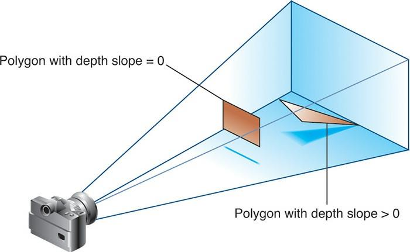
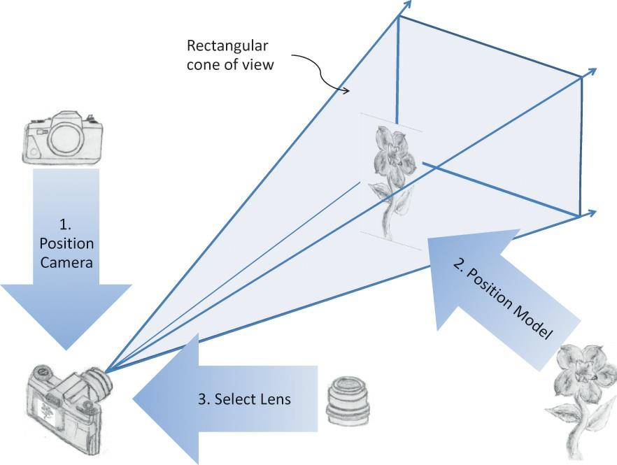

:icons: font
:stem: latexmath
:doctype: book
:source-highlighter: highlight.js

= OpenGL® Programming Guide Ninth Edition

[link=http://www.opengl-redbook.com/]
image:http://www.opengl-redbook.com/cover.jpg[]
https://github.dev/kurong00/GameProgramBooks[PDF]

The OpenGL® Programming Guide 9th Edition

John Kessenich, Graham Sellers, and Dave Shreiner

Welcome to the website for the OpenGL Programming Guide (the "Red Book"). 
The latest release — the ninth edition — brings the most comprehensive discussion 
of the OpenGL API completely up to date. This edition throughly discusses the 
features of OpenGL version 4.5, OpenGL's latest version, including:

*  Direct State Access (DSA) which modifies the way that OpenGL objects 
   (e.g., textures, FBOs, etc.) modify their attributes. This approach 
   mitigates the sometimes confusing "bind-to-edit", making it much more 
   straight-forward to understand which objects are being updated.

*  SPIR-V, The Khronos Group's compiled-shader representation, which allows 
   authoring shaders in just about any programming language – provided there's 
   a SPIR-V backend to the compiler chain. SPIR-V is also one of the major 
   components of Khronos' new Vulkan API.

*  Expanded discussions of GPU computing (compute shaders) and rendering 
   algorithms, with a focus of doing more work on the GPU.

As always, the Red Book guides the reader from the essientials of using OpenGL 
including introducing vertex and fragment shaders, through advanced programming 
techniques using geometry, tesselation, and compute shaders, and all the other 
features available in OpenGL.

The source code for the 9th edition is now hosted on Github, or you can download 
a ZIP archive of the Github repository here.

https://github.com/openglredbook/examples +
http://www.opengl-redbook.com/OGLPG-9th-Edition.zip +

Thanks, and happy hacking!  
The OpenGL Progamming Guide Team


////
About This E-Book

EPUB is an open, industry-standard format for e-books. However, support
for EPUB and its many features varies across reading devices and
applications. Use your device or app settings to customize the presentation to
your liking. Settings that you can customize often include font, font size, single
or double column, landscape or portrait mode, and figures that you can click or
tap to enlarge. For additional information about the settings and features on
your reading device or app, visit the device manufacturer’s Web site.

Many titles include programming code or configuration examples. To
optimize the presentation of these elements, view the e-book in single-column,
landscape mode and adjust the font size to the smallest setting. In addition to
presenting code and configurations in the reflowable text format, we have
included images of the code that mimic the presentation found in the print book;
therefore, where the reflowable format may compromise the presentation of the
code listing, you will see a “Click here to view code image” link. Click the
link to view the print-fidelity code image. To return to the previous page
viewed, click the Back button on your device or app.
////


OpenGL ® Programming Guide
Ninth Edition

The Official Guide to Learning OpenGL ® , Version 4.5 with SPIR-V

John Kessenich  +
Graham Sellers  +
Dave Shreiner  +

Addision-Wesley  +
Boston • Columbus • Indianapolis • New York • San Francisco • Amsterdam • Cape Town  
Dubai • London • Madrid • Milan • Munich • Paris • Montreal • Toronto • Delhi • Mexico City  
São Paulo • Sydney • Hong Kong • Seoul • Singapore • Taipei • Tokyo

Many of the designations used by manufacturers and sellers to distinguish their
products are claimed as trademarks. Where those designations appear in this
book, and the publisher was aware of a trademark claim, the designations have
been printed with initial capital letters or in all capitals.

The authors and publisher have taken care in the preparation of this book, but
make no expressed or implied warranty of any kind and assume no
responsibility for errors or omissions. No liability is assumed for incidental or
consequential damages in connection with or arising out of the use of the
information or programs contained herein.

For information about buying this title in bulk quantities, or for special sales
opportunities (which may include electronic versions; custom cover designs;
and content particular to your business, training goals, marketing focus, or
branding interests), please contact our corporate sales department at
corpsales@pearsoned.com or (800) 382-3419.

For government sales inquiries, please contact
governmentsales@pearsoned.com.

For questions about sales outside the U.S., please contact intlcs@pearson.com.
Visit us on the Web: informit.com/aw

Library of Congress Control Number: 2016939338

Copyright © 2017 Pearson Education, Inc.

All rights reserved. Printed in the United States of America. This publication
is protected by copyright, and permission must be obtained from the publisher
prior to any prohibited reproduction, storage in a retrieval system, or
transmission in any form or by any means, electronic, mechanical,
photocopying, recording, or likewise. For information regarding permissions,
request forms and the appropriate contacts within the Pearson Education
Global Rights & Permissions Department, please visit
www.pearsoned.com/permissions/.

ISBN-13: 978-0-13-449549-1  +
ISBN-10: 0-13-449549-7  +
Text printed in the United States on recycled paper at RR Donnelley in
Crawfordsville, Indiana.

First printing, July 2016

== Praise for previous editions of OpenGL® Programming Guide

____
“Wow! This book is basically one-stop shopping for OpenGL
information. It is the kind of book that I will be reaching for a lot.
Thanks to Dave, Graham, John, and Bill for an amazing effort.”
—Mike Bailey, professor, Oregon State University
____

____
“The most recent Red Book parallels the grand tradition of OpenGL;
continuous evolution towards ever-greater power and efficiency. The
eighth edition contains up-to-the minute information about the latest
standard and new features, along with a solid grounding in modern
OpenGL techniques that will work anywhere. The Red Book continues
to be an essential reference for all new employees at my simulation
company. What else can be said about this essential guide? I laughed, I
cried, it was much better than Cats—I’ll read it again and again.”
—Bob Kuehne, president, Blue Newt Software
____

____
“OpenGL has undergone enormous changes since its inception twenty
years ago. This new edition is your practical guide to using the
OpenGL of today. Modern OpenGL is centered on the use of shaders,
and this edition of the Programming Guide jumps right in, with shaders
covered in depth in Chapter 2. It continues in later chapters with even
more specifics on everything from texturing to compute shaders. No
matter how well you know it or how long you’ve been doing it, if you
are going to write an OpenGL program, you want to have a copy of the
OpenGL ® Programming Guide handy.”
—Marc Olano, associate professor, UMBC
____

____
“If you are looking for the definitive guide to programming with the
very latest version of OpenGL, look no further. The authors of this
book have been deeply involved in the creation of OpenGL 4.3, and
everything you need to know about the cutting edge of this industry-
leading API is laid out here in a clear, logical, and insightful manner.”
—Neil Trevett, president, Khronos Group
____


____
To Brenda, Alison, and Noname
—JMK
____


____
To Chris, J., and Emily
—GJAS
____


____
To my family—Vicki, Bonnie, Bob, Cookie, Goatee, Phantom, Squiggles,
Tuxedo, and Toby
—DRS
____


[[toc]]
== Contents


link:#Pxxxix[About This Guide] +
link:#Pxlv[Acknowledgments] +

link:#toc[💨]

[[toc01]]
link:#P001[**Chapter 1: Introduction to OpenGL**] +
   link:#P002[What Is OpenGL?] +
   link:#P004[Your First Look at an OpenGL Program] +
   link:#P008[OpenGL Syntax] +
   link:#P010[OpenGL’s Rendering Pipeline] +
   link:#P014[Our First Program: A Detailed Discussion] +

link:#toc[💨]

[[toc02]]
link:#P033[**Chapter 2: Shader Fundamentals**] +
   link:#P034[Shaders and OpenGL] +
   link:#P035[OpenGL’s Programmable Pipeline] +
   link:#P037[An Overview of the OpenGL Shading Language] +
   link:#P061[Interface Blocks] +
   link:#P072[Compiling Shaders] +
   link:#P079[Shader Subroutines] +
   link:#P084[Separate Shader Objects] +
   link:#P086[SPIR-V] +

link:#toc[💨]

[[toc03]]
link:#P095[**Chapter 3: Drawing with OpenGL**] +
   link:#P096[OpenGL Graphics Primitives] +
   link:#P102[Data in OpenGL Buffers] +
   link:#P117[Vertex Specification] +
   link:#P124[OpenGL Drawing Commands] +

link:#toc[💨]

[[toc04]]
link:#P151[**Chapter 4: Color, Pixels, and Fragments**] +
   link:#P152[Basic Color Theory] +
   link:#P154[Buffers and Their Uses] +
   link:#P158[Color and OpenGL] +
   link:#P163[Testing and Operating on Fragments] +
   link:#P185[Multisampling] +
   link:#P188[Per-Primitive Antialiasing] +
   link:#P191[Reading and Copying Pixel Data] +
   link:#P193[Copying Pixel Rectangles] +

link:#toc[💨]

[[toc05]]
link:#P197[**Chapter 5: Viewing Transformations, Culling, Clipping, and Feedback**] +
   link:#P198[Viewing] +
   link:#P203[User Transformations] +
   link:#P226[OpenGL Transformations] +
   link:#P231[Transform Feedback] +

link:#toc[💨]

[[toc06]]
link:#P255[**Chapter 6: Textures and Framebuffers**] +
   link:#P257[Introduction to Texturing] +
   link:#P258[Basic Texture Types] +
   link:#P260[Creating and Initializing Textures] +
   link:#P265[Specifying Texture Data] +
   link:#P279[Texture Formats] +
   link:#P285[Compressed Textures] +
   link:#P288[Sampler Objects] +
   link:#P291[Using Textures] +
   link:#P302[Complex Texture Types] +
   link:#P317[Texture Views] +
   link:#P321[Filtering] +
   link:#P337[Bindless Textures] +
   link:#P341[Sparse Textures] +
   link:#P344[Point Sprites] +
   link:#P348[Framebuffer Objects] +
   link:#P351[Rendering to Texture Maps] +
   link:#P370[Chapter Summary] +

link:#toc[💨]

[[toc07]]
link:#P373[**Chapter 7: Light and Shadow**] +
   link:#P374[Lighting Introduction] +
   link:#P375[Classic Lighting Model] +
   link:#P399[Advanced Lighting Models] +
   link:#P413[Shadow Mapping] +

link:#toc[💨]

[[toc08]]
link:#P423[**Chapter 8: Procedural Texturing**] +
   link:#P424[Procedural Texturing] +
   link:#P444[Bump Mapping] +
   link:#P454[Antialiasing Procedural Textures] +
   link:#P472[Noise] +
   link:#P495[Further Information] +

link:#toc[💨]

[[toc09]]
link:#P497[**Chapter 9: Tessellation Shaders**] +
   link:#P498[Tessellation Shaders] +
   link:#P499[Tessellation Patches] +
   link:#P500[Tessellation Control Shaders] +
   link:#P508[Tessellation Evaluation Shaders] +
   link:#P512[A Tessellation Example: The Teapot] +
   link:#P516[Additional Tessellation Techniques] +

link:#toc[💨]

[[toc10]]
link:#P521[**Chapter 10: Geometry Shaders**] +
   link:#P523[Creating a Geometry Shader] +
   link:#P526[Geometry Shader Inputs and Outputs] +
   link:#P537[Producing Primitives] +
   link:#P544[Advanced Transform Feedback] +
   link:#P561[Geometry Shader Instancing] +
   link:#P562[Multiple Viewports and Layered Rendering] +
   link:#P572[Chapter Summary] +

link:#toc[💨]

[[toc11]]
link:#P577[**Chapter 11: Memory**] +
   link:#P578[Using Textures for Generic Data Storage] +
   link:#P589[Shader Storage Buffer Objects] +
   link:#P591[Atomic Operations and Synchronization] +
   link:#P621[Example: Order-Independent Transparency] +

link:#toc[💨]

[[toc12]]
link:#P635[**Chapter 12: Compute Shaders**] +
   link:#P636[Overview] +
   link:#P637[Workgroups and Dispatch] +
   link:#P644[Communication and Synchronization] +
   link:#P648[Examples] +
   link:#P659[Chapter Summary] +

link:#P663[Appendix A: Support Libraries] +
   link:#P664[Basics of GLFW: The OpenGL Utility Framework] +
   link:#P664[Initializing and Creating a Window] +
   link:#P667[Handling User Input] +
   link:#P671[Controlling the Window] +
   link:#P675[Shutting Down Cleanly] +
   link:#P676[GL3W: OpenGL Glue] +

link:#P679[Appendix B: OpenGL ES and WebGL] +
   link:#P680[OpenGL ES] +
   link:#P682[WebGL] +

link:#P693[Appendix C: Built-in GLSL Variables and Functions] +
   link:#P693[Built-in Variables] +
   link:#P705[Built-in Constants] +
   link:#P707[Built-in Functions] +

link:#P757[Appendix D: State Variables] +
   link:#P757[The Query Commands] +
   link:#P765[OpenGL State Variables] +

link:#P849[Appendix E: Homogeneous Coordinates and Transformation Matrices] +
   link:#P849[Homogeneous Coordinates] +
   link:#P851[Transformation Matrices] +

link:#P855[Appendix F: Floating-Point Formats for Textures, Framebuffers, and Renderbuffers] +
   link:#P855[Reduced-Precision Floating-Point Values] +
   link:#P856[16-Bit Floating-Point Values] +
   link:#P858[10- and 11-Bit Unsigned Floating-Point Values] +

link:#P863[Appendix G: Debugging and Profiling OpenGL] +
   link:#P863[Creating a Debug Context] +
   link:#P866[Debug Output] +
   link:#P874[Debug Groups] +
   link:#P877[Profiling] +

link:#P883[Appendix H: Buffer Object Layouts] +
   link:#P883[Using Standard Layout Qualifiers] +
   link:#P884[The std140 Layout Rules] +
   link:#P885[The std430 Layout Rules] +

link:#P887[Glossary] +
link:#P917[Index] +

////
Figures
Tables
Examples
About This Guide
   What This Guide Contains
   What’s New in This Edition
   What You Should Know Before Reading This Guide
   How to Obtain the Sample Code
   Errata
   Style Conventions
   About the OpenGL Series
Acknowledgments

1. Introduction to OpenGL
   What Is OpenGL?
   Your First Look at an OpenGL Program
   OpenGL Syntax
   OpenGL’s Rendering Pipeline
      |Preparing to Send Data to OpenGL
      |Sending Data to OpenGL
      |Vertex Shading
      |Tessellation Shading
      |Geometry Shading
      |Primitive Assembly
      |Clipping
      |Rasterization
      |Fragment Shading
      |Per-Fragment Operations
   Our First Program: A Detailed Discussion
      |Entering **main()**
      |OpenGL Initialization
      |Our First OpenGL Drawing
2. Shader Fundamentals
   Shaders and OpenGL
   OpenGL’s Programmable Pipeline
   An Overview of the OpenGL Shading Language
      |Creating Shaders with GLSL
      |Storage Qualifiers
      |Statements
      |Computational Invariance
      |Shader Preprocessor
      |Compiler Control
      |Global Shader-Compilation Option
   Interface Blocks
      |Uniform Blocks
      |Specifying Uniform Blocks in Shaders
      |Accessing Uniform Blocks from Your Application
      |Buffer Blocks
      |In/Out Blocks, Locations, and Components
   Compiling Shaders
   Shader Subroutines
      |GLSL Subroutine Setup
      |Selecting Shader Subroutines
   Separate Shader Objects
   SPIR-V
      |Reasons to Choose SPIR-V
      |Using SPIR-V with OpenGL
      |Using GLSL to Generate SPIR-V for OpenGL
      |Glslang
      |What’s Inside SPIR-V?

3. Drawing with OpenGL
OpenGL Graphics Primitives
   Points
   Lines, Strips, and Loops
   Triangles, Strips, and Fans
Data in OpenGL Buffers
   Creating and Allocating Buffers
   Getting Data into and out of Buffers
   Accessing the Content of Buffers
   Discarding Buffer Data
Vertex Specification
   VertexAttribPointer in Depth
   Static Vertex-Attribute Specification
OpenGL Drawing Commands
   Restarting Primitives
   Instanced Rendering

4. Color, Pixels, and Fragments
   Basic Color Theory
   Buffers and Their Uses
      |Clearing Buffers
      |Masking Buffers
   Color and OpenGL
      |Color Representation and OpenGL
      |Smoothly Interpolating Data
   Testing and Operating on Fragments
      |Scissor Test
      |Multisample Fragment Operations
      |Stencil Test
      |Stencil Examples
      |Depth Test
      |Blending
      |Logical Operations
      |Occlusion Query
      |Conditional Rendering
   Multisampling
      |Sample Shading
   Per-Primitive Antialiasing
      |Antialiasing Lines
      |Antialiasing Polygons
   Reading and Copying Pixel Data
   Copying Pixel Rectangles

5. Viewing Transformations, Culling, Clipping, and Feedback
   Viewing
      |Viewing Model
      |Camera Model
      |Orthographic Viewing Model
   User Transformations
      |Matrix Multiply Refresher
      |Homogeneous Coordinates
      |Linear Transformations and Matrices
      |Transforming Normals
      |OpenGL Matrices
   OpenGL Transformations
      |Advanced: User Culling and Clipping
      |Controlling OpenGL Transformations
   Transform Feedback
      |Transform Feedback Objects
      |Transform Feedback Buffers
      |Configuring Transform Feedback Varyings
      |Starting and Stopping Transform Feedback
      |Transform Feedback Example—Particle System

6. Textures and Framebuffers
   Introduction to Texturing
   Basic Texture Types
   Creating and Initializing Textures
      |Proxy Textures
   Specifying Texture Data
      |Explicitly Setting Texture Data
      |Loading Textures from Buffers
      |Loading Images from Files
      |Retrieving Texture Data
      |Texture Data Layout
   Texture Formats
      |Internal Formats
      |External Formats
   Compressed Textures
   Sampler Objects
      |Sampler Parameters
   Using Textures
      |Texture Coordinates
      |Arranging Texture Data
      |Using Multiple Textures
   Complex Texture Types
      |3D Textures
      |Array Textures
      |Cube-Map Textures
      |Shadow Samplers
      |Depth-Stencil Textures
      |Buffer Textures
   Texture Views
   Filtering
      |Linear Filtering
      |Using and Generating Mipmaps
      |Calculating the Mipmap Level
      |Mipmap Level-of-Detail Control
   Advanced Texture Lookup Functions
      |Explicit Level of Detail
      |Explicit Gradient Specification
      |Texture Fetch with Offsets
      |Projective Texturing
      |Texture Queries in Shaders
      |Gathering Texels
      |Combining Special Functions
   Bindless Textures
      |Texture Handles
      |Texture Residency
      |Sampling Bindless Textures
   Sparse Textures
      |Sparse Texture Commitment
      |Sparse Texture Pages
   Point Sprites
      |Textured Point Sprites
      |Controlling the Appearance of Points
   Framebuffer Objects
   Rendering to Texture Maps
      |Discarding Rendered Data
      |Renderbuffers
      |Creating Renderbuffer Storage
      |Framebuffer Attachments
      |Framebuffer Completeness
      |Invalidating Framebuffers
      |Writing to Multiple Renderbuffers Simultaneously
      |Selecting Color Buffers for Writing and Reading
      |Dual-Source Blending
   Chapter Summary
      |Texture Redux
      |Texture Best Practices

7. Light and Shadow
   Lighting Introduction
   Classic Lighting Model
      |Fragment Shaders for Different Light Styles
      |Moving Calculations to the Vertex Shader
      |Multiple Lights and Materials
      |Lighting Coordinate Systems
      |Limitations of the Classic Lighting Model
   Advanced Lighting Models
      |Hemisphere Lighting
      |Image-Based Lighting
      |Lighting with Spherical Harmonics
   Shadow Mapping
      |Creating a Shadow Map
      |Using a Shadow Map

8. Procedural Texturing
   Procedural Texturing
      |Regular Patterns
      |Toy Ball
      |Lattice
      |Procedural Shading Summary
   Bump Mapping
      |Application Setup
      |Vertex Shader
      |Fragment Shader
      |Normal Maps
   Antialiasing Procedural Textures
      |Sources of Aliasing
      |Avoiding Aliasing
      |Increasing Resolution
      |Antialiasing High Frequencies
      |Frequency Clamping
      |Procedural Antialiasing Summary
   Noise
      |Definition of Noise
      |Noise Textures
      |Trade-Offs
      |A Simple Noise Shader
      |Turbulence
      |Marble
      |Granite
      |Wood
      |Noise Summary
   Further Information

9. Tessellation Shaders
   Tessellation Shaders
   Tessellation Patches
   Tessellation Control Shaders
      |Generating Output-Patch Vertices
      |Tessellation Control Shader Variables
      |Controlling Tessellation
   Tessellation Evaluation Shaders
      |Specifying the Primitive Generation Domain
      |Specifying the Face Winding for Generated Primitives
      |Specifying the Spacing of Tessellation Coordinates
      |Additional Tessellation Evaluation Shader layout Options
      |Specifying a Vertex’s Position
      |Tessellation Evaluation Shader Variables
   A Tessellation Example: The Teapot
      |Processing Patch Input Vertices
      |Evaluating Tessellation Coordinates for the Teapot
   Additional Tessellation Techniques
      |View-Dependent Tessellation
      |Shared Tessellated Edges and Cracking
      |Displacement Mapping

10. Geometry Shaders
   Creating a Geometry Shader
   Geometry Shader Inputs and Outputs
      |Geometry Shader Inputs
      |Special Geometry Shader Primitives
      |Geometry Shader Outputs
   Producing Primitives
      |Culling Geometry
      |Geometry Amplification
   Advanced Transform Feedback
      |Multiple Output Streams
      |Primitive Queries
      |Using Transform Feedback Results
   Geometry Shader Instancing
   Multiple Viewports and Layered Rendering
      |Viewport Index
      |Layered Rendering
   Chapter Summary
      |Geometry Shader Redux
      |Geometry Shader Best Practices

11. Memory
   Using Textures for Generic Data Storage
      |Binding Textures to Image Units
      |Reading and Writing to Images
   Shader Storage Buffer Objects
      |Writing Structured Data
   Atomic Operations and Synchronization
      |Atomic Operations on Images
      |Atomic Operations on Buffers
      |Sync Objects
      |Image Qualifiers and Barriers
      |High-Performance Atomic Counters
   Example: Order-Independent Transparency
      |Principles of Operation
      |Initialization
      |Rendering
      |Sorting and Blending
      |Results

12. Compute Shaders
   Overview
   Workgroups and Dispatch
      |Knowing Where You Are
   Communication and Synchronization
      |Communication
      |Synchronization
   Examples
      |Physical Simulation
      |Image Processing
   Chapter Summary
      |Compute Shader Redux
      |Compute Shader Best Practices

Appendices
----------

A. Support Libraries
   Basics of GLFW: The OpenGL Utility Framework
   Initializing and Creating a Window
   Handling User Input
   Controlling the Window
   Shutting Down Cleanly
   GL3W: OpenGL Glue

B. OpenGL ES and WebGL
   OpenGL ES
   WebGL
      |Setting Up WebGL Within an HTML5 Page
      |Initializing Shaders in WebGL
      |Initializing Vertex Data in WebGL
      |Using Texture Maps in WebGL

C. Built-in GLSL Variables and Functions
   Built-in Variables
      |Built-in Variable Declarations
      |Built-in Variable Descriptions
   Built-in Constants
   Built-in Functions
      |Angle and Trigonometry Functions
      |Exponential Functions
      |Common Functions
      |Floating-Point Pack and Unpack Functions
      |Geometric Functions
      |Matrix Functions
      |Vector Relational Functions
      |Integer Functions
      |Texture Functions
      |Atomic-Counter Functions
      |Atomic Memory Functions
      |Image Functions
      |Fragment Processing Functions
      |Geometry Shader Functions
      |Shader Invocation Control Functions
      |Shader Memory Control Functions

D. State Variables
   The Query Commands
   OpenGL State Variables
      |Current Values and Associated Data
      |Vertex Array Object State
      |Vertex Array Data
      |Buffer Object State
      |Transformation State
      |Coloring State
      |Rasterization State
      |Multisampling
      |Textures
      |Pixel Operations
      |Framebuffer Controls
      |Framebuffer State
      |Renderbuffer State
      |Pixel State
      |Shader Object State
      |Shader Program Pipeline Object State
      |Shader Program Object State
      |Program Interface State
      |Program Object Resource State
      |Vertex and Geometry Shader State
      |Query Object State
      |Image State
      |Transform Feedback State
      |Atomic Counter State
      |Shader Storage Buffer State
      |Sync Object State
      |Hints
      |Compute Dispatch State
      |Implementation-Dependent Values
      |Tessellation Shader Implementation-Dependent Limits
      |Geometry Shader Implementation-Dependent Limits
      |Fragment Shader Implementation-Dependent Limits
      |Implementation-Dependent Compute Shader Limits
      |Implementation-Dependent Shader Limits
      |Implementation-Dependent Debug Output State
      |Implementation-Dependent Values
      |Internal Format-Dependent Values
      |Implementation-Dependent Transform Feedback Limits
      |Framebuffer-Dependent Values
      |Miscellaneous

E. Homogeneous Coordinates and Transformation Matrices
   Homogeneous Coordinates
      |Transforming Vertices
      |Transforming Normals
   Transformation Matrices
      |Translation
      |Scaling
      |Rotation
      |Perspective Projection
      |Orthographic Projection

F. Floating-Point Formats for Textures, Framebuffers, and Renderbuffers
   Reduced-Precision Floating-Point Values
   16-Bit Floating-Point Values
   10- and 11-Bit Unsigned Floating-Point Values

G. Debugging and Profiling OpenGL
   Creating a Debug Context
   Debug Output
      |Debug Messages
      |Filtering Messages
      |Application-Generated Messages
   Debug Groups
      |Naming Objects
   Profiling
      |Profiling Tools
      |In-Application Profiling

H. Buffer Object Layouts
   Using Standard Layout Qualifiers
   The std140 Layout Rules
   The std430 Layout Rules

Glossary
Index
////


[[figures]]
== Figures

link:#F1.1[Figure 1.1 Image from our first OpenGL program: triangles.cpp] +
link:#F1.2[Figure 1.2 OpenGL pipeline] +
link:#F2.1[Figure 2.1 Shader-compilation command sequence] +
link:#F3.1[Figure 3.1 Vertex layout for a triangle strip] +
link:#F3.2[Figure 3.2 Vertex layout for a triangle fan] +
link:#F3.3[Figure 3.3 Packing of elements in a BGRA-packed vertex attribute] +
link:#F3.4[Figure 3.4 Packing of elements in a RGBA-packed vertex attribute] +
link:#F3.5[Figure 3.5 Simple example of drawing commands] +
link:#F3.6[Figure 3.6 Using primitive restart to break a triangle strip] +
link:#F3.7[Figure 3.7 Two triangle strips forming a cube] +
link:#F3.8[Figure 3.8 Result of rendering with instanced vertex attributes] +
link:#F3.9[Figure 3.9 Result of instanced rendering using gl_InstanceID] +
link:#F4.1[Figure 4.1 Region occupied by a pixel] +
link:#F4.2[Figure 4.2 Polygons and their depth slopes] +
link:#F4.3[Figure 4.3 Aliased and antialiased lines] +
link:#F5.1[Figure 5.1 Steps to configure and position the viewing frustum] +
link:#F5.2[Figure 5.2 Coordinate systems required by OpenGL] +
link:#F5.3[Figure 5.3 User coordinate systems unseen by OpenGL] +
link:#F5.4[Figure 5.4 A view frustum] +
link:#F5.5[Figure 5.5 Pipeline subset for user/shader part of transforming coordinates] +
link:#F5.6[Figure 5.6 One-dimensional homogeneous space] +
link:#F5.7[Figure 5.7 Translating by skewing] +
link:#F5.8[Figure 5.8 Translating an object 2.5 in the x direction] +
link:#F5.9[Figure 5.9 Scaling an object to three times its size] +
link:#F5.10[Figure 5.10 Scaling an object in place] +
link:#F5.11[Figure 5.11 Rotation] +
link:#F5.12[Figure 5.12 Rotating in place] +
link:#F5.13[Figure 5.13 Frustum projection] +
link:#F5.14[Figure 5.14 Orthographic projection] +
link:#F5.15[Figure 5.15 z precision] +
link:#F5.16[Figure 5.16 Transform feedback varyings packed in a single buffer] +
link:#F5.17[Figure 5.17 Transform feedback varyings packed in separate buffers] +
link:#F5.18[Figure 5.18 Transform feedback varyings packed into multiple buffers] +
link:#F5.19[Figure 5.19 Schematic of the particle system simulator] +
link:#F5.20[Figure 5.20 Result of the particle system simulator] +
link:#F6.1[Figure 6.1 Byte-swap effect on byte, short, and integer data] +
link:#F6.2[Figure 6.2 Subimage identified by *SKIP_ROWS, *SKIP_PIXELS, and *ROW_LENGTH parameters] +
link:#F6.3[Figure 6.3 *IMAGE_HEIGHT pixel storage mode] +
link:#F6.4[Figure 6.4 *SKIP_IMAGES pixel storage mode] +
link:#F6.5[Figure 6.5 Output of the simple textured quad example] +
link:#F6.6[Figure 6.6 Effect of different texture wrapping modes] +
link:#F6.7[Figure 6.7 Two textures used in the multitexture example] +
link:#F6.8[Figure 6.8 Output of the simple multitexture example] +
link:#F6.9[Figure 6.9 Output of the volume texture example] +
link:#F6.10[Figure 6.10 A sky box, shown as seen from the outside, from close up, and from the center] +
link:#F6.11[Figure 6.11 A golden environment mapped torus] +
link:#F6.12[Figure 6.12 A visible seam in a cube map] +
link:#F6.13[Figure 6.13 The effect of seamless cube-map filtering] +
link:#F6.14[Figure 6.14 Effect of texture minification and magnification] +
link:#F6.15[Figure 6.15 Resampling of a signal in one dimension] +
link:#F6.16[Figure 6.16 Bilinear resampling] +
link:#F6.17[Figure 6.17 A prefiltered mipmap pyramid] +
link:#F6.18[Figure 6.18 Effects of minification mipmap filters] +
link:#F6.19[Figure 6.19 Illustration of mipmaps using unrelated colors] +
link:#F6.20[Figure 6.20 Result of the simple textured point sprite example] +
link:#F6.21[Figure 6.21 Analytically calculated point sprites] +
link:#F6.22[Figure 6.22 Smooth edges of circular point sprites] +
link:#F6.23[Figure 6.23 Close-up of RGB color elements in an LCD panel] +
link:#F7.1[Figure 7.1 Elements of the classic lighting model] +
link:#F7.2[Figure 7.2 A sphere illuminated using the hemisphere lighting model] +
link:#F7.3[Figure 7.3 Analytic hemisphere lighting function] +
link:#F7.4[Figure 7.4 Lighting model comparison] +
link:#F7.5[Figure 7.5 Light probe image] +
link:#F7.6[Figure 7.6 Lat-long map] +
link:#F7.7[Figure 7.7 Cube map] +
link:#F7.8[Figure 7.8 Effects of diffuse and specular environment maps] +
link:#F7.9[Figure 7.9 Spherical harmonics lighting] +
link:#F7.10[Figure 7.10 Depth rendering] +
link:#F7.11[Figure 7.11 Final rendering of shadow map] +
link:#F8.1[Figure 8.1 Procedurally striped torus] +
link:#F8.2[Figure 8.2 Stripes close-up] +
link:#F8.3[Figure 8.3 Brick patterns] +
link:#F8.4[Figure 8.4 Visualizing the results of the half-space distance calculations] +
link:#F8.5[Figure 8.5 Intermediate results from “in” or “out” computation] +
link:#F8.6[Figure 8.6 Intermediate results from the toy ball shader] +
link:#F8.7[Figure 8.7 The lattice shader applied to the cow model] +
link:#F8.8[Figure 8.8 Inconsistently defined tangents leading to large lighting errors] +
link:#F8.9[Figure 8.9 Simple box and torus with procedural bump mapping] +
link:#F8.10[Figure 8.10 Normal mapping] +
link:#F8.11[Figure 8.11 Aliasing artifacts caused by point sampling] +
link:#F8.12[Figure 8.12 Supersampling] +
link:#F8.13[Figure 8.13 Using the s texture coordinate to create stripes on a sphere] +
link:#F8.14[Figure 8.14 Antialiasing the stripe pattern] +
link:#F8.15[Figure 8.15 Visualizing the gradient] +
link:#F8.16[Figure 8.16 Effect of adaptive analytical antialiasing on striped teapots] +
link:#F8.17[Figure 8.17 The periodic step function] +
link:#F8.18[Figure 8.18 Periodic step function (pulse train) and its integral] +
link:#F8.19[Figure 8.19 Brick shader with and without antialiasing] +
link:#F8.20[Figure 8.20 Checkerboard pattern] +
link:#F8.21[Figure 8.21 A discrete 1D noise function] +
link:#F8.22[Figure 8.22 A continuous 1D noise function] +
link:#F8.23[Figure 8.23 Varying the frequency and the amplitude of the noise function] +
link:#F8.24[Figure 8.24 Summing noise functions: the result of summing noise functions of different amplitude and frequency] +
link:#F8.25[Figure 8.25 Basic 2D noise, at frequencies 4, 8, 16, and 32 (contrast enhanced)] +
link:#F8.26[Figure 8.26 Summed noise, at 1, 2, 3, and 4 octaves (contrast enhanced)] +
link:#F8.27[Figure 8.27 Teapots rendered with noise shaders] +
link:#F8.28[Figure 8.28 Absolute-value noise or “turbulence”] +
link:#F8.29[Figure 8.29 A bust of Beethoven rendered with the wood shader] +
link:#F9.1[Figure 9.1 Quad tessellation] +
link:#F9.2[Figure 9.2 Isoline tessellation] +
link:#F9.3[Figure 9.3 Triangle tessellation] +
link:#F9.4[Figure 9.4 Even and odd tessellation] +
link:#F9.5[Figure 9.5 The tessellated patches of the teapot] +
link:#F9.6[Figure 9.6 Tessellation cracking] +
link:#F10.1[Figure 10.1 Lines adjacency sequence] +
link:#F10.2[Figure 10.2 Line-strip adjacency sequence] +
link:#F10.3[Figure 10.3 Triangles adjacency sequence] +
link:#F10.4[Figure 10.4 Triangle-strip adjacency layout] +
link:#F10.5[Figure 10.5 Triangle-strip adjacency sequence] +
link:#F10.6[Figure 10.6 Texture used to represent hairs in the fur rendering example] +
link:#F10.7[Figure 10.7 The output of the fur rendering example] +
link:#F10.8[Figure 10.8 Schematic of geometry shader sorting example] +
link:#F10.9[Figure 10.9 Final output of geometry shader sorting example] +
link:#F10.10[Figure 10.10 Output of the viewport-array example] +
link:#F11.1[Figure 11.1 Output of the simple load-store shader] +
link:#F11.2[Figure 11.2 Timeline exhibited by the naïve overdraw counter shader] +
link:#F11.3[Figure 11.3 Output of the naïve overdraw counter shader] +
link:#F11.4[Figure 11.4 Output of the atomic overdraw counter shader] +
link:#F11.5[Figure 11.5 Cache hierarchy of a fictitious GPU] +
link:#F11.6[Figure 11.6 Data structures used for order-independent transparency] +
link:#F11.7[Figure 11.7 Inserting an item into the per-pixel linked lists] +
link:#F11.8[Figure 11.8 Result of order-independent transparency] +
link:#F12.1[Figure 12.1 Schematic of a compute workload] +
link:#F12.2[Figure 12.2 Relationship of global and local invocation ID] +
link:#F12.3[Figure 12.3 Output of the physical simulation program as simple points] +
link:#F12.4[Figure 12.4 Output of the physical simulation program] +
link:#F12.5[Figure 12.5 Image processing] +
link:#F12.6[Figure 12.6 Image processing artifacts] +
link:#FB.1[Figure B.1 WebGL demo] +
link:#FG.1[Figure G.1 AMD’s GPUPerfStudio2 profiling Unigine Heaven 3.0] +
link:#FG.2[Figure G.2 Screen Shot of Unigine Heaven 3.0] +


[[tables]]
== Tables


link:#T1.1[Table 1.1 Command Suffixes and Argument Data Types] +
link:#T1.2[Table 1.2 Example of Determining Parameters for **glVertexAttribPointer()**] +
link:#T2.1[Table 2.1 Basic Data Types in GLSL] +
link:#T2.2[Table 2.2 Implicit Conversions in GLSL] +
link:#T2.3[Table 2.3 GLSL Vector and Matrix Types] +
link:#T2.4[Table 2.4 Vector Component Accessors] +
link:#T2.5[Table 2.5 GLSL Type Modifiers] +
link:#T2.6[Table 2.6 GLSL Operators and Their Precedence] +
link:#T2.7[Table 2.7 GLSL Control-Flow Statements] +
link:#T2.8[Table 2.8 GLSL Function Parameter Access Modifiers] +
link:#T2.9[Table 2.9 GLSL Preprocessor Directives] +
link:#T2.10[Table 2.10 GLSL Preprocessor Predefined Macros] +
link:#T2.11[Table 2.11 GLSL Extension Directive Modifiers] +
link:#T2.12[Table 2.12 Layout Qualifiers for Uniform] +
link:#T3.1[Table 3.1 OpenGL Primitive Mode Tokens] +
link:#T3.2[Table 3.2 Buffer Binding Targets] +
link:#T3.3[Table 3.3 Buffer Flags] +
link:#T3.4[Table 3.4 Access Modes for **glMapBuffer()**] +
link:#T3.5[Table 3.5 Flags for Use with **glMapNamedBufferRange()**] +
link:#T3.6[Table 3.6 Values of type for **glVertexAttribPointer()**] +
link:#T4.1[Table 4.1 Converting Data Values to Normalized Floating-Point Values] +
link:#T4.2[Table 4.2 Query Values for the Stencil Test] +
link:#T4.3[Table 4.3 Source and Destination Blending Factors] +
link:#T4.4[Table 4.4 Blending Equation Mathematical Operations] +
link:#T4.5[Table 4.5 Sixteen Logical Operations] +
link:#T4.6[Table 4.6 Values for Use with **glHint()**] +
link:#T4.7[Table 4.7 **glReadPixels()** Data Formats] +
link:#T4.8[Table 4.8 Data Types for **glReadPixels()**] +
link:#T5.1[Table 5.1 Drawing Modes Allowed During Transform Feedback] +
link:#T6.1[Table 6.1 Texture Targets and Corresponding Sampler Types] +
link:#T6.2[Table 6.2 Texture Targets and Corresponding Proxy Targets] +
link:#T6.3[Table 6.3 Sized Internal Formats] +
link:#T6.4[Table 6.4 External Texture Formats] +
link:#T6.5[Table 6.5 Example Component Layouts for Packed Pixel Formats] +
link:#T6.6[Table 6.6 Target Compatibility for Texture Views] +
link:#T6.7[Table 6.7 Internal Format Compatibility for Texture Views] +
link:#T6.8[Table 6.8 Framebuffer Attachments] +
link:#T6.9[Table 6.9 Errors Returned by **glCheckFramebufferStatus()**] +
link:#T7.1[Table 7.1 Spherical Harmonic Coefficients for Light-Probe Images] +
link:#T9.1[Table 9.1 Tessellation Control Shader Input Variables] +
link:#T9.2[Table 9.2 Evaluation Shader Primitive Types] +
link:#T9.3[Table 9.3 Options for Controlling Tessellation Level Effects] +
link:#T9.4[Table 9.4 Tessellation Control Shader Input Variables] +
link:#T10.1[Table 10.1 Geometry Shader Primitive Types and Accepted Drawing Modes.] +
link:#T10.2[Table 10.2 Geometry Shader Primitives and the Vertex Count for Each] +
link:#T10.3[Table 10.3 Provoking Vertex Selection by Primitive Mode] +
link:#T10.4[Table 10.4 Ordering of Cube-Map Face Indices] +
link:#T11.1[Table 11.1 Generic Image Types in GLSL] +
link:#T11.2[Table 11.2 Image Format Qualifiers] +
link:#TB.1[Table B.1 Type Strings for WebGL Shaders] +
link:#TB.2[Table B.2 WebGL Typed Arrays] +
link:#TC.1[Table C.1 Cube-Map Face Targets] +
link:#TC.2[Table C.2 Notation for Argument or Return Type] +
link:#TD.1[Table D.1 Current Values and Associated Data] +
link:#TD.2[Table D.2 State Variables for Vertex Array Objects] +
link:#TD.3[Table D.3 State Variables for Vertex Array Data (Not Stored in a Vertex Array Object)] +
link:#TD.4[Table D.4 State Variables for Buffer Objects] +
link:#TD.5[Table D.5 Transformation State Variables] +
link:#TD.6[Table D.6 State Variables for Controlling Coloring] +
link:#TD.7[Table D.7 State Variables for Controlling Rasterization] +
link:#TD.8[Table D.8 State Variables for Multisampling] +
link:#TD.9[Table D.9 State Variables for Texture Units] +
link:#TD.10[Table D.10 State Variables for Texture Objects] +
link:#TD.11[Table D.11 State Variables for Texture Images] +
link:#TD.12[Table D.12 State Variables Per Texture Sampler Object] +
link:#TD.13[Table D.13 State Variables for Pixel Operations] +
link:#TD.14[Table D.14 State Variables Controlling Framebuffer Access and Values] +
link:#TD.15[Table D.15 State Variables for Framebuffers Per Target] +
link:#TD.16[Table D.16 State Variables for Framebuffer Objects] +
link:#TD.17[Table D.17 State Variables for Framebuffer Attachments] +
link:#TD.18[Table D.18 Renderbuffer State] +
link:#TD.19[Table D.19 State Variables Per Renderbuffer Object] +
link:#TD.20[Table D.20 State Variables Controlling Pixel Transfers] +
link:#TD.21[Table D.21 State Variables for Shader Objects] +
link:#TD.22[Table D.22 State Variables for Program Pipeline Object State] +
link:#TD.23[Table D.23 State Variables for Shader Program Objects] +
link:#TD.24[Table D.24 State Variables for Program Interfaces] +
link:#TD.25[Table D.25 State Variables for Program Object Resources] +
link:#TD.26[Table D.26 State Variables for Vertex and Geometry Shader State] +
link:#TD.27[Table D.27 State Variables for Query Objects] +
link:#TD.28[Table D.28 State Variables Per Image Unit] +
link:#TD.29[Table D.29 State Variables for Transform Feedback] +
link:#TD.30[Table D.30 State Variables for Atomic Counters] +
link:#TD.31[Table D.31 State Variables for Shader Storage Buffers] +
link:#TD.32[Table D.32 State Variables for Sync Objects] +
link:#TD.33[Table D.33 Hints] +
link:#TD.34[Table D.34 State Variables for Compute Shader Dispatch] +
link:#TD.35[Table D.35 State Variables Based on Implementation-Dependent Values] +
link:#TD.36[Table D.36 State Variables for Implementation-Dependent Tessellation Shader Values] +
link:#TD.37[Table D.37 State Variables for Implementation-Dependent Geometry Shader Values] +
link:#TD.38[Table D.38 State Variables for Implementation-Dependent Fragment Shader Values] +
link:#TD.39[Table D.39 State Variables for Implementation-Dependent Compute Shader Limits] +
link:#TD.40[Table D.40 State Variables for Implementation-Dependent Shader Limits] +
link:#TD.41[Table D.41 State Variables for Debug Output State] +
link:#TD.42[Table D.42 Implementation-Dependent Values] +
link:#TD.43[Table D.43 Internal Format-Dependent Values] +
link:#TD.44[Table D.44 Implementation-Dependent Transform Feedback Limits] +
link:#TD.45[Table D.45 Framebuffer-Dependent Values] +
link:#TD.46[Table D.46 Miscellaneous State Values] +
link:#TF.1[Table F.1 Reduced-Precision Floating-Point Formats] +
link:#TH.1[Table H.1 std140 Layout Rules] +
link:#TH.2[Table H.2 std430 Layout Rules] +


[[examples]]
== Examples


link:#E1.1[Example 1.1 triangles.cpp: Our First OpenGL Program] +
link:#E1.2[Example 1.2 Vertex Shader for triangles.cpp: triangles.vert] +
link:#E1.3[Example 1.3 Fragment Shader for triangles.cpp: triangles.frag] +
link:#E2.1[Example 2.1 A Simple Vertex Shader] +
link:#E2.2[Example 2.2 Obtaining a Uniform Variable’s Index and Assigning Values] +
link:#E2.3[Example 2.3 Declaring a Uniform Block] +
link:#E2.4[Example 2.4 Initializing Uniform Variables in a Named Uniform Block] +
link:#E2.5[Example 2.5 Static Shader Control Flow] +
link:#E2.6[Example 2.6 Declaring a Set of Subroutines] +
link:#E3.1[Example 3.1 Initializing a Buffer Object with **glNamedBufferStorage()**] +
link:#E3.2[Example 3.2 Initializing a Buffer Object with **glMapBuffer()**] +
link:#E3.3[Example 3.3 Declaration of the DrawArraysIndirectCommand Structure] +
link:#E3.4[Example 3.4 Declaration of the DrawElementsIndirectCommand Structure] +
link:#E3.5[Example 3.5 Setting Up for the Drawing Command Example] +
link:#E3.6[Example 3.6 Drawing Commands Example] +
link:#E3.7[Example 3.7 Intializing Data for a Cube Made of Two Triangle Strips] +
link:#E3.8[Example 3.8 Drawing a Cube Made of Two Triangle Strips Using Primitive Restart] +
link:#E3.9[Example 3.9 Vertex Shader Attributes for the Instancing Example] +
link:#E3.10[Example 3.10 Example Setup for Instanced Vertex Attributes] +
link:#E3.11[Example 3.11 Instanced Attributes Example Vertex Shader] +
link:#E3.12[Example 3.12 Instancing Example Drawing Code] +
link:#E3.13[Example 3.13 gl_VertexID Example Vertex Shader] +
link:#E3.14[Example 3.14 Example Setup for Instanced Vertex Attributes] +
link:#E4.1[Example 4.1 Specifying Vertex Color and Position Data: gouraud.cpp] +
link:#E4.2[Example 4.2 A Simple Vertex Shader for Gouraud Shading] +
link:#E4.3[Example 4.3 A Simple Fragment Shader for Gouraud Shading] +
link:#E4.4[Example 4.4 Using the Stencil Test: stencil.c] +
link:#E4.5[Example 4.5 Rendering Geometry with Occlusion Query: occquery.c] +
link:#E4.6[Example 4.6 Retrieving the Results of an Occlusion Query] +
link:#E4.7[Example 4.7 Rendering Using Conditional Rendering] +
link:#E4.8[Example 4.8 A Multisample-Aware Fragment Shader] +
link:#E4.9[Example 4.9 Setting Up Blending for Antialiasing Lines: antilines.cpp] +
link:#E5.1[Example 5.1 Multiplying Multiple Matrices in a Vertex Shader] +
link:#E5.2[Example 5.2 Simple Use of gl_ClipDistance] +
link:#E5.3[Example 5.3 Example Initialization of a Transform Feedback Buffer] +
link:#E5.4[Example 5.4 Application Specification of Transform Feedback Varyings] +
link:#E5.5[Example 5.5 Leaving Gaps in a Transform Feedback Buffer] +
link:#E5.6[Example 5.6 Assigning Transform Feedback Outputs to Different Buffers] +
link:#E5.7[Example 5.7 Assigning Transform Feedback Outputs to Different Buffers] +
link:#E5.8[Example 5.8 Shader Declaration of Transform Feedback in a Single Buffer] +
link:#E5.9[Example 5.9 Shader Declaration of Transform Feedback in Multiple Buffers] +
link:#E5.10[Example 5.10 Shader Declaration of Transform Feedback Varyings in Multiple Buffers] +
link:#E5.11[Example 5.11 Vertex Shader Used in Geometry Pass of Particle System Simulator] +
link:#E5.12[Example 5.12 Configuring the Geometry Pass of the Particle System Simulator] +
link:#E5.13[Example 5.13 Vertex Shader Used in Simulation Pass of Particle System Simulator] +
link:#E5.14[Example 5.14 Configuring the Simulation Pass of the Particle System Simulator] +
link:#E5.15[Example 5.15 Main Rendering Loop of the Particle System Simulator] +
link:#E6.1[Example 6.1 Direct Specification of Image Data in C] +
link:#E6.2[Example 6.2 Loading Static Data into Texture Objects] +
link:#E6.3[Example 6.3 Loading Data into a Texture Using a Buffer Object] +
link:#E6.4[Example 6.4 Definition of the vglImageData Structure] +
link:#E6.5[Example 6.5 Simple Image Loading Example] +
link:#E6.6[Example 6.6 Loading a Texture Using loadImage] +
link:#E6.7[Example 6.7 Simple Texture Lookup Example (Fragment Shader)] +
link:#E6.8[Example 6.8 Simple Texture Lookup Example (Vertex Shader)] +
link:#E6.9[Example 6.9 Simple Texturing Example] +
link:#E6.10[Example 6.10 Setting the Border Color of a Sampler] +
link:#E6.11[Example 6.11 Texture Swizzle Example] +
link:#E6.12[Example 6.12 Simple Multitexture Example (Vertex Shader)] +
link:#E6.13[Example 6.13 Simple Multitexture Example (Fragment Shader)] +
link:#E6.14[Example 6.14 Simple Multitexture Example] +
link:#E6.15[Example 6.15 Simple Volume Texture Vertex Shader] +
link:#E6.16[Example 6.16 Simple Volume Texture Fragment Shader] +
link:#E6.17[Example 6.17 Initializing a Cube-Map Texture] +
link:#E6.18[Example 6.18 Initializing a Cube-Map Array Texture] +
link:#E6.19[Example 6.19 Simple Sky Box Example—Vertex Shader] +
link:#E6.20[Example 6.20 Simple Sky Box Example—Fragment Shader] +
link:#E6.21[Example 6.21 Cube-Map Environment Mapping Example—Vertex Shader] +
link:#E6.22[Example 6.22 Cube-Map Environment Mapping Example—Fragment Shader] +
link:#E6.23[Example 6.23 Creating and Initializing a Buffer Texture] +
link:#E6.24[Example 6.24 Texel Lookups from a Buffer Texture] +
link:#E6.25[Example 6.25 Creating a Texture View with a New Format] +
link:#E6.26[Example 6.26 Creating a Texture View with a New Target] +
link:#E6.27[Example 6.27 Using Bindless Texture Handles in a Shader] +
link:#E6.28[Example 6.28 Allocating a Large Sparse Texture] +
link:#E6.29[Example 6.29 Simple Point Sprite Vertex Shader] +
link:#E6.30[Example 6.30 Simple Point Sprite Fragment Shader] +
link:#E6.31[Example 6.31 Analytic Shape Fragment Shader] +
link:#E6.32[Example 6.32 Attaching a Texture Level as a Framebuffer Attachment] +
link:#E6.33[Example 6.33 Creating a 256 × 256 RGBA Color Renderbuffer] +
link:#E6.34[Example 6.34 Attaching a Renderbuffer for Rendering] +
link:#E6.35[Example 6.35 Specifying layout Qualifiers for MRT Rendering] +
link:#E6.36[Example 6.36 Layout Qualifiers Specifying the Index of Fragment Shader Outputs] +
link:#E7.1[Example 7.1 Setting Final Color Values with No Lighting] +
link:#E7.2[Example 7.2 Ambient Lighting] +
link:#E7.3[Example 7.3 Directional Light Source Lighting] +
link:#E7.4[Example 7.4 Point-Light Source Lighting] +
link:#E7.5[Example 7.5 Spotlight Lighting] +
link:#E7.6[Example 7.6 Point-Light Source Lighting in the Vertex Shader] +
link:#E7.7[Example 7.7 Structure for Holding Light Properties] +
link:#E7.8[Example 7.8 Multiple Mixed Light Sources] +
link:#E7.9[Example 7.9 Structure to Hold Material Properties] +
link:#E7.10[Example 7.10 Code Snippets for Using an Array of Material Properties] +
link:#E7.11[Example 7.11 Front and Back Material Properties] +
link:#E7.12[Example 7.12 Vertex Shader for Hemisphere Lighting] +
link:#E7.13[Example 7.13 Shaders for Image-Based Lighting] +
link:#E7.14[Example 7.14 Shaders for Spherical Harmonics Lighting] +
link:#E7.15[Example 7.15 Creating a Framebuffer Object with a Depth Attachment] +
link:#E7.16[Example 7.16 Setting up the Matrices for Shadow-Map Generation] +
link:#E7.17[Example 7.17 Simple Shader for Shadow-Map Generation] +
link:#E7.18[Example 7.18 Rendering the Scene from the Light’s Point of View] +
link:#E7.19[Example 7.19 Matrix Calculations for Shadow-Map Rendering] +
link:#E7.20[Example 7.20 Vertex Shader for Rendering from Shadow Maps] +
link:#E7.21[Example 7.21 Fragment Shader for Rendering from Shadow Maps] +
link:#E8.1[Example 8.1 Vertex Shader for Drawing Stripes] +
link:#E8.2[Example 8.2 Fragment Shader for Drawing Stripes] +
link:#E8.3[Example 8.3 Vertex Shader for Drawing Bricks] +
link:#E8.4[Example 8.4 Fragment Shader for Drawing Bricks] +
link:#E8.5[Example 8.5 Values for Uniform Variables Used by the Toy Ball Shader] +
link:#E8.6[Example 8.6 Vertex Shader for Drawing a Toy Ball] +
link:#E8.7[Example 8.7 Fragment Shader for Drawing a Toy Ball] +
link:#E8.8[Example 8.8 Fragment Shader for Procedurally Discarding Part of an Object] +
link:#E8.9[Example 8.9 Vertex Shader for Doing Procedural Bump Mapping] +
link:#E8.10[Example 8.10 Fragment Shader for Procedural Bump Mapping] +
link:#E8.11[Example 8.11 Fragment Shader for Adaptive Analytic Antialiasing] +
link:#E8.12[Example 8.12 Source Code for an Antialiased Brick Fragment Shader] +
link:#E8.13[Example 8.13 Source Code for an Antialiased Checkerboard Fragment Shader] +
link:#E8.14[Example 8.14 C Function to Generate a 3D Noise Texture] +
link:#E8.15[Example 8.15 A Function for Activating the 3D Noise Texture] +
link:#E8.16[Example 8.16 Cloud Vertex Shader] +
link:#E8.17[Example 8.17 Fragment Shader for Cloudy-Sky Effect] +
link:#E8.18[Example 8.18 Sun Surface Fragment Shader] +
link:#E8.19[Example 8.19 Fragment Shader for Marble] +
link:#E8.20[Example 8.20 Granite Fragment Shader] +
link:#E8.21[Example 8.21 Fragment Shader for Wood] +
link:#E9.1[Example 9.1 Specifying Tessellation Patches] +
link:#E9.2[Example 9.2 Passing Through Tessellation Control Shader Patch Vertices] +
link:#E9.3[Example 9.3 Tessellation Levels for Quad Domain Tessellation Illustrated in Figure 9.1] +
link:#E9.4[Example 9.4 Tessellation Levels for an Isoline Domain Tessellation Shown in Figure 9.2] +
link:#E9.5[Example 9.5 Tessellation Levels for a Triangular Domain Tessellation Shown in Figure 9.3.] +
link:#E9.6[Example 9.6 A Sample Tessellation Evaluation Shader] +
link:#E9.7[Example 9.7 gl_in Parameters for Tessellation Evaluation Shaders] +
link:#E9.8[Example 9.8 Tessellation Control Shader for Teapot Example] +
link:#E9.9[Example 9.9 The main Routine of the Teapot Tessellation Evaluation Shader] +
link:#E9.10[Example 9.10 Definition of B(i, u) for the Teapot Tessellation Evaluation Shader] +
link:#E9.11[Example 9.11 Computing Tessellation Levels Based on View-Dependent Parameters] +
link:#E9.12[Example 9.12 Specifying Tessellation Level Factors Using Perimeter Edge Centers] +
link:#E9.13[Example 9.13 Displacement Mapping in main Routine of the Teapot Tessellation Evaluation Shader] +
link:#E10.1[Example 10.1 A Simple Pass-Through Geometry Shader] +
link:#E10.2[Example 10.2 Geometry Shader Layout Qualifiers] +
link:#E10.3[Example 10.3 Implicit Declaration of gl_in[]] +
link:#E10.4[Example 10.4 Implicit Declaration of Geometry Shader Outputs] +
link:#E10.5[Example 10.5 A Geometry Shader That Drops Everything] +
link:#E10.6[Example 10.6 Geometry Shader Passing Only Odd-Numbered Primitives] +
link:#E10.7[Example 10.7 Fur Rendering Geometry Shader] +
link:#E10.8[Example 10.8 Fur Rendering Fragment Shader] +
link:#E10.9[Example 10.9 Global Layout Qualifiers Used to Specify a Stream Map] +
link:#E10.10[Example 10.10 Example 10.9 Rewritten to Use Interface Blocks] +
link:#E10.11[Example 10.11 Incorrect Emission of Vertices into Multiple Streams] +
link:#E10.12[Example 10.12 Corrected Emission of Vertices into Multiple Streams] +
link:#E10.13[Example 10.13 Assigning Transform Feedback Outputs to Buffers] +
link:#E10.14[Example 10.14 Simple Vertex Shader for Geometry Sorting] +
link:#E10.15[Example 10.15 Geometry Shader for Geometry Sorting] +
link:#E10.16[Example 10.16 Configuring Transform Feedback for Geometry Sorting] +
link:#E10.17[Example 10.17 Pass-Through Vertex Shader Used for Geometry Shader Sorting] +
link:#E10.18[Example 10.18 OpenGL Setup Code for Geometry Shader Sorting] +
link:#E10.19[Example 10.19 Rendering Loop for Geometry Shader Sorting] +
link:#E10.20[Example 10.20 Geometry Amplification Using Nested Instancing] +
link:#E10.21[Example 10.21 Directing Geometry to Different Viewports with a Geometry Shader] +
link:#E10.22[Example 10.22 Creation of Matrices for Viewport Array Example] +
link:#E10.23[Example 10.23 Specifying Four Viewports] +
link:#E10.24[Example 10.24 Example Code to Create an FBO with an Array Texture Attachment] +
link:#E10.25[Example 10.25 Geometry Shader for Rendering into an Array Texture] +
link:#E11.1[Example 11.1 Examples of Image Format Layout Qualifiers] +
link:#E11.2[Example 11.2 Creating, Allocating, and Binding a Texture to an Image Unit] +
link:#E11.3[Example 11.3 Creating and Binding a Buffer Texture to an Image Unit] +
link:#E11.4[Example 11.4 Simple Shader Demonstrating Loading and Storing into Images] +
link:#E11.5[Example 11.5 Simple Declaration of a Buffer Block] +
link:#E11.6[Example 11.6 Creating a Buffer and Using It for Shader Storage] +
link:#E11.7[Example 11.7 Declaration of Structured Data] +
link:#E11.8[Example 11.8 Naïvely Counting Overdraw in a Scene] +
link:#E11.9[Example 11.9 Counting Overdraw with Atomic Operations] +
link:#E11.10[Example 11.10 Possible Definitions for IMAGE_PARAMS] +
link:#E11.11[Example 11.11 Equivalent Code for imageAtomicAdd] +
link:#E11.12[Example 11.12 Equivalent Code for imageAtomicExchange and imageAtomicComp] +
link:#E11.13[Example 11.13 Simple Per-Pixel Mutex Using imageAtomicCompSwap] +
link:#E11.14[Example 11.14 Example Use of a Sync Object] +
link:#E11.15[Example 11.15 Basic Spin-Loop Waiting on Memory] +
link:#E11.16[Example 11.16 Result of Loop Hoisting on Spin Loop] +
link:#E11.17[Example 11.17 Examples of Using the volatile Keyword] +
link:#E11.18[Example 11.18 Examples of Using the coherent Keyword] +
link:#E11.19[Example 11.19 Example of Using the memoryBarrier() Function] +
link:#E11.20[Example 11.20 Using the early_fragment_tests Layout Qualifier] +
link:#E11.21[Example 11.21 Counting Red and Green Fragments Using General Atomics] +
link:#E11.22[Example 11.22 Counting Red and Green Fragments Using Atomic Counters] +
link:#E11.23[Example 11.23 Initializing an Atomic Counter Buffer] +
link:#E11.24[Example 11.24 Initializing for Order-Independent Transparency] +
link:#E11.25[Example 11.25 Per-Frame Reset for Order-Independent Transparency] +
link:#E11.26[Example 11.26 Appending Fragments to Linked List for Later Sorting] +
link:#E11.27[Example 11.27 Main Body of Final Order-Independent Sorting Fragment Shader] +
link:#E11.28[Example 11.28 Traversing Linked-Lists in a Fragment Shader] +
link:#E11.29[Example 11.29 Sorting Fragments into Depth Order for OIT] +
link:#E11.30[Example 11.30 Blending Sorted Fragments for OIT] +
link:#E12.1[Example 12.1 Simple Local Workgroup Declaration] +
link:#E12.2[Example 12.2 Creating, Compiling, and Linking a Compute Shader] +
link:#E12.3[Example 12.3 Dispatching Compute Workloads] +
link:#E12.4[Example 12.4 Declaration of Compute Shader Built-In Variables] +
link:#E12.5[Example 12.5 Operating on Data] +
link:#E12.6[Example 12.6 Example of Shared Variable Declarations] +
link:#E12.7[Example 12.7 Particle Simulation Compute Shader] +
link:#E12.8[Example 12.8 Initializing Buffers for Particle Simulation] +
link:#E12.9[Example 12.9 Particle Simulation Fragment Shader] +
link:#E12.10[Example 12.10 Particle Simulation Rendering Loop] +
link:#E12.11[Example 12.11 Central Difference Edge-Detection Compute Shader] +
link:#E12.12[Example 12.12 Dispatching the Image Processing Compute Shader] +
link:#EB.1[Example B.1 An Example of Creating an OpenGL ES Version 2.0 Rendering Context] +
link:#EB.2[Example B.2 Creating an HTML5 Canvas Element] +
link:#EB.3[Example B.3 Creating an HTML5 Canvas Element That Supports WebGL] +
link:#EB.4[Example B.4 Our WebGL Application’s Main HTML Page] +
link:#EB.5[Example B.5 Our WebGL Shader Loader: InitShaders.js] +
link:#EB.6[Example B.6 Loading WebGL Shaders Using **InitShaders()**] +
link:#EB.7[Example B.7 Initializing Vertex Buffers in WebGL] +
link:#EB.8[Example B.8 demo.js WebGL Application] +
link:#EG.1[Example G.1 Creating a Debug Context Using WGL] +
link:#EG.2[Example G.2 Creating a Debug Context Using GLX] +
link:#EG.3[Example G.3 Prototype for the Debug Message Callback Function] +
link:#EG.4[Example G.4 Creating Debug Message Filters] +
link:#EG.5[Example G.5 Sending Application-Generated Debug Messages] +
link:#EG.6[Example G.6 Using an Elapsed Time Query] +

link:#toc[💨]

[[Pxxxix]]
== About This Guide


The OpenGL graphics system is a software interface to graphics hardware.
(The GL stands for Graphics Library.) It allows you to create interactive
programs that produce color images of moving three-dimensional objects.
With OpenGL, you can control computer-graphics technology to produce
realistic pictures, or ones that depart from reality in imaginative ways. This
guide explains how to program with the OpenGL graphics system to deliver the
visual effect you want.

=== What This Guide Contains


This guide contains the following chapters:

•  link:#P001[Chapter 1, “Introduction to OpenGL,”] provides a glimpse into what
   OpenGL can do. It also presents a simple OpenGL program and explains
   the essential programming details you need to know for the subsequent
   chapters.

•  link:#P033[Chapter 2, “Shader Fundamentals,”] discusses the major features of the
   OpenGL Shading Language and SPIR-V, demonstrating how to initialize
   and use them within an application.

•  link:#P095[Chapter 3, “Drawing with OpenGL,”] describes the various methods for
   rendering geometry using OpenGL, as well as some optimization
   techniques for making rendering more efficient.

•  link:#P151[Chapter 4, “Color, Pixels, and Fragments,”] explains OpenGL’s
   processing of color, including how pixels are processed, how buffers are
   managed, and rendering techniques focused on pixel processing.

•  link:#P197[Chapter 5, “Viewing Transformations, Culling, Clipping, and Feedback,”] 
   details the operations for presenting a three-dimensional
   scene on a two-dimensional computer screen, including the mathematics
   and shader operations for the various types of geometric projection.

•  link:#P255[Chapter 6, “Textures and Framebuffers,”] discusses combining geometric
   models and imagery for creating realistic, highly detailed three-
   dimensional models.

•  link:#P373[Chapter 7, “Light and Shadow,”] describes simulating illumination
   effects for computer graphics, focusing on implementing those techniques
   in programmable shaders.

•  link:#P423[Chapter 8, “Procedural Texturing,”] details the generation of textures and
   other surface effects using programmable shaders for increased realism
   and other rendering effects.

•  link:#P497[Chapter 9, “Tessellation Shaders,”] explains OpenGL’s shader facility for
   managing and tessellating geometric surfaces.

•  link:#P521[Chapter 10, “Geometry Shaders,”] describe an additional technique for
   modifying geometric primitives within the OpenGL rendering pipeline
   using shaders.

•  link:#P577[Chapter 11, “Memory,”] demonstrates techniques using OpenGL’s
   framebuffer and buffer memories for advanced rendering techniques and
   nongraphical uses.

•  link:#P635[Chapter 12, “Compute Shaders,”] introduces the newest shader stage,
   which integrates general computation into the OpenGL rendering
   pipeline.

Additionally, a number of appendices are available for reference:

•  link:#P663[Appendix A, “Support Libraries,”] discusses the supporting libraries
   used by this book’s example applications. GLFW is portable, and it
   makes code examples shorter and more comprehensible; GL3W handles
   binding your application to OpenGL.

•  link:#P679[Appendix B, “OpenGL ES and WebGL,”] details the other APIs in the
   OpenGL family, including OpenGL ES for embedded and mobile systems
   and WebGL for interactive 3D applications within Web browsers.

•  link:#P693[Appendix C, “Built-in GLSL Variables and Functions,”] provides a
   detailed reference to OpenGL Shading Language.

•  link:#P757[Appendix D, “State Variables,”] lists the state variables that OpenGL
   maintains and describes how to obtain their values.

•  link:#P849[Appendix E, “Homogeneous Coordinates and Transformation Matrices,”]
   explains some of the mathematics behind matrix transformations.

•  link:#P855[Appendix F, “Floating-Point Formats for Textures, Framebuffers, and Renderbuffers,”] 
   provides an overview of the floating-point formats used within OpenGL.

•  link:#P863[Appendix G, “Debugging and Profiling OpenGL,”] discusses the latest
   debug features available within OpenGL.

•  link:#P883[Appendix H, “Buffer Object Layouts,”] provides a reference for use with
   uniform buffers using the standard memory layouts defined in OpenGL.

=== What’s New in This Edition


This edition of OpenGL Programming Guide has been revised and updated to
cover the most recent version of OpenGL: Version 4.5. Unlike the previous
edition, which was a complete rewrite of the editions before it, this update has
provided us the opportunity to address feedback, fix issues, and rework parts
of the book that we and our readers felt could have been better. On the
application side of things, the biggest update in OpenGL Version 4.5 is the
introduction of direct state access, which is an overhaul of the OpenGL
programming model and the way that applications access objects. Also,
continuing on the trend of moving more and more functionality into the graphics
processor, more of this book is devoted to shader functionality and GPU
processing in general.

=== What You Should Know Before Reading This Guide


This guide assumes only that you know how to program in the C++ language
(yes, we use C++, but nothing you won’t be able to figure out if you’re familiar
with good-old C) and that you have some background in mathematics
(geometry, trigonometry, linear algebra, calculus, and differential geometry).
Even if you have little or no experience with computer-graphics technology,
you should be able to follow most of the discussions in this book. Of course,
computer graphics is an ever-expanding subject, so you may want to enrich
your learning experience with supplemental reading:

•  *Computer Graphics*: Principles and Practice, Third Edition by John F.
   Hughes, Andries van Dam, Morgan McGuire, David F. Sklar, James D.
   Foley, Steven K. Feiner, and Kurt Akeley (Addison-Wesley, 2013)—
   This book is an encyclopedic treatment of the subject of computer
   graphics. It includes a wealth of information but is probably best read
   after you have some experience with the subject.


•  *OpenGL SuperBible*: Comprehensive Tutorial and Reference, Seventh
   Edition by Graham Sellers, Richard S. Wright Jr. and Nicolas Haemel
   (Addison-Wesley, 2015)—This book, written in a tutorial style, begins
   assuming you know almost nothing about computer graphics and gently
   guides you through the process of learning OpenGL.

•  *OpenGL Insights* by Patrick Cozzi and Christophe Riccio (eds.) (A K
   Peters, 2012)—This is a contributed collection of articles on advanced
   OpenGL topics, including war stories from professional developers,
   researchers, and tinkerers from the real world. Each article concentrates
   on a specific technique and is a great source of inspiration for your next
   project.

Another great place for all sorts of general information is the Official OpenGL
Web site. This Web site contains software, sample programs, documentation,
FAQs, discussion boards, and news. It is always a good place to start any
search for answers to your OpenGL questions:

http://www.opengl.org/

Additionally, full documentation of all the procedures and shading language
syntax that compose the latest OpenGL version are documented and available
at the Official OpenGL Web site. These Web pages replace the OpenGL
Reference Manual that was published by the OpenGL Architecture Review
Board and Addison-Wesley.

OpenGL is really a hardware-independent specification of a programming
interface, and you use a particular implementation of it on a particular kind of
hardware. This guide explains how to program with any OpenGL
implementation. However, because implementations may vary slightly—in
performance and in providing additional, optional features, for example—you
might want to investigate whether supplementary documentation is available
for the particular implementation you’re using. In addition, the provider of your
particular implementation might have OpenGL-related utilities, toolkits,
programming and debugging support, widgets, sample programs, and demos
available at its Web site.

=== How to Obtain the Sample Code


This guide contains many sample programs to illustrate the use of particular
OpenGL programming techniques. As the audience for this guide has a wide
range of experience, from novice to seasoned veteran, with both computer
graphics and OpenGL, the examples published in these pages usually present
the simplest approach to a particular rendering situation, demonstrated using
the OpenGL Version 4.5 interface. This is done mainly to make the presentation
straightforward and obtainable to those readers just starting with OpenGL. For
those of you with extensive experience looking for implementations using the
latest features of the API, we first thank you for your patience with those
following in your footsteps and ask that you please visit our Web site:

http://www.opengl-redbook.com/

There, you will find the source code for all examples in this text,
implementations using the latest features, and additional discussion describing
the modifications required in moving from one version of OpenGL to another.
All of the programs contained within this book use the GLFW utility library,
originally authored by Marcus Geelnard and now maintained by Camilla
Berglund. GLFW is open-source and under continuous improvement. You can
find the GLFW project page at the following address:

http://www.glfw.org/

You can obtain code and binaries of their implementation at this site.
The section “Our First Program: A Detailed Discussion” in Chapter 1 and
Appendix A give more information about using GLFW. Additional resources to
help accelerate your learning and programming of OpenGL and GLFW can be
found at the OpenGL Web site’s resource pages:

http://www.opengl.org/resources/

Implementations of OpenGL might also include the code samples as part of the
system. This source code is probably the best source for your implementation
because it might have been optimized for your system. Read your machine-
specific OpenGL documentation to see where those code samples can be
found.

=== Errata


OpenGL is updated during the publication of this guide: Errors are corrected,
clarifications are made to the specification, and new specifications are
released. We keep a list of bugs and updates at our Web site,
http://www.opengl-redbook.com/, where we also offer facilities
for reporting any new bugs you might find. If you find an error, accept our
apologies and our thanks in advance for reporting it.

=== Style Conventions


These style conventions are used in this guide:

•  **Bold**—API commands and enumerants

•  *Italics*—Variables, arguments, parameter names, spatial dimensions,
   matrix components, and first occurrences of key terms

•  Monospace—GLSL built-in functions and variables, as well as all
   example code

Command summaries are shaded with gray boxes. In a command summary, we
sometimes use braces to identify options among data types. In the following
example, **glCommand()** has four possible suffixes: s, i, f, and d, which stand
for the data types GLshort, GLint, GLfloat, and GLdouble. In the function
prototype for **glCommand()**, TYPE is a wild card that represents the data type
indicated by the suffix.

[.API]
[.API]
******
void **glCommand**{sifd}(TYPE x1, TYPE y1, TYPE x2, TYPE y2);  

******

We use this form when the number of permutations of the function become
unruly.

Register your copy of OpenGL ® Programming Guide, Ninth Edition, at
informit.com for convenient access to downloads, updates, and corrections as
they become available. To start the registration process, go to
informit.com/register and log in or create an account. Enter the product ISBN
(9780134495491) and click Submit. Once the process is complete, you will
find any available bonus content under “Registered Products.”

=== About the OpenGL Series


The OpenGL Series from Addison-Wesley comprises tutorial and reference
books that help programmers gain a practical understanding of OpenGL
standards, along with the insight needed to unlock OpenGL’s full potential.
Visit informit.com/opengl for a complete list of available products.

link:#toc[💨]

[[Pxlv]]
== Acknowledgments

**John Kessenich**  
Thanks to Graham for doing so much of the writing. Thanks to Alison for her
flexibility with lost weekends, taking interest in this project, and helping me
put parts of it together. Thanks also to Google for their flexibility and support
in scheduling my time. Finally, I’m thankful that Khronos continues to be an
excellent shepherd of OpenGL advancement, which is ultimately the
responsibility of dedicated individuals like Neil Trevett and Barthold
Lichtenbelt.


**Graham Sellers**  
Thanks to my wife, Chris; my kids; and the rest of my family for putting all the
early mornings, late nights, weekends and vacations that I’ve spent holed up
typing. To my colleagues at AMD and to my peers at Khronos who help to
continually drive OpenGL forward, I am indebted. To you, the reader, thanks
for paying attention. Here’s to OpenGL.


**Dave Shreiner**  
First and foremost, thanks to John and Graham, both for being great coauthors
and for doing a great job with this edition. I’m always indebted to Vicki and
Cookie for their support and patience while I do projects when I should have
been spending the time with them. Likewise, to my parents, Bonnie and Bob,
who wax lyrical over my efforts; no son could be luckier or prouder. And as
with every edition, my sincerest appreciation to the readers of this guide and
the practitioners of OpenGL worldwide; may you have great success with
OpenGL, and happy rendering!


link:#toc01[💨]

[[P001]]
= Chapter 1. Introduction to OpenGL

**Chapter Objectives**

After reading this chapter, you’ll be able to do the following:

•  Describe the purpose of OpenGL, and what it can and cannot do in
   creating computer-generated images.

•  Identify the common structure of an OpenGL application.

•  Enumerate the shading stages that compose the OpenGL rendering pipeline.

This chapter introduces OpenGL. It has the following major sections:

•  link:#P002[“What Is OpenGL?”] explains what OpenGL is, what it does and doesn’t
   do, and how it works.

•  link:#P004[“Your First Look at an OpenGL Program”] provides a first look at what
   an OpenGL program looks like.

•  link:#P008[“OpenGL Syntax”] describes the format of the command names that
   OpenGL uses.

•  link:#P010[“OpenGL’s Rendering Pipeline”] discusses the processing pipeline that
   OpenGL uses in creating images.

•  link:#P014[“Our First Program: A Detailed Discussion”] dissects the first program
   presented and provides more detail on the activities of each section of
   the program.


link:#toc[💨]

[[P002]]
== What Is OpenGL?

OpenGL is an *application programming interface*, API for short, which is
merely a software library for accessing features in graphics hardware. Version
4.5 of the OpenGL library (which this text covers) contains over 500 distinct
commands that you use to specify the objects, images, and operations needed to
produce interactive three-dimensional computer-graphics applications.


OpenGL is designed as a streamlined, hardware-independent interface that can
be implemented on many different types of graphics hardware systems, or
entirely in software (if no graphics hardware is present in the system),
independent of a computer’s operating or windowing system. As such, OpenGL
doesn’t include functions for performing windowing tasks or processing user
input; instead, your application will need to use the facilities provided by the
windowing system where the application will execute. Similarly, OpenGL
doesn’t provide any functionality for describing models of three-dimensional
objects, or operations for reading image files (JPEG files, for example).
Instead, you must construct your three-dimensional objects from a small set of
geometric primitives: points, lines, triangles, and patches.

Since OpenGL has been around a while—it was first developed at Silicon
Graphics Computer Systems, with Version 1.0 released in July of 1994—there
are many versions of OpenGL, as well as many software libraries built on
OpenGL for simplifying application development, whether you’re writing a
video game, creating a visualization for scientific or medical purposes, or just
showing images. However, the more modern version of OpenGL differs from
the original in significant ways. In this book, we describe how to use the most
recent versions of OpenGL to create those applications.

The following list briefly describes the major operations that an OpenGL
application would perform to render an image. (See “OpenGL’s Rendering
Pipeline” on page 10 for detailed information on these operations.)

•  Specify the data for constructing shapes from OpenGL’s geometric
   primitives.

•  Execute various shaders to perform calculations on the input primitives
   to determine their position, color, and other rendering attributes.

•  Convert the mathematical description of the input primitives into their
   fragments associated with locations on the screen. This process is
   called rasterization. (A fragment in OpenGL is what becomes a pixel, if
   it makes it all the way to the final rendered image.)

•  Finally, execute a fragment shader for each of the fragments generated
   by rasterization, which will determine the fragment’s final color and
   position.

•  Possibly perform additional per-fragment operations, such as
   determining if the object that the fragment was generated from is visible,
   or blending the fragment’s color with the current color in that screen
   location.

OpenGL is implemented as a client-server system, with the application you
write being considered the client and the OpenGL implementation provided by
the manufacturer of your computer graphics hardware being the server. In some
implementations of OpenGL (such as those associated with the X Window
System), the client and server might execute on different machines that are
connected by a network. In such cases, the client will issue the OpenGL
commands, which will be converted into a window-system specific protocol
that is transmitted to the server via their shared network, where they are
executed to produce the final image.

In most modern implementations, a hardware graphics accelerator is used to
implement most of OpenGL and is either built into (but still separate form) the
computer’s central processor, or it is mounted on a separate circuit board and
plugged into the computer’s motherboard. In either case, it is reasonable to
think of the client as your application and the server as the graphics
accelerator.


link:#toc[💨]

[[P004]]
== Your First Look at an OpenGL Program

Because you can do so many things with OpenGL, an OpenGL program can
potentially be large and complicated. However, the basic structure of all
OpenGL applications is usually similar to the following:

1. Initialize the *state* associated with how objects should be rendered.
2. Specify those objects to be rendered.

Before you look at any code, let’s introduce some commonly used graphics
terms. Rendering, which we’ve already used without defining, is the process
by which a computer creates an image from models. OpenGL is just one
example of a rendering system; there are many others. OpenGL is a
rasterization-based system, but there are other methods for generating images
as well, such as ray tracing, whose techniques are outside the scope of this
book. However, even a system that uses ray tracing may employ OpenGL to
display an image or compute information to be used in creating an image.
Further, the flexibility available in recent versions of OpenGL has become so
great that algorithms such as ray tracing, photon mapping, path tracing, and
image-based rendering have become relatively easy to implement on
programmable graphics hardware.

Our models, or objects—we’ll use the terms interchangeably—are constructed
from geometric primitives: points, lines, and triangles, which are specified by
their vertices.

Another concept that is essential to using OpenGL is shaders, which are
special functions that the graphics hardware executes. The best way to think of
shaders is as little programs that are specifically compiled for your graphics
processing unit (GPU). OpenGL includes all the compiler tools internally to
take the source code of your shader and create the code that the GPU needs to
execute. In OpenGL, there are six shader stages that you can use. The most
common are vertex shaders, which process vertex data, and fragment shaders,
which operate on the fragments generated by the rasterizer.

The final generated image consists of pixels drawn on the screen; a pixel is the
smallest visible element on your display. The pixels in your system are stored
in a framebuffer, which is a chunk of memory that the graphics hardware
manages and feeds to your display device.

Figure 1.1 shows the output of a simple OpenGL program, which renders two
blue triangles into a window. The source code for the entire example is
provided in Example 1.1.


[[F1.1]]
**Figure 1.1** Image from our first OpenGL program: triangles.cpp


[[E1.1]]
link:#examples[**Example 1.1** triangles.cpp: Our First OpenGL Program]

```cpp
//////////////////////////////////////////////////////////////////////
//
// triangles.cpp
//


//////////////////////////////////////////////////////////////////////
#include <iostream>
using namespace std;

#include "vgl.h"
#include "LoadShaders.h"

enum VAO_IDs { Triangles, NumVAOs };
enum Buffer_IDs { ArrayBuffer, NumBuffers };
enum Attrib_IDs { vPosition = 0 };

GLuint VAOs[NumVAOs];
GLuint Buffers[NumBuffers];

const GLuint NumVertices = 6;

//---------------------------------------------------------
-----------
//
// init
//

void
init(void)
{
   static const GLfloat vertices[NumVertices][2] =
   {
      { -0.90, -0.90 }, // Triangle 1
      {  0.85, -0.90 },
      { -0.90,  0.85 },
      {  0.90, -0.85 }, // Triangle 2
      {  0.90,  0.90 },
      { -0.85,  0.90 }
   };

   glCreateBuffers(NumBuffers, Buffers);
   glNamedBufferStorage(Buffers[ArrayBuffer],
                        sizeof(vertices),
                        vertices, 0);
   ShaderInfo shaders[] = {
      { GL_VERTEX_SHADER, "triangles.vert" },
      { GL_FRAGMENT_SHADER, "triangles.frag" },
      { GL_NONE, NULL }
   };

   GLuint program = LoadShaders(shaders);
   glUseProgram(program);

   glGenVertexArrays(NumVAOs, VAOs);
   glBindVertexArray(VAOs[Triangles]);

   glBindBuffer(GL_ARRAY_BUFFER, Buffers[ArrayBuffer]);
   glVertexAttribPointer(vPosition, 2, GL_FLOAT,
                         GL_FALSE, 0, BUFFER_OFFSET(0));
   glEnableVertexAttribArray(vPosition);
}

//--------------------------------------------------------------------
//
// display
//

void
display(void)
{
   static const float black[] = { 0.0f, 0.0f, 0.0f, 0.0f };
   glClearBufferfv(GL_COLOR, 0, black);
   glBindVertexArray(VAOs[Triangles]);
   glDrawArrays(GL_TRIANGLES, 0, NumVertices);
}

//--------------------------------------------------------------------
//
// main
//

int
main(int argc, char** argv)
{
   glfwInit();

   GLFWwindow* window = glfwCreateWindow(640, 480,
   "Triangles", NULL,
   NULL);
   glfwMakeContextCurrent(window);
   gl3wInit();
   **init()**;
   while (!glfwWindowShouldClose(window))
   {
      **display()**;
      glfwSwapBuffers(window);
      glfwPollEvents();
   }
   glfwDestroyWindow(window);
   glfwTerminate();
}
```

While that may be more code than you were expecting, you’ll find that this
program will be the basis of just about every OpenGL application you write.
We use some additional software libraries that aren’t officially part of OpenGL
to simplify things like creating a window, or receiving mouse or keyboard
input—those things that OpenGL doesn’t include. We’ve also created some
helper functions and small C++ classes to simplify our examples. While
OpenGL is a C-language library, all of our examples are in C++, but very
simple C++. In fact, most of the C++ we use is to implement the mathematical
constructs vectors and matrices.

In a nutshell, here’s what Example 1.1 does. We’ll explain all of these
concepts in complete detail later, so don’t worry.

•  In the preamble of the program, we include the appropriate header files
   and declare global variables ➊ and other useful programming constructs.

➊. Yes, in general we eschew global variables in large applications, but for the purposes
of demonstration, we use them here.

•  The **init()** routine is used to set up data for use later in the program. This
   may be vertex information for later use when rendering primitives or
   image data for use in a technique called texture mapping, which we
   describe in Chapter 6.

In this version of **init()**, we first specify the position information for the
two triangles that we render. After that, we specify shaders we’re going
to use in our program. In this case, we only use the required vertex and
fragment shaders. The **LoadShaders()** routine is one that we’ve written
to simplify the process of preparing shaders for a GPU. In Chapter 2
we’ll discuss everything it does.

The final part of **init()** is doing what we like to call shader plumbing,
where you associate the data in your application with variables in
shader programs. This is also described in detail in Chapter 2.

•  The **display()** routine is what really does the rendering. That is, it calls
   the OpenGL functions that request something be rendered. Almost all
   **display()** routines will do the same three steps as in our simple example
   here.

1. Clear the window by calling **glClearBufferfv()**.

2. Issue the OpenGL calls required to render your object.

3. Request that the image is presented to the screen.

•  Finally, **main()** does the heavy lifting of creating a window, calling
   **init()**, and finally entering into the event loop. Here, you also see
   functions that begin with “gl” but look different than the other functions in
   the application. Those, which we’ll describe momentarily, are from the
   libraries we use to make it simple to write OpenGL programs across the
   different operating and window systems: GLFW, and GL3W.

Before we dive in to describe the routines in detail, let us explain OpenGL
labels functions, constants, and other useful programming constructs.

link:#toc[💨]

[[P008]]
== OpenGL Syntax

As you likely picked up on, all the functions in the OpenGL library begin with
the letters gl, immediately followed by one or more capitalized words to name
the function (**glBindVertexArray()**, for example). All functions in OpenGL are
like that. In the program you also saw the functions that began with glfw, which
are from GLFW, which is a library that abstracts window management and
other system tasks. Similarly, you see a single function, **gl3wInit()**, which
comes from GL3W. We describe the GLFW library in more detail in Appendix A.

Similar to OpenGL’s function-naming convention, constants like GL_COLOR,
which you saw in **display()**, are defined for the OpenGL library. All constant
tokens begin with GL and use underscores to separate words. Their definitions
are merely #defines found in the OpenGL header files: glcorearb.h and
glext.h.

To aid in moving OpenGL applications between operating systems, OpenGL
also defines various types of data for its functions, such as GLfloat, which is
the floating-point value type we used to declare vertices in Example 1.1.
OpenGL defines typedefs for all of the data types accepted by its functions,
which are listed in Table 1.1. Additionally, because OpenGL is a C-language
library, it doesn’t have function overloading to deal with the different types of
data; it uses a function-naming convention to organize the multitude of functions
that result from that situation. For example, we’ll encounter a function named
glUniform*() in Chapter 2, “Shader Fundamentals,” which comes in numerous
forms, such as **glUniform2f()** and **glUniform3fv()**. The suffixes at the end of
the “core” part of the function name provide information about the arguments
passed to the function. For example, the 2 in **glUniform2f()** represents that two
data values will be passed into the function. (There are other parameters as
well, but they are the same across all 24 versions of the glUniform*() function.
In this book, we’ll use glUniform*() to represent the collection of all
glUniform*() functions.) Also note the f following the 2. This indicates that
those two parameters are of type GLfloat. Finally, some versions of the
functions’ names end with a v, which is short for vector, meaning that the two
floating-point values (in the case of **glUniform2fv()**) are passed as a one-
dimensional array of GLfloats, instead of two separate parameters.


   Suffix Data Type                    Typical Corresponding
                                       C-Language Type         OpenGL Type Definition
   ----------------------------------------------------------------------------------
   b      8-bit integer                signed char             GLbyte
   s      16-bit integer               signed short            GLshort
   i      32-bit integer               int                     GLint, GLsizei
   f      32-bit floating-point        float                   GLfloat, GLclampf
   d      64-bit floating-point        double                  GLdouble, GLclampd
   ub     8-bit unsigned               integer unsigned char   GLubyte
   us     16-bit unsigned              integer unsigned short  GLushort
   ui     32-bit unsigned              integer unsigned int    GLuint, GLenum, GLbitfield


[[T1.1]]
link:#tables[**Table 1.1** Command Suffixes and Argument Data Types]

To decode all of those combinations, the letters used as suffixes are described
in Table 1.1, along with their types.

[NOTE]
   Implementations of OpenGL have leeway in selecting which C
   data types to use to represent OpenGL data types. If you resolutely
   use the OpenGL-defined data types throughout your application,
   you will avoid mismatched types when porting your code between
   different implementations.


link:#toc[💨]

[[P010]]
== OpenGL’s Rendering Pipeline

OpenGL implements what’s commonly called a rendering pipeline, which is a
sequence of processing stages for converting the data your application
provides to OpenGL into a final rendered image. Figure 1.2 shows the OpenGL
pipeline associated with Version 4.5. The OpenGL pipeline has evolved
considerably since its introduction.

[[F1.2]]

[title=Figure 2.1,opts=collapsible]
=======

    ┌────────┐   ┌────────┐    ┌─────────────┐   ┌────────────┐   ┌──────────┐
    │ Vertex │   │ Vertex │    │Tessellation │   │Tessellation│   │          │
    │ Data   ├──►│ Shader ├───►│Control      ├──►│Evaluation  ├──►│ Geometry │
    │        │   │        │    │Shader       │   │Shader      │   │ Shader   │
    └────────┘   └────────┘    └─────────────┘   └────────────┘   └────┬─────┘
                                                                       │
                                                                       │
    ┌────────────┐      ┌───────────────┐      ┌──────────┐     ┌──────│─────┐
    │            │      │               │      │          │     │      ▼     │
    │  Fragment  │◄─────┤ Rasterization │◄─────┤ Clipping │◄────┤ Primitive  │
    │  Shader    │      │               │      │          │     │ Setup      │
    └─────┬──────┘      └───────────────┘      └──────────┘     └────────────┘
          │
          │
     ┌────▼─────┐
     │xx        │
     │  xx      │
     │    xx    │
     │      xx  │
     │        xx│
     └──────────┘
=======

[link=https://www.oreilly.com/library/view/opengl-programming-guide/9780132748445/ch01lev1sec4.html]
image::https://www.oreilly.com/api/v2/epubs/9780132748445/files/graphics/01fig02.jpg[]
**Figure 1.2** OpenGL pipeline

[NOTE]
   Firgure 1.1 Overview of OpenGL operation comee from 
   OpenGL Shading Language Third Edition - Chapter 1: Review of OpenGL Basics
   image:./pictures/Figure_1.1_Overview_of_OpenGL_operation.drawio.svg[Figure 1.1 Overview of OpenGL operation]

OpenGL begins with the geometric data you provide (vertices and geometric
primitives) and first processes it through a sequence of shader stages—vertex
shading, tessellation shading (which itself can use two shaders), and finally
geometry shading—before it’s passed to the rasterizer. The rasterizer will
generate fragments for any primitive that’s inside the *clipping region* and
execute a fragment shader for each of the generated fragments.

As you can see, shaders play an essential role in creating OpenGL
applications. You have complete control of which shader stages are used and
what each of them do. Not all stages are required; in fact, only vertex shaders
and fragment shaders must be included. Tessellation and geometry shaders are
optional.

Now we dive deeper into each stage to provide you a bit more background. We
understand that this may be a somewhat overwhelming at this point, but bear
with us. It will turn out that understanding just a few concepts will get you very
far along with OpenGL.


=== Preparing to Send Data to OpenGL

OpenGL requires that all data be stored in *buffer objects*, which are just
chunks of memory managed by OpenGL. Populating these buffers with data can
occur in numerous ways, but one of the most common is to specify the data at
the same time as you specify the buffer’s size using the
**glNamedBufferStorage()** command like in Example 1.1. There is some
additional setup required with buffers, which we’ll cover in Chapter 3.

=== Sending Data to OpenGL

After we’ve initialized our buffers, we can request geometric primitives be
rendered by calling one of OpenGL’s drawing commands, such as
**glDrawArrays()**, as we did in Example 1.1.

Drawing in OpenGL usually means transferring vertex data to the OpenGL
server. Think of a *vertex* as a bundle of data values that are processed together.
While the data in the bundle can be anything you’d like it to be (i.e., you define
all the data that makes up a vertex), it almost always includes positional data.
Any other data will be values you’ll need to determine the pixel’s final color.
Drawing commands are covered in detail in Chapter 3, “Drawing with OpenGL.”

=== Vertex Shading

For each vertex that is issued by a drawing command, a vertex shader will be
called to process the data associated with that vertex. Depending on whether
any other pre-rasterization shaders are active, vertex shaders may be very
simple, perhaps just copying data to pass it through this shading stage, what we
call a *pass-through shader*, to a very complex shader that’s performing many
computations to potentially compute the vertex’s screen position (usually using
*transformation matrices*, described in Chapter 5), determining the vertex’s
color using lighting computations described in Chapter 7, or any multitude of
other techniques.

Typically, an application of any complexity will have multiple vertex shaders,
but only one can be active at any one time.


=== Tessellation Shading

After the vertex shader has processed each vertex’s associated data, the
tessellation shader stage will continue processing that data, if it’s been
activated. As we’ll see in Chapter 9, tessellation uses patches to describe an
object’s shape and allows relatively simple collections of patch geometry to
be *tessellated* to increase the number of geometric primitives, providing
better-looking models. The tessellation shading stage can potentially use two
shaders to manipulate the patch data and generate the final shape.


=== Geometry Shading

The next shader stage, geometry shading, allows additional processing of
individual geometric primitives, including creating new ones, before
rasterization. This *shading* stage is optional but powerful, as we’ll see in
Chapter 10.


=== Primitive Assembly

The previous shading stages all operate on vertices, with the information about
how those vertices are organized into geometric primitives being carried along
internal to OpenGL. The primitive assembly stage organizes the vertices into
their associated geometric primitives in preparation for clipping and
rasterization.


=== Clipping

Occasionally, vertices will be outside of the *viewport*—the region of the
window where you’re permitted to draw—and cause the primitive associated
with that vertex to be modified so none of its pixels are outside of the
viewport. This operation is called *clipping* and is handled automatically by
OpenGL.


=== Rasterization

Immediately after clipping, the updated primitives are sent to the *rasterizer* for
fragment generation. The job of the rasterizer is to determine which screen
locations are covered by a particular piece of geometry (point, line, or
triangle). Knowing those locations, along with the input vertex data, the
rasterizer linearly interpolates the data values for each varying variable in the
fragment shader and sends those values as inputs into your fragment shader.
Consider a fragment a “candidate pixel,” in that pixels have a home in the
framebuffer, while a fragment still can be rejected and never update its
associated pixel location. Processing of fragments occurs in the next two
stages: fragment shading and per-fragment operations.


[NOTE]
   How an OpenGL implementation rasterizes and interpolates
   values is platform-dependent; you should not expect that different
   platforms will interpolate values identically.

While rasterization starts a fragment’s life, and the computations done in the
fragment shader are essential in computing the fragment’s final color, it’s by no
means all the processing that can be applied to a fragment.


=== Fragment Shading

The final stage where you have programmable control over the color of a
screen location is *fragment shading*. In this shader stage, you use a shader to
determine the fragment’s final color (although the next stage, per-fragment
operations, can modify the color one last time) and potentially its *depth value*.
Fragment shaders are very powerful, as they often employ texture mapping to
augment the colors provided by the vertex processing stages. A fragment
shader may also terminate processing a fragment if it determines the fragment
shouldn’t be drawn; this process is called *fragment discard*.

A helpful way of thinking about the difference between shaders that deal with
vertices and fragment shaders is this: vertex shading (including tessellation and
geometry shading) determines where on the screen a primitive is, while
fragment shading uses that information to determine what color that fragment
will be.


=== Per-Fragment Operations

Additional fragment processing, outside of what you can currently do in a
fragment shader, is the final processing of individual fragments. During this
stage, a fragment’s visibility is determined using *depth testing* (also commonly
known as *z-buffering*) and *stencil testing*.

If a fragment successfully makes it through all of the enabled tests, it may be
written directly to the framebuffer, updating the color (and possibly depth
value) of its pixel, or if *blending* is enabled, the fragment’s color will be
combined with the pixel’s current color to generate a new color that is written
into the framebuffer.

As you saw in Figure 1.2, there’s also a path for pixel data. Generally, pixel
data comes from an image file, although it may also be created by rending
using OpenGL. Pixel data is usually stored in a **texture map** for use with
texture mapping, which allows any texture stage to look up data values from
one or more texture maps. Texture mapping is covered in depth in Chapter 6.
With that brief introduction to the OpenGL pipeline, we’ll dissect Example 1.1
and map the operations back to the rendering pipeline.


link:#toc[💨]

[[P014]]
== Our First Program: A Detailed Discussion

Let’s have a more detailed look at our first program.


=== Entering main()

Starting at the beginning of our program’s execution, we first look at what’s
going on in **main()**. The first six lines use GLFW to configure and open a
window for us. While the details of each of these routines is covered in
Appendix A, we discuss the flow of the commands here.


```cpp
int
main(int argc, char** argv)
{
   glfwInit();

   GLFWwindow* window = glfwCreateWindow(640, 480, "Triangles", NULL, NULL);

   glfwMakeContextCurrent(window);
   gl3wInit();

   init();

   while (!glfwWindowShouldClose(window))
   {
      display();
      glfwSwapBuffers(window);
      glfwPollEvents();
   }

   glfwDestroyWindow(window);

   glfwTerminate();
}
```

The first function, **glfwInit()**, initializes the GLFW library. It processes the
command-line arguments provided to the program and removes any that control
how GLFW might operate (such as specifying the size of a window).
**glfwInit()** needs to be the first GLFW function that your application calls, as it
sets up data structures required by subsequent GLFW routines.

**glfwCreateWindow()** configures the type of window we want to use with our
application and the size of the window, as you might expect. While we don’t
do it here, you can also query the size of the display device to dynamically size
the window relative to your computer screen.

**glfwCreateWindow()** also creates an OpenGL context that is associated with
that window. To begin using the context, we must make it *current*, which means
that OpenGL commands are directed toward that context. A single application
can use multiple contexts and multiple windows, AND the current context 2 is
the one that processes the commands you make.

2. There is actually a current context for each thread in your application.

Continuing on, the call to **gl3wInit()** initializes another helper library we use:
GL3W. GL3W simplifies dealing with accessing functions and other interesting
programming phenomena introduced by the various operating systems with
OpenGL. Without GL3W, a considerable amount of additional work is required
to get an application going.

At this point, we’re truly set up to do interesting things with OpenGL. The
**init()** routine, which we’ll discuss momentarily, initializes all of our relevant
OpenGL data so we can use it for rendering later.

The final function in **main()** is a loop that works with the window and
operating systems to process user input and other operations like that. It’s this
loop that determines whether a window needs to be closed or not (by calling
**glfwWindowShouldClose()**), redraws its contents and presents them to the
user (by calling **glfwSwapBuffers()**), and checks for any incoming messages
from the operating system (by calling **glfwPollEvents()**).

If we determine that our window has been closed and that our application
should exit, we clean up the window by calling **glfwDestroyWindow()** and
then shut down the GLFW library by calling **glfwTerminate()**.


=== OpenGL Initialization

The next routine that we need to discuss is **init()** from Example 1.1. Once
again, here’s the code to refresh your memory.


```cpp
void
init(void)
{
   static const GLfloat vertices[NumVertices][2] =
   {
      { -0.90, -0.90 }, // Triangle 1
      {  0.85, -0.90 },
      { -0.90,  0.85 },
      {  0.90, -0.85 }, // Triangle 2
      {  0.90,  0.90 },
      { -0.85,  0.90 }
   };

   glCreateVertexArrays(NumVAOs, VAOs);
   glCreateBuffers(NumBuffers, Buffers);
   glNamedBufferStorage(Buffers[ArrayBuffer],
                        sizeof(vertices),
                        vertices, 0);
   ShaderInfo shaders[] = {
      { GL_VERTEX_SHADER, "triangles.vert" },
      { GL_FRAGMENT_SHADER, "triangles.frag" },
      { GL_NONE, NULL }
   };

   GLuint program = LoadShaders(shaders);
   glUseProgram(program);

   glBindVertexArray(VAOs[Triangles]);
   glBindBuffer(GL_ARRAY_BUFFER, Buffers[ArrayBuffer]);
   glVertexAttribPointer(vPosition, 2, GL_FLOAT,
                         GL_FALSE, 0, BUFFER_OFFSET(0));
   glEnableVertexAttribArray(vPosition);
}
```


==== Initializing Our Vertex-Array Objects

There’s a lot going on in the functions and data of **init()**. Starting at the top, we
begin by allocating a *vertex-array object* by calling **glCreateVertexArrays()**.
This causes OpenGL to allocate some number of *vertex array* object names for
our use—in our case, NumVAOs, which we specified in the global variable
section of the code. **glCreateVertexArrays()** returns that number of names to
us in the array provided, VAOs in this case.

Here’s a complete description of **glCreateVertexArrays()**:

[.API]
******
void **glCreateVertexArrays**(GLsizei n, GLuint *arrays);  

Returns n currently unused names for use as vertex-array objects
in the array arrays. The names returned are initialized with values
representing the default state of the collection of uninitialized
vertex arrays. Throws a GL_INVALID_VALUE if n is negative.
******

We’ll see numerous OpenGL commands of the form glCreate*, for allocating
names to the various types of OpenGL objects. A name is a little like a pointer-
type variable in C, in that you can allocate an object in memory and have the
name reference it. Once you have the object, you can bind it to the OpenGL
context in order to use it. For our example, we bind a vertex-array object using
**glBindVertexArray()**.

[.API]
******
void **glBindVertexArray**(GLuint array);  

**glBindVertexArray()** does two things. When using the value
array that is other than zero and was returned from
**glCreateVertexArrays()**, that vertex array object becomes
active, which additionally affects the vertex array state stored in
the object. When binding to an array value of zero, OpenGL stops
using the previously bound vertex array.

A GL_INVALID_OPERATION error is generated if array is
not a value previously returned from **glCreateVertexArrays()**, or
if it is a value that has been released by **glDeleteVertexArrays()**.
******


In our example, after we create a vertex-array object, we bind it with our call
to **glBindVertexArray()**. Object binding like this is a very common operation
in OpenGL, but it may not be immediately intuitive how or why it works. When
you bind an object (e.g., when glBind*() is called for a particular object
name), OpenGL will make that object current, which means that any operations
relevant to the bound object, like the vertex-array object we’re working with,
will affect its state from that point on in the program’s execution. After the first
call to any glCreate*() function, the newly created object will be initialized to
its default state and will usually require some additional initialization to make
it useful.

Think of *binding an object* like setting a track switch in a railroad yard. Once a
track switch has been set, all trains go down that set of tracks. When the switch
is set to another track, all trains will then travel that new track. It is the same
for OpenGL objects. Generally speaking, you will bind an object in two
situations: initially, when you create and initialize the data it will hold; then
every time you want to use it, and it’s not currently bound. We’ll see this
situation when we discuss the **display()** routine, where **glBindVertexArray()**
is called the second time in the program.

Because our example is as minimal as possible, we don’t do some operations
that you might in larger programs. For example, once you’re finished with a
vertex-array object, you can delete it by calling **glDeleteVertexArrays()**.

[.API]
******
void **glDeleteVertexArrays**(GLsizei n, const GLuint *arrays);  

Deletes the n vertex-arrays objects specified in arrays, enabling
the names for reuse as vertex arrays later. If a bound vertex array
is deleted, the bindings for that vertex array become zero (as if
you had called **glBindVertexArray()** with a value of zero) and
there is no longer a current vertex array. Unused names in arrays
are released, but no changes to the current vertex array state are
made.
******

Finally, for completeness, you can also determine whether a name has already
been created as a vertex-array object by calling **glIsVertexArray()**.

[.API]
******
GLboolean **glIsVertexArray**(GLuint array);  

Returns GL_TRUE if array is the name of a vertex-array object
that was previously created with **glCreateVertexArrays()** but
not subsequently deleted. Returns GL_FALSE if array is zero or
a nonzero value that is not the name of a vertex-array object.
******

You’ll find many similar routines of the form glDelete* and glIs* for all the
different types of objects in OpenGL.

==== Allocating Buffer Objects

A vertex-array object holds various data related to a collection of vertices.
Those data are stored in buffer objects and managed by the currently bound
vertex-array object. While there is only a single type of vertex-array object,
there are many types of objects, but not all of them specifically deal with
vertex data. As mentioned previously, a buffer object is memory that the
OpenGL server allocates and owns, and almost all data passed into OpenGL is
done by storing the data in a buffer object.

The sequence of initializing a buffer object is similar in flow to that of creating
a vertex-array object, with an added step to actually populate the buffer with
data.

To begin, you need to create some names for your vertex-buffer objects. As you
might expect, you’ll call a function of the form glCreate*—in this case,
**glCreateBuffers()**. In our example, we allocate *NumVBOs* (short for vertex-
buffer objects—a term used to mean a buffer object used to store vertex data)
to our array *buffers*. Here is the full description of **glCreateBuffers()**:

[.API]
******
void **glCreateBuffers**(GLsizei n, GLuint *buffers);  

Returns n currently unused names for buffer objects in the array
buffers. The names returned in buffers do not have to be a
contiguous set of integers. Throws a GL_INVALID_VALUE if n
is negative.

The names returned represent newly created buffer objects with
default valid state.

Zero is a reserved buffer object name and is never returned as a
buffer object by **glCreateBuffers()**.
******

Once you have created your buffers, you can *bind* them to the OpenGL context
by calling **glBindBuffer()**. Because there are many different places where
buffer objects can be in OpenGL, when we bind a buffer, we need to specify
which what we’d like to use it for. In our example, because we’re storing
vertex data into the buffer, we use GL_ARRAY_BUFFER. The place where
the buffer is bound is known as the binding *target*. There are many buffer
binding targets, which are each used for various features in OpenGL. We will
discuss each target’s operation in the relevant sections later in the book. Here
is the full detail for **glBindBuffer()**:

[.API]
******
void **glBindBuffer**(GLenum target, GLuint buffer);  

Specifies the current active buffer object. target must be set to
one of GL_ARRAY_BUFFER,
GL_ATOMIC_COUNTER_BUFFER,
GL_ELEMENT_ARRAY_BUFFER,
GL_PIXEL_PACK_BUFFER,
GL_PIXEL_UNPACK_BUFFER,
GL_COPY_READ_BUFFER, GL_COPY_WRITE_BUFFER,
GL_SHADER_STORAGE_BUFFER,
GL_QUERY_RESULT_BUFFER,
GL_DRAW_INDIRECT_BUFFER,
GL_TRANSFORM_FEEDBACK_BUFFER, or
GL_UNIFORM_BUFFER. *buffer* specifies the buffer object to
be bound to.

**glBindBuffer()** does two things: First, when binding to a
previously created buffer object, that buffer object becomes the
active buffer object for the specified target; and second, when
binding to a buffer value of zero, OpenGL stops using any buffer
object previously bound to that *target*.
******

As with other objects, you can delete buffer objects with **glDeleteBuffers()**.

[.API]
******
void **glDeleteBuffers**(GLsizei n, const GLuint *buffers);  

Deletes n buffer objects, named by elements in the array buffers.
The freed buffer objects may now be reused (for example, by
**glCreateBuffers()**).

If a buffer object is deleted while bound, all bindings to that
object are reset to the default buffer object, as if **glBindBuffer()**
had been called with zero as the specified buffer object. Attempts
to delete nonexistent buffer objects or the buffer object named
zero are ignored without generating an error.
******

You can query whether an integer value is a buffer-object name with
**glIsBuffer()**.

[.API]
******
GLboolean **glIsBuffer**(GLuint buffer);  

Returns GL_TRUE if buffer is the name of a buffer object that
has been created but not subsequently deleted. Returns
GL_FALSE if buffer is zero or if buffer is a nonzero value that is
not the name of a buffer object.
******

==== Loading Data into a Buffer Object

After initializing our vertex-buffer object, we need to ask OpenGL to allocate
space for the buffer object and transfer the vertex data into the buffer object.
This is done by the **glNamedBufferStorage()** routine. This performs dual
duty: allocating storage for holding the vertex data and optionally copying the
data from arrays in the application to the OpenGL server’s memory.

**glNamedBufferStorage()** allocates storage for a buffer, the name of which
you supply (and which doesn’t need to be bound).

As **glNamedBufferStorage()** will be used many times in many different
scenarios, it’s worth discussing them in more detail here, although we will
revisit its use many times in this book. To begin, here’s the full description of
**glNamedBufferStorage()**.

[.API]
******
void **glNamedBufferStorage**(GLuint buffer, GLsizeiptr size,

                              const void *data, GLbitfield flags);  
Allocates *size* storage units (usually bytes) of OpenGL server
memory for storing data or indices. **glNamedBufferStorage()**
affects the buffer named in *buffer*. This command does not require
a target parameter.

*size* is the amount of storage required for storing the respective
data. This value is generally the number of elements in the data
multiplied by their respective storage size.

*data* is either a pointer to a client memory that is used to initialize
the buffer object or NULL. If a valid pointer is passed, size units
of storage are copied from the client to the server. If NULL is
passed, size units of storage are reserved for use but are left
uninitialized.

*flags* provides information about how the buffer’s data store will
be used. It is a logical combination of a selection of the following
bits: GL_DYNAMIC_STORAGE_BIT, GL_MAP_READ_BIT, GL_MAP_WRITE_BIT,
GL_MAP_PERSISTENT_BIT, GL_MAP_COHERENT_BIT,
and GL_CLIENT_STORAGE_BIT. Each is explained in detail
later in the book.

**glNamedBufferStorage()** will generate a
GL_OUT_OF_MEMORY error if the requested size exceeds
what the server is able to allocate. It will generate a
GL_INVALID_VALUE error if flags contains an unrecognized
bit.
******

We know that was a lot to see at one time, but you will use these functions so
much that it’s good to make them easy to find at the beginning of the book.
For our example, our call to **glNamedBufferStorage()** is straightforward. Our
vertex data is stored in the array *vertices*. While we’ve statically allocated
it in our example, you might read these values from a file containing a model or
generate the values algorithmically. Because our data is vertex-attribute data,
we bind this buffer to the GL_ARRAY_BUFFER target and specify that value
as the first parameter. We also need to specify the size of memory to be
allocated (in bytes), so we merely compute *sizeof(vertices)*, which
does all the heavy lifting. Finally, we need to specify how the data will be
used by OpenGL. We can simply set the flags field to zero. The usage of the
other defined bits that can be set in flags is discussed in more detail later in the
book.

If you look at the values in the *vertices* array, you’ll note they are all in the
range [–1, 1] in both x and y. In reality, OpenGL only knows how to draw
geometric primitives into this coordinate space. In fact, that range of
coordinates is known as *normalized-device coordinates* (commonly called
NDCs).

While that may sound like a limitation, it’s really none at all. Chapter 5 will
discuss all the mathematics required to take the most complex objects in a
three-dimensional space and map them into normalized-device coordinates.
We used NDCs here to simplify the example, but in reality, you will almost
always use more complex coordinate spaces.

At this point, we’ve successfully created a vertex-array object and populated
its buffer objects. Next, we need to set up the shaders that our application will
use.

==== Initializing Our Vertex and Fragment Shaders

Every OpenGL program that needs to draw something must provide at least
two shaders: a vertex shader and a fragment shader. In our example, we do that
by using our helper function **LoadShaders()**, which takes an array of
**ShaderInfo** structures (all of the details for this structure are included in the
LoadShaders.h header file).

For an OpenGL programmer (at this point), a shader is a small program written
in the *OpenGL Shading Language* (OpenGL Shading Language (GLSL)), a
special language very similar to C++ for constructing OpenGL shaders. We use
GLSL for all shaders in OpenGL, although not every feature in GLSL is usable
in every OpenGL shader stage. You provide your GLSL shader to OpenGL as a
string of characters. To simplify our examples, and to make it easier for you to
experiment with shaders, we store our shader strings in files, and use
**LoadShaders()** to take care of reading the files and creating our OpenGL
shader programs. The gory details of working with OpenGL shaders are
discussed in detail in Chapter 2.

To gain an appreciation of shaders, we need to show you some without going
into full detail of every nuance. GLSL details will come in subsequent
chapters, so right now, it suffices to show our vertex shader in Example 1.2.


[[E1.2]]
link:#examples[**Example 1.2** Vertex Shader for triangles.cpp: triangles.vert]

```cpp
#version 450 core

layout (location = 0) in vec4 vPosition;

void
main()
{
   gl_Position = vPosition;
}
```

Yes; that’s all there is. In fact, this is an example of a pass-through shader we
eluded to earlier. It only copies input data to output data. That said, there is a
lot to discuss here.

The first line, `#version 450 core`, specifies which version of the
OpenGL Shading Language we want to use. The `450` here indicates that we
want to use the version of GLSL associated with OpenGL Version 4.5. The
naming scheme of GLSL versions based on OpenGL versions works back to
Version 3.3. In versions of OpenGL before that, the version numbers
incremented differently (the details are in Chapter 2). The `core` relates to
wanting to use OpenGL’s core profile, which is the profile we use for new
application. Every shader must have a `#version` line at its start; otherwise,
version 110 is assumed, which is incompatible with OpenGL’s core profile
versions. We’re going to stick to shaders declaring version 330 or above,
depending on what features the shaders use; you may achieve a bit more
portability by not using the most recent version number unless you need the
most recent features.

Next, we allocate a shader variable. Shader variables are a shader’s
connections to the outside world. That is, a shader doesn’t know where its data
comes from; it merely sees its input variables populated with data every time it
executes. It’s our responsibility to connect the shader plumbing (this is our
term, but you’ll see why it makes sense) so that data in your application can
flow into and between the various OpenGL shader stages.

In our simple example, we have one input variable named *vPosition*,
which you can determine by the “in” on its declaration line. In fact, there’s a
lot going on in this one line.


```cpp
layout (location = 0) in vec4 vPosition;
```

It’s easier to parse the line from right to left.

•  *vPosition* is, of course, the name of the variable. We use the
   convention of prefixing a vertex attribute with the letter “v.” So in this
   case, this variable will hold a vertex’s positional information.

•  Next, you see *vec4*, which is vPosition’s type. In this case, it’s a
   GLSL 4-component vector of floating-point values. There are many data
   types in GLSL, as we’ll discuss in Chapter 2.
   You may have noticed that when we specified the data for each vertex in
   Example 1.1, we specified only two coordinates, but in our vertex
   shader, we use a *vec4*. Where do the other two coordinates come from?
   OpenGL will automatically fill in any missing coordinates with default
   values. The default value for a *vec4* is (0.0, 0.0, 0.0, 1.0), so if we
   specify only the x- and y-coordinates, the other values (z and w), are
   assigned 0 and 1, respectively.

•  Preceding the type is the *in* we mentioned before, which specifies
   which direction data flows into the shader. If you’re wondering if there
   might be an *out*, yes, you’re right. We don’t show that here but will
   soon.

•  Finally, the *layout (location = 0)* part is called a layout
   qualifier and provides meta-data for our variable declaration. There are
   many options that can be set with a layout qualifier, some of which are
   shader-stage specific.
   In this case, we just set *vPosition* attribute location to zero. We’ll
   use that information in conjunction with the last two routines in **init()**.

Finally, the core of the shader is defined in its **main()** routine. Every shader
in OpenGL, regardless of which shader stage its used for, will have a **main()**
routine. For this shader, all it does is copy the input vertex position to the
special vertex-shader output gl_Position. You’ll soon see there are
several shader variables provided by OpenGL that you’ll use, and they all
begin with the gl_ prefix.

Similarly, we need a fragment shader to accompany our vertex shader. Here’s
the one for our example, shown in Example 1.3.


[[E1.3]]
link:#examples[**Example 1.3** Fragment Shader for triangles.cpp: triangles.frag]

```cpp
#version 450 core

layout (location = 0) out vec4 fColor;

void main()
{
   fColor = vec4(0.5, 0.4, 0.8, 1.0);
}
```

We hope that much of this looks familiar, even if it’s an entirely different type
of shader. We have the version string, a variable declaration, and our **main()**
routine. There are a few differences, but as you’ll find, almost all shaders will
have this structure.

The highlights of our fragment shader are as follows:

•  The variable declaration for *fColor*. If you guessed that there was an
   *out* qualifier, you were right! In this case, the shader will output values
   through *fColor*, which is the fragment’s color (hence the choice of “f”
   as a prefix).

•  Similarly to our input to the vertex shader, preceding the *fColor* output
   declaration with a *layout (location = 0)* qualifier. A fragment
   shader can have multiple outputs, and which output a particular variable
   corresponds to is referred to as its location. Although we’re using only a
   single output in this shader, it’s a good habit to get into specifying
   locations for all your inputs and outputs.

•  Assigning the fragment’s color. In this case, each fragment is assigned
   this vector of four values. In OpenGL, colors are represented in what’s
   called the RGB color space, with each color component (R for red, G
   for green, and B for blue) ranging from [0, 1]. The observant reader is
   probably asking “Um, but there are four numbers there.” Indeed, OpenGL
   really uses an *RGBA color space*, with the fourth color not really being a
   color at all. It’s for a value called *alpha*, which is really a measure of
   translucency. We’ll discuss it in detail in Chapter 4, but for now, we set
   it to 1.0, which indicates the color is fully opaque.

Fragment shaders are immensely powerful, and there will be many techniques
that we can do with them.

We’re almost done with our initialization routine. The final two routines in
**init()** deal specifically with associating variables in a vertex shader with data
that we’ve stored in a buffer object. This is exactly what we mean by shader
plumbing, in that you need to connect conduits between the application and a
shader, and, as we’ll see, between various shader stages.

To associate data going into our vertex shader, which is the entrance all vertex
data take to get processed by OpenGL, we need to connect our shader in
variables to a *vertex-attribute array*, and we do that with the
**glVertexAttribPointer()** routine.

[.API]
******
void **glVertexAttribPointer**(GLuint index, GLint size,
                           GLenum type, GLboolean
                           normalized,
                           GLsizei stride,
                           const GLvoid *pointer);  

Specifies where the data values for index (shader attribute
location) can be accessed. *pointer* is the offset from the start of
the buffer object (assuming zero-based addressing) in basic-
machine units (i.e., bytes) for the first set of values in the array.
*size* represents the number of components to be updated per
vertex and can be 1, 2, 3, 4, or GL_BGRA. *type* specifies the
data type (GL_BYTE, GL_UNSIGNED_BYTE, GL_SHORT,
GL_UNSIGNED_SHORT, GL_INT, GL_UNSIGNED_INT,
GL_FIXED, GL_HALF_FLOAT, GL_FLOAT, or
GL_DOUBLE) of each element in the array. *normalized*
indicates that the vertex data should be normalized before being
stored (in the same manner as glVertexAttribFourN*()). stride is
the byte offset between consecutive elements in the array. If stride
is zero, the data is assumed to be tightly packed.
******

While that may seem like a lot of things to figure out, it’s because
**glVertexAttribPointer()** is a very flexible command. As long as your data is
regularly organized in memory (i.e., it’s in a contiguous array and not in some
other node-based container, like a linked list), you can use
**glVertexAttribPointer()** to tell OpenGL how to retrieve data from that
memory. In our case, vertices has all the information we need. Table 1.2
works through **glVertexAttribPointer()**’s parameters.

   Parameter      Value       Explanation
   Name
   ---------------------------------------------------------
   index          0           This is the location value for the respective
                              vertex shader input variable--- vPosition
                              in our case. This value can be specified by
                              the shader directly using the layout
                              qualifier, or determined after compilation
                              of the shader.

   size           2           This is the number of values for each
                              vertex in our array. vertices was
                              allocated to have NumVertices
                              elements, each with two values.

   type           GL_FLOAT    The enumerated value for the GLfloat type.

   normalized     GL_FALSE    We set this to GL_FALSE for two reasons:
                              First, and most importantly, because
                              positional coordinates values can basically
                              take on any value, so we don ’ t want them
                              constrained to the range [−1, 1]; and
                              second, the values are not integer types
                              (e.g., GLint, or GLshort).

   stride         0           As our data are “ tightly packed ” , which
                              implies that one set of data values is
                              immediately contiguous in memory to the
                              next, we can use the value zero.

   pointer BUFFER_OFFSET(0)   We set this to zero because our data starts
                              at the first byte (address zero) of our buffer
                              object.


[[T1.2]]
link:#tables[**Table 1.2** Example of Determining Parameters for **glVertexAttribPointer()**]

We hope that explanation of how we arrived at the parameters will help you
determine the necessary values for your own data structures. We will have
plenty more examples of using **glVertexAttribPointer()**.

One additional technique we use is using our BUFFER_OFFSET macro in
**glVertexAttribPointer()** to specify the offset. There’s nothing special about
our macro; here’s its definition.


```cpp
#define BUFFER_OFFSET(offset) ((void *)(offset))
```

While there’s a long history of OpenGL lore about why one might do this, 3 we
use this macro to make the point that we’re specifying an offset into a buffer
object, rather than a pointer to a block of memory as
**glVertexAttribPointer()**’s prototype would suggest.

3. In versions before 3.1, vertex-attribute data was permitted to be stored in application
memory instead of GPU buffer objects, so pointers made sense in that respect.

At this point, we have one task left to do in **init()**, which is to enable our
vertex-attribute array. We do this by calling **glEnableVertexAttribArray()**
and passing the index of the attribute array pointer we initialized by calling
**glVertexAttribPointer()**. Here are the full details for
**glEnableVertexAttribArray()**:

[.API]
******
void **glEnableVertexAttribArray**(GLuint index);  

void **glDisableVertexAttribArray**(GLuint index);  
Specifies that the vertex array associated with variable index be
enabled or disabled. index must be a value between zero and
GL_MAX_VERTEX_ATTRIBS – 1.
******

It’s important to note that the state we’ve just specified by calling
**glVertexAttribPointer()** and **glEnableVertexAttribArray()** is stored in the
vertex array object we bound at the start of the function. The modifications to
the state in this object are implied through this binding. If we wanted to set up
a vertex array object without binding it to the *context*, we could instead call
**glEnableVertexArrayAttrib()**, **glVertexArrayAttribFormat()**, and
**glVertexArrayVertexBuffers()**, which are the *direct state access* versions of
these functions.

Now all that’s left is to draw something.


=== Our First OpenGL Drawing

With all that setup and data initialization, rendering (for the moment) will be
simple. While our **display()** routine is only four lines long, its sequence of
operations is virtually the same in all OpenGL applications. Here it is once
again.


```cpp
void
display(void)
{
   static const float black[] = { 0.0f, 0.0f, 0.0f, 0.0f };
   glClearBufferfv(GL_COLOR, 0, black);
   glBindVertexArray(VAOs[Triangles]);
   glDrawArrays(GL_TRIANGLES, 0, NumVertices);
}
```

We begin rendering by clearing our framebuffer. This is done by calling
**glClearBufferfv()**.

[.API]
******
void **glClearBufferfv**(GLenum buffer, GLint drawbuffer,
                        const GLfloat *value);  

Clears the specified buffer within the current draw framebuffer to
the specified clear values. The *buffer* argument is specifies the
buffer to clear and may be GL_COLOR, GL_DEPTH, or
GL_STENCIL. The *drawbuffer* parameter is the index of the
buffer to clear. When the default framebuffer is bound, or when
*buffer* is GL_DEPTH or GL_STENCIL, *drawbuffer* must be
zero. Otherwise, it is the index of the color attachment to be
cleared.

*value* is a pointer to an array of one or four floating-point values
specifying the color to which to clear the buffer. When buffer is
GL_COLOR, value must point to an array of at least four values
containing the clear color. When *buffer* is GL_DEPTH or
GL_STENCIL, value is a pointer to a single floating-point value
that will be used to clear the depth or stencil buffer, respectively.
******

We discuss depth and stencil buffering, as well as an expanded discussion of
color, in Chapter 4, “Color, Pixels, and Fragments.”

In this example, we clear the color buffer to black. Let’s say you always want
to clear the background of the viewport to white. You would call
**glClearBufferfv()** and pass *value* as a pointer to an array of four floating-
point 1.0 values.

[TIP]
   **Try This**  +
   Change the values in the black variables in triangles.cpp
   to see the effect of changing the clear color.

==== Drawing with OpenGL

Our next two calls select the collection of vertices we want to draw and
requests that they be rendered. We first call **glBindVertexArray()** to select the
vertex array that we want to use as vertex data. As mentioned before, you
would do this to switch between different collections of vertex data.
Next, we call **glDrawArrays()**, which actually sends vertex data to the
OpenGL pipeline.

[.API]
******
void **glDrawArrays**(GLenum mode, GLint first, GLsizei count);  

Constructs a sequence of geometric primitives using the elements
from the currently bound vertex array starting at first and ending
at `first + count – 1`. mode specifies what kinds of primitives are
constructed and is one of GL_POINTS, GL_LINES,
GL_LINE_STRIP, GL_LINE_LOOP, GL_TRIANGLES,
GL_TRIANGLE_STRIP, GL_TRIANGLE_FAN, and GL_PATCHES.
******

The **glDrawArrays()** function can be thought of as a shortcut to the much more
complex **glDrawArraysInstancedBaseInstance()** function which contains
several more parameters. These will be explained in “Instanced Rendering” in
Chapter 3.

In our example, we request that individual triangles be rendered by setting the
rendering mode to GL_TRIANGLES, starting at offset zero with respect to
the buffer offset we set with **glVertexAttribPointer()**, and continuing for
*NumVertices* (in our case, 6) vertices. We describe all of the rendering
shapes in detail in Chapter 3.

[TIP]
   **Try This**  +
   Modify triangles.cpp to render a different type of geometric
   primitive, like GL_POINTS or GL_LINES. Any of the listed
   primitives can be used, but some of the results may not be what you
   expect, and for GL_PATCHES, you won’t see anything as it
   requires use of tessellation shaders, which we discuss in Chapter 9.

That’s it! Now we’ve drawn something. The framework code will take care of
showing the results to your user.

==== Enabling and Disabling Operations in OpenGL

One important feature that we didn’t need to use in our first program, but will
use throughout this book, is enabling and disabling modes of operation in
OpenGL. Most operational features are turned on and off by the **glEnable()** and
**glDisable()** commands.

[.API]
******
void **glEnable**(GLenum capability);  +
void **glDisable**(GLenum capability);  

**glEnable()** turns on a capability, and **glDisable()** turns it off.
There are numerous enumerated values that can be passed as
parameters to **glEnable()** or **glDisable()**. Examples include
GL_DEPTH_TEST for turning on and off depth testing,
GL_BLEND to control blending, and
GL_RASTERIZER_DISCARD for advanced rendering control
while doing transform feedback.
******

You may often find, particularly if you have to write libraries that use OpenGL
that will be used by other programmers, that you need to determine a feature’s
state before changing for your own needs. **glIsEnabled()** will return if a
particular capability is currently enabled.

[.API]
******
GLboolean **glIsEnabled**(GLenum capability);  

Returns GL_TRUE or GL_FALSE, depending on whether the
queried capability is currently activated.
******


link:#toc02[💨]

[[P033]]
= Chapter 2. Shader Fundamentals

// Shader Fundamentals 
// https://www.informit.com/articles/article.aspx?p=2731929&seqNum=4

**Chapter Objectives**

After reading this chapter, you’ll be able to do the following:

•  Identify the various types of shaders that OpenGL uses to create images.

•  Construct and compile shaders using the OpenGL Shading Language.

•  Pass data into shaders using a variety of mechanisms available in OpenGL.

•  Employ advanced GLSL shading capabilities to make shaders more
   reusable.

This chapter introduces shaders and explains how to use them with OpenGL.
Along the way, we describe the OpenGL Shading Language (commonly called
GLSL), and detail how shaders will influence your OpenGL applications.
This chapter contains the following major sections:

•  link:#P034[“Shaders and OpenGL”] discusses programmable graphics shaders in the
   context of OpenGL applications.

•  link:#P035[“OpenGL’s Programmable Pipeline”] details each stage of the OpenGL
   programmable pipeline.

•  link:#P037[“An Overview of the OpenGL Shading Language”] introduces the
   OpenGL Shading Language.

•  link:#P061[“Interface Blocks”] shows how to organize shader variables shared with
   the application or between stages.

•  link:#P072[“Compiling Shaders”] describes the process of converting GLSL shaders
   into programmable shader programs usable in your OpenGL application.

•  link:#P079[“Shader Subroutines”] discusses a method to increase the usability of
   shaders by allowing them to select execution routines without
   recompiling shaders.

•  link:#P084[“Separate Shader Objects”] details how to composite elements from
   multiple shaders into a single, configurable graphics pipeline.

•  link:#P086[“SPIR-V”] discusses how to set shaders compiled to the SPIR-V binary
   intermediate language.


link:#toc[💨]

[[P034]]
== Shaders and OpenGL

The modern OpenGL rendering pipeline relies very heavily on using shaders to
process the data you pass to it. About the only rendering you can do with
OpenGL without shaders is clearing a window, which should give you a feel
for how important shaders are when using OpenGL.

Shaders, whether for OpenGL or any other graphics API, are usually written in
a specialized programming language. For OpenGL, we use GLSL, the OpenGL
Shading Language, which has been around since OpenGL Version 2.0 (and
before as extensions). It has evolved along with OpenGL, usually being
updated with each new version of OpenGL. While GLSL is a programming
language specially designed for graphics, you’ll find it’s very similar to the C
language, with a little C++ mixed in.

Shaders are so fundamental to the operation of OpenGL, it’s important to
introduce them early and get you comfortable with writing them. Any OpenGL
program will essentially be divided into two main parts; the part that’s running
on the CPU, written in a language such as C++, and the part that’s running on
the GPU, which is written in GLSL.

In this chapter, we describe how to write shaders, gradually introducing GLSL
along the way, discuss compiling and integrating shaders into your application,
and show how data in your application passes between the various shaders.

link:#toc[💨]

[[P035]]
== OpenGL’s Programmable Pipeline

While Chapter 1 provided a brief introduction to OpenGL’s rendering pipeline,
we glossed over the mechanics of the shaders themselves and didn’t even
show you what the simple shaders used by the first example contained. Here,
we describe in greater detail the various stages and what operations they carry
out. Version 4.5’s graphical pipeline contains four processing stages, plus a
compute stage, each of which you control by providing a shader.

1. The *Vertex shading stage* receives the vertex data that you specified in
   your vertex-buffer objects, processing each vertex separately. This is the
   only mandatory stage, and all OpenGL programs must have a shader
   bound to it when drawing. We describe vertex shading operation in
   Chapter 3, “Drawing with OpenGL.”

2. The *Tessellation shading stage* is an optional stage that generates
   additional geometry within the OpenGL pipeline, as compared to having
   the application specify each geometric primitive explicitly. This stage, if
   activated, receives the output of the vertex shading stage and does further
   processing of the received vertices.

   The tessellation stage is actually divided into two shaders known as the
   *tessellation control shader* and the *tessellation evaluation shader*.
   These will be explained in more detail in Chapter 9, “Tessellation
   Shaders.” We use the term *tessellation shader* to mean either or both of
   these shading stages, and will sometimes use the terms *control shader*
   and *evaluation shader* as shorthand for its two parts.

3. The *Geometry shading stage* is another optional stage that can modify
   entire geometric primitives within the OpenGL pipeline. This stage
   operates on individual geometric primitives allowing each to be
   modified. In this stage, you might generate more geometry from the input
   primitive, change the type of geometric primitive (e.g., converting
   triangles to lines), or discard the geometry altogether. If activated, a
   geometry shader receives its input either after vertex shading has
   completed processing the vertices of a geometric primitive or from the
   primitives generated from the tessellation shading stage, if it’s been
   enabled. The geometry shading stage is described in Chapter 10,
   “Geometry Shaders.”

4. Finally, the last part of the OpenGL shading pipeline is the 
   *Fragment shading stage*. This stage processes the individual fragments (or
   samples, if sample-shading mode is enabled) generated by OpenGL’s
   rasterizer and must have a shader bound to it. In this stage, a fragment’s
   color and depth values are computed and then sent for further processing
   in the fragment-testing and blending parts of the pipeline. Fragment
   shading operation is discussed in many sections of the text.

5. The *Compute shading stage* is not part of the graphical pipeline like the
   stages above, but stands on its own as the only stage in a program. A
   compute shader processes generic work items, driven by an application-
   chosen range, rather than by graphical inputs like vertices and fragments.
   Compute shaders can process buffers created and consumed by other
   shader programs in your application. This includes framebuffer post-
   processing effects or really anything you want. Compute shaders are
   described in Chapter 12, “Compute Shaders.”

An important concept to understand in general is how data flows between the
shading stages. Shaders, as you saw in Chapter 1, are like a function call: Data
is passed in, processed, and passed back out. In C, for example, this can either
be done using global variables or arguments to the function. GLSL is a little
different. Each shader looks a complete C program, in that its entry point is a
function named **main()**. Unlike C, GLSL’s **main()** doesn’t take any
arguments; rather all data going into and out of a shader stage is passed using
special global variables in the shader. (Please don’t confuse them with global
variables in your application; shader variables are entirely separate from the
variables you’ve declared in your application code.) For example, take a look
at Example 2.1.


[[E2.1]]
link:#examples[**Example 2.1** A Simple Vertex Shader]

```cpp
#version 450 core

in vec4 vPosition;
in vec4 vColor;

out vec4 color;

uniform mat4 ModelViewProjectionMatrix;

void
main()
{
   color = vColor;
   gl_Position = ModelViewProjectionMatrix * vPosition;
}
```

Even though that’s a very short shader, there are a lot of things to take note of.
Regardless of which shading stage you’re programming for, shaders will
generally have the same structure as this one. This includes starting with a
declaration of the version using `#version`.

First, notice the global variables. Those are the inputs and outputs OpenGL
uses to pass data through the shader. Aside from each variable having a type
(e.g., *vec4*, which we’ll get into more momentarily), data is copied into the
shader from OpenGL through the *in* variables and likewise copied out of the
shader through the *out* variables. The values in those variables are updated
every time OpenGL executes the shader (e.g., if OpenGL is processing
vertices, then new values are passed through those variables for each vertex;
when processing fragments, then for each fragment). The other category of
variable that’s available to receive data from an OpenGL application are
*uniform* variables. Uniform values don’t change per vertex or fragment, but
have the same value across geometric primitives until the application updates
them.


link:#toc[💨]

[[P037]]
== An Overview of the OpenGL Shading Language

This section provides an overview of the shading language used within
OpenGL. GLSL shares many traits with C++ and Java, and is used for
authoring shaders for all the stages supported in OpenGL, although certain
features are available only for particular types of shaders. We will first
describe GLSL’s requirements, types, and other language constructs that are
shared between the various shader stages, and then discuss the features unique
to each type of shader.


=== Creating Shaders with GLSL

Here, we describe how to create a complete shader.

==== The Starting Point

A shader program, just like a C program, starts execution in **main()**. Every
GLSL shader program begins life as follows:

```cpp
#version 330 core

void
main()
{
   // Your code goes here
}
```

The // construct is a comment and terminates at the end of the current line, just
like in C. Additionally, C-type, multi-line comments—the /* and */ type—
are also supported. However, unlike ANSI C, **main()** does not return an
integer value; it is declared void. Also, as with C and its derivative languages,
statements are terminated with a semicolon. While this is a perfectly legal
GLSL program that compiles and even runs, its functionality leaves something
to be desired. To add a little more excitement to our shaders, we’ll continue by
describing variables and their operation.

==== Declaring Variables

GLSL is a typed language; every variable must be declared and have an
associated type. Variable names conform to the same rules as those for C: You
can use letters, numbers, and the underscore character (_) to compose variable
names. However, a digit cannot be the first character in a variable name.
Similarly, variable names cannot contain consecutive underscores; those names
are reserved in GLSL.

Table 2.1 shows the basic types available in GLSL.

   Type     Description
   -------------------------------------------------------
   float    IEEE 32-bit floating-point value
   double   IEEE 64-bit floating-point value
   int      signed two ’ s-complement 32-bit integer value
   uint     unsigned 32-bit integer value
   bool     Boolean value


[[T2.1]]
link:#tables[**Table 2.1** Basic Data Types in GLSL]

These types (and later, aggregate types composed of these) are all transparent.
That is, their internal form is exposed and the shader code gets to assume what
they look like internally.

An additional set of types, the opaque types, do not have their internal form
exposed. These include sampler types, image types, and atomic counter types.
They declare variables used as opaque handles for accessing texture maps,
images, and atomic counters, as described in Chapter 4, “Color, Pixels, and
Fragments.”

The various types of samplers and their uses are discussed in Chapter 6,
“Textures and Framebuffers.”

==== Variable Scoping

While all variables must be declared, they may be declared any time before
their use (just as in C++). The scoping rules of GLSL, which closely parallel
those of C++, are as follows:

•  Variables declared outside of any function definition have global scope
   and are visible to all subsequent functions within the shader program.

•  Variables declared within a set of curly braces (e.g., function definition,
   block following a loop or “if” statement, etc.) exist within the scope of
   those braces only.

•  Loop iteration variables, such as i in the loop are scoped only for the body of the loop.

```cpp
for (int i = 0; i < 10; ++i) {
   // loop body
}
```


==== Variable Initialization

Variables may also be initialized when declared. For example:

```cpp
int    i, numParticles = 1500;
float  force, g = -9.8;
bool   falling = true;
double pi = 3.1415926535897932384626LF;
```

Integer literal constants may be expressed as octal, decimal, or hexadecimal
values. An optional minus sign before a numeric value negates the constant,
and a trailing ‘u’ or ‘U’ denotes an unsigned integer value.

Floating-point literals must include a decimal point, unless described in
scientific format, as in 3E-7. (However, there are many situations where an
integer literal will be implicitly converted to a floating-point value.)
Additionally, they may optionally include an ‘f’ or ‘F’ suffix as in C on a
*float* literal. You must include a suffix of ‘lF’ or ‘LF’ to make a literal have
the precision of a *double*.

Boolean values are either *true* or *false* and can be initialized to either of
those values or as the result of an operation that resolves to a Boolean
expression.

==== Constructors

As mentioned, GLSL is more type safe than C++, having fewer implicit
conversion between values. For example,

   int f = false;

will result in a compilation error due to assigning a Boolean value to an
integer variable. Types will be implicitly converted as shown in Table 2.2.

   Type Needed    Can Be Implicitly Converted From
   -----------------------------------------------
   uint           int
   float          int, uint
   double         int, uint, float


[[T2.2]]
link:#tables[**Table 2.2** Implicit Conversions in GLSL]

These type conversions work for scalars, vectors, and matrices of these types.
Conversions will never change whether something is a vector or a matrix, or
how many components it has. Conversions also don’t apply to arrays or
structures.

Any other conversion of values requires explicit conversion using a
conversion *constructor*. A constructor, as in other languages like C++, is a
function with the same name as a type, which returns a value of that type. For
example,

```cpp
float f = 10.0;
int ten = int(f);
```

uses an *int* conversion constructor to do the conversion. Likewise, the other
types also have conversion constructors: *float*, *double*, *uint*, *bool*, and
vectors and matrices of these types. Each accepts multiple other types to
explicitly convert from. These functions also illustrate another feature of
GLSL: function overloading, whereby each function takes various input types,
but all use the same base function name. We will discuss more on functions in a
bit.

==== Aggregate Types

GLSL’s basic types can be combined to better match core OpenGL’s data
values and to ease computational operations.

First, GLSL supports vectors of two, three, or four components for each of the
basic types of *bool*, *int*, *uint*, *float*, and *double*. Also, matrices of
*float* and *double* are available. Table 2.3 lists the valid vector and matrix
types.

   Base Type   2D vec   3D vec   4D vec   Matrix Types
   --------------------------------------------------------------
   float       vec2     vec3     vec4     mat2 mat3 mat4
                                          mat2x2 mat2x3 mat2x4
                                          mat3x2 mat3x3 mat3x4
                                          mat4x2 mat4x3 mat4x4
   double      dvec2    dvec3    dvec4    dmat2 dmat3 dmat4
                                          dmat2x2 dmat2x3 dmat2x4
                                          dmat3x2 dmat3x3 dmat3x4
                                          dmat4x2 dmat4x3 dmat4x4
   int         ivec2    ivec3    ivec4    ---
   uint        uvec2    uvec3    uvec4    ---
   bool        bvec2    bvec3    bvec4    ---


[[T2.3]]
link:#tables[**Table 2.3** GLSL Vector and Matrix Types]

Matrix types that list both dimensions, such as *mat4x3*, use the first value to
specify the number of columns, the second the number of rows.

Variables declared with these types can be initialized similar to their scalar
counterparts:

```cpp
vec3 velocity = vec3(0.0, 2.0, 3.0);
```

Converting between types is equally accessible:

```cpp
ivec3 steps = ivec3(velocity);
```

Vector constructors can also be used to truncate or lengthen a vector. If a
longer vector is passed into the constructor of a smaller vector, the vector is
truncated to the appropriate length.


```cpp
vec4 color;
vec3 RGB = vec3(color); // now RGB only has three elements
```

Scalar values can be promoted to vectors, but that’s the only way a vector
constructor takes fewer components than its size indicates:

```cpp
vec3 white = vec3(1.0); // white = (1.0, 1.0, 1.0)
vec4 translucent = vec4(white, 0.5);
```

Matrices are constructed in the same manner and can be initialized to either a
diagonal matrix or a fully populated matrix. In the case of diagonal matrices, a
single value is passed into the constructor, and the diagonal elements of the
matrix are set to that value, with all others being set to zero, as in

\[ m = mat3(4.0) = \begin{pmatrix}
   4.0  &  0.0  &  0.0 \\
   0.0  &  4.0  &  0.0 \\
   0.0  &  0.0  &  4.0 \\
   \end{pmatrix} \]

Matrices can also be created by specifying the value of every element in the
matrix in the constructor. Values can be specified by combinations of scalars
and vectors as long as enough values are provided and each column is
specified in the same manner. Additionally, matrices are specified in column-
major order, meaning the values are used to populate columns before rows
(which is the opposite of how C initializes two-dimensional arrays).

For example, we could initialize a 3 × 3 matrix in any of the following ways:

```cpp
mat3 M = mat3(1.0, 2.0, 3.0,
              4.0, 5.0, 6.0,
              7.0, 8.0, 9.0);
vec3 column1 = vec3(1.0, 2.0, 3.0);
vec3 column2 = vec3(4.0, 5.0, 6.0);
vec3 column3 = vec3(7.0, 8.0, 9.0);
mat3 M = mat3(column1, column2, column3);
```

or even

```cpp
vec2 column1 = vec2(1.0, 2.0);
vec2 column2 = vec2(4.0, 5.0);
vec2 column3 = vec2(7.0, 8.0);
mat3 M = mat3(column1, 3.0,
              column2, 6.0,
              column3, 9.0);
```

all yielding the same matrix,


\[ m = mat3(4.0) = \begin{pmatrix}
   1.0   &  4.0   &  7.0  \\
   2.0   &  5.0   &  8.0  \\
   3.0   &  6.0   &  9.0  \\
   \end{pmatrix} \]

==== Accessing Elements in Vectors and Matrices

The individual elements of vectors and matrices can be accessed and assigned.
Vectors support two types of element access: a named-component method and
an array-like method. Matrices use a two-dimensional array-like method.
Components of a vector can be accessed by name, as in

```cpp
float red = color.r;
float v_y = velocity.y;
```

or by using a zero-based index scheme. The following yield identical results to
the previous listing:

```cpp
float red = color[0];
float v_y = velocity[1];
```

In fact, as shown in Table 2.4, there are three sets of component names, all of
which do the same thing. The multiple sets are useful for clarifying the
operations that you’re doing.


   Component Accessors  Description
   -------------------------------------------------------------------
   (x,y,z,w)            components associated with positions
   (r,g,b,a)            components associated with colors
   (s,t,p,q)            components associated with texture coordinates


[[T2.4]]
link:#tables[**Table 2.4** Vector Component Accessors]

A common use for component-wise access to vectors is for swizzling
components, as you might do with colors, perhaps for *color space* conversion.
For example, you could do the following to specify a *luminance* value based
on the red component of an input color:

```cpp
vec3 luminance = color.rrr;
```

Likewise, if you needed to move components around in a vector, you might do

```cpp
color = color.abgr; // reverse the components of a color
```

The only restriction is that only one set of components can be used with a
variable in one statement. That is, you can’t do

```cpp
vec4 color = otherColor.rgz; // Error: 'z' is from a different group
```

Also, a compile-time error will be raised if you attempt to access an element
that’s outside the range of the type. For example,

```cpp
vec2  pos;
float zPos = pos.z; // Error: no 'z' component in 2D vectors
```

Matrix elements can be accessed using the array notation. Either a single scalar
value or an array of elements can be accessed from a matrix:

```cpp
mat4  m = mat4(2.0);
vec4  zVec = m[2]; // get column 2 of the matrix
float yScale = m[1][1]; // or m[1].y works as well
```

==== Structures

You can also logically group collections of different types into a structure.
Structures are convenient for passing groups of associated data into functions.
When a structure is defined, it automatically creates a new type and implicitly
defines a constructor function that takes the types of the elements of the
structure as parameters.


```cpp
struct Particle {
   float lifetime;
   vec3 position;
   vec3 velocity;
};
Particle p = Particle(10.0, pos, vel); // pos, vel are vec3s
```

Likewise, to reference elements of a structure, use the familiar “dot” notation
as you would in C.

==== Arrays

GLSL also supports arrays of any type, including structures. As with C, arrays
are indexed using brackets ([ ]). The range of elements in an array of size n is
0 ... n – 1. Unlike in C, however, neither negative array indices nor positive
indices out of range are permitted. As of GLSL 4.3, arrays can be made out of
arrays, providing a way to handle multidimensional data. However, GLSL 4.2
and earlier versions do not allow arrays of arrays to be created (that is, you
cannot create a multidimensional array).

Arrays can be declared sized or unsized. You might use an unsized array as a
forward declaration of an array variable and later redeclare it to the
appropriate size. Array declarations use the bracket notation, as in

```cpp
float    coeff[3];  // an array of 3 floats
float[3] coeff;     // same thing
int      indices[]; // unsized. Redeclare later with a size
```

Arrays are first-class types in GLSL, meaning they have constructors and can
be used as function parameters and return types. To statically initialize an array
of values, you would use a constructor in the following manner:

```cpp
float coeff[3] = float[3](2.38, 3.14, 42.0);  
```

The dimension value on the constructor is optional.

Additionally, similar to Java, GLSL arrays have an implicit method for
reporting their number of elements: the *length()* method. If you would like
to operate on all the values in an array, here is an example using the
*length()* method:

```cpp
for (int i = 0; i < coeff.length(); ++i) {
   coeff[i] *= 2.0;
}
```

The *length()* method also works on vectors and matrices. A vector’s length
is the number of components it contains, while a matrix’s length is the number
of columns it contains. This is exactly what you need when using array syntax
for indexing vectors and matrices. (m[2] is the third column of a matrix m.)

```cpp
mat3x4 m;
int c = m.length(); // number of columns in m: 3
int r = m[0].length(); // number of components in column vector 0: 4
```

When the length is known at compile time, the **length()** method will return
a compile-time constant that can be used where compile-time constants are
required. For example:

```cpp
mat4 m;
float diagonal[m.length()]; // array of size matching the matrix size
float x[gl_in.length()];    // array of size matching the number of
                            // geometry shader input vertices
```

For all vectors and matrices, and most arrays, *length()* is known at
compile time. However, for some arrays, *length()* is not known until link
time. This happens when relying on the linker to deduce the size from multiple
shaders in the same stage. For shader storage buffer objects (declared with
*buffer*, as described shortly), *length()* might not be known until render
time. If you want a compile-time constant returned from *length()*, just make
sure you establish the array size in your shader before using the ***length()***
method.

Multidimensional arrays are really arrays made from arrays and have a syntax
similar to C:

```cpp
float coeff[3][5];   // an array of size 3 of arrays of size 5
coeff[2][1] *= 2.0;  // inner-dimension index is 1, outer is 2
coeff.length();      // this returns the constant 3
coeff[2];            // a one-dimensional array of size 5
coeff[2].length();   // this returns the constant 5
```

Multidimensional arrays can be formed in this way for virtually any type and
resource. When shared with the application, the innermost (rightmost)
dimension changes the fastest in the memory layout.


=== Storage Qualifiers

Types can also have modifiers that affect their behavior. There are several
modifiers defined in GLSL, as shown in Table 2.5, with the behaviors they
exhibit when used at global scope.

   Type Modifier  Description
   --------------------------------------------------------------------------
   const          Labels a variable as a read-only. It will also be a compile-time
                  constant if its initializer is a compile-time constant.

   in             Specifies that the variable is an input to the shader stage.

   out            Specifies that the variable is an output from a shader stage.

   uniform        Specifies that the value is passed to the shader from the
                  application and is constant across a given primitive.

   buffer         Specifies read-write memory shared with the application. This
                  memory is also referred to as a shader storage buffer.

   shared         Specifies that the variables are shared within a local work group.
                  This is only used in compute shaders.


[[T2.5]]
link:#tables[**Table 2.5** GLSL Type Modifiers]

==== const Storage Qualifier

Just as with C, const type modifier indicates that the variable is read-only.
For example, the statement

   const float Pi = 3.141529;

sets the variable Pi to an approximation of π. With the addition of the *const*
modifier, it becomes an error to write to a variable after its declaration, so
*const* variables must be initialized when declared.

==== in Storage Qualifier

The *in* modifier is used to qualify inputs into a shader stage. Those inputs may
be vertex attributes (for vertex shaders) or output variables from the preceding
shader stage.

Fragment shaders can further qualify their input values using some additional
keywords that we discuss in Chapter 4, “Color, Pixels, and Fragments.”

==== out Storage Qualifier

The *out* modifier is used to qualify outputs from a shader stage. For example,
the transformed homogeneous coordinates from a vertex shader or the final
fragment color from a fragment shader.

==== uniform Storage Qualifier

The *uniform* modifier specifies that a variable’s value will be specified by
the application before the shader’s execution and does not change across the
primitive being processed. Uniform variables are shared among all the shader
stages enabled in a program and must be declared as global variables. Any
type of variable, including structures and arrays, can be specified as
*uniform*. A shader cannot write to a uniform variable and change its value.

For example, you might want to use a color for shading a primitive. You might
declare a uniform variable to pass that information into your shaders. In the
shaders, you would make the declaration

   uniform vec4 BaseColor;

Within your shaders, you can reference *BaseColor* by name, but to set its
value in your application, you need to do a little extra work. The GLSL
compiler creates a table of all uniform variables when it links your shader
program. To set BaseColor’s value from your application, you need to
obtain the index of *BaseColor* in the table, which is done using the
**glGetUniformLocation()** routine.

[.API]
******
GLint **glGetUniformLocation**(GLuint program,
                              const char* name);  

Returns the index of the uniform variable *name* associated with
the shader *program*. *name* is a null-terminated character string
with no spaces. A value of minus one (–1) is returned if name
does not correspond to a uniform variable in the active shader
program or if a reserved shader variable name (those starting
with gl_ prefix) is specified.

*name* can be a single variable name, an element of an array (by
including the appropriate index in brackets with the name), or a
field of a structure (by specifying *name*, then “.” followed by the
field name, as you would in the shader program). For arrays of
uniform variables, the index of the first element of the array may
be queried either by specifying only the array name (for example,
*arrayName*) or by specifying the index to the first element of
the array (as in arrayName[0]).

The returned value will not change unless the shader program is
relinked (see **glLinkProgram()**).
******

Once you have the associated index for the uniform variable, you can set the
value of the uniform variable using the glUniform*() or **glUniformMatrix*()**
routine. Example 2.2 demonstrates obtaining a uniform variable’s index and
assigning values.


[[E2.2]]
link:#examples[**Example 2.2** Obtaining a Uniform Variable’s Index and Assigning Values]

```cpp
GLint timeLoc; /* Uniform index for variable "time" in shader */
GLfloat timeValue; /* Application time */
timeLoc = glGetUniformLocation(program, "time");
glUniform1f(timeLoc, timeValue);  
```

[.API]
******
void **glUniform**{1234}{fdi ui}(GLint location, TYPE value);  +
void **glUniform**{1234}{fdi ui}v(GLint location, GLsizei count,
                     const TYPE * values);  +
void **glUniformMatrix**{234}{fd}v(GLint location, GLsizei
                     count,
                     GLboolean transpose,
                     const GLfloat * values);  +
void **glUniformMatrix**{2x3,2x4,3x2,3x4,4x2,4x3}{fd}v(
                     GLint location, GLsizei count,
                     GLboolean transpose,
                     const GLfloat * values);  +

Sets the value for the uniform variable associated with the index
*location*. The vector form loads *count* sets of values (from one to
four values, depending upon which glUniform*() call is used)
into the uniform variable’s starting *location*. If *location* is the
start of an array, *count* sequential elements of the array are
loaded.

The GLfloat forms can be used to load the single-precision types
of float, a vector of floats, an array of floats, or an array of
vectors of floats. Similarly, the GLdouble forms can be used for
loading double-precision scalars, vectors, and arrays. The
GLfloat forms can also load Boolean types.

The GLint forms can be used to update a single signed integer, a
signed integer vector, an array of signed integers, or an array of
signed integer vectors. Additionally, individual and arrays of
texture samplers and Boolean scalars, vectors, and arrays can be
loaded. Similarly, the GLuint forms can be used for loading
unsigned scalars, vectors, and arrays.

For glUniformMatrix{234}*(), count sets of 2 × 2, 3 × 3, or 4 ×
4 matrices are loaded from values.

For glUniformMatrix{2x3,2x4,3x2,3x4,4x2,4x3}*(), count sets
of like-dimensioned matrices are loaded from values. If
*transpose* is GL_TRUE, *values* are specified in row-major
order (like arrays in C); or if GL_FALSE is specified, *values* are
taken to be in column-major order.
******

==== buffer Storage Qualifier

The recommended way to share a large buffer with the application is through
use of a *buffer* variable. Buffer variables are much like *uniform*
variables, except that they can be modified by the shader. Typically, you’d use
*buffer* variables in a *buffer* block, and blocks in general are described
later in this chapter.

The *buffer* modifier specifies that the subsequent block is a memory buffer
shared between the shader and the application. This buffer is both readable
and writable by the shader. The size of the buffer can be established after
shader compilation and program linking.

==== shared Storage Qualifier

The *shared* modifier is used only in compute shaders to establish memory
shared within a local work group. This is discussed in more detail in Chapter
12, “Compute Shaders.”

=== Statements

The real work in a shader is done by computing values and making decisions.
In the same manner as C++, GLSL has a rich set of operators for constructing
arithmetic operations for computing values and a standard set of logical
constructs for controlling shader execution.

==== Arithmetic Operations

No text describing a language is complete without the mandatory table of
operator precedence (see Table 2.6). The operators are ordered in decreasing
precedence. In general, the types being operated on must be the same, and for
vector and matrices, the operands must be of the same dimension. In the table,
integer types include *int* and *uint* and vectors of them; floating-point types
include *float* and *double* types and vectors and matrices of them;
arithmetic types include all integer and floating-point types; and any
additionally includes structures and arrays.

   Precedence  Operators   Accepted types    Description
   --------------------------------------------------------------------------
   1           ( )         ---               Grouping of operations
   2           [ ]         arrays, matrices,
                           vectors           Array subscripting
               f( )        functions         Function calls and constructors
               . (period)  structures        Structure field or method access
               ++ --       arithmetic        Post-increment and -decrement
   3           ++ --       arithmetic        Pre-increment and -decrement
               + -         arithmetic        Unary explicit positive or negation
               ~           integer           Unary bit-wise not
               !           bool              Unary logical not
   4           * / %       arithmetic        Multiplicative operations
   5           + -         arithmetic        Additive operations
   6           << >>       integer           Bit-wise operations
   7           < > <= >=   arithmetic        Relational operations
   8           == !=       any               Equality operations
   9           &           integer           Bit-wise and
   10          ^           integer           Bit-wise exclusive or
   11          |           integer           Bit-wise inclusive or
   12          &&          bool              Logical and operation
   13          ^^          bool              Logical exclusive-or operation
   14          ||          bool              Logical or operation
   15          a ? b : c   bool ? any : any  Ternary selection operation
                                             (inline “ if ” operation; if (a) then (b) else (c))
   16          =           any               Assignment
               += -=       arithmetic        Arithmetic assignment
               *= /=       arithmetic
               %= <<= >>=  integer
               &= ^= |=    integer
   17          , (comma)   any               Sequence of operations


[[T2.6]]
link:#tables[**Table 2.6** GLSL Operators and Their Precedence]

==== Overloaded Operators

Most operators in GLSL are overloaded, meaning that they operate on a varied
set of types. Specifically, arithmetic operations (including pre- and post-
increment and -decrement) for vectors and matrices are well defined in GLSL.
For example, to multiply a vector and a matrix (recalling that the order of
operands is important; matrix multiplication is noncommutative, for all you
math heads), use the following operation:

```cpp
vec3 v;
mat3 m;
vec3 result = v * m;
```

The normal restrictions apply, that the dimensionality of the matrix and the
vector must match. Additionally, scalar multiplication with a vector or matrix
will produce the expected result. One notable exception is that the
multiplication of two vectors will result in component-wise multiplication of
components; however, multiplying two matrices will result in normal matrix
multiplication.


```cpp
vec2 a, b, c;
mat2 m, u, v;
c = a * b; // c = (a.x*b.x, a.y*b.y)
m = u * v; // m = (u00*v00+u01*v10 u00*v01+u01*v11
           // u01*v00+u11*v10 u10*v01+u11*v11)
```

Additional common vector operations (e.g., dot and cross products) are
supported by function calls, as well as various per-component operations on
vectors and matrices.

==== Control Flow

GLSL’s logical control structures are the popular if-else and switch
statements. As with the C language, the else clause is optional, and multiple
statements require a block.

```cpp
if (truth) {
   // true clause
}
else {
   // false clause
}
```

Similar to the situation in C, switch statements are available (starting with
GLSL 1.30) in their familiar form:

```cpp
switch (int_value) {
   case n:
      // statements
      break;

   case m:
      // statements
      break;

   default:
      // statements
      break;
}
```

GLSL *switch* statements also support “fall-through” cases—case
statements that do not end with break statements. Each *case* does require
some statement to execute before the end of the *switch* (before the closing
brace). Also, unlike in C++, no statements are allowed before the first case. If
no case matches the *switch* and a *default* label is present, then it is
executed.

==== Looping Constructs

GLSL supports the familiar C form of *for*, *while*, and *do ... while* loops.

The *for* loop permits the declaration of the loop iteration variable in the
initialization clause of the *for* loop. The scope of iteration variables declared
in this manner is only for the lifetime of the loop.


```cpp
for (int i = 0; i < 10; ++i) {
   ...
}

while (n < 10) {
   ...
}

do {
   ...
} while (n < 10);
```

==== Control-Flow Statements

Additional control statements beyond conditionals and loops are available in
GLSL. Table 2.7 describes available control-flow statements.

   Statement       Description
   --------------------------------------------------------------------------
   break           Terminates execution of the block of a loop, and continues
                   execution after the scope of that block.

   continue        Terminates the current iteration of the enclosing block of a loop,
                   resuming execution with the next iteration of the loop.

   return [result] Returns from the current subroutine, optionally providing a value
                   to be returned from the function (assuming return value matches
                   the return type of the enclosing function).

   discard         Discards the current fragment and ceases shader execution.
                   Discard statements are only valid in fragment shader programs.


[[T2.7]]
link:#tables[**Table 2.7** GLSL Control-Flow Statements]

The discard statement is available only in fragment programs. The execution of
the fragment shader may be terminated at the execution of the discard
statement, but this is implementation-dependent.

==== Functions

Functions permit you to replace occurrences of common code with a function
call. This, of course, allows for smaller code and fewer chances for errors.
GLSL defines a number of built-in functions, which are listed in Appendix C,
as well as support for user-defined functions. User-defined functions can be
defined in a single shader object and reused in multiple shader programs.

==== Declarations

Function declaration syntax is very similar to C, with the exception of the
access modifiers on variables:

[source]
----
   returnType functionName([accessModifier] type1 variable1,
                           [accessModifier] type2 variable2, ...)
   {
      // function body
      return returnValue; // unless returnType is void
   }
----

Function names can be any combination of letters, numbers, and the underscore
character, with the exception that it can neither begin with a digit nor with gl_
nor contain consecutive underscores.

Return types can be any built-in GLSL type or user-defined structure or array
type. Arrays as return values must explicitly specify their size. If a function
doesn’t return a value, its return type is *void*.

Parameters to functions can also be of any type, including arrays (which must
specify their size).

Functions must be either declared with a prototype or defined with a body
before they are called. Just as in C++, the compiler must have seen the
function’s declaration before its use, or an error will be raised. If a function is
used in a shader object other than the one where it’s defined, a prototype must
be declared. A prototype is merely the function’s signature without its
accompanying body. Here’s a simple example:

```cpp
float HornerEvalPolynomial(float coeff[10], float x);  
```

==== Parameter Qualifiers

While functions in GLSL are able to modify and return values after their
execution, there’s no concept of a pointer or reference, as in C or C++. Rather,
parameters of functions have associated parameter qualifiers indicating
whether the value should be copied into, or out of, a function after execution.
Table 2.8 describes the available parameter qualifiers in GLSL.

   Access Modifier   Description
   --------------------------------------------------------------------------
   in                Value copied into a function (default if not specified)
   const in          Read-only value copied into a function
   out               Value copied out of a function (undefined upon entrance 
                     into the function)
   inout             Value copied into and out of a function


[[T2.8]]
link:#tables[**Table 2.8** GLSL Function Parameter Access Modifiers]

The *in* keyword is optional. If a variable does not include an access modifier,
an *in* modifier is implicitly added to the parameter’s declaration. However, if
the variable’s value needs to be copied out of a function, it must either be
tagged with an *out* (for copy out-only variables) or an *inout* (for a variable
both copied in and copied out) modifier. Writing to a variable not tagged with
one of these modifiers will generate a compile-time error.

Additionally, to verify at compile time that a function doesn’t modify an input-
only variable, adding a *const in* modifier will cause the compiler to check
that the variable is not written to in the function. If you don’t do this and do
write to an input-only variable, the write only modifies the local copy in the
function.


=== Computational Invariance

GLSL does not guarantee that two identical computations in different shaders
will result in exactly the same value. The situation is no different than for
computational applications executing on the CPU, where the choice of
optimizations may result in tiny differences in results. These tiny errors may be
an issue for multipass algorithms that expect positions to be computed exactly
the same for each shader pass. GLSL has two methods for enforcing this type
of invariance between shaders, using the *invariant* or *precise* keywords.

Both of these methods will cause computations done by the graphics device to
create reproducibility (invariance) in results of the same expression. However,
they do not help reproduce the same results between the host and the graphics
device. Compile-time constant expressions are computed on the compiler’s
host, and there is no guarantee that the host computes in exactly the same way
as the graphics device. For example:

```cpp
uniform float ten; // application sets this to 10.0
const float f = sin(10.0); // computed on compiler host
float g = sin(ten); // computed on graphics device

void main()
{
   if (f == g) // f and g might be not equal
      ;
}
```

In this example, it would not matter if invariant or precise was used on
any of the variables involved, as they affect only two computations done on the
graphics device.

==== The invariant Qualifier

The *invariant* qualifier may be applied to any shader output variable. It will
guarantee that if two shader invocations each set the output variable with the
same expression and the same values for the variables in that expression, both
will compute the same value.

The output variable declared as invariant may be a built-in variable or a user-
defined one. For example:

```cpp
invariant gl_Position;
invariant centroid out vec3 Color;
```

As you may recall, output variables are used to pass data from one stage to the
next. The *invariant* keyword may be applied at any time before use of the
variable in the shader and may be used to modify built-in variables. This is
done by declaring the variable only with invariant, as was shown earlier
for *gl_Position*.

For debugging, it may be useful to impose invariance on all varying variables
in shader. This can be accomplished by using the vertex shader preprocessor
*pragma*.

   #pragma STDGL invariant(all)

Global invariance in this manner is useful for debugging; however, it may
likely have an impact on the shader’s performance. Guaranteeing invariance
usually disables optimizations that may have been performed by the GLSL
compiler.

==== The precise Qualifier

The *precise* qualifier may be applied to any computed variable or function
return value. Despite its name, its purpose is not to increase precision, but to
increase reproducibility of a computation. It is mostly used in tessellation
shaders to avoid forming cracks in your geometry. Tessellation shading in
general is described in Chapter 9, “Tessellation Shaders,” and there is
additional discussion in that chapter about a use case for *precise*
qualification.

Generally, you use *precise* instead of *invariant* when you need to get
the same result from an expression, even if values feeding the expression are
permuted in a way that should not mathematically affect the result. For
example, the following expression should get the same result if the values for a
and b are exchanged. It should also get the same result if the values for c and d
and exchanged, or if both a and c are exchanged and b and d are exchanged,
and so on.

   Location = a * b + c * d;

The *precise* qualifier may be applied to a built-in variable, user variable,
or function return value.

```cpp
precise gl_Position;
precise out vec3 Location;
precise vec3 subdivide(vec3 P1, vec3 P2) { ... }
```

The *precise* keyword may be applied at any time before use of the variable
in the shader and may be used to modify previously declared variables.

One practical impact in a compiler of using *precise* is an expression like
the one above cannot be evaluated using two different methods of
multiplication for the two multiply operations—for example, a multiply
instruction for the first multiply and a fused multiply-and-add instruction for
the second multiply. This is because these two instructions will get slightly
different results for the same values. Because that was disallowed by
*precise*, the compiler is prevented from doing this. Because use of fused
multiply-and-add instructions is important to performance, it would be
unfortunate to completely disallow them. So there is a built-in function in
GLSL, fma(), that you can use to explicitly say this is okay.

```cpp
precise out float result;
...
float f = c * d;
float result = fma(a, b, f);  
```

Of course, you do that only if you weren’t going to have the values of a and c
permuted, as you would be defeating the purpose of using precise.


=== Shader Preprocessor

The first step in compilation of a GLSL shader is parsing by the preprocessor.
Similar to the C preprocessor, there are a number of directives for creating
conditional compilation blocks and defining values. However, unlike in the C
preprocessor, there is no file inclusion (#include).

==== Preprocessor Directives

Table 2.9 lists the preprocessor directives accepted by the GLSL preprocessor
and their functions.

   Preprocessor Directive  Description
   --------------------------------------------------------------------------
   #define                 Control the definition of constants and
   #undef                  macros similar to the “C” preprocessor
   #if                     Conditional code management similar
   #ifdef                  to the “C” preprocessor, including the defined operator.

   #ifndef
   #else                   Conditional expressions evaluate integer
   #elif                   expressions and defined values
   #endif                  (as specified by #define) only.

   #error text             Cause the compiler to insert text (up to the first
                           newline character) into the shader information log
   #pragma options         Control compiler specific options
   #extension options      Specify compiler operation with respect to specified
                           GLSL extensions
   #version number         Mandate a specific version of GLSL version support
   #line options           Control diagnostic line numbering


[[T2.9]]
link:#tables[**Table 2.9** GLSL Preprocessor Directives]

==== Macro Definition

The GLSL preprocessor allows macro definition in much the same manner as
the C preprocessor, with the exception of the string substitution and
concatenation facilities. Macros might define a single value, as in

   #define NUM_ELEMENTS 10

or with parameters like

```cpp
#define LPos(n) gl_LightSource[(n)].position
```

Additionally, there are several predefined macros for aiding in diagnostic
messages (that you might issue with the #error directive, for example), as
shown in Table 2.10.


[[T2.10]]

   Macro Name     Description
   --------------------------------------------------------------------------
   __LINE__       Line number defined by one more than the number of newline
                  characters processed and modified by the #line directive
   __FILE__       Source string number currently being processed
   __VERSION__    Integer representation of the OpenGL Shading Language version

link:#tables[**Table 2.10** GLSL Preprocessor Predefined Macros]

Likewise, macros (excluding those defined by GLSL) may be undefined by
using the *#undef* directive. For example,

   #undef LPos

==== Preprocessor Conditionals

Identical to the processing by the C preprocessor, the GLSL preprocessor
provides conditional code inclusion based on macro definition and integer
constant evaluation.

Macro definition may be determined in two ways. Use the *#ifdef* directive:

```cpp
#ifdef NUM_ELEMENTS
   ...
#endif
```

Or use the defined operator with the *#if* or *#elif* directives:

```cpp
#if defined(NUM_ELEMENTS) && NUM_ELEMENTS > 3
   ...
#elif NUM_ELEMENTS < 7
   ...
#endif
```


=== Compiler Control

The *#pragma* directive provides the compiler additional information
regarding how you would like your shaders compiled.

==== Optimization Compiler Option

The *optimize* option instructs the compiler to enable or disable
optimization of the shader from the point where the directive resides forward
in the shader source. You can enable or disable optimization by issuing either

```cpp
#pragma optimize(on)
```

or

```cpp
#pragma optimize(off)
```

respectively. These options may be issued only outside of a function definition.
By default, optimization is enabled for all shaders.

==== Debug Compiler Option

The debug option enables or disables additional diagnostic output of the
shader. You can enable or disable debugging by issuing either

```cpp
#pragma debug(on)
```

or

```cpp
#pragma debug(off)
```

respectively. As with the optimize option, these options may be issued only
outside of a function definition, and by default, debugging is disabled for all
shaders.


=== Global Shader-Compilation Option

One final *#pragma* directive that is available is *STDGL*. This option is
currently used to enable invariance in the output of varying values.

==== Extension Processing in Shaders

GLSL, like OpenGL itself, may be enhanced by extensions. As vendors may
include extensions specific to their OpenGL implementation, it’s useful to have
some control over shader compilation in light of possible extensions that a
shader may use.

The GLSL preprocessor uses the *#extension* directive to provide
instructions to the shader compiler regarding how extension availability should
be handled during compilation. For any or all extensions, you can specify how
you would like the compiler to proceed with compilation:

```cpp
#extension extension_name : <directive>
```

for a single extension, or

```cpp
#extension all : <directive>
```

which affects the behavior of all extensions.

The options available are shown in Table 2.11


[[T2.11]]

   Directive   Description
   --------------------------------------------------------------------------
   require     Flag an error if the extension is not supported, or if the
               all-extension specification is used.

   enable      Give a warning if the particular extensions specified are not
               supported, or flag an error if the all-extension specification is used.
               warn Give a warning if the particular extensions specified are not
               supported, or give a warning if any extension use is detected
               during compilation.

   disable     Disable support for the particular extensions listed (that is, have
               the compiler act as if the extension is not supported even if it is)
               or all extensions if all is present, issuing warnings and errors as if
               the extension were not present.

link:#tables[**Table 2.11** GLSL Extension Directive Modifiers]

link:#toc[💨]

[[P061]]
== Interface Blocks

Shader variables shared with the application or between stages can be, and
sometimes must be, organized into blocks of variables. Uniform variables can
be organized into *uniform* blocks, input and output variables into *in* and
*out* blocks, and shader storage buffers into *buffer* blocks.

These all have a similar form. First, we use *uniform* to demonstrate,
showing first an anonymous form and second a named form:

```cpp
uniform b { // 'uniform' or 'in' or 'out' or 'buffer'
   vec4 v1; // list of variables
   bool v2; // ...
};          // no name; access members as 'v1' and 'v2'
```

Or:

```cpp
uniform b { // 'uniform' or 'in' or 'out' or 'buffer'
   vec4 v1; // list of variables
   bool v2; // ...
} name;     // named; access members as 'name.v1' and 'name.v2'
```

Specific interface block details are provided in the following sections.
Generally, the block name at the beginning (*b* above) is used for interface
matching or external identification, while the name at the end (*name* above) is
used in the rest of the shader for accessing the members.


=== Uniform Blocks

As your shader programs become more complex, it’s likely that the number of
uniform variables they use will increase. Often, the same uniform value is used
within several shader programs. As uniform locations are generated when a
shader is linked (i.e., when **glLinkProgram()** is called), the indices may
change, even though (to you) the values of the uniform variables are identical.
*Uniform buffer objects* provide a method to optimize both accessing uniform
variables and enabling sharing of uniform values across shader programs.

As you might imagine, given that uniform variables can exist both in your
application and in a shader, you’ll need to both modify your shaders and use
OpenGL routines to set up uniform buffer objects.


=== Specifying Uniform Blocks in Shaders

To access a collection of uniform variables using routines such as
**glMapBuffer()** (see Chapter 3, “Drawing with OpenGL” for more details),
you need to slightly modify their declaration in your shader. Instead of
declaring each uniform variable individually, you group them, just as you
would do in a structure, in a uniform block. A uniform block is specified using
the *uniform* keyword. You then enclose all the variables you want in that
block within a pair of braces, as demonstrated in Example 2.3.


[[E2.3]]
link:#examples[**Example 2.3** Declaring a Uniform Block]

```cpp
uniform Matrices {
   mat4 ModelView;
   mat4 Projection;
   mat4 Color;
};
```

Recall types are divided into two categories: opaque and transparent. The
opaque types include samplers, images, and atomic counters. Only the
transparent types are permitted to be within a uniform block. Additionally,
uniform blocks must be declared at global scope.

==== Uniform Block Layout Control

A variety of qualifiers are available to specify how to lay out the variables
within a uniform block. These qualifiers can be used for each individual
uniform block or to specify how all subsequent uniform blocks are arranged
(after specifying a layout declaration). The possible qualifiers are detailed in
Table 2.12.


[[T2.12]]

   Layout Qualifier  Description
   --------------------------------------------------------------------------
   binding = N       Specify the buffer′s binding point, used by the OpenGL API.

   shared            Specify that the uniform block is shared among multiple 
                     programs. (This is the default layout and is not to be confused 
                     with the shared storage qualifier.)

   packed            Lay out the uniform block to minimize its memory use; 
                     however, this prevents sharing across programs.

   std140            Use a standard layout for uniform blocks or shader storage 
                     buffer blocks, described in Appendix H, “Buffer Object Layouts.”

   std430            Use a standard layout for buffer blocks, described in 
                     Appendix H, “Buffer Object Layouts.„

   offset = N        Explicitly force a member to be located at byte offset N in the buffer.

   align = N         Explicitly force a member offset to round up to a multiple of N.

   row_major         Cause matrices in the uniform block to be stored in a 
                     row-major element ordering.

   column_major      Specify matrices should be stored in a column-major element 
                     ordering. (This is the default ordering.)

link:#tables[**Table 2.12** Layout Qualifiers for Uniform]

For example, to specify that a single uniform block is shared and has row-
major matrix storage, declare it in the following manner:

```cpp
layout (shared, row_major) uniform { ... };
```

Multiple qualifying options must be separated by commas within the
parentheses. To affect the layout of all subsequent uniform blocks, use the
following construct:

```cpp
layout (packed, column_major) uniform;
```

With this specification, all uniform blocks declared after that line will use that
layout until the global layout is changed or unless they include a layout
override specific to their declaration.

When you share a buffer between shaders and the application, both need to
agree on what memory offsets are holding the members. Thus, an explicit
layout is needed, and this is what std*140* and *std430* provide.

While *std140* and *std430* give a well-defined explicit layout of a buffer,
you might want finer control over how the buffer is laid out. You can control
exact locations of members using *offset* or align members at a coarser level
using *align*. You only need to use these on some members, to keep layout in
sync between the application and shader.

Subsequently unqualified members are automatically assigned offsets, as is
standard for *std140* or *std430*.


```cpp
#version 440

layout (std140) uniform b {
   float size;                      // starts at byte 0, by default
   layout(offset=32) vec4 color;    // starts at byte 32
   layout(align=1024) vec4 a[12];   // starts at the next multiple
                                    // of 1024
   vec4 b[12];                      // assigned next offset
   after a[12]
} buf;
```

In your application, set up the buffer’s structure to match, using language tools
decorating a C/C++ *struct* or just directly writing to the buffer at the right
offsets. The only catch is the offsets and alignments all have to be sensible.
The members still go in order of increasing offsets and still must be aligned as
required by the *std140* and *std430* rules. Generally, this is natural
alignment of floats and doubles, for anything containing them, with *std140*
having the extra constraint of needing 16-byte alignment for things smaller than
a *vec4*.

**Note on N**: Any time a GLSL layout qualifier has the form layout (ID =
N), the value N must be a non-negative integer. Under *#version* is 430 or
earlier, it must be a literal integer. However, starting with *#version 440*, N
can be a constant integer expression.

==== Accessing Uniform Variables Declared in a Uniform Block

While uniform blocks are named, the uniform variables declared within them
are not qualified by that name. That is, a uniform block doesn’t scope a
uniform variable’s name, so declaring two variables of the same name within
two uniform blocks of different names will cause an error. Using the block
name is not necessary when accessing a uniform variable, however.


=== Accessing Uniform Blocks from Your Application

Because uniform variables form a bridge to share data between shaders and
your application, you need to find the offsets of the various uniform variables
inside the named uniform blocks in your shaders. Once you know the location
of those variables, you can initialize them with data, just as you would any type
of buffer object (using calls such as **glNamedBufferSubData()**, for example).
To start, let’s assume that you already know the names of the uniform blocks
used inside the shaders in your application. The first step in initializing the
uniform variables in your uniform block is to obtain the index of the block for a
given program. Calling
**glGetUniformBlockIndex()** returns an essential piece of information required
to complete the mapping of uniform variables into your application’s address
space.

[.API]
******
GLuint **glGetUniformBlockIndex**(GLuint program,
                              const char *
                              uniformBlockName);  

Returns the index of the named uniform block specified by
uniformBlockName associated with program. If
uniformBlockName is not a valid uniform block of program,
GL_INVALID_INDEX is returned.
******

To initialize a buffer object to be associated with your uniform block, you’ll
need to bind a buffer object to a GL_UNIFORM_BUFFER target using the
**glBindBuffer()** routine. (Chapter 3, “Drawing with OpenGL,” will add more
details.)

Once we have a buffer object initialized, we need to determine how large to
make it to accommodate the variables in the named uniform block from our
shader. To do so, we use the routine **glGetActiveUniformBlockiv()**,
requesting the GL_UNIFORM_BLOCK_DATA_SIZE, which returns the size
of the block as generated by the compiler. (The compiler may decide to
eliminate uniform variables that aren’t used in the shader, depending on which
uniform block layout you’ve selected.) **glGetActiveUniformBlockiv()** can be
used to obtain other parameters associated with a named uniform block.

After obtaining the index of the uniform block, we need to associate a buffer
object with that block. The most common method for doing so is to call either
**glBindBufferRange()** or, if all the buffer storage is used for the uniform block,
**glBindBufferBase()**.

[.API]
******
void **glBindBufferRange**(GLenum target, GLuint index,
                        GLuint buffer, GLintptr offset,
                        GLsizeiptr size);  +
void **glBindBufferBase**(GLenum target, GLuint index,
                        GLuint buffer);  

Associates the buffer object *buffer* with the named uniform block
associated with *index*. *target* must be one of the buffer binding
targets which support indexed bindings. *index* is the index
associated with a uniform block. *offset* and *size* specify the
starting index and range of the buffer that is to be mapped to the
uniform buffer.

Calling **glBindBufferBase()** is identical to calling
**glBindBufferRange()** with *offset* equal to zero and *size* equal to
the size of the buffer object.

These calls can generate various OpenGL errors: A
GL_INVALID_VALUE is generated if *size* is less than zero; if
*offset + size* is greater than the size of the buffer; if either *offset* or
*size* is not a multiple of 4; or if *index* is less than zero, or greater
than or equal to the value returned when querying the maximum
number of binding indices supported by the target specified in
target.
******

Once the association between a named uniform block and a buffer object is
made, you can initialize or change values in that block by using any of the
commands that affect a buffer’s values.

You may also want to specify the binding for a particular named uniform block
to a buffer object, as compared to the process of allowing the linker to assign a
block binding and then querying the value of that assignment after the fact. You
might follow this approach if you have numerous shader programs that will
share a uniform block. It avoids having the block be assigned a different index
for each program. To explicitly control a uniform block’s binding, call
**glUniformBlockBinding()** before calling **glLinkProgram()**.

[.API]
******
GLint **glUniformBlockBinding**(GLuint program,
                              GLuint uniformBlockIndex,
                              GLuint uniformBlockBinding);  

Explicitly assigns uniformBlockIndex to uniformBlockBinding
for program.
******

The layout of uniform variables in a named uniform block is controlled by the
layout qualifier specified when the block was compiled and linked. If you used
the default layout specification, you will need to determine the offset and date-
store size of each variable in the uniform block. To do so, you will use a pair
of calls: **glGetUniformIndices()**, to retrieve the index of a particular named
uniform variable, and **glGetActiveUniformsiv()**, to get the offset and size for
that particular index, as demonstrated in Example 2.4.

[.API]
******
void **glGetUniformIndices**(GLuint program,
                           GLsizei uniformCount,
                           const char ** uniformNames,
                           GLuint * uniformIndices);  

Returns the indices associated with the *uniformCount* uniform
variables specified by name in the array *uniformNames* in the
array *uniformIndices* for program. Each name in *uniformNames*
is assumed to be null-terminated, and both *uniformNames* and
*uniformIndices* have *uniformCount* elements in each array. If a
name listed in *uniformNames* is not the name of an active uniform
variables, the value GL_INVALID_INDEX is returned in the
corresponding element in *uniformIndices*.
******


[[E2.4]]
link:#examples[**Example 2.4** Initializing Uniform Variables in a Named Uniform Block]

```cpp
// Vertex and fragment shaders that share a block of uniforms
// named "Uniforms"
const char* vShader = {
   "#version 330 core\n"
   "uniform Uniforms {"
   "    vec3 translation;"
   "    float scale;"
   "    vec4 rotation;"
   "    bool enabled;"
   "};"
   "in vec2 vPos;"
   "in vec3 vColor;"
   "out vec4 fColor;"
   "void main()"
   "{"
   "    vec3 pos = vec3(vPos, 0.0);"
   "    float angle = radians(rotation[0]);"
   "    vec3 axis = normalize(rotation.yzw);"
   "    mat3 I = mat3(1.0);"
   "    mat3 S = mat3(      0, -axis.z,  axis.y, "
   "                   axis.z,       0, -axis.x, "
   "                  -axis.y,  axis.x,       0);"
   "    mat3 uuT = outerProduct(axis, axis);"
   "    mat3 rot = uuT + cos(angle)*(I - uuT) + sin(angle)*S;"
   "    pos *= scale;"
   "    pos *= rot;"
   "    pos += translation;"
   "    fColor = vec4(scale, scale, scale, 1);"
   "    gl_Position = vec4(pos, 1);"
   "}"
};
const char* fShader = {
   "#version 330 core\n"
   "uniform Uniforms {"
   "    vec3 translation;"
   "    float scale;"
   "    vec4 rotation;"
   "    bool enabled;"
   "};"
   "in vec4 fColor;"
   "out vec4 color;"
   "void main()"
   "{"
   "    color = fColor;"
   "}"
};

// Helper function to convert GLSL types to storage sizes
size_t
TypeSize(GLenum type)
{
   size_t size;

   #define CASE(Enum, Count, Type) \
   case Enum: size = Count * sizeof(Type); break

   switch (type) {
      CASE(GL_FLOAT,             1, GLfloat);
      CASE(GL_FLOAT_VEC2,        2, GLfloat);
      CASE(GL_FLOAT_VEC3,        3, GLfloat);
      CASE(GL_FLOAT_VEC4,        4, GLfloat);
      CASE(GL_INT,               1, GLint);
      CASE(GL_INT_VEC2,          2, GLint);
      CASE(GL_INT_VEC3,          3, GLint);
      CASE(GL_INT_VEC4,          4, GLint);
      CASE(GL_UNSIGNED_INT,      1, GLuint);
      CASE(GL_UNSIGNED_INT_VEC2, 2, GLuint);
      CASE(GL_UNSIGNED_INT_VEC3, 3, GLuint);
      CASE(GL_UNSIGNED_INT_VEC4, 4, GLuint);
      CASE(GL_BOOL,              1, GLboolean);
      CASE(GL_BOOL_VEC2,         2, GLboolean);
      CASE(GL_BOOL_VEC3,         3, GLboolean);
      CASE(GL_BOOL_VEC4,         4, GLboolean);
      CASE(GL_FLOAT_MAT2,        4, GLfloat);
      CASE(GL_FLOAT_MAT2x3,      6, GLfloat);
      CASE(GL_FLOAT_MAT2x4,      8, GLfloat);
      CASE(GL_FLOAT_MAT3,        9, GLfloat);
      CASE(GL_FLOAT_MAT3x2,      6, GLfloat);
      CASE(GL_FLOAT_MAT3x4,      12, GLfloat);
      CASE(GL_FLOAT_MAT4,        16, GLfloat);
      CASE(GL_FLOAT_MAT4x2,      8, GLfloat);
      CASE(GL_FLOAT_MAT4x3,      12, GLfloat);
      #undef CASE

      default:
      fprintf(stderr, "Unknown type: 0x%x\n", type);
      exit(EXIT_FAILURE);
      break;
   }

   return size;
}

void
init()
{
   GLuint program;

   glClearColor(1, 0, 0, 1);

   ShaderInfo shaders[] = {
      { GL_VERTEX_SHADER, vShader },
      { GL_FRAGMENT_SHADER, fShader },
      { GL_NONE, NULL }
   };

   program = LoadShaders(shaders);
   glUseProgram(program);

   /* Initialize uniform values in uniform block "Uniforms" */
   GLuint uboIndex;
   GLint uboSize;
   GLuint ubo;
   GLvoid *buffer;

   // Find the uniform buffer index for "Uniforms", and
   // determine the block's sizes
   uboIndex = glGetUniformBlockIndex(program, "Uniforms");

   glGetActiveUniformBlockiv(program, uboIndex,
                             GL_UNIFORM_BLOCK_DATA_SIZE, &uboSize);
                             buffer = malloc(uboSize);
   if (buffer == NULL) {
      fprintf(stderr, "Unable to allocate buffer\n");
      exit(EXIT_FAILURE);
   } 
   else {
      enum { Translation, Scale, Rotation, Enabled, NumUniforms };

      /* Values to be stored in the buffer object */
      GLfloat scale = 0.5;
      GLfloat translation[] = { 0.1, 0.1, 0.0 };
      GLfloat rotation[] = { 90, 0.0, 0.0, 1.0 };
      GLboolean enabled = GL_TRUE;

      /* Since we know the names of the uniforms
      ** in our block, make an array of those values */
      const char* names[NumUniforms] = {
         "translation",
         "scale",
         "rotation",
         "enabled"
      };

      /* Query the necessary attributes to determine
      ** where in the buffer we should write
      ** the values */
      GLuint indices[NumUniforms];
      GLint size[NumUniforms];
      GLint offset[NumUniforms];
      GLint type[NumUniforms];

      glGetUniformIndices(program, NumUniforms, names, indices);
      glGetActiveUniformsiv(program, NumUniforms, indices,
                            GL_UNIFORM_OFFSET, offset);
      glGetActiveUniformsiv(program, NumUniforms, indices,
                            GL_UNIFORM_SIZE, size);
      glGetActiveUniformsiv(program, NumUniforms, indices,
                            GL_UNIFORM_TYPE, type);

      /* Copy the uniform values into the buffer */
      memcpy(buffer + offset[Scale], &scale,
             size[Scale] * TypeSize(type[Scale]));
      memcpy(buffer + offset[Translation], &translation,
             size[Translation] * TypeSize(type[Translation]));
      memcpy(buffer + offset[Rotation], &rotation,
             size[Rotation] * TypeSize(type[Rotation]));
      memcpy(buffer + offset[Enabled], &enabled,
             size[Enabled] * TypeSize(type[Enabled]));

      /* Create the uniform buffer object, initialize
      ** its storage, and associated it with the shader
      ** program */
      glGenBuffers(1, &ubo);
      glBindBuffer(GL_UNIFORM_BUFFER, ubo);
      glBufferData(GL_UNIFORM_BUFFER, uboSize,
                   buffer, GL_STATIC_RAW);
 
      glBindBufferBase(GL_UNIFORM_BUFFER, uboIndex, ubo);
   }
   ...
}
```


=== Buffer Blocks

GLSL *buffer* blocks or, from the application’s perspective, 
*shader storage buffer objects*, operate quite similarly to uniform blocks. Two critical
differences give these blocks great power, however. First, the shader can write
to them, modifying their content as seen from other shader invocations or the
application. Second, their size can be established just before rendering rather
than at compile or link time. For example:

```cpp
buffer BufferObject { // create a read-writable buffer
   int mode;          // preamble members
   vec4 points[];     // last member can be unsized array
};
```

If this array is not provided a size in the shader, its size can be established by
the application before rendering, after compiling and linking. The shader can
use the **length()** method to find the render-time size.

The shader may now both read and write the members of the *buffer* block.
Writes modifying the shader storage buffer object will be visible to other
shader invocations. This can be particularly valuable in a compute shader,
especially when manipulating nongraphical memory rather than an image.

Memory qualifiers (e.g., *coherent*) and atomic operations apply to
*buffer* blocks and are discussed in depth in Chapter 11, “Memory.”
You set up a shader storage buffer object similarly to how a uniform buffer
was set up, except that **glBindBuffer()**, **glBindBufferRange()** and
**glBindBufferBase()** take the target GL_SHADER_STORAGE_BUFFER. A
more complete example is given in Chapter 11, “Memory,” in “Shader Storage
Buffer Objects” on page 589.

If you don’t need to write to a buffer, use a uniform block, as your device might
not have as many resources available for *buffer* blocks as it does for
uniform blocks. Also, keep in mind that only *buffer* blocks can use the
*std430* layout, while *uniform* blocks can use either *std140* or *std430*.


=== In/Out Blocks, Locations, and Components

[NOTE]
   顶点着色器应该接收的是一种特殊形式的输入，否则就会效率低下。顶点着色器的输入较特殊，它从顶点
   数据中直接接收输入。为了定义顶点数据该如何管理，我们使用内存布局元数据 location 指定输入变量，
   这样我们才可以在 CPU 上配置顶点属性。在前面的教程使用过 layout (location = 0)。顶点着色器
   需要为它的输入提供这样一个额外的 layout 标识，这样我们才能把它链接到顶点数据。可以忽略这个
   标识符，通过在 OpenGL 代码中使用 **glGetAttribLocation()** 查询属性位置值(Location)。
   在着色器中设置而不是通过 **glBindAttribLocation()**，会更容易理解也能节省 OpenGL 工作量。
   link:https://webglfundamentals.org/webgl/lessons/webgl-fundamentals.html[WebGL Fudamentals]
   link:https://webglfundamentals.org/webgl/lessons/resources/webgl-state-diagram.html[WebGL State diagram - OpenGL Automaton]

Shader variables output from one stage and input into the next stage can also be
organized into interface blocks. These logical groupings can make it easier to
visually verify interface matches between stages, as well as to make linking
separate programs together easier.

For example, a vertex shader might output

```cpp
out Lighting {
   vec3 normal;
   vec2 bumpCoord;
};
```

This would match a fragment shader input:

```cpp
in Lighting {
   vec3 normal;
   vec2 bumpCoord;
};
```

A vertex shader might output material and lighting information, each grouped
into its own block.

Throughout this book, *layout (location=N)* is used on individual input
or output variables. As of OpenGL Version 4.4, this can also be applied to
members of input and output blocks, to explicitly assign a location:

```cpp
#version 440
in Lighting {
   layout(location=1) vec3 normal;
   layout(location=2) vec2 bumpCoord;
};
```

Whether in a block or not, each such location can hold the equivalent of a
vec4. If you want to put multiple smaller objects into the same location, that
can be done by further specifying a *component*:

```cpp
#version 440
in Lighting {
   layout(location=1, component=0) vec2 offset;
   layout(location=1, component=2) vec2 bumpCoord;
};
```

This is much better than trying to declare a vec4 combined and using
combined.xy and combined.zw to simulate offset and bumpCoord.
It can also be done outside of blocks.

The interfaces built into the OpenGL Shading Language are also organized into
blocks, like gl_PerVertex, which contains the built-in variable
gl_Position, among others. A complete list of these is available in
Appendix C, “Built-in GLSL Variables and Functions.”

link:#toc[💨]

[[P072]]
== Compiling Shaders

Writing shaders for use with OpenGL programs is similar to using a compiler-
based language like C. You have a compiler analyze your program, check it for
errors, and then translate it into object code. Next, you combine a collection of
object files together in a linking phase to generate an executable program.
Using GLSL shaders in your program is a similar process, except that the
compiler and linker are part of the OpenGL API.

Figure 2.1 illustrates the steps to create GLSL shader objects and link them to
create an executable shader program.

[[F2.1]]

[mermaid]
----
---
config:
   layout: elk.layered
   look: handDrawn
   theme: forest
---
flowchart TD
   A     -->|glShaderSource | B
   N2    -->|glCreateShader | C
   B     -->|glCompileShader| C
   N1    -->                  D
   N3    -->|glCreateProgram| E
   C     -->|glAttachShader | E
   D     -->|glAttachShader | E
   E     -->|glLinkProgram  | F
   F     --> N4


   A[Character Strings]
   B[Shader Source]
   C[Shader Object]
   D[Shader Object]
   E[Shader Program]
   F[Executable Shader Program]
   N1@{ shape: text, label: "⋮" }
   N2@{ shape: text, label: " " }
   N3@{ shape: text, label: " " }
   N4@{ shape: text, label: " " }
----

https://www.oreilly.com/library/view/opengl-programming-guide/9780132748445/ch02lev1sec5.html[⇲]
https://www.oreilly.com/api/v2/epubs/9780132748445/files/graphics/02fig01.jpg[⇲]

**Figure 2.1** Shader-compilation command sequence

For each shader program you want to use in your application, you’ll need to do
the following sequence of steps:


For each shader object:

1. Create a shader object.
2. Compile your shader source into the object.
3. Verify that your shader compiled successfully.

Then, to link multiple shader objects into a shader program, you’ll

1. Create a shader program.
2. Attach the appropriate shader objects to the shader program.
3. Link the shader program.
4. Verify that the shader link phase completed successfully.
5. Use the shader for processing.

Why create multiple shader objects? Just as you might reuse a function in
different programs, the same idea applies to GLSL programs. Common routines
that you create might be usable in multiple shaders. Instead of having to
compile several large shaders with lots of common code, you’ll merely link
the appropriate shader objects into a shader program.

To create a shader object, call **glCreateShader()**.

[.API]
******
GLuint **glCreateShader**(GLenum type);  

Allocates a shader object. type must be one of
GL_VERTEX_SHADER, GL_FRAGMENT_SHADER,
GL_TESS_CONTROL_SHADER,
GL_TESS_EVALUATION_SHADER,
GL_GEOMETRY_SHADER, or GL_COMPUTE_SHADER.

The return value is either a nonzero integer or zero if an error
occurred.
******

Once you have created a shader object, you need to associate the source code
of the shader with that object created by **glCreateShader()**. This is done by
calling **glShaderSource()**.

[.API]
******
void **glShaderSource**(GLuint shader, GLsizei count,
   const GLchar **string, const GLint *length);  

Associates the source of a shader with a shader object shader.
string is an array of count GLchar strings that compose the
shader’s source. The character strings in string may be optionally
null-terminated. length can be one of three values. If length is
NULL, it’s assumed that each string provided in string is null-
terminated. Otherwise, length has count elements, each of which
specifies the length of the corresponding entry in string. If the
value of an element in the array length is a positive integer, the
value represents the number of characters in the corresponding
string element. If the value is negative for particular elements,
that entry in string is assumed to be null-terminated.
******

To compile a shader object’s source, use **glCompileShader()**.

[.API]
******
void **glCompileShader**(GLuint shader);  

Compiles the source code for shader. The results of the
compilation can be queried by calling **glGetShaderiv()** with an
argument of GL_COMPILE_STATUS.
******

Similar to when you compile a C program, you need to determine if the
compilation finished successfully. A call to **glGetShaderiv()**, with an
argument of GL_COMPILE_STATUS, will return the status of the
compilation phase. If GL_TRUE is returned, the compilation succeeded, and
the object can be linked into a shader program. If the compilation failed, you
can determine what the error was by retrieving the compilation log.

**glGetShaderInfoLog()** will return an implementation-specific set of messages
describing the compilation errors. The current size of the error log can be
queried by calling **glGetShaderiv()** with an argument of
GL_INFO_LOG_LENGTH.

[.API]
******
void **glGetShaderInfoLog**(GLuint shader, GLsizei bufSize,
                           GLsizei *length, char *infoLog);

Returns the log associated with the last compilation of shader.

The log is returned as a null-terminated character string of length
characters in the buffer infoLog. The maximum return size of the
log is specified in bufSize.

If length is NULL, the length of the log is not returned.
******

Once you have created and compiled all of the necessary shader objects, you
will need to link them to create an executable shader program. This process is
similar in nature to creating shader objects. First, you’ll need to create a
shader program to which you can attach the shader objects. When you use
**glCreateProgram()**, a shader program will be returned for further processing.

[.API]
******
GLuint **glCreateProgram**(void);  

Creates an empty shader program. The return value is either a
nonzero integer or zero if an error occurred.
******

Once you have your shader program, you’ll need to populate it with the
necessary shader objects to create the executable program. This is
accomplished by attaching a shader object to the program by calling
**glAttachShader()**.

[.API]
******
void **glAttachShader**(GLuint program, GLuint shader);  

Associates the shader object, shader, with the shader program,
program. A shader object can be attached to a shader program at
any time, although its functionality will be available only after a
successful link of the shader program. A shader object can be
attached to multiple shader programs simultaneously.
******

For parity, if you need to remove a shader object from a program to modify the
shader’s operation, detach the shader object by calling **glDetachShader()** with
the appropriate shader object identifier.

[.API]
******
void **glDetachShader**(GLuint program, GLuint shader);

Removes the association of a shader object, shader, from the
shader program, program. If shader is detached from program
and had been previously marked for deletion (by calling
**glDeleteShader()**), it is deleted at that time.
******

After all the necessary shader objects have been attached to the shader
program, you will need to link the objects for an executable program. This is
accomplished by calling **glLinkProgram()**.

[.API]
******
void **glLinkProgram**(GLuint program);  

Processes all shader objects attached to program to generate a
completed shader program. The result of the linking operation can
be queried by calling **glGetProgramiv()** with
GL_LINK_STATUS. GL_TRUE is returned for a successful
link; GL_FALSE is returned otherwise.
******

As with shader objects, there’s a chance that the linking phase may fail due to
errors in the attached shader objects. You can query the result of the link
operation’s success by calling **glGetProgramiv()** with an argument of
GL_LINK_STATUS. If GL_TRUE was returned, the link was successful,
and you’re able to specify the shader program for use in processing vertices or
fragments. If the link failed, represented by GL_FALSE being returned, you
can determine the cause of the failure by retrieving the program link
information log by calling **glGetProgramInfoLog()**.

[.API]
******
void **glGetProgramInfoLog**(GLuint program, GLsizei bufSize,
                           GLsizei *length, char *infoLog);  

Returns the log associated with the last compilation of *program*.
The log is returned as a null-terminated character string of length
characters in the buffer *infoLog*. The maximum return size of the
log is specified in *bufSize*. If *length* is NULL, infoLog’s length is
not returned.
******

After a successful program link, you can execute the shaders in the program by
calling **glUseProgram()** with the program’s object handle.

[.API]
******
void **glUseProgram**(GLuint program);  

Use the linked shader program program. If *program* is zero, any
shaders currently in use are unbound. OpenGL’s operation is
undefined if no shader is bound, but no error is generated.

While a program is in use, it can have new shader objects
attached to it or detach previously attached objects. It may also be
relinked. If the link phase is successful, the newly linked shader
program replaces the previously active program. If the link fails,
the currently bound shader program remains active and is not
replaced until a new program is specified with **glUseProgram()**
or the program is successfully relinked.
******

When you’re done using a shader object, you can delete it using
**glDeleteShader()**, even if it’s attached to an active program. Just as in linking
a C program, once you have an executable, you don’t need the object files until
you compile again.

[.API]
******
void **glDeleteShader**(GLuint shader);  

Deletes shader. If shader is currently linked to one or more
active shader programs, the object is tagged for deletion and
deleted once the shader program is no longer being used by any
shader program.
******

Similarly, if you’re done using a shader program, you can delete it by calling
**glDeleteProgram()**.

[.API]
******
void **glDeleteProgram**(GLuint program);  

Deletes program immediately if not currently in use in any
context, or schedules program for deletion when the program is
no longer in use by any contexts.
******

Finally, for completeness, you can also determine if a name is already been
reserved as a shader object by calling **glIsShader()** or a shader program by
calling **glIsProgram()**:
[.API]
******
GLboolean **glIsShader**(GLuint shader);  

Returns GL_TRUE if shader is the name of a shader object that
was previously generated with **glCreateShader()** but has not
been subsequently deleted. Returns GL_FALSE if shader is zero
or a nonzero value that is not the name of a shader object.
******

[.API]
******
GLboolean **glIsProgram**(GLuint program);  

Returns GL_TRUE if program is the name of a program object
that was previously generated with **glCreateProgram()** but has
not been subsequently deleted. Returns GL_FALSE if program is
zero or a nonzero value that is not the name of a program object.
******

To simplify using shaders in your applications, we created **LoadShaders()** to
help in loading and creating shader programs. We used it in our first program
in Chapter 1 to load a simple set of shaders.


link:#toc[💨]

[[P079]]
== Shader Subroutines

======
icon:cog["2x fa-pulse olive"]
**Andvanced** +
While GLSL allows you to define functions in shaders, the call flow of those
functions was always static. To dynamically select between multiple functions,
you either created two distinct shaders or used an if statement to make a
runtime selection, as demonstrated in Example 2.5.
======


[[E2.5]]
link:#examples[**Example 2.5** Static Shader Control Flow]

```cpp
#version 330 core

void func_1() { ... }
void func_2() { ... }

uniform int func;
void
main()
{
   if (func == 1)
      func_1();
   else
      func_2();
}
```

Shader subroutines are conceptually similar to function pointers in C for
implementing dynamic subroutine selection. In your shader, you specify a
subroutine type and use that type when declaring the set of subroutines eligible
for dynamic use. Then you choose which subroutine from the set to execute in
the shader by setting a subroutine uniform variable.


=== GLSL Subroutine Setup

:stem: latexmath
:source-highlighter: highlight.js

When you want to use subroutine selection inside of a shader, there are three
steps required to set up the pool of subroutines:

1. Define the subroutine type using the subroutine keyword
+
```cpp
subroutine returnType subroutineType(type param, ...);
```
+
where *returnType* is any valid type that a function can return, and
*subroutineType* is any valid name. As with function prototypes, only the
parameter types are required; the parameter names are optional. (Hint:
Think of this like a typedef in C, with *subroutineType* as the newly
defined type.)

2. Using the *subroutineType* you just defined, define the set of subroutines
that you would like to dynamically select from using the subroutine
keyword. The prototype for a subroutine function looks like this:
+
```cpp
subroutine (subroutineType) returnType functionName(...);
```

3. Finally, specify the subroutine uniform variable that will hold the
function pointer for the subroutine you’ve selected in your application:
+
```cpp
subroutine uniform subroutineType variableName;
```

Demonstrating those steps together, in Example 2.6 we dynamically select
between ambient and diffuse lighting.


[[E2.6]]
link:#examples[**Example 2.6** Declaring a Set of Subroutines]

```cpp
subroutine vec4 LightFunc(vec3); // Step 1

subroutine (LightFunc) vec4 ambient(vec3 n) // Step 2
{
   return Materials.ambient;
}

subroutine (LightFunc) vec4 diffuse(vec3 n) // Step 2 (again)
{
   return Materials.diffuse *
      max(dot(normalize(n), LightVec.xyz), 0.0);
}

subroutine uniform LightFunc materialShader; // Step 3
```

A subroutine is not restricted to being a single type of subroutine (e.g.,
LightFunc in Example 2.6). If you have defined multiple types of
subroutines, you can associate any number of the types with a subroutine by
adding the type to the list when defining the subroutine, as shown here:

```cpp
subroutine void Type_1();
subroutine void Type_2();
subroutine void Type_3();

subroutine (Type_1, Type_2) Func_1();
subroutine (Type_1, Type_3) Func_2();
subroutine uniform Type_1 func_1;

subroutine uniform Type_2 func_2;
subroutine uniform Type_3 func_3;
```

For this example, *func_1* could use either *Func_1* or *Func_2* because of
Type_1 appearing in each of their subroutine lines. However, *func_2*, for
example, would be limited to using only *Func_1*, and similarly, *func_3*
could use only *Func_2*.


=== Selecting Shader Subroutines

Once you have all your subroutine types and functions defined in your shaders,
you need only query a few values from the linked shader program and then use
those values to select the appropriate function.

In step 3 described on page 80, a subroutine uniform value was declared, and
we will need its location in order to set its value. As compared to other shader
uniforms, subroutine uniforms use **glGetSubroutineUniformLocation()** to
retrieve their locations.

[.API]
******
GLint **glGetSubroutineUniformLocation**(GLuint program,
      GLenum shadertype,
      const char* name);  

Returns the location of the subroutine uniform named name in
*program* for the shading stage specified by *shadertype*. name is a
null-terminated character string, and *shadertype* must be one of
GL_VERTEX_SHADER, GL_TESS_CONTROL_SHADER,
GL_TESS_EVALUATION_SHADER,
GL_GEOMETRY_SHADER, GL_FRAGMENT_SHADER,
or GL_COMPUTE_SHADER.

If *name* is not an active subroutine uniform, minus one (–1) is
returned. If program is not a successfully linked shader program,
a GL_INVALID_OPERATION error will be generated.
******

Once we have the subroutine uniform to assign values to, we need to determine
the indices of the subroutines inside of the shader. For that, we can call
**glGetSubroutineIndex()**.

[.API]
******
GLuint **glGetSubroutineIndex**(GLuint program,
      GLenum shadertype,
      const char* name);  

Returns the index of the shader function associated with *name*
from *program* for the shading stage specified by *shadertype*.
*name* is a null-terminated character string, and *shadertype* must
be one of GL_VERTEX_SHADER,
GL_TESS_CONTROL_SHADER,
GL_TESS_EVALUATION_SHADER,
GL_GEOMETRY_SHADER, GL_FRAGMENT_SHADER,
or GL_COMPUTE_SHADER.

If *name* is not an active subroutine for the shader for *shadertype*,
GL_INVALID_INDEX is returned.
******

Once you have both the available subroutine indices and subroutine uniform
location, use **glUniformSubroutinesuiv()** to specify which subroutine should
be executed in the shader. All active subroutine uniforms for a shader stage
must be initialized.

[.API]
******
GLuint **glUniformSubroutinesuiv**(GLenum shadertype,
         GLsizei count,
         const GLuint * indices);  

Sets *count* shader subroutine uniforms using the values in *indices*,
for the shader stage *shadertype*. *shadertype* must be one of
GL_VERTEX_SHADER, GL_TESS_CONTROL_SHADER,
GL_TESS_EVALUATION_SHADER,
GL_GEOMETRY_SHADER, GL_FRAGMENT_SHADER,
or GL_COMPUTE_SHADER. The ith subroutine uniform will
be assigned the value indices[i].

If *count* is not equal to the value of
GL_ACTIVE_SUBROUTINE_UNIFORM_LOCATIONS for
the shader stage *shadertype* for the currently bound program, a
GL_INVALID_VALUE error is generated. All values in indices
must be less than GL_ACTIVE_SUBROUTINES, or a
GL_INVALID_VALUE error is generated.
******

Assembling those steps, the following code snippet demonstrates the process
for the vertex shader described in Example 2.6.


```cpp
GLint materialShaderLoc;
GLuint ambientIndex;
GLuint diffuseIndex;

glUseProgram(program);

materialShaderLoc = glGetSubroutineUniformLocation(
   program, GL_VERTEX_SHADER, "materialShader");

if (materialShaderLoc < 0) {
   // Error: materialShader is not an active subroutine
   // uniform in the shader.
}

ambientIndex = glGetSubroutineIndex(program,
                                    GL_VERTEX_SHADER,
                                    "ambient");
diffuseIndex = glGetSubroutineIndex(program,
                                    GL_VERTEX_SHADER,
                                    "diffuse");

if (ambientIndex == GL_INVALID_INDEX ||
diffuseIndex == GL_INVALID_INDEX) {
   // Error: the specified subroutines are not active in
   // the currently bound program for the GL_VERTEX_SHADER
   // stage.
}
else {
   GLsizei n;
   glGetIntegerv(GL_MAX_SUBROUTINE_UNIFORM_LOCATIONS,
   &n);
   GLuint *indices = new GLuint[n];

   indices[materialShaderLoc] = ambientIndex;

   glUniformSubroutinesuiv(GL_VERTEX_SHADER, n, indices);

   delete [] indices;
}
```

[NOTE]
   Calling **glUseProgram()** will reset all of the subroutine uniform
   values to an implementation-dependent ordering.


link:#toc[💨]

[[P084]]
== Separate Shader Objects

======
icon:cog["2x fa-pulse olive"]
**Andvanced** +
Previous to OpenGL Version 4.1 (and not considering extensions), only a
single shader program could be bound at any one time in an application’s
execution. This was inconvenient if your application used multiple fragment
shaders for a collection of geometry that was all transformed using the same
vertex shader. This caused you to need to have multiple programs around that
duplicated the same vertex shader, wasting resources and duplicating code.
Separate shader objects allows shader stages (e.g., vertex shading) from
various programs to be combined into a program pipeline.
======
The first step is to create a shader program that’s usable in a shader pipeline.
This is done by calling **glProgramParameteri()** with the parameter
GL_PROGRAM_SEPARABLE before linking the shader program. This
marks the shader program as eligible to be used in a program pipeline. To
simplify this process, a new command **glCreateShaderProgramv()** was
added that encapsulates the shader-compilation process, including marking the
program as sharable (as discussed earlier) and linking it to produce the final
object.


Once your collection of shader programs is combined, you need to use the new
shader pipeline constructs to combine shader stages from multiple programs
into a usable program pipeline. As with most objects in OpenGL, there is a
gen-bind-delete sequence of calls to make. A shader pipeline is created by
calling **glCreateProgramPipelines()**, which will create an unused program
pipeline identifier that you pass into **glBindProgramPipeline()**, making that
program available for use. Similarly to other generated objects, program
pipelines are deleted with **glDeleteProgramPipelines()**.

Once you’ve bound a program pipeline, you can attach program objects that
have been marked as separable to the pipeline by calling
**glUseProgramStages()**, which takes a bitfield describing which stages from
the provided program should be employed when this pipeline is used to
process geometry and shade fragments. The older **glUseProgram()** when
called with a program will replace the current program pipeline binding.
The interfaces between shader stages, the in and out variables, must match
in order for the pipeline to work. As compared to using a non-separate shader
object, where those interfaces can be verified during program linkage, shader
pipelines with separate program objects need to be checked at draw-call issue.
If the interfaces don’t match correctly, all varying values (out variables) are
undefined.

The built-in gl_PerVertex block must be redeclared in shaders to
explicitly indicate what subset of the fixed pipeline interface will be used.
This will be necessary when using multiple programs to complete your
pipeline.

For example:

```cpp
out gl_PerVertex {
   vec4 gl_Position;    // makes gl_Position is part of interface
   float gl_PointSize;  // makes gl_PointSize is part of interface
};                      // no more members of gl_PerVertex are used
```

This establishes the output interface the shader will use with the following
pipeline stage. It must be a subset of the built-in members of
gl_PerVertex. If a built-in block interface is formed across shaders in
different programs, the shaders must all redeclare the built-in block in the same
way.

Because separable shader objects can each have their individual set of
program uniforms, two methods are provided for assigning uniform variable
values. First, you can select an active shader program with
**glActiveShaderProgram()**, which causes calls to **glUniform***() and
**glUniformMatrix***() to assign values to that particular shader program’s
uniform variables. A preferred alternative is to call **glProgramUniform***() and
**glProgramUniformMatrix***(), which take an explicit program object in
addition to the other parameters used to identify the program’s uniform
variable.

[.API]
******
void **glProgramUniform**{1234}{fdi ui}(GLuint program,
   GLint location,
   TYPE value); +
void **glProgramUniform**{1234}{fdi ui}v(GLuint program,
   GLint location,
   GLsizei count,
   const TYPE * values); +
void **glProgramUniformMatrix**{234}{fd}v(GLuint program,
   GLint location,
   GLsizei count,
   GLboolean
   transpose,
   const GLfloat * values); +
void **glProgramUniformMatrix**{2x3,2x4,3x2,3x4,4x2,4x3}{fd}v(
   GLuint program, GLint location,
   GLsizei count,
   GLboolean transpose,
   const GLfloat * values);

**glProgramUniform***() and **glProgramUniformMatrix*()**
routines operate exactly as **glUniform***() and **glUniformMatrix***
(), except that program specifies the shader program to update the
uniform variable for. The advantage of these routines is that
program need not be the currently bound program (i.e., the last
specified shader program to **glUseProgram()**).
******


link:#toc[💨]

[[P086]]
== SPIR-V

[NOTE]
******

以下 SPIR-V 相关信息查询自 link:https://www.deepseek.com/[DeepSeek R1]

## SPIR-V (Standard Portable Intermediate Representation - V)

### Overview

SPIR-V is a *low-level binary intermediate language* designed by
the *Khronos Group* for representing shaders (graphics/compute) and
compute kernels. It serves as a bridge between high-level shading
languages (e.g., GLSL, HLSL) and GPU-native instructions.

### Key Features

[cols=",",opts="header,autowidth",]
|===
|Feature       |Description
|*Portability* |Platform-agnostic binary format for cross-API compatibility (Vulkan, OpenCL).

|*Offline Compilation* |Shaders are pre-compiled to SPIR-V, reducing runtime overhead.

|*Optimization*  |Supports pre-runtime optimizations (e.g., dead code elimination).

|*Extensibility* |Extensions for new GPU features (ray tracing, mesh shaders, etc.).

|*Security*      |Binary format obscures source code, protecting intellectual property.
|===

### Workflow

. *Author Shaders*: Write in GLSL, HLSL, or other high-level languages.
. *Compile to SPIR-V*: Use tools like `+glslangValidator+` or `+DXC+`.
+
[source,bash]
....
glslangValidator -V shader.frag -o shader.spv
....
. *Use in Application*: Load SPIR-V binaries into Vulkan/OpenCL programs.
. *Driver Translation*: GPU driver converts SPIR-V to hardware-specific instructions.


### Tools & Libraries

[cols=",",options="header,autowidth",]
|===
|Tool |Purpose
|*glslang* |Compiles GLSL to SPIR-V.
|*SPIRV-Tools* |Optimizes/validates SPIR-V code.
|*SPIRV-Cross* |Converts SPIR-V to GLSL, HLSL, Metal, etc.
|*DXC* |HLSL to SPIR-V compiler (Vulkan).
|*spirv-dis* |Disassembles SPIR-V binaries to text.
|===


### Example: SPIR-V Disassembly

A simple SPIR-V shader disassembled with `+spirv-dis+`:

[source,spvasm]
....
; SPIR-V
; Version: 1.0
OpCapability Shader
OpMemoryModel Logical GLSL450
OpEntryPoint GLCompute %main "main"
OpExecutionMode %main LocalSize 1 1 1
%void = OpTypeVoid
%fn = OpTypeFunction %void
%main = OpFunction %void None %fn
%entry = OpLabel
OpReturn
OpFunctionEnd
....


### Use Cases

* *Vulkan Shaders*: Required for graphics/compute pipelines.
* *OpenCL Kernels*: Represents compute workloads.
* *Cross-API Development*: SPIR-V shaders can be translated to Metal/HLSL for multi-platform apps.


### Limitations

* *Debugging*: Requires disassembly tools (e.g., `+spirv-dis+`).
* *Complexity*: Not human-writable; relies on compilers from high-level languages.


SPIR-V is a cornerstone of modern GPU programming, enabling efficient,
portable, and secure shader/kernel distribution across diverse hardware.
******

SPIR-V is a Khronos-standard intermediate language that provides an
alternative for distributing shaders. OpenGL accepts shaders in SPIR-V form
much like it accepts shaders in GLSL form. Typically, for SPIR-V form, an
offline tool chain will generate SPIR-V from a high-level shading language
such as GLSL, and rather than distributing GLSL source with your application,
you would distribute the generated SPIR-V.

SPIR-V is created, distributed, and consumed as binary units called modules.
A SPIR-V module can live in memory as a sequence of 32-bit words, or it can
be stored as a file, again, as a sequence of 32-bit words. However, as with
GLSL, OpenGL does not deal with files, so SPIR-V must be handed to OpenGL
as a pointer to an in-memory sequence of 32-bit words.

Each SPIR-V module contains one or more entry points, as places to begin
shader execution, and each entry point knows what OpenGL pipeline stage it
belongs to. Each of these entry points must form a single, complete OpenGL
pipeline stage. That is, unlike in desktop GLSL, SPIR-V shaders don’t hold
multiple compilation units to later link together to form a single stage. For
SPIR-V, such linkage would be done offline by a front end when it translates
the high-level language form to SPIR-V, yielding a result that is a fully linked
stage. A single SPIR-V module may contain many entry points, even for the
same stage.

SPIR-V modules can be specialized, which means changing the values of some
specially identified constants inside the module before final compilation at run
time. This is done to reduce the number (or size) of SPIR-V modules needed to
represent multiple slight variations of a shader.


=== Reasons to Choose SPIR-V

There are several potential reasons you might distribute shaders in SPIR-V
rather than GLSL. Some might apply to your situation, and some might not:

•  Better portability. One problem with portability is that each platform’s
   driver can have a slightly different interpretation of the high-level rules
   for GLSL. High-level languages are in part high-level because of the
   freedom of expressiveness they allow the coder. However, the limits of
   this freedom are sometimes hard to completely pin down, leading to
   variance in interpretation. SPIR-V is much stricter and much more
   regular about how constructs are expressed, leaving less room for
   interpretation. This in turn leads to less variance between platforms’
   interpretation of SPIR-V and, hence, improved portability. Of course,
   you are not coding in SPIR-V, so you still have GLSL (for example) to
   contend with. However, for generating SPIR-V, you can select a single
   front end for all the platforms you target. That is, you can eliminate
   portability problems that originate from different GLSL interpretations
   by sticking with a single GLSL front end. Someone else might select a
   different front end for their shaders, and that’s fine too. What matters is
   that one application’s GLSL shaders get the same GLSL interpretation for
   all platforms on which the SPIR-V ends up running.

•  Other source languages. SPIR-V enables use of high-level languages
   other than GLSL. As long as the distributed SPIR-V is of correct form, it
   does not matter how it was generated.

•  Reduced distribution size. SPIR-V has multiple features to dramatically
   reduce the size of shader collections as they are distributed. Individual
   shaders, on their own, are typically larger in SPIR-V than in GLSL, but
   individual shaders are small in either case. Collections of related
   shaders can, however, be quite large, and two SPIR-V features in
   particular are aimed at addressing such collections: specialization and
   multiple entry points per module. Specialization allows late changing of
   some constant values, and multiple entry points in the same SPIR-V
   module allow shipping a single instance of a function body that might be
   used by many entry points. GLSL distribution might have distributed a
   copy of the function for each shader in the collection, whereas SPIR-V
   distribution is able to ship only one copy.

•  Protecting your source code. This is sometimes referred to as
   obfuscation, as there are times you don’t want to distribute your shader
   source code in an easy-to-leverage form. Shader source code can
   represent novel ideas or intellectual property, which you don’t want to
   distribute to other parties in a transparent, easily modifiable format. You
   can avoid distributing your source code by offline compilation of your
   source to SPIR-V and distribution of the SPIR-V instead. This makes it
   much harder to see how a shader achieves an effect. Yes, it is still
   conceivable that a reverse compiler can re-create GLSL or some other
   high-level shading language, which would compile down to the SPIR-V
   you distributed. However, the need for a recipient to undertake such a
   reverse-engineering activity provides real protection to your intellectual
   property.


Runtime compiler performance is often sought as another reason to select an
intermediate language over a high-level language, but caution is needed here. A
high-performing shader executable will typically require scheduling and
register allocation algorithms, executed at runtime, that are themselves time-
consuming. These later steps cannot be eliminated by using a portable
intermediate language. Runtime compiler performance, however, is improved
in a number of ways. For one, parsing a high-level language takes some time.
Although parsing is normally a small portion of the compilation stack, it
becomes more significant for shaders that have lots of unused code or when
multiple shaders compile down to the same intermediate result. In these cases,
notable parsing time is eliminated through use of SPIR-V. Also, some high-
level optimizations can be performed offline, but take care not to perform
platform-specific optimizations that would hurt performance on some targets.
For example, it might be platform-dependent whether all functions should be
inlined at all call sites.


=== Using SPIR-V with OpenGL

Using SPIR-V shaders in OpenGL is quite similar to using GLSL shaders. After
you create your shader objects, in the same way we described earlier, there are
two steps needed to associate a SPIR-V entry point with each of those shader
objects. The first step is to associate a SPIR-V module with each shader object
by calling **glShaderBinary()**:

[.API]
******
void **glShaderBinary**(GLsizei count, const GLuint *shaders,
                        enum binaryformat, const void *binary,
                        GLsizei length);  

When _binaryformat_ is GL_SHADER_BINARY_FORMAT_SPIR_V_ARB, associates
a set of shader objects with the SPIR-V module given in _binary_.
shaders contains a list of _count_ shader object handles. Each
shader object handle refers to a unique shader type, one of
GL_VERTEX_SHADER, GL_FRAGMENT_SHADER, GL_TESS_CONTROL_SHADER,
GL_TESS_EVALUATION_SHADER, GL_GEOMETRY_SHADER, or GL_COMPUTE_SHADER.

_binary_ points to the first byte of a valid SPIR-V module, and
_length_ contains the length of the SPIR-V module, in bytes. On
successful consumption of the SPIR-V module, each entry of
shaders will know to get its entry point from this SPIR-V module.
The compile status of each of these shaders is set to GL_FALSE.
******

Because SPIR-V is normally specified and manipulated as a stream of 32-bit
words, make sure you translate the size of your SPIR-V to bytes to use
**glShaderBinary()**. This **glShaderBinary()** function can be used for other 
non-source forms of shaders, so this is a generic function, not specific to SPIR-V,
unless SHADER_BINARY_FORMAT_SPIR_V_ARB is specified.

The second step needed to associate SPIR-V entry points with your shader
objects is **glSpecializeShader()**, which, if successful, changes their compile
status from the GL_FALSE set by **glShaderBinary()** to GL_TRUE:

[.API]
******
void **glSpecializeShader**(GLuint shader, const char*
                           pEntryPoint,
                           GLuint numSpecializationConstants,
                           const uint* pConstantIndex,
                           const uint* pConstantValue);  

Sets the name of the entry point in the SPIR-V module, and sets
the values of any specialization constants in the SPIR-V module.
_shader_ is the name of a shader object previously associated with
a SPIR-V module through **glShaderBinary()**. _pEntryPoint_ is a
pointer to a NUL-terminated UTF-8 string specifying the name of
the entry point in the SPIR-V module to use for shader. If
_pEntryPoint_ is NULL, the string “main” will be used.

_numSpecializationConstants_ is the number of specialization
constants whose values are set by this call. _pConstantIndex_ is a
pointer to an array of _numSpecializationConstants_ unsigned
integers, each holding the index of a specialization constant in the
SPIR-V module. The corresponding entry in _pConstantValue_ is
used to set the value of the specialization constant indexed by the
entry in _pConstantIndex_. Although this array is of unsigned
integers, each entry is bitcast to the appropriate type for the
module, and therefore, floating-point constants may be set by
including their IEEE-754 bit representation in the _pConstantValue_
array. Specialization constants not referenced by _pConstantIndex_
retain their default values from the SPIR-V module. On successful
shader specialization, the compile status for shader is set to
GL_TRUE. On failure, the compile status for shader is set to
GL_FALSE, and additional information about the cause of the
failure may be available in the shader compilation log.
******

We discuss using GLSL for specialization later in this section.

After this, you use **glAttachShader()** and **glLinkProgram()**, just as we did
earlier when using GLSL with **glShaderSource()**, and everything else works
the same way.


=== Using GLSL to Generate SPIR-V for OpenGL

There are no requirements on how you generate SPIR-V, only that the SPIR-V
itself be well formed. While this is great for supporting a broad range of high-
level languages and novel tools for creating SPIR-V, it is also convenient to
have a standard high-level language for writing and exchanging shaders. To aid
in this, Khronos has standardized a form of GLSL for creating SPIR-V.

There are two flavors of GLSL for making SPIR-V shaders: one that creates
SPIR-V suitable for Vulkan (via the KHR_glsl_vulkan extension), and one that
creates SPIR-V suitable for OpenGL (via the ARB_gl_spirv extension). Here,
of course, we will discuss GLSL for generating SPIR-V for OpenGL. GLSL for
this purpose is the same as standard GLSL, with a small number of additions, a
small number of deletions, and a few minor changes. Generally, all inputs and
outputs need a location specified, and I/O is similar to using the SSO model.
Otherwise, it is identical to the GLSL already presented in this chapter.

*Validating SPIR-V*

OpenGL drivers won’t fully validate SPIR-V at runtime, as it is a performance
advantage that valid SPIR-V is created offline. OpenGL only needs to behave
properly when given fully valid SPIR-V. That is, invalid SPIR-V may lead to
unexpected behavior. Khronos has made a SPIR-V validator, along with other
tools, available at https://github.com/KhronosGroup/SPIRV-Tools
to help you verify, offline, that the SPIR-V you want to distribute is
valid SPIR-V. This tool should be integrated into your offline tool chain for
generating SPIR-V to give maximum portability to your shaders.

*Additions to GLSL for SPIR-V Generation*

The key addition to GLSL for SPIR-V for OpenGL is specialization.
Specialization constants can greatly reduce the number of variants of shaders
you distribute. They allow late changing of a shader constant without having to
manually generate a new shader.

Generally, knowing what values are constant at compile time helps optimizers
generate faster executing code, as compared to accessing a variable that
always has the same value. Loops can get known counts, and computations can
simplify. Because of these positive impacts of using constants, GLSL shaders
are often parametrized with preprocessor macros or some form of computer-
generated code. Then multiple distinct shaders are created for different values
of the parameter. With specialization constants, such a parameter is explicitly
identified, given a default value, and allowed to be treated as a constant, even
though its value can be changed before final runtime compilation. Thus, a
single shader can be created and distributed with specialization constants,
which later on take their correct final values. In GLSL, this looks like this:

```cpp
layout (constant_id = 17) const int param = 8;
```

This declares that param is a specialization constant (because of the
constant_id), with a default value of 8. The value 17 is how param will
be later referred to if the application wants to change the default through the
OpenGL API, as was done earlier with **glSpecializeShader()**.

When compiled to SPIR-V, the SPIR-V shader tracks this param as a
specialization constant. When it is time to create a rendering pipeline with the
shader, the correct constant value is provided with the SPIR-V shader, and it is
then optimized for that value. Thus, a frequent reason to ship multiple variants
of the same shader is avoided.

*Deletions from GLSL for SPIR-V Generation*

There are a few traditional GLSL features that SPIR-V does not support. We
list these here, with suggestions about what you can do instead.

Subroutines: The OpenGL GLSL subroutine feature is not available in SPIR-V.
It is possible to express similar functionality using other constructs in GLSL,
including switch statements and function calls. For example:

```cpp
switch (material) {
   case 1: result = material1(...); break;
   case 2: result = material2(...); break;
   case 3: result = material3(...); break;
}
```

Deprecated features: Deprecated features should always be avoided, but some
are fully missing when generating SPIR-V. This includes the old deprecated
texturing functions, such as texture2D(), which are no longer allowed
because texture2D is now reserved as a type for making a sampler2D
out of a separate sampler and 2D texture. Instead, simply use the modern
version, texture, and its family of texture lookup built-in functions.
The compatibility profile: Generally, features belonging only to the
compatibility profile are not supported by SPIR-V, and the GLSL compatibility
profile is not allowed when generating SPIR-V from GLSL. You’ll need to
express your shader using features from the core profile, including those
added to GLSL for SPIR-V for OpenGL, which were discussed earlier.

gl_DepthRangeParameters: SPIR-V has no built-in variable for depth-
range parameters. Any such information you want to share with your shaders,
you can instead share by declaring your own uniform variables and setting
them explicitly through the API.

*Changes to GLSL for SPIR-V Generation*

gl_FragColor broadcast: When GLSL is used directly, not through SPIR-V,
writing to gl_FragColor can generate a broadcast write to all color-output
attachments. However, SPIR-V does not support this feature. Ideally, you will
declare the output variables you want to write and explicitly write them. If you
do use gl_FragColor, writing to it will write only the one color output that
is attached at location 0.


=== Glslang

The Khronos Group provides a reference front end for GLSL that is capable of
generating SPIR-V from GLSL for either OpenGL or Vulkan. Note that you
must specify which API you are generating SPIR-V for, as they have different
features and hence different GLSL semantics. While it is the Khronos reference
front end for validating correct GLSL, it is just one example of a SPIR-V
compiler and should not be considered the only way of doing this.
Glslang is maintained as an open-source project on GitHub at
https://github.com/KhronosGroup/glslang.
Note that glslang is a Khronos reference for valid semantic checking of valid
GLSL for direct OpenGL, or ESSL for OpenGL ES, consumption. This high
status is not yet bestowed on it for SPIR-V generation, which should be
considered an example implementation, not a Khronos-sanctioned reference.

=== What’s Inside SPIR-V?

SPIR-V is a simple pure binary form, representing a high-level intermediate
language. It stores this form as a simple linear sequence of 32-bit words.
When you get a result from an offline compiler or set into an API, it will be as
such a stream of 32-bit words (but you do have to multiply by four to get the
byte count expected by **glShaderBinary()**). It is self-contained; there is no
wrapper around the sequence words; simply get or set the raw sequence of
words from a file or API entry point. Within this sequence, the first few words
provide sanity checks about the rest, including the very first word being the
SPIR-V magic number, which you can verify is 0x07230203. If you have that,
but with the bytes in reverse order, you are either not looking at it one 32-bit
word at a time, or some step has reversed endianness.

SPIR-V loses very little information from a shader written in a high-level
language. It can retain nested control and other high-level constructs, types
native to GLSL, and decorations regarding built-in variable semantics, so that
no target platform is missing the information it needs to do high-performance
optimizations.

Further internal details about SPIR-V are outside the scope of this book, which
aims to show you how to use GLSL to generate SPIR-V that you can then
distribute with your application, but not how to make SPIR-V on your own.

link:#toc03[💨]

[[P095]]
= Chapter 3. Drawing with OpenGL

**Chapter Objectives**

After reading this chapter, you will be able to:

•  Identify all of the rendering primitives available in OpenGL.  
•  Initialize and populate data buffers for use in rendering geometry.  
•  Optimize rendering using advanced techniques like instanced rendering.  

The primary use of OpenGL is to render graphics into a framebuffer. To
accomplish this, complex objects are broken up into primitives—points, lines,
and triangles that when drawn at high enough density give the appearance of
2D and 3D objects. OpenGL includes many functions for rendering such
primitives. These functions allow you to describe the layout of primitives in
memory, how many primitives to render and what form they take, and even to
render many copies of the same set of primitives with one function call. These
are arguably the most important functions in OpenGL, as without them, you
wouldn’t be able to do much but clear the screen.

This chapter contains the following major sections:

•  “OpenGL Graphics Primitives” describes the available graphics
   primitives in OpenGL that you can use in your renderings.

•  “Data in OpenGL Buffers” explains the mechanics of working with data
   in OpenGL.

•  “Vertex Specification” outlines how to use vertex data for rendering and
   how to process it using vertex shaders.

•  “OpenGL Drawing Commands” includes how to use instancing to render
   multiple objects using the same vertex data efficiently.


link:#toc[💨]

[[P096]]
== OpenGL Graphics Primitives

OpenGL includes support for many primitive types. Eventually, they all get
rendered as one of three types: points, lines, or triangles. Line and triangle
types can be combined to form strips, loops (for lines), and fans (for triangles).

:N1: In terms of hardware support, this means that the graphics processor likely includes + \
direct hardware support for rasterizing these types, of primitives. Other primitive + \
types, such as patches and adjacency primitives, are never directly rasterized.

Points, lines, and triangles are the native primitive types supported by most
graphics hardware. footnote:[{N1}] Other primitive types are supported by OpenGL, 
including patches, which are used as inputs to the tessellator, and the adjacency
primitives that are designed to be used as inputs to the geometry shader.
Tessellation (and tessellation shaders) are introduced in Chapter 9, and
geometry shaders are introduced in Chapter 10. The patch and adjacency
primitive types are discussed in those chapters. In this section, we cover only
the point, line, and triangle primitive types.

=== Points

Points are represented by a single vertex. The vertex represents a point in four-
dimensional homogeneous coordinates. As such, a point really has no area,
and so in OpenGL, it is really an analogue for a square region of the display
(or draw buffer). When rendering points, OpenGL determines which pixels are
covered by the point using a set of rules called rasterization rules. The rules
for rasterizing a point in OpenGL are quite straightforward—a sample is
considered covered by a point if it falls within a square centered on the point’s
location in window coordinates. The side length of the square is equal to the
point’s size, which is fixed state (set with **glPointSize()**), or the value written
to the **gl_PointSize** built-in variable in the vertex, tessellation, or
geometry shader. The value written to **gl_PointSize** in the shader is used
only if GL_PROGRAM_POINT_SIZE is enabled; otherwise, it is ignored
and the fixed state value set with **glPointSize()** is used.

[.API]
******
void **glPointSize**(GLfloat size);  

Sets the fixed _size_, in pixels, that will be used for points when
GL_PROGRAM_POINT_SIZE is not enabled.
******

The default point size is 1.0. Thus, when points are rendered, each vertex
essentially becomes a single pixel on the screen (unless it’s clipped, of
course). If the point size is increased (either with **glPointSize()** or by writing a
value larger than 1.0 to **gl_PointSize**), each point vertex may end up
lighting more than one pixel. For example, if the point size is 1.2 pixels and the
point’s vertex lies exactly at a pixel center, only that pixel will be lit.
However, if the point’s vertex lies exactly midway between two horizontally
or vertically adjacent pixel centers, both of those pixels will be lit (i.e., two
pixels will be lit). If the point’s vertex lies at the exact midpoint between four
adjacent pixels, all four pixels will be lit, for a total of four pixels being lit for
one point!

=== Point Sprites

When you render points with OpenGL, the fragment shader is run for every
fragment in the point. Each point is essentially a square area of the screen, and
each pixel can be shaded a different color. You can calculate that color
analytically in the fragment shader or use a texture to shade the point. To assist
in this, OpenGL fragment shaders include a special built-in variable called
**gl_PointCoord**, which contains the coordinate within the point where the
current fragment is located. **gl_PointCoord** is available only in the fragment
shader (it doesn’t make much sense to include it in other shaders) and has a
defined value only when rendering points. By simply using **gl_PointCoord** as a
source for texture coordinates, bitmaps and textures can be used instead of a
simple square block. Combined with alpha blending or with discarding
fragments (using the discard keyword), it’s even possible to create point
sprites with odd shapes.

=== Lines, Strips, and Loops

In OpenGL, the term line refers to a line segment, not the mathematician’s
version that extends to infinity in both directions. Individual lines are therefore
represented by pairs of vertices, one for each endpoint of the line. Lines can
also be joined together to represent a connected series of line segments and
optionally closed. The closed sequence is known as a line loop, whereas the
open sequence (one that is not closed) is known as a line strip. As with points,
lines technically have no area, so special rasterization rules are used to
determine which pixels should be lit when a line segment is rasterized. The
rule for line rasterization is known as the diamond exit rule. It is covered in
some detail in the OpenGL specification. However, we attempt to paraphrase it
here. When rasterizing a line running from point A to point B, a pixel should be
lit if the line passes through the imaginary edge of a diamond shape drawn
inside the pixel’s square area on the screen, unless that diamond contains point
B (i.e., the end of the line is inside the diamond). That way, if another, second
line is drawn from point B to point C, the pixel in which B resides is lit only
once.


The diamond exit rule suffices for thin lines, but OpenGL allows you to specify
wider sizes for lines using the **glLineWidth()** function (the equivalent of
**glPointSize()** for lines).

[.API]
******
void **glLineWidth**(GLfloat width);  

Sets the fixed width of lines. The default value is 1.0. _width_ is the
new value of line width and must be greater than 0.0; otherwise,
an error is generated.
******

There is no equivalent to **gl_PointSize** for lines. Lines are rendered at
one fixed width until state is changed in OpenGL. When the line width is
greater than 1, the line is simply replicated width times either horizontally or
vertically. If the line is y-major (i.e., it extends further vertically than
horizontally), it is replicated horizontally. If it is x-major, it is replicated
vertically.

The OpenGL specification is somewhat liberal on how ends of lines are
represented and how wide lines are rasterized when antialiasing is turned off.
When antialiasing is turned on, lines are treated as rectangles aligned along the
line, with width equal to the current line width.

=== Triangles, Strips, and Fans

Triangles are made up of collections of three vertices. When separate triangles
are rendered, each triangle is independent of all others. A triangle is rendered
by projecting each of the three vertices into screen space and forming three
edges running between the edges. A sample is considered covered if it lies on
the positive side of all of the half spaces formed by the lines between the
vertices. If two triangles share an edge (and therefore a pair of vertices), no
single sample can be considered inside both triangles. This is important
because, although some variation in rasterization algorithm is allowed by the
OpenGL specification, the rules governing pixels that lie along a shared edge
are quite strict:

•  No pixel on a shared edge between two triangles that together would
   cover the pixel should be left unlit.

•  No pixel on a shared edge between two triangles should be lit by more
   than one of them.

:N2: Overdraw is where the same pixel is lit more than once and can cause + \
artifacts when blending is enabled, for example.

This means that OpenGL will reliably rasterize meshes with shared edges
without gaps between the triangles and without overdraw. footnote:[{N2}] This is important
when rasterizing triangle strips or fans. When a triangle strip is rendered, the
first three vertices form the first triangle; then each subsequent vertex forms
another triangle along with the last two vertices of the previous triangle. This
is illustrated in Figure 3.1

[mermaid]
---------
---
layout: elk.layered
---
%%{init: {"theme": "forest", "width": 300 }}%%
block-beta
  columns 1

    block:Even
    0 space:2  2 space:2  4 space:2  6 space:2  8 space:2  10 space:2 12 space:2 14 space:2 16 
    end
    
    space
    
    block:Odd
    space:2 1 space:2  3 space:2  5 space:2  7 space:2  9 space:2  11 space:2 13 space:2 15 space:2
    end

    0   --o  1   1   --o  2   2   --o  0
    3   --o  4   4   --o  5   5   --o  3
    6   --o  7   7   --o  8   8   --o  6
    9   --o  10  10  --o  11  11  --o  9
    12  --o  13  13  --o  14  14  --o  12
    15  --o  16  16  --o  14  14  --o  15

    1   --o  2   2  --o  3   3  --o 1 
    4   --o  5   5  --o  6   6  --o 4 
    7   --o  8   8  --o  9   9  --o 7 
    10  --o  11  11 --o  12  12 --o 10
    13  --o  14  14 --o  15  15 --o 13

    2  --o  3    3  --o  4   4   --o  2 
    5  --o  6    6  --o  7   7   --o  5 
    8  --o  9    9  --o  10  10  --o  8 
    11 --o  12   12 --o  13  13  --o  11

    style 0 fill:#969,stroke:#222,stroke-width:2px
---------

[[F3.1]]
**Figure 3.1** Vertex layout for a triangle strip

When rendering a triangle fan, the first vertex forms a shared point that is
included in each subsequent triangle. Triangles are then formed using that
shared point and the next two vertices. An arbitrarily complex convex polygon
can be rendered as a triangle fan. Figure 3.2 shows the vertex layout of a
triangle fan.

////
[mermaid]
---------
---
layout: elk.layered
---
%%{init: {"theme": "forest", "width": 300 }}%%
block-beta
  columns 1

    block:Even
    1  space:2 2  space:2 3  space:2 4  space:2 5  space:2 6  space:2 7
    end
    
    space
    
    block:Odd
    space:7 0 space:7
    end

    1 --o 2    0  --o 1 
    2 --o 3    0  --o 2 
    3 --o 4    0  --o 3 
    4 --o 5    0  --o 4 
    5 --o 6    0  --o 5 
    6 --o 7    0  --o 6 
               0  --o 7 

    style 0 fill:#969,stroke:#222,stroke-width:2px
---------
////

[mermaid]
---------
---
layout: elk.mrtree
---
%%{init: {"theme": "forest", "width": 300 }}%%
flowchart LR
    0 --- 1 --- 2
    0 <--> 2 --- 3
    0 <--> 3 --- 4
    0 <--> 4 --- 5
    0 <--> 5 --- 6
    0 <--> 6 --- 7 --- 0

    style 0 fill:#969,stroke:#222,stroke-width:2px
---------

[[F3.2]]
**Figure 3.2** Vertex layout for a triangle fan

These primitive types are used by the drawing functions that will be introduced
in the next section. They are represented by OpenGL tokens that are passed as
arguments to functions used for rendering. Table 3.1 shows the mapping of
primitive types to the OpenGL tokens used to represent them.


[[T3.1]]
link:#tables[**Table 3.1** OpenGL Primitive Mode Tokens]

=== Rendering Polygons As Points, Outlines, or Solids

A *polygon* has two sides, front and back, and might be rendered differently
depending on which side is facing the viewer. This allows you to have
cutaway views of solid objects in which there is an obvious distinction
between the parts that are inside and those that are outside. By default, both
front and back faces are drawn in the same way. To change this, or to draw
only outlines or vertices, use **glPolygonMode()**.

[.API]
******
void **glPolygonMode**(GLenum face, GLenum mode);  

Controls the drawing mode for a polygon’s front and back faces.
The parameter face must be GL_FRONT_AND_BACK, while
mode can be GL_POINT, GL_LINE, GL_FILL to indicate
whether the polygon should be drawn as points, outlined, or
filled. By default, both the front and back faces are drawn filled.
******

=== Reversing and Culling Polygon Faces

By convention, polygons whose vertices appear in counterclockwise order on
the screen are called front facing. You can construct the surface of any
“reasonable” solid—a mathematician would call such a surface an orientable
manifold (spheres, donuts, and teapots are orientable; Klein bottles and
Möbius strips aren’t)—from polygons of consistent orientation. In other words,
you can use all clockwise polygons or all counterclockwise polygons.

Suppose you’ve consistently described a model of an orientable surface but
happen to have the clockwise orientation on the outside. You can swap what
OpenGL considers the back face by using the function **glFrontFace()**,
supplying the desired orientation for front-facing polygons.

[.API]
******
void **glFrontFace**(GLenum mode);  

Controls how front-facing polygons are determined. By default,
_mode_ is GL_CCW, which corresponds to a counterclockwise
orientation of the ordered vertices of a projected polygon in
window coordinates. If _mode_ is GL_CW, faces with a clockwise
orientation are considered front-facing.
******

[NOTE]
   The orientation (clockwise or counterclockwise) of the vertices is
   also known as its winding.

In a completely enclosed surface constructed from opaque polygons with a
consistent orientation, none of the back-facing polygons are ever visible—
they’re always obscured by the front-facing polygons. If you are outside this
surface, you might enable culling to discard polygons that OpenGL determines
are back-facing. Similarly, if you are inside the object, only back-facing
polygons are visible. To instruct OpenGL to discard front-or back-facing
polygons, use the command **glCullFace()** and enable culling with **glEnable()**.

[.API]
******
void **glCullFace**(GLenum mode);  

Indicates which polygons should be discarded (culled) before
they’re converted to screen coordinates. The mode is
GL_FRONT, GL_BACK, or GL_FRONT_AND_BACK to
indicate front-facing, back-facing, or all polygons. To take effect,
culling must be enabled using **glEnable()** with
GL_CULL_FACE; it can be disabled with **glDisable()** and the
same argument.
******

======
icon:cog["2x fa-pulse olive"]
**Andvanced** +
In more technical terms, deciding whether a face of a polygon is front- or back-
facing depends on the sign of the polygon’s area computed in window
coordinates. One way to compute this area is
======
\[a = \frac{1}{2}\sum_{i=0}^{n-1} x_i y_i \oplus 1 - x_i \oplus 1 y_i\]


where \(x_i\) and \(y_i\) are the x and y window coordinates of the i th vertex of the 
n-vertex polygon and where i ⊕ 1 is shorthand for (i + 1) mod n, where mod is
the modulus operator.

Assuming that GL_CCW has been specified, if a > 0, the polygon
corresponding to that vertex is considered to be front-facing; otherwise, it’s
back-facing. If GL_CW is specified and if a < 0, the corresponding polygon is
front-facing; otherwise, it’s back-facing.


link:#toc[💨]

[[P102]]
== Data in OpenGL Buffers

Almost everything you will ever do with OpenGL will involve buffers full of
data. Buffers in OpenGL are represented as buffer objects. You’ve already had
a brief introduction to buffer objects in Chapter 1. However, in this section we
dig a little deeper into the specifics of how buffer objects are used; ways to
create, manage, and destroy them; and the best practices associated with buffer
objects.

=== Creating and Allocating Buffers

As with many things in OpenGL, buffer objects are named using GLuint
values. Values are reserved using the **glCreateBuffers()** command. This
function has already been described in Chapter 1, but we include the prototype
here again for handy reference.

[.API]
******
void **glCreateBuffers**(GLsizei n, GLuint *buffers);  

Returns _n_ currently unused names for buffer objects in the array
_buffers_, each representing a newly allocated buffer object.
******

:N3: It’s fine to bind the buffer before allocating storage for it, but it’s not + \
going to be useful for much until the storage is allocated.

After calling **glCreateBuffers()**, you will have an array of buffer object names
in buffers. The buffer objects themselves have been created but don’t have any
storage associated with them. You will need to allocate storage for each buffer
object by calling **glNamedBufferStorage()** on it. Once it has storage, you can
bind footnote:[{N3}] it to one of the targets listed in Table 3.2.

   Target            Uses
   GL_ARRAY_BUFFER   This is the binding point that is used
                     to set vertex array data pointers using
                     glVertexAttribPointer(). This is the
                     target that you will likely use most
                     often.

   GL_COPY_READ_BUFFER and
   GL_COPY_WRITE_BUFFER
                     Together, these targets form a pair of
                     binding points that can be used to
                     copy data between buffers without
                     disturbing OpenGL state, or implying
                     usage of any particular kind to
                     OpenGL.

   GL_DRAW_INDIRECT_BUFFER A buffer target used to store the
                     parameters for drawing commands
                     when using indirect drawing, which
                     will be explained in detail in the next
                     section.

   GL_ELEMENT_ARRAY_BUFFER Buffers bound to this target can
                     contain vertex indices which are used
                     by indexed draw commands such as
                     glDrawElements().

   GL_PIXEL_PACK_BUFFER The pixel pack buffer is used as the
                     destination for OpenGL commands
                     that read data from image objects
                     such as textures or the framebuffer.

   GL_PIXEL_PACK_BUFFER
                     The pixel pack buffer is used as the destination for 
                     OpenGL commands that read data from image objects such 
                     as textures or the framebuffer.Examples of such 
                     commands include glGetTexImage() and glReadPixels().

   GL_PIXEL_UNPACK_BUFFER
                     The pixel unpack buffer is the opposite of the pixel 
                     pack buffer---it is used as the source of data for 
                     commands like glTexImage2D().

   GL_TEXTURE_BUFFER
                     Texture buffers are buffers that are bound to texture 
                     objects so that their data can be directly read inside 
                     shaders. The GL_TEXTURE_BUFFER binding point provides a 
                     target for manipulating these buffers, although they 
                     must still be attached to textures to make them 
                     accessible to shaders.

   GL_TRANSFORM_FEEDBACK_ BUFFER
                     Transform feedback is a facility in OpenGL whereby 
                     transformed vertices can be captured as they exit the 
                     vertex processing part of the pipeline (after the 
                     vertex or geometry shader, if present) and some of 
                     their attributes written into buffer objects. This 
                     target provides a binding pointfor buffers that are 
                     used to record those attributes. Transform feedback 
                     will be covered in some detail in“Transform Feedback” 
                     on Page 239.

   GL_UNIFORM_BUFFER
                     This target provides a binding point where buffers that 
                     will be used as uniform buffer objects may be bound. 
                     Uniform buffers are covered in Subsection 2, “Uniform 
                     Blocks”.

[[T3.2]]
link:#tables[**Table 3.2** Buffer Binding Targets]

A buffer made ready for use by binding one of the names reserved by a call to
**glCreateBuffers()** to one of the targets in Table 3.2 using **glBindBuffer()**. As
with **glCreateBuffers()**, **glBindBuffer()** was introduced in Chapter 1, but we
include its prototype here again for completeness.

[.API]
******
void **glBindBuffer**(GLenum target, GLuint buffer);  

Binds the buffer object named buffer to the buffer-binding point
as specified by target. target must be one of the OpenGL buffer-
binding targets, and buffer must be a name returned from a call to
**glCreateBuffers()**.
******

Right, so we now have a buffer object bound to one of the targets listed in
Table 3.2; now what? The default state of a newly created buffer object is a
buffer with no data in it. Before it can be used productively, we must put some
data into it.

=== Getting Data into and out of Buffers

There are many ways to get data into and out of buffers in OpenGL. These
range from explicitly providing the data, to replacing parts of the data in a
buffer object with new data, to generating the data with OpenGL and recording
it into the buffer object. The simplest way to get data into a buffer object is to
load data into the buffer at time of allocation. This is accomplished through the
use of the **glNamedBufferStorage()** function. Here’s the prototype of
**glNamedBufferStorage()** again.

[.API]
******
void **glNamedBufferStorage**(GLuint buffer, GLsizeiptr size,
                              const void *data, GLbitfield flags);  

Allocates size bytes of storage for the buffer object specified in
buffer. If data is non-NULL, that space is initialized with the
contents of memory addressed by data. flags is provided to allow
the application to supply OpenGL with a information as to the
intended usage for the buffer. These flags form a contract between
the application and OpenGL, allowing the OpenGL
implementation to optimize storage for the buffer as best as it can.
******

Possibly the most important parameter to **glNamedBufferStorage()** is the
flags parameter. flags is a bitwise combination of the flags shown in Table 3.3.


    Flag                    Meaning
    GL_DYNAMIC_STORAGE_BIT  If this flag is set, the contents of the buffer may laater
                            be modified directly through a call to glNammedBufferSubData().
                            If this bit is not set, the buffer content may not be modified
                            directly on the GPU by, for example, mapping the buffer's memory.
    GL_MAP_READ_BIT         If this flag is set, the buffer's data store may be mapped 
                            for reading by the CPU. If this flag is not set, any call to 
                            **glMapNamedBufferRange**() on this buffer that requests read 
                            access will fail.
    GL_MAP_WRITE_BIT        If this flag is set, the buffer's data store may be mapped
                            for writing by the CPU. If this flag is not set, any call to
                            **glMapNamedBufferRange**() on this buffer that requests write
                            access will fail.
    GL_MAP_PERSISTENT_BIT   If this flag is set, maps of the buffer's data store may
                            be made persistent. That is they may be retained
                            during rendering. This flag must also be supplied at
                            time of mapping to create the persistent map.
    GL_MAP_COHERENT_BIT     If this flag is set, the mapping of a buffer's data are
                            coherent between the GPU and CPU. This flag must
                            also be supplied at time of mapping to create the coherent map.
    GL_CLIENT_STORAGE_BIT   If nonuniform memory architecture systems, some
                            memory may be more effecient to access from the
                            host and other memory regions may be more effecient
                            to access from the GPU. When all oter requirements
                            have been met, the presence of theis flag informs
                            OpenGL that if there is a difference effecient access
                            from the CPU (host) is preferred.

[[T3.3]]
link:#tables[**Table 3.3** Buffer Flags]

Accurate specification of the flags parameter is important to achieve optimal
performance and correct behavior. This parameter conveys useful information
to OpenGL about how you plan to use the buffer.

=== Initializing Part of a Buffer

Suppose you have an array containing some vertex data, another containing
some color information, and yet another containing texture coordinates or some
other data. You’d like to pack the data back to back into one big buffer object
so that OpenGL can use it. The arrays may or may not be contiguous in
memory, so you can’t simply supply all of the data when you call
**glNamedBufferStorage()** to upload all of it in one go. Further, if you use


**glNamedBufferStorage()** to upload, say, the vertex data first, the buffer will
be sized to match the vertex data, and there won’t be room for the color or
texture coordinate information. That’s where **glNamedBufferSubData()**
comes in.

[.API]
******
void **glNamedBufferSubData**(GLuint buffer, GLintptr offset,
                              GLsizeiptr size, const void *data);  

Replaces a subset of a buffer object’s data store with new data.
The section of the buffer object specified in buffer starting at
offset bytes is updated with the size bytes of data addressed by
data. An error is thrown if offset and size together specify a range
that is beyond the bounds of the buffer object’s data store.

The data store of the buffer named in buffer must have been
initialized by calling **glNamedBufferStorage()** with the
GL_DYNAMIC_STORAGE_BIT flag set.
******

By using a combination of **glNamedBufferStorage()** and
**glNamedBufferSubData()**, we can allocate and initialize a buffer object and
upload data into several separate sections of it. An example is shown in
Example 3.1.


[[E3.1]]
link:#examples[**Example 3.1** Initializing a Buffer Object with glNamedBufferStorage()]

```cpp
// Vertex positions
static const GLfloat positions[] =
{
   -1.0f, -1.0f, 0.0f, 1.0f,
   1.0f, -1.0f, 0.0f, 1.0f,
   1.0f, 1.0f, 0.0f, 1.0f,
   -1.0f, 1.0f, 0.0f, 1.0f
};

// Vertex colors
static const GLfloat colors[] =
{
   1.0f, 0.0f, 0.0f, 0.0f,
   1.0f, 0.0f, 0.0f, 0.0f,
   1.0f, 1.0f, 1.0f, 1.0f,
};

// The buffer object
GLuint buffer;

// Create a new buffer object.
glCreateBuffers(1, &buffer);

// Allocate space for it (sizeof(positions) + sizeof(colors)).
glNamedBufferStorage(buffer,                             // target
                     sizeof(positions) + sizeof(colors), // total size
                     nullptr,                            // no data
                     GL_DYNAMIC_STORAGE_BIT);            // flags

// Put 'positions' at offset zero in the buffer.
glNamedBufferSubData(buffer,            // target
                     0,                 // offset
                     sizeof(positions), // size
                     positions);        // data

// Put 'colors' at an offset in the buffer equal to the filled size of
// the buffer so far - i.e., sizeof(positions).
glNamedBufferSubData(buffer,            // target
                     sizeof(positions), // offset
                     sizeof(colors),    // size
                     colors);           // data
// Now 'positions' is at offset 0 and 'colors' is directly after it
// in the same buffer.
```


If you simply wish to clear a buffer object’s data store to a known value, you
can use either the **glClearNamedBufferData()** or the

**glClearNamedBufferSubData()** function. Their prototypes are as follows:

[.API]
******
void **glClearNamedBufferData**(GLuint buffer,
                              GLenum internalformat,
                              GLenum format, GLenum type,
                              const void *data); +
void **glClearNamedBufferSubData**(GLuint buffer,
                              GLenum internalformat,
                              GLintptr offset,
                              GLsizeiptr size,
                              GLenum format,
                              GLenum type,
                              const void *data);  

Clear all or part of a buffer object’s data store. The data store of
the buffer named in buffer is filled with the data stored in data.
format and type specify the format and type of the data pointed to
by data, respectively. The data is first converted into the format
specified by internalformat and then that data is used to fill the
specified range of the buffer’s data store. In the case of
**glClearNamedBufferData()**, the entire store is filled with the
specified data. For **glClearNamedBufferSubData()**, the range is
specified by offset and size, which give the starting offset and
size, in bytes of the range, respectively.
******

Using **glClearNamedBufferData()** or **glClearNamedBufferSubData()**
allows you to initialize the data store of a buffer object without necessarily
reserving and clearing a region of system memory to do it.

Data can also be copied between buffer objects using the
**glCopyNamedBufferSubData()** function. Rather than assembling chunks of
data in one large buffer object using **glNamedBufferSubData()**, it is possible
to upload the data into separate buffers using **glNamedBufferStorage()** and
then copy from those buffers into the larger buffer using
**glCopyNamedBufferSubData()**. You may be able to overlap these copies by
allocating a set of staging buffers and rotating through them such that data that’s
being overwritten isn’t simultaneously in use.

The prototype of **glCopyNamedBufferSubData()** is as follows:

[.API]
******
void **glCopyNamedBufferSubData**(GLuint readBuffer,
                                 GLuint writeBuffer,
                                 GLintptr readOffset,
                                 GLintptr writeOffset,
                                 GLsizeiptr size);  

Copies part of the data store of the buffer object named in
readBuffer into the data store of the buffer object named in
writeBuffer. The size bytes of data at readoffset within
readtarget are copied into writetarget at writeoffset. If readoffset
or writeoffset together with size would cause either OpenGL to
access any area outside the specified buffer objects, a
GL_INVALID_VALUE error is generated.
******

While **glCopyNamedBufferSubData()** can be used to copy data between
buffers bound to any two targets, the targets GL_COPY_READ_BUFFER
and GL_COPY_WRITE_BUFFER are provided specifically for this
purpose. Neither target is used for anything else by OpenGL, and so you can
safely bind buffers to them for the purposes of copying or staging data without
disturbing OpenGL state or needing to keep track of what was bound to the
target before your copy.

=== Reading the Contents of a Buffer

Data can be read back from a buffer object in a couple of different ways. The
first is to use the **glGetBufferSubData()** function. This function reads data
from the buffer object bound to one of the targets and places it into a chunk of
memory owned by your applications. The prototype of
**glGetNamedBufferSubData()** is as follows:

[.API]
******
void **glGetNamedBufferSubData**(GLuint buffer, GLintptr offset,
                                 GLsizeiptr size, void *data);  

Returns some or all of the data from the buffer object currently
bound named in buffer. Data starting at byte-offset offset and
extending for size bytes is copied from the data store to the
memory pointed to by data. An error is thrown if the buffer object
is currently mapped, or if offset and size together define a range
beyond the bounds of the buffer object’s data store.
******

**glGetNamedBufferSubData()** is useful when you have generated data using
OpenGL and wish to retrieve it. Examples include using transform feedback to
process vertices using a GPU, or reading framebuffer or texture data into a
Pixel Buffer Object. Both of these topics will be covered later. Of course, it’s
also possible to use **glGetBufferSubData()** to simply read back data that you
previously put into the buffer object.

=== Accessing the Content of Buffers

The issue with all of the functions covered in this section so far
(**glNamedBufferSubData()**, **glCopyNamedBufferSubData()**, and
**glGetNamedBufferSubData()**) is that they all cause OpenGL to make a copy
of your data. **glNamedBufferSubData()** copies data from your application’s
memory into memory owned by OpenGL. Meanwhile,
**glCopyNamedBufferSubData()** may be used to copy data from one buffer to
another or between different locations in a single buffer.

**glGetNamedBufferSubData()** copies data from a buffer object into memory
provided by your application. Depending on the hardware configuration, it’s
very possible that the memory owned by OpenGL would be accessible to your
application if only you had a pointer to it. Well, you can get that pointer using
**glMapBuffer()**.

[.API]
******
void * **glMapBuffer**(GLenum target, GLenum access);  

Maps to the client’s address space the entire data store of the
buffer object currently bound to target. The data can then be
directly read or written relative to the returned pointer, depending
on the specified access policy. If OpenGL is unable to map the
buffer object’s data store, **glMapBuffer()** generates an error and
returns NULL. This may occur for system-specific reasons, such
as low virtual memory availability.
******

When you call **glMapBuffer()**, the function returns a pointer to memory that
represents the data store of the buffer object attached to target. Note that this
memory represents only this buffer; it is not necessarily the memory that the
graphics processor will use. The access parameter specifies how the
application intends to use the memory once it is mapped. It must be one of the
tokens shown in Table 3.4.


   Token          Meaning
   GL_READ_ONLY   The application will only read from the memory
                  mapped by OpenGL.

   GL_WRITE_ONLY  The application will only write to the memory
                  mapped by OpenGL.

   GL_READ_WRITE  The application may read from or write to the
                  memory mapped by OpenGL.

[[T3.4]]
link:#tables[**Table 3.4** Access Modes for **glMapBuffer()**]

:N4: The unfortunate thing is that so many applications do violate this contract that most + \
OpenGL implementations will assume you don’t know what you’re doing and will treat + \
all calls to **glMapBuffer()** as if you specified GL_READ_WRITE as the access + \
parameter, just so these other applications will work.

If **glMapBuffer()** fails to map the buffer object’s data store, it returns NULL.
The access parameter forms a contract between you and OpenGL that specifies
how you will access the memory. If you violate that contract, bad things will
happen, which may include ignoring writes to the buffer, corrupting your data,
or even crashing your program. footnote:[{N4}]


[NOTE]
   When you map a buffer whose data store is in memory that will
   not be accessible to your application, OpenGL may need to move
   the data around so that when you use the pointer it gives you, you
   get what you expect. Likewise, when you’re done with the data
   and have modified it, OpenGL may need to move it back to a
   place where the graphics processor can see it. This can be
   expensive in terms of performance, so great care should be taken
   when doing this.

When the buffer is mapped with the GL_READ_ONLY or
**GL_READ_WRITE** access mode, the data that was in the buffer object
becomes visible to your application. You can read it back, write it to a file,
and even modify it in place (so long as you used **GL_READ_WRITE** as the
access mode). If access is **GL_READ_WRITE** or **GL_WRITE_ONLY**, you
can write data into memory using the pointer OpenGL gave you. Once you are
done using the data or writing data into the buffer object, you must unmap it
using **glUnmapNamedBuffer()**, whose prototype is as follows:

[.API]
******
GLboolean glUnmapNamedBuffer(GLuint buffer);  

Releases the mapping created by **glMapNamedBufferRange()** on
the buffer object named in _buffer_. **glUnmapNamedBuffer()**
returns GL_TRUE unless the data store contents have become
corrupt during the time the data store was mapped. This can occur
for system-specific reasons that affect the availability of graphics
memory, such as screen mode changes. In such situations,
GL_FALSE is returned and the data store contents are undefined.
******

An application must detect this rare condition and reinitialize the
data store.

When you unmap the buffer, any data you wrote into the memory given to you
by OpenGL becomes visible in the buffer object. This means that you can place
data into buffer objects by allocating space for them using
**glNamedBufferStorage()** and passing NULL as the data parameter, mapping
them, writing data into them directly, and then unmapping them again. Example
3.2 contains an example of loading the contents of a file into a buffer object.


[[E3.2]]
link:#examples[**Example 3.2** Initializing a Buffer Object with glMapBuffer()]

```cpp
GLuint buffer;
FILE * f;
size_t filesize;

// Open a file and find its size
f = fopen("data.dat", "rb");
fseek(f, 0, SEEK_END);
filesize = ftell(f);
fseek(f, 0, SEEK_SET);

// Create a buffer by generating a name and binding it to a buffer
// binding point - GL_COPY_WRITE_BUFFER here (because the binding means
// nothing in this example).
glGenBuffers(1, &buffer);
glBindBuffer(GL_COPY_WRITE_BUFFER, buffer);

// Allocate the data store for the buffer by passing NULL for the
// data parameter.
glBufferData(GL_COPY_WRITE_BUFFER, (GLsizei)filesize, NULL, GL_STATIC_DRAW);

// Map the buffer...
void * data = glMapBuffer(GL_COPY_WRITE_BUFFER, GL_WRITE_ONLY);

// Read the file into the buffer.
fread(data, 1, filesize, f);

// Okay, done, unmap the buffer and close the file.
glUnmapBuffer(GL_COPY_WRITE_BUFFER);
fclose(f);  
```

In Example 3.2, the entire contents of a file are read into a buffer object in a
single operation. The buffer object is created and allocated to the same size as
the file. Once the buffer is mapped, the file can be read directly into the buffer
object’s data store. No copies are made by the application, and if the data store
is visible to both the application and the graphics processor, no copies will be
made by OpenGL.

There may be significant performance advantages to initializing buffer objects
in this manner. The logic is this: When you call **glNamedBufferStorage()** or
**glNamedBufferSubData()**, once those functions return, you are free to do
whatever you want with the memory you gave them—free it, use it for
something else, it doesn’t matter. This means that those functions must be done
with that memory by the time they return, and so they need to make a copy of
your data. However, when you call **glMapNamedBufferRange()**, the pointer
you get points at memory owned by OpenGL. When you call
**glUnmapNamedBuffer()**, OpenGL still owns that memory; it’s the application
that has to be done with it. This means that if the data needs to be moved or
copied, OpenGL can start that process when you call **glUnmapNamedBuffer()**
and return immediately, content in the knowledge that it can finish the operation
at its leisure without your application interfering in any way. Thus, the copy
that OpenGL needs to perform can overlap whatever your application does
next (making more buffers, reading more files, and so on). If it doesn’t need to
make a copy, great! The unmap operation essentially becomes free in that case.

=== Asynchronous and Explicit Mapping

To address many of the issues involved with mapping buffers using
**glMapBuffer()** (such as applications incorrectly specifying the access
parameter or always using GL_READ_WRITE),
**glMapNamedBufferRange()** uses flags to specify access more precisely. The
prototype for **glMapNamedBufferRange()** is as follows:

[.API]
******
void * **glMapNamedBufferRange**(GLuint buffer, GLintptr offset,
                                 GLsizeiptr length,
                                 GLbitfield access);  

Maps all or part of a buffer object’s data store into the
application’s address space. _buffer_ specifies the name of the
buffer object that will be mapped. offset and length together
indicate the range of the data (in bytes) that is to be mapped.
_access_ is a bitfield containing flags that describe the mapping.
******

For **glMapNamedBufferRange()**, access is a bitfield that must contain one or
both of the GL_MAP_READ_BIT and the GL_MAP_WRITE_BIT
indicating whether the application plans to read from the mapped data store,
write to it, or do both. In addition, access may contain one or more of the flags
shown in Table 3.5.

[opts=autowidth]
|======
|Flag       |Meaning

|GL_MAP_INVALIDATE_RANGE_BIT
            |If specified, any data in the specified range of the buffer 
            may be discarded and considered invalid. Any data 
            within the specified range that is not subsequently
            written by the application becomes undefined. This 
            flag may not be used with GL_MAP_READ_BIT.

|GL_MAP_INVALIDATE_BUFFER_BIT
            |If specified, the _entire contents_ of the buffer may be 
            discarded and considered invalid, regardless of the 
            specified range.

            Any data lying outside the mapped range of the buffer object 
            becomes undefined, as does any data within the range but not
            subsequently written by the application.

            This flag may not be used with GL_MAP_READ_BIT.

|GL_MAP_FLUSH_EXPLICIT_BIT
            |The application will take responsibility to signal to 
            OpenGL which parts of the mapped range contain 
            valid data by calling **glFlushMappedBufferRange()**
            prior to calling **glUnmapBuffer()**. Use this flag 
            if a larger range of the buffer will be mapped and 
            not all of it will be written by the application. 
            This bit must be used in conjunction with
            GL_MAP_WRITE_BIT. If GL_MAP_FLUSH_EXPLICIT_BIT is not
            specified, glUnmapBuffer() will automatically flush 
            the entirety of the mapped range.

|GL_MAP_UNSYNCHRONIZED_BIT
            |If this bit is not specified, OpenGL will wait until 
            all pending operations that may access the buffer have 
            completed before returning the mapped range. If this 
            flag is set, OpenGL will not attempt to synchronize 
            operations on the buffer.
|======

[[T3.5]]
link:#tables[**Table 3.5** Flags for Use with **glMapNamedBufferRange()**]

As you can see from the flags listed in Table 3.5, the command provides a
significant level of control over how OpenGL uses the data in the buffer and
how it synchronizes operations that may access that data.

:N5: Don’t specify the GL_MAP_INVALIDATE_BUFFER_BIT for every section; + \
otherwise, only the last section you mapped will have valid data in it!

When you specify that you want to invalidate the data in the buffer object by
specifying either the GL_MAP_INVALIDATE_RANGE_BIT or
GL_MAP_INVALIDATE_BUFFER_BIT, this indicates to OpenGL that it is
free to dispose of any previously stored data in the buffer object. Either flag
can be set only if you also specify that you’re going to write to the buffer by
also setting the GL_MAP_WRITE_BIT flag. If you specify
GL_MAP_INVALIDATE_RANGE_BIT, it indicates that you will update the
entire range (or at least all the parts of it that you care about). If you set the
GL_MAP_INVALIDATE_BUFFER_BIT, it means that you don’t care what
ends up in the parts of the buffer that you didn’t map or you’re planning to
update the rest of the buffer with subsequent maps. footnote:[{N5}] When OpenGL is allowed
to throw away the rest of the buffer’s data, it doesn’t have to make any effort to
merge your modified data back into the rest of the original buffer. It’s probably
a good idea to use GL_MAP_INVALIDATE_BUFFER_BIT for the first
section of the buffer that you map and
GL_MAP_INVALIDATE_RANGE_BIT for the rest of the buffer.

The GL_MAP_UNSYNCHRONIZED_BIT flag is used to disengage
OpenGL’s automatic synchronization between data transfer and use. Without
this bit, OpenGL will finish up any in-flight commands that might be using the
buffer object. This can stall the OpenGL pipeline, causing a bubble and a loss
of performance. If you can guarantee that all pending commands will be
complete before you actually modify the contents of the buffer (but not
necessarily before you call **glMapNamedBufferRange()**) through a method
such as calling **glFinish()** or using a sync object (which are described in
“Atomic Operations and Synchronization” on page 591 in Chapter 11),
OpenGL doesn’t need to do this synchronization for you.

Finally, the GL_MAP_FLUSH_EXPLICIT_BIT flag indicates that the
application will take on the responsibility of letting OpenGL know which parts
of the buffer it has modified before calling **glUnmapNamedBuffer()**. It does
this through a call to **glFlushMappedNamedBufferRange()**, whose prototype
is as follows:

[.API]
******
void **glFlushMappedNamedBufferRange**(GLuint buffer
                                       GLintptr offset,
                                       GLsizeiptr length);  

Indicates to OpenGL that the range specified by offset and length
in the mapped buffer specified in buffer may have been modified
and should be incorporated back into the buffer object’s data
store.
******

It is possible to call **glFlushMappedNamedBufferRange()** multiple times on
separate or even overlapping ranges of a mapped buffer object. The range of
the buffer object specified by offset and length must lie within the range of the
buffer object that has been mapped, and that range must have been mapped by a
call to **glMapNamedBufferRange()** with access including the
GL_MAP_FLUSH_EXPLICIT_BIT flag set. When this call is made,
OpenGL assumes that you’re done modifying the specified range of the mapped
buffer object and that it can begin any operations it needs to perform in order
to make that data usable such as copying it to graphics processor visible
memory, or flushing, or invalidating data caches. It can do these things even
though some or all of the buffer is still mapped. This is a useful way to
parallelize OpenGL with other operations that your application might perform.

For example, if you need to load a very large piece of data from a file into a
buffer, map a range of the buffer large enough to hold the whole file, then read
chunks of the file, and after each chunk call
**glFlushMappedNamedBufferRange()**. OpenGL will operate in parallel to
your application, reading more data from the file for the next chunk.
By combining these flags in various ways, it is possible to optimize data
transfer between the application and OpenGL or to use advanced techniques
such as multithreading and asynchronous file operations.

=== Discarding Buffer Data

======
icon:cog["2x fa-pulse olive"]
**Andvanced** +
When you are done with the data in a buffer, it can be advantageous to tell
OpenGL that you don’t plan to use it anymore. For example, consider the case
where you write data into a buffer using transform feedback and then draw
using that data. If that drawing command is the last one that is going to access
the data, you can tell OpenGL that it is free to discard the data and use the
memory for something else. This allows an OpenGL implementation to make
optimizations such as tightly packing memory allocations or avoiding
expensive copies in systems with more than one GPU.
======
To discard some or all of the data in a buffer object, you can call
**glInvalidateBufferData()** or **glInvalidateBufferSubData()**, respectively. The
prototypes of these functions are as follows:


[.API]
******
void **glInvalidateBufferData**(GLuint buffer); +
void **glInvalidateBufferSubData**(GLuint buffer, GLintptr offset,
                                    GLsizeiptr length);  

Tell OpenGL that the application is done with the contents of the
buffer object in the specified range and that it is free to discard
the data if it believes it is advantageous to do so.

**glInvalidateBufferSubData()** discards the data in the region of
the buffer object whose name is buffer starting at offset bytes and
continuing for length bytes. **glInvalidateBufferData()** discards
the entire contents of the buffer’s data store.
******


link:#toc[💨]

[[P117]]
== Vertex Specification

Now that you have data in buffers, and you know how to write a basic vertex
shader, it’s time to hook the data up to the shader. You’ve already read about
vertex array objects, which contain information about where data is located
and how it is laid out, and functions like **glVertexAttribPointer()**. It’s time to
take a deeper dive into vertex specifications, other variants of
**glVertexAttribPointer()**, and how to specify data for vertex attributes that
aren’t floating-point or aren’t enabled.

=== VertexAttribPointer in Depth

The **glVertexAttribPointer()** command was briefly introduced in Chapter 1.
The prototype is as follows:

[.API]
******
void **glVertexAttribPointer**(GLuint index, GLint size,
                              GLenum type, GLboolean
                              normalized,
                              GLsizei stride,
                              const GLvoid *pointer);  

Specifies where the data values for the vertex attribute with
location index can be accessed. pointer is the offset in basic-
machine units (i.e., bytes) from the start of the buffer object
currently bound to the GL_ARRAY_BUFFER target for the first
set of values in the array. size represents the number of
components to be updated per vertex. type specifies the data type
of each element in the array. normalized indicates that the vertex
data should be normalized before being presented to the vertex
shader. stride is the byte offset between consecutive elements in
the array. If stride is zero, the elements are assumed to be tightly
packed.
******

The state set by **glVertexAttribPointer()** is stored in the currently bound
vertex array object (VAO). size is the number of elements in the attribute’s
vector (1, 2, 3, or 4), or the special token GL_BGRA, which should be
specified when packed vertex data is used. The type parameter is a token that
specifies the type of the data that is contained in the buffer object. Table 3.6
describes the token names that may be specified for type and the OpenGL data
type that they correspond to:

   Token Value             OpenGL Type
   GL_BYTE                 GLbyte   (signed 8-bit bytes)
   GL_UNSIGNED_BYTE        GLubyte  (unsigned 8-bit bytes)
   GL_SHORT                GLshort  (signed 16-bit words)
   GL_UNSIGNED_SHORT       GLushort (unsigned 16-bit words)
   GL_INT                  GLint    (signed 32-bit integers)
   GL_UNSIGNED_INT         GLuint   (unsigned 32-bit integers)
   GL_FIXED                GLfixed  (16.16 signed fixed point)
   GL_FLOAT                GLfloat  (32-bit IEEE single-precision floating point)
   GL_HALF_FLOAT           GLhalf   (16-bit S1E5M10 half-precision floating point)
   GL_DOUBLE               GLdouble (64-bit IEEE double-precision floating point)
   GL_INT_2_10_10_10_REV   GLuint   (packed data)
   GL_UNSIGNED_INT_2_10_10_10_REV  GLuint (packed data)

[[T3.6]]
link:#tables[**Table 3.6** Values of type for **glVertexAttribPointer()**]

Note that while integer types such as GL_SHORT or GL_UNSIGNED_INT
can be passed to the type argument, this tells OpenGL only what data type is
stored in memory in the buffer object. OpenGL will convert this data to
floating-point in order to load it into floating-point vertex attributes. The way
this conversion is performed is controlled by the normalize parameter. When
normalize is GL_FALSE, integer data is simply typecast into floating-point
format before being passed to the vertex shader. This means that if you place
the integer value 4 into a buffer and use the GL_INT token for the type when
normalize is GL_FALSE, the value 4.0 will be placed into the shader. When
normalize is GL_TRUE, the data is normalized before being passed to the
vertex shader. To do this, OpenGL divides each element by a fixed constant
that depends on the incoming data type. When the data type is signed, the
following formula is used:

\[ f = \frac{c}{2^b - 1}\]

If the data type is unsigned, the following formula is used:

\[ f = \frac{2c - 1}{2^b - 1}\]

In both cases, f is the resulting floating-point value, c is the incoming integer
component, and b is the number of bits in the data type (i.e., 8 for
GL_UNSIGNED_BYTE, 16 for GL_SHORT, and so on). Note that unsigned
data types are also scaled and biased before being divided by the type-
dependent constant. To return to our example of putting 4 into an integer vertex
attribute, we get

\[ f = \frac{4}{2^{32} - 1}\]

which works out to about 0.000000009313—a pretty small number!

==== Integer Vertex Attributes

If you are familiar with the way floating-point numbers work, you’ll also
realize that precision is lost as numbers become very large, and so the full
range of integer values cannot be passed into a vertex shader using floating-
point attributes. For this reason, we have integer vertex attributes. These are
represented in vertex shaders by the int, ivec2, ivec3, or ivec4 types or
their unsigned counterparts—uint, uvec2, uvec3, and uvec4.

A second vertex-attribute function is needed in order to pass raw integers into
these vertex attributes, one that doesn’t automatically convert everything to
floating-point. This is glVertexAttribIPointer()—the I stands for integer.

[.API]
******
void **glVertexAttribIPointer**(GLuint index, GLint size,
                                GLenum type, GLsizei stride,
                                const GLvoid *pointer);

Behaves similarly to **glVertexAttribPointer()**, but for vertex
attributes declared as integers in the vertex shader. type must be
one of the integer data type tokens GL_BYTE, GL_UNSIGNED_BYTE, GL_SHORT,
GL_UNSIGNED_SHORT, GL_INT, or GL_UNSIGNED_INT.
******

Notice that the parameters to glVertexAttribIPointer() are identical to the
parameters to **glVertexAttribPointer()** except for the omission of the
normalize parameter. normalize is missing because it’s not relevant to integer
vertex attributes. Only the integer data type tokens GL_BYTE,
GL_UNSIGNED_BYTE, GL_SHORT, GL_UNSIGNED_SHORT,
GL_INT, and GL_UNSIGNED_INT may be used for the type parameter.

**Double-Precision Vertex Attributes**

The third variant of **glVertexAttribPointer()** is glVertexAttribLPointer().
Here, the L stands for “long.” This version of the function is specifically for
loading attribute data into 64-bit double-precision floating-point vertex
attributes.

[.API]
******
void **glVertexAttribLPointer**(GLuint index, GLint size,
                                GLenum type, GLsizei stride,
                                const GLvoid *pointer);  

Behaves similarly to **glVertexAttribPointer()**, but for vertex
attributes declared as 64-bit double-precision floating-point types
in the vertex shader. type must be GL_DOUBLE.
******

Again, notice the lack of the normalize parameter. In **glVertexAttribPointer()**,
normalize was used only for integer data types that aren’t legal here, and so
the parameter is not needed. If GL_DOUBLE is used with
**glVertexAttribPointer()**, the data is automatically down-converted to 32-bit
single-precision floating-point representation before being passed to the vertex
shader—even if the target vertex attribute was declared using one of the
double-precision types double, dvec2, dvec3, or dvec4, or one of the
double-precision matrix types such as dmat4. However, with
glVertexAttribLPointer(), the full precision of the input data is kept and
passed to the vertex shader.

**Packed Data Formats for Vertex Attributes**

:N6: Not a valid OpenGL token, just to be clear.

Going back to the **glVertexAttribPointer()** command, you will notice that the
allowed values for the size parameter are 1, 2, 3, 4, and the special token
GL_BGRA. Also, the type parameter may take one of the special values
GL_INT_2_10_10_10_REV or GL_UNSIGNED_INT_2_10_10_10_REV,
both of which correspond to the GLuint data type. These special tokens are
used to represent packed data that can be consumed by OpenGL. The
GL_INT_2_10_10_10_REV and GL_UNSIGNED_INT_2_10_10_10_REV
tokens represent four-component data represented as ten bits for each of the
first three components and two for the last, packed in reverse order into a
single 32-bit quantity (a GLuint). GL_BGRA could just have easily been
called GL_ZYXW. footnote:[{N6}] Looking at the data layout within the 32-bit word, you
would see the bits divided up as shown in Figure 3.3.

[mermaid]
---------
---
config:
  layout: elk.layered
  look: handDrawn
---
%%{init: {"theme": "forest", "width": 300 }}%%
packet-beta
      0-9: "Z"    %% 10-bit block
    10-19: "Y"    %% 10-bit blocks
    20-29: "X"    %% 10-bit blocks
    30-31: "W"    %% 2-bit blocks
---------

[[F3.3]]
**Figure 3.3** Packing of elements in a BGRA-packed vertex attribute

In Figure 3.3, the elements of the vertex are packed into a single 32-bit integer
in the order w, x, y, z, which when reversed is z, y, x, w, or b, g, r, a when
using color conventions. In Figure 3.4, the coordinates are packed in the order
w, z, y, x, which reversed and written in color conventions is r, g, b, a.

[mermaid]
---------
---
config:
  layout: elk.layered
  look: handDrawn
---
%%{init: {"theme": "forest", "width": 300 }}%%
packet-beta
      0-9: "X"    %% 10-bit block
    10-19: "Y"    %% 10-bit blocks
    20-29: "Z"    %% 10-bit blocks
    30-31: "W"    %% 2-bit blocks
---------

[[F3.4]]
**Figure 3.4** Packing of elements in a RGBA-packed vertex attribute

Vertex data may be specified only in the first of these two formats by using the
GL_INT_2_10_10_10_REV or GL_UNSIGNED_INT_2_10_10_10_REV
tokens. When one of these tokens is used as the type parameter to
**glVertexAttribPointer()**, each vertex consumes one 32-bit word in the vertex
array. The word is unpacked into its components and then optionally
normalized (depending on the value of the normalize parameter before being
loaded into the appropriate vertex attribute. This data arrangement is
particularly well suited to normals or other types of attributes that can benefit
from the additional precision afforded by the 10-bit components but perhaps
don’t require the full precision offered by half-float data (which would take 16
bits per component). This allows the conservation of memory space and
bandwidth, which helps improve performance.

=== Static Vertex-Attribute Specification

Remember from Chapter 1 where you were introduced to
**glEnableVertexAttribArray()** and **glDisableVertexAttribArray()**. These
functions are used to tell OpenGL which vertex attributes are backed by vertex
buffers. Before OpenGL will read any data from your vertex buffers, you must
enable the corresponding vertex attribute arrays with
**glEnableVertexAttribArray()**. You may wonder what happens if you don’t
enable the attribute array for one of your vertex attributes. In that case, the
static vertex attribute is used. The static vertex attribute for each vertex is the
default value that will be used for the attribute when there is no enabled
attribute array for it. For example, imagine you had a vertex shader that would
read the vertex color from one of the vertex attributes. Now suppose that all of
the vertices in a particular mesh or part of that mesh had the same color. It
would be a waste of memory and potentially of performance to fill a buffer full
of that constant value for all the vertices in the mesh. Instead, you can just
disable the vertex attribute array and use the static vertex attribute to specify
color for all of the vertices.

The static vertex attribute for each attribute may be specified using one of
glVertexAttrib*() functions. When the vertex attribute is declared as a
floating-point quantity in the vertex shader (i.e., it is of type float, vec2,
vec3, vec4, or one of the floating-point matrix types such as mat4), the
following glVertexAttrib*() commands can be used to set its value.

[.API]
******
void **glVertexAttrib**{1234}{fds}(GLuint index, TYPE values); +
void **glVertexAttrib**{1234}{fds}v(GLuint index, const TYPE *values); +
void **glVertexAttrib4**{bsifd ub us ui}v(GLuint index, const TYPE *values);  

Specifies the static value for the vertex attribute with index _index_.
For the non-v versions, up to four values are specified in the x, y,
z, and w parameters. For the v versions, up to four components
are sourced from the array whose address is specified in v and
used in place of the x, y, z, and w components in that order.
******

All of these functions implicitly convert the supplied parameters to floating-
point before passing them to the vertex shader (unless they’re already floating-
point). This conversion is a simple typecast. That is, the values are converted
exactly as specified as though they had been specified in a buffer and
associated with a vertex attribute by calling **glVertexAttribPointer()** with the
normalize parameter set to GL_FALSE. For the integer variants of the
functions, versions exist that normalize the parameters to the range [0, 1] or 
[–1, 1] depending on whether the parameters are signed or unsigned. These are

[.API]
******
void **glVertexAttrib4Nub**(GLuint index, GLubyte x, GLubyte y, GLubyte z, GLubyte w); +
void **glVertexAttrib4N**{bsi ub us ui}v(GLuint index, const TYPE *v);  

Specifies a single or multiple vertex-attribute values for attribute
index, normalizing the parameters to the range [0, 1] during the
conversion process for the unsigned variants and to the range [–1, 1] 
for the signed variants.
******

Even with these commands, the parameters are still converted to floating-point
before being passed to the vertex shader. Thus, they are suitable only for
setting the static values of attributes declared with one of the single-precision
floating-point data types. If you have vertex attributes that are declared as
integers or double-precision floating-point variables, you should use one of the
following functions:

[.API]
******
void **glVertexAttribI**{1234}{i ui}(GLuint index, TYPE values); +
void **glVertexAttribI**{123}{i ui}v(GLuint index, const TYPE *values); +
void **glVertexAttribI4**{bsi ub us ui}v(GLuint index, const TYPE *values);  

Specifies a single or multiple static integer vertex-attribute values
for integer vertex attribute _index_.
******

Furthermore, if you have vertex attributes that are declared as one of the
double-precision floating-point types, you should use one of the L variants of
glVertexAttrib*(), which are

[.API]
******
void **glVertexAttribL**{1234}(GLuint index, TYPE values); +
void **glVertexAttribL**{1234}v(GLuint index, const TYPE *values);  

Specifies a single or multiple static vertex-attribute values for
double-precision vertex attribute
******

Both the **glVertexAttribI***() and **glVertexAttribL***() variants of
**glVertexAttrib***() pass their parameters through to the underlying vertex
attribute just as the I versions of **glVertexAttribIPointer**() do.

:N7: The lack of a default for x is intentional—you can’t specify values for + \
y, z, or w without also specifying a value for x.

If you use one of the **glVertexAttrib***() functions with fewer components than
there are in the underlying vertex attribute (e.g., you use **glVertexAttrib***() 2f
to set the value of a vertex attribute declared as a vec4), default values are
filled in for the missing components. For w, 1.0 is used as the default value,
and for y and z, 0.0 is used. footnote:[{N7}] If you use a function that takes more components
than are present in the vertex attribute in the shader, the additional components
are simply discarded.


[NOTE]
   The static vertex attribute values are stored in the current VAO,
   not the program object. That means that if the current vertex
   shader has, for example, a vec3 input and you use
   **glVertexAttrib***() 4fv to specify a four-component vector for that
   attribute, the fourth component will be ignored but still stored. If
   you change the vertex shader to one that has a vec4 input at that
   attribute location, the fourth component specified earlier will
   appear in that attribute’s w component.


link:#toc[💨]

[[P124]]
== OpenGL Drawing Commands

:N8: In fact, the only two commands in OpenGL that start with Draw but + \
don’t draw anything are **glDrawBuffer()** and **glDrawBuffers()**.

Most OpenGL drawing commands start with the word Draw. `footnote:[{N8}]` The drawing
commands are roughly broken into two subsets: indexed and nonindexed
draws. Indexed draws use an array of indices stored in a buffer object bound
to the **GL_ELEMENT_ARRAY_BUFFER** binding, which is used to
indirectly index into the enabled vertex arrays. On the other hand, nonindexed
draws do not use the **GL_ELEMENT_ARRAY_BUFFER** at all and simply
read the vertex data sequentially. The most basic nonindexed drawing
command in OpenGL is **glDrawArrays()**.


[.API]
******
void **glDrawArrays**(GLenum mode, GLint first, GLsizei count);  

Constructs a sequence of geometric primitives using array
elements starting at first and ending at `first + count – 1` of each
enabled array. mode specifies what kinds of primitives are
constructed and is one of the primitive mode tokens, such as
GL_TRIANGLES, GL_LINE_LOOP, GL_LINES, and GL_POINTS.
******

Similarly, the most basic indexed drawing command is **glDrawElements()**.

[.API]
******
void **glDrawElements**(GLenum mode, GLsizei count,
                        GLenum type, const GLvoid *indices);  

Defines a sequence of geometric primitives using _count_ number of
elements, whose indices are stored in the buffer bound to the
GL_ELEMENT_ARRAY_BUFFER buffer binding point (the
_element array buffer_). _indices_ represents an offset, in bytes, into
the element array buffer where the indices begin. _type_ must be one
of GL_UNSIGNED_BYTE, GL_UNSIGNED_SHORT, or
GL_UNSIGNED_INT, indicating the data type of the indices the
element array buffer. _mode_ specifies what kind of primitives are
constructed and is one of the primitive mode tokens, such as
GL_TRIANGLES, GL_LINE_LOOP, GL_LINES, and GL_POINTS.
******

Each of these functions causes vertices to be read from the enabled vertex-
attribute arrays and used to construct primitives of the type specified by mode.
Vertex-attribute arrays are enabled using **glEnableVertexAttribArray()** as
described in Chapter 1. **glDrawArrays()** just uses the vertices in the buffer
objects associated with the enabled vertex attributes in the order they appear.
**glDrawElements()** uses the indices in the element array buffer to index into
the vertex attribute arrays. Each of the more complex OpenGL drawing
functions essentially builds functionality on top of these two functions. For
example, **glDrawElementsBaseVertex()** allows the indices in the element
array buffer to be offset by a fixed amount.

[.API]
******
void **glDrawElementsBaseVertex**(GLenum mode, GLsizei count,
      GLenum type, const GLvoid *indices, GLint basevertex);  

Behaves identically to **glDrawElements()** except that the ith
element transferred by the corresponding draw command will be
taken from element `indices[i] + basevertex` of each enabled
vertex attribute array.
******

**glDrawElementsBaseVertex()** allows the indices in the element array buffer
to be interpreted relative to some base index. For example, multiple versions
of a model (say, frames of an animation) can be stored in a single set of vertex
buffers at different offsets within the buffer. **glDrawElementsBaseVertex()**
can then be used to draw any frame of that animation by simply specifying the
first index that corresponds to that frame. The same set of indices can be used
to reference every frame.

Another command that behaves similarly to **glDrawElements()** is
**glDrawRangeElements()**.

[.API]
******
void **glDrawRangeElements**(GLenum mode, GLuint start,
      GLuint end, GLsizei count,
      GLenum type,
      const GLvoid *indices);  

This is a restricted form of **glDrawElements()** in that it forms a
contract between the application (i.e., you) and OpenGL that
guarantees that any index contained in the section of the element
array buffer referenced by _indices_ and _count_ will fall within the
range specified by _start_ and _end_.
******

Various combinations of functionality are available through even more
advanced commands. For example, **glDrawRangeElementsBaseVertex()**
combines the features of **glDrawElementsBaseVertex()** with the contractual
arrangement of **glDrawRangeElements()**.

[.API]
******
void **glDrawRangeElementsBaseVertex**(GLenum mode,
      GLuint start,
      GLuint end,
      GLsizei count,
      GLenum type,
      const GLvoid *indices,
      GLint basevertex);  

Forms a contractual agreement between the application similar to
that of **glDrawRangeElements()** while allowing the base vertex
to be specified in basevertex. In this case, the contract states that
the values stored in the element array buffer will fall between
start and end before basevertex is added.
******

Instanced versions of both of these functions are also available. Instancing
will be covered in “Instanced Rendering” on page 137. The instancing
commands include **glDrawArraysInstanced()**, **glDrawElementsInstanced()**,
and even **glDrawElementsInstancedBaseVertex()**. Finally, there are two
commands that take their parameters not from your program directly, but from a
buffer object. These are the draw-indirect functions, and to use them, a buffer
object must be bound to the GL_DRAW_INDIRECT_BUFFER binding. The
first is the indirect version of **glDrawArrays()**, **glDrawArraysIndirect()**.

[.API]
******
void **glDrawArraysIndirect**(GLenum mode,
      const GLvoid *indirect);  

Behaves exactly as **glDrawArraysInstanced()**, except that the
parameters for the drawing command are taken from a structure
stored in the buffer bound to the GL_DRAW_INDIRECT_BUFFER binding 
point (the _draw indirect buffer_). _indirect_ represents an offset into 
the draw indirect buffer. _mode_ is one of the primitive types that is 
accepted by **glDrawArrays()**.
******

In **glDrawArraysIndirect()**, the parameters for the actual draw command are
taken from a structure stored at offset indirect into the draw indirect buffer.
The structure’s declaration in C is presented in Example 3.3.


[[E3.3]]
link:#examples[**Example 3.3** Declaration of the DrawArraysIndirectCommand Structure]

```cpp
typedef struct DrawArraysIndirectCommand_t
{
   GLuint count;
   GLuint primCount;
   GLuint first;
   GLuint baseInstance;
} DrawArraysIndirectCommand;
```

The fields of the DrawArraysIndirectCommand structure are
interpreted as if they were parameters to a call to **glDrawArraysInstanced()**.
first and count are passed directly to the internal function. The primCount
field is the instance count, and the baseInstance field becomes the
baseInstance offset to any instanced vertex attributes. (Don’t worry; the
instanced rendering commands will be described shortly.)

The indirect version of **glDrawElements()** is **glDrawElementsIndirect()** and
its prototype is

[.API]
******
void **glDrawElementsIndirect**(GLenum mode, GLenum type,
      const GLvoid * indirect);  

Behaves exactly as **glDrawElements()**, except that the parameters
for the drawing command are taken from a structure stored in the
buffer bound to the GL_DRAW_INDIRECT_BUFFER binding
point. _indirect_ represents an offset into the draw indirect buffer.
_mode_ is one of the primitive types that is accepted by
**glDrawElements()**, and _type_ specifies the type of the indices
stored in the element array buffer at the time the draw command is
called.
******

As with **glDrawArraysIndirect()**, the parameters for the draw command in
**glDrawElementsIndirect()** come from a structure stored at offset indirect
stored in the element array buffer. The structure’s declaration in C is presented
in Example 3.4.


[[E3.4]]
link:#examples[**Example 3.4** Declaration of the DrawElementsIndirectCommand Structure]

```cpp
typedef struct DrawElementsIndirectCommand_t
{
   GLuint count;
   GLuint primCount;
   GLuint firstIndex;
   GLuint baseVertex;
   GLuint baseInstance;
} DrawElementsIndirectCommand;
```

As with the DrawArraysIndirectCommand structure, the fields of the
DrawElementsIndirectCommand structure are also interpreted as calls
to the **glDrawElementsInstancedBaseVertex()** command. count and
baseVertex are passed directly to the internal function. As in
**glDrawArraysIndirect()**, primCount is the instance count. firstVertex is used,
along with the size of the indices implied by the type parameter to calculate the
value of indices that would have been passed to
**glDrawElementsInstancedBaseVertex()**. Again, baseInstance becomes the
instance offset to any instanced vertex attributes used by the resulting drawing
commands.

Now we come to the drawing commands that do not start with Draw. These are
the multivariants of the drawing commands,
**glMultiDrawArrays()**, **glMultiDrawElements()**, and
**glMultiDrawElementsBaseVertex()**. Each one takes an array of first
parameters, and an array of count parameters acts as though the
nonmultiversion of the function had been called once for each element of the
array. For example, look at the prototype for **glMultiDrawArrays()**.

[.API]
******
void **glMultiDrawArrays**(GLenum mode, const GLint * first,
      const GLint * count, GLsizei primcount);  

Draws multiple sets of geometric primitives with a single
OpenGL function call. _first_ and _count_ are arrays of _primcount_
parameters that would be valid for a call to **glDrawArrays()**.
******

Calling **glMultiDrawArrays()** is equivalent to the following OpenGL code
sequence:

```cpp
void glMultiDrawArrays(GLenum mode,
                       const GLint * first,
                       const GLint * count,
                       GLsizei primcount)
{
   GLsizei i;

   for (i = 0; i < primcount; i++)
   {
      glDrawArrays(mode, first[i], count[i]);
   }
}
```

Similarly, the multiversion of **glDrawElements()** is **glMultiDrawElements()**,
and its prototype is as follows:

[.API]
******
void **glMultiDrawElements**(GLenum mode, const GLint * count,
      GLenum type,
      const GLvoid * const * indices,
      GLsizei primcount);  

Draws multiple sets of geometric primitives with a single
OpenGL function call. _first_ and _indices_ are arrays of _primcount_
parameters that would be valid for a call to **glDrawElements()**.
******

Calling **glMultiDrawElements()** is equivalent to the following OpenGL code
sequence:

```cpp
void glMultiDrawElements(GLenum mode,
                        const GLsizei * count,
                        GLenum type,
                        const GLvoid * const * indices,
                        GLsizei primcount);
{
   GLsizei i;

   for (i = 0; i < primcount; i++)
   {
      glDrawElements(mode, count[i], type, indices[i]);
   }
}
```

An extension of **glMultiDrawElements()** to include a baseVertex parameter is
**glMultiDrawElementsBaseVertex()**. Its prototype is as follows:

[.API]
******
void **glMultiDrawElementsBaseVertex**(GLenum mode,
      const GLint * count,
      GLenum type,
      const GLvoid * const * indices,
      GLsizei primcount,
      const GLint * baseVertex);  

Draws multiple sets of geometric primitives with a single
OpenGL function call. _first_, _indices_, and _baseVertex_ are arrays of
_primcount_ parameters that would be valid for a call to
**glDrawElementsBaseVertex()**.
******

As with the previously described OpenGL multidrawing commands,
**glMultiDrawElementsBaseVertex()** is equivalent to another code sequence
that ends up calling the nonmultiversion of the function.


```cpp
void glMultiDrawElementsBaseVertex(GLenum mode,
      const GLsizei * count,
      GLenum type,
      const GLvoid * const * indices,
      GLsizei primcount,
      const GLint * baseVertex);
{
   GLsizei i;

   for (i = 0; i < primcount; i++)
   {
      glDrawElements(mode, count[i], type, indices[i], baseVertex[i]);
   }
}
```

Finally, if you have a large number of draws to perform and the parameters are
already in a buffer object suitable for use by **glDrawArraysIndirect()** or
**glDrawElementsIndirect()**, it is possible to use the multi versions of these
two functions, **glMultiDrawArraysIndirect()** and
**glMultiDrawElementsIndirect()**.

[.API]
******
void **glMultiDrawArraysIndirect**(GLenum mode,
      const void * indirect,
      GLsizei drawcount,
      GLsizei stride);  

Draws multiple sets of primitives, the parameters for which are
stored in a buffer object. _drawcount_ independent draw commands
are dispatched as a result of a call to
**glMultiDrawArraysIndirect()**, and parameters are sourced from
these commands as they would be for **glDrawArraysIndirect()**.

Each DrawArraysIndirectCommand structure is separated
by _stride_ bytes. If _stride_ is zero, the data structures are assumed
to form a tightly packed array.
******

[.API]
******
void **glMultiDrawElementsIndirect**(GLenum mode,
      GLenum type,
      const void * indirect,
      GLsizei drawcount,
      GLsizei stride);  

Draws multiple sets of primitives, the parameters for which are
stored in a buffer object. _drawcount_ independent draw commands
are dispatched as a result of a call to
**glMultiDrawElementsIndirect()**, and parameters are sourced
from these commands as they would be for
**glDrawElementsIndirect()**. Each
DrawElementsIndirectCommand structure is separated by
_stride_ bytes. If _stride_ is zero, the data structures are assumed to
form a tightly packed array.
******

=== OpenGL Drawing Exercises

This is a relatively simple example of using a few of the OpenGL drawing
commands covered so far in this chapter. Example 3.5 shows how the data is
loaded into the buffers required to use the draw commands in the example.
Example 3.6 shows how the drawing commands are called.


[[E3.5]]
link:#examples[**Example 3.5** Setting Up for the Drawing Command Example]

```cpp
// Four vertices
static const GLfloat vertex_positions[] =
{
   -1.0f, -1.0f, 0.0f, 1.0f,
    1.0f, -1.0f, 0.0f, 1.0f,
   -1.0f,  1.0f, 0.0f, 1.0f,
   -1.0f, -1.0f, 0.0f, 1.0f,
};

// Color for each vertex
static const GLfloat vertex_colors[] =
{
   1.0f, 1.0f, 1.0f, 1.0f,
   1.0f, 1.0f, 0.0f, 1.0f,
   1.0f, 0.0f, 1.0f, 1.0f,
   0.0f, 1.0f, 1.0f, 1.0f
};

// Three indices (we're going to draw one triangle at a time
static const GLushort vertex_indices[] =
{
   0, 1, 2
};

// Set up the element array buffer
glGenBuffers(1, ebo);
glBindBuffer(GL_ELEMENT_ARRAY_BUFFER, ebo[0]);
glBufferData(GL_ELEMENT_ARRAY_BUFFER,
            sizeof(vertex_indices), vertex_indices,
            GL_STATIC_DRAW);

// Set up the vertex attributes
glGenVertexArrays(1, vao);
glBindVertexArray(vao[0]);
glGenBuffers(1, vbo);
glBindBuffer(GL_ARRAY_BUFFER, vbo[0]);
glBufferData(GL_ARRAY_BUFFER,
            sizeof(vertex_positions) + sizeof(vertex_colors),
            NULL, GL_STATIC_DRAW);
glBufferSubData(GL_ARRAY_BUFFER, 0,
               sizeof(vertex_positions), 
               vertex_positions);
glBufferSubData(GL_ARRAY_BUFFER,
               sizeof(vertex_positions),
               sizeof(vertex_colors),
               vertex_colors);  

// DrawArrays
model_matrix = vmath::translation(-3.0f, 0.0f, -5.0f);
glUniformMatrix4fv(render_model_matrix_loc, 4, GL_FALSE,
                  model_matrix);
glDrawArrays(GL_TRIANGLES, 0, 3);

// DrawElements
model_matrix = vmath::translation(-1.0f, 0.0f, -5.0f);
glUniformMatrix4fv(render_model_matrix_loc, 4, GL_FALSE, model_matrix);
glDrawElements(GL_TRIANGLES, 3, GL_UNSIGNED_SHORT, NULL);

// DrawElementsBaseVertex
model_matrix = vmath::translation(1.0f, 0.0f, -5.0f);
glUniformMatrix4fv(render_model_matrix_loc, 4, GL_FALSE, model_matrix);
glDrawElementsBaseVertex(GL_TRIANGLES, 3, GL_UNSIGNED_SHORT, NULL, 1);

// DrawArraysInstanced
model_matrix = vmath::translation(3.0f, 0.0f, -5.0f);
glUniformMatrix4fv(render_model_matrix_loc, 4, GL_FALSE, model_matrix);
glDrawArraysInstanced(GL_TRIANGLES, 0, 3, 1);  
```


[[E3.6]]
link:#examples[**Example 3.6** Drawing Commands Example]

The result of the program in Examples 3.5 and 3.6 is shown in Figure 3.5. It’s
not terribly exciting, but you can see four similar triangles, each rendered using
a different drawing command.


[[F3.5]]
[link=https://www.informit.com/articles/article.aspx?p=2033340&seqNum=4]
image::https://www.informit.com/content/images/chap3_9780321773036/elementLinks/03fig05.jpg[]
**Figure 3.5** Simple example of drawing commands

=== Restarting Primitives

As you start working with larger sets of vertex data, you are likely to find that
you need to make numerous calls to the OpenGL drawing routines, usually
rendering the same type of primitive (such as GL_TRIANGLE_STRIP) that
you used in the previous drawing call. Of course, you can use the
**glMultiDraw***() routines, but they require the overhead of maintaining the
arrays for the starting index and length of each primitive.

OpenGL has the ability to restart primitives within the same drawing command
by specifying a special value, the primitive restart index, which is specially
processed by OpenGL. When the primitive restart index is encountered in a
draw call, a new rendering primitive of the same type is started with the vertex
following the index. The primitive restart index is specified by the
**glPrimitiveRestartIndex()** function.

[.API]
******
void **glPrimitiveRestartIndex**(GLuint index);  

Specifies the vertex array element index used to indicate that a
new primitive should be started during rendering. When
processing of vertex-array element indices encounters a value that
matches index, no vertex data is processed, the current graphics
primitive is terminated, and a new one of the identical type is
started from the next vertex.
******

As vertices are rendered with one of the **glDrawElements()** derived function
calls, OpenGL can watch for the index specified by
**glPrimitiveRestartIndex()** to appear in the element array buffer. However, it
watches only for this index to appear if primitive restating is enabled.
Primitive restarting is controlled by calling **glEnable()** or **glDisable()** with the
GL_PRIMITIVE_RESTART parameter.

To illustrate, consider the layout of vertices in Figure 3.6, which shows how a
triangle strip would be broken in two by using primitive restarting. In this
figure, the primitive restart index has been set to 8. As the triangles are
rendered, OpenGL watches for the index 8 to be read from the element array
buffer, and when it sees it go by, rather than creating a vertex, it ends the
current triangle strip. The next vertex (vertex 9) becomes the first vertex of a
new triangle strip, and so in this case two triangle strips are created.

[mermaid]
---------
---
layout: elk.layered
---
%%{init: {"theme": "forest", "width": 300 }}%%
block-beta
  columns 1

    block:Even
    0 space:2  2 space:2  4 space:2  6 space:2  8(["8"]) space:2  10 space:2 12 space:2 14 space:2 16 
    end
    
    space
    
    block:Odd
    space:2 1 space:2  3 space:2  5 space:2  7 space:2  9 space:2  11 space:2 13 space:2 15 space:2 
    end

    0   --o  1   1   --o  2   2   --o  0
    3   --o  4   4   --o  5   5   --o  3
  %%6   --o  7   7   --o  8   8   --o  6
    9   --o  10  10  --o  11  11  --o  9
    12  --o  13  13  --o  14  14  --o  12
    15  --o  16  16  --o  14  14  --o  15

    1   --o  2   2  --o  3   3  --o 1 
    4   --o  5   5  --o  6   6  --o 4 
  %%7   --o  8   8  --o  9   9  --o 7 
    10  --o  11  11 --o  12  12 --o 10
    13  --o  14  14 --o  15  15 --o 13

    2  --o  3    3  --o  4   4   --o  2 
    5  --o  6    6  --o  7   7   --o  5 
  %%8  --o  9    9  --o  10  10  --o  8 
    11 --o  12   12 --o  13  13  --o  11

    style 8 fill:#969,stroke:#222,stroke-width:2px
---------


[[F3.6]]
**Figure 3.6** Using primitive restart to break a triangle strip

The following example demonstrates a simple use of primitive restart—it
draws a cube as a pair of triangle strips separated by a primitive restart index.
Examples 3.7 and 3.8 demonstrate how the data for the cube is specified and
then drawn.


[[E3.7]]
link:#examples[**Example 3.7** Intializing Data for a Cube Made of Two Triangle Strips]

```cpp
// 8 corners of a cube, side length 2, centered on the
origin
static const GLfloat cube_positions[] =
{
   -1.0f, -1.0f, -1.0f, 1.0f,
   -1.0f, -1.0f,  1.0f, 1.0f,
   -1.0f,  1.0f, -1.0f, 1.0f,
   -1.0f,  1.0f,  1.0f, 1.0f,
    1.0f, -1.0f, -1.0f, 1.0f,
    1.0f, -1.0f,  1.0f, 1.0f,
    1.0f,  1.0f, -1.0f, 1.0f,
    1.0f,  1.0f,  1.0f, 1.0f
};

// Color for each vertex
static const GLfloat cube_colors[] =
{
   1.0f, 1.0f, 1.0f, 1.0f,
   1.0f, 1.0f, 0.0f, 1.0f,
   1.0f, 0.0f, 1.0f, 1.0f,
   1.0f, 0.0f, 0.0f, 1.0f,
   0.0f, 1.0f, 1.0f, 1.0f,
   0.0f, 1.0f, 0.0f, 1.0f,
   0.0f, 0.0f, 1.0f, 1.0f,
   0.5f, 0.5f, 0.5f, 1.0f
};

// Indices for the triangle strips
static const GLushort cube_indices[] =
{
   0, 1, 2, 3, 6, 7, 4, 5, // First strip
   0xFFFF,                 // <<-- This is the restart index
   2, 6, 0, 4, 1, 5, 3, 7  // Second strip
};

// Set up the element array buffer
glGenBuffers(1, ebo);
glBindBuffer(GL_ELEMENT_ARRAY_BUFFER, ebo[0]);
glBufferData(GL_ELEMENT_ARRAY_BUFFER,
            sizeof(cube_indices),
            cube_indices, GL_STATIC_DRAW);

// Set up the vertex attributes
glGenVertexArrays(1, vao);
glBindVertexArray(vao[0]);
glGenBuffers(1, vbo);
glBindBuffer(GL_ARRAY_BUFFER, vbo[0]);
glBufferData(GL_ARRAY_BUFFER,
            sizeof(cube_positions) + sizeof(cube_colors),
            NULL, GL_STATIC_DRAW);
glBufferSubData(GL_ARRAY_BUFFER, 0,
               sizeof(cube_positions), cube_positions);
glBufferSubData(GL_ARRAY_BUFFER, sizeof(cube_positions),
               sizeof(cube_colors), cube_colors);

glVertexAttribPointer(0, 4, GL_FLOAT, GL_FALSE, 0, NULL);
glVertexAttribPointer(1, 4, GL_FLOAT,
                     GL_FALSE, 0,
                     (const GLvoid *)sizeof(cube_positions));
glEnableVertexAttribArray(0);
glEnableVertexAttribArray(1);  
```

Figure 3.7 shows how the vertex data given in Example 3.7 represents the cube
as two independent triangle strips.


[[F3.7]]
[link=https://www.informit.com/articles/article.aspx?p=2033340&seqNum=4]
image::https://ptgmedia.pearsoncmg.com/images/chap3_9780321773036/elementLinks/03fig07.jpg[]
**Figure 3.7** Two triangle strips forming a cube


[[E3.8]]
link:#examples[**Example 3.8** Drawing a Cube Made of Two Triangle Strips Using Primitive]
Restart

```cpp
// Set up for a glDrawElements call
glBindVertexArray(vao[0]);
glBindBuffer(GL_ELEMENT_ARRAY_BUFFER, ebo[0]);

#if USE_PRIMITIVE_RESTART
// When primitive restart is on, we can call one draw command
glEnable(GL_PRIMITIVE_RESTART);
glPrimitiveRestartIndex(0xFFFF);
glDrawElements(GL_TRIANGLE_STRIP, 17, GL_UNSIGNED_SHORT, NULL);
#else
// Without primitive restart, we need to call two draw commands
glDrawElements(GL_TRIANGLE_STRIP, 8, GL_UNSIGNED_SHORT, NULL);
glDrawElements(GL_TRIANGLE_STRIP, 8, GL_UNSIGNED_SHORT,
               (const GLvoid *)(9 * sizeof(GLushort)));
#endif
```

[NOTE]
   OpenGL will restart primitives whenever it comes across the
   current restart index in the element array buffer. Therefore, it’s a
   good idea to set the restart index to a value that will not be used
   in your code. The default restart index is zero, which is very
   likely to appear in your element array buffer. A good value to
   choose is 2 n – 1, where n is the number of bits in your indices
   (i.e., 16 for GL_UNSIGNED_SHORT indices and 32 for
   GL_UNSIGNED_INT indices). This is very unlikely to be used
   as a real index. Sticking with such a standard also means that you
   don’t need to figure out the index for every model in your
   program.

=== Instanced Rendering

Instancing, or instanced rendering, is a way of executing the same drawing
commands many times in a row, with each producing a slightly different result.
This can be a very efficient method of rendering a large amount of geometry
with very few API calls. Several variants of already-familiar drawing
functions exist to instruct OpenGL to execute the command multiple times.
Further, various mechanisms are available in OpenGL to allow the shader to
use the instance of the draw as an input, and to be given new values for vertex
attributes per-instance rather than per-vertex. The simplest instanced
rendering call is

[.API]
******
void **glDrawArraysInstanced**(GLenum mode, GLint first,
                           GLsizei count, GLsizei
                           primCount);  

Draws primCount instances of the geometric primitives specified
by mode, first, and count as though specified by individual calls
to **glDrawArrays()**. The built-in variable gl_InstanceID is
incremented for each instance, and new values are presented to
the vertex shader for each instanced vertex attribute.
******

This is the instanced version of **glDrawArrays();** note the similarity of the two
functions. The parameters of **glDrawArraysInstanced()** are identical to those
of **glDrawArrays()**, with the addition of the primCount argument. This
parameter specifies the count of the number of instances that are to be
rendered. When this function is executed, OpenGL will essentially execute
primCount copies of **glDrawArrays()**, with the mode, first, and count
parameters passed through. There are *Instanced versions of several of the
OpenGL drawing commands, including **glDrawElementsInstanced()** (for
**glDrawElements()**) and **glDrawElementsInstancedBaseVertex()** (for
**glDrawElementsBaseVertex()**). The **glDrawElementsInstanced()** function is
defined as

[.API]
******
void **glDrawElementsInstanced**(GLenum mode, GLsizei count,
      GLenum type,
      const void* indices,
      GLsizei primCount);  

Draws _primCount_ instances of the geometric primitives specified
by _mode_, _count_ and _indices_ as though specified by individual
calls to **glDrawElements()**. As with **glDrawArraysInstanced()**,
the built-in variable gl_InstanceID is incremented for each
instance, and new values are presented to the vertex shader for
each _instanced_ vertex attribute.
******

Again, note that the parameters to **glDrawElementsInstanced()** are identical
to **glDrawElements()**, with the addition of _primCount_. Each time one of the
instanced functions is called, OpenGL essentially runs the whole command as
many times as is specified by the _primCount_ parameter. This on its own is not
terribly useful. However, there are two mechanisms provided by OpenGL that
allow vertex attributes to be specified as instanced and to provide the vertex
shader with the index of the current instance.

[.API]
******
void **glDrawElementsInstancedBaseVertex**(GLenum mode,
      GLsizei count,
      GLenum type,
      const void* indices,
      GLsizei instanceCount,
      GLuint baseVertex);  

Draws instanceCount instances of the geometric primitives
specified by mode, count, indices, and baseVertex as though
specified by individual calls to **glDrawElementsBaseVertex()**.
As with **glDrawArraysInstanced()**, the built-in variable
gl_InstanceID is incremented for each instance, and new values
are presented to the vertex shader for each instanced vertex
attribute.
******

=== Instanced Vertex Attributes

Instanced vertex attributes behave similarly to regular vertex attributes. They
are declared and used in exactly the same way inside the vertex shader. On the
application side, they are also configured in the same way as regular vertex
attributes. That is, they are backed by buffer objects, can be queried with
**glGetAttribLocation()**, set up using **glVertexAttribPointer()**, and enabled
and disabled using **glEnableVertexAttribArray()** and
**glDisableVertexAttribArray()**. The important new function that allows a
vertex attribute to become instanced is as follows:

[.API]
******
void **glVertexAttribDivisor**(GLuint index, GLuint divisor);  

Specifies the rate at which new values of the instanced the vertex
attribute at _index_ are presented to the vertex shader during
instanced rendering. A divisor value of 0 turns off instancing for
the specified attribute, whereas any other value of _divisor_
indicates that a new value should be presented to the vertex
shader each divisor instances.
******

The **glVertexAttribDivisor()** function controls the rate at which the vertex
attribute is updated. index is the index of the vertex attribute whose divisor is
to be set and is the same as would be passed to **glVertexAttribPointer()** or
**glEnableVertexAttribArray()**. By default, a new value of each enabled
attribute is delivered to each vertex. Setting divisor to zero resets the attribute
to this behavior and makes it a regular, noninstanced attribute. A nonzero value
of divisor makes the attribute instanced and causes a new value to be fetched
from the attribute array once every divisor instances rather than for every
vertex. The index within the enabled vertex attribute array from which the
attribute is taken is then \(\frac{instance}{divisor}\), where instance is the current 
instance number and divisor is the value of divisor for the current attribute. For each 
of the instanced vertex attributes, the same value is delivered to the vertex shader for
all vertices in the instance. If divisor is two, the value of the attribute is
updated every second instance; if it is three, the attribute is updated every third
instance, and so on. Consider the vertex attributes declared in Example 3.9,
some of which will be configured as instanced.


[[E3.9]]
link:#examples[**Example 3.9** Vertex Shader Attributes for the Instancing Example]

```cpp
#version 410 core

// 'position' and 'normal' are regular vertex attributes
layout (location = 0) in vec4 position;
layout (location = 1) in vec3 normal;

// Color is a per-instance attribute
layout (location = 2) in vec4 color;
// model_matrix will be used as a per-instance transformation
// matrix. Note that a mat4 consumes 4 consecutive locations, so
// this will actually sit in locations, 3, 4, 5, and 6.
layout (location = 3) in mat4 model_matrix;
```

Note that in Example 3.9, there is nothing special about the declaration of the
instanced vertex attributes color and model_matrix. Now consider the
code shown in Example 3.10, which configures a subset of vertex attributes
declared in Example 3.9 as instanced.


[[E3.10]]
link:#examples[**Example 3.10** Example Setup for Instanced Vertex Attributes]

```cpp
// Get the locations of the vertex attributes in 'prog', which is
// the (linked) program object that we're going to be rendering
// with. Note that this isn't really necessary because we specified
// locations for all the attributes in our vertex shader. This code
// could be made more concise by assuming the vertex attributes are
// where we asked the compiler to put them.

int position_loc = glGetAttribLocation(prog, "position");
int normal_loc = glGetAttribLocation(prog, "normal");
int color_loc = glGetAttribLocation(prog, "color");
int matrix_loc = glGetAttribLocation(prog, "model_matrix");

// Configure the regular vertex attribute arrays -
// position and normal.
glBindBuffer(GL_ARRAY_BUFFER, position_buffer);
glVertexAttribPointer(position_loc, 4, GL_FLOAT, GL_FALSE, 0, NULL);
glEnableVertexAttribArray(position_loc);
glBindBuffer(GL_ARRAY_BUFFER, normal_buffer);
glVertexAttribPointer(normal_loc, 3, GL_FLOAT, GL_FALSE, 0, NULL);
glEnableVertexAttribArray(normal_loc);

// Now we set up the color array. We want each instance of our
// geometry to assume a different color, so we just pack colors
// into a buffer object and make an instanced vertex attribute out
// of it.
glBindBuffer(GL_ARRAY_BUFFER, color_buffer);
glVertexAttribPointer(color_loc, 4, GL_FLOAT, GL_FALSE, 0, NULL);
glEnableVertexAttribArray(color_loc);

// This is the important bit... set the divisor for the color array
// to 1 to get OpenGL to give us a new value of 'color' per-instance
// rather than per-vertex.
glVertexAttribDivisor(color_loc, 1);

// Likewise, we can do the same with the model matrix. Note that a
// matrix input to the vertex shader consumes N consecutive input
// locations, where N is the number of columns in the matrix. So...
// we have four vertex attributes to set up.
glBindBuffer(GL_ARRAY_BUFFER, model_matrix_buffer);

// Loop over each column of the matrix...
for (int i = 0; i < 4; i++)
{
   // Set up the vertex attribute
   glVertexAttribPointer(matrix_loc + i,             // Location
                        4, GL_FLOAT, GL_FALSE,       // vec4
                        sizeof(mat4),                // Stride
                        (void *)(sizeof(vec4) * i)); // Start offset
   // Enable it
   glEnableVertexAttribArray(matrix_loc + i);
   // Make it instanced
   glVertexAttribDivisor(matrix_loc + i, 1);
}
```

In Example 3.10, position and normal are regular, noninstanced vertex
attributes. However, color is configured as an instanced vertex attribute with
a divisor of one. This means that each instance will have a new value for the
color attribute (which will be constant across all vertices in the instance).
Further, the model_matrix attribute will also be made instanced to provide
a new model transformation matrix for each instance. A mat4 attribute is
consuming a consecutive location. Therefore, we loop over each column in the
matrix and configure it separately. The remainder of the vertex shader is shown
in Example 3.11.


[[E3.11]]
link:#examples[**Example 3.11** Instanced Attributes Example Vertex Shader]

```cpp
// The view matrix and the projection matrix are constant
// across a draw
uniform mat4 view_matrix;
uniform mat4 projection_matrix;

// The output of the vertex shader (matched to the
// fragment shader)
out VERTEX
{
   vec3 normal;
   vec4 color;
} vertex;

// Ok, go!
void main(void)
{
   // Construct a model-view matrix from the uniform view matrix
   // and the per-instance model matrix.
   mat4 model_view_matrix = view_matrix * model_matrix;

   // Transform position by the model-view matrix, then by the
   // projection matrix.
   gl_Position = projection_matrix * (model_view_matrix * position);

   // Transform the normal by the upper-left-3x3-submatrix of the
   // model-view matrix
   vertex.normal = mat3(model_view_matrix) * normal;

   // Pass the per-instance color through to the fragment shader.
   vertex.color = color;
}
```

The code to set the model matrices for the instances and then draw the
instanced geometry using these shaders is shown in Example 3.12. Each
instance has its own model matrix, whereas the view matrix (consisting of a
rotation around the y axis followed by a translation in z) is common to all
instances. The model matrices are written directly into the buffer by mapping it
using **glMapBuffer()**. Each model matrix translates the object away from the
origin and then rotates the translated model around the origin. The view and
projection matrices are simply placed in uniform variables. Then a single call
to **glDrawArraysInstanced()** is used to draw all instances of the model.


[[E3.12]]
link:#examples[**Example 3.12** Instancing Example Drawing Code]

```cpp
// Map the buffer
mat4 * matrices = (mat4 *)glMapBuffer(GL_ARRAY_BUFFER, GL_WRITE_ONLY);

// Set model matrices for each instance
for (n = 0; n < INSTANCE_COUNT; n++)
{
   float a = 50.0f * float(n) / 4.0f;
   float b = 50.0f * float(n) / 5.0f;
   float c = 50.0f * float(n) / 6.0f;
   matrices[n] = rotation(a + t * 360.0f, 1.0f, 0.0f, 0.0f) *
                 rotation(b + t * 360.0f, 0.0f, 1.0f, 0.0f) *
                 rotation(c + t * 360.0f, 0.0f, 0.0f, 1.0f) *
                 translation(10.0f + a, 40.0f + b, 50.0f + c);
}

// Done. Unmap the buffer.
glUnmapBuffer(GL_ARRAY_BUFFER);

// Activate instancing program
glUseProgram(render_prog);

// Set up the view and projection matrices
mat4 view_matrix(translation(0.0f, 0.0f, -1500.0f) *
                 rotation(t * 360.0f * 2.0f, 0.0f, 1.0f, 0.0f));
mat4 projection_matrix(frustum(-1.0f, 1.0f, -aspect, aspect, 1.0f, 5000.0f));

glUniformMatrix4fv(view_matrix_loc, 1, GL_FALSE, view_matrix);
glUniformMatrix4fv(projection_matrix_loc, 1, GL_FALSE, projection_matrix);

// Render INSTANCE_COUNT objects
glDrawArraysInstanced(GL_TRIANGLES, 0, object_size, INSTANCE_COUNT);  
```

The result of the program is shown in Figure 3.8. In this example, the constant
INSTANCE_COUNT (which is referenced in the code of Examples 3.10 and
3.12) is 100. One hundred copies of the model are drawn, each with a different
position and a different color. These models could very easily be trees in a
forest, spaceships in a fleet, or buildings in a city.


[[F3.8]]
[link=https://www.informit.com/articles/article.aspx?p=2033340&seqNum=5]
image::https://www.informit.com/content/images/chap3_9780321773036/elementLinks/03fig08.jpg[]
**Figure 3.8** Result of rendering with instanced vertex attributes

There are some inefficiencies in the example shown in Examples 3.9 through
3.12. Work that will produce the same result across all of the vertices in an
instance will still be performed per-vertex. Sometimes there are ways to get
around this. For example, the computation of model_view_matrix will
evaluate to the same matrix for all vertices within a single instance. Here, we
could avoid this work by using a second instanced mat4 attribute to carry the
per-instance model-view matrix. In other cases, it may not be possible to avoid
this work, but it may be possible to move it into a geometry shader so that
work is performed once per-primitive rather than once per-vertex, or perhaps
use geometry shader instancing instead. Both of these techniques will be
explained in Chapter 10.

[NOTE]
   Remember that calling an instanced drawing command is mostly
   equivalent to calling its noninstanced counterpart many times
   before executing any other OpenGL commands. Therefore,
   converting a sequence of OpenGL functions called inside a loop
   to a sequence of instanced draw calls will not produce identical
   results.

Another example of a way to use instanced vertex attributes is to pack a set of
textures into a 2D array texture and then pass the array slice to be used for each
instance in an instanced vertex attribute. The vertex shader can pass the
instance’s slice into the fragment shader, which can then render each instance
of the geometry with a different texture.

It is possible to internally add an offset to the indices used to fetch instanced
vertex attributes from vertex buffers. Similar to the baseVertex parameter that
is available through **glDrawElementsBaseVertex()**, the instance offset is
exposed through an additional baseInstance parameter in some versions of the
instanced drawing functions. The functions that take a baseInstance parameter
are **glDrawArraysInstancedBaseInstance()**,
**glDrawElementsInstancedBaseInstance()**, and
**glDrawElementsInstancedBaseVertexBaseInstance()**. Their prototypes are
as follows:

[.API]
******
void *glDrawArraysInstancedBaseInstance*(GLenum mode,
      GLint first,
      GLsizei count,
      GLsizei instanceCount,
      GLuint baseInstance);  

Draws primCount instances of the geometric primitives specified
by _mode_, _first_, and _count_ as if specified by individual calls to
**glDrawArrays()**. The built-in variable **gl_InstanceID** is
incremented for each instance, and new values are presented to
the vertex shader for each _instanced_ vertex attribute. Furthermore,
the implied index used to fetch any instanced vertex attributes is
offset by the value of _baseInstance_ by OpenGL.
******

[.API]
******
void **glDrawElementsInstancedBaseInstance**(GLenum mode,
      GLsizei count,
      GLenum type,
      const GLvoid *
      indices,
      GLsizei instanceCount,
      GLuint baseInstance);  

Draws _primCount_ instances of the geometric primitives specified
by mode, count, and _indices_ as if specified by individual calls to
**glDrawElements()**. As with **glDrawArraysInstanced()**, the
built-in variable **gl_InstanceID** is incremented for each instance,
and new values are presented to the vertex shader for each
_instanced_ vertex attribute. Furthermore, the implied index used to
fetch any instanced vertex attributes is offset by the value of
_baseInstance_ by OpenGL.
******

[.API]
******
void **glDrawElementsInstancedBaseVertexBaseInstance**(
      GLenum mode, GLsizei count,
      GLenum type, const GLvoid * indices,
      GLsizei instanceCount, GLuint baseVertex,
      GLuint baseInstance);  

Draws _instanceCount_ instances of the geometric primitives
specified by _mode_, _count_, _indices_, and _baseVertex_ as if specified
by individual calls to **glDrawElementsBaseVertex()**. As with
**glDrawArraysInstanced()**, the built-in variable **gl_InstanceID** is
incremented for each instance, and new values are presented to
the vertex shader for each _instanced_ vertex attribute. Furthermore,
the implied index used to fetch any instanced vertex attributes is
offset by the value of _baseInstance_ by OpenGL.
******

=== Using the Instance Counter in Shaders

In addition to instanced vertex attributes, the index of the current instance is
available to the vertex shader in the built-in variable **gl_InstanceID**. This
variable is implicitly declared as an integer. It starts counting from zero and
counts up one each time an instance is rendered. **gl_InstanceID** is always
present in the vertex shader, even when the current drawing command is not
one of the instanced ones. In those cases, it will just be zero. The value in
**gl_InstanceID** may be used to index into uniform arrays, perform texture
lookups as the input to an analytic function, or for any other purpose.

In the following example, the functionality of Examples 3.9 through 3.12 is
replicated by using **gl_InstanceID** to index into texture buffer objects
(TBOs) rather than through the use of instanced vertex attributes. Here, the
vertex attributes of Example 3.9 are replaced with TBO lookups and so are
removed from the vertex attribute setup code. Instead, a first TBO containing
color of each instance and a second TBO containing the model matrices are
created. The vertex attribute declaration and setup code are the same as in
Examples 3.9 and 3.10 (with the omission of the color and
model_matrix attributes, of course). As the instance’s color and model
matrix is now explicitly fetched in the vertex shader, more code is added to the
body of the vertex shader, which is shown in Example 3.13.


[[E3.13]]
link:#examples[**Example 3.13** gl_VertexID Example Vertex Shader]

```cpp
// The view matrix and the projection matrix are constant across a draw
uniform mat4 view_matrix;
uniform mat4 projection_matrix;

// These are the TBOs that hold per-instance colors and per-instance
// model matrices
uniform samplerBuffer color_tbo;
uniform samplerBuffer model_matrix_tbo;

// The output of the vertex shader (matched to the fragment shader)
out VERTEX
{
   vec3 normal;
   vec4 color;
} vertex;

// Ok, go!
void main(void)
{
   // Use gl_InstanceID to obtain the instance color from the color TBO
   vec4 color = texelFetch(color_tbo, gl_InstanceID);
 
   // Generating the model matrix is more complex because you can't
   // store mat4 data in a TBO. Instead, we need to store each
   // matrix as four vec4 variables and assemble the matrix in the
   // shader. First, fetch the four columns of the matrix
   // (remember, matrices are stored in memory in column-major
   // order).
   vec4 col1 = texelFetch(model_matrix_tbo, gl_InstanceID * 4);
   vec4 col2 = texelFetch(model_matrix_tbo, gl_InstanceID * 4 + 1);
   vec4 col3 = texelFetch(model_matrix_tbo, gl_InstanceID * 4 + 2);
   vec4 col4 = texelFetch(model_matrix_tbo, gl_InstanceID * 4 + 3);

   // Now assemble the four columns into a matrix.
   mat4 model_matrix = mat4(col1, col2, col3, col4);

   // Construct a model-view matrix from the uniform view matrix
   // and the per-instance model matrix.
   mat4 model_view_matrix = view_matrix * model_matrix;

   // Transform position by the model-view matrix, then by the
   // projection matrix.
   gl_Position = projection_matrix * (model_view_matrix * position);

   // Transform the normal by the upper-left-3x3-submatrix of the
   // model-view matrix
   vertex.normal = mat3(model_view_matrix) * normal;
   // Pass the per-instance color through to the fragment shader.
   vertex.color = color;
}
```

To drive the shader of Example 3.13, we need to create and initialize TBOs to
back the color_tbo and model_matrix_tbo samplers rather than
initializing the instanced vertex attributes. However, aside from the differences
in setup code, the program is essentially unchanged. Example 3.14 contains the
code to set up the TBOs for use with the shader of Example 3.13.


[[E3.14]]
link:#examples[**Example 3.14** Example Setup for Instanced Vertex Attributes]

```cpp
// the (linked) program object that we're going to be rendering
// with. Note that this isn't really necessary because we specified
// locations for all the attributes in our vertex shader. This code
// could be made more concise by assuming the vertex attributes are
// where we asked the compiler to put them.
int position_loc = glGetAttribLocation(prog, "position");
int normal_loc = glGetAttribLocation(prog, "normal");

// Configure the regular vertex attribute arrays - position and normal.
glBindBuffer(GL_ARRAY_BUFFER, position_buffer);
glVertexAttribPointer(position_loc, 4, GL_FLOAT, GL_FALSE, 0, NULL);
glEnableVertexAttribArray(position_loc);
glBindBuffer(GL_ARRAY_BUFFER, normal_buffer);
glVertexAttribPointer(normal_loc, 3, GL_FLOAT, GL_FALSE, 0, NULL);
glEnableVertexAttribArray(normal_loc);

// Now set up the TBOs for the instance colors and model matrices...
// First, create the TBO to store colors, bind a buffer to it and
// initialize its format. The buffer has previously been created
// and sized to store one vec4 per-instance.
glCreateTextures(1, GL_TEXTURE_BUFFER, &color_tbo);
glTextureBuffer(color_tbo, GL_RGBA32F, color_buffer);
glBindTextureUnit(0, color_buffer);

// Now do the same thing with a TBO for the model matrices. The
// buffer object (model_matrix_buffer) has been created and sized
// to store one mat4 per-instance.
glCreateTextures(1, GL_TEXTURE_BUFFER, &model_matrix_tbo);
glTextureBuffer(model_matrix_tbo, GL_RGBA32F, model_matrix_buffer);
glBindTextureUnit(1, model_matrix_tbo);  
```


Note that the code in Example 3.14 is actually shorter and simpler than that in
Example 3.10. This is because we have shifted the responsibility for fetching
per-instance data from built-in OpenGL functionality to the shader writer. This
can be seen in the increased complexity of Example 3.13 relative to Example
3.11. With this responsibility comes additional power and flexibility. For
example, if the number of instances is small, it may be preferable to use a
uniform array rather than a TBO for data storage, which may increase
performance. Regardless, there are very few other changes that need to be
made to the original example to move to using explicit fetches driven by
gl_InstanceID. In fact, the rendering code of Example 3.12 is used intact
to produce an identical result to the original program. The proof is in the
screen shot (Figure 3.9).


[[F3.9]]
[link=https://www.informit.com/articles/article.aspx?p=2033340&seqNum=5]
image::https://www.informit.com/content/images/chap3_9780321773036/elementLinks/03fig09.jpg[]
**Figure 3.9** Result of instanced rendering using gl_InstanceID

=== Instancing Redux

To use instancing in your program

•  Create some vertex shader inputs that you intend to be instanced.

•  Set the vertex attribute divisors with **glVertexAttribDivisor()**.

•  Use the gl_InstanceID built-in variable in the vertex shader.

•  Use the instanced versions of the rendering functions such as
   **glDrawArraysInstanced()**, **glDrawElementsInstanced()**, or
   **glDrawElementsInstancedBaseVertex()**.


link:#toc04[💨]

[[P151]]
= Chapter 4. Color, Pixels, and Fragments

// https://www.oreilly.com/library/view/opengl-programming-guide/9780132748445/pref03.html

**Chapter Objectives**

After reading this chapter, you’ll be able to do the following:

•  Understand how OpenGL processes and represents the colors in your
   generated images.

•  Identify the types of buffers available in OpenGL, and be able to clear
   and control writing to them.

•  List the various tests and operations on fragments that occur after
   fragment shading.

•  Use alpha blending to render translucent objects realistically.

•  Use multisampling and antialiasing to remove aliasing artifacts.

•  Employ occlusion queries and conditional rendering to optimize rendering.

•  Retrieve rendered images and copy pixels from one place to another or
   one framebuffer to another.

The goal of computer graphics, generally speaking, is to determine the colors
that make up an image. For OpenGL, that image is usually shown in a window
on a computer screen, which itself is made up of a rectangular array of pixels,
each of which can display its own color. This chapter further develops how
you can use shaders in OpenGL to generate the colors of the pixels in the
framebuffer. We discuss how colors set in an application directly contribute to
a fragment’s color, the processing that occurs after the completion of the
fragment shader, and other techniques used for improving the generated image.
This chapter contains the following major sections:

•  “Basic Color Theory,” which briefly describes the physics of light and
   how colors are represented in OpenGL.

•  “Buffers and Their Uses” presents different kinds of buffers, how to
   clear them, when to use them, and how OpenGL operates on them.

•  “Color and OpenGL” explains how OpenGL processes color in its
   pipeline.

•  “Testing and Operating on Fragments” describes the tests and additional
   operations that can be applied to individual fragments after the fragment
   shader has completed, including alpha blending.

•  “Multisampling” introduces one of OpenGL’s antialiasing techniques and
   describes how it modifies rasterization.

•  “Per-Primitive Antialiasing” presents how blending can be used to
   smooth the appearance of individual primitives.

•  “Reading and Copying Pixel Data” shows how to read back the result of
   rendering.

•  “Copying Pixel Rectangles” discusses how to copy a block of pixels
   from one section of the framebuffer to another in OpenGL.


link:#toc[💨]

[[P152]]
== Basic Color Theory

:N1: Ignoring gravitational effects, of course.

:N2: A photon’s frequency and wavelength are related by the equation c = νλ, where c is the +
speed of light (3 × 10 8 meters/second), ν is the photon’s frequency, and λ its +
wavelength. And for those who want to debate the wave-particle duality of light, we’re +
always open to that discussion over a beer.

In the physical world, light is composed of photons—in simplest terms, tiny
particles traveling along a straight path, footnote:[{N1}] each with its own 
“color,” which in terms of physical quantities is represented by wavelength 
(or frequency). footnote:[{N2}]

Photons that we can see have wavelengths in the visible spectrum, which
ranges from about 390 nanometers (the color violet) to 720 nanometers (the
color red). The colors in between form the dominant colors of the rainbow:
violet, indigo, blue, green, yellow, orange, and red.

Your eye contains light-sensitive structures called rods and cones. The rods
are sensitive to light intensity, while the cones are less sensitive to the
intensity of light but can distinguish between different wavelengths of light.
Current understanding is that there are three types of cones, each with a
sensitivity to light within a different range of wavelengths. By evaluating the
responses of the three types of cones, our brain is capable of perceiving many
more colors than the seven that compose the colors of the rainbow. For
example, ideal white light is composed of a equal quantities of photons at all
visible wavelengths. By comparison, laser light is essentially monochromatic,
with all the photons having an almost identical frequency.

So what does this have to do with computer graphics and OpenGL, you may
ask? Modern display devices have a much more restricted range of colors they
can display, only a portion of the visible spectrum, though this is improving
with time. The set of colors a device can display is often represented as its
gamut. Most display devices you’ll work with while using OpenGL create
their colors using a combination of three primary colors—red, green, and blue
—which form the spectrum of colors that the device can display. We call that
the RGB color space and use a set of three values for each color. The reason
that we can use only three colors to represent such a large portion of the
visible spectrum is that these three colors fall quite close to the centers of the
response curves of the cones in our eyes.

In OpenGL, we often pack those three components with a fourth component
alpha (which we discuss later in “Blending”), which we’ll predictably call the
RGBA color space. In addition to RGB, OpenGL supports the sRGB color
space. We’ll encounter sRGB when we discuss framebuffer objects and texture
maps.

[NOTE]
   There are many color spaces, like HSV (Hue-Saturation-Value) or
   CMYK (Cyan-Magenta-Yellow-Black). If your data is in a color
   space different from RGB, you’ll need to convert it from that
   space into RGB (or sRGB) to process it with OpenGL.

Unlike light in the physical world, where frequencies and intensities range
continuously, computer framebuffers can represent only a comparatively small
number of discrete values (although usually numbering in the millions of
colors). This quantization of intensities limits the number of colors we can
display. Normally, each component’s intensity is stored using a certain number
of bits (usually called its bit depth), and the sum of each component’s bit depth
(excluding alpha) determines the color buffer’s depth, which also determines
the total number of display colors. For example, a common format for the color
buffer is eight bits for each red, green, and blue. This yields a 24-bit deep
color buffer, which is capable of displaying 2 24 unique colors. “Data in
OpenGL Buffers” in Chapter 3 expanded on the types of buffers that OpenGL
makes available and describes how to control interactions with those buffers.

link:#toc[💨]

[[P154]]
== Buffers and Their Uses

An important goal of almost every graphics program is to draw pictures on the
screen (or into an off-screen buffer). The framebuffer (which is most often the
screen) is composed of a rectangular array of pixels, each capable of
displaying a tiny square of color at that point in the image. After the
rasterization stage, which is where the fragment shader was executed, the data
are not pixels yet, just fragments. Each fragment has coordinate data that
corresponds to a pixel, as well as color and depth values.

As shown in Figure 4.1, usually, the lower-left pixel in an OpenGL window is
pixel (0, 0), corresponding to the window coordinates of the lower-left corner
of the 1 × 1 region occupied by this pixel. In general, pixel (x, y) fills the
region bounded by x on the left, x + 1 on the right, y on the bottom, and y + 1 on
the top.


[[F4.1]]

      y window │
    coordinate │
               │
          (3.0)┼
               │
               │
               │
          (2.0)┼              ┌───────┐
               │              │ Pixel │
               │              │ (2,1) │
               │              │       │
          (1.0)┼──────────────┼───────┘
               │              │
               │              │
           ────┼───────┬──────┼───────┬───────────────
          (0,0)│     (1.0)  (2.0)   (3.0)    x window coordinate
    Lower left corner
    of the window

**Figure 4.1** Region occupied by a pixel

As an example of a buffer, let’s look more closely at the color buffer, which
holds the color information that’s to be displayed on the screen. Let’s say that
the screen is 1920 pixels wide and 1080 pixels high and that it’s a full 24-bit
color screen. In other words, there are 2 24 (or 16,777,216) different colors that
can be displayed. Because 24 bits translate to 3 bytes (8 bits per byte), the
color buffer in this example has to store at least 3 bytes of data for each of the
2,073,600 (1920 × 1080) pixels on the screen. A particular hardware system
might have more or fewer pixels on the physical screen, as well as more or
less color data per pixel. Any particular color buffer, however, has the same
amount of data for each pixel on the screen.

The color buffer is only one of several buffers that hold information about a
pixel. In fact, a pixel may have many color buffers associated with it. The
framebuffer on a system comprises all of these buffers, and you can use
multiple framebuffers within your application. We’ll discuss this more in
“Framebuffer Objects” in Chapter 6. With the exception of the primary color
buffer, you don’t view these other buffers directly; instead, you use them to
perform such tasks as hidden-surface removal, stenciling, dynamic texture
generation, and other operations.

Within an OpenGL system the following types of buffers are available:

•  Color buffers, of which there might be one or several active  
•  Depth buffer  
•  Stencil buffer  

All of those buffers collectively form the framebuffer, although it’s up to you
to decide which of those buffers you need to use. When your application starts,
you’re using the default framebuffer, which is the one related to the windows
of your application. The default framebuffer will always contain a color buffer.
Your particular OpenGL implementation determines which buffers are
available and how many bits per pixel each buffer holds. Additionally, you can
have multiple visuals, or window types, that also may have different buffers
available. As we describe each of the types of buffers, we’ll also cover ways
you can query their capabilities, in terms of data storage and precision.
We now briefly describe the type of data that each buffer type stores and then
move to discussing operations that you do with each type of buffer.

=== Color Buffers

The color buffers are the ones to which you usually draw. They contain the
RGB or sRGB color data and may also contain alpha values for each pixel in
the framebuffer. There may be multiple color buffers in a framebuffer. The
“main” color buffer of the default framebuffer is special because it’s the one
associated with your window on the screen and where you will draw to have
your image shown on the screen (assuming you want to display an image
there). All other buffers are off screen.

The pixels in a color buffer may store a single color per pixel or may logically
divide the pixel into subpixels, which enables an antialiasing technique called
multisampling. We discuss multisampling in detail in “Multisampling” on page
185.

You’ve already used double buffering for animation. Double buffering is done
by making the main color buffer have two parts: a front buffer that’s displayed
in your window; and a back buffer, which is where you render the new image.
When you swap the buffers (by calling **glfwSwapBuffers()**, for example), the
front and back buffers are exchanged. Only the main color buffer of the default
framebuffer is double buffered.

Additionally, an OpenGL implementation might support stereoscopic viewing,
in which case the color buffer (even if it’s double buffered) will have left and
right color buffers for the respective stereo images.

=== Depth Buffer

The depth buffer stores a depth value for each pixel and is used for
determining the visibility of objects in a three-dimensional scene. Depth is
measured in terms of distance to the eye, so pixels with larger depth-buffer
values are overwritten by pixels with smaller values. This is just a useful
convention, however, and the depth buffer’s behavior can be modified as
described in “Depth Test” on page 170. The depth buffer is sometimes called
the z-buffer (the z comes from the fact that x- and y-values measure horizontal
and vertical displacement on the screen and the z-value measures distance
perpendicular into the screen).

=== Stencil Buffer

Finally, the stencil buffer is used to restrict drawing to certain portions of the
screen. Think of it like a cardboard stencil that can be used with a can of spray
paint to make fairly precise painted images. For example, a classic use is to
simulate the view of a rearview mirror in a car. You render the shape of the
mirror to the stencil buffer, and then draw the entire scene. The stencil buffer
prevents anything that wouldn’t be visible in the mirror from being drawn. We
discuss the stencil buffer in “Stencil Test” on page 166.


=== Clearing Buffers

Probably the most common graphics activity after rendering is clearing buffers.
You will probably do it once per frame (at least), and as such, OpenGL
provides special functions to do this for you as optimally as possible. As
you’ve seen in our examples, we set the value that each type of buffer should
be initialized to in **init()** (if we don’t use the default values) and then 
clear all the buffers we need.

To clear the color buffer, call **glClearBufferfv()**, which was briefly
introduced in Chapter 1 and whose prototype is

[.API]
******
void **glClearBufferfv**(GLenum buffer, GLint drawbuffer,
      const GLfloat *value);  

When you call **glClearBufferfv()** with the buffer argument set to
GL_COLOR, one of the attached color buffers is cleared. Later, we will
discuss methods to draw into multiple color buffers simultaneously. However,
for now, just set drawbuffer to zero. value is a pointer to an array of four
floating-point values which represent the color to which you wish to clear the
color buffer, in the order red, green, blue, and alpha.
******

You can also clear the depth buffer with **glClearBufferfv()** function by setting
buffer to GL_DEPTH. In this case, drawbuffer must be set to zero (because
there is only ever one depth buffer) and value points to a single floating-point
number, which is what the depth buffer will be cleared to.

Alternative versions of this function can be used to clear the stencil buffer
(which contains integer data) or both the depth and stencil buffers at the same
time. This is a common operation, and often hardware has a “fast path” for
drawing to the depth and stencil buffers at the same time.

[.API]
******
void **glClearBufferiv**(GLenum buffer, GLint drawbuffer, const GLint *value);
void **glClearBufferuiv**(GLenum buffer, GLint drawbuffer, const GLuint *value);
void **glClearBufferfi**(GLenum buffer, GLint drawbuffer, GLfloat depth, GLint stencil);  

Use **glClearBufferiv()** or **glClearBufferuiv()** to clear buffers
with integer formats. **glClearBufferiv()** may be used to clear the
stencil buffer. _value_ is a pointer to an array of signed or unsigned
integers containing the values to clear the buffers to.

**glClearBufferfi()** can be used to clear both the _depth_ and _stencil_
buffers simultaneously. _buffer_ in this case must be
GL_DEPTH_STENCIL, and _drawbuffer_ must be zero.
******


=== Masking Buffers

Before OpenGL writes data into the enabled color, depth, or stencil buffers, a
masking operation is applied to the data, as specified with one of the following
commands:

[.API]
******
void **glColorMask**(GLboolean red, GLboolean green, GLboolean blue, GLboolean alpha);
void **glColorMaski**(GLuint buffer, GLboolean red, GLboolean green, 
                      GLboolean blue, GLboolean alpha);
void **glDepthMask**(GLboolean flag);
void **glStencilMask**(GLboolean mask);
void **glStencilMaskSeparate**(GLenum face, GLuint mask);  

Sets the masks used to control writing into the indicated buffers.

If flag is GL_TRUE for **glDepthMask()**, the depth buffer is
enabled for writing; otherwise, it’s disabled. The _mask_ for
**glStencilMask()** is used for stencil data with a one in a bit in the
mask indicating that writing to bit in a pixel’s stencil value is
enabled; a zero indicates that writing is disabled.

The default values of all the GLboolean masks are GL_TRUE,
and the default values for the GLuint masks are all ones.

**glStencilMaskSeparate()** provides different stencil mask values
for front- and back-facing polygons.

**glColorMaski()** allows setting of the color mask for an individual
buffer specified by _buffer_ when rendering to multiple color
buffers.
******

[NOTE]
   The mask specified by **glStencilMask()** controls which stencil
   bitplanes are written. This mask isn’t related to the mask that’s
   specified as the third parameter of **glStencilFunc()**, which
   specifies which bit planes are considered by the stencil function.


link:#toc[💨]

[[P158]]
== Color and OpenGL

How do we use color in OpenGL? As you’ve seen, it’s the job of the fragment
shader to assign a fragment’s color. There are many ways this can be done:

•  The fragment shader can generate the fragment’s color without using any
   “external” data (i.e., data passed into the fragment shader). A very
   limited example of this was done in our shaders from Chapter 1 where
   we assigned a constant color to each fragment.

•  Additional color data could be provided with each input vertex,
   potentially modified by another shading stage (e.g., vertex shading), and
   passed to the fragment shader, which uses that data to determine a color.
   We’ll demonstrate that in “Smoothly Interpolating Data” on page 160 in
   this chapter.

•  Supplemental data, but not specifically colors, could be provided to the
   fragment shader and used in a computation that generates a color (we’ll
   use this technique in Chapter 7, “Light and Shadow”).

•  External data, like a digital image, can be referenced in a fragment
   shader, which can look up colors (or other data values as well). Such
   data are stored in a texture map, yielding a technique called texture
   mapping, which we describe in Chapter 6, “Textures and Framebuffers.”

=== Color Representation and OpenGL

Before we analyze those techniques in depth, let’s discuss how OpenGL
internally works with colors. We know that the framebuffer requires red, green,
and blue values to specify a color for a pixel, so we hope it’s clear that we’ll
need to provide enough information to the fragment shader to generate those
values.

:N3: Signed normalized values are clamped to the range [–1.0, 1.0].

In the most common cases, OpenGL internally represents a color component as
a floating-point value and maintains its precision until that value is stored in
the framebuffer. Put another way, unless you specify otherwise, a fragment
shader will receive its inputs as floating-point values, which it assigns to its
fragment’s color, and those values are expected to be in the range [0.0, 1.0]—
what we called a normalized value. footnote:[{N3}] That color, as it’s written 
into the framebuffer, will be mapped into the range of values the framebuffer can
support. For instance, if the framebuffer once again has eight bits for each of
red, green, and blue, the possible range for any color component is [0, 255].

Your application can provide data into OpenGL in almost any basic C data
type (e.g., int, or float). You have the choice of requesting OpenGL
automatically convert non-floating-point values into normalized floating-point
values. You do this with the **glVertexAttribPointer()** or **glVertexAttribN*()**
routines, where OpenGL will convert the values from the input data type into
the suitable normalized-value range (depending on whether the input data type
was signed or unsigned). Table 4.1 describes how those data values are
converted.

[[T4.1]]

[cols=6,opts="header,autowidth"]
|====
|OpenGL Type |OpenGL Enum 
|Minimum Value |Min Value Maps to |Maximum Value |Max Value Maps to 

|GLbyte   |GL_BYTE           |−128           |−1.0      |127           |1.0
|GLshort  |GL_SHORT          |−32,768        |−1.0      |32,767        |1.0
|GLint    |GL_INT            |−2,147,483,648 |−1.0      |2,147,483,647 |1.0
|GLubyte  |GL_UNSIGNED_BYTE  |0              | 0.0      |255           |1.0
|GLushort |GL_UNSIGNED_SHORT |0              | 0.0      |65,535        |1.0
|GLint    |GL_UNSIGNED_INT   |0              | 0.0      |4,294,967,295 |1.0
|GLfixed  |GL_FIXED          |−32,767        |−1.0      |32,767        |1.0
|====
link:#tables[**Table 4.1** Converting Data Values to Normalized Floating-Point Values]


=== Smoothly Interpolating Data

Let’s take a closer look at specifying data with a vertex. Recall from Chapter 1
that vertices can have multiple data values associated with them, and colors
can be among them. As with any other vertex data, the color data must be
stored in a vertex-buffer object. As data is passed from the vertex shader to the
fragment shader, OpenGL will smoothly interpolate it across the face of the
primitive being rendered. By using this data to generate colors in the fragment
shader, we can produce smooth shaded objects on the screen. This is known as
Gouraud shading. In Example 4.1, we interleave the vertices’ color and
position data and use an integer-valued type to illustrate having OpenGL
normalize our values.


[[E4.1]]
link:#examples[**Example 4.1** Specifying Vertex Color and Position Data: gouraud.cpp]

```cpp
//////////////////////////////////////////////////////////////////////
//
// Gouraud.cpp
//
//////////////////////////////////////////////////////////////////////
#include <iostream>
using namespace std;

#include "vgl.h"
#include "LoadShaders.h"

enum VAO_IDs { Triangles, NumVAOs };
enum Buffer_IDs { ArrayBuffer, NumBuffers };
enum Attrib_IDs { vPosition = 0, vColor = 1 };

GLuint VAOs[NumVAOs];
GLuint Buffers[NumBuffers];

const GLuint NumVertices = 6;
//--------------------------------------------------------------------
//
// init
//

void
init(void)
{
   glGenVertexArrays(NumVAOs, VAOs);
   glBindVertexArray(VAOs[Triangles]);
   struct VertexData {
      GLubyte color[4];
      GLfloat position[4];
   };

   VertexData vertices[NumVertices] = {
      {{ 255, 0, 0, 255 }, { -0.90, -0.90 }}, // Triangle 1
      {{ 0, 255, 0, 255 }, { 0.85, -0.90 }},
      {{ 0, 0, 255, 255 }, { -0.90, 0.85 }},
      {{ 10, 10, 10, 255 }, { 0.90, -0.85 }}, // Triangle 2
      {{ 100, 100, 100, 255 }, { 0.90, 0.90 }},
      {{ 255, 255, 255, 255 }, { -0.85, 0.90 }}
   };

   glGenBuffers(NumBuffers, Buffers);
   glBindBuffer(GL_ARRAY_BUFFER, Buffers[ArrayBuffer]);
   glBufferData(GL_ARRAY_BUFFER, sizeof(vertices),
                vertices, GL_STATIC_DRAW);

   ShaderInfo shaders[] = {
      { GL_VERTEX_SHADER, "gouraud.vert" },
      { GL_FRAGMENT_SHADER, "gouraud.frag" },
      { GL_NONE, NULL }
   };

   GLuint program = LoadShaders(shaders);
   glUseProgram(program);
   glVertexAttribPointer(vColor, 4, GL_UNSIGNED_BYTE,
                        GL_TRUE, sizeof(VertexData),
                        BUFFER_OFFSET(0));
   glVertexAttribPointer(vPosition, 2, GL_FLOAT,
                        GL_FALSE, sizeof(VertexData),
                        BUFFER_OFFSET(sizeof(vertices[0].color)));

   glEnableVertexAttribArray(vColor);
   glEnableVertexAttribArray(vPosition);
}
```

Example 4.1 is only a slight modification of our example from Chapter 1,
triangles.cpp. First, we created a simple structure VertexData that
encapsulates all of the data for a single vertex: an RGBA color for the vertex
and its spatial position. As before, we packed all the data into an array that we
loaded into our vertex buffer object. As there are now two vertex attributes for
our vertex data, we needed to add a second vertex attribute pointer to address
the new vertex colors so we can work with that data in our shaders. For the
vertex colors, we also asked OpenGL to normalize our colors by setting the
fourth parameter to GL_TRUE.

To use our vertex colors, we need to modify our shaders to take the new data
into account. First, let’s look at the vertex shader, which is shown in Example
4.2.


[[E4.2]]
link:#examples[**Example 4.2** A Simple Vertex Shader for Gouraud Shading]

```cpp
#version 330 core

layout (location = 0) in vec4 vPosition;
layout (location = 1) in vec4 vColor;

out vec4 fs_color;

void
main()
{
   fs_color = vColor;
   gl_Position = vPosition;
}
```

Modifying our vertex shader in Example 4.2 to use the new vertex colors is
straightforward. We added new input and output variables: vColor, and
color to complete the plumbing for getting our vertex colors into and out of
our vertex shader. In this case, we simply passed through our color data for use
in the fragment shader, as in Example 4.3.


[[E4.3]]
link:#examples[**Example 4.3** A Simple Fragment Shader for Gouraud Shading]

```cpp
#version 330 core

in vec4 fs_color;

out vec4 color;

void
main()
{
   color = fs_color;
}
```

The fragment shader in Example 4.3, looks pretty simple as well, just assigning
the shader’s input color to the fragment’s output color. However, what’s
different is that the colors passed into the fragment shader don’t come directly
from the immediately preceding shader stage (i.e., the vertex shader), but from
the rasterizer.


link:#toc[💨]

[[P163]]
== Testing and Operating on Fragments

When you draw geometry on the screen, OpenGL starts processing it by
executing the currently bound vertex shader; then the tessellation and geometry
shaders, if they’re part of the current program object; and then assembles the
final geometry into primitives that get sent to the rasterizer, which figures out
which pixels in the window are affected. After OpenGL determines that an
individual fragment should be generated, its fragment shader is executed,
followed by several processing stages, which control how and whether the
fragment is drawn as a pixel into the framebuffer, remain. For example, if the
fragment is outside a rectangular region or if it’s farther from the viewpoint
than the pixel that’s already in the framebuffer, its processing is stopped, and
it’s not drawn. In another stage, the fragment’s color is blended with the color
of the pixel already in the framebuffer.

This section describes both the complete set of tests that a fragment must pass
before it goes into the framebuffer and the possible final operations that can be
performed on the fragment as it’s written. Most of these tests and operations
are enabled and disabled using **glEnable()** and **glDisable()**, respectively. The
tests and operations occur in the following order. If a fragment is eliminated in
an enabled earlier test, none of the later enabled tests or operations are
executed:

1. Scissor test
2. Multisample fragment operations
3. Stencil test
4. Depth test
5. Blending
6. Logical operations

All of these tests and operations are described in detail in the following
subsections.

[NOTE]
   As we’ll see in “Framebuffer Objects” in Chapter 6, we can
   render into multiple buffers at the same time. Many of the
   fragment tests and operations can be controlled on a per-buffer
   basis, as well as for all of the buffers collectively. In many cases,
   we describe both the OpenGL function that will set the operation
   for all buffers, as well as the routine for affecting a single buffer.
   In most cases, the single buffer version of a function will have an
   ‘i’ appended to the function’s name.


=== Scissor Test

The first additional test you can enable to control fragment visibility is the
scissor test. The scissor box is a rectangular portion of your window that
restricts all drawing to its region. You specify the scissor box using the
**glScissor()** command and enable the test by specifying GL_SCISSOR_TEST
with **glEnable()**. If a fragment lies inside the rectangle, it passes the scissor
test.

[.API]
******
void **glScissor**(GLint x, GLint y, GLsizei width, GLsizei height);  

Sets the location and size of the scissor rectangle (also known as
the scissor box). The parameters define the lower-left corner (x,
y) and the _width_ and _height_ of the rectangle. Pixels that lie inside
the rectangle pass the scissor test. Scissoring is enabled and
disabled by passing GL_SCISSOR_TEST to **glEnable()** and
**glDisable()**. By default, the rectangle matches the size of the
window and scissoring is disabled.
******

All rendering, including clearing the window, is restricted to the scissor box if
the test is enabled (as compared to the viewport, which doesn’t limit screen
clears). To determine whether scissoring is enabled and to obtain the values
that define the scissor rectangle, you can use GL_SCISSOR_TEST with
**glIsEnabled()** and GL_SCISSOR_BOX with **glGetIntegerv()**.

[NOTE]
   OpenGL actually has multiple scissor rectangles. By default, all
   rendering is tested against the first of these rectangles (when
   scissor testing is enabled) and the **glScissor()** function sets new
   values for all of them. To access the other scissor rectangles
   without using extensions, a geometry shader is required, and this
   will be explained in “Multiple Viewports and Layered
   Rendering” in Chapter 10.

=== Multisample Fragment Operations

By default, multisampling calculates fragment coverage values that are
independent of alpha. However, if you **glEnable()** one of the following special
modes, a fragment’s alpha value is taken into consideration when calculating
the coverage, assuming that multisampling itself is enabled and that there is a
multisample buffer associated with the framebuffer. The special modes are as
follows:

•  GL_SAMPLE_ALPHA_TO_COVERAGE uses the alpha value of the
   fragment in an implementation-dependent manner to compute the final
   coverage value.

•  GL_SAMPLE_ALPHA_TO_ONE the sets the fragment’s alpha value
   to the maximum alpha value and then uses that value in the subsequent
   calculations. If GL_SAMPLE_ALPHA_TO_COVERAGE is also
   enabled, the value alpha for the fragment before substitution is used
   rather than the substituted value of 1.0.

•  GL_SAMPLE_COVERAGE uses the value set with the
   **glSampleCoverage()** routine, which is combined (ANDed) with the
   calculated coverage value. Additionally, the generated sample mask can
   be inverted by setting the invert flag with the **glSampleCoverage()**
   routine.
+
[.API]
******
void **glSampleCoverage**(GLfloat value, GLboolean invert);  

Sets parameters to be used to interpret alpha values while
computing multisampling coverage. _value_ is a temporary
coverage value that is used if GL_SAMPLE_COVERAGE or
GL_SAMPLE_ALPHA_TO_COVERAGE has been enabled.

_invert_ is a Boolean that indicates whether the temporary coverage
value ought to be bitwise inverted before it is used (ANDed) with
the fragment coverage.
******

•  GL_SAMPLE_MASK specifies an exact bit-representation for the
   coverage mask (as compared to it being generated by the OpenGL
   implementation). This mask has one bit for each sample in the
   framebuffer and is once again ANDed with the sample coverage for the
   fragment. The sample mask is specified using the **glSampleMaski()**
   function.
+
[.API]
******
void **glSampleMaski**(GLuint index, GLbitfield mask);  

Sets one 32-bit word of the sample mask, _mask_. If the current
framebuffer contains more than 32 samples, the sample mask may
be multiple 32-bit words in length, with the first word
representing the first 32 bits, the second word representing the
second 32 bits, and so on. The word to set is specified by _index_,
and the new value of that word is specified by _mask_. As samples
are written to the framebuffer, only those whose corresponding
bits in the current sample mask will be updated; the rest will be
discarded.
******

The sample mask can also be specified in a fragment shader by writing to the
gl_SampleMask variable, which is also an array of 32-bit words. Details of
using gl_SampleMask are covered in Appendix C, “Built-in GLSL Variables
and Functions.”

=== Stencil Test

The stencil test takes place only if there is a stencil buffer, which you need to
request when your window is created. If there is no stencil buffer, the stencil
test always passes. Stenciling applies a test that compares a reference value
with the value stored at a pixel in the stencil buffer. Depending on the result of
the test, the value in the stencil buffer can be modified. You can choose the
particular comparison function used, the reference value, and the modification
performed with the **glStencilFunc()** and **glStencilOp()** commands.

[.API]
******
void **glStencilFunc**(GLenum func, GLint ref, GLuint mask);
void **glStencilFuncSeparate**(GLenum face, GLenum func,
      GLint ref, GLuint mask);  

Sets the comparison function (_func_), the reference value (_ref_), and
a mask (_mask_) for use with the stencil test. The reference value is
compared with the value in the stencil buffer using the comparison
function, but the comparison applies only to those bits for which
the corresponding bits of the mask are 1. The function can be
GL_NEVER, GL_ALWAYS, GL_LESS, GL_LEQUAL, GL_EQUAL, GL_GEQUAL, 
GL_GREATER, or GL_NOTEQUAL.

If it’s GL_LESS, for example, the fragment passes if _ref_ is less
than the value in the stencil buffer. If the stencil buffer contains s
bit planes, the low-order s bits of mask are bitwise ANDed with
the value in the stencil buffer and with the reference value before
the comparison is performed. The masked values are all
interpreted as nonnegative values. The stencil test is enabled and
disabled by passing GL_STENCIL_TEST to **glEnable()** and
**glDisable()**. By default, _func_ is GL_ALWAYS, _ref_ is zero, _mask_
is all ones, and stenciling is disabled.

**glStencilFuncSeparate()** allows separate stencil function
parameters to be specified for front- and back-facing polygons (as
set with **glCullFace()**).
******

[NOTE]
   If the GL_ARB_shader_stencil_export extension is
   supported, the value used for ref can be generated in and exported
   from your fragment shader. This allows a different reference
   value to be used for each fragment. To enable this feature, enable
   the GL_ARB_shader_stencil_export extension in your
   shader and then write to the gl_FragStencilRefARB built-in
   variable. When this variable is written in your fragment shader,
   the per-fragment value will be used in place of the value of ref
   passed to **glStencilFunc()** or **glStencilFuncSeparate()**.

[.API]
******
void **glStencilOp**(GLenum fail, GLenum zfail, GLenum zpass);
void **glStencilOpSeparate**(GLenum face, GLenum fail,
      GLenum zfail, GLenum zpass);  

Specifies how the data in the stencil buffer is modified when a
fragment passes or fails the stencil test. The three functions _fail_,
_zfail_, and _zpass_ can be GL_KEEP, GL_ZERO,
GL_REPLACE, GL_INCR, GL_INCR_WRAP, GL_DECR,
GL_DECR_WRAP, or GL_INVERT. They correspond to
keeping the current value, replacing it with zero, replacing it with
the reference value, incrementing it with saturation, incrementing
it without saturation, decrementing it with saturation,
decrementing it without saturation, and bitwise-inverting it. The
result of the increment and decrement functions is clamped to lie
between zero and the maximum unsigned integer value (\(2^s – 1\) if
the stencil buffer holds s bits).

The fail function is applied if the fragment fails the stencil test; if
it passes, _zfail_ is applied if the depth test fails and _zpass_ is
applied if the depth test passes or if no depth test is performed.
By default, all three stencil operations are GL_KEEP.

**glStencilOpSeparate()** allows separate stencil tests to be
specified for front- and back-facing polygons (as set with
**glCullFace()**).
******

“With saturation” means that the stencil value will clamp to extreme values. If
you try to decrement zero with saturation, the stencil value remains zero.
“Without saturation” means that going outside the indicated range wraps
around. If you try to decrement zero without saturation, the stencil value
becomes the maximum unsigned integer value (quite large!).

=== Stencil Queries

You can obtain the values for all six stencil-related parameters by using the
query function **glGetIntegerv()** and one of the values shown in Table 4.2. You
can also determine whether the stencil test is enabled by passing
GL_STENCIL_TEST to **glIsEnabled()**.


[[T4.2]]

   Query Value                Meaning
   GL_STENCIL_FUNC            stencil function
   GL_STENCIL_REF             stencil reference value
   GL_STENCIL_VALUE_MASK      stencil mask
   GL_STENCIL_FAIL            stencil fail action
   GL_STENCIL_PASS_DEPTH_FAIL stencil pass and depth buffer fail action
   GL_STENCIL_PASS_DEPTH_PASS stencil pass and depth buffer pass action

link:#tables[**Table 4.2** Query Values for the Stencil Test]

=== Stencil Examples

Probably the most typical use of the stencil test is to mask out an irregularly
shaped region of the screen to prevent drawing from occurring within it. To do
this, fill the stencil mask with zeros and then draw the desired shape in the
stencil buffer with ones. You can’t draw geometry directly into the stencil
buffer, but you can achieve the same result by drawing into the color buffer and
choosing a suitable value for the zpass function (such as GL_REPLACE).

Whenever drawing occurs, a value is also written into the stencil buffer (in this
case, the reference value). To prevent the stencil-buffer drawing from affecting
the contents of the color buffer, set the color mask to zero (or GL_FALSE).
You might also want to disable writing into the depth buffer. After you’ve
defined the stencil area, set the reference value to one, and set the comparison
function such that the fragment passes if the reference value is equal to the
stencil-plane value. During drawing, don’t modify the contents of the stencil
planes.

Example 4.4 demonstrates how to use the stencil test in this way. Two tori are
drawn, with a diamond-shaped cutout in the center of the scene. Within the
diamond-shaped stencil mask, a sphere is drawn. In this example, drawing into
the stencil buffer takes place only when the window is redrawn, so the color
buffer is cleared after the stencil mask has been created.


[[E4.4]]
link:#examples[**Example 4.4** Using the Stencil Test: stencil.c]

```cpp
void
init(void)
{
   ... // Set up our vertex arrays and such

   // Set the stencil's clear value
   glClearStencil(0x0);

   glEnable(GL_DEPTH_TEST);
   glEnable(GL_STENCIL_TEST);
}

// Draw a sphere in a diamond-shaped section in the
// middle of a window with 2 tori.
void
display(void)
{
   glClear(GL_COLOR_BUFFER_BIT | GL_DEPTH_BUFFER_BIT);

   // draw sphere where the stencil is 1
   glStencilFunc(GL_EQUAL, 0x1, 0x1);
   glStencilOp(GL_KEEP, GL_KEEP, GL_KEEP);
   drawSphere();

   // draw the tori where the stencil is not 1
   glStencilFunc(GL_NOTEQUAL, 0x1, 0x1);
   drawTori();
}

// Whenever the window is reshaped, redefine the
// coordinate system and redraw the stencil area.
void
reshape(int width, int height)
{
   glViewport(0, 0, width, height);

   // create a diamond-shaped stencil area
   glClear(GL_STENCIL_BUFFER_BIT);
   glStencilFunc(GL_ALWAYS, 0x1, 0x1);
   glStencilOp(GL_REPLACE, GL_REPLACE, GL_REPLACE);
   drawMask();
}
```

The following examples illustrate other uses of the stencil test.

1. **Capping**: Suppose you’re drawing a closed convex object (or several of
   them, as long as they don’t intersect or enclose each other) made up of
   several polygons, and you have a clipping plane that may or may not
   slice off a piece of it. Suppose that if the plane does intersect the object,
   you want to cap the object with some constant-colored surface, rather
   than see the inside of it. To do this, clear the stencil buffer to zeros, and
   begin drawing with stenciling enabled and the stencil comparison
   function set always to accept fragments. Invert the value in the stencil
   planes each time a fragment is accepted. After all the objects are drawn,
   regions of the screen where no capping is required have zeros in the
   stencil planes, and regions requiring capping are nonzero. Reset the
   stencil function so that it draws only where the stencil value is nonzero,
   and draw a large polygon of the capping color across the entire screen.

2. **Stippling**: Suppose you want to draw an image with a stipple pattern.
   You can do this by writing the stipple pattern into the stencil buffer and
   then drawing conditionally on the contents of the stencil buffer. After the
   original stipple pattern is drawn, the stencil buffer isn’t altered while
   drawing the image, so the object is stippled by the pattern in the stencil
   planes.


=== Depth Test

For each pixel on the screen, the depth buffer keeps track of the distance
between the viewpoint and the object occupying that pixel. The depth test is
used to compare this stored value with that of the new fragment and deciding
what to do with the result. If the specified depth test passes, the incoming depth
value replaces the value already in the depth buffer.

The depth buffer is generally used for hidden-surface elimination. If a new
candidate color for that pixel appears, it’s drawn only if the corresponding
object is closer than the previous object. In this way, after the entire scene has
been rendered, only objects that aren’t obscured by other items remain.

Initially, the clearing value for the depth buffer is a value that’s as far from the
viewpoint as possible, so the depth of any object is nearer than that value. If
this is how you want to use the depth buffer, you simply have to enable it by
passing GL_DEPTH_TEST to **glEnable()** and remember to clear the depth
buffer before you redraw each frame. (See “Clearing Buffers” on page 156.)
You can also choose a different comparison function for the depth test with
**glDepthFunc()**.

[.API]
******
void **glDepthFunc**(GLenum func);  

Sets the comparison fun for the depth test. The value for _func_ must
be GL_NEVER, GL_ALWAYS, GL_LESS, GL_LEQUAL,
GL_EQUAL, GL_GEQUAL, GL_GREATER, or
GL_NOTEQUAL. An incoming fragment passes the depth test if
its z-value has the specified relation to the value already stored in
the depth buffer. The default is GL_LESS, which means that an
incoming fragment passes the test if its z-value is less than that
already stored in the depth buffer. In this case, the z-value
represents the distance from the object to the viewpoint, and
smaller values mean that the corresponding objects are closer to
the viewpoint.
******

More context is provided in “OpenGL Transformations” in Chapter 5 for
setting a depth range.

==== Polygon Offset

If you want to highlight the edges of a solid object, you might draw the object
with polygon mode set to GL_FILL and then draw it again, but in a different
color and with the polygon mode set to GL_LINE. However, because lines
and filled polygons are not rasterized in exactly the same way, the depth values
generated for the line and polygon edge are usually not the same, even between
the same two vertices. The highlighting lines may fade in and out of the
coincident polygons, which is sometimes called “stitching” and is visually
unpleasant.

This undesirable effect can be eliminated by using polygon offset, which adds
an appropriate offset to force coincident z-values apart, separating a polygon
edge from its highlighting line. (The stencil buffer can also be used to eliminate
stitching. However, polygon offset is almost always faster than stenciling.)
Polygon offset is also useful for applying decals to surfaces by rendering
images with hidden-line removal. In addition to lines and filled polygons, this
technique can be used with points.

There are three different ways to turn on polygon offset, one for each type of
polygon rasterization mode: GL_FILL, GL_LINE, and GL_POINT. You
enable the polygon offset by passing the appropriate parameter to **glEnable()**:
GL_POLYGON_OFFSET_FILL, GL_POLYGON_OFFSET_LINE, or
GL_POLYGON_OFFSET_POINT. You must also call **glPolygonMode()** to
set the current polygon rasterization method.

[.API]
******
void **glPolygonOffset**(GLfloat factor, GLfloat units);  

When enabled, the depth value of each fragment is modified by
adding a calculated offset value before the depth test is
performed. The offset value is calculated by

\[ offset = m · factor + r · units \]

where \(m\) is the maximum depth slope of the polygon (computed
during rasterization), and \(r\) is the smallest value guaranteed to
produce a resolvable difference in depth values and is an
implementation-specific constant. Both factor and units may be
negative.
******

To achieve a nice rendering of the highlighted solid object without visual
artifacts, you can add either a positive offset to the solid object (push it away
from you) or a negative offset to the wire frame (pull it toward you). The big
question is: How much offset is enough? Unfortunately, the offset required
depends on various factors, including the depth slope of each polygon and the
width of the lines in the wire frame.

OpenGL calculates the depth slope, as illustrated in Figure 4.2, which is the z
(depth) value divided by the change in either the x- or y-coordinates as you
traverse the polygon. The depth values are clamped to the range [0, 1], and the
x- and y-coordinates are in window coordinates. To estimate the maximum
depth slope of a polygon (m in the offset equation), use this formula:

\[ m = \sqrt{(\frac{\partial z}{\partial x})^2 + (\frac{\partial z}{\partial y})^2} \]

[[F4.2]]


**Figure 4.2** Polygons and their depth slopes

Or an implementation may use this approximation:

\[ m = max((\frac{\partial z}{\partial x}, \frac{\partial z}{\partial y} \]

For polygons that are parallel to the near and far clipping planes, the depth
slope is zero. Those polygons can use a small constant offset, which you can
specify by setting factor to 0.0 and units to 1.0 in your call to
**glPolygonOffset()**.

For polygons that are at a great angle to the clipping planes, the depth slope
can be significantly greater than zero, and a larger offset may be needed. A
small, nonzero value for factor, such as 0.75 or 1.0, is probably enough to
generate distinct depth values and eliminate the unpleasant visual artifacts.

In some situations, the simplest values for factor and units (1.0 and 1.0) aren’t
the answer. For instance, if the widths of the lines that are highlighting the
edges are greater than 1, increasing the value of factor may be necessary. Also,
because depth values while using a perspective projection are unevenly
transformed into window coordinates, less offset is needed for polygons that
are closer to the near clipping plane, and more offset is needed for polygons
that are farther away. You may need to experiment with the values you pass to
**glPolygonOffset()** to get the result you’re looking for.


=== Blending

Once an incoming fragment has passed all of the enabled fragment tests, it can
be combined with the current contents of the color buffer in one of several
ways. The simplest way, which is also the default, is to overwrite the existing
values, which admittedly isn’t much of a combination. Alternatively, you might
want to combine the color present in the framebuffer with the incoming
fragment color—a process called blending. Most often, blending is associated
with the fragment’s alpha value (or commonly just alpha), but that’s not a strict
requirement. We’ve mentioned alpha several times but haven’t given it a
proper description. Alpha is the fourth color component, and all colors in
OpenGL have an alpha value (even if you don’t explicitly set one). However,
you don’t see alpha; rather, you see alpha’s effect: Depending on how it’s used,
it can be a measure of translucency or opacity, and is what’s used when you
want to simulate translucent objects, like colored glass.

However, unless you enable blending by calling **glEnable()** with GL_BLEND
or employ advanced techniques like order-independent transparency
(discussed in “Example: Order-Independent Transparency” in Chapter 11),
alpha is pretty much ignored by the OpenGL pipeline. You see, just like in the
real world, color of a translucent object is a combination of that object’s color
with the colors of all the objects you see behind it. For OpenGL to do
something useful with alpha, the pipeline needs more information than the
current primitive’s color (which is the color output from the fragment shader);
it needs to know what color is already present for that pixel in the framebuffer.

=== Blending Factors

In basic blending mode, the incoming fragment’s color is linearly combined
with the current pixel’s color. As with any linear combination, coefficients
control the contributions of each term. For blending in OpenGL, those
coefficients are called the source- and destination-blending factors. The
source-blending factor is associated with the color output from the fragment
shader, and similarly, the destination-blending factor is associated with the
color in the framebuffer.

If we let (\(S_r , S_g , S_b , S_a \)) represent the source-blending factors, 
likewise let (\(D_r , D_g , D_b , D_a\)) represent the destination factors, and 
let (\(R_s , G_s , B_s , A_s \)) and (\(R_d , G_d , B_d , A_d \)) represent the 
colors of the source fragment and destination pixel, respectively, the blending 
equation yields a final color of

\[(S_r R_s + D_r R_d , S_g G_s + D_g G_d , S_b B_s + D_b B_d , S_a A s + D_a A_d ) \]

The default blending operation is addition, but we’ll see in “The Blending
Equation” on page 177 that we can also control the blending operator.

==== Controlling Blending Factors

You have two different ways to choose the source and destination blending
factors. You may call **glBlendFunc()** and choose two blending factors: the first
factor for the source RGBA and the second for the destination RGBA. Or you
may use **glBlendFuncSeparate()** and choose four blending factors, which
allows you to use one blending operation for RGB and a different one for its
corresponding alpha.

[NOTE]
   We also list the functions **glBlendFunci()** and
   **glBlendFuncSeparatei()**, which are used when you’re drawing to
   multiple buffers simultaneously. This is an advanced topic that we
   describe in “Framebuffer Objects” in Chapter 6, but because the
   functions are virtually identical actions to **glBlendFunc()** and
   **glBlendFuncSeparate()**, we include them here.

[.API]
******
void **glBlendFunc**(GLenum srcfactor, GLenum destfactor); +
void **glBlendFunci**(GLuint buffer, GLenum srcfactor, GLenum destfactor);  

Controls how color values in the fragment being processed (the
source) are combined with those already stored in the framebuffer
(the destination). The possible values for these arguments are
explained in Table 4.3. The argument srcfactor indicates how to
compute a source blending factor; destfactor indicates how to
compute a destination blending factor.

[[T4.3]]
Table 4.3 Source and Destination Blending Factors
|=====
|Constant                    |RGB Blend Factor             |Alpha Blend Factor

|GL_ZERO                     |(0,0,0)                                 |0
|GL_ONE                      |(1,1,1)                                 |1
|GL_SRC_COLOR                |\((R_s ,G_s ,B_s )\)                    |\(A_s\)
|GL_ONE_MINUS_SRC_COLOR      |\((1,1,1) − (R_s ,G_s ,B_s )\)          |\(1 − A_s\)
|GL_DST_COLOR                |\((R_d ,G_d ,B_d )\)                    |\(A_d\)
|GL_ONE_MINUS_DST_COLOR      |\((1,1,1) − (R_d ,G_d ,B_d )\)          |\(1 − A_d\)
|GL_SRC_ALPHA                |\((A_s ,A_s ,A_s )\)                    |\(A_s\)
|GL_ONE_MINUS_SRC_ALPHA      |\((1,1,1) − (A_s ,A_s ,A_s )\)          |\(1 − A_s\)
|GL_DST_ALPHA                |\((A_d ,A_d ,A_d )\)                    |\(A_d\)
|GL_ONE_MINUS_DST_ALPHA      |\((1,1,1) − (A_d ,A_d ,A_d )\)          |\(1 − A_d\)
|GL_CONSTANT_COLOR           |\((R_c ,G_c ,B_c )\)                    |\(A_c\)
|GL_ONE_MINUS_CONSTANT_COLOR |\((1,1,1) − (R_c ,G_c ,B_c )\)          |\(1 − A_c\)
|GL_CONSTANT_ALPHA           |\((A_c ,A_c ,A_c )\)                    |\(A_c\)
|GL_ONE_MINUS_CONSTANT_ALPHA |\((1,1,1) − (A_c ,A_c ,A_c )\)          |\(1 − A_c\)
|GL_SRC_ALPHA_SATURATE       |\((f,f,f), f =min(A_s ,1−A_d )\)        |\(1\)
|GL_SRC1_COLOR               |\((R_{s1} ,G_{s1} ,B_{s1} )\)           |\(A_{s1}\)
|GL_ONE_MINUS_SRC1_COLOR     |\((1,1,1) − (R_{s1} ,G_{s1} ,B_{s1} )\) |\(1 − A_{s1}\)
|GL_SRC1_ALPHA               |\((A_{s1} ,A_{s1} ,A_{s1} )\)           |\(A_{s1}\)
|GL_ONE_MINUS_SRC1_ALPHA     |\((1,1,1) − (A_{s1} ,A_{s1} ,A_{s1} )\) |\(1 − A_{s1}\)
|=====
link:#tables[**Table 4.3** Source and Destination Blending Factors]

**glBlendFunc()** specifies the blending factors for all drawable
buffers, while **glBlendFunci()** specifies the blending factors only
for buffer buffer.

The blending factors are clamped to either the range [0, 1] or [–1,
1] for unsigned-normalized or signed-normalized framebuffer
formats, respectively. If the framebuffer format is floating-point,
no clamping of factors occurs.
******

[.API]
******
void **glBlendFuncSeparate**(GLenum srcRGB, GLenum destRGB,
      GLenum srcAlpha,
      GLenum destAlpha); +
void **glBlendFuncSeparatei**(GLuint buffer, GLenum srcRGB,
      GLenum destRGB, GLenum srcAlpha,
      GLenum destAlpha);  

Similar to **glBlendFunc()**, **glBlendFuncSeparate()** also controls
how source color values (fragment) are combined with
destination values (in the framebuffer). **glBlendFuncSeparate()**
also accepts the same arguments (shown in Table 4.3) as
**glBlendFunc()**. The argument _srcRGB_ indicates the source-
blending factor for color values; _destRGB_ is the destination-
blending factor for color values. The argument _srcAlpha_ indicates
the source-blending factor for alpha values; _destAlpha_ is the
destination-blending factor for alpha values.

**glBlendFuncSeparatei()** specifies the blending factors for all
drawable buffers, while **glBlendFuncSeparatei()** specifies the
blending factors only for buffer _buffer_.
******

[NOTE]
   In Table 4.3, the values with the subscript s1 are for dual-source
   blending factors, which are described in “Dual-Source Blending”
   on page 368.

If you use one of the GL_CONSTANT blending functions, you need to use
**glBlendColor()** to specify the constant color.


[.API]
******
void **glBlendColor**(GLclampf red, GLclampf green, GLclampf blue, GLclampf alpha);  

Sets the current red, blue, green, and alpha values for use as the
constant color (R c , G c , B c , A c ) in blending operations.
******

Similarly, use **glDisable()** with GL_BLEND to disable blending. Note that
using the constants GL_ONE (as the source factor) and GL_ZERO (for the
destination factor) gives the same results as when blending is disabled; these
values are the default.

==== The Blending Equation

With standard blending, colors in the framebuffer are combined (using
addition) with incoming fragment colors to produce the new framebuffer color.
Either **glBlendEquation()** or **glBlendEquationSeparate()** may be used to
select other mathematical operations to compute the difference, minimum, or
maximum between color fragments and framebuffer pixels.

[.API]
******
void **glBlendEquation**(GLenum mode); +
void **glBlendEquationi**(GLuint buffer, GLenum mode);  

Specifies how framebuffer and source colors are blended
together. The allowable values for mode are GL_FUNC_ADD
(the default), GL_FUNC_SUBTRACT,
GL_FUNC_REVERSE_SUBTRACT, GL_MIN, and
GL_MAX. The possible modes are described in Table 4.4.


[[T4.4]]

[opts="autowidth"]
|======
|Blending Mode Parameter   |Mathematical Operation

|GL_FUNC_ADD               |\(C_s S + C_d D\)
|GL_FUNC_SUBTRACT          |\(C_s S − C_d D\)
|GL_FUNC_REVERSE_SUBTRACT  |\(C_d D − C_s S\)
|GL_MIN                    |\(min(C_s S,C_d D)\)
|GL_MAX                    |\(max(C_s S,C_d D)\)
|======
link:#tables[**Table 4.4** Blending Equation Mathematical Operations]

**glBlendEquation()** specifies the blending mode for all buffers,
while **glBlendEquationi()** sets the mode for the buffer specified
by the buffer argument, which is the integer index of the buffer.
******

[.API]
******
void **glBlendEquationSeparate**(GLenum modeRGB, GLenum modeAlpha); +
void **glBlendEquationSeparatei**(GLuint buffer, GLenum modeRGB, GLenum modeAlpha);  

Specifies how framebuffer and source colors are blended together
but allows for different blending modes for the rgb and alpha
color components. The allowable values for modeRGB and
modeAlpha are identical for the modes accepted by
**glBlendEquation()**.

Again, **glBlendEquationSeparate()** sets the blending modes for
all buffers, while **glBlendEquationSeparatei()** sets the modes for
the buffer whose index is specified in buffer.
******

[NOTE]
   Note that as with **glBlendFunci()** and **glBlendFuncSeparatei()**,
   there exist **glBlendEquationi()** and **glBlendEquationSeparatei()**
   functions, which are also used when rendering to multiple buffers
   simultaneously. We cover this topic in more depth in
   “Framebuffer Objects” in Chapter 6.

In Table 4.4, \(C_s\) and \(C_d\) represent the source and destination colors. 
The S and D parameters in the table represent the source- and destination-blending
factors as specified with **glBlendFunc()** or **glBlendFuncSeparate()**.

[NOTE]
   Note that an oddity of the GL_MIN and GL_MAX blending
   equations is that they do not include the source and destination
   factors, \(S_rgba\) or \(D_rgb\) , but operate only on the source and
   destination colors (RGBA s and RGBA d ).


=== Logical Operations

The final operation on a fragment is the logical operation, such as an OR,
XOR, or INVERT, which is applied to the incoming fragment values (source)
and/or those currently in the color buffer (destination). Such fragment
operations are especially useful on bit-blit-type machines, on which the
primary graphics operation is copying a rectangle of data from one place in the
window to another, from the window to processor memory, or from memory to
the window. Typically, the copy doesn’t write the data directly into memory
but allows you to perform an arbitrary logical operation on the incoming data
and the data already present; then it replaces the existing data with the results
of the operation.

Because this process can be implemented fairly cheaply in hardware, many
such machines are available. As an examples of using a logical operation,
XOR can be used to draw on an image in a revertible way; simply XOR the
same drawing again, and the original image is restored.

You enable and disable logical operations by passing
GL_COLOR_LOGIC_OP to **glEnable()** and **glDisable()**. You also must
choose among the 16 logical operations with **glLogicOp()**, or you’ll just get
the effect of the default value, GL_COPY.

[.API]
******
void **glLogicOp**(GLenum opcode);  

Selects the logical operation to be performed, given an incoming
(source) fragment and the pixel currently stored in the color buffer
(destination). Table 4.5 shows the possible values for opcode and
their meaning (s represents source and d destination). The default
value is GL_COPY.


[[T4.5]]
[opts="autowidth"]
|======
|Parameter        |Operation  |Parameter       |Operation

|GL_CLEAR         |0          |GL_AND          |s ∧ d
|GL_COPY          |s          |GL_OR           |s ∨ d
|GL_NOOP          |d          |GL_NAND         |¬(s ∧ d)
|GL_SET           |1          |GL_NOR          |¬(s ∨ d)
|GL_COPY_INVERTED |¬s         |GL_XOR          |s XOR d
|GL_INVERT        |¬d         |GL_EQUIV        |¬(s XOR d)
|GL_AND_REVERSE   |s ∧ ¬d     |GL_AND_INVERTED |¬s ∧ d
|GL_OR_REVERSE    |s ∨ ¬d     |GL_OR_INVERTED  |¬s ∨ d
|======
link:#tables[**Table 4.5** Sixteen Logical Operations]
******


For floating-point buffers, or those in sRGB format, logical operations are
ignored.


=== Occlusion Query

The depth and stencil tests determine visibility on a per-fragment basis. To
determine how much of a geometric object is visible, occlusion queries may
be used to count the number of fragments that pass the per-fragment test.
This may be useful as a performance optimization. For complex geometric
objects with many polygons, rather than rendering all of the geometry for a
complex object, you might render its bounding box or another simplified
representation that require less rendering resources and count the number of
fragments that pass the enabled set of tests. If OpenGL returns that no fragments
or samples would have been modified by rendering that piece of geometry, you
know that none of your complex object will be visible for that frame, and you
can skip rendering that object for the frame.

The following steps are required to utilize occlusion queries:

1. Create a query object for each occlusion query that you need with the
   type GL_SAMPLES_PASSED, GL_ANY_SAMPLES_PASSED, or
   GL_ANY_SAMPLES_PASSED_CONSERVATIVE.
2. Specify the start of an occlusion query by calling **glBeginQuery()**.
3. Render the geometry for the occlusion test.
4. Specify that you’ve completed the occlusion query by calling **glEndQuery()**.
5. Retrieve the number of samples, if any, that passed the depth tests.

In order to make the occlusion query process as efficient as possible, you’ll
want to disable all rendering modes that will increase the rendering time but
won’t change the visibility of a pixel.

==== Creating Query Objects

In order to use queries, you’ll first need to request identifiers for your query
tests. **glCreateQueries()** will create the requested number of query objects for
your subsequent use.

[.API]
******
void **glCreateQueries**(GLenum target, GLsizei n, GLuint *ids);  

Creates _n_ new query objects that may be used with the target
specified in _target_. The names of the new query objects are
placed into the array whose address is given in _ids_. The names
returned in _ids_ will not necessarily be a contiguous set of integers.
Zero is a reserved occlusion query object name and is never
returned as a valid value by **glCreateQueries()**.
******

You can also determine if an identifier is currently being used as an occlusion
query by calling **glIsQuery()**.

[.API]
******
GLboolean **glIsQuery**(GLuint id);  

Returns GL_TRUE if id is the name of an occlusion query object.
******

Returns GL_FALSE if id is zero or if id is a nonzero value that is
not the name of a buffer object.

==== Initiating an Occlusion Query Test

To specify geometry that’s to be used in an occlusion query, merely bracket the
rendering operations between calls to **glBeginQuery()** and **glEndQuery()**, as
demonstrated in Example 4.5.


[[E4.5]]
link:#examples[**Example 4.5** Rendering Geometry with Occlusion Query: occquery.c]

```cpp
glBeginQuery(GL_SAMPLES_PASSED, Query);
glDrawArrays(GL_TRIANGLES, 0, 3);
glEndQuery(GL_SAMPLES_PASSED);  
```

All OpenGL operations are available while an occlusion query is active, with
the exception of **glCreateQueries()** and **glDeleteQueries()**, which will raise
a GL_INVALID_OPERATION error.

[.API]
******
void **glBeginQuery**(GLenum target, GLuint id);

Specifies the start of an occlusion query operation. _target_ must be
GL_SAMPLES_PASSED, GL_ANY_SAMPLES_PASSED, or
GL_ANY_SAMPLES_PASSED_CONSERVATIVE. _id_ is an
unsigned integer identifier for this occlusion query operation.
******


[.API]
******
void **glEndQuery**(GLenum target);  

Ends an occlusion query. _target_ must be GL_SAMPLES_PASSED, GL_ANY_SAMPLES_PASSED 
or GL_ANY_SAMPLES_PASSED_CONSERVATIVE.
******

Note that here, we’ve introduced three occlusion query targets, all of which
are related to counting samples. These are

•  **GL_SAMPLES_PASSED** produces an exact count of the number of
   fragments that pass the per-fragment tests. Using this query type might
   reduce OpenGL performance while the query is active and should be
   used only if exact results are required.

•  **GL_ANY_SAMPLES_PASSED** is also known as a Boolean occlusion
   query and is an approximate count. In fact, the only guarantee provided
   for this target is that if no fragments pass the per-fragment tests, the result
   of the query will be zero. Otherwise, it will be nonzero. On some
   implementations, the nonzero value might actually be a fairly exact count
   of the number of passing fragments, but you shouldn’t rely on this.

•  **GL_ANY_SAMPLES_PASSED_CONSERVATIVE** provides an even
   looser guarantee than **GL_ANY_SAMPLES_PASSED**. For this query
   type, the result of the query will be zero only if OpenGL is absolutely
   certain that no fragments passed the test. The result might be nonzero
   even if no fragments made it through the tests. This may be the highest-
   performing of the test types but produces the least accurate results, and in
   practice, the performance difference is likely to be minimal. Regardless,
   it’s good practice to ask for only what you need, and if you don’t need
   the accuracy of the other test types,
   **GL_ANY_SAMPLES_PASSED_CONSERVATIVE** is a good choice.

[NOTE]
   The query object mechanism is used for more than occlusion
   queries. Different query types are available to count vertices,
   primitives, and even time. These query types will be covered in
   the relevant sections, but use the same **glBeginQuery()** and
   **glEndQuery()** functions (or variations of them) that were just
   introduced.

==== Determining the Results of an Occlusion Query

Once you’ve completed rendering the geometry for the occlusion query, you
need to retrieve the results. This is done with a call to **glGetQueryObjectiv()**
or **glGetQueryObjectuiv()**, as shown in Example 4.6, which will return the
number of fragments (or samples, if you’re using multisampling).

[.API]
******
void **glGetQueryObjectiv**(GLenum id, GLenum pname, GLint *params);
void **glGetQueryObjectuiv**(GLenum id, GLenum pname, GLuint *params);  

Queries the state of an occlusion query object. id is the name of a
query object. If pname is GL_QUERY_RESULT, params will
contain the number of fragments or samples (if multisampling is
enabled) that passed the depth test, with a value of zero
representing the object being entirely occluded.

There may be a delay in completing the occlusion query
operation. If pname is GL_QUERY_RESULT_AVAILABLE,
params will contain GL_TRUE if the results for query id are
available or GL_FALSE otherwise.
******


[[E4.6]]
link:#examples[**Example 4.6** Retrieving the Results of an Occlusion Query]

```cpp
count = 1000; /* counter to avoid a possible infinite loop */
do
{
   glGetQueryObjectiv(Query, GL_QUERY_RESULT_AVAILABLE, &queryReady);
} while (!queryReady && count--);

if (queryReady)
{
   glGetQueryObjectiv(Query, GL_QUERY_RESULT, &samples);
   cerr << "Samples rendered: " << samples << endl;
}
else
{
   cerr << " Result not ready ... rendering anyway" << endl;
   samples = 1; /* make sure we render */
}
if (samples > 0)
{
   glDrawArrays(GL_TRIANGLE_FAN}, 0, NumVertices);
}
```

==== Cleaning Up Occlusion Query Objects

After you’ve completed your occlusion query tests, you can release the
resources related to those queries by calling **glDeleteQueries()**.

[.API]
******
void **glDeleteQueries**(GLsizei n, const GLuint *ids);  

Deletes _n_ occlusion query objects, named by elements in the array
_ids_. The freed query objects may now be reused (for example, by
**glCreateQueries()**).
******


=== Conditional Rendering

======
icon:cog["2x fa-pulse olive"]
**Andvanced** +
One of the issues with occlusion queries is that they require OpenGL to pause
processing geometry and fragments, count the number of affected samples in
the depth buffer, and return the value to your application. Stopping modern
graphics hardware in this manner usually catastrophically affects performance
in performance-sensitive applications. To eliminate the need to pause
OpenGL’s operation, conditional rendering allows the graphics server
(hardware) to decide whether an occlusion query yielded any fragments and to
render the intervening commands. Conditional rendering is enabled by
surrounding the rendering operations you would have conditionally executed
using the results of **glGetQuery***().
======

[.API]
******
void **glBeginConditionalRender**(GLuint id, GLenum mode);
void **glEndConditionalRender**(void);  

Delineates a sequence of OpenGL rendering commands that may
be discarded based on the results of the occlusion query object _id_.
_mode_ specifies how the OpenGL implementation uses the results
of the occlusion query and must be one of GL_QUERY_WAIT,
GL_QUERY_NO_WAIT, GL_QUERY_BY_REGION_WAIT, or GL_QUERY_BY_REGION_NO_WAIT.

A GL_INVALID_VALUE is set if _id_ is not an existing occlusion
query. A GL_INVALID_OPERATION is generated if
**glBeginConditionalRender()** is called while a conditional-
rendering sequence is in operation; if **glEndConditionalRender()**
is called when no conditional render is under way; if _id_ is the
name of an occlusion query object with a target different from
GL_SAMPLES_PASSED; or if _id_ is the name of an occlusion
query in progress.
******

The code shown in Example 4.7 replaces the sequence of code in Example 4.6.
The code is not only more compact, but also far more efficient, as it removes
the results query to the OpenGL server, which is a major performance
inhibitor.


[[E4.7]]
link:#examples[**Example 4.7** Rendering Using Conditional Rendering]

```cpp
glBeginConditionalRender(Query, GL_QUERY_WAIT);
glDrawArrays(GL_TRIANGLE_FAN, 0, NumVertices);
glEndConditionalRender();  
```

You may have noticed that there is a mode parameter to
**glBeginConditionalRender()**, which may be one of GL_QUERY_WAIT,
GL_QUERY_NO_WAIT, GL_QUERY_BY_REGION_WAIT, or
GL_QUERY_BY_REGION_NO_WAIT. These modes control whether the
GPU will wait for the results of a query to be ready before continuing to render
and whether it will consider global results or results pertaining only to the
region of the screen that contributed to the original occlusion query result.

•  If mode is **GL_QUERY_WAIT**, the GPU will wait for the result of the
   occlusion query to be ready before determining whether it will continue
   with rendering.

•  If mode is **GL_QUERY_NO_WAIT**, the GPU may not wait for the
   result of the occlusion query to be ready before continuing to render. If
   the result is not ready, it may choose to render the part of the scene
   contained in the conditional rendering section anyway.

•  If mode is **GL_QUERY_BY_REGION_WAIT**, the GPU will wait for
   anything that contributes to the region covered by the controlled
   rendering to be completed. It may still wait for the complete occlusion
   query result to be ready.

•  If mode is **GL_QUERY_BY_REGION_NO_WAIT**, the GPU will
   discard any rendering in regions of the framebuffer that contributed no
   samples to the occlusion query, but it may choose to render into other
   regions if the result was not available in time.

By using these modes wisely, you can improve performance of the system. For
example, waiting for the results of an occlusion query may actually take more
time than just rendering the conditional part of the scene. In particular, if it is
expected that most results will mean that some rendering should take place, in
aggregate, it may be faster to always use one of the NO_WAIT modes, even if
it means more rendering will take place overall.


link:#toc[💨]

[[P185]]
== Multisampling

[TIP]
*****
OpenGL 多重采样抗锯齿原理：根据几何体边缘与像素点的交叠面积来决定像素的着色（清晰或模糊）。
[link=https://www.nxrte.com/jishu/46898.html]
image::https://www.nxrte.com/wp-content/uploads/2024/04/2024041102095399.webp[]
*****

Multisampling is a technique for smoothing the edges of geometric primitives,
commonly known as antialiasing. There are many ways to do antialiasing, and
OpenGL supports different methods for supporting antialiasing. Other methods
require some techniques we haven’t discussed yet, so we’ll defer that
conversation until “Per-Primitive Antialiasing” on page 188.

Multisampling works by sampling each geometric primitive multiple times per
pixel. Instead of keeping a single color (and depth and stencil values, if
present) for each pixel, multisampling uses multiple samples, which are like
mini-pixels, to store color, depth, and stencil values at each sample location.
When it comes time to present the final image, all of the samples for the pixel
are resolved to determine the final pixel’s color. Aside from a little
initialization work and turning on the feature, multisampling requires very little
modification to an application.

Your application begins by requesting a multisampled buffer (which is done
when creating your window). You can determine whether the request was
successful (as not all implementations support multisampling) by querying
GL_SAMPLE_BUFFERS using **glGetIntegerv()**. If the value is one,
multisampled rasterization can be used; if not, single-sample rasterization just
like normal will be used. To engage multisampling during rendering, call
**glEnable()** with GL_MULTISAMPLE. Because multisampling takes
additional time in rendering each primitive, you may not always want to
multisample all of your scene’s geometry.

Next, it’s useful to know how many samples per pixel will be used when
multisampling, which you can determine by calling **glGetIntegerv()** with
GL_SAMPLES. This value is useful if you wish to know the sample locations
within a pixel, which you can find using the **glGetMultisamplefv()** function.

[.API]
******
void **glGetMultisamplefv**(GLenum pname, GLuint index, GLfloat *val);  

With _pname_ set to GL_SAMPLE_POSITION,
**glGetMultisamplefv()** will return the location of sample _index_ as
a pair of floating-point values in _val_. The locations will be in the
range [0, 1], representing the sample’s offset from the pixel’s
lower-left corner.

A GL_INVALID_VALUE error is generated if _index_ is greater
than or equal to the number of samples supported (as returned by
a call to **glGetIntegerv()** when passed GL_SAMPLES).
******

From within a fragment, you can get the same information by reading the value
of gl_SamplePosition. Additionally, you can determine which sample your
fragment shader is processing by using the gl_SampleID variable.

With multisampling only enabled, the fragment shader will be executed as
normal, and the resulting color will be distributed to all samples for the pixels.
That is, the color value will be the same, but each sample will receive
individual depth and stencil values from the rasterizer. However, if your
fragment shader uses either of the previously mentioned gl_Sample* variables
or modifies any of its shader input variables with the sample keyword, the
fragment shader will be executed multiple times for that pixel, once for each
active sample location, as in Example 4.8.


[[E4.8]]
link:#examples[**Example 4.8** A Multisample-Aware Fragment Shader]

```cpp
#version 430 core

sample in vec4 color;

out vec4 fColor;

void main()
{
   fColor = color;
}
```

The simple addition of the **sample** keyword in Example 4.8 causes each
instance of the sample shader (which is the terminology used when a fragment
shader is executed per sample) to receive slightly different values based on the
sample’s location. Using these, particularly when sampling a texture map, will
provide better results.


=== Sample Shading

If you can’t modify a fragment shader to use the **sample** keyword (e.g., you’re
creating a library that accepts shaders created by another programmer), you
can have OpenGL do sample shading by passing GL_SAMPLE_SHADING
to **glEnable()**. This will cause unmodified fragment shader in variables to be
interpolated to sample locations automatically.

In order to control the number of samples that receive unique sample-based
interpolated values to be evaluated in a fragment shader, you can specify the
minimum-sample-shading ratio with **glMinSampleShading()**.

[.API]
******
void **glMinSampleShading**(GLfloat value);  

Specifies the fraction of samples per pixels that should be
individually shaded. _value_ specifies the ratio of samples to be
shaded over total samples and is clamped to the range [0, 1], with
1.0 representing each sample receives a unique set of sample data.
******

You might ask why specify a fraction, as compared to an absolute number of
samples? Various OpenGL implementations may have differing numbers of
samples per pixel. Using a fraction-based approach reduces the need to test
multiple sample configurations.

Additionally, multisampling using sample shading can add a lot more work in
computing the color of a pixel. If your system has four samples per pixels,
you’ve quadrupled the work per pixel in rasterizing primitives, which can
potentially hinder your application’s performance. **glMinSampleShading()**
controls how many samples per pixel receive individually shaded values (i.e.,
each executing its own version of the bound fragment shader at the sample
location). Reducing the minimum-sample-shading ratio can help improve
performance in applications bound by the speed at which it can shade
fragments.

As you saw in “Testing and Operating on Fragments” on page 163, a fragment’s
alpha value can be modified by the results of shading at sample locations.

link:#toc[💨]

[[P188]]
== Per-Primitive Antialiasing

You might have noticed in some of your OpenGL images that lines, especially
nearly horizontal and nearly vertical ones, appear jagged. These jaggies
appear because the ideal line is approximated by a series of pixels that must
lie on the pixel grid. The jaggedness is called aliasing, and this section
describes one antialiasing technique for reducing it. Figure 4.3 shows two
intersecting lines, both aliased and antialiased. The pictures have been
magnified to show the effect.


[[F4.3]]
[link=https://www.oreilly.com/library/view/opengl-programming-guide/9780132748445/ch04lev1sec6.html]
image::https://www.oreilly.com/api/v2/epubs/9780132748445/files/graphics/04fig03.jpg[]
**Figure 4.3** Aliased and antialiased lines

Figure 4.3 shows how a diagonal line 1 pixel wide covers more of some pixel
squares than others. In fact, when performing antialiasing, OpenGL calculates a
coverage value for each fragment based on the fraction of the pixel square on
the screen that it would cover. OpenGL multiplies the fragment’s alpha value
by its coverage. You can then use the resulting alpha value to blend the
fragment with the corresponding pixel already in the framebuffer.

The details of calculating coverage values are complex and difficult to specify
in general. In fact, computations may vary slightly depending on your particular
implementation of OpenGL. You can use the **glHint()** command to exercise
some control over the trade-off between image quality and speed, but not all
implementations will take the hint.

[.API]
******
void **glHint**(GLenum target, GLenum hint);  

Controls certain aspects of OpenGL behavior. The _target_
parameter indicates which behavior is to be controlled; its
possible values are shown in Table 4.6. The _hint_ parameter can
be GL_FASTEST to indicate that the most efficient option should
be chosen, GL_NICEST to indicate the highest-quality option, or
GL_DONT_CARE to indicate no preference. The interpretation
of hints is implementation-dependent; an OpenGL implementation
can ignore them.

[[T4.6]]

   Parameter               Specifies
   GL_LINE_SMOOTH_HINT     Line antialiasing quality
   GL_POLYGON_SMOOTH_HINT  Polygon edge antialiasing quality

   GL_TEXTURE_COMPRESSION_HINT 
                           Quality and performance of texture-image compression 
                           (See Chapter 6, “ Textures ” for more detail)

   GL_FRAGMENT_SHADER_DERIVATIVE_HINT 
                           Derivative accuracy for fragment processing 
                           built-in functions dFdx , dFdy , and fwidth 
                           (See Appendix C for more details)

link:#tables[**Table 4.6** Values for Use with **glHint()**]
******


We’ve discussed multisampling before as a technique for antialiasing;
however, it’s not usually the best solution for lines. Another way to antialias
lines, and polygons if the multisample results are not quite what you want, is to
turn on antialiasing with **glEnable()**, and pass in GL_LINE_SMOOTH or
GL_POLYGON_SMOOTH, as appropriate. You might also want to provide
a quality hint with **glHint()**. We describe the steps for each type of primitive
that can be antialiased in the next sections.


=== Antialiasing Lines

First, you need to enable blending. The blending factors you most likely want
to use are GL_SRC_ALPHA (source) and
GL_ONE_MINUS_SRC_ALPHA (destination). Alternatively, you can use
GL_ONE for the destination factor to make lines a little brighter where they
intersect. Now you’re ready to draw whatever points or lines you want
antialiased. The antialiased effect is most noticeable if you use a fairly high
alpha value. Remember that because you’re performing blending, you might
need to consider the rendering order. However, in most cases, the ordering can
be ignored without significant adverse effects. Example 4.9 shows the
initialization for line antialiasing.


[[E4.9]]
link:#examples[**Example 4.9** Setting Up Blending for Antialiasing Lines: antilines.cpp]

```cpp
glEnable (GL_LINE_SMOOTH);
glEnable (GL_BLEND);
glBlendFunc (GL_SRC_ALPHA, GL_ONE_MINUS_SRC_ALPHA);
glHint (GL_LINE_SMOOTH_HINT, GL_DONT_CARE);
```


=== Antialiasing Polygons

Antialiasing the edges of filled polygons is similar to antialiasing lines. When
different polygons have overlapping edges, you need to blend the color values
appropriately.

To antialias polygons, you use the alpha value to represent coverage values of
polygon edges. You need to enable polygon antialiasing by passing
GL_POLYGON_SMOOTH to **glEnable()**. This causes pixels on the edges
of the polygon to be assigned fractional alpha values based on their coverage,
as though they were lines being antialiased. Also, if you desire, you can supply
a value for GL_POLYGON_SMOOTH_HINT.

In order to have edges blend appropriately, set the blending factors to
GL_SRC_ALPHA_SATURATE (source) and GL_ONE (destination). With
this specialized blending function, the final color is the sum of the destination
color and the scaled source color; the scale factor is the smaller of either the
incoming source alpha value or one minus the destination alpha value. This
means that for a pixel with a large alpha value, successive incoming pixels
have little effect on the final color because one minus the destination alpha is
almost zero. With this method, a pixel on the edge of a polygon might be
blended eventually with the colors from another polygon that’s drawn later.
Finally, you need to sort all the polygons in your scene so that they’re ordered
from front to back before drawing them.

[NOTE]
   Antialiasing can be adversely affected when using the depth
   buffer, in that pixels may be discarded when they should have
   been blended. To ensure proper blending and antialiasing, you’ll
   need to disable the depth buffer.


link:#toc[💨]

[[P191]]
== Reading and Copying Pixel Data

Once your rendering is complete, you may want to retrieve the rendered image
for posterity. In that case, you can use the **glReadPixels()** function to read
pixels from the read framebuffer and return the pixels to your application. You
can return the pixels into memory allocated by the application or into a pixel
pack buffer, if one’s currently bound.

[.API]
******
void **glReadPixels**(GLint x, GLint y, GLsizei width, GLsizei height,
         GLenum format, GLenum type, void *pixels);  

Reads pixel data from the read framebuffer rectangle whose
lower-left corner is at (x, y) in window coordinates and whose
dimensions are _width_ and _height_, and then stores the data in the
array pointed to by _pixels_. _format_ indicates the kind of pixel data
elements that are read (color, depth, or stencil value as listed in
Table 4.7), and _type_ indicates the data type of each element (see
Table 4.8.)

[[T4.7]]

   Format Value         Pixel Format
   GL_RED or
   GL_RED_INTEGER       a single red color component
   GL_GREEN or
   GL_GREEN_INTEGER     a single green color component
   GL_BLUE or
   GL_BLUE_INTEGER      a single blue color component
   GL_ALPHA or
   GL_ALPHA_INTEGER     a single alpha color component
   GL_RG or
   GL_RG_INTEGER        a red color component, followed by a green component
   GL_RGB or
   GL_RGB_INTEGER       a red color component, followed by green and blue components
   GL_RGBA or
   GL_RGBA_INTEGER      a red color component, followed by green,
                        blue, and alpha components
   GL_BGR or
   GL_BGR_INTEGER       a blue color component, followed by
                        green and red components
   GL_BGRA or
   GL_BGRA_INTEGER      a blue color component, followed by
                        green, red, and alpha components
   GL_STENCIL_INDEX     a single stencil index
   GL_DEPTH_COMPONENT   a single depth component
   GL_DEPTH_STENCIL     combined depth and stencil components

link:#tables[**Table 4.7** **glReadPixels()** Data Formats]


[[T4.8]]

   Type Value                        Data Type  Packed
   GL_UNSIGNED_BYTE                  GLubyte    No
   GL_BYTE                           GLbyte     No
   GL_UNSIGNED_SHORT                 GLushort   No
   GL_SHORT                          GLshort    No
   GL_UNSIGNED_INT                   GLuint     No
   GL_INT                            GLint      No
   GL_HALF_FLOAT                     GLhalf
   GL_FLOAT                          GLfloat    No
   GL_UNSIGNED_BYTE_3_3_2            GLubyte    Yes
   GL_UNSIGNED_BYTE_2_3_3_REV        GLubyte    Yes
   GL_UNSIGNED_SHORT_5_6_5           GLushort   Yes
   GL_UNSIGNED_SHORT_5_6_5_REV       GLushort   Yes
   GL_UNSIGNED_SHORT_4_4_4_4         GLushort   Yes
   GL_UNSIGNED_SHORT_4_4_4_4_REV     GLushort   Yes
   GL_UNSIGNED_SHORT_5_5_5_1         GLushort   Yes
   GL_UNSIGNED_SHORT_1_5_5_5_REV     GLushort   Yes
   GL_UNSIGNED_INT_8_8_8_8           GLuint     Yes
   GL_UNSIGNED_INT_8_8_8_8_REV       GLuint     Yes
   GL_UNSIGNED_INT_10_10_10_2        GLuint     Yes
   GL_UNSIGNED_INT_2_10_10_10_REV    GLuint     Yes
   GL_UNSIGNED_INT_24_8              GLuint     Yes
   GL_UNSIGNED_INT_10F_11F_11F_REV   GLuint     Yes
   GL_UNSIGNED_INT_5_9_9_9_REV       GLuint     Yes
   GL_FLOAT_32_UNSIGNED_INT_24_8_REV GLfloat    Yes

link:#tables[**Table 4.8** Data Types for **glReadPixels()**]

**glReadPixels()** can generate a few OpenGL errors. A
GL_INVALID_OPERATION error will be generated if format
is set to GL_DEPTH and there is no depth buffer; or if format is
GL_STENCIL and there is no stencil buffer; or if format is set to
GL_DEPTH_STENCIL and there are not both a depth and a
stencil buffer associated with the framebuffer, or if type is neither
GL_UNSIGNED_INT_24_8 nor GL_FLOAT_32_UNSIGNED_INT_24_8_REV,
GL_INVALID_ENUM is set.
******

You may need to specify which buffer you want to retrieve pixel values from.
For example, in a double-buffered window, you could read the pixels from the
front buffer or the back buffer. You can use the **glReadBuffer()** routine to
specify which buffer to retrieve the pixels from.

=== Clamping Returned Values

Various types of buffers within OpenGL, most notably floating-point buffers,
can store values with ranges outside of the normal [0, 1] range of colors in
OpenGL. When you read those values back using **glReadPixels()**, you can
control whether the values should be clamped to the normalized range or left at
their full range using **glClampColor()**.

[.API]
******
void **glClampColor**(GLenum target, GLenum clamp);  

Controls the clamping of color values for floating- and fixed-point
buffers, when _target_ is GL_CLAMP_READ_COLOR. If _clamp_
is set to GL_TRUE, color values read from buffers are clamped
to the range [0, 1]; conversely, if _clamp_ is GL_FALSE, no
clamping is engaged. If your application uses a combination of
fixed- and floating-point buffers, set _clamp_ to
GL_FIXED_ONLY to clamp only the fixed-point values;
floating-point values are returned with their full range.
******


link:#toc[💨]

[[P193]]
== Copying Pixel Rectangles

To copy pixels between regions of a buffer or even different framebuffers, use
**glBlitNamedFramebuffer()**. It uses greater pixel filtering during the copy
operation, much in the same manner as texture mapping (in fact, the same
filtering operations, GL_NEAREST and GL_LINEAR are used during the
copy). Additionally, this routine is aware of multisampled buffers and supports
copying between different framebuffers (as controlled by framebuffer objects).

[.API]
******
void **glBlitNamedFramebuffer**(GLuint readFramebuffer,
      GLuint drawFramebuffer,
      GLint srcX0, GLint srcY0,
      GLint srcX1, GLint srcY1,
      GLint dstX0, GLint dstY0,
      GLint dstX1, GLint dstY1,
      GLbitfield mask, GLenum filter);  

Copies a rectangle of pixel values from one region of the
framebuffer named by _readFramebuffer_ to another region of the
framebuffer named in _drawFramebuffer_, potentially resizing,
reversing, converting, or filtering the pixels in the process. _srcX0_,
_srcY0_, _srcX1_, _srcY1_ represent the source region where pixels are
sourced from, and written to the rectangular region specified by
_dstX0_, _dstY0_, _dstX1_, and _dstY1_. _buffers_ is the bitwise-or of
GL_COLOR_BUFFER_BIT, GL_DEPTH_BUFFER_BIT,
and GL_STENCIL_BUFFER_BIT, which represent the buffers
in which the copy should occur. Finally, _filter_ specifies the
method of interpolation done if the two rectangular regions are of
different sizes and must be one of GL_NEAREST or
GL_LINEAR; no filtering is applied if the regions are of the
same size.

If there are multiple-color draw buffers, each buffer receives a
copy of the source region.

If srcX1 < srcX0, or dstX1 < dstX0, the image is reversed in the
horizontal direction. Likewise, if srcY1 < srcY0 or dstY1 < dstY0,
the image is reversed in the vertical direction. However, if both
the source and destination sizes are negative in the same
direction, no reversal is done.

If the source and destination buffers are of different formats,
conversion of the pixel values is done in most situations.
However, if the read color buffer is a floating-point format and
any of the write color buffers are not, or vice versa, and if the
read-color buffer is a signed (unsigned) integer format and not all
of the draw buffers are signed (unsigned) integer values, the call
will generate a GL_INVALID_OPERATION, and no pixels will
be copied.

Multisampled buffers also have an effect on the copying of pixels.
If the source buffer is multisampled and the destination is not, the
samples are resolved to a single pixel value for the destination
buffer. Conversely, if the source buffer is not multisampled and
the destination is, the source pixel’s data is replicated for each
sample. Finally, if both buffers are multisampled and the number
of samples for each buffer is the same, the samples are copied
without modification. However, if the buffers have a different
number of samples, no pixels are copied, and a
GL_INVALID_OPERATION error is generated.

A GL_INVALID_VALUE error is generated if buffers have bits
set other than those permitted or if filter is other than
GL_LINEAR or GL_NEAREST.
******


link:#toc05[💨]

[[P197]]
= Chapter 5. Viewing Transformations, Culling, Clipping, and Feedback

**Chapter Objectives**

After reading this chapter, you’ll be able to do the following:

•  View a three-dimensional geometric model by transforming it to have
   any size, orientation, and perspective.

•  Understand a variety of useful coordinate systems, which ones are
   required by OpenGL, and how to transform from one to the next.

•  Transform surface normals.

•  Clip your geometric model against arbitrary planes.

•  Capture the geometric result of these transforms before displaying them.
   Previous chapters hinted at how to manipulate your geometry to fit into the
   viewing area on the screen, but we give a complete treatment in this chapter.
   This includes feedback, the ability to send it back to the application, as well as
   culling, the removal of objects that can’t be seen, and clipping, the intersection
   of your geometry with planes either by OpenGL or by you.

Typically, you’ll have many objects with independently specified geometric
coordinates. These need to be transformed (moved, scaled, and oriented) into
the scene. Then the scene itself needs to be viewed from a particular location,
direction, scaling, and orientation.

This chapter contains the following major sections:

•  “Viewing” overviews how computer graphics simulates the three-
   dimensional world on a two-dimensional display.

•  “User Transformations” characterizes the various types of
   transformations that you can employ in shaders to manipulate vertex data.

•  “OpenGL Transformations” covers the transformations OpenGL
   implements.

•  “Transform Feedback” describes processing and storing vertex data
   using vertex-transforming shaders to optimize rendering performance.

link:#toc[💨]

[[P198]]
== Viewing

If we display a typical geometric model’s coordinates directly onto the display
device, we probably won’t see much. The range of coordinates in the model
(e.g., –100 to +100 meters) will not match the range of coordinates consumed
by the display device (e.g., 0 to 1919 pixels), and it is cumbersome to restrict
ourselves to coordinates that would match. In addition, we want to view the
model from different locations, directions, and perspectives. How do we
compensate for this?

Fundamentally, the display is a flat, fixed, two-dimensional rectangle, while
our model contains extended three-dimensional geometry. This chapter will
show how to project our model’s three-dimensional coordinates onto the fixed
two-dimensional screen coordinates.

The key tools for projecting three dimensions down to two are a viewing
model, use of homogeneous coordinates, application of linear
transformations by matrix multiplication, and a viewport mapping. These
tools are discussed in the following sections.


=== Viewing Model

For the time being, it is important to keep thinking in terms of three-
dimensional coordinates while making many of the decisions that determine
what is drawn on the screen. It is too early to start thinking about which pixels
need to be drawn. Instead, try to visualize three-dimensional space. It is later,
after the viewing transformations are completed, after the subjects of this
chapter, that pixels will enter the discussion.


=== Camera Model

The common transformation process for producing the desired view is
analogous to taking a photograph with a camera. As shown in Figure 5.1, the
steps with a camera (or a computer) might be the following:

1. Move your camera to the location you want to shoot from, and point the
   camera in the desired direction (viewing transformation).
2. Move the subject to be photographed into the desired location in the
   scene (modeling transformation).
3. Choose a camera lens or adjust the zoom (projection transformation).
4. Take the picture (apply the transformations).
5. Stretch or shrink the resulting image to the desired picture size
   (viewport transformation). For 3D graphics, this also includes stretching
   or shrinking the depth (depth-range scaling). Do not confuse this with
   Step 3, which selected how much of the scene to capture, not how much
   to stretch the result.


[[F5.1]]

**Figure 5.1** Steps to configure and position the viewing frustum

Notice that Steps 1 and 2 can be considered doing the same thing, but in
opposite directions. You can leave the camera where you found it and bring the
subject in front of it, or leave the subject where it is and move the camera
toward the subject. Moving the camera to the left is the same as moving the
subject to the right. Twisting the camera clockwise is the same as twisting the
subject counterclockwise. It is really up to you which movements you perform
as part of Step 1, with the remainder belonging to Step 2. Because of this, these
two steps are normally lumped together as the model-view transform. It will,
though, always consist of some sequence of movements (translations),
rotations, and scalings. The defining characteristic of this combination is in
making a single, unified space for all the objects assembled into one scene to
view, or eye space.

In OpenGL, you are responsible for doing Steps 1 through 3 in your shaders.
That is, you’ll be required to hand OpenGL coordinates with the model-view
and projective transformations already done. You are also responsible for
telling OpenGL how to do the viewport transformation for Step 5, but the fixed
rendering pipeline will do that transformation for you, as described in
“OpenGL Transformations” on page 226.

Figure 5.2 summarizes the coordinate systems required by OpenGL for the full
process. So far, we have discussed the second box (user transforms) but are
showing the rest to set the context for the whole viewing stack, finishing with
how you specify your viewport and depth range to OpenGL. The final
coordinates handed to OpenGL for culling, clipping, and rasterization are
normalized homogeneous coordinates. That is, the coordinates to be drawn
will be in the range [–1.0, 1.0] until OpenGL scales them to fit the viewport.


[[F5.2]]

                             (x, y, z) ┬
  Your starting  ──►      object/model │ Object units; could be
  coordinates    ──►       coordinates │ meters, inches, etc.
                             ┌─────────▼─────────┐
                             │  Append w of 1.0  │
                             └─────────┬─────────┘
  You need these ──►    (x, y, z, 1.0) │ Same units
  in order to    ──►       homogeneous │
  translate and  ──► model coordinates │
  project                              │
                     ┌─────────────────▼────────────────────┐
                     │   User/shader transforms:            │
                     │   scale, rotate, translate, project  │
                     └─────────────────┬────────────────────┘
                         (x, y, z, w)  │  Units normalized such
  OpenGL         ──►      homogeneous  │  that divide by w
  required input ──► clip coordinates  │  leaves visible points
                                       │  between -1.0 to +1.0
                                       │
                            ┌──────────▼───────────┐
                            │  OpenGL divide by w  │
                            └──────────┬───────────┘
  Scaled by OpenGL───►       (x, y, z) │  Range of -1.0 to +1.0
  to your viewport───►      normalized │  for x and y
  and depth range ───►          device │  and 0.0 to 1.0 for z
                           coordinates │
                       ┌───────────────▼─────────────────┐
                       │ OpenGL clipping and             │
                       │ viewport/depth-range transform  │
                       └───────────────┬─────────────────┘
                                       │  (x, y) units are in pixels
         (x, y) are window coordinates │  (with fractions)
                 z is depth coordinate │   z is in range of 0.0 to 1.0,
                                       │   or depth range
                                       ▼
                                 Rasterization

**Figure 5.2** Coordinate systems required by OpenGL


The coordinate systems are the boxes on the left. The central boxes
transform from one coordinate system to the next. Units are described to the
right.

It will be useful to name additional coordinate systems lying within the view,
model, and projection transforms. These are no longer part of the OpenGL
model, but still highly useful and conventional when using shaders to assemble
a scene or calculate lighting. Figure 5.3 shows an expansion of the user
transforms box from Figure 5.2. In particular, most lighting calculations done
in shaders will be done in eye space. Examples making full use of eye space
are provided in Chapter 7, “Light and Shadow.”


[[F5.3]]
**Figure 5.3** User coordinate systems unseen by OpenGL

These coordinate systems, while not used by OpenGL, are still vital for
lighting and other shader operations.

==== Viewing Frustum

Step 3 in our camera analogy is to choose a lens, or zoom amount. This selects
how narrow or wide of a rectangular cone through the scene the camera will
capture. Only geometry falling within this cone will be in the final picture. At
the same time, Step 3 will also produce the information needed (in the
homogeneous fourth coordinate, w) to later create the foreshortening effect of
perspective.

OpenGL will additionally exclude geometry that is too close or too far away;
that is, the geometry in front of a near plane or the geometry behind a far
plane. There is no counterpart to this in the camera analogy (other than
cleaning foreign objects from inside your lens), but it is helpful in a variety of
ways. Most important, objects approaching the cone’s apex appear infinitely
large, which causes problems, especially if they should reach the apex. At the
other end of this spectrum, objects too far away to be drawn in the scene are
best excluded for performance reasons and some depth precision reasons as
well, if depth must span too large a distance.

Thus, we have two additional planes intersecting the four planes of the
rectangular viewing cone. As shown in Figure 5.4, these six planes define a
frustum-shaped viewing volume.


[[F5.4]]
**Figure 5.4** A view frustum

Frustum Clipping
Any primitive falling outside the four planes forming the rectangular viewing
cone will not get drawn (culled), as it would fall outside our rectangular
display. Further, anything in front of the near plane or behind the far plane will
also be culled. What about a primitive that spans both sides of one of these
planes? OpenGL will clip such primitives. That is, it will compute the
intersection of their geometry with the plane and form new geometry for just
the shape that falls within the frustum.

Because OpenGL has to perform this clipping to draw correctly, the
application must tell OpenGL where this frustum is. This is part of Step 3 of
the camera analogy, where the shader must apply the transformations, but
OpenGL must know about it for clipping. There are ways shaders can clip
against additional user planes, discussed later, but the six frustum planes are an
intrinsic part of OpenGL.


=== Orthographic Viewing Model

Sometimes, a perspective view is not desired, and an orthographic view is
used instead. This type of projection is used by applications for architectural
blueprints and computer-aided design, where it’s crucial to maintain the actual
sizes of objects and the angles between them as they’re projected. This could
be done simply by ignoring one of the x, y, or z coordinates, letting the other
two coordinates give two-dimensional locations. You would do that, of course,
after orienting the objects and the scene with model-view transformations, as
with the camera model. But in the end, you will still need to locate and scale
the resulting model for display in normalized device coordinates. The
transformation for this is the last one given in the next section.


link:#toc[💨]

[[P203]]
== User Transformations

The stages of the rendering pipeline that transform three-dimensional
coordinates for OpenGL viewing are shown in Figure 5.5. Essentially, they are
the programmable stages appearing before rasterization. Because these stages
are programmable, you have a lot of flexibility in the initial form of your
coordinates and in how you transform them. However, you are constrained to
end with the form the subsequent fixed (nonprogrammable) stages need. That
is, we need to make homogeneous coordinates that are ready for perspective
division (also referred to as clip coordinates). What that means and how to do
it are the subjects of the following sections.


[[F5.5]]
**Figure 5.5** Pipeline subset for user/shader part of transforming coordinates

Each of the viewing model steps was called out as a transformation. The steps
are all linear transformations that can be accomplished through matrix
multiplication on homogeneous coordinates. The upcoming matrix
multiplication and homogeneous coordinate sections give refreshers on these
topics. Understanding them is the key to truly understanding how OpenGL
transformations work.

In a shader, transforming a vertex by a matrix looks like this:

```cpp
```

#version 330 core
uniform mat4 Transform; // stays the same for many vertices
// (primitive granularity)
in vec4 Vertex; // per-vertex data sent each time
this
// shader is run
void main()
{
gl_Position = Transform * Vertex;
}
Linear transformations can be composed, so just because our camera analogy
needed four transformation steps does not mean we have to transform our data
four times. Rather, all those transformations can be composed into a single
transformation. If we want to transform our model first by transformation
matrix A followed by transformation matrix B, we will see we can do so with
transformation matrix C, where
C = BA
(Because we are showing examples of matrix multiplication with the vertex on
the right and the matrix on the left, composing transforms show up in reverse
order: B is applied to the result of applying A to a vertex. The details behind
this are explained in the upcoming refresher.)
So the good news is that we can collapse any number of linear transformations
into a single matrix multiply, allowing the freedom to think in terms of
whatever steps are most convenient.


=== Matrix Multiply Refresher

For our use, matrices and matrix multiplication are nothing more than a
convenient mechanism for expressing linear transformations, which in turn are
a useful way to do the coordinate manipulations needed for displaying models.
The vital matrix mechanism is explained here, while interesting uses for it will
come up in numerous places in subsequent discussions.

First, a definition. A 4 × 4 matrix takes a 4-component vector to another 4-
component vector through multiplication by the following rule:
Now, some observations.

•  Each component of the new vector is a linear function of all the
   components of the old vector—hence the need for 16 values in the
   matrix.

•  The multiply always takes the vector (0, 0, 0, 0) to (0, 0, 0, 0). This is
   characteristic of linear transformations and shows that if this were a 3 ×
   3 matrix times a 3-component vector, translation (moving) can’t be done
   with a matrix multiply. We’ll see how translating a 3-component vector
   becomes possible with a 4 × 4 matrix and homogeneous coordinates.

In our viewing models, we will want to take a vector through multiple
transformations, here expressed as matrix multiplications by matrices A and
then B:
We want to do this efficiently by finding a matrix C such that
v″ = Cv
where
C = BA
Being able to compose the B transform and the A transform into a single
transform C is a benefit we get by sticking to linear transformations. The
following definition of matrix multiplication makes all of this work out.
where
c ij = b i1 a 1j + b i2 a 2j + b i3 a 3j + b i4 a 4j
that is


Matrix multiplication is noncommutative: generally speaking, when multiplying
matrices and A and B
AB ≠ BA
and, generally, when multiplying matrix A and vector v
Av ≠ vA
so care is needed to multiply in the correct order. Matrix multiplication is,
fortunately, associative:
C(BA) = (CB)A = CBA
That’s useful, as accumulated matrix multiplies on a vector can be
reassociated.

C(B(Av)) = (CBA)v
This is a key result we will take advantage of to improve performance.

=== Homogeneous Coordinates

The geometry we want to transform is innately three-dimensional. However,
we will gain two key advantages by moving from three-component Cartesian
coordinates to four-component homogeneous coordinates. These are 1) the
ability to apply perspective and 2) the ability to translate (move) the model
using only a linear transform. That is, we will be able to get all the rotations,
translations, scaling, and projective transformations we need by doing matrix
multiplication if we first move to a 4-coordinate system. More accurately, the
projective transformation is a key step in creating perspective, and it is the
step we must perform in our shaders. (The final step is performed by the
system when it eliminates this new fourth coordinate.)
If you want to understand this and homogeneous coordinates more deeply, read
the next section. If you just want to go on some faith and grab 4 × 4 matrices
that will get the job done, you can skip to the next section.

Advanced: What Are Homogeneous Coordinates?
Three-dimensional data can be scaled and rotated with linear transformations
of three-component vectors by multiplying by 3 × 3 matrices.

Unfortunately, translating (moving/sliding over) three-dimensional Cartesian
coordinates cannot be done by multiplying with a 3 × 3 matrix. It requires an
extra vector addition to move the point (0, 0, 0) somewhere else. This is a
called an affine transformation, which is not a linear transformation. (Recall
that any linear transformation maps (0, 0, 0) to (0, 0, 0).) Including that
addition means the loss of the benefits of linear transformations, like the ability
to compose multiple transformations into a single transformation. So we want
to find a way to translate with a linear transformation. Fortunately, by
embedding our data in a four-coordinate space, we turn affine transformations
back into a simple linear transform (meaning we can move our model laterally
using only multiplication by a 4 × 4 matrix).

For example, to move data by 0.3 in the y direction, assuming a fourth vector
coordinate of 1.0:
At the same time, we acquire the extra component needed to do perspective.
An homogeneous coordinate has one extra component and does not change the
point it represents when all its components are scaled by the same amount.
For example, all these coordinates represent the same point:
(2.0, 3.0, 5.0, 1.0)
(4.0, 6.0, 10.0, 2.0)
(0.2, 0.3, 0.5, 0.1)


In this way, homogeneous coordinates act as directions instead of locations;
scaling a direction leaves it pointing in the same direction. This is shown in
Figure 5.6. Standing at (0, 0), the homogeneous points (1, 2), (2, 4), and others
along that line appear in the same place. When projected onto the 1D space,
they all become the point 2.


[[F5.6]]
**Figure 5.6** One-dimensional homogeneous space

Shows how to embed the 1D space into two dimensions, at the location y =
1, to get homogeneous coordinates.

Skewing is a linear transformation. Skewing Figure 5.6 can translate the
embedded 1D space, as shown in Figure 5.7, while preserving the location of
(0, 0) in the 2D space. (All linear transforms keep (0, 0) fixed.)


[[F5.7]]
**Figure 5.7** Translating by skewing

The desire is to translate points in the 1D space with a linear transform. This is
impossible within the 1D space, as the point 0 needs to move—something 1D
linear transformations cannot do. However, the 2D skewing transformation is
linear and accomplishes the goal of translating the 1D space.

If the last component of an homogeneous coordinate is 0, it implies a “point at
infinity.” The 1D space has only two such points at infinity: one in the positive
direction and one in the negative direction. However, the 3D space, embedded
in a 4-coordinate homogeneous space, has a point at infinity for any direction
you can point. These points can model the perspective point where two
parallel lines (e.g., sides of a building or railroad tracks) would appear to
meet. The perspective effects we care about, though, will become visible
without our needing to specifically think about this.

We will move to homogeneous coordinates by adding a fourth w component of
1.0,
(2.0, 3.0, 5.0) → (2.0, 3.0, 5.0, 1.0)
and later go back to Cartesian coordinates by dividing all components by the
fourth component and dropping the fourth component.

Perspective transforms modify w components to values other than 1.0. Making
w larger can make coordinates appear farther away. When it’s time to display
geometry, OpenGL will transform homogeneous coordinates back to the three-
dimensional Cartesian coordinates by dividing their first three components by
the last component. This will make the objects farther away (now having a
larger w) have smaller Cartesian coordinates, hence getting drawn on a smaller
scale. A w of 0.0 implies (x, y) coordinates at infinity. (The object got so close
to the viewpoint that its perspective view got infinitely large.) This can lead to
undefined results. There is nothing fundamentally wrong with a negative w; the
following coordinates represent the same point.

(2.0, 3.0, 5.0, 1.0)
(–2.0, –3.0, –5.0, –1.0)
But negative w can stir up trouble in some parts of the graphics pipeline,
especially if it ever gets interpolated toward a positive w, as that can make it
land on or very near 0.0. The simplest way to avoid problems is to keep your
w components positive.


=== Linear Transformations and Matrices

We start our task of mapping into device coordinates by adding a fourth
component to our three-dimensional Cartesian coordinates, with a value of 1.0,
to make homogeneous coordinates. These coordinates are then ready to be
multiplied by one or more 4 × 4 matrices that rotate, scale, translate, and apply
perspective. Examples of how to use each of these transforms are given here.
The summary is that each of these transformations can be made through
multiplication by a 4 × 4 matrix, and a series of such transformations can be
composed into a single 4 × 4 matrix, once, that can then be used on multiple
vertices.


=== Translation

Translating an object takes advantage of the fourth component we just added to
our model coordinates and of the fourth column of a 4 × 4 transformation
matrix. We want a matrix T to multiply all our object’s vertices v by to get
translated vertices v′.

v′ = Tv


Each component can be translated by a different amount by putting those
amounts in the fourth column of T. For example, to translate by 2.5 in the
positive x direction, and not at all in the y or z directions:
Then multiplying by a vector v = (x, y, z,1) gives
This is demonstrated in Figure 5.8.


[[F5.8]]
**Figure 5.8** Translating an object 2.5 in the x direction

Of course, you’ll want such matrix operations encapsulated. There are
numerous utilities available for this, and one is included in the accompanying
vmath.h. We already used it in Chapter 3, “Drawing with OpenGL.” To create
a translation matrix using this utility, call
vmath::mat4 vmath::translate(float x, float y, float z);  
******
Returns a transformation matrix for translating an amount (x, y, z).

The following listing shows a use of this.


```cpp
```

// Application (C++) code
#include "vmath.h"
.

.

.

// Make a transformation matrix that translates coordinates
by (1, 2, 3)
vmath::mat4 translationMatrix = vmath::translate(1.0, 2.0,
3,0);
// Set this matrix into the current program.

glUniformMatrix4fv(matrix_loc, 1, GL_FALSE,
translationMatrix);
.

.

.

After going through the next type of transformation, we’ll show a code example
for combining transformations with this utility.


=== Scaling

Grow or shrink an object, as in Figure 5.9, by putting the desired scaling factor
on the first three diagonal components of the matrix. Making a scaling matrix S,
which applied to all vertices v in an object, would change its size.


[[F5.9]]
**Figure 5.9** Scaling an object to three times its size

Note that if the object is off center, this also moves its center three times
further from (0, 0, 0).

The following example makes geometry 3 times larger.

Note that nonisomorphic scaling is easily done, as the scaling is per
component, but it would be rare to do so when setting up your view and model
transforms. (If you want to stretch results vertically or horizontally, do that at
the end with the viewport transformation. Doing it too early would make
shapes change when they rotate.) Note that when scaling, we didn’t scale the w
component, as that would result in no net change to the point represented by the
homogeneous coordinate (since in the end, all components are divided by w).
If the object being scaled is not centered at (0, 0, 0), the simple matrix above
will also move it farther from or closer to (0, 0, 0) by the scaling amount.
Usually, it is easier to understand what happens when scaling if you first center
the object on (0, 0, 0). Then scaling leaves it in the same place while changing
its size. If you want to change the size of an off-center object without moving it,
first translate its center to (0, 0, 0), then scale it, and finally translate it back.
This is shown in Figure 5.10.


[[F5.10]]
**Figure 5.10** Scaling an object in place

Scale in place by moving to (0, 0, 0), scaling, and then moving it back.
This would use three matrices: T, S, and T –1 , for translate to (0, 0, 0), scale,
and translate back, respectively. When each vertex v of the object is multiplied
by each of these matrices in turn, the final effect is that the object would change
size in place, yielding a new set of vertices v′:
v′ = T –1 (S(Tv))
or
v′ = (T –1 ST)v
which allows for premultiplication of the three matrices into a single matrix.
M = T –1 ST
v′ = Mv
M now does the complete job of scaling an off-center object.

To create a scaling transformation with the included utility, you can use
vmath::mat4 vmath::scale(float s);  
******
Returns a transformation matrix for scaling an amount s.

The resulting matrix can be directly multiplied by another such transformation
matrix to compose them into a single matrix that performs both transformations.

```cpp
```

// Application (C++) code
#include "vmath.h"
.

.

.

// Compose translation and scaling transforms
vmath::mat4 translateMatrix = vmath::translate(1.0, 2.0,
3,0);
vmath::mat4 scaleMatrix = vmath::scale(5.0);
vmath::mat4 scaleTranslateMatrix = scaleMatrix *
translateMatrix;
.

.

.

Any sequence of transformations can be combined into a single matrix this
way.


=== Rotation

Rotating an object follows a similar scheme. We want a matrix R that when
applied to all vertices v in an object will rotate it. The following example,
shown in Figure 5.11, rotates 50 degrees counterclockwise around the z axis.
Figure 5.12 shows how to rotate an object without moving its center instead of
also revolving it around the z axis.


[[F5.11]]
**Figure 5.11** Rotation

Rotating an object 50 degrees in the xy plane, around the z axis. Note that if
the object is off center, it also revolves the object around the point (0, 0, 0).


[[F5.12]]
**Figure 5.12** Rotating in place

Rotating an object in place by moving it to (0, 0, 0), rotating, and then
moving it back.

When rotating around the z axis, the vertices in the object keep their z values
the same, rotating in the xy plane. To rotate instead around the x axis by an
amount θ:
To rotate around the y axis:


In all cases, the rotation is in the direction of the first axis toward the second
axis—that is, from the row with the cos –sin pattern to the row with the sin cos
pattern, for the positive axes corresponding to these rows.

If the object being rotated is not centered at (0, 0, 0), the matrices will also
rotate the whole object around (0, 0, 0), changing its location. Again, as with
scaling, it’ll be easier to first center the object on (0, 0, 0). So again, translate
it to (0, 0, 0), transform it, and then translate it back. This could use three
matrices, T, R, and T –1 , to translate to (0, 0, 0), rotate, and translate back.
v′ = T –1 (R(Tv))
or
v′ = (T –1 RT)v
which again allows for the premultiplication into a single matrix.

To create a rotation transformation with the included utility, you can use
vmath::mat4 vmath::rotate(float x, float y, float z);  
******
Returns a transformation matrix for rotating x degrees around the x
axis, y degrees around the y axis, and z degrees around the z axis.

It then multiplies that matrix (on the left) by the current matrix (on
the right).


=== Perspective Projection

This one is a bit tougher. We now assume viewing and modeling
transformations are completed, with larger z values meaning objects are farther
away.

We will consider the following two cases:
1. Symmetric, centered frustum, where the z-axis is centered in the cone.
2. Asymmetric frustum, like seeing what’s through a window when you
look near it but not toward its middle.

For all, the viewpoint is now at (0, 0, 0), looking generally toward the positive
z direction.

First, however, let’s consider an oversimplified (hypothetical) perspective
projection.

Note the last matrix row replaces the w (fourth) coordinate with the z
coordinate. This will make objects with a larger z (farther away) appear
smaller when the division by w occurs, creating a perspective effect. However,
this particular method has some shortcomings. For one, all z values will end up
at 1.0, losing information about depth. We also didn’t have much control over
the cone we are projecting and the rectangle we are projecting onto. Finally,
we didn’t scale the result to the [–1.0, 1.0] range expected by the viewport
transform. The remaining examples take all this into account.

So we consider now a fuller example for OpenGL, using a symmetric centered
frustum. We refer to our view frustum, shown again with the size of the near
plane labeled in Figure 5.13.


[[F5.13]]
**Figure 5.13** Frustum projection

Frustum with the near plane and half its width and height labeled.

We want to project points in the frustum onto the near plane, directed along
straight lines going toward (0, 0, 0). Any straight line emanating from (0, 0, 0)
keeps the ratio if z to x the same for all its points, and similarly for the ratio of
z to y. Thus, the (x proj , y proj ) value of the projection on the near plane will keep
the ratios of and . We know there is an upcoming
division by depth to eliminate homogeneous coordinates, so solving for x proj
while still in the homogeneous space simply gives x proj = x · z near . Similarly,
y proj = y · z near . If we then include a divide by the size of the near plane to
scale the near plane to the range of [–1.0, 1.0], we end up with the requisite
first two diagonal elements shown in the projection transformation matrix.


(This could also be computed from the angle of the viewing cone, if so
desired.)
Finally, we consider the second perspective projection case: the asymmetric
frustum. This is the fully general frustum, when the near plane might not be
centered on the z axis. The z axis could even be completely outside it, as
mentioned earlier when looking at an interior wall next to a window. Your
direction of view is the positive z axis, which is not going through the window.
You see the window off to the side, with an asymmetric perspective view of
what’s outside the window. In this case, points on the near plane are already in
the correct location, but those farther away need to be adjusted for the fact that
the projection in the near plane is off center. You can see this adjustment in the
third column of the matrix, which moves the points an amount based on how
off-center the near-plane projection is, scaled by how far away the points are
(because this column multiplies by z).

All these steps—rotate, scale, translate, project, and possibly others—will
make matrices that can be multiplied together into a single matrix. Now with
one multiplication by this new matrix, we can simultaneously scale, translate,
rotate, and apply the perspective projection.

To create a perspective projection transformation with the included utility,
there are a couple of choices. You can have full control using a frustum call,
or you can more casually and intuitively create one with the lookat call.
vmath::mat4 vmath::frustum(float left, float right, float bottom,
float top, float near, float far);


Returns a perspective projection matrix based on the described
frustum. The rectangle of the near plane is defined by the left,
right, bottom, and top. The distances of the near and far planes
are defined by near and far.

vmath::mat4 vmath::lookAt(vmath::vec3 eye, vmath::vec3
center,
vmath::vec3 up);  
******
Returns a perspective projection matrix based on looking toward
center from eye with up defining what direction is up.

The resulting vectors, still having four coordinates, are the homogeneous
coordinates expected by the OpenGL pipeline.

The final step in projecting the perspective view onto the screen is to divide
the (x, y, z) coordinates in v′ by the w coordinate in v′, for every vertex.
However, this is done internally by OpenGL; it is not something you do in your
shaders.


=== Orthographic Projection

With an orthographic projection, the viewing volume is a rectangular
parallelpiped, or, more informally, a box (see Figure 5.14). Unlike in
perspective projection, the size of the viewing volume doesn’t change from
one end to the other, so distance from the camera doesn’t affect how large an
object appears.


[[F5.14]]
**Figure 5.14** Orthographic projection

Starts with straightforward projection of the parallelpiped onto the front
plane. x, y, and z will need to be scaled to fit into [–1, 1], [–1, 1], and [0,
1], respectively. This will be done by dividing by the sizes of the width,
height, and depth in the model.

This is done after all the translation, scaling, and rotation is done to look in the
positive z direction to see the model to view. With no perspective, we will
keep the w as it is (1.0), accomplished by making the bottom row of the
transformation matrix (0, 0, 0, 1). We will still scale z to lie within [0, 1] so z-
buffering can hide obscured objects, but neither z nor w will have any effect on
the screen location. That leaves scaling x from the width of the model to [–1,
1] and similarly for y. For a symmetric volume (positive z going down the
middle of the parallelpiped), this can be done with the following matrix:
For the case of the positive z not going down the middle of the view (but still
looking parallel to the z axis to see the model), the matrix is just slightly more
complex. We use the diagonal to scale and the fourth column to center.
To create an orthographic projection transformation with the included utility,
you can use
vmath::mat4 vmath::ortho(vmath::vec3 eye, vmath::vec3 center,
vmath::vec3 up);  
******
Returns an orthographic projection transformation based on
looking toward center from eye with up defining which direction
is up.


=== Transforming Normals

In addition to transforming vertices, we need to transform surface normals—
that is, vectors that point in the direction perpendicular to a surface at some
point. In perhaps one of the most confusing twists of terminology, normals are
often required to be normalized—that is, of length 1.0. However, the “normal”
meaning perpendicular and the “normal” in normalize are completely
unrelated, and we will come upon needs for normalized normals when
computing lighting.

Typically, when computing lighting, a vertex will have a normal associated
with it, so the lighting calculation knows what direction the surface reflects
light. Shaders doing these calculations appear in Chapter 7, “Light and
Shadow.” Here, though, we will discuss the fundamentals of transforming them
by taking them through rotations, scaling, and so on along with the vertices in a
model.

Normal vectors are typically only 3-component vectors; not using
homogeneous coordinates. For one thing, translating a surface does not change
its normal, so normals don’t care about translation, removing one of the
reasons we used homogeneous coordinates. Because normals are mostly used
for lighting, which we complete in a pre-perspective space, we remove the
other reason we use homogeneous coordinates (projection).

Perhaps counterintuitively, normal vectors aren’t transformed in the same way
that vertices or position vectors are. Imagine a surface at an angle that gets
stretched by a transformation. Stretching makes the angle of the surface
shallower, which changes the perpendicular direction in the opposite way
from applying the same stretching to the normal. This would happen, for
example, if you stretch a sphere to make an ellipse. We need to come up with a
different transformation matrix to transform normals than the one we used for
vertices.

So how do we transform normals? To start, let M be the 3 × 3 matrix that has
all the rotations and scaling needed to transform your object from model
coordinates to eye coordinates before transforming for perspective. This
would be the upper 3 × 3 block in your 4 × 4 transformation matrix before
compounding translation or projection transformations into it. Then, to
transform normals, use the following equation:
n′ = M –1
T n
That is, take the transpose of the inverse of M and use that to transform your
normals. If all you did was rotation and isometric (non-shape-changing)
scaling, you could transform directions with just M.

They’d be scaled by a different amount, but no doubt a normalize call in their
future will even that out.


=== OpenGL Matrices

While shaders know how to multiply matrices, the API in the OpenGL core
profile does not manipulate matrices beyond setting them, possibly transposed,
into uniform and per-vertex data to be used by your shaders. It is up to you to
build up the matrices you want to use in your shader, which you can do with the
included helper routines as described in the previous section.

You will want to be multiplying matrices in your application before sending
them to your shaders, for a performance benefit. Suppose that you need
matrices to do the following transformations:
1. Move the camera to the right view: translate and rotate.

2. Move the model into view: translate, rotate, and scale.

3. Apply perspective projection.

That’s a total of six matrices. You can use a vertex shader to do this math, as
shown in Example 5.1.


[[E5.1]]
link:#examples[**Example 5.1** Multiplying Multiple Matrices in a Vertex Shader]

```cpp
```

#version 330 core
uniform mat4 ViewT, ViewR, ModelT, ModelR, ModelS, Project;
in vec4 Vertex;
void main()
{
gl_Position = Project
* ModelS * ModelR * ModelT
* ViewR * ViewT
* Vertex;
}
However, that’s a lot of arithmetic to do for each vertex. Fortunately, the
intermediate results for many vertices will be the same each time. To the extent
that consecutive transforms (matrices) are staying the same for a large number
of vertices, you’ll want to instead precompute their composition (product) in
your application and send the single resulting matrix to your shader.

```cpp
```

// Application (C++) code
#include "vmath.h"
.

.

.

vmath::mat4 ViewT = vmath::rotate(...)
vmath::mat4 ViewR = vmath::translate(...);
vmath::mat4 View = ViewR * ViewT;
vmath::mat4 ModelS = vmath::scale(...);
vmath::mat4 ModelR = vmath::rotate(...);
vmath::mat4 ModelT = vmath::translate(...);
vmath::mat4 Model = ModelS * ModelR * ModelT;
vmath::mat4 Project = vmath::frustum(...);
vmath::mat4 ModelViewProject = Project * Model * View;
An intermediate situation might be to have a single-view transformation and a
single-perspective projection, but multiple-model transformations. You might
do this if you reuse the same model to make many instances of an object in the
same view.


```cpp
```

#version 330 core
uniform mat4 View, Model, Project;
in vec4 Vertex;
void main()
{
gl_Position = View * Model * Project * Vertex;
}
In this situation, the application would change the model matrix more
frequently than the others. This will be economical if enough vertices are
drawn per change of the matrix Model. If only a few vertices are drawn per
instance, it will be faster to send the model matrix as a vertex attribute.

```cpp
```

#version 330 core
uniform mat4 View, Project;
in vec4 Vertex;
in mat4 Model; // a transform sent per vertex
void main()
{
gl_Position = View * Model * Project * Vertex;
}
(Another alternative for creating multiple instances is to construct the model
transformation within the vertex shader based on the built-in variable
gl_InstanceID. This was described in detail in Chapter 3, “Drawing with
OpenGL.”)
Of course, when you can draw a large number of vertices all with the same
cumulative transformation, you’ll want to do only one multiply in the shader.

```cpp
```

#version 330 core
uniform mat4 ModelViewProject;
in vec4 Vertex;
void main()
{
gl_Position = ModelViewProject * Vertex;
}
Matrix Rows and Columns in OpenGL
The notation used in this book corresponds to the broadly used traditional
matrix notation. We stay true to this notation, regardless of how data is set into
a matrix. A column will always mean a vertical slice of a matrix when written
in this traditional notation.

Beyond notation, matrices have semantics for setting and accessing parts of a
matrix, and these semantics are always column-oriented. In a shader, using
array syntax on a matrix yields a vector with values coming from a column of
the matrix

```cpp
```

mat3x4 m; // 3 columns, 4 rows
vec4 v = m[1]; // v is initialized to the second column of
m
[NOTE]
   Neither the notation we use nor these column-oriented semantics
   is to be confused with column-major order and row-major order,
   which refer strictly to memory layout of the data behind a matrix.

The memory layout has nothing to do with our notation in this
book and nothing to do with the language semantics of GLSL: You
will probably not know whether, internally, a matrix is stored in
column-major or row-major order.

Caring about column-major or row-major memory order will come up only
when you are in fact laying out the memory backing a GLSL matrix yourself.
This is done when setting matrices in a uniform block. As was shown in
Chapter 2, “Shader Fundamentals,” when discussing uniform blocks, you use
layout qualifiers row_major and column_major to control how GLSL
will load the matrix from this memory.

Because OpenGL is not creating or interpreting your matrices, you can treat
them as you wish. If you want to transform a vertex by matrix multiplication
with the matrix on the right,

```cpp
```

#version 330 core
uniform mat4 M;
in vec4 Vertex;
void main()
{
gl_Position = Vertex * M; // nontraditional order of
multiplication
}
then, as expected, gl_Position.x will be formed by the dot product of
Vertex and the first column of matrix M, and so on for gl_Position y, z,
and w components transformed by the second, third, and fourth columns.
However, we stick to the tradition of keeping the matrix on the left and the
vertices on the right.

[NOTE]
   GLSL vectors automatically adapt to being either row vectors or
   column vectors, depending on whether they are on the left side or
   right side of a matrix multiply, respectively. In this way, they are
   different from a one-column or one-row matrix.


link:#toc[💨]

[[P226]]
== OpenGL Transformations

To tell OpenGL where you want the near and far planes, use the
**glDepthRange()** commands.

void glDepthRange(GLclampd near, GLclampd far);
void glDepthRangef(GLclampf near, GLclampf far);  
******
Sets the near plane to be near on the z axis and the far plane to far
on the z axis. This defines an encoding for z-coordinates that’s
performed during the viewport transformation. The near and far
values represent adjustments to the minimum and maximum values
that can be stored in the depth buffer. By default, they’re 0.0 and
1.0, respectively, which work for most applications. These
parameters are clamped to lie within [0, 1].

Viewport
To tell OpenGL where to display the rectangular viewing cone, use
void glViewport(GLint x, GLint y, GLint width, GLint height);  
******
Defines a pixel rectangle in the window into which the final
image is mapped. The x and y parameters specify the lower-left
corner of the viewport, and width and height are the size of the
viewport rectangle, in pixels. By default, the initial viewport
values are (0, 0, winWidth, winHeight), where winWidth and
winHeight specify the size of the window.

The underlying windowing system of your platform, not OpenGL, is
responsible for opening a window on the screen. However, by default, the
viewport is set to the entire pixel rectangle of the window that’s opened. You
use **glViewport()** to choose a smaller drawing region; for example, you can
subdivide the window to create a split-screen effect for multiple views in the
same window.

Multiple Viewports
You will sometimes want to render a scene through multiple viewports.
OpenGL has commands to support doing this, and the geometry shading stage
can select which viewport subsequent rendering will target. More details and
an example are given in “Multiple Viewports and Layered Rendering” on page
562.

Advanced: z Precision
One bizarre effect of these transformations is z fighting. The hardware’s
floating-point numbers used to do the computation have limited precision.
Hence, depth coordinates that are mathematically distinct end up having the
same (or even reversed) actual floating-point z values. This in turn causes
incorrectly hidden objects in the depth buffer. The effect varies per pixel and
can cause disturbing flickering intersections of nearby objects. Precision of z
is made even worse with perspective division, which is applied to the depth
coordinate along with all the other coordinates: As the transformed depth
coordinate moves farther away from the near clipping plane, its location
becomes increasingly less precise, as shown in Figure 5.15.


[[F5.15]]
**Figure 5.15** z precision

An exaggerated showing of adjacent, distinctly representable depths,
assuming an upcoming perspective division.

Even without perspective division, there is a finite granularity to floating-point
numbers, but the divide makes it worse and nonlinear, resulting in more severe
problems at greater depths. The bottom line is that it is possible to ask for too
much or too small a range of z values. To avoid this, take care to keep the far
plane as close to the near plane as possible, and don’t compress the z values
into a narrower range than necessary.


=== Advanced: User Culling and Clipping

OpenGL automatically culls and clips geometry against the near and far planes
as well as the viewport. User culling and user clipping refer to adding
additional planes at arbitrary orientations, intersecting your geometry, such that
the display sees the geometry on one side of the plane but not on the other side.
You would use a culling plane to remove primitives that fall on one side of it,
and you might use a clipping plane, for example, to show a cutaway of a
complex object.

OpenGL user culling and clipping are a joint effort between OpenGL and
special built-in shader arrays, gl_CullDistance[] and
gl_ClipDistance[], which you are responsible for writing to. These
variables let you control where vertices are in relation to a plane. Normal
interpolation then assigns distances to the fragments between the vertices.
Example 5.2 shows a straightforward use of gl_ClipDistance[].


[[E5.2]]
link:#examples[**Example 5.2** Simple Use of gl_ClipDistance]

```cpp
```

#version 450 core
uniform vec4 Plane; // A, B, C, and D for Ax + By + Cz + D
= 0
in vec4 Vertex; // w == 1.0
float gl_ClipDistance[1]; // declare use of 1 clip plane.

void main()
{
// evaluate plane equation
gl_ClipDistance[0] = dot(Vertex, Plane);
// or use gl_CullDistance[0] for culling
}
The convention is that a distance of 0 means the vertex is on the plane, a
positive distance means the vertex is inside (the keep it side) of the clip or cull
plane, and a negative distance means the point is outside (the cull-it side) of
the clip or cull plane. The distances will be linearly interpolated across the
primitive. OpenGL will cull entire primitives lying entirely on the outside of
any one of the cull planes. (The space for keeping primitives is the intersection
of the inside of all the cull planes.) Further, OpenGL will cull all fragments
whose interpolated clip distance is less than 0.

Each array element of the gl_ClipDistance array, and each element of the
gl_CullDistance array, represents one plane. There are a limited number
of planes, likely around eight or more, that typically must be shared between
gl_ClipDistance elements and gl_CullDistance elements. That is,
you might have eight clip distances available, or eight cull distances available,
or four of each, or two of one and six of the other, but never more than a total
of eight between the two arrays. In general, the total number allowed is given
by gl_MaxCombinedClipAndCullDistances, while the number
allowed for culling is gl_MaxCullDistances, and the number allowed
for clipping is gl_MaxClipDistances.

Note that these built-in variables are declared with no size, yet the number of
used planes (array elements) comes from the shader. This means you must
either redeclare these arrays with a specific size or access them only with
compile-time constant indexes. This size established how many planes are in
play.

All shaders in all stages that declare or use gl_ClipDistance[] should
make the array the same size, and similarly for gl_CullDistances[].

This size needs to include all the clip planes that are enabled via the OpenGL
API; if the size does not include all enabled planes, results are undefined. To
enable OpenGL clipping of the clip plane written to in Example 5.2, enable the
following enumerant in your application:
glEnable(GL_CLIP_PLANE0);  
******
There are also other enumerates, like GL_CLIP_PLANE1,
GL_CLIP_PLANE2. These enumerants are organized sequentially, so that
GL_CLIP_PLANEi is equal to GL_CLIP_PLANE0 + i. This allows
programmatic selection of which and how many user clip or cull planes to use.
Your shaders should write to all the enabled planes, or you’ll end up with odd
implementation behavior.

The built-in variables gl_CullDistance and gl_ClipDistance are
also available in a fragment shader, allowing fragments to read their
interpolated distances from each plane.


=== Controlling OpenGL Transformations

Many of OpenGL’s fixed-function operations take place in clip space, which is
the space in which your vertex shader (or tessellation or geometry shaders, if
enabled) produce coordinates. By default, OpenGL maps the clip-space
coordinate (0, 0) to the center of window space, with positive x coordinates
pointing right and positive y coordinates pointing up. This places the (–1, –1)
coordinate at the bottom left of the window and (1, 1) at the top right. Think of
this as a piece of graph paper: The positive y direction in mathematics,
architecture and other engineering fields is up. However, many graphical
systems treat positive y as pointing downward as an artifact of how early
cathode ray tubes scanned the electron beam across the screen. The layout of
data in video memory meant that it was convenient to make y point down.
Further, for consistency and orthogonality, just as the range –1.0 to 1.0 maps to
the visible x and y ranges, so –1.0 to 1.0 maps to the visible depth range, with
–1.0 being the near plane and 1.0 being the far plane. Unfortunately, because of
the way that floating-point numbers work, most precision is offered near 0.0,
which is somewhere far from the viewer, although we’d really like to have
most of our depth precision close to the viewer—at the near plane. Again,
some other graphics systems use this alternative mapping where negative z
coordinates in clip space are behind the viewer and the visible depth range
maps to 0.0 to 1.0 in clip space.

OpenGL allows you to reconfigure either or both of these mappings using a
single call to **glClipControl()**, the prototype of which is
void glClipControl(GLenum origin, GLenum depth);  
******
Modifies how the mapping of clip coordinates to window
coordinates is performed. origin sets the origin in x and y for the
window, and depth specifies how the range of clip-space depth
values map to values specified by **glDepthRange()**.

origin should be one of GL_LOWER_LEFT or
GL_UPPER_LEFT. If origin is GL_LOWER_LEFT, the clip
space xy coordinate –1.0, –1.0 maps to the lower-left corner of
the window and positive delta y in clip space moves toward the
top of window space. If origin is GL_UPPER_LEFT, the clip
space xy coordinate –1.0, –1.0 maps to the upper-left coordinate
of window space and positive delta y in clip space moves toward
the bottom of window space.

If depth is GL_NEGATIVE_ONE_TO_ONE, the representable
depth range in window space is encoded as the range –1.0 to 1.0
in clip space, with 1.0 mapping to the near plane and 1.0 mapping
to the far plane. If depth is GL_ZERO_TO_ONE, the range 0.0
to 1.0 in clip space is maps to the representable range of depth
values in window space, with 0.0 being the near plane and 1.0
being the far plane. Negative values of z in clip space are
therefore considered behind the near plane, but more precision is
available near the viewer.


link:#toc[💨]

[[P231]]
== Transform Feedback

Transform feedback can be considered a stage of the OpenGL pipeline that sits
after all of the vertex-processing stages and directly before primitive assembly
and rasterization. 1 Transform feedback captures vertices as they are assembled
into primitives (points, lines, or triangles) and allows some or all of their
attributes to be recorded into buffer objects. In fact, the minimal OpenGL
pipeline that produces useful work is a vertex shader with transform feedback
enabled; no fragment shader is necessary. Each time a vertex passes through
primitive assembly, those attributes that have been marked for capture are
recorded into one or more buffer objects. Those buffer objects can then be
read back by the application or their contents used in subsequent rendering
passes by OpenGL.

1. To be more exact, transform feedback is tightly integrated into the primitive assembly
process as whole primitives are captured into buffer objects. This is seen as buffers
run out of space and partial primitives are discarded. For this to occur, some
knowledge of the current primitive type is required in the transform feedback stage.

=== Transform Feedback Objects

The state required to represent transform feedback is encapsulated into a
transform feedback object. This state includes the buffer objects that will be
used for recording the captured vertex data, counters indicating how full each
buffer object is, and state indicating whether transform feedback is currently
active. A transform feedback object is created by reserving a transform
feedback object name and then binding it to the transform feedback object
binding point on the current context. To reserve transform feedback object
names, call
void glCreateTransformFeedbacks(GLsizei n, GLuint * ids);  
******
Creates n new transform feedback objects and places their names
in the array ids.

The parameter n specifies how many transform feedback object names are to
be created, and ids specifies the address of an array where the reserved names
will be placed. If you want only one name, you can set n to one and pass the
address of a GLuint variable in ids. Once you have created a transform
feedback object, it contains the default transform feedback state and can be
bound, at which point it is ready for use. To bind a transform feedback object
to the context, call
void glBindTransformFeedback(GLenum target, GLuint id);  
******
Binds a transform feedback object specified by id to the target
target, which must be GL_TRANSFORM_FEEDBACK.

This binds the transform feedback object named id to the binding on the context
indicated by target, which in this case must be
GL_TRANSFORM_FEEDBACK. To determine whether a particular value is
the name of a transform feedback object, you can call
**glIsTransformFeedback()**, whose prototype is as follows:
GLboolean glIsTransformFeedback(GLenum id);  
******
Returns GL_TRUE if id is the name of an existing transform
feedback object and GL_FALSE otherwise.

Once a transform feedback object is bound, all commands affecting transform
feedback state affect that transform feedback object. It’s not necessary to have
a transform feedback object bound in order to use transform feedback
functionality, as there is a default transform feedback object. The default
transform feedback object assumes the id zero, so passing zero as the id
parameter to **glBindTransformFeedback()** returns the context to use the
default transform feedback object (unbinding any previously bound transform
feedback object in the process). However, as more complex uses of transform
feedback are introduced, it becomes convenient to encapsulate the state of
transform feedback into transform feedback objects. Therefore, it’s good
practice to create and bind a transform feedback object even if you intend to
use only one.

Once a transform feedback object is no longer needed, it should be deleted by
calling
void glDeleteTransformFeedbacks(GLsizei n, const GLuint ids);  
******
Deletes n transform feedback objects whose names are stored in
the array ids. Elements of ids that are not names of transform
feedback objects are silently ignored, as is the name zero.

This function deletes the n transform feedback objects whose names are stored
in the array whose address is passed in ids. Deletion of the object is deferred
until it is no longer in use. That is, if the transform feedback object is active
when **glDeleteTransformFeedbacks()** is called, it is not deleted until
transform feedback is ended.


=== Transform Feedback Buffers

Transform feedback objects are primarily responsible for managing the state
representing capture of vertices into buffer objects. This state includes which
buffers are bound to the transform feedback buffer binding points. Multiple
buffers can be bound simultaneously for transform feedback, and subsections
of buffer objects can also be bound. It is even possible to bind different
subsections of the same buffer object to different transform feedback buffer
binding points simultaneously. To bind an entire buffer object to one of the
transform feedback buffer binding points, call
void glTransformFeedbackBufferBase(GLuint xfb, GLuint
index,
GLuint buffer);  
******
Binds the buffer object with name buffer to the indexed binding
point on the transform feedback object named by xfb at index
index. If index is zero, buffer is bound to the indexed binding
point of the default transform feedback object.

The index parameter should be set to the index of the transform feedback buffer
binding point to which to bind the transform feedback object. The name of the
buffer to bind is passed in buffer. The total number of binding points is an
implementation-dependent constant that can be discovered by querying the
value of GL_MAX_TRANSFORM_FEEDBACK_BUFFERS, and index
must be less than this value. All OpenGL implementations must support at least
64 transform feedback buffer binding points. It’s also possible to bind a range
of a buffer object to one of the transform feedback buffer binding points by
calling
void glTransformFeedbackBufferRange(GLuint xfb,
GLuint index,
GLuint buffer,
GLintptr offset,
GLsizeiptr size);  
******
Binds a range of a buffer object to the transform feedback object
named xfb on the indexed buffer binding point specified by index.

offset and size, both in bytes, indicate the range of the buffer
object to bind. If xfb is zero,
**glTransformFeedbackBufferRange()** binds the specified range
of buffer to the default transform feedback object.

Again, index should be between zero and one less than the value of
GL_MAX_TRANSFORM_FEEDBACK_BUFFERS, and buffer contains the
name of the buffer object to bind. The offset and size parameters define which
section of the buffer object to bind. This functionality can be used to bind
different ranges of the same buffer object to different transform feedback buffer
binding points. Care should be taken that the ranges do not overlap. Attempting
to perform transform feedback into multiple, overlapping sections of the same
buffer object will result in undefined behavior, possibly including data
corruption or worse.

In order to allocate a transform feedback buffer, use code that is similar to
what’s shown in Example 5.3.


[[E5.3]]
link:#examples[**Example 5.3** Example Initialization of a Transform Feedback Buffer]

```cpp
```

// Create a new buffer object
GLuint buffer;
glCreateBuffers(1, &buffer);
// Call glNamedBufferStorage to allocate 1MB of space
glNamedBufferStorage(buffer, // buffer
1024 * 1024, // 1 MB
NULL, // no initial data
0); // flags
// Now we can bind it to indexed buffer binding points.

glTransformFeedbackBufferRange(xfb, // object
0, // index 0
buffer, // buffer name
0, // start of
range
512 * 1024); // first half
of buffer
glTransformFeedbackBufferRange(xfb, // object
1, // index 1
buffer, // same buffer
512 * 1024, // start half
way
512 * 1024); // second half
Notice how in Example 5.3, the newly created buffer object name is first used
with a call to **glNamedBufferStorage()** to allocate space. The data parameter
to **glNamedBufferStorage()** is set to NULL to indicate that we wish to simply
allocate space but do not wish to provide initial data for the buffer. In this
case, the buffer’s contents will initially be undefined. Also, we set the flags
parameter of **glNamedBufferStorage()** to zero. This tells the OpenGL
implementation about the intended use for the buffer object: We’re not going to
map this buffer object or change its content from the CPU, and we want the
OpenGL driver to optimize its allocation for that scenario. This should give the
implementation enough information to intelligently allocate memory for the
buffer object in an optimal manner for it to be used for transform feedback.
Once the buffer has been created and space has been allocated for it, sections
of it are bound to the indexed transform feedback buffer binding points by
calling **glTransformFeedbackBufferRange()** twice: once to bind the first half
of the buffer to the first binding point and again to bind the second half of the
buffer to the second binding point. This demonstrates why the buffer needs to
be created and allocated before using it with
**glTransformFeedbackBufferRange()**. **glTransformFeedbackBufferRange()**
takes an offset, size parameters describing a range of the buffer object that
must lie within the buffer object. This cannot be determined if the object does
not yet exist.

In Example 5.3, we call **glBindBufferRange()** twice in a row. In this simple
example, this might not be a concern, but OpenGL does provide a shortcut for
the times when you want to bind a lot of ranges or a lot of buffers. The
**glBindBuffersRange()** function can be used to bind a sequence of ranges of
the same or different buffers to different indexed binding points on a single
target. Its prototype is
void glBindBuffersRange(GLenum target, GLuint first,
GLsizei count, const GLuint *buffers,
const GLintptr *offsets,
const GLsizeiptr *sizes);  
******
Binds multiple ranges of one or more buffers to indexed binding
points on the target specified in target. first is the first index to
which to bind the buffer ranges, and count is the number of ranges
to bind.

The buffers, offsets, and sizes parameters are, respectively,
arrays of count buffer names, starting offsets, and sizes of the
ranges to be bound. The values in offsets and sizes are specified
in bytes. For each of the count ranges, the range described by the
corresponding elements of offsets and sizes is bound to the
indexed binding point on target starting from first and progressing
through the indices.

If buffers is NULL, offsets and sizes are ignored, and any
bindings to the indexed binding points on target referenced by the
call are broken.

Functionally, **glBindBuffersRange()** is equivalent to

```cpp
```

for (i = 0; i < count; i++)
{
if (buffers != NULL)
{
glBindBufferRange(target,
first + i,
buffers[i],
offsets[i],
sizes[i]);
}
else
{
glBindBufferBase(target, first + i, 0);
}
}

=== Configuring Transform Feedback Varyings

While the buffer bindings used for transform feedback are associated with a
transform feedback object, the configuration of which outputs of the vertex (or
geometry) shader are to be recorded into those buffers is stored in the active
program object.

There are two methods of specifying which varyings will be recorded during
transform feedback:

•  Through the OpenGL API, using **glTransformFeedbackVaryings()**


•  Through the shader, using xfb_buffer, xfb_offset, and
   xfb_stride
   For writing new code, you might find the declarative style in the shader to be
   more straightforward. However, you can pick which method you like best; just
   use only one method at a time. The methods are discussed next.


=== Configuring Transform Feedback Varyings Through the OpenGL API

To specify through the OpenGL API which varyings will be recorded during
transform feedback, call
void glTransformFeedbackVaryings(GLuint program,
GLsizei count,
const GLchar ** varyings,
GLenum bufferMode);  
******
Sets the varyings to be recorded by transform feedback for the
program specified by program. count specifies the number of
strings contained in the array varyings, which contains the names
of the varyings to be captured. buferMode is the mode in which
the varyings will be captured: either separate mode (specified by
GL_SEPARATE_ATTRIBS) or interleaved mode (specified by
GL_INTERLEAVED_ATTRIBS).

In this function, program specifies the program object that will be used for
transform feedback. varyings contains an array of strings that represent the
names of varying variables that are outputs of the shader that are to be captured
by transform feedback. count is the number of strings in varyings. bufferMode
is a token indicating how the captured varyings should be allocated to
transform feedback buffers. If bufferMode is set to
GL_INTERLEAVED_ATTRIBS, all of the varyings will be recorded one
after another into the buffer object bound to the first transform feedback buffer
binding point on the current transform feedback object. If bufferMode is
GL_SEPARATE_ATTRIBS, each varying will be captured into its own
buffer object.

An example of the use of **glTransformFeedbackVaryings()** is shown in
Example 5.4.


[[E5.4]]
link:#examples[**Example 5.4** Application Specification of Transform Feedback Varyings]

```cpp
```

// Create an array containing the names of varyings to
record
static const char * const vars[] =
{
"foo", "bar", "baz"
};
// Call glTransformFeedbackVaryings
glTransformFeedbackVaryings(prog,
sizeof(vars) /
sizeof(vars[0]),
varyings,
GL_INTERLEAVED_ATTRIBS);
// Now the program object is set up to record varyings
squashed
// together in the same buffer object. Alternatively, we
could call...

glTransformFeedbackVaryings(prog,
sizeof(vars) /
sizeof(vars[0]),
varyings,
GL_SEPARATE_ATTRIBS);
// This sets up the varyings to be recorded into separate
buffers.

// Now (this is important), link the program object...

// ... even if it's already been linked before.

glLinkProgram(prog);
InExample 5.4, there is a call to **glLinkProgram()** directly after the call to
**glTransformFeedbackVaryings()**. This is because the selection of varyings
specified in the call to **glTransformFeedbackVaryings()** does not take effect
until the next time the program object is linked. If the program has previously
been linked and is then used without being relinked, no errors will occur, but
nothing will be captured during transform feedback. 2
2. Calling **glTransformFeedbackVaryings()** after a program object has already been
linked and then not linking it again is a common error made even by experienced


OpenGL programmers.

After the code in Example 5.4 has been executed, whenever prog is in use
while transform feedback is active, the values written to foo, bar, and baz
will be recorded into the transform feedback buffers bound to the current
transform feedback object. In the case where the bufferMode parameter is set
to GL_INTERLEAVED_ATTRIBS, the values of foo, bar, and baz will
be tightly packed into the buffer bound to the first transform feedback buffer
binding point, as shown in Figure 5.16.


[[F5.16]]
**Figure 5.16** Transform feedback varyings packed in a single buffer

However, if bufferMode is GL_SEPARATE_ATTRIBS, each of foo, bar,
and baz will be packed tightly into its own buffer object, as shown in Figure
5.17.


[[F5.17]]
**Figure 5.17** Transform feedback varyings packed in separate buffers

In both cases, the attributes will be tightly packed together. The amount of
space in the buffer object that each varying consumes is determined by its type
in the vertex shader. That is, if foo is declared as a vec3 in the vertex
shader, it will consume exactly three floats in the buffer object. In the case
where bufferMode is GL_INTERLEAVED_ATTRIBS, the value of bar
will be written immediately after the value of foo. In the case where
bufferMode is GL_SEPARATE_ATTRIBS, the values of foo will be tightly
packed into one buffer with no gaps between them (as will the values of bar
and baz).

This seems rather rigid. There are cases where you may wish to align the data
written into the transform feedback buffer differently from default (leaving
unwritten gaps in the buffer). There may also be cases where you would want
to record more than one variable into one buffer but record other variables into
another. For example, you may wish to record foo and bar into one buffer
while recording baz into another. In order to increase the flexibility of
transform feedback varying setup and allow this kind of usage, some special
variable names reserved by OpenGL signal to the transform feedback
subsystem that you wish to leave gaps in the output buffer or to move between
buffers. These are gl_SkipComponents1, gl_SkipComponents2,
gl_SkipComponents3, gl_SkipComponents4, and
gl_NextBuffer. When any of the gl_SkipComponents variants is
encountered, OpenGL will leave a gap for the number of components specified
(1, 2, 3, or 4) in the transform feedback buffer. These variable names can be
used when bufferMode is GL_INTERLEAVED_ATTRIBS. Example 5.5
shows an example of using this.


[[E5.5]]
link:#examples[**Example 5.5** Leaving Gaps in a Transform Feedback Buffer]

```cpp
```

// Declare the transform feedback varying names
static const char * const vars[] =
{
"foo",
"gl_SkipComponents2",
"bar",
"gl_SkipComponents3",
"baz"
};
// Set the varyings
glTransformFeedbackVaryings(prog,
sizeof(vars) / sizeof(vars[0]),
varyings,
GL_INTERLEAVED_ATTRIBS);
// Remember to link the program object
glLinkProgram(prog);  
******
When the other special variable name, gl_NextBuffer, is encountered,
OpenGL will start allocating varyings into the buffer bound to the next
transform feedback buffer. This allows multiple varyings to be recorded into a
single buffer object. Additionally, if gl_NextBuffer is encountered when
bufferMode is GL_SEPARATE_ATTRIBS, or if two or more instances of
gl_NextBuffer are encountered in a row in


GL_INTERLEAVED_ATTRIBS, OpenGL allows a whole binding point to
be skipped and nothing recorded into the buffer bound there. An example of
gl_NextBuffer is shown in Example 5.6.


[[E5.6]]
link:#examples[**Example 5.6** Assigning Transform Feedback Outputs to Different Buffers]

```cpp
```

// Declare the transform feedback varying names
static const char * const vars[] =
{
"foo", "bar" // Variables to record into
buffer 0
"gl_NextBuffer", // Move to binding point 1
"baz" // Variable to record into
buffer 1
};
// Set the varyings
glTransformFeedbackVaryings(prog,
sizeof(vars) / sizeof(vars[0]),
varyings,
GL_INTERLEAVED_ATTRIBS);
// Remember to link the program object
glLinkProgram(prog);  
******
The special variables names gl_SkipComponentsN and
gl_NextBuffer can be combined to allow very flexible vertex layouts to
be created. If it is necessary to skip over more than four components, multiple
instances of gl_SkipComponents may be used back to back. Care should
be taken with aggressive use of gl_SkipComponents, though, because
skipped components still contribute toward the count of the count of the number
of components captured during transform feedback, even though no data is
actually written. This may cause a reduction in performance or even a failure
to link a program. If there is a lot of unchanged, static data in a buffer, it may
be preferable to separate the data into static and dynamic parts and leave the
static data in its own buffer object(s), allowing the dynamic data to be more
tightly packed.

Finally, Example 5.7 shows an (albeit rather contrived) example of the
combined use of gl_SkipComponents and gl_NextBuffer, and


Figure 5.18 shows how the data ends up laid out in the transform feedback
buffers.


[[E5.7]]
link:#examples[**Example 5.7** Assigning Transform Feedback Outputs to Different Buffers]

```cpp
```

// Declare the transform feedback varying names
static const char * const vars[] =
{
// Record foo, a gap of 1 float, bar, and then two
floats
"foo", "gl_SkipComponents1, "bar", "gl_SkipComponents2"
// Move to binding point 1
"gl_NextBuffer",
// Leave a gap of 4 floats, then record baz, then
leave
// another gap of 2 floats
"gl_SkipComponents4" "baz", "gl_SkipComponents2"
// Move to binding point 2
"gl_NextBuffer",
// Move directly to binding point 3 without directing
anything
// to binding point 2
"gl_NextBuffer",
// Record iron and copper with a 3 component gap
between them
"iron", "gl_SkipComponents3", "copper"
};
// Set the varyings
glTransformFeedbackVaryings(prog,
sizeof(vars) / sizeof(vars[0]),
varyings,
GL_INTERLEAVED_ATTRIBS);
// Remember to link the program object
glLinkProgram(prog);


[[F5.18]]
**Figure 5.18** Transform feedback varyings packed into multiple buffers

As you can see in Example 5.7, gl_SkipComponents can come between
varyings or at the start or end of the list of varyings to record into a single
buffer. Putting a gl_SkipComponents variant-first in the list of varyings to
capture will result in OpenGL leaving a gap at the front of the buffer before it
records data (and then a gap between each sequence of varyings). Also,
multiple gl_NextBuffer variables can come back to back, causing a buffer
binding point to be passed over and nothing recorded into that buffer. The
resulting output layout is shown in Figure 5.18.


=== Configuring Transform Feedback Varyings Through the Shader

It can be more natural and more expressive to explicitly declare the transform
feedback buffer(s) in your shader code than to use the API function
**glTransformFeedbackVaryings()**. To configure transform feedback varyings
in a shader, don’t use the entry point **glTransformFeedbackVaryings()** at all.
Instead, use the following shader layout qualifiers:

•  xfb_buffer to say which buffer varyings will go to  
•  xfb_offset to say where in a buffer a varying goes to  
•  xfb_stride to say how the data is spaced from one vertex to the next  

These can be used as in the following examples. Example 5.8 uses a single
buffer, corresponding to Figure 5.16, while Example 5.9 uses separate buffers,
corresponding to Figure 5.17.


[[E5.8]]
link:#examples[**Example 5.8** Shader Declaration of Transform Feedback in a Single Buffer]

```cpp
// layout in a single buffer with individual variables
layout(xfb_offset=0) out vec4 foo; // default xfb_buffer
is 0
layout(xfb_offset=16) out vec3 bar;
layout(xfb_offset=28) out vec4 barz;
// or do the same using a block
layout(xfb_offset=0) out { // means all members get an
offset
vec4 foo;
vec3 bar; // goes to the next available offset
vec4 barz;
} captured;
```


[[E5.9]]
link:#examples[**Example 5.9** Shader Declaration of Transform Feedback in Multiple Buffers]

```cpp
// layout in a multiple buffers
layout(xfb_buffer=0, xfb_offset=0) out vec4 foo; // must
say xfb_offset
layout(xfb_buffer=1, xfb_offset=0) out vec3 bar;
layout(xfb_buffer=2, xfb_offset=0) out vec4 barz;
```


To capture an output, you must use xfb_offset either directly on the output
variable or block member, or on the block declaration to capture all members
of the block. That is, the indication of what to capture and what to not capture
is given by whether or not it has or inherited an xfb_offset.

Declaring “holes” or padding in the buffer, is quite straightforward. Padding
between vertices is established simply by declaring the stride you want for
vertices in the buffer, using xfb_stride. Within a block of vertex data,
create holes (or skipped data) simply by assigning the exact offset where you
want each capturing varying to be stored. Example 5.10 corresponds to Figure
5.18.


[[E5.10]]
link:#examples[**Example 5.10** Shader Declaration of Transform Feedback Varyings in]
Multiple Buffers

```cpp
```

// layout in a multiple buffers with holes
layout(xfb_buffer=0, xfb_stride=40, xfb_offset=0) out vec4
foo;
layout(xfb_buffer=0, xfb_stride=40, xfb_offset=20) out vec3
bar;
layout(xfb_buffer=1, xfb_stride=40, xfb_offset=16) out vec4
barz;
layout(xfb_buffer=2, xfb_stride=44) out {
layout(xfb_offset=0) vec4 iron;
layout(xfb_offset=28) vec4 copper;
vec4 zinc; // not captured, not xfb_offset
};
Strides and offsets have to be multiples of 4 unless any double-precision
(double) types are involved, in which case they must all be multiples of 8. A
single buffer can, of course, have only one stride, so all xfb_stride for a
buffer must match. When working with one buffer at a time, you can specify
default buffers and strides, for example, by declaring without a variable:

```cpp
```

layout(xfb_buffer=1, xfb_stride=40) out;
Subsequent use of xfb_offset will pick up these defaults for the buffer and
stride.


=== Starting and Stopping Transform Feedback

Transform feedback can be started and stopped, and even paused. As might be
expected, starting transform feedback when it is not paused causes it to start
recording into the bound transform feedback buffers from the beginning.
However, starting transform feedback when it is already paused causes it to
continue recording from wherever it left off. This is useful to allow multiple
components of a scene to be recorded into transform feedback buffers with
other components that are not to be recorded rendered in between.

To start transform feedback, call **glBeginTransformFeedback()**.

void glBeginTransformFeedback(GLenum primitiveMode);  
******
Sets the primitive type expected to be recorded by transform
feedback. primitiveMode must be GL_POINTS, GL_LINES, or
GL_TRIANGLES. The primitive mode specified in subsequent
drawing commands must match primitiveMode, or (if present) the
output of the geometry shader must match primitiveMode.

The **glBeginTransformFeedback()** function starts transform feedback on the
currently bound transform feedback object. The primitiveMode parameter must
be GL_POINTS, GL_LINES, or GL_TRIANGLES and must match the
primitive type expected to arrive at primitive assembly. Note that it does not
need to match the primitive mode used in subsequent draw commands if
tessellation or a geometry shader is active because those stages might change
the primitive type mid-pipeline. That will be covered in Chapters 9 and 10.
For the moment, just set the primitiveMode to match the primitive type you
plan to draw with. Table 5.1 shows the allowed combinations of
primitiveMode and draw command modes.


[[T5.1]]
link:#tables[**Table 5.1** Drawing Modes Allowed During Transform Feedback]
Once transform feedback is started, it is considered to be active. It may be
paused by calling **glPauseTransformFeedback()**. When transform feedback is
paused, it is still considered active but will not record any data into the
transform feedback buffers. There are also several restrictions about changing
state related to transform feedback while transform feedback is active but
paused:

•  The currently bound transform feedback object may not be changed.

•  It is not possible to bind different buffers to the
   GL_TRANSFORM_FEEDBACK_BUFFER binding points.

•  The current program object cannot be changed. 3
   3. Actually, it is possible to change the current program object, but an error will be
   generated by **glResumeTransformFeedback()** if the program object that was current
   when **glBeginTransformFeedback()** was called is no longer current. So be sure to
   put the original program object back before calling **glResumeTransformFeedback()**.
   void glPauseTransformFeedback(void);  
******
Pauses the recording of varyings in transform feedback mode.

Transform feedback may be resumed by calling
**glResumeTransformFeedback()**.

**glPauseTransformFeedback()** will generate an error if transform feedback is
not active or if it is already paused. To restart transform feedback while it is
paused, **glResumeTransformFeedback()** must be used (not
**glBeginTransformFeedback()**). Likewise, **glResumeTransformFeedback()**
will generate an error if it is called when transform feedback is not active or if
it is active but not paused.

void glResumeTransformFeedback(void);  
******
Resumes transform feedback that has previously been paused by a
call to **glPauseTransformFeedback()**.

When you’ve completed rendering all of the primitives for transform feedback,
you change back to normal rendering mode by calling
**glEndTransformFeedback()**.

void glEndTransformFeedback(void);  
******
Completes the recording of varyings in transform feedback mode.


=== Transform Feedback Example—Particle System

This section contains the description of a moderately complex use of transform
feedback. The application uses transform feedback in two ways to implement a
particle system. On a first pass, transform feedback is used to capture geometry
as it passes through the OpenGL pipeline. The captured geometry is then used
in a second pass along with another instance of transform feedback in order to
implement a particle system that uses the vertex shader to perform collision
detection between particles and the rendered geometry. A schematic of the
system is shown in Figure 5.19.


[[F5.19]]
**Figure 5.19** Schematic of the particle system simulator

In this application, the particle system is simulated in world space. In a first
pass, a vertex shader is used to transform object space geometry into both
world space (for later use in the particle system simulation) and into eye space
for rendering. The world space results are captured into a buffer using
transform feedback, while the eye space geometry is passed through to the
rasterizer. The buffer containing the captured world space geometry is attached
to a texture buffer object (TBO) so that it can be randomly accessed in the
vertex shader that is used to implement collision detection in the second,
simulation pass. Using this mechanism, any object that would normally be
rendered can be captured so long as the vertex (or geometry) shader produces
world space vertices in addition to eye space vertices. This allows the particle
system to interact with multiple objects, potentially with each rendered using a
different set of shaders—perhaps even with tessellation enabled or other
procedurally generated geometry. 4
4. Be careful: Tessellation can generate a very large amount of geometry, all of which the
simulated particles must be tested against, which could severely affect performance
and increase storage requirements for the intermediate geometry.

The second pass is where the particle system simulation occurs. Particle
position and velocity vectors are stored in a pair of buffers. Two buffers are
used so that data can be double-buffered, as it’s not possible to update vertex
data in place. Each vertex in the buffer represents a single particle in the
system. Each instance of the vertex shader performs collision detection
between the particle (using its velocity to compute where it will move to
during the time-step) and all of the geometry captured during the first pass. It
calculates new position and velocity vectors, which are captured using
transform feedback and written into a buffer object ready for the next step in
the simulation.

Example 5.11 contains the source of the vertex shader used to transform the
incoming geometry into both world and eye space, and Example 5.12 shows
how transform feedback is configured to capture the resulting world space
geometry.


[[E5.11]]
link:#examples[**Example 5.11** Vertex Shader Used in Geometry Pass of Particle System Simulator]

```cpp
```

#version 420 core
uniform mat4 model_matrix;
uniform mat4 projection_matrix;
layout (location = 0) in vec4 position;
layout (location = 1) in vec3 normal;
out vec4 world_space_position;
out vec3 vs_fs_normal;
void main(void)
{
vec4 pos = (model_matrix * (position * vec4(1.0, 1.0,
1.0, 1.0)));
world_space_position = pos;
vs_fs_normal = normalize((model_matrix * vec4(normal,
0.0)).xyz);
gl_Position = projection_matrix * pos;
};


[[E5.12]]
link:#examples[**Example 5.12** Configuring the Geometry Pass of the Particle System Simulator]

```cpp
```

static const char * varyings2[] =
{
"world_space_position"
};
glTransformFeedbackVaryings(render_prog, 1, varyings2,
GL_INTERLEAVED_ATTRIBS);
glLinkProgram(render_prog);  
******
During the first geometry pass, the code in Examples 5.11 and 5.12 will cause
the world space geometry to be captured into a buffer object. Each triangle in
the buffer is represented by three vertices 5 that are read (three at a time) during
the second pass into the vertex shader and used to perform line segment against
triangle intersection test. A TBO is used to access the data in the intermediate
buffer so that the three vertices can be read in a simple for loop. The line
segment is formed by taking the particle’s current position and using its
velocity to calculate where it will be at the end of the time step. This is
performed for every captured triangle. If a collision is found, the point’s new
position is reflected about the plane of the triangle to make it “bounce” off the
geometry.

5. Only triangles are used here. It’s not possible to perform a meaningful physical
collision detection between a line segment and another line segment or a point. Also,
individual triangles are required for this to work. If strips or fans are present in the
input geometry, it may be necessary to include a geometry shader in order to convert
the connected triangles into independent triangles.

Example 5.13 contains the code of the vertex shader used to perform collision
detection in the simulation pass.


[[E5.13]]
link:#examples[**Example 5.13** Vertex Shader Used in Simulation Pass of Particle System Simulator]

```cpp
#version 420 core
uniform mat4 model_matrix;
uniform mat4 projection_matrix;
uniform int triangle_count;
layout (location = 0) in vec4 position;
layout (location = 1) in vec3 velocity;
out vec4 position_out;
out vec3 velocity_out;
uniform samplerBuffer geometry_tbo;
uniform float time_step = 0.02;
bool intersect(vec3 origin, vec3 direction, vec3 v0, vec3
v1, vec3 v2,
out vec3 point)
{
vec3 u, v, n;
vec3 w0, w;
float r, a, b;
u = (v1 - v0);
v = (v2 - v0);
n = cross(u, v);
w0 = origin - v0;
a = -dot(n, w0);
b = dot(n, direction);
r = a / b;
if (r < 0.0 || r > 1.0)
return false;
point = origin + r * direction;
float uu, uv, vv, wu, wv, D;
uu = dot(u, u);
uv = dot(u, v);
vv = dot(v, v);
w = point - v0;
wu = dot(w, u);
wv = dot(w, v);
D = uv * uv - uu * vv;
float s, t;
s = (uv * wv - vv * wu) / D;
if (s < 0.0 || s > 1.0)
return false;
t = (uv * wu - uu * wv) / D;
if (t < 0.0 || (s + t) > 1.0)
return false;
return true;
}
vec3 reflect_vector(vec3 v, vec3 n)
{
return v - 2.0 * dot(v, n) * n;
}
void main(void)
{
vec3 acceleration = vec3(0.0, -0.3, 0.0);
vec3 new_velocity = velocity + acceleration *
time_step;
vec4 new_position = position + vec4(new_velocity *
time_step, 0.0);
vec3 v0, v1, v2;
vec3 point;
int i;
for (i = 0; i < triangle_count; i++)
{
v0 = texelFetch(geometry_tbo, i * 3).xyz;
v1 = texelFetch(geometry_tbo, i * 3 + 1).xyz;
v2 = texelFetch(geometry_tbo, i * 3 + 2).xyz;
if (intersect(position.xyz, position.xyz -
new_position.xyz,
v0, v1, v2, point))
{
vec3 n = normalize(cross(v1 - v0, v2 - v0));
new_position = vec4(point
+
reflect_vector(new_position.xyz -
point, n),
1.0);
new_velocity = 0.8 *
reflect_vector(new_velocity, n);
}
}
if (new_position.y < -40.0)
{
new_position = vec4(-new_position.x * 0.3,
position.y + 80.0,
0.0, 1.0);
new_velocity *= vec3(0.2, 0.1, -0.3);
}
velocity_out = new_velocity * 0.9999;
position_out = new_position;
gl_Position = projection_matrix * (model_matrix *
position);
};
```

The code to set up transform feedback to capture the updated particle position
and velocity vectors is shown in Example 5.14.


[[E5.14]]
link:#examples[**Example 5.14** Configuring the Simulation Pass of the Particle System]
Simulator

```cpp
```

static const char * varyings[] =
{
"position_out", "velocity_out"
};
glTransformFeedbackVaryings(update_prog, 2, varyings,
GL_INTERLEAVED_ATTRIBS);
glLinkProgram(update_prog);  
******
The inner rendering loop of the application is quite simple. First, the program
object used for rendering the geometry is bound, as is a transform feedback
object representing the state required to capture the world space geometry.
Then all of the solid objects in the scene are rendered, causing the intermediate
buffer to be filled with world space geometry. Next, the program object used
for updating particle positions is made current, as is the transform feedback
object used for capturing position and velocity data for the particle system.
Finally, the particles are rendered. Example 5.15 shows the code for this inner
loop.


[[E5.15]]
link:#examples[**Example 5.15** Main Rendering Loop of the Particle System Simulator]

```cpp
```

glUseProgram(render_prog);
glUniformMatrix4fv(render_model_matrix_loc, 1, GL_FALSE,
model_matrix);
glUniformMatrix4fv(render_projection_matrix_loc, 1,
GL_FALSE,
projection_matrix);
glBindVertexArray(render_vao);
glBindBufferBase(GL_TRANSFORM_FEEDBACK_BUFFER, 0,
geometry_vbo);
glBeginTransformFeedback(GL_TRIANGLES);
object.Render();
glEndTransformFeedback();
glUseProgram(update_prog);
glUniformMatrix4fv(model_matrix_loc, 1, GL_FALSE,
model_matrix);
glUniformMatrix4fv(projection_matrix_loc, 1, GL_FALSE,
projection_matrix);
glUniform1i(triangle_count_loc, object.GetVertexCount() /
3);
if ((frame_count & 1) != 0)
{
glBindVertexArray(vao[1]);
glBindBufferBase(GL_TRANSFORM_FEEDBACK_BUFFER, 0,
vbo[0]);
}
else
{
glBindVertexArray(vao[0]);
glBindBufferBase(GL_TRANSFORM_FEEDBACK_BUFFER, 0,
vbo[1]);
}
glBeginTransformFeedback(GL_POINTS);
glDrawArrays(GL_POINTS, 0, min(point_count, (frame_count >>
3)));
glEndTransformFeedback();
glBindVertexArray(0);
frame_count++;
The result of the program is shown in Figure 5.20.


[[F5.20]]
**Figure 5.20** Result of the particle system simulator


link:#toc06[💨]

[[P255]]
= Chapter 6. Textures and Framebuffers

**Chapter Objectives**

After reading this chapter, you’ll be able to do the following:

•  Understand what texture mapping can add to your scene.

•  Supply texture images in compressed and uncompressed formats.

•  Control how a texture image is filtered as it is applied to a fragment.

•  Create and manage texture images in texture objects.

•  Supply texture coordinates describing what part of the texture image
   should be mapped onto objects in your scene.

•  Perform complex texture operations using multiple textures in a single
   shader.

•  Specify textures to be used for processing point sprites.

•  Create and use framebuffer objects to draw directly into textures.

The goal of computer graphics, generally speaking, is to determine the colors
that make up each part of an image. While it is possible to calculate the color
of a pixel using only an algorithm in a shader, in many cases the complexity of
such a shader would be so great that it is not practical to implement such
approaches. Instead, we rely on textures—large chunks of image data that can
be used to paint the surfaces of objects to make them appear more realistic.
This chapter discusses various approaches and techniques to apply textures
using shaders in your application. It also introduces framebuffer objects, which
can replace the default framebuffer introduced in Chapter 4 and may be used to
draw directly into textures.

This chapter has the following major sections:

•  “Introduction to Texturing” overviews the process of texture mapping.

•  “Basic Texture Types” provides an outline of the types of texture that are
available in OpenGL.

•  “Creating and Initializing Textures” explains how to create and set up a
   texture for use in your application, including using proxy texture targets
   to probe the capabilities of the OpenGL implementation.

•  “Specifying Texture Data” provides a description of the formatting of
   texture data in OpenGL and how you get that data into your texture
   objects.


•  “Texture Formats” describes the internal and external formats for storing
   texture data.

•  “Compressed Textures” explores methods to use compressed texture
   data in your application in order to save memory and bandwidth, which
   are both important performance considerations.

•  “Sampler Objects” shows how sampler objects can be used to control
   the way that OpenGL reads data from textures into your shaders.

•  “Using Textures” delves into the ways that you can make best use of
   textures in your shaders.

•  “Complex Texture Types” describes some of the more advanced texture
   types that are available in OpenGL, including array textures, cube maps,
   depth, and buffer textures.

•  “Texture Views” describes how to share one texture’s data with one or
   more other textures, and how to interpret it in different ways.

•  “Filtering” outlines the various ways in which multiple texels may be
   combined in order to reduce artifacts and to improve the quality of your
   rendered images.

•  “Advanced Texture Lookup Functions” takes a closer look at some of the
   more advanced functions available in GLSL that can be used to read data
   from textures with more control.

•  “Bindless Textures” explains how to use textures without needing to
   keep binding and rebinding them.

•  “Sparse Textures” shows how to create and use textures far too large to
   fit in memory, assuming the portion actively used does fit in memory.
•  “Point Sprites” shows how to use gl_PointCoord to render sprites.

•  “Framebuffer Objects” discusses making your own framebuffers to do
   off-screen rendering and avoid data copies.

•  “Rendering to Texture Maps” explains how to render directly into a
   texture map by using framebuffer objects.

•  “Chapter Summary” reviews how to use textures and buffer objects as
   textures, and touches on some best practices for using them.


link:#toc[💨]

[[P257]]
== Introduction to Texturing

In the physical world, colors within your field of view can change rapidly.
Odds are you’re reading this book inside of a building. 1 Look at the walls,
ceiling, floors, and objects in the room. Unless you’ve furnished your home
entirely in monotones, it’s likely that some surface in the room will have detail
where the colors change rapidly across a small area. Capturing color changes
with that amount of detail is both toilsome and data-intensive. (Effectively, you
need to specify a triangle for each region of linear color change.) It would be
much simpler to be able to use a picture and “glue” it onto the surface like
wallpaper. Enter texture mapping. This technique allows you to look up
values, like colors, from a shader in a special type of table. While access to
texture maps is available in all of OpenGL’s shading stages, we’ll first discuss
it in the context of processing fragments, because that’s where it’s used most
often.

1. We applaud you if that’s not true, except if you’re currently operating a moving
vehicle.

Often, a texture map (or just “texture” for short) is an image captured by a
camera or painted by an artist, but there’s no requirement that be the case—it’s
possible that the image is procedurally generated (see Chapter 8, “Procedural
Texturing”) or even rendered by OpenGL targeting a texture instead of the
display device. Textures of this nature would be two-dimensional, but OpenGL
supports many other types of textures as well: one-, and three-dimensional
textures, cube-map textures, and buffer textures. Array textures are also
supported, which are treated as a set of slices of similar dimension and format
wrapped up in a single texture object. All of these will be discussed in detail.

=== Textures are composed of texels, which will often contain color values.

However, there’s a lot of utility in merely considering a texture as a table of
values that you can query in a shader and use for any purpose you desire.
In order to use texture mapping in your application, you will need to do the
following steps:

•  Create a texture object and load texel data into it.

•  Include texture coordinates with your vertices.

•  Associate a texture sampler with each texture map you intend to use in
   your shader.

•  Retrieve the texel values through the texture sampler from your shader.


We’ll discuss each of those steps in the following sections.


link:#toc[💨]

[[P258]]
== Basic Texture Types

OpenGL supports many types of texture object of varying dimensionalities and
layout. Each texture object represents a set of images that make up the
complete texture. It is worthwhile considering a texture object as a set of
image that are manipulated together as it’s possible to access each of the
images independently, and this process is conceptually different from texturing.
Each image is a 1D, 2D, or 3D array of texels and many images may be
“stacked,” one on top of another to form what is known as a mipmap pyramid.
More information about mipmaps, how they affect texturing, and how to create
them is covered in “Using and Generating Mipmaps” on page 324.

Furthermore, textures may contain arrays of 1D or 2D slices. Such textures are
known as array textures, and each element of the array is known as a slice. A
cube map is a special case of an array texture that has a multiple of six slices.
A single cube-map texture has exactly six faces, whereas a cube-map array
represents an array of cube-map textures always having an integer multiple of
six faces. Textures may be used to represent multisampled surfaces by using the
multisampled texture types for 2D and 2D-array textures. Multisampling is a
term that refers to an implementation of antialiasing where each texel (or pixel)
is assigned multiple independent colors, and those colors may be merged later
in the rendering process to produce the final output color. A multisampled
texture has several samples (typically between two and eight) for each texel.

=== Textures are bound to the OpenGL context via texture units, which are

represented as binding points numbered between zero and one less than the
number of texture units supported by the implementation. Many textures may be
bound to the same context concurrently as the context supports many texture
units. Once a texture has been bound to a context, it may be accessed in shaders
using sampler variables, which were declared with dimensionality that
matches the texture. Table 6.1 gives a list of the available texture
dimensionalities (known as texture targets) and the corresponding sampler
type that must be used in shaders to access the texels in the texture.


[[T6.1]]
link:#tables[**Table 6.1** Texture Targets and Corresponding Sampler Types]
In Table 6.1, a number of special texture targets are listed. First, the rectangle
texture target (GL_TEXTURE_RECTANGLE) is a special case of 2D
texture that represents a simple rectangle of texels; it cannot have mipmaps and
cannot be used to represent a texture array. Also, some of the texture wrapping
modes are not supported for rectangle textures. Second is the buffer texture
(GL_TEXTURE_BUFFER) which represents arbitrary 1D arrays of texels.

Like rectangle textures, they do not have mipmaps and cannot be aggregated
into arrays. Furthermore, the storage (i.e., memory) for buffer textures is
actually represented using a buffer object. Because of this, the upper bound on
the size of a buffer texture is much larger than a normal one-dimensional
texture. Buffer textures make it possible to access things like vertex data from
any shader stage without needing to copy it into a texture image. In the first few
sections of this chapter, we will cover basic texturing using single 2D textures,
which will be sufficient to describe how to create, initialize, and access
textures in shaders. Later in the chapter, beginning in “Complex Texture Types”
on page 302, we will discuss more advanced texture types such as volume
textures, buffer textures, and texture arrays. First, we will continue our
introduction to texturing using 2D textures and then return to each of the special
types in detail once the basics have been covered.


link:#toc[💨]

[[P260]]
== Creating and Initializing Textures

The first step in using textures in OpenGL is to create objects to represent them
which can later be bound to the context’s texture units. As with other objects in
OpenGL, names are used to refer to textures. Textures have types or
dimensionality, and this is specified when the texture is created. To create a
new texture object, call **glCreateTextures()**, specifying the type of texture you
want to create, the number of names to reserve, and the address of an array into
which to deposit the names. The prototype of **glCreateTextures()** is
void glCreateTextures(GLenum target, GLsizei n,
GLuint *textures);  
******
Returns n currently unused names for texture objects in the array
textures. The names returned in textures will not necessarily be a
contiguous set of integers.

The names returned in textures represent newly created textures
with default state and dimensionality (1D, 2D, or 3D, for
example) as specified in target.

Zero is a reserved texture name and is never returned by
**glCreateTextures()**.

After a texture object has reached the end of its useful life, delete it. The
function for deleting textures is **glDeleteTextures()**, and it works similarly to
**glCreateTextures()** in that it takes a number of texture objects to delete and
the address of an array containing the names of those textures. Any reference to
the underlying storage associated with the textures is removed, and that storage
will eventually be released by OpenGL when it is no longer needed.

void glDeleteTextures(GLsizei n,const GLuint *textures);  
******
Deletes n texture objects, named by the elements of the array
textures. The freed texture names may now be reused (e.g., by
**glCreateTextures()**).

If a texture that is currently bound is deleted, that binding is
removed as though **glBindTextureUnit()** were called with zero
for the value of texture. Attempts to delete nonexistent texture
names or the texture name of zero are ignored without generating
an error.

Once a texture object has been deleted using **glDeleteTextures()**, its name
becomes unused again and may be returned from a subsequent call to
**glCreateTextures()**.

To determine whether a name refers to a texture object, you may call
**glIsTexture()**.

GLboolean glIsTexture(GLuint texture);  
******
Returns GL_TRUE if texture is the name of a texture that has
been created and has not been subsequently deleted, and returns
GL_FALSE if texture is zero or is a nonzero value that is not the
name of an existing texture.

After texture objects’ names have been created, they represent default texture
state 2 for the requested target but don’t have any contents. Before you can put
data into a texture, you need to tell OpenGL how big the texture will be. This
allows it to allocate memory for the texture so that the data has somewhere to
live. Depending on the type of texture, one of three functions
—glTextureStorage1D(), glTextureStorage2D(), or **glTextureStorage3D()**
—is used to allocate storage for it. Their prototypes are
2. The default state of texture objects may be found in the state tables in the OpenGL
specification.

void glTextureStorage1D(GLuint texture, GLsizei levels,
GLenum internalformat, GLsizei
width);
void glTextureStorage2D(GLuint texture, GLsizei levels,
GLenum internalformat, GLsizei
width,
GLsizei height);
void glTextureStorage3D(GLuint texture, GLsizei levels,
GLenum internalformat, GLsizei
width,
GLsizei height, GLsizei depth);  
******
The functions glTextureStorage1D(), glTextureStorage2D()
and glTextureStorage3D() allocate storage for one-dimensional,
two-dimensional, and three-dimensional textures, respectively.

For the purposes of dimensionality, array textures are considered
to have the dimensionality one higher than their base. That is,
storage for 1D array textures is allocated using
glTextureStorage2D(), and storage for 2D array textures is
allocated using glTextureStorage3D(). Cube maps are
considered equivalent to 2D array textures.

For all functions, texture is the name of the texture object for
which storage is to be allocated. levels is the number of mipmap
levels to be allocated for the texture. Level zero is the base level
of the texture and each successive level is smaller than the
previous. width, height, and depth are the width, height, and
depth of the base level of the texture. For 1D array textures,
height is the number of layers, and for 2D array textures, depth is
the number of layers. For cube maps and cube-map arrays, use
glTextureStorage3D(), and use depth to specify the number of
cube faces. In this case, depth must be an integer multiple of six.

internalformat specifies the internal format to be used for as
storage for the texture.

Once storage has been allocated for a texture, it may not be
reallocated or freed. To free storage for a texture, the texture itself
must be deleted.

The glTextureStorage1D() through glTextureStorage3D() are used to create
immutable storage for textures. The attributes of the storage for the texture
include the amount of memory required to store all of the texels in all of the
mipmap levels for the texture in the chosen internal format at the specified
resolution. Once allocated with one of these functions, the storage may not be
redefined. Note that it’s only the attributes of the storage that cannot change
once a texture has been designated as immutable; the contents of the texture
may be changed using functions such as glTextureSubImage2D(), as
explained in “Specifying Texture Data” on page 265.

For array textures, the next-higher dimension is used to specify the size of the
array. For example, glTextureStorage2D() is used to initialize storage for


1D-array textures, and glTextureStorage3D() is used to initialize storage for
2D-array textures and cube-map array textures. Array textures will be covered
in more detail in “Array Textures” on page 304.

To actually use a texture as something you can read from in your shaders, you
need to bind it to a texture unit. To do this, call **glBindTextureUnit()**, the
prototype of which is
void glBindTextureUnit(GLuint unit, GLuint texture);
**glBindTextureUnit()** does two things. First, when binding a
previously created texture object, that texture object becomes
active on the texture unit specified in unit. Second, when binding
a texture value of zero, OpenGL removes any binding previously
associated with the specified target of the active texture unit,
leaving no texture bound there.

When a texture object is initially created, it assumes the
dimensionality specified in the target parameter to
**glCreateTextures()**, which must be one of GL_TEXTURE_1D,
GL_TEXTURE_2D, GL_TEXTURE_3D,
GL_TEXTURE_1D_ARRAY, GL_TEXTURE_2D_ARRAY,
GL_TEXTURE_RECTANGLE, GL_TEXTURE_BUFFER,
GL_TEXTURE_CUBE_MAP,
GL_TEXTURE_CUBE_MAP_ARRAY,
GL_TEXTURE_2D_MULTISAMPLE, or
GL_TEXTURE_2D_MULTISAMPLE_ARRAY.

An GL_INVALID_OPERATION error is generated if texture is
not zero or the name previously created by **glCreateTextures()**.

If texture is the name of an existing texture object, an
GL_INVALID_OPERATION error is generated if the
dimensionality of texture does not match the dimensionality of
target.

The maximum number of texture units supported by OpenGL can be determined
by retrieving the value of the
GL_MAX_COMBINED_EXTURE_IMAGE_UNITS constant, which is
guaranteed to be at least 80 as of OpenGL 4.0. In **glBindTextureUnit()**, the
unit parameter must be between zero and one minus the number of texture units
supported by the OpenGL implementation. Once a texture has been bound to a
texture unit, it can be accessed by the shaders you write.

Once we have created some texture objects, we must specify storage and
ultimately data for them. Each dimensionality of texture object has an
associated storage function that defines the bounds of the texture. These are
glTextureStorage1D(), glTextureStorage2D(), and glTextureStorage3D(),
which define the storage for 1D, 2D, and 3D textures, respectively.


=== Proxy Textures

In addition to the texture targets listed in Table 6.1, OpenGL supports what are
known as proxy texture targets. Each standard texture target 3 has a
corresponding proxy texture target. Table 6.2 lists the standard texture targets
and their corresponding proxy texture targets.

3. All targets except for GL_TEXTURE_BUFFER have a corresponding proxy texture
target.


[[T6.2]]
link:#tables[**Table 6.2** Texture Targets and Corresponding Proxy Targets]
Proxy texture targets may be used to test the capabilities of the OpenGL
implementation when certain limits are used in combination. For example,
consider an OpenGL implementation that reports a maximum texture size of
16384 texels (which is the minimum requirement for OpenGL 4). If one were
to create a texture of 16384 × 16384 texels with an internal format of


GL_RGBA8 (which requires four bytes of storage per texel), the total storage
requirement for such a texture would be at least a gigabyte—more if mipmaps
or other internal storage is required. Therefore, such a request would fail on an
OpenGL implementation with less than a gigabyte of available storage for
textures. By requesting such a texture allocation on a proxy texture target the
implementation can tell you whether the request might 4 succeed on a normal
target or whether it is destined to fail. If an allocation of a texture on a proxy
texture target fails, the texture on the virtual proxy target will have a width and
height of zero. Querying the dimensions of the proxy target will tell you
whether the call was successful and whether such a request on a real target
might succeed.

4. Just because an allocation appears to succeed on a proxy texture target does not mean
that it will definitely succeed on a real target. It may fail for a variety of other reasons,
such as the total amount of other textures allocated, or memory fragmentation, for
example. However, if it fails on a proxy texture target, it will certainly fail on a real
texture target.

The functions glTextureStorage1D(), glTextureStorage2D(), and
glTextureStorage3D() only allow the creation of storage for single-sampled
textures. If a multisampled texture is being used, you may call
glTextureStorage2DMultisample() or glTextureStorage3DMultisample() to
create storage for the textures.

void glTextureStorage2DMultisample(GLuint texture,
GLsizei samples,
GLenum internalformat,
GLsizei width,
GLsizei height,
GLboolean
fixedsamplelocations);
void glTextureStorage3DMultisample(GLuint texture,
GLsizei samples,
GLenum internalformat,
GLsizei width,
GLsizei height,
GLsizei depth,
GLboolean
fixedsamplelocations);


Specify immutable texture storage for the multisample texture
object specified in texture. For
glTextureStorage2DMultisample(), texture must be of type
GL_TEXTURE_2D_MULTISAMPLE, and it is used to specify
storage 2D multisample textures. width and height specify the
dimensions of the texture. glTextureStorage3DMultisample() is
used to specify storage for 2D multisample array textures. texture
must be a texture of type
GL_TEXTURE_2D_MULTISAMPLE_ARRAY. For 2D
multisample array textures, width and height specify the
dimensions of each slice, and depth specifies the number of slices
in the array. In both functions, samples specifies the number of
samples represented by the texture. If fixedsamplelocations is
GL_TRUE, OpenGL will use the same subtexel position for the
same sample in each texel of the texture. If fixedsamplelocations
is GL_FALSE, OpenGL may choose a spatially varying location
for a given sample in each texel.


link:#toc[💨]

[[P265]]
== Specifying Texture Data

In this section, we describe the method in which image data is loaded into
texture objects. Two methods are covered. First, we show how to load images
directly into the texture object either from data stored in arrays in your
program or from buffer objects. This illustrates the storage and data formats
used for texture objects. Next, we show how to use the **vglLoadImage()**
function that is supplied as part of the sample code for this book and how it
allows you to load images from files.


=== Explicitly Setting Texture Data

In order to describe the process in which texture data is specified to OpenGL,
it’s possibly easiest to be able to see the image data directly in your program.
Texture data is laid out 5 as you might expect it to be: left to right, top to bottom.
In Example 6.1, texture data is stored in a constant array declared in C.
5. Several parameters supported by OpenGL allow you to change the layout of image data
in memory. These are discussed later in this chapter, but the defaults are sufficient for
this example.


[[E6.1]]
link:#examples[**Example 6.1** Direct Specification of Image Data in C]

```cpp
```

// The following is an 8x8 checkerboard pattern using
GL_RED,
// GL_UNSIGNED_BYTE data.

static const GLubyte tex_checkerboard_data[] =
{
0xFF, 0x00, 0xFF, 0x00, 0xFF, 0x00, 0xFF, 0x00,
0x00, 0xFF, 0x00, 0xFF, 0x00, 0xFF, 0x00, 0xFF,
0xFF, 0x00, 0xFF, 0x00, 0xFF, 0x00, 0xFF, 0x00,
0x00, 0xFF, 0x00, 0xFF, 0x00, 0xFF, 0x00, 0xFF,
0xFF, 0x00, 0xFF, 0x00, 0xFF, 0x00, 0xFF, 0x00,
0x00, 0xFF, 0x00, 0xFF, 0x00, 0xFF, 0x00, 0xFF,
0xFF, 0x00, 0xFF, 0x00, 0xFF, 0x00, 0xFF, 0x00,
0x00, 0xFF, 0x00, 0xFF, 0x00, 0xFF, 0x00, 0xFF
};
// The following data represents a 2x2 texture with red,
green, blue,
// and yellow texels represented as GL_RGBA, GL_FLOAT data.

static const GLfloat tex_color_data[] =
{
// Red texel Green texel
1.0f, 0.0f, 0.0f, 1.0f, 0.0f, 1.0f, 0.0f, 1.0f,
// Blue texel Yellow texel
0.0f, 0.0f, 1.0f, 1.0f, 1.0f, 1.0f, 0.0f, 1.0f
};
Of course, specifying texture data by hand directly in your code is not the most
efficient way of creating textures. For simple cases such as solid colors or
basic checkerboard patterns, it will suffice, though. You can load the data into
a texture object using one of the glTextureSubImage1D(),
glTextureSubImage2D(), or glTextureSubImage3D()functions:
void glTextureSubImage1D(GLuint texture, GLint level,
GLint xoffset, GLsizei width,
GLenum format, GLenum type,
const void *pixels);
void glTextureSubImage2D(GLuint texture, GLint level,
GLint xoffset, GLint yoffset,
GLsizei width, GLsizei height,
GLenum format, GLenum type,
const void *pixels);
void glTextureSubImage3D(GLuint texture, GLint level,
GLint xoffset, GLint yoffset,
GLint zoffset, GLsizei width,
GLsizei height, GLsizei depth,
GLenum format, GLenum type,
const void *pixels);  
******
Replace a region of the texture specified in texture with new data
specified in data. The level contains the mipmap level to update,
and the format and type parameters specify the external format of
the new texture data.

data contains the texture data for the subimage. width, height, and
depth (if present) are the dimensions of the region that is to
replace all or part of the current texture image. xoffset, yoffset,
and zoffset (if present) specify the texel offset in the x, y, and z
dimensions, respectively. target represents the texture target to
which the texture object to be modified is bound. If target
represents a 1D array texture, yoffset and height specify the first
layer and number of layers to be updated, respectively; otherwise,
they are treated as texel coordinates. If target is a 2D array
texture, cube map, or cube-map array texture, zoffset and depth
represent the first layer and number of layers to be updated;
otherwise, they are treated as texel coordinates.

The specified region may not include any texels outside the range
of the originally defined texture array.

The data shown in Example 6.1 shows two simple textures directly coded into
constant arrays. The first, tex_checkerboard_data, specifies a simple
8 × 8 region of texels of alternating full intensity (0xFF) and zero intensity
(0x00) represented as single unsigned bytes. The second array in Example 6.1
shows color data, this time represented as floating-point data with four
channels—the channels representing the amount of red, green, blue, and alpha 6
in each texel. Example 6.2 shows how to load this data into texture objects
using glTextureSubImage2D().

6. Alpha is normally used to represent opacity, but in this case we have set the alpha
channel to its maximum value to represent fully opaque texels.


[[E6.2]]
link:#examples[**Example 6.2** Loading Static Data into Texture Objects]

```cpp
```

// First, the black-and-white checkerboard texture...

// Allocate storage for the texture data
glTextureStorage2D(tex_checkerboard, 4, GL_R8, 8, 8);
// Specify the data for the texture
glTextureSubImage2D(tex_checkerboard, // Texture
0, // First
mipmap level
0, 0, // x and y
offset
8, 8, // width
and height
GL_RED, GL_UNSIGNED_BYTE, // format
and type
tex_checkerboard_data); // data
// Next, the color, floating-point data.

// Allocate storage
glTextureStorage2D(tex_color, 2, GL_RGBA32F, 2, 2);
// Specify the data
glTextureSubImage2D(tex_color, // Texture
0, // First
mipmap level
0, 0, // x and y
offset
2, 2, // width
and height
GL_RGBA, GL_FLOAT, // format
and type
tex_color_data); // data
Notice how, in Example 6.2, we specify an internal format for the texture that
somewhat matches our supplied texture data. For the array of unsigned bytes,
we used the internal format GL_R8, which indicates a single channel, 8-bit
format. For the color data, we used GL_RGBA32F, which is a four-channel,
32-bit floating-point format. There is no requirement that we use an internal
format that matches the data we’ll supply. There are well-defined rules as to
how OpenGL converts the data you supply into each internal format, and these
are explained in detail in the OpenGL specification.


=== Loading Textures from Buffers

The data parameter to glTextureSubImage2D() may be interpreted in one of
two ways. The first is as a natural pointer to data stored in the application’s
memory. This is the use case shown in Example 6.2. The second interpretation
of data, which is used when there is a buffer bound to the
GL_PIXEL_UNPACK_BUFFER target, is as an offset into that buffer object.
This allows the application to stage data into a buffer object and transfer it
from there into a texture object at a later time. When no buffer object is bound
to the GL_PIXEL_UNPACK_BUFFER target, data is interpreted as a host
pointer, and when a buffer is bound, data is interpreted as an offset into that
buffer.

In Example 6.3, we first place our source data
(tex_checkerboard_data) into a buffer object bound to the
GL_PIXEL_UNPACK_BUFFER binding point and then call
glTextureSubImage2D() as we did before. However, this time data is
interpreted as an offset into the buffer object rather than a raw pointer because
we left the buffer bound. This causes OpenGL to take the data from the buffer
object, but not necessarily immediately. The primary advantage of using a
buffer object to stage texture data is that the transfer from the buffer object into
the texture need not occur immediately, so long as it occurs by the time the data
is required by a shader. This allows the transfer to occur in parallel with the
application running. If instead the data is located in application memory, the
semantics of glTextureSubImage2D() require that a copy of the data be made
before the function returns, preventing a parallel transfer. The advantage of this
method is that the application is free to modify the data it passed to the function
as soon as the function returns.


[[E6.3]]
link:#examples[**Example 6.3** Loading Data into a Texture Using a Buffer Object]

```cpp
```

// Create a buffer object
glCreateBuffers(1, &buf);
// Place our source data into the buffer
glNamedBufferStorage(buf,
sizeof(tex_checkerboard_data),
tex_checkerboard_data,
0);
// Allocate storage for the texture data
glTextureStorage2D(texture, 4, GL_R8, 8, 8);
// Bind a buffer to the GL_PIXEL_UNPACK_BUFFER binding
glBindBuffer(GL_PIXEL_UNPACK_BUFFER, buf);
// Specify the data for the texture
glTextureSubImage2D(texture, // target
0, // First mipmap
level
0, 0, // x and y offset
8, 8, // width and height
GL_RED, // Format
GL_UNSIGNED_BYTE, // Type
NULL); // data (an offset
into buffer)

=== Loading Images from Files

The simple example of directly storing image data in arrays in your C code (or
from buffer objects) isn’t very practical if you have large images stored on
disk. In most applications, you’ll store your texture data in a formatted image
file—a JPEG, PNG, GIF, or other type for image format. OpenGL works either
with raw pixels or with textures compressed with specific algorithms. As such,
your application will need to decode the image file into memory that OpenGL
can read to initialize its internal texture store. To simplify that process for our
examples, we wrote a function, v**glLoadImage()**, which will read an image
file 7 and return the texels in memory, along with other information you’ll need
to help OpenGL to decode the pixel data:

7. Currently, DDS files are supported by v**glLoadImage()**.


•  Width (measured in pixels)  
•  Height (measured in pixels)  
•  OpenGL’s pixel format (e.g., GL_RGB for RGB pixels)  
•  A recommended internal format to use for the texture  
•  The number of mipmap levels present in the texture  
•  Data type for each component in a pixel  
•  Image data  

All of that data is stored in structure of type vglImageData, which is defined
in LoadImage.h. The definition of vglImageData is shown in Example 6.4.


[[E6.4]]
link:#examples[**Example 6.4** Definition of the vglImageData Structure]

```cpp
// Enough mips for 16K x 16K, which is the minimum required
for
// OpenGL 4.x and higher
#define MAX_TEXTURE_MIPS 14
// Each texture image data structure contains an array of
// MAX_TEXTURE_MIPS of these mipmap structures. The
structure
// represents the mipmap data for all slices at that level.

struct vglImageMipData
{
GLsizei width; // Width of this mipmap
level
GLsizei height; // Height of this mipmap
level
GLsizei depth; // Depth pof mipmap level
GLsizeiptr mipStride; // Distance between mip
levels in memory
GLvoid* data; // Pointer to data
};
// This is the main image data structure. It contains all the parameters needed
// to place texture data into a texture object using OpenGL.

struct vglImageData
{
GLenum target; // Texture target (2D, cube
map, etc.)
GLenum internalFormat; // Recommended internal
format
GLenum format; // Format in memory
GLenum type; // Type in memory (GL_RGB,
etc.)
GLenum swizzle[4]; // Swizzle for RGBA
GLsizei mipLevels; // Number of present mipmap
levels
GLsizei slices; // Number of slices (for
arrays)
GLsizeiptr sliceStride; // Distance between slices
of an array texture
GLsizeiptr totalDataSize; // Total data allocated for
texture
vglImageMipData mip[MAX_TEXTURE_MIPS]; // Actual
mipmap data
};
```

In order to create, initialize, manipulate, and destroy images in memory, we
have defined two functions: v**glLoadImage()** and v**glUnloadImage()**. Each
takes a pointer to a vglImageData structure. v**glLoadImage()** fills it in, and
v**glUnloadImage()** releases any resources that were allocated by a previous
call to v**glLoadImage()**. The prototypes of v**glLoadImage()** and
v**glUnloadImage()** are as follows:
void vglLoadImage(const char* filename, vglImageData* image);
void vglUnloadImage(vglImageData* image);
v**glLoadImage()** loads an image from a file on disk. filename
specifies the name of the file to load. image is the address of a
vglImageData structure that will be filled with the parameters
of the image on success. On failure, image will be cleared.

v**glUnloadImage()** should be used to release any resources
consumed by a previous, successful call to v**glLoadImage()**.

To load an image file, simply use code such as that shown in Example 6.5 in
your application.


[[E6.5]]
link:#examples[**Example 6.5** Simple Image Loading Example]

```cpp
```

vglImageData image;
vglLoadImage(filename, &image);
// Use image data here
vglUnloadImage(&image);  
******
The result of calling v**glLoadImage()** is that the texture data from the specified
image file is loaded into memory, and information about that image data is
stored in the vglImageData structure given to the function.

Once the image data has been loaded from the file, you may use it to establish
the texels for your texture object. To do this, pass the data pointer and texture
dimensions to the appropriate texture image function. The texture is allocated
as an immutable object (using glTextureStorage2D(), for example), and then
the image data is specified using a texture subimage command such as
glTextureSubImage2D(). The vglImageData structure contains all of the
parameters required to initialize the image.


[[E6.6]]
link:#examples[**Example 6.6** shows a simple but complete example of using the]
v**glLoadImage()** function to load an image from disk, the
glTextureStorage2D() function to allocate storage in a texture object, and
glTextureSubImage2D() to load the image data into the texture object.
Example 6.6 Loading a Texture Using loadImage

```cpp
```

GLuint LoadTexture(const char* filename,
GLuint texture,
GLboolean generateMips)
{
vglImageData image;
int level;
vglLoadImage(filename, &image);
if (texture == 0)
{
glCreateTextures(1, image.target, &texture);
}
switch (image.target)
{
case GL_TEXTURE_2D:
glTextureStorage2D(texture,
image.mipLevels,
image.internalFormat,
image.mip[0].width,
image.mip[0].height);
// Handle other texture targets here.

default:
break;
}
// Assume this is a 2D texture.

for (level = 0; level < image.mipLevels; ++level)
{
glTextureSubImage2D(texture,
level,
0, 0,
image.mip[level].width,
image.mip[level].height,
image.format, image.type,
image.mip[level].data);
}
// Unload the image here as glTexSubImage2D has
consumed the data and
// we don't need it any more.

vglUnloadImage(&image);
return texture;
}
As you can see, this code could become quite complex, depending on how
generic your texture-loading function might be and how many types of texture
you might want to load. To make things easier for you, we have included the
function v**glLoadTexture()**, which internally uses v**glLoadImage()** to load an
image file and then place its contents into a texture object for you. The listing
shows a simplified version of the v**glLoadTexture()** function, which will take
an image file and load it into a texture object for you. It will handle any
dimensional image, array textures, cube maps, compressed textures, and
anything else that’s supported by the v**glLoadImage()** function. The complete
implementation of v**glLoadTexture()** is included in this book’s accompanying
source code.

GLuint vglLoadTexture(const char* filename, GLuint texture,
vglImageData* image);  
******
Loads a texture from disk and places it into an OpenGL texture
object. filename is the name of the file to load. texture is the name
of a texture object into which to load the data. If texture is zero,
v**glLoadTexture()** will create a new texture object into which to
place the data. image is the address of a vglImageData
structure that may be used to return the parameters of the loaded
image. If image is not NULL, it will be used to return information
about the image, and the image data will not be freed. The
application should use v**glUnloadImage()** to release any
resources associated with the image. If image is NULL, internal
data structures will be used to load the image, and the resulting
image data will be freed automatically. Upon success,
v**glLoadTexture()** returns the texture object into which the texture
image was loaded. If texture is not zero, the return value will be
equal to texture; otherwise, it is a newly created texture object.

Upon failure, v**glLoadTexture()** returns zero.

Note that it’s not possible to directly specify the image data for a multisampled
texture. The only way to place data into a multisampled texture is to attach it to
a framebuffer object and render into it. Framebuffers and multisampling is
explained in some detail in Chapter 4, “Color, Pixels, and Fragments.”

=== Retrieving Texture Data

Once you have a texture containing data, it is possible to read that data either
back into your application’s memory or back into a buffer object. The function
for reading image data from a texture is **glGetTextureImage()**:
void glGetTextureImage(GLuint texture, GLint level,
GLenum format, GLenum type,
GLsizei bufSize, void *pixels);  
******
Retrieves a texture image from the texture named in texture. lod is
the level-of-detail number. format and type are the pixel format
and type of the desired data. image is interpreted either as an
address in client memory where the image data will be placed or,
if a buffer is bound to the GL_PIXEL_PACK_BUFFER target,
an offset into that buffer at which the image data will be placed.

Use great care when using **glGetTextureImage()**. The number of bytes written
into image is determined by the dimensions of the texture currently bound to
target and by format and type. Potentially, a great deal of data could be
returned, and no bound checks are performed by OpenGL on the memory area
you supply. Therefore, incorrect usage of this function could lead to buffer
overruns or other undesired effects.

Furthermore, reading pixel data back from textures is generally not a high-
performance operation. Doing so should be a sparingly invoked operation and
should certainly not be in a performance-critical path of your application. If
you must read data back from textures, we strongly recommend that you bind a
buffer to the GL_PIXEL_PACK_BUFFER buffer target, read the texels into
that, and subsequently map the buffer in order to transfer the pixel data into
your application.


=== Texture Data Layout

So far, our descriptions of the texture image specification commands have not
addressed the physical layout of image data in memory. In many cases, image
data is laid out left-to-right, top-to-bottom 8 in memory with texels closely
following each other. However, this is not always the case, and so OpenGL
provides several controls that allow you to describe how the data is laid out in
your application.

8. Textures don’t really have a top and a bottom; instead, they have an origin and a
direction of increasing texture coordinates. What appears to be rendered at the top of a
frame in window coordinates depends entirely on the texture coordinates used.
These parameters are set using the **glPixelStorei()** and **glPixelStoref()**
commands, whose prototypes are as follows:
void glPixelStorei(GLenum pname, GLint param);
void glPixelStoref(GLenum pname, GLfloat param);  
******
Set the pixel storage parameter pname to the value specified by
param. pname must be one of the pixel unpacking parameter
names (GL_UNPACK_ROW_LENGTH,
GL_UNPACK_SWAP_BYTES, GL_UNPACK_SKIP_PIXELS,
GL_UNPACK_SKIP_ROWS, GL_UNPACK_SKIP_IMAGES,
GL_UNPACK_ALIGNMENT,
GL_UNPACK_IMAGE_HEIGHT, or
GL_UNPACK_LSB_FIRST), or one of the pixel packing
parameter names (GL_PACK_ROW_LENGTH,
GL_PACK_SWAP_BYTES, GL_PACK_SKIP_PIXELS,
GL_PACK_SKIP_ROWS, GL_PACK_SKIP_IMAGES,
GL_PACK_ALIGNMENT, GL_PACK_IMAGE_HEIGHT, or
GL_PACK_LSB_FIRST).

The unpack parameters set by **glPixelStorei()** and **glPixelStoref()** (those
beginning with GL_UNPACK_) specify how OpenGL will read data from
client memory or the buffer bound to the GL_PIXEL_UNPACK_BUFFER
binding in functions such as glTextureSubImage2D(). The packing parameters
specify how OpenGL will write texture data into memory during functions such
as **glGetTextureImage()**.

Because the corresponding parameters for packing and unpacking have the
same meanings, they’re discussed together in the rest of this section and
referred to without the GL_PACK_ or GL_UNPACK_ prefix. For example,
*SWAP_BYTES refers to GL_PACK_SWAP_BYTES and
GL_UNPACK_SWAP_BYTES. If the *SWAP_BYTES parameter is
GL_FALSE (the default), the ordering of the bytes in memory is whatever is
native for the OpenGL client; otherwise, the bytes are reversed. The byte
reversal applies to any size element but has a meaningful effect only for multi-
byte elements.

The effect of byte swapping may differ among OpenGL implementations. If on
an implementation, GLubyte has 8 bits, GLushort has 16 bits, and GLuint
has 32 bits, Figure 6.1 illustrates how bytes are swapped for different data
types. Note that byte swapping has no effect on single-byte data.


[[F6.1]]
**Figure 6.1** Byte-swap effect on byte, short, and integer data

Note: As long as your OpenGL application doesn’t share images with other
machines, you can ignore the issue of byte ordering. If your application must
render an OpenGL image that was created on a different machine, and the two
machines have different byte orders, byte ordering can be swapped using
*SWAP_BYTES. However, *SWAP_BYTES does not allow you to reorder
elements (e.g., to swap red and green).

The *LSB_FIRST parameter applies only when drawing or reading 1-bit
images or bitmaps for which a single bit of data is saved or restored for each
pixel. If *LSB_FIRST is GL_FALSE (the default), the bits are taken from the
bytes starting with the most significant bit; otherwise, they’re taken in the
opposite order. For example, if *LSB_FIRST is GL_FALSE, and the byte in
question is 0x31, the bits, in order, are {0, 0, 1, 1, 0, 0, 0, 1}. If
*LSB_FIRST is GL_TRUE, the order is {1, 0, 0, 0, 1, 1, 0, 0}.

Sometimes you want to draw or read only a subrectangle of the entire rectangle
of image data stored in memory. If the rectangle in memory is larger than the
subrectangle that’s being drawn or read, you need to specify the actual length
(measured in pixels) of the larger rectangle with *ROW_LENGTH. If
*ROW_LENGTH is zero (which it is by default), the row length is
understood to be the same as the width that’s implied by the parameters to
glTextureSubImage2D(), for example. You also need to specify the number of
rows and pixels to skip before starting to copy the data for the subrectangle.
These numbers are set using the parameters *SKIP_ROWS and
*SKIP_PIXELS, as shown in Figure 6.2. By default, both parameters are 0, so
you start at the lower-left corner.


[[F6.2]]
**Figure 6.2** Subimage identified by *SKIP_ROWS, *SKIP_PIXELS, and

*ROW_LENGTH parameters
Often, a particular machine’s hardware is optimized for a particular byte
alignment when moving pixel data to and from memory. For example, in a
machine with 32-bit words, hardware can often retrieve data much faster if it’s
initially aligned on a 32-bit boundary, which typically has an address that is a
multiple of 4. Likewise, 64-bit architectures might work better when the data is
aligned to 8-byte boundaries. On some machines, however, byte alignment
makes no difference.

As an example, suppose your machine works better with pixel data aligned to a
4-byte boundary. Images are most efficiently saved by forcing the data for each
row of the image to begin on a 4-byte boundary. If the image is 5 pixels wide,
and each pixel consists of 1 byte each of red, green, and blue information, a
row requires 5 × 3 = 15 bytes of data. Maximum display efficiency can be
achieved if the first row, and each successive row, begins on a 4-byte
boundary, so there is 1 byte of waste in the memory storage for each row. If
your data is stored in this way, set the *ALIGNMENT parameter
appropriately (to 4, in this case).

If *ALIGNMENT is set to 1, the next available byte is used. If it’s 2, a byte is
skipped if necessary at the end of each row so that the first byte of the next row
has an address that’s a multiple of 2. In the case of bitmaps (or 1-bit images),
where a single bit is saved for each pixel, the same byte alignment works,
although you have to count individual bits. For example, if you’re saving a
single bit per pixel, if the row length is 75, and if the alignment is 4, each row
requires 75/8, or 93/8 bytes. Because 12 is the smallest multiple of 4 that is
bigger than 93/8, 12 bytes of memory are used for each row. If the alignment is
1, 10 bytes are used for each row, as 9 3/8 is rounded up to the next byte.
Note: The default value for *ALIGNMENT is 4. A common programming
mistake is to assume that image data is tightly packed and byte-aligned (which
assumes that *ALIGNMENT is set to 1).

The parameters *IMAGE_HEIGHT and *SKIP_IMAGES affect only the
defining and querying of three-dimensional textures and two-dimensional
texture arrays. These pixel-storage parameters allow the routines
glTextureSubImage3D(), and **glGetTextureImage()** to delimit and access
any desired subvolume or subset of slices of an array texture.

If the three-dimensional texture in memory is larger than the subvolume that is
defined, you need to specify the height of a single subimage with the
*IMAGE_HEIGHT parameter. Also, if the subvolume does not start with the
very first layer, the *SKIP_IMAGES parameter needs to be set.

*IMAGE HEIGHT is a pixel-storage parameter that defines the height
(number of rows) of a single layer of a three-dimensional texture image, as
shown in Figure 6.3. If the *IMAGE HEIGHT value is zero (a negative
number is invalid), the number of rows in each two-dimensional rectangle is
the value of height—the parameter passed to glTextureSubImage3D(). (This
is commonplace because *IMAGE HEIGHT is zero by default.) Otherwise,
the height of a single layer is the *IMAGE HEIGHT value.


[[F6.3]]
**Figure 6.3** *IMAGE_HEIGHT pixel storage mode

*SKIP IMAGES defines how many layers to bypass before accessing the first
data of the subvolume. If the *SKIP IMAGES value is a positive integer (call
the value n), the pointer in the texture image data is advanced that many layers
(n * the size of one layer of texels). The resulting subvolume starts at layer n
and is several layers deep. How many layers deep is determined by the depth
parameter passed to glTextureSubImage3D(). If the *SKIP IMAGES value is
zero (the default), accessing the texel data begins with the very first layer
described in the texel array.

Figure 6.4 shows how the *SKIP IMAGES parameter can bypass several
layers to get to where the subvolume is actually located. In this example,
*SKIP IMAGES is 4, and the subvolume begins at layer 4.


[[F6.4]]
**Figure 6.4** *SKIP_IMAGES pixel storage mode


link:#toc[💨]

[[P279]]
== Texture Formats

The functions glTextureStorage1D(), glTextureStorage2D(), and
glTextureStorage3D()take an internalformat parameter, which determines the
format that OpenGL will use to store the internal texture data. A description of
these formats is provided in the following sections.


=== Internal Formats

The internal format of a texture is the format that OpenGL will use to
internally store the texture data you give it. Your data will be converted (if
necessary) into this format at image specification time. There are a large
number of internal formats that OpenGL can store image data in, and each
comes with a size, performance, and quality trade-off. It is up to you, the
application writer, to determine the appropriate format for your needs. Table
6.3 lists all of the internal formats supported by OpenGL, along with their bit
sizes for each component.


[[T6.3]]
link:#tables[**Table 6.3** Sized Internal Formats]
For each format listed in Table 6.3, the full format is made up of an identifier
representing the base format, one or more size indicators, and an optional
type. The base format essentially determines which components of the texture
are present. Formats starting with GL_R have only the red component present;
GL_RG formats have both red and green; GL_RGB formats contain red,
green, and blue; and finally, GL_RGBA formats contain red, green, blue, and
alpha.

The subsequent size indicator determines the number of bits that are used to
store the texture data. In many cases, only a single size parameter is included.
In such cases, all components present receive the same number of bits. By
default, OpenGL stores textures in unsigned normalized format.

When data is stored in unsigned normalized format, the values of the texels are
stored in memory as an integer which when read into a shader is converted to
floating-point and divided by the maximum representable value for the
corresponding size of integer. This results in data in the range 0.0 to 1.0 (i.e.,
normalized data) being presented to the shader. If the _SNORM modifier is
present (as in GL_RGBA8_SNORM, for example), the data is signed
normalized. In this case, the data in memory is treated as a signed integer, and
before it is returned to the shader, it is converted to floating-point and divided
by the maximum representable signed integer value, resulting in floating-point
values in the range –1.0 to 1.0 being returned to the shader.

Type specifiers may be present in the internal format name. These type
specifiers are I, UI, and F, indicating signed integer, unsigned integer, and
floating-point data, respectively. The signed and unsigned integer internal
formats are designed to be used with signed or unsigned integer sampler types
in your shader (isampler2D or usampler2D, for example). The floating-
point internal formats are true floating-point formats in that the data is stored in
memory in a floating-point representation and returned to the shader with the
full precision supported by the OpenGL implementation. In such cases, the
texels can represent floating-point values outside the range –1.0 to 1.0.
In some cases, a different size specifier is used for some or each of the
channels. In these cases, OpenGL will use a different number of bits for each
of the channels. For example, GL_RGB10_A2 textures are stored using a 32-
bit quantity per texel with 10 bits allocated to each of the red, green, and blue
channels but only 2 bits allocated to the alpha channel. This format of texture is
useful for representing higher dynamic range textures with only a few levels of
opacity (or with the alpha channel used to store something other than
traditional opacity). The GL_R11F_G11F_B10F uses 11 bits for each of red
and green, and 10 bits for blue, but stores each channel in a special reduced-
precision floating-point format. The 11-bit components have no sign bit, a 5-bit
exponent, and a 6-bit mantissa.

The format GL_RGB9_E5 is special in that it is a shared exponent format.


Each component is stored as an independent 9-bit mantissa but shares a single
5-bit exponent among all of the components. This allows textures to be stored
with a fairly high dynamic range but to consume only 16 bits per texel.
The GL_SRGB8 and GL_SRGB8_ALPHA8 formats are RGB textures in the
sRGB color space, the former without alpha and the latter including an alpha
channel. The alpha channel in GL_SRGB8_ALPHA8 is represented
separately because it is not part of the sRGB color space and is not subject to
the (de)gamma calculations affecting the other components.


=== External Formats

The external format is the format that you use to supply data through the
OpenGL API and is represented by the format and type parameters to functions
such as glTextureSubImage2D(). The format is made up of a part indicating
which channels are present and an optional INTEGER format specifier.

Additionally, a handful of packed integer formats are used to represent
prepacked texture data. Ideally, there would be no conversion required to take
your texture data and place it into the texture with the requested internal format.
The possible values for the format parameter are given in Table 6.4, which
lists the external format identifier, the components present, their order, and
whether the data is comprised of integer values.


[[T6.4]]
link:#tables[**Table 6.4** External Texture Formats]
Again, notice that the format specifiers listed in Table 6.4 indicate which
components are present (red, green, blue, and alpha), their order, and an
optional _INTEGER suffix. If this suffix is present, the values passed to
OpenGL are treated as unnormalized integer data and used verbatim. If the
internal format of the texture is a floating-point format, the data is converted to
floating-point directly. That is, an integer value of 100 becomes 100.0 in
floating-point, regardless of the incoming data type. If you wish to receive
integers in your shader, you should use an integer sampler type, an integer
internal format (e.g., GL_RGBA32UI), and an integer external format and
type (e.g., GL_RGBA_INTEGER and GL_UNSIGNED_INT).

The format parameter is used in conjunction with a type parameter to describe
the texture data in memory. type is normally one of GL_BYTE,
GL_UNSIGNED_BYTE, GL_SHORT, GL_UNSIGNED_SHORT,
GL_INT, GL_UNSIGNED_INT, GL_HALF_FLOAT, or GL_FLOAT to
indicate signed or unsigned bytes, signed or unsigned shorts, signed or
unsigned integers, or half-precision or full-precision floating-point quantities.
GL_DOUBLE may also be used to indicate double-precision quantities.

These tokens correspond to the GLbyte, GLubyte, GLshort, GLushort,


GLint, GLuint, GLhalf, GLfloat, and GLdouble types, respectively.

In addition to the tokens representing the native types, several special tokens
are used to specify packed or mixed-type formats. These are used when data is
packed into larger native types with the boundaries between components not
necessarily lining up nicely on native byte, short, or integer boundaries. These
type names are generally made up of a standard type specifier (such as
GL_UNSIGNED_INT) followed by a suffix indicating how the data is laid
out in memory. Table 6.5 shows a few examples of how components may be
packed into native data types using packed format tokens.


[[T6.5]]
link:#tables[**Table 6.5** Example Component Layouts for Packed Pixel Formats]

link:#toc[💨]

[[P285]]
== Compressed Textures

Compression is a mechanism by which the amount of data required to store or
transmit information is reduced. Because texture data can consume a very large
amount of memory (and, consequently, memory bandwidth), OpenGL supports
storing textures in compressed forms in order to reduce their size.

Compression algorithms fall into two general categories: lossless and lossy.
Lossless compression algorithms will not discard any information, and an
exact copy of the original is retrievable after decompression. However, lossy
compression sacrifices some of the original information during the process in
order to make the remaining information more suited to the compression
algorithm and reduce its size. This will reduce quality some but normally
provides much greater reduction in memory cost. Obviously for some content,
such as computer executables, text documents, and the like, it is imperative that
no information is lost. You may be familiar with lossless compression in the
form of zip-type algorithms used to compress file archives.

For other content, though, some loss in quality is acceptable. For example,
common audio and video compression algorithms such as MPEG are lossy.
They throw out some information in order to improve the compression ratio. A
trade-off is made between the acceptable loss in quality and reduced file sizes.
Without lossy compression, MP3 players and streaming video would be almost
impractical.

For the most part, the loss in fidelity is not perceptible to most audiences. 9
When was the last time you noticed that the music you were listening to was
compressed? Most texture compression schemes in use today are based on
lossy algorithms designed to be easy to decompress, even at the expense of
additional complexity on the compression side of the algorithm.

9. Lossless compressors such as FLAC are popular for archival of digital music. These
algorithms normally reach compression ratios of the order of 30% to 50% of the
original file size. However, for day-to-day use, lossy algorithms such as MP3 and AC3
can reach compression ratios of 10% or less and provide satisfactory experience to
most users.

There are two ways to get compressed texture data into OpenGL. The first is to
ask OpenGL to compress it for you. In this case, you supply uncompressed data
but specify a compressed internal format. The OpenGL implementation will
take the uncompressed, raw texture data and attempt to compress it. Because
this is a real-time process, the compressor in the
OpenGL implementation will often implement a rather naive algorithm in order
to compress the data quickly, resulting in a poor quality compressed texture.
The other way to bring compressed texture data into OpenGL is to compress it
offline (i.e., before your program runs) and pass the compressed data to
OpenGL directly. This way, you can spend as much time as is necessary to
achieve the desired quality level in the resulting texture without sacrificing
runtime performance.

Under either mechanism, the first step is to choose a compressed internal
format. There are myriad texture-compression algorithms and formats, and
different hardware and implementations of OpenGL will support different sets
of formats, many of which are documented in extensions. To determine which
formats your OpenGL implementation supports, you can examine the
implementation’s list of extensions.

Although the set of formats supported by a particular implementation of
OpenGL may well contain several proprietary and possibly undocumented
compression formats, two format families are guaranteed to be supported by
OpenGL. These are RGTC (Red-Green Texture Compression) and BPTC
(Block Partitioned Texture Compression). Both formats are block-based and
store texels in units of 4 × 4 texel blocks. This means that they store the image
in blocks of 4 × 4 texels, each independently compressed. Such blocks can be
easily decompressed by hardware as they are brought from main memory into
the graphics processor’s texture caches.

If you have chosen to ask the OpenGL implementation to compress your texture
for you, all you need to do is choose the appropriate compressed internal
format and specify the texel data as normal. OpenGL will take that data and
compress it as its read. However, if you have texel data that has been
processed offline and is already in its compressed form, you need to call one
of the compressed texture image specification functions. To establish
immutable storage for the texture using a compressed format, you may use the
glTextureStorage1D(), glTextureStorage2D(), or
glTextureStorage3D()functions described earlier.

When you specify compressed data, the absolute size of the data is determined
by the compression format. Therefore, all of the compressed image data
functions take a parameter that specifies this size, in bytes. It is your
application’s responsibility to make sure that this size is correct and that the
data you give to OpenGL is of a valid form for the compression format that you
have chosen. Once storage for a texture object has been established, it is also
possible to update parts of that texture using following functions.

void glCompressedTextureSubImage1D(GLuint texture,
GLint level,
GLint xoffset,
GLsizei width,
GLenum format,
GLsizei imageSize,
const void *data);
void glCompressedTextureSubImage2D(GLuint texture,
GLint level,
GLint xoffset,
GLint yoffset,
GLsizei width,
GLsizei height,
GLenum format,
GLsizei imageSize,
const void *data);
void glCompressedTextureSubImage3D(GLuint texture,
GLint level,
GLint xoffset,
GLint yoffset,
GLint zoffset,
GLsizei width,
GLsizei height,
GLsizei depth,
GLenum format,
GLsizei imageSize,
const void *data);  
******
Update the compressed texture data in level of the texture named
in texture. xoffset and width specify the offset in the x-axis and
the width of the texture data, in texels. For 2D and 3D textures,
yoffset and height specify offset in the y-axis and the height of the
texture data, respectively. For 1D array textures, yoffset and
height specify the starting slice and number of slices to update.

For 3D textures, zoffset and depth specify the offset in the z-axis
and depth of the texture data. For 2D array textures, they specify
the starting slice and number of slices to update. format specifies
the format of the compressed image data and must match the
internal format of the texture. imageSize and data specify the size
and location of the data to be used to update the texture.


link:#toc[💨]

[[P288]]
== Sampler Objects


=== Textures may be read by a shader by associating a sampler variable with a

texture unit and using GLSL’s built-in functions to fetch texels from the
texture’s image. The way in which the texels are fetched depends on a number
of parameters that are contained in another object called a sampler object.
Sampler objects are bound to sampler units much as texture objects are bound
to texture units. For convenience, a texture object may be considered to contain
a built-in sampler object of its own that will be used by default to read from it,
if no sampler object is bound to the corresponding sampler unit.

To create a sampler object, as with most other object types in OpenGL, we
create the objects by calling the correct creation function for the object type—
in this case, **glCreateSamplers()**. The prototype of **glCreateSamplers()** is as
follows:
void glCreateSamplers(GLsizei n, GLuint *samplers);  
******
Returns n names for sampler objects in the array samplers. The
names returned in samplers represent newly initialized sampler
objects containing default state.

The value zero is reserved and is never returned by
**glCreateSamplers()**.

**glCreateSamplers()** will return a set of unused sampler object names and
assign them to represent newly initialized sampler objects. Once the names
have been allocated, they may be bound to the sampler binding points using
either of the **glBindSampler()** or **glBindSamplers()** functions, whose
prototypes are shown here.

void glBindSampler(GLuint unit, GLuint sampler);
void glBindSamplers(GLuint first, GLsizei count,
const GLuint *samplers);
**glBindSampler()** binds the single sampler object named sampler
to the sampler unit whose index is given in unit.

**glBindSamplers()** binds multiple sampler objects to contiguous
set of sampler units. The index of the first unit to bind is given in
first, the number of sampler objects to bind is given in count, and
samplers points to an array of sampler object names. If sampler
or any element of samplers is zero, any sampler object currently
bound to the target sampler unit is unbound, and no object is
bound in its place.

Until a name has been bound to a sampler unit, it is not yet considered a
sampler object. To determine whether a given value is the name of an existing
sampler object, you can call **glIsSampler()**, whose prototype is as follows:
GLboolean glIsSampler(GLenum id);  
******
Returns GL_TRUE if id is the name of an existing sampler object
and GL_FALSE otherwise.

Notice that **glBindSampler()** and **glBindSamplers()** don’t take a target
parameter like the **glBindTextureUnit()** function does. This is because the
samplers don’t have targets, as they are associated with the texture they end up
paired with. As sampler objects have no inherent dimensionality, there is no
reason to distinguish among multiple sampler object types.


=== Sampler Parameters

Each sampler object represents a number of parameters that control the way
texels will ultimately be read from a texture object. The parameters of the
sampler object are set using the **glSamplerParameteri()** and
**glSamplerParameterf()** functions (for integer and floating-point parameters),
and **glSamplerParameteriv()** and **glSamplerParameterfv()** functions (for
vectors of integer and floating-point parameters).

void glSamplerParameter{fi}(GLuint sampler, GLenum pname,
Type param);
void glSamplerParameter{fi}v(GLuint sampler, GLenum pname,
const Type* param);
void glSamplerParameterI{i ui}v(GLuint sampler,
GLenum pname,
const Type* param);


Set the parameter given by pname on the sampler object whose
name is passed in sampler to the value or values given in param.

For **glSamplerParameteri()**, param is a single integer value, and
for **glSamplerParameterf()**, param is a single floating-point
value. For **glSamplerParameteriv()**, param is the address of an
array of integer values, and for **glSamplerParameterfv()**, param
is the address of an array of floating-point values.

The **glSamplerParameteri()** and similar functions set the parameters of a
sampler object directly. The sampler argument of the functions is the name of
the sampler object that is being modified. However, as noted, a default
sampler object contained in each texture object will be used to read from the
texture when no sampler object is bound to the corresponding sampler unit. To
modify the parameters of this object, similar glTextureParameter
functions are provided.

void glTextureParameter{fi}(GLuint texture, GLenum pname,
Type param);
void glTextureParameter{fi}v(GLuint texture, GLenum pname,
const Type *param);
void glTextureParameterI{i ui}v(GLuint texture, GLenum
pname,
const Type *param);  
******
Set the parameter pname on the texture object named by texture to
the value or values given by param. For **glTextureParameteri()**,
param is a single integer, and for **glTextureParameterf()**, param
is a single floating-point value. For **glTextureParameteriv()** and
**glTextureParameterIiv()**, param is the address of an array of
integer values. For **glTextureParameterfv()**, param is the
address of an array of floating-point values. Finally, for
**glTextureParameterIuiv()**, param is the address of an array of
unsigned integer values. If pname represents one of the
parameters of a sampler object, the texture’s internal default
sampler object is accessed.

For both the glSamplerParameter and glTextureParameter
functions, a multitude of values may be used for the pname parameters. Each
controls a different aspect of sampling, and for the glTextureParameter
functions, some values for pname are not related to sampling at all. Rather than
introduce each and every legal value for pname here, we introduce each in the
following subsections as the topics to which they pertain are covered.
Once you are done using a sampler object, as with any other type of object in
OpenGL, it is good practice to delete any unused objects. To delete sampler
objects, use the **glDeleteSamplers()** function.

void glDeleteSamplers(GLsizei count, const GLuint *samplers);  
******
Deletes count samplers whose names are stored in the array
samplers. After deletion, the names in samplers are no longer
used and may again be returned from a subsequent call to
**glCreateSamplers()**.


link:#toc[💨]

[[P291]]
== Using Textures

Once you have created and initialized a texture object and have placed image
data into it, you may read from it using shaders in your application. As already
noted, textures in shaders are represented as sampler variables of dimensioned
sampler types. Each sampler variable is a combination of a set of image data
represented by the texture object and a set of sampling parameters that are
represented by a sampler object (or the texture’s own internal sampler object).
A texture is bound to a texture unit, a sampler object is bound to the
corresponding sampler unit, and together they are used to read data from the
texture’s images. This process is called sampling and is performed using the
texture built-in function in GLSL or one of its many variants.

The usual way to read data from a texture in GLSL is to use one of the built-in
functions. GLSL supports function overloading, which is a term that should be
familiar to C++ programmers, among others. Function overloading is the
process where a single function name can represent several different functions
with different parameter types. At compile time, the compiler can determine
which version of the function should be called based on the types of the
parameter used to call it. The basic overloaded variants of the texture lookup
functions are given here. (All texture functions are listed in Appendix C,
“Built-in GLSL Variables and Functions.”)
gvec4 texture(gsampler1D tex, float P[, float bias]);
gvec4 texture(gsampler2D tex, vec2 P[, float bias]);
gvec4 texture(gsampler3D tex, vec3 P[, float bias]);
gvec4 texture(gsamplerCube tex, vec3 P[, float bias]);
gvec4 texture(gsampler1DArray tex, vec2 P[, float bias]);
gvec4 texture(gsampler2DArray tex, vec3 P[, float bias]);
gvec4 texture(gsampler2DRect tex, vec2 P);
gvec4 texture(gsamplerCubeArray tex, vec4 P[, float bias]);  
******
Sample a texel from the sampler given by tex at the texture
coordinates given by P. If mipmapping is enabled and if bias is
present, it is used to offset the level-of-detail calculation that
determines the mipmap from which to sample. The return value is
a vector containing the sampled texture data.

[NOTE]
   A note on terminology: In many of the GLSL function prototypes,
   you will see the term gvec4 (or other dimensional vectors). This
   is a placeholder type that means a vector of any type. It could
   stand for vec4, ivec4, or uvec4. Likewise, gsampler2D,
   for example, is a placeholder that may stand for sampler2D,
   isampler2D, or usampler2D. Also, if you see a parameter
   surrounded by square brackets (i.e., [ and ]), that means that the
   parameter is optional and may be omitted if desired.

The texture functions in GLSL each take a sampler variable and a set of texture
coordinates. The return value from the functions is the result of sampling from
the texture represented by the sampler.

The sampler argument passed into the texture function can be an element of a
sampler array or a parameter in a function. In all cases the argument must be
dynamically uniform. That is, the argument must be the result of an expression
involving uniforms, constants, or variables otherwise known to have the same
value for all the instances of the shader (such as loop counters).

An example of using a texture function to read texels from a texture is given in
Example 6.7.


[[E6.7]]
link:#examples[**Example 6.7** Simple Texture Lookup Example (Fragment Shader)]

```cpp
```

#version 330 core
uniform sampler2D tex;
in vec2 vs_tex_coord;
layout (location = 0) out vec4 color;
void main(void)
{
color = texture(tex, vs_tex_coord);
}
In Example 6.7, a fragment shader that reads from a texture is given. Textures
may be used from any shader stage, but the effects of texturing are easiest to
demonstrate in a fragment shader. At the top of the shader, a 2D uniform
sampler, tex, is declared. The single input to the fragment shader is the
texture coordinate (vs_tex_coord), which is declared as a vec2, and the
output from the fragment shader is a single color output, color.

The corresponding vertex shader is shown in Example 6.8.


[[E6.8]]
link:#examples[**Example 6.8** Simple Texture Lookup Example (Vertex Shader)]

```cpp
```

#version 330 core
layout (location = 0) in vec4 in_position;
layout (location = 1) in vec2 in_tex_coord;
out vec2 vs_tex_coord;
void main(void)


{
gl_Position = in_position;
vs_tex_coord = in_tex_coord;
}
In Example 6.8, the two inputs are the vertex position and the input texture
coordinate, which is passed directly to the shader’s outputs. In this case, these
are the built-in gl_Position output and the vs_tex_coord user-defined
output that will be passed to the similarly named input in the fragment shader
given in Example 6.7.


=== Texture Coordinates

Texture coordinates are the coordinates within the texture at which to sample
the image. These are often supplied per vertex and then interpolated over the
area of the resulting geometry to provide a per-fragment coordinate. This
coordinate is used in the fragment shader to read from the texture and retrieve a
color from the texture for the resulting fragment. The texture coordinates in
Examples 6.7 and 6.8 are supplied by the application, passed to the vertex
shader in in_tex_coord, interpolated by OpenGL, and then passed to the
fragment shader in vs_tex_coord before being used to read from the
texture.

The application side code to set up a simple set of texture coordinates is
shown in Example 6.9.


[[E6.9]]
link:#examples[**Example 6.9** Simple Texturing Example]

```cpp
```

// prog is the name of a linked program containing our
example vertex
// and fragment shaders
glUseProgram(prog);
// tex is the name of a texture object that has been
initialized with
// some texture data
glBindTexture(GL_TEXTURE_2D, tex);
// Simple quad with texture coordinates
static const GLfloat quad_data[] =


{
// Vertex positions
-1.0f, -1.0f, 0.0f, 1.0f,
1.0f, -1.0f, 0.0f, 1.0f,
1.0f, 1.0f, 0.0f, 1.0f,
-1.0f, 1.0f, 0.0f, 1.0f,
// Texture coordinates
0.0f, 0.0f,
1.0f, 0.0f,
1.0f, 0.0f,
0.0f, 0.0f
};
// Create and initialize a buffer object
GLuint buf;
glGenBuffers(1, &buf);
glBindBuffer(GL_ARRAY_BUFFER, buf);
glBufferData(GL_ARRAY_BUFFER, quad_data,
sizeof(quad_data), GL_STATIC_DRAW);
// Setup vertex attributes
GLuint vao;
glGenVertexArrays(1, &vao);
glBindVertexArray(vao);
glVertexAttribPointer(0, 4, GL_FLOAT, GL_FALSE, 0,
(GLvoid*)0);
glEnableVertexAttribArray(0);
glVertexAttribPointer(1, 2, GL_FLOAT, GL_FALSE, 0,
(GLvoid*)(16 * sizeof(float)));
glEnableVertexAttribArray(1);
// Ready. Draw.

glDrawArrays(GL_TRIANGLE_FAN, 0, 4);  
******
In Example 6.9, the geometry for a simple quadrilateral is placed into a buffer
object along with texture coordinates for each of its four vertices. The position
data is sent to vertex attribute 0, and the texture coordinates are sent to vertex
attribute 1. In the example, prog is the name of a program object that has
previously had the shaders of Examples 6.7 and 6.8 compiled and linked into
it, and tex is a texture object with texture data already loaded into it. The
result of rendering with this program is shown in Figure 6.5.


[[F6.5]]
**Figure 6.5** Output of the simple textured quad example

Each of the texture lookup functions in GLSL takes a set of coordinates from
which to sample the texel. A texture is considered to occupy a domain spanning
from 0.0 to 1.0 along each axis. (Remember, you may use one-, two-, or even
three-dimensional textures.) It is the responsibility of the application to
generate or supply texture coordinates for these functions to use, as we have
done in Example 6.9. Normally, these would be passed into your vertex shader
in the form of a vertex input and then interpolated across the face of each
polygon by OpenGL before being sent to the fragment shader. In Example 6.9,
the texture coordinates used range from 0.0 to 1.0, so all of the resulting
interpolated coordinates lie within this range. If texture coordinates passed to a
texture lookup function end up outside the range 0.0 to 1.0, they must be
modified to bring them back into this range. There are several ways in which
OpenGL will do this for you, controlled by the GL_TEXTURE_WRAP_S,
GL_TEXTURE_WRAP_T, and GL_TEXTURE_WRAP_R sampler
parameters.

The GL_TEXTURE_WRAP_S, GL_TEXTURE_WRAP_T, and
GL_TEXTURE_WRAP_R parameters control the way texture coordinates
outside the range 0.0 to 1.0 are handled by OpenGL for the S, T, and R 10 axes
of the texture’s domain, respectively. The clamping mode in each dimension
may be set to one of GL_CLAMP_TO_EDGE,
10. Texture coordinates are traditionally referred to as s, t, r, and q, to distinguish them
from spatial coordinates (x, y, z, and w) and color coordinates (r, g, b, and a). One
caveat is that in GLSL, r is already used for red, so the four components of a texture
coordinate are referred to as s, t, p, and q.

GL_CLAMP_TO_BORDER, GL_REPEAT, or
GL_MIRRORED_REPEAT. The clamping modes work as follows:

•  If the mode is GL_CLAMP_TO_EDGE, whenever a texture
   coordinate is outside the range 0.0 to 1.0, texels on the very edge of the
   texture are used to form the value returned to the shader.

•  When the mode is GL_CLAMP_TO_BORDER, an attempt to read
   outside the texture will result in the constant border color for the texture
   being used to form the final value.

•  When the clamping mode is set to GL_REPEAT, the texture is simply
   wrapped and considered to repeat infinitely. In essence, only the
   fractional part of the texture coordinate is used to look up texels, and the
   integer part is discarded.

•  The clamping mode GL_MIRRORED_REPEAT is a special mode that
   allows a texture to be repeated in a mirrored fashion. Texture
   coordinates whose integer part is even have only their fractional part
   considered. Texture coordinates whose integer part is odd (i.e., 1.3, 3.8,
   etc.) have their fractional part subtracted from 1.0 in order to form the
   final coordinate. This mode can help eliminate tiling artifacts from
   repeating textures.

Figure 6.6 shows each of the texture modes used to handle texture coordinates
ranging from 0.0 to 4.0. All of these modes except


GL_CLAMP_TO_BORDER eventually take texels from somewhere in the
texture’s data store. In the case of GL_CLAMP_TO_BORDER, the returned
texels come from the texture’s virtual border, which is a constant color. By
default, this color is transparent black (i.e., 0.0 in each component of the
texture). However, you may change this color by setting the value of the
GL_TEXTURE_BORDER_COLOR sampler parameter. Example 6.10
shows how to set the texture border color to red.


[[E6.10]]
link:#examples[**Example 6.10** Setting the Border Color of a Sampler]

```cpp
```

GLuint sampler; // This variable holds the name of our
sampler.

GLuint texture; // This variable holds the name of a
texture.

const GLfloat red[] = { 1.0f, 0.0f, 0.0f, 1.0f}; // Opaque
red.

// Set the GL_TEXTURE_BORDER_COLOR for the sampler object
glSamplerParameterfv(sampler, GL_TEXTURE_BORDER_COLOR,
red);
// Or alternatively, set the border color for a texture
object.

// This will be used when a texture is bound to a texture
unit without
// a corresponding sampler object.

glTextureParameterfv(texture, GL_TEXTURE_BORDER_COLOR,
red);


[[F6.6]]
**Figure 6.6** Effect of different texture wrapping modes

GL_CLAMP_TO_EDGE (top left), GL_CLAMP_TO_BORDER (top
right), GL_REPEAT (bottom left), and GL_MIRRORED_REPEAT
(bottom right).


=== Arranging Texture Data

Suppose you have an external source of texture data—say an image editing
program or another component of your application, perhaps written in another
language or using another API over which you have no control. It is possible
that the texture data is stored using a component order other than red, green,
blue, alpha (RGBA). For example, ABGR is fairly common (i.e., RGBA bytes
stored in little-endian order), as are ARGB and even RGBx (RGB data packed
into a 32-bit word with one byte left unused). OpenGL is quite capable of
consuming this data and making it appear as nicely formatted RGBA data to
your shader. To do this, we use texture swizzle, which is a mechanism that
allows you to rearrange the component order of texture data on the fly as it is
read by the graphics hardware.

Texture swizzle is a set of texture parameters, one for each channel of the
texture, that can be set using the **glTextureParameteri()** function by passing
one of the texture swizzle parameter names and the desired source for the data.
The swizzle texture parameters are GL_TEXTURE_SWIZZLE_R,
GL_TEXTURE_SWIZZLE_G, GL_TEXTURE_SWIZZLE_B, and
GL_TEXTURE_SWIZZLE_A, which specify the outgoing texture channels in
the order red, green, blue, and alpha, respectively. Furthermore, the token name
GL_TEXTURE_SWIZZLE_RGBA is provided to allow all four channels to
be configured using a single call to **glTextureParameteriv()**. Each one
specifies what the source of data should be for the corresponding channel of
the texture and may be set to one of the source selectors GL_RED,
GL_GREEN, GL_BLUE, GL_ALPHA, GL_ONE, or GL_ZERO. These
indicate the values of the red, green, blue, or alpha channels of the incoming
texture, or the constant values one and zero, respectively.

By default, the swizzle settings are configured to pass the data directly through
unmodified. That is, GL_TEXTURE_SWIZZLE_R,
GL_TEXTURE_SWIZZLE_G, GL_TEXTURE_SWIZZLE_B, and
GL_TEXTURE_SWIZZLE_A are set to GL_RED, GL_GREEN,
GL_BLUE, and GL_ALPHA, respectively.

Example 6.11 shows how to configure a texture to read from ABGR and RGBx
data. In the case of RGBx, we specify that the constant value 1.0 be returned
for the missing alpha channel.


[[E6.11]]
link:#examples[**Example 6.11** Texture Swizzle Example]

```cpp
```

// The name of a texture whose data is in ABGR format.

GLuint abgr_texture;
// The name of a texture whose data is in RGBx format.

GLyint rgbx_texture;
// An array of tokens to set ABGR swizzle in one function
call.

static const GLenum abgr_swizzle[] =


{
GL_ALPHA, GL_RED, GL_GREEN, GL_BLUE
};
// Bind the ABGR texture
glBindTexture(GL_TEXTURE_2D, abgr_texture);
// Set all four swizzle parameters in one call to
glTexParameteriv
glTexParameteriv(GL_TEXTURE_2D,
GL_TEXTURE_SWIZZLE_RGBA,
abgr_swizzle);
// Now bind the RGBx texture
glBindTexture(GL_TEXTURE_2D, rgbx_texture);
// We're only setting the GL_TEXTURE_SWIZZLE_A parameter
here because
// the R, G, and B swizzles can be left as their default
values.

glTexParameteri(GL_TEXTURE_2D,
GL_TEXTURE_SWIZZLE_A,
GL_ONE);

=== Using Multiple Textures

Now that you have seen a simple application of texture to rendering, you may
have noticed some omissions from the sample above. For example, in Example
6.9, we did not set a value for the sampler in the fragment shader. This is
because we are using only a single texture. In fact, OpenGL can support many
textures simultaneously. A minimum of 16 textures per shader stage are
supported, which, when multiplied by the number of shader stages supported
by OpenGL, comes out to 80 textures! In fact, OpenGL has 80 texture units,
referred to by tokens named GL_TEXTURE0 through GL_TEXTURE79.

To use multiple textures in your shader, you need to declare multiple uniform
sampler variables. Each will refer to a different 11 texture unit. From the
application side, uniform samplers appear much like uniform integers. They
are enumerated using the normal **glGetActiveUniform()** function and may
have their values modified using the **glUniform1i()** function. The integer value
assigned to a uniform sampler is the index of the texture unit to which it refers.
11. Technically, they don’t need to be associated with different texture units. If two or
more samplers refer to the same texture unit, they will both end up sampling from the
same texture.

The steps to use multiple textures in a single shader (or program) are therefore
as follows. First, we need to bind a texture to a target of each texture unit using
**glBindTextureUnit()**. We repeat this process for each texture unit that we plan
to use in our shaders. Then, in our shader, we associate each sampler uniform
with one of those texture units using a binding layout qualifier.

To illustrate this, we will modify our example from the previous section to use
two textures. We will first change the vertex shader of Example 6.8 to produce
two sets of texture coordinates. The updated vertex shader is shown in
Example 6.12.


[[E6.12]]
link:#examples[**Example 6.12** Simple Multitexture Example (Vertex Shader)]

```cpp
```

#version 330 core
layout (location = 0) in vec2 in_position;
layout (location = 1) in vec2 in_tex_coord;
out vec2 tex_coord0;
out vec2 tex_coord1;
uniform float time;
void main(void)
{
const mat2 m = mat2(vec2(cos(time), sin(time)),
vec2(-sin(time), cos(time)));
tex_coord0 = in_tex_coord * m;
tex_coord1 = in_tex_coord * transpose(m);
gl_Position = vec4(in_position, 0.5, 1.0);
}
The new vertex shader performs simple animation by using a time uniform
variable to construct a rotation matrix and uses that to rotate the incoming
texture coordinates in opposite directions. Next, we modify the original
fragment shader from Example 6.7 to include two uniform sampler variables,
read a texel from each, and sum them together. This new shader is shown in
Example 6.13.


[[E6.13]]
link:#examples[**Example 6.13** Simple Multitexture Example (Fragment Shader)]

```cpp
```

#version 330 core
in vec2 tex_coord0;
in vec2 tex_coord1;
layout (location = 0) out vec4 color;
layout (binding = 0) uniform sampler2D tex1;
layout (binding = 1) uniform sampler2D tex2;
void main(void)
{
color = texture(tex1, tex_coord0) + texture(tex2,
tex_coord1);
}
In Example 6.13, we are using a different texture coordinate to sample from the
two textures. However, it is perfectly reasonable to use the same set of texture
coordinates for both textures. In order to make this shader do something useful,
we need to set values for the two uniform samplers, tex1 and tex2, and bind
textures to the corresponding texture units. We do this using the
**glBindTextureUnit()** function as shown in Example 6.14.


[[E6.14]]
link:#examples[**Example 6.14** Simple Multitexture Example]

```cpp
```

// prog is the name of a linked program containing our
example
// vertex and fragment shaders
glUseProgram(prog);
// Bind a texture to unit 0
glBindTextureUnit(0, tex1);
// Repeat the above process for texture unit 1
glBindTextureUnit(1, tex2);  
******
The two source textures used in this example are shown in Figure 6.7, and the
result of rendering with our updated fragment shader with two textures bound
is shown in Figure 6.8.


[[F6.7]]
**Figure 6.7** Two textures used in the multitexture example


[[F6.8]]
**Figure 6.8** Output of the simple multitexture example


link:#toc[💨]

[[P302]]
== Complex Texture Types


=== Textures are often considered only as one- or two-dimensional images that may

be read from. However, there are several types of textures, including 3D
textures, texture arrays, and cube maps, shadows, depth-stencil, and buffer
textures. This section describes the types of texture and outlines their potential
use cases.


=== 3D Textures

A 3D texture can be thought of as a volume of texels arranged in a 3D grid. To
create a 3D texture, generate a texture object name and bind it initially to the
GL_TEXTURE_3D target. Once it is bound, you may use
glTextureStorage3D() to create the storage for the texture object. The 3D
texture has not only a width and a height, but also a depth. The maximum width
and height of a 3D texture is the same as that of a 2D texture and may be found
by retrieving the value of GL_MAX_TEXTURE_SIZE. The maximum depth
of a 3D texture supported by your OpenGL implementation is found by
retrieving the value of GL_MAX_3D_TEXTURE_SIZE, and this may be
different from the maximum width and height of the texture.

3D textures are read in shaders using three-dimensional texture coordinates.
Otherwise, they work very similarly to other texture types. A typical use case
for a 3D texture is for volume rendering in fields such as medical imaging and
fluid simulation. In this type of application, the content of the texture is usually
a density map where each voxel 12 represents the density of a medium at that
point.

12. Voxel refers to an element of a volume, just as pixel refers to an element of a picture
and texel refers to an element of a texture.

A simple way to render a volume is to render planes cutting through the volume
as a textured quadrilateral with a 3D texture coordinate at each vertex. The
vertex shader in Example 6.15 shows how a set of two-dimensional texture
coordinates are transformed into three-dimensional space using a
transformation matrix. These coordinates are then interpolated by OpenGL and
used in the fragment shader of Example 6.16.


[[E6.15]]
link:#examples[**Example 6.15** Simple Volume Texture Vertex Shader]

```cpp
#version 330 core
// Position and 2D texture coordinate from application
layout (location = 0) in vec2 in_position;
layout (location = 1) in vec2 in_tex_coord;
// Output 3D texture coordinate after transformation
out vec3 tex_coord;
// Matrix to transform the texture coordinates into 3D
space
uniform mat4 tc_rotate;
void main(void)
{
// Multiply the texture coordinate by the
transformation matrix
// to place it into 3D space
tex_coord = (vec4(in_tex_coord, 0.0, 1.0) *
tc_rotate).stp;
// Pass position through unchanged.

gl_Position = vec4(in_position, 0.5, 1.0);
}
```


[[E6.16]]
link:#examples[**Example 6.16** Simple Volume Texture Fragment Shader]

```cpp
#version 330 core
// Incoming texture coordinate from vertex shader
in vec3 tex_coord;
// Final color
layout (location = 0) out vec4 color;
// Volume texture
uniform sampler3D tex;
void main(void)
{
// Simply read from the texture at the 3D texture
coordinate and
// replicate the single channel across R, G, B, and A
color = texture(tex, tex_coord).rrrr;
}
```

The result of rendering with the vertex and fragment shaders of Listings 6.15
and 6.16 is shown in Figure 6.9. In this example, the volume texture contains a
density field of a cloud. The example animates the cloud by moving a cutting
plane through the volume and sampling the 3D texture at each point on the
plane.


[[F6.9]]
**Figure 6.9** Output of the volume texture example


=== Array Textures

For certain applications, you may have a number of one- or two-dimensional
textures that you might like to access simultaneously within the confines of a
single draw call. Suppose you’re authoring a game that features multiple
characters of basically the same geometry, each of which has its own costume.
Or you might want to use multiple layers of texture for the character (diffuse
color, a normal map, a specular intensity map, and a number of other
attributes).

When using many textures like this, you would need to bind all of the required
textures before the draw command. The calls to **glBindTextureUnit()** for each
draw call could have performance implications for the application if the
texture objects needed to be updated by OpenGL.

Texture arrays allow you to combine a collection of one- or two-dimensional
textures, all of the same size and format, into a texture of the next higher
dimension (e.g., an array of two-dimensional textures becomes something like
a three-dimensional texture). If you were to try to use a three-dimensional
texture to store a collection of two-dimensional textures, you would encounter
a few inconveniences: The indexing texture coordinate, r in this case, is
normalized to the range [0,1]. To access the third texture in a stack of seven,
you would need to pass 0.35714 (or thereabouts) to access what you would
probably like to access as 2. Texture arrays permit this type of texture
selection. Additionally, texture arrays allow suitable mipmap filtering within
the texture accessed by the index. By comparison, a three-dimensional texture
would filter between the texture “slices,” likely in a way that doesn’t return the
results you were hoping for.

gvec4 texture(gsampler2D tex, vec2 P[, float bias]);
gvec4 texture(gsampler2DArray tex, vec3 P[, float bias]);  
******
Compare the prototypes of the texture function for 2D textures
and for 2D array textures. The second function takes a
sampler2DArray sampler type, and its texture coordinate, P,
has an additional dimension. This third component of P is the
array index, or slice.


=== Cube-Map Textures

Cube-map textures are a special type of texture, useful for environment
mapping, that takes a set of images and treats them as the faces of a cube. The
six faces of the cube are represented by six subtextures that must be square and
of the same size. When you sample from a cube map, the texture coordinate
used is three-dimensional and is treated as a direction from the origin. This
direction essentially points at the location on the surface of the cube from
where to read the texture. Imagine you were standing in the middle of a square
room with a laser pointer. You could point the laser in any direction and hit
part of the wall, floor, or ceiling of the room. The spot where the pointer
shines is the point from which you would sample the texture map. Cube maps
are ideal for representing surrounding environments, lighting, and reflection
effects and can also be used to wrap complex objects with textures.

Allocating storage for cube-map textures is achieved by creating a new cube-
map texture by calling **glCreateTextures()** with target set to
GL_TEXTURE_CUBE_MAP and then calling glTextureStorage2D() on the
new texture. This single call will allocate the storage for all six faces of the
cube map. Note that even though we call the 2D texture storage function, a cube
map actually behaves very much like a 2D array texture with six layers. Cube-
map arrays also behave as 2D array textures with a multiple of six layers. Each
face has its own complete set of mipmaps. The texture can then be passed to to
the glTextureSubImage3D() command (3D because we the texture is behaving
like an array texture) in order to specify image data for the cube map’s faces.
Example 6.17 gives an example of how to create and initialize a cube-map
texture.


[[E6.17]]
link:#examples[**Example 6.17** Initializing a Cube-Map Texture]

```cpp
```

GLuint tex; // Texture to be created
extern const GLvoid* texture_data[6]; // Data for the faces
// Generate, bind, and initialize a texture object using
the
// GL_TEXTURE_CUBE_MAP target.

glCreateTextures(1, GL_TEXTURE_CUBE_MAP, &tex);
glTextureStorage2D(tex, 10, GL_RGBA8, 1024, 1024);
// Now that storage is allocated for the texture object, we
can place
// the texture data into its texel array.

for (int face = 0; face < 6; face++)
{
glTextureSubImage3D(texure, // Face
0, //
Level
0, 0, // X, Y
offset
face, // Z
offset is the face
1024, 1024, // Size
of face
1, // One
face at a time
//


(depth)
GL_RGBA, //
Format
GL_UNSIGNED_BYTE, // Type
texture_data[face]); // Data
}
// Now, optionally, we could specify the data for the lower
mipmap levels of
// each of the faces.

Cube-map textures may also be aggregated into arrays. The
GL_TEXTURE_CUBE_MAP_ARRAY texture target may be used to create
and modify cube-map array textures. Each cube in the cube-map array
consumes six contiguous slices of the underlying array texture. Thus, an array
with five cube-map textures in it will have a total of 30 slices. The example
shown in Example 6.17 is modified in Example 6.18 to create a cube-map
array of five cubes in a single texture.


[[E6.18]]
link:#examples[**Example 6.18** Initializing a Cube-Map Array Texture]

```cpp
```

GLuint tex; // Texture to be created
extern const GLvoid* texture_data[6][5]; // Data for the
faces
// Generate, bind, and initialize a texture object using
the
// GL_TEXTURE_CUBE_MAP_ARRAY target.

glGenTextures(1, &tex);
glBindTexture(GL_TEXTURE_CUBE_MAP_ARRAY, tex);
glTexStorage3D(GL_TEXTURE_CUBE_MAP_ARRAY, 10,
GL_RGBA8, 1024, 1024, 5);
// Now that storage is allocated for the texture object, we
can
// place the texture data into its texel array.

for (int cube_index = 0; cube_index < 5; cube_index++)
{
for (int face = 0; face < 6; face++)


{
GLenum target = GL_TEXTURE_CUBE_MAP_POSITIVE_X +
face;
glTexSubImage3D(target, // Face
0, //
Level
0, 0, //
Offset
cube_index, // Cube
index
1024, 1024, //
Width, Height
1, // Face
count
GL_RGBA, //
Format
GL_UNSIGNED_BYTE, // Type
texture_data[face][cube_index]); //
Data
}
}
Cube-Map Example—Sky Boxes
A common use for a cube-map texture is as a sky box. A sky box is an
application of texturing where the entire scene is effectively wrapped in a
large cube with the viewer placed in the center. As the scene is rendered,
anything not covered by objects within the scene is displayed as the inside of
the cube. With an appropriate texture, it appears as though the viewer is
located in the environment represented by the cube map.

Figure 6.10 (a) shows a cube map 13 viewed from the outside, illustrating that a
sky box really is just a cube with a texture applied to it. In Figure 6.10 (b), we
have zoomed in until the sky box cuts the near plane and we can now see inside
it. Finally, in Figure 6.10 (c), we have placed the viewer at the center of the
cube, making it appear as though we are in the environment represented by the
cube map.

13. The cube-map images shown in this example were taken, with permission, from
http://humus.name.


[[F6.10]]
**Figure 6.10** A sky box, shown as seen from the outside, from close up, and from the center

To render the images shown in Figure 6.10 we simply render a unit cube
centered at the origin and use the object space position as a texture coordinate
from which to sample the cube map. The vertex shader for this example is
shown in Example 6.19, and the corresponding fragment shader is shown in
Example 6.20.


[[E6.19]]
link:#examples[**Example 6.19** Simple Sky Box Example—Vertex Shader]

```cpp
#version 330 core
layout (location = 0) in vec3 in_position;
out vec3 tex_coord;
uniform mat4 tc_rotate;
void main(void)
{
tex_coord = in_position;
gl_Position = tc_rotate * vec4(in_position, 1.0);
}
```


[[E6.20]]
link:#examples[**Example 6.20** Simple Sky Box Example—Fragment Shader]

```cpp
#version 330 core
in vec3 tex_coord;
layout (location = 0) out vec4 color;
uniform samplerCube tex;
void main(void)
{
color = texture(tex, tex_coord);
}
```

Using Cube Maps for Environment Mapping
Now that we have created an environment into which we can place the
components of our scene, we can make the objects appear to be part of the
environment. This is known as environment mapping and is another common
use for cube-map textures. Here, the cube map is employed as an environment
map and is used to texture objects in the scene. To implement environment
mapping, we must calculate the texture coordinate from which to sample the
cube map by reflecting the incoming view vector around the surface normal at
the point to be textured.

The vertex shader shown in Example 6.21 transforms the object space position
into view space by multiplying it by a concatenated model-view-projection
matrix. It also rotates the surface normal into view space by multiplying it by a
concatenated model-view matrix.


[[E6.21]]
link:#examples[**Example 6.21** Cube-Map Environment Mapping Example—Vertex Shader]

```cpp
```

#version 330 core
// Incoming position and normal
layout (location = 0) in vec4 in_position;
layout (location = 1) in vec3 in_normal;
// Outgoing surface normal and view-space position
out vec3 vs_fs_normal;
out vec3 vs_fs_position;
// Model-view-projection and model-view matrices
uniform mat4 mat_mvp;
uniform mat4 mat_mv;
void main(void)
{
// Clip-space position
gl_Position = mat_mvp * in_position;
// View-space normal and position
vs_fs_normal = mat3(mat_mv) * in_normal;
vs_fs_position = (mat_mv * in_position).xyz;
}
Once the view-space normal and position of the surface point have been
passed into the fragment shader, we can use the GLSL reflect function to
reflect the fragment’s view-space position around the surface normal at each
point. This effectively bounces the view vector off the surface and into the
cube map. We use this reflected vector as a texture coordinate to sample from
the cube map, using the resulting texel to color the surface. The result is that the
environment appears to be reflected in the object’s surface. The fragment
shader performing these operations is shown in Example 6.22.


[[E6.22]]
link:#examples[**Example 6.22** Cube-Map Environment Mapping Example—Fragment Shader]

```cpp
```

#version 330 core


// Incoming surface normal and view-space position
in vec3 vs_fs_normal;
in vec3 vs_fs_position;
// Final fragment color
layout (location = 0) out vec4 color;
// The cube-map texture
uniform samplerCube tex;
void main(void)
{
// Calculate the texture coordinate by reflecting the
view-space
// position around the surface normal.

vec3 tc = reflect(-vs_fs_position,
normalize(vs_fs_normal));
// Sample the texture and color the resulting fragment
a golden
// color.

color = vec4(0.3, 0.2, 0.1, 1.0) +
vec4(0.97, 0.83, 0.79, 0.0) *
texture(tex, tc);
}
The fragment shader also slightly modifies the sampled texture value retrieved
from the cube map in order to make it appear to be slightly golden in color.
The result of rendering with the vertex and fragment shaders of Examples 6.21
and 6.22 is shown in Figure 6.11.


[[F6.11]]
**Figure 6.11** A golden environment mapped torus

Seamless Cube-Map Sampling
A cube map is a collection of six independent faces, possibly aggregated into
arrays of cubes with an integer multiple of six faces in total. When OpenGL
samples from a cube map, as a first step, it uses the dominant component of the
three-dimensional texture coordinate to determine which of the six faces of the
cube to sample from. Once this face has been determined, it is effectively
treated as a two-dimensional texture and used to look up texel values. By
default, at the edges of the texture, normal texture coordinate wrapping modes
are used. At first thought, this would seem logical, and as the generated two-
dimensional texture coordinates always lie within a face, we don’t expect to
see any issues with this.

However, if the texture filtering mode is linear, toward the edges of the cube’s
faces, the adjoining faces’ texels are not considered when calculating the final
filtered texel values. This can cause a noticeable seam to appear in the filtered
texture. Even worse, if the texture coordinate wrapping mode is left at one of
the repeating modes, texels from the opposite side of the face may be used,
causing quite incorrect results.

Figure 6.12 shows the result of sampling from a cube-map texture across the
join between two faces. Inset is a close-up view of the seam that is visible
between the adjacent faces of the cube map.


[[F6.12]]
**Figure 6.12** A visible seam in a cube map

To avoid the visible seams between adjacent faces of a cube map, we can
enable seamless cube-map filtering. To do this, call **glEnable()** with cap set to
GL_TEXTURE_CUBE_MAP_SEAMLESS. When seamless cube-map
filtering is enabled, OpenGL will use texels from adjacent cube-map faces to
retrieve texels for use in filtering. This will eliminate artifacts, especially
when there is an abrupt change in color from one face to another or when the
cube map is a particularly low resolution. Figure 6.13 shows the result of
enabling seamless cube-map filtering. Notice that the bright line of pixels has
been eliminated.


[[F6.13]]
**Figure 6.13** The effect of seamless cube-map filtering


=== Shadow Samplers

A special type of sampler called a shadow sampler is provided in GLSL. A
shadow sampler takes an additional component in the texture coordinate that is
used as a reference against which to compare the fetched texel values. When
using a shadow sampler, the value returned from the texture function is a
floating-point value between 0.0 and 1.0 indicating the fraction of fetched texel
values that passed the comparison operator. For texture accesses that sample
only a single texel value (using the GL_NEAREST filtering mode, no
mipmaps, and one sample per texel), the returned value will be either 0.0 or
1.0, depending on whether the texel passes the comparison or not. If more than
one texel would normally be used to construct the value returned to the shader


(such as when the filter mode is linear, or if a multisample texture is used), the
value may be anything between 0.0 and 1.0, depending on how many of those
texels pass the comparison operator. The shadow texturing functions are as
follows:
float texture(gsampler1DShadow tex, vec3 P[, float bias]);
float texture(gsampler2DShadow tex, vec3 P[, float bias]);
float texture(gsamplerCubeShadow tex, vec4 P[, float bias]);
float texture(gsampler1DArrayShadow tex, vec3 P[, float bias]);
float texture(gsampler2DArrayShadow tex, vec4 P[, float bias]);
float texture(gsampler2DRectShadow tex, vec3 P);
float texture(gsamplerCubeArrayShadow tex, vecP P, float
compare);  
******
Samples the shadow texture bound to the texture unit referenced
by tex at the texture coordinates specified by P. The return value
is a floating-point quantity representing the fraction of samples
that passed the shadow comparison operator with the fetched
texel data.

To enable the comparison function for a sampler, call **glSamplerParameteri()**
(or **glTextureParameteri()** if you are not using a sampler object) with pname
set to GL_TEXTURE_COMPARE_MODE and param set to
GL_COMPARE_REF_TO_TEXTURE, and to disable it, set param to
GL_NONE. When the texture comparison mode is set to
GL_COMPARE_REF_TO_TEXTURE, the comparison is carried out with
the mode specified by the sampler. This is set by calling
**glSamplerParameteri()** with pname set to
GL_TEXTURE_COMPARE_FUNC and param set to one of the comparison
functions, GL_LEQUAL, GL_GEQUAL, GL_LESS, GL_GREATER,
GL_EQUAL, GL_NOTEQUAL, GL_ALWAYS, or GL_NEVER. These
comparison functions have the same meanings as they do for depth testing. A
comprehensive example of using a shadow sampler is shown in “Shadow
Mapping” on page 413 of Chapter 7, “Light and Shadow.”

=== Depth-Stencil Textures

Instead of an image, a texture can hold depth and stencil values, one of each
per texel, using the texture format GL_DEPTH_STENCIL. This is the typical
way a framebuffer will store the rendered z component for depth and the
stencil value, as discussed in detail in Chapter 4, “Color, Pixels, and
Fragments.” When texturing from a depth-stencil texture, by default a shader
will read the depth. However, as of version 4.3, a shader can also read the
stencil value. To do so, the application must set
GL_DEPTH_STENCIL_TEXTURE_MODE to
GL_STENCIL_COMPONENTS, and the shader must use an integer sampler
type.


=== Buffer Textures

Buffer textures are a special class of texture that allow a buffer object to be
accessed from a shader as though it were a large, one-dimensional texture.
Buffer textures have certain restrictions and differences from normal one-
dimensional textures but otherwise appear similar to them in your code. You
create them as normal texture objects, bind them to texture units, control their
parameters 14 with **glTextureParameteri()**. However, the storage for the
texture’s data is actually owned and controlled by a buffer object (hence the
name buffer texture). Also, buffer textures have no internal sampler, and
sampler objects have no effect on buffer textures. The main differences
between buffer textures and one-dimensional textures are as follows:
14. Not all texture parameters are relevant for buffer textures, and as no sampler is used
with buffer textures, sampler parameters are essentially ignored.

•  One-dimensional textures have sizes limited to the value of
   GL_MAX_TEXTURE_SIZE, but buffer textures are limited to the
   value of GL_MAX_TEXTURE_BUFFER_SIZE, which is often two
   gigabytes or more.

•  One-dimensional textures support filtering, mipmaps, texture coordinate
   wrapping, and other sampler parameters but buffer textures do not.
•  Texture coordinates for one-dimensional textures are normalized
   floating-point values, but buffer textures use unnormalized integer texture
   coordinates.

Whether you decide to use a buffer texture or a one-dimensional texture for a
particular application will depend on your needs. In order to create a buffer
texture, you need to create the texture object itself by calling
**glCreateTextures()**, passing the GL_TEXTURE_BUFFER texture target,
and then associating a buffer object with the texture using the
**glTextureBuffer()** function.

void glTextureBuffer(GLuint texture, GLenum internalformat,
GLuint buffer);  
******
Attaches the storage for the buffer object named buffer to the
buffer texture named texture. The data store of buffer is then
interpreted as an array of elements whose type is determined by
internalformat, which must be a sized internal format. If buffer is
zero, any existing association between the buffer texture named
texture and its data store is broken.

Example 6.23 shows an example of creating a buffer, initializing its data store,
and then associating it with a buffer texture.


[[E6.23]]
link:#examples[**Example 6.23** Creating and Initializing a Buffer Texture]

```cpp
```

// Buffer to be used as the data store
GLuint buf;
// Texture to be used as a buffer texture
GLuint tex;
// Data is located somewhere else in this program
extern const GLvoid* data;
// Generate, bind, and initialize a buffer object using the
// GL_TEXTURE_BUFFER binding. Assume we're going to use one
// megabyte of data here.

glGenBuffers(1, &buf);
glBindBuffer(GL_TEXTURE_BUFFER, buf);
glBufferData(GL_TEXTURE_BUFFER, 1024 * 1024,
data, GL_STATIC_DRAW);
// Now create the buffer texture and associate it with
// the buffer object.

glCreateTextures(1, GL_TEXTURE_BUFFER, &tex);
glTextureBuffer(tex, GL_R32F, buf);  
******
To attach only a range of a buffer object to a buffer texture, you may use the
**glTextureBufferRange()** function, whose prototype is as follows:
void glTextureBufferRange(GLuint texture,
GLenum internalformat,
GLuint buffer, GLintptr offset,
GLsizeiptr size);  
******
Attaches a section of the storage for the buffer object named
buffer starting at offset and reaching for size bytes to the buffer
texture named texture. The data store of buffer is then interpreted
as an array of elements whose type is determined by
internalFormat, which must be a sized internal format. If buffer
is zero, any existing association between the specified buffer
texture and its data store is broken. offset must be an integer
multiple of the implementation-defined constant
GL_TEXTURE_BUFFER_OFFSET_ALIGNMENT.

To access a buffer texture in a shader, you must create a uniform
samplerBuffer (or one of its signed- or unsigned-integer variants,
isamplerBuffer or usamplerBuffer), and use it with the texelFetch
function 15 to read individual samples from it. The texelFetch function for
buffer textures is defined as follows:
15. The texelFetch function may be used with regular textures as well as buffer textures.
When it is used to sample from a nonbuffer texture, the texture’s sampler parameters
are ignored, and the texture coordinate is still interpreted as a nonnormalized integer
value as it is with buffer textures. We introduce this function here solely because its
most common use is with buffer textures.

vec4 texelFetch(samplerBuffer s, int coord);
ivec4 texelFetch(isamplerBuffer s, int coord);
uvec4 texelFetch(usamplerBuffer s, int coord);  
******
Perform a lookup of a single texel from texture coordinate coord
in the texture bound to s.

An example of the declaration of a buffer sampler and fetching from it using
texelFetch is shown in Example 6.24.


[[E6.24]]
link:#examples[**Example 6.24** Texel Lookups from a Buffer Texture]

```cpp
```

#version 450 core
layout (binding = 0) uniform samplerBuffer buf;
in int buf_tex_coord;
layout (location = 0) out vec4 color;
void main(void)
{
color = texelFetch(buf, tex_coord);
}

link:#toc[💨]

[[P317]]
== Texture Views

So far, we have considered textures to be large buffers of data that have a
specified format and consume a fixed amount of storage space. The amount of
space depends on the format and on other parameters, such as the texture’s
dimensions and whether it has mipmaps or not. However, conceptually, the
format and to some extent the dimensions can be separated from the size of the
underlying storage requirements of a texture. For example, many texture
internal formats will consume the same number of bits per texel, and in some
cases it is possible to interpret textures with various different dimensionalities
—perhaps taking a single slice of an array texture and treating it as a single 2D
texture.

OpenGL allows you to share a single data store among multiple textures, each
with its own format and dimensions. First, a texture is created and its data
store initialized with one of the data storage functions (such as
glTextureStorage2D()). Next, we create a texture view of the “parent”
texture. In effect, this increments a reference count to the underlying storage
allocated for the first texture, giving each view a reference to it. To create a
texture view, call **glTextureView()**, whose prototype is as follows:
void glTextureView(GLuint texture, GLenum target,
GLuint origTexture, GLenum
internalFormat,
GLuint minLevel, GLuint numLevels,
GLuint minLayer, GLuint numLayers);  
******
Creates a new view of the texture named by origTexture, which
must be the name of an existing texture whose data store has been
initialized and is immutable. texture is attached to the data store
of origTexture and becomes an immutable texture with a target
specified by target. The internal format of texture is specified by
internalFormat, which must be compatible with the internal
format of origTexture. minLevel and numLevels specify the first
mipmap level and number of mipmap levels to use for the new
texture, respectively. Likewise, minLayer and numLayers specify
the first layer and number of layers of an array texture to attach to
texture.

When creating views of existing textures, the target for the new texture must be
compatible with the target of the original texture. The compatible targets are
given in Table 6.6.


[[T6.6]]
link:#tables[**Table 6.6** Target Compatibility for Texture Views]

In addition to target compatibility, the internal format of the new view must be
of the same format class (i.e., bits per texel) of the original parent texture.
Table 6.7 lists the texture format classes and their compatible specific internal
formats.


[[T6.7]]
link:#tables[**Table 6.7** Internal Format Compatibility for Texture Views]

Given the format and target compatibility matrices in Table 6.7, it is possible
to reinterpret data in a texture in multiple ways simultaneously. For example, it
is possible to create two views of an RGB8 texture, one as unsigned
normalized (returning floating-point data to the shader) and another as an
unsigned integer texture (which will return the underlying integer data to the
shader). Example 6.25 shows an example of how to achieve this.


[[E6.25]]
link:#examples[**Example 6.25** Creating a Texture View with a New Format]

```cpp
```

// Create two texture names - one will be our parent, one
will
// be the view


GLuint tex[2];
glGenTextures(2, &tex);
// Bind the first texture and initialize its data store
// Here, the store will be 1024 x 1024 2D texture with
mipmaps and
// the format will be GL_RGB8 - 8-bits per component RGB,
unsigned
// normalized
glBindTexture(GL_TEXTURE_2D, tex[0]);
glTexStorage2D(GL_TEXTURE_2D, 10, GL_RGB8, 1024, 1024);
// Now,.create a view of the texture, this time using
GL_RGB8UI so
// as to receive the raw data from the texture
glTextureView(tex[1], // New texture view
GL_TEXTURE_2D, // Target for the new view
tex[0], // Original texture
GL_RGB8UI, // New format
0, 10, // All mipmaps
0, 1); // Only one layer
As a second example, consider a case where you have a large 2D array texture
and wish to take a single slice of the array and use it as an independent 2D
texture. To do this, you can create a view with the target GL_TEXTURE_2D
even though the original texture is GL_TEXTURE_2D_ARRAY. Example
6.26 shows an example of this.


[[E6.26]]
link:#examples[**Example 6.26** Creating a Texture View with a New Target]

```cpp
```

// Create two texture names - one will be our parent, one
will
// be the view
GLuint tex[2];
glCreateTextures(1, GL_TEXTURE_2D_ARRAY, &tex[0]);
glCreateTextures(2, GL_TEXTURE_2D, &tex[1]);
// Initialize the data store of the first texture
// We are going to create a 2D array texture with a layer
size


// of 256x256 texels and 100 layers.

glTextureStorage3D(tex[0], 8, GL_RGAB32F, 256, 256, 100);
// Now, create a GL_TEXTURE_2D view of the texture,
extracting a single
// slice from the middle of the array
glTextureView(tex[1], // New texture view
GL_TEXTURE_2D, // Target for the new view
tex[0], // Original texture
GL_RGBA32F, // Same format as original
texture
0, 8, // All mipmaps
50, 1); // Only one layer
Once a view of a texture has been created, it can be used in any place that you
can use a texture, including image loads and stores or framebuffer attachments.
It is also possible to create views of views (and views of those views, etc.),
with each view holding a reference to the original data store. It is even legal to
delete the original parent texture. So long as at least one view of the data
exists, it will not be deleted.

Other use cases for texture views include aliasing data of various formats—for
example, bit casting floating-point and integer data to enable atomic operations
and OpenGL’s logic-op to be performed on floating-point data, which would
normally not be allowed. Aliasing a single data store as both sRGB and linear
data allows a single shader to simultaneously access the same data with and
without sRGB conversion applied. A single-array texture may effectively have
different format data stored in its slices by creating multiple array views of the
texture and rendering different outputs to different slices of the texture. With
some lateral thinking applied, texture views become a very powerful way to
access and manage texture data.


link:#toc[💨]

[[P321]]
== Filtering

Texture maps may be linear, square, or rectangular, or even 3D, but after being
mapped to a polygon or surface and transformed into screen coordinates, the
individual texels of a texture rarely correspond directly to individual pixels of
the final screen image. Depending on the transformations used and the texture
mapping applied, a single pixel on the screen can correspond to anything from
a tiny portion of a single texel (magnification) to a large collection of texels
(minification), as shown in Figure 6.14. In either case, it’s unclear exactly
which texel values should be used and how they should be averaged or
interpolated. Consequently, OpenGL allows you to specify any of several
filtering options to determine these calculations. The options provide different
trade-offs between speed and image quality. Also, you can specify the filtering
methods to be used for magnification and minification independently.


[[F6.14]]
**Figure 6.14** Effect of texture minification and magnification

In some cases, it isn’t obvious whether magnification or minification is called
for. If the texture map needs to be stretched (or shrunk) in both the x and y
directions, magnification (or minification) is needed. If the texture map needs
to be stretched in one direction and shrunk in the other, OpenGL makes a
choice between magnification and minification 16 that in most cases gives the
best result possible. It’s best to try to avoid these situations by using texture
coordinates that map without such distortion.

16. When a texture is enlarged by different amounts in the horizontal and vertical axes,
this is referred to as anisotropic filtering. This is exposed by some OpenGL
implementations in the form of an extension. However, this is not part of core
OpenGL.


=== Linear Filtering

Linear filtering is a technique in which a coordinate is used to select adjacent
samples from a discretely sampled signal and replace that signal with a linear
approximation of the original. Consider the signal shown in Figure 6.15.


[[F6.15]]
**Figure 6.15** Resampling of a signal in one dimension

In Figure 6.15, the signal represented by the solid line has been discretely
sampled at the points shown by the large dots. The original signal cannot be
reconstructed by placing a straight line between each of the dots. In some areas
of the signal, the linear reconstruction matches the original signal reasonably
well. However, in other areas, the reconstruction is not faithful to the original,
and sharp peaks that were present before resampling are lost.

For image data, the same technique can be applied. So long as the sampling
rate (resolution) of the texture is high enough relative to the sharp peaks in the
image data (details), a linear reconstruction of the image will appear to have
reasonably high quality. The translation from a signal as shown in Figure 6.15
into a texture is easy to conceive when a 1D texture is considered. Simply
place the samples into a 1D texture and reconstruct the original 1D image from
those samples as needed.

To do this, OpenGL takes the texture coordinate that you pass it as a floating-
point number and finds the two samples that lie closest to it. It uses the
distance to each of those two points to create weights for each of the samples
and then uses those weights to create a weighted average of them. Because
linear resampling is separable 17 , OpenGL can apply this technique first in one
dimension, and then again in a second dimension in order to reconstruct 2D
images and even a third time for 3D textures. Figure 6.16 illustrates the
process as applied to a 2D image.

17. A separable operation is one that can be deconstructed into two or more, usually
similar passes over the data. In this case, we can apply one pass per dimension of the
image data.


[[F6.16]]
**Figure 6.16** Bilinear resampling

Not only can linear filtering be used to smoothly transition from one sample to
the adjacent ones in 1D, 2D, and 3D textures, but it can also be used to blend
texels sampled from adjacent mipmap levels in a texture. This works in a
similar manner to that previously described. OpenGL calculates the mipmap
level from which it needs to select samples, and the result of this calculation
will often be a floating-point value with a fractional component. This is used
just as a fractional texture coordinate is used to filter spatially adjacent texels.
The two closest mipmaps are used to construct a pair of samples, and the
fractional part of the level-of-detail calculation is used to weight the two
samples into an average.

All of these filtering options are controlled by the texture filter modes in
OpenGL’s sampler objects. As explained in “Sampler Objects” on page 288,
the sampler object represents a collection of parameters that control how
texels are read from textures. Two of those parameters,
GL_TEXTURE_MAG_FILTER and GL_TEXTURE_MIN_FILTER,
control how OpenGL filters textures. The first is used when the texture is
magnified—that is, when the level of detail required is of a higher resolution
than the highest-resolution mipmip level (by default, level 0) and represents
cases where the mipmip calculation produces a level less than or equal to
zero. Because, under magnification, only one mipmap level is used, only two
choices are available for GL_TEXTURE_MAG_FILTER. These are
GL_NEAREST and GL_LINEAR. The first disables filtering and returns the
nearest texel to the sample location. The second enables linear filtering.
Texture minification is where mipmapping takes effect, and this is explained in
some detail in the following sections.

======
icon:cog["2x fa-pulse olive"]
**Andvanced** +
From a signaling-theory perspective, a texture needs to sample the original
signal at at least twice the frequency of the highest-frequency data present. The
original should be low-pass filtered to some frequency and then sampled at
greater than twice that frequency. This gives enough samples to exactly
reconstruct the original image. However, linear filtering fails to do this
reconstruction and can lead to aliasing. Also, if the original filtering and 2X
sampling are not done, aliasing and other artifacts can occur. This is discussed
in more detail in Chapter 8, “Procedural Texturing,” while mipmapping as one
technique for dealing with it is described here. You can also do custom
filtering using texture gathers to improve over the artifacts of linear filtering.
Gathering texels is discussed later in this chapter.
======


=== Using and Generating Mipmaps

Textured objects can be viewed, like any other objects in a scene, at different
distances from the viewpoint. In a dynamic scene, as a textured object moves
farther from the viewpoint, the ratio of pixels to texels in the texture becomes
very low, and the texture ends up being sampled at a very low rate. This has
the effect of producing artifacts in the rendered image due to undersampling of
the texture data. For example, to render a brick wall, you may use a large
texture image (say, 1024 × 1024 texels) when the wall is close to the viewer.
But if the wall is moved farther away from the viewer until it appears on the
screen as a single pixel, the sampled texture may appear to change abruptly at
certain transition points.

To reduce this effect, we can prefilter the texture map and store the prefiltered
images as successively lower-resolution versions of the full-resolution image.
These are called mipmaps and are shown in Figure 6.17. The term mipmap
was coined by Lance Williams when he introduced the idea in his paper
“Pyramidal Parametrics” (SIGGRAPH 1983 Proceedings). Mip stands for the
Latin multum in parvo, meaning “many things in a small place.” Mipmapping
uses some clever methods to pack image data into memory.


[[F6.17]]
**Figure 6.17** A prefiltered mipmap pyramid

When using mipmapping, OpenGL automatically determines which resolution
level of the texture map to use based on the size (in pixels) of the object being
mapped. With this approach, the level of detail in the texture map is
appropriate for the image that’s drawn on the screen; as the image of the object
gets smaller, the size of the texture map decreases. Mipmapping requires some
extra computation and texture storage area. However, when it’s not used,
textures that are mapped onto smaller objects might shimmer and flash as the
objects move.

This description of OpenGL mipmapping avoids detailed discussion of the
scale factor (known as λ) between texel size and polygon size. This
description also assumes default values for parameters related to mipmapping.
To see an explanation of λ and the effects of mipmapping parameters, see
“Calculating the Mipmap Level” on page 329. Additional details on
controlling λ from your application can be found in “Mipmap Level-of-Detail
Control” on page 330.

The parameter GL_TEXTURE_MIN_FILTER controls how texels are
constructed when the mipmap level is greater than zero. There are a total of six
settings available for this parameter. The first two are the same as for
magnification: GL_NEAREST and GL_LINEAR. Choosing one of these two
modes disables mipmapping and causes OpenGL to only use the base level
(level 0) of the texture. The other four modes enable mipmapping and control
how the mipmaps are used. The four values are
GL_NEAREST_MIPMAP_NEAREST,
GL_NEAREST_MIPMAP_LINEAR,
GL_LINEAR_MIPMAP_NEAREST, and
GL_LINEAR_MIPMAP_LINEAR. Notice how each mode is made up of
two parts and the token names are structured as GL_{A} MIPMAP_{B}.

Here, {A} and {B} may both be either NEAREST or LINEAR. The first part,
{A}, controls how the texels from each of the mipmap levels is constructed
and works the same way as the GL_TEXTURE_MAG_FILTER setting. The
second, {B}, controls how these samples are blended between the mipmap
levels. When it’s NEAREST, only the closest mipmap level is used. When it’s
LINEAR, the two closest mipmaps are linearly interpolated.

To illustrate the effect of the GL_TEXTURE_MIN_FILTER parameter on a
mipmapped texture, Figure 6.18 shows how each affects a simple checker-type
pattern at different resolutions in a mipmap pyramid. Notice how with the
intra-mipmap filter specified as NEAREST (as in
GL_NEAREST_MIPMAP_NEAREST and
GL_NEAREST_MIPMAP_LINEAR), the checkerboard pattern becomes
quite evident, whereas when it is LINEAR (as in
GL_LINEAR_MIPMAP_NEAREST and
GL_LINEAR_MIPMAP_LINEAR), it is less well defined and the texture
appears blurred. Likewise, when the inter-mipmap filter mode is NEAREST
(as in GL_NEAREST_MIPMAP_NEAREST and
GL_LINEAR_MIPMAP_NEAREST), the boundary between the mipmap
levels is visible. However, when the inter-mipmap filter is LINEAR (as in
GL_NEAREST_MIPMAP_LINEAR and
GL_LINEAR_MIPMAP_LINEAR), that boundary is hidden by filtering.


[[F6.18]]
**Figure 6.18** Effects of minification mipmap filters

GL_NEAREST_MIPMAP_NEAREST (top left),
GL_LINEAR_MIPMAP_NEAREST (top right),
GL_NEAREST_MIPMAP_LINEAR (bottom left), and
GL_LINEAR_MIPMAP_LINEAR (bottom right).

To use mipmapping, you must provide all sizes of your texture in powers of 2
between the largest size and a 1 × 1 map. If you don’t intend to use
mipmapping to go all the way to a 1 × 1 texture, you can set the value of
GL_TEXTURE_MAX_LEVEL to the maximum level you have supplied, and
OpenGL will not consider any further levels in its evaluation of texture
completeness. If the highest resolution level of the texture is not square, one
dimension will reach one texel in size before the other. In this case, continue
making new levels with that dimension sized to one texel until the level
becomes 1 × 1 texel in size. For example, if your highest-resolution map is 64
× 16, you must also provide maps of size 32 × 8, 16 × 4, 8 × 2, 4 × 1, 2 × 1,
and 1 × 1. The smaller maps are typically filtered and downsampled versions
of the largest map in which each texel in a smaller texture is a weighted
average of the corresponding 4 texels in the higher-resolution texture. (Because
OpenGL doesn’t require any particular method for calculating the lower-
resolution maps, the differently sized textures could be totally unrelated. In
practice, unrelated textures would make the transitions between mipmaps
extremely noticeable, as in Figure 6.19.)


[[F6.19]]
**Figure 6.19** Illustration of mipmaps using unrelated colors

The image in Figure 6.19 was generated by creating a 64 × 64 texture and
filling each of its 7 mipmap levels with a different color. The highest
resolution level was filled with red, then green, blue, yellow, and so on down
the mipmap pyramid. This texture was applied to a large plane extending into
the distance. The farther the plane gets from the viewer, the narrower it
becomes in screen space and the more compressed the texture becomes.

OpenGL chooses successively higher mipmap levels (lower resolution levels)
from the texture. To further illustrate the effect, the example sets the mipmap
filtering mode to nearest and applies a bias to the calculated mipmap level.
To specify these textures, allocate the texture using glTextureStorage2D() and
then call glTextureSubImage2D() once for each resolution of the texture map,
with different values for the level, width, height, and image parameters.
Starting with zero, level identifies which texture in the series is specified; with
the previous example, the highest-resolution texture of size 64 × 64 would be
declared with level = 0, the 32 × 32 texture with level = 1, and so on. In
addition, for the mipmapped textures to take effect, you need to choose one of
the mipmapped minification filters as described earlier.

OpenGL provides a function to automatically generate all of the mipmaps for a
texture under application control. This function is called
**glGenerateTextureMipmap()**, and it is up to the OpenGL implementation to
provide a mechanism to downsample the high resolution images to produce the
lower-resolution mipmaps. This will often be implemented internally by using
a shader or perhaps the texture-filtering hardware. The technique used will
generally be designed for performance over quality and will vary from
implementation to implementation. If you want high-quality, well-defined
results, it is best to generate and supply the mipmap images yourself. However,
if you need to quickly generate a mipmap chain and are satisfied with whatever
results you get, you can rely on **glGenerateTextureMipmap()** for this
purpose.

void glGenerateTextureMipmap(GLuint texture);  
******
Generates a complete set of mipmaps for the texture image
specified in texture, which must be a texture of one of the
GL_TEXTURE_1D, GL_TEXTURE_2D,
GL_TEXTURE_3D, GL_TEXTURE_1D_ARRAY,
GL_TEXTURE_2D_ARRAY, or
GL_TEXTURE_CUBE_MAP types. The mipmap levels
constructed are controlled by the
GL_TEXTURE_BASE_LEVEL and
GL_TEXTURE_MAX_LEVEL for the specified texture. If
those values are left to their defaults, an entire mipmap stack
down to a single-texel texture map is created. The filtering
method used in creating each successive level is implementation-
dependent.


=== Calculating the Mipmap Level

The computation of which mipmap level of a texture to use for a particular
pixel depends on the scale factor between the texture image and the size of the
polygon to be textured (in pixels). Let’s call this scale factor ρ, and also define
a second value, λ, where λ = log 2 ρ + lod bias . (Because texture images can be
multidimensional, it is important to clarify that ρ is the maximum scale factor
of all dimensions.)
lod bias is the level-of-detail bias for the sampler, a constant value set by
calling **glSamplerParameteri()** with the pname parameter set to
GL_TEXTURE_LOD_BIAS and is used to adjust λ. By default, lod bias = 0.0,
which has no effect. It’s best to start with this default value and adjust in small
amounts, if needed. If λ ≤ 0.0, the texel is smaller than the pixel, so a
magnification filter is used. If λ > 0.0, a minification filter is used. If the
minification filter selected uses mipmapping, λ indicates the mipmap level.
(The minification-to-magnification switchover point is usually λ = 0.0, but not
always. The choice of mipmapping filter may shift the switchover point.)
For example, if the texture image is 64 × 64 texels and the polygon size is 32 ×
32 pixels, ρ = 2.0 (not 4.0), and therefore λ = 1.0. If the texture image is 64 ×
32 texels and the polygon size is 8 × 16 pixels, ρ = 8.0 (x scales by 8.0, y by
2.0; use the maximum value), and therefore λ = 3.0.

The equations for the calculation of λ and ρ are as follows:
The calculation of mipmap level can be further controlled by a number of
sampler parameters. In particular, the GL_TEXTURE_LOD_BIAS parameter
may be used to bias λ. Once λ has been calculated, it may be clamped into a
user-specified range, which is given by the parameters
GL_TEXTURE_MIN_LOD and GL_TEXTURE_MAX_LOD, which are
specified by passing those token values to **glSamplerParameterf()** (or to
**glTextureParameterf()** if sampler objects are not in use). The default values
for GL_TEXTURE_MIN_LOD and GL_TEXTURE_MAX_LOD are –
1000.0 and 1000.0, respectively, allowing them to effectively pass through any
value. The values of GL_TEXTURE_MIN_LOD and
GL_TEXTURE_MAX_LOD are represented by lod min and lod max in the
following equation.

The default parameters for GL_TEXTURE_MAG_FILTER and


GL_TEXTURE_MIN_FILTER are GL_LINEAR and
GL_LINEAR_MIPMAP_LINEAR, respectively. Notice that the default
minification filter enables mipmapping. Textures allocated using the
glTextureStorage2D() function always have a complete set of mipmaps, but
these textures will still contain no data when they are newly created. This is a
common source of errors for new OpenGL programmers; they forget to either
change the filtering mode or fill in the mipmaps for newly created textures,
resulting in their texturing code not working.


=== Mipmap Level-of-Detail Control

In addition to the parameters controlling lod min , lod max , and λ base during the
calculation of λ, further control over the selected level of the mipmap pyramid
is provided through the GL_TEXTURE_BASE_LEVEL and
GL_TEXTURE_MAX_LEVEL parameters, which may be set using
**glSamplerParameteri()**. GL_TEXTURE_BASE_LEVEL specifies the
lowest mipmap level (i.e., highest resolution) that will be sampled, regardless
of the value of λ, whereas GL_TEXTURE_MAX_LEVEL specifies the
highest mipmap level (i.e., lowest resolution) that will be sampled. This can
be used to constrain sampling to a subset of the mipmap pyramid.

One potential use for GL_TEXTURE_BASE_LEVEL is texture streaming.

When using texture streaming, storage for the complete texture object is
allocated using a function such as glTextureStorage2D() but the initial data is
not loaded. As the application runs and new objects come into view, their
texture data is loaded from lowest- to highest-resolution mipmap. To ensure
that something meaningful is displayed to the user even when the complete
texture has not yet been loaded, the value of GL_TEXTURE_BASE_LEVEL
can be set to the highest-resolution mipmap level that has been loaded so far.
That way, as more and more texture data is loaded, objects on the screen
achieve higher and higher fidelity.

Advanced Texture Lookup Functions
In addition to simple texturing functions such as texture and texelFetch,
several more variants of the texture fetch functions are supported by the
shading language. These are covered in this subsection.


=== Explicit Level of Detail

Normally, when using mipmaps, OpenGL will calculate the level of detail and
the resulting mipmap levels from which to sample for you. (See “Calculating
the Mipmap Level” on page 329 for more details on how OpenGL calculates
mipmap levels.) However, it is possible to override this calculation and
specify the level of detail explicitly as an argument to the texture fetch function.
The textureLod function takes this lod parameter in place of the bias
parameter that would normally be optionally supplied to the texture function.
Like other texture functions supported by GLSL, textureLod has many
overloaded prototypes for the various types and dimensionalities of the
supported sampler types. Some key prototypes of textureLod are as follows.
(A full list is in Appendix C, “Built-in GLSL Variables and Functions.”)
gvec4 textureLod(gsampler1D tex, float P, float lod);
gvec4 textureLod(gsampler2D tex, vec2 P, float lod);
gvec4 textureLod(gsampler3D tex, vec3 P, float lod);
gvec4 textureLod(gsamplerCube tex, vec3 P, float lod);
gvec4 textureLod(gsampler1DArray tex, vec2 P, float lod);
gvec4 textureLod(gsampler2DArray tex, vec3 P, float lod);
gvec4 textureLod(gsampler2DRect tex, vec2 P, float lod);
gvec4 textureLod(gsamplerCubeArray tex, vec4 P, float lod);  
******
Sample a texel from the sampler given by tex at the texture
coordinates given by P with explicit level of detail given by lod.

Notice that because they don’t support mipmaps, samplerBuffer and
samplerRect are missing from the supported sampler types for
textureLod.


=== Explicit Gradient Specification

It is also possible to override the level-of-detail calculation for mipmapping at
an earlier part of the process rather than explicitly giving the level-of-detail
parameter directly. When the gradient texture functions are used, the partial
derivative of the texture coordinates is given as a parameter. Some key
prototypes are listed here. (A full list is in Appendix C, “Built-in GLSL


Variables and Functions.”)
gvec4 textureGrad(gsampler1D tex, float P,float dPdx, float
dPdy);
gvec4 textureGrad(gsampler2D tex, vec2 P,vec2 dPdx, vec2
dPdy);
gvec4 textureGrad(gsampler3D tex, vec3 P,vec3 dPdx, vec3
dPdy);
gvec4 textureGrad(gsamplerCube tex, vec3 P,vec3 dPdx,
vec3 dPdy);
gvec4 textureGrad(gsampler1DArray tex, vec2 P,float dPdx,
float dPdy);
gvec4 textureGrad(gsampler2DArray tex, vec3 P,vec2 dPdx,
vec2 dPdy);
gvec4 textureGrad(gsamplerCubeArray tex, vec4 P,vec3 dPdx,
vec3 dPdy);  
******
Sample a texel from the sampler given by tex at the texture
coordinates given by P using the partial derivatives for P in x and
y as specified by dPdx and dPdy, respectively.

In the textureGrad functions, the variable ρ as described in “Calculating the
Mipmap Level” on page 329 is essentially passed in using dPdx and dPdy.
This can be useful when an analytic function for the derivative of a texture
coordinate may be known or when a function that is not the derivative of the
texture coordinate is required.


=== Texture Fetch with Offsets

Some applications require a number of texels around a region of interest or
may need to offset the texture coordinates slightly during sampling. GLSL
includes functions for doing this that will likely be more efficient than
physically offsetting the texture coordinates in the shader. This functionality is
exposed through an overloaded set of texture lookup functions called
textureOffset, with some example prototypes as follows. (A full list is in
Appendix C, “Built-in GLSL Variables and Functions.”)
gvec4 textureOffset(gsampler1D tex, float P, int offset,
[float bias]);
gvec4 textureOffset(gsampler2D tex, vec2 P, ivec2 offset,
[float bias]);
gvec4 textureOffset(gsampler3D tex, vec3 P, ivec3 offset,
[float bias]);
gvec4 textureOffset(gsampler1DArray tex, vec2 P, int offset,
[float bias]);
gvec4 textureOffset(gsampler2DArray tex, vec3 P, ivec2 offset,
[float bias]);
gvec4 textureOffset(gsampler2DRect tex, vec2 P, ivec2 offset,
[float bias]);  
******
Sample a texel from the sampler given by tex at the texture
coordinates given by P. After the floating-point texture coordinate
P has been suitably scaled and converted to absolute texel
coordinates, offset is added to the texel coordinates before the
fetch is performed.

Notice that for the textureOffset function, the offset parameter is an integer
value. In fact, this must be a constant expression and must be with a limited
range. This range is given by the built-in GLSL constants
gl_MinProgramTexelOffset and gl_MaxProgramTexelOffset.


=== Projective Texturing

Projective texturing is employed when a perspective transformation matrix
has been used to transform texture coordinates. The input to the transform is a
set of homogeneous coordinates, and the resulting output of this transform is a
vector whose last component is unlikely to be 1. The textureProj function can
be used to divide through by this final component, projecting the resulting
texture coordinate into the coordinate space of the texture. This is useful for
techniques such as projecting decals onto flat surfaces (e.g., the halo projected
by a flashlight) or in shadow mapping. 18 Some example prototypes are given
here. (A full list is in Appendix C, “Built-in GLSL Variables and Functions.”)
18. An in-depth example of shadow mapping is given in “Shadow Mapping” on page 413.
gvec4 textureProj(gsampler1D tex, vec2 P[, float bias);
gvec4 textureProj(gsampler1D tex, vec4 P[, float bias);
gvec4 textureProj(gsampler2D tex, vec3 P[, float bias);
gvec4 textureProj(gsampler2D tex, vec4 P[, float bias);
gvec4 textureProj(gsampler3D tex, vec4 P[, float bias);
gvec4 textureProj(gsamplerRect tex, vec3 P);
gvec4 textureProj(gsamplerRect tex, vec4 P);  
******
Perform a texture lookup with projection by dividing the texture
coordinate specified in P by the last component of P and using the
resulting values to perform a texture lookup as would be executed
by the normal texture.


=== Texture Queries in Shaders

The following two built-in GLSL functions don’t actually read from the texture,
but return information about the texture or about how it will be processed. The
first function, textureQueryLod, retrieves mipmap information calculated by
the fixed-function texture lookup hardware.

vec2 textureQueryLod(gsampler1D tex, float P);
vec2 textureQueryLod(gsampler2D tex, vec2 P);
vec2 textureQueryLod(gsampler3D tex, vec3 P);
vec2 textureQueryLod(gsamplerCube tex, vec3 P);
vec2 textureQueryLod(gsampler1DArray tex, float P);
vec2 textureQueryLod(gsampler2DArray tex, vec2 P);
vec2 textureQueryLod(gsamplerCubeArray tex, vec3 P);
vec2 textureQueryLod(sampler1DShadow tex, float P);
vec2 textureQueryLod(sampler2DShadow tex, vec2 P);
vec2 textureQueryLod(samplerCubeShadow tex, vec3 P);
vec2 textureQueryLod(sampler1DArrayShadow tex, float P);
vec2 textureQueryLod(sampler2DArrayShadow tex, vec2 P);
vec2 textureQueryLod(samplerCubeArrayShadow tex, vec3 P);  
******
Returns the mipmap array(s) that would be accessed in the x
component of the return value and the computed level of detail
relative to the base level of the texture in the y component.

For each of these textureQueryLod() functions, there is a corresponding
query, textureQueryLevels(), that returns the number of mipmap levels
present.

int textureQueryLevels(gsampler1D tex);
int textureQueryLevels(gsampler2D tex);
int textureQueryLevels(gsampler3D tex);
int textureQueryLevels(gsamplerCube tex);
int textureQueryLevels(gsampler1DArray tex);
int textureQueryLevels(gsampler2DArray tex);
int textureQueryLevels(gsamplerCubeArray tex);
int textureQueryLevels(sampler1DShadow tex);
int textureQueryLevels(sampler2DShadow tex);
int textureQueryLevels(samplerCubeShadow tex);
int textureQueryLevels(sampler1DArrayShadow tex);
int textureQueryLevels(sampler2DArrayShadow tex);
int textureQueryLevels(samplerCubeArrayShadow tex);  
******
Returns the number of mipmap levels the provided sampler
contains.

Sometimes, it may be necessary to know the dimensions of a texture from
which you are about to sample. For example, you may need to scale an integer
texture coordinate representing an absolute texel location into a floating-point
range suitable for sampling from the texture, or to iterate over all the samples
in a texture. The textureSize function will return the dimensions of the texture
at a specified level of detail. Its prototype is as follows. (A full list is in
Appendix C, “Built-in GLSL Variables and Functions.”)
int textureSize(gsampler1D tex, int lod);
ivec2 textureSize(gsampler2D tex, int lod);
ivec3 textureSize(gsampler3D tex, int lod);
ivec2 textureSize(gsamplerCube tex, int lod);
ivec2 textureSize(gsamplerRect tex, int lod);
ivec3 textureSize(gsamplerCubeRect tex);
ivec2 textureSize(gsampler1DArray tex, int lod);
ivec3 textureSize(gsampler2DArray tex, int lod);
int textureSize(gsamplerBuffer tex);  
******
Returns the dimensions of the level-of-detail lod (if present) of
the texture bound to sampler tex. The components of the return
value are filled in order with the width, height, and depth of the
texture. For array forms, the last component of the return value is
the number of slices in the array.

You can also find out, from within the shader, how many samples you have per
texel when doing multisample texturing:
int textureSamples(gsampler2DMS tex);
int textureSamples(gsampler2DMSArray tex);  
******
Returns the number of samples used per texel in tex.


=== Gathering Texels

The textureGather function is a special function that allows your shader to
read the four samples that would have been used to create a bilinearly filtered
texel from a 2D texture (or cube map, rectangle texture, or array of these
types). Typically used with single-channel textures, the optional comp
component of the function allows you to select a channel other than the x or r
component of the underlying data. This function can provide significant
performance advantages when you need to sample many times from a single
channel of a texture because, depending on the desired access pattern, it is
possible to use this function to cut the number of texture lookups by three
quarters.

gvec4 textureGather(gsampler2D tex, vec2 P[, int comp]);
gvec4 textureGather(gsampler2DArray tex, vec3 P[, int comp]);
gvec4 textureGather(gsamplerCube tex, vec3 P[, int comp]);
gvec4 textureGather(gsamplerCubeArray tex, vec4 P[, int
comp]);
gvec4 textureGather(gsamplerRect tex, vec2 P[, int comp]);  
******
Gather the four texels from the underlying rectangle, two-
dimensional (array), or cube-map (array) texture bound to the
sampler tex that would normally have been used to create a
bilinearly filtered texel value and return a selected component of
the four texels in the four components of the return value. If
specified, comp specifies the component to fetch, with 0, 1, 2, and
3 representing the x, y, z, and w components, respectively. If comp
is not specified, the x component is returned.


=== Combining Special Functions

In addition to all of the special texturing functions, several more variants of
these functions exist that combine features from multiple variants. For example,
if you want to do projective texturing with an explicit level-of-detail or
gradients (each is described in “Explicit Gradient Specification” in this
chapter), you can use the combined functions textureProjLod or
textureProjGrad, respectively. The combined functions using a 2D sampler
are shown here. Variants of almost all of these functions exist for other
dimensionalities and types of sampler, and a full list is in Appendix C, “Built-
in GLSL Variables and Functions.”
gvec4 textureProjLod(gsampler2D tex, vec2 P, float lod);
gvec4 textureProjGrad(gsampler2D tex, vec3 P, vec2 dPdx,
vec2 dPdy);
gvec4 textureProjOffset(gsampler2D tex, vec3 P, ivec2 offset[,
float bias);
gvec4 textureGradOffset(gsampler2D tex, vec2 P, vec2 dPdx,
vec2 dPdy, ivec2 offset);
gvec4 textureProjLodOffset(gsampler2D tex, vec3 P, float lod,
ivec2 offset);
gvec4 textureProjGradOffset(gsampler2D tex, vec3 P, vec2
dPdx,
vec2 dPdy, ivec2 offset);  
******
Advanced texture lookup functions may be combined to perform
more than one special function in a single call. textureProjLod
performs projective texturing from the texture bound to the unit
represented by tex as would be performed by textureProj, but
with explicit level of detail specified in lod, as accepted by
textureLod. Similarly, textureProjGrad executes a projective
texture lookup as performed by textureProj, but with explicit
gradients passed in dPdx and dPdy as would be accepted by
textureGrad. textureProjOffset performs a projective texture
lookup with texel offsets applied to the post projected texture
coordinates. textureProjLodOffset and
textureProjGradOffset further combine two special functions.

The first performs a projective texture fetch with explicit level-
of-detail and texel offsets (as accepted by textureOffset), and
the second performs a projective texture lookup with explicit
gradients and texel offsets.


link:#toc[💨]

[[P337]]
== Bindless Textures

So far, to use a texture in your shader, you have bound it to a texture unit,
associated that texture unit with a sampler in the shader, and then read from the
texture using built-in functions. OpenGL supports a fixed number of texture
units globally, and the maximum number of textures a single shader can use is
limited to as well. If your application uses a lot of textures, you will need to
continuously bind and rebind textures between drawing each object in your
scene. In terms of performance, applications can spend a significant amount of
their time managing the set of objects bound to the context.

As an alternative, it is possible to use bindless textures, which, rather than an
association of a sampler with a texture, allow the texture object itself to be
represented as a 64-bit number. Rather than using sampler uniforms, we use
sampler handles. The values of these handles are provided to us by OpenGL,
and it doesn’t matter how the handle values are passed to the shader, so long as
they make it there intact. For example, you could pass the 64-bit number inside
a uniform block or vertex attribute, or even fetch it from a texture. Once you
have the value of the 64-bit texture handle in your shader, you can construct a
sampler from it. Samplers can also be constructed from pairs of 32-bit values.
Once the sampler is constructed, it can be used like any other sampler in the
shader to read texels from the texture. It’s also possible to place a sampler
directly inside a uniform block, where it is defined in the application as a 64-
bit integer value.

Bindless textures are supported in OpenGL only when the
GL_ARB_bindless_texture extension is present, so before calling any
of the following functions, it is important to make sure that the extension is
supported. It is up to you to decide whether you want to have a nonbindless
fallback path in your application or whether you prefer to ask your users to
upgrade their graphics hardware or drivers.


=== Texture Handles

To retrieve the handle to a texture object, call one of the following:
GLuint64 GetTextureHandleARB(GLuint texture);
GLuint64 GetTextureSamplerHandleARB(GLuint texture,
GLuint sampler);
glGetTextureHandleARB() returns a 64-bit handle to the texture
named in texture. glGetTextureSamplerHandleARB() returns a
64-bit handle to the texture named in texture but with the sampler
parameters from the sampler object named in sampler substituted.

The resulting handle from these functions may be passed to a
shader and used to sample from the texture either by using its own
sampling parameters (for handles returned from
glGetTextureHandleARB()) or by using the sampling
parameters from sampler (for
glGetTextureSamplerHandleARB()).

Once you have the handle to the texture, the parameters of the texture (and the
sampler) are “baked” into the handle. That is, even if you change the
parameters of the texture or sampler, the handle will still refer to the
parameters of the texture or sampler at the time you retrieved the handle. It’s
possible to take advantage of this to, for example, grab a handle to the texture
with one set of parameters, modify one of the parameters of the texture, such as
the filtering mode or base level, and then grab a second handle to the texture to
sample from it in a different way. If you change the contents of the texture,
though, that new content will show up in any subsequent sampling your
application does.


=== Texture Residency

Before you can actually use the handle in your shaders, you need to make sure
that the texture itself is resident. This is a task that OpenGL normally does for
you: When you bind textures to the context, OpenGL effectively has a list of all
the textures that your shaders might access because they were previously
limited to sampling from the set of bound textures. Before running your shader,
OpenGL makes sure all the data for the bound textures are in the right pieces of
memory and ready to be read. With bindless textures, the texture handles
you’re accessing might come from anywhere. You could put them in memory
and access them through a uniform buffer or even sample them from a texture,
so OpenGL can’t tell what the working set is. This responsibility therefore
falls to your application to tell OpenGL what needs to be accessible to your
shaders and what does not.

To tell OpenGL which textures you’re potentially going to access, call
void MakeTextureHandleResidentARB(GLuint64 handle);
void MakeTextureHandleNonResidentARB(GLuint64 handle);
glMakeTextureHandleResidentARB() and
glMakeTextureHandleNonResidentARB() add and remove
textures to and from the current resident texture list, respectively.

=== Textures are identified by their handles as returned from a call to

glGetTextureHandleARB() or
glGetTextureSamplerHandleARB(). Access by a shader to a
texture that is not currently resident leads to undefined behavior,
possibly including application termination.

Although it’s best if your application keeps track of which textures are resident
and which are not, you can ask OpenGL whether a texture is resident for a
given handle. To do this, call


GLboolean IsTextureHandleResidentARB(GLuint64 handle);  
******
Returns true if the texture handle named in handle is currently
resident or false if it is not, or if handle is not a handle to a
texture.

Handles returned from glMakeTextureHandleResidentARB() and
glMakeTextureHandleNonResidentARB() remain valid until the texture is
deleted. Once the texture is deleted, any handles produced from that texture
become invalid and shouldn’t be used. The handles themselves are not
explicitly deleted.


=== Sampling Bindless Textures

Once the handles representing your textures have been passed to the shader,
you can construct a sampler handle from them and then use them as normal.
Furthermore, it’s possible to place a sampler variable inside a uniform block
and use it directly. In this case, the sampler inside the block has an in-memory
layout identical to a GLuint 64 as seen by the host. Because of this, it’s
possible to map a buffer and write the GLuint 64 typed handles returned from
glGetTextureHandleARB() into the buffer directly. This is significantly faster
than calling **glBindTextureUnit()**. Example 6.27 shows how to use bindless
texture handles in a shader.


[[E6.27]]
link:#examples[**Example 6.27** Using Bindless Texture Handles in a Shader]

```cpp
```

#version 450 core
#extension GL_ARB_bindless_texture : require
in FS_INPUTS
{
vec2 i_texcoord;
flat int i_texindex;
};
layout (location = 0) out vec4 o_color;
layout (binding = 0) uniform ALL_TEXTURES
{
sampler2D my_textures[200];
};
void main(void)
{
o_color = texture(m_textures[i_texindex], i_texcoord);
}
As you will notice in Example 6.27, the uniform block ALL_TEXTURES
contains 200 texture handles. Not only is that far more textures than are
normally available to a shader in unextended OpenGL, but also it’s much, much
faster to change which textures are referenced. By simply binding a new range
of a buffer to the uniform binding point, a completely different set of 200
textures are made available to the shader.


link:#toc[💨]

[[P341]]
== Sparse Textures

In any large-scale application, textures are perhaps the most expensive type of
resource in terms of memory consumption. Compressed textures help here but
go only so far. In practice, most applications that include a large amount of
texture data don’t actually require all of that data to generate any single frame.
For example. if an object is very far away, the highest-resolution mipmaps of
its textures likely won’t be sampled by its shader. If an object is outside the
current view frustum or is occluded by another, closer object, it may not be
rendered at all. We can take advantage of this by using sparse textures, which
are textures that are logically complete but whose data is only partially
populated.

Sparse textures are supported by OpenGL if the implementation advertises the
GL_ARB_sparse_texture extension string. This is an optional feature
but is quite widely exposed, so it’s worthwhile adding support for it to
applications that use a large amount of texture data.

To create a sparse texture, we first create the texture object itself by calling
**glCreateTextures()**. Next, we turn its GL_TEXTURE_SPARSE_ARB
property on by calling **glTextureParameteri()**. Then, when we call
glTextureStorage*D() on the texture, OpenGL will allocate virtual space for
the texture but won’t actually allocate any physical memory for it. Because the
texture allocation is virtual, we can create textures that are much larger than
any that would fit in real memory. For example, a 2048 x 2048 x 2048 2D
array texture with an internal format of GL_RGBA8 would normally consume
32 gigabytes of memory—far more than is found on current graphics cards.
However, this fits comfortably into the virtual address space of a modern GPU.
Example 6.28 illustrates how such a texture is created.


[[E6.28]]
link:#examples[**Example 6.28** Allocating a Large Sparse Texture]

```cpp
```

GLuint tex;
// First, create a texture object.

glCreateTextures(GL_TEXTURE_2D_ARRAY, 1, &tex);
// Now, turn its sparse property on
glTextureParameteri(tex, GL_TEXTURE_SPARSE_ARB, GL_TRUE);
// Now allocate the texture's virtual storage
glTextureStorage3D(tex, 11, GL_RGBA8, 2048, 2048, 2048);  
******
After the code in Example 6.28 has executed, tex is the name of a texture
object that has no backing store but is logically 2048 × 2048 × 2048 texels in
size and consumes 32 gigabytes of virtual memory.


=== Sparse Texture Commitment

At this point, you have a perfectly usable texture. You can bind it to a texture
unit and access it from a shader, or if you are using bindless textures, you can
take its handle and use that instead of binding it. However, if you sample from
it in your shaders, you will receive zeros. If you try to put data into it using
glTextureSubImage2D(), the data will be thrown away because there is
nowhere to store the data.

In order to physically back a sparse texture, we need to use the
glTexturePageCommitmentEXT() 19 function. This controls the commitment
of individual pages of a sparse texture. Its prototype is
19. This function is listed with an EXT suffix because the GL_ARB_sparse_texture
extension was introduced before the direct state access functionality was promoted to
core status.

void TexturePageCommitmentEXT(GLuint texture, GLint level,
GLint xoffset, GLint
yoffset,
GLint zoffset, GLsizei
width,
GLsizei height, GLsizei
depth,
GLboolean commit);  
******
Specify commitment for a page of a sparse texture. The texture
object whose commitment to modify is given in texture. This must
be the name of a texture object with its
GL_TEXTURE_SPARSE_ARB property set to GL_TRUE.

level specifies the level of the texture in which the specified page
resides and must be between zero and the number of levels
contained in the texture, minus one.

The xoffset, yoffset, and zoffset parameters specify the offset of
the page in texels in the X, Y, and Z directions, respectively. The
width, height, and depth parameters specify the total size of the
pages, in texels.

All of xoffset, yoffset, zoffset, width, height, and depth must be
integer multiples of the page size for texture unless the region
extends to the edge of the texture level.


=== Sparse Texture Pages

The glTexturePageCommitmentEXT() function controls the commitment or
backing of a texture object at the granularity of pages. A page is a region
whose size is measured in texels. The size of the region is generally fixed in
storage space; therefore, its size in texels will depend on the internal format of
the texture. To determine the page size for a particular format, call
**glGetInternalformativ()** with one of the GL_VIRTUAL_PAGE_SIZE_X,
GL_VIRTUAL_PAGE_SIZE_Y, or GL_VIRTUAL_PAGE_SIZE_Z tokens.

An OpenGL implementation might support multiple page sizes for a given
texture format because there’s more than one way to lay out a fixed number of
texels in a regular region. To find out how many different page sizes are
supported for a given internal format, call **glGetInternalformativ()** with the
GL_NUM_VIRTUAL_PAGE_SIZES token. When querying the page size for
a format, passing an array large enough to contain this number of integers will
allow you to determine all available sizes. If OpenGL returns zero for this
query, sparse textures in this format are not supported. Most, but not all,
formats are guaranteed to be supported by the OpenGL specification.

To choose which size and layout a texture should use, call
**glTextureParameteri()** with the
GL_VIRTUAL_PAGE_SIZE_INDEX_ARB token. The value of this
parameter is the index into the list of page sizes. The default value of this
parameter is zero, and if there is any efficiency difference, OpenGL
implementations will normally report their preferred layout first. Therefore,
unless you have a good reason to change it, it’s best to leave this parameter
alone.

By calling **glGetTextureParameteriv()**, you can ask a texture which layout
index it is using, which means that given an arbitrary texture, you can figure out
from its layout index and the format properties what the page size is.

link:#toc[💨]

[[P344]]
== Point Sprites

Point sprites are essentially OpenGL points rendered using a fragment shader
that takes the fragment’s coordinates within the point into account when
running. The coordinate within the point is available in the two-dimensional
vector gl_PointCoord. This variable can be used in any number of ways.
Two common uses are to use it as a texture coordinate (this is the classic origin
of the term point sprite) or to use it to analytically compute color or coverage.
The following are a few examples of how to use the gl_PointCoord
vector to produce interesting effects in the fragment shader.


=== Textured Point Sprites

By using gl_PointCoord to lookup texels in a texture in the fragment
shader, simple point sprites can be generated. Each point sprite simply shows
the texture as a square. Example 6.29 is the vertex shader used in the example.
Notice that we’re writing to gl_PointSize in the vertex shader. This is to
control the size of the point sprites; they’re scaled relative to their distance
from the near plane. Here, we’ve used a simple linear mapping, but more
complex logarithmic mappings can be used.


[[E6.29]]
link:#examples[**Example 6.29** Simple Point Sprite Vertex Shader]

```cpp
```

uniform mat4 model_matrix;
uniform mat4 projection_matrix;
layout (location = 0) in vec4 position;
void main(void)
{
vec4 pos = projection_matrix * (model_matrix *
position);
gl_PointSize = (1.0 - pos.z / pos.w) * 64.0;
gl_Position = pos;
}
Example 6.30 shows the fragment shader used in this example. Not including
the declaration of the texture and the output vector, it’s a single line of real
code! We simply look up into the texture using gl_PointCoord as a texture
coordinate.


[[E6.30]]
link:#examples[**Example 6.30** Simple Point Sprite Fragment Shader]

```cpp
```

uniform sampler2D sprite_texture;
out vec4 color;
void main(void)
{
color = texture(sprite_texture, gl_PointCoord);
}
When we render 400 points randomly placed in a two-unit cube centered on
the origin, we get the result shown in Figure 6.20.


[[F6.20]]
**Figure 6.20** Result of the simple textured point sprite example

Analytic Color and Shape
You are not limited to sourcing your point sprite data from a texture. Textures
have a limited resolution, but gl_PointCoord can be quite precise. The
shader shown in Example 6.31 demonstrates how you can analytically
determine coverage in the fragment shader. This shader centers
gl_PointCoord around the origin and then calculates the squared distance
of the fragment from the center of the point sprite. If it’s greater than 0.25 (the
square root of half the width of the sprite—or the radius of a circle that just fits
inside it), the fragment is rejected using the discard keyword. Otherwise,
we interpolate between two colors to produce the final output. This produces a
perfect circle. Note that the same vertex shown in Example 6.29 is used for
this example as well.


[[E6.31]]
link:#examples[**Example 6.31** Analytic Shape Fragment Shader]

```cpp
```

out vec4 color;
void main(void)
{
const vec4 color1 = vec4(0.6, 0.0, 0.0, 1.0);
const vec4 color2 = vec4(0.9, 0.7, 1.0, 0.0);
vec2 temp = gl_PointCoord - vec2(0.5);
float f = dot(temp, temp);
if (f > 0.25)
discard;
color = mix(color1, color2, smoothstep(0.1, 0.25, f));
}
Figure 6.21 shows the output of this example.


[[F6.21]]
**Figure 6.21** Analytically calculated point sprites

By increasing the size of the point sprite and reducing the number of points in
the scene, it is possible to see the extremely smooth edges of the discs formed
by the fragment shader, as shown in Figure 6.22.


[[F6.22]]
**Figure 6.22** Smooth edges of circular point sprites


=== Controlling the Appearance of Points

Various controls exist to allow the appearance of points to be tuned by your
application. These parameters are set using **glPointParameterf()** or
**glPointParameteri()**.

void glPointParameteri(GLenum pname, GLint param);
void glPointParameterf(GLenum pname, GLfloat param);
void glPointParameteriv(GLenum pname, const GLint * param);
void glPointParameterfv(GLenum pname,
const GLfloat * param);  
******
Set the point parameter specified by pname to the value(s)
specified by param. pname must be
GL_POINT_SPRITE_COORD_ORIGIN or
GL_POINT_FADE_THRESHOLD_SIZE. If pname is
GL_POINT_SPRITE_COORD_ORIGIN, param must be one
of GL_LOWER_LEFT or GL_UPPER_LEFT (or the address
of a variable containing one of these values). If pname is
GL_POINT_FADE_THRESHOLD_SIZE, param must be a
floating-point quantity greater than or equal to zero (or the
address of a variable containing such a value).

The two parameters that you can change with **glPointParameteri()** or
**glPointParameterf()** are the origin for gl_PointCoord (using
GL_POINT_SPRITE_COORD_ORIGIN) the point fade threshold (using
GL_POINT_FADE_THRESHOLD_SIZE). The point sprite coordinate
origin controls whether gl_PointCoord.y increases from top down or bottom
up in the fragment shader as points are rasterized. By default, the value of
GL_POINT_SPRITE_COORD_ORIGIN is GL_UPPER_LEFT, meaning
that it increases from top down. Note that this goes in the opposite direction
from window coordinates, which have their origin in the lower right. By
specifying GL_LOWER_LEFT for
GL_POINT_SPRITE_COORD_ORIGIN you can make
gl_PointCoord.y increase in the same direction as gl_FragCoord.y,
which represents the fragment’s window coordinate.

The other parameter that can be changed,
GL_POINT_FADE_THRESHOLD, controls how points (and point sprites)
are antialiased. When the size of a point falls below this threshold, OpenGL
has the option to stop performing true antialiasing and instead fade the point
into the background using blending. The default value of this parameter is 1.0,
which means that if a point whose size is less than 1.0 is rasterized, rather than
lighting a single sample within each fragment, OpenGL may light all the
fragments in that sample but end up having the alpha component attenuated by
the point fade factor, which is computed as follows:

link:#toc[💨]

[[P348]]
== Framebuffer Objects

Up to this point, all of our discussion regarding buffers has focused on the
buffers provided by the windowing system, as you requested when you called


**glfwCreateWindow()**. Although you can quite successfully use any technique
with just those buffers, quite often, various operations require moving data
between buffers superfluously. This is where framebuffer objects enter the
picture. Using framebuffer objects, you can create our own framebuffers and
use their attached renderbuffers to minimize data copies and optimize
performance.

Framebuffer objects are quite useful for performing off-screen rendering,
updating texture maps, and engaging in buffer ping-ponging (a data-transfer
technique used in GPGPU).

The framebuffer that is provided by the windowing system is the only
framebuffer that is available to the display system of your graphics server. That
is, it is the only one you can see on your screen. It also places restrictions on
the use of the buffers that were created when your window opened. By
comparison, the framebuffers that your application creates cannot be displayed
on your monitor; they support only off-screen rendering.

Another difference between window-system-provided framebuffers and
framebuffers you create is that those managed by the window system allocate
their buffers—color, depth, and stencil—when your window is created. When
you create an application-managed framebuffer object, you need to create
additional renderbuffers that you associate with the framebuffer objects you
created. The buffers with the window-system-provided buffers can never be
associated with an application-created framebuffer object, and vice versa.
To allocate an application-generated framebuffer object name, you need to call
**glCreateFramebuffers()**, which will allocate an unused identifier for the
framebuffer object and initialize it with the default framebuffer state.
void glCreateFramebuffers(GLsizei n, GLuint *framebuffers);  
******
Allocates n unused framebuffer object names and returns those
names in the array whose address is given in framebuffers. Each
returned name represents a new framebuffer object initialized
with the default framebuffer state.

A GL_INVALID_VALUE error will be generated if n is
negative.

Once a framebuffer object has been created with a call to
**glCreateFramebuffers()**, it can be bound to the context by calling
**glBindFramebuffer()**. **glBindFramebuffer()** operates in a similar manner to
many of the other glBind*() routines you’ve seen in OpenGL. Calls to it will
bind the provided framebuffer object name as the active one, and any rendering
performed by OpenGL will be directed to the framebuffer object you specify. If
no framebuffer object is bound, rendering is directed to the default
framebuffer, which is usually the one provided by the operating system. The
prototype of **glBindFramebuffer()** is
void glBindFramebuffer(GLenum target, GLuint framebuffer);  
******
Specifies a framebuffer for either reading or writing. When target
is GL_DRAW_FRAMEBUFFER, framebuffer specifies the
destination framebuffer for rendering. Similarly, when target is
set to GL_READ_FRAMEBUFFER, framebuffer specifies the
source of read operations. Passing GL_FRAMEBUFFER for
target sets both the read and write framebuffer bindings to
framebuffer.

framebuffer must be either zero, which binds target to the default
window-system-provided framebuffer, or a framebuffer object
generated by a call to **glCreateFramebuffers()**.

A GL_INVALID_OPERATION error is generated if
framebuffer is neither zero nor a valid framebuffer object
previously created by calling **glCreateFramebuffers()** but not
deleted by calling **glDeleteFramebuffers()**.

As with all of the other objects you have encountered in OpenGL, you can
release an application-allocated framebuffer by calling
**glDeleteFramebuffers()**. That function will mark the framebuffer object’s
name as unallocated and release any resources associated with the framebuffer
object.

void glDeleteFramebuffers(GLsizei n, const GLuint *ids);


Deallocates the n framebuffer objects associated with the names
provided in ids. If a framebuffer object is currently bound (i.e., its
name was passed to the most recent call to **glBindFramebuffer()**)
and is deleted, the framebuffer target is immediately bound to id
zero (the window-system provided framebuffer), and the
framebuffer object is released.

A GL_INVALID_VALUE error is generated by
**glDeleteFramebuffers()** if n is negative. Passing unused names
or zero does not generate any errors; they are simply ignored.

For completeness, you can determine whether a particular unsigned integer is
an application-allocated framebuffer object by calling **glIsFramebuffer()**.
GLboolean glIsFramebuffer(GLuint framebuffer);  
******
Returns GL_TRUE if framebuffer is the name of a framebuffer
returned from **glCreateFramebuffers()**. Returns GL_FALSE if
framebuffer is zero (the window-system default framebuffer) or a
value that’s either unallocated or deleted by a call to
**glDeleteFramebuffers()**.

void glNamedFramebufferParameteri(GLuint framebuffer,
GLenum pname,
GLint param);  
******
Sets parameters of a framebuffer object when the framebuffer
object has no attachments; otherwise, the values for these
parameters are specified by the framebuffer attachments.

framebuffer must be the name of a framebuffer object previously
returned from a call to **glCreateFramebuffers()** and not
subsequently deleted through a call to **glDeleteFramebuffers()**.

pname specifies the parameter of the framebuffer object bound to
target to set, and must be one of
GL_FRAMEBUFFER_DEFAULT_WIDTH,


GL_FRAMEBUFFER_DEFAULT_HEIGHT,
GL_FRAMEBUFFER_DEFAULT_LAYERS,
GL_FRAMEBUFFER_DEFAULT_SAMPLES, or
GL_FRAMEBUFFER_DEFAULT_FIXED_SAMPLE_LOCATIONS.

Once a framebuffer object is created, you still can’t do much with it, generally
speaking. You need to provide a place for drawing to go and reading to come
from; those places are called framebuffer attachments and can be textures or
renderbuffers, which are a type of buffer you can attach to a framebuffer
object.


link:#toc[💨]

[[P351]]
== Rendering to Texture Maps

Perhaps the most common use for a framebuffer object is to render directly into
texture maps. You might do this to indicate changes in the texture for a surface
(such as damage to a wall in a game) or to update values in a lookup table, if
you’re doing GPGPU-like computations. In these cases, you bind a level of a
texture map as a framebuffer attachment. After rendering, the texture map can
be detached from the framebuffer object and used for subsequent rendering.
[NOTE]
   Nothing prevents you from reading from a texture that is
   simultaneously bound as a framebuffer attachment for writing. In
   this scenario, called a framebuffer rendering loop, the results are
   undefined for both operations. That is, the values returned from
   sampling the bound texture map, as well as the values written into
   the texture level while bound, are undefined and likely incorrect.

void glNamedFramebufferTexture(GLuint framebuffer,
GLenum attachment,
GLuint texture, GLint level);
void glNamedFramebufferTextureLayer(GLuint framebuffer,
GLenum attachment,
GLuint texture,
GLint level,
GLint layer);


The glNamedFramebufferTexture* family of routines attaches
levels of a texture map as a framebuffer attachment to the
framebuffer object named by framebuffer.

**glNamedFramebufferTexture()** attaches level of texture object
texture (assuming texture is not zero) to attachment.

**glNamedFramebufferTextureLayer()** attaches a single layer of
an array texture to the framebuffer. In this case, texture must be an
array texture, and layer is the index of the layer in that texture to
attach.

attachment must be one of the framebuffer attachment points:
GL_COLOR_ATTACHMENTi,
GL_DEPTH_ATTACHMENT,
GL_STENCIL_ATTACHMENT, or
GL_DEPTH_STENCIL_ATTACHMENT (in which case the
internal format of the texture must be GL_DEPTH_STENCIL).

If texture is zero, indicating that any texture bound to attachment
is released, no subsequent bind to attachment is made. In this
case, level, and layer (if present) are ignored.

If texture is not zero, it must be the name of an existing texture
object (created with **glCreateTextures()**), with texturetarget
matching the texture type (e.g., GL_TEXTURE_1D, etc.)
associated with the texture object, or if texture is a cube map,
texturetarget must be one of the cube-map face targets; otherwise,
a GL_INVALID_OPERATION error is generated.

level represents the mipmap level of the associated texture image
to be attached as a render target, and for three-dimensional
textures or two-dimensional texture arrays, layer represents the
layer of the texture to be used. If texturetarget is
GL_TEXTURE_RECTANGLE, or
GL_TEXTURE_2D_MULTISAMPLE, level must be zero.

Example 6.32 shows how to create a texture and attach a level of it to a
framebuffer object for rendering.


[[E6.32]]
link:#examples[**Example 6.32** Attaching a Texture Level as a Framebuffer Attachment]

```cpp
```

GLsizei TexWidth, TexHeight;
GLuint framebuffer, texture;
void **init()**
{
// Create an empty texture
glCreateTextures(GL_TEXTURE_2D, 1, &texture);
glTextureStorage2D(texture,
1, GL_RGBA8,
TexWidth, TexHeight);
// Attach the texture to the framebuffer
glCreateFramebuffers(1, &framebuffer);
glNamedFramebufferTexture2D(framebuffer,
GL_COLOR_ATTACHMENT0, GL_TEXTURE_2D, texture, 0);
}
void
**display()**
{
// Render into the renderbuffer
glBindFramebuffer(GL_DRAW_FRAMEBUFFER, framebuffer);
glViewport(0, 0, TexWidth, TexHeight);
glClearColor(1.0, 0.0, 1.0, 1.0);
glClear(GL_COLOR_BUFFER_BIT | GL_DEPTH_BUFFER_BIT);
...

//Generate mipmaps of our texture
glGenerateTextureMipmap(texture);
// Bind to the window-system framebuffer, unbinding
from
// the texture, which we can use to texture other
objects
glBindFramebuffer(GL_FRAMEBUFFER, 0);
glViewport(0, 0, windowWidth, windowHeight);
glClearColor(0.0, 0.0, 1.0, 1.0);
glClear(GL_COLOR_BUFFER_BIT | GL_DEPTH_BUFFER_BIT);
// Render using the texture
glEnable(GL_TEXTURE_2D);


...

}

=== Discarding Rendered Data

As a rule of thumb, you should always clear the framebuffer before you begin
rendering a frame. Modern GPUs implement compression and other techniques
to improve performance, reduce memory bandwidth requirements, and so on.
When you clear a framebuffer, the OpenGL implementation knows that it can
discard any rendered data in the framebuffer and return it to a clean,
compressed state if possible. However, what happens if you’re sure that you’re
about to render over the whole framebuffer? It seems that clearing it would be
a waste, as you are about to draw all over the cleared area. If you are certain
that you are going to completely replace the contents of the framebuffer with
new rendering, you can discard it with a call to
**glInvalidateNamedFramebufferData()** or
**glInvalidateNamedFramebufferSubData()**. Their prototypes are as follows:
void glInvalidateNamedFramebufferData(GLuint framebuffer,
GLsizei
numAttachments,
const GLenum
*attachments);
void glInvalidateNamedFramebufferSubData(
GLuint framebuffer,
GLsizei numAttachments,
const GLenum *attachments,
GLint x, GLint y,
GLsizei width, GLsizei height);  
******
Instruct OpenGL that it may discard the contents of the specified
framebuffer attachments within the region delimited by x, y,
width, and height. **glInvalidateFramebuffer()** discards the entire
contents of the specified attachments. The number of attachments
is given by numAttachments and attachments is the address of an
array of that many tokens. For the non-default framebuffer, the
tokens stored in the attachments array must be selected from
GL_DEPTH_ATTACHMENT,


GL_STENCIL_ATTACHMENT,
GL_DEPTH_STENCIL_ATTACHMENT, and
GL_COLOR_ATTACHMENTi, where i is the index of a color
attachment.

Discarding the content of a framebuffer can be far more efficient than clearing
it, depending on the OpenGL implementation. Furthermore, this can eliminate
some expensive data copies in systems with more than one GPU. If, rather than
discarding the content of the attachments of a framebuffer object, you wish to
discard the content of a texture directly, you can call **glInvalidateTexImage()**
or **glInvalidateTexSubImage()**. The prototypes for **glInvalidateTexImage()**
and **glInvalidateTexSubImage()** are as follows:
void glInvalidateTexImage(GLuint texture, GLint level);
void glInvalidateTexSubImage(GLuint texture, GLint level,
GLint xoffset, GLint yoffset,
GLint zoffset, GLint width,
GLint height, GLint depth);  
******
Instruct OpenGL that it may discard the contents of the specified
level of the texture whose name is given in texture.

**glInvalidateTexImage()** discards the entire image level of the
texture object, whereas **glInvalidateTexSubImage()** discards
only the region encompassed by the width by height by depth
region whose origin is given by xoffset, yoffset, and zoffset.


=== Renderbuffers


=== Renderbuffers are effectively memory managed by OpenGL that contains

formatted image data. The data that a renderbuffer holds takes meaning once it
is attached to a framebuffer object, assuming that the format of the image buffer
matches what OpenGL is expecting to render into (e.g., you can’t render colors
into the depth buffer).

As with many other buffers in OpenGL, the process of allocating and deleting
buffers is similar to what you’ve seen before. To create a new renderbuffer,
you would call **glCreateRenderbuffers()**.

void glCreateRenderbuffers(GLsizei n, GLuint *renderbuffers);  
******
Allocates n new renderbuffer objects and returns their names in
ids.

Likewise, a call to **glDeleteRenderbuffers()** will release the storage
associated with a renderbuffer.

void glDeleteRenderbuffers(GLsizei n, const GLuint *ids);  
******
Deallocates the n renderbuffer objects associated with the names
provided in ids. If one of the renderbuffers is currently bound and
passed to **glDeleteRenderbuffers()**, a binding of zero replaces
the binding at the current framebuffer attachment point, in addition
to the renderbuffer being released.

No errors are generated by **glDeleteRenderbuffers()**. Unused
names or zero are simply ignored.

Likewise, you can determine whether a name represents a valid renderbuffer
by calling **glIsRenderbuffer()**.

void glIsRenderbuffer(GLuint renderbuffer);  
******
Returns GL_TRUE if renderbuffer is the name of a renderbuffer
returned from **glCreateRenderbuffers()**. Returns GL_FALSE if
framebuffer is zero (the window-system default framebuffer) or a
value that’s either unallocated or deleted by a call to
**glDeleteRenderbuffers()**.

Similarly to the process of binding a framebuffer object so that you can modify
its state, you call **glBindRenderbuffer()** to affect a renderbuffer’s creation and
to modify the state associated with it, which includes the format of the image
data that it contains.

void glBindRenderbuffer(GLenum target, GLuint renderbuffer);  
******
Binds an existing renderbuffer object named renderbuffer to the
current context’s renderbuffer target, represented by target, which
must be GL_RENDERBUFFER. renderbuffer must be either
zero, which removes any renderbuffer binding, or a name that was
generated by a call to **glCreateRenderbuffers();** otherwise, a
GL_INVALID_OPERATION error will be generated.


=== Creating Renderbuffer Storage

When you first call create a new renderbuffer object with a call to
**glCreateRenderbuffers()**, the OpenGL server creates a renderbuffer with all
its state information set to the default values. In this configuration, no storage
has been allocated to store image data. Before you can attach a renderbuffer to
a framebuffer and render into it, you need to allocate storage and specify its
image format. This is done by calling either **glNamedRenderbufferStorage()**
or **glNamedRenderbufferStorageMultisample()**.

void glNamedRenderbufferStorage(GLuint renderbuffer,
GLenum internalformat,
GLsizei width,
GLsizei height);
void glNamedRenderbufferStorageMultisample(GLuint
renderbuffer,
GLsizei
samples,
GLenum
internalformat,
GLsizei
width,
GLsizei
height);  
******
Allocates storage for image data for the renderbuffer specified in
renderbuffer. For a color-renderable buffer, internalformat must
be one of
To use a renderbuffer as a depth buffer, it must be depth-
renderable, which is specified by setting internalformat to
GL_DEPTH_COMPONENT,
GL_DEPTH_COMPONENT16,
GL_DEPTH_COMPONENT32,
GL_DEPTH_COMPONENT32, or
GL_DEPTH_COMPONENT32F.

For use exclusively as a stencil buffer, internalformat should be
specified as GL_STENCIL_INDEX, GL_STENCIL_INDEX1,
GL_STENCIL_INDEX4, GL_STENCIL_INDEX8, or
GL_STENCIL_INDEX16.

For packed depth-stencil storage, internalformat must be


GL_DEPTH_STENCIL, which allows the renderbuffer to be
attached as the depth buffer or stencil buffer, or at the combined
depth-stencil attachment point.

width and height specify the size of the renderbuffer in pixels,
and samples specifies the number of multisample samples per
pixel. Setting samples to zero in a call to
**glRenderbufferStorageMultisample()** is identical to calling
**glRenderbufferStorage()**.

A GL_INVALID_VALUE is generated if width or height is
greater than the value returned when querying
GL_MAX_RENDERBUFFER_SIZE or if samples is greater
than the value returned when querying GL_MAX_SAMPLES. A
GL_INVALID_OPERATION is generated if internalformat is a
signed- or unsigned-integer format (e.g., a format containing a “I”,
or “UI” in its token), and samples is not zero, and the
implementation doesn’t support multisampled integer buffers.

Finally, if the renderbuffer size and format combined exceed the
available memory able to be allocated, a
GL_OUT_OF_MEMORY error is generated.


[[E6.33]]
link:#examples[**Example 6.33** Creating a 256 × 256 RGBA Color Renderbuffer]

```cpp
```

glCreateRenderbuffers(1, &color);
glNamedRenderbufferStorage(color, GL_RGBA, 256, 256);  
******
Once you have created storage for your renderbuffer as shown in Example
6.33, you need to attach it to a framebuffer object before you can render into it.

=== Framebuffer Attachments

When you render, you can send the results of that rendering to a number of
places:

•  The color buffer to create an image or even multiple color buffers if
   you’re using multiple render targets (see “Writing to Multiple

=== Renderbuffers Simultaneously” on page 363).


•  The depth buffer to store occlusion information.

•  The stencil buffer for storing per-pixel masks to control rendering. Each
   of those buffers represents a framebuffer attachment, to which you can
   attach suitable image buffers that you later render into or read from. The
   possible framebuffer attachment points are listed in Table 6.8.


[[T6.8]]
link:#tables[**Table 6.8** Framebuffer Attachments]
Currently, there are two types of rendering surfaces you can associate with one
of those attachments: renderbuffers and a level of a texture image.

We first discuss attaching a renderbuffer to a framebuffer object, which is done
by calling **glNamedFramebufferRenderbuffer()**.

void glNamedFramebufferRenderbuffer(GLuint framebuffer,
GLenum attachment,
GLenum
renderbuffertarget,
GLuint renderbuffer);  
******
Attaches renderbuffer to the attachment point specified by
attachment of framebuffer object specified in renderbuffer.

attachment is one of GL_COLOR_ATTACHMENTi,
GL_DEPTH_ATTACHMENT,
GL_STENCIL_ATTACHMENT, or
GL_DEPTH_STENCIL_ATTACHMENT.

renderbuffertarget must be GL_RENDERBUFFER, and
renderbuffer must be either zero, which removes any renderbuffer
attachment at attachment, or a renderbuffer name returned from


**glCreateRenderbuffers();** otherwise, a
GL_INVALID_OPERATION error is generated.

In Example 6.34, we create and attach two renderbuffers: one for color and the
other for depth. We then proceed to render and finally copy the results back to
the window-system-provided framebuffer to display the results. You might use
this technique to generate frames for a movie rendering off-screen, where you
don’t have to worry about the visible framebuffer being corrupted by
overlapping windows or someone resizing the window and interrupting
rendering.

One important point to remember is that you might need to reset the viewport
for each framebuffer before rendering, particularly if the size of your
application-defined framebuffers differs from the window-system provided
framebuffer.


[[E6.34]]
link:#examples[**Example 6.34** Attaching a Renderbuffer for Rendering]

```cpp
```

enum { Color, Depth, NumRenderbuffers };
GLuint framebuffer, renderbuffer[NumRenderbuffers]
void
init()
{
glCreateRenderbuffers(NumRenderbuffers, renderbuffer);
glNamedRenderbufferStorage(renderbuffer[color],
GL_RGBA, 256, 256);
glNamedRenderbufferStorage(renderbuffer[Depth],
GL_DEPTH_COMPONENT24,
256, 256);
glGenFramebuffers(1, &framebuffer);
glBindFramebuffer(GL_DRAW_FRAMEBUFFER, framebuffer);
glNamedFramebufferRenderbuffer(framebuffer,
GL_COLOR_ATTACHMENT0,
GL_RENDERBUFFER,
renderbuffer[Color]);
glNamedFramebufferRenderbuffer(framebuffer,
GL_DEPTH_ATTACHMENT,
GL_RENDERBUFFER,
renderbuffer[Depth]);
glEnable(GL_DEPTH_TEST);
}
void
**display()**
{
// Prepare to render into the renderbuffer
glBindFramebuffer(GL_DRAW_FRAMEBUFFER, framebuffer);
glViewport(0, 0, 256, 256);
// Render into renderbuffer
glClearColor(1.0, 0.0, 0.0, 1.0);
glClear(GL_COLOR_BUFFER_BIT | GL_DEPTH_BUFFER_BIT);
...

// Set up to read from the renderbuffer and draw to
// window-system framebuffer
glBindFramebuffer(GL_READ_FRAMEBUFFER, framebuffer);
glBindFramebuffer(GL_DRAW_FRAMEBUFFER, 0);
glViewport(0, 0, windowWidth, windowHeight);
glClearColor(0.0, 0.0, 1.0, 1.0);
glClear(GL_COLOR_BUFFER_BIT | GL_DEPTH_BUFFER_BIT);
/* Do the copy */
glBlitFramebuffer(0, 0, 255, 255, 0, 0, 255, 255,
GL_COLOR_BUFFER_BIT, GL_NEAREST);
glfwSwapBuffers(window);
}

=== Framebuffer Completeness

Given the myriad combinations between texture and buffer formats, and
between framebuffer attachments, various situations can arise that prevent the
completion of rendering when you are using application-defined framebuffer
objects. After modifying the attachments to a framebuffer object, it’s best to
check the framebuffer’s status by calling **glCheckFramebufferStatus()**.
GLenum glCheckFramebufferStatus(GLenum target);  
******
Returns one of the framebuffer completeness status enums listed in
Table 6.9. target must be one of GL_READ_FRAMEBUFFER,
GL_DRAW_FRAMEBUFFER, or GL_FRAMEBUFFER
(which is equivalent to GL_DRAW_FRAMEBUFFER).


[[T6.9]]
link:#tables[**Table 6.9** Errors Returned by glCheckFramebufferStatus()]


If **glCheckFramebufferStatus()** generates an error, zero is
returned.

The errors representing the various violations of framebuffer configurations
are listed in Table 6.9.

Of the listed errors, GL_FRAMEBUFFER_UNSUPPORTED is very
implementation-dependent and may be the most complicated to debug.


=== Invalidating Framebuffers

Implementations of OpenGL (including OpenGL ES on mobile or embedded
devices, most often) may work in limited-memory environments. Framebuffers
have the potential of taking up considerable memory resources (particularly for
multiple, multisampled color attachments and textures). OpenGL provides a
mechanism to state that a region or all of a framebuffer is no longer needed and
can be released. This operation is done with either
**glInvalidateSubFramebuffer()** or **glInvalidateFramebuffer()**.

void glInvalidateFramebuffer(GLenum target,
GLsizei numAttachments,
const GLenum *attachments);
void glInvalidateSubFramebuffer(GLenum target,
GLsizei numAttachmens,
const GLenum *attachments,
GLint x, GLint y,
GLsizei width, GLsizei
height);  
******
Specifies that a portion, or the entirety, of the bound framebuffer
object is not necessary to preserve. For either function, target
must be GL_DRAW_FRAMEBUFFER,
GL_READ_FRAMEBUFFER, or GL_FRAMEBUFFER
specifying both the draw and read targets at the same time.

attachments provides a list of attachment tokens:
GL_COLOR_ATTACHMENTi,
GL_DEPTH_ATTACHMENT, or
GL_STENCIL_ATTACHMENT; and numAttachments
specifies how many entries are in the attachments list.

For **glInvalidateSubFramebuffer()**, the region specified by
lower-left corner (x, y) with width width, and height height
(measured from (x, y)), is marked as invalid for all attachments in
attachments.

Various errors are returned from the calls: A
GL_INVALID_ENUM is generated if any tokens are not from
those listed above; A GL_INVALID_OPERATION is generated
if an index of an attachment (e.g., i from
GL_COLOR_ATTACHMENTi) is greater than or equal to the
maximum number of color attachments; A
GL_INVALID_VALUE is generated if numAttachments, width,
or height is negative.


=== Writing to Multiple Renderbuffers Simultaneously

One feature of using framebuffer objects with multiple renderbuffers (or
textures) is the ability to write to multiple buffers from a fragment shader
simultaneously, often called MRT (for multiple-render target) rendering. This
is mostly a performance optimization, saving processing the same list of
vertices multiple times and rasterizing the same primitives multiple times.
While this technique is used often in GPGPU, it can also be used when
generating geometry and other information (like textures or normal map) that is
written to different buffers during the same rendering pass. Enabling this
technique requires setting up a framebuffer object with multiple color (and
potentially depth and stencil) attachments and modifying the fragment shader.
Having just discussed setting up multiple attachments, we focus on the fragment
shader here.

As we’ve discussed, fragment shaders output values through their out
variables. In order to specify the correspondence between out variables and
framebuffer attachments, we simply need to use the layout qualifier to direct
values to the right places. For instance, Example 6.35 demonstrates associating
two variables with color attachment locations zero and one.


[[E6.35]]
link:#examples[**Example 6.35** Specifying layout Qualifiers for MRT Rendering]

```cpp
```

layout (location = 0) out vec4 color;
layout (location = 1) out vec4 normal;
If the attachments of the currently bound framebuffer don’t match those of the
currently bound fragment shader, misdirected data (i.e., fragment shader data
written to an attachment with nothing attached) accumulates in dark corners of
the universe but is otherwise ignored.

Additionally, if you’re using dual-source blending (see “Dual-Source

=== Blending” on page 367), with MRT rendering, you merely specify both the

location and index options to the layout directive.

Using the layout qualifier within a shader is the preferred way to associate
fragment shader outputs with framebuffer attachments, but if they are not
specified, OpenGL will do the assignments during shader linking. You can
direct the linker to make the appropriate associations by using the
**glBindFragDataLocation()**, or **glBindFragDataLocationIndexed()** if you
need to also specify the fragment index. Fragment shader bindings specified in
the shader source will be used if specified, regardless of whether a location
was specified using one of these functions.

void glBindFragDataLocation(GLuint program,
GLuint colorNumber,
const GLchar *name);
void glBindFragDataLocationIndexed(GLuint program,
GLuint colorNumber,
GLuint index,
const GLchar *name);  
******
Uses the value in color for fragment shader variable name to
specify the output location associated with shader program. For
the indexed case, index specifies the output index as well as the
location.

A GL_INVALID_VALUE is generated if program is not a shader
program, if index is greater than one, or if colorNumber is greater
than or equal to the maximum number of color attachments.

After a program is linked, you can retrieve a fragment shader variable’s output
location, and source index, if applicable, by calling
**glGetFragDataLocation()** or **glGetFragDataIndex()**.

GLint glGetFragDataLocation(GLuint program,
const GLchar *name);
GLint glGetFragDataIndex(GLuint program,
const GLchar *name);  
******
Returns either the location or index of a fragment shader variable
name associated with the linked shader program program.

A –1 is returned if name is not the name of applicable variable
for program; if program successfully linked but doesn’t have an
associated fragment shader; or if program has not yet been linked
or has failed linking. In the last case, a
GL_INVALID_OPERATION error is also generated.


=== Selecting Color Buffers for Writing and Reading

The results of a drawing or reading operation can go into or come from any of
the color buffers:

•  Front, back, front-left, back-left, front-right, or back-right for the default
   framebuffer
•  Front or any renderbuffer attachment for a user-defined framebuffer
   object
   You can choose an individual buffer to be the drawing or reading target. For
   drawing, you can also set the target to draw into more than one buffer at the
   same time. You use **glDrawBuffer()** or **glDrawBuffers()** to select the buffers
   to be written and **glReadBuffer()** to select the buffer as the source for
**glReadPixels()**.

void glDrawBuffer(GLenum mode);
void glDrawBuffers(GLsizei n, const GLenum *buffers);  
******
Selects the color buffers enabled for writing or clearing and
disables buffers enabled by previous calls to **glDrawBuffer()** or
**glDrawBuffers()**. More than one buffer may be enabled at one
time. The value of mode can be one of the following:
If mode or the entries in buffers is not one of the above, a
GL_INVALID_ENUM error is generated. Additionally, if a
framebuffer object is bound that is not the default framebuffer,
only GL_NONE and GL_COLOR_ATTACHMENTi are
accepted; otherwise, a GL_INVALID_ENUM error is generated.

Arguments that omit LEFT or RIGHT refer to both the left and
right stereo buffers; similarly, arguments that omit FRONT or
BACK refer to both.

By default, mode is GL_BACK for double-buffered contexts.

The **glDrawBuffers()** routine specifies multiple color buffers
capable of receiving color values. buffers is an array of buffer
enumerates. Only GL_NONE, GL_FRONT_LEFT,
GL_FRONT_RIGHT, GL_BACK_LEFT, and
GL_BACK_RIGHT are accepted.

When you are using double-buffering, you usually want to draw only in the
back buffer (and swap the buffers when you’re finished drawing). In some
situations, you might want to treat a double-buffered window as though it were
single-buffered by calling glDrawBuffer(GL_FRONT_AND_BACK) to
enable you to draw to both front and back buffers at the same time.

For selecting the read buffer, use **glReadBuffer()**.

void glReadBuffer(GLenum mode);  
******
Selects the color buffer enabled as the source for reading pixels
for subsequent calls to **glReadPixels()**, glCopyTexImage*(),
glCopyTexSubImage*(), and disables buffers enabled by
previous calls to **glReadBuffer()**. The value of mode can be one
of the following:
If mode is not one of these tokens, a GL_INVALID_ENUM is
generated.

As we’ve seen, when a framebuffer object has multiple attachments, you can
control various aspects of what happens with the renderbuffer at an attachment,
like controlling the scissors box or blending. You use the commands
**glEnablei()** and **glDisablei()** to control capabilities on a per-attachment
granularity.

void glEnablei(GLenum capability, GLuint index);
void glDisablei(GLenum capability, GLuint index);  
******
Enables or disables capability for buffer index.

A GL_INVALID_VALUE is generated if index is greater than or
equal to GL_MAX_DRAW_BUFFERS.

GLboolean glIsEnabledi(GLenum capability, GLuint index);  
******
Specifies whether target is enabled for buffer index.

A GL_INVALID_VALUE is generated if index is outside of the
range supported for target.


=== Dual-Source Blending

======
icon:cog["2x fa-pulse olive"]
**Andvanced** +
Two of the blend factors already described in this chapters are the second
source blending factors and are special in that they are driven by a second
output in the fragment shader. These factors, GL_SRC1_COLOR and
GL_SRC1_ALPHA, are produced in the fragment shader by writing to an
output whose index is 1 (rather than the default 0). To create such an output, we
use the index layout qualifier when declaring it in the fragment shader.
Example 6.36 shows an example of such a declaration.
======


[[E6.36]]
link:#examples[**Example 6.36** Layout Qualifiers Specifying the Index of Fragment Shader]
Outputs

```cpp
```

layout (location = 0, index = 0) out vec4 first_output;
layout (location = 0, index = 1) out vec4 second_output;
When calling **glBlendFunc()**, **glBlendFunci()**, **glBlendFuncSeparate()**, or
**glBlendFuncSeparatei()**, the GL_SRC_COLOR, GL_SRC_ALPHA,
GL_ONE_MINUS_SRC_COLOR, or GL_ONE_MINUS_SRC_ALPHA
factors will cause the blending equation’s input to be taken from
first_input. However, passing GL_SRC1_COLOR,
GL_SRC1_ALPHA_GL_ONE_MINUS_SRC1_COLOR, or
GL_ONE_MINUS_SRC1_ALPHA to these functions will cause the input to
be taken from second_output. This allows some interesting blending
equations to be built up by using combinations of the first and second sources
in each of the source and destination blend factors.

For example, setting the source factor to GL_SRC1_COLOR and the
destination factor to GL_ONE_MINUS_SRC1_COLOR using one of the
blending functions essentially allows a per-channel alpha to be created in the
fragment shader. This type of functionality is especially useful when
implementing subpixel accurate antialiasing techniques in the fragment shader.
By taking the location of the red, green, and blue color elements in the pixels
on the screen into account, coverage for each element can be generated in the
fragment shader and be used to selectively light each color by a function of its
coverage. Figure 6.23 shows a close-up picture of the red, green and blue
picture elements in a liquid crystal computer monitor. The subpixels are
clearly visible, although when viewed at normal distance, the display appears
white. By lighting each of the red, green, and blue elements separately, very
high-quality antialiasing can be implemented.


[[F6.23]]
**Figure 6.23** Close-up of RGB color elements in an LCD panel

Another possible use is to set the source and destination factors in the blending
equation to GL_ONE and GL_SRC1_COLOR. In this configuration, the first
color output is added to the framebuffer’s content, while the second color
output is used to attenuate the framebuffer’s content. The equation becomes
RGB dst = RGB src0 + RGB src1 ∗ RGB dst
This is a classic multiply-add operation and can be used for many purposes.
For example, if you want to render a translucent object with a colored specular
highlight, write the color of the object to second_output and the highlight
color to first_output.


=== Dual-Source Blending and Multiple Fragment Shader Outputs

Because the second output from the fragment shader that is required to
implement dual source blending may take from the resources available to
produce outputs for multiple framebuffer attachments (draw buffers), there are
special counting rules for dual-source blending. When dual-source blending is
enabled—that is, when any of the factors specified to one of the **glBlendFunc()**
functions is one of the tokens that includes SRC1—the total number of outputs
available in the fragment shader may be reduced. To determine how many
outputs may be used (and, consequently, how many framebuffer attachments
may be active), query for the value of
GL_MAX_DUAL_SOURCE_DRAW_BUFFERS. Note that the OpenGL
specification requires only that
GL_MAX_DUAL_SOURCE_DRAW_BUFFERS be at least one. If
GL_MAX_DUAL_SOURCE_DRAW_BUFFERS is exactly one, this means
that dual-source blending and multiple draw buffers are mutually exclusive and
cannot be used together.


link:#toc[💨]

[[P370]]
== Chapter Summary

This chapter offered an overview of texturing in OpenGL. Applications of
textures in computer graphics are wide-ranging and surprisingly complex. The
best that can be done in a single chapter of a book is to scratch the surface and
(we hope) convey to the reader the depth and usefulness of textures. Entire
books could be written on advanced uses of textures. More information about
textures can be found in subsequent chapters—including examples of how to
draw into textures, use buffer textures, and store non-image data in textures.

=== Texture Redux

To use a texture in your program:

•  Create a texture by
   – Calling **glCreateTextures()** to create a new texture object
– Specifying the dimensions and format of the texture using
glTextureStorage2D() or the appropriate function for texture type
– Placing data into the texture using glTextureSubImage2D() or the
appropriate function for the texture type
•  Access the texture in your shader by
   – Declaring a uniform sampler in your shader to represent the texture
– Associating the sampler with the desired texture unit the binding
layout qualifier
– Binding the texture object and optionally a sampler object to the
correct texture unit by calling **glBindTextureUnit()**
– Reading from the texture in the shader using texture or one of other
the built-in texture functions
To use a buffer object as a texture:

•  Create a buffer texture by
   – Creating a texture name using **glCreateTextures()** specifying the
   GL_TEXTURE_BUFFER texture target
•  Create and initialize a buffer texture by
   – Creating a new buffer using **glCreateBuffers()**
– Defining the storage for the buffer object using
**glNamedBufferStorage()**
•  Attach the buffer object’s data store to the texture by
   – Calling **glTextureBuffer()** with the name of the initialized buffer
   object

=== Texture Best Practices

Here are some tips to ensure that you allow OpenGL to use your textures most
efficiently, ensuring the best possible performance for your application. Some
common pitfalls are enumerated here with some advice on how to avoid them.
Mipmaps
Create and initialize the mipmap chain for textures unless you have a good
reason not to. Allowing the graphics hardware to use a lower-resolution
mipmap when it needs to will not only improve the image quality of your
program’s rendering, but also make more efficient use of the caches in the
graphics processor. The texture cache is a small piece of memory that is used
to store recently accessed texture data. The smaller the textures your
application uses, the more of them will fit into the cache and the faster your
application will run.

Integer Format Textures
Don’t forget to use an integer sampler (isampler2D, usampler3D, etc.) in
your shader when your texture data is an unnormalized integer and you intend
to use the integer values it contains directly in the shader. A common mistake is
to create a floating-point sampler and use an integer internal format for the
sampler, such as GL_RED_INTEGER. In this case, you may get undesired or
even undefined results.


link:#toc07[💨]

[[P373]]
= Chapter 7. Light and Shadow

**Chapter Objectives**

After reading this chapter, you’ll be able to do the following:

•  Code a spectrum of fragment shaders to light surfaces with ambient,
   diffuse, and specular lighting from multiple light sources.

•  Migrate lighting code between fragment and vertex shaders, based on
   quality and performance trade-offs.

•  Use a single shader to apply a collection of lights to a variety of
   materials.

•  Select among a variety of alternative lighting models.

•  Have the objects in your scene cast shadows onto other objects.
   In the real world, we see things because they reflect light from a light source or
   because they are light sources themselves. In computer graphics, just as in real
   life, we won’t be able to see an object unless it is illuminated by or emits light.
   We will explore how the OpenGL Shading Language can help us implement
   such models so that they can execute at interactive rates on programmable
   graphics hardware.

This chapter contains the following major sections:

•  “Lighting Introduction” historically frames the lighting discussions.

•  “Classic Lighting Model” shows lighting fundamentals, first based on
   doing light computations in a fragment shader and then in both the vertex
   and fragment shaders. This section also shows how to handle multiple
   lights and materials in a single shader.

•  “Advanced Lighting Models” introduces a sampling of advanced
   methods for lighting a scene including hemisphere lighting, image-based
   lighting, and spherical harmonics. These can be layered on top of the
   classic lighting model to create hybrid models.

•  “Shadow Mapping” shows a key technique for adding shadows to a
   scene.


link:#toc[💨]

[[P374]]
== Lighting Introduction

The programmability of OpenGL shaders allows virtually limitless
possibilities for lighting a scene. Old-school fixed-functionality lighting
models were comparatively constraining, lacking in some realism and in
performance-quality trade-offs. Programmable shaders can provide far
superior results, especially in the area of realism. Nevertheless, it is still
important to start with an understanding of the classic lighting model that was
embodied by old fixed functionality, though we will be more flexible on which
shader stages do which part. This lighting model still provides the
fundamentals on which most rasterization lighting techniques are based and is a
springboard for grasping the more advanced techniques.

In that light, we will first show a number of simple shaders that each perform
some aspect of the classic lighting model, with the goal being that you may
pick and choose the techniques you want in your scene, combine them, and
incorporate them into your shaders. Viewing transformations and other aspects
of rendering are absent from these shaders so that we may focus just on
lighting.

In the later examples of this chapter, we explore a variety of more complex
shaders that provide more flexible results. But even with these more flexible
shaders, we are limited only by our imaginations. Keep exploring new lighting
methods on your own.


link:#toc[💨]

[[P375]]
== Classic Lighting Model

The classic lighting model adds up a set of independently computed lighting
components to get a total lighting effect for a particular spot on a material
surface. These components are ambient, diffuse, and specular. Each is
described in this section, and Figure 7.1 shows them visually.


[[F7.1]]
**Figure 7.1** Elements of the classic lighting model

Ambient (top left) plus diffuse (top right) plus specular (bottom) light
adding to an overall realistic effect.

Ambient light is light that does not come from any specific direction. The
classic lighting model considers it a constant throughout the scene, forming a
decent first approximation to the scattered light present in a scene. Computing
it does not involve any analysis of the direction of light sources or the
direction of the eye observing the scene. It could either be accumulated as a
base contribution per light source or be precomputed as a single global effect.
Diffuse light is light scattered by the surface equally in all directions for a
particular light source. Diffuse light is responsible for being able to see a
surface lit by a light even if the surface is not oriented to reflect the light
source directly toward your eye. It doesn’t matter which direction the eye is,
but it does matter which direction the light is. It is brighter when the surface is
more directly facing the light source, simply because that orientation collects
more light than an oblique orientation. Diffuse light computation depends on
the direction of the surface normal and the direction of the light source, but not
the direction of the eye. It also depends on the color of the surface.
Specular highlighting is light reflected directly by the surface. This highlighting
refers to how much the surface material acts like a mirror. A highly polished
metal ball reflects a very sharp bright specular highlight, while a duller polish
reflects a larger, dimmer specular highlight, and a cloth ball would reflect
virtually none at all. The strength of this angle-specific effect is referred to as
shininess. Computing specular highlights requires knowing how close the
surface’s orientation is to the needed direct reflection between the light source
and the eye; hence, it requires knowing the surface normal, the direction of the
light source, and the direction of the eye. Specular highlights might or might not
incorporate the color of the surface. As a first approximation, it is more
realistic to not involve any surface color, making it purely reflective. The
underlying color will be present anyway from the diffuse term, giving it the
proper tinge.


=== Fragment Shaders for Different Light Styles

We’ll next discuss how fragment shaders compute the ambient, diffuse, and
speculative amounts for several types of light, including directional lighting,
point lighting, and spotlight lighting. These will be complete with a vertex and
fragment shader pair built up as we go from simplest to more complex. The
later shaders may seem long, but if you start with the simplest and follow the
incremental additions, it will be easy to understand.

Note: The comments in each example highlight the change or difference from
the previous step, making it easy to look and identify the new concepts.
No Lighting
We start with the simplest lighting—no lighting! By this, we don’t mean
everything will be black, but that we just draw objects with color unmodulated
by any lighting effects. This is inexpensive, occasionally useful, and the base
we’ll build on. Unless your object is a perfect mirror, you’ll need this color as
the basis for upcoming lighting calculations; all lighting calculations will
somehow modulate this base color. It is a simple matter to set a per-vertex
color in the vertex shader that will be interpolated and displayed by the
fragment shader, as shown in Example 7.1.


[[E7.1]]
link:#examples[**Example 7.1** Setting Final Color Values with No Lighting]

```cpp
```

--------------------------- Vertex Shader -----------------
------------
// Vertex shader with no lighting
#version 330 core
uniform mat4 MVPMatrix; // model-view-projection transform
in vec4 VertexColor; // sent from the application,
includes alpha
in vec4 VertexPosition; // pretransformed position
out vec4 Color; // sent to the rasterizer for
interpolation
void main()
{
Color = VertexColor;
gl_Position = MVPMatrix * VertexPosition;
}
-------------------------- Fragment Shader ----------------
------------
// Fragment shader with no lighting
#version 330 core
in vec4 Color; // interpolated between vertices
out vec4 FragColor; // color result for this fragment
void main()
{
FragColor = Color;
}
In the cases of texture mapping or procedural texturing, the base color will
come from sending texture coordinates instead of a color, using those
coordinates to manifest the color in the fragment shader. Or, if you set up
material properties, the color will come from an indexed material lookup.
Either way, we start with an unlit base color.

Ambient Light
The ambient light doesn’t change across primitives, so we will pass it in from
the application as a uniform variable.

It’s a good time to mention that light itself has color, not just intensity. The
color of the light interacts with the color of the surface being lit. This
interaction of the surface color by the light color is modeled well by
multiplication. Using 0.0 to represent black and 1.0 to represent full intensity
enables multiplication to model expected interaction. This is demonstrated for
ambient light in Example 7.2.

It is okay for light colors to go above 1.0, especially as we start adding up
multiple sources of light. We will start now using the min() function to
saturate the light at white. This is important if the output color is the final value
for display in a framebuffer. However, if it is an intermediate result, skip the
saturation step now, and save it for application to a final color when that time
comes.


[[E7.2]]
link:#examples[**Example 7.2** Ambient Lighting]

```cpp
```

--------------------------- Vertex Shader -----------------
------------
// Vertex shader for ambient light
#version 330 core
uniform mat4 MVPMatrix;
in vec4 VertexColor;
in vec4 VertexPosition;
out vec4 Color;
void main()
{
Color = VertexColor;
gl_Position = MVPMatrix * VertexPosition;
}
-------------------------- Fragment Shader ----------------
------------
// Fragment shader for global ambient lighting
#version 330 core
uniform vec4 Ambient; // sets lighting level, same across
many vertices
in vec4 Color;
out vec4 FragColor;
void main()
{
vec4 scatteredLight = Ambient; // this is the only
light
// modulate surface color with light, but saturate at
white
FragColor = min(Color * scatteredLight, vec4(1.0));
}
You probably have an alpha (fourth component) value in your color that you
care about, and don’t want it modified by lighting. So unless you’re after
specific transparency effects, make sure your ambient color has as an alpha of
1.0, or just include only the r, g, and b components in the computation. For
example, the two lines of code in the fragment shader could read

```cpp
```

vec3 scatteredLight = vec3(Ambient); // this is the only
light
vec3 rgb = min(Color.rgb * scatteredLight, vec3(1.0));
FragColor = vec4(rgb, Color.a);
which passes the Color alpha component straight through to the output
FragColor alpha component, modifying only the r, g, and b components. We
will generally do this in the subsequent examples.

A keen observer might notice that scatteredLight could have been
multiplied by Color in the vertex shader instead of the fragment shader. For
this case, the interpolated result would be the same. Because the vertex shader
usually processes fewer vertices than the number of fragments processed by
the fragment shader, it would probably run faster too. However, for many
lighting techniques, the interpolated results will not be the same. Higher quality
will be obtained by computing per fragment rather than per vertex. It is up to
you to make this performance vs. quality trade-off, probably by experimenting
with what is best for a particular situation. We will first show the computation
in the fragment shader and then discuss optimizations (approximations) that
involve moving computations up into the vertex shader or even to the
application. Feel free to put them whereever is best for your situation.
Directional Light
If a light is far, far away, it can be approximated as having the same direction
from every point on our surface. We refer to such a light as directional.
Similarly, if a viewer is far, far away, the viewer (eye) can also be
approximated as having the same direction from every point on our surface.
These assumptions simplify the math, so the code to implement a directional
light is simple and runs faster than the code for other types of lights. This type
of light source is useful for mimicking the effects of a light source like the sun.
We start with the ambient light computation from the previous example and add
on the effects for diffuse scattering and specular highlighting. We compute
these effects for each fragment of the surface we are lighting. Again, just like
with ambient light, the directional light will have its own color, and we will
modulate the surface color with this light color for the diffuse scattering. The
specular contribution will be computed separately to allow the specular
highlights to be the color of the light source, not modulated by the color of the
surface.

The scattered and reflected amounts we need to compute vary with the cosine
of the angles involved. Two vectors in the same direction form an angle of 0°
with a cosine of 1.0. This indicates a completely direct reflection. As the angle
widens, the cosine moves toward 0.0, indicating less reflected light.
Fortunately, if our vectors are normalized (having a length of 1.0), these
cosines are computed with a simple dot product, as shown in Example 7.3. The
surface normal will be interpolated between vertices, though it could also
come from a texture map or an analytic computation. The far away light-source
assumption lets us pass in the light direction as the uniform variable
LightDirection. For a far-away light and eye, the specular highlights all
peak for the same surface-normal direction. We compute this direction once in
the application and pass it in through the uniform variable HalfVector.
Then cosines of this direction with the actual surface normal are used to start
specular highlighting.

Shininess for specular highlighting is measured with an exponent used to
sharpen the angular fall-off from a direct reflection. Squaring a number less
than 1.0 but near to 1.0 makes it closer to 0.0. Higher exponents sharpen the
effect even more—that is, leaving only angles near 0°, whose cosine is near
1.0, with a final specular value near 1.0. The other angles decay quickly to a
specular value of 0.0. Hence, we see the desired effect of a shiny spot on the
surface. Overall, higher exponents dim the amount of computed reflection, so
in practice, you’ll probably want to use either a brighter light color or an extra
multiplication factor to compensate. We pass such defining specular values as
uniform variables because they are surface properties that are constant
across the surface.

The only way either a diffuse reflection component or a specular reflection
component can be present is if the angle between the light-source direction and
the surface normal is in the range [–90.0°,90.0°]: a normal at 90° means the
surface itself is edge-on to the light. Tip it a bit further, and no light will hit it.
As soon as the angle grows beyond 90°, the cosine goes below 0. We
determine the angle by examining the variable diffuse. This is set to the
greater of 0.0 and the cosine of the angle between the light-source direction
and the surface normal. If this value ends up being 0.0, the value that
determines the amount of specular reflection is set to 0.0 as well. Recall we
assume that the direction vectors and surface normal vector are normalized, so
the dot product between them yields the cosine of the angle between them.

P008E7.3⋈8a>
**Example 7.3** Directional Light Source Lighting

```cpp
--------------------------- Vertex Shader -----------------
------------
// Vertex shader for a directional light computed in the
fragment shader


#version 330 core
uniform mat4 MVPMatrix;
uniform mat3 NormalMatrix; // to transform normals, pre-
perspective
in vec4 VertexColor;
in vec3 VertexNormal; // we now need a surface normal
in vec4 VertexPosition;
out vec4 Color;
out vec3 Normal; // interpolate the normalized
surface normal
void main()
{
Color = VertexColor;
// transform the normal, without perspective, and
normalize it
Normal = normalize(NormalMatrix * VertexNormal);
gl_Position = MVPMatrix * VertexPosition;
}
-------------------------- Fragment Shader ----------------
------------
// Fragment shader computing lighting for a directional
light
#version 330 core
uniform vec3 Ambient;
uniform vec3 LightColor;
uniform vec3 LightDirection; // direction toward the light
uniform vec3 HalfVector; // surface orientation for
shiniest spots
uniform float Shininess; // exponent for sharping
highlights
uniform float Strength; // extra factor to adjust
shininess
in vec4 Color;
in vec3 Normal; // surface normal, interpolated
between vertices
out vec4 FragColor;
void main()
{
// compute cosine of the directions, using dot
products,
// to see how much light would be reflected
float diffuse = max(0.0, dot(Normal, LightDirection));
float specular = max(0.0, dot(Normal, HalfVector));
// surfaces facing away from the light (negative dot
products)
// won't be lit by the directional light
if (diffuse == 0.0)
specular = 0.0;
else
specular = pow(specular, Shininess); // sharpen
the highlight
vec3 scatteredLight = Ambient + LightColor * diffuse;
vec3 reflectedLight = LightColor * specular * Strength;
// don't modulate the underlying color with reflected
light,
// only with scattered light
vec3 rgb = min(Color.rgb * scatteredLight +
reflectedLight,
vec3(1.0));
FragColor = vec4(rgb, Color.a);
}
```

A couple more notes about this example. First, in this example, we used a
scalar Strength to allow independent adjustment of the brightness of the
specular reflection relative to the scattered light. This could potentially be a
separate light color, allowing per-channel (red, green, or blue) control, as will
be done with material properties a bit later in Example 7.9. Second, near the
end of Example 7.3, it is easy for these lighting effects to add up to color
components greater than 1.0. Again, usually, you’ll want to keep the brightest
final color to 1.0, so we use the min() function. Also note that we already
took care to not get negative values, as in this example we caught that case
when we found the surface facing away from the light, unable to reflect any of
it. However, if negative values do come into play, you’ll want to use the
clamp() function to keep the color components in the range [0.0, 1.0].
Finally, some interesting starting values would be a Shininess of around 20
for a pretty tight specular reflection, with a Strength of around 10 to make
it bright enough to stand out and with Ambient colors around 0.2 and
LightColor colors near 1.0. That should make something interesting and
visible for a material with color near 1.0 as well, and you can fine-tune the
effect you want from there.

Point Lights
Point lights mimic lights that are near the scene or within the scene, such as
lamps or ceiling lights or streetlights. There are two main differences between
point lights and directional lights. First, with a point light source, the direction
of the light is different for each point on the surface, so it cannot be represented
by a uniform direction. Second, light received at the surface is expected to
decrease as the surface gets farther and farther from the light.

This fading of reflected light based on increasing distance is called
attenuation. Reality and physics state that light attenuates as the square of the
distance. However, this attenuation normally fades too fast unless you are
adding on light from all the scattering of surrounding objects and otherwise
completely modeling everything physically happening with light. In the classic
model, the ambient light helps fill in the gap from not doing a full modeling,
and attenuating linearly fills it in some more. So we will show an attenuation
model that includes coefficients for constant, linear, and quadratic functions of
the distance.

The additional calculations needed for a point light over a directional light
show up in the first few lines of the fragment shader in Example 7.4. The first
step is to compute the light-direction vector from the surface to the light
position. We then compute light distance by using the length() function.
Next, we normalize the light-direction vector so we can use it in a dot product
to compute a proper cosine. We then compute the attenuation factor and the
direction of maximum highlights. The remaining code is the same as for our
directional-light shader except that the diffuse and specular terms are
multiplied by the attenuation factor.


[[E7.4]]
link:#examples[**Example 7.4** Point-Light Source Lighting]

```cpp
```

--------------------------- Vertex Shader -----------------
------------
// Vertex shader for a point-light (local) source, with
computation
// done in the fragment shader.

#version 330 core
uniform mat4 MVPMatrix;
uniform mat4 MVMatrix; // now need the transform,
minus perspective
uniform mat3 NormalMatrix;
in vec4 VertexColor;
in vec3 VertexNormal;
in vec4 VertexPosition;
out vec4 Color;
out vec3 Normal;
out vec4 Position; // adding position, so we know where
we are
void main()
{
Color = VertexColor;
Normal = normalize(NormalMatrix * VertexNormal);
Position = MVMatrix * VertexPosition; // pre-
perspective space
gl_Position = MVPMatrix * VertexPosition; // includes
perspective
}
-------------------------- Fragment Shader ----------------
------------
// Fragment shader computing a point-light (local) source
lighting.

#version 330 core
uniform vec3 Ambient;
uniform vec3 LightColor;
uniform vec3 LightPosition; // location of the
light, eye space
uniform float Shininess;
uniform float Strength;
uniform vec3 EyeDirection;
uniform float ConstantAttenuation; // attenuation
coefficients
uniform float LinearAttenuation;
uniform float QuadraticAttenuation;
in vec4 Color;
in vec3 Normal;
in vec4 Position;
out vec4 FragColor;
void main()
{
// find the direction and distance of the light,
// which changes fragment to fragment for a local light
vec3 lightDirection = LightPosition - vec3(Position);
float lightDistance = length(lightDirection);
// normalize the light direction vector, so
// that a dot products give cosines
lightDirection = lightDirection / lightDistance;
// model how much light is available for this fragment
float attenuation = 1.0 /
(ConstantAttenuation +
LinearAttenuation * lightDistance +
QuadraticAttenuation * lightDistance *
lightDistance);
// the direction of maximum highlight also changes per
fragment


vec3 halfVector = normalize(lightDirection +
EyeDirection);
float diffuse = max(0.0, dot(Normal, lightDirection));
float specular = max(0.0, dot(Normal, halfVector));
if (diffuse == 0.0)
specular = 0.0;
else
specular = pow(specular, Shininess) * Strength;
vec3 scatteredLight = Ambient + LightColor * diffuse *
attenuation;
vec3 reflectedLight = LightColor * specular *
attenuation;
vec3 rgb = min(Color.rgb * scatteredLight +
reflectedLight,
vec3(1.0));
FragColor = vec4(rgb, Color.a);
}
Depending on what specific effects you are after, you can leave out one or two
of the constant, linear, or quadratic terms. Or you can attenuate the Ambient
term. Attenuating ambient light will depend on whether you have a global
ambient color, per-light ambient colors, or both. It would be the per-light
ambient colors for point lights that you’d want to attenuate. You could also put
the constant attenuation in your Ambient and leave it out of the attenuation
expression.

Spotlights
In stage and cinema, spotlights project a strong beam of light that illuminates a
well-defined area. The illuminated area can be further shaped through the use
of flaps or shutters on the sides of the light. OpenGL includes light attributes
that simulate a simple type of spotlight. Whereas point lights are modeled as
sending light equally in all directions, OpenGL models spotlights as restricted
to producing a cone of light in a particular direction.

The direction to the spotlight is not the same as the focus direction of the cone
from the spotlight unless you are looking from the middle of the “spot” (Well,
technically, they’d be opposite directions—nothing a minus sign can’t clear
up). Once again, our friend the cosine, computed as a dot product, will tell us
to what extent these two directions are in alignment. This is precisely what we
need to know to deduce if we are inside or outside the cone of illumination. A
real spotlight has an angle whose cosine is very near 1.0, so you might want to
start with cosines around 0.99 to see an actual spot.

Just as with specular highlighting, we can sharpen (or not) the light falling
within the cone by raising the cosine of the angle to higher powers. This
allows control over how much the light fades as it gets near the edge of the
cutoff.

The vertex shader and the first and last parts of our spotlight fragment shader
(see Example 7.5) look the same as our point-light shader (shown earlier in
Example 7.4). The differences occur in the middle of the shader. We take the
dot product of the spotlight’s focus direction with the light direction and
compare it to a precomputed cosine cutoff value SpotCosCutoff to
determine whether the position on the surface is inside or outside the spotlight.
If it is outside, the spotlight attenuation is set to 0; otherwise, this value is
raised to a power specified by SpotExponent. The resulting spotlight
attenuation factor is multiplied by the previously computed attenuation factor to
give the overall attenuation factor. The remaining lines of code are the same as
they were for point lights.


[[E7.5]]
link:#examples[**Example 7.5** Spotlight Lighting]

```cpp
```

--------------------------- Vertex Shader -----------------
------------
// Vertex shader for spotlight computed in the fragment
shader
#version 330 core
uniform mat4 MVPMatrix;
uniform mat4 MVMatrix;
uniform mat3 NormalMatrix;
in vec4 VertexColor;
in vec3 VertexNormal;
in vec4 VertexPosition;
out vec4 Color;
out vec3 Normal;
out vec4 Position;
void main()
{
Color = VertexColor;
Normal = normalize(NormalMatrix * VertexNormal);
Position = MVMatrix * VertexPosition;
gl_Position = MVPMatrix * VertexPosition;
}
-------------------------- Fragment Shader ----------------
------------
// Fragment shader computing a spotlight's effect
#version 330 core
uniform vec3 Ambient;
uniform vec3 LightColor;
uniform vec3 LightPosition;
uniform float Shininess;
uniform float Strength;
uniform vec3 EyeDirection;
uniform float ConstantAttenuation;
uniform float LinearAttenuation;
uniform float QuadraticAttenuation;
uniform vec3 ConeDirection; // adding spotlight
attributes
uniform float SpotCosCutoff; // how wide the spot is,
as a cosine
uniform float SpotExponent; // control light fall-off
in the spot
in vec4 Color;
in vec3 Normal;
in vec4 Position;
out vec4 FragColor;
void main()


{
vec3 lightDirection = LightPosition - vec3(Position);
float lightDistance = length(lightDirection);
lightDirection = lightDirection / lightDistance;
float attenuation = 1.0 /
(ConstantAttenuation +
LinearAttenuation * lightDistance +
QuadraticAttenuation * lightDistance *
lightDistance);
// how close are we to being in the spot?
float spotCos = dot(lightDirection, -ConeDirection);
// attenuate more, based on spot-relative position
if (spotCos < SpotCosCutoff)
attenuation = 0.0;
else
attenuation *= pow(spotCos, SpotExponent);
vec3 halfVector = normalize(lightDirection +
EyeDirection);
float diffuse = max(0.0, dot(Normal, lightDirection));
float specular = max(0.0, dot(Normal, halfVector));
if (diffuse == 0.0)
specular = 0.0;
else
specular = pow(specular, Shininess) * Strength;
vec3 scatteredLight = Ambient + LightColor * diffuse *
attenuation;
vec3 reflectedLight = LightColor * specular *
attenuation;
vec3 rgb = min(Color.rgb * scatteredLight +
reflectedLight,
vec3(1.0));
FragColor = vec4(rgb, Color.a);
}

=== Moving Calculations to the Vertex Shader

We’ve been doing all these calculations per fragment. For example,
Position is interpolated and then the lightDistance is computed per
fragment. This gives pretty high-quality lighting, at the cost of doing an
expensive square-root computation (hidden in the length() built-in
function) per fragment. Sometimes, we can swap these steps: Perform the light-
distance calculation per vertex in the vertex shader and interpolate the result.
That is, rather than interpolating all the terms in the calculation and calculating
per fragment, calculate per vertex and interpolate the result. The fragment
shader then gets the result as an input and uses it directly.

Interpolating vectors between two normalized vectors (vectors of length 1.0)
does not typically yield normalized vectors. (It’s easy to imagine two vectors
pointing in notably different directions; the vector that’s the average of them
comes out quite a bit shorter.) However, when the two vectors are nearly the
same, the interpolated vectors between them all have length quite close to 1.0
—close enough, in fact, to finish doing decent lighting calculations in the
fragment shader. So there is a balance between having vertices far enough
apart that you can improve performance by computing in the vertex shader, but
not so far apart that the lighting vectors (surface normal, light direction, etc.)
point in notably different directions.

Example 7.6 goes back to the point-light code (from Example 7.4) and moves
some lighting calculations to the vertex shader.


[[E7.6]]
link:#examples[**Example 7.6** Point-Light Source Lighting in the Vertex Shader]

```cpp
```

--------------------------- Vertex Shader -----------------
------------
// Vertex shader pulling point-light calculations up from
the
// fragment shader.

#version 330 core
uniform mat4 MVPMatrix;
uniform mat3 NormalMatrix;
uniform vec3 LightPosition; // consume in the vertex
shader now
uniform vec3 EyeDirection;
uniform float ConstantAttenuation;
uniform float LinearAttenuation;
uniform float QuadraticAttenuation;
in vec4 VertexColor;
in vec3 VertexNormal;
in vec4 VertexPosition;
out vec4 Color;
out vec3 Normal;
// out vec4 Position; // no longer need to interpolate this
out vec3 LightDirection; // send the results instead
out vec3 HalfVector;
out float Attenuation;
void main()
{
Color = VertexColor;
Normal = normalize(NormalMatrix * VertexNormal);
// Compute these in the vertex shader instead of the
fragment shader
LightDirection = LightPosition - vec3(VertexPosition);
float lightDistance = length(LightDirection);
LightDirection = LightDirection / lightDistance;
Attenuation = 1.0 /
(ConstantAttenuation +
LinearAttenuation * lightDistance +
QuadraticAttenuation * lightDistance *
lightDistance);
HalfVector = normalize(LightDirection + EyeDirection);
gl_Position = MVPMatrix * VertexPosition;
}
-------------------------- Fragment Shader ----------------
------------


// Fragment shader with point-light calculations done in
vertex shader
#version 330 core
uniform vec3 Ambient;
uniform vec3 LightColor;
// uniform vec3 LightPosition; // no longer need this
uniform float Shininess;
uniform float Strength;
in vec4 Color;
in vec3 Normal;
// in vec4 Position; // no longer need this
in vec3 LightDirection; // get these from vertex
shader instead
in vec3 HalfVector;
in float Attenuation;
out vec4 FragColor;
void main()
{
// LightDirection, HalfVector, and Attenuation are
interpolated
// now, from vertex shader calculations
float diffuse = max(0.0, dot(Normal, LightDirection));
float specular = max(0.0, dot(Normal, HalfVector));
if (diffuse == 0.0)
specular = 0.0;
else
specular = pow(specular, Shininess) * Strength;
vec3 scatteredLight = Ambient + LightColor * diffuse *
Attenuation;
vec3 reflectedLight = LightColor * specular *
Attenuation;
vec3 rgb = min(Color.rgb * scatteredLight +
reflectedLight,
vec3(1.0));


FragColor = vec4(rgb, Color.a);
}
There are no rules about where to do each calculation. Pick one, or experiment
to find what is best for your surfaces.

In the extreme, the color can be completely computed in the vertex shader, just
at the vertex, and then interpolated. The fragment shader then has little to no
lighting computation left to do. This is the essence of Gouraud shading. While
cheap from a computational perspective, it leaves lighting artifacts that betray
a surface’s tessellation to the viewer. This is especially obvious for coarse
tessellations and specular highlights.

When surface normals are interpolated and then consumed in the fragment
shader, we get variants of Phong shading. This is not to be confused with the
Phong reflection model, which is essentially what this entire section on
classic lighting has been describing.


=== Multiple Lights and Materials

Typically, a scene has many light sources and many surface materials.
Normally, you shade one material at a time, but many lights will light that
material. We’ll show a shading model where each invocation of the shader
selects a material and then applies all of, or a subset of, the lights to light it.
Multiple Lights
Normally, we need to light with multiple lights, while we’ve been writing
example shaders for just one. A scene might have a streetlight, a flashlight, and
the moon, for example, with each surface fragment getting a share of light from
all three. You’d likely model these three lights as a point light, a spotlight, and
a directional light, respectively, and have a single shader invocation perform
all three.

Group a light’s characteristics into structure, as shown in Example 7.7, and
then create an array of them for the shader to process.


[[E7.7]]
link:#examples[**Example 7.7** Structure for Holding Light Properties]

```cpp
```

// Structure for holding light properties
struct LightProperties {
bool isEnabled; // true to apply this light in this
invocation
bool isLocal; // true for a point light or a
spotlight,
// false for a positional light
bool isSpot; // true if the light is a spotlight
vec3 ambient; // light's contribution to ambient
light
vec3 color; // color of light
vec3 position; // location of light, if isLocal is
true,
// otherwise the direction toward
the light
vec3 halfVector; // direction of highlights for
directional light
vec3 coneDirection; // spot light attributes
float spotCosCutoff;
float spotExponent;
float constantAttenuation; // local light attenuation
coefficients
float linearAttenuation;
float quadraticAttenuation;
// other properties you may desire
};
In this example, we are using a couple of Booleans, isLocal and isSpot,
to select what kind of light is represented. If you end up with lots of different
light types to choose among, this would be better done as an int going through
a switch statement.

This structure also includes an ambient color contribution. Earlier, we used a
global Ambient assumed to represent all ambient light, but we can also have
each light making its own contribution. For directional lights, it doesn’t make
any difference, but for local lights, it helps to have their ambient contribution
attenuated. You could also add separate diffuse and specular colors to get
richer effects.

The first member, isEnabled, can be used to selectively turn lights on and
off. If a light were truly off while rendering a whole scene, it would be faster
to not include it in the set of lights to begin with. However, sometimes we want
one surface lit with a different subset of lights from another, so we might be
enabling and disabling a light at a faster rate. Depending on how frequently you
enable/disable, it might be better as a separate array or even as a per-vertex
input.

All the pieces are put together in Example 7.8. We now need all the lighting
forms together in a single shader, so we can loop over different kinds of lights
and do the right calculations for each one. It is based on the shaders that did all
lighting in the fragment shader, but again, performance/quality trade-offs can be
made by moving some of it into the vertex shader.


[[E7.8]]
link:#examples[**Example 7.8** Multiple Mixed Light Sources]

```cpp
```

--------------------------- Vertex Shader -----------------
------------
// Vertex shader for multiple lights stays the same with
all lighting
// done in the fragment shader.

#version 330 core
uniform mat4 MVPMatrix;
uniform mat4 MVMatrix;
uniform mat3 NormalMatrix;
in vec4 VertexColor;
in vec3 VertexNormal;
in vec4 VertexPosition;
out vec4 Color;
out vec3 Normal;
out vec4 Position;
void main()
{
Color = VertexColor;
Normal = normalize(NormalMatrix * VertexNormal);
Position = MVMatrix * VertexPosition;
gl_Position = MVPMatrix * VertexPosition;
}


-------------------------- Fragment Shader ----------------
------------
// Fragment shader for multiple lights.

#version 330 core
struct LightProperties {
bool isEnabled;
bool isLocal;
bool isSpot;
vec3 ambient;
vec3 color;
vec3 position;
vec3 halfVector;
vec3 coneDirection;
float spotCosCutoff;
float spotExponent;
float constantAttenuation;
float linearAttenuation;
float quadraticAttenuation;
};
// the set of lights to apply, per invocation of this
shader
const int MaxLights = 10;
uniform LightProperties Lights[MaxLights];
uniform float Shininess;
uniform float Strength;
uniform vec3 EyeDirection;
in vec4 Color;
in vec3 Normal;
in vec4 Position;
out vec4 FragColor;
void main()
{
vec3 scatteredLight = vec3(0.0); // or, to a global
ambient light
vec3 reflectedLight = vec3(0.0);


// loop over all the lights
for (int light = 0; light < MaxLights; ++light) {
if (! Lights[light].isEnabled)
continue;
vec3 halfVector;
vec3 lightDirection = Lights[light].position;
float attenuation = 1.0;
// for local lights, compute per-fragment
direction,
// halfVector, and attenuation
if (Lights[light].isLocal) {
lightDirection = lightDirection -
vec3(Position);
float lightDistance = length(lightDirection);
lightDirection = lightDirection /
lightDistance;
attenuation = 1.0 /
(Lights[light].constantAttenuation
+ Lights[light].linearAttenuation *
lightDistance
+ Lights[light].quadraticAttenuation *
lightDistance
*
lightDistance);
if (Lights[light].isSpot) {
float spotCos = dot(lightDirection,
-
Lights[light].coneDirection);
if (spotCos < Lights[light].spotCosCutoff)
attenuation = 0.0;
else
attenuation *= pow(spotCos,
Lights[light].spotExponent);
}
halfVector = normalize(lightDirection +
EyeDirection);
} else {
halfVector = Lights[light].halfVector;


}
float diffuse = max(0.0, dot(Normal,
lightDirection));
float specular = max(0.0, dot(Normal, halfVector));
if (diffuse == 0.0)
specular = 0.0;
else
specular = pow(specular, Shininess) * Strength;
// Accumulate all the lights' effects
scatteredLight += Lights[light].ambient *
attenuation +
Lights[light].color * diffuse *
attenuation;
reflectedLight += Lights[light].color * specular *
attenuation;
}
vec3 rgb = min(Color.rgb * scatteredLight +
reflectedLight,
vec3(1.0));
FragColor = vec4(rgb, Color.a);
}
Material Properties
One material property we came across above was shininess. We use shininess
to control how sharply defined specular highlights are. Different materials
have different-size specular highlights, and seeing this is key to your viewer
recognizing a material once rendered on the screen. We can also have material-
specific modulation of the color of ambient, diffuse, and specular lighting. This
is an easy new addition to our computations: Some metals and clothes display
cool-looking properties as having different underlying colors for scattered
light and reflected light. It’s your choice how many of these independent colors
you mix together for the effect you want to create. For example, in the
following method, setting the material’s specular value to (1.0, 1.0, 1.0,
1.0) would make the model degenerate to the model used in the examples we
discussed earlier.

Materials can also have their own real or apparent light source. For example,
something glowing will emit its own light. This light could easily include
colors not present in the any of the light sources, so light won’t be visible
unless it is added on the light calculation we’ve done so far.

It is natural to use a structure to store a material’s properties, as shown in
Example 7.9.


[[E7.9]]
link:#examples[**Example 7.9** Structure to Hold Material Properties]

```cpp
```

struct MaterialProperties {
vec3 emission; // light produced by the material
vec3 ambient; // what part of ambient light is
reflected
vec3 diffuse; // what part of diffuse light is
scattered
vec3 specular; // what part of specular light is
scattered
float shininess; // exponent for sharpening specular
reflection
// other properties you may desire
};
These material properties (and others you may wish to add) are not specific to
surface location, so they can be passed into the shader as a uniform
structure.

Scenes have multiple materials with different properties. If your application
switches among materials frequently, consider using the same fragment shader
to shade several different materials without having to change shaders or update
uniforms. To do this, make an array of MaterialProperties, each
element holding the description of a different material. Pass the material index
into a vertex shader input, which it will pass on to the fragment shader. Then
the fragment shader will index into the material array and render properly for
that material. For example, see Example 7.10. We’ve modified snippets of the
multi-light shader to make a multi-light–selected-material shader.


[[E7.10]]
link:#examples[**Example 7.10** Code Snippets for Using an Array of Material Properties]

```cpp
```

-------------------------- Fragment Shader ----------------
------------
// Snippets of fragment shader selecting what material to
shade with
// multiple lights.

#version 330 core
struct MaterialProperties {
vec3 emission;
vec3 ambient;
vec3 diffuse;
vec3 specular;
float shininess;
};
// a set of materials to select between, per shader
invocation
const int NumMaterials = 14;
uniform MaterialProperties Material[NumMaterials];
flat in int MatIndex; // input material index from vertex
shader
.

.

.

void main()
{
.

.

.

// Accumulate all the lights' effects
scatteredLight +=
Lights[light].ambient *
Material[MatIndex].ambient *
attenuation +
Lights[light].color *
Material[MatIndex].diffuse *
diffuse * attenuation;
reflectedLight +=
Lights[light].color *
Material[MatIndex].specular *
specular * attenuation;


}
vec3 rgb = min(Material[MatIndex].emission
+ Color.rgb * scatteredLight +
reflectedLight,
vec3(1.0));
FragColor = vec4(rgb, Color.a);
}
Two-Sided Lighting
You might want to render a surface differently if the eye is looking at the
“back” of the surface than if it is looking at the front of the surface. OpenGL
Shading Language has a built-in Boolean variable, gl_FrontFacing,
allowing you to do so. The gl_FrontFacing variable is set for each
fragment to true if the fragment is part of a front-facing primitive; the
gl_FrontFacing variable is set to false otherwise. It is available only
in fragment shaders.

If the backs have properties quite different from the fronts, just make two sets
of MaterialProperties, as in Example 7.11. There are lots of ways to
do this. Here, we chose to double the array and use even indexes for the front
and odd indexes for the back. This is likely faster than having two separate
arrays. If the properties are extensive and mostly the same, it might be more
efficient to just expand MaterialProperties with the one or two
differing properties.


[[E7.11]]
link:#examples[**Example 7.11** Front and Back Material Properties]

```cpp
```

struct MaterialProperties {
vec3 emission;
vec3 ambient;
vec3 diffuse;
vec3 specular;
float shininess;
};
// a set of materials to select between, per shader
invocation
// use even indexes for front-facing surfaces and odd
indexes
// for back facing
const int NumMaterials = 14;
uniform MaterialProperties Material[2 * NumMaterials];
flat in int MatIndex; // input material index from vertex
shader
.

.

.

void main()
{
int mat;
if (gl_FrontFacing)
mat = MatIndex;
else
mat = MatIndex + 1;
.

.

.

// Accumulate all the lights' effects
scatteredLight +=
Lights[light].ambient *
Material[mat].ambient *
attenuation +
Lights[light].color * Material[mat].diffuse
*
diffuse * attenuation;
reflectedLight +=
Lights[light].color *
Material[mat].specular *
specular * attenuation;
}
vec3 rgb = min(Material[mat].emission
+ Color.rgb * scatteredLight +
reflectedLight,
vec3(1.0));
FragColor = vec4(rgb, Color.a);
}

=== Lighting Coordinate Systems

To make any sense, all the normal, direction, and position coordinates used in
a lighting calculation must come from the same coordinate system. If light-
position coordinates come after model-view transforms but before perspective
projection, so should the surface coordinates that will be compared against
them. In this typical case, both are in eye space—that is, the eye is at (0, 0, 0)
looking in the negative z direction. This is a regular 3D-coordinate system, not
the 4-component homogeneous space needed for perspective. (See the first
block diagrams in Chapter 5, “Viewing Transformations, Culling, Clipping,
and Feedback,” to see where in the stack of transformations eye space
resides.) This is why, in the earlier examples, we sent Position separately
with its own transform and the types involved are vec3 and mat3 rather than
vec4 and mat4. Generally, we used eye space for all the directions and
locations feeding light equations, while alongside, homogeneous coordinates
were fed to the rasterizer.

OpenGL lighting calculations require knowing the eye direction in order to
compute specular reflection terms. For eye space, the view direction is
parallel to and in the direction of the –z axis. In the examples above, we could
have replaced the EyeDirection with the vector (0, 0, 1), knowing our
coordinates were in eye space. But for clarity and potential flexibility, we used
a variable. This could be generalized a bit to allow a local viewer, much as
we had local lights rather than only directional lights. With a local viewer,
specular highlights on multiple objects will tend toward the eye location rather
than all being in the same parallel direction.


=== Limitations of the Classic Lighting Model

The classic lighting model works pretty well at what it tries to do: modeling
the surface reflection properties, modeling each light, combining them together
to modulate an underlying color, and getting a pretty realistic approximation of
what color is scattered and reflected. Yet there are some important things
missing.

Shadows are a big item. We lit each surface as though it were the only surface
present, with no other objects blocking the path of the lights to the surface. We
will provide techniques for shadowing later in this chapter.

Another big missing item is accurate ambient lighting. If you look around a
room, you won’t see a constant level of ambient lighting. Corners, for example,
are darker than other areas. As another example, consider a bright red ball
resting near other objects. You’ll probably see that the ambient light around the
other objects has a reddish tint created by the red ball. These nearby objects
then reflect a redder ambient light than objects further from the ball. We look at
some techniques for addressing this in “Advanced Lighting Models” next.
Other techniques for adding this realism, loosely referred to as global
illumination, are outside the scope of this book.

A glowing object or very bright object might also have both a halo around it as
well as lens flare. We used an emission value earlier to model a glowing
object, but that effect is limited to the actual geometric extent of the object,
whereas haloing and lens flare extend beyond the object. In real life, these
effects are apparent not only when taking videos or photographs; the lens and
fluid in our eye also make them occur. Multiple techniques have been
developed for rendering this effect.

A textured surface usually is not perfectly smooth. The bumps on the surface
must individually be affected by lighting, or the surface ends up looking
artificially flat. Bump mapping techniques for doing this are described in
Chapter 8, “Procedural Texturing.”

link:#toc[💨]

[[P399]]
== Advanced Lighting Models

The classic lighting model lacks some realism. To generate more realistic
images, we need to have more realistic models for illumination, shadows, and
reflection than those we’ve discussed so far. In this section, we explore how
OpenGL Shading Language can help us implement some of these models. Much
has been written on the topic of lighting in computer graphics. We examine
only a few methods now. Ideally, you’ll be inspired to try implementing some
others on your own.


=== Hemisphere Lighting

Earlier, we looked carefully at the classic lighting model. However, this model
has a number of flaws, and these flaws become more apparent as we strive for
more realistic rendering effects. One problem is that objects in a scene do not
typically receive all their illumination from a small number of specific light
sources. Inter-reflections between objects often have noticeable and important
contributions to objects in the scene. The traditional computer graphics
illumination model attempts to account for this phenomena through an ambient
light term. However, this ambient light term is usually applied equally across
an object or an entire scene. The result is a flat and unrealistic look for areas
of the scene that are not affected by direct illumination.

Another problem with the traditional illumination model is that light sources in
real scenes are not point lights or even spotlights; they are area lights.
Consider the indirect light coming in from the window and illuminating the
floor and the long fluorescent light bulbs behind a rectangular translucent
panel. For an even more common case, consider the illumination outdoors on a
cloudy day. In this case, the entire visible hemisphere is acting like an area
light source. In several presentations and tutorials, Chas Boyd, Dan Baker, and
Philip Taylor of Microsoft described this situation as hemisphere lighting.
Let’s look at how we might create an OpenGL shader to simulate this type of
lighting environment.

The idea behind hemisphere lighting is that we model the illumination as two
hemispheres. The upper hemisphere represents the sky, and the lower
hemisphere represents the ground. A location on an object with a surface
normal that points straight up gets all of its illumination from the upper
hemisphere, and a location with a surface normal pointing straight down gets
all of its illumination from the lower hemisphere (see Figure 7.2). By picking
appropriate colors for the two hemispheres, we can make the sphere look as
though locations with normals pointing up are illuminated and those with
surface normals pointing down are in shadow.


[[F7.2]]
**Figure 7.2** A sphere illuminated using the hemisphere lighting model

To compute the illumination at any point on the surface, we compute the linear
interpolation for the illumination received at that point:
Color = a · SkyColor +(1 – a) · GroundColor
where
a = 1.0 – (0.5 · sin(θ)) for θ ≤ 90°,
a = 0.5 · sin(θ) for θ > 90°,
with θ being the angle between the surface normal and the north-pole direction.
In Figure 7.2, a point on the top of the sphere (the black “x”) receives
illumination only from the upper hemisphere (i.e., the sky color). A point on the
bottom of the sphere (the white “x”) receives illumination only from the lower
hemisphere (i.e., the ground color). A point right on the equator would receive
half of its illumination from the upper hemisphere and half from the lower
hemisphere (e.g., 50 percent sky color and 50 percent ground color).

But we can actually calculate a in another way that is simpler but roughly
equivalent:
a = 0.5 +(0.5 · cos(θ))
This approach eliminates the need for a conditional. Furthermore, we can
easily compute the cosine of the angle between two unit vectors by taking the
dot product of the two vectors. This is an example of what Jim Blinn likes to
call “the ancient Chinese art of chi ting.” In computer graphics, if it looks good
enough, it is good enough. It doesn’t really matter whether your calculations
are physically correct or a bit of a cheat. The difference between the two
functions is shown in Figure 7.3. The shape of the two curves is similar. One is
the mirror of the other, but the area under the curves is the same. This general
equivalency is good enough for the effect we’re after, and the shader is simpler
and will execute faster as well.


[[F7.3]]
**Figure 7.3** Analytic hemisphere lighting function

Compares the actual analytic function for hemisphere lighting to a similar
but higher-performance function.

For the hemisphere shader, we need to pass in uniform variables for the sky
color and the ground color. We can also consider the “north pole” to be our
light position. If we pass this in as a uniform variable, we can light the model
from different directions.


[[E7.12]]
link:#examples[**Example 7.12** shows a vertex shader that implements hemisphere lighting. As]
you can see, the shader is quite simple. The main purpose of the shader is to
compute the diffuse color value and leave it in the user-defined out variable


Color, as with the chapter’s earlier examples. Results for this shader are
shown in Figure 7.4. Compare the hemisphere lighting (D) with a single
directional light source (A and B). Not only is the hemisphere shader simpler
and more efficient, but it produces a much more realistic lighting effect too!
This lighting model can be utilized for tasks like model preview, where it is
important to examine all the details of a model. It can also be used in
conjunction with the traditional computer graphics illumination model. Point
lights, directional lights, or spotlights can be added on top of the hemisphere
lighting model to provide more illumination to important parts of the scene.
And, as always, if you want to move some or all these computations to the
fragment shader, you may do so.


[[F7.4]]
**Figure 7.4** Lighting model comparison

A comparison of some of the lighting models discussed in this chapter. The
model uses a base color of white, RGB = (1.0, 1.0, 1.0), to emphasize areas
of light and shadow. (A) uses a directional light above and to the right of the
model. (B) uses a directional light directly above the model. These two
images illustrate the difficulties with the traditional lighting model. Detail is
lost in areas of shadow. (D) illustrates hemisphere lighting. (E) illustrates
spherical harmonic lighting using the Old Town Square coefficients.

(3Dlabs, Inc.)
Example 7.12 Vertex Shader for Hemisphere Lighting

```cpp
```

#version 330 core
uniform vec3 LightPosition;
uniform vec3 SkyColor;
uniform vec3 GroundColor;
uniform mat4 MVMatrix;
uniform mat4 MVPMatrix;
uniform mat3 NormalMatrix;
in vec4 VertexPosition;
in vec3 VertexNormal;
out vec3 Color;
void main()
{
vec3 position = vec3(MVMatrix * VertexPosition);
vec3 tnorm = normalize(NormalMatrix * VertexNormal);
vec3 lightVec = normalize(LightPosition - position);
float costheta = dot(tnorm, lightVec);
float a = costheta * 0.5 + 0.5;
Color = mix(GroundColor, SkyColor, a);
gl_Position = MVPMatrix * VertexPosition;
}
One of the issues with this model is that it doesn’t account for self-occlusion.


Regions that should really be in shadow because of the geometry of the model
will appear too bright. We remedy this later.


=== Image-Based Lighting

If we’re trying to achieve realistic lighting in a computer graphics scene, why
not just use an environment map for the lighting? This approach to illumination
is called image-based lighting; it has been popularized in recent years by
researcher Paul Debevec at the University of Southern California. Churches
and auditoriums may have dozens of light sources on the ceiling. Rooms with
many windows also have complex lighting environments. It is often easier and
much more efficient to sample the lighting in such environments and store the
results in one or more environment maps than it is to simulate numerous
individual light sources. The steps involved in image-based lighting are as
follows:
1. Use a light probe (e.g., a reflective sphere) to capture (e.g., photograph)
the illumination that occurs in a real-world scene. The captured
omnidirectional, high-dynamic-range image is called a light-probe
image.

2. Use the light-probe image to create a representation of the environment
(e.g., an environment map).

3. Place the synthetic objects to be rendered inside the environment.
4. Render the synthetic objects by using the representation of the
environment created in Step 2.

On his Web site (www.pauldebevec.org), Debevec offers a number of useful
things to developers. For one, he has made available a number of images that
can be used as high-quality environment maps to provide realistic lighting in a
scene. These images are high-dynamic-range (HDR) images that represent each
color component with a 32-bit floating-point value. Such images can represent
a much greater range of intensity values than can 8-bit-per-component images.
For another, he makes available a tool called HDRShop that manipulates and
transforms these environment maps. Through links to his various publications
and tutorials, he also provides step-by-step instructions on creating your own
environment maps and using them to add realistic lighting effects to computer-
graphics scenes.

Following Debevec’s guidance, we purchased a 2-inch chrome steel ball from


McMaster-Carr Supply Company (www.mcmaster.com). We used this ball to
capture a light-probe image from the center of the square outside our office
building in downtown Fort Collins, Colorado, shown in Figure 7.5. We then
used HDRShop to create a lat-long environment map, shown in Figure 7.6, and
a cube map, shown in Figure 7.7. The cube map and latlong map can be used to
perform environment mapping. That shader simulated a surface with an
underlying base color and diffuse reflection characteristics that was covered
by a transparent mirrorlike layer that reflected the environment flawlessly.


[[F7.5]]
**Figure 7.5** Light probe image

A light-probe image of Old Town Square, Fort Collins, Colorado (3Dlabs,
Inc.)


[[F7.6]]
**Figure 7.6** Lat-long map

An equirectangular (or lat-long) texture map of Old Town Square, Fort
Collins, Colorado (3Dlabs, Inc.)


[[F7.7]]
**Figure 7.7** Cube map

A cube-map version of the Old Town Square light-probe image. (3Dlabs, Inc.)
We can simulate other types of objects if we modify the environment maps
before they are used. A point on the surface that reflects light in a diffuse
fashion reflects light from all the light sources that are in the hemisphere in the
direction of the surface normal at that point. We can’t really afford to access
the environment map a large number of times in our shader. What we can do
instead is similar to what we discussed for hemisphere lighting. Starting from
our light-probe image, we can construct an environment map for diffuse
lighting. Each texel in this environment map will contain the weighted average
(i.e., the convolution) of other texels in the visible hemisphere as defined by
the surface normal that would be used to access that texel in the environment.
Again, HDRShop has exactly what we need. We can use HDRShop to create a
lat-long image from our original light-probe image. We can then use a
command built into HDRShop that performs the necessary convolution.

This operation can be time consuming, because at each texel in the image, the
contributions from half of the other texels in the image must be considered.
Luckily, we don’t need a very large image for this purpose. The effect is
essentially the same as creating a very blurry image of the original light-probe
image. Because there is no high-frequency content in the computed image, a
cube map with faces that are 64 × 64 or 128 × 128 works just fine.

A single texture access into this diffuse environment map provides us with the
value needed for our diffuse reflection calculation. What about the specular
contribution? A surface that is very shiny will reflect the illumination from a
light source, just like a mirror. A single point on the surface reflects a single
point in the environment. For surfaces that are rougher, the highlight defocuses
and spreads out. In this case, a single point on the surface reflects several
points in the environment, though not the whole visible hemisphere, like a
diffuse surface. HDRShop lets us blur an environment map by providing a
Phong exponent—a degree of shininess. A value of 1.0 convolves the
environment map to simulate diffuse reflection, and a value of 50 or more
convolves the environment map to simulate a somewhat shiny surface.

The shaders that implement these concepts end up being quite simple and quite
fast. In the vertex shader, all that is needed is to compute the reflection
direction at each vertex. This value and the surface normal are sent to the
fragment shader as out variables. They are interpolated across each polygon,
and the interpolated values are used in the fragment shader to access the two
environment maps in order to obtain the diffuse and the specular components.
The values obtained from the environment maps are combined with the
object’s base color to arrive at the final color for the fragment. The shaders are
shown in Example 7.13. Examples of images created with this technique are
shown in Figure 7.8.


[[F7.8]]
**Figure 7.8** Effects of diffuse and specular environment maps

This variety of effects uses the Old Town Square diffuse and specular
environment maps shown in Figure 7.6. Left: BaseColor set to (1.0, 1.0,
1.0), SpecularPercent is 0, and DiffusePercent is 1.0. Middle: BaseColor is
set to (0, 0, 0), SpecularPercent is set to 1.0, and DiffusePercent is set to 0.
Right: BaseColor is set to (0.35, 0.29, 0.09), SpecularPercent is set to 0.75,
and DiffusePercent is set to 0.5. (3Dlabs, Inc.)


[[E7.13]]
link:#examples[**Example 7.13** Shaders for Image-Based Lighting]

```cpp
--------------------------- Vertex Shader -----------------
------------
// Vertex shader for image-based lighting
#version 330 core
uniform mat4 MVMatrix;
uniform mat4 MVPMatrix;
uniform mat3 NormalMatrix;
in vec4 VertexPosition;
in vec3 VertexNormal;
out vec3 ReflectDir;
out vec3 Normal;
void main()
{
Normal = normalize(NormalMatrix * VertexNormal);
vec4 pos = MVMatrix * VertexPosition;
vec3 eyeDir = pos.xyz;
ReflectDir = reflect(eyeDir, Normal);
gl_Position = MVPMatrix * VertexPosition;
}
-------------------------- Fragment Shader ----------------
------------
// Fragment shader for image-based lighting
#version 330 core
uniform vec3 BaseColor;
uniform float SpecularPercent;
uniform float DiffusePercent;
uniform samplerCube SpecularEnvMap;
uniform samplerCube DiffuseEnvMap;
in vec3 ReflectDir;
in vec3 Normal;
out vec4 FragColor;
void main()
{
// Look up environment map values in cube maps
vec3 diffuseColor =
vec3(texture(DiffuseEnvMap, normalize(Normal)));
vec3 specularColor =
vec3(texture(SpecularEnvMap, normalize(ReflectDir)));
// Add lighting to base color and mix
vec3 color = mix(BaseColor, diffuseColor*BaseColor,
DiffusePercent);
color = mix(color, specularColor + color,
SpecularPercent);
FragColor = vec4(color, 1.0);
}
```


The environment maps that are used can reproduce the light from the whole
scene. Of course, objects with different specular reflection properties require
different specular environment maps. And producing these environment maps
requires some manual effort and lengthy preprocessing. But the resulting
quality and performance make image-based lighting a great choice in many
situations.


=== Lighting with Spherical Harmonics

In 2001, Ravi Ramamoorthi and Pat Hanrahan presented a method that uses
spherical harmonics for computing the diffuse lighting term. This method
reproduces accurate diffuse reflection, based on the content of a light-probe
image, without accessing the light-probe image at runtime. The light-probe
image is preprocessed to produce coefficients that are used in a mathematical
representation of the image at runtime. The mathematics behind this approach
is beyond the scope of this book. Instead, we lay the necessary groundwork for
this shader by describing the underlying mathematics in an intuitive fashion.
The result is remarkably simple, accurate, and realistic, and it can easily be
codified in an OpenGL shader. This technique has already been used
successfully to provide real-time illumination for games and has applications
in computer vision and other areas as well.

Spherical harmonics provides a frequency-space representation of an image
over a sphere. It is analogous to the Fourier transform on the line or circle.
This representation of the image is continuous and rotationally invariant. Using
this representation for a light-probe image, Ramamoorthi and Hanrahan
showed that you could accurately reproduce the diffuse reflection from a
surface with just nine spherical harmonic basis functions. These nine spherical
harmonics are obtained with constant, linear, and quadratic polynomials of the
normalized surface normal.

Intuitively, we can see that it is plausible to accurately simulate the diffuse
reflection with a small number of basis functions in frequency space because
diffuse reflection varies slowly across a surface. With just nine terms used, the
average error over all surface orientations is less than 3 percent for any
physical input lighting distribution. With Debevec’s light-probe images, the
average error was shown to be less than 1 percent, and the maximum error for
any pixel was less than 5 percent.

Each spherical harmonic basis function has a coefficient that depends on the
light-probe image being used. The coefficients are different for each color
channel, so you can think of each coefficient as an RGB value. A preprocessing
step is required to compute the nine RGB coefficients for the light-probe image
to be used. Ramamoorthi makes the code for this preprocessing step available
for free on his Web site. We used this program to compute the coefficients for
all the light-probe images in Debevec’s light-probe gallery as well as the Old
Town Square light-probe image and summarized the results in Table 7.1.


[[T7.1]]
link:#tables[**Table 7.1** Spherical Harmonic Coefficients for Light-Probe Images]

The formula for diffuse reflection using spherical harmonics is
The constants c 1 –c 5 result from the derivation of this formula and are shown in
the vertex shader code in Example 7.14. The L coefficients are the nine basis
function coefficients computed for a specific light-probe image in the
preprocessing phase. The x, y, and z values are the coordinates of the
normalized surface normal at the point that is to be shaded. Unlike low-
dynamic-range (LDR) images (e.g., 8 bits per color component) that have an
implicit minimum value of 0 and an implicit maximum value of 255, HDR
images represented with a floating-point value for each color component don’t
contain well-defined minimum and maximum values. The minimum and
maximum values for two HDR images may be quite different unless the same
calibration or creation process was used to create both images. It is even
possible to have an HDR image that contains negative values. For this reason,
the vertex shader contains an overall scaling factor to make the final effect
look right.

The vertex shader that encodes the formula for the nine spherical harmonic
basis functions is actually quite simple. When the compiler gets hold of it, it
becomes simpler still. An optimizing compiler typically reduces all the
operations involving constants. The resulting code is quite efficient because it
contains a relatively small number of addition and multiplication operations
that involve the components of the surface normal.


[[E7.14]]
link:#examples[**Example 7.14** Shaders for Spherical Harmonics Lighting]

```cpp
```

--------------------------- Vertex Shader -----------------
------------
// Vertex shader for computing spherical harmonics
#version 330 core
uniform mat4 MVMatrix;
uniform mat4 MVPMatrix;
uniform mat3 NormalMatrix;
uniform float ScaleFactor;
const float C1 = 0.429043;
const float C2 = 0.511664;
const float C3 = 0.743125;
const float C4 = 0.886227;
const float C5 = 0.247708;
// Constants for Old Town Square lighting
const vec3 L00 = vec3( 0.871297, 0.875222, 0.864470);
const vec3 L1m1 = vec3( 0.175058, 0.245335, 0.312891);
const vec3 L10 = vec3( 0.034675, 0.036107, 0.037362);
const vec3 L11 = vec3(-0.004629, -0.029448, -0.048028);
const vec3 L2m2 = vec3(-0.120535, -0.121160, -0.117507);
const vec3 L2m1 = vec3( 0.003242, 0.003624, 0.007511);
const vec3 L20 = vec3(-0.028667, -0.024926, -0.020998);
const vec3 L21 = vec3(-0.077539, -0.086325, -0.091591);
const vec3 L22 = vec3(-0.161784, -0.191783, -0.219152);
in vec4 VertexPosition;
in vec3 VertexNormal;
out vec3 DiffuseColor;
void main()
{
vec3 tnorm = normalize(NormalMatrix * VertexNormal);
DiffuseColor = C1 * L22 * (tnorm.x * tnorm.x - tnorm.y
* tnorm.y) +
C3 * L20 * tnorm.z * tnorm.z +
C4 * L00 -
C5 * L20 +
2.0 * C1 * L2m2 * tnorm.x * tnorm.y +
2.0 * C1 * L21 * tnorm.x * tnorm.z +
2.0 * C1 * L2m1 * tnorm.y * tnorm.z +
2.0 * C2 * L11 * tnorm.x +
2.0 * C2 * L1m1 * tnorm.y +
2.0 * C2 * L10 * tnorm.z;
DiffuseColor *= ScaleFactor;
gl_Position = MVPMatrix * VertexPosition;
}
-------------------------- Fragment Shader ----------------
------------
// Fragment shader for lighting with spherical harmonics
#version 330 core
in vec3 DiffuseColor;
out vec4 FragColor;
void main()
{
FragColor = vec4(DiffuseColor, 1.0);
}
Our fragment shader, shown in Example 7.14, has very little work to do.


Because the diffuse reflection typically changes slowly, for scenes without
large polygons we can reasonably compute it in the vertex shader and
interpolate it during rasterization. As with hemispherical lighting, we can add
procedurally defined point lights, directional lights, or spotlights on top of the
spherical harmonics lighting to provide more illumination to important parts of
the scene. Results of the spherical harmonics shader are shown in Figure 7.9.
We could make the diffuse lighting from the spherical harmonics computation
more subtle by blending it with the object’s base color.


[[F7.9]]
**Figure 7.9** Spherical harmonics lighting

Lighting using the coefficients from Table 7.1. From the left: Old Town
Square, Grace Cathedral, Galileo’s Tomb, Campus Sunset, and St. Peter’s
Basilica. (3Dlabs, Inc.)
The trade-offs in using image-based lighting versus procedurally defined lights
are similar to the trade-offs between using stored textures versus procedural
textures. Image-based lighting techniques can capture and re-create complex
lighting environments relatively easily. It would be exceedingly difficult to
simulate such an environment with a large number of procedural light sources.
On the other hand, procedurally defined light sources do not use up texture
memory and can easily be modified and animated.


link:#toc[💨]

[[P413]]
== Shadow Mapping

Recent advances in computer graphics have produced a plethora of techniques
for rendering realistic lighting and shadows. OpenGL can be used to implement
almost any of them. In this section, we will cover one technique known as
shadow mapping, which uses a depth texture to determine whether a point is
lit or not.

Shadow mapping is a multipass technique that uses depth textures to provide a
solution to rendering shadows. A key pass is to view the scene from the
shadow-casting light source rather than from the final viewpoint. By moving
the viewpoint to the position of the light source, you will notice that everything
seen from that location is lit; there are no shadows from the perspective of the
light. By rendering the scene’s depth from the point of view of the light into a
depth buffer, we can obtain a map of the shadowed and unshadowed points in
the scene; a shadow map. Those points visible to the light will be rendered,
and those points hidden from the light (those in shadow) will be culled away
by the depth test. The resulting depth buffer then contains the distance from the
light to the closest point to the light for each pixel. It contains nothing for
anything in shadow.

The condensed two-pass description is as follows:

•  Render the scene from the point of view of the light source. It doesn’t
   matter what the scene looks like; you want only the depth values. Create
   a shadow map by attaching a depth texture to a framebuffer object and
   rendering depth directly into it.

•  Render the scene from the point of view of the viewer. Project the
   surface coordinates into the light’s reference frame and compare their
   depths to the depth recorded into the light’s depth texture. Fragments that
   are farther from the light than the recorded depth value are not visible to
   the light and, hence, in shadow.

The following sections provide a more detailed discussion, along with sample
code illustrating each of the steps.


=== Creating a Shadow Map

The first step is to create a texture map of depth values as seen from the light’s
point of view. You create this by rendering the scene with the viewpoint
located at the light’s position. Before we can render depth into a depth texture,
we need to create the depth texture and attach it to a framebuffer object.
Example 7.15 shows how to do this. This code is included in the initialization
sequence for the application.


[[E7.15]]
link:#examples[**Example 7.15** Creating a Framebuffer Object with a Depth Attachment]

```cpp
```

// Create a depth texture
glGenTextures(1, &depth_texture);
glBindTexture(GL_TEXTURE_2D, depth_texture);
// Allocate storage for the texture data
glTexImage2D(GL_TEXTURE_2D, 0, GL_DEPTH_COMPONENT32,


DEPTH_TEXTURE_SIZE, DEPTH_TEXTURE_SIZE,
0, GL_DEPTH_COMPONENT, GL_FLOAT, NULL);
// Set the default filtering modes
glTexParameteri(GL_TEXTURE_2D, GL_TEXTURE_MIN_FILTER,
GL_LINEAR);
glTexParameteri(GL_TEXTURE_2D, GL_TEXTURE_MAG_FILTER,
GL_LINEAR);
// Set up depth comparison mode
glTexParameteri(GL_TEXTURE_2D, GL_TEXTURE_COMPARE_MODE,
GL_COMPARE_REF_TO_TEXTURE);
glTexParameteri(GL_TEXTURE_2D, GL_TEXTURE_COMPARE_FUNC,
GL_LEQUAL);
// Set up wrapping modes
glTexParameteri(GL_TEXTURE_2D, GL_TEXTURE_WRAP_S,
GL_CLAMP_TO_EDGE);
glTexParameteri(GL_TEXTURE_2D, GL_TEXTURE_WRAP_T,
GL_CLAMP_TO_EDGE);
glBindTexture(GL_TEXTURE_2D, 0);
// Create FBO to render depth into
glGenFramebuffers(1, &depth_fbo);
glBindFramebuffer(GL_FRAMEBUFFER, depth_fbo);
// Attach the depth texture to it
glFramebufferTexture(GL_FRAMEBUFFER,
GL_DEPTH_STENCIL_ATTACHMENT,
depth_texture, 0);
// Disable color rendering as there are no color
attachments
glDrawBuffer(GL_NONE);  
******
In Example 7.15, the depth texture is created and allocated using the
GL_DEPTH_COMPONENT32 internal format. This creates a texture that is
capable of being used as the depth buffer for rendering and as a texture that can
be used later for reading from. Notice also how we set the texture comparison
mode. This allows us to leverage shadow textures—a feature of OpenGL that
allows the comparison between a reference value and a value stored in the
texture to be performed by the texture hardware rather than explicitly in the
shader. In the example, DEPTH_TEXTURE_SIZE has previously been
defined to be the desired size for the shadow map. This should generally be at
least as big as the default framebuffer (your OpenGL window); otherwise,
aliasing and sampling artifacts could be present in the resulting images.


However, making the depth texture unnecessarily large will waste lots of
memory and bandwidth and adversely affect the performance of your program.
The next step is to render the scene from the point of view of the light. To do
this, we create a view-transformation matrix for the light source, using the
provided lookat function. We also need to set the light’s projection matrix.
As world and eye coordinates for the light’s viewpoint, we can multiply these
matrices together to provide a single view-projection matrix. In this simple
example we can also bake the scene’s model matrix into the same matrix
(providing a model-view-projection matrix to the light shader). The code to
perform these steps is shown in Example 7.16.


[[E7.16]]
link:#examples[**Example 7.16** Setting up the Matrices for Shadow-Map Generation]

```cpp
```

// Time varying light position
vec3 light_position = vec3(sinf(t * 6.0f * 3.141592f) *
300.0f,
200.0f,
cosf(t * 4.0f * 3.141592f) *
100.0f + 250.0f);
// Matrices for rendering the scene
mat4 scene_model_matrix = rotate(t * 720.0f, Y);
// Matrices used when rendering from the light's position
mat4 light_view_matrix = lookat(light_position, vec3(0.0f),
Y);
mat4 light_projection_matrix(frustum(-1.0f, 1.0f, -1.0f,
1.0f,
1.0f, FRUSTUM_DEPTH));
// Now we render from the light's position into the depth
buffer.

// Select the appropriate program
glUseProgram(render_light_prog);
glUniformMatrix4fv(render_light_uniforms.MVPMatrix,
1, GL_FALSE,
light_projection_matrix *
light_view_matrix *
scene_model_matrix);


In Example 7.16, we set the light’s position using a function of time (t) and
point it toward the origin. This will cause the shadows to move around.
FRUSTUM_DEPTH is set to the maximum depth over which the light will
influence and represents the far plan of the light’s frustum. The near plane is set
to 1.0f, but ideally, the ratio of far-plane to near-plane distance should be as
small as possible (i.e., the near plane should be as far as possible from the
light, and the far plane should be as close as possible to the light) to maximize
the precision of the depth buffer.

The shaders used to generate the depth buffer from the light’s position are
trivial. The vertex shader simply transforms the incoming position by the
provided model-view-projection matrix. The fragment shader writes a constant
into a dummy output and is present only because OpenGL requires it. 1 The
vertex and fragment shaders used to render depth from the light’s point of view
are shown in Example 7.17.

1. The results of rasterization are undefined in OpenGL if no fragment shader is present.
It is legal to have no fragment shader when rasterization is turned off, but here, we do
want to rasterize so that we can generate depth values for the scene.


[[E7.17]]
link:#examples[**Example 7.17** Simple Shader for Shadow-Map Generation]

```cpp
--------------------------- Vertex Shader -----------------
------------
// Vertex shader for shadow-map generation
#version 330 core
uniform mat4 MVPMatrix;
layout (location = 0) in vec4 position;
void main(void)
{
gl_Position = MVPMatrix * position;
}
-------------------------- Fragment Shader ----------------
------------
// Fragment shader for shadow-map generation


#version 330 core
layout (location = 0) out vec4 color;
void main(void)
{
color = vec4(1.0);
}
```

At this point, we are ready to render the scene into the depth texture we created
earlier. We need to bind the framebuffer object with the depth texture
attachment and set the viewport to the depth texture size. Then we clear the
depth buffer (which is actually our depth texture now) and draw the scene.
Example 7.18 contains the code to do this.


[[E7.18]]
link:#examples[**Example 7.18** Rendering the Scene from the Light’s Point of View]

```cpp
```

// Bind the 'depth only' FBO and set the viewport
// to the size of the depth texture
glBindFramebuffer(GL_FRAMEBUFFER, depth_fbo);
glViewport(0, 0, DEPTH_TEXTURE_SIZE, DEPTH_TEXTURE_SIZE);
// Clear
glClearDepth(1.0f);
glClear(GL_DEPTH_BUFFER_BIT);
// Enable polygon offset to resolve depth-fighting issues
glEnable(GL_POLYGON_OFFSET_FILL);
glPolygonOffset(2.0f, 4.0f);
// Draw from the light's point of view
DrawScene(true);
glDisable(GL_POLYGON_OFFSET_FILL);  
******
Notice that we’re using polygon offset here. This pushes the generated depth
values away from the viewer (the light, in this case) by a small amount. In this
application, we want the depth test to be conservative, insofar as when there is
doubt about whether a point is in shadow or not, we want to light it. If we did
not do this, we would end up with depth fighting in the rendered image due to
precision issues with the floating-point depth buffer. Figure 7.10 shows the
resulting depth map of our scene as seen from the light’s position.


[[F7.10]]
**Figure 7.10** Depth rendering

Depths are rendered from the light’s position. Within rendered objects,
closer points have smaller depths and show up darker.


=== Using a Shadow Map

Now that we have the depth for the scene rendered from the light’s point of
view, we can render the scene with our regular shaders and use the resulting
depth texture to produce shadows as part of our lighting calculations. This is
where the meat of the algorithm is. First, we need to set up the matrices for
rendering the scene from the viewer’s position. The matrices we need are the
model matrix, view matrix (which transforms vertices for classic lighting),
and projection matrix (which transforms coordinates to projective space for
rasterization). Also, we need a shadow matrix. This matrix transforms world
coordinates into the light’s projective space and simultaneously applies a scale
and bias to the resulting depth values. The transformation to the light’s eye
space is performed by transforming the world space vertex coordinates through
the light’s view matrix followed by the light’s projection matrix (which we
calculated earlier). The scale and bias matrix maps depth values in projection
space (which lie between –1.0 and +1.0) into the range 0.0 to 1.0.

The code to set all these matrices up is given in Example 7.19.


[[E7.19]]
link:#examples[**Example 7.19** Matrix Calculations for Shadow-Map Rendering]

```cpp
```

mat4 scene_model_matrix = rotate(t * 720.0f, Y);
mat4 scene_view_matrix = translate(0.0f, 0.0f, -300.0f);
mat4 scene_projection_matrix = frustum(-1.0f, 1.0f, -
aspect, aspect,
1.0f,
FRUSTUM_DEPTH);
mat4 scale_bias_matrix = mat4(vec4(0.5f, 0.0f, 0.0f, 0.0f),
vec4(0.0f, 0.5f, 0.0f, 0.0f),
vec4(0.0f, 0.0f, 0.5f, 0.0f),
vec4(0.5f, 0.5f, 0.5f,
1.0f));
mat4 shadow_matrix = scale_bias_matrix *
light_projection_matrix *
light_view_matrix;
The vertex shader used for the final render transforms the incoming vertex
coordinates through all of these matrices and provides world coordinates, eye
coordinates, and shadow coordinates to the fragment shader, which will
perform the actual lighting calculations. This vertex shader is given in Example
7.20.


[[E7.20]]
link:#examples[**Example 7.20** Vertex Shader for Rendering from Shadow Maps]

```cpp
```

#version 330 core
uniform mat4 model_matrix;
uniform mat4 view_matrix;
uniform mat4 projection_matrix;
uniform mat4 shadow_matrix;
layout (location = 0) in vec4 position;
layout (location = 1) in vec3 normal;
out VS_FS_INTERFACE
{
vec4 shadow_coord;
vec3 world_coord;
vec3 eye_coord;
vec3 normal;
} vertex;
void main(void)
{
vec4 world_pos = model_matrix * position;
vec4 eye_pos = view_matrix * world_pos;
vec4 clip_pos = projection_matrix * eye_pos;
vertex.world_coord = world_pos.xyz;
vertex.eye_coord = eye_pos.xyz;
vertex.shadow_coord = shadow_matrix * world_pos;
vertex.normal = mat3(view_matrix * model_matrix) *
normal;
gl_Position = clip_pos;
}
Finally, the fragment shader performs lighting calculations for the scene. If the
point is considered to be illuminated by the light, the light’s contribution is
included in the final lighting calculation; otherwise, only ambient light is
applied. The shader given in Example 7.21 performs these calculations.


[[E7.21]]
link:#examples[**Example 7.21** Fragment Shader for Rendering from Shadow Maps]

```cpp
#version 330 core
uniform sampler2DShadow depth_texture;
uniform vec3 light_position;
uniform vec3 material_ambient;
uniform vec3 material_diffuse;
uniform vec3 material_specular;
uniform float material_specular_power;
layout (location = 0) out vec4 color;
in VS_FS_INTERFACE
{
vec4 shadow_coord;
vec3 world_coord;
vec3 eye_coord;
vec3 normal;
} fragment;
void main(void)
{
vec3 N = fragment.normal;
vec3 L = normalize(light_position -
fragment.world_coord);
vec3 R = reflect(-L, N);
vec3 E = normalize(fragment.eye_coord);
float NdotL = dot(N, L);
float EdotR = dot(-E, R);
float diffuse = max(NdotL, 0.0);
float specular = max(pow(EdotR,
material_specular_power), 0.0);
float f = textureProj(depth_texture,
fragment.shadow_coord);
color = vec4(material_ambient +
f * (material_diffuse * diffuse +
material_specular * specular), 1.0);
}
```

Don’t worry about the complexity of the lighting calculations in this shader.
The important part of the algorithm is the use of the sampler2DShadow
sampler type and the textureProj function. The sampler2DShadow
sampler is a special type of 2D texture that, when sampled, will return 1.0 if
the sampled texture satisfies the comparison test for the texture or 0.0 if it does
not. The texture comparison mode for the depth texture was set earlier in
Example 7.15 by calling **glTextureParameteri()** with the
GL_TEXTURE_COMPARE_MODE parameter name and
GL_COMPARE_REF_TO_TEXTURE parameter value. When the depth
comparison mode for the texture is configured like this, the texel values will be
compared against the reference value that is supplied in the third component of
fragment.shadow_coord—which is the z component of the scaled and
biased projective-space coordinate of the fragment as viewed from the light.
The depth comparison function is set to GL_LEQUAL, which causes the test
to pass if the reference value is less than or equal to the value in the texture.
When multiple texels are sampled (e.g., when the texture mode is linear), the
result of reading from the texture is the average of all the 0.0s and 1.0s for the
samples making up the final texel. That is, near the edge of a shadow, the
returned value might be 0.25, or 0.5, and so on, rather than just 0.0 or 1.0. We
scale the lighting calculations by this result to take light visibility into account
during shading.

The textureProj function is a projective texturing function. It divides the
incoming texture coordinate (in this case fragment.shadow_coord by its
own last component (fragment.shadow_coord.w) to transform it into
normalized device coordinates, which is exactly what the perspective
transformation performed by OpenGL before rasterization does.

The result of rendering our scene with this shader is shown in Figure 7.11.


[[F7.11]]
**Figure 7.11** Final rendering of shadow map

That wraps up shadow mapping. There are many other techniques, including
enhancements to shadow mapping, and we encourage you to explore them on
your own.


link:#toc08[💨]

[[P423]]
= Chapter 8. Procedural Texturing

**Chapter Objectives**

After reading this chapter, you’ll be able to do the following:

•  Texture a surface without using texture lookups; instead, texture a surface
   using a shader that computes the texture procedurally.

•  Antialias a procedurally generated texture.

•  Light a surface using a bump map.

•  Use noise to modulate shapes and textures to get quite realistic surfaces
   and shapes.

•  Generate your own noise texture map for storing multiple octaves of
   portable noise.

Generally, this chapter covers using computation in shaders to supply quality
versions of what might normally come from large texture maps, complex
geometry, or expensive multisampling. However, accessing textures won’t be
forbidden. We’ll still occasionally use them as side tables to drive the
calculations performed in the shaders.

This chapter contains the following major sections:

•  “Procedural Texturing” shows several techniques for using computation
   to create patterns rather than accessing images stored in memory.

•  “Bump Mapping” presents a key method to give the appearance of a
   bumpy surface without having to construct geometry to represent it.

•  “Antialiasing Procedural Textures” explains how to compute amount of
   color for each pixel such that aliasing does not occur, especially for
   edges and patterns created procedurally.

•  “Noise” explains what noise is and how to use it to improve realism.

•  “Further Information” points to a number of books, Web sites, and
   papers for delving deeper into the fundamentals of procedural rendering.


link:#toc[💨]

[[P424]]
== Procedural Texturing

The fact that we have a full-featured, high-level programming language to
express the processing at each fragment means that we can algorithmically
compute a pattern on an object’s surface. We can use this freedom to create a
wide variety of rendering effects that wouldn’t be possible otherwise. We can
also algorithmically compute the content of a volume from which a surface is
cut away, as in a wood object made from a tree. This can lead to a result
superior to texture mapping the surface.

In previous chapters, we discussed shaders that achieve their primary effect by
reading values from texture memory. This chapter focuses on shaders that do
interesting things primarily by means of an algorithm defined by the shader.
The results from such a shader are synthesized according to the algorithm
rather than being based primarily on precomputed values such as a digitized
painting or photograph. This type of shader is sometimes called a procedural
texture shader, and the process of applying such a shader is called procedural
texturing or procedural shading. Often, the texture coordinate or the object
coordinate position at each point on the object is the only piece of information
needed to shade the object with a shader that is entirely procedural.
In principle, procedural texture shaders can accomplish many of the same tasks
as shaders that access stored textures. In practice, there are times when it is
more convenient or feasible to use a procedural texture shader and times when
it is more convenient or feasible to use a stored texture shader. When deciding
whether to write a procedural texture shader or one that uses stored textures,
keep in mind some of the main advantages of procedural texture shaders:

•  Textures generated procedurally have very low memory requirements
   compared with stored textures. The only primary representation of the
   texture is in the algorithm defined by the code in the procedural texture
   shader. This representation is extremely compact compared with the size
   of stored 2D textures. Typically, it is a couple of orders of magnitude
   smaller (e.g., a few kilobytes for the code in a procedural shader versus
   a few hundred kilobytes or more for a high-quality 2D texture). This
   means procedural texture shaders require far less memory on the
   graphics accelerator. Procedural texture shaders have an even greater
   advantage when the desire is to have a 3D (solid) texture applied to an
   object (a few kilobytes versus tens of megabytes or more for a stored 3D
   texture).

•  Textures generated by procedural texture shaders have no fixed area or
   resolution. They can be applied to objects of any scale with precise
   results because they are defined algorithmically rather than with sampled
data, as in the case of stored textures. There are no decisions to be made
about how to map a 2D image onto a 3D surface patch that is larger or
smaller than the texture, and there are no seams or unwanted replication.
As your viewpoint gets closer and closer to a surface rendered with a
procedural texture shader, you won’t see reduced detail or sampling
artifacts, as you might with a shader that uses a stored texture.

•  Procedural texture shaders can be written to parameterize key aspects of
   the algorithm. These parameters can easily be changed, allowing a single
   shader to produce an interesting variety of effects. Very little can be done
   to alter the shape of the pattern in a stored texture after it has been
   created.

•  When a volume is computed by a procedural texture rather than a
   surface, surface cutaways of that volume can be far more realistic than
   any method of pasting a 2D texture onto the surface. And while a 3D
   texture could be used, getting high resolution with a 3D texture can take a
   prohibitive amount of memory.

Some of the disadvantages of using procedural shaders rather than stored
textures are as follows:

•  Procedural texture shaders require the algorithm to be encoded in a
   program. Not everyone has the technical skills needed to write such a
   program, whereas it is fairly straightforward to create a 2D or 3D texture
   with limited technical skills.

•  Performing the algorithm embodied by a procedural texture shader at
   each location on an object can take longer than accessing a stored
   texture.

•  Procedural texture shaders can have serious aliasing artifacts that can be
   difficult to overcome. Today’s graphics hardware has built-in
   capabilities for antialiasing stored textures (e.g., filtering methods and
   mipmaps).

•  Because of differences in arithmetic precision and differences in
   implementations of built-in functions, procedural texture shaders could
   produce somewhat different results on different platforms.

The ultimate choice of whether to use a procedural shader or a stored texture
shader should be made pragmatically. Things that would be artwork in the real
world (paintings, billboards, anything with writing, etc.) are good candidates
for rendering with stored textures. Objects that are extremely important to the
final “look” of the image (character faces, costumes, important props) can also
be rendered with stored textures because this presents the easiest route for an
artist to be involved. Things that are relatively unimportant to the final image
and yet cover a lot of area are good candidates for rendering with a procedural
shader (walls, floors, ground).

Often, a hybrid approach is the right answer. A golf ball might be rendered
with a base color, a hand-painted texture map that contains scuff marks, a
texture map containing a logo, and a procedurally generated dimple pattern.
Stored textures can also control or constrain procedural effects. If our golf ball
needs grass stains on certain parts of its surface, and it is important to achieve
and reproduce just the right look, an artist could paint a grayscale map that
would direct the shader to locations where grass smudges should be applied
on the surface (for instance, black portions of the grayscale map) and where
they should not be applied (white portions of the grayscale map). The shader
can read this control texture and use it to blend between a grass-smudged
representation of the surface and a pristine surface.

All that said, let’s turn our attention to a few examples of shaders that are
entirely procedural.


=== Regular Patterns

For our first example, we construct a shader that renders stripes on an object.
A variety of manmade objects can be rendered with such a shader: children’s
toys, wallpaper, wrapping paper, flags, fabrics, and so on.

The object in Figure 8.1 is a partial torus rendered with a stripe shader. The
stripe shader and the application in which it is shown were both developed in
2002 by LightWork Design, a company that develops software to provide
photorealistic views of objects created with commercial CAD/CAM packages.
The application developed by LightWork Design contains a graphical user
interface that allows the user to interactively modify the shader’s parameters.
The various shaders that are available are accessible on the upper-right
portion of the user interface, and the modifiable parameters for the current
shader are accessible in the lower-right portion of the user interface. In this
case, you can see that the parameters for the stripe shader include the stripe
color (blue), the background color (orange), the stripe scale (how many stripes
there will be), and the stripe width (the ratio of stripe to background; in this
case, it is 0.5 to make blue and orange stripes of equal width).


[[F8.1]]
**Figure 8.1** Procedurally striped torus

Close-up of a partial torus rendered with the stripe shader described in
“Regular Patterns” (courtesy of LightWork Design).

For our stripe shader to work properly, the application needs to send down
only the geometry (vertex values) and the texture coordinate at each vertex.
The key to drawing the stripe color or the background color is the t texture
coordinate at each fragment. (The s texture coordinate is not used at all.) The
application must also supply values that the vertex shader uses to perform a
lighting computation. And the aforementioned stripe color, background color,
scale, and stripe width must be passed to the fragment shader so that our
procedural stripe computation can be performed at each fragment.

Stripes Vertex Shader
The vertex shader for our stripe effect is shown in Example 8.1.


[[E8.1]]
link:#examples[**Example 8.1** Vertex Shader for Drawing Stripes]

```cpp
```

#version 330 core
uniform vec3 LightPosition;
uniform vec3 LightColor;
uniform vec3 EyePosition;
uniform vec3 Specular;
uniform vec3 Ambient;
uniform float Kd;
uniform mat4 MVMatrix;
uniform mat4 MVPMatrix;
uniform mat3 NormalMatrix;
in vec4 MCVertex;
in vec3 MCNormal;
in vec2 TexCoord0;
out vec3 DiffuseColor;
out vec3 SpecularColor;
out float TexCoord;
void main()
{
vec3 ecPosition = vec3(MVMatrix * MCVertex);
vec3 tnorm = normalize(NormalMatrix * MCNormal);
vec3 lightVec = normalize(LightPosition -
ecPosition);
vec3 viewVec = normalize(EyePosition - ecPosition);
vec3 hvec = normalize(viewVec + lightVec);
float spec = clamp(dot(hvec, tnorm), 0.0, 1.0);
spec = pow(spec, 16.0);
DiffuseColor = LightColor * vec3(Kd * dot(lightVec,
tnorm));
DiffuseColor = clamp(Ambient + DiffuseColor, 0.0,
1.0);
SpecularColor = clamp((LightColor * Specular * spec),
0.0, 1.0);


TexCoord = TexCoord0.t;
gl_Position = MVPMatrix * MCVertex;
}
There are some nice features to this particular shader. Nothing in it really
makes it specific to drawing stripes. It provides a good example of how we
might do the lighting calculation in a general way that would be compatible
with a variety of fragment shaders.

As we mentioned, the values for doing the lighting computation
(LightPosition, LightColor, EyePosition, Specular,
Ambient, and Kd) are all passed in by the application as uniform variables.
The purpose of this shader is to compute DiffuseColor and
SpecularColor, two out variables that will be interpolated across each
primitive and made available to the fragment shader at each fragment location.
These values are computed in the typical way. A small optimization is that
Ambient is added to the value computed for the diffuse reflection so that we
send one less value to the fragment shader as an out variable. The incoming
texture coordinate is passed down to the fragment shader as the out variable
TexCoord, and the vertex position is transformed in the usual way.

Stripes Fragment Shader
The fragment shader contains the algorithm for drawing procedural stripes. It
is shown in Example 8.2.


[[E8.2]]
link:#examples[**Example 8.2** Fragment Shader for Drawing Stripes]

```cpp
```

#version 330 core
uniform vec3 StripeColor;
uniform vec3 BackColor;
uniform float Width;
uniform float Fuzz;
uniform float Scale;
in vec3 DiffuseColor;
in vec3 SpecularColor;
in float TexCoord;
out vec4 FragColor;
void main()
{
float scaledT = fract(TexCoord * Scale);
float frac1 = clamp(scaledT / Fuzz, 0.0, 1.0);
float frac2 = clamp((scaledT - Width) / Fuzz, 0.0,
1.0);
frac1 = frac1 * (1.0 - frac2);
frac1 = frac1 * frac1 * (3.0 - (2.0 * frac1));
vec3 finalColor = mix(BackColor, StripeColor, frac1);
finalColor = finalColor * DiffuseColor + SpecularColor;
FragColor = vec4(finalColor, 1.0);
}
The application provides one other uniform variable, called Fuzz. This value
controls the smooth transitions (i.e., antialiasing) between stripe color and
background color. With a Scale value of 10.0, a reasonable value for Fuzz
is 0.1. It can be adjusted as the object changes size to prevent excessive
blurriness at high magnification levels or aliasing at low magnification levels.
It shouldn’t be set to a value higher than 0.5 (maximum blurriness of stripe
edges).

The first step in this shader is to multiply the incoming t texture coordinate by
the stripe scale factor and take the fractional part. This computation gives the
position of the fragment within the stripe pattern. The larger the value of
Scale, the more stripes we have as a result of this calculation. The resulting
value for the local variable scaledT is in the range from [0, 1].

We’d like to have nicely antialiased transitions between the stripe colors. One
way to do this would be to use smoothstep() in the transition from
StripeColor to BackColor and use it again in the transition from
BackColor to StripeColor. But this shader uses the fact that these
transitions are symmetric to combine the two transitions into one.

So to get our desired transition, we use scaledT to compute two other
values: frac1 and frac2. These two values tell us where we are in relation
to the two transitions between BackColor and StripeColor. For
frac1, if scaledT/Fuzz is greater than 1, that indicates that this point is
not in the transition zone, so we clamp the value to 1. If scaledT is less than
Fuzz, scaledT/Fuzz specifies the fragment’s relative distance into the
transition zone for one side of the stripe. We compute a similar value for the
other edge of the stripe by subtracting Width from scaledT, dividing by
Fuzz, clamping the result, and storing it in frac2.

These values represent the amount of fuzz (blurriness) to be applied. At one
edge of the stripe, frac2 is 0 and frac1 is the relative distance into the
transition zone. At the other edge of the stripe, frac1 is 1 and frac2 is the
relative distance into the transition zone. Our next line of code (frac1 =
frac1 * (1.0 - frac2)) produces a value that can be used to do a
proper linear blend between BackColor and StripeColor. But we’d
actually like to perform a transition that is smoother than a linear blend. The
next line of code performs a Hermite interpolation in the same way as the
smoothstep() function. The final value for frac1 performs the blend
between BackColor and StripeColor.

The result of this effort is a smoothly “fuzzed” boundary in the transition region
between the stripe colors. Without this fuzzing effect, we would have aliasing
—abrupt transitions between the stripe colors that would flash and pop as the
object is moved on the screen. The fuzzing of the transition region eliminates
those artifacts. A close-up view of the fuzzed boundary is shown in Figure 8.2.
(More information about antialiasing procedural shaders can be found in
“Antialiasing Procedural Textures” on page 454.)


[[F8.2]]
**Figure 8.2** Stripes close-up

Extreme close-up view of one of the stripes that shows the effect of the
“fuzz” calculation from the stripe shader (courtesy of LightWork Design).
Now all that remains to be done is to apply the diffuse and specular lighting
effects computed by the vertex shader and supply an alpha value of 1.0 to
produce our final fragment color. By modifying the five basic parameters of
our fragment shader, we can create a fairly interesting number of variations of
our stripe pattern, using the same shader.

Brick
As a second example of a regular pattern, we will look at a shader that draws
bricks with a slightly different method of lighting from the stripes example.
Again, the vertex shader here is somewhat generic and could be used with
multiple different fragment shaders. To see the effect they will produce, see
Figure 8.3.


[[F8.3]]
**Figure 8.3** Brick patterns

A flat polygon, a sphere, and a torus rendered with the brick shaders.
Our brick example will also clearly display aliasing, which we visit in the
upcoming antialiasing section. There is a close-up of this aliasing in the left
picture in Figure 8.19.

Bricks Vertex Shader
Let’s dive right in with the vertex shader, shown in Example 8.3. It has little to
do with drawing bricks but does compute how the bricks will be lit. If you
wish, read through it, and if you’ve internalized the beginning of Chapter 7 as
well as the first example given above, it should all start to make sense. The
brick pattern will come from the fragment shader, and we explain that next.


[[E8.3]]
link:#examples[**Example 8.3** Vertex Shader for Drawing Bricks]

```cpp
#version 330 core
in vec4 MCvertex;
in vec3 MCnormal;
uniform mat4 MVMatrix;
uniform mat4 MVPMatrix;
uniform mat3 NormalMatrix;
uniform vec3 LightPosition;
const float SpecularContribution = 0.3;
const float DiffuseContribution = 1.0 -
SpecularContribution;
out float LightIntensity;
out vec2 MCposition;
void main()
{
vec3 ecPosition = vec3(MVMatrix * MCvertex);
vec3 tnorm = normalize(NormalMatrix * MCnormal);
vec3 lightVec = normalize(LightPosition -
ecPosition);
vec3 reflectVec = reflect(-lightVec, tnorm);
vec3 viewVec = normalize(-ecPosition);
float diffuse = max(dot(lightVec, tnorm), 0.0);
float spec = 0.0;
if (diffuse > 0.0)
{
spec = max(dot(reflectVec, viewVec), 0.0);
spec = pow(spec, 16.0);
}
LightIntensity = DiffuseContribution * diffuse +
SpecularContribution * spec;
MCposition = MCvertex.xy;
gl_Position = MVPMatrix * MCvertex;
}
```

==== Bricks Fragment Shader

The fragment shader contains the core algorithm to make the brick pattern. It is
provided in Example 8.4, and we will point out the key computations that make
it work.


[[E8.4]]
link:#examples[**Example 8.4** Fragment Shader for Drawing Bricks]

```cpp
```

#version 330 core
uniform vec3 BrickColor, MortarColor;
uniform vec2 BrickSize;
uniform vec2 BrickPct;
in vec2 MCposition;
in float LightIntensity;
out vec4 FragColor;
void main()
{
vec3 color;
vec2 position, useBrick;
position = MCposition / BrickSize;
if (fract(position.y * 0.5) > 0.5)
position.x += 0.5;
position = fract(position);
useBrick = step(position, BrickPct);
color = mix(MortarColor, BrickColor, useBrick.x *
useBrick.y);
color *= LightIntensity;
FragColor = vec4(color, 1.0);
}
The colors to make the brick and mortar are selected by the application and
sent in as BrickColor and MortarColor. The size of the brick pattern
uses two independent components for width and height and is also sent by the
application, in BrickSize. Finally, the application selects what percentage
of the pattern will be brick, in BrickPct, with the remainder being mortar.
The sizes are in the same units as the position coming from the vertex shader,
MCposition, which in turn was passed into the vertex shader from the
application. The input MCposition is effectively our texture coordinate.
The key to knowing where we are in the brick pattern is looking at the
fractional part of dividing MCposition by the brick size: Each time the
pattern completes, we are at a whole number of repetitions of the brick; hence,
the fractional part goes to 0. As we move through one iteration of the brick, the
fractional part approaches 1.0. These computations are done with vec2 math,
so we get both dimensions answered at the same time. Because alternating
rows of bricks are offset, we conditionally add 0.5 to the x dimension for
alternating counts of the repeat pattern in the y dimension. This is cryptically
done as fract(position.y * 0.5) > 0.5, for which you might have
other ways of expressing.

Once we know where we are in the brick pattern, we could use a bunch of if
tests to select the right color, or we could use math. In this example, we chose
math. The range of position is [0.0, 1.0), and we need BrickPct to be in the
same range. The step() function says the first argument is an edge, the left of
which should return 0.0 and the right of which should 1.0. So for a particular
dimension, the expression step(position, BrickPct) will return 1.0
if we are in the brick and 0.0 if in the mortar. We want to draw mortar if either
dimension says to draw mortar. Well, with these 0.0 and 1.0 results,
multiplying them answers that question without using any if tests. Finally, the
mix() function is used to pick one of the colors. No actual mixing occurs,
because the ratio of mixing is going to be either 0.0 or 1.0; it simply selects the
first or second argument. Additional reasons for using step and mix in this
way will become clear when we antialias.


=== Toy Ball

Programmability is the key to procedurally defining all sorts of texture
patterns. This next shader takes things a bit further by shading a sphere with a
procedurally defined star pattern and a procedurally defined stripe. This
shader was inspired by the ball in one of Pixar’s early short animations, Luxo
Jr. This shader is quite specialized. It shades any surface as long as it’s a
sphere. The reason is that the fragment shader exploits the following property
of the sphere: The surface normal for any point on the surface points in the
same direction as the vector from the center of the sphere to that point on the
surface. This property is used to analytically compute the surface normal used
in the shading calculations within the fragment shader. (This is actually a
reasonable approximation for convex hulls that aren’t too far from being
spherical.)
The key to this shader is that the star pattern is defined by the coefficients for
five half-spaces that define the star shape. These coefficients were chosen to
make the star pattern an appropriate size for the ball. Points on the sphere are
classified as “in” or “out” relative to each half-space. Locations in the center
of the star pattern are “in” with respect to all five half-spaces. Locations in the
points of the star are “in” with respect to four of the five half-spaces. All other
locations are “in” with respect to three or fewer half-spaces. Fragments that
are in the stripe pattern are simpler to compute. After we have classified each
location on the surface as “star,” “stripe,” or “other,” we can color each
fragment appropriately. The color computations are applied in an order that
ensures a reasonable result even if the ball is viewed from far away. A surface
normal is calculated analytically (i.e., exactly) within the fragment shader. A
lighting computation that includes a specular highlight calculation is also
applied at every fragment.


=== Application Setup

The application needs only to provide vertex positions for this shader to work
properly. Both colors and normals are computed algorithmically in the
fragment shader. The only catch is that for this shader to work properly, the
vertices must define a sphere. The sphere can be of arbitrary size because the
fragment shader performs all the necessary computations, based on the known
geometry of a sphere.

A number of parameters to this shader are specified with uniform variables.
The values that produce the images shown in the remainder of this section are
summarized in Example 8.5.


[[E8.5]]
link:#examples[**Example 8.5** Values for Uniform Variables Used by the Toy Ball Shader]

```cpp
```

HalfSpace[0] 1.0, 0. 0, 0.0, 0.2
HalfSpace[1] 0.309016994, 0.951056516, 0.0, 0.2
HalfSpace[2] -0.809016994, 0.587785252, 0.0, 0.2
HalfSpace[3] -0.809016994, -0.587785252, 0.0, 0.2
HalfSpace[4] 0.309016994, -0.951056516, 0.0, 0.2
StripeWidth 0.3
InOrOutInit -3.0
FWidth 0.005
StarColor 0.6, 0.0, 0.0, 1.0
StripeColor 0.0, 0.3, 0.6, 1.0
BaseColor 0.6, 0.5, 0.0, 1.0
BallCenter 0.0, 0.0, 0.0, 1.0
LightDir 0.57735, 0.57735, 0.57735, 0.0


HVector 0.32506, 0.32506, 0.88808, 0.0
SpecularColor 1.0, 1.0, 1.0, 1.0
SpecularExponent 200.0
Ka 0.3
Kd 0.7
Ks 0.4

=== Vertex Shader

The fragment shader is the workhorse for this shader duo, so the vertex shader
needs only to compute the ball’s center position in eye coordinates, the eye-
coordinate position of the vertex, and the clip space position at each vertex.
The application could provide the ball’s center position in eye coordinates, but
our vertex shader doesn’t have much to do, and doing it this way means the
application doesn’t have to keep track of the model-view matrix. This value
could easily be computed in the fragment shader, but the fragment shader will
likely have a little better performance if we leave the computation in the vertex
shader and pass the result as a flat interpolated out variable (see Example
8.6).


[[E8.6]]
link:#examples[**Example 8.6** Vertex Shader for Drawing a Toy Ball]

```cpp
```

#version 330 core
uniform vec4 MCBallCenter;
uniform mat4 MVMatrix;
uniform mat4 MVPMatrix;
uniform mat3 NormalMatrix;
in vec4 MCVertex;
out vec3 OCPosition;
out vec4 ECPosition;
flat out vec4 ECBallCenter;
void main (void)
{
OCPosition = MCVertex.xyz;
ECPosition = MVMatrix * MCVertex;
ECBallCenter = MVMatrix * MCBallCenter;
gl_Position = MVPMatrix * MCVertex;
}

=== Fragment Shader

The toy-ball fragment shader is a little bit longer than some of the previous
examples, so we build it up a few lines of code at a time and illustrate some
intermediate results. The definitions for the local variables that are used in the
toy-ball fragment shader are as follows:

```cpp
```

vec3 normal; // Analytically computed normal
vec4 pShade; // Point in shader space
vec4 surfColor; // Computed color of the
surface
float intensity; // Computed light intensity
vec4 distance; // Computed distance values
float inorout; // Counter for classifying star
pattern
The first thing we do is turn the surface location that we’re shading into a point
on a sphere with a radius of 1.0. We can do this with the normalize
function:

```cpp
```

pShade.xyz = normalize(OCPosition.xyz);
pShade.w = 1.0;
We don’t want to include the w coordinate in the computation, so we use the
component selector .xyz to select the first three components of
OCposition. This normalized vector is stored in the first three components
of pShade. With this computation, pShade represents a point on the sphere
with radius 1, so all three components of pShade are in the range [–1, 1]. The
w coordinate isn’t really pertinent to our computations at this point, but to make
subsequent calculations work properly, we initialize it to a value of 1.0.
We are always going to be shading spheres with this fragment shader, so we
analytically calculate the surface normal of the sphere:

```cpp
```

normal = normalize(ECPosition.xyz-ECBallCenter.xyz);


Next, we perform our half-space computations. We initialize a counter
inorout to a value of –3.0. We increment the counter each time the surface
location is “in” with respect to a half-space. Because five half-spaces are
defined, the final counter value will be in the range [–3, 2]. Values of 1 or 2
signify that the fragment is within the star pattern. Values of 0 or less signify
that the fragment is outside the star pattern.


```cpp
```

inorout = InOrOutInit; // initialize inorout to -3
We have defined the half-spaces as an array of five vec4 values, done our
“in” or “out” computations, and stored the results in an array of five float
values. But we can take a little better advantage of the parallel nature of the
underlying graphics hardware if we do things a bit differently. You’ll see how
in a minute. First, we compute the distance between pShade and the first four
half-spaces by using the built-in dot-product function:

```cpp
```

distance[0] = dot(p, HalfSpace[0]);
distance[1] = dot(p, HalfSpace[1]);
distance[2] = dot(p, HalfSpace[2]);
distance[3] = dot(p, HalfSpace[3]);  
******
The results of these half-space distance calculations are visualized in (A)–(D)
of Figure 8.4. Surface locations that are “in” with respect to the half-space are
shaded in gray, and points that are “out” are shaded in black.


[[F8.4]]
**Figure 8.4** Visualizing the results of the half-space distance calculations

(courtesy of AMD)
You may have been wondering why our counter was defined as a float
instead of an int. We’re going to use the counter value as the basis for a
smoothly antialiased transition between the color of the star pattern and the
color of the rest of the ball’s surface. To this end, we use the **smoothstep()**
function to set the distance to 0 if the computed distance is less than -
FWidth, to 1 if the computed distance is greater than FWidth, and to a
smoothly interpolated value between 0 and 1 if the computed distance is
between those two values. By defining distance as a vec4, we can perform
the smooth-step computation on four values in parallel. The built-in function
smoothstep() implies a divide operation, and because FWidth is a float,
only one divide operation is necessary. This makes it all very efficient.

```cpp
```

distance = smoothstep(-FWidth, FWidth, distance);  
******
Now we can quickly add the values in distance by performing a dot product
between distance and a vec4 containing 1.0 for all components:

```cpp
```

inorout += dot(distance, vec4(1.0));  
******
Because we initialized inorout to –3, we add the result of the dot product to
the previous value of inorout. This variable now contains a value in the
range [–3, 1], and we have one more half-space distance to compute. We
compute the distance to the fifth half-space, and we do the computation to
determine whether we’re “in” or “out” of the stripe around the ball. We call
the smoothstep() function to do the same operation on these two values as
was performed on the previous four half-space distances. We update the
inorout counter by adding the result from the distance computation with the
final half-space. The distance computation with respect to the fifth half-space
is illustrated in (E) of Figure 8.4.


```cpp
```

distance.x = dot(pShade, HalfSpace[4]);
distance.y = StripeWidth - abs(pShade.z);
distance.xy = smoothstep(-FWidth, FWidth, distance.xy);
inorout += distance.x;
(In this case, we’re performing a smooth-step operation only on the x and y
components.)
The value for inorout is now in the range [–3, 2]. This intermediate result is
illustrated in Figure 8.5 (A). By clamping the value of inorout to the range


[0, 1], we obtain the result shown in Figure 8.5 (B).


```cpp
inorout = clamp(inorout, 0.0, 1.0);  
```


[[F8.5]]
**Figure 8.5** Intermediate results from “in” or “out” computation

Surface points that are “in” with respect to all five half-planes are shown in
white, and points that are “in” with respect to four half-planes are shown in
gray (A). The value of inorout is clamped to the range [0, 1] to produce
the result shown in (B). (Courtesy of AMD)
At this point, we can compute the surface color for the fragment. We use the
computed value of inorout to perform a linear blend between yellow and
red to define the star pattern. If we were to stop here, the result would look
like ball A in Figure 8.6. If we take the results of this calculation and do a
linear blend with the color of the stripe, we get the result shown for ball B in
Figure 8.6. Because we used smoothstep(), the values of inorout and
distance.y provide a nicely antialiased edge at the border between colors.

```cpp
```

surfColor = mix(BaseColor, StarColor, inorout);
surfColor = mix(surfColor, StripeColor, distance.y);


[[F8.6]]
**Figure 8.6** Intermediate results from the toy ball shader

In (A), the procedurally defined star pattern is displayed. In (B), the stripe
is added. In (C), diffuse lighting is applied. In (D), the analytically defined
normal is used to apply a specular highlight. (Courtesy of ATI Research,
Inc.)
The result at this stage is flat and unrealistic. Performing a lighting calculation
will fix this. The first step is to analytically compute the normal for this
fragment, which we can do because we know the eye-coordinate position of
the center of the ball (it’s provided in the in variable ECballCenter), and
we know the eye-coordinate position of the fragment (it’s passed in the in
variable ECposition).


```cpp
```

// Calculate analytic normal of a sphere
normal = normalize(ECPosition.xyz - ECBallCenter.xyz);  
******
The diffuse part of the lighting equation is computed with these three lines of
code:

```cpp
```

// Per-fragment diffuse lighting
intensity = Ka; // ambient
intensity += Kd * clamp(dot(LightDir.xyz, normal), 0.0,
1.0);
surfColor *= intensity;
The result of diffuse-only lighting is shown as ball C in Figure 8.6. The final
step is to add a specular contribution with these three lines of code:

```cpp
```

// Per-fragment specular lighting
intensity = clamp(dot(HVector.xyz, normal), 0.0, 1.0);
intensity = Ks * pow(intensity, SpecularExponent);
surfColor.rgb += SpecularColor.rgb * intensity;
Notice in ball D in Figure 8.6 that the specular highlight is perfect! Because the
surface normal at each fragment is computed exactly, there is no misshapen
specular highlight caused by tessellation facets like we’re used to seeing. The
resulting value is written to FragColor and sent on for final processing
before ultimately being written into the framebuffer.

FragColor = surfColor;
Voilá! Your very own toy ball, created completely out of thin air! The complete
listing of the toy-ball fragment shader is shown in Example 8.7.


[[E8.7]]
link:#examples[**Example 8.7** Fragment Shader for Drawing a Toy Ball]

```cpp
```

#version 330 core
uniform vec4 HalfSpace[5]; // half-spaces used to define
star pattern
uniform float StripeWidth;
uniform float InOrOutInit; // -3.0
uniform float FWidth; // = 0.005
uniform vec4 StarColor;
uniform vec4 StripeColor;
uniform vec4 BaseColor;
uniform vec4 LightDir; // light direction; should be
normalized
uniform vec4 HVector; // reflection vector for
infinite light
uniform vec4 SpecularColor;
uniform float SpecularExponent;
uniform float Ka;
uniform float Kd;
uniform float Ks;
in vec4 ECPosition; // surface position in eye
coordinates
in vec3 OCPosition; // surface position in object
coordinates
flat in vec4 ECBallCenter; // ball center in eye
coordinates
out vec4 FragColor;
void main()
{
vec3 normal; // Analytically computed normal
vec4 pShade; // Point in shader space
vec4 surfColor; // Computed color of the
surface
float intensity; // Computed light intensity
vec4 distance; // Computed distance values
float inorout; // Counter for classifying star
pattern
pShade.xyz = normalize(OCPosition.xyz);
pShade.w = 1.0;
inorout = InOrOutInit; // initialize inorout to
-3.0
distance[0] = dot(pShade, HalfSpace[0]);
distance[1] = dot(pShade, HalfSpace[1]);
distance[2] = dot(pShade, HalfSpace[2]);
distance[3] = dot(pShade, HalfSpace[3]);
//float FWidth = fwidth(pShade);
distance = smoothstep(-FWidth, FWidth, distance);
inorout += dot(distance, vec4(1.0));
distance.x = dot(pShade, HalfSpace[4]);
distance.y = StripeWidth - abs(pShade.z);
distance.xy = smoothstep(-FWidth, FWidth, distance.xy);
inorout += distance.x;
inorout = clamp(inorout, 0.0, 1.0);
surfColor = mix(BaseColor, StarColor, inorout);
surfColor = mix(surfColor, StripeColor, distance.y);
// Calculate analytic normal of a sphere
normal = normalize(ECPosition.xyz-
ECBallCenter.xyz);
// Per-fragment diffuse lighting
intensity = Ka; // ambient
intensity += Kd * clamp(dot(LightDir.xyz, normal), 0.0,
1.0);
surfColor *= intensity;
// Per-fragment specular lighting
intensity = clamp(dot(HVector.xyz, normal), 0.0, 1.0);
intensity = Ks * pow(intensity, SpecularExponent);
surfColor.rgb += SpecularColor.rgb * intensity;


FragColor = surfColor;
}

=== Lattice

Here’s a gimmick. In this example, we show how not to draw the object
procedurally.

In this example, we look at how the discard command can be used in a
fragment shader to achieve some interesting effects. The discard command
causes fragments to be discarded rather than used to update the framebuffer.
We use this to draw geometry with “holes.” The vertex shader is the exact
same vertex shader used for stripes (“Regular Patterns”). The fragment shader
is shown in Example 8.8.


[[E8.8]]
link:#examples[**Example 8.8** Fragment Shader for Procedurally Discarding Part of an Object]

```cpp
```

in vec3 DiffuseColor;
in vec3 SpecularColor;
in vec2 TexCoord
out vec3 FragColor;
uniform vec2 Scale;
uniform vec2 Threshold;
uniform vec3 SurfaceColor;
void main()
{
float ss = fract(TexCoord.s * Scale.s);
float tt = fract(TexCoord.t * Scale.t);
if ((ss > Threshold.s) && (tt > Threshold.t))
discard;
vec3 finalColor = SurfaceColor * DiffuseColor +
SpecularColor;
FragColor = vec4(finalColor, 1.0);
}
The part of the object to be discarded is determined by the values of the s and t
texture coordinates. A scale factor is applied to adjust the frequency of the
lattice. The fractional part of this scaled texture-coordinate value is computed
to provide a number in the range [0, 1]. These values are compared with the
threshold values that have been provided. If both values exceed the threshold,
the fragment is discarded. Otherwise, we do a simple lighting calculation and
render the fragment.

In Figure 8.7, the threshold values were both set to 0.13. This means that more
than three-quarters of the fragments were being discarded!


[[F8.7]]
**Figure 8.7** The lattice shader applied to the cow model (3Dlabs, Inc.)

=== Procedural Shading Summary

A master magician can make it look like something is created out of thin air.
With procedural textures, you, as a shader writer, can express algorithms that
turn flat gray surfaces into colorful, patterned, bumpy, or reflective ones. The
trick is to come up with an algorithm that expresses the texture you envision.
By coding this algorithm into a shader, you too can create something out of thin
air.

In this section, we only scratched the surface of what’s possible. We created a
stripe shader, but grids and checkerboards and polka dots are no more
difficult. We created a toy ball with a star, but we could have created a beach
ball with snowflakes. Shaders can be written to procedurally include or
exclude geometry or to add bumps or grooves. Additional procedural texturing
effects are illustrated in this rest of this chapter.

Procedural textures are mathematically precise and easy to parameterize, and
don’t require large amounts of texture memory, bandwidth, or filtering. The
goal of a fragment shader is to produce a color value (and possibly a depth
value) that will be written into the framebuffer. Because the OpenGL Shading
Language is a procedural programming language, the only limit to this
computation is your imagination.


link:#toc[💨]

[[P444]]
== Bump Mapping

We have already seen procedural shader examples that modified color (brick
and stripes) and opacity (lattice). Another class of interesting effects can be
applied to a surface with a technique called bump mapping. Bump mapping
involves modulating the surface normal before lighting is applied. We can
perform the modulation algorithmically to apply a regular pattern, we can add
noise to the components of a normal, or we can look up a perturbation value in
a texture map. Bump mapping has proved to be an effective way of increasing
the apparent realism of an object without increasing the geometric complexity.
It can be used to simulate surface detail or surface irregularities.

The technique does not truly alter the shape of the surface being shaded; it
merely “tricks” the lighting calculations. Therefore, the “bumping” does not
show up on the silhouette edges of an object. Imagine modeling a planet as a
sphere and shading it with a bump map so that it appears to have mountains that
are quite large relative to the diameter of the planet. Because nothing has been
done to change the underlying geometry, which is perfectly round, the
silhouette of the sphere always appears perfectly round, even if the mountains
(bumps) should stick out of the silhouette edge. In real life, you would expect
the mountains on the silhouette edges to prevent the silhouette from looking
perfectly round. Also, bump-to-bump interactions of lighting and occlusion
aren’t necessarily correct. For these reasons, it is a good idea to use bump
mapping to apply only “small” effects to a surface (at least relative to the size
of the surface) or to surfaces that won’t be viewed near edge on. Wrinkles on
an orange, embossed logos, and pitted bricks are all good examples of things
that can be successfully bump-mapped.

Bump mapping adds apparent geometric complexity during fragment
processing, so once again, the key to the process is our fragment shader. This
implies that the lighting operation must be performed by our fragment shader
instead of by the vertex shader where it is often handled. Again, this points out
one of the advantages of the programmability that is available through the
OpenGL Shading Language. We are free to perform whatever operations are
necessary, in either the vertex shader or the fragment shader. We don’t need to
be bound to the fixed functionality ideas of where things like lighting are
performed.

The key to bump mapping is that we need a valid surface normal at each
fragment location, and we also need a light-source vector and a viewing-
direction vector. If we have access to all these values in the fragment shader,
we can procedurally perturb the normal prior to the light-source calculation to
produce the appearance of “bumps.” In this case, we really are attempting to
produce bumps or small spherical nodules on the surface being rendered.
The light-source computation is typically performed with dot products. For the
result to have meaning, all the components of the light-source calculation must
be defined in the same coordinate space. So if we used the vertex shader to
perform lighting, we would typically define light-source positions or
directions in eye coordinates and would transform incoming normals and
vertex values into this space to do the calculation.

However, the eye-coordinate system isn’t necessarily the best choice for doing
lighting in the fragment shader. We could normalize the direction to the light
and the surface normal after transforming them to eye space and then pass them
to the fragment shader as out variables. However, the light-direction vector
would need to be renormalized after interpolation to get accurate results.
Moreover, whatever method we use to compute the perturbation normal, it
would need to be transformed into eye space and added to the surface normal;
that vector would also need to be normalized. Without renormalization, the
lighting artifacts would be quite noticeable. Performing these operations at
every fragment might be reasonably costly in terms of performance. There is a
better way.

Let us look at another coordinate space called the surface-local coordinate
space. This coordinate system adapts over a rendered object’s surface,
assuming that each point is at (0, 0, 0) and that the unperturbed surface normal
at each point is (0, 0, 1). This is a highly convenient coordinate system in
which to do our bump mapping calculations. But to do our lighting
computation, we need to make sure that our light direction, our viewing
direction, and the computed perturbed normal are all defined in the same
coordinate system. If our perturbed normal is defined in surface-local
coordinates, that means we need to transform our light direction and viewing
direction into surface-local space as well. How is that accomplished?
What we need is a transformation matrix that transforms each incoming vertex
into surface-local coordinates (i.e., incoming vertex (x, y, z) is transformed to
(0, 0, 0)). We need to construct this transformation matrix at each vertex. Then,
at each vertex, we use the surface-local transformation matrix to transform both
the light direction and the viewing direction. In this way, the surface-local
coordinates of the light direction and the viewing direction are computed at
each vertex and interpolated across the primitive. At each fragment, we can
use these values to perform our lighting calculation with the perturbed normal
that we calculate.

But we still haven’t answered the real question. How do we create the
transformation matrix that transforms from object coordinates to surface-local
coordinates? An infinite number of transforms will transform a particular
vertex to (0, 0, 0). To transform incoming vertex values, we need a way that
gives consistent results as we interpolate between them.

The solution is to require the application to send down one more attribute
value for each vertex a surface-tangent vector. Furthermore, we require the
application to send us tangents that are consistently defined across the surface
of the object. By definition, this tangent vector is in the plane of the surface
being rendered and perpendicular to the incoming surface normal. If defined
consistently across the object, it serves to orient consistently the coordinate
system that we derive. If we perform a cross-product between the tangent
vector and the surface normal, we get a third vector that is perpendicular to the
other two. This third vector is called the binormal, and it’s something that we
can compute in our vertex shader. Together, these three vectors form an
orthonormal basis of a new coordinate system, which is what we need to
define the transformation from object coordinates into surface-local
coordinates. Because this particular surface-local coordinate system is defined
with a tangent vector as one of the basis vectors, this coordinate system is
sometimes referred to as tangent space.

The transformation from object space to surface-local space is as follows:
We transform the object space vector (O x , O y , O z ) into surface-local space by
multiplying it by a matrix that contains the tangent vector (T x , T y , T z ) in the first
row, the binormal vector (B x , B y , B z ) in the second row, and the surface normal
(N x , N y , N z ) in the third row. We can use this process to transform both the
light-direction vector and the viewing direction vector into surface-local
coordinates. The transformed vectors are interpolated across the primitive, and
the interpolated vectors are used in the fragment shader to compute the
reflection with the procedurally perturbed normal.


=== Application Setup

For our procedural bump map shader to work properly, the application must
send a vertex position, a surface normal, and a tangent vector in the plane of
the surface being rendered. The application passes the tangent vector as a
generic vertex attribute and binds the index of the generic attribute to be used
to the vertex shader variable tangent by calling **glBindAttribLocation()**. The
application is also responsible for providing values for the uniform variables
LightPosition, SurfaceColor, BumpDensity, BumpSize, and
SpecularFactor.

You must be careful to orient the tangent vectors consistently between vertices;
otherwise, the transformation into surface-local coordinates will be
inconsistent, and the lighting computation will yield unpredictable results. To
be consistent, vertices near each other need to have tangent vectors that point
in nearly the same direction. (Flat surfaces would have the same tangent
direction everywhere.) Consistent tangents can be computed algorithmically
for mathematically defined surfaces. Consistent tangents for polygonal objects
can be computed with neighboring vertices and by application of a consistent
orientation with respect to the object’s texture coordinate system.

The problem with inconsistently defined normals is illustrated in Figure 8.8.
This diagram shows two triangles, one with consistently defined tangents and
one with inconsistently defined tangents. The gray arrowheads indicate the
tangent and binormal vectors. (The surface normal is pointing straight out of
the page.) The white arrowheads indicate the direction toward the light source.
(In this case, a directional light source is illustrated.)


[[F8.8]]
**Figure 8.8** Inconsistently defined tangents leading to large lighting errors

When we transform vertex 1 to surface-local coordinates, we get the same
initial result in both cases. When we transform vertex 2, we get a large
difference because the tangent vectors are very different between the two
vertices. If tangents were defined consistently, this situation would not occur
unless the surface had a high degree of curvature across this polygon. And if
that were the case, we would really want to tessellate the geometry further to
prevent this from happening.

The result is that in case 1, our light-direction vector is smoothly interpolated
from the first vertex to the second, and all the interpolated vectors are roughly
the same length. If we normalize this light vector at each vertex, the
interpolated vectors are very close to unit length as well.

But in case 2, the interpolation causes vectors of wildly different lengths to be
generated, some of them near zero. This causes severe artifacts in the lighting
calculation.

Remember OpenGL does not need to send down a binormal vertex attribute—
only a normal vector and a tangent vector. So we don’t compute the binormal
in the application; rather, we have the vertex shader compute it automatically.
(Simple computation is typically faster than memory access or transfer.)

=== Vertex Shader

The vertex shader for our procedural bump-map shader is shown in Example
8.9. This shader is responsible for computing the surface-local direction to the
light and the surface-local direction to the eye. To do this, it accepts the
incoming vertex position, surface normal, and tangent vector; computes the
binormal; and transforms the eye-space light direction and viewing direction,
using the created surface-local transformation matrix. The texture coordinates
are also passed on to the fragment shader because they are used to determine
the position of our procedural bumps.


[[E8.9]]
link:#examples[**Example 8.9** Vertex Shader for Doing Procedural Bump Mapping]

```cpp
```

#version 330 core
uniform vec3 LightPosition;
uniform mat4 MVMatrix;
uniform mat4 MVPMatrix;
uniform mat3 NormalMatrix;
in vec4 MCVertex;
in vec3 MCNormal;
in vec3 MCTangent;
in vec2 TexCoord0;
out vec3 LightDir;
out vec3 EyeDir;
out vec2 TexCoord;
void main()
{
EyeDir = vec3(MVMatrix * MCVertex);
TexCoord = TexCoord0.st;
vec3 n = normalize(NormalMatrix * MCNormal);
vec3 t = normalize(NormalMatrix * MCTangent);
vec3 b = cross(n, t);
vec3 v;
v.x = dot(LightPosition, t);
v.y = dot(LightPosition, b);
v.z = dot(LightPosition, n);
LightDir = normalize(v);
v.x = dot(EyeDir, t);
v.y = dot(EyeDir, b);
v.z = dot(EyeDir, n);
EyeDir = normalize(v);
gl_Position = MVPMatrix * MCVertex;
}

=== Fragment Shader

The fragment shader for doing procedural bump mapping is shown in Example
8.10. A couple of the characteristics of the bump pattern are parameterized by
being declared as uniform variables—namely, BumpDensity (how many
bumps per unit area) and BumpSize (how wide each bump will be). Two of
the general characteristics of the overall surface are also defined as uniform
variables: SurfaceColor (base color of the surface) and


SpecularFactor (specular reflectance property).

The bumps that we compute are round. Because the texture coordinate is used
to determine the positioning of the bumps, the first thing we do is multiply the
incoming texture coordinate by the density value. This controls whether we see
more or fewer bumps on the surface. Using the resulting grid, we compute a
bump located in the center of each grid square. The components of the
perturbation vector p are computed as the distance from the center of the bump
in the x direction and the distance from the center of the bump in the y
direction. (We perturb the normal only in the x and y directions; the z value for
our perturbation normal is always 1.0.) We compute a “pseudodistance” d by
squaring the components of p and summing them. (The real distance could be
computed at the cost of doing another square root, but it’s not really necessary
if we consider BumpSize to be a relative value rather than an absolute
value.)
To perform a proper reflection calculation later on, we really need to
normalize the perturbation normal. This normal must be a unit vector so that
we can perform dot products and get accurate cosine values for use in the
lighting computation. We generally normalize a vector by multiplying each
component of the normal by 1.0
Because of our computation for d, we’ve already computed part of what we
need (i.e., x 2 + y 2 ). Furthermore, because we’re not perturbing z at all, we
know that z 2 will always be 1.0. To minimize the computation, we just finish
computing our normalization factor at this point in the shader by computing
Next, we compare d to BumpSize to see if we’re in a bump or not. If we’re
not, we set our perturbation vector to 0 and our normalization factor to 1.0.
The lighting computation happens in the next few lines. We compute our
normalized perturbation vector by multiplying through with the normalization
factor f. The diffuse and specular reflection values are computed in the usual
way, except that the interpolated surface-local coordinate light and view-
direction vectors are used. We get decent results without normalizing these two
vectors as long as we don’t have large differences in their interpolated values
between vertices.


[[E8.10]]
link:#examples[**Example 8.10** Fragment Shader for Procedural Bump Mapping]

```cpp
```

#version 330 core
uniform vec4 SurfaceColor; // = (0.7, 0.6, 0.18, 1.0)
uniform float BumpDensity; // = 16.0
uniform float BumpSize; // = 0.15
uniform float SpecularFactor; // = 0.5
in vec3 LightDir;
in vec3 EyeDir;
in vec2 TexCoord;
out vec4 FragColor;
void main()
{
vec3 litColor;
vec2 c = BumpDensity * TexCoord.st;
vec2 p = fract(c) - vec2(0.5);
float d, f;
d = dot(p,p);
f = inversesqrt(d + 1.0);
if (d >= BumpSize) {
p = vec2(0.0);
f = 1.0;
}
vec3 normDelta = vec3(p.x, p.y, 1.0) * f;
litColor = SurfaceColor.rgb * max(dot(normDelta,
LightDir), 0.0);
vec3 reflectDir = reflect(LightDir, normDelta);
float spec = max(dot(EyeDir, reflectDir), 0.0);
spec = pow(spec, 6.0);
spec *= SpecularFactor;
litColor = min(litColor + spec, vec3(1.0));


FragColor = vec4(litColor, SurfaceColor.a);
}
The results from the procedural bump-map shader are shown applied to two
objects, a simple box and a torus, in Figure 8.9. The texture coordinates are
used as the basis for positioning the bumps, and because the texture
coordinates go from 0.0 to 1.0 four times around the diameter of the torus, the
bumps look much closer together on that object.


[[F8.9]]
**Figure 8.9** Simple box and torus with procedural bump mapping (3Dlabs,

Inc.)

=== Normal Maps

It is easy to modify our shader so that it obtains the normal perturbation values
from a texture rather than generating them procedurally. A texture that contains
normal perturbation values for the purpose of bump mapping is called a bump
map or a normal map.

An example of a normal map and the results applied to our simple box object
are shown in Figure 8.10. Individual components for the normals can be in the
range [–1, 1]. To be encoded into an RGB texture with 8 bits per component,
they must be mapped into the range [0, 1]. The normal map appears chalk blue
because the default perturbation vector of (0, 0, 1) is encoded in the normal
map as (0.5, 0.5, 1.0). The normal map could be stored in a floating-point
texture. Today’s graphics hardware supports textures both with 16-bit floating-
point values per color component and 32-bit floating-point values per color
component. If you use a floating-point texture format for storing normals, your
image quality tends to increase (for instance, reducing banding effects in
specular highlights). Of course, textures that are 16 bits per component require
twice as much texture memory as 8-bit per component textures, and
performance might be reduced.


[[F8.10]]
**Figure 8.10** Normal mapping

A normal map (left) and the rendered result on a simple box and a sphere
(3Dlabs, Inc.)
The vertex program is identical to the one described in the “Bump Mapping”
section. The fragment shader is almost the same except that instead of
computing the perturbed normal procedurally, the fragment shader obtains it
from a normal map stored in texture memory.


link:#toc[💨]

[[P454]]
== Antialiasing Procedural Textures

Jaggies, popping, sparkling, stairsteps, strobing, and marching ants. They’re all
names used to describe the anathema of computer graphics: aliasing. Anyone
who has used a computer has seen it. For still images, it’s not always that
noticeable or objectionable. But as soon as you put an object in motion, the
movement of the jagged edges catches your eye and distracts you. From the
early days of computer graphics, the fight to eliminate these nasty artifacts has
been called antialiasing.

This section introduces the main reasons aliasing occurs, techniques to avoid
it, and the facilities within the OpenGL Shading Language to help with
antialiasing. Armed with this knowledge, you should be well on your way to
fighting the jaggies in your own shaders.


=== Sources of Aliasing

Aliasing can be generally explained by sampling theory, while specific forms
of aliasing can be explained more concretely by specific situations. We will tie
together both approaches, and this will become clearer as the forms are
discussed. Most generally, from a sampling theory perspective, a graphics
image is made from point samples of the scene. If patterns in the scene vary at
a high spatial frequency with respect to the samples, the samples can’t
accurately reproduce the scene; they are hit and miss on interesting features. A
periodic pattern needs to be sampled at at least twice the frequency of the
pattern itself; otherwise, the image will break down when it has a pattern
changing faster than every two samples, causing moiré patterns in a static
image and sparkling in a moving image. The edge of an object is an interesting
case, as it forms a step function as it is crossed. This is effectively a square
wave, which includes super-high frequencies. (It’s an infinite sum of ever-
increasing frequencies.) So, it is impossible to correctly sample an edge with
point samples without undersampling. This is discussed further as we go and
should become more clear.

The human eye is extremely good at noticing edges. This is how we
comprehend shape and form and how we recognize letters and words. Our eye
is naturally good at it, and we spend our whole lives practicing it, so naturally
it is something we do very, very well.

A computer display is limited in its capability to present an image. The display
is made up of a finite number of discrete elements (pixels). At a given time,
each pixel can produce only one color. This makes it impossible for a
computer display to accurately represent detail that is smaller than one pixel in
screen space, such as an edge, especially when each pixel is representing only
a point sample for the pixel’s center.

When you combine these two things—the human eye’s ability to discern edges
and the computer graphics display’s limitations in replicating them—you have
a problem, and this problem is known as aliasing. In a nutshell, aliasing occurs
when we try to reproduce a signal with an insufficient sampling frequency
(less than two times the highest frequency present in the image). With a
computer graphics display, we’ll always have a fixed number of samples
(pixels) with which to reconstruct our image, and this will always be
insufficient to provide adequate sampling for edges, so we will always have
aliasing unless we use the pixels to represent something other than point
samples. In the end, we can eliminate aliasing by reducing the spatial
frequency in the image to half the spatial frequency of the pixels, exchanging
aliasing for some other problem that is less objectionable, like loss of detail,
blurriness, or noise, and sometimes also lowering the render-time
performance.

The problem is illustrated in Figure 8.11. In this diagram, we show the results
of trying to draw a gray object. The intended shape is shown in Figure 8.11
(A). The computer graphics display limits us to a discrete sampling grid. If we
choose only one location within each grid square (usually the center) and
determine the color to be used by sampling the desired image at that point, we
see some apparent artifacts. This is called point sampling and is illustrated in
Figure 8.11 (B). The result is ugly aliasing artifacts for edges that don’t line up
naturally with the sampling grid (see Figure 8.11 (C)). It actually depends on
your display device technology whether pixels are more like overlapping
circles (CRT) or collections of smaller red, green, and blue subpixels (LCD),
but the artifacts are obvious in all cases.


[[F8.11]]
**Figure 8.11** Aliasing artifacts caused by point sampling

The gray region represents the shape of the object to be rendered (A). The
computer graphics display presents us with a limited sampling grid (B). The
result of choosing to draw or not draw gray at each pixel results in jaggies,
or aliasing artifacts (C).

Aliasing takes on other forms as well. If you are developing a sequence of
images for an animation and don’t properly time-sample objects that are in
motion, you might notice temporal aliasing. This is caused by objects that are
moving too rapidly for the time-sampling frequency being used. Objects may
appear to stutter as they move or blink on and off. The classic example of
temporal aliasing comes from the movies: A vehicle (car, truck, or covered
wagon) in motion is going forward, but the spokes of its wheels appear to be
rotating backward. This effect is caused when the time-sampling rate (movie
frames per second) is too low relative to the motion of the wheel spokes. In
reality, the wheel may be rotating two- and three-quarter revolutions per frame,
but on film, it looks like it’s rotating one-quarter revolution backward each
frame.

To render images that look truly realistic rather than computer-generated, we
need to develop techniques for overcoming the inherent limitations of the
graphics display, both spatially and temporally.


=== Avoiding Aliasing

One way to achieve good results without aliasing is to avoid situations in
which aliasing occurs.

For instance, if you know that a particular object will always be a certain size
in the final rendered image, you can design a shader that looks good while
rendering that object at that size. This is the assumption behind some of the
shaders presented previously in this book. The smoothstep(), mix(), and
clamp() functions are handy functions to use to avoid sharp transitions and
to make a procedural texture look good at a particular scale.

Aliasing is often a problem when you are rendering an object at different sizes.
Mipmap textures address this very issue, and you can do something similar
with shaders. If you know that a particular object must appear at different sizes
in the final rendering, you can design a shader for each different size. Each of
these shaders would provide an appropriate level of detail and avoid aliasing
for an object of that size. For this to work, the application must determine the
approximate size of the final rendered object before it is drawn and then install
the appropriate shader. In addition, if a continuous zoom (in or out) is applied
to a single object, some “popping” will occur when the level of detail changes.
You can avoid aliasing in some situations by using a texture instead of
computing something procedurally. This lets you take advantage of the filtering
support that is built into the texture mapping. However, linear filtering between
adjacent texels is only a solution to aliasing when the resolution of the texels is
similar to the resolution of the pixels. Otherwise, you can still end up
undersampling a texture and still get aliasing. Proper use of mipmaps will help
keep you in antialiasing territory. Of course, there are other issues with using
stored textures as opposed to doing things procedurally, as discussed earlier in
this chapter.


=== Increasing Resolution

The effects of aliasing can be reduced through a brute-force method called
supersampling that performs sampling at several locations within a pixel and
averages the result of those samples. This is exactly the approach supported in
today’s graphics hardware with the multisample buffer. This method of
antialiasing replaces a single-point sampling operation with a several-point
sampling operation, so it doesn’t actually eliminate aliasing, but it can reduce
aliasing to the point that it is no longer objectionable. You may be able to
ignore the issue of aliasing if your shaders will always be used in conjunction
with a multisample buffer.

But this approach does use up hardware resources (graphics-board memory for
storing the multisample buffer), and even with hardware acceleration, it still
may be slower than performing the antialiasing as part of the procedural
texture-generation algorithm. And because this approach doesn’t eliminate
aliasing, your result is still apt to exhibit signs of aliasing, albeit at a higher
frequency (less visibly) than before.

Supersampling is illustrated in Figure 8.12. Each of the pixels is rendered by
sampling at four locations rather than at one. The average of the four samples
is used as the value for the pixel. This averaging provides a better result, but it
is not sufficient to eliminate aliasing because high-frequency components can
still be misrepresented.


[[F8.12]]
**Figure 8.12** Supersampling

Supersampling with four samples per pixel yields a better result, but
aliasing artifacts are still present. The shape of the object to be rendered is
shown in (A). Sampling occurs at four locations within each pixel as shown
in (B). The results are averaged to produce the final pixel value as shown in
(C). Some samples that are almost half covered were sampled with just one
supersample point instead of two, and one pixel contains image data that
was missed entirely, even with supersampling.

Supersampling can also be implemented within a fragment shader. The code
that is used to produce the fragment color can be constructed as a function, and
this function can be called several times from within the main function of the
fragment shader to sample the function at several discrete locations. The
returned values can be averaged to create the final value for the fragment.

=== Results are improved if the sample positions are varied stochastically rather

than spaced on a regular grid. Supersampling within a fragment shader has the
obvious downside of requiring N times as much processing per fragment,
where N is the number of samples computed at each fragment.

There will be times when aliasing is unavoidable and supersampling is
infeasible. If you want to perform procedural texturing and want a single
shader that is useful at a variety of scales, there’s little choice but to take steps
to counteract aliasing in your shaders.


=== Antialiasing High Frequencies

Aliasing does not occur until we attempt to represent a continuous image with
discrete samples. This conversion occurs during rasterization. There are only
two choices: Don’t have high-frequency detail in the image to render, or
somehow deal with undersampling of high-frequency detail. Because the
former is almost never desirable due to viewing with a variety of scales, we
focus on the latter. Therefore, our attempts to mitigate its effects will always
occur in the fragment shader. They will still include both tools of removing
high frequencies or sampling at higher rates, but both are done after
rasterization, where we can compare the frequencies of detail present in the
image with the frequency of the pixels. The OpenGL Shading Language has
several functions for this purpose that are available only to fragment shaders.
To help explain the motivation for some of the language facilities for filter
estimation, we develop a “worst case” scenario: alternating black and white
stripes drawn on a sphere. Developing a fragment shader that performs
antialiasing enables us to further illustrate the aliasing problem and the
methods for reducing aliasing artifacts. Bert Freudenberg developed the first
version of the GLSL shaders discussed in this section.

Generating Stripes
The antialiasing fragment shader determines whether each fragment is to be
drawn as white or black to create lines on the surface of an object. The first
step is to determine the method to be used for drawing lines. We use a single
parameter as the basis for our stripe pattern. For illustration, let’s assume that
the parameter is the s coordinate of the object’s texture coordinate. We have
the vertex shader pass this value to us as a floating-point out variable named V,
eventually giving us a method for creating vertical stripes on a sphere. Figure
8.13 (A) shows the result of using the s texture coordinate directly as the
intensity (grayscale) value on the surface of the sphere. The viewing position
is slightly above the sphere, so we are looking down at the “north pole.” The s
texture coordinate starts off at 0 (black) and increases to 1 (white) as it goes
around the sphere. The edge where black meets white can be seen at the pole,
and it runs down the back side of the sphere. The front side of the sphere looks
mostly gray but increases from left to right.


[[F8.13]]
**Figure 8.13** Using the s texture coordinate to create stripes on a sphere

In (A), the s texture coordinate is used directly as the intensity (gray) value.
In (B), a modulus function creates a sawtooth function. In (C), the absolute
value function turns the sawtooth function into a triangle function. (Courtesy
of Bert Freudenberg, University of Magdeburg, 2002.)
We create a sawtooth wave by multiplying the s texture coordinate by 16 and
taking the fractional part (see Figure 8.13 (B)). This causes the intensity value
to start at 0, rise quickly to 1, and then drop back down to 0. This sequence is
repeated 16 times. The GLSL shader code to implement this is

```cpp
```

float sawtooth = fract(V * 16.0);  
******
This isn’t quite the stripe pattern we’re after. To get closer, we employ the
absolute-value function (see Figure 8.13 (C)). By multiplying the value of
sawtooth by 2 and subtracting 1, we get a function that varies in the range [–1,
1]. Taking the absolute value of this function results in a function that goes from
1 down to 0 and then back to 1 (i.e., a triangle wave). The line of code to do
this is

```cpp
```

float triangle = abs(2.0 * sawtooth - 1.0);
A stripe pattern is starting to appear, but it’s either too blurry or our glasses
need adjustment. We make the stripes pure black and white by using the
step() function. When we compare our triangle variable to 0.5, this function
returns 0 whenever triangle is less than or equal to 0.5, and 1 whenever
triangle is greater than 0.5. This could be written as

```cpp
```

float square = step(0.5, triangle);  
******
This effectively produces a square wave, and the result is illustrated in Figure
8.14 (A). We can modify the relative size of the alternating stripes by adjusting
the threshold value provided in the step function.


[[F8.14]]
**Figure 8.14** Antialiasing the stripe pattern

We can see that the square wave produced by the step function produces
aliasing artifacts (A). The smoothstep() function with a fixed-width
filter produces too much blurring near the equator but not enough at the pole
(B). An adaptive approach provides reasonable antialiasing in both regions
(C). (Courtesy of Bert Freudenberg, University of Magdeburg, 2002.)
Analytic Prefiltering
In Figure 8.14 (A), we see that the stripes are now distinct, but aliasing has
reared its ugly head. The step function returns values that are either 0 or 1,
with nothing in between, so the jagged edges in the transitions between white
and black are easy to spot. They will not go away if we increase the resolution
of the image; they’ll just be smaller. The problem is caused by the fact that the
step function introduced an immediate transition from white to black or an
edge, which includes frequencies marching up toward infinity. There is no way
to sample this transition at a high enough frequency to eliminate the aliasing
artifacts. To get good results, we need to take steps within our shader to
remove such high frequencies.

A variety of antialiasing techniques rely on eliminating overly high frequencies
before sampling. This is called low-pass filtering because low frequencies are
passed through unmodified, whereas high frequencies are eliminated. The
visual effect of low-pass filtering is that the resulting image is blurred.
To eliminate the high frequencies from the stripe pattern, we use the
smoothstep() function. We know that this function produces a smooth
transition between white and black. It requires that we specify two edges, and
a smooth transition occurs between those two edges. Figure 8.14 (B) illustrates
the result from the following line of code:

```cpp
```

float square = smoothstep(0.4, 0.6, triangle);  
******
Adaptive Analytic Prefiltering
Analytic prefiltering produces acceptable results in some regions of the sphere
but not in others. The size of the smoothing filter (0.2) is defined in parameter
space. But the parameter does not vary at a constant rate in screen space. In
this case, the s texture coordinate varies quite rapidly in screen space near the
poles and less rapidly at the equator. Our fixed-width filter produces blurring
across several pixels at the equator and very little effect at the poles. What we
need is a way to determine the size of the smoothing filter adaptively so that
transition can be appropriate at all scales in screen space. This requires a
measurement of how rapidly the function we’re interested in is changing at a
particular position in screen space.

Fortunately, GLSL provides built-in functions that can give us the rate of
change (derivative) of any parameter in screen space. The function **dFdx()**
gives the rate of change in screen coordinates in the x direction, and **dFdy()**
gives the rate of change in the y direction. Because these functions deal with
screen space, they are available only in a fragment shader. They can provide
the information needed to compute a gradient vector for the position of
interest.

Given a function f (x, y), the gradient of f at the position (x, y) is defined as the
vector
In English, the gradient vector comprises the partial derivative of function f
with respect to x (i.e., the measure of how rapidly f is changing in the x
direction) and the partial derivative of the function f with respect to y (i.e., the
measure of how rapidly f is changing in the y direction). The important
properties of the gradient vector are that it points in the direction of the
maximum rate of increase of the function f (x, y) (the gradient direction) and
that the magnitude of this vector equals the maximum rate of increase of f (x,
y), in the gradient direction. (These properties are useful for image processing
too, as we see later.) The built-in functions dFdx() and dFdy() give us
what we need to define the gradient vector for functions used in fragment
shaders.

The magnitude of the gradient vector for the function f (x, y) is commonly
called the gradient of the function f (x, y). It is defined as
In practice, it is not always necessary to perform the (possibly costly) square
root operation. The gradient can be approximated with absolute values:
G[f (x, y)] ∼ ||f (x, y) – f (x, y) – f (x + 1, y) + f (x, y) – f (x, y + 1)
This is exactly what is returned by the built-in function fwidth(). The sum
of the absolute values is an upper bound on the width of the sampling filter
needed to eliminate aliasing. If it is too large, the resulting image looks
somewhat blurrier than it should, but this is usually acceptable.

The two methods of computing the gradient are compared in Figure 8.15. As
you can see, there is little visible difference. Because the value of the gradient
was quite small for the function being evaluated on this object, the values were
scaled so that they would be visible.


[[F8.15]]
**Figure 8.15** Visualizing the gradient

In (A), the magnitude of the gradient vector is used as the intensity (gray)
value. In (B), the gradient is approximated with absolute values. (Actual
gradient values are scaled for visualization.) (Courtesy of Bert
Freudenberg, University of Magdeburg, 2002.)
To compute the actual gradient for the in variable V within a fragment shader,
we use

```cpp
float width = length(vec2(dFdx(V), dFdy(V)));  
```

To approximate it, we use the potentially higher-performance calculation

```cpp
float width = fwidth(V);  
```

We then use the filter width within our call to smoothstep() as follows:

```cpp
float edge = dp * Frequency * 2.0;
float square = smoothstep(0.5 - edge, 0.5 + edge,
triangle);  
```


If we put this all together in a fragment shader, we get Example 8.11.


[[E8.11]]
link:#examples[**Example 8.11** Fragment Shader for Adaptive Analytic Antialiasing]

```cpp
```

#version 330 core
uniform float Frequency; // Stripe frequency = 6
uniform vec3 Color0;
uniform vec3 Color1;
in float V; // generic varying
in float LightIntensity;
out vec4 FragColor;
void main()
{
float sawtooth = fract(V * Frequency);
float triangle = abs(2.0 * sawtooth - 1.0);
float dp = length(vec2(dFdx(V), dFdy(V)));
float edge = dp * Frequency * 2.0;
float square = smoothstep(0.5 - edge, 0.5 + edge,
triangle);
vec3 color = mix(Color0, Color1, square);
FragColor = vec4(color, 1.0);
FragColor.rgb *= LightIntensity;
}
If we scale the frequency of our texture, we must also increase the filter width
accordingly. After the value of the function is computed, it is replicated across
the red, green, and blue components of a vec3 and used as the color of the
fragment. The results of this adaptive antialiasing approach are shown in
Figure 8.14 (C). The results are much more consistent across the surface of the
sphere. A simple lighting computation is added, and the resulting shader is
applied to the teapot in Figure 8.16.


[[F8.16]]
**Figure 8.16** Effect of adaptive analytical antialiasing on striped teapots

On the left, the teapot is drawn with no antialiasing. On the right, the
adaptive antialiasing shader is used. A small portion of the striped surface
is magnified 200 percent to make it easier to see the difference.

This approach to antialiasing works well until the filter width gets larger than
the frequency. This is the situation that occurs at the north pole of the sphere.
The stripes very close to the pole are much thinner than one pixel, so no step
function will produce the correct gray value here. In such regions, you need to
switch to integration or frequency clamping, both of which are discussed in
subsequent sections.

Derivative functions in OpenGL Shading Language approximate the perfect
analytic derivative by subtracting the values taken at nearby pixels. Depending
on the implementation, there can be trade-offs between how accurately this is
done and the cost to performance. You can directly control this by using either
the fine-derivative functions (dFdxFine(), dFdyFine(), and
fwidthFine()) or the coarse-derivative functions (dFdxCoarse(),
dFdyCoarse(), and fwidthCoarse()). Roughly speaking, the fine-
derivative functions compute independent values for each pixel, while the
coarse-derivative functions can share results within a 2x2 block of pixels,
though implementations can vary a bit on the details. The main consequence is
whether you get new derivative values for every pixel along the way or get
new values only on alternating pixels. This can obviously affect image quality.
A secondary consequence is that coarse second-order derivatives (the
derivative of a derivative, like dFdyCoarse(dFdyCoarse(f)) will be 0
when the implementation reuses derivative values between adjacent pixels,
whereas you can get a realistic results using fine derivatives.

When you use the generic derivative functions (dFdx(), dFdy(), and
fwidth()), the implementation will select either the fine or coarse method
for you. You influence this choice through the API hint
GL_FRAGMENT_SHADER_DERIVATIVE_HINT. Without the hint, the
implementation is most likely to do whichever method is fastest. So use the
generic derivative functions when you want the fastest result and the fine or
coarse functions when you want to more precisely control the result. Choosing
the fine- or coarse-derivative functions can improve consistency of results
across platforms. There is no hint that affects the fine- or coarse-derivative
functions.

Analytic Integration
The weighted average of a function over a specified interval is called a
convolution. The values that do the weighting are called the convolution
kernel or the convolution filter. In some cases, we can reduce or eliminate
aliasing by determining the convolution of a function ahead of time and then
sampling the convolved function rather than the original function. The
convolution can be performed over a fixed interval in a computation that is
equivalent to convolving the input function with a box filter. A box filter is far
from ideal, but it is simple and easy to compute and often good enough.
This method corresponds to the notion of antialiasing by area sampling. It is
different from point sampling or super sampling in that we attempt to calculate
the area of the object being rendered relative to the sampling region. Referring
to Figure 8.12, if we used an area sampling technique, we would get more
accurate values for each of the pixels, and we wouldn’t miss that pixel that just
had a sliver of coverage.

In Advanced RenderMan: Creating CGI for Motion Pictures, Apodaca and
Gritz (1999) explain how to perform analytic antialiasing of a periodic step
function, sometimes called a pulse train. Darwyn Peachey described how to
apply this method to his procedural brick RenderMan shader in Texturing and
Modeling: A Procedural Approach, and Dave Baldwin published a GLSL
version of this shader in the original paper on the OpenGL Shading Language.
We use this technique to analytically antialias the procedural brick shader we
introduced at the beginning of this chapter in the “Regular Patterns” subsection.
This example uses the step function to produce the periodic brick pattern. The
function that creates the brick pattern in the horizontal direction is illustrated in
Figure 8.17. From 0 to BrickPct.x (the brick-width fraction), the function is
1.0. At the value of BrickPct.x, there is an edge with infinite slope as the
function drops to 0. At the value 1, the function jumps back up to 1.0, and the
process is repeated for the next brick.


[[F8.17]]
**Figure 8.17** The periodic step function

The periodic step function, or pulse train, that defines the horizontal
component of the procedural brick texture.

The key to antialiasing this function is to compute its integral, or accumulated,
value. We have to consider the possibility that, in areas of high complexity, the
filter width that is computed by fwidth() will cover several of these pulses.
By sampling the integral rather than the function itself, we get a properly
weighted average and avoid the high frequencies caused by point sampling that
would produce aliasing artifacts.

So what is the integral of this function? It is illustrated in Figure 8.18. From 0
to BrickPct.x, the function value is 1, so the integral increases with a slope of
1. From BrickPct.x to 1.0, the function has a value of 0, so the integral stays
constant in this region. At 1, the function jumps back to 1.0, so the integral
increases until the function reaches BrickPct.x + 1. At this point, the integral
changes to a slope of 0 again, and this pattern of ramps and plateaus continues.


[[F8.18]]
**Figure 8.18** Periodic step function (pulse train) and its integral

We perform antialiasing by determining the value of the integral over the area
of the filter, and we do that by evaluating the integral at the edges of the filter
and subtracting the two values. The integral for this function consists of two
parts: the sum of the area for all the pulses that have been fully completed
before the edge we are considering and the area of the partially completed
pulse for the edge we are considering.

For our procedural brick shader, we use the variable position.x as the
basis for generating the pulse function in the horizontal direction. So, the
number of fully completed pulses is just floor(position.x). Because
the height of each pulse is 1.0, the area of each fully completed pulse is just
BrickPct.x. Multiplying floor(position.x) by BrickPct.x
gives the area for all the fully completed pulses. The edge that we’re
considering may be in the part of the function that is equal to 0, or it may be in
the part of the function that is equal to 1. We can find out by computing
fract(position.x) - (1.0 - BrickPct.x). If the result of this
subtraction is less than 0, we were in the part of the function that returns 0, so
nothing more needs to be done. But if the value is greater than 0, we are
partway into a region of the function that is equal to 1. Because the height of
the pulse is 1, the area of this partial pulse is fract(position.x) -
(1.0 - BrickPct.x). Therefore, the second part of our integral is the
expression max(fract(position.x) - (1.0 - BrickPct.x),
0.0).

We use this integral for both the horizontal and vertical components of our
procedural brick pattern. Because the application knows the brick width and
height fractions (BrickPct.x and BrickPct.y), it can easily compute
1.0 - BrickPct.x and 1.0 - BrickPct.y and provide them to our
fragment shader as well. This keeps us from unnecessarily computing these
values several times for every fragment that is rendered. We call these values
the mortar percentage. Because we evaluate this expression twice with
different arguments, we define it as a macro or a function for convenience.

```cpp
```

#define Integral(x, p, notp) ((floor(x)*(p))+max(fract(x)-
(notp), 0.0))
The parameter p indicates the value that is part of the pulse (i.e., when the
function is 1.0), and notp indicates the value that is not part of the pulse (i.e.,
when the function is 0). Using this macro, we can write the code to compute the
value of the integral over the width of the filter as follows:

```cpp
```

vec2 fw, useBrick;
fw = fwidth(position);
useBrick = (Integral(position + fw, BrickPct, MortarPct) -
Integral(position, BrickPct, MortarPct)) / fw;
The result is divided by the area of the filter (a box filter is assumed in this
case) to obtain the average value for the function in the selected interval.


Antialiased Brick Fragment Shader
Now we can put all this to work to build better bricks. We replace the simple
point-sampling technique with analytic integration. The resulting shader is
shown in Example 8.12. The difference between the aliased and antialiased
brick shaders is shown in Figure 8.19.


[[E8.12]]
link:#examples[**Example 8.12** Source Code for an Antialiased Brick Fragment Shader]

```cpp
```

#version 330 core
uniform vec3 BrickColor, MortarColor;
uniform vec2 BrickSize;
uniform vec2 BrickPct;
uniform vec2 MortarPct;
in vec2 MCPosition;
in float LightIntensity;
out vec4 FragColor;
#define Integral(x, p, notp) ((floor(x)*(p)) +
max(fract(x)-(notp), 0.0))
void main()
{
vec2 position, fw, useBrick;
vec3 color;
// Determine position within the brick pattern
position = MCPosition / BrickSize;
// Adjust every other row by an offset of half a brick
if (fract(position.y * 0.5) > 0.5)
position.x += 0.5;
// Calculate filter size
fw = fwidth(position);
// Perform filtering by integrating the 2D pulse made
by the
// brick pattern over the filter width and height
useBrick = (Integral(position + fw, BrickPct,
MortarPct) -
Integral(position, BrickPct, MortarPct)) /
fw;
// Determine final color
color = mix(MortarColor, BrickColor, useBrick.x *
useBrick.y);
color *= LightIntensity;
FragColor = vec4(color, 1.0);
}


[[F8.19]]
**Figure 8.19** Brick shader with and without antialiasing

On the left, the results of the brick shader without antialiasing. On the right,
results of antialiasing by analytic integration. (3Dlabs, Inc.)

=== Frequency Clamping

Certain functions do not have an analytic solution, or they are just too difficult
to solve. If this is the case, you might try a technique called frequency
clamping. In this technique, the average value of the function replaces the
actual value of the function when the filter width is too large. This is
convenient for functions such as sine and noise, whose average is known.
Antialiased Checkerboard Fragment Shader
The checkerboard pattern is the standard measure of the quality of an
antialiasing technique (see Figure 8.20). Larry Gritz wrote a checkerboard


[[F8.20]]
**Figure 8.20** Checkerboard pattern

Rendered with the antialiased checkerboard shader. On the left, the filter
width is set to 0, so aliasing occurs. On the right, the filter width is
computed using the fwidth() function.

RenderMan shader that performs antialiasing by frequency sampling, and Dave
Baldwin translated this shader to GLSL. Example 8.13 shows a fragment
shader that produces a procedurally generated, antialiased checkerboard
pattern. The vertex shader transforms the vertex position and passes along the
texture coordinate, nothing more. The application provides values for the two
colors of the checkerboard pattern, the average of these two colors (the
application can compute this and provide it through a uniform variable, rather
than having the fragment shader compute it for every fragment), and the
frequency of the checkerboard pattern.

The fragment shader computes the appropriate size of the filter and uses it to
perform smooth interpolation between adjoining checkerboard squares. If the
filter is too wide (i.e., the in variable is changing too quickly for proper
filtering), the average color is substituted. Even though this fragment shader
uses a conditional statement, care is taken to avoid aliasing. In the transition
zone between the if clause and the else clause, a smooth interpolation is
performed between the computed color and the average color.


[[E8.13]]
link:#examples[**Example 8.13** Source Code for an Antialiased Checkerboard Fragment Shader]

```cpp
```

#version 330 core
uniform vec3 Color0;
uniform vec3 Color1;
uniform vec3 AvgColor;
uniform float Frequency;
in vec2 TexCoord;
out vec4 FragColor;
void main()
{
vec3 color;
// Determine the width of the projection of one pixel
into
// s-t space
vec2 fw = fwidth(TexCoord);
// Determine the amount of fuzziness
vec2 fuzz = fw * Frequency * 2.0;
float fuzzMax = max(fuzz.s, fuzz.t);
// Determine the position in the checkerboard pattern
vec2 checkPos = fract(TexCoord * Frequency);
if (fuzzMax < 0.5)
{
// If the filter width is small enough,
// compute the pattern color
vec2 p = smoothstep(vec2(0.5), fuzz + vec2(0.5),
checkPos) +
(1.0 - smoothstep(vec2(0.0), fuzz,
checkPos));
color = mix(Color0, Color1,
p.x * p.y + (1.0 - p.x) * (1.0 -
p.y));
// Fade in the average color when we get close to
the limit
color = mix(color, AvgColor, smoothstep(0.125, 0.5,
fuzzMax));
}
else
{
// Otherwise, use only the average color
color = AvgColor;
}
FragColor = vec4(color, 1.0);
}

=== Procedural Antialiasing Summary

With increased freedom comes increased responsibility. The OpenGL Shading
Language permits the computation of procedural textures without restriction. It
is quite easy to write a shader that exhibits unsightly aliasing artifacts (using a
conditional or a step function is all it takes), and it can be difficult to eliminate
these artifacts. After describing the aliasing problem in general terms, this
chapter explored several options for antialiasing procedural textures.
Facilities in the language, such as the built-in functions for smooth
interpolation (smoothstep()), for determining derivatives in screen space
(dFdx(), dFdy()), and for estimating filter width (fwidth()) can assist
in the fight against jaggies, moiré patterns, and sparkling points. These
functions were fundamental components of shaders that were presented to
perform antialiasing by prefiltering, adaptive prefiltering, integration, and
frequency clamping.


link:#toc[💨]

[[P472]]
== Noise

In computer graphics, it’s easy to make things look good. By definition,
geometry is drawn and rendered precisely. However, when realism is a goal,
perfection isn’t always such a good thing. Real-world objects have dents and
dings and scuffs. They show wear and tear. Computer graphics artists have to
work hard to make a perfectly defined bowling pin look like it has been used
and abused for 20 years in a bowling alley or to make a spaceship that seems a
little worse for wear after many years of galactic travel.

This was the problem that Ken Perlin was trying to solve when he worked for
a company called Magi in the early 1980s. Magi was working with Disney on
the original feature film Tron that was the most ambitious film in its use of
computer graphics until that time. Perlin recognized the “imperfection” of the
perfectly rendered objects in that film, and he resolved to do something about
it, with techniques still highly useful today.

In a seminal paper published in 1985, Perlin described a renderer that he had
written that used a technique he called noise. His definition of noise was a
little different from the common definition of noise. Normally, when we refer
to noise, we’re referring to something like a random changing pattern of pixels
on an old television with no signal (also called snow) or a grainy image taken
with a digital camera in low light, induced by thermal noise.

However, an always-changing randomness like this isn’t that useful for
computer graphics. For computer graphics, we need a function that is
deterministic so that an object can be drawn from different view angles.
We also need the ability to draw the object the same way, frame after frame, in
an animation. Normal random-number functions do not depend on any input
location, so an object rendered with such a function would look different each
time it was drawn.

The visual artifacts caused by this type of rendering would look horrible as the
object was moved around the screen. What is needed is a function that
produces the same output value for a given input location every time and yet
gives the appearance of randomness. That is, for a typical surface, we want
random variation across space but not across time unless that is also desired.
This function also needs to be continuous at all levels of detail and fast to
compute, with some other important properties discussed shortly.

Perlin was the first to come up with a usable, easy-to-compute function, Perlin
noise, for that purpose. Since then, a variety of similar noise functions have
been defined and used in combinations to produce interesting rendering effects
such as

•  Rendering natural phenomena (clouds, fire, smoke, wind effects, etc.)  
•  Rendering natural materials (marble, granite, wood, mountains, etc.)  
•  Rendering manmade materials (stucco, asphalt, cement, etc.)  
•  Adding imperfections to perfect models (rust, dirt, smudges, dents, etc.)  
•  Adding imperfections to perfect patterns (wiggles, bumps, color variations, etc.)  
•  Adding imperfections to time periods (time between blinks, amount of
   change between successive frames, etc.)  
•  Adding imperfections to motion (wobbles, jitters, bumps, etc.)

Actually, the list is endless. Today, most rendering libraries include support for
Perlin noise or something nearly equivalent. It is a staple of realistic rendering,
and it’s been heavily used in the generation of computer graphics images for
the movie industry. For his groundbreaking work in this area, Perlin was
presented with an Academy Award for technical achievement in 1997.

Because noise is such an important technique, it was originally included as a
built-in function in the OpenGL Shading Language. However, the built-in noise
functions have since been deprecated and defined to return 0. Instead, for a few
reasons, including portability, you’ll want to provide your own methods. We
focus on such a portable method in this section.

Once you have a source of noise, there are several ways to make use of it
within a fragment shader. After laying the groundwork for a portable noise, we
take a look at several shader examples that employ noise to achieve a variety
of interesting effects.


=== Definition of Noise

The purpose of this section is to provide a definition and enough of an intuitive
feel that you can grasp the noise-based OpenGL shaders presented in this
section and then use GLSL to create additional noise-based effects.

As Ken Perlin describes it, you can think of noise as “seasoning” for graphics.
It often helps to add a little noise. A perfect model looks a little less perfect
and, therefore, a little more realistic if some subtle noise effects are applied.
The ideal noise function has the following important qualities that make it the
valuable tool we need for creating a variety of interesting effects, needed for
successful use in modeling, rendering, or animation:

•  It does not show any obvious regular or repeated patterns.

•  It is a continuous function, and its derivative is also continuous. That is,
   there are no sudden steps or sharp bends, only smooth variation, and
   zooming in to smaller and smaller scales still shows only smooth
   variation.

•  It is a function that is repeatable across time (i.e., it generates the same
   value each time it is presented with the same input).

•  It has a well-defined range of output values (usually [–1, 1] or [0, 1]).

•  It is a function whose small-scale form is roughly independent of large-
   scale position. (There is an underlying frequency to variation, or
   statistical character, that is the same everywhere.)

•  It is a function that is isotropic. (Its statistical character is the same in all
   directions.)

•  It can be defined for 1, 2, 3, 4, or even more dimensions.

•  It is fast to compute for any given input.

In practice, all this adds up to a noise function that quickly and smoothly
perturbs, or adds an apparent element of “randomness,” to an initial regular
periodic pattern, for example, taking a normal square grid and moving each
intersection a bit in a some pseudorandom direction. A variety of functions can
do this, but each makes various trade-offs in quality and performance, so they
meet the preceding criteria with varying degrees of success.

We can construct a simple noise function (called “value noise” by Peachey) by
first assigning a pseudorandom number in the range [–1, 1] to each integer
value along the x axis, as shown in Figure 8.21, and then smoothly
interpolating between these points, as shown in Figure 8.22. The function is
repeatable in that, for a given input value, it always returns the same output
value.


[[F8.21]]
**Figure 8.21** A discrete 1D noise function


[[F8.22]]
**Figure 8.22** A continuous 1D noise function

A key choice to be made in this type of noise function is the method used to
interpolate between successive points. Linear interpolation is not good enough
because it is not continuous, making the resulting noise pattern show obvious
artifacts. A cubic interpolation method is usually used to produce smooth-
looking results.

By varying the frequency and the amplitude, you can get a variety of noise
functions (see Figure 8.23).


[[F8.23]]
**Figure 8.23** Varying the frequency and the amplitude of the noise function

As you can see, the “features” in these functions get smaller and closer together
as the frequency increases and the amplitude decreases. When two frequencies
are related by a ratio of 2:1, it’s called an octave. Figure 8.23 illustrates five
octaves of the 1D noise function. These images of noise don’t look all that
useful, but by themselves they can provide some interesting characteristics to
shaders. If we add the functions at different frequencies (see Figure 8.24), we
start to see something that looks even more interesting.


[[F8.24]]
**Figure 8.24** Summing noise functions: the result of summing noise functions

of different amplitude and frequency
The result is a function that contains features of various sizes. The larger
bumps from the lower-frequency functions provide the overall shape, whereas
the smaller bumps from the higher-frequency functions provide detail and
interest at a smaller scale. The function that results from summing the noise of
consecutive octaves, each at half the amplitude of the previous octave, was
called 1/f noise by Perlin, but the term fractional Brownian motion (or fBm) is
used more commonly today.

If you sum octaves of noise in a procedural shader, at some point you will
begin to add frequencies that cause aliasing artifacts. When the frequency of
noise is greater than twice the frequency of sampling (e.g., pixel spacing), you
really do start getting random sample values that will cause the flickering
forms of aliasing. Hence, algorithms for antialiasing noise functions typically
stop adding detail (higher-frequency noise) before this occurs. This is another
useful feature of the noise function: It can be faded to the average sample value
at the point at which aliasing artifacts would begin to occur.

The noise function defined by Perlin (Perlin noise) is sometimes called
gradient noise. It is defined as a function whose value is 0 at each integer
input value, and its shape is created by defining a pseudorandom gradient
vector for the function at each of these points. The characteristics of this noise
function make it a somewhat better choice, in general, for the effects we’re
after. It is used for the implementation of the noise function in RenderMan, and
it is also intended to be used for implementations of the noise function built
into GLSL.

Lots of other noise functions have been defined, and there are many ways to
vary the basic ideas. The examples of Perlin noise shown previously have a
frequency multiplier of 2, but it can be useful to use a frequency multiplier,
such as 2.21, that is not an integer value. This frequency multiplier is called the
lacunarity of the function. The word comes from the Latin word lacuna, which
means gap. Using a value larger than 2 allows us to build up more “variety”
more quickly (e.g., by summing fewer octaves to achieve the same apparent
visual complexity). Similarly, it is not necessary to divide the amplitude of
each successive octave by 2.

Summed noise functions are the basis for the terrain and features found in the
planet-building software package MojoWorld from Pandromeda. In Texturing
and Modeling: A Procedural Approach, Ken Musgrave defines a fractal as “a
geometrically complex object, the complexity of which arises through the
repetition of a given form over a range of scales.” The relationship between
the change in frequency and the change in amplitude determines the fractal
dimension of the resulting function. If we use a noise function as the basis for
generating a terrain model, we can take steps to make it behave differently at
different locations. For instance, natural terrain has plains, rolling hills,
foothills, and mountains. Varying the fractal dimension based on location can
create a similar appearance. Such a function is called a multifractal.
You can achieve interesting effects by using different noise functions for
different situations or by combining noise functions of different types. It’s not
that easy to visualize in advance the results of calculations that depend on
noise values, so varied experience will be a key ally as you try to achieve the
effect you’re after.

2D Noise
Armed with a basic idea of what the noise function looks like in one
dimension, we can take a look at two-dimensional noise. Figure 8.25 contains
images of 2D Perlin noise at various frequencies mapped into the range [0, 1]
and displayed as a grayscale image. Each successive image is twice the
frequency of the previous one. In each image, the contrast has been enhanced to
make the peaks brighter and the valleys darker. In actual use, each subsequent
image has an average that is half the previous one and an amplitude that is half
the previous one. If we were to print images of the actual values, the images
would be much grayer, and it would be harder to see what 2D noise really
looks like.


[[F8.25]]
**Figure 8.25** Basic 2D noise, at frequencies 4, 8, 16, and 32 (contrast

enhanced)
As in the 1D case, adding the different frequency functions provides more
interesting results (see Figure 8.26).


[[F8.26]]
**Figure 8.26** Summed noise, at 1, 2, 3, and 4 octaves (contrast enhanced)

The first image in Figure 8.26 is exactly the same as the first image in Figure
8.25. The second image in Figure 8.26 is the sum of the first image in Figure
8.26 plus half of the second image in Figure 8.25 shifted so that its average
intensity value is 0. This causes intensity to be increased in some areas and
decreased in others. The third image in Figure 8.26 adds the third octave of
noise to the first two, and the fourth image in Figure 8.26 adds the fourth
octave. The fourth picture is starting to look a little bit like clouds in the sky.
Higher Dimensions of Noise
3D and 4D noise functions are obvious extensions of the 1D and 2D functions.
It’s a little hard to generate pictures of 3D noise, but the images in Figure 8.25
can be thought of as 2D slices out of a 3D noise function. Neighboring slices
have continuity between them.

Often, a higher dimension of noise is used to control the time aspect of the next
lower-dimension noise function. For instance, 1D noise can add some wiggle
to otherwise straight lines in a drawing. If you have a 2D noise function, one
dimension can control the wiggle, and the second dimension can animate the
effect (i.e., make the wiggles move in successive frames). Similarly, a 2D
noise function can create a 2D cloud pattern, whereas a 3D noise function can
generate the 2D cloud pattern and animate it in a realistic way. With a 4D noise
function, you can create a 3D object like a planet, and use the fourth dimension
to watch it evolve in “fits and starts.”
Using Noise in the OpenGL Shading Language
You include noise in a shader through the following two methods:

•  Write your own noise function in GLSL.

•  Use a texture map to store a previously computed noise function.

   The first method, writing your own, is the most adaptable across level-of-
detail, while the second method gives the best performance. The difference is
really whether the function is recomputed on the fly for arbitrary inputs (first
method), or precomputed and stored away for a predetermined set of inputs
(second method). Here, we focus on techniques based on the second method;
using a texture map.


=== Noise Textures

The programmability offered by GLSL lets us use values stored in texture
memory in new and unique ways. We can precompute a noise function and save
it in a 1D, 2D, or 3D texture map. We can then access this texture map (or
texture maps) from within a shader. Because textures can contain up to four
components, we can use a single texture map to store four octaves of noise or
four completely separate noise functions.

Example 8.14 shows a C function that generates a 3D noise texture. This
function creates an RGBA texture with the first octave of noise stored in the
red texture component, the second octave stored in the green texture
component, the third octave stored in the blue component, and the fourth octave
stored in the alpha component. Each octave has twice the frequency and half
the amplitude as the previous one.

This function assumes the existence of a noise3 function that can generate 3D
noise values in the range [–1, 1]. If you want, you can start with Perlin’s C
implementation. John Kessenich made some changes to that code (adding a
setNoiseFrequency function) to produce noise values that wrap
smoothly from one edge of the array to the other. This means we can use the
texture with the wrapping mode set to GL_REPEAT, and we won’t see any
discontinuities in the function when it wraps. The revised version of the code
is in the GLSLdemo program from 3Dlabs.


[[E8.14]]
link:#examples[**Example 8.14** C Function to Generate a 3D Noise Texture]

```cpp
```

int noise3DTexSize = 128;
GLuint noise3DTexName = 0;


GLubyte *noise3DTexPtr;
void make3DNoiseTexture(void)
{
int f, i, j, k, inc;
int startFrequency = 4;
int numOctaves = 4;
double ni[3];
double inci, incj, inck;
int frequency = startFrequency;
GLubyte *ptr;
double amp = 0.5;
if ((noise3DTexPtr = (GLubyte *) malloc(noise3DTexSize
*
noise3DTexSize
*
noise3DTexSize
* 4))
== NULL)
{
fprintf(stderr,
"ERROR: Could not allocate 3D noise
texture\n");
exit(1);
}
for (f = 0, inc = 0; f < numOctaves;
++f, frequency *= 2, ++inc, amp *= 0.5)
{
setNoiseFrequency(frequency);
ptr = noise3DTexPtr;
ni[0] = ni[1] = ni[2] = 0;
inci = 1.0 / (noise3DTexSize / frequency);
for (i = 0; i < noise3DTexSize; ++i, ni[0] += inci)
{
incj = 1.0 / (noise3DTexSize / frequency);
for (j = 0; j < noise3DTexSize; ++j, ni[1] +=
incj)
{
inck = 1.0 / (noise3DTexSize / frequency);
for (k = 0; k < noise3DTexSize;


++k, ni[2] += inck, ptr += 4)
{
*(ptr+inc) = (GLubyte)
(((noise3(ni)+1.0) * amp)
* 128.0);
}
}
}
}
}
This function computes noise values for four octaves of noise and stores them
in a 3D RGBA texture of size 128 × 128 × 128. This code also assumes that
each component of the texture is stored as an 8-bit integer value. The first
octave has a frequency of 4 and an amplitude of 0.5. In the innermost part of
the loop, we call the noise3 function to generate a noise value based on the
current value of ni. The noise3 function returns a value in the range [–1, 1],
so by adding 1, we end up with a noise value in the range [0, 2]. Multiplying
by our amplitude value of 0.5 gives a value in the range [0, 1]. Finally, we
multiply by 128 to give us an integer value in the range [0, 128] that can be
stored in the red component of a texture. (When accessed from within a shader,
the value is a floating-point value in the range [0, 0.5].)
The amplitude value is cut in half and the frequency is doubled in each pass
through the loop. The result is that integer values in the range [0, 64] are stored
in the green component of the noise texture, integer values in the range [0, 32]
are stored in the blue component of the noise texture, and integer values in the
range [0, 16] are stored in the alpha component of the texture. We generated the
images in Figure 8.25 by looking at each of these channels independently after
scaling the values by a constant value that allowed them to span the maximum
intensity range (i.e., integer values in the range [0, 255] or floating-point
values in the range [0, 1]).

After the values for the noise texture are computed, the texture can be provided
to the graphics hardware with the code in Example 8.15. First, we pick a
texture unit and bind to it the 3D texture we’ve created. We set up its wrapping
parameters so that the texture wraps in all three dimensions. This way, we
always get a valid result for our noise function no matter what input values are
used. We still have to be somewhat careful to avoid using the texture in a way
that makes obvious repeating patterns. The next two lines set the texture-
filtering modes to linear because the default is mipmap linear and we’re not
using mipmap textures here. We are controlling the scaling factors from within
our noise shaders, so a single texture is sufficient.

Though we won’t go into it more deeply here, using a mipmapped texture will
improve quality when using a broad range of level of detail. When zoomed in,
to avoid seeing blockiness in the noise, you’ll need a base texel frequency two
times greater than the highest-frequency noise. When zoomed out, you’ll need a
properly filtered mipmap to avoid seeing aliasing when the pixel frequency
approaches or surpasses the noise frequency.

When all the parameters are set up, we can download the noise texture to the
hardware by using the glTexImage3D function.


[[E8.15]]
link:#examples[**Example 8.15** A Function for Activating the 3D Noise Texture]

```cpp
```

void init3DNoiseTexture()
{
glGenTextures(1, &noise3DTexName);
glBindTextureUnit(6, noise3DTexName);
glTextureParameterf(noise3DTexture, GL_TEXTURE_WRAP_S,
GL_REPEAT);
glTextureParameterf(noise3DTexture, GL_TEXTURE_WRAP_T,
GL_REPEAT);
glTextureParameterf(noise3DTexture, GL_TEXTURE_WRAP_R,
GL_REPEAT);
glTextureParameterf(noise3DTexture,
GL_TEXTURE_MAG_FILTER,
GL_LINEAR);
glTextureParameterf(noise3DTexture,
GL_TEXTURE_MIN_FILTER,
GL_LINEAR);
glTextureStorage(noise3DTexName, 1,
GL_RGBA8,
noise3DTexSize, noise3DTexSize,
noise3DTexSize);
glTextureSubImage3D(noise3DTexName, 0,
0, 0, 0,
noise3DTexSize, noise3DTexSize,
noise3DTexSize,
GL_RGBA, GL_UNSIGNED_BYTE,
noise3DTexPtr);
}
This is an excellent approach if the period of repeatability can be avoided in
the final rendering. One way to avoid it is to make sure that no texture value is
accessed more than once when the target object is rendered. For instance, if a
128 × 128 × 128 texture is being used and the position on the object is used as
the input to the noise function, the repeatability won’t be visible if the entire
object fits within the texture.


=== Trade-Offs

As previously mentioned, multiple methods can be used to generate noise
values in a shader. How do you know which is the best choice for your
application? Points favoring writing a GLSL function and calling it during
shading include
•  It doesn’t consume any texture memory (a 128 × 128 × 128 texture map
   stored as RGBA with 8 bits per component uses 8MB of texture
   memory).

•  It doesn’t use a texture unit.

•  It is a continuous function rather than a discrete one, so it does not look
   pixelated, no matter what the scaling is.

•  Shaders don’t depend on the application to set up appropriate textures.
   The advantages of using a texture map to implement the noise function are as
   follows:

•  Because the noise function is precomputed by the application, the
   application can spend more time creating the type of noise function
   desired.

•  You can store four noise values (i.e., one each for the R, G, B, and A
   values of the texture) at each texture location. This lets you precompute
   four octaves of noise, for instance, and retrieve all four values with a
   single texture access.

•  Accessing a texture map is likely faster than calling an equivalent
   function in your GLSL shader.


=== A Simple Noise Shader

Now we put all these ideas into some shaders that do some interesting
rendering for us. The first shader we look at uses noise in a simple way to
produce a cloud effect.


=== Application Setup

Very little needs to be passed to the noise shaders discussed in this section, or
in the “Turbulence” and “Granite” sections. The vertex position must be
passed in as always, and the surface normal is needed for performing lighting
computations. Colors and scale factors are parameterized as uniform variables
for the various shaders.


=== Vertex Shader

The code shown in Example 8.16 is the vertex shader that we use for the four
noise fragment shaders that follow. It is fairly simple because it really needs to
accomplish only three things:

•  As in all vertex shaders, our vertex shader transforms the incoming
   vertex value and stores it in the built-in special variable
   gl_Position.

•  Using the incoming normal and the uniform variable LightPos, the
   vertex shader computes the light intensity from a single white light
   source and applies a scale factor of 1.5 to increase the amount of
   illumination.

•  The vertex shader scales the incoming vertex value and stores it in the
   out variable MCposition. This value is available to us in our fragment
   shader as the modeling coordinate position of the object at every
   fragment. It is an ideal value to use as the input for our 3D texture
   lookup.

No matter how the object is drawn, fragments always produce the same
position values (or very close to them); therefore, the noise value obtained for
each point on the surface is also the same (or very close to it). The application
can set a uniform variable called Scale to optimally scale the object in
relationship to the size of the noise texture.


[[E8.16]]
link:#examples[**Example 8.16** Cloud Vertex Shader]

```cpp
```

#version 330 core
uniform mat4 MVMatrix;
uniform mat4 MVPMatrix;
uniform mat3 NormalMatrix;
uniform vec3 LightPos;
uniform float Scale;
in vec4 MCvertex;
in vec3 MCnormal;
out float LightIntensity;
out vec3 MCposition;
void main()
{
vec3 ECposition = vec3(MVMatrix * MCVertex);
MCposition = vec3(MCVertex) * Scale;
vec3 tnorm = normalize(vec3(NormalMatrix *
MCNormal));
LightIntensity = dot(normalize(LightPos - ECposition),
tnorm);
LightIntensity *= 1.5;
gl_Position = MVPMatrix * MCVertex;
}

=== Fragment Shader

After we’ve computed a noise texture and used OpenGL calls to download it to
the graphics card, we can use a fairly simple fragment shader together with the
vertex shader described in the previous section to make an interesting “cloudy
sky” effect (see Example 8.17). This shader results in something that looks like
the sky on a mostly cloudy day. You can experiment with the color values to get
a result that is visually pleasing.

This fragment shader receives as input the two in variables:
LightIntensity and MCposition, which were computed by the vertex
shader shown in the previous section. These values were computed at each
vertex by the vertex shader and then interpolated across the primitive by the
rasterization hardware. Here, in our fragment shader, we have access to the
interpolated value of each of these variables at every fragment.

The first line of code in the shader performs a 3D texture lookup on our 3D
noise texture to produce a four-component result. We compute the value of
intensity by summing the four components of our noise texture. This value is
then scaled by 1.5 and used to perform a linear blend between two colors:
white and sky blue. The four channels in our noise texture have mean values of
0.25, 0.125, 0.0625, and 0.03125. An additional 0.03125 term is added to
account for the average values of all the octaves at higher frequencies. You can
think of this as fading to the average values of all the higher frequency octaves
that aren’t being included in the calculation, as described earlier in “Definition
of Noise.” Scaling the sum by 1.5 stretches the resulting value to use up more
of the range from [0, 1].

The computed color is then scaled by LightIntensity value to simulate a
diffuse surface lit by a single light source. The result is assigned to the out
variable FragColor with an alpha value of 1.0 to produce the color value
that is used by the remainder of the OpenGL pipeline. An object rendered with
this shader is shown in Figure 8.27. Notice that the texture on the teapot looks
a lot like the final image in Figure 8.26.


[[E8.17]]
link:#examples[**Example 8.17** Fragment Shader for Cloudy-Sky Effect]

```cpp
```

#version 330 core
uniform sampler3D Noise;
uniform vec3 SkyColor; // (0.0, 0.0, 0.8)
uniform vec3 CloudColor; // (0.8, 0.8, 0.8)
in float LightIntensity;
in vec3 MCposition;
out vec4 FragColor;
void main()
{
vec4 noisevec = texture(Noise, MCposition);
float intensity = (noisevec[0] + noisevec[1] +
noisevec[2] + noisevec[3] + 0.03125)


* 1.5;
vec3 color = mix(SkyColor, CloudColor, intensity) *
LightIntensity;
FragColor = vec4(color, 1.0);
}


[[F8.27]]
**Figure 8.27** Teapots rendered with noise shaders

Clockwise from upper left: a cloud shader that sums four octaves of noise
and uses a blue-to-white color gradient to code the result; a sun surface
shader that uses the absolute-value function to introduce discontinuities
(turbulence); a granite shader that uses a single high-frequency noise value
to modulate between white and black; and a marble shader that uses noise to
modulate a sine function to produce alternating “veins” of color. (3Dlabs,
Inc.)

=== Turbulence

We can obtain some additional interesting effects by taking the absolute value
of the noise function. This technique introduces a discontinuity of the
derivative because the function folds on itself when it reaches 0. When this
folding is done to noise functions at several frequencies and the results are
summed, the result is cusps or creases in the texture at various scales. Perlin
started referring to this type of noise as turbulence because it is reminiscent of
turbulent flow. It shows up in a variety of places in nature, so this type of noise
can be used to simulate various things like flames or lava. The two-
dimensional appearance of this type of noise is shown in Figure 8.28.


[[F8.28]]
**Figure 8.28** Absolute-value noise or “turbulence”

==== Sun Surface Shader

We can achieve an effect that looks like a pit of hot molten lava or the surface
of the sun by using the same vertex shader as the cloud shader and a slightly
different fragment shader. The main difference is that we scale each noise
value and shift it over so that it is centered at 0; then we take its absolute
value. After summing the values, we scale the result again to occupy nearly the
full range of [0, 1]. We clamp this value and use it to mix between yellow and
red to get the result shown in Figure 8.27 (see Example 8.18). This technique
can be extended to change the results over time, using another dimension of
noise for time, resulting in animation of the effect.


[[E8.18]]
link:#examples[**Example 8.18** Sun Surface Fragment Shader]

```cpp
```

#version 330 core
in float LightIntensity;
in vec3 MCposition;
uniform sampler3D Noise;
uniform vec3 Color1; // (0.8, 0.7, 0.0)
uniform vec3 Color2; // (0.6, 0.1, 0.0)
uniform float NoiseScale; // 1.2
out vec4 FragColor;
void main()
{
vec4 noisevec = texture(Noise, MCposition * NoiseScale);
float intensity = abs(noisevec[0] - 0.25) +
abs(noisevec[1] - 0.125) +
abs(noisevec[2] - 0.0625) +
abs(noisevec[3] - 0.03125);
intensity = clamp(intensity * 6.0, 0.0, 1.0);
vec3 color = mix(Color1, Color2, intensity) *
LightIntensity;
FragColor = vec4(color, 1.0);
}

=== Marble

Yet another variation on the noise function is to use it as part of a periodic
function such as sine. By adding noise to the input value for the sine function,
we get a “noisy” oscillating function. We use this to create a look similar to the
alternating color veins of some types of marble. Example 8.19 shows the
fragment shader to do it. Again, we use the same vertex shader. Results of this
shader are also shown in Figure 8.27.


[[E8.19]]
link:#examples[**Example 8.19** Fragment Shader for Marble]

```cpp
```

#version 330 core
uniform sampler3D Noise;
uniform vec3 MarbleColor;
uniform vec3 VeinColor;
in float LightIntensity;
in vec3 MCposition;
out vec4 FragColor;
void main()
{
vec4 noisevec = texture(Noise, MCposition);
float intensity = abs(noisevec[0] - 0.25) +
abs(noisevec[1] - 0.125) +
abs(noisevec[2] - 0.0625) +
abs(noisevec[3] - 0.03125);
float sineval = sin(MCposition.y * 6.0 + intensity *
12.0) * 0.5
+ 0.5;
vec3 color = mix(VeinColor, MarbleColor, sineval)
* LightIntensity;
FragColor = vec4(color, 1.0);
}

=== Granite

With noise, it’s also easy just to try to make stuff up. In this example, we want
to simulate a grayish rocky material with small black specks. To generate a
relatively high-frequency noise texture, we use only the fourth component (the
highest frequency one). We scale it by an arbitrary amount to provide an
appropriate intensity level and then use this value for each of the red, green,
and blue components. The shader in Example 8.20 generates an appearance
similar to granite, as shown in Figure 8.27.


[[E8.20]]
link:#examples[**Example 8.20** Granite Fragment Shader]

```cpp
```

#version 330 core
uniform sampler3D Noise;
uniform float NoiseScale;
in float LightIntensity;
in vec3 MCposition;
out vec4 FragColor;
void main()
{
vec4 noisevec = texture(Noise, NoiseScale *
MCposition);
float intensity = min(1.0, noisevec[3] * 18.0);
vec3 color = vec3(intensity * LightIntensity);
FragColor = vec4(color, 1.0);
}

=== Wood

We can do a fair approximation of wood with this approach as well. In
Advanced Renderman, Anthony A. Apodaca and Larry Gritz describe a model
for simulating the appearance of wood. We can adapt their approach to create
wood shaders in GLSL. Following are the basic ideas behind the wood
fragment shader shown in Example 8.21:

•  Wood is composed of light and dark areas alternating in concentric
   cylinders surrounding a central axis.

•  Noise is added to warp the cylinders to create a more natural-looking
   pattern.

•  The center of the “tree” is taken to be the y axis.

•  Throughout the wood, a high-frequency grain pattern gives the
   appearance of wood that has been sawed, exposing the open-grain nature
   of the wood.

The wood shader uses the same vertex shader as the other noise-based shaders
discussed in this section.


=== Application Setup

The wood shaders don’t require too much from the application. The
application is expected to pass in a vertex position and a normal, per vertex,
using the usual OpenGL entry points. In addition, the vertex shader takes a light
position and a scale factor that are passed in as uniform variables. The
fragment shader takes a number of uniform variables that parameterize the
appearance of the wood.

The uniform variables needed for the wood shaders are initialized as follows:

=== Fragment Shader


[[E8.21]]
link:#examples[**Example 8.21** shows the fragment shader for procedurally generated wood.]
Example 8.21 Fragment Shader for Wood

```cpp
```

#version 330 core
uniform sampler3D Noise;
uniform vec3 LightWood;
uniform vec3 DarkWood;
uniform float RingFreq;
uniform float LightGrains;
uniform float DarkGrains;
uniform float GrainThreshold;
uniform vec3 NoiseScale;
uniform float Noisiness;
uniform float GrainScale;
in float LightIntensity;
in vec3 MCposition;
out vec4 FragColor;
void main()
{
vec3 noisevec = vec3(texture(Noise, MCposition *


NoiseScale) *
Noisiness);
vec3 location = MCposition + noisevec;
float dist = sqrt(location.x * location.x + location.z
* location.z);
dist *= RingFreq;
float r = fract(dist + noisevec[0] + noisevec[1] +
noisevec[2])
* 2.0;
if (r > 1.0)
r = 2.0 - r;
vec3 color = mix(LightWood, DarkWood, r);
r = fract((MCposition.x + MCposition.z) * GrainScale +
0.5);
noisevec[2] *= r;
if (r < GrainThreshold)
color += LightWood * LightGrains * noisevec[2];
else
color -= LightWood * DarkGrains * noisevec[2];
color *= LightIntensity;
FragColor = vec4(color, 1.0);
}
As you can see, we’ve parameterized quite a bit of this shader through the use
of uniform variables to make it easy to manipulate through the application’s
user interface. As in many procedural shaders, the object position is the basis
for computing the procedural texture. In this case, the object position is
multiplied by NoiseScale (a vec3 that allows us to scale the noise
independently in the x, y, and z directions), and the computed value is used as
the index into our 3D noise texture. The noise values obtained from the texture
are scaled by the value Noisiness, which allows us to increase or decrease
the contribution of the noise.

Our tree is assumed to be a series of concentric rings of alternating light wood
and dark wood. To give some interest to our grain pattern, we add the noise
vector to our object position. This has the effect of adding our low-frequency
(first octave) noise to the x coordinate of the position and the third-octave
noise to the z coordinate (the y coordinate won’t be used). The result is rings
that are still relatively circular but have some variation in width and distance
from the center of the tree.

To compute where we are in relation to the center of the tree, we square the x
and z components and take the square root of the result. This gives us the
distance from the center of the tree. The distance is multiplied by RingFreq,
a scale factor that gives the wood pattern more rings or fewer rings.
Following this, we attempt to create a function that goes from 0 up to 1.0 and
then back down to 0. We add three octaves of noise to the distance value to
give more interest to the wood grain pattern. We could compute different noise
values here, but the ones we’ve already obtained will do just fine. Taking the
fractional part of the resulting value gives us a function in the range [0.0, 1.0).
Multiplying this value by 2.0 gives us a function in the range [0.0, 2.0). And
finally, by subtracting 1.0 from values that are greater than 1.0, we get our
desired function that varies from 0 to 1.0 and back to 0.

We use this “triangle” function to compute the basic color for the fragment,
using the built-in mix() function. The mix() function linearly blends
LightWood and DarkWood according to our computed value r.

At this point, we would have a pretty nice result for our wood function, but we
attempt to make it a little better by adding a subtle effect to simulate the look of
open-grain wood that has been sawed. (You may not be able to see this effect
on the object shown in Figure 8.29.)


[[F8.29]]
**Figure 8.29** A bust of Beethoven rendered with the wood shader

(3Dlabs, Inc.)
Our desire is to produce streaks that are roughly parallel to the y axis. So we
add the x and z coordinates, multiply by the GrainScale factor (another
uniform variable that we can adjust to change the frequency of this effect), add
0.5, and take the fractional part of the result. Again, this gives us a function that
varies from [0.0, 1.0), but for the default values for GrainScale (27.0) and
RingFreq (4.0), this function for r goes from 0 to 1.0 much more often than our
previous function for r.

We could just make our “grains” go linearly from light to dark, but we try
something a little more subtle. We multiply the value of r by our third octave
noise value to produce a value that increases nonlinearly. Finally, we compare
our value of r to the GrainThreshold value (the default is 0.5). If the
value of r is less than GrainThreshold, we modify our current color by
adding to it a value we computed by multiplying the LightWood color, the
LightGrains color, and our modified noise value. Conversely, if the value
of r is greater than GrainThreshold, we modify our current color by
subtracting from it a value we computed by multiplying the DarkWood color,
the DarkGrains color, and our modified noise value. (By default, the value
of LightGrains is 1.0 and the value of DarkGrains is 0, so we don’t
actually see any change if r is greater than GrainThreshold.)
You can play around with this effect and see whether it really does help the
appearance. It seemed to me that it added to the effect of the wood texture for
the default settings I’ve chosen, but there probably is a way to achieve a better
effect more simply.

With our final color computed, all that remains is to multiply the color by the
interpolated diffuse lighting factor and add an alpha value of 1.0 to produce
our final fragment value. The results of our shader are applied to a bust of
Beethoven in Figure 8.29.


=== Noise Summary

This section introduced noise, an incredibly useful function for adding
irregularity to procedural shaders. After a brief description of the
mathematical definition of this function, we used it as the basis for shaders that
simulated clouds, turbulent flow, marble, granite, and wood. Portable noise
functions can be created with user-defined shader functions or textures.
However it is implemented, noise can increase the apparent realism of an
image or an animation by adding imperfections, complexity, and an element of
apparent randomness.


link:#toc[💨]

[[P495]]
== Further Information

The book Texturing and Modeling: A Procedural Approach, Third Edition, by
David S. Ebert et al. (2002), is entirely devoted to creating images
procedurally. This book contains a wealth of information and inspires a ton of
ideas for the creation and use of procedural models and textures. It contains
several significant discussions of noise, including a description by Perlin of
his original noise function. Darwyn Peachey also provides a taxonomy of noise
functions called Making Noises. The application of different noise functions
and combinations of noise functions are discussed by Ken Musgrave in his
section on building procedural planets.

The shaders written in the RenderMan Shading Language are often procedural
in nature, and The RenderMan Companion by Steve Upstill (1990) and
Advanced RenderMan: Creating CGI for Motion Pictures by Anthony A.

Apodaca and Larry Gritz (1999) contain some notable examples.

Bump mapping was invented by Jim Blinn and described in his 1978
SIGGRAPH paper, Simulation of Wrinkled Surfaces. A very good overview
of bump-mapping techniques can be found in a paper titled A Practical and
Robust Bump-mapping Technique for Today’s GPUs by Mark Kilgard (2000).
A Photoshop plug-in for creating a normal map from an image is available at
NVIDIA’s developer Web site, http://developer.nvidia.com/.

Most signal-processing and image-processing books contain a discussion of
the concepts of sampling, reconstruction, and aliasing. Books by Glassner,
Wolberg, and Gonzalez and Woods can be consulted for additional information
on these topics. Technical memos by Alvy Ray Smith address the issues of
aliasing in computer graphics directly.

The book Advanced RenderMan: Creating CGI for Motion Pictures, by
Anthony A. Apodaca and Larry Gritz (1999), contains a chapter that describes
shader antialiasing in terms of the RenderMan shading language, and much of
the discussion is germane to the OpenGL Shading Language as well. Darwyn
Peachey has a similar discussion in Texturing & Modeling: A Procedural
Approach, Third Edition, by David Ebert et al. (2002).

Bert Freudenberg developed a GLSL shader to do adaptive antialiasing and
presented this work at the SIGGRAPH 2002 in San Antonio, Texas. This
subject is also covered in his Ph.D. thesis, “Real-Time Stroke-based
Halftoning.”
Ken Perlin has a tutorial and history of the noise function as well as a
reference implementation in the Java programming language at his Web site. A
lot of other interesting things are available on Ken’s home page at NYU
(http://mrl.nyu.edu/~perlin). His paper, An Image Synthesizer,
appeared in the 1985 SIGGRAPH proceedings, and his improvements to the
original algorithm were published in the paper “Improving Noise” as part of
SIGGRAPH 2002. He also described a clever method for combining two
small 3D textures to get a large 3D Perlin-like noise function in the article
“Implementing Improved Perlin Noise” in the book GPU Gems.


link:#toc09[💨]

[[P497]]
= Chapter 9. Tessellation Shaders

**Chapter Objectives**

After reading this chapter, you’ll be able to do the following:

•  Understand the differences between tessellation and vertex shaders.

•  Identify the phases of processing that occur when using tessellation
   shaders.

•  Recognize the various tessellation domains and know which one best
   matches the type of geometry you need to generate.

•  Initialize data and draw using the patch geometric primitive.

This chapter introduces OpenGL’s tessellation shader stages. It has the
following major sections:

•  “Tessellation Shaders” provides an overview of how tessellation
   shaders work in OpenGL.

•  “Tessellation Patches” introduces tessellation’s rendering primitive, the
   patch.

•  “Tessellation Control Shaders” explains the operation and purpose of
   the first tessellation shading.

•  “Tessellation Evaluation Shaders” describes the second tessellation
   stage and how it operates.

•  “A Tessellation Example: The Teapot” shows an example of rendering a
   teapot using tessellation shaders and Bézier patches.

•  “Additional Tessellation Techniques” discusses some additional
   techniques that are enabled by tessellation shading.


link:#toc[💨]

[[P498]]
== Tessellation Shaders

Up to this point, only vertex shaders have been available for us to manipulate
geometric primitives. While there are numerous graphics techniques you can
do using vertex shaders, they do have their limitations. One limitation is that
they can’t create additional geometry during their execution. They really only
update the data associated with the current vertex they are processing, and they
can’t even access the data of other vertices in the primitives.

To address those issues, the OpenGL pipeline contains several other shader
stages that address those limitations. In this chapter, we introduce tessellation
shaders, which, for example, can generate a mesh of triangles using a new
geometric primitive type called a patch.

Tessellation shading adds two shading stages to the OpenGL pipeline to
generate a mesh of geometric primitives. As compared to having to specify all
of the lines or triangles to form your model as you do with vertex shading. With
tessellation, you begin by specifying a patch, which is just an ordered list of
vertices. When a patch is rendered, the tessellation control shader executes
first, operating on your patch vertices and specifying how much geometry
should be generated from your patch. Tessellation control shaders are optional,
and we’ll see what’s required if you don’t use one. After the tessellation
control shader completes, the second shader, the tessellation evaluation
shader, positions the vertices of the generated mesh using tessellation
coordinates and sends them to the rasterizer or to a geometry shader for more
processing (which we describe in Chapter 10, “Geometry Shaders”).

As we describe OpenGL’s process of tessellation, we’ll start at the beginning
with describing patches in “Tessellation Patches” (next) and then move to
describe the tessellation control shader’s operation detail in “Tessellation
Control Shaders” on page 500. OpenGL passes the output of the tessellation
control shader to the primitive generator, which generates the mesh of
geometric primitives and Tessellation coordinates that the tessellation
evaluation shader stage uses. Finally, the tessellation evaluation shader
positions each of the vertices in the final mesh, a process described in
“Tessellation Evaluation Shaders” on page 508.

We conclude the chapter with a few examples, including a demonstration of
displacement mapping, which combines texture mapping for vertices (which
is discussed in Chapter 6, “Textures and Framebuffers”) with tessellation
shaders.


link:#toc[💨]

[[P499]]
== Tessellation Patches

The tessellation process doesn’t operate on OpenGL’s classic geometric
primitives—points, lines, and triangles—but uses a new primitive (added in
OpenGL Version 4.0) called a patch. Patches are processed by all active
shading stages in the pipeline. By comparison, other primitive types are
processed only by vertex, fragment, and geometry shaders, and bypass the
tessellation stage. In fact, if any tessellation shaders are active, passing any
other type of geometry will generate a GL_INVALID_OPERATION error.

Conversely, you’ll get a GL_INVALID_OPERATION error if you try to
render a patch without any tessellation shaders bound (specifically, a
tessellation evaluation shader; we’ll see that tessellation control shaders are
optional).

Patches are nothing more than lists of vertices that you pass into OpenGL,
which preserves their order during processing. When rendering with
tessellation and patches, you use OpenGL rendering commands, like
**glDrawArrays()**, and specify the total number of vertices to be read from the
bound vertex-buffer objects and processed for that draw call. When you’re
rendering with the other OpenGL primitives, OpenGL implicitly knows how
many vertices to use based on the primitive type you specified in your draw
call, like using three vertices to make a triangle. However, when you use a
patch, OpenGL needs to be told how many vertices from your vertex array to
use to make one patch, which you specify using **glPatchParameteri()**. Patches
processed by the same draw call will all be the same size.

void glPatchParameteri(GLenum pname, GLint value);  
******
Specifies the number of vertices in a patch using value. pname
must be set to GL_PATCH_VERTICES.

A GL_INVALID_ENUM error is generated if value is less than
zero or greater than GL_MAX_PATCH_VERTICES.

The default number of vertices for a patch is three. If the number
of vertices for a patch is less that value, the patch is ignored, and
no geometry will be generated.

To specify a patch, use the input type GL_PATCHES into any OpenGL
drawing command. Example 9.1 demonstrates issuing two patches, each with
four vertices.


[[E9.1]]
link:#examples[**Example 9.1** Specifying Tessellation Patches]

```cpp
```

GLfloat vertices [][2] = {
{-0.75, -0.25}, {-0.25, -0.25}, {-0.25, 0.25}, {-0.75,
0.25},
{ 0.25, -0.25}, { 0.75, -0.25}, { 0.75, 0.25}, { 0.25,
0.25}
};
glBindVertexArray(VAO);
glBindBuffer(GL_ARRAY_BUFFER, VBO);
glBufferData(GL_ARRAY_BUFFER, sizeof(vertices), vertices,
GL_STATIC_DRAW);
glVertexAttribPointer(vPos, 2, GL_FLOAT, GL_FALSE, 0,
BUFFER_OFFSET(0));
glPatchParameteri(GL_PATCH_VERTICES, 4);
glDrawArrays(GL_PATCHES, 0, 8);  
******
The vertices of each patch are first processed by the currently bound vertex
shader and then used to initialize the array gl_in, which is implicitly
declared in the tessellation control shader. The number of elements in gl_in
is the same as the patch size specified by **glPatchParameteri()**. Inside a
tessellation control shader, the variable gl_PatchVerticesIn provides
the number of elements in gl_in (as does querying gl_in.length()).


link:#toc[💨]

[[P500]]
== Tessellation Control Shaders

Once your application issues a patch, the tessellation control shader will be
called (if one is bound) and is responsible for completing the following
actions:

•  Generate the tessellation output patch vertices that are passed to the
   tessellation evaluation shader, as well as update any per-vertex or per-
   patch attribute values as necessary.

•  Specify the tessellation level factors that control the operation of the
   primitive generator. These are special tessellation control shader
   variables called gl_TessLevelInner and
   gl_TessLevelOuter, and are implicitly declared in your
   tessellation control shader.

We discuss each of these actions in turn.


=== Generating Output-Patch Vertices

Tessellation control shaders use the vertices specified by the application,
which we’ll call input-patch vertices, to generate a new set of vertices, the
output-patch vertices, which are stored in the gl_out array of the tessellation
control shader. At this point, you might be asking what’s going on; why not just
pass in the original set of vertices from the application and skip all this work?
Tessellation control shaders can modify the values passed from the
application, but they can also create or remove vertices from the input-patch
vertices when producing the output-patch vertices. You might use this
functionality when working with sprites or when minimizing the amount of data
sent from the application to OpenGL, which may increase performance.

You already know how to set the number of input-patch vertices using
**glPatchParameteri()**. You specify the number of output-patch vertices using a
layout construct in your tessellation control shader, which sets the number
of output-patch vertices to 16:
layout (vertices = 16) out;
The value set by the vertices parameter in the layout directive does two
things: It sets the size of the output-patch vertices, gl_out; and it specifies
how many times the tessellation control shader will execute (once for each
output-patch vertex).

In order to determine which output vertex is being processed, the tessellation
control shader can use the gl_InvocationID variable. Its value is most
often used as an index into the gl_out array. While a tessellation control
shader is executing, it has access to all patch vertex data—both input and
output. This can lead to issues where a shader invocation might need data
values from a shader invocation that hasn’t happened yet. Tessellation control
shaders can use the GLSL barrier() function, which causes all of the
control shaders for an input patch to execute and wait until all of them have
reached that point, thus guaranteeing that all of the data values you might set
will be computed.

A common idiom of tessellation control shaders is just passing the input-patch
vertices out of the shader. Example 9.2 demonstrates this for an output patch
with four vertices.


[[E9.2]]
link:#examples[**Example 9.2** Passing Through Tessellation Control Shader Patch Vertices]

```cpp
#version 420 core

layout (vertices = 4) out;

void
main()
{
   gl_out[gl_InvocationID].gl_Position = gl_in[gl_InvocationID].gl_Position;
   // and then set tessellation levels
}
```


=== Tessellation Control Shader Variables

The gl_in array is actually an array of structures, with each element defined as

```cpp
in gl_PerVertex {
   vec4 gl_Position;
   float gl_PointSize;
   float gl_ClipDistance[];
   float gl_CullDistance[];
} gl_in[gl_PatchVerticesIn];
```

For each value that you need downstream (e.g., in the tessellation evaluation
shader), you’ll need to assign values similar to what we did with the
gl_Position field.

The gl_out array has the same fields but is a different size specified by
gl_PatchVerticesOut, which, as we saw, was set in the tessellation
control shader’s out layout qualifier. Additionally, the scalar values
shown in Table 9.1 are provided for determining which primitive and output
vertex invocation is being shaded.


[[T9.1]]
link:#tables[**Table 9.1** Tessellation Control Shader Input Variables]
If you have additional per-vertex attribute values, either for input or output,
these need to be declared as either in or out arrays in your tessellation
control shader. The size of an input array needs to be sized to the input-patch
size or can be declared unsized, and OpenGL will appropriately allocate space
for all its values. Similarly, per-vertex output attributes, which you will be
able to access in the tessellation evaluation shader, need to be sized to the
number of vertices in the output patch or can be declared unsized as well.

=== Controlling Tessellation

The other function of a tessellation control shader is to specify how much to
tessellate the output patch. While we haven’t discussed tessellation evaluation
shaders in detail yet, they control the type of output patch for rendering and,
consequently, the domain where tessellation occurs. OpenGL supports three
tessellation domains: a quadrilateral, a triangle, and a collection of isolines.
The amount of tessellation is controlled by specifying two sets of values: the
inner and outer tessellation levels. The outer tessellation levels control how
the perimeter of the domain is subdivided and are stored in an implicitly
declared four-element array named gl_TessLevelOuter. Similarly, the
inner tessellation levels specify how the interior of the domain is subdivided
and are stored in a two-element array named gl_TessLevelInner. All
tessellation level factors are floating-point values, and we’ll see the effect that
fractional values have on tessellations in a bit. One final point is that while the
dimensions of the implicitly declared tessellation level factors arrays are
fixed, the number of values used from those arrays depends on the type of
tessellation domain.

Understanding how the inner and outer tessellation levels operate is key to
getting tessellation to do what you want. Each of the tessellation level factors
specifies how many “segments” to subdivide a region, as well as how many
tessellation coordinates and geometric primitives to generate. How that
subdivision is done varies by domain type. We discuss each type of domain in
turn, as each domain type operates differently.

Quad Tessellation
Using the quadrilateral domain may be the most intuitive, so we begin with it.
It’s useful when your input patches are rectangular, as you might have when
using two-dimensional spline surfaces, like Bézier surfaces. The quad domain
subdivides the unit square using all of the inner and outer tessellation levels.
For instance, if we were to set the tessellation level factors to the following
values, OpenGL would tessellate the quad domain, as illustrated in Figure 9.1.


[[F9.1]]
**Figure 9.1** Quad tessellation

A tessellation of a quad domain using the tessellation levels from Example
9.3.


[[E9.3]]
link:#examples[**Example 9.3** Tessellation Levels for Quad Domain Tessellation Illustrated in]
Figure 9.1
gl_TessLevelOuter[0] = 2.0;
gl_TessLevelOuter[1] = 3.0;
gl_TessLevelOuter[2] = 2.0;
gl_TessLevelOuter[3] = 5.0;
gl_TessLevelInner[0] = 3.0;
gl_TessLevelInner[1] = 4.0;
Notice that the outer tessellation level values correspond to the number of
segments for each edge around the perimeter, while the inner tessellation
levels specify how many “regions” are in the horizontal and vertical directions
in the interior of the domain. Also shown in Figure 9.1 is a possible
triangularization of the domain, 1 shown using the dashed lines. Likewise, the
solid circles represent the tessellation coordinates, each of which will be
provided as input into the tessellation evaluation shader. In the case of the quad
domain, the tessellation coordinates will have two coordinates, (u, v), which
will both be in the range [0, 1], and each tessellation coordinate will be
passed into an invocation of an tessellation evaluation shader.

1. Triangularization of the domain is implementation-dependent.

Isoline Tessellation
Similar to the quad domain, the isoline domain also generates (u, v) pairs as
tessellation coordinates for the tessellation evaluation shader. Isolines,
however, use only two of the outer tessellation levels to determine the amount
of subdivision (and none of the inner tessellation levels). This is illustrated in
Figure 9.2 for the tessellation level factors shown in Example 9.4.


[[F9.2]]
**Figure 9.2** Isoline tessellation

A tessellation of an isolines domain using the tessellation levels from
Example 9.4.


[[E9.4]]
link:#examples[**Example 9.4** Tessellation Levels for an Isoline Domain Tessellation Shown in]
Figure 9.2
gl_TessLevelOuter[0] = 6;
gl_TessLevelOuter[1] = 8;
Notice the dashed line along the v = 1 edge. That’s because isolines don’t
include a tessellated isoline along that edge, and if you place two isoline
patches together (i.e., they share an edge of two patches), there isn’t overlap of
the edges.

Triangle Tessellation
Finally, let’s discuss tessellation using a triangle domain. As compared to
either the quad or isolines domains, coordinates related to the three vertices of
a triangle aren’t very conveniently represented by a (u, v) pair. Instead,
triangular domains use barycentric coordinates to specify their tessellation
coordinates. Barycentric coordinates are represented by a triplet of numbers,
(a, b, c), each of which lies in the range [0, 1], and which have the property
that a + b + c = 1. Think of a, b, and c as weights for each individual triangle
vertex.

As with any of the other domains, the generated tessellation coordinates are a
function of the tessellation level factors. In particular, the first three outer
tessellation levels and only inner tessellation level zero. The tessellation of a
triangular domain with tessellation level factors set as in Example 9.5 is
shown in Figure 9.3.


[[E9.5]]
link:#examples[**Example 9.5** Tessellation Levels for a Triangular Domain Tessellation Shown]
in Figure 9.3.

gl_TessLevelOuter[0] = 6;
gl_TessLevelOuter[1] = 5;
gl_TessLevelOuter[2] = 8;
gl_TessLevelInner[0] = 5;


[[F9.3]]
**Figure 9.3** Triangle tessellation

A tessellation of a triangular domain using the tessellation levels from
Example 9.5.

As with the other domains, the outer tessellation level control the subdivision
of the perimeter of the triangle and the inner tessellation level controls how the
interior is partitioned. As compared to the rectangular domains, where the
interior is partitioned in a set of rectangles forming a grid, the interior of the
triangular domain is partitioned into a set of concentric triangles that form the
regions. Specifically, let t represent the inner tessellation level. If t is an even
value, then the center of the triangular domain—barycentric coordinate
—is located, and then (t/2) – 1 concentric triangles are generated
between the center point and the perimeter. Conversely, if t is an odd value,
then (t/2) – 1 concentric triangles are generated to the perimeter, and the center
point (in barycentric coordinates) will not be a tessellation coordinate. These
two scenarios are shown in Figure 9.4.


[[F9.4]]
**Figure 9.4** Even and odd tessellation

Examples of how even and odd inner tessellation levels affect triangular
tessellation.

Bypassing the Tessellation Control Shader
As we mentioned, often, your tessellation control shader will be just a pass-
through shader, copying data from input to output. In such a case, you can
actually bypass using a tessellation control shader and set the tessellation level
factors using the OpenGL API, as compared to using a shader. The
**glPatchParameterfv()** function can be used to set the inner and outer
tessellation levels.

void glPatchParameterfv(GLenum pname,
const GLfloat *values);  
******
Sets the inner and outer tessellation levels for when no
tessellation control shader is bound. pname must be either
GL_PATCH_DEFAULT_OUTER_LEVEL or
GL_PATCH_DEFAULT_INNER_LEVEL.

When pname is GL_PATCH_DEFAULT_OUTER_LEVEL,
values must be an array of four floating-point values that specify
the four outer tessellation levels.

Similarly, when pname is
GL_PATCH_DEFAULT_INNER_LEVEL, values must be an
array of two floating-point values that specify the two inner
tessellation levels.


link:#toc[💨]

[[P508]]
== Tessellation Evaluation Shaders

The final phase in OpenGL’s tessellation pipeline is the tessellation evaluation
shader execution. The bound tessellation evaluation shader is executed one for
each tessellation coordinate that the primitive generator emits and is
responsible for determining the position of the vertex derived from the
tessellation coordinate. As we’ll see, tessellation evaluation shaders look
similar to vertex shaders in transforming vertices into screen positions (unless
the tessellation evaluation shader’s data is going to be further processed by a
geometry shader).

The first step in configuring a tessellation evaluation shader is to configure the
primitive generator, which is done using a layout directive, similar to what
we did in the tessellation control shader. Its parameters specify the tessellation
domain and, subsequently, the type of primitives generated; face orientation for
solid primitives (used for face culling); and how the tessellation levels should
be applied during primitive generation.


=== Specifying the Primitive Generation Domain

We now describe the parameters that you will use to set up the tessellation
evaluation shader’s out layout directive. First, we talk about specifying
the tessellation domain. As you’ve seen, three types of domains are used for
generating tessellation coordinates, which are described in Table 9.2.


[[T9.2]]
link:#tables[**Table 9.2** Evaluation Shader Primitive Types]

=== Specifying the Face Winding for Generated Primitives

As with any filled primitive in OpenGL, the order the vertices are issued
determines the face-ness of the primitive. Because we don’t issue the vertices
directly in this case, but have the primitive generator do it on our behalf, we
need to tell it the face winding of our primitives. In the layout directive,
specify cw for clockwise vertex winding or ccw for counterclockwise vertex
winding.


=== Specifying the Spacing of Tessellation Coordinates

Additionally, we can control how fractional values for the outer tessellation
levels are used in determining the tessellation coordinate generation for the
perimeter edges. (Inner tessellation levels are affected by these options.) Table
9.3 describes the three spacing options available, where max represents an
OpenGL implementation’s maximum accepted value for a tessellation level.


[[T9.3]]
link:#tables[**Table 9.3** Options for Controlling Tessellation Level Effects]
Additional Tessellation Evaluation Shader layout
Options
Finally, should you want to output points, as compared to isolines or filled
regions, you can supply the point_mode option, which will render a single
point for each vertex processed by the tessellation evaluation shader.
The order of options within the layout directive is not important. As an
example, the following layout directive will request primitives generated
on a triangular domain using equal spacing, counterclockwise-oriented
triangles, and only rendering points as compared to connected primitives.

```cpp
layout (triangles, equal_spacing, ccw, points) out;
```


=== Specifying a Vertex’s Position

The vertices output from the tessellation control shader (i.e., the
gl_Position values in gl_out array) are made available in the
evaluation shader in the gl_in variable, which, when combined with
tessellation coordinates, can be used to generate the output vertex’s position.
Tessellation coordinates are provided to the shader in the variable
gl_TessCoord. In Example 9.6, we use a combination of equal-spaced
quads to render a simple patch. In this case, the tessellation coordinates are
used to color the surface and illustrate how to compute the vertex’s position.


[[E9.6]]
link:#examples[**Example 9.6** A Sample Tessellation Evaluation Shader]

```cpp
#version 420 core

layout (quads, equal_spacing, ccw) in;

out vec4 color;

void
main()
{
   float u = gl_TessCoord.x;
   float omu = 1 - u; // one minus 'u'
   float v = gl_TessCoord.y;
   float omv = 1 - v; // one minus 'v'
   color = gl_TessCoord;
   gl_Position = 
      omu * omv * gl_in[0].gl_Position +
      u   * omv * gl_in[1].gl_Position +
      u   * v * gl_in[2].gl_Position +
      omu * v * gl_in[3].gl_Position;
}
```


=== Tessellation Evaluation Shader Variables

Similar to tessellation control shaders, tessellation evaluation shaders have a
gl_in array that is actually an array of structures, with each element defined
as shown in Example 9.7.


[[E9.7]]
link:#examples[**Example 9.7** gl_in Parameters for Tessellation Evaluation Shaders]

```cpp
in gl_PerVertex {
   vec4 gl_Position;
   float gl_PointSize;
   float gl_ClipDistance[];
   float gl_CullDistance[];
} gl_in[gl_PatchVerticesIn];
```

Additionally, the scalar values in Table 9.4 are provided for determining the
current primitive and the position of the output vertex.


[[T9.4]]
link:#tables[**Table 9.4** Tessellation Control Shader Input Variables]


The output vertex’s data is stored in an interface block defined as follows:

```cpp
out gl_PerVertex {
   vec4 gl_Position;
   float gl_PointSize;
   float gl_ClipDistance[];
   float gl_CullDistance[];
};
```

link:#toc[💨]

[[P512]]
== A Tessellation Example: The Teapot

All of that theory could use a concrete demonstration. In this section, we
render the famous Utah teapot using Bézier patches. A Bézier patch, named
after French engineer Pierre Bézier, defines a parametric surface evaluated
over the unit square using control points arranged in a grid. For our example,
we use 16 control points arranged in a 4 × 4 grid. As such, we make the
following observations to help us set up our tessellation:

•  Bézier patches are defined over the unit square, which indicates we
   should use the quads domain type, specified in our layout directive
   in the tessellation evaluation shader.

•  Each patch has 16 control points, so our GL_PATCH_VERTICES
   should be set to 16 using **glPatchParameteri()**.

•  The 16 control points also define the number of input-patch vertices,
   which tells us our maximum index into the gl_in array in our
   tessellation control shader.

•  Finally, because the tessellation control shader doesn’t add any vertices
   to or remove any vertices from the patch, the number of output-patch
   vertices will also be 16, which specifies the value we use in our
   layout directive in the tessellation control shader.


=== Processing Patch Input Vertices

Given the information from our patches, we can easily construct the
tessellation control shader for our application, which is shown in Example 9.8.


[[E9.8]]
link:#examples[**Example 9.8** Tessellation Control Shader for Teapot Example]

```cpp
#version 420 core

layout (vertices = 16) out;

void
main()
{
   gl_TessLevelInner[0] = 4;
   gl_TessLevelInner[1] = 4;
   gl_TessLevelOuter[0] = 4;
   gl_TessLevelOuter[1] = 4;
   gl_TessLevelOuter[2] = 4;
   gl_TessLevelOuter[3] = 4;
   gl_out[gl_InvocationID].gl_Position = gl_in[gl_InvocationID].gl_Position;
}
```

Using the tessellation level factors from Example 9.8, Figure 9.5 shows the
patches of the teapot (shrunk slightly to expose each individual patch).


[[F9.5]]
**Figure 9.5** The tessellated patches of the teapot

This is a simple example of a tessellation control shader. In fact, it’s a great
example of a pass-through shader, where mostly the inputs are copied to the
output. The shader also sets the inner and outer tessellation levels to constant
values, which could also be done in the application using a call to
**glPatchParameterfv()**. However, we include the example here for
completeness.


=== Evaluating Tessellation Coordinates for the Teapot

Bézier patches use a bit of mathematics to determine the final vertex position
from the input control points. The equation mapping a tessellation coordinate
to a vertex position for our 4 × 4 patch is
where is the final vertex position, is the input control point at index (i, j)
in our input patch (both of which are vec4 s in GLSL), and the two
occurrences of B are scaling functions.

Although it might not seem like it, we can map easily the formula to an
tessellation evaluation shader, as shown in Example 9.9. In the following
shader, the B function will be a GLSL function we’ll define in a moment.
We also specify our quads domain, spacing options, and polygon face
orientation in the layout directive.


[[E9.9]]
link:#examples[**Example 9.9** The main Routine of the Teapot Tessellation Evaluation Shader]

```cpp
```

#version 420 core
layout (quads, equal_spacing, ccw) out;
uniform mat4 MV; // Model-view matrix
uniform mat4 P; // Projection matrix
void
main()
{
vec4 p = vec4(0.0);
float u = gl_TessCoord.x;
float v = gl_TessCoord.y;
for (int j = 0; j < 4; ++j) {
for (int i = 0; i < 4; ++i) {
p += B(i, u) * B(j, v) *
gl_in[4*j+i].gl_Position;
}
}
gl_Position = P * MV * p;
}


Our B function is one of the Bernstein polynomials, which is an entire family
of mathematical functions. Each one returns a scalar value. We’re using a
small, select set of functions, which we index using the first parameter, and we
evaluate the function’s value at one component of our tessellation coordinate.
Here’s the mathematical definition of our functions
where the is a particular instance of a mathematical construct called a
binomial coefficient. 2 We spare you the gory detail and just say we’re lucky
that it evaluates to either 1 or 3 in our cases, and which we hard-code into a
lookup table, bc in the function’s definition, and index using i. As such, we can
rewrite B(i, u) as
B(i, u) = bc i u i (1 – u) 3–i
2. Binomial coefficients in generally defined using the formula , where n!
is the factorial of n, which is just the product of the values n to 1: n! = (n)(n – 1)(n –
2) ... (2)(1).

This also translates easily into GLSL, as shown in Example 9.10.


[[E9.10]]
link:#examples[**Example 9.10** Definition of B(i, u) for the Teapot Tessellation Evaluation]
Shader

```cpp
```

float
B(int i, float u)
{
// Binomial coefficient lookup table
const vec4 bc = vec4(1, 3, 3, 1);
return bc[i] * pow(u, i) * pow(1.0 - u, 3 - i);
}
While that conversation involved more mathematics than most of the other
techniques we’ve described in the book, it is representative of what you will
encounter when working with tessellated surfaces. While discussion of the
mathematics of surfaces is outside the scope of this text, copious resources are
available that describe the required techniques.


link:#toc[💨]

[[P516]]
== Additional Tessellation Techniques

In this final section, we briefly describe a few additional techniques you can
employ while using tessellation shaders.


=== View-Dependent Tessellation

Most of the examples in this chapter have set the tessellation level factors to
constant values (either in the shader or through uniform variables). One key
feature of tessellation is being able to compute tessellation levels dynamically
in the tessellation control shader and in particular basing the amount of
tessellation on view-dependent parameters.

For example, you might implement a level-of-detail scheme based on the
distance of the patch from the eye’s location in the scene. In Example 9.11, we
use the average of all the input-patch vertices to specify a single representative
point for the patch and derive all the tessellation level factors from the
distance of that point to the eye point.


[[E9.11]]
link:#examples[**Example 9.11** Computing Tessellation Levels Based on View-Dependent]
Parameters

```cpp
uniform vec3 EyePosition;

void
main()
{
   vec4 center = vec4(0.0);
   for (int i = 0; i < gl_in.length(); ++i) {
      center += gl_in[i].gl_Position;
   }

   center /= gl_in.length();

   float d = distance(center, vec4(EyePosition, 1.0));

   const float lodScale = 2.5; // distance scaling variable

   float tessLOD = mix(0.0, gl_MaxTessGenLevel, d * lodScale);
   for (int i = 0; i < 4; ++i) {
      gl_TessLevelOuter[i] = tessLOD;
   }

   tessLOD = clamp(0.5 * tessLOD, 0.0, gl_MaxTessGenLevel);
   gl_TessLevelInner[0] = tessLOD;
   gl_TessLevelInner[1] = tessLOD;
   gl_out[gl_InvocationID].gl_Position = gl_in[gl_InvocationID].gl_Position;
}
```

Example 9.11 is a very rudimentary method for computing a patch’s level of
detail. In particular, each perimeter edge is tessellated the same amount
regardless of its distance from the eye. This doesn’t take full advantage of
tessellation possibilities based on view information, which is usually
employed as a geometry optimization technique (i.e., reducing the object’s
geometric complexity the farther from the eye that object is, assuming that a
perspective projection is used). Another failing of this approach is that if you
have multiple patches that share edges, it’s likely that the shared edges may be
assigned different levels of tessellation depending on the objects orientation
with respect to the eye’s position, which might lead to cracking along the
shared edges. Cracking is an important issue with tessellation, and we address
another concern in “Shared Tessellated Edges and Cracking” on page 518.
To address guaranteeing that shared edges are tessellated the same, we need to
find a method that returns the same tessellation factor for those edges.
However, as compared to Example 9.11, which doesn’t need to know anything
about the logical ordering of input-patch vertices, any algorithm that needs to
know which vertices are incident on a perimeter edge is data-dependent. This
is because a patch is a logical ordering; only the application knows how it
ordered the input-patch vertices. For Example 9.12, we introduce the
following array of structures that contain our edge information for our
tessellation control shader.

struct EdgeCenters {
vec4 edgeCenter[4];


};
The application would need to populate this array using the world-space
positions of the centers of each edge. In that example, we assume we’re
working with the quads domain, which is why there are four points in each
EdgeCenters structure; the number of points would need to be modified for
the other domains. The number of EdgeCenters structures in the array is the
numbers of patches that will be issued in the draw call processed. We would
modify the tessellation control shader to implement the following:


[[E9.12]]
link:#examples[**Example 9.12** Specifying Tessellation Level Factors Using Perimeter Edge Centers]

```cpp
struct EdgeCenters { vec4 edgeCenter[4]; };

uniform vec3 EyePosition;
uniform EdgeCenters patch[];

void
main()
{
   for (int i = 0; i < 4; ++i) {
      float d = distance(patch[gl_PrimitiveID].edgeCenter[i],
      vec4(EyePosition, 1.0));
      const float lodScale = 2.5; // distance scaling variable
      float tessLOD = mix(0.0, gl_MaxTessGenLevel, d * lodScale);
      gl_TessLevelOuter[i] = tessLOD;
   }
   tessLOD = clamp(0.5 * tessLOD, 0.0, gl_MaxTessGenLevel);
   gl_TessLevelInner[0] = tessLOD;
   gl_TessLevelInner[1] = tessLOD;
   gl_out[gl_InvocationID].gl_Position = gl_in[gl_InvocationID].gl_Position;
}
```


=== Shared Tessellated Edges and Cracking

Often, a geometric model that uses tessellation will have patches with shared
edges. Tessellation in OpenGL guarantees that the geometry generated for the
primitives within a patch won’t have any cracks between them, but it can’t
make the same claim for patches that share edges. That’s something the
application needs to address, and clearly, the starting point is that shared edges
need to be tessellated the same amounts. However, a secondary issue that can
creep in: precision in mathematical computations done by a computer.

For all but trivial tessellation applications, the points along a perimeter edge
will be positioned using multiple tessellation control shader output-patch
vertices, which are combined with the tessellation coordinates in the
tessellation evaluation shader. In order to truly prevent cracking along edges
between similarly tessellated adjacent patches, the order of accumulation of
mathematical operations in the tessellation evaluation shader must also match.
Depending upon how the tessellation evaluation shader generates the mesh’s
vertices final positions, you may need to reorder the processing of vertices in
the tessellation evaluation shader. A common approach to this problem is to
recognize the output-patch vertices that contribute to a vertex incident to a
perimeter edge and sort those vertices in a predictable manner, say, in terms of
increasing magnitude along the edge.

Another technique to avoid cracking is applying the precise qualifier to
shader computations where points might be in reversed order between two
shader invocations. This is illustrated in Figure 9.6.


[[F9.6]]
**Figure 9.6** Tessellation cracking

When walking the interior edge in opposite directions, the computed
subdivision points need to result in the same value, or the edge may crack.
As explained in “The precise Qualifier” on page 56 in Chapter 2, this
computation can result in different values if the expression is the same and the
input values are the same but some of them are swapped due to the opposite
direction of edge walking. Qualifying the results of such computations as
precise will prevent this.


=== Displacement Mapping

A final technique we discuss in terms of tessellation is displacement mapping,
which is merely a form of vertex texture mapping, as we described in Chapter
6, “Textures and Framebuffers.” In fact, there’s really not much to say, other
than that you would likely use the tessellation coordinate provided to the
tessellation evaluation shader in some manner to sample a texture map
containing displacement information.

Adding displacement mapping to the teapot from Example 9.9 would require
adding two lines to the tessellation evaluation shader, as shown in Example
9.13.


[[E9.13]]
link:#examples[**Example 9.13** Displacement Mapping in main Routine of the Teapot]
Tessellation Evaluation Shader

```cpp
```

#version 420 core
layout (quads, equal_spacing, ccw) out;
uniform mat4 MV; // Model-view matrix
uniform mat4 P; // Projection matrix
uniform sampler2D DisplacementMap;
void
main()
{
vec4 p = vec4(0.0);
float u = gl_TessCoord.x;
float v = gl_TessCoord.y;
for (int j = 0; j < 4; ++j) {
for (int i = 0; i < 4; ++i) {
p += B(i, u) * B(j, v) *
gl_in[4*j+i].gl_Position;
}
}
p += texture(DisplacementMap, gl_TessCoord.xy);
gl_Position = P * MV * p;
}

link:#toc10[💨]

[[P521]]
= Chapter 10. Geometry Shaders

**Chapter Objectives**

After reading this chapter, you’ll be able to do the following:

•  Create and use geometry shaders to further process geometry within the
   OpenGL pipeline.

•  Create additional geometric primitives using a geometry shader.

•  Use geometry shaders in combination with transform feedback to
   generate multiple streams of geometric data.

•  Render to multiple viewports in a single rendering pass.

   In this chapter, we introduce another vertex processing stage: the geometry
shader. The geometry shader sits logically right before primitive assembly and
fragment shading. It receives as its input complete primitives as a collection of
vertices, and these inputs are represented as arrays. Typically, the inputs are
provided by the vertex shader. However, when tessellation is active, the input
to the geometry shader is provided by the tessellation evaluation shader.
Because each invocation of the geometry shader processes an entire primitive,
it is possible to implement techniques that require access to all of the vertices
of that primitive.

In addition to this enhanced, multivertex access, the geometry shader can output
a variable amount of data. Outputting nothing amounts to culling geometry and
outputting more vertices than were in the original primitive results in geometry
amplification. The geometry shader is also capable of producing a different
primitive type at its output than it accepts on its input, allowing it to change the
type of geometry as it passes through the pipeline. There are four special
primitive types provided for use as inputs to geometry shaders. Finally,
geometry shaders can be used with transform feedback to split an input stream
of vertex data into several substreams. These are very powerful features that
enable a large array of techniques and algorithms to be implemented on the
GPU.

It has the following major sections:

•  “Creating a Geometry Shader” describes the fundamental mechanics of
   using geometry shaders.

•  “Geometry Shader Inputs and Outputs” defines the input and output data
   structures used with geometry shaders.

•  “Producing Primitives” illustrates how primitives can be generated
   within a geometry shader.

•  “Advanced Transform Feedback” extends the transform feedback
   mechanism (described in “Transform Feedback” in Chapter 5) to support
   more advanced techniques.

•  “Geometry Shader Instancing” describes optimization techniques
   available when using geometry shaders for geometric instancing.

•  “Multiple Viewports and Layered Rendering” explains rendering to
   multiple viewports in a single rendering pass.

•  “Chapter Summary” succinctly states the recipe for using geometry
   shaders and lists several related best practices.


link:#toc[💨]

[[P523]]
== Creating a Geometry Shader

Geometry shaders are created in exactly the same manner as any other type of
shader: by using the **glCreateShader()** function. To create a geometry shader,
pass GL_GEOMETRY_SHADER as the shader type parameter to
**glCreateShader()**. The shader source is passed as normal using the
**glShaderSource()** function and then the shader is compiled using
**glCompileShader()**. Multiple geometry shaders may be attached to a single
program object, and when that program is linked, the attached geometry
shaders will be linked into an executable that can run on the GPU. When a
program object containing a geometry shader is active, the geometry shader
will run on each primitive produced by OpenGL. These primitives may be
points, lines, triangles, or one of the special adjacency primitives, which will
be discussed shortly.

The geometry shader is an optional stage in OpenGL; your program object
does not need to contain one. It sits right before rasterization and fragment
shading. The output of the geometry shader can be captured using transform
feedback, and it is often used in this mode to process vertices for use in
subsequent rendering or even nongraphics tasks. If no fragment shader is
present, rasterization can even be turned off by calling **glEnable()** with the
parameter GL_RASTERIZER_DISCARD. This makes transform feedback
the end of the pipeline, and it can be used in this mode when only the captured
vertex data is of interest and the rendering of primitives is not required.
One of the unique aspects of the geometry shader is that it is capable of
changing the type and number of primitives that are passing through the
OpenGL pipeline. The methods and applications of doing these things will be
explained shortly. However, before a geometry shader may be linked, the input
primitive type, the output primitive type, and the maximum number of vertices
that it might produce must be specified. These parameters are given in the form
of layout qualifiers in the geometry shader source code.


[[E10.1]]
link:#examples[**Example 10.1** shows a very basic example of a geometry shader that simply]
passes primitives through unmodified (a pass-through geometry shader).
Example 10.1 A Simple Pass-Through Geometry Shader

```cpp
```

// This is a simple pass-through geometry shader
#version 330 core
// Specify the input and output primitive types, along with
the
// maximum number of vertices that this shader might
produce.

// Here, the input type is triangles and the output type is
// triangle strips.

layout (triangles) in;
layout (triangle_strip, max_vertices = 3) out;
// Geometry shaders have a main function just like any
// other type of shader
void main(void)
{
int n;
// Loop over the input vertices
for (n = 0; n < gl_in.length(); n++)
{
// Copy the input position to the output
gl_Position = gl_in[0].gl_Position;
// Emit the vertex
EmitVertex();
}


// End the primitive. This is not strictly necessary
and is
// only here for illustrative purposes.

EndPrimitive();
}
This shader simply copies its input into its output. You don’t need to worry
about how this works right now, but you might notice several features of this
example that are unique to geometry shaders. First, at the top of the shader is a
pair of layout qualifiers containing the declaration of the input and output
primitive types and the maximum number of vertices that may be produced.
These are shown in Example 10.2.


[[E10.2]]
link:#examples[**Example 10.2** Geometry Shader Layout Qualifiers]

```cpp
```

layout (triangles) in;
layout (triangle_strip, max_vertices = 3) out;
The first line specifies that the input primitive type is triangles. This means that
the geometry shader will be run once for each triangle rendered. Drawing
commands used by the program must use a primitive mode that is compatible
with the primitive type expected by the geometry shader (if present). If a
drawing command specifies strips or fans (GL_TRIANGLE_STRIP or
GL_TRIANGLE_FAN, in the case of triangles), the geometry shader will run
once for each triangle in the strip or fan. The second line of the declaration
specifies that the output of the geometry shader is triangle strips and that the
maximum number of vertices that will be produced is three. The accepted
primitive types accepted as inputs to the geometry shader and the
corresponding primitive types that are allowed to be used in drawing
commands are listed in Table 10.1.

1. GL_PATCHES are accepted by drawing commands when a geometry shader is
present so long as the selected tessellation mode will cause the patches to be
converted to something compatible with the geometry shader input.

2. The adjacency primitive types lines_adjacency and triangles_adjacency
are special types introduced for geometry shaders and will be discussed shortly.


[[T10.1]]
link:#tables[**Table 10.1** Geometry Shader Primitive Types and Accepted Drawing Modes.]

Notice that even though we are producing only a single triangle in this
example, we still specify that the output primitive type is triangle strips.
Geometry shaders are designed to produce only points, line strips, or triangle
strips, but not individual lines or triangles, nor loops or fans. This is because
strips are a superset of individual primitive types. Think of an independent
triangle or line as a strip of only one primitive. By terminating the strip after
only a single triangle, independent triangles may be drawn.

The special GLSL function EmitVertex() produces a new vertex at the
output of the geometry shader. Each time it is called, a vertex is appended to
the end of the current strip if the output primitive type is line_strip or
triangle_strip. If the output primitive type is points, each call to
EmitVertex() produces a new, independent point. A second special
geometry shader function, EndPrimitive(), breaks the current strip and
signals OpenGL that a new strip should be started the next time
EmitVertex() is called. As discussed, single primitives such as lines or
triangles are not directly supported, although they may be generated by calling
EndPrimitive() after every two or three vertices in the case of lines or
triangles, respectively. By calling EndPrimitive() after every two
vertices are emitted when producing line strips or after every three vertices
are emitted when producing triangle strips, it is possible to generate
independent lines or triangles. As there is no such thing as a point strip, each
point is treated as an individual primitive, so calling **EndPrimitive()**
when the output primitive mode is points has no effect (although it is still
legal).

When the geometry shader exits, the current primitive is ended implicitly, so it
is not strictly necessary to call EndPrimitive() explicitly at the end of the
geometry shader. When EndPrimitive() is called (or at the end of the
shader), any incomplete primitives will simply be discarded. That is, if the
shader produces a triangle strip with only two vertices or if it produces a line
strip with only one vertex, the extra vertices making up the partial strip will be
thrown away.


link:#toc[💨]

[[P526]]
== Geometry Shader Inputs and Outputs

The inputs and outputs of the geometry shader are specified using layout
qualifiers and the in and out keywords in GLSL. In addition to user-defined
inputs and outputs, there are several built-in inputs and outputs specific to
geometry shaders. These are described in some detail in the following
subsections. The in and out keywords are also used in conjunction with
layout qualifiers to specify how the geometry shader fits into the pipeline, how
it behaves, and how it interacts with adjacent shader stages.


=== Geometry Shader Inputs

The input to the geometry shader is fed by the output of the vertex shader or, if
tessellation is active, the output of the tessellation evaluation shader. 3 As the
geometry shader runs once per input primitive, outputs from the previous stage
(vertex shader or tessellation evaluation shader) become arrays in the
geometry shader. This includes all user-defined inputs and the special built-in
input variable, gl_in, which is an array containing the built-in outputs that
are available in the previous stage. The gl_in input is implicitly declared as
an interface block. The definition of gl_in is shown in Example 10.3.
3. Tessellation shaders are covered in detail in Chapter 9.


[[E10.3]]
link:#examples[**Example 10.3** Implicit Declaration of gl_in[]]

```cpp
```

in gl_PerVertex {
vec4 gl_Position;
float gl_PointSize;
float gl_ClipDistance[];
float gl_CullDistance[];
} gl_in[];
As noted, gl_in is implicitly declared as an array. The length of the array is
determined by the input primitive type. Whatever is written to
gl_Position, gl_PointSize, gl_ClipDistance, or
gl_CullDistance in the vertex shader (or tessellation evaluation shader)
becomes visible to the geometry shader in the appropriate member of each
member of the gl_in array. Like any array, the number of elements in the
gl_in array can be found using the .length() method. Returning to our
example geometry shader, we see a loop:

```cpp
```

// Loop over the input vertices
for (n = 0; n < gl_in.length(); n++)
{
...

}
The loop runs over the elements of the gl_in array, whose length is
dependent on the input primitive type declared at the top of the shader. In this
particular shader, the input primitive type is triangles, meaning that each
invocation of the geometry shader processes a single triangle, so the
gl_in.length() function will return three. This is very convenient, as it
allows us to change the input primitive type of the geometry shader without
changing any source code except the input primitive type layout qualifier. For
example, if we change the input primitive type to lines, the geometry shader
will now run once per line, and gl_in.length() will return two. The rest
of the code in the shader need not change.

The size of the input arrays is determined by the type of primitives that the
geometry shader accepts. The accepted primitive types are points, lines,
triangles, lines_adjacency, and triangles_adjacency. The
number of vertices in each primitive of these types is shown in Table 10.2.


[[T10.2]]
link:#tables[**Table 10.2** Geometry Shader Primitives and the Vertex Count for Each]
The first three represent points, lines, and triangles, respectively. Points are
represented by single vertices, so although the inputs to the geometry shader
are still arrays, the length of those arrays is one. Lines and triangles are
generated both by independent triangles (GL_TRIANGLES and GL_LINES
primitive types) and from the individual members of strips and fans
(GL_TRIANGLE_STRIP, for example). Even if the drawing command
specified GL_TRIANGLE_STRIP, GL_TRIANGLE_FAN,
GL_LINE_STRIP, or GL_LINE_LOOP, the geometry shader still receives
individual primitives as appropriate.

The last two input primitive types represent adjacency primitives, which are
special primitives that are accepted by the geometry shader. They have special
meaning and interpretation when no geometry shader is present (which will be
described shortly), but for most cases where a geometry shader is present can
be considered to be simple collections of four or six vertices, and it is up to
the geometry shader to convert them into some other primitive type. You cannot
specify an adjacency primitive type as the output mode of the geometry shader.
Just as the built-in variable gl_in is an array with a length determined by the
input primitive type, so are user-defined inputs. Consider the following vertex
shader output declarations:
out vec4 position;
out vec3 normal;
out vec4 color;
out vec2 tex_coord;
In the geometry shader, these must be declared as arrays as follows:
in vec4 position[];
in vec3 normal[];
in vec4 color[];
in vec2 tex_coord[];
Note that the sizes of the arrays do not have to be given explicitly. If the array
declarations are left unsized, the size is implied by the input primitive type
declared earlier in the shader. If the size is given explicitly, it is cross-checked
at compile time against the input primitive type, giving an additional layer of
error checking. If an input array is declared with an explicit size and that size
does not match what is expected given the input primitive type, the GLSL
compiler will generate an error.

GLSL versions earlier than 4.3 did not contain support for two-dimensional
arrays. So what happened to vertex shader outputs that are declared as arrays?
To pass an array from a vertex shader to a geometry shader, we took advantage
of an interface block. Using an interface block helps group all the data for a
single vertex, rather than managing collections of arrays, so you may want to
use interface blocks regardless of arrays or version numbers. The interface
block can contain arrays, but it is the interface block itself that becomes an
array when passed into a geometry shader. This technique is already used in
the definition of the gl_in[] built-in variable; the gl_ClipDistance[]
array is a member of the block.

Consider the previous example. Let’s assume that we wish to pass more than
one texture coordinate from the vertex shader to the fragment shader. We will
do that by making tex_coord an array. We can redeclare the variables listed
in the example in an interface block and see how that affects their declaration
in the geometry shader.

First, in the vertex shader:
out VS_GS_INTERFACE
{
out vec4 position;
out vec3 normal;
out vec4 color;
out vec2 tex_coord[4];
} vs_out;
Now, in the geometry shader:
in VS_GS_INTERFACE
{
out vec4 position;
out vec3 normal;
out vec4 color;
out vec2 tex_coord[4];
} gs_in[];
Now we have declared the output of the vertex shader as vs_out using an
interface block, which is matched to gs_in[] in the geometry shader.

Remember that interface block matching is performed by block name
(VS_GS_INTERFACE in this example) rather than instance name. This
allows the variables representing the block instance to have a different name in
each shader stage. gs_in[] is an array, and the four texture coordinates are
available in the geometry shader as gs_in[n].tex_coord[m]. Anything
that can be passed from a vertex shader to a fragment shader can be passed in
this manner, including arrays, structures, matrices, and other compound types.
In addition to the built-in members of gl_in[] and to user-defined inputs,
there are a few other special inputs to the geometry shader. These are
gl_PrimitiveIDIn and gl_InvocationID. The first,
gl_PrimitiveIDIn, is the equivalent of gl_PrimitiveID that is
available to the fragment shader. The In suffix distinguishes it from
gl_PrimitiveID, which is actually an output in the geometry shader and
must be assigned by the geometry shader if it is to be made available in the
subsequent fragment shader. The second input, gl_InvocationID, is used
during geometry shader instancing, which will be explained shortly. Both
gl_PrimitiveIDIn and gl_InvocationID are intrinsically declared
as integers.


=== Special Geometry Shader Primitives

Special attention should be paid to the adjacency primitive types available to
geometry shaders (lines_adjacency and triangles_adjacency).

These primitives have four and six vertices, respectively, and allow adjacency
information, information about adjacent primitives or edges, to be passed into
the geometry shader. Lines with adjacency information are generated by using
the GL_LINES_ADJACENCY or GL_LINE_STRIP_ADJACENCY
primitive mode in a draw command such as **glDrawArrays()**. Likewise,
triangles with adjacency information are produced by using the
GL_TRIANGLES_ADJACENCY or
GL_TRIANGLE_STRIP_ADJACENCY primitive types. These primitive
types can be used without a geometry shader present and will be interpreted as
lines or triangles with additional vertices being discarded.

Lines with Adjacency
At the input of the geometry shader, each lines_adjacency primitive is
represented as a four-vertex primitive (i.e., the geometry shader inputs such as
gl_in and user-defined inputs are four element arrays). In the OpenGL API,
there are two adjacency primitives representing lines:
GL_LINES_ADJACENCY and GL_LINE_STRIP_ADJACENCY. The
first represents individual line primitives, and each primitive sent to the
geometry shader is formed from an independent collection of four vertices.
Four vertices are consumed from the input arrays each time a primitive is
assembled. The vertex layout is shown in Figure 10.1. In Figure 10.1, the first
primitive passed to the geometry shader is made up from vertices A, B, C, and
D. The second primitive is made up of vertices E, F, G, and H. This sequence
continues, four vertices at a time for the length of the draw.


[[F10.1]]
**Figure 10.1** Lines adjacency sequence

Vertex sequence for GL_LINES_ADJACENCY primitives.

The second of these line primitive types (GL_LINE_STRIP_ADJACENCY)
represents a line strip in much the same way as the regular GL_LINE_STRIP
primitive does. Each primitive to the geometry shader is still made up of four
vertices. The first primitive in a draw is constructed from the first four vertices
in the enabled arrays, 4 and a new four-vertex primitive is constructed from
each successive vertex together with the preceding three vertices. Figure 10.2
demonstrates this. In Figure 10.2, the first primitive passed to the geometry
shader is made up from vertices A, B, C, and D; the second from B, C, D, and
E; the third from C, D, E, and F; and so on.

4. When using vertex indices with a draw command like **glDrawElements()**, primitives
are not actually constructed from the first vertices in the arrays. Rather, they are
constructed from the vertices referred to by the first few indices in the element array.
For simplicity of explanation, we refer to these as the first few vertices, even though
there may be an indirection involved.


[[F10.2]]
**Figure 10.2** Line-strip adjacency sequence

Vertex sequence for GL_LINE_STRIP_ADJACENCY primitives.

The lines_adjacency primitive type is a good way to pass an arbitrary
four-vertex primitive to the geometry shader (which does not actually have to
represent a line). This is particularly true when the
GL_LINES_ADJACENCY primitive mode is used, as it does not infer any
connectivity semantics. Note that the geometry shader cannot emit a
lines_adjacency primitive. It must convert the primitive to another type.
For example, if the vertices really do represent lines, the geometry output
primitive type can be set to lines, and the shader can simply emit lines.
However, it is possible to represent any arbitrary quadrilateral with four
vertices, and in such a case, the geometry shader can be used to convert it into
a pair of triangles.

You may be wondering why we call them line primitives if any arbitrary four-
vertex primitive can be passed to the geometry shader using the lines with
adjacency primitive types. After all, the geometry shader can’t actually
produce lines with adjacency primitive and must convert them to another
primitive type to be rendered. The answer is in how the primitives are
interpreted by OpenGL when there is no geometry shader present. For each
four-vertex primitive (whether it originated from the
GL_LINES_ADJACENCY or GL_LINE_STRIP_ADJACENCY primitive
mode), the additional vertices representing adjacency information are
considered to be the first and last vertices in the primitive, and those
representing the line itself are the second and third vertices (the middle two
vertices). When no geometry shader is present, the adjacency vertices are
discarded, and a line is formed from the two central vertices in the four-vertex
primitive. In this manner, the vertex information is still interpreted as lines,
although much of it may ultimately be discarded.

In Figures 10.1 and 10.2, the solid arrows represent the lines that will be
generated by OpenGL when no geometry shader is present, and the dotted
arrows represent the virtual lines that will be discarded.

Triangles with Adjacency
Like the lines with adjacency primitive types, the triangles_adjacency
input primitive type is designed to allow triangles with adjacency information
to be passed into a geometry shader. Each triangles_adjacency
primitive is constructed from six vertices, so gl_in and the other geometry
shader inputs become six-element arrays. There are also two primitive modes
that may be used with OpenGL drawing commands:
GL_TRIANGLES_ADJACENCY and
GL_TRIANGLE_STRIP_ADJACENCY. Like GL_LINES_ADJACENCY,
each GL_TRIANGLES_ADJACENCY primitive is formed from six
independent vertices. Again, the geometry shader cannot emit a
triangles_adjacency primitive and so must generate another type of
primitive from the six incoming vertices.

Figure 10.3 illustrates the layout of vertices in a triangles_adjacency
primitive and how they are passed to the geometry shader. When the primitive
mode is GL_TRIANGLES_ADJACENCY, the first primitive will be formed
from vertices A through F, the second from G through L, and so on. When no
geometry shader is present, a triangle is formed from every other vertex. As in
Figure 10.1, solid arrows represent triangles that will be rendered, and dotted
arrows represent the virtual triangles that will be discarded. In this case, a
triangle is formed from vertices A, C, and E, and another is formed from
vertices G, I, and K. Vertices B, D, F, H, and J are discarded in the absence of
a geometry shader.


[[F10.3]]
**Figure 10.3** Triangles adjacency sequence

Vertex sequence for GL_TRIANGLES_ADJACENCY primitives.

Finally, we come to the GL_TRIANGLE_STRIP_ADJACENCY primitive
mode. This primitive can be hard to understand and is possibly best illustrated
using a diagram. Figure 10.4 shows how vertices are assembled into triangles
and where the extra vertices come from, and, like previous figures, it shows
which vertices are used to form triangles when no geometry shader is present.
When the primitive mode is GL_TRIANGLE_STRIP_ADJACENCY, six
vertices are still used to construct each primitive passed to the geometry
shader. The first primitive is made from the first six vertices in the enabled
arrays, and a new primitive is constructed for each vertex, reusing the previous
five.


[[F10.4]]
**Figure 10.4** Triangle-strip adjacency layout

Vertex layout for GL_TRIANGLE_STRIP_ADJACENCY primitives.

If the pattern of triangles is removed and arrows representing the order of
vertices are overlaid onto Figure 10.4, a pattern emerges that can be helpful in
understanding the ordering of vertices in the arrays. This is shown in Figure
10.5.


[[F10.5]]
**Figure 10.5** Triangle-strip adjacency sequence

Vertex sequence for GL_TRIANGLE_STRIP_ADJACENCY primitives.

Notice that, in Figures 10.4 and 10.5, it appears that adjacency information
about every triangle is not conveyed. Instead, additional vertices outside the
strip are passed to the geometry shader. However, which vertices are used to
fill the inputs to the geometry shader vary based on whether the triangle is the
only one in the strip, the first in a strip, an odd- or even-numbered triangle
within the strip, or the last triangle in a strip containing an even or odd number
of triangles. This is described in some detail in the OpenGL specification. 5
5. See Table 10.1 of the OpenGL Specification, Version 4.3.

Given the geometry shown in Figure 10.4, triangle 1 will have its inputs made
from vertices A, C, and E, with vertices B, D, and G forming the additional
adjacency vertices. Triangle 2 will have its inputs filled from vertices E, C,
and G, with A, F, and I forming the adjacency vertices. Triangle 3 will be
made up of vertices E, G, and I, and the adjacency vertices will be C, K, and
H. This pattern repeats until the end of the strip, where triangle 6 is made from
vertices M, K, and O, and the adjacency vertices are I, N, and P. Remember
that in the geometry shader, the first, third, and fifth elements of gl_in
represent the triangle, while the second, fourth, and sixth elements represent
the adjacency vertices. Putting all this together tells us that gl_in for triangle
1 will be constructed from vertices A, B, C, D, E, and G (in that order); for
triangle 2 it is constructed from vertices E, A, C, F, G, and I; and in triangle 3
it is E, C, G, K, I, and H. Finally, for triangle 6 it is constructed from vertices
M, I, K, N, O, and P.

Generating Data for Adjacency Primitives
Seeing the strange patterns of vertices in Figures 10.1 through 10.4 might make
you think that you need to have specialized software or jump though some
mental contortions to generate geometry data to feed to OpenGL when these
primitive types are used. While it is possible to hijack the adjacency primitive
types (especially GL_LINES_ADJACENCY and
GL_TRIANGLES_ADJACENCY) to pass arbitrary groups of four or six
vertices into the pipeline, these primitive types are often used with vertex
indices stored in a buffer bound to the GL_ELEMENT_ARRAY_BUFFER
binding and a drawing command such as **glDrawElements()**.

The additional vertices in the adjacency primitives are intended to allow the
geometry shader to obtain knowledge of the primitives adjacent to the one that
it’s processing in the mesh. For triangles, the extra vertex is often the third
vertex of a triangle sharing an edge (and therefore two vertices) with the
current primitive. This vertex likely already exists in the mesh. If indexed
vertices are used, no additional vertex data is required to represent this—only
additional indices in the element buffer. In many cases, these extra indices can
be generated by a preprocessing tool. Of course, it is also possible to store
information about an edge in the adjacency vertex, and it’s also possible that
the adjacency vertex is used only for that purpose and is not referenced as a
real vertex at all.


=== Geometry Shader Outputs

The output of the geometry shader is fed into the primitive setup engine, the
rasterizer, and eventually the fragment shader. In general, the output of the
geometry shader is equivalent to the output of the vertex shader if no geometry
shader is present. As many of the same outputs exist in the geometry shader as
exist in the vertex shader. The same gl_PerVertex interface block
specification is used for per-vertex outputs in the geometry shader. The
definition of this block is given in Example 10.4.


[[E10.4]]
link:#examples[**Example 10.4** Implicit Declaration of Geometry Shader Outputs]
out gl_PerVertex
{
vec4 gl_Position;
float gl_PointSize;
float gl_ClipDistance[];
float gl_CullDistance[];
};
Note that although the same gl_PerVertex interface block is used to
declare the geometry shader outputs, in this instance it has no name, so the
outputs are essentially in global scope. Of course, user-defined outputs may be
declared as well, and these will be passed to the fragment shader along with
the built-in interface block members. Because each geometry shader invocation
can produce multiple output vertices, each vertex must be explicitly produced
by calling the EmitVertex() function. When EmitVertex() is called,
the current values of all outputs of the geometry shader are recorded and used
to form a new vertex. After EmitVertex() is called, the values of all
geometry shader outputs become undefined; thus it is necessary to write all
outputs in the geometry shader before producing a vertex, even if the values of
some of those outputs are the same from vertex to vertex. The only exception to
this general rule is for outputs that are marked with the flat keyword. In this
case, only the value generated for the provoking vertex is used in subsequent
stages, so although the value of the outputs is still undefined for the other
vertices, that doesn’t really matter, as those undefined values will never be
used.

To specify which vertex is to be used as the provoking vertex, you can call
**glProvokingVertex()** with the desired mode. The default is
GL_LAST_VERTEX_CONVENTION, which means that flat shaded
interpolants will be taken from the last vertex in each primitive. However, you
can specify that they can take their values from the first vertex by passing
GL_FIRST_VERTEX_CONVENTION to **glProvokingVertex()**. The
prototype for **glProvokingVertex()** is as follows:
void glProvokingVertex(GLenum provokeMode);  
******
Sets the provoking vertex mode to provokeMode, which may be
one of GL_LAST_VERTEX_CONVENTION, or
GL_FIRST_VERTEX_CONVENTION to specify that flat
interpolants be taken from the last vertex or the first vertex,
respectively.

Which vertex is considered the provoking vertex depends not only on the
provoking vertex convention set with **glProvokingVertex()**, but also on the
primitive type. Table 10.3 shows which vertices are considered the provoking
vertex for each primitive mode.


[[T10.3]]
link:#tables[**Table 10.3** Provoking Vertex Selection by Primitive Mode]
In addition to the built-in and user-defined per-vertex outputs from the
geometry shader, three further special built-in variables are passed to the
subsequent stage. These are gl_PrimitiveID, gl_Layer, and
gl_ViewportIndex. The first of these should be familiar to you already; it
is available in the fragment shader to identify the primitive to which the
fragment belongs. Because the geometry shader may produce a variable amount
of output primitives (or none at all), it is not possible for the system to generate
gl_PrimitiveID automatically. Instead, the value that would have been
generated if no geometry shader were present is passed as an input to the
geometry shader in the built-in input gl_PrimitiveIDIn, and it is the
responsibility of the geometry shader to produce a value for the fragment
shader to use if required. In a simple geometry shader that produces at most
one output primitive per input primitive, the value in gl_PrimitiveIDIn
can be written directly to gl_PrimitiveID, and the expected behavior
will occur. In a more complex geometry shader that might produce more than
one primitive per invocation (this is known as amplification), a more in-depth
scheme might be devised. For example, the shader could multiply the incoming
gl_PrimitiveIDIn by the maximum number of primitives expected to be
produced by the shader invocation and then apply an offset to that value for
each generated primitive.

The other two variables, gl_Layer and gl_ViewportIndex, are used in
layered rendering and with viewport arrays, respectively. Both of these topics
will be covered shortly.


link:#toc[💨]

[[P537]]
== Producing Primitives

Primitives are produced in the geometry shader with the two special built-in
functions, EmitVertex() and EndPrimitive(). As already discussed,
a single geometry shader invocation must call EmitVertex() and possibly
EndPrimitive() to produce output primitives. If the geometry shader does
not call these functions, no output geometry is produced, and the inputs to the
shader are essentially discarded. This is culling. On the other hand, if the
geometry shader calls EmitVertex() many times, it can produce more
output than it receives at its input, amplifying the geometry.

Another unique feature of geometry shaders is that they can have a different
primitive type for their output than they do for their input. This can be used for
techniques like wire frame rendering, billboards, and even interesting
instancing effects.


=== Culling Geometry

The simplest possible geometry shader is a culling geometry shader. The
shader does absolutely nothing. We already gave an example of a simple
geometry shader earlier in this chapter. The pass-through geometry shader is
possibly the simplest geometry that actually does anything. However, Example
10.5 contains a perfectly legal geometry shader.


[[E10.5]]
link:#examples[**Example 10.5** A Geometry Shader That Drops Everything]

```cpp
```

#version 330 core
layout (triangles) in;
layout (triangle_strip, max_vertices = 3) out;
void main(void)
{
/* Do nothing */
}
However, this isn’t particularly useful; it doesn’t produce any output
primitives, and using it in a program will result in absolutely nothing being
rendered. Now consider that the geometry shader can conditionally discard
geometry. It’s possible to discard primitives in the geometry shader based on
some predefined condition in order to implement selective culling. Take a look
at the shader in Example 10.6.


[[E10.6]]
link:#examples[**Example 10.6** Geometry Shader Passing Only Odd-Numbered Primitives]

```cpp
```

#version 330 core
layout (triangles) in;
layout (triangle_strip, max_vertices = 3) out;
void main(void)
{
int n;
// Check the LSB of the primitive ID.

// If it's set, emit a primitive.

if (gl_PrimitiveIDIn & 1)
{
for (n = 0; n < gl_in.length(); ++n)
{
gl_Position = gl_in[n].gl_Position;
EmitVertex();
}
EndPrimitive();
}
}
The shader in Example 10.6 is similar to the pass-through shader shown
earlier, except that it runs only when gl_PrimitiveIDIn is odd, allowing
odd-numbered input primitives to pass and discarding or culling the even-
numbered ones.


=== Geometry Amplification

As you have read, it is possible for a geometry shader to output a different
amount of primitives in than it accepts as input. So far, we have looked at a
simple pass-through geometry shader and at a shader that selectively culls
geometry. Now we will look at a shader that produces more primitives on its
output than it accepts on its input. This is known as amplification.

Amplification can be used to implement fur shells or moderate tessellation, for
example (although tessellation is best left to fixed-function tessellation
hardware). Also, in combination with layered rendering or viewport indices,
the geometry shader can produce several versions of the same geometry as
slices of an array texture or different regions of the framebuffer.

Amplification in a geometry shader cannot be unlimited. Most OpenGL
implementations have a moderate upper bound on the number of vertices that a
single geometry shader invocation can produce. The maximum number of
output vertices supported by the implementation is given in the built-in shader
variable gl_MaxGeometryOutputVertices. It can also be found by the
application by calling **glGetIntegerv()** to read the value of the
GL_MAX_GEOMETRY_OUTPUT_VERTICES constant. The minimum
required value of this constant is 256, so you can be sure that all
implementations support at least this many output vertices in the geometry
shader stage. However, the geometry shader is not really intended for large
amplification, and performance may drop off dramatically when a very large
number of primitives are generated in a single geometry shader invocation. So
even though your implementation might support a larger number of output
vertices, measurements should be taken to ensure that producing a large amount
of geometry isn’t going to be detrimental to performance.

Fur Rendering Using a Geometry Shader
The following is a worked example of using amplification in a geometry
shader to produce a fur-rendering effect. This is an implementation of the fur
shell method. There are several methods for rendering fur and hair, but this
method neatly demonstrates how moderate amplification in a geometry shader
can be used to implement the effect. The basic principle is that hair or fur on a
surface is modeled as a volume that is rendered using slices, and the geometry
shader is used to generate those slices. The more slices that are rendered, the
more detailed and continuous the hair effect will be. This number can be
varied to hit a particular performance or quality target. The input to the
geometry shader is the triangles forming the underlying mesh, and the effect
parameters are the number of layers (shells) and the depth of the fur. The
geometry shader produces the fur shells by displacing the incoming vertices
along their normals and essentially producing multiple copies of the incoming
geometry. As the shells are rendered, the fragment shader uses a fur texture to
selectively blend and ultimately discard pixels that are not part of a hair. The
geometry shader is shown in Example 10.7.


[[E10.7]]
link:#examples[**Example 10.7** Fur Rendering Geometry Shader]

```cpp
```

// Fur rendering geometry shader
#version 330 core
// Triangles in, triangles out, large max_vertices as we're
amplifying
layout (triangles) in;
layout (triangle_strip, max_vertices = 120) out;
uniform mat4 model_matrix;
uniform mat4 projection_matrix;
// The number of layers in the fur volume and the depth of
the volume
uniform int fur_layers = 30;
uniform float fur_depth = 5.0;
// Input from the vertex shader
in VS_GS_VERTEX
{
vec3 normal;
vec2 tex_coord;
} vertex_in[];
// Output to the fragment shader
out GS_FS_VERTEX


{
vec3 normal;
vec2 tex_coord;
flat float fur_strength;
} vertex_out;
void main(void)
{
int i, layer;
// The displacement between each layer
float disp_delta = 1.0 / float(fur_layers);
float d = 0.0;
// For each layer...

for (layer = 0; layer < fur_layers; layer++)
{
// For each incoming vertex (should be three of
them)
for (i = 0; i < gl_in.length(); i++) {
// Get the vertex normal
vec3 n = vertex_in[i].normal;
// Copy it to the output for use in the
fragment shader
vertex_out.normal = n;
// Copy the texture coordinate too - we'll need
that to
// fetch from the fur texture
vertex_out.tex_coord = vertex_in[i].tex_coord;
// Fur 'strength' reduces linearly along the
length of
// the hairs
vertex_out.fur_strength = 1.0 - d;
// This is the core - displace each vertex
along its normal
// to generate shells
position = gl_in[i].gl_Position +
vec4(n * d * fur_depth, 0.0);
// Transform into place and emit a vertex
gl_Position = projection_matrix * (model_matrix
* position);
EmitVertex();
}
// Move outwards by our calculated delta
d += disp_delta;
// End the 'strip' ready for the next layer
EndPrimitive();
}
}
The geometry shader in Example 10.7 begins by specifying that it takes
triangles as input and will produce a triangle strip as output with a maximum of
120 vertices. This is quite a large number, but we will not use all these
vertices unless the number of fur layers is increased significantly. A maximum
of 120 vertices output from the geometry shader will allow for 40 fur layers.
The shader will displace vertices along their normal vectors (which are
assumed to point outward) and amplify the incoming geometry to produce the
shells that will be used to render the fur. The displacement for each shell is
calculated into disp_delta. Then, for each layer (the number of layers is in
the fur_layers uniform), the vertex position is displaced by scaling the
normal and adding it to the original position. A displaced version of the
triangle is thus generated by performing the operation on each vertex. A call to
EndPrimitive() causes the geometry shader to create unconnected
triangles as its output.

Next, we pass into the fragment shader, which is given in Example 10.8.


[[E10.8]]
link:#examples[**Example 10.8** Fur Rendering Fragment Shader]

```cpp
// Fur rendering fragment shader
#version 330 core
// One output
layout (location = 0) out vec4 color;
// The fur texture
uniform sampler2D fur_texture;
// Color of the fur. Silvery gray by default...

uniform vec4 fur_color = vec4(0.8, 0.8, 0.9, 1.0);
// Input from the geometry shader
in GS_FS_VERTEX
{
vec3 normal;
vec2 tex_coord;
flat float fur_strength;
} fragment_in;
void main(void)
{
// Fetch from the fur texture. We'll only use the alpha
channel
// here, but we could easily have a color fur texture.

vec4 rgba = texture(fur_texture,
fragment_in.tex_coord);
float t = rgba.a;
// Multiply by fur strength calculated in the GS for
current shell
t *= fragment_in.fur_strength;
// Scale fur color alpha by fur strength.

color = fur_color * vec4(1.0, 1.0, 1.0, t);
}
```

The fur fragment shader uses a texture to represent the layout of hairs in the fur.
The texture used in the fur example is shown in Figure 10.6. The brightness of
each texel maps to the length of the hair at that point. Zero essentially means no
hair, and white represents hairs whose length is equal to the full depth of the
fur volume.


[[F10.6]]
**Figure 10.6** Texture used to represent hairs in the fur rendering example

The texture in Figure 10.6 is generated using a simple random placement of
hairs. A more sophisticated algorithm could be developed to allow hair
density and distribution to be controlled programmatically. The current depth
of the shell being rendered is passed from the geometry shader into the
fragment shader. The fragment shader uses this, along with the contents of the
fur texture, to determine how far along the hair the fragment being rendered is.
This information is used to calculate the fragment’s color and opacity, which
are used to generate the fragment shader output.

A first pass of the underlying geometry is rendered without the fur shaders
active. This represents the skin of the object and prevents holes or gaps
appearing when the hair is sparse. Next, the fur rendering shader is activated,
and another pass of the original geometry is rendered. Depth testing is used to
quickly reject fur fragments that are behind the solid geometry. However, while
the fur is being rendered, depth writes are turned off. This causes the very fine
tips of the hairs to not occlude thicker hairs that may be behind them. Figure
10.7 shows the result of the algorithm.


[[F10.7]]
**Figure 10.7** The output of the fur rendering example

As you can see from Figure 10.7, the fur rendered with this method is
reasonably convincing. There are ways to improve on the algorithm, though.
For example, when polygons are seen edge-on, it is possible to see the
individual slices that make up the shells. This means that we need a lot of
shells (and thus a lot of amplification in the geometry shader) to produce a
visually compelling result and hide this artifact. This can be detrimental to
performance. When fur shells are used, we will generally also generate fur
fins.

Fins are additional primitives emitted perpendicular to the edges of the mesh
that are determined to be silhouettes (edges that make the outline of the shape).


The fins are generated in the geometry shader, possibly at the same time as
generating the shells. We generate fins only for edges that are silhouettes, and
to make that decision, we need to examine the two triangles that share the edge.
If the triangle on one side of the edge faces toward the viewer, and the triangle
on the other side of the edge faces away from the viewer, the edge is
considered to be a silhouette. To obtain information about the face normal of
the adjacent face, we use the adjacency primitive type. With access to the
additional vertex forming a triangle sharing an edge with our own, we can
calculate the face normal of both our own triangle and the adjacent one with a
couple of cross-products.

Another way to improve appearance is to use a true volume texture to
represent the hair. In this example, we used a simple two-dimensional texture
containing the length of a hair at each texel to represent fur. This is a fairly
crude approximation, and better results can be obtained by using a real three-
dimensional texture to store the density of the hair at all points within the
volume of the fur. This obviously requires a lot more storage space but can
improve visual quality and increase the level of control over the effect.

link:#toc[💨]

[[P544]]
== Advanced Transform Feedback

We have already covered the concept of transform feedback and seen how it
works when only a vertex shader is present. In summary, the output of the
vertex shader is captured and recorded into one or more buffer objects. Those
buffer objects can subsequently be used for rendering (e.g., as vertex buffers)
or read back by the CPU using functions like **glMapBuffer()** or
**glGetBufferSubData()**. We have also seen how to disable rasterization such
that only the vertex shader is active. However, the vertex shader is a relatively
simple one-in, one-out shader stage and cannot create or destroy vertices.
Also, it has only a single set of outputs.

You have just read about the ability of a geometry shader to produce a variable
amount of output vertices. When a geometry shader is present, transform
feedback captures the output of the geometry shader. In addition to the stream
of vertices that is usually sent to primitive assembly and rasterization, the
geometry shader is capable of producing other, ancillary streams of vertex
information that can be captured using transform feedback. By combining the
geometry shader’s ability to produce a variable amount of vertices at its output
and its ability to send those input vertices to any one of several output streams,
some sophisticated sorting, bucketing and processing algorithms can be
implemented using the geometry shader and transform feedback.

This subsection introduces the concept of multiple vertex streams as outputs
from the geometry shader. We also introduce methods to determine how many
vertices were produced by the geometry shader, both when using a single
output stream and when using multiple output streams. Finally, we discuss
methods to use data generated by a geometry shader and stored into a transform
feedback buffer in subsequent draw commands without requiring a round-trip
to the CPU.


=== Multiple Output Streams

Multiple streams of vertices can be declared as outputs in the geometry shader.
Output streams are declared using the stream layout qualifier. This layout
qualifier may be applied globally, to an interface block, or to a single output
declaration. Each stream is numbered, starting from zero, and an
implementation defined maximum number of streams can be declared. That
maximum can be found by calling **glGetIntegerv()** with the parameter
GL_MAX_VERTEX_STREAMS, and all OpenGL implementations are
required to support at least four geometry shader output streams. When the
stream number is given at global scope, all subsequently declared geometry
shader outputs become members of that stream until another output stream
layout qualifier is specified. The default output stream for all outputs is zero.
That is, unless otherwise specified, all outputs belong to stream zero. The
global stream layout qualifiers shown in Example 10.9 demonstrate how to
assign geometry shader outputs to different streams.


[[E10.9]]
link:#examples[**Example 10.9** Global Layout Qualifiers Used to Specify a Stream Map]

```cpp
```

// Redundant as the default stream is 0
layout (stream=0) out;
// foo and bar become members of stream 0
out vec4 foo;
out vec4 bar;
// Switch the output stream to stream 1
layout (stream=1) out;


// proton and electron are members of stream 1
out vec4 proton;
flat out float electron;
// Output stream declarations have no effect on input
declarations
// elephant is just a regular input
in vec2 elephant;
// It's possible to go back to a previously defined stream
layout (stream=0) out;
// baz joins it's cousins foo and bar in stream 0
out vec4 baz;
// And then jump right to stream 3, skipping stream 2
altogether
layout (stream=3) out;
// iron and copper are members of stream 3
flat out int iron;
out vec2 copper;
The declarations in Example 10.9 set up three output streams from a geometry
shader, numbered zero, one, and three. Stream zero contains foo, bar, and
baz; stream one contains proton and electron; and stream three contains
iron and copper. Note that stream two is not used at all, and there are no
outputs in it. An equivalent stream mapping can be constructed using output
interface blocks and is shown in Example 10.10.


[[E10.10]]
link:#examples[**Example 10.10** Example 10.9 Rewritten to Use Interface Blocks]

```cpp
```

// Again, redundant as the default output stream is 0
layout (stream=0) out stream0
{
vec4 foo;
vec4 bar;
vec4 baz;
};
// All of stream 1 output
layout (stream=1) out stream1


{
vec4 proton;
flat float electron;
};
// Skip stream 2, go directly to stream 3
layout (stream=3) out stream3
{
flat int iron;
vec2 copper;
};
As can be seen in Example 10.10, grouping members of a single stream in an
interface block can make the declarations appear more organized and easier to
read. Now that we have defined which outputs belong to which streams, we
need to direct output vertices to one or more of those streams. As with a
regular, single stream geometry shader, vertices are emitted and primitives are
ended programmatically using special built-in GLSL functions. When multiple
output streams are active, the function to emit vertices on a specific stream is
EmitStreamVertex(int stream), and the function to end a primitive
on a specific stream is EndStreamPrimitive(int stream). Calling
EmitVertex is equivalent to calling EmitStreamVertex with stream
set to zero. Likewise, calling EndPrimitive is equivalent to calling
EndStreamPrimitive with stream set to zero.

When EmitStreamVertex is called, the current values for any variables
associated with the specified stream are recorded and used to form a new
vertex on that stream. Just as when EmitVertex is called, the values of all
output variables become undefined, so too do they become undefined when
EmitStreamVertex is called. In fact, the current values of all output
variables on all streams become undefined. This is an important consideration,
as code that assumes that the values of output variables remain consistent
across a call to EmitStreamVertex (or EmitVertex) may work on
some OpenGL implementations and not others, and most shader compilers will
not warn about this—especially in implementations where it will work!
To illustrate, consider the example shown in Example 10.11.


[[E10.11]]
link:#examples[**Example 10.11** Incorrect Emission of Vertices into Multiple Streams]

```cpp
```

// Set up outputs for stream 0
foo = vec4(1.0, 2.0, 3.0, 4.0);
bar = vec4(5.0);
baz = vec4(4.0, 3.0, 2.0, 1.0);
// Set up outputs for stream 1
proton = atom;
electron = 2.0;
// Set up outputs for stream 3
iron = 4;
copper = shiny;
// Now emit all the vertices
EmitStreamVertex(0);
EmitStreamVertex(1);
EmitStreamVertex(3);  
******
This example will produce undefined results because it assumes that the
values of the output variables associated with streams 1 and 3 remain valid
across the calls to EmitStreamVertex. This is incorrect, and in some
OpenGL implementations, the values of proton, electron, iron, and
copper will become undefined after the first call to EmitStreamVertex.
Such a shader should be written as shown in Example 10.12.


[[E10.12]]
link:#examples[**Example 10.12** Corrected Emission of Vertices into Multiple Streams]

```cpp
```

// Set up and emit outputs for stream 0
foo = vec4(1.0, 2.0, 3.0, 4.0);
bar = vec4(5.0);
baz = vec4(4.0, 3.0, 2.0, 1.0);
EmitStreamVertex(0);
// Set up and emit outputs for stream 1
proton = atom;
electron = 2.0;
EmitStreamVertex(1);
// Note that there's nothing in stream 2


// Set up and emit outputs for stream 3
iron = 4;
copper = shiny;
EmitStreamVertex(3);  
******
Now that we have a shader that outputs vertices on multiple output streams, we
need to inform OpenGL how those streams are mapped into transform feedback
buffers. This mapping is specified with the **glTransformFeedbackVaryings()**
function just as when only a single output stream is present. Under normal
circumstances, all output variables are to be captured by transform feedback
recorded into a single buffer (by specifying GL_INTERLEAVED_ATTRIBS
as the bufferMode parameter to **glTransformFeedbackVaryings()**) or into a
separate buffer for each variable (by specifying GL_SEPARATE_ATTRIBS).
When multiple streams are active, it is required that variables associated with
a single stream are not written into the same buffer binding point as those
associated with any other stream. 6 It may be desirable, however, to have some
or all of the varyings associated with a single stream written, interleaved, into
a single buffer. To provide this functionality, the reserved variable name
gl_NextBuffer is used to signal that the following output variables are to
be recorded into the buffer object bound to the next transform feedback binding
point. Recall from Chapter 3 that gl_NextBuffer is not a real variable; it
cannot be used in the shader and is provided solely as a marker to delimit
groups of variables that will be written into the same buffer. For Examples
10.9 and 10.10, we will record the variables for the first stream (foo, bar,
and baz) into the buffer object bound to the first transform feedback buffer
binding point, the variables for the second stream (proton and electron)
into the buffer bound to the second binding point, and finally the variables
associated with stream 3 (iron and copper) into the buffer bound to the
third buffer binding point. Example 10.13 shows how to express this layout.
6. Although it is not possible to direct output variables from different streams into the
same transform feedback buffer binding point, it is possible to bind the same buffer
object (or, better, different sections of the same buffer) to different transform
feedback buffer binding points. This allows variables from different streams to be
written into the same buffer.


[[E10.13]]
link:#examples[**Example 10.13** Assigning Transform Feedback Outputs to Buffers]

```cpp
```

static const char * const vars[] =
{
"foo", "bar", "baz", // Variables from stream 0
"gl_NextBuffer", // Move to binding point 1
"proton", "electron", // Variables from stream 1
"gl_NextBuffer", // Move to binding point 2
// Note, there are no
variables in stream 2
"iron", "copper" // Variables from stream 3
};
glTransformFeedbackVaryings(prog,
sizeof(vars) / sizeof(vars[0]),
varyings,
GL_INTERLEAVED_ATTRIBS);
glLinkProgram(prog);  
******
Notice the call to **glLinkProgram()** after the call to
**glTransformFeedbackVaryings()** in Example 10.13. As previously
mentioned, the mapping specified by **glTransformFeedbackVaryings()** does
not take effect until the next time the program object is linked. Therefore, it is
necessary to call **glLinkProgram()** after **glTransformFeedbackVaryings()**
before the program object is used.

If rasterization is enabled and a fragment shader is present, the output variables
belonging to stream 0 (foo, bar, and baz) will be used to form primitives
for rasterization and will be passed into the fragment shader. Output variables
belonging to other streams (proton, electron, iron, and copper) will
not be visible in the fragment shader, and if transform feedback is not active,
they will be discarded. Also note that when multiple output streams are used in
a geometry shader, they must all have points as the primitive type. This means
that if rasterization is used in conjunction with multiple geometry shader output
streams, an application is limited to rendering points with that shader.

=== Primitive Queries

Transform feedback was introduced in “Transform Feedback” on page 231 as
a method to record the output of a vertex shader into a buffer that could be used
in subsequent rendering. Because the vertex shader is a simple, one-in, one-out
pipeline stage, it is known up front how many vertices the vertex shader will
generate. Assuming that the transform feedback buffer is large enough to hold
all of the output data, the number of vertices stored in the transform feedback
buffer is simply the number of vertices processed by the vertex shader. Such a
simple relationship is not present for the geometry shader. Because the
geometry shader can emit a variable number of vertices per invocation, the
number of vertices recorded into transform feedback buffers when a geometry
shader is present may not be easy to infer. In addition to this, should the space
available in the transform feedback buffers be exhausted, the geometry shader
will produce more vertices than are actually recorded. Those vertices will
still be used to generate primitives for rasterization (if they are emitted on
stream 0), but they will not be written into the transform feedback buffers.
To provide this information to the application, two types of queries are
available to count both the number of primitives the geometry shader generates,
and the number of primitives actually written into the transform feedback
buffers. These are the GL_PRIMITIVES_GENERATED and
GL_TRANSFORM_FEEDBACK_PRIMITIVES_WRITTEN queries. The
GL_PRIMITIVES_GENERATED query counts the number of vertices output
by the geometry shader, even if space in the transform feedback buffers was
exhausted and the vertices were not recorded. The
GL_TRANSFORM_FEEDBACK_PRIMITIVES_WRITTEN query counts
the number of vertices actually written into a transform feedback buffer. Note
that the GL_PRIMITIVES_GENERATED query is valid at any time, even
when transform feedback is not active (hence the lack of
TRANSFORM_FEEDBACK in the name of the query), whereas
GL_TRANSFORM_FEEDBACK_PRIMITIVES_WRITTEN counts only
when transform feedback is active. 7
7. This makes sense. In a way, a
GL_TRANSFORM_FEEDBACK_PRIMITIVES_WRITTEN query does continue
to count when transform feedback is not active, but as no primitives are written, it will
not increment, so the result is the same.

Because a geometry shader can output to multiple transform feedback streams,
primitive queries are indexed. That is, there are multiple binding points for
each type of query—one for each supported output stream. To begin and end a
primitive query for a particular primitive stream, call
void glBeginQueryIndexed(GLenum target, GLuint index,
GLuint id);


Begins a query using the query object id on the indexed query
target point specified by target and index.

and
void glEndQueryIndexed(GLenum target, GLuint index);  
******
Ends the active query on the indexed query target point specified
by target and index.

Here, target is set to either GL_PRIMITIVES_GENERATED or
GL_TRANSFORM_FEEDBACK_PRIMITIVES_WRITTEN, index is the
index of the primitive query binding point on which to execute the query, and id
is the name of a query object that was previously created using the
**glCreateQueries()** function with the appropriate target. Once the primitive
query has been ended, the availability of the result can be checked by calling
**glGetQueryObjectuiv()** with the pname parameter set to
GL_QUERY_RESULT_AVAILABLE, and the actual value of the query can
be retrieved by calling **glGetQueryObjectuiv()** with pname set to
GL_QUERY_RESULT. Don’t forget that if the result of the query object is
retrieved by calling **glGetQueryObjectuiv()** with name set to
GL_QUERY_RESULT and the result was not available yet, the GPU will
likely stall, significantly reducing performance.

It is possible to run both a GL_PRIMITIVES_GENERATED and a
GL_TRANSFORM_FEEDBACK_PRIMITIVES_WRITTEN query
simultaneously on the same stream. If the result of the
GL_PRIMITIVES_GENERATED query is greater than the result of the
GL_TRANSFORM_FEEDBACK_PRIMITIVES_WRITTEN query, it may
indicate that the transform feedback buffer was not large enough to record all
of the results.


=== Using Transform Feedback Results

Now that the number of vertices recorded into a transform feedback buffer is
known, it is possible to pass that vertex count into a function like
**glDrawArrays()** to use it as the source of vertex data in subsequent rendering.


However, retrieving this count requires the CPU to read information generated
by the GPU, which is generally detrimental to performance. In this case, the
CPU will wait for the GPU to finish rendering anything that might contribute to
the primitive count; then the GPU will wait for the CPU to send a new
rendering command using that count. Ideally, the count would never make the
round trip from the GPU to the CPU and back again. To achieve this, the
OpenGL commands **glDrawTransformFeedback()** and
**glDrawTransformFeedbackStream()** are supplied. The prototypes of these
functions are as follows:
void glDrawTransformFeedback(GLenum mode, GLuint id);
void glDrawTransformFeedbackStream(GLenum mode,
GLuint id,
GLuint stream);  
******
Draw primitives as though **glDrawArrays()** had been called with
mode set as specified, first set to zero and count set to the number
of primitives captured by transform feedback stream stream on
the transform feedback object id. Calling
**glDrawTransformFeedback()** is equivalent to calling
**glDrawTransformFeedbackStream()** with stream set to zero.

When **glDrawTransformFeedbackStream()** is called, it is equivalent to
calling **glDrawArrays()** with the same mode parameter, with first set to zero
and with the count parameter taken from a virtual
GL_TRANSFORM_FEEDBACK_PRIMITIVES_WRITTEN query running
on stream stream of the transform feedback object id. Note that there is no
need to execute a real
GL_TRANSFORM_FEEDBACK_PRIMITIVES_WRITTEN query, and the
primitive count is never actually transferred from the GPU to the CPU. Also,
there is no requirement that the buffers used to record the results of the
transform feedback operation need to be bound for use in the new draw. The
vertex count used in such a draw is whatever was recorded the last time
**glEndTransformFeedback()** was called while the transform feedback object
id was bound. It is possible for transform feedback to still be active for id; the
previously recorded vertex count will be used.

By using the **glDrawTransformFeedbackStream()** function, it is possible to
circulate the result of rendering through the pipeline. By repeatedly calling
**glDrawTransformFeedbackStream()**, vertices will be transformed by the
OpenGL vertex and geometry shaders. Combined with double buffering of
vertex data, 8 it is possible to implement recursive algorithms that change the
number of vertices in flight on each iteration of the loop.

8. Double buffering is required because undefined results will be produced if the same
buffer objects are bound both for transform feedback and as the source of data.
Drawing transform feedback may be combined with instancing to allow you to
draw many instances of the data produced by transform feedback. To support
this, the functions **glDrawTransformFeedbackInstanced()** and
**glDrawTransformFeedbackStreamInstanced()** are provided. Their
prototypes are as follows:
void glDrawTransformFeedbackInstanced(GLenum mode,
GLuint id,
GLsizei
instancecount);
void glDrawTransformFeedbackStreamInstanced(GLenum
mode,
GLuint id,
GLuint
stream,
GLsizei
instancecount);  
******
Draw primitives as if **glDrawArraysInstanced()** had been called
with first set to zero, count set to the number of primitives
captured by transform feedback stream stream on the transform
feedback object id and with mode and instancecount passed as
specified. Calling **glDrawTransformFeedbackInstanced()** is
equivalent to calling
**glDrawTransformFeedbackStreamInstanced()** with stream set
to zero.

Combining Multiple Streams and DrawTransformFeedback


As a working example of the techniques just described, we’ll go over an
application that demonstrates how to use a geometry shader to sort incoming
geometry, and then render subsets of it in subsequent passes. In this example,
we use the geometry shader to sort left-facing and right-facing polygons—that
is, polygons whose face normal points to the left or right. The left-facing
polygons will be sent to stream zero, while the right-facing polygons will be
sent to stream one. Both streams will be recorded into transform feedback
buffers. The contents of those buffers will then be drawn using
**glDrawTransformFeedbackStream()** while a different program object is
active. This causes left-facing primitives to be rendered with a completely
different state from right-facing primitives, even though they are physically part
of the same mesh.

First, we will use a vertex shader to transform incoming vertices into view
space. This shader is shown in Example 10.14.


[[E10.14]]
link:#examples[**Example 10.14** Simple Vertex Shader for Geometry Sorting]

```cpp
```

#version 330 core
uniform mat4 model_matrix;
layout (location = 0) in vec4 position;
layout (location = 1) in vec3 normal;
out vec3 vs_normal;
void main(void)
{
vs_normal = (model_matrix * vec4(normal, 0.0)).xyz;
gl_Position = model_matrix * position;
}
Vertices enter the geometry shader shown in Example 10.15 in view space.
This shader takes the incoming stream of primitives, calculates a per-face
normal, and then uses the sign of the X component of the normal to determine
whether the triangle is left-facing or right-facing. The face normal for the
triangle is calculated by taking the cross-product of two of its edges. Left-
facing triangles are emitted to stream zero and right-facing triangles are
emitted to stream one, where outputs belonging to each stream will be
recorded into separate transform feedback buffers.


[[E10.15]]
link:#examples[**Example 10.15** Geometry Shader for Geometry Sorting]

```cpp
```

#version 330 core
// Triangles input, points output (although we'll write
three points
// for each incoming triangle.

layout (triangles) in;
layout (points, max_vertices = 3) out;
uniform mat4 projection_matrix;
in vec3 vs_normal[];
// Stream 0 - left-facing polygons
layout (stream = 0) out vec4 lf_position;
layout (stream = 0) out vec3 lf_normal;
// Stream 1 - right-facing polygons
layout (stream = 1) out vec4 rf_position;
layout (stream = 1) out vec3 rf_normal;
void main(void)
{
// Take the three vertices and find the (unnormalized
face normal)
vec4 A = gl_in[0].gl_Position;
vec4 B = gl_in[1].gl_Position;
vec4 C = gl_in[2].gl_Position;
vec3 AB = (B - A).xyz;
vec3 AC = (C - A).xyz;
vec3 face_normal = cross(AB, AC);
int i;
// If the normal's X coordinate is negative, it faces
to the left of
// the viewer and is 'left-facing', so stuff it in
stream 0
if (face_normal.x < 0.0)
{
// For each input vertex ...

for (i = 0; i < gl_in.length(); i++)
{
// Transform to clip space
lf_position = projection_matrix *
(gl_in[i].gl_Position -
vec4(30.0, 0.0, 0.0, 0.0));
// Copy the incoming normal to the output
stream
lf_normal = vs_normal[i];
// Emit the vertex
EmitStreamVertex(0);
}
// Calling EndStreamPrimitive is not strictly
necessary as
// these are points
EndStreamPrimitive(0);
}
// Otherwise, it's 'right-facing' and we should write
it to stream 1.

else
{
// Exactly as above but writing to rf_position and
rf_normal
// for stream 1.

for (i = 0; i < gl_in.length(); i++)
{
rf_position = projection_matrix *
(gl_in[i].gl_Position -
vec4(30.0, 0.0, 0.0, 0.0));
rf_normal = vs_normal[i];
EmitStreamVertex(1);
}
EndStreamPrimitive(1);
}
}
When rendering the sorting pass, we will not be rasterizing any polygons, so
our first-pass program has no fragment shader. To disable rasterization, we
will call glEnable(GL_RASTERIZER_DISCARD). If an attempt is made
to render with a program object that does not contain a fragment shader and
rasterization is not disabled, an error will be generated. Before linking the
sorting program, we need to specify where the transform feedback varyings
will be written to. To do this, we use the code shown in Example 10.16.


[[E10.16]]
link:#examples[**Example 10.16** Configuring Transform Feedback for Geometry Sorting]

```cpp
static const char * varyings[] =
{
// These two varyings belong to stream 0
"rf_position", "rf_normal",
// Move to the next binding point (can't write varyings
from
// different streams to the same buffer binding point.

"gl_NextBuffer",
// These two varyings belong to stream 1
"lf_position", "lf_normal"
};
glTransformFeedbackVaryings(sort_prog,
5,
varyings,
GL_INTERLEAVED_ATTRIBS);  
```

Notice that the output of the geometry shader for stream zero and stream one
are identical. The same data is written to the selected stream regardless of
whether the polygon is left- or right-facing. In the first pass, all of the vertex
data recorded into the transform feedback buffers has already been transformed
into clip space, so we can reuse that work on the second and third passes that
will be used to render it. All we need to supply is a pass-through vertex shader
(shown in Example 10.17) to read the pretransformed vertices and feed the
fragment shader. There is no geometry shader in the second pass.


[[E10.17]]
link:#examples[**Example 10.17** Pass-Through Vertex Shader Used for Geometry Shader]
Sorting

```cpp
#version 330 core
layout (location = 0) in vec4 position;
layout (location = 1) in vec3 normal;
out vec3 vs_normal;
void main(void)
{
vs_normal = normal;
gl_Position = position;
}
```

We’ll use the same fragment shader in the second and third passes, but in a
more complex application of this technique, a different shader could be used
for each pass.

Now, to drive this system, we need several objects to manage data and logic at
the OpenGL API level. First, we need two program objects for the programs
that will be used in the three passes (one containing the vertex and geometry
shaders for sorting the left-facing and right-facing primitives, and one
containing the pass-through vertex and fragment shaders for the two rendering
passes). We need buffer objects for storing the input geometry shader and the
intermediate data produced by the geometry shader. We need a pair of vertex
array objects (VAOs) to represent the vertex inputs to the two rendering
passes. Finally, we need a transform feedback object to manage transform
feedback data and primitive counts. The code to set all this up is given in
Example 10.18.


[[E10.18]]
link:#examples[**Example 10.18** OpenGL Setup Code for Geometry Shader Sorting]

```cpp
```

// Create a pair of vertex array objects and buffer objects
// to store the intermediate data.

glGenVertexArrays(2, vao);
glGenBuffers(2, vbo);
// Create a transform feedback object upon which transform
feedback
// operations (including the following buffer bindings)
will operate,
// and then bind it.

glGenTransformFeedbacks(1, &xfb);
glBindTransformFeedback(GL_TRANSFORM_FEEDBACK, xfb);
// For each of the two streams ...

for (i = 0; i < 2; i++)
{
// Bind the buffer object to create it.

glBindBuffer(GL_TRANSFORM_FEEDBACK_BUFFER, vbo[i]);
// Call glBufferData to allocate space. 2^20 floats
should be
// enough for this example. Note GL_DYNAMIC_COPY. This
means that
// the data will change often (DYNAMIC) and will be
both written by
// and used by the GPU (COPY).

glBufferData(GL_TRANSFORM_FEEDBACK_BUFFER,
1024 * 1024 * sizeof(GLfloat),
NULL, GL_DYNAMIC_COPY);
// Now bind it to the transform feedback buffer binding
point
// corresponding to the stream.

glBindBufferBase(GL_TRANSFORM_FEEDBACK_BUFFER, i,
vbo[i]);
// Now set up the VAOs. First, bind to create.

glBindVertexArray(vao[i]);
// Now bind the VBO to the ARRAY_BUFFER binding.

glBindBuffer(GL_ARRAY_BUFFER, vbo[i]);
// Set up the vertex attributes for position and normal
...

glVertexAttribPointer(0, 4, GL_FLOAT, GL_FALSE,
sizeof(vec4) + sizeof(vec3),
NULL);
glVertexAttribPointer(1, 3, GL_FLOAT, GL_FALSE,
sizeof(vec4) + sizeof(vec3),
(GLvoid *)(sizeof(vec4)));
// ... and remember to enable them!
glEnableVertexAttribArray(0);
glEnableVertexAttribArray(1);
}
Once we have created and set up all of our data management objects, we need
to write our rendering loop. The general flow is shown in Figure 10.8. The
first pass is responsible for sorting the geometry into front- and back-facing
polygons and performs no rasterization. The second and third passes are
essentially identical in this example, although a completely different shading
algorithm could be used in each. These passes actually render the sorted
geometry as though it were supplied by the application.


[[F10.8]]
**Figure 10.8** Schematic of geometry shader sorting example

For the first pass, we bind the VAO representing the original input geometry
and the program object containing the sorting geometry shader. We bind the
transform feedback object and the intermediate buffer to the transform
feedback buffer binding, start transform feedback, and draw the original
geometry. The geometry shader sorts the incoming triangles into left- and right-
facing groups and sends them to the appropriate stream. After the first pass, we
turn off transform feedback. For the second pass, bind the VAO representing
the intermediate data written to stream zero, bind the second pass program
object, and use **glDrawTransformFeedbackStream()** to draw the intermediate
left-facing geometry using the primitives-written count from stream zero on the
first pass. Likewise, in the third pass we draw the right-facing geometry by
using **glDrawTransformFeedbackStream()** with stream one.

The output of Example 10.19 is shown in Figure 10.9. While this is not the
most exciting program ever written, it demonstrates the techniques involved in
configuring and using transform feedback with multiple streams and the
**glDrawTransformFeedback()** function.


[[E10.19]]
link:#examples[**Example 10.19** Rendering Loop for Geometry Shader Sorting]

```cpp
```

// First pass - start with the 'sorting' program object.

glUseProgram(sort_prog);
// Set up projection and model-view matrices
mat4 p(frustum(-1.0f, 1.0f, aspect, -aspect, 1.0f,
5000.0f));
mat4 m;
m = mat4(translation(0.0f,
0.0f,
100.0f * sinf(6.28318531f * t) -
230.0f) *
rotation(360.0f * t, X) *
rotation(360.0f * t * 2.0f, Y) *
rotation(360.0f * t * 5.0f, Z) *
translation(0.0f, -80.0f, 0.0f));
glUniformMatrix4fv(model_matrix_pos, 1, GL_FALSE, m[0]);
glUniformMatrix4fv(projection_matrix_pos, 1, GL_FALSE, p);
// Turn off rasterization
glEnable(GL_RASTERIZER_DISCARD);
// Bind the transform feedback object and start
// recording (note GL_POINTS used here...)
glBindTransformFeedback(GL_TRANSFORM_FEEDBACK, xfb);
glBeginTransformFeedback(GL_POINTS);
// Render the object
object.Render();
// Stop recording and unbind the transform feedback object
glEndTransformFeedback();
glBindTransformFeedback(GL_TRANSFORM_FEEDBACK, 0);
// Turn rasterization back on
glDisable(GL_RASTERIZER_DISCARD);
static const vec4 colors[2] =
{
vec4(0.8f, 0.8f, 0.9f, 0.5f),
vec4(0.3f, 1.0f, 0.3f, 0.8f)
};
// Use the rendering program
glUseProgram(render_prog);
// Second pass - left facing polygons. Regular rendering
glUniform4fv(0, 1, colors[0]);
glBindVertexArray(vao[0]);
glDrawTransformFeedbackStream(GL_TRIANGLES, xfb, 0);
// Now draw stream 1, which contains right facing polygons.

glUniform4fv(0, 1, colors[1]);
glBindVertexArray(vao[1]);
glDrawTransformFeedbackStream(GL_TRIANGLES, xfb, 1);


[[F10.9]]
**Figure 10.9** Final output of geometry shader sorting example

Although we are drawing triangles when rendering the original model, the
transform feedback mode is GL_POINTS. This is because the sorting
geometry shader converts the incoming triangles into points. OpenGL requires
that when multiple output streams are in use in a geometry shader, the output
primitive type is points (although the input can be anything). If this restriction
were not present, this application would run in two passes rather than three.
Even though we recorded points into the transform feedback buffers, we can
still draw the second and third passes using GL_TRIANGLES. Once the
vertices have been recorded into the transform feedback buffers, they are
simply interpreted as raw data and can be used for any purpose.


link:#toc[💨]

[[P561]]
== Geometry Shader Instancing

One type of instancing has already been covered in Chapter 3. In this first type
of instancing, functions like **glDrawArraysInstanced()** or


**glDrawElementsInstanced()** are used to simply run the whole OpenGL
pipeline on a set of input data multiple times. This results in the vertex shader
running several times on all of the input vertices, with the same vertex data
being fetched from memory for each instance of the draw. Also, if tessellation
is active, primitives will be tessellated multiple times, resulting in a
potentially huge processing load for the GPU. To differentiate among members
of each instance in the shader, the built-in GLSL variable gl_InstanceID
is provided. Another type of instancing, known as geometry shader
instancing, is available that only runs the geometry shader and subsequent
stages (rasterization and fragment shading) multiple times, rather than the
whole pipeline. Geometry shader instancing requires that a geometry shader is
present, so it cannot be used without a geometry shader in the currently active
program. Both methods of instancing may be used simultaneously. That is,
**glDrawArraysInstanced()** may be called while a geometry shader is present
that uses geometry shader instancing.

Geometry shader instancing is enabled in the shader by specifying the
invocations layout qualifier as part of the input definition as follows:

```cpp
```

layout (triangles, invocations = 4) in;
This example specifies that the geometry shader will be invoked four times for
each input primitive (in this case, triangles). The special built-in GLSL input
variable gl_InvocationID will contain the invocation number while the
geometry shader is running (starting at zero). In effect, all geometry shaders are
instanced, although the default invocation count is one. gl_InvocationID
is always available as a geometry shader input, but when instancing is not
active, its value will be zero. When using instancing in the geometry shader, it
is advisable to move as much work as possible from the geometry shader to the
vertex shader. By doing so, any such work is performed only once and then
shared across all geometry shader invocations. If that work were to be
performed in the geometry shader, it would run once per instance.

The maximum invocation count for geometry shader supported by the OpenGL
implementation can be found by calling **glGetIntegerv()** with pname set to
GL_MAX_GEOMETRY_SHADER_INVOCATIONS. All OpenGL
implementations must support at least 32 invocations for instanced geometry
shaders, but the count may be higher. Each invocation of the geometry shader
may still output the maximum number of vertices allowed by the OpenGL
implementation. In this way, an instanced geometry shader may reach a much
higher amplification level as with a noninstanced geometry shader, any
amplification performed must be limited to the maximum number of output
vertices supported by the implementation. By combining API level instancing
with geometry shader instancing and amplification in the geometry shader, it is
possible to essentially nest three levels of geometry in a single draw.
Pseudocode for this is shown in Example 10.20.


[[E10.20]]
link:#examples[**Example 10.20** Geometry Amplification Using Nested Instancing]

```cpp
```

for each API instance // glDrawArraysInstanced
{
for each geometry shader invocation // layout
(invocations=N)
{
for each primitive produced by the geometry shader
{
render primitive
}
}
}

link:#toc[💨]

[[P562]]
== Multiple Viewports and Layered Rendering

This section covers two output variables available in the geometry shader that
can redirect rendering into different regions of the framebuffer or to layers of
array textures. These variables are gl_ViewportIndex and gl_Layer,
respectively. Their values are also available as inputs to fragment shaders. 9
9. As of GLSL version 4.3, gl_Layer and gl_Viewport are available as inputs to the
fragment shader. In earlier versions of OpenGL (and GLSL), if you need the values of
these variables in the fragment shader, you would need to pass them explicitly as a
user-defined variable.


=== Viewport Index

The first of these two variables, gl_ViewportIndex, is used to specify
which set of viewport parameters will be used to perform the viewport
transformation by OpenGL. These parameters are passed to OpenGL by calling


**glViewportIndexedf()** or **glViewportIndexedfv()** to specify how window x
and y coordinates are generated from clip coordinates. Additionally,
**glDepthRangeIndexed()** can be used to specify how the window z coordinate
is generated. The prototypes of these functions are as follows:
void glViewportIndexedf(GLuint index, GLfloat x, GLfloat y,
GLfloat w, GLfloat h);
void glViewportIndexedfv(GLuint index, const GLfloat * v);
void glDepthRangeIndexed(GLuint index, GLclampd n,
GLclampd f);  
******
Set the bounds of a specific viewport. **glViewportIndexedf()** sets
the bounds of the viewport determined by index to the rectangle
whose upper left is at (x, y) and whose width and height are w and
h, respectively. **glViewportIndexedfv()** performs the same
action, but with x, y, w, and h taken from the first through fourth
elements of the array v. **glDepthRangeIndexed()** sets the depth
extent of the viewport indexed by index. n and f represent the near
and far planes, respectively.

The viewport origins, widths, and heights are stored in an array by OpenGL,
and when a geometry shader is active that writes to gl_ViewportIndex,
that value is used to index into the array of viewport parameters. If the
geometry shader does not write to gl_ViewportIndex or if no geometry
shader is present, the first viewport is used.

If you need to set the extent of a number of viewports (and their depth ranges),
you can also use the **glViewportArrayv()** and **glDepthRangeArrayv()**
functions. These functions take a count of the number of viewports whose
bounds to update, the index of the first viewport to update, and an array of
parameters that will be used to update the viewports’ bounds. Their prototypes
are as follows:
void glViewportArrayv(GLuint first, GLsizei count,
const GLfloat * v);
void glDepthRangeArrayv(GLuint first, GLsizei count,
const GLdouble * v);  
******
Set the bounds of number of viewports with a single command.

For both functions, first contains the index of the first viewport to
update and count contains the number of viewports to update. For
**glViewportArrayv()**, v contains the address of an array of 4 ×
count floating-point values—one set of four for each viewport,
which represent the x, y, w, and h parameters to a call to
**glViewportIndexedf()**, in that order. For
**glDepthRangeArrayv()**, v contains the address of an array of 2 ×
count double-precision floating-point values—one set of two for
each viewport, which represent the n and f parameters to a call to
**glDepthRangeIndexed()**.

An example use case is to specify multiple viewports within a single
framebuffer (e.g., a top, side, and front view in a 3D modeling application) and
use the geometry shader to render the same input vertex data into each of the
viewports. This can be performed using any of the techniques discussed
previously. For example, the geometry shader could perform a simple loop and
amplify the geometry, outputting more primitives than it receives as input.
Alternatively, the geometry shader could be made to perform instancing with
an invocation count of three and redirect the geometry to the appropriate
viewport during each invocation. In either case, it’s advisable to perform per-
vertex operations in the vertex shader and simply direct rendering to the
appropriate viewport in the geometry shader. The geometry shader will also
need to perform any operations that are unique for each viewport. In this
example, a different projection matrix will be needed for each viewport.
Example 10.21 contains a simple but a complete example of a geometry shader
that uses instancing and multiple invocations to direct rendering to an array of
four viewports.


[[E10.21]]
link:#examples[**Example 10.21** Directing Geometry to Different Viewports with a Geometry]
Shader

```cpp
```

#version 330 core


// Triangles in, four invocations (instances)
layout (triangles, invocations = 4) in;
// Triangles (strips) out, 3 vertices each
layout (triangle_strip, max_vertices = 3) out;
// Four model matrices and a common projection matrix
uniform mat4 model_matrix[4];
uniform mat4 projection_matrix;
// Normal input from the vertex shader
in vec3 vs_normal[];
// Color and normal output to the fragment shader
out vec4 gs_color;
out vec3 gs_normal;
// Colors that will be used for the four instances
const vec4 colors[4] = vec4[4]
(
vec4(1.0, 0.7, 0.3, 1.0),
vec4(1.0, 0.2, 0.3, 1.0),
vec4(0.1, 0.6, 1.0, 1.0),
vec4(0.3, 0.7, 0.5, 1.0)
);
void main(void)
{
for (int i = 0; i < gl_in.length(); i++)
{
// Set the viewport index for every vertex.

gl_ViewportIndex = gl_InvocationID;
// Color comes from the 'colors' array, also
// indexed by gl_InvocationID.

gs_color = colors[gl_InvocationID];
// Normal is transformed using the model matrix.

// Note that this assumes that there is no shearing
// in the model matrix.

gs_normal = (model_matrix[gl_InvocationID] *
vec4(vs_normal[i], 0.0)).xyz;
// Finally, transform the vertex into position and
// emit it.

gl_Position = projection_matrix *
(model_matrix[gl_InvocationID] *
gl_in[i].gl_Position);
EmitVertex();
}
}
In this shader, the viewport index is simply initialized using the invocation
number (gl_InvocationID). Note that this is set for every vertex in the
output primitive, even though it is the same for each. An array of four model
matrices is used to apply a different transformation to each of several copies of
the incoming geometry. The geometry shader invocation number is also used to
index into the array of transformation matrices. Finally, an array of colors is
used to color each instance of the geometry differently, and this is also indexed
using the invocation number.

Before drawing each frame, the array of model matrices is updated using the
code shown in Example 10.22. A different translation and rotation is used for
each of the four matrices.


[[E10.22]]
link:#examples[**Example 10.22** Creation of Matrices for Viewport Array Example]

```cpp
```

static const vec3 X(1.0f, 0.0f, 0.0f);
static const vec3 Y(0.0f, 1.0f, 0.0f);
static const vec3 Z(0.0f, 0.0f, 1.0f);
mat4 m[4];
for (int i = 0; i < 4; i++)
{
m[i] = mat4(
translation(
0.0f,
0.0f,
100.0f * sin(6.28318531f * t + i) - 230.0f) *
rotation(360.0f * t * float(i + 1), X) *
rotation(360.0f * t * float(i + 2), Y) *
rotation(360.0f * t * float(5 - i), Z) *
translation(0.0f, -80.0f, 0.0f));
}
glUniformMatrix4fv(model_matrix_pos, 4, GL_FALSE, m[0]);  
******
Notice in Example 10.22 how **glUniformMatrix4fv()** is used to set the
complete array of four matrix uniforms with a single function call. In the
window resize handler for the program, the four viewports are set using the
code shown in Example 10.23.


[[E10.23]]
link:#examples[**Example 10.23** Specifying Four Viewports]

```cpp
```

void ViewportArrayApplication::Reshape(int width, int
height)
{
const float wot = float(width) * 0.5f;
const float hot = float(height) * 0.5f;
glViewportIndexedf(0, 0.0f, 0.0f, wot, hot);
glViewportIndexedf(1, wot, 0.0f, wot, hot);
glViewportIndexedf(2, 0.0f, hot, wot, hot);
glViewportIndexedf(3, wot, hot, wot, hot);
}
In Example 10.23, wot and hot represent the width and height on two,
respectively. This code divides the window into four quadrants with a
viewport for each. The **glViewportIndexedf()** function is used to set the
viewports individually. Figure 10.10 shows the output of the program.


[[F10.10]]
**Figure 10.10** Output of the viewport-array example

In addition to the multiple viewports supported by OpenGL, multiple scissor
rectangles are supported. Individual scissor rectangles may be specified using
the **glScissorIndexed()** and **glScissorIndexedv()** functions, whose prototypes
are as follows:
void glScissorIndexed(GLuint index, GLint left, GLint bottom,
GLsizei width, GLsizei height);
void glScissorIndexedv(GLuint index, const GLint * v);  
******
Set the bounds of a specific scissor rectangle. **glScissorIndexed()**
sets the bounds of the scissor rectangle determined by index to the
rectangle whose lower left is at (left, bottom) and whose width
and height are width and height, respectively.

**glScissorIndexedv()** performs the same action, but with left,
bottom, width, and height taken from the first through fourth
elements of the array v.

As with **glDepthRangeArrayv()** and **glViewportArrayv()**, there is an array
form of **glScissorIndexed()**, which sets multiple scissor rectangles
simultaneously. Its prototype is as follows:
void glScissorArrayv(GLuint first, GLsizei count, const GLint *
v);  
******
Set the bounds of multiple scissor rectangles with a single
command. first contains the index of the first scissor rectangle to
update, count contains the number of scissor rectangles to update,
and v contains the address of an array of 4 × count integers: four
integers for each scissor rectangle, which are equivalent to the
left, bottom, width, and height parameters to **glScissorIndexed()**,
in that order.

The same index written to gl_ViewportIndex is used to specify which
scissor rectangle should be used for the pixel ownership test. Both viewport
and scissor rectangles are specified in screen coordinates. Thus, you may wish
to offset each scissor rectangle by the origin of the viewport whose index it
shares. Although the same index is used to determine both the scissor rectangle
and the viewport to use, they may be effectively decoupled by specifying the
same viewport for multiple indices, but a different scissor rectangle for each,
or vice versa. The maximum number of viewports (and scissor rectangles) that
an implementation supports can be found by calling **glGetIntegerv()** with
pname set to GL_MAX_VIEWPORTS. The minimum requirement for this
value is 16, so you can be sure that your implementation supports at least that
many. Having large arrays of viewports and scissor rectangles allows for some
combinatorial use. For example, you could specify four viewports and four
scissor rectangles, producing 16 possible combinations of viewport and
scissor rectangles, which can be indexed in the geometry shader independently.

=== Layered Rendering

When rendering into a framebuffer object, it is possible to use a 2D array
texture as a color attachment and render into the slices of the array using a
geometry shader. To create a 2D array texture and attach it to a framebuffer
object, use code such as that shown in Example 10.24.


[[E10.24]]
link:#examples[**Example 10.24** Example Code to Create an FBO with an Array Texture]
Attachment

```cpp
```

// Declare variables
GLuint tex; // This will be the 2D array texture
GLuint fbo; // The framebuffer object
// Create and allocate a 1024x1024x32 2D array texture
glGenTextures(1, &tex);
glBindTexture(GL_TEXTURE_2D_ARRAY, tex);
glTexImage3D(GL_TEXTURE_2D_ARRAY,
0,
GL_RGBA,
1024,
1024,
32,
0,
GL_RGBA,
GL_UNSIGNED_BYTE,
NULL);
// Now create a framebuffer object and attach the 2D array
// texture to one of its color attachments
glGenFramebuffers(1 &fbo);
glBindFramebuffer(GL_FRAMEBUFFER, fbo);
glFramebufferTexture(GL_FRAMEBUFFER,
GL_COLOR_ATTACHMENT0,
tex,
0);
// Now make the framebuffer's color attachment(s) the
current
// draw buffer.

static const GLenum draw_buffers[] =
{
GL_COLOR_ATTACHMENT0
};
glDrawBuffers(1, draw_buffers);


A different array texture can be attached to each of the framebuffer’s color
attachments (GL_COLOR_ATTACHMENTi, where i is the index of the
color attachment). It is also possible to create a 2D array texture with a format
of GL_DEPTH_COMPONENT, GL_DEPTH_STENCIL, or
GL_STENCIL_INDEX and attach it to GL_DEPTH_ATTACHMENT,
GL_STENCIL_ATTACHMENT, or
GL_DEPTH_STENCIL_ATTACHMENT. This will allow the array texture
to be used as a layered depth or stencil buffer. Note that this type of 2D array
texture must be used for this purpose because there is no such thing as an array
renderbuffer in OpenGL.

Now we have a layered framebuffer that we can render into. A restriction
exists that when using layered attachments to a framebuffer, all the attachments
of that framebuffer must be layered. Also, all attachments of a layered
framebuffer must be of the same type (one- or two-dimensional array textures,
cube maps, etc.). Thus, it is not possible, for example, to bind a six-slice 2D
array texture and the six faces of a cube-map texture to the same framebuffer
object at the same time. Attempting to render into such a framebuffer object
will result in **glCheckFramebufferStatus()** returning
GL_FRAMEBUFFER_INCOMPLETE_LAYER_TARGETS.

It is also possible to render into the slices of a 3D texture by attaching each of
the slices individually as layers of the framebuffer using the
**glNamedFramebufferTextureLayer()** function.

Now that an array texture is attached to the color attachment point of the
current framebuffer object, the geometry shader can be used to direct rendering
into the slices of the array. To do this, the geometry shader can write into the
GLSL built-in variable gl_Layer. gl_Layer is used to specify the zero-
based index of the layer into which rendering will be directed. An example of
such a geometry shader is shown in Example 10.25.

[NOTE]
   Be careful when writing to gl_Layer that the value written is a
   valid index into the current layered framebuffer object. Writing
   outside this range will produce undefined results, which may
   include discarding the geometry, rendering it into the first or last
   slice, corrupting other slices, or even corrupting other areas of
   memory.


[[E10.25]]
link:#examples[**Example 10.25** Geometry Shader for Rendering into an Array Texture]

```cpp
```

#version 330 core
layout (triangles) in;
layout (triangle_strip, max_vertices=128) out;
in VS_GS_VERTEX
{
vec4 color;
vec3 normal;
} vertex_in[];
out GS_FS_VERTEX
{
vec4 color;
vec3 normal;
} vertex_out;
uniform mat4 projection_matrix;
uniform int output_slices;
void main(void)
{
int i, j;
mat4 slice_matrix;
float alpha = 0.0;
float delta = float(output_slices - 1) * 0.5 /
3.1415927;
for (j = 0; j < output_slices; ++j)
{
float s = sin(alpha);
float c = cos(alpha);
slice_matrix = mat4(vec4(c, 0.0, -s, 0.0),
vec4(0.0, 1.0, 0.0, 0.0),
vec4(s, 0.0, c, 0.0),
vec4(0.0, 0.0, 0.0, 1.0));
slice_matrix = slice_matrix * projection_matrix;
for (i = 0; i < gl_in.length(); ++i)


{
gl_Layer = j;
gl_Position = slice_matrix *
gl_in[i].gl_Position;
vertex_out.color = vertex_in[i].color;
vertex_out.normal = vertex_in[i].normal;
EmitVertex();
}
EndPrimitive();
}
}
Example 10.25 amplifies the incoming geometry and renders a complete copy
of it into each layer of the layered color attachment of the current framebuffer.
Each copy is a rotated version of the incoming geometry such that after a single
pass of rendering, the output array texture contains a view of the geometry as
seen from several different angles. This can be used, for example to update
impostors. 10
10. Impostors are views of real geometry rendered into textures and then used in place of
that geometry when many instances are needed, rather than rendering the entire mesh.
An example use is a forest of trees. Trees are rendered as seen from an array of angles
into a texture and the appropriate view of the tree selected when the forest is rendered.
In this particular example, a simple loop is used to amplify the incoming
geometry. This is sufficient when the number of layers in the framebuffer
attachment is relatively small—less than one-third of the maximum number of
output vertices allowed by the implementation in a geometry shader. When a
larger number of array slices must be rendered, instanced rendering or even
geometry shader instancing can be employed and gl_InstanceID (or
gl_InvocationID) used to derive the output layer. In the second case, pay
attention to the maximum geometry shader invocations allowed, as 32 is the
minimum requirement. The maximum number of layers in an array texture can
be determined by calling **glGetIntegerv()** with a pname of
GL_MAX_ARRAY_TEXTURE_LAYERS, and the minimum required value
of this parameter is 2048.

Another application of layered rendering using a geometry shader is to update
the faces of a cube-map texture that might be used as an environment map in
another pass. When a cube-map texture is attached as a color attachment to a
framebuffer object, it appears as a 6-layer array texture. The faces of the cube
map appear as the slices of the array in the order shown in Table 10.4.


[[T10.4]]
link:#tables[**Table 10.4** Ordering of Cube-Map Face Indices]
To render an environment map into a cube map using a geometry shader, set up
six projection matrices representing the view frustums for each of the faces.
Next, use an instanced geometry shader with an invocation count of six to emit
the same incoming geometry into each of the faces. Use gl_InvocationID
to the output gl_Layer and to index into the array of projection matrices. In
a single pass, the cube-map environment map will be updated.


link:#toc[💨]

[[P572]]
== Chapter Summary

In this chapter, we have covered geometry shaders: a shader stage that runs
per-primitive, has access to all vertices in the primitive, and can create and
destroy geometry as it passes through the OpenGL pipeline. It can even change
the types of primitives. The geometry shader can be used for user-controlled
culling, geometric transformations, and even sorting algorithms. It provides
access to features such as multiple viewports and rendering into texture arrays,
three-dimensional textures, and cube maps. The geometry shader can be
instanced, which, when combined with its other features is an extremely
powerful tool. The geometry shader is perhaps the most versatile and flexible
shader stage. Geometry shaders even have their own special primitive modes:
GL_LINES_ADJACENCY, GL_LINE_STRIP_ADJACENCY,
GL_TRIANGLES_ADJACENCY, and
GL_TRIANGLE_STRIP_ADJACENCY.

Effective use of geometry shaders, in conjunction with features such as layered
framebuffers, transform feedback, primitive queries, and instancing allows
some very advanced and interesting algorithms to be implemented.


=== Geometry Shader Redux

To use a geometry shader in your program:
1. Create a geometry shader with
glCreateShader(GL_GEOMETRY_SHADER).

2. Set the shader source with **glShaderSource()** and compile it with
**glCompileShader()**.

3. Attach it to a program object with glAttachShader, and link the
program with glLinkProgram.

Inside your geometry shader, do the following:
1. Specify input and output primitive types with the layout
(<primitive_type>) in; or layout
(c<primitive_type>) out; layout qualifiers.

2. Specify the maximum number of vertices the shader might produce with
the layout ( max vertices = <vertex_count>) in; layout
qualifier.

3. Declare all inputs to the geometry shader as arrays (using the in
keyword). You can use the .length() method on the input arrays
(including gl_in[]) to retrieve the size of the primitive being
processed.

4. If using multiple output streams with transform feedback, declare outputs
using the layout (stream = <stream>) out; layout qualifier.

Use interface blocks to group outputs for a single stream together,
keeping your code neat and tidy.

To produce geometry, use EmitVertex() or
EmitStreamVertex(<stream>) to produce vertices and
EndPrimitive() or EndStreamPrimitive(<stream>) to break
apart long output strips. (Remember, geometry shaders can only produce
points, line strips or triangle strips.)
The special inputs and outputs available to geometry shaders are
•  gl_in[]—an input array containing all the per-vertex built-in data
   (gl_Position, gl_PointSize, gl_ClipDistance[], and
   gl_CullDistance[].

•  gl_InvocationID—an input containing invocation index for an
   instanced geometry shader. For noninstanced geometry shaders, this is
   still available; it will just be zero, always.

•  gl_PrimitiveIDIn—an input containing the index of the incoming
   primitive. So named because in a geometry shader, gl_PrimitiveID
   is an output.

•  gl_PrimitiveID—an output that is to be written with the primitive
   index as seen by the subsequent fragment shader.

•  gl_Layer—an output that contains the index of the layer within a
   layered framebuffer to render the primitive to. This is also an input to the
   fragment shader.

•  gl_ViewportIndex—an output that contains the index of the
   viewport to use for the viewport transformation before rasterization.
   This is also an input to the fragment shader.


=== Geometry Shader Best Practices

The following are some tips for using geometry shaders wisely. This will help
you obtain the best possible performance from a program using geometry
shaders. These aren’t hard-and-fast rules, but if followed, they should allow
you to use geometry shaders effectively in your programs.

Do Work in the Right Place
If you have work that is to be done per-vertex, do it in the vertex shader (or
tessellation evaluation shader, if present). When rendering triangle strips or
fans, each triangle is presented individually to the geometry shader. Performing
per-vertex work in the geometry shader will result in its being done multiple
times per vertex. Likewise, if you have work that is to be done per-face (such
as calculating the values for attributes with flat interpolation qualifiers),
perform it in the geometry shader rather than in the vertex shader. If
independent triangles are rendered, calculating the values of flat interpolated
attributes in the vertex shader will result in that computation being performed
for vertices that are not the provoking vertex for the primitive. Moving that
work to the geometry shader allows it to be performed only once and the value
(which should be stored in local variables) to be propagated to all of the
output variables.

Only Use a Geometry Shader When You Need One
Geometry shaders are not free. Even a pass-through geometry shader will have
some impact on the performance of your program. Consider whether you really
need a geometry shader. Do you need per-primitive calculations that can’t be
performed in the vertex shader? Do you need access to all the vertices of the
primitive or to adjacency information? If your algorithm can be implemented
with reasonable efficiency using only the vertex shader (or tessellation
shaders, if you’re using tessellation), that may be worth considering.
Allocate Carefully
When specifying the max_vertices input layout qualifier, make it only as
large as is needed by the algorithm you intend to implement. The
max_vertices qualifier essentially acts as an allocation. Depending on the
OpenGL implementation you’re using, performance may be degraded if you
allocate too many output vertices—even if you don’t use them all. It’s very
easy to simply specify the maximum allowed, but take care to allocate only as
many as necessary.

Don’t Amplify Too Aggressively
For the same reasons that you shouldn’t allocate too many output vertices with
the max_vertices layout qualifier, take care when producing a very large
amount of vertices in the geometry shader. While it is possible to implement
algorithms like tessellation in the geometry shader, some OpenGL
implementations may run at a reduced performance level if this is attempted.
This is why OpenGL includes tessellation! The geometry shader is best suited
to algorithms that need access to whole-primitive information and performs
culling or small amounts of primitive amplification.


link:#toc11[💨]

[[P577]]
= Chapter 11. Memory

**Chapter Objectives**

After reading this chapter, you’ll be able to do the following:

•  Read from and write to memory from shaders.

•  Perform simple mathematical operations directly on memory from
   shaders.

•  Synchronize and communicate between different shader invocations.

   Everything in the OpenGL pipeline thus far has essentially been side-effect
free. That is, the pipeline is constructed from a sequence of stages, either
programmable (such as the vertex and fragment shaders) or fixed function
(such as the tessellation engine) with well-defined inputs and outputs (such as
vertex attributes or color outputs to a framebuffer). Although it has been
possible to read from arbitrary memory locations using textures or texture
buffer objects (TBOs), in general, writing has been allowed only to fixed and
predictable locations. For example, vertices captured during transform
feedback operations are written in well-defined sequences to transform
feedback buffers, and pixels produced in the fragment shader are written into
the framebuffer in a regular pattern defined by rasterization.

This chapter introduces mechanisms by which shaders may both read from and
write to user-specified locations. This allows shaders to construct data
structures in memory and, by carefully updating the same memory locations,
effect a level of communication between each other. To this end, we also
introduce special functions both in the shading language and in the OpenGL
API that provide control over the order of access and of the operations
performed during those memory accesses.

This chapter has the following major sections:

•  “Using Textures for Generic Data Storage” shows how to read and write
   memory held in a texture object through GLSL built-in functions.

•  “Shader Storage Buffer Objects” shows how to read and write a generic
   memory buffer directly through user-declared variables.

•  “Atomic Operations and Synchronization” explains multiple-writer
   synchronization problems with images and how to solve them.

•  “Example: Order-Independent Transparency” discusses an interesting
   use of many of the features outlined in the chapter in order to demonstrate
   the power and flexibility that generalized memory access provides to the
   experienced OpenGL programmer.


link:#toc[💨]

[[P578]]
== Using Textures for Generic Data Storage

It is possible to use the memory representing a buffer object or a single level
of a texture object for general-purpose read and write access in shaders. To
support this, the OpenGL Shading Language provides several image types to
represent raw image data.

Images are declared in shaders as uniforms in a similar manner to samplers.
Just like samplers, they are assigned locations by the shader compiler that can
be passed to **glUniform1i()**to specify the image unit which they represent. The
OpenGL Shading Language image types are shown in Table 11.1.


[[T11.1]]
link:#tables[**Table 11.1** Generic Image Types in GLSL]
Notice that most of the GLSL sampler types have an analogue as an image type.
The primary differences between a sampler type (such as sampler2D) and
an image type (such as image2D) are first, that the image type represents a
single layer of the texture, not a complete mipmap chain and second, that image
types do not support sampler operations such as filtering. These unsupported
sampling operations include depth comparison, which is why the shadow
sampler types such as sampler2DShadow do not have an equivalent image
type.

The three basic classes of image types—image*, iimage*, and uimage*
—are used to declare images containing floating-point, signed integer, or
unsigned integer data, respectively.

In addition to the general data type (floating-point, signed, or unsigned integer)
associated with the image variable, a format layout qualifier may be given to
further specify the underlying image format of the data in memory. Any image
from which data will be read must be declared with a format layout qualifier,
but in general, it is a good idea to explicitly state the format of the data in the
image at declaration time. The format layout qualifiers and their corresponding
OpenGL internal format types are shown in Table 11.2.


[[T11.2]]
link:#tables[**Table 11.2** Image Format Qualifiers]
The image format qualifier is provided as part of the image variable
declaration and must be used when declaring an image variable that will be
used to read from an image. It is optional if the image will only ever be written
to. (See the explanation of writeonly for more details.) The image format
qualifier used in the declaration of such variables (if present) must batch the
basic data type of the image. That is, floating-point format specifiers such as
r32f or rgba16_snorm must be used with floating-point image variables
such as image2D, while non-floating-point qualifiers (such as rg8ui) may
not. Likewise, signed integer format qualifiers such as rgba32i must be used
to declare signed integer image variables (iimage2D), and unsigned format
qualifiers (rgba32ui) must be used to declare unsigned integer image
variables (uimage2D).

Examples of using the format layout qualifiers to declare image uniforms are
shown in Example 11.1.


[[E11.1]]
link:#examples[**Example 11.1** Examples of Image Format Layout Qualifiers]

```cpp
```

// 2D image whose data format is 4-component floating-point
layout (rgba32f) uniform image2D image1;
// 2D image whose data format is 2-component integer
layout (rg32i) uniform iimage2D image2;
// 1D image whose data format is single-component unsigned
integer
layout (r32ui) uniform uimage1D image3;
// 3D image whose data format is single-component integer
and is
// initialized to refer to image unit 4
layout (binding=4, r32) uniform iimage3D image4;
The format type used in the declaration of the image variable does not need to
match the underlying format of the data in the image (as given by the texture’s
internal format), but it should be compatible as defined by the OpenGL
specification. In general, if the amount of data storage required per texel is the
same between two formats, the formats are considered to be compatible. For
example, a texture whose internal format is GL_RGBA32F has four, 32-bit
(floating-point) components, for a total of 128 bits per texel. Levels of this
texture may be accessed in a shader through image variables whose format is
rgba32f, rgba32ui, or rgba32i, as all of these formats represent a
single texel using 128 bits. Furthermore, a texture whose internal format is
GL_RG16F is represented as 32 bits per texel. This type of texture may be
accessed using image variables declared as r32f, rgba8ui,
rgb10_a2ui, or any other format that represents a texel using 32 bits. When
texture and image variable formats do not match but are otherwise compatible,
the raw data in the image is reinterpreted as the type specified in the shader.
For example, reading from a texture with the GL_R32F internal format using
an image variable declared as r32ui will return an unsigned integer whose
bit pattern represents the floating-point data stored in the texture.
The maximum number of image uniforms that may be used in a single shader
stage may be determined by querying the value of
GL_MAX_VERTEX_IMAGE_UNIFORMS for vertex shaders,
GL_MAX_TESS_CONTROL_IMAGE_UNIFORMS, and
GL_MAX_TESS_EVALUATION_IMAGE_UNIFORMS for tessellation
control and evaluation shaders, respectively;
GL_MAX_GEOMETRY_IMAGE_UNIFORMS for geometry shaders; and
finally, GL_MAX_FRAGMENT_IMAGE_UNIFORMS for fragment
shaders. Additionally, the maximum number of image uniforms that may be
used across all active shaders is given by
GL_MAX_COMBINED_IMAGE_UNIFORMS. In addition to these limits,
some implementations may have restrictions upon the number of image
uniforms available to a fragment shader when that shader also writes to the
framebuffer using traditional output variables. To determine whether this is the
case, retrieve the value of
GL_MAX_COMBINED_IMAGE_UNITS_AND_FRAGMENT_OUTPUTS
A final note is that although the OpenGL API supports image uniforms in every
shader stage, it mandates only that implementations provide support in the
fragment shader and that only
GL_MAX_FRAGMENT_IMAGE_UNIFORMS be nonzero.


=== Binding Textures to Image Units

Just as sampler variables represent texture units in the OpenGL API, so do
image variables represent a binding to an image unit in the OpenGL API.
Image uniforms declared in a shader have a location that may be retrieved by
calling **glGetUniformLocation()**. This is passed in a call go **glUniform1i()**to
set the index of the image unit to which the image uniform refers. This binding
may also be specified directly 1 in the shader using a binding layout
qualifier as shown in the declaration of image4 in Example 11.1. By default,
an image uniform has the binding 0, so if only one image is used in a shader,
there is no need to explicitly set its binding to 0. The number of image units
supported by the OpenGL implementation may be determined by retrieving the
value of GL_MAX_IMAGE_UNITS. A single layer of a texture object must
be bound to an image unit before it can be accessed in a shader. To do this, call
**glBindImageTexture()**, whose prototype is as follows:
1. The option of specifying the image unit in the shader using the binding layout
qualifier is generally preferred. This is because some OpenGL implementations may
provide a multithreaded shader compiler. If properties of a linked program, such as the
locations of uniforms, are queried too soon after the program is linked, the
implementation may need to stall to allow compilation and linking to complete before
it can return. By specifying the bindings explicitly, the uniform location query and the
potential stall may be avoided.

void glBindImageTexture(GLuint unit, Gluint texture,


GLint level, GLboolean layered,
GLint layer, GLenum access,
GLenum format);  
******
Binds level level of texture texture to image unit unit. unit is the
zero-based unit index of the image unit to which to bind the
texture level. If texture is zero, any texture currently bound to the
specified image unit is unbound. If texture refers to an array
texture type, such as a 1D- or 2D-array texture type, it is possible
to bind either the entire array or only a single layer of the array to
the image unit. If layered is GL_TRUE, the entire array is bound
and layer is ignored, whereas if layered is GL_FALSE, only the
layer layer of the texture is bound. When a single layer of an array
texture is bound, it is treated as though it were a single-layer,
nonarray texture.

access may be GL_READ_ONLY, GL_WRITE_ONLY, or
GL_READ_WRITE and describes how the image will be
accessed by the shader. format specifies the format that the
elements of the image will be treated as when performing
formatted stores and should be one of the OpenGL enumerants
listed in Table 11.2.

Texture objects that will be used for generic memory access are created and
allocated as usual by calling **glCreateTextures()** and one of the texture
allocation functions, such as glTextureSubImage2D() or
glTextureStorage3D(). Once created and allocated, they are bound to an
image unit using **glBindImageTexture()** for read, write, or both read and write
access, as specified by the access parameter to **glBindImageTexture()**.
Violating this declaration (for example, by writing to an image bound using
GL_READ_ONLY for access) will cause undesired behavior, possibly
crashing the application.

An example of creating, allocating, and binding a texture for read and write
access in shaders is given in Example 11.2.


[[E11.2]]
link:#examples[**Example 11.2** Creating, Allocating, and Binding a Texture to an Image Unit]

```cpp
```

GLuint tex;
// Generate a new name for our texture
glCreateTextures(1, GL_TEXTURE_2D, &tex);
// Allocate storage for the texture
glTextureStorage2D(tex, 1, GL_RGBA32F, 512, 512);
// Now bind it for read-write to one of the image units
glBindImageTexture(0, tex, 0, GL_FALSE, 0, GL_READ_WRITE,
GL_RGBA32F);
**glBindImageTexture()** works similarly to **glBindTextureUnit()**. There is,
however, a small difference. The format in which formatted stores (writes
from the shader) will be performed is specified during the API call. This
format should match the format of the image uniform in the shaders that will
access the texture. However, it need not match the format of the actual texture.
For textures allocated by calling one of the **glTexImage()** or **glTexStorage()**
functions, any format that matches in size may be specified for format. For
example, formats GL_R32F, GL_RGBA8, and GL_R11F_G11F_B10F are
all considered to consist of 32 bits per texel and therefore to match in size. A
complete table of all of the sizes of the texture formats is given in the OpenGL
specification.

To use a buffer object as the backing store for an imageBuffer image in a
shader, it must still be represented as a texture by creating a buffer texture,
attaching the buffer object to the texture object, and then binding the buffer
texture to the image unit as shown in Example 11.3. The format of the data in
the buffer object is specified when it is attached to the texture object. The same
buffer may be attached to multiple texture objects simultaneously with different
formats, allowing some level of format aliasing to be implemented.


[[E11.3]]
link:#examples[**Example 11.3** Creating and Binding a Buffer Texture to an Image Unit]

```cpp
```

GLuint tex;
Gluint buf;
// Generate a name for the buffer object
glCreateBuffers(1, &buf);


// Allocate storage for the buffer object - 4K here
glNamedBufferStorage(buf, 4096, nullptr, 0);
// Generate a new name for our texture
glCreateTextures(1, GL_TEXTURE_BUFFER, &tex);
// Attach the buffer object to the texture and specify
format as
// single-channel floating-point
glTextureBuffer(tex, GL_R32F, buf);
// Now bind it for read-write to one of the image units
glBindImageTexture(0, tex, 0, GL_FALSE, 0, GL_READ_WRITE,
GL_RGBA32F);

=== Reading and Writing to Images

Once an image has been declared in the shader and a level and layer of a
texture have been bound to the corresponding image unit, the shader may
access the data in the texture directly for both read and write. Reading and
writing are done only through built-in functions that load or store their
arguments to or from an image. To load texels from an image, call
imageLoad(). There are many overloaded variants of imageLoad(). They are
as follows:
gvec4 imageLoad(readonly gimage1D image, int P);
gvec4 imageLoad(readonly gimage2D image, ivec2 P);
gvec4 imageLoad(readonly gimage3D image, ivec3 P);
gvec4 imageLoad(readonly gimage2DRect image, ivec2 P);
gvec4 imageLoad(readonly gimageCube image, ivec3 P);
gvec4 imageLoad(readonly gimageBuffer image, int P);
gvec4 imageLoad(readonly gimage1DArray image, ivec2 P);
gvec4 imageLoad(readonly gimage2DArray image, ivec3 P);
gvec4 imageLoad(readonly gimageCubeArray image, ivec3 P);
gvec4 imageLoad(readonly gimage2DMS image, ivec2 P,
int sample);
gvec4 imageLoad(readonly gimage2DMSArray image, ivec3 P,
int sample);  
******
Loads the texel at coordinate P from the image unit image. For
loads from multisample images, the sample number is given in
sample.

The imageLoad() functions operate similarly to texelFetch(), which is used to
directly read texels from textures without any filtering applied. In order to
store into images, the imageStore() function may be used. imageStore() is
defined as follows:
gvec4 imageStore(writeonly gimage1D image, int P, gvec4 data);
gvec4 imageStore(writeonly gimage2D image, ivec2 P, gvec4
data);
gvec4 imageStore(writeonly gimage3D image, ivec3 P, gvec4
data);
gvec4 imageStore(writeonly gimage2DRect image, ivec2 P,
gvec4
data);
gvec4 imageStore(writeonly gimageCube image, ivec3 P, gvec4
data);
gvec4 imageStore(writeonly gimageBuffer image, int P, gvec4
data);
gvec4 imageStore(writeonly gimage1DArray image, ivec2 P,
gvec4 data);
gvec4 imageStore(writeonly gimage2DArray image, ivec3 P,
gvec4 data);
gvec4 imageStore(writeonly gimageCubeArray image, ivec3 P,
gvec4 data);
gvec4 imageStore(writeonly gimage2DMS image, ivec2 P,
int sample, gvec4 data);
gvec4 imageStore(writeonly gimage2DMSArray image, ivec3 P,
int sample, gvec4 data);


Stores data into the texel at coordinate P in the image specified
by image. For multisample stores,the sample number is given by
sample.

If you need to know the size of an image in the shader, you can query with these
imageSize() functions:
int imageSize(gimage1D image);
int imageSize(gimageBuffer image);
ivec2 imageSize(gimage2D image);
ivec2 imageSize(gimageCube image);
ivec2 imageSize(gimageRect image);
ivec2 imageSize(gimage1DArray image);
ivec2 imageSize(gimage2DMS image);
ivec3 imageSize(gimageCubeArray image);
ivec3 imageSize(gimage3D image);
ivec3 imageSize(gimage2DArray image);
ivec3 imageSize(gimage2DMSArray image);  
******
Return the dimensions of the image. For arrayed images, the last
component of the return value will hold the size of the array. Cube
images return only the dimensions of one face and the number of
cubes in the cube-map array, if arrayed.

Example 11.4 shows a simple but complete example of a fragment shader that
performs both image loads and stores from and to multiple images. It also
performs multiple stores per invocation.


[[E11.4]]
link:#examples[**Example 11.4** Simple Shader Demonstrating Loading and Storing into Images]

```cpp
```

#version 420 core
// Buffer containing a palette of colors to mark primitives
by ID
layout (binding = 0, rgba32f) uniform imageBuffer colors;
// The buffer that we will write to
layout (binding = 1, rgba32f) uniform image2D
output_buffer;
out vec4 color;
void main(void)
{
// Load a color from the palette based on primitive ID
% 256
vec4 col = imageLoad(colors, gl_PrimitiveID & 255);
// Store the resulting fragment at two locations: first
at the
// fragment’s window space coordinate shifted left...

imageStore(output_buffer,
ivec2(gl_FragCoord.xy) - ivec2(200, 0),
col);
// ... then at the location shifted right
imageStore(output_buffer,
ivec2(gl_FragCoord.xy) +ivec2(200, 0), col);
}
The shader in Example 11.4 loads a color from a buffer texture indexed by a
function of gl_PrimitiveID and then writes it twice into a single image
indexed by functions of the current two-dimensional fragment coordinate.
Notice that the shader has no other per-fragment outputs. The result of running
this shader on some simple geometry is shown in Figure 11.1.


[[F11.1]]
**Figure 11.1** Output of the simple load-store shader

As can be seen in Figure 11.1, two copies of the output geometry have been
rendered: one in the left half of the image and the other in the right half of the
image. The data in the resulting texture was explicitly placed with the shader
of Example 11.4. While this may seem like a minor accomplishment, it actually
illustrates the power of image store operations. It demonstrates that a fragment
shader is able to write to arbitrary locations in a surface. In traditional
rasterization into a framebuffer, the location at which the fragment is written is
determined by fixed function processing before the shader executes. However,
with image stores, this location is determined by the shader. Another thing to
consider is that the number of stores to images is not limited, whereas the
number of attachments allowed on a single framebuffer object is, and only one
fragment is written to each attachment. This means that a much larger amount of
data may be written by a fragment shader using image stores than would be
possible using a framebuffer and its attachments. In fact, an arbitrary amount of
data may be written to memory by a single shader invocation using image
stores.

Figure 11.1 also demonstrates another facet of stores from shaders. That is they
are unordered and can be subject to race conditions. The program that
generated the image disabled both depth testing and back-face culling, meaning
that each pixel has at least two primitives rendering into it. The speckled
corruption that can be seen in the image is the result of the nondeterministic
order with which the primitives are rendered by OpenGL. We will cover race
conditions and how to avoid them later in this chapter.


link:#toc[💨]

[[P589]]
== Shader Storage Buffer Objects

Reading data from and writing data to memory using image variables works
well for simple cases where large arrays of homogeneous data are needed or
the data is naturally image-based (such as the output of OpenGL rendering or
where the shader is writing into an OpenGL texture). However, in some cases,
large blocks of structured data may be required. For these use cases, we can
use a buffer variable to store the data. Buffer variables are declared in
shaders by placing them in an interface block, which in turn is declared using
the buffer keyword. A simple example is given in Example 11.5.


[[E11.5]]
link:#examples[**Example 11.5** Simple Declaration of a Buffer Block]

```cpp
```

#version 430 core
// create a readable-writable buffer
layout (std430, binding = 0) buffer BufferObject {
int mode; // preamble members
vec4 points[]; // last member can be unsized array
};
In addition to declaring the interface block BufferObject as a buffer
block, Example 11.5 includes two further layout qualifiers attached to the
block. The first, std430, indicates that the memory layout of the block should
follow the std430 standard, which is important if you want to read the data
produced by the shader in your application, or possibly generate data in the
application and then consume it from the shader. The std430 layout is
documented in Appendix H, “Buffer Object Layouts,” and is similar to the
std140 layout used for uniform blocks but a bit more economical with its use
of memory.

The second qualifier, binding = 0, specifies that the block should be
associated with the GL_SHADER_STORAGE_BUFFER binding at index
zero. Declaring an interface block using the buffer keyword indicates that
the block should be stored in memory and backed by a buffer object. This is
similar to how a uniform block is backed by buffer object bound to one of the
GL_UNIFORM_BUFFER indexed binding points. The big difference
between a uniform buffer and a shader storage buffer is that the shader storage
buffer can both be read and written from the shader. Any writes to the storage
buffer via a buffer block will eventually be seen by other shader invocations
and can be read back by the application.

An example of how to initialize a buffer object and bind it to one of the
indexed GL_SHADER_STORAGE_BUFFER bindings is shown in Example
11.6.


[[E11.6]]
link:#examples[**Example 11.6** Creating a Buffer and Using It for Shader Storage]

```cpp
```

GLuint buf;
// Generate the buffer, bind it to create it, and declare
storage
glGenBuffers(1, &buf);
glBindBuffer(GL_SHADER_STORAGE_BUFFER, buf);
glBufferData(GL_SHADER_STORAGE_BUFFER, 8192, NULL,
GL_DYNAMIC_COPY);
// Now bind the buffer to the zeroth
GL_SHADER_STORAGE_BUFFER
// binding point
glBindBufferBase(GL_SHADER_STORAGE_BUFFER, 0, buf);

=== Writing Structured Data

In the beginning of the section, we mentioned reading and writing structured
data. If all you had was an array of vec4, you probably could get by with
using image buffers. However, if you really have a collection of structured
objects, where each is heterogeneous collection of types, image buffers would
become quite cumbersome. With shader storage buffers, however, you get full
use of GLSL structure definitions and arrays to define the layout of your buffer.
See the example in Example 11.7 to get the idea.


[[E11.7]]
link:#examples[**Example 11.7** Declaration of Structured Data]

```cpp
```

#version 430 core
// structure of a single data item
struct ItemType {
int count;
vec4 data[3];
// ... other fields
};
// declare a buffer block using ItemType
layout (std430, binding = 0) buffer BufferObject {
// ... other data here
ItemType items[]; // render-time sized array of items
typed above
};
As you see existing examples of using images to play the role of accessing
memory, it will be easy to imagine smoother sailing through the more direct
representation enabled by using buffer blocks (shader storage buffer objects).

link:#toc[💨]

[[P591]]
== Atomic Operations and Synchronization

Now that you have seen how shaders may read and write arbitrary locations in
textures (through built-in functions) and buffers (through direct memory
access), it is important to understand how these accesses can be controlled
such that simultaneous operations to the same memory location do not destroy
each other’s effects. In this section, you will be introduced to a number of
atomic operations that may be performed safely by many shader invocations
simultaneously on the same memory location. Also, we will cover functionality
that allows your application to provide ordering information to OpenGL. This
to ensure that reads observe the results of any previous writes and that writes
occur in desired order, leaving the correct value in memory.


=== Atomic Operations on Images

The number of applications for simply storing randomly into images and
buffers is limited. However, GLSL provides many more built-in functions for
manipulating images. These include atomic functions that perform simple
mathematical operations directly on the image in an atomic fashion. Atomic
operations (or atomics) are important in these applications because multiple
shader instances could attempt to write to the same memory location. OpenGL
does not guarantee the order of operations for shader invocations produced by
the same draw command or even between invocations produced by separate
drawing commands. It is this undefined ordering that allows OpenGL to be
implemented on massively parallel architectures and provide extremely high
performance. However, this also means that the fragment shader might be run
on multiple fragments generated from a single primitive or even fragments
making up multiple primitives simultaneously. In some cases, different
fragment shader invocations could literally access the same memory location at
the same instant in time, could run out of order with respect to one another, or
could even pass each other in execution order. As an example, consider the
naïve shader shown in Example 11.8.


[[E11.8]]
link:#examples[**Example 11.8** Naïvely Counting Overdraw in a Scene]

```cpp
```

#version 420 core
// This is an image that will be used to count overdraw in
the scene.

layout (r32ui) uniform uimage2D overdraw_count;
void main(void)
{
// Read the current overdraw counter
uint count = imageLoad(overdraw_count,
ivec2(gl_FragCoord.xy));
// Add one
count = count + 1;
// Write it back to the image
imageStore(output_buffer, ivec2(gl_FragCoord.xy),
count);
}
The shader in Example 11.8 attempts to count overdraw in a scene. It does so
by storing the current overdraw count for each pixel in an image. Whenever a
fragment is shaded, the current overdraw count is loaded into a variable,
incremented, and then written back into the image. This works well when there
is no overlap in the processing of fragments that make up the final pixel.
However, when image complexity grows and multiple fragments are rendered
into the final pixel, strange results will be produced. This is because the read-
modify-write cycle performed explicitly by the shader can be interrupted by
another instance of the same shader. Take a look at the timeline shown in
Figure 11.2.


[[F11.2]]
**Figure 11.2** Timeline exhibited by the naïve overdraw counter shader

Figure 11.2 shows a simplified timeline of four fragment shader invocations
running in parallel. Each shader is running the code in Example 11.8 and reads
a value from memory, increments it, and then writes it back to memory over
three consecutive time steps. Now consider what happens if all four
invocations of the shader end up accessing the same location in memory. At
time 0, the first invocation reads the memory location; at time 1, it increments
it; and at time 2, it writes the value back to memory. The value in memory
(shown in the rightmost column) is now 1, as expected. Starting at time 3, the
second invocation of the shader (fragment 1) executes the same sequence of
operations—load, increment, and write, over three time steps. The value in
memory at the end of time step 5 is now 2, again as expected.

Now consider what happens during the third and fourth invocations of the
shader. In time step 6, the third invocation reads the value from memory (which
is currently 2) into a local variable, and at time step 7, it increments the
variable, ready to write it back to memory. However, also during time step 7,
the fourth invocation of the shader reads the same location in memory (which
still contains the value 2) into its own local variable. It increments that value
in time step 8 while the third invocation writes its local variable back to
memory. Memory now contains the value 3. Finally, the fourth invocation of the
shader writes its own copy of the value into memory in time step 9. However,
because it read the original value in time step 7—after the third invocation had
read from memory but before it had written the updated value back—the data
written is stale. The value of the local variable in the fourth shader invocation
is 3 (the stale value plus 1), not 4, as might be expected. The desired value in
memory is 4, not 3, and the result is the blocky corruption shown in Figure
11.3.


[[F11.3]]
**Figure 11.3** Output of the naïve overdraw counter shader

The reason for the corruption in this example is that the increment operations
performed by the shader are not atomic with respect to each other. That is, they
do not operate as a single, indivisible operation but as a sequence of
independent operations that may be interrupted or may overlap with the
processing performed by other shader invocations accessing the same
resources. Although this simple explanation describes only the hypothetical
behavior of four invocations, when considering that modern GPUs typically
have hundreds or even thousands of concurrently executing invocations, it
becomes easy to see how this type of issue is encountered more often than one
would imagine.

To avoid this, OpenGL provides a set of atomic functions that operate directly
on memory. They have two properties that make them suitable for accessing
and modifying shared memory locations. First, they apparently operate in a
single time step 2 without interruption by other shader invocations, and second,
the graphics hardware provides mechanisms to ensure that even if multiple
concurrent invocations perform an atomic operation on the same memory
location at the same instant, they will appear to be serialized such that they
take turns executing and produce the expected result. Note that there is still no
guarantee of order—just a guarantee that all invocations execute their
operation without stepping on each other’s results.

2. This may not actually be true: They could take several tens of clock cycles, but the
graphics hardware will make them appear to be single, indivisible operations.
The shader in Example 11.8 may be rewritten using an atomic function as
shown in Example 11.9. In Example 11.9, the imageAtomicAdd function is
used to directly add one to the value stored in memory. This is executed by
OpenGL as a single, indivisible operation and therefore isn’t susceptible to the
issues illustrated in Figure 11.2.


[[E11.9]]
link:#examples[**Example 11.9** Counting Overdraw with Atomic Operations]

```cpp
```

#version 420 core
// This is an image that will be used to count overdraw in
the scene.

layout (r32ui) uniform uimage2D overdraw_count;
void main(void)
{
// Atomically add one to the contents of memory
imageAtomicAdd(overdraw_count, ivec2(gl_FragCoord.xy),
1);
}
The result of executing the shader shown in Example 11.9 is shown in Figure
11.4. As you can see, the output is much cleaner.


[[F11.4]]
**Figure 11.4** Output of the atomic overdraw counter shader

imageAtomicAdd is one of many atomic built-in functions in GLSL. These
functions include addition and subtraction, logical operations, and comparison
and exchange operations. This is the complete list of GLSL atomics:
uint imageAtomicAdd(IMAGE_PARAMS mem, uint data);
int imageAtomicAdd(IMAGE_PARAMS mem, int data);
uint imageAtomicMin(IMAGE_PARAMS mem, uint data);
int imageAtomicMin(IMAGE_PARAMS mem, int data);
uint imageAtomicMax(IMAGE_PARAMS mem, uint data);
int imageAtomicMax(IMAGE_PARAMS mem, int data);
uint imageAtomicAnd(IMAGE_PARAMS mem, uint data);
int imageAtomicAnd(IMAGE_PARAMS mem, int data);
uint imageAtomicOr(IMAGE_PARAMS mem, uint data);
int imageAtomicOr(IMAGE_PARAMS mem, int data);
uint imageAtomicXor(IMAGE_PARAMS mem, uint data);
int imageAtomicXor(IMAGE_PARAMS mem, int data);
uint imageAtomicExchange(IMAGE_PARAMS mem, uint data);
int imageAtomicExchange(IMAGE_PARAMS mem, int data);
int imageAtomicExchange(IMAGE_PARAMS mem, float data);
uint imageAtomicCompSwap(IMAGE_PARAMS mem,
uint compare uint data);
int imageAtomicCompSwap(IMAGE_PARAMS mem,
int compare, int data);
imageAtomicAdd, imageAtomicMin, and imageAtomicMax
perform an atomic addition, minimum and maximum operation
between data and the contents of the specified image at the
specified coordinates, respectively. imageAtomicAnd,
imageAtomicOr, and imageAtomicXor perform an atomic
logical AND, OR, and XOR operation between data and the
contents of the specified image at the specified coordinates,
respectively. Each function returns the value originally in memory
before the operation was performed.

imageAtomicExchange writes the value of data into the
specified image at the specified coordinates and returns the value
originally in memory before the write was performed.

imageAtomicCompSwap compares the value of compare with
the value in the specified image at the specified coordinates, and
if they are equal, it writes the value of data into that memory
location. The compare and write operations are performed
atomically. The value originally in memory before the write
occurred is returned.

In the declarations of the atomic image functions, IMAGE_PARAMS may be
replaced with any of the definitions given in Example 11.10. The effect of this
is that there are several overloaded versions of each of the atomic functions.


[[E11.10]]
link:#examples[**Example 11.10** Possible Definitions for IMAGE_PARAMS]

```cpp
```

#define IMAGE_PARAMS gimage1D image, int
P // or
#define IMAGE_PARAMS gimage2D image, ivec2
P // or
#define IMAGE_PARAMS gimage3D image, ivec3
P // or
#define IMAGE_PARAMS gimage2DRect image, ivec2
P // or
#define IMAGE_PARAMS gimageCube image, ivec3
P // or
#define IMAGE_PARAMS gimageBuffer image, int
P // or
#define IMAGE_PARAMS gimage1DArray image, ivec2
P // or
#define IMAGE_PARAMS gimage2DArray image, ivec3
P // or
#define IMAGE_PARAMS gimageCubeArray image, ivec3
P // or
#define IMAGE_PARAMS gimage2DMS image, ivec2 P, int
sample // or
#define IMAGE_PARAMS gimage2DMSArray image, ivec3 P, int
sample
Atomic functions can operate on single signed or unsigned integers. That is,
neither floating-point images nor images of vectors of any type are supported
in atomic operations. Each atomic function returns the value that was
previously in memory at the specified location. If this value is not required by
the shader, it may be safely ignored. Shader compilers may then perform data-
flow analysis and eliminate unnecessary memory reads if it is advantageous to
do so. As an example, the equivalent code for imageAtomicAdd is given in
Example 11.11. Although Example 11.11 shows imageAtomicAdd
implemented as several lines of code, it is important to remember that this is
for illustration only and that the built-in imageAtomicAdd function operates
as a single, indivisible operation.


[[E11.11]]
link:#examples[**Example 11.11** Equivalent Code for imageAtomicAdd]

```cpp
```

// THIS FUNCTION OPERATES ATOMICALLY
uint imageAtomicAdd(uimage2D image, ivec2 P, uint data)
{
// Read the value that's currently in memory
uint val = imageLoad(image, P).x;
// Write the new value to memory
imageStore(image, P, uvec4(val + data));
// Return the *old* value.

return val;
}
As has been shown in Example 11.9, this atomic behavior may be used to
effectively serialize access to a memory location. Similar functionality for
other operations such as logical operations is achieved through the use of
imageAtomicAnd, imageAtomicXor, and so on. For example, two
shader invocations may simultaneously set different bits in a single memory
location using the imageAtomicOr function. The two atomic functions that
do not perform arithmetic or logical operations on memory are
imageAtomicExchange and imageAtomicCompSwap.

imageAtomicExchange is similar to a regular store except that it returns
the value that was previously in memory. In effect, it exchanges the value in
memory with the value passed to the function, returning the old value to the
shader. imageAtomicCompSwap is a generic compare-and-swap operation
that conditionally stores the specified data in memory. The equivalent code for
these functions is shown in Example 11.12.


[[E11.12]]
link:#examples[**Example 11.12** Equivalent Code for imageAtomicExchange and]
imageAtomicComp

```cpp
```

// THIS FUNCTION OPERATES ATOMICALLY
uint imageAtomicExchange(uimage2D image, ivec2 P, uint
data)
{
uint val = imageLoad(image, P);
imageStore(image, P, data);
return val;
}


// THIS FUNCTION OPERATES ATOMICALLY
uint imageAtomicCompSwap(uimage2D image, ivec2 P,
uint compare, uint data)
{
uint val = imageLoad(image, P);
if (compare == val)
{
imageStore(image, P, data);
}
return val;
}
Again, it is important to remember that the code given in Example 11.12 is for
illustrative purposes only and that the imageAtomicExchange and
imageAtomicCompSwap functions are truly implemented using hardware
support as opposed to a sequence of lower-level operations. One of the
primary use cases for imageAtomicExchange is in the implementation of
linked lists or other complex data structures. In a linked list, the head and tail
pointers may be swapped with references to new items inserted into the list
atomically to effectively achieve parallel list insertion. Likewise,
imageAtomicCompSwap may be used to implement locks (also known as
mutexes) to prevent simultaneous access to a shared resource (such as another
image). An example of taking a lock using an atomic compare-and-swap
operation (as implemented by imageAtomicCompSwap) is shown in
Example 11.13.


[[E11.13]]
link:#examples[**Example 11.13** Simple Per-Pixel Mutex Using imageAtomicCompSwap]

```cpp
```

#version 420 core
layout (r32ui) uniform uimage2D lock_image;
layout (rgba8f) uniform image2D protected_image;
void takeLock(ivec2 pos)
{
int lock_available;
do {


// Take the lock - the value in lock_image is 0 if
the lock
// is not already taken. If so, it is overwritten
with
// 1 otherwise it is left alone. The function
returns the value
// that was originally in memory - 0 if the lock
was not taken,
// 1 if it was. We terminate the loop when we see
that the lock
// was not already taken and thus we now hold it
because we've
// written a one to memory.

lock_available = imageAtomicCompSwap(lock_image,
pos, 0, 1);
} while (lock_available == 0);
}
void releaseLock(ivec2 pos)
{
imageStore(lock_image, pos, 0);
}
void operateOnFragment()
{
// Perform a sequence of operations on the current
fragment
// that need to be indivisible. Here, we simply perform
// multiplication by a constant as there is no atomic
version
// of this (imageAtomicMult, for example). More complex
functions
// could easily be implemented.

vec4 old_fragment;
old_fragment = imageLoad(protected_image,
ivec2(gl_FragCoord.xy));
imageStore(protected_image,
ivec2(gl_FragCoord.xy),
old_fragment * 13.37);
}
void main(void)
{
// Take a per-pixel lock
takeLock(ivec2(gl_FragCoord.xy));
// Now we own the lock and can safely operate on a
shared resource
operateOnPixel();
// Be sure to release the lock...

releaseLock(ivec2(gl_FragCoord.xy));
}
The code shown in Example 11.13 implements a simple per-pixel mutex using
the imageAtomicCompSwap function. To do this, it compares the value
already in memory to zero (the third parameter to
imageAtomicCompSwap). If they are equal (i.e., if the current value in
memory is zero), it writes the new value (one, here) into memory.

imageAtomicCompSwap then returns the value that was originally in
memory. That is, if the lock was not previously taken, the value in memory will
be zero (which is what is returned), but this will be replaced with one,
reserving the lock. If the lock was previously taken by another shader
invocation, the value in memory will already be one, and this is what will be
returned. Therefore, we know that we received the lock when
imageAtomicCompSwap returns zero. This loop, therefore, executes until
imageAtomicCompSwap returns zero, indicating that the lock was
available. When it does, this shader invocation will have the lock. The first
invocation (after serialization by the hardware) that receives a zero from
imageAtomicComSwap will hold the lock until it places a zero back into
memory (which is what releaseLock does). All other invocations will spin
in the loop in takeLock. They will be released from this loop one at a time
until all invocations have taken the lock, performed their operations, and then
released again.

The functionality implemented in operateOnFragment can be anything. It
does not have to use atomics because the whole function is running while the
lock is taken by the current shader invocation. For example, programmable
blending 3 operations could be implemented here by using imageLoad and
imageStore to read and write a texture. Also, operations for which there is
no built-in atomic function can be implemented. For example, multiplication,
arithmetic shift, or transcendental functions can be performed on images.
3. Note that there is still no ordering guarantee, so only blending operations that are
order-independent can be implemented here. A more complete example that includes
order-independent blending is given at the end of this chapter.


=== Atomic Operations on Buffers

In addition to the atomic operations that may be performed on images, atomic
operations may be performed on buffer variables. Buffer variables are
variables inside interface blocks that have been declared with the buffer
keyword. As with images, several built-in functions to perform atomic
operations are defined. The atomic operations that may be performed on buffer
variables are the same set that may be performed on image variables.

uint atomicAdd(inout uint mem, uint data);
int atomicAdd(inout int mem, int data);
uint atomicMin(inout uint mem, uint data);
int atomicMin(inout int mem, int data);
uint atomicMax(inout uint mem, uint data);
int atomicMax(inout int mem, int data);
uint atomicAnd(inout uint mem, uint data);
int atomicAnd(inout int mem, int data);
uint atomicOr(inout uint mem, uint data);
int atomicOr(inout int mem, int data);
uint atomicXor(inout uint mem, uint data);
int atomicXor(inout int mem, int data);
uint atomicExchange(inout uint mem, uint data);
int atomicExchange(inout int mem, int data);
uint atomicCompSwap(inout uint mem, uint compare uint data);
int atomicCompSwap(inout int mem, int compare, int data);
atomicAdd, atomicMin, and atomicMax perform an atomic
addition, minimum, and maximum operation between data and
mem, respectively. atomicAnd, atomicOr, and atomicXor
perform an atomic logical AND, OR and XOR operation between
data and mem, respectively. Each function returns the value
originally in memory before the operation was performed.

atomicExchange writes the value of data into the memory
location referenced by mem and returns the value originally in
memory before the write was performed.

atomicCompSwap compares the value of compare with the value
in the memory location referenced by mem, and if they are equal,
it writes the value of data into that memory location. The compare
and write operations are performed atomically. The value
originally in memory before the write occurred is returned.

Each of these atomic functions takes an inout parameter that serves as a
reference to a memory location. The value passed to any of these atomic
functions in the mem parameter must 4 be a member of a block declared with
the buffer keyword. Like the image atomic functions, each of these functions
returns the value originally in memory before it was updated. This effectively
allows you to swap the content of memory for a new value, possibly
conditionally, as in the case of atomicCompSwap.

4. Actually, these atomic functions may also be used on variables declared as shared.
This will be discussed further in “Compute Shaders” in Chapter 12.


=== Sync Objects

OpenGL operates in a client-server model, where a server operates
asynchronously to the client. Originally, this allowed the user’s terminal to
render high-performance graphics and for the application to run on a server in
a remote location. This was an extension of the X protocol, which was always
designed with remote rendering and network operations in mind. In modern
graphics workstations, we have a similar arrangement, with a slightly different
interpretation. Here, the client is the CPU and the application runs on it,
sending commands to the server, which is a high-performance GPU. However,
the bandwidth between the two is still relatively low compared to the
throughput and performance of either one. Therefore, for maximum
performance, the GPU runs asynchronously to the CPU and can often be
several OpenGL commands behind the application.

In some circumstances, it is necessary, however, to ensure that the client and
the server—the CPU and the GPU—execute in a synchronized manner. To
achieve this, we can use a sync object, which can also be known as a fence. A
fence is essentially a marker in the stream of commands that can be sent along
with drawing and state change commands to the GPU. The fence starts life in
an unsignaled state and becomes signaled when the GPU has executed it. At
any given time, the application can look at the state of the fence to see whether
the GPU has reached it yet, and it can wait for the GPU to have executed the
fence before moving on. To inject a fence into the OpenGL command stream,
call **glFenceSync()**:
GLsync glFenceSync(GLenum condition, GLbitfield flags);  
******
Create a new fence sync object by inserting a fence into the
OpenGL command stream and returning a handle to the newly
created fence. The fence begins in an unsignaled state and
becomes signaled when the conditions specified by condition
becomes true. The only legal value for condition is
GL_SYNC_GPU_COMMANDS_COMPLETE. flags is
currently unused and must be set to zero.

When you call **glFenceSync()**, a new fence sync object is created, and the
corresponding fence is inserted into the OpenGL command stream. The sync
starts of unsignaled and will eventually become signaled when the GPU
processes it. Because (although asynchronous) OpenGL has a well-defined
order of execution, when a fence becomes signaled, you know that any
commands that precede it in the command stream have finished executing,
although nothing is known about commands that follow. To check whether a
fence has been executed by the GPU you can call **glGetSynciv()**:
void glGetSynciv(GLsync sync, GLenum pname, GLsizei bufSize,
GLsizei *length, GLint *values);  
******
Retrieve the properties of a sync object. sync specifies a handle
to the sync object from which to read the property specified by
pname. bufSize is the size (in bytes) of the buffer whose address
is given in values. length is the address of an integer variable that
will receive the number of bytes written into values.

To check whether a fence object has become signaled call **glGetSynciv()** with
pname set to GL_SYNC_STATUS. Assuming that no error is generated and
the buffer is big enough, either GL_SIGNALED or GL_UNSIGNALED will
be written into the buffer pointed to by values, depending on whether the fence
had been reached by the GPU. You can use this to poll a sync object to wait for
it to become signaled, but this can be quite inefficient, with control passing
backward between your application and the OpenGL implementation, and with
all the error checking and other validation that the OpenGL drivers might do on
your system occurring for each transition. If you wish to wait for a sync object
to become signaled, you should call **glClientWaitSync()**:
GLenum glClientWaitSync(GLsync sync, GLbitfields flags,
GLuint64 timeout);  
******
Causes the client to wait for the sync object sync to become
signaled. **glClientWaitSync()** will wait at most timeout
nanoseconds for the object to become signaled before generating
a timeout. The flags parameter may be used to control flushing
behavior of the command. Specifying
GL_SYNC_FLUSH_COMMANDS_BIT is equivalent to calling
**glFlush()** before executing the wait.

The **glClientWaitSync()** function is used to wait in the client for a fence to be
reached by the server. It will wait for up to timeout nanoseconds for the sync
object given by sync to become signaled before giving up. If flags contains
GL_SYNC_FLUSH_COMMANDS_BIT, **glClientWaitSync()** will
implicitly send any pending commands to the server before beginning to wait.
It’s a good idea to set this bit, as without it the OpenGL driver might buffer up
commands and never send them to the server, ensuring that your call to
**glClientWaitSync()** will generate a timeout. **glClientWaitSync()** will
generate one of four return values:


•  GL_ALREADY_SIGNALED is returned if sync was already signaled
   when the call to **glClientWaitSync()** was made.

•  GL_TIMEOUT_EXPIRED is returned if sync did not enter the
   signaled state before nanoseconds has passed.

•  GL_CONDITION_SATISFIED is returned if sync was not signaled
   when the call to **glClientWaitSync()** was made but became signaled
   before nanoseconds has elapsed.

•  GL_WAIT_FAILED is returned if the call to **glClientWaitSync()** failed
   for some reason, such as sync not being the name of a sync object. In this
   case, a regular OpenGL error is also generated and should be checked
   with **glGetError()**. Furthermore, if you are using a debug context, there
   is a good chance that its log will tell you exactly what went wrong.

Sync objects can only go from the unsignaled state (which is the state that they
are created in) into the signaled state. Thus, they are basically single-use
objects. Once you have finished waiting for a sync object, or if you decide you
don’t need it any more, you should delete the sync object. To delete a sync
object, call **glDeleteSync()**:
void glDeleteSync(GLsync sync);  
******
Deletes the sync object specified by sync. If sync is already
signaled at this time, it is deleted immediately; otherwise, it is
marked for deletion and will be deleted when the implementation
determines that it is safe to do so.

A common use-case for sync objects is to ensure that the GPU is done using
data in a mapped buffer before overwriting the data. This can occur if the
buffer (or a range of it) was mapped using the **glMapNamedBufferRange()**
function with the GL_MAP_UNSYNCHRONIZED_BIT set. This causes
OpenGL to not wait for any pending commands that may be about to read from
the buffer to complete before handing your application a pointer to write into.
Under some circumstances, this pointer may actually address memory that the
GPU is about to use. To make sure that you don’t stomp all over data that hasn’t
been used yet, you can insert a fence right after the last command that might
read from a buffer and then issue a call to **glClientWaitSync()** right before you
write into the buffer. Ideally, you’d execute something that takes some time
between the call to **glFenceSync()** and the call to **glClientWaitSync()**. A
simple example is shown in Example 11.14.


[[E11.14]]
link:#examples[**Example 11.14** Example Use of a Sync Object]

```cpp
```

// This will be our sync object.

GLsync s;
// Bind a vertex array and draw a bunch of geometry
glBindVertexArray(vao);
glDrawArrays(GL_TRIANGLES, 0, 30000);
// Now create a fence that will become signaled when the
// above drawing command has completed
s = glFenceSync();
// Map the uniform buffer that's in use by the above draw
void * data = glMapNamedBufferRange(uniform_buffer,
0, 256,
GL_WRITE_BIT |
GL_MAP_UNSYNCHRONIZED_BIT);
// Now go do something that will last a while...

// ... say, calculate the new values of the uniforms
do_something_time_consuming();
// Wait for the sync object to become signaled.

// 1,000,000 ns = 1 ms.

glClientWaitSync(s, 0, 1000000);
// Now write over the uniform buffer and unmap it, and
// then delete the sync object.

memcpy(data, source_data, source_data_size);
glUnmapNamedBuffer(uniform_buffer);
glDeleteSync(s);  
******
As with many other object types in OpenGL, it is possible to simply ask
whether the object you have is what you think it is. To find out whether an
object is a valid sync object, you can call **glIsSync()**:
GLboolean glIsSync(GLsync sync);  
******
Returns GL_TRUE if sync is the name of an existing sync object
that has not been deleted and GL_FALSE otherwise.

======
icon:cog["2x fa-pulse olive"]
**Andvanced** +
If you are sharing objects between two or more contexts, it is possible to wait
in one context for a sync object to become signaled as the result of commands
issued in another. To do this, call **glFenceSync()** in the source context (the one
which you want to wait on) and then call **glWaitSync()** in the destination
context (the one that will do the waiting). The prototype for **glWaitSync()** is as
follows:
void glWaitSync(GLsync sync, GLbitfield flags,
GLuint64 timeout);  
******
Causes the server to wait for the sync object indicated by sync to
become signaled. flags is not used and must be set to zero.
======
timeout is also unused but must be set to the special value
GL_TIMEOUT_IGNORED. The server will wait an
implementation-dependent amount of time before considering the
sync object to have timed out and will then continue execution of
subsequent commands.


**glWaitSync()** presents a rather limited form of what may be achieved with
**glClientWaitSync()**. The major differences are the
GL_SYNC_FLUSH_COMMANDS_BIT flag is not accepted in the flags
parameter (nor is any other flag), and the timeout is implementation defined.
You still have to ask for this implementation-defined timeout value by passing
GL_TIMEOUT_IGNORED in timeout. However, you can find out what that
implementation-dependent timeout value is by calling **glGetIntegerv()** with
the parameter GL_MAX_SERVER_WAIT_TIMEOUT.

An example use for **glWaitSync()** synchronizing two contexts is when you are
writing data into a buffer using transform feedback and want to consume that
data in another context. In this case, you would issue the drawing commands
that would ultimately update the transform feedback buffer and then issue the
fence with a call to **glFenceSync()**. Next, switch to the consuming thread
(either with a true context switch or by handing control to another application
thread) and then wait on the fence to become signaled by calling **glWaitSync()**
before issuing any drawing commands that might consume the data.


=== Image Qualifiers and Barriers

The techniques outlined thus far work well when compilers don’t perform
overly aggressive optimizations on your shaders. However, under certain
circumstances, the compiler might change the order or frequency of image
loads or stores, and may eliminate them altogether if it believes they are
redundant. For example, consider the simple example loop in Example 11.15.


[[E11.15]]
link:#examples[**Example 11.15** Basic Spin-Loop Waiting on Memory]

```cpp
#version 420 core
// Image that we'll read from in the loop
layout (r32ui) uniform uimageBuffer my_image;
void waitForImageToBeNonZero()
{
uint val;
do
{
// (Re-)read from the image at a fixed location.

val = imageLoad(my_image, 0).x;
// Loop until the value is nonzero
} while (val == 0);
}
```

In Example 11.15, the function waitForImageToBeNonZero contains a
tight loop that repeatedly reads from the same location in the image and breaks
out of the loop only when the data returned is nonzero. The compiler might
assume that the data in the image does not change and that therefore, the
imageLoad function will always return the same value. In such a case, it may
move the imageLoad out of the loop. This is a common optimization known
as hoisting that effectively replaces waitForImageToBeNonZero with
the version shown in Example 11.16.


[[E11.16]]
link:#examples[**Example 11.16** Result of Loop Hoisting on Spin Loop]

```cpp
```

#version 420 core
// Image that we'll read from in the loop
layout (r32ui) uniform uimageBuffer my_image;
void waitForImageToBeNonZero()
{
uint val;
// The shader complier has assumed that the image data
does not
// change and has moved the load outside the loop.

val = imageLoad(my_image, 0).x;
do
{
// Nothing remains in the loop. It will either exit
after
// one iteration or execute forever!
} while (val == 0);
}
As may be obvious, each call to the optimized version of
waitForImageToBeNonZero in Example 11.16 will either read a
nonzero value from the image and return immediately or enter an infinite loop
—quite possibly crashing or hanging the graphics hardware. In order to avoid
this situation, the volatile keyword must be used when declaring the image
uniform to instruct the compiler to not perform such an optimization on any
loads or stores to the image. To declare an image uniform (or parameter to a
function) as volatile, simply include the volatile keyword in its
declaration. This is similar to the volatile keyword supported by the C and


C++ languages, and examples of this type of declaration are shown in Example
11.17.


[[E11.17]]
link:#examples[**Example 11.17** Examples of Using the volatile Keyword]

```cpp
```

#version 420 core
// Declaration of image uniform that is volatile. The
compiler will
// not make any assumptions about the content of the image
and will
// not perform any unsafe optimizations on code accessing
the image.

layout (r32ui) uniform volatile uimageBuffer my_image;
// Declaration of function that declares its parameter as
// volatile...

void functionTakingVolatileImage(volatile uimageBuffer i)
{
// Read and write i here.

}
The volatile keyword may be applied to global declarations and uniforms,
function parameters, or local variables. In particular, image variables that have
not been declared as volatile may be passed to functions as parameters that do
have the volatile keyword. In such cases, the operations performed by the
called function will be treated as volatile, whereas operations on the image
elsewhere will not be volatile. In effect, the volatile qualifier may be
added to a variable based on scope. However, the volatile keyword (or
any other keyword discussed in this section) may not be removed from a
variable. That is, it is illegal to pass an image variable declared as
volatile as a parameter to a function that does not also declare that
parameter as volatile.

Another qualifier originating in the C languages that is available in GLSL is the
restrict keyword, which instructs the compiler that data referenced by one
image does not alias 5 the data referenced by any other. In such cases, writes to
one image do not affect the contents of any other image. The compiler can
therefore be more aggressive about making optimizations that might otherwise
be unsafe. Note that by default, the compiler assumes that aliasing of external
buffers is possible and is less likely to perform optimizations that may break
otherwise well-formed code. (Note GLSL assumes no aliasing of variables
and parameters residing within the shader and fully optimizes based on that.)
The restrict keyword is used in a similar manner to the volatile
keyword as described earlier—that is, it may be added to global or local
declarations to effectively add the restrict qualifier to existing image variables
in certain scope. In essence, references to memory buffers through restrict
qualified image variables behave similarly to references to memory through
restricted pointers in C and C++.

5. That is, no two images reference the same piece of memory, so stores to one cannot
possibly affect the result of loads from the other.

Three further qualifiers are available in GLSL that do not have an equivalent in
C: coherent, readonly, and writeonly. First, coherent is used to
control cache behavior for images. This type of functionality is generally not
exposed by high-level languages. However, as GLSL is designed for writing
code that will execute on highly parallel and specialized hardware,
coherent is included to allow some level of management of where data is
placed.

Consider a typical graphics processing unit (GPU). It is made up of hundreds
or potentially thousands of separate processors grouped into blocks. Different
models of otherwise similar GPUs may contain different numbers of these
blocks depending on their power and performance targets. Now, such GPUs
will normally include large, multilevel caches that may or may not be fully
coherent. 6 If the data store for an image is placed in a noncoherent cache,
changes made by one client of that cache may not be noticed by another client
until that cache is explicitly flushed back to a lower level in a memory
hierarchy. A schematic of this is shown in Figure 11.5, which depicts the
memory hierarchy of a fictitious GPU with a multilevel cache hierarchy.
6. A coherent cache is a cache that allows local changes to be immediately observed by
other clients of the same memory subsystem. Caches in CPUs tend to be coherent (a
write performed by one CPU core is seen immediately by other CPU cores), whereas
caches in GPUs may or may not be coherent.


[[F11.5]]
**Figure 11.5** Cache hierarchy of a fictitious GPU

In Figure 11.5, each shader processor is made up of a 16-wide vector
processor that concurrently processes 16 data items. (These may be fragments,
vertices, patches, or primitives depending on what type of shader is executing.)
Each vector processor has its own small level-1 cache, which is coherent
among all of the shader invocations running in that processor. That is, a write
performed by one invocation on that processor will be observed by and its
data made available to any other invocation executing on the same processor.
Furthermore, there are four shader processor groups, each with 16 16-element-
wide vector processors and a single, shared, level-2 cache. That is, there is a
level-2 cache per shader processor group that is shared by 16 16-wide vector
processors (256 data items). Therefore, there are four independent level-2
caches, each serving 16 processors with 16-wide vectors for a total 1024
concurrently processing data items. Each of the level-2 caches is a client of the
memory controller.

For highest performance, the GPU will attempt to keep data in the highest-level
cache—that is, in caches labeled with the smallest number, closest to the
processor accessing the data. If data is to be read from memory but not written,
data can be stored in noncoherent caches. In such cases, our fictitious GPU
will place data in the level-1 caches within the vector processors. However, if
memory writes made by one processor must be seen by another processor (this
includes atomics that implicitly read, modify, and write data), the data must be
placed in a coherent memory location. Here, we have two choices: the first, to
bypass cache altogether, and the second, to bypass level-1 caches and place
data in level-2 caches while ensuring that any work that needs to share data is
run only in that cache’s shader processor group. Other GPUs may have ways of
keeping the level-2 caches coherent. This type of decision is generally made
by the OpenGL driver, but a requirement to do so is given in the shader by
using the coherent keyword. Example 11.18 shows a coherent
declaration.


[[E11.18]]
link:#examples[**Example 11.18** Examples of Using the coherent Keyword]

```cpp
```

#version 420 core
// Declaration of image uniform that is coherent. The
OpenGL
// implementation will ensure that the data for the image
is
// placed in caches that are coherent or perhaps used an
uncached
// location for data storage.

layout (r32ui) uniform coherent uimageBuffer my_image;
// Declaration of function that declares its parameter
// as coherent...

uint functionTakingCoherentImage(coherent uimageBuffer i,
int n)
{
// Write i here...

imageStore(my_image, n, uint(n));
// Any changes will be visible to all other shader
invocations.

// Likewise, changes made by invocations are visible
here.

uint m = imageStore(my_image, n - 1).x;
return m;
}


The final two image qualifier keywords, readonly and writeonly,
control access to image data. readonly behaves somewhat like const,
being a contract between the programmer and the OpenGL implementation that
the programmer will not access a readonly image for writing. The
difference between const and readonly applied to an image variable is
that const applies to the variable itself. That is, an image variable declared
as const may not be assigned to; however, the shader may write to the image
bound to the image unit referenced by that variable. On the other hand,
readonly applies to the underlying image data. A shader may assign new
values to an image variable declared as readonly, but it may not write to an
image through that variable. An image variable may be declared both const
and readonly at the same time.

The writeonly keyword also applies to the image data attached to the
image unit to which an image variable refers. Attempting to read from an image
variable declared as writeonly will generate an error. Note that atomic
operations implicitly perform a read operation as part of their read-modify-
write cycle and so are not allowed on readonly or writeonly image
variables.

Memory Barriers
Now that we understand how to control compiler optimizations using the
volatile and restrict keywords and control caching behavior using the
coherent keyword, we can accurately describe how image data is to be
used. However, the compiler may still reorder memory operations or allow
different shader invocations to run out of order with respect to each other. This
is particularly true in the case of shaders from different stages of the OpenGL
pipeline. Some level of asynchrony is required in order to achieve best
performance. Because of this, GLSL includes the memoryBarrier function,
which may be used to ensure that any writes made to a particular location in
memory are observed by other shader invocations in the order that they were
made in. It causes a singe shader invocation to wait until any outstanding
memory transactions have completed. 7 For an example, see Example 11.19.
7. Writes to memory may be posted. This means that a request is made to the memory
subsystem (caches and controller) to write data at a specific address. The memory
system inserts this request in a queue and services one or more requests at a time until
the data is written to memory. At this time, it signals the original requester that the
write has completed. Because there may be multiple caches and memory controllers in
a system, and each may service multiple requests at a time, the requests may complete
out of order. The memoryBarrier function forces a shader invocation to wait until
the completion signal comes back from the memory subsystem for all pending writes
before continuing execution.


[[E11.19]]
link:#examples[**Example 11.19** Example of Using the memoryBarrier Function]

```cpp
```

#version 420 core
layout (rgba32f) uniform coherent image2D my_image;
// Declaration of function
void functionUsingBarriers(coherent uimageBuffer i)
{
uint val;
// This loop essentially waits until at least one
fragment from
// an earlier primitive (that is, one with
gl_PrimitiveID -- 1)
// has reached the end of this function point. Note
that this is
// not a robust loop, as not every primitive will
generate
// fragments.

do
{
val = imageLoad(i, 0).x;
} while (val != gl_PrimitiveID);
// At this point, we can load data from another global
image
vec4 frag = imageLoad(my_image, gl_FragCoord.xy);
// Operate on it...

frag *= 0.1234;
frag = pow(frag, 2.2);
// Write it back to memory
imageStore(my_image, gl_FragCoord.xy, frag);


// Now we're about to signal that we're done with
processing
// the pixel. We need to ensure that all stores thus
far have
// been posted to memory. So we insert a memory
barrier.

memoryBarrier();
// Now we write back into the original 'primitive
count' memory
// to signal that we have reached this point. The
stores
// resulting from processing 'my_image' will have
reached memory
// before this store is committed due to the barrier.

imageStore(i, 0, gl_PrimitiveID + 1);
// Now issue another barrier to ensure that the results
of the
// image store are committed to memory before this
shader
// invocation ends.

memoryBarrier();
}
Example 11.19 shows a simple use case for memory barriers. It allows some
level of ordering between fragments to be ensured. At the top of
functionUsingBarriers, a simple loop is used to wait for the contents
of a memory location to reach our current primitive ID. Because we know that
no two fragments from the same primitive can land on the same pixel, 8 we
know that when we’re executing the code in the body of the function, at least
one fragment from the previous primitive has been processed. We then go
about modifying the contents of memory at our fragment’s location using
nonatomic operations. We signal to other shader invocations that we are done
by writing to the shared memory location originally polled at the top of the
function.

8. This is true except for patches or other complex geometry generated by the geometry
shader. In such cases, the primitive ID seen by the fragment shader is generated
explicitly by the upstream shader (tessellation evaluation or geometry shader), and it is
up to the user to ensure that no two overlapping fragments see the same primitive ID if
this is required by the algorithm.

To ensure that our modified image contents are written back to memory before
other shader invocations start into the body of the function, we use a call to
memoryBarrier between updates of the color image and the primitive
counter to enforce ordering. We then insert another barrier after the primitive
counter update to ensure that other shader invocations see our update. This
doesn’t guarantee full per-pixel ordering (especially if fragments from multiple
primitives are packed into a single vector), but it may be close enough for
many purposes. Also, it should be noted that if primitives are discarded
(because they are clipped, back-facing, or have no area), they will generate no
fragments and will not update the primitive ID counter. In such a case, this loop
will deadlock waiting for primitives that never come.

Not only can barriers be used inside shader code to ensure that memory
operations are ordered with respect to one another, but also, some level of
control over memory transactions and caching behavior is provided by the
OpenGL API through the **glMemoryBarrier()** function. Its prototype is as
follows:
void glMemoryBarrier(GLbitfield barriers);  
******
Defines a barrier ordering memory transactions issued before the
command relative to those issued after the command. Memory
transactions performed by shaders are considered to be issued by
the rendering command that invoked the execution of the shader.

The bitfield parameter contains a set of bits indicating that
operations are to be synchronized with stores performed by
shaders.

The **glMemoryBarrier()** function may be used to ensure ordering of memory
operations performed by shaders relative to those performed by other parts of
the OpenGL pipeline. Which operations are to be synchronized is specified
using the barriers parameter to **glMemoryBarrier()** and is a logical
combination of any of the following values:

•  GL_VERTEX_ATTRIB_ARRAY_BARRIER_BIT specifies that data
   read from vertex buffers after the barrier should reflect data written to
   those buffers by commands issued before the barrier.

•  GL_ELEMENT_ARRAY_BARRIER_BIT specifies that indices read
from the bound element array buffer should reflect data written to that
buffer by commands issued before the barrier.

•  GL_UNIFORM_BARRIER_BIT specifies that uniforms sourced from
   uniform buffer objects whose backing store was written before the
   barrier was issued should reflect those values.

•  GL_TEXTURE_FETCH_BARRIER_BIT specifies that any fetch
   from a texture issued after the barrier should reflect data written to the
   texture by commands issued before the barrier.

•  GL_SHADER_IMAGE_ACCESS_BARRIER_BIT specifies that data
   read from an image variable in shaders executed by commands after the
   barrier should reflect data written into those images by commands issued
   before the barrier.

•  GL_COMMAND_BARRIER_BIT specifies that command parameters
   source from buffer objects using the glDraw*Indirect() commands
   should reflect data written into those buffer objects by commands issued
   before the barrier.

•  GL_PIXEL_BUFFER_BARRIER_BIT specifies that accesses to
   buffers bound to the GL_PIXEL_UNPACK_BUFFER or
   GL_PIXEL_PACK_BUFFER should be ordered with respect to
   accesses to those buffers by commands issued before the barrier.

•  GL_TEXTURE_UPDATE_BARRIER_BIT specifies that writes to
   textures via calls like glTexImage*D(), glTexSubImage*D(), or other
   texture commands and reads from textures via **glGetTexImage()** issued
   after the barrier will reflect data written to the texture by commands
   issued before the barrier.

•  GL_BUFFER_UPDATE_BARRIER_BIT specifies that reads from
   buffer objects either through **glCopyNamedBufferSubData()** or
**glGetNamedBufferSubData()**, or via mapping, will reflect data written
by shaders before the barrier. Likewise, writes to buffers through
mapping or **glNamedBufferSubData()** before the barrier will be
reflected in the data read from buffers in shaders executed after the
barrier.

•  GL_FRAMEBUFFER_BARRIER_BIT specifies that reads or writes
   through framebuffer attachments issued after the barrier will reflect data
   written to those attachments by shaders executed before the barrier.

Further, writes to framebuffers issued after the barrier will be ordered
with respect to writes performed by shaders before the barrier.

•  GL_TRANSFORM_FEEDBACK_BARRIER_BIT specifies that
   writes performed through transform feedback before the barrier will be
   visible to shaders issued after the barrier. Likewise, writes performed by
   transform feedback after the barrier will be ordered with respect to
   writes performed by shaders before the barrier.

•  GL_ATOMIC_COUNTER_BARRIER_BIT specifies that any
   accesses to atomic counters after the barrier will reflect writes prior to
   the barrier.

In addition to the flags listed, the special value GL_ALL_BARRIER_BITS
may be used to specify that all caches be flushed or invalidated and all pending
operations be finished before proceeding. This value is included to allow
additional bits to be added to the accepted set by future versions of OpenGL or
by extensions in a forward-compatible manner. The extension documentation
will provide instruction on how to use any such added flags, but they will be
implicitly included in the set specified by GL_ALL_BARRIER_BITS.

Note that calling **glMemoryBarrier()** may have no effect or may be crucial to
the correct functioning of your application. This depends on the OpenGL
implementation that its running on. Some implementations may have
specialized caches for each major functional block (vertex fetching,
framebuffers, and so on), and these caches will need to be flushed or
invalidated 9 before data written by one block may be read by another.
Meanwhile, other implementations may have fully unified and coherent cache
systems (or no caches at all), and therefore, any data written by one block will
be immediately visible to other blocks.

9. In the context of caches, flushing the cache involves writing any modified data still
held in the cache back into memory, whereas invalidating the cache means to mark the
data currently held in cache as stale. Subsequent reads from an invalidated cache will
cause new data to be fetched from the next level of the memory hierarchy. However,
no data transfer is performed during invalidation. Flushing is generally performed on
writable caches, while invalidation is performed on read-only caches.
In addition to controlling cache behavior, **glMemoryBarrier()** controls
ordering. Given the lengthy OpenGL pipeline and highly parallel nature of the
operations it performs (such as fragment shading), commands issued by your
application can be executing at the same time and possibly even out of order.


For example, OpenGL may be reading vertices from vertex buffers for one
draw while the fragments from the previous draw are still being shaded. If the
fragment shader for the first draw writes to a buffer that may be the source of
vertex data for the second, the first draw must complete before the second may
begin—even if the memory subsystem is coherent. Of course, the amount of
overlap between draws will also depend on the OpenGL implementation and
will vary depending on architecture and performance.

For these reasons, it’s generally a good idea to use **glMemoryBarrier()** to
delineate dependent operations on buffer and texture objects through image
operations in shaders and by other fixed functionality in OpenGL.

Implementations that are implicitly ordered and coherent can effectively ignore
barrier operations, while implementations that require explicit synchronization
will depend on the barriers in order to perform cache control and ordering
functions.

Controlling Early Fragment Test Optimizations
The OpenGL pipeline is defined to perform fragment shading followed by
depth and stencil tests before writing to the framebuffer. This is almost always
the desired behavior—certainly when a fragment shader writes to
gl_FragDepth. However, modern graphics hardware employs
optimizations like discarding fragments before shading when it can
deterministically determine those fragments would have failed the depth test,
therefore saving the processing power required to execute the fragment shader.
It can do the same with the stencil test—perform the test early in the pipeline
and discard the fragment before the shader runs. If a shader writes to
gl_FragDepth, however, the optimization becomes invalid and is not used.
This is because the value written into gl_FragDepth is the one that should
be used to perform the per-fragment depth test.

In the context of a traditional OpenGL pipeline, this is the correct behavior.
Now consider a case where a fragment shader writes data into an image and
the desired result is that data is written only if the fragment passes the depth
and stencil tests. In this case, running these tests after the fragment shader has
run will cause all rasterized fragments to have an effect on the output image,
regardless of whether they will eventually pass or fail the depth or stencil
tests. This is likely not the desired behavior, and the shader author intends that
the tests be run before the fragment shader such that the shader has effects only
for fragments that pass the tests.

In order to specify that per-fragment tests should be evaluated before the
fragment shader executes, GLSL provides the early_fragment_tests
layout qualifier. This can be used with an input declaration in at least one
fragment shader to turn on early depth test and early stencil test, as shown in
Example 11.20. Not including the early_fragment_tests layout
qualifier in any fragment shader implies that depth and stencil test should run
after the shader as normal.


[[E11.20]]
link:#examples[**Example 11.20** Using the early_fragment_tests Layout Qualifier]

```cpp
```

#version 420 core
layout (early_fragment_tests) in;

=== High-Performance Atomic Counters

The OpenGL Shading Language also supports a dedicated, high-performance
set of atomic counters. However, to motivate their use, we will start with the
ones already introduced: the large suite of functions that perform atomic
operations on the content of images, as described in “Atomic Operations on
Images” on page 591. These functions are extremely powerful and provide a
great deal of flexibility when it comes to dealing with image data. Let’s
imagine that we want to count fragments in a shader. This can often be
accomplished using an occlusion query.

However, an occlusion query blindly counts all fragments that pass the depth
and stencil tests and runs after the shader has executed. Look at the example in
Example 11.21.


[[E11.21]]
link:#examples[**Example 11.21** Counting Red and Green Fragments Using General Atomics]

```cpp
```

#version 420 core
uniform (r32ui) uimageBuffer counter_buffer;
uniform sampler2D my_texture;
in vec2 tex_coord;
layout (location=0) out vec4 fragment_color;
void main(void)
{
vec4 texel_color = texture(my_texture, tex_coord);
if (texel_color.r > texel_color.g)
{
imageAtomicAdd(counter_buffer, 0, 1);
}
else
{
imageAtomicAdd(counter_buffer, 1, 1);
}
fragment_color = texel_color;
}
The shader shown in Example 11.21 samples a texture and compares the
resulting red channel to the green channel. If the red channel is greater than the
green channel (i.e., the fragment will be generally red in color), it atomically
increments the memory in the first location of the counter_buffer image;
otherwise, it increments the second location. After rendering a scene with this
shader, the result is that there are two counts in the buffer—the first being the
count of all fragments whose red channel is greater than its green channel and
the second being the count of all other fragments. Obviously, the sum is the
total number of fragments that executed this shader and is what would have
been generated by an occlusion query.

This type of operation is fairly common—counting events by incrementing a
counter. In the example shown in Example 11.21, a large amount of memory
traffic is generated by the atomic operations used to count fragments. Every
transaction accesses one of two adjacent memory operations. Depending on the
implementation of atomics provided by OpenGL, this can have a serious
impact on performance. Because simply incrementing or decrementing counters
is such a common operation used in a large number of algorithms, GLSL
includes special functionality specifically for this purpose. Atomic counters
are special objects that represent elements used for counting. The only
operations supported by them are to increment them, decrement them, or obtain
their current value. Example 11.22 shows the algorithm of Example 11.21
modified to use atomic counters rather than regular image operations.


[[E11.22]]
link:#examples[**Example 11.22** Counting Red and Green Fragments Using Atomic Counters]

```cpp
#version 420 core
layout (binding = 0, offset = 0) uniform atomic_uint
red_texels;
layout (binding = 0, offset = 4) uniform atomic_unit
green_texels;
uniform sampler2D my_texture;
in vec2 tex_coord;
layout (location=0) out vec4 fragment_color;
void main(void)
{
vec4 texel_color = texture(my_texture, tex_coord);
if (texel_color.r > texel_color.g)
{
atomicCounterIncrement(red_texels);
}
else
{
atomicCounterInrement(green_texels);
}
fragment_color = texel_color;
}
```

Notice the two new uniforms declared at the top of Example 11.22,
red_texels and green_texels. They are declared with the type
atomic_uint and are atomic counter uniforms. The values of atomic
counters may be reset to particular values and their contents read by the
application. To provide this functionality, atomic counters are backed by buffer
objects bound to the GL_ATOMIC_COUNTER_BUFFER bindings that are
indexed buffer bindings. The atomic counter buffer binding point to which the
buffer object will be bound and the offset within that buffer are specified by
the layout qualifiers used in Example 11.22.

The binding layout qualifier, when applied to atomic_uint uniforms, is
used to specify the index of the atomic counter buffer binding point that the
counter refers to. Likewise, the offset layout qualifier is used to specify the
offset within that buffer (in bytes, or basic machine units) at which the counter
resides. This way, many counters may be placed into a single buffer, or several
buffers can be used, each containing one or more counters.

The maximum number of counters that may be used in each shader stage is
given by the OpenGL constants
GL_MAX_VERTEX_ATOMIC_COUNTERS,
GL_MAX_TESS_CONTROL_ATOMIC_COUNTERS,
GL_MAX_TESS_EVALUATION_ATOMIC_COUNTERS,
GL_MAX_GEOMETRY_ATOMIC_COUNTERS, and
GL_MAX_FRAGMENT_ATOMIC_COUNTERS for vertex, tessellation
control, tessellation evaluation, geometry, and fragment shaders, respectively.
This includes cases where many counters are packed into a single buffer object
or are distributed across multiple buffer objects. Further, the maximum
combined total number of atomic counters that may be used in all programs
attached to a single program pipeline object can be determined by reading the
value of the GL_MAX_COMBINED_ATOMIC_COUNTERS limit.

Likewise, the number of atomic counter buffer binding points supported by
each of the shading stages may be determined by retrieving the values of
GL_MAX_VERTEX_ATOMIC_COUNTER_BUFFERS,
GL_MAX_TESS_CONTROL_ATOMIC_COUNTER_BUFFERS,
GL_MAX_TESS_EVALUATION_ATOMIC_COUNTER_BUFFERS,
GL_MAX_GEOMETRY_ATOMIC_COUNTER_BUFFERS, and
GL_MAX_FRAGMENT_ATOMIC_COUNTER_BUFFERS for the vertex,
tessellation control, tessellation evaluation, geometry, and fragment stages,
respectively. Again, the
GL_MAX_COMBINED_ATOMIC_COUNTER_BUFFERS limit is
provided to indicate the maximum number of atomic counter buffers that may
be referred to from all shader stages combined. For example, if each of the
vertex, geometry, and fragment shader stages referred to one atomic counter
buffer but the value reported for


GL_MAX_COMBINED_ATOMIC_COUNTER_BUFFERS is two, the
program will fail to link.

[NOTE]
   While these limits are queryable, it is required only that an
   OpenGL implementation support atomic counters in the fragment
   shader. At least one atomic counter buffer binding and eight
   atomic counters are supported in the fragment shader, and all
   other stages may report zero counters and zero buffers supported.

In the application, the code in Example 11.23 is used to create and bind buffers
to the atomic counter buffer binding points. A small buffer large enough to
contain GLuint variables is created and initialized, and then it is bound to the
indexed GL_ATOMIC_COUNTER_BUFFER binding at index 0. This
provides backing store for the counters. Note that even though a buffer object
is used to provide storage for atomic counters, hardware implementations may
not operate directly on memory. Some implementations may provide dedicated
hardware to extremely quickly increment and decrement counters without
accessing memory at all.


[[E11.23]]
link:#examples[**Example 11.23** Initializing an Atomic Counter Buffer]

```cpp
```

// Local variables
GLuint buffer;
GLuint *counters;
// Generate a name for the buffer and create it by binding
the name to the
// generic GL_ATOMIC_COUNTER_BUFFER binding point
glGenBuffers(1, &buffer);
glBindBuffer(GL_ATOMIC_COUNTER_BUFFER, buffer);
// Allocate enough space for two GLuints in the buffer
glBufferData(GL_ATOMIC_COUNTER_BUFFER, 2 * sizeof(GLuint),
NULL, GL_DYNAMIC_COPY);
// Now map the buffer and initialize it
counters = (GLuint*)glMapBuffer(GL_ATOMIC_COUNTER_BUFFER,
GL_MAP_WRITE_ONLY);
counters[0] = 0;
counters[1] = 0;
glUnmapBuffer(GL_ATOMIC_COUNTER_BUFFER);
// Finally, bind the now-initialized buffer to the 0th
indexed
// GL_ATOMIC_COUNTER_BUFFER binding point
glBindBufferBase(GL_ATOMIC_COUNTER_BUFFER, 0, buffer);

link:#toc[💨]

[[P621]]
== Example: Order-Independent Transparency

This section provides an example of the types of effects and techniques that can
be implemented using the functionality described in this chapter. Order-
independent transparency is a technique where blending operations are carried
out in a manner such that rasterization order is not important. The fixed
function blending provided by OpenGL through functions such as
**glBlendEquation()** and **glBlendFunc()** are fairly restrictive. They provide a
small, fixed set of operations that may be performed, most of which are not
commutative. That is, the order of their operations matters: blend(a,
blend(b, c)) does not produce the same result as blend(blend(a,
b), c). This means that geometry must be sorted into a fixed, known order
before being rendered. This can be very time-consuming, especially for
complex geometry, and in some cases, such as where geometry may self-
intersect, it may be impossible. The implementation in this example is based
on a technique devised by demo engineers at AMD that uses sorted fragment
lists to reorder fragments after rasterization and then perform blending in the
fragment shader. This provides two benefits. First, the order in which the
geometry is submitted to the GPU is not important and can be rasterized in any
order. Second, arbitrary blending functions can be implemented as all
operations are performed in the shader, so programmable blending is
achievable.


=== Principles of Operation

The order-independent transparency technique described here uses OpenGL to
rasterize transparent polygons. However, rather than rendering directly to the
framebuffer, the fragment shader builds a set of linked lists into a large, one-
dimensional buffer image. Each element in the list is a record of a fragment that
contributes to the final pixel color and includes the fragment’s color, alpha, and
(perhaps most important) depth. Also included in each record is the classic
next pointer 10 seen in almost any linked-list implementation. An atomic
counter is used to keep track of the total number of fragments appended to the
list so far. Each pixel on the screen generates a separate linked list of all of the
transparent fragments that contribute to it. Although the fragments for all pixels
are contained in the same buffer image, the resulting linked lists are
interleaved, and each pixel has its own head pointer, stored in a 2D image that
is the size of the framebuffer. The head pointer is updated using atomic
operations. Items are always appended at the head of the image, and use of an
atomic exchange operation ensures that multiple shader invocations attempting
to append to the same list will not corrupt each other’s results.

10. Note that when the term pointer is used here, it is not used to refer to a physical (or
virtual) address, but to an offset into the fragment buffer.

A simplified diagram of the data structures used by this algorithm is shown in
Figure 11.6. Each element in the linked list is represented by a uvec4 vector
and the fields used for different purposes. As uvec4 is a native type in GLSL
and the OpenGL API, no special handling is required to interpret it as a
structure.


[[F11.6]]
**Figure 11.6** Data structures used for order-independent transparency

In Figure 11.6, the first field (.x) of each record is used to store the next
pointer (the index of the next item in the linked list). The second field (.y) is
used to store the color of the fragment. It is stored in a single uint component
by packing the red, green, blue, and alpha channels together in the shader, as
will be shown shortly. The third component (.z) is used to store the depth of
the fragment that will later be used to sort the list. As depth is a floating-point
value, but we’re using integer components here, we’ll cast the floating-point
value to an unsigned integer and store its bit-wise representation in the vector
directly. This is a completely reversible operation and will provide the exact
depth value during the sorting stage. The final component (.w) is not used
currently but will be used during an enhancement to the algorithm shown later.
Once the linked list data structures have been built, a second pass is performed
over the entire framebuffer. In this pass, the fragment shader traverses the
linked list corresponding to its pixel and sorts all of the fragments in the list in
order of depth. Once the fragments are in depth order, they can be blended
together from back to front using any desired function.

To summarize, what is required for this algorithm to function are

•  A buffer large enough to hold all of the fragments that might be rasterized  
•  An atomic counter to serve as an allocator for records within the linked list  
•  A 2D image the size of the framebuffer that will be used to store the head
   pointer for each pixel’s linked list of fragments


=== Initialization

Before any rendering can occur, we need to create the resources that our
algorithm will use and initialize them to known values. In particular, we need
to create our atomic counter that will be used to allocate items from our buffer
object to store our linked list, create a 2D image the size of the framebuffer,
and create a one-dimensional buffer object that is large enough to store all of
the transparent fragments. Note that this doesn’t have to be large enough to
store the number of pixels on the screen times the maximum expected
overdraw, as most pixels will have no visible transparent fragments or perhaps
very few transparent fragments. The code shown in Example 11.24 creates the
required resources but does not initialize them because they need to be
initialized before each frame anyway.


[[E11.24]]
link:#examples[**Example 11.24** Initializing for Order-Independent Transparency]

```cpp
```

// This is the maximum supported framebuffer width and
height. We
// could support higher resolutions, but this is reasonable
for
// this application


#define MAX_FRAMEBUFFER_WIDTH 2048
#define MAX_FRAMEBUFFER_HEIGHT 2048
// Local variables
GLuint * data;
size_t total_pixels = MAX_FRAMEBUFFER_WIDTH *
MAX_FRAMEBUFFER_HEIGHT;
// Create the 2D image that will be used to store the head
pointers
// for the per-pixel linked lists.

GLuint head_pointer_texture;
glGenTextures(1, &head_pointer_texture);
glBindTexture(GL_TEXTURE_2D, head_pointer_texture);
glTexImage2D(GL_TEXTURE_2D, 0, // 2D texture, level
0
GL_R32UI, // 32-bit GLuint per
texel
MAX_FRAMEBUFFER_WIDTH, // Width
MAX_FRAMEBUFFER_HEIGHT, // Height
0, // No border
GL_RED_INTEGER, // Single-channel
GL_UNSIGNED_INT, // Unsigned int
NULL); // No data... yet
// We will need to reinitialize the head pointer each
frame. The
// easiest way to do this is probably to copy from a PBO.

We'll
// create that here...

GLuint head_pointer_initializer;
glGenBuffers(1, &head_pointer_initializer);
glBindBuffer(GL_PIXEL_UNPACK_BUFFER,
head_pointer_initializer);
glBufferData(GL_PIXEL_UNPACK_BUFFER,
total_pixels *
sizeof(GLuint), // 1 uint per pixel
NULL, // No data - we'll
map it
GL_STATIC_DRAW); // Never going to
change
data = (GLuint)glMapBuffer(GL_PIXEL_UNPACK_BUFFER,
GL_WRITE_ONLY);


// 0xFF will be our 'end of list' marker.

memset(data, 0xFF, total_pixels * sizeof(GLuint));
glUnmapBuffer(GL_PIXEL_UNPACK_BUFFER);
// Next, create our atomic counter buffer to back our
atomic
// counter. We need only one counter, so a small buffer
will
// suffice.

GLuint atomic_counter_buffer;
glGenBuffers(1, &atomic_counter_buffer);
glBindBuffer(GL_ATOMIC_COUNTER_BUFFER,
atomic_counter_buffer);
glBufferData(GL_ATOMIC_COUNTER_BUFFER, // Allocate
buffer...

sizeof(GLuint), NULL, // with space for 1
GLuint
GL_DYNAMIC_COPY); // written to by
GPU
// Finally, our large, one-dimensional buffer for fragment
storage.

// We're going to allocate enough storage for 2 fragments
for every
// pixel on the screen. Note again that this is average
overdraw and
// should be sufficient and allow a few pixels to include
ten's of
// fragments so long as the average remains low.

GLuint fragment_storage_buffer;
glGenBuffers(1, &fragment_storage_buffer);
glBindBuffer(GL_TEXTURE_BUFFER, fragment_storage_buffer);
glBufferData(GL_TEXTURE_BUFFER,
2 * total_pixels * // Twice the maximum
number of pixels
sizeof(vec4), // Times vec4
NULL, // No data
GL_DYNAMIC_COPY); // Updated often by GPU

=== Rendering

For each frame, we will render the transparent objects in the scene using a
fragment shader that determines the color and opacity for each fragment and
then appends that information, along with the fragment’s depth, into the linked
list data structures. Before each frame’s transparent objects are drawn, the
head pointer and atomic counter buffers must be initialized to known values;
otherwise, our shader will continue to append to the structures created in the
previous frame. The code for this is given in Example 11.25.


[[E11.25]]
link:#examples[**Example 11.25** Per-Frame Reset for Order-Independent Transparency]

```cpp
```

// First, clear the head-pointer 2D image with known
values. Bind it
// to the GL_TEXTURE_2D target and then initialize it from
a PBO that
// has been preloaded with the value 0x00
glBindBuffer(GL_PIXEL_UNPACK_BUFFER,
head_pointer_initializer);
glBindTexture(GL_TEXTURE_2D, head_pointer_texture);
glTexImage2D(GL_TEXTURE_2D, 0, // 2D texture, first
level
GL_R32UI, // 32-bit GLuint per
texel
MAX_FRAMEBUFFER_WIDTH, // Width
MAX_FRAMEBUFFER_HEIGHT, // Height
0, // No border
GL_UNSIGNED_INT, // Unsigned int
NULL); // Consume data from
PBO
// Now bind it to the image unit that will be used for
// read-write access
glBindImageTexture(0, // Image unit 0
head_pointer_texture,
GL_FALSE, 0, // Not layered
GL_READ_WRITE, // Read and write
access
GL_R32UI); // 32-bit GLuint
per pixel
// Now bind the atomic counter buffer ready for use and
reset the
// counter to zero
glBindBufferBase(GL_ATOMIC_COUNTER_BUFFER, // Atomic
counter...

0, // Binding
point 0
atomic_counter_buffer);
// Note that this also binds the buffer to the generic
buffer
// binding point, so we can use that to initialize the
buffer.

const GLuint zero = 0;
glBufferSubData(GL_ATOMIC_COUNTER_BUFFER, 0, sizeof(zero),
&zero);  
******
Once the code in Example 11.25 has executed, the head pointer image contains
the value 0x00 in all texels and the buffer that stores our atomic counter
contains zero, which resets the atomic counter to zero. Note that it is not
necessary to clear the one-dimensional buffer that is used to store the linked
lists, as these lists will be completely rebuilt during each frame.

Now we are ready to render the frame. First, we render all nontransparent
objects, as there is no reason to append their fragments into the per-pixel
fragment lists. Next, we render all of the transparent objects in an arbitrary
order (this is the point of the algorithm, after all). The transparent objects are
rendered using the fragment shader shown in Example 11.26.


[[E11.26]]
link:#examples[**Example 11.26** Appending Fragments to Linked List for Later Sorting]

```cpp
```

#version 420 core
// Turn on early fragment testing
layout (early_fragment_tests) in;
// This is the atomic counter used to allocate items in the
// linked list
layout (binding = 0, offset = 0) uniform atomic_uint
index_counter;
// Linked list 1D buffer
layout (binding = 0, rgba32ui) uniform imageBuffer
list_buffer;


// Head pointer 2D buffer
layout (binding = 1, r32ui) uniform imageRect
head_pointer_image;
void main(void)
{
// First, shade the fragment -- how is not important
right now.

vec4 frag_color = shadeFragment();
// Allocate an index in the linked list buffer.

Remember,
// atomicCounterIncrement increments the atomic counter
and
// returns the _old_ value of the counter. Thus, the
first
// fragment to execute this code will receive the value
0, the
// next will receive 1, and so on.

uint new = atomicCounterIncrement(index_counter);
// Now insert the fragment into the list. To do this,
we
// atomically exchange our newly allocated index with
the
// current content of the head pointer image. Remember,
// imageAtomicExchange writes our new value to memory
and
// returns the _old_ value.

uint old_head = imageAtomicExchange(head_pointer_image,
ivec2(gl_FragCoord.xy),
index);
// Before this code executed, we had:
// head_pointer_image(x,y) -> old_item
// Now we have
// head_pointer_image(x,y) -> new_item
// _and_
// old_head -> old_item
// Now assemble the fragment into the buffer.

// This will be the item...

uvec4 item;
// item.x = next pointer
item.x = old_head;
// Now we have
// head_pointer_image(x,y) -> new_item (.x) ->
old_item.

// item.y = color
item.y = packUnorm4x8(frag_color);
// item.z = depth (gl_FragCoord.z)
item.z = floatBitsToUint(gl_FragCoord.z);
// item.w = unused (so far...)
item.w = 0;
// Write the data into the buffer at the right location
imageStore(list_buffer, index, item);
}
The shader shown in Example 11.26 appends fragments into the per-pixel
linked list using atomics counters, general purpose atomic operations, bit
packing, and bit casting. First, the global atomic counter is incremented in
order to allocate a record in the one-dimensional linked-list buffer. This can be
used as an allocator because the atomic increment operation doesn’t
necessarily return (n + 1), but a new, unique value that is greater than(n).
This is shown in Figure 11.7 (a). In Figure 11.7 (a), the head pointer contains
the index of the first item in the linked list, and the index of the newly allocated
item is stored in the new variable.


[[F11.7]]
**Figure 11.7** Inserting an item into the per-pixel linked lists

Next, this value is inserted into the head pointer texture, and the previous value
of head is retrieved. This is performed in a single step by using an atomic
exchange operation. This is shown in Figure 11.7 (b), where the head of the list
is now pointing at the newly allocated item, and old_head contains the
previous value of the head pointer—the index of the first item in the list. At
this stage, the list is actually broken, as the head pointer indexes an item
without a valid next pointer. However, this doesn’t matter because the list is
never traversed as it is built.

Finally, the old value of the head pointer is used as the new next value for the
inserted item. This means that the head pointer now refers to the item we
allocated using the atomic counter, and the next pointer for that item points to
what was previously the first item in the list. This is achieved by simply
writing the old value of the head pointer into the next field of the new item,
as shown in Figure 11.7 (c). In all parts of Figure 11.7, the new item is marked
with a gray crosshatch pattern.

The result is set of unsorted lists of fragment records, each containing a color,
depth, and link to the next item in the list, with one list per pixel. Notice that all
of the data that might be shared between shader invocations, the atomic
counter, and the head pointer is only ever modified by using atomic operations.
We never actually traversed the linked list during building, as we only added
items to the head. We are now ready to consume this data by sorting the
fragments in order of depth and blending them together to form the final
fragment color.

Finally, notice that the shader in Example 11.26 turns on early fragment testing
using the early_fragment_tests layout qualifier. This is because we
wish to ensure that fragments that are obscured by previously rendered opaque
geometry are not added to the linked lists. As the transparent geometry is
rendered with depth testing on, but the shader has side effects (writing into the
linked list), OpenGL would normally perform the depth test after it has
executed by default. Using the early_fragment_tests input layout
qualifier instructs OpenGL to perform depth testing before the shader runs and
to not execute it if the fragment fails the test. This ensures that the shader will
not be executed for obscured fragments and that those fragments will not be
added to the lists.


=== Sorting and Blending

Once the data structures have been built, the per-pixel linked lists are
essentially a compressed representation of the scene. The next step is to walk
the per-pixel lists and blend all of the fragments together in order to build the
final output colors. To do this, we render a full-screen quad using a fragment
shader that will read from the list corresponding to its output pixel, sort all of
the fragments into order, and then perform the blending operations of our
choice. Because the number of fragments per-pixel is expected to be low, a
simple sorting algorithm can be used.

In this pass, we again take our head pointer image and our linked-list buffer
and access them from the shader. However, as we are only going to be reading
from them, we can bind them as a regular 2D texture and as a texture buffer
object (TBO), respectively. This gives additional hints to the implementation
that it can access the image in a read-only manner without worrying about
coherency or caching issues. The atomic counter used to allocate list items is
not required in the blending pass, as we are not going to allocate more items on
the list. The main body of the sorting and blending shader is shown in Example
11.27.


[[E11.27]]
link:#examples[**Example 11.27** Main Body of Final Order-Independent Sorting Fragment]
Shader

```cpp
```

#version 420 core
// Head pointer 2D buffer
uniform sampler2D head_pointer_image;
// Linked list 1D buffer
uniform samplerBuffer list_buffer;
#define MAX_FRAGMENTS 15
// Small buffer to hold all of the fragments corresponding
// to this pixel
uvec4 fragments[MAX_FRAGMENTS];
layout (location = 0) out vec4 output_color;
void main(void)
{
int frag_count;
// Traverse the list and build an array of fragments
frag_count = build_local_fragment_list();
// Sort the array in depth order
sort_fragment_list(frag_count);
// Blend the sorted fragments together to compute the
final
// output color
output_color = calculate_final_color(frag_count);
}
Example 11.27 makes use of three functions. First,
build_local_fragment_list traverses the linked list of fragments
corresponding to the current pixel and places all of the fragments into the
fragments[] array. The code for this function is shown in Example 11.28.
Notice that the size of the per-pixel fragment array is defined as 15 here, even
though the buffer allocated in Example 11.24 is only twice the number of pixels
in the framebuffer. This is possible because the fragment lists needs to be only
large enough to store the average number of fragments per-pixel, but the
maximum overdraw supported can be much larger.


[[E11.28]]
link:#examples[**Example 11.28** Traversing Linked-Lists in a Fragment Shader]

```cpp
```

// Traverse the linked list, place all of the fragments
into the
// fragments[] array, and return the number of fragments
retrieved
// from the list.

int build_local_fragment_list(void)
{
uint current;
int frag_count = 0;
// Get the initial head pointer from the header-pointer
image
current = texelFetch(head_pointer_image,
ivec2(gl_FragCoord.xy), 0);
// While we haven't reached the end of the list or
exhausted the
// storage available in fragments[]...

while (current != 0xFFFFFFFF && frag_count <
MAX_FRAGMENTS)
{
// Read an item from the linked list
item = texelFetch(list_buffer, current);
// item.x contains the 'next' pointer - update
current
current = item.x;
// Store the fragment in the array
uvec4 fragments[frag_count] = item;
// Update the fragment count
frag_count++;
}
// Done - return the fragment count
return frag_count;
}
After the local array of fragments has been built, it is sorted in order of depth
using the sort_fragment_list function shown in Example 11.29. This
function implements a simple bubble-sort algorithm. While this is a simple
algorithm and is not well suited for sorting large amounts of data because the
number of items is very low, the cost of the function is still small, and the
algorithm suffices.


[[E11.29]]
link:#examples[**Example 11.29** Sorting Fragments into Depth Order for OIT]

```cpp
```

// Simple bubble-sort for sorting the fragments[] array
void sort_fragment_list(int frag_count)
{
int i;
int j;
for (i = 0; i < frag_count; i++)
{
for (j = i + 1; j < frag_count; j++)
{
// The depth of each fragment is bit-encoded
into the
// .z channel of the fragment array. Unpack it
here.

float depth_i =
uintBitsToFloat(fragments[i].z);
float depth_j =
uintBitsToFloat(fragments[j].z);
// Compare depth and if the comparison fails...

if (depth_i > depth_j)
{
// Swap the fragments in the array
uvec4 temp = fragments[i];
fragments[i] = fragments[j];
fragments[j] = temp;
}
}


}
}
One the fragments in the fragments[] array have been sorted into depth
order, we can traverse the array and blend the fragments together using a
blending operation of our choice. This is implemented in the
calculate_final_color function, which is shown in Example 11.30.


[[E11.30]]
link:#examples[**Example 11.30** Blending Sorted Fragments for OIT]

```cpp
```

// Simple alpha blending function -- we could replace this
with
// anything...

vec4 blend(vec4 current_color, vec4 new_color)
{
return mix(current_color, new_color, new_color.a);
}
// Function for calculating the final output color. Walks
the
// fragments[] array and blends each pixel on top of each
other
vec4 calculate_final_color(int frag_count)
{
// Initialize the final color output
vec4 final_color = vec4(0.0);
// For each fragment in the array...

for (i = 0; i < frag_count; i++)
{
// The color is stored packed into the .y channel
of the
// fragment vector. Unpack it here.

vec4 frag_color = unpackUnorm4x8(fragments[i].y);
// Now call the blending function.

final_color = blend(final_color, frag_color);
}
// Done -- return the final color.

return final_color;
}


The blend function shown in Example 11.30 simply uses the mix function to
implement basic alpha blending. This is equivalent to using fixed-function
OpenGL blending with the blend equation set to GL_FUNC_ADD and the
blend functions set to GL_SRC_ALPHA and
GL_ONE_MINUS_SRC_ALPHA for source and destination factors,
respectively.


=== Results

The results of rendering with this algorithm are shown in Figure 11.8. The
image on the left is produced using fixed-function OpenGL blending. As can be
seen, the image does not look correct in all areas. This is because geometry is
rendered in order of submission rather than in order of depth. Because the
blending equations used are not commutative and are therefore sensitive to
order, they produce different results depending on the submission order of the
geometry. Contrast this to the result shown on the right of Figure 11.8. This is
rendered with the order-independent algorithm described in this example. The
result is correct in all areas.


[[F11.8]]
**Figure 11.8** Result of order-independent transparency

Incorrect order on left and correct order on right.


link:#toc12[💨]

[[P635]]
= Chapter 12. Compute Shaders

**Chapter Objectives**

After reading this chapter, you’ll be able to do the following:

•  Create, compile, and link compute shaders.

•  Launch compute shaders, which operate on buffers, images, and
   counters.

•  Allow compute shader invocations to communicate with each other and
   to synchronize their execution.

Compute shaders run in a completely separate stage of the GPU from the rest of
the graphics pipeline. They allow an application to make use of the power of
the GPU for general-purpose work that may or may not be related to graphics.
Compute shaders have access to many of the same resources as graphics
shaders but have more control over their application flow and how they
execute. This chapter introduces the compute shader and describes its use.
This chapter has the following major sections:

•  The “Overview” section introduces compute shaders and outlines their
   general operation.

•  The organization and detailed working of compute shaders with regards
   to the graphics processor is given in the “Workgroups and Dispatch”
   section.

•  Next, methods for communicating between the individual invocations of
   a compute shader are presented in the “Communication and

=== Synchronization” section, along with the synchronization mechanisms

that can be used to control the flow of data between those invocations.
•  A few examples of compute shaders are shown, including both graphics
   and nongraphics work, in the “Examples” section.

•  “Chapter Summary” gives concise steps for making compute shaders and
   suggests several best practices for using them.


link:#toc[💨]

[[P636]]
== Overview

The graphics processor is an immensely powerful device, capable of
performing trillions of calculations each second. Over the years, it has been
developed to crunch the huge amount of math operations required to render
real-time graphics. However, it is possible to use the computational power of
the processor for tasks that are not considered graphics or that don’t fit neatly
into the relatively fixed graphical pipeline. To enable this type of use, OpenGL
includes a special shader stage called the compute shader. The compute
shader can be considered a special, single-stage pipeline that has no fixed
input or output. Instead, all automatic input is through a handful of built-in
variables. If additional input is needed, those fixed-function inputs may be
used to control access to textures and buffers. All visible side effects are
through image stores, atomics, and access to atomic counters. While at first this
seems quite limiting, it includes general read and write of memory, and this
level of flexibility and lack of graphical idioms open up a wide range of
applications for compute shaders.

Compute shaders in OpenGL are very similar to any other shader stage. They
are created using the **glCreateShader()** function, compiled using
**glCompileShader()**, and attached to program objects using **glAttachShader()**.
These programs are linked as normal by using **glLinkProgram()**. Compute
shaders are written in GLSL, and in general, any functionality accessible to
normal graphics shaders (for example, vertex, geometry, or fragment shaders)
is available. Obviously, this excludes graphics pipeline functionality such as
the geometry shaders’ EmitVertex() or EndPrimitive(), or the
similarly pipeline-specific built-in variables. On the other hand, several built-
in functions and variables are available to a compute shader that are available
nowhere else in the OpenGL pipeline.


link:#toc[💨]

[[P637]]
== Workgroups and Dispatch

Just as the graphics shaders fit into the pipeline at specific points and operate
on graphics-specific elements, compute shaders effectively fit into the (single-
stage) compute pipeline and operate on compute-specific elements. In this
analogy, vertex shaders execute per vertex, geometry shaders execute per
primitive, and fragment shaders execute per fragment. Performance of graphics
hardware is obtained through parallelism, which in turn is achieved through the
very large number of vertices, primitives, or fragments, respectively, passing
through each stage of the pipeline. In the context of compute shaders, this
parallelism is more explicit, with work being launched in groups known as
workgroups. Workgroups have a local neighborhood known as a local
workgroup, and these are again grouped to form a global workgroup as the
result of one of the dispatch commands.

The compute shader is then executed once for each element of each local
workgroup within the global workgroup. Each element of the workgroup is
known as a work item and is processed by an invocation. The invocations of
the compute shader can communicate with each other via variables and
memory and can perform synchronization operations to keep their work
coherent. Figure 12.1 shows a schematic of this work layout. In this simplified
example, the global workgroup consists of 16 local workgroups, and each
local workgroup consists of 16 invocations, arranged in a 4 × 4 grid. Each
invocation has a local index that is a two-dimensional vector.


[[F12.1]]
**Figure 12.1** Schematic of a compute workload

While Figure 12.1 visualizes the global and local workgroups as two-
dimensional entities, they are in fact three-dimensional. To issue work that is
logically one- or two-dimensional, we simply make a three-dimensional work
size where the extent in one or two of the dimensions is of size one. The
invocations of a compute shader are essentially independent and may run in
parallel on some implementations of OpenGL. In practice, most OpenGL
implementations will group subsets of the work together and run it in lockstep,
grouping yet more of these subsets together to form the local workgroups. The
size of a local workgroup is defined in the compute shader source code using
an input layout qualifier. The global workgroup size is measured as an integer
multiple of the local workgroup size. As the compute shader executes, it is
provided with its location within the local workgroup, the size of the
workgroup, and the location of its local workgroup within the global
workgroup through built-in variables. There are further variables available
that are derived from these, providing the location of the invocation within the
global workgroup, among other things. The shader may use these variables to
determine which elements of the computation it should work on and also can
know its neighbors within the workgroup, which facilitates some amount of
data sharing.

The input layout qualifiers that are used in the compute shader to declare the
local workgroup size are local_size_x, local_size_y, and
local_size_z. The defaults for these are all one, so omitting
local_size_z, for example, would create an N × M two-dimensional
workgroup size. An example of declaring a shader with a local workgroup size
of 16 × 16 is shown in Example 12.1.


[[E12.1]]
link:#examples[**Example 12.1** Simple Local Workgroup Declaration]

```cpp
```

#version 430 core
// Input layout qualifier declaring a 16 x 16 (x 1) local
// workgroup size
layout (local_size_x = 16, local_size_y = 16) in;
void main(void)
{
// Do nothing.

}
Although the simple shader of Example 12.1 does nothing, it is a valid compute
shader and will compile, link, and execute on an OpenGL implementation. To
create a compute shader, simply call **glCreateShader()** with type set to
GL_COMPUTE_SHADER, set the shader’s source code with
**glShaderSource()** and compile it as normal. Then attach the shader to a
program and call **glLinkProgram()**. This creates the executable for the
compute shader stage that will operate on the work items. A complete example
of creating and linking a compute program 1 is shown in Example 12.2.
1. We use the term compute program to refer to a linked program object containing a
compute shader.


[[E12.2]]
link:#examples[**Example 12.2** Creating, Compiling, and Linking a Compute Shader]

```cpp
```

GLuint shader, program;
static const GLchar* source[] =
{
"#version 430 core\n"
"\n"
"// Input layout qualifier declaring a 16 x 16 (x 1)
local\n"
"// workgroup size\n"
"layout (local_size_x = 16, local_size_y = 16) in;\n"
"\n"
"void main(void)\n"
"{\n"
" // Do nothing.\n"
"}\n"
};
shader = glCreateShader(GL_COMPUTE_SHADER);
glShaderSource(shader, 1, source, NULL);
glCompileShader(shader);
program = glCreateProgram();
glAttachShader(program, shader);
glLinkProgram(program);  
******
Once we have created and linked a compute shader as shown in Example 12.2,
we can make the program current using **glUseProgram()** and then dispatch
workgroups into the compute pipeline using the function
**glDispatchCompute()**, whose prototype is as follows:
void glDispatchCompute(GLuint_num groups_x, GLuint
num_groups_y,
GLuint num_groups_z);  
******
Dispatch compute workgroups in three dimensions.

num_groups_x, num_groups_y, and num_groups_z specify the
number of workgroups to launch in the x, y, and z dimensions,
respectively. Each parameter must be greater than zero and less
than or equal to the corresponding element of the implementation-
dependent constant vector
GL_MAX_COMPUTE_WORK_GROUP_SIZE.

When you call **glDispatchCompute()**, OpenGL will create a three-dimensional
array of local workgroups whose size is num groups x by num_groups_y by
num_groups_z groups. Remember, the size of the workgroup in one or more of
these dimensions may be one, as may be any of the parameters to
**glDispatchCompute()**. Thus, the total number of invocations of the compute
shader will be the size of this array times the size of the local workgroup
declared in the shader code. As you can see, this can produce an extremely
large amount of work for the graphics processor, and it is relatively easy to
achieve parallelism using compute shaders.

As **glDrawArraysIndirect()** is to **glDrawArrays()**, so
**glDispatchComputeIndirect()** is to **glDispatchCompute()**.

**glDispatchComputeIndirect()** launches compute work using parameters
stored in a buffer object. The buffer object is bound to the
GL_DISPATCH_INDIRECT_BUFFER binding point, and the parameters
stored in the buffer consist of three unsigned integers, tightly packed together.
Those three unsigned integers are equivalent to the parameters to
**glDispatchCompute()**. The prototype for **glDispatchComputeIndirect()** is as
follows:
void glDispatchComputeIndirect(GLintptr indirect);  
******
Dispatch compute workgroups in three dimensions using
parameters stored in a buffer object. indirect is the offset, in basic
machine units, into the buffer’s data store at which the parameters
are located. The parameters in the buffer at this offset are three
tightly packed unsigned integers representing the number of local
workgroups to be dispatched. These unsigned integers are
equivalent to the num_groups_x, num_groups_y, and
num_groups_z parameters to **glDispatchCompute()**. Each
parameter must be greater than zero and less than or equal to the
corresponding element of the implementation-dependent constant
vector GL_MAX_COMPUTE_WORK_GROUP_SIZE.

The data in the buffer bound to GL_DISPATCH_INDIRECT_BUFFER
binding could come from anywhere, including another compute shader. As
such, the graphics processor can be made to feed work to itself by writing the
parameters for a dispatch (or draws) into a buffer object. Example 12.3 shows
an example of dispatching compute workloads using
**glDispatchComputeIndirect()**.


[[E12.3]]
link:#examples[**Example 12.3** Dispatching Compute Workloads]

```cpp
```

// program is a successfully linked program object
containing a
// compute shader executable
GLuint program = ...;
// Activate the program object
glUseProgram(program);
// Create a buffer, bind it to the DISPATCH_INDIRECT_BUFFER
binding
// point, and fill it with some data.

glGenBuffers(1, &dispatch_buffer);
glBindBuffer(GL_DISPATCH_INDIRECT_BUFFER, dispatch_buffer);
static const struct
{
GLuint num_groups_x;
GLuint num_groups_y;
GLuint num_groups_z;
} dispatch_params = { 16, 16, 1 };
glBufferData(GL_DISPATCH_INDIRECT_BUFFER,
sizeof(dispatch_params),
&dispatch_params,
GL_STATIC_DRAW);
// Dispatch the compute shader using the parameters stored
// in the buffer object
glDispatchComputeIndirect(0);  
******
Notice how in Example 12.3, we simply use **glUseProgram()** to set the current
program object to the compute program. Aside from having no access to the
fixed-function graphics pipeline (such as the rasterizer or framebuffer),
compute shaders and the programs that they are linked into are completely
normal, first-class shader and program objects. This means that you can use
**glGetProgramiv()** to query their properties (such as active uniform or storage
blocks) and can access uniforms as normal. Of course, compute shaders also
have access to almost all of the resources that other types shaders have,
including images, samplers, buffers, atomic counters, and uniform blocks.
Compute shaders and their linked programs also have several compute-
specific properties. For example, to retrieve the local workgroup size of a
compute shader (which would have been set using a layout qualifier in the
source of the compute shader), call **glGetProgramiv()** with pname set to
GL_MAX_COMPUTE_WORK_GROUP_SIZE and param set to the
address of an array of three unsigned integers. The three elements of the array
will be filled with the size of the local workgroup size in the x, y, and z
dimensions, in that order.


=== Knowing Where You Are

Once your compute shader is executing, it likely has the responsibility to set
the value of one or more elements of some output array (such as an image or an
array of atomic counters) or to read data from a specific location in an input
array. To do this, you will need to know where in the local workgroup you are
and where that workgroup is within the larger global workgroup. For these
purposes, OpenGL provides several built-in variables to compute shaders.
These built-in variables are implicitly declared as shown in Example 12.4.


[[E12.4]]
link:#examples[**Example 12.4** Declaration of Compute Shader Built-In Variables]

```cpp
const uvec3 gl_WorkGroupSize;
in uvec3 gl_NumWorkGroups;
in uvec3 gl_LocalInvocationID;
in uvec3 gl_WorkGroupID;
in uvec3 gl_GlobalInvocationID;
in uint gl_LocalInvocationIndex;
```

The compute shader built-in variables have the following definitions:

•  gl_WorkGroupSize is a constant that stores the size of the local
   workgroup as declared by the local_size_x, local_size_y, and
   local_size_z layout qualifiers in the shader. Replicating this
   information here serves two purposes. First, it allows the workgroup
   size to be referred to multiple times in the shader without relying on the
   preprocessor. Second, it allows multidimensional workgroup size to be
   treated as a vector without having to construct it explicitly.

•  gl_NumWorkGroups is a vector that contains the parameters that
   were passed to **glDispatchCompute()** (num groups x, num groups y,
   and num groups z). This allows the shader to know the extent of the
   global workgroup that it is part of. Besides being more convenient than
   needing to set the values of uniforms by hand, some OpenGL
   implementations may have a very efficient path for setting these
   constants.

•  gl_LocalInvocationID is the location of the current invocation of
   a compute shader within the local workgroup. It will range from
   uvec3(0) to gl_WorkGroupSize - uvec3 (1).

•  gl_WorkGroupID is the location of the current local workgroup
   within the larger global workgroup. This variable will range from
   uvec3(0) to gl_NumWorkGroups - uvec3 (1).

•  gl_GlobalInvocationID is derived from
   gl_LocalInvocationID, gl_WorkGroupSize, and
   gl_WorkGroupID. Its exact value is equal to gl_WorkGroupID *
   gl_WorkGroupSize + gl_LocalInvocationID, and as such,
   it is effectively the three-dimensional index of the current invocation
   within the global workgroup.

•  gl_LocalInvocationIndex is a flattened form of
   gl_LocalInvocationID. It is equal to
   gl_LocalInvocationID.z * gl_WorkGroupSize.x *
   gl_WorkGroupSize.y + gl_LocalInvocationID.y *
   gl_WorkGroupSize.x + gl_LocalInvocationID.x. It can
   be used to index into one-dimensional arrays that represent two- or
   three-dimensional data.

Given that we now know where we are within both the local workgroup and
the global workgroup, we can use this information to operate on data. Taking
the example of Example 12.5 and adding an image variable allows us to write
into the image at a location derived from the coordinate of the invocation
within the global workgroup and update it from our compute shader. This
modified shader is shown in Example 12.5.


[[E12.5]]
link:#examples[**Example 12.5** Operating on Data]

```cpp
```

#version 430 core
layout (local_size_x = 32, local_size_y = 16) in;
// An image to store data into.

layout (rg32f) uniform image2D data;
void main(void)
{
// Store the local invocation ID into the image.

imageStore(data,
ivec2(gl_GlobalInvocationID.xy),
vec4(vec2(gl_LocalInvocationID.xy) /
vec2(gl_WorkGroupSize.xy),
0.0, 0.0));
}
The shader shown in Example 12.5 simply takes the local invocation index,
normalizes it to the local workgroup size, and stores the result into the data
image at the location given by the global invocation ID. The resulting image
shows the relationship between the global and local invocation IDs and clearly
shows the rectangular local workgroup size specified in the compute shader (in
this case, 32 by 16 work items). The resulting image is shown in Figure 12.2.


[[F12.2]]
**Figure 12.2** Relationship of global and local invocation ID

To generate the image of Figure 12.2, after being written by the compute
shader, the texture is simply rendered to a full-screen triangle fan.

link:#toc[💨]

[[P644]]
== Communication and Synchronization

When you call **glDispatchCompute()** (or **glDispatchComputeIndirect()**), a
potentially huge amount of work is sent to the graphics processor. The graphics
processor will run that work in parallel if it can, and the invocations that
execute the compute shader can be considered to be a team trying to
accomplish a task. Teamwork is facilitated greatly by communication, so,
while the order of execution and level of parallelism is not defined by
OpenGL, some level of cooperation between the invocations is enabled by
allowing them to communicate via shared variables. Furthermore, it is
possible to sync up all the invocations in the local workgroup so that they
reach the same part of your shader at the same time.


=== Communication

The shared keyword is used to declare variables in shaders in a similar
manner to other keywords, such as uniform, in, and out. Some example
declarations using the shared keyword are shown in Example 12.6.


[[E12.6]]
link:#examples[**Example 12.6** Example of Shared Variable Declarations]

```cpp
```

// A single shared unsigned integer;
shared uint foo;
// A shared array of vectors
shared vec4 bar[128];
// A shared block of data
shared struct baz_struct
{
vec4 a_vector;
int an_integer;
ivec2 an_array_of_integers[27];
} baz[42];
When a variable is declared as shared, that means it will be kept in storage
that is visible to all of the compute shader invocations in the same local
workgroup. When one invocation of the compute shader writes to a shared
variable, the data it wrote will eventually become visible to other invocations
of that shader within the same local workgroup. We say eventually because the
relative order of execution of compute shader invocations is not defined—even
within the same local workgroup. Therefore, one shader invocation may write
to a shared variable long before another invocation reads from that variable
or even long after the other invocation has read from that variable. To ensure
that you get the results you expect, you need to include some synchronization
primitives in your code. These are covered in detail in the next section.
The performance of accesses to shared variables is often significantly better
than accesses to images or to shader storage buffers (i.e., main memory). As
shared memory is local to a shader processor and may be duplicated
throughout the device, access to shared variables can be even faster than hitting
the cache. For this reason, it is recommended that if your shader performs more
than a few accesses to a region of memory, and especially if multiple shader
invocations will access the same memory locations, that you first copy that
memory into some shared variables in the shader, operate on them there, and
then write the results back into main memory if required.

Because it is expected that variables declared as shared will be stored
inside the graphics processor in dedicated high-performance resources, and
because those resources may be limited, it is possible to query the combined
maximum size of all shared variables that can be accessed by a single compute
program. To retrieve this limit, call **glGetIntegerv()** with pname set to
GL_MAX_COMPUTE_SHARED_MEMORY_SIZE.


=== Synchronization

If the order of execution of the invocations of a local workgroup and all of the
local workgroups that make up the global workgroup are not defined, the
operations that an invocation performs can occur out of order with respect to
other invocations. If no communication between the invocations is required,
and they can all run completely independently, this likely isn’t going to be an
issue. However, if the invocations need to communicate with each other, either
through images and buffers or through shared variables, it may be necessary to
synchronize their operations.

There are two types of synchronization commands. The first is an execution
barrier, which is invoked using the barrier() function. This is similar to
the barrier() function you can use in a tessellation control shader to
synchronize the invocations that are processing the control points. When an
invocation of a compute shader reaches a call to barrier(), it will stop
executing and wait for all other invocations within the same local workgroup
to catch up. Once the invocation resumes executing, having returned from the
call to barrier(), it is safe to assume that all other invocations have also
reached their corresponding call to barrier() and have completed any
operations that they performed before this call. The usage of barrier() in a
compute shader is somewhat more flexible than what is allowed in a
tessellation control shader. In particular, there is no requirement that
barrier() be called only from the shader’s **main()** function. Calls to
barrier() must, however, be executed only inside uniform flow control.


That is, if one invocation within a local workgroup executes a **barrier()**
function, all invocations within that workgroup must also execute the same
call. This seems logical, as one invocation of the shader has no knowledge of
the control flow of any other and must assume that the other invocations will
eventually reach the barrier. If they do not, deadlock can occur.

When communicating between invocations within a local workgroup, you can
write to shared variables from one invocation and then read from them in
another. However, you need to make sure that by the time you read from a
shared variable in the destination invocation that the source invocation has
completed the corresponding write to that variable. To ensure this, you can
write to the variable in the source invocation and then in both invocations
execute the barrier() function. When the destination invocation returns
from the barrier() call, it can be sure that the source invocation has also
executed the function (and therefore completed the write to the shared
variable), so it is safe to read from the variable.

The second type of synchronization primitive is the memory barrier. The
heaviest, most brute-force version of the memory barrier is
memoryBarrier(). When memoryBarrier() is called, it ensures that
any writes to memory that have been performed by the shader invocation have
been committed to memory rather than lingering in caches or being scheduled
after the call to memoryBarrier(), for example. Any operations that occur
after the call to memoryBarrier() will see the results of those memory
writes if the same memory locations are read again, even in different
invocations of the same compute shader. Furthermore, **memoryBarrier()**
can serve as instruction to the shader compiler to not reorder memory
operations if it means that they will cross the barrier. If **memoryBarrier()**
seems somewhat heavy-handed, that would be an astute observation. In fact,
there are several other memory barrier functions that serve as subsets of the
memoryBarrier() mega function. In fact, memoryBarrier() is simply
defined as calling each of these subfunctions back to back in some undefined
(but not really relevant) order.

The memoryBarrierAtomicCounter() function wait for any updates to
atomic counters to complete before continuing. The
memoryBarrierBuffer() and memoryBarrierImage() functions
waits for any write accesses to buffer and image variables to complete,
respectively. The memoryBarrierShared() function waits for any
updates to variables declared with the shared qualifier. These functions
allow much finer-grained control over what types of memory accesses are
waited for. For example, if you are using an atomic counter to arbitrate
accesses to a buffer variable, you might want to ensure that updates to atomic
counters are seen by other invocations of the shader without necessarily
waiting for any prior writes to the buffer to complete, as the latter may take
much longer than the former. Also, calling
memoryBarrierAtomicCounter() will allow the shader compiler to
reorder accesses to buffer variables without violating the logic implied by
atomic counter operations.

Note that even after a call to memoryBarrier() or one of its subfunctions,
there is still no guarantee that all other invocations have reached this point in
the shader. To ensure this, you will need to call the execution barrier function,
barrier(), before reading from memory that would have been written prior
to the call to memoryBarrier().

Use of memory barriers is not necessary to ensure the observed order of
memory transactions within a single shader invocation. Reading the value of a
variable in a particular invocation of a shader will always return the value
most recently written to that variable, even if the compiler reordered them
behind the scenes.

One final function, groupMemoryBarrier(), is effectively equivalent to
memoryBarrier(), except that it applies only to other invocations within
the same local workgroup. All of the other memory barrier functions apply
globally. That is, they ensure that memory writes performed by any invocation
in the global workgroup are committed before continuing.


link:#toc[💨]

[[P648]]
== Examples

This section includes a number of example use cases for compute shaders. As
compute shaders are designed to execute arbitrary work with very little fixed-
function plumbing to tie them to specific functionality, they are very flexible
and very powerful. As such, the best way to see them in action is to work
through a few examples in order to see their application in real-world
scenarios.


=== Physical Simulation

The first example is a simple particle simulator. In this example, we use a
compute shader to update the positions of close to a million particles in real
time. Although the physical simulation is simple, it produces visually
interesting results and demonstrates the relative ease with which this type of
algorithm can be implemented in a compute shader.

The algorithm implemented in this example is as follows. Two large buffers
are allocated, one which stores the current velocity of each particle and a
second which stores the current position. At each time step, a compute shader
executes, and each invocation processes a single particle. The current velocity
and position are read from their respective buffers. A new velocity is
calculated for the particle, and this velocity is used to update the particle’s
position. The new velocity and position are then written back into the buffers.
To make the buffers accessible to the shader, they are attached to buffer
textures that are then used with image load and store operations. An alternative
to buffer textures is to use shader storage buffers, declared with as a buffer
interface block.

In this toy example, we don’t consider the interaction of the particles with each
other, which would be an O(n 2 ) problem. Instead, we use a small number of
attractors, each with a position and a mass. The mass of each particle is also
considered to be the same. Each particle is considered to be gravitationally
attracted to the attractors. The force exerted on the particle by each of the
attractors is used to update the velocity of the particle by integrating over time.
The positions and masses of the attractors are stored in a uniform block.
In addition to a position and velocity, the particles have a life expectancy. The
life expectancy of the particle is stored in the w component of its position
vector, and each time the particle’s position is updated, its life expectancy is
reduced slightly. Once its life expectancy is below a small threshold, it is reset
to one, and rather than update the particle’s position, we reset it to be close to
the origin. We also reduce the particle’s velocity by two orders of magnitude.
This causes aged particles (including those that may have been flung to the
corners of the universe) to reappear at the center, creating a stream of fresh
young particles to keep our simulation going.

The source code for the particle simulation shader is given in Example 12.7.


[[E12.7]]
link:#examples[**Example 12.7** Particle Simulation Compute Shader]

```cpp
```

#version 430 core
// Uniform block containing positions and masses of the
attractors
layout (std140, binding = 0) uniform attractor_block
{
vec4 attractor[64]; // xyz = position, w = mass
};
// Process particles in blocks of 128
layout (local_size_x = 128) in;
// Buffers containing the positions and velocities of the
particles
layout (rgba32f, binding = 0) uniform imageBuffer
velocity_buffer;
layout (rgba32f, binding = 1) uniform imageBuffer
position_buffer;
// Delta time
uniform float dt;
void main(void)
{
// Read the current position and velocity from the
buffers
vec4 vel = imageLoad(velocity_buffer,
int(gl_GlobalInvocationID.x));
vec4 pos = imageLoad(position_buffer,
int(gl_GlobalInvocationID.x));
int i;
// Update position using current velocity * time
pos.xyz += vel.xyz * dt;
// Update 'life' of particle in w component
pos.w -= 0.0001 * dt;
// For each attractor...

for (i = 0; i < 4; i++)
{


// Calculate force and update velocity accordingly
vec3 dist = (attractor[i].xyz - pos.xyz);
vel.xyz += dt * dt *
attractor[i].w *
normalize(dist) / (dot(dist, dist) +
10.0);
}
// If the particle expires, reset it
if (pos.w <= 0.0)
{
pos.xyz = -pos.xyz * 0.01;
vel.xyz *= 0.01;
pos.w += 1.0f;
}
// Store the new position and velocity back into the
buffers
imageStore(position_buffer,
int(gl_GlobalInvocationID.x), pos);
imageStore(velocity_buffer,
int(gl_GlobalInvocationID.x), vel);
}
To kick off the simulation, we first create the two buffer objects that will store
the positions and velocities of all of the particles. The position of each particle
is set to a random location in the vicinity of the origin, and its life expectancy
is set to random value between zero and one. This means that each particle
will reach the end of its first iteration and be brought back to the origin after a
random amount of time. The velocity of each particle is also initialized to a
random vector with a small magnitude. The code to do this is shown in
Example 12.8.


[[E12.8]]
link:#examples[**Example 12.8** Initializing Buffers for Particle Simulation]

```cpp
```

// Generate two buffers, bind them, and initialize their
data stores
glGenBuffers(2, buffers);
glBindBuffer(GL_ARRAY_BUFFER, position_buffer);
glBufferData(GL_ARRAY_BUFFER,


PARTICLE_COUNT * sizeof(vmath::vec4),
NULL,
GL_DYNAMIC_COPY);
// Map the position buffer and fill it with random vectors
vmath::vec4 * positions = (vmath::vec4 *)
glMapNamedBufferRange(position_buffer,
0,
PARTICLE_COUNT *
sizeof(vmath::vec4),
GL_MAP_WRITE_BIT |
GL_MAP_INVALIDATE_BUFFER_BIT);
for (i = 0; i < PARTICLE_COUNT; i++)
{
positions[i] = vmath::vec4(random_vector(-10.0f,
10.0f),
random_float());
}
glUnmapNamedBuffer(position_buffer);
// Initialization of the velocity buffer - filled with
random vectors
glBindBuffer(GL_ARRAY_BUFFER, velocity_buffer);
glBufferData(GL_ARRAY_BUFFER,
PARTICLE_COUNT * sizeof(vmath::vec4),
NULL,
GL_DYNAMIC_COPY);
vmath::vec4 * velocities = (vmath::vec4 *)
glMapBufferRange(GL_ARRAY_BUFFER,
0,
PARTICLE_COUNT * sizeof(vmath::vec4),
GL_MAP_WRITE_BIT |
GL_MAP_INVALIDATE_BUFFER_BIT);
for (i = 0; i < PARTICLE_COUNT; i++)
{
velocities[i] = vmath::vec4(random_vector(-0.1f, 0.1f),
0.0f);
}
glUnmapBuffer(GL_ARRAY_BUFFER);  
******
The masses of the attractors are also set to random numbers between 0.5 and
1.0. Their positions are initialized to zero, but these will be moved during the
rendering loop. Their masses are stored in a variable in the application
because, as they are fixed, they need to be restored after each update of the
uniform buffer containing the updated positions of the attractors. Finally, the
position buffer is attached to a vertex array object so that the particles can be
rendered as points.

The rendering loop is quite simple. First, we execute the compute shader with
sufficient invocations to update all of the particles. Then we render all of the
particles as points with a single call to **glDrawArrays()**. The shader vertex
shader simply transforms the incoming vertex position by a perspective
transformation matrix, and the fragment shader outputs solid white. The result
of rendering the particle system as simple white points is shown in Figure
12.3.


[[F12.3]]
**Figure 12.3** Output of the physical simulation program as simple points

The initial output of the program is not terribly exciting. While it does
demonstrate that the particle simulation is working, the visual complexity of
the scene isn’t high. To add some interest to the output (this is a graphics API
after all), we add some simple shading to the points.

In the fragment shader for rendering the points, we first use the age of the point
(which is stored in its w component) to fade the point from red hot to cool blue
as it gets older. Also, we turn on additive blending by enabling GL_BLEND
and setting both the source and destination factors to GL_ONE. This causes
the points to accumulate in the framebuffer and more densely populated areas
to “glow” due to the number of particles in the region. The fragment shader
used to do this is shown in Example 12.9.


[[E12.9]]
link:#examples[**Example 12.9** Particle Simulation Fragment Shader]

```cpp
```

#version 430 core
layout (location = 0) out vec4 color;
// This is derived from the age of the particle read
// by the vertex shader
in float intensity;
void main(void)
{
// Blend between red-hot and cool-blue based on the
// age of the particle.

color = mix(vec4(0.0f, 0.2f, 1.0f, 1.0f),
vec4(0.2f, 0.05f, 0.0f, 1.0f),
intensity);
}
In our rendering loop, the positions and masses of the attractors are updated
before we dispatch the compute shader over the buffers containing the
positions and velocities. We then render the particles as points having issued a
memory barrier to ensure that the writes performed by the compute shader have
been completed. This loop is shown in Example 12.10.


[[E12.10]]
link:#examples[**Example 12.10** Particle Simulation Rendering Loop]

```cpp
```

// Update the buffer containing the attractor positions and
masses
vmath::vec4 * attractors =
(vmath::vec4 *)glMapNamedBufferRange(attractor_buffer,
0,
32 *
sizeof(vmath::vec4),
GL_MAP_WRITE_BIT |
GL_MAP_INVALIDATE_BUFFER_BIT);
int i;
for (i = 0; i < 32; i++)
{
attractors[i] =
vmath::vec4(sinf(time * (float)(i + 4) * 7.5f *
20.0f) * 50.0f,
cosf(time * (float)(i + 7) * 3.9f *
20.0f) * 50.0f,
sinf(time * (float)(i + 3) * 5.3f *
20.0f) *
cosf(time * (float)(i + 5) * 9.1f)
* 100.0f,
attractor_masses[i]);
}
glUnmapNamedBuffer(attractor_buffer);
// Activate the compute program and bind the position
// and velocity buffers
glUseProgram(compute_prog);
glBindImageTexture(0, velocity_tbo, 0,
GL_FALSE, 0,
GL_READ_WRITE, GL_RGBA32F);
glBindImageTexture(1, position_tbo, 0,
GL_FALSE, 0,
GL_READ_WRITE, GL_RGBA32F);
// Set delta time
glUniform1f(dt_location, delta_time);
// Dispatch the compute shader
glDispatchCompute(PARTICLE_GROUP_COUNT, 1, 1);
// Ensure that writes by the compute shader have completed
glMemoryBarrier(GL_SHADER_IMAGE_ACCESS_BARRIER_BIT);
// Set up our mvp matrix for viewing
vmath::mat4 mvp = vmath::perspective(45.0f, aspect_ratio,
0.1f, 1000.0f) *
vmath::translate(0.0f, 0.0f, -60.0f) *
vmath::rotate(time * 1000.0f,
vmath::vec3(0.0f, 1.0f, 0.0f));
// Clear, select the rendering program and draw a full-
screen quad
glClear(GL_COLOR_BUFFER_BIT | GL_DEPTH_BUFFER_BIT);
glUseProgram(render_prog);
glUniformMatrix4fv(0, 1, GL_FALSE, mvp);
glBindVertexArray(render_vao);
glEnable(GL_BLEND);
glBlendFunc(GL_ONE, GL_ONE);
glDrawArrays(GL_POINTS, 0, PARTICLE_COUNT);
Finally, the result of rendering the particle system with the fragment shader of
Example 12.9 and with blending turned on is shown in Figure 12.4.


[[F12.4]]
**Figure 12.4** Output of the physical simulation program


=== Image Processing

This example of compute shaders uses them as a means to implement image
processing algorithms. In this case, we implement a simple edge-detection
algorithm by convolving an input image with an edge-detection filter. The filter
chosen is an example of a separable filter. A separable filter is one that can be
applied one dimension at a time in a multidimensional space to produce a final
result. Here, it is is applied to a two-dimensional image by applying it first in
the horizontal dimension and then again in the vertical dimension. The actual
kernel is a central difference kernel [–1 0 1].

To implement this kernel, each invocation of the compute shader produces a
single pixel in the output image. It must read from the input image and subtract
the samples to either side of the target pixel. Of course, this means that each
invocation of the shader must read from the input image twice and that two
invocations of the shader will read from the same location. To reduce memory
accesses, this implementation uses shared variables to store a row of the input
image.

Rather than reading the needed input samples directly from the input image,
each invocation reads the value of its target pixel from the input image and
stores it in an element of a shared array. After all invocations of the shader
have read from the input image, the shared array contains a complete copy of
the current scan line of the input image, each pixel of that image having been
read only once. However, now that the pixels are stored in the shared array, all
other invocations in the local workgroup can read from that array to retrieve
the pixel values they need at very high speed.

The edge-detection compute shader is shown in Example 12.11.


[[E12.11]]
link:#examples[**Example 12.11** Central Difference Edge-Detection Compute Shader]

```cpp
```

#version 430 core
// One scan line of the image... 1024 is the minimum
maximum
// guaranteed by OpenGL
layout (local_size_x = 1024) in;
// Input and output images
layout (rgba32f, binding = 0) uniform image2D input_image;
layout (rgba32f, binding = 1) uniform image2D output_image;
// Shared memory for the scanline data -- must be the same
size as
// (or larger than) as the local workgroup
shared vec4 scanline[1024];
void main(void)
{
// Get the current position in the image.

ivec2 pos = ivec2(gl_GlobalInvocationID.xy);
// Read an input pixel and store it in the shared array
scanline[pos.x] = imageLoad(input_image, pos);


// Ensure that all other invocations have reached this
point
// and written their shared data by calling **barrier()**
barrier();
// Compute our result and write it back to the image
vec4 result = scanline[min(pos.x + 1, 1023)] -
scanline[max(pos.x - 1, 0)];
imageStore(output_image, pos.yx, result);
}
The image processing shader of Example 12.11 uses a one-dimensional local
workgroup size of 1024 pixels (which is the largest workgroup size that is
guaranteed to be supported by an OpenGL implementation). This places an
upper bound on the width or height of the image of 1024 pixels. While this is
sufficient for this rather simple example, a more complex approach would be
required to implement larger filters or operate on larger images.

The global invocation ID is converted to a signed integer vector and is used to
read from the input image. The result is written into the scanline shared
variable. Then the shader calls barrier(). This is to ensure that all of the
invocations in the local workgroup have reached this point in the shader. Next,
the shader takes the difference between the pixels to the left and the right of the
target pixel. These values have been placed into the shared array by the
invocations logically to the left and right of the current invocation. The
resulting difference is placed into the output image.

Another thing to note about this shader is that when it stores the resulting pixel,
it transposes the coordinates of the output pixel, effectively writing in a
vertical line down the image. This has the effect of transposing the image. An
alternative is to read from the input image in vertical strips and write
horizontally. The idea behind this is that the same shader can be used for both
passes of the separable filter, the second pass retransposing the already-
transposed intermediate image, restoring it to its original orientation.
The code to invoke the compute shader is shown in Example 12.12.


[[E12.12]]
link:#examples[**Example 12.12** Dispatching the Image Processing Compute Shader]

```cpp
```

// Activate the compute program...

glUseProgram(compute_prog);
// Bind the source image as input and the intermediate
// image as output
glBindImageTexture(0, input_image, 0,
GL_FALSE, 0,
GL_READ_ONLY, GL_RGBA32F);
glBindImageTexture(1, intermediate_image, 0,
GL_FALSE, 0, GL_WRITE_ONLY,
GL_RGBA32F);
// Dispatch the horizontal pass
glDispatchCompute(1, 1024, 1);
// Issue a memory barrier between the passes
glMemoryBarrier(GL_SHADER_IMAGE_ACCESS_BARRIER_BIT);
// Now bind the intermediate image as input and the final
// image for output
glBindImageTexture(0, intermediate_image, 0,
GL_FALSE, 0,
GL_READ_ONLY, GL_RGBA32F);
glBindImageTexture(1, output_image, 0,
GL_FALSE, 0,
GL_WRITE_ONLY, GL_RGBA32F);
// Dispatch the vertical pass
glDispatchCompute(1, 1024, 1);  
******
Figure 12.5 shows the original input image 2 at the top and the resulting output
image at the bottom. The edges are clearly visible in the output image.
2. This image is a picture of the Martian surface as seen from the Curiosity rover and
was obtained from NASA’s Web site in August of 2012. NASA does not endorse this
simple image processing example; they have much better ones.


[[F12.5]]
**Figure 12.5** Image processing

Input image (top) and resulting output image (bottom), generated by the
image-processing compute-shader example.

The image-processing example shader includes a call to barrier after all of
the input image data has been read into the shared variable scanline. This
ensures that all of the invocations in the local workgroup (including the current
invocation’s neighbors) have completed the read from the input image and have
written the result into the shared variable. Without the barrier, it is possible to
suffer from a race condition where some invocations of the shader will read
from the shared variable before the adjacent invocations have completed their
writes into it. The result can be sparkling corruption in the output image.
Figure 12.6 shows the result of applying this shader with the call to barrier
removed. A horizontal and vertical gridlike pattern of seemingly random pixels
is visible. This is due to some invocations of the shader receiving stale or
uninitialized data because they move ahead of their neighbors within the local
workgroup. The reason that the corruption appears as a gridlike pattern is that
the graphics processor used to generate this example processes a number of
invocations in lockstep; therefore, those invocations cannot get out of sync.
However, the local workgroup is broken up into a number of these subgroups,
and they can get ahead of each other. Therefore, we see corrupted pixels
produced by the invocations that happen to be executed by the first and last
members of the subgroups. If the number of invocations working in lockstep
were different, the spacing of the grid pattern would change accordingly.


[[F12.6]]
**Figure 12.6** Image processing artifacts

Output of the image processing example, without barriers, showing artifacts.

link:#toc[💨]

[[P659]]
== Chapter Summary

This chapter introduced you to compute shaders. As they are not tied to a
specific part of the traditional graphics pipeline and have no fixed intended
use, the amount that could be written about compute shaders is enormous.
Instead, we covered the basics and provided a couple of examples that should
demonstrate how compute shaders may be used to perform the nongraphics
parts of your graphics applications.


=== Compute Shader Redux

To use a compute shader in your program:
1. Create a compute shader with **glCreateShader()** using the type
GL_COMPUTE_SHADER.

2. Set the shader source with **glShaderSource()** and compile it with
**glCompileShader()**.

3. Attach it to a program object with **glAttachShader()** and link it with
**glLinkProgram()**.

4. Make the program current with **glUseProgram()**.

5. Launch compute workloads with **glDispatchCompute()** or
**glDispatchComputeIndirect()**.

In your compute shader:
1. Specify the local workgroup size using the local_size_x,
local_size_y, and local_size_z input layout qualifiers.

2. Read and write memory by using buffer or image variables or by
updating the values of atomic counters.

The special built-in variables available to a compute shader are as follows:

•  gl_WorkGroupSize is a constant containing the three-dimensional
   local size as declared by the input layout qualifiers.

•  gl_NumWorkGroups is a copy of the global workgroup count as
   passed to the **glDispatchCompute()** or **glDispatchCompute()** function.
•  gl_LocalInvocationID is the coordinate of the current shader
   invocation within the local workgroup.

•  gl_WorkGroupID is the coordinate of the local workgroup within the
   global workgroup.

•  gl_GlobalInvocationID is the coordinate of the current shader
   invocation within the global workgroup.

•  gl_LocalInvocationIndex is a flattened version of
   gl_LocalInvocationID.


=== Compute Shader Best Practices

The following are a handful of tips for making effective use of compute
shaders. If you follow this advice, your compute shaders are more likely to
perform well and work correctly on a wide range of hardware.

Choose the Right Workgroup Size
Choose a local workgroup size that is appropriate for the workload you need
to process. Choosing a size that is too large may not allow you to fit everything
you need into shared variables. On the other hand, choosing a size that is too
small may reduce efficiency, depending on the architecture of the graphics
processor.

Use Barriers
Remember to insert control flow and memory barriers before attempting to
communicate between compute shader invocations. If you leave out memory
barriers, you open your application to the effects of race conditions. It may
appear to work on one machine but could produce corrupted data on others.
Utilize Shared Variables
Make effective use of shared variables. Try to structure your workload into
blocks—especially if it is memory-intensive and multiple invocations will
read the same memory locations. Read blocks of data into shared variables,
issue a barrier, and then operate on the data in the shared variable. Write the
results back to memory at the end of the shader. Ideally, each memory location
accessed by an invocation will be read exactly once and written exactly once.
Do Other Things While Your Compute Shader Runs
If you can, insert graphics work (or even more compute work) between
producing data with a compute shader and consuming that data in a graphics
shader. Not doing this will force the compute shader to complete execution
before the graphics shader can begin execution. By placing unrelated work
between the compute shader producer and the graphics shader consumer, that
work may be overlapped, improving overall performance.


link:#toc[💨]

[[P663]]
= Appendix A. Support Libraries

In this text, we used GLFW as a simple, cross-platform application framework
to simplify our examples. Further, we wrapped up the GLFW plumbing behind
some of our own frameworks to reduce the amount of boilerplate code in each
sample application. In addition, we employed the widely used GL3W OpenGL
glue library to provide access to all of OpenGL’s functions on platforms that
don’t necessarily expose them directly. This appendix provides a brief
overview of both libraries.

This appendix contains the following major sections:

•  “Basics of GLFW: The OpenGL Utility Framework”  
•  “Initializing and Creating a Window”  
•  “Handling User Input”  
•  “Controlling the Window”  
•  “Shutting Down Cleanly”  
•  “GL3W: OpenGL Glue”  


link:#toc[💨]

[[P664]]
== Basics of GLFW: The OpenGL Utility Framework

GLFW is well maintained, lean, and without legacy constraints. It contains
more functionality than we used throughout the text. This appendix describes a
subset of the functions available in GLFW 3.x, which is the version used in this
book. It is certainly not intended as a replacement for GLFW’s excellent online
documentation.

GLFW makes the process of creating OpenGL applications simple because in
its most basic form, only four steps are required to get the application going.
1. Initialize the GLFW library.

2. Create a GLFW window and OpenGL context.

3. Render your scene.

4. Present the output to the user.

In this appendix, we explain those steps and expand on other options that the
GLFW library makes available. For complete details on GLFW, visit its Web
site (http://www.glfw.org).


link:#toc[💨]

[[P664]]
== Initializing and Creating a Window

Before doing anything with GLFW, it’s a good idea to set up error handling
such that if anything goes wrong, GLFW can tell you about it. Errors are
reported to your application using a callback function. This callback function
is set using the **glfwSetErrorCallback()** function, whose prototype is
GLFWerrorfun* glfwSetErrorCallback(GLFWerrorfun cbfun);
**glfwSetErrorCallback()** sets the global error callback function
for the application to the value specified in cbfun. This is a
pointer to a function that will be called by the library whenever
an error occurs. The error callback may be set any time, including
before the library is fully initialized.

The error callback function is declared in the following way:
void ExampleGLFWerrorfun(int error, const char* description);
When the error callback function is called, error will be set to the value of a
GLFW error code, and description will contain a string describing the cause
of the error.

To actually use GLFW for real work, you first need to initialize the library by
calling **glfwInit()**. The prototype of **glfwInit()** is
int glfwInit(void);
**glfwInit()** should be called before almost any other GLFW
routine because it initializes the GLFW library. On success,
**glfwInit()** returns GL_TRUE; otherwise, it returns GL_FALSE.

Before you can do anything useful with GLFW, you need to create a window
and its associated context. The window and its context are created together by
the GLFW library. This is accomplished through a single call to
**glfwCreateWindow()**:


GLFWwindow* glfwCreateWindow(int width, int height,
const char * title,
GLFWmonitor * monitor,
GLFWwindow * share);
**glfwCreateWindow()** creates a new window. If monitor is not
NULL, the window will be created full-screen on the
corresponding monitor and its resolution will be set to width by
height. Otherwise, the window will be created on the desktop
with a client area of width by height. On most platforms, width
and height are specified in units of pixels, but this is not always
the case.

title is a pointer to a UTF-8 encoded and NULL terminated string
that will be used for the initial title of the window.

If share is not NULL, the newly created context associated with
the window will share resources with the context associated with
share.

**glfwCreateWindow()** creates both the rendering window and a new context
with which to render into it. Before you can use that context, however, you
need to make it current. This is achieved by calling
**glfwMakeContextCurrent()**:
void glfwMakeContextCurrent(GLFWwindow* window);
**glfwMakeContextCurrent()** makes the context associated with
the window specified in window current to the calling thread. The
context will remain current to that thread either until another
context is made current or until the specified window (and its
associated context) is destroyed.

Once the window is created and its context is made current, you are ready to
render. This is where the bulk of an OpenGL application lives. This is often
referred to as the message loop because many windowing systems are
message based, and an application will check for messages inside a tight loop.


GLFW-based applications are no different. The main thing to check for is
whether the application is supposed to exit. This information is given to you by
**glfwWindowShouldClose()**.

int glfwWindowShouldClose(GLFWwindow* window);
**glfwWindowShouldClose()** returns GL_TRUE if the user has
attempted to close the window specified in window by clicking its
close icon or activating a platform-specific shortcut, or by some
other means. It returns GL_FALSE if the application should
continue to run.

A typical GLFW application will execute a while loop, checking each time
whether **glfwWindowShouldClose()** returns GL_TRUE and exiting if it does.
Inside this loop, the application will render one frame and present it to the
user. This is accomplished by calling **glfwSwapBuffers()**.

void glfwSwapBuffers(GLFWWindow* window);
**glfwSwapBuffers()** requests that the window system present the
back buffer associated with window to the user, typically by
swapping it with the window’s front buffer or possibly by posting
it to a queue of ready-to-display frames. The window system may
wait until a subsequent vertical refresh event before displaying
the frame.

Finally, inside this loop, GLFW should be given the opportunity to check its
own message queues and synchronize with the operating system and its file
system. This is achieved through a call to **glfwPollEvents()**, the prototype for
which is
void glfwPollEvents(void);
**glfwPollEvents()** signals GLFW to check for any pending events
or messages from the operating system or window system that it
should process. If there are pending events, it will process them
before returning; otherwise, it will return immediately.

In applications that need to render continuously because, for example, they
display an animation should call **glfwPollEvents()**. This function returns
immediately regardless of whether any events are pending. If an application
needs to update the display only when there is user interaction such as clicking
a user-interface element or resizing the window, it may be a better idea to call
**glfwWaitEvents()**.

void glfwWaitEvents(void);
**glfwWaitEvents()** waits for one or more events to be posted to
the application and processes them before returning. The calling
thread will sleep until an event arrives.


link:#toc[💨]

[[P667]]
== Handling User Input

There are two main types of user input that an OpenGL application is likely to
be interested in: keyboard and mouse. For the keyboard, GLFW provides two
mechanisms for input. The first is to use a callback function, which can be set
individually for each window of the application. To set the keyboard callback
for a window, call
GLFWkeyfun glfwSetKeyCallback(GLFWwindow * window,
GLFWkeyfun cbfun);
**glfwSetKeyCallback()** sets a new keyboard message callback for
the window specified in window. The callback is set to the
function whose address is given in cbfun. This function will be
called by the system whenever a key is pressed or released. The
return value is the value of the previous callback function, which
may be used to restore it later or can be called in order to chain
callbacks.

The callback function you provide is called by GLFW when the user presses
keys on the keyboard. In fact, it is called whenever the user presses or releases
a key, including special keys such as Shift, Caps Lock, and Esc. The callback
function has a prototype that looks like this:
void ExampleGLFWkeyfun(GLFWwindow* window, int key,
int scancode, int action, int mods);
When the callback function is called, window is the window handle to which
the keyboard message was directed; key is the keyboard key that was pressed
or released; scancode is a platform-dependent scan code for the key; action is
one of GLFW_PRESS, GLFW_RELEASE, or GLFW_REPEAT, indicating
whether the key was pressed, released or held down, respectively; and mods
contains flags describing which modifier keys (such as Shift or Ctrl) were
pressed at the same time.

The second method of handling keyboard input is through polling, which means
asking the system whether any keys are pressed or, more specifically, whether
certain keys are pressed. To do this, call
int glfwGetKey(GLFWwindow * window, int key);
**glfwGetKey()** returns the state of the key specified in key as
determined by the window specified in window.

The **glfwGetKey()** function allows you to find the instantaneous state of any
key. In effect, you can ask “Is this key pressed right now?”
To receive mouse input, you can employ either of two mechanisms similar to
that used to handle keyboard input. The first is through a callback, which you
can set by calling
GLFWcursorposfun glfwSetCursorPosCallback(GLFWwindow *
window,
GLFWcursorposfun
cbfun);
**glfwSetCursorPosCallback()** sets a new cursor position
callback for the window specified in window. The new value of
the callback is passed in cbfun, which is the address of the new
callback function. This function will be called whenever the
cursor position changes. The return value is the value of the
previous callback function, which may be restored later or be
called from the new function in order to chain callbacks.

After you call **glfwSetCursorPosCallback()**, the callback function you specify
will be called whenever the mouse cursor is moved by the user. The prototype
of your callback function should be
void GLFWcursorposfun(GLFWwindow * window, double x,
double y);
This function is called whenever the mouse cursor is moved. The x and y
parameters contain the new position of the mouse cursor relative to the top left
of the window.

In addition to receiving notification about movement of the mouse, it’s possible
to receive notification about the user’s use of the mouse buttons and the scroll
wheel. These work similarly to the keyboard and mouse position interfaces. To
get the immediate state of the mouse buttons, call
int glfwGetMouseButton(GLFWwindow * window, int button);
**glfwGetMouseButton()** returns the immediate state of the mouse
button specified in button as observed by the window specified
in window.

When calling **glfwGetMouseButton()**, the button argument can be any
number, although GLFW has defines for the first eight buttons using the tokens
GLFW_MOUSE_BUTTON_1 through GLFW_MOUSE_BUTTON_8. By
convention, the left, right and middle mouse buttons are defined as buttons 1, 2,
and 3, respectively. The GLFW_MOUSE_BUTTON_LEFT,
GLFW_MOUSE_BUTTON_RIGHT, and
GLFW_MOUSE_BUTTON_MIDDLE are aliases for these values and
should be used in your code.

To receive updates about the state of the mouse buttons as they occur, set a
mouse-button callback function by calling
GLFWwindowsizefun glfwSetWindowSizeCallback(
GLFWwindow *
window,
GLFWwindowsizefun
cbfun);
Set the value of the mouse button callback function for the
window specified in window to the callback function passed in
cbfun. The function returns the previous value of the mouse-button
callback function, which may be called by the new callback or
restored if the new callback is ever removed. The specified
callback function is called whenever the user presses or releases
a mouse button.

The prototype of the mouse callback function is
void GLFWmousebuttonfun(GLFWwindow * window, int
button,
int action, int mods);
Unlike mouse buttons and position, the mouse wheel does not have an
instantaneous position that may be queried, and its state is reported only
through a callback function that you specify. To get the immediate position of
the mouse wheel, your application needs to track the position of the wheel as it
moves, using the callback function. To set the callback function, call
GLFWscrollfun glfwSetScrollCallback(GLFWwindow * window,
GLFWscrollfun cbfun);
Set the value of the mouse-wheel callback function for the
window specified in window to the callback function passed in
cbfun. The function returns the previous value of the mouse-button
callback function, which may be called by the new callback or
restored if the new callback is ever removed.

The mouse-wheel (scroll) callback is called by GLFW whenever the user
moves the mouse wheel. The prototype of the callback function should be
void GLFWscrollfun(GLFWwindow * window, double xoffset,
double yoffset);
As you might have noticed, the mouse-wheel (scroll) callback function takes
both an xoffset and a yoffset parameter. These are the offsets of the movement
in x and y axes; therefore, it’s possible to support two-dimensional scrolling in
your application.


link:#toc[💨]

[[P671]]
== Controlling the Window

In GLFW, there are two areas where your application has control over the
window. First, you can define its parameters before it is created. These
parameters persist for the lifetime of the window and can’t be changed without
closing and re-creating the window. Second, you have some control over the
window after it’s been created.

The first set of parameters are set using hints. These are sticky state within the
GLFW library and control features such as the color format used for the
window, the OpenGL version requested by GLFW when it creates a rendering
context, and so on. These are set using the **glfwWindowHint()** function, the
prototype of which is
void glfwWindowHint(int hint, int value);
**glfwWindowHint()** sets the window hint specified in hint to the
value specified in target. A complete description of all available
hints is beyond the scope of this book, and the reader should refer
to the GLFW documentation linked from this chapter.

Once set, window hints will affect all windows created from then on. To reset
all the hints to their defaults quickly, call
void glfwDefaultWindowHints(void);


Reset all window creation hints to their default values.

It’s a good idea to call this function before setting your own hints and creating
new windows, because if any other part of your program has created a window
before, the hints it set up might be lingering.

Besides the hints that control window creation and are generally permanent for
a given window, certain properties of the window can be controlled by your
application or by the user. The two obvious properties are the window’s size
and position.

To change the size of a window, call
void glfwSetWindowSize(GLFWwindow * window, int width,
int height);
**glfwSetWindowSize()** sets the size of the client area of the
window specified in window to the dimensions specified in width
and height.

Likewise, to set the position of a window, call
void glfwSetWindowPos(GLFWwindow * window, int xpos,
int ypos);
**glfwSetWindowPos()** sets the position of the window specified
in window to that specified in xpos and ypos.

The current position of the window may be queried at any time by calling
void glfwGetWindowPos(GLFWwindow * window, int * xpos,
int * ypos);
**glfwGetWindowPos()** retrieves the current position of the
window specified in window and places its origin in the variables
whose addresses have been passed in xpos and ypos.

Likewise, the current size of a window may be queried by calling
void glfwGetWindowSize(GLFWwindow * window, int * width,
int * height);
**glfwGetWindowPos()** retrieves the current size of the window
specified in window and places its width and height in the
variables whose addresses have been passed in width and height,
respectively.

Both the window position and size can also be reported to your application by
GLFW asynchronously via callbacks. The respective functions for setting the
position and size callback functions are
GLFWwindowposfun glfwSetWindowPosCallback(
GLFWwindow *
window,
GLFWwindowposfun
cbfun);
Sets the callback function that will be called by the system when
the position of the window specified in window changes. The
return value is the original value of the callback, which may be
called from the new function specified in cbfun or may be
restored when the new callback is no longer required.

and
GLFWwindowsizefun glfwSetWindowSizeCallback(
GLFWwindow *
window,
GLFWwindowsizefun
cbfun);
Sets the callback function that will be called by the system when
the size of the window specified in window changes. The return
value is the original value of the callback, which may be called
from the new function specified in cbfun or may be restored when
the new callback is no longer required.

While **glfwGetWindowPos()** returns the size of the window in pixels (and the
callback function is given this size in pixels), this is not always the real size of
its associated framebuffer, especially if the window system is scaling or
otherwise processing your application’s output. To retrieve the actual size of
the framebuffer, use
void glfwGetFramebufferSize(GLFWwindow * window,
int * width, int * height);
**glfwGetFramebufferSize()** retrieves the current size of the
framebuffer associated with the window specified in window and
places its width and height in the variables whose addresses have
been passed in width and height, respectively.

As with window position, the size of the window’s framebuffer can also be
reported to the application asynchronously by setting the framebuffer-size
callback using
GLFWframebuffersizefun glfwSetFramebufferSizeCallback(
GLFWwindow *
window,
GLFWframebuffersizefun
cbfun);
Sets the callback function that will be called by the system when
the size of the framebuffer associated with the window window
specified in window changes. The return value is the original
value of the callback, which may be called from the new function
specified in cbfun or may be restored when the new callback is
no longer required.

You will notice that all of the callback functions mentioned in this guide take a
window parameter. This is the GLFW window that’s making the call. In most
simple applications, you’re likely to use only a single window, but even so,
it’s generally good practice to avoid global variables unless you’re absolutely
sure that there will be only a single copy of the data they’re storing. Therefore,
GLFW provides a means to associate your own data with a window. To set the
window’s data, call
void glfwSetWindowUserPointer(GLFWwindow * window,
void * pointer);
**glfwSetWindowUserPointer()** sets the user data pointer
associated with the window specified in window to the value
specified in pointer. The value passed in pointer is application-
defined and is stored but never used directly by GLFW.

When you’re inside a callback function, you can call
**glfwGetWindowUserPointer()** to get back the pointer you’ve specified. The
prototype of **glfwGetWindowUserPointer()** is
void* glfwGetWindowUserPointer(GLFWwindow * window);
**glfwGetWindowUserPointer()** returns the value of the user data
pointer previously associated with the window through a call to
**glfwSetWindowUserPointer()**.

The book’s application framework implements a class that contains the GLFW
window along with other application state. It sets up the callbacks for you and
sets the window user data pointer to this. Inside the callbacks (which must
be static member functions), it calls **glfwGetWindowUserPointer()** to
retrieve the value of this from GLFW and then calls the nonstatic member
function, which you can override in your application.


link:#toc[💨]

[[P675]]
== Shutting Down Cleanly

When an application is ready to exit, it should reverse the steps it took to get
running in the first place. First, the GLFW application should destroy any
windows that it created. This is accomplished through a call to
**glfwDestroyWindow()**.

void glfwDestroyWindow(GLFWwindow* window);
**glfwDestroyWindow()** destroys the window specified in
window. It also destroys the context associated with the window.

The window is closed, and resources associated with it are freed.

Finally, before exiting, the application should uninitialize GLFW itself. This is
achieved with a call to **glfwTerminate()**, the prototype of which is
void glfwTerminate(void);
**glfwTerminate()** shuts down the GLFW library, freeing any
resources it allocated. It should be called before an application
that has made a successful call to **glfwInit()** exits.

That’s it! After you’ve closed down GLFW, your application shouldn’t call any
more of its functions (except, perhaps, **glfwInit()** to restart).


link:#toc[💨]

[[P676]]
== GL3W: OpenGL Glue

On most platforms that support OpenGL, the OpenGL libraries are installed as
part of standard software development kits. For those that don’t provide such
libraries (or simply to improve the portability of your code), we recommend
using the GL3W library (https://github.com/skaslev/gl3w).

GL3W is actually a script that generates binding code directly from Khronos’
master header files and so is automatically up to date. In addition to providing
your application with access to the core OpenGL APIs, GL3W adds three
simple functions, only one of which is really necessary in normal applications.
Before you can call any OpenGL functions when you’re using GL3W, you must
call **gl3wInit()**, the prototype of which is
int gl3wInit(void);


**gl3wInit()** initializes the GL3W library. This process loads the
platform’s OpenGL libraries and queries them for all functions in
the core profile of OpenGL. This function must be called once
after the OpenGL context has been created.

The other two functions of GL3W allow you to query properties of the OpenGL
implementation you’re running on. First, **gl3wIsSupported()** allows you to
determine whether the version of OpenGL supported by the platform is at least
a version you ask for. The prototype of **gl3wIsSupported()** is
void gl3wIsSupported(int major, int minor);
**gl3wIsSupported()**returns 1 if the OpenGL version for the current
context is at least the version specified in major and minor and 0
otherwise.

Remember, you can query the exact version of OpenGL being used directly
from the current context by calling glGet*() with the parameters
GL_VERSION_MAJOR and GL_VERSION_MINOR.

Finally, GL3W provides an abstraction of the platform-specific mechanism for
getting a pointer to one of OpenGL’s functions. For core functions, this is not
necessary because **gl3wInit()** sets all this up for you. However, if you want to
use extensions, the **gl3wGetProcAddress()** function provides a way to get at
the additional functions that they provide. Its prototype is
GL3WglProc gl3wGetProcAddress(const char* proc);
**gl3wGetProcAddress()** a pointer to a function whose name is
given in proc. If the current OpenGL implementation does not
expose the function, the return value is NULL.

The GL3W library does not allocate any resources and does not need to be
shut down.


link:#toc[💨]

[[P679]]
= Appendix B. OpenGL ES and WebGL

While the OpenGL API is great for many computer graphics applications,
under certain circumstances, it may not be the best solution, which is why the
OpenGL API has spawned two other APIs. The first is OpenGL ES (where the
ES stands for embedded subsystem) and was crafted from the “desktop”
version of OpenGL for use in embedded devices like mobile phones, Internet
tablets, televisions, and other devices with color screens but limited system
resources. The other API is WebGL, which enables OpenGL-style rendering
within most Web browsers using the JavaScript Web programming language.
This appendix introduces OpenGL ES and WebGL, highlighting the differences
between OpenGL as described throughout the rest of this book and these
derivative versions. It contains the following major sections:

•  “OpenGL ES”  
•  “WebGL”  


link:#toc[💨]

[[P680]]
== OpenGL ES

OpenGL ES is developed to meet the need of early embedded devices like
mobile phones and set-top boxes. The original version, OpenGL ES Version
1.0 was derived from OpenGL Version 1.3 and was quickly expanded to
OpenGL ES Version 1.1, which is based on OpenGL Version 1.5, and released
in April of 2007. This version reached much popularity in original mobile
phones with fixed-function graphics hardware.

As mobile graphics hardware became more capable, principally by
programmable shaders, a new version of OpenGL ES was required, and
OpenGL ES Version 2.0, based on OpenGL Version 2.0, was originally
specified in January of 2008. Keeping with its minimalist mantra of supporting
only a single method for processing graphics, the API switched to an entirely
shader-based rendering pipeline using both vertex and fragment shaders
(which also broke source-code compatibility with OpenGL ES Version 1.1).
OpenGL ES Version 2.0 has become very influential in dictating hardware
requirements for many different types of devices. With the release of OpenGL
Version 4.1, all functionality for OpenGL ES Version 2.0 was added to
OpenGL, making OpenGL ES a proper subset of OpenGL’s functionality.

At SIGGRAPH 2012, OpenGL ES Version 3.0 was announced, expanding on
the rendering capabilities of OpenGL ES (however, not adding any additional
programmable shader stages like geometry or tessellation shading). This
version did retain backward compatibility with OpenGL ES Version 2.0, with
most of the new features focusing on increased shader programmability
(leveraging sampler objects, for example), instanced rendering and transform
feedback, and extended pixel and framebuffer formats.

As OpenGL ES is a subset of OpenGL in terms of both features and functions,
everything you’ve read in this text applies in terms of techniques it supports. In
fact, perhaps the largest noticeable difference between an OpenGL ES program
and that of OpenGL core profile may be in creating a window for rendering.
OpenGL ES in most systems (but notably not Apple’s iOS) is connected to the
system’s windowing system by a binding layer named EGL.

We now provide a brief example of creating an OpenGL ES Version 2.0
context (because, at the time of this writing, there are no OpenGL ES Version
3.0–capable devices available). Example B.1 demonstrates creating an RGB-
capable rendering context with a depth buffer for use in a window.


[[EB.1]]
link:#examples[**Example B.1** An Example of Creating an OpenGL ES Version 2.0 Rendering]
Context

```cpp
```

EGLBoolean initializeWindow(EGLNativeWindow nativeWindow)
{
const EGLint configAttribs[] = {
EGL_RENDER_TYPE, EGL_WINDOW_BIT,
EGL_RED_SIZE, 8,
EGL_GREEN_SIZE, 8,
EGL_BLUE_SIZE, 8,
EGL_DEPTH_SIZE, 24,
EGL_NONE
};
const EGLint contextAttribs[] = {
EGL_CONTEXT_CLIENT_VERSION, 2,
EGL_NONE
};
EGLDisplay dpy;
dpy = eglGetNativeDispay(EGL_DEFAULT_DISPLAY);
if (dpy == EGL_NO_DISPLAY) { return EGL_FALSE; }
EGLint major, minor;
if (!eglInitialize(dpy, &major, &minor)) { return
EGL_FALSE;
EGLConfig config;
EGLint numConfigs;
if (!eglChooseConfig(dpy, configAttribs, &config, 1,
&numConfigs)) {
return EGL_FALSE;
}
EGLSurface window;
window = eglCreateWindowSurface(dpy, config,
nativeWindow, NULL);
if (window == EGL_NO_SURFACE) { return EGL_FALSE; }
EGLContext context;
context = eglCreateContext(dpy, config, EGL_NO_CONTEXT,
contextAttribs);
if (context == EGL_NO_CONTEXT) { return EGL_FALSE; }
if (!eglMakeCurrent(dpy, window, window, context)) {
return EGL_FALSE;
}
return EGL_TRUE;
}

link:#toc[💨]

[[P682]]
== WebGL

WebGL takes OpenGL (or, specifically, OpenGL ES Version 2.0) to the Internet
by adding high-performance 3D rendering within HTML5’s Canvas element.
Virtually all functions from OpenGL ES Version 2.0 are available in their exact
form except for small changes necessitated because of its JavaScript interface.
This section provides a brief introduction to WebGL through a simple example,
which works natively in all modern Web browsers (except Microsoft’s Internet


Explorer, which requires a plug-in for support). Our example focuses
exclusively on rendering; event processing and user interaction aren’t
discussed.


=== Setting Up WebGL Within an HTML5 Page

To provide a “window” for WebGL to use for rendering, you first create an
HTML5 Canvas element within you Web page. Example B.2 demonstrates
creating a 512 × 512-sized Canvas with a blue background. In the case that the
browser doesn’t support WebGL, a simple page stating that the browser
doesn’t support Canvas elements is shown. In the example, we name the
Canvas gl-canvas by setting its id attribute. We’ll use its id later when we
initialize WebGL.


[[EB.2]]
link:#examples[**Example B.2** Creating an HTML5 Canvas Element]

```cpp
```

<html>
<style type="text/css">
canvas { background: blue; }
</style>
<body>
<canvas id="gl-canvas" width="512" height="512">
Oops ... your browser doesn't support HTML5's Canvas
elements!
</canvas>
</body>
</html>
[NOTE]
   Example B.2 uses a cascading style sheet for specifying the
   Canvas element’s background color.

Assuming this worked in your browser, we can now continue to the next step:
creating a WebGL context. There are multiple ways to do this; however, we’ll
use a utility function defined in a JavaScript file hosted by the Khronos Group
from their Web site,
https://www.khronos.org/registry/webgl/sdk/demos/common/webgl-
utils.js. You will likely find it convenient to include this JavaScript file in
your WebGL applications. 1 It includes the package WebGLUtils and its
method setupWebGL(), which makes it easy to enable WebGL on an HTML5
Canvas. Example B.3 expands on the previous example and handles setting up
a WebGL context that works in all supported Web browsers. The return value
from setupWebGL() is a JavaScript object containing methods for all
OpenGL functions supported in WebGL.

1. This file can also be hosted from the Web server serving the pages composing the
WebGL application.


[[EB.3]]
link:#examples[**Example B.3** Creating an HTML5 Canvas Element That Supports WebGL]

```cpp
```

<html>
<style type="text/css">
canvas { background: blue; }
</style>
<script type="text/javascript"
src="https://www.khronos.org/registry/webgl/sdk/demos/common/
webgl-
utils.js">
</script>
<script type="text/javascript">
var canvas;
var gl;
window.onload = init;
function **init()** {
canvas = document.getElementById("gl-canvas");
gl = WebGLUtils.setupWebGL(canvas);
if (!gl) { alert("WebGL isn't available"); }
gl.viewport(0, 0, canvas.width, canvas.height);
gl.clearColor(1.0, 0.0, 0.0, 1.0);
gl.clear(gl.COLOR_BUFFER_BIT);
}


</script>
<body>
<canvas id="gl-canvas" width="512" height="512">
Oops ... your browser doesn't support HTML5's Canvas
elements!
</canvas>
</body>
</html>
Example B.3 specifies an **init()** function that is executed when the page loads
(specified by the line window.onload = init). Our **init()** function
retrieves our gl-canvas Canvas ID and passes it to setupWebGL(), which
will return a WebGL object that we can use if initialization was successful or
false otherwise, which we use to emit an error message. Assuming that WebGL
is available, we set up some WebGL state, and clear the window—to red now.
Once WebGL takes over the Canvas, all of its contents are controlled by
WebGL.

Now that we know WebGL is supported, we’ll expand our example by
initializing the required shaders, setting up vertex buffers, and finally
rendering.


=== Initializing Shaders in WebGL

OpenGL ES Version 2.0, and therefore WebGL, is a shader-based API, like
OpenGL, requiring every application to use vertex and fragment shaders for its
rendering. As such, you encounter the same requirement of loading shaders as
you saw in OpenGL.

To include vertex and fragment shaders in a WebGL application, it’s simplest
to include the shader as a script in the HTML page. 2 A shader within an HTML
page needs to be identified correctly. There are two mime-types associated
with WebGL shaders, shown in Table B.1.

2. It is possible to store the shader in a separate file from the original HTML page, but
the mechanism is cumbersome with current Web technology. We opted for the simple
approach here.


[[TB.1]]
link:#tables[**Table B.1** Type Strings for WebGL Shaders]
For our WebGL application, Example B.4 shows our main HTML page,
including the shader sources. Notice that we include two more JavaScript
files, which are as follows:

•  demo.js, which includes the JavaScript implementation of our
   application (including the final version of our **init()** routine)
•  InitShaders.js, which is a helper function for loading shaders similar to
   our **LoadShaders()** routine


[[EB.4]]
link:#examples[**Example B.4** Our WebGL Application’s Main HTML Page]

```javascript
<html>
<style type="text/css">
canvas { background: blue; }
</style>
<script id="vertex-shader" type="x-shader/x-vertex">
attribute vec4 vPos;
attribute vec2 vTexCoord;
uniform float uFrame; // Frame number
varying vec2 texCoord;
void
main()
{
float angle = radians(uFrame);
float c = cos(angle);
float s = sin(angle);
mat4 m = mat4(1.0);
m[0][0] = c;
m[0][1] = s;
m[1][1] = c;
m[1][0] = -s;
texCoord = vTexCoord;
gl_Position = m * vPos;
}
</script>
<script id="fragment-shader" type="x-shader/x-fragment">
#ifdef GL_ES
precision highp float;
#endif
uniform sampler2D uTexture;
varying vec2 texCoord;
void
main()
{
gl_FragColor = texture2D(uTexture, texCoord);
}
</script>
<script type="text/javascript"
src="http://www.khronos.org/registry/webgl/sdk/demos/common/
webgl-
utils.js">
</script>
<script type="text/javascript" src="InitShaders.js">
</script>
<script type="text/javascript" src="demo.js"></script>
<body>
<canvas id="gl-canvas" width="512"" height="512"
Oops ... your browser doesn't support the HTML5 canvas
element
</canvas>
</body>
</html>
```


To simplify compiling and linking our shaders in WebGL, we created a routine
similar to **LoadShaders()** that we’ve used in the book. In Example B.5, we
call it InitShaders() because there are no files to load; shaders are defined in
the HTML source for the page. In order to organize our code better, we created
a JavaScript file named InitShaders.js to store the code.


[[EB.5]]
link:#examples[**Example B.5** Our WebGL Shader Loader: InitShaders.js]

```cpp
//
// InitShaders.js
//
function InitShaders(gl, vertexShaderId, fragmentShaderId)
{
var vertShdr;
var fragShdr;
var vertElem = document.getElementById(vertexShaderId);
if (!vertElem) {
alert("Unable to load vertex shader " +
vertexShaderId);
return -1;
}
else {
vertShdr = gl.createShader(gl.VERTEX_SHADER);
gl.shaderSource(vertShdr, vertElem.text);
gl.compileShader(vertShdr);
if (!gl.getShaderParameter(vertShdr,
gl.COMPILE_STATUS)) {
var msg = "Vertex shader failed to compile. "
+ "The error log is:"
+ "<pre>" + gl.getShaderInfoLog(vertShdr) + "
</pre>";
alert(msg);
return -1;
}
}
var fragElem =
document.getElementById(fragmentShaderId);
if (!fragElem) {
alert("Unable to load vertex shader " +
fragmentShaderId);
return -1;
}
else {
fragShdr = gl.createShader(gl.FRAGMENT_SHADER);
gl.shaderSource(fragShdr, fragElem.text);
gl.compileShader(fragShdr);
if (!gl.getShaderParameter(fragShdr,
gl.COMPILE_STATUS)) {
var msg = "Fragment shader failed to compile. "
+ "The error log is:"
+ "<pre>" + gl.getShaderInfoLog(fragShdr) + "
</pre>";
alert(msg);
return -1;
}
}
var program = gl.createProgram();
gl.attachShader(program, vertShdr);
gl.attachShader(program, fragShdr);
gl.linkProgram(program);
if (!gl.getProgramParameter(program, gl.LINK_STATUS)) {
var msg = "Shader program failed to link. "
+ "The error log is:"
+ "<pre>" + gl.getProgramInfoLog(program) + "
</pre>";
alert(msg);
return -1;
}
return program;
}
```

While InitShaders() is JavaScript, most of it should look recognizable. The
major difference here is that compared to **LoadShaders()**, which took file
names for our vertex and fragment shaders, InitShaders() takes HTML element
ids (vertex-shader and fragment-shader in our example). The routine returns a
program name that can be passed into the JavaScript equivalent of
**glUseProgram()**, as shown in Example B.6.


[[EB.6]]
link:#examples[**Example B.6** Loading WebGL Shaders Using InitShaders()]

```cpp
```

var program = InitShaders(gl, "vertex-shader", "fragment-
shader");
gl.useProgram(program);
Armed with a method for compiling and linking our shaders, we can move on
to initializing our graphics data, loading textures, and completing the setup of
the rest of our WebGL application.


=== Initializing Vertex Data in WebGL

One major addition to JavaScript that came from WebGL were typed arrays,
which extend the concept of a JavaScript array but match the type support
required for OpenGL-style rendering. Several types of typed arrays are listed
in Table B.2.


[[TB.2]]
link:#tables[**Table B.2** WebGL Typed Arrays]
You first allocate and populate (both of which you can do in a single
operation) a typed array to store your vertex data. After that, setting up your
VBOs is identical to what you’ve done in OpenGL. We show our initialization
in Example B.7.


[[EB.7]]
link:#examples[**Example B.7** Initializing Vertex Buffers in WebGL]

```cpp
```

var vertices = {};
vertices.data = new Float32Array(
[
-0.5, -0.5,
0.5, -0.5,
0.5, 0.5,
-0.5, 0.5
]);
vertices.bufferId = gl.createBuffer();
gl.bindBuffer(gl.ARRAY_BUFFER, vertices.bufferId);
gl.bufferData(gl.ARRAY_BUFFER, vertices.data,
gl.STATIC_DRAW);
var vPos = gl.getAttribLocation(program, "vPos");
gl.vertexAttribPointer(vPos, 2, gl.FLOAT, false, 0, 0);
gl.enableVertexAttribArray(vPos);

=== Using Texture Maps in WebGL

Using textures in WebGL is also the same as in OpenGL, but handling the
loading and setup is much simpler because HTML lends a helping hand. In fact,
loading a texture from a file is a one-line operation. In our demo, we use a
single texture named OpenGL-logo.png.


```cpp
```

var image = new Image();
image.src = "OpenGL-logo.png";
Yes; that’s all there is to loading the pixels from the image into a variable.
However, HTML pages load asynchronously, so knowing when the image file
has been received and loaded needs to be handled in a callback. Fortunately,
JavaScript has a ready-made method in the Image class for handling that
situation: onload(). We can specify the onload() method as follows:
image.onload = function () {
configureTexture(image);
render();
}
The onload() method just defined will be called once our image has been
completely loaded and ready for use by WebGL. We group all of our texture-
initialization code in a local function: configureTexture.


```cpp
```

function configureTexture(image) {
texture = gl.createTexture();
gl.activeTexture(gl.TEXTURE0);
gl.bindTexture(gl.TEXTURE_2D, texture);
gl.pixelStorei(gl.UNPACK_FLIP_Y_WEBGL, true);
gl.texImage2D(gl.TEXTURE_2D, 0, gl.RGB, gl.RGB,
gl.UNSIGNED_BYTE,
image);
gl.generateMipmap(gl.TEXTURE_2D);
gl.texParameteri(gl.TEXTURE_2D, gl.TEXTURE_MIN_FILTER,
gl.NEAREST_MIPMAP_LINEAR);
gl.texParameteri(gl.TEXTURE_2D, gl.TEXTURE_MAG_FILTER,
gl.NEAREST);
}
The code sequence in configureTexture should look similar to what
was presented in Chapter 6, “Textures and Framebuffers.” The one notable
addition is the WebGL extension to glPixelStore*() for flipping image data.
The WebGL token UNPACK_FLIP_Y_WEBGL will orient the image data to
match what WebGL is expecting.

[NOTE]
   As with OpenGL ES Version 2.0, WebGL supports only power-of-
   two textures.

Having covered the important parts of our demo.js, we now show the file in its
entirety and the resulting image in Example B.8 and Figure B.1.


[[FB.1]]
**Figure B.1** WebGL demo


[[EB.8]]
link:#examples[**Example B.8** demo.js WebGL Application]

```cpp
```

var canvas;
var gl;
var texture;
var uFrame; // vertex shader angle uniform variable
window.onload = init;
function CheckError(msg) {
var error = gl.getError();
if (error != 0) {
var errMsg = "OpenGL error: " + error.toString(16);
if (msg) { errMsg = msg + "\n" + errMsg; }
alert(errMsg);
}
}
function configureTexture(image) {
texture = gl.createTexture();
gl.activeTexture(gl.TEXTURE0);
gl.bindTexture(gl.TEXTURE_2D, texture);
gl.pixelStorei(gl.UNPACK_FLIP_Y_WEBGL, true);
gl.texImage2D(gl.TEXTURE_2D, 0, gl.RGB, gl.RGB,
gl.UNSIGNED_BYTE,
image);
gl.generateMipmap(gl.TEXTURE_2D);
gl.texParameteri(gl.TEXTURE_2D, gl.TEXTURE_MIN_FILTER,
gl.NEAREST_MIPMAP_LINEAR);
gl.texParameteri(gl.TEXTURE_2D, gl.TEXTURE_MAG_FILTER,
gl.NEAREST);
}
function **init()** {
canvas = document.getElementById("gl-canvas");
gl = WebGLUtils.setupWebGL(canvas);
if (!gl) { alert("WebGL isn't available"); }
gl.viewport(0, 0, canvas.width, canvas.height);
gl.clearColor(1.0, 0.0, 0.0, 1.0);
//
// Load shaders and initialize attribute buffers
//
var program = InitShaders(gl, "vertex-shader",
"fragment-shader");
gl.useProgram(program);
var vertices = {};
vertices.data = new Float32Array(
[
-0.5, -0.5,
0.5, -0.5,
0.5, 0.5,


-0.5, 0.5
]);
vertices.bufferId = gl.createBuffer();
gl.bindBuffer(gl.ARRAY_BUFFER, vertices.bufferId);
gl.bufferData(gl.ARRAY_BUFFER, vertices.data,
gl.STATIC_DRAW);
var vPos = gl.getAttribLocation(program, "vPos");
gl.vertexAttribPointer(vPos, 2, gl.FLOAT, false, 0, 0);
gl.enableVertexAttribArray(vPos);
var texCoords = {};
texCoords.data = new Float32Array(
[
0.0, 0.0,
1.0, 0.0,
1.0, 1.0,
0.0, 1.0
]);
texCoords.bufferId = gl.createBuffer();
gl.bindBuffer(gl.ARRAY_BUFFER, texCoords.bufferId);
gl.bufferData(gl.ARRAY_BUFFER, texCoords.data,
gl.STATIC_DRAW);
var vTexCoord = gl.getAttribLocation(program,
"vTexCoord");
gl.vertexAttribPointer(vTexCoord, 2, gl.FLOAT, false,
0, 0);
gl.enableVertexAttribArray(vTexCoord);
//
// Initialize a texture
//
var image = new Image();
image.onload = function() {
configureTexture(image);
render();
}
image.src = "OpenGL-logo.png";
gl.activeTexture(gl.TEXTURE0);
var uTexture = gl.getUniformLocation(program,
"uTexture");
gl.uniform1i(uTexture, 0);
uFrame = gl.getUniformLocation(program, "uFrame");
// window.setInterval(render, 100);
}
var frameNumber = 0;
function render() {
gl.uniform1f(uFrame, frameNumber++);
gl.clear(gl.COLOR_BUFFER_BIT | gl.DEPTH_BUFFER_BIT);
gl.drawArrays(gl.TRIANGLE_FAN, 0, 4);
window.requestAnimFrame(render, canvas);
}

link:#toc[💨]

[[P693]]
= Appendix C. Built-in GLSL Variables and

Functions
The OpenGL Shading Language has a small number of built-in variables, a set
of constants, and a large collection of built-in functions. This appendix
describes each of these, in the following major sections:

•  “Built-in Variables” lists the variables, first showing the declarations
   for all stages, followed by a description of each stage.

•  “Built-in Constants” lists all the built-in constants.

•  “Built-in Functions” describes all GLSL built-in functions. You’ll need
   to refer to the table at the beginning of the section to decode the types.

link:#toc[💨]

[[P693]]
== Built-in Variables

Each programmable stage has a different set of built-in variables, though there
is some overlap. We show all the built-in variable declarations in the “Built-in
Variable Declarations” section and then describe each one in the “Built-in
Variable Descriptions” section.


=== Built-in Variable Declarations


=== Vertex Shader Built-in Variables

in int gl_VertexID;
in int gl_InstanceID;
out gl_PerVertex {
vec4 gl_Position;
float gl_PointSize;
float gl_ClipDistance[];
float gl_CullDistance[];
};
Tessellation Control Shader Built-in Variables

```cpp
```

in gl_PerVertex {
vec4 gl_Position;
float gl_PointSize;
float gl_ClipDistance[];
float gl_CullDistance[];
} gl_in[gl_MaxPatchVertices];
in int gl_PatchVerticesIn;
in int gl_PrimitiveID;
in int gl_InvocationID;
out gl_PerVertex {
vec4 gl_Position;
float gl_PointSize;
float gl_ClipDistance[];
float gl_CullDistance[];
} gl_out[];
patch out float gl_TessLevelOuter[4];
patch out float gl_TessLevelInner[2];
Tessellation Evaluation Shader Built-in Variables

```cpp
```

in gl_PerVertex {
vec4 gl_Position;
float gl_PointSize;
float gl_ClipDistance[];
float gl_CullDistance[];
} gl_in[gl_MaxPatchVertices];
in int gl_PatchVerticesIn;
in int gl_PrimitiveID;
in vec3 gl_TessCoord;
patch in float gl_TessLevelOuter[4];
patch in float gl_TessLevelInner[2];
out gl_PerVertex {
vec4 gl_Position;
float gl_PointSize;
float gl_ClipDistance[];
float gl_CullDistance[];


};
Geometry Shader Built-in Variables
in gl_PerVertex {
vec4 gl_Position;
float gl_PointSize;
float gl_ClipDistance[];
float gl_CullDistance[];
} gl_in[];
in int gl_PrimitiveIDIn;
in int gl_InvocationID;
out gl_PerVertex {
vec4 gl_Position;
float gl_PointSize;
float gl_ClipDistance[];
float gl_CullDistance[];
};
out int gl_PrimitiveID;
out int gl_Layer;
out int gl_ViewportIndex;

=== Fragment Shader Built-in Variables


```cpp
```

in vec4 gl_FragCoord;
in bool gl_FrontFacing;
in float gl_ClipDistance[];
in float gl_CullDistance[];
in vec2 gl_PointCoord;
in int gl_PrimitiveID;
in int gl_SampleID;
in vec2 gl_SamplePosition;
in int gl_SampleMaskIn[];
in int gl_Layer;
in int gl_ViewportIndex;
in bool gl_HelperInvocation;
out float gl_FragDepth;
out int gl_SampleMask[];


Compute Shader Built-in Variables

```cpp
```

// workgroup dimensions
in uvec3 gl_NumWorkGroups;
const uvec3 gl_WorkGroupSize;
// work group and invocation IDs
in uvec3 gl_WorkGroupID;
in uvec3 gl_LocalInvocationID;
// derived variables
in uvec3 gl_GlobalInvocationID;
in uint gl_LocalInvocationIndex;
All Shader Stages’ Built-in State Variables

```cpp
```

struct gl_DepthRangeParameters {
float near;
float far;
float diff;
};
uniform gl_DepthRangeParameters gl_DepthRange;
uniform int gl_NumSamples;

=== Built-in Variable Descriptions

The descriptions of each of these declared variables are given here in
alphabetical order.

gl_ClipDistance[]
This provides the mechanism for controlling user clipping. The element
gl_ClipDistance[i] specifies a clip distance for each plane [i]. A
distance of 0 means the vertex is on the plane, a positive distance means the
vertex is inside the clip plane, and a negative distance means the point is
outside the clip plane. The output clip distances will be linearly interpolated
across the primitive, and the portion of the primitive with interpolated
distances less than 0 will be clipped.

The gl_ClipDistance[] array is predeclared as unsized and must be
sized by the shader, either redeclaring it with a size or indexing it only with
integral constant expressions. This needs to size the array to include all the
clip planes that are enabled via the OpenGL API; if the size does not include
all enabled planes, results are undefined. The size can be at most
gl_MaxClipDistances. The number of varying components
(gl_MaxVaryingComponents) consumed by gl_ClipDistance[]
will match the size of the array, no matter how many planes are enabled. The
shader must also set all values in gl_ClipDistance[] that have been
enabled via the OpenGL API, or results are undefined. Values written into
gl_ClipDistance[] for planes that are not enabled have no effect.

As an output variable, gl_ClipDistance[] provides the place for the
shader to write these distances. As an input in all shaders except fragment
shaders, it reads the values written in the previous shader stage. In a fragment
shader, gl_ClipDistance[] array contains linearly interpolated values
for the vertex values written by a shader to the gl_ClipDistance[]
vertex output variable. Only elements in this array that have clipping enabled
will have defined values.

gl_CullDistance[]
This provides a mechanism for controlling user culling of primitives. The
element gl_CullDistance[i] specifies a cull distance for plane i. A
distance of 0 means the vertex is on the plane, a positive distance means the
vertex is inside the cull volume, and a negative distance means the point is
outside the cull volume. Primitives whose vertices all have a negative clip
distance for plane i will be discarded.

The gl_CullDistance array is predeclared as unsized and must be sized
by the shader, either redeclaring it with a size or indexing it only with integral
constant expressions. The size determines the number and set of enabled cull
distances and can be at most gl_MaxCullDistances. The number of
varying components (see gl_MaxVaryingComponents) consumed by
gl_CullDistance will match the size of the array. Shaders writing
gl_CullDistance must write all enabled distances, or culling results are
undefined. As an output variable, gl_CullDistance provides the place
for the shader to write these distances. As an input in all but the fragment
language, it reads the values written in the previous shader stage. In the
fragment language, gl_CullDistance array contains linearly interpolated
values for the vertex values written by a shader to the gl_CullDistance
vertex output variable. It is a compile-time or link-time error for the set of
shaders forming a program to have the sum of the sizes of the
gl_ClipDistance and gl_CullDistance arrays to be larger than
gl_MaxCombinedClipAndCullDistances.

gl_DepthRange
The structure gl_DepthRange contains the locations of the near clip plane
and far clip plane for viewport 0. Values are given in window coordinates.
The field diff contains the difference far - near.

gl_FragCoord
The fixed functionality computed depth for a fragment may be obtained by
reading gl_FragCoord.z.

The gl_FragCoord fragment shader input variable holds the window
relative coordinates (x, y, z, ) values for the current fragment.

If multisampling, this value can be for any location within the pixel. It is the
result of the fixed functionality that interpolates primitives after vertex
processing to generate fragments. The z component is the depth value that
would be used for the fragment’s depth if no shader contained any writes to
gl_FragDepth. This is useful for invariance if a shader conditionally
computes gl_FragDepth but otherwise wants the fixed functionality
fragment depth.

gl_FragDepth
Writing to gl_FragDepth in a fragment shader will establish the depth
value for the fragment being processed. If depth buffering is enabled, and no
shader writes gl_FragDepth, the fixed function value for depth will be
used as the fragment’s depth value. If a shader in the fragment stage contains
any assignment anywhere to gl_FragDepth, and there is an execution path
through the shader that does not set gl_FragDepth, the value of the
fragment’s depth might not be undefined when the nonassigning path is taken.
So if you write it anywhere, make sure all paths write it.

gl_FrontFacing


Fragment shaders can read the input built-in variable gl_FrontFacing,
whose value is true if the fragment belongs to a front-facing primitive. One use
of this is to emulate two-sided lighting by selecting one of two colors
calculated by a vertex or geometry shader.

gl_GlobalInvocationID
The compute shader input gl_GlobalInvocationID contains the global
index of the current work item. This value uniquely identifies this invocation
from all other invocations across all local and global workgroups initiated by
the current glDispatchCompute call. This is computed as follows:

```cpp
```

gl_GlobalInvocationID =
gl_WorkGroupID * gl_WorkGroupSize +
gl_LocalInvocationID;
gl_InstanceID
The vertex shader input gl_InstanceID holds the instance number of the
current primitive in an instanced draw call. If the current primitive does not
come from an instanced draw call, the value of gl_InstanceID is zero.
gl_InvocationID
Tessellation control and geometry shaders can read gl_InvocationID. In
the tessellation control shader, it identifies the number of the output patch
vertex assigned to the tessellation control shader invocation. In the geometry
shader, it identifies the invocation number assigned to the geometry shader
invocation. In both cases, gl_InvocationID is assigned integer values in
the range [0, N – 1], where N is the number of output patch vertices or
geometry shader invocations per primitive.

gl_Layer
The gl_Layer variable is both an output from geometry shaders and an input
to fragment shaders. In a geometry shader, it is used to select a specific layer
(or face and layer of a cube map) of a multilayer framebuffer attachment. The
actual layer used will come from one of the vertices in the primitive being
shaded. Which vertex the layer comes from is undefined, so it is best to write
the same layer value for all vertices of a primitive. If any geometry shader in a
program contains an assignment to gl_Layer, layered rendering mode is
enabled. Once enabled, if there is an execution path through the shader that
does not set gl_Layer, it will be undefined. So ensure that you always set it
for all paths through the shader.

The output variable gl_Layer takes on a special value when used with an
array of cube-map textures. Instead of referring only to the layer, it is used to
select a cube-map face and a layer. Setting gl_Layer to the value layer × 6
+ face will render to face face of the cube defined in layer layer. The face
values are shown in Table C.1.


[[TC.1]]
link:#tables[**Table C.1** Cube-Map Face Targets]
For example, to render to the positive y cube-map face located in the fifth layer
of the cube-map array, gl_Layer should be set to 5 × 6 + 2.

The gl_Layer input to a fragment shader will have the same value that was
written to the gl_Layer output from the geometry shader. If no shader in the
geometry stage dynamically assigns a value to gl_Layer, the value of
gl_Layer in the fragment shaders will be undefined. If the geometry stage
contains no assignment at all to gl_Layer, the input gl_Value in the
fragment stage will be zero. Otherwise, the fragment stage will read the same
value written by the geometry stage, even if that value is out of range. If a
fragment shader contains any access to gl_Layer, it will count against the
implementation-defined limit for the maximum number of inputs to the fragment
stage.

gl_LocalInvocationID
The compute shader input gl_LocalInvocationID contains the t-
dimensional index of the local workgroup within the global workgroup that the
current invocation is executing in. The possible values for this variable range
across the local workgroup size are


(0,0,0)
to

```cpp
```

(gl_WorkGroupSize.x - 1, gl_WorkGroupSize.y - 1,
gl_WorkGroupSize.z - 1)
gl_LocalInvocationIndex
The compute shader input gl_LocalInvocationIndex contains the one-
dimensional representation of the gl_LocalInvocationID. This is useful
for uniquely identifying a unique region of shared memory within the local
workgroup for this invocation to use. It is computed as follows:

```cpp
```

gl_LocalInvocationIndex =
gl_LocalInvocationID.z * gl_WorkGroupSize.x *
gl_WorkGroupSize.y +
gl_LocalInvocationID.y * gl_WorkGroupSize.x +
gl_LocalInvocationID.x;
gl_NumSamples
The uniform input gl_NumSamples to all stages contains the total number of
samples in the framebuffer when a multisample framebuffer is used. When a
nonmultisample framebuffer is used, gl_NumSamples contains 1.

gl_NumWorkGroups
The compute shader input gl_NumWorkGroups contains the total number of
global work items in each dimension of the workgroup that will execute the
compute shader. Its content is equal to the values specified in the
num_groups_x, num_groups_y, and num_groups_z parameters
passed to the glDispatchCompute API entry point.

gl_PatchVerticesIn
Tessellation shaders can read gl_PatchVerticesIn. It is an integer
specifying the number of vertices in the input patch being processed by the
shader. A single tessellation control or evaluation shader can read patches of
differing sizes, so the value of gl_PatchVerticesIn may differ between
patches.

gl_PointCoord
The values in gl_PointCoord are two-dimensional coordinates indicating
where within a point primitive the current fragment is located when point
sprites are enabled. They range from 0.0 to 1.0 across the point. If the current
primitive is not a point, or if point sprites are not enabled, the values read from
gl_PointCoord are undefined.

gl_PointSize
As an output variable, gl_PointSize is intended for a shader to write the
size of the point to be rasterized. It is measured in pixels. If gl_PointSize
is not written to, its value is undefined in subsequent stages. As an input
variable, gl_PointSize reads the value written to gl_PointSize in the
previous shader stage.

gl_Position
As an output variable, gl_Position is intended for writing the
homogeneous vertex position. This value will be used by primitive assembly,
clipping, culling, and other fixed functionality operations, if present, that
operate on primitives after vertex processing has occurred. Its value is
undefined after the vertex processing stage if the vertex shader executable does
not write gl_Position, and it is undefined after geometry processing if the
geometry executable calls EmitVertex without having written
gl_Position since the last EmitVertex (or hasn’t written it at all). As
an input variable, gl_Position reads the output written in the previous
shader stage to gl_Position.

gl_PrimitiveID
Geometry shaders output gl_PrimitiveID to provide a single integer that
serves as a primitive identifier. This is then available to fragment shaders as
the fragment input gl_PrimitiveID, which will select the written
primitive ID from the provoking vertex in the primitive being shaded. If a
fragment shader using gl_PrimitiveID is active and a geometry shader is
also active, the geometry shader must write to gl_PrimitiveID, or the
fragment shader input gl_PrimitiveID is undefined.

For tessellation control and evaluation shaders, the input variable
gl_PrimitiveID is filled with the number of primitives processed by the
shader since the current set of rendering primitives was started. For the
fragment shader, it is filled with the value written to the gl_PrimitiveID
geometry shader output if a geometry shader is present. Otherwise, it is
assigned in the same manner as with tessellation control and evaluation
shaders.

gl_PrimitiveIDIn
The geometry shader input variable gl_PrimitiveIDIn behaves
identically to the tessellation control and evaluation shader input variable
gl_PrimitiveID.

gl_SampleID
The fragment shader input variable gl_SampleID is filled with the sample
number of the sample currently being processed. This variable is in the range 0
to gl_NumSamples-1, where gl_NumSamples is the total number of
samples in the framebuffer, or 1 if rendering to a nonmultisample framebuffer.
Any use of this variable in a fragment shader causes the entire shader to be
evaluated per sample.

gl_SampleMask
The fragment output array gl_SampleMask[] sets the sample mask for the
fragment being processed. Coverage for the current fragment will become the
logical AND of the coverage mask and the output gl_SampleMask. This
array must be sized in the fragment shader either implicitly or explicitly to be
the same size described next, under “gl_SampleMaskin.”
If any fragment shader contains any assignment to gl_SampleMask, the
sample mask will be undefined for any array elements of any fragment shader
invocations that fail to assign a value. If no shader has any assignment to
gl_SampleMask, the sample mask has no effect on the processing of a
fragment.

Bit B of mask gl_SampleMask[ M] corresponds to sample 32 × M + B.

There are ceil($s$/32) array elements, where s is the maximum number of
color samples supported by the implementation.

gl_SampleMaskIn
The fragment shader input gl_SampleMaskIn indicates the set of samples
covered by the primitive generating the fragment during multisample
rasterization. It has a sample bit set if, and only if, the sample is considered
covered for this fragment shader invocation.

Bit B of mask gl_SampleMaskIn[ M] corresponds to sample 32 × M + B.

There are ceil($s$/32) array elements, where s is the maximum number of
color samples supported by the implementation.

gl_SamplePosition
The fragment shader input gl_SamplePosition contains the position of
the current sample within the multisample draw buffer. The x and y components
of gl_SamplePosition contain the subpixel coordinate of the current
sample and will have values in the range 0.0 to 1.0. Any use of this variable in
any fragment shader causes the entire fragment stage to be evaluated per
sample.

gl_TessCoord
The variable gl_TessCoord is available only in tessellation evaluation
shaders. It specifies a three-component (u, v, w) vector identifying the position
of the vertex being processed by the shader relative to the primitive being
tessellated. Its values will obey the properties

```cpp
```

gl_TessCoord.x == 1.0 - (1.0 - gl_TessCoord.x)
gl_TessCoord.y == 1.0 - (1.0 - gl_TessCoord.y)
gl_TessCoord.z == 1.0 - (1.0 - gl_TessCoord.z)
to aid in replicating subdivision computations.

gl_TessLevelOuter and gl_TessLevelOuter
The input variables gl_TessLevelOuter[] and
gl_TessLevelInner[] are available only in tessellation evaluation
shaders. If a tessellation control shader is active, these variables are filled
with corresponding outputs written by the tessellation control shader.
Otherwise, they are assigned with default tessellation levels.

The output variables gl_TessLevelOuter[] and
gl_TessLevelInner[] are available only in tessellation control shaders.
The values written to these variables are assigned to the corresponding outer
and inner tessellation levels of the output patch. They are used by the
tessellation primitive generator to control primitive tessellation and may be
read by tessellation evaluation shaders.

gl_ViewportID
The vertex shader input gl_VertexID holds an integer index for the vertex.
While the variable gl_VertexID is always present, its value is not always
defined.

gl_ViewportIndex
The variable gl_ViewportIndex is available as an output variable from
geometry shaders and an input variable to fragment shaders. In geometry
shaders, it provides the index of the viewport to which the next primitive
emitted from the geometry shader should be drawn. Primitives generated by the
geometry shader will undergo viewport transformation and scissor testing
using the viewport transformation and scissor rectangle selected by the value
of gl_ViewportIndex. The viewport index used will come from one of
the vertices in the primitive being shaded. However, which vertex the
viewport index comes from is implementation-dependent, so it is best to use
the same viewport index for all vertices of the primitive. If a geometry shader
does not assign a value to gl_ViewportIndex, viewport transform and
scissor rectangle zero will be used. If any geometry shader assigns a value to
gl_ViewportIndex, and there is a path through the geometry stage that
does not assign a value to gl_ViewportIndex, the value of
gl_ViewportIndex is undefined for executions of the shader that take that
path.

As a fragment shader input, gl_ViewportIndex will have the same value
that was written to the output variable gl_ViewportIndex in the geometry
stage. If the geometry stage does not dynamically assign to
gl_ViewportIndex, the value of gl_ViewportIndex in the fragment
shader will be undefined. If the geometry stage contains no assignment to
gl_ViewportIndex, the fragment stage will read zero. Otherwise, the
fragment stage will read the same value written by the geometry stage, even if
that value is out of range. If a fragment shader contains any access to
gl_ViewportIndex, it will count against the implementation-defined limit
for the maximum number of inputs to the fragment stage.

gl_WorkGroupID
The compute shader input gl_WorkGroupID contains the three-dimensional
index of the global workgroup that the current invocation is executing in. The
possible values range across the parameters passed into
glDispatchCompute, from
(0, 0, 0)
to

```cpp
```

(gl_NumWorkGroups.x - 1, gl_NumWorkGroups.y - 1,
gl_NumWorkGroups.z - 1)
gl_WorkGroupSize
The built-in constant gl_WorkGroupSize is a compute shader constant
containing the local workgroup size of the shader. The size of the workgroup in
the x, y, and z dimensions is stored in the x, y, and z components. The values
stored in gl_WorkGroupSize match those specified in the required
local_size_x, local_size_y, and local_size_z layout qualifiers
for the current shader. This value is a constant so that it can be used to size
arrays of memory that can be shared within the local workgroup.


link:#toc[💨]

[[P705]]
== Built-in Constants

The constants are relatively self-explanatory and referred to as needed by
other sections. The following numbers are not necessarily the numbers you
will see on your rendering platform. Rather, the numbers you will see on any
particular platform will be at least as big as these:

```cpp
```

const ivec3 gl_MaxComputeWorkGroupCount = { 65535, 65535,
65535 };
const ivec3 gl_MaxComputeWorkGroupSize = { 1024, 1024, 64
};
const int gl_MaxComputeUniformComponents = 1024;
const int gl_MaxComputeTextureImageUnits = 16;
const int gl_MaxComputeImageUniforms = 8;
const int gl_MaxComputeAtomicCounters = 8;
const int gl_MaxComputeAtomicCounterBuffers = 8;
const int gl_MaxVertexAttribs = 16;
const int gl_MaxVertexUniformComponents = 1024;
const int gl_MaxVaryingComponents = 60;
const int gl_MaxVertexOutputComponents = 64;
const int gl_MaxGeometryInputComponents = 64;
const int gl_MaxGeometryOutputComponents = 128;
const int gl_MaxFragmentInputComponents = 128;
const int gl_MaxVertexTextureImageUnits = 16;
const int gl_MaxCombinedTextureImageUnits = 96;
const int gl_MaxTextureImageUnits = 16;
const int gl_MaxImageUnits = 8;
const int gl_MaxCombinedShaderOutputResources = 8;
const int gl_MaxImageSamples = 0;
const int gl_MaxVertexImageUniforms = 0;
const int gl_MaxTessControlImageUniforms = 0;
const int gl_MaxTessEvaluationImageUniforms = 0;
const int gl_MaxGeometryImageUniforms = 0;
const int gl_MaxFragmentImageUniforms = 8;
const int gl_MaxCombinedImageUniforms = 8;
const int gl_MaxFragmentUniformComponents = 1024;
const int gl_MaxDrawBuffers = 8;
const int gl_MaxClipDistances = 8;
const int gl_MaxGeometryTextureImageUnits = 16;
const int gl_MaxGeometryOutputVertices = 256;
const int gl_MaxGeometryTotalOutputComponents = 1024;
const int gl_MaxGeometryUniformComponents = 1024;
const int gl_MaxTessControlInputComponents = 128;
const int gl_MaxTessControlOutputComponents = 128;
const int gl_MaxTessControlTextureImageUnits = 16;
const int gl_MaxTessControlUniformComponents = 1024;
const int gl_MaxTessControlTotalOutputComponents = 4096;
const int gl_MaxTessEvaluationInputComponents = 128;
const int gl_MaxTessEvaluationOutputComponents = 128;
const int gl_MaxTessEvaluationTextureImageUnits = 16;
const int gl_MaxTessEvaluationUniformComponents = 1024;
const int gl_MaxTessPatchComponents = 120;
const int gl_MaxPatchVertices = 32;
const int gl_MaxTessGenLevel = 64;
const int gl_MaxViewports = 16;
const int gl_MaxVertexUniformVectors = 256;
const int gl_MaxFragmentUniformVectors = 256;
const int gl_MaxVaryingVectors = 15;
const int gl_MaxVertexAtomicCounters = 0;
const int gl_MaxTessControlAtomicCounters = 0;
const int gl_MaxTessEvaluationAtomicCounters = 0;
const int gl_MaxGeometryAtomicCounters = 0;
const int gl_MaxFragmentAtomicCounters = 8;
const int gl_MaxCombinedAtomicCounters = 8;
const int gl_MaxAtomicCounterBindings = 1;
const int gl_MaxVertexAtomicCounterBuffers = 0;
const int gl_MaxTessControlAtomicCounterBuffers = 0;
const int gl_MaxTessEvaluationAtomicCounterBuffers = 0;
const int gl_MaxGeometryAtomicCounterBuffers = 0;
const int gl_MaxFragmentAtomicCounterBuffers = 1;
const int gl_MaxCombinedAtomicCounterBuffers = 1;
const int gl_MaxAtomicCounterBufferSize = 32;
const int gl_MinProgramTexelOffset = -8;
const int gl_MaxProgramTexelOffset = 7;
const int gl_MaxTransformFeedbackBuffers = 4;
const int gl_MaxTransformFeedbackInterleavedComponents =
64;
const int gl_MaxCullDistances = 8;
const int gl_MaxCombinedClipAndCullDistances = 8;
const int gl_MaxSamples = 4;
const int gl_MaxVertexImageUniforms = 0;
const int gl_MaxFragmentImageUniforms = 8;
const int gl_MaxComputeImageUniforms = 8;
const int gl_MaxCombinedImageUniforms = 48;
const int gl_MaxCombinedShaderOutputResources = 16;

link:#toc[💨]

[[P707]]
== Built-in Functions

The OpenGL Shading Language defines an assortment of built-in convenience
functions for scalar and vector operations. These are grouped here and use the
subsequently defined notation for types:

•  “Angle and Trigonometry Functions”  
•  “Exponential Functions”  
•  “Common Functions”  
•  “Floating-Point Pack and Unpack Functions”  
•  “Geometric Functions”  
•  “Matrix Functions”  
•  “Vector Relational Functions”  
•  “Integer Functions”  
•  “Texture Functions”  
•  “Atomic-Counter Functions”  
•  “Atomic Memory Functions”  
•  “Image Functions”  
•  “Fragment Processing Functions”  
•  “Geometry Shader Functions”  
•  “Shader Invocation Control Functions”  
•  “Shader Memory Control Functions”  

Listing all the prototypes for all the GLSL built-in functions would fill this
entire book. Instead, we use some generic notations that represent multiple
types. These are listed in Table C.2 and allow a single prototype listing to
represent multiple actual prototypes.


[[TC.2]]
link:#tables[**Table C.2** Notation for Argument or Return Type]
For any specific use of a function, the actual types substituted for genType,
genIType, and so on have to have the same number of components for all
arguments as well as the return type. When gsampler... is used, the underlying
type (floating-point, signed integer, and unsigned integer) must match the
underlying type in the gvec4.

One final note: Most built-in functions operate componentwise and are
described as though operating on a single component. That is, if the actual type
is, say, a vec3, the x component will be operated on as described,
independently of the y and z components. Similarly, each of y and z will be
operated on independently of the other two components. Unless otherwise
noted, the functions operate componentwise. Dot product is a great
counterexample, where each component of the result is affected by all the
components of the input.


=== Angle and Trigonometry Functions

Function parameters specified as angle are assumed to be in units of radians.
genType radians(genType degrees);
Converts degrees to radians:
genType degrees(genType radians);
Converts radians to degrees:
genType sin(genType angle);
The standard trigonometric sine function.

genType cos(genType angle);
The standard trigonometric cosine function.

genType tan(genType angle);
The standard trigonometric tangent.

genType asin(genType x);
Arc sine. Returns an angle whose sine is x. The range of values
returned by this function is to , inclusive.


=== Results are undefined if x > 1 or x < –1.
genType acos(genType x);
Arc cosine. Returns an angle whose cosine is x. The range of
values returned by this function is 0 to π, inclusive.


=== Results are undefined if x > 1 or x < –1.
genType atan(genType y, genType x);
Arc tangent. Returns an angle whose tangent is . The signs of x
and y are used to determine what quadrant the angle is in. The
range of values returned by this function is –π to π, inclusive.


=== Results are undefined if x and y are both 0.
genType atan(genType y over x);
Arc tangent. Returns an angle whose tangent is y over x. The range
of values returned by this function is to , inclusive.

genType sinh(genType x);
Returns the hyperbolic sine function .

genType cosh(genType x);
Returns the hyperbolic cosine function .

genType tanh(genType x);
Returns the hyperbolic tangent function .

genType asinh(genType x);
Arc hyperbolic sine; returns the inverse of sinh.

genType acosh(genType x);
Arc hyperbolic cosine; returns the nonnegative inverse of cosh.


=== Results are undefined if x < 1.
genType atanh(genType x);
Arc hyperbolic tangent; returns the inverse of tanh.


=== Results are undefined if x ≥ 1 or if x ≤ –1.

=== Exponential Functions

genType pow(genType x, genType y);
Returns x raised to the y power, i.e., x y .


=== Results are undefined if x < 0.

=== Results are undefined if x = 0 and y ≤ 0.
genType exp(genType x);
Returns the natural exponentiation of x; e x .

genType log(genType x);
Returns the natural logarithm of x, i.e., returns the value y that
satisfies the equation x = e y .


=== Results are undefined if x ≤ 0.
genType exp2(genType x);


Returns 2 raised to the x power; 2 x .

genType log2(genType x);
Returns the base 2 logarithm of x, i.e., returns the value y that
satisfies the equation x = 2 y .


=== Results are undefined if x ≤ 0.
genType sqrt(genType x);
genDType sqrt(genDType x);
Return .


=== Results are undefined if x < 0.
genType inversesqrt(genType x);
genDType inversesqrt(genDType x);
Return

=== Results are undefined if x ≤ 0.

=== Common Functions

genType abs(genType x);
genIType abs(genIType x);
genDType abs(genDType x);
Return x if x ≥ 0; otherwise, it return –x.

genType sign(genType x);
genIType sign(genIType x);
genDType sign(genDType x);
Return 1.0 if x > 0, 0.0 if x = 0, or –1.0 if x < 0.

genType floor(genType x);
genDType floor(genDType x);
Return a value equal to the nearest integer that is less than or
equal to x.

genType trunc(genType x);
genDType trunc(genDType x);
Return a value equal to the nearest integer to x whose absolute
value is not larger than the absolute value of x.

genType round(genType x);
genDType round(genDType x);
Return a value equal to the nearest integer to x. The fraction 0.5
will round in a direction chosen by the implementation,
presumably the direction that is fastest. This includes the
possibility that round(x) returns the same value as roundEven(x)
for all values of x.

genType roundEven(genType x);
genDType roundEven(genDType x);
Return a value equal to the nearest integer to x. A fractional part
of 0.5 will round toward the nearest even integer. (Both 3.5 and
4.5 for x will return 4.0.)
genType ceil(genType x);
genDType ceil(genDType x);
Return a value equal to the nearest integer that is greater than or
equal to x.

genType fract(genType x);
genDType fract(genDType x);
Return x – floor(x).

genType mod(genType x, float y);
genType mod(genType x, genType y);
genDType mod(genDType x, double y);
genDType mod(genDType x, genDType y);
Modulus. Return x – y × floor(x/y).

genType modf(genType x, out genType i);
genDType modf(genDType x, out genDType i);
Return the fractional part of x and sets i to the integer part (as a
whole number floating-point value). Both the return value and the
output argument will have the same sign as x.

genType min(genType x, genType y);
genType min(genType x, float y);
genDType min(genDType x, genDType y);
genDType min(genDType x, double y);
genIType min(genIType x, genIType y);
genIType min(genIType x, int y);
genUType min(genUType x, genUType y);
genUType min(genUType x, uint y);
Return y if y < x; otherwise, return x.

genType max(genType x, genType y);
genType max(genType x, float y);
genDType max(genDType x, genDType y);
genDType max(genDType x, double y);
genIType max(genIType x, genIType y);
genIType max(genIType x, int y);
genUType max(genUType x, genUType y);
genUType max(genUType x, uint y);
Return y if x < y; otherwise, return x.

genType clamp(genType x, genType minVal, genType maxVal);
genType clamp(genType x, float minVal, float maxVal);
genDType clamp(genDType x, genDType minVal,
genDType maxVal);
genDType clamp(genDType x, double minVal, double maxVal);
genIType clamp(genIType x, genIType minVal, genIType maxVal);
genIType clamp(genIType x, int minVal, int maxVal);
genUType clamp(genUType x, genUType minVal,
genUType maxVal);
genUType clamp(genUType x, uint minVal, uint maxVal);
Return min(max(x, minVal), maxVal).


=== Results are undefined if minVal > maxVal.
genType mix(genType x, genType y, genType a);
genType mix(genType x, genType y, float a);
genDType mix(genDType x, genDType y, genDType a);
genDType mix(genDType x, genDType y, double a);


Return the linear blend of x and y, i.e., x(1 – a)+ ya.

genType mix(genType x, genType y, genBType a);
genDType mix(genDType x, genDType y, genBType a);
genDType mix(genIType x, genIType y, genBType a);
genDType mix(genUType x, genUType y, genBType a);
genDType mix(genBType x, genBType y, genBType a);
Select which vector each returned component comes from. For a
component of a that is false, the corresponding component of x
is returned. For a component of a that is true, the corresponding
component of y is returned. Components of x and y that are not
selected are allowed to be invalid floating-point values and will
have no effect on the results. Thus, this provides different
functionality from, for example,

```cpp
```

genType mix(genType x, genType y, genType(a))
where a is a Boolean vector.

genType step(genType edge, genType x);
genType step(float edge, genType x);
genDType step(genDType edge, genDType x);
genDType step(double edge, genDType x);
Return 0.0 if x < edge; otherwise, return 1.0.

genType smoothstep(genType edge0, genType edge1, genType x);
genType smoothstep(float edge0, float edge1, genType x);
genDType smoothstep(genDType edge0, genDType edge1,
genDType x);
genDType smoothstep(double edge0, double edge1, genDType x);


Return 0.0 if x ≤ edge0 and 1.0 if x ≥ edge1, and performs smooth
Hermite interpolation between 0 and 1 when edge0 < x < edge1.

This is useful in cases where you would want a threshold function
with a smooth transition. This is equivalent to

```cpp
```

genType t;
t = clamp ((x - edge0) / (edge1 - edge0), 0, 1);
return t * t * (3 - 2 * t);
(and similarly for doubles). Results are undefined if edge0 ≥
edge1.

genBType isnan(genType x);
genBType isnan(genDType x);
Return true if x holds a NaN. Return false otherwise. Always
return false if NaNs are not implemented.

genBType isinf(genType x);
genBType isinf(genDType x);
Return true if x holds a positive infinity or negative infinity.

Return false otherwise.

genIType floatBitsToInt(genType value);
genUType floatBitsToUint(genType value);
Return a signed or unsigned integer value representing the
encoding of a float. The float value’s bit-level representation is
preserved.

genType intBitsToFloat(genIType value);
genType uintBitsToFloat(genUType value);


Return a float value corresponding to a signed or unsigned integer
encoding of a float. If a NaN is passed in, it will not signal, and
the resulting value is unspecified. If an Inf is passed in, the
resulting value is the corresponding Inf.

genType fma(genType a, genType b, genType c);
genDType fma(genDType a, genDType b, genDType c);
Compute and return a × b + c.

In uses where the return value is eventually consumed by a
variable declared as precise:

•  fma is considered to be a single operation, whereas the
   expression a × b + c consumed by a variable declared precise
   is considered to be two operations.

•  The precision of fma can differ from the precision of the
   expression a × b + c.

•  fma will be computed with the same precision as any other
   fma consumed by a precise variable, giving invariant results
   for the same input values of a, b, and c.

Otherwise, in the absence of precise consumption, there are no
special constraints on the number of operations or difference in
precision between fma and the expression a × b + c.

genType frexp(genType x, out genIType exp);
genDType frexp(genDType x, out genIType exp);
Split x into a floating-point significand in the range [0.5, 1.0) and
an integral exponent of two such that
x = significand × 2 exponent
The significand is returned by the function and the exponent is
returned in the argument exp. For a floating-point value of zero,
the significand and exponent are both zero. For a floating-point
value that is an infinity or is not a number, the results are
undefined.

genType ldexp(genType x, in genIType exp);
genDType ldexp(genDType x, in genIType exp);
Build a floating-point number from x and the corresponding
integral exponent of two in exp, returning
significand × 2 exponent
If this product is too large to be represented in the floating-point
type, the result is undefined.


=== Floating-Point Pack and Unpack Functions

These functions do not operate componentwise but as described in each case.
uint packUnorm2x16(vec2 v);
uint packSnorm2x16(vec2 v);
uint packUnorm4x8(vec4 v);
uint packSnorm4x8(vec4 v);
First convert each component of the normalized floating-point
value v into 8- or 16-bit integer values. Then the results are
packed into the returned 32-bit unsigned integer. The conversion
for component c of v to fixed-point is done as follows:

```cpp
```

packUnorm2x16: round(clamp(c, 0, +1) * 65535.0)
packSnorm2x16: round(clamp(c, -1, +1) * 32767.0)
packUnorm4x8: round(clamp(c, 0, +1) * 255.0)
packSnorm4x8: round(clamp(c, -1, +1) * 127.0)
The first component of the vector will be written to the least
significant bits of the output; the last component will be written to
the most significant bits.

vec2 unpackUnorm2x16(uint p);
vec2 unpackSnorm2x16(uint p);
vec4 unpackUnorm4x8(uint p);
vec4 unpackSnorm4x8(uint p);
First unpack a single 32-bit unsigned integer p into a pair of 16-
bit unsigned integers, four 8-bit unsigned integers, or four 8-bit
signed integers. Then each component is converted to a
normalized floating-point value to generate the returned two- or
four-component vector.

The conversion for unpacked fixed-point value f to floating-point
is done as follows:

```cpp
```

unpackUnorm2x16: f / 65535.0
unpackSnorm2x16: clamp(f / 32767.0, -1, +1)
unpackUnorm4x8: f / 255.0
unpackSnorm4x8: clamp(f / 127.0, -1, +1)
The first component of the returned vector will be extracted from
the least significant bits of the input; the last component will be
extracted from the most significant bits.

double packDouble2x32(uvec2 v);
Returns a double-precision value obtained by packing the
components of v into a 64-bit value. If an IEEE 754 Inf or NaN is
created, it will not signal, and the resulting floating-point value is
unspecified. Otherwise, the bit-level representation of v is
preserved. The first vector component specifies the 32 least
significant bits; the second component specifies the 32 most
significant bits.

uvec2 unpackDouble2x32(double v);
Returns a two-component unsigned integer vector representation
of v. The bit-level representation of v is preserved. The first
component of the vector contains the 32 least significant bits of
the double; the second component consists of the 32 most
significant bits.

uint packHalf2x16(vec2 v);
Returns an unsigned integer obtained by converting the
components of a two-component floating-point vector to a 16-bit
floating-point representation and then packing these two 16-bit
integers into a 32-bit unsigned integer.

The first vector component specifies the 16 least significant bits
of the result; the second component specifies the 16 most
significant bits.

vec2 unpackHalf2x16(uint v);
Returns a two-component floating-point vector with components
obtained by unpacking a 32-bit unsigned integer into a pair of 16-
bit values, interpreting those values as 16-bit floating-point
numbers and converting them to 32-bit floating-point values.

The first component of the vector is obtained from the 16 least
significant bits of v; the second component is obtained from the 16
most significant bits of v.


=== Geometric Functions

These operate on vectors as vectors, not componentwise.

float length(genType x);
double length(genDType x);
Return the length of vector x, i.e.,
float distance(genType p0, genType p1);
double distance(genDType p0, genDType p1);
Return the distance between p0 and p1: length (p0 - p1).

float dot(genType x, genType y);
double dot(genDType x, genDType y);
Return the dot product of x and y, i.e.,
x[0] × y[0]+ x[1] × y[1]+ ···
vec3 cross(vec3 x, vec3 y);
dvec3 cross(dvec3 x, dvec3 y);
Return the cross-product of x and y, i.e.,
genType normalize(genType x);
genDType normalize(genDType x);
Return a vector in the same direction as x but with a length of 1.

genType faceforward(genType N, genType I, genType Nref);
genDType faceforward(genDType N, genDType I,
genDType Nref);
if (dot(Nref, I) < 0.0)
return N;
else
return -N;
genType reflect(genType I, genType N);
genDType reflect(genDType I, genDType N);
For the incident vector I and surface orientation N, return the
reflection direction
I - 2 * dot(N, I) * N
N must already be normalized in order to achieve the desired
result.

genType refract(genType I, genType N, float eta);
genDType refract(genDType I, genDType N, float eta);
For the incident vector I and surface normal N, and the ratio of
indices of refraction eta, return the refraction vector. The result is
computed by

```cpp
```

k = 1.0 - eta * eta * (1.0 - dot(N, I) * dot(N, I));
if (k < 0.0)
return genType(0.0); // or genDType(0.0)
else
return eta * I - (eta * dot(N, I) + sqrt(k)) *
N;
The input arguments for the incident vector I and the surface
normal N must already be normalized to get the desired results.


=== Matrix Functions

For each of the following built-in matrix functions, there is both a single-
precision floating-point version, where all arguments and return values are
single-precision, and a double-precision floating-point version, where all
arguments and return values are double-precision. Only the single-precision
floating-point version is shown.

mat matrixCompMult(mat x, mat y);
Multiply matrix x by matrix y componentwise, i.e.,
result[i][j] = x[i][j] × y[i][j]
for all i and j.

Note: To get linear algebraic matrix multiplication, use the
multiply operator (*).

mat2 outerProduct(vec2 c, vec2 r);
mat3 outerProduct(vec3 c, vec3 r);
mat4 outerProduct(vec4 c, vec4 r);
mat2x3 outerProduct(vec3 c, vec2 r);
mat3x2 outerProduct(vec2 c, vec3 r);
mat2x4 outerProduct(vec4 c, vec2 r);
mat4x2 outerProduct(vec2 c, vec4 r);
mat3x4 outerProduct(vec4 c, vec3 r);
mat4x3 outerProduct(vec3 c, vec4 r);
Treat the first argument c as a column vector (matrix with one
column), the second argument r as a row vector (matrix with one
row), and do a linear algebraic matrix multiply c × r, yielding a
matrix whose number of rows is the number of components in c
and whose number of columns is the number of components in r.

mat2 transpose(mat2 m);
mat3 transpose(mat3 m);
mat4 transpose(mat4 m);
mat2x3 transpose(mat3x2 m);
mat3x2 transpose(mat2x3 m);
mat2x4 transpose(mat4x2 m);
mat4x2 transpose(mat2x4 m);
mat3x4 transpose(mat4x3 m);
mat4x3 transpose(mat3x4 m);
Return a matrix that is the transpose of m. The input matrix m is
not modified.

float determinant(mat2 m);
float determinant(mat3 m);
float determinant(mat4 m);
Return the determinant of m.

mat2 inverse(mat2 m);
mat3 inverse(mat3 m);
mat4 inverse(mat4 m);
Return a matrix that is the inverse of m. The input matrix m is not
modified. The values in the returned matrix are undefined if m is
singular or poorly conditioned (nearly singular).


=== Vector Relational Functions

The following are for comparing vectors. (Scalars are compared with
operators.)
In all cases, the sizes of all the input and return vectors for any particular call
must match.

bvec lessThan(vec x, vec y);
bvec lessThan(ivec x, ivec y);
bvec lessThan(uvec x, uvec y);
Return the componentwise compare of x < y.

bvec lessThanEqual(vec x, vec y);
bvec lessThanEqual(ivec x, ivec y);
bvec lessThanEqual(uvec x, uvec y);
Return the componentwise compare of x ≤ y.

bvec greaterThan(vec x, vec y);
bvec greaterThan(ivec x, ivec y);
bvec greaterThan(uvec x, uvec y);
Return the componentwise compare of x > y.

bvec greaterThanEqual(vec x, vec y);
bvec greaterThanEqual(ivec x, ivec y);
bvec greaterThanEqual(uvec x, uvec y);
Return the componentwise compare of x ≥ y.

bvec equal(vec x, vec y);
bvec equal(ivec x, ivec y);
bvec equal(uvec x, uvec y);
bvec equal(bvec x, bvec y);
Return the componentwise compare of x = y.

bvec notEqual(vec x, vec y);
bvec notEqual(ivec x, ivec y);
bvec notEqual(uvec x, uvec y);
bvec notEqual(bvec x, bvec y);
Return the componentwise compare of x ≠ y.

bool any(bvec x);
Returns true if any component of x is true.

bool all(bvec x);
Returns true only if all components of x are true.

bvec not(bvec x);
Returns the componentwise logical complement of x.


=== Integer Functions

For these functions, the notation [a, b] means the set of bits from bit number a
through bit-number b, inclusive. The lowest-order bit is bit 0. “Bit number”
will always refer to counting up from the lowest-order bit as bit 0.

genUType uaddCarry(genUType x, genUType y,
out genUType carry);
Adds 32-bit unsigned integer x and y, returning the sum modulo
2 32 . The value carry is set to 0 if the sum was less than 2 32 or to 1
otherwise.

genUType usubBorrow(genUType x, genUType y,
out genUType borrow);
Subtracts the 32-bit unsigned integer y from x, returning the
difference if nonnegative or 2 32 plus the difference otherwise. The
value borrow is set to 0 if x ≥ y or to 1 otherwise.

void umulExtended(genUType x, genUType y,
out genUType msb, out genUType lsb);
void imulExtended(genIType x, genIType y, out genIType msb,
out genIType lsb);
Multiply 32-bit integers x and y, producing a 64-bit result. The 32
least significant bits are returned in lsb. The 32 most significant
bits are returned in msb.

genIType bitfieldExtract(genIType value, int offset, int bits);
genUType bitfieldExtract(genUType value, int offset, int bits);
Extract bits [offset, offset + bits – 1] from value, returning them
in the least significant bits of the result.

For unsigned data types, the most significant bits of the result will
be set to zero. For signed data types, the most significant bits will
be set to the value of bit offset + bits – 1.

If bits is zero, the result will be zero. The result will be undefined
if offset or bits is negative or if the sum of offset and bits is
greater than the number of bits used to store the operand.

genIType bitfieldInsert(genIType base, genIType insert, int offset,
int bits);
genUType bitfieldInsert(genUType base, genUType insert,
int offset, int bits);
Return the insertion of the bits least-significant bits of insert into
base.

The result will have bits [offset, offset + bits – 1] taken from bits
[0, bits – 1] of insert and all other bits taken directly from the
corresponding bits of base. If bits is zero, the result will simply
be base. The result will be undefined if offset or bits is negative
or if the sum of offset and bits is greater than the number of bits
used to store the operand.

genIType bitfieldReverse(genIType value);
genUType bitfieldReverse(genUType value);
Return the reversal of the bits of value. The bit numbered n of the
result will be taken from bit (bits – 1) – n of value, where bits is
the total number of bits used to represent value.

genIType bitCount(genIType value);
genIType bitCount(genUType value);
Return the number of bits set to 1 in the binary representation of
value.

genIType findLSB(genIType value);
genIType findLSB(genUType value);
Return the bit number of the least significant bit set to 1 in the
binary representation of value. If value is zero, –1 will be
returned.

genIType findMSB(genIType value);
genIType findMSB(genUType value);
Return the bit number of the most significant bit in the binary
representation of value.

For positive integers, the result will be the bit number of the most
significant bit set to 1. For negative integers, the result will be the
bit number of the most significant bit set to 0. For a value of zero
or negative one, –1 will be returned.


=== Texture Functions

Texture lookup functions are available in all shading stages. However, level of
detail is implicitly computed only for fragment shaders so that OpenGL can
automatically perform mipmap filtering. Other shading stages use a base level
of detail of zero or use the texture directly if it is not mipmapped. When texture
functions require implicit derivatives, they must be called outside of
nonuniform control flow. That is, if they are called within control flow that
varies from fragment to fragment, there is not enough information to properly
compute the level of detail, giving undefined implicit derivatives and, hence,
undefined results from the texture lookup.

Texture data can be stored by the GL as single-precision floating-point,
unsigned normalized integer, unsigned integer, or signed integer data. This is
determined by the type of the internal format of the texture. Texture lookups on
unsigned normalized integer and floating-point data return floating-point values
in the range [0.0, 1.0].

Texture lookup functions that can return their result as floating-point, unsigned
integer, or signed integer are provided, depending on the sampler type passed
to the lookup function. Care must be taken to use the right sampler type for
texture access. If an integer sampler type is used, the result of a texture lookup
is an ivec4. If an unsigned integer sampler type is used, the result of a texture
lookup is a uvec4. If a floating-point sampler type is used, the result of a
texture lookup is a vec4, where each component is in the range [0, 1].
For shadow forms (the sampler parameter is a shadow-type), a depth
comparison lookup on the depth texture bound to sampler is done. See the
following prototypes for which component specifies D ref . The texture bound to
sampler must be a depth texture, or results are undefined. If a nonshadow
texture call is made to a sampler that represents a depth texture with depth
comparisons turned on, results are undefined. If a shadow texture call is made
to a sampler that represents a depth texture with depth comparisons turned off,
results are undefined. If a shadow texture call is made to a sampler that does
not represent a depth texture, results are undefined.

In the following functions, the bias argument is optional for fragment-stage
shaders. The bias argument is not accepted in any other stages. For a fragment
shader, if bias is present, it is added to the implicit level of detail prior to
performing the texture access operation. No bias or lod arguments for
rectangle textures, multisample textures, or texture buffers are supported
because mipmaps are not allowed for these types of textures.

For Cube forms, the direction of P is used to select which face to do a two-
dimensional texture lookup in.

For Array forms, the array layer used will be
max(0, min(d – 1, floor(layer + 0.5)))
where d is the depth of the texture array and layer comes from the component
indicated in the prototypes.

For depth-stencil textures, the sampler type should match the component being
accessed as set through the OpenGL API. When the depth-stencil texture mode
is set to DEPTH_COMPONENT, a floating-point sampler type should be used.
When the depth-stencil texture mode is set to STENCIL_INDEX, an unsigned
integer sampler type should be used. Doing a texture lookup with an
unsupported combination will return undefined values.

Texture Query Functions
The textureSize functions query the dimensions of a specific texture level for
a sampler.

The textureQueryLod functions are available only in a fragment shader. They
take the components of P and compute the level of detail information that the
texture pipe would use to access that texture through a normal texture lookup.
The level of detail is obtained after any LOD bias but prior to clamping to
[TEXTURE_MIN_LOD, TEXTURE_MAX_LOD]. The mipmap array(s) that
would be accessed are also computed. If a single level of detail would be
accessed, the level-of-detail number relative to the base level is returned. If
multiple levels of detail would be accessed, a floating-point number between
the two levels is returned, with the fractional part equal to the fractional part of
the computed and clamped level of detail.

int textureSize(gsampler1D sampler, int lod);
ivec2 textureSize(gsampler2D sampler, int lod);
ivec3 textureSize(gsampler3D sampler, int lod);
ivec2 textureSize(gsamplerCube sampler, int lod);
int textureSize(sampler1DShadow sampler, int lod);
ivec2 textureSize(sampler2DShadow sampler, int lod);
ivec2 textureSize(samplerCubeShadow sampler, int lod);
ivec3 textureSize(gsamplerCubeArray sampler, int lod);
ivec3 textureSize(samplerCubeArrayShadow sampler, int lod);
ivec2 textureSize(gsampler2DRect sampler);
ivec2 textureSize(sampler2DRectShadow sampler);
ivec2 textureSize(gsampler1DArray sampler, int lod);
ivec3 textureSize(gsampler2DArray sampler, int lod);
ivec2 textureSize(sampler1DArrayShadow sampler, int lod);
ivec3 textureSize(sampler2DArrayShadow sampler, int lod);
int textureSize(gsamplerBuffer sampler);
ivec2 textureSize(gsampler2DMS sampler);
ivec3 textureSize(gsampler2DMSArray sampler);
Return the dimensions of level lod (if present) for the texture
bound to sampler. The components in the return value are filled
in, in order, with the width, height, and depth of the texture. For
the array forms, the last component of the return value is the
number of layers in the texture array or the number of cubes in the
texture cube-map array.

vec2 textureQueryLod(gsampler1D sampler, float P);
vec2 textureQueryLod(gsampler2D sampler, vec2 P);
vec2 textureQueryLod(gsampler3D sampler, vec3 P);
vec2 textureQueryLod(gsamplerCube sampler, vec3 P);
vec2 textureQueryLod(gsampler1DArray sampler, float P);
vec2 textureQueryLod(gsampler2DArray sampler, vec2 P);
vec2 textureQueryLod(gsamplerCubeArray sampler, vec3 P);
vec2 textureQueryLod(sampler1DShadow sampler, float P);
vec2 textureQueryLod(sampler2DShadow sampler, vec2 P);
vec2 textureQueryLod(samplerCubeShadow sampler, vec3 P);
vec2 textureQueryLod(sampler1DArrayShadow sampler, float
P);
vec2 textureQueryLod(sampler2DArrayShadow sampler, vec2
P);
vec2 textureQueryLod(samplerCubeArrayShadow sampler,
vec3 P);


Return the mipmap array(s) that would be accessed in the x
component of the return value.

Return the computed level of detail relative to the base level in
the y component of the return value.

If called on an incomplete texture, the results are undefined.

int textureQueryLevels(gsampler1D sampler);
int textureQueryLevels(gsampler2D sampler);
int textureQueryLevels(gsampler3D sampler);
int textureQueryLevels(gsamplerCube sampler);
int textureQueryLevels(gsampler1DArray sampler);
int textureQueryLevels(gsampler2DArray sampler);
int textureQueryLevels(gsamplerCubeArray sampler);
int textureQueryLevels(gsampler1DShadow sampler);
int textureQueryLevels(gsampler2DShadow sampler);
int textureQueryLevels(gsamplerCubeShadow sampler);
int textureQueryLevels(gsampler1DArrayShadow sampler);
int textureQueryLevels(gsampler2DArrayShadow sampler);
int textureQueryLevels(gsamplerCubeArrayShadow sampler);
Return the number of mipmap levels accessible in the texture
associated with sampler.

The value zero will be returned if no texture or an incomplete
texture is associated with sampler.

int textureSamples(gsampler2DMS sampler);
int textureSamples(gsampler2DMSArray sampler);
Return the number of samples of the texture or textures bound to
sampler.

Texel Lookup Functions
gvec4 texture(gsampler1D sampler, float P [, float bias]);
gvec4 texture(gsampler2D sampler, vec2 P [, float bias]);
gvec4 texture(gsampler3D sampler, vec3 P [, float bias]);
gvec4 texture(gsamplerCube sampler, vec3 P [, float bias]);
float texture(sampler1DShadow sampler, vec3 P [, float bias]);
float texture(sampler2DShadow sampler, vec3 P [, float bias]);
float texture(samplerCubeShadow sampler, vec4 P [, float
bias]);
gvec4 texture(gsampler1DArray sampler, vec2 P [, float bias]);
gvec4 texture(gsampler2DArray sampler, vec3 P [, float bias]);
gvec4 texture(gsamplerCubeArray sampler, vec4 P [, float
bias]);
float texture(sampler1DArrayShadow sampler, vec3 P
[, float bias]);
float texture(sampler2DArrayShadow sampler, vec4 P);
gvec4 texture(gsampler2DRect sampler, vec2 P);
float texture(sampler2DRectShadow sampler, vec3 P);
float texture(gsamplerCubeArrayShadow sampler, vec4 P,
float compare);
Use the texture coordinate P to do a texture lookup in the texture
currently bound to sampler. For shadow forms: When compare is
present, it is used as D ref and the array layer comes from P.w.

When compare is not present, the last component of P is used as
D ref and the array layer comes from the second-to-last component
of P. (The second component of P is unused for 1D shadow
lookups.)
For nonshadow forms, the array layer comes from the last
component of P.

gvec4 textureProj(gsampler1D sampler, vec2 P [, float bias]);
gvec4 textureProj(gsampler1D sampler, vec4 P [, float bias]);
gvec4 textureProj(gsampler2D sampler, vec3 P [, float bias]);
gvec4 textureProj(gsampler2D sampler, vec4 P [, float bias]);
gvec4 textureProj(gsampler3D sampler, vec4 P [, float bias]);
float textureProj(sampler1DShadow sampler, vec4 P [, float
bias]);
float textureProj(sampler2DShadow sampler, vec4 P [, float
bias]);
gvec4 textureProj(gsampler2DRect sampler, vec3 P);
gvec4 textureProj(gsampler2DRect sampler, vec4 P);
float textureProj(sampler2DRectShadow sampler, vec4 P);
Do a texture lookup with projection. The texture coordinates
consumed from P, not including the last component of P, are
divided by the last component of P. The resulting third component
of P in the shadow forms is used as D ref . After these values are
computed, texture lookup proceeds as in texture.

gvec4 textureLod(gsampler1D sampler, float P, float lod);
gvec4 textureLod(gsampler2D sampler, vec2 P, float lod);
gvec4 textureLod(gsampler3D sampler, vec3 P, float lod);
gvec4 textureLod(gsamplerCube sampler, vec3 P, float lod);
float textureLod(sampler1DShadow sampler, vec3 P, float lod);
float textureLod(sampler2DShadow sampler, vec3 P, float lod);
gvec4 textureLod(gsampler1DArray sampler, vec2 P, float lod);
gvec4 textureLod(gsampler2DArray sampler, vec3 P, float lod);
float textureLod(sampler1DArrayShadow sampler, vec3 P,
float lod);
gvec4 textureLod(gsamplerCubeArray sampler, vec4 P, float
lod);
Do a texture lookup as in texture but with explicit level of detail;
lod specifies λ base and sets the partial derivatives as follows:
gvec4 textureOffset(gsampler1D sampler, float P, int offset
[, float bias]);
gvec4 textureOffset(gsampler2D sampler, vec2 P, ivec2 offset
[, float bias]);
gvec4 textureOffset(gsampler3D sampler, vec3 P, ivec3 offset
[, float bias]);
gvec4 textureOffset(gsampler2DRect sampler, vec2 P,
ivec2 offset);
float textureOffset(sampler2DRectShadow sampler, vec3 P,
ivec2 offset);
float textureOffset(sampler1DShadow sampler, vec3 P, int
offset
[, float bias]);
float textureOffset(sampler2DShadow sampler, vec3 P,
ivec2 offset [, float bias]);
gvec4 textureOffset(gsampler1DArray sampler, vec2 P, int
offset [,
float bias]);
gvec4 textureOffset(gsampler2DArray sampler, vec3 P,
ivec2 offset [, float bias]);
float textureOffset(sampler1DArrayShadow sampler, vec3 P,
int offset [, float bias]);
float textureOffset(sampler2DArrayShadow sampler, vec4 P,
vec2 offset [, float bias]);
Do a texture lookup as in texture but with offset added to the (u,
v, w) texel coordinates before looking up each texel. The offset
value must be a constant expression. A limited range of offset
values are supported; the minimum and maximum offset values are
implementation-dependent and given by
gl_MinProgramTexelOffset and
gl_MaxProgramTexelOffset, respectively.

Note that offset does not apply to the layer coordinate for texture
arrays.

Note that texel offsets are also not supported for cube maps.

gvec4 texelFetch(gsampler1D sampler, int P, int lod);
gvec4 texelFetch(gsampler2D sampler, ivec2 P, int lod);
gvec4 texelFetch(gsampler3D sampler, ivec3 P, int lod);
gvec4 texelFetch(gsampler2DRect sampler, ivec2 P);
gvec4 texelFetch(gsampler1DArray sampler, ivec2 P, int lod);
gvec4 texelFetch(gsampler2DArray sampler, ivec3 P, int lod);
gvec4 texelFetch(gsamplerBuffer sampler, int P);
gvec4 texelFetch(gsampler2DMS sampler, ivec2 P, int sample);
gvec4 texelFetch(gsampler2DMSArray sampler, ivec3 P,
int sample);
Use integer texture coordinate P to look up a single texel from
sampler. The array layer comes from the last component of P for
the array forms.

gvec4 texelFetchOffset(gsampler1D sampler, int P, int lod,
int offset);
gvec4 texelFetchOffset(gsampler2D sampler, ivec2 P, int lod,
ivec2 offset);
gvec4 texelFetchOffset(gsampler3D sampler, ivec3 P, int lod,
ivec3 offset);
gvec4 texelFetchOffset(gsampler2DRect sampler, ivec2 P,
ivec2 offset);
gvec4 texelFetchOffset(gsampler1DArray sampler, ivec2 P,
int lod, int offset);
gvec4 texelFetchOffset(gsampler2DArray sampler, ivec3 P,
int lod, ivec2 offset);
Fetch a single texel as in texelFetch offset by offset, as described
in textureOffset.

gvec4 textureProjOffset(gsampler1D sampler, vec2 P, int offset
[, float bias]);
gvec4 textureProjOffset(gsampler1D sampler, vec4 P, int offset


[, float bias]);
gvec4 textureProjOffset(gsampler2D sampler, vec3 P, ivec2
offset
[, float bias]);
gvec4 textureProjOffset(gsampler2D sampler, vec4 P, ivec2
offset
[, float bias]);
gvec4 textureProjOffset(gsampler3D sampler, vec4 P, ivec3
offset
[, float bias]);
gvec4 textureProjOffset(gsampler2DRect sampler, vec3 P,
ivec2 offset);
gvec4 textureProjOffset(gsampler2DRect sampler, vec4 P,
ivec2 offset);
float textureProjOffset(sampler2DRectShadow sampler, vec4
P,
ivec2 offset);
float textureProjOffset(sampler1DShadow sampler, vec4 P,
int offset [, float bias]);
float textureProjOffset(sampler2DShadow sampler, vec4 P,
ivec2 offset [, float bias]);
Do a projective texture lookup as described in textureProj offset
by offset, as described in textureOffset.

gvec4 textureLodOffset(gsampler1D sampler, float P, float lod,
int offset);
gvec4 textureLodOffset(gsampler2D sampler, vec2 P, float lod,
ivec2 offset);
gvec4 textureLodOffset(gsampler3D sampler, vec3 P, float lod,
ivec3 offset);
float textureLodOffset(sampler1DShadow sampler, vec3 P,
float lod, int offset);
float textureLodOffset(sampler2DShadow sampler, vec3 P,
float lod, ivec2 offset);
gvec4 textureLodOffset(gsampler1DArray sampler, vec2 P,
float lod, int offset);
gvec4 textureLodOffset(gsampler2DArray sampler, vec3 P,
float lod, ivec2 offset);
float textureLodOffset(sampler1DArrayShadow sampler, vec3
P,
float lod, int offset);
Do an offset texture lookup with explicit level of detail.

See textureLod and textureOffset.

gvec4 textureProjLod(gsampler1D sampler, vec2 P, float lod);
gvec4 textureProjLod(gsampler1D sampler, vec4 P, float lod);
gvec4 textureProjLod(gsampler2D sampler, vec3 P, float lod);
gvec4 textureProjLod(gsampler2D sampler, vec4 P, float lod);
gvec4 textureProjLod(gsampler3D sampler, vec4 P, float lod);
float textureProjLod(sampler1DShadow sampler, vec4 P,
float lod);
float textureProjLod(sampler2DShadow sampler, vec4 P,
float lod);
Do a projective texture lookup with explicit level of detail.

See textureProj and textureLod.

gvec4 textureProjLodOffset(gsampler1D sampler, vec2 P,
float lod, int offset);
gvec4 textureProjLodOffset(gsampler1D sampler, vec4 P,
float lod, int offset);
gvec4 textureProjLodOffset(gsampler2D sampler, vec3 P,
float lod, ivec2 offset);
gvec4 textureProjLodOffset(gsampler2D sampler, vec4 P,
float lod, ivec2 offset);
gvec4 textureProjLodOffset(gsampler3D sampler, vec4 P,
float lod, ivec3 offset);
float textureProjLodOffset(sampler1DShadow sampler, vec4
P,
float lod, int offset);
float textureProjLodOffset(sampler2DShadow sampler, vec4
P,
float lod, ivec2 offset);
Do an offset projective texture lookup with explicit level of
detail.

See textureProj, textureLod, and textureOffset.

gvec4 textureGrad(gsampler1D sampler, float P, float dPdx,
float dPdy);
gvec4 textureGrad(gsampler2D sampler, vec2 P, vec2 dPdx,
vec2 dPdy);
gvec4 textureGrad(gsampler3D sampler, vec3 P, vec3 dPdx,
vec3 dPdy);
gvec4 textureGrad(gsamplerCube sampler, vec3 P, vec3 dPdx,
vec3 dPdy);
gvec4 textureGrad(gsampler2DRect sampler, vec2 P, vec2
dPdx,
vec2 dPdy);
float textureGrad(sampler2DRectShadow sampler, vec3 P,
vec2 dPdx, vec2 dPdy);
float textureGrad(sampler1DShadow sampler, vec3 P, float
dPdx,
float dPdy);
float textureGrad(sampler2DShadow sampler, vec3 P, vec2
dPdx,
vec2 dPdy);
float textureGrad(samplerCubeShadow sampler, vec4 P,
vec3 dPdx, vec3 dPdy);
gvec4 textureGrad(gsampler1DArray sampler, vec2 P, float
dPdx,
float dPdy);
gvec4 textureGrad(gsampler2DArray sampler, vec3 P, vec2
dPdx,
vec2 dPdy);
float textureGrad(sampler1DArrayShadow sampler, vec3 P,
float dPdx, float dPdy);
float textureGrad(sampler2DArrayShadow sampler, vec4 P,
vec2 dPdx, vec2 dPdy);
gvec4 textureGrad(gsamplerCubeArray sampler, vec4 P,
vec3 dPdx, vec3 dPdy);
Do a texture lookup as in texture but with explicit gradients. The
partial derivatives of P are with respect to window x and
window y.

For a 1D texture, set
For a multidimensional texture, set
For the cube version, the partial derivatives of P are assumed to
be in the coordinate system used before texture coordinates are
projected onto the appropriate cube face.

gvec4 textureGradOffset(gsampler1D sampler, float P, float
dPdx,
float dPdy, int offset);
gvec4 textureGradOffset(gsampler2D sampler, vec2 P, vec2
dPdx,
vec2 dPdy, ivec2 offset);
gvec4 textureGradOffset(gsampler3D sampler, vec3 P, vec3
dPdx,
vec3 dPdy, ivec3 offset);
gvec4 textureGradOffset(gsampler2DRect sampler, vec2 P,
vec2 dPdx, vec2 dPdy, ivec2 offset);
float textureGradOffset(sampler2DRectShadow sampler, vec3
P,
vec2 dPdx, vec2 dPdy, ivec2 offset);
float textureGradOffset(sampler1DShadow sampler, vec3 P,
float dPdx, float dPdy, int offset);
float textureGradOffset(sampler2DShadow sampler, vec3 P,
vec2 dPdx, vec2 dPdy, ivec2 offset);
gvec4 textureGradOffset(gsampler1DArray sampler, vec2 P,
float dPdx, float dPdy, int offset);
gvec4 textureGradOffset(gsampler2DArray sampler, vec3 P,
vec2 dPdx, vec2 dPdy, ivec2 offset);
float textureGradOffset(sampler1DArrayShadow sampler, vec3
P,
float dPdx, float dPdy, int offset);
float textureGradOffset(sampler2DArrayShadow sampler, vec4
P,
vec2 dPdx, vec2 dPdy, ivec2 offset);
Do a texture lookup with both explicit gradient and offset, as
described in textureGrad and textureOffset.

gvec4 textureProjGrad(gsampler1D sampler, vec2 P, float
dPdx,
float dPdy);
gvec4 textureProjGrad(gsampler1D sampler, vec4 P, float
dPdx,
float dPdy);
gvec4 textureProjGrad(gsampler2D sampler, vec3 P, vec2
dPdx,
vec2 dPdy);
gvec4 textureProjGrad(gsampler2D sampler, vec4 P, vec2
dPdx,
vec2 dPdy);
gvec4 textureProjGrad(gsampler3D sampler, vec4 P, vec3
dPdx,
vec3 dPdy);
gvec4 textureProjGrad(gsampler2DRect sampler, vec3 P,
vec2 dPdx, vec2 dPdy);
gvec4 textureProjGrad(gsampler2DRect sampler, vec4 P,
vec2 dPdx, vec2 dPdy);
float textureProjGrad(sampler2DRectShadow sampler, vec4 P,
vec2 dPdx, vec2 dPdy);
float textureProjGrad(sampler1DShadow sampler, vec4 P,
float dPdx, float dPdy);
float textureProjGrad(sampler2DShadow sampler, vec4 P,
vec2 dPdx, vec2 dPdy);
Do a texture lookup both projectively, as described in
textureProj, and with explicit gradient, as described in
textureGrad.

The partial derivatives dPdx and dPdy are assumed to be already
projected.

gvec4 textureProjGradOffset(gsampler1D sampler, vec2 P,
float dPdx, float dPdy, int offset);
gvec4 textureProjGradOffset(gsampler1D sampler, vec4 P,
float dPdx, float dPdy, int offset);
gvec4 textureProjGradOffset(gsampler2D sampler, vec3 P,
vec2 dPdx, vec2 dPdy, ivec2
offset);
gvec4 textureProjGradOffset(gsampler2D sampler, vec4 P,
vec2 dPdx, vec2 dPdy, ivec2
offset);
gvec4 textureProjGradOffset(gsampler2DRect sampler, vec3
P,
vec2 dPdx, vec2 dPdy, ivec2
offset);
gvec4 textureProjGradOffset(gsampler2DRect sampler, vec4
P,
vec2 dPdx, vec2 dPdy, ivec2
offset);
float textureProjGradOffset(sampler2DRectShadow sampler,
vec4 P, vec2 dPdx, vec2 dPdy,
ivec2 offset);
gvec4 textureProjGradOffset(gsampler3D sampler, vec4 P,
vec3 dPdx, vec3 dPdy, ivec3
offset);
float textureProjGradOffset(sampler1DShadow sampler, vec4
P,
float dPdx, float dPdy, int offset);
float textureProjGradOffset(sampler2DShadow sampler, vec4
P,
vec2 dPdx, vec2 dPdy, ivec2
offset);
Do a texture lookup projectively and with explicit gradient, as
described in textureProjGrad, as well as with offset, as
described in textureOffset.

Texture Gather Functions
The texture gather functions take components of a single floating-point vector
operand as a texture coordinate, determine a set of four texels to sample from
the base level of detail of the specified texture image, and return one
component from each texel in a four-component result vector.

When performing a texture gather operation, the minification and magnification
filters are ignored, and the rules for LINEAR filtering are applied to the base
level of the texture image to identify the four texels i 0 j 1 , i 1 j 1 , i 1 j 0 , and i 0 j 0 . The
texels are then converted to texture base colors (R s , G s , B s , A s ), followed by
application of the texture swizzle. A four-component vector is assembled by
taking the selected component from each of the post-swizzled texture source
colors in the order (i 0 j 1 , i 1 j 1 , i 1 j 0 , i 0 j 0 ).

For texture gather functions using a shadow sampler type, each of the four texel
lookups performs a depth comparison against the depth reference value passed
in refZ and returns the result of that comparison in the appropriate component
of the result vector.

As with other texture lookup functions, the results of a texture gather are
undefined for shadow samplers if the texture referenced is not a depth texture
or has depth comparisons disabled, or for nonshadow samplers if the texture
referenced is a depth texture with depth comparisons enabled.

gvec4 textureGather(gsampler2D sampler, vec2 P [, int comp]);
gvec4 textureGather(gsampler2DArray sampler, vec3 P
[, int comp]);
gvec4 textureGather(gsamplerCube sampler, vec3 P [, int
comp]);
gvec4 textureGather(gsamplerCubeArray sampler, vec4 P
[, int comp]);
gvec4 textureGather(gsampler2DRect sampler, vec2 P
[, int comp]);
vec4 textureGather(sampler2DShadow sampler, vec2 P,
float refZ);
vec4 textureGather(sampler2DArrayShadow sampler, vec3 P,
float refZ);
vec4 textureGather(samplerCubeShadow sampler, vec3 P,
float refZ);
vec4 textureGather(samplerCubeArrayShadow sampler, vec4 P,
float refZ);
vec4 textureGather(sampler2DRectShadow sampler, vec2 P,
float refZ);
Return a vec4 value from the following four components:
Sample i 0 j 1 (P, base).comp
Sample i 1 j 1 (P, base).comp
Sample i 1 j 0 (P, base).comp
Sample i 0 j 0 (P, base).comp


If specified, the value of comp must be a constant integer
expression with a value of 0, 1, 2, or 3, identifying the x, y, z, or
w post-swizzled component of the four-component vector lookup
result for each texel, respectively. If comp is not specified, it is
treated as 0, selecting the x component of each texel to generate
the result.

gvec4 textureGatherOffset(gsampler2D sampler, vec2 P,
ivec2 offset [, int comp]);
gvec4 textureGatherOffset(gsampler2DArray sampler, vec3 P,
ivec2 offset [, int comp]);
gvec4 textureGatherOffset(gsampler2DRect sampler, vec2 P,
ivec2 offset [, int comp]);
vec4 textureGatherOffset(sampler2DShadow sampler, vec2 P,
float refZ, ivec2 offset);
vec4 textureGatherOffset(sampler2DArrayShadow sampler,
vec3 P, float refZ, ivec2 offset);
vec4 textureGatherOffset(sampler2DRectShadow sampler,
vec2 P, float refZ, ivec2 offset);
Perform a texture gather operation as in textureGather by offset,
as described in textureOffset, except that offset can be variable
(nonconstant) and the implementation-dependent minimum and
maximum offset values are given by
MIN_PROGRAM_TEXTURE_GATHER_OFFSET and
MAX_PROGRAM_TEXTURE_GATHER_OFFSET, respectively.

gvec4 textureGatherOffsets(gsampler2D sampler, vec2 P,
ivec2 offsets[4] [, int comp]);
gvec4 textureGatherOffsets(gsampler2DArray sampler, vec3 P,
ivec2 offsets[4] [, int comp]);
gvec4 textureGatherOffsets(gsampler2DRect sampler, vec3 P,
ivec2 offsets[4] [, int comp]);
vec4 textureGatherOffsets(sampler2DShadow sampler, vec2 P,
float refZ, ivec2 offsets[4]);
vec4 textureGatherOffsets(sampler2DArrayShadow sampler,
vec3 P, float refZ, ivec2 offsets[4]);
vec4 textureGatherOffsets(sampler2DRectShadow sampler,
vec2 P, float refZ, ivec2 offsets[4]);
Operate identically to textureGatherOffset except that offsets is
used to determine the location of the four texels to sample. Each
of the four texels is obtained by applying the corresponding offset
in offsets as a (u, v) coordinate offset to P, identifying the four-
texel LINEAR footprint, and then selecting the texel i 0 j 0 of that
footprint. The specified values in offsets must be set with constant
integral expressions.


=== Atomic-Counter Functions

The atomic-counter operations in this section operate atomically with respect
to each other. They are atomic for any single counter, meaning that any of these
operations on a specific counter in one shader instantiation will be indivisible
by any of these operations on the same counter from another shader
instantiation. There is no guarantee that these operations are atomic with
respect to other forms of access to the counter or that they are serialized when
applied to separate counters. Such cases would require additional use of
fences, barriers, or other forms of synchronization if atomicity or serialization
is desired. The value returned by an atomic-counter function is the value of an
atomic counter, which may be returned and incremented in an atomic operation,
decremented and returned in an atomic operation, or simply returned. The
underlying counter is a 32-bit unsigned integer. Increments and decrements at
the limit of the range will wrap to [0, 2 32 – 1].

uint atomicCounterIncrement(atomic_uint c);
Atomically
1. increments the counter for c, and
2. returns its value prior to the increment operation.

These two steps are done atomically with respect to the atomic-
counter functions in this table.

uint atomicCounterDecrement(atomic_uint c);
Atomically
1. decrements the counter for c, and
2. returns the value resulting from the decrement operation.

These two steps are done atomically with respect to the atomic-
counter functions in this table.

uint atomicCounter(atomic_uint c);
Returns the counter value for c.


=== Atomic Memory Functions

Atomic memory functions perform atomic operations on an individual signed
or unsigned integer stored in buffer-object or shared-variable storage. All of
the atomic memory operations read a value from memory, compute a new value
using one of the operations, write the new value to memory, and return the
original value read. The contents of the memory being updated by the atomic
operation are guaranteed not to be modified by any other assignment or atomic
memory function in any shader invocation between the time the original value
is read and the time the new value is written. Atomic memory functions are
supported for only a limited set of variables. A shader will fail to compile if
the value passed to the mem argument of an atomic memory function does not
correspond to a buffer or shared variable. It is acceptable to pass an element
of an array or a single component of a vector to the mem argument of an atomic
memory function as long as the underlying array or vector is a buffer or shared
variable.

uint atomicAdd(inout uint mem, uint data);
int atomicAdd(inout int mem, int data);
Compute a new value by adding the value of data to the contents
of mem.

uint atomicMin(inout uint mem, uint data);
int atomicMin(inout int mem, int data);
Compute a new value by taking the minimum of the value of data
and the contents of mem.

uint atomicMax(inout uint mem, uint data);
int atomicMax(inout int mem, int data);
Compute a new value by taking the maximum of the value of data
and the contents of mem.

uint atomicAnd(inout uint mem, uint data);
int atomicAnd(inout int mem, int data);
Compute a new value by performing a bit-wise and of the value
of data and the contents of mem.

uint atomicOr(inout uint mem, uint data);
int atomicOr(inout int mem, int data);
Compute a new value by performing a bit-wise or of the value of
data and the contents of mem.

uint atomicXor(inout uint mem, uint data);
int atomicXor(inout int mem, int data);
Compute a new value by performing a bit-wise exclusive or of
the value of data and the contents of mem.

uint atomicExchange(inout uint mem, uint data);
int atomicExchange(inout int mem, int data);
Compute a new value by simply copying the value of data.

uint atomicCompSwap(inout uint mem, uint compare,
uint data);
int atomicCompSwap(inout int mem, int compare, int data);
Compare the value of compare and the contents of mem. If the
values are equal, the new value is given by data; otherwise, it is
taken from the original contents of mem.


=== Image Functions

Variables using one of the image basic types may be used by the built-in shader
image memory functions defined in this section to read and write individual
texels of a texture. Each image variable references an image unit, which has a
texture image attached.

When the image functions access memory, an individual texel in the image is
identified using an (i), (i, j), or (i, j, k) coordinate corresponding to the values
of P. For image2DMS and image2DMSArray variables (and the corresponding
signed- and unsigned-int types) corresponding to multisample textures, each
texel may have multiple samples, and an individual sample is identified using
the integer sample argument.

Loads and stores support float, integer, and unsigned integer types. The
IMAGE_PARAMS in the following prototypes is a placeholder representing 33
separate functions, each for a different type of image variable. The
IMAGE_PARAMS placeholder is replaced by one of the parameter lists

•  gimage1D image, int P  
•  gimage2D image, ivec2 P  
•  gimage3D image, ivec3 P  
•  gimage2DRect image, ivec2 P  
•  gimageCube image, ivec3 P  
•  gimageBuffer image, int P  
•  gimage1DArray image, ivec2 P  
•  gimage2DArray image, ivec3 P  
•  gimageCubeArray image, ivec3 P  
•  gimage2DMS image, ivec2 P, int sample  
•  gimage2DMSArray image, ivec3 P, int sample  
where each of the lines represents one of three different image variable types
and image, P, and sample specify the individual texel to operate on.

The atomic functions perform atomic operations on individual texels or
samples of an image variable. Atomic memory operations read a value from
the selected texel, compute a new value using one of the operations, write the
new value to the selected texel, and return the original value read. The contents
of the texel being updated by the atomic operation are guaranteed not to be
modified by any other image store or atomic function between the time the
original value is read and the time the new value is written.

Atomic memory operations are supported on only a subset of all image
variable types; image must be either
•  A signed integer image variable (type starts “iimage”) and a format
   qualifier of r32i, used with a data argument of type int, or
•  An unsigned image variable (type starts “uimage”) and a format qualifier
   of r32ui, used with a data argument of type uint.

int imageSize(gimage1D image);
ivec2 imageSize(gimage2D image);
ivec3 imageSize(gimage3D image);
ivec2 imageSize(gimageCube image);
ivec3 imageSize(gimageCubeArray image);
ivec2 imageSize(gimageRect image);
ivec2 imageSize(gimage1DArray image);
ivec3 imageSize(gimage2DArray image);
int imageSize(gimageBuffer image);
ivec2 imageSize(gimage2DMS image);
ivec3 imageSize(gimage2DMSArray image);


Return the dimensions of the image or images bound to image. For
arrayed images, the last component of the return value will hold
the size of the array. Cube images return only the dimensions of
one face and the number of cubes in the cube-map array, if
arrayed.

gvec4 imageLoad(readonly IMAGE_PARAMS);
Loads the texel at the coordinate P from the image unit image (in
IMAGE_PARAMS). For multisample loads, the sample number is
given by sample. When image, P, and sample identify a valid
texel, the bits used to represent the selected texel in memory are
converted to a vec4, ivec4, or uvec4.

void imageStore(writeonly IMAGE_PARAMS, gvec4 data);
Stores data into the texel at the coordinate P from the image
specified by image. For multisample stores, the sample number is
given by sample. When image, P, and sample identify a valid
texel, the bits used to represent data are converted to the format
of the image unit.

uint imageAtomicAdd(IMAGE PARAMS, uint data);
int imageAtomicAdd(IMAGE PARAMS, int data);
Compute a new value by adding the value of data to the contents
of the selected texel.

uint imageAtomicMin(IMAGE PARAMS, uint data);
int imageAtomicMin(IMAGE PARAMS, int data);
Compute a new value by taking the minimum of the value of data
and the contents of the selected texel.

uint imageAtomicMax(IMAGE PARAMS, uint data);
int imageAtomicMax(IMAGE PARAMS, int data);
Compute a new value by taking the maximum of the value data
and the contents of the selected texel.

uint imageAtomicAnd(IMAGE PARAMS, uint data);
int imageAtomicAnd(IMAGE PARAMS, int data);
Compute a new value by performing a bit-wise and of the value
of data and the contents of the selected texel.

uint imageAtomicOr(IMAGE PARAMS, uint data);
int imageAtomicOr(IMAGE PARAMS, int data);
Compute a new value by performing a bit-wise or of the value of
data and the contents of the selected texel.

uint imageAtomicXor(IMAGE PARAMS, uint data);
int imageAtomicXor(IMAGE PARAMS, int data);
Compute a new value by performing a bit-wise exclusive or of
the value of data and the contents of the selected texel.

uint imageAtomicExchange(IMAGE PARAMS, uint data);
int imageAtomicExchange(IMAGE PARAMS, int data);
int imageAtomicExchange(IMAGE PARAMS, float data);
Compute a new value by simply copying the value of data.

uint imageAtomicCompSwap(IMAGE PARAMS, uint compare,
uint data);
int imageAtomicCompSwap(IMAGE PARAMS, int compare,
int data);
Compare the value of compare and the contents of the selected
texel. If the values are equal, the new value is given by data;
otherwise, it is taken from the original value loaded from the
texel.


=== Fragment Processing Functions

Fragment processing functions are available only in fragment shaders.
Derivative Functions
OpenGL implementations typically approximate derivatives by comparing a
computed expression’s value at neighboring fragments. Hence, when this is
requested within nonuniform control flow (lines of the shader that are
conditionally executed, where the condition varies from pixel to pixel), the
derivative is undefined.

genType dFdx(genType p);
Returns either dFdxFine(p) or dFdxCoarse(p), based on
implementation choice, presumably whichever is the faster or by
whichever is selected in the API through quality-versus-speed
hints.

genType dFdy(genType p);
Returns either dFdyFine(p) or dFdyCoarse(p), based on
implementation choice, presumably whichever is the faster or by
whichever is selected in the API through quality-versus-speed
hints.

genType fwidth(genType p);
Returns

```cpp
```

genType dFdxFine(genType p);
Returns the partial derivative of p with respect to the window x
coordinate. Will use local differencing based on the value of p for
the current fragment and its immediate neighbor(s).

genType dFdyFine(genType p);
Returns the partial derivative of p with respect to the window y
coordinate. Will use local differencing based on the value of p for
the current fragment and its immediate neighbor(s).

genType fwidthFine(genType p);
Returns

```cpp
```

abs (dFdxFine (p)) + abs (dFdyFine (p));
genType dFdxCoarse(genType p);
Returns the partial derivative of p with respect to the window x
coordinate. Will use local differencing based on the value of p for
the current fragment’s neighbors and will possibly, but not
necessarily, include the value of p for the current fragment. That
is, over a given area, the implementation can compute x
derivatives in fewer unique locations than would be allowed for
dFdxFine(p).

genType dFdyCoarse(genType p);
Returns the partial derivative of p with respect to the window y
coordinate. Will use local differencing based on the value of p for
the current fragment’s neighbors and will possibly, but not
necessarily, include the value of p for the current fragment. That
is, over a given area, the implementation can compute y
derivatives in fewer unique locations than would be allowed for
dFdyFine(p).

genType fwidthCoarse(genType p);
Returns

```cpp
```

abs (dFdxCoarse (p)) + abs (dFdyCoarse (p));
Interpolation Functions
Built-in interpolation functions are available to compute an interpolated value
of a fragment shader input variable at a shader-specified (x, y) location. A
separate (x, y) location may be used for each invocation of the built-in
function, and those locations may differ from the default (x, y) location used to
produce the default value of the input. For all of the interpolation functions,
interpolant must be an input variable or an element of an input variable
declared as an array. Component selection operators (e.g., .xy) may not be
used when specifying interpolant. If interpolant is declared with a flat or
centroid qualifier, the qualifier will have no effect on the interpolated
value. If interpolant is declared with the noperspective qualifier, the
interpolated value will be computed without perspective correction.

float interpolateAtCentroid(float interpolant);
vec2 interpolateAtCentroid(vec2 interpolant);
vec3 interpolateAtCentroid(vec3 interpolant);
vec4 interpolateAtCentroid(vec4 interpolant);


Return the value of the input interpolant sampled at a location
inside both the pixel and the primitive being processed. The value
obtained would be the same value assigned to the input variable if
declared with the centroid qualifier.

float interpolateAtSample(float interpolant, int sample);
vec2 interpolateAtSample(vec2 interpolant, int sample);
vec3 interpolateAtSample(vec3 interpolant, int sample);
vec4 interpolateAtSample(vec4 interpolant, int sample);
Return the value of the input interpolant variable at the location
of sample number sample. If multisample buffers are not
available, the input variable will be evaluated at the center of the
pixel. If sample sample does not exist, the position used to
interpolate the input variable is undefined.

float interpolateAtOffset(float interpolant, vec2 offset);
vec2 interpolateAtOffset(vec2 interpolant, vec2 offset);
vec3 interpolateAtOffset(vec3 interpolant, vec2 offset);
vec4 interpolateAtOffset(vec4 interpolant, vec2 offset);
Return the value of the input interpolant variable sampled at an
offset from the center of the pixel specified by offset. The two
floating-point components of offset give the offset in pixels in the
x and y directions, respectively. An offset of (0, 0) identifies the
center of the pixel.

The range and granularity of offsets supported by this function are
implementation-dependent.


=== Geometry Shader Functions

These functions are available only in geometry shaders to manage the output
data streams created by this stage.

The function EmitStreamVertex specifies that a vertex is completed. A vertex
is added to the current output primitive in vertex stream stream using the
current values of all output variables associated with stream. These include
gl_PointSize, gl_ClipDistance[], gl_CullDistance[],
gl_Layer, gl_Position, gl_PrimitiveID, and
gl_ViewportIndex. The values of all output variables for all output
streams are undefined after a call to EmitStreamVertex. If a geometry shader
invocation has emitted more vertices than permitted by the output layout
qualifier max_vertices, the results of calling EmitStreamVertex are
undefined.

The function EndStreamPrimitive specifies that the current output primitive
for vertex stream stream is completed and a new output primitive (of the same
type) will be started by any subsequent EmitStreamVertex. This function
does not emit a vertex. If the output layout is declared to be “points,” calling
EndStreamPrimitive is optional.

A geometry shader starts with an output primitive containing no vertices for
each stream. When a geometry shader terminates, the current output primitive
for each stream is automatically completed. It is not necessary to call
EndStreamPrimitive if the geometry shader writes only a single primitive.
Multiple output streams are supported only if the output primitive type is
declared to be points. A program will fail to link if it contains a geometry
shader calling EmitStreamVertex or EndStreamPrimitive if its output
primitive type is not points.

void EmitStreamVertex(int stream);
Emits the current values of output variables to the current output
primitive on stream stream. The argument to stream must be a
constant integral expression. On return from this call, the values
of all output variables are undefined.

Can be used only if multiple output streams are supported.

void EndStreamPrimitive(int stream);
Completes the current output primitive on stream stream and
starts a new one. The argument to stream must be a constant
integral expression. No vertex is emitted.

Can be used only if multiple output streams are supported.

void EmitVertex();
Emits the current values of output variables to the current output
primitive. On return from this call, the values of output variables
are undefined. When multiple output streams are supported, this is
equivalent to calling EmitStreamVertex(0).

void EndPrimitive();
Completes the current output primitive and starts a new one. No
vertex is emitted.

When multiple output streams are supported, this is equivalent to
calling EndStreamPrimitive(0).


=== Shader Invocation Control Functions

The shader invocation control function is available only in tessellation control
shaders and compute shaders. It is used to control the relative execution order
of multiple shader invocations used to process a patch (in the case of
tessellation control shaders) or a local workgroup (in the case of compute
shaders), which are otherwise executed with an undefined relative order.
void barrier();
For any given static instance of barrier, all tessellation control
shader invocations for a single input patch must enter it before any
will be allowed to continue beyond it, or all invocations for a
single workgroup must enter it before any will continue beyond it.

The function barrier provides a partially defined order of execution between
shader invocations. This ensures that values written by one invocation prior to
a given static instance of barrier can be safely read by other invocations after
their call to the same static instance barrier. Because invocations may execute
in undefined order between these barrier calls, the values of a per-vertex or
per-patch output variable or shared variables for compute shaders will be
undefined in some cases. The barrier function may be placed only inside the
function main of the tessellation control shader and may not be called within
any control flow. Barriers are also disallowed after a return statement in the
function main. Any such misplaced barriers result in a compile-time error.

=== Shader Memory Control Functions

Shaders of all types may read and write the contents of textures and buffer
objects using image variables. While the order of reads and writes within a
single shader invocation is well defined, the relative order of reads and writes
to a single shared memory address from multiple separate shader invocations
is largely undefined. The order of memory accesses performed by one shader
invocation, as observed by other shader invocations, is also largely undefined
but can be controlled through memory control functions.

void memoryBarrier();
Controls the ordering of memory transactions issued by a single
shader invocation.

void memoryBarrierAtomicCounter();
Controls the ordering of accesses to atomic-counter variables
issued by a single shader invocation.

void memoryBarrierBuffer();
Controls the ordering of memory transactions to buffer variables
issued within a single shader invocation.

void memoryBarrierShared();
Controls the ordering of memory transactions to shared variables
issued within a single shader invocation. Available only in
compute shaders.

void memoryBarrierImage();
Controls the ordering of memory transactions to images issued
within a single shader invocation.

void groupMemoryBarrier();
Controls the ordering of all memory transactions issued within a
single shader invocation, as viewed by other invocations in the
same workgroup. Available only in compute shaders.

The memory barrier built-in functions can be used to order reads and writes to
variables stored in memory accessible to other shader invocations. When
called, these functions will wait for the completion of all reads and writes
previously performed by the caller that accessed selected variable types and
then return with no other effect. The built-in functions
memoryBarrierAtomicCounter, memoryBarrierBuffer,
memoryBarrierImage, and memoryBarrierShared wait for the completion of
accesses to atomic counter, buffer, image, and shared variables, respectively.
The built-in functions memoryBarrier and groupMemoryBarrier wait for the
completion of accesses to all of the above variable types. The functions
memoryBarrierShared and groupMemoryBarrier are available only in
compute shaders; the other functions are available in all shader types.
When these functions return, the results of any memory stores performed using
coherent variables performed prior to the call will be visible to any future
coherent access to the same memory performed by any other shader invocation.
In particular, the values written this way in one shader stage are guaranteed to
be visible to coherent memory accesses performed by shader invocations in
subsequent stages when those invocations were triggered by the execution of
the original shader invocation (e.g., fragment shader invocations for a
primitive resulting from a particular geometry shader invocation).

Additionally, memory barrier functions order stores performed by the calling
invocation, as observed by other shader invocations. Without memory barriers,
if one shader invocation performs two stores to coherent variables, a second
shader invocation might see the values written by the second store prior to
seeing those written by the first. However, if the first shader invocation calls a
memory barrier function between the two stores, selected other shader
invocations will never see the results of the second store before seeing those
of the first. When using the function groupMemoryBarrier, this ordering
guarantee applies only to other shader invocations in the same compute shader
workgroup; all other memory barrier functions provide the guarantee to all
other shader invocations. No memory barrier is required to guarantee the order
of memory stores as observed by the invocation performing the stores; an
invocation reading from a variable that it previously wrote will always see the
most recently written value unless another shader invocation also wrote to the
same memory.


link:#toc[💨]

[[P757]]
= Appendix D. State Variables

This appendix lists the queryable OpenGL state variables, their default values,
and the commands for obtaining the values of these variables, and contains the
following major sections:

•  “The Query Commands”  
•  “OpenGL State Variables”  


link:#toc[💨]

[[P757]]
== The Query Commands

In addition to the basic commands, such as **glGetIntegerv()** and
**glIsEnabled()**, to obtain the values of simple state variables, there are
specialized commands to return more complex state variables. The prototypes
for these specialized commands are listed here. Some of these routines, such as
**glGetError()** and **glGetString()**, were discussed in more detail in Chapter 1.
To find out when you need to use these commands and their corresponding
symbolic constants, use the tables in the next section, “OpenGL State
Variables” on page 765.

void glGetActiveAtomicCounterBufferiv(GLuint program,
GLuint bufferIndex,
GLenum pname,
GLint *params);
void glGetActiveAttrib(GLuint program, GLuint index,
GLsizei bufSize, GLsizei *length,
GLint *size, GLenum *type,
GLchar *name);
void glGetActiveSubroutineName(GLuint program,
GLenum shadertype,
GLuint index, GLsizei bufsize,
GLsizei *length,
GLchar *name);
void glGetActiveSubroutineUniformiv(GLuint program,
GLenum shadertype,
GLuint index,


GLenum pname,
GLint *values);
void glGetActiveSubroutineUniformName(GLuint program,
GLenum shadertype,
GLuint index,
GLsizei bufsize,
GLsizei *length,
GLchar *name);
void glGetActiveUniform(GLuint program, GLuint index,
GLsizei bufSize, GLsizei *length,
GLint *size, GLenum *type,
GLchar *name);
void glGetActiveUniformBlockiv(GLuint program,
GLuint uniformBlockIndex,
GLenum pname,
GLint *params);
void glGetActiveUniformBlockName(GLuint program,
GLuint uniformBlockIndex,
GLsizei bufSize,
GLsizei *length,
GLchar *uniformBlockName);
void glGetActiveUniformName(GLuint program,
GLuint uniformIndex,
GLsizei bufSize, GLsizei *length,
GLchar *uniformName);
void glGetActiveUniformsiv(GLuint program,
GLsizei uniformCount,
const GLuint *uniformIndices,
GLenum pname, GLint *params);
void glGetAttachedShaders(GLuint program, GLsizei maxCount,
GLsizei *count, GLuint *obj);
GLint glGetAttribLocation(GLuint program,
const GLchar *name);
void glGetBooleanv(GLenum pname, GLboolean *params);
void glGetBooleani_v(GLenum target, GLuint index,
GLboolean *data);
void glGetBufferParameteriv(GLenum target, GLenum pname,
GLint *params);
void glGetBufferParameteri64v(GLenum target, GLenum pname,
GLint64 *params);
void glGetBufferPointerv(GLenum target, GLenum pname,
GLvoid* *params);
void glGetBufferSubData(GLenum target, GLintptr offset,
GLsizeiptr size, GLvoid *data);
void glGetCompressedTexImage(GLenum target, GLint level,
GLvoid *img);
GLuint glGetDebugMessageLog(GLuint count, GLsizei bufsize,
GLenum *sources,
GLenum *types, GLuint *ids,
GLenum *severities,
GLsizei *lengths,
GLchar *messageLog);
void glGetDoublev(GLenum pname, GLdouble *params);
void glGetDoublei_v(GLenum target, GLuint index,
GLdouble *data);
GLenum glGetError(void);
void glGetFloatv(GLenum pname, GLfloat *params);
void glGetFloati_v(GLenum target, GLuint index, GLfloat *data);
GLint glGetFragDataIndex(GLuint program,
const GLchar *name);
GLint glGetFragDataLocation(GLuint program,
const GLchar *name);
void glGetFramebufferAttachmentParameteriv(GLenum target,
GLenum
attachment,
GLenum pname,
GLint *params);
void glGetFramebufferParameteriv(GLenum target,
GLenum pname,
GLint *params);
void glGetIntegerv(GLenum pname, GLint *params);
void glGetInteger64v(GLenum pname, GLint64 *params);
void glGetIntegeri_v(GLenum target, GLuint index, GLint *data);
void glGetInteger64i_v(GLenum target, GLuint index,
GLint64 *data);
void glGetInternalformativ(GLenum target,
GLenum internalformat,
GLenum pname, GLsizei bufSize,
GLint *params);
void glGetInternalformati64v(GLenum target,
GLenum internalformat,
GLenum pname, GLsizei bufSize,
GLint64 *params);
void glGetMultisamplefv(GLenum pname, GLuint index,
GLfloat *val);
void glGetObjectLabel(GLenum identifier, GLuint name,
GLsizei bufSize, GLsizei *length,
GLchar *label);
void glGetObjectPtrLabel(const void *ptr, GLsizei bufSize,
GLsizei *length, GLchar *label);
void glGetPointerv(GLenum pname, GLvoid* *params);
void glGetProgramBinary(GLuint program, GLsizei bufSize,
GLsizei *length,
GLenum *binaryFormat,
GLvoid *binary);
void glGetProgramInfoLog(GLuint program, GLsizei bufSize,
GLsizei *length, GLchar *infoLog);
void glGetProgramiv(GLuint program, GLenum pname,
GLint *params);
void glGetProgramPipelineInfoLog(GLuint pipeline,


GLsizei bufSize,
GLsizei *length,
GLchar *infoLog);
void glGetProgramPipelineiv(GLuint pipeline, GLenum pname,
GLint *params);
void glGetProgramInterfaceiv(GLuint program,
GLenum programInterface,
GLenum pname, GLint *params);
GLuint glGetProgramResourceIndex(GLuint program,
GLenum programInterface,
const GLchar *name);
GLint glGetProgramResourceLocation(GLuint program,
GLenum programInterface,
const GLchar *name);
GLint glGetProgramResourceLocationIndex(GLuint program,
GLenum
programInterface,
const GLchar *name);
void glGetProgramResourceName(GLuint program,
GLenum programInterface,
GLuint index, GLsizei bufSize,
GLsizei *length,
GLchar *name);
void glGetProgramResourceiv(GLuint program,
GLenum programInterface,
GLuint index, GLsizei propCount,
const GLenum *props,
GLsizei bufSize, GLsizei *length,
GLint *params);
void glGetProgramStageiv(GLuint program, GLenum shadertype,
GLenum pname, GLint *values);
void glGetQueryIndexediv(GLenum target, GLuint index,
GLenum pname, GLint *params);
void glGetQueryiv(GLenum target, GLenum pname,


GLint *params);
void glGetQueryObjectiv(GLuint id, GLenum pname,
GLint *params);
void glGetQueryObjecti64v(GLuint id, GLenum pname,
GLint64 *params);
void glGetQueryObjectuiv(GLuint id, GLenum pname,
GLuint *params);
void glGetQueryObjectui64v(GLuint id, GLenum pname,
GLuint64 *params);
void glGetRenderbufferParameteriv(GLenum target,
GLenum pname,
GLint *params);
void glGetSamplerParameterfv(GLuint sampler, GLenum pname,
GLfloat *params);
void glGetSamplerParameteriv(GLuint sampler, GLenum pname,
GLint *params);
void glGetSamplerParameterIiv(GLuint sampler,
GLenum pname,
GLint *params);
void glGetSamplerParameterIuiv(GLuint sampler,
GLenum pname,
GLuint *params);
void glGetShaderInfoLog(GLuint shader, GLsizei bufSize,
GLsizei *length, GLchar *infoLog);
void glGetShaderiv(GLuint shader, GLenum pname,
GLint *params);
void glGetShaderPrecisionFormat(GLenum shadertype,
GLenum precisiontype,
GLint *range,
GLint *precision);
void glGetShaderSource(GLuint shader, GLsizei bufSize,
GLsizei *length, GLchar *source);
const GLubyte * glGetString(GLenum name);
const GLubyte * glGetStringi(GLenum name, GLuint index);
GLuint glGetSubroutineIndex(GLuint program,
GLenum shadertype,
const GLchar *name);
GLint glGetSubroutineUniformLocation(GLuint program,
GLenum shadertype,
const GLchar *name);
void glGetSynciv(GLsync sync, GLenum pname, GLsizei bufSize,
GLsizei *length, GLint *values);
void glGetTexImage(GLenum target, GLint level, GLenum format,
GLenum type, GLvoid *pixels);
void glGetTexLevelParameterfv(GLenum target, GLint level,
GLenum pname,
GLfloat *params);
void glGetTexLevelParameteriv(GLenum target, GLint level,
GLenum pname,
GLint *params);
void glGetTexParameterfv(GLenum target, GLenum pname,
GLfloat *params);
void glGetTexParameteriv(GLenum target, GLenum pname,
GLint *params);
void glGetTexParameterIiv(GLenum target, GLenum pname,
GLint *params);
void glGetTexParameterIuiv(GLenum target, GLenum pname,
GLuint *params);
void glGetTransformFeedbackVarying(GLuint program,
GLuint index,
GLsizei bufSize,
GLsizei *length,
GLsizei *size,
GLenum *type,
GLchar *name);
GLuint glGetUniformBlockIndex(GLuint program,
const GLchar


*uniformBlockName);
void glGetUniformdv(GLuint program, GLint location,
GLdouble *params);
void glGetUniformfv(GLuint program, GLint location,
GLfloat *params);
void glGetUniformiv(GLuint program, GLint location,
GLint *params);
void glGetUniformuiv(GLuint program, GLint location,
GLuint *params);
void glGetUniformIndices(GLuint program,
GLsizei uniformCount,
const GLchar* *uniformNames,
GLuint *uniformIndices);
GLint glGetUniformLocation(GLuint program,
const GLchar *name);
void glGetUniformSubroutineuiv(GLenum shadertype,
GLint location,
GLuint *params);
void glGetVertexAttribdv(GLuint index, GLenum pname,
GLdouble *params);
void glGetVertexAttribfv(GLuint index, GLenum pname,
GLfloat *params);
void glGetVertexAttribiv(GLuint index, GLenum pname,
GLint *params);
void glGetVertexAttribIiv(GLuint index, GLenum pname,
GLint *params);
void glGetVertexAttribIuiv(GLuint index, GLenum pname,
GLuint *params);
void glGetVertexAttribLdv(GLuint index, GLenum pname,
GLdouble *params);
void glGetVertexAttribPointerv(GLuint index, GLenum pname,
GLvoid* *pointer);

link:#toc[💨]

[[P765]]
== OpenGL State Variables

The following pages contain tables that list the names of queryable state
variables that OpenGL maintains. Variables are grouped by their related
functionality. For each variable in a table, the token you pass to query its value,
along with a description, its initial values, and a recommended **glGet*()**
function are provided. Most state variables can be obtained using
**glGetBooleanv()**, **glGetIntegerv()**, **glGetFloatv()**, or **glGetDoublev()**. The
tables list the most appropriate one given the type of data to be returned.
However, state variables for which **glIsEnabled()** is listed as the query
command can also be obtained using any of **glGetBooleanv()**,
**glGetIntegerv()**, **glGetFloatv()**, or **glGetDoublev()**. State variables for
which any other command is listed can be obtained only by using that
command.

More detail on all the query functions and values is available online at
http://www.opengl.org/sdk/docs/.


=== Current Values and Associated Data


[[TD.1]]
link:#tables[**Table D.1** Current Values and Associated Data]

=== Vertex Array Object State


[[TD.2]]
link:#tables[**Table D.2** State Variables for Vertex Array Objects]

=== Vertex Array Data


[[TD.3]]
link:#tables[**Table D.3** State Variables for Vertex Array Data (Not Stored in a Vertex]
Array Object)

=== Buffer Object State


[[TD.4]]
link:#tables[**Table D.4** State Variables for Buffer Objects]

=== Transformation State


[[TD.5]]
link:#tables[**Table D.5** Transformation State Variables]

=== Coloring State


[[TD.6]]
link:#tables[**Table D.6** State Variables for Controlling Coloring]

=== Rasterization State


[[TD.7]]
link:#tables[**Table D.7** State Variables for Controlling Rasterization]

=== Multisampling


[[TD.8]]
link:#tables[**Table D.8** State Variables for Multisampling]

=== Textures


[[TD.9]]
link:#tables[**Table D.9** State Variables for Texture Units]


[[TD.10]]
link:#tables[**Table D.10** State Variables for Texture Objects]


[[TD.11]]
link:#tables[**Table D.11** State Variables for Texture Images]


[[TD.12]]
link:#tables[**Table D.12** State Variables Per Texture Sampler Object]

=== Pixel Operations


[[TD.13]]
link:#tables[**Table D.13** State Variables for Pixel Operations]

=== Framebuffer Controls


[[TD.14]]
link:#tables[**Table D.14** State Variables Controlling Framebuffer Access and Values]

=== Framebuffer State


[[TD.15]]
link:#tables[**Table D.15** State Variables for Framebuffers Per Target]


[[TD.16]]
link:#tables[**Table D.16** State Variables for Framebuffer Objects]


[[TD.17]]
link:#tables[**Table D.17** State Variables for Framebuffer Attachments]

=== Renderbuffer State


[[TD.18]]
link:#tables[**Table D.18** Renderbuffer State]


[[TD.19]]
link:#tables[**Table D.19** State Variables Per Renderbuffer Object]

=== Pixel State


[[TD.20]]
link:#tables[**Table D.20** State Variables Controlling Pixel Transfers]

=== Shader Object State


[[TD.21]]
link:#tables[**Table D.21** State Variables for Shader Objects]

=== Shader Program Pipeline Object State


[[TD.22]]
link:#tables[**Table D.22** State Variables for Program Pipeline Object State]

=== Shader Program Object State


[[TD.23]]
link:#tables[**Table D.23** State Variables for Shader Program Objects]

=== Program Interface State


[[TD.24]]
link:#tables[**Table D.24** State Variables for Program Interfaces]

=== Program Object Resource State


[[TD.25]]
link:#tables[**Table D.25** State Variables for Program Object Resources]

=== Vertex and Geometry Shader State


[[TD.26]]
link:#tables[**Table D.26** State Variables for Vertex and Geometry Shader State]

=== Query Object State


[[TD.27]]
link:#tables[**Table D.27** State Variables for Query Objects]

=== Image State


[[TD.28]]
link:#tables[**Table D.28** State Variables Per Image Unit]

=== Transform Feedback State


[[TD.29]]
link:#tables[**Table D.29** State Variables for Transform Feedback]

=== Atomic Counter State


[[TD.30]]
link:#tables[**Table D.30** State Variables for Atomic Counters]

=== Shader Storage Buffer State


[[TD.31]]
link:#tables[**Table D.31** State Variables for Shader Storage Buffers]

=== Sync Object State


[[TD.32]]
link:#tables[**Table D.32** State Variables for Sync Objects]

=== Hints


[[TD.33]]
link:#tables[**Table D.33** Hints]

=== Compute Dispatch State


[[TD.34]]
link:#tables[**Table D.34** State Variables for Compute Shader Dispatch]

=== Implementation-Dependent Values


[[TD.35]]
link:#tables[**Table D.35** State Variables Based on Implementation-Dependent Values]

=== Tessellation Shader Implementation-Dependent Limits


[[TD.36]]
link:#tables[**Table D.36** State Variables for Implementation-Dependent Tessellation]
Shader Values

=== Geometry Shader Implementation-Dependent Limits


[[TD.37]]
link:#tables[**Table D.37** State Variables for Implementation-Dependent Geometry Shader Values]


[[TD.37]]
link:#tables[**Table D.37** State Variables for Implementation-Dependent Tessellation Shader Values]

=== Fragment Shader Implementation-Dependent Limits


[[TD.38]]
link:#tables[**Table D.38** State Variables for Implementation-Dependent Fragment Shader Values]

=== Implementation-Dependent Compute Shader Limits


[[TD.39]]
link:#tables[**Table D.39** State Variables for Implementation-Dependent Compute Shader Limits]

=== Implementation-Dependent Shader Limits


[[TD.40]]
link:#tables[**Table D.40** State Variables for Implementation-Dependent Shader Limits]

=== Implementation-Dependent Debug Output State


[[TD.41]]
link:#tables[**Table D.41** State Variables for Debug Output State]

=== Implementation-Dependent Values


[[TD.42]]
link:#tables[**Table D.42** Implementation-Dependent Values]

=== Internal Format-Dependent Values


[[TD.43]]
link:#tables[**Table D.43** Internal Format-Dependent Values]

=== Implementation-Dependent Transform Feedback Limits


[[TD.44]]
link:#tables[**Table D.44** Implementation-Dependent Transform Feedback Limits]

=== Framebuffer-Dependent Values


[[TD.45]]
link:#tables[**Table D.45** Framebuffer-Dependent Values]

=== Miscellaneous


[[TD.46]]
link:#tables[**Table D.46** Miscellaneous State Values]

link:#toc[💨]

[[P849]]
= Appendix E. Homogeneous Coordinates and Transformation Matrices


This appendix presents a brief discussion of homogeneous coordinates, stated
in a different way from Chapter 5, “Viewing Transformations, Culling,

=== Clipping, and Feedback.” It also summarizes the forms of the transformation

matrices used for rotation, scaling, translation, perspective, and orthographic
projection discussed in detail in Chapter 5. For a more detailed discussion on
projection, see The Real Projective Plane, by H. S. M. Coxeter, 3rd ed.
(Springer, 1992). To see how to use the library accompanying this book, see
Chapter 5.

In the discussion that follows, the term homogeneous coordinates always
means three-dimensional homogeneous coordinates, although projective
geometries exist for all dimensions.

This appendix has the following major sections:

•  “Homogeneous Coordinates”  
•  “Transformation Matrices”  


link:#toc[💨]

[[P849]]
== Homogeneous Coordinates

OpenGL commands usually deal with two- and three-dimensional vertices, but
in fact all are treated internally as three-dimensional homogeneous vertices
comprising four coordinates. Every column vector
(which we write as (x, y, z, w) T ) represents a homogeneous vertex if at least
one of its elements is nonzero. If the real number a is nonzero, (x, y, z, w) T and
(ax, ay, az, aw) T represent the same homogeneous vertex. (This is just like
fractions: x/y = (ax)/(ay).) A three-dimensional Euclidean space point (x, y,
z) T becomes the homogeneous vertex with coordinates (x, y, z, 1.0) T , and the
two-dimensional Euclidean point (x, y) T becomes (x, y,0.0, 1.0) T .

As long as w is nonzero, the homogeneous vertex (x, y, z, w) T corresponds to
the three-dimensional point (x/w, y/w, z/w) T . If w = 0.0, it corresponds to no
Euclidean point, but to some idealized “point at infinity.” To understand this
point at infinity, consider the point (1, 2, 0, 0), and note that the sequence of
points (1, 2, 0, 1), (1, 2, 0, 0.01), and (1, 2.0, 0.0, 0.0001) corresponds to the
Euclidean points (1, 2), (100, 200), and (10, 000, 20, 000). This sequence
represents points rapidly moving toward infinity along the line 2x = y. Thus,
you can think of (1, 2, 0, 0) as the point at infinity in the direction of that line.
OpenGL might not handle homogeneous clip coordinates with w < 0 correctly.
To be sure that your code is portable to all OpenGL systems, use only
nonnegative w-values.


=== Transforming Vertices

Vertex transformations (such as rotations, translations, scaling, and shearing)
and projections (such as perspective and orthographic) can all be represented
by applying an appropriate 4 × 4 matrix to the coordinates representing the
vertex. If v represents a homogeneous vertex and M is a 4 × 4 transformation
matrix, Mv is the image of v under the transformation by M. (In computer-
graphics applications, the transformations used are usually nonsingular. In
other words, the matrix M can be inverted. This isn’t required, but some
problems arise with singular matrices.)
After transformation, all transformed vertices are clipped so that x, y, and z are
in the range [–w, w] (assuming w > 0). Note that this range corresponds in
Euclidean space to [–1.0, 1.0].


=== Transforming Normals

Normal vectors aren’t transformed in the same way that vertices or position
vectors are. Mathematically, it’s better to think of normal vectors not as
vectors, but as planes perpendicular to those vectors. Then the transformation
rules for normal vectors are described by the transformation rules for
perpendicular planes.

A homogeneous plane is denoted by the row vector (a, b, c, d), where at least
one of a, b, c, and d is nonzero. If q is a nonzero real number, (a, b, c, d) and
(qa, qb, qc, qd) represent the same plane. A point (x, y, z, w) T is on the plane
(a, b, c, d) if ax + by + cz + dw = 0. (If w = 1, this is the standard description
of a Euclidean plane.) In order for (a, b, c, d) to represent a Euclidean plane,
at least one of a, b, or c must be nonzero. If they’re all zero, (0, 0, 0, d)
represents the “plane at infinity,” which contains all the “points at infinity.”
If p is a homogeneous plane and v is a homogeneous vertex, the statement “v
lies on plane p” is written mathematically as pv = 0, where pv is normal matrix
multiplication. If M is a nonsingular vertex transformation (i.e., a 4 × 4 matrix
that has an inverse M –1 ), pv = 0 is equivalent to pM –1 Mv = 0, so Mv lies in the
plane pM –1 . Thus, pM –1 is the image of the plane under the vertex
transformation M.

If you like to think of normal vectors as vectors instead of as the planes
perpendicular to them, let v and n be vectors such that v is perpendicular to n.
Then n T v = 0. Thus, for an arbitrary nonsingular transformation M, n T M – 1Mv
= 0, which means that n T M –1 is the transpose of the transformed normal vector.
Thus, the transformed normal vector is M –1T n. In other words, normal vectors
are transformed by the inverse transpose of the transformation that transforms
points. Whew!

link:#toc[💨]

[[P851]]
== Transformation Matrices

Although any nonsingular matrix M represents a valid projective
transformation, a few special matrices are particularly useful. These matrices
are listed in the following subsections.


=== Translation


=== Scaling

Notice that S –1 is defined only if x, y, and z are all nonzero.


=== Rotation

Let v = (x, y, z) T , and u = v/||v|| = (x′, y′, z′) T . Also let
and
M = uu T + cos θ(I – uu T ) + sin θ S
where
Then
where m represents the elements from M, which is the 3 × 3 matrix defined on
the preceding page. The R matrix is always defined. If x = y = z = 0, R is the
identity matrix. You can obtain the inverse of R, R –1 , by substituting –θ for θ,
or by transposition.

Often, you’re rotating about one of the coordinate axes. The corresponding
matrices are as follows:


As before, the inverses are obtained by transposition.


=== Perspective Projection

P is defined as long as l ≠ r, t ≠ b, and n ≠ f.


=== Orthographic Projection

P is defined as long as l ≠ r, t ≠ b, and n ≠ f.


link:#toc[💨]

[[P855]]
= Appendix F. Floating-Point Formats for


=== Textures, Framebuffers, and Renderbuffers

This appendix describes the floating-point formats used for pixel storage in
framebuffers and renderbuffers, and texel storage in textures. It has the
following major sections:

•  “Reduced-Precision Floating-Point Values”  
•  “16-Bit Floating-Point Values”  
•  “10- and 11-Bit Unsigned Floating-Point Values”  


link:#toc[💨]

[[P855]]
== Reduced-Precision Floating-Point Values

In addition to the normal 32-bit single-precision floating-point values you
normally use when you declare a GLfloat in your application, OpenGL
supports reduced-precision floating-point representations for storing data more
compactly than its 32-bit representation. In many instances, your floating-point
data may not require the entire dynamic range of a 32-bit float, and storing or
processing data in a reduced-precision format may save memory and increase
data transfer rates.

OpenGL supports three reduced-precision floating-point formats: 16-bit
(signed) floating-point values, and 10- and 11-bit unsigned floating-point
values. Table F.1 describes the bit layout of each representation and the
associated pixel formats.


[[TF.1]]
link:#tables[**Table F.1** Reduced-Precision Floating-Point Formats]

link:#toc[💨]

[[P856]]
== 16-Bit Floating-Point Values

For signed 16-bit floating-point values, the minimum and maximum values that
can be represented are (about) 6.103 × 10 —5 , and 65504.0, respectively.
The following routine, F32toF16(), will convert a single, full-precision 32-bit
floating-point value to a 16-bit reduced-precision form (stored as an unsigned-
short integer).


```cpp
```

#define F16_EXPONENT_BITS 0x1F
#define F16_EXPONENT_SHIFT 10
#define F16_EXPONENT_BIAS 15
#define F16_MANTISSA_BITS 0x3ff
#define F16_MANTISSA_SHIFT (23 - F16_EXPONENT_SHIFT)
#define F16_MAX_EXPONENT \
(F16_EXPONENT_BITS << F16_EXPONENT_SHIFT)
GLushort
F32toF16(GLfloat val)
{
GLuint f32 = (*(GLuint *) &val);
GLushort f16 = 0;
/* Decode IEEE 754 little-endian 32-bit floating-point
value */
int sign = (f32 >> 16) & 0x8000;
/* Map exponent to the range [-127,128] */
int exponent = ((f32 >> 23) & 0xff) - 127;
int mantissa = f32 & 0x007fffff;
if (exponent == 128) { /* Infinity or NaN */
f16 = sign | F16_MAX_EXPONENT;
if (mantissa) f16 |= (mantissa & F16_MANTISSA_BITS);
}
else if (exponent > 15) { /* Overflow - flush to Infinity
*/
f16 = sign | F16_MAX_EXPONENT;
}
else if (exponent > -15) { /* Representable value */
exponent += F16_EXPONENT_BIAS;
mantissa >>= F16_MANTISSA_SHIFT;
f16 = sign | exponent << F16_EXPONENT_SHIFT | mantissa;
}
else {
f16 = sign;
}
return f16;
}
Likewise, F16toF32() converts from the reduced-precision floating-point form
into a normal 32-bit floating-point value.


```cpp
```

#define F32_INFINITY 0x7f800000
GLfloat
F16toF32(GLushort val)
{
union {
GLfloat f;
GLuint ui;
} f32;
int sign = (val & 0x8000) << 15;
int exponent = (val & 0x7c00) >> 10;
int mantissa = (val & 0x03ff);
f32.f = 0.0;
if (exponent == 0) {
if (mantissa != 0) {
const GLfloat scale = 1.0 / (1 << 24);
f32.f = scale * mantissa;
}
}
else if (exponent == 31) {
f32.ui = sign | F32_INFINITY | mantissa;
}
else {
GLfloat scale, decimal;
exponent -= 15;
if (exponent < 0) {
scale = 1.0 / (1 << -exponent);
}
else {
scale = 1 << exponent;
}
decimal = 1.0 + (float) mantissa / (1 << 10);
f32.f = scale * decimal;
}
if (sign) f32.f = -f32.f;
return f32.f;
}

link:#toc[💨]

[[P858]]
== 10- and 11-Bit Unsigned Floating-Point Values

For normalized color values in the range [0, 1], unsigned 10- and 11-bit
floating-point formats may provide a more compact format with better dynamic
range than either floating-point values or OpenGL’s unsigned integer pixel
formats. The maximum representable values are 65204 and 64512,
respectively.

These are the routines for converting floating-point values into 10-bit unsigned
floating-point values, and vice versa:

```cpp
```

#define UF11_EXPONENT_BIAS 15
#define UF11_EXPONENT_BITS 0x1F
#define UF11_EXPONENT_SHIFT 6
#define UF11_MANTISSA_BITS 0x3F
#define UF11_MANTISSA_SHIFT (23 - UF11_EXPONENT_SHIFT)
#define UF11_MAX_EXPONENT \
(UF11_EXPONENT_BITS << UF11_EXPONENT_SHIFT)
GLushort
F32toUF11(GLfloat val)
{
GLuint f32 = (*(GLuint *) &val);
GLushort uf11 = 0;
/* Decode little-endian 32-bit floating-point value */
int sign = (f32 >> 16) & 0x8000;
/* Map exponent to the range [-127,128] */
int exponent = ((f32 >> 23) & 0xff) - 127;
int mantissa = f32 & 0x007fffff;
if (sign) return 0;
if (exponent == 128) { /* Infinity or NaN */
uf11 = UF11_MAX_EXPONENT;
if (mantissa) uf11 |= (mantissa & UF11_MANTISSA_BITS);
}
else if (exponent > 15) { /* Overflow - flush to Infinity
*/
uf11 = UF11_MAX_EXPONENT;
}
else if (exponent > -15) { /* Representable value */
exponent += UF11_EXPONENT_BIAS;
mantissa >>= UF11_MANTISSA_SHIFT;
uf11 = exponent << UF11_EXPONENT_SHIFT | mantissa;
}
return uf11;
}
#define F32_INFINITY 0x7f800000
GLfloat
UF11toF32(GLushort val)
{
union {
GLfloat f;
GLuint ui;
} f32;
int exponent = (val & 0x07c0) >> UF11_EXPONENT_SHIFT;
int mantissa = (val & 0x003f);
f32.f = 0.0;
if (exponent == 0) {
if (mantissa != 0) {
const GLfloat scale = 1.0 / (1 << 20);
f32.f = scale * mantissa;
}
}
else if (exponent == 31) {
f32.ui = F32_INFINITY | mantissa;


}
else {
GLfloat scale, decimal;
exponent -= 15;
if (exponent < 0) {
scale = 1.0 / (1 << -exponent);
}
else {
scale = 1 << exponent;
}
decimal = 1.0 + (float) mantissa / 64;
f32.f = scale * decimal;
}
return f32.f;
}
For completeness, we present similar routines for converting 10-bit unsigned
floating-point values.


```cpp
```

#define UF10_EXPONENT_BIAS 15
#define UF10_EXPONENT_BITS 0x1F
#define UF10_EXPONENT_SHIFT 5
#define UF10_MANTISSA_BITS 0x3F
#define UF10_MANTISSA_SHIFT (23 - UF10_EXPONENT_SHIFT)
#define UF10_MAX_EXPONENT \
(UF10_EXPONENT_BITS << UF10_EXPONENT_SHIFT)
GLushort
F32toUF10(GLfloat val)
{
GLuint f32 = (*(GLuint *) &val);
GLushort uf10 = 0;
/* Decode little-endian 32-bit floating-point value */
int sign = (f32 >> 16) & 0x8000;
/* Map exponent to the range [-127,128] */
int exponent = ((f32 >> 23) & 0xff) - 127;
int mantissa = f32 & 0x007fffff;
if (sign) return 0;
if (exponent == 128) { /* Infinity or NaN */
uf10 = UF10_MAX_EXPONENT;
if (mantissa) uf10 |= (mantissa & UF10_MANTISSA_BITS);
}
else if (exponent > 15) { /* Overflow - flush to Infinity
*/
uf10 = UF10_MAX_EXPONENT;
}
else if (exponent > -15) { /* Representable value */
exponent += UF10_EXPONENT_BIAS;
mantissa >>= UF10_MANTISSA_SHIFT;
uf10 = exponent << UF10_EXPONENT_SHIFT | mantissa;
}
return uf10;
}
#define F32_INFINITY 0x7f800000
GLfloat
UF10toF32(GLushort val)
{
union {
GLfloat f;
GLuint ui;
} f32;
int exponent = (val & 0x07c0) >> UF10_EXPONENT_SHIFT;
int mantissa = (val & 0x003f);
f32.f = 0.0;
if (exponent == 0) {
if (mantissa != 0) {
const GLfloat scale = 1.0 / (1 << 20);
f32.f = scale * mantissa;
}
}
else if (exponent == 31) {
f32.ui = F32_INFINITY | mantissa;
}
else {
GLfloat scale, decimal;
exponent -= 15;
if (exponent < 0) {
scale = 1.0 / (1 << -exponent);
}
else {
scale = 1 << exponent;
}
decimal = 1.0 + (float) mantissa / 64;
f32.f = scale * decimal;
}
return f32.f;
}

link:#toc[💨]

[[P863]]
= Appendix G. Debugging and Profiling

OpenGL
This appendix describes the facilities provided by debug contexts, which can
greatly assist you in finding errors in your programs and in getting the best
possible performance from OpenGL. This appendix contains the following
major sections:

•  “Creating a Debug Context” explains how to create OpenGL contexts in
   debug mode, enabling debugging features.

•  “Debug Output” describes how OpenGL communicates debugging
   information back to your application.

•  “Debug Groups” delves deeper into debug output, showing how your
   application, any utility libraries, and tools you use can cooperate to
   group parts of your scenes for debug purposes.

•  “Profiling” concludes the appendix with information about profiling and
   optimizing your application for performance.

Not all platforms provide debug contexts, so you may need to find an alternate
platform that does to try out these features. Specific platforms that do provide
debug contexts are discussed next.


link:#toc[💨]

[[P863]]
== Creating a Debug Context

To get the most from OpenGL’s debugging facilities, it is necessary to create a
debug context, which implies that you need control over the flags and
parameters used to create the context. Context creation is a platform-specific
task that is often handled by a wrapper layer such as GLFW. Most such
wrapper libraries include functions that can be used to control how the
contexts subsequently created behave. This includes the ability to enable a
debug context. If you are not using an abstraction layer, you will need to
directly interface to your platform’s context-creation mechanisms.

In WGL (the window system layer for Microsoft Windows), you need to use
the WGL_ARB_create_context extension and access the
wglCreateContextAttribsARB() function. This function takes as one of its
parameters an attribute list. By specifying the


WGL_CONTEXT_DEBUG_BIT_ARB as one of the context flags, a debug
context will be created. The code to create this context is given in Example
G.1.


[[EG.1]]
link:#examples[**Example G.1** Creating a Debug Context Using WGL]

```cpp
```

HGLRC CreateDebugContext(HDC hDC, HGLRC hShareContext,
int major, int minor)
{
const int attriblist[] =
{
// Major version of context
WGL_CONTEXT_MAJOR_VERSION_ARB,
major,
// Minor version of context
WGL_CONTEXT_MINOR_VERSION_ARB,
minor,
// Always select a core profile
WGL_CONTEXT_PROFILE_MASK_ARB,
WGL_CONTEXT_CORE_PROFILE_BIT_ARB,
// Turn on the debug context
WGL_CONTEXT_FLAGS_ARB,
WGL_CONTEXT_DEBUG_BIT_ARB,
0
};
return wglCreateContextAttribsARB(hDC, hShareContext,
attribs);
}
Note that due to some limitations in the design of WGL, it is not possible to use
any WGL extensions without first creating a context. This is because
w**glGetProcAddress()** will return NULL if no context is current at the time it
is called. This means that you will need to create a context with
w**glCreateContext()** first, make it current, get the address of the
wglCreateContextAttribsARB() function, and then create a second context
using that function. If you wish, you may delete the first context. Ultimately,
though, you will always end up creating at least two contexts in any new
application that uses a core profile context or needs debugging features.


GLX has a similar mechanism, using the similarly named
glXCreateContextAttribsARB() function. Unlike in WGL, there is no
requirement to create and activate a context before determining the address of
glXCreateContextAttribsARB(), so you should use this function to create the
first (and possibly only) context in your application. Code for GLX equivalent
to Example G.1 is given in Example G.2.


[[EG.2]]
link:#examples[**Example G.2** Creating a Debug Context Using GLX]

```cpp
```

GLXContext CreateDebugContext(Display* dpy,
GLXFBConfig config,
GLXContext share_context,
int major, int minor)
{
const int attriblist[] =
{
// Major version of context
GLX_CONTEXT_MAJOR_VERSION_ARB,
major,
// Minor version of context
GLX_CONTEXT_MINOR_VERSION_ARB,
minor,
// Always select a core profile
GLX_CONTEXT_PROFILE_MASK_ARB,
GLX_CONTEXT_CORE_PROFILE_BIT_ARB,
// Turn on the debug context
GLX_CONTEXT_FLAGS_ARB,
GLX_CONTEXT_DEBUG_BIT_ARB,
0
};
return glXCreateContextAttribsARB(dpy, config,
share_context,
True, attriblist);
}
Creating a debug context doesn’t really do anything special; it just tells
OpenGL that you’re intending to use its debugging facilities and that it should
turn them on. Once development of your application is completed and you’re
no longer debugging, you should turn the debug context off, as some of the
debugging features supported by OpenGL may come at a performance cost.
Once your application is debugged and working correctly, you no longer need
a debug context, and it’s best to avoid this potential performance loss in a
shipping application.


link:#toc[💨]

[[P866]]
== Debug Output

The primary feature of a debug context is the ability to perform additional
error checking and analysis. There are two ways that a debug context can get
this information back to you. The first, which is really intended to support
remote rendering, is via a log that is part of the context and must be queried.
The second, far more efficient mechanism is through the use of a callback
function. The reason that a log exists for remote rendering is that a remote
server cannot call a callback function in the client application. However,
whenever direct rendering is in use, it is strongly recommended to use the
callback function.

A callback function is essentially a function pointer that you pass a third-party
component (such as OpenGL). That component holds on to the pointer and
calls it when it needs the attention of the host application. The callback
function has an agreed-upon prototype and calling convention such that both
sides of the call know how that call should be handled. The prototype for the
callback function is shown in Example G.3. You hand the pointer to a function
with this prototype using the **glDebugMessageCallback()** function, whose
prototype and a simple implementation are


[[EG.3]]
link:#examples[**Example G.3** Prototype for the Debug Message Callback Function]

```cpp
typedef void (APIENTRY *DEBUGPROC)(GLenum source,
GLenum type,
GLuint id,
GLenum severity,
GLsizei length,
const GLchar* message,
void* userParam);
void APIENTRY DebugCallbackFunction(GLenum source,
GLenum type,
GLuint id,


GLenum severity,
GLsizei length,
const GLchar* message,
void* userParam)
{
printf("Debug Message: SOURCE(0x%04X), "
"TYPE(0x%04X), "
"ID(0x%08X), "
"SEVERITY(0x%04X), \"%s\"\n",
source, type, id, severity, message);
}
void glDebugMessageCallback(DEBUGPROC callback,
void* userParam);
```

Sets the current debug message callback function pointer to the
value specified in callback. This function will be called when the
implementation needs to notify the client of the generation of a
new debug message. When the callback function is invoked, the
userParam argument to **glDebugMessageCallback()** will be
passed in the userParam argument of the callback. Otherwise,
userParam has no meaning to OpenGL and may be used for any
purpose.


=== Debug Messages

Each message generated by OpenGL is comprised of a text string and a number
of attributes. These are passed back to the application in the parameters to the
callback function. The prototype of the callback function is shown in Example
G.3, with this declaration of the function:
void callback(GLenum source, GLenum type, GLuint id,
GLenum severity, GLsizei length,
const GLchar* message, void* userParam);
This is a callback function that will be called by OpenGL when it
needs to send the application a debug message. source, type, id
and severity indicate the source, type, id, and severity of the
message, respectively. length contains the length of the string
whose address is given by message. userParam contains the
value passed to **glDebugMessageCallback()** in the userParam
argument and otherwise holds no meaning to OpenGL.

Each debug message has several attributes associated with it: the source, type,
and severity of the message, and a unique identifier for that message. These
attributes are passed to the callback function you’ve specified and can also be
used as the basis for message filtering, which will be covered shortly. The
source may be one of the following:

•  GL_DEBUG_SOURCE_API indicates that the message originates
   from direct usage of OpenGL.

•  GL_DEBUG_SOURCE_WINDOW_SYSTEM indicates that the
   message originates from the window system (e.g., WGL, GLX, or EGL).

•  GL_DEBUG_SOURCE_SHADER_COMPILER indicates that the
   message is generated by the shader compiler.

•  GL_DEBUG_SOURCE_THIRD_PARTY indicates that the message is
   generated by a third-party source, such as a utility library, middleware,
   or tool.

•  GL_DEBUG_SOURCE_APPLICATION indicates that the message
   was generated explicitly by the application.

•  GL_DEBUG_SOURCE_OTHER indicates that the message does not
   fit into any of the above categories.

Messages with the source GL_DEBUG_SOURCE_THIRD_PARTY or
GL_DEBUG_SOURCE_APPLICATION should never be generated by the
OpenGL implementation but are instead injected into the debug message stream
explicitly by a tool or library, or by the application directly. The mechanisms
to insert messages into the debug stream will be covered shortly.

Each debug message also has a type. This allows your application to determine
what to do with the message. The available types of message are as follows:

•  GL_DEBUG_TYPE_ERROR is generated when an error is generated.

•  GL_DEBUG_TYPE_DEPRECATED_BEHAVIOR is produced by
   the use of deprecated functionality in OpenGL.

•  GL_DEBUG_TYPE_UNDEFINED_BEHAVIOR is generated if the
application has attempted to use functionality in a way that might produce
undefined results.

•  GL_DEBUG_TYPE_PERFORMANCE indicates that the application
   is using OpenGL in a way that is not optimal for performance.

•  GL_DEBUG_TYPE_PORTABILITY is generated if the behavior of
   the application is relying on the functionality of the OpenGL
   implementation that may not be portable to other implementations or
   platforms.

•  GL_DEBUG_TYPE_MARKER is used for annotation of the debug
   stream.

•  GL_DEBUG_TYPE_PUSH_GROUP is generated when the
   application calls **glPushDebugGroup()**.

•  GL_DEBUG_TYPE_POP_GROUP is generated when the application
   calls **glPopDebugGroup()**.

•  GL_DEBUG_TYPE_OTHER is used when the type of the debug
   message does not fall into any of the above categories.

In addition to a source and a type, each debug message has a severity
associated with it. Use the severity to again filter or otherwise direct the
output. For example, an application may choose to log all messages but cause a
break into a debugger in the case that a high-severity message is encountered.
The available severities are as follows:

•  GL_DEBUG_SEVERITY_HIGH is used to mark the most important
   messages and generally would be used for OpenGL errors, shader
   compiler failures, and so on.

•  GL_DEBUG_SEVERITY_MEDIUM is used to mark messages that
   the application really should know about but that may not be fatal. These
   might include portability issues and performance warnings.

•  GL_DEBUG_SEVERITY_LOW is used when the OpenGL
   implementation needs to tell the developer about issues that they should
   address but that won’t be detrimental to the functioning of the
   application. These might include minor performance issues, redundant
   state changes, and so on.

•  GL_DEBUG_SEVERITY_NOTIFICATION is used to mark messages
   that may not have a negative consequence, such as a tool attaching to an
application or initialization of the context.

Finally, the unique identifier assigned to each message is implementation-
dependent and may be used for any purpose.

Enabling Debug Output
It is possible to enable or disable debug output globally without affecting filter
state. In a debug context, debug output is on by default, and you should receive
fairly verbose messages from the context if your application does anything it
shouldn’t. However, in a nondebug context, while the default is to not produce
any debug output, it is possible to enable debug messages anyway. You should
be aware that a nondebug context may not generate very useful output; in fact, it
may generate nothing at all. To enable or disable debug output, use **glEnable()**
or **glDisable()** with the GL_DEBUG_OUTPUT.

In many cases, OpenGL may operate somewhat asynchronously to the
application. In some implementations, OpenGL might batch up several function
calls and execute them later. This can help the implementation work around
redundancy in the command stream or batch related state changes together and
validate a lot of parameters in one go. In other implementations, the OpenGL
driver might run in multiple threads that could be behind the application in
processing order. The debug output is often generated when parameters are
validated or even cross-validated against each other, and this can happen some
time after the actual error has occurred from the application’s perspective. The
net result is that the debug callback might not be called immediately when the
application generates an error, but when the OpenGL implementation validates
the requested state changes.

To change this behavior, it is possible to ask OpenGL to operate synchronously
with regards to generating debug output. To do this, call **glEnable()** with the
GL_DEBUG_OUTPUT_SYNCHRONOUS parameter. This is disabled by
default, although some implementations may force all debug output to be
synchronous in a debug context, for example. However, it’s generally a good
idea to turn synchronous debug output on if you want to rely on it for catching
errors.


=== Filtering Messages

Messages are filtered before they are sent to your callback function. When you
create a debug context, by default, only medium- and high-severity messages
are sent to your callback function. You can enable and disable various types of
messages, filter messages by severity, and even turn individual messages on
and off using their identifiers. To do this, use **glDebugMessageControl()**.
void glDebugMessageControl(GLenum source, GLenum type,
GLenum severity, GLsizei count,
const GLuint * ids,
Glboolean enabled);
Establishes a message filter that is applied to subsequently
generated messages. If enabled is GL_TRUE, generated
messages matching the filter formed by source, type, severity, and
the list of messages whose identifiers are stored in ids will be
sent to the active debug output callback. If enabled is
GL_FALSE, those messages will be discarded.

source must be GL_DONT_CARE or one of the defined
message severities, GL_DEBUG_SOURCE_API,
GL_DEBUG_SOURCE_WINDOW_SYSTEM,
GL_DEBUG_SOURCE_SHADER_COMPILER,
GL_DEBUG_SOURCE_THIRD_PARTY,
GL_DEBUG_SOURCE_APPLICATION, or
GL_DEBUG_SOURCE_OTHER.

type must be GL_DONT_CARE or one of the defined message
types, GL_DEBUG_TYPE_ERROR,
GL_DEBUG_TYPE_DEPRECATED_BEHAVIOR,
GL_DEBUG_TYPE_UNDEFINED_BEHAVIOR,
GL_DEBUG_TYPE_PERFORMANCE,
GL_DEBUG_TYPE_PORTABILITY,
GL_DEBUG_TYPE_MARKER,
GL_DEBUG_TYPE_PUSH_GROUP, or
GL_DEBUG_TYPE_POP_GROUP.

severity must be GL_DONT_CARE or one of the defined
message severities, GL_DEBUG_SEVERITY_HIGH,
GL_DEBUG_SEVERITY_MEDIUM,
GL_DEBUG_SEVERITY_LOW, or


GL_DEBUG_SEVERITY_NOTIFICATION.

count contains a count of the number of message identifiers stored
in the array whose address is given by ids. If count is nonzero,
ids is the address of an array of message identifiers that will be
used to filter messages.

If source is GL_DONT_CARE, the source of the messages will not be used
when forming the filter. That is, messages from any source will be considered
to match the filter. Likewise, if either type or severity is GL_DONT_CARE,
the type or severity of the message will not be included in the filter,
respectively, and messages of any type or severity will be considered to match
the filter. If count is nonzero, it indicates the number of items in the array ids,
allowing messages to be filtered by their unique identifiers. Example G.4
shows a couple of examples of how to build filters to enable and disable
certain classes of debug messages.


[[EG.4]]
link:#examples[**Example G.4** Creating Debug Message Filters]

```cpp
```

// Enable all messages generated by the application
glDebugMessageControl(GL_DEBUG_SOURCE_APPLICATION, //
Application
//
messages
GL_DONT_CARE, // Don't care about
type
GL_DONT_CARE, // Don't care about
severity
0, NULL, // No unique
identifiers
GL_TRUE); // Enable them
// Enable all high-severity messages
glDebugMessageControl(GL_DONT_CARE, // Don't care about
origin
GL_DONT_CARE, // Don't care about
type
GL_DEBUG_SEVERITY_HIGH, // High-
severity messages


0, NULL, // No identifiers
GL_TRUE); // Enable
// Disable all low-severity messages
glDebugMessageControl(GL_DONT_CARE, // Don't care about
origin
GL_DONT_CARE, // Don't care about
type
GL_DEBUG_SEVERITY_LOW, // Low-
severity messages
0, NULL, // No identifiers
GL_FALSE);
// Enable a couple of messages by identifiers
static const GLuint messages[] = { 0x1234, 0x1337 };
glDebugMessageControl(GL_DONT_CARE, // Don't care about
origin
GL_DONT_CARE, // Don't care about
type
GL_DONT_CARE, // Don't care about
severity
2, messages, // 2 ids in
'messages'
GL_TRUE);

=== Application-Generated Messages

There are two sources of message that are reserved for the application or its
helper libraries and tools. These two sources are
GL_DEBUG_SOURCE_APPLICATION, which is intended to be used by
the application for its own messages, and
GL_DEBUG_SOURCE_THIRD_PARTY, which is intended for use by
third-party libraries such as middleware or by tools such as debuggers and
profilers. Messages with these two source identifiers should never be
generated by an OpenGL implementation. Instead, they may be injected into the
debug output stream by the application, library, or tool. To do this, call
**glDebugMessageInsert()**, whose prototype is as follows:
void glDebugMessageInsert(GLenum source, GLenum type,
GLuint id, GLenum severity,
GLsizei length, const GLchar *
buf);
Insert a message into the context’s debug message stream. The text
message contained in buf is sent to the context’s debug message
callback function along with the source, type, id, and severity as
specified. If length is greater than or equal to zero, it is
considered to be the length of the string contained in buf.

Otherwise, buf is treated as the address of a NUL-terminated
string.

When you call **glDebugMessageInsert()**, the message contained in buf is sent
directly to the context’s callback function (which might be inside your
application or inside a debugging or profiling tool). The values you pass in
source, type, id, and severity are passed as specified to the callback function.
In general, you should use GL_DEBUG_SOURCE_APPLICATION for
messages generated by your application (or
GL_DEBUG_SOURCE_THIRD_PARTY if you are writing a tool or utility
library). Example G.5 shows an example of sending a message via the
**glDebugMessageInsert()** function.


[[EG.5]]
link:#examples[**Example G.5** Sending Application-Generated Debug Messages]

```cpp
```

// Create a debug context and make it current
MakeContextCurrent(CreateDebugContext());
// Get some information about the context
const GLchar * vendor = (const GLchar
*)glGetString(GL_VENDOR);
const GLchar * renderer = (const GLchar
*)glGetString(GL_RENDERER);
const GLchar * version = (const GLchar
*)glGetString(GL_VERSION);
// Assemble a message
std::string message = std::string("Created debug context
with ") +
std::string(vendor) + std::string("


") +
std::string(renderer) +
std::string(". The OpenGL version is
") +
std::string(version) +
std::string(".");
// Send the message to the debug output log
glDebugMessageInsert(GL_DEBUG_SOURCE_APPLICATION,
GL_DEBUG_TYPE_MARKER,
0x4752415A,
GL_DEBUG_SEVERITY_NOTIFICATION,
-1,
message.c_str());
Here is the result of executing this code on a debug context with the example
implementation of the debug callback function given in Example G.3:

```cpp
```

Debug Message: SOURCE(0x824A), TYPE(0x8268),
ID(0x4752415A), SEVERITY(0x826B), "Created
debug context with NVIDIA Corporation GeForce
GTX 560 SE/PCIe/SSE2. The OpenGL version is
4.3.0."

link:#toc[💨]

[[P874]]
== Debug Groups

In a large, complex application, you may have many subsystems rendering
various parts of the scene. For example, you may render the world, dynamic
and animated objects, special effects and particle systems, user interfaces, or
postprocessing. At any given moment, it is likely that you’ll be concentrating
your attention on just one of these elements. You may be debugging issues or
concentrating on performance. It is likely that you’ll want to turn on very
verbose debug message reporting for the sections of code you’re working on
while leaving debug messages at their most concise levels for code that you’ve
already debugged. To do this, you will need to turn certain categories of
messages on and off and to restore the debug log to its original state. You
would need to query the current state of the debug context to determine whether
certain types of messages are enabled or disabled.

Rather than trying to implement all of this yourself, you can rely on OpenGL’s
debug groups, which is a stack-based system of filters that allows you to push
the current debug state onto an internal stack managed by OpenGL, modify the
state, and then return to a previously saved state by popping it off the stack.
The functions to do this are **glPushDebugGroup()** and **glPopDebugGroup()**.
void glPushDebugGroup(GLenum source, GLuint id,
GLint length, const GLchar *
message);
void glPopDebugGroup();
**glPushDebugGroup()** pushes the current state of the debug output
filter onto the debug group stack and injects message into the
current debug output message stream with the type
GL_DEBUG_TYPE_PUSH_GROUP, severity
GL_DEBUG_SEVERITY_NOTIFICATION, and the source
and id as specified. If length is greater than or equal to zero, it is
considered to be the length of the string in message; otherwise,
message is treated as a NUL-terminated string.

**glPopDebugGroup()** removes the debug state from the top of the
debug group stack and injects a debug message into the debug
message output stream with type
GL_DEBUG_TYPE_POP_GROUP and all other parameters
sourced from the corresponding group that was popped from the
stack.

For both functions, source must be either
GL_DEBUG_SOURCE_APPLICATION or
GL_DEBUG_SOURCE_THIRD_PARTY.

In addition to allowing the current state of the debug output filters to be saved
and restored, pushing and popping the debug group generates messages to the
debug output callback function. This function, often implemented inside tools
and debuggers, can track the current depth of the debug group stack and apply
formatting changes to the displayed output, such as coloring or indentation.
Each implementation has a maximum depth of the debug group stack. This
depth must be at least 64 groups, but you can find the actual maximum by
calling **glGetIntegerv()** with the parameter
GL_MAX_DEBUG_GROUP_STACK_DEPTH. If you attempt to push more
than this number of debug groups onto the stack, **glPushDebugGroup()** will
generate a GL_STACK_OVERFLOW error. Likewise, if you try to pop an
item from an empty stack, **glPopDebugGroup()** will generate a
GL_STACK_UNDERFLOW error.


=== Naming Objects

When OpenGL generates debugging messages, it will sometimes make
reference to objects such as textures, buffers, or framebuffers. In a complex
application, there may be hundreds or thousands of textures and buffers in
existence at any given time. Each of these objects has a unique identifier that
was assigned by OpenGL’s **glCreateTextures()**, **glCreateBuffers()**, or other
name-generation functions, and those names may have no bearing on what the
application intends to use them for. It is possible to name the objects by giving
them labels. If you give an object a label, when a reference to it appears in a
debug message, OpenGL will use the object’s label rather than (or as well as)
its number. To give an object a label, use **glObjectLabel()** or
**glObjectPtrLabel()**.

void glObjectLabel(GLenum identifier, GLuint name,
GLsizei length, const GLchar * label);
void glObjectPtrLabel(void * ptr, GLsizei length,
const GLchar * label);
**glObjectLabel()** and **glObjectPtrLabel()** allow objects owned
by OpenGL to be labeled for the purpose of identification during
debugging. Labeling objects allows them to be referenced by
name rather than number in debug messages. **glObjectLabel()** is
provided to label objects represented by names within the name
space identifier, whereas **glObjectPtrLabel()** is provided to
label objects that are represented as pointers by OpenGL (such as
sync objects).

If length is greater than or equal to zero, it is interpreted as the
length of the string pointed to by label. Otherwise, label is
considered to point to a NUL-terminated string that will be used
to label the object.

When you apply a label to an object, the label is stored with the object by
OpenGL. When it is referred to in a debug message, OpenGL can use the label
you provided rather than just using the numerical name directly. You can also
retrieve the label of the object by calling **glGetObjectLabel()** or
**glGetObjectPtrLabel()**.

void glGetObjectLabel(GLenum identifier, GLuint name,
GLsizei bufsize, GLsizei * length,
GLchar * label);
void glGetObjectPtrLabel(void * ptr, GLsizei bufsize,
GLsizei * length, GLchar * label);
**glGetObjectLabel()** and **glGetObjectPtrLabel()** retrieve the
labels that have previously been assigned to objects by the
**glObjectLabel()** or **glObjectPtrLabel()** functions, respectively.

For **glGetObjectLabel()**, name and identifier provide the
numeric name of an object and the name space from which it was
allocated. For **glGetObjectPtrLabel()**, ptr is the pointer
variable that is provided by OpenGL.

For both **glObjectLabel()** and **glGetObjectLabel()**, name is the numerical
name of the object that was provided by OpenGL through a call to
**glCreateTextures()**, **glCreateBuffers()**, or other object creation functions.
Because names for different object types are allocated from different name
spaces (the same numeric value can refer to both a texture and a buffer, for
example), the identifier parameter is provided to allow you to tell OpenGL
which name space name resides in. identifier must be one of the following
tokens:

•  GL_BUFFER indicates that name is the name of a buffer object
   generated by **glCreateBuffers()**.

•  GL_SHADER indicates that name is the name of a shader object
   generated by **glCreateShader()**.

•  GL_PROGRAM indicates that name is the name of a program object
generated by **glCreateProgram()**.

•  GL_VERTEX_ARRAY indicates that name is the name of a vertex
   array object.

•  GL_QUERY indicates that name is the name of a query object
   generated by **glCreateQueries()**.

•  GL_PROGRAM_PIPELINE indicates that name is the name of a
   program pipeline object generated by **glCreateProgramPipelines()**.

•  GL_TRANSFORM_FEEDBACK indicates that name is the name of a
   program pipeline object generated by **glCreateProgramPipelines()**.

•  GL_SAMPLER indicates that name is the name of a sampler object
   generated by **glCreateSamplers()**.

•  GL_TEXTURE indicates that name is the name of a texture.

•  GL_RENDERBUFFER indicates that name is the name of a
   renderbuffer.

•  GL_FRAMEBUFFER indicates that name is the name of a framebuffer.

   The maximum length of a label that can be applied to an object is given by the
value of the implementation-dependent constant
GL_MAX_LABEL_LENGTH. One potential use of object labels, for
example, is to modify your texture-loading code such that the generated texture
objects are labeled with the filename of the texture. Then if there’s a problem
with a particular texture, a tool might be able to cross-reference the texture
object with the file that it was loaded from to verify that the data ended up in
the right place.


link:#toc[💨]

[[P877]]
== Profiling

Once your application is close to its final state, you may wish to turn your
attention to performance tuning. One of the most important aspects of
performance tuning is not the modifications you make to your code to make it
run faster, but the measurements and experiments you make to determine what
you should do to your code to achieve your desired performance goals. This is
known as performance profiling.

Performance measurement techniques generally fall into two 1 categories. The
first is tool-assisted profiling, and the second involves actually making
changes to your code to measure its execution time.

1. Not including “Try a bunch of stuff and see what happens.”

=== Profiling Tools

Perhaps the most powerful way to profile your application is to use an external
profiling and debugging tool. This type of tool hooks OpenGL on a running
system and intercepts the function calls that your application makes. The
simplest tools merely take a log of the function calls, perhaps gathering
statistics or other information about them. Some of these tools may even allow
you to play back the resulting trace and replicate the execution of your
application in a stand-alone environment. More advanced tools allow you to
inspect data that flows between the application and OpenGL, to time execution
of various elements of the scene and even to modify the application’s behavior
as it executes by disabling parts of the OpenGL pipeline, replacing shaders or
textures with alternatives, and so on.

One such application is AMD’s GPUPerfStudio 2, a screen shot of which is
shown in Figure G.1. 2

2. Figure G.1 courtesy of AMD.


[[FG.1]]
**Figure G.1** AMD’s GPUPerfStudio2 profiling Unigine Heaven 3.0

In Figure G.1, GPUPerfStudio 2 is being used to examine the application’s call
trace generated by the Unigine Heaven 3.0 benchmark, which makes advanced
use of modern OpenGL. A screen shot of the application is shown in Figure
G.2. 3 The application makes use of advanced graphics features including
tessellation, instancing, and off-screen rendering, and renders effects such as
reflections and volumetric lighting effects. GPUPerfStudio 2 is able to capture
the OpenGL calls made by the benchmark and measure their execution time. On
some GPUs, it is even able to measure the amount of time various parts of the
OpenGL pipeline (such as the texture processor, tessellation engine, blending
unit, etc.) spend on individual commands. The tool will tell you if you are
making too many draw commands, which ones are the most expensive, and
what the GPU spends its time on for each one. Profiling tools such as
GPUPerfStudio 2 are invaluable resources for performance tuning and
debugging OpenGL applications.

3. Figure G.2 is of Unigine Heaven DX11 benchmark, developed by Unigine Corp.:
https://unigine.com/. Used by permission.


[[FG.2]]
**Figure G.2** Screen Shot of Unigine Heaven 3.0

=== In-Application Profiling

It is possible for your application to measure its own performance. A naïve
approach is to simply measure the amount of time taken for a particular piece
of code to execute by reading the system time or just measuring frame rate.
(Besides, frame rate is a fairly poor measure of application performance.)
However, assuming that your application is efficiently written, the goal is for
the graphics processor to be the bottleneck, and therefore you are interested in
the amount of time it takes to process parts of your scene.

You can make these measurements yourself. In fact, some tools may use very
similar mechanisms to measure GPU performance by injecting equivalent
sequences of commands into your application’s rendering thread. OpenGL
provides two types of timer queries for this purpose. The two types are an
elapsed time query and an instantaneous time query. The first operates very
similarly to an occlusion query, as described in “Occlusion Query” in Chapter
4.

Elapsed Time Queries
Elapsed time queries use the GPU’s internal counters to measure the amount of
time it spends processing OpenGL commands. As with occlusion queries, you
wrap one or more rendering commands in a timer query and then read the
results of the query back into the application, ideally at a later time so as to not
force the GPU to finish rendering that may be in the pipeline.

To start an elapsed time query, call **glBeginQuery()** with the target parameter
set to GL_TIME_ELAPSED and with id set to the name of a query object
retrieved from a call to **glCreateQueries()**. To end the query, call
**glEndQuery()** again with the target parameter set to GL_TIME_ELAPSED.

Once the query has ended, retrieve the result by calling
**glGetQueryObjectuiv()** with the name of the query object in id and the
pname parameter set to GL_QUERY_RESULT. The resulting value is the
time, measured in nanoseconds, to execute the commands between the calls to
**glBeginQuery()** and **glEndQuery()**. You should be aware that a nanosecond is
an extremely small amount of time. One unsigned integer is large enough to
count roughly four seconds’ worth of nanoseconds, after which it will roll over
and start from zero again. If you expect your timer queries to last a very long
time (such as the duration of several tens or hundreds of frames), you might
want to use **glGetQueryObjectui64v()**, which retrieves the result as a 64-bit
number. 4
4. 64 bits worth of nanoseconds should allow you to count until the end of the universe.
An example of using an elapsed time query is shown in Example G.6.


[[EG.6]]
link:#examples[**Example G.6** Using an Elapsed Time Query]

```cpp
```

GLuint timer_query;
GLuint nanoseconds;
// Create the timer query
glCreateQueries(GL_TIME_ELAPSED, 1, &timer_query);
// Set up some state... (not relevant to the timer query)
glEnable(GL_DEPTH_TEST);
glDepthFunc(GL_LEQUAL);
glEnable(GL_BLEND);
glBlendFunc(GL_SRC_ALPHA, GL_ONE_MINUS_SRC_ALPHA);
glBindVertexArray(vao);
// Begin the query
glBeginQuery(GL_TIME_ELAPSED, timer_query);
// Draw some geometry
glDrawArraysInstanced(GL_TRIANGLES, 0, 1337, 1234);
// End the query
glEndQuery(GL_TIME_ELAPSED);
// Go do something time-consuming so as to not stall the
OpenGL pipeline
do_something_that_takes_ages();
// Now retrieve the timer result
glGetQueryObjectuiv(timer_query, GL_QUERY_RESULT,
&nanoseconds);
Instantaneous Timer Queries
Instantaneous timer queries also use the query object mechanism to retrieve
times measured in nanoseconds from the GPU. However, as they are
essentially snapshots of the GPU clock, they don’t have a duration and are
never “current,” and so they cannot be used with **glBeginQuery()** or
**glEndQuery()**. Instead, you use the **glQueryCounter()** function to issue a
time-stamp query.

void glQueryCounter(GLuint id, GLenum target);
Issues a time-stamp query into the OpenGL command queue using
the query object whose name is id. target must be GL
TIMESTAMP.

When **glQueryCounter()** is called, OpenGL inserts a command into the GPU’s
queue to record its current time into the query object as soon as it comes
across it. It may still take some time to get to the time-stamp query, so your
application should perform meaningful work before retrieving the result of the
query. Again, to get the result of the query object, call
**glGetQueryObjectuiv()**. Once you have instantaneous time stamps taken at
various parts of your scene, you can take deltas between them to determine
how long each part of the scene took, in GPU time, and have some idea what
is making the application expensive to execute and where you should focus
your energy as you try to make it run faster.


link:#toc[💨]

[[P883]]
= Appendix H. Buffer Object Layouts

This appendix describes ways to deterministically lay out buffers that are
shared among multiple readers or writers. It has the following major sections:

•  “Using Standard Layout Qualifiers”  
•  “The std140 Layout Rules”  
•  “The std430 Layout Rules”  


link:#toc[💨]

[[P883]]
== Using Standard Layout Qualifiers

When you group a number of variables in a uniform buffer or shader storage
buffer, and you want to read or write their values outside a shader, you need to
know the offset of each one. You can query these offsets, but for large
collections of uniforms, this process requires many queries and is
cumbersome. As an alternative, the standard layout qualifiers request that the
GLSL shader compiler organize the variables according to a set of rules,
where you can predictably compute the offset of any member in the block.
In order to qualify a block to use the std140 layout, you need to add a
layout directive to its declaration as follows:

```cpp
```

layout (std140) uniform UniformBlock {
// declared variables
};
This std140 qualification also works for shader storage buffer objects. The
layout qualifier std430 is available only for shader storage buffer objects, as
follows:

```cpp
```

layout (std430) buffer BufferBlock {
// declared variables
};
To use either of the following std140 or std430 rules, the offset of a
member in the block is the accumulated total of the alignment and sizes of the
previous members in the block (those declared before the variable in
question), bumped up to the alignment of the member. The starting offset of the
first member is always zero.


link:#toc[💨]

[[P884]]
== The std140 Layout Rules

The set of rules shown in Table H.1 are used by the GLSL compiler to place
members in an std140-qualified uniform block. This feature is available
only with GLSL Version 1.40 or greater.


[[TH.1]]
link:#tables[**Table H.1** std140 Layout Rules]

link:#toc[💨]

[[P885]]
== The std430 Layout Rules

The set of rules shown in Table H.2 are used by the GLSL compiler to place
members in an std430-qualified uniform block. This feature is available
only with GLSL Version 4.30 or greater.


[[TH.2]]
link:#tables[**Table H.2** std430 Layout Rules]

link:#toc[💨]

[[P887]]
= Glossary

z-buffer See depth buffer.

z-buffering See depth testing.

affine transformation A transformation that preserves straight lines and the
ratio of distances of points lying on lines.

aliasing Artifacts created by undersampling a scene, typically caused by
assigning one point sample per pixel, where there are edges or patterns in
the scene of higher frequency than the pixels. This results in jagged edges
(jaggies), moiré patterns, and scintillation. See antialiasing.

alpha The fourth color component. The alpha component is never displayed
directly and is typically used to control blending of colors. By convention,
OpenGL alpha corresponds to the notion of opacity rather than
transparency, meaning that an alpha value of 1.0 implies complete opacity
and an alpha value of 0.0 implies complete transparency.

alpha value See alpha.

ambient Ambient light is light not directly associated with a light source and
distributed uniformly throughout space, with light falling upon a surface
approaching from all directions. The light is reflected from the object
independent of surface location and orientation, with equal intensity in all
directions.

amplification The process of a geometry shader creating more geometry than
was passed to it.

animation Generating repeated renderings of a scene, with smoothly changing
viewpoint and object positions, changing quickly enough that the illusion of
motion is achieved. OpenGL animation is almost always done using
double-buffering.

anisotropic filtering A texture-filtering technique that improves image quality
by sampling the texture using independent texture-interpolation rates for
each texture dimension.

antialiasing Rendering techniques that reduce aliasing. These techniques
include sampling at a higher frequency, assigning pixel colors based on the
fraction of the pixel’s area covered by the primitive being rendered,
removing high-frequency components in the scene and integrating or
averaging the area of the scene covered by a pixel, as in area sampling.
See antialiasing.

application programming interface (API) A library of functions and
subroutines that an application makes calls into. OpenGL is an example of
an application programming interface.

area sampling Deciding what color to color a pixel based on looking at the
entire content of the scene covered by the pixel, as opposed to point
sampling.

array textures Texture objects that contain multiple layers or slices that are
treated as one associated block of data.

atomic counter A counter object usable in all of OpenGL’s shader stages that
is updated atomically. See atomic operation.

atomic operation In the context of concurrent (multithreaded) programming, an
operation that always completes without interruption.

attenuation The property of light that describes how a light’s intensity
diminishes over distance.

back face See face.

barycentric coordinates A coordinate system where a point is represented as
a weighted sum of two or more reference points. Varying a barycentric
coordinate between zero and one in each component moves it within its
domain.

Bernstein polynomials A family of polynomial equations named after Sergei
Natanovich Bernstein that are used in evaluating Bézier curves. The
polynomials are defined as
where is a binomial coefficient.

billboard Usually, a texture-mapped quadrilateral that is oriented to be
perpendicular to the viewer. Often, billboards are used to approximate
complex geometry at a distance.

bind See binding an object.

binding an object Attaching an object to the OpenGL context, commonly
through a function that starts with the word bind, such as
**glBindTextureUnit()**, **glBindBuffer()**, or **glBindSampler()**.

bindless texture A texture referenced by a handle rather than a name and a
binding, allowing shaders to access textures that are not currently bound
and to access more textures than the number of supported texture binding
points.

binomial coefficient The coefficients of the terms in the expansion of the
polynomial (1 + x) n . Binomial coefficients are often described using the
notation ,
where n! is the factorial of n.

binormal A vector perpendicular to both a surface tangent vector and the
surface normal vector. These three mutually orthogonal vectors can form
the basis of a local coordinate system, including a surface-local
coordinate space.

bit A short form for “binary digit.” A bit is a state variable having only two
possible values: 0 or 1. Binary numbers are constructions of one or more
bits.

bit depth The number of bits available for a particular component, limiting the
set of values that can be stored in the component.

bitplane A rectangular array of bits mapped one-to-one with pixels. The
framebuffer can be considered a stack of bit planes.

blending Reduction of two color components to one component, usually as a
linear interpolation between the two components.

Boolean occlusion query An occlusion query that returns a zero or nonzero
result with no further accuracy guarantee.

buffer A group of bit planes that store a single component, such as depth or
green. Sometimes, the red, green, blue, and alpha buffers together are
referred to as the color buffer rather than the color buffers.

buffer object A buffer located in the OpenGL’s server memory. Vertex and
pixel data, uniform variables, and element-array indices may be stored in
buffer objects.

buffer objects Objects representing linear allocations of memory that may be
used to store data.

buffer ping-ponging A technique, mostly used for GPGPU, where two equal-
size buffers are used for accumulating results. For a particular frame, one
buffer holds current results and is read from, and the other buffer is written
to, updating those results. For the next frame, the buffers’ roles are swapped
(ping-ponged).

bump map See normal map.

bump mapping Broadly, adding the appearance of bumps through lighting
effects even though the surface being rendered is flat. This is commonly
done using a normal map to light a flat surface as though it were shaped as
dictated by the normal map, giving lighting as though bumps existed on the
surface, even though no geometry describes the bumps.

byte swapping The process of exchanging the ordering of bytes in a (usually
integer) variable type (i.e., int, short, etc.).

C The programming language of Unix kernel hackers.

C++ Most common programming language for doing computer graphics.

cascading style sheet A presentation mechanism for specifying the look and
layout of Web pages.

client The computer from which OpenGL commands are issued. The client may
be the same computer that the OpenGL server is running on (see server), or
it may be a different machine connected via a network (assuming that the
OpenGL implementation supports network rendering).

clip See clipping.

clip coordinates The coordinate system that follows transformation by the
projection matrix and precedes perspective division. View-volume
clipping is done in clip coordinates.

clipping Elimination of the portion of a geometric primitive that’s outside the
half-space defined by a clipping plane. Points are simply rejected if
outside. The portion of a line or triangle that’s outside the half-space is
eliminated, and additional vertices are generated as necessary to complete
the primitive within the clipping half-space. Geometric primitives are
always clipped against the six half-spaces defined by the left, right, bottom,
top, near, and far planes of the view volume. Applications can optionally
perform application-specific clipping through use of clip distances,
gl_ClipDistance[].

clipping region The intersection of all the half-spaces defined by the clipping
planes. See clipping.

CMYK Cyan, Magenta, Yellow, Black—a color space often used in printing.
color space A model for describing colors, often as vectors within a three-or
four-dimensional domain such as the RGB color space.

compatibility profile The profile of OpenGL that still supports all legacy
functionality. It is primarily intended to allow the continued development of
older applications. See also core profile.

components Individual scalar values in a color or direction vector. They can
be integer or floating-point values. Usually, for colors, a component value
of zero represents the minimum value or intensity, and a component value of
one represents the maximum value or intensity, although other ranges are
sometimes used. Because component values are interpreted in a normalized
range, they are specified independent of actual resolution. For example, the
RGB triple (1, 1, 1) is white, regardless of whether the color buffers store
4, 8, or 12 bits each. Out-of-range components are typically clamped to the
normalized range, not truncated or otherwise interpreted. For example, the
RGB triple (1.4, 1.5, 0.9) is clamped to (1.0, 1.0, 0.9) before it’s used to
update the color buffer. Red, green, blue, alpha, and depth are always
treated as components, never as indices.

compressed texture A texture image that is stored in a compressed form.
Compressed textures benefit from requiring less memory and using texture-
cache memory more efficiently.

compression Reducing the storage requirements of data by changing its
representation in memory.

compression ratio The ratio of the amount of storage required for some
compressed data relative to the size of the original, uncompressed data.
compute shader A shader that is executed as the result of a compute dispatch
command. A single invocation of a compute shader represents one work
item, and a group of invocations forms a local workgroup. A number of
local workgroups form a global workgroup.

concave A polygon that is not convex. See convex.

conditional rendering A technique of implicitly using occlusion queries to
determine whether a sequence of OpenGL rendering commands should be
executed based on their visibility (as predicated by depth testing).

constructor A function used for initializing an object. In GLSL, constructors
are used to both initialize new objects (e.g., vec4), and convert between
types.

context A complete set of OpenGL state variables. Note that framebuffer
contents are not part of OpenGL state, but the configuration of the
framebuffer (and any associated renderbuffers) is.

control texture A texture that tells the shader where an effect should be done
or that otherwise controls how and where an effect is done, rather than
simply being an image. This is likely to be a single-component texture.
convex A polygon is convex if no straight line in the plane of the polygon
intersects the polygon’s edge more than twice.

convex hull The smallest convex region enclosing a specified group of points.
In two dimensions, the convex hull is found conceptually by stretching a
rubber band around the points so that all of the points lie within the band.
convolution A mathematical function that combines two functions such that
evaluating the combined function at a point returns the area of the overlap
of the two input functions. Convolutions in graphics are usually used in
image processing operations.

convolution filter In image processing, a two-dimensional array of values that
are used in a convolution operation on the pixels of an image.

convolution kernel See convolution filter.

coordinate system In n-dimensional space, a set of n linearly independent
basis vectors anchored to a point (called the origin). A group of
coordinates specifies a point in space (or a vector from the origin) by
indicating how far to travel along each vector to reach the point (or tip of
the vector).

core profile The modern, streamlined profile of OpenGL that should be used
for new application development. See also compatibility profile.

cracking Gaps that appear between edges of adjoining, filled geometric
primitives. Cracking can occur during tessellation when the tessellation
levels of two adjoining edges are not equal.

cube map A type of texture that has a multiple of six square faces that may be
used to provide environment maps and other effects in OpenGL.

culling Removing objects that shouldn’t be or don’t need to be rendered. They
can be geometric primitives outside the view frustum, the nonvisible front
or back face of a polygon, a fragment outside the viewport, and so on.
Applications can optionally perform application-specific culling through
use of cull distances, through gl_CullDistance[].

current The state used to describe when an OpenGL object is active, either for
use or modification. For instance, a texture is made current by calling
**glBindTextureUnit()**, after which time it can be modified, such as changing
its minification filter.

debug context An OpenGL context that automatically reports errors to
simplify debugging of OpenGL applications.

decal A method of calculating color values during texture application, where
the texture colors replace the fragment colors or, if alpha blending is
enabled, the texture colors are blended with the fragment colors, using only
the alpha value.

default framebuffer The framebuffer object with name zero that’s created for
every OpenGL application. Its color buffer is the only one that can be
displayed to the physical screen.

deprecated The identification of a function entry point, or feature exposed as a
token passed into a function call, that is slated for potential removal in
future versions of an API or language. Use of the feature is still legal but
will suffer from reduced support and interaction with new features.

depreciation model The plan used for the identification and potential removal
of features from the OpenGL library. The depreciation model was
introduced with Version 3.0, and the first features were removed from the
API in Version 3.1.

depth Generally refers to the z window coordinate. See depth value.

depth buffer Memory that stores the depth value at every pixel. To perform
hidden-surface removal, the depth buffer records the depth value of the
object that lies closest to the observer at every pixel. The depth value of
every new fragment uses the recorded value for depth comparison and must
pass the comparison test before being rendered.

depth range The portion of the z direction (range of z coordinates) that will be
rendered for a scene. OpenGL takes a near and far parameter to describe
this range. Depth range goes hand-in-hand with your viewport.

depth testing Comparison of a fragment’s depth coordinate against that stored
in the depth buffer. The result of this test may then be used to control
further rendering—say, to discard the fragment or to control how the stencil
buffer is updated.

depth texture A texture map composed of depth values as compared to colors,
often used in generating shadows. See also depth value.

depth value The depth coordinate of a fragment or a value stored in the depth
buffer.

derivative The change in a value from one pixel to the next. A derivative can
be along the x or y direction and can also be computed more accurately
(fine derivative) or less accurately (coarse derivative).

destination-blending factor The coefficient associated with the color stored
in the frame buffer used for blending.

diffuse Scattered lighting. The intensity of light striking a surface varies with
the angle between the orientation of the object and the direction of the light
source. A diffuse material scatters that light evenly in all directions.
directional light source See infinite light source.

displacement mapping Use of a texture or other data source to move the
vertices of a tessellated object along the surface normal to give the
appearance of a bumpy finish.

display The device used to show the image to the user, usually a computer
monitor, projector, or television. Display also refers to the final
framebuffer into which a computer image is rendered.

display callback A function that is called by an application framework
whenever it is time to render a new frame of animation.

double buffering OpenGL contexts supporting both front and back color
buffers are double-buffered. Smooth animation is accomplished by
rendering into only the back buffer (which isn’t displayed) and then causing
the front and back buffers to be swapped. See **glfwSwapBuffers()** in
Appendix A.

dual-source blending A blending mode where the fragment shader outputs two
colors: one to be used as the source color in blending and the other as one
of the blending factors (either source or destination).

dynamically uniform In GLSL, an expression in which each shader invocation
evaluating that expression will generate the same value as a result.

emission The color of an object that is self-illuminating or self-radiating. The
intensity of an emissive material is not attributed to any external light
source.

environment map A texture used to color surfaces to make them appear to be
more integrated into their environment.

environment mapping The application of an environment map.

event loop In event-based applications, a loop in the program that
continuously checks for the arrival of new events and decides how to
handle them.

exponent Part of a floating-point number, the power of two to which the
mantissa is raised after normalization.

eye coordinates The coordinate system that follows transformation by the
model-view matrix and precedes transformation by the projection matrix.
Lighting and application-specific clipping are done in eye coordinates.
eye space See eye coordinates.

face Front or back face. Only one face is ever visible in the window at a time.
Whether the front or back face is visible is effectively determined after the
polygon is projected onto the window. After this projection, if the
polygon’s edges are directed clockwise, one of the faces is visible; if
directed counterclockwise, the other face is visible. Whether clockwise
corresponds to front or back (and counterclockwise corresponds to back or
front) is determined by the OpenGL programmer.

factorial For nonnegative integers. The factorial of n (denoted as n!) is the
product of the integer values from n to 1, inclusive.

far plane One of the six clipping planes of the viewing frustum. The far plane
is the clipping plane farthest from the eye and perpendicular to the line of
sight.

feedback Modes of operation for OpenGL where the results of rendering
operations, such as transformation of data by a vertex shader, are returned
to the application.

filtering The process of combining pixels or texels to obtain a higher- or
lower-resolution version of an input image or texture.

fixed-function pipeline A version of the graphics pipeline that contained
processing stages whose operation were controlled by a fixed number of
parameters that the application could configure. Programmable pipelines,
like the current OpenGL pipeline, that allowed more flexibility in operation
have replaced the fixed-function versions.

flat shading Refers to a primitive colored with a single, constant color across
its extent rather than smoothly interpolated colors across the primitive. See
Gouraud shading.

fonts Groups of graphical character representations generally used to display
strings of text. The characters may be roman letters, mathematical symbols,
Asian ideograms, Egyptian hieroglyphics, and so on.

fractional Brownian motion A procedural-texturing technique to produce
noise textures.

fragment Items generated by the rasterization of primitives. Each fragment
corresponds to a single pixel and includes color, depth, and sometimes
texture-coordinate values.

fragment discard Execution of the discard keyword in a fragment shader. It
causes the fragment to have no effect on the framebuffer, including depth,
stencil, and any enabled color attachments.

fragment shader The shader that is executed as a result of rasterization. One
invocation of the fragment shader is executed for each fragment that is
rasterized.

fragment shading The process of executing a fragment shader.

framebuffer All the buffers of a given window or context, sometimes
including all the pixel memory of the graphics hardware accelerator.

framebuffer attachment A connection point in a framebuffer object that
makes an association between allocated image storage (which might be a
texture map level, a renderbuffer, a pixel buffer object, or any of the other
types of object storage in OpenGL) and a rendering target, such as a color
buffer, the depth buffer, or the stencil buffer.

framebuffer object The OpenGL object that stores all of the associated render
buffers for a framebuffer.

framebuffer rendering loop The condition where a framebuffer attachment is
both simultaneously being written and read. This situation is undesirable
and should be avoided.

frequency clamping A technique used during procedural texturing to represent
complex functions in a simpler form.

front face See face.

front facing The classification of a polygon’s vertex ordering when the
screen-space projection of a polygon’s vertices is oriented such that
traveling around the vertices in the order they were submitted to OpenGL
results in a counterclockwise traversal. (By definition, **glFrontFace()**
controls which faces are front-facing.)
frustum The view volume warped by perspective division.

function overloading The technique of modern programming languages where
functions with the same name accept different numbers of parameters or
data types.

gamma correction A function applied to colors stored in the framebuffer to
correct for the nonlinear response of the eye (and sometimes of the monitor)
to linear changes in color-intensity values.

gamut The subset of all possible colors that can be displayed in a certain
color space.

geometric model The object-coordinate vertices and parameters that describe
an object. Note that OpenGL doesn’t define a syntax for geometric models,
but a syntax and semantics for the rendering of geometric models.

geometric object See geometric model.

geometric primitive A point, a line, or a triangle.

GLFW A library for creating and managing OpenGL contexts, interacting with
the window system, and handling input in an portable manner.

global illumination A rendering technique that illuminates a scene using all
available light sources, including reflections. This technique is generally
not possible in rasterization-based systems.

global workgroup The complete set of work items that are dispatched by a
single call to **glDispatchCompute()**. The global workgroup is comprised of
an integer number of local workgroups in the X, Y, and Z dimensions.

GLSL OpenGL Shading Language.

Gouraud shading Smooth interpolation of colors across a polygon or line
segment. Colors are assigned at vertices and linearly interpolated across
the primitive to produce a relatively smooth variation in color.

GPGPU The short name for General-Purpose computing on GPUs, which is
the field of techniques attempting to do general computation (algorithms that
you would normally execute on a CPU) on graphics processors.

gradient noise Generalized name for Perlin noise.

gradient vector A vector directed along the directional-derivative of a
function.

graphics processing The tasks involved in producing graphical images, such
as vertex processing, clipping, rasterization, tessellation, and shading.
graphics processing unit (GPU) A term used to describe the subsection of a
computer system comprising one or more integrated circuits that are at least
partially dedicated for the generation of graphical images.

half-space Space divided into two half-spaces by a plane.

halo An illumination effect that simulates light shining behind an object that
produces a halolike appearance around the object’s silhouette.

handle An opaque data item used to refer to an object or piece of data. See
bindless texture.

hidden-line removal A technique to determine which portions of a wire frame
object should be visible. The lines that comprise the wire frame are
considered to be edges of opaque surfaces, which may obscure other edges
that are farther away from the viewer.

hidden-surface removal A technique to determine which portions of an
opaque, shaded object should be visible and which portions should be
obscured. A test of the depth coordinate, using the depth buffer for storage,
is a common method of hidden-surface removal.

homogeneous coordinate A set of n + 1 coordinates used to represent points
in n-dimensional projective space. Points in projective space can be
thought of as points in Euclidean space together with some points at infinity.


The coordinates are homogeneous because a scaling of each of the
coordinates by the same nonzero constant doesn’t alter the point that the
coordinates refer to. Homogeneous coordinates are useful in the
calculations of projective geometry, and thus in computer graphics, where
scenes must be projected onto a window.

image A rectangular array of pixels, either in client memory or in the
framebuffer.

image plane Another name for the clipping plane of the viewing frustum that is
closest to the eye. The geometry of the scene is projected onto the image
plane and displayed in the application’s window.

image-based lighting An illumination technique that uses an image of the light
falling on an object to illuminate the object, as compared to directly
computing the illumination using analytical means.

immutable The state of being unmodifiable. Applied to textures, it means that
the parameters of the texture (width, height, and storage format) cannot be
changed.

impostor A simplified model of a complex geometric object, often using a
single texture-mapped polygon.

infinite light source A directional source of illumination. The radiating light
from an infinite light source strikes all objects as parallel rays.

input-patch vertex The input vertices that form a patch primitive. After
processing by the vertex shader, these are passed to the tessellation control
shader, where they may be used as control points in the representation of a
high-order surface.

instance id An identifier available in vertex shaders for identifying a unique
group of primitives. In GLSL, the instance id is provided in the
monotonically increasing variable gl_InstanceID.

instanced rendering Drawing multiple copies of the same set of geometry,
varying a unique identifier for each copy of the geometry. See instance id.
interface block The grouping of shader variables between two successive
shader stages.

interleaved A method of storing vertex arrays by which heterogeneous types of
data (i.e., vertex, normals, texture coordinates, etc.) are grouped for faster
retrieval.

internal format The storage format used by OpenGL for storing a texture map.
A texture’s internal format is often different from the format of the pixels
passed to OpenGL.

interpolate See interpolation.

interpolation Calculation of values (such as color or depth) for interior pixels,
given the values at the boundaries (such as at the vertices of a polygon or a
line).

invocation A single execution of a shader. In tessellation control shaders, it
represents a single control point. In geometry shaders, it represents a single
instance of the shader when instancing is turned on. In compute shaders, a
single invocation is created for each work item.

IRIS_GL Silicon Graphics’ proprietary graphics library, developed from
1982 through 1992. OpenGL was designed with IRIS GL as a starting point.
jaggies Artifacts of aliased rendering. The edges of primitives that are
rendered with aliasing are jagged, rather than smooth. A near-horizontal
aliased line, for example, is rendered as a set of horizontal lines on
adjacent pixel rows rather than as a smooth, continuous line.

lacunarity A multiplier that determines how quickly the frequency increases
for each successive octave of noise.

layout qualifier A declaration associated with the inputs, outputs, or variables
in a shader that describe how they are laid out in memory or what the
logical configuration of that shader is to be.

lens flare An illumination effect that simulates the light scattered through a
lens.

level of detail The process of creating multiple copies of an object or image
with different levels of resolution. See mipmap.

light probe A device for capturing the illumination of a scene. A common
physical light probe is a reflective hemisphere.

light probe image The image collected by a light probe.

lighting The process of computing the color of a vertex based on current lights,
material properties, and lighting-model modes.

line A straight region of finite width between two vertices. (Unlike
mathematical lines, OpenGL lines have finite width and length.) Each
segment of a strip of lines is itself a line.

local light source A source of illumination that has a position instead of a
direction. The radiating light from a local light source emanates from that
position. Other names for a local light source are point light source and
positional light source. A spotlight is a special kind of local light source.
local viewer The mode of the Phong lighting model that more accurately
simulates how specular highlights shine on objects.

local workgroup The local scope of a workgroup that has access to the same
set of shared local variables.

logical operation Boolean mathematical operations between the incoming
fragment’s RGBA color or color-index values and the RGBA color or
color-index values already stored at the corresponding location in the
framebuffer. Examples of logical operations include AND, OR, XOR,
NAND, and INVERT.

lossless compression Any method of compressing data where the original data
may be retrieved without any loss of information.

lossy compression Any method of compressing data where some of the
original information is discarded in order to improve the compression
ratio.

low-pass filtering Taking a scene and keeping the low-frequency components
(slower spatial variation) while discarding the high-frequency components.
This is one way to avoid undersampling by bringing the highest-frequency
present down to the level that sampling will be done.

luminance The perceived brightness of a surface. Luminance often refers to a
weighted average of red, green, and blue color values that indicates the
perceived brightness of the combination.

machine word A unit of processing as seen by computer systems, usually
represented by a single register in a processor. For example, 32-bit systems
generally have a 32-bit machine word and 32-bit wide registers.

mantissa Part of a floating-point number representing the numeric quantity that
is subsequently normalized and raised to the power of two represented by
the exponent.

material A surface property used in computing the illumination of a surface.
matrix A two-dimensional array of values. OpenGL matrices are all 4 × 4,
though when stored in client memory, they’re treated as 1 × 16 single-
dimension arrays.

mipmap A reduced resolution version of a texture map, used to texture a
geometric primitive whose screen resolution differs from the resolution of
the source texture map.

models Sets of geometric primitives representing objects, often including
texture coordinate (and textures), normals, and other properties.

modulate A method of calculating color values during texture application by
which the texture and the fragment colors are combined.

monitor The device that displays the image in the framebuffer.

multifractal A procedural-texturing technique that varies the fractal dimension
of a noise function based on an object’s location.

multisampling The process of generating or producing multiple samples per
pixel.

multitexturing The process of applying several texture images to a single
primitive. The images are applied one after another in a pipeline of
texturing operations.

mutable Capable of being modified, usually in reference to a texture map. See
immutable.

name In OpenGL, an unsigned integer representing an instance of an object
(texture or buffer, for example).

near plane One of the six clipping planes of the viewing frustum. The near
plane, which is also called the image plane, is the clipping plane closest to
the eye and perpendicular to the line of sight.

network A connection between two or more computers that enables each to
transfer data to and from the others.

noise A deterministic, irregular deviance as a function of an input location,
used to modify surface colors and geometries to give a less-than-perfect
look, such as to make stains, clouds, turbulence, wood grain, and so on.
nonconvex A polygon with a line in the plane of the polygon that intersects the
polygon more than twice. See concave.

nonresident Opposite of resident. See resident.

normal The short form for a surface normal and a synonym for perpendicular.
normal map A map saying for each location on a surface how much an
apparent surface normal should deviate from the true surface normal. This
is typically used when bump mapping. Usually, the normal is stored as a
relative vector for a surface-local coordinate space where the vector (0,
0, 1) is assumed to be the base surface normal.

normal texture A normal map stored as a texture.

normal vector See normal.

normalize To change the length of a vector to have some canonical form,
usually to have a length 1.0. The GLSL built-in normalize does this. To
normalize a normal vector, divide each of the components by the square
root of the sum of their squares. Then, if the normal is thought of as a vector
from the origin to the point (nx′, ny′, nz′), this vector has unit length.
normalized See normalize. After normalizing, a vector is normalized.

normalized value A value that lies between an assumed range. For OpenGL, a
normalized value almost always has a vector length or absolute value of
1.0. See normalize.

normalized device coordinates (NDCs) The coordinate space used to
represent positions after division by the homogeneous clip coordinate
before transformation into window coordinates by the viewport transform.
NURBS Non-Uniform Rational B-Spline—a common way to specify
parametric curves and surfaces.

object An object-coordinate model that’s rendered as a collection of
primitives.

object coordinates Coordinate system prior to any OpenGL transformation.
occlusion query A mechanism for determining whether geometry is visible by
considering all enabled per-fragment tests.

octave The name given to the relationship of two functions when one
function’s frequency is twice the other function’s frequency.

off-screen rendering The process of drawing into a framebuffer that is not
directly displayed to the visible screen.

OpenGL Shading Language The language used for authoring shader program.
Also commonly known as the GLSL.

orthographic Nonperspective (or parallel) projection, as in some engineering
drawings, with no foreshortening.

output-patch vertex A vertex generated by the tessellation control shader.
These vertices generally form the control mesh of a patch.

overloading As in C++, creating multiple functions with the same name but
with different parameters, allowing a compiler to generate different
signatures for the functions and call the correct version based on its use.
pack The process of converting pixel colors from a buffer into the format
requested by the application.

padding a structure padding a structure The addition of members (often
unused) to a structure, normally at the end, in order to ensure that it is a
specific size or will be aligned on a specific boundary.

pass-through shader A shader that performs no substantial work other than to
pass its inputs to its output.

patch A high-order surface representation made up of a number of control
points. A patch is used as the input to a tessellation control shader, which
executes once for each control point in the patch and may generate a set of
data for the patch to be used by the fixed-function tessellator or the
subsequent tessellation evaluation shader.

Perlin noise A form of noise invented by Ken Perlin designed to be effective
while not too computationally difficult for real-time rendering, though it is
typically precomputed into a texture and sampled while rendering.

perspective correction An additional calculation for texture coordinates to fix
texturing artifacts for a textured geometric rendered in a perspective
projection.

perspective division The division of x, y, and z by w, carried out in clip
coordinates.

Phong reflection model An illumination model used for simulating lighting
effects in computer-generated images.

Phong shading The coloring of pixels using the Phong reflection model
evaluated at every pixel of a geometric primitive. This is in comparison to
evaluating the Phong reflective model at the vertices and interpolating the
computed colors across the geometric primitive.

ping-pong buffers A GPGPU technique of writing values to a buffer (usually, a
texture map) that is immediately rebound as a texture map to be read from
to do a subsequent computation. Effectively, you can consider the buffer
written to, and subsequently read from, as being a collection of temporary
values. Ping-ponging buffers is usually done using framebuffer objects.
pixel Short for picture element—the bits at location (x, y) of all the bit planes
in the framebuffer constitute the single pixel (x, y). In an image in client
memory, a pixel is one group of elements. In OpenGL window coordinates,
each pixel corresponds to a 1.0 × 1.0 screen area. The coordinates of the
lower-left corner of the pixel are (x, y), and the coordinates of the upper-
right corner are (x + 1, y + 1).

point An exact location in space, rendered as a finite-diameter dot.

point fade threshold The minimum value used in point rasterization where
point-antialiasing effects are disabled.

point light source See local light source.

point sampling Finding the color of a scene at specific points of zero size. For
example, point sampling means deciding what color to turn a pixel based
on the color of the scene at the pixel’s center or based on a finite number of
point samples within the pixel, as opposed to looking at the entire area the
pixel covers. See area sampling.

polygon A near-planar surface bounded by edges specified by vertices. Each
triangle of a triangle mesh is a polygon, as is each quadrilateral of a
quadrilateral mesh.

polygon offset A technique to modify depth-buffer values of a polygon when
additional geometric primitives are drawn with identical geometric
coordinates.

positional light source See local light source.

primitive assembler A component in graphics hardware that groups vertices
into points, lines, or triangles ready for rendering. The primitive assembler
may also perform tasks such as perspective division and the viewport
transform.

primitive generator See primitive assembler.

procedural shading Using shaders to create a surface texture, primarily
algorithmically (procedurally) rather than by doing texture lookups. While
side tables or maps may be stored and looked up as textures, the bulk of the
resources to create the desired effect come from computation rather from a
stored image.

procedural texture shader A shader that helps perform procedural shading.
procedural texturing See procedural shading.

programmable blending The blending of colors under shader control, as
compared to OpenGL’s fixed-function blending operations.

programmable graphics pipeline The mode of operation where the processing
of vertices, fragments, and their associated data (e.g., texture coordinates)
is under the control of shader programs specified by the programmer.

projection matrix The 4 × 4 matrix that transforms points, lines, polygons, and
raster positions from eye coordinates to clip coordinates.

projective texturing A texture-mapping technique that simulates projecting an
image onto the objects in a scene.

protocol A standard for interchanging messages between computer systems.
Some implementations of OpenGL use a protocol for communicating
between the client (usually, the application) and the server (usually, the
machine rendering OpenGL).

proxy texture A placeholder for a texture image, which is used to determine
whether there are enough resources to support a texture image of a given
size and internal format resolution.

pulse train A sequence of pulses, usually equally spaced, used in procedural
shading techniques.

quadrilateral A polygon with four edges.

race condition A situation in multithreaded-application execution in which
two or more threads compete for the same resource, such as a counter. The
results of computations during a race condition are unpredictable.

rasterization Converts a projected point, line, or polygon, or the pixels of a
bitmap or image, to fragments, each corresponding to a pixel in the
framebuffer. Note that all primitives are rasterized, not just points, lines,
and polygons.

rasterizer The fixed-function unit that converts a primitive (point, line, or
triangle) into a sequence of fragments ready for shading. The rasterizer
performs rasterization.

ray tracing A family of algorithms that produce images or other outputs by
calculating the path of rays through media.

rectangle A quadrilateral whose alternate edges are parallel in object
coordinates.

render-to-texture A technique where the storage for a texture map is used as a
destination for rendering (i.e., a renderbuffer). Render-to-texture enables a
more efficient method for updating texture maps than rendering into the
color buffer and copies the results into texture memory, saving the copy
operation.

renderbuffer An allocation of memory in the OpenGL server for the storage of
pixel values. Renderbuffers are used as destinations for rendering and can
be used as texture maps without requiring a copy of the renderbuffer’s data.
renderer An OpenGL implementation in Apple Computer’s Mac OS X
operating system. Because a computer may have multiple graphics-capable
facilities (e.g., multiple graphics cards or a software implementation), there
may be multiple renderers supported on a Mac OS X machine.

rendering The process of taking a representation of a scene in memory and
generating an image of that scene.

rendering pipeline The sequence of independent functions that together
implement rendering. This may be a set of both fixed-function and
programmable units.

resident A texture or image whose data store is accessible to shaders. When a
bindless texture is in use, a texture becomes resident when
glMakeTextureHandleResidentARB() is called, and a texture becomes
nonresident when glMakeTextureHandleNonResidentARB() is called.

resident texture A texture image that is cached in special, high-performance
texture memory. If an OpenGL implementation does not have special, high-
performance texture memory, all texture images are deemed resident
textures.

resolved The process of combining pixel sample values (usually by a
weighted, linear combination) to the final pixel color.

RGB color space The three-dimensional color space commonly used for
computer graphic images, with one channel for each of the red, green, and
blue components. Other commonly used color spaces are CMKY (in
printing) and YUV (in video processing).

RGBA Red, Green, Blue, Alpha.

RGBA mode An OpenGL context in which color buffers store red, green, blue,
and alpha color components rather than color indices.

sample A subpixel entity used for multisampled antialiasing. A pixel can store
color (and potentially depth and stencil) data for multiple samples. Before
the final pixel is rendered on the screen, samples are resolved into the final
pixel color.

sample shader A fragment shader that’s executed per pixel sample location,
allowing much finer-grain determination of a pixel’s color.

sampler object An OpenGL object representing the state used to fetch texture
values from a texture map.

sampler variables Variables used in shaders to represent references to texture
or sampler units.

samples Independent color elements that make up a multisampled pixel or
texel. See also multisampling.

sampling See point sampling.

scissor box The rectangular region defining where the scissor test will be
applied to fragments. See scissoring.

scissoring A fragment clipping test. Fragments outside of a rectangular scissor
region are rejected.

second-source blending Blending that uses both the first and second outputs
from the fragment shader in the calculation of the final fragment data.
server The computer on which OpenGL commands are executed. This might
differ from the computer from which commands are issued. See client.

shader Executable programs that take as input data produced by one stage of a
pipeline (such as vertices, primitives, or fragments) and produce a different
type of data ready for consumption by the subsequent stage in the pipeline.
shader plumbing The administrative work involved in executing shaders. This
will include setting the values of uniforms, setting input and output
primitive types, defining interfaces, and so on.

shader program A set of instructions written in a graphics shading language
(the OpenGL Shading Language, also called GLSL) that control the
processing of graphics primitives.

shader stage A logical part of the shading pipeline that executes a particular
type of shader. A shader stage may not be a physically separate execution
unit in the OpenGL implementation; for example, a hardware
implementation may execute both vertex and geometry shaders on the same
execution engine.

shader storage buffer objects Render-time sizable GLSL buffer objects that
can be read and written from within a shader.

shader variable A variable declared and used in a shader.

shading The process of interpolating color within the interior of a polygon, or
between the vertices of a line, during rasterization.

shadow map A texture map that contains information relating to the locations
of shadows within a scene.

shadow mapping A texture-mapping technique employing a shadow map to
render geometric objects while simulating shadowing in the scene.

shadow sampler A sampler type that performs a comparison between the
sampled texels and a provided reference value, returning a value between
0.0 and 1.0 to indicate whether the fetched texel satisfies the comparison
condition. Shadow samplers are commonly used in shadow-mapping
algorithms.

shadow texture See shadow map.

shared exponent A numeric representation of a multicomponent floating-point
vector where components of the vector are packed together into a single
quantity containing a mantissa per component, but with a single exponent
value shared across all components.

shininess The exponent associated with specular reflection and lighting.


Shininess controls the degree with which the specular highlight decays.
singular matrix A matrix that has no inverse. Geometrically, such a matrix
represents a transformation that collapses points along at least one line to a
single point.

sky box A representative piece of geometry, usually a cube, that contains
encompasses all other geometry in the scene and is usually texture-mapped
to look like the sky.

slice An element of an array texture.

smooth shading See Gouraud shading.

source-blending factor The coefficient associated with the source color (i.e.,
the color output from the fragment shader) used in blending computations.
specular Bright, spotlike reflection off shiny objects. Maximum specular
reflectance occurs when the angle between the viewer and the direction of
the reflected light is zero. A specular material scatters light with greatest
intensity in the direction of the reflection, and its brightness decays based
upon the exponential value shininess.

SPIR-V A standard intermediate language for representing shaders. SPIR-V
allows offline compilation from a high-level language to SPIR-V,
distributing the application in SPIR-V form, followed by final compilation
of SPIR-V at runtime to the target architecture.

spotlight A special type of local light source that has a direction (where it
points to) as well as a position. A spotlight simulates a cone of light, which
may have a fall-off in intensity based upon distance from the center of the
cone.

sprite A screen-aligned graphics primitive. A sprite is usually represented as
either a single vertex that is expanded to cover many pixels around the
transformed vertex or as a quadrilateral with its vertices specified so that it
is perpendicular to the viewing direction (or, put another way, parallel to
the image plane).

sRGB color space An RGB color space standard specified by the
International Electrotechnical Commission (IEC) that matches the color
intensity outputs of monitors and printers better than a linear RGB space.
The sRGB approximately corresponds to gamma-correcting RGB (but not
alpha) values using a gamma value of 2.2. See IEC standard 61966-2-1 for
all of the gory details.

state All of the variables that make up a part of an OpenGL context. For
example, texture, blending, and vertex attribute setup are considered state.
stencil buffer Memory (bit planes) that is used for additional per-fragment
testing, along with the depth buffer. The stencil test may be used for
masking regions, capping solid geometry, and overlapping translucent
polygons.

stencil testing Testing the value contained in the stencil buffer against the
current stencil reference value to determine whether and how the fragment
should be written to the framebuffer.

stereo Enhanced three-dimensional perception of a rendered image by
computing separate images for each eye. Stereo requires special hardware,
such as two synchronized monitors or special glasses, to alternate viewed
frames for each eye. Some implementations of OpenGL support stereo by
including both left and right buffers for color data.

stipple A one- or two-dimensional binary pattern that defeats the generation of
fragments where its value is zero. Line stipples are one-dimensional and
are applied relative to the start of a line. Polygon stipples are two-
dimensional and are applied with a fixed orientation to the window.

subpixel The logical division of a physical pixel into subregions. See sample.
supersampling Performing full per-sample rendering for multiple samples per
pixel and then coloring the pixel based on the average of the colors found
for each sample in the pixel.

surface normal At some point, a vector pointing in the direction perpendicular
to the surface at that point. A three-component normal vector can define the
angular orientation of a plane, but not its position.

surface-local coordinate space A coordinate system relative to a surface,
where no matter the true orientation of the surface, the surface is taken to be
the xy plane and the normal to the surface is (0, 0, 1).

surface-local coordinates Coordinates relative to a surface-local coordinate
space.

swizzle To rearrange the components of a vector—for example, a texel or
vertex—into a desired order.

tangent space The space of vectors tangent to a point. In general, tangent
space is the plane perpendicular to the normal vector at a vertex.

temporal aliasing Aliasing artifacts that vary with time.

tessellated The state of a patch after it has been broken down into many
primitives—often quads or triangles.

tessellation control shader A shader that executes in the tessellation control
stage and accepts as input the control points of a patch, and produces inner
and outer tessellation factors for the patch and per-patch parameters for
consumption by the tessellation evaluation shader.

tessellation coordinates The generated barycentric coordinates within the
tessellation domain produced by the fixed-function tessellator and
provided to the tessellation evaluation shader.

tessellation domain The domain over which a high-order-surface is
tessellated. This includes quad, triangle, and isoline domains.

tessellation evaluation shader A shader that executes once per tessellation
output-patch vertex produced by the fixed-function tessellator.

tessellation level factor See tessellation levels.

tessellation levels There are two tessellation levels associated with a single
patch primitive and generated by the tessellation control shader. The inner
tessellation factor controls by how much the interior of a patch is
tessellated. Additionally, each outer edge of the patch has an associated
outer tessellation factor that controls by how much that edge is tessellated.
tessellation output patch vertices The output vertices produced by the
tessellation control shader.

tessellation shaders Collectively, the tessellation control and tessellation
evaluation shaders.

texel A texture element. A texel is obtained from texture memory and
represents the color of the texture to be applied to a corresponding
fragment.

texels See texel.

texture comparison mode A mode of texture mapping that evaluates a
comparison when sampling a texture map, as compared to directly returning
the sampled texel value.

texture coordinates The coordinates used to fetch data from a texture map.
texture filter texture filter A color-smoothing operation applied when a
texture map is sampled.

texture map See textures.

texture mapping The process of applying an image (the texture) to a primitive.
Texture mapping is often used to add realism to a scene. For example, you
can apply a picture of a building facade to a polygon representing a wall.
texture object A named cache that stores texture data, such as the image array,
associated mipmaps, and associated texture parameter values: width,
height, border width, internal format, resolution of components,
minification and magnification filters, wrapping modes, border color, and
texture priority.

texture sampler A variable used in a shader to sample from a texture.
texture streaming A technique where texture maps are updated at a periodic
frequency (e.g., one per frame).

texture swizzle See swizzle.

texture targets Often used in place of a texture type and include 1D, 2D, 3D,
cube map, array forms, and so on.

texture unit When multitexturing, as part of an overall multiple pass
application of texture images, controls one processing step for a single
texture image. A texture unit maintains the texturing state for one texturing
pass, including the texture image, filter, environment, coordinate generation,
and matrix stack. Multitexturing consists of a chain of texture units.
texture view A technique that interprets a single texture map’s data in different
formats.

textures One- or two-dimensional images that are used to modify the color of
fragments produced by rasterization.

transform feedback (XFB) Collecting vertex locations and associated values
after transformation by some or all of the vertex, tessellation, or geometry
stages. This is in contrast to having this information exclusively drive the
rasterizer.

transform feedback object The OpenGL object that contains post-transform
(e.g., after vertex-, tessellation-, or geometry-shading) data.

transformation matrices Matrices that are used to transform vertices from one
coordinate space to another.

transformations The warping of spaces. In OpenGL, transformations are
limited to projective transformations that include anything that can be
represented by a 4 × 4 matrix. Such transformations include rotations,
translations, (nonuniform) scalings along the coordinate axes, perspective
transformations, and combinations of these.

triangle A polygon with three edges. Triangles are always convex
turbulence A form of procedurally manipulated noise that creates sharp
creases and cusps.

typed array A JavaScript construct for storing binary-typed data in a
JavaScript arrays. It’s required for use with WebGL.

undersampling Choosing pixel colors to display by point sampling at
intervals farther apart than the detail in the scene to render. More formally,
it is sampling at less than double the frequency of the highest frequencies
present in the scene. Point sampling always undersamples edges because
edges are step functions containing arbitrarily high frequencies. This results
in aliasing
uniform buffer object A type of buffer object that encapsulates a set of
uniform variables, making access and update of that collection of uniform
variables much faster with less function-call overhead.

uniform variable A type of variable used in vertex or fragment shaders that
doesn’t change its value across a set of primitives (either a single primitive
or the collection of primitives specified by a single draw call).

unit square A square that has a side length of one.

unpack The process of converting pixels supplied by an application to
OpenGL’s internal format.

Utah teapot The quintessential computer-graphics object. The Utah teapot
was originally modeled by Martin Newell at the University of Utah.

vector A multidimensional number often used to represent position, velocity,
or direction.

vertex A point in three-dimensional space.

vertex array A block of vertex data (vertex coordinates, texture coordinates,
surface normals, RGBA colors, color indices, and edge flags) that may be
stored in an array and then used to specify multiple geometric primitives
through the execution of a single OpenGL command.

vertex shader A shader that consumes as input vertices supplied by the
application and produces vertices for consumption by the subsequent stage
(tessellation control, geometry, or rasterization).

vertex winding The order of vertices that will be used to determine whether a
polygon is front-facing or back-facing.

vertex-array object An object representing the state of a set of vertex arrays.
vertex-attribute array An array of data that will be used to form the inputs to
the vertex shader.

view volume The volume in clip coordinates whose coordinates satisfy the
following three conditions:
–w < x < w
–w < y < w
–w < z < w
Geometric primitives that extend outside this volume are clipped.

viewing model The conceptual model used for transforming three-dimensional
coordinates into two-dimensional screen coordinates.

viewpoint The origin of either the eye- or the clip-coordinate system,
depending on context. (For example, when discussing lighting, the
viewpoint is the origin of the eye-coordinate system. When discussing
projection, the viewpoint is the origin of the clip-coordinate system.) With
a typical projection matrix, the eye-coordinate and clip-coordinate origins
are at the same location.

viewport A rectangular collection of pixels on the screen through which the
rendered scene will be seen. Goes hand-in-hand with depth-range
parameters (see depth range).

voxel An element of a volume. See also texel and pixel.

winding See vertex winding.

window A subregion of the framebuffer, usually rectangular, whose pixels all
have the same buffer configuration. An OpenGL context renders to a single
window at a time.

window-aligned When referring to line segments or polygon edges, implies
that these are parallel to the window boundaries. (In OpenGL, the window
is rectangular, with horizontal and vertical edges.) When referring to a
polygon pattern, window-aligned implies that the pattern is fixed relative to
the window origin.

window coordinates The pixel coordinate system of a window.

wire frame A representation of an object that contains line segments only.
Typically, the line segments indicate polygon edges.

word-aligned A memory address that is an integer multiple of the machine
word size.

work item A single item of work within a workgroup. See also invocation.
workgroup A group of work items that collectively operate on data. See also
global workgroup and local workgroup.

X Window System A window system used by many of the machines on which
OpenGL is implemented. GLX is the name of the OpenGL extension to the
X Window System.

XFB See transform feedback.


link:#toc[💨]

[[P917]]
= Index

atomicAdd(), 601 +
atomicAnd(), 601 +
atomicCompSwap(), 601 +
atomicExchange(), 601 +
atomicMax(), 601 +
atomicMin(), 601 +
atomicOr(), 601 +
atomicXor(), 601 +
imageAtomicAdd(), 595 +
imageAtomicAnd(), 595 +
imageAtomicCompSwap(), 596 +
imageAtomicMax(), 595 +
imageAtomicMin(), 595 +
imageAtomicOr(), 596 +
imageAtomicXor(), 596 +
abs(), 712 +
acos(), 709 +
acosh(), 711 +
adjacency primitives, 523, 528–535 +
aliasing, 188, 454 +
all(), 725 +
alpha, 25, 153, 173 +
alpha value, 173 +
ambient light, 375, 377 +
amplification +
geometry, 539 +
analytic integration, 465 +
anisotropic filtering, 321 +
antialiasing, 185, 453–472 +


any(), 725 +
application programming interface, 2 +
area sampling, 465 +
array textures, 258 +
arrays, 44 +
asin(), 709 +
asinh(), 710 +
atan(), 710 +
atanh(), 711 +
atomic counter, 617–621, 636, 642 +
atomic operation, 591 +
on image variables, 591 +
atomicAdd(), 601, 744 +
atomicAnd(), 601, 744 +
atomicCompSwap(), 601, 745 +
atomicCounter(), 743 +
atomicCounterDecrement(), 743 +
atomicCounterIncrement(), 743 +
atomicExchange(), 601, 745 +
atomicMax(), 601, 744 +
atomicMin(), 601, 744 +
atomicOr(), 601, 745 +
atomicXor(), 601, 745 +
attenuation, 383 +
barrier, 611 +
memory, 611 +
barrier(), 754 +
barycentric coordinates, 505 +
Bernstein polynomials, 515 +
Bézier patches, 512 +
billboard, 537 +
bind, 17 +
bindless texture, 337 +


binomial coefficient, 515 +
binormal, 447 +
bit depth, 154 +
bitCount(), 727 +
bitfieldExtract(), 726 +
bitfieldInsert(), 727 +
bitfieldReverse(), 727 +
bit plane, 158 +
blending, 14, 173, 629 +
Boolean occlusion query, 181 +
buffer +
pixel unpack, 268 +
shader storage, 589 +
buffer objects, 11 +
buffer ping-ponging, 348 +
built-in variables +
compute shader, 642 +
geometry shader, 573 +
bump map, 453 +
bump mapping, 444–454 +
byte swapping, 276 +
cache, 609 +
coherency, 609 +
hierarchy, 609 +
callback +
function, 866 +
callback(), 867 +
cascading style sheet, 682 +
ceil(), 713 +
clamp(), 715 +
client, 3 +
clip, 203 +
clip coordinates, 203 +


clipping, 12, 228 +
frustum, 202 +
user, 228 +
clipping region, 10 +
coherent, 611 +
communication, 645 +
components, 43 +
compressed texture, 256 +
compression, 189 +
compression ratio, 285 +
compute shader, 36, 635–661 +
conditional rendering, 184 +
constructor, 40 +
constructors, 40 +
context +
debug, 863 +
control texture, 426 +
controlling polygon rendering, 100 +
convex, 99 +
convolution, 465 +
convolution filter, 465 +
convolution kernel, 465 +
coordinate system, 197 +
coordinate systems, 200 +
cos(), 709 +
cosh(), 710 +
cracking, 517 +
cross(), 721 +
cube map, 258, 571 +
culling, 198, 228 +
frustum, 202 +
in a geometry shader, 537 +
current, 17 +


deadlock, 614 +
debug +
groups, 874 +
debug context, 863 +
debug message, 867 +
debug output, 866 +
default framebuffer, 155 +
degrees(), 709 +
depth buffer, 156, 390, 413 +
depth coordinate, 200 +
depth fighting, 417 +
depth range, 200, 226 +
depth testing, 13 +
depth texture, 413 +
depth value, 13 +
determinant(), 723 +
dFdx(), 749 +
dFdxCoarse(), 750 +
dFdxFine(), 750 +
dFdy(), 749 +
dFdyCoarse(), 750 +
dFdyFine(), 750 +
diffuse light, 375 +
directional light, 379 +
dispatch, 639 +
indirect, 640 +
displacement mapping, 499, 520 +
display, 4 +
**display()**, 8, 9, 18, 28 +
distance(), 721 +
dot(), 721 +
double-buffering, 156 +
dual-source blending, 176 +


dynamically uniform, 292 +
edge detection, 654 +
emission, 398 +
emissive lighting, 394 +
EmitStreamVertex(), 753 +
EmitVertex(), 753 +
end +
of the universe, 880 +
EndPrimitive(), 753 +
EndStreamPrimitive(), 753 +
environment map, 309, 571 +
environment mapping, 309 +
equal(), 725 +
event loop, 8 +
exp(), 711 +
exp2(), 711 +
exponent, 282 +
eye coordinates, 200, 222, 397 +
eye space, 199, 200, 397 +
faceforward(), 721 +
faces, 100 +
factorial, 515 +
far plane, 202, 218, 226 +
feedback, 198, 231 +
feedback buffer objects, 231 +
fence, 602 +
filtering, 193 +
debug messages, 870 +
linear, 322 +
findLSB(), 727 +
findMSB(), 727 +
floatBitsToInt(), 717 +


floatBitsToUint(), 717 +
floor(), 713 +
fma(), 717 +
fract(), 713 +
fractional brownian motion, 477 +
fragment, 3, 154 +
fragment discard, 13 +
fragment shader, 3, 4, 36 +
fragment shading, 13 +
fragment tests +
early, 616 +
framebuffer, 4, 155 +
framebuffer attachment, 351 +
framebuffer rendering loop, 351 +
frequency clamping, 469 +
frexp(), 718 +
front-facing, 101 +
frustum, 200 +
clipping, 202 +
culling, 202 +
function overloading, 291 +
fwidth(), 749 +
fwidthCoarse(), 751 +
fwidthFine(), 750 +
gamut, 153 +
geometric model, xl +
geometric object, 179 +
geometric primitive, 2 +
geometry shader, 35, 521 +
geometry shaders, 575 +
GetTextureHandleARB(), 338 +
GetTextureSamplerHandleARB(), 338 +
GL3W +


**gl3wGetProcAddress()**, 677 +
**gl3wInit()**, 8, 15, 676, 677 +
**gl3wIsSupported()**, 676 +
GL3W(), 676, 677 +
GL CLIP PLANE0, 229 +
gl ClipDistance, 228 +
**glActiveShaderProgram()**, 85 +
**glAttachShader()**, 76, 89, 637, 660 +
**glBeginConditionalRender()**, 184 +
**glBeginQuery()**, 180–182, 880, 881 +
**glBeginQueryIndexed()**, 551 +
**glBeginTransformFeedback()**, 245, 246 +
glBind*(), 17, 349 +
**glBindAttribLocation()**, 447 +
**glBindBuffer()**, 19, 20, 65, 71, 104 +
**glBindBufferBase()**, 65, 66, 71 +
**glBindBufferRange()**, 65, 66, 71, 235 +
**glBindBuffersRange()**, 235, 236 +
**glBindFragDataLocation()**, 364 +
**glBindFragDataLocationIndexed()**, 364 +
**glBindFramebuffer()**, 349, 350, 362 +
**glBindImageTexture()**, 583, 584 +
**glBindProgramPipeline()**, 84 +
**glBindRenderbuffer()**, 356 +
**glBindSampler()**, 288, 289 +
**glBindSamplers()**, 288, 289 +
**glBindTextureUnit()**, 261, 263, 289, 299, 300, 304, 340, 370, 584 +
**glBindTransformFeedback()**, 232 +
**glBindVertexArray()**, 8, 17, 18, 29 +
**glBlendColor()**, 176 +
**glBlendEquation()**, 177, 621 +
**glBlendEquationi()**, 177 +
**glBlendEquationSeparate()**, 177 +


**glBlendEquationSeparatei()**, 177 +
**glBlendFunc()**, 174, 175, 178, 368, 369, 621 +
**glBlendFunci()**, 174, 175, 177, 368 +
**glBlendFuncSeparate()**, 174, 175, 178, 368 +
**glBlendFuncSeparatei()**, 174, 175, 177, 368 +
**glBlitNamedFramebuffer()**, 193, 194 +
**glCheckFramebufferStatus()**, 361, 362, 569 +
**glClampColor()**, 193 +
**glClearBufferfi()**, 157 +
**glClearBufferfv()**, 8, 28, 29, 157 +
**glClearBufferiv()**, 157 +
**glClearBufferuiv()**, 157 +
**glClearNamedBufferData()**, 107, 108 +
**glClearNamedBufferSubData()**, 107, 108 +
**glClientWaitSync()**, 603–606 +
**glClipControl()**, 230 +
**glColorMask()**, 158 +
**glColorMaski()**, 158 +
glCommandf{sifd}(), xliv +
**glCompileShader()**, 75, 523, 573, 637, 660 +
glCompressedTextureSubImage1D(), 287 +
glCompressedTextureSubImage2D(), 287 +
glCompressedTextureSubImage3D(), 287 +
**glCopyNamedBufferSubData()**, 108–110, 615 +
glCopyTexImage*(), 366 +
glCopyTexSubImage*(), 366 +
glcorearb.h, 9 +
glCreate*(), 17 +
**glCreateBuffers()**, 19, 20, 102–104, 370, 875, 876 +
**glCreateFramebuffers()**, 349–351 +
**glCreateProgram()**, 76, 79, 876 +
**glCreateProgramPipelines()**, 84, 877 +
**glCreateQueries()**, 180, 181, 183, 551, 877, 880 +


**glCreateRenderbuffers()**, 355, 356, 360 +
**glCreateSamplers()**, 288, 290, 877 +
**glCreateShader()**, 74, 78, 523, 637, 639, 660, 876 +
**glCreateShaderProgramv()**, 84 +
**glCreateTextures()**, 260, 261, 263, 305, 315, 341, 352, 370, 583, 875, 876 +
**glCreateTransformFeedbacks()**, 232 +
**glCreateVertexArrays()**, 16–18 +
**glCullFace()**, 101, 167, 168 +
**glDebugMessageCallback()**, 866, 867 +
**glDebugMessageControl()**, 870 +
**glDebugMessageInsert()**, 872, 873 +
**glDeleteBuffers()**, 20 +
**glDeleteFramebuffers()**, 350, 351 +
**glDeleteProgram()**, 78 +
**glDeleteProgramPipelines()**, 84 +
**glDeleteQueries()**, 181, 183 +
**glDeleteRenderbuffers()**, 355, 356 +
**glDeleteSamplers()**, 290 +
**glDeleteShader()**, 76, 78 +
**glDeleteSync()**, 604 +
**glDeleteTextures()**, 260, 261 +
**glDeleteTransformFeedbacks()**, 233 +
**glDeleteVertexArrays()**, 17, 18 +
**glDepthFunc()**, 171 +
**glDepthMask()**, 158 +
**glDepthRange()**, 226, 230 +
**glDepthRangeArrayv()**, 563, 564, 567 +
**glDepthRangef()**, 226 +
**glDepthRangeIndexed()**, 563, 564 +
**glDetachShader()**, 76 +
**glDisable()**, 30, 31, 101, 134, 163, 164, 167, 176, 178, 869 +
**glDisablei()**, 367 +
**glDisableVertexAttribArray()**, 28, 121, 139 +


**glDispatchCompute()**, 640, 641, 643, 644, 660 +
**glDispatchComputeIndirect()**, 640, 641, 644, 660 +
**glDrawArrays()**, 11, 29, 30, 124, 125, 127, 129, 137, 138, 144, 499, 530, 552, +
640, 652 +
**glDrawArraysIndirect()**, 127, 128, 131, 640 +
**glDrawArraysInstanced()**, 127, 137, 138, 142, 145, 149, 553, 561 +
**glDrawArraysInstancedBaseInstance()**, 30, 144 +
**glDrawBuffer()**, 124, 365, 366 +
**glDrawBuffers()**, 124, 362, 365, 366 +
**glDrawElements()**, 103, 124–126, 128, 129, 134, 138, 145, 531, 534 +
**glDrawElementsBaseVertex()**, 125, 126, 130, 138, 144, 145 +
**glDrawElementsIndirect()**, 128, 131 +
**glDrawElementsInstanced()**, 127, 138, 149, 561 +
**glDrawElementsInstancedBaseInstance()**, 144, 145 +
**glDrawElementsInstancedBaseVertex()**, 127, 128, 138, 149 +
**glDrawElementsInstancedBaseVertexBaseInstance()**, 144, 145 +
**glDrawRangeElements()**, 126, 825 +
**glDrawRangeElementsBaseVertex()**, 126 +
**glDrawTransformFeedback()**, 552, 559 +
**glDrawTransformFeedbackInstanced()**, 553 +
**glDrawTransformFeedbackStream()**, 552, 553, 559 +
**glDrawTransformFeedbackStreamInstanced()**, 553 +
**glEnable()**, 30, 31, 101, 134, 163–165, 167, 171, 172, 174, 178, 186, 187, +
189, 190, 311, 523, 869, 870 +
**glEnablei()**, 367 +
**glEnableVertexArrayAttrib()**, 28 +
**glEnableVertexAttribArray()**, 28, 121, 125, 139 +
**glEndConditionalRender()**, 184 +
**glEndQuery()**, 180–182, 880, 881 +
**glEndQueryIndexed()**, 551 +
**glEndTransformFeedback()**, 246, 552 +
glext.h, 9 +
**glFenceSync()**, 602, 605, 606 +


**glFinish()**, 115 +
**glFlush()**, 603 +
**glFlushMappedBufferRange()**, 114 +
**glFlushMappedNamedBufferRange()**, 115, 116 +
**glFrontFace()**, 101 +
GLFW +
**glfwCreateWindow()**, 15, 348, 665, 666 +
**glfwDestroyWindow()**, 15, 675 +
**glfwGetFramebufferSize()**, 674 +
**glfwGetKey()**, 668 +
**glfwGetMouseButton()**, 669 +
**glfwGetWindowPos()**, 672, 673 +
**glfwGetWindowUserPointer()**, 675 +
**glfwInit()**, 15, 665, 675, 676 +
**glfwMakeContextCurrent()**, 666 +
**glfwPollEvents()**, 15, 667 +
**glfwSetCursorPosCallback()**, 669 +
**glfwSetErrorCallback()**, 664 +
**glfwSetKeyCallback()**, 667 +
**glfwSetWindowPos()**, 672 +
**glfwSetWindowSize()**, 672 +
**glfwSetWindowUserPointer()**, 674, 675 +
**glfwSwapBuffers()**, 15, 156, 666 +
**glfwTerminate()**, 15, 675 +
**glfwWaitEvents()**, 667 +
**glfwWindowHint()**, 671 +
**glfwWindowShouldClose()**, 15, 666 +
GLFW(), 664–676 +
**glGenerateTextureMipmap()**, 328, 329 +
glGet*(), 676, 765 +
**glGetActiveAtomicCounterBufferiv()**, 757, 809–811 +
**glGetActiveAttrib()**, 757, 802 +
**glGetActiveSubroutineName()**, 758, 809 +


**glGetActiveSubroutineUniformiv()**, 758, 808 +
**glGetActiveSubroutineUniformName()**, 758, 808 +
**glGetActiveUniform()**, 299, 758, 801 +
**glGetActiveUniformBlockiv()**, 65, 758, 805, 806 +
**glGetActiveUniformBlockName()**, 758 +
**glGetActiveUniformName()**, 758 +
**glGetActiveUniformsiv()**, 66, 758, 804, 805, 811 +
**glGetAttachedShaders()**, 759, 800 +
**glGetAttribLocation()**, 139, 759, 802 +
glGetBooleani v(), 759, 788, 817 +
**glGetBooleanv()**, 759, 765, 774, 788, 795, 796, 818, 826, 847 +
**glGetBufferParameteri64v()**, 759, 770 +
**glGetBufferParameteriv()**, 759, 770 +
**glGetBufferPointerv()**, 759, 770 +
**glGetBufferSubData()**, 109, 544, 759 +
**glGetCompressedTexImage()**, 759 +
**glGetDebugMessageLog()**, 759 +
glGetDoublei_v(), 759, 771 +
**glGetDoublev()**, 759, 765 +
**glGetError()**, 604, 757, 759, 847 +
glGetFloati v(), 760, 771 +
**glGetFloatv()**, 759, 765, 766, 772–774, 787, 788, 824, 825, 845 +
**glGetFragDataIndex()**, 365, 760 +
**glGetFragDataLocation()**, 365, 760 +
**glGetFramebufferAttachmentParameteriv()**, 760, 791, 792 +
**glGetFramebufferParameteriv()**, 760 +
glGetInteger64i v(), 760, 768, 804, 818–820 +
**glGetInteger64v()**, 760, 840, 845 +
glGetIntegeri v(), 760, 768, 774, 785, 787, 803, 817–820, 836 +
**glGetIntegerv()**, 164, 168, 186, 539, 545, 562, 568, 571, 606, 646, 757, 760, +
765, 766, 768, 769, 771–773, 775, 776, 785–790, 793, 795–797, 800, 803, +
818–820, 822–847, 875 +
**glGetInternalformati64v()**, 760 +


**glGetInternalformativ()**, 343, 760, 846 +
**glGetMultisamplefv()**, 186, 760, 847 +
**glGetNamedBufferSubData()**, 109, 110, 615 +
**glGetObjectLabel()**, 760, 768, 770, 780, 784, 790, 794, 798, 799, 801, 816, +
818, 821, 876 +
**glGetObjectPtrLabel()**, 760, 876 +
**glGetPointerv()**, 760 +
**glGetProgramBinary()**, 761, 801 +
**glGetProgramInfoLog()**, 77, 761, 800 +
**glGetProgramInterfaceiv()**, 761, 812 +
**glGetProgramiv()**, 77, 642, 761, 800–804, 806, 807, 809 +
**glGetProgramPipelineInfoLog()**, 761, 799 +
**glGetProgramPipelineiv()**, 761, 799 +
**glGetProgramResourceIndex()**, 761 +
**glGetProgramResourceiv()**, 761, 813–815 +
**glGetProgramResourceLocation()**, 761 +
**glGetProgramResourceLocationIndex()**, 761 +
**glGetProgramResourceName()**, 761 +
**glGetProgramStageiv()**, 761, 807, 808 +
glGetQuery*(), 184 +
**glGetQueryIndexediv()**, 762 +
**glGetQueryiv()**, 762, 844, 847 +
**glGetQueryObjecti64v()**, 762 +
**glGetQueryObjectiv()**, 182, 762, 816 +
**glGetQueryObjectui64v()**, 762, 880 +
**glGetQueryObjectuiv()**, 182, 551, 762, 816, 880, 881 +
**glGetRenderbufferParameteriv()**, 762, 793, 794 +
glGetSamplerParameter*(), 783, 784 +
**glGetSamplerParameterfv()**, 762, 783 +
**glGetSamplerParameterIiv()**, 762 +
**glGetSamplerParameterIuiv()**, 762 +
**glGetSamplerParameteriv()**, 762, 783 +
**glGetShaderInfoLog()**, 75, 762, 798 +


**glGetShaderiv()**, 75, 762, 798 +
**glGetShaderPrecisionFormat()**, 762 +
**glGetShaderSource()**, 763, 798 +
**glGetString()**, 757, 763, 827 +
**glGetStringi()**, 763, 827 +
**glGetSubroutineIndex()**, 82, 763 +
**glGetSubroutineUniformLocation()**, 81, 763 +
**glGetSynciv()**, 603, 763, 821 +
**glGetTexImage()**, 103, 615, 763, 776, 777 +
glGetTexLevelParameter*(), 781, 782 +
**glGetTexLevelParameterfv()**, 763 +
**glGetTexLevelParameteriv()**, 763 +
glGetTexParameter*(), 778–780 +
**glGetTexParameterfv()**, 763, 779 +
**glGetTexParameterIiv()**, 763 +
**glGetTexParameterIuiv()**, 763 +
**glGetTexParameteriv()**, 763, 779, 780 +
glGetTextureHandleARB(), 338–340 +
**glGetTextureImage()**, 274, 275, 278 +
**glGetTextureParameteriv()**, 344 +
glGetTextureSamplerHandleARB(), 338, 339 +
**glGetTransformFeedbackVarying()**, 763, 803 +
glGetUniform*(), 801 +
**glGetUniformBlockIndex()**, 65, 764 +
**glGetUniformdv()**, 764 +
**glGetUniformfv()**, 764 +
**glGetUniformIndices()**, 66, 67, 764 +
**glGetUniformiv()**, 764 +
**glGetUniformLocation()**, 47, 583, 764, 801 +
**glGetUniformSubroutineuiv()**, 764 +
**glGetUniformuiv()**, 764 +
**glGetVertexAttribdv()**, 764 +
**glGetVertexAttribfv()**, 764, 816 +


**glGetVertexAttribIiv()**, 764 +
**glGetVertexAttribIuiv()**, 764 +
**glGetVertexAttribiv()**, 764, 767, 768 +
**glGetVertexAttribLdv()**, 765 +
**glGetVertexAttribPointerv()**, 765, 767 +
**glHint()**, 189, 190 +
**glInvalidateBufferData()**, 116 +
**glInvalidateBufferSubData()**, 116 +
**glInvalidateFramebuffer()**, 354, 362, 363 +
**glInvalidateNamedFramebufferData()**, 354 +
**glInvalidateNamedFramebufferSubData()**, 354 +
**glInvalidateSubFramebuffer()**, 362, 363 +
**glInvalidateTexImage()**, 354, 355 +
**glInvalidateTexSubImage()**, 354, 355 +
**glIsBuffer()**, 20 +
**glIsEnabled()**, 31, 164, 168, 757, 765, 769, 771–775, 785–787, 816, 847 +
**glIsEnabledi()**, 367, 785, 787 +
**glIsFramebuffer()**, 350 +
**glIsProgram()**, 78, 79 +
**glIsQuery()**, 180 +
**glIsRenderbuffer()**, 356 +
**glIsSampler()**, 289 +
**glIsShader()**, 78 +
**glIsSync()**, 605 +
**glIsTexture()**, 261 +
**glIsTransformFeedback()**, 232 +
**glIsVertexArray()**, 18 +
**glLineWidth()**, 98 +
**glLinkProgram()**, 48, 62, 66, 76, 77, 89, 238, 549, 637, 639, 660 +
**glLogicOp()**, 178, 179 +
glMakeTextureHandleNonResidentARB(), 339, 340 +
glMakeTextureHandleResidentARB(), 339, 340 +
**glMapBuffer()**, 62, 110–113, 142, 544, 826 +


**glMapNamedBufferRange()**, 105, 111, 113–115, 604 +
**glMemoryBarrier()**, 614, 616 +
**glMinSampleShading()**, 187, 188 +
**glMultiDrawArrays()**, 129 +
**glMultiDrawArraysIndirect()**, 131 +
**glMultiDrawElements()**, 129, 130 +
**glMultiDrawElementsBaseVertex()**, 129, 130 +
**glMultiDrawElementsIndirect()**, 131 +
**glNamedBufferStorage()**, 11, 21, 22, 103–106, 108, 112, 235, 370 +
**glNamedBufferSubData()**, 64, 105, 106, 108, 110, 112, 615 +
**glNamedFramebufferParameteri()**, 351 +
**glNamedFramebufferRenderbuffer()**, 359 +
**glNamedFramebufferTexture()**, 352 +
**glNamedFramebufferTextureLayer()**, 352, 569 +
**glNamedRenderbufferStorage()**, 357 +
**glNamedRenderbufferStorageMultisample()**, 357 +
global illumination, 398 +
**glObjectLabel()**, 875, 876 +
**glObjectPtrLabel()**, 875, 876 +
**glPatchParameterfv()**, 507, 508, 513 +
**glPatchParameteri()**, 499–501, 512 +
**glPauseTransformFeedback()**, 245, 246 +
glPixelStore*(), 689 +
**glPixelStoref()**, 275 +
**glPixelStorei()**, 275 +
**glPointParameter()**, 347 +
**glPointParameterf()**, 347 +
**glPointParameterfv()**, 347 +
**glPointParameteri()**, 347 +
**glPointParameteriv()**, 347 +
**glPointSize()**, 97, 98 +
**glPolygonMode()**, 100, 172 +
**glPolygonOffset()**, 172, 173 +


**glPopDebugGroup()**, 869, 874, 875 +
**glPrimitiveRestartIndex()**, 134 +
**glProgramParameteri()**, 84 +
**glProgramUniform()**, 85 +
glProgramUniform*(), 85, 86 +
**glProgramUniformMatrix()**, 85 +
glProgramUniformMatrix*(), 85, 86 +
**glProvokingVertex()**, 536 +
**glPushDebugGroup()**, 868, 874, 875 +
**glQueryCounter()**, 881 +
**glReadBuffer()**, 193, 362, 365, 366 +
**glReadPixels()**, 103, 191–193, 365, 366 +
**glRenderbufferStorage()**, 358 +
**glRenderbufferStorageMultisample()**, 358 +
**glResumeTransformFeedback()**, 246 +
**glSampleCoverage()**, 165 +
**glSampleMaski()**, 166 +
glSamplerParameter{fi}(), 289 +
glSamplerParameter{fi}v(), 289 +
**glSamplerParameterf()**, 289, 330 +
**glSamplerParameterfv()**, 289 +
**glSamplerParameteri()**, 289, 290, 313, 329, 330 +
glSamplerParameterI{i ui}v(), 289 +
**glSamplerParameteriv()**, 289 +
**glScissor()**, 164, 165 +
**glScissorArrayv()**, 567 +
**glScissorIndexed()**, 567, 568 +
**glScissorIndexedv()**, 567 +
**glShaderBinary()**, 88, 89, 93 +
**glShaderSource()**, 74, 89, 523, 573, 639, 660 +
GLSL, 22, 34–93 +
.length(), 45 +
#version, 23, 37 +


align, 63 +
arrays, 44 +
barrier(), 501, 646, 647, 656 +
blocks, 61 +
bool, 40, 41 +
boolean types, 38 +
buffer, 49, 61, 63, 649 +
buffer block, 49 +
buffer blocks, 70 +
centroid, 751 +
clamp(), 456 +
coarse derivative, 464 +
column major, 63 +
const, 46 +
constructors, 40 +
control flow, 52 +
conversions, 40 +
defined, 57 +
derivative, 461 +
coarse, 464 +
fine, 464 +
dFdx(), 461, 465, 472 +
dFdxCoarse(), 465 +
dFdxFine(), 465 +
dFdy(), 461, 465, 472 +
dFdyCoarse(), 465 +
dFdyFine(), 465, +
discard, 98 +
dmat4, 120 +
do-while loop, 52 +
double, 39–41, 50, 120 +
dvec2, 120 +
dvec3, 120 +


dvec4, 120 +
extensions, 60 +
false, 40, 715, 716 +
fine derivative, 464 +
flat, 436, 751 +
float, 39–41, 50, 122, 438 +
floating-point types, 38 +
for loop, 52 +
functions, 53 +
fwidth(), 462, 465, 466, 470, 471 +
fwidthCoarse(), 465 +
fwidthFine(), 465 +
groupMemoryBarrier(), 648 +
if-else statement, 51 +
image, 578 +
implicit conversions, 40 +
in, 37, 46, 47, 54, 61, 187, 463, 503 +
in blocks, 71 +
inout, 54 +
int, 40, 41, 50, 119, 438 +
integer types, 38 +
interface block, 61 +
invariant, 55 +
isolines, 509 +
ivec2, 119 +
ivec3, 119 +
ivec4, 119 +
layout, 364, 501, 502, 509, 510, 512, 514 +
length(), 71 +
location, 364 +
mat4, 122 +
matrix, 41, 42 +
memoryBarrier(), 647 +


memoryBarrierAtomicCounter(), 647 +
memoryBarrierBuffer(), 647 +
memoryBarrierImage(), 647 +
memoryBarrierShared(), 647 +
mix(), 456, 493 +
noperspective, 751 +
offset, 63 +
operator precedence, 50 +
operators, 50 +
out, 37, 47, 54, 61, 364, 429, 436, 502, 503, 509 +
out blocks, 71 +
packed, 63 +
parameter qualifiers, 54 +
precise, 519 +
precise qualifier, 56 +
preprocessor, 57–60 +
#extension, 60 +
#if,#else,#endif, 57 +
#version, 23, 37 +
__FILE__, 58 +
__LINE__, 58 +
__VERSION__, 58 +
quads, 509, 512, 514, 517 +
row_major, 63 +
sample, 187 +
shared, 49, 63 +
shared storage, 49 +
smoothstep(), 430, 438–439, 456, 461, 463, 471 +
std140, 63 +
std430, 63 +
step(), 460 +
storage qualifiers, 46 +
structures, 44 +


subroutines, 79 +
switch statement, 51 +
triangles, 509 +
true, 40, 715, 716, 725 +
uint, 40, 41, 50, 119 +
uniform, 37, 47, 49, 61, 63, 225, 377, 380, 382, 395 +
uniform block, 61–70 +
uvec2, 119 +
uvec3, 119 +
uvec4, 119 +
vec2, 122 +
vec3, 122, 124, 464, 492 +
vec4, 37, 122, 124, 437, 438, 514, 590 +
vectors, 41, 42 +
vectors, component names, 43 +
while loop, 52 +
xfb_buffer, 242 +
xfb_offset, 242 +
xfb_stride, 242 +
**glSpecializeShader()**, 89, 91 +
**glStencilFunc()**, 158, 166, 167 +
**glStencilFuncSeparate()**, 166, 167 +
**glStencilMask()**, 158 +
**glStencilMaskSeparate()**, 158 +
**glStencilOp()**, 166, 167 +
**glStencilOpSeparate()**, 167, 168 +
glTexImage*D(), 615 +
glTexSubImage*D(), 615 +
**glTextureBuffer()**, 315, 371 +
**glTextureBufferRange()**, 316 +
glTexturePageCommitmentEXT(), 342, 343 +
glTextureParameter{fi}(), 290 +
glTextureParameter{fi}v(), 290 +


**glTextureParameterf()**, 290, 330 +
**glTextureParameterfv()**, 290 +
**glTextureParameteri()**, 290, 297, 313, 314, 341, 343, 421 +
glTextureParameterI{i ui}v(), 290 +
**glTextureParameterIiv()**, 290 +
**glTextureParameterIuiv()**, 290 +
**glTextureParameteriv()**, 290, 298 +
glTextureStorage*D(), 341 +
glTextureStorage1D(), 261–263, 265, 279, 286 +
glTextureStorage2D(), 261–263, 265, 272, 279, 286, 305, 317, 328, 330, 370 +
glTextureStorage2DMultisample(), 265 +
glTextureStorage3D(), 261–263, 265, 279, 286, 302, 584 +
glTextureStorage3DMultisample(), 265 +
glTextureSubImage1D(), 267 +
glTextureSubImage2D(), 103, 262, 267–269, 272, 275, 276, 283, 328, 342, +
370, 584 +
glTextureSubImage3D(), 267, 278, 279, 305 +
**glTextureView()**, 317 +
**glTransformFeedbackBufferBase()**, 233 +
**glTransformFeedbackBufferRange()**, 234, 235 +
**glTransformFeedbackVaryings()**, 237, 238, 242, 548, 549 +
**glUniform()**, 48 +
glUniform*(), 9, 48, 86 +
**glUniform1i()**, 299, 579, 583 +
**glUniform2f()**, 9 +
**glUniform2fv()**, 9 +
**glUniform3fv()**, 9 +
**glUniformBlockBinding()**, 66 +
**glUniformMatrix()**, 48 +
glUniformMatrix*(), 48, 49, 85, 86 +
**glUniformMatrix4fv()**, 566 +
**glUniformSubroutinesuiv()**, 82 +
**glUnmapNamedBuffer()**, 111, 113–115 +


**glUseProgram()**, 77, 78, 83, 84, 86, 639, 641, 660, 687 +
**glUseProgramStages()**, 84 +
**glVertexArrayAttribFormat()**, 28 +
**glVertexArrayVertexBuffers()**, 28 +
**glVertexAttrib()**, 122 +
glVertexAttrib*(), 122–124 +
**glVertexAttrib4()**, 122 +
glVertexAttrib4N(), 122 +
glVertexAttrib4N*(), 26 +
**glVertexAttrib4Nub()**, 122 +
**glVertexAttribDivisor()**, 139, 149 +
glVertexAttribI(), 123 +
glVertexAttribI*(), 123 +
**glVertexAttribI4()**, 123 +
glVertexAttribIPointer(), 119, 123 +
glVertexAttribL(), 123 +
glVertexAttribL*(), 123 +
glVertexAttribLPointer(), 120 +
glVertexAttribN*(), 159 +
**glVertexAttribPointer()**, 26–28, 30, 103, 117–122, 139, 159 +
**glViewport()**, 227 +
**glViewportArrayv()**, 563, 564, 567 +
**glViewportIndexedf()**, 563, 564, 566 +
**glViewportIndexedfv()**, 563 +
**glWaitSync()**, 606, 845 +
GLX +
glXCreateContextAttribsARB(), 865 +
Gouraud shading, 160 +
GPGPU, 348, 363 +
gradient, 462 +
gradient vector, 462 +
graphics processing unit, 4 +
greaterThan(), 724 +


greaterThanEqual(), 724 +
groupMemoryBarrier(), 755 +
half-space, 99 +
halo, 398 +
handle, 338 +
hemispherical lighting, 399 +
hidden-line removal, 171 +
hidden-surface removal, 155 +
homogeneous clip coordinates, 200 +
homogeneous coordinates, 200, 206, 207 +
image processing, 654 +
image-based lighting, 403 +
imageAtomicAdd(), 595, 747 +
imageAtomicAnd(), 595, 748 +
imageAtomicCompSwap(), 596, 749 +
imageAtomicExchange(), 596, 748 +
imageAtomicMax(), 595, 748 +
imageAtomicMin(), 595, 748 +
imageAtomicOr(), 596, 748 +
imageAtomicXor(), 596, 748 +
imageLoad(), 585, 747 +
imageSize(), 586, 587, 747 +
imageStore(), 586, 747 +
immutable, 262 +
impostor, 571 +
imulExtended(), 726 +
**init()**, 8, 15, 16, 24, 26, 28, 157, 684 +
input-patch vertex, 501 +
instanced rendering, 95 +
instancing +
geometry shader, 561–562 +
intBitsToFloat(), 717 +


interface block, 61, 526, 528 +
interpolate, 160 +
interpolateAtCentroid(), 751 +
interpolateAtOffset(), 752 +
interpolateAtSample(), 751 +
interpolation, 900 +
invariance, 54 +
inverse(), 723 +
inversesqrt(), 712 +
invocation, 55 +
compute shader, 637 +
isinf(), 716 +
isnan(), 716 +
IsTextureHandleResidentARB(), 340 +
jaggies, 188 +
lacunarity, 478 +
layered rendering, 537, 562–572 +
layout qualifier, 24, 523, 580, 638 +
ldexp(), 718 +
length(), 720 +
lens flare, 398 +
lessThan(), 724 +
lessThanEqual(), 724 +
level of detail, 325, 331 +
light probe, 403 +
lighting, 72 +
ambient, 377 +
directional, 379 +
emissive, 394 +
hemispherical, 399 +
image-based, 403 +
material properties, 394 +


multiple lights, 390 +
point lights, 382 +
spherical harmonics, 409 +
spotlight, 385 +
two-sided, 396 +
linked list, 622 +
LoadImage.h, 270 +
LoadShaders(), 8, 22, 23, 79, 684, 686, 687 +
LoadShaders.h, 22 +
local viewer, 398 +
log(), 711 +
log2(), 712 +
logical operation, 178 +
lossless compression, 285 +
lossy compression, 285 +
low-pass filtering, 460 +
luminance, 43 +
magnification, 321 +
MakeTextureHandleNonResidentARB(), 339 +
MakeTextureHandleResidentARB(), 339 +
mantissa, 282 +
material, 72 +
matrices, 7 +
matrix, 205 +
column major, 225 +
multiplication, 205 +
OpenGL, 223 +
row major, 225 +
matrixCompMult(), 722 +
max(), 714 +
memory +
read-only, 611 +
memoryBarrier(), 754 +


memoryBarrierAtomicCounter(), 755 +
memoryBarrierBuffer(), 755 +
memoryBarrierImage(), 755 +
memoryBarrierShared(), 755 +
min(), 714 +
minification, 321 +
magnification, 326 +
mipmap, 258 +
mipmaps, 324 +
mix(), 715 +
mod(), 714 +
model coordinates, 200 +
modeling transformation, 199 +
models, 4 +
modf(), 714 +
modulate, 376 +
monitor, 349 +
multisampling, 156, 185 +
mutex, 598 +
nanosecond, 880 +
near plane, 202, 218, 226 +
network, 3 +
noise, 472–494 +
gradient noise, 478 +
granite, 489 +
marble, 489 +
octave, 476 +
turbulence, 487 +
wood, 490 +
normal, 376 +
normal map, 453 +
normal maps, 452 +
normal vector, 222 +


normal vectors +
transforming, 851 +
normalize(), 721 +
normalized device coordinates, 200 +
normalized homogeneous coordinates, 200 +
normalized value, 159 +
normalized device coordinates, 22 +
not(), 725 +
notEqual(), 725 +
object xxxix +
label, 875 +
object coordinates, 200 +
occlusion query, 179, 889 +
octave, 476 +
off-screen rendering, 349 +
opaque types, 38 +
optimization +
loop hoisting, 607 +
orthographic, 203 +
orthographic projection, 220 +
orthographic viewing model, 203 +
outerProduct(), 723 +
overloading, 40 +
pack, 106 +
packDouble2x32(), 719 +
packHalf2x16(), 720 +
packSnorm2x16(), 718 +
packSnorm4x8(), 718 +
packUnorm2x16(), 718 +
packUnorm4x8(), 718 +
pass-through shader, 11 +
patch, 12, 498 +


performance profiling, 877 +
Perlin noise, 473 +
perspective correction, 751 +
perspective division, 203 +
perspective projection, 199, 202, 217 +
Phong reflection model, 390 +
Phong shading, 390 +
pixel, 4 +
point, 4 +
point fade threshold, 347 +
point lighting, 382 +
point sampling, 455 +
point sprites, 344 +
polygon, 100 +
polygon culling, 101 +
polygon faces, 101 +
polygon offset, 417 +
pow(), 711 +
primitive generator, 499 +
procedural shading, 424 +
procedural texture shader, 424 +
procedural texturing, 424–444 +
brick, 431 +
lattice, 442 +
regular patterns, 426 +
toy ball, 434 +
programmable blending, 622 +
projective texturing, 333, 421 +
protocol, 3 +
proxy texture, 256, 264 +
quadrilateral, 294 +
queries +
timer, 880 +


race condition, 658 +
radians(), 708 +
rasterization, 3 +
disabling, 523 +
rasterizer, 12, 163 +
ray tracing, 4 +
readonly, 611 +
reflect(), 722 +
refract(), 722 +
renderbuffer, 348 +
rendering, 4 +
rendering pipeline, 10 +
resident, 339 +
resolved, 185 +
restrict, 608 +
restricted pointer, 608 +
RGB color space, 25, 153 +
RGBA, 153 +
rotation, 215 +
round(), 713 +
roundEven(), 713 +
sample, 185 +
sample shader, 187 +
sampler, 642 +
object, 287 +
sampler variables, 259 +
samples, 36 +
scaling, 212 +
scissor box, 164 +
scissor test, 567 +
scissoring, 164 +
separate shader objects, 83 +
server, 3 +


shader, 3 +
compiling, 639 +
compute, 36, 635–661 +
fragment, 36 +
geometry, 35, 522 +
subroutines, 79 +
tessellation, 35, 522 +
vertex, 35 +
shader plumbing, 8 +
shader program, 8 +
shader stage, 4 +
shader storage buffer, 46 +
shader storage buffer object, 71 +
shader variable, 23 +
shadow coordinates, 419 +
shadow map, 413 +
shadow mapping, 413 +
shadow sampler, 313 +
shadow texture, 415 +
shared exponent, 282 +
shared variables, 645 +
sign(), 712 +
sin(), 709 +
sinh(), 710 +
sky box, 307 +
slice, 258 +
smoothstep(), 716 +
sorting, 629 +
spaces +
clip space, 200 +
eye, 397 +
eye space, 200 +
model space, 200 +


object space, 200 +
specialization constants, 86, 90 +
specular light, 376 +
spherical harmonic lighting, 409 +
SPIR-V, 86 +
spotlight, 385 +
sprite, 98 +
sqrt(), 712 +
sRGB color space, 153, 282 +
state, 4 +
stencil buffer, 156 +
stencil testing, 13 +
step(), 716 +
stereo, 156 +
stipple, 170 +
storage qualifiers, 46 +
structures, 44 +
subpixel, 156 +
subroutines, 79 +
supersampling, 457 +
surface-local coordinate space, 446 +
surface-local coordinates, 446 +
sync object, 602 +
synchronization, 591, 646 +
tan(), 709 +
tangent space, 447 +
tanh(), 710 +
temporal aliasing, 456 +
tessellated, 12 +
tessellation +
control shaders, 500–503 +
bypassing, 507 +
gl_in variable, 502 +


gl_out variable, 502 +
other variables, 503 +
pass-through, 507 +
cracking along shared edges, 518 +
displacement mapping, 520 +
domains +
isolines, 505 +
quads, 504–505 +
selecting, 509 +
triangles, 505–507 +
evaluation shaders, 508–522 +
coordinate spacing options, 509–510 +
gl_in variable, 511 +
gl_out variable, 512 +
other variables, 512 +
patches, 499–500 +
primitive winding, 509 +
tessellation coordinates, 510 +
view-dependent, 516–518 +
tessellation control shader, 498 +
tessellation coordinates, 498 +
tessellation domain, 497 +
tessellation evaluation shader, 498 +
tessellation level factor, 501 +
tessellation output patch vertices, 501 +
tessellation shader, 35, 526 +
control, 35 +
evaluation, 35 +
tessellation shaders, 498 +
texelFetch(), 316, 734 +
texelFetchOffset(), 734, 735 +
texels, 258 +
texture +


array, 258 +
buffer, 314–317, 585 +
compressed, 285–287 +
cube map, 571 +
gathering texels from, 336 +
proxy, 264 +
rectangle, 259 +
sparse, 341 +
target, 259 +
unit, 259 +
view, 317–321 +
writing to, 587 +
texture comparison mode, 415 +
texture coordinates, 258 +
texture map, 14, 159 +
texture mapping, 8, 159 +
texture object, 258 +
texture sampler, 258 +
texture streaming, 330 +
texture swizzle, 297 +
texture targets, 259 +
texture unit, 259 +
texture view, 317 +
texture(), 291, 305, 313, 731, 732 +
textureGather(), 336, 741 +
textureGatherOffset(), 741, 742 +
textureGatherOffsets(), 742 +
textureGrad(), 332, 737 +
textureGradOffset(), 337, 738, 739 +
textureLod(), 331, 733 +
textureLodOffset(), 735, 736 +
textureOffset(), 333, 733, 734 +
TexturePageCommitmentEXT(), 342 +


textureProj(), 334, 732 +
textureProjGrad(), 337, 739 +
textureProjGradOffset(), 337, 739, 740 +
textureProjLod(), 337, 736 +
textureProjLodOffset(), 337, 736, 737 +
textureProjOffset(), 337, 735 +
textureQueryLevels(), 335, 731 +
textureQueryLod(), 334, 730 +
textures +
binding to image units, 582 +
bindless, 337 +
textureSamples(), 336, 731 +
textureSize(), 335, 730 +
timeout, 603 +
transform feedback, 231, 544–561 +
objects, 231 +
particle system example, 246 +
starting and stopping, 244 +
varyings, 236 +
transform feedback object, 231 +
transformation matrices, 11, 851 +
transformation matrix +
projection +
orthographic, 220 +
perspective, 217 +
rotation, 215 +
scaling, 212 +
translation, 210 +
transformations +
model-view, 200 +
modeling, 199 +
normals, 221 +
orthographic projection, 220 +


perspective projection, 199, 202, 217 +
rotation, 215 +
scaling, 212 +
translation, 210 +
viewing, 199 +
viewport, 200 +
translation, 210 +
transparency +
order-independent, 621 +
transparent types, 38 +
transpose(), 723 +
trunc(), 713 +
turbulence, 487 +
typed array, 688 +
uaddCarry(), 726 +
uintBitsToFloat(), 717 +
umulExtended(), 726 +
uniform block, 61–70, 642 +
uniform buffer object, 62 +
uniform variable, 47 +
unit square, 504 +
universe +
end of, 880 +
unpack, 103 +
unpackDouble2x32(), 720 +
unpackHalf2x16(), 720 +
unpackSnorm2x16(), 719 +
unpackSnorm4x8(), 719 +
unpackUnorm2x16(), 719 +
unpackUnorm4x8(), 719 +
usubBorrow(), 726 +
Utah teapot, 512 +


vector, 7, 205 +
vertex, 11 +
vertex shader, 4, 35 +
vertex winding, 509 +
vertex-array object, 16 +
vertex-attribute array, 26 +
v**glLoadImage()**, 266, 270–273 +
v**glLoadTexture()**, 273, 274 +
v**glUnloadImage()**, 271, 273 +
viewing frustum, 200 +
viewing model, 198 +
viewing transformation, 199 +
viewpoint, 163 +
viewport, 12 +
index, 568 +
multiple, 562–572 +
transform, 200 +
vmath::frustum(), 219 +
vmath::lookAt(), 220 +
vmath::ortho(), 221 +
vmath::rotate(), 217 +
vmath::scale(), 214 +
vmath::translate(), 211 +
volatile, 608 +
voxel, 302 +
WebGL +
InitShaders(), 686, 687 +
onload(), 689 +
setupWebGL(), 683, 684 +
WGL +
w**glCreateContext()**, 864 +
wglCreateContextAttribsARB(), 864 +
w**glGetProcAddress()**, 864 +


winding, 101 +
window coordinates, 200 +
window system, 864–865 +
wire frame, 172 +
workgroup, 637, 642 +
world coordinates, 200 +
write only, 611 +
X Window System, 3 +
z precision, 227 +
z-buffer, 156 +
z-buffering, 13 +
