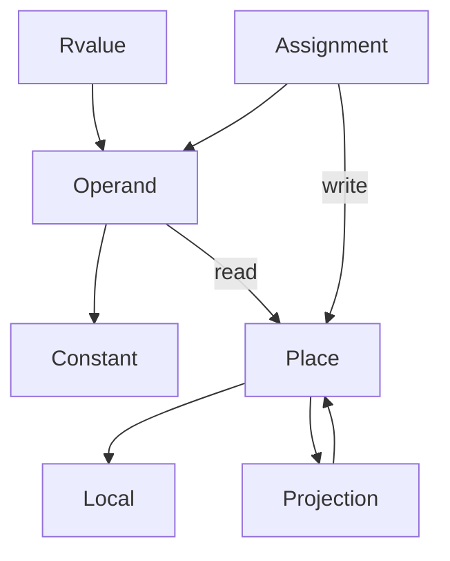
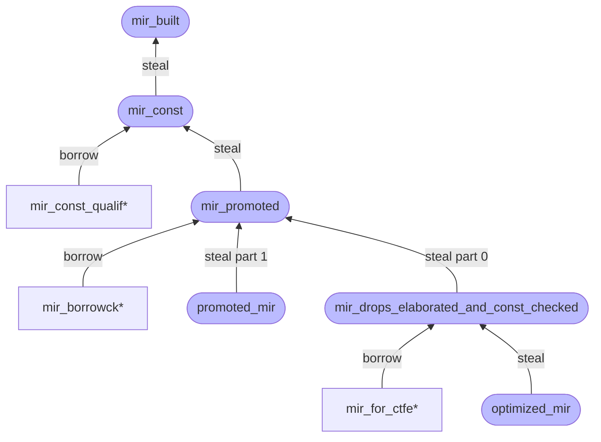
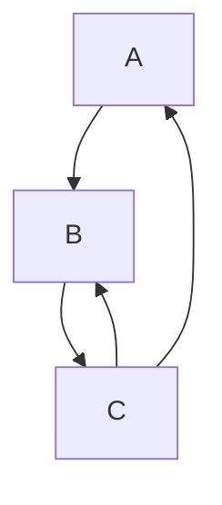
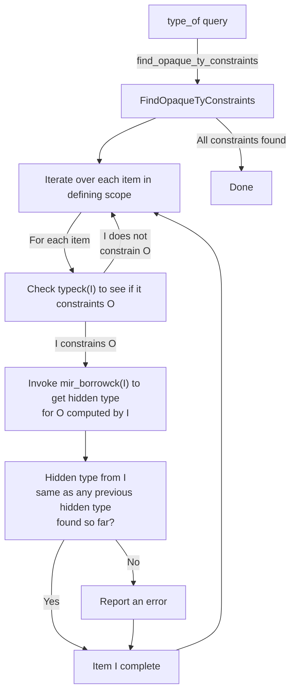
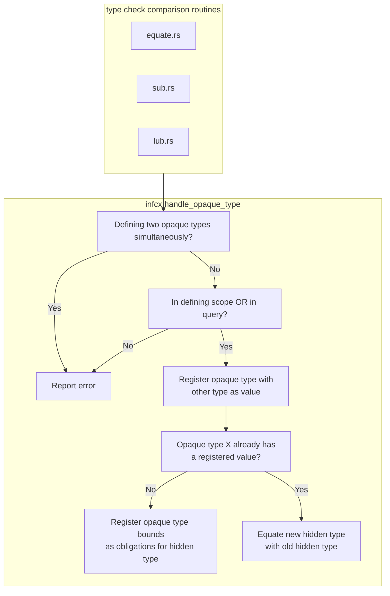

# Rust Compiler Development Guide

## Summary

- [Readme](#readme)
- [Getting Started](#getting_started)

- [About this guide](#about_this_guide)

---

## Building and debugging `rustc`

- 1. [How to build and run the compiler](#building_how_to_build_and_run)
    - [Quickstart](#building_quickstart)
    - [Prerequisites](#building_prerequisites)
    - [Suggested workflows](#building_suggested)
    - [Distribution artifacts](#building_build_install_distribution_artifacts)
    - [Building documentation](#building_compiler_documenting)
    - [Rustdoc overview](#rustdoc)
    - [Adding a new target](#building_new_target)
    - [Optimized build](#building_optimized_build)
- 2. [Testing the compiler](#tests_intro)
    - [Running tests](#tests_running)
        - [Testing with Docker](#tests_docker)
        - [Testing with CI](#tests_ci)
    - [Adding new tests](#tests_adding)
    - [Best practices](#tests_best_practices)
    - [Compiletest](#tests_compiletest)
        - [UI tests](#tests_ui)
        - [Test directives](#tests_directives)
        - [Minicore](#tests_minicore)
    - [Ecosystem testing](#tests_ecosystem)
        - [Crater](#tests_crater)
        - [Fuchsia](#tests_ecosystem_test_jobs_fuchsia)
        - [Rust for Linux](#tests_ecosystem_test_jobs_rust_for_linux)
    - [Codegen backend testing](#tests_codegen_backend_tests_intro)
        - [Cranelift codegen backend](#tests_codegen_backend_tests_cg_clif)
        - [GCC codegen backend](#tests_codegen_backend_tests_cg_gcc)
    - [Performance testing](#tests_perf)
    - [Misc info](#tests_misc)
- 3. [Debugging the compiler](#compiler_debugging)
    - [Using the tracing/logging instrumentation](#tracing)
- 4. [Profiling the compiler](#profiling)
    - [with the linux perf tool](#profiling_with_perf)
    - [with Windows Performance Analyzer](#profiling_wpa_profiling)
    - [with the Rust benchmark suite](#profiling_with_rustc_perf)
- 5. [crates.io dependencies](#crates_io)

## Contributing to Rust

- 6. [Contribution procedures](#contributing)
- 7. [About the compiler team](#compiler_team)
- 8. [Using Git](#git)
- 9. [Mastering @rustbot](#rustbot)
- 10. [Walkthrough: a typical contribution](#walkthrough)
- 11. [Implementing new language features](#implementing_new_features)
- 12. [Stability attributes](#stability)
- 13. [Stabilizing language features](#stabilization_guide)
    - [Stabilization report template](#stabilization_report_template)
- 14. [Feature Gates](#feature_gates)
- 15. [Coding conventions](#conventions)
- 16. [Procedures for breaking changes](#bug_fix_procedure)
- 17. [Using external repositories](#external_repos)
- 18. [Fuzzing](#fuzzing)
- 19. [Notification groups](#notification_groups_about)
    - [Apple](#notification_groups_apple)
    - [ARM](#notification_groups_arm)
    - [Emscripten](#notification_groups_emscripten)
    - [Fuchsia](#notification_groups_fuchsia)
    - [RISC-V](#notification_groups_risc_v)
    - [Rust for Linux](#notification_groups_rust_for_linux)
    - [WASI](#notification_groups_wasi)
    - [WebAssembly](#notification_groups_wasm)
    - [Windows](#notification_groups_windows)
- 20. [Licenses](#licenses)
- 21. [Editions](#guides_editions)

## Bootstrapping

- 22. [Prologue](#building_bootstrapping_intro)
- 23. [What Bootstrapping does](#building_bootstrapping_what_bootstrapping_does)
- 24. [How Bootstrap does it](#building_bootstrapping_how_bootstrap_does_it)
- 25. [Writing tools in Bootstrap](#building_bootstrapping_writing_tools_in_bootstrap)
- 26. [Debugging bootstrap](#building_bootstrapping_debugging_bootstrap)
- 27. [cfg(bootstrap) in dependencies](#building_bootstrapping_bootstrap_in_dependencies)

## High-level Compiler Architecture

- 28. [Prologue](#part_2_intro)
- 29. [Overview of the compiler](#overview)
- 30. [The compiler source code](#compiler_src)
- 31. [Queries: demand-driven compilation](#query)
    - [The Query Evaluation Model in detail](#queries_query_evaluation_model_in_detail)
    - [Incremental compilation](#queries_incremental_compilation)
    - [Incremental compilation in detail](#queries_incremental_compilation_in_detail)
    - [Debugging and testing](#incrcomp_debugging)
    - [Salsa](#queries_salsa)
- 32. [Memory management in rustc](#memory)
- 33. [Serialization in rustc](#serialization)
- 34. [Parallel compilation](#parallel_rustc)
- 35. [Rustdoc internals](#rustdoc_internals)
    - [Search](#rustdoc_internals_search)
	- [The `rustdoc` test suite](#rustdoc_internals_rustdoc_test_suite)
	- [The `rustdoc-gui` test suite](#rustdoc_internals_rustdoc_gui_test_suite)
	- [The `rustdoc-json` test suite](#rustdoc_internals_rustdoc_json_test_suite)
- 36. [GPU offload internals](#offload_internals)
    - [Installation](#offload_installation)
    - [Usage](#offload_usage)
- 37. [Autodiff internals](#autodiff_internals)
    - [Installation](#autodiff_installation)
    - [How to debug](#autodiff_debugging)
    - [Autodiff flags](#autodiff_flags)

## Source Code Representation

- 38. [Prologue](#part_3_intro)
- 39. [Syntax and the AST](#syntax_intro)
    - [Lexing and parsing](#the_parser)
    - [Macro expansion](#macro_expansion)
    - [Name resolution](#name_resolution)
    - [Attributes](#attributes)
    - [`#[test]` implementation](#test_implementation)
    - [Panic implementation](#panic_implementation)
    - [AST validation](#ast_validation)
    - [Feature gate checking](#feature_gate_ck)
    - [Lang Items](#lang_items)
- 40. [The HIR (High-level IR)](#hir)
    - [Lowering AST to HIR](#hir_lowering)
    - [Ambig/Unambig Types and Consts](#hir_ambig_unambig_ty_and_consts)
    - [Debugging](#hir_debugging)
- 41. [The THIR (Typed High-level IR)](#thir)
- 42. [The MIR (Mid-level IR)](#mir_index)
    - [MIR construction](#mir_construction)
    - [MIR visitor and traversal](#mir_visitor)
    - [MIR queries and passes: getting the MIR](#mir_passes)
- 43. [Inline assembly](#asm)

## Supporting Infrastructure

- 44. [Command-line arguments](#cli)
- 45. [rustc_driver and rustc_interface](#rustc_driver_intro)
    - [Remarks on perma-unstable features](#remarks_on_perma_unstable_features)
    - [Example: Type checking](#rustc_driver_interacting_with_the_ast)
    - [Example: Getting diagnostics](#rustc_driver_getting_diagnostics)
- 46. [Errors and lints](#diagnostics)
    - [Diagnostic and subdiagnostic structs](#diagnostics_diagnostic_structs)
    - [Translation](#diagnostics_translation)
    - [`LintStore`](#diagnostics_lintstore)
    - [Error codes](#diagnostics_error_codes)
    - [Diagnostic items](#diagnostics_diagnostic_items)
    - [`ErrorGuaranteed`](#diagnostics_error_guaranteed)

## Analysis

- 47. [Prologue](#part_4_intro)
- 48. [Generic parameter definitions](#generic_parameters_summary)
    - [`EarlyBinder` and instantiating parameters](#ty_module_early_binder)
- 49. [Binders and Higher ranked regions](#ty_module_binders)
    - [Instantiating binders](#ty_module_instantiating_binders)
- 50. [Early vs Late bound parameters](#early_late_parameters)
- 51. [The `ty` module: representing types](#ty)
    - [ADTs and Generic Arguments](#ty_module_generic_arguments)
    - [Parameter types/consts/regions](#ty_module_param_ty_const_regions)
- 52. [`TypeFolder` and `TypeFoldable`](#ty_fold)
- 53. [Aliases and Normalization](#normalization)
- 54. [Typing/Param Envs](#typing_parameter_envs)
- 55. [Type inference](#type_inference)
- 56. [Trait solving](#traits_resolution)
    - [Higher-ranked trait bounds](#traits_hrtb)
    - [Caching subtleties](#traits_caching)
    - [Implied bounds](#traits_implied_bounds)
    - [Specialization](#traits_specialization)
    - [Chalk-based trait solving](#traits_chalk)
        - [Lowering to logic](#traits_lowering_to_logic)
        - [Goals and clauses](#traits_goals_and_clauses)
        - [Canonical queries](#traits_canonical_queries)
        - [Canonicalization](#traits_canonicalization)
    - [Next-gen trait solving](#solve_trait_solving)
        - [Invariants of the type system](#solve_invariants)
        - [The solver](#solve_the_solver)
        - [Candidate preference](#solve_candidate_preference)
        - [Canonicalization](#solve_canonicalization)
        - [Coinduction](#solve_coinduction)
        - [Caching](#solve_caching)
        - [Proof trees](#solve_proof_trees)
        - [Opaque types](#solve_opaque_types)
        - [Significant changes and quirks](#solve_significant_changes)
    - [`Unsize` and `CoerceUnsized` traits](#traits_unsize)
- 57. [Type checking](#type_checking)
    - [Method lookup](#method_lookup)
    - [Variance](#variance)
    - [Coherence checking](#coherence)
    - [Opaque types](#opaque_types_type_alias_impl_trait)
        - [Inference details](#opaque_types_impl_trait_inference)
        - [Return Position Impl Trait In Trait](#return_position_impl_trait_in_trait)
        - [Region inference restrictions](#opaque_types_region_inference_restrictions)
- 58. [Const condition checking](#effects)
- 59. [Pattern and exhaustiveness checking](#pat_exhaustive_checking)
- 60. [Unsafety checking](#unsafety_checking)
- 61. [MIR dataflow](#mir_dataflow)
- 62. [Drop elaboration](#mir_drop_elaboration)
- 63. [The borrow checker](#borrow_check)
    - [Tracking moves and initialization](#borrow_check_moves_and_initialization)
        - [Move paths](#borrow_check_moves_and_initialization_move_paths)
    - [MIR type checker](#borrow_check_type_check)
    - [Drop check](#borrow_check_drop_check)
    - [Region inference](#borrow_check_region_inference)
        - [Constraint propagation](#borrow_check_region_inference_constraint_propagation)
        - [Lifetime parameters](#borrow_check_region_inference_lifetime_parameters)
        - [Member constraints](#region_inference_member_constraints)
        - [Placeholders and universes](#borrow_check_region_inference_placeholders_and_universes)
        - [Closure constraints](#borrow_check_region_inference_closure_constraints)
        - [Error reporting](#borrow_check_region_inference_error_reporting)
    - [Two-phase-borrows](#borrow_check_two_phase_borrows)
- 64. [Closure capture inference](#closure)
- 65. [Async closures/"coroutine-closures"](#coroutine_closures)

## MIR to binaries

- 66. [Prologue](#part_5_intro)
- 67. [MIR optimizations](#mir_optimizations)
- 68. [Debugging MIR](#mir_debugging)
- 69. [Constant evaluation](#const_eval)
    - [Interpreter](#const_eval_interpret)
- 70. [Monomorphization](#backend_monomorph)
- 71. [Lowering MIR](#backend_lowering_mir)
- 72. [Code generation](#backend_codegen)
    - [Updating LLVM](#backend_updating_llvm)
    - [Debugging LLVM](#backend_debugging)
    - [Backend Agnostic Codegen](#backend_backend_agnostic)
    - [Implicit caller location](#backend_implicit_caller_location)
- 73. [Libraries and metadata](#backend_libs_and_metadata)
- 74. [Profile-guided optimization](#profile_guided_optimization)
- 75. [LLVM source-based code coverage](#llvm_coverage_instrumentation)
- 76. [Sanitizers support](#sanitizers)
- 77. [Debugging support in the Rust compiler](#debugging_support_in_rustc)

---

[Appendix A: Background topics](#appendix_background)

[Appendix B: Glossary](#appendix_glossary)

[Appendix C: Code Index](#appendix_code_index)

[Appendix D: Compiler Lecture Series](#appendix_compiler_lecture)

[Appendix E: Bibliography](#appendix_bibliography)

[Appendix Z: HumorRust](#appendix_humorust)

---


<a id=readme></a>

# Readme

[](https://github.com/rust-lang/rustc-dev-guide/actions/workflows/ci.yml)


This is a collaborative effort to build a guide that explains how rustc
works. The aim of the guide is to help new contributors get oriented
to rustc, as well as to help more experienced folks in figuring out
some new part of the compiler that they haven't worked on before.

[You can read the latest version of the guide here.](https://rustc-dev-guide.rust-lang.org/)

You may also find the rustdocs [for the compiler itself][rustdocs] useful.
Note that these are not intended as a guide; it's recommended that you search
for the docs you're looking for instead of reading them top to bottom.

[rustdocs]: https://doc.rust-lang.org/nightly/nightly-rustc

For documentation on developing the standard library, see
[`std-dev-guide`](https://std-dev-guide.rust-lang.org/).

### Contributing to the guide

The guide is useful today, but it has a lot of work still to go.

If you'd like to help improve the guide, we'd love to have you! You can find
plenty of issues on the [issue
tracker](https://github.com/rust-lang/rustc-dev-guide/issues). Just post a
comment on the issue you would like to work on to make sure that we don't
accidentally duplicate work. If you think something is missing, please open an
issue about it!

**In general, if you don't know how the compiler works, that is not a
problem!** In that case, what we will do is to schedule a bit of time
for you to talk with someone who **does** know the code, or who wants
to pair with you and figure it out.  Then you can work on writing up
what you learned.

In general, when writing about a particular part of the compiler's code, we
recommend that you link to the relevant parts of the [rustc rustdocs][rustdocs].

### Build Instructions

To build a local static HTML site, install [`mdbook`](https://github.com/rust-lang/mdBook) with:

```sh
cargo install mdbook mdbook-linkcheck2 mdbook-mermaid
```

and execute the following command in the root of the repository:

```sh
mdbook build --open
```

The build files are found in the `book/html` directory.

### Link Validations

We use `mdbook-linkcheck2` to validate URLs included in our documentation. Link
checking is **not** run by default locally, though it is in CI. To enable it
locally, set the environment variable `ENABLE_LINKCHECK=1` like in the
following example.

```sh
ENABLE_LINKCHECK=1 mdbook serve
```

### Table of Contents

Each page has a TOC that is automatically generated by `pagetoc.js`.
There is an associated `pagetoc.css`, for styling.

## Synchronizing josh subtree with rustc

This repository is linked to `rust-lang/rust` as a [josh](https://josh-project.github.io/josh/intro.html) subtree. You can use the [rustc-josh-sync](https://github.com/rust-lang/josh-sync) tool to perform synchronization.

You can find a guide on how to perform the synchronization [here](#synchronizing-a-josh-subtree).


<a id=getting_started></a>

# Getting Started

Thank you for your interest in contributing to Rust! There are many ways to
contribute, and we appreciate all of them.

If this is your first time contributing, the [walkthrough] chapter can give you a good example of
how a typical contribution would go.

This documentation is _not_ intended to be comprehensive; it is meant to be a
quick guide for the most useful things. For more information, [see this
chapter on how to build and run the compiler](#building_how_to_build_and_run).

[internals]: https://internals.rust-lang.org
[rust-zulip]: https://rust-lang.zulipchat.com
[coc]: https://www.rust-lang.org/policies/code-of-conduct
[walkthrough]: #walkthrough
[Getting Started]: #getting_started

## Asking Questions

If you have questions, please make a post on the [Rust Zulip server][rust-zulip] or
[internals.rust-lang.org][internals].
See the [list of teams and working groups][governance] and [the Community page][community] on the
official website for more resources.

[governance]: https://www.rust-lang.org/governance
[community]: https://www.rust-lang.org/community

As a reminder, all contributors are expected to follow our [Code of Conduct][coc].

The compiler team (or `t-compiler`) usually hangs out in Zulip in
[the #t-compiler channel][z-t-compiler];
questions about how the compiler works can go in [#t-compiler/help][z-help].

[z-t-compiler]: https://rust-lang.zulipchat.com/#narrow/channel/131828-t-compiler
[z-help]: https://rust-lang.zulipchat.com/#narrow/channel/182449-t-compiler.2Fhelp

**Please ask questions!** A lot of people report feeling that they are "wasting
expert's time", but nobody on `t-compiler` feels this way. Contributors are
important to us.

Also, if you feel comfortable, prefer public topics, as this means others can
see the questions and answers, and perhaps even integrate them back into this
guide :)

**Tip**: If you're not a native English speaker and feel unsure about writing, try using a translator to help. But avoid using LLM tools that generate long, complex words. In daily teamwork, **simple and clear words** are best for easy understanding. Even small typos or grammar mistakes can make you seem more human, and people connect better with humans.

### Experts

Not all `t-compiler` members are experts on all parts of `rustc`; it's a
pretty large project. To find out who could have some expertise on
different parts of the compiler, [consult triagebot assign groups][map].
The sections that start with `[assign*` in `triagebot.toml` file. 
But also, feel free to ask questions even if you can't figure out who to ping.

Another way to find experts for a given part of the compiler is to see who has made recent commits.
For example, to find people who have recently worked on name resolution since the 1.68.2 release,
you could run `git shortlog -n 1.68.2.. compiler/rustc_resolve/`. Ignore any commits starting with
"Rollup merge" or commits by `@bors` (see [CI contribution procedures](#ci) for
more information about these commits).

[map]: https://github.com/rust-lang/rust/blob/master/triagebot.toml

### Etiquette

We do ask that you be mindful to include as much useful information as you can
in your question, but we recognize this can be hard if you are unfamiliar with
contributing to Rust.

Just pinging someone without providing any context can be a bit annoying and
just create noise, so we ask that you be mindful of the fact that the
`t-compiler` folks get a lot of pings in a day.

## What should I work on?

The Rust project is quite large and it can be difficult to know which parts of the project need
help, or are a good starting place for beginners. Here are some suggested starting places.

### Easy or mentored issues

If you're looking for somewhere to start, check out the following [issue
search][help-wanted-search]. See the [Triage] for an explanation of these labels. You can also try
filtering the search to areas you're interested in. For example:

- `repo:rust-lang/rust-clippy` will only show clippy issues
- `label:T-compiler` will only show issues related to the compiler
- `label:A-diagnostics` will only show diagnostic issues

Not all important or beginner work has issue labels.
See below for how to find work that isn't labelled.

[help-wanted-search]: https://github.com/issues?q=is%3Aopen+is%3Aissue+org%3Arust-lang+no%3Aassignee+label%3AE-easy%2C%22good+first+issue%22%2Cgood-first-issue%2CE-medium%2CEasy%2CE-help-wanted%2CE-mentor+-label%3AS-blocked+-linked%3Apr+
[Triage]: #issue-triage

### Recurring work

Some work is too large to be done by a single person. In this case, it's common to have "Tracking
issues" to co-ordinate the work between contributors. Here are some example tracking issues where
it's easy to pick up work without a large time commitment:

- [Move UI tests to subdirectories](https://github.com/rust-lang/rust/issues/73494)

If you find more recurring work, please feel free to add it here!

### Clippy issues

The [Clippy] project has spent a long time making its contribution process as friendly to newcomers
as possible. Consider working on it first to get familiar with the process and the compiler
internals.

See [the Clippy contribution guide][clippy-contributing] for instructions on getting started.

[Clippy]: https://doc.rust-lang.org/clippy/
[clippy-contributing]: https://github.com/rust-lang/rust-clippy/blob/master/CONTRIBUTING.md

### Diagnostic issues

Many diagnostic issues are self-contained and don't need detailed background knowledge of the
compiler. You can see a list of diagnostic issues [here][diagnostic-issues].

[diagnostic-issues]: https://github.com/rust-lang/rust/issues?q=is%3Aissue+is%3Aopen+label%3AA-diagnostics+no%3Aassignee

### Picking up abandoned pull requests

Sometimes, contributors send a pull request, but later find out that they don't have enough
time to work on it, or they simply are not interested in it anymore. Such PRs are often
eventually closed and they receive the `S-inactive` label. You could try to examine some of
these PRs and pick up the work. You can find the list of such PRs [here][abandoned-prs].

If the PR has been implemented in some other way in the meantime, the `S-inactive` label
should be removed from it. If not, and it seems that there is still interest in the change,
you can try to rebase the pull request on top of the latest `master` branch and send a new
pull request, continuing the work on the feature.

[abandoned-prs]: https://github.com/rust-lang/rust/pulls?q=is%3Apr+label%3AS-inactive+is%3Aclosed

### Writing tests

Issues that have been resolved but do not have a regression test are marked with the `E-needs-test` label. Writing unit tests is a low-risk, lower-priority task that offers new contributors a great opportunity to familiarize themselves with the testing infrastructure and contribution workflow.

### Contributing to std (standard library)

See [std-dev-guide](https://std-dev-guide.rust-lang.org/).

### Contributing code to other Rust projects

There are a bunch of other projects that you can contribute to outside of the
`rust-lang/rust` repo, including `cargo`, `miri`, `rustup`, and many others.

These repos might have their own contributing guidelines and procedures. Many
of them are owned by working groups. For more info, see the documentation in those repos' READMEs.

### Other ways to contribute

There are a bunch of other ways you can contribute, especially if you don't
feel comfortable jumping straight into the large `rust-lang/rust` codebase.

The following tasks are doable without much background knowledge but are
incredibly helpful:

- [Writing documentation][wd]: if you are feeling a bit more intrepid, you could try
  to read a part of the code and write doc comments for it. This will help you
  to learn some part of the compiler while also producing a useful artifact!
- [Triaging issues][triage]: categorizing, replicating, and minimizing issues is very helpful to the Rust maintainers.
- [Working groups][wg]: there are a bunch of working groups on a wide variety
  of rust-related things.
- Answer questions on [users.rust-lang.org][users], or on [Stack Overflow][so].
- Participate in the [RFC process](https://github.com/rust-lang/rfcs).
- Find a [requested community library][community-library], build it, and publish
  it to [Crates.io](http://crates.io). Easier said than done, but very, very
  valuable!

[users]: https://users.rust-lang.org/
[so]: http://stackoverflow.com/questions/tagged/rust
[community-library]: https://github.com/rust-lang/rfcs/labels/A-community-library
[wd]: #writing-documentation
[wg]: https://rust-lang.github.io/compiler-team/working-groups/
[triage]: #issue-triage

## Cloning and Building

See ["How to build and run the compiler"](#building_how_to_build_and_run).

## Contributor Procedures

This section has moved to the ["Contribution Procedures"](#contributing) chapter.

## Other Resources

This section has moved to the ["About this guide"][more-links] chapter.

[more-links]: #other_places_to_find_information


<a id=about_this_guide></a>

# About this guide

This guide is meant to help document how rustc – the Rust compiler – works,
as well as to help new contributors get involved in rustc development.

There are several parts to this guide:

1. [Building and debugging `rustc`][p1]:
   Contains information that should be useful no matter how you are contributing,
   about building, debugging, profiling, etc.
1. [Contributing to Rust][p2]:
   Contains information that should be useful no matter how you are contributing,
   about procedures for contribution, using git and Github, stabilizing features, etc.
1. [Bootstrapping][p3]:
   Describes how the Rust compiler builds itself using previous versions, including
   an introduction to the bootstrap process and debugging methods.
1. [High-level Compiler Architecture][p4]:
   Discusses the high-level architecture of the compiler and stages of the compile process.
1. [Source Code Representation][p5]:
   Describes the process of taking raw source code from the user
   and transforming it into various forms that the compiler can work with easily.
1. [Supporting Infrastructure][p6]:
   Covers command-line argument conventions, compiler entry points like rustc_driver and
   rustc_interface, and the design and implementation of errors and lints.
1. [Analysis][p7]:
   Discusses the analyses that the compiler uses to check various properties of the code
   and inform later stages of the compile process (e.g., type checking).
1. [MIR to Binaries][p8]: How linked executable machine code is generated.
1. [Appendices][p9] at the end with useful reference information.
   There are a few of these with different information, including a glossary.

[p1]: #building_how_to_build_and_run
[p2]: #contributing
[p3]: #building_bootstrapping_intro
[p4]: #part_2_intro
[p5]: #part_3_intro
[p6]: #cli
[p7]: #part_4_intro
[p8]: #part_5_intro
[p9]: #appendix_background

### Constant change

Keep in mind that `rustc` is a real production-quality product,
being worked upon continuously by a sizeable set of contributors.
As such, it has its fair share of codebase churn and technical debt.
In addition, many of the ideas discussed throughout this guide are idealized designs
that are not fully realized yet.
All this makes keeping this guide completely up to date on everything very hard!

The Guide itself is of course open-source as well,
and the sources can be found at the [GitHub repository].
If you find any mistakes in the guide, please file an issue about it.
Even better, open a PR with a correction!

If you do contribute to the guide,
please see the corresponding [subsection on writing documentation in this guide].

[subsection on writing documentation in this guide]: #contributing-to-rustc-dev-guide

> “‘All conditioned things are impermanent’ — 
> when one sees this with wisdom, one turns away from suffering.”
> _The Dhammapada, verse 277_

<a id=other_places_to_find_information></a>

## Other places to find information

You might also find the following sites useful:

- This guide contains information about how various parts of the
  compiler work and how to contribute to the compiler.
- [rustc API docs] -- rustdoc documentation for the compiler, devtools, and internal tools
- [Forge] -- contains documentation about Rust infrastructure, team procedures, and more
- [compiler-team] -- the home-base for the Rust compiler team, with description
  of the team procedures, active working groups, and the team calendar.
- [std-dev-guide] -- a similar guide for developing the standard library.
- [The t-compiler Zulip][z]
- The [Rust Internals forum][rif], a place to ask questions and
  discuss Rust's internals
- The [Rust reference][rr], even though it doesn't specifically talk about
  Rust's internals, is a great resource nonetheless
- Although out of date, [Tom Lee's great blog article][tlgba] is very helpful
- The [Rust Compiler Testing Docs][rctd]
- For [@bors], [this cheat sheet][cheatsheet] is helpful
- Google is always helpful when programming.
  You can [search all Rust documentation][gsearchdocs] (the standard library,
  the compiler, the books, the references, and the guides) to quickly find
  information about the language and compiler.
- You can also use Rustdoc's built-in search feature to find documentation on
  types and functions within the crates you're looking at. You can also search
  by type signature! For example, searching for `* -> vec` should find all
  functions that return a `Vec<T>`.
  _Hint:_ Find more tips and keyboard shortcuts by typing `?` on any Rustdoc
  page!


[rustc dev guide]: #about_this_guide
[gsearchdocs]: https://www.google.com/search?q=site:doc.rust-lang.org+your+query+here
[stddocs]: https://doc.rust-lang.org/std
[rif]: http://internals.rust-lang.org
[rr]: https://doc.rust-lang.org/book/
[rustforge]: https://forge.rust-lang.org/
[tlgba]: https://tomlee.co/2014/04/a-more-detailed-tour-of-the-rust-compiler/
[ro]: https://www.rustaceans.org/
[rctd]: #tests_intro
[cheatsheet]: https://bors.rust-lang.org/
[Miri]: https://github.com/rust-lang/miri
[@bors]: https://github.com/bors
[GitHub repository]: https://github.com/rust-lang/rustc-dev-guide/
[rustc API docs]: https://doc.rust-lang.org/nightly/nightly-rustc/rustc_middle
[Forge]: https://forge.rust-lang.org/
[compiler-team]: https://github.com/rust-lang/compiler-team/
[std-dev-guide]: https://std-dev-guide.rust-lang.org/
[z]: https://rust-lang.zulipchat.com/#narrow/stream/131828-t-compiler


<a id=building_how_to_build_and_run></a>

# How to build and run the compiler

<div class="warning">

For `profile = "library"` users, or users who use `download-rustc = true | "if-unchanged"`, please be advised that
the `./x test library/std` flow where `download-rustc` is active (i.e. no compiler changes) is currently broken.
This is tracked in <https://github.com/rust-lang/rust/issues/142505>. Only the `./x test` flow is affected in this
case, `./x {check,build} library/std` should still work.

In the short-term, you may need to disable `download-rustc` for `./x test library/std`. This can be done either by:

1. `./x test library/std --set rust.download-rustc=false`
2. Or set `rust.download-rustc=false` in `bootstrap.toml`.

Unfortunately that will require building the stage 1 compiler. The bootstrap team is working on this, but
implementing a maintainable fix is taking some time.

</div>


The compiler is built using a tool called `x.py`. You will need to
have Python installed to run it.

## Quick Start

For a less in-depth quick-start of getting the compiler running, see [quickstart](#quickstart).


## Get the source code

The main repository is [`rust-lang/rust`][repo]. This contains the compiler,
the standard library (including `core`, `alloc`, `test`, `proc_macro`, etc),
and a bunch of tools (e.g. `rustdoc`, the bootstrapping infrastructure, etc).

[repo]: https://github.com/rust-lang/rust

The very first step to work on `rustc` is to clone the repository:

```bash
git clone https://github.com/rust-lang/rust.git
cd rust
```

### Partial clone the repository

Due to the size of the repository, cloning on a slower internet connection can take a long time,
and requires disk space to store the full history of every file and directory.
Instead, it is possible to tell git to perform a _partial clone_, which will only fully retrieve
the current file contents, but will automatically retrieve further file contents when you, e.g.,
jump back in the history.
All git commands will continue to work as usual, at the price of requiring an internet connection
to visit not-yet-loaded points in history.

```bash
git clone --filter='blob:none' https://github.com/rust-lang/rust.git
cd rust
```

> **NOTE**: [This link](https://github.blog/open-source/git/get-up-to-speed-with-partial-clone-and-shallow-clone/)
> describes this type of checkout in more detail, and also compares it to other modes,
> such as shallow cloning.

### Shallow clone the repository

An older alternative to partial clones is to use shallow clone the repository instead.
To do so, you can use the `--depth N` option with the `git clone` command.
This instructs `git` to perform a "shallow clone", cloning the repository but truncating it to
the last `N` commits.

Passing `--depth 1` tells `git` to clone the repository but truncate the history to the latest
commit that is on the `master` branch, which is usually fine for browsing the source code or
building the compiler.

```bash
git clone --depth 1 https://github.com/rust-lang/rust.git
cd rust
```

> **NOTE**: A shallow clone limits which `git` commands can be run.
> If you intend to work on and contribute to the compiler, it is
> generally recommended to fully clone the repository [as shown above](#get-the-source-code),
> or to perform a [partial clone](#partial-clone-the-repository) instead.
>
> For example, `git bisect` and `git blame` require access to the commit history,
> so they don't work if the repository was cloned with `--depth 1`.

## What is `x.py`?

`x.py` is the build tool for the `rust` repository. It can build docs, run tests, and compile the
compiler and standard library.

This chapter focuses on the basics to be productive, but
if you want to learn more about `x.py`, [read this chapter][bootstrap].

[bootstrap]: #bootstrapping_intro

Also, using `x` rather than `x.py` is recommended as:

> `./x` is the most likely to work on every system (on Unix it runs the shell script
> that does python version detection, on Windows it will probably run the
> powershell script - certainly less likely to break than `./x.py` which often just
> opens the file in an editor).[^1]

(You can find the platform related scripts around the `x.py`, like `x.ps1`)

Notice that this is not absolute. For instance, using Nushell in VSCode on Win10,
typing `x` or `./x` still opens `x.py` in an editor rather than invoking the program. :)

In the rest of this guide, we use `x` rather than `x.py` directly. The following
command:

```bash
./x check
```

could be replaced by:

```bash
./x.py check
```

### Running `x.py`

The `x.py` command can be run directly on most Unix systems in the following format:

```sh
./x <subcommand> [flags]
```

This is how the documentation and examples assume you are running `x.py`.
Some alternative ways are:

```sh
# On a Unix shell if you don't have the necessary `python3` command
./x <subcommand> [flags]

# In Windows Powershell (if powershell is configured to run scripts)
./x <subcommand> [flags]
./x.ps1 <subcommand> [flags]

# On the Windows Command Prompt (if .py files are configured to run Python)
x.py <subcommand> [flags]

# You can also run Python yourself, e.g.:
python x.py <subcommand> [flags]
```

On Windows, the Powershell commands may give you an error that looks like this:

```sh
PS C:\Users\vboxuser\rust> ./x
./x : File C:\Users\vboxuser\rust\x.ps1 cannot be loaded because running scripts is disabled on this system. For more
information, see about_Execution_Policies at https:/go.microsoft.com/fwlink/?LinkID=135170.
At line:1 char:1
+ ./x
+ ~~~
    + CategoryInfo          : SecurityError: (:) [], PSSecurityException
    + FullyQualifiedErrorId : UnauthorizedAccess
```

You can avoid this error by allowing powershell to run local scripts:

```sh
Set-ExecutionPolicy -ExecutionPolicy RemoteSigned -Scope CurrentUser
```

#### Running `x.py` slightly more conveniently

There is a binary that wraps `x.py` called `x` in `src/tools/x`. All it does is
run `x.py`, but it can be installed system-wide and run from any subdirectory
of a checkout. It also looks up the appropriate version of `python` to use.

You can install it with `cargo install --path src/tools/x`.

To clarify that this is another global installed binary util, which is
similar to the one declared in section [What is `x.py`](#what-is-xpy), but
it works as an independent process to execute the `x.py` rather than calling the 
shell to run the platform related scripts.

## Create a `bootstrap.toml`

To start, run `./x setup` and select the `compiler` defaults. This will do some initialization
and create a `bootstrap.toml` for you with reasonable defaults. If you use a different default (which
you'll likely want to do if you want to contribute to an area of rust other than the compiler, such
as rustdoc), make sure to read information about that default (located in `src/bootstrap/defaults`)
as the build process may be different for other defaults.

Alternatively, you can write `bootstrap.toml` by hand. See `bootstrap.example.toml` for all the available
settings and explanations of them. See `src/bootstrap/defaults` for common settings to change.

If you have already built `rustc` and you change settings related to LLVM, then you may have to
execute `rm -rf build` for subsequent configuration changes to take effect. Note that `./x
clean` will not cause a rebuild of LLVM.

## Common `x` commands

Here are the basic invocations of the `x` commands most commonly used when
working on `rustc`, `std`, `rustdoc`, and other tools.

| Command     | When to use it                                                                                               |
| ----------- | ------------------------------------------------------------------------------------------------------------ |
| `./x check` | Quick check to see if most things compile; [rust-analyzer can run this automatically for you][rust-analyzer] |
| `./x build` | Builds `rustc`, `std`, and `rustdoc`                                                                         |
| `./x test`  | Runs all tests                                                                                               |
| `./x fmt`   | Formats all code                                                                                             |

As written, these commands are reasonable starting points. However, there are
additional options and arguments for each of them that are worth learning for
serious development work. In particular, `./x build` and `./x test`
provide many ways to compile or test a subset of the code, which can save a lot
of time.

Also, note that `x` supports all kinds of path suffixes for `compiler`, `library`,
and `src/tools` directories. So, you can simply run `x test tidy` instead of
`x test src/tools/tidy`. Or, `x build std` instead of `x build library/std`.

[rust-analyzer]: #configuring-rust-analyzer-for-rustc

See the chapters on
[testing](#tests_running) and [rustdoc](#rustdoc) for more details.

### Building the compiler

Note that building will require a relatively large amount of storage space.
You may want to have upwards of 10 or 15 gigabytes available to build the compiler.

Once you've created a `bootstrap.toml`, you are now ready to run
`x`. There are a lot of options here, but let's start with what is
probably the best "go to" command for building a local compiler:

```bash
./x build library
```

This may *look* like it only builds the standard library, but that is not the case.
What this command does is the following:

- Build `rustc` using the stage0 compiler
  - This produces the stage1 compiler
- Build `std` using the stage1 compiler

This final product (stage1 compiler + libs built using that compiler)
is what you need to build other Rust programs (unless you use `#![no_std]` or
`#![no_core]`).

You will probably find that building the stage1 `std` is a bottleneck for you,
but fear not, there is a (hacky) workaround...
see [the section on avoiding rebuilds for std][keep-stage].

[keep-stage]: #faster-builds-with---keep-stage

Sometimes you don't need a full build. When doing some kind of
"type-based refactoring", like renaming a method, or changing the
signature of some function, you can use `./x check` instead for a much faster build.

Note that this whole command just gives you a subset of the full `rustc`
build. The **full** `rustc` build (what you get with `./x build
--stage 2 compiler/rustc`) has quite a few more steps:

- Build `rustc` with the stage1 compiler.
  - The resulting compiler here is called the "stage2" compiler, which uses stage1 std from the previous command.
- Build `librustdoc` and a bunch of other things with the stage2 compiler.

You almost never need to do this.

### Build specific components

If you are working on the standard library, you probably don't need to build
every other default component. Instead, you can build a specific component by
providing its name, like this:

```bash
./x build --stage 1 library
```

If you choose the `library` profile when running `x setup`, you can omit `--stage 1` (it's the
default).

## Creating a rustup toolchain

Once you have successfully built `rustc`, you will have created a bunch
of files in your `build` directory. In order to actually run the
resulting `rustc`, we recommend creating rustup toolchains. The first
one will run the stage1 compiler (which we built above). The second
will execute the stage2 compiler (which we did not build, but which
you will likely need to build at some point; for example, if you want
to run the entire test suite).

```bash
rustup toolchain link stage1 build/host/stage1
rustup toolchain link stage2 build/host/stage2
```

Now you can run the `rustc` you built with. If you run with `-vV`, you
should see a version number ending in `-dev`, indicating a build from
your local environment:

```bash
$ rustc +stage1 -vV
rustc 1.48.0-dev
binary: rustc
commit-hash: unknown
commit-date: unknown
host: x86_64-unknown-linux-gnu
release: 1.48.0-dev
LLVM version: 11.0
```

The rustup toolchain points to the specified toolchain compiled in your `build` directory,
so the rustup toolchain will be updated whenever `x build` or `x test` are run for
that toolchain/stage.

**Note:** the toolchain we've built does not include `cargo`.  In this case, `rustup` will
fall back to using `cargo` from the installed `nightly`, `beta`, or `stable` toolchain
(in that order).  If you need to use unstable `cargo` flags, be sure to run
`rustup install nightly` if you haven't already.  See the
[rustup documentation on custom toolchains](https://rust-lang.github.io/rustup/concepts/toolchains.html#custom-toolchains).

**Note:** rust-analyzer and IntelliJ Rust plugin use a component called
`rust-analyzer-proc-macro-srv` to work with proc macros. If you intend to use a
custom toolchain for a project (e.g. via `rustup override set stage1`) you may
want to build this component:

```bash
./x build proc-macro-srv-cli
```

## Building targets for cross-compilation

To produce a compiler that can cross-compile for other targets,
pass any number of `target` flags to `x build`.
For example, if your host platform is `x86_64-unknown-linux-gnu`
and your cross-compilation target is `wasm32-wasip1`, you can build with:

```bash
./x build --target x86_64-unknown-linux-gnu,wasm32-wasip1
```

Note that if you want the resulting compiler to be able to build crates that
involve proc macros or build scripts, you must be sure to explicitly build target support for the
host platform (in this case, `x86_64-unknown-linux-gnu`).

If you want to always build for other targets without needing to pass flags to `x build`,
you can configure this in the `[build]` section of your `bootstrap.toml` like so:

```toml
[build]
target = ["x86_64-unknown-linux-gnu", "wasm32-wasip1"]
```

Note that building for some targets requires having external dependencies installed
(e.g. building musl targets requires a local copy of musl).
Any target-specific configuration (e.g. the path to a local copy of musl)
will need to be provided by your `bootstrap.toml`.
Please see `bootstrap.example.toml` for information on target-specific configuration keys.

For examples of the complete configuration necessary to build a target, please visit
[the rustc book](https://doc.rust-lang.org/rustc/platform-support.html),
select any target under the "Platform Support" heading on the left,
and see the section related to building a compiler for that target.
For targets without a corresponding page in the rustc book,
it may be useful to [inspect the Dockerfiles](#tests_docker)
that the Rust infrastructure itself uses to set up and configure cross-compilation.

If you have followed the directions from the prior section on creating a rustup toolchain,
then once you have built your compiler you will be able to use it to cross-compile like so:

```bash
cargo +stage1 build --target wasm32-wasip1
```

## Other `x` commands

Here are a few other useful `x` commands. We'll cover some of them in detail
in other sections:

- Building things:
  - `./x build` – builds everything using the stage 1 compiler,
    not just up to `std`
  - `./x build --stage 2` – builds everything with the stage 2 compiler including
    `rustdoc`
- Running tests (see the [section on running tests](#tests_running) for
  more details):
  - `./x test library/std` – runs the unit tests and integration tests from `std`
  - `./x test tests/ui` – runs the `ui` test suite
  - `./x test tests/ui/const-generics` - runs all the tests in
    the `const-generics/` subdirectory of the `ui` test suite
  - `./x test tests/ui/const-generics/const-types.rs` - runs
    the single test `const-types.rs` from the `ui` test suite

### Cleaning out build directories

Sometimes you need to start fresh, but this is normally not the case.
If you need to run this then bootstrap is most likely not acting right and
you should file a bug as to what is going wrong. If you do need to clean
everything up then you only need to run one command!

```bash
./x clean
```

`rm -rf build` works too, but then you have to rebuild LLVM, which can take
a long time even on fast computers.

## Remarks on disk space

Building the compiler (especially if beyond stage 1) can require significant amounts of free disk
space, possibly around 100GB. This is compounded if you have a separate build directory for
rust-analyzer (e.g. `build-rust-analyzer`). This is easy to hit with dev-desktops which have a 
[set disk quota](https://github.com/rust-lang/simpleinfra/blob/8a59e4faeb75a09b072671c74a7cb70160ebef50/ansible/roles/dev-desktop/defaults/main.yml#L7)
for each user, but this also applies to local development as well. Occasionally, you may need to:

- Remove `build/` directory.
- Remove `build-rust-analyzer/` directory (if you have a separate rust-analyzer build directory).
- Uninstall unnecessary toolchains if you use `cargo-bisect-rustc`. You can check which toolchains
  are installed with `rustup toolchain list`.

[^1]: issue[#1707](https://github.com/rust-lang/rustc-dev-guide/issues/1707)


<a id=building_quickstart></a>

# Quickstart

This is a quickstart guide about getting the compiler running. For more
information on the individual steps, see the other pages in this chapter.

First, clone the repository:

```sh
git clone https://github.com/rust-lang/rust.git
cd rust
```

When building the compiler, we don't use `cargo` directly, instead we use a
wrapper called "x". It is invoked with `./x`.

We need to create a configuration for the build. Use `./x setup` to create a
good default.

```sh
./x setup
```

Then, we can build the compiler. Use `./x build` to build the compiler, standard
library and a few tools. You can also `./x check` to just check it. All these
commands can take specific components/paths as arguments, for example `./x check
compiler` to just check the compiler.

```sh
./x build
```

> When doing a change to the compiler that does not affect the way it compiles
the standard library (so for example, a change to an error message), use
`--keep-stage-std 1` to avoid recompiling it.

After building the compiler and standard library, you now have a working
compiler toolchain. You can use it with rustup by linking it.

```sh
rustup toolchain link stage1 build/host/stage1
```

Now you have a toolchain called `stage1` linked to your build. You can use it to
test the compiler.

```sh
rustc +stage1 testfile.rs
```

After doing a change, you can run the compiler test suite with `./x test`.

`./x test` runs the full test suite, which is slow and rarely what you want.
Usually, `./x test tests/ui` is what you want after a compiler change, testing
all [UI tests](#tests_ui) that invoke the compiler on a specific test file
and check the output.

```sh
./x test tests/ui
```

Use `--bless` if you've made a change and want to update the `.stderr` files
with the new output.

Congrats, you are now ready to make a change to the compiler! If you have more
questions, [the full chapter](#how_to_build_and_run) might contain the
answers, and if it doesn't, feel free to ask for help on
[Zulip](https://rust-lang.zulipchat.com/#narrow/stream/182449-t-compiler.2Fhelp).

If you use VSCode, Vim, Emacs or Helix, `./x setup` will ask you if you want to
set up the editor config. For more information, check out [suggested
workflows](#suggested).


<a id=building_prerequisites></a>

# Prerequisites

## Dependencies

See [the `rust-lang/rust` INSTALL](https://github.com/rust-lang/rust/blob/master/INSTALL.md#dependencies).

## Hardware

You will need an internet connection to build. The bootstrapping process
involves updating git submodules and downloading a beta compiler. It doesn't
need to be super fast, but that can help.

There are no strict hardware requirements, but building the compiler is
computationally expensive, so a beefier machine will help, and I wouldn't
recommend trying to build on a Raspberry Pi! We recommend the following.
* 30GB+ of free disk space. Otherwise, you will have to keep
  clearing incremental caches. More space is better, the compiler is a bit of a
  hog; it's a problem we are aware of.
* 8GB+ RAM
* 2+ cores. Having more cores really helps. 10 or 20 or more is not too many!

Beefier machines will lead to much faster builds. If your machine is not very
powerful, a common strategy is to only use `./x check` on your local machine
and let the CI build test your changes when you push to a PR branch.

Building the compiler takes more than half an hour on my moderately powerful
laptop. We suggest downloading LLVM from CI so you don't have to build it from source
([see here][config]).

Like `cargo`, the build system will use as many cores as possible. Sometimes
this can cause you to run low on memory. You can use `-j` to adjust the number
of concurrent jobs. If a full build takes more than ~45 minutes to an hour, you
are probably spending most of the time swapping memory in and out; try using
`-j1`.

If you don't have too much free disk space, you may want to turn off
incremental compilation ([see here][config]). This will make compilation take
longer (especially after a rebase), but will save a ton of space from the
incremental caches.

[config]: #create-a-bootstraptoml


<a id=building_suggested></a>

# Suggested workflows

The full bootstrapping process takes quite a while. Here are some suggestions to
make your life easier.

## Installing a pre-push hook

CI will automatically fail your build if it doesn't pass `tidy`, our internal
tool for ensuring code quality. If you'd like, you can install a 
[Git hook](https://git-scm.com/book/en/v2/Customizing-Git-Git-Hooks) that will
automatically run `./x test tidy` on each push, to ensure your code is up to
par. If the hook fails then run `./x test tidy --bless` and commit the changes.
If you decide later that the pre-push behavior is undesirable, you can delete
the `pre-push` file in `.git/hooks`.

A prebuilt git hook lives at [`src/etc/pre-push.sh`].  It can be copied into
your `.git/hooks` folder as `pre-push` (without the `.sh` extension!).

You can also install the hook as a step of running `./x setup`!

## Config extensions

When working on different tasks, you might need to switch between different bootstrap configurations.
Sometimes you may want to keep an old configuration for future use. But saving raw config values in
random files and manually copying and pasting them can quickly become messy, especially if you have a
long history of different configurations.

To simplify managing multiple configurations, you can create config extensions.

For example, you can create a simple config file named `cross.toml`:

```toml
[build]
build = "x86_64-unknown-linux-gnu"
host = ["i686-unknown-linux-gnu"]
target = ["i686-unknown-linux-gnu"]


[llvm]
download-ci-llvm = false

[target.x86_64-unknown-linux-gnu]
llvm-config = "/path/to/llvm-19/bin/llvm-config"
```

Then, include this in your `bootstrap.toml`:

```toml
include = ["cross.toml"]
```

You can also include extensions within extensions recursively.

**Note:** In the `include` field, the overriding logic follows a right-to-left order. For example,
in `include = ["a.toml", "b.toml"]`, extension `b.toml` overrides `a.toml`. Also, parent extensions
always overrides the inner ones.

## Configuring `rust-analyzer` for `rustc`

### Checking the "library" tree

Checking the "library" tree requires a stage1 compiler, which can be a heavy process on some computers.
For this reason, bootstrap has a flag called `--skip-std-check-if-no-download-rustc` that skips checking the
"library" tree if `rust.download-rustc` isn't available. If you want to avoid putting a heavy load on your computer
with `rust-analyzer`, you can add the `--skip-std-check-if-no-download-rustc` flag to your `./x check` command in
the `rust-analyzer` configuration.

### Project-local rust-analyzer setup

`rust-analyzer` can help you check and format your code whenever you save a
file. By default, `rust-analyzer` runs the `cargo check` and `rustfmt` commands,
but you can override these commands to use more adapted versions of these tools
when hacking on `rustc`. With custom setup, `rust-analyzer` can use `./x check`
to check the sources, and the stage 0 rustfmt to format them.

The default `rust-analyzer.check.overrideCommand` command line will check all
the crates and tools in the repository. If you are working on a specific part,
you can override the command to only check the part you are working on to save
checking time. For example, if you are working on the compiler, you can override
the command to `x check compiler --json-output` to only check the compiler part.
You can run `x check --help --verbose` to see the available parts.

Running `./x setup editor` will prompt you to create a project-local LSP config
file for one of the supported editors. You can also create the config file as a
step of running `./x setup`.

### Using a separate build directory for rust-analyzer

By default, when rust-analyzer runs a check or format command, it will share
the same build directory as manual command-line builds. This can be inconvenient
for two reasons:
- Each build will lock the build directory and force the other to wait, so it
  becomes impossible to run command-line builds while rust-analyzer is running
  commands in the background.
- There is an increased risk of one of the builds deleting previously-built
  artifacts due to conflicting compiler flags or other settings, forcing
  additional rebuilds in some cases.

To avoid these problems:
- Add `--build-dir=build/rust-analyzer` to all of the custom `x` commands in
  your editor's rust-analyzer configuration.
  (Feel free to choose a different directory name if desired.)
- Modify the `rust-analyzer.rustfmt.overrideCommand` setting so that it points
  to the copy of `rustfmt` in that other build directory.
- Modify the `rust-analyzer.procMacro.server` setting so that it points to the
  copy of `rust-analyzer-proc-macro-srv` in that other build directory.

Using separate build directories for command-line builds and rust-analyzer
requires extra disk space.

### Visual Studio Code

Selecting `vscode` in `./x setup editor` will prompt you to create a
`.vscode/settings.json` file which will configure Visual Studio code. The
recommended `rust-analyzer` settings live at
[`src/etc/rust_analyzer_settings.json`].

If running `./x check` on save is inconvenient, in VS Code you can use a [Build
Task] instead:

```JSON
// .vscode/tasks.json
{
    "version": "2.0.0",
    "tasks": [
        {
            "label": "./x check",
            "command": "./x check",
            "type": "shell",
            "problemMatcher": "$rustc",
            "presentation": { "clear": true },
            "group": { "kind": "build", "isDefault": true }
        }
    ]
}
```

[Build Task]: https://code.visualstudio.com/docs/editor/tasks


### Neovim

For Neovim users, there are a few options. The
easiest way is by using [neoconf.nvim](https://github.com/folke/neoconf.nvim/),
which allows for project-local configuration files with the native LSP. The
steps for how to use it are below. Note that they require rust-analyzer to
already be configured with Neovim. Steps for this can be 
[found here](https://rust-analyzer.github.io/manual.html#nvim-lsp).

1. First install the plugin. This can be done by following the steps in the
   README.
2. Run `./x setup editor`, and select `vscode` to create a
   `.vscode/settings.json` file. `neoconf` is able to read and update
   rust-analyzer settings automatically when the project is opened when this
   file is detected.

If you're using `coc.nvim`, you can run `./x setup editor` and select `vim` to
create a `.vim/coc-settings.json`. The settings can be edited with
`:CocLocalConfig`. The recommended settings live at
[`src/etc/rust_analyzer_settings.json`].

Another way is without a plugin, and creating your own logic in your
configuration. The following code will work for any checkout of rust-lang/rust (newer than February 2025):

```lua
local function expand_config_variables(option)
    local var_placeholders = {
        ['${workspaceFolder}'] = function(_)
            return vim.lsp.buf.list_workspace_folders()[1]
        end,
    }

    if type(option) == "table" then
        local mt = getmetatable(option)
        local result = {}
        for k, v in pairs(option) do
            result[expand_config_variables(k)] = expand_config_variables(v)
        end
        return setmetatable(result, mt)
    end
    if type(option) ~= "string" then
        return option
    end
    local ret = option
    for key, fn in pairs(var_placeholders) do
        ret = ret:gsub(key, fn)
    end
    return ret
end
lspconfig.rust_analyzer.setup {
    root_dir = function()
        local default = lspconfig.rust_analyzer.config_def.default_config.root_dir()
        -- the default root detection uses the cargo workspace root.
        -- but for rust-lang/rust, the standard library is in its own workspace.
        -- use the git root instead.
        local compiler_config = vim.fs.joinpath(default, "../src/bootstrap/defaults/config.compiler.toml")
        if vim.fs.basename(default) == "library" and vim.uv.fs_stat(compiler_config) then
            return vim.fs.dirname(default)
        end
        return default
    end,
    on_init = function(client)
        local path = client.workspace_folders[1].name
        local config = vim.fs.joinpath(path, "src/etc/rust_analyzer_zed.json")
        if vim.uv.fs_stat(config) then
            -- load rust-lang/rust settings
            local file = io.open(config)
            local json = vim.json.decode(file:read("*a"))
            client.config.settings["rust-analyzer"] = expand_config_variables(json.lsp["rust-analyzer"].initialization_options)
            client.notify("workspace/didChangeConfiguration", { settings = client.config.settings })
        end
        return true
    end
}
```

If you would like to use the build task that is described above, you may either
make your own command in your config, or you can install a plugin such as
[overseer.nvim](https://github.com/stevearc/overseer.nvim) that can 
[read VSCode's `task.json` files](https://github.com/stevearc/overseer.nvim/blob/master/doc/guides.md#vs-code-tasks),
and follow the same instructions as above.

### Emacs

Emacs provides support for rust-analyzer with project-local configuration
through [Eglot](https://www.gnu.org/software/emacs/manual/html_node/eglot/).
Steps for setting up Eglot with rust-analyzer can be 
[found here](https://rust-analyzer.github.io/manual.html#eglot).
Having set up Emacs & Eglot for Rust development in general, you can run
`./x setup editor` and select `emacs`, which will prompt you to create
`.dir-locals.el` with the recommended configuration for Eglot.
The recommended settings live at [`src/etc/rust_analyzer_eglot.el`].
For more information on project-specific Eglot configuration, consult 
[the manual](https://www.gnu.org/software/emacs/manual/html_node/eglot/Project_002dspecific-configuration.html).

### Helix

Helix comes with built-in LSP and rust-analyzer support.
It can be configured through `languages.toml`, as described
[here](https://docs.helix-editor.com/languages.html).
You can run `./x setup editor` and select `helix`, which will prompt you to
create `languages.toml` with the recommended configuration for Helix. The
recommended settings live at [`src/etc/rust_analyzer_helix.toml`].

### Zed

Zed comes with built-in LSP and rust-analyzer support.
It can be configured through `.zed/settings.json`, as described
[here](https://zed.dev/docs/configuring-languages). Selecting `zed`
in `./x setup editor` will prompt you to create a `.zed/settings.json`
file which will configure Zed with the recommended configuration. The
recommended `rust-analyzer` settings live
at [`src/etc/rust_analyzer_zed.json`].

## Check, check, and check again

When doing simple refactoring, it can be useful to run `./x check`
continuously. If you set up `rust-analyzer` as described above, this will be
done for you every time you save a file. Here you are just checking that the
compiler can **build**, but often that is all you need (e.g., when renaming a
method). You can then run `./x build` when you actually need to run tests.

In fact, it is sometimes useful to put off tests even when you are not 100% sure
the code will work. You can then keep building up refactoring commits and only
run the tests at some later time. You can then use `git bisect` to track down
**precisely** which commit caused the problem. A nice side-effect of this style
is that you are left with a fairly fine-grained set of commits at the end, all
of which build and pass tests. This often helps reviewing.

## Configuring `rustup` to use nightly

Some parts of the bootstrap process uses pinned, nightly versions of tools like
rustfmt. To make things like `cargo fmt` work correctly in your repo, run

```sh
cd <path to rustc repo>
rustup override set nightly
```

after [installing a nightly toolchain] with `rustup`. Don't forget to do this
for all directories you have [setup a worktree for]. You may need to use the
pinned nightly version from `src/stage0`, but often the normal `nightly` channel
will work.

**Note** see [the section on vscode] for how to configure it with this real
rustfmt `x` uses, and [the section on rustup] for how to setup `rustup`
toolchain for your bootstrapped compiler

**Note** This does _not_ allow you to build `rustc` with cargo directly. You
still have to use `x` to work on the compiler or standard library, this just
lets you use `cargo fmt`.

[installing a nightly toolchain]: https://rust-lang.github.io/rustup/concepts/channels.html?highlight=nightl#working-with-nightly-rust
[setup a worktree for]: #working-on-multiple-branches-at-the-same-time
[the section on vscode]: #configuring-rust-analyzer-for-rustc
[the section on rustup]: how-to-build-and-run.md?highlight=rustup#creating-a-rustup-toolchain

## Faster Builds with CI-rustc  

If you are not working on the compiler, you often don't need to build the compiler tree.
For example, you can skip building the compiler and only build the `library` tree or the
tools under `src/tools`. To achieve that, you have to enable this by setting the `download-rustc`
option in your configuration. This tells bootstrap to use the latest nightly compiler for `stage > 0`
steps, meaning it will have two precompiled compilers: stage0 compiler and `download-rustc` compiler
for `stage > 0` steps. This way, it will never need to build the in-tree compiler. As a result, your
build time will be significantly reduced by not building the in-tree compiler.

## Using incremental compilation

You can further enable the `--incremental` flag to save additional time in
subsequent rebuilds:

```bash
./x test tests/ui --incremental --test-args issue-1234
```

If you don't want to include the flag with every command, you can enable it in
the `bootstrap.toml`:

```toml
[rust]
incremental = true
```

Note that incremental compilation will use more disk space than usual. If disk
space is a concern for you, you might want to check the size of the `build`
directory from time to time.

## Fine-tuning optimizations

Setting `optimize = false` makes the compiler too slow for tests. However, to
improve the test cycle, you can disable optimizations selectively only for the
crates you'll have to rebuild
([source](https://rust-lang.zulipchat.com/#narrow/stream/131828-t-compiler/topic/incremental.20compilation.20question/near/202712165)).
For example, when working on `rustc_mir_build`, the `rustc_mir_build` and
`rustc_driver` crates take the most time to incrementally rebuild. You could
therefore set the following in the root `Cargo.toml`:

```toml
[profile.release.package.rustc_mir_build]
opt-level = 0
[profile.release.package.rustc_driver]
opt-level = 0
```

## Working on multiple branches at the same time

Working on multiple branches in parallel can be a little annoying, since
building the compiler on one branch will cause the old build and the incremental
compilation cache to be overwritten. One solution would be to have multiple
clones of the repository, but that would mean storing the Git metadata multiple
times, and having to update each clone individually.

Fortunately, Git has a better solution called [worktrees]. This lets you create
multiple "working trees", which all share the same Git database. Moreover,
because all of the worktrees share the same object database, if you update a
branch (e.g. master) in any of them, you can use the new commits from any of the
worktrees. One caveat, though, is that submodules do not get shared. They will
still be cloned multiple times.

[worktrees]: https://git-scm.com/docs/git-worktree

Given you are inside the root directory for your Rust repository, you can create
a "linked working tree" in a new "rust2" directory by running the following
command:

```bash
git worktree add ../rust2
```

Creating a new worktree for a new branch based on `master` looks like:

```bash
git worktree add -b my-feature ../rust2 master
```

You can then use that rust2 folder as a separate workspace for modifying and
building `rustc`!

## Working with nix

Several nix configurations are defined in `src/tools/nix-dev-shell`.

If you're using direnv, you can create a symbol link to `src/tools/nix-dev-shell/envrc-flake` or `src/tools/nix-dev-shell/envrc-shell`

```bash
ln -s ./src/tools/nix-dev-shell/envrc-flake ./.envrc # Use flake
```
or
```bash
ln -s ./src/tools/nix-dev-shell/envrc-shell ./.envrc # Use nix-shell
```

### Note

Note that when using nix on a not-NixOS distribution, it may be necessary to set
**`patch-binaries-for-nix = true` in `bootstrap.toml`**. Bootstrap tries to detect
whether it's running in nix and enable patching automatically, but this
detection can have false negatives.

You can also use your nix shell to manage `bootstrap.toml`:

```nix
let
  config = pkgs.writeText "rustc-config" ''
    # Your bootstrap.toml content goes here
  ''
pkgs.mkShell {
  /* ... */
  # This environment variable tells bootstrap where our bootstrap.toml is.
  RUST_BOOTSTRAP_CONFIG = config;
}
```

## Shell Completions

If you use Bash, Zsh, Fish or PowerShell, you can find automatically-generated shell
completion scripts for `x.py` in
[`src/etc/completions`](https://github.com/rust-lang/rust/tree/master/src/etc/completions).

You can use `source ./src/etc/completions/x.py.<extension>` to load completions
for your shell of choice, or `& .\src\etc\completions\x.py.ps1` for PowerShell.
Adding this to your shell's startup script (e.g. `.bashrc`) will automatically
load this completion.

[`src/etc/rust_analyzer_settings.json`]: https://github.com/rust-lang/rust/blob/master/src/etc/rust_analyzer_settings.json
[`src/etc/rust_analyzer_eglot.el`]: https://github.com/rust-lang/rust/blob/master/src/etc/rust_analyzer_eglot.el
[`src/etc/rust_analyzer_helix.toml`]: https://github.com/rust-lang/rust/blob/master/src/etc/rust_analyzer_helix.toml
[`src/etc/rust_analyzer_zed.json`]: https://github.com/rust-lang/rust/blob/master/src/etc/rust_analyzer_zed.json
[`src/etc/pre-push.sh`]: https://github.com/rust-lang/rust/blob/master/src/etc/pre-push.sh


<a id=building_build_install_distribution_artifacts></a>

# Build distribution artifacts

You might want to build and package up the compiler for distribution.
You’ll want to run this command to do it:

```bash
./x dist
```

# Install from source

You might want to prefer installing Rust (and tools configured in your configuration)
by building from source. If so, you want to run this command:

```bash
./x install
```

   Note: If you are testing out a modification to a compiler, you might
   want to build the compiler (with `./x build`) then create a toolchain as
   discussed in [here][create-rustup-toolchain].

   For example, if the toolchain you created is called "foo", you would then
   invoke it with `rustc +foo ...` (where ... represents the rest of the arguments).

Instead of installing Rust (and tools in your config file) globally, you can set `DESTDIR`
environment variable to change the installation path. If you want to set installation paths
more dynamically, you should prefer [install options] in your config file to achieve that.

[create-rustup-toolchain]: #creating-a-rustup-toolchain
[install options]: https://github.com/rust-lang/rust/blob/f7c8928f035370be33463bb7f1cd1aeca2c5f898/config.example.toml#L422-L442


<a id=building_compiler_documenting></a>

# Building documentation

This chapter describes how to build documentation of toolchain components,
like the standard library (std) or the compiler (rustc).

- Document everything

  This uses `rustdoc` from the beta toolchain,
  so will produce (slightly) different output to stage 1 rustdoc,
  as rustdoc is under active development:

  ```bash
  ./x doc
  ```

  If you want to be sure the documentation looks the same as on CI:

  ```bash
  ./x doc --stage 1
  ```

  This ensures that (current) rustdoc gets built,
  then that is used to document the components.

- Much like running individual tests or building specific components,
  you can build just the documentation you want:

  ```bash
  ./x doc src/doc/book
  ./x doc src/doc/nomicon
  ./x doc compiler library
  ```

  See [the nightly docs index page](https://doc.rust-lang.org/nightly/) for a full list of books.

- Document internal rustc items

  Compiler documentation is not built by default.
  To create it by default with `x doc`, modify `bootstrap.toml`:

  ```toml
  [build]
  compiler-docs = true
  ```

  Note that when enabled,
  documentation for internal compiler items will also be built.

  NOTE: The documentation for the compiler is found at [this link].

[this link]: https://doc.rust-lang.org/nightly/nightly-rustc/rustc_middle/


<a id=rustdoc></a>

# Rustdoc overview

`rustdoc` lives in-tree with the
compiler and standard library. This chapter is about how it works.
For information about Rustdoc's features and how to use them, see
the [Rustdoc book](https://doc.rust-lang.org/nightly/rustdoc/).
For more details about how rustdoc works, see the
["Rustdoc internals" chapter][Rustdoc internals].

[Rustdoc internals]: #rustdoc_internals

`rustdoc` uses `rustc` internals (and, of course, the standard library), so you
will have to build the compiler and `std` once before you can build `rustdoc`.

Rustdoc is implemented entirely within the crate [`librustdoc`][rd]. It runs
the compiler up to the point where we have an internal representation of a
crate (HIR) and the ability to run some queries about the types of items. [HIR]
and [queries] are discussed in the linked chapters.

[HIR]: #hir
[queries]: #query
[rd]: https://github.com/rust-lang/rust/tree/master/src/librustdoc

`librustdoc` performs two major steps after that to render a set of
documentation:

* "Clean" the AST into a form that's more suited to creating documentation (and
  slightly more resistant to churn in the compiler).
* Use this cleaned AST to render a crate's documentation, one page at a time.

Naturally, there's more than just this, and those descriptions simplify out
lots of details, but that's the high-level overview.

(Side note: `librustdoc` is a library crate! The `rustdoc` binary is created
using the project in [`src/tools/rustdoc`][bin]. Note that literally all that
does is call the `main()` that's in this crate's `lib.rs`, though.)

[bin]: https://github.com/rust-lang/rust/tree/master/src/tools/rustdoc

## Cheat sheet

* Run `./x setup tools` before getting started. This will configure `x`
  with nice settings for developing rustdoc and other tools, including
  downloading a copy of rustc rather than building it.
* Use `./x check rustdoc` to quickly check for compile errors.
* Use `./x build library rustdoc` to make a usable
  rustdoc you can run on other projects.
  * Add `library/test` to be able to use `rustdoc --test`.
  * Run `rustup toolchain link stage2 build/host/stage2` to add a
    custom toolchain called `stage2` to your rustup environment. After
    running that, `cargo +stage2 doc` in any directory will build with
    your locally-compiled rustdoc.
* Use `./x doc library` to use this rustdoc to generate the
  standard library docs.
  * The completed docs will be available in `build/host/doc` (under `core`, `alloc`, and `std`).
  * If you want to copy those docs to a webserver, copy all of
    `build/host/doc`, since that's where the CSS, JS, fonts, and landing
    page are.
  * For frontend debugging, disable the `rust.docs-minification` option in [`bootstrap.toml`].
* Use `./x test tests/rustdoc*` to run the tests using a stage1
  rustdoc.
  * See [Rustdoc internals] for more information about tests.

[`bootstrap.toml`]: #building_how_to_build_and_run

## Code structure

All paths in this section are relative to `src/librustdoc/` in the rust-lang/rust repository.

* Most of the HTML printing code is in `html/format.rs` and `html/render/mod.rs`.
  It's in a bunch of functions returning `impl std::fmt::Display`.
* The data types that get rendered by the functions mentioned above are defined in `clean/types.rs`.
  The functions responsible for creating them from the `HIR` and the `rustc_middle::ty` IR
  live in `clean/mod.rs`.
* The bits specific to using rustdoc as a test harness are in
  `doctest.rs`.
* The Markdown renderer is loaded up in `html/markdown.rs`, including functions
  for extracting doctests from a given block of Markdown.
* Frontend CSS and JavaScript are stored in `html/static/`.
  * Re. JavaScript, type annotations are written using [TypeScript-flavored JSDoc]
comments and an external `.d.ts` file.
    This way, the code itself remains plain, valid JavaScript.
    We only use `tsc` as a linter.

[TypeScript-flavored JSDoc]: https://www.typescriptlang.org/docs/handbook/jsdoc-supported-types.html

## Tests

`rustdoc`'s integration tests are split across several test suites.
See [Rustdoc tests suites](#rustdoc-test-suites) for more details.

## Constraints

We try to make rustdoc work reasonably well with JavaScript disabled, and when
browsing local files. We support
[these browsers](https://rust-lang.github.io/rfcs/1985-tiered-browser-support.html#supported-browsers).

Supporting local files (`file:///` URLs) brings some surprising restrictions.
Certain browser features that require secure origins, like `localStorage` and
Service Workers, don't work reliably. We can still use such features but we
should make sure pages are still usable without them.

Rustdoc [does not type-check function bodies][platform-specific docs].
This works by [overriding the built-in queries for typeck][override queries],
by [silencing name resolution errors], and by [not resolving opaque types].
This comes with several caveats: in particular, rustdoc *cannot* run any parts of the compiler that
require type-checking bodies; for example it cannot generate `.rlib` files or run most lints.
We want to move away from this model eventually, but we need some alternative for
[the people using it][async-std]; see [various][zulip stop accepting broken code]
[previous][rustdoc meeting 2024-07-08] [Zulip][compiler meeting 2023-01-26] [discussion][notriddle rfc].
For examples of code that breaks if this hack is removed, see
[`tests/rustdoc-ui/error-in-impl-trait`].

[platform-specific docs]: https://doc.rust-lang.org/rustdoc/advanced-features.html#interactions-between-platform-specific-docs
[override queries]: https://github.com/rust-lang/rust/blob/52bf0cf795dfecc8b929ebb1c1e2545c3f41d4c9/src/librustdoc/core.rs#L299-L323
[silencing name resolution errors]: https://github.com/rust-lang/rust/blob/52bf0cf795dfecc8b929ebb1c1e2545c3f41d4c9/compiler/rustc_resolve/src/late.rs#L4517
[not resolving opaque types]: https://github.com/rust-lang/rust/blob/52bf0cf795dfecc8b929ebb1c1e2545c3f41d4c9/compiler/rustc_hir_analysis/src/check/check.rs#L188-L194
[async-std]: https://github.com/rust-lang/rust/issues/75100
[rustdoc meeting 2024-07-08]: https://rust-lang.zulipchat.com/#narrow/channel/393423-t-rustdoc.2Fmeetings/topic/meeting.202024-07-08/near/449969836
[compiler meeting 2023-01-26]: https://rust-lang.zulipchat.com/#narrow/channel/238009-t-compiler.2Fmeetings/topic/.5Bweekly.5D.202023-01-26/near/323755789
[zulip stop accepting broken code]: https://rust-lang.zulipchat.com/#narrow/stream/266220-rustdoc/topic/stop.20accepting.20broken.20code
[notriddle rfc]: https://rust-lang.zulipchat.com/#narrow/channel/266220-t-rustdoc/topic/Pre-RFC.3A.20stop.20accepting.20broken.20code
[`tests/rustdoc-ui/error-in-impl-trait`]: https://github.com/rust-lang/rust/tree/163cb4ea3f0ae3bc7921cc259a08a7bf92e73ee6/tests/rustdoc-ui/error-in-impl-trait

## Multiple runs, same output directory

Rustdoc can be run multiple times for varying inputs, with its output set to the
same directory. That's how cargo produces documentation for dependencies of the
current crate. It can also be done manually if a user wants a big
documentation bundle with all of the docs they care about.

HTML is generated independently for each crate, but there is some cross-crate
information that we update as we add crates to the output directory:

 - `crates<SUFFIX>.js` holds a list of all crates in the output directory.
 - `search-index<SUFFIX>.js` holds a list of all searchable items.
 - For each trait, there is a file under `implementors/.../trait.TraitName.js`
   containing a list of implementors of that trait. The implementors may be in
   different crates than the trait, and the JS file is updated as we discover
   new ones.

## Use cases

There are a few major use cases for rustdoc that you should keep in mind when
working on it:

### Standard library docs

These are published at <https://doc.rust-lang.org/std> as part of the Rust release
process. Stable releases are also uploaded to specific versioned URLs like
<https://doc.rust-lang.org/1.57.0/std/>. Beta and nightly docs are published to
<https://doc.rust-lang.org/beta/std/> and <https://doc.rust-lang.org/nightly/std/>.
The docs are uploaded with the [promote-release
tool](https://github.com/rust-lang/promote-release) and served from S3 with
CloudFront.

The standard library docs contain five crates: alloc, core, proc_macro, std, and
test.

### docs.rs

When crates are published to crates.io, docs.rs automatically builds
and publishes their documentation, for instance at
<https://docs.rs/serde/latest/serde/>. It always builds with the current nightly
rustdoc, so any changes you land in rustdoc are "insta-stable" in that they will
have an immediate public effect on docs.rs. Old documentation is not rebuilt, so
you will see some variation in UI when browsing old releases in docs.rs. Crate
authors can request rebuilds, which will be run with the latest rustdoc.

Docs.rs performs some transformations on rustdoc's output in order to save
storage and display a navigation bar at the top. In particular, certain static
files, like main.js and rustdoc.css, may be shared across multiple invocations
of the same version of rustdoc. Others, like crates.js and sidebar-items.js, are
different for different invocations. Still others, like fonts, will never
change. These categories are distinguished using the `SharedResource` enum in
`src/librustdoc/html/render/write_shared.rs`

Documentation on docs.rs is always generated for a single crate at a time, so
the search and sidebar functionality don't include dependencies of the current
crate.

### Locally generated docs

Crate authors can run `cargo doc --open` in crates they have checked
out locally to see the docs. This is useful to check that the docs they
are writing are useful and display correctly. It can also be useful for
people to view documentation on crates they aren't authors of, but want to
use. In both cases, people may use `--document-private-items` Cargo flag to
see private methods, fields, and so on, which are normally not displayed.

By default `cargo doc` will generate documentation for a crate and all of its
dependencies. That can result in a very large documentation bundle, with a large
(and slow) search corpus. The Cargo flag `--no-deps` inhibits that behavior and
generates docs for just the crate.

### Self-hosted project docs

Some projects like to host their own documentation. For example:
<https://docs.serde.rs/>. This is easy to do by locally generating docs, and
simply copying them to a web server. Rustdoc's HTML output can be extensively
customized by flags. Users can add a theme, set the default theme, and inject
arbitrary HTML. See `rustdoc --help` for details.


<a id=building_new_target></a>

# Adding a new target

These are a set of steps to add support for a new target. There are
numerous end states and paths to get there, so not all sections may be
relevant to your desired goal.

See also the associated documentation in the [target tier policy].

[target tier policy]: https://doc.rust-lang.org/rustc/target-tier-policy.html#adding-a-new-target

## Specifying a new LLVM

For very new targets, you may need to use a different fork of LLVM
than what is currently shipped with Rust. In that case, navigate to
the `src/llvm-project` git submodule (you might need to run `./x
check` at least once so the submodule is updated), check out the
appropriate commit for your fork, then commit that new submodule
reference in the main Rust repository.

An example would be:

```
cd src/llvm-project
git remote add my-target-llvm some-llvm-repository
git checkout my-target-llvm/my-branch
cd ..
git add llvm-project
git commit -m 'Use my custom LLVM'
```

### Using pre-built LLVM

If you have a local LLVM checkout that is already built, you may be
able to configure Rust to treat your build as the system LLVM to avoid
redundant builds.

You can tell Rust to use a pre-built version of LLVM using the `target` section
of `bootstrap.toml`:

```toml
[target.x86_64-unknown-linux-gnu]
llvm-config = "/path/to/llvm/llvm-7.0.1/bin/llvm-config"
```

If you are attempting to use a system LLVM, we have observed the following paths
before, though they may be different from your system:

- `/usr/bin/llvm-config-8`
- `/usr/lib/llvm-8/bin/llvm-config`

Note that you need to have the LLVM `FileCheck` tool installed, which is used
for codegen tests. This tool is normally built with LLVM, but if you use your
own preinstalled LLVM, you will need to provide `FileCheck` in some other way.
On Debian-based systems, you can install the `llvm-N-tools` package (where `N`
is the LLVM version number, e.g. `llvm-8-tools`). Alternately, you can specify
the path to `FileCheck` with the `llvm-filecheck` config item in `bootstrap.toml`
or you can disable codegen test with the `codegen-tests` item in `bootstrap.toml`.

## Creating a target specification

You should start with a target JSON file. You can see the specification
for an existing target using `--print target-spec-json`:

```sh
rustc -Z unstable-options --target=wasm32-unknown-unknown --print target-spec-json
```

Save that JSON to a file and modify it as appropriate for your target.

### Adding a target specification

Once you have filled out a JSON specification and been able to compile
somewhat successfully, you can copy the specification into the
compiler itself.

You will need to add a line to the big table inside of the
`supported_targets` macro in the `rustc_target::spec` module. You
will then add a corresponding file for your new target containing a
`target` function.

Look for existing targets to use as examples.

After adding your target to the `rustc_target` crate you may want to add
`core`, `std`, ... with support for your new target. In that case you will
probably need access to some `target_*` cfg. Unfortunately when building with
stage0 (a precompiled compiler), you'll get an error that the target cfg is
unexpected because stage0 doesn't know about the new target specification and
we pass `--check-cfg` in order to tell it to check.

To fix the errors you will need to manually add the unexpected value to the
different `Cargo.toml` in `library/{std,alloc,core}/Cargo.toml`. Here is an
example for adding `NEW_TARGET_ARCH` as `target_arch`:

*`library/std/Cargo.toml`*:
```diff
  [lints.rust.unexpected_cfgs]
  level = "warn"
  check-cfg = [
      'cfg(bootstrap)',
-      'cfg(target_arch, values("xtensa"))',
+      # #[cfg(bootstrap)] NEW_TARGET_ARCH
+      'cfg(target_arch, values("xtensa", "NEW_TARGET_ARCH"))',
```

To use this target in bootstrap, we need to explicitly add the target triple to the `STAGE0_MISSING_TARGETS`
list in `src/bootstrap/src/core/sanity.rs`. This is necessary because the default compiler bootstrap uses does
not recognize the new target we just added. Therefore, it should be added to `STAGE0_MISSING_TARGETS` so that the
bootstrap is aware that this target is not yet supported by the stage0 compiler.

```diff
const STAGE0_MISSING_TARGETS: &[&str] = &[
+   "NEW_TARGET_TRIPLE"
];
```

## Patching crates

You may need to make changes to crates that the compiler depends on,
such as [`libc`][] or [`cc`][]. If so, you can use Cargo's
[`[patch]`][patch] ability. For example, if you want to use an
unreleased version of `libc`, you can add it to the top-level
`Cargo.toml` file:

```diff
diff --git a/Cargo.toml b/Cargo.toml
index 1e83f05e0ca..4d0172071c1 100644
--- a/Cargo.toml
+++ b/Cargo.toml
@@ -113,6 +113,8 @@ cargo-util = { path = "src/tools/cargo/crates/cargo-util" }
 [patch.crates-io]
+libc = { git = "https://github.com/rust-lang/libc", rev = "0bf7ce340699dcbacabdf5f16a242d2219a49ee0" }

 # See comments in `src/tools/rustc-workspace-hack/README.md` for what's going on
 # here
 rustc-workspace-hack = { path = 'src/tools/rustc-workspace-hack' }
```

After this, run `cargo update -p libc` to update the lockfiles.

Beware that if you patch to a local `path` dependency, this will enable
warnings for that dependency. Some dependencies are not warning-free, and due
to the `deny-warnings` setting in `bootstrap.toml`, the build may suddenly start
to fail.
To work around warnings, you may want to:
- Modify the dependency to remove the warnings
- Or for local development purposes, suppress the warnings by setting deny-warnings = false in bootstrap.toml.

```toml
# bootstrap.toml
[rust]
deny-warnings = false
```

[`libc`]: https://crates.io/crates/libc
[`cc`]: https://crates.io/crates/cc
[patch]: https://doc.rust-lang.org/stable/cargo/reference/overriding-dependencies.html#the-patch-section

## Cross-compiling

Once you have a target specification in JSON and in the code, you can
cross-compile `rustc`:

```sh
DESTDIR=/path/to/install/in \
./x install -i --stage 1 --host aarch64-apple-darwin.json --target aarch64-apple-darwin \
compiler/rustc library/std
```

If your target specification is already available in the bootstrap
compiler, you can use it instead of the JSON file for both arguments.

## Promoting a target from tier 2 (target) to tier 2 (host)

There are two levels of tier 2 targets:
- Targets that are only cross-compiled (`rustup target add`)
- Targets that [have a native toolchain][tier2-native] (`rustup toolchain install`)

[tier2-native]: https://doc.rust-lang.org/nightly/rustc/target-tier-policy.html#tier-2-with-host-tools

For an example of promoting a target from cross-compiled to native,
see [#75914](https://github.com/rust-lang/rust/pull/75914).


<a id=building_optimized_build></a>

# Optimized build of the compiler

There are multiple additional build configuration options and techniques that can be used to compile a
build of `rustc` that is as optimized as possible (for example when building `rustc` for a Linux
distribution). The status of these configuration options for various Rust targets is tracked [here].
This page describes how you can use these approaches when building `rustc` yourself.

[here]: https://github.com/rust-lang/rust/issues/103595

## Link-time optimization

Link-time optimization is a powerful compiler technique that can increase program performance. To
enable (Thin-)LTO when building `rustc`, set the `rust.lto` config option to `"thin"`
in `bootstrap.toml`:

```toml
[rust]
lto = "thin"
```

> Note that LTO for `rustc` is currently supported and tested only for
> the `x86_64-unknown-linux-gnu` target. Other targets *may* work, but no guarantees are provided.
> Notably, LTO-optimized `rustc` currently produces [miscompilations] on Windows.

[miscompilations]: https://github.com/rust-lang/rust/issues/109114

Enabling LTO on Linux has [produced] speed-ups by up to 10%.

[produced]: https://github.com/rust-lang/rust/pull/101403#issuecomment-1288190019

## Memory allocator

Using a different memory allocator for `rustc` can provide significant performance benefits. If you
want to enable the `jemalloc` allocator, you can set the `rust.jemalloc` option to `true`
in `bootstrap.toml`:

```toml
[rust]
jemalloc = true
```

> Note that this option is currently only supported for Linux and macOS targets.

## Codegen units

Reducing the amount of codegen units per `rustc` crate can produce a faster build of the compiler.
You can modify the number of codegen units for `rustc` and `libstd` in `bootstrap.toml` with the
following options:

```toml
[rust]
codegen-units = 1
codegen-units-std = 1
```

## Instruction set

By default, `rustc` is compiled for a generic (and conservative) instruction set architecture
(depending on the selected target), to make it support as many CPUs as possible. If you want to
compile `rustc` for a specific instruction set architecture, you can set the `target_cpu` compiler
option in `RUSTFLAGS`:

```bash
RUSTFLAGS="-C target_cpu=x86-64-v3" ./x build ...
```

If you also want to compile LLVM for a specific instruction set, you can set `llvm` flags
in `bootstrap.toml`:

```toml
[llvm]
cxxflags = "-march=x86-64-v3"
cflags = "-march=x86-64-v3"
```

## Profile-guided optimization

Applying profile-guided optimizations (or more generally, feedback-directed optimizations) can
produce a large increase to `rustc` performance, by up to 15% ([1], [2]). However, these techniques
are not simply enabled by a configuration option, but rather they require a complex build workflow
that compiles `rustc` multiple times and profiles it on selected benchmarks.

There is a tool called `opt-dist` that is used to optimize `rustc` with [PGO] (profile-guided
optimizations) and [BOLT] (a post-link binary optimizer) for builds distributed to end users. You
can examine the tool, which is located in `src/tools/opt-dist`, and build a custom PGO build
workflow based on it, or try to use it directly. Note that the tool is currently quite hardcoded to
the way we use it in Rust's continuous integration workflows, and it might require some custom
changes to make it work in a different environment.

[1]: https://blog.rust-lang.org/inside-rust/2020/11/11/exploring-pgo-for-the-rust-compiler.html#final-numbers-and-a-benchmarking-plot-twist
[2]: https://github.com/rust-lang/rust/pull/96978

[PGO]: https://doc.rust-lang.org/rustc/profile-guided-optimization.html

[BOLT]: https://github.com/llvm/llvm-project/blob/main/bolt/README.md

To use the tool, you will need to provide some external dependencies:

- A Python3 interpreter (for executing `x.py`).
- Compiled LLVM toolchain, with the `llvm-profdata` binary. Optionally, if you want to use BOLT,
  the `llvm-bolt` and
  `merge-fdata` binaries have to be available in the toolchain.

These dependencies are provided to `opt-dist` by an implementation of the [`Environment`] struct.
It specifies directories where will the PGO/BOLT pipeline take place, and also external dependencies
like Python or LLVM.

Here is an example of how can `opt-dist` be used locally (outside of CI):

1. Enable metrics in your `bootstrap.toml` file, because `opt-dist` expects it to be enabled:
    ```toml
   [build]
   metrics = true
   ```
2. Build the tool with the following command:
    ```bash
    ./x build tools/opt-dist
    ```
3. Run the tool with the `local` mode and provide necessary parameters:
    ```bash
    ./build/host/stage1-tools-bin/opt-dist local \
      --target-triple <target> \ # select target, e.g. "x86_64-unknown-linux-gnu"
      --checkout-dir <path>    \ # path to rust checkout, e.g. "."
      --llvm-dir <path>        \ # path to built LLVM toolchain, e.g. "/foo/bar/llvm/install"
      -- python3 x.py dist       # pass the actual build command
    ```
    You can run `--help` to see further parameters that you can modify.

[`Environment`]: https://github.com/rust-lang/rust/blob/ee451f8faccf3050c76cdcd82543c917b40c7962/src/tools/opt-dist/src/environment.rs#L5

> Note: if you want to run the actual CI pipeline, instead of running `opt-dist` locally,
> you can execute `cargo run --manifest-path src/ci/citool/Cargo.toml run-local dist-x86_64-linux`.


<a id=tests_intro></a>

# Testing the compiler

The Rust project runs a wide variety of different tests, orchestrated by the
build system (`./x test`). This section gives a brief overview of the different
testing tools. Subsequent chapters dive into [running tests](#running) and
[adding new tests](#adding).

## Kinds of tests

There are several kinds of tests to exercise things in the Rust distribution.
Almost all of them are driven by `./x test`, with some exceptions noted below.

### Compiletest

The main test harness for testing the compiler itself is a tool called
[compiletest].

[compiletest] supports running different styles of tests, organized into *test
suites*. A *test mode* may provide common presets/behavior for a set of *test
suites*. [compiletest]-supported tests are located in the [`tests`] directory.

The [Compiletest chapter][compiletest] goes into detail on how to use this tool.

> Example: `./x test tests/ui`

[compiletest]: #compiletest
[`tests`]: https://github.com/rust-lang/rust/tree/master/tests

### Package tests

The standard library and many of the compiler packages include typical Rust
`#[test]` unit tests, integration tests, and documentation tests. You can pass a
path to `./x test` for almost any package in the `library/` or `compiler/`
directory, and `x` will essentially run `cargo test` on that package.

Examples:

| Command                                   | Description                           |
|-------------------------------------------|---------------------------------------|
| `./x test library/std`                    | Runs tests on `std` only              |
| `./x test library/core`                   | Runs tests on `core` only             |
| `./x test compiler/rustc_data_structures` | Runs tests on `rustc_data_structures` |

The standard library relies very heavily on documentation tests to cover its
functionality. However, unit tests and integration tests can also be used as
needed. Almost all of the compiler packages have doctests disabled.

All standard library and compiler unit tests are placed in separate `tests` file
(which is enforced in [tidy][tidy-unit-tests]). This ensures that when the test
file is changed, the crate does not need to be recompiled. For example:

```rust,ignore
#[cfg(test)]
mod tests;
```

If it wasn't done this way, and you were working on something like `core`, that
would require recompiling the entire standard library, and the entirety of
`rustc`.

`./x test` includes some CLI options for controlling the behavior with these
package tests:

* `--doc` — Only runs documentation tests in the package.
* `--no-doc` — Run all tests *except* documentation tests.

[tidy-unit-tests]: https://github.com/rust-lang/rust/blob/master/src/tools/tidy/src/unit_tests.rs

### Tidy

Tidy is a custom tool used for validating source code style and formatting
conventions, such as rejecting long lines. There is more information in the
[section on coding conventions](#formatting).

> Examples: `./x test tidy`


### Formatting

Rustfmt is integrated with the build system to enforce uniform style across the
compiler. The formatting check is automatically run by the Tidy tool mentioned
above.

Examples:

| Command                 | Description                                                        |
|-------------------------|--------------------------------------------------------------------|
| `./x fmt --check`       | Checks formatting and exits with an error if formatting is needed. |
| `./x fmt`               | Runs rustfmt across the entire codebase.                           |
| `./x test tidy --bless` | First runs rustfmt to format the codebase, then runs tidy checks.  |

### Book documentation tests

All of the books that are published have their own tests, primarily for
validating that the Rust code examples pass. Under the hood, these are
essentially using `rustdoc --test` on the markdown files. The tests can be run
by passing a path to a book to `./x test`.

> Example: `./x test src/doc/book`

### Documentation link checker

Links across all documentation is validated with a link checker tool,
and it can be invoked so:

```sh
./x test linkchecker
```

This requires building all of the documentation, which might take a while.

### `distcheck`

`distcheck` verifies that the source distribution tarball created by the build
system will unpack, build, and run all tests.

```sh
./x test distcheck
```

### Tool tests

Packages that are included with Rust have all of their tests run as well. This
includes things such as cargo, clippy, rustfmt, miri, bootstrap (testing the
Rust build system itself), etc.

Most of the tools are located in the [`src/tools`] directory. To run the tool's
tests, just pass its path to `./x test`.

> Example: `./x test src/tools/cargo`

Usually these tools involve running `cargo test` within the tool's directory.

If you want to run only a specified set of tests, append `--test-args
FILTER_NAME` to the command.

> Example: `./x test src/tools/miri --test-args padding`

In CI, some tools are allowed to fail. Failures send notifications to the
corresponding teams, and is tracked on the [toolstate website]. More information
can be found in the [toolstate documentation].

[`src/tools`]: https://github.com/rust-lang/rust/tree/master/src/tools/
[toolstate documentation]: https://forge.rust-lang.org/infra/toolstate.html
[toolstate website]: https://rust-lang-nursery.github.io/rust-toolstate/

### Ecosystem testing

Rust tests integration with real-world code to catch regressions and make
informed decisions about the evolution of the language. There are several kinds
of ecosystem tests, including Crater. See the [Ecosystem testing
chapter](#ecosystem) for more details.

### Performance testing

A separate infrastructure is used for testing and tracking performance of the
compiler. See the [Performance testing chapter](#perf) for more details.

### Codegen backend testing

See [Codegen backend testing](#codegen_backend_tests_intro).

## Miscellaneous information

There are some other useful testing-related info at [Misc info](#misc).

## Further reading

The following blog posts may also be of interest:

- brson's classic ["How Rust is tested"][howtest]

[howtest]: https://brson.github.io/2017/07/10/how-rust-is-tested


<a id=tests_running></a>

# Running tests

You can run the entire test collection using `x`. But note that running the
*entire* test collection is almost never what you want to do during local
development because it takes a really long time. For local development, see the
subsection after on how to run a subset of tests.

<div class="warning">

Running plain `./x test` will build the stage 1 compiler and then run the whole
test suite. This not only include `tests/`, but also `library/`, `compiler/`,
`src/tools/` package tests and more.

You usually only want to run a subset of the test suites (or even a smaller set
of tests than that) which you expect will exercise your changes. PR CI exercises
a subset of test collections, and merge queue CI will exercise all of the test
collection.

</div>

```text
./x test
```

The test results are cached and previously successful tests are `ignored` during
testing. The stdout/stderr contents as well as a timestamp file for every test
can be found under `build/<target-tuple>/test/` for the given
`<target-tuple>`. To force-rerun a test (e.g. in case the test runner fails to
notice a change) you can use the `--force-rerun` CLI option.

> **Note on requirements of external dependencies**
>
> Some test suites may require external dependencies. This is especially true of
> debuginfo tests. Some debuginfo tests require a Python-enabled gdb. You can
> test if your gdb install supports Python by using the `python` command from
> within gdb. Once invoked you can type some Python code (e.g. `print("hi")`)
> followed by return and then `CTRL+D` to execute it. If you are building gdb
> from source, you will need to configure with
> `--with-python=<path-to-python-binary>`.

## Running a subset of the test suites

When working on a specific PR, you will usually want to run a smaller set of
tests. For example, a good "smoke test" that can be used after modifying rustc
to see if things are generally working correctly would be to exercise the `ui`
test suite ([`tests/ui`]):

```text
./x test tests/ui
```

Of course, the choice of test suites is
somewhat arbitrary, and may not suit the task you are doing. For example, if you
are hacking on debuginfo, you may be better off with the debuginfo test suite:

```text
./x test tests/debuginfo
```

If you only need to test a specific subdirectory of tests for any given test
suite, you can pass that directory as a filter to `./x test`:

```text
./x test tests/ui/const-generics
```

> **Note for MSYS2**
>
> On MSYS2 the paths seem to be strange and `./x test` neither recognizes
> `tests/ui/const-generics` nor `tests\ui\const-generics`. In that case, you can
> workaround it by using e.g. `./x test ui
> --test-args="tests/ui/const-generics"`.

Likewise, you can test a single file by passing its path:

```text
./x test tests/ui/const-generics/const-test.rs
```

`x` doesn't support running a single tool test by passing its path yet. You'll
have to use the `--test-args` argument as described
[below](#running-an-individual-test).

```text
./x test src/tools/miri --test-args tests/fail/uninit/padding-enum.rs
```

### Run only the tidy script

```text
./x test tidy
```

### Run tests on the standard library

```text
./x test --stage 0 library/std
```

Note that this only runs tests on `std`; if you want to test `core` or other
crates, you have to specify those explicitly.

### Run the tidy script and tests on the standard library

```text
./x test --stage 0 tidy library/std
```

### Run tests on the standard library using a stage 1 compiler

```text
./x test --stage 1 library/std
```

By listing which test suites you want to run,
you avoid having to run tests for components you did not change at all.

<div class="warning">

Note that bors only runs the tests with the full stage 2 build; therefore, while
the tests **usually** work fine with stage 1, there are some limitations.

</div>

### Run all tests using a stage 2 compiler

```text
./x test --stage 2
```

<div class="warning">
You almost never need to do this; CI will run these tests for you.
</div>

## Run unit tests on the compiler/library

You may want to run unit tests on a specific file with following:

```text
./x test compiler/rustc_data_structures/src/thin_vec/tests.rs
```

But unfortunately, it's impossible. You should invoke the following instead:

```text
./x test compiler/rustc_data_structures/ --test-args thin_vec
```

## Running an individual test

Another common thing that people want to do is to run an **individual test**,
often the test they are trying to fix. As mentioned earlier, you may pass the
full file path to achieve this, or alternatively one may invoke `x` with the
`--test-args` option:

```text
./x test tests/ui --test-args issue-1234
```

Under the hood, the test runner invokes the standard Rust test runner (the same
one you get with `#[test]`), so this command would wind up filtering for tests
that include "issue-1234" in the name. Thus, `--test-args` is a good way to run
a collection of related tests.

## Passing arguments to `rustc` when running tests

It can sometimes be useful to run some tests with specific compiler arguments,
without using `RUSTFLAGS` (during development of unstable features, with `-Z`
flags, for example).

This can be done with `./x test`'s `--compiletest-rustc-args` option, to pass
additional arguments to the compiler when building the tests.

## Editing and updating the reference files

If you have changed the compiler's output intentionally, or you are making a new
test, you can pass `--bless` to the test subcommand.

As an example,
if some tests in `tests/ui` are failing, you can run this command:

```text
./x test tests/ui --bless
```

It automatically adjusts the `.stderr`, `.stdout`, or `.fixed` files of all `test/ui` tests.
Of course you can also target just specific tests with the `--test-args your_test_name` flag,
just like when running the tests without the `--bless` flag.

## Configuring test running

There are a few options for running tests:

* `bootstrap.toml` has the `rust.verbose-tests` option. If `false`, each test will
  print a single dot (the default). If `true`, the name of every test will be
  printed. This is equivalent to the `--quiet` option in the [Rust test
  harness](https://doc.rust-lang.org/rustc/tests/).
* The environment variable `RUST_TEST_THREADS` can be set to the number of
  concurrent threads to use for testing.

## Passing `--pass $mode`

Pass UI tests now have three modes, `check-pass`, `build-pass` and `run-pass`.
When `--pass $mode` is passed, these tests will be forced to run under the given
`$mode` unless the directive `//@ ignore-pass` exists in the test file. For
example, you can run all the tests in `tests/ui` as `check-pass`:

```text
./x test tests/ui --pass check
```

By passing `--pass $mode`, you can reduce the testing time. For each mode,
please see [Controlling pass/fail
expectations](#controlling-passfail-expectations).

## Running tests with different "compare modes"

UI tests may have different output depending on certain "modes" that the
compiler is in. For example, when using the Polonius mode, a test `foo.rs` will
first look for expected output in `foo.polonius.stderr`, falling back to the
usual `foo.stderr` if not found. The following will run the UI test suite in
Polonius mode:

```text
./x test tests/ui --compare-mode=polonius
```

See [Compare modes](#compare-modes) for more details.

## Running tests manually

Sometimes it's easier and faster to just run the test by hand. Most tests are
just `.rs` files, so after [creating a rustup
toolchain](#creating-a-rustup-toolchain), you
can do something like:

```text
rustc +stage1 tests/ui/issue-1234.rs
```

This is much faster, but doesn't always work. For example, some tests include
directives that specify specific compiler flags, or which rely on other crates,
and they may not run the same without those options.

## Running tests on a remote machine

Tests may be run on a remote machine (e.g. to test builds for a different
architecture). This is done using `remote-test-client` on the build machine to
send test programs to `remote-test-server` running on the remote machine.
`remote-test-server` executes the test programs and sends the results back to
the build machine. `remote-test-server` provides *unauthenticated remote code
execution* so be careful where it is used.

To do this, first build `remote-test-server` for the remote machine, e.g. for
RISC-V

```text
./x build src/tools/remote-test-server --target riscv64gc-unknown-linux-gnu
```

The binary will be created at
`./build/host/stage2-tools/$TARGET_ARCH/release/remote-test-server`. Copy this
over to the remote machine.

On the remote machine, run the `remote-test-server` with the `--bind
0.0.0.0:12345` flag (and optionally `-v` for verbose output). Output should look
like this:

```text
$ ./remote-test-server -v --bind 0.0.0.0:12345
starting test server
listening on 0.0.0.0:12345!
```

Note that binding the server to 0.0.0.0 will allow all hosts able to reach your
machine to execute arbitrary code on your machine. We strongly recommend either
setting up a firewall to block external access to port 12345, or to use a more
restrictive IP address when binding.

You can test if the `remote-test-server` is working by connecting to it and
sending `ping\n`. It should reply `pong`:

```text
$ nc $REMOTE_IP 12345
ping
pong
```

To run tests using the remote runner, set the `TEST_DEVICE_ADDR` environment
variable then use `x` as usual. For example, to run `ui` tests for a RISC-V
machine with the IP address `1.2.3.4` use

```text
export TEST_DEVICE_ADDR="1.2.3.4:12345"
./x test tests/ui --target riscv64gc-unknown-linux-gnu
```

If `remote-test-server` was run with the verbose flag, output on the test
machine may look something like

```text
[...]
run "/tmp/work/test1007/a"
run "/tmp/work/test1008/a"
run "/tmp/work/test1009/a"
run "/tmp/work/test1010/a"
run "/tmp/work/test1011/a"
run "/tmp/work/test1012/a"
run "/tmp/work/test1013/a"
run "/tmp/work/test1014/a"
run "/tmp/work/test1015/a"
run "/tmp/work/test1016/a"
run "/tmp/work/test1017/a"
run "/tmp/work/test1018/a"
[...]
```

Tests are built on the machine running `x` not on the remote machine. Tests
which fail to build unexpectedly (or `ui` tests producing incorrect build
output) may fail without ever running on the remote machine.

## Testing on emulators

Some platforms are tested via an emulator for architectures that aren't readily
available. For architectures where the standard library is well supported and
the host operating system supports TCP/IP networking, see the above instructions
for testing on a remote machine (in this case the remote machine is emulated).

There is also a set of tools for orchestrating running the tests within the
emulator. Platforms such as `arm-android` and `arm-unknown-linux-gnueabihf` are
set up to automatically run the tests under emulation on GitHub Actions. The
following will take a look at how a target's tests are run under emulation.

The Docker image for [armhf-gnu] includes [QEMU] to emulate the ARM CPU
architecture. Included in the Rust tree are the tools [remote-test-client] and
[remote-test-server] which are programs for sending test programs and libraries
to the emulator, and running the tests within the emulator, and reading the
results.  The Docker image is set up to launch `remote-test-server` and the
build tools use `remote-test-client` to communicate with the server to
coordinate running tests (see [src/bootstrap/src/core/build_steps/test.rs]).

> **TODO**
>
> - Is there any support for using an iOS emulator?

[armhf-gnu]: https://github.com/rust-lang/rust/tree/master/src/ci/docker/host-x86_64/armhf-gnu/Dockerfile
[QEMU]: https://www.qemu.org/
[remote-test-client]: https://github.com/rust-lang/rust/tree/master/src/tools/remote-test-client
[remote-test-server]: https://github.com/rust-lang/rust/tree/master/src/tools/remote-test-server
[src/bootstrap/src/core/build_steps/test.rs]: https://github.com/rust-lang/rust/blob/master/src/bootstrap/src/core/build_steps/test.rs

## Testing tests on wasi (wasm32-wasip1)

Some tests are specific to wasm targets.
To run theste tests, you have to pass `--target wasm32-wasip1` to `x test`.
Additionally, you need the wasi sdk.
Follow the install instructions from the [wasi sdk repository] to get a sysroot on your computer.
On the [wasm32-wasip1 target support page] a minimum version is specified that your sdk must be able to build.
Some cmake commands that take a while and give a lot of very concerning c++ warnings...
Then, in `bootstrap.toml`, point to the sysroot like so:

```
[target.wasm32-wasip1]
wasi-root = "<wasi-sdk location>/build/sysroot/install/share/wasi-sysroot"
```

In my case I git-cloned it next to my rust folder, so it was `../wasi-sdk/build/....`
Now, tests should just run, you don't have to set up anything else.

[wasi sdk repository]: https://github.com/WebAssembly/wasi-sdk
[wasm32-wasip1 target support page]: https://github.com/rust-lang/rust/blob/master/src/doc/rustc/src/platform-support/wasm32-wasip1.md#building-the-target.


## Running rustc_codegen_gcc tests

First thing to know is that it only supports linux x86_64 at the moment. We will
extend its support later on.

You need to update `codegen-backends` value in your `bootstrap.toml` file in the
`[rust]` section and add "gcc" in the array:

```toml
codegen-backends = ["llvm", "gcc"]
```

Then you need to install libgccjit 12. For example with `apt`:

```text
apt install libgccjit-12-dev
```

Now you can run the following command:

```text
./x test compiler/rustc_codegen_gcc/
```

If it cannot find the `.so` library (if you installed it with `apt` for example), you
need to pass the library file path with `LIBRARY_PATH`:

```text
LIBRARY_PATH=/usr/lib/gcc/x86_64-linux-gnu/12/ ./x test compiler/rustc_codegen_gcc/
```

If you encounter bugs or problems, don't hesitate to open issues on the
[`rustc_codegen_gcc`
repository](https://github.com/rust-lang/rustc_codegen_gcc/).

[`tests/ui`]: https://github.com/rust-lang/rust/tree/master/tests/ui


<a id=tests_docker></a>

# Testing with Docker

The [`src/ci/docker`] directory includes [Docker] image definitions for Linux-based jobs executed on GitHub Actions (non-Linux jobs run outside Docker). You can run these jobs on your local development machine, which can be
helpful to test environments different from your local system. You will
need to install Docker on a Linux, Windows, or macOS system (typically Linux
will be much faster than Windows or macOS because the latter use virtual
machines to emulate a Linux environment).

Jobs running in CI are configured through a set of bash scripts, and it is not always trivial to reproduce their behavior locally. If you want to run a CI job locally in the simplest way possible, you can use a provided helper `citool` that tries to replicate what happens on CI as closely as possible:

```bash
cargo run --manifest-path src/ci/citool/Cargo.toml run-local <job-name>
# For example:
cargo run --manifest-path src/ci/citool/Cargo.toml run-local dist-x86_64-linux-alt
```

If the above script does not work for you, you would like to have more control of the Docker image execution, or you want to understand what exactly happens during Docker job execution, then continue reading below.

## The `run.sh` script
The [`src/ci/docker/run.sh`] script is used to build a specific Docker image, run it,
build Rust within the image, and either run tests or prepare a set of archives designed for distribution. The script will mount your local Rust source tree in read-only mode, and an `obj` directory in read-write mode. All the compiler artifacts will be stored in the `obj` directory. The shell will start out in the `obj`directory. From there, it will execute `../src/ci/run.sh` which starts the build as defined by the Docker image.

You can run `src/ci/docker/run.sh <image-name>` directly. A few important notes regarding the `run.sh` script:
- When executed on CI, the script expects that all submodules are checked out. If some submodule that is accessed by the job is not available, the build will result in an error. You should thus make sure that you have all required submodules checked out locally. You can either do that manually through git, or set `submodules = true` in your `bootstrap.toml` and run a command such as `x build` to let bootstrap download the most important submodules (this might not be enough for the given CI job that you are trying to execute though).
- `<image-name>` corresponds to a single directory located in one of the `src/ci/docker/host-*` directories. Note that image name does not necessarily correspond to a job name, as some jobs execute the same image, but with different environment variables or Docker build arguments (this is a part of the complexity that makes it difficult to run CI jobs locally).
- If you are executing a "dist" job (job beginning with `dist-`), you should set the `DEPLOY=1` environment variable.
- If you are executing an "alternative dist" job (job beginning with `dist-` and ending with `-alt`), you should set the `DEPLOY_ALT=1` environment variable.
- Some of the std tests require IPv6 support. Docker on Linux seems to have it
  disabled by default. Run the commands in [`enable-docker-ipv6.sh`] to enable
  IPv6 before creating the container. This only needs to be done once.

### Interactive mode

Sometimes, it can be useful to build a specific Docker image, and then run custom commands inside it, so that you can experiment with how the given system behaves. You can do that using an interactive mode, which will
start a bash shell in the container, using `src/ci/docker/run.sh --dev <image-name>`.

When inside the Docker container, you can run individual commands to do specific tasks. For
example, you can run `../x test tests/ui` to just run UI tests.

Some additional notes about using the interactive mode:

- The container will be deleted automatically when you exit the shell, however
  the build artifacts persist in the `obj` directory. If you are switching
  between different Docker images, the artifacts from previous environments
  stored in the `obj` directory may confuse the build system. Sometimes you
  will need to delete parts or all of the `obj` directory before building
  inside the container.
- The container is bare-bones, with only a minimal set of packages. You may
  want to install some things like `apt install less vim`.
- You can open multiple shells in the container. First you need the container
  name (a short hash), which is displayed in the shell prompt, or you can run
  `docker container ls` outside of the container to list the available
  containers. With the container name, run `docker exec -it <CONTAINER>
  /bin/bash` where `<CONTAINER>` is the container name like `4ba195e95cef`.

[Docker]: https://www.docker.com/
[`src/ci/docker`]: https://github.com/rust-lang/rust/tree/master/src/ci/docker
[`src/ci/docker/run.sh`]: https://github.com/rust-lang/rust/blob/master/src/ci/docker/run.sh
[`src/ci/run.sh`]: https://github.com/rust-lang/rust/blob/master/src/ci/run.sh
[`enable-docker-ipv6.sh`]: https://github.com/rust-lang/rust/blob/master/src/ci/scripts/enable-docker-ipv6.sh


<a id=tests_ci></a>

# Testing with CI

The primary goal of our CI system is to ensure that the `master` branch of
`rust-lang/rust` is always in a valid state and passes our test suite.

From a high-level point of view, when you open a pull request at
`rust-lang/rust`, the following will happen:

- A small [subset](#pull-request-builds) of tests and checks are run after each
  push to the PR. This should help catching common errors.
- When the PR is approved, the [bors] bot enqueues the PR into a [merge queue].
- Once the PR gets to the front of the queue, bors will create a merge commit
  and run the [full test suite](#auto-builds) on it. The merge commit either
  contains only one specific PR or it can be a ["rollup"](#rollups) which
  combines multiple PRs together, to save CI costs.
- Once the whole test suite finishes, two things can happen. Either CI fails
  with an error that needs to be addressed by the developer, or CI succeeds and
  the merge commit is then pushed to the `master` branch.

If you want to modify what gets executed on CI, see [Modifying CI
jobs](#modifying-ci-jobs).

## CI workflow

<!-- date-check: Oct 2024 -->

Our CI is primarily executed on [GitHub Actions], with a single workflow defined
in [`.github/workflows/ci.yml`], which contains a bunch of steps that are
unified for all CI jobs that we execute. When a commit is pushed to a
corresponding branch or a PR, the workflow executes the
[`src/ci/citool`] crate, which dynamically generates the specific CI
jobs that should be executed. This script uses the [`jobs.yml`] file as an
input, which contains a declarative configuration of all our CI jobs.

> Almost all build steps shell out to separate scripts. This keeps the CI fairly
> platform independent (i.e., we are not overly reliant on GitHub Actions).
> GitHub Actions is only relied on for bootstrapping the CI process and for
> orchestrating the scripts that drive the process.

In essence, all CI jobs run `./x test`, `./x dist` or some other command with
different configurations, across various operating systems, targets and
platforms. There are two broad categories of jobs that are executed, `dist` and
non-`dist` jobs.

- Dist jobs build a full release of the compiler for a specific platform,
  including all the tools we ship through rustup; Those builds are then uploaded
  to the `rust-lang-ci2` S3 bucket and are available to be locally installed
  with the [rustup-toolchain-install-master] tool. The same builds are also used
  for actual releases: our release process basically consists of copying those
  artifacts from `rust-lang-ci2` to the production endpoint and signing them.
- Non-dist jobs run our full test suite on the platform, and the test suite of
  all the tools we ship through rustup; The amount of stuff we test depends on
  the platform (for example some tests are run only on Tier 1 platforms), and
  some quicker platforms are grouped together on the same builder to avoid
  wasting CI resources.

Based on an input event (usually a push to a branch), we execute one of three
kinds of builds (sets of jobs).

1. PR builds
2. Auto builds
3. Try builds

[rustup-toolchain-install-master]: https://github.com/kennytm/rustup-toolchain-install-master

### Pull Request builds

After each push to a pull request, a set of `pr` jobs are executed. Currently,
these execute the `x86_64-gnu-llvm-X`, `x86_64-gnu-tools`, `pr-check-1`, `pr-check-2`
and `tidy` jobs, all running on Linux. These execute a relatively short
(~40 minutes) and lightweight test suite that should catch common issues. More
specifically, they run a set of lints, they try to perform a cross-compile check
build to Windows mingw (without producing any artifacts) and they test the
compiler using a *system* version of LLVM. Unfortunately, it would take too many
resources to run the full test suite for each commit on every PR.

> **Note on doc comments**
>
> Note that PR CI as of Oct 2024 <!-- datecheck --> by default does not try to
> run `./x doc xxx`. This means that if you have any broken intradoc links that
> would lead to `./x doc xxx` failing, it will happen very late into the full
> merge queue CI pipeline.
>
> Thus, it is a good idea to run `./x doc xxx` locally for any doc comment
> changes to help catch these early.

PR jobs are defined in the `pr` section of [`jobs.yml`]. Their results can be observed
directly on the PR, in the "CI checks" section at the bottom of the PR page.

### Auto builds

Before a commit can be merged into the `master` branch, it needs to pass our
complete test suite. We call this an `auto` build. This build runs tens of CI
jobs that exercise various tests across operating systems and targets. The full
test suite is quite slow; it can take several hours until all the `auto` CI
jobs finish.

Most platforms only run the build steps, some run a restricted set of tests,
only a subset run the full suite of tests (see Rust's [platform tiers]).

Auto jobs are defined in the `auto` section of [`jobs.yml`]. They are executed
on the `auto` branch under the `rust-lang/rust` repository and
their results can be seen [here](https://github.com/rust-lang/rust/actions),
although usually you will be notified of the result by a comment made by bors on
the corresponding PR.

At any given time, at most a single `auto` build is being executed. Find out
more [here](#merging-prs-serially-with-bors).

[platform tiers]: https://forge.rust-lang.org/release/platform-support.html#rust-platform-support

### Try builds

Sometimes we want to run a subset of the test suite on CI for a given PR, or
build a set of compiler artifacts from that PR, without attempting to merge it.
We call this a "try build". A try build is started after a user with the proper
permissions posts a PR comment with the `@bors try` command.

There are several use-cases for try builds:

- Run a set of performance benchmarks using our [rustc-perf] benchmark suite.
  For this, a working compiler build is needed, which can be generated with a
  try build that runs the [dist-x86_64-linux] CI job, which builds an optimized
  version of the compiler on Linux (this job is currently executed by default
  when you start a try build). To create a try build and schedule it for a
  performance benchmark, you can use the `@bors try @rust-timer queue` command
  combination.
- Check the impact of the PR across the Rust ecosystem, using a [crater] run.
  Again, a working compiler build is needed for this, which can be produced by
  the [dist-x86_64-linux] CI job.
- Run a specific CI job (e.g. Windows tests) on a PR, to quickly test if it
  passes the test suite executed by that job.

By default, if you send a comment with `@bors try`, the jobs defined in the `try` section of
[`jobs.yml`] will be executed. We call this mode a "fast try build". Such a try build
will not execute any tests, and it will allow compilation warnings. It is useful when you want to
get an optimized toolchain as fast as possible, for a crater run or performance benchmarks,
even if it might not be working fully correctly. If you want to do a full build for the default try job,
specify its job name in a job pattern (explained below).

If you want to run custom CI job(s) in a try build and make sure that they pass all tests and do
not produce any compilation warnings, you can select CI jobs to be executed by specifying a *job pattern*,
which can be used in one of two ways:
- You can add a set of `try-job: <job pattern>` directives to the PR description (described below) and then
  simply run `@bors try`. CI will read these directives and run the jobs that you have specified. This is
  useful if you want to rerun the same set of try jobs multiple times, after incrementally modifying a PR.
- You can specify the job pattern using the `jobs` parameter of the try command: `@bors try jobs=<job pattern>`.
  This is useful for one-off try builds with specific jobs. Note that the `jobs` parameter has a higher priority
  than the PR description directives.
  - There can also be multiple patterns specified, e.g. `@bors try jobs=job1,job2,job3`.

Each job pattern can either be an exact name of a job or a glob pattern that matches multiple jobs,
for example `*msvc*` or `*-alt`. You can start at most 20 jobs in a single try build. When using
glob patterns, you might want to wrap them in backticks (`` ` ``) to avoid GitHub rendering
the pattern as Markdown.

The job pattern needs to match one or more jobs defined in the `auto` or `optional` sections
of [`jobs.yml`]:

- `auto` jobs are executed before a commit is merged into the `master` branch.
- `optional` jobs are executed only when explicitly requested via a try build.
  They are typically used for tier 2 and tier 3 targets.

> **Using `try-job` PR description directives**
>
> 1. Identify which set of try-jobs you would like to exercise. You can
>    find the name of the CI jobs in [`jobs.yml`].
>
> 2. Amend PR description to include a set of patterns (usually at the end
>    of the PR description), for example:
>
>    ```text
>    This PR fixes #123456.
>
>    try-job: x86_64-msvc
>    try-job: test-various
>    try-job: `*-alt`
>    ```
>
>    Each `try-job` pattern must be on its own line.
>
> 3. Run the prescribed try jobs with `@bors try`. As aforementioned, this
>    requires the user to either (1) have `try` permissions or (2) be delegated
>    with `try` permissions by `@bors delegate` by someone who has `try`
>    permissions.
>
> Note that this is usually easier to do than manually edit [`jobs.yml`].
> However, it can be less flexible because you cannot adjust the set of tests
> that are exercised this way.

Try builds are executed on the `try` branch under the `rust-lang/rust` repository and
their results can be seen [here](https://github.com/rust-lang/rust/actions),
although usually you will be notified of the result by a comment made by bors on
the corresponding PR.

Multiple try builds can execute concurrently across different PRs, but there can be at most
a single try build running on a single PR at any given time.

Note that try builds are handled using the new [bors][new-bors] implementation.

[rustc-perf]: https://github.com/rust-lang/rustc-perf
[crater]: https://github.com/rust-lang/crater
[new-bors]: https://github.com/rust-lang/bors

### Modifying CI jobs

If you want to modify what gets executed on our CI, you can simply modify the
`pr`, `auto` or `try` sections of the [`jobs.yml`] file.

You can also modify what gets executed temporarily, for example to test a
particular platform or configuration that is challenging to test locally (for
example, if a Windows build fails, but you don't have access to a Windows
machine). Don't hesitate to use CI resources in such situations to try out a
fix!

You can perform an arbitrary CI job in two ways:
- Use the [try build](#try-builds) functionality, and specify the CI jobs that
  you want to be executed in try builds in your PR description.
- Modify the [`pr`](#pull-request-builds) section of `jobs.yml` to specify which
  CI jobs should be executed after each push to your PR. This might be faster
  than repeatedly starting try builds.

To modify the jobs executed after each push to a PR, you can simply copy one of
the job definitions from the `auto` section to the `pr` section. For example,
the `x86_64-msvc` job is responsible for running the 64-bit MSVC tests. You can
copy it to the `pr` section to cause it to be executed after a commit is pushed
to your PR, like this:

```yaml
pr:
  ...
  - image: x86_64-gnu-tools
    <<: *job-linux-16c
  # this item was copied from the `auto` section
  # vvvvvvvvvvvvvvvvvv
  - image: x86_64-msvc
    env:
      RUST_CONFIGURE_ARGS: --build=x86_64-pc-windows-msvc --enable-profiler
      SCRIPT: make ci-msvc
    <<: *job-windows-8c
```

Then you can commit the file and push it to your PR branch on GitHub. GitHub
Actions should then execute this CI job after each push to your PR.

<div class="warning">

**After you have finished your experiments, don't forget to remove any changes
you have made to `jobs.yml`, if they were supposed to be temporary!**

A good practice is to prefix `[WIP]` in PR title while still running try jobs
and `[DO NOT MERGE]` in the commit that modifies the CI jobs for testing
purposes.
</div>

Although you are welcome to use CI, just be conscious that this is a shared
resource with limited concurrency. Try not to enable too many jobs at once (one
or two should be sufficient in most cases).

## Merging PRs serially with bors

CI services usually test the last commit of a branch merged with the last commit
in `master`, and while that’s great to check if the feature works in isolation,
it doesn’t provide any guarantee the code is going to work once it’s merged.
Breakages like these usually happen when another, incompatible PR is merged
after the build happened.

To ensure a `master` branch that works all the time, we forbid manual merges.
Instead, all PRs have to be approved through our bot, [bors] (the software
behind it is called [homu]). All the approved PRs are put in a [merge queue]
(sorted by priority and creation date) and are automatically tested one at the
time. If all the builders are green, the PR is merged, otherwise the failure is
recorded and the PR will have to be re-approved again.

Bors doesn’t interact with CI services directly, but it works by pushing the
merge commit it wants to test to specific branches (like `auto` or `try`), which
are configured to execute CI checks. Bors then detects the outcome of the build
by listening for either Commit Statuses or Check Runs. Since the merge commit is
based on the latest `master` and only one can be tested at the same time, when
the results are green, `master` is fast-forwarded to that merge commit.

Unfortunately testing a single PR at the time, combined with our long CI (~2
hours for a full run), means we can’t merge too many PRs in a single day, and a
single failure greatly impacts our throughput for the day. The maximum number of
PRs we can merge in a day is around ~10.

The large CI run times and requirement for a large builder pool is largely due
to the fact that full release artifacts are built in the `dist-` builders. This
is worth it because these release artifacts:

- Allow perf testing even at a later date.
- Allow bisection when bugs are discovered later.
- Ensure release quality since if we're always releasing, we can catch problems
  early.

### Rollups

Some PRs don’t need the full test suite to be executed: trivial changes like
typo fixes or README improvements *shouldn’t* break the build, and testing every
single one of them for 2+ hours is a big waste of time. To solve this, we
regularly create a "rollup", a PR where we merge several pending trivial PRs so
they can be tested together. Rollups are created manually by a team member using
the "create a rollup" button on the [merge queue]. The team member uses their
judgment to decide if a PR is risky or not, and are the best tool we have at the
moment to keep the queue in a manageable state.

## Docker

All CI jobs, except those on macOS and Windows, are executed inside that
platform’s custom [Docker container]. This has a lot of advantages for us:

- The build environment is consistent regardless of the changes of the
  underlying image (switching from the trusty image to xenial was painless for
  us).
- We can use ancient build environments to ensure maximum binary compatibility,
  for example [using older CentOS releases][dist-x86_64-linux] on our Linux
  builders.
- We can avoid reinstalling tools (like QEMU or the Android emulator) every time
  thanks to Docker image caching.
- Users can run the same tests in the same environment locally by just running
  `cargo run --manifest-path src/ci/citool/Cargo.toml run-local <job-name>`, 
  which is awesome to debug failures. Note that there are only linux docker 
  images available locally due to licensing and other restrictions.

The docker images prefixed with `dist-` are used for building artifacts while
those without that prefix run tests and checks.

We also run tests for less common architectures (mainly Tier 2 and Tier 3
platforms) in CI. Since those platforms are not x86 we either run everything
inside QEMU or just cross-compile if we don’t want to run the tests for that
platform.

These builders are running on a special pool of builders set up and maintained
for us by GitHub.

[Docker container]: https://github.com/rust-lang/rust/tree/master/src/ci/docker

## Caching

Our CI workflow uses various caching mechanisms, mainly for two things:

### Docker images caching

The Docker images we use to run most of the Linux-based builders take a *long*
time to fully build. To speed up the build, we cache them using [Docker registry
caching], with the intermediate artifacts being stored on [ghcr.io]. We also
push the built Docker images to ghcr, so that they can be reused by other tools
(rustup) or by developers running the Docker build locally (to speed up their
build).

Since we test multiple, diverged branches (`master`, `beta` and `stable`), we
can’t rely on a single cache for the images, otherwise builds on a branch would
override the cache for the others. Instead, we store the images under different
tags, identifying them with a custom hash made from the contents of all the
Dockerfiles and related scripts.

The CI calculates a hash key, so that the cache of a Docker image is
invalidated if one of the following changes:

- Dockerfile
- Files copied into the Docker image in the Dockerfile
- The architecture of the GitHub runner (x86 or ARM)

[ghcr.io]: https://github.com/rust-lang/rust/pkgs/container/rust-ci
[Docker registry caching]: https://docs.docker.com/build/cache/backends/registry/

### LLVM caching with sccache

We build some C/C++ stuff in various CI jobs, and we rely on [sccache] to cache
the intermediate LLVM artifacts. Sccache is a distributed ccache developed by
Mozilla, which can use an object storage bucket as the storage backend.

With sccache there's no need to calculate the hash key ourselves. Sccache
invalidates the cache automatically when it detects changes to relevant inputs,
such as the source code, the version of the compiler, and important environment
variables.
So we just pass the sccache wrapper on top of cargo and sccache does the rest.

We store the persistent artifacts on the S3 bucket `rust-lang-ci-sccache2`. So
when the CI runs, if sccache sees that LLVM is being compiled with the same C/C++
compiler and the LLVM source code is the same, sccache retrieves the individual
compiled translation units from S3.

[sccache]: https://github.com/mozilla/sccache

## Custom tooling around CI

During the years we developed some custom tooling to improve our CI experience.

### Rust Log Analyzer to show the error message in PRs

The build logs for `rust-lang/rust` are huge, and it’s not practical to find
what caused the build to fail by looking at the logs. To improve the developers’
experience we developed a bot called [Rust Log Analyzer][rla] (RLA) that
receives the build logs on failure and extracts the error message automatically,
posting it on the PR.

The bot is not hardcoded to look for error strings, but was trained with a bunch
of build failures to recognize which lines are common between builds and which
are not. While the generated snippets can be weird sometimes, the bot is pretty
good at identifying the relevant lines even if it’s an error we've never seen
before.

[rla]: https://github.com/rust-lang/rust-log-analyzer

### Toolstate to support allowed failures

The `rust-lang/rust` repo doesn’t only test the compiler on its CI, but also a
variety of tools and documentation. Some documentation is pulled in via git
submodules. If we blocked merging rustc PRs on the documentation being fixed, we
would be stuck in a chicken-and-egg problem, because the documentation's CI
would not pass since updating it would need the not-yet-merged version of rustc
to test against (and we usually require CI to be passing).

To avoid the problem, submodules are allowed to fail, and their status is
recorded in [rust-toolstate]. When a submodule breaks, a bot automatically pings
the maintainers so they know about the breakage, and it records the failure on
the toolstate repository. The release process will then ignore broken tools on
nightly, removing them from the shipped nightlies.

While tool failures are allowed most of the time, they’re automatically
forbidden a week before a release: we don’t care if tools are broken on nightly
but they must work on beta and stable, so they also need to work on nightly a
few days before we promote nightly to beta.

More information is available in the [toolstate documentation].

[rust-toolstate]: https://rust-lang-nursery.github.io/rust-toolstate
[toolstate documentation]: https://forge.rust-lang.org/infra/toolstate.html

## Public CI dashboard

To monitor the Rust CI, you can have a look at the [public dashboard] maintained by the infra-team.

These are some useful panels from the dashboard:

- Pipeline duration: check how long the auto builds takes to run.
- Top slowest jobs: check which jobs are taking the longest to run.
- Change in median job duration: check what jobs are slowest than before. Useful
  to detect regressions.
- Top failed jobs: check which jobs are failing the most.

To learn more about the dashboard, see the [Datadog CI docs].

[Datadog CI docs]: https://docs.datadoghq.com/continuous_integration/
[public dashboard]: https://p.datadoghq.com/sb/3a172e20-e9e1-11ed-80e3-da7ad0900002-b5f7bb7e08b664a06b08527da85f7e30

## Determining the CI configuration

If you want to determine which `bootstrap.toml` settings are used in CI for a
particular job, it is probably easiest to just look at the build log. To do
this:

1. Go to
   <https://github.com/rust-lang/rust/actions?query=branch%3Aauto+is%3Asuccess>
   to find the most recently successful build, and click on it.
2. Choose the job you are interested in on the left-hand side.
3. Click on the gear icon and choose "View raw logs"
4. Search for the string "Configure the build"
5. All of the build settings are listed below that starting with the
   `configure:` prefix.

[GitHub Actions]: https://github.com/rust-lang/rust/actions
[`jobs.yml`]: https://github.com/rust-lang/rust/blob/master/src/ci/github-actions/jobs.yml
[`.github/workflows/ci.yml`]: https://github.com/rust-lang/rust/blob/master/.github/workflows/ci.yml
[`src/ci/citool`]: https://github.com/rust-lang/rust/blob/master/src/ci/citool
[bors]: https://github.com/bors
[homu]: https://github.com/rust-lang/homu
[merge queue]: https://bors.rust-lang.org/queue/rust
[dist-x86_64-linux]: https://github.com/rust-lang/rust/blob/master/src/ci/docker/host-x86_64/dist-x86_64-linux/Dockerfile


<a id=tests_adding></a>

# Adding new tests

**In general, we expect every PR that fixes a bug in rustc to come accompanied
by a regression test of some kind.** This test should fail in master but pass
after the PR. These tests are really useful for preventing us from repeating the
mistakes of the past.

The first thing to decide is which kind of test to add. This will depend on the
nature of the change and what you want to exercise. Here are some rough
guidelines:

- The majority of compiler tests are done with [compiletest].
  - The majority of compiletest tests are [UI](#ui) tests in the [`tests/ui`]
    directory.
- Changes to the standard library are usually tested within the standard library
  itself.
  - The majority of standard library tests are written as doctests, which
    illustrate and exercise typical API behavior.
  - Additional [unit tests](#package-tests) should go in
    `library/${crate}/tests` (where `${crate}` is usually `core`, `alloc`, or
    `std`).
- If the code is part of an isolated system, and you are not testing compiler
  output, consider using a [unit or integration test](#package-tests).
- Need to run rustdoc? Prefer a `rustdoc` or `rustdoc-ui` test. Occasionally
  you'll need `rustdoc-js` as well.
- Other compiletest test suites are generally used for special purposes:
  - Need to run gdb or lldb? Use the `debuginfo` test suite.
  - Need to inspect LLVM IR or MIR IR? Use the `codegen` or `mir-opt` test
    suites.
  - Need to inspect the resulting binary in some way? Or if all the other test
    suites are too limited for your purposes? Then use `run-make`.
    - Use `run-make-cargo` if you need to exercise in-tree `cargo` in conjunction
      with in-tree `rustc`.
  - Check out the [compiletest] chapter for more specialized test suites.

After deciding on which kind of test to add, see [best
practices](#best_practices) for guidance on how to author tests that are easy
to work with that stand the test of time (i.e. if a test fails or need to be
modified several years later, how can we make it easier for them?).

[compiletest]: #compiletest
[`tests/ui`]: https://github.com/rust-lang/rust/tree/master/tests/ui/

## UI test walkthrough

The following is a basic guide for creating a [UI test](#ui), which is one of
the most common compiler tests. For this tutorial, we'll be adding a test for an
async error message.

### Step 1: Add a test file

The first step is to create a Rust source file somewhere in the [`tests/ui`]
tree. When creating a test, do your best to find a good location and name (see
[Test organization](#test-organization) for more). Since naming is the
hardest part of development, everything should be downhill from here!

Let's place our async test at `tests/ui/async-await/await-without-async.rs`:

```rust,ignore
// Provide diagnostics when the user writes `await` in a non-`async` function.
//@ edition:2018

async fn foo() {}

fn bar() {
    foo().await
}

fn main() {}
```

A few things to notice about our test:

- The top should start with a short comment that [explains what the test is
  for](#explanatory_comment).
- The `//@ edition:2018` comment is called a [directive](#directives) which
  provides instructions to compiletest on how to build the test. Here we need to
  set the edition for `async` to work (the default is edition 2015).
- Following that is the source of the test. Try to keep it succinct and to the
  point. This may require some effort if you are trying to minimize an example
  from a bug report.
- We end this test with an empty `fn main` function. This is because the default
  for UI tests is a `bin` crate-type, and we don't want the "main not found"
  error in our test. Alternatively, you could add `#![crate_type="lib"]`.

### Step 2: Generate the expected output

The next step is to create the expected output snapshots from the compiler. This
can be done with the `--bless` option:

```sh
./x test tests/ui/async-await/await-without-async.rs --bless
```

This will build the compiler (if it hasn't already been built), compile the
test, and place the output of the compiler in a file called
`tests/ui/async-await/await-without-async.stderr`.

However, this step will fail! You should see an error message, something like
this:

> error: /rust/tests/ui/async-await/await-without-async.rs:7: unexpected
> error: '7:10: 7:16: `await` is only allowed inside `async` functions and
> blocks E0728'

This is because the stderr contains errors which were not matched by error
annotations in the source file.

### Step 3: Add error annotations

Every error needs to be annotated with a comment in the source with the text of
the error. In this case, we can add the following comment to our test file:

```rust,ignore
fn bar() {
    foo().await
    //~^ ERROR `await` is only allowed inside `async` functions and blocks
}
```

The `//~^` squiggle caret comment tells compiletest that the error belongs to
the *previous* line (more on this in the [Error
annotations](#error-annotations) section).

Save that, and run the test again:

```sh
./x test tests/ui/async-await/await-without-async.rs
```

It should now pass, yay!

### Step 4: Review the output

Somewhat hand-in-hand with the previous step, you should inspect the `.stderr`
file that was created to see if it looks like how you expect. If you are adding
a new diagnostic message, now would be a good time to also consider how readable
the message looks overall, particularly for people new to Rust.

Our example `tests/ui/async-await/await-without-async.stderr` file should look
like this:

```text
error[E0728]: `await` is only allowed inside `async` functions and blocks
  --> $DIR/await-without-async.rs:7:10
   |
LL | fn bar() {
   |    --- this is not `async`
LL |     foo().await
   |          ^^^^^^ only allowed inside `async` functions and blocks

error: aborting due to previous error

For more information about this error, try `rustc --explain E0728`.
```

You may notice some things look a little different than the regular compiler
output.

- The `$DIR` removes the path information which will differ between systems.
- The `LL` values replace the line numbers. That helps avoid small changes in
  the source from triggering large diffs. See the
  [Normalization](#normalization) section for more.

Around this stage, you may need to iterate over the last few steps a few times
to tweak your test, re-bless the test, and re-review the output.

### Step 5: Check other tests

Sometimes when adding or changing a diagnostic message, this will affect other
tests in the test suite. The final step before posting a PR is to check if you
have affected anything else. Running the UI suite is usually a good start:

```sh
./x test tests/ui
```

If other tests start failing, you may need to investigate what has changed and
if the new output makes sense.

You may also need to re-bless the output with the `--bless` flag.

<a id="explanatory_comment"></a>

## Comment explaining what the test is about

The first comment of a test file should **summarize the point of the test**, and
highlight what is important about it. If there is an issue number associated
with the test, include the issue number.

This comment doesn't have to be super extensive. Just something like "Regression
test for #18060: match arms were matching in the wrong order." might already be
enough.

These comments are very useful to others later on when your test breaks, since
they often can highlight what the problem is. They are also useful if for some
reason the tests need to be refactored, since they let others know which parts
of the test were important. Often a test must be rewritten because it no longer
tests what it was meant to test, and then it's useful to know what it *was*
meant to test exactly.


<a id=tests_best_practices></a>

# Best practices for writing tests

This chapter describes best practices related to authoring and modifying tests.
We want to make sure the tests we author are easy to understand and modify, even
several years later, without needing to consult the original author and perform
a bunch of git archeology.

It's good practice to review the test that you authored by pretending that you
are a different contributor who is looking at the test that failed several years
later without much context (this also helps yourself even a few days or months
later!). Then ask yourself: how can I make my life and their lives easier?

To help put this into perspective, let's start with an aside on how to write a
test that makes the life of another contributor as hard as possible.

> **Aside: Simple Test Sabotage Field Manual**
>
> To make the life of another contributor as hard as possible, one might:
>
> - Name the test after an issue number alone without any other context, e.g.
>   `issue-123456.rs`.
> - Have no comments at all on what the test is trying to exercise, no links to
>   relevant context.
> - Include a test that is massive (that can otherwise be minimized) and
>   contains non-essential pieces which distracts from the core thing the test
>   is actually trying to test.
> - Include a bunch of unrelated syntax errors and other errors which are not
>   critical to what the test is trying to check.
> - Weirdly format the snippets.
> - Include a bunch of unused and unrelated features.
> - Have e.g. `ignore-windows` [compiletest directives] but don't offer any
>   explanation as to *why* they are needed.

## Test naming

Make it easy for the reader to immediately understand what the test is
exercising, instead of having to type in the issue number and dig through github
search for what the test is trying to exercise. This has an additional benefit
of making the test possible to be filtered via `--test-args` as a collection of
related tests.

- Name the test after what it's trying to exercise or prevent regressions of.
- Keep it concise.
- Avoid using issue numbers alone as test names.
- Avoid starting the test name with `issue-xxxxx` prefix as it degrades
  auto-completion.

> **Avoid using only issue numbers as test names**
>
> Prefer including them as links or `#123456` in test comments instead. Or if it
> makes sense to include the issue number, also include brief keywords like
> `macro-external-span-ice-123956.rs`.
>
> ```text
> tests/ui/typeck/issue-123456.rs                              // bad
> tests/ui/typeck/issue-123456-asm-macro-external-span-ice.rs  // bad (for tab completion)
> tests/ui/typeck/asm-macro-external-span-ice-123456.rs        // good
> tests/ui/typeck/asm-macro-external-span-ice.rs               // good
> ```
>
> `issue-123456.rs` does not tell you immediately anything about what the test
> is actually exercising meaning you need to do additional searching. Including
> the issue number in the test name as a prefix makes tab completion less useful
> (if you `ls` a test directory and get a bunch of `issue-xxxxx` prefixes). We
> can link to the issue in a test comment.
>
> ```rs
> //! Check that `asm!` macro including nested macros that come from external
> //! crates do not lead to a codepoint boundary assertion ICE.
> //!
> //! Regression test for <https://github.com/rust-lang/rust/issues/123456>.
> ```
>
> One exception to this rule is [crashes tests]: there it is canonical that
> tests are named only after issue numbers because its purpose is to track
> snippets from which issues no longer ICE/crash, and they would either be
> removed or converted into proper ui/other tests in the fix PRs.

## Test organization

- For most test suites, try to find a semantically meaningful subdirectory to
  home the test.
    - E.g. for an implementation of RFC 2093 specifically, we can group a
      collection of tests under `tests/ui/rfc-2093-infer-outlives/`. For the
      directory name, include what the RFC is about.
- For the [`run-make`]/`run-make-support` test suites, each `rmake.rs` must
  be contained within an immediate subdirectory under `tests/run-make/` or
  `tests/run-make-cargo/` respectively. Further nesting is not presently
  supported. Avoid using _only_ an issue number for the test name as well.

## Test descriptions

To help other contributors understand what the test is about if their changes
lead to the test failing, we should make sure a test has sufficient docs about
its intent/purpose, links to relevant context (incl. issue numbers or other
discussions) and possibly relevant resources (e.g. can be helpful to link to
Win32 APIs for specific behavior).

**Synopsis of a test with good comments**

```rust,ignore
//! Brief summary of what the test is exercising.
//! Example: Regression test for #123456: make sure coverage attribute don't ICE
//!     when applied to non-items.
//!
//! Optional: Remarks on related tests/issues, external APIs/tools, crash
//!     mechanism, how it's fixed, FIXMEs, limitations, etc.
//! Example: This test is like `tests/attrs/linkage.rs`, but this test is
//!     specifically checking `#[coverage]` which exercises a different code
//!     path. The ICE was triggered during attribute validation when we tried
//!     to construct a `def_path_str` but only emitted the diagnostic when the
//!     platform is windows, causing an ICE on unix.
//!
//! Links to relevant issues and discussions. Examples below:
//! Regression test for <https://github.com/rust-lang/rust/issues/123456>.
//! See also <https://github.com/rust-lang/rust/issues/101345>.
//! See discussion at <https://rust-lang.zulipchat.com/#narrow/stream/131828-t-compiler/topic/123456-example-topic>.
//! See [`clone(2)`].
//!
//! [`clone(2)`]: https://man7.org/linux/man-pages/man2/clone.2.html

//@ ignore-windows
// Reason: (why is this test ignored for windows? why not specifically
// windows-gnu or windows-msvc?)

// Optional: Summary of test cases: What positive cases are checked?
// What negative cases are checked? Any specific quirks?

fn main() {
    #[coverage]
    //~^ ERROR coverage attribute can only be applied to function items.
    let _ = {
        // Comment highlighting something that deserves reader attention.
        fn foo() {}
    };
}
```

For how much context/explanation is needed, it is up to the author and
reviewer's discretion. A good rule of thumb is non-trivial things exercised in
the test deserves some explanation to help other contributors to understand.
This may include remarks on:

- How an ICE can get triggered if it's quite elaborate.
- Related issues and tests (e.g. this test is like another test but is kept
  separate because...).
- Platform-specific behaviors.
- Behavior of external dependencies and APIs: syscalls, linkers, tools,
  environments and the likes.

## Test content

- Try to make sure the test is as minimal as possible.
- Minimize non-critical code and especially minimize unnecessary syntax and type
  errors which can clutter stderr snapshots.
- Where possible, use semantically meaningful names (e.g. `fn
  bare_coverage_attributes() {}`).

## Flaky tests

All tests need to strive to be reproducible and reliable. Flaky tests are the
worst kind of tests, arguably even worse than not having the test in the first
place.

- Flaky tests can fail in completely unrelated PRs which can confuse other
  contributors and waste their time trying to figure out if test failure is
  related.
- Flaky tests provide no useful information from its test results other than
  it's flaky and not reliable: if a test passed but it's flakey, did I just get
  lucky? if a test is flakey but it failed, was it just spurious?
- Flaky tests degrade confidence in the whole test suite. If a test suite can
  randomly spuriously fail due to flaky tests, did the whole test suite pass or
  did I just get lucky/unlucky?
- Flaky tests can randomly fail in full CI, wasting previous full CI resources.

## Compiletest directives

See [compiletest directives] for a listing of directives.

- For `ignore-*`/`needs-*`/`only-*` directives, unless extremely obvious,
  provide a brief remark on why the directive is needed. E.g. `"//@ ignore-wasi
  (wasi codegens the main symbol differently)"`.
- When using `//@ ignore-auxiliary`, specify the corresponding main test files,
  e.g. ``//@ ignore-auxiliary (used by `./foo.rs`)``.

## FileCheck best practices

See [LLVM FileCheck guide][FileCheck] for details.

- Avoid matching on specific register numbers or basic block numbers unless
  they're special or critical for the test. Consider using patterns to match
  them where suitable.

> **TODO**
>
> Pending concrete advice.

[compiletest]: #compiletest
[compiletest directives]: #directives
[`run-make`]: #run-make-tests
[FileCheck]: https://llvm.org/docs/CommandGuide/FileCheck.html
[crashes tests]: #crashes-tests


<a id=tests_compiletest></a>

# Compiletest

## Introduction

`compiletest` is the main test harness of the Rust test suite. It allows test
authors to organize large numbers of tests (the Rust compiler has many
thousands), efficient test execution (parallel execution is supported), and
allows the test author to configure behavior and expected results of both
individual and groups of tests.

> **Note for macOS users**
>
> For macOS users, `SIP` (System Integrity Protection) [may consistently check
> the compiled binary by sending network requests to Apple][zulip], so you may
> get a huge performance degradation when running tests.
>
> You can resolve it by tweaking the following settings: `Privacy & Security ->
> Developer Tools -> Add Terminal (Or VsCode, etc.)`.

[zulip]: https://rust-lang.zulipchat.com/#narrow/stream/182449-t-compiler.2Fhelp/topic/.E2.9C.94.20Is.20there.20any.20performance.20issue.20for.20MacOS.3F

`compiletest` may check test code for compile-time or run-time success/failure.

Tests are typically organized as a Rust source file with annotations in comments
before and/or within the test code. These comments serve to direct `compiletest`
on if or how to run the test, what behavior to expect, and more. See
[directives](#directives) and the test suite documentation below for more details
on these annotations.

See the [Adding new tests](#adding) and [Best practices](#best_practices)
chapters for a tutorial on creating a new test and advice on writing a good
test, and the [Running tests](#running) chapter on how to run the test suite.

Arguments can be passed to compiletest using `--test-args` or by placing them after `--`, e.g.
- `x test --test-args --force-rerun`
- `x test -- --force-rerun`

Additionally, bootstrap accepts several common arguments directly, e.g.

`x test --no-capture --force-rerun --run --pass`.

Compiletest itself tries to avoid running tests when the artifacts that are
involved (mainly the compiler) haven't changed. You can use `x test --test-args
--force-rerun` to rerun a test even when none of the inputs have changed.

## Test suites

All of the tests are in the [`tests`] directory. The tests are organized into
"suites", with each suite in a separate subdirectory. Each test suite behaves a
little differently, with different compiler behavior and different checks for
correctness. For example, the [`tests/incremental`] directory contains tests for
incremental compilation. The various suites are defined in
[`src/tools/compiletest/src/common.rs`] in the `pub enum Mode` declaration.

The following test suites are available, with links for more information:

[`tests`]: https://github.com/rust-lang/rust/blob/master/tests
[`src/tools/compiletest/src/common.rs`]: https://github.com/rust-lang/rust/tree/master/src/tools/compiletest/src/common.rs

### Compiler-specific test suites

| Test suite                                | Purpose                                                                                                             |
|-------------------------------------------|---------------------------------------------------------------------------------------------------------------------|
| [`ui`](#ui)                               | Check the stdout/stderr snapshots from the compilation and/or running the resulting executable                      |
| `ui-fulldeps`                             | `ui` tests which require a linkable build of `rustc` (such as using `extern crate rustc_span;` or used as a plugin) |
| [`pretty`](#pretty-printer-tests)         | Check pretty printing                                                                                               |
| [`incremental`](#incremental-tests)       | Check incremental compilation behavior                                                                              |
| [`debuginfo`](#debuginfo-tests)           | Check debuginfo generation running debuggers                                                                        |
| [`codegen-*`](#codegen-tests)             | Check code generation                                                                                               |
| [`codegen-units`](#codegen-units-tests)   | Check codegen unit partitioning                                                                                     |
| [`assembly`](#assembly-tests)             | Check assembly output                                                                                               |
| [`mir-opt`](#mir-opt-tests)               | Check MIR generation and optimizations                                                                              |
| [`coverage`](#coverage-tests)             | Check coverage instrumentation                                                                                      |
| [`coverage-run-rustdoc`](#coverage-tests) | `coverage` tests that also run instrumented doctests                                                                |
| [`crashes`](#crashes-tests)               | Check that the compiler ICEs/panics/crashes on certain inputs to catch accidental fixes                             |

### General purpose test suite

[`run-make`](#run-make-tests) are general purpose tests using Rust programs.

### Rustdoc test suites

| Test suite                           | Purpose                                                                  |
|--------------------------------------|--------------------------------------------------------------------------|
| [`rustdoc`][rustdoc-html-tests]      | Check HTML output of `rustdoc`                                           |
| [`rustdoc-gui`][rustdoc-gui-tests]   | Check `rustdoc`'s GUI using a web browser                                |
| [`rustdoc-js`][rustdoc-js-tests]     | Check `rustdoc`'s search engine and index                                |
| [`rustdoc-js-std`][rustdoc-js-tests] | Check `rustdoc`'s search engine and index on the std library docs        |
| [`rustdoc-json`][rustdoc-json-tests] | Check JSON output of `rustdoc`                                           |
| `rustdoc-ui`                         | Check terminal output of `rustdoc` ([see also](#ui))                     |

Some rustdoc-specific tests can also be found in `ui/rustdoc/`.
These check rustdoc-related or -specific lints that (also) run as part of `rustc`, not (only) `rustdoc`.
Run-make tests pertaining to rustdoc are typically named `run-make/rustdoc-*/`.

[rustdoc-html-tests]: #rustdoc_internals_rustdoc_test_suite
[rustdoc-gui-tests]: #rustdoc_internals_rustdoc_gui_test_suite
[rustdoc-js-tests]: #testing-the-search-engine
[rustdoc-json-tests]: #rustdoc_internals_rustdoc_json_test_suite

### Pretty-printer tests

The tests in [`tests/pretty`] exercise the "pretty-printing" functionality of
`rustc`. The `-Z unpretty` CLI option for `rustc` causes it to translate the
input source into various different formats, such as the Rust source after macro
expansion.

The pretty-printer tests have several [directives](#directives) described below.
These commands can significantly change the behavior of the test, but the
default behavior without any commands is to:

1. Run `rustc -Zunpretty=normal` on the source file.
2. Run `rustc -Zunpretty=normal` on the output of the previous step.
3. The output of the previous two steps should be the same.
4. Run `rustc -Zno-codegen` on the output to make sure that it can type check
   (similar to `cargo check`).

If any of the commands above fail, then the test fails.

The directives for pretty-printing tests are:

- `pretty-mode` specifies the mode pretty-print tests should run in (that is,
  the argument to `-Zunpretty`). The default is `normal` if not specified.
- `pretty-compare-only` causes a pretty test to only compare the pretty-printed
  output (stopping after step 3 from above). It will not try to compile the
  expanded output to type check it. This is needed for a pretty-mode that does
  not expand to valid Rust, or for other situations where the expanded output
  cannot be compiled.
- `pp-exact` is used to ensure a pretty-print test results in specific output.
  If specified without a value, then it means the pretty-print output should
  match the original source. If specified with a value, as in `//@
  pp-exact:foo.pp`, it will ensure that the pretty-printed output matches the
  contents of the given file. Otherwise, if `pp-exact` is not specified, then
  the pretty-printed output will be pretty-printed one more time, and the output
  of the two pretty-printing rounds will be compared to ensure that the
  pretty-printed output converges to a steady state.

[`tests/pretty`]: https://github.com/rust-lang/rust/tree/master/tests/pretty

### Incremental tests

The tests in [`tests/incremental`] exercise incremental compilation. They use
[`revisions` directive](#revisions) to tell compiletest to run the compiler in a
series of steps.

Compiletest starts with an empty directory with the `-C incremental` flag, and
then runs the compiler for each revision, reusing the incremental results from
previous steps.

The revisions should start with:

* `rpass` — the test should compile and run successfully
* `rfail` — the test should compile successfully, but the executable should fail to run
* `cfail` — the test should fail to compile

To make the revisions unique, you should add a suffix like `rpass1` and
`rpass2`.

To simulate changing the source, compiletest also passes a `--cfg` flag with the
current revision name.

For example, this will run twice, simulating changing a function:

```rust,ignore
//@ revisions: rpass1 rpass2

#[cfg(rpass1)]
fn foo() {
    println!("one");
}

#[cfg(rpass2)]
fn foo() {
    println!("two");
}

fn main() { foo(); }
```

`cfail` tests support the `forbid-output` directive to specify that a certain
substring must not appear anywhere in the compiler output. This can be useful to
ensure certain errors do not appear, but this can be fragile as error messages
change over time, and a test may no longer be checking the right thing but will
still pass.

`cfail` tests support the `should-ice` directive to specify that a test should
cause an Internal Compiler Error (ICE). This is a highly specialized directive
to check that the incremental cache continues to work after an ICE.

[`tests/incremental`]: https://github.com/rust-lang/rust/tree/master/tests/incremental


### Debuginfo tests

The tests in [`tests/debuginfo`] test debuginfo generation. They build a
program, launch a debugger, and issue commands to the debugger. A single test
can work with cdb, gdb, and lldb.

Most tests should have the `//@ compile-flags: -g` directive or something
similar to generate the appropriate debuginfo.

To set a breakpoint on a line, add a `// #break` comment on the line.

The debuginfo tests consist of a series of debugger commands along with
"check" lines which specify output that is expected from the debugger.

The commands are comments of the form `// $DEBUGGER-command:$COMMAND` where
`$DEBUGGER` is the debugger being used and `$COMMAND` is the debugger command
to execute.

The debugger values can be:

- `cdb`
- `gdb`
- `gdbg` — GDB without Rust support (versions older than 7.11)
- `gdbr` — GDB with Rust support
- `lldb`
- `lldbg` — LLDB without Rust support
- `lldbr` — LLDB with Rust support (this no longer exists)

The command to check the output are of the form `// $DEBUGGER-check:$OUTPUT`
where `$OUTPUT` is the output to expect.

For example, the following will build the test, start the debugger, set a
breakpoint, launch the program, inspect a value, and check what the debugger
prints:

```rust,ignore
//@ compile-flags: -g

//@ lldb-command: run
//@ lldb-command: print foo
//@ lldb-check: $0 = 123

fn main() {
    let foo = 123;
    b(); // #break
}

fn b() {}
```

The following [directives](#directives) are available to disable a test based on
the debugger currently being used:

- `min-cdb-version: 10.0.18317.1001` — ignores the test if the version of cdb
  is below the given version
- `min-gdb-version: 8.2` — ignores the test if the version of gdb is below the
  given version
- `ignore-gdb-version: 9.2` — ignores the test if the version of gdb is equal
  to the given version
- `ignore-gdb-version: 7.11.90 - 8.0.9` — ignores the test if the version of
  gdb is in a range (inclusive)
- `min-lldb-version: 310` — ignores the test if the version of lldb is below
  the given version
- `rust-lldb` — ignores the test if lldb is not contain the Rust plugin. NOTE:
  The "Rust" version of LLDB doesn't exist anymore, so this will always be
  ignored. This should probably be removed.

By passing the `--debugger` option to compiletest, you can specify a single debugger to run tests with.
For example, `./x test tests/debuginfo -- --debugger gdb` will only test GDB commands.

> **Note on running lldb debuginfo tests locally**
>
> If you want to run lldb debuginfo tests locally, then currently on Windows it
> is required that:
> 
> - You have Python 3.10 installed.
> - You have `python310.dll` available in your `PATH` env var. This is not
>   provided by the standard Python installer you obtain from `python.org`; you
>   need to add this to `PATH` manually.
> 
> Otherwise the lldb debuginfo tests can produce crashes in mysterious ways.

[`tests/debuginfo`]: https://github.com/rust-lang/rust/tree/master/tests/debuginfo

> **Note on acquiring `cdb.exe` on Windows 11**
>
> `cdb.exe` is acquired alongside a suitable "Windows 11 SDK" which is part of
> the "Desktop Development with C++" workload profile in a Visual Studio
> installer (e.g. Visual Studio 2022 installer).
>
> **HOWEVER** this is not sufficient by default alone. If you need `cdb.exe`,
> you must go to Installed Apps, find the newest "Windows Software Development
> Kit" (and yes, this can still say `Windows 10.0.22161.3233` even though the OS
> is called Windows 11). You must then click "Modify" -> "Change" and then
> selected "Debugging Tools for Windows" in order to acquire `cdb.exe`.

### Codegen tests

The tests in [`tests/codegen-llvm`] test LLVM code generation. They compile the test
with the `--emit=llvm-ir` flag to emit LLVM IR. They then run the LLVM
[FileCheck] tool. The test is annotated with various `// CHECK` comments to
check the generated code. See the [FileCheck] documentation for a tutorial and
more information.

See also the [assembly tests](#assembly-tests) for a similar set of tests.

If you need to work with `#![no_std]` cross-compiling tests, consult the
[`minicore` test auxiliary](#minicore) chapter.

[`tests/codegen-llvm`]: https://github.com/rust-lang/rust/tree/master/tests/codegen-llvm
[FileCheck]: https://llvm.org/docs/CommandGuide/FileCheck.html


### Assembly tests

The tests in [`tests/assembly-llvm`] test LLVM assembly output. They compile the test
with the `--emit=asm` flag to emit a `.s` file with the assembly output. They
then run the LLVM [FileCheck] tool.

Each test should be annotated with the `//@ assembly-output:` directive with a
value of either `emit-asm` or `ptx-linker` to indicate the type of assembly
output.

Then, they should be annotated with various `// CHECK` comments to check the
assembly output. See the [FileCheck] documentation for a tutorial and more
information.

See also the [codegen tests](#codegen-tests) for a similar set of tests.

If you need to work with `#![no_std]` cross-compiling tests, consult the
[`minicore` test auxiliary](#minicore) chapter.

[`tests/assembly-llvm`]: https://github.com/rust-lang/rust/tree/master/tests/assembly-llvm


### Codegen-units tests

The tests in [`tests/codegen-units`] test the
[monomorphization](#backend_monomorph) collector and CGU partitioning.

These tests work by running `rustc` with a flag to print the result of the
monomorphization collection pass, i.e., `-Zprint-mono-items`, and then special
annotations in the file are used to compare against that.

Then, the test should be annotated with comments of the form `//~ MONO_ITEM
name` where `name` is the monomorphized string printed by rustc like `fn <u32 as
Trait>::foo`.

To check for CGU partitioning, a comment of the form `//~ MONO_ITEM name @@ cgu`
where `cgu` is a space separated list of the CGU names and the linkage
information in brackets. For example: `//~ MONO_ITEM static function::FOO @@
statics[Internal]`

[`tests/codegen-units`]: https://github.com/rust-lang/rust/tree/master/tests/codegen-units


### Mir-opt tests

The tests in [`tests/mir-opt`] check parts of the generated MIR to make sure it
is generated correctly and is doing the expected optimizations. Check out the
[MIR Optimizations](#mir_optimizations) chapter for more.

Compiletest will build the test with several flags to dump the MIR output and
set a baseline for optimizations:

* `-Copt-level=1`
* `-Zdump-mir=all`
* `-Zmir-opt-level=4`
* `-Zvalidate-mir`
* `-Zdump-mir-exclude-pass-number`

The test should be annotated with `// EMIT_MIR` comments that specify files that
will contain the expected MIR output. You can use `x test --bless` to create the
initial expected files.

There are several forms the `EMIT_MIR` comment can take:

- `// EMIT_MIR $MIR_PATH.mir` — This will check that the given filename matches
  the exact output from the MIR dump. For example,
  `my_test.main.SimplifyCfg-elaborate-drops.after.mir` will load that file from
  the test directory, and compare it against the dump from rustc.

  Checking the "after" file (which is after optimization) is useful if you are
  interested in the final state after an optimization. Some rare cases may want
  to use the "before" file for completeness.

- `// EMIT_MIR $MIR_PATH.diff` — where `$MIR_PATH` is the filename of the MIR
  dump, such as `my_test_name.my_function.EarlyOtherwiseBranch`. Compiletest
  will diff the `.before.mir` and `.after.mir` files, and compare the diff
  output to the expected `.diff` file from the `EMIT_MIR` comment.

  This is useful if you want to see how an optimization changes the MIR.

- `// EMIT_MIR $MIR_PATH.dot` — When using specific flags that dump additional
  MIR data (e.g. `-Z dump-mir-graphviz` to produce `.dot` files), this will
  check that the output matches the given file.

By default 32 bit and 64 bit targets use the same dump files, which can be
problematic in the presence of pointers in constants or other bit width
dependent things. In that case you can add `// EMIT_MIR_FOR_EACH_BIT_WIDTH` to
your test, causing separate files to be generated for 32bit and 64bit systems.

[`tests/mir-opt`]: https://github.com/rust-lang/rust/tree/master/tests/mir-opt


### `run-make` tests

The tests in [`tests/run-make`] and [`tests/run-make-cargo`] are general-purpose
tests using Rust *recipes*, which are small programs (`rmake.rs`) allowing
arbitrary Rust code such as `rustc` invocations, and is supported by a
[`run_make_support`] library. Using Rust recipes provide the ultimate in
flexibility.

`run-make` tests should be used if no other test suites better suit your needs.

The `run-make-cargo` test suite additionally builds an in-tree `cargo` to support
use cases that require testing in-tree `cargo` in conjunction with in-tree `rustc`.
The `run-make` test suite does not have access to in-tree `cargo` (so it can be the
faster-to-iterate test suite).

#### Using Rust recipes

Each test should be in a separate directory with a `rmake.rs` Rust program,
called the *recipe*. A recipe will be compiled and executed by compiletest with
the `run_make_support` library linked in.

If you need new utilities or functionality, consider extending and improving the
[`run_make_support`] library.

Compiletest directives like `//@ only-<target>` or `//@ ignore-<target>` are
supported in `rmake.rs`, like in UI tests. However, revisions or building
auxiliary via directives are not currently supported.

`rmake.rs` and `run-make-support` may *not* use any nightly/unstable features,
as they must be compilable by a stage 0 rustc that may be a beta or even stable
rustc.

#### Quickly check if `rmake.rs` tests can be compiled

You can quickly check if `rmake.rs` tests can be compiled without having to
build stage1 rustc by forcing `rmake.rs` to be compiled with the stage0
compiler:

```bash
$ COMPILETEST_FORCE_STAGE0=1 x test --stage 0 tests/run-make/<test-name>
```

Of course, some tests will not successfully *run* in this way.

#### Using rust-analyzer with `rmake.rs`

Like other test programs, the `rmake.rs` scripts used by run-make tests do not
have rust-analyzer integration by default.

To work around this when working on a particular test, temporarily create a
`Cargo.toml` file in the test's directory
(e.g. `tests/run-make/sysroot-crates-are-unstable/Cargo.toml`)
with these contents:

<div class="warning">

Be careful not to add this `Cargo.toml` or its `Cargo.lock` to your actual PR!

</div>

```toml
# Convince cargo that this isn't part of an enclosing workspace.
[workspace]

[package]
name = "rmake"
version = "0.1.0"
edition = "2021"

[dependencies]
run_make_support = { path = "../../../src/tools/run-make-support" }

[[bin]]
name = "rmake"
path = "rmake.rs"
```

Then add a corresponding entry to `"rust-analyzer.linkedProjects"`
(e.g. in `.vscode/settings.json`):

```json
"rust-analyzer.linkedProjects": [
  "tests/run-make/sysroot-crates-are-unstable/Cargo.toml"
],
```

[`tests/run-make`]: https://github.com/rust-lang/rust/tree/master/tests/run-make
[`tests/run-make-cargo`]: https://github.com/rust-lang/rust/tree/master/tests/run-make-cargo
[`run_make_support`]: https://github.com/rust-lang/rust/tree/master/src/tools/run-make-support

### Coverage tests

The tests in [`tests/coverage`] are shared by multiple test modes that test
coverage instrumentation in different ways. Running the `coverage` test suite
will automatically run each test in all of the different coverage modes.

Each mode also has an alias to run the coverage tests in just that mode:

```bash
./x test coverage # runs all of tests/coverage in all coverage modes
./x test tests/coverage # same as above

./x test tests/coverage/if.rs # runs the specified test in all coverage modes

./x test coverage-map # runs all of tests/coverage in "coverage-map" mode only
./x test coverage-run # runs all of tests/coverage in "coverage-run" mode only

./x test coverage-map -- tests/coverage/if.rs # runs the specified test in "coverage-map" mode only
```

If a particular test should not be run in one of the coverage test modes for
some reason, use the `//@ ignore-coverage-map` or `//@ ignore-coverage-run`
directives.

#### `coverage-map` suite

In `coverage-map` mode, these tests verify the mappings between source code
regions and coverage counters that are emitted by LLVM. They compile the test
with `--emit=llvm-ir`, then use a custom tool ([`src/tools/coverage-dump`]) to
extract and pretty-print the coverage mappings embedded in the IR. These tests
don't require the profiler runtime, so they run in PR CI jobs and are easy to
run/bless locally.

These coverage map tests can be sensitive to changes in MIR lowering or MIR
optimizations, producing mappings that are different but produce identical
coverage reports.

As a rule of thumb, any PR that doesn't change coverage-specific code should
**feel free to re-bless** the `coverage-map` tests as necessary, without
worrying about the actual changes, as long as the `coverage-run` tests still
pass.

#### `coverage-run` suite

In `coverage-run` mode, these tests perform an end-to-end test of coverage
reporting. They compile a test program with coverage instrumentation, run that
program to produce raw coverage data, and then use LLVM tools to process that
data into a human-readable code coverage report.

Instrumented binaries need to be linked against the LLVM profiler runtime, so
`coverage-run` tests are **automatically skipped** unless the profiler runtime
is enabled in `bootstrap.toml`:

```toml
# bootstrap.toml
[build]
profiler = true
```

This also means that they typically don't run in PR CI jobs, though they do run
as part of the full set of CI jobs used for merging.

#### `coverage-run-rustdoc` suite

The tests in [`tests/coverage-run-rustdoc`] also run instrumented doctests and
include them in the coverage report. This avoids having to build rustdoc when
only running the main `coverage` suite.

[`tests/coverage`]: https://github.com/rust-lang/rust/tree/master/tests/coverage
[`src/tools/coverage-dump`]: https://github.com/rust-lang/rust/tree/master/src/tools/coverage-dump
[`tests/coverage-run-rustdoc`]: https://github.com/rust-lang/rust/tree/master/tests/coverage-run-rustdoc

### Crashes tests

[`tests/crashes`] serve as a collection of tests that are expected to cause the
compiler to ICE, panic or crash in some other way, so that accidental fixes are
tracked. Formerly, this was done at <https://github.com/rust-lang/glacier> but
doing it inside the rust-lang/rust testsuite is more convenient.

It is imperative that a test in the suite causes rustc to ICE, panic, or
crash in some other way. A test will "pass" if rustc exits with an exit status
other than 1 or 0.

If you want to see verbose stdout/stderr, you need to set
`COMPILETEST_VERBOSE_CRASHES=1`, e.g.

```bash
$ COMPILETEST_VERBOSE_CRASHES=1 ./x test tests/crashes/999999.rs --stage 1
```

Anyone can add ["untracked" crashes] from the issue tracker. It's strongly
recommended to include test cases from several issues in a single PR.
When you do so, each issue number should be noted in the file name (`12345.rs`
should suffice) and also inside the file by means of a `//@ known-bug: #12345`
directive. Please [label][labeling] the relevant issues with `S-bug-has-test`
afterwards.

If you happen to fix one of the crashes, please move it to a fitting
subdirectory in `tests/ui` and give it a meaningful name. Please add a doc
comment at the top of the file explaining why this test exists, even better if
you can briefly explain how the example causes rustc to crash previously and
what was done to prevent rustc to ICE/panic/crash.

Adding

```text
Fixes #NNNNN
Fixes #MMMMM
```

to the description of your pull request will ensure the corresponding tickets be closed
automatically upon merge.

Make sure that your fix actually fixes the root cause of the issue and not just
a subset first. The issue numbers can be found in the file name or the `//@
known-bug` directive inside the test file.

[`tests/crashes`]: https://github.com/rust-lang/rust/tree/master/tests/crashes
["untracked" crashes]: https://github.com/rust-lang/rust/issues?q=is%3Aissue+state%3Aopen+label%3AI-ICE%2CI-crash+label%3AT-compiler+label%3AS-has-mcve+-label%3AS-bug-has-test
[labeling]: https://forge.rust-lang.org/release/issue-triaging.html#applying-and-removing-labels

## Building auxiliary crates

It is common that some tests require additional auxiliary crates to be compiled.
There are multiple [directives](#directives) to assist with that:

- `aux-build`
- `aux-crate`
- `aux-bin`
- `aux-codegen-backend`
- `proc-macro`

`aux-build` will build a separate crate from the named source file. The source
file should be in a directory called `auxiliary` beside the test file.

```rust,ignore
//@ aux-build: my-helper.rs

extern crate my_helper;
// ... You can use my_helper.
```

The aux crate will be built as a dylib if possible (unless on a platform that
does not support them, or the `no-prefer-dynamic` header is specified in the aux
file). The `-L` flag is used to find the extern crates.

`aux-crate` is very similar to `aux-build`. However, it uses the `--extern` flag
to link to the extern crate to make the crate be available as an extern prelude.
That allows you to specify the additional syntax of the `--extern` flag, such as
renaming a dependency. For example, `//@ aux-crate:foo=bar.rs` will compile
`auxiliary/bar.rs` and make it available under then name `foo` within the test.
This is similar to how Cargo does dependency renaming.

`aux-bin` is similar to `aux-build` but will build a binary instead of a
library. The binary will be available in `auxiliary/bin` relative to the working
directory of the test.

`aux-codegen-backend` is similar to `aux-build`, but will then pass the compiled
dylib to `-Zcodegen-backend` when building the main file. This will only work
for tests in `tests/ui-fulldeps`, since it requires the use of compiler crates.

### Auxiliary proc-macro

If you want a proc-macro dependency, then you can use the `proc-macro`
directive. This directive behaves just like `aux-build`, i.e. that you should
place the proc-macro test auxiliary file under a `auxiliary` folder under the
same parent folder as the main test file. However, it also has four additional
preset behavior compared to `aux-build` for the proc-macro test auxiliary:

1. The aux test file is built with `--crate-type=proc-macro`.
2. The aux test file is built without `-C prefer-dynamic`, i.e. it will not try
   to produce a dylib for the aux crate.
3. The aux crate is made available to the test file via extern prelude with
   `--extern <aux_crate_name>`. Note that since UI tests default to edition
   2015, you still need to specify `extern <aux_crate_name>` unless the main
   test file is using an edition that is 2018 or newer if you want to use the
   aux crate name in a `use` import.
4. The `proc_macro` crate is made available as an extern prelude module. Same
   edition 2015 vs newer edition distinction for `extern proc_macro;` applies.

For example, you might have a test `tests/ui/cat/meow.rs` and proc-macro
auxiliary `tests/ui/cat/auxiliary/whiskers.rs`:

```text
tests/ui/cat/
    meow.rs                 # main test file
    auxiliary/whiskers.rs   # auxiliary
```

```rs
// tests/ui/cat/meow.rs

//@ proc-macro: whiskers.rs

extern crate whiskers; // needed as ui test defaults to edition 2015

fn main() {
  whiskers::identity!();
}
```

```rs
// tests/ui/cat/auxiliary/whiskers.rs

extern crate proc_macro;
use proc_macro::*;

#[proc_macro]
pub fn identity(ts: TokenStream) -> TokenStream {
    ts
}
```

> **Note**: The `proc-macro` header currently does not work with the
> `build-aux-doc` header for rustdoc tests. In that case, you will need to use
> the `aux-build` header, and use `#![crate_type="proc_macro"]`, and `//@
> force-host` and `//@ no-prefer-dynamic` headers in the proc-macro.

## Revisions

Revisions allow a single test file to be used for multiple tests. This is done
by adding a special directive at the top of the file:

```rust,ignore
//@ revisions: foo bar baz
```

This will result in the test being compiled (and tested) three times, once with
`--cfg foo`, once with `--cfg bar`, and once with `--cfg baz`. You can therefore
use `#[cfg(foo)]` etc within the test to tweak each of these results.

You can also customize directives and expected error messages to a particular
revision. To do this, add `[revision-name]` after the `//@` for directives, and
after `//` for UI error annotations, like so:

```rust,ignore
// A flag to pass in only for cfg `foo`:
//@[foo]compile-flags: -Z verbose-internals

#[cfg(foo)]
fn test_foo() {
    let x: usize = 32_u32; //[foo]~ ERROR mismatched types
}
```

Multiple revisions can be specified in a comma-separated list, such as
`//[foo,bar,baz]~^`.

In test suites that use the LLVM [FileCheck] tool, the current revision name is
also registered as an additional prefix for FileCheck directives:

```rust,ignore
//@ revisions: NORMAL COVERAGE
//@[COVERAGE] compile-flags: -Cinstrument-coverage
//@[COVERAGE] needs-profiler-runtime

// COVERAGE:   @__llvm_coverage_mapping
// NORMAL-NOT: @__llvm_coverage_mapping

// CHECK: main
fn main() {}
```

Note that not all directives have meaning when customized to a revision. For
example, the `ignore-test` directives (and all "ignore" directives) currently
only apply to the test as a whole, not to particular revisions. The only
directives that are intended to really work when customized to a revision are
error patterns and compiler flags.

<!-- date-check jul 2023 -->
The following test suites support revisions:

- ui
- assembly
- codegen
- coverage
- debuginfo
- rustdoc UI tests
- incremental (these are special in that they inherently cannot be run in
  parallel)

### Ignoring unused revision names

Normally, revision names mentioned in other directives and error annotations
must correspond to an actual revision declared in a `revisions` directive. This is
enforced by an `./x test tidy` check.

If a revision name needs to be temporarily removed from the revision list for
some reason, the above check can be suppressed by adding the revision name to an
`//@ unused-revision-names:` header instead.

Specifying an unused name of `*` (i.e. `//@ unused-revision-names: *`) will
permit any unused revision name to be mentioned.

## Compare modes

Compiletest can be run in different modes, called _compare modes_, which can be
used to compare the behavior of all tests with different compiler flags enabled.
This can help highlight what differences might appear with certain flags, and
check for any problems that might arise.

To run the tests in a different mode, you need to pass the `--compare-mode` CLI
flag:

```bash
./x test tests/ui --compare-mode=chalk
```

The possible compare modes are:

- `polonius` — Runs with Polonius with `-Zpolonius`.
- `chalk` — Runs with Chalk with `-Zchalk`.
- `split-dwarf` — Runs with unpacked split-DWARF with
  `-Csplit-debuginfo=unpacked`.
- `split-dwarf-single` — Runs with packed split-DWARF with
  `-Csplit-debuginfo=packed`.

See [UI compare modes](#compare-modes) for more information about how UI
tests support different output for different modes.

In CI, compare modes are only used in one Linux builder, and only with the
following settings:

- `tests/debuginfo`: Uses `split-dwarf` mode. This helps ensure that none of the
  debuginfo tests are affected when enabling split-DWARF.

Note that compare modes are separate to [revisions](#revisions). All revisions
are tested when running `./x test tests/ui`, however compare-modes must be
manually run individually via the `--compare-mode` flag.


<a id=tests_ui></a>

# UI tests

UI tests are a particular [test suite](#test-suites) of
compiletest.

## Introduction

The tests in [`tests/ui`] are a collection of general-purpose tests which
primarily focus on validating the console output of the compiler, but can be
used for many other purposes. For example, tests can also be configured to [run
the resulting program](#controlling-passfail-expectations) to verify its
behavior.

For a survey of each subdirectory's purpose under `tests/ui`, consult the
[SUMMARY.md](https://github.com/rust-lang/rust/tree/master/tests/ui/SUMMARY.md).
This is useful if you write a new test, and are looking for a category to
place it in.

If you need to work with `#![no_std]` cross-compiling tests, consult the
[`minicore` test auxiliary](#minicore) chapter.

[`tests/ui`]: https://github.com/rust-lang/rust/blob/master/tests/ui

## General structure of a test

A test consists of a Rust source file located in the `tests/ui` directory.
**Tests must be placed in the appropriate subdirectory** based on their purpose
and testing category - placing tests directly in `tests/ui` is not permitted.

Compiletest will use `rustc` to compile the test, and compare the output against
the expected output which is stored in a `.stdout` or `.stderr` file located
next to the test. See [Output comparison](#output-comparison) for more.

Additionally, errors and warnings should be annotated with comments within the
source file. See [Error annotations](#error-annotations) for more.

Compiletest [directives](#directives) in the form of special comments prefixed
with `//@` control how the test is compiled and what the expected behavior is.

Tests are expected to fail to compile, since most tests are testing compiler
errors. You can change that behavior with a directive, see [Controlling
pass/fail expectations](#controlling-passfail-expectations).

By default, a test is built as an executable binary. If you need a different
crate type, you can use the `#![crate_type]` attribute to set it as needed.

## Output comparison

UI tests store the expected output from the compiler in `.stderr` and `.stdout`
snapshots next to the test. You normally generate these files with the `--bless`
CLI option, and then inspect them manually to verify they contain what you
expect.

The output is normalized to ignore unwanted differences, see the
[Normalization](#normalization) section. If the file is missing, then
compiletest expects the corresponding output to be empty.

A common reason to use normalization, revisions, and most of the other following tools,
is to account for platform differences. Consider alternatives to these tools, like
e.g. using the `extern "rust-invalid"` ABI that is invalid on every platform
instead of fixing the test to use cross-compilation and testing every possibly-invalid ABI.

There can be multiple stdout/stderr files. The general form is:

```text
*test-name*`.`*revision*`.`*compare_mode*`.`*extension*
```

- *test-name* cannot contain dots. This is so that the general form of test
  output filenames have a predictable form we can pattern match on in order to
  track stray test output files.
- *revision* is the [revision](#cfg-revisions) name. This is not included when
  not using revisions.
- *compare_mode* is the [compare mode](#compare-modes). This will only be
  checked when the given compare mode is active. If the file does not exist,
  then compiletest will check for a file without the compare mode.
- *extension* is the kind of output being checked:
  - `stderr` — compiler stderr
  - `stdout` — compiler stdout
  - `run.stderr` — stderr when running the test
  - `run.stdout` — stdout when running the test
  - `64bit.stderr` — compiler stderr with `stderr-per-bitwidth` directive on a
    64-bit target
  - `32bit.stderr` — compiler stderr with `stderr-per-bitwidth` directive on a
    32-bit target

A simple example would be `foo.stderr` next to a `foo.rs` test.
A more complex example would be `foo.my-revision.polonius.stderr`.

There are several [directives](#directives) which will change how compiletest
will check for output files:

- `stderr-per-bitwidth` — checks separate output files based on the target
  pointer width. Consider using the `normalize-stderr` directive instead (see
  [Normalization](#normalization)).
- `dont-check-compiler-stderr` — Ignores stderr from the compiler.
- `dont-check-compiler-stdout` — Ignores stdout from the compiler.
- `compare-output-by-lines` — Some tests have non-deterministic orders of output, so we need to compare by lines.

UI tests run with `-Zdeduplicate-diagnostics=no` flag which disables rustc's
built-in diagnostic deduplication mechanism. This means you may see some
duplicate messages in the output. This helps illuminate situations where
duplicate diagnostics are being generated.

### Normalization

The compiler output is normalized to eliminate output difference between
platforms, mainly about filenames.

Compiletest makes the following replacements on the compiler output:

- The directory where the test is defined is replaced with `$DIR`. Example:
  `/path/to/rust/tests/ui/error-codes`
- The directory to the standard library source is replaced with `$SRC_DIR`.
  Example: `/path/to/rust/library`
- Line and column numbers for paths in `$SRC_DIR` are replaced with `LL:COL`.
  This helps ensure that changes to the layout of the standard library do not
  cause widespread changes to the `.stderr` files. Example:
  `$SRC_DIR/alloc/src/sync.rs:53:46`
- The base directory where the test's output goes is replaced with
  `$TEST_BUILD_DIR`. This only comes up in a few rare circumstances. Example:
  `/path/to/rust/build/x86_64-unknown-linux-gnu/test/ui`
- The real directory to the standard library source is replaced with `$SRC_DIR_REAL`.
- The real directory to the compiler source is replaced with `$COMPILER_DIR_REAL`.
- Tabs are replaced with `\t`.
- Backslashes (`\`) are converted to forward slashes (`/`) within paths (using a
  heuristic). This helps normalize differences with Windows-style paths.
- CRLF newlines are converted to LF.
- Error line annotations like `//~ ERROR some message` are removed.
- Various v0 and legacy symbol hashes are replaced with placeholders like
  `[HASH]` or `<SYMBOL_HASH>`.

Additionally, the compiler is run with the `-Z ui-testing` flag which causes
the compiler itself to apply some changes to the diagnostic output to make it
more suitable for UI testing.

For example, it will anonymize line numbers in the output (line numbers
prefixing each source line are replaced with `LL`). In extremely rare
situations, this mode can be disabled with the directive `//@
compile-flags: -Z ui-testing=no`.

Note: The line and column numbers for `-->` lines pointing to the test are *not*
normalized, and left as-is. This ensures that the compiler continues to point to
the correct location, and keeps the stderr files readable. Ideally all
line/column information would be retained, but small changes to the source
causes large diffs, and more frequent merge conflicts and test errors.

Sometimes these built-in normalizations are not enough. In such cases, you may
provide custom normalization rules using `normalize-*` directives, e.g.

```rust,ignore
//@ normalize-stdout: "foo" -> "bar"
//@ normalize-stderr: "foo" -> "bar"
//@ normalize-stderr-32bit: "fn\(\) \(32 bits\)" -> "fn\(\) \($$PTR bits\)"
//@ normalize-stderr-64bit: "fn\(\) \(64 bits\)" -> "fn\(\) \($$PTR bits\)"
```

This tells the test, on 32-bit platforms, whenever the compiler writes `fn() (32
bits)` to stderr, it should be normalized to read `fn() ($PTR bits)` instead.
Similar for 64-bit. The replacement is performed by regexes using default regex
flavor provided by `regex` crate.

The corresponding reference file will use the normalized output to test both
32-bit and 64-bit platforms:

```text
...
   |
   = note: source type: fn() ($PTR bits)
   = note: target type: u16 (16 bits)
...
```

Please see [`ui/transmute/main.rs`][mrs] and [`main.stderr`] for a concrete
usage example.

[mrs]: https://github.com/rust-lang/rust/blob/master/tests/ui/transmute/main.rs
[`main.stderr`]: https://github.com/rust-lang/rust/blob/master/tests/ui/transmute/main.stderr

## Error annotations

Error annotations specify the errors that the compiler is expected to emit. They
are "attached" to the line in source where the error is located.

```rust,ignore
fn main() {
    boom  //~ ERROR cannot find value `boom` in this scope [E0425]
}
```

Although UI tests have a `.stderr` file which contains the entire compiler
output, UI tests require that errors are also annotated within the source. This
redundancy helps avoid mistakes since the `.stderr` files are usually
auto-generated. It also helps to directly see where the error spans are expected
to point to by looking at one file instead of having to compare the `.stderr`
file with the source. Finally, they ensure that no additional unexpected errors
are generated.

They have several forms, but generally are a comment with the diagnostic level
(such as `ERROR`) and a substring of the expected error output. You don't have
to write out the entire message, just make sure to include the important part of
the message to make it self-documenting.

Most error annotations need to match with the line of the diagnostic. There are
several ways to match the message with the line (see the examples below):

* `~`: Associates the error level and message with the *current* line
* `~^`: Associates the error level and message with the *previous* error
  annotation line. Each caret (`^`) that you add adds a line to this, so `~^^^`
  is three lines above the error annotation line.
* `~|`: Associates the error level and message with the *same* line as the
  *previous comment*. This is more convenient than using multiple carets when
  there are multiple messages associated with the same line.
* `~v`: Associates the error level and message with the *next* error
  annotation line. Each symbol (`v`) that you add adds a line to this, so `~vvv`
  is three lines below the error annotation line.

Example:

```rust,ignore
let _ = same_line; //~ ERROR undeclared variable
fn meow(_: [u8]) {}
//~^ ERROR unsized
//~| ERROR anonymous parameters
```

The space character between `//~` (or other variants) and the subsequent text is
negligible (i.e. there is no semantic difference between `//~ ERROR` and
`//~ERROR` although the former is more common in the codebase).

`~? <diagnostic kind>` (example being `~? ERROR`)
is used to match diagnostics _without_ line info at all,
or where the line info is outside the main test file[^main test file].
These annotations can be placed on any line in the test file.

[^main test file]: This is a file that has the `~?` annotations,
as distinct from aux files, or sources that we have no control over.

### Error annotation examples

Here are examples of error annotations on different lines of UI test source.

#### Positioned on error line

Use the `//~ ERROR` idiom:

```rust,ignore
fn main() {
    let x = (1, 2, 3);
    match x {
        (_a, _x @ ..) => {} //~ ERROR `_x @` is not allowed in a tuple
        _ => {}
    }
}
```

#### Positioned below error line

Use the `//~^` idiom with number of carets in the string to indicate the number
of lines above. In the example below, the error line is four lines above the
error annotation line so four carets are included in the annotation.

```rust,ignore
fn main() {
    let x = (1, 2, 3);
    match x {
        (_a, _x @ ..) => {}  // <- the error is on this line
        _ => {}
    }
}
//~^^^^ ERROR `_x @` is not allowed in a tuple
```

#### Use same error line as defined on error annotation line above

Use the `//~|` idiom to define the same error line as the error annotation
line above:

```rust,ignore
struct Binder(i32, i32, i32);

fn main() {
    let x = Binder(1, 2, 3);
    match x {
        Binder(_a, _x @ ..) => {}  // <- the error is on this line
        _ => {}
    }
}
//~^^^^ ERROR `_x @` is not allowed in a tuple struct
//~| ERROR this pattern has 1 field, but the corresponding tuple struct has 3 fields [E0023]
```

#### Positioned above error line

Use the `//~v` idiom with number of v's in the string to indicate the number
of lines below. This is typically used in lexer or parser tests matching on errors like unclosed
delimiter or unclosed literal happening at the end of file.

```rust,ignore
// ignore-tidy-trailing-newlines
//~v ERROR this file contains an unclosed delimiter
fn main((ؼ
```

#### Error without line information

Use `//~?` to match an error without line information.
`//~?` is precise and will not match errors if their line information is available.
It should be preferred over `//@ error-pattern`
for tests wishing to match against compiler diagnostics,
due to `//@ error-pattern` being imprecise and non-exhaustive.

```rust,ignore
//@ compile-flags: --print yyyy

//~? ERROR unknown print request: `yyyy`
```

### `error-pattern`

The `error-pattern` [directive](#directives) can be used for runtime messages which don't
have a specific span, or, in exceptional cases, for compile time messages.

Let's think about this test:

```rust,ignore
fn main() {
    let a: *const [_] = &[1, 2, 3];
    unsafe {
        let _b = (*a)[3];
    }
}
```

We want to ensure this shows "index out of bounds", but we cannot use the `ERROR`
annotation since the runtime error doesn't have any span. Then it's time to use the
`error-pattern` directive:

```rust,ignore
//@ error-pattern: index out of bounds
fn main() {
    let a: *const [_] = &[1, 2, 3];
    unsafe {
        let _b = (*a)[3];
    }
}
```

For strict testing of compile time output, try to use the line annotations `//~` as much as
possible, including `//~?` annotations for diagnostics without spans.

If the compile time output is target dependent or too verbose, use directive
`//@ dont-require-annotations: <diagnostic-kind>` to make the line annotation checking
non-exhaustive.
Some of the compiler messages can stay uncovered by annotations in this mode.

For checking runtime output, `//@ check-run-results` may be preferable.

Only use `error-pattern` if none of the above works, such as when finding a
specific string pattern in a runtime panic output.

Line annotations `//~` and `error-pattern` are compatible and can be used in the same test.

### Diagnostic kinds (error levels)

The diagnostic kinds that you can have are:

- `ERROR`
- `WARN` (or `WARNING`)
- `NOTE`
- `HELP`
- `SUGGESTION`
- `RAW`

The `SUGGESTION` kind is used for specifying what the expected replacement text
should be for a diagnostic suggestion.
The `RAW` kind can be used for matching on lines from non-structured output sometimes emitted
by the compiler instead of or in addition to structured json.

`ERROR` and `WARN` kinds are required to be exhaustively covered by line annotations
`//~` by default.

Other kinds only need to be line-annotated if at least one annotation of that kind appears
in the test file. For example, one `//~ NOTE` will also require all other `//~ NOTE`s in the file
to be written out explicitly.

Use directive `//@ dont-require-annotations` to opt out of exhaustive annotations.
E.g. use `//@ dont-require-annotations: NOTE` to annotate notes selectively.
Avoid using this directive for `ERROR`s and `WARN`ings, unless there's a serious reason, like
target-dependent compiler output.

Some diagnostics are never required to be line-annotated, regardless of their kind or directives,
for example secondary lines of multiline diagnostics,
or ubiquitous diagnostics like `aborting due to N previous errors`.

UI tests use the `-A unused` flag by default to ignore all unused warnings, as
unused warnings are usually not the focus of a test. However, simple code
samples often have unused warnings. If the test is specifically testing an
unused warning, just add the appropriate `#![warn(unused)]` attribute as needed.

### `cfg` revisions

When using [revisions](#revisions), different messages can be
conditionally checked based on the current revision. This is done by placing the
revision cfg name in brackets like this:

```rust,ignore
//@ edition:2018
//@ revisions: mir thir
//@[thir] compile-flags: -Z thir-unsafeck

async unsafe fn f() {}

async fn g() {
    f(); //~ ERROR call to unsafe function is unsafe
}

fn main() {
    f(); //[mir]~ ERROR call to unsafe function is unsafe
}
```

In this example, the second error message is only emitted in the `mir` revision.
The `thir` revision only emits the first error.

If the `cfg` causes the compiler to emit different output, then a test can have
multiple `.stderr` files for the different outputs. In the example above, there
would be a `.mir.stderr` and `.thir.stderr` file with the different outputs of
the different revisions.

> Note: cfg revisions also work inside the source code with `#[cfg]` attributes.
>
> By convention, the `FALSE` cfg is used to have an always-false config.

## Controlling pass/fail expectations

By default, a UI test is expected to **generate a compile error** because most
of the tests are checking for invalid input and error diagnostics. However, you
can also make UI tests where compilation is expected to succeed, and you can
even run the resulting program. Just add one of the following
[directives](#directives):

- Pass directives:
  - `//@ check-pass` — compilation should succeed but skip codegen
    (which is expensive and isn't supposed to fail in most cases).
  - `//@ build-pass` — compilation and linking should succeed but do
    not run the resulting binary.
  - `//@ run-pass` — compilation should succeed and running the resulting
    binary should make it exit with code 0 which indicates success.
- Fail directives:
  - `//@ check-fail` — compilation should fail (the codegen phase is skipped).
    This is the default for UI tests.
  - `//@ build-fail` — compilation should fail during the codegen phase.
    This will run `rustc` twice:
    - First time is to ensure that the compile succeeds without the codegen phase
    - Second time is to ensure that the full compile fails
  - `//@ run-fail` — compilation should succeed, but running the resulting
    binary should make it exit with a code in the range `1..=127` which
    indicates regular failure. On targets without unwind support, crashes
    are also accepted.
  - `//@ run-crash` — compilation should succeed, but running the resulting
    binary should fail with a crash. Crashing is defined as "not exiting with
    a code in the range `0..=127`". Example on Linux: Termination by `SIGABRT`
    or `SIGSEGV`. Example on Windows: Exiting with the code for
    `STATUS_ILLEGAL_INSTRUCTION` (`0xC000001D`).
  - `//@ run-fail-or-crash` — compilation should succeed, but running the
    resulting binary should either `run-fail` or `run-crash`. Useful if a test
    crashes on some targets but just fails on others.

For `run-pass`. `run-fail`, `run-crash` and `run-fail-or-crash` tests, by
default the output of the program itself is not checked.

If you want to check the output of running the program, include the
`check-run-results` directive. This will check for a `.run.stderr` and
`.run.stdout` files to compare against the actual output of the program.

Tests with the `*-pass` directives can be overridden with the `--pass`
command-line option:

```sh
./x test tests/ui --pass check
```

The `--pass` option only affects UI tests. Using `--pass check` can run the UI
test suite much faster (roughly twice as fast on my system), though obviously
not exercising as much.

The `ignore-pass` directive can be used to ignore the `--pass` CLI flag if the
test won't work properly with that override.


## Known bugs

The `known-bug` directive may be used for tests that demonstrate a known bug
that has not yet been fixed. Adding tests for known bugs is helpful for several
reasons, including:

1. Maintaining a functional test that can be conveniently reused when the bug is
   fixed.
2. Providing a sentinel that will fail if the bug is incidentally fixed. This
   can alert the developer so they know that the associated issue has been fixed
   and can possibly be closed.

This directive takes comma-separated issue numbers as arguments, or `"unknown"`:

- `//@ known-bug: #123, #456` (when the issues are on rust-lang/rust)
- `//@ known-bug: rust-lang/chalk#123456`
  (allows arbitrary text before the `#`, which is useful when the issue is on another repo)
- `//@ known-bug: unknown`
  (when there is no known issue yet; preferably open one if it does not already exist)

Do not include [error annotations](#error-annotations) in a test with
`known-bug`. The test should still include other normal directives and
stdout/stderr files.


## Test organization

When deciding where to place a test file, please try to find a subdirectory that
best matches what you are trying to exercise. Do your best to keep things
organized. Admittedly it can be difficult as some tests can overlap different
categories, and the existing layout may not fit well.

Name the test by a concise description of what the test is checking. Avoid
including the issue number in the test name. See [best
practices](#best_practices) for a more in-depth discussion of this.

Ideally, the test should be added to a directory that helps identify what piece
of code is being tested here (e.g.,
`tests/ui/borrowck/reject-move-out-of-borrow-via-pat.rs`)

When writing a new feature, you may want to **create a subdirectory to store
your tests**. For example, if you are implementing RFC 1234 ("Widgets"), then it
might make sense to put the tests in a directory like
`tests/ui/rfc1234-widgets/`.

In other cases, there may already be a suitable directory.

Over time, the [`tests/ui`] directory has grown very fast. There is a check in
[tidy](#tidy) that will ensure none of the subdirectories has more than
1000 entries. Having too many files causes problems because it isn't editor/IDE
friendly and the GitHub UI won't show more than 1000 entries. However, since
`tests/ui` (UI test root directory) and `tests/ui/issues` directories have more
than 1000 entries, we set a different limit for those directories. So, please
avoid putting a new test there and try to find a more relevant place.

For example, if your test is related to closures, you should put it in
`tests/ui/closures`. When you reach the limit, you could increase it by tweaking
[here][ui test tidy].

[ui test tidy]: https://github.com/rust-lang/rust/blob/master/src/tools/tidy/src/ui_tests.rs

## Rustfix tests

UI tests can validate that diagnostic suggestions apply correctly and that the
resulting changes compile correctly. This can be done with the `run-rustfix`
directive:

```rust,ignore
//@ run-rustfix
//@ check-pass
#![crate_type = "lib"]

pub struct not_camel_case {}
//~^ WARN `not_camel_case` should have an upper camel case name
//~| HELP convert the identifier to upper camel case
//~| SUGGESTION NotCamelCase
```

Rustfix tests should have a file with the `.fixed` extension which contains the
source file after the suggestion has been applied.

- When the test is run, compiletest first checks that the correct lint/warning
  is generated.
- Then, it applies the suggestion and compares against `.fixed` (they must
  match).
- Finally, the fixed source is compiled, and this compilation is required to
  succeed.

Usually when creating a rustfix test you will generate the `.fixed` file
automatically with the `x test --bless` option.

The `run-rustfix` directive will cause *all* suggestions to be applied, even if
they are not [`MachineApplicable`](#suggestions). If this is a
problem, then you can add the `rustfix-only-machine-applicable` directive in
addition to `run-rustfix`. This should be used if there is a mixture of
different suggestion levels, and some of the non-machine-applicable ones do not
apply cleanly.


## Compare modes

[Compare modes](#compare-modes) can be used to run all tests with
different flags from what they are normally compiled with. In some cases, this
might result in different output from the compiler. To support this, different
output files can be saved which contain the output based on the compare mode.

For example, when using the Polonius mode, a test `foo.rs` will first look for
expected output in `foo.polonius.stderr`, falling back to the usual `foo.stderr`
if not found. This is useful as different modes can sometimes result in
different diagnostics and behavior. This can help track which tests have
differences between the modes, and to visually inspect those diagnostic
differences.

If in the rare case you encounter a test that has different behavior, you can
run something like the following to generate the alternate stderr file:

```sh
./x test tests/ui --compare-mode=polonius --bless
```

Currently none of the compare modes are checked in CI for UI tests.

## `rustc_*` TEST attributes

The compiler defines several perma-unstable `#[rustc_*]` attributes gated behind
the internal feature `rustc_attrs` that dump extra compiler-internal
information. See the corresponding subsection in [compiler debugging] for more
details.

They can be used in tests to more precisely, legibly and easily test internal
compiler state in cases where it would otherwise be very hard to do the same
with "user-facing" Rust alone. Indeed, one could say that this slightly abuses
the term "UI" (*user* interface) and turns such UI tests from black-box tests
into white-box ones. Use them carefully and sparingly.

[compiler debugging]: #rustc_-test-attributes

## UI test mode preset lint levels

By default, test suites under UI test mode (`tests/ui`, `tests/ui-fulldeps`,
but not `tests/rustdoc-ui`) will specify

- `-A unused`
- `-A internal_features`

If:

- The ui test's pass mode is below `run` (i.e. check or build).
- No compare modes are specified.

Since they can be very noisy in ui tests.

You can override them with `compile-flags` lint level flags or
in-source lint level attributes as required.

Note that the `rustfix` version will *not* have `-A unused` passed,
meaning that you may have to `#[allow(unused)]` to suppress `unused`
lints on the rustfix'd file (because we might be testing rustfix
on `unused` lints themselves).


<a id=tests_directives></a>

# Compiletest directives

<!--
FIXME(jieyouxu) completely revise this chapter.
-->

Directives are special comments that tell compiletest how to build and interpret a test.
They may also appear in `rmake.rs` [run-make tests](#run-make-tests).

They are normally put after the short comment that explains the point of this
test. Compiletest test suites use `//@` to signal that a comment is a directive.
For example, this test uses the `//@ compile-flags` command to specify a custom
flag to give to rustc when the test is compiled:

```rust,ignore
// Test the behavior of `0 - 1` when overflow checks are disabled.

//@ compile-flags: -C overflow-checks=off

fn main() {
    let x = 0 - 1;
    ...
}
```

Directives can be standalone (like `//@ run-pass`) or take a value (like `//@
compile-flags: -C overflow-checks=off`).

Directives are written one directive per line: you cannot write multiple
directives on the same line. For example, if you write `//@ only-x86
only-windows` then `only-windows` is interpreted as a comment, not a separate
directive.

## Listing of compiletest directives

The following is a list of compiletest directives. Directives are linked to
sections that describe the command in more detail if available. This list may
not be exhaustive. Directives can generally be found by browsing the
`TestProps` structure found in [`directives.rs`] from the compiletest source.

[`directives.rs`]: https://github.com/rust-lang/rust/tree/master/src/tools/compiletest/src/directives.rs

### Assembly

<!-- date-check: Oct 2024 -->

| Directive         | Explanation                   | Supported test suites | Possible values                        |
|-------------------|-------------------------------|-----------------------|----------------------------------------|
| `assembly-output` | Assembly output kind to check | `assembly`            | `emit-asm`, `bpf-linker`, `ptx-linker` |

### Auxiliary builds

See [Building auxiliary crates](#building-auxiliary-crates)

| Directive             | Explanation                                                                                           | Supported test suites                  | Possible values                               |
|-----------------------|-------------------------------------------------------------------------------------------------------|----------------------------------------|-----------------------------------------------|
| `aux-bin`             | Build a aux binary, made available in `auxiliary/bin` relative to test directory                      | All except `run-make`/`run-make-cargo` | Path to auxiliary `.rs` file                  |
| `aux-build`           | Build a separate crate from the named source file                                                     | All except `run-make`/`run-make-cargo` | Path to auxiliary `.rs` file                  |
| `aux-crate`           | Like `aux-build` but makes available as extern prelude                                                | All except `run-make`/`run-make-cargo` | `<extern_prelude_name>=<path/to/aux/file.rs>` |
| `aux-codegen-backend` | Similar to `aux-build` but pass the compiled dylib to `-Zcodegen-backend` when building the main file | `ui-fulldeps`                          | Path to codegen backend file                  |
| `proc-macro`          | Similar to `aux-build`, but for aux forces host and don't use `-Cprefer-dynamic`[^pm].                | All except `run-make`/`run-make-cargo` | Path to auxiliary proc-macro `.rs` file       |
| `build-aux-docs`      | Build docs for auxiliaries as well.  Note that this only works with `aux-build`, not `aux-crate`.     | All except `run-make`/`run-make-cargo` | N/A                                           |

[^pm]: please see the [Auxiliary proc-macro section](#auxiliary-proc-macro) in the compiletest chapter for specifics.

### Controlling outcome expectations

See [Controlling pass/fail
expectations](#controlling-passfail-expectations).

| Directive                   | Explanation                                 | Supported test suites                     | Possible values |
|-----------------------------|---------------------------------------------|-------------------------------------------|-----------------|
| `check-pass`                | Building (no codegen) should pass           | `ui`, `crashes`, `incremental`            | N/A             |
| `check-fail`                | Building (no codegen) should fail           | `ui`, `crashes`                           | N/A             |
| `build-pass`                | Building should pass                        | `ui`, `crashes`, `codegen`, `incremental` | N/A             |
| `build-fail`                | Building should fail                        | `ui`, `crashes`                           | N/A             |
| `run-pass`                  | Program must exit with code `0`             | `ui`, `crashes`, `incremental`            | N/A             |
| `run-fail`                  | Program must exit with code `1..=127`       | `ui`, `crashes`                           | N/A             |
| `run-crash`                 | Program must crash                          | `ui`                                      | N/A             |
| `run-fail-or-crash`         | Program must `run-fail` or `run-crash`      | `ui`                                      | N/A             |
| `ignore-pass`               | Ignore `--pass` flag                        | `ui`, `crashes`, `codegen`, `incremental` | N/A             |
| `dont-check-failure-status` | Don't check exact failure status (i.e. `1`) | `ui`, `incremental`                       | N/A             |
| `failure-status`            | Check                                       | `ui`, `crashes`                           | Any `u16`       |
| `should-ice`                | Check failure status is `101`               | `coverage`, `incremental`                 | N/A             |
| `should-fail`               | Compiletest self-test                       | All                                       | N/A             |

### Controlling output snapshots and normalizations

See [Normalization](#normalization), [Output comparison](#output-comparison) 
and [Rustfix tests](#rustfix-tests) for more details.

| Directive                         | Explanation                                                                                                              | Supported test suites                        | Possible values                                                                         |
|-----------------------------------|--------------------------------------------------------------------------------------------------------------------------|----------------------------------------------|-----------------------------------------------------------------------------------------|
| `check-run-results`               | Check run test binary `run-{pass,fail}` output snapshot                                                                  | `ui`, `crashes`, `incremental` if `run-pass` | N/A                                                                                     |
| `error-pattern`                   | Check that output contains a specific string                                                                             | `ui`, `crashes`, `incremental` if `run-pass` | String                                                                                  |
| `regex-error-pattern`             | Check that output contains a regex pattern                                                                               | `ui`, `crashes`, `incremental` if `run-pass` | Regex                                                                                   |
| `check-stdout`                    | Check `stdout` against `error-pattern`s from running test binary[^check_stdout]                                          | `ui`, `crashes`, `incremental`               | N/A                                                                                     |
| `normalize-stderr-32bit`          | Normalize actual stderr (for 32-bit platforms) with a rule `"<raw>" -> "<normalized>"` before comparing against snapshot | `ui`, `incremental`                          | `"<RAW>" -> "<NORMALIZED>"`, `<RAW>`/`<NORMALIZED>` is regex capture and replace syntax |
| `normalize-stderr-64bit`          | Normalize actual stderr (for 64-bit platforms) with a rule `"<raw>" -> "<normalized>"` before comparing against snapshot | `ui`, `incremental`                          | `"<RAW>" -> "<NORMALIZED>"`, `<RAW>`/`<NORMALIZED>` is regex capture and replace syntax |
| `normalize-stderr`                | Normalize actual stderr with a rule `"<raw>" -> "<normalized>"` before comparing against snapshot                        | `ui`, `incremental`                          | `"<RAW>" -> "<NORMALIZED>"`, `<RAW>`/`<NORMALIZED>` is regex capture and replace syntax |
| `normalize-stdout`                | Normalize actual stdout with a rule `"<raw>" -> "<normalized>"` before comparing against snapshot                        | `ui`, `incremental`                          | `"<RAW>" -> "<NORMALIZED>"`, `<RAW>`/`<NORMALIZED>` is regex capture and replace syntax |
| `dont-check-compiler-stderr`      | Don't check actual compiler stderr vs stderr snapshot                                                                    | `ui`                                         | N/A                                                                                     |
| `dont-check-compiler-stdout`      | Don't check actual compiler stdout vs stdout snapshot                                                                    | `ui`                                         | N/A                                                                                     |
| `dont-require-annotations`        | Don't require line annotations for the given diagnostic kind (`//~ KIND`) to be exhaustive                               | `ui`, `incremental`                          | `ERROR`, `WARN`, `NOTE`, `HELP`, `SUGGESTION`                                           |
| `run-rustfix`                     | Apply all suggestions via `rustfix`, snapshot fixed output, and check fixed output builds                                | `ui`                                         | N/A                                                                                     |
| `rustfix-only-machine-applicable` | `run-rustfix` but only machine-applicable suggestions                                                                    | `ui`                                         | N/A                                                                                     |
| `exec-env`                        | Env var to set when executing a test                                                                                     | `ui`, `crashes`                              | `<KEY>=<VALUE>`                                                                         |
| `unset-exec-env`                  | Env var to unset when executing a test                                                                                   | `ui`, `crashes`                              | Any env var name                                                                        |
| `stderr-per-bitwidth`             | Generate a stderr snapshot for each bitwidth                                                                             | `ui`                                         | N/A                                                                                     |
| `forbid-output`                   | A pattern which must not appear in stderr/`cfail` output                                                                 | `ui`, `incremental`                          | Regex pattern                                                                           |
| `run-flags`                       | Flags passed to the test executable                                                                                      | `ui`                                         | Arbitrary flags                                                                         |
| `known-bug`                       | No error annotation needed due to known bug                                                                              | `ui`, `crashes`, `incremental`               | Issue number `#123456`                                                                  |
| `compare-output-by-lines`         | Compare the output by lines, rather than as a single string                                                              | All                                          | N/A                                                                                     |

[^check_stdout]: presently <!-- date-check: Oct 2024 --> this has a weird quirk
    where the test binary's stdout and stderr gets concatenated and then
    `error-pattern`s are matched on this combined output, which is ??? slightly
    questionable to say the least.

### Controlling when tests are run

These directives are used to ignore the test in some situations, which
means the test won't be compiled or run.

* `ignore-X` where `X` is a target detail or other criteria on which to ignore the test (see below)
* `only-X` is like `ignore-X`, but will *only* run the test on that target or
  stage
* `ignore-auxiliary` is intended for files that *participate* in one or more other
  main test files but that `compiletest` should not try to build the file itself.
  Please backlink to which main test is actually using the auxiliary file.
* `ignore-test` always ignores the test. This can be used to temporarily disable
  a test if it is currently not working, but you want to keep it in tree to
  re-enable it later.

Some examples of `X` in `ignore-X` or `only-X`:

- A full target triple: `aarch64-apple-ios`
- Architecture: `aarch64`, `arm`, `mips`, `wasm32`, `x86_64`, `x86`,
  ...
- OS: `android`, `emscripten`, `freebsd`, `ios`, `linux`, `macos`, `windows`,
  ...
- Environment (fourth word of the target triple): `gnu`, `msvc`, `musl`
- WASM: `wasm32-bare` matches `wasm32-unknown-unknown`. `emscripten` also
  matches that target as well as the emscripten targets.
- Pointer width: `32bit`, `64bit`
- Endianness: `endian-big`
- Stage: `stage1`, `stage2`
- Binary format: `elf`
- Channel: `stable`, `beta`
- When cross compiling: `cross-compile`
- When [remote testing] is used: `remote`
- When particular debuggers are being tested: `cdb`, `gdb`, `lldb`
- When particular debugger versions are matched: `ignore-gdb-version`
- Specific [compare modes]: `compare-mode-polonius`, `compare-mode-chalk`,
  `compare-mode-split-dwarf`, `compare-mode-split-dwarf-single`
- The two different test modes used by coverage tests:
  `ignore-coverage-map`, `ignore-coverage-run`
- When testing a dist toolchain: `dist`
  - This needs to be enabled with `COMPILETEST_ENABLE_DIST_TESTS=1`
- The `rustc_abi` of the target: e.g. `rustc_abi-x86_64-sse2`

The following directives will check rustc build settings and target
settings:

- `needs-asm-support` — ignores if it is running on a target that doesn't have
  stable support for `asm!`
- `needs-profiler-runtime` — ignores the test if the profiler runtime was not
  enabled for the target
  (`build.profiler = true` in rustc's `bootstrap.toml`)
- `needs-sanitizer-support` — ignores if the sanitizer support was not enabled
  for the target (`sanitizers = true` in rustc's `bootstrap.toml`)
- `needs-sanitizer-{address,hwaddress,leak,memory,thread}` — ignores if the
  corresponding sanitizer is not enabled for the target (AddressSanitizer,
  hardware-assisted AddressSanitizer, LeakSanitizer, MemorySanitizer or
  ThreadSanitizer respectively)
- `needs-run-enabled` — ignores if it is a test that gets executed, and running
  has been disabled. Running tests can be disabled with the `x test --run=never`
  flag, or running on fuchsia.
- `needs-unwind` — ignores if the target does not support unwinding
- `needs-rust-lld` — ignores if the rust lld support is not enabled (`rust.lld =
  true` in `bootstrap.toml`)
- `needs-threads` — ignores if the target does not have threading support
- `needs-subprocess`  — ignores if the target does not have subprocess support
- `needs-symlink` — ignores if the target does not support symlinks. This can be
  the case on Windows if the developer did not enable privileged symlink
  permissions.
- `ignore-std-debug-assertions` — ignores if std was built with debug
  assertions.
- `needs-std-debug-assertions` — ignores if std was not built with debug
  assertions.
- `ignore-rustc-debug-assertions` — ignores if rustc was built with debug
  assertions.
- `needs-rustc-debug-assertions` — ignores if rustc was not built with debug
  assertions.
- `needs-target-has-atomic` — ignores if target does not have support for all
  specified atomic widths, e.g. the test with `//@ needs-target-has-atomic: 8,
  16, ptr` will only run if it supports the comma-separated list of atomic
  widths.
- `needs-dynamic-linking` — ignores if target does not support dynamic linking
  (which is orthogonal to it being unable to create `dylib` and `cdylib` crate types)
- `needs-crate-type` — ignores if target platform does not support one or more
  of the comma-delimited list of specified crate types. For example,
  `//@ needs-crate-type: cdylib, proc-macro` will cause the test to be ignored
  on `wasm32-unknown-unknown` target because the target does not support the
  `proc-macro` crate type.
- `needs-target-std` — ignores if target platform does not have std support.
- `ignore-backends` — ignores the listed backends, separated by whitespace characters.
- `needs-backends` — only runs the test if current codegen backend is listed.

The following directives will check LLVM support:

- `exact-llvm-major-version: 19` — ignores if the llvm major version does not
  match the specified llvm major version.
- `min-llvm-version: 13.0` — ignored if the LLVM version is less than the given
  value
- `min-system-llvm-version: 12.0` — ignored if using a system LLVM and its
  version is less than the given value
- `max-llvm-major-version: 19` — ignored if the LLVM major version is higher
  than the given major version
- `ignore-llvm-version: 9.0` — ignores a specific LLVM version
- `ignore-llvm-version: 7.0 - 9.9.9` — ignores LLVM versions in a range
  (inclusive)
- `needs-llvm-components: powerpc` — ignores if the specific LLVM component was
  not built. Note: The test will fail on CI (when
  `COMPILETEST_REQUIRE_ALL_LLVM_COMPONENTS` is set) if the component does not
  exist.
- `needs-forced-clang-based-tests` — test is ignored unless the environment
  variable `RUSTBUILD_FORCE_CLANG_BASED_TESTS` is set, which enables building
  clang alongside LLVM
  - This is only set in two CI jobs ([`x86_64-gnu-debug`] and
    [`aarch64-gnu-debug`]), which only runs a
    subset of `run-make` tests. Other tests with this directive will not
    run at all, which is usually not what you want.

See also [Debuginfo tests](#debuginfo-tests) for directives for
ignoring debuggers.

[remote testing]: #running-tests-on-a-remote-machine
[compare modes]: #compare-modes
[`x86_64-gnu-debug`]: https://github.com/rust-lang/rust/blob/ab3dba92db355b8d97db915a2dca161a117e959c/src/ci/docker/host-x86_64/x86_64-gnu-debug/Dockerfile#L32
[`aarch64-gnu-debug`]: https://github.com/rust-lang/rust/blob/20c909ff9cdd88d33768a4ddb8952927a675b0ad/src/ci/docker/host-aarch64/aarch64-gnu-debug/Dockerfile#L32

### Affecting how tests are built

| Directive           | Explanation                                                                                  | Supported test suites                      | Possible values                                                                            |
|---------------------|----------------------------------------------------------------------------------------------|--------------------------------------------|--------------------------------------------------------------------------------------------|
| `compile-flags`     | Flags passed to `rustc` when building the test or aux file                                   | All except for `run-make`/`run-make-cargo` | Any valid `rustc` flags, e.g. `-Awarnings -Dfoo`. Cannot be `-Cincremental` or `--edition` |
| `edition`           | The edition used to build the test                                                           | All except for `run-make`/`run-make-cargo` | Any valid `--edition` value                                                                |
| `rustc-env`         | Env var to set when running `rustc`                                                          | All except for `run-make`/`run-make-cargo` | `<KEY>=<VALUE>`                                                                            |
| `unset-rustc-env`   | Env var to unset when running `rustc`                                                        | All except for `run-make`/`run-make-cargo` | Any env var name                                                                           |
| `incremental`       | Proper incremental support for tests outside of incremental test suite                       | `ui`, `crashes`                            | N/A                                                                                        |
| `no-prefer-dynamic` | Don't use `-C prefer-dynamic`, don't build as a dylib via a `--crate-type=dylib` preset flag | `ui`, `crashes`                            | N/A                                                                                        |

<div class="warning">

Tests (outside of `run-make`/`run-make-cargo`) that want to use incremental 
tests not in the incremental test-suite must not pass `-C incremental` via 
`compile-flags`, and must instead use the `//@ incremental` directive.

Consider writing the test as a proper incremental test instead.

</div>

### Rustdoc

| Directive   | Explanation                                                  | Supported test suites                   | Possible values           |
|-------------|--------------------------------------------------------------|-----------------------------------------|---------------------------|
| `doc-flags` | Flags passed to `rustdoc` when building the test or aux file | `rustdoc`, `rustdoc-js`, `rustdoc-json` | Any valid `rustdoc` flags |

<!--
**FIXME(rustdoc)**: what does `check-test-line-numbers-match` do?
Asked in
<https://rust-lang.zulipchat.com/#narrow/stream/266220-t-rustdoc/topic/What.20is.20the.20.60check-test-line-numbers-match.60.20directive.3F>.
-->

#### Test-suite-specific directives

The test suites [`rustdoc`][rustdoc-html-tests], [`rustdoc-js`/`rustdoc-js-std`][rustdoc-js-tests]
and [`rustdoc-json`][rustdoc-json-tests] each feature an additional set of directives whose basic
syntax resembles the one of compiletest directives but which are ultimately read and checked by
separate tools. For more information, please read their respective chapters as linked above.

[rustdoc-html-tests]: #rustdoc_internals_rustdoc_test_suite
[rustdoc-js-tests]: #testing-the-search-engine
[rustdoc-json-tests]: #rustdoc_internals_rustdoc_json_test_suite

### Pretty printing

See [Pretty-printer](#pretty-printer-tests).

#### Misc directives

- `no-auto-check-cfg` — disable auto check-cfg (only for `--check-cfg` tests)
- [`revisions`](#revisions) — compile multiple times
-[`forbid-output`](#incremental-tests) — incremental cfail rejects
      output pattern
- [`should-ice`](#incremental-tests) — incremental cfail should
      ICE
- [`reference`] — an annotation linking to a rule in the reference
- `disable-gdb-pretty-printers` — disable gdb pretty printers for debuginfo tests

[`reference`]: https://github.com/rust-lang/reference/blob/master/docs/authoring.md#test-rule-annotations

### Tool-specific directives

The following directives affect how certain command-line tools are invoked, in
test suites that use those tools:

- `filecheck-flags` adds extra flags when running LLVM's `FileCheck` tool.
  - Used by [codegen tests](#codegen-tests),
  [assembly tests](#assembly-tests), and
  [MIR-opt tests](#mir-opt-tests).
- `llvm-cov-flags` adds extra flags when running LLVM's `llvm-cov` tool.
  - Used by [coverage tests](#coverage-tests) in `coverage-run` mode.

### Tidy specific directives

The following directives control how the [tidy script](#formatting)
verifies tests.

- `ignore-tidy-target-specific-tests` disables checking that the appropriate
  LLVM component is required (via a `needs-llvm-components` directive) when a
  test is compiled for a specific target (via the `--target` flag in a
  `compile-flag` directive).
- [`unused-revision-names`](#ignoring-unused-revision-names) -
      suppress tidy checks for mentioning unknown revision names.

## Substitutions

Directive values support substituting a few variables which will be replaced
with their corresponding value. For example, if you need to pass a compiler flag
with a path to a specific file, something like the following could work:

```rust,ignore
//@ compile-flags: --remap-path-prefix={{src-base}}=/the/src
```

Where the sentinel `{{src-base}}` will be replaced with the appropriate path
described below:

- `{{cwd}}`: The directory where compiletest is run from. This may not be the
  root of the checkout, so you should avoid using it where possible.
  - Examples: `/path/to/rust`, `/path/to/build/root`
- `{{src-base}}`: The directory where the test is defined. This is equivalent to
  `$DIR` for [output normalization].
  - Example: `/path/to/rust/tests/ui/error-codes`
- `{{build-base}}`: The base directory where the test's output goes. This is
  equivalent to `$TEST_BUILD_DIR` for [output normalization].
  - Example: `/path/to/rust/build/x86_64-unknown-linux-gnu/test/ui`
- `{{rust-src-base}}`: The sysroot directory where libstd/libcore/... are
  located
- `{{sysroot-base}}`: Path of the sysroot directory used to build the test.
  - Mainly intended for `ui-fulldeps` tests that run the compiler via API.
- `{{target-linker}}`: Linker that would be passed to `-Clinker` for this test,
  or blank if no linker override is active.
  - Mainly intended for `ui-fulldeps` tests that run the compiler via API.
- `{{target}}`: The target the test is compiling for
  - Example: `x86_64-unknown-linux-gnu`

See
[`tests/ui/argfile/commandline-argfile.rs`](https://github.com/rust-lang/rust/blob/master/tests/ui/argfile/commandline-argfile.rs)
for an example of a test that uses this substitution.

[output normalization]: #normalization


## Adding a directive

One would add a new directive if there is a need to define some test property or
behavior on an individual, test-by-test basis. A directive property serves as
the directive's backing store (holds the command's current value) at runtime.

To add a new directive property:

1. Look for the `pub struct TestProps` declaration in
   [`src/tools/compiletest/src/directives.rs`] and add the new public property to
   the end of the declaration.
2. Look for the `impl TestProps` implementation block immediately following the
   struct declaration and initialize the new property to its default value.

### Adding a new directive parser

When `compiletest` encounters a test file, it parses the file a line at a time
by calling every parser defined in the `Config` struct's implementation block,
also in [`src/tools/compiletest/src/directives.rs`] (note that the `Config` struct's
declaration block is found in [`src/tools/compiletest/src/common.rs`]).
`TestProps`'s `load_from()` method will try passing the current line of text to
each parser, which, in turn typically checks to see if the line begins with a
particular commented (`//@`) directive such as `//@ must-compile-successfully`
or `//@ failure-status`. Whitespace after the comment marker is optional.

Parsers will override a given directive property's default value merely by being
specified in the test file as a directive or by having a parameter value
specified in the test file, depending on the directive.

Parsers defined in `impl Config` are typically named `parse_<directive-name>`
(note kebab-case `<directive-command>` transformed to snake-case
`<directive_command>`). `impl Config` also defines several 'low-level' parsers
which make it simple to parse common patterns like simple presence or not
(`parse_name_directive()`), `directive:parameter(s)`
(`parse_name_value_directive()`), optional parsing only if a particular `cfg`
attribute is defined (`has_cfg_prefix()`) and many more. The low-level parsers
are found near the end of the `impl Config` block; be sure to look through them
and their associated parsers immediately above to see how they are used to avoid
writing additional parsing code unnecessarily.

As a concrete example, here is the implementation for the
`parse_failure_status()` parser, in [`src/tools/compiletest/src/directives.rs`]:

```diff
@@ -232,6 +232,7 @@ pub struct TestProps {
     // customized normalization rules
     pub normalize_stdout: Vec<(String, String)>,
     pub normalize_stderr: Vec<(String, String)>,
+    pub failure_status: i32,
 }

 impl TestProps {
@@ -260,6 +261,7 @@ impl TestProps {
             run_pass: false,
             normalize_stdout: vec![],
             normalize_stderr: vec![],
+            failure_status: 101,
         }
     }

@@ -383,6 +385,10 @@ impl TestProps {
             if let Some(rule) = config.parse_custom_normalization(ln, "normalize-stderr") {
                 self.normalize_stderr.push(rule);
             }
+
+            if let Some(code) = config.parse_failure_status(ln) {
+                self.failure_status = code;
+            }
         });

         for key in &["RUST_TEST_NOCAPTURE", "RUST_TEST_THREADS"] {
@@ -488,6 +494,13 @@ impl Config {
         self.parse_name_directive(line, "pretty-compare-only")
     }

+    fn parse_failure_status(&self, line: &str) -> Option<i32> {
+        match self.parse_name_value_directive(line, "failure-status") {
+            Some(code) => code.trim().parse::<i32>().ok(),
+            _ => None,
+        }
+    }
```

### Implementing the behavior change

When a test invokes a particular directive, it is expected that some behavior
will change as a result. What behavior, obviously, will depend on the purpose of
the directive. In the case of `failure-status`, the behavior that changes is
that `compiletest` expects the failure code defined by the directive invoked in
the test, rather than the default value.

Although specific to `failure-status` (as every directive will have a different
implementation in order to invoke behavior change) perhaps it is helpful to see
the behavior change implementation of one case, simply as an example. To
implement `failure-status`, the `check_correct_failure_status()` function found
in the `TestCx` implementation block, located in
[`src/tools/compiletest/src/runtest.rs`], was modified as per below:

```diff
@@ -295,11 +295,14 @@ impl<'test> TestCx<'test> {
     }

     fn check_correct_failure_status(&self, proc_res: &ProcRes) {
-        // The value the Rust runtime returns on failure
-        const RUST_ERR: i32 = 101;
-        if proc_res.status.code() != Some(RUST_ERR) {
+        let expected_status = Some(self.props.failure_status);
+        let received_status = proc_res.status.code();
+
+        if expected_status != received_status {
             self.fatal_proc_rec(
-                &format!("failure produced the wrong error: {}", proc_res.status),
+                &format!("Error: expected failure status ({:?}) but received status {:?}.",
+                         expected_status,
+                         received_status),
                 proc_res,
             );
         }
@@ -320,7 +323,6 @@ impl<'test> TestCx<'test> {
         );

         let proc_res = self.exec_compiled_test();
-
         if !proc_res.status.success() {
             self.fatal_proc_rec("test run failed!", &proc_res);
         }
@@ -499,7 +501,6 @@ impl<'test> TestCx<'test> {
                 expected,
                 actual
             );
-            panic!();
         }
     }
```

Note the use of `self.props.failure_status` to access the directive property. In
tests which do not specify the failure status directive,
`self.props.failure_status` will evaluate to the default value of 101 at the
time of this writing. But for a test which specifies a directive of, for
example, `//@ failure-status: 1`, `self.props.failure_status` will evaluate to
1, as `parse_failure_status()` will have overridden the `TestProps` default
value, for that test specifically.

[`src/tools/compiletest/src/directives.rs`]: https://github.com/rust-lang/rust/tree/master/src/tools/compiletest/src/directives.rs
[`src/tools/compiletest/src/common.rs`]: https://github.com/rust-lang/rust/tree/master/src/tools/compiletest/src/common.rs
[`src/tools/compiletest/src/runtest.rs`]: https://github.com/rust-lang/rust/tree/master/src/tools/compiletest/src/runtest.rs


<a id=tests_minicore></a>

# `minicore` test auxiliary: using `core` stubs

<!-- date-check Oct 2024 -->

[`tests/auxiliary/minicore.rs`][`minicore`] is a test auxiliary for
ui/codegen/assembly test suites. It provides `core` stubs for tests that need to
build for cross-compiled targets but do not need/want to run.

<div class="warning">

Please note that [`minicore`] is only intended for `core` items, and explicitly
**not** `std` or `alloc` items because `core` items are applicable to a wider
range of tests.

</div>

A test can use [`minicore`] by specifying the `//@ add-core-stubs` directive.
Then, mark the test with `#![feature(no_core)]` + `#![no_std]` + `#![no_core]`.
Due to Edition 2015 extern prelude rules, you will probably need to declare
`minicore` as an extern crate.

## Implied compiler flags

Due to the `no_std` + `no_core` nature of these tests, `//@ add-core-stubs`
implies and requires that the test will be built with `-C panic=abort`.
**Unwinding panics are not supported.**

Tests will also be built with `-C force-unwind-tables=yes` to preserve CFI
directives in assembly tests.

TL;DR: `//@ add-core-stubs` implies two compiler flags:

1. `-C panic=abort`
2. `-C force-unwind-tables=yes`

## Adding more `core` stubs

If you find a `core` item to be missing from the [`minicore`] stub, consider
adding it to the test auxiliary if it's likely to be used or is already needed
by more than one test.

## Staying in sync with `core`

The `minicore` items must be kept up to date with `core`. For consistent
diagnostic output between using `core` and `minicore`, any `diagnostic`
attributes (e.g. `on_unimplemented`) should be replicated exactly in `minicore`.

## Example codegen test that uses `minicore`

```rust,no_run
//@ add-core-stubs
//@ revisions: meow bark
//@[meow] compile-flags: --target=x86_64-unknown-linux-gnu
//@[meow] needs-llvm-components: x86
//@[bark] compile-flags: --target=wasm32-unknown-unknown
//@[bark] needs-llvm-components: webassembly

#![crate_type = "lib"]
#![feature(no_core)]
#![no_std]
#![no_core]

extern crate minicore;
use minicore::*;

struct Meow;
impl Copy for Meow {} // `Copy` here is provided by `minicore`

// CHECK-LABEL: meow
#[unsafe(no_mangle)]
fn meow() {}
```

[`minicore`]: https://github.com/rust-lang/rust/tree/master/tests/auxiliary/minicore.rs


<a id=tests_ecosystem></a>

# Ecosystem testing

Rust tests integration with real-world code in the ecosystem to catch
regressions and make informed decisions about the evolution of the language.

## Testing methods

### Crater

Crater is a tool which runs tests on many thousands of public projects. This
tool has its own separate infrastructure for running, and is not run as part of
CI. See the [Crater chapter](#crater) for more details.

### `cargotest`

`cargotest` is a small tool which runs `cargo test` on a few sample projects
(such as `servo`, `ripgrep`, `tokei`, etc.). This runs as part of CI and ensures
there aren't any significant regressions:

```sh
./x test src/tools/cargotest
```

### Large OSS Project builders

We have CI jobs that build large open-source Rust projects that are used as
regression tests in CI. Our integration jobs build the following projects:

- [Fuchsia](#ecosystem_test_jobs_fuchsia)
- [Rust for Linux](#ecosystem_test_jobs_rust_for_linux)


<a id=tests_crater></a>

# Crater

[Crater](https://github.com/rust-lang/crater) is a tool for compiling and
running tests for _every_ crate on [crates.io](https://crates.io) (and a few on
GitHub). It is mainly used for checking the extent of breakage when implementing
potentially breaking changes and ensuring lack of breakage by running beta vs
stable compiler versions.

## When to run Crater

You should request a crater run if your PR makes large changes to the compiler
or could cause breakage. If you are unsure, feel free to ask your PR's reviewer.

## Requesting Crater Runs

The rust team maintains a few machines that can be used for running crater runs
on the changes introduced by a PR. If your PR needs a crater run, leave a
comment for the triage team in the PR thread. Please inform the team whether you
require a "check-only" crater run, a "build only" crater run, or a
"build-and-test" crater run. The difference is primarily in time; the
conservative (if you're not sure) option is to go for the build-and-test run. If
making changes that will only have an effect at compile-time (e.g., implementing
a new trait) then you only need a check run.

Your PR will be enqueued by the triage team and the results will be posted when
they are ready. Check runs will take around ~3-4 days, with the other two taking
5-6 days on average.

While crater is really useful, it is also important to be aware of a few
caveats:

- Not all code is on crates.io! There is a lot of code in repos on GitHub and
  elsewhere. Also, companies may not wish to publish their code. Thus, a
  successful crater run is not a magically green light that there will be no
  breakage; you still need to be careful.

- Crater only runs Linux builds on x86_64. Thus, other architectures and
  platforms are not tested. Critically, this includes Windows.

- Many crates are not tested. This could be for a lot of reasons, including that
  the crate doesn't compile any more (e.g. used old nightly features), has
  broken or flaky tests, requires network access, or other reasons.

- Before crater can be run, `@bors try` needs to succeed in building artifacts.
  This means that if your code doesn't compile, you cannot run crater.


<a id=tests_ecosystem_test_jobs_fuchsia></a>

# Fuchsia integration tests

[Fuchsia](https://fuchsia.dev) is an open-source operating system with about 2
million lines of Rust code.[^loc] It has caught a large number of [regressions]
in the past and was subsequently included in CI.

## What to do if the Fuchsia job breaks?

Please contact the [fuchsia][fuchsia-ping] ping group and ask them for help.

```text
@rustbot ping fuchsia
```

## Building Fuchsia in CI

Fuchsia builds as part of the suite of bors tests that run before a pull request
is merged.

If you are worried that a pull request might break the Fuchsia builder and want
to test it out before submitting it to the bors queue, simply ask bors to run
the try job that builds the Fuchsia integration: `@bors try jobs=x86_64-fuchsia`.

## Building Fuchsia locally

Because Fuchsia uses languages other than Rust, it does not use Cargo as a build
system. It also requires the toolchain build to be configured in a [certain way][build-toolchain].

The recommended way to build Fuchsia is to use the Docker scripts that check out
and run a Fuchsia build for you. If you've run Docker tests before, you can
simply run this command from your Rust checkout to download and build Fuchsia
using your local Rust toolchain.

```
src/ci/docker/run.sh x86_64-fuchsia
```

See the [Testing with Docker](#docker) chapter for more details on how to run
and debug jobs with Docker.

Note that a Fuchsia checkout is *large* – as of this writing, a checkout and
build takes 46G of space – and as you might imagine, it takes a while to
complete.

### Modifying the Fuchsia checkout

The main reason you would want to build Fuchsia locally is because you need to
investigate a regression. After running a Docker build, you'll find the Fuchsia
checkout inside the `obj/fuchsia` directory of your Rust checkout.  If you
modify the `KEEP_CHECKOUT` line in the [build-fuchsia.sh] script to
`KEEP_CHECKOUT=1`, you can change the checkout as needed and rerun the build
command above. This will reuse all the build results from before.

You can find more options to customize the Fuchsia checkout in the
[build-fuchsia.sh] script.

### Customizing the Fuchsia build

You can find more info about the options used to build Fuchsia in Rust CI in the
[build_fuchsia_from_rust_ci.sh] script invoked by [build-fuchsia.sh].

The Fuchsia build system uses [GN], a metabuild system that generates [Ninja]
files and then hands off the work of running the build to Ninja.

Fuchsia developers use `fx` to run builds and perform other development tasks.
This tool is located in `.jiri_root/bin` of the Fuchsia checkout; you may need
to add this to your `$PATH` for some workflows.

There are a few `fx` subcommands that are relevant, including:

- `fx set` accepts build arguments, writes them to `out/default/args.gn`, and
  runs GN.
- `fx build` builds the Fuchsia project using Ninja. It will automatically pick
  up changes to build arguments and rerun GN. By default it builds everything,
  but it also accepts target paths to build specific targets (see below).
- `fx clippy` runs Clippy on specific Rust targets (or all of them). We use this
  in the Rust CI build to avoid running codegen on most Rust targets. Underneath
  it invokes Ninja, just like `fx build`. The clippy results are saved in json
  files inside the build output directory before being printed.

#### Target paths

GN uses paths like the following to identify build targets:

```
//src/starnix/kernel:starnix_core
```

The initial `//` means the root of the checkout, and the remaining slashes are
directory names. The string after `:` is the _target name_ of a target defined
in the `BUILD.gn` file of that directory.

The target name can be omitted if it is the same as the directory name. In other
words, `//src/starnix/kernel` is the same as `//src/starnix/kernel:kernel`.

These target paths are used inside `BUILD.gn` files to reference dependencies,
and can also be used in `fx build`.

#### Modifying compiler flags

You can put custom compiler flags inside a GN `config` that is added to a
target. As a simple example:

```
config("everybody_loops") {
    rustflags = [ "-Zeverybody-loops" ]
}

rustc_binary("example") {
    crate_root = "src/bin.rs"
    # ...existing keys here...
    configs += [ ":everybody_loops" ]
}
```

This will add the flag `-Zeverybody-loops` to rustc when building the `example`
target. Note that you can also use [`public_configs`] for a config to be added
to every target that depends on that target.

If you want to add a flag to every Rust target in the build, you can add
rustflags to the [`//build/config:compiler`] config or to the OS-specific
configs referenced in that file. Note that `cflags` and `ldflags` are ignored on
Rust targets.

#### Running ninja and rustc commands directly

Going down one layer, `fx build` invokes `ninja`, which in turn eventually
invokes `rustc`. All build actions are run inside the out directory, which is
usually `out/default` inside the Fuchsia checkout.

You can get ninja to print the actual command it invokes by forcing that command
to fail, e.g. by adding a syntax error to one of the source files of the target.
Once you have the command, you can run it from inside the output directory.

After changing the toolchain itself, the build setting `rustc_version_string` in
`out/default/args.gn` needs to be changed so that `fx build` or `ninja` will
rebuild all the Rust targets. This can be done in a text editor and the contents
of the string do not matter, as long as it changes from one build to the next.
[build_fuchsia_from_rust_ci.sh] does this for you by hashing the toolchain
directory.

The Fuchsia website has more detailed documentation of the [build system].

#### Other tips and tricks

When using `build_fuchsia_from_rust_ci.sh` you can comment out the `fx set`
command after the initial run so it won't rerun GN each time. If you do this you
can also comment out the version_string line to save a couple seconds.

`export NINJA_PERSISTENT_MODE=1` to get faster ninja startup times after the
initial build.

## Fuchsia target support

To learn more about Fuchsia target support, see the Fuchsia chapter in 
[the rustc book][platform-support].

[regressions]: https://gist.github.com/tmandry/7103eba4bd6a6fb0c439b5a90ae355fa
[build-toolchain]: https://fuchsia.dev/fuchsia-src/development/build/rust_toolchain
[build-fuchsia.sh]: https://github.com/rust-lang/rust/blob/221e2741c39515a5de6da42d8c76ee1e132c2c74/src/ci/docker/host-x86_64/x86_64-fuchsia/build-fuchsia.sh
[build_fuchsia_from_rust_ci.sh]: https://cs.opensource.google/fuchsia/fuchsia/+/main:scripts/rust/build_fuchsia_from_rust_ci.sh?q=build_fuchsia_from_rust_ci&ss=fuchsia
[platform-support]: https://doc.rust-lang.org/nightly/rustc/platform-support/fuchsia.html
[GN]: https://gn.googlesource.com/gn/+/main#gn
[Ninja]: https://ninja-build.org/
[`public_configs`]: https://gn.googlesource.com/gn/+/main/docs/reference.md#var_public_configs
[`//build/config:compiler`]: https://cs.opensource.google/fuchsia/fuchsia/+/main:build/config/BUILD.gn;l=121;drc=c26c473bef93b33117ae417893118907a026fec7
[build system]: https://fuchsia.dev/fuchsia-src/development/build/build_system
[fuchsia-ping]: #notification_groups_fuchsia

[^loc]: As of June 2024, Fuchsia had about 2 million lines of first-party Rust
code and a roughly equal amount of third-party code, as counted by tokei
(excluding comments and blanks).


<a id=tests_ecosystem_test_jobs_rust_for_linux></a>

# Rust for Linux integration tests

[Rust for Linux](https://rust-for-linux.com/) (RfL) is an effort for adding
support for the Rust programming language into the Linux kernel.

## What to do if the Rust for Linux job breaks?

If a PR breaks the Rust for Linux CI job, then:

- If the breakage was unintentional and seems spurious, then let [RfL][rfl-ping]
  know and retry.
    - If the PR is urgent and retrying doesn't fix it, then disable the CI job
      temporarily (comment out the `image: x86_64-rust-for-linux` job in
      `src/ci/github-actions/jobs.yml`).
- If the breakage was unintentional, then change the PR to resolve the breakage.
- If the breakage was intentional, then let [RfL][rfl-ping] know and discuss
  what will the kernel need to change.
    - If the PR is urgent, then disable the CI job temporarily (comment out
      the `image: x86_64-rust-for-linux` job in `src/ci/github-actions/jobs.yml`).
    - If the PR can wait a few days, then wait for RfL maintainers to provide a
      new Linux kernel commit hash with the needed changes done, and apply it to
      the PR, which would confirm the changes work (update the  `LINUX_VERSION`
      environment variable in `src/ci/docker/scripts/rfl-build.sh`).

If you need to contact the RfL developers, you can ping the [Rust for Linux][rfl-ping]
ping group to ask for help:

```text
@rustbot ping rfl
```

## Building Rust for Linux in CI

Rust for Linux builds as part of the suite of bors tests that run before a pull
request is merged.

The workflow builds a stage1 sysroot of the Rust compiler, downloads the Linux
kernel, and tries to compile several Rust for Linux drivers and examples using
this sysroot. RfL uses several unstable compiler/language features, therefore
this workflow notifies us if a given compiler change would break it.

If you are worried that a pull request might break the Rust for Linux builder
and want to test it out before submitting it to the bors queue, simply ask
bors to run the try job that builds the Rust for Linux integration:
`@bors try jobs=x86_64-rust-for-linux`.

[rfl-ping]: #notification_groups_rust_for_linux


<a id=tests_codegen_backend_tests_intro></a>

# Codegen backend testing

See also the [Code generation](#backend_codegen) chapter.

In addition to the primary LLVM codegen backend, the rust-lang/rust CI also runs tests of the [cranelift][cg_clif] and [GCC][cg_gcc] codegen backends in certain test jobs.

For more details on the tests involved, see:

- [Cranelift codegen backend tests](#cg_clif)
- [GCC codegen backend tests](#cg_gcc)

[cg_clif]: https://github.com/rust-lang/rustc_codegen_cranelift
[cg_gcc]: https://github.com/rust-lang/rustc_codegen_gcc


<a id=tests_codegen_backend_tests_cg_clif></a>

# Cranelift codegen backend tests

TODO: please add some more information to this page.


<a id=tests_codegen_backend_tests_cg_gcc></a>

# GCC codegen backend tests

TODO: please add some more information to this page.


<a id=tests_perf></a>

# Performance testing

## rustc-perf

A lot of work is put into improving the performance of the compiler and
preventing performance regressions.

The [rustc-perf](https://github.com/rust-lang/rustc-perf) project provides
several services for testing and tracking performance. It provides hosted
infrastructure for running benchmarks as a service. At this time, only
`x86_64-unknown-linux-gnu` builds are tracked.

A "perf run" is used to compare the performance of the compiler in different
configurations for a large collection of popular crates. Different
configurations include "fresh builds", builds with incremental compilation, etc.

The result of a perf run is a comparison between two versions of the compiler
(by their commit hashes).

You can also use `rustc-perf` to manually benchmark and profile the compiler
[locally](#profiling_with_rustc_perf).

### Automatic perf runs

After every PR is merged, a suite of benchmarks are run against the compiler.
The results are tracked over time on the <https://perf.rust-lang.org/> website.
Any changes are noted in a comment on the PR.

### Manual perf runs

Additionally, performance tests can be ran before a PR is merged on an as-needed
basis. You should request a perf run if your PR may affect performance,
especially if it can affect performance adversely.

To evaluate the performance impact of a PR, write this comment on the PR:

`@bors try @rust-timer queue`

> **Note**: Only users authorized to do perf runs are allowed to post this
> comment. Teams that are allowed to use it are tracked in the [Teams
> repository](https://github.com/rust-lang/team) with the `perf = true` value in
> the `[permissions]` section (and bors permissions are also required). If you
> are not on one of those teams, feel free to ask for someone to post it for you
> (either on Zulip or ask the assigned reviewer).

This will first tell bors to do a "try" build which do a full release build for
`x86_64-unknown-linux-gnu`. After the build finishes, it will place it in the
queue to run the performance suite against it. After the performance tests
finish, the bot will post a comment on the PR with a summary and a link to a
full report.

If you want to do a perf run for an already built artifact (e.g. for a previous
try build that wasn't benchmarked yet), you can run this instead:

`@rust-timer build <commit-sha>`

You cannot benchmark the same artifact twice though.

More information about the available perf bot commands can be found
[here](https://perf.rust-lang.org/help.html). 

More details about the benchmarking process itself are available in the [perf
collector
documentation](https://github.com/rust-lang/rustc-perf/blob/master/collector/README.md).


<a id=tests_misc></a>

# Miscellaneous testing-related info

## `RUSTC_BOOTSTRAP` and stability

<!-- date-check: Nov 2024 -->

This is a bootstrap/compiler implementation detail, but it can also be useful
for testing:

- `RUSTC_BOOTSTRAP=1` will "cheat" and bypass usual stability checking, allowing
  you to use unstable features and cli flags on a stable `rustc`.
- `RUSTC_BOOTSTRAP=-1` will force a given `rustc` to pretend it is a stable
  compiler, even if it's actually a nightly `rustc`. This is useful because some
  behaviors of the compiler (e.g. diagnostics) can differ depending on whether
  the compiler is nightly or not.

In `ui` tests and other test suites that support `//@ rustc-env`, you can specify

```rust,ignore
// Force unstable features to be usable on stable rustc
//@ rustc-env:RUSTC_BOOTSTRAP=1

// Or force nightly rustc to pretend it is a stable rustc
//@ rustc-env:RUSTC_BOOTSTRAP=-1
```

For `run-make`/`run-make-cargo` tests, `//@ rustc-env` is not supported. You can do
something like the following for individual `rustc` invocations.

```rust,ignore
use run_make_support::rustc;

fn main() {
    rustc()
        // Pretend that I am very stable
        .env("RUSTC_BOOTSTRAP", "-1")
        //...
        .run();
}
```


<a id=compiler_debugging></a>

# Debugging the compiler

This chapter contains a few tips to debug the compiler. These tips aim to be
useful no matter what you are working on.  Some of the other chapters have
advice about specific parts of the compiler (e.g. the 
[Queries Debugging and Testing chapter](##incrcomp_debugging) or the 
[LLVM Debugging chapter](#backend_debugging)).

## Configuring the compiler

By default, rustc is built without most debug information. To enable debug info,
set `debug = true` in your bootstrap.toml.

Setting `debug = true` turns on many different debug options (e.g., `debug-assertions`,
`debug-logging`, etc.) which can be individually tweaked if you want to, but many people
simply set `debug = true`.

If you want to use GDB to debug rustc, please set `bootstrap.toml` with options:

```toml
[rust]
debug = true
debuginfo-level = 2
```

> NOTE:
> This will use a lot of disk space
> (upwards of <!-- date-check Aug 2022 --> 35GB),
> and will take a lot more compile time.
> With `debuginfo-level = 1` (the default when `debug = true`),
> you will be able to track the execution path,
> but will lose the symbol information for debugging.

The default configuration will enable `symbol-mangling-version` v0.
This requires at least GDB v10.2,
otherwise you need to disable new symbol-mangling-version in `bootstrap.toml`.

```toml
[rust]
new-symbol-mangling = false
```

> See the comments in `bootstrap.example.toml` for more info.

You will need to rebuild the compiler after changing any configuration option.

## Suppressing the ICE file

By default, if rustc encounters an Internal Compiler Error (ICE) it will dump the ICE contents to an
ICE file within the current working directory named `rustc-ice-<timestamp>-<pid>.txt`. If this is
not desirable, you can prevent the ICE file from being created with `RUSTC_ICE=0`.

## Getting a backtrace
[getting-a-backtrace]: #getting-a-backtrace

When you have an ICE (panic in the compiler), you can set
`RUST_BACKTRACE=1` to get the stack trace of the `panic!` like in
normal Rust programs. IIRC backtraces **don't work** on MinGW,
sorry. If you have trouble or the backtraces are full of `unknown`,
you might want to find some way to use Linux, Mac, or MSVC on Windows.

In the default configuration (without `debug` set to `true`), you don't have line numbers
enabled, so the backtrace looks like this:

```text
stack backtrace:
   0: std::sys::imp::backtrace::tracing::imp::unwind_backtrace
   1: std::sys_common::backtrace::_print
   2: std::panicking::default_hook::{{closure}}
   3: std::panicking::default_hook
   4: std::panicking::rust_panic_with_hook
   5: std::panicking::begin_panic
   (~~~~ LINES REMOVED BY ME FOR BREVITY ~~~~)
  32: rustc_typeck::check_crate
  33: <std::thread::local::LocalKey<T>>::with
  34: <std::thread::local::LocalKey<T>>::with
  35: rustc::ty::context::TyCtxt::create_and_enter
  36: rustc_driver::driver::compile_input
  37: rustc_driver::run_compiler
```

If you set `debug = true`, you will get line numbers for the stack trace.
Then the backtrace will look like this:

```text
stack backtrace:
   (~~~~ LINES REMOVED BY ME FOR BREVITY ~~~~)
             at /home/user/rust/compiler/rustc_typeck/src/check/cast.rs:110
   7: rustc_typeck::check::cast::CastCheck::check
             at /home/user/rust/compiler/rustc_typeck/src/check/cast.rs:572
             at /home/user/rust/compiler/rustc_typeck/src/check/cast.rs:460
             at /home/user/rust/compiler/rustc_typeck/src/check/cast.rs:370
   (~~~~ LINES REMOVED BY ME FOR BREVITY ~~~~)
  33: rustc_driver::driver::compile_input
             at /home/user/rust/compiler/rustc_driver/src/driver.rs:1010
             at /home/user/rust/compiler/rustc_driver/src/driver.rs:212
  34: rustc_driver::run_compiler
             at /home/user/rust/compiler/rustc_driver/src/lib.rs:253
```

## `-Z` flags

The compiler has a bunch of `-Z *` flags. These are unstable flags that are only
enabled on nightly. Many of them are useful for debugging. To get a full listing
of `-Z` flags, use `-Z help`.

One useful flag is `-Z verbose-internals`, which generally enables printing more
info that could be useful for debugging.

Right below you can find elaborate explainers on a selected few.

### Getting a backtrace for errors
[getting-a-backtrace-for-errors]: #getting-a-backtrace-for-errors

If you want to get a backtrace to the point where the compiler emits an
error message, you can pass the `-Z treat-err-as-bug=n`, which will make
the compiler panic on the `nth` error. If you leave off `=n`, the compiler will
assume `1` for `n` and thus panic on the first error it encounters.

For example:

```bash
$ cat error.rs
```

```rust
fn main() {
    1 + ();
}
```

```
$ rustc +stage1 error.rs
error[E0277]: cannot add `()` to `{integer}`
 --> error.rs:2:7
  |
2 |       1 + ();
  |         ^ no implementation for `{integer} + ()`
  |
  = help: the trait `Add<()>` is not implemented for `{integer}`

error: aborting due to previous error
```

Now, where does the error above come from?

```
$ RUST_BACKTRACE=1 rustc +stage1 error.rs -Z treat-err-as-bug
error[E0277]: the trait bound `{integer}: std::ops::Add<()>` is not satisfied
 --> error.rs:2:7
  |
2 |     1 + ();
  |       ^ no implementation for `{integer} + ()`
  |
  = help: the trait `std::ops::Add<()>` is not implemented for `{integer}`

error: internal compiler error: unexpected panic

note: the compiler unexpectedly panicked. this is a bug.

note: we would appreciate a bug report: https://github.com/rust-lang/rust/blob/master/CONTRIBUTING.md#bug-reports

note: rustc 1.24.0-dev running on x86_64-unknown-linux-gnu

note: run with `RUST_BACKTRACE=1` for a backtrace

thread 'rustc' panicked at 'encountered error with `-Z treat_err_as_bug',
/home/user/rust/compiler/rustc_errors/src/lib.rs:411:12
note: Some details are omitted, run with `RUST_BACKTRACE=full` for a verbose
backtrace.
stack backtrace:
  (~~~ IRRELEVANT PART OF BACKTRACE REMOVED BY ME ~~~)
   7: rustc::traits::error_reporting::<impl rustc::infer::InferCtxt<'a, 'tcx>>
             ::report_selection_error
             at /home/user/rust/compiler/rustc_middle/src/traits/error_reporting.rs:823
   8: rustc::traits::error_reporting::<impl rustc::infer::InferCtxt<'a, 'tcx>>
             ::report_fulfillment_errors
             at /home/user/rust/compiler/rustc_middle/src/traits/error_reporting.rs:160
             at /home/user/rust/compiler/rustc_middle/src/traits/error_reporting.rs:112
   9: rustc_typeck::check::FnCtxt::select_obligations_where_possible
             at /home/user/rust/compiler/rustc_typeck/src/check/mod.rs:2192
  (~~~ IRRELEVANT PART OF BACKTRACE REMOVED BY ME ~~~)
  36: rustc_driver::run_compiler
             at /home/user/rust/compiler/rustc_driver/src/lib.rs:253
```

Cool, now I have a backtrace for the error!

### Debugging delayed bugs

The `-Z eagerly-emit-delayed-bugs` option makes it easy to debug delayed bugs.
It turns them into normal errors, i.e. makes them visible. This can be used in
combination with `-Z treat-err-as-bug` to stop at a particular delayed bug and
get a backtrace.

### Getting the error creation location

`-Z track-diagnostics` can help figure out where errors are emitted. It uses `#[track_caller]`
for this and prints its location alongside the error:

```
$ RUST_BACKTRACE=1 rustc +stage1 error.rs -Z track-diagnostics
error[E0277]: cannot add `()` to `{integer}`
 --> src\error.rs:2:7
  |
2 |     1 + ();
  |       ^ no implementation for `{integer} + ()`
-Ztrack-diagnostics: created at compiler/rustc_trait_selection/src/traits/error_reporting/mod.rs:638:39
  |
  = help: the trait `Add<()>` is not implemented for `{integer}`
  = help: the following other types implement trait `Add<Rhs>`:
            <&'a f32 as Add<f32>>
            <&'a f64 as Add<f64>>
            <&'a i128 as Add<i128>>
            <&'a i16 as Add<i16>>
            <&'a i32 as Add<i32>>
            <&'a i64 as Add<i64>>
            <&'a i8 as Add<i8>>
            <&'a isize as Add<isize>>
          and 48 others

For more information about this error, try `rustc --explain E0277`.
```

This is similar but different to `-Z treat-err-as-bug`:
- it will print the locations for all errors emitted
- it does not require a compiler built with debug symbols
- you don't have to read through a big stack trace.

## Getting logging output

The compiler uses the [`tracing`] crate for logging.

[`tracing`]: https://docs.rs/tracing

For details see [the guide section on tracing](#tracing)

## Narrowing (Bisecting) Regressions

The [cargo-bisect-rustc][bisect] tool can be used as a quick and easy way to
find exactly which PR caused a change in `rustc` behavior. It automatically
downloads `rustc` PR artifacts and tests them against a project you provide
until it finds the regression. You can then look at the PR to get more context
on *why* it was changed.  See [this tutorial][bisect-tutorial] on how to use
it.

[bisect]: https://github.com/rust-lang/cargo-bisect-rustc
[bisect-tutorial]: https://rust-lang.github.io/cargo-bisect-rustc/tutorial.html

## Downloading Artifacts from Rust's CI

The [rustup-toolchain-install-master][rtim] tool by kennytm can be used to
download the artifacts produced by Rust's CI for a specific SHA1 -- this
basically corresponds to the successful landing of some PR -- and then sets
them up for your local use. This also works for artifacts produced by `@bors
try`. This is helpful when you want to examine the resulting build of a PR
without doing the build yourself.

[rtim]: https://github.com/kennytm/rustup-toolchain-install-master

## `#[rustc_*]` TEST attributes

The compiler defines a whole lot of internal (perma-unstable) attributes some of which are useful
for debugging by dumping extra compiler-internal information. These are prefixed with `rustc_` and
are gated behind the internal feature `rustc_attrs` (enabled via e.g. `#![feature(rustc_attrs)]`).

For a complete and up to date list, see [`builtin_attrs`]. More specifically, the ones marked `TEST`.
Here are some notable ones:

| Attribute | Description |
|----------------|-------------|
| `rustc_def_path` | Dumps the [`def_path_str`] of an item. |
| `rustc_dump_def_parents` | Dumps the chain of `DefId` parents of certain definitions. |
| `rustc_dump_item_bounds` | Dumps the [`item_bounds`] of an item. |
| `rustc_dump_predicates` | Dumps the [`predicates_of`] an item. |
| `rustc_dump_vtable` | Dumps the vtable layout of an impl, or a type alias of a dyn type. |
| `rustc_hidden_type_of_opaques` | Dumps the [hidden type of each opaque types][opaq] in the crate. |
| `rustc_layout` | [See this section](#debugging-type-layouts). |
| `rustc_object_lifetime_default` | Dumps the [object lifetime defaults] of an item. |
| `rustc_outlives` | Dumps implied bounds of an item. More precisely, the [`inferred_outlives_of`] an item. |
| `rustc_regions` | Dumps NLL closure region requirements. |
| `rustc_symbol_name` | Dumps the mangled & demangled [`symbol_name`] of an item. |
| `rustc_variances` | Dumps the [variances] of an item. |

Right below you can find elaborate explainers on a selected few.

[`builtin_attrs`]: https://github.com/rust-lang/rust/blob/master/compiler/rustc_feature/src/builtin_attrs.rs
[`def_path_str`]: https://doc.rust-lang.org/nightly/nightly-rustc/rustc_middle/ty/context/struct.TyCtxt.html#method.def_path_str
[`inferred_outlives_of`]: https://doc.rust-lang.org/nightly/nightly-rustc/rustc_middle/ty/context/struct.TyCtxt.html#method.inferred_outlives_of
[`item_bounds`]: https://doc.rust-lang.org/nightly/nightly-rustc/rustc_middle/ty/context/struct.TyCtxt.html#method.item_bounds
[`predicates_of`]: https://doc.rust-lang.org/nightly/nightly-rustc/rustc_middle/ty/context/struct.TyCtxt.html#method.predicates_of
[`symbol_name`]: https://doc.rust-lang.org/nightly/nightly-rustc/rustc_middle/ty/context/struct.TyCtxt.html#method.symbol_name
[object lifetime defaults]: https://doc.rust-lang.org/reference/lifetime-elision.html#default-trait-object-lifetimes
[opaq]: #opaque_types_impl_trait_inference
[variances]: #variance

### Formatting Graphviz output (.dot files)
[formatting-graphviz-output]: #formatting-graphviz-output

Some compiler options for debugging specific features yield graphviz graphs -
e.g. the `#[rustc_mir(borrowck_graphviz_postflow="suffix.dot")]` attribute
on a function dumps various borrow-checker dataflow graphs in conjunction with
`-Zdump-mir-dataflow`.

These all produce `.dot` files. To view these files, install graphviz (e.g.
`apt-get install graphviz`) and then run the following commands:

```bash
$ dot -T pdf maybe_init_suffix.dot > maybe_init_suffix.pdf
$ firefox maybe_init_suffix.pdf # Or your favorite pdf viewer
```

### Debugging type layouts

The internal attribute `#[rustc_layout]` can be used to dump the [`Layout`] of
the type it is attached to. For example:

```rust
#![feature(rustc_attrs)]

#[rustc_layout(debug)]
type T<'a> = &'a u32;
```

Will emit the following:

```text
error: layout_of(&'a u32) = Layout {
    fields: Primitive,
    variants: Single {
        index: 0,
    },
    abi: Scalar(
        Scalar {
            value: Pointer,
            valid_range: 1..=18446744073709551615,
        },
    ),
    largest_niche: Some(
        Niche {
            offset: Size {
                raw: 0,
            },
            scalar: Scalar {
                value: Pointer,
                valid_range: 1..=18446744073709551615,
            },
        },
    ),
    align: AbiAndPrefAlign {
        abi: Align {
            pow2: 3,
        },
        pref: Align {
            pow2: 3,
        },
    },
    size: Size {
        raw: 8,
    },
}
 --> src/lib.rs:4:1
  |
4 | type T<'a> = &'a u32;
  | ^^^^^^^^^^^^^^^^^^^^^

error: aborting due to previous error
```

[`Layout`]: https://doc.rust-lang.org/nightly/nightly-rustc/rustc_public/abi/struct.Layout.html


## Configuring CodeLLDB for debugging `rustc`

If you are using VSCode, and have edited your `bootstrap.toml` to request debugging
level 1 or 2 for the parts of the code you're interested in, then you should be
able to use the [CodeLLDB] extension in VSCode to debug it.

Here is a sample `launch.json` file, being used to run a stage 1 compiler direct
from the directory where it is built (does not have to be "installed"):

```javascript
// .vscode/launch.json
{
    "version": "0.2.0",
    "configurations": [
      {
        "type": "lldb",
        "request": "launch",
        "name": "Launch",
        "args": [],  // array of string command-line arguments to pass to compiler
        "program": "${workspaceFolder}/build/host/stage1/bin/rustc",
        "windows": {  // applicable if using windows
            "program": "${workspaceFolder}/build/host/stage1/bin/rustc.exe"
        },
        "cwd": "${workspaceFolder}",  // current working directory at program start
        "stopOnEntry": false,
        "sourceLanguages": ["rust"]
      }
    ]
  }
```

[CodeLLDB]: https://marketplace.visualstudio.com/items?itemName=vadimcn.vscode-lldb


<a id=tracing></a>

# Using tracing to debug the compiler

The compiler has a lot of [`debug!`] (or `trace!`) calls, which print out logging information
at many points. These are very useful to at least narrow down the location of
a bug if not to find it entirely, or just to orient yourself as to why the
compiler is doing a particular thing.

[`debug!`]: https://docs.rs/tracing/0.1/tracing/macro.debug.html

To see the logs, you need to set the `RUSTC_LOG` environment variable to your
log filter. The full syntax of the log filters can be found in the [rustdoc
of `tracing-subscriber`](https://docs.rs/tracing-subscriber/0.2.24/tracing_subscriber/filter/struct.EnvFilter.html#directives).

## Function level filters

Lots of functions in rustc are annotated with

```
#[instrument(level = "debug", skip(self))]
fn foo(&self, bar: Type) {}
```

which allows you to use

```
RUSTC_LOG=[foo]
```

to do the following all at once

* log all function calls to `foo`
* log the arguments (except for those in the `skip` list)
* log everything (from anywhere else in the compiler) until the function returns

### I don't want everything

Depending on the scope of the function, you may not want to log everything in its body.
As an example: the `do_mir_borrowck` function will dump hundreds of lines even for trivial
code being borrowchecked.

Since you can combine all filters, you can add a crate/module path, e.g.

```sh
RUSTC_LOG=rustc_borrowck[do_mir_borrowck]
```

### I don't want all calls

If you are compiling libcore, you likely don't want *all* borrowck dumps, but only one
for a specific function. You can filter function calls by their arguments by regexing them.

```sh
RUSTC_LOG=[do_mir_borrowck{id=\.\*from_utf8_unchecked\.\*}]
```

will only give you the logs of borrowchecking `from_utf8_unchecked`. Note that you will
still get a short message per ignored `do_mir_borrowck`, but none of the things inside those
calls. This helps you in looking through the calls that are happening and helps you adjust
your regex if you mistyped it.

## Query level filters

Every [query](#query) is automatically tagged with a logging span so that
you can display all log messages during the execution of the query. For
example, if you want to log everything during type checking:

```sh
RUSTC_LOG=[typeck]
```

The query arguments are included as a tracing field which means that you can
filter on the debug display of the arguments. For example, the `typeck` query
has an argument `key: LocalDefId` of what is being checked. You can use a
regex to match on that `LocalDefId` to log type checking for a specific
function:

```sh
RUSTC_LOG=[typeck{key=.*name_of_item.*}]
```

Different queries have different arguments. You can find a list of queries and
their arguments in
[`rustc_middle/src/query/mod.rs`](https://github.com/rust-lang/rust/blob/master/compiler/rustc_middle/src/query/mod.rs#L18).

## Broad module level filters

You can also use filters similar to the `log` crate's filters, which will enable
everything within a specific module. This is often too verbose and too unstructured,
so it is recommended to use function level filters.

Your log filter can be just `debug` to get all `debug!` output and
higher (e.g., it will also include `info!`), or `path::to::module` to get *all*
output (which will include `trace!`) from a particular module, or
`path::to::module=debug` to get `debug!` output and higher from a particular
module.

For example, to get the `debug!` output and higher for a specific module, you
can run the compiler with `RUSTC_LOG=path::to::module=debug rustc my-file.rs`.
All `debug!` output will then appear in standard error.

Note that you can use a partial path and the filter will still work. For
example, if you want to see `info!` output from only
`rustdoc::passes::collect_intra_doc_links`, you could use
`RUSTDOC_LOG=rustdoc::passes::collect_intra_doc_links=info` *or* you could use
`RUSTDOC_LOG=rustdoc::passes::collect_intra=info`.

If you are developing rustdoc, use `RUSTDOC_LOG` instead. If you are developing
Miri, use `MIRI_LOG` instead. You get the idea :)

See the [`tracing`] crate's docs, and specifically the docs for [`debug!`] to
see the full syntax you can use. (Note: unlike the compiler, the [`tracing`]
crate and its examples use the `RUST_LOG` environment variable. rustc, rustdoc,
and other tools set custom environment variables.)

**Note that unless you use a very strict filter, the logger will emit a lot of
output, so use the most specific module(s) you can (comma-separated if
multiple)**. It's typically a good idea to pipe standard error to a file and
look at the log output with a text editor.

So, to put it together:

```bash
# This puts the output of all debug calls in `rustc_middle/src/traits` into
# standard error, which might fill your console backscroll.
$ RUSTC_LOG=rustc_middle::traits=debug rustc +stage1 my-file.rs

# This puts the output of all debug calls in `rustc_middle/src/traits` in
# `traits-log`, so you can then see it with a text editor.
$ RUSTC_LOG=rustc_middle::traits=debug rustc +stage1 my-file.rs 2>traits-log

# Not recommended! This will show the output of all `debug!` calls
# in the Rust compiler, and there are a *lot* of them, so it will be
# hard to find anything.
$ RUSTC_LOG=debug rustc +stage1 my-file.rs 2>all-log

# This will show the output of all `info!` calls in `rustc_codegen_ssa`.
#
# There's an `info!` statement in `codegen_instance` that outputs
# every function that is codegen'd. This is useful to find out
# which function triggers an LLVM assertion, and this is an `info!`
# log rather than a `debug!` log so it will work on the official
# compilers.
$ RUSTC_LOG=rustc_codegen_ssa=info rustc +stage1 my-file.rs

# This will show all logs in `rustc_codegen_ssa` and `rustc_resolve`.
$ RUSTC_LOG=rustc_codegen_ssa,rustc_resolve rustc +stage1 my-file.rs

# This will show the output of all `info!` calls made by rustdoc
# or any rustc library it calls.
$ RUSTDOC_LOG=info rustdoc +stage1 my-file.rs

# This will only show `debug!` calls made by rustdoc directly,
# not any `rustc*` crate.
$ RUSTDOC_LOG=rustdoc=debug rustdoc +stage1 my-file.rs
```

## Log colors

By default, rustc (and other tools, like rustdoc and Miri) will be smart about
when to use ANSI colors in the log output. If they are outputting to a terminal,
they will use colors, and if they are outputting to a file or being piped
somewhere else, they will not. However, it's hard to read log output in your
terminal unless you have a very strict filter, so you may want to pipe the
output to a pager like `less`. But then there won't be any colors, which makes
it hard to pick out what you're looking for!

You can override whether to have colors in log output with the `RUSTC_LOG_COLOR`
environment variable (or `RUSTDOC_LOG_COLOR` for rustdoc, or `MIRI_LOG_COLOR`
for Miri, etc.). There are three options: `auto` (the default), `always`, and
`never`. So, if you want to enable colors when piping to `less`, use something
similar to this command:

```bash
# The `-R` switch tells less to print ANSI colors without escaping them.
$ RUSTC_LOG=debug RUSTC_LOG_COLOR=always rustc +stage1 ... | less -R
```

Note that `MIRI_LOG_COLOR` will only color logs that come from Miri, not logs
from rustc functions that Miri calls. Use `RUSTC_LOG_COLOR` to color logs from
rustc.

## How to keep or remove `debug!` and `trace!` calls from the resulting binary

While calls to `error!`, `warn!` and `info!` are included in every build of the compiler,
calls to `debug!` and `trace!` are only included in the program if
`debug-logging=true` is turned on in bootstrap.toml (it is
turned off by default), so if you don't see `DEBUG` logs, especially
if you run the compiler with `RUSTC_LOG=rustc rustc some.rs` and only see
`INFO` logs, make sure that `debug-logging=true` is turned on in your
bootstrap.toml.

## Logging etiquette and conventions

Because calls to `debug!` are removed by default, in most cases, don't worry
about the performance of adding "unnecessary" calls to `debug!` and leaving them in code you
commit - they won't slow down the performance of what we ship.

That said, there can also be excessive tracing calls, especially
when they are redundant with other calls nearby or in functions called from
here. There is no perfect balance to hit here, and is left to the reviewer's
discretion to decide whether to let you leave `debug!` statements in or whether to ask
you to remove them before merging.

It may be preferable to use `trace!` over `debug!` for very noisy logs.

A loosely followed convention is to use `#[instrument(level = "debug")]`
([also see the attribute's documentation](https://docs.rs/tracing-attributes/0.1.17/tracing_attributes/attr.instrument.html))
in favour of `debug!("foo(...)")` at the start of a function `foo`.
Within functions, prefer `debug!(?variable.field)` over `debug!("xyz = {:?}", variable.field)`
and `debug!(bar = ?var.method(arg))` over `debug!("bar = {:?}", var.method(arg))`.
The documentation for this syntax can be found [here](https://docs.rs/tracing/0.1.28/tracing/#recording-fields).

One thing to be **careful** of is **expensive** operations in logs.

If in the module `rustc::foo` you have a statement

```Rust
debug!(x = ?random_operation(tcx));
```

Then if someone runs a debug `rustc` with `RUSTC_LOG=rustc::foo`, then
`random_operation()` will run. `RUSTC_LOG` filters that do not enable this
debug statement will not execute `random_operation`.

This means that you should not put anything too expensive or likely to crash
there - that would annoy anyone who wants to use logging for that module.
No-one will know it until someone tries to use logging to find *another* bug.

[`tracing`]: https://docs.rs/tracing


<a id=profiling></a>

# Profiling the compiler

This section talks about how to profile the compiler and find out where it spends its time.

Depending on what you're trying to measure, there are several different approaches:

- If you want to see if a PR improves or regresses compiler performance,
  see the [rustc-perf chapter](#tests_perf) for requesting a benchmarking run.

- If you want a medium-to-high level overview of where `rustc` is spending its time:
  - The `-Z self-profile` flag and [measureme](https://github.com/rust-lang/measureme) tools offer a query-based approach to profiling.
    See [their docs](https://github.com/rust-lang/measureme/blob/master/summarize/README.md) for more information.

- If you want function level performance data or even just more details than the above approaches:
  - Consider using a native code profiler such as [perf](#profiling_with_perf)
  - or [tracy](https://github.com/nagisa/rust_tracy_client) for a nanosecond-precision,
    full-featured graphical interface.

- If you want a nice visual representation of the compile times of your crate graph,
  you can use [cargo's `--timings` flag](https://doc.rust-lang.org/nightly/cargo/reference/timings.html),
  e.g. `cargo build --timings`.
  You can use this flag on the compiler itself with `CARGOFLAGS="--timings" ./x build`

- If you want to profile memory usage, you can use various tools depending on what operating system
  you are using.
  - For Windows, read our [WPA guide](#profiling_wpa_profiling).

## Optimizing rustc's bootstrap times with `cargo-llvm-lines`

Using [cargo-llvm-lines](https://github.com/dtolnay/cargo-llvm-lines) you can count the
number of lines of LLVM IR across all instantiations of a generic function.
Since most of the time compiling rustc is spent in LLVM, the idea is that by
reducing the amount of code passed to LLVM, compiling rustc gets faster.

To use `cargo-llvm-lines` together with somewhat custom rustc build process, you can use
`-C save-temps` to obtain required LLVM IR. The option preserves temporary work products
created during compilation. Among those is LLVM IR that represents an input to the
optimization pipeline; ideal for our purposes. It is stored in files with `*.no-opt.bc`
extension in LLVM bitcode format.

Example usage:

```sh
cargo install cargo-llvm-lines
# On a normal crate you could now run `cargo llvm-lines`, but `x` isn't normal :P

# Do a clean before every run, to not mix in the results from previous runs.
./x clean
env RUSTFLAGS=-Csave-temps ./x build --stage 0 compiler/rustc

# Single crate, e.g., rustc_middle. (Relies on the glob support of your shell.)
# Convert unoptimized LLVM bitcode into a human readable LLVM assembly accepted by cargo-llvm-lines.
for f in build/x86_64-unknown-linux-gnu/stage0-rustc/x86_64-unknown-linux-gnu/release/deps/rustc_middle-*.no-opt.bc; do
  ./build/x86_64-unknown-linux-gnu/llvm/bin/llvm-dis "$f"
done
cargo llvm-lines --files ./build/x86_64-unknown-linux-gnu/stage0-rustc/x86_64-unknown-linux-gnu/release/deps/rustc_middle-*.ll > llvm-lines-middle.txt

# Specify all crates of the compiler.
for f in build/x86_64-unknown-linux-gnu/stage0-rustc/x86_64-unknown-linux-gnu/release/deps/*.no-opt.bc; do
  ./build/x86_64-unknown-linux-gnu/llvm/bin/llvm-dis "$f"
done
cargo llvm-lines --files ./build/x86_64-unknown-linux-gnu/stage0-rustc/x86_64-unknown-linux-gnu/release/deps/*.ll > llvm-lines.txt
```

Example output for the compiler:
```
  Lines            Copies          Function name
  -----            ------          -------------
  45207720 (100%)  1583774 (100%)  (TOTAL)
   2102350 (4.7%)   146650 (9.3%)  core::ptr::drop_in_place
    615080 (1.4%)     8392 (0.5%)  std::thread::local::LocalKey<T>::try_with
    594296 (1.3%)     1780 (0.1%)  hashbrown::raw::RawTable<T>::rehash_in_place
    592071 (1.3%)     9691 (0.6%)  core::option::Option<T>::map
    528172 (1.2%)     5741 (0.4%)  core::alloc::layout::Layout::array
    466854 (1.0%)     8863 (0.6%)  core::ptr::swap_nonoverlapping_one
    412736 (0.9%)     1780 (0.1%)  hashbrown::raw::RawTable<T>::resize
    367776 (0.8%)     2554 (0.2%)  alloc::raw_vec::RawVec<T,A>::grow_amortized
    367507 (0.8%)      643 (0.0%)  rustc_query_system::dep_graph::graph::DepGraph<K>::with_task_impl
    355882 (0.8%)     6332 (0.4%)  alloc::alloc::box_free
    354556 (0.8%)    14213 (0.9%)  core::ptr::write
    354361 (0.8%)     3590 (0.2%)  core::iter::traits::iterator::Iterator::fold
    347761 (0.8%)     3873 (0.2%)  rustc_middle::ty::context::tls::set_tlv
    337534 (0.7%)     2377 (0.2%)  alloc::raw_vec::RawVec<T,A>::allocate_in
    331690 (0.7%)     3192 (0.2%)  hashbrown::raw::RawTable<T>::find
    328756 (0.7%)     3978 (0.3%)  rustc_middle::ty::context::tls::with_context_opt
    326903 (0.7%)      642 (0.0%)  rustc_query_system::query::plumbing::try_execute_query
```

Since this doesn't seem to work with incremental compilation or `./x check`,
you will be compiling rustc _a lot_.
I recommend changing a few settings in `bootstrap.toml` to make it bearable:

```toml
[rust]
# A debug build takes _a third_ as long on my machine,
# but compiling more than stage0 rustc becomes unbearably slow.
optimize = false

# We can't use incremental anyway, so we disable it for a little speed boost.
incremental = false
# We won't be running it, so no point in compiling debug checks.
debug = false

# Using a single codegen unit gives less output, but is slower to compile.
codegen-units = 0  # num_cpus
```

The llvm-lines output is affected by several options.
`optimize = false` increases it from 2.1GB to 3.5GB and `codegen-units = 0` to 4.1GB.

MIR optimizations have little impact. Compared to the default `RUSTFLAGS="-Z
mir-opt-level=1"`, level 0 adds 0.3GB and level 2 removes 0.2GB.
As of <!-- date-check --> July 2022,
inlining happens in LLVM and GCC codegen backends,
missing only in the Cranelift one.


<a id=profiling_with_perf></a>

# Profiling with perf

This is a guide for how to profile rustc with [perf](https://perf.wiki.kernel.org/index.php/Main_Page).

## Initial steps

- Get a clean checkout of rust-lang/master, or whatever it is you want
  to profile.
- Set the following settings in your `bootstrap.toml`:
  - `rust.debuginfo-level = 1` - enables line debuginfo
  - `rust.jemalloc = false` - lets you do memory use profiling with valgrind
  - leave everything else the defaults
- Run `./x build` to get a full build
- Make a rustup toolchain pointing to that result
  - see [the "build and run" section for instructions][b-a-r]

[b-a-r]: #toolchain

## Gathering a perf profile

perf is an excellent tool on linux that can be used to gather and
analyze all kinds of information. Mostly it is used to figure out
where a program spends its time. It can also be used for other sorts
of events, though, like cache misses and so forth.

### The basics

The basic `perf` command is this:

```bash
perf record -F99 --call-graph dwarf XXX
```

The `-F99` tells perf to sample at 99 Hz, which avoids generating too
much data for longer runs (why 99 Hz you ask? It is often chosen
because it is unlikely to be in lockstep with other periodic
activity). The `--call-graph dwarf` tells perf to get call-graph
information from debuginfo, which is accurate. The `XXX` is the
command you want to profile. So, for example, you might do:

```bash
perf record -F99 --call-graph dwarf cargo +<toolchain> rustc
```

to run `cargo` -- here `<toolchain>` should be the name of the toolchain
you made in the beginning. But there are some things to be aware of:

- You probably don't want to profile the time spend building
  dependencies. So something like `cargo build; cargo clean -p $C` may
  be helpful (where `$C` is the crate name)
    - Though usually I just do `touch src/lib.rs` and rebuild instead. =)
- You probably don't want incremental messing about with your
  profile. So something like `CARGO_INCREMENTAL=0` can be helpful.

In case to avoid the issue of `addr2line xxx/elf: could not read first record` when reading
collected data from `cargo`, you may need use the latest version of `addr2line`:

```bash
cargo install addr2line --features="bin"
```

### Gathering a perf profile from a `perf.rust-lang.org` test

Often we want to analyze a specific test from `perf.rust-lang.org`.
The easiest way to do that is to use the [rustc-perf][rustc-perf]
benchmarking suite, this approach is described [here](#with_rustc_perf).

Instead of using the benchmark suite CLI, you can also profile the benchmarks manually. First,
you need to clone the [rustc-perf][rustc-perf] repository:

```bash
$ git clone https://github.com/rust-lang/rustc-perf
```

and then find the source code of the test that you want to profile. Sources for the tests
are found in [the `collector/compile-benchmarks` directory][compile-time dir]
and [the `collector/runtime-benchmarks` directory][runtime dir]. So let's
go into the directory of a specific test; we'll use `clap-rs` as an example:

[rustc-perf]: https://github.com/rust-lang/rustc-perf
[compile-time dir]: https://github.com/rust-lang/rustc-perf/tree/master/collector/compile-benchmarks
[runtime dir]: https://github.com/rust-lang/rustc-perf/tree/master/collector/runtime-benchmarks

```bash
cd collector/compile-benchmarks/clap-3.1.6
```

In this case, let's say we want to profile the `cargo check`
performance. In that case, I would first run some basic commands to
build the dependencies:

```bash
# Setup: first clean out any old results and build the dependencies:
cargo +<toolchain> clean
CARGO_INCREMENTAL=0 cargo +<toolchain> check
```

(Again, `<toolchain>` should be replaced with the name of the
toolchain we made in the first step.)

Next: we want record the execution time for *just* the clap-rs crate,
running cargo check. I tend to use `cargo rustc` for this, since it
also allows me to add explicit flags, which we'll do later on.

```bash
touch src/lib.rs
CARGO_INCREMENTAL=0 perf record -F99 --call-graph dwarf cargo rustc --profile check --lib
```

Note that final command: it's a doozy! It uses the `cargo rustc`
command, which executes rustc with (potentially) additional options;
the `--profile check` and `--lib` options specify that we are doing a
`cargo check` execution, and that this is a library (not a binary).

At this point, we can use `perf` tooling to analyze the results. For example:

```bash
perf report
```

will open up an interactive TUI program. In simple cases, that can be
helpful. For more detailed examination, the [`perf-focus` tool][pf]
can be helpful; it is covered below.

**A note of caution.** Each of the rustc-perf tests is its own special
  snowflake. In particular, some of them are not libraries, in which
  case you would want to do `touch src/main.rs` and avoid passing
  `--lib`. I'm not sure how best to tell which test is which to be
  honest.

### Gathering NLL data

If you want to profile an NLL run, you can just pass extra options to
the `cargo rustc` command, like so:

```bash
touch src/lib.rs
CARGO_INCREMENTAL=0 perf record -F99 --call-graph dwarf cargo rustc --profile check --lib -- -Z borrowck=mir
```

[pf]: https://github.com/nikomatsakis/perf-focus

## Analyzing a perf profile with `perf focus`

Once you've gathered a perf profile, we want to get some information
about it. For this, I personally use [perf focus][pf]. It's a kind of
simple but useful tool that lets you answer queries like:

- "how much time was spent in function F" (no matter where it was called from)
- "how much time was spent in function F when it was called from G"
- "how much time was spent in function F *excluding* time spent in G"
- "what functions does F call and how much time does it spend in them"

To understand how it works, you have to know just a bit about
perf. Basically, perf works by *sampling* your process on a regular
basis (or whenever some event occurs). For each sample, perf gathers a
backtrace. `perf focus` lets you write a regular expression that tests
which functions appear in that backtrace, and then tells you which
percentage of samples had a backtrace that met the regular
expression. It's probably easiest to explain by walking through how I
would analyze NLL performance.

### Installing `perf-focus`

You can install perf-focus using `cargo install`:

```bash
cargo install perf-focus
```

### Example: How much time is spent in MIR borrowck?

Let's say we've gathered the NLL data for a test. We'd like to know
how much time it is spending in the MIR borrow-checker. The "main"
function of the MIR borrowck is called `do_mir_borrowck`, so we can do
this command:

```bash
$ perf focus '{do_mir_borrowck}'
Matcher    : {do_mir_borrowck}
Matches    : 228
Not Matches: 542
Percentage : 29%
```

The `'{do_mir_borrowck}'` argument is called the **matcher**. It
specifies the test to be applied on the backtrace. In this case, the
`{X}` indicates that there must be *some* function on the backtrace
that meets the regular expression `X`. In this case, that regex is
just the name of the function we want (in fact, it's a subset of the name;
the full name includes a bunch of other stuff, like the module
path). In this mode, perf-focus just prints out the percentage of
samples where `do_mir_borrowck` was on the stack: in this case, 29%.

**A note about c++filt.** To get the data from `perf`, `perf focus`
  currently executes `perf script` (perhaps there is a better
  way...). I've sometimes found that `perf script` outputs C++ mangled
  names. This is annoying. You can tell by running `perf script |
  head` yourself — if you see names like `5rustc6middle` instead of
  `rustc::middle`, then you have the same problem. You can solve this
  by doing:

```bash
perf script | c++filt | perf focus --from-stdin ...
```

This will pipe the output from `perf script` through `c++filt` and
should mostly convert those names into a more friendly format. The
`--from-stdin` flag to `perf focus` tells it to get its data from
stdin, rather than executing `perf focus`. We should make this more
convenient (at worst, maybe add a `c++filt` option to `perf focus`, or
just always use it — it's pretty harmless).

### Example: How much time does MIR borrowck spend solving traits?

Perhaps we'd like to know how much time MIR borrowck spends in the
trait checker. We can ask this using a more complex regex:

```bash
$ perf focus '{do_mir_borrowck}..{^rustc::traits}'
Matcher    : {do_mir_borrowck},..{^rustc::traits}
Matches    : 12
Not Matches: 1311
Percentage : 0%
```

Here we used the `..` operator to ask "how often do we have
`do_mir_borrowck` on the stack and then, later, some function whose
name begins with `rustc::traits`?" (basically, code in that module). It
turns out the answer is "almost never" — only 12 samples fit that
description (if you ever see *no* samples, that often indicates your
query is messed up).

If you're curious, you can find out exactly which samples by using the
`--print-match` option. This will print out the full backtrace for
each sample. The `|` at the front of the line indicates the part that
the regular expression matched.

### Example: Where does MIR borrowck spend its time?

Often we want to do more "explorational" queries. Like, we know that
MIR borrowck is 29% of the time, but where does that time get spent?
For that, the `--tree-callees` option is often the best tool. You
usually also want to give `--tree-min-percent` or
`--tree-max-depth`. The result looks like this:

```bash
$ perf focus '{do_mir_borrowck}' --tree-callees --tree-min-percent 3
Matcher    : {do_mir_borrowck}
Matches    : 577
Not Matches: 746
Percentage : 43%

Tree
| matched `{do_mir_borrowck}` (43% total, 0% self)
: | rustc_borrowck::nll::compute_regions (20% total, 0% self)
: : | rustc_borrowck::nll::type_check::type_check_internal (13% total, 0% self)
: : : | core::ops::function::FnOnce::call_once (5% total, 0% self)
: : : : | rustc_borrowck::nll::type_check::liveness::generate (5% total, 3% self)
: : : | <rustc_borrowck::nll::type_check::TypeVerifier<'a, 'b, 'tcx> as rustc::mir::visit::Visitor<'tcx>>::visit_mir (3% total, 0% self)
: | rustc::mir::visit::Visitor::visit_mir (8% total, 6% self)
: | <rustc_borrowck::MirBorrowckCtxt<'cx, 'tcx> as rustc_mir_dataflow::DataflowResultsConsumer<'cx, 'tcx>>::visit_statement_entry (5% total, 0% self)
: | rustc_mir_dataflow::do_dataflow (3% total, 0% self)
```

What happens with `--tree-callees` is that

- we find each sample matching the regular expression
- we look at the code that occurs *after* the regex match and try
  to build up a call tree

The `--tree-min-percent 3` option says "only show me things that take
more than 3% of the time". Without this, the tree often gets really
noisy and includes random stuff like the innards of
malloc. `--tree-max-depth` can be useful too, it just limits how many
levels we print.

For each line, we display the percent of time in that function
altogether ("total") and the percent of time spent in **just that
function and not some callee of that function** (self). Usually
"total" is the more interesting number, but not always.

### Relative percentages

By default, all in perf-focus are relative to the **total program
execution**. This is useful to help you keep perspective — often as
we drill down to find hot spots, we can lose sight of the fact that,
in terms of overall program execution, this "hot spot" is actually not
important. It also ensures that percentages between different queries
are easily compared against one another.

That said, sometimes it's useful to get relative percentages, so `perf
focus` offers a `--relative` option. In this case, the percentages are
listed only for samples that match (vs all samples). So for example we
could get our percentages relative to the borrowck itself
like so:

```bash
$ perf focus '{do_mir_borrowck}' --tree-callees --relative --tree-max-depth 1 --tree-min-percent 5
Matcher    : {do_mir_borrowck}
Matches    : 577
Not Matches: 746
Percentage : 100%

Tree
| matched `{do_mir_borrowck}` (100% total, 0% self)
: | rustc_borrowck::nll::compute_regions (47% total, 0% self) [...]
: | rustc::mir::visit::Visitor::visit_mir (19% total, 15% self) [...]
: | <rustc_borrowck::MirBorrowckCtxt<'cx, 'tcx> as rustc_mir_dataflow::DataflowResultsConsumer<'cx, 'tcx>>::visit_statement_entry (13% total, 0% self) [...]
: | rustc_mir_dataflow::do_dataflow (8% total, 1% self) [...]
```

Here you see that `compute_regions` came up as "47% total" — that
means that 47% of `do_mir_borrowck` is spent in that function. Before,
we saw 20% — that's because `do_mir_borrowck` itself is only 43% of
the total time (and `.47 * .43 = .20`).


<a id=profiling_wpa_profiling></a>

# Profiling on Windows

## Introducing WPR and WPA

High-level performance analysis (including memory usage) can be performed with the Windows
Performance Recorder (WPR) and Windows Performance Analyzer (WPA). As the names suggest, WPR is for
recording system statistics (in the form of event trace log a.k.a. ETL files), while WPA is for
analyzing these ETL files.

WPR collects system wide statistics, so it won't just record things relevant to rustc but also
everything else that's running on the machine. During analysis, we can filter to just the things we
find interesting.

These tools are quite powerful but also require a bit of learning
before we can successfully profile the Rust compiler.

Here we will explore how to use WPR and WPA for analyzing the Rust compiler as well as provide
links to useful "profiles" (i.e., settings files that tweak the defaults for WPR and WPA) that are
specifically designed to make analyzing rustc easier.

### Installing WPR and WPA

You can install WPR and WPA as part of the Windows Performance Toolkit which itself is an option as
part of downloading the Windows Assessment and Deployment Kit (ADK). You can download the ADK
installer [here](https://go.microsoft.com/fwlink/?linkid=2086042). Make sure to select the Windows
Performance Toolkit (you don't need to select anything else).

## Recording

In order to perform system analysis, you'll first need to record your system with WPR. Open WPR and
at the bottom of the window select the "profiles" of the things you want to record. For looking
into memory usage of the rustc bootstrap process, we'll want to select the following items:

* CPU usage
* VirtualAlloc usage

You might be tempted to record "Heap usage" as well, but this records every single heap allocation
and can be very, very expensive. For high-level analysis, it might be best to leave that turned
off.

Now we need to get our setup ready to record. For memory usage analysis, it is best to record the
stage 2 compiler build with a stage 1 compiler build with debug symbols. Having symbols in the
compiler we're using to build rustc will aid our analysis greatly by allowing WPA to resolve Rust
symbols correctly. Unfortunately, the stage 0 compiler does not have symbols turned on which is why
we'll need to build a stage 1 compiler and then a stage 2 compiler ourselves.

To do this, make sure you have set `debuginfo-level = 1` in your `bootstrap.toml` file. This tells
rustc to generate debug information which includes stack frames when bootstrapping.

Now you can build the stage 1 compiler: `x build --stage 1 -i library` or however
else you want to build the stage 1 compiler.

Now that the stage 1 compiler is built, we can record the stage 2 build. Go back to WPR, click the
"start" button and build the stage 2 compiler (e.g., `x build --stage=2 -i library`).
When this process finishes, stop the recording.

Click the Save button and once that process is complete, click the "Open in WPA" button which
appears.

> Note: The trace file is fairly large so it can take WPA some time to finish opening the file.

## Analysis

Now that our ETL file is open in WPA, we can analyze the results. First, we'll want to apply the
pre-made "profile" which will put WPA into a state conducive to analyzing rustc bootstrap. Download
the profile [here](https://github.com/wesleywiser/rustc-bootstrap-wpa-analysis/releases/download/1/rustc.generic.wpaProfile).
Select the "Profiles" menu at the top, then "apply" and then choose the downloaded profile.

You should see something resembling the following:


Next, we will need to tell WPA to load and process debug symbols so that it can properly demangle
the Rust stack traces. To do this, click "Trace" and then choose "Load Symbols". This step can take
a while.

Once WPA has loaded symbols for rustc, we can expand the rustc.exe node and begin drilling down
into the stack with the largest allocations.

To do that, we'll expand the `[Root]` node in the "Commit Stack" column and continue expanding
until we find interesting stack frames.

> Tip: After selecting the node you want to expand, press the right arrow key. This will expand the
node and put the selection on the next largest node in the expanded set. You can continue pressing
the right arrow key until you reach an interesting frame.


In this sample, you can see calls through codegen are allocating ~30gb of memory in total
throughout this profile.

## Other Analysis Tabs

The profile also includes a few other tabs which can be helpful:

- System Configuration
    - General information about the system the capture was recorded on.
- rustc Build Processes
    - A flat list of relevant processes such as rustc.exe, cargo.exe, link.exe etc.
    - Each process lists its command line arguments.
    - Useful for figuring out what a specific rustc process was working on.
- rustc Build Process Tree
    - Timeline showing when processes started and exited.
- rustc CPU Analysis
    - Contains charts preconfigured to show hotspots in rustc.
    - These charts are designed to support analyzing where rustc is spending its time.
- rustc Memory Analysis
    - Contains charts preconfigured to show where rustc is allocating memory.


<a id=profiling_with_rustc_perf></a>

# Profiling with rustc-perf

The [Rust benchmark suite][rustc-perf] provides a comprehensive way of profiling and benchmarking
the Rust compiler. You can find instructions on how to use the suite in its [manual][rustc-perf-readme].

However, using the suite manually can be a bit cumbersome. To make this easier for `rustc` contributors,
the compiler build system (`bootstrap`) also provides built-in integration with the benchmarking suite,
which will download and build the suite for you, build a local compiler toolchain and let you profile it using a simplified command-line interface.

You can use the `./x perf <command> [options]` command to use this integration.

You can use normal bootstrap flags for this command, such as `--stage 1` or `--stage 2`, for example to modify the stage of the created sysroot. It might also be useful to configure `bootstrap.toml` to better support profiling, e.g. set `rust.debuginfo-level = 1` to add source line information to the built compiler.

`x perf` currently supports the following commands:
- `benchmark <id>`: Benchmark the compiler and store the results under the passed `id`.
- `compare <baseline> <modified>`: Compare the benchmark results of two compilers with the two passed `id`s.
- `eprintln`: Just run the compiler and capture its `stderr` output. Note that the compiler normally does not print
  anything to `stderr`, you might want to add some `eprintln!` calls to get any output. 
- `samply`: Profile the compiler using the [samply][samply] sampling profiler.
- `cachegrind`: Use [Cachegrind][cachegrind] to generate a detailed simulated trace of the compiler's execution.

> You can find a more detailed description of the profilers in the [`rustc-perf` manual][rustc-perf-readme-profilers].

You can use the following options for the `x perf` command, which mirror the corresponding options of the
`profile_local` and `bench_local` commands that you can use in the suite:

- `--include`: Select benchmarks which should be profiled/benchmarked.
- `--profiles`: Select profiles (`Check`, `Debug`, `Opt`, `Doc`) which should be profiled/benchmarked.
- `--scenarios`: Select scenarios (`Full`, `IncrFull`, `IncrPatched`, `IncrUnchanged`) which should be profiled/benchmarked.

[samply]: https://github.com/mstange/samply
[cachegrind]: https://www.cs.cmu.edu/afs/cs.cmu.edu/project/cmt-40/Nice/RuleRefinement/bin/valgrind-3.2.0/docs/html/cg-manual.html
[rustc-perf]: https://github.com/rust-lang/rustc-perf
[rustc-perf-readme]: https://github.com/rust-lang/rustc-perf/blob/master/collector/README.md
[rustc-perf-readme-profilers]: https://github.com/rust-lang/rustc-perf/blob/master/collector/README.md#profiling-local-builds


<a id=crates_io></a>

# crates.io dependencies

The Rust compiler supports building with some dependencies from `crates.io`.
Examples are `log` and `env_logger`.

In general,
you should avoid adding dependencies to the compiler for several reasons:

- The dependency may not be of high quality or well-maintained.
- The dependency may not be using a compatible license.
- The dependency may have transitive dependencies that have one of the above
  problems.

<!-- date-check: Aug 2025 -->
Note that there is no official policy for vetting new dependencies to the compiler.
Decisions are made on a case-by-case basis, during code review.

## Permitted dependencies

The `tidy` tool has [a list of crates that are allowed]. To add a
dependency that is not already in the compiler, you will need to add it to the list.

[a list of crates that are allowed]: https://github.com/rust-lang/rust/blob/9d1b2106e23b1abd32fce1f17267604a5102f57a/src/tools/tidy/src/deps.rs#L73


<a id=contributing></a>

# Contribution procedures

## Bug reports

While bugs are unfortunate, they're a reality in software. We can't fix what we
don't know about, so please report liberally. If you're not sure if something
is a bug or not, feel free to file a bug anyway.

**If you believe reporting your bug publicly represents a security risk to Rust users,
please follow our [instructions for reporting security vulnerabilities][vuln]**.

[vuln]: https://www.rust-lang.org/policies/security

If you're using the nightly channel, please check if the bug exists in the
latest toolchain before filing your bug. It might be fixed already.

If you have the chance, before reporting a bug, please [search existing issues],
as it's possible that someone else has already reported your error. This doesn't
always work, and sometimes it's hard to know what to search for, so consider this
extra credit. We won't mind if you accidentally file a duplicate report.

Similarly, to help others who encountered the bug find your issue, consider
filing an issue with a descriptive title, which contains information that might
be unique to it.  This can be the language or compiler feature used, the
conditions that trigger the bug, or part of the error message if there is any.
An example could be: **"impossible case reached" on lifetime inference for impl
Trait in return position**.

Opening an issue is as easy as following [thi link][create an issue] and filling out the fields
in the appropriate provided template.

## Bug fixes or "normal" code changes

For most PRs, no special procedures are needed. You can just [open a PR], and it
will be reviewed, approved, and merged. This includes most bug fixes,
refactorings, and other user-invisible changes. The next few sections talk
about exceptions to this rule.

Also, note that it is perfectly acceptable to open WIP PRs or GitHub [Draft PRs].
Some people prefer to do this so they can get feedback along the
way or share their code with a collaborator. Others do this so they can utilize
the CI to build and test their PR (e.g. when developing on a slow machine).

[open a PR]: #pull-requests
[Draft PRs]: https://github.blog/2019-02-14-introducing-draft-pull-requests/

## New features

Rust has strong backwards-compatibility guarantees. Thus, new features can't
just be implemented directly in stable Rust. Instead, we have 3 release
channels: stable, beta, and nightly.

- **Stable**: this is the latest stable release for general usage.
- **Beta**: this is the next release (will be stable within 6 weeks).
- **Nightly**: follows the `master` branch of the repo. This is the only
  channel where unstable, incomplete, or experimental features are usable with
  feature gates.

See [this chapter on implementing new features](#implementing_new_features) for more
information.

### Breaking changes

Breaking changes have a [dedicated section][Breaking Changes] in the dev-guide.

### Major changes

The compiler team has a special process for large changes, whether or not they
cause breakage. This process is called a Major Change Proposal (MCP). MCP is a
relatively lightweight mechanism for getting feedback on large changes to the
compiler (as opposed to a full RFC or a design meeting with the team).

Example of things that might require MCPs include major refactorings, changes
to important types, or important changes to how the compiler does something, or
smaller user-facing changes.

**When in doubt, ask on [Zulip]. It would be a shame to put a lot of work
into a PR that ends up not getting merged!** [See this document][mcpinfo] for
more info on MCPs.

[mcpinfo]: https://forge.rust-lang.org/compiler/proposals-and-stabilization.html#how-do-i-submit-an-mcp
[zulip]: https://rust-lang.zulipchat.com/#narrow/stream/131828-t-compiler

### Performance

Compiler performance is important. We have put a lot of effort over the last
few years into [gradually improving it][perfdash].

[perfdash]: https://perf.rust-lang.org/dashboard.html

If you suspect that your change may cause a performance regression (or
improvement), you can request a "perf run" (and your reviewer may also request one
before approving). This is yet another bot that will compile a collection of
benchmarks on a compiler with your changes. The numbers are reported
[here][perf], and you can see a comparison of your changes against the latest
master.

> For an introduction to the performance of Rust code in general
> which would also be useful in rustc development, see [The Rust Performance Book].

[perf]: https://perf.rust-lang.org
[The Rust Performance Book]: https://nnethercote.github.io/perf-book/

## Pull requests

Pull requests (or PRs for short) are the primary mechanism we use to change Rust.
GitHub itself has some [great documentation][about-pull-requests] on using the
Pull Request feature. We use the "fork and pull" model [described here][development-models],
where contributors push changes to their personal fork and create pull requests to
bring those changes into the source repository. We have more info about how to use git
when contributing to Rust under [the git section](#git).

> **Advice for potentially large, complex, cross-cutting and/or very domain-specific changes**
>
> The compiler reviewers on rotation usually each have areas of the compiler that they know well,
> but also have areas that they are not very familiar with. If your PR contains changes that are
> large, complex, cross-cutting and/or highly domain-specific, it becomes very difficult to find a
> suitable reviewer who is comfortable in reviewing all of the changes in such a PR. This is also
> true if the changes are not only compiler-specific but also contains changes which fall under the
> purview of reviewers from other teams, like the standard library team. [There's a bot][triagebot]
> which notifies the relevant teams and pings people who have setup specific alerts based on the
> files modified.
>
> Before making such changes, you are strongly encouraged to **discuss your proposed changes with
> the compiler team beforehand** (and with other teams that the changes would require approval
> from), and work with the compiler team to see if we can help you **break down a large potentially
> unreviewable PR into a series of smaller more individually reviewable PRs**.
>
> You can communicate with the compiler team by creating a [#t-compiler thread on Zulip][t-compiler]
> to discuss your proposed changes.
>
> Communicating with the compiler team beforehand helps in several ways:
>
> 1. It increases the likelihood of your PRs being reviewed in a timely manner.
>     - We can help you identify suitable reviewers *before* you open actual PRs, or help find
>       advisors and liaisons to help you navigate the change procedures, or help with running
>       try-jobs, perf runs and crater runs as suitable.
> 2. It helps the compiler team track your changes.
> 3. The compiler team can perform vibe checks on your changes early and often, to see if the
>    direction of the changes align with what the compiler team prefers to see.
> 4. Helps to avoid situations where you may have invested significant time and effort into large
>   changes that the compiler team might not be willing to accept, or finding out very late that the
>   changes are in a direction that the compiler team disagrees with.

[about-pull-requests]: https://docs.github.com/en/pull-requests/collaborating-with-pull-requests/proposing-changes-to-your-work-with-pull-requests/about-pull-requests
[development-models]: https://docs.github.com/en/pull-requests/collaborating-with-pull-requests/getting-started/about-collaborative-development-models#fork-and-pull-model
[t-compiler]: https://rust-lang.zulipchat.com/#narrow/stream/131828-t-compiler
[triagebot]: https://github.com/rust-lang/rust/blob/master/triagebot.toml

### Keeping your branch up-to-date

The CI in rust-lang/rust applies your patches directly against the current master,
not against the commit your branch is based on. This can lead to unexpected failures
if your branch is outdated, even when there are no explicit merge conflicts.

Update your branch only when needed: when you have merge conflicts, upstream CI is broken and blocking your green PR, or a maintainer requests it.
Avoid updating an already-green PR under review unless necessary.
During review, make incremental commits to address feedback.
Prefer to squash or rebase only at the end, or when a reviewer requests it.

When updating, use `git push --force-with-lease` and leave a brief comment explaining what changed.
Some repos prefer merging from `upstream/master` instead of rebasing; follow the project's conventions.
See [keeping things up to date](#keeping-things-up-to-date) for detailed instructions.

After rebasing, it's recommended to [run the relevant tests locally](#tests_intro) to catch any issues before CI runs.

### r?

All pull requests are reviewed by another person. We have a bot,
[@rustbot], that will automatically assign a random person
to review your request based on which files you changed.

If you want to request that a specific person reviews your pull request, you
can add an `r?` to the pull request description or in a comment. For example,
if you want to ask a review to @awesome-reviewer, add

    r? @awesome-reviewer

to the end of the pull request description, and [@rustbot] will assign
them instead of a random person. This is entirely optional.

You can also assign a random reviewer from a specific team by writing `r? rust-lang/groupname`.
As an example,
if you were making a diagnostics change,
then you could get a reviewer from the diagnostics team by adding:

    r? rust-lang/diagnostics

For a full list of possible `groupname`s,
check the `adhoc_groups` section at the [triagebot.toml config file],
or the list of teams in the [rust-lang teams database].

### Waiting for reviews

> NOTE
>
> Pull request reviewers are often working at capacity,
> and many of them are contributing on a volunteer basis.
> In order to minimize review delays,
> pull request authors and assigned reviewers should ensure that the review label
> (`S-waiting-on-review` and `S-waiting-on-author`) stays updated,
> invoking these commands when appropriate:
>
> - `@rustbot author`:
>   the review is finished,
>   and PR author should check the comments and take action accordingly.
>
> - `@rustbot review`:
>   the author is ready for a review,
>   and this PR will be queued again in the reviewer's queue.

Please note that the reviewers are humans, who for the most part work on `rustc`
in their free time. This means that they can take some time to respond and review
your PR. It also means that reviewers can miss some PRs that are assigned to them.

To try to move PRs forward, the Triage WG regularly goes through all PRs that
are waiting for review and haven't been discussed for at least 2 weeks. If you
don't get a review within 2 weeks, feel free to ask the Triage WG on
Zulip ([#t-release/triage]). They have knowledge of when to ping, who might be
on vacation, etc.

The reviewer may request some changes using the GitHub code review interface.
They may also request special procedures for some PRs.
See [Crater] and [Breaking Changes] chapters for some examples of such procedures.

[r?]: https://github.com/rust-lang/rust/pull/78133#issuecomment-712692371
[#t-release/triage]: https://rust-lang.zulipchat.com/#narrow/stream/242269-t-release.2Ftriage
[Crater]: #tests_crater

### CI

In addition to being reviewed by a human, pull requests are automatically tested,
thanks to continuous integration (CI). Basically, every time you open and update
a pull request, CI builds the compiler and tests it against the
[compiler test suite], and also performs other tests such as checking that
your pull request is in compliance with Rust's style guidelines.

Running continuous integration tests allows PR authors to catch mistakes early
without going through a first review cycle, and also helps reviewers stay aware
of the status of a particular pull request.

Rust has plenty of CI capacity, and you should never have to worry about wasting
computational resources each time you push a change. It is also perfectly fine
(and even encouraged!) to use the CI to test your changes if it can help your
productivity. In particular, we don't recommend running the full `./x test` suite locally,
since it takes a very long time to execute.

### r+

After someone has reviewed your pull request, they will leave an annotation
on the pull request with an `r+`. It will look something like this:

    @bors r+

This tells [@bors], our lovable integration bot, that your pull request has
been approved. The PR then enters the [merge queue], where [@bors]
will run *all* the tests on *every* platform we support. If it all works out,
[@bors] will merge your code into `master` and close the pull request.

Depending on the scale of the change, you may see a slightly different form of `r+`:

    @bors r+ rollup

The additional `rollup` tells [@bors] that this change should always be "rolled up".
Changes that are rolled up are tested and merged alongside other PRs, to
speed the process up. Typically only small changes that are expected not to conflict
with one another are marked as "always roll up".

Be patient; this can take a while and the queue can sometimes be long. PRs are never merged by hand.

[@rustbot]: https://github.com/rustbot
[@bors]: https://github.com/bors

### Opening a PR

You are now ready to file a pull request? Great! Here are a few points you
should be aware of.

All pull requests should be filed against the `master` branch,
unless you know for sure that you should target a different branch.

Make sure your pull request is in compliance with Rust's style guidelines by running

    $ ./x test tidy --bless

We recommend to make this check before every pull request (and every new commit
in a pull request); you can add [git hooks]
before every push to make sure you never forget to make this check.
The CI will also run tidy and will fail if tidy fails.

Rust follows a _no merge-commit policy_, meaning, when you encounter merge
conflicts you are expected to always rebase instead of merging.  E.g. always use
rebase when bringing the latest changes from the master branch to your feature
branch. If your PR contains merge commits, it will get marked as `has-merge-commits`.
Once you have removed the merge commits, e.g., through an interactive rebase, you
should remove the label again:

    @rustbot label -has-merge-commits

See [this chapter][labeling] for more details.

If you encounter merge conflicts or when a reviewer asks you to perform some
changes, your PR will get marked as `S-waiting-on-author`. When you resolve
them, you should use `@rustbot` to mark it as `S-waiting-on-review`:

    @rustbot ready

GitHub allows [closing issues using keywords][closing-keywords]. This feature
should be used to keep the issue tracker tidy. However, it is generally preferred
to put the "closes #123" text in the PR description rather than the issue commit;
particularly during rebasing, citing the issue number in the commit can "spam"
the issue in question.

However, if your PR fixes a stable-to-beta or stable-to-stable regression and has
been accepted for a beta and/or stable backport (i.e., it is marked `beta-accepted`
and/or `stable-accepted`), please do *not* use any such keywords since we don't
want the corresponding issue to get auto-closed once the fix lands on master.
Please update the PR description while still mentioning the issue somewhere.
For example, you could write `Fixes (after beta backport) #NNN.`.

As for further actions, please keep a sharp look-out for a PR whose title begins with
`[beta]` or `[stable]` and which backports the PR in question. When that one gets
merged, the relevant issue can be closed. The closing comment should mention all
PRs that were involved. If you don't have the permissions to close the issue, please
leave a comment on the original PR asking the reviewer to close it for you.

[labeling]: #issue-relabeling
[closing-keywords]: https://docs.github.com/en/issues/tracking-your-work-with-issues/linking-a-pull-request-to-an-issue

### Reverting a PR

When a PR leads to miscompile, significant performance regressions, or other critical issues, we may
want to revert that PR with a regression test case. You can also check out the [revert policy] on
Forge docs (which is mainly targeted for reviewers, but contains useful info for PR authors too).

If the PR contains huge changes, it can be challenging to revert, making it harder to review
incremental fixes in subsequent updates. Or if certain code in that PR is heavily depended upon by
subsequent PRs, reverting it can become difficult.

In such cases, we can identify the problematic code and disable it for some input, as shown in [#128271][#128271].

For MIR optimizations, we can also use the `-Zunsound-mir-opt` option to gate the mir-opt, as shown
in [#132356][#132356].

[revert policy]: https://forge.rust-lang.org/compiler/reviews.html?highlight=revert#reverts
[#128271]: https://github.com/rust-lang/rust/pull/128271
[#132356]: https://github.com/rust-lang/rust/pull/132356

## External dependencies

This section has moved to ["Using External Repositories"](#external_repos).

## Writing documentation

Documentation improvements are very welcome. The source of `doc.rust-lang.org`
is located in [`src/doc`] in the tree, and standard API documentation is generated
from the source code itself (e.g. [`library/std/src/lib.rs`][std-root]). Documentation pull requests
function in the same way as other pull requests.

[`src/doc`]: https://github.com/rust-lang/rust/tree/master/src/doc
[std-root]: https://github.com/rust-lang/rust/blob/master/library/std/src/lib.rs#L1

To find documentation-related issues, use the [A-docs label].

You can find documentation style guidelines in [RFC 1574].

To build the standard library documentation, use `x doc --stage 1 library --open`.
To build the documentation for a book (e.g. the unstable book), use `x doc src/doc/unstable-book.`
Results should appear in `build/host/doc`, as well as automatically open in your default browser.
See [Building Documentation](#building-documentation) for more
information.

You can also use `rustdoc` directly to check small fixes. For example,
`rustdoc src/doc/reference.md` will render reference to `doc/reference.html`.
The CSS might be messed up, but you can verify that the HTML is right.

Please notice that we don't accept typography/spellcheck fixes to **internal documentation**
as it's usually not worth the churn or the review time.
Examples of internal documentation is code comments and rustc api docs.
However, feel free to fix those if accompanied by other improvements in the same PR.

### Contributing to rustc-dev-guide

Contributions to the [rustc-dev-guide] are always welcome, and can be made directly at
[the rust-lang/rustc-dev-guide repo][rdgrepo].
The issue tracker in that repo is also a great way to find things that need doing.
There are issues for beginners and advanced compiler devs alike!

Just a few things to keep in mind:

- Please try to avoid overly long lines and use semantic line breaks (where you break the line after each sentence).
  There is no strict limit on line lengths; let the sentence or part of the sentence flow to its proper end on the same line.

- When contributing text to the guide, please contextualize the information with some time period
  and/or a reason so that the reader knows how much to trust the information.
  Aim to provide a reasonable amount of context, possibly including but not limited to:

  - A reason for why the data may be out of date other than "change",
    as change is a constant across the project.

  - The date the comment was added, e.g. instead of writing _"Currently, ..."_
    or _"As of now, ..."_,
    consider adding the date, in one of the following formats:
    - Jan 2021
    - January 2021
    - jan 2021
    - january 2021

    There is a CI action (in `.github/workflows/date-check.yml`)
    that generates a monthly report showing those that are over 6 months old
    ([example](https://github.com/rust-lang/rustc-dev-guide/issues/2052)).

    For the action to pick the date,
    add a special annotation before specifying the date:

    ```md
    <!-- date-check --> Apr 2025
    ```

    Example:

    ```md
    As of <!-- date-check --> Apr 2025, the foo did the bar.
    ```

    For cases where the date should not be part of the visible rendered output,
    use the following instead:

    ```md
    <!-- date-check: Apr 2025 -->
    ```

  - A link to a relevant WG, tracking issue, `rustc` rustdoc page, or similar, that may provide
    further explanation for the change process or a way to verify that the information is not
    outdated.

- If a text grows rather long (more than a few page scrolls) or complicated (more than four
  subsections),
  it might benefit from having a Table of Contents at the beginning,
  which you can auto-generate by including the `<!-- toc -->` marker at the top.

#### ⚠️ Note: Where to contribute `rustc-dev-guide` changes

For detailed information about where to contribute rustc-dev-guide changes and the benefits of doing so,
see [the rustc-dev-guide working group documentation].

## Issue triage

Please see <https://forge.rust-lang.org/release/issue-triaging.html>.

[stable-]: https://github.com/rust-lang/rust/labels?q=stable
[beta-]: https://github.com/rust-lang/rust/labels?q=beta
[I-\*-nominated]: https://github.com/rust-lang/rust/labels?q=nominated
[I-prioritize]: https://github.com/rust-lang/rust/labels/I-prioritize
[tracking issues]: https://github.com/rust-lang/rust/labels/C-tracking-issue
[beta-backport]: https://forge.rust-lang.org/release/backporting.html#beta-backporting-in-rust-langrust
[stable-backport]: https://forge.rust-lang.org/release/backporting.html#stable-backporting-in-rust-langrust
[metabug]: https://github.com/rust-lang/rust/labels/metabug
[regression-]: https://github.com/rust-lang/rust/labels?q=regression
[relnotes]: https://github.com/rust-lang/rust/labels/relnotes
[S-tracking-]: https://github.com/rust-lang/rust/labels?q=s-tracking
[the rustc-dev-guide working group documentation]: https://forge.rust-lang.org/wg-rustc-dev-guide/index.html#where-to-contribute-rustc-dev-guide-changes

### Rfcbot labels

[rfcbot] uses its own labels for tracking the process of coordinating
asynchronous decisions, such as approving or rejecting a change.
This is used for [RFCs], issues, and pull requests.

| Labels | Color | Description |
|--------|-------|-------------|
| [proposed-final-comment-period] | <span class="label-color" style="background-color:#ededed;">&#x2003;</span>&nbsp;Gray | Currently awaiting signoff of all team members in order to enter the final comment period. |
| [disposition-merge] | <span class="label-color" style="background-color:#008800;">&#x2003;</span>&nbsp;Green | Indicates the intent is to merge the change. |
| [disposition-close] | <span class="label-color" style="background-color:#dd0000;">&#x2003;</span>&nbsp;Red | Indicates the intent is to not accept the change and close it. |
| [disposition-postpone] | <span class="label-color" style="background-color:#ededed;">&#x2003;</span>&nbsp;Gray | Indicates the intent is to not accept the change at this time and postpone it to a later date. |
| [final-comment-period] | <span class="label-color" style="background-color:#1e76d9;">&#x2003;</span>&nbsp;Blue | Currently soliciting final comments before merging or closing. |
| [finished-final-comment-period] | <span class="label-color" style="background-color:#f9e189;">&#x2003;</span>&nbsp;Light Yellow | The final comment period has concluded, and the issue will be merged or closed. |
| [postponed] | <span class="label-color" style="background-color:#fbca04;">&#x2003;</span>&nbsp;Yellow | The issue has been postponed. |
| [closed] | <span class="label-color" style="background-color:#dd0000;">&#x2003;</span>&nbsp;Red | The issue has been rejected. |
| [to-announce] | <span class="label-color" style="background-color:#ededed;">&#x2003;</span>&nbsp;Gray | Issues that have finished their final-comment-period and should be publicly announced. Note: the rust-lang/rust repository uses this label differently, to announce issues at the triage meetings. |

[disposition-merge]: https://github.com/rust-lang/rust/labels/disposition-merge
[disposition-close]: https://github.com/rust-lang/rust/labels/disposition-close
[disposition-postpone]: https://github.com/rust-lang/rust/labels/disposition-postpone
[proposed-final-comment-period]: https://github.com/rust-lang/rust/labels/proposed-final-comment-period
[final-comment-period]: https://github.com/rust-lang/rust/labels/final-comment-period
[finished-final-comment-period]: https://github.com/rust-lang/rust/labels/finished-final-comment-period
[postponed]: https://github.com/rust-lang/rfcs/labels/postponed
[closed]: https://github.com/rust-lang/rfcs/labels/closed
[to-announce]: https://github.com/rust-lang/rfcs/labels/to-announce
[rfcbot]: https://github.com/anp/rfcbot-rs/
[RFCs]: https://github.com/rust-lang/rfcs

## Helpful links and information

This section has moved to the ["About this guide"] chapter.

["About this guide"]: #other-places-to-find-information
[search existing issues]: https://github.com/rust-lang/rust/issues?q=is%3Aissue
[Breaking Changes]: #bug_fix_procedure
[triagebot.toml config file]: https://github.com/rust-lang/rust/blob/HEAD/triagebot.toml
[rust-lang teams database]: https://github.com/rust-lang/team/tree/HEAD/teams
[compiler test suite]: #tests_intro
[merge queue]: https://bors.rust-lang.org/queue/rust
[git hooks]: https://git-scm.com/book/en/v2/Customizing-Git-Git-Hooks
[A-docs label]: https://github.com/rust-lang/rust/issues?q=is%3Aopen%20is%3Aissue%20label%3AA-docs
[RFC 1574]: https://github.com/rust-lang/rfcs/blob/master/text/1574-more-api-documentation-conventions.md#appendix-a-full-conventions-text
[rustc-dev-guide]: https://rustc-dev-guide.rust-lang.org/
[rdgrepo]: https://github.com/rust-lang/rustc-dev-guide
[create an issue]: https://github.com/rust-lang/rust/issues/new/choose


<a id=compiler_team></a>

# About the compiler team

rustc is maintained by the [Rust compiler team][team]. The people who belong to
this team collectively work to track regressions and implement new features.
Members of the Rust compiler team are people who have made significant
contributions to rustc and its design.

[team]: https://www.rust-lang.org/governance/teams/compiler

## Discussion

Currently the compiler team chats in Zulip:

- Team chat occurs in the [`t-compiler`][zulip-t-compiler] stream on the Zulip instance
- There are also a number of other associated Zulip channels,
  such as [`t-compiler/help`][zulip-help], where people can ask for help
  with rustc development, or [`t-compiler/meetings`][zulip-meetings],
  where the team holds their weekly triage and steering meetings.

## Reviewers

If you're interested in figuring out who can answer questions about a
particular part of the compiler, or you'd just like to know who works on what,
check out [triagebot.toml's assign section][map].
It contains a listing of the various parts of the compiler and a list of people
who are reviewers of each part.

[map]: https://github.com/rust-lang/rust/blob/master/triagebot.toml

## Rust compiler meeting

The compiler team has a weekly meeting where we do triage and try to
generally stay on top of new bugs, regressions, and discuss important
things in general.
They are held on [Zulip][zulip-meetings]. It works roughly as follows:

- **Announcements, MCPs/FCPs, and WG-check-ins:** We share some
  announcements with the rest of the team about important things we want
  everyone to be aware of. We also share the status of MCPs and FCPs and we
  use the opportunity to have a couple of WGs giving us an update about
  their work.
- **Check for beta and stable nominations:** These are nominations of things to
  backport to beta and stable respectively.
  We then look for new cases where the compiler broke previously working
  code in the wild. Regressions are important issues to fix, so it's
  likely that they are tagged as P-critical or P-high; the major
  exception would be bug fixes (though even there we often [aim to give
  warnings first][procedure]).
- **Review P-critical and P-high bugs:** P-critical and P-high bugs are
  those that are sufficiently important for us to actively track
  progress. P-critical and P-high bugs should ideally always have an
  assignee.
- **Check S-waiting-on-team and I-nominated issues:** These are issues where feedback from
  the team is desired.
- **Look over the performance triage report:** We check for PRs that made the
    performance worse and try to decide if it's worth reverting the performance regression or if
    the regression can be addressed in a future PR.

The meeting currently takes place on Thursdays at 10am Boston time
(UTC-4 typically, but daylight savings time sometimes makes things
complicated).

[procedure]: #bug_fix_procedure
[zulip-t-compiler]: https://rust-lang.zulipchat.com/#narrow/stream/131828-t-compiler
[zulip-help]: https://rust-lang.zulipchat.com/#narrow/stream/182449-t-compiler.2Fhelp
[zulip-meetings]: https://rust-lang.zulipchat.com/#narrow/stream/238009-t-compiler.2Fmeetings

## Team membership

Membership in the Rust team is typically offered when someone has been
making significant contributions to the compiler for some
time. Membership is both a recognition but also an obligation:
compiler team members are generally expected to help with upkeep as
well as doing reviews and other work.

If you are interested in becoming a compiler team member, the first
thing to do is to start fixing some bugs, or get involved in a working
group. One good way to find bugs is to look for
[open issues tagged with E-easy](https://github.com/rust-lang/rust/issues?q=is%3Aopen+is%3Aissue+label%3AE-easy)
or
[E-mentor](https://github.com/rust-lang/rust/issues?q=is%3Aopen+is%3Aissue+label%3AE-mentor).

You can also dig through the graveyard of PRs that were
[closed due to inactivity](https://github.com/rust-lang/rust/pulls?q=is%3Apr+label%3AS-inactive),
some of them may contain work that is still useful - refer to the
associated issues, if any - and only needs some finishing touches
for which the original author didn't have time.

### r+ rights

Once you have made a number of individual PRs to rustc, we will often
offer r+ privileges. This means that you have the right to instruct
"bors" (the robot that manages which PRs get landed into rustc) to
merge a PR
([here are some instructions for how to talk to bors][homu-guide]).

[homu-guide]: https://bors.rust-lang.org/

The guidelines for reviewers are as follows:

- You are always welcome to review any PR, regardless of who it is
  assigned to.  However, do not r+ PRs unless:
  - You are confident in that part of the code.
  - You are confident that nobody else wants to review it first.
    - For example, sometimes people will express a desire to review a
      PR before it lands, perhaps because it touches a particularly
      sensitive part of the code.
- Always be polite when reviewing: you are a representative of the
  Rust project, so it is expected that you will go above and beyond
  when it comes to the [Code of Conduct].

[Code of Conduct]: https://www.rust-lang.org/policies/code-of-conduct

### Reviewer rotation

Once you have r+ rights, you can also be added to the [reviewer rotation].
[triagebot] is the bot that [automatically assigns] incoming PRs to reviewers.
If you are added, you will be randomly selected to review
PRs. If you find you are assigned a PR that you don't feel comfortable
reviewing, you can also leave a comment like `r? @so-and-so` to assign
to someone else — if you don't know who to request, just write `r?
@nikomatsakis for reassignment` and @nikomatsakis will pick someone
for you.

[reviewer rotation]: https://github.com/rust-lang/rust/blob/36285c5de8915ecc00d91ae0baa79a87ed5858d5/triagebot.toml#L528-L577
[triagebot]: https://github.com/rust-lang/triagebot/
[automatically assigns]: https://forge.rust-lang.org/triagebot/pr-assignment.html

Getting on the reviewer rotation is much appreciated as it lowers the
review burden for all of us! However, if you don't have time to give
people timely feedback on their PRs, it may be better that you don't
get on the list.

### Full team membership

Full team membership is typically extended once someone made many
contributions to the Rust compiler over time, ideally (but not
necessarily) to multiple areas. Sometimes this might be implementing a
new feature, but it is also important — perhaps more important! — to
have time and willingness to help out with general upkeep such as
bugfixes, tracking regressions, and other less glamorous work.


<a id=git></a>

# Using Git

The Rust project uses [Git] to manage its source code. In order to
contribute, you'll need some familiarity with its features so that your changes
can be incorporated into the compiler.

[Git]: https://git-scm.com

The goal of this page is to cover some of the more common questions and
problems new contributors face. Although some Git basics will be covered here,
if you find that this is still a little too fast for you, it might make sense
to first read some introductions to Git, such as the Beginner and Getting
started sections of [this tutorial from Atlassian][atlassian-git]. GitHub also
provides [documentation] and [guides] for beginners, or you can consult the
more in depth [book from Git].

This guide is incomplete. If you run into trouble with git that this page doesn't help with,
please [open an issue] so we can document how to fix it.

[open an issue]: https://github.com/rust-lang/rustc-dev-guide/issues/new
[book from Git]: https://git-scm.com/book/en/v2/
[atlassian-git]: https://www.atlassian.com/git/tutorials/what-is-version-control
[documentation]: https://docs.github.com/en/get-started/quickstart/set-up-git
[guides]: https://guides.github.com/introduction/git-handbook/

## Prerequisites

We'll assume that you've installed Git, forked [rust-lang/rust], and cloned the
forked repo to your PC. We'll use the command line interface to interact
with Git; there are also a number of GUIs and IDE integrations that can
generally do the same things.

[rust-lang/rust]: https://github.com/rust-lang/rust

If you've cloned your fork, then you will be able to reference it with `origin`
in your local repo. It may be helpful to also set up a remote for the official
rust-lang/rust repo via

```sh
git remote add upstream https://github.com/rust-lang/rust.git
```

if you're using HTTPS, or

```sh
git remote add upstream git@github.com:rust-lang/rust.git
```

if you're using SSH.

**NOTE:** This page is dedicated to workflows for `rust-lang/rust`, but will likely be
useful when contributing to other repositories in the Rust project.


## Standard Process

Below is the normal procedure that you're likely to use for most minor changes
and PRs:

 1. Ensure that you're making your changes on top of master:
 `git checkout master`.
 2. Get the latest changes from the Rust repo: `git pull upstream master --ff-only`.
 (see [No-Merge Policy][no-merge-policy] for more info about this).
 3. Make a new branch for your change: `git checkout -b issue-12345-fix`.
 4. Make some changes to the repo and test them.
 5. Stage your changes via `git add src/changed/file.rs src/another/change.rs`
 and then commit them with `git commit`. Of course, making intermediate commits
 may be a good idea as well. Avoid `git add .`, as it makes it too easy to
 unintentionally commit changes that should not be committed, such as submodule
 updates. You can use `git status` to check if there are any files you forgot
 to stage.
 6. Push your changes to your fork: `git push --set-upstream origin issue-12345-fix`
 (After adding commits, you can use `git push` and after rebasing or
pulling-and-rebasing, you can use `git push --force-with-lease`).
 7. [Open a PR][ghpullrequest] from your fork to `rust-lang/rust`'s master branch.

[ghpullrequest]: https://guides.github.com/activities/forking/#making-a-pull-request

If you end up needing to rebase and are hitting conflicts, see [Rebasing](#rebasing).
If you want to track upstream while working on long-running feature/issue, see
[Keeping things up to date][no-merge-policy].

If your reviewer requests changes, the procedure for those changes looks much
the same, with some steps skipped:

 1. Ensure that you're making changes to the most recent version of your code:
 `git checkout issue-12345-fix`.
 2. Make, stage, and commit your additional changes just like before.
 3. Push those changes to your fork: `git push`.

 [no-merge-policy]: #keeping-things-up-to-date

## Troubleshooting git issues

You don't need to clone `rust-lang/rust` from scratch if it's out of date!
Even if you think you've messed it up beyond repair, there are ways to fix
the git state that don't require downloading the whole repository again.
Here are some common issues you might run into:

### I made a merge commit by accident.

Git has two ways to update your branch with the newest changes: merging and rebasing.
Rust [uses rebasing][no-merge-policy]. If you make a merge commit, it's not too hard to fix:
`git rebase -i upstream/master`.

See [Rebasing](#rebasing) for more about rebasing.

### I deleted my fork on GitHub!

This is not a problem from git's perspective. If you run `git remote -v`,
it will say something like this:

```sh
$ git remote -v
origin  git@github.com:jyn514/rust.git (fetch)
origin  git@github.com:jyn514/rust.git (push)
upstream        https://github.com/rust-lang/rust (fetch)
upstream        https://github.com/rust-lang/rust (fetch)
```

If you renamed your fork, you can change the URL like this:

```sh
git remote set-url origin <URL>
```

where the `<URL>` is your new fork.

### I changed a submodule by accident

Usually people notice this when rustbot posts a comment on github that `cargo` has been modified:


You might also notice conflicts in the web UI:


The most common cause is that you rebased after a change and ran `git add .` without first running
`x` to update the submodules.  Alternatively, you might have run `cargo fmt` instead of `x fmt`
and modified files in a submodule, then committed the changes.

To fix it, do the following things (if you changed a submodule other than cargo,
replace `src/tools/cargo` with the path to that submodule):

1. See which commit has the accidental changes: `git log --stat -n1 src/tools/cargo`
2. Revert the changes to that commit: `git checkout <my-commit>~ src/tools/cargo`. Type `~`
   literally but replace `<my-commit>` with the output from step 1.
3. Tell git to commit the changes: `git commit --fixup <my-commit>`
4. Repeat steps 1-3 for all the submodules you modified.
    - If you modified the submodule in several different commits, you will need to repeat steps 1-3
    for each commit you modified. You'll know when to stop when the `git log` command shows a commit
    that's not authored by you.
5. Squash your changes into the existing commits: `git rebase --autosquash -i upstream/master`
6. [Push your changes](#standard-process).

### I see "error: cannot rebase" when I try to rebase

These are two common errors to see when rebasing:
```sh
error: cannot rebase: Your index contains uncommitted changes.
error: Please commit or stash them.
```
```sh
error: cannot rebase: You have unstaged changes.
error: Please commit or stash them.
```

(See <https://git-scm.com/book/en/v2/Getting-Started-What-is-Git%3F#_the_three_states> for the difference between the two.)

This means you have made changes since the last time you made a commit. To be able to rebase, either
commit your changes, or make a temporary commit called a "stash" to have them still not be committed
when you finish rebasing. You may want to configure git to make this "stash" automatically, which
will prevent the "cannot rebase" error in nearly all cases:

```sh
git config --global rebase.autostash true
```

See <https://git-scm.com/book/en/v2/Git-Tools-Stashing-and-Cleaning> for more info about stashing.

### I see 'Untracked Files: src/stdarch'?

This is left over from the move to the `library/` directory.
Unfortunately, `git rebase` does not follow renames for submodules, so you
have to delete the directory yourself:

```sh
rm -r src/stdarch
```

### I see `<<< HEAD`?

You were probably in the middle of a rebase or merge conflict. See
[Conflicts](#rebasing-and-conflicts) for how to fix the conflict. If you don't care about the changes
and just want to get a clean copy of the repository back, you can use `git reset`:

```sh
# WARNING: this throws out any local changes you've made! Consider resolving the conflicts instead.
git reset --hard master
```

### failed to push some refs

`git push` will not work properly and say something like this:

```sh
 ! [rejected]        issue-xxxxx -> issue-xxxxx (non-fast-forward)
error: failed to push some refs to 'https://github.com/username/rust.git'
hint: Updates were rejected because the tip of your current branch is behind
hint: its remote counterpart. Integrate the remote changes (e.g.
hint: 'git pull ...') before pushing again.
hint: See the 'Note about fast-forwards' in 'git push --help' for details.
```

The advice this gives is incorrect! Because of Rust's
["no-merge" policy](#no-merge-policy) the merge commit created by `git pull`
will not be allowed in the final PR, in addition to defeating the point of the
rebase! Use `git push --force-with-lease` instead.

### Git is trying to rebase commits I didn't write?

If you see many commits in your rebase list, or merge commits, or commits by other people that you
didn't write, it likely means you're trying to rebase over the wrong branch. For example, you may
have a `rust-lang/rust` remote `upstream`, but ran `git rebase origin/master` instead of `git rebase
upstream/master`. The fix is to abort the rebase and use the correct branch instead:

```sh
git rebase --abort
git rebase -i upstream/master
```

<details><summary>Click here to see an example of rebasing over the wrong branch</summary>


</details>

### Quick note about submodules

When updating your local repository with `git pull`, you may notice that sometimes
Git says you have modified some files that you have never edited. For example,
running `git status` gives you something like (note the `new commits` mention):

```sh
On branch master
Your branch is up to date with 'origin/master'.

Changes not staged for commit:
  (use "git add <file>..." to update what will be committed)
  (use "git restore <file>..." to discard changes in working directory)
	modified:   src/llvm-project (new commits)
	modified:   src/tools/cargo (new commits)

no changes added to commit (use "git add" and/or "git commit -a")
```

These changes are not changes to files: they are changes to submodules (more on this [later](#git-submodules)).
To get rid of those:

```sh
git submodule update
```

Some submodules are not actually needed; for example, `src/llvm-project` doesn't need to be checked
out if you're using `download-ci-llvm`.  To avoid having to keep fetching its history, you can use
`git submodule deinit -f src/llvm-project`, which will also avoid it showing as modified again.

## Rebasing and Conflicts

When you edit your code locally, you are making changes to the version of
rust-lang/rust that existed when you created your feature branch. As such, when
you submit your PR it is possible that some of the changes that have been made
to rust-lang/rust since then are in conflict with the changes you've made.
When this happens, you need to resolve the conflicts before your changes can be
merged. To do that, you need to rebase your work on top of rust-lang/rust.

### Rebasing

To rebase your feature branch on top of the newest version of the master branch
of rust-lang/rust, checkout your branch, and then run this command:

```sh
git pull --rebase https://github.com/rust-lang/rust.git master
```

> If you are met with the following error:
> ```sh
> error: cannot pull with rebase: Your index contains uncommitted changes.
> error: please commit or stash them.
> ```
> it means that you have some uncommitted work in your working tree. In that
> case, run `git stash` before rebasing, and then `git stash pop` after you
> have rebased and fixed all conflicts.

When you rebase a branch on master, all the changes on your branch are
reapplied to the most recent version of master. In other words, Git tries to
pretend that the changes you made to the old version of master were instead
made to the new version of master. During this process, you should expect to
encounter at least one "rebase conflict." This happens when Git's attempt to
reapply the changes fails because your changes conflicted with other changes
that have been made. You can tell that this happened because you'll see
lines in the output that look like

```sh
CONFLICT (content): Merge conflict in file.rs
```

When you open these files, you'll see sections of the form

```sh
<<<<<<< HEAD
Original code
=======
Your code
>>>>>>> 8fbf656... Commit fixes 12345
```

This represents the lines in the file that Git could not figure out how to
rebase. The section between `<<<<<<< HEAD` and `=======` has the code from
master, while the other side has your version of the code. You'll need to
decide how to deal with the conflict. You may want to keep your changes,
keep the changes on master, or combine the two.

Generally, resolving the conflict consists of two steps: First, fix the
particular conflict. Edit the file to make the changes you want and remove the
`<<<<<<<`, `=======` and `>>>>>>>` lines in the process. Second, check the
surrounding code. If there was a conflict, its likely there are some logical
errors lying around too! It's a good idea to run `x check` here to make sure
there are no glaring errors.

Once you're all done fixing the conflicts, you need to stage the files that had
conflicts in them via `git add`. Afterwards, run `git rebase --continue` to let
Git know that you've resolved the conflicts and it should finish the rebase.

Once the rebase has succeeded, you'll want to update the associated branch on
your fork with `git push --force-with-lease`.

### Keeping things up to date

The [above section](#rebasing) is a specific
guide on rebasing work and dealing with merge conflicts.
Here is some general advice about how to keep your local repo
up-to-date with upstream changes:

Using `git pull upstream master` while on your local master branch regularly
will keep it up-to-date. You will also want to keep your feature branches
up-to-date as well. After pulling, you can checkout the feature branches
and rebase them:

```sh
git checkout master
git pull upstream master --ff-only # to make certain there are no merge commits
git rebase master feature_branch
git push --force-with-lease # (set origin to be the same as local)
```

To avoid merges as per the [No-Merge Policy](#no-merge-policy), you may want to use
`git config pull.ff only` (this will apply the config only to the local repo)
to ensure that Git doesn't create merge commits when `git pull`ing, without
needing to pass `--ff-only` or `--rebase` every time.

You can also `git push --force-with-lease` from master to double-check that your
feature branches are in sync with their state on the Github side.

## Advanced Rebasing

### Squash your commits

"Squashing" commits into each other causes them to be merged into a single
commit. Both the upside and downside of this is that it simplifies the history.
On the one hand, you lose track of the steps in which changes were made, but
the history becomes easier to work with.

If there are no conflicts and you are just squashing to clean up the history,
use `git rebase --interactive --keep-base master`. This keeps the fork point
of your PR the same, making it easier to review the diff of what happened
across your rebases.

Squashing can also be useful as part of conflict resolution.
If your branch contains multiple consecutive rewrites of the same code, or if
the rebase conflicts are extremely severe, you can use
`git rebase --interactive master` to gain more control over the process. This
allows you to choose to skip commits, edit the commits that you do not skip,
change the order in which they are applied, or "squash" them into each other.

Alternatively, you can sacrifice the commit history like this:

```sh
# squash all the changes into one commit so you only have to worry about conflicts once
git rebase -i --keep-base master  # and squash all changes along the way
git rebase master
# fix all merge conflicts
git rebase --continue
```

You also may want to squash just the last few commits together, possibly
because they only represent "fixups" and not real changes. For example,
`git rebase --interactive HEAD~2` will allow you to edit the two commits only.

### `git range-diff`

After completing a rebase, and before pushing up your changes, you may want to
review the changes between your old branch and your new one. You can do that
with `git range-diff master @{upstream} HEAD`.

The first argument to `range-diff`, `master` in this case, is the base revision
that you're comparing your old and new branch against. The second argument is
the old version of your branch; in this case, `@upstream` means the version that
you've pushed to GitHub, which is the same as what people will see in your pull
request. Finally, the third argument to `range-diff` is the *new* version of
your branch; in this case, it is `HEAD`, which is the commit that is currently
checked-out in your local repo.

Note that you can also use the equivalent, abbreviated form `git range-diff
master @{u} HEAD`.

Unlike in regular Git diffs, you'll see a `-` or `+` next to another `-` or `+`
in the range-diff output. The marker on the left indicates a change between the
old branch and the new branch, and the marker on the right indicates a change
you've committed. So, you can think of a range-diff as a "diff of diffs" since
it shows you the differences between your old diff and your new diff.

Here's an example of `git range-diff` output (taken from [Git's docs][range-diff-example-docs]):

```sh
-:  ------- > 1:  0ddba11 Prepare for the inevitable!
1:  c0debee = 2:  cab005e Add a helpful message at the start
2:  f00dbal ! 3:  decafe1 Describe a bug
    @@ -1,3 +1,3 @@
     Author: A U Thor <author@example.com>

    -TODO: Describe a bug
    +Describe a bug
    @@ -324,5 +324,6
      This is expected.

    -+What is unexpected is that it will also crash.
    ++Unexpectedly, it also crashes. This is a bug, and the jury is
    ++still out there how to fix it best. See ticket #314 for details.

      Contact
3:  bedead < -:  ------- TO-UNDO
```

(Note that `git range-diff` output in your terminal will probably be easier to
read than in this example because it will have colors.)

Another feature of `git range-diff` is that, unlike `git diff`, it will also
diff commit messages. This feature can be useful when amending several commit
messages so you can make sure you changed the right parts.

`git range-diff` is a very useful command, but note that it can take some time
to get used to its output format. You may also find Git's documentation on the
command useful, especially their ["Examples" section][range-diff-example-docs].

[range-diff-example-docs]: https://git-scm.com/docs/git-range-diff#_examples

## No-Merge Policy

The rust-lang/rust repo uses what is known as a "rebase workflow." This means
that merge commits in PRs are not accepted. As a result, if you are running
`git merge` locally, chances are good that you should be rebasing instead. Of
course, this is not always true; if your merge will just be a fast-forward,
like the merges that `git pull` usually performs, then no merge commit is
created and you have nothing to worry about. Running `git config merge.ff only`
(this will apply the config to the local repo)
once will ensure that all the merges you perform are of this type, so that you
cannot make a mistake.

There are a number of reasons for this decision and like all others, it is a
tradeoff. The main advantage is the generally linear commit history. This
greatly simplifies bisecting and makes the history and commit log much easier
to follow and understand.

## Tips for reviewing

**NOTE**: This section is for *reviewing* PRs, not authoring them.

### Hiding whitespace

Github has a button for disabling whitespace changes that may be useful.
You can also use `git diff -w origin/master` to view changes locally.


### Fetching PRs

To checkout PRs locally, you can use `git fetch upstream pull/NNNNN/head && git checkout
FETCH_HEAD`.

You can also use github's cli tool. Github shows a button on PRs where you can copy-paste the
command to check it out locally. See <https://cli.github.com/> for more info.


### Moving large sections of code

Git and Github's default diff view for large moves *within* a file is quite poor; it will show each
line as deleted and each line as added, forcing you to compare each line yourself. Git has an option
to show moved lines in a different color:

```sh
git log -p --color-moved=dimmed-zebra --color-moved-ws=allow-indentation-change
```

See [the docs for `--color-moved`](https://git-scm.com/docs/git-diff#Documentation/git-diff.txt---color-movedltmodegt) for more info.

### range-diff

See [the relevant section for PR authors](#git-range-diff). This can be useful for comparing code
that was force-pushed to make sure there are no unexpected changes.

### Ignoring changes to specific files

Many large files in the repo are autogenerated. To view a diff that ignores changes to those files,
you can use the following syntax (e.g. Cargo.lock):

```sh
git log -p ':!Cargo.lock'
```

Arbitrary patterns are supported (e.g. `:!compiler/*`). Patterns use the same syntax as
`.gitignore`, with `:` prepended to indicate a pattern.

## Git submodules

**NOTE**: submodules are a nice thing to know about, but it *isn't* an absolute
prerequisite to contribute to `rustc`. If you are using Git for the first time,
you might want to get used to the main concepts of Git before reading this section.

The `rust-lang/rust` repository uses [Git submodules] as a way to use other
Rust projects from within the `rust` repo. Examples include Rust's fork of
`llvm-project`, `cargo`  and libraries like `stdarch` and `backtrace`.

Those projects are developed and maintained in an separate Git (and GitHub)
repository, and they have their own Git history/commits, issue tracker and PRs.
Submodules allow us to create some sort of embedded sub-repository inside the
`rust` repository and use them like they were directories in the `rust` repository.

Take `llvm-project` for example. `llvm-project` is maintained in the [`rust-lang/llvm-project`]
repository, but it is used in `rust-lang/rust` by the compiler for code generation and
optimization. We bring it in `rust` as a submodule, in the `src/llvm-project` folder.

The contents of submodules are ignored by Git: submodules are in some sense isolated
from the rest of the repository. However, if you try to `cd src/llvm-project` and then
run `git status`:

```sh
HEAD detached at 9567f08afc943
nothing to commit, working tree clean
```

As far as git is concerned, you are no longer in the `rust` repo, but in the `llvm-project` repo.
You will notice that we are in "detached HEAD" state, i.e. not on a branch but on a
particular commit.

This is because, like any dependency, we want to be able to control which version to use.
Submodules allow us to do just that: every submodule is "pinned" to a certain
commit, which doesn't change unless modified manually. If you use `git checkout <commit>`
in the `llvm-project` directory and go back to the `rust` directory, you can stage this
change like any other, e.g. by running `git add src/llvm-project`. (Note that if
you *don't* stage the change to commit, then you run the risk that running
`x` will just undo your change by switching back to the previous commit when
it automatically "updates" the submodules.)

This version selection is usually done by the maintainers of the project, and
looks like [this][llvm-update].

Git submodules take some time to get used to, so don't worry if it isn't perfectly
clear yet. You will rarely have to use them directly and, again, you don't need
to know everything about submodules to contribute to Rust. Just know that they
exist and that they correspond to some sort of embedded subrepository dependency
that Git can nicely and fairly conveniently handle for us.

### Hard-resetting submodules

Sometimes you might run into (when you run `git status`)

```sh
Changes not staged for commit:
  (use "git add <file>..." to update what will be committed)
  (use "git restore <file>..." to discard changes in working directory)
  (commit or discard the untracked or modified content in submodules)
        modified:   src/llvm-project (new commits, modified content)
```

and when you try to run `git submodule update` it breaks horribly with errors like

```sh
error: RPC failed; curl 92 HTTP/2 stream 7 was not closed cleanly: CANCEL (err 8)
error: 2782 bytes of body are still expected
fetch-pack: unexpected disconnect while reading sideband packet
fatal: early EOF
fatal: fetch-pack: invalid index-pack output
fatal: Fetched in submodule path 'src/llvm-project', but it did not contain 5a5152f653959d14d68613a3a8a033fb65eec021. Direct fetching of that commit failed.
```

If you see `(new commits, modified content)` you can run

```sh
git submodule foreach git reset --hard
```

and then try `git submodule update` again.

### Deinit git submodules

If that doesn't work, you can try to deinit all git submodules...

```sh
git submodule deinit -f --all
```

Unfortunately sometimes your local git submodules configuration can become
completely messed up for some reason.

### Overcoming `fatal: not a git repository: <submodule>/../../.git/modules/<submodule>`

Sometimes, for some forsaken reason, you might run into

```sh
fatal: not a git repository: src/gcc/../../.git/modules/src/gcc
```

In this situation, for the given submodule path, i.e. `<submodule_path> =
src/gcc` in this example, you need to:

1. `rm -rf <submodule_path>/.git`
2. `rm -rf .git/modules/<submodule_path>/config`
3. `rm -rf .gitconfig.lock` if somehow the `.gitconfig` lock is orphaned.

Then do something like `./x fmt` to have bootstrap manage the submodule
checkouts for you.

## Ignoring commits during `git blame`

Some commits contain large reformatting changes that don't otherwise change functionality. They can
be instructed to be ignored by `git blame` through
[`.git-blame-ignore-revs`](https://github.com/rust-lang/rust/blob/master/.git-blame-ignore-revs):

1. Configure `git blame` to use `.git-blame-ignore-revs` as the list of commits to ignore: `git
   config blame.ignorerevsfile .git-blame-ignore-revs`
2. Add suitable commits that you wish to be ignored by `git blame`.

Please include a comment for the commit that you add to `.git-blame-ignore-revs` so people can
easily figure out *why* a commit is ignored.

[Git submodules]: https://git-scm.com/book/en/v2/Git-Tools-Submodules
[`rust-lang/llvm-project`]: https://github.com/rust-lang/llvm-project
[llvm-update]: https://github.com/rust-lang/rust/pull/99464/files


<a id=rustbot></a>

# Mastering @rustbot

`@rustbot` (also known as `triagebot`) is a utility robot that is mostly used to
allow any contributor to achieve certain tasks that would normally require GitHub
membership to the `rust-lang` organization. Its most interesting features for
contributors to `rustc` are issue claiming and relabeling.

## Issue claiming

`@rustbot` exposes a command that allows anyone to assign an issue to themselves.
If you see an issue you want to work on, you can send the following message as a
comment on the issue at hand:

    @rustbot claim

This will tell `@rustbot` to assign the issue to you if it has no assignee yet.
Note that because of some GitHub restrictions, you may be assigned indirectly,
i.e. `@rustbot` will assign itself as a placeholder and edit the top comment to
reflect the fact that the issue is now assigned to you.

If you want to unassign from an issue, `@rustbot` has a different command:

    @rustbot release-assignment

## Issue relabeling

Changing labels for an issue or PR is also normally reserved for members of the
organization. However, `@rustbot` allows you to relabel an issue yourself, only
with a few restrictions. This is mostly useful in two cases:

**Helping with issue triage**: Rust's issue tracker has more than 5,000 open
issues at the time of this writing, so labels are the most powerful tool that we
have to keep it as tidy as possible. You don't need to spend hours in the issue tracker
to triage issues, but if you open an issue, you should feel free to label it if
you are comfortable with doing it yourself.

**Updating the status of a PR**: We use "status labels" to reflect the status of
PRs. For example, if your PR has merge conflicts, it will automatically be assigned
the `S-waiting-on-author`, and reviewers might not review it until you rebase your
PR. Once you do rebase your branch, you should change the labels yourself to remove
the `S-waiting-on-author` label and add back `S-waiting-on-review`. In this case,
the `@rustbot` command will look like this:

    @rustbot label -S-waiting-on-author +S-waiting-on-review

The syntax for this command is pretty loose, so there are other variants of this
command invocation. There are also some shortcuts to update labels,
for instance `@rustbot ready` will do the same thing with above command.
For more details, see [the docs page about labeling][labeling] and [shortcuts][shortcuts].

[labeling]: https://forge.rust-lang.org/triagebot/labeling.html
[shortcuts]: https://forge.rust-lang.org/triagebot/shortcuts.html

## Other commands

If you are interested in seeing what `@rustbot` is capable of, check out its [documentation],
which is meant as a reference for the bot and should be kept up to date every time the
bot gets an upgrade.

`@rustbot` is maintained by the Release team. If you have any feedback regarding
existing commands or suggestions for new commands, feel free to reach out
[on Zulip][zulip] or file an issue in [the triagebot repository][repo]

[documentation]: https://forge.rust-lang.org/triagebot/index.html
[zulip]: https://rust-lang.zulipchat.com/#narrow/stream/224082-t-release.2Ftriagebot
[repo]: https://github.com/rust-lang/triagebot/


<a id=walkthrough></a>

# Walkthrough: a typical contribution

There are _a lot_ of ways to contribute to the Rust compiler, including fixing
bugs, improving performance, helping design features, providing feedback on
existing features, etc. This chapter does not claim to scratch the surface.
Instead, it walks through the design and implementation of a new feature. Not
all of the steps and processes described here are needed for every
contribution, and I will try to point those out as they arise.

In general, if you are interested in making a contribution and aren't sure
where to start, please feel free to ask!

## Overview

The feature I will discuss in this chapter is the `?` Kleene operator for
macros. Basically, we want to be able to write something like this:

```rust,ignore
macro_rules! foo {
    ($arg:ident $(, $optional_arg:ident)?) => {
        println!("{}", $arg);

        $(
            println!("{}", $optional_arg);
        )?
    }
}

fn main() {
    let x = 0;
    foo!(x); // ok! prints "0"
    foo!(x, x); // ok! prints "0 0"
}
```

So basically, the `$(pat)?` matcher in the macro means "this pattern can occur
0 or 1 times", similar to other regex syntaxes.

There were a number of steps to go from an idea to stable Rust feature. Here is
a quick list.  We will go through each of these in order below. As I mentioned
before, not all of these are needed for every type of contribution.

- **Idea discussion/Pre-RFC**  A Pre-RFC is an early draft or design discussion
  of a feature. This stage is intended to flesh out the design space a bit and
  get a grasp on the different merits and problems with an idea. It's a great
  way to get early feedback on your idea before presenting it to the wider
  audience. You can find the original discussion [here][prerfc].
- **RFC**  This is when you formally present your idea to the community for
  consideration. You can find the RFC [here][rfc].
- **Implementation** Implement your idea unstably in the compiler. You can
  find the original implementation [here][impl1].
- **Possibly iterate/refine** As the community gets experience with your
  feature on the nightly compiler and in `std`, there may be additional
  feedback about design choice that might be adjusted. This particular feature
  went [through][impl2] a [number][impl3] of [iterations][impl4].
- **Stabilization** When your feature has baked enough, a Rust team member may
  [propose to stabilize it][merge]. If there is consensus, this is done.
- **Relax** Your feature is now a stable Rust feature!

[prerfc]: https://internals.rust-lang.org/t/pre-rfc-at-most-one-repetition-macro-patterns/6557
[rfc]: https://github.com/rust-lang/rfcs/pull/2298
[impl1]: https://github.com/rust-lang/rust/pull/47752
[impl2]: https://github.com/rust-lang/rust/pull/49719
[impl3]: https://github.com/rust-lang/rust/pull/51336
[impl4]: https://github.com/rust-lang/rust/pull/51587
[merge]: https://github.com/rust-lang/rust/issues/48075#issuecomment-433177613

## Pre-RFC and RFC

> NOTE: In general, if you are not proposing a _new_ feature or substantial
> change to Rust or the ecosystem, you don't need to follow the RFC process.
> Instead, you can just jump to [implementation](#impl).
>
> You can find the official guidelines for when to open an RFC [here][rfcwhen].

[rfcwhen]: https://github.com/rust-lang/rfcs#when-you-need-to-follow-this-process

An RFC is a document that describes the feature or change you are proposing in
detail. Anyone can write an RFC; the process is the same for everyone,
including Rust team members.

To open an RFC, open a PR on the [rust-lang/rfcs](https://github.com/rust-lang/rfcs) 
repo on GitHub. You can find detailed instructions in the
[README](https://github.com/rust-lang/rfcs#what-the-process-is).

Before opening an RFC, you should do the research to "flesh out" your idea.
Hastily-proposed RFCs tend not to be accepted. You should generally have a good
description of the motivation, impact, disadvantages, and potential
interactions with other features.

If that sounds like a lot of work, it's because it is. But no fear! Even if
you're not a compiler hacker, you can get great feedback by doing a _pre-RFC_.
This is an _informal_ discussion of the idea. The best place to do this is
internals.rust-lang.org. Your post doesn't have to follow any particular
structure.  It doesn't even need to be a cohesive idea. Generally, you will get
tons of feedback that you can integrate back to produce a good RFC.

(Another pro-tip: try searching the RFCs repo and internals for prior related
ideas. A lot of times an idea has already been considered and was either
rejected or postponed to be tried again later. This can save you and everybody
else some time)

In the case of our example, a participant in the pre-RFC thread pointed out a
syntax ambiguity and a potential resolution. Also, the overall feedback seemed
positive. In this case, the discussion converged pretty quickly, but for some
ideas, a lot more discussion can happen (e.g. see [this RFC][nonascii] which
received a whopping 684 comments!). If that happens, don't be discouraged; it
means the community is interested in your idea, but it perhaps needs some
adjustments.

[nonascii]: https://github.com/rust-lang/rfcs/pull/2457

The RFC for our `?` macro feature did receive some discussion on the RFC thread
too.  As with most RFCs, there were a few questions that we couldn't answer by
discussion: we needed experience using the feature to decide. Such questions
are listed in the "Unresolved Questions" section of the RFC. Also, over the
course of the RFC discussion, you will probably want to update the RFC document
itself to reflect the course of the discussion (e.g. new alternatives or prior
work may be added or you may decide to change parts of the proposal itself).

In the end, when the discussion seems to reach a consensus and die down a bit,
a Rust team member may propose to move to "final comment period" (FCP) with one
of three possible dispositions. This means that they want the other members of
the appropriate teams to review and comment on the RFC. More discussion may
ensue, which may result in more changes or unresolved questions being added. At
some point, when everyone is satisfied, the RFC enters the FCP, which is the
last chance for people to bring up objections. When the FCP is over, the
disposition is adopted. Here are the three possible dispositions:

- _Merge_: accept the feature. Here is the proposal to merge for our [`?` macro feature][rfcmerge].
- _Close_: this feature in its current form is not a good fit for rust. Don't
  be discouraged if this happens to your RFC, and don't take it personally.
  This is not a reflection on you, but rather a community decision that rust
  will go a different direction.
- _Postpone_: there is interest in going this direction but not at the moment.
  This happens most often because the appropriate Rust team doesn't have the
  bandwidth to shepherd the feature through the process to stabilization. Often
  this is the case when the feature doesn't fit into the team's roadmap.
  Postponed ideas may be revisited later.

[rfcmerge]: https://github.com/rust-lang/rfcs/pull/2298#issuecomment-360582667

When an RFC is merged, the PR is merged into the RFCs repo. A new _tracking
issue_ is created in the [rust-lang/rust] repo to track progress on the feature
and discuss unresolved questions, implementation progress and blockers, etc.
Here is the tracking issue on for our [`?` macro feature][tracking].

[tracking]: https://github.com/rust-lang/rust/issues/48075

<a id="impl"></a>

## Implementation

To make a change to the compiler, open a PR against the [rust-lang/rust] repo.

[rust-lang/rust]: https://github.com/rust-lang/rust

Depending on the feature/change/bug fix/improvement, implementation may be
relatively-straightforward or it may be a major undertaking. You can always ask
for help or mentorship from more experienced compiler devs.  Also, you don't
have to be the one to implement your feature; but keep in mind that if you
don't, it might be a while before someone else does.

For the `?` macro feature, I needed to go understand the relevant parts of
macro expansion in the compiler. Personally, I find that [improving the
comments][comments] in the code is a helpful way of making sure I understand
it, but you don't have to do that if you don't want to.

[comments]: https://github.com/rust-lang/rust/pull/47732

I then [implemented][impl1] the original feature, as described in the RFC. When
a new feature is implemented, it goes behind a _feature gate_, which means that
you have to use `#![feature(my_feature_name)]` to use the feature. The feature
gate is removed when the feature is stabilized.

**Most bug fixes and improvements** don't require a feature gate. You can just
make your changes/improvements.

When you open a PR on the [rust-lang/rust], a bot will assign your PR to a
reviewer. If there is a particular Rust team member you are working with, you can
request that reviewer by leaving a comment on the thread with `r?
@reviewer-github-id` (e.g. `r? @eddyb`). If you don't know who to request,
don't request anyone; the bot will assign someone automatically based on which files you changed.

The reviewer may request changes before they approve your PR, they may mark the PR with label 
"S-waiting-on-author" after leaving comments, this means that the PR is blocked on you to make 
some requested changes. When you finished iterating on the changes, you can mark the PR as 
`S-waiting-on-review` again by leaving a comment with `@rustbot ready`, this will remove the 
`S-waiting-on-author` label and add the `S-waiting-on-review` label.

Feel free to ask questions or discuss things you don't understand or disagree with. However,
recognize that the PR won't be merged unless someone on the Rust team approves
it. If a reviewer leave a comment like `r=me after fixing ...`, that means they approve the PR and 
you can merge it with comment with `@bors r=reviewer-github-id`(e.g. `@bors r=eddyb`) to merge it 
after fixing trivial issues. Note that `r=someone` requires permission and bors could say 
something like "🔑 Insufficient privileges..." when commenting `r=someone`. In that case, 
you have to ask the reviewer to revisit your PR.

When your reviewer approves the PR, it will go into a queue for yet another bot
called `@bors`. `@bors` manages the CI build/merge queue. When your PR reaches
the head of the `@bors` queue, `@bors` will test out the merge by running all
tests against your PR on GitHub Actions. This takes a lot of time to
finish. If all tests pass, the PR is merged and becomes part of the next
nightly compiler!

There are a couple of things that may happen for some PRs during the review process

- If the change is substantial enough, the reviewer may request an FCP on
  the PR. This gives all members of the appropriate team a chance to review the
  changes.
- If the change may cause breakage, the reviewer may request a [crater] run.
  This compiles the compiler with your changes and then attempts to compile all
  crates on crates.io with your modified compiler. This is a great smoke test
  to check if you introduced a change to compiler behavior that affects a large
  portion of the ecosystem.
- If the diff of your PR is large or the reviewer is busy, your PR may have
  some merge conflicts with other PRs that happen to get merged first. You
  should fix these merge conflicts using the normal git procedures.

[crater]: #tests_crater

If you are not doing a new feature or something like that (e.g. if you are
fixing a bug), then that's it! Thanks for your contribution :)

## Refining your implementation

As people get experience with your new feature on nightly, slight changes may
be proposed and unresolved questions may become resolved. Updates/changes go
through the same process for implementing any other changes, as described
above (i.e. submit a PR, go through review, wait for `@bors`, etc).

Some changes may be major enough to require an FCP and some review by Rust team
members.

For the `?` macro feature, we went through a few different iterations after the
original implementation: [1][impl2], [2][impl3], [3][impl4].

Along the way, we decided that `?` should not take a separator, which was
previously an unresolved question listed in the RFC. We also changed the
disambiguation strategy: we decided to remove the ability to use `?` as a
separator token for other repetition operators (e.g. `+` or `*`). However,
since this was a breaking change, we decided to do it over an edition boundary.
Thus, the new feature can be enabled only in edition 2018. These deviations
from the original RFC required [another FCP](https://github.com/rust-lang/rust/issues/51934).

## Stabilization

Finally, after the feature had baked for a while on nightly, a language team member
[moved to stabilize it][stabilizefcp].

[stabilizefcp]: https://github.com/rust-lang/rust/issues/48075#issuecomment-433177613

A _stabilization report_ needs to be written that includes

- brief description of the behavior and any deviations from the RFC
- which edition(s) are affected and how
- links to a few tests to show the interesting aspects

The stabilization report for our feature is [here][stabrep].

[stabrep]: https://github.com/rust-lang/rust/issues/48075#issuecomment-433243048

After this, [a PR is made][stab] to remove the feature gate, enabling the feature by
default (on the 2018 edition). A note is added to the [Release notes][relnotes]
about the feature.

[stab]: https://github.com/rust-lang/rust/pull/56245

Steps to stabilize the feature can be found at [Stabilizing Features](#stabilization_guide).

[relnotes]: https://github.com/rust-lang/rust/blob/master/RELEASES.md


<a id=implementing_new_features></a>

# Implementing new language features

When you want to implement a new significant feature in the compiler, you need to go through this process to make sure everything goes smoothly.

**NOTE: This section is for *language* features, not *library* features, which use [a different process].**

See also [the Rust Language Design Team's procedures][lang-propose] for proposing changes to the language.

[a different process]: #stability
[lang-propose]: https://lang-team.rust-lang.org/how_to/propose.html

## The @rfcbot FCP process

When the change is small, uncontroversial, non-breaking, and does not affect the stable language in any user-observable ways or add any new unstable features, then it can be done with just writing a PR and getting an r+ from someone who knows that part of the code. However, if not, more must be done. Even for compiler-internal work, it would be a bad idea to push a controversial change without consensus from the rest of the team (both in the "distributed system" sense to make sure you don't break anything you don't know about, and in the social sense to avoid PR fights).

For changes that need the consensus of a team, we us the process of proposing a final comment period (FCP). If you're not on the relevant team (and thus don't have @rfcbot permissions), ask someone who is to start one; unless they have a concern themselves, they should.

The FCP process is only needed if you need consensus – if no processes require consensus for your change and you don't think anyone would have a problem with it, it's OK to rely on only an r+. For example, it is OK to add or modify unstable command-line flags or attributes in the reserved compiler-internal `rustc_` namespace without an FCP for compiler development or standard library use, as long as you don't expect them to be in wide use in the nightly ecosystem. Some teams have lighter weight processes that they use in scenarios like this; for example, the compiler team recommends filing a Major Change Proposal ([MCP][mcp]) as a lightweight way to garner support and feedback without requiring full consensus.

[mcp]: https://forge.rust-lang.org/compiler/proposals-and-stabilization.html#how-do-i-submit-an-mcp

You don't need to have the implementation fully ready for r+ to propose an FCP, but it is generally a good idea to have at least a proof of concept so that people can see what you are talking about.

When an FCP is proposed, it requires all members of the team to sign off on the FCP. After they all do so, there's a 10-day-long "final comment period" (hence the name) where everybody can comment, and if no concerns are raised, the PR/issue gets FCP approval.

## The logistics of writing features

There are a few "logistical" hoops you might need to go through in order to implement a feature in a working way.

### Warning Cycles

In some cases, a feature or bugfix might break some existing programs in some edge cases. In that case, you'll want to do a crater run to assess the impact and possibly add a future-compatibility lint, similar to those used for [edition-gated lints](#edition-gated-lints).

### Stability

We [value the stability of Rust]. Code that works and runs on stable should (mostly) not break. Because of that, we don't want to release a feature to the world with only team consensus and code review - we want to gain real-world experience on using that feature on nightly, and we might want to change the feature based on that experience.

To allow for that, we must make sure users don't accidentally depend on that new feature - otherwise, especially if experimentation takes time or is delayed and the feature takes the trains to stable, it would end up de facto stable and we'll not be able to make changes in it without breaking people's code.

The way we do that is that we make sure all new features are feature gated - they can't be used without enabling a feature gate (`#[feature(foo)]`), which can't be done in a stable/beta compiler. See the [stability in code] section for the technical details.

Eventually, after we gain enough experience using the feature, make the necessary changes, and are satisfied, we expose it to the world using the stabilization process described [here](#stabilization_guide). Until then, the feature is not set in stone: every part of the feature can be changed, or the feature might be completely rewritten or removed. Features do not gain tenure by being unstable and unchanged for long periods of time.

###  Tracking Issues

To keep track of the status of an unstable feature, the experience we get while using it on
nightly, and of the concerns that block its stabilization, every feature-gate needs a tracking
issue. When creating issues and PRs related to the feature, reference this tracking issue, and when there are updates about the feature's progress, post those to the tracking issue.

For features that are part of an accept RFC or approved lang experiment, use the tracking issue for that.

For other features, create a tracking issue for that feature. The issue title should be "Tracking issue for YOUR FEATURE". Use the ["Tracking Issue" issue template][template].

[template]: https://github.com/rust-lang/rust/issues/new?template=tracking_issue.md

### Lang experiments

To land in the compiler, features that have user-visible effects on the language (even unstable ones) must either be part of an accepted RFC or an approved [lang experiment].

To propose a new lang experiment, open an issue in `rust-lang/rust` that describes the motivation and the intended solution. If it's accepted, this issue will become the tracking issue for the experiment, so use the tracking issue [template] while also including these other details. Nominate the issue for the lang team and CC `@rust-lang/lang` and `@rust-lang/lang-advisors`. When the experiment is approved, the tracking issue will be marked as `B-experimental`.

Feature flags related to a lang experiment must be marked as `incomplete` until an RFC is accepted for the feature.

[lang experiment]: https://lang-team.rust-lang.org/how_to/experiment.html

##  Stability in code

The below steps needs to be followed in order to implement a new unstable feature:

1. Open or identify the [tracking issue]. For features that are part of an accept RFC or approved lang experiment, use the tracking issue for that.

   Label the tracking issue with `C-tracking-issue` and the relevant `F-feature_name` label (adding that label if needed).

1. Pick a name for the feature gate (for RFCs, use the name in the RFC).

1. Add the feature name to `rustc_span/src/symbol.rs` in the `Symbols {...}` block.

   Note that this block must be in alphabetical order.

1. Add a feature gate declaration to `rustc_feature/src/unstable.rs` in the unstable `declare_features` block.

   ```rust ignore
   /// description of feature
   (unstable, $feature_name, "CURRENT_RUSTC_VERSION", Some($tracking_issue_number))
   ```

   If you haven't yet opened a tracking issue (e.g. because you want initial feedback on whether the feature is likely to be accepted), you can temporarily use `None` - but make sure to update it before the PR is merged!

   For example:

   ```rust ignore
   /// Allows defining identifiers beyond ASCII.
   (unstable, non_ascii_idents, "CURRENT_RUSTC_VERSION", Some(55467), None),
   ```

   Features can be marked as incomplete, and trigger the warn-by-default [`incomplete_features` lint] by setting their type to `incomplete`:

   [`incomplete_features` lint]: https://doc.rust-lang.org/rustc/lints/listing/warn-by-default.html#incomplete-features

   ```rust ignore
   /// Allows deref patterns.
   (incomplete, deref_patterns, "CURRENT_RUSTC_VERSION", Some(87121), None),
   ```

   Feature flags related to a lang experiment must be marked as `incomplete` until an RFC is accepted for the feature.

   To avoid [semantic merge conflicts], use `CURRENT_RUSTC_VERSION` instead of `1.70` or another explicit version number.

   [semantic merge conflicts]: https://bors.tech/essay/2017/02/02/pitch/

1. Prevent usage of the new feature unless the feature gate is set. You can check it in most places in the compiler using the expression `tcx.features().$feature_name()`.

    If the feature gate is not set, you should either maintain the pre-feature behavior or raise an error, depending on what makes sense. Errors should generally use [`rustc_session::parse::feature_err`]. For an example of adding an error, see [#81015].

   For features introducing new syntax, pre-expansion gating should be used instead. During parsing, when the new syntax is parsed, the symbol must be inserted to the current crate's [`GatedSpans`] via `self.sess.gated_span.gate(sym::my_feature, span)`.

   After being inserted to the gated spans, the span must be checked in the [`rustc_ast_passes::feature_gate::check_crate`] function, which actually denies features. Exactly how it is gated depends on the exact type of feature, but most likely will use the `gate_all!()` macro.

1. Add a test to ensure the feature cannot be used without a feature gate, by creating `tests/ui/feature-gates/feature-gate-$feature_name.rs`. You can generate the corresponding `.stderr` file by running `./x test tests/ui/feature-gates/ --bless`.

1. Add a section to the unstable book, in `src/doc/unstable-book/src/language-features/$feature_name.md`.

1. Write a lot of tests for the new feature, preferably in `tests/ui/$feature_name/`. PRs without tests will not be accepted!

1. Get your PR reviewed and land it. You have now successfully implemented a feature in Rust!

[`GatedSpans`]: https://doc.rust-lang.org/nightly/nightly-rustc/rustc_session/parse/struct.GatedSpans.html
[#81015]: https://github.com/rust-lang/rust/pull/81015
[`rustc_session::parse::feature_err`]: https://doc.rust-lang.org/nightly/nightly-rustc/rustc_session/parse/fn.feature_err.html
[`rustc_ast_passes::feature_gate::check_crate`]: https://doc.rust-lang.org/nightly/nightly-rustc/rustc_ast_passes/feature_gate/fn.check_crate.html
[value the stability of Rust]: https://github.com/rust-lang/rfcs/blob/master/text/1122-language-semver.md
[stability in code]: #stability-in-code
[tracking issue]: #tracking-issues
[add-feature-gate]: #adding-a-feature-gate

## Call for testing

Once the implementation is complete, the feature will be available to nightly users but not yet part of stable Rust. This is a good time to write a blog post on [the main Rust blog][rust-blog] and issue a "call for testing".

Some earlier such blog posts include:

1. [The push for GATs stabilization](https://blog.rust-lang.org/2021/08/03/GATs-stabilization-push/)
2. [Changes to `impl Trait` in Rust 2024](https://blog.rust-lang.org/2024/09/05/impl-trait-capture-rules.html)
3. [Async Closures MVP: Call for Testing!](https://blog.rust-lang.org/inside-rust/2024/08/09/async-closures-call-for-testing/)

Alternatively, [*This Week in Rust*][twir] has a [section][twir-cft] for this. One example of this having been used is:

- [Call for testing on boolean literals as cfg predicates](https://github.com/rust-lang/rust/issues/131204#issuecomment-2569314526)

Which option to choose might depend on how significant the language change is, though note that the [*This Week in Rust*][twir] section might be less visible than a dedicated post on the main Rust blog.

## Polishing

Giving users a polished experience means more than just implementing the feature in rustc. We need to think about all of the tools and resources that we ship. This work includes:

- Documenting the language feature in the [Rust Reference][reference].
- Extending [`rustfmt`] to format any new syntax (if applicable).
- Extending [`rust-analyzer`] (if applicable). The extent of this work can depend on the nature of the language feature, as some features don't need to be blocked on *full* support.
   - When a language feature degrades the user experience simply by existing before support is implemented in [`rust-analyzer`], that may lead the lang team to raise a blocking concern.
   - Examples of such might include new syntax that [`rust-analyzer`] can't parse or type inference changes it doesn't understand when those lead to bogus diagnostics.

## Stabilization

The final step in the feature lifecycle is [stabilization][stab], which is when the feature becomes available to all Rust users. At this point, backward incompatible changes are generally no longer permitted (see the lang team's [defined semver policies](https://rust-lang.github.io/rfcs/1122-language-semver.html) for details). To learn more about stabilization, see the [stabilization guide][stab].


[stab]: #stabilization_guide
[rust-blog]: https://github.com/rust-lang/blog.rust-lang.org/
[twir]: https://github.com/rust-lang/this-week-in-rust
[twir-cft]: https://this-week-in-rust.org/blog/2025/01/22/this-week-in-rust-583/#calls-for-testing
[`rustfmt`]: https://github.com/rust-lang/rustfmt
[`rust-analyzer`]: https://github.com/rust-lang/rust-analyzer
[reference]: https://github.com/rust-lang/reference


<a id=stability></a>

# Stability attributes

This section is about the stability attributes and schemes that allow stable
APIs to use unstable APIs internally in the rustc standard library.

**NOTE**: this section is for *library* features, not *language* features. For instructions on
stabilizing a language feature see [Stabilizing Features](#stabilization_guide).

## unstable

The `#[unstable(feature = "foo", issue = "1234", reason = "lorem ipsum")]`
attribute explicitly marks an item as unstable. Items that are marked as
"unstable" cannot be used without a corresponding `#![feature]` attribute on
the crate, even on a nightly compiler. This restriction only applies across
crate boundaries, unstable items may be used within the crate that defines
them.

The `issue` field specifies the associated GitHub [issue number]. This field is
required and all unstable features should have an associated tracking issue. In
rare cases where there is no sensible value `issue = "none"` is used.

The `unstable` attribute infects all sub-items, where the attribute doesn't
have to be reapplied. So if you apply this to a module, all items in the module
will be unstable.

You can make specific sub-items stable by using the `#[stable]` attribute on
them. The stability scheme works similarly to how `pub` works. You can have
public functions of nonpublic modules and you can have stable functions in
unstable modules or vice versa.

Previously, due to a [rustc bug], stable items inside unstable modules were
available to stable code in that location.
As of <!-- date-check --> September 2024, items with [accidentally stabilized
paths] are marked with the `#[rustc_allowed_through_unstable_modules]` attribute
to prevent code dependent on those paths from breaking. Do *not* add this attribute
to any more items unless that is needed to avoid breaking changes.

The `unstable` attribute may also have the `soft` value, which makes it a
future-incompatible deny-by-default lint instead of a hard error. This is used
by the `bench` attribute which was accidentally accepted in the past. This
prevents breaking dependencies by leveraging Cargo's lint capping.

[issue number]: https://github.com/rust-lang/rust/issues
[rustc bug]: https://github.com/rust-lang/rust/issues/15702
[accidentally stabilized paths]: https://github.com/rust-lang/rust/issues/113387

## stable
The `#[stable(feature = "foo", since = "1.420.69")]` attribute explicitly
marks an item as stabilized. Note that stable functions may use unstable things in their body.

## rustc_const_unstable

The `#[rustc_const_unstable(feature = "foo", issue = "1234", reason = "lorem ipsum")]`
has the same interface as the `unstable` attribute. It is used to mark
`const fn` as having their constness be unstable. This is only needed in rare cases:
- If a `const fn` makes use of unstable language features or intrinsics.
  (The compiler will tell you to add the attribute if you run into this.)
- If a `const fn` is `#[stable]` but not yet intended to be const-stable.
- To change the feature gate that is required to call a const-unstable intrinsic.

Const-stability differs from regular stability in that it is *recursive*: a
`#[rustc_const_unstable(...)]` function cannot even be indirectly called from stable code. This is
to avoid accidentally leaking unstable compiler implementation artifacts to stable code or locking
us into the accidental quirks of an incomplete implementation. See the rustc_const_stable_indirect
and rustc_allow_const_fn_unstable attributes below for how to fine-tune this check.

## rustc_const_stable

The `#[rustc_const_stable(feature = "foo", since = "1.420.69")]` attribute explicitly marks
a `const fn` as having its constness be `stable`.

## rustc_const_stable_indirect

The `#[rustc_const_stable_indirect]` attribute can be added to a `#[rustc_const_unstable(...)]`
function to make it callable from `#[rustc_const_stable(...)]` functions. This indicates that the
function is ready for stable in terms of its implementation (i.e., it doesn't use any unstable
compiler features); the only reason it is not const-stable yet are API concerns.

This should also be added to lang items for which const-calls are synthesized in the compiler, to
ensure those calls do not bypass recursive const stability rules.

## rustc_intrinsic_const_stable_indirect

On an intrinsic, this attribute marks the intrinsic as "ready to be used by public stable functions".
If the intrinsic has a `rustc_const_unstable` attribute, it should be removed.
**Adding this attribute to an intrinsic requires t-lang and wg-const-eval approval!**

## rustc_default_body_unstable

The `#[rustc_default_body_unstable(feature = "foo", issue = "1234", reason = "lorem ipsum")]` 
attribute has the same interface as the `unstable` attribute.
It is used to mark the default implementation for an item within a trait as unstable.
A trait with a default-body-unstable item can be implemented stably by providing
an explicit body for any such item, or the default body can be used by enabling
its corresponding `#![feature]`.

## Stabilizing a library feature

To stabilize a feature, follow these steps:

1. Ask a **@T-libs-api** member to start an FCP on the tracking issue and wait for
   the FCP to complete (with `disposition-merge`).
2. Change `#[unstable(...)]` to `#[stable(since = "CURRENT_RUSTC_VERSION")]`.
3. Remove `#![feature(...)]` from any test or doc-test for this API. If the feature is used in the
   compiler or tools, remove it from there as well.
4. If this is a `const fn`, add `#[rustc_const_stable(since = "CURRENT_RUSTC_VERSION")]`.
   Alternatively, if this is not supposed to be const-stabilized yet,
   add `#[rustc_const_unstable(...)]` for some new feature gate (with a new tracking issue).
5. Open a PR against `rust-lang/rust`.
   - Add the appropriate labels: `@rustbot modify labels: +T-libs-api`.
   - Link to the tracking issue and say "Closes #XXXXX".

You can see an example of stabilizing a feature with
[tracking issue #81656 with FCP](https://github.com/rust-lang/rust/issues/81656)
and the associated
[implementation PR #84642](https://github.com/rust-lang/rust/pull/84642).

## allow_internal_unstable

Macros and compiler desugarings expose their bodies to the call
site. To work around not being able to use unstable things in the standard
library's macros, there's the `#[allow_internal_unstable(feature1, feature2)]`
attribute that allows the given features to be used in stable macros.

Note that if a macro is used in const context and generates a call to a
`#[rustc_const_unstable(...)]` function, that will *still* be rejected even with
`allow_internal_unstable`. Add `#[rustc_const_stable_indirect]` to the function 
to ensure the macro cannot accidentally bypass the recursive const stability checks.

## rustc_allow_const_fn_unstable

As explained above, no unstable const features are allowed inside stable `const fn`, not even
indirectly.

However, sometimes we do know that a feature will get stabilized, just not when, or there is a
stable (but e.g. runtime-slow) workaround, so we could always fall back to some stable version if we
scrapped the unstable feature. In those cases, the `[rustc_allow_const_fn_unstable(feature1,
feature2)]` attribute can be used to allow some unstable features in the body of a stable (or
indirectly stable) `const fn`.

You also need to take care to uphold the `const fn` invariant that calling it at runtime and
compile-time needs to behave the same (see also [this blog post][blog]). This means that you
may not create a `const fn` that e.g. transmutes a memory address to an integer,
because the addresses of things are nondeterministic and often unknown at
compile-time.

**Always ping @rust-lang/wg-const-eval if you are adding more
`rustc_allow_const_fn_unstable` attributes to any `const fn`.**

## staged_api

Any crate that uses the `stable` or `unstable` attributes must include the
`#![feature(staged_api)]` attribute on the crate.

## deprecated

Deprecations in the standard library are nearly identical to deprecations in
user code. When `#[deprecated]` is used on an item, it must also have a `stable`
or `unstable `attribute.

`deprecated` has the following form:

```rust,ignore
#[deprecated(
    since = "1.38.0",
    note = "explanation for deprecation",
    suggestion = "other_function"
)]
```

The `suggestion` field is optional. If given, it should be a string that can be
used as a machine-applicable suggestion to correct the warning. This is
typically used when the identifier is renamed, but no other significant changes
are necessary. When the `suggestion` field is used, you need to have
`#![feature(deprecated_suggestion)]` at the crate root.

Another difference from user code is that the `since` field is actually checked
against the current version of `rustc`. If `since` is in a future version, then
the `deprecated_in_future` lint is triggered which is default `allow`, but most
of the standard library raises it to a warning with
`#![warn(deprecated_in_future)]`.

## unstable_feature_bound
The `#[unstable_feature_bound(foo)]` attribute can be used together with `#[unstable]` attribute to mark an `impl` of stable type and stable trait as unstable. In std/core, an item annotated with `#[unstable_feature_bound(foo)]` can only be used by another item that is also annotated with `#[unstable_feature_bound(foo)]`. Outside of std/core, using an item with `#[unstable_feature_bound(foo)]` requires the feature to be enabled with `#![feature(foo)]` attribute on the crate.

Currently, the items that can be annotated with `#[unstable_feature_bound]` are:
- `impl`
- free function
- trait

[blog]: https://www.ralfj.de/blog/2018/07/19/const.html


<a id=stabilization_guide></a>

# Request for stabilization

**NOTE**: This page is about stabilizing *language* features. For stabilizing *library* features, see [Stabilizing a library feature](#stabilizing-a-library-feature).

Once an unstable feature has been well-tested with no outstanding concerns, anyone may push for its stabilization, though involving the people who have worked on it is prudent. Follow these steps:

## Write an RFC, if needed

If the feature was part of a [lang experiment], the lang team generally will want to first accept an RFC before stabilization.

[lang experiment]: https://lang-team.rust-lang.org/how_to/experiment.html

## Documentation PRs

<a id="updating-documentation"></a>

The feature might be documented in the [`Unstable Book`], located at [`src/doc/unstable-book`]. Remove the page for the feature gate if it exists. Integrate any useful parts of that documentation in other places.

Places that may need updated documentation include:

- [The Reference]: This must be updated, in full detail, and a member of the lang-docs team must review and approve the PR before the stabilization can be merged.
- [The Book]: This is updated as needed. If you're not sure, please open an issue on this repository and it can be discussed.
- Standard library documentation: This is updated as needed. Language features often don't need this, but if it's a feature that changes how idiomatic examples are written, such as when `?` was added to the language, updating these in the library documentation is important. Review also the keyword documentation and ABI documentation in the standard library, as these sometimes needs updates for language changes.
- [Rust by Example]: This is updated as needed.

Prepare PRs to update documentation involving this new feature for the repositories mentioned above. Maintainers of these repositories will keep these PRs open until the whole stabilization process has completed. Meanwhile, we can proceed to the next step.

## Write a stabilization report

Author a stabilization report using the [template found in this repository][srt].

The stabilization reports summarizes:

- The main design decisions and deviations since the RFC was accepted, including both decisions that were FCP'd or otherwise accepted by the language team as well as those being presented to the lang team for the first time.
    - Often, the final stabilized language feature has significant design deviations from the original RFC. That's OK, but these deviations must be highlighted and explained carefully.
- The work that has been done since the RFC was accepted, acknowledging the main contributors that helped drive the language feature forward.

The [*Stabilization Template*][srt] includes a series of questions that aim to surface connections between this feature and lang's subteams (e.g. types, opsem, lang-docs, etc.) and to identify items that are commonly overlooked.

[srt]: #stabilization_report_template

The stabilization report is typically posted as the main comment on the stabilization PR (see the next section).

## Stabilization PR

Every feature is different, and some may require steps beyond what this guide discusses.

Before the stabilization will be considered by the lang team, there must be a complete PR to the Reference describing the feature, and before the stabilization PR will be merged, this PR must have been reviewed and approved by the lang-docs team.

### Updating the feature-gate listing

There is a central listing of unstable feature-gates in [`compiler/rustc_feature/src/unstable.rs`]. Search for the `declare_features!`  macro. There should be an entry for the feature you are aiming to stabilize, something like (this example is taken from [rust-lang/rust#32409]:

```rust,ignore
// pub(restricted) visibilities (RFC 1422)
(unstable, pub_restricted, "CURRENT_RUSTC_VERSION", Some(32409)),
```

The above line should be moved to [`compiler/rustc_feature/src/accepted.rs`]. Entries in the `declare_features!` call are sorted, so find the correct place. When it is done, it should look like:

```rust,ignore
// pub(restricted) visibilities (RFC 1422)
(accepted, pub_restricted, "CURRENT_RUSTC_VERSION", Some(32409)),
// note that we changed this
```

(Even though you will encounter version numbers in the file of past changes, you should not put the rustc version you expect your stabilization to happen in, but instead use `CURRENT_RUSTC_VERSION`.)

### Removing existing uses of the feature-gate

Next, search for the feature string (in this case, `pub_restricted`) in the codebase to find where it appears. Change uses of `#![feature(XXX)]` from the `std` and any rustc crates (this includes test folders under `library/` and `compiler/` but not the toplevel `tests/` one) to be `#![cfg_attr(bootstrap, feature(XXX))]`. This includes the feature-gate only for stage0, which is built using the current beta (this is needed because the feature is still unstable in the current beta).

Also, remove those strings from any tests (e.g. under `tests/`). If there are tests specifically targeting the feature-gate (i.e., testing that the feature-gate is required to use the feature, but nothing else), simply remove the test.

### Do not require the feature-gate to use the feature

Most importantly, remove the code which flags an error if the feature-gate is not present (since the feature is now considered stable). If the feature can be detected because it employs some new syntax, then a common place for that code to be is in `compiler/rustc_ast_passes/src/feature_gate.rs`. For example, you might see code like this:

```rust,ignore
gate_all!(pub_restricted, "`pub(restricted)` syntax is experimental");
```

The `gate_all!` macro reports an error if the `pub_restricted` feature is not enabled. It is not needed now that `pub(restricted)` is stable.

For more subtle features, you may find code like this:

```rust,ignore
if self.tcx.features().async_fn_in_dyn_trait() { /* XXX */ }
```

This `pub_restricted` field (named after the feature) would ordinarily be false if the feature flag is not present and true if it is. So transform the code to assume that the field is true. In this case, that would mean removing the `if` and leaving just the `/* XXX */`.

```rust,ignore
if self.tcx.sess.features.borrow().pub_restricted { /* XXX */ }
becomes
/* XXX */

if self.tcx.sess.features.borrow().pub_restricted && something { /* XXX */ }
 becomes
if something { /* XXX */ }
```

[rust-lang/rust#32409]: https://github.com/rust-lang/rust/issues/32409
[std-guide-stabilization]: https://std-dev-guide.rust-lang.org/feature-lifecycle/stabilization.html
[src-version]: https://github.com/rust-lang/rust/blob/master/src/version
[forge-versions]: https://forge.rust-lang.org/#current-release-versions
[forge-release-process]: https://forge.rust-lang.org/release/process.html
[`compiler/rustc_feature`]: https://doc.rust-lang.org/nightly/nightly-rustc/rustc_feature/index.html
[`compiler/rustc_feature/src/accepted.rs`]: https://github.com/rust-lang/rust/tree/master/compiler/rustc_feature/src/accepted.rs
[`compiler/rustc_feature/src/unstable.rs`]: https://github.com/rust-lang/rust/tree/master/compiler/rustc_feature/src/unstable.rs
[The Reference]: https://github.com/rust-lang/reference
[The Book]: https://github.com/rust-lang/book
[Rust by Example]: https://github.com/rust-lang/rust-by-example
[`Unstable Book`]: https://doc.rust-lang.org/unstable-book/index.html
[`src/doc/unstable-book`]: https://github.com/rust-lang/rust/tree/master/src/doc/unstable-book

## Team nominations

When opening the stabilization PR, CC the lang team and its advisors (`@rust-lang/lang @rust-lang/lang-advisors`) and any other teams to whom the feature is relevant, e.g.:

- `@rust-lang/types`, for type system interactions.
- `@rust-lang/opsem`, for interactions with unsafe code.
- `@rust-lang/compiler`, for implementation robustness.
- `@rust-lang/libs-api`, for changes to the standard library API or its guarantees.
- `@rust-lang/lang-docs`, for questions about how this should be documented in the Reference.

After the stabilization PR is opened with the stabilization report, wait a bit for any immediate comments. When such comments "simmer down" and you feel the PR is ready for consideration by the lang team, [nominate the PR](https://lang-team.rust-lang.org/how_to/nominate.html) to get it on the agenda for consideration in an upcoming lang meeting.

If you are not a `rust-lang` organization member, you can ask your assigned reviewer to CC the relevant teams on your behalf.

## Propose FCP on the PR

After the lang team and other relevant teams review the stabilization, and after you have answered any questions they may have had, a member of one of the teams may propose to accept the stabilization by commenting:

```text
@rfcbot fcp merge
```

Once enough team members have reviewed, the PR will move into a "final comment period" (FCP). If no new concerns are raised, this period will complete and the PR can be merged after implementation review in the usual way.

## Reviewing and merging stabilizations

On a stabilization, before giving it the `r+`, ensure that the PR:

- Matches what the team proposed for stabilization and what is documented in the Reference PR.
- Includes any changes the team decided to request along the way in order to resolve or avoid concerns.
- Is otherwise exactly what is described in the stabilization report and in any relevant RFCs or prior lang FCPs.
- Does not expose on stable behaviors other than those specified, accepted for stabilization, and documented in the Reference.
- Has sufficient tests to convincingly demonstrate these things.
- Is accompanied by a PR to the Reference than has been reviewed and approved by a member of lang-docs.

In particular, when reviewing the PR, keep an eye out for any user-visible details that the lang team failed to consider and specify. If you find one, describe it and nominate the PR for the lang team.


<a id=stabilization_report_template></a>

# Stabilization report template

## What is this?

This is a template for [stabilization reports](#stabilization_guide) of **language features**. The questions aim to solicit the details most often needed. These details help reviewers to identify potential problems upfront. Not all parts of the template will apply to every stabilization. If a question doesn't apply, explain briefly why.

Copy everything after the separator and edit it as Markdown. Replace each *TODO* with your answer.

---

# Stabilization report

## Summary

> Remind us what this feature is and what value it provides. Tell the story of what led up to this stabilization.
>
> E.g., see:
>
> - [Stabilize AFIT/RPITIT](https://web.archive.org/web/20250329190642/https://github.com/rust-lang/rust/pull/115822)
> - [Stabilize RTN](https://web.archive.org/web/20250321214601/https://github.com/rust-lang/rust/pull/138424)
> - [Stabilize ATPIT](https://web.archive.org/web/20250124214256/https://github.com/rust-lang/rust/pull/120700)
> - [Stabilize opaque type precise capturing](https://web.archive.org/web/20250312173538/https://github.com/rust-lang/rust/pull/127672)

*TODO*

Tracking:

- *TODO* (Link to tracking issue.)

Reference PRs:

- *TODO* (Link to Reference PRs.)

cc @rust-lang/lang @rust-lang/lang-advisors

### What is stabilized

> Describe each behavior being stabilized and give a short example of code that will now be accepted.

```rust
todo!()
```

### What isn't stabilized

> Describe any parts of the feature not being stabilized. Talk about what we might want to do later and what doors are being left open for that. If what we're not stabilizing might lead to surprises for users, talk about that in particular.

## Design

### Reference

> What updates are needed to the Reference? Link to each PR. If the Reference is missing content needed for describing this feature, discuss that.

- *TODO*

### RFC history

> What RFCs have been accepted for this feature?

- *TODO*

### Answers to unresolved questions

> What questions were left unresolved by the RFC? How have they been answered? Link to any relevant lang decisions.

*TODO*

### Post-RFC changes

> What other user-visible changes have occurred since the RFC was accepted? Describe both changes that the lang team accepted (and link to those decisions) as well as changes that are being presented to the team for the first time in this stabilization report.

*TODO*

### Key points

> What decisions have been most difficult and what behaviors to be stabilized have proved most contentious? Summarize the major arguments on all sides and link to earlier documents and discussions.

*TODO*

### Nightly extensions

> Are there extensions to this feature that remain unstable? How do we know that we are not accidentally committing to those?

*TODO*

### Doors closed

> What doors does this stabilization close for later changes to the language? E.g., does this stabilization make any other RFCs, lang experiments, or known in-flight proposals more difficult or impossible to do later?

## Feedback

### Call for testing

> Has a "call for testing" been done? If so, what feedback was received?

*TODO*

### Nightly use

> Do any known nightly users use this feature? Counting instances of `#![feature(FEATURE_NAME)]` on GitHub with grep might be informative.

*TODO*

## Implementation

### Major parts

> Summarize the major parts of the implementation and provide links into the code and to relevant PRs.
>
> See, e.g., this breakdown of the major parts of async closures:
>
> - <https://rustc-dev-guide.rust-lang.org/coroutine-closures.html>

*TODO*

### Coverage

> Summarize the test coverage of this feature.
>
> Consider what the "edges" of this feature are. We're particularly interested in seeing tests that assure us about exactly what nearby things we're not stabilizing. Tests should of course comprehensively demonstrate that the feature works. Think too about demonstrating the diagnostics seen when common mistakes are made and the feature is used incorrectly.
>
> Within each test, include a comment at the top describing the purpose of the test and what set of invariants it intends to demonstrate. This is a great help to our review.
>
> Describe any known or intentional gaps in test coverage.
>
> Contextualize and link to test folders and individual tests.

*TODO*

### Outstanding bugs

> What outstanding bugs involve this feature? List them. Should any block the stabilization? Discuss why or why not.

*TODO*

- *TODO*
- *TODO*
- *TODO*

### Outstanding FIXMEs

> What FIXMEs are still in the code for that feature and why is it OK to leave them there?

*TODO*

### Tool changes

> What changes must be made to our other tools to support this feature. Has this work been done? Link to any relevant PRs and issues.

- [ ] rustfmt
  - *TODO*
- [ ] rust-analyzer
  - *TODO*
- [ ] rustdoc (both JSON and HTML)
  - *TODO*
- [ ] cargo
  - *TODO*
- [ ] clippy
  - *TODO*
- [ ] rustup
  - *TODO*
- [ ] docs.rs
  - *TODO*

*TODO*

### Breaking changes

> If this stabilization represents a known breaking change, link to the crater report, the analysis of the crater report, and to all PRs we've made to ecosystem projects affected by this breakage. Discuss any limitations of what we're able to know about or to fix.

*TODO*

Crater report:

- *TODO*

Crater analysis:

- *TODO*

PRs to affected crates:

- *TODO*
- *TODO*
- *TODO*

## Type system, opsem

### Compile-time checks

> What compilation-time checks are done that are needed to prevent undefined behavior?
>
> Link to tests demonstrating that these checks are being done.

*TODO*

- *TODO*
- *TODO*
- *TODO*

### Type system rules

> What type system rules are enforced for this feature and what is the purpose of each?

*TODO*

### Sound by default?

> Does the feature's implementation need specific checks to prevent UB, or is it sound by default and need specific opt-in to perform the dangerous/unsafe operations? If it is not sound by default, what is the rationale?

*TODO*

### Breaks the AM?

> Can users use this feature to introduce undefined behavior, or use this feature to break the abstraction of Rust and expose the underlying assembly-level implementation? Describe this if so.

*TODO*

## Common interactions

### Temporaries

> Does this feature introduce new expressions that can produce temporaries? What are the scopes of those temporaries?

*TODO*

### Drop order

> Does this feature raise questions about the order in which we should drop values? Talk about the decisions made here and how they're consistent with our earlier decisions.

*TODO*

### Pre-expansion / post-expansion

> Does this feature raise questions about what should be accepted pre-expansion (e.g. in code covered by `#[cfg(false)]`) versus what should be accepted post-expansion? What decisions were made about this?

*TODO*

### Edition hygiene

> If this feature is gated on an edition, how do we decide, in the context of the edition hygiene of tokens, whether to accept or reject code. E.g., what token do we use to decide?

*TODO*

### SemVer implications

> Does this feature create any new ways in which library authors must take care to prevent breaking downstreams when making minor-version releases? Describe these. Are these new hazards "major" or "minor" according to [RFC 1105](https://rust-lang.github.io/rfcs/1105-api-evolution.html)?

*TODO*

### Exposing other features

> Are there any other unstable features whose behavior may be exposed by this feature in any way? What features present the highest risk of that?

*TODO*

## History

> List issues and PRs that are important for understanding how we got here.

- *TODO*
- *TODO*
- *TODO*

## Acknowledgments

> Summarize contributors to the feature by name for recognition and so that those people are notified about the stabilization. Does anyone who worked on this *not* think it should be stabilized right now? We'd like to hear about that if so.

*TODO*

## Open items

> List any known items that have not yet been completed and that should be before this is stabilized.

- [ ] *TODO*
- [ ] *TODO*
- [ ] *TODO*


<a id=feature_gates></a>

# Feature gates

NOTE: 特性门控 (Feature Gates) 是 Rust 语言开发和学习中一个非常核心的概念。它本质上是 Rust 用来管理不稳定功能的一种机制，只能在 Nightly 版本的 Rust 编译器中使用。你需要在 crate 的根文件（通常是 lib.rs 或 main.rs）中，使用 #![feature(feature_name)] 来显式启用某个特性。特性门控是一种编译器指令，用于有条件地启用或禁用某些尚未稳定的语言特性、标准库 API 或编译器功能。它就像一扇“门”，只有用特定的钥匙（#![feature(...)]）才能打开，从而使用门后的实验性功能。Rust 强大的稳定性承诺，一旦一个功能在稳定版（Stable）中发布，Rust 团队就承诺永不破坏它。为了在不破坏现有代码的前提下不断创新，新功能必须经过严格的测试和迭代。特性门控就是这个过程的“安全围栏”。

This chapter is intended to provide basic help for adding, removing, and
modifying feature gates.

Note that this is specific to *language* feature gates; *library* feature gates use [a different mechanism][libs-gate].

[libs-gate]: #stability

## Adding a feature gate

See ["Stability in code"][adding] in the "Implementing new features" section for instructions.

[adding]: #stability-in-code

## Removing a feature gate

[removing]: #removing-a-feature-gate

To remove a feature gate, follow these steps:

1. Remove the feature gate declaration in `rustc_feature/src/unstable.rs`.
   It will look like this:

   ```rust,ignore
   /// description of feature
   (unstable, $feature_name, "$version", Some($tracking_issue_number))
   ```

2. Add a modified version of the feature gate declaration that you just
   removed to `rustc_feature/src/removed.rs`:

   ```rust,ignore
   /// description of feature
   (removed, $old_feature_name, "$version", Some($tracking_issue_number),
    Some("$why_it_was_removed"))
   ```


## Renaming a feature gate

[renaming]: #renaming-a-feature-gate

To rename a feature gate, follow these steps (the first two are the same steps
to follow when [removing a feature gate][removing]):

1. Remove the old feature gate declaration in `rustc_feature/src/unstable.rs`.
   It will look like this:

   ```rust,ignore
   /// description of feature
   (unstable, $old_feature_name, "$version", Some($tracking_issue_number))
   ```

2. Add a modified version of the old feature gate declaration that you just
   removed to `rustc_feature/src/removed.rs`:

   ```rust,ignore
   /// description of feature
   /// Renamed to `$new_feature_name`
   (removed, $old_feature_name, "$version", Some($tracking_issue_number),
    Some("renamed to `$new_feature_name`"))
   ```

3. Add a feature gate declaration with the new name to
   `rustc_feature/src/unstable.rs`. It should look very similar to the old
   declaration:

   ```rust,ignore
   /// description of feature
   (unstable, $new_feature_name, "$version", Some($tracking_issue_number))
   ```


## Stabilizing a feature

See ["Updating the feature-gate listing"] in the "Stabilizing Features" chapter
for instructions. There are additional steps you will need to take beyond just
updating the declaration!


["Stability in code"]: #stability-in-code
["Updating the feature-gate listing"]: #updating-the-feature-gate-listing


<a id=conventions></a>

# Coding conventions

This file offers some tips on the coding conventions for rustc. This
chapter covers [formatting](#formatting), [coding for correctness](#cc),
[using crates from crates.io](#cio), and some tips on
[structuring your PR for easy review](#er).

<a id="formatting"></a>

## Formatting and the tidy script

rustc is moving towards the [Rust standard coding style][fmt].

However, for now we don't use stable `rustfmt`; we use a pinned version with a
special config, so this may result in different style from normal [`rustfmt`].
Therefore, formatting this repository using `cargo fmt` is not recommended.

Instead, formatting should be done using `./x fmt`. It's a good habit to run
`./x fmt` before every commit, as this reduces conflicts later.

Formatting is checked by the `tidy` script. It runs automatically when you do
`./x test` and can be run in isolation with `./x fmt --check`.

If you want to use format-on-save in your editor, the pinned version of
`rustfmt` is built under `build/<target>/stage0/bin/rustfmt`.

[fmt]: https://github.com/rust-dev-tools/fmt-rfcs
[`rustfmt`]:https://github.com/rust-lang/rustfmt

### Formatting C++ code

The compiler contains some C++ code for interfacing with parts of LLVM that
don't have a stable C API.
When modifying that code, use this command to format it:

```sh
./x test tidy --extra-checks cpp:fmt --bless
```

This uses a pinned version of `clang-format`, to avoid relying on the local
environment.

### Formatting and linting Python code

The Rust repository contains quite a lot of Python code. We try to keep
it both linted and formatted by the [ruff] tool.

When modifying Python code, use this command to format it:

```sh
./x test tidy --extra-checks py:fmt --bless
```

And, the following command to run lints:

```sh
./x test tidy --extra-checks py:lint
```

These use a pinned version of `ruff`, to avoid relying on the local environment.

[ruff]: https://github.com/astral-sh/ruff

<a id="copyright"></a>

<!-- REUSE-IgnoreStart -->
<!-- Prevent REUSE from interpreting the heading as a copyright notice -->
### Copyright notice
<!-- REUSE-IgnoreEnd -->

In the past, files began with a copyright and license notice. Please **omit**
this notice for new files licensed under the standard terms (dual
MIT/Apache-2.0).

All of the copyright notices should be gone by now, but if you come across one
in the rust-lang/rust repo, feel free to open a PR to remove it.

### Line length

Lines should be at most 100 characters. It's even better if you can
keep things to 80.

Sometimes, and particularly for tests, it can be necessary to exempt yourself from this limit.
In that case, you can add a comment towards the top of the file like so:

```rust
// ignore-tidy-linelength
```

### Tabs vs spaces

Prefer 4-space indents.

<a id="cc"></a>

## Coding for correctness

Beyond formatting, there are a few other tips that are worth following.

### Prefer exhaustive matches

Using `_` in a match is convenient, but it means that when new
variants are added to the enum, they may not get handled correctly.
Ask yourself: if a new variant were added to this enum, what's the
chance that it would want to use the `_` code, versus having some
other treatment? Unless the answer is "low", then prefer an
exhaustive match.

The same advice applies to `if let` and `while let`,
which are effectively tests for a single variant.

### Use "TODO" comments for things you don't want to forget

As a useful tool to yourself, you can insert a `// TODO` comment
for something that you want to get back to before you land your PR:

```rust,ignore
fn do_something() {
    if something_else {
        unimplemented!(); // TODO write this
    }
}
```

The tidy script will report an error for a `// TODO` comment, so this
code would not be able to land until the TODO is fixed (or removed).

This can also be useful in a PR as a way to signal from one commit that you are
leaving a bug that a later commit will fix:

```rust,ignore
if foo {
    return true; // TODO wrong, but will be fixed in a later commit
}
```

<a id="cio"></a>

## Using crates from crates.io

See the [crates.io dependencies][crates] section.

<a id="er"></a>

## How to structure your PR

How you prepare the commits in your PR can make a big difference for the
reviewer. Here are some tips.

**Isolate "pure refactorings" into their own commit.** For example, if
you rename a method, then put that rename into its own commit, along
with the renames of all the uses.

**More commits is usually better.** If you are doing a large change,
it's almost always better to break it up into smaller steps that can
be independently understood. The one thing to be aware of is that if
you introduce some code following one strategy, then change it
dramatically (versus adding to it) in a later commit, that
'back-and-forth' can be confusing.

**Format liberally.** While only the final commit of a PR must be correctly
formatted, it is both easier to review and less noisy to format each commit
individually using `./x fmt`.

**No merges.** We do not allow merge commits into our history, other
than those by bors. If you get a merge conflict, rebase instead via a
command like `git rebase -i rust-lang/master` (presuming you use the
name `rust-lang` for your remote).

**Individual commits do not have to build (but it's nice).** We do not
require that every intermediate commit successfully builds – we only
expect to be able to bisect at a PR level. However, if you *can* make
individual commits build, that is always helpful.

## Naming conventions

Apart from normal Rust style/naming conventions, there are also some specific
to the compiler.

- `cx` tends to be short for "context" and is often used as a suffix. For
  example, `tcx` is a common name for the [Typing Context][tcx].

- [`'tcx`][tcx] is used as the lifetime name for the Typing Context.

- Because `crate` is a keyword, if you need a variable to represent something
  crate-related, often the spelling is changed to `krate`.

[tcx]: #ty

[crates]: #crates_io


<a id=bug_fix_procedure></a>

# Procedures for breaking changes

This page defines the best practices procedure for making bug fixes or soundness
corrections in the compiler that can cause existing code to stop compiling. This
text is based on
[RFC 1589](https://github.com/rust-lang/rfcs/blob/master/text/1589-rustc-bug-fix-procedure.md).

# Motivation

From time to time, we encounter the need to make a bug fix, soundness
correction, or other change in the compiler which will cause existing code to
stop compiling. When this happens, it is important that we handle the change in
a way that gives users of Rust a smooth transition. What we want to avoid is
that existing programs suddenly stop compiling with opaque error messages: we
would prefer to have a gradual period of warnings, with clear guidance as to
what the problem is, how to fix it, and why the change was made. This RFC
describes the procedure that we have been developing for handling breaking
changes that aims to achieve that kind of smooth transition.

One of the key points of this policy is that (a) warnings should be issued
initially rather than hard errors if at all possible and (b) every change that
causes existing code to stop compiling will have an associated tracking issue.
This issue provides a point to collect feedback on the results of that change.
Sometimes changes have unexpectedly large consequences or there may be a way to
avoid the change that was not considered. In those cases, we may decide to
change course and roll back the change, or find another solution (if warnings
are being used, this is particularly easy to do).

### What qualifies as a bug fix?

Note that this RFC does not try to define when a breaking change is permitted.
That is already covered under [RFC 1122][]. This document assumes that the
change being made is in accordance with those policies. Here is a summary of the
conditions from RFC 1122:

- **Soundness changes:** Fixes to holes uncovered in the type system.
- **Compiler bugs:** Places where the compiler is not implementing the specified
  semantics found in an RFC or lang-team decision.
- **Underspecified language semantics:** Clarifications to grey areas where the
  compiler behaves inconsistently and no formal behavior had been previously
  decided.

Please see [the RFC][rfc 1122] for full details!

# Detailed design

[design]: #detailed-design

The procedure for making a breaking change is as follows (each of these steps is
described in more detail below):

1. Do a **crater run** to assess the impact of the change.
2. Make a **special tracking issue** dedicated to the change.
3. Do not report an error right away. Instead, **issue forwards-compatibility
   lint warnings**.
   - Sometimes this is not straightforward. See the text below for suggestions
     on different techniques we have employed in the past.
   - For cases where warnings are infeasible:
     - Report errors, but make every effort to give a targeted error message
       that directs users to the tracking issue
     - Submit PRs to all known affected crates that fix the issue
       - or, at minimum, alert the owners of those crates to the problem and
         direct them to the tracking issue
4. Once the change has been in the wild for at least one cycle, we can
   **stabilize the change**, converting those warnings into errors.

Finally, for changes to `rustc_ast` that will affect plugins, the general policy
is to batch these changes. That is discussed below in more detail.

### Tracking issue

Every breaking change should be accompanied by a **dedicated tracking issue**
for that change. The main text of this issue should describe the change being
made, with a focus on what users must do to fix their code. The issue should be
approachable and practical; it may make sense to direct users to an RFC or some
other issue for the full details. The issue also serves as a place where users
can comment with questions or other concerns.

A template for these breaking-change tracking issues can be found
[here][template]. An example of how such an issue should look can be 
[found here][breaking-change-issue].

[template]: https://github.com/rust-lang/rust/issues/new?template=tracking_issue_future.md

### Issuing future compatibility warnings

The best way to handle a breaking change is to begin by issuing
future-compatibility warnings. These are a special category of lint warning.
Adding a new future-compatibility warning can be done as follows.

```rust
// 1. Define the lint in `compiler/rustc_middle/src/lint/builtin.rs`:
declare_lint! {
    pub YOUR_ERROR_HERE,
    Warn,
    "illegal use of foo bar baz"
}

// 2. Add to the list of HardwiredLints in the same file:
impl LintPass for HardwiredLints {
    fn get_lints(&self) -> LintArray {
        lint_array!(
            ..,
            YOUR_ERROR_HERE
        )
    }
}

// 3. Register the lint in `compiler/rustc_lint/src/lib.rs`:
store.register_future_incompatible(sess, vec![
    ...,
    FutureIncompatibleInfo {
        id: LintId::of(YOUR_ERROR_HERE),
        reference: "issue #1234", // your tracking issue here!
    },
]);

// 4. Report the lint:
tcx.lint_node(
    lint::builtin::YOUR_ERROR_HERE,
    path_id,
    binding.span,
    format!("some helper message here"));
```

#### Helpful techniques

It can often be challenging to filter out new warnings from older, pre-existing
errors. One technique that has been used in the past is to run the older code
unchanged and collect the errors it would have reported. You can then issue
warnings for any errors you would give which do not appear in that original set.
Another option is to abort compilation after the original code completes if
errors are reported: then you know that your new code will only execute when
there were no errors before.

#### Crater and crates.io

[Crater] is a bot that will compile all crates.io crates and many
public github repos with the compiler with your changes. A report will then be
generated with crates that ceased to compile with or began to compile with your
changes. Crater runs can take a few days to complete.

[Crater]: #tests_crater

We should always do a crater run to assess impact. It is polite and considerate
to at least notify the authors of affected crates the breaking change. If we can
submit PRs to fix the problem, so much the better.

#### Is it ever acceptable to go directly to issuing errors?

Changes that are believed to have negligible impact can go directly to issuing
an error. One rule of thumb would be to check against `crates.io`: if fewer than
10 **total** affected projects are found (**not** root errors), we can move
straight to an error. In such cases, we should still make the "breaking change"
page as before, and we should ensure that the error directs users to this page.
In other words, everything should be the same except that users are getting an
error, and not a warning. Moreover, we should submit PRs to the affected
projects (ideally before the PR implementing the change lands in rustc).

If the impact is not believed to be negligible (e.g., more than 10 crates are
affected), then warnings are required (unless the compiler team agrees to grant
a special exemption in some particular case). If implementing warnings is not
feasible, then we should make an aggressive strategy of migrating crates before
we land the change so as to lower the number of affected crates. Here are some
techniques for approaching this scenario:

1. Issue warnings for subparts of the problem, and reserve the new errors for
   the smallest set of cases you can.
2. Try to give a very precise error message that suggests how to fix the problem
   and directs users to the tracking issue.
3. It may also make sense to layer the fix:
   - First, add warnings where possible and let those land before proceeding to
     issue errors.
   - Work with authors of affected crates to ensure that corrected versions are
     available _before_ the fix lands, so that downstream users can use them.

### Stabilization

After a change is made, we will **stabilize** the change using the same process
that we use for unstable features:

- After a new release is made, we will go through the outstanding tracking
  issues corresponding to breaking changes and nominate some of them for **final
  comment period** (FCP).
- The FCP for such issues lasts for one cycle. In the final week or two of the
  cycle, we will review comments and make a final determination:

  - Convert to error: the change should be made into a hard error.
  - Revert: we should remove the warning and continue to allow the older code to
    compile.
  - Defer: can't decide yet, wait longer, or try other strategies.

Ideally, breaking changes should have landed on the **stable branch** of the
compiler before they are finalized.

<a id="guide"></a>

### Removing a lint

Once we have decided to make a "future warning" into a hard error, we need a PR
that removes the custom lint. As an example, here are the steps required to
remove the `overlapping_inherent_impls` compatibility lint. First, convert the
name of the lint to uppercase (`OVERLAPPING_INHERENT_IMPLS`) ripgrep through the
source for that string. We will basically by converting each place where this
lint name is mentioned (in the compiler, we use the upper-case name, and a macro
automatically generates the lower-case string; so searching for
`overlapping_inherent_impls` would not find much).

> NOTE: these exact files don't exist anymore, but the procedure is still the same.

#### Remove the lint.

The first reference you will likely find is the lint definition 
[in `rustc_session/src/lint/builtin.rs` that resembles this][defsource]:

[defsource]: https://github.com/rust-lang/rust/blob/085d71c3efe453863739c1fb68fd9bd1beff214f/src/librustc/lint/builtin.rs#L171-L175

```rust
declare_lint! {
    pub OVERLAPPING_INHERENT_IMPLS,
    Deny, // this may also say Warning
    "two overlapping inherent impls define an item with the same name were erroneously allowed"
}
```

This `declare_lint!` macro creates the relevant data structures. Remove it. You
will also find that there is a mention of `OVERLAPPING_INHERENT_IMPLS` later in
the file as [part of a `lint_array!`][lintarraysource]; remove it too.

[lintarraysource]: https://github.com/rust-lang/rust/blob/085d71c3efe453863739c1fb68fd9bd1beff214f/src/librustc/lint/builtin.rs#L252-L290

Next, you see [a reference to `OVERLAPPING_INHERENT_IMPLS` in
`rustc_lint/src/lib.rs`][futuresource]. This is defining the lint as a "future
compatibility lint":

```rust
FutureIncompatibleInfo {
    id: LintId::of(OVERLAPPING_INHERENT_IMPLS),
    reference: "issue #36889 <https://github.com/rust-lang/rust/issues/36889>",
},
```

Remove this too.

#### Add the lint to the list of removed lints.

In `compiler/rustc_lint/src/lib.rs` there is a list of "renamed and removed lints".
You can add this lint to the list:

```rust
store.register_removed("overlapping_inherent_impls", "converted into hard error, see #36889");
```

where `#36889` is the tracking issue for your lint.

#### Update the places that issue the lint

Finally, the last class of references you will see are the places that actually
**trigger** the lint itself (i.e., what causes the warnings to appear). These
you do not want to delete. Instead, you want to convert them into errors. In
this case, the [`add_lint` call][addlintsource] looks like this:

```rust
self.tcx.sess.add_lint(lint::builtin::OVERLAPPING_INHERENT_IMPLS,
                       node_id,
                       self.tcx.span_of_impl(item1).unwrap(),
                       msg);
```

We want to convert this into an error. In some cases, there may be an existing 
error for this scenario. In others, we will need to allocate a fresh diagnostic code.  
[Instructions for allocating a fresh diagnostic code can be found here.](#diagnostics_error_codes) 
You may want to mention in the extended description that the compiler behavior
changed on this point, and include a reference to the tracking issue for
the change.

Let's say that we've adopted `E0592` as our code. Then we can change the
`add_lint()` call above to something like:

```rust
struct_span_code_err!(self.dcx(), self.tcx.span_of_impl(item1).unwrap(), E0592, msg)
    .emit();
```

#### Update tests

Finally, run the test suite. These should be some tests that used to reference
the `overlapping_inherent_impls` lint, those will need to be updated. In
general, if the test used to have `#[deny(overlapping_inherent_impls)]`, that
can just be removed.

```
./x test
```

#### All done!

Open a PR. =)

[addlintsource]: https://github.com/rust-lang/rust/blob/085d71c3efe453863739c1fb68fd9bd1beff214f/src/librustc_typeck/coherence/inherent.rs#L300-L303
[futuresource]: https://github.com/rust-lang/rust/blob/085d71c3efe453863739c1fb68fd9bd1beff214f/src/librustc_lint/lib.rs#L202-L205

<!-- -Links--------------------------------------------------------------------- -->

[rfc 1122]: https://github.com/rust-lang/rfcs/blob/master/text/1122-language-semver.md
[breaking-change-issue]: https://gist.github.com/nikomatsakis/631ec8b4af9a18b5d062d9d9b7d3d967


<a id=external_repos></a>

# Using External Repositories

The `rust-lang/rust` git repository depends on several other repos in the `rust-lang` organization.
There are three main ways we use dependencies:
1. As a Cargo dependency through crates.io (e.g. `rustc-rayon`)
2. As a git (e.g. `clippy`) or a [josh] (e.g. `miri`) subtree
3. As a git submodule (e.g. `cargo`)

As a general rule:
- Use crates.io for libraries that could be useful for others in the ecosystem
- Use subtrees for tools that depend on compiler internals and need to be updated if there are breaking changes
- Use submodules for tools that are independent of the compiler

## External Dependencies (subtrees)

The following external projects are managed using some form of a `subtree`:

* [clippy](https://github.com/rust-lang/rust-clippy)
* [miri](https://github.com/rust-lang/miri)
* [portable-simd](https://github.com/rust-lang/portable-simd)
* [rustfmt](https://github.com/rust-lang/rustfmt)
* [rust-analyzer](https://github.com/rust-lang/rust-analyzer)
* [rustc_codegen_cranelift](https://github.com/rust-lang/rustc_codegen_cranelift)
* [rustc-dev-guide](https://github.com/rust-lang/rustc-dev-guide)
* [compiler-builtins](https://github.com/rust-lang/compiler-builtins)
* [stdarch](https://github.com/rust-lang/stdarch)

In contrast to `submodule` dependencies (see below for those), the `subtree` 
dependencies are just regular files and directories which can
be updated in tree. However, if possible, enhancements, bug fixes, etc. specific
to these tools should be filed against the tools directly in their respective
upstream repositories. The exception is that when rustc changes are required to
implement a new tool feature or test, that should happen in one collective rustc PR.

`subtree` dependencies are currently managed by two distinct approaches:

* Using `git subtree`
    * `clippy` ([sync guide](https://doc.rust-lang.org/nightly/clippy/development/infrastructure/sync.html#performing-the-sync-from-rust-langrust-to-clippy))
    * `portable-simd` ([sync script](https://github.com/rust-lang/portable-simd/blob/master/subtree-sync.sh))
    * `rustfmt`
    * `rustc_codegen_cranelift` ([sync script](https://github.com/rust-lang/rustc_codegen_cranelift/blob/113af154d459e41b3dc2c5d7d878e3d3a8f33c69/scripts/rustup.sh#L7))
* Using the [josh](#synchronizing-a-josh-subtree) tool
    * `miri`
    * `rust-analyzer`
    * `rustc-dev-guide`
    * `compiler-builtins`
    * `stdarch`

### Josh subtrees

The [josh] tool is an alternative to git subtrees, which manages git history in a different way and scales better to larger repositories. Specific tooling is required to work with josh. We provide a helper [`rustc-josh-sync`][josh-sync] tool to help with the synchronization, described [below](#synchronizing-a-josh-subtree).

### Synchronizing a Josh subtree

We use a dedicated tool called [`rustc-josh-sync`][josh-sync] for performing Josh subtree updates.
The commands below can be used for all our Josh subtrees, although note that `miri`
requires you to perform some [additional steps](https://github.com/rust-lang/miri/blob/master/CONTRIBUTING.md#advanced-topic-syncing-with-the-rustc-repo) during pulls.

You can install the tool using the following command:
```
cargo install --locked --git https://github.com/rust-lang/josh-sync
```

Both pulls (synchronize changes from rust-lang/rust into the subtree) and pushes (synchronize
changes from the subtree to rust-lang/rust) are performed from the subtree repository (so first
switch to its repository checkout directory in your terminal).

#### Performing pull
1) Checkout a new branch that will be used to create a PR into the subtree
2) Run the pull command
    ```
    rustc-josh-sync pull
    ```
3) Push the branch to your fork and create a PR into the subtree repository
    - If you have `gh` CLI installed, `rustc-josh-sync` can create the PR for you.

#### Performing push

> NOTE:
> Before you proceed, look at some guidance related to Git [on josh-sync README].

1) Run the push command to create a branch named `<branch-name>` in a `rustc` fork under the `<gh-username>` account
    ```
    rustc-josh-sync push <branch-name> <gh-username>
    ```
2) Create a PR from `<branch-name>` into `rust-lang/rust`

### Creating a new Josh subtree dependency

If you want to migrate a repository dependency from `git subtree` or `git submodule` to josh, you can check out [this guide](https://hackmd.io/7pOuxnkdQDaL1Y1FQr65xg).

### Synchronizing a git subtree

Periodically the changes made to subtree based dependencies need to be synchronized between this
repository and the upstream tool repositories.

Subtree synchronizations are typically handled by the respective tool maintainers. Other users
are welcome to submit synchronization PRs, however, in order to do so you will need to modify
your local git installation and follow a very precise set of instructions.
These instructions are documented, along with several useful tips and tricks, in the
[syncing subtree changes][clippy-sync-docs] section in Clippy's Contributing guide.
The instructions are applicable for use with any subtree based tool, just be sure to
use the correct corresponding subtree directory and remote repository.

The synchronization process goes in two directions: `subtree push` and `subtree pull`.

A `subtree push` takes all the changes that happened to the copy in this repo and creates commits
on the remote repo that match the local changes. Every local
commit that touched the subtree causes a commit on the remote repo, but
is modified to move the files from the specified directory to the tool repo root.

A `subtree pull` takes all changes since the last `subtree pull`
from the tool repo and adds these commits to the rustc repo along with a merge commit that moves
the tool changes into the specified directory in the Rust repository.

It is recommended that you always do a push first and get that merged to the tool master branch.
Then, when you do a pull, the merge works without conflicts.
While it's definitely possible to resolve conflicts during a pull, you may have to redo the conflict
resolution if your PR doesn't get merged fast enough and there are new conflicts. Do not try to
rebase the result of a `git subtree pull`, rebasing merge commits is a bad idea in general.

You always need to specify the `-P` prefix to the subtree directory and the corresponding remote
repository. If you specify the wrong directory or repository
you'll get very fun merges that try to push the wrong directory to the wrong remote repository.
Luckily you can just abort this without any consequences by throwing away either the pulled commits
in rustc or the pushed branch on the remote and try again. It is usually fairly obvious
that this is happening because you suddenly get thousands of commits that want to be synchronized.

[clippy-sync-docs]: https://doc.rust-lang.org/nightly/clippy/development/infrastructure/sync.html

### Creating a new subtree dependency

If you want to create a new subtree dependency from an existing repository, call (from this
repository's root directory!)

```
git subtree add -P src/tools/clippy https://github.com/rust-lang/rust-clippy.git master
```

This will create a new commit, which you may not rebase under any circumstances! Delete the commit
and redo the operation if you need to rebase.

Now you're done, the `src/tools/clippy` directory behaves as if Clippy were
part of the rustc monorepo, so no one but you (or others that synchronize
subtrees) actually needs to use `git subtree`.

## External Dependencies (submodules)

Building Rust will also use external git repositories tracked using [git
submodules]. The complete list may be found in the [`.gitmodules`] file. Some
of these projects are required (like `stdarch` for the standard library) and
some of them are optional (like `src/doc/book`).

Usage of submodules is discussed more in the [Using Git chapter](#git-submodules).

Some of the submodules are allowed to be in a "broken" state where they
either don't build or their tests don't pass, e.g. the documentation books
like [The Rust Reference]. Maintainers of these projects will be notified
when the project is in a broken state, and they should fix them as soon
as possible. The current status is tracked on the [toolstate website].
More information may be found on the Forge [Toolstate chapter].
In practice, it is very rare for documentation to have broken toolstate.

Breakage is not allowed in the beta and stable channels, and must be addressed
before the PR is merged. They are also not allowed to be broken on master in
the week leading up to the beta cut.

[git submodules]: https://git-scm.com/book/en/v2/Git-Tools-Submodules
[`.gitmodules`]: https://github.com/rust-lang/rust/blob/master/.gitmodules
[The Rust Reference]: https://github.com/rust-lang/reference/
[toolstate website]: https://rust-lang-nursery.github.io/rust-toolstate/
[Toolstate chapter]: https://forge.rust-lang.org/infra/toolstate.html
[josh]: https://josh-project.github.io/josh/intro.html
[josh-sync]: https://github.com/rust-lang/josh-sync
[on josh-sync README]: https://github.com/rust-lang/josh-sync#git-peculiarities


<a id=fuzzing></a>

# Fuzzing

<!-- date-check: Mar 2023 -->

For the purposes of this guide, *fuzzing* is any testing methodology that
involves compiling a wide variety of programs in an attempt to uncover bugs in
rustc. Fuzzing is often used to find internal compiler errors (ICEs). Fuzzing
can be beneficial, because it can find bugs before users run into them and
provide small, self-contained programs that make the bug easier to track down.
However, some common mistakes can reduce the helpfulness of fuzzing and end up
making contributors' lives harder. To maximize your positive impact on the Rust
project, please read this guide before reporting fuzzer-generated bugs!

## Guidelines

### In a nutshell

*Please do:*

- Ensure the bug is still present on the latest nightly rustc
- Include a reasonably minimal, standalone example along with any bug report
- Include all of the information requested in the bug report template
- Search for existing reports with the same message and query stack
- Format the test case with `rustfmt`, if it maintains the bug
- Indicate that the bug was found by fuzzing

*Please don't:*

- Don't report lots of bugs that use internal features, including but not
  limited to `custom_mir`, `lang_items`, `no_core`, and `rustc_attrs`.
- Don't seed your fuzzer with inputs that are known to crash rustc (details
  below).

### Discussion

If you're not sure whether or not an ICE is a duplicate of one that's already
been reported, please go ahead and report it and link to issues you think might
be related. In general, ICEs on the same line but with different *query stacks*
are usually distinct bugs. For example, [#109020][#109020] and [#109129][#109129]
had similar error messages:

```
error: internal compiler error: compiler/rustc_middle/src/ty/normalize_erasing_regions.rs:195:90: Failed to normalize <[closure@src/main.rs:36:25: 36:28] as std::ops::FnOnce<(Emplacable<()>,)>>::Output, maybe try to call `try_normalize_erasing_regions` instead
```
```
error: internal compiler error: compiler/rustc_middle/src/ty/normalize_erasing_regions.rs:195:90: Failed to normalize <() as Project>::Assoc, maybe try to call `try_normalize_erasing_regions` instead
```
but different query stacks:
```
query stack during panic:
#0 [fn_abi_of_instance] computing call ABI of `<[closure@src/main.rs:36:25: 36:28] as core::ops::function::FnOnce<(Emplacable<()>,)>>::call_once - shim(vtable)`
end of query stack
```
```
query stack during panic:
#0 [check_mod_attrs] checking attributes in top-level module
#1 [analysis] running analysis passes on this crate
end of query stack
```

[#109020]: https://github.com/rust-lang/rust/issues/109020
[#109129]: https://github.com/rust-lang/rust/issues/109129

## Building a corpus

When building a corpus, be sure to avoid collecting tests that are already
known to crash rustc. A fuzzer that is seeded with such tests is more likely to
generate bugs with the same root cause, wasting everyone's time. The simplest
way to avoid this is to loop over each file in the corpus, see if it causes an
ICE, and remove it if so.

To build a corpus, you may want to use:

- The rustc/rust-analyzer/clippy test suites (or even source code) --- though avoid
  tests that are already known to cause failures, which often begin with comments
  like `//@ failure-status: 101` or `//@ known-bug: #NNN`.
- The already-fixed ICEs in the archived [Glacier][glacier] repository --- though
  avoid the unfixed ones in `ices/`!

[glacier]: https://github.com/rust-lang/glacier

## Extra credit

Here are a few things you can do to help the Rust project after filing an ICE.

- [Bisect][bisect] the bug to figure out when it was introduced.
  If you find the regressing PR / commit, you can mark the issue with the label
  `S-has-bisection`. If not, consider applying `E-needs-bisection` instead.
- Fix "distractions": problems with the test case that don't contribute to
  triggering the ICE, such as syntax errors or borrow-checking errors
- Minimize the test case (see below). If successful, you can label the
  issue with `S-has-mcve`. Otherwise, you can apply `E-needs-mcve`.
- Add the minimal test case to the rust-lang/rust repo as a [crashes test].
  While you're at it, consider including other "untracked" crashes in your PR.
  Please don't forget to mark your issue with `S-bug-has-test` afterwards.

See also [applying and removing labels][labeling].

[bisect]: https://rust-lang.github.io/cargo-bisect-rustc/
[crashes test]: #crashes-tests
[labeling]: https://forge.rust-lang.org/release/issue-triaging.html#applying-and-removing-labels

## Minimization

It is helpful to carefully *minimize* the fuzzer-generated input. When
minimizing, be careful to preserve the original error, and avoid introducing
distracting problems such as syntax, type-checking, or borrow-checking errors.

There are some tools that can help with minimization. If you're not sure how
to avoid introducing syntax, type-, and borrow-checking errors while using
these tools, post both the complete and minimized test cases. Generally,
*syntax-aware* tools give the best results in the least amount of time.
[`treereduce-rust`][treereduce] and [picireny][picireny] are syntax-aware.
[`halfempty`][halfempty] is not, but is generally a high-quality tool.

[halfempty]: https://github.com/googleprojectzero/halfempty
[picireny]: https://github.com/renatahodovan/picireny
[treereduce]: https://github.com/langston-barrett/treereduce

## Effective fuzzing

When fuzzing rustc, you may want to avoid generating machine code, since this
is mostly done by LLVM. Try `--emit=mir` instead.

A variety of compiler flags can uncover different issues. `-Zmir-opt-level=4`
will turn on MIR optimization passes that are not run by default, potentially
uncovering interesting bugs. `-Zvalidate-mir` can help uncover such bugs.

If you're fuzzing a compiler you built, you may want to build it with `-C
target-cpu=native` or even PGO/BOLT to squeeze out a few more executions per
second. Of course, it's best to try multiple build configurations and see
what actually results in superior throughput.

You may want to build rustc from source with debug assertions to find
additional bugs, though this is a trade-off: it can slow down fuzzing by
requiring extra work for every execution. To enable debug assertions, add this
to `bootstrap.toml` when compiling rustc:

```toml
[rust]
debug-assertions = true
```

ICEs that require debug assertions to reproduce should be tagged 
[`requires-debug-assertions`][requires-debug-assertions].

[requires-debug-assertions]: https://github.com/rust-lang/rust/labels/requires-debug-assertions

## Existing projects

- [fuzz-rustc][fuzz-rustc] demonstrates how to fuzz rustc with libfuzzer
- [icemaker][icemaker] runs rustc and other tools on a large number of source
  files with a variety of flags to catch ICEs
- [tree-splicer][tree-splicer] generates new source files by combining existing
  ones while maintaining correct syntax

[fuzz-rustc]: https://github.com/dwrensha/fuzz-rustc
[icemaker]: https://github.com/matthiaskrgr/icemaker/
[tree-splicer]: https://github.com/langston-barrett/tree-splicer/


<a id=notification_groups_about></a>

# Notification groups

The **notification groups** are an easy way to help out with rustc in a
"piece-meal" fashion, without committing to a larger project.
Notification groups are **[easy to join](#join)** (just submit a PR!)
and joining does not entail any particular commitment.

Once you [join a notification group](#join), you will be added to
a list that receives pings on github whenever a new issue is found
that fits the notification group's criteria. If you are interested, you
can then [claim the issue] and start working on it.

Of course, you don't have to wait for new issues to be tagged! If you
prefer, you can use the Github label for a notification group to
search for existing issues that haven't been claimed yet.

[claim the issue]: https://forge.rust-lang.org/triagebot/issue-assignment.html

## List of notification groups

Here's the list of the notification groups:
- [Apple](#apple)
- [ARM](#arm)
- [Emscripten](#emscripten)
- [RISC-V](#risc_v)
- [WASI](#wasi)
- [WebAssembly](#wasm)
- [Windows](#windows)
- [Rust for Linux](#rust_for_linux)

## What issues are a good fit for notification groups?

Notification groups tend to get pinged on **isolated** bugs,
particularly those of **middle priority**:

- By **isolated**, we mean that we do not expect large-scale refactoring
  to be required to fix the bug.
- By **middle priority**, we mean that we'd like to see the bug fixed,
  but it's not such a burning problem that we are dropping everything
  else to fix it. The danger with such bugs, of course, is that they
  can accumulate over time, and the role of the notification group is
  to try and stop that from happening!

<a id="join"></a>

## Joining a notification group

To join a notification group, you just have to open a PR adding your
Github username to the appropriate file in the Rust team repository.
See the "example PRs" below to get a precise idea and to identify the
file to edit.

Also, if you are not already a member of a Rust team then -- in addition
to adding your name to the file -- you have to checkout the repository and
run the following command:

```bash
cargo run add-person $your_user_name
```

Example PRs:

* [Example of adding yourself to the Apple group.](https://github.com/rust-lang/team/pull/1434)
* [Example of adding yourself to the ARM group.](https://github.com/rust-lang/team/pull/358)
* [Example of adding yourself to the Emscripten group.](https://github.com/rust-lang/team/pull/1579)
* [Example of adding yourself to the RISC-V group.](https://github.com/rust-lang/team/pull/394)
* [Example of adding yourself to the WASI group.](https://github.com/rust-lang/team/pull/1580)
* [Example of adding yourself to the WebAssembly group.](https://github.com/rust-lang/team/pull/1581)
* [Example of adding yourself to the Windows group.](https://github.com/rust-lang/team/pull/348)

## Tagging an issue for a notification group

To tag an issue as appropriate for a notification group, you give
[rustbot] a [`ping`] command with the name of the notification
group. For example:

```text
@rustbot ping apple
@rustbot ping arm
@rustbot ping emscripten
@rustbot ping risc-v
@rustbot ping wasi
@rustbot ping wasm
@rustbot ping windows
```

To make some commands shorter and easier to remember, there are aliases,
defined in the [`triagebot.toml`] file. For example, all of these commands
are equivalent and will ping the Apple group:

```text
@rustbot ping apple
@rustbot ping macos
@rustbot ping ios
```

Keep in mind that these aliases are meant to make humans' life easier.
They might be subject to change. If you need to ensure that a command
will always be valid, prefer the full invocations over the aliases.

**Note though that this should only be done by compiler team members
or contributors, and is typically done as part of compiler team
triage.**

[rustbot]: https://github.com/rust-lang/triagebot/
[`ping`]: https://forge.rust-lang.org/triagebot/pinging.html
[`triagebot.toml`]: https://github.com/rust-lang/rust/blob/master/triagebot.toml


<a id=notification_groups_apple></a>

# Apple notification group

**Github Labels:** [O-macos], [O-ios], [O-tvos], [O-watchos] and [O-visionos] <br>
**Ping command:** `@rustbot ping apple`

This list will be used to ask for help both in diagnosing and testing
Apple-related issues as well as suggestions on how to resolve interesting
questions regarding our macOS/iOS/tvOS/watchOS/visionOS support.

To get a better idea for what the group will do, here are some examples of the
kinds of questions where we would have reached out to the group for advice in
determining the best course of action:

* Raising the minimum supported versions (e.g. [#104385])
* Additional Apple targets (e.g. [#121419])
* Obscure Xcode linker details (e.g. [#121430])

[O-macos]: https://github.com/rust-lang/rust/labels/O-macos
[O-ios]: https://github.com/rust-lang/rust/labels/O-ios
[O-tvos]: https://github.com/rust-lang/rust/labels/O-tvos
[O-watchos]: https://github.com/rust-lang/rust/labels/O-watchos
[O-visionos]: https://github.com/rust-lang/rust/labels/O-visionos
[#104385]: https://github.com/rust-lang/rust/pull/104385
[#121419]: https://github.com/rust-lang/rust/pull/121419
[#121430]: https://github.com/rust-lang/rust/pull/121430

## Deployment targets

Apple platforms have a concept of "deployment target", controlled with the
`*_DEPLOYMENT_TARGET` environment variables, and specifies the minimum OS
version that a binary runs on.

Using an API from a newer OS version in the standard library than the default
that `rustc` uses will result in either a static or a dynamic linker error.
For this reason, try to suggest that people document on `extern "C"` APIs
which OS version they were introduced with, and if that's newer than the
current default used by `rustc`, suggest to use weak linking.

## The App Store and private APIs

Apple are very protective about using undocumented APIs, so it's important
that whenever a change uses a new function, that they are verified to actually
be public API, as even just mentioning undocumented APIs in the binary
(without calling it) can lead to rejections from the App Store.

For example, Darwin / the XNU kernel actually has futex syscalls, but we can't
use them in `std` because they are not public API.

In general, for an API to be considered public by Apple, it has to:
- Appear in a public header (i.e. one distributed with Xcode, and found for
  the specific platform under `xcrun --show-sdk-path --sdk $SDK`).
- Have an availability attribute on it (like `__API_AVAILABLE`,
  `API_AVAILABLE` or similar).


<a id=notification_groups_arm></a>

# ARM notification group

**Github Label:** [O-ARM] <br>
**Ping command:** `@rustbot ping arm`

[O-ARM]: https://github.com/rust-lang/rust/labels/O-ARM

This list will be used to ask for help both in diagnosing and testing
ARM-related issues as well as suggestions on how to resolve
interesting questions regarding our ARM support.

The group also has an associated Zulip channel ([`#t-compiler/arm`])
where people can go to pose questions and discuss ARM-specific
topics.

So, if you are interested in participating, please sign up for the
ARM group! To do so, open a PR against the [rust-lang/team]
repository. Just [follow this example][eg], but change the username to
your own!

[`#t-compiler/arm`]: https://rust-lang.zulipchat.com/#narrow/stream/242906-t-compiler.2Farm
[rust-lang/team]: https://github.com/rust-lang/team
[eg]: https://github.com/rust-lang/team/pull/358


<a id=notification_groups_emscripten></a>

# Emscripten notification group

**Github Label:** [O-emscripten] <br>
**Ping command:** `@rustbot ping emscripten`

[O-emscripten]: https://github.com/rust-lang/rust/labels/O-emscripten

This list will be used to ask for help both in diagnosing and testing
Emscripten-related issues as well as suggestions on how to resolve
interesting questions regarding our Emscripten support.

The group also has an associated Zulip channel ([`#t-compiler/wasm`])
where people can go to pose questions and discuss Emscripten-specific
topics.

So, if you are interested in participating, please sign up for the
Emscripten group! To do so, open a PR against the [rust-lang/team]
repository. Just [follow this example][eg], but change the username to
your own!

[`#t-compiler/wasm`]: https://rust-lang.zulipchat.com/#narrow/stream/463513-t-compiler.2Fwasm
[rust-lang/team]: https://github.com/rust-lang/team
[eg]: https://github.com/rust-lang/team/pull/1579


<a id=notification_groups_fuchsia></a>

# Fuchsia notification group

**Github Label:** [O-fuchsia] <br>
**Ping command:** `@rustbot ping fuchsia`

[O-fuchsia]: https://github.com/rust-lang/rust/labels/O-fuchsia

This list will be used to notify [Fuchsia][fuchsia] maintainers
when the compiler or the standard library changes in a way that would
break the Fuchsia integration.

[fuchsia]: #tests_ecosystem_test_jobs_fuchsia


<a id=notification_groups_risc_v></a>

# RISC-V notification group

**Github Label:** [O-riscv] <br>
**Ping command:** `@rustbot ping risc-v`

[O-riscv]: https://github.com/rust-lang/rust/labels/O-riscv

This list will be used to ask for help both in diagnosing and testing
RISC-V-related issues as well as suggestions on how to resolve
interesting questions regarding our RISC-V support.

The group also has an associated Zulip channel ([`#t-compiler/risc-v`])
where people can go to pose questions and discuss RISC-V-specific
topics.

So, if you are interested in participating, please sign up for the
RISC-V group! To do so, open a PR against the [rust-lang/team]
repository. Just [follow this example][eg], but change the username to
your own!

[`#t-compiler/risc-v`]: https://rust-lang.zulipchat.com/#narrow/stream/250483-t-compiler.2Frisc-v
[rust-lang/team]: https://github.com/rust-lang/team
[eg]: https://github.com/rust-lang/team/pull/394


<a id=notification_groups_rust_for_linux></a>

# Rust for Linux notification group

**Github Label:** [A-rust-for-linux] <br>
**Ping command:** `@rustbot ping rfl`

[A-rust-for-linux]: https://github.com/rust-lang/rust/labels/A-rust-for-linux

This list will be used to notify [Rust for Linux (RfL)][rfl] maintainers
when the compiler or the standard library changes in a way that would
break Rust for Linux, since it depends on several unstable flags
and features. The RfL maintainers should then ideally provide support
for resolving the breakage or decide to temporarily accept the breakage
and unblock CI by temporarily removing the RfL CI jobs.

The group also has an associated Zulip channel ([`#rust-for-linux`])
where people can go to ask questions and discuss topics related to Rust
for Linux.

If you are interested in participating, please sign up for the
Rust for Linux group on [Zulip][`#rust-for-linux`]!

[rfl]: https://rust-for-linux.com/
[`#rust-for-linux`]: https://rust-lang.zulipchat.com/#narrow/stream/425075-rust-for-linux


<a id=notification_groups_wasi></a>

# WASI notification group

**Github Label:** [O-wasi] <br>
**Ping command:** `@rustbot ping wasi`

[O-wasi]: https://github.com/rust-lang/rust/labels/O-wasi

This list will be used to ask for help both in diagnosing and testing
WASI-related issues as well as suggestions on how to resolve
interesting questions regarding our WASI support.

The group also has an associated Zulip channel ([`#t-compiler/wasm`])
where people can go to pose questions and discuss WASI-specific
topics.

So, if you are interested in participating, please sign up for the
WASI group! To do so, open a PR against the [rust-lang/team]
repository. Just [follow this example][eg], but change the username to
your own!

[`#t-compiler/wasm`]: https://rust-lang.zulipchat.com/#narrow/stream/463513-t-compiler.2Fwasm
[rust-lang/team]: https://github.com/rust-lang/team
[eg]: https://github.com/rust-lang/team/pull/1580


<a id=notification_groups_wasm></a>

# WebAssembly (WASM) notification group

**Github Label:** [O-wasm] <br>
**Ping command:** `@rustbot ping wasm`

[O-wasm]: https://github.com/rust-lang/rust/labels/O-wasm

This list will be used to ask for help both in diagnosing and testing
WebAssembly-related issues as well as suggestions on how to resolve
interesting questions regarding our WASM support.

The group also has an associated Zulip channel ([`#t-compiler/wasm`])
where people can go to pose questions and discuss WASM-specific
topics.

So, if you are interested in participating, please sign up for the
WASM group! To do so, open a PR against the [rust-lang/team]
repository. Just [follow this example][eg], but change the username to
your own!

[`#t-compiler/wasm`]: https://rust-lang.zulipchat.com/#narrow/stream/463513-t-compiler.2Fwasm
[rust-lang/team]: https://github.com/rust-lang/team
[eg]: https://github.com/rust-lang/team/pull/1581


<a id=notification_groups_windows></a>

# Windows notification group

**Github Label:** [O-Windows] <br>
**Ping command:** `@rustbot ping windows`

[O-Windows]: https://github.com/rust-lang/rust/labels/O-Windows

This list will be used to ask for help both in diagnosing and testing
Windows-related issues as well as suggestions on how to resolve
interesting questions regarding our Windows support.

The group also has an associated Zulip channel ([`#t-compiler/windows`])
where people can go to pose questions and discuss Windows-specific
topics.

To get a better idea for what the group will do, here are some
examples of the kinds of questions where we would have reached out to
the group for advice in determining the best course of action:

* Which versions of MinGW should we support?
* Should we remove the legacy InnoSetup GUI installer? [#72569]
* What names should we use for static libraries on Windows? [#29520]

So, if you are interested in participating, please sign up for the
Windows group! To do so, open a PR against the [rust-lang/team]
repository. Just [follow this example][eg], but change the username to
your own!

[`#t-compiler/windows`]: https://rust-lang.zulipchat.com/#streams/242869/t-compiler.2Fwindows
[rust-lang/team]: https://github.com/rust-lang/team
[eg]: https://github.com/rust-lang/team/pull/348/
[#72569]: https://github.com/rust-lang/rust/pull/72569
[#29520]: https://github.com/rust-lang/rust/pull/29520


<a id=licenses></a>

# `rust-lang/rust` Licenses

The `rustc` compiler source and standard library are dual licensed under the [Apache License v2.0](https://github.com/rust-lang/rust/blob/master/LICENSE-APACHE) and the [MIT License](https://github.com/rust-lang/rust/blob/master/LICENSE-MIT) unless otherwise specified.

Detailed licensing information is available in the [COPYRIGHT document](https://github.com/rust-lang/rust/blob/master/COPYRIGHT) of the `rust-lang/rust` repository.

## Guidelines for reviewers

In general, reviewers need to be looking not only for the code quality of contributions but also
that they are properly licensed.
We have some tips below for things to look out for when reviewing, but if you ever feel uncertain
as to whether some code might be properly licensed, err on the safe side — reach out to the Council
or Compiler Team Leads for feedback!

Things to watch out for:

- The PR author states that they copied, ported, or adapted the code from some other source.
- There is a comment in the code pointing to a webpage or describing where the algorithm was taken from.
- The algorithm or code pattern seems like it was likely copied from somewhere else.
- When adding new dependencies, double check the dependency's license.

In all of these cases, we will want to check that source to make sure it is licensed in a way
that is compatible with Rust’s license.

Examples

- Porting C code from a GPL project, like GNU binutils, is not allowed. That would require Rust
itself to be licensed under the GPL.
- Copying code from an algorithms text book may be allowed, but some algorithms are patented.

## Porting

Contributions to rustc, especially around platform and compiler intrinsics, often include porting
over work from other projects, mainly LLVM and GCC.

Some general rules apply:

- Copying work needs to adhere to the original license
    - This applies to direct copy & paste
    - This also applies to code you looked at and ported

In general, taking inspiration from other codebases is fine, but please exercise caution when
porting code.

Ports of full libraries (e.g. C libraries shipped with LLVM) must keep the license of the original
library.


<a id=guides_editions></a>

# Editions

This chapter gives an overview of how Edition support works in rustc.
This assumes that you are familiar with what Editions are (see the [Edition Guide]).

[Edition Guide]: https://doc.rust-lang.org/edition-guide/

## Edition definition

The `--edition` CLI flag specifies the edition to use for a crate.
This can be accessed from [`Session::edition`].
There are convenience functions like [`Session::at_least_rust_2021`] for checking the crate's
edition, though you should be careful about whether you check the global session or the span, see
[Edition hygiene] below.

As an alternative to the `at_least_rust_20xx` convenience methods, the [`Edition`] type also
supports comparisons for doing range checks, such as `span.edition() >= Edition::Edition2021`.

[`Session::edition`]: https://doc.rust-lang.org/nightly/nightly-rustc/rustc_session/struct.Session.html#method.edition
[`Session::at_least_rust_2021`]: https://doc.rust-lang.org/nightly/nightly-rustc/rustc_session/struct.Session.html#method.at_least_rust_2021
[`Edition`]: https://doc.rust-lang.org/nightly/nightly-rustc/rustc_span/edition/enum.Edition.html

### Adding a new edition

Adding a new edition mainly involves adding a variant to the [`Edition`] enum and then fixing
everything that is broken. See [#94461](https://github.com/rust-lang/rust/pull/94461) for an
example.

### Features and Edition stability

The [`Edition`] enum defines whether or not an edition is stable.
If it is not stable, then the `-Zunstable-options` CLI option must be passed to enable it.

When adding a new feature, there are two options you can choose for how to handle stability with a
future edition:

- Just check the edition of the span like `span.at_least_rust_20xx()` (see [Edition hygiene]) or the
  [`Session::edition`]. This will implicitly depend on the stability of the edition itself to
  indicate that your feature is available.
- Place your new behavior behind a [feature gate].

It may be sufficient to only check the current edition for relatively simple changes.
However, for larger language changes, you should consider creating a feature gate.
There are several benefits to using a feature gate:

- A feature gate makes it easier to work on and experiment with a new feature.
- It makes the intent clear when the `#![feature(…)]` attribute is used that your new feature is
  being enabled.
- It makes testing of editions easier so that features that are not yet complete do not interfere
  with testing of edition-specific features that are complete and ready.
- It decouples the feature from an edition, which makes it easier for the team to make a deliberate
  decision of whether or not a feature should be added to the next edition when the feature is
  ready.

When a feature is complete and ready, the feature gate can be removed (and the code should just
check the span or `Session` edition to determine if it is enabled).

There are a few different options for doing feature checks:

- For highly experimental features, that may or may not be involved in an edition, they can
  implement regular feature gates like `tcx.features().my_feature`, and ignore editions for the time
  being.

- For experimental features that *might* be involved in an edition, they should implement gates with
  `tcx.features().my_feature && span.at_least_rust_20xx()`.
  This requires the user to still specify `#![feature(my_feature)]`, to avoid disrupting testing of
  other edition features which are ready and have been accepted within the edition.

- For experimental features that have graduated to definitely be part of an edition,
  they should implement gates with `tcx.features().my_feature || span.at_least_rust_20xx()`,
  or just remove the feature check altogether and just check `span.at_least_rust_20xx()`.

If you need to do the feature gating in multiple places, consider placing the check in a single
function so that there will only be a single place to update. For example:

```rust,ignore
// An example from Edition 2021 disjoint closure captures.

fn enable_precise_capture(tcx: TyCtxt<'_>, span: Span) -> bool {
    tcx.features().capture_disjoint_fields || span.rust_2021()
}
```

See [Lints and stability](#lints-and-stability) below for more information about how lints handle
stability.

[feature gate]: #feature_gates

## Edition parsing

For the most part, the lexer is edition-agnostic.
Within [`Lexer`], tokens can be modified based on edition-specific behavior.
For example, C-String literals like `c"foo"` are split into multiple tokens in editions before 2021.
This is also where things like reserved prefixes are handled for the 2021 edition.

Edition-specific parsing is relatively rare. One example is `async fn` which checks the span of the
token to determine if it is the 2015 edition, and emits an error in that case.
This can only be done if the syntax was already invalid.

If you need to do edition checking in the parser, you will normally want to look at the edition of
the token, see [Edition hygiene].
In some rare cases you may instead need to check the global edition from [`ParseSess::edition`].

Most edition-specific parsing behavior is handled with [migration lints] instead of in the parser.
This is appropriate when there is a *change* in syntax (as opposed to new syntax).
This allows the old syntax to continue to work on previous editions.
The lint then checks for the change in behavior.
On older editions, the lint pass should emit the migration lint to help with migrating to new
editions.
On newer editions, your code should emit a hard error with `emit_err` instead.
For example, the deprecated `start...end` pattern syntax emits the
[`ellipsis_inclusive_range_patterns`] lint on editions before 2021, and in 2021 is an hard error via
the `emit_err` method.

[`Lexer`]: https://doc.rust-lang.org/nightly/nightly-rustc/rustc_parse/lexer/struct.Lexer.html
[`ParseSess::edition`]: https://doc.rust-lang.org/nightly/nightly-rustc/rustc_session/parse/struct.ParseSess.html#structfield.edition
[`ellipsis_inclusive_range_patterns`]: https://doc.rust-lang.org/nightly/rustc/lints/listing/warn-by-default.html#ellipsis-inclusive-range-patterns

### Keywords

New keywords can be introduced across an edition boundary.
This is implemented by functions like [`Symbol::is_used_keyword_conditional`], which rely on the
ordering of how the keywords are defined.

When new keywords are introduced, the [`keyword_idents`] lint should be updated so that automatic
migrations can transition code that might be using the keyword as an identifier (see
[`KeywordIdents`]).
An alternative to consider is to implement the keyword as a weak keyword if the position it is used
is sufficient to distinguish it.

An additional option to consider is the `k#` prefix which was introduced in [RFC 3101].
This allows the use of a keyword in editions *before* the edition where the keyword is introduced.
This is currently not implemented.

[`Symbol::is_used_keyword_conditional`]: https://doc.rust-lang.org/nightly/nightly-rustc/rustc_span/symbol/struct.Symbol.html#method.is_used_keyword_conditional
[`keyword_idents`]: https://doc.rust-lang.org/nightly/rustc/lints/listing/allowed-by-default.html#keyword-idents
[`KeywordIdents`]: https://doc.rust-lang.org/nightly/nightly-rustc/rustc_lint/builtin/struct.KeywordIdents.html
[RFC 3101]: https://rust-lang.github.io/rfcs/3101-reserved_prefixes.html

### Edition hygiene
[edition hygiene]: #edition-hygiene

Spans are marked with the edition of the crate that the span came from.
See [Macro hygiene] in the Edition Guide for a user-centric description of what this means.

You should normally use the edition from the token span instead of looking at the global `Session`
edition.
For example, use `span.edition().at_least_rust_2021()` instead of `sess.at_least_rust_2021()`.
This helps ensure that macros behave correctly when used across crates.

[Macro hygiene]: https://doc.rust-lang.org/nightly/edition-guide/editions/advanced-migrations.html#macro-hygiene

## Lints

Lints support a few different options for interacting with editions.
Lints can be *future incompatible edition migration lints*, which are used to support
[migrations][migration lints] to newer editions.
Alternatively, lints can be [edition-specific](#edition-specific-lints), where they change their
default level starting in a specific edition.

### Migration lints
[migration lints]: #migration-lints
[migration lint]: #migration-lints

*Migration lints* are used to migrate projects from one edition to the next.
They are implemented with a `MachineApplicable` [suggestion](#suggestions) which
will rewrite code so that it will **successfully compile in both the previous and the next
edition**.
For example, the [`keyword_idents`] lint will take identifiers that conflict with a new keyword to
use the raw identifier syntax to avoid the conflict (for example changing `async` to `r#async`).

Migration lints must be declared with the [`FutureIncompatibilityReason::EditionError`] or
[`FutureIncompatibilityReason::EditionSemanticsChange`] [future-incompatible
option](#future-incompatible-lints) in the lint declaration:

```rust,ignore
declare_lint! {
    pub KEYWORD_IDENTS,
    Allow,
    "detects edition keywords being used as an identifier",
    @future_incompatible = FutureIncompatibleInfo {
        reason: FutureIncompatibilityReason::EditionError(Edition::Edition2018),
        reference: "issue #49716 <https://github.com/rust-lang/rust/issues/49716>",
    };
}
```

When declared like this, the lint is automatically added to the appropriate
`rust-20xx-compatibility` lint group.
When a user runs `cargo fix --edition`, cargo will pass the `--force-warn rust-20xx-compatibility`
flag to force all of these lints to appear during the edition migration.
Cargo also passes `--cap-lints=allow` so that no other lints interfere with the edition migration.

Make sure that the example code sets the correct edition. The example should illustrate the previous edition, and show what the migration warning would look like. For example, this lint for a 2024 migration shows an example in 2021:

```rust,ignore
declare_lint! {
    /// The `keyword_idents_2024` lint detects ...
    ///
    /// ### Example
    ///
    /// ```rust,edition2021
    /// #![warn(keyword_idents_2024)]
    /// fn gen() {}
    /// ```
    ///
    /// {{produces}}
}
```

Migration lints can be either `Allow` or `Warn` by default.
If it is `Allow`, users usually won't see this warning unless they are doing an edition migration
manually or there is a problem during the migration.
Most migration lints are `Allow`.

If it is `Warn` by default, users on all editions will see this warning.
Only use `Warn` if you think it is important for everyone to be aware of the change, and to
encourage people to update their code on all editions.
Beware that new warn-by-default lint that hit many projects can be very disruptive and frustrating
for users.
You may consider switching an `Allow` to `Warn` several years after the edition stabilizes.
This will only show up for the relatively small number of stragglers who have not updated to the new
edition.

[`keyword_idents`]: https://doc.rust-lang.org/nightly/rustc/lints/listing/allowed-by-default.html#keyword-idents
[`FutureIncompatibilityReason::EditionError`]: https://doc.rust-lang.org/nightly/nightly-rustc/rustc_lint_defs/enum.FutureIncompatibilityReason.html#variant.EditionError
[`FutureIncompatibilityReason::EditionSemanticsChange`]: https://doc.rust-lang.org/nightly/nightly-rustc/rustc_lint_defs/enum.FutureIncompatibilityReason.html#variant.EditionSemanticsChange

### Edition-specific lints

Lints can be marked so that they have a different level starting in a specific edition.
In the lint declaration, use the `@edition` marker:

```rust,ignore
declare_lint! {
    pub SOME_LINT_NAME,
    Allow,
    "my lint description",
    @edition Edition2024 => Warn;
}
```

Here, `SOME_LINT_NAME` defaults to `Allow` on all editions before 2024, and then becomes `Warn`
afterwards.

This should generally be used sparingly, as there are other options:

- Small impact stylistic changes unrelated to an edition can just make the lint `Warn` on all
  editions. If you want people to adopt a different way to write things, then go ahead and commit to
  having it show up for all projects.

  Beware that if a new warn-by-default lint hits many projects, it can be very disruptive and
  frustrating for users.

- Change the new style to be a hard error in the new edition, and use a [migration lint] to
  automatically convert projects to the new style. For example,
  [`ellipsis_inclusive_range_patterns`] is a hard error in 2021, and warns in all previous editions.

  Beware that these cannot be added after the edition stabilizes.

- Migration lints can also change over time.
  For example, the migration lint can start out as `Allow` by default.
  For people performing the migration, they will automatically get updated to the new code.
  Then, after some years, the lint can be made to `Warn` in previous editions.

  For example [`anonymous_parameters`] was a 2018 Edition migration lint (and a hard-error in 2018)
  that was `Allow` by default in previous editions.
  Then, three years later, it was changed to `Warn` for all previous editions, so that all users got
  a warning that the style was being phased out.
  If this was a warning from the start, it would have impacted many projects and be very disruptive.
  By making it part of the edition, most users eventually updated to the new edition and were
  handled by the migration.
  Switching to `Warn` only impacted a few stragglers who did not update.

[`ellipsis_inclusive_range_patterns`]: https://doc.rust-lang.org/nightly/rustc/lints/listing/warn-by-default.html#ellipsis-inclusive-range-patterns
[`anonymous_parameters`]: https://doc.rust-lang.org/nightly/rustc/lints/listing/warn-by-default.html#anonymous-parameters

### Lints and stability

Lints can be marked as being unstable, which can be helpful when developing a new edition feature,
and you want to test out a migration lint.
The feature gate can be specified in the lint's declaration like this:

```rust,ignore
declare_lint! {
    pub SOME_LINT_NAME,
    Allow,
    "my cool lint",
    @feature_gate = sym::my_feature_name;
}
```

Then, the lint will only fire if the user has the appropriate `#![feature(my_feature_name)]`.
Just beware that when it comes time to do crater runs testing the migration that the feature gate
will need to be removed.

Alternatively, you can implement an allow-by-default [migration lint] for an upcoming unstable
edition without a feature gate.
Although users may technically be able to enable the lint before the edition is stabilized, most
will not notice the new lint exists, and it should not disrupt anything or cause any breakage.

### Idiom lints

In the 2018 edition, there was a concept of "idiom lints" under the `rust-2018-idioms` lint group.
The concept was to have new idiomatic styles under a different lint group separate from the forced
migrations under the `rust-2018-compatibility` lint group, giving some flexibility as to how people
opt-in to certain edition changes.

Overall this approach did not seem to work very well,
and it is unlikely that we will use the idiom groups in the future.

## Standard library changes

### Preludes

Each edition comes with a specific prelude of the standard library.
These are implemented as regular modules in [`core::prelude`] and [`std::prelude`].
New items can be added to the prelude, just beware that this can conflict with user's pre-existing
code.
Usually a [migration lint] should be used to migrate existing code to avoid the conflict.
For example, [`rust_2021_prelude_collisions`] is used to handle the collisions with the new traits
in 2021.

[`core::prelude`]: https://doc.rust-lang.org/core/prelude/index.html
[`std::prelude`]: https://doc.rust-lang.org/std/prelude/index.html
[`rust_2021_prelude_collisions`]: https://doc.rust-lang.org/nightly/rustc/lints/listing/allowed-by-default.html#rust-2021-prelude-collisions

### Customized language behavior

Usually it is not possible to make breaking changes to the standard library.
In some rare cases, the teams may decide that the behavior change is important enough to break this
rule.
The downside is that this requires special handling in the compiler to be able to distinguish when
the old and new signatures or behaviors should be used.

One example is the change in method resolution for [`into_iter()` of arrays][into-iter].
This was implemented with the `#[rustc_skip_array_during_method_dispatch]` attribute on the
`IntoIterator` trait which then tells the compiler to consider an alternate trait resolution choice
based on the edition.

Another example is the [`panic!` macro changes][panic-macro].
This required defining multiple panic macros, and having the built-in panic macro implementation
determine the appropriate way to expand it.
This also included the [`non_fmt_panics`] [migration lint] to adjust old code to the new form, which
required the `rustc_diagnostic_item` attribute to detect the usage of the panic macro.

In general it is recommended to avoid these special cases except for very high value situations.

[into-iter]: https://doc.rust-lang.org/nightly/edition-guide/rust-2021/IntoIterator-for-arrays.html
[panic-macro]: https://doc.rust-lang.org/nightly/edition-guide/rust-2021/panic-macro-consistency.html
[`non_fmt_panics`]: https://doc.rust-lang.org/nightly/rustc/lints/listing/warn-by-default.html#non-fmt-panics

### Migrating the standard library edition

Updating the edition of the standard library itself roughly involves the following process:

- Wait until the newly stabilized edition has reached beta and the bootstrap compiler has been updated.
- Apply migration lints. This can be an involved process since some code is in external submodules[^std-submodules], and the standard library makes heavy use of conditional compilation. Also, running `cargo fix --edition` can be impractical on the standard library itself. One approach is to individually add `#![warn(...)]` at the top of each crate for each lint, run `./x check library`, apply the migrations, remove the `#![warn(...)]` and commit each migration separately. You'll likely need to run `./x check` with `--target` for many different targets to get full coverage (otherwise you'll likely spend days or weeks getting CI to pass)[^ed-docker]. See also the [advanced migration guide] for more tips.
    - Apply migrations to [`backtrace-rs`]. [Example for 2024](https://github.com/rust-lang/backtrace-rs/pull/700). Note that this doesn't update the edition of the crate itself because that is published independently on crates.io, and that would otherwise restrict the minimum Rust version. Consider adding some `#![deny()]` attributes to avoid regressions until its edition gets updated.
    - Apply migrations to [`stdarch`], and update its edition, and formatting. [Example for 2024](https://github.com/rust-lang/stdarch/pull/1710).
    - Post PRs to update the backtrace and stdarch submodules, and wait for those to land.
    - Apply migration lints to the standard library crates, and update their edition. I recommend working one crate at a time starting with `core`. [Example for 2024](https://github.com/rust-lang/rust/pull/138162).

[^std-submodules]: This will hopefully change in the future to pull these submodules into `rust-lang/rust`.
[^ed-docker]: You'll also likely need to do a lot of testing for different targets, and this is where [docker testing](#tests_docker) comes in handy.

[advanced migration guide]: https://doc.rust-lang.org/nightly/edition-guide/editions/advanced-migrations.html
[`backtrace-rs`]: https://github.com/rust-lang/backtrace-rs/
[`stdarch`]: https://github.com/rust-lang/stdarch/

## Stabilizing an edition

After the edition team has given the go-ahead, the process for stabilizing an edition is roughly:

- Update [`LATEST_STABLE_EDITION`].
- Update [`Edition::is_stable`].
- Hunt and find any document that refers to edition by number, and update it:
    - [`--edition` flag](https://github.com/rust-lang/rust/blob/master/src/doc/rustc/src/command-line-arguments.md#--edition-specify-the-edition-to-use)
    - [Rustdoc attributes](https://github.com/rust-lang/rust/blob/master/src/doc/rustdoc/src/write-documentation/documentation-tests.md#attributes)
- Clean up any tests that use the `//@ edition` header to remove the `-Zunstable-options` flag to ensure they are indeed stable. Note: Ideally this should be automated, see [#133582].
- Bless any tests that change.
- Update `lint-docs` to default to the new edition.

See [example for 2024](https://github.com/rust-lang/rust/pull/133349).

[`LATEST_STABLE_EDITION`]: https://doc.rust-lang.org/nightly/nightly-rustc/rustc_span/edition/constant.LATEST_STABLE_EDITION.html
[`Edition::is_stable`]: https://doc.rust-lang.org/nightly/nightly-rustc/rustc_span/edition/enum.Edition.html#method.is_stable
[#133582]: https://github.com/rust-lang/rust/issues/133582


<a id=building_bootstrapping_intro></a>

# Bootstrapping the compiler

[*Bootstrapping*][boot] is the process of using a compiler to compile itself.
More accurately, it means using an older compiler to compile a newer version
of the same compiler.

This raises a chicken-and-egg paradox: where did the first compiler come from?
It must have been written in a different language. In Rust's case it was
[written in OCaml][ocaml-compiler]. However, it was abandoned long ago, and the
only way to build a modern version of rustc is with a slightly less modern
version.

This is exactly how `x.py` works: it downloads the current beta release of
rustc, then uses it to compile the new compiler.

In this section, we give a high-level overview of
[what Bootstrap does](#what_bootstrapping_does), followed by a high-level
introduction to [how Bootstrap does it](#how_bootstrap_does_it).

Additionally, see [debugging bootstrap](#debugging_bootstrap) to learn
about debugging methods.

[boot]: https://en.wikipedia.org/wiki/Bootstrapping_(compilers)
[ocaml-compiler]: https://github.com/rust-lang/rust/tree/ef75860a0a72f79f97216f8aaa5b388d98da6480/src/boot


<a id=building_bootstrapping_what_bootstrapping_does></a>

# What Bootstrapping does

[*Bootstrapping*][boot] is the process of using a compiler to compile itself.
More accurately, it means using an older compiler to compile a newer version of
the same compiler.

This raises a chicken-and-egg paradox: where did the first compiler come from?
It must have been written in a different language. In Rust's case it was
[written in OCaml][ocaml-compiler]. However, it was abandoned long ago, and the
only way to build a modern version of `rustc` is with a slightly less modern version.

This is exactly how [`./x.py`] works: it downloads the current beta release of
`rustc`, then uses it to compile the new compiler.

[`./x.py`]: https://github.com/rust-lang/rust/blob/master/x.py

Note that this documentation mostly covers user-facing information. See
[bootstrap/README.md][bootstrap-internals] to read about bootstrap internals.

[bootstrap-internals]: https://github.com/rust-lang/rust/blob/master/src/bootstrap/README.md

## Stages of bootstrapping

### Overview

- Stage 0: the pre-compiled compiler and standard library
- Stage 1: from current code, by an earlier compiler
- Stage 2: the truly current compiler
- Stage 3: the same-result test

Compiling `rustc` is done in stages. Here's a diagram, adapted from Jynn
Nelson's [talk on bootstrapping][rustconf22-talk] at RustConf 2022, with
detailed explanations below.

The `A`, `B`, `C`, and `D` show the ordering of the stages of bootstrapping.
<span style="background-color: lightblue; color: black">Blue</span> nodes are
downloaded, <span style="background-color: yellow; color: black">yellow</span>
nodes are built with the `stage0` compiler, and <span style="background-color:
lightgreen; color: black">green</span> nodes are built with the `stage1`
compiler.

[rustconf22-talk]: https://www.youtube.com/watch?v=oUIjG-y4zaA

```mermaid
graph TD
    s0c["stage0 compiler (1.86.0-beta.1)"]:::downloaded -->|A| s0l("stage0 std (1.86.0-beta.1)"):::downloaded;
    s0c & s0l --- stepb[ ]:::empty;
    stepb -->|B| s0ca["stage0 compiler artifacts (1.87.0-dev)"]:::with-s0c;
    s0ca -->|copy| s1c["stage1 compiler (1.87.0-dev)"]:::with-s0c;
    s1c -->|C| s1l("stage1 std (1.87.0-dev)"):::with-s1c;
    s1c & s1l --- stepd[ ]:::empty;
    stepd -->|D| s1ca["stage1 compiler artifacts (1.87.0-dev)"]:::with-s1c;
    s1ca -->|copy| s2c["stage2 compiler"]:::with-s1c;

    classDef empty width:0px,height:0px;
    classDef downloaded fill: lightblue;
    classDef with-s0c fill: yellow;
    classDef with-s1c fill: lightgreen;
```

### Stage 0: the pre-compiled compiler

The stage0 compiler is by default the very recent _beta_ `rustc` compiler and its
associated dynamic libraries, which `./x.py` will download for you. (You can
also configure `./x.py` to change stage0 to something else.)

The precompiled stage0 compiler is then used only to compile [`src/bootstrap`] and [`compiler/rustc`]
with precompiled stage0 std.

Note that to build the stage1 compiler we use the precompiled stage0 compiler and std.
Therefore, to use a compiler with a std that is freshly built from the tree, you need to
build the stage2 compiler.

There are two concepts at play here: a compiler (with its set of dependencies) and its
'target' or 'object' libraries (`std` and `rustc`). Both are staged, but in a staggered manner.

[`compiler/rustc`]: https://github.com/rust-lang/rust/tree/master/compiler/rustc
[`src/bootstrap`]: https://github.com/rust-lang/rust/tree/master/src/bootstrap

### Stage 1: from current code, by an earlier compiler

The rustc source code is then compiled with the `stage0` compiler to produce the
`stage1` compiler.

### Stage 2: the truly current compiler

We then rebuild the compiler using `stage1` compiler with in-tree std to produce the `stage2`
compiler.

The `stage1` compiler itself was built by precompiled `stage0` compiler and std
and hence not by the source in your working directory. This means that the ABI
generated by the `stage0` compiler may not match the ABI that would have been made
by the `stage1` compiler, which can cause problems for dynamic libraries, tests
and tools using `rustc_private`.

Note that the `proc_macro` crate avoids this issue with a `C` FFI layer called
`proc_macro::bridge`, allowing it to be used with `stage1`.

The `stage2` compiler is the one distributed with `rustup` and all other install
methods. However, it takes a very long time to build because one must first
build the new compiler with an older compiler and then use that to build the new
compiler with itself.

For development, you usually only want to use `--stage 1` flag to build things.
See [Building the compiler](#building-the-compiler).

### Stage 3: the same-result test

Stage 3 is optional. To sanity check our new compiler we can build the libraries
with the `stage2` compiler. The result ought to be identical to before, unless
something has broken.

### Building the stages

The script [`./x`] tries to be helpful and pick the stage you most likely meant
for each subcommand. Here are some `x` commands with their default stages:

- `check`: `--stage 1`
- `clippy`: `--stage 1`
- `doc`: `--stage 1`
- `build`: `--stage 1`
- `test`: `--stage 1`
- `dist`: `--stage 2`
- `install`: `--stage 2`
- `bench`: `--stage 2`

You can always override the stage by passing `--stage N` explicitly.

For more information about stages, [see
below](#understanding-stages-of-bootstrap).

[`./x`]: https://github.com/rust-lang/rust/blob/master/x

## Complications of bootstrapping

Since the build system uses the current beta compiler to build a `stage1`
bootstrapping compiler, the compiler source code can't use some features until
they reach beta (because otherwise the beta compiler doesn't support them). On
the other hand, for [compiler intrinsics][intrinsics] and internal features, the
features _have_ to be used. Additionally, the compiler makes heavy use of
`nightly` features (`#![feature(...)]`). How can we resolve this problem?

There are two methods used:

1. The build system sets `--cfg bootstrap` when building with `stage0`, so we
   can use `cfg(not(bootstrap))` to only use features when built with `stage1`.
   Setting `--cfg bootstrap` in this way is used for features that were just
   stabilized, which require `#![feature(...)]` when built with `stage0`, but
   not for `stage1`.
2. The build system sets `RUSTC_BOOTSTRAP=1`. This special variable means to
   _break the stability guarantees_ of Rust: allowing use of `#![feature(...)]`
   with a compiler that's not `nightly`. _Setting `RUSTC_BOOTSTRAP=1` should
   never be used except when bootstrapping the compiler._

[boot]: https://en.wikipedia.org/wiki/Bootstrapping_(compilers)
[intrinsics]: #intrinsic
[ocaml-compiler]: https://github.com/rust-lang/rust/tree/ef75860a0a72f79f97216f8aaa5b388d98da6480/src/boot

## Understanding stages of bootstrap

### Overview

This is a detailed look into the separate bootstrap stages.

The convention `./x` uses is that:

- A `--stage N` flag means to run the stage N compiler (`stageN/rustc`).
- A "stage N artifact" is a build artifact that is _produced_ by the stage N
  compiler.
- The stage N+1 compiler is assembled from stage N *artifacts*. This process is
  called _uplifting_.

#### Build artifacts

Anything you can build with `./x` is a _build artifact_. Build artifacts
include, but are not limited to:

- binaries, like `stage0-rustc/rustc-main`
- shared objects, like `stage0-sysroot/rustlib/libstd-6fae108520cf72fe.so`
- [rlib] files, like `stage0-sysroot/rustlib/libstd-6fae108520cf72fe.rlib`
- HTML files generated by rustdoc, like `doc/std`

[rlib]: #serialization

#### Examples

- `./x test tests/ui` means to build the `stage1` compiler and run `compiletest`
  on it. If you're working on the compiler, this is normally the test command
  you want.
- `./x test --stage 0 library/std` means to run tests on the standard library
  without building `rustc` from source ('build with `stage0`, then test the
  artifacts'). If you're working on the standard library, this is normally the
  test command you want.
- `./x build --stage 0` means to build with the stage0 `rustc`.
- `./x doc --stage 1` means to document using the stage0 `rustdoc`.

#### Examples of what *not* to do

- `./x test --stage 0 tests/ui` is not useful: it runs tests on the _beta_
  compiler and doesn't build `rustc` from source. Use `test tests/ui` instead,
  which builds `stage1` from source.
- `./x test --stage 0 compiler/rustc` builds the compiler but runs no tests:
  it's running `cargo test -p rustc`, but `cargo` doesn't understand Rust's
  tests. You shouldn't need to use this, use `test` instead (without arguments).
- `./x build --stage 0 compiler/rustc` builds the compiler, but does not build
  `libstd` or even `libcore`. Most of the time, you'll want `./x build library`
  instead, which allows compiling programs without needing to define lang items.

### Building vs. running

In short, _stage 0 uses the `stage0` compiler to create `stage0` artifacts which
will later be uplifted to be the stage1 compiler_.

In each stage besides 0, two major steps are performed:

1. `std` is compiled by the stage N compiler.
2. That `std` is linked to programs built by the stage N compiler, including the
   stage N artifacts (stage N+1 compiler).

This is somewhat intuitive if one thinks of the stage N artifacts as "just"
another program we are building with the stage N compiler: `build --stage N
compiler/rustc` is linking the stage N artifacts to the `std` built by the stage
N compiler.

### Stages and `std`

Note that there are two `std` libraries in play here:

1. The library _linked_ to `stageN/rustc`, which was built by stage N-1 (stage
   N-1 `std`)
2. The library _used to compile programs_ with `stageN/rustc`, which was built
   by stage N (stage N `std`).

Stage N `std` is pretty much necessary for any useful work with the stage N
compiler. Without it, you can only compile programs with `#![no_core]` -- not
terribly useful!

The reason these need to be different is because they aren't necessarily
ABI-compatible: there could be new layout optimizations, changes to `MIR`, or
other changes to Rust metadata on `nightly` that aren't present in beta.

This is also where `--keep-stage 1 library/std` comes into play. Since most
changes to the compiler don't actually change the ABI, once you've produced a
`std` in `stage1`, you can probably just reuse it with a different compiler. If
the ABI hasn't changed, you're good to go, no need to spend time recompiling
that `std`. The flag `--keep-stage` simply instructs the build script to assumes
the previous compile is fine and copies those artifacts into the appropriate
place, skipping the `cargo` invocation.

### Cross-compiling rustc

*Cross-compiling* is the process of compiling code that will run on another
architecture. For instance, you might want to build an ARM version of rustc
using an x86 machine. Building `stage2` `std` is different when you are
cross-compiling.

This is because `./x` uses the following logic: if `HOST` and `TARGET` are the
same, it will reuse `stage1` `std` for `stage2`! This is sound because `stage1`
`std` was compiled with the `stage1` compiler, i.e. a compiler using the source
code you currently have checked out. So it should be identical (and therefore
ABI-compatible) to the `std` that `stage2/rustc` would compile.

However, when cross-compiling, `stage1` `std` will only run on the host. So the
`stage2` compiler has to recompile `std` for the target.

(See in the table how `stage2` only builds non-host `std` targets).

### What is a 'sysroot'?

When you build a project with `cargo`, the build artifacts for dependencies are
normally stored in `target/debug/deps`. This only contains dependencies `cargo`
knows about; in particular, it doesn't have the standard library. Where do `std`
or `proc_macro` come from? They come from the **sysroot**, the root of a number
of directories where the compiler loads build artifacts at runtime. The
`sysroot` doesn't just store the standard library, though - it includes anything
that needs to be loaded at runtime. That includes (but is not limited to):

- Libraries `libstd`/`libtest`/`libproc_macro`.
- Compiler crates themselves, when using `rustc_private`. In-tree these are
  always present; out of tree, you need to install `rustc-dev` with `rustup`.
- Shared object file `libLLVM.so` for the LLVM project. In-tree this is either
  built from source or downloaded from CI; out-of-tree, you need to install
  `llvm-tools-preview` with `rustup`.

All the artifacts listed so far are *compiler* runtime dependencies. You can see
them with `rustc --print sysroot`:

```
$ ls $(rustc --print sysroot)/lib
libchalk_derive-0685d79833dc9b2b.so  libstd-25c6acf8063a3802.so
libLLVM-11-rust-1.50.0-nightly.so    libtest-57470d2aa8f7aa83.so
librustc_driver-4f0cc9f50e53f0ba.so  libtracing_attributes-e4be92c35ab2a33b.so
librustc_macros-5f0ec4a119c6ac86.so  rustlib
```

There are also runtime dependencies for the standard library! These are in
`lib/rustlib/`, not `lib/` directly.

```
$ ls $(rustc --print sysroot)/lib/rustlib/x86_64-unknown-linux-gnu/lib | head -n 5
libaddr2line-6c8e02b8fedc1e5f.rlib
libadler-9ef2480568df55af.rlib
liballoc-9c4002b5f79ba0e1.rlib
libcfg_if-512eb53291f6de7e.rlib
libcompiler_builtins-ef2408da76957905.rlib
```

Directory `lib/rustlib/` includes libraries like `hashbrown` and `cfg_if`, which
are not part of the public API of the standard library, but are used to
implement it. Also `lib/rustlib/` is part of the search path for linkers, but
`lib` will never be part of the search path.

#### `-Z force-unstable-if-unmarked`

Since `lib/rustlib/` is part of the search path we have to be careful about
which crates are included in it. In particular, all crates except for the
standard library are built with the flag `-Z force-unstable-if-unmarked`, which
means that you have to use `#![feature(rustc_private)]` in order to load it (as
opposed to the standard library, which is always available).

The `-Z force-unstable-if-unmarked` flag has a variety of purposes to help
enforce that the correct crates are marked as `unstable`. It was introduced
primarily to allow rustc and the standard library to link to arbitrary crates on
crates.io which do not themselves use `staged_api`. `rustc` also relies on this
flag to mark all of its crates as `unstable` with the `rustc_private` feature so
that each crate does not need to be carefully marked with `unstable`.

This flag is automatically applied to all of `rustc` and the standard library by
the bootstrap scripts. This is needed because the compiler and all of its
dependencies are shipped in `sysroot` to all users.

This flag has the following effects:

- Marks the crate as "`unstable`" with the `rustc_private` feature if it is not
  itself marked as `stable` or `unstable`.
- Allows these crates to access other forced-unstable crates without any need
  for attributes. Normally a crate would need a `#![feature(rustc_private)]`
  attribute to use other `unstable` crates. However, that would make it
  impossible for a crate from crates.io to access its own dependencies since
  that crate won't have a `feature(rustc_private)` attribute, but *everything*
  is compiled with `-Z force-unstable-if-unmarked`.

Code which does not use `-Z force-unstable-if-unmarked` should include the
`#![feature(rustc_private)]` crate attribute to access these forced-unstable
crates. This is needed for things which link `rustc` its self, such as `MIRI` or
`clippy`.

You can find more discussion about sysroots in:
- The [rustdoc PR] explaining why it uses `extern crate` for dependencies loaded
  from `sysroot`
- [Discussions about sysroot on
  Zulip](https://rust-lang.zulipchat.com/#narrow/stream/182449-t-compiler.2Fhelp/topic/deps.20in.20sysroot/)
- [Discussions about building rustdoc out of
  tree](https://rust-lang.zulipchat.com/#narrow/stream/182449-t-compiler.2Fhelp/topic/How.20to.20create.20an.20executable.20accessing.20.60rustc_private.60.3F)

[rustdoc PR]: https://github.com/rust-lang/rust/pull/76728

## Passing flags to commands invoked by `bootstrap`

Conveniently `./x` allows you to pass stage-specific flags to `rustc` and
`cargo` when bootstrapping. The `RUSTFLAGS_BOOTSTRAP` environment variable is
passed as `RUSTFLAGS` to the bootstrap stage (`stage0`), and
`RUSTFLAGS_NOT_BOOTSTRAP` is passed when building artifacts for later stages.
`RUSTFLAGS` will work, but also affects the build of `bootstrap` itself, so it
will be rare to want to use it. Finally, `MAGIC_EXTRA_RUSTFLAGS` bypasses the
`cargo` cache to pass flags to rustc without recompiling all dependencies.

- `RUSTDOCFLAGS`, `RUSTDOCFLAGS_BOOTSTRAP` and `RUSTDOCFLAGS_NOT_BOOTSTRAP` are
  analogous to `RUSTFLAGS`, but for `rustdoc`.
- `CARGOFLAGS` will pass arguments to cargo itself (e.g. `--timings`).
  `CARGOFLAGS_BOOTSTRAP` and `CARGOFLAGS_NOT_BOOTSTRAP` work analogously to
  `RUSTFLAGS_BOOTSTRAP`.
- `--test-args` will pass arguments through to the test runner. For `tests/ui`,
  this is `compiletest`. For unit tests and doc tests this is the `libtest`
  runner.

Most test runners accept `--help`,
which you can use to find out the options accepted by the runner.

## Environment Variables

During bootstrapping, there are a bunch of compiler-internal environment
variables that are used. If you are trying to run an intermediate version of
`rustc`, sometimes you may need to set some of these environment variables
manually. Otherwise, you get an error like the following:

```text
thread 'main' panicked at 'RUSTC_STAGE was not set: NotPresent', library/core/src/result.rs:1165:5
```

If `./stageN/bin/rustc` gives an error about environment variables, that usually
means something is quite wrong -- such as you're trying to compile `rustc` or
`std` or something which depends on environment variables. In the unlikely case
that you actually need to invoke `rustc` in such a situation, you can tell the
bootstrap shim to print all `env` variables by adding `-vvv` to your `x`
command.

Finally, bootstrap makes use of the [cc-rs crate] which has [its own method][env-vars]
of configuring `C` compilers and `C` flags via environment variables.

[cc-rs crate]: https://github.com/rust-lang/cc-rs
[env-vars]: https://docs.rs/cc/latest/cc/#external-configuration-via-environment-variables

## Clarification of build command's `stdout`

In this part, we will investigate the build command's `stdout` in an action
(similar, but more detailed and complete documentation compare to topic above).
When you execute `x build --dry-run` command, the build output will be something
like the following:

```text
Building stage0 library artifacts (x86_64-unknown-linux-gnu -> x86_64-unknown-linux-gnu)
Copying stage0 library from stage0 (x86_64-unknown-linux-gnu -> x86_64-unknown-linux-gnu / x86_64-unknown-linux-gnu)
Building stage0 compiler artifacts (x86_64-unknown-linux-gnu -> x86_64-unknown-linux-gnu)
Copying stage0 rustc from stage0 (x86_64-unknown-linux-gnu -> x86_64-unknown-linux-gnu / x86_64-unknown-linux-gnu)
Assembling stage1 compiler (x86_64-unknown-linux-gnu)
Building stage1 library artifacts (x86_64-unknown-linux-gnu -> x86_64-unknown-linux-gnu)
Copying stage1 library from stage1 (x86_64-unknown-linux-gnu -> x86_64-unknown-linux-gnu / x86_64-unknown-linux-gnu)
Building stage1 tool rust-analyzer-proc-macro-srv (x86_64-unknown-linux-gnu)
Building rustdoc for stage1 (x86_64-unknown-linux-gnu)
```

### Building stage0 {std,compiler} artifacts

These steps use the provided (downloaded, usually) compiler to compile the local
Rust source into libraries we can use.

### Copying stage0 \{std,rustc\}

This copies the library and compiler artifacts from `cargo` into
`stage0-sysroot/lib/rustlib/{target-triple}/lib`

### Assembling stage1 compiler

This copies the libraries we built in "building `stage0` ... artifacts" into the
`stage1` compiler's `lib/` directory. These are the host libraries that the
compiler itself uses to run. These aren't actually used by artifacts the new
compiler generates. This step also copies the `rustc` and `rustdoc` binaries we
generated into `build/$HOST/stage/bin`.

The `stage1/bin/rustc` is a fully functional compiler built with stage0 (precompiled) compiler and std.
To use a compiler built entirely from source with the in-tree compiler and std, you need to build the
stage2 compiler, which is compiled using the stage1 (in-tree) compiler and std.


<a id=building_bootstrapping_how_bootstrap_does_it></a>

# How Bootstrap does it

The core concept in Bootstrap is a build [`Step`],  which are chained together
by [`Builder::ensure`]. [`Builder::ensure`] takes a [`Step`] as input, and runs
the [`Step`] if and only if it has not already been run. Let's take a closer
look at [`Step`].

## Synopsis of [`Step`]

A [`Step`] represents a granular collection of actions involved in the process
of producing some artifact. It can be thought of like a rule in Makefiles.
The [`Step`] trait is defined as:

```rs,no_run
pub trait Step: 'static + Clone + Debug + PartialEq + Eq + Hash {
    type Output: Clone;

    const DEFAULT: bool = false;
    const ONLY_HOSTS: bool = false;

    // Required methods
    fn run(self, builder: &Builder<'_>) -> Self::Output;
    fn should_run(run: ShouldRun<'_>) -> ShouldRun<'_>;

    // Provided method
    fn make_run(_run: RunConfig<'_>) { ... }
}
```

- `run` is the function that is responsible for doing the work.
  [`Builder::ensure`] invokes `run`.
- `should_run` is the command-line interface, which determines if an invocation
  such as `x build foo` should run a given [`Step`]. In a "default" context
  where no paths are provided, then `make_run` is called directly.
- `make_run` is invoked only for things directly asked via the CLI and not
  for steps which are dependencies of other steps.

## The entry points

There's a couple of preliminary steps before core Bootstrap code is reached:

1. Shell script or `make`: [`./x`](https://github.com/rust-lang/rust/blob/master/x) or [`./x.ps1`](https://github.com/rust-lang/rust/blob/master/x.ps1) or `make`
2. Convenience wrapper script: [`x.py`](https://github.com/rust-lang/rust/blob/master/x.py)
3. [`src/bootstrap/bootstrap.py`](https://github.com/rust-lang/rust/blob/master/src/bootstrap/bootstrap.py)
4. [`src/bootstrap/src/bin/main.rs`](https://github.com/rust-lang/rust/blob/master/src/bootstrap/src/bin/main.rs)

See [src/bootstrap/README.md](https://github.com/rust-lang/rust/blob/master/src/bootstrap/README.md)
for a more specific description of the implementation details.

[`Step`]: https://doc.rust-lang.org/nightly/nightly-rustc/bootstrap/core/builder/trait.Step.html
[`Builder::ensure`]: https://doc.rust-lang.org/nightly/nightly-rustc/bootstrap/core/builder/struct.Builder.html#method.ensure


<a id=building_bootstrapping_writing_tools_in_bootstrap></a>

# Writing tools in Bootstrap

There are three types of tools you can write in bootstrap:

- **`Mode::ToolBootstrap`**
  Use this for tools that don’t need anything from the in-tree compiler and can run with the stage0 `rustc`.
  The output is placed in the "bootstrap-tools" directory. This mode is for general-purpose tools built
  entirely with the stage0 compiler, including target libraries and only works for stage 0.

- **`Mode::ToolStd`**
  Use this for tools that rely on the locally built std. The output goes into the "stageN-tools" directory.
  This mode is rarely used, mainly for `compiletest` which requires `libtest`.

- **`Mode::ToolRustcPrivate`**
  Use this for tools that use the `rustc_private` mechanism, and thus depend on the locally built `rustc` and its rlib artifacts. This is more complex than the other modes because the tool must be built with the same compiler used for `rustc` and placed in the "stageN-tools" directory. When you choose `Mode::ToolRustcPrivate`, `ToolBuild` implementation takes care of this automatically. If you need to use the builder’s compiler for something specific, you can get it from `ToolBuildResult`, which is
  returned by the tool's [`Step`].

Regardless of the tool type you must return `ToolBuildResult` from the tool’s [`Step`] implementation and use `ToolBuild` inside it.

[`Step`]: https://doc.rust-lang.org/nightly/nightly-rustc/bootstrap/core/builder/trait.Step.html


<a id=building_bootstrapping_debugging_bootstrap></a>

# Debugging bootstrap

There are two main ways of debugging (and profiling bootstrap). The first is through println logging, and the second is through the `tracing` feature.

## `println` logging

Bootstrap has extensive unstructured logging. Most of it is gated behind the `--verbose` flag (pass `-vv` for even more detail).

If you want to see verbose output of executed Cargo commands and other kinds of detailed logs, pass `-v` or `-vv` when invoking bootstrap. Note that the logs are unstructured and may be overwhelming.

```
$ ./x dist rustc --dry-run -vv
learning about cargo
running: RUSTC_BOOTSTRAP="1" "/home/jyn/src/rust2/build/x86_64-unknown-linux-gnu/stage0/bin/cargo" "metadata" "--format-version" "1" "--no-deps" "--manifest-path" "/home/jyn/src/rust2/Cargo.toml" (failure_mode=Exit) (created at src/bootstrap/src/core/metadata.rs:81:25, executed at src/bootstrap/src/core/metadata.rs:92:50)
running: RUSTC_BOOTSTRAP="1" "/home/jyn/src/rust2/build/x86_64-unknown-linux-gnu/stage0/bin/cargo" "metadata" "--format-version" "1" "--no-deps" "--manifest-path" "/home/jyn/src/rust2/library/Cargo.toml" (failure_mode=Exit) (created at src/bootstrap/src/core/metadata.rs:81:25, executed at src/bootstrap/src/core/metadata.rs:92:50)
...
```

## `tracing` in bootstrap

Bootstrap has a conditional `tracing` feature, which provides the following features:
- It enables structured logging using [`tracing`][tracing] events and spans.
- It generates a [Chrome trace file] that can be used to visualize the hierarchy and durations of executed steps and commands.
  - You can open the generated `chrome-trace.json` file using Chrome, on the `chrome://tracing` tab, or e.g. using [Perfetto].
- It generates [GraphViz] graphs that visualize the dependencies between executed steps.
  - You can open the generated `step-graph-*.dot` file using e.g. [xdot] to visualize the step graph, or use e.g. `dot -Tsvg` to convert the GraphViz file to an SVG file.
- It generates a command execution summary, which shows which commands were executed, how many of their executions were cached, and what commands were the slowest to run.
  - The generated `command-stats.txt` file is in a simple human-readable format.

The structured logs will be written to standard error output (`stderr`), while the other outputs will be stored in files in the `<build-dir>/bootstrap-trace/<pid>` directory. For convenience, bootstrap will also create a symlink to the latest generated trace output directory at `<build-dir>/bootstrap-trace/latest`.

> Note that if you execute bootstrap with `--dry-run`, the tracing output directory might change. Bootstrap will always print a path where the tracing output files were stored at the end of its execution.

[tracing]: https://docs.rs/tracing/0.1.41/tracing/index.html
[Chrome trace file]: https://www.chromium.org/developers/how-tos/trace-event-profiling-tool/
[Perfetto]: https://ui.perfetto.dev/
[GraphViz]: https://graphviz.org/doc/info/lang.html
[xdot]: https://github.com/jrfonseca/xdot.py

### Enabling `tracing` output

To enable the conditional `tracing` feature, run bootstrap with the `BOOTSTRAP_TRACING` environment variable.

[tracing_subscriber filter]: https://docs.rs/tracing-subscriber/latest/tracing_subscriber/filter/struct.EnvFilter.html

```bash
$ BOOTSTRAP_TRACING=trace ./x build library --stage 1
```

Example output[^unstable]:

```
$ BOOTSTRAP_TRACING=trace ./x build library --stage 1 --dry-run
Building bootstrap
    Finished `dev` profile [unoptimized] target(s) in 0.05s
15:56:52.477  INFO > tool::LibcxxVersionTool {target: x86_64-unknown-linux-gnu} (builder/mod.rs:1715)
15:56:52.575  INFO > compile::Assemble {target_compiler: Compiler { stage: 0, host: x86_64-unknown-linux-gnu, forced_compiler: false }} (builder/mod.rs:1715)
15:56:52.575  INFO > tool::Compiletest {compiler: Compiler { stage: 0, host: x86_64-unknown-linux-gnu, forced_compiler: false }, target: x86_64-unknown-linux-gnu} (builder/mod.rs:1715)
15:56:52.576  INFO  > tool::ToolBuild {build_compiler: Compiler { stage: 0, host: x86_64-unknown-linux-gnu, forced_compiler: false }, target: x86_64-unknown-linux-gnu, tool: "compiletest", path: "src/tools/compiletest", mode: ToolBootstrap, source_type: InTree, extra_features: [], allow_features: "internal_output_capture", cargo_args: [], artifact_kind: Binary} (builder/mod.rs:1715)
15:56:52.576  INFO   > builder::Libdir {compiler: Compiler { stage: 0, host: x86_64-unknown-linux-gnu, forced_compiler: false }, target: x86_64-unknown-linux-gnu} (builder/mod.rs:1715)
15:56:52.576  INFO    > compile::Sysroot {compiler: Compiler { stage: 0, host: x86_64-unknown-linux-gnu, forced_compiler: false }, force_recompile: false} (builder/mod.rs:1715)
15:56:52.578  INFO > compile::Assemble {target_compiler: Compiler { stage: 0, host: x86_64-unknown-linux-gnu, forced_compiler: false }} (builder/mod.rs:1715)
15:56:52.578  INFO > tool::Compiletest {compiler: Compiler { stage: 0, host: x86_64-unknown-linux-gnu, forced_compiler: false }, target: x86_64-unknown-linux-gnu} (builder/mod.rs:1715)
15:56:52.578  INFO  > tool::ToolBuild {build_compiler: Compiler { stage: 0, host: x86_64-unknown-linux-gnu, forced_compiler: false }, target: x86_64-unknown-linux-gnu, tool: "compiletest", path: "src/tools/compiletest", mode: ToolBootstrap, source_type: InTree, extra_features: [], allow_features: "internal_output_capture", cargo_args: [], artifact_kind: Binary} (builder/mod.rs:1715)
15:56:52.578  INFO   > builder::Libdir {compiler: Compiler { stage: 0, host: x86_64-unknown-linux-gnu, forced_compiler: false }, target: x86_64-unknown-linux-gnu} (builder/mod.rs:1715)
15:56:52.578  INFO    > compile::Sysroot {compiler: Compiler { stage: 0, host: x86_64-unknown-linux-gnu, forced_compiler: false }, force_recompile: false} (builder/mod.rs:1715)
    Finished `release` profile [optimized] target(s) in 0.11s
Tracing/profiling output has been written to <src-root>/build/bootstrap-trace/latest
Build completed successfully in 0:00:00
```

[^unstable]: This output is always subject to further changes.

#### Controlling tracing output

The environment variable `BOOTSTRAP_TRACING` accepts a [`tracing_subscriber` filter][tracing-env-filter]. If you set `BOOTSTRAP_TRACING=trace`, you will enable all logs, but that can be overwhelming. You can thus use the filter to reduce the amount of data logged.

There are two orthogonal ways to control which kind of tracing logs you want:

1. You can specify the log **level**, e.g. `debug` or `trace`.
   - If you select a level, all events/spans with an equal or higher priority level will be shown.
2. You can also control the log **target**, e.g. `bootstrap` or `bootstrap::core::config` or a custom target like `CONFIG_HANDLING` or `STEP`.
    - Custom targets are used to limit what kinds of spans you are interested in, as the `BOOTSTRAP_TRACING=trace` output can be quite verbose. Currently, you can use the following custom targets:
        - `CONFIG_HANDLING`: show spans related to config handling.
        - `STEP`: show all executed steps. Executed commands have `info` event level.
        - `COMMAND`: show all executed commands. Executed commands have `trace` event level.
        - `IO`: show performed I/O operations. Executed commands have `trace` event level.
            - Note that many I/O are currently not being traced.

You can of course combine them (custom target logs are typically gated behind `TRACE` log level additionally):

```bash
$ BOOTSTRAP_TRACING=CONFIG_HANDLING=trace,STEP=info,COMMAND=trace ./x build library --stage 1
```

[tracing-env-filter]: https://docs.rs/tracing-subscriber/0.3.19/tracing_subscriber/filter/struct.EnvFilter.html

Note that the level that you specify using `BOOTSTRAP_TRACING` also has an effect on the spans that will be recorded in the Chrome trace file.

##### FIXME(#96176): specific tracing for `compiler()` vs `compiler_for()`

The additional targets `COMPILER` and `COMPILER_FOR` are used to help trace what
`builder.compiler()` and `builder.compiler_for()` does. They should be removed
if [#96176][cleanup-compiler-for] is resolved.

[cleanup-compiler-for]: https://github.com/rust-lang/rust/issues/96176

### Using `tracing` in bootstrap

Both `tracing::*` macros and the `tracing::instrument` proc-macro attribute need to be gated behind `tracing` feature. Examples:

```rs
#[cfg(feature = "tracing")]
use tracing::instrument;

struct Foo;

impl Step for Foo {
    type Output = ();

    #[cfg_attr(feature = "tracing", instrument(level = "trace", name = "Foo::should_run", skip_all))]
    fn should_run(run: ShouldRun<'_>) -> ShouldRun<'_> {
        trace!(?run, "entered Foo::should_run");

        todo!()
    }

    fn run(self, builder: &Builder<'_>) -> Self::Output {
        trace!(?run, "entered Foo::run");

        todo!()
    }    
}
```

For `#[instrument]`, it's recommended to:

- Gate it behind `trace` level for fine-granularity, possibly `debug` level for core functions.
- Explicitly pick an instrumentation name via `name = ".."` to distinguish between e.g. `run` of different steps.
- Take care to not cause diverging behavior via tracing, e.g. building extra things only when tracing infra is enabled.

### rust-analyzer integration?

Unfortunately, because bootstrap is a `rust-analyzer.linkedProjects`, you can't ask r-a to check/build bootstrap itself with `tracing` feature enabled to get relevant completions, due to lack of support as described in <https://github.com/rust-lang/rust-analyzer/issues/8521>.


<a id=building_bootstrapping_bootstrap_in_dependencies></a>

# `cfg(bootstrap)` in compiler dependencies

The rust compiler uses some external crates that can run into cyclic dependencies with the compiler itself: the compiler needs an updated crate to build, but the crate needs an updated compiler. This page describes how `#[cfg(bootstrap)]` can be used to break this cycle.

## Enabling `#[cfg(bootstrap)]`

Usually the use of `#[cfg(bootstrap)]` in an external crate causes a warning:

```
warning: unexpected `cfg` condition name: `bootstrap`
 --> src/main.rs:1:7
  |
1 | #[cfg(bootstrap)]
  |       ^^^^^^^^^
  |
  = help: expected names are: `docsrs`, `feature`, and `test` and 31 more
  = help: consider using a Cargo feature instead
  = help: or consider adding in `Cargo.toml` the `check-cfg` lint config for the lint:
           [lints.rust]
           unexpected_cfgs = { level = "warn", check-cfg = ['cfg(bootstrap)'] }
  = help: or consider adding `println!("cargo::rustc-check-cfg=cfg(bootstrap)");` to the top of the `build.rs`
  = note: see <https://doc.rust-lang.org/nightly/rustc/check-cfg/cargo-specifics.html> for more information about checking conditional configuration
  = note: `#[warn(unexpected_cfgs)]` on by default
```

This warning can be silenced by adding these lines to the project's `Cargo.toml`:

```toml
[lints.rust]
unexpected_cfgs = { level = "warn", check-cfg = ['cfg(bootstrap)'] }
```

Now `#[cfg(bootstrap)]` can be used in the crate just like it can be in the compiler: when the bootstrap compiler is used, code annotated with `#[cfg(bootstrap)]` is compiled, otherwise code annotated with `#[cfg(not(bootstrap))]` is compiled.

## The update dance

As a concrete example we'll use a change where the `#[naked]` attribute was made into an unsafe attribute, which caused a cyclic dependency with the `compiler-builtins` crate.

### Step 1: accept the new behavior in the compiler ([#139797](https://github.com/rust-lang/rust/pull/139797))

In this example it is possible to accept both the old and new behavior at the same time by disabling an error.

### Step 2: update the crate ([#821](https://github.com/rust-lang/compiler-builtins/pull/821))

Now in the crate, use `#[cfg(bootstrap)]` to use the old behavior, or `#[cfg(not(bootstrap))]` to use the new behavior.

### Step 3: update the crate version used by the compiler ([#139934](https://github.com/rust-lang/rust/pull/139934))

For `compiler-builtins` this meant a version bump, in other cases it may be a git submodule update.

### Step 4: remove the old behavior from the compiler ([#139753](https://github.com/rust-lang/rust/pull/139753))

The updated crate can now be used. In this example that meant that the old behavior could be removed.


<a id=part_2_intro></a>

# High-Level Compiler Architecture

The remaining parts of this guide discuss how the compiler works. They go
through everything from high-level structure of the compiler to how each stage
of compilation works. They should be friendly to both readers interested in the
end-to-end process of compilation _and_ readers interested in learning about a
specific system they wish to contribute to. If anything is unclear, feel free
to file an issue on the [rustc-dev-guide repo](https://github.com/rust-lang/rustc-dev-guide/issues) 
or contact the compiler team, as detailed in [this chapter from Part 1](#compiler_team).

In this part, we will look at the high-level architecture of the compiler. In
particular, we will look at three overarching design choices that impact the
whole compiler: the query system, incremental compilation, and interning.

NOTE: 直接使用编译器命令来编译程序，是深入学习一种语言的有效方法。在了解编译器实现层面上的一些基本信息后更是大有增益，官方博客这篇 link:https://blog.rust-lang.org/2016/04/19/MIR/[Introducing MIR] 就非常适合的阅读材料。这是 2016 年发布的博文，当时 Rust 2018 还没有发布，但是其中提供的编译器架构发展示意图可以明确 Rust 编译器未来的发展方向，此时是 Rust 编译器内部大转型的最后阶段。

NOTE: MIR Lowering 是 Rust 编译过程中一个极其重要且精妙的阶段。它指的是将高级的、更接近源代码的 HIR 转换为低级的、更接近机器码的 MIR 的过程。这个名字非常形象：“Lowering” 意味着“降低”或“下沉”，即从抽象层级较高的表示“下沉”到抽象层级较低、更底层的表示。

           Today (2016)                              Tomorrow

     ┌───────────────┐                          ┌───────────────┐
     │  Rust Source  │                          │  Rust Source  │
     └───────┬───────┘                          └───────┬───────┘
             │                                          │
             │          Parsing and Desugaring          │
             │                                          │
     ┌───────▼───────┐                          ┌───────▼───────┐
     │      HIR      │                          │      HIR      │
     └───────┬───────┘                          └───────┬───────┘
             │                                          │
             │  Type checking                           │ Type checking
             │                                          │
             │                                  ┌───────▼───────┐
             │  Borrow checking                 │      MIR      │
             │                                  └───────┬───────┘
             │                                          │
             │  Translation                             │ Borrow checking
             │                                          │
             │                                          │ Optimization
             │                                          │
      ┌──────▼───────┐                          ┌───────▼───────┐
      │   LLVM IR    │                          │    LLVM IR    │
      └──────┬───────┘                          └───────┬───────┘
             │                                          │
             │  Optimization                            │Optimization
             │                                          │
      ┌──────▼───────┐                          ┌───────▼───────┐
      │ Machine Code │                          │  Machine Code │
      └──────────────┘                          └───────────────┘

<a id=overview></a>

# Overview of the compiler

This chapter is about the overall process of compiling a program -- how
everything fits together.

The Rust compiler is special in two ways: it does things to your code that
other compilers don't do (e.g. borrow-checking) and it has a lot of
unconventional implementation choices (e.g. queries). We will talk about these
in turn in this chapter, and in the rest of the guide, we will look at the
individual pieces in more detail.

## What the compiler does to your code

So first, let's look at what the compiler does to your code. For now, we will
avoid mentioning how the compiler implements these steps except as needed.

### Invocation

Compilation begins when a user writes a Rust source program in text and invokes
the `rustc` compiler on it. The work that the compiler needs to perform is
defined by command-line options. For example, it is possible to enable nightly
features (`-Z` flags), perform `check`-only builds, or emit the LLVM
Intermediate Representation (`LLVM-IR`) rather than executable machine code.
The `rustc` executable call may be indirect through the use of `cargo`.

Command line argument parsing occurs in the [`rustc_driver`]. This crate
defines the compile configuration that is requested by the user and passes it
to the rest of the compilation process as a [`rustc_interface::Config`].

### Lexing and parsing

The raw Rust source text is analyzed by a low-level *lexer* located in
[`rustc_lexer`]. At this stage, the source text is turned into a stream of
atomic source code units known as _tokens_.  The `lexer` supports the
Unicode character encoding.

The token stream passes through a higher-level lexer located in
[`rustc_parse`] to prepare for the next stage of the compile process. The
[`Lexer`] `struct` is used at this stage to perform a set of validations
and turn strings into interned symbols (_interning_ is discussed later).
[String interning] is a way of storing only one immutable
copy of each distinct string value.

The lexer has a small interface and doesn't depend directly on the diagnostic
infrastructure in `rustc`. Instead it provides diagnostics as plain data which
are emitted in [`rustc_parse::lexer`] as real diagnostics. The `lexer`
preserves full fidelity information for both IDEs and procedural macros
(sometimes referred to as "proc-macros").

The [*parser*][parser] translates the token stream from the `lexer` into an 
Abstract Syntax Tree (AST). It uses a recursive descent (top-down) approach to 
syntax analysis. The crate entry points for the `parser` are the
[`Parser::parse_crate_mod()`][parse_crate_mod] and [`Parser::parse_mod()`][parse_mod]
methods found in [`rustc_parse::parser::Parser`]. The external module parsing
entry point is [`rustc_expand::module::parse_external_mod`][parse_external_mod].
And the macro-`parser` entry point is [`Parser::parse_nonterminal()`][parse_nonterminal].

Parsing is performed with a set of [`parser`] utility methods including [`bump`],
[`check`], [`eat`], [`expect`], [`look_ahead`].

Parsing is organized by semantic construct. Separate `parse_*` methods can be 
found in the [`rustc_parse`][rustc_parse_parser_dir] directory. The source file 
name follows the construct name. For example, the following files are found in 
the `parser`:

- [`expr.rs`](https://github.com/rust-lang/rust/blob/master/compiler/rustc_parse/src/parser/expr.rs)
- [`pat.rs`](https://github.com/rust-lang/rust/blob/master/compiler/rustc_parse/src/parser/pat.rs)
- [`ty.rs`](https://github.com/rust-lang/rust/blob/master/compiler/rustc_parse/src/parser/ty.rs)
- [`stmt.rs`](https://github.com/rust-lang/rust/blob/master/compiler/rustc_parse/src/parser/stmt.rs)

This naming scheme is used across many compiler stages. You will find either a
file or directory with the same name across the parsing, lowering, type
checking, [Typed High-level Intermediate Representation (`THIR`)][thir] lowering, and
[Mid-level Intermediate Representation (`MIR`)][mir] building sources.

Macro-expansion, `AST`-validation, name-resolution, and early linting also take
place during the lexing and parsing stage.

The [`rustc_ast::ast`]::{[`Crate`], [`Expr`], [`Pat`], ...} `AST` nodes are
returned from the parser while the standard [`Diag`] API is used
for error handling. Generally Rust's compiler will try to recover from errors
by parsing a superset of Rust's grammar, while also emitting an error type.

### `AST` lowering

Next the `AST` is converted into [High-Level Intermediate Representation
(`HIR`)][hir], a more compiler-friendly representation of the `AST`. This process
is called "lowering" and involves a lot of desugaring (the expansion and
formalizing of shortened or abbreviated syntax constructs) of things like loops
and `async fn`.

We then use the `HIR` to do [*type inference*] (the process of automatic
detection of the type of an expression), [*trait solving*] (the process of
pairing up an impl with each reference to a `trait`), and [*type checking*]. Type
checking is the process of converting the types found in the `HIR` ([`hir::Ty`]),
which represent what the user wrote, into the internal representation used by
the compiler ([`Ty<'tcx>`]). It's called type checking because the information
is used to verify the type safety, correctness and coherence of the types used
in the program.

### `MIR` lowering


The `HIR` is further lowered to `MIR` (used for [borrow checking]) by constructing 
the `THIR`  (an even more desugared `HIR` used for pattern and exhaustiveness 
checking) to convert into `MIR`.

We do [many optimizations on the MIR][mir-opt] because it is generic and that
improves later code generation and compilation speed. It is easier to do some
optimizations at `MIR` level than at `LLVM-IR` level. For example LLVM doesn't seem
to be able to optimize the pattern the [`simplify_try`] `MIR`-opt looks for.

Rust code is also [_monomorphized_] during code generation, which means making
copies of all the generic code with the type parameters replaced by concrete
types. To do this, we need to collect a list of what concrete types to generate
code for. This is called _monomorphization collection_ and it happens at the
`MIR` level.

[_monomorphized_]: https://en.wikipedia.org/wiki/Monomorphization

### Code generation

We then begin what is simply called _code generation_ or _codegen_. The 
[code generation stage][codegen] is when higher-level representations of source 
are turned into an executable binary. Since `rustc` uses LLVM for code generation,
the first step is to convert the `MIR` to `LLVM-IR`. This is where the `MIR` is
actually monomorphized. The `LLVM-IR` is passed to LLVM, which does a lot more
optimizations on it, emitting machine code which is basically assembly code
with additional low-level types and annotations added (e.g. an ELF object or
`WASM`). The different libraries/binaries are then linked together to produce
the final binary.

[*trait solving*]: #traits_resolution
[*type checking*]: #type_checking
[*type inference*]: #type_inference
[`bump`]: https://doc.rust-lang.org/nightly/nightly-rustc/rustc_parse/parser/struct.Parser.html#method.bump
[`check`]: https://doc.rust-lang.org/nightly/nightly-rustc/rustc_parse/parser/struct.Parser.html#method.check
[`Crate`]: https://doc.rust-lang.org/beta/nightly-rustc/rustc_ast/ast/struct.Crate.html
[`diag`]: https://doc.rust-lang.org/nightly/nightly-rustc/rustc_errors/struct.Diag.html
[`eat`]: https://doc.rust-lang.org/nightly/nightly-rustc/rustc_parse/parser/struct.Parser.html#method.eat
[`expect`]: https://doc.rust-lang.org/nightly/nightly-rustc/rustc_parse/parser/struct.Parser.html#method.expect
[`Expr`]: https://doc.rust-lang.org/beta/nightly-rustc/rustc_ast/ast/struct.Expr.html
[`hir::Ty`]: https://doc.rust-lang.org/nightly/nightly-rustc/rustc_hir/hir/struct.Ty.html
[`look_ahead`]: https://doc.rust-lang.org/nightly/nightly-rustc/rustc_parse/parser/struct.Parser.html#method.look_ahead
[`Parser`]: https://doc.rust-lang.org/nightly/nightly-rustc/rustc_parse/parser/struct.Parser.html
[`Pat`]: https://doc.rust-lang.org/beta/nightly-rustc/rustc_ast/ast/struct.Pat.html
[`rustc_ast::ast`]: https://doc.rust-lang.org/beta/nightly-rustc/rustc_ast/index.html
[`rustc_driver`]: #rustc_driver_intro
[`rustc_interface::Config`]: https://doc.rust-lang.org/nightly/nightly-rustc/rustc_interface/interface/struct.Config.html
[`rustc_lexer`]: https://doc.rust-lang.org/nightly/nightly-rustc/rustc_lexer/index.html
[`rustc_parse::lexer`]: https://doc.rust-lang.org/nightly/nightly-rustc/rustc_parse/lexer/index.html
[`rustc_parse::parser::Parser`]: https://doc.rust-lang.org/nightly/nightly-rustc/rustc_parse/parser/struct.Parser.html
[`rustc_parse`]: https://doc.rust-lang.org/nightly/nightly-rustc/rustc_parse/index.html
[`simplify_try`]: https://github.com/rust-lang/rust/pull/66282
[`Lexer`]: https://doc.rust-lang.org/nightly/nightly-rustc/rustc_parse/lexer/struct.Lexer.html
[`Ty<'tcx>`]: https://doc.rust-lang.org/nightly/nightly-rustc/rustc_middle/ty/struct.Ty.html
[borrow checking]: #borrow_check
[codegen]: #backend_codegen
[hir]: https://doc.rust-lang.org/nightly/nightly-rustc/rustc_hir/index.html
[lex]: #the_parser
[mir-opt]: #mir_optimizations
[mir]: #mir_index
[parse_crate_mod]: https://doc.rust-lang.org/nightly/nightly-rustc/rustc_parse/parser/struct.Parser.html#method.parse_crate_mod
[parse_external_mod]: https://doc.rust-lang.org/nightly/nightly-rustc/rustc_expand/module/fn.parse_external_mod.html
[parse_mod]: https://doc.rust-lang.org/nightly/nightly-rustc/rustc_parse/parser/struct.Parser.html#method.parse_mod
[parse_nonterminal]: https://doc.rust-lang.org/nightly/nightly-rustc/rustc_parse/parser/struct.Parser.html#method.parse_nonterminal
[parser]: https://doc.rust-lang.org/nightly/nightly-rustc/rustc_parse/index.html
[rustc_parse_parser_dir]: https://github.com/rust-lang/rust/tree/master/compiler/rustc_parse/src/parser
[String interning]: https://en.wikipedia.org/wiki/String_interning
[thir]: #thir

## How it does it

Now that we have a high-level view of what the compiler does to your code,
let's take a high-level view of _how_ it does all that stuff. There are a lot
of constraints and conflicting goals that the compiler needs to
satisfy/optimize for. For example,

- Compilation speed: how fast is it to compile a program? More/better
  compile-time analyses often means compilation is slower.
  - Also, we want to support incremental compilation, so we need to take that
    into account. How can we keep track of what work needs to be redone and
    what can be reused if the user modifies their program?
    - Also we can't store too much stuff in the incremental cache because
      it would take a long time to load from disk and it could take a lot
      of space on the user's system...
- Compiler memory usage: while compiling a program, we don't want to use more
  memory than we need.
- Program speed: how fast is your compiled program? More/better compile-time
  analyses often means the compiler can do better optimizations.
- Program size: how large is the compiled binary? Similar to the previous
  point.
- Compiler compilation speed: how long does it take to compile the compiler?
  This impacts contributors and compiler maintenance.
- Implementation complexity: building a compiler is one of the hardest
  things a person/group can do, and Rust is not a very simple language, so how
  do we make the compiler's code base manageable?
- Compiler correctness: the binaries produced by the compiler should do what
  the input programs says they do, and should continue to do so despite the
  tremendous amount of change constantly going on.
- Integration: a number of other tools need to use the compiler in
  various ways (e.g. `cargo`, `clippy`, `MIRI`) that must be supported.
- Compiler stability: the compiler should not crash or fail ungracefully on the
  stable channel.
- Rust stability: the compiler must respect Rust's stability guarantees by not
  breaking programs that previously compiled despite the many changes that are
  always going on to its implementation.
- Limitations of other tools: `rustc` uses LLVM in its backend, and LLVM has some
  strengths we leverage and some aspects we need to work around.

So, as you continue your journey through the rest of the guide, keep these
things in mind. They will often inform decisions that we make.

NOTE: 编译器的实现是一个目标导向的工程，在实现的过程中满是平衡的艺术，性能、效率、稳定、体积、功能之间的取舍，全在于平衡。MIRI 是一个 MIR 解析器，用于运行中间表示代码以及 运行测试（增强的测试套件），可用来快速检测 Rust 编程语言中未定义行为 (Undefined Behavior, UB) 或探测不安全代码。MIRI 不仅计算值，还精确跟踪每个值、指针和内存位置的所有状态：这块内存是否被分配？这个引用是否有效？这块内存是否已初始化？这个指针的权限是什么（可读、可写、可变）？在每一步操作中，MIRI 都会检查是否违反了 Rust 的内存模型规则。一旦发现违规，它会立即停止并报告一个清晰的错误。它能检测的典型问题包括：内存错误：释放后使用、重复释放、内存泄漏；数据竞争：并发场景下的数据访问冲突；违反 Rust 的内存安全规则：即使是在 unsafe 块中，如果使用不正确，Miri 也能检测出来，创建一个无效的引用，如指向未对齐内存的引用，或者错误的指针运算（如越界访问）；未初始化的内存访问：读取未初始化的内存。Miri 是 Rust 实现 “fearless system programming” 愿景的关键工具之一。它让开发者能够以极高的信心编写 unsafe 代码，因为它提供了一个沙盒环境，可以在此环境中对代码进行最严格的内存安全测试，从而将许多潜在的运行时错误扼杀在编译阶段。


### Intermediate representations

As with most compilers, `rustc` uses some intermediate representations (IRs) to
facilitate computations. In general, working directly with the source code is
extremely inconvenient and error-prone. Source code is designed to be human-friendly while at
the same time being unambiguous, but it's less convenient for doing something
like, say, type checking.

Instead most compilers, including `rustc`, build some sort of IR out of the
source code which is easier to analyze. `rustc` has a few IRs, each optimized
for different purposes:

- Token stream: the lexer produces a stream of tokens directly from the source
  code. This stream of tokens is easier for the parser to deal with than raw
  text.
- Abstract Syntax Tree (`AST`): the abstract syntax tree is built from the stream
  of tokens produced by the lexer. It represents
  pretty much exactly what the user wrote. It helps to do some syntactic sanity
  checking (e.g. checking that a type is expected where the user wrote one).
- High-level IR (HIR): This is a sort of desugared `AST`. It's still close
  to what the user wrote syntactically, but it includes some implicit things
  such as some elided lifetimes, etc. This IR is amenable to type checking.
- Typed `HIR` (THIR) _formerly High-level Abstract IR (HAIR)_: This is an
  intermediate between `HIR` and MIR. It is like the `HIR` but it is fully typed
  and a bit more desugared (e.g. method calls and implicit dereferences are
  made fully explicit). As a result, it is easier to lower to `MIR` from `THIR`  than
  from HIR.
- Middle-level IR (`MIR`): This IR is basically a Control-Flow Graph (CFG). A CFG
  is a type of diagram that shows the basic blocks of a program and how control
  flow can go between them. Likewise, `MIR` also has a bunch of basic blocks with
  simple typed statements inside them (e.g. assignment, simple computations,
  etc) and control flow edges to other basic blocks (e.g., calls, dropping
  values). `MIR` is used for borrow checking and other
  important dataflow-based checks, such as checking for uninitialized values.
  It is also used for a series of optimizations and for constant evaluation (via
  `MIRI`). Because `MIR` is still generic, we can do a lot of analyses here more
  efficiently than after monomorphization.
- `LLVM-IR`: This is the standard form of all input to the LLVM compiler. `LLVM-IR`
  is a sort of typed assembly language with lots of annotations. It's
  a standard format that is used by all compilers that use LLVM (e.g. the clang
  C compiler also outputs `LLVM-IR`). `LLVM-IR` is designed to be easy for other
  compilers to emit and also rich enough for LLVM to run a bunch of
  optimizations on it.

One other thing to note is that many values in the compiler are _interned_.
This is a performance and memory optimization in which we allocate the values in
a special allocator called an
_[arena]_. Then, we pass
around references to the values allocated in the arena. This allows us to make
sure that identical values (e.g. types in your program) are only allocated once
and can be compared cheaply by comparing pointers. Many of the intermediate
representations are interned.

[arena]: https://en.wikipedia.org/wiki/Region-based_memory_management

### Queries

The first big implementation choice is Rust's use of the _query_ system in its
compiler. The Rust compiler _is not_ organized as a series of passes over the
code which execute sequentially. The Rust compiler does this to make
incremental compilation possible -- that is, if the user makes a change to
their program and recompiles, we want to do as little redundant work as
possible to output the new binary.

In `rustc`, all the major steps above are organized as a bunch of queries that
call each other. For example, there is a query to ask for the type of something
and another to ask for the optimized `MIR` of a function. These queries can call
each other and are all tracked through the query system. The results of the
queries are cached on disk so that the compiler can tell which queries' results
changed from the last compilation and only redo those. This is how incremental
compilation works.

In principle, for the query-fied steps, we do each of the above for each item
individually. For example, we will take the `HIR` for a function and use queries
to ask for the `LLVM-IR` for that HIR. This drives the generation of optimized
`MIR`, which drives the borrow checker, which drives the generation of `MIR`, and
so on.

... except that this is very over-simplified. In fact, some queries are not
cached on disk, and some parts of the compiler have to run for all code anyway
for correctness even if the code is dead code (e.g. the borrow checker). For
example, [currently the `mir_borrowck` query is first executed on all functions
of a crate.][passes] Then the codegen backend invokes the
`collect_and_partition_mono_items` query, which first recursively requests the
`optimized_mir` for all reachable functions, which in turn runs `mir_borrowck`
for that function and then creates codegen units. This kind of split will need
to remain to ensure that unreachable functions still have their errors emitted.

[passes]: https://github.com/rust-lang/rust/blob/e69c7306e2be08939d95f14229e3f96566fb206c/compiler/rustc_interface/src/passes.rs#L791

Moreover, the compiler wasn't originally built to use a query system; the query
system has been retrofitted into the compiler, so parts of it are not query-fied
yet. Also, LLVM isn't our code, so that isn't querified either. The plan is to
eventually query-fy all of the steps listed in the previous section,
but as of <!-- date-check --> November 2022, only the steps between `HIR` and
`LLVM-IR` are query-fied. That is, lexing, parsing, name resolution, and macro
expansion are done all at once for the whole program.

One other thing to mention here is the all-important "typing context",
[`TyCtxt`], which is a giant struct that is at the center of all things.
(Note that the name is mostly historic. This is _not_ a "typing context" in the
sense of `Γ` or `Δ` from type theory. The name is retained because that's what
the name of the struct is in the source code.) All
queries are defined as methods on the [`TyCtxt`] type, and the in-memory query
cache is stored there too. In the code, there is usually a variable called
`tcx` which is a handle on the typing context. You will also see lifetimes with
the name `'tcx`, which means that something is tied to the lifetime of the
[`TyCtxt`] (usually it is stored or interned there).

[`TyCtxt`]: https://doc.rust-lang.org/nightly/nightly-rustc/rustc_middle/ty/struct.TyCtxt.html

For more information about queries in the compiler, see [the queries chapter][queries].

[queries]: #query

### `ty::Ty`

Types are really important in Rust, and they form the core of a lot of compiler
analyses. The main type (in the compiler) that represents types (in the user's
program) is [`rustc_middle::ty::Ty`][ty]. This is so important that we have a whole chapter
on [`ty::Ty`][ty], but for now, we just want to mention that it exists and is the way
`rustc` represents types!

Also note that the [`rustc_middle::ty`] module defines the [`TyCtxt`] struct we mentioned before.

[ty]: https://doc.rust-lang.org/nightly/nightly-rustc/rustc_middle/ty/struct.Ty.html
[`rustc_middle::ty`]: https://doc.rust-lang.org/beta/nightly-rustc/rustc_middle/ty/index.html

### Parallelism

Compiler performance is a problem that we would like to improve on
(and are always working on). One aspect of that is parallelizing
`rustc` itself.

Currently, there is only one part of rustc that is parallel by default: 
[code generation](#Codegen).

However, the rest of the compiler is still not yet parallel. There have been
lots of efforts spent on this, but it is generally a hard problem. The current
approach is to turn [`RefCell`]s into [`Mutex`]s -- that is, we
switch to thread-safe internal mutability. However, there are ongoing
challenges with lock contention, maintaining query-system invariants under
concurrency, and the complexity of the code base. One can try out the current
work by enabling parallel compilation in `bootstrap.toml`. It's still early days,
but there are already some promising performance improvements.

[`RefCell`]: https://doc.rust-lang.org/std/cell/struct.RefCell.html
[`Mutex`]: https://doc.rust-lang.org/std/sync/struct.Mutex.html

### Bootstrapping

`rustc` itself is written in Rust. So how do we compile the compiler? We use an
older compiler to compile the newer compiler. This is called [_bootstrapping_].

Bootstrapping has a lot of interesting implications. For example, it means
that one of the major users of Rust is the Rust compiler, so we are
constantly testing our own software ("eating our own dogfood").

For more details on bootstrapping, see
[the bootstrapping section of the guide][rustc-bootstrap].

[_bootstrapping_]: https://en.wikipedia.org/wiki/Bootstrapping_(compilers)
[rustc-bootstrap]: #building_bootstrapping_intro

<!--
# Unresolved Questions

- Does LLVM ever do optimizations in debug builds?
- How do I explore phases of the compile process in my own sources (lexer,
  parser, HIR, etc)? - e.g., `cargo rustc -- -Z unpretty=hir-tree` allows you to
  view `HIR` representation
- What is the main source entry point for `X`?
- Where do phases diverge for cross-compilation to machine code across
  different platforms?
-->

## References

- Command line parsing
  - Guide: [The Rustc Driver and Interface](#rustc_driver_intro)
  - Driver definition: [`rustc_driver`](https://doc.rust-lang.org/nightly/nightly-rustc/rustc_driver/)
  - Main entry point: [`rustc_session::config::build_session_options`](https://doc.rust-lang.org/nightly/nightly-rustc/rustc_session/config/fn.build_session_options.html)
- Lexical Analysis: Lex the user program to a stream of tokens
  - Guide: [Lexing and Parsing](#the_parser)
  - Lexer definition: [`rustc_lexer`](https://doc.rust-lang.org/nightly/nightly-rustc/rustc_lexer/index.html)
  - Main entry point: [`rustc_lexer::cursor::Cursor::advance_token`](https://doc.rust-lang.org/nightly/nightly-rustc/rustc_lexer/cursor/struct.Cursor.html#method.advance_token)
- Parsing: Parse the stream of tokens to an Abstract Syntax Tree (AST)
  - Guide: [Lexing and Parsing](#the_parser)
  - Guide: [Macro Expansion](#macro_expansion)
  - Guide: [Name Resolution](#name_resolution)
  - Parser definition: [`rustc_parse`](https://doc.rust-lang.org/nightly/nightly-rustc/rustc_parse/index.html)
  - Main entry points:
    - [Entry point for first file in crate](https://doc.rust-lang.org/nightly/nightly-rustc/rustc_interface/passes/fn.parse.html)
    - [Entry point for outline module parsing](https://doc.rust-lang.org/nightly/nightly-rustc/rustc_expand/module/fn.parse_external_mod.html)
    - [Entry point for macro fragments][parse_nonterminal]
  - `AST` definition: [`rustc_ast`](https://doc.rust-lang.org/nightly/nightly-rustc/rustc_ast/ast/index.html)
  - Feature gating: **TODO**
  - Early linting: **TODO**
- The High Level Intermediate Representation (HIR)
  - Guide: [The HIR](#hir)
  - Guide: [Identifiers in the HIR](#identifiers-in-the-hir)
  - Guide: [The `HIR` Map](#the-hir-map)
  - Guide: [Lowering `AST` to `HIR`](#hir_lowering)
  - How to view `HIR` representation for your code `cargo rustc -- -Z unpretty=hir-tree`
  - Rustc `HIR` definition: [`rustc_hir`](https://doc.rust-lang.org/nightly/nightly-rustc/rustc_hir/index.html)
  - Main entry point: **TODO**
  - Late linting: **TODO**
- Type Inference
  - Guide: [Type Inference](#type_inference)
  - Guide: [The ty Module: Representing Types](#ty) (semantics)
  - Main entry point (type inference): [`InferCtxtBuilder::enter`](https://doc.rust-lang.org/nightly/nightly-rustc/rustc_infer/infer/struct.InferCtxtBuilder.html#method.enter)
  - Main entry point (type checking bodies): [the `typeck` query](https://doc.rust-lang.org/nightly/nightly-rustc/rustc_middle/ty/struct.TyCtxt.html#method.typeck)
    - These two functions can't be decoupled.
- The Mid Level Intermediate Representation (MIR)
  - Guide: [The `MIR` (Mid level IR)](#mir_index)
  - Definition: [`rustc_middle/src/mir`](https://doc.rust-lang.org/nightly/nightly-rustc/rustc_middle/mir/index.html)
  - Definition of sources that manipulates the MIR: [`rustc_mir_build`](https://doc.rust-lang.org/nightly/nightly-rustc/rustc_mir_build/index.html), [`rustc_mir_dataflow`](https://doc.rust-lang.org/nightly/nightly-rustc/rustc_mir_dataflow/index.html), [`rustc_mir_transform`](https://doc.rust-lang.org/nightly/nightly-rustc/rustc_mir_transform/index.html)
- The Borrow Checker
  - Guide: [MIR Borrow Check](#borrow_check)
  - Definition: [`rustc_borrowck`](https://doc.rust-lang.org/nightly/nightly-rustc/rustc_borrowck/index.html)
  - Main entry point: [`mir_borrowck` query](https://doc.rust-lang.org/nightly/nightly-rustc/rustc_borrowck/fn.mir_borrowck.html)
- `MIR` Optimizations
  - Guide: [MIR Optimizations](#mir_optimizations)
  - Definition: [`rustc_mir_transform`](https://doc.rust-lang.org/nightly/nightly-rustc/rustc_mir_transform/index.html)
  - Main entry point: [`optimized_mir` query](https://doc.rust-lang.org/nightly/nightly-rustc/rustc_mir_transform/fn.optimized_mir.html)
- Code Generation
  - Guide: [Code Generation](#backend_codegen)
  - Generating Machine Code from `LLVM-IR` with LLVM - **TODO: reference?**
  - Main entry point: [`rustc_codegen_ssa::base::codegen_crate`](https://doc.rust-lang.org/nightly/nightly-rustc/rustc_codegen_ssa/base/fn.codegen_crate.html)
    - This monomorphizes and produces `LLVM-IR` for one codegen unit. It then
      starts a background thread to run LLVM, which must be joined later.
    - Monomorphization happens lazily via [`FunctionCx::monomorphize`](https://doc.rust-lang.org/nightly/nightly-rustc/rustc_codegen_ssa/mir/struct.FunctionCx.html#method.monomorphize) and [`rustc_codegen_ssa::base::codegen_instance `](https://doc.rust-lang.org/nightly/nightly-rustc/rustc_codegen_ssa/base/fn.codegen_instance.html)


<a id=compiler_src></a>

# High-level overview of the compiler source

Now that we have [seen what the compiler does][orgch],
let's take a look at the structure of the [`rust-lang/rust`] repository,
where the rustc source code lives.

[`rust-lang/rust`]: https://github.com/rust-lang/rust

> You may find it helpful to read the ["Overview of the compiler"][orgch]
> chapter, which introduces how the compiler works, before this one.

[orgch]: #overview

## Workspace structure

The [`rust-lang/rust`] repository consists of a single large cargo workspace
containing the compiler, the standard libraries ([`core`], [`alloc`], [`std`],
[`proc_macro`], [`etc`]), and [`rustdoc`], along with the build system and a
bunch of tools and submodules for building a full Rust distribution.

The repository consists of three main directories:

- [`compiler/`] contains the source code for `rustc`. It consists of many crates
  that together make up the compiler.
  
- [`library/`] contains the standard libraries ([`core`], [`alloc`], [`std`],
  [`proc_macro`], [`test`]), as well as the Rust runtime ([`backtrace`], [`rtstartup`],
  [`lang_start`]).
  
- [`tests/`] contains the compiler tests.
  
- [`src/`] contains the source code for [`rustdoc`], [`clippy`], [`cargo`], the build system,
  language docs, etc.

[`alloc`]: https://github.com/rust-lang/rust/tree/master/library/alloc
[`backtrace`]: https://github.com/rust-lang/backtrace-rs/
[`cargo`]: https://github.com/rust-lang/cargo
[`clippy`]: https://github.com/rust-lang/rust/tree/master/src/tools/clippy
[`compiler/`]: https://github.com/rust-lang/rust/tree/master/compiler
[`core`]: https://github.com/rust-lang/rust/tree/master/library/core
[`etc`]: https://github.com/rust-lang/rust/tree/master/src/etc
[`lang_start`]: https://github.com/rust-lang/rust/blob/master/library/std/src/rt.rs
[`library/`]: https://github.com/rust-lang/rust/tree/master/library
[`proc_macro`]: https://github.com/rust-lang/rust/tree/master/library/proc_macro
[`rtstartup`]: https://github.com/rust-lang/rust/tree/master/library/rtstartup
[`rust-lang/rust`]: https://github.com/rust-lang/rust
[`rustdoc`]: https://github.com/rust-lang/rust/tree/master/src/tools/rustdoc
[`src/`]: https://github.com/rust-lang/rust/tree/master/src
[`std`]: https://github.com/rust-lang/rust/tree/master/library/std
[`test`]: https://github.com/rust-lang/rust/tree/master/library/test
[`tests/`]: https://github.com/rust-lang/rust/tree/master/tests

## Compiler

The compiler is implemented in the various [`compiler/`] crates.
The [`compiler/`] crates all have names starting with `rustc_*`. These are a
collection of around 50 interdependent crates ranging in size from tiny to
huge. There is also the `rustc` crate which is the actual binary (i.e. the
`main` function); it doesn't actually do anything besides calling the
[`rustc_driver`] crate, which drives the various parts of compilation in other
crates.

The dependency order of these crates is complex, but roughly it is
something like this:

1. `rustc` (the binary) calls [`rustc_driver::main`][main].
1. [`rustc_driver`] depends on a lot of other crates, but the main one is
   [`rustc_interface`].
1. [`rustc_interface`] depends on most of the other compiler crates. It is a
   fairly generic interface for driving the whole compilation.
1. Most of the other `rustc_*` crates depend on [`rustc_middle`], which defines
   a lot of central data structures in the compiler.
1. [`rustc_middle`] and most of the other crates depend on a handful of crates
   representing the early parts of the compiler (e.g. the parser), fundamental
   data structures (e.g. [`Span`]), or error reporting:
   [`rustc_data_structures`], [`rustc_span`], [`rustc_errors`], etc.

[`rustc_data_structures`]: https://doc.rust-lang.org/nightly/nightly-rustc/rustc_data_structures/index.html
[`rustc_driver`]: https://doc.rust-lang.org/nightly/nightly-rustc/rustc_driver/index.html
[`rustc_errors`]: https://doc.rust-lang.org/nightly/nightly-rustc/rustc_errors/index.html
[`rustc_interface`]: https://doc.rust-lang.org/nightly/nightly-rustc/rustc_interface/index.html
[`rustc_middle`]: https://doc.rust-lang.org/nightly/nightly-rustc/rustc_middle/index.html
[`rustc_span`]: https://doc.rust-lang.org/nightly/nightly-rustc/rustc_span/index.html
[`Span`]: https://doc.rust-lang.org/nightly/nightly-rustc/rustc_span/struct.Span.html
[main]: https://doc.rust-lang.org/nightly/nightly-rustc/rustc_driver/fn.main.html

You can see the exact dependencies by running `cargo tree`,
just like you would for any other Rust package:

```sh
cargo tree --package rustc_driver
```

One final thing: [`src/llvm-project`] is a submodule for our fork of LLVM.
During bootstrapping, LLVM is built and the [`compiler/rustc_llvm`] crate
contains Rust wrappers around LLVM (which is written in C++), so that the
compiler can interface with it.

Most of this book is about the compiler, so we won't have any further
explanation of these crates here.

[`compiler/rustc_llvm`]: https://github.com/rust-lang/rust/tree/master/compiler/rustc_llvm
[`src/llvm-project`]: https://github.com/rust-lang/rust/tree/master/src/
[`Cargo.toml`]: https://github.com/rust-lang/rust/blob/master/Cargo.toml

### Big picture

The dependency structure of the compiler is influenced by two main factors:

1. Organization. The compiler is a _huge_ codebase; it would be an impossibly
   large crate. In part, the dependency structure reflects the code structure
   of the compiler.
2. Compile-time. By breaking the compiler into multiple crates, we can take
   better advantage of incremental/parallel compilation using cargo. In
   particular, we try to have as few dependencies between crates as possible so
   that we don't have to rebuild as many crates if you change one.

At the very bottom of the dependency tree are a handful of crates that are used
by the whole compiler (e.g. [`rustc_span`]). The very early parts of the
compilation process (e.g. [parsing and the Abstract Syntax Tree (`AST`)][parser]) 
depend on only these.

After the [`AST`][parser] is constructed and other early analysis is done, the
compiler's [query system][query] gets set up. The query system is set up in a
clever way using function pointers. This allows us to break dependencies
between crates, allowing more parallel compilation. The query system is defined
in [`rustc_middle`], so nearly all subsequent parts of the compiler depend on
this crate. It is a really large crate, leading to long compile times. Some
efforts have been made to move stuff out of it with varying success. Another
side-effect is that sometimes related functionality gets scattered across
different crates. For example, linting functionality is found across earlier
parts of the crate, [`rustc_lint`], [`rustc_middle`], and other places.

Ideally there would be fewer, more cohesive crates, with incremental and
parallel compilation making sure compile times stay reasonable. However,
incremental and parallel compilation haven't gotten good enough for that yet,
so breaking things into separate crates has been our solution so far.

At the top of the dependency tree is [`rustc_driver`] and [`rustc_interface`]
which is an unstable wrapper around the query system helping drive various
stages of compilation. Other consumers of the compiler may use this interface
in different ways (e.g. [`rustdoc`] or maybe eventually `rust-analyzer`). The
[`rustc_driver`] crate first parses command line arguments and then uses
[`rustc_interface`] to drive the compilation to completion.

[parser]: https://doc.rust-lang.org/nightly/nightly-rustc/rustc_parse/index.html
[`rustc_lint`]: https://doc.rust-lang.org/nightly/nightly-rustc/rustc_lint/index.html
[query]: #query

## rustdoc

The bulk of [`rustdoc`] is in [`librustdoc`]. However, the [`rustdoc`] binary
itself is [`src/tools/rustdoc`], which does nothing except call [`rustdoc::main`].

There is also `JavaScript` and `CSS` for the docs in [`src/tools/rustdoc-js`]
and [`src/tools/rustdoc-themes`]. The type definitions for `--output-format=json`
are in a separate crate in [`src/rustdoc-json-types`].

You can read more about [`rustdoc`] in [this chapter][rustdoc-chapter].

[`librustdoc`]: https://doc.rust-lang.org/nightly/nightly-rustc/rustdoc/index.html
[`rustdoc::main`]: https://doc.rust-lang.org/nightly/nightly-rustc/rustdoc/fn.main.html
[`src/tools/rustdoc-js`]: https://github.com/rust-lang/rust/tree/master/src/tools/rustdoc-js
[`src/tools/rustdoc-themes`]: https://github.com/rust-lang/rust/tree/master/src/tools/rustdoc-themes
[`src/tools/rustdoc`]:  https://github.com/rust-lang/rust/tree/master/src/tools/rustdoc
[`src/rustdoc-json-types`]: https://github.com/rust-lang/rust/tree/master/src/rustdoc-json-types
[rustdoc-chapter]: #rustdoc

## Tests

The test suite for all of the above is in [`tests/`]. You can read more
about the test suite [in this chapter][testsch].

The test harness is in [`src/tools/compiletest/`][`compiletest/`].

[`tests/`]: https://github.com/rust-lang/rust/tree/master/tests
[testsch]: #tests_intro

## Build System

There are a number of tools in the repository just for building the compiler,
standard library, [`rustdoc`], etc, along with testing, building a full Rust
distribution, etc.

One of the primary tools is [`src/bootstrap/`]. You can read more about
bootstrapping [in this chapter][bootstch]. The process may also use other tools
from [`src/tools/`], such as [`tidy/`] or [`compiletest/`].

[`compiletest/`]: https://github.com/rust-lang/rust/tree/master/src/tools/compiletest
[`src/bootstrap/`]: https://github.com/rust-lang/rust/tree/master/src/bootstrap
[`src/tools/`]: https://github.com/rust-lang/rust/tree/master/src/tools
[`tidy/`]: https://github.com/rust-lang/rust/tree/master/src/tools/tidy
[bootstch]: #building_bootstrapping_intro

## Standard library

This code is fairly similar to most other Rust crates except that it must be
built in a special way because it can use unstable ([`nightly`]) features.
The standard library is sometimes referred to as [`libstd or the "standard facade"`].

[`libstd or the "standard facade"`]: https://rust-lang.github.io/rfcs/0040-libstd-facade.html
[`nightly`]: https://doc.rust-lang.org/nightly/nightly-rustc/

## Other

There are a lot of other things in the `rust-lang/rust` repo that are related
to building a full Rust distribution. Most of the time you don't need to worry about them.

These include:
- [`src/ci`]: The CI configuration. This actually quite extensive because we
  run a lot of tests on a lot of platforms.
- [`src/doc`]: Various documentation, including submodules for a few books.
- [`src/etc`]: Miscellaneous utilities.
- And more...

[`src/ci`]: https://github.com/rust-lang/rust/tree/master/src/ci
[`src/doc`]: https://github.com/rust-lang/rust/tree/master/src/doc
[`src/etc`]: https://github.com/rust-lang/rust/tree/master/src/etc


<a id=query></a>

# Queries: demand-driven compilation

As described in [Overview of the compiler], the Rust compiler
is still (as of <!-- date-check --> July 2021) transitioning from a
traditional "pass-based" setup to a "demand-driven" system. The compiler query
system is the key to rustc's demand-driven organization.
The idea is pretty simple. Instead of entirely independent passes
(parsing, type-checking, etc.), a set of function-like *queries*
compute information about the input source. For example,
there is a query called `type_of` that, given the [`DefId`] of
some item, will compute the type of that item and return it to you.

[`DefId`]: https://doc.rust-lang.org/nightly/nightly-rustc/rustc_span/def_id/struct.DefId.html
[Overview of the compiler]: #queries

Query execution is *memoized*. The first time you invoke a
query, it will go do the computation, but the next time, the result is
returned from a hashtable. Moreover, query execution fits nicely into
*incremental computation*; the idea is roughly that, when you invoke a
query, the result *may* be returned to you by loading stored data
from disk.[^incr-comp-detail]

Eventually, we want the entire compiler
control-flow to be query driven. There will effectively be one
top-level query (`compile`) that will run compilation on a crate; this
will in turn demand information about that crate, starting from the
*end*.  For example:

- The `compile` query might demand to get a list of codegen-units
  (i.e. modules that need to be compiled by LLVM).
- But computing the list of codegen-units would invoke some subquery
  that returns the list of all modules defined in the Rust source.
- That query in turn would invoke something asking for the HIR.
- This keeps going further and further back until we wind up doing the
  actual parsing.

Although this vision is not fully realized, large sections of the
compiler (for example, generating [MIR]) currently work exactly like this.

[^incr-comp-detail]: The [Incremental compilation in detail] chapter gives a more
in-depth description of what queries are and how they work.
If you intend to write a query of your own, this is a good read.

[Incremental compilation in detail]: #queries_incremental_compilation_in_detail
[MIR]: #mir_index

## Invoking queries

Invoking a query is simple. The [`TyCtxt`] ("type context") struct offers a method
for each defined query. For example, to invoke the `type_of`
query, you would just do this:

```rust,ignore
let ty = tcx.type_of(some_def_id);
```

[`TyCtxt`]: https://doc.rust-lang.org/nightly/nightly-rustc/rustc_middle/ty/struct.TyCtxt.html

## How the compiler executes a query

So you may be wondering what happens when you invoke a query
method. The answer is that, for each query, the compiler maintains a
cache – if your query has already been executed, then, the answer is
simple: we clone the return value out of the cache and return it
(therefore, you should try to ensure that the return types of queries
are cheaply cloneable; insert an `Rc` if necessary).

### Providers

If, however, the query is *not* in the cache, then the compiler will
call the corresponding **provider** function. A provider is a function
implemented in a specific module and **manually registered** into the
[`Providers`][providers_struct] struct during compiler initialization.
The macro system generates the [`Providers`][providers_struct] struct,
which acts as a function table for all query implementations, where each
field is a function pointer to the actual provider.

**Note:** The `Providers` struct is generated by macros and acts as a function table for all query implementations.
It is **not** a Rust trait, but a plain struct with function pointer fields.

**Providers are defined per-crate.** The compiler maintains,
internally, a table of providers for every crate, at least
conceptually. Right now, there are really two sets: the providers for
queries about the **local crate** (that is, the one being compiled)
and providers for queries about **external crates** (that is,
dependencies of the local crate). Note that what determines the crate
that a query is targeting is not the *kind* of query, but the *key*.
For example, when you invoke `tcx.type_of(def_id)`, that could be a
local query or an external query, depending on what crate the `def_id`
is referring to (see the [`self::keys::Key`][Key] trait for more
information on how that works).

Providers always have the same signature:

```rust,ignore
fn provider<'tcx>(
    tcx: TyCtxt<'tcx>,
    key: QUERY_KEY,
) -> QUERY_RESULT {
    ...
}
```

Providers take two arguments: the `tcx` and the query key.
They return the result of the query.

N.B. Most of the `rustc_*` crates only provide **local
providers**. Almost all **extern providers** wind up going through the
[`rustc_metadata` crate][rustc_metadata], which loads the information
from the crate metadata. But in some cases there are crates that
provide queries for *both* local and external crates, in which case
they define both a `provide` and a `provide_extern` function, through
[`wasm_import_module_map`][wasm_import_module_map], that `rustc_driver` can invoke.

[rustc_metadata]: https://doc.rust-lang.org/nightly/nightly-rustc/rustc_metadata/index.html
[wasm_import_module_map]: https://doc.rust-lang.org/nightly/nightly-rustc/rustc_codegen_ssa/back/symbol_export/fn.wasm_import_module_map.html

### How providers are set up

When the tcx is created, it is given the providers by its creator using
the [`Providers`][providers_struct] struct. This struct is generated by
the macros here, but it is basically a big list of function pointers:

[providers_struct]: https://doc.rust-lang.org/nightly/nightly-rustc/rustc_middle/query/struct.Providers.html

```rust,ignore
struct Providers {
    type_of: for<'tcx> fn(TyCtxt<'tcx>, DefId) -> Ty<'tcx>,
    // ... one field for each query
}
```

#### How are providers registered?

The `Providers` struct is filled in during compiler initialization, mainly by the `rustc_driver` crate.  
But the actual provider functions are implemented in various `rustc_*` crates (like `rustc_middle`, `rustc_hir_analysis`, etc).

To register providers, each crate exposes a [`provide`][provide_fn] function that looks like this:

[provide_fn]: https://doc.rust-lang.org/nightly/nightly-rustc/rustc_middle/hir/fn.provide.html

```rust,ignore
pub fn provide(providers: &mut Providers) {
    *providers = Providers {
        type_of,
        // ... add more providers here
        ..*providers
    };
}
```

- This function takes a mutable reference to the `Providers` struct and sets the fields to point to the correct provider functions.
- You can also assign fields individually, e.g. `providers.type_of = type_of;`.

#### Adding a new provider

Suppose you want to add a new query called `fubar`. You would:

1. Implement the provider function:
    ```rust,ignore
    fn fubar<'tcx>(tcx: TyCtxt<'tcx>, key: DefId) -> Fubar<'tcx> { ... }
    ```
2. Register it in the `provide` function:
    ```rust,ignore
    pub fn provide(providers: &mut Providers) {
        *providers = Providers {
            fubar,
            ..*providers
        };
    }
    ```

---

## Adding a new query

How do you add a new query?
Defining a query takes place in two steps:

1. Declare the query name, its arguments and description.
2. Supply query providers where needed.

To declare the query name and arguments, you simply add an entry to
the big macro invocation in [`compiler/rustc_middle/src/query/mod.rs`][query-mod].
Then you need to add a documentation comment to it with some _internal_ description.
Then, provide the `desc` attribute which contains a _user-facing_ description of the query.
The `desc` attribute is shown to the user in query cycles.

This looks something like:

[query-mod]: https://doc.rust-lang.org/nightly/nightly-rustc/rustc_middle/query/index.html

```rust,ignore
rustc_queries! {
    /// Records the type of every item.
    query type_of(key: DefId) -> Ty<'tcx> {
        cache_on_disk_if { key.is_local() }
        desc { |tcx| "computing the type of `{}`", tcx.def_path_str(key) }
    }
    ...
}
```

A query definition has the following form:

```rust,ignore
query type_of(key: DefId) -> Ty<'tcx> { ... }
^^^^^ ^^^^^^^      ^^^^^     ^^^^^^^^   ^^^
|     |            |         |          |
|     |            |         |          query modifiers
|     |            |         result type
|     |            query key type
|     name of query
query keyword
```

Let's go over these elements one by one:

- **Query keyword:** indicates a start of a query definition.
- **Name of query:** the name of the query method
  (`tcx.type_of(..)`). Also used as the name of a struct
  (`ty::queries::type_of`) that will be generated to represent
  this query.
- **Query key type:** the type of the argument to this query.
  This type must implement the [`ty::query::keys::Key`][Key] trait, which
  defines (for example) how to map it to a crate, and so forth.
- **Result type of query:** the type produced by this query. This type
  should (a) not use `RefCell` or other interior mutability and (b) be
  cheaply cloneable. Interning or using `Rc` or `Arc` is recommended for
  non-trivial data types.[^steal]
- **Query modifiers:** various flags and options that customize how the
  query is processed (mostly with respect to [incremental compilation][incrcomp]).

[Key]: https://doc.rust-lang.org/nightly/nightly-rustc/rustc_middle/query/keys/trait.Key.html
[incrcomp]: #query-modifiers

So, to add a query:

- Add an entry to `rustc_queries!` using the format above.
- Link the provider by modifying the appropriate `provide` method;
  or add a new one if needed and ensure that `rustc_driver` is invoking it.

[^steal]: The one exception to those rules is the `ty::steal::Steal` type,
which is used to cheaply modify MIR in place. See the definition
of `Steal` for more details. New uses of `Steal` should **not** be
added without alerting `@rust-lang/compiler`.

## External links

Related design ideas, and tracking issues:

- Design document: [On-demand Rustc incremental design doc]
- Tracking Issue: ["Red/Green" dependency tracking in compiler]

More discussion and issues:

- [GitHub issue #42633]
- [Incremental Compilation Beta]
- [Incremental Compilation Announcement]

[On-demand Rustc incremental design doc]: https://github.com/nikomatsakis/rustc-on-demand-incremental-design-doc/blob/master/0000-rustc-on-demand-and-incremental.md
["Red/Green" dependency tracking in compiler]: https://github.com/rust-lang/rust/issues/42293
[GitHub issue #42633]: https://github.com/rust-lang/rust/issues/42633
[Incremental Compilation Beta]: https://internals.rust-lang.org/t/incremental-compilation-beta/4721
[Incremental Compilation Announcement]: https://blog.rust-lang.org/2016/09/08/incremental.html


<a id=queries_query_evaluation_model_in_detail></a>

# The Query Evaluation Model in detail

This chapter provides a deeper dive into the abstract model queries are built on.
It does not go into implementation details but tries to explain
the underlying logic. The examples here, therefore, have been stripped down and
simplified and don't directly reflect the compilers internal APIs.

## What is a query?

Abstractly we view the compiler's knowledge about a given crate as a "database"
and queries are the way of asking the compiler questions about it, i.e.
we "query" the compiler's "database" for facts.

However, there's something special to this compiler database: It starts out empty
and is filled on-demand when queries are executed. Consequently, a query must
know how to compute its result if the database does not contain it yet. For
doing so, it can access other queries and certain input values that the database
is pre-filled with on creation.

A query thus consists of the following things:

 - A name that identifies the query
 - A "key" that specifies what we want to look up
 - A result type that specifies what kind of result it yields
 - A "provider" which is a function that specifies how the result is to be
   computed if it isn't already present in the database.

As an example, the name of the `type_of` query is `type_of`, its query key is a
`DefId` identifying the item we want to know the type of, the result type is
`Ty<'tcx>`, and the provider is a function that, given the query key and access
to the rest of the database, can compute the type of the item identified by the
key.

So in some sense a query is just a function that maps the query key to the
corresponding result. However, we have to apply some restrictions in order for
this to be sound:

 - The key and result must be immutable values.
 - The provider function must be a pure function in the sense that for the same
   key it must always yield the same result.
 - The only parameters a provider function takes are the key and a reference to
   the "query context" (which provides access to the rest of the "database").

The database is built up lazily by invoking queries. The query providers will
invoke other queries, for which the result is either already cached or computed
by calling another query provider. These query provider invocations
conceptually form a directed acyclic graph (DAG) at the leaves of which are
input values that are already known when the query context is created.


## Caching/Memoization

Results of query invocations are "memoized" which means that the query context
will cache the result in an internal table and, when the query is invoked with
the same query key again, will return the result from the cache instead of
running the provider again.

This caching is crucial for making the query engine efficient. Without
memoization the system would still be sound (that is, it would yield the same
results) but the same computations would be done over and over again.

Memoization is one of the main reasons why query providers have to be pure
functions. If calling a provider function could yield different results for
each invocation (because it accesses some global mutable state) then we could
not memoize the result.


## Input data

When the query context is created, it is still empty: No queries have been
executed, no results are cached. But the context already provides access to
"input" data, i.e. pieces of immutable data that were computed before the
context was created and that queries can access to do their computations.

As of <!-- date-check --> January 2021, this input data consists mainly of
the HIR map, upstream crate metadata, and the command-line options the compiler
was invoked with; but in the future inputs will just consist of command-line
options and a list of source files -- the HIR map will itself be provided by a
query which processes these source files.

Without inputs, queries would live in a void without anything to compute their
result from (remember, query providers only have access to other queries and
the context but not any other outside state or information).

For a query provider, input data and results of other queries look exactly the
same: It just tells the context "give me the value of X". Because input data
is immutable, the provider can rely on it being the same across
different query invocations, just as is the case for query results.


## An example execution trace of some queries

How does this DAG of query invocations come into existence? At some point
the compiler driver will create the, as yet empty, query context. It will then,
from outside of the query system, invoke the queries it needs to perform its
task. This looks something like the following:

```rust,ignore
fn compile_crate() {
    let cli_options = ...;
    let hir_map = ...;

    // Create the query context `tcx`
    let tcx = TyCtxt::new(cli_options, hir_map);

    // Do type checking by invoking the type check query
    tcx.type_check_crate();
}
```

The `type_check_crate` query provider would look something like the following:

```rust,ignore
fn type_check_crate_provider(tcx, _key: ()) {
    let list_of_hir_items = tcx.hir_map.list_of_items();

    for item_def_id in list_of_hir_items {
        tcx.type_check_item(item_def_id);
    }
}
```

We see that the `type_check_crate` query accesses input data
(`tcx.hir_map.list_of_items()`) and invokes other queries
(`type_check_item`). The `type_check_item`
invocations will themselves access input data and/or invoke other queries,
so that in the end the DAG of query invocations will be built up backwards
from the node that was initially executed:

```ignore
         (2)                                                 (1)
  list_of_all_hir_items <----------------------------- type_check_crate()
                                                               |
    (5)             (4)                  (3)                   |
  Hir(foo) <--- type_of(foo) <--- type_check_item(foo) <-------+
                                      |                        |
                    +-----------------+                        |
                    |                                          |
    (7)             v  (6)                  (8)                |
  Hir(bar) <--- type_of(bar) <--- type_check_item(bar) <-------+

// (x) denotes invocation order
```

We also see that often a query result can be read from the cache:
`type_of(bar)` was computed for `type_check_item(foo)` so when
`type_check_item(bar)` needs it, it is already in the cache.

Query results stay cached in the query context as long as the context lives.
So if the compiler driver invoked another query later on, the above graph
would still exist and already executed queries would not have to be re-done.


## Cycles

Earlier we stated that query invocations form a DAG. However, it would be easy
to form a cyclic graph by, for example, having a query provider like the
following:

```rust,ignore
fn cyclic_query_provider(tcx, key) -> u32 {
  // Invoke the same query with the same key again
  tcx.cyclic_query(key)
}
```

Since query providers are regular functions, this would behave much as expected:
Evaluation would get stuck in an infinite recursion. A query like this would not
be very useful either. However, sometimes certain kinds of invalid user input
can result in queries being called in a cyclic way. The query engine includes
a check for cyclic invocations of queries with the same input arguments. 
And, because cycles are an irrecoverable error, will abort execution with a 
"cycle error" message that tries to be human readable.

At some point the compiler had a notion of "cycle recovery", that is, one could
"try" to execute a query and if it ended up causing a cycle, proceed in some
other fashion. However, this was later removed because it is not entirely
clear what the theoretical consequences of this are, especially regarding
incremental compilation.


## "Steal" Queries

Some queries have their result wrapped in a `Steal<T>` struct. These queries
behave exactly the same as regular with one exception: Their result is expected
to be "stolen" out of the cache at some point, meaning some other part of the
program is taking ownership of it and the result cannot be accessed anymore.

This stealing mechanism exists purely as a performance optimization because some
result values are too costly to clone (e.g. the MIR of a function). It seems
like result stealing would violate the condition that query results must be
immutable (after all we are moving the result value out of the cache) but it is
OK as long as the mutation is not observable. This is achieved by two things:

- Before a result is stolen, we make sure to eagerly run all queries that
  might ever need to read that result. This has to be done manually by calling
  those queries.
- Whenever a query tries to access a stolen result, we make an ICE
  (Internal Compiler Error) so that such a condition cannot go unnoticed.

This is not an ideal setup because of the manual intervention needed, so it
should be used sparingly and only when it is well known which queries might
access a given result. In practice, however, stealing has not turned out to be
much of a maintenance burden.

To summarize: "Steal queries" break some of the rules in a controlled way.
There are checks in place that make sure that nothing can go silently wrong.


<a id=queries_incremental_compilation></a>

# Incremental compilation

The incremental compilation scheme is, in essence, a surprisingly
simple extension to the overall query system. We'll start by describing
a slightly simplified variant of the real thing – the "basic algorithm" –
and then describe some possible improvements.

## The basic algorithm

The basic algorithm is
called the **red-green** algorithm[^salsa]. The high-level idea is
that, after each run of the compiler, we will save the results of all
the queries that we do, as well as the **query DAG**. The
**query DAG** is a [DAG] that indexes which queries executed which
other queries. So, for example, there would be an [edge] from a query Q1
to another query Q2 if computing Q1 required computing Q2 (note that
because queries cannot depend on themselves, this results in a DAG and
not a general graph).

[DAG]: https://en.wikipedia.org/wiki/Directed_acyclic_graph

> **NOTE**: You might think of a query as simply the definition of a query.
> A thing that you can invoke, a bit like a function, 
> and which either returns a cached result or actually executes the code.
> 
> If that's the way you think about queries,
> it's good to know that in the following text, queries will be said to have colours. 
> Keep in mind though, that here the word query also refers to a certain invocation of 
> the query for a certain input. As you will read later, queries are fingerprinted based 
> on their arguments. The result of a query might change when we give it one argument 
> and be coloured red, while it stays the same for another argument and is thus green.
> 
> In short, the word query is here not just used to mean the definition of a query, 
> but also for a specific instance of that query with given arguments.

On the next run of the compiler, then, we can sometimes reuse these
query results to avoid re-executing a query. We do this by assigning
every query a **color**:

- If a query is colored **red**, that means that its result during
  this compilation has **changed** from the previous compilation.
- If a query is colored **green**, that means that its result is
  the **same** as the previous compilation.

There are two key insights here:

- First, if all the inputs to query Q are colored green, then the
  query Q **must** result in the same value as last time and hence
  need not be re-executed (or else the compiler is not deterministic).
- Second, even if some inputs to a query changes, it may be that it
  **still** produces the same result as the previous compilation. In
  particular, the query may only use part of its input.
  - Therefore, after executing a query, we always check whether it
    produced the same result as the previous time. **If it did,** we
    can still mark the query as green, and hence avoid re-executing
    dependent queries.

### The try-mark-green algorithm

At the core of incremental compilation is an algorithm called
"try-mark-green". It has the job of determining the color of a given
query Q (which must not have yet been executed). In cases where Q has
red inputs, determining Q's color may involve re-executing Q so that
we can compare its output, but if all of Q's inputs are green, then we
can conclude that Q must be green without re-executing it or inspecting
its value at all. In the compiler, this allows us to avoid
deserializing the result from disk when we don't need it, and in fact
enables us to sometimes skip *serializing* the result as well
(see the refinements section below).

Try-mark-green works as follows:

- First check if the query Q was executed during the previous compilation.
  - If not, we can just re-execute the query as normal, and assign it the
    color of red.
- If yes, then load the 'dependent queries' of Q.
- If there is a saved result, then we load the `reads(Q)` vector from the
  query DAG. The "reads" is the set of queries that Q executed during
  its execution.
  - For each query R in `reads(Q)`, we recursively demand the color
    of R using try-mark-green.
    - Note: it is important that we visit each node in `reads(Q)` in same order
      as they occurred in the original compilation. See [the section on the
      query DAG below](#dag).
    - If **any** of the nodes in `reads(Q)` wind up colored **red**, then Q is
      dirty.
      - We re-execute Q and compare the hash of its result to the hash of the
        result from the previous compilation.
      - If the hash has not changed, we can mark Q as **green** and return.
    - Otherwise, **all** of the nodes in `reads(Q)` must be **green**. In that
      case, we can color Q as **green** and return.

<a id="dag"></a>

### The query DAG

The query DAG code is stored in
[`compiler/rustc_middle/src/dep_graph`][dep_graph]. Construction of the DAG is done
by instrumenting the query execution.

One key point is that the query DAG also tracks ordering; that is, for
each query Q, we not only track the queries that Q reads, we track the
**order** in which they were read.  This allows try-mark-green to walk
those queries back in the same order. This is important because once a
subquery comes back as red, we can no longer be sure that Q will continue
along the same path as before. That is, imagine a query like this:

```rust,ignore
fn main_query(tcx) {
    if tcx.subquery1() {
        tcx.subquery2()
    } else {
        tcx.subquery3()
    }
}
```

Now imagine that in the first compilation, `main_query` starts by
executing `subquery1`, and this returns true. In that case, the next
query `main_query` executes will be `subquery2`, and `subquery3` will
not be executed at all.

But now imagine that in the **next** compilation, the input has
changed such that `subquery1` returns **false**. In this case, `subquery2`
would never execute. If try-mark-green were to visit `reads(main_query)` out
of order, however, it might visit `subquery2` before `subquery1`, and hence
execute it.
This can lead to ICEs and other problems in the compiler.

[dep_graph]: https://doc.rust-lang.org/nightly/nightly-rustc/rustc_middle/dep_graph/index.html

## Improvements to the basic algorithm

In the description of the basic algorithm, we said that at the end of
compilation we would save the results of all the queries that were
performed.  In practice, this can be quite wasteful – many of those
results are very cheap to recompute, and serializing and deserializing
them is not a particular win. In practice, what we would do is to save
**the hashes** of all the subqueries that we performed. Then, in select cases,
we **also** save the results.

This is why the incremental algorithm separates computing the
**color** of a node, which often does not require its value, from
computing the **result** of a node. Computing the result is done via a simple
algorithm like so:

- Check if a saved result for Q is available. If so, compute the color of Q.
  If Q is green, deserialize and return the saved result.
- Otherwise, execute Q.
  - We can then compare the hash of the result and color Q as green if
    it did not change.

## Resources
The initial design document can be found [here][initial-design], which expands
on the memoization details, provides more high-level overview and motivation
for this system.

# Footnotes

[^salsa]: I have long wanted to rename it to the Salsa algorithm, but it never caught on. -@nikomatsakis

[edge]: https://en.wikipedia.org/wiki/Glossary_of_graph_theory_terms#edge
[initial-design]: https://github.com/nikomatsakis/rustc-on-demand-incremental-design-doc/blob/master/0000-rustc-on-demand-and-incremental.md


<a id=queries_incremental_compilation_in_detail></a>

# Incremental compilation in detail

The incremental compilation scheme is, in essence, a surprisingly
simple extension to the overall query system. It relies on the fact that:

  1. queries are pure functions -- given the same inputs, a query will always
     yield the same result, and
  2. the query model structures compilation in an acyclic graph that makes
     dependencies between individual computations explicit.

This chapter will explain how we can use these properties for making things
incremental and then goes on to discuss version implementation issues.

## A Basic Algorithm For Incremental Query Evaluation

As explained in the [query evaluation model primer][query-model], query
invocations form a directed-acyclic graph. Here's the example from the
previous chapter again:

```ignore
  list_of_all_hir_items <----------------------------- type_check_crate()
                                                               |
                                                               |
  Hir(foo) <--- type_of(foo) <--- type_check_item(foo) <-------+
                                      |                        |
                    +-----------------+                        |
                    |                                          |
                    v                                          |
  Hir(bar) <--- type_of(bar) <--- type_check_item(bar) <-------+
```

Since every access from one query to another has to go through the query
context, we can record these accesses and thus actually build this dependency
graph in memory. With dependency tracking enabled, when compilation is done,
we know which queries were invoked (the nodes of the graph) and for each
invocation, which other queries or input has gone into computing the query's
result (the edges of the graph).

Now suppose we change the source code of our program so that
HIR of `bar` looks different than before. Our goal is to only recompute
those queries that are actually affected by the change while re-using
the cached results of all the other queries. Given the dependency graph we can
do exactly that. For a given query invocation, the graph tells us exactly
what data has gone into computing its results, we just have to follow the
edges until we reach something that has changed. If we don't encounter
anything that has changed, we know that the query still would evaluate to
the same result we already have in our cache.

Taking the `type_of(foo)` invocation from above as an example, we can check
whether the cached result is still valid by following the edges to its
inputs. The only edge leads to `Hir(foo)`, an input that has not been affected
by the change. So we know that the cached result for `type_of(foo)` is still
valid.

The story is a bit different for `type_check_item(foo)`: We again walk the
edges and already know that `type_of(foo)` is fine. Then we get to
`type_of(bar)` which we have not checked yet, so we walk the edges of
`type_of(bar)` and encounter `Hir(bar)` which *has* changed. Consequently
the result of `type_of(bar)` might yield a different result than what we
have in the cache and, transitively, the result of `type_check_item(foo)`
might have changed too. We thus re-run `type_check_item(foo)`, which in
turn will re-run `type_of(bar)`, which will yield an up-to-date result
because it reads the up-to-date version of `Hir(bar)`. Also, we re-run
`type_check_item(bar)` because result of `type_of(bar)` might have changed.


## The problem with the basic algorithm: false positives

If you read the previous paragraph carefully you'll notice that it says that
`type_of(bar)` *might* have changed because one of its inputs has changed.
There's also the possibility that it might still yield exactly the same
result *even though* its input has changed. Consider an example with a
simple query that just computes the sign of an integer:

```ignore
  IntValue(x) <---- sign_of(x) <--- some_other_query(x)
```

Let's say that `IntValue(x)` starts out as `1000` and then is set to `2000`.
Even though `IntValue(x)` is different in the two cases, `sign_of(x)` yields
the result `+` in both cases.

If we follow the basic algorithm, however, `some_other_query(x)` would have to
(unnecessarily) be re-evaluated because it transitively depends on a changed
input. Change detection yields a "false positive" in this case because it has
to conservatively assume that `some_other_query(x)` might be affected by that
changed input.

Unfortunately it turns out that the actual queries in the compiler are full
of examples like this and small changes to the input often potentially affect
very large parts of the output binaries. As a consequence, we had to make the
change detection system smarter and more accurate.

## Improving accuracy: the red-green algorithm

The "false positives" problem can be solved by interleaving change detection
and query re-evaluation. Instead of walking the graph all the way to the
inputs when trying to find out if some cached result is still valid, we can
check if a result has *actually* changed after we were forced to re-evaluate
it.

We call this algorithm the red-green algorithm because nodes
in the dependency graph are assigned the color green if we were able to prove
that its cached result is still valid and the color red if the result has
turned out to be different after re-evaluating it.

The meat of red-green change tracking is implemented in the try-mark-green
algorithm, that, you've guessed it, tries to mark a given node as green:

```rust,ignore
fn try_mark_green(tcx, current_node) -> bool {

    // Fetch the inputs to `current_node`, i.e. get the nodes that the direct
    // edges from `node` lead to.
    let dependencies = tcx.dep_graph.get_dependencies_of(current_node);

    // Now check all the inputs for changes
    for dependency in dependencies {

        match tcx.dep_graph.get_node_color(dependency) {
            Green => {
                // This input has already been checked before and it has not
                // changed; so we can go on to check the next one
            }
            Red => {
                // We found an input that has changed. We cannot mark
                // `current_node` as green without re-running the
                // corresponding query.
                return false
            }
            Unknown => {
                // This is the first time we look at this node. Let's try
                // to mark it green by calling try_mark_green() recursively.
                if try_mark_green(tcx, dependency) {
                    // We successfully marked the input as green, on to the
                    // next.
                } else {
                    // We could *not* mark the input as green. This means we
                    // don't know if its value has changed. In order to find
                    // out, we re-run the corresponding query now!
                    tcx.run_query_for(dependency);

                    // Fetch and check the node color again. Running the query
                    // has forced it to either red (if it yielded a different
                    // result than we have in the cache) or green (if it
                    // yielded the same result).
                    match tcx.dep_graph.get_node_color(dependency) {
                        Red => {
                            // The input turned out to be red, so we cannot
                            // mark `current_node` as green.
                            return false
                        }
                        Green => {
                            // Re-running the query paid off! The result is the
                            // same as before, so this particular input does
                            // not invalidate `current_node`.
                        }
                        Unknown => {
                            // There is no way a node has no color after
                            // re-running the query.
                            panic!("unreachable")
                        }
                    }
                }
            }
        }
    }

    // If we have gotten through the entire loop, it means that all inputs
    // have turned out to be green. If all inputs are unchanged, it means
    // that the query result corresponding to `current_node` cannot have
    // changed either.
    tcx.dep_graph.mark_green(current_node);

    true
}
```

> NOTE:
> The actual implementation can be found in
> [`compiler/rustc_query_system/src/dep_graph/graph.rs`][try_mark_green]

By using red-green marking we can avoid the devastating cumulative effect of
having false positives during change detection. Whenever a query is executed
in incremental mode, we first check if its already green. If not, we run
`try_mark_green()` on it. If it still isn't green after that, then we actually
invoke the query provider to re-compute the result. Re-computing the query might 
then itself involve recursively invoking more queries, which can mean we come back
to the `try_mark_green()` algorithm for the dependencies recursively.


## The real world: how persistence makes everything complicated

The sections above described the underlying algorithm for incremental
compilation but because the compiler process exits after being finished and
takes the query context with its result cache with it into oblivion, we have to
persist data to disk, so the next compilation session can make use of it.
This comes with a whole new set of implementation challenges:

- The query result cache is stored to disk, so they are not readily available
  for change comparison.
- A subsequent compilation session will start off with new version of the code
  that has arbitrary changes applied to it. All kinds of IDs and indices that
  are generated from a global, sequential counter (e.g. `NodeId`, `DefId`, etc)
  might have shifted, making the persisted results on disk not immediately
  usable anymore because the same numeric IDs and indices might refer to
  completely new things in the new compilation session.
- Persisting things to disk comes at a cost, so not every tiny piece of
  information should be actually cached in between compilation sessions.
  Fixed-sized, plain-old-data is preferred to complex things that need to run
  through an expensive (de-)serialization step.

The following sections describe how the compiler solves these issues.

### A Question Of Stability: Bridging The Gap Between Compilation Sessions

As noted before, various IDs (like `DefId`) are generated by the compiler in a
way that depends on the contents of the source code being compiled. ID assignment
is usually deterministic, that is, if the exact same code is compiled twice,
the same things will end up with the same IDs. However, if something
changes, e.g. a function is added in the middle of a file, there is no
guarantee that anything will have the same ID as it had before.

As a consequence we cannot represent the data in our on-disk cache the same
way it is represented in memory. For example, if we just stored a piece
of type information like `TyKind::FnDef(DefId, &'tcx Substs<'tcx>)` (as we do
in memory) and then the contained `DefId` points to a different function in
a new compilation session we'd be in trouble.

The solution to this problem is to find "stable" forms for IDs which remain
valid in between compilation sessions. For the most important case, `DefId`s,
these are the so-called `DefPath`s. Each `DefId` has a
corresponding `DefPath` but in place of a numeric ID, a `DefPath` is based on
the path to the identified item, e.g. `std::collections::HashMap`. The
advantage of an ID like this is that it is not affected by unrelated changes.
For example, one can add a new function to `std::collections` but
`std::collections::HashMap` would still be `std::collections::HashMap`. A
`DefPath` is "stable" across changes made to the source code while a `DefId`
isn't.

There is also the `DefPathHash` which is just a 128-bit hash value of the
`DefPath`. The two contain the same information and we mostly use the
`DefPathHash` because it simpler to handle, being `Copy` and self-contained.

This principle of stable identifiers is used to make the data in the on-disk
cache resilient to source code changes. Instead of storing a `DefId`, we store
the `DefPathHash` and when we deserialize something from the cache, we map the
`DefPathHash` to the corresponding `DefId` in the *current* compilation session
(which is just a simple hash table lookup).

The `HirId`, used for identifying HIR components that don't have their own
`DefId`, is another such stable ID. It is (conceptually) a pair of a `DefPath`
and a `LocalId`, where the `LocalId` identifies something (e.g. a `hir::Expr`)
locally within its "owner" (e.g. a `hir::Item`). If the owner is moved around,
the `LocalId`s within it are still the same.


### Checking query results for changes: `HashStable` and `Fingerprint`s

In order to do red-green-marking we often need to check if the result of a
query has changed compared to the result it had during the previous
compilation session. There are two performance problems with this though:

- We'd like to avoid having to load the previous result from disk just for
  doing the comparison. We already computed the new result and will use that.
  Also loading a result from disk will "pollute" the interners with data that
  is unlikely to ever be used.
- We don't want to store each and every result in the on-disk cache. For
  example, it would be wasted effort to persist things to disk that are
  already available in upstream crates.

The compiler avoids these problems by using so-called `Fingerprint`s. Each time
a new query result is computed, the query engine will compute a 128 bit hash
value of the result. We call this hash value "the `Fingerprint` of the query
result". The hashing is (and has to be) done "in a stable way". This means
that whenever something is hashed that might change in between compilation
sessions (e.g. a `DefId`), we instead hash its stable equivalent
(e.g. the corresponding `DefPath`). That's what the whole `HashStable`
infrastructure is for. This way `Fingerprint`s computed in two
different compilation sessions are still comparable.

The next step is to store these fingerprints along with the dependency graph.
This is cheap since fingerprints are just bytes to be copied. It's also cheap to
load the entire set of fingerprints together with the dependency graph.

Now, when red-green-marking reaches the point where it needs to check if a
result has changed, it can just compare the (already loaded) previous
fingerprint to the fingerprint of the new result.

This approach works rather well but it's not without flaws:

- There is a small possibility of hash collisions. That is, two different
  results could have the same fingerprint and the system would erroneously
  assume that the result hasn't changed, leading to a missed update.

  We mitigate this risk by using a high-quality hash function and a 128 bit
  wide hash value. Due to these measures the practical risk of a hash
  collision is negligible.

- Computing fingerprints is quite costly. It is the main reason why incremental
  compilation can be slower than non-incremental compilation. We are forced to
  use a good and thus expensive hash function, and we have to map things to
  their stable equivalents while doing the hashing.


### A tale of two `DepGraph`s: the old and the new

The initial description of dependency tracking glosses over a few details
that quickly become a head scratcher when actually trying to implement things.
In particular it's easy to overlook that we are actually dealing with *two*
dependency graphs: The one we built during the previous compilation session and
the one that we are building for the current compilation session.

When a compilation session starts, the compiler loads the previous dependency
graph into memory as an immutable piece of data. Then, when a query is invoked,
it will first try to mark the corresponding node in the graph as green. This
means really that we are trying to mark the node in the *previous* dep-graph
as green that corresponds to the query key in the *current* session. How do we
do this mapping between current query key and previous `DepNode`? The answer
is again `Fingerprint`s: Nodes in the dependency graph are identified by a
fingerprint of the query key. Since fingerprints are stable across compilation
sessions, computing one in the current session allows us to find a node
in the dependency graph from the previous session. If we don't find a node with
the given fingerprint, it means that the query key refers to something that
did not yet exist in the previous session.

So, having found the dep-node in the previous dependency graph, we can look
up its dependencies (i.e. also dep-nodes in the previous graph) and continue with
the rest of the try-mark-green algorithm. The next interesting thing happens
when we successfully marked the node as green. At that point we copy the node
and the edges to its dependencies from the old graph into the new graph. We
have to do this because the new dep-graph cannot acquire the
node and edges via the regular dependency tracking. The tracking system can
only record edges while actually running a query -- but running the query,
although we have the result already cached, is exactly what we want to avoid.

Once the compilation session has finished, all the unchanged parts have been
copied over from the old into the new dependency graph, while the changed parts
have been added to the new graph by the tracking system. At this point, the
new graph is serialized out to disk, alongside the query result cache, and can
act as the previous dep-graph in a subsequent compilation session.


### Didn't you forget something?: cache promotion

The system described so far has a somewhat subtle property: If all inputs of a
dep-node are green then the dep-node itself can be marked as green without
computing or loading the corresponding query result. Applying this property
transitively often leads to the situation that some intermediate results are
never actually loaded from disk, as in the following example:

```ignore
   input(A) <-- intermediate_query(B) <-- leaf_query(C)
```

The compiler might need the value of `leaf_query(C)` in order to generate some
output artifact. If it can mark `leaf_query(C)` as green, it will load the
result from the on-disk cache. The result of `intermediate_query(B)` is never
loaded though. As a consequence, when the compiler persists the *new* result
cache by writing all in-memory query results to disk, `intermediate_query(B)`
will not be in memory and thus will be missing from the new result cache.

If there subsequently is another compilation session that actually needs the
result of `intermediate_query(B)` it will have to be re-computed even though we
had a perfectly valid result for it in the cache just before.

In order to prevent this from happening, the compiler does something called
"cache promotion": Before emitting the new result cache it will walk all green
dep-nodes and make sure that their query result is loaded into memory. That way
the result cache doesn't unnecessarily shrink again.


# Incremental compilation and the compiler backend

The compiler backend, the part involving LLVM, is using the query system but
it is not implemented in terms of queries itself. As a consequence it does not
automatically partake in dependency tracking. However, the manual integration
with the tracking system is pretty straight-forward. The compiler simply tracks
what queries get invoked when generating the initial LLVM version of each
codegen unit (CGU), which results in a dep-node for each CGU. In subsequent
compilation sessions it then tries to mark the dep-node for a CGU as green. If
it succeeds, it knows that the corresponding object and bitcode files on disk
are still valid. If it doesn't succeed, the entire CGU has to be recompiled.

This is the same approach that is used for regular queries. The main differences
are:

 - that we cannot easily compute a fingerprint for LLVM modules (because
   they are opaque C++ objects),

 - that the logic for dealing with cached values is rather different from
   regular queries because here we have bitcode and object files instead of
   serialized Rust values in the common result cache file, and

 - the operations around LLVM are so expensive in terms of computation time and
   memory consumption that we need to have tight control over what is
   executed when and what stays in memory for how long.

The query system could probably be extended with general purpose mechanisms to
deal with all of the above but so far that seemed like more trouble than it
would save.


## Query modifiers

The query system allows for applying [modifiers][mod] to queries. These
modifiers affect certain aspects of how the system treats the query with
respect to incremental compilation:

 - `eval_always` - A query with the `eval_always` attribute is re-executed
   unconditionally during incremental compilation. I.e. the system will not
   even try to mark the query's dep-node as green. This attribute has two use
   cases:

    - `eval_always` queries can read inputs (from files, global state, etc).
      They can also produce side effects like writing to files and changing global state.

    - Some queries are very likely to be re-evaluated because their result
      depends on the entire source code. In this case `eval_always` can be used
      as an optimization because the system can skip recording dependencies in
      the first place.

 - `no_hash` - Applying `no_hash` to a query tells the system to not compute
   the fingerprint of the query's result. This has two consequences:

    - Not computing the fingerprint can save quite a bit of time because
      fingerprinting is expensive, especially for large, complex values.

    - Without the fingerprint, the system has to unconditionally assume that
      the result of the query has changed. As a consequence anything depending
      on a `no_hash` query will always be re-executed.

   Using `no_hash` for a query can make sense in two circumstances:

    - If the result of the query is very likely to change whenever one of its
      inputs changes, e.g. a function like `|a, b, c| -> (a * b * c)`. In such
      a case recomputing the query will always yield a red node if one of the
      inputs is red so we can spare us the trouble and default to red immediately.
      A counter example would be a function like `|a| -> (a == 42)` where the
      result does not change for most changes of `a`.

    - If the result of a query is a big, monolithic collection (e.g. `index_hir`)
      and there are "projection queries" reading from that collection
      (e.g. `hir_owner`). In such a case the big collection will likely fulfill the
      condition above (any changed input means recomputing the whole collection)
      and the results of the projection queries will be hashed anyway. If we also
      hashed the collection query it would mean that we effectively hash the same
      data twice: once when hashing the collection and another time when hashing all
      the projection query results. `no_hash` allows us to avoid that redundancy
      and the projection queries act as a "firewall", shielding their dependents
      from the unconditionally red `no_hash` node.

 - `cache_on_disk_if` - This attribute is what determines which query results
   are persisted in the incremental compilation query result cache. The
   attribute takes an expression that allows per query invocation
   decisions. For example, it makes no sense to store values from upstream
   crates in the cache because they are already available in the upstream
   crate's metadata.

 - `anon` - This attribute makes the system use "anonymous" dep-nodes for the
   given query. An anonymous dep-node is not identified by the corresponding
   query key, instead its ID is computed from the IDs of its dependencies. This
   allows the red-green system to do its change detection even if there is no
   query key available for a given dep-node -- something which is needed for
   handling trait selection because it is not based on queries.

[mod]: #adding-a-new-kind-of-query


## The projection query pattern

It's interesting to note that `eval_always` and `no_hash` can be used together
in the so-called "projection query" pattern. It is often the case that there is
one query that depends on the entirety of the compiler's input (e.g. the indexed HIR)
and another query that projects individual values out of this monolithic value
(e.g. a HIR item with a certain `DefId`). These projection queries allow for
building change propagation "firewalls" because even if the result of the
monolithic query changes (which it is very likely to do) the small projections
can still mostly be marked as green.


```ignore
  +------------+
  |            |           +---------------+           +--------+
  |            | <---------| projection(x) | <---------| foo(a) |
  |            |           +---------------+           +--------+
  |            |
  | monolithic |           +---------------+           +--------+
  |   query    | <---------| projection(y) | <---------| bar(b) |
  |            |           +---------------+           +--------+
  |            |
  |            |           +---------------+           +--------+
  |            | <---------| projection(z) | <---------| baz(c) |
  |            |           +---------------+           +--------+
  +------------+
```

Let's assume that the result `monolithic_query` changes so that also the result
of `projection(x)` has changed, i.e. both their dep-nodes are being marked as
red. As a consequence `foo(a)` needs to be re-executed; but `bar(b)` and
`baz(c)` can be marked as green. However, if `foo`, `bar`, and `baz` would have
directly depended on `monolithic_query` then all of them would have had to be
re-evaluated.

This pattern works even without `eval_always` and `no_hash` but the two
modifiers can be used to avoid unnecessary overhead. If the monolithic query
is likely to change at any minor modification of the compiler's input it makes
sense to mark it as `eval_always`, thus getting rid of its dependency tracking
cost. And it always makes sense to mark the monolithic query as `no_hash`
because we have the projections to take care of keeping things green as much
as possible.


# Shortcomings of the current system

There are many things that still can be improved.

## Incrementality of on-disk data structures

The current system is not able to update on-disk caches and the dependency graph
in-place. Instead it has to rewrite each file entirely in each compilation
session. The overhead of doing so is a few percent of total compilation time.

## Unnecessary data dependencies

Data structures used as query results could be factored in a way that removes
edges from the dependency graph. Especially "span" information is very volatile,
so including it in query result will increase the chance that the result won't
be reusable. See <https://github.com/rust-lang/rust/issues/47389> for more
information.


[query-model]: #query_evaluation_model_in_detail
[try_mark_green]: https://doc.rust-lang.org/nightly/nightly-rustc/src/rustc_query_system/dep_graph/graph.rs.html


<a id=incrcomp_debugging></a>

# Debugging and testing dependencies

## Testing the dependency graph

There are various ways to write tests against the dependency graph.  The
simplest mechanisms are the `#[rustc_if_this_changed]` and
`#[rustc_then_this_would_need]` annotations. These are used in [ui] tests to test
whether the expected set of paths exist in the dependency graph.

[`tests/ui/dep-graph/dep-graph-caller-callee.rs`]: https://github.com/rust-lang/rust/blob/master/tests/ui/dep-graph/dep-graph-caller-callee.rs
[ui]: #tests_ui

As an example, see [`tests/ui/dep-graph/dep-graph-caller-callee.rs`], or the
tests below.

```rust,ignore
#[rustc_if_this_changed]
fn foo() { }

#[rustc_then_this_would_need(TypeckTables)] //~ ERROR OK
fn bar() { foo(); }
```

This should be read as
> If this (`foo`) is changed, then this (i.e. `bar`)'s TypeckTables would need to be changed.

Technically, what occurs is that the test is expected to emit the string "OK" on
stderr, associated to this line.

You could also add the lines

```rust,ignore
#[rustc_then_this_would_need(TypeckTables)] //~ ERROR no path
fn baz() { }
```

Whose meaning is
> If `foo` is changed, then `baz`'s TypeckTables does not need to be changed.
> The macro must emit an error, and the error message must contains "no path".

Recall that the `//~ ERROR OK` is a comment from the point of view of the Rust
code we test, but is meaningful from the point of view of the test itself.

## Debugging the dependency graph

### Dumping the graph

The compiler is also capable of dumping the dependency graph for your
debugging pleasure. To do so, pass the `-Z dump-dep-graph` flag. The
graph will be dumped to `dep_graph.{txt,dot}` in the current
directory.  You can override the filename with the `RUST_DEP_GRAPH`
environment variable.

Frequently, though, the full dep graph is quite overwhelming and not
particularly helpful. Therefore, the compiler also allows you to filter
the graph. You can filter in three ways:

1. All edges originating in a particular set of nodes (usually a single node).
2. All edges reaching a particular set of nodes.
3. All edges that lie between given start and end nodes.

To filter, use the `RUST_DEP_GRAPH_FILTER` environment variable, which should
look like one of the following:

```text
source_filter     // nodes originating from source_filter
-> target_filter  // nodes that can reach target_filter
source_filter -> target_filter // nodes in between source_filter and target_filter
```

`source_filter` and `target_filter` are a `&`-separated list of strings.
A node is considered to match a filter if all of those strings appear in its
label. So, for example:

```text
RUST_DEP_GRAPH_FILTER='-> TypeckTables'
```

would select the predecessors of all `TypeckTables` nodes. Usually though you
want the `TypeckTables` node for some particular fn, so you might write:

```text
RUST_DEP_GRAPH_FILTER='-> TypeckTables & bar'
```

This will select only the predecessors of `TypeckTables` nodes for functions
with `bar` in their name.

Perhaps you are finding that when you change `foo` you need to re-type-check
`bar`, but you don't think you should have to. In that case, you might do:

```text
RUST_DEP_GRAPH_FILTER='Hir & foo -> TypeckTables & bar'
```

This will dump out all the nodes that lead from `Hir(foo)` to
`TypeckTables(bar)`, from which you can (hopefully) see the source
of the erroneous edge.

### Tracking down incorrect edges

Sometimes, after you dump the dependency graph, you will find some
path that should not exist, but you will not be quite sure how it came
to be. **When the compiler is built with debug assertions,** it can
help you track that down. Simply set the `RUST_FORBID_DEP_GRAPH_EDGE`
environment variable to a filter. Every edge created in the dep-graph
will be tested against that filter – if it matches, a `bug!` is
reported, so you can easily see the backtrace (`RUST_BACKTRACE=1`).

The syntax for these filters is the same as described in the previous
section. However, note that this filter is applied to every **edge**
and doesn't handle longer paths in the graph, unlike the previous
section.

Example:

You find that there is a path from the `Hir` of `foo` to the type
check of `bar` and you don't think there should be. You dump the
dep-graph as described in the previous section and open `dep-graph.txt`
to see something like:

```text
Hir(foo) -> Collect(bar)
Collect(bar) -> TypeckTables(bar)
```

That first edge looks suspicious to you. So you set
`RUST_FORBID_DEP_GRAPH_EDGE` to `Hir&foo -> Collect&bar`, re-run, and
then observe the backtrace. Voila, bug fixed!


<a id=queries_salsa></a>

# How Salsa works

This chapter is based on the explanation given by Niko Matsakis in this
[video](https://www.youtube.com/watch?v=_muY4HjSqVw) about
[Salsa](https://github.com/salsa-rs/salsa). To find out more you may
want to watch [Salsa In More
Depth](https://www.youtube.com/watch?v=i_IhACacPRY), also by Niko
Matsakis.

> As of <!-- date-check --> November 2022, although Salsa is inspired by (among
> other things) rustc's query system, it is not used directly in rustc. It
> _is_ used in [chalk], an implementation of  Rust's trait system, and
> extensively in [`rust-analyzer`], the official implementation of the language
> server protocol for Rust, but there are no  medium or long-term concrete
> plans to integrate it into the compiler.

[`rust-analyzer`]: https://rust-analyzer.github.io/
[chalk]: https://rust-lang.github.io/chalk/book/what_is_chalk.html

## What is Salsa?

Salsa is a library for incremental recomputation. This means it allows reusing
computations that were already done in the past to increase the efficiency
of future computations.

The objectives of Salsa are:
 * Provide that functionality in an automatic way, so reusing old computations
   is done automatically by the library.
 * Doing so in a "sound", or "correct", way, therefore leading to the same
   results as if it had been done from scratch.

Salsa's actual model is much richer, allowing many kinds of inputs and many different outputs.
For example, integrating Salsa with an IDE could mean that
the inputs could be manifests (`Cargo.toml`, `rust-toolchain.toml`), entire
source files (`foo.rs`), snippets and so on. The outputs of such an integration
could range from a binary executable, to lints, types (for example, if a user
selects a certain variable and wishes to see its type), completions, etc.

## How does it work?

The first thing that Salsa has to do is identify the "base inputs" that
are not something computed but given as input.

Then Salsa has to also identify intermediate, "derived" values, which are
something that the library produces, but, for each derived value there's a
"pure" function that computes the derived value.

For example, there might be a function `ast(x: Path) -> AST`. The produced
Abstract Syntax Tree (`AST`) isn't a final value, it's an intermediate value
that the library would use for the computation.

This means that when you try to compute with the library, Salsa is going to
compute various derived values, and eventually read the input and produce the
result for the asked computation.

In the course of computing, Salsa tracks which inputs were accessed and which
values are derived. This information is used to determine what's going to
happen when the inputs change: are the derived values still valid?

This doesn't necessarily mean that each computation downstream from the input
is going to be checked, which could be costly. Salsa only needs to check each
downstream computation until it finds one that isn't changed. At that point, it
won't check other derived computations since they wouldn't need to change.

It's helpful to think about this as a graph with nodes. Each derived value
has a dependency on other values, which could themselves be either base or
derived. Base values don't have a dependency.

```ignore
I <- A <- C ...
          |
J <- B <--+
```

When an input `I` changes, the derived value `A` could change. The derived
value `B`, which does not depend on `I`, `A`, or any value derived from `A` or
`I`, is not subject to change.  Therefore, Salsa can reuse the computation done
for `B` in the past, without having to compute it again.

The computation could also terminate early. Keeping the same graph as before,
say that input `I` has changed in some way (and input `J` hasn't), but when
computing `A` again, it's found that `A` hasn't changed from the previous
computation. This leads to an "early termination", because there's no need to
check if `C` needs to change, since both `C` direct inputs, `A` and `B`,
haven't changed.

## Key Salsa concepts

### Query

A query is some value that Salsa can access in the course of computation.  Each
query can have a number of keys (from 0 to many), and all queries have a
result, akin to functions.  `0-key` queries are called "input" queries.

### Database

The database is basically the context for the entire computation, it's meant to
store Salsa's internal state, all intermediate values for each query, and
anything else that the computation might need. The database must know all the
queries the library is going to do before it can be built, but they don't need
to be specified in the same place.

After the database is formed, it can be accessed with queries that are very
similar to functions. Since each query's result is stored in the database, when
a query is invoked `N`-times, it will return `N`-**cloned** results, without having
to recompute the query (unless the input has changed in such a way that it
warrants recomputation).

For each input query (`0-key`), a "set" method is generated, allowing the user to
change the output of such query, and trigger previous memoized values to be
potentially invalidated.

### Query Groups

A query group is a set of queries which have been defined together as a unit.
The database is formed by combining query groups. Query groups are akin to
"Salsa modules".

A set of queries in a query group are just a set of methods in a trait.

To create a query group a trait annotated with a specific attribute
(`#[salsa::query_group(...)]`) has to be created.

An argument must also be provided to said attribute as it will be used by Salsa
to create a `struct` to be used later when the database is created.

Example input query group:

```rust,ignore
/// This attribute will process this tree, produce this tree as output, and produce
/// a bunch of intermediate stuff that Salsa also uses. One of these things is a
/// "StorageStruct", whose name we have specified in the attribute.
///
/// This query group is a bunch of **input** queries, that do not rely on any
/// derived input.
#[salsa::query_group(InputsStorage)]
pub trait Inputs {
    /// This attribute (`#[salsa::input]`) indicates that this query is a base
    /// input, therefore `set_manifest` is going to be auto-generated
    #[salsa::input]
    fn manifest(&self) -> Manifest;

    #[salsa::input]
    fn source_text(&self, name: String) -> String;
}
```

To create a **derived** query group, one must specify which other query groups
this one depends on by specifying them as supertraits, as seen in the following
example:

```rust,ignore
/// This query group is going to contain queries that depend on derived values.
/// A query group can access another query group's queries by specifying the
/// dependency as a supertrait. Query groups can be stacked as much as needed using
/// that pattern.
#[salsa::query_group(ParserStorage)]
pub trait Parser: Inputs {
    /// This query `ast` is not an input query, it's a derived query this means
    /// that a definition is necessary.
    fn ast(&self, name: String) -> String;
}
```

When creating a derived query the implementation of said query must be defined
outside the trait.  The definition must take a database parameter as an `impl
Trait` (or `dyn Trait`), where trait is the query group that the definition
belongs to, in addition to the other keys.

```rust,ignore
/// This is going to be the definition of the `ast` query in the `Parser` trait.
/// So, when the query `ast` is invoked, and it needs to be recomputed, Salsa is
/// going to call this function and it's going to give it the database as `impl
/// Parser`. The function doesn't need to be aware of all the queries of all the
/// query groups
fn ast(db: &impl Parser, name: String) -> String {
    //! Note, `impl Parser` is used here but `dyn Parser` works just as well
    /* code */
    ///By passing an `impl Parser`, this is allowed
    let source_text = db.input_file(name);
    /* do the actual parsing */
    return ast;
}
```

Eventually, after all the query groups have been defined, the database can be
created by declaring a `struct`.

To specify which query groups are going to be part of the database an `attribute`
(`#[salsa::database(...)]`) must be added. The argument of said `attribute` is a
list of `identifiers`, specifying the query groups **storages**.

```rust,ignore
///This attribute specifies which query groups are going to be in the database
#[salsa::database(InputsStorage, ParserStorage)]
#[derive(Default)] //optional!
struct MyDatabase {
    ///You also need this one field
    runtime : salsa::Runtime<MyDatabase>,
}
///And this trait has to be implemented
impl salsa::Database for MyDatabase {
    fn salsa_runtime(&self) -> &salsa::Runtime<MyDatabase> {
        &self.runtime
    }
}
```

Example usage:

```rust,ignore
fn main() {
    let db = MyDatabase::default();
    db.set_manifest(...);
    db.set_source_text(...);
    loop {
        db.ast(...); //will reuse results
        db.set_source_text(...);
    }
}
```


<a id=memory></a>

# Memory management in rustc

Generally rustc tries to be pretty careful how it manages memory.
The compiler allocates _a lot_ of data structures throughout compilation,
and if we are not careful, it will take a lot of time and space to do so.

One of the main way the compiler manages this is using [arena]s and [interning].

[arena]: https://en.wikipedia.org/wiki/Region-based_memory_management
[interning]: https://en.wikipedia.org/wiki/String_interning

## Arenas and  Interning

Since A LOT of data structures are created during compilation, for performance
reasons, we allocate them from a global memory pool.
Each are allocated once from a long-lived *arena*.
This is called _arena allocation_.
This system reduces allocations/deallocations of memory.
It also allows for easy comparison of types (more on types [here](#ty)) for equality:
for each interned type `X`, we implemented [`PartialEq` for X][peqimpl],
so we can just compare pointers.
The [`CtxtInterners`] type contains a bunch of maps of interned types and the arena itself.

[`CtxtInterners`]: https://doc.rust-lang.org/nightly/nightly-rustc/rustc_middle/ty/struct.CtxtInterners.html#structfield.arena
[peqimpl]: https://doc.rust-lang.org/nightly/nightly-rustc/rustc_middle/ty/struct.Ty.html#implementations

### Example: `ty::TyKind`

Taking the example of [`ty::TyKind`] which represents a type in the compiler (you
can read more [here](#ty)).  Each time we want to construct a type, the
compiler doesn’t naively allocate from the buffer.  Instead, we check if that
type was already constructed. If it was, we just get the same pointer we had
before, otherwise we make a fresh pointer. With this schema if we want to know
if two types are the same, all we need to do is compare the pointers which is
efficient. [`ty::TyKind`] should never be constructed on the stack, and it would be unusable
if done so.
You always allocate them from this arena and you always intern them so they are
unique.

At the beginning of the compilation we make a buffer and each time we need to allocate a type we use
some of this memory buffer. If we run out of space we get another one. The lifetime of that buffer
is `'tcx`. Our types are tied to that lifetime, so when compilation finishes all the memory related
to that buffer is freed and our `'tcx` references would be invalid.

In addition to types, there are a number of other arena-allocated data structures that you can
allocate, and which are found in this module. Here are a few examples:

- [`GenericArgs`], allocated with [`mk_args`] – this will intern a slice of types, often used
to specify the values to be substituted for generics args (e.g. `HashMap<i32, u32>` would be
represented as a slice `&'tcx [tcx.types.i32, tcx.types.u32]`).
- [`TraitRef`], typically passed by value – a **trait reference** consists of a reference to a trait
  along with its various type parameters (including `Self`), like `i32: Display` (here, the def-id
  would reference the `Display` trait, and the args would contain `i32`). Note that `def-id` is
  defined and discussed in depth in the [`AdtDef and DefId`][adtdefid] section.
- [`Predicate`] defines something the trait system has to prove (see [traits] module).

[`GenericArgs`]: #the-genericargs-type
[adtdefid]: #adtdef-and-defid
[`TraitRef`]: https://doc.rust-lang.org/nightly/nightly-rustc/rustc_middle/ty/type.TraitRef.html
[`AdtDef` and `DefId`]: #adts-representation
[`def-id`]: https://doc.rust-lang.org/nightly/nightly-rustc/rustc_hir/def_id/struct.DefId.html
[`GenericArgs`]: #GenericArgs
[`mk_args`]: https://doc.rust-lang.org/nightly/nightly-rustc/rustc_middle/ty/context/struct.TyCtxt.html#method.mk_args
[adtdefid]: #adtdef-and-defid
[`Predicate`]: https://doc.rust-lang.org/nightly/nightly-rustc/rustc_middle/ty/struct.Predicate.html
[`TraitRef`]: https://doc.rust-lang.org/nightly/nightly-rustc/rustc_middle/ty/type.TraitRef.html
[`ty::TyKind`]: https://doc.rust-lang.org/nightly/nightly-rustc/rustc_middle/ty/sty/type.TyKind.html
[traits]: #traits_resolution

## The `tcx` and how it uses lifetimes

The typing context (`tcx`) is the central data structure in the compiler. It is the context that
you use to perform all manner of queries. The `struct` [`TyCtxt`] defines a reference to this shared
context:

```rust,ignore
tcx: TyCtxt<'tcx>
//          ----
//          |
//          arena lifetime
```

As you can see, the `TyCtxt` type takes a lifetime parameter. When you see a reference with a
lifetime like `'tcx`, you know that it refers to arena-allocated data (or data that lives as long as
the arenas, anyhow).

[`TyCtxt`]: https://doc.rust-lang.org/nightly/nightly-rustc/rustc_middle/ty/struct.TyCtxt.html

### A Note On Lifetimes

The Rust compiler is a fairly large program containing lots of big data
structures (e.g. the [Abstract Syntax Tree (AST)][ast], [High-Level Intermediate
Representation (`HIR`)][hir], and the type system) and as such, arenas and
references are heavily relied upon to minimize unnecessary memory use. This
manifests itself in the way people can plug into the compiler (i.e. the
[driver](#rustc_driver_intro)), preferring a "push"-style API (callbacks) instead
of the more Rust-ic "pull" style (think the `Iterator` trait).

Thread-local storage and interning are used a lot through the compiler to reduce
duplication while also preventing a lot of the ergonomic issues due to many
pervasive lifetimes. The [`rustc_middle::ty::tls`][tls] module is used to access these
thread-locals, although you should rarely need to touch it.

[ast]: #ast_validation
[hir]: https://doc.rust-lang.org/nightly/nightly-rustc/rustc_hir/index.html
[tls]: https://doc.rust-lang.org/nightly/nightly-rustc/rustc_middle/ty/tls/index.html


<a id=serialization></a>

# Serialization in rustc

rustc has to [serialize] and deserialize various data during compilation.
Specifically:

- "Crate metadata", consisting mainly of query outputs, are serialized
  from a binary format into `rlib` and `rmeta` files that are output when
  compiling a library crate. These `rlib` and `rmeta` files are then
  deserialized by the crates which depend on that library.
- Certain query outputs are serialized in a binary format to
  [persist incremental compilation results].
- [`CrateInfo`] is serialized to `JSON` when the `-Z no-link` flag is used, and
  deserialized from `JSON` when the `-Z link-only` flag is used.

[`CrateInfo`]: https://doc.rust-lang.org/nightly/nightly-rustc/rustc_codegen_ssa/struct.CrateInfo.html
[persist incremental compilation results]: #the-real-world-how-persistence-makes-everything-complicated
[serialize]: https://en.wikipedia.org/wiki/Serialization

## The `Encodable` and `Decodable` traits

The [`rustc_serialize`] crate defines two traits for types which can be serialized:

```rust,ignore
pub trait Encodable<S: Encoder> {
    fn encode(&self, s: &mut S) -> Result<(), S::Error>;
}

pub trait Decodable<D: Decoder>: Sized {
    fn decode(d: &mut D) -> Result<Self, D::Error>;
}
```

It also defines implementations of these for various common standard library
[primitive types](https://doc.rust-lang.org/std/#primitives) such as integer
types, floating point types, `bool`, `char`, `str`, etc.

For types that are constructed from those types, `Encodable` and `Decodable`
are usually implemented by [derives]. These generate implementations that
forward deserialization to the fields of the struct or enum. For a
struct those impls look something like this:

```rust,ignore
#![feature(rustc_private)]
extern crate rustc_serialize;
use rustc_serialize::{Decodable, Decoder, Encodable, Encoder};

struct MyStruct {
    int: u32,
    float: f32,
}

impl<E: Encoder> Encodable<E> for MyStruct {
    fn encode(&self, s: &mut E) -> Result<(), E::Error> {
        s.emit_struct("MyStruct", 2, |s| {
            s.emit_struct_field("int", 0, |s| self.int.encode(s))?;
            s.emit_struct_field("float", 1, |s| self.float.encode(s))
        })
    }
}

impl<D: Decoder> Decodable<D> for MyStruct {
    fn decode(s: &mut D) -> Result<MyStruct, D::Error> {
        s.read_struct("MyStruct", 2, |d| {
            let int = d.read_struct_field("int", 0, Decodable::decode)?;
            let float = d.read_struct_field("float", 1, Decodable::decode)?;

            Ok(MyStruct { int, float })
        })
    }
}
```
[`rustc_serialize`]: https://doc.rust-lang.org/nightly/nightly-rustc/rustc_serialize/index.html

## Encoding and Decoding arena allocated types

rustc has a lot of [arena allocated types].
Deserializing these types isn't possible without access to the arena that they need to be allocated on.
The [`TyDecoder`] and [`TyEncoder`] traits are subtraits of [`Decoder`] and [`Encoder`] that allow access to a [`TyCtxt`].

Types which contain `arena` allocated types can then bound the type parameter of their
[`Encodable`] and [`Decodable`] implementations with these traits.
For example

```rust,ignore
impl<'tcx, D: TyDecoder<'tcx>> Decodable<D> for MyStruct<'tcx> {
    /* ... */
}
```

The [`TyEncodable`] and [`TyDecodable`] [derive macros][derives] will expand to such
an implementation.

Decoding the actual `arena` allocated type is harder, because some of the
implementations can't be written due to the [orphan rules]. To work around this,
the [`RefDecodable`] trait is defined in [`rustc_middle`]. This can then be
implemented for any type. The `TyDecodable` macro will call `RefDecodable` to
decode references, but various generic code needs types to actually be
`Decodable` with a specific decoder.

For interned types instead of manually implementing `RefDecodable`, using a new
type wrapper, like [`ty::Predicate`] and manually implementing `Encodable` and
`Decodable` may be simpler.

[`Decodable`]: https://doc.rust-lang.org/nightly/nightly-rustc/rustc_serialize/trait.Decodable.html
[`Decoder`]: https://doc.rust-lang.org/nightly/nightly-rustc/rustc_serialize/trait.Decoder.html
[`Encodable`]: https://doc.rust-lang.org/nightly/nightly-rustc/rustc_serialize/trait.Encodable.html
[`Encoder`]: https://doc.rust-lang.org/nightly/nightly-rustc/rustc_serialize/trait.Encoder.html
[`RefDecodable`]: https://doc.rust-lang.org/nightly/nightly-rustc/rustc_middle/ty/codec/trait.RefDecodable.html
[`rustc_middle`]: https://doc.rust-lang.org/nightly/nightly-rustc/rustc_middle/index.html
[`ty::Predicate`]: https://doc.rust-lang.org/nightly/nightly-rustc/rustc_middle/ty/predicate/struct.Predicate.html
[`TyCtxt`]: https://doc.rust-lang.org/nightly/nightly-rustc/rustc_middle/ty/struct.TyCtxt.html
[`TyDecodable`]: https://doc.rust-lang.org/nightly/nightly-rustc/rustc_macros/derive.TyDecodable.html
[`TyDecoder`]: https://doc.rust-lang.org/nightly/nightly-rustc/rustc_middle/ty/codec/trait.TyDecoder.html
[`TyEncodable`]: https://doc.rust-lang.org/nightly/nightly-rustc/rustc_macros/derive.TyEncodable.html
[`TyEncoder`]: https://doc.rust-lang.org/nightly/nightly-rustc/rustc_middle/ty/codec/trait.TyEncoder.html
[arena allocated types]: #memory
[derives]: #derive-macros
[orphan rules]:https://doc.rust-lang.org/reference/items/implementations.html#orphan-rules

## Derive macros

The [`rustc_macros`] crate defines various derives to help implement `Decodable`
and `Encodable`.

- The `Encodable` and `Decodable` macros generate implementations that apply to
  all `Encoders` and `Decoders`. These should be used in crates that don't
  depend on [`rustc_middle`], or that have to be serialized by a type that does
  not implement `TyEncoder`.
- [`MetadataEncodable`] and [`MetadataDecodable`] generate implementations that
  only allow decoding by [`rustc_metadata::rmeta::encoder::EncodeContext`] and
  [`rustc_metadata::rmeta::decoder::DecodeContext`]. These are used for types
  that contain [`rustc_metadata::rmeta::`]`Lazy*`.
- `TyEncodable` and `TyDecodable` generate implementation that apply to any
  `TyEncoder` or `TyDecoder`. These should be used for types that are only
  serialized in crate metadata and/or the incremental cache, which is most
  serializable types in `rustc_middle`.

[`MetadataDecodable`]: https://doc.rust-lang.org/nightly/nightly-rustc/rustc_macros/derive.MetadataDecodable.html
[`MetadataEncodable`]: https://doc.rust-lang.org/nightly/nightly-rustc/rustc_macros/derive.MetadataEncodable.html
[`rustc_macros`]: https://github.com/rust-lang/rust/tree/master/compiler/rustc_macros
[`rustc_metadata::rmeta::`]: https://doc.rust-lang.org/nightly/nightly-rustc/rustc_metadata/rmeta/index.html
[`rustc_metadata::rmeta::decoder::DecodeContext`]: https://doc.rust-lang.org/nightly/nightly-rustc/rustc_metadata/rmeta/decoder/struct.DecodeContext.html
[`rustc_metadata::rmeta::encoder::EncodeContext`]: https://doc.rust-lang.org/nightly/nightly-rustc/rustc_metadata/rmeta/encoder/struct.EncodeContext.html
[`rustc_middle`]: https://github.com/rust-lang/rust/tree/master/compiler/rustc_middle

## Shorthands

`Ty` can be deeply recursive, if each `Ty` was encoded naively then crate
metadata would be very large. To handle this, each `TyEncoder` has a cache of
locations in its output where it has serialized types. If a type being encoded
is in the cache, then instead of serializing the type as usual, the byte offset
within the file being written is encoded instead. A similar scheme is used for
`ty::Predicate`.

## `LazyValue<T>`

Crate metadata is initially loaded before the `TyCtxt<'tcx>` is created, so
some deserialization needs to be deferred from the initial loading of metadata.
The [`LazyValue<T>`] type wraps the (relative) offset in the crate metadata
where a `T` has been serialized. There are also some variants, [`LazyArray<T>`]
and [`LazyTable<I, T>`].

The `LazyArray<[T]>` and `LazyTable<I, T>` types provide some functionality over
`Lazy<Vec<T>>` and `Lazy<HashMap<I, T>>`:

- It's possible to encode a `LazyArray<T>` directly from an `Iterator`, without
  first collecting into a `Vec<T>`.
- Indexing into a `LazyTable<I, T>` does not require decoding entries other
  than the one being read.

**note**: `LazyValue<T>` does not cache its value after being deserialized the
first time. Instead the query system itself is the main way of caching these
results.

[`LazyArray<T>`]: https://doc.rust-lang.org/nightly/nightly-rustc/rustc_metadata/rmeta/struct.LazyValue.html
[`LazyTable<I, T>`]: https://doc.rust-lang.org/nightly/nightly-rustc/rustc_metadata/rmeta/struct.LazyValue.html
[`LazyValue<T>`]: https://doc.rust-lang.org/nightly/nightly-rustc/rustc_metadata/rmeta/struct.LazyValue.html

## Specialization

A few types, most notably `DefId`, need to have different implementations for
different `Encoder`s. This is currently handled by ad-hoc specializations, for
example: `DefId` has a `default` implementation of `Encodable<E>` and a
specialized one for `Encodable<CacheEncoder>`.


<a id=parallel_rustc></a>

# Parallel compilation

<div class="warning">
As of <!-- date-check --> November 2024,
the parallel front-end is undergoing significant changes,
so this page contains quite a bit of outdated information.

Tracking issue: <https://github.com/rust-lang/rust/issues/113349>
</div>

As of <!-- date-check --> November 2024, most of the rust compiler is now
parallelized.

- The codegen part is executed concurrently by default. You can use the `-C
  codegen-units=n` option to control the number of concurrent tasks.
- The parts after HIR lowering to codegen such as type checking, borrowing
  checking, and mir optimization are parallelized in the nightly version.
  Currently, they are executed in serial by default, and parallelization is
  manually enabled by the user using the `-Z threads = n` option.
- Other parts, such as lexical parsing, HIR lowering, and macro expansion, are
  still executed in serial mode.

<div class="warning">
The following sections are kept for now but are quite outdated.
</div>

---

[codegen]: #backend_codegen

## Code generation

During monomorphization the compiler splits up all the code to
be generated into smaller chunks called _codegen units_. These are then generated by
independent instances of LLVM running in parallel. At the end, the linker
is run to combine all the codegen units together into one binary. This process
occurs in the [`rustc_codegen_ssa::base`] module.

[`rustc_codegen_ssa::base`]: https://doc.rust-lang.org/nightly/nightly-rustc/rustc_codegen_ssa/base/index.html

## Data structures

The underlying thread-safe data-structures used in the parallel compiler
can be found in the [`rustc_data_structures::sync`] module. These data structures 
are implemented differently depending on whether `parallel-compiler` is true.

| data structure                   | parallel                                            | non-parallel |
| -------------------------------- | --------------------------------------------------- | ------------ |
| Lock\<T> | (parking_lot::Mutex\<T>) | (std::cell::RefCell) |
| RwLock\<T> | (parking_lot::RwLock\<T>) | (std::cell::RefCell) |
| MTLock\<T> | (Lock\<T>) | (T) |
| ReadGuard | parking_lot::RwLockReadGuard | std::cell::Ref |
| MappedReadGuard | parking_lot::MappedRwLockReadGuard | std::cell::Ref |
| WriteGuard | parking_lot::RwLockWriteGuard | std::cell::RefMut |
| MappedWriteGuard | parking_lot::MappedRwLockWriteGuard | std::cell::RefMut |
| LockGuard | parking_lot::MutexGuard | std::cell::RefMut |

- These thread-safe data structures are interspersed during compilation which
  can cause lock contention resulting in degraded performance as the number of
  threads increases beyond 4. So we audit the use of these data structures
  which leads to either a refactoring so as to reduce the use of shared state,
  or the authoring of persistent documentation covering the specific of the
  invariants, the atomicity, and the lock orderings.

- On the other hand, we still need to figure out what other invariants 
  during compilation might not hold in parallel compilation.

[`rustc_data_structures::sync`]: https://doc.rust-lang.org/nightly/nightly-rustc/rustc_data_structures/sync/index.html

### WorkerLocal

[`WorkerLocal`] is a special data structure implemented for parallel compilers. It
holds worker-locals values for each thread in a thread pool. You can only
access the worker local value through the `Deref` `impl` on the thread pool it
was constructed on. It panics otherwise. 

`WorkerLocal` is used to implement the `Arena` allocator in the parallel
environment, which is critical in parallel queries. Its implementation is
located in the [`rustc_data_structures::sync::worker_local`] module. However,
in the non-parallel compiler, it is implemented as `(OneThread<T>)`, whose `T`
can be accessed directly through `Deref::deref`.

[`rustc_data_structures::sync::worker_local`]: https://doc.rust-lang.org/nightly/nightly-rustc/rustc_data_structures/sync/worker_local/index.html
[`WorkerLocal`]: https://doc.rust-lang.org/nightly/nightly-rustc/rustc_data_structures/sync/worker_local/struct.WorkerLocal.html

## Parallel iterator

The parallel iterators provided by the [`rayon`] crate are easy ways to
implement parallelism. In the current implementation of the parallel compiler
we use a custom [fork][rustc-rayon] of `rayon` to run tasks in parallel.

Some iterator functions are implemented to run loops in parallel 
when `parallel-compiler` is true.

| Function(Omit `Send` and `Sync`)                             | Introduction                                                 | Owning Module              |
| ------------------------------------------------------------ | ------------------------------------------------------------ | -------------------------- |
| **par_iter**<T: IntoParallelIterator>(t: T) -> T::Iter       | generate a parallel iterator                                 | rustc_data_structure::sync |
| **par_for_each_in**<T: IntoParallelIterator>(t: T, for_each: impl Fn(T::Item)) | generate a parallel iterator and run `for_each` on each element | rustc_data_structure::sync |
| **Map::par_body_owners**(self, f: impl Fn(LocalDefId))       | run `f` on all hir owners in the crate                       | rustc_middle::hir::map     |
| **Map::par_for_each_module**(self, f: impl Fn(LocalDefId))   | run `f` on all modules and sub modules in the crate          | rustc_middle::hir::map     |
| **ModuleItems::par_items**(&self, f: impl Fn(ItemId))        | run `f` on all items in the module                           | rustc_middle::hir          |
| **ModuleItems::par_trait_items**(&self, f: impl Fn(TraitItemId)) | run `f` on all trait items in the module                     | rustc_middle::hir          |
| **ModuleItems::par_impl_items**(&self, f: impl Fn(ImplItemId)) | run `f` on all impl items in the module                      | rustc_middle::hir          |
| **ModuleItems::par_foreign_items**(&self, f: impl Fn(ForeignItemId)) | run `f` on all foreign items in the module                   | rustc_middle::hir          |

There are a lot of loops in the compiler which can possibly be parallelized
using these functions. As of <!-- date-check--> August 2022, scenarios where
the parallel iterator function has been used are as follows:

| caller                                                  | scenario                                                     | callee                   |
| ------------------------------------------------------- | ------------------------------------------------------------ | ------------------------ |
| rustc_metadata::rmeta::encoder::prefetch_mir            | Prefetch queries which will be needed later by metadata encoding | par_iter                 |
| rustc_monomorphize::collector::collect_crate_mono_items | Collect monomorphized items reachable from non-generic items | par_for_each_in          |
| rustc_interface::passes::analysis                       | Check the validity of the match statements                   | Map::par_body_owners     |
| rustc_interface::passes::analysis                       | MIR borrow check                                             | Map::par_body_owners     |
| rustc_typeck::check::typeck_item_bodies                 | Type check                                                   | Map::par_body_owners     |
| rustc_interface::passes::hir_id_validator::check_crate  | Check the validity of hir                                    | Map::par_for_each_module |
| rustc_interface::passes::analysis                       | Check the validity of loops body, attributes, naked functions, unstable abi, const bodys | Map::par_for_each_module |
| rustc_interface::passes::analysis                       | Liveness and intrinsic checking of MIR                       | Map::par_for_each_module |
| rustc_interface::passes::analysis                       | Deathness checking                                           | Map::par_for_each_module |
| rustc_interface::passes::analysis                       | Privacy checking                                             | Map::par_for_each_module |
| rustc_lint::late::check_crate                           | Run per-module lints                                         | Map::par_for_each_module |
| rustc_typeck::check_crate                               | Well-formedness checking                                         | Map::par_for_each_module |

There are still many loops that have the potential to use parallel iterators.

## Query system

The query model has some properties that make it actually feasible to evaluate
multiple queries in parallel without too much effort:

- All data a query provider can access is via the query context, so
  the query context can take care of synchronizing access.
- Query results are required to be immutable so they can safely be used by
  different threads concurrently.

When a query `foo` is evaluated, the cache table for `foo` is locked.

- If there already is a result, we can clone it, release the lock and
  we are done.
- If there is no cache entry and no other active query invocation computing the
  same result, we mark the key as being "in progress", release the lock and
  start evaluating.
- If there *is* another query invocation for the same key in progress, we
  release the lock, and just block the thread until the other invocation has
  computed the result we are waiting for. **Cycle error detection** in the parallel 
  compiler requires more complex logic than in single-threaded mode. When 
  worker threads in parallel queries stop making progress due to interdependence, 
  the compiler uses an extra thread *(named deadlock handler)* to detect, remove and 
  report the cycle error.

The parallel query feature still has implementation to do, most of which is
related to the previous `Data Structures` and `Parallel Iterators`. See [this
open feature tracking issue][tracking].

## Rustdoc

As of <!-- date-check--> November 2022, there are still a number of steps to
complete before `rustdoc` rendering can be made parallel (see a open discussion
of [parallel `rustdoc`][parallel-rustdoc]).

## Resources

Here are some resources that can be used to learn more:

- [This IRLO thread by alexchricton about performance][irlo1]
- [This IRLO thread by Zoxc, one of the pioneers of the effort][irlo0]
- [This list of interior mutability in the compiler by nikomatsakis][imlist]

[`rayon`]: https://crates.io/crates/rayon
[imlist]: https://github.com/nikomatsakis/rustc-parallelization/blob/master/interior-mutability-list.md
[irlo0]: https://internals.rust-lang.org/t/parallelizing-rustc-using-rayon/6606
[irlo1]: https://internals.rust-lang.org/t/help-test-parallel-rustc/11503
[monomorphization]: #backend_monomorph
[parallel-rustdoc]: https://github.com/rust-lang/rust/issues/82741
[rustc-rayon]: https://github.com/rust-lang/rustc-rayon
[tracking]: https://github.com/rust-lang/rust/issues/48685


<a id=rustdoc_internals></a>

# Rustdoc Internals

This page describes [`rustdoc`]'s passes and modes. For an overview of `rustdoc`,
see the ["Rustdoc overview" chapter](#rustdoc).

[`rustdoc`]: https://github.com/rust-lang/rust/tree/master/src/tools/rustdoc

## From Crate to Clean

In [`core.rs`] are two central items: the [`rustdoc::core::DocContext`]
`struct`, and the [`rustdoc::core::run_global_ctxt`] function. The latter is
where `rustdoc` calls out to `rustc` to compile a crate to the point where
`rustdoc` can take over. The former is a state container used when crawling
through a crate to gather its documentation.

The main process of crate crawling is done in [`clean/mod.rs`] through several
functions with names that start with `clean_`. Each function accepts an `hir`
or `ty` data structure, and outputs a `clean` structure used by `rustdoc`. For
example, [this function for converting lifetimes]:

```rust,ignore
fn clean_lifetime<'tcx>(lifetime: &hir::Lifetime, cx: &mut DocContext<'tcx>) -> Lifetime {
    if let Some(
        rbv::ResolvedArg::EarlyBound(did)
        | rbv::ResolvedArg::LateBound(_, _, did)
        | rbv::ResolvedArg::Free(_, did),
    ) = cx.tcx.named_bound_var(lifetime.hir_id)
        && let Some(lt) = cx.args.get(&did).and_then(|arg| arg.as_lt())
    {
        return lt.clone();
    }
    Lifetime(lifetime.ident.name)
}
```

Also, `clean/mod.rs` defines the types for the "cleaned" [Abstract Syntax Tree
(`AST`)][ast] used later to render documentation pages. Each usually accompanies a
`clean_*` function that takes some [`AST`][ast] or [High-Level Intermediate
Representation (`HIR`)][hir] type from `rustc` and converts it into the
appropriate "cleaned" type. "Big" items like modules or associated items may
have some extra processing in its `clean` function, but for the most part these
`impl`s are straightforward conversions. The "entry point" to this module is
[`clean::utils::krate`][ck0], which is called by [`run_global_ctxt`].

The first step in [`clean::utils::krate`][ck1] is to invoke
[`visit_ast::RustdocVisitor`] to process the module tree into an intermediate
[`visit_ast::Module`]. This is the step that actually crawls the
[`rustc_hir::Crate`], normalizing various aspects of name resolution, such as:

  * handling `#[doc(inline)]` and `#[doc(no_inline)]`
  * handling import globs and cycles, so there are no duplicates or infinite
    directory trees
  * inlining public `use` exports of private items, or showing a "Reexport"
    line in the module page
  * inlining items with `#[doc(hidden)]` if the base item is hidden but the
  * showing `#[macro_export]`-ed macros at the crate root, regardless of whether
    they're defined as a reexport or not

After this step, `clean::krate` invokes [`clean_doc_module`], which actually
converts the `HIR` items to the cleaned [`AST`][ast]. This is also the step where cross-
crate inlining is performed, which requires converting `rustc_middle` data
structures into the cleaned [`AST`][ast].

The other major thing that happens in `clean/mod.rs` is the collection of doc
comments and `#[doc=""]` attributes into a separate field of the [`Attributes`]
`struct`, present on anything that gets hand-written documentation. This makes it
easier to collect this documentation later in the process.

The primary output of this process is a [`clean::types::Crate`] with a tree of [`Item`]s
which describe the publicly-documentable items in the target crate.

[`Attributes`]: https://doc.rust-lang.org/nightly/nightly-rustc/rustdoc/clean/types/struct.Attributes.html
[`clean_doc_module`]: https://doc.rust-lang.org/nightly/nightly-rustc/rustdoc/clean/fn.clean_doc_module.html
[`clean::types::Crate`]: https://doc.rust-lang.org/nightly/nightly-rustc/rustdoc/clean/types/struct.Crate.html
[`clean/mod.rs`]: https://github.com/rust-lang/rust/blob/master/src/librustdoc/clean/mod.rs
[`core.rs`]: https://github.com/rust-lang/rust/blob/master/src/librustdoc/core.rs
[`Item`]: https://doc.rust-lang.org/nightly/nightly-rustc/rustdoc/clean/types/struct.Item.html
[`run_global_ctxt`]: https://doc.rust-lang.org/nightly/nightly-rustc/rustdoc/core/fn.run_global_ctxt.html
[`rustc_hir::Crate`]: https://doc.rust-lang.org/nightly/nightly-rustc/rustc_hir/hir/struct.Crate.html
[`rustdoc::core::DocContext`]: https://doc.rust-lang.org/nightly/nightly-rustc/rustdoc/core/struct.DocContext.html
[`rustdoc::core::run_global_ctxt`]: https://doc.rust-lang.org/nightly/nightly-rustc/rustdoc/core/fn.run_global_ctxt.html
[`visit_ast::Module`]: https://doc.rust-lang.org/nightly/nightly-rustc/rustdoc/visit_ast/struct.Module.html
[`visit_ast::RustdocVisitor`]: https://doc.rust-lang.org/nightly/nightly-rustc/rustdoc/visit_ast/struct.RustdocVisitor.html
[ast]: #ast_validation
[ck0]: https://doc.rust-lang.org/nightly/nightly-rustc/rustdoc/clean/utils/fn.krate.html#
[ck1]: https://doc.rust-lang.org/nightly/nightly-rustc/src/rustdoc/clean/utils.rs.html#31-77
[hir]: https://doc.rust-lang.org/nightly/nightly-rustc/rustc_hir/index.html
[this function for converting lifetimes]: https://doc.rust-lang.org/nightly/nightly-rustc/src/rustdoc/clean/mod.rs.html#256-267

### Passes Anything But a Gas Station (or: [Hot Potato](https://www.youtube.com/watch?v=WNFBIt5HxdY))

Before moving on to the next major step, a few important "passes" occur over
the cleaned [`AST`][ast]. Several of these passes are `lint`s and reports, but some of
them mutate or generate new items.

These are all implemented in the [`librustdoc/passes`] directory, one file per pass.
By default, all of these passes are run on a crate, but the ones
regarding dropping private/hidden items can be bypassed by passing
`--document-private-items` to `rustdoc`. Note that unlike the previous set of [`AST`][ast]
transformations, the passes are run on the _cleaned_ crate.

Here is the list of passes as of <!-- date-check --> March 2023:

- `calculate-doc-coverage` calculates information used for the `--show-coverage`
  flag.

- `check-doc-test-visibility` runs `doctest` visibility–related `lint`s. This pass
  runs before `strip-private`, which is why it needs to be separate from
  `run-lints`.

- `collect-intra-doc-links` resolves [intra-doc links](https://doc.rust-lang.org/nightly/rustdoc/write-documentation/linking-to-items-by-name.html).

- `collect-trait-impls` collects `trait` `impl`s for each item in the crate. For
  example, if we define a `struct` that implements a `trait`, this pass will note
  that the `struct` implements that `trait`.

- `propagate-doc-cfg` propagates `#[doc(cfg(...))]` to child items.

- `run-lints` runs some of `rustdoc`'s `lint`s, defined in `passes/lint`. This is
  the last pass to run.

  - `bare_urls` detects links that are not linkified, e.g., in Markdown such as
    `Go to https://example.com/.` It suggests wrapping the link with angle brackets:
    `Go to <https://example.com/>.` to linkify it. This is the code behind the <!--
    date-check: may 2022 --> `rustdoc::bare_urls` `lint`.

  - `check_code_block_syntax` validates syntax inside Rust code blocks
    (<code>```rust</code>)

  - `html_tags` detects invalid `HTML` (like an unclosed `<span>`)
    in doc comments.

- `strip-hidden` and `strip-private` strip all `doc(hidden)` and private items
  from the output. `strip-private` implies `strip-priv-imports`. Basically, the
  goal is to remove items that are not relevant for public documentation. This
  pass is skipped when `--document-hidden-items` is passed.

- `strip-priv-imports` strips all private import statements (`use`, `extern
  crate`) from a crate. This is necessary because `rustdoc` will handle *public*
  imports by either inlining the item's documentation to the module or creating
  a "Reexports" section with the import in it. The pass ensures that all of
  these imports are actually relevant to documentation. It is technically
  only run when `--document-private-items` is passed, but `strip-private`
  accomplishes the same thing.

- `strip-private` strips all private items from a crate which cannot be seen
  externally. This pass is skipped when `--document-private-items` is passed.

There is also a [`stripper`] module in `librustdoc/passes`, but it is a
collection of utility functions for the `strip-*` passes and is not a pass
itself.

[`librustdoc/passes`]: https://github.com/rust-lang/rust/tree/master/src/librustdoc/passes
[`stripper`]: https://doc.rust-lang.org/nightly/nightly-rustc/rustdoc/passes/stripper/index.html

## From Clean To HTML

This is where the "second phase" in `rustdoc` begins. This phase primarily lives
in the [`librustdoc/formats`] and [`librustdoc/html`] folders, and it all starts with
[`formats::renderer::run_format`]. This code is responsible for setting up a type that
`impl FormatRenderer`, which for `HTML` is [`Context`].

This structure contains methods that get called by `run_format` to drive the
doc rendering, which includes:

* `init` generates `static.files`, as well as search index and `src/`
* `item` generates the item `HTML` files themselves
* `after_krate` generates other global resources like `all.html`

In `item`, the "page rendering" occurs, via a mixture of [Askama] templates
and manual `write!()` calls, starting in [`html/layout.rs`]. The parts that have
not been converted to templates occur within a series of `std::fmt::Display`
implementations and functions that pass around a `&mut std::fmt::Formatter`.

The parts that actually generate `HTML` from the items and documentation start
with [`print_item`] defined in [`html/render/print_item.rs`], which switches out
to one of several `item_*` functions based on kind of `Item` being rendered.

Depending on what kind of rendering code you're looking for, you'll probably
find it either in [`html/render/mod.rs`] for major items like "what sections
should I print for a `struct` page" or [`html/format.rs`] for smaller component
pieces like "how should I print a where clause as part of some other item".

Whenever `rustdoc` comes across an item that should print hand-written
documentation alongside, it calls out to [`html/markdown.rs`] which interfaces
with the Markdown parser. This is exposed as a series of types that wrap a
string of Markdown, and implement `fmt::Display` to emit `HTML` text. It takes
special care to enable certain features like footnotes and tables and add
syntax highlighting to Rust code blocks (via `html/highlight.rs`) before
running the Markdown parser. There's also a function [`find_codes`] which is
called by `find_testable_codes` that specifically scans for Rust code blocks so
the test-runner code can find all the `doctest`s in the crate.

[`find_codes`]: https://doc.rust-lang.org/nightly/nightly-rustc/src/rustdoc/html/markdown.rs.html#749-818
[`formats::renderer::run_format`]: https://doc.rust-lang.org/nightly/nightly-rustc/rustdoc/formats/renderer/fn.run_format.html
[`html/format.rs`]: https://github.com/rust-lang/rust/blob/master/src/librustdoc/html/format.rs
[`html/layout.rs`]: https://github.com/rust-lang/rust/blob/master/src/librustdoc/html/layout.rs
[`html/markdown.rs`]: https://github.com/rust-lang/rust/blob/master/src/librustdoc/html/markdown.rs
[`html/render/mod.rs`]: https://github.com/rust-lang/rust/blob/master/src/librustdoc/html/render/mod.rs
[`html/render/print_item.rs`]: https://github.com/rust-lang/rust/blob/master/src/librustdoc/html/render/print_item.rs
[`librustdoc/formats`]: https://github.com/rust-lang/rust/tree/master/src/librustdoc/formats
[`librustdoc/html`]: https://github.com/rust-lang/rust/tree/master/src/librustdoc/html
[`print_item`]: https://doc.rust-lang.org/nightly/nightly-rustc/rustdoc/html/render/print_item/fn.print_item.html
[Askama]: https://docs.rs/askama/latest/askama/

### From Soup to Nuts (or: ["An Unbroken Thread Stretches From Those First `Cell`s To Us"][video])

[video]: https://www.youtube.com/watch?v=hOLAGYmUQV0

It's important to note that `rustdoc` can ask the compiler for type information
directly, even during `HTML` generation. This [didn't used to be the case], and
a lot of `rustdoc`'s architecture was designed around not doing that, but a
`TyCtxt` is now passed to `formats::renderer::run_format`, which is used to
run generation for both `HTML` and the
(unstable as of <!-- date-check --> March 2023) JSON format.

This change has allowed other changes to remove data from the "clean" [`AST`][ast]
that can be easily derived from `TyCtxt` queries, and we'll usually accept
PRs that remove fields from "clean" (it's been soft-deprecated), but this
is complicated from two other constraints that `rustdoc` runs under:

* Docs can be generated for crates that don't actually pass type checking.
  This is used for generating docs that cover mutually-exclusive platform
  configurations, such as `libstd` having a single package of docs that
  cover all supported operating systems. This means `rustdoc` has to be able
  to generate docs from `HIR`.
* Docs can inline across crates. Since crate metadata doesn't contain `HIR`,
  it must be possible to generate inlined docs from the `rustc_middle` data.

The "clean" [`AST`][ast] acts as a common output format for both input formats. There
is also some data in clean that doesn't correspond directly to `HIR`, such as
synthetic `impl`s for auto traits and blanket `impl`s generated by the
`collect-trait-impls` pass.

Some additional data is stored in
`html::render::context::{Context, SharedContext}`. These two types serve as
ways to segregate `rustdoc`'s data for an eventual future with multithreaded doc
generation, as well as just keeping things organized:

* [`Context`] stores data used for generating the current page, such as its
  path, a list of `HTML` IDs that have been used (to avoid duplicate `id=""`),
  and the pointer to `SharedContext`.
* [`SharedContext`] stores data that does not vary by page, such as the `tcx`
  pointer, and a list of all types.

[`Context`]: https://doc.rust-lang.org/nightly/nightly-rustc/rustdoc/html/render/context/struct.Context.html
[didn't used to be the case]: https://github.com/rust-lang/rust/pull/80090
[`SharedContext`]: https://doc.rust-lang.org/nightly/nightly-rustc/rustdoc/html/render/context/struct.SharedContext.html

## Other Tricks Up Its Sleeve

All this describes the process for generating `HTML` documentation from a Rust
crate, but there are couple other major modes that `rustdoc` runs in. It can also
be run on a standalone Markdown file, or it can run `doctest`s on Rust code or
standalone Markdown files. For the former, it shortcuts straight to
`html/markdown.rs`, optionally including a mode which inserts a Table of
Contents to the output `HTML`.

For the latter, `rustdoc` runs a similar partial-compilation to get relevant
documentation in `test.rs`, but instead of going through the full clean and
render process, it runs a much simpler crate walk to grab *just* the
hand-written documentation. Combined with the aforementioned
"`find_testable_code`" in `html/markdown.rs`, it builds up a collection of
tests to run before handing them off to the test runner. One notable location
in `test.rs` is the function `make_test`, which is where hand-written
`doctest`s get transformed into something that can be executed.

Some extra reading about `make_test` can be found
[here](https://quietmisdreavus.net/code/2018/02/23/how-the-doctests-get-made/).

## Testing Locally

Some features of the generated `HTML` documentation might require local
storage to be used across pages, which doesn't work well without an `HTTP`
server. To test these features locally, you can run a local `HTTP` server, like
this:

```bash
$ ./x doc library
# The documentation has been generated into `build/[YOUR ARCH]/doc`.
$ python3 -m http.server -d build/[YOUR ARCH]/doc
```

Now you can browse your documentation just like you would if it was hosted
on the internet. For example, the url for `std` will be `rust/std/`.

## See Also

- The [`rustdoc` api docs]
- [An overview of `rustdoc`](#rustdoc)
- [The rustdoc user guide]

[`rustdoc` api docs]: https://doc.rust-lang.org/nightly/nightly-rustc/rustdoc/
[The rustdoc user guide]: https://doc.rust-lang.org/nightly/rustdoc/


<a id=rustdoc_internals_search></a>

# Rustdoc search

Rustdoc Search is two programs: `search_index.rs`
and `search.js`. The first generates a nasty JSON
file with a full list of items and function signatures
in the crates in the doc bundle, and the second reads
it, turns it into some in-memory structures, and
scans them linearly to search.

## Search index format

`search.js` calls this Raw, because it turns it into
a more normal object tree after loading it.
For space savings, it's also written without newlines or spaces.

```json
[
    [ "crate_name", {
        // name
        "n": ["function_name", "Data"],
        // type
        "t": "HF",
        // parent module
        "q": [[0, "crate_name"]],
        // parent type
        "i": [2, 0],
        // type dictionary
        "p": [[1, "i32"], [1, "str"], [5, "Data", 0]],
        // function signature
        "f": "{{gb}{d}}`", // [[3, 1], [2]]
        // impl disambiguator
        "b": [],
        // deprecated flag
        "c": "OjAAAAAAAAA=", // empty bitmap
        // empty description flag
        "e": "OjAAAAAAAAA=", // empty bitmap
        // aliases
        "a": [["get_name", 0]],
        // description shards
        "D": "g", // 3
        // inlined re-exports
        "r": [],
    }]
]
```

[`src/librustdoc/html/static/js/rustdoc.d.ts`]
defines an actual schema in a TypeScript `type`.

| Key | Name                 | Description  |
| --- | -------------------- | ------------ |
| `n` | Names                | Item names   |
| `t` | Item Type            | One-char item type code |
| `q` | Parent module        | `Map<index, path>` |
| `i` | Parent type          | list of indexes |
| `f` | Function signature   | [encoded](#i-f-and-p) |
| `b` | Impl disambiguator   | `Map<index, string>` |
| `c` | Deprecation flag     | [roaring bitmap](#roaring-bitmaps) |
| `e` | Description is empty | [roaring bitmap](#roaring-bitmaps) |
| `p` | Type dictionary      | `[[item type, path]]` |
| `a` | Alias                | `Map<string, index>` |
| `D` | description shards   | [encoded](#how-descriptions-are-stored) |

The above index defines a crate called `crate_name`
with a free function called `function_name` and a struct called `Data`,
with the type signature `Data, i32 -> str`,
and an alias, `get_name`, that equivalently refers to `function_name`.

[`src/librustdoc/html/static/js/rustdoc.d.ts`]: https://github.com/rust-lang/rust/blob/2f92f050e83bf3312ce4ba73c31fe843ad3cbc60/src/librustdoc/html/static/js/rustdoc.d.ts#L344-L390

The search index needs to fit the needs of the `rustdoc` compiler,
the `search.js` frontend,
and also be compact and fast to decode.
It makes a lot of compromises:

* The `rustdoc` compiler runs on one crate at a time,
  so each crate has an essentially separate search index.
  It [merges] them by having each crate on one line
  and looking at the first quoted string.
* Names in the search index are given
  in their original case and with underscores.
  When the search index is loaded,
  `search.js` stores the original names for display,
  but also folds them to lowercase and strips underscores for search.
  You'll see them called `normalized`.
* The `f` array stores types as offsets into the `p` array.
  These types might actually be from another crate,
  so `search.js` has to turn the numbers into names and then
  back into numbers to deduplicate them if multiple crates in the
  same index mention the same types.
* It's a JSON file, but not designed to be human-readable.
  Browsers already include an optimized JSON decoder,
  so this saves on `search.js` code and performs better for small crates,
  but instead of using objects like normal JSON formats do,
  it tries to put data of the same type next to each other
  so that the sliding window used by [DEFLATE] can find redundancies.
  Where `search.js` does its own compression,
  it's designed to save memory when the file is finally loaded,
  not just size on disk or network transfer.

[merges]: https://github.com/rust-lang/rust/blob/79b710c13968a1a48d94431d024d2b1677940866/src/librustdoc/html/render/write_shared.rs#L151-L164
[DEFLATE]: https://en.wikipedia.org/wiki/Deflate

### Parallel arrays and indexed maps

Abstractly, Rustdoc Search data is a table, stored in column-major form.
Most data in the index represents a set of parallel arrays
(the "columns") which refer to the same data if they're at the same position.

For example,
the above search index can be turned into this table:

|   | n | t | [d] | q | i | f | b | c |
|---|---|---|-----|---|---|---|---|---|
| 0 | `crate_name`    | `D` | Documentation | NULL | 0 | NULL | NULL | 0 |
| 1 | `function_name` | `H` | This function gets the name of an integer with Data | `crate_name` | 2 | `{{gb}{d}}` | NULL | 0 |
| 2 | `Data` | `F` | The data struct | `crate_name` | 0 | `` ` `` | NULL | 0 |

[d]: #how-descriptions-are-stored

The crate row is implied in most columns, since its type is known (it's a crate),
it can't have a parent (crates form the root of the module tree),
its name is specified as the map key,
and function-specific data like the impl disambiguator can't apply either.
However, it can still have a description and it can still be deprecated.
The crate, therefore, has a primary key of `0`.

The above code doesn't use `c`, which holds deprecated indices,
or `b`, which maps indices to strings.
If `crate_name::function_name` used both, it might look like this.

```json
        "b": [[0, "impl-Foo-for-Bar"]],
        "c": "OjAAAAEAAAAAAAIAEAAAABUAbgZYCQ==",
```

This attaches a disambiguator to index 1 and marks it deprecated.

The advantage of this layout is that these APIs often have implicit structure
that DEFLATE can take advantage of,
but that rustdoc can't assume.
Like how names are usually CamelCase or snake_case,
but descriptions aren't.
It also makes it easier to use a sparse data for things like boolean flags.

`q` is a Map from *the first applicable* ID to a parent module path.
This is a weird trick, but it makes more sense in pseudo-code:

```rust
let mut parent_module = "";
for (i, entry) in search_index.iter().enumerate() {
    if q.contains(i) {
        parent_module = q.get(i);
    }
    // ... do other stuff with `entry` ...
}
```

This is valid because everything has a parent module
(even if it's just the crate itself),
and is easy to assemble because the rustdoc generator sorts by path
before serializing.
Doing this allows rustdoc to not only make the search index smaller,
but reuse the same string representing the parent path across multiple in-memory items.

### Representing sparse columns

#### VLQ Hex

This format is, as far as I know, used nowhere other than rustdoc.
It follows this grammar:

```ebnf
VLQHex = { VHItem | VHBackref }
VHItem = VHNumber | ( '{', {VHItem}, '}' )
VHNumber = { '@' | 'A' | 'B' | 'C' | 'D' | 'E' | 'F' | 'G' | 'H' | 'I' | 'J' | 'K' | 'L' | 'M' | 'N' | 'O' }, ( '`' | 'a' | 'b' | 'c' | 'd' | 'e' | 'f' | 'g' | 'h' | 'i' | 'j' | 'k ' | 'l' | 'm' | 'n' | 'o' )
VHBackref = ( '0' | '1' | '2' | '3' | '4' | '5' | '6' | '7' | '8' | '9' | ':' | ';' | '<' | '=' | '>' | '?' )
```

A VHNumber is a variable-length, self-terminating base16 number
(terminated because the last hexit is lowercase while all others are uppercase).
The sign bit is represented using [zig-zag encoding].

This alphabet is chosen because the characters can be turned into hexits by
masking off the last four bits of the ASCII encoding.

A major feature of this encoding, as with all of the "compression" done in rustdoc,
is that it can remain in its compressed format *even in memory at runtime*.
This is why `HBackref` is only used at the top level,
and why we don't just use [Flate] for everything: the decoder in search.js
will reuse the entire decoded object whenever a backref is seen,
saving decode work and memory.

[zig-zag encoding]: https://en.wikipedia.org/wiki/Variable-length_quantity#Zigzag_encoding
[Flate]: https://en.wikipedia.org/wiki/Deflate

#### Roaring Bitmaps

Flag-style data, such as deprecation and empty descriptions,
are stored using the [standard Roaring Bitmap serialization format with runs].
The data is then base64 encoded when writing it.

As a brief overview: a roaring bitmap is a chunked array of bits,
described in [this paper].
A chunk can either be a list of integers, a bitfield, or a list of runs.
In any case, the search engine has to base64 decode it,
and read the chunk index itself,
but the payload data stays as-is.

All roaring bitmaps in rustdoc currently store a flag for each item index.
The crate is item 0, all others start at 1.

[standard Roaring Bitmap serialization format with runs]: https://github.com/RoaringBitmap/RoaringFormatSpec
[this paper]: https://arxiv.org/pdf/1603.06549.pdf

### How descriptions are stored

The largest amount of data,
and the main thing Rustdoc Search deals with that isn't
actually used for searching, is descriptions.
In a SERP table, this is what appears on the rightmost column.

> | item type | item path             | ***description*** (this part)                       |
> | --------- | --------------------- | --------------------------------------------------- |
> | function  | my_crate::my_function | This function gets the name of an integer with Data |

When someone runs a search in rustdoc for the first time, their browser will
work through a "sandwich workload" of three steps:

1. Download the search-index.js and search.js files (a network bottleneck).
2. Perform the actual search (a CPU and memory bandwidth bottleneck).
3. Download the description data (another network bottleneck).

Reducing the amount of data downloaded here will almost always increase latency,
by delaying the decision of what to download behind other work and/or adding
data dependencies where something can't be downloaded without first downloading
something else. In this case, we can't start downloading descriptions until
after the search is done, because that's what allows it to decide *which*
descriptions to download (it needs to sort the results then truncate to 200).

To do this, two columns are stored in the search index, building on both
Roaring Bitmaps and on VLQ Hex.

* `e` is an index of **e**mpty descriptions. It's a [roaring bitmap] of
  each item (the crate itself is item 0, the rest start at 1).
* `D` is a shard list, stored in [VLQ hex] as flat list of integers.
  Each integer gives you the number of descriptions in the shard.
  As the decoder walks the index, it checks if the description is empty.
  if it's not, then it's in the "current" shard. When all items are
  exhausted, it goes on to the next shard.

Inside each shard is a newline-delimited list of descriptions,
wrapped in a JSONP-style function call.

[roaring bitmap]: #roaring-bitmaps
[VLQ hex]: #vlq-hex

### `i`, `f`, and `p`

`i` and `f` both index into `p`, the array of parent items.

`i` is just a one-indexed number
(not zero-indexed because `0` is used for items that have no parent item).
It's different from `q` because `q` represents the parent *module or crate*,
which everything has,
while `i`/`q` are used for *type and trait-associated items* like methods.

`f`, the function signatures, use a [VLQ hex] tree.
A number is either a one-indexed reference into `p`,
a negative number representing a generic,
or zero for null.

(the internal object representation also uses negative numbers,
even after decoding,
to represent generics).

For example, `{{gb}{d}}` is equivalent to the json `[[3, 1], [2]]`.
Because of zigzag encoding, `` ` `` is +0, `a` is -0 (which is not used),
`b` is +1, and `c` is -1.

## Searching by name

Searching by name works by looping through the search index
and running these functions on each:

* [`editDistance`] is always used to determine a match
  (unless quotes are specified, which would use simple equality instead).
  It computes the number of swaps, inserts, and removes needed to turn
  the query name into the entry name.
  For example, `foo` has zero distance from itself,
  but a distance of 1 from `ofo` (one swap) and `foob` (one insert).
  It is checked against an heuristic threshold, and then,
  if it is within that threshold, the distance is stored for ranking.
* [`String.prototype.indexOf`] is always used to determine a match.
  If it returns anything other than -1, the result is added,
  even if `editDistance` exceeds its threshold,
  and the index is stored for ranking.
* [`checkPath`] is used if, and only if, a parent path is specified
  in the query. For example, `vec` has no parent path, but `vec::vec` does.
  Within checkPath, editDistance and indexOf are used,
  and the path query has its own heuristic threshold, too.
  If it's not within the threshold, the entry is rejected,
  even if the first two pass.
  If it's within the threshold, the path distance is stored
  for ranking.
* [`checkType`] is used only if there's a type filter,
  like the struct in `struct:vec`. If it fails,
  the entry is rejected.

If all four criteria pass
(plus the crate filter, which isn't technically part of the query),
the results are sorted by [`sortResults`].

[`editDistance`]: https://github.com/rust-lang/rust/blob/79b710c13968a1a48d94431d024d2b1677940866/src/librustdoc/html/static/js/search.js#L137
[`String.prototype.indexOf`]: https://developer.mozilla.org/en-US/docs/Web/JavaScript/Reference/Global_Objects/String/indexOf
[`checkPath`]: https://github.com/rust-lang/rust/blob/79b710c13968a1a48d94431d024d2b1677940866/src/librustdoc/html/static/js/search.js#L1814
[`checkType`]: https://github.com/rust-lang/rust/blob/79b710c13968a1a48d94431d024d2b1677940866/src/librustdoc/html/static/js/search.js#L1787
[`sortResults`]: https://github.com/rust-lang/rust/blob/79b710c13968a1a48d94431d024d2b1677940866/src/librustdoc/html/static/js/search.js#L1229

## Searching by type

Searching by type can be divided into two phases,
and the second phase has two sub-phases.

* Turn names in the query into numbers.
* Loop over each entry in the search index:
   * Quick rejection using a bloom filter.
   * Slow rejection using a recursive type unification algorithm.

In the names->numbers phase, if the query has only one name in it,
the editDistance function is used to find a near match if the exact match fails,
but if there's multiple items in the query,
non-matching items are treated as generics instead.
This means `hahsmap` will match hashmap on its own, but `hahsmap, u32`
is going to match the same things `T, u32` matches
(though rustdoc will detect this particular problem and warn about it).

Then, when actually looping over each item,
the bloom filter will probably reject entries that don't have every
type mentioned in the query.
For example, the bloom query allows a query of `i32 -> u32` to match
a function with the type `i32, u32 -> bool`,
but unification will reject it later.

The unification filter ensures that:

* Bag semantics are respected. If you query says `i32, i32`,
  then the function has to mention *two* i32s, not just one.
* Nesting semantics are respected. If your query says `vec<option>`,
  then `vec<option<i32>>` is fine, but `option<vec<i32>>` *is not* a match.
* The division between return type and parameter is respected.
  `i32 -> u32` and `u32 -> i32` are completely different.

The bloom filter checks none of these things,
and, on top of that, can have false positives.
But it's fast and uses very little memory, so the bloom filter helps.

## Re-exports

[Re-export inlining] allows the same item to be found by multiple names.
Search supports this by giving the same item multiple entries and tracking a canonical path
for any items where that differs from the given path.

For example, this sample index has a single struct exported from two paths:

```json
[
    [ "crate_name", {
        "doc": "Documentation",
        "n": ["Data", "Data"],
        "t": "FF",
        "d": ["The data struct", "The data struct"],
        "q": [[0, "crate_name"], [1, "crate_name::submodule"]],
        "i": [0, 0],
        "p": [],
        "f": "``",
        "b": [],
        "c": [],
        "a": [],
        "r": [[0, 1]],
    }]
]
```

The important part of this example is the `r` array,
which indicates that path entry 1 in the `q` array is
the canonical path for item 0.
That is, `crate_name::Data` has a canonical path of `crate_name::submodule::Data`.

This might sound like a strange design, since it has the duplicate data.
It's done that way because inlining can happen across crates,
which are compiled separately and might not all be present in the docs.

```json
[
  [ "crate_name", ... ],
  [ "crate_name_2", { "q": [[0, "crate_name::submodule"], [5, "core::option"]], ... }]
]
```

In the above example, a canonical path actually comes from a dependency,
and another one comes from an inlined standard library item:
the canonical path isn't even in the index!
The canonical path might also be private.
In either case, it's never shown to the user, and is only used for deduplication.

Associated types, like methods, store them differently.
These types are connected with an entry in `p` (their "parent")
and each one has an optional third tuple element:

    "p": [[5, "Data", 0, 1]]

That's:

- 5: It's a struct
- "Data": Its name
- 0: Its display path, "crate_name"
- 1: Its canonical path, "crate_name::submodule"

In both cases, the canonical path might not be public at all,
or it might be from another crate that isn't in the docs,
so it's never shown to the user, but is used for deduplication.

[Re-export inlining]: https://doc.rust-lang.org/nightly/rustdoc/write-documentation/re-exports.html

## Testing the search engine

While the generated UI is tested using `rustdoc-gui` tests, the
primary way the search engine is tested is the `rustdoc-js` and
`rustdoc-js-std` tests. They run in NodeJS.

A `rustdoc-js` test has a `.rs` and `.js` file, with the same name.
The `.rs` file specifies the hypothetical library crate to run
the searches on (make sure you mark anything you need to find as `pub`).
The `.js` file specifies the actual searches.
The `rustdoc-js-std` tests are the same, but don't require an `.rs`
file, since they use the standard library.

The `.js` file is like a module (except the loader takes care of
`exports` for you). It uses these variables:

|      Name      |              Type              | Description
| -------------- | ------------------------------ | -------------------------------------------------------------------------------------------------------------
| `FILTER_CRATE` | `string`                       | Only include results from the given crate. In the GUI, this is the "Results in <kbd>crate</kbd>" drop-down menu.
| `EXPECTED`     | `[ResultsTable]\|ResultsTable` | List of tests to run, specifying what the hypothetical user types into the search box and sees in the tabs
| `PARSED`       | `[ParsedQuery]\|ParsedQuery`   | List of parser tests to run, without running an actual search

`FILTER_CRATE` can be left out (equivalent to searching "all crates"), but you
have to specify `EXPECTED` or `PARSED`.


By default, the test fails if any of the results specified in the test case are
not found after running the search, or if the results found after running the
search don't appear in the same order that they do in the test.
The actual search results may, however, include results that aren't in the test.
To override this, specify any of the following magic comments.
Put them on their own line, without indenting.

* `// exact-check`: If search results appear that aren't part of the test case,
  then fail.
* `// ignore-order`: Allow search results to appear in any order.
* `// should-fail`: Used to write negative tests.

Standard library tests usually shouldn't specify `// exact-check`, since we
want the libs team to be able to add new items without causing unrelated
tests to fail, but standalone tests will use it more often.

The `ResultsTable` and `ParsedQuery` types are specified in
[`rustdoc.d.ts`](https://github.com/rust-lang/rust/blob/master/src/librustdoc/html/static/js/rustdoc.d.ts).

For example, imagine we needed to fix a bug where a function named
`constructor` couldn't be found. To do this, write two files:

```rust
// tests/rustdoc-js/constructor_search.rs
// The test case needs to find this result.
pub fn constructor(_input: &str) -> i32 { 1 }
```

```js
// tests/rustdoc-js/constructor_search.js
// exact-check
// Since this test runs against its own crate,
// new items should not appear in the search results.
const EXPECTED = [
  // This first test targets name-based search.
  {
    query: "constructor",
    others: [
      { path: "constructor_search", name: "constructor" },
    ],
    in_args: [],
    returned: [],
  },
  // This test targets the second tab.
  {
    query: "str",
    others: [],
    in_args: [
      { path: "constructor_search", name: "constructor" },
    ],
    returned: [],
  },
  // This test targets the third tab.
  {
    query: "i32",
    others: [],
    in_args: [],
    returned: [
      { path: "constructor_search", name: "constructor" },
    ],
  },
  // This test targets advanced type-driven search.
  {
    query: "str -> i32",
    others: [
      { path: "constructor_search", name: "constructor" },
    ],
    in_args: [],
    returned: [],
  },
]
```


<a id=rustdoc_internals_rustdoc_test_suite></a>

# The `rustdoc` test suite

This page is about the test suite named `rustdoc` used to test the HTML output of `rustdoc`.
For other rustdoc-specific test suites, see [Rustdoc test suites].

Each test file in this test suite is simply a Rust source file `file.rs` sprinkled with
so-called *directives* located inside normal Rust code comments.
These come in two flavors: *Compiletest* and *HtmlDocCk*.

To learn more about the former, read [Compiletest directives].
For the latter, continue reading.

Internally, [`compiletest`] invokes the supplementary checker script [`htmldocck.py`].

[Rustdoc test suites]: #rustdoc-test-suites
[`compiletest`]: #tests_compiletest
[`htmldocck.py`]: https://github.com/rust-lang/rust/blob/master/src/etc/htmldocck.py

## HtmlDocCk Directives

Directives to HtmlDocCk are assertions that place constraints on the generated HTML.
They look similar to those given to `compiletest` in that they take the form of `//@` comments
but ultimately, they are completely distinct and processed by different programs.

[XPath] is used to query parts of the HTML document tree.

**Introductory example**:

```rust,ignore (illustrative)
//@ has file/type.Alias.html
//@ has - '//*[@class="rust item-decl"]//code' 'type Alias = Option<i32>;'
pub type Alias = Option<i32>;
```

Here, we check that documentation generated for crate `file` contains a page for the
public type alias `Alias` where the code block that is found at the top contains the
expected rendering of the item. The `//*[@class="rust item-decl"]//code` is an XPath
expression.

Conventionally, you place these directives directly above the thing they are meant to test.
Technically speaking however, they don't need to be as HtmlDocCk only looks for the directives.

All directives take a `PATH` argument.
To avoid repetition, `-` can be passed to it to re-use the previous `PATH` argument.
Since the path contains the name of the crate, it is conventional to add a
`#![crate_name = "foo"]` attribute to the crate root to shorten the resulting path.

All arguments take the form of shell-style (single or double) quoted strings,
with the exception of `COUNT` and the special `-` form of `PATH`.

All directives (except `files`) can be *negated* by putting a `!` in front of their name.
Before you add negated directives, please read about [their caveats](#caveats).

Similar to shell commands,
directives can extend across multiple lines if their last char is `\`.
In this case, the start of the next line should be `//`, with no `@`.

Similar to compiletest directives, besides a space you can also use a colon `:` to separate
the directive name and the arguments, however a space is preferred for HtmlDocCk directives.

Use the special string `{{channel}}` in XPaths, `PATTERN` arguments and [snapshot files](#snapshot)
if you'd like to refer to the URL `https://doc.rust-lang.org/CHANNEL` where `CHANNEL` refers to the
current release channel (e.g, `stable` or `nightly`).

Listed below are all possible directives:

[XPath]: https://en.wikipedia.org/wiki/XPath

### `has`

> Usage 1: `//@ has PATH`

Check that the file given by `PATH` exists.

> Usage 2: `//@ has PATH XPATH PATTERN`

Checks that the text of each element / attribute / text selected by `XPATH` in the
whitespace-normalized[^1] file given by `PATH` matches the
(also whitespace-normalized) string `PATTERN`.

**Tip**: If you'd like to avoid whitespace normalization and/or if you'd like to match with a regex,
use `matches` instead.

### `hasraw`

> Usage: `//@ hasraw PATH PATTERN`

Checks that the contents of the whitespace-normalized[^1] file given by `PATH`
matches the (also whitespace-normalized) string `PATTERN`.

**Tip**: If you'd like to avoid whitespace normalization and / or if you'd like to match with a
regex, use `matchesraw` instead.

### `matches`

> Usage: `//@ matches PATH XPATH PATTERN`

Checks that the text of each element / attribute / text selected by `XPATH` in the
file given by `PATH` matches the Python-flavored[^2] regex `PATTERN`.

### `matchesraw`

> Usage: `//@ matchesraw PATH PATTERN`

Checks that the contents of the file given by `PATH` matches the
Python-flavored[^2] regex `PATTERN`.

### `count`

> Usage: `//@ count PATH XPATH COUNT`

Checks that there are exactly `COUNT` matches for `XPATH` within the file given by `PATH`.

### `snapshot`

> Usage: `//@ snapshot NAME PATH XPATH`

Checks that the element / text selected by `XPATH` in the file given by `PATH` matches the
pre-recorded subtree or text (the "snapshot") in file `FILE_STEM.NAME.html` where `FILE_STEM`
is the file stem of the test file.

Pass the `--bless` option to `compiletest` to accept the current subtree/text as expected.
This will overwrite the aforementioned file (or create it if it doesn't exist). It will
automatically normalize the channel-dependent URL `https://doc.rust-lang.org/CHANNEL` to
the special string `{{channel}}`.

### `has-dir`

> Usage: `//@ has-dir PATH`

Checks for the existence of the directory given by `PATH`.

### `files`

> Usage: `//@ files PATH ENTRIES`

Checks that the directory given by `PATH` contains exactly `ENTRIES`.
`ENTRIES` is a Python-like list of strings inside a quoted string.

**Example**: `//@ files "foo/bar" '["index.html", "sidebar-items.js"]'`

[^1]: Whitespace normalization means that all spans of consecutive whitespace are replaced with a single space.
[^2]: They are Unicode aware (flag `UNICODE` is set), match case-sensitively and in single-line mode.

## Compiletest Directives (Brief)

As mentioned in the introduction, you also have access to [compiletest directives].
Most importantly, they allow you to register auxiliary crates and
to pass flags to the `rustdoc` binary under test.
It's *strongly recommended* to read that chapter if you don't know anything about them yet.

Here are some details that are relevant to this test suite specifically:

* While you can use both `//@ compile-flags` and `//@ doc-flags` to pass flags to `rustdoc`,
  prefer to user the latter to show intent. The former is meant for `rustc`.
* Add `//@ build-aux-docs` to the test file that has auxiliary crates to not only compile the
  auxiliaries with `rustc` but to also document them with `rustdoc`.

## Caveats

Testing for the absence of an element or a piece of text is quite fragile and not very future proof.

It's not unusual that the *shape* of the generated HTML document tree changes from time to time.
This includes for example renamings of CSS classes.

Whenever that happens, *positive* checks will either continue to match the intended element /
attribute / text (if their XPath expression is general / loose enough) and
thus continue to test the correct thing or they won't in which case they would fail thereby
forcing the author of the change to look at them.

Compare that to *negative* checks (e.g., `//@ !has PATH XPATH PATTERN`) which won't fail if their
XPath expression "no longer" matches. The author who changed "the shape" thus won't get notified and
as a result someone else can unintentionally reintroduce `PATTERN` into the generated docs without
the original negative check failing.

**Note**: Please avoid the use of *negated* checks!

**Tip**: If you can't avoid it, please **always** pair it with an analogous positive check in the
immediate vicinity, so people changing "the shape" have a chance to notice and to update the
negated check!

## Limitations

HtmlDocCk uses the XPath implementation from the Python standard library.
This leads to several limitations:

* All `XPATH` arguments must start with `//` due to a flaw in the implementation.
* Many XPath features (functions, axies, etc.) are not supported.
* Only well-formed HTML can be parsed (hopefully rustdoc doesn't output mismatched tags).

Furthmore, compiletest [revisions] are not supported.

[revisions]: #revisions
[compiletest directives]: #tests_directives


<a id=rustdoc_internals_rustdoc_gui_test_suite></a>

# The `rustdoc-gui` test suite

> **FIXME**: This section is a stub. Please help us flesh it out!

This page is about the test suite named `rustdoc-gui` used to test the "GUI" of `rustdoc` (i.e., the HTML/JS/CSS as rendered in a browser).
For other rustdoc-specific test suites, see [Rustdoc test suites].

These use a NodeJS-based tool called [`browser-UI-test`] that uses [puppeteer] to run tests in a headless browser and check rendering and interactivity. For information on how to write this form of test, see [`tests/rustdoc-gui/README.md`][rustdoc-gui-readme] as well as [the description of the `.goml` format][goml-script]

[Rustdoc test suites]: #rustdoc-test-suites
[`browser-UI-test`]: https://github.com/GuillaumeGomez/browser-UI-test/
[puppeteer]: https://pptr.dev/
[rustdoc-gui-readme]: https://github.com/rust-lang/rust/blob/master/tests/rustdoc-gui/README.md
[goml-script]: https://github.com/GuillaumeGomez/browser-UI-test/blob/master/goml-script.md


<a id=rustdoc_internals_rustdoc_json_test_suite></a>

# The `rustdoc-json` test suite

This page is specifically about the test suite named `rustdoc-json`, which tests rustdoc's [json output].
For other test suites used for testing rustdoc, see [§Rustdoc test suites](#rustdoc-test-suites).

Tests are run with compiletest, and have access to the usual set of [directives](#tests_directives).
Frequenly used directives here are:

- [`//@ aux-build`][aux-build] to have dependencies.
- `//@ edition: 2021` (or some other edition).
- `//@ compile-flags: --document-hidden-items` to enable [document private items].

Each crate's json output is checked by 2 programs: [jsondoclint](#jsondocck) and [jsondocck](#jsondocck).

## jsondoclint

[jsondoclint] checks that all [`Id`]s exist in the `index` (or `paths`).
This makes sure there are no dangling [`Id`]s.

<!-- TODO: It does some more things too?
Also, talk about how it works
 -->

## jsondocck

[jsondocck] processes direcives given in comments, to assert that the values in the output are expected.
It's alot like [htmldocck](#rustdoc_test_suite) in that way.

It uses [JSONPath] as a query language, which takes a path, and returns a *list* of values that that path is said to match to.

### Directives

- `//@ has <path>`: Checks `<path>` exists, i.e. matches at least 1 value.
- `//@ !has <path>`: Checks `<path>` doesn't exist, i.e. matches 0 values.
- `//@ has <path> <value>`: Check `<path>` exists, and at least 1 of the matches is equal to the given `<value>` 
- `//@ !has <path> <value>`: Checks `<path>` exists, but none of the matches equal the given `<value>`.
- `//@ is <path> <value>`: Check `<path>` matches exactly one value, and it's equal to the given `<value>`.
- `//@ is <path> <value> <value>...`: Check that `<path>` matches to exactly every given `<value>`. 
   Ordering doesn't matter here.
- `//@ !is <path> <value>`: Check `<path>` matches exactly one value, and that value is not equal to the given `<value>`.
- `//@ count <path> <number>`: Check that `<path>` matches to `<number>` of values.
- `//@ set <name> = <path>`: Check that `<path>` matches exactly one value, and store that value to the variable called `<name>`.

These are defined in [`directive.rs`].

### Values

Values can be either JSON values, or variables.

- JSON values are JSON literals, e.g. `true`, `"string"`, `{"key": "value"}`. 
  These often need to be quoted using `'`, to be processed as 1 value. See [§Argument spliting](#argument-spliting)
- Variables can be used to store the value in one path, and use it in later queries.
  They are set with the `//@ set <name> = <path>` directive, and accessed with `$<name>`

  ```rust
  //@ set foo = $some.path
  //@ is $.some.other.path $foo
  ```

### Argument spliting

Arguments to directives are split using the [shlex] crate, which implements POSIX shell escaping.
This is because both `<path>` and `<value>` arguments to [directives](#directives) frequently have both
whitespace and quote marks.

To use the `@ is` with a `<path>` of `$.index[?(@.docs == "foo")].some.field` and a value of `"bar"` [^why_quote], you'd write:

```rust
//@ is '$.is[?(@.docs == "foo")].some.field' '"bar"'
```

[^why_quote]: The value needs to be `"bar"` *after* shlex splitting, because we
    it needs to be a JSON string value.

[json output]: https://doc.rust-lang.org/nightly/rustdoc/unstable-features.html#json-output
[jsondocck]: https://github.com/rust-lang/rust/tree/master/src/tools/jsondocck
[jsondoclint]: https://github.com/rust-lang/rust/tree/master/src/tools/jsondoclint
[aux-build]: #building-auxiliary-crates
[`Id`]: https://doc.rust-lang.org/nightly/nightly-rustc/rustdoc_json_types/struct.Id.html
[document private items]: https://doc.rust-lang.org/nightly/rustdoc/command-line-arguments.html#--document-private-items-show-items-that-are-not-public
[`directive.rs`]: https://github.com/rust-lang/rust/blob/master/src/tools/jsondocck/src/directive.rs
[shlex]: https://docs.rs/shlex/1.3.0/shlex/index.html
[JSONPath]: https://www.rfc-editor.org/rfc/rfc9535.html


<a id=offload_internals></a>

# std::offload

This module is under active development. Once upstream, it should allow Rust developers to run Rust code on GPUs.
We aim to develop a `rusty` GPU programming interface, which is safe, convenient and sufficiently fast by default.
This includes automatic data movement to and from the GPU, in a efficient way. We will (later)
also offer more advanced, possibly unsafe, interfaces which allow a higher degree of control.

The implementation is based on LLVM's "offload" project, which is already used by OpenMP to run Fortran or C++ code on GPUs.
While the project is under development, users will need to call other compilers like clang to finish the compilation process.


<a id=offload_installation></a>

# Installation

`std::offload` is partly available in nightly builds for users. For now, everyone however still needs to build rustc from source to use all features of it. 

## Build instructions

First you need to clone and configure the Rust repository:
```bash
git clone git@github.com:rust-lang/rust
cd rust
./configure --enable-llvm-link-shared --release-channel=nightly --enable-llvm-assertions --enable-llvm-offload --enable-llvm-enzyme --enable-clang --enable-lld --enable-option-checking --enable-ninja --disable-docs
```

Afterwards you can build rustc using:
```bash
./x build --stage 1 library
```

Afterwards rustc toolchain link will allow you to use it through cargo:
```
rustup toolchain link offload build/host/stage1
rustup toolchain install nightly # enables -Z unstable-options
```


## Build instruction for LLVM itself
```bash
git clone git@github.com:llvm/llvm-project
cd llvm-project
mkdir build
cd build
cmake -G Ninja ../llvm -DLLVM_TARGETS_TO_BUILD="host,AMDGPU,NVPTX" -DLLVM_ENABLE_ASSERTIONS=ON -DLLVM_ENABLE_PROJECTS="clang;lld" -DLLVM_ENABLE_RUNTIMES="offload,openmp" -DLLVM_ENABLE_PLUGINS=ON -DCMAKE_BUILD_TYPE=Release -DCMAKE_INSTALL_PREFIX=.
ninja
ninja install
```
This gives you a working LLVM build.


## Testing
run
```
./x test --stage 1 tests/codegen-llvm/gpu_offload
```


<a id=offload_usage></a>

# Usage

This feature is work-in-progress, and not ready for usage. The instructions here are for contributors, or people interested in following the latest progress.
We currently work on launching the following Rust kernel on the GPU. To follow along, copy it to a `src/lib.rs` file.

```rust
#![feature(abi_gpu_kernel)]
#![no_std]

#[cfg(target_os = "linux")]
extern crate libc;
#[cfg(target_os = "linux")]
use libc::c_char;

use core::mem;

#[panic_handler]
fn panic(_: &core::panic::PanicInfo) -> ! {
    loop {}
}

#[cfg(target_os = "linux")]
#[unsafe(no_mangle)]
#[inline(never)]
fn main() {
    let array_c: *mut [f64; 256] =
        unsafe { libc::calloc(256, (mem::size_of::<f64>()) as libc::size_t) as *mut [f64; 256] };
    let output = c"The first element is zero %f\n";
    let output2 = c"The first element is NOT zero %f\n";
    let output3 = c"The second element is %f\n";
    unsafe {
        let val: *const c_char = if (*array_c)[0] < 0.1 {
            output.as_ptr()
        } else {
            output2.as_ptr()
        };
        libc::printf(val, (*array_c)[0]);
    }

    unsafe {
        kernel_1(array_c);
    }
    core::hint::black_box(&array_c);
    unsafe {
        let val: *const c_char = if (*array_c)[0] < 0.1 {
            output.as_ptr()
        } else {
            output2.as_ptr()
        };
        libc::printf(val, (*array_c)[0]);
        libc::printf(output3.as_ptr(), (*array_c)[1]);
    }
}

#[cfg(target_os = "linux")]
unsafe extern "C" {
    pub fn kernel_1(array_b: *mut [f64; 256]);
}
```

## Compile instructions
It is important to use a clang compiler build on the same llvm as rustc. Just calling clang without the full path will likely use your system clang, which probably will be incompatible. So either substitute clang/lld invocations below with absolute path, or set your `PATH` accordingly.

First we generate the host (cpu) code. The first build is just to compile libc, take note of the hashed path. Then we call rustc directly to build our host code, while providing the libc artifact to rustc.
```
cargo +offload build -r -v
rustc +offload --edition 2024 src/lib.rs -g --crate-type cdylib -C opt-level=3 -C panic=abort -C lto=fat -L dependency=/absolute_path_to/target/release/deps --extern libc=/absolute_path_to/target/release/deps/liblibc-<HASH>.rlib --emit=llvm-bc,llvm-ir  -Zoffload=Enable -Zunstable-options
```

Now we generate the device code. Replace the target-cpu with the right code for your gpu.
```
RUSTFLAGS="-Ctarget-cpu=gfx90a --emit=llvm-bc,llvm-ir" cargo +offload build -Zunstable-options -r -v --target amdgcn-amd-amdhsa -Zbuild-std=core
```

Now find the <libname>.ll under target/amdgcn-amd-amdhsa folder and copy it to a device.ll file (or adjust the file names below).
If you work on an NVIDIA or Intel gpu, please adjust the names acordingly and open an issue to share your results (either if you succeed or fail).
First we compile our .ll files (good for manual inspections) to .bc files and clean up leftover artifacts. The cleanup is important, otherwise caching might interfere on following runs.
```
opt lib.ll -o lib.bc
opt device.ll -o device.bc
rm *.o
rm bare.amdgcn.gfx90a.img*
```

```
clang-offload-packager" "-o" "host.out" "--image=file=device.bc,triple=amdgcn-amd-amdhsa,arch=gfx90a,kind=openmp"

clang-21" "-cc1" "-triple" "x86_64-unknown-linux-gnu" "-S" "-save-temps=cwd" "-disable-free" "-clear-ast-before-backend" "-main-file-name" "lib.rs" "-mrelocation-model" "pic" "-pic-level" "2" "-pic-is-pie" "-mframe-pointer=all" "-fmath-errno" "-ffp-contract=on" "-fno-rounding-math" "-mconstructor-aliases" "-funwind-tables=2" "-target-cpu" "x86-64" "-tune-cpu" "generic" "-resource-dir" "/<ABSOLUTE_PATH_TO>/rust/build/x86_64-unknown-linux-gnu/llvm/lib/clang/21" "-ferror-limit" "19" "-fopenmp" "-fopenmp-offload-mandatory" "-fgnuc-version=4.2.1" "-fskip-odr-check-in-gmf" "-fembed-offload-object=host.out" "-fopenmp-targets=amdgcn-amd-amdhsa" "-faddrsig" "-D__GCC_HAVE_DWARF2_CFI_ASM=1" "-o" "host.s" "-x" "ir" "lib.bc"

clang-21" "-cc1as" "-triple" "x86_64-unknown-linux-gnu" "-filetype" "obj" "-main-file-name" "lib.rs" "-target-cpu" "x86-64" "-mrelocation-model" "pic" "-o" "host.o" "host.s"

clang-linker-wrapper" "--should-extract=gfx90a" "--device-compiler=amdgcn-amd-amdhsa=-g" "--device-compiler=amdgcn-amd-amdhsa=-save-temps=cwd" "--device-linker=amdgcn-amd-amdhsa=-lompdevice" "--host-triple=x86_64-unknown-linux-gnu" "--save-temps" "--linker-path=/ABSOlUTE_PATH_TO/rust/build/x86_64-unknown-linux-gnu/lld/bin/ld.lld" "--hash-style=gnu" "--eh-frame-hdr" "-m" "elf_x86_64" "-pie" "-dynamic-linker" "/lib64/ld-linux-x86-64.so.2" "-o" "bare" "/lib/../lib64/Scrt1.o" "/lib/../lib64/crti.o" "/ABSOLUTE_PATH_TO/crtbeginS.o" "-L/ABSOLUTE_PATH_TO/rust/build/x86_64-unknown-linux-gnu/llvm/bin/../lib/x86_64-unknown-linux-gnu" "-L/ABSOLUTE_PATH_TO/rust/build/x86_64-unknown-linux-gnu/llvm/lib/clang/21/lib/x86_64-unknown-linux-gnu" "-L/lib/../lib64" "-L/usr/lib64" "-L/lib" "-L/usr/lib" "host.o" "-lstdc++" "-lm" "-lomp" "-lomptarget" "-L/ABSOLUTE_PATH_TO/rust/build/x86_64-unknown-linux-gnu/llvm/lib" "-lgcc_s" "-lgcc" "-lpthread" "-lc" "-lgcc_s" "-lgcc" "/ABSOLUTE_PATH_TO/crtendS.o" "/lib/../lib64/crtn.o"
```

Especially for the last command I recommend to not fix the paths, but rather just re-generate them by copying a bare-mode openmp example and compiling it with your clang. By adding `-###` to your clang invocation, you can see the invidual steps.
```
myclang++ -fuse-ld=lld -O3 -fopenmp  -fopenmp-offload-mandatory --offload-arch=gfx90a omp_bare.cpp -o main -###
```

In the final step, you can now run your binary

```
./main
The first element is zero 0.000000
The first element is NOT zero 21.000000
The second element is  0.000000
```

To receive more information about the memory transfer, you can enable info printing with
```
LIBOMPTARGET_INFO=-1  ./main
```


<a id=autodiff_internals></a>

# Autodiff internals

The `std::autodiff` module in Rust allows differentiable programming:

```rust
#![feature(autodiff)]
use std::autodiff::*;

// f(x) = x * x, f'(x) = 2.0 * x
// bar therefore returns (x * x, 2.0 * x)
#[autodiff_reverse(bar, Active, Active)]
fn foo(x: f32) -> f32 { x * x }

fn main() {
    assert_eq!(bar(3.0, 1.0), (9.0, 6.0));
    assert_eq!(bar(4.0, 1.0), (16.0, 8.0));
}
```

The detailed documentation for the `std::autodiff` module is available at [std::autodiff](https://doc.rust-lang.org/std/autodiff/index.html).

Differentiable programming is used in various fields like numerical computing, [solid mechanics][ratel], [computational chemistry][molpipx], [fluid dynamics][waterlily] or for Neural Network training via Backpropagation, [ODE solver][diffsol], [differentiable rendering][libigl], [quantum computing][catalyst], and climate simulations.

[ratel]: https://gitlab.com/micromorph/ratel
[molpipx]: https://arxiv.org/abs/2411.17011v
[waterlily]: https://github.com/WaterLily-jl/WaterLily.jl
[diffsol]: https://github.com/martinjrobins/diffsol
[libigl]: https://github.com/alecjacobson/libigl-enzyme-example?tab=readme-ov-file#run
[catalyst]: https://github.com/PennyLaneAI/catalyst


<a id=autodiff_installation></a>

# Installation

In the near future, `std::autodiff` should become available in nightly builds for users. As a contributor however, you will still need to build rustc from source. Please be aware that the msvc target is not supported at the moment, all other tier 1 targets should work. Please open an issue if you encounter any problems on a supported tier 1 target, or if you successfully build this project on a tier2/tier3 target.

## Build instructions

First you need to clone and configure the Rust repository:
```bash
git clone git@github.com:rust-lang/rust
cd rust
./configure --enable-llvm-link-shared --enable-llvm-plugins --enable-llvm-enzyme --release-channel=nightly --enable-llvm-assertions --enable-clang --enable-lld --enable-option-checking --enable-ninja --disable-docs
```

Afterwards you can build rustc using:
```bash
./x build --stage 1 library
```

Afterwards rustc toolchain link will allow you to use it through cargo:
```
rustup toolchain link enzyme build/host/stage1
rustup toolchain install nightly # enables -Z unstable-options
```

You can then run our test cases:

```bash
./x test --stage 1 tests/codegen-llvm/autodiff
./x test --stage 1 tests/pretty/autodiff
./x test --stage 1 tests/ui/autodiff
./x test --stage 1 tests/ui/feature-gates/feature-gate-autodiff.rs
```

Autodiff is still experimental, so if you want to use it in your own projects, you will need to add `lto="fat"` to your Cargo.toml 
and use `RUSTFLAGS="-Zautodiff=Enable" cargo +enzyme` instead of `cargo` or `cargo +nightly`. 

## Compiler Explorer and dist builds

Our compiler explorer instance can be updated to a newer rustc in a similar way. First, prepare a docker instance.
```bash
docker run -it ubuntu:22.04
export CC=clang CXX=clang++
apt update
apt install wget vim python3 git curl libssl-dev pkg-config lld ninja-build cmake clang build-essential 
```
Then build rustc in a slightly altered way:
```bash
git clone https://github.com/rust-lang/rust
cd rust
./configure --enable-llvm-link-shared --enable-llvm-plugins --enable-llvm-enzyme --release-channel=nightly --enable-llvm-assertions --enable-clang --enable-lld --enable-option-checking --enable-ninja --disable-docs
./x dist
```
We then copy the tarball to our host. The dockerid is the newest entry under `docker ps -a`.
```bash
docker cp <dockerid>:/rust/build/dist/rust-nightly-x86_64-unknown-linux-gnu.tar.gz rust-nightly-x86_64-unknown-linux-gnu.tar.gz
```
Afterwards we can create a new (pre-release) tag on the EnzymeAD/rust repository and make a PR against the EnzymeAD/enzyme-explorer repository to update the tag.
Remember to ping `tgymnich` on the PR to run his update script. Note: We should archive EnzymeAD/rust and update the instructions here. The explorer should soon
be able to get the rustc toolchain from the official rust servers.


## Build instruction for Enzyme itself

Following the Rust build instruction above will build LLVMEnzyme, LLDEnzyme, and ClangEnzyme along with the Rust compiler.
We recommend that approach, if you just want to use any of them and have no experience with cmake.
However, if you prefer to just build Enzyme without Rust, then these instructions might help.

```bash
git clone git@github.com:llvm/llvm-project
cd llvm-project
mkdir build
cd build
cmake -G Ninja ../llvm -DLLVM_TARGETS_TO_BUILD="host" -DLLVM_ENABLE_ASSERTIONS=ON -DLLVM_ENABLE_PROJECTS="clang;lld" -DLLVM_ENABLE_RUNTIMES="openmp" -DLLVM_ENABLE_PLUGINS=ON -DCMAKE_BUILD_TYPE=Release -DCMAKE_INSTALL_PREFIX=.
ninja
ninja install
```
This gives you a working LLVM build, now we can continue with building Enzyme.
Leave the `llvm-project` folder, and execute the following commands:
```bash
git clone git@github.com:EnzymeAD/Enzyme
cd Enzyme/enzyme
mkdir build 
cd build 
cmake .. -G Ninja -DLLVM_DIR=<YourLocalPath>/llvm-project/build/lib/cmake/llvm/ -DLLVM_EXTERNAL_LIT=<YourLocalPath>/llvm-project/llvm/utils/lit/lit.py -DCMAKE_BUILD_TYPE=Release -DCMAKE_EXPORT_COMPILE_COMMANDS=YES -DBUILD_SHARED_LIBS=ON
ninja
```
This will build Enzyme, and you can find it in `Enzyme/enzyme/build/lib/<LLD/Clang/LLVM>Enzyme.so`. (Endings might differ based on your OS).


<a id=autodiff_debugging></a>

# Reporting backend crashes

If after a compilation failure you are greeted by a large amount of llvm-ir code, then our enzyme backend likely failed to compile your code. These cases are harder to debug, so your help is highly appreciated. Please also keep in mind that release builds are usually much more likely to work at the moment.

The final goal here is to reproduce your bug in the enzyme [compiler explorer](https://enzyme.mit.edu/explorer/), in order to create a bug report in the [Enzyme](https://github.com/enzymead/enzyme/issues) repository.

We have an `autodiff` flag which you can pass to `rustflags` to help with this. it will print the whole llvm-ir module, along with some `__enzyme_fwddiff` or `__enzyme_autodiff` calls. A potential workflow on linux could look like:  

## Controlling llvm-ir generation

Before generating the llvm-ir, keep in mind two techniques that can help ensure the relevant rust code is visible for debugging:

- **`std::hint::black_box`**: wrap rust variables or expressions in `std::hint::black_box()` to prevent rust and llvm from optimizing them away. This is useful when you need to inspect or manually manipulate specific values in the llvm-ir.
- **`extern "rust"` or `extern "c"`**: if you want to see how a specific function declaration is lowered to llvm-ir, you can declare it as `extern "rust"` or `extern "c"`. You can also look for existing `__enzyme_autodiff` or similar declarations within the generated module for examples.

## 1) Generate an llvm-ir reproducer

```sh
rustflags="-z autodiff=enable,printmodbefore" cargo +enzyme build --release &> out.ll 
```

This also captures a few warnings and info messages above and below your module. open out.ll and remove every line above `; moduleid = <somehash>`. Now look at the end of the file and remove everything that's not part of llvm-ir, i.e. remove errors and warnings. The last line of your llvm-ir should now start with `!<somenumber> = `, i.e. `!40831 = !{i32 0, i32 1037508, i32 1037538, i32 1037559}` or `!43760 = !dilocation(line: 297, column: 5, scope: !43746)`.

The actual numbers will depend on your code.  

## 2) Check your llvm-ir reproducer

To confirm that your previous step worked, we will use llvm's `opt` tool. find your path to the opt binary, with a path similar to `<some_dir>/rust/build/<x86/arm/...-target-tripple>/build/bin/opt`. also find `llvmenzyme-19.<so/dll/dylib>` path, similar to `/rust/build/target-tripple/enzyme/build/enzyme/llvmenzyme-19`. Please keep in mind that llvm frequently updates it's llvm backend, so the version number might be higher (20, 21, ...). Once you have both, run the following command:

```sh
<path/to/opt> out.ll -load-pass-plugin=/path/to/llvmenzyme-19.so -passes="enzyme" -s
```

If the previous step succeeded, you are going to see the same error that you saw when compiling your rust code with cargo. 

If you fail to get the same error, please open an issue in the rust repository. If you succeed, congrats! the file is still huge, so let's automatically minimize it.

## 3) Minimize your llvm-ir reproducer

First find your `llvm-extract` binary, it's in the same folder as your opt binary. then run:

```sh
<path/to/llvm-extract> -s --func=<name> --recursive --rfunc="enzyme_autodiff*" --rfunc="enzyme_fwddiff*" --rfunc=<fnc_called_by_enzyme> out.ll -o mwe.ll 
```

This command creates `mwe.ll`, a minimal working example.

Please adjust the name passed with the last `--func` flag. You can either apply the `#[no_mangle]` attribute to the function you differentiate, then you can replace it with the rust name. otherwise you will need to look up the mangled function name. To do that, open `out.ll` and search for `__enzyme_fwddiff` or `__enzyme_autodiff`. the first string in that function call is the name of your function. example:

```llvm-ir 
define double @enzyme_opt_helper_0(ptr %0, i64 %1, double %2) {
  %4 = call double (...) @__enzyme_fwddiff(ptr @_zn2ad3_f217h3b3b1800bd39fde3e, metadata !"enzyme_const", ptr %0, metadata !"enzyme_const", i64 %1, metadata !"enzyme_dup", double %2, double %2)
  ret double %4
}
```

Here, `_zn2ad3_f217h3b3b1800bd39fde3e` is the correct name. make sure to not copy the leading `@`. redo step 2) by running the `opt` command again, but this time passing `mwe.ll` as the input file instead of `out.ll`. Check if this minimized example still reproduces the crash.

## 4) (Optional) Minimize your llvm-ir reproducer further.

After the previous step you should have an `mwe.ll` file with ~5k loc. let's try to get it down to 50. find your `llvm-reduce` binary next to `opt` and `llvm-extract`. Copy the first line of your error message, an example could be:

```sh
opt: /home/manuel/prog/rust/src/llvm-project/llvm/lib/ir/instructions.cpp:686: void llvm::callinst::init(llvm::functiontype*, llvm::value*, llvm::arrayref<llvm::value*>, llvm::arrayref<llvm::operandbundledeft<llvm::value*> >, const llvm::twine&): assertion `(args.size() == fty->getnumparams() || (fty->isvararg() && args.size() > fty->getnumparams())) && "calling a function with bad signature!"' failed.
```

If you just get a `segfault` there is no sensible error message and not much to do automatically, so continue to 5).  
otherwise, create a `script.sh` file containing

```sh
#!/bin/bash
<path/to/your/opt> $1 -load-pass-plugin=/path/to/llvmenzyme-19.so -passes="enzyme" \
    |& grep "/some/path.cpp:686: void llvm::callinst::init"
```

Experiment a bit with which error message you pass to grep. it should be long enough to make sure that the error is unique. However, for longer errors including `(` or `)` you will need to escape them correctly which can become annoying. Run

```sh 
<path/to/llvm-reduce> --test=script.sh mwe.ll 
```

If you see `input isn't interesting! verify interesting-ness test`, you got the error message in script.sh wrong, you need to make sure that grep matches your actual error. If all works out, you will see a lot of iterations, ending with a new `reduced.ll` file. Verify with `opt` that you still get the same error.

### Advanced debugging: manual llvm-ir investigation

Once you have a minimized reproducer (`mwe.ll` or `reduced.ll`), you can delve deeper:

- **manual editing:** try manually rewriting the llvm-ir. for certain issues, like those involving indirect calls, you might investigate enzyme-specific intrinsics like `__enzyme_virtualreverse`. Understanding how to use these might require consulting enzyme's documentation or source code.
- **enzyme test cases:** look for relevant test cases within the [enzyme repository](https://github.com/enzymead/enzyme/tree/main/enzyme/test) that might demonstrate the correct usage of features or intrinsics related to your problem.

## 5) Report your bug.

Afterwards, you should be able to copy and paste your `mwe.ll` (or `reduced.ll`) example into our [compiler explorer](https://enzyme.mit.edu/explorer/).

- Select `llvm ir` as language and `opt 20` as compiler.
- Replace the field to the right of your compiler with `-passes="enzyme"`, if it is not already set.
- Hopefully, you will see once again your now familiar error.
- Please use the share button to copy links to them.
- Please create an issue on [https://github.com/enzymead/enzyme/issues](https://github.com/enzymead/enzyme/issues) and share `mwe.ll` and (if you have it) `reduced.ll`, as well as links to the compiler explorer. Please feel free to also add your rust code or a link to it.

#### Documenting findings

some enzyme errors, like `"attempting to call an indirect active function whose runtime value is inactive"`, have historically caused confusion. If you investigate such an issue, even if you don't find a complete solution, please consider documenting your findings. If the insights are general to enzyme and not specific to its rust usage, contributing them to the main [enzyme documentation](https://github.com/enzymead/www) is often the best first step. You can also mention your findings in the relevant enzyme github issue or propose updates to these docs if appropriate. This helps prevent others from starting from scratch.

With a clear reproducer and documentation, hopefully an enzyme developer will be able to fix your bug. Once that happens, the enzyme submodule inside the rust compiler will be updated, which should allow you to differentiate your rust code. Thanks for helping us to improve rust-ad.

# Minimize rust code

Beyond having a minimal llvm-ir reproducer, it is also helpful to have a minimal rust reproducer without dependencies. This allows us to add it as a test case to ci once we fix it, which avoids regressions for the future.

There are a few solutions to help you with minimizing the rust reproducer. This is probably the most simple automated approach: [cargo-minimize](https://github.com/nilstrieb/cargo-minimize).

Otherwise we have various alternatives, including [`treereduce`](https://github.com/langston-barrett/treereduce), [`halfempty`](https://github.com/googleprojectzero/halfempty), or [`picireny`](https://github.com/renatahodovan/picireny), potentially also [`creduce`](https://github.com/csmith-project/creduce).


<a id=autodiff_flags></a>

# Supported `RUSTFLAGS`

To support you while debugging or profiling, we have added support for an experimental `-Z autodiff` rustc flag (which can be passed to cargo via `RUSTFLAGS`), which allow changing the behaviour of Enzyme, without recompiling rustc. We currently support the following values for `autodiff`.

### Debug Flags

```text
PrintTA // Print TypeAnalysis information
PrintTAFn // Print TypeAnalysis information for a specific function
PrintAA // Print ActivityAnalysis information
Print // Print differentiated functions while they are being generated and optimized
PrintPerf // Print AD related Performance warnings
PrintModBefore // Print the whole LLVM-IR module directly before running AD
PrintModAfter // Print the whole LLVM-IR module after running AD, before optimizations
PrintModFinal // Print the whole LLVM-IR module after running optimizations and AD
LooseTypes // Risk incorrect derivatives instead of aborting when missing Type Info 
```

<div class="warning">

`LooseTypes` is often helpful to get rid of Enzyme errors stating `Can not deduce type of <X>` and to be able to run some code. But please keep in mind that this flag absolutely has the chance to cause incorrect gradients. Even worse, the gradients might be correct for certain input values, but not for others. So please create issues about such bugs and only use this flag temporarily while you wait for your bug to be fixed.

</div>

### Benchmark flags

For performance experiments and benchmarking we also support

```text
NoPostopt // We won't optimize the LLVM-IR Module after AD
RuntimeActivity // Enables the runtime activity feature from Enzyme 
Inline // Instructs Enzyme to maximize inlining as far as possible, beyond LLVM's default
```

You can combine multiple `autodiff` values using a comma as separator:

```bash
RUSTFLAGS="-Z autodiff=Enable,LooseTypes,PrintPerf" cargo +enzyme build
```

Using `-Zautodiff=Enable` will allow using autodiff and update your normal rustc compilation pipeline:

1. Run your selected compilation pipeline. If you selected a release build, we will disable vectorization and loop unrolling.
2. Differentiate your functions.
3. Run your selected compilation pipeline again on the whole module. This time we do not disable vectorization or loop unrolling.


<a id=part_3_intro></a>

# Source Code Representation

This part describes the process of taking raw source code from the user and
transforming it into various forms that the compiler can work with easily.
These are called _intermediate representations (IRs)_.

This process starts with compiler understanding what the user has asked for:
parsing the command line arguments given and determining what it is to compile.
After that, the compiler transforms the user input into a series of IRs that
look progressively less like what the user wrote.


<a id=syntax_intro></a>

# Syntax and the AST

Working directly with source code is very inconvenient and error-prone.
Thus, before we do anything else, we convert raw source code into an
[Abstract Syntax Tree (AST)][AST]. It turns out that doing this involves a lot of work,
including [lexing, parsing], [macro expansion], [name resolution], conditional
compilation, [feature-gate checking], and [validation] of the [AST].
In this chapter, we take a look at all of these steps.

Notably, there isn't always a clean ordering between these tasks.
For example, macro expansion relies on name resolution to resolve the names of macros and imports.
And parsing requires macro expansion, which in turn may require parsing the output of the macro.

[AST]: https://doc.rust-lang.org/nightly/nightly-rustc/rustc_parse/index.html
[macro expansion]: #macro_expansion
[feature-gate checking]: #feature_gate_ck
[lexing, parsing]: #the_parser
[name resolution]: #name_resolution
[validation]: #ast_validation


<a id=the_parser></a>

# Lexing and parsing

The very first thing the compiler does is take the program (in UTF-8 Unicode text)
and turn it into a data format the compiler can work with more conveniently than strings.
This happens in two stages: Lexing and Parsing.

  1. _Lexing_ takes strings and turns them into streams of [tokens]. For
  example, `foo.bar + buz` would be turned into the tokens `foo`, `.`, `bar`,
  `+`, and `buz`. This is implemented in [`rustc_lexer`][lexer].

[tokens]: https://doc.rust-lang.org/nightly/nightly-rustc/rustc_ast/token/index.html
[lexer]: https://doc.rust-lang.org/nightly/nightly-rustc/rustc_lexer/index.html

  2. _Parsing_ takes streams of tokens and turns them into a structured form
  which is easier for the compiler to work with, usually called an [*Abstract
  Syntax Tree* (AST)][ast] . 

## The AST

The AST mirrors the structure of a Rust program in memory, using a `Span` to
link a particular AST node back to its source text. The AST is defined in
[`rustc_ast`][rustc_ast], along with some definitions for tokens and token
streams, data structures/traits for mutating ASTs, and shared definitions for
other AST-related parts of the compiler (like the lexer and
macro-expansion).

Every node in the AST has its own [`NodeId`], including top-level items
such as structs, but also individual statements and expressions. A [`NodeId`]
is an identifier number that uniquely identifies an AST node within a crate.

However, because they are absolute within a crate, adding or removing a single
node in the AST causes all the subsequent [`NodeId`]s to change. This renders
[`NodeId`]s pretty much useless for incremental compilation, where you want as
few things as possible to change.

[`NodeId`]s are used in all the `rustc` bits that operate directly on the AST,
like macro expansion and name resolution (more on these over the next couple chapters).

[`NodeId`]: https://doc.rust-lang.org/nightly/nightly-rustc/rustc_ast/node_id/struct.NodeId.html

## Parsing

The parser is defined in [`rustc_parse`][rustc_parse], along with a
high-level interface to the lexer and some validation routines that run after
macro expansion. In particular, the [`rustc_parse::parser`][parser] contains
the parser implementation.

The main entrypoint to the parser is via the various `parse_*` functions and others in
[rustc_parse][rustc_parse]. They let you do things like turn a [`SourceFile`][sourcefile]
(e.g. the source in a single file) into a token stream, create a parser from
the token stream, and then execute the parser to get a [`Crate`] (the root AST
node).

To minimize the amount of copying that is done,
both [`Lexer`] and [`Parser`] have lifetimes which bind them to the parent [`ParseSess`].
This contains all the information needed while parsing, as well as the [`SourceMap`] itself.

Note that while parsing, we may encounter macro definitions or invocations.
We set these aside to be expanded (see [Macro Expansion](#macro_expansion)).
Expansion itself may require parsing the output of a macro, which may reveal more macros to be expanded, and so on.

## More on lexical analysis

Code for lexical analysis is split between two crates:

- [`rustc_lexer`] crate is responsible for breaking a `&str` into chunks
  constituting tokens. Although it is popular to implement lexers as generated
  finite state machines, the lexer in [`rustc_lexer`] is hand-written.

- [`Lexer`] integrates [`rustc_lexer`] with data structures specific to
  `rustc`. Specifically, it adds `Span` information to tokens returned by
  [`rustc_lexer`] and interns identifiers.

[`Crate`]: https://doc.rust-lang.org/nightly/nightly-rustc/rustc_ast/ast/struct.Crate.html
[`Parser`]: https://doc.rust-lang.org/nightly/nightly-rustc/rustc_parse/parser/struct.Parser.html
[`ParseSess`]: https://doc.rust-lang.org/nightly/nightly-rustc/rustc_session/parse/struct.ParseSess.html
[`rustc_lexer`]: https://doc.rust-lang.org/nightly/nightly-rustc/rustc_lexer/index.html
[`SourceMap`]: https://doc.rust-lang.org/nightly/nightly-rustc/rustc_span/source_map/struct.SourceMap.html
[`Lexer`]: https://doc.rust-lang.org/nightly/nightly-rustc/rustc_parse/lexer/struct.Lexer.html
[ast module]: https://doc.rust-lang.org/nightly/nightly-rustc/rustc_ast/ast/index.html
[ast]: #ast_validation
[parser]: https://doc.rust-lang.org/nightly/nightly-rustc/rustc_parse/parser/index.html
[rustc_ast]: https://doc.rust-lang.org/nightly/nightly-rustc/rustc_ast/index.html
[rustc_errors]: https://doc.rust-lang.org/nightly/nightly-rustc/rustc_errors/index.html
[rustc_parse]: https://doc.rust-lang.org/nightly/nightly-rustc/rustc_parse/index.html
[sourcefile]: https://doc.rust-lang.org/nightly/nightly-rustc/rustc_span/struct.SourceFile.html
[visit module]: https://doc.rust-lang.org/nightly/nightly-rustc/rustc_ast/visit/index.html


<a id=macro_expansion></a>

# Macro expansion

Rust has a very powerful macro system. In the previous chapter, we saw how
the parser sets aside macros to be expanded (using temporary [placeholders]).
This chapter is about the process of expanding those macros iteratively until
we have a complete [*Abstract Syntax Tree* (AST)][ast] for our crate with no
unexpanded macros (or a compile error).

[ast]: #ast_validation
[placeholders]: https://doc.rust-lang.org/nightly/nightly-rustc/rustc_expand/placeholders/index.html

First, we discuss the algorithm that expands and integrates macro output into
ASTs. Next, we take a look at how hygiene data is collected. Finally, we look
at the specifics of expanding different types of macros.

Many of the algorithms and data structures described below are in [`rustc_expand`],
with fundamental data structures in [`rustc_expand::base`][base].

Also of note, `cfg` and `cfg_attr` are treated specially from other macros, and are
handled in [`rustc_expand::config`][cfg].

[`rustc_expand`]: https://doc.rust-lang.org/nightly/nightly-rustc/rustc_expand/index.html
[base]: https://doc.rust-lang.org/nightly/nightly-rustc/rustc_expand/base/index.html
[cfg]: https://doc.rust-lang.org/nightly/nightly-rustc/rustc_expand/config/index.html

## Expansion and AST Integration

Firstly, expansion happens at the crate level. Given a raw source code for
a crate, the compiler will produce a massive AST with all macros expanded, all
modules inlined, etc. The primary entry point for this process is the
[`MacroExpander::fully_expand_fragment`][fef] method. With few exceptions, we
use this method on the whole crate (see ["Eager Expansion"](#eager-expansion)
below for more detailed discussion of edge case expansion issues).

[`rustc_builtin_macros`]: https://doc.rust-lang.org/nightly/nightly-rustc/rustc_builtin_macros/index.html
[reb]: https://doc.rust-lang.org/nightly/nightly-rustc/rustc_expand/build/index.html

At a high level, [`fully_expand_fragment`][fef] works in iterations. We keep a
queue of unresolved macro invocations (i.e. macros we haven't found the
definition of yet). We repeatedly try to pick a macro from the queue, resolve
it, expand it, and integrate it back. If we can't make progress in an
iteration, this represents a compile error.  Here is the [algorithm][original]:

[fef]: https://doc.rust-lang.org/nightly/nightly-rustc/rustc_expand/expand/struct.MacroExpander.html#method.fully_expand_fragment
[original]: https://github.com/rust-lang/rust/pull/53778#issuecomment-419224049

1. Initialize a `queue` of unresolved macros.
2. Repeat until `queue` is empty (or we make no progress, which is an error):
   1. [Resolve](#name_resolution) imports in our partially built crate as
      much as possible.
   2. Collect as many macro [`Invocation`s][inv] as possible from our
      partially built crate (`fn`-like, attributes, derives) and add them to the
      queue.
   3. Dequeue the first element and attempt to resolve it.
   4. If it's resolved:
      1. Run the macro's expander function that consumes a [`TokenStream`] or
         AST and produces a [`TokenStream`] or [`AstFragment`] (depending on
         the macro kind). (A [`TokenStream`] is a collection of [`TokenTree`s][tt],
         each of which are a token (punctuation, identifier, or literal) or a
         delimited group (anything inside `()`/`[]`/`{}`)).
         - At this point, we know everything about the macro itself and can
           call [`set_expn_data`] to fill in its properties in the global
           data; that is the [hygiene] data associated with [`ExpnId`] (see
           [Hygiene][hybelow] below).
      2. Integrate that piece of AST into the currently-existing though
         partially-built AST. This is essentially where the "token-like mass"
         becomes a proper set-in-stone AST with side-tables. It happens as
         follows:
         - If the macro produces tokens (e.g. a proc macro), we parse into
           an AST, which may produce parse errors.
         - During expansion, we create [`SyntaxContext`]s (hierarchy 2) (see
           [Hygiene][hybelow] below).
         - These three passes happen one after another on every AST fragment
           freshly expanded from a macro:
           - [`NodeId`]s are assigned by [`InvocationCollector`]. This
             also collects new macro calls from this new AST piece and
             adds them to the queue.
           - ["Def paths"][defpath] are created and [`DefId`]s are
             assigned to them by [`DefCollector`].
           - Names are put into modules (from the resolver's point of
             view) by [`BuildReducedGraphVisitor`].
      3. After expanding a single macro and integrating its output, continue
         to the next iteration of [`fully_expand_fragment`][fef].
   5. If it's not resolved:
      1. Put the macro back in the queue.
      2. Continue to next iteration...

[`AstFragment`]: https://doc.rust-lang.org/nightly/nightly-rustc/rustc_expand/expand/enum.AstFragment.html
[`BuildReducedGraphVisitor`]: https://doc.rust-lang.org/nightly/nightly-rustc/rustc_resolve/build_reduced_graph/struct.BuildReducedGraphVisitor.html
[`DefCollector`]: https://doc.rust-lang.org/nightly/nightly-rustc/rustc_resolve/def_collector/struct.DefCollector.html
[`DefId`]: https://doc.rust-lang.org/nightly/nightly-rustc/rustc_hir/def_id/struct.DefId.html
[`ExpnId`]: https://doc.rust-lang.org/nightly/nightly-rustc/rustc_span/hygiene/struct.ExpnId.html
[`InvocationCollector`]: https://doc.rust-lang.org/nightly/nightly-rustc/rustc_expand/expand/struct.InvocationCollector.html
[`NodeId`]: https://doc.rust-lang.org/nightly/nightly-rustc/rustc_ast/node_id/struct.NodeId.html
[`set_expn_data`]: https://doc.rust-lang.org/nightly/nightly-rustc/rustc_span/hygiene/struct.LocalExpnId.html#method.set_expn_data
[`SyntaxContext`]: https://doc.rust-lang.org/nightly/nightly-rustc/rustc_span/hygiene/struct.SyntaxContext.html
[`TokenStream`]: https://doc.rust-lang.org/nightly/nightly-rustc/rustc_ast/tokenstream/struct.TokenStream.html
[defpath]: #identifiers-in-the-hir
[hybelow]: #hygiene-and-hierarchies
[hygiene]: https://doc.rust-lang.org/nightly/nightly-rustc/rustc_span/hygiene/index.html
[inv]: https://doc.rust-lang.org/nightly/nightly-rustc/rustc_expand/expand/struct.Invocation.html
[tt]: https://doc.rust-lang.org/nightly/nightly-rustc/rustc_ast/tokenstream/enum.TokenTree.html

### Error Recovery

If we make no progress in an iteration we have reached a compilation error
(e.g. an undefined macro). We attempt to recover from failures (i.e.
unresolved macros or imports) with the intent of generating diagnostics.
Failure recovery happens by expanding unresolved macros into
[`ExprKind::Err`][err] and allows compilation to continue past the first error
so that `rustc` can report more errors than just the original failure.

[err]: https://doc.rust-lang.org/nightly/nightly-rustc/rustc_ast/ast/enum.ExprKind.html#variant.Err

### Name Resolution

Notice that name resolution is involved here: we need to resolve imports and
macro names in the above algorithm. This is done in
[`rustc_resolve::macros`][mresolve], which resolves macro paths, validates
those resolutions, and reports various errors (e.g. "not found", "found, but
it's unstable", "expected x, found y"). However, we don't try to resolve
other names yet. This happens later, as we will see in the chapter: [Name
Resolution](#name_resolution).

[mresolve]: https://doc.rust-lang.org/nightly/nightly-rustc/rustc_resolve/macros/index.html

### Eager Expansion

_Eager expansion_ means we expand the arguments of a macro invocation before
the macro invocation itself. This is implemented only for a few special
built-in macros that expect literals; expanding arguments first for some of
these macro results in a smoother user experience.  As an example, consider
the following:

```rust,ignore
macro bar($i: ident) { $i }
macro foo($i: ident) { $i }

foo!(bar!(baz));
```

A lazy-expansion would expand `foo!` first. An eager-expansion would expand
`bar!` first.

Eager-expansion is not a generally available feature of Rust.  Implementing
eager-expansion more generally would be challenging, so we implement it for a
few special built-in macros for the sake of user-experience.  The built-in
macros are implemented in [`rustc_builtin_macros`], along with some other
early code generation facilities like injection of standard library imports or
generation of test harness. There are some additional helpers for building
AST fragments in [`rustc_expand::build`][reb]. Eager-expansion generally
performs a subset of the things that lazy (normal) expansion does. It is done
by invoking [`fully_expand_fragment`][fef] on only part of a crate (as opposed
to the whole crate, like we normally do).

### Other Data Structures

Here are some other notable data structures involved in expansion and
integration:
- [`ResolverExpand`] - a `trait` used to break crate dependencies. This allows the
  resolver services to be used in [`rustc_ast`], despite [`rustc_resolve`] and
  pretty much everything else depending on [`rustc_ast`].
- [`ExtCtxt`]/[`ExpansionData`] - holds various intermediate expansion
  infrastructure data.
- [`Annotatable`] - a piece of AST that can be an attribute target, almost the same
  thing as [`AstFragment`] except for types and patterns that can be produced by
  macros but cannot be annotated with attributes.
- [`MacResult`] - a "polymorphic" AST fragment, something that can turn into
  a different [`AstFragment`] depending on its [`AstFragmentKind`] (i.e. an item,
  expression, pattern, etc).

[`AstFragment`]: https://doc.rust-lang.org/nightly/nightly-rustc/rustc_expand/expand/enum.AstFragment.html
[`rustc_ast`]: https://doc.rust-lang.org/nightly/nightly-rustc/rustc_ast/index.html
[`rustc_resolve`]: https://doc.rust-lang.org/nightly/nightly-rustc/rustc_resolve/index.html
[`ResolverExpand`]: https://doc.rust-lang.org/nightly/nightly-rustc/rustc_expand/base/trait.ResolverExpand.html
[`ExtCtxt`]: https://doc.rust-lang.org/nightly/nightly-rustc/rustc_expand/base/struct.ExtCtxt.html
[`ExpansionData`]: https://doc.rust-lang.org/nightly/nightly-rustc/rustc_expand/base/struct.ExpansionData.html
[`Annotatable`]: https://doc.rust-lang.org/nightly/nightly-rustc/rustc_expand/base/enum.Annotatable.html
[`MacResult`]: https://doc.rust-lang.org/nightly/nightly-rustc/rustc_expand/base/trait.MacResult.html
[`AstFragmentKind`]: https://doc.rust-lang.org/nightly/nightly-rustc/rustc_expand/expand/enum.AstFragmentKind.html

## Hygiene and Hierarchies

If you have ever used the C/C++ preprocessor macros, you know that there are some
annoying and hard-to-debug gotchas! For example, consider the following C code:

```c
#define DEFINE_FOO struct Bar {int x;}; struct Foo {Bar bar;};

// Then, somewhere else
struct Bar {
    ...
};

DEFINE_FOO
```

Most people avoid writing C like this – and for good reason: it doesn't
compile. The `struct Bar` defined by the macro clashes names with the `struct
Bar` defined in the code. Consider also the following example:

```c
#define DO_FOO(x) {\
    int y = 0;\
    foo(x, y);\
    }

// Then elsewhere
int y = 22;
DO_FOO(y);
```

Do you see the problem? We wanted to generate a call `foo(22, 0)`, but instead
we got `foo(0, 0)` because the macro defined its own `y`!

These are both examples of _macro hygiene_ issues. _Hygiene_ relates to how to
handle names defined _within a macro_. In particular, a hygienic macro system
prevents errors due to names introduced within a macro. Rust macros are hygienic
in that they do not allow one to write the sorts of bugs above.

At a high level, hygiene within the Rust compiler is accomplished by keeping
track of the context where a name is introduced and used. We can then
disambiguate names based on that context. Future iterations of the macro system
will allow greater control to the macro author to use that context. For example,
a macro author may want to introduce a new name to the context where the macro
was called. Alternately, the macro author may be defining a variable for use
only within the macro (i.e. it should not be visible outside the macro).

[code_dir]: https://github.com/rust-lang/rust/tree/master/compiler/rustc_expand/src/mbe
[code_mp]: https://doc.rust-lang.org/nightly/nightly-rustc/rustc_expand/mbe/macro_parser
[code_mr]: https://doc.rust-lang.org/nightly/nightly-rustc/rustc_expand/mbe/macro_rules
[code_parse_int]: https://doc.rust-lang.org/nightly/nightly-rustc/rustc_expand/mbe/macro_parser/struct.TtParser.html#method.parse_tt
[parsing]: #the_parser

The context is attached to AST nodes. All AST nodes generated by macros have
context attached. Additionally, there may be other nodes that have context
attached, such as some desugared syntax (non-macro-expanded nodes are
considered to just have the "root" context, as described below).
Throughout the compiler, we use [`rustc_span::Span`s][span] to refer to code locations.
This struct also has hygiene information attached to it, as we will see later.

[span]: https://doc.rust-lang.org/nightly/nightly-rustc/rustc_span/struct.Span.html

Because macros invocations and definitions can be nested, the syntax context of
a node must be a hierarchy. For example, if we expand a macro and there is
another macro invocation or definition in the generated output, then the syntax
context should reflect the nesting.

However, it turns out that there are actually a few types of context we may
want to track for different purposes. Thus, there are not just one but _three_
expansion hierarchies that together comprise the hygiene information for a
crate.

All of these hierarchies need some sort of "macro ID" to identify individual
elements in the chain of expansions. This ID is [`ExpnId`].  All macros receive
an integer ID, assigned continuously starting from 0 as we discover new macro
calls.  All hierarchies start at [`ExpnId::root`][rootid], which is its own
parent.

The [`rustc_span::hygiene`][hy] crate contains all of the hygiene-related algorithms
(with the exception of some hacks in [`Resolver::resolve_crate_root`][hacks])
and structures related to hygiene and expansion that are kept in global data.

The actual hierarchies are stored in [`HygieneData`][hd]. This is a global
piece of data containing hygiene and expansion info that can be accessed from
any [`Ident`] without any context.


[`ExpnId`]: https://doc.rust-lang.org/nightly/nightly-rustc/rustc_span/hygiene/struct.ExpnId.html
[rootid]: https://doc.rust-lang.org/nightly/nightly-rustc/rustc_span/hygiene/struct.ExpnId.html#method.root
[hd]: https://doc.rust-lang.org/nightly/nightly-rustc/rustc_span/hygiene/struct.HygieneData.html
[hy]: https://doc.rust-lang.org/nightly/nightly-rustc/rustc_span/hygiene/index.html
[hacks]: https://doc.rust-lang.org/nightly/nightly-rustc/rustc_resolve/struct.Resolver.html#method.resolve_crate_root
[`Ident`]: https://doc.rust-lang.org/nightly/nightly-rustc/rustc_span/symbol/struct.Ident.html

### The Expansion Order Hierarchy

The first hierarchy tracks the order of expansions, i.e., when a macro
invocation is in the output of another macro.

Here, the children in the hierarchy will be the "innermost" tokens.  The
[`ExpnData`] struct itself contains a subset of properties from both macro
definition and macro call available through global data.
[`ExpnData::parent`][edp] tracks the child-to-parent link in this hierarchy.

[`ExpnData`]: https://doc.rust-lang.org/nightly/nightly-rustc/rustc_span/hygiene/struct.ExpnData.html
[edp]: https://doc.rust-lang.org/nightly/nightly-rustc/rustc_span/hygiene/struct.ExpnData.html#structfield.parent

For example:

```rust,ignore
macro_rules! foo { () => { println!(); } }

fn main() { foo!(); }
```

In this code, the AST nodes that are finally generated would have hierarchy
`root -> id(foo) -> id(println)`.

### The Macro Definition Hierarchy

The second hierarchy tracks the order of macro definitions, i.e., when we are
expanding one macro another macro definition is revealed in its output.  This
one is a bit tricky and more complex than the other two hierarchies.

[`SyntaxContext`][sc] represents a whole chain in this hierarchy via an ID.
[`SyntaxContextData`][scd] contains data associated with the given
[`SyntaxContext`][sc]; mostly it is a cache for results of filtering that chain in
different ways.  [`SyntaxContextData::parent`][scdp] is the child-to-parent
link here, and [`SyntaxContextData::outer_expns`][scdoe] are individual
elements in the chain.  The "chaining-operator" is
[`SyntaxContext::apply_mark`][am] in compiler code.

A [`Span`][span], mentioned above, is actually just a compact representation of
a code location and [`SyntaxContext`][sc]. Likewise, an [`Ident`] is just an interned
[`Symbol`] + `Span` (i.e. an interned string + hygiene data).

[`Symbol`]: https://doc.rust-lang.org/nightly/nightly-rustc/rustc_span/symbol/struct.Symbol.html
[scd]: https://doc.rust-lang.org/nightly/nightly-rustc/rustc_span/hygiene/struct.SyntaxContextData.html
[scdp]: https://doc.rust-lang.org/nightly/nightly-rustc/rustc_span/hygiene/struct.SyntaxContextData.html#structfield.parent
[sc]: https://doc.rust-lang.org/nightly/nightly-rustc/rustc_span/hygiene/struct.SyntaxContext.html
[scdoe]: https://doc.rust-lang.org/nightly/nightly-rustc/rustc_span/hygiene/struct.SyntaxContextData.html#structfield.outer_expn
[am]: https://doc.rust-lang.org/nightly/nightly-rustc/rustc_span/hygiene/struct.SyntaxContext.html#method.apply_mark

For built-in macros, we use the context:
[`SyntaxContext::empty().apply_mark(expn_id)`], and such macros are
considered to be defined at the hierarchy root. We do the same for `proc
macro`s because we haven't implemented cross-crate hygiene yet.

[`SyntaxContext::empty().apply_mark(expn_id)`]: https://doc.rust-lang.org/nightly/nightly-rustc/rustc_span/hygiene/struct.SyntaxContext.html#method.apply_mark

If the token had context `X` before being produced by a macro then after being
produced by the macro it has context `X -> macro_id`. Here are some examples:

Example 0:

```rust,ignore
macro m() { ident }

m!();
```

Here `ident` which initially has context [`SyntaxContext::root`][scr] has
context `ROOT -> id(m)` after it's produced by `m`.

[scr]: https://doc.rust-lang.org/nightly/nightly-rustc/rustc_span/hygiene/struct.SyntaxContext.html#method.root

Example 1:

```rust,ignore
macro m() { macro n() { ident } }

m!();
n!();
```

In this example the `ident` has context `ROOT` initially, then `ROOT -> id(m)`
after the first expansion, then `ROOT -> id(m) -> id(n)`.

Example 2:

Note that these chains are not entirely determined by their last element, in
other words [`ExpnId`] is not isomorphic to [`SyntaxContext`][sc].

```rust,ignore
macro m($i: ident) { macro n() { ($i, bar) } }

m!(foo);
```

After all expansions, `foo` has context `ROOT -> id(n)` and `bar` has context
`ROOT -> id(m) -> id(n)`.

Currently this hierarchy for tracking macro definitions is subject to the
so-called ["context transplantation hack"][hack]. Modern (i.e. experimental)
macros have stronger hygiene than the legacy "Macros By Example" (MBE)
system which can result in weird interactions between the two. The hack is
intended to make things "just work" for now.

[`ExpnId`]: https://doc.rust-lang.org/nightly/nightly-rustc/rustc_span/hygiene/struct.ExpnId.html
[hack]: https://github.com/rust-lang/rust/pull/51762#issuecomment-401400732

### The Call-site Hierarchy

The third and final hierarchy tracks the location of macro invocations.

In this hierarchy [`ExpnData::call_site`][callsite] is the `child -> parent`
link.

[callsite]: https://doc.rust-lang.org/nightly/nightly-rustc/rustc_span/hygiene/struct.ExpnData.html#structfield.call_site

Here is an example:

```rust,ignore
macro bar($i: ident) { $i }
macro foo($i: ident) { $i }

foo!(bar!(baz));
```

For the `baz` AST node in the final output, the expansion-order hierarchy is
`ROOT -> id(foo) -> id(bar) -> baz`, while the call-site hierarchy is `ROOT ->
baz`.

### Macro Backtraces

Macro backtraces are implemented in [`rustc_span`] using the hygiene machinery
in [`rustc_span::hygiene`][hy].

[`rustc_span`]: https://doc.rust-lang.org/nightly/nightly-rustc/rustc_span/index.html

## Producing Macro Output

Above, we saw how the output of a macro is integrated into the AST for a crate,
and we also saw how the hygiene data for a crate is generated. But how do we
actually produce the output of a macro? It depends on the type of macro.

There are two types of macros in Rust: 
  1. `macro_rules!` macros (a.k.a. "Macros By Example" (MBE)), and,
  2. procedural macros (proc macros); including custom derives. 
  
During the parsing phase, the normal Rust parser will set aside the contents of
macros and their invocations. Later, macros are expanded using these
portions of the code.

Some important data structures/interfaces here:
- [`SyntaxExtension`] - a lowered macro representation, contains its expander
  function, which transforms a [`TokenStream`] or AST into another
  [`TokenStream`] or AST + some additional data like stability, or a list of
  unstable features allowed inside the macro.
- [`SyntaxExtensionKind`] - expander functions may have several different
  signatures (take one token stream, or two, or a piece of AST, etc). This is
  an `enum` that lists them.
- [`BangProcMacro`]/[`TTMacroExpander`]/[`AttrProcMacro`]/[`MultiItemModifier`] -
  `trait`s representing the expander function signatures.

[`SyntaxExtension`]: https://doc.rust-lang.org/nightly/nightly-rustc/rustc_expand/base/struct.SyntaxExtension.html
[`SyntaxExtensionKind`]: https://doc.rust-lang.org/nightly/nightly-rustc/rustc_expand/base/enum.SyntaxExtensionKind.html
[`BangProcMacro`]: https://doc.rust-lang.org/nightly/nightly-rustc/rustc_expand/base/trait.BangProcMacro.html
[`TTMacroExpander`]: https://doc.rust-lang.org/nightly/nightly-rustc/rustc_expand/base/trait.TTMacroExpander.html
[`AttrProcMacro`]: https://doc.rust-lang.org/nightly/nightly-rustc/rustc_expand/base/trait.AttrProcMacro.html
[`MultiItemModifier`]: https://doc.rust-lang.org/nightly/nightly-rustc/rustc_expand/base/trait.MultiItemModifier.html

## Macros By Example

MBEs have their own parser distinct from the Rust parser. When macros are
expanded, we may invoke the MBE parser to parse and expand a macro.  The
MBE parser, in turn, may call the Rust parser when it needs to bind a
metavariable (e.g. `$my_expr`) while parsing the contents of a macro
invocation. The code for macro expansion is in
[`compiler/rustc_expand/src/mbe/`][code_dir].

### Example

```rust,ignore
macro_rules! printer {
    (print $mvar:ident) => {
        println!("{}", $mvar);
    };
    (print twice $mvar:ident) => {
        println!("{}", $mvar);
        println!("{}", $mvar);
    };
}
```

Here `$mvar` is called a _metavariable_. Unlike normal variables, rather than
binding to a value _at runtime_, a metavariable binds _at compile time_ to a
tree of _tokens_.  A _token_ is a single "unit" of the grammar, such as an
identifier (e.g. `foo`) or punctuation (e.g. `=>`). There are also other
special tokens, such as `EOF`, which its self indicates that there are no more
tokens. There are token trees resulting from the paired parentheses-like
characters (`(`...`)`, `[`...`]`, and `{`...`}`) – they include the open and
close and all the tokens in between (Rust requires that parentheses-like
characters be balanced). Having macro expansion operate on token streams
rather than the raw bytes of a source-file abstracts away a lot of complexity.
The macro expander (and much of the rest of the compiler) doesn't consider
the exact line and column of some syntactic construct in the code; it considers
which constructs are used in the code. Using tokens allows us to care about
_what_ without worrying about _where_. For more information about tokens, see
the [Parsing][parsing] chapter of this book.

```rust,ignore
printer!(print foo); // `foo` is a variable
```

The process of expanding the macro invocation into the syntax tree
`println!("{}", foo)` and then expanding the syntax tree into a call to
`Display::fmt` is one common example of _macro expansion_.

### The MBE parser

There are two parts to MBE expansion done by the macro parser: 
  1. parsing the definition, and,
  2. parsing the invocations. 

We think of the MBE parser as a nondeterministic finite automaton (NFA) based
regex parser since it uses an algorithm similar in spirit to the [Earley
parsing algorithm](https://en.wikipedia.org/wiki/Earley_parser). The macro
parser is defined in
[`compiler/rustc_expand/src/mbe/macro_parser.rs`][code_mp].

The interface of the macro parser is as follows (this is slightly simplified):

```rust,ignore
fn parse_tt(
    &mut self,
    parser: &mut Cow<'_, Parser<'_>>,
    matcher: &[MatcherLoc]
) -> ParseResult
```

We use these items in macro parser:

- a `parser` variable is a reference to the state of a normal Rust parser,
  including the token stream and parsing session. The token stream is what we
  are about to ask the MBE parser to parse. We will consume the raw stream of
  tokens and output a binding of metavariables to corresponding token trees.
  The parsing session can be used to report parser errors.
- a `matcher` variable is a sequence of [`MatcherLoc`]s that we want to match the token stream
  against. They're converted from the original token trees in the macro's definition before
  matching.

[`MatcherLoc`]: https://doc.rust-lang.org/nightly/nightly-rustc/rustc_expand/mbe/macro_parser/enum.MatcherLoc.html

In the analogy of a regex parser, the token stream is the input and we are
matching it against the pattern defined by matcher. Using our examples, the
token stream could be the stream of tokens containing the inside of the example
invocation `print foo`, while matcher might be the sequence of token (trees)
`print $mvar:ident`.

The output of the parser is a [`ParseResult`], which indicates which of
three cases has occurred:

- **Success**: the token stream matches the given matcher and we have produced a
  binding from metavariables to the corresponding token trees.
- **Failure**: the token stream does not match matcher and results in an error
  message such as "No rule expected token ...".
- **Error**: some fatal error has occurred _in the parser_. For example, this
  happens if there is more than one pattern match, since that indicates the
  macro is ambiguous.

The full interface is defined [here][code_parse_int].

The macro parser does pretty much exactly the same as a normal regex parser
with one exception: in order to parse different types of metavariables, such as
`ident`, `block`, `expr`, etc., the macro parser must call back to the normal
Rust parser.

The code to parse macro definitions is in [`compiler/rustc_expand/src/mbe/macro_rules.rs`][code_mr].
For more information about the macro parser's implementation, see the comments in
[`compiler/rustc_expand/src/mbe/macro_parser.rs`][code_mp].

Using our example, we would try to match the token stream `print foo` from the invocation against
the matchers `print $mvar:ident` and `print twice $mvar:ident` that we previously extracted from the
rules in the macro definition. When the macro parser comes to a place in the current matcher where
it needs to match a _non-terminal_ (e.g. `$mvar:ident`), it calls back to the normal Rust parser to
get the contents of that non-terminal. In this case, the Rust parser would look for an `ident`
token, which it finds (`foo`) and returns to the macro parser. Then, the macro parser continues
parsing.

Note that exactly one of the matchers from the various rules should match the invocation; if there is
more than one match, the parse is ambiguous, while if there are no matches at all, there is a syntax
error.

Assuming exactly one rule matches, macro expansion will then *transcribe* the right-hand side of the
rule, substituting the values of any matches it captured when matching against the left-hand side.

## Procedural Macros

Procedural macros are also expanded during parsing. However, rather than
having a parser in the compiler, proc macros are implemented as custom,
third-party crates. The compiler will compile the proc macro crate and
specially annotated functions in them (i.e. the proc macro itself), passing
them a stream of tokens. A proc macro can then transform the token stream and
output a new token stream, which is synthesized into the AST.

The token stream type used by proc macros is _stable_, so `rustc` does not
use it internally. The compiler's (unstable) token stream is defined in
[`rustc_ast::tokenstream::TokenStream`][rustcts]. This is converted into the
stable [`proc_macro::TokenStream`][stablets] and back in
[`rustc_expand::proc_macro`][pm] and [`rustc_expand::proc_macro_server`][pms].
Since the Rust ABI is currently unstable, we use the C ABI for this conversion.

[tsmod]: https://doc.rust-lang.org/nightly/nightly-rustc/rustc_ast/tokenstream/index.html
[rustcts]: https://doc.rust-lang.org/nightly/nightly-rustc/rustc_ast/tokenstream/struct.TokenStream.html
[stablets]: https://doc.rust-lang.org/proc_macro/struct.TokenStream.html
[pm]: https://doc.rust-lang.org/nightly/nightly-rustc/rustc_expand/proc_macro/index.html
[pms]: https://doc.rust-lang.org/nightly/nightly-rustc/rustc_expand/proc_macro_server/index.html
[`ParseResult`]: https://doc.rust-lang.org/nightly/nightly-rustc/rustc_expand/mbe/macro_parser/enum.ParseResult.html

<!-- TODO(rylev): more here. [#1160](https://github.com/rust-lang/rustc-dev-guide/issues/1160) -->

### Custom Derive

Custom derives are a special type of proc macro.

### Macros By Example and Macros 2.0

There is an legacy and mostly undocumented effort to improve the MBE system
by giving it more hygiene-related features, better scoping and visibility
rules, etc. Internally this uses the same machinery as today's MBEs with some
additional syntactic sugar and are allowed to be in namespaces.

<!-- TODO(rylev): more? [#1160](https://github.com/rust-lang/rustc-dev-guide/issues/1160) -->


<a id=name_resolution></a>

# Name resolution

In the previous chapters, we saw how the [*Abstract Syntax Tree* (`AST`)][ast]
is built with all macros expanded. We saw how doing that requires doing some
name resolution to resolve imports and macro names. In this chapter, we show
how this is actually done and more.

[ast]: #ast_validation

In fact, we don't do full name resolution during macro expansion -- we only
resolve imports and macros at that time. This is required to know what to even
expand. Later, after we have the whole AST, we do full name resolution to
resolve all names in the crate. This happens in [`rustc_resolve::late`][late].
Unlike during macro expansion, in this late expansion, we only need to try to
resolve a name once, since no new names can be added. If we fail to resolve a
name, then it is a compiler error.

Name resolution is complex. There are different namespaces (e.g.
macros, values, types, lifetimes), and names may be valid at different (nested)
scopes. Also, different types of names can fail resolution differently, and
failures can happen differently at different scopes. For example, in a module
scope, failure means no unexpanded macros and no unresolved glob imports in
that module. On the other hand, in a function body scope, failure requires that a
name be absent from the block we are in, all outer scopes, and the global
scope.

[late]: https://doc.rust-lang.org/nightly/nightly-rustc/rustc_resolve/late/index.html

## Basics

In our programs we refer to variables, types, functions, etc, by giving them
a name. These names are not always unique. For example, take this valid Rust
program:

```rust
type x = u32;
let x: x = 1;
let y: x = 2;
```

How do we know on line 3 whether `x` is a type (`u32`) or a value (1)? These
conflicts are resolved during name resolution. In this specific case, name
resolution defines that type names and variable names live in separate
namespaces and therefore can co-exist.

The name resolution in Rust is a two-phase process. In the first phase, which runs
during `macro` expansion, we build a tree of modules and resolve imports. Macro
expansion and name resolution communicate with each other via the
[`ResolverAstLoweringExt`] trait.

The input to the second phase is the syntax tree, produced by parsing input
files and expanding `macros`. This phase produces links from all the names in the
source to relevant places where the name was introduced. It also generates
helpful error messages, like typo suggestions, traits to import or lints about
unused items.

A successful run of the second phase ([`Resolver::resolve_crate`]) creates kind
of an index the rest of the compilation may use to ask about the present names
(through the `hir::lowering::Resolver` interface).

The name resolution lives in the [`rustc_resolve`] crate, with the bulk in
`lib.rs` and some helpers or symbol-type specific logic in the other modules.

[`Resolver::resolve_crate`]: https://doc.rust-lang.org/nightly/nightly-rustc/rustc_resolve/struct.Resolver.html#method.resolve_crate
[`ResolverAstLoweringExt`]: https://doc.rust-lang.org/nightly/nightly-rustc/rustc_ast_lowering/trait.ResolverAstLoweringExt.html
[`rustc_resolve`]: https://doc.rust-lang.org/nightly/nightly-rustc/rustc_resolve/index.html

## Namespaces

Different kind of symbols live in different namespaces ‒ e.g. types don't
clash with variables. This usually doesn't happen, because variables start with
lower-case letter while types with upper-case one, but this is only a
convention. This is legal Rust code that will compile (with warnings):

```rust
type x = u32;
let x: x = 1;
let y: x = 2; // See? x is still a type here.
```

To cope with this, and with slightly different scoping rules for these
namespaces, the resolver keeps them separated and builds separate structures for
them.

In other words, when the code talks about namespaces, it doesn't mean the module
hierarchy, it's types vs. values vs. macros.

## Scopes and ribs

A name is visible only in certain area in the source code. This forms a
hierarchical structure, but not necessarily a simple one ‒ if one scope is
part of another, it doesn't mean a name visible in the outer scope is also
visible in the inner scope, or that it refers to the same thing.

To cope with that, the compiler introduces the concept of [`Rib`]s. This is
an abstraction of a scope. Every time the set of visible names potentially changes,
a new [`Rib`] is pushed onto a stack. The places where this can happen include for
example:

[`Rib`]: https://doc.rust-lang.org/nightly/nightly-rustc/rustc_resolve/late/struct.Rib.html

* The obvious places ‒ curly braces enclosing a block, function boundaries,
  modules.
* Introducing a `let` binding ‒ this can shadow another binding with the same
  name.
* Macro expansion border ‒ to cope with macro hygiene.

When searching for a name, the stack of [`ribs`] is traversed from the innermost
outwards. This helps to find the closest meaning of the name (the one not
shadowed by anything else). The transition to outer [`Rib`] may also affect
what names are usable ‒ if there are nested functions (not closures),
the inner one can't access parameters and local bindings of the outer one,
even though they should be visible by ordinary scoping rules. An example:

[`ribs`]: https://doc.rust-lang.org/nightly/nightly-rustc/rustc_resolve/late/struct.LateResolutionVisitor.html#structfield.ribs

```rust
fn do_something<T: Default>(val: T) { // <- New rib in both types and values (1)
    // `val` is accessible, as is the helper function
    // `T` is accessible
   let helper = || { // New rib on the block (2)
        // `val` is accessible here
    }; // End of (2), new rib on `helper` (3)
    // `val` is accessible, `helper` variable shadows `helper` function
    fn helper() { // <- New rib in both types and values (4)
        // `val` is not accessible here, (4) is not transparent for locals
        // `T` is not accessible here
    } // End of (4)
    let val = T::default(); // New rib (5)
    // `val` is the variable, not the parameter here
} // End of (5), (3) and (1)
```

Because the rules for different namespaces are a bit different, each namespace
has its own independent [`Rib`] stack that is constructed in parallel to the others.
In addition, there's also a [`Rib`] stack for local labels (e.g. names of loops or
blocks), which isn't a full namespace in its own right.

## Overall strategy

To perform the name resolution of the whole crate, the syntax tree is traversed
top-down and every encountered name is resolved. This works for most kinds of
names, because at the point of use of a name it is already introduced in the [`Rib`]
hierarchy.

There are some exceptions to this. Items are bit tricky, because they can be
used even before encountered ‒ therefore every block needs to be first scanned
for items to fill in its [`Rib`].

Other, even more problematic ones, are imports which need recursive fixed-point
resolution and macros, that need to be resolved and expanded before the rest of
the code can be processed.

Therefore, the resolution is performed in multiple stages.

## Speculative crate loading

To give useful errors, rustc suggests importing paths into scope if they're
not found. How does it do this? It looks through every module of every crate
and looks for possible matches. This even includes crates that haven't yet
been loaded!

Eagerly loading crates to include import suggestions that haven't yet been
loaded is called _speculative crate loading_, because any errors it encounters
shouldn't be reported: [`rustc_resolve`] decided to load them, not the user. The function
that does this is [`lookup_import_candidates`] and lives in
[`rustc_resolve::diagnostics`].

[`rustc_resolve`]: https://doc.rust-lang.org/nightly/nightly-rustc/rustc_resolve/index.html
[`lookup_import_candidates`]: https://doc.rust-lang.org/nightly/nightly-rustc/rustc_resolve/struct.Resolver.html#method.lookup_import_candidates
[`rustc_resolve::diagnostics`]: https://doc.rust-lang.org/nightly/nightly-rustc/rustc_resolve/diagnostics/index.html

To tell the difference between speculative loads and loads initiated by the
user, [`rustc_resolve`] passes around a `record_used` parameter, which is `false` when
the load is speculative.

## TODO: [#16](https://github.com/rust-lang/rustc-dev-guide/issues/16)

This is a result of the first pass of learning the code. It is definitely
incomplete and not detailed enough. It also might be inaccurate in places.
Still, it probably provides useful first guidepost to what happens in there.

* What exactly does it link to and how is that published and consumed by
  following stages of compilation?
* Who calls it and how it is actually used.
* Is it a pass and then the result is only used, or can it be computed
  incrementally?
* The overall strategy description is a bit vague.
* Where does the name `Rib` come from?
* Does this thing have its own tests, or is it tested only as part of some e2e
  testing?


<a id=attributes></a>

# Attributes

Attributes come in two types: *inert* (or *built-in*) and *active* (*non-builtin*).

## Builtin/inert attributes

These attributes are defined in the compiler itself, in
[`compiler/rustc_feature/src/builtin_attrs.rs`][builtin_attrs].

Examples include `#[allow]` and `#[macro_use]`.

[builtin_attrs]: https://doc.rust-lang.org/nightly/nightly-rustc/rustc_feature/builtin_attrs/index.html

These attributes have several important characteristics:
* They are always in scope, and do not participate in typical path-based resolution.
* They cannot be renamed. For example, `use allow as foo` will compile, but writing `#[foo]` will
  produce an error.
* They are 'inert', meaning they are left as-is by the macro expansion code.
  As a result, any behavior comes as a result of the compiler explicitly checking for their presence.
  For example, lint-related code explicitly checks for `#[allow]`, `#[warn]`, `#[deny]`, and
  `#[forbid]`, rather than the behavior coming from the expansion of the attributes themselves.

## 'Non-builtin'/'active' attributes

These attributes are defined by a crate - either the standard library, or a proc-macro crate.

**Important**: Many non-builtin attributes, such as `#[derive]`, are still considered part of the
core Rust language. However, they are **not** called 'builtin attributes', since they have a
corresponding definition in the standard library.

Definitions of non-builtin attributes take two forms:

1. Proc-macro attributes, defined via a function annotated with `#[proc_macro_attribute]` in a
   proc-macro crate.
2. AST-based attributes, defined in the standard library. These attributes have special 'stub'
   macros defined in places like [`library/core/src/macros/mod.rs`][core_macros].

[core_macros]:  https://github.com/rust-lang/rust/blob/master/library/core/src/macros/mod.rs

These definitions exist to allow the macros to participate in typical path-based resolution - they
can be imported, re-exported, and renamed just like any other item definition. However, the body of
the definition is empty. Instead, the macro is annotated with the `#[rustc_builtin_macro]`
attribute, which tells the compiler to run a corresponding function in `rustc_builtin_macros`.

All non-builtin attributes have the following characteristics:
* Like all other definitions (e.g. structs), they must be brought into scope via an import.
  Many standard library attributes are included in the prelude - this is why writing `#[derive]`
  works without an import.
* They participate in macro expansion. The implementation of the macro may leave the attribute
  target unchanged, modify the target, produce new AST nodes, or remove the target entirely.


<a id=test_implementation></a>

# The `#[test]` attribute


Many Rust programmers rely on a built-in attribute called `#[test]`. All
you have to do is mark a function and include some asserts like so:


```rust,ignore
#[test]
fn my_test() {
    assert!(2+2 == 4);
}
```

When this program is compiled using `rustc --test` or `cargo test`, it will
produce an executable that can run this, and any other test function. This
method of testing allows tests to live alongside code in an organic way. You
can even put tests inside private modules:

```rust,ignore
mod my_priv_mod {
    fn my_priv_func() -> bool {}

    #[test]
    fn test_priv_func() {
        assert!(my_priv_func());
    }
}
```

Private items can thus be easily tested without worrying about how to expose
them to any sort of external testing apparatus. This is key to the
ergonomics of testing in Rust. Semantically, however, it's rather odd.
How does any sort of `main` function invoke these tests if they're not visible?
What exactly is `rustc --test` doing?

`#[test]` is implemented as a syntactic transformation inside the compiler's
[`rustc_ast`][rustc_ast]. Essentially, it's a fancy [`macro`] that
rewrites the crate in 3 steps:

## Step 1: Re-Exporting

As mentioned earlier, tests can exist inside private modules, so we need a
way of exposing them to the main function, without breaking any existing
code. To that end, [`rustc_ast`][rustc_ast] will create local modules called
`__test_reexports` that recursively reexport tests. This expansion translates
the above example into:

```rust,ignore
mod my_priv_mod {
    fn my_priv_func() -> bool {}

    pub fn test_priv_func() {
        assert!(my_priv_func());
    }

    pub mod __test_reexports {
        pub use super::test_priv_func;
    }
}
```

Now, our test can be accessed as
`my_priv_mod::__test_reexports::test_priv_func`. For deeper module
structures, `__test_reexports` will reexport modules that contain tests, so a
test at `a::b::my_test` becomes
`a::__test_reexports::b::__test_reexports::my_test`. While this process seems
pretty safe, what happens if there is an existing `__test_reexports` module?
The answer: nothing.

To explain, we need to understand how Rust's [Abstract Syntax Tree][ast]
represents [identifiers][Ident]. The name of every function, variable, module,
etc. is not stored as a string, but rather as an opaque [Symbol][Symbol] which
is essentially an ID number for each identifier. The compiler keeps a separate
hashtable that allows us to recover the human-readable name of a Symbol when
necessary (such as when printing a syntax error). When the compiler generates
the `__test_reexports` module, it generates a new [Symbol][Symbol] for the
identifier, so while the compiler-generated `__test_reexports` may share a name
with your hand-written one, it will not share a [Symbol][Symbol]. This
technique prevents name collision during code generation and is the foundation
of Rust's [`macro`] hygiene.

## Step 2: Harness generation

Now that our tests are accessible from the root of our crate, we need to do
something with them using [`rustc_ast`][ast] generates a module like so:

```rust,ignore
#[main]
pub fn main() {
    extern crate test;
    test::test_main_static(&[&path::to::test1, /*...*/]);
}
```

Here `path::to::test1` is a constant of type [`test::TestDescAndFn`][tdaf].

While this transformation is simple, it gives us a lot of insight into how
tests are actually run. The tests are aggregated into an array and passed to
a test runner called `test_main_static`. We'll come back to exactly what
[`TestDescAndFn`][tdaf] is, but for now, the key takeaway is that there is a crate
called [`test`][test] that is part of Rust core, that implements all of the
runtime for testing. [`test`][test]'s interface is unstable, so the only stable way
to interact with it is through the `#[test]` macro.

## Step 3: Test object generation

If you've written tests in Rust before, you may be familiar with some of the
optional attributes available on test functions. For example, a test can be
annotated with `#[should_panic]` if we expect the test to cause a panic. It
looks something like this:

```rust,ignore
#[test]
#[should_panic]
fn foo() {
    panic!("intentional");
}
```

This means our tests are more than just simple functions, they have
configuration information as well. `test` encodes this configuration data into
a `struct` called [`TestDesc`]. For each test function in a crate,
[`rustc_ast`][rustc_ast] will parse its attributes and generate a [`TestDesc`]
instance. It then combines the [`TestDesc`] and test function into the
predictably named [`TestDescAndFn`][tdaf] `struct`, that [`test_main_static`]
operates on.
For a given test, the generated [`TestDescAndFn`][tdaf] instance looks like so:

```rust,ignore
self::test::TestDescAndFn{
  desc: self::test::TestDesc{
    name: self::test::StaticTestName("foo"),
    ignore: false,
    should_panic: self::test::ShouldPanic::Yes,
    allow_fail: false,
  },
  testfn: self::test::StaticTestFn(||
    self::test::assert_test_result(::crate::__test_reexports::foo())),
}
```

Once we've constructed an array of these test objects, they're passed to the
test runner via the harness generated in Step 2.

## Inspecting the generated code

On `nightly` `rustc`, there's an unstable flag called `unpretty` that you can use
to print out the module source after [`macro`] expansion:

```bash
$ rustc my_mod.rs -Z unpretty=hir
```

[`macro`]: #macro_expansion
[`TestDesc`]: https://doc.rust-lang.org/test/struct.TestDesc.html
[ast]: #ast_validation
[Ident]: https://doc.rust-lang.org/nightly/nightly-rustc/rustc_span/symbol/struct.Ident.html
[rustc_ast]: https://github.com/rust-lang/rust/tree/master/compiler/rustc_ast
[Symbol]: https://doc.rust-lang.org/nightly/nightly-rustc/rustc_span/symbol/struct.Symbol.html
[test]: https://doc.rust-lang.org/test/index.html
[tdaf]: https://doc.rust-lang.org/test/struct.TestDescAndFn.html
[`test_main_static`]: https://doc.rust-lang.org/test/fn.test_main_static.html


<a id=panic_implementation></a>

# Panicking in Rust

## Step 1: Invocation of the `panic!` macro.

There are actually two panic macros - one defined in `core`, and one defined in `std`.
This is due to the fact that code in `core` can panic. `core` is built before `std`,
but we want panics to use the same machinery at runtime, whether they originate in `core`
or `std`.

### core definition of panic!

The `core` `panic!` macro eventually makes the following call (in `library/core/src/panicking.rs`):

```rust
// NOTE This function never crosses the FFI boundary; it's a Rust-to-Rust call
extern "Rust" {
    #[lang = "panic_impl"]
    fn panic_impl(pi: &PanicInfo<'_>) -> !;
}

let pi = PanicInfo::internal_constructor(Some(&fmt), location);
unsafe { panic_impl(&pi) }
```

Actually resolving this goes through several layers of indirection:

1. In `compiler/rustc_middle/src/middle/weak_lang_items.rs`, `panic_impl` is
   declared as 'weak lang item', with the symbol `rust_begin_unwind`. This is
   used in `rustc_hir_analysis/src/collect.rs` to set the actual symbol name to
   `rust_begin_unwind`.

   Note that `panic_impl` is declared in an `extern "Rust"` block,
   which means that core will attempt to call a foreign symbol called `rust_begin_unwind`
   (to be resolved at link time)

2. In `library/std/src/panicking.rs`, we have this definition:

```rust
/// Entry point of panic from the core crate.
#[cfg(not(test))]
#[panic_handler]
#[unwind(allowed)]
pub fn begin_panic_handler(info: &PanicInfo<'_>) -> ! {
    ...
}
```

The special `panic_handler` attribute is resolved via `compiler/rustc_middle/src/middle/lang_items`.
The `extract` function converts the `panic_handler` attribute to a `panic_impl` lang item.

Now, we have a matching `panic_handler` lang item in the `std`. This function goes
through the same process as the `extern { fn panic_impl }` definition in `core`, ending
up with a symbol name of `rust_begin_unwind`. At link time, the symbol reference in `core`
will be resolved to the definition of `std` (the function called `begin_panic_handler` in the
Rust source).

Thus, control flow will pass from core to std at runtime. This allows panics from `core`
to go through the same infrastructure that other panics use (panic hooks, unwinding, etc)

### std implementation of panic!

This is where the actual panic-related logic begins. In `library/std/src/panicking.rs`,
control passes to `rust_panic_with_hook`. This method is responsible
for invoking the global panic hook, and checking for double panics. Finally,
we call `__rust_start_panic`, which is provided by the panic runtime.

The call to `__rust_start_panic` is very weird - it is passed a `*mut &mut dyn PanicPayload`,
converted to an `usize`. Let's break this type down:

1. `PanicPayload` is an internal trait. It is implemented for `PanicPayload`
(a wrapper around the user-supplied payload type), and has a method
`fn take_box(&mut self) -> *mut (dyn Any + Send)`.
This method takes the user-provided payload (`T: Any + Send`),
boxes it, and converts the box to a raw pointer.

2. When we call `__rust_start_panic`, we have an `&mut dyn PanicPayload`.
However, this is a fat pointer (twice the size of a `usize`).
To pass this to the panic runtime across an FFI boundary, we take a mutable
reference *to this mutable reference* (`&mut &mut dyn PanicPayload`), and convert it to a raw
pointer (`*mut &mut dyn PanicPayload`). The outer raw pointer is a thin pointer, since it points to
a `Sized` type (a mutable reference). Therefore, we can convert this thin pointer into a `usize`,
which is suitable for passing across an FFI boundary.

Finally, we call `__rust_start_panic` with this `usize`. We have now entered the panic runtime.

## Step 2: The panic runtime

Rust provides two panic runtimes: `panic_abort` and `panic_unwind`. The user chooses
between them at build time via their `Cargo.toml`

`panic_abort` is extremely simple: its implementation of `__rust_start_panic` just aborts,
as you would expect.

`panic_unwind` is the more interesting case.

In its implementation of `__rust_start_panic`, we take the `usize`, convert
it back to a `*mut &mut dyn PanicPayload`, dereference it, and call `take_box`
on the `&mut dyn PanicPayload`. At this point, we have a raw pointer to the payload
itself (a `*mut (dyn Send + Any)`): that is, a raw pointer to the actual value
provided by the user who called `panic!`.

At this point, the platform-independent code ends. We now call into
platform-specific unwinding logic (e.g `unwind`). This code is
responsible for unwinding the stack, running any 'landing pads' associated
with each frame (currently, running destructors), and transferring control
to the `catch_unwind` frame.

Note that all panics either abort the process or get caught by some call to `catch_unwind`.
In particular, in std's [runtime service],
the call to the user-provided `main` function is wrapped in `catch_unwind`.


[runtime service]: https://github.com/rust-lang/rust/blob/master/library/std/src/rt.rs


<a id=ast_validation></a>

# AST validation

_AST validation_ is a separate AST pass that visits each
item in the tree and performs simple checks. This pass
doesn't perform any complex analysis, type checking or
name resolution.

Before performing any validation, the compiler first expands
the macros. Then this pass performs validations to check
that each AST item is in the correct state. And when this pass
is done, the compiler runs the crate resolution pass.

## Validations

Validations are defined in `AstValidator` type, which 
itself is located in `rustc_ast_passes` crate. This
type implements various simple checks which emit errors
when certain language rules are broken.

In addition, `AstValidator` implements `Visitor` trait
that defines how to visit AST items (which can be functions,
traits, enums, etc).

For each item, visitor performs specific checks. For
example, when visiting a function declaration,
`AstValidator` checks that the function has:

* no more than `u16::MAX` parameters;
* c-variadic argument goes the last in the declaration;
* documentation comments aren't applied to function parameters;
* and other validations.


<a id=feature_gate_ck></a>

# Feature Gate Checking

**TODO**: this chapter [#1158](https://github.com/rust-lang/rustc-dev-guide/issues/1158)


<a id=lang_items></a>

# Lang items

The compiler has certain pluggable operations; that is, functionality that isn't hard-coded into
the language, but is implemented in libraries, with a special marker to tell the compiler it
exists. The marker is the attribute `#[lang = "..."]`, and there are various different values of
`...`, i.e. various different 'lang items'.

Many such lang items can be implemented only in one sensible way, such as `add` (`trait
core::ops::Add`) or `future_trait` (`trait core::future::Future`). Others can be overridden to
achieve some specific goals; for example, you can control your binary's entrypoint.

Features provided by lang items include:

- overloadable operators via traits: the traits corresponding to the
  `==`, `<`, dereference (`*`), `+`, etc. operators are all
  marked with lang items; those specific four are `eq`, `ord`,
  `deref`, and `add` respectively.
- panicking and stack unwinding; the `eh_personality`, `panic` and
  `panic_bounds_checks` lang items.
- the traits in `std::marker` used to indicate properties of types used by the compiler;
  lang items `send`, `sync` and `copy`.
- the special marker types used for variance indicators found in
  `core::marker`; lang item `phantom_data`.

Lang items are loaded lazily by the compiler; e.g. if one never uses `Box`
then there is no need to define functions for `exchange_malloc` and
`box_free`. `rustc` will emit an error when an item is needed but not found
in the current crate or any that it depends on.

Most lang items are defined by the `core` library, but if you're trying to build an
executable with `#![no_std]`, you'll still need to define a few lang items that are
usually provided by `std`.

## Retrieving a language item

You can retrieve lang items by calling [`tcx.lang_items()`].

Here's a small example of retrieving the `trait Sized {}` language item:

```rust
// Note that in case of `#![no_core]`, the trait is not available.
if let Some(sized_trait_def_id) = tcx.lang_items().sized_trait() {
    // do something with `sized_trait_def_id`
}
```

Note that `sized_trait()` returns an `Option`, not the `DefId` itself.
That's because language items are defined in the standard library, so if someone compiles with
`#![no_core]` (or for some lang items, `#![no_std]`), the lang item may not be present.
You can either:

- Give a hard error if the lang item is necessary to continue (don't panic, since this can happen in
  user code).
- Proceed with limited functionality, by just omitting whatever you were going to do with the
  `DefId`.

[`tcx.lang_items()`]: https://doc.rust-lang.org/nightly/nightly-rustc/rustc_middle/ty/struct.TyCtxt.html#method.lang_items

## List of all language items

You can find language items in the following places:
- An exhaustive reference in the compiler documentation: [`rustc_hir::LangItem`]
- An auto-generated list with source locations by using ripgrep: `rg '#\[.*lang =' library/`

Note that language items are explicitly unstable and may change in any new release.

[`rustc_hir::LangItem`]: https://doc.rust-lang.org/nightly/nightly-rustc/rustc_hir/lang_items/enum.LangItem.html


<a id=hir></a>

# The HIR

The HIR – "High-Level Intermediate Representation" – is the primary IR used
in most of rustc. It is a compiler-friendly representation of the abstract
syntax tree (AST) that is generated after parsing, macro expansion, and name
resolution (see [Lowering](#hir_lowering) for how the HIR is created).
Many parts of HIR resemble Rust surface syntax quite closely, with
the exception that some of Rust's expression forms have been desugared away.
For example, `for` loops are converted into a `loop` and do not appear in
the HIR. This makes HIR more amenable to analysis than a normal AST.

This chapter covers the main concepts of the HIR.

You can view the HIR representation of your code by passing the
`-Z unpretty=hir-tree` flag to rustc:

```bash
cargo rustc -- -Z unpretty=hir-tree
```


You can also use the `-Z unpretty=hir` option to generate a HIR
that is closer to the original source code expression:

```bash
cargo rustc -- -Z unpretty=hir
```

## Out-of-band storage and the `Crate` type

The top-level data-structure in the HIR is the [`Crate`], which stores
the contents of the crate currently being compiled (we only ever
construct HIR for the current crate). Whereas in the AST the crate
data structure basically just contains the root module, the HIR
`Crate` structure contains a number of maps and other things that
serve to organize the content of the crate for easier access.

[`Crate`]: https://doc.rust-lang.org/nightly/nightly-rustc/rustc_hir/hir/struct.Crate.html

For example, the contents of individual items (e.g. modules,
functions, traits, impls, etc) in the HIR are not immediately
accessible in the parents. So, for example, if there is a module item
`foo` containing a function `bar()`:

```rust
mod foo {
    fn bar() { }
}
```

then in the HIR the representation of module `foo` (the [`Mod`]
struct) would only have the **`ItemId`** `I` of `bar()`. To get the
details of the function `bar()`, we would lookup `I` in the
`items` map.

[`Mod`]: https://doc.rust-lang.org/nightly/nightly-rustc/rustc_hir/hir/struct.Mod.html

One nice result from this representation is that one can iterate
over all items in the crate by iterating over the key-value pairs
in these maps (without the need to trawl through the whole HIR).
There are similar maps for things like trait items and impl items,
as well as "bodies" (explained below).

The other reason to set up the representation this way is for better
integration with incremental compilation. This way, if you gain access
to an [`&rustc_hir::Item`] (e.g. for the mod `foo`), you do not immediately
gain access to the contents of the function `bar()`. Instead, you only
gain access to the **id** for `bar()`, and you must invoke some
function to lookup the contents of `bar()` given its id; this gives
the compiler a chance to observe that you accessed the data for
`bar()`, and then record the dependency.

[`&rustc_hir::Item`]: https://doc.rust-lang.org/nightly/nightly-rustc/rustc_hir/hir/struct.Item.html

<a id="hir-id"></a>

## Identifiers in the HIR

The HIR uses a bunch of different identifiers that coexist and serve different purposes.

- A [`DefId`], as the name suggests, identifies a particular definition, or top-level
  item, in a given crate. It is composed of two parts: a [`CrateNum`] which identifies
  the crate the definition comes from, and a [`DefIndex`] which identifies the definition
  within the crate. Unlike [`HirId`]s, there isn't a [`DefId`] for every expression, which
  makes them more stable across compilations.

- A [`LocalDefId`] is basically a [`DefId`] that is known to come from the current crate.
  This allows us to drop the [`CrateNum`] part, and use the type system to ensure that
  only local definitions are passed to functions that expect a local definition.

- A [`HirId`] uniquely identifies a node in the HIR of the current crate. It is composed
  of two parts: an `owner` and a `local_id` that is unique within the `owner`. This
  combination makes for more stable values which are helpful for incremental compilation.
  Unlike [`DefId`]s, a [`HirId`] can refer to [fine-grained entities][Node] like expressions,
  but stays local to the current crate.

- A [`BodyId`] identifies a HIR [`Body`] in the current crate. It is currently only
  a wrapper around a [`HirId`]. For more info about HIR bodies, please refer to the
  [HIR chapter][hir-bodies].

These identifiers can be converted into one another through the `TyCtxt`.

[`DefId`]: https://doc.rust-lang.org/nightly/nightly-rustc/rustc_hir/def_id/struct.DefId.html
[`LocalDefId`]: https://doc.rust-lang.org/nightly/nightly-rustc/rustc_hir/def_id/struct.LocalDefId.html
[`HirId`]: https://doc.rust-lang.org/nightly/nightly-rustc/rustc_hir/struct.HirId.html
[`BodyId`]: https://doc.rust-lang.org/nightly/nightly-rustc/rustc_hir/hir/struct.BodyId.html
[Node]: https://doc.rust-lang.org/nightly/nightly-rustc/rustc_hir/hir/enum.Node.html
[`CrateNum`]: https://doc.rust-lang.org/nightly/nightly-rustc/rustc_hir/def_id/struct.CrateNum.html
[`DefIndex`]: https://doc.rust-lang.org/nightly/nightly-rustc/rustc_hir/def_id/struct.DefIndex.html
[`Body`]: https://doc.rust-lang.org/nightly/nightly-rustc/rustc_hir/hir/struct.Body.html
[hir-bodies]: #hir-bodies

## HIR Operations

Most of the time when you are working with the HIR, you will do so via
`TyCtxt`. It contains a number of methods, defined in the `hir::map` module and
mostly prefixed with `hir_`, to convert between IDs of various kinds and to
lookup data associated with a HIR node.

[`TyCtxt`]: https://doc.rust-lang.org/nightly/nightly-rustc/rustc_middle/ty/struct.TyCtxt.html

For example, if you have a [`LocalDefId`], and you would like to convert it
to a [`HirId`], you can use [`tcx.local_def_id_to_hir_id(def_id)`][local_def_id_to_hir_id].
You need a `LocalDefId`, rather than a `DefId`, since only local items have HIR nodes.

[local_def_id_to_hir_id]: https://doc.rust-lang.org/nightly/nightly-rustc/rustc_middle/ty/struct.TyCtxt.html#method.local_def_id_to_hir_id

Similarly, you can use [`tcx.hir_node(n)`][hir_node] to lookup the node for a
[`HirId`]. This returns a `Option<Node<'hir>>`, where [`Node`] is an enum
defined in the map. By matching on this, you can find out what sort of
node the `HirId` referred to and also get a pointer to the data
itself. Often, you know what sort of node `n` is – e.g. if you know
that `n` must be some HIR expression, you can do
[`tcx.hir_expect_expr(n)`][expect_expr], which will extract and return the
[`&hir::Expr`][Expr], panicking if `n` is not in fact an expression.

[hir_node]: https://doc.rust-lang.org/nightly/nightly-rustc/rustc_middle/ty/struct.TyCtxt.html#method.hir_node
[`Node`]: https://doc.rust-lang.org/nightly/nightly-rustc/rustc_hir/hir/enum.Node.html
[expect_expr]: https://doc.rust-lang.org/nightly/nightly-rustc/rustc_middle/ty/struct.TyCtxt.html#method.expect_expr
[Expr]: https://doc.rust-lang.org/nightly/nightly-rustc/rustc_hir/hir/struct.Expr.html

Finally, you can find the parents of nodes, via
calls like [`tcx.parent_hir_node(n)`][parent_hir_node].

[parent_hir_node]: https://doc.rust-lang.org/nightly/nightly-rustc/rustc_middle/ty/struct.TyCtxt.html#method.parent_hir_node


## HIR Bodies

A [`rustc_hir::Body`] represents some kind of executable code, such as the body
of a function/closure or the definition of a constant. Bodies are
associated with an **owner**, which is typically some kind of item
(e.g. an `fn()` or `const`), but could also be a closure expression
(e.g. `|x, y| x + y`). You can use the `TyCtxt` to find the body
associated with a given def-id ([`hir_maybe_body_owned_by`]) or to find
the owner of a body ([`hir_body_owner_def_id`]).

[`rustc_hir::Body`]: https://doc.rust-lang.org/nightly/nightly-rustc/rustc_hir/hir/struct.Body.html
[`hir_maybe_body_owned_by`]: https://doc.rust-lang.org/nightly/nightly-rustc/rustc_middle/ty/struct.TyCtxt.html#method.hir_maybe_body_owned_by
[`hir_body_owner_def_id`]: https://doc.rust-lang.org/nightly/nightly-rustc/rustc_middle/ty/struct.TyCtxt.html#method.hir_body_owner_def_id


<a id=hir_lowering></a>

# AST lowering

The AST lowering step converts AST to [HIR](#hir).
This means many structures are removed if they are irrelevant
for type analysis or similar syntax agnostic analyses. Examples
of such structures include but are not limited to

* Parenthesis
    * Removed without replacement, the tree structure makes order explicit
* `for` loops
    * Converted to `match` + `loop` + `match`
* Universal `impl Trait`
    * Converted to generic arguments
      (but with some flags, to know that the user didn't write them)
* Existential `impl Trait`
    * Converted to a virtual `existential type` declaration

Lowering needs to uphold several invariants in order to not trigger the
sanity checks in `compiler/rustc_passes/src/hir_id_validator.rs`:

1. A `HirId` must be used if created. So if you use the `lower_node_id`,
  you *must* use the resulting `NodeId` or `HirId` (either is fine, since
  any `NodeId`s in the `HIR` are checked for existing `HirId`s)
2. Lowering a `HirId` must be done in the scope of the *owning* item.
  This means you need to use `with_hir_id_owner` if you are creating parts
  of an item other than the one being currently lowered. This happens for
  example during the lowering of existential `impl Trait`
3. A `NodeId` that will be placed into a HIR structure must be lowered,
  even if its `HirId` is unused. Calling
  `let _ = self.lower_node_id(node_id);` is perfectly legitimate.
4. If you are creating new nodes that didn't exist in the `AST`, you *must*
  create new ids for them. This is done by calling the `next_id` method,
  which produces both a new `NodeId` as well as automatically lowering it
  for you so you also get the `HirId`.

If you are creating new `DefId`s, since each `DefId` needs to have a
corresponding `NodeId`, it is advisable to add these `NodeId`s to the
`AST` so you don't have to generate new ones during lowering. This has
the advantage of creating a way to find the `DefId` of something via its
`NodeId`. If lowering needs this `DefId` in multiple places, you can't
generate a new `NodeId` in all those places because you'd also get a new
`DefId` then. With a `NodeId` from the `AST` this is not an issue.

Having the `NodeId` also allows the `DefCollector` to generate the `DefId`s
instead of lowering having to do it on the fly. Centralizing the `DefId`
generation in one place makes it easier to refactor and reason about.


<a id=hir_ambig_unambig_ty_and_consts></a>

# Ambig/Unambig Types and Consts

Types and Consts args in the HIR can be in two kinds of positions ambiguous (ambig) or unambiguous (unambig). Ambig positions are where
it would be valid to parse either a type or a const, unambig positions are where only one kind would be valid to
parse.

```rust
fn func<T, const N: usize>(arg: T) {
    //                           ^ Unambig type position
    let a: _ = arg; 
    //     ^ Unambig type position

    func::<T, N>(arg);
    //     ^  ^
    //     ^^^^ Ambig position 

    let _: [u8; 10];
    //      ^^  ^^ Unambig const position
    //      ^^ Unambig type position
}

```

Most types/consts in ambig positions are able to be disambiguated as either a type or const during parsing. Single segment paths are always represented as types in the AST but may get resolved to a const parameter during name resolution, then lowered to a const argument during ast-lowering. The only generic arguments which remain ambiguous after lowering are inferred generic arguments (`_`) in path segments. For example, in `Foo<_>` it is not clear whether the `_` argument is an inferred type argument, or an inferred const argument.

In unambig positions, inferred arguments are represented with [`hir::TyKind::Infer`][ty_infer] or [`hir::ConstArgKind::Infer`][const_infer] depending on whether it is a type or const position respectively.
In ambig positions, inferred arguments are represented with `hir::GenericArg::Infer`.

A naive implementation of this would result in there being potentially 5 places where you might think an inferred type/const could be found in the HIR from looking at the structure of the HIR:
1. In unambig type position as a `hir::TyKind::Infer`
2. In unambig const arg position as a `hir::ConstArgKind::Infer`
3. In an ambig position as a [`GenericArg::Type(TyKind::Infer)`][generic_arg_ty]
4. In an ambig position as a [`GenericArg::Const(ConstArgKind::Infer)`][generic_arg_const]
5. In an ambig position as a [`GenericArg::Infer`][generic_arg_infer]

Note that places 3 and 4 would never actually be possible to encounter as we always lower to `GenericArg::Infer` in generic arg position. 

This has a few failure modes:
- People may write visitors which check for `GenericArg::Infer` but forget to check for `hir::TyKind/ConstArgKind::Infer`, only handling infers in ambig positions by accident.
- People may write visitors which check for `hir::TyKind/ConstArgKind::Infer` but forget to check for `GenericArg::Infer`, only handling infers in unambig positions by accident.
- People may write visitors which check for `GenericArg::Type/Const(TyKind/ConstArgKind::Infer)` and `GenericArg::Infer`, not realising that we never represent inferred types/consts in ambig positions as a `GenericArg::Type/Const`.
- People may write visitors which check for *only* `TyKind::Infer` and not `ConstArgKind::Infer` forgetting that there are also inferred const arguments (and vice versa).

To make writing HIR visitors less error prone when caring about inferred types/consts we have a relatively complex system:

1. We have different types in the compiler for when a type or const is in an unambig or ambig position, `hir::Ty<AmbigArg>` and `hir::Ty<()>`. [`AmbigArg`][ambig_arg] is an uninhabited type which we use in the `Infer` variant of `TyKind` and `ConstArgKind` to selectively "disable" it if we are in an ambig position.

2. The [`visit_ty`][visit_ty] and [`visit_const_arg`][visit_const_arg] methods on HIR visitors only accept the ambig position versions of types/consts. Unambig types/consts are implicitly converted to ambig types/consts during the visiting process, with the `Infer` variant handled by a dedicated [`visit_infer`][visit_infer] method.

This has a number of benefits:
- It's clear that `GenericArg::Type/Const` cannot represent inferred type/const arguments
- Implementors of `visit_ty` and `visit_const_arg` will never encounter inferred types/consts making it impossible to write a visitor that seems to work right but handles edge cases wrong 
- The `visit_infer` method handles *all* cases of inferred type/consts in the HIR making it easy for visitors to handle inferred type/consts in one dedicated place and not forget cases

[ty_infer]: https://doc.rust-lang.org/nightly/nightly-rustc/rustc_hir/hir/enum.TyKind.html#variant.Infer
[const_infer]: https://doc.rust-lang.org/nightly/nightly-rustc/rustc_hir/hir/enum.ConstArgKind.html#variant.Infer
[generic_arg_ty]: https://doc.rust-lang.org/nightly/nightly-rustc/rustc_hir/hir/enum.GenericArg.html#variant.Type
[generic_arg_const]: https://doc.rust-lang.org/nightly/nightly-rustc/rustc_hir/hir/enum.GenericArg.html#variant.Const
[generic_arg_infer]: https://doc.rust-lang.org/nightly/nightly-rustc/rustc_hir/hir/enum.GenericArg.html#variant.Infer
[ambig_arg]: https://doc.rust-lang.org/nightly/nightly-rustc/rustc_hir/hir/enum.AmbigArg.html
[visit_ty]: https://doc.rust-lang.org/nightly/nightly-rustc/rustc_hir/intravisit/trait.Visitor.html#method.visit_ty
[visit_const_arg]: https://doc.rust-lang.org/nightly/nightly-rustc/rustc_hir/intravisit/trait.Visitor.html#method.visit_const_arg
[visit_infer]: https://doc.rust-lang.org/nightly/nightly-rustc/rustc_hir/intravisit/trait.Visitor.html#method.visit_infer


<a id=hir_debugging></a>

# HIR Debugging

Use the `-Z unpretty=hir` flag to produce a human-readable representation of the HIR.
For cargo projects this can be done with `cargo rustc -- -Z unpretty=hir`.
This output is useful when you need to see at a glance how your code was desugared and transformed
during AST lowering.

For a full `Debug` dump of the data in the HIR, use the `-Z unpretty=hir-tree` flag.
This may be useful when you need to see the full structure of the HIR from the perspective of the
compiler.

If you are trying to correlate `NodeId`s or `DefId`s with source code, the
`-Z unpretty=expanded,identified` flag may be useful.

TODO: anything else? [#1159](https://github.com/rust-lang/rustc-dev-guide/issues/1159)


<a id=thir></a>

# The THIR

The THIR ("Typed High-Level Intermediate Representation"), previously called HAIR for
"High-Level Abstract IR", is another IR used by rustc that is generated after
[type checking]. It is (as of <!-- date-check --> January 2024) used for
[MIR construction], [exhaustiveness checking], and [unsafety checking].

[type checking]: #type_checking
[MIR construction]: #mir_construction
[exhaustiveness checking]: #pat_exhaustive_checking
[unsafety checking]: #unsafety_checking

As the name might suggest, the THIR is a lowered version of the [HIR] where all
the types have been filled in, which is possible after type checking has completed.
But it has some other interesting features that distinguish it from the HIR:

- Like the MIR, the THIR only represents bodies, i.e. "executable code"; this includes
  function bodies, but also `const` initializers, for example. Specifically, all [body owners] have
  THIR created. Consequently, the THIR has no representation for items like `struct`s or `trait`s.

- Each body of THIR is only stored temporarily and is dropped as soon as it's no longer
  needed, as opposed to being stored until the end of the compilation process (which
  is what is done with the HIR).

- Besides making the types of all nodes available, the THIR also has additional
  desugaring compared to the HIR. For example, automatic references and dereferences
  are made explicit, and method calls and overloaded operators are converted into
  plain function calls. Destruction scopes are also made explicit.

- Statements, expressions, and match arms are stored separately. For example, statements in the
  `stmts` array reference expressions by their index (represented as a [`ExprId`]) in the `exprs`
  array.

[HIR]: #hir
[`ExprId`]: https://doc.rust-lang.org/nightly/nightly-rustc/rustc_middle/thir/struct.ExprId.html
[body owners]: https://doc.rust-lang.org/nightly/nightly-rustc/rustc_hir/hir/enum.BodyOwnerKind.html

The THIR lives in [`rustc_mir_build::thir`][thir-docs]. To construct a [`thir::Expr`],
you can use the [`thir_body`] function, passing in the memory arena where the THIR
will be allocated. Dropping this arena will result in the THIR being destroyed,
which is useful to keep peak memory in check. Having a THIR representation of
all bodies of a crate in memory at the same time would be very heavy.

You can get a debug representation of the THIR by passing the `-Zunpretty=thir-tree` flag
to `rustc`.

To demonstrate, let's use the following example:

```rust
fn main() {
    let x = 1 + 2;
}
```

Here is how that gets represented in THIR (as of <!-- date-check --> Aug 2022):

```rust,no_run
Thir {
    // no match arms
    arms: [],
    exprs: [
        // expression 0, a literal with a value of 1
        Expr {
            ty: i32,
            temp_lifetime: Some(
                Node(1),
            ),
            span: oneplustwo.rs:2:13: 2:14 (#0),
            kind: Literal {
                lit: Spanned {
                    node: Int(
                        1,
                        Unsuffixed,
                    ),
                    span: oneplustwo.rs:2:13: 2:14 (#0),
                },
                neg: false,
            },
        },
        // expression 1, scope surrounding literal 1
        Expr {
            ty: i32,
            temp_lifetime: Some(
                Node(1),
            ),
            span: oneplustwo.rs:2:13: 2:14 (#0),
            kind: Scope {
                // reference to expression 0 above
                region_scope: Node(3),
                lint_level: Explicit(
                    HirId {
                        owner: DefId(0:3 ~ oneplustwo[6932]::main),
                        local_id: 3,
                    },
                ),
                value: e0,
            },
        },
        // expression 2, literal 2
        Expr {
            ty: i32,
            temp_lifetime: Some(
                Node(1),
            ),
            span: oneplustwo.rs:2:17: 2:18 (#0),
            kind: Literal {
                lit: Spanned {
                    node: Int(
                        2,
                        Unsuffixed,
                    ),
                    span: oneplustwo.rs:2:17: 2:18 (#0),
                },
                neg: false,
            },
        },
        // expression 3, scope surrounding literal 2
        Expr {
            ty: i32,
            temp_lifetime: Some(
                Node(1),
            ),
            span: oneplustwo.rs:2:17: 2:18 (#0),
            kind: Scope {
                region_scope: Node(4),
                lint_level: Explicit(
                    HirId {
                        owner: DefId(0:3 ~ oneplustwo[6932]::main),
                        local_id: 4,
                    },
                ),
                // reference to expression 2 above
                value: e2,
            },
        },
        // expression 4, represents 1 + 2
        Expr {
            ty: i32,
            temp_lifetime: Some(
                Node(1),
            ),
            span: oneplustwo.rs:2:13: 2:18 (#0),
            kind: Binary {
                op: Add,
                // references to scopes surrounding literals above
                lhs: e1,
                rhs: e3,
            },
        },
        // expression 5, scope surrounding expression 4
        Expr {
            ty: i32,
            temp_lifetime: Some(
                Node(1),
            ),
            span: oneplustwo.rs:2:13: 2:18 (#0),
            kind: Scope {
                region_scope: Node(5),
                lint_level: Explicit(
                    HirId {
                        owner: DefId(0:3 ~ oneplustwo[6932]::main),
                        local_id: 5,
                    },
                ),
                value: e4,
            },
        },
        // expression 6, block around statement
        Expr {
            ty: (),
            temp_lifetime: Some(
                Node(9),
            ),
            span: oneplustwo.rs:1:11: 3:2 (#0),
            kind: Block {
                body: Block {
                    targeted_by_break: false,
                    region_scope: Node(8),
                    opt_destruction_scope: None,
                    span: oneplustwo.rs:1:11: 3:2 (#0),
                    // reference to statement 0 below
                    stmts: [
                        s0,
                    ],
                    expr: None,
                    safety_mode: Safe,
                },
            },
        },
        // expression 7, scope around block in expression 6
        Expr {
            ty: (),
            temp_lifetime: Some(
                Node(9),
            ),
            span: oneplustwo.rs:1:11: 3:2 (#0),
            kind: Scope {
                region_scope: Node(9),
                lint_level: Explicit(
                    HirId {
                        owner: DefId(0:3 ~ oneplustwo[6932]::main),
                        local_id: 9,
                    },
                ),
                value: e6,
            },
        },
        // destruction scope around expression 7
        Expr {
            ty: (),
            temp_lifetime: Some(
                Node(9),
            ),
            span: oneplustwo.rs:1:11: 3:2 (#0),
            kind: Scope {
                region_scope: Destruction(9),
                lint_level: Inherited,
                value: e7,
            },
        },
    ],
    stmts: [
        // let statement
        Stmt {
            kind: Let {
                remainder_scope: Remainder { block: 8, first_statement_index: 0},
                init_scope: Node(1),
                pattern: Pat {
                    ty: i32,
                    span: oneplustwo.rs:2:9: 2:10 (#0),
                    kind: Binding {
                        mutability: Not,
                        name: "x",
                        mode: ByValue,
                        var: LocalVarId(
                            HirId {
                                owner: DefId(0:3 ~ oneplustwo[6932]::main),
                                local_id: 7,
                            },
                        ),
                        ty: i32,
                        subpattern: None,
                        is_primary: true,
                    },
                },
                initializer: Some(
                    e5,
                ),
                else_block: None,
                lint_level: Explicit(
                    HirId {
                        owner: DefId(0:3 ~ oneplustwo[6932]::main),
                        local_id: 6,
                    },
                ),
            },
            opt_destruction_scope: Some(
                Destruction(1),
            ),
        },
    ],
}
```

[thir-docs]: https://doc.rust-lang.org/nightly/nightly-rustc/rustc_mir_build/thir/index.html
[`thir::Expr`]: https://doc.rust-lang.org/nightly/nightly-rustc/rustc_middle/thir/struct.Expr.html
[`thir_body`]: https://doc.rust-lang.org/nightly/nightly-rustc/rustc_middle/ty/context/struct.TyCtxt.html#method.thir_body


<a id=mir_index></a>

# The MIR (Mid-level IR)

MIR is Rust's _Mid-level Intermediate Representation_. It is
constructed from [HIR](#hir). MIR was introduced in
[RFC 1211]. It is a radically simplified form of Rust that is used for
certain flow-sensitive safety checks – notably the borrow checker! –
and also for optimization and code generation.

If you'd like a very high-level introduction to MIR, as well as some
of the compiler concepts that it relies on (such as control-flow
graphs and desugaring), you may enjoy the
[rust-lang blog post that introduced MIR][blog].

[blog]: https://blog.rust-lang.org/2016/04/19/MIR.html

## Introduction to MIR

MIR is defined in the [`compiler/rustc_middle/src/mir/`][mir] module, but much of the code
that manipulates it is found in [`compiler/rustc_mir_build`][mirmanip_build],
[`compiler/rustc_mir_transform`][mirmanip_transform], and
[`compiler/rustc_mir_dataflow`][mirmanip_dataflow].

[RFC 1211]: https://rust-lang.github.io/rfcs/1211-mir.html

Some of the key characteristics of MIR are:

- It is based on a [control-flow graph][cfg].
- It does not have nested expressions.
- All types in MIR are fully explicit.

[cfg]: #cfg

## Key MIR vocabulary

This section introduces the key concepts of MIR, summarized here:

- **Basic blocks**: units of the control-flow graph, consisting of:
  - **statements:** actions with one successor
  - **terminators:** actions with potentially multiple successors; always at
    the end of a block
  - (if you're not familiar with the term *basic block*, see the [background
    chapter][cfg])
- **Locals:** Memory locations allocated on the stack (conceptually, at
  least), such as function arguments, local variables, and
  temporaries. These are identified by an index, written with a
  leading underscore, like `_1`. There is also a special "local"
  (`_0`) allocated to store the return value.
- **Places:** expressions that identify a location in memory, like `_1` or
  `_1.f`.
- **Rvalues:** expressions that produce a value. The "R" stands for
  the fact that these are the "right-hand side" of an assignment.
  - **Operands:** the arguments to an rvalue, which can either be a
    constant (like `22`) or a place (like `_1`).

You can get a feeling for how MIR is constructed by translating simple
programs into MIR and reading the pretty printed output. In fact, the
playground makes this easy, since it supplies a MIR button that will
show you the MIR for your program. Try putting this program into play
(or [clicking on this link][sample-play]), and then clicking the "MIR"
button on the top:

[sample-play]: https://play.rust-lang.org/?gist=30074856e62e74e91f06abd19bd72ece&version=stable&edition=2021

```rust
fn main() {
    let mut vec = Vec::new();
    vec.push(1);
    vec.push(2);
}
```

You should see something like:

```mir
// WARNING: This output format is intended for human consumers only
// and is subject to change without notice. Knock yourself out.
fn main() -> () {
    ...
}
```

This is the MIR format for the `main` function.
MIR shown by above link is optimized.
Some statements like `StorageLive` are removed in optimization.
This happens because the compiler notices the value is never accessed in the code.
We can use `rustc [filename].rs -Z mir-opt-level=0 --emit mir` to view unoptimized MIR.
This requires the nightly toolchain.


**Variable declarations.** If we drill in a bit, we'll see it begins
with a bunch of variable declarations. They look like this:

```mir
let mut _0: ();                      // return place
let mut _1: std::vec::Vec<i32>;      // in scope 0 at src/main.rs:2:9: 2:16
let mut _2: ();
let mut _3: &mut std::vec::Vec<i32>;
let mut _4: ();
let mut _5: &mut std::vec::Vec<i32>;
```

You can see that variables in MIR don't have names, they have indices,
like `_0` or `_1`.  We also intermingle the user's variables (e.g.,
`_1`) with temporary values (e.g., `_2` or `_3`). You can tell apart
user-defined variables because they have debuginfo associated to them (see below).

**User variable debuginfo.** Below the variable declarations, we find the only
hint that `_1` represents a user variable:
```mir
scope 1 {
    debug vec => _1;                 // in scope 1 at src/main.rs:2:9: 2:16
}
```
Each `debug <Name> => <Place>;` annotation describes a named user variable,
and where (i.e. the place) a debugger can find the data of that variable.
Here the mapping is trivial, but optimizations may complicate the place,
or lead to multiple user variables sharing the same place.
Additionally, closure captures are described using the same system, and so
they're complicated even without optimizations, e.g.: `debug x => (*((*_1).0: &T));`.

The "scope" blocks (e.g., `scope 1 { .. }`) describe the lexical structure of
the source program (which names were in scope when), so any part of the program
annotated with `// in scope 0` would be missing `vec`, if you were stepping
through the code in a debugger, for example.

**Basic blocks.** Reading further, we see our first **basic block** (naturally
it may look slightly different when you view it, and I am ignoring some of the
comments):

```mir
bb0: {
    StorageLive(_1);
    _1 = const <std::vec::Vec<T>>::new() -> bb2;
}
```

A basic block is defined by a series of **statements** and a final
**terminator**.  In this case, there is one statement:

```mir
StorageLive(_1);
```

This statement indicates that the variable `_1` is "live", meaning
that it may be used later – this will persist until we encounter a
`StorageDead(_1)` statement, which indicates that the variable `_1` is
done being used. These "storage statements" are used by LLVM to
allocate stack space.

The **terminator** of the block `bb0` is the call to `Vec::new`:

```mir
_1 = const <std::vec::Vec<T>>::new() -> bb2;
```

Terminators are different from statements because they can have more
than one successor – that is, control may flow to different
places. Function calls like the call to `Vec::new` are always
terminators because of the possibility of unwinding, although in the
case of `Vec::new` we are able to see that indeed unwinding is not
possible, and hence we list only one successor block, `bb2`.

If we look ahead to `bb2`, we will see it looks like this:

```mir
bb2: {
    StorageLive(_3);
    _3 = &mut _1;
    _2 = const <std::vec::Vec<T>>::push(move _3, const 1i32) -> [return: bb3, unwind: bb4];
}
```

Here there are two statements: another `StorageLive`, introducing the `_3`
temporary, and then an assignment:

```mir
_3 = &mut _1;
```

Assignments in general have the form:

```text
<Place> = <Rvalue>
```

A place is an expression like `_3`, `_3.f` or `*_3` – it denotes a
location in memory.  An **Rvalue** is an expression that creates a
value: in this case, the rvalue is a mutable borrow expression, which
looks like `&mut <Place>`. So we can kind of define a grammar for
rvalues like so:

```text
<Rvalue>  = & (mut)? <Place>
          | <Operand> + <Operand>
          | <Operand> - <Operand>
          | ...

<Operand> = Constant
          | copy Place
          | move Place
```

As you can see from this grammar, rvalues cannot be nested – they can
only reference places and constants. Moreover, when you use a place,
we indicate whether we are **copying it** (which requires that the
place have a type `T` where `T: Copy`) or **moving it** (which works
for a place of any type). So, for example, if we had the expression `x
= a + b + c` in Rust, that would get compiled to two statements and a
temporary:

```mir
TMP1 = a + b
x = TMP1 + c
```

([Try it and see][play-abc], though you may want to do release mode to skip
over the overflow checks.)

[play-abc]: https://play.rust-lang.org/?gist=1751196d63b2a71f8208119e59d8a5b6&version=stable

## MIR data types

The MIR data types are defined in the [`compiler/rustc_middle/src/mir/`][mir]
module. Each of the key concepts mentioned in the previous section
maps in a fairly straightforward way to a Rust type.

The main MIR data type is [`Body`]. It contains the data for a single
function (along with sub-instances of Mir for "promoted constants",
but [you can read about those below](#promoted)).

- **Basic blocks**: The basic blocks are stored in the field
  [`Body::basic_blocks`][basicblocks]; this is a vector
  of [`BasicBlockData`] structures. Nobody ever references a
  basic block directly: instead, we pass around [`BasicBlock`]
  values, which are [newtype'd] indices into this vector.
- **Statements** are represented by the type [`Statement`].
- **Terminators** are represented by the [`Terminator`].
- **Locals** are represented by a [newtype'd] index type [`Local`].
  The data for a local variable is found in the
  [`Body::local_decls`][localdecls] vector. There is also a special constant
  [`RETURN_PLACE`] identifying the special "local" representing the return value.
- **Places** are identified by the struct [`Place`]. There are a few
  fields:
  - Local variables like `_1`
  - **Projections**, which are fields or other things that "project
    out" from a base place. These are represented by the [newtype'd] type
    [`ProjectionElem`]. So e.g. the place `_1.f` is a projection,
    with `f` being the "projection element" and `_1` being the base
    path. `*_1` is also a projection, with the `*` being represented
    by the [`ProjectionElem::Deref`] element.
- **Rvalues** are represented by the enum [`Rvalue`].
- **Operands** are represented by the enum [`Operand`].

## Representing constants

When code has reached the MIR stage, constants can generally come in two forms:
*MIR constants* ([`mir::Constant`]) and *type system constants* ([`ty::Const`]).
MIR constants are used as operands: in `x + CONST`, `CONST` is a MIR constant;
similarly, in `x + 2`, `2` is a MIR constant. Type system constants are used in
the type system, in particular for array lengths but also for const generics.

Generally, both kinds of constants can be "unevaluated" or "already evaluated".
An unevaluated constant simply stores the `DefId` of what needs to be evaluated
to compute this result. An evaluated constant (a "value") has already been
computed; their representation differs between type system constants and MIR
constants: MIR constants evaluate to a `mir::ConstValue`; type system constants
evaluate to a `ty::ValTree`.

Type system constants have some more variants to support const generics: they
can refer to local const generic parameters, and they are subject to inference.
Furthermore, the `mir::Constant::Ty` variant lets us use an arbitrary type
system constant as a MIR constant; this happens whenever a const generic
parameter is used as an operand.

### MIR constant values

In general, a MIR constant value (`mir::ConstValue`) was computed by evaluating
some constant the user wrote. This [const evaluation](#const_eval) produces
a very low-level representation of the result in terms of individual bytes. We
call this an "indirect" constant (`mir::ConstValue::Indirect`) since the value
is stored in-memory.

However, storing everything in-memory would be awfully inefficient. Hence there
are some other variants in `mir::ConstValue` that can represent certain simple
and common values more efficiently. In particular, everything that can be
directly written as a literal in Rust (integers, floats, chars, bools, but also
`"string literals"` and `b"byte string literals"`) has an optimized variant that
avoids the full overhead of the in-memory representation.

### ValTrees

An evaluated type system constant is a "valtree". The `ty::ValTree` datastructure
allows us to represent

* arrays,
* many structs,
* tuples,
* enums and,
* most primitives.

The most important rule for
this representation is that every value must be uniquely represented. In other
words: a specific value must only be representable in one specific way. For example: there is only
one way to represent an array of two integers as a `ValTree`:
`Branch([Leaf(first_int), Leaf(second_int)])`.
Even though theoretically a `[u32; 2]` could be encoded in a `u64` and thus just be a
`Leaf(bits_of_two_u32)`, that is not a legal construction of `ValTree`
(and is very complex to do, so it is unlikely anyone is tempted to do so).

These rules also mean that some values are not representable. There can be no `union`s in type
level constants, as it is not clear how they should be represented, because their active variant
is unknown. Similarly there is no way to represent raw pointers, as addresses are unknown at
compile-time and thus we cannot make any assumptions about them. References on the other hand
*can* be represented, as equality for references is defined as equality on their value, so we
ignore their address and just look at the backing value. We must make sure that the pointer values
of the references are not observable at compile time. We thus encode `&42` exactly like `42`.
Any conversion from
valtree back to a MIR constant value must reintroduce an actual indirection. At codegen time the
addresses may be deduplicated between multiple uses or not, entirely depending on arbitrary
optimization choices.

As a consequence, all decoding of `ValTree` must happen by matching on the type first and making
decisions depending on that. The value itself gives no useful information without the type that
belongs to it.

<a id="promoted"></a>

### Promoted constants

See the const-eval WG's [docs on promotion](https://github.com/rust-lang/const-eval/blob/master/promotion.md).


[mir]: https://doc.rust-lang.org/nightly/nightly-rustc/rustc_middle/mir/index.html
[mirmanip_build]: https://doc.rust-lang.org/nightly/nightly-rustc/rustc_mir_build/index.html
[mirmanip_transform]: https://doc.rust-lang.org/nightly/nightly-rustc/rustc_mir_transform/index.html
[mirmanip_dataflow]: https://doc.rust-lang.org/nightly/nightly-rustc/rustc_mir_dataflow/index.html
[`Body`]: https://doc.rust-lang.org/nightly/nightly-rustc/rustc_middle/mir/struct.Body.html
[newtype'd]: #newtype
[basicblocks]: https://doc.rust-lang.org/nightly/nightly-rustc/rustc_middle/mir/struct.Body.html#structfield.basic_blocks
[`BasicBlock`]: https://doc.rust-lang.org/nightly/nightly-rustc/rustc_middle/mir/struct.BasicBlock.html
[`BasicBlockData`]: https://doc.rust-lang.org/nightly/nightly-rustc/rustc_middle/mir/struct.BasicBlockData.html
[`Statement`]: https://doc.rust-lang.org/nightly/nightly-rustc/rustc_middle/mir/struct.Statement.html
[`Terminator`]: https://doc.rust-lang.org/nightly/nightly-rustc/rustc_middle/mir/terminator/struct.Terminator.html
[`Local`]: https://doc.rust-lang.org/nightly/nightly-rustc/rustc_middle/mir/struct.Local.html
[localdecls]: https://doc.rust-lang.org/nightly/nightly-rustc/rustc_middle/mir/struct.Body.html#structfield.local_decls
[`RETURN_PLACE`]: https://doc.rust-lang.org/nightly/nightly-rustc/rustc_middle/mir/constant.RETURN_PLACE.html
[`Place`]: https://doc.rust-lang.org/nightly/nightly-rustc/rustc_middle/mir/struct.Place.html
[`ProjectionElem`]: https://doc.rust-lang.org/nightly/nightly-rustc/rustc_middle/mir/enum.ProjectionElem.html
[`ProjectionElem::Deref`]: https://doc.rust-lang.org/nightly/nightly-rustc/rustc_middle/mir/enum.ProjectionElem.html#variant.Deref
[`Rvalue`]: https://doc.rust-lang.org/nightly/nightly-rustc/rustc_middle/mir/enum.Rvalue.html
[`Operand`]: https://doc.rust-lang.org/nightly/nightly-rustc/rustc_middle/mir/enum.Operand.html
[`mir::Constant`]: https://doc.rust-lang.org/nightly/nightly-rustc/rustc_middle/mir/enum.Const.html
[`ty::Const`]: https://doc.rust-lang.org/nightly/nightly-rustc/rustc_middle/ty/struct.Const.html


<a id=mir_construction></a>

# MIR construction

The lowering of [HIR] to [MIR] occurs for the following (probably incomplete)
list of items:

* Function and closure bodies
* Initializers of `static` and `const` items
* Initializers of enum discriminants
* Glue and shims of any kind
    * Tuple struct initializer functions
    * Drop code (the `Drop::drop` function is not called directly)
    * Drop implementations of types without an explicit `Drop` implementation

The lowering is triggered by calling the [`mir_built`] query. The MIR builder does
not actually use the HIR but operates on the [THIR] instead, processing THIR
expressions recursively.

The lowering creates local variables for every argument as specified in the signature.
Next, it creates local variables for every binding specified (e.g. `(a, b): (i32, String)`)
produces 3 bindings, one for the argument, and two for the bindings. Next, it generates
field accesses that read the fields from the argument and writes the value to the binding
variable.

With this initialization out of the way, the lowering triggers a recursive call
to a function that generates the MIR for the body (a `Block` expression) and
writes the result into the `RETURN_PLACE`.

## `unpack!` all the things

Functions that generate MIR tend to fall into one of two patterns.
First, if the function generates only statements, then it will take a
basic block as argument onto which those statements should be appended.
It can then return a result as normal:

```rust,ignore
fn generate_some_mir(&mut self, block: BasicBlock) -> ResultType {
   ...
}
```

But there are other functions that may generate new basic blocks as well.
For example, lowering an expression like `if foo { 22 } else { 44 }`
requires generating a small "diamond-shaped graph".
In this case, the functions take a basic block where their code starts
and return a (potentially) new basic block where the code generation ends.
The `BlockAnd` type is used to represent this:

```rust,ignore
fn generate_more_mir(&mut self, block: BasicBlock) -> BlockAnd<ResultType> {
    ...
}
```

When you invoke these functions, it is common to have a local variable `block`
that is effectively a "cursor". It represents the point at which we are adding new MIR.
When you invoke `generate_more_mir`, you want to update this cursor.
You can do this manually, but it's tedious:

```rust,ignore
let mut block;
let v = match self.generate_more_mir(..) {
    BlockAnd { block: new_block, value: v } => {
        block = new_block;
        v
    }
};
```

For this reason, we offer a macro that lets you write
`let v = unpack!(block = self.generate_more_mir(...))`.
It simply extracts the new block and overwrites the
variable `block` that you named in the `unpack!`.

## Lowering expressions into the desired MIR

There are essentially four kinds of representations one might want of an expression:

* `Place` refers to a (or part of a) preexisting memory location (local, static, promoted)
* `Rvalue` is something that can be assigned to a `Place`
* `Operand` is an argument to e.g. a `+` operation or a function call
* a temporary variable containing a copy of the value

The following image depicts a general overview of the interactions between the
representations:




<!--  -->

[Click here for a more detailed view](https://rustc-dev-guide.rust-lang.org/mir/mir_detailed.svg)

We start out with lowering the function body to an `Rvalue` so we can create an
assignment to `RETURN_PLACE`, This `Rvalue` lowering will in turn trigger lowering to
`Operand` for its arguments (if any). `Operand` lowering either produces a `const`
operand, or moves/copies out of a `Place`, thus triggering a `Place` lowering. An
expression being lowered to a `Place` can in turn trigger a temporary to be created
if the expression being lowered contains operations. This is where the snake bites its
own tail and we need to trigger an `Rvalue` lowering for the expression to be written
into the local.

## Operator lowering

Operators on builtin types are not lowered to function calls (which would end up being
infinite recursion calls, because the trait impls just contain the operation itself
again). Instead there are `Rvalue`s for binary and unary operators and index operations.
These `Rvalue`s later get codegened to llvm primitive operations or llvm intrinsics.

Operators on all other types get lowered to a function call to their `impl` of the
operator's corresponding trait.

Regardless of the lowering kind, the arguments to the operator are lowered to `Operand`s.
This means all arguments are either constants, or refer to an already existing value
somewhere in a local or static.

## Method call lowering

Method calls are lowered to the same `TerminatorKind` that function calls are.
In [MIR] there is no difference between method calls and function calls anymore.

## Conditions

`if` conditions and `match` statements for `enum`s with variants that have no fields are
lowered to `TerminatorKind::SwitchInt`. Each possible value (so `0` and `1` for `if`
conditions) has a corresponding `BasicBlock` to which the code continues.
The argument being branched on is (again) an `Operand` representing the value of
the if condition.

### Pattern matching

`match` statements for `enum`s with variants that have fields are lowered to
`TerminatorKind::SwitchInt`, too, but the `Operand` refers to a `Place` where the
discriminant of the value can be found. This often involves reading the discriminant
to a new temporary variable.

## Aggregate construction

Aggregate values of any kind (e.g. structs or tuples) are built via `Rvalue::Aggregate`.
All fields are lowered to `Operator`s. This is essentially equivalent to one assignment
statement per aggregate field plus an assignment to the discriminant in the case of `enum`s.

[MIR]: #mir_index
[HIR]: #hir
[THIR]: https://doc.rust-lang.org/nightly/nightly-rustc/rustc_mir_build/thir/index.html

[`rustc_mir_build::thir::cx::expr`]: https://doc.rust-lang.org/nightly/nightly-rustc/rustc_mir_build/thir/cx/expr/index.html
[`mir_built`]: https://doc.rust-lang.org/nightly/nightly-rustc/rustc_mir_transform/fn.mir_built.html


<a id=mir_visitor></a>

# MIR visitor

The MIR visitor is a convenient tool for traversing the MIR and either
looking for things or making changes to it. The visitor traits are
defined in [the `rustc_middle::mir::visit` module][m-v] – there are two of
them, generated via a single macro: `Visitor` (which operates on a
`&Mir` and gives back shared references) and `MutVisitor` (which
operates on a `&mut Mir` and gives back mutable references).

[m-v]: https://doc.rust-lang.org/nightly/nightly-rustc/rustc_middle/mir/visit/index.html

To implement a visitor, you have to create a type that represents
your visitor. Typically, this type wants to "hang on" to whatever
state you will need while processing MIR:

```rust,ignore
struct MyVisitor<...> {
    tcx: TyCtxt<'tcx>,
    ...
}
```

and you then implement the `Visitor` or `MutVisitor` trait for that type:

```rust,ignore
impl<'tcx> MutVisitor<'tcx> for MyVisitor {
    fn visit_foo(&mut self, ...) {
        ...
        self.super_foo(...);
    }
}
```

As shown above, within the impl, you can override any of the
`visit_foo` methods (e.g., `visit_terminator`) in order to write some
code that will execute whenever a `foo` is found. If you want to
recursively walk the contents of the `foo`, you then invoke the
`super_foo` method. (NB. You never want to override `super_foo`.)

A very simple example of a visitor can be found in [`LocalFinder`].
By implementing `visit_local` method, this visitor identifies local 
variables that can be candidates for reordering.

[`LocalFinder`]: https://doc.rust-lang.org/nightly/nightly-rustc/rustc_mir_transform/prettify/struct.LocalFinder.html

## Traversal

In addition the visitor, [the `rustc_middle::mir::traversal` module][t]
contains useful functions for walking the MIR CFG in
[different standard orders][traversal] (e.g. pre-order, reverse
post-order, and so forth).

[t]: https://doc.rust-lang.org/nightly/nightly-rustc/rustc_middle/mir/traversal/index.html
[traversal]: https://en.wikipedia.org/wiki/Tree_traversal


<a id=mir_passes></a>

# MIR queries and passes

If you would like to get the MIR:

- for a function - you can use the `optimized_mir` query (typically used by codegen) or the `mir_for_ctfe` query (typically used by compile time function evaluation, i.e., *CTFE*);
- for a promoted - you can use the `promoted_mir` query.

These will give you back the final, optimized MIR. For foreign def-ids, we simply read the MIR
from the other crate's metadata. But for local def-ids, the query will
construct the optimized MIR by requesting a pipeline of upstream queries[^query].
Each query will contain a series of passes.
This section describes how those queries and passes work and how you can extend them.

To produce the optimized MIR for a given def-id `D`, `optimized_mir(D)`
goes through several suites of passes, each grouped by a
query. Each suite consists of passes which perform linting, analysis, transformation or
optimization. Each query represent a useful intermediate point
where we can access the MIR dialect for type checking or other purposes:

- `mir_built(D)` – it gives the initial MIR just after it's built;
- `mir_const(D)` – it applies some simple transformation passes to make MIR ready for
  const qualification;
- `mir_promoted(D)` - it extracts promotable temps into separate MIR bodies, and also makes MIR
  ready for borrow checking;
- `mir_drops_elaborated_and_const_checked(D)` - it performs borrow checking, runs major
  transformation passes (such as drop elaboration) and makes MIR ready for optimization;
- `optimized_mir(D)` – it performs all enabled optimizations and reaches the final state.

[^query]: See the [Queries](#query) chapter for the general concept of query.

## Implementing and registering a pass

A `MirPass` is some bit of code that processes the MIR, typically transforming it along the way
somehow. But it may also do other things like linting (e.g., [`CheckPackedRef`][lint1],
[`CheckConstItemMutation`][lint2], [`FunctionItemReferences`][lint3], which implement `MirLint`) or
optimization (e.g., [`SimplifyCfg`][opt1], [`RemoveUnneededDrops`][opt2]). While most MIR passes
are defined in the [`rustc_mir_transform`][mirtransform] crate, the `MirPass` trait itself is
[found][mirpass] in the `rustc_middle` crate, and it basically consists of one primary method,
`run_pass`, that simply gets an `&mut Body` (along with the `tcx`).
The MIR is therefore modified in place (which helps to keep things efficient).

A basic example of a MIR pass is [`RemoveStorageMarkers`], which walks
the MIR and removes all storage marks if they won't be emitted during codegen. As you
can see from its source, a MIR pass is defined by first defining a
dummy type, a struct with no fields:

```rust
pub struct RemoveStorageMarkers;
```

for which we implement the `MirPass` trait. We can then insert
this pass into the appropriate list of passes found in a query like
`mir_built`, `optimized_mir`, etc. (If this is an optimization, it
should go into the `optimized_mir` list.)

Another example of a simple MIR pass is [`CleanupPostBorrowck`][cleanup-pass], which walks
the MIR and removes all statements that are not relevant to code generation. As you can see from
its [source][cleanup-source], it is defined by first defining a dummy type, a struct with no
fields:

```rust
pub struct CleanupPostBorrowck;
```

for which we implement the `MirPass` trait:

```rust
impl<'tcx> MirPass<'tcx> for CleanupPostBorrowck {
    fn run_pass(&self, tcx: TyCtxt<'tcx>, body: &mut Body<'tcx>) {
        ...
    }
}
```

We [register][pass-register] this pass inside the `mir_drops_elaborated_and_const_checked` query.
(If this is an optimization, it should go into the `optimized_mir` list.)

If you are writing a pass, there's a good chance that you are going to
want to use a [MIR visitor]. MIR visitors are a handy way to walk all
the parts of the MIR, either to search for something or to make small
edits.

## Stealing

The intermediate queries `mir_const()` and `mir_promoted()` yield up
a `&'tcx Steal<Body<'tcx>>`, allocated using `tcx.alloc_steal_mir()`.
This indicates that the result may be **stolen** by a subsequent query – this is an
optimization to avoid cloning the MIR. Attempting to use a stolen
result will cause a panic in the compiler. Therefore, it is important
that you do not accidentally read from these intermediate queries without
the consideration of the dependency in the MIR processing pipeline.

Because of this stealing mechanism, some care must be taken to
ensure that, before the MIR at a particular phase in the processing
pipeline is stolen, anyone who may want to read from it has already
done so.

Concretely, this means that if you have a query `foo(D)` that wants to 
access the result of `mir_promoted(D)`, you need to have `foo(D)`
calling the `mir_const(D)` query first. This will force it
to execute even though you don't directly require its result.

> This mechanism is a bit dodgy. There is a discussion of more elegant alternatives in [rust-lang/rust#41710].

### Overview

Below is an overview of the stealing dependency in the MIR processing pipeline[^part]:




The stadium-shape queries (e.g., `mir_built`) with a deep color are the primary queries in the
pipeline, while the rectangle-shape queries (e.g., `mir_const_qualif*`[^star]) with a shallow color
are those subsequent queries that need to read the results from `&'tcx Steal<Body<'tcx>>`. With the
stealing mechanism, the rectangle-shape queries must be performed before any stadium-shape queries,
that have an equal or larger height in the dependency tree, ever do.

[^part]: The `mir_promoted` query will yield up a tuple
`(&'tcx Steal<Body<'tcx>>, &'tcx Steal<IndexVec<Promoted, Body<'tcx>>>)`, `promoted_mir` will steal
part 1 (`&'tcx Steal<IndexVec<Promoted, Body<'tcx>>>`) and `mir_drops_elaborated_and_const_checked`
will steal part 0 (`&'tcx Steal<Body<'tcx>>`). And their stealing is irrelevant to each other,
i.e., can be performed separately.

[^star]: Note that the `*` suffix in the queries represent a set of queries with the same prefix.
For example, `mir_borrowck*` represents `mir_borrowck`, `mir_borrowck_const_arg` and
`mir_borrowck_opt_const_arg`.

### Example

As an example, consider MIR const qualification. It wants to read the result produced by the
`mir_const` query. However, that result will be **stolen** by the `mir_promoted` query at some
time in the pipeline. Before `mir_promoted` is ever queried, calling the `mir_const_qualif` query
will succeed since `mir_const` will produce (if queried the first time) or cache (if queried
multiple times) the `Steal` result and the result is **not** stolen yet. After `mir_promoted` is
queried, the result would be stolen and calling the `mir_const_qualif` query to read the result
would cause a panic.

Therefore, with this stealing mechanism, `mir_promoted` should guarantee any `mir_const_qualif*`
queries are called before it actually steals, thus ensuring that the reads have already happened
(remember that [queries are memoized](#query), so executing a query twice
simply loads from a cache the second time).

[rust-lang/rust#41710]: https://github.com/rust-lang/rust/issues/41710
[mirpass]: https://doc.rust-lang.org/nightly/nightly-rustc/rustc_mir_transform/pass_manager/trait.MirPass.html
[lint1]: https://doc.rust-lang.org/nightly/nightly-rustc/rustc_mir_transform/check_packed_ref/struct.CheckPackedRef.html
[lint2]: https://doc.rust-lang.org/nightly/nightly-rustc/rustc_mir_transform/check_const_item_mutation/struct.CheckConstItemMutation.html
[lint3]: https://doc.rust-lang.org/nightly/nightly-rustc/rustc_mir_transform/function_item_references/struct.FunctionItemReferences.html
[opt1]: https://doc.rust-lang.org/nightly/nightly-rustc/rustc_mir_transform/simplify/enum.SimplifyCfg.html
[opt2]: https://doc.rust-lang.org/nightly/nightly-rustc/rustc_mir_transform/remove_unneeded_drops/struct.RemoveUnneededDrops.html
[mirtransform]: https://doc.rust-lang.org/nightly/nightly-rustc/rustc_mir_transform/
[`RemoveStorageMarkers`]: https://doc.rust-lang.org/nightly/nightly-rustc/rustc_mir_transform/remove_storage_markers/struct.RemoveStorageMarkers.html
[cleanup-pass]: https://doc.rust-lang.org/nightly/nightly-rustc/rustc_mir_transform/cleanup_post_borrowck/struct.CleanupPostBorrowck.html
[cleanup-source]: https://github.com/rust-lang/rust/blob/e2b52ff73edc8b0b7c74bc28760d618187731fe8/compiler/rustc_mir_transform/src/cleanup_post_borrowck.rs#L27
[pass-register]: https://github.com/rust-lang/rust/blob/e2b52ff73edc8b0b7c74bc28760d618187731fe8/compiler/rustc_mir_transform/src/lib.rs#L413
[MIR visitor]: #visitor


<a id=asm></a>

# Inline assembly

## Overview

Inline assembly in rustc mostly revolves around taking an `asm!` macro invocation and plumbing it
through all of the compiler layers down to LLVM codegen. Throughout the various stages, an
`InlineAsm` generally consists of 3 components:

- The template string, which is stored as an array of `InlineAsmTemplatePiece`. Each piece
represents either a literal or a placeholder for an operand (just like format strings).

  ```rust
  pub enum InlineAsmTemplatePiece {
      String(String),
      Placeholder { operand_idx: usize, modifier: Option<char>, span: Span },
  }
  ```

- The list of operands to the `asm!` (`in`, `[late]out`, `in[late]out`, `sym`, `const`). These are
represented differently at each stage of lowering, but follow a common pattern:
  - `in`, `out` and `inout` all have an associated register class (`reg`) or explicit register
(`"eax"`).
  - `inout` has 2 forms: one with a single expression that is both read from and written to, and
one with two separate expressions for the input and output parts.
  - `out` and `inout` have a `late` flag (`lateout` / `inlateout`) to indicate that the register
allocator is allowed to reuse an input register for this output.
  - `out` and the split variant of `inout` allow `_` to be specified for an output, which means
that the output is discarded. This is used to allocate scratch registers for assembly code.
  - `const` refers to an anonymous constants and generally works like an inline const.
  - `sym` is a bit special since it only accepts a path expression, which must point to a `static`
or a `fn`.

- The options set at the end of the `asm!` macro. The only ones that are of particular interest to
rustc are `NORETURN` which makes `asm!` return `!` instead of `()`, and `RAW` which disables format
string parsing. The remaining options are mostly passed through to LLVM with little processing.

  ```rust
  bitflags::bitflags! {
      pub struct InlineAsmOptions: u16 {
          const PURE = 1 << 0;
          const NOMEM = 1 << 1;
          const READONLY = 1 << 2;
          const PRESERVES_FLAGS = 1 << 3;
          const NORETURN = 1 << 4;
          const NOSTACK = 1 << 5;
          const ATT_SYNTAX = 1 << 6;
          const RAW = 1 << 7;
          const MAY_UNWIND = 1 << 8;
      }
  }
  ```

## AST

`InlineAsm` is represented as an expression in the AST with the [`ast::InlineAsm` type][inline_asm_ast].

The `asm!` macro is implemented in `rustc_builtin_macros` and outputs an `InlineAsm` AST node. The
template string is parsed using `fmt_macros`, positional and named operands are resolved to
explicit operand indices. Since target information is not available to macro invocations,
validation of the registers and register classes is deferred to AST lowering.

[inline_asm_ast]: https://doc.rust-lang.org/nightly/nightly-rustc/rustc_ast/ast/struct.InlineAsm.html

## HIR

`InlineAsm` is represented as an expression in the HIR with the [`hir::InlineAsm` type][inline_asm_hir].

AST lowering is where `InlineAsmRegOrRegClass` is converted from `Symbol`s to an actual register or
register class. If any modifiers are specified for a template string placeholder, these are
validated against the set allowed for that operand type. Finally, explicit registers for inputs and
outputs are checked for conflicts (same register used for different operands).

[inline_asm_hir]: https://doc.rust-lang.org/nightly/nightly-rustc/rustc_hir/hir/struct.InlineAsm.html

## Type checking

Each register class has a whitelist of types that it may be used with. After the types of all
operands have been determined, the `intrinsicck` pass will check that these types are in the
whitelist. It also checks that split `inout` operands have compatible types and that `const`
operands are integers or floats. Suggestions are emitted where needed if a template modifier should
be used for an operand based on the type that was passed into it.

## THIR

`InlineAsm` is represented as an expression in the THIR with the [`InlineAsmExpr` type][inline_asm_thir].

The only significant change compared to HIR is that `Sym` has been lowered to either a `SymFn`
whose `expr` is a `Literal` ZST of the `fn`, or a `SymStatic` which points to the `DefId` of a
`static`.

[inline_asm_thir]: https://doc.rust-lang.org/nightly/nightly-rustc/rustc_middle/thir/struct.InlineAsmExpr.html

## MIR

`InlineAsm` is represented as a `Terminator` in the MIR with the [`TerminatorKind::InlineAsm` variant][inline_asm_mir]

As part of THIR lowering, `InOut` and `SplitInOut` operands are lowered to a split form with a
separate `in_value` and `out_place`.

Semantically, the `InlineAsm` terminator is similar to the `Call` terminator except that it has
multiple output places where a `Call` only has a single return place output.

[inline_asm_mir]: https://doc.rust-lang.org/nightly/nightly-rustc/rustc_middle/mir/enum.TerminatorKind.html#variant.InlineAsm

## Codegen

Operands are lowered one more time before being passed to LLVM codegen, this is represented by the [`InlineAsmOperandRef` type][inline_asm_codegen] from `rustc_codegen_ssa`.

The operands are lowered to LLVM operands and constraint codes as follows:
- `out` and the output part of `inout` operands are added first, as required by LLVM. Late output
operands have a `=` prefix added to their constraint code, non-late output operands have a `=&`
prefix added to their constraint code.
- `in` operands are added normally.
- `inout` operands are tied to the matching output operand.
- `sym` operands are passed as function pointers or pointers, using the `"s"` constraint.
- `const` operands are formatted to a string and directly inserted in the template string.

The template string is converted to LLVM form:
- `$` characters are escaped as `$$`.
- `const` operands are converted to strings and inserted directly.
- Placeholders are formatted as `${X:M}` where `X` is the operand index and `M` is the modifier
character. Modifiers are converted from the Rust form to the LLVM form.

The various options are converted to clobber constraints or LLVM attributes, refer to the
[RFC](https://github.com/Amanieu/rfcs/blob/inline-asm/text/0000-inline-asm.md#mapping-to-llvm-ir)
for more details.

Note that LLVM is sometimes rather picky about what types it accepts for certain constraint codes
so we sometimes need to insert conversions to/from a supported type. See the target-specific
ISelLowering.cpp files in LLVM for details of what types are supported for each register class.

[inline_asm_codegen]: https://doc.rust-lang.org/nightly/nightly-rustc/rustc_codegen_ssa/traits/enum.InlineAsmOperandRef.html

## Adding support for new architectures

Adding inline assembly support to an architecture is mostly a matter of defining the registers and
register classes for that architecture. All the definitions for register classes are located in
`compiler/rustc_target/asm/`.

Additionally you will need to implement lowering of these register classes to LLVM constraint codes
in `compiler/rustc_codegen_llvm/asm.rs`.

When adding a new architecture, make sure to cross-reference with the LLVM source code:
- LLVM has restrictions on which types can be used with a particular constraint code. Refer to the
`getRegForInlineAsmConstraint` function in `lib/Target/${ARCH}/${ARCH}ISelLowering.cpp`.
- LLVM reserves certain registers for its internal use, which causes them to not be saved/restored
properly around inline assembly blocks. These registers are listed in the `getReservedRegs`
function in `lib/Target/${ARCH}/${ARCH}RegisterInfo.cpp`. Any "conditionally" reserved register
such as the frame/base pointer must always be treated as reserved for Rust purposes because we
can't know ahead of time whether a function will require a frame/base pointer.

## Tests

Various tests for inline assembly are available:

- `tests/assembly-llvm/asm`
- `tests/ui/asm`
- `tests/codegen-llvm/asm-*`

Every architecture supported by inline assembly must have exhaustive tests in
`tests/assembly-llvm/asm` which test all combinations of register classes and types.


<a id=cli></a>

# Command-line Arguments

Command-line flags are documented in the [rustc book][cli-docs]. All *stable*
flags should be documented there. Unstable flags should be documented in the
[unstable book].

See the [forge guide for new options] for details on the *procedure* for
adding a new command-line argument.

## Guidelines

- Flags should be orthogonal to each other. For example, if we'd have a
  json-emitting variant of multiple actions `foo` and `bar`, an additional
  `--json` flag is better than adding `--foo-json` and `--bar-json`.
- Avoid flags with the `no-` prefix. Instead, use the [`parse_bool`] function,
  such as `-C embed-bitcode=no`.
- Consider the behavior if the flag is passed multiple times. In some
  situations, the values should be accumulated (in order!). In other
  situations, subsequent flags should override previous flags (for example,
  the lint-level flags). And some flags (like `-o`) should generate an error
  if it is too ambiguous what multiple flags would mean.
- Always give options a long descriptive name, if only for more understandable
  compiler scripts.
- The `--verbose` flag is for adding verbose information to `rustc`
  output. For example, using it with the `--version`
  flag gives information about the hashes of the compiler code.
- Experimental flags and options must be guarded behind the `-Z
  unstable-options` flag.

[cli-docs]: https://doc.rust-lang.org/rustc/command-line-arguments.html
[forge guide for new options]: https://forge.rust-lang.org/compiler/proposals-and-stabilization.html#compiler-flags
[unstable book]: https://doc.rust-lang.org/nightly/unstable-book/
[`parse_bool`]: https://github.com/rust-lang/rust/blob/e5335592e78354e33d798d20c04bcd677c1df62d/src/librustc_session/options.rs#L307-L313


<a id=rustc_driver_intro></a>

# `rustc_driver` and `rustc_interface`

## `rustc_driver`

The [`rustc_driver`] is essentially `rustc`'s `main` function.
It acts as the glue for running the various phases of the compiler in the correct order,
using the interface defined in the [`rustc_interface`] crate. Where possible, using [`rustc_driver`] rather than [`rustc_interface`] is recommended.

The main entry point of [`rustc_driver`] is [`rustc_driver::run_compiler`][rd_rc].
This builder accepts the same command-line args as rustc as well as an implementation of [`Callbacks`] and a couple of other optional options.
[`Callbacks`] is a `trait` that allows for custom compiler configuration, as well as allowing custom code to run after different phases of the compilation.

## `rustc_interface`

The [`rustc_interface`] crate provides a low level API to external users for manually driving the compilation process, allowing third parties to effectively use `rustc`'s internals as a library for analyzing a crate or for ad hoc emulating of the compiler for cases where [`rustc_driver`] is not flexible enough (i.e. `rustdoc` compiling code and serving output).

The main entry point of [`rustc_interface`] ([`rustc_interface::run_compiler`][i_rc]) takes a configuration variable for the compiler and a `closure` taking a yet unresolved [`Compiler`].
[`run_compiler`][i_rc] creates a `Compiler` from the configuration and passes it to the `closure`.
Inside the `closure` you can use the `Compiler` to call various functions to compile a crate and get the results.
You can see a minimal example of how to use [`rustc_interface`] [here][example].

You can see an example of how to use the various functions using [`rustc_interface`] needs by looking at the `rustc_driver` implementation, specifically [`rustc_driver_impl::run_compiler`][rdi_rc] (not to be confused with [`rustc_interface::run_compiler`][i_rc]).

> **Warning:** By its very nature, the internal compiler APIs are always going
> to be unstable. That said, we do try not to break things unnecessarily.


[`Compiler`]: https://doc.rust-lang.org/nightly/nightly-rustc/rustc_interface/interface/struct.Compiler.html
[`rustc_driver`]: https://doc.rust-lang.org/nightly/nightly-rustc/rustc_driver/
[`rustc_interface`]: https://doc.rust-lang.org/nightly/nightly-rustc/rustc_interface/index.html
[`Callbacks`]: https://doc.rust-lang.org/nightly/nightly-rustc/rustc_driver/trait.Callbacks.html
[example]: https://github.com/rust-lang/rustc-dev-guide/blob/master/examples/rustc-interface-example.rs
[i_rc]: https://doc.rust-lang.org/nightly/nightly-rustc/rustc_interface/interface/fn.run_compiler.html
[rd_rc]: https://doc.rust-lang.org/nightly/nightly-rustc/rustc_driver/fn.run_compiler.html
[rdi_rc]: https://doc.rust-lang.org/nightly/nightly-rustc/rustc_driver_impl/fn.run_compiler.html


<a id=remarks_on_perma_unstable_features></a>

# Remarks on perma unstable features

## `rustc_private`

### Overview

The `rustc_private` feature allows external crates to use compiler internals.

### Using `rustc-private` with Official Toolchains

When using the `rustc_private` feature with official Rust toolchains distributed via rustup, you need to install two additional components:

1. **`rustc-dev`**: Provides compiler libraries
2. **`llvm-tools`**: Provides LLVM libraries required for linking

#### Installation Steps

Install both components using rustup:

```text
rustup component add rustc-dev llvm-tools
```

#### Common Error

Without the `llvm-tools` component, you'll encounter linking errors like:

```text
error: linking with `cc` failed: exit status: 1
  |
  = note: rust-lld: error: unable to find library -lLLVM-{version}
```

### Using `rustc-private` with Custom Toolchains

For custom-built toolchains or environments not using rustup, additional configuration is typically required:

#### Requirements

- LLVM libraries must be available in your system's library search paths
- The LLVM version must match the one used to build your Rust toolchain

#### Troubleshooting Steps

1. **Check LLVM installation**: Verify LLVM is installed and accessible
2. **Configure library paths**: You may need to set environment variables:
   ```text
   export LD_LIBRARY_PATH=/path/to/llvm/lib:$LD_LIBRARY_PATH
   ```
3. **Check version compatibility**: Ensure your LLVM version is compatible with your Rust toolchain

### Additional Resources

- [GitHub Issue #137421](https://github.com/rust-lang/rust/issues/137421): Explains that `rustc_private` linker failures often occur because `llvm-tools` is not installed


<a id=rustc_driver_interacting_with_the_ast></a>

# Example: Type checking through `rustc_driver`

[`rustc_driver`] allows you to interact with Rust code at various stages of compilation.

## Getting the type of an expression

To get the type of an expression, use the [`after_analysis`] callback to get a [`TyCtxt`].

```rust
{{#include ../../examples/rustc-driver-interacting-with-the-ast.rs}}
```
[`after_analysis`]: https://doc.rust-lang.org/nightly/nightly-rustc/rustc_driver/trait.Callbacks.html#method.after_analysis
[`rustc_driver`]: https://doc.rust-lang.org/nightly/nightly-rustc/rustc_driver
[`TyCtxt`]: https://doc.rust-lang.org/nightly/nightly-rustc/rustc_middle/ty/context/struct.TyCtxt.html


<a id=rustc_driver_getting_diagnostics></a>

# Example: Getting diagnostic through `rustc_interface`

The [`rustc_interface`] allows you to intercept diagnostics that would otherwise be printed to stderr.

## Getting diagnostics

To get diagnostics from the compiler, configure [`rustc_interface::Config`] to output diagnostic to a buffer, and run [`rustc_hir_typeck::typeck`] for each item.

```rust
{{#include ../../examples/rustc-interface-getting-diagnostics.rs}}
```

[`rustc_interface`]: https://doc.rust-lang.org/nightly/nightly-rustc/rustc_interface/index.html
[`rustc_interface::Config`]: https://doc.rust-lang.org/nightly/nightly-rustc/rustc_interface/interface/struct.Config.html
[`TyCtxt.analysis`]: https://doc.rust-lang.org/nightly/nightly-rustc/rustc_interface/passes/fn.analysis.html
[`rustc_hir_typeck::typeck`]: https://doc.rust-lang.org/nightly/nightly-rustc/rustc_hir_typeck/fn.typeck.html


<a id=diagnostics></a>

# Errors and lints

A lot of effort has been put into making `rustc` have great error messages.
This chapter is about how to emit compile errors and lints from the compiler.

## Diagnostic structure

The main parts of a diagnostic error are the following:

```
error[E0000]: main error message
  --> file.rs:LL:CC
   |
LL | <code>
   | -^^^^- secondary label
   |  |
   |  primary label
   |
   = note: note without a `Span`, created with `.note`
note: sub-diagnostic message for `.span_note`
  --> file.rs:LL:CC
   |
LL | more code
   |      ^^^^
```

- Level (`error`, `warning`, etc.). It indicates the severity of the message.
  (See [diagnostic levels](#diagnostic-levels))
- Code (for example, for "mismatched types", it is `E0308`). It helps
  users get more information about the current error through an extended
  description of the problem in the error code index. Not all diagnostic have a
  code. For example, diagnostics created by lints don't have one.
- Message. It is the main description of the problem. It should be general and
  able to stand on its own, so that it can make sense even in isolation.
- Diagnostic window. This contains several things:
  - The path, line number and column of the beginning of the primary span.
  - The users' affected code and its surroundings.
  - Primary and secondary spans underlying the users' code. These spans can
    optionally contain one or more labels.
    - Primary spans should have enough text to describe the problem in such a
      way that if it were the only thing being displayed (for example, in an
      IDE) it would still make sense. Because it is "spatially aware" (it
      points at the code), it can generally be more succinct than the error
      message.
    - If cluttered output can be foreseen in cases when multiple span labels
      overlap, it is a good idea to tweak the output appropriately. For
      example, the `if/else arms have incompatible types` error uses different
      spans depending on whether the arms are all in the same line, if one of
      the arms is empty and if none of those cases applies.
- Sub-diagnostics. Any error can have multiple sub-diagnostics that look
  similar to the main part of the error. These are used for cases where the
  order of the explanation might not correspond with the order of the code. If
  the order of the explanation can be "order free", leveraging secondary labels
  in the main diagnostic is preferred, as it is typically less verbose.

The text should be matter of fact and avoid capitalization and periods, unless
multiple sentences are _needed_:

```txt
error: the fobrulator needs to be krontrificated
```

When code or an identifier must appear in a message or label, it should be
surrounded with backticks:

```txt
error: the identifier `foo.bar` is invalid
```

### Error codes and explanations

Most errors have an associated error code. Error codes are linked to long-form
explanations which contains an example of how to trigger the error and in-depth
details about the error. They may be viewed with the `--explain` flag, or via
the [error index].

As a general rule, give an error a code (with an associated explanation) if the
explanation would give more information than the error itself. A lot of the time
it's better to put all the information in the emitted error itself. However,
sometimes that would make the error verbose or there are too many possible
triggers to include useful information for all cases in the error, in which case
it's a good idea to add an explanation.[^estebank]
As always, if you are not sure, just ask your reviewer!

If you decide to add a new error with an associated error code, please read
[this section][error-codes] for a guide and important details about the
process.

[^estebank]: This rule of thumb was suggested by **@estebank** [here][estebank-comment].

[error index]: https://doc.rust-lang.org/error-index.html
[estebank-comment]: https://github.com/rust-lang/rustc-dev-guide/pull/967#issuecomment-733218283
[error-codes]: #diagnostics_error_codes

### Lints versus fixed diagnostics

Some messages are emitted via [lints](#lints), where the user can control the
level. Most diagnostics are hard-coded such that the user cannot control the
level.

Usually it is obvious whether a diagnostic should be "fixed" or a lint, but
there are some grey areas.

Here are a few examples:

- Borrow checker errors: these are fixed errors. The user cannot adjust the
  level of these diagnostics to silence the borrow checker.
- Dead code: this is a lint. While the user probably doesn't want dead code in
  their crate, making this a hard error would make refactoring and development
  very painful.
- [future-incompatible lints]: these are silenceable lints.
  It was decided that making them fixed errors would cause too much breakage,
  so warnings are instead emitted,
  and will eventually be turned into fixed (hard) errors.

Hard-coded warnings (those using methods like `span_warn`) should be avoided
for normal code, preferring to use lints instead. Some cases, such as warnings
with CLI flags, will require the use of hard-coded warnings.

See the `deny` [lint level](#diagnostic-levels) below for guidelines when to
use an error-level lint instead of a fixed error.

[future-incompatible lints]: #future-incompatible-lints

## Diagnostic output style guide

- Write in plain simple English. If your message, when shown on a – possibly
  small – screen (which hasn't been cleaned for a while), cannot be understood
  by a normal programmer, who just came out of bed after a night partying,
  it's too complex.
- `Error`, `Warning`, `Note`, and `Help` messages start with a lowercase
  letter and do not end with punctuation.
- Error messages should be succinct. Users will see these error messages many
  times, and more verbose descriptions can be viewed with the `--explain`
  flag. That said, don't make it so terse that it's hard to understand.
- The word "illegal" is illegal. Prefer "invalid" or a more specific word
  instead.
- Errors should document the span of code where they occur (use
  [`rustc_errors::DiagCtxt`][DiagCtxt]'s
  `span_*` methods or a diagnostic struct's `#[primary_span]` to easily do
  this). Also `note` other spans that have contributed to the error if the span
  isn't too large.
- When emitting a message with span, try to reduce the span to the smallest
  amount possible that still signifies the issue
- Try not to emit multiple error messages for the same error. This may require
  detecting duplicates.
- When the compiler has too little information for a specific error message,
  consult with the compiler team to add new attributes for library code that
  allow adding more information. For example see
  [`#[rustc_on_unimplemented]`](#rustc_on_unimplemented). Use these
  annotations when available!
- Keep in mind that Rust's learning curve is rather steep, and that the
  compiler messages are an important learning tool.
- When talking about the compiler, call it `the compiler`, not `Rust` or
  `rustc`.
- Use the [Oxford comma](https://en.wikipedia.org/wiki/Serial_comma) when
  writing lists of items.

### Lint naming

From [RFC 0344], lint names should be consistent, with the following
guidelines:

The basic rule is: the lint name should make sense when read as "allow
*lint-name*" or "allow *lint-name* items". For example, "allow
`deprecated` items" and "allow `dead_code`" makes sense, while "allow
`unsafe_block`" is ungrammatical (should be plural).

- Lint names should state the bad thing being checked for, e.g. `deprecated`,
  so that `#[allow(deprecated)]` (items) reads correctly. Thus `ctypes` is not
  an appropriate name; `improper_ctypes` is.

- Lints that apply to arbitrary items (like the stability lints) should just
  mention what they check for: use `deprecated` rather than
  `deprecated_items`. This keeps lint names short. (Again, think "allow
  *lint-name* items".)

- If a lint applies to a specific grammatical class, mention that class and
  use the plural form: use `unused_variables` rather than `unused_variable`.
  This makes `#[allow(unused_variables)]` read correctly.

- Lints that catch unnecessary, unused, or useless aspects of code should use
  the term `unused`, e.g. `unused_imports`, `unused_typecasts`.

- Use snake case in the same way you would for function names.

[RFC 0344]: https://github.com/rust-lang/rfcs/blob/master/text/0344-conventions-galore.md#lints

### Diagnostic levels

Guidelines for different diagnostic levels:

- `error`: emitted when the compiler detects a problem that makes it unable to
  compile the program, either because the program is invalid or the programmer
  has decided to make a specific `warning` into an error.

- `warning`: emitted when the compiler detects something odd about a program.
  Care should be taken when adding warnings to avoid warning fatigue, and
  avoid false-positives where there really isn't a problem with the code. Some
  examples of when it is appropriate to issue a warning:

  - A situation where the user *should* take action, such as swap out a
    deprecated item, or use a `Result`, but otherwise doesn't prevent
    compilation.
  - Unnecessary syntax that can be removed without affecting the semantics of
    the code. For example, unused code, or unnecessary `unsafe`.
  - Code that is very likely to be incorrect, dangerous, or confusing, but the
    language technically allows, and is not ready or confident enough to make
    an error. For example `unused_comparisons` (out of bounds comparisons) or
    `bindings_with_variant_name` (the user likely did not intend to create a
    binding in a pattern).
  - [Future-incompatible lints](#future-incompatible), where something was
    accidentally or erroneously accepted in the past, but rejecting would
    cause excessive breakage in the ecosystem.
  - Stylistic choices. For example, camel or snake case, or the `dyn` trait
    warning in the 2018 edition. These have a high bar to be added, and should
    only be used in exceptional circumstances. Other stylistic choices should
    either be allow-by-default lints, or part of other tools like Clippy or
    rustfmt.

- `help`: emitted following an `error` or `warning` to give additional
  information to the user about how to solve their problem. These messages
  often include a suggestion string and [`rustc_errors::Applicability`]
  confidence level to guide automated source fixes by tools. See the
  [Suggestions](#suggestions) section for more details.

  The error or warning portion should *not* suggest how to fix the problem,
  only the "help" sub-diagnostic should.

- `note`: emitted to given more context and identify additional circumstances
  and parts of the code that caused the warning or error. For example, the
  borrow checker will note any previous conflicting borrows.

  `help` vs `note`: `help` should be used to show changes the user can
  possibly make to fix the problem. `note` should be used for everything else,
  such as other context, information and facts, online resources to read, etc.

Not to be confused with *lint levels*, whose guidelines are:

- `forbid`: Lints should never default to `forbid`.
- `deny`: Equivalent to `error` diagnostic level. Some examples:

  - A future-incompatible or edition-based lint that has graduated from the
    warning level.
  - Something that has an extremely high confidence that is incorrect, but
    still want an escape hatch to allow it to pass.

- `warn`: Equivalent to the `warning` diagnostic level. See `warning` above
  for guidelines.
- `allow`: Examples of the kinds of lints that should default to `allow`:

  - The lint has a too high false positive rate.
  - The lint is too opinionated.
  - The lint is experimental.
  - The lint is used for enforcing something that is not normally enforced.
    For example, the `unsafe_code` lint can be used to prevent usage of unsafe
    code.

More information about lint levels can be found in the [rustc
book][rustc-lint-levels] and the [reference][reference-diagnostics].

[`rustc_errors::Applicability`]: https://doc.rust-lang.org/nightly/nightly-rustc/rustc_errors/enum.Applicability.html
[reference-diagnostics]: https://doc.rust-lang.org/nightly/reference/attributes/diagnostics.html#lint-check-attributes
[rustc-lint-levels]: https://doc.rust-lang.org/nightly/rustc/lints/levels.html

## Helpful tips and options

### Finding the source of errors

There are three main ways to find where a given error is emitted:

- `grep` for either a sub-part of the error message/label or error code. This
  usually works well and is straightforward, but there are some cases where
  the code emitting the error is removed from the code where the error is
  constructed behind a relatively deep call-stack. Even then, it is a good way
  to get your bearings.
- Invoking `rustc` with the nightly-only flag `-Z treat-err-as-bug=1`
  will treat the first error being emitted as an Internal Compiler Error, which
  allows you to get a
  stack trace at the point the error has been emitted. Change the `1` to
  something else if you wish to trigger on a later error.

  There are limitations with this approach:
  - Some calls get elided from the stack trace because they get inlined in the compiled `rustc`.
  - The _construction_ of the error is far away from where it is _emitted_,
    a problem similar to the one we faced with the `grep` approach.
    In some cases, we buffer multiple errors in order to emit them in order.
- Invoking `rustc` with `-Z track-diagnostics` will print error creation
  locations alongside the error.

The regular development practices apply: judicious use of `debug!()` statements
and use of a debugger to trigger break points in order to figure out in what
order things are happening.

## `Span`

[`Span`][span] is the primary data structure in `rustc` used to represent a
location in the code being compiled. `Span`s are attached to most constructs in
HIR and MIR, allowing for more informative error reporting.

[span]: https://doc.rust-lang.org/nightly/nightly-rustc/rustc_span/struct.Span.html

A `Span` can be looked up in a [`SourceMap`][sourcemap] to get a "snippet"
useful for displaying errors with [`span_to_snippet`][sptosnip] and other
similar methods on the `SourceMap`.

[sourcemap]: https://doc.rust-lang.org/nightly/nightly-rustc/rustc_span/source_map/struct.SourceMap.html
[sptosnip]: https://doc.rust-lang.org/nightly/nightly-rustc/rustc_span/source_map/struct.SourceMap.html#method.span_to_snippet

## Error messages

The [`rustc_errors`][errors] crate defines most of the utilities used for
reporting errors.

[errors]: https://doc.rust-lang.org/nightly/nightly-rustc/rustc_errors/index.html

Diagnostics can be implemented as types which implement the `Diagnostic`
trait. This is preferred for new diagnostics as it enforces a separation
between diagnostic emitting logic and the main code paths. For less-complex
diagnostics, the `Diagnostic` trait can be derived -- see [Diagnostic
structs][diagnostic-structs]. Within the trait implementation, the APIs
described below can be used as normal.

[diagnostic-structs]: #diagnostics_diagnostic_structs

[`DiagCtxt`][DiagCtxt] has methods that create and emit errors. These methods
usually have names like `span_err` or `struct_span_err` or `span_warn`, etc...
There are lots of them; they emit different types of "errors", such as
warnings, errors, fatal errors, suggestions, etc.

[DiagCtxt]: https://doc.rust-lang.org/nightly/nightly-rustc/rustc_errors/struct.DiagCtxt.html

In general, there are two classes of such methods: ones that emit an error
directly and ones that allow finer control over what to emit. For example,
[`span_err`][spanerr] emits the given error message at the given `Span`, but
[`struct_span_err`][strspanerr] instead returns a
[`Diag`][diag].

Most of these methods will accept strings, but it is recommended that typed
identifiers for translatable diagnostics be used for new diagnostics (see
[Translation][#diagnostics_translation]).


`Diag` allows you to add related notes and suggestions to an error
before emitting it by calling the [`emit`][emit] method. (Failing to either
emit or [cancel][cancel] a `Diag` will result in an ICE.) See the
[docs][diag] for more info on what you can do.

[spanerr]: https://doc.rust-lang.org/nightly/nightly-rustc/rustc_errors/struct.DiagCtxt.html#method.span_err
[strspanerr]: https://doc.rust-lang.org/nightly/nightly-rustc/rustc_errors/struct.DiagCtxt.html#method.struct_span_err
[diag]: https://doc.rust-lang.org/nightly/nightly-rustc/rustc_errors/struct.Diag.html
[emit]: https://doc.rust-lang.org/nightly/nightly-rustc/rustc_errors/struct.Diag.html#method.emit
[cancel]: https://doc.rust-lang.org/nightly/nightly-rustc/rustc_errors/struct.Diag.html#method.cancel

```rust,ignore
// Get a `Diag`. This does _not_ emit an error yet.
let mut err = sess.dcx.struct_span_err(sp, fluent::example::example_error);

// In some cases, you might need to check if `sp` is generated by a macro to
// avoid printing weird errors about macro-generated code.

if let Ok(snippet) = sess.source_map().span_to_snippet(sp) {
    // Use the snippet to generate a suggested fix
    err.span_suggestion(suggestion_sp, fluent::example::try_qux_suggestion, format!("qux {}", snippet));
} else {
    // If we weren't able to generate a snippet, then emit a "help" message
    // instead of a concrete "suggestion". In practice this is unlikely to be
    // reached.
    err.span_help(suggestion_sp, fluent::example::qux_suggestion);
}

// emit the error
err.emit();
```

```fluent
example-example-error = oh no! this is an error!
  .try-qux-suggestion = try using a qux here
  .qux-suggestion = you could use a qux here instead
```

## Suggestions

In addition to telling the user exactly _why_ their code is wrong, it's
oftentimes furthermore possible to tell them how to fix it. To this end,
[`Diag`][diag] offers a structured suggestions API, which formats code
suggestions pleasingly in the terminal, or (when the `--error-format json` flag
is passed) as JSON for consumption by tools like [`rustfix`][rustfix].

[diag]: https://doc.rust-lang.org/nightly/nightly-rustc/rustc_errors/struct.Diag.html
[rustfix]: https://github.com/rust-lang/rustfix

Not all suggestions should be applied mechanically, they have a degree of
confidence in the suggested code, from high
(`Applicability::MachineApplicable`) to low (`Applicability::MaybeIncorrect`).
Be conservative when choosing the level. Use the
[`span_suggestion`][span_suggestion] method of `Diag` to
make a suggestion. The last argument provides a hint to tools whether
the suggestion is mechanically applicable or not.

Suggestions point to one or more spans with corresponding code that will
replace their current content.

The message that accompanies them should be understandable in the following
contexts:

- shown as an independent sub-diagnostic (this is the default output)
- shown as a label pointing at the affected span (this is done automatically if
some heuristics for verbosity are met)
- shown as a `help` sub-diagnostic with no content (used for cases where the
suggestion is obvious from the text, but we still want to let tools to apply
them)
- not shown (used for _very_ obvious cases, but we still want to allow tools to
apply them)

[span_suggestion]: https://doc.rust-lang.org/nightly/nightly-rustc/rustc_errors/struct.Diag.html#method.span_suggestion

For example, to make our `qux` suggestion machine-applicable, we would do:

```rust,ignore
let mut err = sess.dcx.struct_span_err(sp, fluent::example::message);

if let Ok(snippet) = sess.source_map().span_to_snippet(sp) {
    err.span_suggestion(
        suggestion_sp,
        fluent::example::try_qux_suggestion,
        format!("qux {}", snippet),
        Applicability::MachineApplicable,
    );
} else {
    err.span_help(suggestion_sp, fluent::example::qux_suggestion);
}

err.emit();
```

This might emit an error like

```sh
$ rustc mycode.rs
error[E0999]: oh no! this is an error!
 --> mycode.rs:3:5
  |
3 |     sad()
  |     ^ help: try using a qux here: `qux sad()`

error: aborting due to previous error

For more information about this error, try `rustc --explain E0999`.
```

In some cases, like when the suggestion spans multiple lines or when there are
multiple suggestions, the suggestions are displayed on their own:

```sh
error[E0999]: oh no! this is an error!
 --> mycode.rs:3:5
  |
3 |     sad()
  |     ^
help: try using a qux here:
  |
3 |     qux sad()
  |     ^^^

error: aborting due to previous error

For more information about this error, try `rustc --explain E0999`.
```

The possible values of [`Applicability`][appl] are:

- `MachineApplicable`: Can be applied mechanically.
- `HasPlaceholders`: Cannot be applied mechanically because it has placeholder
  text in the suggestions. For example: ```try adding a type: `let x:
  <type>` ```.
- `MaybeIncorrect`: Cannot be applied mechanically because the suggestion may
  or may not be a good one.
- `Unspecified`: Cannot be applied mechanically because we don't know which
  of the above cases it falls into.

[appl]: https://doc.rust-lang.org/nightly/nightly-rustc/rustc_errors/enum.Applicability.html

### Suggestion Style Guide

- Suggestions should not be a question. In particular, language like "did you
  mean" should be avoided. Sometimes, it's unclear why a particular suggestion
  is being made. In these cases, it's better to be upfront about what the
  suggestion is.

  Compare "did you mean: `Foo`" vs. "there is a struct with a similar name: `Foo`".

- The message should not contain any phrases like "the following", "as shown",
  etc. Use the span to convey what is being talked about.
- The message may contain further instruction such as "to do xyz, use" or "to do
  xyz, use abc".
- The message may contain a name of a function, variable, or type, but avoid
  whole expressions.

## Lints

The compiler linting infrastructure is defined in the [`rustc_middle::lint`][rlint]
module.

[rlint]: https://doc.rust-lang.org/nightly/nightly-rustc/rustc_middle/lint/index.html

### When do lints run?

Different lints will run at different times based on what information the lint
needs to do its job. Some lints get grouped into *passes* where the lints
within a pass are processed together via a single visitor. Some of the passes
are:

- Pre-expansion pass: Works on [AST nodes] before [macro expansion]. This
  should generally be avoided.
  - Example: [`keyword_idents`] checks for identifiers that will become
    keywords in future editions, but is sensitive to identifiers used in
    macros.

- Early lint pass: Works on [AST nodes] after [macro expansion] and name
  resolution, just before [AST lowering]. These lints are for purely
  syntactical lints.
  - Example: The [`unused_parens`] lint checks for parenthesized-expressions
    in situations where they are not needed, like an `if` condition.

- Late lint pass: Works on [HIR nodes], towards the end of [analysis] (after
  borrow checking, etc.). These lints have full type information available.
  Most lints are late.
  - Example: The [`invalid_value`] lint (which checks for obviously invalid
    uninitialized values) is a late lint because it needs type information to
    figure out whether a type allows being left uninitialized.

- MIR pass: Works on [MIR nodes]. This isn't quite the same as other passes;
  lints that work on MIR nodes have their own methods for running.
  - Example: The [`arithmetic_overflow`] lint is emitted when it detects a
    constant value that may overflow.

Most lints work well via the pass systems, and they have a fairly
straightforward interface and easy way to integrate (mostly just implementing
a specific `check` function). However, some lints are easier to write when
they live on a specific code path anywhere in the compiler. For example, the
[`unused_mut`] lint is implemented in the borrow checker as it requires some
information and state in the borrow checker.

Some of these inline lints fire before the linting system is ready. Those
lints will be *buffered* where they are held until later phases of the
compiler when the linting system is ready. See [Linting early in the
compiler](#linting-early-in-the-compiler).


[AST nodes]: #the_parser
[AST lowering]: #hir_lowering
[HIR nodes]: #hir
[MIR nodes]: #mir_index
[macro expansion]: #macro_expansion
[analysis]: #part_4_intro
[`keyword_idents`]: https://doc.rust-lang.org/rustc/lints/listing/allowed-by-default.html#keyword-idents
[`unused_parens`]: https://doc.rust-lang.org/rustc/lints/listing/warn-by-default.html#unused-parens
[`invalid_value`]: https://doc.rust-lang.org/rustc/lints/listing/warn-by-default.html#invalid-value
[`arithmetic_overflow`]: https://doc.rust-lang.org/rustc/lints/listing/deny-by-default.html#arithmetic-overflow
[`unused_mut`]: https://doc.rust-lang.org/rustc/lints/listing/warn-by-default.html#unused-mut

### Lint definition terms

Lints are managed via the [`LintStore`][LintStore] and get registered in
various ways. The following terms refer to the different classes of lints
generally based on how they are registered.

- *Built-in* lints are defined inside the compiler source.
- *Driver-registered* lints are registered when the compiler driver is created
  by an external driver. This is the mechanism used by Clippy, for example.
- *Tool* lints are lints with a path prefix like `clippy::` or `rustdoc::`.
- *Internal* lints are the `rustc::` scoped tool lints that only run on the
  rustc source tree itself and are defined in the compiler source like a
  regular built-in lint.

More information about lint registration can be found in the [LintStore]
chapter.

[LintStore]: #diagnostics_lintstore

### Declaring a lint

The built-in compiler lints are defined in the [`rustc_lint`][builtin]
crate. Lints that need to be implemented in other crates are defined in
[`rustc_lint_defs`]. You should prefer to place lints in `rustc_lint` if
possible. One benefit is that it is close to the dependency root, so it can be
much faster to work on.

[builtin]: https://doc.rust-lang.org/nightly/nightly-rustc/rustc_lint/index.html
[`rustc_lint_defs`]: https://doc.rust-lang.org/nightly/nightly-rustc/rustc_lint_defs/index.html

Every lint is implemented via a `struct` that implements the `LintPass` `trait`
(you can also implement one of the more specific lint pass traits, either
`EarlyLintPass` or `LateLintPass` depending on when is best for your lint to run).
The trait implementation allows you to check certain syntactic constructs
as the linter walks the AST. You can then choose to emit lints in a
very similar way to compile errors.

You also declare the metadata of a particular lint via the [`declare_lint!`]
macro. This macro includes the name, the default level, a short description, and some
more details.

Note that the lint and the lint pass must be registered with the compiler.

For example, the following lint checks for uses
of `while true { ... }` and suggests using `loop { ... }` instead.

```rust,ignore
// Declare a lint called `WHILE_TRUE`
declare_lint! {
    WHILE_TRUE,

    // warn-by-default
    Warn,

    // This string is the lint description
    "suggest using `loop { }` instead of `while true { }`"
}

// This declares a struct and a lint pass, providing a list of associated lints. The
// compiler currently doesn't use the associated lints directly (e.g., to not
// run the pass or otherwise check that the pass emits the appropriate set of
// lints). However, it's good to be accurate here as it's possible that we're
// going to register the lints via the get_lints method on our lint pass (that
// this macro generates).
declare_lint_pass!(WhileTrue => [WHILE_TRUE]);

// Helper function for `WhileTrue` lint.
// Traverse through any amount of parenthesis and return the first non-parens expression.
fn pierce_parens(mut expr: &ast::Expr) -> &ast::Expr {
    while let ast::ExprKind::Paren(sub) = &expr.kind {
        expr = sub;
    }
    expr
}

// `EarlyLintPass` has lots of methods. We only override the definition of
// `check_expr` for this lint because that's all we need, but you could
// override other methods for your own lint. See the rustc docs for a full
// list of methods.
impl EarlyLintPass for WhileTrue {
    fn check_expr(&mut self, cx: &EarlyContext<'_>, e: &ast::Expr) {
        if let ast::ExprKind::While(cond, ..) = &e.kind
            && let ast::ExprKind::Lit(ref lit) = pierce_parens(cond).kind
            && let ast::LitKind::Bool(true) = lit.kind
            && !lit.span.from_expansion()
        {
            let condition_span = cx.sess.source_map().guess_head_span(e.span);
            cx.struct_span_lint(WHILE_TRUE, condition_span, |lint| {
                lint.build(fluent::example::use_loop)
                    .span_suggestion_short(
                        condition_span,
                        fluent::example::suggestion,
                        "loop".to_owned(),
                        Applicability::MachineApplicable,
                    )
                    .emit();
            })
        }
    }
}
```

```fluent
example-use-loop = denote infinite loops with `loop {"{"} ... {"}"}`
  .suggestion = use `loop`
```

[`declare_lint!`]: https://doc.rust-lang.org/nightly/nightly-rustc/rustc_lint_defs/macro.declare_lint.html

### Edition-gated lints

Sometimes we want to change the behavior of a lint in a new edition. To do this,
we just add the transition to our invocation of `declare_lint!`:

```rust,ignore
declare_lint! {
    pub ANONYMOUS_PARAMETERS,
    Allow,
    "detects anonymous parameters",
    Edition::Edition2018 => Warn,
}
```

This makes the `ANONYMOUS_PARAMETERS` lint allow-by-default in the 2015 edition
but warn-by-default in the 2018 edition.

See [Edition-specific lints](#edition-specific-lints) for more information.

### Feature-gated lints

Lints belonging to a feature should only be usable if the feature is enabled in the
crate. To support this, lint declarations can contain a feature gate like so:

```rust,ignore
declare_lint! {
    pub SOME_LINT_NAME,
    Warn,
    "a new and useful, but feature gated lint",
    @feature_gate = sym::feature_name;
}
```

### Future-incompatible lints

The use of the term `future-incompatible` within the compiler has a slightly
broader meaning than what rustc exposes to users of the compiler.

Inside rustc, future-incompatible lints are for signalling to the user that code they have
written may not compile in the future. In general, future-incompatible code
exists for two reasons:
* The user has written unsound code that the compiler mistakenly accepted. While
it is within Rust's backwards compatibility guarantees to fix the soundness hole
(breaking the user's code), the lint is there to warn the user that this will happen
in some upcoming version of rustc *regardless of which edition the code uses*. This is the
meaning that rustc exclusively exposes to users as "future incompatible".
* The user has written code that will either no longer compiler *or* will change
meaning in an upcoming *edition*. These are often called "edition lints" and can be
typically seen in the various "edition compatibility" lint groups (e.g., `rust_2021_compatibility`)
that are used to lint against code that will break if the user updates the crate's edition.
See [migration lints](#migration-lints) for more details.

A future-incompatible lint should be declared with the `@future_incompatible`
additional "field":

```rust,ignore
declare_lint! {
    pub ANONYMOUS_PARAMETERS,
    Allow,
    "detects anonymous parameters",
    @future_incompatible = FutureIncompatibleInfo {
        reference: "issue #41686 <https://github.com/rust-lang/rust/issues/41686>",
        reason: FutureIncompatibilityReason::EditionError(Edition::Edition2018),
    };
}
```

Notice the `reason` field which describes why the future incompatible change is happening.
This will change the diagnostic message the user receives as well as determine which
lint groups the lint is added to. In the example above, the lint is an "edition lint"
(since its "reason" is `EditionError`), signifying to the user that the use of anonymous
parameters will no longer compile in Rust 2018 and beyond.

Inside [LintStore::register_lints][fi-lint-groupings], lints with `future_incompatible`
fields get placed into either edition-based lint groups (if their `reason` is tied to
an edition) or into the `future_incompatibility` lint group.

[fi-lint-groupings]: https://github.com/rust-lang/rust/blob/51fd129ac12d5bfeca7d216c47b0e337bf13e0c2/compiler/rustc_lint/src/context.rs#L212-L237

If you need a combination of options that's not supported by the
`declare_lint!` macro, you can always change the `declare_lint!` macro
to support this.

### Renaming or removing a lint

If it is determined that a lint is either improperly named or no longer needed,
the lint must be registered for renaming or removal, which will trigger a warning if a user tries
to use the old lint name. To declare a rename/remove, add a line with
[`store.register_renamed`] or [`store.register_removed`] to the code of the
[`rustc_lint::register_builtins`] function.

```rust,ignore
store.register_renamed("single_use_lifetime", "single_use_lifetimes");
```

[`store.register_renamed`]: https://doc.rust-lang.org/nightly/nightly-rustc/rustc_lint/struct.LintStore.html#method.register_renamed
[`store.register_removed`]: https://doc.rust-lang.org/nightly/nightly-rustc/rustc_lint/struct.LintStore.html#method.register_removed
[`rustc_lint::register_builtins`]: https://doc.rust-lang.org/nightly/nightly-rustc/rustc_lint/fn.register_builtins.html

### Lint groups

Lints can be turned on in groups. These groups are declared in the
[`register_builtins`][rbuiltins] function in [`rustc_lint::lib`][builtin]. The
`add_lint_group!` macro is used to declare a new group.

[rbuiltins]: https://doc.rust-lang.org/nightly/nightly-rustc/rustc_lint/fn.register_builtins.html

For example,

```rust,ignore
add_lint_group!(sess,
    "nonstandard_style",
    NON_CAMEL_CASE_TYPES,
    NON_SNAKE_CASE,
    NON_UPPER_CASE_GLOBALS);
```

This defines the `nonstandard_style` group which turns on the listed lints. A
user can turn on these lints with a `!#[warn(nonstandard_style)]` attribute in
the source code, or by passing `-W nonstandard-style` on the command line.

Some lint groups are created automatically in `LintStore::register_lints`. For instance,
any lint declared with `FutureIncompatibleInfo` where the reason is
`FutureIncompatibilityReason::FutureReleaseError` (the default when
`@future_incompatible` is used in `declare_lint!`), will be added to
the `future_incompatible` lint group. Editions also have their own lint groups
(e.g., `rust_2021_compatibility`) automatically generated for any lints signaling
future-incompatible code that will break in the specified edition.

### Linting early in the compiler

On occasion, you may need to define a lint that runs before the linting system
has been initialized (e.g. during parsing or macro expansion). This is
problematic because we need to have computed lint levels to know whether we
should emit a warning or an error or nothing at all.

To solve this problem, we buffer the lints until the linting system is
processed. [`Session`][sessbl] and [`ParseSess`][parsebl] both have
`buffer_lint` methods that allow you to buffer a lint for later. The linting
system automatically takes care of handling buffered lints later.

[sessbl]: https://doc.rust-lang.org/nightly/nightly-rustc/rustc_session/struct.Session.html#method.buffer_lint
[parsebl]: https://doc.rust-lang.org/nightly/nightly-rustc/rustc_session/parse/struct.ParseSess.html#method.buffer_lint

Thus, to define a lint that runs early in the compilation, one defines a lint
like normal but invokes the lint with `buffer_lint`.

#### Linting even earlier in the compiler

The parser (`rustc_ast`) is interesting in that it cannot have dependencies on
any of the other `rustc*` crates. In particular, it cannot depend on
`rustc_middle::lint` or `rustc_lint`, where all of the compiler linting
infrastructure is defined. That's troublesome!

To solve this, `rustc_ast` defines its own buffered lint type, which
`ParseSess::buffer_lint` uses. After macro expansion, these buffered lints are
then dumped into the `Session::buffered_lints` used by the rest of the compiler.

## JSON diagnostic output

The compiler accepts an `--error-format json` flag to output
diagnostics as JSON objects (for the benefit of tools such as `cargo
fix`). It looks like this:

```sh
$ rustc json_error_demo.rs --error-format json
{"message":"cannot add `&str` to `{integer}`","code":{"code":"E0277","explanation":"\nYou tried to use a type which doesn't implement some trait in a place which\nexpected that trait. Erroneous code example:\n\n```compile_fail,E0277\n// here we declare the Foo trait with a bar method\ntrait Foo {\n    fn bar(&self);\n}\n\n// we now declare a function which takes an object implementing the Foo trait\nfn some_func<T: Foo>(foo: T) {\n    foo.bar();\n}\n\nfn main() {\n    // we now call the method with the i32 type, which doesn't implement\n    // the Foo trait\n    some_func(5i32); // error: the trait bound `i32 : Foo` is not satisfied\n}\n```\n\nIn order to fix this error, verify that the type you're using does implement\nthe trait. Example:\n\n```\ntrait Foo {\n    fn bar(&self);\n}\n\nfn some_func<T: Foo>(foo: T) {\n    foo.bar(); // we can now use this method since i32 implements the\n               // Foo trait\n}\n\n// we implement the trait on the i32 type\nimpl Foo for i32 {\n    fn bar(&self) {}\n}\n\nfn main() {\n    some_func(5i32); // ok!\n}\n```\n\nOr in a generic context, an erroneous code example would look like:\n\n```compile_fail,E0277\nfn some_func<T>(foo: T) {\n    println!(\"{:?}\", foo); // error: the trait `core::fmt::Debug` is not\n                           //        implemented for the type `T`\n}\n\nfn main() {\n    // We now call the method with the i32 type,\n    // which *does* implement the Debug trait.\n    some_func(5i32);\n}\n```\n\nNote that the error here is in the definition of the generic function: Although\nwe only call it with a parameter that does implement `Debug`, the compiler\nstill rejects the function: It must work with all possible input types. In\norder to make this example compile, we need to restrict the generic type we're\naccepting:\n\n```\nuse std::fmt;\n\n// Restrict the input type to types that implement Debug.\nfn some_func<T: fmt::Debug>(foo: T) {\n    println!(\"{:?}\", foo);\n}\n\nfn main() {\n    // Calling the method is still fine, as i32 implements Debug.\n    some_func(5i32);\n\n    // This would fail to compile now:\n    // struct WithoutDebug;\n    // some_func(WithoutDebug);\n}\n```\n\nRust only looks at the signature of the called function, as such it must\nalready specify all requirements that will be used for every type parameter.\n"},"level":"error","spans":[{"file_name":"json_error_demo.rs","byte_start":50,"byte_end":51,"line_start":4,"line_end":4,"column_start":7,"column_end":8,"is_primary":true,"text":[{"text":"    a + b","highlight_start":7,"highlight_end":8}],"label":"no implementation for `{integer} + &str`","suggested_replacement":null,"suggestion_applicability":null,"expansion":null}],"children":[{"message":"the trait `std::ops::Add<&str>` is not implemented for `{integer}`","code":null,"level":"help","spans":[],"children":[],"rendered":null}],"rendered":"error[E0277]: cannot add `&str` to `{integer}`\n --> json_error_demo.rs:4:7\n  |\n4 |     a + b\n  |       ^ no implementation for `{integer} + &str`\n  |\n  = help: the trait `std::ops::Add<&str>` is not implemented for `{integer}`\n\n"}
{"message":"aborting due to previous error","code":null,"level":"error","spans":[],"children":[],"rendered":"error: aborting due to previous error\n\n"}
{"message":"For more information about this error, try `rustc --explain E0277`.","code":null,"level":"","spans":[],"children":[],"rendered":"For more information about this error, try `rustc --explain E0277`.\n"}
```

Note that the output is a series of lines, each of which is a JSON
object, but the series of lines taken together is, unfortunately, not
valid JSON, thwarting tools and tricks (such as [piping to `python3 -m
json.tool`](https://docs.python.org/3/library/json.html#module-json.tool))
that require such. (One speculates that this was intentional for LSP
performance purposes, so that each line/object can be sent as
it is flushed?)

Also note the "rendered" field, which contains the "human" output as a
string; this was introduced so that UI tests could both make use of
the structured JSON and see the "human" output (well, _sans_ colors)
without having to compile everything twice.

The "human" readable and the json format emitter can be found under
`rustc_errors`, both were moved from the `rustc_ast` crate to the
[rustc_errors crate](https://doc.rust-lang.org/nightly/nightly-rustc/rustc_errors/index.html).

The JSON emitter defines [its own `Diagnostic`
struct](https://doc.rust-lang.org/nightly/nightly-rustc/rustc_errors/json/struct.Diagnostic.html)
(and sub-structs) for the JSON serialization. Don't confuse this with
[`errors::Diag`](https://doc.rust-lang.org/nightly/nightly-rustc/rustc_errors/struct.Diag.html)!

## `#[rustc_on_unimplemented]`

This attribute allows trait definitions to modify error messages when an implementation was
expected but not found. The string literals in the attribute are format strings and can be
formatted with named parameters. See the Formatting
section below for what parameters are permitted.

```rust,ignore
#[rustc_on_unimplemented(message = "an iterator over \
    elements of type `{A}` cannot be built from a \
    collection of type `{Self}`")]
trait MyIterator<A> {
    fn next(&mut self) -> A;
}

fn iterate_chars<I: MyIterator<char>>(i: I) {
    // ...
}

fn main() {
    iterate_chars(&[1, 2, 3][..]);
}
```

When the user compiles this, they will see the following;

```txt
error[E0277]: an iterator over elements of type `char` cannot be built from a collection of type `&[{integer}]`
  --> src/main.rs:13:19
   |
13 |     iterate_chars(&[1, 2, 3][..]);
   |     ------------- ^^^^^^^^^^^^^^ the trait `MyIterator<char>` is not implemented for `&[{integer}]`
   |     |
   |     required by a bound introduced by this call
   |
note: required by a bound in `iterate_chars`
```

You can modify the contents of:
 - the main error message (`message`)
 - the label (`label`)
 - the note(s) (`note`)

For example, the following attribute

```rust,ignore
#[rustc_on_unimplemented(message = "message", label = "label", note = "note")]
trait MyIterator<A> {
    fn next(&mut self) -> A;
}
```

Would generate the following output:

```text
error[E0277]: message
  --> <file>:10:19
   |
10 |     iterate_chars(&[1, 2, 3][..]);
   |     ------------- ^^^^^^^^^^^^^^ label
   |     |
   |     required by a bound introduced by this call
   |
   = help: the trait `MyIterator<char>` is not implemented for `&[{integer}]`
   = note: note
note: required by a bound in `iterate_chars`
```

The functionality discussed so far is also available with
[`#[diagnostic::on_unimplemented]`](https://doc.rust-lang.org/nightly/reference/attributes/diagnostics.html#the-diagnosticon_unimplemented-attribute).
If you can, you should use that instead.

### Filtering

To allow more targeted error messages, it is possible to filter the
application of these fields with `on`.

You can filter on the following boolean flags:
 - `crate_local`: whether the code causing the trait bound to not be
   fulfilled is part of the user's crate. This is used to avoid suggesting
   code changes that would require modifying a dependency.
 - `direct`: whether this is an user-specified rather than derived obligation.
 - `from_desugaring`: whether we are in some kind of desugaring, like `?`
   or a `try` block for example. This flag can also be matched on, see below.

You can match on the following names and values, using `name = "value"`:
 - `cause`: Match against one variant of the `ObligationCauseCode`
   enum. Only `"MainFunctionType"` is supported.
 - `from_desugaring`: Match against a particular variant of the `DesugaringKind`
   enum. The desugaring is identified by its variant name, for example
   `"QuestionMark"` for `?` desugaring or `"TryBlock"` for `try` blocks.
 - `Self` and any generic arguments of the trait, like `Self = "alloc::string::String"`
   or `Rhs="i32"`.
   
The compiler can provide several values to match on, for example:
  - the self_ty, pretty printed with and without type arguments resolved.
  - `"{integral}"`, if self_ty is an integral of which the type is known.
  - `"[]"`, `"[{ty}]"`, `"[{ty}; _]"`, `"[{ty}; $N]"` when applicable.
  - references to said slices and arrays.
  - `"fn"`, `"unsafe fn"` or `"#[target_feature] fn"` when self is a function.
  - `"{integer}"` and `"{float}"` if the type is a number but we haven't inferred it yet.
  - combinations of the above, like `"[{integral}; _]"`.

For example, the `Iterator` trait can be filtered in the following way:

```rust,ignore
#[rustc_on_unimplemented(
    on(Self = "&str", note = "call `.chars()` or `.as_bytes()` on `{Self}`"),
    message = "`{Self}` is not an iterator",
    label = "`{Self}` is not an iterator",
    note = "maybe try calling `.iter()` or a similar method"
)]
pub trait Iterator {}
```

Which would produce the following outputs:

```text
error[E0277]: `Foo` is not an iterator
 --> src/main.rs:4:16
  |
4 |     for foo in Foo {}
  |                ^^^ `Foo` is not an iterator
  |
  = note: maybe try calling `.iter()` or a similar method
  = help: the trait `std::iter::Iterator` is not implemented for `Foo`
  = note: required by `std::iter::IntoIterator::into_iter`

error[E0277]: `&str` is not an iterator
 --> src/main.rs:5:16
  |
5 |     for foo in "" {}
  |                ^^ `&str` is not an iterator
  |
  = note: call `.chars()` or `.bytes() on `&str`
  = help: the trait `std::iter::Iterator` is not implemented for `&str`
  = note: required by `std::iter::IntoIterator::into_iter`
```

The `on` filter accepts `all`, `any` and `not` predicates similar to the `cfg` attribute:

```rust,ignore
#[rustc_on_unimplemented(on(
    all(Self = "&str", T = "alloc::string::String"),
    note = "you can coerce a `{T}` into a `{Self}` by writing `&*variable`"
))]
pub trait From<T>: Sized {
    /* ... */
}
```

### Formatting 

The string literals are format strings that accept parameters wrapped in braces
but positional and listed parameters and format specifiers are not accepted.
The following parameter names are valid:
- `Self` and all generic parameters of the trait.
- `This`: the name of the trait the attribute is on, without generics.
- `Trait`: the name of the "sugared" trait. See `TraitRefPrintSugared`.
- `ItemContext`: the kind of `hir::Node` we're in, things like `"an async block"`,
   `"a function"`, `"an async function"`, etc.

Something like:

```rust,ignore
#![feature(rustc_attrs)]

#[rustc_on_unimplemented(message = "Self = `{Self}`, \
    T = `{T}`, this = `{This}`, trait = `{Trait}`, \
    context = `{ItemContext}`")]
pub trait From<T>: Sized {
    fn from(x: T) -> Self;
}

fn main() {
    let x: i8 = From::from(42_i32);
}
```

Will format the message into 
```text
"Self = `i8`, T = `i32`, this = `From`, trait = `From<i32>`, context = `a function`"
```


<a id=diagnostics_diagnostic_structs></a>

# Diagnostic and subdiagnostic structs
rustc has three diagnostic traits that can be used to create diagnostics:
`Diagnostic`, `LintDiagnostic`, and `Subdiagnostic`.

For simple diagnostics,
derived impls can be used, e.g. `#[derive(Diagnostic)]`. They are only suitable for simple diagnostics that
don't require much logic in deciding whether or not to add additional
subdiagnostics.

In cases where diagnostics require more complex or dynamic behavior, such as conditionally adding subdiagnostics,
customizing the rendering logic, or selecting messages at runtime, you will need to manually implement
the corresponding trait (`Diagnostic`, `LintDiagnostic`, or `Subdiagnostic`).
This approach provides greater flexibility and is recommended for diagnostics that go beyond simple, static structures.

Diagnostic can be translated into different languages and each has a slug that uniquely identifies the diagnostic.

## `#[derive(Diagnostic)]` and `#[derive(LintDiagnostic)]`

Consider the [definition][defn] of the "field already declared" diagnostic
shown below:

```rust,ignore
#[derive(Diagnostic)]
#[diag(hir_analysis_field_already_declared, code = E0124)]
pub struct FieldAlreadyDeclared {
    pub field_name: Ident,
    #[primary_span]
    #[label]
    pub span: Span,
    #[label(previous_decl_label)]
    pub prev_span: Span,
}
```

`Diagnostic` can only be derived on structs and enums. 
Attributes that are placed on the type for structs are placed on each 
variants for enums (or vice versa). Each `Diagnostic` has to have one
attribute, `#[diag(...)]`, applied to the struct or each enum variant.

If an error has an error code (e.g. "E0624"), then that can be specified using
the `code` sub-attribute. Specifying a `code` isn't mandatory, but if you are
porting a diagnostic that uses `Diag` to use `Diagnostic`
then you should keep the code if there was one.

`#[diag(..)]` must provide a slug as the first positional argument (a path to an
item in `rustc_errors::fluent::*`). A slug uniquely identifies the diagnostic
and is also how the compiler knows what error message to emit (in the default
locale of the compiler, or in the locale requested by the user). See
[translation documentation](#translation) to learn more about how
translatable error messages are written and how slug items are generated.

In our example, the Fluent message for the "field already declared" diagnostic
looks like this:

```fluent
hir_analysis_field_already_declared =
    field `{$field_name}` is already declared
    .label = field already declared
    .previous_decl_label = `{$field_name}` first declared here
```

`hir_analysis_field_already_declared` is the slug from our example and is followed
by the diagnostic message.

Every field of the `Diagnostic` which does not have an annotation is
available in Fluent messages as a variable, like `field_name` in the example
above. Fields can be annotated `#[skip_arg]` if this is undesired.

Using the `#[primary_span]` attribute on a field (that has type `Span`)
indicates the primary span of the diagnostic which will have the main message
of the diagnostic.

Diagnostics are more than just their primary message, they often include
labels, notes, help messages and suggestions, all of which can also be
specified on a `Diagnostic`.

`#[label]`, `#[help]`, `#[warning]` and `#[note]` can all be applied to fields which have the
type `Span`. Applying any of these attributes will create the corresponding
subdiagnostic with that `Span`. These attributes will look for their
diagnostic message in a Fluent attribute attached to the primary Fluent
message. In our example, `#[label]` will look for
`hir_analysis_field_already_declared.label` (which has the message "field already
declared"). If there is more than one subdiagnostic of the same type, then
these attributes can also take a value that is the attribute name to look for
(e.g. `previous_decl_label` in our example).

Other types have special behavior when used in a `Diagnostic` derive:

- Any attribute applied to an `Option<T>` will only emit a
  subdiagnostic if the option is `Some(..)`.
- Any attribute applied to a `Vec<T>` will be repeated for each element of the
  vector.

`#[help]`, `#[warning]` and `#[note]` can also be applied to the struct itself, in which case
they work exactly like when applied to fields except the subdiagnostic won't
have a `Span`. These attributes can also be applied to fields of type `()` for
the same effect, which when combined with the `Option` type can be used to
represent optional `#[note]`/`#[help]`/`#[warning]` subdiagnostics.

Suggestions can be emitted using one of four field attributes:

- `#[suggestion(slug, code = "...", applicability = "...")]`
- `#[suggestion_hidden(slug, code = "...", applicability = "...")]`
- `#[suggestion_short(slug, code = "...", applicability = "...")]`
- `#[suggestion_verbose(slug, code = "...", applicability = "...")]`

Suggestions must be applied on either a `Span` field or a `(Span,
MachineApplicability)` field. Similarly to other field attributes, the slug
specifies the Fluent attribute with the message and defaults to the equivalent
of `.suggestion`. `code` specifies the code that should be suggested as a
replacement and is a format string (e.g. `{field_name}` would be replaced by
the value of the `field_name` field of the struct), not a Fluent identifier.
`applicability` can be used to specify the applicability in the attribute, it
cannot be used when the field's type contains an `Applicability`.

In the end, the `Diagnostic` derive will generate an implementation of
`Diagnostic` that looks like the following:

```rust,ignore
impl<'a, G: EmissionGuarantee> Diagnostic<'a> for FieldAlreadyDeclared {
    fn into_diag(self, dcx: &'a DiagCtxt, level: Level) -> Diag<'a, G> {
        let mut diag = Diag::new(dcx, level, fluent::hir_analysis_field_already_declared);
        diag.set_span(self.span);
        diag.span_label(
            self.span,
            fluent::hir_analysis_label
        );
        diag.span_label(
            self.prev_span,
            fluent::hir_analysis_previous_decl_label
        );
        diag
    }
}
```

Now that we've defined our diagnostic, how do we [use it][use]? It's quite
straightforward, just create an instance of the struct and pass it to
`emit_err` (or `emit_warning`):

```rust,ignore
tcx.dcx().emit_err(FieldAlreadyDeclared {
    field_name: f.ident,
    span: f.span,
    prev_span,
});
```

### Reference for `#[derive(Diagnostic)]` and `#[derive(LintDiagnostic)]`
`#[derive(Diagnostic)]` and `#[derive(LintDiagnostic)]` support the
following attributes:

- `#[diag(slug, code = "...")]`
  - _Applied to struct or enum variant._
  - _Mandatory_
  - Defines the text and error code to be associated with the diagnostic.
  - Slug (_Mandatory_)
    - Uniquely identifies the diagnostic and corresponds to its Fluent message,
      mandatory.
    - A path to an item in `rustc_errors::fluent`, e.g.
      `rustc_errors::fluent::hir_analysis_field_already_declared`
      (`rustc_errors::fluent` is implicit in the attribute, so just
      `hir_analysis_field_already_declared`).
    - See [translation documentation](#translation).
  - `code = "..."` (_Optional_)
    - Specifies the error code.
- `#[note]` or `#[note(slug)]` (_Optional_)
  - _Applied to struct or struct fields of type `Span`, `Option<()>` or `()`._
  - Adds a note subdiagnostic.
  - Value is a path to an item in `rustc_errors::fluent` for the note's
    message.
    - Defaults to equivalent of `.note`.
  - If applied to a `Span` field, creates a spanned note.
- `#[help]` or `#[help(slug)]` (_Optional_)
  - _Applied to struct or struct fields of type `Span`, `Option<()>` or `()`._
  - Adds a help subdiagnostic.
  - Value is a path to an item in `rustc_errors::fluent` for the note's
    message.
    - Defaults to equivalent of `.help`.
  - If applied to a `Span` field, creates a spanned help.
- `#[label]` or `#[label(slug)]` (_Optional_)
  - _Applied to `Span` fields._
  - Adds a label subdiagnostic.
  - Value is a path to an item in `rustc_errors::fluent` for the note's
    message.
    - Defaults to equivalent of `.label`.
- `#[warning]` or `#[warning(slug)]` (_Optional_)
  - _Applied to struct or struct fields of type `Span`, `Option<()>` or `()`._
  - Adds a warning subdiagnostic.
  - Value is a path to an item in `rustc_errors::fluent` for the note's
    message.
    - Defaults to equivalent of `.warn`.
- `#[suggestion{,_hidden,_short,_verbose}(slug, code = "...", applicability = "...")]`
  (_Optional_)
  - _Applied to `(Span, MachineApplicability)` or `Span` fields._
  - Adds a suggestion subdiagnostic.
  - Slug (_Mandatory_)
    - A path to an item in `rustc_errors::fluent`, e.g.
      `rustc_errors::fluent::hir_analysis_field_already_declared`
      (`rustc_errors::fluent` is implicit in the attribute, so just
      `hir_analysis_field_already_declared`). Fluent attributes for all messages
      exist as top-level items in that module (so `hir_analysis_message.attr` is just
      `attr`).
    - See [translation documentation](#translation).
    - Defaults to `rustc_errors::fluent::_subdiag::suggestion` (or
    - `.suggestion` in Fluent).
  - `code = "..."`/`code("...", ...)` (_Mandatory_)
    - One or multiple format strings indicating the code to be suggested as a
      replacement. Multiple values signify multiple possible replacements.
  - `applicability = "..."` (_Optional_)
    - String which must be one of `machine-applicable`, `maybe-incorrect`,
      `has-placeholders` or `unspecified`.
- `#[subdiagnostic]`
  - _Applied to a type that implements `Subdiagnostic` (from
    `#[derive(Subdiagnostic)]`)._
  - Adds the subdiagnostic represented by the subdiagnostic struct.
- `#[primary_span]` (_Optional_)
  - _Applied to `Span` fields on `Subdiagnostic`s. Not used for `LintDiagnostic`s._
  - Indicates the primary span of the diagnostic.
- `#[skip_arg]` (_Optional_)
  - _Applied to any field._
  - Prevents the field from being provided as a diagnostic argument.

## `#[derive(Subdiagnostic)]`
It is common in the compiler to write a function that conditionally adds a
specific subdiagnostic to an error if it is applicable. Oftentimes these
subdiagnostics could be represented using a diagnostic struct even if the
overall diagnostic could not. In this circumstance, the `Subdiagnostic`
derive can be used to represent a partial diagnostic (e.g a note, label, help or
suggestion) as a struct.

Consider the [definition][subdiag_defn] of the "expected return type" label
shown below:

```rust
#[derive(Subdiagnostic)]
pub enum ExpectedReturnTypeLabel<'tcx> {
    #[label(hir_analysis_expected_default_return_type)]
    Unit {
        #[primary_span]
        span: Span,
    },
    #[label(hir_analysis_expected_return_type)]
    Other {
        #[primary_span]
        span: Span,
        expected: Ty<'tcx>,
    },
}
```

Like `Diagnostic`, `Subdiagnostic` can be derived for structs or
enums. Attributes that are placed on the type for structs are placed on each
variants for enums (or vice versa). Each `Subdiagnostic` should have one
attribute applied to the struct or each variant, one of:

- `#[label(..)]` for defining a label
- `#[note(..)]` for defining a note
- `#[help(..)]` for defining a help
- `#[warning(..)]` for defining a warning
- `#[suggestion{,_hidden,_short,_verbose}(..)]` for defining a suggestion

All of the above must provide a slug as the first positional argument (a path
to an item in `rustc_errors::fluent::*`). A slug uniquely identifies the
diagnostic and is also how the compiler knows what error message to emit (in
the default locale of the compiler, or in the locale requested by the user).
See [translation documentation](#translation) to learn more about how
translatable error messages are written and how slug items are generated.

In our example, the Fluent message for the "expected return type" label
looks like this:

```fluent
hir_analysis_expected_default_return_type = expected `()` because of default return type

hir_analysis_expected_return_type = expected `{$expected}` because of return type
```

Using the `#[primary_span]` attribute on a field (with type `Span`) will denote
the primary span of the subdiagnostic. A primary span is only necessary for a
label or suggestion, which can not be spanless.

Every field of the type/variant which does not have an annotation is available
in Fluent messages as a variable. Fields can be annotated `#[skip_arg]` if this
is undesired.

Like `Diagnostic`, `Subdiagnostic` supports `Option<T>` and
`Vec<T>` fields.

Suggestions can be emitted using one of four attributes on the type/variant:

- `#[suggestion(..., code = "...", applicability = "...")]`
- `#[suggestion_hidden(..., code = "...", applicability = "...")]`
- `#[suggestion_short(..., code = "...", applicability = "...")]`
- `#[suggestion_verbose(..., code = "...", applicability = "...")]`

Suggestions require `#[primary_span]` be set on a field and can have the
following sub-attributes:

- The first positional argument specifies the path to a item in
  `rustc_errors::fluent` corresponding to the Fluent attribute with the message
  and defaults to the equivalent of `.suggestion`.
- `code` specifies the code that should be suggested as a replacement and is a
  format string (e.g. `{field_name}` would be replaced by the value of the
  `field_name` field of the struct), not a Fluent identifier.
- `applicability` can be used to specify the applicability in the attribute, it
  cannot be used when the field's type contains an `Applicability`.

Applicabilities can also be specified as a field (of type `Applicability`)
using the `#[applicability]` attribute.

In the end, the `Subdiagnostic` derive will generate an implementation
of `Subdiagnostic` that looks like the following:

```rust
impl<'tcx> Subdiagnostic for ExpectedReturnTypeLabel<'tcx> {
    fn add_to_diag(self, diag: &mut rustc_errors::Diagnostic) {
        use rustc_errors::{Applicability, IntoDiagArg};
        match self {
            ExpectedReturnTypeLabel::Unit { span } => {
                diag.span_label(span, rustc_errors::fluent::hir_analysis_expected_default_return_type)
            }
            ExpectedReturnTypeLabel::Other { span, expected } => {
                diag.set_arg("expected", expected);
                diag.span_label(span, rustc_errors::fluent::hir_analysis_expected_return_type)
            }
        }
    }
}
```

Once defined, a subdiagnostic can be used by passing it to the `subdiagnostic`
function ([example][subdiag_use_1] and [example][subdiag_use_2]) on a
diagnostic or by assigning it to a `#[subdiagnostic]`-annotated field of a
diagnostic struct.

### Argument sharing and isolation

Subdiagnostics add their own arguments (i.e., certain fields in their structure) to the `Diag` structure before rendering the information.
`Diag` structure also stores the arguments from the main diagnostic, so the subdiagnostic can also use the arguments from the main diagnostic.

However, when a subdiagnostic is added to a main diagnostic by implementing `#[derive(Subdiagnostic)]`,
the following rules, introduced in [rust-lang/rust#142724](https://github.com/rust-lang/rust/pull/142724)
apply to the handling of arguments (i.e., variables used in Fluent messages):

**Argument isolation between sub diagnostics**:
Arguments set by a subdiagnostic are only available during the rendering of that subdiagnostic.
After the subdiagnostic is rendered, all arguments it introduced are restored from the main diagnostic.
This ensures that multiple subdiagnostics do not pollute each other's argument scope.
For example, when using a `Vec<Subdiag>`, it iteratively adds the same argument over and over again.

**Same argument override between sub and main diagnostics**:
If a subdiagnostic sets a argument with the same name as a arguments already in the main diagnostic,
it will report an error at runtime unless both have exactly the same value.
It has two benefits:
- preserves the flexibility that arguments in the main diagnostic are allowed to appear in the attributes of the subdiagnostic.
For example, There is an attribute `#[suggestion(code = "{new_vis}")]` in the subdiagnostic, but `new_vis` is the field in the main diagnostic struct.
- prevents accidental overwriting or deletion of arguments required by the main diagnostic or other subdiagnostics.

These rules guarantee that arguments injected by subdiagnostics are strictly scoped to their own rendering.
The main diagnostic's arguments remain unaffected by subdiagnostic logic, even in the presence of name collisions.
Additionally, subdiagnostics can access arguments from the main diagnostic with the same name when needed.

### Reference for `#[derive(Subdiagnostic)]`
`#[derive(Subdiagnostic)]` supports the following attributes:

- `#[label(slug)]`, `#[help(slug)]`, `#[warning(slug)]` or `#[note(slug)]`
  - _Applied to struct or enum variant. Mutually exclusive with struct/enum variant attributes._
  - _Mandatory_
  - Defines the type to be representing a label, help or note.
  - Slug (_Mandatory_)
    - Uniquely identifies the diagnostic and corresponds to its Fluent message,
      mandatory.
    - A path to an item in `rustc_errors::fluent`, e.g.
      `rustc_errors::fluent::hir_analysis_field_already_declared`
      (`rustc_errors::fluent` is implicit in the attribute, so just
      `hir_analysis_field_already_declared`).
    - See [translation documentation](#translation).
- `#[suggestion{,_hidden,_short,_verbose}(slug, code = "...", applicability = "...")]`
  - _Applied to struct or enum variant. Mutually exclusive with struct/enum variant attributes._
  - _Mandatory_
  - Defines the type to be representing a suggestion.
  - Slug (_Mandatory_)
    - A path to an item in `rustc_errors::fluent`, e.g.
      `rustc_errors::fluent::hir_analysis_field_already_declared`
      (`rustc_errors::fluent` is implicit in the attribute, so just
      `hir_analysis::field_already_declared`). Fluent attributes for all messages
      exist as top-level items in that module (so `hir_analysis_message.attr` is just
      `hir_analysis::attr`).
    - See [translation documentation](#translation).
    - Defaults to `rustc_errors::fluent::_subdiag::suggestion` (or
    - `.suggestion` in Fluent).
  - `code = "..."`/`code("...", ...)` (_Mandatory_)
    - One or multiple format strings indicating the code to be suggested as a
      replacement. Multiple values signify multiple possible replacements.
  - `applicability = "..."` (_Optional_)
    - _Mutually exclusive with `#[applicability]` on a field._
    - Value is the applicability of the suggestion.
    - String which must be one of:
      - `machine-applicable`
      - `maybe-incorrect`
      - `has-placeholders`
      - `unspecified`
- `#[multipart_suggestion{,_hidden,_short,_verbose}(slug, applicability = "...")]`
  - _Applied to struct or enum variant. Mutually exclusive with struct/enum variant attributes._
  - _Mandatory_
  - Defines the type to be representing a multipart suggestion.
  - Slug (_Mandatory_): see `#[suggestion]`
  - `applicability = "..."` (_Optional_): see `#[suggestion]`
- `#[primary_span]` (_Mandatory_ for labels and suggestions; _optional_ otherwise; not applicable
to multipart suggestions)
  - _Applied to `Span` fields._
  - Indicates the primary span of the subdiagnostic.
- `#[suggestion_part(code = "...")]` (_Mandatory_; only applicable to multipart suggestions)
  - _Applied to `Span` fields._
  - Indicates the span to be one part of the multipart suggestion.
  - `code = "..."` (_Mandatory_)
    - Value is a format string indicating the code to be suggested as a
      replacement.
- `#[applicability]` (_Optional_; only applicable to (simple and multipart) suggestions)
  - _Applied to `Applicability` fields._
  - Indicates the applicability of the suggestion.
- `#[skip_arg]` (_Optional_)
  - _Applied to any field._
  - Prevents the field from being provided as a diagnostic argument.

[defn]: https://github.com/rust-lang/rust/blob/6201eabde85db854c1ebb57624be5ec699246b50/compiler/rustc_hir_analysis/src/errors.rs#L68-L77
[use]: https://github.com/rust-lang/rust/blob/f1112099eba41abadb6f921df7edba70affe92c5/compiler/rustc_hir_analysis/src/collect.rs#L823-L827

[subdiag_defn]: https://github.com/rust-lang/rust/blob/f1112099eba41abadb6f921df7edba70affe92c5/compiler/rustc_hir_analysis/src/errors.rs#L221-L234
[subdiag_use_1]: https://github.com/rust-lang/rust/blob/f1112099eba41abadb6f921df7edba70affe92c5/compiler/rustc_hir_analysis/src/check/fn_ctxt/suggestions.rs#L670-L674
[subdiag_use_2]: https://github.com/rust-lang/rust/blob/f1112099eba41abadb6f921df7edba70affe92c5/compiler/rustc_hir_analysis/src/check/fn_ctxt/suggestions.rs#L704-L707


<a id=diagnostics_translation></a>

# Translation

<div class="warning">
rustc's current diagnostics translation infrastructure (as of
<!-- date-check --> October 2024
) unfortunately causes some friction for compiler contributors, and the current
infrastructure is mostly pending a redesign that better addresses needs of both
compiler contributors and translation teams. Note that there is no current
active redesign proposals (as of <!-- date-check --> October 2024 )!

Please see the tracking issue <https://github.com/rust-lang/rust/issues/132181>
for status updates.

We have downgraded the internal lints `untranslatable_diagnostic` and
`diagnostic_outside_of_impl`. Those internal lints previously required new code
to use the current translation infrastructure. However, because the translation
infra is waiting for a yet-to-be-proposed redesign and thus rework, we are not
mandating usage of current translation infra. Use the infra if you *want to* or
otherwise makes the code cleaner, but otherwise sidestep the translation infra
if you need more flexibility.
</div>

rustc's diagnostic infrastructure supports translatable diagnostics using
[Fluent].

## Writing translatable diagnostics

There are two ways of writing translatable diagnostics:

1. For simple diagnostics, using a diagnostic (or subdiagnostic) derive.
   ("Simple" diagnostics being those that don't require a lot of logic in
   deciding to emit subdiagnostics and can therefore be represented as
   diagnostic structs). See [the diagnostic and subdiagnostic structs
   documentation](#diagnostic_structs).
2. Using typed identifiers with `Diag` APIs (in
   `Diagnostic` or `Subdiagnostic` or `LintDiagnostic` implementations).

When adding or changing a translatable diagnostic,
you don't need to worry about the translations.
Only updating the original English message is required.
Currently,
each crate which defines translatable diagnostics has its own Fluent resource,
which is a file named `messages.ftl`,
located in the root of the crate
(such as`compiler/rustc_expand/messages.ftl`).

## Fluent

Fluent is built around the idea of "asymmetric localization", which aims to
decouple the expressiveness of translations from the grammar of the source
language (English in rustc's case). Prior to translation, rustc's diagnostics
relied heavily on interpolation to build the messages shown to the users.
Interpolated strings are hard to translate because writing a natural-sounding
translation might require more, less, or just different interpolation than the
English string, all of which would require changes to the compiler's source
code to support.

Diagnostic messages are defined in Fluent resources. A combined set of Fluent
resources for a given locale (e.g. `en-US`) is known as Fluent bundle.

```fluent
typeck_address_of_temporary_taken = cannot take address of a temporary
```

In the above example, `typeck_address_of_temporary_taken` is the identifier for
a Fluent message and corresponds to the diagnostic message in English. Other
Fluent resources can be written which would correspond to a message in another
language. Each diagnostic therefore has at least one Fluent message.

```fluent
typeck_address_of_temporary_taken = cannot take address of a temporary
    .label = temporary value
```

By convention, diagnostic messages for subdiagnostics are specified as
"attributes" on Fluent messages (additional related messages, denoted by the
`.<attribute-name>` syntax). In the above example, `label` is an attribute of
`typeck_address_of_temporary_taken` which corresponds to the message for the
label added to this diagnostic.

Diagnostic messages often interpolate additional context into the message shown
to the user, such as the name of a type or of a variable. Additional context to
Fluent messages is provided as an "argument" to the diagnostic.

```fluent
typeck_struct_expr_non_exhaustive =
    cannot create non-exhaustive {$what} using struct expression
```

In the above example, the Fluent message refers to an argument named `what`
which is expected to exist (how arguments are provided to diagnostics is
discussed in detail later).

You can consult the [Fluent] documentation for other usage examples of Fluent
and its syntax.

### Guideline for message naming

Usually, fluent uses `-` for separating words inside a message name. However,
`_` is accepted by fluent as well. As `_` fits Rust's use cases better, due to
the identifiers on the Rust side using `_` as well, inside rustc, `-` is not
allowed for separating words, and instead `_` is recommended. The only exception
is for leading `-`s, for message names like `-passes_see_issue`.

### Guidelines for writing translatable messages

For a message to be translatable into different languages, all of the
information required by any language must be provided to the diagnostic as an
argument (not just the information required in the English message).

As the compiler team gain more experience writing diagnostics that have all of
the information necessary to be translated into different languages, this page
will be updated with more guidance. For now, the [Fluent] documentation has
excellent examples of translating messages into different locales and the
information that needs to be provided by the code to do so.

### Compile-time validation and typed identifiers

rustc's `fluent_messages` macro performs compile-time validation of Fluent
resources and generates code to make it easier to refer to Fluent messages in
diagnostics.

Compile-time validation of Fluent resources will emit any parsing errors
from Fluent resources while building the compiler, preventing invalid Fluent
resources from causing panics in the compiler. Compile-time validation also
emits an error if multiple Fluent messages have the same identifier.

## Internals

Various parts of rustc's diagnostic internals are modified in order to support
translation.

### Messages

All of rustc's traditional diagnostic APIs (e.g. `struct_span_err` or `note`)
take any message that can be converted into a `DiagMessage` (or
`SubdiagMessage`).

[`rustc_error_messages::DiagMessage`] can represent legacy non-translatable
diagnostic messages and translatable messages. Non-translatable messages are
just `String`s. Translatable messages are just a `&'static str` with the
identifier of the Fluent message (sometimes with an additional `&'static str`
with an attribute).

`DiagMessage` never needs to be interacted with directly:
`DiagMessage` constants are created for each diagnostic message in a
Fluent resource (described in more detail below), or `DiagMessage`s will
either be created in the macro-generated code of a diagnostic derive.

`rustc_error_messages::SubdiagMessage` is similar, it can correspond to a
legacy non-translatable diagnostic message or the name of an attribute to a
Fluent message. Translatable `SubdiagMessage`s must be combined with a
`DiagMessage` (using `DiagMessage::with_subdiagnostic_message`) to
be emitted (an attribute name on its own is meaningless without a corresponding
message identifier, which is what `DiagMessage` provides).

Both `DiagMessage` and `SubdiagMessage` implement `Into` for any
type that can be converted into a string, and converts these into
non-translatable diagnostics - this keeps all existing diagnostic calls
working.

### Arguments

Additional context for Fluent messages which are interpolated into message
contents needs to be provided to translatable diagnostics.

Diagnostics have a `set_arg` function that can be used to provide this
additional context to a diagnostic.

Arguments have both a name (e.g. "what" in the earlier example) and a value.
Argument values are represented using the `DiagArgValue` type, which is
just a string or a number. rustc types can implement `IntoDiagArg` with
conversion into a string or a number, and common types like `Ty<'tcx>` already
have such implementations.

`set_arg` calls are handled transparently by diagnostic derives but need to be
added manually when using diagnostic builder APIs.

### Loading

rustc makes a distinction between the "fallback bundle" for `en-US` that is used
by default and when another locale is missing a message; and the primary fluent
bundle which is requested by the user.

Diagnostic emitters implement the `Emitter` trait which has two functions for
accessing the fallback and primary fluent bundles (`fallback_fluent_bundle` and
`fluent_bundle` respectively).

`Emitter` also has member functions with default implementations for performing
translation of a `DiagMessage` using the results of
`fallback_fluent_bundle` and `fluent_bundle`.

All of the emitters in rustc load the fallback Fluent bundle lazily, only
reading Fluent resources and parsing them when an error message is first being
translated (for performance reasons - it doesn't make sense to do this if no
error is being emitted). `rustc_error_messages::fallback_fluent_bundle` returns
a `std::lazy::Lazy<FluentBundle>` which is provided to emitters and evaluated
in the first call to `Emitter::fallback_fluent_bundle`.

The primary Fluent bundle (for the user's desired locale) is expected to be
returned by `Emitter::fluent_bundle`. This bundle is used preferentially when
translating messages, the fallback bundle is only used if the primary bundle is
missing a message or not provided.

There are no locale bundles distributed with the compiler,
but mechanisms are implemented for loading them.

- `-Ztranslate-additional-ftl` can be used to load a specific resource as the
  primary bundle for testing purposes.
- `-Ztranslate-lang` can be provided a language identifier (something like
  `en-US`) and will load any Fluent resources found in
  `$sysroot/share/locale/$locale/` directory (both the user provided
  sysroot and any sysroot candidates).

Primary bundles are not currently loaded lazily and if requested will be loaded
at the start of compilation regardless of whether an error occurs. Lazily
loading primary bundles is possible if it can be assumed that loading a bundle
won't fail. Bundle loading can fail if a requested locale is missing, Fluent
files are malformed, or a message is duplicated in multiple resources.

[Fluent]: https://projectfluent.org
[`compiler/rustc_borrowck/messages.ftl`]: https://github.com/rust-lang/rust/blob/HEAD/compiler/rustc_borrowck/messages.ftl
[`compiler/rustc_parse/messages.ftl`]: https://github.com/rust-lang/rust/blob/HEAD/compiler/rustc_parse/messages.ftl
[`rustc_error_messages::DiagMessage`]: https://doc.rust-lang.org/nightly/nightly-rustc/rustc_error_messages/enum.DiagMessage.html


<a id=diagnostics_lintstore></a>

# Lints

This page documents some of the machinery around lint registration and how we
run lints in the compiler.

The [`LintStore`] is the central piece of infrastructure, around which
everything rotates. The `LintStore` is held as part of the [`Session`], and it
gets populated with the list of lints shortly after the `Session` is created.

## Lints vs. lint passes

There are two parts to the linting mechanism within the compiler: lints and
lint passes. Unfortunately, a lot of the documentation we have refers to both
of these as just "lints."

First, we have the lint declarations themselves,
and this is where the name and default lint level and other metadata come from.
These are normally defined by way of the [`declare_lint!`] macro,
which boils down to a static with type [`&rustc_lint_defs::Lint`]
(although this may change in the future,
as the macro is somewhat unwieldy to add new fields to,
like all macros).

As of <!-- date-check --> Aug 2022,
we lint against direct declarations without the use of the macro.

Lint declarations don't carry any "state" - they are merely global identifiers
and descriptions of lints. We assert at runtime that they are not registered
twice (by lint name).

Lint passes are the meat of any lint. Notably, there is not a one-to-one
relationship between lints and lint passes; a lint might not have any lint pass
that emits it, it could have many, or just one -- the compiler doesn't track
whether a pass is in any way associated with a particular lint, and frequently
lints are emitted as part of other work (e.g., type checking, etc.).

## Registration

### High-level overview

In [`rustc_interface::run_compiler`],
the [`LintStore`] is created,
and all lints are registered.

There are three 'sources' of lints:

* internal lints: lints only used by the rustc codebase
* builtin lints: lints built into the compiler and not provided by some outside
  source
* `rustc_interface::Config`[`register_lints`]: lints passed into the compiler
  during construction

Lints are registered via the [`LintStore::register_lint`] function. This should
happen just once for any lint, or an ICE will occur.

Once the registration is complete, we "freeze" the lint store by placing it in
an `Arc`.

Lint passes are registered separately into one of the categories
(pre-expansion, early, late, late module). Passes are registered as a closure
-- i.e., `impl Fn() -> Box<dyn X>`, where `dyn X` is either an early or late
lint pass trait object. When we run the lint passes, we run the closure and
then invoke the lint pass methods. The lint pass methods take `&mut self` so
they can keep track of state internally.

#### Internal lints

These are lints used just by the compiler or drivers like `clippy`. They can be
found in [`rustc_lint::internal`].

An example of such a lint is the check that lint passes are implemented using
the `declare_lint_pass!` macro and not by hand. This is accomplished with the
`LINT_PASS_IMPL_WITHOUT_MACRO` lint.

Registration of these lints happens in the [`rustc_lint::register_internals`]
function which is called when constructing a new lint store inside
[`rustc_lint::new_lint_store`].

#### Builtin Lints

These are primarily described in two places,
`rustc_lint_defs::builtin` and `rustc_lint::builtin`.
Often the first provides the definitions for the lints themselves,
and the latter provides the lint pass definitions (and implementations),
but this is not always true.

The builtin lint registration happens in
the [`rustc_lint::register_builtins`] function.
Just like with internal lints,
this happens inside of [`rustc_lint::new_lint_store`].

#### Driver lints

These are the lints provided by drivers via the `rustc_interface::Config`
[`register_lints`] field, which is a callback. Drivers should, if finding it
already set, call the function currently set within the callback they add. The
best way for drivers to get access to this is by overriding the
`Callbacks::config` function which gives them direct access to the `Config`
structure.

## Compiler lint passes are combined into one pass

Within the compiler, for performance reasons, we usually do not register dozens
of lint passes. Instead, we have a single lint pass of each variety (e.g.,
`BuiltinCombinedModuleLateLintPass`) which will internally call all of the
individual lint passes; this is because then we get the benefits of static over
dynamic dispatch for each of the (often empty) trait methods.

Ideally, we'd not have to do this, since it adds to the complexity of
understanding the code. However, with the current type-erased lint store
approach, it is beneficial to do so for performance reasons.

[`LintStore`]: https://doc.rust-lang.org/nightly/nightly-rustc/rustc_lint/struct.LintStore.html
[`LintStore::register_lint`]: https://doc.rust-lang.org/nightly/nightly-rustc/rustc_lint/struct.LintStore.html#method.register_lints
[`rustc_lint::register_builtins`]: https://doc.rust-lang.org/nightly/nightly-rustc/rustc_lint/fn.register_builtins.html
[`rustc_lint::register_internals`]: https://doc.rust-lang.org/nightly/nightly-rustc/rustc_lint/fn.register_internals.html
[`rustc_lint::new_lint_store`]: https://doc.rust-lang.org/nightly/nightly-rustc/rustc_lint/fn.new_lint_store.html
[`declare_lint!`]: https://doc.rust-lang.org/nightly/nightly-rustc/rustc_session/macro.declare_lint.html
[`declare_tool_lint!`]: https://doc.rust-lang.org/nightly/nightly-rustc/rustc_session/macro.declare_tool_lint.html
[`register_lints`]: https://doc.rust-lang.org/nightly/nightly-rustc/rustc_interface/interface/struct.Config.html#structfield.register_lints
[`&rustc_lint_defs::Lint`]: https://doc.rust-lang.org/nightly/nightly-rustc/rustc_lint_defs/struct.Lint.html
[`Session`]: https://doc.rust-lang.org/nightly/nightly-rustc/rustc_session/struct.Session.html
[`rustc_interface::run_compiler`]: https://doc.rust-lang.org/nightly/nightly-rustc/rustc_interface/index.html#reexport.run_compiler
[`rustc_lint::internal`]: https://doc.rust-lang.org/nightly/nightly-rustc/rustc_lint/internal/index.html


<a id=diagnostics_error_codes></a>

# Error codes
We generally try to assign each error message a unique code like `E0123`. These
codes are defined in the compiler in the `diagnostics.rs` files found in each
crate, which basically consist of macros. All error codes have an associated
explanation: new error codes must include them. Note that not all _historical_
(no longer emitted) error codes have explanations.

## Error explanations

The explanations are written in Markdown (see the [CommonMark Spec] for
specifics around syntax), and all of them are linked in the [`rustc_error_codes`]
crate. Please read [RFC 1567] for details on how to format and write long error
codes. As of <!-- date-check --> February 2023, there is an
effort[^new-explanations] to replace this largely outdated RFC with a new more
flexible standard.

Error explanations should expand on the error message and provide details about
_why_ the error occurs. It is not helpful for users to copy-paste a quick fix;
explanations should help users understand why their code cannot be accepted by
the compiler. Rust prides itself on helpful error messages and long-form
explanations are no exception. However, before error explanations are
overhauled[^new-explanations] it is a bit open as to how exactly they should be
written, as always: ask your reviewer or ask around on the Rust Zulip.

[^new-explanations]: See the draft RFC [here][new-explanations-rfc].

[`rustc_error_codes`]: https://doc.rust-lang.org/nightly/nightly-rustc/rustc_error_codes/index.html
[CommonMark Spec]: https://spec.commonmark.org/current/
[RFC 1567]: https://github.com/rust-lang/rfcs/blob/master/text/1567-long-error-codes-explanation-normalization.md
[new-explanations-rfc]: https://github.com/rust-lang/rfcs/pull/3370

## Allocating a fresh code

Error codes are stored in `compiler/rustc_error_codes`.

To create a new error, you first need to find the next available
code. You can find it with `tidy`:

```
./x test tidy
```

This will invoke the tidy script, which generally checks that your code obeys
our coding conventions. Some of these jobs check error codes and ensure that
there aren't duplicates, etc (the tidy check is defined in
`src/tools/tidy/src/error_codes.rs`). Once it is finished with that, tidy will
print out the highest used error code:

```
...
tidy check
Found 505 error codes
Highest error code: `E0591`
...
```

Here we see the highest error code in use is `E0591`, so we _probably_ want
`E0592`. To be sure, run `rg E0592` and check, you should see no references.

You will have to write an extended description for your error,
which will go in `rustc_error_codes/src/error_codes/E0592.md`.
To register the error, open `rustc_error_codes/src/error_codes.rs` and add the
code (in its proper numerical order) into` register_diagnostics!` macro, like
this:

```rust
register_diagnostics! {
    ...
    E0592: include_str!("./error_codes/E0592.md"),
}
```

To actually issue the error, you can use the `struct_span_code_err!` macro:

```rust
struct_span_code_err!(self.dcx(), // some path to the `DiagCtxt` here
                 span, // whatever span in the source you want
                 E0592, // your new error code
                 fluent::example::an_error_message)
    .emit() // actually issue the error
```

If you want to add notes or other snippets, you can invoke methods before you
call `.emit()`:

```rust
struct_span_code_err!(...)
    .span_label(another_span, fluent::example::example_label)
    .span_note(another_span, fluent::example::separate_note)
    .emit()
```

For an example of a PR adding an error code, see [#76143].

[#76143]: https://github.com/rust-lang/rust/pull/76143

## Running error code doctests

To test the examples added in `rustc_error_codes/src/error_codes`, run the
error index generator using:

```
./x test ./src/tools/error_index_generator
```


<a id=diagnostics_diagnostic_items></a>

# Diagnostic Items

While writing lints it's common to check for specific types, traits and
functions. This raises the question on how to check for these. Types can be
checked by their complete type path. However, this requires hard coding paths
and can lead to misclassifications in some edge cases. To counteract this,
rustc has introduced diagnostic items that are used to identify types via
[`Symbol`]s.

## Finding diagnostic items

Diagnostic items are added to items inside `rustc`/`std`/`core`/`alloc` with the
`rustc_diagnostic_item` attribute. The item for a specific type can be found by
opening the source code in the documentation and looking for this attribute.
Note that it's often added with the `cfg_attr` attribute to avoid compilation
errors during tests. A definition often looks like this:

```rs
// This is the diagnostic item for this type   vvvvvvv
#[cfg_attr(not(test), rustc_diagnostic_item = "Penguin")]
struct Penguin;
```

Diagnostic items are usually only added to traits, types, and standalone functions.
If the goal is to check for an associated type or method, please use the diagnostic 
item of the item and reference [*Using Diagnostic Items*](#using-diagnostic-items).

## Adding diagnostic items

A new diagnostic item can be added with these two steps:

1. Find the target item inside the Rust repo. Now add the diagnostic item as a
   string via the `rustc_diagnostic_item` attribute. This can sometimes cause
   compilation errors while running tests. These errors can be avoided by using
   the `cfg_attr` attribute with the `not(test)` condition (it's fine adding
   then for all `rustc_diagnostic_item` attributes as a preventive manner). At
   the end, it should look like this:

    ```rs
    // This will be the new diagnostic item        vvv
    #[cfg_attr(not(test), rustc_diagnostic_item = "Cat")]
    struct Cat;
    ```

    For the naming conventions of diagnostic items, please refer to
    [*Naming Conventions*](#naming-conventions).

2. <!-- date-check: Feb 2023 -->
   Diagnostic items in code are accessed via symbols in
   [`rustc_span::symbol::sym`].
   To add your newly-created diagnostic item,
   simply open the module file,
   and add the name (In this case `Cat`) at the correct point in the list.

Now you can create a pull request with your changes. :tada:

> NOTE:
> When using diagnostic items in other projects like Clippy,
> it might take some time until the repos get synchronized.

## Naming conventions

Diagnostic items don't have a naming convention yet.
Following are some guidelines that should be used in future,
but might differ from existing names:

* Types, traits, and enums are named using UpperCamelCase
  (Examples: `Iterator` and `HashMap`)
* For type names that are used multiple times,
  like `Writer`,
  it's good to choose a more precise name,
  maybe by adding the module to it
  (Example: `IoWriter`)
* Associated items should not get their own diagnostic items,
  but instead be accessed indirectly by the diagnostic item
  of the type they're originating from.
* Freestanding functions like `std::mem::swap()` should be named using
  `snake_case` with one important (export) module as a prefix
  (Examples: `mem_swap` and `cmp_max`)
* Modules should usually not have a diagnostic item attached to them.
  Diagnostic items were added to avoid the usage of paths,
  and using them on modules would therefore most likely be counterproductive.

## Using diagnostic items

In rustc, diagnostic items are looked up via [`Symbol`]s from inside the
[`rustc_span::symbol::sym`] module. These can then be mapped to [`DefId`]s
using [`TyCtxt::get_diagnostic_item()`] or checked if they match a [`DefId`]
using [`TyCtxt::is_diagnostic_item()`]. When mapping from a diagnostic item to
a [`DefId`], the method will return a `Option<DefId>`. This can be `None` if
either the symbol isn't a diagnostic item or the type is not registered, for
instance when compiling with `#[no_std]`.
All the following examples are based on [`DefId`]s and their usage.

### Example: Checking for a type

```rust
use rustc_span::symbol::sym;

/// This example checks if the given type (`ty`) has the type `HashMap` using
/// `TyCtxt::is_diagnostic_item()`
fn example_1(cx: &LateContext<'_>, ty: Ty<'_>) -> bool {
    match ty.kind() {
        ty::Adt(adt, _) => cx.tcx.is_diagnostic_item(sym::HashMap, adt.did()),
        _ => false,
    }
}
```

### Example: Checking for a trait implementation

```rust
/// This example checks if a given [`DefId`] from a method is part of a trait
/// implementation defined by a diagnostic item.
fn is_diag_trait_item(
    cx: &LateContext<'_>,
    def_id: DefId,
    diag_item: Symbol
) -> bool {
    if let Some(trait_did) = cx.tcx.trait_of_item(def_id) {
        return cx.tcx.is_diagnostic_item(diag_item, trait_did);
    }
    false
}
```

### Associated Types

Associated types of diagnostic items can be accessed indirectly by first getting 
the [`DefId`] of the trait and then calling [`TyCtxt::associated_items()`]. This 
returns an [`AssocItems`] object which can be used for further checks. Checkout
[`clippy_utils::ty::get_iterator_item_ty()`] for an example usage of this.

### Usage in Clippy

Clippy tries to use diagnostic items where possible and has developed some wrapper 
and utility functions. Please also refer to its documentation when using diagnostic 
items in Clippy. (See [*Common tools for writing lints*][clippy-Common-tools-for-writing-lints].)

## Related issues

These are probably only interesting to people
who really want to take a deep dive into the topic :)

* [rust#60966]: The Rust PR that introduced diagnostic items
* [rust-clippy#5393]: Clippy's tracking issue for moving away from hard coded paths to
  diagnostic item

<!-- Links -->

[`rustc_span::symbol::sym`]: https://doc.rust-lang.org/nightly/nightly-rustc/rustc_span/symbol/sym/index.html
[`Symbol`]: https://doc.rust-lang.org/nightly/nightly-rustc/rustc_span/symbol/struct.Symbol.html
[`DefId`]: https://doc.rust-lang.org/nightly/nightly-rustc/rustc_hir/def_id/struct.DefId.html
[`TyCtxt::get_diagnostic_item()`]: https://doc.rust-lang.org/nightly/nightly-rustc/rustc_middle/ty/context/struct.TyCtxt.html#method.get_diagnostic_item
[`TyCtxt::is_diagnostic_item()`]: https://doc.rust-lang.org/nightly/nightly-rustc/rustc_middle/ty/context/struct.TyCtxt.html#method.is_diagnostic_item
[`TyCtxt::associated_items()`]: https://doc.rust-lang.org/nightly/nightly-rustc/rustc_middle/ty/context/struct.TyCtxt.html#method.associated_items
[`AssocItems`]: https://doc.rust-lang.org/nightly/nightly-rustc/rustc_middle/ty/assoc/struct.AssocItems.html
[`clippy_utils::ty::get_iterator_item_ty()`]: https://github.com/rust-lang/rust-clippy/blob/305177342fbc622c0b3cb148467bab4b9524c934/clippy_utils/src/ty.rs#L55-L72
[clippy-Common-tools-for-writing-lints]: https://doc.rust-lang.org/nightly/clippy/development/common_tools_writing_lints.html
[rust#60966]: https://github.com/rust-lang/rust/pull/60966
[rust-clippy#5393]: https://github.com/rust-lang/rust-clippy/issues/5393


<a id=diagnostics_error_guaranteed></a>

# `ErrorGuaranteed`
The previous sections have been about the error message that a user of the
compiler sees. But emitting an error can also have a second important side
effect within the compiler source code: it generates an
[`ErrorGuaranteed`][errorguar].

`ErrorGuaranteed` is a zero-sized type that is unconstructable outside of the
[`rustc_errors`][rerrors] crate. It is generated whenever an error is reported
to the user, so that if your compiler code ever encounters a value of type
`ErrorGuaranteed`, the compilation is _statically guaranteed to fail_. This is
useful for avoiding unsoundness bugs because you can statically check that an
error code path leads to a failure.

There are some important considerations about the usage of `ErrorGuaranteed`:

* It does _not_ convey information about the _kind_ of error. For example, the
  error may be due (indirectly) to a delayed bug or other compiler error.
  Thus, you should not rely on
  `ErrorGuaranteed` when deciding whether to emit an error, or what kind of error
  to emit.
* `ErrorGuaranteed` should not be used to indicate that a compilation _will
  emit_ an error in the future. It should be used to indicate that an error
  _has already been_ emitted -- that is, the [`emit()`][emit] function has
  already been called.  For example, if we detect that a future part of the
  compiler will error, we _cannot_ use `ErrorGuaranteed` unless we first emit
  an error or delayed bug ourselves.

Thankfully, in most cases, it should be statically impossible to abuse
`ErrorGuaranteed`.

[errorguar]: https://doc.rust-lang.org/nightly/nightly-rustc/rustc_errors/struct.ErrorGuaranteed.html
[rerrors]: https://doc.rust-lang.org/nightly/nightly-rustc/rustc_errors/index.html
[emit]: https://doc.rust-lang.org/nightly/nightly-rustc/rustc_errors/diagnostic/struct.Diag.html#method.emit


<a id=part_4_intro></a>

# Analysis

This part discusses the many analyses that the compiler uses to check various
properties of the code and to inform later stages. Typically, this is what people
mean when they talk about "Rust's type system". This includes the
representation, inference, and checking of types, the trait system, and the
borrow checker. These analyses do not happen as one big pass or set of
contiguous passes. Rather, they are spread out throughout various parts of the
compilation process and use different intermediate representations. For example,
type checking happens on the HIR, while borrow checking happens on the MIR.
Nonetheless, for the sake of presentation, we will discuss all of these
analyses in this part of the guide.


<a id=generic_parameters_summary></a>

# Generic parameter definitions

This chapter will discuss how rustc tracks what generic parameters are introduced. For example given some `struct Foo<T>` how does rustc track that `Foo` defines some type parameter `T` (and no other generic parameters).

This will *not* cover how we track generic parameters introduced via `for<'a>` syntax (e.g. in where clauses or `fn` types), which is covered elsewhere in the [chapter on `Binder`s ][ch_binders].

# `ty::Generics`

The generic parameters introduced by an item are tracked by the [`ty::Generics`] struct. Sometimes items allow usage of generics defined on parent items, this is accomplished via the `ty::Generics` struct having an optional field to specify a parent item to inherit generic parameters of. For example given the following code:

```rust,ignore
trait Trait<T> {
    fn foo<U>(&self);
}
```

The `ty::Generics` used for `foo` would contain `[U]` and a parent of `Some(Trait)`. `Trait` would have a `ty::Generics` containing `[Self, T]` with a parent of `None`.

The [`GenericParamDef`] struct is used to represent each individual generic parameter in a `ty::Generics` listing. The `GenericParamDef` struct contains information about the generic parameter, for example its name, defid, what kind of parameter it is (i.e. type, const, lifetime). 

`GenericParamDef` also contains a `u32` index representing what position the parameter is (starting from the outermost parent), this is the value used to represent usages of generic parameters (more on this in the [chapter on representing types][ch_representing_types]).

Interestingly, `ty::Generics` does not currently contain _every_ generic parameter defined on an item. In the case of functions it only contains the _early bound_ parameters.

[ch_representing_types]: #ty
[`ty::Generics`]: https://doc.rust-lang.org/nightly/nightly-rustc/rustc_middle/ty/struct.Generics.html
[`GenericParamDef`]: https://doc.rust-lang.org/nightly/nightly-rustc/rustc_middle/ty/generics/struct.GenericParamDef.html
[ch_binders]: #ty_module_binders


<a id=ty_module_early_binder></a>

# `EarlyBinder` and instantiating parameters

Given an item that introduces a generic parameter `T`, whenever we refer to types inside of `foo` (i.e. the return type or argument types) from outside of `foo` we must take care to handle the generic parameters defined on `foo`. As an example:

```rust,ignore
fn foo<T, U>(a: T, _b: U) -> T { a }

fn main() {
    let c = foo::<i32, u128>(1, 2);
}
```

When type checking `main` we cannot just naively look at the return type of `foo` and assign the type `T` to the variable `c`, The function `main` does not define any generic parameters, `T` is completely meaningless in this context. More generally whenever an item introduces (binds) generic parameters, when accessing types inside the item from outside, the generic parameters must be instantiated with values from the outer item.

In rustc we track this via the [`EarlyBinder`] type, the return type of `foo` is represented as an `EarlyBinder<Ty>` with the only way to access `Ty` being to provide arguments for any generic parameters `Ty` might be using. This is implemented via the [`EarlyBinder::instantiate`] method which discharges the binder returning the inner value with all the generic parameters replaced by the provided arguments.

To go back to our example, when type checking `main` the return type of `foo` would be represented as `EarlyBinder(T/#0)`. Then, because we called the function with `i32, u128` for the generic arguments, we would call `EarlyBinder::instantiate` on the return type with `[i32, u128]` for the args. This would result in an instantiated return type of `i32` that we can use as the type of the local `c`.

Here are some more examples:

```rust,ignore
fn foo<T>() -> Vec<(u32, T)> { Vec::new() }
fn bar() {
    // the return type of `foo` before instantiating it would be:
    // `EarlyBinder(Adt(Vec, &[Tup(&[u32, T/#=0])]))`
    // we then instantiate the binder with `[u64]` resulting in the type:
    // `Adt(Vec, &[Tup(&[u32, u64])])`
    let a = foo::<u64>();
}
```

```rust,ignore
struct Foo<A, B> {
    x: Vec<A>,
    ..
}

fn bar(foo: Foo<u32, f32>) { 
    // the type of `foo`'s `x` field before instantiating it would be:
    // `EarlyBinder(Vec<A/#0>)`
    // we then instantiate the binder with `[u32, f32]` as those are the
    // generic arguments to the `Foo` struct. This results in a type of:
    // `Vec<u32>`
    let y = foo.x;
}
```

In the compiler the `instantiate` call for this is done in [`FieldDef::ty`] ([src][field_def_ty_src]), at some point during type checking `bar` we will wind up calling `FieldDef::ty(x, &[u32, f32])` in order to obtain the type of `foo.x`.

**Note on indices:** It is a bug if the index of a `Param` does not match what the `EarlyBinder` binds. For
example, if the index is out of bounds or the index of a lifetime corresponds to a type parameter.
These sorts of errors are caught earlier in the compiler during name resolution where we disallow references
to generics parameters introduced by items that should not be nameable by the inner item. 

[`FieldDef::ty`]: https://doc.rust-lang.org/nightly/nightly-rustc/rustc_middle/ty/struct.FieldDef.html#method.ty
[field_def_ty_src]: https://github.com/rust-lang/rust/blob/44d679b9021f03a79133021b94e6d23e9b55b3ab/compiler/rustc_middle/src/ty/mod.rs#L1421-L1426
[`EarlyBinder`]: https://doc.rust-lang.org/nightly/nightly-rustc/rustc_middle/ty/type.EarlyBinder.html
[`EarlyBinder::instantiate`]: https://doc.rust-lang.org/nightly/nightly-rustc/rustc_middle/ty/type.EarlyBinder.html#method.instantiate

---

As mentioned previously when _outside_ of an item, it is important to instantiate the `EarlyBinder` with generic arguments before accessing the value inside, but the setup for when we are conceptually inside of the binder already is a bit different.

For example:
```rust
impl<T> Trait for Vec<T> {
    fn foo(&self, b: Self) {}
}
```

When constructing a `Ty` to represent the `b` parameter's type we need to get the type of `Self` on the impl that we are inside. This can be acquired by calling the [`type_of`] query with the `impl`'s `DefId`, however, this will return a `EarlyBinder<Ty>` as the impl block binds generic parameters that may have to be discharged if we are outside of the impl.

The `EarlyBinder` type provides an [`instantiate_identity`] function for discharging the binder when you are "already inside of it". This is effectively a more performant version of writing `EarlyBinder::instantiate(GenericArgs::identity_for_item(..))`. Conceptually this discharges the binder by instantiating it with placeholders in the root universe (we will talk about what this means in the next few chapters). In practice though it simply returns the inner value with no modification taking place.

[`type_of`]: https://doc.rust-lang.org/nightly/nightly-rustc/rustc_middle/ty/context/struct.TyCtxt.html#method.type_of
[`instantiate_identity`]: https://doc.rust-lang.org/nightly/nightly-rustc/rustc_middle/ty/type.EarlyBinder.html#method.instantiate_identity


<a id=ty_module_binders></a>

# `Binder` and Higher ranked regions

Sometimes we define generic parameters not on an item but as part of a type or a where clause. As an example the type `for<'a> fn(&'a u32)` or the where clause `for<'a> T: Trait<'a>` both introduce a generic lifetime named `'a`. Currently there is no stable syntax for `for<T>` or `for<const N: usize>` but on nightly `feature(non_lifetime_binders)` can be used to write where clauses (but not types) using `for<T>`/`for<const N: usize>`.

The `for` is referred to as a "binder" because it brings new names into scope. In rustc we use the `Binder` type to track where these parameters are introduced and what the parameters are (i.e. how many and whether the parameter is a type/const/region). A type such as `for<'a> fn(&'a u32)` would be represented in rustc as:

```rust
Binder(
    fn(&RegionKind::Bound(DebruijnIndex(0), BoundVar(0)) u32) -> (),
    &[BoundVariableKind::Region(...)],
)
```

Usages of these parameters is represented by the `RegionKind::Bound` (or `TyKind::Bound`/`ConstKind::Bound` variants). These bound regions/types/consts are composed of two main pieces of data:
- A [DebruijnIndex](#what-is-a-de-bruijn-index) to specify which binder we are referring to.
- A [`BoundVar`] which specifies which of the parameters that the `Binder` introduces we are referring to.

We also sometimes store some extra information for diagnostics reasons via the [`BoundTyKind`]/[`BoundRegionKind`] but this is not important for type equality or more generally the semantics of `Ty`. (omitted from the above example)

In debug output (and also informally when talking to each other) we tend to write these bound variables in the format of `^DebruijnIndex_BoundVar`. The above example would instead be written as `Binder(fn(&'^0_0), &[BoundVariableKind::Region])`. Sometimes when the `DebruijnIndex` is `0` we just omit it and would write `^0`.

Another concrete example, this time a mixture of `for<'a>` in a where clause and a type:

```rust
where
    for<'a> Foo<for<'b> fn(&'a &'b T)>: Trait,
```

This would be represented as

```rust
Binder(
    Foo<Binder(
        fn(&'^1_0 &'^0 T/#0),
        [BoundVariableKind::Region(...)]
    )>: Trait,
    [BoundVariableKind::Region(...)]
)
```

Note how the `'^1_0` refers to the `'a` parameter. We use a `DebruijnIndex` of `1` to refer to the binder one level up from the innermost one, and a var of `0` to refer to the first parameter bound which is `'a`. We also use `'^0` to refer to the `'b` parameter, the `DebruijnIndex` is `0` (referring to the innermost binder) so we omit it, leaving only the boundvar of `0` referring to the first parameter bound which is `'b`.

We did not always explicitly track the set of bound vars introduced by each `Binder`, this caused a number of bugs (read: ICEs [#81193](https://github.com/rust-lang/rust/issues/81193), [#79949](https://github.com/rust-lang/rust/issues/79949), [#83017](https://github.com/rust-lang/rust/issues/83017)). By tracking these explicitly we can assert when constructing higher ranked where clauses/types that there are no escaping bound variables or variables from a different binder. See the following example of an invalid type inside of a binder:

```rust
Binder(
    fn(&'^1_0 &'^1 T/#0),
    &[BoundVariableKind::Region(...)],
)
```

This would cause all kinds of issues as the region `'^1_0` refers to a binder at a higher level than the outermost binder i.e. it is an escaping bound var. The `'^1` region (also writeable as `'^0_1`) is also ill formed as the binder it refers to does not introduce a second parameter. Modern day rustc will ICE when constructing this binder due to both of those reasons, in the past we would have simply allowed this to work and then ran into issues in other parts of the codebase. 

[`Binder`]: https://doc.rust-lang.org/nightly/nightly-rustc/rustc_middle/ty/struct.Binder.html
[`BoundVar`]: https://doc.rust-lang.org/nightly/nightly-rustc/rustc_middle/ty/struct.BoundVar.html
[`BoundRegionKind`]: https://doc.rust-lang.org/nightly/nightly-rustc/rustc_middle/ty/enum.BoundRegionKind.html
[`BoundTyKind`]: https://doc.rust-lang.org/nightly/nightly-rustc/rustc_middle/ty/enum.BoundTyKind.html


<a id=ty_module_instantiating_binders></a>

# Instantiating `Binder`s

Much like [`EarlyBinder`], when accessing the inside of a [`Binder`] we must first discharge it by replacing the bound vars with some other value. This is for much the same reason as with `EarlyBinder`, types referencing parameters introduced by the `Binder` do not make any sense outside of that binder, for example:

```rust,ignore
fn foo<'a>(a: &'a u32) -> &'a u32 {
    a
}
fn bar<T>(a: fn(&u32) -> T) -> T {
    a(&10)
}

fn main() {
    let higher_ranked_fn_ptr = foo as for<'a> fn(&'a u32) -> &'a u32;
    let references_bound_vars = bar(higher_ranked_fn_ptr);
}
```

In this example we are providing an argument of type `for<'a> fn(&'^0 u32) -> &'^0 u32` to `bar`, we do not want to allow `T` to be inferred to the type `&'^0 u32` as it would be rather nonsensical (and likely unsound if we did not happen to ICE, `main` has no idea what `'a` is so how would the borrow checker handle a borrow with lifetime `'a`).

Unlike `EarlyBinder` we typically do not instantiate `Binder` with some concrete set of arguments from the user, i.e. `['b, 'static]` as arguments to a `for<'a1, 'a2> fn(&'a1 u32, &'a2 u32)`. Instead we usually instantiate the binder with inference variables or placeholders.

## Instantiating with inference variables

We instantiate binders with inference variables when we are trying to infer a possible instantiation of the binder, e.g. calling higher ranked function pointers or attempting to use a higher ranked where-clause to prove some bound. For example, given the `higher_ranked_fn_ptr` from the example above, if we were to call it with `&10_u32` we would: 

- Instantiate the binder with infer vars yielding a signature of `fn(&'?0 u32) -> &'?0 u32)`
- Equate the type of the provided argument `&10_u32` (&'static u32) with the type in the signature, `&'?0 u32`, inferring `'?0 = 'static`
- The provided arguments were correct as we were successfully able to unify the types of the provided arguments with the types of the arguments in fn ptr signature

As another example of instantiating with infer vars, given some `for<'a> T: Trait<'a>` where-clause, if we were attempting to prove that `T: Trait<'static>` holds we would:

- Instantiate the binder with infer vars yielding a where clause of `T: Trait<'?0>`
- Equate the goal of `T: Trait<'static>` with the instantiated where clause, inferring `'?0 = 'static`
- The goal holds because we were successfully able to unify `T: Trait<'static>` with `T: Trait<'?0>`

Instantiating binders with inference variables can be accomplished by using the [`instantiate_binder_with_fresh_vars`] method on [`InferCtxt`]. Binders should be instantiated with infer vars when we only care about one specific instantiation of the binder, if instead we wish to reason about all possible instantiations of the binder then placeholders should be used instead.

## Instantiating with placeholders

Placeholders are very similar to `Ty/ConstKind::Param`/`ReEarlyParam`, they represent some unknown type that is only equal to itself. `Ty`/`Const` and `Region` all have a [`Placeholder`] variant that is comprised of a [`Universe`] and a [`BoundVar`]. 

The `Universe` tracks which binder the placeholder originated from, and the `BoundVar` tracks which parameter on said binder that this placeholder corresponds to. Equality of placeholders is determined solely by whether the universes are equal and the `BoundVar`s are equal. See the [chapter on Placeholders and Universes][ch_placeholders_universes] for more information.

When talking with other rustc devs or seeing `Debug` formatted `Ty`/`Const`/`Region`s, `Placeholder` will often be written as `'!UNIVERSE_BOUNDVARS`. For example given some type `for<'a> fn(&'a u32, for<'b> fn(&'b &'a u32))`, after instantiating both binders (assuming the `Universe` in the current `InferCtxt` was `U0` beforehand), the type of `&'b &'a u32` would be represented as `&'!2_0 &!1_0 u32`.

When the universe of the placeholder is `0`, it will be entirely omitted from the debug output, i.e. `!0_2` would be printed as `!2`. This rarely happens in practice though as we increase the universe in the `InferCtxt` when instantiating a binder with placeholders so usually the lowest universe placeholders encounterable are ones in `U1`.

`Binder`s can be instantiated with placeholders via the [`enter_forall`] method on `InferCtxt`. It should be used whenever the compiler should care about any possible instantiation of the binder instead of one concrete instantiation.

Note: in the original example of this chapter it was mentioned that we should not infer a local variable to have type `&'^0 u32`. This code is prevented from compiling via universes (as explained in the linked chapter)

### Why have both `RePlaceholder` and `ReBound`?

You may be wondering why we have both of these variants, afterall the data stored in `Placeholder` is effectively equivalent to that of `ReBound`: something to track which binder, and an index to track which parameter the `Binder` introduced. 

The main reason for this is that `Bound` is a more syntactic representation of bound variables whereas `Placeholder` is a more semantic representation. As a concrete example:

```rust
impl<'a> Other<'a> for &'a u32 { }

impl<T> Trait for T
where
    for<'a> T: Other<'a>,
{ ... }

impl<T> Bar for T
where
    for<'a> &'a T: Trait
{ ... }
```

Given these trait implementations `u32: Bar` should _not_ hold. `&'a u32` only implements `Other<'a>` when the lifetime of the borrow and the lifetime on the trait are equal. However if we only used `ReBound` and did not have placeholders it may be easy to accidentally believe that trait bound does hold. To explain this let's walk through an example of trying to prove `u32: Bar` in a world where rustc did not have placeholders:

- We start by trying to prove `u32: Bar`
- We find the `impl<T> Bar for T` impl, we would wind up instantiating the `EarlyBinder` with `u32` (note: this is not _quite_ accurate as we first instantiate the binder with an inference variable that we then infer to be `u32` but that distinction is not super important here)
- There is a where clause `for<'a> &'^0 T: Trait` on the impl, as we instantiated the early binder with `u32` we actually have to prove `for<'a> &'^0 u32: Trait`
- We find the `impl<T> Trait for T` impl, we would wind up instantiating the `EarlyBinder` with `&'^0 u32`
- There is a where clause `for<'a> T: Other<'^0>`, as we instantiated the early binder with `&'^0 u32` we actually have to prove `for<'a> &'^0 u32: Other<'^0>`
- We find the `impl<'a> Other<'a> for &'a u32` and this impl is enough to prove the bound as the lifetime on the borrow and on the trait are both `'^0`

This end result is incorrect as we had two separate binders introducing their own generic parameters, the trait bound should have ended up as something like `for<'a1, 'a2> &'^1 u32: Other<'^0>` which is _not_ satisfied by the `impl<'a> Other<'a> for &'a u32`.

While in theory we could make this work it would be quite involved and more complex than the current setup, we would have to:

- "rewrite" bound variables to have a higher `DebruijnIndex` whenever instantiating a `Binder`/`EarlyBinder` with a `Bound` ty/const/region 
- When inferring an inference variable to a bound var, if that bound var is from a binder entered after creating the infer var, we would have to lower the `DebruijnIndex` of the var.
- Separately track what binder an inference variable was created inside of, also what the innermost binder it can name parameters from (currently we only have to track the latter)
- When resolving inference variables rewrite any bound variables according to the current binder depth of the infcx
- Maybe more (while writing this list items kept getting added so it seems naive to think this is exhaustive)

Fundamentally all of this complexity is because `Bound` ty/const/regions have a different representation for a given parameter on a `Binder` depending on how many other `Binder`s there are between the binder introducing the parameter, and its usage. For example given the following code:

```rust
fn foo<T>()
where
    for<'a> T: Trait<'a, for<'b> fn(&'b T, &'a u32)>
{ ... }
```

That where clause would be written as:  
`for<'a> T: Trait<'^0, for<'b> fn(&'^0 T, &'^1_0 u32)>`  
Despite there being two references to the `'a` parameter they are both represented differently: `^0` and `^1_0`, due to the fact that the latter usage is nested under a second `Binder` for the inner function pointer type.

This is in contrast to `Placeholder` ty/const/regions which do not have this limitation due to the fact that `Universe`s are specific to the current `InferCtxt` not the usage site of the parameter.

It is trivially possible to instantiate `EarlyBinder`s and unify inference variables with existing `Placeholder`s as no matter what context the `Placeholder` is in, it will have the same representation. As an example if we were to instantiate the binder on the higher ranked where clause from above, it would be represented like so:  
`T: Trait<'!1_0, for<'b> fn(&'^0 T, &'!1_0 u32)>`  
the `RePlaceholder` representation for both usages of `'a` are the same despite one being underneath another `Binder`.

If we were to then instantiate the binder on the function pointer we would get a type such as:  
`fn(&'!2_0 T, ^'!1_0 u32)`  
the `RePlaceholder` for the `'b` parameter is in a higher universe to track the fact that its binder was instantiated after the binder for `'a`.

## Instantiating with `ReLateParam`

As discussed in [the chapter about representing types][representing-types], `RegionKind` has two variants for representing generic parameters, `ReLateParam` and `ReEarlyParam`.
`ReLateParam` is conceptually a `Placeholder` that is always in the root universe (`U0`). It is used when instantiating late bound parameters of functions/closures while inside of them. Its actual representation is relatively different from both `ReEarlyParam` and `RePlaceholder`:
- A `DefId` for the item that introduced the late bound generic parameter
- A [`BoundRegionKind`] which either specifies the `DefId` of the generic parameter and its name (via a `Symbol`), or that this placeholder is representing the anonymous lifetime of a `Fn`/`FnMut` closure's self borrow. There is also a variant for `BrAnon` but this is not used for `ReLateParam`.

For example, given the following code:

```rust,ignore
impl Trait for Whatever {
    fn foo<'a>(a: &'a u32) -> &'a u32 {
        let b: &'a u32 = a;
        b
    }
}
``` 

the lifetime `'a` in the type `&'a u32` in the function body would be represented as: 

```rust
ReLateParam(
    {impl#0}::foo,
    BoundRegionKind::BrNamed({impl#0}::foo::'a, "'a")
)
```

In this specific case of referencing late bound generic parameters of a function from inside the body this is done implicitly during `hir_ty_lowering` rather than explicitly when instantiating a `Binder` somewhere. In some cases however, we do explicitly instantiate a `Binder` with `ReLateParam`s.

Generally whenever we have a `Binder` for late bound parameters on a function/closure and we are conceptually inside of the binder already, we use [`liberate_late_bound_regions`] to instantiate it with `ReLateParam`s. That makes this operation the `Binder` equivalent to `EarlyBinder`'s `instantiate_identity`.

As a concrete example, accessing the signature of a function we are type checking will be represented as `EarlyBinder<Binder<FnSig>>`. As we are already "inside" of these binders, we would call `instantiate_identity` followed by `liberate_late_bound_regions`.

[`liberate_late_bound_regions`]: https://doc.rust-lang.org/nightly/nightly-rustc/rustc_middle/ty/context/struct.TyCtxt.html#method.liberate_late_bound_regions
[representing-types]: #param_ty_const_regions
[`BoundRegionKind`]: https://doc.rust-lang.org/nightly/nightly-rustc/rustc_middle/ty/enum.BoundRegionKind.html
[`enter_forall`]: https://doc.rust-lang.org/nightly/nightly-rustc/rustc_trait_selection/infer/struct.InferCtxt.html#method.enter_forall
[ch_placeholders_universes]: #borrow_check_region_inference_placeholders_and_universes
[`instantiate_binder_with_fresh_vars`]: https://doc.rust-lang.org/nightly/nightly-rustc/rustc_trait_selection/infer/struct.InferCtxt.html#method.instantiate_binder_with_fresh_vars
[`InferCtxt`]: https://doc.rust-lang.org/nightly/nightly-rustc/rustc_trait_selection/infer/struct.InferCtxt.html
[`EarlyBinder`]: https://doc.rust-lang.org/nightly/nightly-rustc/rustc_middle/ty/type.EarlyBinder.html
[`Binder`]: https://doc.rust-lang.org/nightly/nightly-rustc/rustc_middle/ty/type.Binder.html
[`Placeholder`]: https://doc.rust-lang.org/nightly/nightly-rustc/rustc_middle/ty/struct.Placeholder.html
[`Universe`]: https://doc.rust-lang.org/nightly/nightly-rustc/rustc_middle/ty/struct.UniverseIndex.html
[`BoundVar`]: https://doc.rust-lang.org/nightly/nightly-rustc/rustc_middle/ty/struct.BoundVar.html


<a id=early_late_parameters></a>


# Early vs Late bound parameters

> **NOTE**: This chapter largely talks about early/late bound as being solely relevant when discussing function item types/function definitions. This is potentially not completely true, async blocks and closures should likely be discussed somewhat in this chapter.

## What does it mean to be "early" bound or "late" bound

Every function definition has a corresponding ZST that implements the `Fn*` traits known as a [function item type][function_item_type]. This part of the chapter will talk a little bit about the "desugaring" of function item types as it is useful context for explaining the difference between early bound and late bound generic parameters.

Let's start with a very trivial example involving no generic parameters:

```rust
fn foo(a: String) -> u8 {
    # 1
    /* snip */
}
```

If we explicitly wrote out the definitions for the function item type corresponding to `foo` and its associated `Fn` impl it would look something like this:

```rust,ignore
struct FooFnItem;

impl Fn<(String,)> for FooFnItem {
    type Output = u8;
    /* fn call(&self, ...) -> ... { ... } */
}
```

The builtin impls for the `FnMut`/`FnOnce` traits as well as the impls for `Copy` and `Clone` were omitted for brevity reasons (although these traits *are* implemented for function item types).

A slightly more complicated example would involve introducing generic parameters to the function:

```rust
fn foo<T: Sized>(a: T) -> T { 
    # a
    /* snip */
}
```

Writing out the definitions would look something like this:

```rust,ignore
struct FooFnItem<T: Sized>(PhantomData<fn(T) -> T>);

impl<T: Sized> Fn<(T,)> for FooFnItem<T> {
    type Output = T;
    /* fn call(&self, ...) -> ... { ... } */
}
```

Note that the function item type `FooFnItem` is generic over some type parameter `T` as defined on the function `foo`. However, not all generic parameters defined on functions are also defined on the function item type as demonstrated here:

```rust
fn foo<'a, T: Sized>(a: &'a T) -> &'a T {
    # a
    /* snip */
}
```

With its "desugared" form looking like so:

```rust,ignore
struct FooFnItem<T: Sized>(PhantomData<for<'a> fn(&'a T) -> &'a T>);

impl<'a, T: Sized> Fn<(&'a T,)> for FooFnItem<T> {
    type Output = &'a T;
    /* fn call(&self, ...) -> ... { ... } */
}
```

The lifetime parameter `'a` from the function `foo` is not present on the function item type `FooFnItem` and is instead introduced on the builtin impl solely for use in representing the argument types.

Generic parameters not all being defined on the function item type means that there are two steps where generic arguments are provided when calling a function.

1. Naming the function (e.g. `let a = foo;`) the arguments for `FooFnItem` are provided. 
2. Calling the function (e.g. `a(&10);`) any parameters defined on the builtin impl are provided.

This two-step system is where the early vs late naming scheme comes from, early bound parameters are provided in the *earliest* step (naming the function), whereas late bound parameters are provided in the *latest* step (calling the function). 

Looking at the desugaring from the previous example we can tell that `T` is an early bound type parameter and `'a` is a late bound lifetime parameter as `T` is present on the function item type but `'a` is not. See this example of calling `foo` annotated with where each generic parameter has an argument provided:

```rust
fn foo<'a, T: Sized>(a: &'a T) -> &'a T {
    # a
    /* snip */
}

// Here we provide a type argument `String` to the
// type parameter `T` on the function item type
let my_func = foo::<String>;

// Here (implicitly) a lifetime argument is provided
// to the lifetime parameter `'a` on the builtin impl.
my_func(&String::new());
```

[function_item_type]: https://doc.rust-lang.org/reference/types/function-item.html

## Differences between early and late bound parameters

### Higher ranked function pointers and trait bounds 

A generic parameter being late bound allows for more flexible usage of the function item. For example if we have some function `foo` with an early bound lifetime parameter and some function `bar` with a late bound lifetime parameter `'a` we would have the following builtin `Fn` impls:

```rust,ignore
impl<'a> Fn<(&'a String,)> for FooFnItem<'a> { /* ... */ }
impl<'a> Fn<(&'a String,)> for BarFnItem { /* ... */ }
```

The `bar` function has a strictly more flexible signature as the function item type can be called with a borrow with *any* lifetime, whereas the `foo` function item type would only be callable with a borrow with the same lifetime on the function item type. We can show this by simply trying to call `foo`'s function item type multiple times with different lifetimes:

```rust
// The `'a: 'a` bound forces this lifetime to be early bound.
fn foo<'a: 'a>(b: &'a String) -> &'a String { b }
fn bar<'a>(b: &'a String) -> &'a String { b }

// Early bound generic parameters are instantiated here when naming
// the function `foo`. As `'a` is early bound an argument is provided.
let f = foo::<'_>;

// Both function arguments are required to have the same lifetime as
// the lifetime parameter being early bound means that `f` is only
// callable for one specific lifetime.
//
// As we call this with borrows of different lifetimes, the borrow checker
// will error here.
f(&String::new());
f(&String::new());
```

In this example we call `foo`'s function item type twice, each time with a borrow of a temporary. These two borrows could not possible have lifetimes that overlap as the temporaries are only alive during the function call, not after. The lifetime parameter on `foo` being early bound requires all callers of `f` to provide a borrow with the same lifetime, as this is not possible the borrow checker errors.

If the lifetime parameter on `foo` was late bound this would be able to compile as each caller could provide a different lifetime argument for its borrow. See the following example which demonstrates this using the `bar` function defined above:

```rust
# fn foo<'a: 'a>(b: &'a String) -> &'a String { b }
# fn bar<'a>(b: &'a String) -> &'a String { b }
#
// Early bound parameters are instantiated here, however as `'a` is
// late bound it is not provided here.
let b = bar;

// Late bound parameters are instantiated separately at each call site
// allowing different lifetimes to be used by each caller.
b(&String::new());
b(&String::new());
```

This is reflected in the ability to coerce function item types to higher ranked function pointers and prove higher ranked `Fn` trait bounds. We can demonstrate this with the following example:

```rust
// The `'a: 'a` bound forces this lifetime to be early bound.
fn foo<'a: 'a>(b: &'a String) -> &'a String { b }
fn bar<'a>(b: &'a String) -> &'a String { b }

fn accepts_hr_fn(_: impl for<'a> Fn(&'a String) -> &'a String) {}

fn higher_ranked_trait_bound() {
    let bar_fn_item = bar;
    accepts_hr_fn(bar_fn_item);

    let foo_fn_item = foo::<'_>;
    // errors
    accepts_hr_fn(foo_fn_item);
}

fn higher_ranked_fn_ptr() {
    let bar_fn_item = bar;
    let fn_ptr: for<'a> fn(&'a String) -> &'a String = bar_fn_item;
    
    let foo_fn_item = foo::<'_>;
    // errors
    let fn_ptr: for<'a> fn(&'a String) -> &'a String = foo_fn_item;
}
```

In both of these cases the borrow checker errors as it does not consider `foo_fn_item` to be callable with a borrow of any lifetime. This is due to the fact that the lifetime parameter on `foo` is early bound, causing `foo_fn_item` to have a type of `FooFnItem<'_>` which (as demonstrated by the desugared `Fn` impl) is only callable with a borrow of the same lifetime `'_`.

### Turbofishing in the presence of late bound parameters

As mentioned previously, the distinction between early and late bound parameters means that there are two places where generic parameters are instantiated:

- When naming a function (early)
- When calling a function (late)

There is currently no syntax for explicitly specifying generic arguments for late bound parameters during the call step; generic arguments can only be specified for early bound parameters when naming a function.
The syntax `foo::<'static>();`, despite being part of a function call, behaves as `(foo::<'static>)();` and instantiates the early bound generic parameters on the function item type.

See the following example:

```rust
fn foo<'a>(b: &'a u32) -> &'a u32 { b }

let f /* : FooFnItem<????> */ = foo::<'static>;
```

The above example errors as the lifetime parameter `'a` is late bound and so cannot be instantiated as part of the "naming a function" step. If we make the lifetime parameter early bound we will see this code start to compile:

```rust
fn foo<'a: 'a>(b: &'a u32) -> &'a u32 { b }

let f /* : FooFnItem<'static> */ = foo::<'static>;
```

What the current implementation of the compiler aims to do is error when specifying lifetime arguments to a function that has both early *and* late bound lifetime parameters. In practice, due to excessive breakage, some cases are actually only future compatibility warnings ([#42868](https://github.com/rust-lang/rust/issues/42868)):

- When the amount of lifetime arguments is the same as the number of early bound lifetime parameters a FCW is emitted instead of an error
- An error is always downgraded to a FCW when using method call syntax

To demonstrate this we can write out the different kinds of functions and give them both a late and early bound lifetime:

```rust,ignore
fn free_function<'a: 'a, 'b>(_: &'a (), _: &'b ()) {}

struct Foo;

trait Trait: Sized {
    fn trait_method<'a: 'a, 'b>(self, _: &'a (), _: &'b ());
    fn trait_function<'a: 'a, 'b>(_: &'a (), _: &'b ());
}

impl Trait for Foo {
    fn trait_method<'a: 'a, 'b>(self, _: &'a (), _: &'b ()) {}
    fn trait_function<'a: 'a, 'b>(_: &'a (), _: &'b ()) {}
}

impl Foo {
    fn inherent_method<'a: 'a, 'b>(self, _: &'a (), _: &'b ()) {}
    fn inherent_function<'a: 'a, 'b>(_: &'a (), _: &'b ()) {}
}
```

Then, for the first case, we can call each function with a single lifetime argument (corresponding to the one early bound lifetime parameter) and note that it only results in a FCW rather than a hard error.

```rust
#![deny(late_bound_lifetime_arguments)]

# fn free_function<'a: 'a, 'b>(_: &'a (), _: &'b ()) {}
#
# struct Foo;
#
# trait Trait: Sized {
#     fn trait_method<'a: 'a, 'b>(self, _: &'a (), _: &'b ());
#     fn trait_function<'a: 'a, 'b>(_: &'a (), _: &'b ());
# }
#
# impl Trait for Foo {
#     fn trait_method<'a: 'a, 'b>(self, _: &'a (), _: &'b ()) {}
#     fn trait_function<'a: 'a, 'b>(_: &'a (), _: &'b ()) {}
# }
#
# impl Foo {
#     fn inherent_method<'a: 'a, 'b>(self, _: &'a (), _: &'b ()) {}
#     fn inherent_function<'a: 'a, 'b>(_: &'a (), _: &'b ()) {}
# }
#
// Specifying as many arguments as there are early
// bound parameters is always a future compat warning
Foo.trait_method::<'static>(&(), &());
Foo::trait_method::<'static>(Foo, &(), &());
Foo::trait_function::<'static>(&(), &());
Foo.inherent_method::<'static>(&(), &());
Foo::inherent_function::<'static>(&(), &());
free_function::<'static>(&(), &());
```

For the second case we call each function with more lifetime arguments than there are lifetime parameters (be it early or late bound) and note that method calls result in a FCW as opposed to the free/associated functions which result in a hard error:

```rust
# fn free_function<'a: 'a, 'b>(_: &'a (), _: &'b ()) {}
#
# struct Foo;
#
# trait Trait: Sized {
#     fn trait_method<'a: 'a, 'b>(self, _: &'a (), _: &'b ());
#     fn trait_function<'a: 'a, 'b>(_: &'a (), _: &'b ());
# }
#
# impl Trait for Foo {
#     fn trait_method<'a: 'a, 'b>(self, _: &'a (), _: &'b ()) {}
#     fn trait_function<'a: 'a, 'b>(_: &'a (), _: &'b ()) {}
# }
#
# impl Foo {
#     fn inherent_method<'a: 'a, 'b>(self, _: &'a (), _: &'b ()) {}
#     fn inherent_function<'a: 'a, 'b>(_: &'a (), _: &'b ()) {}
# }
#
// Specifying more arguments than there are early
// bound parameters is a future compat warning when
// using method call syntax.
Foo.trait_method::<'static, 'static, 'static>(&(), &());
Foo.inherent_method::<'static, 'static, 'static>(&(), &());
// However, it is a hard error when not using method call syntax.
Foo::trait_method::<'static, 'static, 'static>(Foo, &(), &());
Foo::trait_function::<'static, 'static, 'static>(&(), &());
Foo::inherent_function::<'static, 'static, 'static>(&(), &());
free_function::<'static, 'static, 'static>(&(), &());
```

Even when specifying enough lifetime arguments for both the late and early bound lifetime parameter, these arguments are not actually used to annotate the lifetime provided to late bound parameters. We can demonstrate this by turbofishing `'static` to a function while providing a non-static borrow:

```rust
struct Foo;

impl Foo {
    fn inherent_method<'a: 'a, 'b>(self, _: &'a (), _: &'b String ) {}
}

Foo.inherent_method::<'static, 'static>(&(), &String::new());
```

This compiles even though the `&String::new()` function argument does not have a `'static` lifetime, this is because "extra" lifetime arguments are discarded rather than taken into account for late bound parameters when actually calling the function.

### Liveness of types with late bound parameters

When checking type outlives bounds involving function item types we take into account early bound parameters. For example:

```rust
fn foo<T>(_: T) {}

fn requires_static<T: 'static>(_: T) {}

fn bar<T>() {
    let f /* : FooFnItem<T> */ = foo::<T>;
    requires_static(f);
}
```

As the type parameter `T` is early bound, the desugaring of the function item type for `foo` would look something like `struct FooFnItem<T>`. Then in order for `FooFnItem<T>: 'static` to hold we must also require `T: 'static` to hold as otherwise we would wind up with soundness bugs.

Unfortunately, due to bugs in the compiler, we do not take into account early bound *lifetimes*, which is the cause of the open soundness bug [#84366](https://github.com/rust-lang/rust/issues/84366). This means that it's impossible to demonstrate a "difference" between early/late bound parameters for liveness/type outlives bounds as the only kind of generic parameters that are able to be late bound are lifetimes which are handled incorrectly.

Regardless, in theory the code example below *should* demonstrate such a difference once [#84366](https://github.com/rust-lang/rust/issues/84366) is fixed:

```rust
fn early_bound<'a: 'a>(_: &'a String) {}
fn late_bound<'a>(_: &'a String) {}

fn requires_static<T: 'static>(_: T) {}

fn bar<'b>() {
    let e = early_bound::<'b>;
    // this *should* error but does not
    requires_static(e);

    let l = late_bound;
    // this correctly does not error
    requires_static(l);
}
```

## Requirements for a parameter to be late bound

### Must be a lifetime parameter

Type and Const parameters are not able to be late bound as we do not have a way to support types such as `dyn for<T> Fn(Box<T>)` or `for<T> fn(Box<T>)`. Calling such types requires being able to monomorphize the underlying function which is not possible with indirection through dynamic dispatch.

### Must not be used in a where clause

Currently when a generic parameter is used in a where clause it must be early bound. For example:

```rust
# trait Trait<'a> {}
fn foo<'a, T: Trait<'a>>(_: &'a String, _: T) {}
```

In this example the lifetime parameter `'a` is considered to be early bound as it appears in the where clause `T: Trait<'a>`. This is true even for "trivial" where clauses such as `'a: 'a` or those implied by wellformedness of function arguments, for example:

```rust
fn foo<'a: 'a>(_: &'a String) {}
fn bar<'a, T: 'a>(_: &'a T) {}
```

In both of these functions the lifetime parameter `'a` would be considered to be early bound even though the where clauses they are used in arguably do not actually impose any constraints on the caller.

The reason for this restriction is a combination of two things:

- We cannot prove bounds on late bound parameters until they have been instantiated
- Function pointers and trait objects do not have a way to represent yet to be proven where clauses from the underlying function

Take the following example:
```rust
trait Trait<'a> {}
fn foo<'a, T: Trait<'a>>(_: &'a T) {}

let f = foo::<String>;
let f = f as for<'a> fn(&'a String);
f(&String::new());
```

At *some point* during type checking an error should be emitted for this code as `String` does not implement `Trait` for any lifetime.

If the lifetime `'a` were late bound then this becomes difficult to check. When naming `foo` we do not know what lifetime should be used as part of the `T: Trait<'a>` trait bound as it has not yet been instantiated. When coercing the function item type to a function pointer we have no way of tracking the `String: Trait<'a>` trait bound that must be proven when calling the function. 

If the lifetime `'a` is early bound (which it is in the current implementation in rustc), then the trait bound can be checked when naming the function `foo`. Requiring parameters used in where clauses to be early bound gives a natural place to check where clauses defined on the function.

Finally, we do not require lifetimes to be early bound if they are used in *implied bounds*, for example:

```rust
fn foo<'a, T>(_: &'a T) {}

let f = foo;
f(&String::new());
f(&String::new());
```

This code compiles, demonstrating that the lifetime parameter is late bound, even though `'a` is used in the type `&'a T` which implicitly requires `T: 'a` to hold. Implied bounds can be treated specially as any types introducing implied bounds are in the signature of the function pointer type, which means that when calling the function we know to prove `T: 'a`.

### Must be constrained by argument types

It is important that builtin impls on function item types do not wind up with unconstrained generic parameters as this can lead to unsoundness. This is the same kind of restriction as applies to user written impls, for example the following code results in an error:

```rust
trait Trait {
    type Assoc;
}

impl<'a> Trait for u8 {
    type Assoc = &'a String;
}
```

The analogous example for builtin impls on function items would be the following:

```rust,ignore
fn foo<'a>() -> &'a String { /* ... */ }
```

If the lifetime parameter `'a` were to be late bound we would wind up with a builtin impl with an unconstrained lifetime, we can manually write out the desugaring for the function item type and its impls with `'a` being late bound to demonstrate this:

```rust,ignore
// NOTE: this is just for demonstration, in practice `'a` is early bound
struct FooFnItem;

impl<'a> Fn<()> for FooFnItem {
    type Output = &'a String;
    /* fn call(...) -> ... { ... } */
}
```

In order to avoid such a situation we consider `'a` to be early bound which causes the lifetime on the impl to be constrained by the self type:
```rust,ignore
struct FooFnItem<'a>(PhantomData<fn() -> &'a String>);

impl<'a> Fn<()> for FooFnItem<'a> {
    type Output = &'a String;
    /* fn call(...) -> ... { ... } */
}
```


<a id=ty></a>

# The `ty` module: representing types

The `ty` module defines how the Rust compiler represents types internally. It also defines the
*typing context* (`tcx` or `TyCtxt`), which is the central data structure in the compiler.

## `ty::Ty`

When we talk about how rustc represents types,  we usually refer to a type called `Ty` . There are
quite a few modules and types for `Ty` in the compiler ([Ty documentation][ty]).

[ty]: https://doc.rust-lang.org/nightly/nightly-rustc/rustc_middle/ty/index.html

The specific `Ty` we are referring to is [`rustc_middle::ty::Ty`][ty_ty] (and not
[`rustc_hir::Ty`][hir_ty]). The distinction is important, so we will discuss it first before going
into the details of `ty::Ty`.

[ty_ty]: https://doc.rust-lang.org/nightly/nightly-rustc/rustc_middle/ty/struct.Ty.html
[hir_ty]: https://doc.rust-lang.org/nightly/nightly-rustc/rustc_hir/hir/struct.Ty.html

## `rustc_hir::Ty` vs `ty::Ty`

The HIR in rustc can be thought of as the high-level intermediate representation. 
It is more or less the AST (see [this chapter](#hir)) as it represents the
syntax that the user wrote, and is obtained after parsing and some *desugaring*.
It has a representation of types, but in reality it reflects more of what the user 
wrote, that is, what they wrote so as to represent that type.

In contrast, `ty::Ty` represents the semantics of a type, that is, the *meaning* of what the user
wrote. For example, `rustc_hir::Ty` would record the fact that a user used the name `u32` twice
in their program, but the `ty::Ty` would record the fact that both usages refer to the same type.

**Example: `fn foo(x: u32) → u32 { x }`**

In this function, we see that `u32` appears twice. We know that that is the same type,
i.e. the function takes an argument and returns an argument of the same type,
but from the point of view of the HIR, there would be two distinct type instances 
because these are occurring in two different places in the program.
That is, they have two different [`Span`s][span] (locations).

[span]: https://doc.rust-lang.org/nightly/nightly-rustc/rustc_span/struct.Span.html

**Example: `fn foo(x: &u32) -> &u32`**

In addition, HIR might have information left out. This type
`&u32` is incomplete, since in the full Rust type there is actually a lifetime, but we didn’t need
to write those lifetimes. There are also some elision rules that insert information. The result may
look like  `fn foo<'a>(x: &'a u32) -> &'a u32`.

In the HIR level, these things are not spelled out and you can say the picture is rather incomplete.
However, at the `ty::Ty` level, these details are added and it is complete. Moreover, we will have
exactly one `ty::Ty` for a given type, like `u32`, and that `ty::Ty` is used for all `u32`s in the
whole program, not a specific usage, unlike `rustc_hir::Ty`.

Here is a summary:

| [`rustc_hir::Ty`][hir_ty] | [`ty::Ty`][ty_ty] |
| ------------------------- | ----------------- |
| Describe the *syntax* of a type: what the user wrote (with some desugaring).  | Describe the *semantics* of a type: the meaning of what the user wrote. |
| Each `rustc_hir::Ty` has its own spans corresponding to the appropriate place in the program. | Doesn’t correspond to a single place in the user’s program. |
| `rustc_hir::Ty` has generics and lifetimes; however, some of those lifetimes are special markers like [`LifetimeKind::Implicit`][implicit]. | `ty::Ty` has the full type, including generics and lifetimes, even if the user left them out |
| `fn foo(x: u32) -> u32 { }` - Two `rustc_hir::Ty` representing each usage of `u32`, each has its own `Span`s, and `rustc_hir::Ty` doesn’t tell us that both are the same type | `fn foo(x: u32) -> u32 { }` - One `ty::Ty` for all instances of `u32` throughout the program, and `ty::Ty` tells us that both usages of `u32` mean the same type. |
| `fn foo(x: &u32) -> &u32 { }` - Two `rustc_hir::Ty` again. Lifetimes for the references show up in the `rustc_hir::Ty`s using a special marker, [`LifetimeKind::Implicit`][implicit]. | `fn foo(x: &u32) -> &u32 { }`- A single `ty::Ty`. The `ty::Ty` has the hidden lifetime param. |

[implicit]: https://doc.rust-lang.org/nightly/nightly-rustc/rustc_hir/hir/enum.LifetimeKind.html#variant.Implicit

**Order**

HIR is built directly from the AST, so it happens before any `ty::Ty` is produced. After
HIR is built, some basic type inference and type checking is done. During the type inference, we
figure out what the `ty::Ty` of everything is and we also check if the type of something is
ambiguous. The `ty::Ty` is then used for type checking while making sure everything has the
expected type. The [`hir_ty_lowering` module][hir_ty_lowering] is where the code responsible for
lowering a `rustc_hir::Ty` to a `ty::Ty` is located. The main routine used is `lower_ty`.
This occurs during the type-checking phase, but also in other parts of the compiler that want to ask
questions like "what argument types does this function expect?"

[hir_ty_lowering]: https://doc.rust-lang.org/nightly/nightly-rustc/rustc_hir_analysis/hir_ty_lowering/index.html

**How semantics drive the two instances of `Ty`**

You can think of HIR as the perspective
of the type information that assumes the least. We assume two things are distinct until they are
proven to be the same thing. In other words, we know less about them, so we should assume less about
them.

They are syntactically two strings: `"u32"` at line N column 20 and `"u32"` at line N column 35. We
don’t know that they are the same yet. So, in the HIR we treat them as if they are different. Later,
we determine that they semantically are the same type and that’s the `ty::Ty` we use.

Consider another example: `fn foo<T>(x: T) -> u32`. Suppose that someone invokes `foo::<u32>(0)`.
This means that `T` and `u32` (in this invocation) actually turns out to be the same type, so we
would eventually end up with the same `ty::Ty` in the end, but we have distinct `rustc_hir::Ty`.
(This is a bit over-simplified, though, since during type checking, we would check the function
generically and would still have a `T` distinct from `u32`. Later, when doing code generation,
we would always be handling "monomorphized" (fully substituted) versions of each function,
and hence we would know what `T` represents (and specifically that it is `u32`).)

Here is one more example:

```rust
mod a {
    type X = u32;
    pub fn foo(x: X) -> u32 { 22 }
}
mod b {
    type X = i32;
    pub fn foo(x: X) -> i32 { x }
}
```

Here the type `X` will vary depending on context, clearly. If you look at the `rustc_hir::Ty`,
you will get back that `X` is an alias in both cases (though it will be mapped via name resolution
to distinct aliases). But if you look at the `ty::Ty` signature, it will be either `fn(u32) -> u32`
or `fn(i32) -> i32` (with type aliases fully expanded).

## `ty::Ty` implementation

[`rustc_middle::ty::Ty`][ty_ty] is actually a wrapper around
[`Interned<WithCachedTypeInfo<TyKind>>`][tykind].
You can ignore `Interned` in general; you will basically never access it explicitly.
We always hide them within `Ty` and skip over it via `Deref` impls or methods.
`TyKind` is a big enum
with variants to represent many different Rust types
(e.g. primitives, references, algebraic data types, generics, lifetimes, etc).
`WithCachedTypeInfo` has a few cached values like `flags` and `outer_exclusive_binder`. They
are convenient hacks for efficiency and summarize information about the type that we may want to
know, but they don’t come into the picture as much here. Finally, [`Interned`](#memory) allows
the `ty::Ty` to be a thin pointer-like
type. This allows us to do cheap comparisons for equality, along with the other
benefits of interning.

[tykind]: https://doc.rust-lang.org/nightly/nightly-rustc/rustc_type_ir/ty_kind/enum.TyKind.html

## Allocating and working with types

To allocate a new type, you can use the various `new_*` methods defined on
[`Ty`](https://doc.rust-lang.org/nightly/nightly-rustc/rustc_middle/ty/struct.Ty.html).
These have names
that correspond mostly to the various kinds of types. For example:

```rust,ignore
let array_ty = Ty::new_array_with_const_len(tcx, ty, count);
```

These methods all return a `Ty<'tcx>` – note that the lifetime you get back is the lifetime of the
arena that this `tcx` has access to. Types are always canonicalized and interned (so we never
allocate exactly the same type twice).

You can also find various common types in the `tcx` itself by accessing its fields:
`tcx.types.bool`, `tcx.types.char`, etc. (See [`CommonTypes`] for more.)

[`CommonTypes`]: https://doc.rust-lang.org/nightly/nightly-rustc/rustc_middle/ty/context/struct.CommonTypes.html

<!-- N.B: This section is linked from the type comparison internal lint. -->
## Comparing types

Because types are interned, it is possible to compare them for equality efficiently using `==`
– however, this is almost never what you want to do unless you happen to be hashing and looking
for duplicates. This is because often in Rust there are multiple ways to represent the same type,
particularly once inference is involved.

For example, the type `{integer}` (`ty::Infer(ty::IntVar(..))` an integer inference variable,
the type of an integer literal like `0`) and `u8` (`ty::UInt(..)`) should often be treated as
equal when testing whether they can be assigned to each other (which is a common operation in
diagnostics code). `==` on them will return `false` though, since they are different types.

The simplest way to compare two types correctly requires an inference context (`infcx`).
If you have one, you can use `infcx.can_eq(param_env, ty1, ty2)`
to check whether the types can be made equal.
This is typically what you want to check during diagnostics, which is concerned with questions such
as whether two types can be assigned to each other, not whether they're represented identically in
the compiler's type-checking layer.

When working with an inference context, you have to be careful to ensure that potential inference
variables inside the types actually belong to that inference context. If you are in a function
that has access to an inference context already, this should be the case. Specifically, this is the
case during HIR type checking or MIR borrow checking.

Another consideration is normalization. Two types may actually be the same, but one is behind an
associated type. To compare them correctly, you have to normalize the types first. This is
primarily a concern during HIR type checking and with all types from a `TyCtxt` query
(for example from `tcx.type_of()`).

When a `FnCtxt` or an `ObligationCtxt` is available during type checking, `.normalize(ty)`
should be used on them to normalize the type. After type checking, diagnostics code can use
`tcx.normalize_erasing_regions(ty)`.

There are also cases where using `==` on `Ty` is fine. This is for example the case in late lints
or after monomorphization, since type checking has been completed, meaning all inference variables
are resolved and all regions have been erased. In these cases, if you know that inference variables
or normalization won't be a concern, `#[allow]` or `#[expect]`ing the lint is recommended.

When diagnostics code does not have access to an inference context, it should be threaded through
the function calls if one is available in some place (like during type checking).

If no inference context is available at all, then one can be created as described in
[type-inference]. But this is only useful when the involved types (for example, if
they came from a query like `tcx.type_of()`) are actually substituted with fresh
inference variables using [`fresh_args_for_item`]. This can be used to answer questions
like "can `Vec<T>` for any `T` be unified with `Vec<u32>`?".

[type-inference]: #creating-an-inference-context
[`fresh_args_for_item`]: https://doc.rust-lang.org/beta/nightly-rustc/rustc_infer/infer/struct.InferCtxt.html#method.fresh_substs_for_item

## `ty::TyKind` Variants

Note: `TyKind` is **NOT** the functional programming concept of *Kind*.

Whenever working with a `Ty` in the compiler, it is common to match on the kind of type:

```rust,ignore
fn foo(x: Ty<'tcx>) {
  match x.kind {
    ...
  }
}
```

The `kind` field is of type `TyKind<'tcx>`, which is an enum defining all of the different kinds of
types in the compiler.

> N.B. inspecting the `kind` field on types during type inference can be risky, as there may be
> inference variables and other things to consider, or sometimes types are not yet known and will
> become known later.

There are a lot of related types, and we’ll cover them in time (e.g regions/lifetimes,
“substitutions”, etc).

There are many variants on the `TyKind` enum, which you can see by looking at its
[documentation][tykind]. Here is a sampling:

- [**Algebraic Data Types (ADTs)**][kindadt] An [*algebraic data type*][wikiadt] is a  `struct`,
  `enum` or `union`.  Under the hood, `struct`, `enum` and `union` are actually implemented
  the same way: they are all [`ty::TyKind::Adt`][kindadt].  It’s basically a user defined type.
  We will talk more about these later.
- [**Foreign**][kindforeign] Corresponds to `extern type T`.
- [**Str**][kindstr] Is the type str. When the user writes `&str`, `Str` is the how we represent the
  `str` part of that type.
- [**Slice**][kindslice] Corresponds to `[T]`.
- [**Array**][kindarray] Corresponds to `[T; n]`.
- [**RawPtr**][kindrawptr] Corresponds to `*mut T` or `*const T`.
- [**Ref**][kindref] `Ref` stands for safe references, `&'a mut T` or `&'a T`. `Ref` has some
  associated parts, like `Ty<'tcx>` which is the type that the reference references.
  `Region<'tcx>` is the lifetime or region of the reference and `Mutability` if the reference
  is mutable or not.
- [**Param**][kindparam] Represents a type parameter (e.g. the `T` in `Vec<T>`).
- [**Error**][kinderr] Represents a type error somewhere so that we can print better diagnostics. We
  will discuss this more later.
- [**And many more**...][kindvars]

[wikiadt]: https://en.wikipedia.org/wiki/Algebraic_data_type
[kindadt]: https://doc.rust-lang.org/nightly/nightly-rustc/rustc_type_ir/ty_kind/enum.TyKind.html#variant.Adt
[kindforeign]: https://doc.rust-lang.org/nightly/nightly-rustc/rustc_type_ir/ty_kind/enum.TyKind.html#variant.Foreign
[kindstr]: https://doc.rust-lang.org/nightly/nightly-rustc/rustc_type_ir/ty_kind/enum.TyKind.html#variant.Str
[kindslice]: https://doc.rust-lang.org/nightly/nightly-rustc/rustc_type_ir/ty_kind/enum.TyKind.html#variant.Slice
[kindarray]: https://doc.rust-lang.org/nightly/nightly-rustc/rustc_type_ir/ty_kind/enum.TyKind.html#variant.Array
[kindrawptr]: https://doc.rust-lang.org/nightly/nightly-rustc/rustc_type_ir/ty_kind/enum.TyKind.html#variant.RawPtr
[kindref]: https://doc.rust-lang.org/nightly/nightly-rustc/rustc_type_ir/ty_kind/enum.TyKind.html#variant.Ref
[kindparam]: https://doc.rust-lang.org/nightly/nightly-rustc/rustc_type_ir/ty_kind/enum.TyKind.html#variant.Param
[kinderr]: https://doc.rust-lang.org/nightly/nightly-rustc/rustc_type_ir/ty_kind/enum.TyKind.html#variant.Error
[kindvars]: https://doc.rust-lang.org/nightly/nightly-rustc/rustc_type_ir/ty_kind/enum.TyKind.html#variants

## Import conventions

Although there is no hard and fast rule, the `ty` module tends to be used like so:

```rust,ignore
use ty::{self, Ty, TyCtxt};
```

In particular, since they are so common, the `Ty` and `TyCtxt` types are imported directly. Other
types are often referenced with an explicit `ty::` prefix (e.g. `ty::TraitRef<'tcx>`). But some
modules choose to import a larger or smaller set of names explicitly.

## Type errors

There is a `TyKind::Error` that is produced when the user makes a type error. The idea is that
we would propagate this type and suppress other errors that come up due to it so as not to overwhelm
the user with cascading compiler error messages.

There is an **important invariant** for `TyKind::Error`. The compiler should
**never** produce `Error` unless we **know** that an error has already been
reported to the user. This is usually
because (a) you just reported it right there or (b) you are propagating an existing Error type (in
which case the error should've been reported when that error type was produced).

It's important to maintain this invariant because the whole point of the `Error` type is to suppress
other errors -- i.e., we don't report them. If we were to produce an `Error` type without actually
emitting an error to the user, then this could cause later errors to be suppressed, and the
compilation might inadvertently succeed!

Sometimes there is a third case. You believe that an error has been reported, but you believe it
would've been reported earlier in the compilation, not locally. In that case, you can create a
"delayed bug" with [`delayed_bug`] or [`span_delayed_bug`]. This will make a note that you expect
compilation to yield an error -- if however compilation should succeed, then it will trigger a
compiler bug report.

[`delayed_bug`]: https://doc.rust-lang.org/nightly/nightly-rustc/rustc_errors/struct.DiagCtxt.html#method.delayed_bug
[`span_delayed_bug`]: https://doc.rust-lang.org/nightly/nightly-rustc/rustc_errors/struct.DiagCtxt.html#method.span_delayed_bug

For added safety, it's not actually possible to produce a `TyKind::Error` value
outside of [`rustc_middle::ty`][ty]; there is a private member of
`TyKind::Error` that prevents it from being constructable elsewhere. Instead,
one should use the [`Ty::new_error`][terr] or
[`Ty::new_error_with_message`][terrmsg] methods. These methods either take an `ErrorGuaranteed`
or call `span_delayed_bug` before returning an interned `Ty` of kind `Error`. If you
were already planning to use [`span_delayed_bug`], then you can just pass the
span and message to [`ty_error_with_message`][terrmsg] instead to avoid
a redundant delayed bug.

[terr]: https://doc.rust-lang.org/nightly/nightly-rustc/rustc_middle/ty/struct.Ty.html#method.new_error
[terrmsg]: https://doc.rust-lang.org/nightly/nightly-rustc/rustc_middle/ty/struct.Ty.html#method.new_error_with_message


## `TyKind` variant shorthand syntax

When looking at the debug output of `Ty` or simply talking about different types in the compiler, you may encounter syntax that is not valid rust but is used to concisely represent internal information about types. Below is a quick reference cheat sheet to tell what the various syntax actually means, these should be covered in more depth in later chapters.

- Generic parameters: `{name}/#{index}` e.g. `T/#0`, where `index` corresponds to its position in the list of generic parameters
- Inference variables: `?{id}` e.g. `?x`/`?0`, where `id` identifies the inference variable
- Variables from binders: `^{binder}_{index}` e.g. `^0_x`/`^0_2`, where `binder` and `index` identify which variable from which binder is being referred to
- Placeholders: `!{id}` or `!{id}_{universe}` e.g. `!x`/`!0`/`!x_2`/`!0_2`, representing some unique type in the specified universe. The universe is often elided when it is `0`


<a id=ty_module_generic_arguments></a>

# ADTs and Generic Arguments

The term `ADT` stands for "Algebraic data type", in rust this refers to a struct, enum, or union.

## ADTs Representation

Let's consider the example of a type like `MyStruct<u32>`, where `MyStruct` is defined like so:

```rust,ignore
struct MyStruct<T> { x: u8, y: T }
```

The type `MyStruct<u32>` would be an instance of `TyKind::Adt`:

```rust,ignore
Adt(&'tcx AdtDef, GenericArgs<'tcx>)
//  ------------  ---------------
//  (1)            (2)
//
// (1) represents the `MyStruct` part
// (2) represents the `<u32>`, or "substitutions" / generic arguments
```

There are two parts:

- The [`AdtDef`][adtdef] references the struct/enum/union but without the values for its type
  parameters. In our example, this is the `MyStruct` part *without* the argument `u32`.
  (Note that in the HIR, structs, enums and unions are represented differently, but in `ty::Ty`,
  they are all represented using `TyKind::Adt`.)
- The [`GenericArgs`] is a list of values that are to be substituted
for the generic parameters.  In our example of `MyStruct<u32>`, we would end up with a list like
`[u32]`. We’ll dig more into generics and substitutions in a little bit.

[adtdef]: https://doc.rust-lang.org/nightly/nightly-rustc/rustc_middle/ty/struct.AdtDef.html
[`GenericArgs`]: https://doc.rust-lang.org/nightly/nightly-rustc/rustc_middle/ty/type.GenericArgs.html

### **`AdtDef` and `DefId`**

For every type defined in the source code, there is a unique `DefId` (see [this
chapter](#identifiers-in-the-hir)). This includes ADTs and generics. In the `MyStruct<T>`
definition we gave above, there are two `DefId`s: one for `MyStruct` and one for `T`.  Notice that
the code above does not generate a new `DefId` for `u32` because it is not defined in that code (it
is only referenced).

`AdtDef` is more or less a wrapper around `DefId` with lots of useful helper methods. There is
essentially a one-to-one relationship between `AdtDef` and `DefId`. You can get the `AdtDef` for a
`DefId` with the [`tcx.adt_def(def_id)` query][adtdefq]. `AdtDef`s are all interned, as shown
by the `'tcx` lifetime.

[adtdefq]: https://doc.rust-lang.org/nightly/nightly-rustc/rustc_middle/ty/struct.TyCtxt.html#method.adt_def

## Question: Why not substitute “inside” the `AdtDef`?

Recall that we represent a generic struct with `(AdtDef, args)`. So why bother with this scheme?

Well, the alternate way we could have chosen to represent types would be to always create a new,
fully-substituted form of the `AdtDef` where all the types are already substituted. This seems like
less of a hassle. However, the `(AdtDef, args)` scheme has some advantages over this.

First, `(AdtDef, args)` scheme has an efficiency win:

```rust,ignore
struct MyStruct<T> {
  ... 100s of fields ...
}

// Want to do: MyStruct<A> ==> MyStruct<B>
```

in an example like this, we can instantiate `MyStruct<A>` as `MyStruct<B>` (and so on) very cheaply,
by just replacing the one reference to `A` with `B`. But if we eagerly instantiated all the fields,
that could be a lot more work because we might have to go through all of the fields in the `AdtDef`
and update all of their types.

A bit more deeply, this corresponds to structs in Rust being [*nominal* types][nominal] — which
means that they are defined by their *name* (and that their contents are then indexed from the
definition of that name, and not carried along “within” the type itself).

[nominal]: https://en.wikipedia.org/wiki/Nominal_type_system


## The `GenericArgs` type

Given a generic type `MyType<A, B, …>`, we have to store the list of generic arguments for `MyType`.

In rustc this is done using [`GenericArgs`]. `GenericArgs` is a thin pointer to a slice of [`GenericArg`] representing a list of generic arguments for a generic item. For example, given a `struct HashMap<K, V>` with two type parameters, `K` and `V`, the `GenericArgs` used to represent the type `HashMap<i32, u32>` would be represented by `&'tcx [tcx.types.i32, tcx.types.u32]`.

`GenericArg` is conceptually an `enum` with three variants, one for type arguments, one for const arguments and one for lifetime arguments.
In practice that is actually represented by [`GenericArgKind`] and [`GenericArg`] is a more space efficient version that has a method to
turn it into a `GenericArgKind`.

The actual `GenericArg` struct stores the type, lifetime or const as an interned pointer with the discriminant stored in the lower 2 bits.
Unless you are working with the `GenericArgs` implementation specifically, you should generally not have to deal with `GenericArg` and instead
make use of the safe [`GenericArgKind`](#genericargkind) abstraction obtainable via the `GenericArg::unpack()` method.

In some cases you may have to construct a `GenericArg`, this can be done via `Ty/Const/Region::into()` or `GenericArgKind::pack`.

```rust,ignore
// An example of unpacking and packing a generic argument.
fn deal_with_generic_arg<'tcx>(generic_arg: GenericArg<'tcx>) -> GenericArg<'tcx> {
    // Unpack a raw `GenericArg` to deal with it safely.
    let new_generic_arg: GenericArgKind<'tcx> = match generic_arg.unpack() {
        GenericArgKind::Type(ty) => { /* ... */ }
        GenericArgKind::Lifetime(lt) => { /* ... */ }
        GenericArgKind::Const(ct) => { /* ... */ }
    };
    // Pack the `GenericArgKind` to store it in a generic args list.
    new_generic_arg.pack()
}
```

[list]: https://doc.rust-lang.org/nightly/nightly-rustc/rustc_middle/ty/struct.List.html
[`GenericArg`]: https://doc.rust-lang.org/nightly/nightly-rustc/rustc_middle/ty/struct.GenericArg.html
[`GenericArgKind`]: https://doc.rust-lang.org/nightly/nightly-rustc/rustc_middle/ty/type.GenericArgKind.html
[`GenericArgs`]: https://doc.rust-lang.org/nightly/nightly-rustc/rustc_middle/ty/type.GenericArgs.html

So pulling it all together:

```rust,ignore
struct MyStruct<T>(T);
type Foo = MyStruct<u32>
```

For the `MyStruct<U>` written in the `Foo` type alias, we would represent it in the following way:

- There would be an `AdtDef` (and corresponding `DefId`) for `MyStruct`.
- There would be a `GenericArgs` containing the list `[GenericArgKind::Type(Ty(u32))]`
- And finally a `TyKind::Adt` with the `AdtDef` and `GenericArgs` listed above.


<a id=ty_module_param_ty_const_regions></a>

# Parameter `Ty`/`Const`/`Region`s

When inside of generic items, types can be written that use in scope generic parameters, for example `fn foo<'a, T>(_: &'a Vec<T>)`. In this specific case
the `&'a Vec<T>` type would be represented internally as:

```rust
TyKind::Ref(
  RegionKind::LateParam(DefId(foo), DefId(foo::'a), "'a"),
  TyKind::Adt(Vec, &[TyKind::Param("T", 0)])
)
```

There are three separate ways we represent usages of generic parameters:
- [`TyKind::Param`]/[`ConstKind::Param`]/[`RegionKind::EarlyParam`] for early bound generic parameters (note: all type and const parameters are considered early bound, see the [chapter on early vs late bound parameters][ch_early_late_bound] for more information)
- [`TyKind::Bound`]/[`ConstKind::Bound`]/[`RegionKind::Bound`] for references to parameters introduced via higher ranked bounds or higher ranked types i.e. `for<'a> fn(&'a u32)` or `for<'a> T: Trait<'a>`. This is discussed in the [chapter on `Binder`s][ch_binders].
- [`RegionKind::LateParam`] for late bound lifetime parameters, `LateParam` is discussed in the [chapter on instantiating `Binder`s][ch_instantiating_binders].

This chapter only covers `TyKind::Param` `ConstKind::Param` and `RegionKind::EarlyParam`.

## Ty/Const Parameters

As `TyKind::Param` and `ConstKind::Param` are implemented identically this section only refers to `TyKind::Param` for simplicity.
However you should keep in mind that everything here also is true of `ConstKind::Param`

Each `TyKind::Param` contains two things: the name of the parameter and an index.

See the following concrete example of a usage of `TyKind::Param`:
```rust,ignore
struct Foo<T>(Vec<T>);
```
The `Vec<T>` type is represented as `TyKind::Adt(Vec, &[GenericArgKind::Type(Param("T", 0))])`.

The name is somewhat self explanatory, it's the name of the type parameter. The index of the type parameter is an integer indicating
its order in the list of generic parameters in scope (note: this includes parameters defined on items on outer scopes than the item the parameter is defined on). Consider the following examples:

```rust,ignore
struct Foo<A, B> {
  // A would have index 0
  // B would have index 1

  .. // some fields
}
impl<X, Y> Foo<X, Y> {
  fn method<Z>() {
    // inside here, X, Y and Z are all in scope
    // X has index 0
    // Y has index 1
    // Z has index 2
  }
}
```

Concretely given the `ty::Generics` for the item the parameter is defined on, if the index is `2` then starting from the root `parent`, it will be the third parameter to be introduced. For example in the above example, `Z` has index `2` and is the third generic parameter to be introduced, starting from the `impl` block. 

The index fully defines the `Ty` and is the only part of `TyKind::Param` that matters for reasoning about the code we are compiling. 

Generally we do not care what the name is and only use the index. The name is included for diagnostics and debug logs as otherwise it would be
incredibly difficult to understand the output, i.e. `Vec<Param(0)>: Sized` vs `Vec<T>: Sized`. In debug output, parameter types are
often printed out as `{name}/#{index}`, for example in the function `foo` if we were to debug print `Vec<T>` it would be written as `Vec<T/#0>`.

An alternative representation would be to only have the name, however using an index is more efficient as it means we can index into `GenericArgs` when instantiating generic parameters with some arguments. We would otherwise have to store `GenericArgs` as a `HashMap<Symbol, GenericArg>` and do a hashmap lookup everytime we used a generic item.

In theory an index would also allow for having multiple distinct parameters that use the same name, e.g. 
`impl<A> Foo<A> { fn bar<A>() { .. } }`.
The rules against shadowing make this difficult but those language rules could change in the future.

### Lifetime parameters

In contrast to `Ty`/`Const`'s `Param` singular `Param` variant, lifetimes have two variants for representing region parameters: [`RegionKind::EarlyParam`] and [`RegionKind::LateParam`]. The reason for this is due to function's distinguishing between [early and late bound parameters][ch_early_late_bound] which is discussed in an earlier chapter (see link).

`RegionKind::EarlyParam` is structured identically to `Ty/Const`'s `Param` variant, it is simply a `u32` index and a `Symbol`. For lifetime parameters defined on non-function items we always use `ReEarlyParam`. For functions we use `ReEarlyParam` for any early bound parameters and `ReLateParam` for any late bound parameters. Note that just like `Ty` and `Const` params we often debug format them as `'SYMBOL/#INDEX`, see for example:

```rust,ignore
// This function would have its signature represented as:
//
// ```
// fn(
//     T/#2,
//     Ref('a/#0, Ref(ReLateParam(...), u32))
// ) -> Ref(ReLateParam(...), u32)
// ```
fn foo<'a, 'b, T: 'a>(one: T, two: &'a &'b u32) -> &'b u32 {
    ...
}
```

`RegionKind::LateParam` is discussed more in the chapter on [instantiating binders][ch_instantiating_binders].

[ch_early_late_bound]: #early_late_parameters
[ch_binders]: #binders
[ch_instantiating_binders]: #instantiating_binders
[`BoundRegionKind`]: https://doc.rust-lang.org/nightly/nightly-rustc/rustc_middle/ty/enum.BoundRegionKind.html
[`RegionKind::EarlyParam`]: https://doc.rust-lang.org/nightly/nightly-rustc/rustc_middle/ty/type.RegionKind.html#variant.ReEarlyParam
[`RegionKind::LateParam`]: https://doc.rust-lang.org/nightly/nightly-rustc/rustc_middle/ty/type.RegionKind.html#variant.ReLateParam
[`ConstKind::Param`]: https://doc.rust-lang.org/nightly/nightly-rustc/rustc_middle/ty/type.ConstKind.html#variant.Param
[`TyKind::Param`]: https://doc.rust-lang.org/nightly/nightly-rustc/rustc_middle/ty/type.TyKind.html#variant.Param
[`TyKind::Bound`]: https://doc.rust-lang.org/nightly/nightly-rustc/rustc_middle/ty/type.TyKind.html#variant.Bound
[`ConstKind::Bound`]: https://doc.rust-lang.org/nightly/nightly-rustc/rustc_middle/ty/type.ConstKind.html#variant.Bound
[`RegionKind::Bound`]: https://doc.rust-lang.org/nightly/nightly-rustc/rustc_middle/ty/type.RegionKind.html#variant.ReBound


<a id=ty_fold></a>

<!-- date-check: may 2024 -->
# `TypeFoldable` and `TypeFolder`

In [a previous chapter], we discussed instantiating binders.
This involves looking at everything inside of a `Early(Binder)`
to find any usages of the bound vars in order to replace them.
Binders can wrap an arbitrary Rust type `T`, not just a `Ty`.
So, how do we implement the `instantiate` methods on the `Early/Binder` types?

The answer is a couple of traits: [`TypeFoldable`] and [`TypeFolder`].

- `TypeFoldable` is implemented by types that embed type information. It allows you to recursively
  process the contents of the `TypeFoldable` and do stuff to them.
- `TypeFolder` defines what you want to do with the types you encounter while processing the
  `TypeFoldable`.

For example, the `TypeFolder` trait has a method [`fold_ty`]
that takes a type as input and returns a new type as a result.
`TypeFoldable` invokes the `TypeFolder` `fold_foo` methods on itself,
giving the `TypeFolder` access to its contents (the types, regions, etc that are contained within).

You can think of it with this analogy to the iterator combinators we have come to love in Rust:

```rust,ignore
vec.iter().map(|e1| foo(e2)).collect()
//             ^^^^^^^^^^^^ analogous to `TypeFolder`
//         ^^^ analogous to `TypeFoldable`
```

So to reiterate:

- `TypeFolder`  is a trait that defines a “map” operation.
- `TypeFoldable`  is a trait that is implemented by things that embed types.

In the case of `subst`, we can see that it is implemented as a `TypeFolder`: [`ArgFolder`].
Looking at its implementation, we see where the actual substitutions are happening.

However, you might also notice that the implementation calls this `super_fold_with` method. What is
that? It is a method of `TypeFoldable`. Consider the following `TypeFoldable` type `MyFoldable`:

```rust,ignore
struct MyFoldable<'tcx> {
  def_id: DefId,
  ty: Ty<'tcx>,
}
```

The `TypeFolder` can call `super_fold_with` on `MyFoldable` if it just wants to replace some of the
fields of `MyFoldable` with new values. If it instead wants to replace the whole `MyFoldable` with a
different one, it would call `fold_with` instead (a different method on `TypeFoldable`).

In almost all cases, we don’t want to replace the whole struct; we only want to replace `ty::Ty`s in
the struct, so usually we call `super_fold_with`. A typical implementation that `MyFoldable` could
have might do something like this:

```rust,ignore
my_foldable: MyFoldable<'tcx>
my_foldable.subst(..., subst)

impl TypeFoldable for MyFoldable {
  fn super_fold_with(&self, folder: &mut impl TypeFolder<'tcx>) -> MyFoldable {
    MyFoldable {
      def_id: self.def_id.fold_with(folder),
      ty: self.ty.fold_with(folder),
    }
  }

  fn super_visit_with(..) { }
}
```

Notice that here, we implement `super_fold_with` to go over the fields of `MyFoldable` and call
`fold_with` on *them*. That is, a folder may replace  `def_id` and `ty`, but not the whole
`MyFoldable` struct.

Here is another example to put things together: suppose we have a type like `Vec<Vec<X>>`. The
`ty::Ty` would look like: `Adt(Vec, &[Adt(Vec, &[Param(X)])])`. If we want to do `subst(X => u32)`,
then we would first look at the overall type. We would see that there are no substitutions to be
made at the outer level, so we would descend one level and look at `Adt(Vec, &[Param(X)])`. There
are still no substitutions to be made here, so we would descend again. Now we are looking at
`Param(X)`, which can be substituted, so we replace it with `u32`. We can’t descend any more, so we
are done, and  the overall result is `Adt(Vec, &[Adt(Vec, &[u32])])`.

One last thing to mention: often when folding over a `TypeFoldable`, we don’t want to change most
things. We only want to do something when we reach a type. That means there may be a lot of
`TypeFoldable` types whose implementations basically just forward to their fields’ `TypeFoldable`
implementations. Such implementations of `TypeFoldable` tend to be pretty tedious to write by hand.
For this reason, there is a `derive` macro that allows you to `#![derive(TypeFoldable)]`. It is
defined [here].

**`subst`** In the case of substitutions the [actual folder]
is going to be doing the indexing we’ve already mentioned.
There we define a `Folder` and call `fold_with` on the `TypeFoldable` to process yourself.
Then [fold_ty] the method that process each type it looks for a `ty::Param` and for those
it replaces it for something from the list of substitutions, otherwise recursively process the type.
To replace it, calls [ty_for_param]
and all that does is index into the list of substitutions with the index of the `Param`.

[a previous chapter]: #ty_module_instantiating_binders
[`TypeFoldable`]: https://doc.rust-lang.org/nightly/nightly-rustc/rustc_middle/ty/trait.TypeFoldable.html
[`TypeFolder`]: https://doc.rust-lang.org/nightly/nightly-rustc/rustc_middle/ty/trait.TypeFolder.html
[`fold_ty`]: https://doc.rust-lang.org/nightly/nightly-rustc/rustc_middle/ty/trait.TypeFolder.html#method.fold_ty
[`ArgFolder`]: https://doc.rust-lang.org/nightly/nightly-rustc/rustc_type_ir/binder/struct.ArgFolder.html
[here]: https://github.com/rust-lang/rust/blob/master/compiler/rustc_macros/src/type_foldable.rs
[actual folder]: https://github.com/rust-lang/rust/blob/75ff3110ac6d8a0259023b83fd20d7ab295f8dd6/src/librustc_middle/ty/subst.rs#L440-L451
[fold_ty]: https://github.com/rust-lang/rust/blob/75ff3110ac6d8a0259023b83fd20d7ab295f8dd6/src/librustc_middle/ty/subst.rs#L512-L536
[ty_for_param]: https://github.com/rust-lang/rust/blob/75ff3110ac6d8a0259023b83fd20d7ab295f8dd6/src/librustc_middle/ty/subst.rs#L552-L587


<a id=normalization></a>

# Aliases and Normalization

## Aliases

In Rust there are a number of types that are considered equal to some "underlying" type, for example inherent associated types, trait associated types, free type aliases (`type Foo = u32`), and opaque types (`-> impl RPIT`). We consider such types to be "aliases", alias types are represented by the [`TyKind::Alias`][tykind_alias] variant, with the kind of alias tracked by the [`AliasTyKind`][aliaskind] enum.

Normalization is the process of taking these alias types and replacing them with the underlying type that they are equal to. For example given some type alias `type Foo = u32`, normalizing `Foo` would give `u32`.

The concept of an alias is not unique to *types* and the concept also applies to constants/const generics. However, right now in the compiler we don't really treat const aliases as a "first class concept" so this chapter mostly discusses things in the context of types (even though the concepts transfer just fine).

[tykind_alias]: https://doc.rust-lang.org/nightly/nightly-rustc/rustc_type_ir/enum.TyKind.html#variant.Alias
[aliaskind]: https://doc.rust-lang.org/nightly/nightly-rustc/rustc_type_ir/enum.AliasTyKind.html

### Rigid, Ambiguous and Unnormalized Aliases

Aliases can either be "rigid", "ambiguous", or simply unnormalized.

We consider types to be rigid if their "shape" isn't going to change, for example `Box` is rigid as no amount of normalization can turn a `Box` into a `u32`, whereas `<vec::IntoIter<u32> as Iterator>::Item` is not rigid as it can be normalized to `u32`.

Aliases are rigid when we will never be able to normalize them further. A concrete example of a *rigid* alias would be `<T as Iterator>::Item` in an environment where there is no `T: Iterator<Item = ...>` bound, only a `T: Iterator` bound:
```rust
fn foo<T: Iterator>() {
    // This alias is *rigid*
    let _: <T as Iterator>::Item;
}

fn bar<T: Iterator<Item = u32>>() {
    // This alias is *not* rigid as it can be normalized to `u32`
    let _: <T as Iterator>::Item;
}
```

When an alias can't yet be normalized but may wind up normalizable in the [current environment](#typing_parameter_envs), we consider it to be an "ambiguous" alias. This can occur when an alias contains inference variables which prevent being able to determine how the trait is implemented:
```rust
fn foo<T: Iterator, U: Iterator>() {
    // This alias is considered to be "ambiguous"
    let _: <_ as Iterator>::Item;
}
```

The reason we call them "ambiguous" aliases is because its *ambiguous* whether this is a rigid alias or not.

The source of the `_: Iterator` trait impl is *ambiguous* (i.e. unknown), it could be some `impl Iterator for u32` or it could be some `T: Iterator` trait bound, we don't know yet. Depending on why `_: Iterator` holds the alias could be an unnormalized alias or it could be a rigid alias; it's *ambiguous* what kind of alias this is.

Finally, an alias can just be unnormalized, `<Vec<u32> as IntoIterator>::Iter` is an unnormalized alias as it can already be normalized to `std::vec::IntoIter<u32>`, it just hasn't been done yet.

---

It is worth noting that Free and Inherent aliases cannot be rigid or ambiguous as naming them also implies having resolved the definition of the alias, which specifies the underlying type of the alias.

### Diverging Aliases

An alias is considered to "diverge" if its definition does not specify an underlying non-alias type to normalize to. A concrete example of diverging aliases:
```rust
type Diverges = Diverges;

trait Trait {
    type DivergingAssoc;
}
impl Trait for () {
    type DivergingAssoc = <() as Trait>::DivergingAssoc;
}
```
In this example both `Diverges` and `DivergingAssoc` are "trivial" cases of diverging type aliases where they have been defined as being equal to themselves. There is no underlying type that `Diverges` can ever be normalized to.

We generally try to error when diverging aliases are defined, but this is entirely a "best effort" check. In the previous example the definitions are "simple enough" to be detected and so errors are emitted. However, in more complex cases, or cases where only some instantiations of generic parameters would result in a diverging alias, we don't emit an error:
```rust
trait Trait {
    type DivergingAssoc<U: Trait>;
}
impl<T: ?Sized> Trait for T {
    // This alias always diverges but we don't emit an error because
    // the compiler can't "see" that.
    type DivergingAssoc<U: Trait> = <U as Trait>::DivergingAssoc<U>;
}
```

Ultimately this means that we have no guarantee that aliases in the type system are non-diverging. As aliases may only diverge for some specific generic arguments, it also means that we only know whether an alias diverges once it is fully concrete. This means that codegen/const-evaluation also has to handle diverging aliases:
```rust
trait Trait {
    type Diverges<U: Trait>;
}
impl<T: ?Sized> Trait for T {
    type Diverges<U: Trait> = <U as Trait>::Diverges<U>;
}

fn foo<T: Trait>() {
    let a: T::Diverges<T>;
}

fn main() {
    foo::<()>();
}
```
In this example we only encounter an error from the diverging alias during codegen of `foo::<()>`, if the call to `foo` is removed then no compilation error will be emitted.

### Opaque Types

Opaque types are a relatively special kind of alias, and are covered in their own chapter: [Opaque types](#opaque_types_type_alias_impl_trait).

### Const Aliases

Unlike type aliases, const aliases are not represented directly in the type system, instead const aliases are always an anonymous body containing a path expression to a const item. This means that the only "const alias" in the type system is an anonymous unevaluated const body.

As such there is no `ConstKind::Alias(AliasCtKind::Projection/Inherent/Free, _)`, instead we only have `ConstKind::Unevaluated` which is used for representing anonymous constants.

```rust
fn foo<const N: usize>() {}

const FREE_CONST: usize = 1 + 1;

fn bar() {
    foo::<{ FREE_CONST }>();
    // The const arg is represented with some anonymous constant:
    // ```pseudo-rust
    // const ANON: usize = FREE_CONST; 
    // foo::<ConstKind::Unevaluated(DefId(ANON), [])>();
    // ```
}
```

This is likely to change as const generics functionality is improved, for example `feature(associated_const_equality)` and `feature(min_generic_const_args)` both require handling const aliases similarly to types (without an anonymous constant wrapping all const args).

## What is Normalization

### Structural vs Deep normalization

There are two forms of normalization, structural (sometimes called *shallow*) and deep. Structural normalization should be thought of as only normalizing the "outermost" part of a type. On the other hand deep normalization will normalize *all* aliases in a type.

In practice structural normalization can result in more than just the outer layer of the type being normalized, but this behaviour should not be relied upon. Unnormalizable non-rigid aliases making use of bound variables (`for<'a>`) cannot be normalized by either kind of normalization. 

As an example: conceptually, structurally normalizing the type `Vec<<u8 as Identity>::Assoc>` would be a no-op, whereas deeply normalizing would give `Vec<u8>`. In practice even structural normalization would give `Vec<u8>`, though, again, this should not be relied upon.

Changing the alias to use bound variables will result in different behaviour; `Vec<for<'a> fn(<&'a u8 as Identity>::Assoc)>` would result in no change when structurally normalized, but would result in `Vec<for<'a> fn(&'a u8)>` when deeply normalized.

### Core normalization logic

Structurally normalizing aliases is a little bit more nuanced than replacing the alias with whatever it is defined as being equal to in its definition; the result of normalizing an alias should either be a rigid type or an inference variable (which will later be inferred to a rigid type). To accomplish this we do two things:

First, when normalizing an ambiguous alias it is normalized to an inference variable instead of leaving it as-is, this has two main effects: 
- Even though an inference variable is not a rigid type, it will always wind up inferred *to* a rigid type so we ensure that the result of normalization will not need to be normalized again
- Inference variables are used in all cases where a type is non-rigid, allowing the rest of the compiler to not have to deal with *both* ambiguous aliases *and* inference variables 

Secondly, instead of having normalization directly return the type specified in the definition of the alias, we normalize the type first before returning it[^1]. We do this so that normalization is idempotent/callers do not need to run it in a loop.

```rust
#![feature(lazy_type_alias)]

type Foo<T: Iterator> = Bar<T>;
type Bar<T: Iterator> = <T as Iterator>::Item;

fn foo() {
    let a_: Foo<_>;
}
```

In this example:
- Normalizing `Foo<?x>` would result in `Bar<?x>`, except we want to normalize aliases in the type `Foo` is defined as equal to
- Normalizing `Bar<?x>` would result in `<?x as Iterator>::Item`, except, again, we want to normalize aliases in the type `Bar` is defined as equal to
- Normalizing `<?x as Iterator>::Item` results in some new inference variable `?y`, as `<?x as Iterator>::Item` is an ambiguous alias
- The final result is that normalizing `Foo<?x>` results in `?y`

## How to normalize

When interfacing with the type system it will often be the case that it's necessary to request a type be normalized. There are a number of different entry points to the underlying normalization logic and each entry point should only be used in specific parts of the compiler.

<!-- date-check: May 2025 -->
An additional complication is that the compiler is currently undergoing a transition from the old trait solver to the new trait solver.
As part of this transition our approach to normalization in the compiler has changed somewhat significantly, resulting in some normalization entry points being "old solver only" slated for removal in the long-term once the new solver has stabilized.
The transition can be tracked via the [WG-trait-system-refactor](https://github.com/rust-lang/rust/labels/WG-trait-system-refactor) label in Github.

Here is a rough overview of the different entry points to normalization in the compiler:
- `infcx.at.structurally_normalize`
- `infcx.at.(deeply_)?normalize`
- `infcx.query_normalize`
- `tcx.normalize_erasing_regions`
- `traits::normalize_with_depth(_to)`
- `EvalCtxt::structurally_normalize`

### Outside of the trait solver

The [`InferCtxt`][infcx] type exposes the "main" ways to normalize during analysis: [`normalize`][normalize], [`deeply_normalize`][deeply_normalize] and [`structurally_normalize`][structurally_normalize]. These functions are often wrapped and re-exposed on various `InferCtxt` wrapper types, such as [`FnCtxt`][fcx] or [`ObligationCtxt`][ocx] with minor API tweaks to handle some arguments or parts of the return type automatically.

#### Structural `InferCtxt` normalization

[`infcx.at.structurally_normalize`][structurally_normalize] exposes structural normalization that is able to handle inference variables and regions. It should generally be used whenever inspecting the kind of a type.

Inside of HIR Typeck there is a related method of normalization- [`fcx.structurally_resolve`][structurally_resolve], which will error if the type being resolved is an unresolved inference variable. When the new solver is enabled it will also attempt to structurally normalize the type.

Due to this there is a pattern in HIR typeck where a type is first normalized via `normalize` (only normalizing in the old solver), and then `structurally_resolve`'d (only normalizing in the new solver). This pattern should be preferred over calling `structurally_normalize` during HIR typeck as `structurally_resolve` will attempt to make inference progress by evaluating goals whereas `structurally_normalize` does not.

#### Deep `InferCtxt` normalization

##### `infcx.at.(deeply_)?normalize`

There are two ways to deeply normalize with an `InferCtxt`, `normalize` and `deeply_normalize`. The reason for this is that `normalize` is a "legacy" normalization entry point used only by the old solver, whereas `deeply_normalize` is intended to be the long term way to deeply normalize. Both of these methods can handle regions.

When the new solver is stabilized the `infcx.at.normalize` function will be removed and everything will have been migrated to the new deep or structural normalization methods. For this reason the `normalize` function is a no-op under the new solver, making it suitable only when the old solver needs normalization but the new solver does not.

Using `deeply_normalize` will result in errors being emitted when encountering ambiguous aliases[^2] as it is not possible to support normalizing *all* ambiguous aliases to inference variables[^3]. `deeply_normalize` should generally only be used in cases where we do not expect to encounter ambiguous aliases, for example when working with types from item signatures.

##### `infcx.query_normalize`

[`infcx.query_normalize`][query_norm] is very rarely used, it has almost all the same restrictions as `normalize_erasing_regions` (cannot handle inference variables, no diagnostics support) with the main difference being that it retains lifetime information. For this reason `normalize_erasing_regions` is the better choice in almost all circumstances as it is more efficient due to caching lifetime-erased queries.

In practice `query_normalize` is used for normalization in the borrow checker, and elsewhere as a performance optimization over `infcx.normalize`. Once the new solver is stabilized it is expected that `query_normalize` can be removed from the compiler as the new solvers normalization implementation should be performant enough for it to not be a performance regression.

##### `tcx.normalize_erasing_regions`

[`normalize_erasing_regions`][norm_erasing_regions] is generally used by parts of the compiler that are not doing type system analysis. This normalization entry point does not handle inference variables, lifetimes, or any diagnostics. Lints and codegen make heavy use of this entry point as they typically are working with fully inferred aliases that can be assumed to be well formed (or at least, are not responsible for erroring on). 

[query_norm]: https://doc.rust-lang.org/nightly/nightly-rustc/rustc_trait_selection/infer/at/struct.At.html#method.query_normalize
[norm_erasing_regions]: https://doc.rust-lang.org/nightly/nightly-rustc/rustc_middle/ty/struct.TyCtxt.html#method.normalize_erasing_regions
[normalize]: https://doc.rust-lang.org/nightly/nightly-rustc/rustc_trait_selection/infer/at/struct.At.html#method.normalize
[deeply_normalize]: https://doc.rust-lang.org/nightly/nightly-rustc/rustc_trait_selection/traits/normalize/trait.NormalizeExt.html#tymethod.deeply_normalize
[structurally_normalize]: https://doc.rust-lang.org/nightly/nightly-rustc/rustc_trait_selection/traits/trait.StructurallyNormalizeExt.html#tymethod.structurally_normalize_ty
[infcx]: https://doc.rust-lang.org/nightly/nightly-rustc/rustc_trait_selection/infer/struct.InferCtxt.html
[fcx]: https://doc.rust-lang.org/nightly/nightly-rustc/rustc_hir_typeck/fn_ctxt/struct.FnCtxt.html
[ocx]: https://doc.rust-lang.org/nightly/nightly-rustc/rustc_trait_selection/traits/struct.ObligationCtxt.html
[structurally_resolve]: https://doc.rust-lang.org/nightly/nightly-rustc/rustc_hir_typeck/fn_ctxt/struct.FnCtxt.html#method.structurally_resolve_type

### Inside of the trait solver

[`traits::normalize_with_depth(_to)`][norm_with_depth] and [`EvalCtxt::structurally_normalize`][eval_ctxt_structural_norm] are only used by the internals of the trait solvers (old and new respectively). It is effectively a raw entry point to the internals of how normalization is implemented by each trait solver. Other normalization entry points cannot be used from within the internals of trait solving as it wouldn't handle goal cycles and recursion depth correctly.

[norm_with_depth]: https://doc.rust-lang.org/nightly/nightly-rustc/rustc_trait_selection/traits/normalize/fn.normalize_with_depth.html
[eval_ctxt_structural_norm]:  https://doc.rust-lang.org/nightly/nightly-rustc/rustc_next_trait_solver/solve/struct.EvalCtxt.html#method.structurally_normalize_term

## When/Where to normalize (Old vs New solver)

One of the big changes between the old and new solver is our approach to when we expect aliases to be normalized.

### Old solver

All types are expected to be normalized as soon as possible, so that all types encountered in the type system are either rigid or an inference variable (which will later be inferred to a rigid term). 

As a concrete example: equality of aliases is implemented by assuming they're rigid and recursively equating the generic arguments of the alias.

### New solver

It's expected that all types potentially contain ambiguous or unnormalized aliases. Whenever an operation is performed that requires aliases to be normalized, it's the responsibility of that logic to normalize the alias (this means that matching on `ty.kind()` pretty much always has to structurally normalize first).

As a concrete example: equality of aliases is implemented by a custom goal kind ([`PredicateKind::AliasRelate`][aliasrelate]) so that it can handle normalization of the aliases itself instead of assuming all alias types being equated are rigid.

Despite this approach we still deeply normalize during [writeback][writeback] for performance/simplicity, so that types in the MIR can still be assumed to have been deeply normalized. 

[aliasrelate]: https://doc.rust-lang.org/nightly/nightly-rustc/rustc_middle/ty/type.PredicateKind.html#variant.AliasRelate
[writeback]: https://doc.rust-lang.org/nightly/nightly-rustc/rustc_hir_typeck/writeback/index.html

---

There were a few main issues with the old solver's approach to normalization that motivated changing things in the new solver:

### Missing normalization calls

It was a frequent occurrence that normalization calls would be missing, resulting in passing unnormalized types to APIs expecting everything to already be normalized. Treating ambiguous or unnormalized aliases as rigid would result in all sorts of weird errors from aliases not being considered equal to one another, or surprising inference guidance from equating unnormalized aliases' generic arguments.

### Normalizing parameter environments

Another problem was that it was not possible to normalize `ParamEnv`s correctly in the old solver as normalization itself would expect a normalized `ParamEnv` in order to give correct results. See the chapter on `ParamEnv`s for more information: [`Typing/ParamEnv`s: Normalizing all bounds](#normalizing-all-bounds)

### Unnormalizable non-rigid aliases in higher ranked types

Given a type such as `for<'a> fn(<?x as Trait<'a>::Assoc>)`, it is not possible to correctly handle this with the old solver's approach to normalization.

If we were to normalize it to `for<'a> fn(?y)` and register a goal to normalize `for<'a> <?x as Trait<'a>>::Assoc -> ?y`, this would result in errors in cases where `<?x as Trait<'a>>::Assoc` normalized to `&'a u32`. The inference variable `?y` would be in a lower [universe] than the placeholders made when instantiating the `for<'a>` binder.

Leaving the alias unnormalized would also be wrong as the old solver expects all aliases to be rigid. This was a soundness bug before the new solver was stabilized in coherence: [relating projection substs is unsound during coherence](https://github.com/rust-lang/rust/issues/102048).

Ultimately this means that it is not always possible to ensure all aliases inside of a value are rigid.

[universe]: #what-is-a-universe
[deeply_normalize]: https://doc.rust-lang.org/nightly/nightly-rustc/rustc_trait_selection/traits/normalize/trait.NormalizeExt.html#tymethod.deeply_normalize

## Handling uses of diverging aliases

Diverging aliases, like ambiguous aliases, are normalized to inference variables. As normalizing diverging aliases results in trait solver cycles, it always results in an error in the old solver. In the new solver it only results in an error if we wind up requiring all goals to hold in the current context. E.g. normalizing diverging aliases during HIR typeck will result in an error in both solvers.

Alias well formedness doesn't require that the alias doesn't diverge[^4], this means that checking an alias is well formed isn't sufficient to cause an error to be emitted for diverging aliases; actually attempting to normalize the alias is required.

Erroring on diverging aliases being a side effect of normalization means that it is very *arbitrary* whether we actually emit an error, it also differs between the old and new solver as we now normalize in less places.

An example of the ad-hoc nature of erroring on diverging aliases causing "problems":
```rust
trait Trait {
    type Diverges<D: Trait>;
}

impl<T> Trait for T {
    type Diverges<D: Trait> = D::Diverges<D>;
}

struct Bar<T: ?Sized = <u8 as Trait>::Diverges<u8>>(Box<T>);
```

In this example a diverging alias is used but we happen to not emit an error as we never explicitly normalize the defaults of generic parameters. If the `?Sized` opt out is removed then an error is emitted because we wind up happening to normalize a `<u8 as Trait>::Diverges<u8>: Sized` goal which as a side effect results in erroring about the diverging alias.

Const aliases differ from type aliases a bit here; well formedness of const aliases requires that they can be successfully evaluated (via [`ConstEvaluatable`][const_evaluatable] goals). This means that simply checking well formedness of const arguments is sufficient to error if they would fail to evaluate. It is somewhat unclear whether it would make sense to adopt this for type aliases too or if const aliases should stop requiring this for well formedness[^5].

[^1]: In the new solver this is done implicitly

[^2]: There is a subtle difference in how ambiguous aliases in binders are handled between old and new solver. In the old solver we fail to error on some ambiguous aliases inside of higher ranked types whereas the new solver correctly errors.

[^3]: Ambiguous aliases inside of binders cannot be normalized to inference variables, this will be covered more later.

[^4]: As checking aliases are non-diverging cannot be done until they are fully concrete, this would either imply that we cant check aliases are well formed before codegen/const-evaluation or that aliases would go from being well-formed to not well-formed after monomorphization.

[^5]: Const aliases certainly wouldn't be *less* sound than type aliases if we stopped doing this

[const_evaluatable]: https://doc.rust-lang.org/nightly/nightly-rustc/rustc_middle/ty/type.ClauseKind.html#variant.ConstEvaluatable


<a id=typing_parameter_envs></a>

# Typing/Parameter Environments

## Typing Environments

When interacting with the type system there are a few variables to consider that can affect the results of trait solving.
The set of in-scope where clauses, and what phase of the compiler type system operations are being performed in (the [`ParamEnv`][penv] and [`TypingMode`][tmode] structs respectively).

When an environment to perform type system operations in has not yet been created,
the [`TypingEnv`][tenv] can be used to bundle all of the external context required into a single type.

Once a context to perform type system operations in has been created (e.g. an [`ObligationCtxt`][ocx] or [`FnCtxt`][fnctxt]) a `TypingEnv` is typically not stored anywhere as only the `TypingMode` is a property of the whole environment,
whereas different `ParamEnv`s can be used on a per-goal basis.

[ocx]: https://doc.rust-lang.org/nightly/nightly-rustc/rustc_trait_selection/traits/struct.ObligationCtxt.html
[fnctxt]: https://doc.rust-lang.org/nightly/nightly-rustc/rustc_hir_typeck/fn_ctxt/struct.FnCtxt.html

## Parameter Environments

### What is a `ParamEnv`

The [`ParamEnv`][penv] is a list of in-scope where-clauses,
it typically corresponds to a specific item's where clauses.
Some clauses are not explicitly written but are instead implicitly added in the [`predicates_of`][predicates_of] query,
such as `ConstArgHasType` or (some) implied bounds.

In most cases `ParamEnv`s are initially created via the [`param_env` query][query] which returns a `ParamEnv` derived from the provided item's where clauses.
A `ParamEnv` can also be created with arbitrary sets of clauses that are not derived from a specific item,
such as in [`compare_method_predicate_entailment`][method_pred_entailment] where we create a hybrid `ParamEnv` consisting of the impl's where clauses and the trait definition's function's where clauses.

---

If we have a function such as:
```rust
// `foo` would have a `ParamEnv` of:
// `[T: Sized, T: Trait, <T as Trait>::Assoc: Clone]`
fn foo<T: Trait>()
where
    <T as Trait>::Assoc: Clone,
{}
```
If we were conceptually inside of `foo` (for example, type-checking or linting it) we would use this `ParamEnv` everywhere that we interact with the type system.
This would allow things such as [normalization], evaluating generic constants,
and proving where clauses/goals, to rely on `T` being sized, implementing `Trait`, etc.

A more concrete example:
```rust
// `foo` would have a `ParamEnv` of:
// `[T: Sized, T: Clone]`
fn foo<T: Clone>(a: T) {
    // when typechecking `foo` we require all the where clauses on `requires_clone`
    // to hold in order for it to be legal to call. This means we have to
    // prove `T: Clone`. As we are type checking `foo` we use `foo`'s
    // environment when trying to check that `T: Clone` holds.
    //
    // Trying to prove `T: Clone` with a `ParamEnv` of `[T: Sized, T: Clone]`
    // will trivially succeed as bound we want to prove is in our environment.
    requires_clone(a);
}
```

Or alternatively an example that would not compile:
```rust
// `foo2` would have a `ParamEnv` of:
// `[T: Sized]`
fn foo2<T>(a: T) {
    // When typechecking `foo2` we attempt to prove `T: Clone`.
    // As we are type checking `foo2` we use `foo2`'s environment
    // when trying to prove `T: Clone`.
    //
    // Trying to prove `T: Clone` with a `ParamEnv` of `[T: Sized]` will
    // fail as there is nothing in the environment telling the trait solver
    // that `T` implements `Clone` and there exists no user written impl
    // that could apply.
    requires_clone(a);
}
```

[predicates_of]: https://doc.rust-lang.org/nightly/nightly-rustc/rustc_hir_analysis/collect/predicates_of/fn.predicates_of.html
[method_pred_entailment]: https://doc.rust-lang.org/nightly/nightly-rustc/rustc_hir_analysis/check/compare_impl_item/fn.compare_method_predicate_entailment.html
[query]: https://doc.rust-lang.org/nightly/nightly-rustc/rustc_middle/ty/context/struct.TyCtxt.html#method.param_env
[normalization]: #normalization

### Acquiring a `ParamEnv`

Using the wrong [`ParamEnv`][penv] when interacting with the type system can lead to ICEs,
illformed programs compiling, or erroring when we shouldn't.
See [#82159](https://github.com/rust-lang/rust/pull/82159) and [#82067](https://github.com/rust-lang/rust/pull/82067) as examples of PRs that modified the compiler to use the correct param env and in the process fixed ICEs.

In the large majority of cases, when a `ParamEnv` is required it either already exists somewhere in scope,
or above in the call stack and should be passed down.
A non exhaustive list of places where you might find an existing `ParamEnv`:
- During typeck `FnCtxt` has a [`param_env` field][fnctxt_param_env]
- When writing late lints the `LateContext` has a [`param_env` field][latectxt_param_env]
- During well formedness checking the `WfCheckingCtxt` has a [`param_env` field][wfckctxt_param_env]
- The `TypeChecker` used for MIR Typeck has a [`param_env` field][mirtypeck_param_env]
- In the next-gen trait solver all `Goal`s have a [`param_env` field][goal_param_env] specifying what environment to prove the goal in
- When editing an existing [`TypeRelation`][typerelation] if it implements [`PredicateEmittingRelation`][predicate_emitting_relation] then a [`param_env` method][typerelation_param_env] will be available.

If you aren't sure if there's a `ParamEnv` in scope somewhere that can be used it can be worth opening a thread in the [`#t-compiler/help`][compiler_help] Zulip channel where someone may be able to point out where a `ParamEnv` can be acquired from.

Manually constructing a `ParamEnv` is typically only needed at the start of some kind of top level analysis (e.g. hir typeck or borrow checking).
In such cases there are three ways it can be done:
- Calling the [`tcx.param_env(def_id)` query][param_env_query] which returns the environment associated with a given definition.
- Creating an empty environment with [`ParamEnv::empty`][env_empty].
- Using [`ParamEnv::new`][param_env_new] to construct an env with an arbitrary set of where clauses.
  Then calling [`traits::normalize_param_env_or_error`][normalize_env_or_error] to handle normalizing and elaborating all the where clauses in the env.

Using the `param_env` query is by far the most common way to construct a `ParamEnv` as most of the time the compiler is performing an analysis as part of some specific definition.

Creating an empty environment with `ParamEnv::empty` is typically only done either in codegen (indirectly via [`TypingEnv::fully_monomorphized`][tenv_mono]),
or as part of some analysis that do not expect to ever encounter generic parameters
(e.g. various parts of coherence/orphan check).

Creating an env from an arbitrary set of where clauses is usually unnecessary and should only be done if the environment you need does not correspond to an actual item in the source code (e.g. [`compare_method_predicate_entailment`][method_pred_entailment]).

[param_env_new]: https://doc.rust-lang.org/nightly/nightly-rustc/rustc_middle/ty/struct.ParamEnv.html#method.new
[normalize_env_or_error]: https://doc.rust-lang.org/nightly/nightly-rustc/rustc_trait_selection/traits/fn.normalize_param_env_or_error.html
[fnctxt_param_env]: https://doc.rust-lang.org/nightly/nightly-rustc/rustc_hir_typeck/fn_ctxt/struct.FnCtxt.html#structfield.param_env
[latectxt_param_env]: https://doc.rust-lang.org/nightly/nightly-rustc/rustc_lint/context/struct.LateContext.html#structfield.param_env
[wfckctxt_param_env]: https://doc.rust-lang.org/nightly/nightly-rustc/rustc_hir_analysis/check/wfcheck/struct.WfCheckingCtxt.html#structfield.param_env
[goal_param_env]: https://doc.rust-lang.org/nightly/nightly-rustc/rustc_infer/infer/canonical/ir/solve/struct.Goal.html#structfield.param_env
[typerelation_param_env]: https://doc.rust-lang.org/nightly/nightly-rustc/rustc_infer/infer/trait.PredicateEmittingRelation.html#tymethod.param_env
[typerelation]: https://doc.rust-lang.org/nightly/nightly-rustc/rustc_middle/ty/relate/trait.TypeRelation.html
[mirtypeck_param_env]: https://doc.rust-lang.org/nightly/nightly-rustc/rustc_borrowck/type_check/struct.TypeChecker.html#structfield.param_env
[env_empty]: https://doc.rust-lang.org/nightly/nightly-rustc/rustc_middle/ty/struct.ParamEnv.html#method.empty
[param_env_query]: https://doc.rust-lang.org/nightly/nightly-rustc/rustc_hir_typeck/fn_ctxt/struct.FnCtxt.html#structfield.param_env
[method_pred_entailment]: https://doc.rust-lang.org/nightly/nightly-rustc/rustc_hir_analysis/check/compare_impl_item/fn.compare_method_predicate_entailment.html
[predicate_emitting_relation]: https://doc.rust-lang.org/nightly/nightly-rustc/rustc_middle/ty/relate/combine/trait.PredicateEmittingRelation.html
[tenv_mono]: https://doc.rust-lang.org/nightly/nightly-rustc/rustc_middle/ty/struct.TypingEnv.html#method.fully_monomorphized
[compiler_help]: https://rust-lang.zulipchat.com/#narrow/channel/182449-t-compiler.2Fhelp

### How are `ParamEnv`s constructed

Creating a [`ParamEnv`][pe] is more complicated than simply using the list of where clauses defined on an item as written by the user.
We need to both elaborate supertraits into the env and fully normalize all aliases.
This logic is handled by [`traits::normalize_param_env_or_error`][normalize_env_or_error] (even though it does not mention anything about elaboration).

#### Elaborating supertraits

When we have a function such as `fn foo<T: Copy>()` we would like to be able to prove `T: Clone` inside of the function as the `Copy` trait has a `Clone` supertrait.
Constructing a `ParamEnv` looks at all of the trait bounds in the env and explicitly adds new where clauses to the `ParamEnv` for any supertraits found on the traits.

A concrete example would be the following function:
```rust
trait Trait: SuperTrait {}
trait SuperTrait: SuperSuperTrait {}

// `bar`'s unelaborated `ParamEnv` would be:
// `[T: Sized, T: Copy, T: Trait]`
fn bar<T: Copy + Trait>(a: T) {
    requires_impl(a);
}

fn requires_impl<T: Clone + SuperSuperTrait>(a: T) {}
```

If we did not elaborate the env then the `requires_impl` call would fail to typecheck as we would not be able to prove `T: Clone` or `T: SuperSuperTrait`.
In practice we elaborate the env which means that `bar`'s `ParamEnv` is actually:
`[T: Sized, T: Copy, T: Clone, T: Trait, T: SuperTrait, T: SuperSuperTrait]`
This allows us to prove `T: Clone` and `T: SuperSuperTrait` when type checking `bar`.

The `Clone` trait has a `Sized` supertrait however we do not end up with two `T: Sized` bounds in the env (one for the supertrait and one for the implicitly added `T: Sized` bound) as the elaboration process (implemented via [`util::elaborate`][elaborate]) deduplicates where clauses.

A side effect of this is that even if no actual elaboration of supertraits takes place,
the existing where clauses in the env are _also_ deduplicated.
See the following example:
```rust
trait Trait {}
// The unelaborated `ParamEnv` would be:
// `[T: Sized, T: Trait, T: Trait]`
// but after elaboration it would be:
// `[T: Sized, T: Trait]`
fn foo<T: Trait + Trait>() {}
```

The [next-gen trait solver][next-gen-solver] also requires this elaboration to take place.

[elaborate]: https://doc.rust-lang.org/nightly/nightly-rustc/rustc_infer/traits/util/fn.elaborate.html
[next-gen-solver]: #solve_trait_solving

#### Normalizing all bounds

In the old trait solver the where clauses stored in `ParamEnv` are required to be fully normalized as otherwise the trait solver will not function correctly.
A concrete example of needing to normalize the `ParamEnv` is the following:
```rust
trait Trait<T> {
    type Assoc;
}

trait Other {
    type Bar;
}

impl<T> Other for T {
    type Bar = u32;
}

// `foo`'s unnormalized `ParamEnv` would be:
// `[T: Sized, U: Sized, U: Trait<T::Bar>]`
fn foo<T, U>(a: U) 
where
    U: Trait<<T as Other>::Bar>,
{
    requires_impl(a);
}

fn requires_impl<U: Trait<u32>>(_: U) {}
```

As humans we can tell that `<T as Other>::Bar` is equal to `u32` so the trait bound on `U` is equivalent to `U: Trait<u32>`.
In practice trying to prove `U: Trait<u32>` in the old solver in this environment would fail as it is unable to determine that `<T as Other>::Bar` is equal to `u32`.

To work around this we normalize `ParamEnv`'s after constructing them so that `foo`'s `ParamEnv` is actually: `[T: Sized, U: Sized, U: Trait<u32>]` which means the trait solver is now able to use the `U: Trait<u32>` in the `ParamEnv` to determine that the trait bound `U: Trait<u32>` holds.

This workaround does not work in all cases as normalizing associated types requires a `ParamEnv` which introduces a bootstrapping problem.
We need a normalized `ParamEnv` in order for normalization to give correct results, but we need to normalize to get that `ParamEnv`.
Currently we normalize the `ParamEnv` once using the unnormalized param env and it tends to give okay results in practice even though there are some examples where this breaks ([example]).

In the next-gen trait solver the requirement for all where clauses in the `ParamEnv` to be fully normalized is not present and so we do not normalize when constructing `ParamEnv`s.

[example]: https://play.rust-lang.org/?version=stable&mode=debug&edition=2021&gist=e6933265ea3e84eaa47019465739992c
[pe]: https://doc.rust-lang.org/nightly/nightly-rustc/rustc_middle/ty/struct.ParamEnv.html
[normalize_env_or_error]: https://doc.rust-lang.org/nightly/nightly-rustc/rustc_trait_selection/traits/fn.normalize_param_env_or_error.html

## Typing Modes

Depending on what context we are performing type system operations in,
different behaviour may be required.
For example during coherence there are stronger requirements about when we can consider goals to not hold or when we can consider types to be unequal.

Tracking which "phase" of the compiler type system operations are being performed in is done by the [`TypingMode`][tmode] enum.
The documentation on the `TypingMode` enum is quite good so instead of repeating it here verbatim we would recommend reading the API documentation directly.

[penv]: https://doc.rust-lang.org/nightly/nightly-rustc/rustc_middle/ty/struct.ParamEnv.html
[tenv]: https://doc.rust-lang.org/nightly/nightly-rustc/rustc_middle/ty/struct.TypingEnv.html
[tmode]: https://doc.rust-lang.org/nightly/nightly-rustc/rustc_middle/ty/type.TypingMode.html


<a id=type_inference></a>

# Type inference

Type inference is the process of automatic detection of the type of an
expression.

It is what allows Rust to work with fewer or no type annotations,
making things easier for users:

```rust
fn main() {
    let mut things = vec![];
    things.push("thing");
}
```

Here, the type of `things` is *inferred* to be `Vec<&str>` because of the value
we push into `things`.

The type inference is based on the standard Hindley-Milner (HM) type inference
algorithm, but extended in various ways to accommodate subtyping, region
inference, and higher-ranked types.

## A note on terminology

We use the notation `?T` to refer to inference variables, also called
existential variables.

We use the terms "region" and "lifetime" interchangeably. Both refer to
the `'a` in `&'a T`.

The term "bound region" refers to a region that is bound in a function
signature, such as the `'a` in `for<'a> fn(&'a u32)`. A region is
"free" if it is not bound.

## Creating an inference context

You create an inference context by doing something like
the following:

```rust,ignore
let infcx = tcx.infer_ctxt().build();
// Use the inference context `infcx` here.
```

`infcx` has the type `InferCtxt<'tcx>`, the same `'tcx` lifetime as on
the `tcx` it was built from.

The `tcx.infer_ctxt` method actually returns a builder, which means
there are some kinds of configuration you can do before the `infcx` is
created. See `InferCtxtBuilder` for more information.

<a id="vars"></a>

## Inference variables

The main purpose of the inference context is to house a bunch of
**inference variables** – these represent types or regions whose precise
value is not yet known, but will be uncovered as we perform type-checking.

If you're familiar with the basic ideas of unification from H-M type
systems, or logic languages like Prolog, this is the same concept. If
you're not, you might want to read a tutorial on how H-M type
inference works, or perhaps this blog post on
[unification in the Chalk project].

[Unification in the Chalk project]: http://smallcultfollowing.com/babysteps/blog/2017/03/25/unification-in-chalk-part-1/

All told, the inference context stores five kinds of inference variables
(as of <!-- date-check --> March 2023):

- Type variables, which come in three varieties:
  - General type variables (the most common). These can be unified with any
    type.
  - Integral type variables, which can only be unified with an integral type,
    and arise from an integer literal expression like `22`.
  - Float type variables, which can only be unified with a float type, and
    arise from a float literal expression like `22.0`.
- Region variables, which represent lifetimes, and arise all over the place.
- Const variables, which represent constants.

All the type variables work in much the same way: you can create a new
type variable, and what you get is `Ty<'tcx>` representing an
unresolved type `?T`. Then later you can apply the various operations
that the inferencer supports, such as equality or subtyping, and it
will possibly **instantiate** (or **bind**) that `?T` to a specific
value as a result.

The region variables work somewhat differently, and are described
below in a separate section.

## Enforcing equality / subtyping

The most basic operations you can perform in the type inferencer is
**equality**, which forces two types `T` and `U` to be the same. The
recommended way to add an equality constraint is to use the `at`
method, roughly like so:

```rust,ignore
infcx.at(...).eq(t, u);
```

The first `at()` call provides a bit of context, i.e. why you are
doing this unification, and in what environment, and the `eq` method
performs the actual equality constraint.

When you equate things, you force them to be precisely equal. Equating
returns an `InferResult` – if it returns `Err(err)`, then equating
failed, and the enclosing `TypeError` will tell you what went wrong.

The success case is perhaps more interesting. The "primary" return
type of `eq` is `()` – that is, when it succeeds, it doesn't return a
value of any particular interest. Rather, it is executed for its
side-effects of constraining type variables and so forth. However, the
actual return type is not `()`, but rather `InferOk<()>`. The
`InferOk` type is used to carry extra trait obligations – your job is
to ensure that these are fulfilled (typically by enrolling them in a
fulfillment context). See the [trait chapter] for more background on that.

[trait chapter]: #traits_resolution

You can similarly enforce subtyping through `infcx.at(..).sub(..)`. The same
basic concepts as above apply.

## "Trying" equality

Sometimes you would like to know if it is *possible* to equate two
types without error.  You can test that with `infcx.can_eq` (or
`infcx.can_sub` for subtyping). If this returns `Ok`, then equality
is possible – but in all cases, any side-effects are reversed.

Be aware, though, that the success or failure of these methods is always
**modulo regions**. That is, two types `&'a u32` and `&'b u32` will
return `Ok` for `can_eq`, even if `'a != 'b`.  This falls out from the
"two-phase" nature of how we solve region constraints.

## Snapshots

As described in the previous section on `can_eq`, often it is useful
to be able to do a series of operations and then roll back their
side-effects. This is done for various reasons: one of them is to be
able to backtrack, trying out multiple possibilities before settling
on which path to take. Another is in order to ensure that a series of
smaller changes take place atomically or not at all.

To allow for this, the inference context supports a `snapshot` method.
When you call it, it will start recording changes that occur from the
operations you perform. When you are done, you can either invoke
`rollback_to`, which will undo those changes, or else `confirm`, which
will make them permanent. Snapshots can be nested as long as you follow
a stack-like discipline.

Rather than use snapshots directly, it is often helpful to use the
methods like `commit_if_ok` or `probe` that encapsulate higher-level
patterns.

## Subtyping obligations

One thing worth discussing is subtyping obligations. When you force
two types to be a subtype, like `?T <: i32`, we can often convert those
into equality constraints. This follows from Rust's rather limited notion
of subtyping: so, in the above case, `?T <: i32` is equivalent to `?T = i32`.

However, in some cases we have to be more careful. For example, when
regions are involved. So if you have `?T <: &'a i32`, what we would do
is to first "generalize" `&'a i32` into a type with a region variable:
`&'?b i32`, and then unify `?T` with that (`?T = &'?b i32`). We then
relate this new variable with the original bound:

```text
&'?b i32 <: &'a i32
```

This will result in a region constraint (see below) of `'?b: 'a`.

One final interesting case is relating two unbound type variables,
like `?T <: ?U`.  In that case, we can't make progress, so we enqueue
an obligation `Subtype(?T, ?U)` and return it via the `InferOk`
mechanism. You'll have to try again when more details about `?T` or
`?U` are known.

## Region constraints

Regions are inferenced somewhat differently from types. Rather than
eagerly unifying things, we simply collect constraints as we go, but
make (almost) no attempt to solve regions. These constraints have the
form of an "outlives" constraint:

```text
'a: 'b
```

Actually the code tends to view them as a subregion relation, but it's the same
idea:

```text
'b <= 'a
```

(There are various other kinds of constraints, such as "verifys"; see
the [`region_constraints`] module for details.)

There is one case where we do some amount of eager unification. If you have an
equality constraint between two regions

```text
'a = 'b
```

we will record that fact in a unification table. You can then use
[`opportunistic_resolve_var`] to convert `'b` to `'a` (or vice
versa). This is sometimes needed to ensure termination of fixed-point
algorithms.

[`region_constraints`]: https://doc.rust-lang.org/nightly/nightly-rustc/rustc_infer/infer/region_constraints/index.html
[`opportunistic_resolve_var`]: https://doc.rust-lang.org/nightly/nightly-rustc/rustc_infer/infer/region_constraints/struct.RegionConstraintCollector.html#method.opportunistic_resolve_var

## Solving region constraints

Region constraints are only solved at the very end of
typechecking, once all other constraints are known and
all other obligations have been proven. There are two
ways to solve region constraints right now: lexical and
non-lexical. Eventually there will only be one.

An exception here is the leak-check which is used during trait solving
and relies on region constraints containing higher-ranked regions. Region
constraints in the root universe (i.e. not arising from a `for<'a>`) must
not influence the trait system, as these regions are all erased during
codegen.

To solve **lexical** region constraints, you invoke
[`resolve_regions_and_report_errors`].  This "closes" the region
constraint process and invokes the [`lexical_region_resolve`] code. Once
this is done, any further attempt to equate or create a subtyping
relationship will yield an ICE.

The NLL solver (actually, the MIR type-checker) does things slightly
differently. It uses canonical queries for trait solving which use
[`take_and_reset_region_constraints`] at the end. This extracts all of the
outlives constraints added during the canonical query. This is required
as the NLL solver must not only know *what* regions outlive each other,
but also *where*. Finally, the NLL solver invokes [`get_region_var_infos`],
providing all region variables to the solver.

[`resolve_regions_and_report_errors`]: https://doc.rust-lang.org/nightly/nightly-rustc/rustc_trait_selection/traits/struct.ObligationCtxt.html#method.resolve_regions_and_report_errors
[`lexical_region_resolve`]: https://doc.rust-lang.org/nightly/nightly-rustc/rustc_infer/infer/lexical_region_resolve/index.html
[`take_and_reset_region_constraints`]: https://doc.rust-lang.org/nightly/nightly-rustc/rustc_infer/infer/struct.InferCtxt.html#method.take_and_reset_region_constraints
[`get_region_var_infos`]: https://doc.rust-lang.org/nightly/nightly-rustc/rustc_infer/infer/struct.InferCtxt.html#method.get_region_var_infos

## Lexical region resolution

Lexical region resolution is done by initially assigning each region
variable to an empty value. We then process each outlives constraint
repeatedly, growing region variables until a fixed-point is reached.
Region variables can be grown using a least-upper-bound relation on
the region lattice in a fairly straightforward fashion.


<a id=traits_resolution></a>

# Trait resolution (old-style)

This chapter describes the general process of _trait resolution_ and points out
some non-obvious things.

**Note:** This chapter (and its subchapters) describe how the trait
solver **currently** works. However, we are in the process of
designing a new trait solver. If you'd prefer to read about *that*,
see [*this* subchapter](#chalk).

## Major concepts

Trait resolution is the process of pairing up an impl with each
reference to a trait. So, for example, if there is a generic function like:

```rust,ignore
fn clone_slice<T:Clone>(x: &[T]) -> Vec<T> { ... }
```

and then a call to that function:

```rust,ignore
let v: Vec<isize> = clone_slice(&[1, 2, 3])
```

it is the job of trait resolution to figure out whether there exists an impl of
(in this case) `isize : Clone`.

Note that in some cases, like generic functions, we may not be able to
find a specific impl, but we can figure out that the caller must
provide an impl. For example, consider the body of `clone_slice`:

```rust,ignore
fn clone_slice<T:Clone>(x: &[T]) -> Vec<T> {
    let mut v = Vec::new();
    for e in &x {
        v.push((*e).clone()); // (*)
    }
}
```

The line marked `(*)` is only legal if `T` (the type of `*e`)
implements the `Clone` trait. Naturally, since we don't know what `T`
is, we can't find the specific impl; but based on the bound `T:Clone`,
we can say that there exists an impl which the caller must provide.

We use the term *obligation* to refer to a trait reference in need of
an impl. Basically, the trait resolution system resolves an obligation
by proving that an appropriate impl does exist.

During type checking, we do not store the results of trait selection.
We simply wish to verify that trait selection will succeed. Then
later, at codegen time, when we have all concrete types available, we
can repeat the trait selection to choose an actual implementation, which
will then be generated in the output binary.

## Overview

Trait resolution consists of three major parts:

- **Selection**: Deciding how to resolve a specific obligation. For
  example, selection might decide that a specific obligation can be
  resolved by employing an impl which matches the `Self` type, or by using a
  parameter bound (e.g. `T: Trait`). In the case of an impl, selecting one
  obligation can create *nested obligations* because of where clauses
  on the impl itself. It may also require evaluating those nested
  obligations to resolve ambiguities.

- **Fulfillment**: The fulfillment code is what tracks that obligations
  are completely fulfilled. Basically it is a worklist of obligations
  to be selected: once selection is successful, the obligation is
  removed from the worklist and any nested obligations are enqueued.
  Fulfillment constrains inference variables.

- **Evaluation**: Checks whether obligations holds without constraining
  any inference variables. Used by selection.

## Selection

Selection is the process of deciding whether an obligation can be
resolved and, if so, how it is to be resolved (via impl, where clause, etc).
The main interface is the `select()` function, which takes an obligation
and returns a `SelectionResult`. There are three possible outcomes:

- `Ok(Some(selection))` – yes, the obligation can be resolved, and
  `selection` indicates how. If the impl was resolved via an impl,
  then `selection` may also indicate nested obligations that are required
  by the impl.

- `Ok(None)` – we are not yet sure whether the obligation can be
  resolved or not. This happens most commonly when the obligation
  contains unbound type variables.

- `Err(err)` – the obligation definitely cannot be resolved due to a
  type error or because there are no impls that could possibly apply.

The basic algorithm for selection is broken into two big phases:
candidate assembly and confirmation.

Note that because of how lifetime inference works, it is not possible to
give back immediate feedback as to whether a unification or subtype
relationship between lifetimes holds or not. Therefore, lifetime
matching is *not* considered during selection. This is reflected in
the fact that subregion assignment is infallible. This may yield
lifetime constraints that will later be found to be in error (in
contrast, the non-lifetime-constraints have already been checked
during selection and can never cause an error, though naturally they
may lead to other errors downstream).

### Candidate assembly

**TODO**: Talk about _why_ we have different candidates, and why it needs to happen in a probe.

Searches for impls/where-clauses/etc that might
possibly be used to satisfy the obligation. Each of those is called
a candidate. To avoid ambiguity, we want to find exactly one
candidate that is definitively applicable. In some cases, we may not
know whether an impl/where-clause applies or not – this occurs when
the obligation contains unbound inference variables.

The subroutines that decide whether a particular impl/where-clause/etc applies
to a particular obligation are collectively referred to as the process of
_matching_. For `impl` candidates <!-- date-check: Oct 2022 -->,
this amounts to unifying the impl header (the `Self` type and the trait arguments)
while ignoring  nested obligations. If matching succeeds then we add it
to a set of candidates. There are other rules when assembling candidates for
built-in traits such as `Copy`, `Sized`, and `CoerceUnsized`.

Once this first pass is done, we can examine the set of candidates. If
it is a singleton set, then we are done: this is the only impl in
scope that could possibly apply. Otherwise, we can **winnow** down the set
of candidates by using where clauses and other conditions. Winnowing uses
`evaluate_candidate` to check whether the nested obligations may apply. 
If this still leaves more than 1 candidate, we use ` fn candidate_should_be_dropped_in_favor_of` 
to prefer some candidates over others. 


If this reduced set yields a single, unambiguous entry, we're good to go,
otherwise the result is considered ambiguous.

#### Winnowing: Resolving ambiguities

But what happens if there are multiple impls where all the types
unify? Consider this example:

```rust,ignore
trait Get {
    fn get(&self) -> Self;
}

impl<T: Copy> Get for T {
    fn get(&self) -> T {
        *self
    }
}

impl<T: Get> Get for Box<T> {
    fn get(&self) -> Box<T> {
        Box::new(<T>::get(self))
    }
}
```

What happens when we invoke `get(&Box::new(1_u16))`, for example? In this
case, the `Self` type is `Box<u16>` – that unifies with both impls,
because the first applies to all types `T`, and the second to all
`Box<T>`. In order for this to be unambiguous, the compiler does a *winnowing*
pass that considers `where` clauses
and attempts to remove candidates. In this case, the first impl only
applies if `Box<u16> : Copy`, which doesn't hold. After winnowing,
then, we are left with just one candidate, so we can proceed.

#### `where` clauses

Besides an impl, the other major way to resolve an obligation is via a
where clause. The selection process is always given a [parameter
environment] which contains a list of where clauses, which are
basically obligations that we can assume are satisfiable. We will iterate
over that list and check whether our current obligation can be found
in that list. If so, it is considered satisfied. More precisely, we
want to check whether there is a where-clause obligation that is for
the same trait (or some subtrait) and which can match against the obligation.

[parameter environment]: #typing_parameter_envs

Consider this simple example:

```rust,ignore
trait A1 {
    fn do_a1(&self);
}
trait A2 : A1 { ... }

trait B {
    fn do_b(&self);
}

fn foo<X:A2+B>(x: X) {
    x.do_a1(); // (*)
    x.do_b();  // (#)
}
```

In the body of `foo`, clearly we can use methods of `A1`, `A2`, or `B`
on variable `x`. The line marked `(*)` will incur an obligation `X: A1`,
while the line marked `(#)` will incur an obligation `X: B`. Meanwhile,
the parameter environment will contain two where-clauses: `X : A2` and `X : B`.
For each obligation, then, we search this list of where-clauses. The
obligation `X: B` trivially matches against the where-clause `X: B`.
To resolve an obligation `X:A1`, we would note that `X:A2` implies that `X:A1`.

### Confirmation

_Confirmation_ unifies the output type parameters of the trait with the
values found in the obligation, possibly yielding a type error.

Suppose we have the following variation of the `Convert` example in the
previous section:

```rust,ignore
trait Convert<Target> {
    fn convert(&self) -> Target;
}

impl Convert<usize> for isize { ... } // isize -> usize
impl Convert<isize> for usize { ... } // usize -> isize

let x: isize = ...;
let y: char = x.convert(); // NOTE: `y: char` now!
```

Confirmation is where an error would be reported because the impl specified
that `Target` would be `usize`, but the obligation reported `char`. Hence the
result of selection would be an error.

Note that the candidate impl is chosen based on the `Self` type, but
confirmation is done based on (in this case) the `Target` type parameter.

### Selection during codegen

As mentioned above, during type checking, we do not store the results of trait
selection. At codegen time, we repeat the trait selection to choose a particular
impl for each method call. This is done using `fn codegen_select_candidate`. 
In this second selection, we do not consider any where-clauses to be in scope 
because we know that each resolution will resolve to a particular impl.

One interesting twist has to do with nested obligations. In general, in codegen,
we only need to figure out which candidate applies, and we do not care about nested obligations,
as these are already assumed to be true. Nonetheless, we *do* currently fulfill all of them.
That is because it can sometimes inform the results of type inference.
That is, we do not have the full substitutions in terms of the type variables
of the impl available to us, so we must run trait selection to figure
everything out.


<a id=traits_hrtb></a>

# Higher-ranked trait bounds

One of the more subtle concepts in trait resolution is *higher-ranked trait
bounds*. An example of such a bound is `for<'a> MyTrait<&'a isize>`.
Let's walk through how selection on higher-ranked trait references
works.

## Basic matching and placeholder leaks

Suppose we have a trait `Foo`:

```rust
trait Foo<X> {
    fn foo(&self, x: X) { }
}
```

Let's say we have a function `want_hrtb` that wants a type which
implements `Foo<&'a isize>` for any `'a`:

```rust,ignore
fn want_hrtb<T>() where T : for<'a> Foo<&'a isize> { ... }
```

Now we have a struct `AnyInt` that implements `Foo<&'a isize>` for any
`'a`:

```rust,ignore
struct AnyInt;
impl<'a> Foo<&'a isize> for AnyInt { }
```

And the question is, does `AnyInt : for<'a> Foo<&'a isize>`? We want the
answer to be yes. The algorithm for figuring it out is closely related
to the subtyping for higher-ranked types (which is described [here][hrsubtype]
and also in a [paper by SPJ]. If you wish to understand higher-ranked
subtyping, we recommend you read the paper). There are a few parts:

1. Replace bound regions in the obligation with placeholders.
2. Match the impl against the [placeholder] obligation.
3. Check for _placeholder leaks_.

[hrsubtype]: #hrtb
[placeholder]: #placeholder
[paper by SPJ]: https://www.microsoft.com/en-us/research/publication/practical-type-inference-for-arbitrary-rank-types

So let's work through our example.

1. The first thing we would do is to
replace the bound region in the obligation with a placeholder, yielding 
`AnyInt : Foo<&'0 isize>` (here `'0` represents placeholder region #0). 
Note that we now have no quantifiers;
in terms of the compiler type, this changes from a `ty::PolyTraitRef`
to a `TraitRef`. We would then create the `TraitRef` from the impl,
using fresh variables for it's bound regions (and thus getting
`Foo<&'$a isize>`, where `'$a` is the inference variable for `'a`).

2. Next
we relate the two trait refs, yielding a graph with the constraint
that `'0 == '$a`.

3. Finally, we check for placeholder "leaks" – a
leak is basically any attempt to relate a placeholder region to another
placeholder region, or to any region that pre-existed the impl match.
The leak check is done by searching from the placeholder region to find
the set of regions that it is related to in any way. This is called
the "taint" set. To pass the check, that set must consist *solely* of
itself and region variables from the impl. If the taint set includes
any other region, then the match is a failure. In this case, the taint
set for `'0` is `{'0, '$a}`, and hence the check will succeed.

Let's consider a failure case. Imagine we also have a struct

```rust,ignore
struct StaticInt;
impl Foo<&'static isize> for StaticInt;
```

We want the obligation `StaticInt : for<'a> Foo<&'a isize>` to be
considered unsatisfied. The check begins just as before. `'a` is
replaced with a placeholder `'0` and the impl trait reference is instantiated to
`Foo<&'static isize>`. When we relate those two, we get a constraint
like `'static == '0`. This means that the taint set for `'0` is `{'0,
'static}`, which fails the leak check.

**TODO**: This is because `'static` is not a region variable but is in the
taint set, right?

## Higher-ranked trait obligations

Once the basic matching is done, we get to another interesting topic:
how to deal with impl obligations. I'll work through a simple example
here. Imagine we have the traits `Foo` and `Bar` and an associated impl:

```rust
trait Foo<X> {
    fn foo(&self, x: X) { }
}

trait Bar<X> {
    fn bar(&self, x: X) { }
}

impl<X,F> Foo<X> for F
    where F : Bar<X>
{
}
```

Now let's say we have an obligation `Baz: for<'a> Foo<&'a isize>` and we match
this impl. What obligation is generated as a result? We want to get
`Baz: for<'a> Bar<&'a isize>`, but how does that happen?

After the matching, we are in a position where we have a placeholder
substitution like `X => &'0 isize`. If we apply this substitution to the
impl obligations, we get `F : Bar<&'0 isize>`. Obviously this is not
directly usable because the placeholder region `'0` cannot leak out of
our computation.

What we do is to create an inverse mapping from the taint set of `'0`
back to the original bound region (`'a`, here) that `'0` resulted
from. (This is done in `higher_ranked::plug_leaks`). We know that the
leak check passed, so this taint set consists solely of the placeholder
region itself plus various intermediate region variables. We then walk
the trait-reference and convert every region in that taint set back to
a late-bound region, so in this case we'd wind up with
`Baz: for<'a> Bar<&'a isize>`.


<a id=traits_caching></a>

# Caching and subtle considerations therewith

In general, we attempt to cache the results of trait selection.  This
is a somewhat complex process. Part of the reason for this is that we
want to be able to cache results even when all the types in the trait
reference are not fully known. In that case, it may happen that the
trait selection process is also influencing type variables, so we have
to be able to not only cache the *result* of the selection process,
but *replay* its effects on the type variables.

## An example

The high-level idea of how the cache works is that we first replace
all unbound inference variables with placeholder versions. Therefore,
if we had a trait reference `usize : Foo<$t>`, where `$t` is an unbound
inference variable, we might replace it with `usize : Foo<$0>`, where
`$0` is a placeholder type. We would then look this up in the cache.

If we found a hit, the hit would tell us the immediate next step to
take in the selection process (e.g. apply impl #22, or apply where
clause `X : Foo<Y>`).

On the other hand, if there is no hit, we need to go through the [selection
process] from scratch. Suppose, we come to the conclusion that the only
possible impl is this one, with def-id 22:

[selection process]: #selection

```rust,ignore
impl Foo<isize> for usize { ... } // Impl #22
```

We would then record in the cache `usize : Foo<$0> => ImplCandidate(22)`. Next
we would [confirm] `ImplCandidate(22)`, which would (as a side-effect) unify
`$t` with `isize`.

[confirm]: #confirmation

Now, at some later time, we might come along and see a `usize :
Foo<$u>`. When replaced with a placeholder, this would yield `usize : Foo<$0>`, just as
before, and hence the cache lookup would succeed, yielding
`ImplCandidate(22)`. We would confirm `ImplCandidate(22)` which would
(as a side-effect) unify `$u` with `isize`.

## Where clauses and the local vs global cache

One subtle interaction is that the results of trait lookup will vary
depending on what where clauses are in scope. Therefore, we actually
have *two* caches, a local and a global cache. The local cache is
attached to the [`ParamEnv`], and the global cache attached to the
[`tcx`]. We use the local cache whenever the result might depend on the
where clauses that are in scope. The determination of which cache to
use is done by the method `pick_candidate_cache` in `select.rs`. At
the moment, we use a very simple, conservative rule: if there are any
where-clauses in scope, then we use the local cache.  We used to try
and draw finer-grained distinctions, but that led to a series of
annoying and weird bugs like [#22019] and [#18290]. This simple rule seems
to be pretty clearly safe and also still retains a very high hit rate
(~95% when compiling rustc).

**TODO**: it looks like `pick_candidate_cache` no longer exists. In
general, is this section still accurate at all?

[`ParamEnv`]: #typing_parameter_envs
[`tcx`]: #ty
[#18290]: https://github.com/rust-lang/rust/issues/18290
[#22019]: https://github.com/rust-lang/rust/issues/22019


<a id=traits_implied_bounds></a>

# Implied bounds

We currently add implied region bounds to avoid explicit annotations. e.g.
`fn foo<'a, T>(x: &'a T)` can freely assume that `T: 'a` holds without specifying it.

There are two kinds of implied bounds: explicit and implicit. Explicit implied bounds
get added to the `fn predicates_of` of the relevant item while implicit ones are
handled... well... implicitly.

## explicit implied bounds

The explicit implied bounds are computed in [`fn inferred_outlives_of`]. Only ADTs and
lazy type aliases have explicit implied bounds which are computed via a fixpoint algorithm
in the [`fn inferred_outlives_crate`] query.

We use [`fn insert_required_predicates_to_be_wf`] on all fields of all ADTs in the crate.
This function computes the outlives bounds for each component of the field using a
separate implementation.

For ADTs, trait objects, and associated types the initially required predicates are
computed in [`fn check_explicit_predicates`]. This simply uses `fn explicit_predicates_of`
without elaborating them.

Region predicates are added via [`fn insert_outlives_predicate`]. This function takes
an outlives predicate, decomposes it and adds the components as explicit predicates only
if the outlived region is a region parameter. [It does not add `'static` requirements][nostatic].

 [`fn inferred_outlives_of`]: https://github.com/rust-lang/rust/blob/5b8bc568d28b2e922290c9a966b3231d0ce9398b/compiler/rustc_hir_analysis/src/outlives/mod.rs#L20
 [`fn inferred_outlives_crate`]: https://github.com/rust-lang/rust/blob/5b8bc568d28b2e922290c9a966b3231d0ce9398b/compiler/rustc_hir_analysis/src/outlives/mod.rs#L83
 [`fn insert_required_predicates_to_be_wf`]: https://github.com/rust-lang/rust/blob/5b8bc568d28b2e922290c9a966b3231d0ce9398b/compiler/rustc_hir_analysis/src/outlives/implicit_infer.rs#L89
 [`fn check_explicit_predicates`]: https://github.com/rust-lang/rust/blob/5b8bc568d28b2e922290c9a966b3231d0ce9398b/compiler/rustc_hir_analysis/src/outlives/implicit_infer.rs#L238
 [`fn insert_outlives_predicate`]: https://github.com/rust-lang/rust/blob/5b8bc568d28b2e922290c9a966b3231d0ce9398b/compiler/rustc_hir_analysis/src/outlives/utils.rs#L15
 [nostatic]: https://github.com/rust-lang/rust/blob/5b8bc568d28b2e922290c9a966b3231d0ce9398b/compiler/rustc_hir_analysis/src/outlives/utils.rs#L159-L165

## implicit implied bounds

As we are unable to handle implications in binders yet, we cannot simply add the outlives
requirements of impls and functions as explicit predicates.

### using implicit implied bounds as assumptions

These bounds are not added to the `ParamEnv` of the affected item itself. For lexical
region resolution they are added using [`fn OutlivesEnvironment::from_normalized_bounds`].
Similarly, during MIR borrowck we add them using
[`fn UniversalRegionRelationsBuilder::add_implied_bounds`].

[We add implied bounds for the function signature and impl header in MIR borrowck][mir].
Outside of MIR borrowck we add the outlives requirements for the types returned by the
[`fn assumed_wf_types`] query.

The assumed outlives constraints for implicit bounds are computed using the
[`fn implied_outlives_bounds`] query. This directly
[extracts the required outlives bounds from `fn wf::obligations`][boundsfromty].

MIR borrowck adds the outlives constraints for both the normalized and unnormalized types,
lexical region resolution [only uses the unnormalized types][notnorm].

[`fn OutlivesEnvironment::from_normalized_bounds`]: https://github.com/rust-lang/rust/blob/8239a37f9c0951a037cfc51763ea52a20e71e6bd/compiler/rustc_infer/src/infer/outlives/env.rs#L50-L55
[`fn UniversalRegionRelationsBuilder::add_implied_bounds`]: https://github.com/rust-lang/rust/blob/5b8bc568d28b2e922290c9a966b3231d0ce9398b/compiler/rustc_borrowck/src/type_check/free_region_relations.rs#L316
[mir]: https://github.com/rust-lang/rust/blob/91cae1dcdcf1a31bd8a92e4a63793d65cfe289bb/compiler/rustc_borrowck/src/type_check/free_region_relations.rs#L258-L332
[`fn assumed_wf_types`]: https://github.com/rust-lang/rust/blob/5b8bc568d28b2e922290c9a966b3231d0ce9398b/compiler/rustc_ty_utils/src/implied_bounds.rs#L21
[`fn implied_outlives_bounds`]: https://github.com/rust-lang/rust/blob/5b8bc568d28b2e922290c9a966b3231d0ce9398b/compiler/rustc_traits/src/implied_outlives_bounds.rs#L18C4-L18C27
[boundsfromty]: https://github.com/rust-lang/rust/blob/5b8bc568d28b2e922290c9a966b3231d0ce9398b/compiler/rustc_trait_selection/src/traits/query/type_op/implied_outlives_bounds.rs#L95-L96
[notnorm]: https://github.com/rust-lang/rust/blob/91cae1dcdcf1a31bd8a92e4a63793d65cfe289bb/compiler/rustc_trait_selection/src/traits/engine.rs#L227-L250

### proving implicit implied bounds

As the implicit implied bounds are not included in `fn predicates_of` we have to
separately make sure they actually hold. We generally handle this by checking that
all used types are well formed by emitting `WellFormed` predicates.

We cannot emit `WellFormed` predicates when instantiating impls, as this would result
in - currently often inductive - trait solver cycles. We also do not emit constraints
involving higher ranked regions as we're lacking the implied bounds from their binder.

This results in multiple unsoundnesses:
- by using subtyping: [#25860]
- by using super trait upcasting for a higher ranked trait bound: [#84591]
- by being able to normalize a projection when using an impl while not being able
  to normalize it when checking the impl: [#100051]

[#25860]: https://github.com/rust-lang/rust/issues/25860
[#84591]: https://github.com/rust-lang/rust/issues/84591
[#100051]: https://github.com/rust-lang/rust/issues/100051


<a id=traits_specialization></a>

# Specialization

**TODO**: where does Chalk fit in? Should we mention/discuss it here?

Defined in the `specialize` module.

The basic strategy is to build up a *specialization graph* during
coherence checking (coherence checking looks for [overlapping impls](#coherence)). 
Insertion into the graph locates the right place
to put an impl in the specialization hierarchy; if there is no right
place (due to partial overlap but no containment), you get an overlap
error. Specialization is consulted when selecting an impl (of course),
and the graph is consulted when propagating defaults down the
specialization hierarchy.

You might expect that the specialization graph would be used during
selection – i.e. when actually performing specialization. This is
not done for two reasons:

- It's merely an optimization: given a set of candidates that apply,
  we can determine the most specialized one by comparing them directly
  for specialization, rather than consulting the graph. Given that we
  also cache the results of selection, the benefit of this
  optimization is questionable.

- To build the specialization graph in the first place, we need to use
  selection (because we need to determine whether one impl specializes
  another). Dealing with this reentrancy would require some additional
  mode switch for selection. Given that there seems to be no strong
  reason to use the graph anyway, we stick with a simpler approach in
  selection, and use the graph only for propagating default
  implementations.

Trait impl selection can succeed even when multiple impls can apply,
as long as they are part of the same specialization family. In that
case, it returns a *single* impl on success – this is the most
specialized impl *known* to apply. However, if there are any inference
variables in play, the returned impl may not be the actual impl we
will use at codegen time. Thus, we take special care to avoid projecting
associated types unless either (1) the associated type does not use
`default` and thus cannot be overridden or (2) all input types are
known concretely.

## Additional Resources

[This talk][talk] by @sunjay may be useful. Keep in mind that the talk only
gives a broad overview of the problem and the solution (it was presented about
halfway through @sunjay's work). Also, it was given in June 2018, and some
things may have changed by the time you watch it.

[talk]: https://www.youtube.com/watch?v=rZqS4bLPL24


<a id=traits_chalk></a>

# Chalk-based trait solving

[Chalk][chalk] is an experimental trait solver for Rust that is
(as of <!-- date-check --> May 2022) under development by the [Types team].
Its goal is to enable a lot of trait system features and bug fixes
that are hard to implement (e.g. GATs or specialization). If you would like to
help in hacking on the new solver, drop by on the rust-lang Zulip in the [`#t-types`]
channel and say hello!

[Types team]: https://github.com/rust-lang/types-team
[`#t-types`]: https://rust-lang.zulipchat.com/#narrow/stream/144729-t-types

The new-style trait solver is based on the work done in [chalk]. Chalk
recasts Rust's trait system explicitly in terms of logic programming. It does
this by "lowering" Rust code into a kind of logic program we can then execute
queries against.

The key observation here is that the Rust trait system is basically a
kind of logic, and it can be mapped onto standard logical inference
rules. We can then look for solutions to those inference rules in a
very similar fashion to how e.g. a [Prolog] solver works. It turns out
that we can't *quite* use Prolog rules (also called Horn clauses) but
rather need a somewhat more expressive variant.

[Prolog]: https://en.wikipedia.org/wiki/Prolog

You can read more about chalk itself in the
[Chalk book](https://rust-lang.github.io/chalk/book/) section.

## Ongoing work
The design of the new-style trait solving happens in two places:

**chalk**. The [chalk] repository is where we experiment with new ideas
and designs for the trait system.

**rustc**. Once we are happy with the logical rules, we proceed to
implementing them in rustc. We map our struct, trait, and impl declarations
into logical inference rules in the lowering module in rustc.

[chalk]: https://github.com/rust-lang/chalk
[rustc_traits]: https://github.com/rust-lang/rust/tree/master/compiler/rustc_traits


<a id=traits_lowering_to_logic></a>

# Lowering to logic

The key observation here is that the Rust trait system is basically a
kind of logic, and it can be mapped onto standard logical inference
rules. We can then look for solutions to those inference rules in a
very similar fashion to how e.g. a [Prolog] solver works. It turns out
that we can't *quite* use Prolog rules (also called Horn clauses) but
rather need a somewhat more expressive variant.

[Prolog]: https://en.wikipedia.org/wiki/Prolog

## Rust traits and logic

One of the first observations is that the Rust trait system is
basically a kind of logic. As such, we can map our struct, trait, and
impl declarations into logical inference rules. For the most part,
these are basically Horn clauses, though we'll see that to capture the
full richness of Rust – and in particular to support generic
programming – we have to go a bit further than standard Horn clauses.

To see how this mapping works, let's start with an example. Imagine
we declare a trait and a few impls, like so:

```rust
trait Clone { }
impl Clone for usize { }
impl<T> Clone for Vec<T> where T: Clone { }
```

We could map these declarations to some Horn clauses, written in a
Prolog-like notation, as follows:

```text
Clone(usize).
Clone(Vec<?T>) :- Clone(?T).

// The notation `A :- B` means "A is true if B is true".
// Or, put another way, B implies A.
```

In Prolog terms, we might say that `Clone(Foo)` – where `Foo` is some
Rust type – is a *predicate* that represents the idea that the type
`Foo` implements `Clone`. These rules are **program clauses**; they
state the conditions under which that predicate can be proven (i.e.,
considered true). So the first rule just says "Clone is implemented
for `usize`". The next rule says "for any type `?T`, Clone is
implemented for `Vec<?T>` if clone is implemented for `?T`". So
e.g. if we wanted to prove that `Clone(Vec<Vec<usize>>)`, we would do
so by applying the rules recursively:

- `Clone(Vec<Vec<usize>>)` is provable if:
  - `Clone(Vec<usize>)` is provable if:
    - `Clone(usize)` is provable. (Which it is, so we're all good.)

But now suppose we tried to prove that `Clone(Vec<Bar>)`. This would
fail (after all, I didn't give an impl of `Clone` for `Bar`):

- `Clone(Vec<Bar>)` is provable if:
  - `Clone(Bar)` is provable. (But it is not, as there are no applicable rules.)

We can easily extend the example above to cover generic traits with
more than one input type. So imagine the `Eq<T>` trait, which declares
that `Self` is equatable with a value of type `T`:

```rust,ignore
trait Eq<T> { ... }
impl Eq<usize> for usize { }
impl<T: Eq<U>> Eq<Vec<U>> for Vec<T> { }
```

That could be mapped as follows:

```text
Eq(usize, usize).
Eq(Vec<?T>, Vec<?U>) :- Eq(?T, ?U).
```

So far so good.

## Type-checking normal functions

OK, now that we have defined some logical rules that are able to
express when traits are implemented and to handle associated types,
let's turn our focus a bit towards **type-checking**. Type-checking is
interesting because it is what gives us the goals that we need to
prove. That is, everything we've seen so far has been about how we
derive the rules by which we can prove goals from the traits and impls
in the program; but we are also interested in how to derive the goals
that we need to prove, and those come from type-checking.

Consider type-checking the function `foo()` here:

```rust,ignore
fn foo() { bar::<usize>() }
fn bar<U: Eq<U>>() { }
```

This function is very simple, of course: all it does is to call
`bar::<usize>()`. Now, looking at the definition of `bar()`, we can see
that it has one where-clause `U: Eq<U>`. So, that means that `foo()` will
have to prove that `usize: Eq<usize>` in order to show that it can call `bar()`
with `usize` as the type argument.

If we wanted, we could write a Prolog predicate that defines the
conditions under which `bar()` can be called. We'll say that those
conditions are called being "well-formed":

```text
barWellFormed(?U) :- Eq(?U, ?U).
```

Then we can say that `foo()` type-checks if the reference to
`bar::<usize>` (that is, `bar()` applied to the type `usize`) is
well-formed:

```text
fooTypeChecks :- barWellFormed(usize).
```

If we try to prove the goal `fooTypeChecks`, it will succeed:

- `fooTypeChecks` is provable if:
  - `barWellFormed(usize)`, which is provable if:
    - `Eq(usize, usize)`, which is provable because of an impl.

Ok, so far so good. Let's move on to type-checking a more complex function.

## Type-checking generic functions: beyond Horn clauses

In the last section, we used standard Prolog horn-clauses (augmented with Rust's
notion of type equality) to type-check some simple Rust functions. But that only
works when we are type-checking non-generic functions. If we want to type-check
a generic function, it turns out we need a stronger notion of goal than what Prolog
can provide. To see what I'm talking about, let's revamp our previous
example to make `foo` generic:

```rust,ignore
fn foo<T: Eq<T>>() { bar::<T>() }
fn bar<U: Eq<U>>() { }
```

To type-check the body of `foo`, we need to be able to hold the type
`T` "abstract".  That is, we need to check that the body of `foo` is
type-safe *for all types `T`*, not just for some specific type. We might express
this like so:

```text
fooTypeChecks :-
  // for all types T...
  forall<T> {
    // ...if we assume that Eq(T, T) is provable...
    if (Eq(T, T)) {
      // ...then we can prove that `barWellFormed(T)` holds.
      barWellFormed(T)
    }
  }.
```

This notation I'm using here is the notation I've been using in my
prototype implementation; it's similar to standard mathematical
notation but a bit Rustified. Anyway, the problem is that standard
Horn clauses don't allow universal quantification (`forall`) or
implication (`if`) in goals (though many Prolog engines do support
them, as an extension). For this reason, we need to accept something
called "first-order hereditary harrop" (FOHH) clauses – this long
name basically means "standard Horn clauses with `forall` and `if` in
the body". But it's nice to know the proper name, because there is a
lot of work describing how to efficiently handle FOHH clauses; see for
example Gopalan Nadathur's excellent
["A Proof Procedure for the Logic of Hereditary Harrop Formulas"][pphhf]
in [the bibliography of Chalk Book][bibliography].

[bibliography]: https://rust-lang.github.io/chalk/book/bibliography.html
[pphhf]: https://rust-lang.github.io/chalk/book/bibliography.html#pphhf

It turns out that supporting FOHH is not really all that hard. And
once we are able to do that, we can easily describe the type-checking
rule for generic functions like `foo` in our logic.

## Source

This page is a lightly adapted version of a
[blog post by Nicholas Matsakis][lrtl].

[lrtl]: http://smallcultfollowing.com/babysteps/blog/2017/01/26/lowering-rust-traits-to-logic/


<a id=traits_goals_and_clauses></a>

# Goals and clauses

In logic programming terms, a **goal** is something that you must
prove and a **clause** is something that you know is true. As
described in the [lowering to logic](#lowering_to_logic)
chapter, Rust's trait solver is based on an extension of hereditary
harrop (HH) clauses, which extend traditional Prolog Horn clauses with
a few new superpowers.

## Goals and clauses meta structure

In Rust's solver, **goals** and **clauses** have the following forms
(note that the two definitions reference one another):

```text
Goal = DomainGoal           // defined in the section below
        | Goal && Goal
        | Goal || Goal
        | exists<K> { Goal }   // existential quantification
        | forall<K> { Goal }   // universal quantification
        | if (Clause) { Goal } // implication
        | true                 // something that's trivially true
        | ambiguous            // something that's never provable

Clause = DomainGoal
        | Clause :- Goal     // if can prove Goal, then Clause is true
        | Clause && Clause
        | forall<K> { Clause }

K = <type>     // a "kind"
    | <lifetime>
```

The proof procedure for these sorts of goals is actually quite
straightforward.  Essentially, it's a form of depth-first search. The
paper
["A Proof Procedure for the Logic of Hereditary Harrop Formulas"][pphhf]
gives the details.

In terms of code, these types are defined in
[`rustc_middle/src/traits/mod.rs`][traits_mod] in rustc, and in
[`chalk-ir/src/lib.rs`][chalk_ir] in chalk.

[pphhf]: https://rust-lang.github.io/chalk/book/bibliography.html#pphhf
[traits_mod]: https://github.com/rust-lang/rust/blob/master/compiler/rustc_middle/src/traits/mod.rs
[chalk_ir]: https://github.com/rust-lang/chalk/blob/master/chalk-ir/src/lib.rs

<a id="domain-goals"></a>

## Domain goals

*Domain goals* are the atoms of the trait logic. As can be seen in the
definitions given above, general goals basically consist in a combination of
domain goals.

Moreover, flattening a bit the definition of clauses given previously, one can
see that clauses are always of the form:
```text
forall<K1, ..., Kn> { DomainGoal :- Goal }
```
hence domain goals are in fact clauses' LHS. That is, at the most granular level,
domain goals are what the trait solver will end up trying to prove.

<a id="trait-ref"></a>

To define the set of domain goals in our system, we need to first
introduce a few simple formulations. A **trait reference** consists of
the name of a trait along with a suitable set of inputs P0..Pn:

```text
TraitRef = P0: TraitName<P1..Pn>
```

So, for example, `u32: Display` is a trait reference, as is `Vec<T>:
IntoIterator`. Note that Rust surface syntax also permits some extra
things, like associated type bindings (`Vec<T>: IntoIterator<Item =
T>`), that are not part of a trait reference.

<a id="projection"></a>

A **projection** consists of an associated item reference along with
its inputs P0..Pm:

```text
Projection = <P0 as TraitName<P1..Pn>>::AssocItem<Pn+1..Pm>
```

Given these, we can define a `DomainGoal` as follows:

```text
DomainGoal = Holds(WhereClause)
            | FromEnv(TraitRef)
            | FromEnv(Type)
            | WellFormed(TraitRef)
            | WellFormed(Type)
            | Normalize(Projection -> Type)

WhereClause = Implemented(TraitRef)
            | ProjectionEq(Projection = Type)
            | Outlives(Type: Region)
            | Outlives(Region: Region)
```

`WhereClause` refers to a `where` clause that a Rust user would actually be able
to write in a Rust program. This abstraction exists only as a convenience as we
sometimes want to only deal with domain goals that are effectively writable in
Rust.

Let's break down each one of these, one-by-one.

#### Implemented(TraitRef)
e.g. `Implemented(i32: Copy)`

True if the given trait is implemented for the given input types and lifetimes.

#### ProjectionEq(Projection = Type)
e.g. `ProjectionEq<T as Iterator>::Item = u8`

The given associated type `Projection` is equal to `Type`; this can be proved
with either normalization or using placeholder associated types. See
[the section on associated types in Chalk Book][at].

#### Normalize(Projection -> Type)
e.g. `ProjectionEq<T as Iterator>::Item -> u8`

The given associated type `Projection` can be [normalized][n] to `Type`.

As discussed in [the section on associated types in Chalk Book][at], 
`Normalize` implies `ProjectionEq`, but not vice versa. In general, proving 
`Normalize(<T as Trait>::Item -> U)` also requires proving `Implemented(T: Trait)`.

[n]: https://rust-lang.github.io/chalk/book/clauses/type_equality.html#normalize
[at]: https://rust-lang.github.io/chalk/book/clauses/type_equality.html

#### FromEnv(TraitRef)
e.g. `FromEnv(Self: Add<i32>)`

True if the inner `TraitRef` is *assumed* to be true,
that is, if it can be derived from the in-scope where clauses.

For example, given the following function:

```rust
fn loud_clone<T: Clone>(stuff: &T) -> T {
    println!("cloning!");
    stuff.clone()
}
```

Inside the body of our function, we would have `FromEnv(T: Clone)`. In-scope
where clauses nest, so a function body inside an impl body inherits the
impl body's where clauses, too.

This and the next rule are used to implement [implied bounds]. As we'll see
in the section on lowering, `FromEnv(TraitRef)` implies `Implemented(TraitRef)`,
but not vice versa. This distinction is crucial to implied bounds.

#### FromEnv(Type)
e.g. `FromEnv(HashSet<K>)`

True if the inner `Type` is *assumed* to be well-formed, that is, if it is an
input type of a function or an impl.

For example, given the following code:

```rust,ignore
struct HashSet<K> where K: Hash { ... }

fn loud_insert<K>(set: &mut HashSet<K>, item: K) {
    println!("inserting!");
    set.insert(item);
}
```

`HashSet<K>` is an input type of the `loud_insert` function. Hence, we assume it
to be well-formed, so we would have `FromEnv(HashSet<K>)` inside the body of our
function. As we'll see in the section on lowering, `FromEnv(HashSet<K>)` implies
`Implemented(K: Hash)` because the
`HashSet` declaration was written with a `K: Hash` where clause. Hence, we don't
need to repeat that bound on the `loud_insert` function: we rather automatically
assume that it is true.

#### WellFormed(Item)
These goals imply that the given item is *well-formed*.

We can talk about different types of items being well-formed:

* *Types*, like `WellFormed(Vec<i32>)`, which is true in Rust, or
  `WellFormed(Vec<str>)`, which is not (because `str` is not `Sized`.)

* *TraitRefs*, like `WellFormed(Vec<i32>: Clone)`.

Well-formedness is important to [implied bounds]. In particular, the reason
it is okay to assume `FromEnv(T: Clone)` in the `loud_clone` example is that we
_also_ verify `WellFormed(T: Clone)` for each call site of `loud_clone`.
Similarly, it is okay to assume `FromEnv(HashSet<K>)` in the `loud_insert`
example because we will verify `WellFormed(HashSet<K>)` for each call site of
`loud_insert`.

#### Outlives(Type: Region), Outlives(Region: Region)
e.g. `Outlives(&'a str: 'b)`, `Outlives('a: 'static)`

True if the given type or region on the left outlives the right-hand region.

<a id="coinductive"></a>

## Coinductive goals

Most goals in our system are "inductive". In an inductive goal,
circular reasoning is disallowed. Consider this example clause:

```text
    Implemented(Foo: Bar) :-
        Implemented(Foo: Bar).
```

Considered inductively, this clause is useless: if we are trying to
prove `Implemented(Foo: Bar)`, we would then recursively have to prove
`Implemented(Foo: Bar)`, and that cycle would continue ad infinitum
(the trait solver will terminate here, it would just consider that
`Implemented(Foo: Bar)` is not known to be true).

However, some goals are *co-inductive*. Simply put, this means that
cycles are OK. So, if `Bar` were a co-inductive trait, then the rule
above would be perfectly valid, and it would indicate that
`Implemented(Foo: Bar)` is true.

*Auto traits* are one example in Rust where co-inductive goals are used.
Consider the `Send` trait, and imagine that we have this struct:

```rust
struct Foo {
    next: Option<Box<Foo>>
}
```

The default rules for auto traits say that `Foo` is `Send` if the
types of its fields are `Send`. Therefore, we would have a rule like

```text
Implemented(Foo: Send) :-
    Implemented(Option<Box<Foo>>: Send).
```

As you can probably imagine, proving that `Option<Box<Foo>>: Send` is
going to wind up circularly requiring us to prove that `Foo: Send`
again. So this would be an example where we wind up in a cycle – but
that's ok, we *do* consider `Foo: Send` to hold, even though it
references itself.

In general, co-inductive traits are used in Rust trait solving when we
want to enumerate a fixed set of possibilities. In the case of auto
traits, we are enumerating the set of reachable types from a given
starting point (i.e., `Foo` can reach values of type
`Option<Box<Foo>>`, which implies it can reach values of type
`Box<Foo>`, and then of type `Foo`, and then the cycle is complete).

In addition to auto traits, `WellFormed` predicates are co-inductive.
These are used to achieve a similar "enumerate all the cases" pattern,
as described in the section on [implied bounds].

[implied bounds]: https://rust-lang.github.io/chalk/book/clauses/implied_bounds.html#implied-bounds

## Incomplete chapter

Some topics yet to be written:

- Elaborate on the proof procedure
- SLG solving – introduce negative reasoning


<a id=traits_canonical_queries></a>

# Canonical queries

The "start" of the trait system is the **canonical query** (these are
both queries in the more general sense of the word – something you
would like to know the answer to – and in the
[rustc-specific sense](#query)).  The idea is that the type
checker or other parts of the system, may in the course of doing their
thing want to know whether some trait is implemented for some type
(e.g., is `u32: Debug` true?). Or they may want to
normalize some associated type.

This section covers queries at a fairly high level of abstraction. The
subsections look a bit more closely at how these ideas are implemented
in rustc.

## The traditional, interactive Prolog query

In a traditional Prolog system, when you start a query, the solver
will run off and start supplying you with every possible answer it can
find. So given something like this:

```text
?- Vec<i32>: AsRef<?U>
```

The solver might answer:

```text
Vec<i32>: AsRef<[i32]>
    continue? (y/n)
```

This `continue` bit is interesting. The idea in Prolog is that the
solver is finding **all possible** instantiations of your query that
are true. In this case, if we instantiate `?U = [i32]`, then the query
is true (note that a traditional Prolog interface does not, directly,
tell us a value for `?U`, but we can infer one by unifying the
response with our original query – Rust's solver gives back a
substitution instead). If we were to hit `y`, the solver might then
give us another possible answer:

```text
Vec<i32>: AsRef<Vec<i32>>
    continue? (y/n)
```

This answer derives from the fact that there is a reflexive impl
(`impl<T> AsRef<T> for T`) for `AsRef`. If were to hit `y` again,
then we might get back a negative response:

```text
no
```

Naturally, in some cases, there may be no possible answers, and hence
the solver will just give me back `no` right away:

```text
?- Box<i32>: Copy
    no
```

In some cases, there might be an infinite number of responses. So for
example if I gave this query, and I kept hitting `y`, then the solver
would never stop giving me back answers:

```text
?- Vec<?U>: Clone
    Vec<i32>: Clone
        continue? (y/n)
    Vec<Box<i32>>: Clone
        continue? (y/n)
    Vec<Box<Box<i32>>>: Clone
        continue? (y/n)
    Vec<Box<Box<Box<i32>>>>: Clone
        continue? (y/n)
```

As you can imagine, the solver will gleefully keep adding another
layer of `Box` until we ask it to stop, or it runs out of memory.

Another interesting thing is that queries might still have variables
in them. For example:

```text
?- Rc<?T>: Clone
```

might produce the answer:

```text
Rc<?T>: Clone
    continue? (y/n)
```

After all, `Rc<?T>` is true **no matter what type `?T` is**.

<a id="query-response"></a>

## A trait query in rustc

The trait queries in rustc work somewhat differently. Instead of
trying to enumerate **all possible** answers for you, they are looking
for an **unambiguous** answer. In particular, when they tell you the
value for a type variable, that means that this is the **only possible
instantiation** that you could use, given the current set of impls and
where-clauses, that would be provable.

The response to a trait query in rustc is typically a
`Result<QueryResult<T>, NoSolution>` (where the `T` will vary a bit
depending on the query itself). The `Err(NoSolution)` case indicates
that the query was false and had no answers (e.g., `Box<i32>: Copy`).
Otherwise, the `QueryResult` gives back information about the possible answer(s)
we did find. It consists of four parts:

- **Certainty:** tells you how sure we are of this answer. It can have two
  values:
  - `Proven` means that the result is known to be true.
    - This might be the result for trying to prove `Vec<i32>: Clone`,
      say, or `Rc<?T>: Clone`.
  - `Ambiguous` means that there were things we could not yet prove to
    be either true *or* false, typically because more type information
    was needed. (We'll see an example shortly.)
    - This might be the result for trying to prove `Vec<?T>: Clone`.
- **Var values:** Values for each of the unbound inference variables
  (like `?T`) that appeared in your original query. (Remember that in Prolog,
  we had to infer these.)
  - As we'll see in the example below, we can get back var values even
    for `Ambiguous` cases.
- **Region constraints:** these are relations that must hold between
  the lifetimes that you supplied as inputs. We'll ignore these here.
- **Value:** The query result also comes with a value of type `T`. For
  some specialized queries – like normalizing associated types –
  this is used to carry back an extra result, but it's often just
  `()`.

### Examples

Let's work through an example query to see what all the parts mean.
Consider [the `Borrow` trait][borrow]. This trait has a number of
impls; among them, there are these two (for clarity, I've written the
`Sized` bounds explicitly):

[borrow]: https://doc.rust-lang.org/std/borrow/trait.Borrow.html

```rust,ignore
impl<T> Borrow<T> for T where T: ?Sized
impl<T> Borrow<[T]> for Vec<T> where T: Sized
```

**Example 1.** Imagine we are type-checking this (rather artificial)
bit of code:

```rust,ignore
fn foo<A, B>(a: A, vec_b: Option<B>) where A: Borrow<B> { }

fn main() {
    let mut t: Vec<_> = vec![]; // Type: Vec<?T>
    let mut u: Option<_> = None; // Type: Option<?U>
    foo(t, u); // Example 1: requires `Vec<?T>: Borrow<?U>`
    ...
}
```

As the comments indicate, we first create two variables `t` and `u`;
`t` is an empty vector and `u` is a `None` option. Both of these
variables have unbound inference variables in their type: `?T`
represents the elements in the vector `t` and `?U` represents the
value stored in the option `u`.  Next, we invoke `foo`; comparing the
signature of `foo` to its arguments, we wind up with `A = Vec<?T>` and
`B = ?U`. Therefore, the where clause on `foo` requires that `Vec<?T>:
Borrow<?U>`. This is thus our first example trait query.

There are many possible solutions to the query `Vec<?T>: Borrow<?U>`;
for example:

- `?U = Vec<?T>`,
- `?U = [?T]`,
- `?T = u32, ?U = [u32]`
- and so forth.

Therefore, the result we get back would be as follows (I'm going to
ignore region constraints and the "value"):

- Certainty: `Ambiguous` – we're not sure yet if this holds
- Var values: `[?T = ?T, ?U = ?U]` – we learned nothing about the values of
  the variables

In short, the query result says that it is too soon to say much about
whether this trait is proven. During type-checking, this is not an
immediate error: instead, the type checker would hold on to this
requirement (`Vec<?T>: Borrow<?U>`) and wait. As we'll see in the next
example, it may happen that `?T` and `?U` wind up constrained from
other sources, in which case we can try the trait query again.

**Example 2.** We can now extend our previous example a bit,
and assign a value to `u`:

```rust,ignore
fn foo<A, B>(a: A, vec_b: Option<B>) where A: Borrow<B> { }

fn main() {
    // What we saw before:
    let mut t: Vec<_> = vec![]; // Type: Vec<?T>
    let mut u: Option<_> = None; // Type: Option<?U>
    foo(t, u); // `Vec<?T>: Borrow<?U>` => ambiguous

    // New stuff:
    u = Some(vec![]); // ?U = Vec<?V>
}
```

As a result of this assignment, the type of `u` is forced to be
`Option<Vec<?V>>`, where `?V` represents the element type of the
vector. This in turn implies that `?U` is [unified] to `Vec<?V>`.

[unified]: #type_checking

Let's suppose that the type checker decides to revisit the
"as-yet-unproven" trait obligation we saw before, `Vec<?T>:
Borrow<?U>`. `?U` is no longer an unbound inference variable; it now
has a value, `Vec<?V>`. So, if we "refresh" the query with that value, we get:

```text
Vec<?T>: Borrow<Vec<?V>>
```

This time, there is only one impl that applies, the reflexive impl:

```text
impl<T> Borrow<T> for T where T: ?Sized
```

Therefore, the trait checker will answer:

- Certainty: `Proven`
- Var values: `[?T = ?T, ?V = ?T]`

Here, it is saying that we have indeed proven that the obligation
holds, and we also know that `?T` and `?V` are the same type (but we
don't know what that type is yet!).

(In fact, as the function ends here, the type checker would give an
error at this point, since the element types of `t` and `u` are still
not yet known, even though they are known to be the same.)


<a id=traits_canonicalization></a>

# Canonicalization

> **NOTE**: FIXME: The content of this chapter has some overlap with
> [Next-gen trait solving Canonicalization chapter](#solve_canonicalization).
> It is suggested to reorganize these contents in the future.

Canonicalization is the process of **isolating** an inference value
from its context. It is a key part of implementing
[canonical queries][cq], and you may wish to read the parent chapter
to get more context.

Canonicalization is really based on a very simple concept: every
[inference variable](#vars) is always in one of
two states: either it is **unbound**, in which case we don't know yet
what type it is, or it is **bound**, in which case we do. So to
isolate some data-structure T that contains types/regions from its
environment, we just walk down and find the unbound variables that
appear in T; those variables get replaced with "canonical variables",
starting from zero and numbered in a fixed order (left to right, for
the most part, but really it doesn't matter as long as it is
consistent).

[cq]: #canonical_queries

So, for example, if we have the type `X = (?T, ?U)`, where `?T` and
`?U` are distinct, unbound inference variables, then the canonical
form of `X` would be `(?0, ?1)`, where `?0` and `?1` represent these
**canonical placeholders**. Note that the type `Y = (?U, ?T)` also
canonicalizes to `(?0, ?1)`. But the type `Z = (?T, ?T)` would
canonicalize to `(?0, ?0)` (as would `(?U, ?U)`). In other words, the
exact identity of the inference variables is not important – unless
they are repeated.

We use this to improve caching as well as to detect cycles and other
things during trait resolution. Roughly speaking, the idea is that if
two trait queries have the same canonical form, then they will get
the same answer. That answer will be expressed in terms of the
canonical variables (`?0`, `?1`), which we can then map back to the
original variables (`?T`, `?U`).

## Canonicalizing the query

To see how it works, imagine that we are asking to solve the following
trait query: `?A: Foo<'static, ?B>`, where `?A` and `?B` are unbound.
This query contains two unbound variables, but it also contains the
lifetime `'static`. The trait system generally ignores all lifetimes
and treats them equally, so when canonicalizing, we will *also*
replace any [free lifetime](#free-vs-bound) with a
canonical variable (Note that `'static` is actually a _free_ lifetime
variable here. We are not considering it in the typing context of the whole
program but only in the context of this trait reference. Mathematically, we
are not quantifying over the whole program, but only this obligation).
Therefore, we get the following result:

```text
?0: Foo<'?1, ?2>
```

Sometimes we write this differently, like so:

```text
for<T,L,T> { ?0: Foo<'?1, ?2> }
```

This `for<>` gives some information about each of the canonical
variables within.  In this case, each `T` indicates a type variable,
so `?0` and `?2` are types; the `L` indicates a lifetime variable, so
`?1` is a lifetime. The `canonicalize` method *also* gives back a
`CanonicalVarValues` array OV with the "original values" for each
canonicalized variable:

```text
[?A, 'static, ?B]
```

We'll need this vector OV later, when we process the query response.

## Executing the query

Once we've constructed the canonical query, we can try to solve it.
To do so, we will wind up creating a fresh inference context and
**instantiating** the canonical query in that context. The idea is that
we create a substitution S from the canonical form containing a fresh
inference variable (of suitable kind) for each canonical variable.
So, for our example query:

```text
for<T,L,T> { ?0: Foo<'?1, ?2> }
```

the substitution S might be:

```text
S = [?A, '?B, ?C]
```

We can then replace the bound canonical variables (`?0`, etc) with
these inference variables, yielding the following fully instantiated
query:

```text
?A: Foo<'?B, ?C>
```

Remember that substitution S though! We're going to need it later.

OK, now that we have a fresh inference context and an instantiated
query, we can go ahead and try to solve it. The trait solver itself is
explained in more detail in [another section](#solve_the_solver), but
suffice to say that it will compute a [certainty value][cqqr] (`Proven` or
`Ambiguous`) and have side-effects on the inference variables we've
created. For example, if there were only one impl of `Foo`, like so:

[cqqr]: #query-response

```rust,ignore
impl<'a, X> Foo<'a, X> for Vec<X>
where X: 'a
{ ... }
```

then we might wind up with a certainty value of `Proven`, as well as
creating fresh inference variables `'?D` and `?E` (to represent the
parameters on the impl) and unifying as follows:

- `'?B = '?D`
- `?A = Vec<?E>`
- `?C = ?E`

We would also accumulate the region constraint `?E: '?D`, due to the
where clause.

In order to create our final query result, we have to "lift" these
values out of the query's inference context and into something that
can be reapplied in our original inference context. We do that by
**re-applying canonicalization**, but to the **query result**.

## Canonicalizing the query result

As discussed in [the parent section][cqqr], most trait queries wind up
with a result that brings together a "certainty value" `certainty`, a
result substitution `var_values`, and some region constraints. To
create this, we wind up re-using the substitution S that we created
when first instantiating our query. To refresh your memory, we had a query

```text
for<T,L,T> { ?0: Foo<'?1, ?2> }
```

for which we made a substutition S:

```text
S = [?A, '?B, ?C]
```

We then did some work which unified some of those variables with other things.
If we "refresh" S with the latest results, we get:

```text
S = [Vec<?E>, '?D, ?E]
```

These are precisely the new values for the three input variables from
our original query. Note though that they include some new variables
(like `?E`). We can make those go away by canonicalizing again! We don't
just canonicalize S, though, we canonicalize the whole query response QR:

```text
QR = {
    certainty: Proven,             // or whatever
    var_values: [Vec<?E>, '?D, ?E] // this is S
    region_constraints: [?E: '?D], // from the impl
    value: (),                     // for our purposes, just (), but
                                   // in some cases this might have
                                   // a type or other info
}
```

The result would be as follows:

```text
Canonical(QR) = for<T, L> {
    certainty: Proven,
    var_values: [Vec<?0>, '?1, ?0]
    region_constraints: [?0: '?1],
    value: (),
}
```

(One subtle point: when we canonicalize the query **result**, we do not
use any special treatment for free lifetimes. Note that both
references to `'?D`, for example, were converted into the same
canonical variable (`?1`). This is in contrast to the original query,
where we canonicalized every free lifetime into a fresh canonical
variable.)

Now, this result must be reapplied in each context where needed.

## Processing the canonicalized query result

In the previous section we produced a canonical query result. We now have
to apply that result in our original context. If you recall, way back in the
beginning, we were trying to prove this query:

```text
?A: Foo<'static, ?B>
```

We canonicalized that into this:

```text
for<T,L,T> { ?0: Foo<'?1, ?2> }
```

and now we got back a canonical response:

```text
for<T, L> {
    certainty: Proven,
    var_values: [Vec<?0>, '?1, ?0]
    region_constraints: [?0: '?1],
    value: (),
}
```

We now want to apply that response to our context. Conceptually, how
we do that is to (a) instantiate each of the canonical variables in
the result with a fresh inference variable, (b) unify the values in
the result with the original values, and then (c) record the region
constraints for later. Doing step (a) would yield a result of

```text
{
      certainty: Proven,
      var_values: [Vec<?C>, '?D, ?C]
                       ^^   ^^^ fresh inference variables
      region_constraints: [?C: '?D],
      value: (),
}
```

Step (b) would then unify:

```text
?A with Vec<?C>
'static with '?D
?B with ?C
```

And finally the region constraint of `?C: 'static` would be recorded
for later verification.

(What we *actually* do is a mildly optimized variant of that: Rather
than eagerly instantiating all of the canonical values in the result
with variables, we instead walk the vector of values, looking for
cases where the value is just a canonical variable. In our example,
`values[2]` is `?C`, so that means we can deduce that `?C := ?B` and
`'?D := 'static`. This gives us a partial set of values. Anything for
which we do not find a value, we create an inference variable.)


<a id=solve_trait_solving></a>

# Trait solving (new)

This chapter describes how trait solving works with the new WIP solver located in
[`rustc_trait_selection/solve`][solve]. Feel free to also look at the docs for
[the current solver](#traits_resolution) and [the chalk solver](#traits_chalk).

## Core concepts

The goal of the trait system is to check whether a given trait bound is satisfied.
Most notably when typechecking the body of - potentially generic - functions.
For example:

```rust
fn uses_vec_clone<T: Clone>(x: Vec<T>) -> (Vec<T>, Vec<T>) {
    (x.clone(), x)
}
```
Here the call to `x.clone()` requires us to prove that `Vec<T>` implements `Clone` given
the assumption that `T: Clone` is true. We can assume `T: Clone` as that will be proven by
callers of this function.

The concept of "prove the `Vec<T>: Clone` with the assumption `T: Clone`" is called a [`Goal`].
Both `Vec<T>: Clone` and `T: Clone` are represented using [`Predicate`]. There are other
predicates, most notably equality bounds on associated items: `<Vec<T> as IntoIterator>::Item == T`.
See the `PredicateKind` enum for an exhaustive list. A `Goal` is represented as the `predicate` we
have to prove and the `param_env` in which this predicate has to hold.

We prove goals by checking whether each possible [`Candidate`] applies for the given goal by
recursively proving its nested goals. For a list of possible candidates with examples, look at
[`CandidateSource`]. The most important candidates are `Impl` candidates, i.e. trait implementations
written by the user, and `ParamEnv` candidates, i.e. assumptions in our current environment.

Looking at the above example, to prove `Vec<T>: Clone` we first use
`impl<T: Clone> Clone for Vec<T>`. To use this impl we have to prove the nested
goal that `T: Clone` holds. This can use the assumption `T: Clone` from the `ParamEnv`
which does not have any nested goals. Therefore `Vec<T>: Clone` holds.

The trait solver can either return success, ambiguity or an error as a [`CanonicalResponse`].
For success and ambiguity it also returns constraints inference and region constraints.

[solve]: https://doc.rust-lang.org/nightly/nightly-rustc/rustc_trait_selection/solve/index.html
[`Goal`]: https://doc.rust-lang.org/nightly/nightly-rustc/rustc_infer/infer/canonical/ir/solve/struct.Goal.html
[`Predicate`]: https://doc.rust-lang.org/nightly/nightly-rustc/rustc_middle/ty/struct.Predicate.html
[`Candidate`]: https://doc.rust-lang.org/nightly/nightly-rustc/rustc_next_trait_solver/solve/assembly/struct.Candidate.html
[`CandidateSource`]: https://doc.rust-lang.org/nightly/nightly-rustc/rustc_infer/infer/canonical/ir/solve/enum.CandidateSource.html
[`CanonicalResponse`]: https://doc.rust-lang.org/nightly/nightly-rustc/rustc_trait_selection/traits/solve/type.CanonicalResponse.html


<a id=solve_invariants></a>

# Invariants of the type system

FIXME: This file talks about invariants of the type system as a whole, not only the solver

There are a lot of invariants - things the type system guarantees to be true at all times -
which are desirable or expected from other languages and type systems. Unfortunately, quite
a few of them do not hold in Rust right now. This is either fundamental to its design or
caused by bugs, and something that may change in the future.

It is important to know about the things you can assume while working on, and with, the
type system, so here's an incomplete and unofficial list of invariants of
the core type system:

- ✅: this invariant mostly holds, with some weird exceptions or current bugs
- ❌: this invariant does not hold, and is unlikely to do so in the future; do not rely on it for soundness or have to be incredibly careful when doing so

### `wf(X)` implies `wf(normalize(X))` ✅

If a type containing aliases is well-formed, it should also be
well-formed after normalizing said aliases. We rely on this as
otherwise we would have to re-check for well-formedness for these
types.

This currently does not hold due to a type system unsoundness: [#84533](https://github.com/rust-lang/rust/issues/84533).

### Structural equality modulo regions implies semantic equality ✅

If you have a some type and equate it to itself after replacing any regions with unique
inference variables in both the lhs and rhs, the now potentially structurally different
types should still be equal to each other.

This is needed to prevent goals from succeeding in HIR typeck and then failing in MIR borrowck.
If this invariant is broken, MIR typeck ends up failing with an ICE.

### Applying inference results from a goal does not change its result ❌

TODO: this invariant is formulated in a weird way and needs to be elaborated.
Pretty much: I would like this check to only fail if there's a solver bug:
<https://github.com/rust-lang/rust/blob/2ffeb4636b4ae376f716dc4378a7efb37632dc2d/compiler/rustc_trait_selection/src/solve/eval_ctxt.rs#L391-L407>.
We should readd this check and see where it breaks :3

If we prove some goal/equate types/whatever, apply the resulting inference constraints,
and then redo the original action, the result should be the same.

This unfortunately does not hold - at least in the new solver - due to a few annoying reasons.

### The trait solver has to be *locally sound* ✅

This means that we must never return *success* for goals for which no `impl` exists. That would
mean we assume a trait is implemented even though it is not, which is very likely to result in
actual unsoundness. When using `where`-bounds to prove a goal, the `impl` will be provided by the
user of the item.

This invariant only holds if we check region constraints. As we do not check region constraints
during implicit negative overlap check in coherence, this invariant is broken there. As this check
relies on *completeness* of the trait solver, it is not able to use the current region constraints
check - `InferCtxt::resolve_regions` - as its handling of type outlives goals is incomplete.

### Normalization of semantically equal aliases in empty environments results in a unique type ✅

Normalization for alias types/consts has to have a unique result. Otherwise we can easily 
implement transmute in safe code. Given the following function, we have to make sure that
the input and output types always get normalized to the same concrete type.

```rust
fn foo<T: Trait>(
    x: <T as Trait>::Assoc
) -> <T as Trait>::Assoc {
    x
}
```

Many of the currently known unsound issues end up relying on this invariant being broken.
It is however very difficult to imagine a sound type system without this invariant, so
the issue is that the invariant is broken, not that we incorrectly rely on it.

### The type system is complete ❌

The type system is not complete.
It often adds unnecessary inference constraints, and errors even though the goal could hold.

- method selection
- opaque type inference
- handling type outlives constraints
- preferring `ParamEnv` candidates over `Impl` candidates during candidate selection
in the trait solver

### Goals keep their result from HIR typeck afterwards ✅

Having a goal which succeeds during HIR typeck but fails when being reevaluated during MIR borrowck causes ICE, e.g. [#140211](https://github.com/rust-lang/rust/issues/140211).

Having a goal which succeeds during HIR typeck but fails after being instantiated is unsound, e.g. [#140212](https://github.com/rust-lang/rust/issues/140212).

It is interesting that we allow some incompleteness in the trait solver while still maintaining this limitation. It would be nice if there was a clear way to separate the "allowed incompleteness" from behavior which would break this invariant.

#### Normalization must not change results

This invariant is relied on to allow the normalization of generic aliases. Breaking
it can easily result in unsoundness, e.g. [#57893](https://github.com/rust-lang/rust/issues/57893).

#### Goals may still overflow after instantiation

This happens they start to hit the recursion limit.
We also have diverging aliases which are scuffed.
It's unclear how these should be handled :3

### Trait goals in empty environments are proven by a unique impl ✅

If a trait goal holds with an empty environment, there should be a unique `impl`,
either user-defined or builtin, which is used to prove that goal. This is
necessary to select unique methods and associated items.

We do however break this invariant in a few cases, some of which are due to bugs, some by design:
- *marker traits* are allowed to overlap as they do not have associated items
- *specialization* allows specializing impls to overlap with their parent
- the builtin trait object trait implementation can overlap with a user-defined impl:
[#57893](https://github.com/rust-lang/rust/issues/57893)


#### The type system is complete during the implicit negative overlap check in coherence ✅

For more on overlap checking, see [Coherence chapter].

During the implicit negative overlap check in coherence,
we must never return *error* for goals which can be proven.
This would allow for overlapping impls with potentially different associated items,
breaking a bunch of other invariants.

This invariant is currently broken in many different ways while actually something we rely on.
We have to be careful as it is quite easy to break:
- generalization of aliases
- generalization during subtyping binders (luckily not exploitable in coherence)

### Trait solving must not depend on lifetimes being different ✅

If a goal holds with lifetimes being different, it must also hold with these lifetimes being the same. We otherwise get post-monomorphization errors during codegen or unsoundness due to invalid vtables.

We could also just get inconsistent behavior when first proving a goal with different lifetimes which are later constrained to be equal.

### Trait solving in bodies must not depend on lifetimes being equal ✅

We also have to be careful with relying on equality of regions in the trait solver.
This is fine for codegen, as we treat all erased regions as equal. We can however
lose equality information from HIR to MIR typeck.

This currently does not hold with the new solver: [trait-system-refactor-initiative#27](https://github.com/rust-lang/trait-system-refactor-initiative/issues/27).

### Removing ambiguity makes strictly more things compile ❌

Ideally we *should* not rely on ambiguity for things to compile.
Not doing that will cause future improvements to be breaking changes.

Due to *incompleteness* this is not the case,
and improving inference can result in inference changes, breaking existing projects.

### Semantic equality implies structural equality ✅

Two types being equal in the type system must mean that they have the
same `TypeId` after instantiating their generic parameters with concrete
arguments. We can otherwise use their different `TypeId`s to impact trait selection.

We lookup types using structural equality during codegen, but this shouldn't necessarily be unsound
- may result in redundant method codegen or backend type check errors?
- we also rely on it in CTFE assertions

### Semantically different types have different `TypeId`s ✅

Semantically different `'static` types need different `TypeId`s to avoid transmutes,
for example `for<'a> fn(&'a str)` vs `fn(&'static str)` must have a different `TypeId`.


[coherence chapter]: #coherence


<a id=solve_the_solver></a>

# The solver

Also consider reading the documentation for [the recursive solver in chalk][chalk]
as it is very similar to this implementation and also talks about limitations of this
approach.

[chalk]: https://rust-lang.github.io/chalk/book/recursive.html

## A rough walkthrough

The entry-point of the solver is `InferCtxtEvalExt::evaluate_root_goal`. This
function sets up the root `EvalCtxt` and then calls `EvalCtxt::evaluate_goal`,
to actually enter the trait solver.

`EvalCtxt::evaluate_goal` handles [canonicalization](#solve_canonicalization), caching,
overflow, and solver cycles. Once that is done, it creates a nested `EvalCtxt` with a
separate local `InferCtxt` and calls `EvalCtxt::compute_goal`, which is responsible for the
'actual solver behavior'. We match on the `PredicateKind`, delegating to a separate function
for each one.

For trait goals, such a `Vec<T>: Clone`, `EvalCtxt::compute_trait_goal` has
to collect all the possible ways this goal can be proven via
`EvalCtxt::assemble_and_evaluate_candidates`. Each candidate is handled in
a separate "probe", to not leak inference constraints to the other candidates.
We then try to merge the assembled candidates via `EvalCtxt::merge_candidates`.


## Important concepts and design patterns

### `EvalCtxt::add_goal`

To prove nested goals, we don't directly call `EvalCtxt::compute_goal`, but instead
add the goal to the `EvalCtxt` with `EvalCtxt::all_goal`. We then prove all nested
goals together in either `EvalCtxt::try_evaluate_added_goals` or
`EvalCtxt::evaluate_added_goals_and_make_canonical_response`. This allows us to handle
inference constraints from later goals.

E.g. if we have both `?x: Debug` and `(): ConstrainToU8<?x>` as nested goals,
then proving `?x: Debug` is initially ambiguous, but after proving `(): ConstrainToU8<?x>`
we constrain `?x` to `u8` and proving `u8: Debug` succeeds.

### Matching on `TyKind`

We lazily normalize types in the solver, so we always have to assume that any types
and constants are potentially unnormalized. This means that matching on `TyKind` can easily
be incorrect.

We handle normalization in two different ways. When proving `Trait` goals when normalizing
associated types, we separately assemble candidates depending on whether they structurally
match the self type. Candidates which match on the self type are handled in
`EvalCtxt::assemble_candidates_via_self_ty` which recurses via
`EvalCtxt::assemble_candidates_after_normalizing_self_ty`, which normalizes the self type
by one level. In all other cases we have to match on a `TyKind` we first use
`EvalCtxt::try_normalize_ty` to normalize the type as much as possible.

### Higher ranked goals

In case the goal is higher-ranked, e.g. `for<'a> F: FnOnce(&'a ())`, `EvalCtxt::compute_goal`
eagerly instantiates `'a` with a placeholder and then recursively proves
`F: FnOnce(&'!a ())` as a nested goal.

### Dealing with choice

Some goals can be proven in multiple ways. In these cases we try each option in
a separate "probe" and then attempt to merge the resulting responses by using
`EvalCtxt::try_merge_responses`. If merging the responses fails, we use
`EvalCtxt::flounder` instead, returning ambiguity. For some goals, we try to
incompletely prefer some choices over others in case `EvalCtxt::try_merge_responses`
fails.

## Learning more

The solver should be fairly self-contained. I hope that the above information provides a
good foundation when looking at the code itself. Please reach out on Zulip if you get stuck
while doing so or there are some quirks and design decisions which were unclear and deserve
better comments or should be mentioned here.


<a id=solve_candidate_preference></a>

# Candidate preference

There are multiple ways to prove `Trait` and `NormalizesTo` goals. Each such option is called a [`Candidate`]. If there are multiple applicable candidates, we prefer some candidates over others. We store the relevant information in their [`CandidateSource`].

This preference may result in incorrect inference or region constraints and would therefore be unsound during coherence. Because of this, we simply try to merge all candidates in coherence.

## `Trait` goals

Trait goals merge their applicable candidates in [`fn merge_trait_candidates`]. This document provides additional details and references to explain *why* we've got the current preference rules.

### `CandidateSource::BuiltinImpl(BuiltinImplSource::Trivial))`

Trivial builtin impls are builtin impls which are known to be always applicable for well-formed types. This means that if one exists, using another candidate should never have fewer constraints. We currently only consider `Sized` - and `MetaSized` - impls to be trivial.

This is necessary to prevent a lifetime error for the following pattern

```rust
trait Trait<T>: Sized {}
impl<'a> Trait<u32> for &'a str {}
impl<'a> Trait<i32> for &'a str {}
fn is_sized<T: Sized>(_: T) {}
fn foo<'a, 'b, T>(x: &'b str)
where
    &'a str: Trait<T>,
{
    // Elaborating the `&'a str: Trait<T>` where-bound results in a
    // `&'a str: Sized` where-bound. We do not want to prefer this
    // over the builtin impl. 
    is_sized(x);
}
```

This preference is incorrect in case the builtin impl has a nested goal which relies on a non-param where-clause
```rust
struct MyType<'a, T: ?Sized>(&'a (), T);
fn is_sized<T>() {}
fn foo<'a, T: ?Sized>()
where
    (MyType<'a, T>,): Sized,
    MyType<'static, T>: Sized,
{
    // The where-bound is trivial while the builtin `Sized` impl for tuples
    // requires proving `MyType<'a, T>: Sized` which can only be proven by
    // using the where-clause, adding an unnecessary `'static` constraint.
    is_sized::<(MyType<'a, T>,)>();
    //~^ ERROR lifetime may not live long enough
}
```

### `CandidateSource::ParamEnv`

Once there's at least one *non-global* `ParamEnv` candidate, we prefer *all* `ParamEnv` candidates over other candidate kinds.
A where-bound is global if it is not higher-ranked and doesn't contain any generic parameters. It may contain `'static`.

We try to apply where-bounds over other candidates as users tends to have the most control over them, so they can most easily
adjust them in case our candidate preference is incorrect.

#### Preference over `Impl` candidates

This is necessary to avoid region errors in the following example

```rust
trait Trait<'a> {}
impl<T> Trait<'static> for T {}
fn impls_trait<'a, T: Trait<'a>>() {}
fn foo<'a, T: Trait<'a>>() {
    impls_trait::<'a, T>();
}
```

We also need this as shadowed impls can result in currently ambiguous solver cycles: [trait-system-refactor-initiative#76]. Without preference we'd be forced to fail with ambiguity
errors if the where-bound results in region constraints to avoid incompleteness.
```rust
trait Super {
    type SuperAssoc;
}

trait Trait: Super<SuperAssoc = Self::TraitAssoc> {
    type TraitAssoc;
}

impl<T, U> Trait for T
where
    T: Super<SuperAssoc = U>,
{
    type TraitAssoc = U;
}

fn overflow<T: Trait>() {
    // We can use the elaborated `Super<SuperAssoc = Self::TraitAssoc>` where-bound
    // to prove the where-bound of the `T: Trait` implementation. This currently results in
    // overflow. 
    let x: <T as Trait>::TraitAssoc;
}
```

This preference causes a lot of issues. See [#24066]. Most of the
issues are caused by preferring where-bounds over impls even if the where-bound guides type inference:
```rust
trait Trait<T> {
    fn call_me(&self, x: T) {}
}
impl<T> Trait<u32> for T {}
impl<T> Trait<i32> for T {}
fn bug<T: Trait<U>, U>(x: T) {
    x.call_me(1u32);
    //~^ ERROR mismatched types
}
```
However, even if we only apply this preference if the where-bound doesn't guide inference, it may still result
in incorrect lifetime constraints:
```rust
trait Trait<'a> {}
impl<'a> Trait<'a> for &'a str {}
fn impls_trait<'a, T: Trait<'a>>(_: T) {}
fn foo<'a, 'b>(x: &'b str)
where
    &'a str: Trait<'b>
{
    // Need to prove `&'x str: Trait<'b>` with `'b: 'x`.
    impls_trait::<'b, _>(x);
    //~^ ERROR lifetime may not live long enough
}
```

#### Preference over `AliasBound` candidates

This is necessary to avoid region errors in the following example
```rust
trait Bound<'a> {}
trait Trait<'a> {
    type Assoc: Bound<'a>;
}

fn impls_bound<'b, T: Bound<'b>>() {}
fn foo<'a, 'b, 'c, T>()
where
    T: Trait<'a>,
    for<'hr> T::Assoc: Bound<'hr>,
{
    impls_bound::<'b, T::Assoc>();
    impls_bound::<'c, T::Assoc>();
}
```
It can also result in unnecessary constraints
```rust
trait Bound<'a> {}
trait Trait<'a> {
    type Assoc: Bound<'a>;
}

fn impls_bound<'b, T: Bound<'b>>() {}
fn foo<'a, 'b, T>()
where
    T: for<'hr> Trait<'hr>,
    <T as Trait<'b>>::Assoc: Bound<'a>,
{
    // Using the where-bound for `<T as Trait<'a>>::Assoc: Bound<'a>`
    // unnecessarily equates `<T as Trait<'a>>::Assoc` with the
    // `<T as Trait<'b>>::Assoc` from the env.
    impls_bound::<'a, <T as Trait<'a>>::Assoc>();
    // For a `<T as Trait<'b>>::Assoc: Bound<'b>` the self type of the
    // where-bound matches, but the arguments of the trait bound don't.
    impls_bound::<'b, <T as Trait<'b>>::Assoc>();
}
```

#### Why no preference for global where-bounds

Global where-bounds are either fully implied by an impl or unsatisfiable. If they are unsatisfiable, we don't really care what happens. If a where-bound is fully implied then using the impl to prove the trait goal cannot result in additional constraints. For trait goals this is only useful for where-bounds which use `'static`:

```rust
trait A {
    fn test(&self);
}

fn foo(x: &dyn A)
where
    dyn A + 'static: A, // Using this bound would lead to a lifetime error.
{
    x.test();
}
```
More importantly, by using impls here we prevent global where-bounds from shadowing impls when normalizing associated types. There are no known issues from preferring impls over global where-bounds.

#### Why still consider global where-bounds

Given that we just use impls even if there exists a global where-bounds, you may ask why we don't just ignore these global where-bounds entirely: we use them to weaken the inference guidance from non-global where-bounds.

Without a global where-bound, we currently prefer non-global where bounds even though there would be an applicable impl as well. By adding a non-global where-bound, this unnecessary inference guidance is disabled, allowing the following to compile:
```rust
fn check<Color>(color: Color)
where
    Vec: Into<Color> + Into<f32>,
{
    let _: f32 = Vec.into();
    // Without the global `Vec: Into<f32>`  bound we'd
    // eagerly use the non-global `Vec: Into<Color>` bound
    // here, causing this to fail.
}

struct Vec;
impl From<Vec> for f32 {
    fn from(_: Vec) -> Self {
        loop {}
    }
}
```

### `CandidateSource::AliasBound`

We prefer alias-bound candidates over impls. We currently use this preference to guide type inference, causing the following to compile. I personally don't think this preference is desirable 🤷
```rust
pub trait Dyn {
    type Word: Into<u64>;
    fn d_tag(&self) -> Self::Word;
    fn tag32(&self) -> Option<u32> {
        self.d_tag().into().try_into().ok()
        // prove `Self::Word: Into<?0>` and then select a method
        // on `?0`, needs eager inference.
    }
}
```
```rust
fn impl_trait() -> impl Into<u32> {
    0u16
}

fn main() {
    // There are two possible types for `x`:
    // - `u32` by using the "alias bound" of `impl Into<u32>`
    // - `impl Into<u32>`, i.e. `u16`, by using `impl<T> From<T> for T`
    //
    // We infer the type of `x` to be `u32` even though this is not
    // strictly necessary and can even lead to surprising errors.
    let x = impl_trait().into();
    println!("{}", std::mem::size_of_val(&x));
}
```
This preference also avoids ambiguity due to region constraints, I don't know whether people rely on this in practice.
```rust
trait Bound<'a> {}
impl<T> Bound<'static> for T {}
trait Trait<'a> {
    type Assoc: Bound<'a>;
}

fn impls_bound<'b, T: Bound<'b>>() {}
fn foo<'a, T: Trait<'a>>() {
    // Should we infer this to `'a` or `'static`.
    impls_bound::<'_, T::Assoc>();
}
```

### `CandidateSource::BuiltinImpl(BuiltinImplSource::Object(_))`

We prefer builtin trait object impls over user-written impls. This is **unsound** and should be remoed in the future. See [#57893](https://github.com/rust-lang/rust/issues/57893) and [#141347](https://github.com/rust-lang/rust/pull/141347) for more details.

## `NormalizesTo` goals

The candidate preference behavior during normalization is implemented in [`fn assemble_and_merge_candidates`].

### Where-bounds shadow impls

Normalization of associated items does not consider impls if the corresponding trait goal has been proven via a `ParamEnv` or `AliasBound` candidate.
This means that for where-bounds which do not constrain associated types, the associated types remain *rigid*.

This is necessary to avoid unnecessary region constraints from applying impls.
```rust
trait Trait<'a> {
    type Assoc;
}
impl Trait<'static> for u32 {
    type Assoc = u32;
}

fn bar<'b, T: Trait<'b>>() -> T::Assoc { todo!() }
fn foo<'a>()
where
    u32: Trait<'a>,
{
    // Normalizing the return type would use the impl, proving
    // the `T: Trait` where-bound would use the where-bound, resulting
    // in different region constraints.
    bar::<'_, u32>();
}
```

### We always consider `AliasBound` candidates

In case the where-bound does not specify the associated item, we consider `AliasBound` candidates instead of treating the alias as rigid, even though the trait goal was proven via a `ParamEnv` candidate.

```rust
trait Super {
    type Assoc;
}
trait Bound {
    type Assoc: Super<Assoc = u32>;
}
trait Trait: Super {}

// Elaborating the environment results in a `T::Assoc: Super` where-bound.
// This where-bound must not prevent normalization via the `Super<Assoc = u32>`
// item bound.
fn heck<T: Bound<Assoc: Trait>>(x: <T::Assoc as Super>::Assoc) -> u32 {
    x
}
```
Using such an alias can result in additional region constraints, cc [#133044].
```rust
trait Bound<'a> {
    type Assoc;
}
trait Trait {
    type Assoc: Bound<'static, Assoc = u32>;
}

fn heck<'a, T: Trait<Assoc: Bound<'a>>>(x: <T::Assoc as Bound<'a>>::Assoc) {
    // Normalizing the associated type requires `T::Assoc: Bound<'static>` as it
    // uses the `Bound<'static>` alias-bound instead of keeping the alias rigid.
    drop(x);
}
```

### We prefer `ParamEnv` candidates over `AliasBound`

While we use `AliasBound` candidates if the where-bound does not specify the associated type, in case it does, we prefer the where-bound.
This is necessary for the following example:
```rust
// Make sure we prefer the `I::IntoIterator: Iterator<Item = ()>`
// where-bound over the `I::Intoiterator: Iterator<Item = I::Item>`
// alias-bound.

trait Iterator {
    type Item;
}

trait IntoIterator {
    type Item;
    type IntoIter: Iterator<Item = Self::Item>;
}

fn normalize<I: Iterator<Item = ()>>() {}

fn foo<I>()
where
    I: IntoIterator,
    I::IntoIter: Iterator<Item = ()>,
{
    // We need to prefer the `I::IntoIterator: Iterator<Item = ()>`
    // where-bound over the `I::Intoiterator: Iterator<Item = I::Item>`
    // alias-bound.
    normalize::<I::IntoIter>();
}
```

### We always consider where-bounds

Even if the trait goal was proven via an impl, we still prefer `ParamEnv` candidates, if any exist.

#### We prefer "orphaned" where-bounds

We add "orphaned" `Projection` clauses into the `ParamEnv` when normalizing item bounds of GATs and RPITIT in `fn check_type_bounds`.
We need to prefer these `ParamEnv` candidates over impls and other where-bounds. 
```rust
#![feature(associated_type_defaults)]
trait Foo {
    // We should be able to prove that `i32: Baz<Self>` because of
    // the impl below, which requires that `Self::Bar<()>: Eq<i32>`
    // which is true, because we assume `for<T> Self::Bar<T> = i32`.
    type Bar<T>: Baz<Self> = i32;
}
trait Baz<T: ?Sized> {}
impl<T: Foo + ?Sized> Baz<T> for i32 where T::Bar<()>: Eq<i32> {}
trait Eq<T> {}
impl<T> Eq<T> for T {}
```

I don't fully understand the cases where this preference is actually necessary and haven't been able to exploit this in fun ways yet, but 🤷

#### We prefer global where-bounds over impls

This is necessary for the following to compile. I don't know whether anything relies on it in practice 🤷
```rust
trait Id {
    type This;
}
impl<T> Id for T {
    type This = T;
}

fn foo<T>(x: T) -> <u32 as Id>::This
where
    u32: Id<This = T>,
{
    x
}
```
This means normalization can result in additional region constraints, cc [#133044].
```rust
trait Trait {
    type Assoc;
}

impl Trait for &u32 {
    type Assoc = u32;
}

fn trait_bound<T: Trait>() {}
fn normalize<T: Trait<Assoc = u32>>() {}

fn foo<'a>()
where
    &'static u32: Trait<Assoc = u32>,
{
    trait_bound::<&'a u32>(); // ok, proven via impl
    normalize::<&'a u32>(); // error, proven via where-bound
}
```

[`Candidate`]: https://doc.rust-lang.org/nightly/nightly-rustc/rustc_next_trait_solver/solve/assembly/struct.Candidate.html
[`CandidateSource`]: https://doc.rust-lang.org/nightly/nightly-rustc/rustc_next_trait_solver/solve/enum.CandidateSource.html
[`fn merge_trait_candidates`]: https://github.com/rust-lang/rust/blob/e3ee7f7aea5b45af3b42b5e4713da43876a65ac9/compiler/rustc_next_trait_solver/src/solve/trait_goals.rs#L1342-L1424
[`fn assemble_and_merge_candidates`]: https://github.com/rust-lang/rust/blob/e3ee7f7aea5b45af3b42b5e4713da43876a65ac9/compiler/rustc_next_trait_solver/src/solve/assembly/mod.rs#L920-L1003
[trait-system-refactor-initiative#76]: https://github.com/rust-lang/trait-system-refactor-initiative/issues/76
[#24066]: https://github.com/rust-lang/rust/issues/24066
[#133044]: https://github.com/rust-lang/rust/issues/133044


<a id=solve_canonicalization></a>

# Canonicalization

Canonicalization is the process of *isolating* a value from its context and is necessary
for global caching of goals which include inference variables.

The idea is that given the goals `u32: Trait<?x>` and `u32: Trait<?y>`, where `?x` and `?y`
are two different currently unconstrained inference variables, we should get the same result
for both goals. We can therefore prove *the canonical query* `exists<T> u32: Trait<T>` once
and reuse the result.

Let's first go over the way canonical queries work and then dive into the specifics of
how canonicalization works.

## A walkthrough of canonical queries

To make this a bit easier, let's use the trait goal `u32: Trait<?x>` as an example with the
assumption that the only relevant impl is `impl<T> Trait<Vec<T>> for u32`.

### Canonicalizing the input

We start by *canonicalizing* the goal, replacing inference variables with existential and
placeholders with universal bound variables. This would result in the *canonical goal*
`exists<T> u32: Trait<T>`.

We remember the original values of all bound variables in the original context. Here this would
map `T` back to `?x`. These original values are used later on when dealing with the query
response.

We now call the canonical query with the canonical goal.

### Instantiating the canonical goal inside of the query

To actually try to prove the canonical goal we start by instantiating the bound variables with
inference variables and placeholders again.

This happens inside of the query in a completely separate `InferCtxt`. Inside of the query we
now have a goal `u32: Trait<?0>`. We also remember which value we've used to instantiate the bound
variables in the canonical goal, which maps `T` to `?0`.

We now compute the goal `u32: Trait<?0>` and figure out that this holds, but we've constrained
`?0` to `Vec<?1>`. We finally convert this result to something useful to the caller.

### Canonicalizing the query response

We have to return to the caller both whether the goal holds, and the inference constraints
from inside of the query.

To return the inference results to the caller we canonicalize the mapping from bound variables
to the instantiated values in the query. This means that the query response is `Certainty::Yes`
and a mapping from `T` to `exists<U> Vec<U>`.

### Instantiating the query response

The caller now has to apply the constraints returned by the query. For this they first
instantiate the bound variables of the canonical response with inference variables and
placeholders again, so the mapping in the response is now from `T` to `Vec<?z>`.

It now equates the original value of `T` (`?x`) with the value for `T` in the
response (`Vec<?z>`), which correctly constrains `?x` to `Vec<?z>`.

## `ExternalConstraints`

Computing a trait goal may not only constrain inference variables, it can also add region
obligations, e.g. given a goal `(): AOutlivesB<'a, 'b>` we would like to return the fact that
`'a: 'b` has to hold.

This is done by not only returning the mapping from bound variables to the instantiated values
from the query but also extracting additional `ExternalConstraints` from the `InferCtxt` context
while building the response.

## How exactly does canonicalization work

TODO: link to code once the PR lands and elaborate

- types and consts: infer to existentially bound var, placeholder to universally bound var,
    considering universes
- generic parameters in the input get treated as placeholders in the root universe
- all regions in the input get all mapped to existentially bound vars and we "uniquify" them.
    `&'a (): Trait<'a>` gets canonicalized to `exists<'0, '1> &'0 (): Trait<'1>`. We do not care
    about their universes and simply put all regions into the highest universe of the input.
- in the output everything in a universe of the caller gets put into the root universe and only
    gets its correct universe when we unify the var values with the orig values of the caller
- we do not uniquify regions in the response and don't canonicalize `'static`


<a id=solve_coinduction></a>

# Coinduction

The trait solver may use coinduction when proving goals.
Coinduction is fairly subtle so we're giving it its own chapter.

## Coinduction and induction

With induction, we recursively apply proofs until we end up with a finite proof tree.
Consider the example of `Vec<Vec<Vec<u32>>>: Debug` which results in the following tree.

- `Vec<Vec<Vec<u32>>>: Debug`
    - `Vec<Vec<u32>>: Debug`
        - `Vec<u32>: Debug`
            - `u32: Debug`

This tree is finite. But not all goals we would want to hold have finite proof trees,
consider the following example:

```rust
struct List<T> {
    value: T,
    next: Option<Box<List<T>>>,
}
```

For `List<T>: Send` to hold all its fields have to recursively implement `Send` as well.
This would result in the following proof tree:

- `List<T>: Send`
    - `T: Send`
    - `Option<Box<List<T>>>: Send`
        - `Box<List<T>>: Send`
            - `List<T>: Send`
                - `T: Send`
                - `Option<Box<List<T>>>: Send`
                    - `Box<List<T>>: Send`
                        - ...

This tree would be infinitely large which is exactly what coinduction is about. 

> To **inductively** prove a goal you need to provide a finite proof tree for it.
> To **coinductively** prove a goal the provided proof tree may be infinite.

## Why is coinduction correct

When checking whether some trait goals holds, we're asking "does there exist an `impl`
which satisfies this bound". Even if are infinite chains of nested goals, we still have a
unique `impl` which should be used.

## How to implement coinduction

While our implementation can not check for coinduction by trying to construct an infinite
tree as that would take infinite resources, it still makes sense to think of coinduction
from this perspective.

As we cannot check for infinite trees, we instead search for patterns for which we know that
they would result in an infinite proof tree. The currently pattern we detect are (canonical)
cycles. If `T: Send` relies on `T: Send` then it's pretty clear that this will just go on forever.

With cycles we have to be careful with caching. Because of canonicalization of regions and
inference variables encountering a cycle doesn't mean that we would get an infinite proof tree.
Looking at the following example:
```rust
trait Foo {}
struct Wrapper<T>(T);

impl<T> Foo for Wrapper<Wrapper<T>>
where
    Wrapper<T>: Foo
{} 
```
Proving `Wrapper<?0>: Foo` uses the impl `impl<T> Foo for Wrapper<Wrapper<T>>` which constrains
`?0` to `Wrapper<?1>` and then requires `Wrapper<?1>: Foo`. Due to canonicalization this would be
detected as a cycle.

The idea to solve is to return a *provisional result* whenever we detect a cycle and repeatedly
retry goals until the *provisional result* is equal to the final result of that goal. We
start out by using `Yes` with no constraints as the result and then update it to the result of
the previous iteration whenever we have to rerun.

TODO: elaborate here. We use the same approach as chalk for coinductive cycles.
Note that the treatment for inductive cycles currently differs by simply returning `Overflow`.
See [the relevant chapters][chalk] in the chalk book.

[chalk]: https://rust-lang.github.io/chalk/book/recursive/inductive_cycles.html


## Future work

We currently only consider auto-traits, `Sized`, and `WF`-goals to be coinductive.
In the future we pretty much intend for all goals to be coinductive.
Lets first elaborate on why allowing more coinductive proofs is even desirable.

### Recursive data types already rely on coinduction...

...they just tend to avoid them in the trait solver.

```rust
enum List<T> {
    Nil,
    Succ(T, Box<List<T>>),
}

impl<T: Clone> Clone for List<T> {
    fn clone(&self) -> Self {
        match self {
            List::Nil => List::Nil,
            List::Succ(head, tail) => List::Succ(head.clone(), tail.clone()),
        }
    }
}
```

We are using `tail.clone()` in this impl. For this we have to prove `Box<List<T>>: Clone`
which requires `List<T>: Clone` but that relies on the impl which we are currently checking.
By adding that requirement to the `where`-clauses of the impl, which is what we would
do with [perfect derive], we move that cycle into the trait solver and [get an error][ex1].

### Recursive data types

We also need coinduction to reason about recursive types containing projections,
e.g. the following currently fails to compile even though it should be valid.
```rust
use std::borrow::Cow;
pub struct Foo<'a>(Cow<'a, [Foo<'a>]>);
```
This issue has been known since at least 2015, see
[#23714](https://github.com/rust-lang/rust/issues/23714) if you want to know more.

### Explicitly checked implied bounds

When checking an impl, we assume that the types in the impl headers are well-formed.
This means that when using instantiating the impl we have to prove that's actually the case.
[#100051](https://github.com/rust-lang/rust/issues/100051) shows that this is not the case.
To fix this, we have to add `WF` predicates for the types in impl headers.
Without coinduction for all traits, this even breaks `core`.

```rust
trait FromResidual<R> {}
trait Try: FromResidual<<Self as Try>::Residual> {
    type Residual;
}

struct Ready<T>(T);
impl<T> Try for Ready<T> {
    type Residual = Ready<()>;
}
impl<T> FromResidual<<Ready<T> as Try>::Residual> for Ready<T> {}
```

When checking that the impl of `FromResidual` is well formed we get the following cycle:

The impl is well formed if `<Ready<T> as Try>::Residual` and `Ready<T>` are well formed.
- `wf(<Ready<T> as Try>::Residual)` requires
-  `Ready<T>: Try`, which requires because of the super trait
-  `Ready<T>: FromResidual<Ready<T> as Try>::Residual>`, **because of implied bounds on impl**
-  `wf(<Ready<T> as Try>::Residual)` :tada: **cycle**

### Issues when extending coinduction to more goals

There are some additional issues to keep in mind when extending coinduction.
The issues here are not relevant for the current solver.

#### Implied super trait bounds

Our trait system currently treats super traits, e.g. `trait Trait: SuperTrait`,
by 1) requiring that `SuperTrait` has to hold for all types which implement `Trait`,
and 2) assuming `SuperTrait` holds if `Trait` holds.

Relying on 2) while proving 1) is unsound. This can only be observed in case of
coinductive cycles. Without cycles, whenever we rely on 2) we must have also
proven 1) without relying on 2) for the used impl of `Trait`.

```rust
trait Trait: SuperTrait {}

impl<T: Trait> Trait for T {}

// Keeping the current setup for coinduction
// would allow this compile. Uff :<
fn sup<T: SuperTrait>() {}
fn requires_trait<T: Trait>() { sup::<T>() }
fn generic<T>() { requires_trait::<T>() }
```
This is not really fundamental to coinduction but rather an existing property
which is made unsound because of it.

##### Possible solutions

The easiest way to solve this would be to completely remove 2) and always elaborate
`T: Trait` to `T: Trait` and `T: SuperTrait` outside of the trait solver.
This would allow us to also remove 1), but as we still have to prove ordinary
`where`-bounds on traits, that's just additional work.

While one could imagine ways to disable cyclic uses of 2) when checking 1),
at least the ideas of myself - @lcnr - are all far to complex to be reasonable.

#### `normalizes_to` goals and progress

A `normalizes_to` goal represents the requirement that `<T as Trait>::Assoc` normalizes
to some `U`. This is achieved by defacto first normalizing `<T as Trait>::Assoc` and then
equating the resulting type with `U`. It should be a mapping as each projection should normalize
to exactly one type. By simply allowing infinite proof trees, we would get the following behavior:

```rust
trait Trait {
    type Assoc;
}

impl Trait for () {
    type Assoc = <() as Trait>::Assoc;
}
```

If we now compute `normalizes_to(<() as Trait>::Assoc, Vec<u32>)`, we would resolve the impl
and get the associated type `<() as Trait>::Assoc`. We then equate that with the expected type,
causing us to check `normalizes_to(<() as Trait>::Assoc, Vec<u32>)` again.
This just goes on forever, resulting in an infinite proof tree.

This means that `<() as Trait>::Assoc` would be equal to any other type which is unsound.

##### How to solve this

**WARNING: THIS IS SUBTLE AND MIGHT BE WRONG**

Unlike trait goals, `normalizes_to` has to be *productive*[^1]. A `normalizes_to` goal
is productive once the projection normalizes to a rigid type constructor,
so `<() as Trait>::Assoc` normalizing to `Vec<<() as Trait>::Assoc>` would be productive.

A `normalizes_to` goal has two kinds of nested goals. Nested requirements needed to actually
normalize the projection, and the equality between the normalized projection and the
expected type. Only the equality has to be productive. A branch in the proof tree is productive
if it is either finite, or contains at least one `normalizes_to` where the alias is resolved
to a rigid type constructor.

Alternatively, we could simply always treat the equate branch of `normalizes_to` as inductive.
Any cycles should result in infinite types, which aren't supported anyways and would only
result in overflow when deeply normalizing for codegen.

experimentation and examples: <https://hackmd.io/-8p0AHnzSq2VAE6HE_wX-w?view>

Another attempt at a summary.
- in projection eq, we must make progress with constraining the rhs
- a cycle is only ok if while equating we have a rigid ty on the lhs after norm at least once
- cycles outside of the recursive `eq` call of `normalizes_to` are always fine

[^1]: related: <https://coq.inria.fr/refman/language/core/coinductive.html#top-level-definitions-of-corecursive-functions>

[perfect derive]: https://smallcultfollowing.com/babysteps/blog/2022/04/12/implied-bounds-and-perfect-derive
[ex1]: https://play.rust-lang.org/?version=stable&mode=debug&edition=2021&gist=0a9c3830b93a2380e6978d6328df8f72


<a id=solve_caching></a>

# Caching in the new trait solver

Caching results of the trait solver is necessary for performance.
We have to make sure that it is sound. Caching is handled by the
[`SearchGraph`]

[`SearchGraph`]: https://github.com/rust-lang/rust/blob/7606c13961ddc1174b70638e934df0439b7dc515/compiler/rustc_trait_selection/src/solve/search_graph.rs#L102-L117

## The global cache

At its core, the cache is fairly straightforward. When evaluating a goal, we
check whether it's in the global cache. If so, we reuse that entry. If not, we
compute the goal and then store its result in the cache.

To handle incremental compilation the computation of a goal happens inside of
[`DepGraph::with_anon_task`][`with_anon_task`] which creates a new `DepNode` which depends on all queries
used inside of this computation. When accessing the global cache we then read this
`DepNode`, manually adding a dependency edge to all the queries used: [source][wdn].

### Dealing with overflow

Hitting the recursion limit is not fatal in the new trait solver but instead simply
causes it to return ambiguity: [source][overflow]. Whether we hit the recursion limit
can therefore change the result without resulting in a compilation failure. This
means we must consider the remaining available depth when accessing a cache result.

We do this by storing more information in the cache entry. For goals whose evaluation
did not reach the recursion limit, we simply store its reached depth: [source][req-depth].
These results can freely be used as long as the current `available_depth` is higher than
its `reached_depth`: [source][req-depth-ck]. We then update the reached depth of the
current goal to make sure that whether we've used the global cache entry is not
observable: [source][update-depth].

For goals which reach the recursion limit we currently only use the cached result if the
available depth *exactly matches* the depth of the entry. The cache entry for each goal
therefore contains a separate result for each remaining depth: [source][rem-depth].[^1]

## Handling cycles

The trait solver has to support cycles. These cycles are either inductive or coinductive,
depending on the participating goals. See the [chapter on coinduction] for more details.
We distinguish between the cycle heads and the cycle root: a stack entry is a
cycle head if it recursively accessed. The *root* is the deepest goal on the stack which
is involved in any cycle. Given the following dependency tree, `A` and `B` are both cycle
heads, while only `A` is a root.



The result of cycle participants depends on the result of goals still on the stack.
However, we are currently computing that result, so its result is still unknown. This is
handled by evaluating cycle heads until we reach a fixpoint. In the first iteration, we
return either success or overflow with no constraints, depending on whether the cycle is
coinductive: [source][initial-prov-result]. After evaluating the head of a cycle, we
check whether its [`provisional_result`] is equal to the result of this iteration. If so,
we've finished evaluating this cycle and return its result. If not, we update the provisional
result and reevaluate the goal: [source][fixpoint]. After the first iteration it does not
matter whether cycles are coinductive or inductive. We always use the provisional result.

### Only caching cycle roots

We cannot move the result of any cycle participant to the global cache until we've
finished evaluating the cycle root. However, even after we've completely evaluated the
cycle, we are still forced to discard the result of all participants apart from the root
itself.

We track the query dependencies of all global cache entries. This causes the caching of
cycle participants to be non-trivial. We cannot simply reuse the `DepNode` of the cycle
root.[^2] If we have a cycle `A -> B -> A`, then the `DepNode` for `A` contains a dependency
from `A -> B`. Reusing this entry for `B` may break if the source is changed. The `B -> A`
edge may not exist anymore and `A` may have been completely removed. This can easily result
in an ICE.

However, it's even worse as the result of a cycle can change depending on which goal is
the root: [example][unstable-result-ex]. This forces us to weaken caching even further.
We must not use a cache entry of a cycle root, if there exists a stack entry, which was
a participant of its cycle involving that root. We do this by storing all cycle participants
of a given root in its global cache entry and checking that it contains no element of the
stack: [source][cycle-participants].

### The provisional cache

TODO: write this :3

- stack dependence of provisional results
- edge case: provisional cache impacts behavior


[`with_anon_task`]: https://github.com/rust-lang/rust/blob/7606c13961ddc1174b70638e934df0439b7dc515/compiler/rustc_trait_selection/src/solve/search_graph.rs#L391
[wdn]: https://github.com/rust-lang/rust/blob/7606c13961ddc1174b70638e934df0439b7dc515/compiler/rustc_middle/src/traits/solve/cache.rs#L78
[overflow]: https://github.com/rust-lang/rust/blob/7606c13961ddc1174b70638e934df0439b7dc515/compiler/rustc_trait_selection/src/solve/search_graph.rs#L276
[req-depth]: https://github.com/rust-lang/rust/blob/7606c13961ddc1174b70638e934df0439b7dc515/compiler/rustc_middle/src/traits/solve/cache.rs#L102
[req-depth-ck]: https://github.com/rust-lang/rust/blob/7606c13961ddc1174b70638e934df0439b7dc515/compiler/rustc_middle/src/traits/solve/cache.rs#L76-L86
[update-depth]: https://github.com/rust-lang/rust/blob/7606c13961ddc1174b70638e934df0439b7dc515/compiler/rustc_trait_selection/src/solve/search_graph.rs#L308
[rem-depth]: https://github.com/rust-lang/rust/blob/7606c13961ddc1174b70638e934df0439b7dc515/compiler/rustc_middle/src/traits/solve/cache.rs#L124
[^1]: This is overly restrictive: if all nested goals return the overflow response with some
available depth `n`, then their result should be the same for any depths smaller than `n`.
We can implement this optimization in the future.

[chapter on coinduction]: #coinduction
[`provisional_result`]: https://github.com/rust-lang/rust/blob/7606c13961ddc1174b70638e934df0439b7dc515/compiler/rustc_trait_selection/src/solve/search_graph.rs#L57
[initial-prov-result]: https://github.com/rust-lang/rust/blob/7606c13961ddc1174b70638e934df0439b7dc515/compiler/rustc_trait_selection/src/solve/search_graph.rs#L366-L370
[fixpoint]: https://github.com/rust-lang/rust/blob/7606c13961ddc1174b70638e934df0439b7dc515/compiler/rustc_trait_selection/src/solve/search_graph.rs#L425-L446
[^2]: summarizing the relevant [Zulip thread]

[zulip thread]: https://rust-lang.zulipchat.com/#narrow/stream/364551-t-types.2Ftrait-system-refactor/topic/global.20cache
[unstable-result-ex]: https://github.com/rust-lang/rust/blob/7606c13961ddc1174b70638e934df0439b7dc515/tests/ui/traits/next-solver/cycles/coinduction/incompleteness-unstable-result.rs#L4-L16
[cycle-participants]: https://github.com/rust-lang/rust/blob/7606c13961ddc1174b70638e934df0439b7dc515/compiler/rustc_middle/src/traits/solve/cache.rs#L72-L74


<a id=solve_proof_trees></a>

# Proof trees

While the trait solver itself only returns whether a goal holds and the necessary
constraints, we sometimes also want to know what happened while trying to prove
it. While the trait solver should generally be treated as a black box by the rest
of the compiler, we cannot completely ignore its internals and provide "proof trees"
as an interface for this. To use them you implement the [`ProofTreeVisitor`] trait,
see its existing implementations for examples. The most notable uses are to compute
the [intercrate ambiguity causes for coherence errors][intercrate-ambig],
[improving trait solver errors][solver-errors], and
[eagerly inferring closure signatures][closure-sig].

## Computing proof trees

The trait solver uses [Canonicalization] and uses completely separate `InferCtxt` for
each nested goal. Both diagnostics and auto-traits in rustdoc need to correctly
handle "looking into nested goals". Given a goal like `Vec<Vec<?x>>: Debug`, we
canonicalize to `exists<T0> Vec<Vec<T0>>: Debug`, instantiate that goal as
`Vec<Vec<?0>>: Debug`, get a nested goal `Vec<?0>: Debug`, canonicalize this to get
`exists<T0> Vec<T0>: Debug`, instantiate this as `Vec<?0>: Debug` which then results
in a nested `?0: Debug` goal which is ambiguous.

We compute proof trees by passing a [`ProofTreeBuilder`] to the search graph which is
converting the evaluation steps of the trait solver into a tree. When storing any
data using inference variables or placeholders, the data is canonicalized together
with the list of all unconstrained inference variables created during this computation.
This [`CanonicalState`] is then instantiated in the parent inference context while
walking the proof tree, using the list of inference variables to connect all the
canonicalized values created during this evaluation.

## Debugging the solver

We previously also tried to use proof trees to debug the solver implementation. This
has different design requirements than analyzing it programmatically. The recommended
way to debug the trait solver is by using `tracing`. The trait solver only uses the
`debug` tracing level for its general 'shape' and `trace` for additional detail.
`RUSTC_LOG=rustc_next_trait_solver=debug` therefore gives you a general outline
and `RUSTC_LOG=rustc_next_trait_solver=trace` can then be used if more precise
information is required.

[`ProofTreeVisitor`]: https://github.com/rust-lang/rust/blob/d6c8169c186ab16a3404cd0d0866674018e8a19e/compiler/rustc_trait_selection/src/solve/inspect/analyse.rs#L403
[`ProofTreeBuilder`]: https://github.com/rust-lang/rust/blob/d6c8169c186ab16a3404cd0d0866674018e8a19e/compiler/rustc_next_trait_solver/src/solve/inspect/build.rs#L40
[`CanonicalState`]: https://github.com/rust-lang/rust/blob/d6c8169c186ab16a3404cd0d0866674018e8a19e/compiler/rustc_type_ir/src/solve/inspect.rs#L31-L47
[intercrate-ambig]: https://github.com/rust-lang/rust/blob/d6c8169c186ab16a3404cd0d0866674018e8a19e/compiler/rustc_trait_selection/src/traits/coherence.rs#L742-L748
[solver-errors]: https://github.com/rust-lang/rust/blob/d6c8169c186ab16a3404cd0d0866674018e8a19e/compiler/rustc_trait_selection/src/solve/fulfill.rs#L343-L356
[closure-sig]: https://github.com/rust-lang/rust/blob/d6c8169c186ab16a3404cd0d0866674018e8a19e/compiler/rustc_hir_typeck/src/closure.rs#L333-L339
[Canonicalization]: #canonicalization


<a id=solve_opaque_types></a>

# Opaque types in the new solver

The way [opaque types] are handled in the new solver differs from the old implementation.
This should be a self-contained explanation of the behavior in the new solver.

[opaque types]: #opaque_types_type_alias_impl_trait

## opaques are alias types

Opaque types are treated the same as other aliases, most notabily associated types,
whenever possible. There should be as few divergences in behavior as possible.

This is desirable, as they are very similar to other alias types, in that they can be
normalized to their hidden type and also have the same requirements for completeness.
Treating them this way also reduces the complexity of the type system by sharing code.
Having to deal with opaque types separately results in more complex rules and new kinds
of interactions. As we need to treat them like other aliases in the implicit-negative
mode, having significant differences between modes also adds complexity.

*open question: is there an alternative approach here, maybe by treating them more like rigid
types with more limited places to instantiate them? they would still have to be ordinary
aliases during coherence*

### `normalizes-to` for opaques

[source][norm]

`normalizes-to` is used to define the one-step normalization behavior for aliases in the new
solver: `<<T as IdInner>::Assoc as IdOuter>::Assoc` first normalizes to `<T as IdInner>::Assoc`
which then normalizes to `T`. It takes both the `AliasTy` which is getting normalized and the
expected `Term`. To use `normalizes-to` for actual normalization, the expected term can simply
be an unconstrained inference variable.

For opaque types in the defining scope and in the implicit-negative coherence mode, this is
always done in two steps. Outside of the defining scope `normalizes-to` for opaques always
returns `Err(NoSolution)`.

We start by trying to assign the expected type as a hidden type.

In the implicit-negative coherence mode, this currently always results in ambiguity without
interacting with the opaque types storage. We could instead add allow 'defining' all opaque types,
discarding their inferred types at the end, changing the behavior of an opaque type is used
multiple times during coherence: [example][coherence-example]

Inside of the defining scope we start by checking whether the type and const arguments of the
opaque are all placeholders: [source][placeholder-ck]. If this check is ambiguous,
return ambiguity, if it fails, return `Err(NoSolution)`. This check ignores regions which are
only checked at the end of borrowck. If it succeeds, continue.

We then check whether we're able to *semantically* unify the generic arguments of the opaque
with the arguments of any opaque type already in the opaque types storage. If so, we unify the
previously stored type with the expected type of this `normalizes-to` call: [source][eq-prev][^1].

If not, we insert the expected type in the opaque types storage: [source][insert-storage][^2]. 
Finally, we check whether the item bounds of the opaque hold for the expected type:
[source][item-bounds-ck].

[norm]: https://github.com/rust-lang/rust/blob/384d26fc7e3bdd7687cc17b2662b091f6017ec2a/compiler/rustc_trait_selection/src/solve/normalizes_to/opaque_types.rs#L13
[coherence-example]: https://github.com/rust-lang/rust/blob/master/tests/ui/type-alias-impl-trait/coherence/coherence_different_hidden_ty.rs
[placeholder-ck]: https://github.com/rust-lang/rust/blob/384d26fc7e3bdd7687cc17b2662b091f6017ec2a/compiler/rustc_trait_selection/src/solve/normalizes_to/opaque_types.rs#L33
[check-storage]: https://github.com/rust-lang/rust/blob/384d26fc7e3bdd7687cc17b2662b091f6017ec2a/compiler/rustc_trait_selection/src/solve/normalizes_to/opaque_types.rs#L51-L52
[eq-prev]: https://github.com/rust-lang/rust/blob/384d26fc7e3bdd7687cc17b2662b091f6017ec2a/compiler/rustc_trait_selection/src/solve/normalizes_to/opaque_types.rs#L51-L59
[insert-storage]: https://github.com/rust-lang/rust/blob/384d26fc7e3bdd7687cc17b2662b091f6017ec2a/compiler/rustc_trait_selection/src/solve/normalizes_to/opaque_types.rs#L68
[item-bounds-ck]: https://github.com/rust-lang/rust/blob/384d26fc7e3bdd7687cc17b2662b091f6017ec2a/compiler/rustc_trait_selection/src/solve/normalizes_to/opaque_types.rs#L69-L74

[^1]: FIXME: this should ideally only result in a unique candidate given that we require the args to be placeholders and regions are always inference vars
[^2]: FIXME: why do we check whether the expected type is rigid for this.

### using alias-bounds of normalizable aliases

https://github.com/rust-lang/trait-system-refactor-initiative/issues/77

Using an `AliasBound` candidate for normalizable aliases is generally not possible as an
associated type can have stronger bounds then the resulting type when normalizing via a
`ParamEnv` candidate.

These candidates would change our exact normalization strategy to be user-facing. It is otherwise
pretty much unobservable whether we eagerly normalize. Where we normalize is something we likely
want to change that after removing support for the old solver, so that would be undesirable.

## opaque types can be defined anywhere

Opaque types in their defining-scope can be defined anywhere, whether when simply relating types
or in the trait solver. This removes order dependence and incompleteness. Without this the result
of a goal can differ due to subtle reasons, e.g. whether we try to evaluate a goal using the
opaque before the first defining use of the opaque.

## higher ranked opaque types in their defining scope

These are not supported and trying to define them right now should always error.

FIXME: Because looking up opaque types in the opaque type storage can now unify regions,
we have to eagerly check that the opaque types does not reference placeholders. We otherwise
end up leaking placeholders.

## member constraints

The handling of member constraints does not change in the new solver. See the
[relevant existing chapter][member-constraints] for that.

[member-constraints]: #region_inference_member_constraints

## calling methods on opaque types

FIXME: We need to continue to support calling methods on still unconstrained
opaque types in their defining scope. It's unclear how to best do this.

```rust
use std::future::Future;
use futures::FutureExt;

fn go(i: usize) -> impl Future<Output = ()> + Send + 'static {
    async move {
        if i != 0 {
            // This returns `impl Future<Output = ()>` in its defining scope,
            // we don't know the concrete type of that opaque at this point.
            // Currently treats the opaque as a known type and succeeds, but
            // from the perspective of "easiest to soundly implement", it would
            // be good for this to be ambiguous.
            go(i - 1).boxed().await;
        }
    }
}
```


<a id=solve_significant_changes></a>

## Significant changes and quirks

While some of the items below are already mentioned separately, this page tracks the
main changes from the old trait system implementation. This also mentions some ways
in which the solver significantly diverges from an idealized implementation. This
document simplifies and ignores edge cases. It is recommended to add an implicit
"mostly" to each statement.

### Canonicalization

The new solver uses [canonicalization] when evaluating nested goals. In case there
are possibly multiple candidates, each candidate is eagerly canonicalized. We then
attempt to merge their canonical responses. This differs from the old implementation
which does not use canonicalization inside of the trait system.

This has a some major impacts on the design of both solvers. Without using
canonicalization to stash the constraints of candidates, candidate selection has
to discard the constraints of each candidate, only applying the constraints by
reevaluating the candidate after it has been selected: [source][evaluate_stack].
Without canonicalization it is also not possible to cache the inference constraints
from evaluating a goal. This causes the old implementation to have two systems:
*evaluate* and *fulfill*. *Evaluation* is cached, does not apply inference constraints
and is used when selecting candidates. *Fulfillment* applies inference and region
constraints is not cached and applies inference constraints.

By using canonicalization, the new implementation is able to merge *evaluation* and
*fulfillment*, avoiding complexity and subtle differences in behavior. It greatly
simplifies caching and prevents accidentally relying on untracked information.
It allows us to avoid reevaluating candidates after selection and enables us to merge
the responses of multiple candidates. However, canonicalizing goals during evaluation
forces the new implementation to use a fixpoint algorithm when encountering cycles
during trait solving: [source][cycle-fixpoint].

[canonicalization]: #canonicalization
[evaluate_stack]: https://github.com/rust-lang/rust/blob/47dd709bedda8127e8daec33327e0a9d0cdae845/compiler/rustc_trait_selection/src/traits/select/mod.rs#L1232-L1237
[cycle-fixpoint]: https://github.com/rust-lang/rust/blob/df8ac8f1d74cffb96a93ae702d16e224f5b9ee8c/compiler/rustc_trait_selection/src/solve/search_graph.rs#L382-L387

### Deferred alias equality

The new implementation emits `AliasRelate` goals when relating aliases while the
old implementation structurally relates the aliases instead. This enables the
new solver to stall equality until it is able to normalize the related aliases.

The behavior of the old solver is incomplete and relies on eager normalization
which replaces ambiguous aliases with inference variables. As this is
not possible for aliases containing bound variables, the old implementation does
not handle aliases inside of binders correctly, e.g. [#102048]. See the chapter on
[normalization] for more details.

[#102048]: https://github.com/rust-lang/rust/issues/102048

### Eagerly evaluating nested goals

The new implementation eagerly handles nested goals instead of returning
them to the caller. The old implementation does both. In evaluation nested
goals [are eagerly handled][eval-nested], while fulfillment simply
[returns them for later processing][fulfill-nested].

As the new implementation has to be able to eagerly handle nested goals for
candidate selection, always doing so reduces complexity. It may also enable
us to merge more candidates in the future.

[eval-nested]: https://github.com/rust-lang/rust/blob/master/compiler/rustc_trait_selection/src/traits/select/mod.rs#L1271-L1277
[fulfill-nested]: https://github.com/rust-lang/rust/blob/df8ac8f1d74cffb96a93ae702d16e224f5b9ee8c/compiler/rustc_trait_selection/src/traits/fulfill.rs#L708-L712

### Nested goals are evaluated until reaching a fixpoint

The new implementation always evaluates goals in a loop until reaching a fixpoint.
The old implementation only does so in *fulfillment*, but not in *evaluation*.
Always doing so strengthens inference and is reduces the order dependence of
the trait solver. See [trait-system-refactor-initiative#102].

[trait-system-refactor-initiative#102]: https://github.com/rust-lang/trait-system-refactor-initiative/issues/102

### Proof trees and providing diagnostics information

The new implementation does not track diagnostics information directly,
instead providing [proof trees][trees] which are used to lazily compute the
relevant information. This is not yet fully fleshed out and somewhat hacky.
The goal is to avoid tracking this information in the happy path to improve
performance and to avoid accidentally relying on diagnostics data for behavior.

[trees]: #proof_trees

## Major quirks of the new implementation

### Hiding impls if there are any env candidates

If there is at least one `ParamEnv` or `AliasBound` candidate to prove
some `Trait` goal, we discard all impl candidates for both `Trait` and
`Projection` goals: [source][discard-from-env]. This prevents users from
using an impl which is entirely covered by a `where`-bound,  matching the
behavior of the old implementation and avoiding some weird errors,
e.g. [trait-system-refactor-initiative#76].

[discard-from-env]: https://github.com/rust-lang/rust/blob/03994e498df79aa1f97f7bbcfd52d57c8e865049/compiler/rustc_trait_selection/src/solve/assembly/mod.rs#L785-L789
[trait-system-refactor-initiative#76]: https://github.com/rust-lang/trait-system-refactor-initiative/issues/76

### `NormalizesTo` goals are a function

See the [normalization] chapter. We replace the expected term with an unconstrained
inference variable before computing `NormalizesTo` goals to prevent it from affecting
normalization. This means that `NormalizesTo` goals are handled somewhat differently
from all other goal kinds and need some additional solver support. Most notably,
their ambiguous nested goals are returned to the caller which then evaluates them.
See [#122687] for more details.

[#122687]: https://github.com/rust-lang/rust/pull/122687
[normalization]: #normalization


<a id=traits_unsize></a>

# `Unsize` and `CoerceUnsized` traits

[`CoerceUnsized`](https://doc.rust-lang.org/std/ops/trait.CoerceUnsized.html)

`CoerceUnsized` is primarily concerned with data containers. When a struct
(typically, a smart pointer) implements `CoerceUnsized`, that means that the
data it points to is being unsized.

Some implementors of `CoerceUnsized` include:
* `&T`
* `Arc<T>`
* `Box<T>`

This trait is (eventually) intended to be implemented by user-written smart
pointers, and there are rules about when a type is allowed to implement
`CoerceUnsized` that are explained in the trait's documentation.

# [`Unsize`](https://doc.rust-lang.org/std/marker/trait.Unsize.html)

To contrast, the `Unsize` trait is concerned the actual types that are allowed
to be unsized.

This is not intended to be implemented by users ever, since `Unsize` does not
instruct the compiler (namely codegen) *how* to unsize a type, just whether it
is allowed to be unsized. This is paired somewhat intimately with codegen
which must understand how types are represented and unsized.

## Primitive unsizing implementations

Built-in implementations are provided for:
* `T` -> `dyn Trait + 'a` when `T: Trait` (and `T: Sized + 'a`, and `Trait`
  is dyn-compatible[^2]).
* `[T; N]` -> `[T]`

## Structural implementations

There is one implementation of `Unsize` which can be thought of as
structural:
* `Struct<.., Pi, .., Pj, ..>: Unsize<Struct<.., Ui, .., Uj, ..>>` given 
  `TailField<Pi, .., Pj>: Unsize<Ui, .. Uj>`, which allows the tail field of a
  struct to be unsized if it is the only field that mentions generic parameters
  `Pi`, .., `Pj` (which don't need to be contiguous).

The rules for struct unsizing are slightly complicated, since they
may allow more than one parameter to be changed (not necessarily unsized) and
are best stated in terms of the tail field of the struct.

(Tuple unsizing was previously implemented behind the feature gate
`unsized_tuple_coercion`, but the implementation was removed by [#137728].)

[#137728]: https://github.com/rust-lang/rust/pull/137728

## Upcasting implementations

Two things are called "upcasting" internally:
1. True upcasting `dyn SubTrait` -> `dyn SuperTrait` (this also allows
   dropping auto traits and adjusting lifetimes, as below).
2. Dropping auto traits and adjusting the lifetimes of dyn trait
   *without changing the principal[^1]*:
   `dyn Trait + AutoTraits... + 'a` -> `dyn Trait + NewAutoTraits... + 'b`
   when `AutoTraits` ⊇ `NewAutoTraits`, and `'a: 'b`.

These may seem like different operations, since (1.) includes adjusting the
vtable of a dyn trait, while (2.) is a no-op. However, to the type system,
these are handled with much the same code.

This built-in implementation of `Unsize` is the most involved, particularly
after [it was reworked](https://github.com/rust-lang/rust/pull/114036) to
support the complexities of associated types.

Specifically, the upcasting algorithm involves: For each supertrait of the
source dyn trait's principal (including itself)...
1. Unify the super trait ref with the principal of the target (making sure
   we only ever upcast to a true supertrait, and never [via an impl]).
2. For every auto trait in the target, check that it's present in the source
   (allowing us to drop auto traits, but never gain new ones).
3. For every projection in the target, check that it unifies with a single
   projection in the source (since there may be more than one given
   `trait Sub: Sup<.., A = i32> + Sup<.., A = u32>`).

[via an impl]: https://github.com/rust-lang/rust/blob/f3457dbf84cd86d284454d12705861398ece76c3/tests/ui/traits/trait-upcasting/illegal-upcast-from-impl.rs#L19

Specifically, (3.) prevents a choice of projection bound to guide inference
unnecessarily, though it may guide inference when it is unambiguous.

[^1]: The principal is the one non-auto trait of a `dyn Trait`.
[^2]: Formerly known as "object safe".


<a id=type_checking></a>

# Type checking

The [`hir_analysis`] crate contains the source for "type collection" as well
as a bunch of related functionality.
Checking the bodies of functions is implemented in the [`hir_typeck`] crate.
These crates draw heavily on the [type inference] and [trait solving].

[`hir_analysis`]: https://doc.rust-lang.org/nightly/nightly-rustc/rustc_hir_analysis/index.html
[`hir_typeck`]: https://doc.rust-lang.org/nightly/nightly-rustc/rustc_hir_typeck/index.html
[type inference]: #type_inference
[trait solving]: #traits_resolution

## Type collection

Type "collection" is the process of converting the types found in the HIR
(`hir::Ty`), which represent the syntactic things that the user wrote, into the
**internal representation** used by the compiler (`Ty<'tcx>`) – we also do
similar conversions for where-clauses and other bits of the function signature.

To try and get a sense of the difference, consider this function:

```rust,ignore
struct Foo { }
fn foo(x: Foo, y: self::Foo) { ... }
//        ^^^     ^^^^^^^^^
```

Those two parameters `x` and `y` each have the same type: but they will have
distinct `hir::Ty` nodes. Those nodes will have different spans, and of course
they encode the path somewhat differently. But once they are "collected" into
`Ty<'tcx>` nodes, they will be represented by the exact same internal type.

Collection is defined as a bundle of [queries] for computing information about
the various functions, traits, and other items in the crate being compiled.
Note that each of these queries is concerned with *interprocedural* things –
for example, for a function definition, collection will figure out the type and
signature of the function, but it will not visit the *body* of the function in
any way, nor examine type annotations on local variables (that's the job of
type *checking*).

For more details, see the [`collect`][collect] module.

[queries]: #query
[collect]: https://doc.rust-lang.org/nightly/nightly-rustc/rustc_hir_analysis/collect/index.html

**TODO**: actually talk about type checking... [#1161](https://github.com/rust-lang/rustc-dev-guide/issues/1161)


<a id=method_lookup></a>

# Method lookup

Method lookup can be rather complex due to the interaction of a number
of factors, such as self types, autoderef, trait lookup, etc. This
file provides an overview of the process. More detailed notes are in
the code itself, naturally.

One way to think of method lookup is that we convert an expression of
the form `receiver.method(...)` into a more explicit [fully-qualified syntax][]
(formerly called [UFCS][]):

- `Trait::method(ADJ(receiver), ...)` for a trait call
- `ReceiverType::method(ADJ(receiver), ...)` for an inherent method call

Here `ADJ` is some kind of adjustment, which is typically a series of
autoderefs and then possibly an autoref (e.g., `&**receiver`). However
we sometimes do other adjustments and coercions along the way, in
particular unsizing (e.g., converting from `[T; n]` to `[T]`).

Method lookup is divided into two major phases:

1. Probing ([`probe.rs`][probe]). The probe phase is when we decide what method
   to call and how to adjust the receiver.
2. Confirmation ([`confirm.rs`][confirm]). The confirmation phase "applies"
   this selection, updating the side-tables, unifying type variables, and
   otherwise doing side-effectful things.

One reason for this division is to be more amenable to caching.  The
probe phase produces a "pick" (`probe::Pick`), which is designed to be
cacheable across method-call sites. Therefore, it does not include
inference variables or other information.

[fully-qualified syntax]: https://doc.rust-lang.org/nightly/book/ch19-03-advanced-traits.html#fully-qualified-syntax-for-disambiguation-calling-methods-with-the-same-name
[UFCS]: https://github.com/rust-lang/rfcs/blob/master/text/0132-ufcs.md
[probe]: https://doc.rust-lang.org/nightly/nightly-rustc/rustc_hir_typeck/method/probe/
[confirm]: https://doc.rust-lang.org/nightly/nightly-rustc/rustc_hir_typeck/method/confirm/

## The Probe phase

### Steps

The first thing that the probe phase does is to create a series of
*steps*. This is done by progressively dereferencing the receiver type
until it cannot be deref'd anymore, as well as applying an optional
"unsize" step. So if the receiver has type `Rc<Box<[T; 3]>>`, this
might yield:

1. `Rc<Box<[T; 3]>>`
2. `Box<[T; 3]>`
3. `[T; 3]`
4. `[T]`

### Candidate assembly

We then search along those steps to create a list of *candidates*. A
`Candidate` is a method item that might plausibly be the method being
invoked. For each candidate, we'll derive a "transformed self type"
that takes into account explicit self.

Candidates are grouped into two kinds, inherent and extension.

**Inherent candidates** are those that are derived from the
type of the receiver itself.  So, if you have a receiver of some
nominal type `Foo` (e.g., a struct), any methods defined within an
impl like `impl Foo` are inherent methods.  Nothing needs to be
imported to use an inherent method, they are associated with the type
itself (note that inherent impls can only be defined in the same
crate as the type itself).

<!--
FIXME: Inherent candidates are not always derived from impls.  If you
have a trait object, such as a value of type `Box<ToString>`, then the
trait methods (`to_string()`, in this case) are inherently associated
with it. Another case is type parameters, in which case the methods of
their bounds are inherent. However, this part of the rules is subject
to change: when DST's "impl Trait for Trait" is complete, trait object
dispatch could be subsumed into trait matching, and the type parameter
behavior should be reconsidered in light of where clauses.

Is this still accurate?
-->

**Extension candidates** are derived from imported traits.  If I have
the trait `ToString` imported, and I call `to_string()` as a method,
then we will list the `to_string()` definition in each impl of
`ToString` as a candidate. These kinds of method calls are called
"extension methods".

So, let's continue our example. Imagine that we were calling a method
`foo` with the receiver `Rc<Box<[T; 3]>>` and there is a trait `Foo`
that defines it with `&self` for the type `Rc<U>` as well as a method
on the type `Box` that defines `foo` but with `&mut self`. Then we
might have two candidates:

- `&Rc<U>` as an extension candidate
- `&mut Box<U>` as an inherent candidate

### Candidate search

Finally, to actually pick the method, we will search down the steps,
trying to match the receiver type against the candidate types. At
each step, we also consider an auto-ref and auto-mut-ref to see whether
that makes any of the candidates match. For each resulting receiver
type, we consider inherent candidates before extension candidates.
If there are multiple matching candidates in a group, we report an
error, except that multiple impls of the same trait are treated as a
single match. Otherwise we pick the first match we find.

In the case of our example, the first step is `Rc<Box<[T; 3]>>`,
which does not itself match any candidate. But when we autoref it, we
get the type `&Rc<Box<[T; 3]>>` which matches `&Rc<U>`. We would then
recursively consider all where-clauses that appear on the impl: if
those match (or we cannot rule out that they do), then this is the
method we would pick. Otherwise, we would continue down the series of
steps.


<a id=variance></a>

# Variance of type and lifetime parameters

For a more general background on variance, see the [background] appendix.

[background]: #appendix_background

During type checking we must infer the variance of type and lifetime
parameters. The algorithm is taken from Section 4 of the paper ["Taming the
Wildcards: Combining Definition- and Use-Site Variance"][pldi11] published in
PLDI'11 and written by Altidor et al., and hereafter referred to as The Paper.

[pldi11]: https://people.cs.umass.edu/~yannis/variance-extended2011.pdf

This inference is explicitly designed *not* to consider the uses of
types within code. To determine the variance of type parameters
defined on type `X`, we only consider the definition of the type `X`
and the definitions of any types it references.

We only infer variance for type parameters found on *data types*
like structs and enums. In these cases, there is a fairly straightforward
explanation for what variance means. The variance of the type
or lifetime parameters defines whether `T<A>` is a subtype of `T<B>`
(resp. `T<'a>` and `T<'b>`) based on the relationship of `A` and `B`
(resp. `'a` and `'b`).

We do not infer variance for type parameters found on traits, functions,
or impls. Variance on trait parameters can indeed make sense
(and we used to compute it) but it is actually rather subtle in
meaning and not that useful in practice, so we removed it. See the
[addendum] for some details. Variances on function/impl parameters, on the
other hand, doesn't make sense because these parameters are instantiated and
then forgotten, they don't persist in types or compiled byproducts.

[addendum]: #addendum

> **Notation**
>
> We use the notation of The Paper throughout this chapter:
>
> - `+` is _covariance_.
> - `-` is _contravariance_.
> - `*` is _bivariance_.
> - `o` is _invariance_.

## The algorithm

The basic idea is quite straightforward. We iterate over the types
defined and, for each use of a type parameter `X`, accumulate a
constraint indicating that the variance of `X` must be valid for the
variance of that use site. We then iteratively refine the variance of
`X` until all constraints are met. There is *always* a solution, because at
the limit we can declare all type parameters to be invariant and all
constraints will be satisfied.

As a simple example, consider:

```rust,ignore
enum Option<A> { Some(A), None }
enum OptionalFn<B> { Some(|B|), None }
enum OptionalMap<C> { Some(|C| -> C), None }
```

Here, we will generate the constraints:

```text
1. V(A) <= +
2. V(B) <= -
3. V(C) <= +
4. V(C) <= -
```

These indicate that (1) the variance of A must be at most covariant;
(2) the variance of B must be at most contravariant; and (3, 4) the
variance of C must be at most covariant *and* contravariant. All of these
results are based on a variance lattice defined as follows:

```text
   *      Top (bivariant)
-     +
   o      Bottom (invariant)
```

Based on this lattice, the solution `V(A)=+`, `V(B)=-`, `V(C)=o` is the
optimal solution. Note that there is always a naive solution which
just declares all variables to be invariant.

You may be wondering why fixed-point iteration is required. The reason
is that the variance of a use site may itself be a function of the
variance of other type parameters. In full generality, our constraints
take the form:

```text
V(X) <= Term
Term := + | - | * | o | V(X) | Term x Term
```

Here the notation `V(X)` indicates the variance of a type/region
parameter `X` with respect to its defining class. `Term x Term`
represents the "variance transform" as defined in the paper:

>  If the variance of a type variable `X` in type expression `E` is `V2`
  and the definition-site variance of the corresponding type parameter
  of a class `C` is `V1`, then the variance of `X` in the type expression
  `C<E>` is `V3 = V1.xform(V2)`.

## Constraints

If I have a struct or enum with where clauses:

```rust,ignore
struct Foo<T: Bar> { ... }
```

you might wonder whether the variance of `T` with respect to `Bar` affects the
variance `T` with respect to `Foo`. I claim no.  The reason: assume that `T` is
invariant with respect to `Bar` but covariant with respect to `Foo`. And then
we have a `Foo<X>` that is upcast to `Foo<Y>`, where `X <: Y`. However, while
`X : Bar`, `Y : Bar` does not hold.  In that case, the upcast will be illegal,
but not because of a variance failure, but rather because the target type
`Foo<Y>` is itself just not well-formed. Basically we get to assume
well-formedness of all types involved before considering variance.

### Dependency graph management

Because variance is a whole-crate inference, its dependency graph
can become quite muddled if we are not careful. To resolve this, we refactor
into two queries:

- `crate_variances` computes the variance for all items in the current crate.
- `variances_of` accesses the variance for an individual reading; it
  works by requesting `crate_variances` and extracting the relevant data.

If you limit yourself to reading `variances_of`, your code will only
depend then on the inference of that particular item.

Ultimately, this setup relies on the [red-green algorithm][rga]. In particular,
every variance query effectively depends on all type definitions in the entire
crate (through `crate_variances`), but since most changes will not result in a
change to the actual results from variance inference, the `variances_of` query
will wind up being considered green after it is re-evaluated.

[rga]: #queries_incremental_compilation

<a id="addendum"></a>

## Addendum: Variance on traits

As mentioned above, we used to permit variance on traits. This was
computed based on the appearance of trait type parameters in
method signatures and was used to represent the compatibility of
vtables in trait objects (and also "virtual" vtables or dictionary
in trait bounds). One complication was that variance for
associated types is less obvious, since they can be projected out
and put to myriad uses, so it's not clear when it is safe to allow
`X<A>::Bar` to vary (or indeed just what that means). Moreover (as
covered below) all inputs on any trait with an associated type had
to be invariant, limiting the applicability. Finally, the
annotations (`MarkerTrait`, `PhantomFn`) needed to ensure that all
trait type parameters had a variance were confusing and annoying
for little benefit.

Just for historical reference, I am going to preserve some text indicating how
one could interpret variance and trait matching.

### Variance and object types

Just as with structs and enums, we can decide the subtyping
relationship between two object types `&Trait<A>` and `&Trait<B>`
based on the relationship of `A` and `B`. Note that for object
types we ignore the `Self` type parameter – it is unknown, and
the nature of dynamic dispatch ensures that we will always call a
function that is expected the appropriate `Self` type. However, we
must be careful with the other type parameters, or else we could
end up calling a function that is expecting one type but provided
another.

To see what I mean, consider a trait like so:

```rust
trait ConvertTo<A> {
    fn convertTo(&self) -> A;
}
```

Intuitively, If we had one object `O=&ConvertTo<Object>` and another
`S=&ConvertTo<String>`, then `S <: O` because `String <: Object`
(presuming Java-like "string" and "object" types, my go to examples
for subtyping). The actual algorithm would be to compare the
(explicit) type parameters pairwise respecting their variance: here,
the type parameter A is covariant (it appears only in a return
position), and hence we require that `String <: Object`.

You'll note though that we did not consider the binding for the
(implicit) `Self` type parameter: in fact, it is unknown, so that's
good. The reason we can ignore that parameter is precisely because we
don't need to know its value until a call occurs, and at that time (as
you said) the dynamic nature of virtual dispatch means the code we run
will be correct for whatever value `Self` happens to be bound to for
the particular object whose method we called. `Self` is thus different
from `A`, because the caller requires that `A` be known in order to
know the return type of the method `convertTo()`. (As an aside, we
have rules preventing methods where `Self` appears outside of the
receiver position from being called via an object.)

### Trait variance and vtable resolution

But traits aren't only used with objects. They're also used when
deciding whether a given impl satisfies a given trait bound. To set the
scene here, imagine I had a function:

```rust,ignore
fn convertAll<A,T:ConvertTo<A>>(v: &[T]) { ... }
```

Now imagine that I have an implementation of `ConvertTo` for `Object`:

```rust,ignore
impl ConvertTo<i32> for Object { ... }
```

And I want to call `convertAll` on an array of strings. Suppose
further that for whatever reason I specifically supply the value of
`String` for the type parameter `T`:

```rust,ignore
let mut vector = vec!["string", ...];
convertAll::<i32, String>(vector);
```

Is this legal? To put another way, can we apply the `impl` for
`Object` to the type `String`? The answer is yes, but to see why
we have to expand out what will happen:

- `convertAll` will create a pointer to one of the entries in the
  vector, which will have type `&String`
- It will then call the impl of `convertTo()` that is intended
  for use with objects. This has the type `fn(self: &Object) -> i32`.

  It is OK to provide a value for `self` of type `&String` because
  `&String <: &Object`.

OK, so intuitively we want this to be legal, so let's bring this back
to variance and see whether we are computing the correct result. We
must first figure out how to phrase the question "is an impl for
`Object,i32` usable where an impl for `String,i32` is expected?"

Maybe it's helpful to think of a dictionary-passing implementation of
type classes. In that case, `convertAll()` takes an implicit parameter
representing the impl. In short, we *have* an impl of type:

```text
V_O = ConvertTo<i32> for Object
```

and the function prototype expects an impl of type:

```text
V_S = ConvertTo<i32> for String
```

As with any argument, this is legal if the type of the value given
(`V_O`) is a subtype of the type expected (`V_S`). So is `V_O <: V_S`?
The answer will depend on the variance of the various parameters. In
this case, because the `Self` parameter is contravariant and `A` is
covariant, it means that:

```text
V_O <: V_S iff
    i32 <: i32
    String <: Object
```

These conditions are satisfied and so we are happy.

### Variance and associated types

Traits with associated types – or at minimum projection
expressions – must be invariant with respect to all of their
inputs. To see why this makes sense, consider what subtyping for a
trait reference means:

```text
<T as Trait> <: <U as Trait>
```

means that if I know that `T as Trait`, I also know that `U as
Trait`. Moreover, if you think of it as dictionary passing style,
it means that a dictionary for `<T as Trait>` is safe to use where
a dictionary for `<U as Trait>` is expected.

The problem is that when you can project types out from `<T as
Trait>`, the relationship to types projected out of `<U as Trait>`
is completely unknown unless `T==U` (see #21726 for more
details). Making `Trait` invariant ensures that this is true.

Another related reason is that if we didn't make traits with
associated types invariant, then projection is no longer a
function with a single result. Consider:

```rust,ignore
trait Identity { type Out; fn foo(&self); }
impl<T> Identity for T { type Out = T; ... }
```

Now if I have `<&'static () as Identity>::Out`, this can be
validly derived as `&'a ()` for any `'a`:

```text
<&'a () as Identity> <: <&'static () as Identity>
if &'static () < : &'a ()   -- Identity is contravariant in Self
if 'static : 'a             -- Subtyping rules for relations
```

This change otoh means that `<'static () as Identity>::Out` is
always `&'static ()` (which might then be upcast to `'a ()`,
separately). This was helpful in solving #21750.


<a id=coherence></a>

# Coherence

> NOTE: this is based on [notes by @lcnr](https://github.com/rust-lang/rust/pull/121848)

Coherence checking is what detects both of trait impls and inherent impls overlapping with others.
(reminder: [inherent impls](https://doc.rust-lang.org/reference/items/implementations.html#inherent-implementations) are impls of concrete types like `impl MyStruct {}`)

Overlapping trait impls always produce an error,
while overlapping inherent impls result in an error only if they have methods with the same name.

Checking for overlaps is split in two parts. First there's the [overlap check(s)](#overlap-checks), 
which finds overlaps between traits and inherent implementations that the compiler currently knows about.

However, Coherence also results in an error if any other impls **could** exist,
even if they are currently unknown. 
This affects impls which may get added to upstream crates in a backwards compatible way,
and impls from downstream crates. 
This is called the Orphan check.

## Overlap checks

Overlap checks are performed for both inherent impls, and for trait impls.
This uses the same overlap checking code, really done as two separate analyses.
Overlap checks always consider pairs of implementations, comparing them to each other.

Overlap checking for inherent impl blocks is done through `fn check_item` (in coherence/inherent_impls_overlap.rs),
where you can very clearly see that (at least for small `n`), the check really performs `n^2`
comparisons between impls. 

In the case of traits, this check is currently done as part of building the [specialization graph](#traits_specialization),
to handle specializing impls overlapping with their parent, but this may change in the future.

In both cases, all pairs of impls are checked for overlap.

Overlapping is sometimes partially allowed:

1. for marker traits
2. under [specialization](#traits_specialization)

but normally isn't. 

The overlap check has various modes (see [`OverlapMode`]).
Importantly, there's the explicit negative impl check, and the implicit negative impl check.
Both try to prove that an overlap is definitely impossible.

[`OverlapMode`]: https://doc.rust-lang.org/beta/nightly-rustc/rustc_middle/traits/specialization_graph/enum.OverlapMode.html

### The explicit negative impl check

This check is done in [`impl_intersection_has_negative_obligation`]. 

This check tries to find a negative trait implementation. 
For example:

```rust
struct MyCustomErrorType;

// both in your own crate
impl From<&str> for MyCustomErrorType {}
impl<E> From<E> for MyCustomErrorType where E: Error {}
```

In this example, we'd get:
`MyCustomErrorType: From<&str>` and `MyCustomErrorType: From<?E>`, giving `?E = &str`.

And thus, these two implementations would overlap.
However, libstd provides `&str: !Error`, and therefore guarantees that there 
will never be a positive implementation of `&str: Error`, and thus there is no overlap.

Note that for this kind of negative impl check, we must have explicit negative implementations provided.
This is not currently stable.

[`impl_intersection_has_negative_obligation`]: https://doc.rust-lang.org/beta/nightly-rustc/rustc_trait_selection/traits/coherence/fn.impl_intersection_has_negative_obligation.html

### The implicit negative impl check

This check is done in [`impl_intersection_has_impossible_obligation`],
and does not rely on negative trait implementations and is stable.

Let's say there's a 
```rust
impl From<MyLocalType> for Box<dyn Error> {}  // in your own crate
impl<E> From<E> for Box<dyn Error> where E: Error {} // in std
```

This would give: `Box<dyn Error>: From<MyLocalType>`, and `Box<dyn Error>: From<?E>`,  
giving `?E = MyLocalType`.

In your crate there's no `MyLocalType: Error`, downstream crates cannot implement `Error` (a remote trait) for `MyLocalType` (a remote type).
Therefore, these two impls do not overlap.
Importantly, this works even if there isn't a `impl !Error for MyLocalType`.

[`impl_intersection_has_impossible_obligation`]: https://doc.rust-lang.org/beta/nightly-rustc/rustc_trait_selection/traits/coherence/fn.impl_intersection_has_impossible_obligation.html


<a id=opaque_types_type_alias_impl_trait></a>

# Opaque types (type alias `impl Trait`)

Opaque types are syntax to declare an opaque type alias that only
exposes a specific set of traits as their interface; the concrete type in the
background is inferred from a certain set of use sites of the opaque type.

This is expressed by using `impl Trait` within type aliases, for example:

```rust,ignore
type Foo = impl Bar;
```

This declares an opaque type named `Foo`, of which the only information is that
it implements `Bar`. Therefore, any of `Bar`'s interface can be used on a `Foo`,
but nothing else (regardless of whether it implements any other traits).

Since there needs to be a concrete background type,
you can (as of <!-- date-check --> January 2021) express that type
by using the opaque type in a "defining use site".

```rust,ignore
struct Struct;
impl Bar for Struct { /* stuff */ }
fn foo() -> Foo {
    Struct
}
```

Any other "defining use site" needs to produce the exact same type.

## Defining use site(s)

Currently only the return value of a function can be a defining use site
of an opaque type (and only if the return type of that function contains
the opaque type).

The defining use of an opaque type can be any code *within* the parent
of the opaque type definition. This includes any siblings of the
opaque type and all children of the siblings.

The initiative for *"not causing fatal brain damage to developers due to
accidentally running infinite loops in their brain while trying to
comprehend what the type system is doing"* has decided to disallow children
of opaque types to be defining use sites.

### Associated opaque types

Associated opaque types can be defined by any other associated item
on the same trait `impl` or a child of these associated items. For instance:

```rust,ignore
trait Baz {
    type Foo;
    fn foo() -> Self::Foo;
}

struct Quux;

impl Baz for Quux {
    type Foo = impl Bar;
    fn foo() -> Self::Foo { ... }
}
```


<a id=opaque_types_impl_trait_inference></a>

# Inference of opaque types (`impl Trait`)

This page describes how the compiler infers the [hidden type] for an [opaque type].
This kind of type inference is particularly complex because,
unlike other kinds of type inference,
it can work across functions and function bodies.

[hidden type]: ./borrow_check/region_inference/member_constraints.html?highlight=%22hidden%20type%22#member-constraints
[opaque type]: #opaque_types_type_alias_impl_trait

## Running example

To help explain how it works, let's consider an example.

```rust
#![feature(type_alias_impl_trait)]
mod m {
    pub type Seq<T> = impl IntoIterator<Item = T>;

    #[define_opaque(Seq)]
    pub fn produce_singleton<T>(t: T) -> Seq<T> {
        vec![t]
    }

    #[define_opaque(Seq)]
    pub fn produce_doubleton<T>(t: T, u: T) -> Seq<T> {
        vec![t, u]
    }
}

fn is_send<T: Send>(_: &T) {}

pub fn main() {
    let elems = m::produce_singleton(22);

    is_send(&elems);

    for elem in elems {
        println!("elem = {:?}", elem);
    }
}
```

In this code, the *opaque type* is `Seq<T>`.
Its defining scope is the module `m`.
Its *hidden type* is `Vec<T>`,
which is inferred from `m::produce_singleton` and `m::produce_doubleton`.

In the `main` function, the opaque type is out of its defining scope.
When `main` calls `m::produce_singleton`, it gets back a reference to the opaque type `Seq<i32>`.
The `is_send` call checks that `Seq<i32>: Send`.
`Send` is not listed amongst the bounds of the impl trait,
but because of auto-trait leakage, we are able to infer that it holds.
The `for` loop desugaring requires that `Seq<T>: IntoIterator`,
which is provable from the bounds declared on `Seq<T>`.

### Type-checking `main`

Let's start by looking what happens when we type-check `main`.
Initially we invoke `produce_singleton` and the return type is an opaque type
[`OpaqueTy`](https://doc.rust-lang.org/nightly/nightly-rustc/rustc_hir/hir/enum.ItemKind.html#variant.OpaqueTy).

#### Type-checking the for loop

The for loop desugars the `in elems` part to `IntoIterator::into_iter(elems)`.
`elems` is of type `Seq<T>`, so the type checker registers a `Seq<T>: IntoIterator` obligation.
This obligation is trivially satisfied,
because `Seq<T>` is an opaque type (`impl IntoIterator<Item = T>`) that has a bound for the trait.
Similar to how a `U: Foo` where bound allows `U` to trivially satisfy `Foo`,
opaque types' bounds are available to the type checker and are used to fulfill obligations.

The type of `elem` in the for loop is inferred to be `<Seq<T> as IntoIterator>::Item`, which is `T`.
At no point is the type checker interested in the hidden type.

#### Type-checking the `is_send` call

When trying to prove auto trait bounds,
we first repeat the process as above,
to see if the auto trait is in the bound list of the opaque type.
If that fails, we reveal the hidden type of the opaque type,
but only to prove this specific trait bound, not in general.
Revealing is done by invoking the `type_of` query on the `DefId` of the opaque type.
The query will internally request the hidden types from the defining function(s)
and return that (see [the section on `type_of`](#within-the-type_of-query) for more details).

#### Flowchart of type checking steps
<!-- https://rustc-dev-guide.rust-lang.org/opaque-types-impl-trait-inference.html -->

```mermaid
flowchart TD
    TypeChecking["type checking `main`"]
    subgraph TypeOfSeq["type_of(Seq<T>) query"]
        WalkModuleHir["Walk the HIR for the module `m`\nto find the hidden types from each\nfunction/const/static within"]
        VisitProduceSingleton["visit `produce_singleton`"]
        InterimType["`produce_singleton` hidden type is `Vec<T>`\nkeep searching"]
        VisitProduceDoubleton["visit `produce_doubleton`"]
        CompareType["`produce_doubleton` hidden type is also Vec<T>\nthis matches what we saw before ✅"]
        Done["No more items to look at in scope\nReturn `Vec<T>`"]
    end

    BorrowCheckProduceSingleton["`borrow_check(produce_singleton)`"]
    TypeCheckProduceSingleton["`type_check(produce_singleton)`"]

    BorrowCheckProduceDoubleton["`borrow_check(produce_doubleton)`"]
    TypeCheckProduceDoubleton["`type_check(produce_doubleton)`"]

    Substitute["Substitute `T => u32`,\nyielding `Vec<i32>` as the hidden type"]
    CheckSend["Check that `Vec<i32>: Send` ✅"]

    TypeChecking -- trait code for auto traits --> TypeOfSeq
    TypeOfSeq --> WalkModuleHir
    WalkModuleHir --> VisitProduceSingleton
    VisitProduceSingleton --> BorrowCheckProduceSingleton
    BorrowCheckProduceSingleton --> TypeCheckProduceSingleton
    TypeCheckProduceSingleton --> InterimType
    InterimType --> VisitProduceDoubleton
    VisitProduceDoubleton --> BorrowCheckProduceDoubleton
    BorrowCheckProduceDoubleton --> TypeCheckProduceDoubleton
    TypeCheckProduceDoubleton --> CompareType --> Done
    Done --> Substitute --> CheckSend
```

### Within the `type_of` query

The `type_of` query, when applied to an opaque type O, returns the hidden type.
That hidden type is computed by combining the results
from each constraining function within the defining scope of O.



### Relating an opaque type to another type

There is one central place where an opaque type gets its hidden type constrained,
and that is the `handle_opaque_type` function.
Amusingly it takes two types, so you can pass any two types,
but one of them should be an opaque type.
The order is only important for diagnostics.



### Interactions with queries

When queries handle opaque types,
they cannot figure out whether they are in a defining scope,
so they just assume they are.

The registered hidden types are stored into the `QueryResponse` struct
in the `opaque_types` field (the function
`take_opaque_types_for_query_response` reads them out).

When the `QueryResponse` is instantiated into the surrounding infcx in
`query_response_substitution_guess`,
we convert each hidden type constraint by invoking `handle_opaque_type` (as above).

There is one bit of "weirdness".
The instantiated opaque types have an order
(if one opaque type was compared with another,
and we have to pick one opaque type to use as the one that gets its hidden type assigned).
We use the one that is considered "expected".
But really both of the opaque types may have defining uses.
When the query result is instantiated,
that will be re-evaluated from the context that is using the query.
The final context (typeck of a function, mir borrowck or wf-checks)
will know which opaque type can actually be instantiated
and then handle it correctly.

### Within the MIR borrow checker

The MIR borrow checker relates things via `nll_relate` and only cares about regions.
Any type relation will trigger the binding of hidden types,
so the borrow checker is doing the same thing as the type checker,
but ignores obviously dead code (e.g. after a panic).
The borrow checker is also the source of truth when it comes to hidden types,
as it is the only one who can properly figure out what lifetimes on the hidden type correspond
to which lifetimes on the opaque type declaration.

## Backwards compatibility hacks

`impl Trait` in return position has various quirks that were not part
of any RFCs and are likely accidental stabilization.
To support these,
the `replace_opaque_types_with_inference_vars` is being used to reintroduce the previous behaviour.

There are three backwards compatibility hacks:

1. All return sites share the same inference variable,
   so some return sites may only compile if another return site uses a concrete type.
    ```rust
    fn foo() -> impl Debug {
        if false {
            return std::iter::empty().collect();
        }
        vec![42]
    }
    ```
2. Associated type equality constraints for `impl Trait` can be used
   as long as the hidden type  satisfies the trait bounds on the associated type.
   The opaque `impl Trait` signature does not need to satisfy them.

    ```rust
    trait Duh {}

    impl Duh for i32 {}

    trait Trait {
        type Assoc: Duh;
    }

    // the fact that `R` is the `::Output` projection on `F` causes
    // an intermediate inference var to be generated which is then later
    // compared against the actually found `Assoc` type.
    impl<R: Duh, F: FnMut() -> R> Trait for F {
        type Assoc = R;
    }

    // The `impl Send` here is then later compared against the inference var
    // created, causing the inference var to be set to `impl Send` instead of
    // the hidden type. We already have obligations registered on the inference
    // var to make it uphold the `: Duh` bound on `Trait::Assoc`. The opaque
    // type does not implement `Duh`, even if its hidden type does.
    // Lazy TAIT would error out, but we inserted a hack to make it work again,
    // keeping backwards compatibility.
    fn foo() -> impl Trait<Assoc = impl Send> {
        || 42
    }
    ```
3. Closures cannot create hidden types for their parent function's `impl Trait`.
   This point is mostly moot,
   because of point 1 introducing inference vars,
   so the closure only ever sees the inference var, but should we fix 1, this will become a problem.


<a id=return_position_impl_trait_in_trait></a>

# Return Position Impl Trait In Trait

Return-position impl trait in trait (RPITIT) is conceptually (and as of
[#112988], literally) sugar that turns RPITs in trait methods into
generic associated types (GATs) without the user having to define that
GAT either on the trait side or impl side.

RPITIT was originally implemented in [#101224], which added support for
async fn in trait (AFIT), since the implementation for RPITIT came for
free as a part of implementing AFIT which had been RFC'd previously. It
was then RFC'd independently in [RFC 3425], which was recently approved
by T-lang.

## How does it work?

This doc is ordered mostly via the compilation pipeline:

1. AST lowering (AST -> HIR)
2. HIR ty lowering (HIR -> rustc_middle::ty data types)
3. typeck

### AST lowering

AST lowering for RPITITs is almost the same as lowering RPITs. We
still lower them as
[`hir::ItemKind::OpaqueTy`](https://doc.rust-lang.org/nightly/nightly-rustc/rustc_hir/hir/struct.OpaqueTy.html).
The two differences are that:

We record `in_trait` for the opaque. This will signify that the opaque
is an RPITIT for HIR ty lowering, diagnostics that deal with HIR, etc.

We record `lifetime_mapping`s for the opaque type, described below.

#### Aside: Opaque lifetime duplication

*All opaques* (not just RPITITs) end up duplicating their captured
lifetimes into new lifetime parameters local to the opaque. The main
reason we do this is because RPITs need to be able to "reify"[^1] any
captured late-bound arguments, or make them into early-bound ones. This
is so they can be used as generic args for the opaque, and later to
instantiate hidden types. Since we don't know which lifetimes are early-
or late-bound during AST lowering, we just do this for all lifetimes.

[^1]: This is compiler-errors terminology, I'm not claiming it's accurate :^)

The main addition for RPITITs is that during lowering we track the
relationship between the captured lifetimes and the corresponding
duplicated lifetimes in an additional field,
[`OpaqueTy::lifetime_mapping`](https://doc.rust-lang.org/nightly/nightly-rustc/rustc_hir/hir/struct.OpaqueTy.html#structfield.lifetime_mapping).
We use this lifetime mapping later on in `predicates_of` to install
bounds that enforce equality between these duplicated lifetimes and
their source lifetimes in order to properly typecheck these GATs, which
will be discussed below.

##### Note

It may be better if we were able to lower without duplicates and for
that I think we would need to stop distinguishing between early and late
bound lifetimes. So we would need a solution like [Account for
late-bound lifetimes in generics
#103448](https://github.com/rust-lang/rust/pull/103448) and then also a
PR similar to [Inherit function lifetimes for impl-trait
#103449](https://github.com/rust-lang/rust/pull/103449).

### HIR ty lowering

The main change to HIR ty lowering is that we lower `hir::TyKind::OpaqueDef`
for an RPITIT to a projection instead of an opaque, using a newly
synthesized def-id for a new associated type in the trait. We'll
describe how exactly we get this def-id in the next section.

This means that any time we call `lower_ty` on the RPITIT, we end up
getting a projection back instead of an opaque. This projection can then
be normalized to the right value -- either the original opaque if we're
in the trait, or the inferred type of the RPITIT if we're in an impl.

#### Lowering to synthetic associated types

Using query feeding, we synthesize new associated types on both the
trait side and impl side for RPITITs that show up in methods.

##### Lowering RPITITs in traits

When `tcx.associated_item_def_ids(trait_def_id)` is called on a trait to
gather all of the trait's associated types, the query previously just
returned the def-ids of the HIR items that are children of the trait.
After [#112988], additionally, for each method in the trait, we add the
def-ids returned by
`tcx.associated_types_for_impl_traits_in_associated_fn(trait_method_def_id)`,
which walks through each trait method, gathers any RPITITs that show up
in the signature, and then calls
`associated_type_for_impl_trait_in_trait` for each RPITIT, which
synthesizes a new associated type.

##### Lowering RPITITs in impls

Similarly, along with the impl's HIR items, for each impl method, we
additionally add all of the
`associated_types_for_impl_traits_in_associated_fn` for the impl method.
This calls `associated_type_for_impl_trait_in_impl`, which will
synthesize an associated type definition for each RPITIT that comes from
the corresponding trait method.

#### Synthesizing new associated types

We use query feeding
([`TyCtxtAt::create_def`](https://doc.rust-lang.org/nightly/nightly-rustc/rustc_middle/query/plumbing/struct.TyCtxtAt.html#method.create_def))
to synthesize a new def-id for the synthetic GATs for each RPITIT.

Locally, most of rustc's queries match on the HIR of an item to compute
their values. Since the RPITIT doesn't really have HIR associated with
it, or at least not HIR that corresponds to an associated type, we must
compute many queries eagerly and
[feed](https://github.com/rust-lang/rust/pull/104940) them, like
`opt_def_kind`, `associated_item`, `visibility`, and`defaultness`.

The values for most of these queries is obvious, since the RPITIT
conceptually inherits most of its information from the parent function
(e.g. `visibility`), or because it's trivially knowable because it's an
associated type (`opt_def_kind`).

Some other queries are more involved, or cannot be fed, and we
document the interesting ones of those below:

##### `generics_of` for the trait

The GAT for an RPITIT conceptually inherits the same generics as the
RPIT it comes from. However, instead of having the method as the
generics' parent, the trait is the parent.

Currently we get away with taking the RPIT's generics and method
generics and flattening them both into a new generics list, preserving
the def-id of each of the parameters. (This may cause issues with
def-ids having the wrong parents, but in the worst case this will cause
diagnostics issues. If this ends up being an issue, we can synthesize
new def-ids for generic params whose parent is the GAT.)

<details>
<summary> <b>An illustrated example</b> </summary>

```rust
trait Foo {
    fn method<'early: 'early, 'late, T>() -> impl Sized + Captures<'early, 'late>;
}
```

Would desugar to...
```rust
trait Foo {
    //       vvvvvvvvv method's generics
    //                  vvvvvvvvvvvvvvvvvvvvvvvv opaque's generics
    type Gat<'early, T, 'early_duplicated, 'late>: Sized + Captures<'early_duplicated, 'late>;

    fn method<'early: 'early, 'late, T>() -> Self::Gat<'early, T, 'early, 'late>;
}
```
</details>

##### `generics_of` for the impl

The generics for an impl's GAT are a bit more interesting. They are
composed of RPITIT's own generics (from the trait definition), appended
onto the impl's methods generics. This has the same issue as above,
where the generics for the GAT have parameters whose def-ids have the
wrong parent, but this should only cause issues in diagnostics.

We could fix this similarly if we were to synthesize new generics
def-ids, but this can be done later in a forwards-compatible way,
perhaps by a interested new contributor.

##### `opt_rpitit_info`

Some queries rely on computing information that would result in cycles
if we were to feed them eagerly, like `explicit_predicates_of`.
Therefore we defer to the `predicates_of` provider to return the right
value for our RPITIT's GAT. We do this by detecting early on in the
query if the associated type is synthetic by using
[`opt_rpitit_info`](https://doc.rust-lang.org/nightly/nightly-rustc/rustc_middle/ty/context/struct.TyCtxt.html#method.opt_rpitit_info),
which returns `Some` if the associated type is synthetic.

Then, during a query like `explicit_predicates_of`, we can detect if an
associated type is synthetic like:

```rust
fn explicit_predicates_of(tcx: TyCtxt<'_>, def_id: LocalDefId) -> ... {
    if let Some(rpitit_info) = tcx.opt_rpitit_info(def_id) {
        // Do something special for RPITITs...
        return ...;
    }

    // The regular computation which relies on access to the HIR of `def_id`.
}
```

##### `explicit_predicates_of`

RPITITs begin by copying the predicates of the method that defined it,
both on the trait and impl side.

Additionally, we install "bidirectional outlives" predicates.
Specifically, we add region-outlives predicates in both directions for
each captured early-bound lifetime that constrains it to be equal to the
duplicated early-bound lifetime that results from lowering. This is best
illustrated in an example:

```rust
trait Foo<'a> {
    fn bar() -> impl Sized + 'a;
}

// Desugars into...

trait Foo<'a> {
    type Gat<'a_duplicated>: Sized + 'a
    where
        'a: 'a_duplicated,
        'a_duplicated: 'a;
    //~^ Specifically, we should be able to assume that the
    // duplicated `'a_duplicated` lifetime always stays in
    // sync with the `'a` lifetime.

    fn bar() -> Self::Gat<'a>;
}
```

##### `assumed_wf_types`

The GATs in both the trait and impl inherit the `assumed_wf_types` of
the trait method that defines the RPITIT. This is to make sure that the
following code is well formed when lowered.

```rust
trait Foo {
    fn iter<'a, T>(x: &'a [T]) -> impl Iterator<Item = &'a T>;
}

// which is lowered to...

trait FooDesugared {
    type Iter<'a, T>: Iterator<Item = &'a T>;
    //~^ assumed wf: `&'a [T]`
    // Without assumed wf types, the GAT would not be well-formed on its own.

    fn iter<'a, T>(x: &'a [T]) -> Self::Iter<'a, T>;
}
```

Because `assumed_wf_types` is only defined for local def ids, in order
to properly implement `assumed_wf_types` for impls of foreign traits
with RPITs, we need to encode the assumed wf types of RPITITs in an
extern query
[`assumed_wf_types_for_rpitit`](https://github.com/rust-lang/rust/blob/a17c7968b727d8413801961fc4e89869b6ab00d3/compiler/rustc_ty_utils/src/implied_bounds.rs#L14).

### Typechecking

#### The RPITIT inference algorithm

The RPITIT inference algorithm is implemented in
[`collect_return_position_impl_trait_in_trait_tys`](https://doc.rust-lang.org/nightly/nightly-rustc/rustc_hir_analysis/check/compare_impl_item/fn.collect_return_position_impl_trait_in_trait_tys.html).

**High-level:** Given a impl method and a trait method, we take the
trait method and instantiate each RPITIT in the signature with an infer
var. We then equate this trait method signature with the impl method
signature, and process all obligations that fall out in order to infer
the type of all of the RPITITs in the method.

The method is also responsible for making sure that the hidden types for
each RPITIT actually satisfy the bounds of the `impl Trait`, i.e. that
if we infer `impl Trait = Foo`, that `Foo: Trait` holds.

<details>
    <summary><b>An example...</b></summary>

```rust
#![feature(return_position_impl_trait_in_trait)]

use std::ops::Deref;

trait Foo {
    fn bar() -> impl Deref<Target = impl Sized>;
             // ^- RPITIT ?0        ^- RPITIT ?1
}

impl Foo for () {
    fn bar() -> Box<String> { Box::new(String::new()) }
}
```

We end up with the trait signature that looks like `fn() -> ?0`, and
nested obligations `?0: Deref<Target = ?1>`, `?1: Sized`. The impl
signature is `fn() -> Box<String>`.

Equating these signatures gives us `?0 = Box<String>`, which then after
processing the obligation `Box<String>: Deref<Target = ?1>` gives us `?1
= String`, and the other obligation `String: Sized` evaluates to true.

By the end of the algorithm, we end up with a mapping between associated
type def-ids to concrete types inferred from the signature. We can then
use this mapping to implement `type_of` for the synthetic associated
types in the impl, since this mapping describes the type that should
come after the `=` in `type Assoc = ...` for each RPITIT.
</details>

##### Implied bounds in RPITIT hidden type inference

Since `collect_return_position_impl_trait_in_trait_tys` does fulfillment and
region resolution, we must provide it `assumed_wf_types` so that we can prove
region obligations with the same expected implied bounds as
`compare_method_predicate_entailment` does.

Since the return type of a method is understood to be one of the assumed WF
types, and we eagerly fold the return type with inference variables to do
opaque type inference, after opaque type inference, the return type will
resolve to contain the hidden types of the RPITITs. this would mean that the
hidden types of the RPITITs would be assumed to be well-formed without having
independently proven that they are. This resulted in a
[subtle unsoundness bug](https://github.com/rust-lang/rust/pull/116072). In
order to prevent this cyclic reasoning, we instead replace the hidden types of
the RPITITs in the return type of the method with *placeholders*, which lead
to no implied well-formedness bounds.

#### Default trait body

Type-checking a default trait body, like:

```rust
trait Foo {
    fn bar() -> impl Sized {
        1i32
    }
}
```

requires one interesting hack. We need to install a projection predicate
into the param-env of `Foo::bar` allowing us to assume that the RPITIT's
GAT normalizes to the RPITIT's opaque type. This relies on the
observation that a trait method and RPITIT's GAT will always be "in
sync". That is, one will only ever be overridden if the other one is as
well.

Compare this to a similar desugaring of the code above, which would fail
because we cannot rely on this same assumption:

```rust
#![feature(impl_trait_in_assoc_type)]
#![feature(associated_type_defaults)]

trait Foo {
    type RPITIT = impl Sized;

    fn bar() -> Self::RPITIT {
        01i32
    }
}
```

Failing because a down-stream impl could theoretically provide an
implementation for `RPITIT` without providing an implementation of
`bar`:

```text
error[E0308]: mismatched types
--> src/lib.rs:8:9
 |
5 |     type RPITIT = impl Sized;
 |     ------------------------- associated type defaults can't be assumed inside the trait defining them
6 |
7 |     fn bar() -> Self::RPITIT {
 |                 ------------ expected `<Self as Foo>::RPITIT` because of return type
8 |         01i32
 |         ^^^^^ expected associated type, found `i32`
 |
 = note: expected associated type `<Self as Foo>::RPITIT`
                       found type `i32`
```

#### Well-formedness checking

We check well-formedness of RPITITs just like regular associated types.

Since we added lifetime bounds in `predicates_of` that link the
duplicated early-bound lifetimes to their original lifetimes, and we
implemented `assumed_wf_types` which inherits the WF types of the method
from which the RPITIT originates ([#113704]), we have no issues
WF-checking the GAT as if it were a regular GAT.

### What's broken, what's weird, etc.

##### Specialization is super busted

The "default trait methods" described above does not interact well with
specialization, because we only install those projection bounds in trait
default methods, and not in impl methods. Given that specialization is
already pretty busted, I won't go into detail, but it's currently a bug
tracked in:
    * `tests/ui/impl-trait/in-trait/specialization-broken.rs`

##### Projections don't have variances

This code fails because projections don't have variances:
```rust
#![feature(return_position_impl_trait_in_trait)]

trait Foo {
    // Note that the RPITIT below does *not* capture `'lt`.
    fn bar<'lt: 'lt>() -> impl Eq;
}

fn test<'a, 'b, T: Foo>() -> bool {
    <T as Foo>::bar::<'a>() == <T as Foo>::bar::<'b>()
    //~^ ERROR
    // (requires that `'a == 'b`)
}
```

This is because we can't relate `<T as Foo>::Rpitit<'a>` and `<T as
Foo>::Rpitit<'b>`, even if they don't capture their lifetime. If we were
using regular opaque types, this would work, because they would be
bivariant in that lifetime parameter:
```rust
#![feature(return_position_impl_trait_in_trait)]

fn bar<'lt: 'lt>() -> impl Eq {
    ()
}

fn test<'a, 'b>() -> bool {
    bar::<'a>() == bar::<'b>()
}
```

This is probably okay though, since RPITITs will likely have their
captures behavior changed to capture all in-scope lifetimes anyways.
This could also be relaxed later in a forwards-compatible way if we were
to consider variances of RPITITs when relating projections.

[#112988]: https://github.com/rust-lang/rust/pull/112988
[RFC 3425]: https://github.com/rust-lang/rfcs/pull/3425
[#101224]: https://github.com/rust-lang/rust/pull/101224
[#113704]: https://github.com/rust-lang/rust/pull/113704


<a id=opaque_types_region_inference_restrictions></a>

# Opaque types region inference restrictions

In this chapter we discuss the various restrictions we impose on the generic arguments of
opaque types when defining their hidden types
`Opaque<'a, 'b, .., A, B, ..> := SomeHiddenType`.

These restrictions are implemented in borrow checking ([Source][source-borrowck-opaque])
as it is the final step opaque types inference.

[source-borrowck-opaque]: https://github.com/rust-lang/rust/blob/435b5255148617128f0a9b17bacd3cc10e032b23/compiler/rustc_borrowck/src/region_infer/opaque_types.rs

## Background: type and const generic arguments
For type arguments, two restrictions are necessary: each type argument must be
(1) a type parameter and
(2) is unique among the generic arguments.
The same is applied to const arguments.

Example of case (1):
```rust
type Opaque<X> = impl Sized;

// `T` is a type parameter.
// Opaque<T> := ();
fn good<T>() -> Opaque<T> {}

// `()` is not a type parameter.
// Opaque<()> := ();
fn bad() -> Opaque<()> {} //~ ERROR
```

Example of case (2):
```rust
type Opaque<X, Y> = impl Sized;

// `T` and `U` are unique in the generic args.
// Opaque<T, U> := T;
fn good<T, U>(t: T, _u: U) -> Opaque<T, U> { t }

// `T` appears twice in the generic args.
// Opaque<T, T> := T;
fn bad<T>(t: T) -> Opaque<T, T> { t } //~ ERROR
```
**Motivation:** In the first case `Opaque<()> := ()`, the hidden type is ambiguous because
it is compatible with two different interpretaions: `Opaque<X> := X` and `Opaque<X> := ()`.
Similarly for the second case `Opaque<T, T> := T`, it is ambiguous whether it should be
interpreted as `Opaque<X, Y> := X` or as `Opaque<X, Y> := Y`.
Because of this ambiguity, both cases are rejected as invalid defining uses.

## Uniqueness restriction

Each lifetime argument must be unique in the arguments list and must not be `'static`.
This is in order to avoid an ambiguity with hidden type inference similar to the case of
type parameters.
For example, the invalid defining use below `Opaque<'static> := Inv<'static>` is compatible with
both `Opaque<'x> := Inv<'static>` and `Opaque<'x> := Inv<'x>`.

```rust
type Opaque<'x> = impl Sized + 'x;
type Inv<'a> = Option<*mut &'a ()>;

fn good<'a>() -> Opaque<'a> { Inv::<'static>::None }

fn bad() -> Opaque<'static> { Inv::<'static>::None }
//~^ ERROR
```

```rust
type Opaque<'x, 'y> = impl Trait<'x, 'y>;

fn good<'a, 'b>() -> Opaque<'a, 'b> {}

fn bad<'a>() -> Opaque<'a, 'a> {}
//~^ ERROR
```

**Semantic lifetime equality:**
One complexity with lifetimes compared to type parameters is that
two lifetimes that are syntactically different may be semantically equal.
Therefore, we need to be cautious when verifying that the lifetimes are unique.

```rust
// This is also invalid because `'a` is *semantically* equal to `'static`.
fn still_bad_1<'a: 'static>() -> Opaque<'a> {}
//~^ Should error!

// This is also invalid because `'a` and `'b` are *semantically* equal.
fn still_bad_2<'a: 'b, 'b: 'a>() -> Opaque<'a, 'b> {}
//~^ Should error!
```

## An exception to uniqueness rule

An exception to the uniqueness rule above is when the bounds at the opaque type's definition require
a lifetime parameter to be equal to another one or to the `'static` lifetime.
```rust
// The definition requires `'x` to be equal to `'static`.
type Opaque<'x: 'static> = impl Sized + 'x;

fn good() -> Opaque<'static> {}
```

**Motivation:** an attempt to implement the uniqueness restriction for RPITs resulted in a
[breakage found by crater]( https://github.com/rust-lang/rust/pull/112842#issuecomment-1610057887).
This can be mitigated by this exception to the rule.
An example of the code that would otherwise break:
```rust
struct Type<'a>(&'a ());
impl<'a> Type<'a> {
    // `'b == 'a`
    fn do_stuff<'b: 'a>(&'b self) -> impl Trait<'a, 'b> {}
}
```

**Why this is correct:** for such a defining use like `Opaque<'a, 'a> := &'a str`,
it can be interpreted in either way—either as `Opaque<'x, 'y> := &'x str` or as
`Opaque<'x, 'y> := &'y str` and it wouldn't matter because every use of `Opaque`
will guarantee that both parameters are equal as per the well-formedness rules.

## Universal lifetimes restriction

Only universally quantified lifetimes are allowed in the opaque type arguments.
This includes lifetime parameters and placeholders.

```rust
type Opaque<'x> = impl Sized + 'x;

fn test<'a>() -> Opaque<'a> {
    // `Opaque<'empty> := ()`
    let _: Opaque<'_> = ();
    //~^ ERROR
}
```

**Motivation:**
This makes the lifetime and type arguments behave consistently but this is only as a bonus.
The real reason behind this restriction is purely technical, as the [member constraints] algorithm
faces a fundamental limitation:
When encountering an opaque type definition `Opaque<'?1> := &'?2 u8`,
a member constraint `'?2 member-of ['static, '?1]` is registered.
In order for the algorithm to pick the right choice, the *complete* set of "outlives" relationships
between the choice regions `['static, '?1]` must already be known *before* doing the region
inference. This can be satisfied only if each choice region is either:
1. a universal region, i.e. `RegionKind::Re{EarlyParam,LateParam,Placeholder,Static}`,
because the relations between universal regions are completely known, prior to region inference,
from the explicit and implied bounds.
1. or an existential region that is "strictly equal" to a universal region.
Strict lifetime equality is defined below and is required here because it is the only type of
equality that can be evaluated prior to full region inference.

**Strict lifetime equality:**
We say that two lifetimes are strictly equal if there are bidirectional outlives constraints
between them. In NLL terms, this means the lifetimes are part of the same [SCC].
Importantly this type of equality can be evaluated prior to full region inference
(but of course after constraint collection).
The other type of equality is when region inference ends up giving two lifetimes variables
the same value even if they are not strictly equal.
See [#113971] for how we used to conflate the difference.

[#113971]: https://github.com/rust-lang/rust/issues/113971
[SCC]: https://en.wikipedia.org/wiki/Strongly_connected_component
[member constraints]: #region_inference_member_constraints

**interaction with "once modulo regions" restriction**
In the example above, note the opaque type in the signature is `Opaque<'a>` and the one in the
invalid defining use is `Opaque<'empty>`.
In the proposed MiniTAIT plan, namely the ["once modulo regions"][#116935] rule,
we already disallow this.
Although it might appear that "universal lifetimes" restriction becomes redundant as it logically
follows from "MiniTAIT" restrictions, the subsequent related discussion on lifetime equality and
closures remains relevant.

[#116935]: https://github.com/rust-lang/rust/pull/116935


## Closure restrictions

When the opaque type is defined in a closure/coroutine/inline-const body, universal lifetimes that
are "external" to the closure are not allowed in the opaque type arguments.
External regions are defined in [`RegionClassification::External`][source-external-region]

[source-external-region]: https://github.com/rust-lang/rust/blob/caf730043232affb6b10d1393895998cb4968520/compiler/rustc_borrowck/src/universal_regions.rs#L201.

Example: (This one happens to compile in the current nightly but more practical examples are
already rejected with confusing errors.)
```rust
type Opaque<'x> = impl Sized + 'x;

fn test<'a>() -> Opaque<'a> {
    let _ = || {
        // `'a` is external to the closure
        let _: Opaque<'a> = ();
        //~^ Should be an error!
    };
    ()
}
```

**Motivation:** 
In closure bodies, external lifetimes, although being categorized as "universal" lifetimes,
behave more like existential lifetimes in that the relations between them are not known ahead of
time, instead their values are inferred just like existential lifetimes and the requirements are
propagated back to the parent fn. This breaks the member constraints algorithm as described above:
> In order for the algorithm to pick the right choice, the complete set of “outlives” relationships
between the choice regions `['static, '?1]` must already be known before doing the region inference

Here is an example that details how :

```rust
type Opaque<'x, 'y> = impl Sized;

// 
fn test<'a, 'b>(s: &'a str) -> impl FnOnce() -> Opaque<'a, 'b> {
    move || { s }
    //~^ ERROR hidden type for `Opaque<'_, '_>` captures lifetime that does not appear in bounds
}

// The above closure body is desugared into something like:
fn test::{closure#0}(_upvar: &'?8 str) -> Opaque<'?6, '?7> {
    return _upvar
}

// where `['?8, '?6, ?7]` are universal lifetimes *external* to the closure.
// There are no known relations between them *inside* the closure.
// But in the parent fn it is known that `'?6: '?8`.
//
// When encountering an opaque definition `Opaque<'?6, '?7> := &'8 str`,
// The member constraints algorithm does not know enough to safely make `?8 = '?6`.
// For this reason, it errors with a sensible message:
// "hidden type captures lifetime that does not appear in bounds".
```

Without these restrictions, error messages are confusing and, more importantly, there is a risk that
we accept code that would likely break in the future because member constraints are super broken
in closures.

**Output types:**
I believe the most common scenario where this causes issues in real-world code is with
closure/async-block output types. It is worth noting that there is a discrepancy between closures
and async blocks that further demonstrates this issue and is attributed to the
[hack of `replace_opaque_types_with_inference_vars`][source-replace-opaques],
which is applied to futures only.

[source-replace-opaques]: https://github.com/rust-lang/rust/blob/9cf18e98f82d85fa41141391d54485b8747da46f/compiler/rustc_hir_typeck/src/closure.rs#L743

```rust
type Opaque<'x> = impl Sized + 'x;
fn test<'a>() -> impl FnOnce() -> Opaque<'a> {
    // Output type of the closure is Opaque<'a>
    // -> hidden type definition happens *inside* the closure
    // -> rejected.
    move || {}
    //~^ ERROR expected generic lifetime parameter, found `'_`
}
```
```rust
use std::future::Future;
type Opaque<'x> = impl Sized + 'x;
fn test<'a>() -> impl Future<Output = Opaque<'a>> {
    // Output type of the async block is unit `()`
    // -> hidden type definition happens in the parent fn
    // -> accepted.
    async move {}
}
```


<a id=effects></a>

# Effects and const condition checking

## The `HostEffect` predicate

[`HostEffectPredicate`]s are a kind of predicate from `~const Tr` or `const Tr`
bounds. It has a trait reference, and a `constness` which could be `Maybe` or
`Const` depending on the bound. Because `~const Tr`, or rather `Maybe` bounds
apply differently based on whichever contexts they are in, they have different
behavior than normal bounds. Where normal trait bounds on a function such as
`T: Tr` are collected within the [`predicates_of`] query to be proven when a
function is called and to be assumed within the function, bounds such as
`T: ~const Tr` will behave as a normal trait bound and add `T: Tr` to the result
from `predicates_of`, but also adds a `HostEffectPredicate` to the
[`const_conditions`] query.

On the other hand, `T: const Tr` bounds do not change meaning across contexts,
therefore they will result in `HostEffect(T: Tr, const)` being added to
`predicates_of`, and not `const_conditions`.

[`HostEffectPredicate`]: https://doc.rust-lang.org/nightly/nightly-rustc/rustc_type_ir/predicate/struct.HostEffectPredicate.html
[`predicates_of`]: https://doc.rust-lang.org/nightly/nightly-rustc/rustc_middle/ty/struct.TyCtxt.html#method.predicates_of
[`const_conditions`]: https://doc.rust-lang.org/nightly/nightly-rustc/rustc_middle/ty/struct.TyCtxt.html#method.const_conditions

## The `const_conditions` query

`predicates_of` represents a set of predicates that need to be proven to use an
item. For example, to use `foo` in the example below:

```rust
fn foo<T>() where T: Default {}
```

We must be able to prove that `T` implements `Default`. In a similar vein,
`const_conditions` represents a set of predicates that need to be proven to use
an item *in const contexts*. If we adjust the example above to use `const` trait
bounds:

```rust
const fn foo<T>() where T: ~const Default {}
```

Then `foo` would get a `HostEffect(T: Default, maybe)` in the `const_conditions`
query, suggesting that in order to call `foo` from const contexts, one must
prove that `T` has a const implementation of `Default`.

## Enforcement of `const_conditions`

`const_conditions` are currently checked in various places. 

Every call in HIR from a const context (which includes `const fn` and `const`
items) will check that `const_conditions` of the function we are calling hold.
This is done in [`FnCtxt::enforce_context_effects`]. Note that we don't check
if the function is only referred to but not called, as the following code needs
to compile:

```rust
const fn hi<T: ~const Default>() -> T {
    T::default()
}
const X: fn() -> u32 = hi::<u32>;
```

For a trait `impl` to be well-formed, we must be able to prove the
`const_conditions` of the trait from the `impl`'s environment. This is checked
in [`wfcheck::check_impl`].

Here's an example:

```rust
const trait Bar {}
const trait Foo: ~const Bar {}
// `const_conditions` contains `HostEffect(Self: Bar, maybe)`

impl const Bar for () {}
impl const Foo for () {}
// ^ here we check `const_conditions` for the impl to be well-formed
```

Methods of trait impls must not have stricter bounds than the method of the
trait that they are implementing. To check that the methods are compatible, a
hybrid environment is constructed with the predicates of the `impl` plus the
predicates of the trait method, and we attempt to prove the predicates of the
impl method. We do the same for `const_conditions`:

```rust
const trait Foo {
    fn hi<T: ~const Default>();
}

impl<T: ~const Clone> Foo for Vec<T> {
    fn hi<T: ~const PartialEq>();
    // ^ we can't prove `T: ~const PartialEq` given `T: ~const Clone` and
    // `T: ~const Default`, therefore we know that the method on the impl
    // is stricter than the method on the trait.
}
```

These checks are done in [`compare_method_predicate_entailment`]. A similar
function that does the same check for associated types is called
[`compare_type_predicate_entailment`]. Both of these need to consider
`const_conditions` when in const contexts.

In MIR, as part of const checking, `const_conditions` of items that are called
are revalidated again in [`Checker::revalidate_conditional_constness`].

[`compare_method_predicate_entailment`]: https://doc.rust-lang.org/nightly/nightly-rustc/rustc_hir_analysis/check/compare_impl_item/fn.compare_method_predicate_entailment.html
[`compare_type_predicate_entailment`]: https://doc.rust-lang.org/nightly/nightly-rustc/rustc_hir_analysis/check/compare_impl_item/fn.compare_type_predicate_entailment.html
[`FnCtxt::enforce_context_effects`]: https://doc.rust-lang.org/nightly/nightly-rustc/rustc_hir_typeck/fn_ctxt/struct.FnCtxt.html#method.enforce_context_effects
[`wfcheck::check_impl`]: https://doc.rust-lang.org/nightly/nightly-rustc/rustc_hir_analysis/check/wfcheck/fn.check_impl.html
[`Checker::revalidate_conditional_constness`]: https://doc.rust-lang.org/nightly/nightly-rustc/rustc_const_eval/check_consts/check/struct.Checker.html#method.revalidate_conditional_constness

## `explicit_implied_const_bounds` on associated types and traits

Bounds on associated types, opaque types, and supertraits such as
```rust
trait Foo: ~const PartialEq {
    type X: ~const PartialEq;
}

fn foo() -> impl ~const PartialEq {
    // ^ unimplemented syntax
}
```

Have their bounds represented differently. Unlike `const_conditions` which need
to be proved for callers, and can be assumed inside the definition (e.g. trait
bounds on functions), these bounds need to be proved at definition (at the impl,
or when returning the opaque) but can be assumed for callers. The non-const
equivalent of these bounds are called [`explicit_item_bounds`].

These bounds are checked in [`compare_impl_item::check_type_bounds`] for HIR
typeck, [`evaluate_host_effect_from_item_bounds`] in the old solver and
[`consider_additional_alias_assumptions`] in the new solver.

[`explicit_item_bounds`]: https://doc.rust-lang.org/nightly/nightly-rustc/rustc_middle/ty/struct.TyCtxt.html#method.explicit_item_bounds
[`compare_impl_item::check_type_bounds`]: https://doc.rust-lang.org/nightly/nightly-rustc/rustc_hir_analysis/check/compare_impl_item/fn.check_type_bounds.html
[`evaluate_host_effect_from_item_bounds`]: https://doc.rust-lang.org/nightly/nightly-rustc/rustc_trait_selection/traits/effects/fn.evaluate_host_effect_from_item_bounds.html
[`consider_additional_alias_assumptions`]: https://doc.rust-lang.org/nightly/nightly-rustc/rustc_next_trait_solver/solve/assembly/trait.GoalKind.html#tymethod.consider_additional_alias_assumptions

## Proving `HostEffectPredicate`s

`HostEffectPredicate`s are implemented both in the [old solver] and the [new
trait solver]. In general, we can prove a `HostEffect` predicate when either of
these conditions are met:

* The predicate can be assumed from caller bounds;
* The type has a `const` `impl` for the trait, *and* that const conditions on
the impl holds, *and* that the `explicit_implied_const_bounds` on the trait
holds; or
* The type has a built-in implementation for the trait in const contexts. For
example, `Fn` may be implemented by function items if their const conditions
are satisfied, or `Destruct` is implemented in const contexts if the type can
be dropped at compile time.

[old solver]: https://doc.rust-lang.org/nightly/nightly-rustc/src/rustc_trait_selection/traits/effects.rs.html
[new trait solver]: https://doc.rust-lang.org/nightly/nightly-rustc/src/rustc_next_trait_solver/solve/effect_goals.rs.html


<a id=pat_exhaustive_checking></a>

# Pattern and exhaustiveness checking

In Rust, pattern matching and bindings have a few very helpful properties. The
compiler will check that bindings are irrefutable when made and that match arms
are exhaustive.

## Pattern usefulness

The central question that usefulness checking answers is:
"in this match expression, is that branch redundant?".
More precisely, it boils down to computing whether,
given a list of patterns we have already seen,
a given new pattern might match any new value.

For example, in the following match expression,
we ask in turn whether each pattern might match something
that wasn't matched by the patterns above it.
Here we see the 4th pattern is redundant with the 1st;
that branch will get an "unreachable" warning.
The 3rd pattern may or may not be useful,
depending on whether `Foo` has other variants than `Bar`.
Finally, we can ask whether the whole match is exhaustive
by asking whether the wildcard pattern (`_`)
is useful relative to the list of all the patterns in that match.
Here we can see that `_` is useful (it would catch `(false, None)`);
this expression would therefore get a "non-exhaustive match" error.

```rust
// x: (bool, Option<Foo>)
match x {
    (true, _) => {} // 1
    (false, Some(Foo::Bar)) => {} // 2
    (false, Some(_)) => {} // 3
    (true, None) => {} // 4
}
```

Thus usefulness is used for two purposes:
detecting unreachable code (which is useful to the user),
and ensuring that matches are exhaustive (which is important for soundness,
because a match expression can return a value).

## Where it happens

This check is done anywhere you can write a pattern: `match` expressions, `if let`, `let else`,
plain `let`, and function arguments.

```rust
// `match`
// Usefulness can detect unreachable branches and forbid non-exhaustive matches.
match foo() {
    Ok(x) => x,
    Err(_) => panic!(),
}

// `if let`
// Usefulness can detect unreachable branches.
if let Some(x) = foo() {
    // ...
}

// `while let`
// Usefulness can detect infinite loops and dead loops.
while let Some(x) = it.next() {
    // ...
}

// Destructuring `let`
// Usefulness can forbid non-exhaustive patterns.
let Foo::Bar(x, y) = foo();

// Destructuring function arguments
// Usefulness can forbid non-exhaustive patterns.
fn foo(Foo { x, y }: Foo) {
    // ...
}
```

## The algorithm

Exhaustiveness checking is run before MIR building in [`check_match`].
It is implemented in the [`rustc_pattern_analysis`] crate,
with the core of the algorithm in the [`usefulness`] module.
That file contains a detailed description of the algorithm.

## Important concepts

### Constructors and fields

In the value `Pair(Some(0), true)`, `Pair` is called the constructor of the value, and `Some(0)` and
`true` are its fields. Every matchable value can be decomposed in this way. Examples of
constructors are: `Some`, `None`, `(,)` (the 2-tuple constructor), `Foo {..}` (the constructor for
a struct `Foo`), and `2` (the constructor for the number `2`).

Each constructor takes a fixed number of fields; this is called its arity. `Pair` and `(,)` have
arity 2, `Some` has arity 1, `None` and `42` have arity 0. Each type has a known set of
constructors. Some types have many constructors (like `u64`) or even an infinitely many (like `&str`
and `&[T]`).

Patterns are similar: `Pair(Some(_), _)` has constructor `Pair` and two fields. The difference is
that we get some extra pattern-only constructors, namely: the wildcard `_`, variable bindings,
integer ranges like `0..=10`, and variable-length slices like `[_, .., _]`. We treat or-patterns
separately.

Now to check if a value `v` matches a pattern `p`, we check if `v`'s constructor matches `p`'s
constructor, then recursively compare their fields if necessary. A few representative examples:

- `matches!(v, _) := true`
- `matches!((v0,  v1), (p0,  p1)) := matches!(v0, p0) && matches!(v1, p1)`
- `matches!(Foo { a: v0, b: v1 }, Foo { a: p0, b: p1 }) := matches!(v0, p0) && matches!(v1, p1)`
- `matches!(Ok(v0), Ok(p0)) := matches!(v0, p0)`
- `matches!(Ok(v0), Err(p0)) := false` (incompatible variants)
- `matches!(v, 1..=100) := matches!(v, 1) || ... || matches!(v, 100)`
- `matches!([v0], [p0, .., p1]) := false` (incompatible lengths)
- `matches!([v0, v1, v2], [p0, .., p1]) := matches!(v0, p0) && matches!(v2, p1)`

This concept is absolutely central to pattern analysis. The [`constructor`] module provides
functions to extract, list and manipulate constructors. This is a useful enough concept that
variations of it can be found in other places of the compiler, like in the MIR-lowering of a match
expression and in some clippy lints.

### Constructor grouping and splitting

The pattern-only constructors (`_`, ranges and variable-length slices) each stand for a set of
normal constructors, e.g. `_: Option<T>` stands for the set {`None`, `Some`} and `[_, .., _]` stands
for the infinite set {`[,]`, `[,,]`, `[,,,]`, ...} of the slice constructors of arity >= 2.

In order to manage these constructors, we keep them as grouped as possible. For example:

```rust
match (0, false) {
    (0 ..=100, true) => {}
    (50..=150, false) => {}
    (0 ..=200, _) => {}
}
```

In this example, all of `0`, `1`, .., `49` match the same arms, and thus can be treated as a group.
In fact, in this match, the only ranges we need to consider are: `0..50`, `50..=100`,
`101..=150`,`151..=200` and `201..`. Similarly:

```rust
enum Direction { North, South, East, West }
# let wind = (Direction::North, 0u8);
match wind {
    (Direction::North, 50..) => {}
    (_, _) => {}
}
```

Here we can treat all the non-`North` constructors as a group, giving us only two cases to handle:
`North`, and everything else.

This is called "constructor splitting" and is crucial to having exhaustiveness run in reasonable
time.

### Usefulness vs reachability in the presence of empty types

This is likely the subtlest aspect of exhaustiveness. To be fully precise, a match doesn't operate
on a value, it operates on a place. In certain unsafe circumstances, it is possible for a place to
not contain valid data for its type. This has subtle consequences for empty types. Take the
following:

```rust
enum Void {}
let x: u8 = 0;
let ptr: *const Void = &x as *const u8 as *const Void;
unsafe {
    match *ptr {
        _ => println!("Reachable!"),
    }
}
```

In this example, `ptr` is a valid pointer pointing to a place with invalid data. The `_` pattern
does not look at the contents of the place `*ptr`, so this code is ok and the arm is taken. In other
words, despite the place we are inspecting being of type `Void`, there is a reachable arm. If the
arm had a binding however:

```rust
# #[derive(Copy, Clone)]
# enum Void {}
# let x: u8 = 0;
# let ptr: *const Void = &x as *const u8 as *const Void;
# unsafe {
match *ptr {
    _a => println!("Unreachable!"),
}
# }
```

Here the binding loads the value of type `Void` from the `*ptr` place. In this example, this causes
UB since the data is not valid. In the general case, this asserts validity of the data at `*ptr`.
Either way, this arm will never be taken.

Finally, let's consider the empty match `match *ptr {}`. If we consider this exhaustive, then
having invalid data at `*ptr` is invalid. In other words, the empty match is semantically
equivalent to the `_a => ...` match. In the interest of explicitness, we prefer the case with an
arm, hence we won't tell the user to remove the `_a` arm. In other words, the `_a` arm is
unreachable yet not redundant. This is why we lint on redundant arms rather than unreachable
arms, despite the fact that the lint says "unreachable".

These considerations only affects certain places, namely those that can contain non-valid data
without UB. These are: pointer dereferences, reference dereferences, and union field accesses. We
track during exhaustiveness checking whether a given place is known to contain valid data.

Having said all that, the current implementation of exhaustiveness checking does not follow the
above considerations. On stable, empty types are for the most part treated as non-empty. The
[`exhaustive_patterns`] feature errs on the other end: it allows omitting arms that could be
reachable in unsafe situations. The [`never_patterns`] experimental feature aims to fix this and
permit the correct behavior of empty types in patterns.

[`check_match`]: https://doc.rust-lang.org/nightly/nightly-rustc/rustc_mir_build/thir/pattern/check_match/index.html
[`rustc_pattern_analysis`]: https://doc.rust-lang.org/nightly/nightly-rustc/rustc_pattern_analysis/index.html
[`usefulness`]: https://doc.rust-lang.org/nightly/nightly-rustc/rustc_pattern_analysis/usefulness/index.html
[`constructor`]: https://doc.rust-lang.org/nightly/nightly-rustc/rustc_pattern_analysis/constructor/index.html
[`never_patterns`]: https://github.com/rust-lang/rust/issues/118155
[`exhaustive_patterns`]: https://github.com/rust-lang/rust/issues/51085


<a id=unsafety_checking></a>

# Unsafety checking

Certain expressions in Rust can violate memory safety and as such need to be
inside an `unsafe` block or function. The compiler will also warn if an unsafe
block is used without any corresponding unsafe operations.

## Overview

The unsafety check is located in the [`check_unsafety`] module. It performs a
walk over the [THIR] of a function and all of its closures and inline constants.
It keeps track of the unsafe context: whether it has entered an `unsafe` block.
If an unsafe operation is used outside of an `unsafe` block, then an error is
reported. If an unsafe operation is used in an unsafe block then that block is
marked as used for [the unused_unsafe lint](#the-unused_unsafe-lint).

The unsafety check needs type information so could potentially be done on the
HIR, making use of typeck results, THIR or MIR. THIR is chosen because there are
fewer cases to consider than in HIR, for example unsafe function calls and
unsafe method calls have the same representation in THIR. The check is not done
on MIR because safety checks do not depend on control flow so MIR is not
necessary to use and MIR doesn't have as precise spans for some expressions.

Most unsafe operations can be identified by checking the `ExprKind` in THIR and
checking the type of the argument. For example, dereferences of a raw pointer
correspond to `ExprKind::Deref`s with an argument that has a raw pointer type.

Looking for unsafe Union field accesses is a bit more complex because writing to
a field of a union is safe. The checker tracks when it's visiting the left-hand
side of an assignment expression and allows union fields to directly appear
there, while erroring in all other cases. Union field accesses can also occur
in patterns, so those have to be walked as well.

The other complicated safety check is for writes to fields of layout constrained
structs (such as [`NonNull`]). These are found by looking for the borrow or
assignment expression and then visiting the subexpression being borrowed or
assigned with a separate visitor.

[THIR]: #thir
[`check_unsafety`]: https://doc.rust-lang.org/nightly/nightly-rustc/rustc_mir_build/check_unsafety/index.html
[`NonNull`]: https://doc.rust-lang.org/std/ptr/struct.NonNull.html

## The unused_unsafe lint

The unused_unsafe lint reports `unsafe` blocks that can be removed. The unsafety
checker records whenever it finds an operation that requires unsafe. The lint is
then reported if either:

- An `unsafe` block contains no unsafe operations
- An `unsafe` block is within another unsafe block, and the outer block
  isn't considered unused

```rust
#![deny(unused_unsafe)]
let y = 0;
let x: *const u8 = core::ptr::addr_of!(y);
unsafe { // lint reported for this block
    unsafe {
        let z = *x;
    }
    let safe_expr = 123;
}
unsafe {
    unsafe { // lint reported for this block
        let z = *x;
    }
    let unsafe_expr = *x;
}
```

## Other checks involving `unsafe`

[Unsafe traits] require an `unsafe impl` to be implemented, the check for this
is done as part of [coherence]. The `unsafe_code` lint is run as a lint pass on
the ast that searches for unsafe blocks, functions and implementations, as well
as certain unsafe attributes.

[Unsafe traits]: https://doc.rust-lang.org/reference/items/traits.html#unsafe-traits
[coherence]: https://github.com/rust-lang/rust/blob/master/compiler/rustc_hir_analysis/src/coherence/unsafety.rs


<a id=mir_dataflow></a>

# Dataflow Analysis

If you work on the MIR, you will frequently come across various flavors of
[dataflow analysis][wiki]. `rustc` uses dataflow to find uninitialized
variables, determine what variables are live across a generator `yield`
statement, and compute which `Place`s are borrowed at a given point in the
control-flow graph. Dataflow analysis is a fundamental concept in modern
compilers, and knowledge of the subject will be helpful to prospective
contributors.

However, this documentation is not a general introduction to dataflow analysis.
It is merely a description of the framework used to define these analyses in
`rustc`. It assumes that the reader is familiar with the core ideas as well as
some basic terminology, such as "transfer function", "fixpoint" and "lattice".
If you're unfamiliar with these terms, or if you want a quick refresher,
[*Static Program Analysis*] by Anders Møller and Michael I. Schwartzbach is an
excellent, freely available textbook. For those who prefer audiovisual
learning, we previously recommended a series of short lectures
by the Goethe University Frankfurt on YouTube, but it has since been deleted.
See [this PR][pr-1295] for the context and [this comment][pr-1295-comment]
for the alternative lectures.

## Defining a Dataflow Analysis

A dataflow analysis is defined by the [`Analysis`] trait. In addition to the
type of the dataflow state, this trait defines the initial value of that state
at entry to each block, as well as the direction of the analysis, either
forward or backward. The domain of your dataflow analysis must be a [lattice][]
(strictly speaking a join-semilattice) with a well-behaved `join` operator. See
documentation for the [`lattice`] module, as well as the [`JoinSemiLattice`]
trait, for more information.

### Transfer Functions and Effects

The dataflow framework in `rustc` allows each statement (and terminator) inside
a basic block to define its own transfer function. For brevity, these
individual transfer functions are known as "effects". Each effect is applied
successively in dataflow order, and together they define the transfer function
for the entire basic block. It's also possible to define an effect for
particular outgoing edges of some terminators (e.g.
[`apply_call_return_effect`] for the `success` edge of a `Call`
terminator). Collectively, these are referred to as "per-edge effects".

### "Before" Effects

Observant readers of the documentation may notice that there are actually *two*
possible effects for each statement and terminator, the "before" effect and the
unprefixed (or "primary") effect. The "before" effects are applied immediately
before the unprefixed effect **regardless of the direction of the analysis**.
In other words, a backward analysis will apply the "before" effect and then the
"primary" effect when computing the transfer function for a basic block, just
like a forward analysis.

The vast majority of analyses should use only the unprefixed effects: Having
multiple effects for each statement makes it difficult for consumers to know
where they should be looking. However, the "before" variants can be useful in
some scenarios, such as when the effect of the right-hand side of an assignment
statement must be considered separately from the left-hand side.

### Convergence

Your analysis must converge to "fixpoint", otherwise it will run forever.
Converging to fixpoint is just another way of saying "reaching equilibrium".
In order to reach equilibrium, your analysis must obey some laws. One of the
laws it must obey is that the bottom value[^bottom-purpose] joined with some
other value equals the second value. Or, as an equation:

> *bottom* join *x* = *x*

Another law is that your analysis must have a "top value" such that

> *top* join *x* = *top*

Having a top value ensures that your semilattice has a finite height, and the
law state above ensures that once the dataflow state reaches top, it will no
longer change (the fixpoint will be top).

[^bottom-purpose]: The bottom value's primary purpose is as the initial dataflow
    state. Each basic block's entry state is initialized to bottom before the
    analysis starts.

## A Brief Example

This section provides a brief example of a simple data-flow analysis at a high
level. It doesn't explain everything you need to know, but hopefully it will
make the rest of this page clearer.

Let's say we want to do a simple analysis to find if `mem::transmute` may have
been called by a certain point in the program. Our analysis domain will just
be a `bool` that records whether `transmute` has been called so far. The bottom
value will be `false`, since by default `transmute` has not been called. The top
value will be `true`, since our analysis is done as soon as we determine that
`transmute` has been called. Our join operator will just be the boolean OR (`||`)
operator. We use OR and not AND because of this case:

```rust
# unsafe fn example(some_cond: bool) {
let x = if some_cond {
    std::mem::transmute::<i32, u32>(0_i32) // transmute was called!
} else {
    1_u32 // transmute was not called
};

// Has transmute been called by this point? We conservatively approximate that
// as yes, and that is why we use the OR operator.
println!("x: {}", x);
# }
```

## Inspecting the Results of a Dataflow Analysis

Once you have constructed an analysis, you must call `iterate_to_fixpoint`
which will return a `Results`, which contains the dataflow state at fixpoint
upon entry of each block. Once you have a `Results`, you can inspect the
dataflow state at fixpoint at any point in the CFG. If you only need the state
at a few locations (e.g., each `Drop` terminator) use a [`ResultsCursor`]. If
you need the state at *every* location, a [`ResultsVisitor`] will be more
efficient.

```text
                         Analysis
                            |
                            | iterate_to_fixpoint()
                            |
                         Results
                         /     \
 into_results_cursor(…) /       \  visit_with(…)
                       /         \
               ResultsCursor  ResultsVisitor
```

For example, the following code uses a [`ResultsVisitor`]...


```rust,ignore
// Assuming `MyVisitor` implements `ResultsVisitor<FlowState = MyAnalysis::Domain>`...
let mut my_visitor = MyVisitor::new();

// inspect the fixpoint state for every location within every block in RPO.
let results = MyAnalysis::new()
    .iterate_to_fixpoint(tcx, body, None);
results.visit_with(body, &mut my_visitor);`
```

whereas this code uses [`ResultsCursor`]:

```rust,ignore
let mut results = MyAnalysis::new()
    .iterate_to_fixpoint(tcx, body, None);
    .into_results_cursor(body);

// Inspect the fixpoint state immediately before each `Drop` terminator.
for (bb, block) in body.basic_blocks().iter_enumerated() {
    if let TerminatorKind::Drop { .. } = block.terminator().kind {
        results.seek_before_primary_effect(body.terminator_loc(bb));
        let state = results.get();
        println!("state before drop: {:#?}", state);
    }
}
```

### Graphviz Diagrams

When the results of a dataflow analysis are not what you expect, it often helps
to visualize them. This can be done with the `-Z dump-mir` flags described in
[Debugging MIR]. Start with `-Z dump-mir=F -Z dump-mir-dataflow`, where `F` is
either "all" or the name of the MIR body you are interested in.

These `.dot` files will be saved in your `mir_dump` directory and will have the
[`NAME`] of the analysis (e.g. `maybe_inits`) as part of their filename. Each
visualization will display the full dataflow state at entry and exit of each
block, as well as any changes that occur in each statement and terminator.  See
the example below:


["gen-kill" problems]: https://en.wikipedia.org/wiki/Data-flow_analysis#Bit_vector_problems
[*Static Program Analysis*]: https://cs.au.dk/~amoeller/spa/
[Debugging MIR]: #debugging
[`Analysis`]: https://doc.rust-lang.org/nightly/nightly-rustc/rustc_mir_dataflow/trait.Analysis.html
[`GenKillAnalysis`]: https://doc.rust-lang.org/nightly/nightly-rustc/rustc_mir_dataflow/trait.GenKillAnalysis.html
[`JoinSemiLattice`]: https://doc.rust-lang.org/nightly/nightly-rustc/rustc_mir_dataflow/lattice/trait.JoinSemiLattice.html
[`NAME`]: https://doc.rust-lang.org/nightly/nightly-rustc/rustc_mir_dataflow/trait.Analysis.html#associatedconstant.NAME
[`ResultsCursor`]: https://doc.rust-lang.org/nightly/nightly-rustc/rustc_mir_dataflow/struct.ResultsCursor.html
[`ResultsVisitor`]: https://doc.rust-lang.org/nightly/nightly-rustc/rustc_mir_dataflow/trait.ResultsVisitor.html
[`apply_call_return_effect`]: https://doc.rust-lang.org/nightly/nightly-rustc/rustc_mir_dataflow/trait.Analysis.html#tymethod.apply_call_return_effect
[`into_engine`]: https://doc.rust-lang.org/nightly/nightly-rustc/rustc_mir_dataflow/trait.Analysis.html#method.into_engine
[`lattice`]: https://doc.rust-lang.org/nightly/nightly-rustc/rustc_mir_dataflow/lattice/index.html
[pr-1295]: https://github.com/rust-lang/rustc-dev-guide/pull/1295
[pr-1295-comment]: https://github.com/rust-lang/rustc-dev-guide/pull/1295#issuecomment-1118131294
[lattice]: https://en.wikipedia.org/wiki/Lattice_(order)
[wiki]: https://en.wikipedia.org/wiki/Data-flow_analysis#Basic_principles


<a id=mir_drop_elaboration></a>

# Drop elaboration

## Dynamic drops

According to the [reference][reference-drop]:

> When an initialized variable or temporary goes out of scope, its destructor
> is run, or it is dropped. Assignment also runs the destructor of its
> left-hand operand, if it's initialized. If a variable has been partially
> initialized, only its initialized fields are dropped.

When building the MIR, the `Drop` and `DropAndReplace` terminators represent
places where drops may occur. However, in this phase, the presence of these
terminators does not guarantee that a destructor will run. That's because the
target of a drop may be uninitialized (usually because it has been moved from)
before the terminator is reached. In general, we cannot know at compile-time whether a
variable is initialized.

```rust
let mut y = vec![];

{
    let x = vec![1, 2, 3];
    if std::process::id() % 2 == 0 {
        y = x; // conditionally move `x` into `y`
    }
} // `x` goes out of scope here. Should it be dropped?
```

In these cases, we need to keep track of whether a variable is initialized
*dynamically*. The rules are laid out in detail in [RFC 320: Non-zeroing
dynamic drops][RFC 320].

## Drop obligations

From the RFC:

> When a local variable becomes initialized, it establishes a set of "drop
> obligations": a set of structural paths (e.g. a local `a`, or a path to a
> field `b.f.y`) that need to be dropped.
>
> The drop obligations for a local variable x of struct-type `T` are computed
> from analyzing the structure of `T`. If `T` itself implements `Drop`, then `x` is a
> drop obligation. If `T` does not implement `Drop`, then the set of drop
> obligations is the union of the drop obligations of the fields of `T`.

When a structural path is moved from (and thus becomes uninitialized), any drop
obligations for that path or its descendants (`path.f`, `path.f.g.h`, etc.) are
released. Types with `Drop` implementations do not permit moves from individual
fields, so there is no need to track initializedness through them.

When a local variable goes out of scope (`Drop`), or when a structural path is
overwritten via assignment (`DropAndReplace`), we check for any drop
obligations for that variable or path.  Unless that obligation has been
released by this point, its associated `Drop` implementation will be called.
For `enum` types, only fields corresponding to the "active" variant need to be
dropped. When processing drop obligations for such types, we first check the
discriminant to determine the active variant. All drop obligations for variants
besides the active one are ignored.

Here are a few interesting types to help illustrate these rules:

```rust
struct NoDrop(u8); // No `Drop` impl. No fields with `Drop` impls.

struct NeedsDrop(Vec<u8>); // No `Drop` impl but has fields with `Drop` impls.

struct ThinVec(*const u8); // Custom `Drop` impl. Individual fields cannot be moved from.

impl Drop for ThinVec {
    fn drop(&mut self) { /* ... */ }
}

enum MaybeDrop {
    Yes(NeedsDrop),
    No(NoDrop),
}
```

## Drop elaboration

One valid model for these rules is to keep a boolean flag (a "drop flag") for
every structural path that is used at any point in the function. This flag is
set when its path is initialized and is cleared when the path is moved from.
When a `Drop` occurs, we check the flags for every obligation associated with
the target of the `Drop` and call the associated `Drop` impl for those that are
still applicable.

This process—transforming the newly built MIR with its imprecise `Drop` and
`DropAndReplace` terminators into one with drop flags—is known as drop
elaboration. When a MIR statement causes a variable to become initialized (or
uninitialized), drop elaboration inserts code that sets (or clears) the drop
flag for that variable. It wraps `Drop` terminators in conditionals that check
the newly inserted drop flags.

Drop elaboration also splits `DropAndReplace` terminators into a `Drop` of the
target and a write of the newly dropped place. This is somewhat unrelated to what
we've discussed above.

Once this is complete, `Drop` terminators in the MIR correspond to a call to
the "drop glue" or "drop shim" for the type of the dropped place. The drop
glue for a type calls the `Drop` impl for that type (if one exists), and then
recursively calls the drop glue for all fields of that type.

## Drop elaboration in `rustc`

The approach described above is more expensive than necessary. One can imagine
a few optimizations:

- Only paths that are the target of a `Drop` (or have the target as a prefix)
  need drop flags.
- Some variables are known to be initialized (or uninitialized) when they are
  dropped. These do not need drop flags.
- If a set of paths are only dropped or moved from via a shared prefix, those
  paths can share a single drop flag.

A subset of these are implemented in `rustc`.

In the compiler, drop elaboration is split across several modules. The pass
itself is defined [here][drops-transform], but the [main logic][drops] is
defined elsewhere since it is also used to build [drop shims][drops-shim].

Drop elaboration designates each `Drop` in the newly built MIR as one of four
kinds:

- `Static`, the target is always initialized.
- `Dead`, the target is always **un**initialized.
- `Conditional`, the target is either wholly initialized or wholly
  uninitialized. It is not partly initialized.
- `Open`, the target may be partly initialized.

For this, it uses a pair of dataflow analyses, `MaybeInitializedPlaces` and
`MaybeUninitializedPlaces`. If a place is in one but not the other, then the
initializedness of the target is known at compile-time (`Dead` or `Static`).
In this case, drop elaboration does not add a flag for the target. It simply
removes (`Dead`) or preserves (`Static`) the `Drop` terminator.

For `Conditional` drops, we know that the initializedness of the variable as a
whole is the same as the initializedness of its fields. Therefore, once we
generate a drop flag for the target of that drop, it's safe to call the drop
glue for that target.

### `Open` drops

`Open` drops are the most complex, since we need to break down a single `Drop`
terminator into several different ones, one for each field of the target whose
type has drop glue (`Ty::needs_drop`). We cannot call the drop glue for the
target itself because that requires all fields of the target to be initialized.
Remember, variables whose type has a custom `Drop` impl do not allow `Open`
drops because their fields cannot be moved from.

This is accomplished by recursively categorizing each field as `Dead`,
`Static`, `Conditional` or `Open`. Fields whose type does not have drop glue
are automatically `Dead` and need not be considered during the recursion. When
we reach a field whose kind is not `Open`, we handle it as we did above. If the
field is also `Open`, the recursion continues.

It's worth noting how we handle `Open` drops of enums. Inside drop elaboration,
each variant of the enum is treated like a field, with the invariant that only
one of those "variant fields" can be initialized at any given time. In the
general case, we do not know which variant is the active one, so we will have
to call the drop glue for the enum (which checks the discriminant) or check the
discriminant ourselves as part of an elaborated `Open` drop. However, in
certain cases (within a `match` arm, for example) we do know which variant of
an enum is active. This information is encoded in the `MaybeInitializedPlaces`
and `MaybeUninitializedPlaces` dataflow analyses by marking all places
corresponding to inactive variants as uninitialized.

### Cleanup paths

TODO: Discuss drop elaboration and unwinding.

## Aside: drop elaboration and const-eval

In Rust, functions that are eligible for evaluation at compile-time must be
marked explicitly using the `const` keyword. This includes implementations  of
the `Drop` trait, which may or may not be `const`. Code that is eligible for
compile-time evaluation may only call `const` functions, so any calls to
non-const `Drop` implementations in such code must be forbidden.

A call to a `Drop` impl is encoded as a `Drop` terminator in the MIR. However,
as we discussed above, a `Drop` terminator in newly built MIR does not
necessarily result in a call to `Drop::drop`. The drop target may be
uninitialized at that point. This means that checking for non-const `Drop`s on
the newly built MIR can result in spurious errors. Instead, we wait until after
drop elaboration runs, which eliminates `Dead` drops (ones where the target is
known to be uninitialized) to run these checks.

[RFC 320]: https://rust-lang.github.io/rfcs/0320-nonzeroing-dynamic-drop.html
[reference-drop]: https://doc.rust-lang.org/reference/destructors.html
[drops]: https://github.com/rust-lang/rust/blob/master/compiler/rustc_mir_dataflow/src/elaborate_drops.rs
[drops-shim]: https://github.com/rust-lang/rust/blob/master/compiler/rustc_mir_transform/src/shim.rs
[drops-transform]: https://github.com/rust-lang/rust/blob/master/compiler/rustc_mir_transform/src/elaborate_drops.rs


<a id=borrow_check></a>

# MIR borrow check

The borrow check is Rust's "secret sauce" – it is tasked with
enforcing a number of properties:

- That all variables are initialized before they are used.
- That you can't move the same value twice.
- That you can't move a value while it is borrowed.
- That you can't access a place while it is mutably borrowed (except through
  the reference).
- That you can't mutate a place while it is immutably borrowed.
- etc

The borrow checker operates on the MIR. An older implementation operated on the
HIR. Doing borrow checking on MIR has several advantages:

- The MIR is *far* less complex than the HIR; the radical desugaring
  helps prevent bugs in the borrow checker. (If you're curious, you
  can see
  [a list of bugs that the MIR-based borrow checker fixes here][47366].)
- Even more importantly, using the MIR enables ["non-lexical lifetimes"][nll],
  which are regions derived from the control-flow graph.

[47366]: https://github.com/rust-lang/rust/issues/47366
[nll]: https://rust-lang.github.io/rfcs/2094-nll.html

### Major phases of the borrow checker

The borrow checker source is found in
[the `rustc_borrowck` crate][b_c]. The main entry point is
the [`mir_borrowck`] query.

[b_c]: https://doc.rust-lang.org/nightly/nightly-rustc/rustc_borrowck/index.html
[`mir_borrowck`]: https://doc.rust-lang.org/nightly/nightly-rustc/rustc_borrowck/fn.mir_borrowck.html

- We first create a **local copy** of the MIR. In the coming steps,
  we will modify this copy in place to modify the types and things to
  include references to the new regions that we are computing.
- We then invoke [`replace_regions_in_mir`] to modify our local MIR.
  Among other things, this function will replace all of the [regions](#region)
  in the MIR with fresh [inference variables](#inf-var).
- Next, we perform a number of
  [dataflow analyses](#dataflow) that
  compute what data is moved and when.
- We then do a [second type check](#borrow_check_type_check) across the MIR:
  the purpose of this type check is to determine all of the constraints between
  different regions.
- Next, we do [region inference](#borrow_check_region_inference), which computes
  the values of each region — basically, the points in the control-flow graph where
  each lifetime must be valid according to the constraints we collected.
- At this point, we can compute the "borrows in scope" at each point.
- Finally, we do a second walk over the MIR, looking at the actions it
  does and reporting errors. For example, if we see a statement like
  `*a + 1`, then we would check that the variable `a` is initialized
  and that it is not mutably borrowed, as either of those would
  require an error to be reported. Doing this check requires the results of all
  the previous analyses.

[`replace_regions_in_mir`]: https://doc.rust-lang.org/nightly/nightly-rustc/rustc_borrowck/nll/fn.replace_regions_in_mir.html


<a id=borrow_check_moves_and_initialization></a>

# Tracking moves and initialization

Part of the borrow checker's job is to track which variables are
"initialized" at any given point in time -- this also requires
figuring out where moves occur and tracking those.

## Initialization and moves

From a user's perspective, initialization -- giving a variable some
value -- and moves -- transferring ownership to another place -- might
seem like distinct topics. Indeed, our borrow checker error messages
often talk about them differently. But **within the borrow checker**,
they are not nearly as separate. Roughly speaking, the borrow checker
tracks the set of "initialized places" at any point in the source
code. Assigning to a previously uninitialized local variable adds it
to that set; moving from a local variable removes it from that set.

Consider this example:

```rust,ignore
fn foo() {
    let a: Vec<u32>;
    
    // a is not initialized yet
    
    a = vec![22];
    
    // a is initialized here
    
    std::mem::drop(a); // a is moved here
    
    // a is no longer initialized here

    let l = a.len(); //~ ERROR
}
```

Here you can see that `a` starts off as uninitialized; once it is
assigned, it becomes initialized. But when `drop(a)` is called, that
moves `a` into the call, and hence it becomes uninitialized again.

## Subsections

To make it easier to peruse, this section is broken into a number of
subsections:

- [Move paths](#borrow_check_moves_and_initialization_move_paths) the
  *move path* concept that we use to track which local variables (or parts of
  local variables, in some cases) are initialized.
- TODO *Rest not yet written* =)


<a id=borrow_check_moves_and_initialization_move_paths></a>

# Move paths

In reality, it's not enough to track initialization at the granularity
of local variables. Rust also allows us to do moves and initialization
at the field granularity:

```rust,ignore
fn foo() {
    let a: (Vec<u32>, Vec<u32>) = (vec![22], vec![44]);

    // a.0 and a.1 are both initialized

    let b = a.0; // moves a.0

    // a.0 is not initialized, but a.1 still is

    let c = a.0; // ERROR
    let d = a.1; // OK
}
```

To handle this, we track initialization at the granularity of a **move
path**. A [`MovePath`] represents some location that the user can
initialize, move, etc. So e.g. there is a move-path representing the
local variable `a`, and there is a move-path representing `a.0`.  Move
paths roughly correspond to the concept of a [`Place`] from MIR, but
they are indexed in ways that enable us to do move analysis more
efficiently.

[`MovePath`]: https://doc.rust-lang.org/nightly/nightly-rustc/rustc_mir_dataflow/move_paths/struct.MovePath.html
[`Place`]: https://doc.rust-lang.org/nightly/nightly-rustc/rustc_middle/mir/struct.Place.html

## Move path indices

Although there is a [`MovePath`] data structure, they are never referenced
directly.  Instead, all the code passes around *indices* of type
[`MovePathIndex`]. If you need to get information about a move path, you use
this index with the [`move_paths` field of the `MoveData`][move_paths]. For
example, to convert a [`MovePathIndex`] `mpi` into a MIR [`Place`], you might
access the [`MovePath::place`] field like so:

```rust,ignore
move_data.move_paths[mpi].place
```

[move_paths]: https://doc.rust-lang.org/nightly/nightly-rustc/rustc_mir_dataflow/move_paths/struct.MoveData.html#structfield.move_paths
[`MovePath::place`]: https://doc.rust-lang.org/nightly/nightly-rustc/rustc_mir_dataflow/move_paths/struct.MovePath.html#structfield.place
[`MovePathIndex`]: https://doc.rust-lang.org/nightly/nightly-rustc/rustc_mir_dataflow/move_paths/struct.MovePathIndex.html

## Building move paths

One of the first things we do in the MIR borrow check is to construct
the set of move paths. This is done as part of the
[`MoveData::gather_moves`] function. This function uses a MIR visitor
called [`MoveDataBuilder`] to walk the MIR and look at how each [`Place`]
within is accessed. For each such [`Place`], it constructs a
corresponding [`MovePathIndex`]. It also records when/where that
particular move path is moved/initialized, but we'll get to that in a
later section.

[`MoveDataBuilder`]: https://doc.rust-lang.org/nightly/nightly-rustc/rustc_mir_dataflow/move_paths/builder/struct.MoveDataBuilder.html
[`MoveData::gather_moves`]: https://doc.rust-lang.org/nightly/nightly-rustc/rustc_mir_dataflow/move_paths/struct.MoveData.html#method.gather_moves

### Illegal move paths

We don't actually create a move-path for **every** [`Place`] that gets
used.  In particular, if it is illegal to move from a [`Place`], then
there is no need for a [`MovePathIndex`]. Some examples:

- You cannot move from a static variable, so we do not create a [`MovePathIndex`]
  for static variables.
- You cannot move an individual element of an array, so if we have e.g. `foo: [String; 3]`,
  there would be no move-path for `foo[1]`.
- You cannot move from inside of a borrowed reference, so if we have e.g. `foo: &String`,
  there would be no move-path for `*foo`.

These rules are enforced by the [`move_path_for`] function, which
converts a [`Place`] into a [`MovePathIndex`] -- in error cases like
those just discussed, the function returns an `Err`. This in turn
means we don't have to bother tracking whether those places are
initialized (which lowers overhead).

[`move_path_for`]: https://doc.rust-lang.org/nightly/nightly-rustc/rustc_mir_dataflow/move_paths/builder/struct.MoveDataBuilder.html#method.move_path_for

## Looking up a move-path

If you have a [`Place`] and you would like to convert it to a [`MovePathIndex`], you
can do that using the [`MovePathLookup`] structure found in the [`rev_lookup`] field
of [`MoveData`]. There are two different methods:

[`MoveData`]: https://doc.rust-lang.org/nightly/nightly-rustc/rustc_mir_dataflow/move_paths/struct.MoveData.html
[`MovePathLookup`]: https://doc.rust-lang.org/nightly/nightly-rustc/rustc_mir_dataflow/move_paths/struct.MovePathLookup.html
[`rev_lookup`]: https://doc.rust-lang.org/nightly/nightly-rustc/rustc_mir_dataflow/move_paths/struct.MoveData.html#structfield.rev_lookup

- [`find_local`], which takes a [`mir::Local`] representing a local
  variable. This is the easier method, because we **always** create a
  [`MovePathIndex`] for every local variable.
- [`find`], which takes an arbitrary [`Place`]. This method is a bit
  more annoying to use, precisely because we don't have a
  [`MovePathIndex`] for **every** [`Place`] (as we just discussed in
  the "illegal move paths" section). Therefore, [`find`] returns a
  [`LookupResult`] indicating the closest path it was able to find
  that exists (e.g., for `foo[1]`, it might return just the path for
  `foo`).

[`find`]: https://doc.rust-lang.org/nightly/nightly-rustc/rustc_mir_dataflow/move_paths/struct.MovePathLookup.html#method.find
[`find_local`]: https://doc.rust-lang.org/nightly/nightly-rustc/rustc_mir_dataflow/move_paths/struct.MovePathLookup.html#method.find_local
[`mir::Local`]: https://doc.rust-lang.org/nightly/nightly-rustc/rustc_middle/mir/struct.Local.html
[`LookupResult`]: https://doc.rust-lang.org/nightly/nightly-rustc/rustc_mir_dataflow/move_paths/enum.LookupResult.html

## Cross-references

As we noted above, move-paths are stored in a big vector and
referenced via their [`MovePathIndex`]. However, within this vector,
they are also structured into a tree. So for example if you have the
[`MovePathIndex`] for `a.b.c`, you can go to its parent move-path
`a.b`. You can also iterate over all children paths: so, from `a.b`,
you might iterate to find the path `a.b.c` (here you are iterating
just over the paths that are **actually referenced** in the source,
not all **possible** paths that could have been referenced). These
references are used for example in the
[`find_in_move_path_or_its_descendants`] function, which determines
whether a move-path (e.g., `a.b`) or any child of that move-path
(e.g.,`a.b.c`) matches a given predicate.

[`Place`]: https://doc.rust-lang.org/nightly/nightly-rustc/rustc_middle/mir/struct.Place.html
[`find_in_move_path_or_its_descendants`]: https://doc.rust-lang.org/nightly/nightly-rustc/rustc_mir_dataflow/move_paths/struct.MoveData.html#method.find_in_move_path_or_its_descendants


<a id=borrow_check_type_check></a>

# The MIR type-check

A key component of the borrow check is the
[MIR type-check](https://doc.rust-lang.org/nightly/nightly-rustc/rustc_borrowck/type_check/index.html).
This check walks the MIR and does a complete "type check" -- the same
kind you might find in any other language. In the process of doing
this type-check, we also uncover the region constraints that apply to
the program.

TODO -- elaborate further? Maybe? :)

## User types

At the start of MIR type-check, we replace all regions in the body with new unconstrained regions.
However, this would cause us to accept the following program:
```rust
fn foo<'a>(x: &'a u32) {
    let y: &'static u32 = x;
}
```
By erasing the lifetimes in the type of `y` we no longer know that it is supposed to be `'static`,
ignoring the intentions of the user.

To deal with this we remember all places where the user explicitly mentioned a type during
HIR type-check as [`CanonicalUserTypeAnnotations`][annot].

There are two different annotations we care about:
- explicit type ascriptions, e.g. `let y: &'static u32` results in `UserType::Ty(&'static u32)`.
- explicit generic arguments, e.g. `x.foo<&'a u32, Vec<String>>`
results in `UserType::TypeOf(foo_def_id, [&'a u32, Vec<String>])`.

As we do not want the region inference from the HIR type-check to influence MIR typeck,
we store the user type right after lowering it from the HIR.
This means that it may still contain inference variables,
which is why we are using **canonical** user type annotations.
We replace all inference variables with existential bound variables instead.
Something like `let x: Vec<_>` would therefore result in `exists<T> UserType::Ty(Vec<T>)`.

A pattern like `let Foo(x): Foo<&'a u32>` has a user type `Foo<&'a u32>` but
the actual type of `x` should only be `&'a u32`. For this, we use a [`UserTypeProjection`][proj].

In the MIR, we deal with user types in two slightly different ways.

Given a MIR local corresponding to a variable in a pattern which has an explicit type annotation,
we require the type of that local to be equal to the type of the [`UserTypeProjection`][proj].
This is directly stored in the [`LocalDecl`][decl].

We also constrain the type of scrutinee expressions, e.g. the type of `x` in `let _: &'a u32 = x;`.
Here `T_x` only has to be a subtype of the user type, so we instead use
[`StatementKind::AscribeUserType`][stmt] for that.

Note that we do not directly use the user type as the MIR typechecker
doesn't really deal with type and const inference variables. We instead store the final
[`inferred_type`][inf] from the HIR type-checker. During MIR typeck, we then replace its regions
with new nll inference vars and relate it with the actual `UserType` to get the correct region
constraints again.

After the MIR type-check, all user type annotations get discarded, as they aren't needed anymore.

[annot]: https://doc.rust-lang.org/nightly/nightly-rustc/rustc_middle/ty/struct.CanonicalUserTypeAnnotation.html
[proj]: https://doc.rust-lang.org/nightly/nightly-rustc/rustc_middle/mir/struct.UserTypeProjection.html
[decl]: https://doc.rust-lang.org/nightly/nightly-rustc/rustc_middle/mir/struct.LocalDecl.html
[stmt]: https://doc.rust-lang.org/nightly/nightly-rustc/rustc_middle/mir/enum.StatementKind.html#variant.AscribeUserType
[inf]: https://doc.rust-lang.org/nightly/nightly-rustc/rustc_middle/ty/struct.CanonicalUserTypeAnnotation.html#structfield.inferred_ty


<a id=borrow_check_drop_check></a>

# Drop Check

We generally require the type of locals to be well-formed whenever the
local is used. This includes proving the where-bounds of the local and
also requires all regions used by it to be live.

The only exception to this is when implicitly dropping values when they
go out of scope. This does not necessarily require the value to be live:

```rust
fn main() {
    let x = vec![];
    {
        let y = String::from("I am temporary");
        x.push(&y);
    }
    // `x` goes out of scope here, after the reference to `y`
    // is invalidated. This means that while dropping `x` its type
    // is not well-formed as it contain regions which are not live.
}
```

This is only sound if dropping the value does not try to access any dead
region. We check this by requiring the type of the value to be
drop-live.
The requirements for which are computed in `fn dropck_outlives`.

The rest of this section uses the following type definition for a type
which requires its region parameter to be live:

```rust
struct PrintOnDrop<'a>(&'a str);
impl<'a> Drop for PrintOnDrop<'_> {
    fn drop(&mut self) {
        println!("{}", self.0);
    }
}
```

## How values are dropped

At its core, a value of type `T` is dropped by executing its "drop
glue". Drop glue is compiler generated and first calls `<T as
Drop>::drop` and then recursively calls the drop glue of any recursively
owned values.

- If `T` has an explicit `Drop` impl, call `<T as Drop>::drop`.
- Regardless of whether `T` implements `Drop`, recurse into all values
  *owned* by `T`:
    - references, raw pointers, function pointers, function items, trait
      objects[^traitobj], and scalars do not own anything.
    - tuples, slices, and arrays consider their elements to be owned.
      For arrays of length zero we do not own any value of the element
      type.
    - all fields (of all variants) of ADTs are considered owned. We
      consider all variants for enums. The exception here is
      `ManuallyDrop<U>` which is not considered to own `U`.
      `PhantomData<U>` also does not own anything.
      closures and generators own their captured upvars.

Whether a type has drop glue is returned by [`fn
Ty::needs_drop`](https://github.com/rust-lang/rust/blob/320b412f9c55bf480d26276ff0ab480e4ecb29c0/compiler/rustc_middle/src/ty/util.rs#L1086-L1108).

### Partially dropping a local

For types which do not implement `Drop` themselves, we can also
partially move parts of the value before dropping the rest. In this case
only the drop glue for the not-yet moved values is called, e.g.

```rust
fn main() {
    let mut x = (PrintOnDrop("third"), PrintOnDrop("first"));
    drop(x.1);
    println!("second")
}
```

During MIR building we assume that a local may get dropped whenever it
goes out of scope *as long as its type needs drop*. Computing the exact
drop glue for a variable happens **after** borrowck in the
`ElaborateDrops` pass. This means that even if some part of the local
have been dropped previously, dropck still requires this value to be
live. This is the case even if we completely moved a local.

```rust
fn main() {
    let mut x;
    {
        let temp = String::from("I am temporary");
        x = PrintOnDrop(&temp);
        drop(x);
    }
} //~ ERROR `temp` does not live long enough.
```

It should be possible to add some amount of drop elaboration before
borrowck, allowing this example to compile. There is an unstable feature
to move drop elaboration before const checking:
[#73255](https://github.com/rust-lang/rust/issues/73255). Such a feature
gate does not exist for doing some drop elaboration before borrowck,
although there's a [relevant
MCP](https://github.com/rust-lang/compiler-team/issues/558).

[^traitobj]: you can consider trait objects to have a builtin `Drop`
implementation which directly uses the `drop_in_place` provided by the
vtable. This `Drop` implementation requires all its generic parameters
to be live.

### `dropck_outlives`

There are two distinct "liveness" computations that we perform:

* a value `v` is *use-live* at location `L` if it may be "used" later; a
  *use* here is basically anything that is not a *drop*
* a value `v` is *drop-live* at location `L` if it maybe dropped later

When things are *use-live*, their entire type must be valid at `L`. When
they are *drop-live*, all regions that are required by dropck must be
valid at `L`.  The values dropped in the MIR are *places*.

The constraints computed by `dropck_outlives` for a type closely match
the generated drop glue for that type. Unlike drop glue,
`dropck_outlives` cares about the types of owned values, not the values
itself. For a value of type `T`

- if `T` has an explicit `Drop`, require all generic arguments to be
  live, unless they are marked with `#[may_dangle]` in which case they
  are fully ignored
- regardless of whether `T` has an explicit `Drop`, recurse into all
  types *owned* by `T`
    - references, raw pointers, function pointers, function items, trait
      objects[^traitobj], and scalars do not own anything.
    - tuples, slices and arrays consider their element type to be owned.
      **For arrays we currently do not check whether their length is
      zero**.
    - all fields (of all variants) of ADTs are considered owned. The
      exception here is `ManuallyDrop<U>` which is not considered to own
      `U`. **We consider `PhantomData<U>` to own `U`**.
    - closures and generators own their captured upvars.

The sections marked in bold are cases where `dropck_outlives` considers
types to be owned which are ignored by `Ty::needs_drop`. We only rely on
`dropck_outlives` if `Ty::needs_drop` for the containing local returned
`true`.This means liveness requirements can change depending on whether
a type is contained in a larger local. **This is inconsistent, and
should be fixed: an example [for
arrays](https://play.rust-lang.org/?version=stable&mode=debug&edition=2021&gist=8b5f5f005a03971b22edb1c20c5e6cbe)
and [for
`PhantomData`](https://play.rust-lang.org/?version=stable&mode=debug&edition=2021&gist=44c6e2b1fae826329fd54c347603b6c8).**[^core]

One possible way these inconsistencies can be fixed is by MIR building
to be more pessimistic, probably by making `Ty::needs_drop` weaker, or
alternatively, changing `dropck_outlives` to be more precise, requiring
fewer regions to be live.

[^core]: This is the core assumption of [#110288](https://github.com/rust-lang/rust/issues/110288) and [RFC 3417](https://github.com/rust-lang/rfcs/pull/3417).


<a id=borrow_check_region_inference></a>

# Region inference (NLL)

The MIR-based region checking code is located in [the `rustc_mir::borrow_check`
module][nll].

[nll]: https://doc.rust-lang.org/nightly/nightly-rustc/rustc_borrowck/index.html

The MIR-based region analysis consists of two major functions:

- [`replace_regions_in_mir`], invoked first, has two jobs:
  - First, it finds the set of regions that appear within the
    signature of the function (e.g., `'a` in `fn foo<'a>(&'a u32) {
    ... }`). These are called the "universal" or "free" regions – in
    particular, they are the regions that [appear free][fvb] in the
    function body.
  - Second, it replaces all the regions from the function body with
    fresh inference variables. This is because (presently) those
    regions are the results of lexical region inference and hence are
    not of much interest. The intention is that – eventually – they
    will be "erased regions" (i.e., no information at all), since we
    won't be doing lexical region inference at all.
- [`compute_regions`], invoked second: this is given as argument the
  results of move analysis. It has the job of computing values for all
  the inference variables that `replace_regions_in_mir` introduced.
  - To do that, it first runs the [MIR type checker]. This is
    basically a normal type-checker but specialized to MIR, which is
    much simpler than full Rust, of course. Running the MIR type
    checker will however create various [constraints][cp] between region
    variables, indicating their potential values and relationships to
    one another.
  - After this, we perform [constraint propagation][cp] by creating a
    [`RegionInferenceContext`] and invoking its [`solve`]
    method.
  - The [NLL RFC] also includes fairly thorough (and hopefully readable)
    coverage.

[cp]: #region_inference_constraint_propagation
[fvb]: #free-vs-bound
[`replace_regions_in_mir`]: https://doc.rust-lang.org/nightly/nightly-rustc/rustc_borrowck/nll/fn.replace_regions_in_mir.html
[`compute_regions`]: https://doc.rust-lang.org/nightly/nightly-rustc/rustc_borrowck/nll/fn.compute_regions.html
[`RegionInferenceContext`]: https://doc.rust-lang.org/nightly/nightly-rustc/rustc_borrowck/region_infer/struct.RegionInferenceContext.html
[`solve`]: https://doc.rust-lang.org/nightly/nightly-rustc/rustc_borrowck/region_infer/struct.RegionInferenceContext.html#method.solve
[NLL RFC]: https://rust-lang.github.io/rfcs/2094-nll.html
[MIR type checker]: #type_check

## Universal regions

The [`UniversalRegions`] type represents a collection of _universal_ regions
corresponding to some MIR `DefId`. It is constructed in
[`replace_regions_in_mir`] when we replace all regions with fresh inference
variables. [`UniversalRegions`] contains indices for all the free regions in
the given MIR along with any relationships that are _known_ to hold between
them (e.g. implied bounds, where clauses, etc.).

For example, given the MIR for the following function:

```rust
fn foo<'a>(x: &'a u32) {
    // ...
}
```

we would create a universal region for `'a` and one for `'static`. There may
also be some complications for handling closures, but we will ignore those for
the moment.

TODO: write about _how_ these regions are computed.

[`UniversalRegions`]: https://doc.rust-lang.org/nightly/nightly-rustc/rustc_borrowck/universal_regions/struct.UniversalRegions.html

<a id="region-variables"></a>

## Region variables

The value of a region can be thought of as a **set**. This set contains all
points in the MIR where the region is valid along with any regions that are
outlived by this region (e.g. if `'a: 'b`, then `end('b)` is in the set for
`'a`); we call the domain of this set a `RegionElement`. In the code, the value
for all regions is maintained in [the `rustc_borrowck::region_infer` module][ri].
For each region we maintain a set storing what elements are present in its value (to make this
efficient, we give each kind of element an index, the `RegionElementIndex`, and
use sparse bitsets).

[ri]: https://github.com/rust-lang/rust/tree/master/compiler/rustc_borrowck/src/region_infer

The kinds of region elements are as follows:

- Each **[`location`]** in the MIR control-flow graph: a location is just
  the pair of a basic block and an index. This identifies the point
  **on entry** to the statement with that index (or the terminator, if
  the index is equal to `statements.len()`).
- There is an element `end('a)` for each universal region `'a`,
  corresponding to some portion of the caller's (or caller's caller,
  etc) control-flow graph.
- Similarly, there is an element denoted `end('static)` corresponding
  to the remainder of program execution after this function returns.
- There is an element `!1` for each placeholder region `!1`. This
  corresponds (intuitively) to some unknown set of other elements –
  for details on placeholders, see the section
  [placeholders and universes](#region_inference_placeholders_and_universes).

## Constraints

Before we can infer the value of regions, we need to collect
constraints on the regions. The full set of constraints is described
in [the section on constraint propagation][cp], but the two most
common sorts of constraints are:

1. Outlives constraints. These are constraints that one region outlives another
   (e.g. `'a: 'b`). Outlives constraints are generated by the [MIR type
   checker].
2. Liveness constraints. Each region needs to be live at points where it can be
   used.

## Inference Overview

So how do we compute the contents of a region? This process is called _region
inference_. The high-level idea is pretty simple, but there are some details we
need to take care of.

Here is the high-level idea: we start off each region with the MIR locations we
know must be in it from the liveness constraints. From there, we use all of the
outlives constraints computed from the type checker to _propagate_ the
constraints: for each region `'a`, if `'a: 'b`, then we add all elements of
`'b` to `'a`, including `end('b)`. This all happens in
[`propagate_constraints`].

Then, we will check for errors. We first check that type tests are satisfied by
calling [`check_type_tests`]. This checks constraints like `T: 'a`. Second, we
check that universal regions are not "too big". This is done by calling
[`check_universal_regions`]. This checks that for each region `'a` if `'a`
contains the element `end('b)`, then we must already know that `'a: 'b` holds
(e.g. from a where clause). If we don't already know this, that is an error...
well, almost. There is some special handling for closures that we will discuss
later.

### Example

Consider the following example:

```rust,ignore
fn foo<'a, 'b>(x: &'a usize) -> &'b usize {
    x
}
```

Clearly, this should not compile because we don't know if `'a` outlives `'b`
(if it doesn't then the return value could be a dangling reference).

Let's back up a bit. We need to introduce some free inference variables (as is
done in [`replace_regions_in_mir`]). This example doesn't use the exact regions
produced, but it (hopefully) is enough to get the idea across.

```rust,ignore
fn foo<'a, 'b>(x: &'a /* '#1 */ usize) -> &'b /* '#3 */ usize {
    x // '#2, location L1
}
```

Some notation: `'#1`, `'#3`, and `'#2` represent the universal regions for the
argument, return value, and the expression `x`, respectively. Additionally, I
will call the location of the expression `x` `L1`.

So now we can use the liveness constraints to get the following starting points:

Region  | Contents
--------|----------
'#1     |
'#2     | `L1`
'#3     | `L1`

Now we use the outlives constraints to expand each region. Specifically, we
know that `'#2: '#3` ...

Region  | Contents
--------|----------
'#1     | `L1`
'#2     | `L1, end('#3) // add contents of '#3 and end('#3)`
'#3     | `L1`

... and `'#1: '#2`, so ...

Region  | Contents
--------|----------
'#1     | `L1, end('#2), end('#3) // add contents of '#2 and end('#2)`
'#2     | `L1, end('#3)`
'#3     | `L1`

Now, we need to check that no regions were too big (we don't have any type
tests to check in this case). Notice that `'#1` now contains `end('#3)`, but
we have no `where` clause or implied bound to say that `'a: 'b`... that's an
error!

### Some details

The [`RegionInferenceContext`] type contains all of the information needed to
do inference, including the universal regions from [`replace_regions_in_mir`] and
the constraints computed for each region. It is constructed just after we
compute the liveness constraints.

Here are some of the fields of the struct:

- [`constraints`]: contains all the outlives constraints.
- [`liveness_constraints`]: contains all the liveness constraints.
- [`universal_regions`]: contains the `UniversalRegions` returned by
  [`replace_regions_in_mir`].
- [`universal_region_relations`]: contains relations known to be true about
  universal regions. For example, if we have a where clause that `'a: 'b`, that
  relation is assumed to be true while borrow checking the implementation (it
  is checked at the caller), so `universal_region_relations` would contain `'a:
  'b`.
- [`type_tests`]: contains some constraints on types that we must check after
  inference (e.g. `T: 'a`).
- [`closure_bounds_mapping`]: used for propagating region constraints from
  closures back out to the creator of the closure.

[`constraints`]: https://doc.rust-lang.org/nightly/nightly-rustc/rustc_borrowck/region_infer/struct.RegionInferenceContext.html#structfield.constraints
[`liveness_constraints`]: https://doc.rust-lang.org/nightly/nightly-rustc/rustc_borrowck/region_infer/struct.RegionInferenceContext.html#structfield.liveness_constraints
[`location`]: https://doc.rust-lang.org/nightly/nightly-rustc/rustc_middle/mir/struct.Location.html
[`universal_regions`]: https://doc.rust-lang.org/nightly/nightly-rustc/rustc_borrowck/region_infer/struct.RegionInferenceContext.html#structfield.universal_regions
[`universal_region_relations`]: https://doc.rust-lang.org/nightly/nightly-rustc/rustc_borrowck/region_infer/struct.RegionInferenceContext.html#structfield.universal_region_relations
[`type_tests`]: https://doc.rust-lang.org/nightly/nightly-rustc/rustc_borrowck/region_infer/struct.RegionInferenceContext.html#structfield.type_tests
[`closure_bounds_mapping`]: https://doc.rust-lang.org/nightly/nightly-rustc/rustc_borrowck/region_infer/struct.RegionInferenceContext.html#structfield.closure_bounds_mapping

TODO: should we discuss any of the others fields? What about the SCCs?

Ok, now that we have constructed a `RegionInferenceContext`, we can do
inference. This is done by calling the [`solve`] method on the context. This
is where we call [`propagate_constraints`] and then check the resulting type
tests and universal regions, as discussed above.

[`propagate_constraints`]: https://doc.rust-lang.org/nightly/nightly-rustc/rustc_borrowck/region_infer/struct.RegionInferenceContext.html#method.propagate_constraints
[`check_type_tests`]: https://doc.rust-lang.org/nightly/nightly-rustc/rustc_borrowck/region_infer/struct.RegionInferenceContext.html#method.check_type_tests
[`check_universal_regions`]: https://doc.rust-lang.org/nightly/nightly-rustc/rustc_borrowck/region_infer/struct.RegionInferenceContext.html#method.check_universal_regions


<a id=borrow_check_region_inference_constraint_propagation></a>

# Constraint propagation

The main work of the region inference is **constraint propagation**,
which is done in the [`propagate_constraints`] function.  There are
three sorts of constraints that are used in NLL, and we'll explain how
`propagate_constraints` works by "layering" those sorts of constraints
on one at a time (each of them is fairly independent from the others):

- liveness constraints (`R live at E`), which arise from liveness;
- outlives constraints (`R1: R2`), which arise from subtyping;
- [member constraints][m_c] (`member R_m of [R_c...]`), which arise from impl Trait.

[`propagate_constraints`]: https://doc.rust-lang.org/nightly/nightly-rustc/rustc_borrowck/region_infer/struct.RegionInferenceContext.html#method.propagate_constraints
[m_c]: #member_constraints

In this chapter, we'll explain the "heart" of constraint propagation,
covering both liveness and outlives constraints.

## Notation and high-level concepts

Conceptually, region inference is a "fixed-point" computation. It is
given some set of constraints `{C}` and it computes a set of values
`Values: R -> {E}` that maps each region `R` to a set of elements
`{E}` (see [here][riv] for more notes on region elements):

- Initially, each region is mapped to an empty set, so `Values(R) =
  {}` for all regions `R`.
- Next, we process the constraints repeatedly until a fixed-point is reached:
  - For each constraint C:
    - Update `Values` as needed to satisfy the constraint

[riv]: #region-variables

As a simple example, if we have a liveness constraint `R live at E`,
then we can apply `Values(R) = Values(R) union {E}` to make the
constraint be satisfied. Similarly, if we have an outlives constraints
`R1: R2`, we can apply `Values(R1) = Values(R1) union Values(R2)`.
(Member constraints are more complex and we discuss them [in this section][m_c].)

In practice, however, we are a bit more clever. Instead of applying
the constraints in a loop, we can analyze the constraints and figure
out the correct order to apply them, so that we only have to apply
each constraint once in order to find the final result.

Similarly, in the implementation, the `Values` set is stored in the
`scc_values` field, but they are indexed not by a *region* but by a
*strongly connected component* (SCC). SCCs are an optimization that
avoids a lot of redundant storage and computation.  They are explained
in the section on outlives constraints.

## Liveness constraints

A **liveness constraint** arises when some variable whose type
includes a region R is live at some [point] P. This simply means that
the value of R must include the point P. Liveness constraints are
computed by the MIR type checker.

[point]: #point

A liveness constraint `R live at E` is satisfied if `E` is a member of
`Values(R)`. So to "apply" such a constraint to `Values`, we just have
to compute `Values(R) = Values(R) union {E}`.

The liveness values are computed in the type-check and passed to the
region inference upon creation in the `liveness_constraints` argument.
These are not represented as individual constraints like `R live at E`
though; instead, we store a (sparse) bitset per region variable (of
type [`LivenessValues`]). This way we only need a single bit for each
liveness constraint.

[`liveness_constraints`]: https://doc.rust-lang.org/nightly/nightly-rustc/rustc_borrowck/region_infer/struct.RegionInferenceContext.html#structfield.liveness_constraints
[`LivenessValues`]: https://doc.rust-lang.org/nightly/nightly-rustc/rustc_borrowck/region_infer/values/struct.LivenessValues.html

One thing that is worth mentioning: All lifetime parameters are always
considered to be live over the entire function body. This is because
they correspond to some portion of the *caller's* execution, and that
execution clearly includes the time spent in this function, since the
caller is waiting for us to return.

## Outlives constraints

An outlives constraint `'a: 'b` indicates that the value of `'a` must
be a **superset** of the value of `'b`. That is, an outlives
constraint `R1: R2` is satisfied if `Values(R1)` is a superset of
`Values(R2)`. So to "apply" such a constraint to `Values`, we just
have to compute `Values(R1) = Values(R1) union Values(R2)`.

One observation that follows from this is that if you have `R1: R2`
and `R2: R1`, then `R1 = R2` must be true. Similarly, if you have:

```txt
R1: R2
R2: R3
R3: R4
R4: R1
```

then `R1 = R2 = R3 = R4` follows. We take advantage of this to make things
much faster, as described shortly.

In the code, the set of outlives constraints is given to the region
inference context on creation in a parameter of type
[`OutlivesConstraintSet`]. The constraint set is basically just a list of `'a:
'b` constraints.

### The outlives constraint graph and SCCs

In order to work more efficiently with outlives constraints, they are
[converted into the form of a graph][graph-fn], where the nodes of the
graph are region variables (`'a`, `'b`) and each constraint `'a: 'b`
induces an edge `'a -> 'b`. This conversion happens in the
[`RegionInferenceContext::new`] function that creates the inference
context.

[`OutlivesConstraintSet`]: https://doc.rust-lang.org/nightly/nightly-rustc/rustc_borrowck/constraints/struct.OutlivesConstraintSet.html
[graph-fn]: https://doc.rust-lang.org/nightly/nightly-rustc/rustc_borrowck/constraints/struct.OutlivesConstraintSet.html#method.graph
[`RegionInferenceContext::new`]: https://doc.rust-lang.org/nightly/nightly-rustc/rustc_borrowck/region_infer/struct.RegionInferenceContext.html#method.new

When using a graph representation, we can detect regions that must be equal
by looking for cycles. That is, if you have a constraint like

```txt
'a: 'b
'b: 'c
'c: 'd
'd: 'a
```

then this will correspond to a cycle in the graph containing the
elements `'a...'d`.

Therefore, one of the first things that we do in propagating region
values is to compute the **strongly connected components** (SCCs) in
the constraint graph. The result is stored in the [`constraint_sccs`]
field. You can then easily find the SCC that a region `r` is a part of
by invoking `constraint_sccs.scc(r)`.

Working in terms of SCCs allows us to be more efficient: if we have a
set of regions `'a...'d` that are part of a single SCC, we don't have
to compute/store their values separately. We can just store one value
**for the SCC**, since they must all be equal.

If you look over the region inference code, you will see that a number
of fields are defined in terms of SCCs. For example, the
[`scc_values`] field stores the values of each SCC. To get the value
of a specific region `'a` then, we first figure out the SCC that the
region is a part of, and then find the value of that SCC.

[`constraint_sccs`]: https://doc.rust-lang.org/nightly/nightly-rustc/rustc_borrowck/region_infer/struct.RegionInferenceContext.html#structfield.constraint_sccs
[`scc_values`]: https://doc.rust-lang.org/nightly/nightly-rustc/rustc_borrowck/region_infer/struct.RegionInferenceContext.html#structfield.scc_values

When we compute SCCs, we not only figure out which regions are a
member of each SCC, we also figure out the edges between them. So for example
consider this set of outlives constraints:

```txt
'a: 'b
'b: 'a

'a: 'c

'c: 'd
'd: 'c
```

Here we have two SCCs: S0 contains `'a` and `'b`, and S1 contains `'c`
and `'d`.  But these SCCs are not independent: because `'a: 'c`, that
means that `S0: S1` as well. That is -- the value of `S0` must be a
superset of the value of `S1`. One crucial thing is that this graph of
SCCs is always a DAG -- that is, it never has cycles. This is because
all the cycles have been removed to form the SCCs themselves.

### Applying liveness constraints to SCCs

The liveness constraints that come in from the type-checker are
expressed in terms of regions -- that is, we have a map like
`Liveness: R -> {E}`.  But we want our final result to be expressed
in terms of SCCs -- we can integrate these liveness constraints very
easily just by taking the union:

```txt
for each region R:
  let S be the SCC that contains R
  Values(S) = Values(S) union Liveness(R)
```

In the region inferencer, this step is done in [`RegionInferenceContext::new`].

### Applying outlives constraints

Once we have computed the DAG of SCCs, we use that to structure out
entire computation. If we have an edge `S1 -> S2` between two SCCs,
that means that `Values(S1) >= Values(S2)` must hold. So, to compute
the value of `S1`, we first compute the values of each successor `S2`.
Then we simply union all of those values together. To use a
quasi-iterator-like notation:

```txt
Values(S1) =
  s1.successors()
    .map(|s2| Values(s2))
    .union()
```

In the code, this work starts in the [`propagate_constraints`]
function, which iterates over all the SCCs. For each SCC `S1`, we
compute its value by first computing the value of its
successors. Since SCCs form a DAG, we don't have to be concerned about
cycles, though we do need to keep a set around to track whether we
have already processed a given SCC or not. For each successor `S2`, once
we have computed `S2`'s value, we can union those elements into the
value for `S1`. (Although we have to be careful in this process to
properly handle [higher-ranked
placeholders](#placeholders_and_universes). Note that the value
for `S1` already contains the liveness constraints, since they were
added in [`RegionInferenceContext::new`].

Once that process is done, we now have the "minimal value" for `S1`,
taking into account all of the liveness and outlives
constraints. However, in order to complete the process, we must also
consider [member constraints][m_c], which are described in [a later
section][m_c].


<a id=borrow_check_region_inference_lifetime_parameters></a>

# Universal regions

"Universal regions" is the name that the code uses to refer to "named
lifetimes" -- e.g., lifetime parameters and `'static`. The name
derives from the fact that such lifetimes are "universally quantified"
(i.e., we must make sure the code is true for all values of those
lifetimes). It is worth spending a bit of discussing how lifetime
parameters are handled during region inference. Consider this example:

```rust,ignore
fn foo<'a, 'b>(x: &'a u32, y: &'b u32) -> &'b u32 {
  x
}
```

This example is intended not to compile, because we are returning `x`,
which has type `&'a u32`, but our signature promises that we will
return a `&'b u32` value. But how are lifetimes like `'a` and `'b`
integrated into region inference, and how this error wind up being
detected?

## Universal regions and their relationships to one another

Early on in region inference, one of the first things we do is to
construct a [`UniversalRegions`] struct. This struct tracks the
various universal regions in scope on a particular function.  We also
create a [`UniversalRegionRelations`] struct, which tracks their
relationships to one another. So if you have e.g. `where 'a: 'b`, then
the [`UniversalRegionRelations`] struct would track that `'a: 'b` is
known to hold (which could be tested with the [`outlives`] function).

[`UniversalRegions`]: https://doc.rust-lang.org/nightly/nightly-rustc/rustc_borrowck/universal_regions/struct.UniversalRegions.html
[`UniversalRegionRelations`]: https://doc.rust-lang.org/nightly/nightly-rustc/rustc_borrowck/type_check/free_region_relations/struct.UniversalRegionRelations.html
[`outlives`]: https://doc.rust-lang.org/nightly/nightly-rustc/rustc_borrowck/type_check/free_region_relations/struct.UniversalRegionRelations.html#method.outlives

## Everything is a region variable

One important aspect of how NLL region inference works is that **all
lifetimes** are represented as numbered variables. This means that the
only variant of [`region_kind::RegionKind`] that we use is the [`ReVar`]
variant. These region variables are broken into two major categories,
based on their index:

[`region_kind::RegionKind`]: https://doc.rust-lang.org/nightly/nightly-rustc/rustc_type_ir/region_kind/enum.RegionKind.html
[`ReVar`]: https://doc.rust-lang.org/nightly/nightly-rustc/rustc_type_ir/region_kind/enum.RegionKind.html#variant.ReVar

- 0..N: universal regions -- the ones we are discussing here. In this
  case, the code must be correct with respect to any value of those
  variables that meets the declared relationships.
- N..M: existential regions -- inference variables where the region
  inferencer is tasked with finding *some* suitable value.

In fact, the universal regions can be further subdivided based on
where they were brought into scope (see the [`RegionClassification`]
type). These subdivisions are not important for the topics discussed
here, but become important when we consider [closure constraint
propagation](#closure_constraints), so we discuss them there.

[`RegionClassification`]: https://doc.rust-lang.org/nightly/nightly-rustc/rustc_borrowck/universal_regions/enum.RegionClassification.html#variant.Local

## Universal lifetimes as the elements of a region's value

As noted previously, the value that we infer for each region is a set
`{E}`. The elements of this set can be points in the control-flow
graph, but they can also be an element `end('a)` corresponding to each
universal lifetime `'a`. If the value for some region `R0` includes
`end('a`), then this implies that `R0` must extend until the end of `'a`
in the caller.

## The "value" of a universal region

During region inference, we compute a value for each universal region
in the same way as we compute values for other regions. This value
represents, effectively, the **lower bound** on that universal region
-- the things that it must outlive. We now describe how we use this
value to check for errors.

## Liveness and universal regions

All universal regions have an initial liveness constraint that
includes the entire function body. This is because lifetime parameters
are defined in the caller and must include the entirety of the
function call that invokes this particular function. In addition, each
universal region `'a` includes itself (that is, `end('a)`) in its
liveness constraint (i.e., `'a` must extend until the end of
itself). In the code, these liveness constraints are setup in
[`init_free_and_bound_regions`].

[`init_free_and_bound_regions`]: https://doc.rust-lang.org/nightly/nightly-rustc/rustc_borrowck/region_infer/struct.RegionInferenceContext.html#method.init_free_and_bound_regions

## Propagating outlives constraints for universal regions

So, consider the first example of this section:

```rust,ignore
fn foo<'a, 'b>(x: &'a u32, y: &'b u32) -> &'b u32 {
  x
}
```

Here, returning `x` requires that `&'a u32 <: &'b u32`, which gives
rise to an outlives constraint `'a: 'b`. Combined with our default liveness
constraints we get:

```txt
'a live at {B, end('a)} // B represents the "function body"
'b live at {B, end('b)}
'a: 'b
```

When we process the `'a: 'b` constraint, therefore, we will add
`end('b)` into the value for `'a`, resulting in a final value of `{B,
end('a), end('b)}`.

## Detecting errors

Once we have finished constraint propagation, we then enforce a
constraint that if some universal region `'a` includes an element
`end('b)`, then `'a: 'b` must be declared in the function's bounds. If
not, as in our example, that is an error. This check is done in the
[`check_universal_regions`] function, which simply iterates over all
universal regions, inspects their final value, and tests against the
declared [`UniversalRegionRelations`].

[`check_universal_regions`]: https://doc.rust-lang.org/nightly/nightly-rustc/rustc_borrowck/region_infer/struct.RegionInferenceContext.html#method.check_universal_regions


<a id=region_inference_member_constraints></a>

# Member constraints

A member constraint `'m member of ['c_1..'c_N]` expresses that the
region `'m` must be *equal* to some **choice regions** `'c_i` (for
some `i`). These constraints cannot be expressed by users, but they
arise from `impl Trait` due to its lifetime capture rules. Consider a
function such as the following:

```rust,ignore
fn make(a: &'a u32, b: &'b u32) -> impl Trait<'a, 'b> { .. }
```

Here, the true return type (often called the "hidden type") is only
permitted to capture the lifetimes `'a` or `'b`. You can kind of see
this more clearly by desugaring that `impl Trait` return type into its
more explicit form:

```rust,ignore
type MakeReturn<'x, 'y> = impl Trait<'x, 'y>;
fn make(a: &'a u32, b: &'b u32) -> MakeReturn<'a, 'b> { .. }
```

Here, the idea is that the hidden type must be some type that could
have been written in place of the `impl Trait<'x, 'y>` -- but clearly
such a type can only reference the regions `'x` or `'y` (or
`'static`!), as those are the only names in scope. This limitation is
then translated into a restriction to only access `'a` or `'b` because
we are returning `MakeReturn<'a, 'b>`, where `'x` and `'y` have been
replaced with `'a` and `'b` respectively.

## Detailed example

To help us explain member constraints in more detail, let's spell out
the `make` example in a bit more detail. First off, let's assume that
you have some dummy trait:

```rust,ignore
trait Trait<'a, 'b> { }
impl<T> Trait<'_, '_> for T { }
```

and this is the `make` function (in desugared form):

```rust,ignore
type MakeReturn<'x, 'y> = impl Trait<'x, 'y>;
fn make(a: &'a u32, b: &'b u32) -> MakeReturn<'a, 'b> {
  (a, b)
}
```

What happens in this case is that the return type will be `(&'0 u32, &'1 u32)`,
where `'0` and `'1` are fresh region variables. We will have the following
region constraints:

```txt
'0 live at {L}
'1 live at {L}
'a: '0
'b: '1
'0 member of ['a, 'b, 'static]
'1 member of ['a, 'b, 'static]
```

Here the "liveness set" `{L}` corresponds to that subset of the body
where `'0` and `'1` are live -- basically the point from where the
return tuple is constructed to where it is returned (in fact, `'0` and
`'1` might have slightly different liveness sets, but that's not very
interesting to the point we are illustrating here).

The `'a: '0` and `'b: '1` constraints arise from subtyping. When we
construct the `(a, b)` value, it will be assigned type `(&'0 u32, &'1
u32)` -- the region variables reflect that the lifetimes of these
references could be made smaller. For this value to be created from
`a` and `b`, however, we do require that:

```txt
(&'a u32, &'b u32) <: (&'0 u32, &'1 u32)
```

which means in turn that `&'a u32 <: &'0 u32` and hence that `'a: '0`
(and similarly that `&'b u32 <: &'1 u32`, `'b: '1`).

Note that if we ignore member constraints, the value of `'0` would be
inferred to some subset of the function body (from the liveness
constraints, which we did not write explicitly). It would never become
`'a`, because there is no need for it too -- we have a constraint that
`'a: '0`, but that just puts a "cap" on how *large* `'0` can grow to
become. Since we compute the *minimal* value that we can, we are happy
to leave `'0` as being just equal to the liveness set. This is where
member constraints come in.

## Choices are always lifetime parameters

At present, the "choice" regions from a member constraint are always lifetime
parameters from the current function. As of <!-- date-check --> October 2021,
this falls out from the placement of impl Trait, though in the future it may not
be the case. We take some advantage of this fact, as it simplifies the current
code. In particular, we don't have to consider a case like `'0 member of ['1,
'static]`, in which the value of both `'0` and `'1` are being inferred and hence
changing. See [rust-lang/rust#61773][#61773] for more information.

[#61773]: https://github.com/rust-lang/rust/issues/61773

## Applying member constraints

Member constraints are a bit more complex than other forms of
constraints. This is because they have a "or" quality to them -- that
is, they describe multiple choices that we must select from. E.g., in
our example constraint `'0 member of ['a, 'b, 'static]`, it might be
that `'0` is equal to `'a`, `'b`, *or* `'static`. How can we pick the
correct one?  What we currently do is to look for a *minimal choice*
-- if we find one, then we will grow `'0` to be equal to that minimal
choice. To find that minimal choice, we take two factors into
consideration: lower and upper bounds.

### Lower bounds

The *lower bounds* are those lifetimes that `'0` *must outlive* --
i.e., that `'0` must be larger than. In fact, when it comes time to
apply member constraints, we've already *computed* the lower bounds of
`'0` because we computed its minimal value (or at least, the lower
bounds considering everything but member constraints).

Let `LB` be the current value of `'0`. We know then that `'0: LB` must
hold, whatever the final value of `'0` is. Therefore, we can rule out
any choice `'choice` where `'choice: LB` does not hold.

Unfortunately, in our example, this is not very helpful. The lower
bound for `'0` will just be the liveness set `{L}`, and we know that
all the lifetime parameters outlive that set. So we are left with the
same set of choices here. (But in other examples, particularly those
with different variance, lower bound constraints may be relevant.)

### Upper bounds

The *upper bounds* are those lifetimes that *must outlive* `'0` --
i.e., that `'0` must be *smaller* than. In our example, this would be
`'a`, because we have the constraint that `'a: '0`. In more complex
examples, the chain may be more indirect.

We can use upper bounds to rule out members in a very similar way to
lower bounds. If UB is some upper bound, then we know that `UB:
'0` must hold, so we can rule out any choice `'choice` where `UB:
'choice` does not hold.

In our example, we would be able to reduce our choice set from `['a,
'b, 'static]` to just `['a]`. This is because `'0` has an upper bound
of `'a`, and neither `'a: 'b` nor `'a: 'static` is known to hold.

(For notes on how we collect upper bounds in the implementation, see
[the section below](#collecting).)

### Minimal choice

After applying lower and upper bounds, we can still sometimes have
multiple possibilities. For example, imagine a variant of our example
using types with the opposite variance. In that case, we would have
the constraint `'0: 'a` instead of `'a: '0`. Hence the current value
of `'0` would be `{L, 'a}`. Using this as a lower bound, we would be
able to narrow down the member choices to `['a, 'static]` because `'b:
'a` is not known to hold (but `'a: 'a` and `'static: 'a` do hold). We
would not have any upper bounds, so that would be our final set of choices.

In that case, we apply the **minimal choice** rule -- basically, if
one of our choices if smaller than the others, we can use that. In
this case, we would opt for `'a` (and not `'static`).

This choice is consistent with the general 'flow' of region
propagation, which always aims to compute a minimal value for the
region being inferred. However, it is somewhat arbitrary.

<a id="collecting"></a>

### Collecting upper bounds in the implementation

In practice, computing upper bounds is a bit inconvenient, because our
data structures are setup for the opposite. What we do is to compute
the **reverse SCC graph** (we do this lazily and cache the result) --
that is, a graph where `'a: 'b` induces an edge `SCC('b) ->
SCC('a)`. Like the normal SCC graph, this is a DAG. We can then do a
depth-first search starting from `SCC('0)` in this graph. This will
take us to all the SCCs that must outlive `'0`.

One wrinkle is that, as we walk the "upper bound" SCCs, their values
will not yet have been fully computed. However, we **have** already
applied their liveness constraints, so we have some information about
their value. In particular, for any regions representing lifetime
parameters, their value will contain themselves (i.e., the initial
value for `'a` includes `'a` and the value for `'b` contains `'b`). So
we can collect all of the lifetime parameters that are reachable,
which is precisely what we are interested in.


<a id=borrow_check_region_inference_placeholders_and_universes></a>

# Placeholders and universes

From time to time we have to reason about regions that we can't
concretely know. For example, consider this program:

```rust,ignore
// A function that needs a static reference
fn foo(x: &'static u32) { }

fn bar(f: for<'a> fn(&'a u32)) {
       // ^^^^^^^^^^^^^^^^^^^ a function that can accept **any** reference
    let x = 22;
    f(&x);
}

fn main() {
    bar(foo);
}
```

This program ought not to type-check: `foo` needs a static reference
for its argument, and `bar` wants to be given a function that
accepts **any** reference (so it can call it with something on its
stack, for example). But *how* do we reject it and *why*?

## Subtyping and Placeholders

When we type-check `main`, and in particular the call `bar(foo)`, we
are going to wind up with a subtyping relationship like this one:

```text
fn(&'static u32) <: for<'a> fn(&'a u32)
----------------    -------------------
the type of `foo`   the type `bar` expects
```

We handle this sort of subtyping by taking the variables that are
bound in the supertype and replacing them with
[universally quantified](#quantified)
representatives, denoted like `!1` here. We call these regions "placeholder
regions" – they represent, basically, "some unknown region".

Once we've done that replacement, we have the following relation:

```text
fn(&'static u32) <: fn(&'!1 u32)
```

The key idea here is that this unknown region `'!1` is not related to
any other regions. So if we can prove that the subtyping relationship
is true for `'!1`, then it ought to be true for any region, which is
what we wanted.

So let's work through what happens next. To check if two functions are
subtypes, we check if their arguments have the desired relationship
(fn arguments are [contravariant](#variance), so
we swap the left and right here):

```text
&'!1 u32 <: &'static u32
```

According to the basic subtyping rules for a reference, this will be
true if `'!1: 'static`. That is – if "some unknown region `!1`" outlives `'static`.
Now, this *might* be true – after all, `'!1` could be `'static` –
but we don't *know* that it's true. So this should yield up an error (eventually).

## What is a universe?

In the previous section, we introduced the idea of a placeholder
region, and we denoted it `!1`. We call this number `1` the **universe
index**. The idea of a "universe" is that it is a set of names that
are in scope within some type or at some point. Universes are formed
into a tree, where each child extends its parents with some new names.
So the **root universe** conceptually contains global names, such as
the lifetime `'static` or the type `i32`. In the compiler, we also
put generic type parameters into this root universe (in this sense,
there is not just one root universe, but one per item). So consider
this function `bar`:

```rust,ignore
struct Foo { }

fn bar<'a, T>(t: &'a T) {
    ...
}
```

Here, the root universe would consist of the lifetimes `'static` and
`'a`.  In fact, although we're focused on lifetimes here, we can apply
the same concept to types, in which case the types `Foo` and `T` would
be in the root universe (along with other global types, like `i32`).
Basically, the root universe contains all the names that
[appear free](#free-vs-bound) in the body of `bar`.

Now let's extend `bar` a bit by adding a variable `x`:

```rust,ignore
fn bar<'a, T>(t: &'a T) {
    let x: for<'b> fn(&'b u32) = ...;
}
```

Here, the name `'b` is not part of the root universe. Instead, when we
"enter" into this `for<'b>` (e.g., by replacing it with a placeholder), we will create
a child universe of the root, let's call it U1:

```text
U0 (root universe)
│
└─ U1 (child universe)
```

The idea is that this child universe U1 extends the root universe U0
with a new name, which we are identifying by its universe number:
`!1`.

Now let's extend `bar` a bit by adding one more variable, `y`:

```rust,ignore
fn bar<'a, T>(t: &'a T) {
    let x: for<'b> fn(&'b u32) = ...;
    let y: for<'c> fn(&'c u32) = ...;
}
```

When we enter *this* type, we will again create a new universe, which
we'll call `U2`. Its parent will be the root universe, and U1 will be
its sibling:

```text
U0 (root universe)
│
├─ U1 (child universe)
│
└─ U2 (child universe)
```

This implies that, while in U2, we can name things from U0 or U2, but
not U1.

**Giving existential variables a universe.** Now that we have this
notion of universes, we can use it to extend our type-checker and
things to prevent illegal names from leaking out. The idea is that we
give each inference (existential) variable – whether it be a type or
a lifetime – a universe. That variable's value can then only
reference names visible from that universe. So for example if a
lifetime variable is created in U0, then it cannot be assigned a value
of `!1` or `!2`, because those names are not visible from the universe
U0.

**Representing universes with just a counter.** You might be surprised
to see that the compiler doesn't keep track of a full tree of
universes. Instead, it just keeps a counter – and, to determine if
one universe can see another one, it just checks if the index is
greater. For example, U2 can see U0 because 2 >= 0. But U0 cannot see
U2, because 0 >= 2 is false.

How can we get away with this? Doesn't this mean that we would allow
U2 to also see U1? The answer is that, yes, we would, **if that
question ever arose**.  But because of the structure of our type
checker etc, there is no way for that to happen. In order for
something happening in the universe U1 to "communicate" with something
happening in U2, they would have to have a shared inference variable X
in common. And because everything in U1 is scoped to just U1 and its
children, that inference variable X would have to be in U0. And since
X is in U0, it cannot name anything from U1 (or U2). This is perhaps easiest
to see by using a kind of generic "logic" example:

```text
exists<X> {
   forall<Y> { ... /* Y is in U1 ... */ }
   forall<Z> { ... /* Z is in U2 ... */ }
}
```

Here, the only way for the two foralls to interact would be through X,
but neither Y nor Z are in scope when X is declared, so its value
cannot reference either of them.

## Universes and placeholder region elements

But where does that error come from?  The way it happens is like this.
When we are constructing the region inference context, we can tell
from the type inference context how many placeholder variables exist
(the `InferCtxt` has an internal counter). For each of those, we
create a corresponding universal region variable `!n` and a "region
element" `placeholder(n)`. This corresponds to "some unknown set of other
elements". The value of `!n` is `{placeholder(n)}`.

At the same time, we also give each existential variable a
**universe** (also taken from the `InferCtxt`). This universe
determines which placeholder elements may appear in its value: For
example, a variable in universe U3 may name `placeholder(1)`, `placeholder(2)`, and
`placeholder(3)`, but not `placeholder(4)`. Note that the universe of an inference
variable controls what region elements **can** appear in its value; it
does not say region elements **will** appear.

## Placeholders and outlives constraints

In the region inference engine, outlives constraints have the form:

```text
V1: V2 @ P
```

where `V1` and `V2` are region indices, and hence map to some region
variable (which may be universally or existentially quantified). The
`P` here is a "point" in the control-flow graph; it's not important
for this section. This variable will have a universe, so let's call
those universes `U(V1)` and `U(V2)` respectively. (Actually, the only
one we are going to care about is `U(V1)`.)

When we encounter this constraint, the ordinary procedure is to start
a DFS from `P`. We keep walking so long as the nodes we are walking
are present in `value(V2)` and we add those nodes to `value(V1)`. If
we reach a return point, we add in any `end(X)` elements. That part
remains unchanged.

But then *after that* we want to iterate over the placeholder `placeholder(x)`
elements in V2 (each of those must be visible to `U(V2)`, but we
should be able to just assume that is true, we don't have to check
it). We have to ensure that `value(V1)` outlives each of those
placeholder elements.

Now there are two ways that could happen. First, if `U(V1)` can see
the universe `x` (i.e., `x <= U(V1)`), then we can just add `placeholder(x)`
to `value(V1)` and be done. But if not, then we have to approximate:
we may not know what set of elements `placeholder(x)` represents, but we
should be able to compute some sort of **upper bound** B for it –
some region B that outlives `placeholder(x)`. For now, we'll just use
`'static` for that (since it outlives everything) – in the future, we
can sometimes be smarter here (and in fact we have code for doing this
already in other contexts). Moreover, since `'static` is in the root
universe U0, we know that all variables can see it – so basically if
we find that `value(V2)` contains `placeholder(x)` for some universe `x`
that `V1` can't see, then we force `V1` to `'static`.

## Extending the "universal regions" check

After all constraints have been propagated, the NLL region inference
has one final check, where it goes over the values that wound up being
computed for each universal region and checks that they did not get
'too large'. In our case, we will go through each placeholder region
and check that it contains *only* the `placeholder(u)` element it is known to
outlive. (Later, we might be able to know that there are relationships
between two placeholder regions and take those into account, as we do
for universal regions from the fn signature.)

Put another way, the "universal regions" check can be considered to be
checking constraints like:

```text
{placeholder(1)}: V1
```

where `{placeholder(1)}` is like a constant set, and V1 is the variable we
made to represent the `!1` region.

## Back to our example

OK, so far so good. Now let's walk through what would happen with our
first example:

```text
fn(&'static u32) <: fn(&'!1 u32) @ P  // this point P is not imp't here
```

The region inference engine will create a region element domain like this:

```text
{ CFG; end('static); placeholder(1) }
  ---  ------------  ------- from the universe `!1`
  |    'static is always in scope
  all points in the CFG; not especially relevant here
```

It will always create two universal variables, one representing
`'static` and one representing `'!1`. Let's call them Vs and V1. They
will have initial values like so:

```text
Vs = { CFG; end('static) } // it is in U0, so can't name anything else
V1 = { placeholder(1) }
```

From the subtyping constraint above, we would have an outlives constraint like

```text
'!1: 'static @ P
```

To process this, we would grow the value of V1 to include all of Vs:

```text
Vs = { CFG; end('static) }
V1 = { CFG; end('static), placeholder(1) }
```

At that point, constraint propagation is complete, because all the
outlives relationships are satisfied. Then we would go to the "check
universal regions" portion of the code, which would test that no
universal region grew too large.

In this case, `V1` *did* grow too large – it is not known to outlive
`end('static)`, nor any of the CFG – so we would report an error.

## Another example

What about this subtyping relationship?

```text
for<'a> fn(&'a u32, &'a u32)
    <:
for<'b, 'c> fn(&'b u32, &'c u32)
```

Here we would replace the bound region in the supertype with a placeholder, as before, yielding:

```text
for<'a> fn(&'a u32, &'a u32)
    <:
fn(&'!1 u32, &'!2 u32)
```

then we instantiate the variable on the left-hand side with an
existential in universe U2, yielding the following (`?n` is a notation
for an existential variable):

```text
fn(&'?3 u32, &'?3 u32)
    <:
fn(&'!1 u32, &'!2 u32)
```

Then we break this down further:

```text
&'!1 u32 <: &'?3 u32
&'!2 u32 <: &'?3 u32
```

and even further, yield up our region constraints:

```text
'!1: '?3
'!2: '?3
```

Note that, in this case, both `'!1` and `'!2` have to outlive the
variable `'?3`, but the variable `'?3` is not forced to outlive
anything else. Therefore, it simply starts and ends as the empty set
of elements, and hence the type-check succeeds here.

(This should surprise you a little. It surprised me when I first realized it.
We are saying that if we are a fn that **needs both of its arguments to have
the same region**, we can accept being called with **arguments with two
distinct regions**. That seems intuitively unsound. But in fact, it's fine, as
I tried to explain in [this issue][ohdeargoditsallbroken] on the Rust issue
tracker long ago.  The reason is that even if we get called with arguments of
two distinct lifetimes, those two lifetimes have some intersection (the call
itself), and that intersection can be our value of `'a` that we use as the
common lifetime of our arguments. -nmatsakis)

[ohdeargoditsallbroken]: https://github.com/rust-lang/rust/issues/32330#issuecomment-202536977

## Final example

Let's look at one last example. We'll extend the previous one to have
a return type:

```text
for<'a> fn(&'a u32, &'a u32) -> &'a u32
    <:
for<'b, 'c> fn(&'b u32, &'c u32) -> &'b u32
```

Despite seeming very similar to the previous example, this case is going to get
an error. That's good: the problem is that we've gone from a fn that promises
to return one of its two arguments, to a fn that is promising to return the
first one. That is unsound. Let's see how it plays out.

First, we replace the bound region in the supertype with a placeholder:

```text
for<'a> fn(&'a u32, &'a u32) -> &'a u32
    <:
fn(&'!1 u32, &'!2 u32) -> &'!1 u32
```

Then we instantiate the subtype with existentials (in U2):

```text
fn(&'?3 u32, &'?3 u32) -> &'?3 u32
    <:
fn(&'!1 u32, &'!2 u32) -> &'!1 u32
```

And now we create the subtyping relationships:

```text
&'!1 u32 <: &'?3 u32 // arg 1
&'!2 u32 <: &'?3 u32 // arg 2
&'?3 u32 <: &'!1 u32 // return type
```

And finally the outlives relationships. Here, let V1, V2, and V3 be the
variables we assign to `!1`, `!2`, and `?3` respectively:

```text
V1: V3
V2: V3
V3: V1
```

Those variables will have these initial values:

```text
V1 in U1 = {placeholder(1)}
V2 in U2 = {placeholder(2)}
V3 in U2 = {}
```

Now because of the `V3: V1` constraint, we have to add `placeholder(1)` into `V3` (and
indeed it is visible from `V3`), so we get:

```text
V3 in U2 = {placeholder(1)}
```

then we have this constraint `V2: V3`, so we wind up having to enlarge
`V2` to include `placeholder(1)` (which it can also see):

```text
V2 in U2 = {placeholder(1), placeholder(2)}
```

Now constraint propagation is done, but when we check the outlives
relationships, we find that `V2` includes this new element `placeholder(1)`,
so we report an error.


<a id=borrow_check_region_inference_closure_constraints></a>

# Propagating closure constraints

When we are checking the type tests and universal regions, we may come
across a constraint that we can't prove yet if we are in a closure
body! However, the necessary constraints may actually hold (we just
don't know it yet). Thus, if we are inside a closure, we just collect
all the constraints we can't prove yet and return them. Later, when we
are borrow check the MIR node that created the closure, we can also
check that these constraints hold. At that time, if we can't prove
they hold, we report an error.

## How this is implemented

While borrow-checking a closure inside of `RegionInferenceContext::solve` we separately try to propagate type-outlives and region-outlives constraints to the parent if we're unable to prove them locally.

### Region-outlive constraints

If `RegionInferenceContext::check_universal_regions` fails to prove some outlives constraint `'longer_fr: 'shorter_fr`, we try to propagate it in `fn try_propagate_universal_region_error`. Both these universal regions are either local to the closure or an external region.

In case `'longer_fr` is a local universal region, we search for the largest external region `'fr_minus` which is outlived by `'longer_fr`, i.e. `'longer_fr: 'fr_minus`. In case there are multiple such regions, we pick the `mutual_immediate_postdominator`: the fixpoint of repeatedly computing the GLB of all GLBs, see [TransitiveRelation::postdom_upper_bound](https://doc.rust-lang.org/nightly/nightly-rustc/rustc_data_structures/transitive_relation/struct.TransitiveRelation.html#method.postdom_upper_bound) for more details.

If `'fr_minus` exists we require it to outlive all non-local upper bounds of `'shorter_fr`. There will always be at least one non-local upper bound `'static`.

### Type-outlive constraints

Type-outlives constraints are proven in `check_type_tests`. This happens after computing the outlives graph, which is now immutable.

For all type tests we fail to prove via `fn eval_verify_bound` inside of the closure we call `try_promote_type_test`. A `TypeTest` represents a type-outlives bound `generic_kind: lower_bound` together with a `verify_bound`. If the `VerifyBound` holds for the `lower_bound`, the constraint is satisfied. `try_promote_type_test`  does not care about the ` verify_bound`.

It starts by calling `fn try_promote_type_test_subject`. This function takes the `GenericKind` and tries to transform it to a `ClosureOutlivesSubject`  which is no longer references anything local to the closure. This is done by replacing all free regions in that type with either `'static`  or region parameters which are equal to that free region. This operation fails if the `generic_kind` contains a region which cannot be replaced.

We then promote the `lower_bound` into the context of the caller. If the lower bound is equal to a placeholder, we replace it with `'static`

We then look at all universal regions `uv` which are required to be outlived by `lower_bound`, i.e. for which borrow checking added region constraints. For each of these we then emit a `ClosureOutlivesRequirement` for all non-local universal regions which are known to outlive `uv`.

As we've already built the region graph of the closure at this point and separately check that it is consistent, we are also able to assume the outlive constraints `uv: lower_bound` here.

So if we have a type-outlives bounds we can't prove, e.g. `T: 'local_infer`, we use the region graph to go to universal variables `'a` with `'a: local_infer`. In case `'a` are local, we then use the assumed outlived constraints to go to non-local ones.

We then store the list of promoted type tests in the `BorrowCheckResults`.
We then apply them in while borrow-checking its parent in `TypeChecker::prove_closure_bounds`.

TODO: explain how exactly that works :3


<a id=borrow_check_region_inference_error_reporting></a>

# Reporting region errors

TODO: we should discuss how to generate errors from the results of these analyses.


<a id=borrow_check_two_phase_borrows></a>

# Two-phase borrows

Two-phase borrows are a more permissive version of mutable borrows that allow
nested method calls such as `vec.push(vec.len())`. Such borrows first act as
shared borrows in a "reservation" phase and can later be "activated" into a
full mutable borrow.

Only certain implicit mutable borrows can be two-phase, any `&mut` or `ref mut`
in the source code is never a two-phase borrow. The cases where we generate a
two-phase borrow are:

1. The autoref borrow when calling a method with a mutable reference receiver.
2. A mutable reborrow in function arguments.
3. The implicit mutable borrow in an overloaded compound assignment operator.

To give some examples:

```rust2018
// In the source code

// Case 1:
let mut v = Vec::new();
v.push(v.len());
let r = &mut Vec::new();
r.push(r.len());

// Case 2:
std::mem::replace(r, vec![1, r.len()]);

// Case 3:
let mut x = std::num::Wrapping(2);
x += x;
```

Expanding these enough to show the two-phase borrows:

```rust,ignore
// Case 1:
let mut v = Vec::new();
let temp1 = &two_phase v;
let temp2 = v.len();
Vec::push(temp1, temp2);
let r = &mut Vec::new();
let temp3 = &two_phase *r;
let temp4 = r.len();
Vec::push(temp3, temp4);

// Case 2:
let temp5 = &two_phase *r;
let temp6 = vec![1, r.len()];
std::mem::replace(temp5, temp6);

// Case 3:
let mut x = std::num::Wrapping(2);
let temp7 = &two_phase x;
let temp8 = x;
std::ops::AddAssign::add_assign(temp7, temp8);
```

Whether a borrow can be two-phase is tracked by a flag on the [`AutoBorrow`]
after type checking, which is then [converted] to a [`BorrowKind`] during MIR
construction.

Each two-phase borrow is assigned to a temporary that is only used once. As
such we can define:

* The point where the temporary is assigned to is called the *reservation*
  point of the two-phase borrow.
* The point where the temporary is used, which is effectively always a
  function call, is called the *activation* point.

The activation points are found using the [`GatherBorrows`] visitor. The
[`BorrowData`] then holds both the reservation and activation points for the
borrow.

[`AutoBorrow`]: https://doc.rust-lang.org/nightly/nightly-rustc/rustc_middle/ty/adjustment/enum.AutoBorrow.html
[converted]: https://doc.rust-lang.org/nightly/nightly-rustc/rustc_mir_build/thir/cx/expr/trait.ToBorrowKind.html#method.to_borrow_kind
[`BorrowKind`]: https://doc.rust-lang.org/nightly/nightly-rustc/rustc_middle/mir/enum.BorrowKind.html
[`GatherBorrows`]: https://doc.rust-lang.org/nightly/nightly-rustc/rustc_borrowck/borrow_set/struct.GatherBorrows.html
[`BorrowData`]: https://doc.rust-lang.org/nightly/nightly-rustc/rustc_borrowck/borrow_set/struct.BorrowData.html

## Checking two-phase borrows

Two-phase borrows are treated as if they were mutable borrows with the
following exceptions:

1. At every location in the MIR we [check] if any two-phase borrows are
   activated at this location. If a live two phase borrow is activated at a
   location, then we check that there are no borrows that conflict with the
   two-phase borrow.
2. At the reservation point we error if there are conflicting live *mutable*
   borrows. And lint if there are any conflicting shared borrows.
3. Between the reservation and the activation point, the two-phase borrow acts
   as a shared borrow. We determine (in [`is_active`]) if we're at such a point
   by using the [`Dominators`] for the MIR graph.
4. After the activation point, the two-phase borrow acts as a mutable borrow.

[check]: https://doc.rust-lang.org/nightly/nightly-rustc/rustc_borrowck/struct.MirBorrowckCtxt.html#method.check_activations
[`Dominators`]: https://doc.rust-lang.org/nightly/nightly-rustc/rustc_data_structures/graph/dominators/struct.Dominators.html
[`is_active`]: https://doc.rust-lang.org/nightly/nightly-rustc/rustc_borrowck/path_utils/fn.is_active.html


<a id=closure></a>

# Closure Capture Inference

This section describes how rustc handles closures. Closures in Rust are
effectively "desugared" into structs that contain the values they use (or
references to the values they use) from their creator's stack frame. rustc has
the job of figuring out which values a closure uses and how, so it can decide
whether to capture a given variable by shared reference, mutable reference, or
by move. rustc also has to figure out which of the closure traits ([`Fn`][fn],
[`FnMut`][fn_mut], or [`FnOnce`][fn_once]) a closure is capable of
implementing.

[fn]: https://doc.rust-lang.org/std/ops/trait.Fn.html
[fn_mut]:https://doc.rust-lang.org/std/ops/trait.FnMut.html
[fn_once]: https://doc.rust-lang.org/std/ops/trait.FnOnce.html

Let's start with a few examples:

### Example 1

To start, let's take a look at how the closure in the following example is desugared:

```rust
fn closure(f: impl Fn()) {
    f();
}

fn main() {
    let x: i32 = 10;
    closure(|| println!("Hi {}", x));  // The closure just reads x.
    println!("Value of x after return {}", x);
}
```

Let's say the above is the content of a file called `immut.rs`. If we compile
`immut.rs` using the following command. The [`-Z dump-mir=all`][dump-mir] flag will cause
`rustc` to generate and dump the [MIR][mir] to a directory called `mir_dump`.
```sh
> rustc +stage1 immut.rs -Z dump-mir=all
```

[mir]: #mir_index
[dump-mir]: #mir_passes

After we run this command, we will see a newly generated directory in our
current working directory called `mir_dump`, which will contain several files.
If we look at file `rustc.main.-------.mir_map.0.mir`, we will find, among
other things, it also contains this line:

```rust,ignore
_4 = &_1;
_3 = [closure@immut.rs:7:13: 7:36] { x: move _4 };
```

Note that in the MIR examples in this chapter, `_1` is `x`.

Here in first line `_4 = &_1;`, the `mir_dump` tells us that `x` was borrowed
as an immutable reference.  This is what we would hope as our closure just
reads `x`.

### Example 2

Here is another example:

```rust
fn closure(mut f: impl FnMut()) {
    f();
}

fn main() {
    let mut x: i32 = 10;
    closure(|| {
        x += 10;  // The closure mutates the value of x
        println!("Hi {}", x)
    });
    println!("Value of x after return {}", x);
}
```

```rust,ignore
_4 = &mut _1;
_3 = [closure@mut.rs:7:13: 10:6] { x: move _4 };
```
This time along, in the line `_4 = &mut _1;`, we see that the borrow is changed to mutable borrow.
Fair enough! The closure increments `x` by 10.

### Example 3

One more example:

```rust
fn closure(f: impl FnOnce()) {
    f();
}

fn main() {
    let x = vec![21];
    closure(|| {
        drop(x);  // Makes x unusable after the fact.
    });
    // println!("Value of x after return {:?}", x);
}
```

```rust,ignore
_6 = [closure@move.rs:7:13: 9:6] { x: move _1 }; // bb16[3]: scope 1 at move.rs:7:13: 9:6
```
Here, `x` is directly moved into the closure and the access to it will not be permitted after the
closure.

## Inferences in the compiler

Now let's dive into rustc code and see how all these inferences are done by the compiler.

Let's start with defining a term that we will be using quite a bit in the rest of the discussion -
*upvar*. An **upvar** is a variable that is local to the function where the closure is defined. So,
in the above examples, **x** will be an upvar to the closure. They are also sometimes referred to as
the *free variables* meaning they are not bound to the context of the closure.
[`compiler/rustc_passes/src/upvars.rs`][upvars] defines a query called *upvars_mentioned*
for this purpose.

[upvars]: https://doc.rust-lang.org/nightly/nightly-rustc/rustc_passes/upvars/index.html

Other than lazy invocation, one other thing that distinguishes a closure from a
normal function is that it can use the upvars. It borrows these upvars from its surrounding
context; therefore the compiler has to determine the upvar's borrow type. The compiler starts with
assigning an immutable borrow type and lowers the restriction (that is, changes it from
**immutable** to **mutable** to **move**) as needed, based on the usage. In the Example 1 above, the
closure only uses the variable for printing but does not modify it in any way and therefore, in the
`mir_dump`, we find the borrow type for the upvar `x` to be immutable.  In example 2, however, the
closure modifies `x` and increments it by some value.  Because of this mutation, the compiler, which
started off assigning `x` as an immutable reference type, has to adjust it as a mutable reference.
Likewise in the third example, the closure drops the vector and therefore this requires the variable
`x` to be moved into the closure. Depending on the borrow kind, the closure has to implement the
appropriate trait: `Fn` trait for immutable borrow, `FnMut` for mutable borrow,
and `FnOnce` for move semantics.

Most of the code related to the closure is in the
[`compiler/rustc_hir_typeck/src/upvar.rs`][upvar] file and the data structures are
declared in the file [`compiler/rustc_middle/src/ty/mod.rs`][ty].

[upvar]: https://doc.rust-lang.org/nightly/nightly-rustc/rustc_hir_typeck/upvar/index.html
[ty]:https://doc.rust-lang.org/nightly/nightly-rustc/rustc_middle/ty/index.html

Before we go any further, let's discuss how we can examine the flow of control through the rustc
codebase. For closures specifically, set the `RUSTC_LOG` env variable as below and collect the
output in a file:

```sh
> RUSTC_LOG=rustc_hir_typeck::upvar rustc +stage1 -Z dump-mir=all \
    <.rs file to compile> 2> <file where the output will be dumped>
```

This uses the stage1 compiler and enables `debug!` logging for the
`rustc_hir_typeck::upvar` module.

The other option is to step through the code using lldb or gdb.

1. `rust-lldb build/host/stage1/bin/rustc test.rs`
2. In lldb:
    1. `b upvar.rs:134`  // Setting the breakpoint on a certain line in the upvar.rs file
    2. `r`  // Run the program until it hits the breakpoint

Let's start with [`upvar.rs`][upvar]. This file has something called
the [`euv::ExprUseVisitor`] which walks the source of the closure and
invokes a callback for each upvar that is borrowed, mutated, or moved.

[`euv::ExprUseVisitor`]: https://doc.rust-lang.org/nightly/nightly-rustc/rustc_hir_typeck/expr_use_visitor/struct.ExprUseVisitor.html

```rust
fn main() {
    let mut x = vec![21];
    let _cl = || {
        let y = x[0];  // 1.
        x[0] += 1;  // 2.
    };
}
```

In the above example, our visitor will be called twice, for the lines marked 1 and 2, once for a
shared borrow and another one for a mutable borrow. It will also tell us what was borrowed.

The callbacks are defined by implementing the [`Delegate`] trait. The
[`InferBorrowKind`][ibk] type implements `Delegate` and keeps a map that
records for each upvar which mode of capture was required. The modes of capture
can be `ByValue` (moved) or `ByRef` (borrowed). For `ByRef` borrows, the possible
[`BorrowKind`]s are `ImmBorrow`, `UniqueImmBorrow`, `MutBorrow` as defined in the
[`compiler/rustc_middle/src/ty/mod.rs`][middle_ty].

[`BorrowKind`]: https://doc.rust-lang.org/nightly/nightly-rustc/rustc_middle/ty/enum.BorrowKind.html
[middle_ty]: https://doc.rust-lang.org/nightly/nightly-rustc/rustc_middle/ty/index.html

`Delegate` defines a few different methods (the different callbacks):
**consume** for *move* of a variable, **borrow** for a *borrow* of some kind
(shared or mutable), and **mutate** when we see an *assignment* of something.

All of these callbacks have a common argument *cmt* which stands for Category,
Mutability and Type and is defined in
[`compiler/rustc_hir_typeck/src/expr_use_visitor.rs`][cmt]. Borrowing from the code
comments, "`cmt` is a complete categorization of a value indicating where it
originated and how it is located, as well as the mutability of the memory in
which the value is stored". Based on the callback (consume, borrow etc.), we
will call the relevant `adjust_upvar_borrow_kind_for_<something>` and pass the
`cmt` along. Once the borrow type is adjusted, we store it in the table, which
basically says what borrows were made for each closure.

```rust,ignore
self.tables
    .borrow_mut()
    .upvar_capture_map
    .extend(delegate.adjust_upvar_captures);
```

[`Delegate`]: https://doc.rust-lang.org/nightly/nightly-rustc/rustc_hir_typeck/expr_use_visitor/trait.Delegate.html
[ibk]: https://doc.rust-lang.org/nightly/nightly-rustc/rustc_hir_typeck/upvar/struct.InferBorrowKind.html
[cmt]: https://doc.rust-lang.org/nightly/nightly-rustc/rustc_hir_typeck/expr_use_visitor/index.html


<a id=coroutine_closures></a>

# Async closures/"coroutine-closures"

Please read [RFC 3668](https://rust-lang.github.io/rfcs/3668-async-closures.html) to understand the general motivation of the feature. This is a very technical and somewhat "vertical" chapter; ideally we'd split this and sprinkle it across all the relevant chapters, but for the purposes of understanding async closures *holistically*, I've put this together all here in one chapter.

## Coroutine-closures -- a technical deep dive

Coroutine-closures are a generalization of async closures, being special syntax for closure expressions which return a coroutine, notably one that is allowed to capture from the closure's upvars.

For now, the only usable kind of coroutine-closure is the async closure, and supporting async closures is the extent of this PR. We may eventually support `gen || {}`, etc., and most of the problems and curiosities described in this document apply to all coroutine-closures in general.

As a consequence of the code being somewhat general, this document may flip between calling them "async closures" and "coroutine-closures". The future that is returned by the async closure will generally be called the "coroutine" or the "child coroutine".

### HIR

Async closures (and in the future, other coroutine flavors such as `gen`) are represented in HIR as a `hir::Closure`.
The closure-kind of the `hir::Closure` is `ClosureKind::CoroutineClosure(_)`[^k1], which wraps an async block, which is also represented in HIR as a `hir::Closure`.
The closure-kind of the async block is `ClosureKind::Closure(CoroutineKind::Desugared(_, CoroutineSource::Closure))`[^k2].

[^k1]: <https://github.com/rust-lang/rust/blob/5ca0e9fa9b2f92b463a0a2b0b34315e09c0b7236/compiler/rustc_ast_lowering/src/expr.rs#L1147>

[^k2]: <https://github.com/rust-lang/rust/blob/5ca0e9fa9b2f92b463a0a2b0b34315e09c0b7236/compiler/rustc_ast_lowering/src/expr.rs#L1117>

Like `async fn`, when lowering an async closure's body, we need to unconditionally move all of the closures arguments into the body so they are captured. This is handled by `lower_coroutine_body_with_moved_arguments`[^l1]. The only notable quirk with this function is that the async block we end up generating as a capture kind of `CaptureBy::ByRef`[^l2]. We later force all of the *closure args* to be captured by-value[^l3], but we don't want the *whole* async block to act as if it were an `async move`, since that would defeat the purpose of the self-borrowing of an async closure.

[^l1]: <https://github.com/rust-lang/rust/blob/5ca0e9fa9b2f92b463a0a2b0b34315e09c0b7236/compiler/rustc_ast_lowering/src/item.rs#L1096-L1100>

[^l2]: <https://github.com/rust-lang/rust/blob/5ca0e9fa9b2f92b463a0a2b0b34315e09c0b7236/compiler/rustc_ast_lowering/src/item.rs#L1276-L1279>

[^l3]: <https://github.com/rust-lang/rust/blob/5ca0e9fa9b2f92b463a0a2b0b34315e09c0b7236/compiler/rustc_hir_typeck/src/upvar.rs#L250-L256>

### `rustc_middle::ty` Representation

For the purposes of keeping the implementation mostly future-compatible (i.e. with gen `|| {}` and `async gen || {}`), most of this section calls async closures "coroutine-closures".

The main thing that this PR introduces is a new `TyKind` called `CoroutineClosure`[^t1] and corresponding variants on other relevant enums in typeck and borrowck (`UpvarArgs`, `DefiningTy`, `AggregateKind`).

[^t1]: <https://github.com/rust-lang/rust/blob/5ca0e9fa9b2f92b463a0a2b0b34315e09c0b7236/compiler/rustc_type_ir/src/ty_kind.rs#L163-L168>

We introduce a new `TyKind` instead of generalizing the existing `TyKind::Closure` due to major representational differences in the type. The major differences between `CoroutineClosure`s can be explored by first inspecting the `CoroutineClosureArgsParts`, which is the "unpacked" representation of the coroutine-closure's generics.

#### Similarities to closures

Like a closure, we have `parent_args`, a `closure_kind_ty`, and a `tupled_upvars_ty`. These represent the same thing as their closure counterparts; namely: the generics inherited from the body that the closure is defined in, the maximum "calling capability" of the closure (i.e. must it be consumed to be called, like `FnOnce`, or can it be called by-ref), and the captured upvars of the closure itself.

#### The signature

A traditional closure has a `fn_sig_as_fn_ptr_ty` which it uses to represent the signature of the closure. In contrast, we store the signature of a coroutine closure in a somewhat "exploded" way, since coroutine-closures have *two* signatures depending on what `AsyncFn*` trait you call it with (see below sections).

Conceptually, the coroutine-closure may be thought as containing several different signature types depending on whether it is being called by-ref or by-move.

To conveniently recreate both of these signatures, the `signature_parts_ty` stores all of the relevant parts of the coroutine returned by this coroutine-closure. This signature parts type will have the general shape of `fn(tupled_inputs, resume_ty) -> (return_ty, yield_ty)`, where `resume_ty`, `return_ty`, and `yield_ty` are the respective types for the *coroutine* returned by the coroutine-closure[^c1].

[^c1]: <https://github.com/rust-lang/rust/blob/5ca0e9fa9b2f92b463a0a2b0b34315e09c0b7236/compiler/rustc_type_ir/src/ty_kind/closure.rs#L221-L229>

The compiler mainly deals with the `CoroutineClosureSignature` type[^c2], which is created by extracting the relevant types out of the `fn()` ptr type described above, and which exposes methods that can be used to construct the *coroutine* that the coroutine-closure ultimately returns.

[^c2]: <https://github.com/rust-lang/rust/blob/5ca0e9fa9b2f92b463a0a2b0b34315e09c0b7236/compiler/rustc_type_ir/src/ty_kind/closure.rs#L362>

#### The data we need to carry along to construct a `Coroutine` return type

Along with the data stored in the signature, to construct a `TyKind::Coroutine` to return, we also need to store the "witness" of the coroutine.

So what about the upvars of the `Coroutine` that is returned? Well, for `AsyncFnOnce` (i.e. call-by-move), this is simply the same upvars that the coroutine returns. But for `AsyncFnMut`/`AsyncFn`, the coroutine that is returned from the coroutine-closure borrows data from the coroutine-closure with a given "environment" lifetime[^c3]. This corresponds to the `&self` lifetime[^c4] on the `AsyncFnMut`/`AsyncFn` call signature, and the GAT lifetime of the `ByRef`[^c5].

[^c3]: <https://github.com/rust-lang/rust/blob/5ca0e9fa9b2f92b463a0a2b0b34315e09c0b7236/compiler/rustc_type_ir/src/ty_kind/closure.rs#L447-L455>

[^c4]: <https://github.com/rust-lang/rust/blob/5ca0e9fa9b2f92b463a0a2b0b34315e09c0b7236/library/core/src/ops/async_function.rs#L36>

[^c5]: <https://github.com/rust-lang/rust/blob/5ca0e9fa9b2f92b463a0a2b0b34315e09c0b7236/library/core/src/ops/async_function.rs#L30>

#### Actually getting the coroutine return type(s)

To most easily construct the `Coroutine` that a coroutine-closure returns, you can use the `to_coroutine_given_kind_and_upvars`[^helper] helper on `CoroutineClosureSignature`, which can be acquired from the `CoroutineClosureArgs`.

[^helper]: <https://github.com/rust-lang/rust/blob/5ca0e9fa9b2f92b463a0a2b0b34315e09c0b7236/compiler/rustc_type_ir/src/ty_kind/closure.rs#L419>

Most of the args to that function will be components that you can get out of the `CoroutineArgs`, except for the `goal_kind: ClosureKind` which controls which flavor of coroutine to return based off of the `ClosureKind` passed in -- i.e. it will prepare the by-ref coroutine if `ClosureKind::Fn | ClosureKind::FnMut`, and the by-move coroutine if `ClosureKind::FnOnce`.

### Trait Hierarchy

We introduce a parallel hierarchy of `Fn*` traits that are implemented for . The motivation for the introduction was covered in a blog post: [Async Closures](https://hackmd.io/@compiler-errors/async-closures).

All currently-stable callable types (i.e., closures, function items, function pointers, and `dyn Fn*` trait objects) automatically implement `AsyncFn*() -> T` if they implement `Fn*() -> Fut` for some output type `Fut`, and `Fut` implements `Future<Output = T>`[^tr1].

[^tr1]: <https://github.com/rust-lang/rust/blob/7c7bb7dc017545db732f5cffec684bbaeae0a9a0/compiler/rustc_next_trait_solver/src/solve/assembly/structural_traits.rs#L404-L409>

Async closures implement `AsyncFn*` as their bodies permit; i.e. if they end up using upvars in a way that is compatible (i.e. if they consume or mutate their upvars, it may affect whether they implement `AsyncFn` and `AsyncFnMut`...)

#### Lending

We may in the future move `AsyncFn*` onto a more general set of `LendingFn*` traits; however, there are some concrete technical implementation details that limit our ability to use `LendingFn` ergonomically in the compiler today. These have to do with:

- Closure signature inference.
- Limitations around higher-ranked trait bounds.
- Shortcomings with error messages.

These limitations, plus the fact that the underlying trait should have no effect on the user experience of async closures and async `Fn` trait bounds, leads us to `AsyncFn*` for now. To ensure we can eventually move to these more general traits, the precise `AsyncFn*` trait definitions (including the associated types) are left as an implementation detail.

#### When do async closures implement the regular `Fn*` traits?

We mention above that "regular" callable types can implement `AsyncFn*`, but the reverse question exists of "can async closures implement `Fn*` too"? The short answer is "when it's valid", i.e. when the coroutine that would have been returned from `AsyncFn`/`AsyncFnMut` does not actually have any upvars that are "lent" from the parent coroutine-closure.

See the "follow-up: when do..." section below for an elaborated answer. The full answer describes a pretty interesting and hopefully thorough heuristic that is used to ensure that most async closures "just work".

### Tale of two bodies...

When async closures are called with `AsyncFn`/`AsyncFnMut`, they return a coroutine that borrows from the closure. However, when they are called via `AsyncFnOnce`, we consume that closure, and cannot return a coroutine that borrows from data that is now dropped.

To work around this limitation, we synthesize a separate by-move MIR body for calling `AsyncFnOnce::call_once` on a coroutine-closure that can be called by-ref.

This body operates identically to the "normal" coroutine returned from calling the coroutine-closure, except for the fact that it has a different set of upvars, since we must *move* the captures from the parent coroutine-closure into the child coroutine.

#### Synthesizing the by-move body

When we want to access the by-move body of the coroutine returned by a coroutine-closure, we can do so via the `coroutine_by_move_body_def_id`[^b1] query.

[^b1]: <https://github.com/rust-lang/rust/blob/5ca0e9fa9b2f92b463a0a2b0b34315e09c0b7236/compiler/rustc_mir_transform/src/coroutine/by_move_body.rs#L1-L70>

This query synthesizes a new MIR body by copying the MIR body of the coroutine and inserting additional derefs and field projections[^b2] to preserve the semantics of the body.

[^b2]: <https://github.com/rust-lang/rust/blob/5ca0e9fa9b2f92b463a0a2b0b34315e09c0b7236/compiler/rustc_mir_transform/src/coroutine/by_move_body.rs#L131-L195>

Since we've synthesized a new def id, this query is also responsible for feeding a ton of other relevant queries for the MIR body. This query is `ensure()`d[^b3] during the `mir_promoted` query, since it operates on the *built* mir of the coroutine.

[^b3]: <https://github.com/rust-lang/rust/blob/5ca0e9fa9b2f92b463a0a2b0b34315e09c0b7236/compiler/rustc_mir_transform/src/lib.rs#L339-L342>

### Closure signature inference

The closure signature inference algorithm for async closures is a bit more complicated than the inference algorithm for "traditional" closures. Like closures, we iterate through all of the clauses that may be relevant (for the expectation type passed in)[^deduce1].

To extract a signature, we consider two situations:
* Projection predicates with `AsyncFnOnce::Output`, which we will use to extract the inputs and output type for the closure. This corresponds to the situation that there was a `F: AsyncFn*() -> T` bound[^deduce2].
* Projection predicates with `FnOnce::Output`, which we will use to extract the inputs. For the output, we also try to deduce an output by looking for relevant `Future::Output` projection predicates. This corresponds to the situation that there was an `F: Fn*() -> T, T: Future<Output = U>` bound.[^deduce3]
    * If there is no `Future` bound, we simply use a fresh infer var for the output. This corresponds to the case where one can pass an async closure to a combinator function like `Option::map`.[^deduce4]

[^deduce1]: <https://github.com/rust-lang/rust/blob/5ca0e9fa9b2f92b463a0a2b0b34315e09c0b7236/compiler/rustc_hir_typeck/src/closure.rs#L345-L362>

[^deduce2]: <https://github.com/rust-lang/rust/blob/5ca0e9fa9b2f92b463a0a2b0b34315e09c0b7236/compiler/rustc_hir_typeck/src/closure.rs#L486-L487>

[^deduce3]: <https://github.com/rust-lang/rust/blob/5ca0e9fa9b2f92b463a0a2b0b34315e09c0b7236/compiler/rustc_hir_typeck/src/closure.rs#L517-L534>

[^deduce4]: <https://github.com/rust-lang/rust/blob/5ca0e9fa9b2f92b463a0a2b0b34315e09c0b7236/compiler/rustc_hir_typeck/src/closure.rs#L575-L590>

We support the latter case simply to make it easier for users to simply drop-in `async || {}` syntax, even when they're calling an API that was designed before first-class `AsyncFn*` traits were available.

#### Calling a closure before its kind has been inferred

We defer[^call1] the computation of a coroutine-closure's "kind" (i.e. its maximum calling mode: `AsyncFnOnce`/`AsyncFnMut`/`AsyncFn`) until the end of typeck. However, since we want to be able to call that coroutine-closure before the end of typeck, we need to come up with the return type of the coroutine-closure before that.

[^call1]: <https://github.com/rust-lang/rust/blob/705cfe0e966399e061d64dd3661bfbc57553ed87/compiler/rustc_hir_typeck/src/callee.rs#L169-L210>

Unlike regular closures, whose return type does not change depending on what `Fn*` trait we call it with, coroutine-closures *do* end up returning different coroutine types depending on the flavor of `AsyncFn*` trait used to call it. 

Specifically, while the def-id of the returned coroutine does not change, the upvars[^call2] (which are either borrowed or moved from the parent coroutine-closure) and the coroutine-kind[^call3] are dependent on the calling mode.

[^call2]: <https://github.com/rust-lang/rust/blob/705cfe0e966399e061d64dd3661bfbc57553ed87/compiler/rustc_type_ir/src/ty_kind/closure.rs#L574-L576>

[^call3]: <https://github.com/rust-lang/rust/blob/705cfe0e966399e061d64dd3661bfbc57553ed87/compiler/rustc_type_ir/src/ty_kind/closure.rs#L554-L563>

We introduce a `AsyncFnKindHelper` trait which allows us to defer the question of "does this coroutine-closure support this calling mode"[^helper1] via a trait goal, and "what are the tupled upvars of this calling mode"[^helper2] via an associated type, which can be computed by appending the input types of the coroutine-closure to either the upvars or the "by ref" upvars computed during upvar analysis.

[^helper1]: <https://github.com/rust-lang/rust/blob/7c7bb7dc017545db732f5cffec684bbaeae0a9a0/library/core/src/ops/async_function.rs#L135-L144>

[^helper2]: <https://github.com/rust-lang/rust/blob/7c7bb7dc017545db732f5cffec684bbaeae0a9a0/library/core/src/ops/async_function.rs#L146-L154>

#### Ok, so why?

This seems a bit roundabout and complex, and I admit that it is. But let's think of the "do nothing" alternative -- we could instead mark all `AsyncFn*` goals as ambiguous until upvar analysis, at which point we would know exactly what to put into the upvars of the coroutine we return. However, this is actually *very* detrimental to inference in the program, since it means that programs like this would not be valid:

```rust!
let c = async || -> String { .. };
let s = c().await;
// ^^^ If we can't project `<{c} as AsyncFn>::call()` to a coroutine, then the `IntoFuture::into_future` call inside of the `.await` stalls, and the type of `s` is left unconstrained as an infer var.
s.as_bytes();
// ^^^ That means we can't call any methods on the awaited return of a coroutine-closure, like... at all!
```

So *instead*, we use this alias (in this case, a projection: `AsyncFnKindHelper::Upvars<'env, ...>`) to delay the computation of the *tupled upvars* and give us something to put in its place, while still allowing us to return a `TyKind::Coroutine` (which is a rigid type) and we may successfully confirm the built-in traits we need (in our case, `Future`), since the `Future` implementation doesn't depend on the upvars at all.

### Upvar analysis

By and large, the upvar analysis for coroutine-closures and their child coroutines proceeds like normal upvar analysis. However, there are several interesting bits that happen to account for async closures' special natures:

#### Forcing all inputs to be captured

Like async fn, all input arguments are captured. We explicitly force[^f1] all of these inputs to be captured by move so that the future coroutine returned by async closures does not depend on whether the input is *used* by the body or not, which would impart an interesting semver hazard.

[^f1]: <https://github.com/rust-lang/rust/blob/7c7bb7dc017545db732f5cffec684bbaeae0a9a0/compiler/rustc_hir_typeck/src/upvar.rs#L250-L259>

#### Computing the by-ref captures

For a coroutine-closure that supports `AsyncFn`/`AsyncFnMut`, we must also compute the relationship between the captures of the coroutine-closure and its child coroutine. Specifically, the coroutine-closure may `move` a upvar into its captures, but the coroutine may only borrow that upvar.

We compute the "`coroutine_captures_by_ref_ty`" by looking at all of the child coroutine's captures and comparing them to the corresponding capture of the parent coroutine-closure[^br1]. This `coroutine_captures_by_ref_ty` ends up being represented as a `for<'env> fn() -> captures...` type, with the additional binder lifetime representing the "`&self`" lifetime of calling `AsyncFn::async_call` or `AsyncFnMut::async_call_mut`. We instantiate that binder later when actually calling the methods.

[^br1]: <https://github.com/rust-lang/rust/blob/7c7bb7dc017545db732f5cffec684bbaeae0a9a0/compiler/rustc_hir_typeck/src/upvar.rs#L375-L471>

Note that not every by-ref capture from the parent coroutine-closure results in a "lending" borrow. See the **Follow-up: When do async closures implement the regular `Fn*` traits?** section below for more details, since this intimately influences whether or not the coroutine-closure is allowed to implement the `Fn*` family of traits.

#### By-move body + `FnOnce` quirk

There are several situations where the closure upvar analysis ends up inferring upvars for the coroutine-closure's child coroutine that are too relaxed, and end up resulting in borrow-checker errors. This is best illustrated via examples. For example, given:

```rust
fn force_fnonce<T: async FnOnce()>(t: T) -> T { t }

let x = String::new();
let c = force_fnonce(async move || {
    println!("{x}");
});
```

`x` will be moved into the coroutine-closure, but the coroutine that is returned would only borrow `&x`. However, since `force_fnonce` forces the coroutine-closure to `AsyncFnOnce`, which is not *lending*, we must force the capture to happen by-move[^bm1].

Similarly:

```rust
let x = String::new();
let y = String::new();
let c = async move || {
    drop(y);
    println!("{x}");
};
```

`x` will be moved into the coroutine-closure, but the coroutine that is returned would only borrow `&x`. However, since we also capture `y` and drop it, the coroutine-closure is forced to be `AsyncFnOnce`. We must also force the capture of `x` to happen by-move. To determine this situation in particular, since unlike the last example the coroutine-kind's closure-kind has not yet been constrained, we must analyze the body of the coroutine-closure to see if how all of the upvars are used, to determine if they've been used in a way that is "consuming" -- i.e. that would force it to `FnOnce`[^bm2].

[^bm1]: <https://github.com/rust-lang/rust/blob/7c7bb7dc017545db732f5cffec684bbaeae0a9a0/compiler/rustc_hir_typeck/src/upvar.rs#L211-L248>

[^bm2]: <https://github.com/rust-lang/rust/blob/7c7bb7dc017545db732f5cffec684bbaeae0a9a0/compiler/rustc_hir_typeck/src/upvar.rs#L532-L539>

#### Follow-up: When do async closures implement the regular `Fn*` traits?

Well, first of all, all async closures implement `FnOnce` since they can always be called *at least once*.

For `Fn`/`FnMut`, the detailed answer involves answering a related question: is the coroutine-closure lending? Because if it is, then it cannot implement the non-lending `Fn`/`FnMut` traits.

Determining when the coroutine-closure must *lend* its upvars is implemented in the `should_reborrow_from_env_of_parent_coroutine_closure` helper function[^u1]. Specifically, this needs to happen in two places:

[^u1]: <https://github.com/rust-lang/rust/blob/7c7bb7dc017545db732f5cffec684bbaeae0a9a0/compiler/rustc_hir_typeck/src/upvar.rs#L1818-L1860>

1.  Are we borrowing data owned by the parent closure? We can determine if that is the case by checking if the parent capture is by-move, EXCEPT if we apply a deref projection, which means we're reborrowing a reference that we captured by-move.

```rust
let x = &1i32; // Let's call this lifetime `'1`.
let c = async move || {
    println!("{:?}", *x);
    // Even though the inner coroutine borrows by ref, we're only capturing `*x`,
    // not `x`, so the inner closure is allowed to reborrow the data for `'1`.
};
```

2. If a coroutine is mutably borrowing from a parent capture, then that mutable borrow cannot live for longer than either the parent *or* the borrow that we have on the original upvar. Therefore we always need to borrow the child capture with the lifetime of the parent coroutine-closure's env.

```rust
let mut x = 1i32;
let c = async || {
    x = 1;
    // The parent borrows `x` for some `&'1 mut i32`.
    // However, when we call `c()`, we implicitly autoref for the signature of
    // `AsyncFnMut::async_call_mut`. Let's call that lifetime `'call`. Since
    // the maximum that `&'call mut &'1 mut i32` can be reborrowed is `&'call mut i32`,
    // the inner coroutine should capture w/ the lifetime of the coroutine-closure.
};
```

If either of these cases apply, then we should capture the borrow with the lifetime of the parent coroutine-closure's env. Luckily, if this function is not correct, then the program is not unsound, since we still borrowck and validate the choices made from this function -- the only side-effect is that the user may receive unnecessary borrowck errors.

### Instance resolution

If a coroutine-closure has a closure-kind of `FnOnce`, then its `AsyncFnOnce::call_once` and `FnOnce::call_once` implementations resolve to the coroutine-closure's body[^res1], and the `Future::poll` of the coroutine that gets returned resolves to the body of the child closure.

[^res1]: <https://github.com/rust-lang/rust/blob/705cfe0e966399e061d64dd3661bfbc57553ed87/compiler/rustc_ty_utils/src/instance.rs#L351>

If a coroutine-closure has a closure-kind of `FnMut`/`Fn`, then the same applies to `AsyncFn` and the corresponding `Future` implementation of the coroutine that gets returned.[^res1] However, we use a MIR shim to generate the implementation of `AsyncFnOnce::call_once`/`FnOnce::call_once`[^res2], and `Fn::call`/`FnMut::call_mut` instances if they exist[^res3].

[^res2]: <https://github.com/rust-lang/rust/blob/705cfe0e966399e061d64dd3661bfbc57553ed87/compiler/rustc_ty_utils/src/instance.rs#L341-L349>

[^res3]: <https://github.com/rust-lang/rust/blob/705cfe0e966399e061d64dd3661bfbc57553ed87/compiler/rustc_ty_utils/src/instance.rs#L312-L326>

This is represented by the `ConstructCoroutineInClosureShim`[^i1]. The `receiver_by_ref` bool will be true if this is the instance of `Fn::call`/`FnMut::call_mut`.[^i2] The coroutine that all of these instances returns corresponds to the by-move body we will have synthesized by this point.[^i3]

[^i1]: <https://github.com/rust-lang/rust/blob/705cfe0e966399e061d64dd3661bfbc57553ed87/compiler/rustc_middle/src/ty/instance.rs#L129-L134>

[^i2]: <https://github.com/rust-lang/rust/blob/705cfe0e966399e061d64dd3661bfbc57553ed87/compiler/rustc_middle/src/ty/instance.rs#L136-L141>

[^i3]: <https://github.com/rust-lang/rust/blob/07cbbdd69363da97075650e9be24b78af0bcdd23/compiler/rustc_middle/src/ty/instance.rs#L841>

### Borrow-checking

It turns out that borrow-checking async closures is pretty straightforward. After adding a new `DefiningTy::CoroutineClosure`[^bck1] variant, and teaching borrowck how to generate the signature of the coroutine-closure[^bck2], borrowck proceeds totally fine.

One thing to note is that we don't borrow-check the synthetic body we make for by-move coroutines, since by construction (and the validity of the by-ref coroutine body it was derived from) it must be valid.

[^bck1]: <https://github.com/rust-lang/rust/blob/705cfe0e966399e061d64dd3661bfbc57553ed87/compiler/rustc_borrowck/src/universal_regions.rs#L110-L115>

[^bck2]: <https://github.com/rust-lang/rust/blob/7c7bb7dc017545db732f5cffec684bbaeae0a9a0/compiler/rustc_borrowck/src/universal_regions.rs#L743-L790>


<a id=part_5_intro></a>

# From MIR to binaries

All of the preceding chapters of this guide have one thing in common:
we never generated any executable machine code at all!
With this chapter, all of that changes.

So far,
we've shown how the compiler can take raw source code in text format
and transform it into [MIR].
We have also shown how the compiler does various
analyses on the code to detect things like type or lifetime errors.
Now, we will finally take the MIR and produce some executable machine code.

[MIR]: #mir_index

> NOTE: This part of a compiler is often called the _backend_.
> The term is a bit overloaded because in the compiler source,
> it usually refers to the "codegen backend" (i.e. LLVM, Cranelift, or GCC).
> Usually, when you see the word "backend"  in this part,
> we are referring to the "codegen backend".

So what do we need to do?

1. First, we need to collect the set of things to generate code for.
   In particular,
   we need to find out which concrete types to substitute for generic ones,
   since we need to generate code for the concrete types.
   Generating code for the concrete types
   (i.e. emitting a copy of the code for each concrete type) is called _monomorphization_,
   so the process of collecting all the concrete types is called _monomorphization collection_.
2. Next, we need to actually lower the MIR to a codegen IR
   (usually LLVM IR) for each concrete type we collected.
3. Finally, we need to invoke the codegen backend,
   which runs a bunch of optimization passes,
   generates executable code,
   and links together an executable binary.

[codegen1]: https://doc.rust-lang.org/nightly/nightly-rustc/rustc_codegen_ssa/base/fn.codegen_crate.html

The code for codegen is actually a bit complex due to a few factors:

- Support for multiple codegen backends (LLVM, Cranelift, and GCC).
  We try to share as much backend code between them as possible,
  so a lot of it is generic over the codegen implementation.
  This means that there are often a lot of layers of abstraction.
- Codegen happens asynchronously in another thread for performance.
- The actual codegen is done by a third-party library (either of the 3 backends).

Generally, the [`rustc_codegen_ssa`][ssa] crate contains backend-agnostic code,
while the [`rustc_codegen_llvm`][llvm] crate contains code specific to LLVM codegen.

[ssa]: https://doc.rust-lang.org/nightly/nightly-rustc/rustc_codegen_ssa/index.html
[llvm]: https://doc.rust-lang.org/nightly/nightly-rustc/rustc_codegen_llvm/index.html

At a very high level, the entry point is
[`rustc_codegen_ssa::base::codegen_crate`][codegen1].
This function starts the process discussed in the rest of this chapter.


<a id=mir_optimizations></a>

# MIR optimizations

MIR optimizations are optimizations run on the [MIR][mir] to produce better MIR
before codegen. This is important for two reasons: first, it makes the final
generated executable code better, and second, it means that LLVM has less work
to do, so compilation is faster. Note that since MIR is generic (not
[monomorphized][monomorph] yet), these optimizations are particularly
effective; we can optimize the generic version, so all of the monomorphizations
are cheaper!

[mir]: #mir_index
[monomorph]: #mono

MIR optimizations run after borrow checking. We run a series of optimization
passes over the MIR to improve it. Some passes are required to run on all code,
some passes don't actually do optimizations but only check stuff, and some
passes are only turned on in `release` mode.

The [`optimized_mir`][optmir] [query] is called to produce the optimized MIR
for a given [`DefId`][defid]. This query makes sure that the borrow checker has
run and that some validation has occurred. Then, it [steals][steal] the MIR,
optimizes it, and returns the improved MIR.

[optmir]: https://doc.rust-lang.org/nightly/nightly-rustc/rustc_mir_transform/fn.optimized_mir.html
[query]: #query
[defid]: #def-id
[steal]: #stealing

## Quickstart for adding a new optimization

1. Make a Rust source file in `tests/mir-opt` that shows the code you want to
   optimize. This should be kept simple, so avoid `println!` or other formatting
   code if it's not necessary for the optimization. The reason for this is that
   `println!`, `format!`, etc. generate a lot of MIR that can make it harder to
   understand what the optimization does to the test.

2. Run `./x test --bless tests/mir-opt/<your-test>.rs` to generate a MIR
   dump. Read [this README][mir-opt-test-readme] for instructions on how to dump
   things.

3. Commit the current working directory state. The reason you should commit the
   test output before you implement the optimization is so that you (and your
   reviewers) can see a before/after diff of what the optimization changed.

4. Implement a new optimization in [`compiler/rustc_mir_transform/src`].
   The fastest and easiest way to do this is to

   1. pick a small optimization (such as [`remove_storage_markers`]) and copy it
      to a new file,
   2. add your optimization to one of the lists in the
      [`run_optimization_passes()`] function,
   3. and then start modifying the copied optimization.

5. Rerun `./x test --bless tests/mir-opt/<your-test>.rs` to regenerate the
   MIR dumps. Look at the diffs to see if they are what you expect.

6. Run `./x test tests/ui` to see if your optimization broke anything.

7. If there are issues with your optimization, experiment with it a bit and
   repeat steps 5 and 6.

8. Commit and open a PR. You can do this at any point, even if things aren't
   working yet, so that you can ask for feedback on the PR. Open a "WIP" PR
   (just prefix your PR title with `[WIP]` or otherwise note that it is a
   work in progress) in that case.

   Make sure to commit the blessed test output as well! It's necessary for CI to
   pass and it's very helpful to reviewers.

If you have any questions along the way, feel free to ask in
`#t-compiler/wg-mir-opt` on Zulip.

[mir-opt-test-readme]: https://github.com/rust-lang/rust/blob/master/tests/mir-opt/README.md
[`compiler/rustc_mir_transform/src`]: https://github.com/rust-lang/rust/tree/master/compiler/rustc_mir_transform/src
[`remove_storage_markers`]: https://github.com/rust-lang/rust/blob/HEAD/compiler/rustc_mir_transform/src/remove_storage_markers.rs
[`run_optimization_passes()`]: https://doc.rust-lang.org/nightly/nightly-rustc/rustc_mir_transform/fn.run_optimization_passes.html

## Defining optimization passes

The list of passes run and the order in which they are run is defined by the
[`run_optimization_passes`][rop] function. It contains an array of passes to
run.  Each pass in the array is a struct that implements the [`MirPass`] trait.
The array is an array of `&dyn MirPass` trait objects. Typically, a pass is
implemented in its own module of the [`rustc_mir_transform`][trans] crate.

[rop]: https://doc.rust-lang.org/nightly/nightly-rustc/rustc_mir_transform/fn.run_optimization_passes.html
[`MirPass`]: https://doc.rust-lang.org/nightly/nightly-rustc/rustc_mir_transform/pass_manager/trait.MirPass.html
[trans]: https://doc.rust-lang.org/nightly/nightly-rustc/rustc_mir_transform/index.html

Some examples of passes are:
- `CleanupPostBorrowck`: Remove some of the info that is only needed for
  analyses, rather than codegen.
- `ConstProp`: Does [constant propagation][constprop].

You can see the ["Implementors" section of the `MirPass` rustdocs][impl] for more examples.

[impl]: https://doc.rust-lang.org/nightly/nightly-rustc/rustc_mir_transform/pass_manager/trait.MirPass.html#implementors
[constprop]: https://en.wikipedia.org/wiki/Constant_folding#Constant_propagation

## MIR optimization levels

MIR optimizations can come in various levels of readiness. Experimental
optimizations may cause miscompilations, or slow down compile times.
These passes are still included in nightly builds to gather feedback and make it easier to modify
the pass. To enable working with slow or otherwise experimental optimization passes,
you can specify the `-Z mir-opt-level` debug flag. You can find the
definitions of the levels in the [compiler MCP]. If you are developing a MIR pass and
want to query whether your optimization pass should run, you can check the
current level using [`tcx.sess.opts.unstable_opts.mir_opt_level`][mir_opt_level].

[compiler MCP]: https://github.com/rust-lang/compiler-team/issues/319
[mir_opt_level]: https://doc.rust-lang.org/nightly/nightly-rustc/rustc_session/config/struct.UnstableOptions.html#structfield.mir_opt_level


<a id=mir_debugging></a>

# MIR Debugging

The `-Z dump-mir` flag can be used to dump a text representation of the MIR.
The following optional flags, used in combination with `-Z dump-mir`, enable
additional output formats, including:

* `-Z dump-mir-graphviz` - dumps a `.dot` file that represents MIR as a
control-flow graph
* `-Z dump-mir-dataflow` - dumps a `.dot` file showing the [dataflow state] at
  each point in the control-flow graph

`-Z dump-mir=F` is a handy compiler option that will let you view the MIR for
each function at each stage of compilation. `-Z dump-mir` takes a **filter** `F`
which allows you to control which functions and which passes you are
interested in. For example:

```bash
> rustc -Z dump-mir=foo ...
```

This will dump the MIR for any function whose name contains `foo`; it
will dump the MIR both before and after every pass. Those files will
be created in the `mir_dump` directory. There will likely be quite a
lot of them!

```bash
> cat > foo.rs
fn main() {
    println!("Hello, world!");
}
^D
> rustc -Z dump-mir=main foo.rs
> ls mir_dump/* | wc -l
     161
```

The files have names like `rustc.main.000-000.CleanEndRegions.after.mir`. These
names have a number of parts:

```text
rustc.main.000-000.CleanEndRegions.after.mir
      ---- --- --- --------------- ----- either before or after
      |    |   |   name of the pass
      |    |   index of dump within the pass (usually 0, but some passes dump intermediate states)
      |    index of the pass
      def-path to the function etc being dumped
```

You can also make more selective filters. For example, `main & CleanEndRegions`
will select for things that reference *both* `main` and the pass
`CleanEndRegions`:

```bash
> rustc -Z dump-mir='main & CleanEndRegions' foo.rs
> ls mir_dump
rustc.main.000-000.CleanEndRegions.after.mir	rustc.main.000-000.CleanEndRegions.before.mir
```
<!--- TODO: Change NoLandingPads. [#1232](https://github.com/rust-lang/rustc-dev-guide/issues/1232) -->
Filters can also have `|` parts to combine multiple sets of
`&`-filters. For example `main & CleanEndRegions | main &
NoLandingPads` will select *either* `main` and `CleanEndRegions` *or*
`main` and `NoLandingPads`:

```bash
> rustc -Z dump-mir='main & CleanEndRegions | main & NoLandingPads' foo.rs
> ls mir_dump
rustc.main-promoted[0].002-000.NoLandingPads.after.mir
rustc.main-promoted[0].002-000.NoLandingPads.before.mir
rustc.main-promoted[0].002-006.NoLandingPads.after.mir
rustc.main-promoted[0].002-006.NoLandingPads.before.mir
rustc.main-promoted[1].002-000.NoLandingPads.after.mir
rustc.main-promoted[1].002-000.NoLandingPads.before.mir
rustc.main-promoted[1].002-006.NoLandingPads.after.mir
rustc.main-promoted[1].002-006.NoLandingPads.before.mir
rustc.main.000-000.CleanEndRegions.after.mir
rustc.main.000-000.CleanEndRegions.before.mir
rustc.main.002-000.NoLandingPads.after.mir
rustc.main.002-000.NoLandingPads.before.mir
rustc.main.002-006.NoLandingPads.after.mir
rustc.main.002-006.NoLandingPads.before.mir
```

(Here, the `main-promoted[0]` files refer to the MIR for "promoted constants"
that appeared within the `main` function.)

The `-Z unpretty=mir-cfg` flag can be used to create a graphviz MIR
control-flow diagram for the whole crate:


TODO: anything else?

[dataflow state]: #graphviz-diagrams


<a id=const_eval></a>

# Constant Evaluation

Constant evaluation is the process of computing values at compile time. For a
specific item (constant/static/array length) this happens after the MIR for the
item is borrow-checked and optimized. In many cases trying to const evaluate an
item will trigger the computation of its MIR for the first time.

Prominent examples are:

* The initializer of a `static`
* Array length
    * needs to be known to reserve stack or heap space
* Enum variant discriminants
    * needs to be known to prevent two variants from having the same
      discriminant
* Patterns
    * need to be known to check for overlapping patterns

Additionally constant evaluation can be used to reduce the workload or binary
size at runtime by precomputing complex operations at compile time and only
storing the result.

All uses of constant evaluation can either be categorized as "influencing the type system"
(array lengths, enum variant discriminants, const generic parameters), or as solely being
done to precompute expressions to be used at runtime.

Constant evaluation can be done by calling the `const_eval_*` functions of `TyCtxt`.
They're the wrappers of the `const_eval` query.

* `const_eval_global_id_for_typeck` evaluates a constant to a valtree,
  so the result value can be further inspected by the compiler.
* `const_eval_global_id` evaluate a constant to an "opaque blob" containing its final value;
  this is only useful for codegen backends and the CTFE evaluator engine itself.
* `eval_static_initializer` specifically computes the initial values of a static.
  Statics are special; all other functions do not represent statics correctly
  and have thus assertions preventing their use on statics.

The `const_eval_*` functions use a [`ParamEnv`](#typing_parameter_envs) of environment
in which the constant is evaluated (e.g. the function within which the constant is used)
and a [`GlobalId`]. The `GlobalId` is made up of an `Instance` referring to a constant
or static or of an `Instance` of a function and an index into the function's `Promoted` table.

Constant evaluation returns an [`EvalToValTreeResult`] for type system constants
or [`EvalToConstValueResult`] with either the error, or a representation of the
evaluated constant: a [valtree](#valtrees) or a [MIR constant
value](#mir-constant-values), respectively.

[`GlobalId`]: https://doc.rust-lang.org/nightly/nightly-rustc/rustc_middle/mir/interpret/struct.GlobalId.html
[`EvalToConstValueResult`]: https://doc.rust-lang.org/nightly/nightly-rustc/rustc_middle/mir/interpret/error/type.EvalToConstValueResult.html
[`EvalToValTreeResult`]: https://doc.rust-lang.org/nightly/nightly-rustc/rustc_middle/mir/interpret/error/type.EvalToValTreeResult.html


<a id=const_eval_interpret></a>

# Interpreter

The interpreter is a virtual machine for executing MIR without compiling to
machine code. It is usually invoked via `tcx.const_eval_*` functions. The
interpreter is shared between the compiler (for compile-time function
evaluation, CTFE) and the tool [Miri](https://github.com/rust-lang/miri/), which
uses the same virtual machine to detect Undefined Behavior in (unsafe) Rust
code.

If you start out with a constant:

```rust
const FOO: usize = 1 << 12;
```

rustc doesn't actually invoke anything until the constant is either used or
placed into metadata.

Once you have a use-site like:

```rust,ignore
type Foo = [u8; FOO - 42];
```

The compiler needs to figure out the length of the array before being able to
create items that use the type (locals, constants, function arguments, ...).

To obtain the (in this case empty) parameter environment, one can call
`let param_env = tcx.param_env(length_def_id);`. The `GlobalId` needed is

```rust,ignore
let gid = GlobalId {
    promoted: None,
    instance: Instance::mono(length_def_id),
};
```

Invoking `tcx.const_eval(param_env.and(gid))` will now trigger the creation of
the MIR of the array length expression. The MIR will look something like this:

```mir
Foo::{{constant}}#0: usize = {
    let mut _0: usize;
    let mut _1: (usize, bool);

    bb0: {
        _1 = CheckedSub(const FOO, const 42usize);
        assert(!move (_1.1: bool), "attempt to subtract with overflow") -> bb1;
    }

    bb1: {
        _0 = move (_1.0: usize);
        return;
    }
}
```

Before the evaluation, a virtual memory location (in this case essentially a
`vec![u8; 4]` or `vec![u8; 8]`) is created for storing the evaluation result.

At the start of the evaluation, `_0` and `_1` are
`Operand::Immediate(Immediate::Scalar(ScalarMaybeUndef::Undef))`. This is quite
a mouthful: [`Operand`] can represent either data stored somewhere in the
[interpreter memory](#memory) (`Operand::Indirect`), or (as an optimization)
immediate data stored in-line.  And [`Immediate`] can either be a single
(potentially uninitialized) [scalar value][`Scalar`] (integer or thin pointer),
or a pair of two of them. In our case, the single scalar value is *not* (yet)
initialized.

When the initialization of `_1` is invoked, the value of the `FOO` constant is
required, and triggers another call to `tcx.const_eval_*`, which will not be shown
here. If the evaluation of FOO is successful, `42` will be subtracted from its
value `4096` and the result stored in `_1` as
`Operand::Immediate(Immediate::ScalarPair(Scalar::Raw { data: 4054, .. },
Scalar::Raw { data: 0, .. })`. The first part of the pair is the computed value,
the second part is a bool that's true if an overflow happened. A `Scalar::Raw`
also stores the size (in bytes) of this scalar value; we are eliding that here.

The next statement asserts that said boolean is `0`. In case the assertion
fails, its error message is used for reporting a compile-time error.

Since it does not fail, `Operand::Immediate(Immediate::Scalar(Scalar::Raw {
data: 4054, .. }))` is stored in the virtual memory it was allocated before the
evaluation. `_0` always refers to that location directly.

After the evaluation is done, the return value is converted from [`Operand`] to
[`ConstValue`] by [`op_to_const`]: the former representation is geared towards
what is needed *during* const evaluation, while [`ConstValue`] is shaped by the
needs of the remaining parts of the compiler that consume the results of const
evaluation.  As part of this conversion, for types with scalar values, even if
the resulting [`Operand`] is `Indirect`, it will return an immediate
`ConstValue::Scalar(computed_value)` (instead of the usual `ConstValue::ByRef`).
This makes using the result much more efficient and also more convenient, as no
further queries need to be executed in order to get at something as simple as a
`usize`.

Future evaluations of the same constants will not actually invoke
the interpreter, but just use the cached result.

[`Operand`]: https://doc.rust-lang.org/nightly/nightly-rustc/rustc_const_eval/interpret/operand/enum.Operand.html
[`Immediate`]: https://doc.rust-lang.org/nightly/nightly-rustc/rustc_const_eval/interpret/enum.Immediate.html
[`ConstValue`]: https://doc.rust-lang.org/nightly/nightly-rustc/rustc_middle/mir/consts/enum.ConstValue.html
[`Scalar`]: https://doc.rust-lang.org/nightly/nightly-rustc/rustc_middle/mir/interpret/enum.Scalar.html
[`op_to_const`]: https://doc.rust-lang.org/nightly/nightly-rustc/rustc_const_eval/const_eval/eval_queries/fn.op_to_const.html

## Datastructures

The interpreter's outside-facing datastructures can be found in
[rustc_middle/src/mir/interpret](https://github.com/rust-lang/rust/blob/master/compiler/rustc_middle/src/mir/interpret).
This is mainly the error enum and the [`ConstValue`] and [`Scalar`] types. A
`ConstValue` can be either `Scalar` (a single `Scalar`, i.e., integer or thin
pointer), `Slice` (to represent byte slices and strings, as needed for pattern
matching) or `ByRef`, which is used for anything else and refers to a virtual
allocation. These allocations can be accessed via the methods on
`tcx.interpret_interner`.  A `Scalar` is either some `Raw` integer or a pointer;
see [the next section](#memory) for more on that.

If you are expecting a numeric result, you can use `eval_usize` (panics on
anything that can't be represented as a `u64`) or `try_eval_usize` which results
in an `Option<u64>` yielding the `Scalar` if possible.

## Memory

To support any kind of pointers, the interpreter needs to have a "virtual memory" that the
pointers can point to.  This is implemented in the [`Memory`] type.  In the
simplest model, every global variable, stack variable and every dynamic
allocation corresponds to an [`Allocation`] in that memory.  (Actually using an
allocation for every MIR stack variable would be very inefficient; that's why we
have `Operand::Immediate` for stack variables that are both small and never have
their address taken.  But that is purely an optimization.)

Such an `Allocation` is basically just a sequence of `u8` storing the value of
each byte in this allocation.  (Plus some extra data, see below.)  Every
`Allocation` has a globally unique `AllocId` assigned in `Memory`.  With that, a
[`Pointer`] consists of a pair of an `AllocId` (indicating the allocation) and
an offset into the allocation (indicating which byte of the allocation the
pointer points to).  It may seem odd that a `Pointer` is not just an integer
address, but remember that during const evaluation, we cannot know at which
actual integer address the allocation will end up -- so we use `AllocId` as
symbolic base addresses, which means we need a separate offset.  (As an aside,
it turns out that pointers at run-time are
[more than just integers, too](https://rust-lang.github.io/unsafe-code-guidelines/glossary.html#pointer-provenance).)

These allocations exist so that references and raw pointers have something to
point to. There is no global linear heap in which things are allocated, but each
allocation (be it for a local variable, a static or a (future) heap allocation)
gets its own little memory with exactly the required size. So if you have a
pointer to an allocation for a local variable `a`, there is no possible (no
matter how unsafe) operation that you can do that would ever change said pointer
to a pointer to a different local variable `b`.
Pointer arithmetic on `a` will only ever change its offset; the `AllocId` stays the same.

This, however, causes a problem when we want to store a `Pointer` into an
`Allocation`: we cannot turn it into a sequence of `u8` of the right length!
`AllocId` and offset together are twice as big as a pointer "seems" to be.  This
is what the `relocation` field of `Allocation` is for: the byte offset of the
`Pointer` gets stored as a bunch of `u8`, while its `AllocId` gets stored
out-of-band.  The two are reassembled when the `Pointer` is read from memory.
The other bit of extra data an `Allocation` needs is `undef_mask` for keeping
track of which of its bytes are initialized.

### Global memory and exotic allocations

`Memory` exists only during evaluation; it gets destroyed when the
final value of the constant is computed.  In case that constant contains any
pointers, those get "interned" and moved to a global "const eval memory" that is
part of `TyCtxt`.  These allocations stay around for the remaining computation
and get serialized into the final output (so that dependent crates can use
them).

Moreover, to also support function pointers, the global memory in `TyCtxt` can
also contain "virtual allocations": instead of an `Allocation`, these contain an
`Instance`.  That allows a `Pointer` to point to either normal data or a
function, which is needed to be able to evaluate casts from function pointers to
raw pointers.

Finally, the [`GlobalAlloc`] type used in the global memory also contains a
variant `Static` that points to a particular `const` or `static` item.  This is
needed to support circular statics, where we need to have a `Pointer` to a
`static` for which we cannot yet have an `Allocation` as we do not know the
bytes of its value.

[`Memory`]: https://doc.rust-lang.org/nightly/nightly-rustc/rustc_const_eval/interpret/struct.Memory.html
[`Allocation`]: https://doc.rust-lang.org/nightly/nightly-rustc/rustc_middle/mir/interpret/struct.Allocation.html
[`Pointer`]: https://doc.rust-lang.org/nightly/nightly-rustc/rustc_middle/mir/interpret/struct.Pointer.html
[`GlobalAlloc`]: https://doc.rust-lang.org/nightly/nightly-rustc/rustc_middle/mir/interpret/enum.GlobalAlloc.html

### Pointer values vs Pointer types

One common cause of confusion in the interpreter is that being a pointer *value* and having
a pointer *type* are entirely independent properties.  By "pointer value", we
refer to a `Scalar::Ptr` containing a `Pointer` and thus pointing somewhere into
the interpreter's virtual memory.  This is in contrast to `Scalar::Raw`, which is just some
concrete integer.

However, a variable of pointer or reference *type*, such as `*const T` or `&T`,
does not have to have a pointer *value*: it could be obtained by casting or
transmuting an integer to a pointer. 
And similarly, when casting or transmuting a reference to some
actual allocation to an integer, we end up with a pointer *value*
(`Scalar::Ptr`) at integer *type* (`usize`).  This is a problem because we
cannot meaningfully perform integer operations such as division on pointer
values.

## Interpretation

Although the main entry point to constant evaluation is the `tcx.const_eval_*`
functions, there are additional functions in
[rustc_const_eval/src/const_eval](https://doc.rust-lang.org/nightly/nightly-rustc/rustc_const_eval/index.html)
that allow accessing the fields of a `ConstValue` (`ByRef` or otherwise). You should
never have to access an `Allocation` directly except for translating it to the
compilation target (at the moment just LLVM).

The interpreter starts by creating a virtual stack frame for the current constant that is
being evaluated. There's essentially no difference between a constant and a
function with no arguments, except that constants do not allow local (named)
variables at the time of writing this guide.

A stack frame is defined by the `Frame` type in
[rustc_const_eval/src/interpret/eval_context.rs](https://github.com/rust-lang/rust/blob/master/compiler/rustc_const_eval/src/interpret/eval_context.rs)
and contains all the local
variables memory (`None` at the start of evaluation). Each frame refers to the
evaluation of either the root constant or subsequent calls to `const fn`. The
evaluation of another constant simply calls `tcx.const_eval_*`, which produce an
entirely new and independent stack frame.

The frames are just a `Vec<Frame>`, there's no way to actually refer to a
`Frame`'s memory even if horrible shenanigans are done via unsafe code. The only
memory that can be referred to are `Allocation`s.

The interpreter now calls the `step` method (in
[rustc_const_eval/src/interpret/step.rs](https://github.com/rust-lang/rust/blob/master/compiler/rustc_const_eval/src/interpret/step.rs)
) until it either returns an error or has no further statements to execute. Each
statement will now initialize or modify the locals or the virtual memory
referred to by a local. This might require evaluating other constants or
statics, which just recursively invokes `tcx.const_eval_*`.


<a id=backend_monomorph></a>

# Monomorphization

As you probably know, Rust has a very expressive type system that has extensive
support for generic types. But of course, assembly is not generic, so we need
to figure out the concrete types of all the generics before the code can
execute.

Different languages handle this problem differently. For example, in some
languages, such as Java, we may not know the most precise type of value until
runtime. In the case of Java, this is ok because (almost) all variables are
reference values anyway (i.e. pointers to a heap allocated object). This
flexibility comes at the cost of performance, since all accesses to an object
must dereference a pointer.

Rust takes a different approach: it _monomorphizes_ all generic types. This
means that compiler stamps out a different copy of the code of a generic
function for each concrete type needed. For example, if I use a `Vec<u64>` and
a `Vec<String>` in my code, then the generated binary will have two copies of
the generated code for `Vec`: one for `Vec<u64>` and another for `Vec<String>`.
The result is fast programs, but it comes at the cost of compile time (creating
all those copies can take a while) and binary size (all those copies might take
a lot of space).

Monomorphization is the first step in the backend of the Rust compiler.

## Collection

First, we need to figure out what concrete types we need for all the generic
things in our program. This is called _collection_, and the code that does this
is called the _monomorphization collector_.

Take this example:

```rust
fn banana() {
   peach::<u64>();
}

fn main() {
    banana();
}
```

The monomorphization collector will give you a list of `[main, banana,
peach::<u64>]`. These are the functions that will have machine code generated
for them. Collector will also add things like statics to that list.

See [the collector rustdocs][collect] for more info.

[collect]: https://doc.rust-lang.org/nightly/nightly-rustc/rustc_monomorphize/collector/index.html

The monomorphization collector is run just before MIR lowering and codegen.
[`rustc_codegen_ssa::base::codegen_crate`][codegen1] calls the
[`collect_and_partition_mono_items`][mono] query, which does monomorphization
collection and then partitions them into [codegen
units](#codegen-unit).

## Codegen Unit (CGU) partitioning

For better incremental build times, the CGU partitioner creates two CGU for each source level
modules. One is for "stable" i.e. non-generic code and the other is more volatile code i.e.
monomorphized/specialized instances.

For dependencies, consider Crate A and Crate B, such that Crate B depends on Crate A.
The following table lists different scenarios for a function in Crate A that might be used by one
or more modules in Crate B.

| Crate A function | Behavior |
| - | - |
| Non-generic function | Crate A function doesn't appear in any codegen units of Crate B |
| Non-generic `#[inline]` function |  Crate A function appears within a single CGU  of Crate B, and exists even after post-inlining stage|
| Generic function |  Regardless of inlining, all monomorphized (specialized) functions <br> from Crate A appear within a single codegen unit for Crate B. <br> The codegen unit exists even after the post inlining stage.|
| Generic `#[inline]` function |   - same - |

For more details about the partitioner read the module level [documentation].

[mono]: https://doc.rust-lang.org/nightly/nightly-rustc/rustc_monomorphize/partitioning/fn.collect_and_partition_mono_items.html
[codegen1]: https://doc.rust-lang.org/nightly/nightly-rustc/rustc_codegen_ssa/base/fn.codegen_crate.html
[documentation]: https://doc.rust-lang.org/nightly/nightly-rustc/rustc_monomorphize/partitioning/index.html


<a id=backend_lowering_mir></a>

# Lowering MIR to a Codegen IR

Now that we have a list of symbols to generate from the collector, we need to
generate some sort of codegen IR. In this chapter, we will assume LLVM IR,
since that's what rustc usually uses. The actual monomorphization is performed
as we go, while we do the translation.

Recall that the backend is started by
[`rustc_codegen_ssa::base::codegen_crate`][codegen1]. Eventually, this reaches
[`rustc_codegen_ssa::mir::codegen_mir`][codegen2], which does the lowering from
MIR to LLVM IR.

[codegen1]: https://doc.rust-lang.org/nightly/nightly-rustc/rustc_codegen_ssa/base/fn.codegen_crate.html
[codegen2]: https://doc.rust-lang.org/nightly/nightly-rustc/rustc_codegen_ssa/mir/fn.codegen_mir.html

The code is split into modules which handle particular MIR primitives:

- [`rustc_codegen_ssa::mir::block`][mirblk] will deal with translating
  blocks and their terminators.  The most complicated and also the most
  interesting thing this module does is generating code for function calls,
  including the necessary unwinding handling IR.
- [`rustc_codegen_ssa::mir::statement`][mirst] translates MIR statements.
- [`rustc_codegen_ssa::mir::operand`][mirop] translates MIR operands.
- [`rustc_codegen_ssa::mir::place`][mirpl] translates MIR place references.
- [`rustc_codegen_ssa::mir::rvalue`][mirrv] translates MIR r-values.

[mirblk]: https://doc.rust-lang.org/nightly/nightly-rustc/rustc_codegen_ssa/mir/block/index.html
[mirst]: https://doc.rust-lang.org/nightly/nightly-rustc/rustc_codegen_ssa/mir/statement/index.html
[mirop]: https://doc.rust-lang.org/nightly/nightly-rustc/rustc_codegen_ssa/mir/operand/index.html
[mirpl]: https://doc.rust-lang.org/nightly/nightly-rustc/rustc_codegen_ssa/mir/place/index.html
[mirrv]: https://doc.rust-lang.org/nightly/nightly-rustc/rustc_codegen_ssa/mir/rvalue/index.html

Before a function is translated a number of simple and primitive analysis
passes will run to help us generate simpler and more efficient LLVM IR. An
example of such an analysis pass would be figuring out which variables are
SSA-like, so that we can translate them to SSA directly rather than relying on
LLVM's `mem2reg` for those variables. The analysis can be found in
[`rustc_codegen_ssa::mir::analyze`][mirana].

[mirana]: https://doc.rust-lang.org/nightly/nightly-rustc/rustc_codegen_ssa/mir/analyze/index.html

Usually a single MIR basic block will map to a LLVM basic block, with very few
exceptions: intrinsic or function calls and less basic MIR statements like
`assert` can result in multiple basic blocks. This is a perfect lede into the
non-portable LLVM-specific part of the code generation. Intrinsic generation is
fairly easy to understand as it involves very few abstraction levels in between
and can be found in [`rustc_codegen_llvm::intrinsic`][llvmint].

[llvmint]: https://doc.rust-lang.org/nightly/nightly-rustc/rustc_codegen_llvm/intrinsic/index.html

Everything else will use the [builder interface][builder]. This is the code that gets
called in the [`rustc_codegen_ssa::mir::*`][ssamir] modules discussed above.

[builder]: https://doc.rust-lang.org/nightly/nightly-rustc/rustc_codegen_llvm/builder/index.html
[ssamir]: https://doc.rust-lang.org/nightly/nightly-rustc/rustc_codegen_ssa/mir/index.html

> TODO: discuss how constants are generated


<a id=backend_codegen></a>

# Code generation

Code generation (or "codegen") is the part of the compiler
that actually generates an executable binary.
Usually, rustc uses LLVM for code generation,
but there is also support for [Cranelift] and [GCC].
The key is that rustc doesn't implement codegen itself.
It's worth noting, though, that in the Rust source code,
many parts of the backend have `codegen` in their names
(there are no hard boundaries).

[Cranelift]: https://github.com/bytecodealliance/wasmtime/tree/main/cranelift
[GCC]: https://github.com/rust-lang/rustc_codegen_gcc

> NOTE: If you are looking for hints on how to debug code generation bugs,
> please see [this section of the debugging chapter][debugging].

[debugging]: #debugging

## What is LLVM?

[LLVM](https://llvm.org) is "a collection of modular and reusable compiler and
toolchain technologies". In particular, the LLVM project contains a pluggable
compiler backend (also called "LLVM"), which is used by many compiler projects,
including the `clang` C compiler and our beloved `rustc`.

LLVM takes input in the form of LLVM IR. It is basically assembly code with
additional low-level types and annotations added. These annotations are helpful
for doing optimizations on the LLVM IR and outputted machine code. The end
result of all this is (at long last) something executable (e.g. an ELF object,
an EXE, or wasm).

There are a few benefits to using LLVM:

- We don't have to write a whole compiler backend. This reduces implementation
  and maintenance burden.
- We benefit from the large suite of advanced optimizations that the LLVM
  project has been collecting.
- We can automatically compile Rust to any of the platforms for which LLVM has
  support. For example, as soon as LLVM added support for wasm, voila! rustc,
  clang, and a bunch of other languages were able to compile to wasm! (Well,
  there was some extra stuff to be done, but we were 90% there anyway).
- We and other compiler projects benefit from each other. For example, when the
  [Spectre and Meltdown security vulnerabilities][spectre] were discovered,
  only LLVM needed to be patched.

[spectre]: https://meltdownattack.com/

## Running LLVM, linking, and metadata generation

Once LLVM IR for all of the functions and statics, etc is built, it is time to
start running LLVM and its optimization passes. LLVM IR is grouped into
"modules". Multiple "modules" can be codegened at the same time to aid in
multi-core utilization. These "modules" are what we refer to as _codegen
units_. These units were established way back during monomorphization
collection phase.

Once LLVM produces objects from these modules, these objects are passed to the
linker along with, optionally, the metadata object and an archive or an
executable is produced.

It is not necessarily the codegen phase described above that runs the
optimizations. With certain kinds of LTO, the optimization might happen at the
linking time instead. It is also possible for some optimizations to happen
before objects are passed on to the linker and some to happen during the
linking.

This all happens towards the very end of compilation. The code for this can be
found in [`rustc_codegen_ssa::back`][ssaback] and
[`rustc_codegen_llvm::back`][llvmback]. Sadly, this piece of code is not
really well-separated into LLVM-dependent code; the [`rustc_codegen_ssa`][ssa]
contains a fair amount of code specific to the LLVM backend.

Once these components are done with their work you end up with a number of
files in your filesystem corresponding to the outputs you have requested.

[ssa]: https://doc.rust-lang.org/nightly/nightly-rustc/rustc_codegen_ssa/index.html
[ssaback]: https://doc.rust-lang.org/nightly/nightly-rustc/rustc_codegen_ssa/back/index.html
[llvmback]: https://doc.rust-lang.org/nightly/nightly-rustc/rustc_codegen_llvm/back/index.html


<a id=backend_updating_llvm></a>

# Updating LLVM

<!-- date-check: Aug 2024 -->
Rust supports building against multiple LLVM versions:

* Tip-of-tree for the current LLVM development branch is usually supported
  within a few days. PRs for such fixes are tagged with `llvm-main`.
* The latest released major version is always supported.
* The one or two preceding major versions are usually supported.

By default, Rust uses its own fork in the [rust-lang/llvm-project repository].
This fork is based on a `release/$N.x` branch of the upstream project, where
`$N` is either the latest released major version, or the current major version
in release candidate phase. The fork is never based on the `main` development
branch.

Our LLVM fork only accepts:

* Backports of changes that have already landed upstream.
* Workarounds for build issues affecting our CI environment.

With the exception of one grandfathered-in patch for SGX enablement, we do not
accept functional patches that have not been upstreamed first.

There are three types of LLVM updates, with different procedures:

* Backports while the current major LLVM version is supported.
* Backports while the current major LLVM version is no longer supported (or
  the change is not eligible for upstream backport).
* Update to a new major LLVM version.

## Backports (upstream supported)

While the current major LLVM version is supported upstream, fixes should be
backported upstream first, and the release branch then merged back into the
Rust fork.

1. Make sure the bugfix is in upstream LLVM.
2. If this hasn't happened already, request a backport to the upstream release
   branch. If you have LLVM commit access, follow the [backport process].
   Otherwise, open an issue requesting the backport. Continue once the
   backport has been approved and merged.
3. Identify the branch that rustc is currently using. The `src/llvm-project`
   submodule is always pinned to a branch of the
   [rust-lang/llvm-project repository].
4. Fork the rust-lang/llvm-project repository.
5. Check out the appropriate branch (typically named `rustc/a.b-yyyy-mm-dd`).
6. Add a remote for the upstream repository using
   `git remote add upstream https://github.com/llvm/llvm-project.git` and
   fetch it using `git fetch upstream`.
7. Merge the `upstream/release/$N.x` branch.
8. Push this branch to your fork.
9. Send a Pull Request to rust-lang/llvm-project to the same branch as before.
   Be sure to reference the Rust and/or LLVM issue that you're fixing in the PR
   description.
10. Wait for the PR to be merged.
11. Send a PR to rust-lang/rust updating the `src/llvm-project` submodule with
    your bugfix. This can be done locally with `git submodule update --remote
    src/llvm-project` typically.
12. Wait for PR to be merged.

An example PR:
[#59089](https://github.com/rust-lang/rust/pull/59089)

## Backports (upstream not supported)

Upstream LLVM releases are only supported for two to three months after the
GA release. Once upstream backports are no longer accepted, changes should be
cherry-picked directly to our fork.

1. Make sure the bugfix is in upstream LLVM.
2. Identify the branch that rustc is currently using. The `src/llvm-project`
   submodule is always pinned to a branch of the
   [rust-lang/llvm-project repository].
3. Fork the rust-lang/llvm-project repository.
4. Check out the appropriate branch (typically named `rustc/a.b-yyyy-mm-dd`).
5. Add a remote for the upstream repository using
   `git remote add upstream https://github.com/llvm/llvm-project.git` and
   fetch it using `git fetch upstream`.
6. Cherry-pick the relevant commit(s) using `git cherry-pick -x`.
7. Push this branch to your fork.
8. Send a Pull Request to rust-lang/llvm-project to the same branch as before.
   Be sure to reference the Rust and/or LLVM issue that you're fixing in the PR
   description.
9. Wait for the PR to be merged.
10. Send a PR to rust-lang/rust updating the `src/llvm-project` submodule with
    your bugfix. This can be done locally with `git submodule update --remote
    src/llvm-project` typically.
11. Wait for PR to be merged.

An example PR:
[#59089](https://github.com/rust-lang/rust/pull/59089)

## New LLVM Release Updates

<!-- date-check: Jul 2023 -->

Unlike bugfixes,
updating to a new release of LLVM typically requires a lot more work.
This is where we can't reasonably cherry-pick commits backwards,
so we need to do a full update.
There's a lot of stuff to do here,
so let's go through each in detail.

1. LLVM announces that its latest release version has branched.
   This will show up as a branch in the [llvm/llvm-project repository],
   typically named `release/$N.x`,
   where `$N` is the version of LLVM that's being released.

1. Create a new branch in the [rust-lang/llvm-project repository]
   from this `release/$N.x` branch,
   and name it `rustc/a.b-yyyy-mm-dd`,
   where `a.b` is the current version number of LLVM in-tree
   at the time of the branch,
   and the remaining part is the current date.

1. Apply Rust-specific patches to the llvm-project repository.
   All features and bugfixes are upstream,
   but there's often some weird build-related patches
   that don't make sense to upstream.
   These patches are typically the latest patches in the
   rust-lang/llvm-project branch that rustc is currently using.

1. Build the new LLVM in the `rust` repository.
   To do this,
   you'll want to update the `src/llvm-project` repository to your branch,
   and the revision you've created.
   It's also typically a good idea to update `.gitmodules` with the new
   branch name of the LLVM submodule.
   Make sure you've committed changes to
   `src/llvm-project` to ensure submodule updates aren't reverted.
   Some commands you should execute are:

   * `./x build src/llvm-project` - test that LLVM still builds
   * `./x build` - build the rest of rustc

   You'll likely need to update [`llvm-wrapper/*.cpp`][`llvm-wrapper`]
   to compile with updated LLVM bindings.
   Note that you should use `#ifdef` and such to ensure
   that the bindings still compile on older LLVM versions.

   Note that `profile = "compiler"` and other defaults set by `./x setup`
   download LLVM from CI instead of building it from source.
   You should disable this temporarily to make sure your changes are being used.
   This is done by having the following setting in `bootstrap.toml`:

   ```toml
   [llvm]
   download-ci-llvm = false
   ```

1. Test for regressions across other platforms. LLVM often has at least one bug
   for non-tier-1 architectures, so it's good to do some more testing before
   sending this to bors! If you're low on resources you can send the PR as-is
   now to bors, though, and it'll get tested anyway.

   Ideally, build LLVM and test it on a few platforms:

   * Linux
   * macOS
   * Windows

   Afterwards, run some docker containers that CI also does:

   * `./src/ci/docker/run.sh wasm32`
   * `./src/ci/docker/run.sh arm-android`
   * `./src/ci/docker/run.sh dist-various-1`
   * `./src/ci/docker/run.sh dist-various-2`
   * `./src/ci/docker/run.sh armhf-gnu`

1. Prepare a PR to `rust-lang/rust`. Work with maintainers of
   `rust-lang/llvm-project` to get your commit in a branch of that repository,
   and then you can send a PR to `rust-lang/rust`. You'll change at least
   `src/llvm-project` and will likely also change [`llvm-wrapper`] as well.

   <!-- date-check: mar 2025 -->
   > For prior art, here are some previous LLVM updates:
   > - [LLVM 17](https://github.com/rust-lang/rust/pull/115959)
   > - [LLVM 18](https://github.com/rust-lang/rust/pull/120055)
   > - [LLVM 19](https://github.com/rust-lang/rust/pull/127513)
   > - [LLVM 20](https://github.com/rust-lang/rust/pull/135763)

   Note that sometimes it's easiest to land [`llvm-wrapper`] compatibility as a PR
   before actually updating `src/llvm-project`.
   This way,
   while you're working through LLVM issues,
   others interested in trying out the new LLVM can benefit from work you've done
   to update the C++ bindings.

1. Over the next few months,
   LLVM will continually push commits to its `release/a.b` branch.
   We will often want to have those bug fixes as well.
   The merge process for that is to use `git merge` itself to merge LLVM's
   `release/a.b` branch with the branch created in step 2.
   This is typically
   done multiple times when necessary while LLVM's release branch is baking.

1. LLVM then announces the release of version `a.b`.

1. After LLVM's official release,
   we follow the process of creating a new branch on the
   rust-lang/llvm-project repository again,
   this time with a new date.
   It is only then that the PR to update Rust to use that version is merged.

   The commit history of `rust-lang/llvm-project`
   should look much cleaner as a `git rebase` is done,
   where just a few Rust-specific commits are stacked on top of stock LLVM's release branch.

### Caveats and gotchas

Ideally the above instructions are pretty smooth, but here's some caveats to
keep in mind while going through them:

* LLVM bugs are hard to find, don't hesitate to ask for help!
  Bisection is definitely your friend here
  (yes LLVM takes forever to build, yet bisection is still your friend).
  Note that you can make use of [Dev Desktops],
  which is an initiative to provide the contributors with remote access to powerful hardware.
* If you've got general questions, [wg-llvm] can help you out.
* Creating branches is a privileged operation on GitHub, so you'll need someone
  with write access to create the branches for you most likely.


[rust-lang/llvm-project repository]: https://github.com/rust-lang/llvm-project
[llvm/llvm-project repository]: https://github.com/llvm/llvm-project
[`llvm-wrapper`]: https://github.com/rust-lang/rust/tree/master/compiler/rustc_llvm/llvm-wrapper
[wg-llvm]: https://rust-lang.zulipchat.com/#narrow/stream/187780-t-compiler.2Fwg-llvm
[Dev Desktops]: https://forge.rust-lang.org/infra/docs/dev-desktop.html
[backport process]: https://llvm.org/docs/GitHub.html#backporting-fixes-to-the-release-branches


<a id=backend_debugging></a>

## Debugging LLVM

> NOTE: If you are looking for info about code generation, please see [this
> chapter][codegen] instead.

[codegen]: #codegen

This section is about debugging compiler bugs in code generation (e.g. why the
compiler generated some piece of code or crashed in LLVM).  LLVM is a big
project on its own that probably needs to have its own debugging document (not
that I could find one). But here are some tips that are important in a rustc
context:

### Minimize the example

As a general rule, compilers generate lots of information from analyzing code.
Thus, a useful first step is usually to find a minimal example. One way to do
this is to

1. create a new crate that reproduces the issue (e.g. adding whatever crate is
at fault as a dependency, and using it from there)

2. minimize the crate by removing external dependencies; that is, moving
everything relevant to the new crate

3. further minimize the issue by making the code shorter (there are tools that
help with this like `creduce`)

For more discussion on methodology for steps 2 and 3 above, there is an
[epic blog post][mcve-blog] from pnkfelix specifically about Rust program minimization.

[mcve-blog]: https://blog.pnkfx.org/blog/2019/11/18/rust-bug-minimization-patterns/

### Enable LLVM internal checks

The official compilers (including nightlies) have LLVM assertions disabled,
which means that LLVM assertion failures can show up as compiler crashes (not
ICEs but "real" crashes) and other sorts of weird behavior. If you are
encountering these, it is a good idea to try using a compiler with LLVM
assertions enabled - either an "alt" nightly or a compiler you build yourself
by setting `[llvm] assertions=true` in your bootstrap.toml - and see whether
anything turns up.

The rustc build process builds the LLVM tools into
`./build/<host-triple>/llvm/bin`. They can be called directly.
These tools include:
 * [`llc`], which compiles bitcode (`.bc` files) to executable code; this can be used to
   replicate LLVM backend bugs.
 * [`opt`], a bitcode transformer that runs LLVM optimization passes.
 * [`bugpoint`], which reduces large test cases to small, useful ones.
 * and many others, some of which are referenced in the text below.

[`llc`]: https://llvm.org/docs/CommandGuide/llc.html
[`opt`]: https://llvm.org/docs/CommandGuide/opt.html
[`bugpoint`]: https://llvm.org/docs/Bugpoint.html

By default, the Rust build system does not check for changes to the LLVM source code or
its build configuration settings. So, if you need to rebuild the LLVM that is linked
into `rustc`, first delete the file `.llvm-stamp`, which should be located
in `build/<host-triple>/llvm/`.

The default rustc compilation pipeline has multiple codegen units, which is
hard to replicate manually and means that LLVM is called multiple times in
parallel.  If you can get away with it (i.e. if it doesn't make your bug
disappear), passing `-C codegen-units=1` to rustc will make debugging easier.

### Get your hands on raw LLVM input

For rustc to generate LLVM IR, you need to pass the `--emit=llvm-ir` flag. If
you are building via cargo, use the `RUSTFLAGS` environment variable (e.g.
`RUSTFLAGS='--emit=llvm-ir'`). This causes rustc to spit out LLVM IR into the
target directory.

`cargo llvm-ir [options] path` spits out the LLVM IR for a particular function
at `path`. (`cargo install cargo-asm` installs `cargo asm` and `cargo
llvm-ir`). `--build-type=debug` emits code for debug builds. There are also
other useful options. Also, debug info in LLVM IR can clutter the output a lot:
`RUSTFLAGS="-C debuginfo=0"` is really useful.

`RUSTFLAGS="-C save-temps"` outputs LLVM bitcode (not the same as IR) at
different stages during compilation, which is sometimes useful. The output LLVM
bitcode will be in `.bc` files in the compiler's output directory, set via the
`--out-dir DIR` argument to `rustc`.

 * If you are hitting an assertion failure or segmentation fault from the LLVM
   backend when invoking `rustc` itself, it is a good idea to try passing each
   of these `.bc` files to the `llc` command, and see if you get the same
   failure. (LLVM developers often prefer a bug reduced to a `.bc` file over one
   that uses a Rust crate for its minimized reproduction.)

 * To get human readable versions of the LLVM bitcode, one just needs to convert
   the bitcode (`.bc`) files to `.ll` files using `llvm-dis`, which should be in
   the target local compilation of rustc.


Note that rustc emits different IR depending on whether `-O` is enabled, even
without LLVM's optimizations, so if you want to play with the IR rustc emits,
you should:

```bash
$ rustc +local my-file.rs --emit=llvm-ir -O -C no-prepopulate-passes \
    -C codegen-units=1
$ OPT=./build/$TRIPLE/llvm/bin/opt
$ $OPT -S -O2 < my-file.ll > my
```

If you just want to get the LLVM IR during the LLVM pipeline, to e.g. see which
IR causes an optimization-time assertion to fail, or to see when LLVM performs
a particular optimization, you can pass the rustc flag `-C
llvm-args=-print-after-all`, and possibly add `-C
llvm-args='-filter-print-funcs=EXACT_FUNCTION_NAME` (e.g.  `-C
llvm-args='-filter-print-funcs=_ZN11collections3str21_$LT$impl$u20$str$GT$\
7replace17hbe10ea2e7c809b0bE'`).

That produces a lot of output into standard error, so you'll want to pipe that
to some file. Also, if you are using neither `-filter-print-funcs` nor `-C
codegen-units=1`, then, because the multiple codegen units run in parallel, the
printouts will mix together and you won't be able to read anything.

 * One caveat to the aforementioned methodology: the `-print` family of options
   to LLVM only prints the IR unit that the pass runs on (e.g., just a
   function), and does not include any referenced declarations, globals,
   metadata, etc. This means you cannot in general feed the output of `-print`
   into `llc` to reproduce a given problem.

 * Within LLVM itself, calling `F.getParent()->dump()` at the beginning of
   `SafeStackLegacyPass::runOnFunction` will dump the whole module, which
   may provide better basis for reproduction. (However, you
   should be able to get that same dump from the `.bc` files dumped by
   `-C save-temps`.)

If you want just the IR for a specific function (say, you want to see why it
causes an assertion or doesn't optimize correctly), you can use `llvm-extract`,
e.g.

```bash
$ ./build/$TRIPLE/llvm/bin/llvm-extract \
    -func='_ZN11collections3str21_$LT$impl$u20$str$GT$7replace17hbe10ea2e7c809b0bE' \
    -S \
    < unextracted.ll \
    > extracted.ll
```

### Investigate LLVM optimization passes

If you are seeing incorrect behavior due to an optimization pass, a very handy
LLVM option is `-opt-bisect-limit`, which takes an integer denoting the index
value of the highest pass to run.  Index values for taken passes are stable
from run to run; by coupling this with software that automates bisecting the
search space based on the resulting program, an errant pass can be quickly
determined.  When an `-opt-bisect-limit` is specified, all runs are displayed
to standard error, along with their index and output indicating if the
pass was run or skipped.  Setting the limit to an index of -1 (e.g.,
`RUSTFLAGS="-C llvm-args=-opt-bisect-limit=-1"`) will show all passes and
their corresponding index values.

If you want to play with the optimization pipeline, you can use the [`opt`] tool
from `./build/<host-triple>/llvm/bin/` with the LLVM IR emitted by rustc.

When investigating the implementation of LLVM itself, you should be
aware of its [internal debug infrastructure][llvm-debug].
This is provided in LLVM Debug builds, which you enable for rustc
LLVM builds by changing this setting in the bootstrap.toml:
```
[llvm]
# Indicates whether the LLVM assertions are enabled or not
assertions = true

# Indicates whether the LLVM build is a Release or Debug build
optimize = false
```
The quick summary is:
 * Setting `assertions=true` enables coarse-grain debug messaging.
   * beyond that, setting `optimize=false` enables fine-grain debug messaging.
 * `LLVM_DEBUG(dbgs() << msg)` in LLVM is like `debug!(msg)` in `rustc`.
 * The `-debug` option turns on all messaging; it is like setting the
   environment variable `RUSTC_LOG=debug` in `rustc`.
 * The `-debug-only=<pass1>,<pass2>` variant is more selective; it is like
   setting the environment variable `RUSTC_LOG=path1,path2` in `rustc`.

[llvm-debug]: https://llvm.org/docs/ProgrammersManual.html#the-llvm-debug-macro-and-debug-option

### Getting help and asking questions

If you have some questions, head over to the [rust-lang Zulip] and
specifically the `#t-compiler/wg-llvm` channel.

[rust-lang Zulip]: https://rust-lang.zulipchat.com/

### Compiler options to know and love

The `-C help` and `-Z help` compiler switches will list out a variety
of interesting options you may find useful. Here are a few of the most
common that pertain to LLVM development (some of them are employed in the
tutorial above):

- The `--emit llvm-ir` option emits a `<filename>.ll` file with LLVM IR in textual format
    - The `--emit llvm-bc` option emits in bytecode format (`<filename>.bc`)
- Passing `-C llvm-args=<foo>` allows passing pretty much all the
  options that tools like llc and opt would accept;
  e.g. `-C llvm-args=-print-before-all` to print IR before every LLVM
  pass.
- The `-C no-prepopulate-passes` will avoid pre-populate the LLVM pass
  manager with a list of passes.  This will allow you to view the LLVM
  IR that rustc generates, not the LLVM IR after optimizations.
- The `-C passes=val` option allows you to supply a space separated list of extra LLVM passes to run
- The `-C save-temps` option saves all temporary output files during compilation
- The `-Z print-llvm-passes` option will print out LLVM optimization passes being run
- The `-Z time-llvm-passes` option measures the time of each LLVM pass
- The `-Z verify-llvm-ir` option will verify the LLVM IR for correctness
- The `-Z no-parallel-backend` will disable parallel compilation of distinct compilation units
- The `-Z llvm-time-trace` option will output a Chrome profiler compatible JSON file
  which contains details and timings for LLVM passes.
- The `-C llvm-args=-opt-bisect-limit=<index>` option allows for bisecting LLVM
  optimizations.

### Filing LLVM bug reports

When filing an LLVM bug report, you will probably want some sort of minimal
working example that demonstrates the problem. The Godbolt compiler explorer is
really helpful for this.

1. Once you have some LLVM IR for the problematic code (see above), you can
create a minimal working example with Godbolt. Go to
[llvm.godbolt.org](https://llvm.godbolt.org).

2. Choose `LLVM-IR` as programming language.

3. Use `llc` to compile the IR to a particular target as is:
    - There are some useful flags: `-mattr` enables target features, `-march=`
      selects the target, `-mcpu=` selects the CPU, etc.
    - Commands like `llc -march=help` output all architectures available, which
      is useful because sometimes the Rust arch names and the LLVM names do not
      match.
    - If you have compiled rustc yourself somewhere, in the target directory
      you have binaries for `llc`, `opt`, etc.

4. If you want to optimize the LLVM-IR, you can use `opt` to see how the LLVM
   optimizations transform it.

5. Once you have a godbolt link demonstrating the issue, it is pretty easy to
   fill in an LLVM bug. Just visit their [github issues page][llvm-issues].

[llvm-issues]: https://github.com/llvm/llvm-project/issues

### Porting bug fixes from LLVM

Once you've identified the bug as an LLVM bug, you will sometimes
find that it has already been reported and fixed in LLVM, but we haven't
gotten the fix yet (or perhaps you are familiar enough with LLVM to fix it yourself).

In that case, we can sometimes opt to port the fix for the bug
directly to our own LLVM fork, so that rustc can use it more easily.
Our fork of LLVM is maintained in [rust-lang/llvm-project]. Once
you've landed the fix there, you'll also need to land a PR modifying
our submodule commits -- ask around on Zulip for help.

[rust-lang/llvm-project]: https://github.com/rust-lang/llvm-project/


<a id=backend_backend_agnostic></a>

# Backend Agnostic Codegen

[`rustc_codegen_ssa`]
provides an abstract interface for all backends to implement,
namely LLVM, [Cranelift], and [GCC].

[Cranelift]: https://github.com/rust-lang/rustc_codegen_cranelift
[GCC]: https://github.com/rust-lang/rustc_codegen_gcc
[`rustc_codegen_ssa`]: https://doc.rust-lang.org/nightly/nightly-rustc/rustc_codegen_ssa/index.html

Below is some background information on the refactoring that created this
abstract interface.

## Refactoring of `rustc_codegen_llvm`
by Denis Merigoux, October 23rd 2018

### State of the code before the refactoring

All the code related to the compilation of MIR into LLVM IR was contained
inside the `rustc_codegen_llvm` crate. Here is the breakdown of the most
important elements:
* the `back` folder (7,800 LOC) implements the mechanisms for creating the
  different object files and archive through LLVM, but also the communication
  mechanisms for parallel code generation;
* the `debuginfo` (3,200 LOC) folder contains all code that passes debug
  information down to LLVM;
* the `llvm` (2,200 LOC) folder defines the FFI necessary to communicate with
  LLVM using the C++ API;
* the `mir` (4,300 LOC) folder implements the actual lowering from MIR to LLVM
  IR;
* the `base.rs` (1,300 LOC) file contains some helper functions but also the
  high-level code that launches the code generation and distributes the work.
* the `builder.rs` (1,200 LOC) file contains all the functions generating
  individual LLVM IR instructions inside a basic block;
* the `common.rs` (450 LOC) contains various helper functions and all the
  functions generating LLVM static values;
* the `type_.rs` (300 LOC) defines most of the type translations to LLVM IR.

The goal of this refactoring is to separate inside this crate code that is
specific to the LLVM from code that can be reused for other rustc backends. For
instance, the `mir` folder is almost entirely backend-specific but it relies
heavily on other parts of the crate. The separation of the code must not affect
the logic of the code nor its performance.

For these reasons, the separation process involves two transformations that
have to be done at the same time for the resulting code to compile:

1. replace all the LLVM-specific types by generics inside function signatures
   and structure definitions;
2. encapsulate all functions calling the LLVM FFI inside a set of traits that
   will define the interface between backend-agnostic code and the backend.

While the LLVM-specific code will be left in `rustc_codegen_llvm`, all the new
traits and backend-agnostic code will be moved in `rustc_codegen_ssa` (name
suggestion by @eddyb).

### Generic types and structures

@irinagpopa started to parametrize the types of `rustc_codegen_llvm` by a
generic `Value` type, implemented in LLVM by a reference `&'ll Value`. This
work has been extended to all structures inside the `mir` folder and elsewhere,
as well as for LLVM's `BasicBlock` and `Type` types.

The two most important structures for the LLVM codegen are `CodegenCx` and
`Builder`. They are parametrized by multiple lifetime parameters and the type
for `Value`.

```rust,ignore
struct CodegenCx<'ll, 'tcx> {
  /* ... */
}

struct Builder<'a, 'll, 'tcx> {
  cx: &'a CodegenCx<'ll, 'tcx>,
  /* ... */
}
```

`CodegenCx` is used to compile one codegen-unit that can contain multiple
functions, whereas `Builder` is created to compile one basic block.

The code in `rustc_codegen_llvm` has to deal with multiple explicit lifetime
parameters, that correspond to the following:
* `'tcx` is the longest lifetime, that corresponds to the original `TyCtxt`
  containing the program's information;
* `'a` is a short-lived reference of a `CodegenCx` or another object inside a
  struct;
* `'ll` is the lifetime of references to LLVM objects such as `Value` or
  `Type`.

Although there are already many lifetime parameters in the code, making it
generic uncovered situations where the borrow-checker was passing only due to
the special nature of the LLVM objects manipulated (they are extern pointers).
For instance, an additional lifetime parameter had to be added to
`LocalAnalyser` in `analyse.rs`, leading to the definition:

```rust,ignore
struct LocalAnalyzer<'mir, 'a, 'tcx> {
  /* ... */
}
```

However, the two most important structures `CodegenCx` and `Builder` are not
defined in the backend-agnostic code. Indeed, their content is highly specific
of the backend and it makes more sense to leave their definition to the backend
implementor than to allow just a narrow spot via a generic field for the
backend's context.

### Traits and interface

Because they have to be defined by the backend, `CodegenCx` and `Builder` will
be the structures implementing all the traits defining the backend's interface.
These traits are defined in the folder `rustc_codegen_ssa/traits` and all the
backend-agnostic code is parametrized by them. For instance, let us explain how
a function in `base.rs` is parametrized:

```rust,ignore
pub fn codegen_instance<'a, 'tcx, Bx: BuilderMethods<'a, 'tcx>>(
    cx: &'a Bx::CodegenCx,
    instance: Instance<'tcx>
) {
    /* ... */
}
```

In this signature, we have the two lifetime parameters explained earlier and
the master type `Bx` which satisfies the trait `BuilderMethods` corresponding
to the interface satisfied by the `Builder` struct. The `BuilderMethods`
defines an associated type `Bx::CodegenCx` that itself satisfies the
`CodegenMethods` traits implemented by the struct `CodegenCx`.

On the trait side, here is an example with part of the definition of
`BuilderMethods` in `traits/builder.rs`:

```rust,ignore
pub trait BuilderMethods<'a, 'tcx>:
    HasCodegen<'tcx>
    + DebugInfoBuilderMethods<'tcx>
    + ArgTypeMethods<'tcx>
    + AbiBuilderMethods<'tcx>
    + IntrinsicCallMethods<'tcx>
    + AsmBuilderMethods<'tcx>
{
    fn new_block<'b>(
        cx: &'a Self::CodegenCx,
        llfn: Self::Function,
        name: &'b str
    ) -> Self;
    /* ... */
    fn cond_br(
        &mut self,
        cond: Self::Value,
        then_llbb: Self::BasicBlock,
        else_llbb: Self::BasicBlock,
    );
    /* ... */
}
```

Finally, a master structure implementing the `ExtraBackendMethods` trait is
used for high-level codegen-driving functions like `codegen_crate` in
`base.rs`. For LLVM, it is the empty `LlvmCodegenBackend`.
`ExtraBackendMethods` should be implemented by the same structure that
implements the `CodegenBackend` defined in
`rustc_codegen_utils/codegen_backend.rs`.

During the traitification process, certain functions have been converted from
methods of a local structure to methods of `CodegenCx` or `Builder` and a
corresponding `self` parameter has been added. Indeed, LLVM stores information
internally that it can access when called through its API. This information
does not show up in a Rust data structure carried around when these methods are
called. However, when implementing a Rust backend for `rustc`, these methods
will need information from `CodegenCx`, hence the additional parameter (unused
in the LLVM implementation of the trait).

### State of the code after the refactoring

The traits offer an API which is very similar to the API of LLVM. This is not
the best solution since LLVM has a very special way of doing things: when
adding another backend, the traits definition might be changed in order to
offer more flexibility.

However, the current separation between backend-agnostic and LLVM-specific code
has allowed the reuse of a significant part of the old `rustc_codegen_llvm`.
Here is the new LOC breakdown between backend-agnostic (BA) and LLVM for the
most important elements:

* `back` folder: 3,800 (BA) vs 4,100 (LLVM);
* `mir` folder: 4,400 (BA) vs 0 (LLVM);
* `base.rs`: 1,100 (BA) vs 250 (LLVM);
* `builder.rs`: 1,400 (BA) vs 0 (LLVM);
* `common.rs`: 350 (BA) vs 350 (LLVM);

The `debuginfo` folder has been left almost untouched by the splitting and is
specific to LLVM. Only its high-level features have been traitified.

The new `traits` folder has 1500 LOC only for trait definitions. Overall, the
27,000 LOC-sized old `rustc_codegen_llvm` code has been split into the new
18,500 LOC-sized new `rustc_codegen_llvm` and the 12,000 LOC-sized
`rustc_codegen_ssa`. We can say that this refactoring allowed the reuse of
approximately 10,000 LOC that would otherwise have had to be duplicated between
the multiple backends of `rustc`.

The refactored version of `rustc`'s backend introduced no regression over the
test suite nor in performance benchmark, which is in coherence with the nature
of the refactoring that used only compile-time parametricity (no trait
objects).


<a id=backend_implicit_caller_location></a>

# Implicit caller location

Approved in [RFC 2091], this feature enables the accurate reporting of caller location during panics
initiated from functions like `Option::unwrap`, `Result::expect`, and `Index::index`. This feature
adds the [`#[track_caller]`][attr-reference] attribute for functions, the
[`caller_location`][intrinsic] intrinsic, and the stabilization-friendly
[`core::panic::Location::caller`][wrapper] wrapper.

## Motivating example

Take this example program:

```rust
fn main() {
    let foo: Option<()> = None;
    foo.unwrap(); // this should produce a useful panic message!
}
```

Prior to Rust 1.42, panics like this `unwrap()` printed a location in core:

```
$ rustc +1.41.0 example.rs; example.exe
thread 'main' panicked at 'called `Option::unwrap()` on a `None` value',...core\macros\mod.rs:15:40
note: run with `RUST_BACKTRACE=1` environment variable to display a backtrace.
```

As of 1.42, we get a much more helpful message:

```
$ rustc +1.42.0 example.rs; example.exe
thread 'main' panicked at 'called `Option::unwrap()` on a `None` value', example.rs:3:5
note: run with `RUST_BACKTRACE=1` environment variable to display a backtrace
```

These error messages are achieved through a combination of changes to `panic!` internals to make use
of `core::panic::Location::caller` and a number of `#[track_caller]` annotations in the standard
library which propagate caller information.

## Reading caller location

Previously, `panic!` made use of the `file!()`, `line!()`, and `column!()` macros to construct a
[`Location`] pointing to where the panic occurred. These macros couldn't be given an overridden
location, so functions which intentionally invoked `panic!` couldn't provide their own location,
hiding the actual source of error.

Internally, `panic!()` now calls [`core::panic::Location::caller()`][wrapper] to find out where it
was expanded. This function is itself annotated with `#[track_caller]` and wraps the
[`caller_location`][intrinsic] compiler intrinsic implemented by rustc. This intrinsic is easiest
explained in terms of how it works in a `const` context.

## Caller location in `const`

There are two main phases to returning the caller location in a const context: walking up the stack
to find the right location and allocating a const value to return.

### Finding the right `Location`

In a const context we "walk up the stack" from where the intrinsic is invoked, stopping when we
reach the first function call in the stack which does *not* have the attribute. This walk is in
[`InterpCx::find_closest_untracked_caller_location()`][const-find-closest].

Starting at the bottom, we iterate up over stack [`Frame`][const-frame]s in the
[`InterpCx::stack`][const-stack], calling
[`InstanceKind::requires_caller_location`][requires-location] on the
[`Instance`s from each `Frame`][frame-instance]. We stop once we find one that returns `false` and
return the span of the *previous* frame which was the "topmost" tracked function.

### Allocating a static `Location`

Once we have a `Span`, we need to allocate static memory for the `Location`, which is performed by
the [`TyCtxt::const_caller_location()`][const-location-query] query. Internally this calls
[`InterpCx::alloc_caller_location()`][alloc-location] and results in a unique
[memory kind][location-memory-kind] (`MemoryKind::CallerLocation`). The SSA codegen backend is able
to emit code for these same values, and we use this code there as well.

Once our `Location` has been allocated in static memory, our intrinsic returns a reference to it.

## Generating code for `#[track_caller]` callees

To generate efficient code for a tracked function and its callers, we need to provide the same
behavior from the intrinsic's point of view without having a stack to walk up at runtime. We invert
the approach: as we grow the stack down we pass an additional argument to calls of tracked functions
rather than walking up the stack when the intrinsic is called. That additional argument can be
returned wherever the caller location is queried.

The argument we append is of type `&'static core::panic::Location<'static>`. A reference was chosen
to avoid unnecessary copying because a pointer is a third the size of
`std::mem::size_of::<core::panic::Location>() == 24` at time of writing.

When generating a call to a function which is tracked, we pass the location argument the value of
[`FunctionCx::get_caller_location`][fcx-get].

If the calling function is tracked, `get_caller_location` returns the local in
[`FunctionCx::caller_location`][fcx-location] which was populated by the current caller's caller.
In these cases the intrinsic "returns" a reference which was actually provided in an argument to its
caller.

If the calling function is not tracked, `get_caller_location` allocates a `Location` static from
the current `Span` and returns a reference to that.

We more efficiently achieve the same behavior as a loop starting from the bottom by passing a single
`&Location` value through the `caller_location` fields of multiple `FunctionCx`s as we grow the
stack downward.

### Codegen examples

What does this transformation look like in practice? Take this example which uses the new feature:

```rust
#![feature(track_caller)]
use std::panic::Location;

#[track_caller]
fn print_caller() {
    println!("called from {}", Location::caller());
}

fn main() {
    print_caller();
}
```

Here `print_caller()` appears to take no arguments, but we compile it to something like this:

```rust
#![feature(panic_internals)]
use std::panic::Location;

fn print_caller(caller: &Location) {
    println!("called from {}", caller);
}

fn main() {
    print_caller(&Location::internal_constructor(file!(), line!(), column!()));
}
```

### Dynamic dispatch

In codegen contexts we have to modify the callee ABI to pass this information down the stack, but
the attribute expressly does *not* modify the type of the function. The ABI change must be
transparent to type checking and remain sound in all uses.

Direct calls to tracked functions will always know the full codegen flags for the callee and can
generate appropriate code. Indirect callers won't have this information and it's not encoded in
the type of the function pointer they call, so we generate a [`ReifyShim`] around the function
whenever taking a pointer to it. This shim isn't able to report the actual location of the indirect
call (the function's definition site is reported instead), but it prevents miscompilation and is
probably the best we can do without modifying fully-stabilized type signatures.

> *Note:* We always emit a [`ReifyShim`] when taking a pointer to a tracked function. While the
> constraint here is imposed by codegen contexts, we don't know during MIR construction of the shim
> whether we'll be called in a const context (safe to ignore shim) or in a codegen context (unsafe
> to ignore shim). Even if we did know, the results from const and codegen contexts must agree.

## The attribute

The `#[track_caller]` attribute is checked alongside other codegen attributes to ensure the
function:

* has the `"Rust"` ABI (as opposed to e.g., `"C"`)
* is not a closure
* is not `#[naked]`

If the use is valid, we set [`CodegenFnAttrsFlags::TRACK_CALLER`][attrs-flags]. This flag influences
the return value of [`InstanceKind::requires_caller_location`][requires-location] which is in turn
used in both const and codegen contexts to ensure correct propagation.

### Traits

When applied to trait method implementations, the attribute works as it does for regular functions.

When applied to a trait method prototype, the attribute applies to all implementations of the
method. When applied to a default trait method implementation, the attribute takes effect on
that implementation *and* any overrides.

Examples:

```rust
#![feature(track_caller)]

macro_rules! assert_tracked {
    () => {{
        let location = std::panic::Location::caller();
        assert_eq!(location.file(), file!());
        assert_ne!(location.line(), line!(), "line should be outside this fn");
        println!("called at {}", location);
    }};
}

trait TrackedFourWays {
    /// All implementations inherit `#[track_caller]`.
    #[track_caller]
    fn blanket_tracked();

    /// Implementors can annotate themselves.
    fn local_tracked();

    /// This implementation is tracked (overrides are too).
    #[track_caller]
    fn default_tracked() {
        assert_tracked!();
    }

    /// Overrides of this implementation are tracked (it is too).
    #[track_caller]
    fn default_tracked_to_override() {
        assert_tracked!();
    }
}

/// This impl uses the default impl for `default_tracked` and provides its own for
/// `default_tracked_to_override`.
impl TrackedFourWays for () {
    fn blanket_tracked() {
        assert_tracked!();
    }

    #[track_caller]
    fn local_tracked() {
        assert_tracked!();
    }

    fn default_tracked_to_override() {
        assert_tracked!();
    }
}

fn main() {
    <() as TrackedFourWays>::blanket_tracked();
    <() as TrackedFourWays>::default_tracked();
    <() as TrackedFourWays>::default_tracked_to_override();
    <() as TrackedFourWays>::local_tracked();
}
```

## Background/History

Broadly speaking, this feature's goal is to improve common Rust error messages without breaking
stability guarantees, requiring modifications to end-user source, relying on platform-specific
debug-info, or preventing user-defined types from having the same error-reporting benefits.

Improving the output of these panics has been a goal of proposals since at least mid-2016 (see
[non-viable alternatives] in the approved RFC for details). It took two more years until RFC 2091
was approved, much of its [rationale] for this feature's design having been discovered through the
discussion around several earlier proposals.

The design in the original RFC limited itself to implementations that could be done inside the
compiler at the time without significant refactoring. However in the year and a half between the
approval of the RFC and the actual implementation work, a [revised design] was proposed and written
up on the tracking issue. During the course of implementing that, it was also discovered that an
implementation was possible without modifying the number of arguments in a function's MIR, which
would simplify later stages and unlock use in traits.

Because the RFC's implementation strategy could not readily support traits, the semantics were not
originally specified. They have since been implemented following the path which seemed most correct
to the author and reviewers.

[RFC 2091]: https://github.com/rust-lang/rfcs/blob/master/text/2091-inline-semantic.md
[attr-reference]: https://doc.rust-lang.org/reference/attributes/codegen.html#the-track_caller-attribute
[intrinsic]: https://doc.rust-lang.org/nightly/core/intrinsics/fn.caller_location.html
[wrapper]: https://doc.rust-lang.org/nightly/core/panic/struct.Location.html#method.caller
[non-viable alternatives]: https://github.com/rust-lang/rfcs/blob/master/text/2091-inline-semantic.md#non-viable-alternatives
[rationale]: https://github.com/rust-lang/rfcs/blob/master/text/2091-inline-semantic.md#rationale
[revised design]: https://github.com/rust-lang/rust/issues/47809#issuecomment-443538059
[attrs-flags]: https://doc.rust-lang.org/nightly/nightly-rustc/rustc_middle/middle/codegen_fn_attrs/struct.CodegenFnAttrFlags.html#associatedconstant.TRACK_CALLER
[`ReifyShim`]: https://doc.rust-lang.org/nightly/nightly-rustc/rustc_middle/ty/enum.InstanceKind.html#variant.ReifyShim
[`Location`]: https://doc.rust-lang.org/core/panic/struct.Location.html
[const-find-closest]: https://doc.rust-lang.org/nightly/nightly-rustc/rustc_const_eval/interpret/struct.InterpCx.html#method.find_closest_untracked_caller_location
[requires-location]: https://doc.rust-lang.org/nightly/nightly-rustc/rustc_middle/ty/instance/enum.InstanceKind.html#method.requires_caller_location
[alloc-location]: https://doc.rust-lang.org/nightly/nightly-rustc/rustc_const_eval/interpret/struct.InterpCx.html#method.alloc_caller_location
[fcx-location]: https://doc.rust-lang.org/nightly/nightly-rustc/rustc_codegen_ssa/mir/struct.FunctionCx.html#structfield.caller_location
[const-location-query]: https://doc.rust-lang.org/nightly/nightly-rustc/rustc_middle/ty/struct.TyCtxt.html#method.const_caller_location
[location-memory-kind]: https://doc.rust-lang.org/nightly/nightly-rustc/rustc_const_eval/interpret/enum.MemoryKind.html#variant.CallerLocation
[const-frame]: https://doc.rust-lang.org/nightly/nightly-rustc/rustc_const_eval/interpret/struct.Frame.html
[const-stack]: https://doc.rust-lang.org/nightly/nightly-rustc/rustc_const_eval/interpret/struct.InterpCx.html#structfield.stack
[fcx-get]: https://doc.rust-lang.org/nightly/nightly-rustc/rustc_codegen_ssa/mir/struct.FunctionCx.html#method.get_caller_location
[frame-instance]: https://doc.rust-lang.org/nightly/nightly-rustc/rustc_const_eval/interpret/struct.Frame.html#structfield.instance


<a id=backend_libs_and_metadata></a>

# Libraries and metadata

When the compiler sees a reference to an external crate, it needs to load some
information about that crate. This chapter gives an overview of that process,
and the supported file formats for crate libraries.

## Libraries

A crate dependency can be loaded from an `rlib`, `dylib`, or `rmeta` file. A
key point of these file formats is that they contain `rustc`-specific
[*metadata*](#metadata). This metadata allows the compiler to discover enough
information about the external crate to understand the items it contains,
which macros it exports, and *much* more.

### rlib

An `rlib` is an [archive file], which is similar to a tar file. This file
format is specific to `rustc`, and may change over time. This file contains:

* Object code, which is the result of code generation. This is used during
  regular linking. There is a separate `.o` file for each [codegen unit]. The
  codegen step can be skipped with the [`-C
  linker-plugin-lto`][linker-plugin-lto] CLI option, which means each `.o`
  file will only contain LLVM bitcode.
* [LLVM bitcode], which is a binary representation of LLVM's intermediate
  representation, which is embedded as a section in the `.o` files. This can
  be used for [Link Time Optimization] (LTO). This can be removed with the
  [`-C embed-bitcode=no`][embed-bitcode] CLI option to improve compile times
  and reduce disk space if LTO is not needed.
* `rustc` [metadata], in a file named `lib.rmeta`.
* A symbol table, which is essentially a list of symbols with offsets to the
  object files that contain that symbol. This is pretty standard for archive
  files.

[archive file]: https://en.wikipedia.org/wiki/Ar_(Unix)
[LLVM bitcode]: https://llvm.org/docs/BitCodeFormat.html
[Link Time Optimization]: https://llvm.org/docs/LinkTimeOptimization.html
[codegen unit]: #backend_codegen
[embed-bitcode]: https://doc.rust-lang.org/rustc/codegen-options/index.html#embed-bitcode
[linker-plugin-lto]: https://doc.rust-lang.org/rustc/codegen-options/index.html#linker-plugin-lto

### dylib

A `dylib` is a platform-specific shared library. It includes the `rustc`
[metadata] in a special link section called `.rustc`.

### rmeta

An `rmeta` file is a custom binary format that contains the [metadata] for the
crate. This file can be used for fast "checks" of a project by skipping all code
generation (as is done with `cargo check`), collecting enough information for
documentation (as is done with `cargo doc`), or for [pipelining](#pipelining).
This file is created if the [`--emit=metadata`][emit] CLI option is used.

`rmeta` files do not support linking, since they do not contain compiled
object files.

[emit]: https://doc.rust-lang.org/rustc/command-line-arguments.html#option-emit

## Metadata

The metadata contains a wide swath of different elements. This guide will not go
into detail about every field it contains. You are encouraged to browse the
[`CrateRoot`] definition to get a sense of the different elements it contains.
Everything about metadata encoding and decoding is in the [`rustc_metadata`]
package.

Here are a few highlights of things it contains:

* The version of the `rustc` compiler. The compiler will refuse to load files
  from any other version.
* The [Strict Version Hash](#strict-version-hash) (SVH). This helps ensure the
  correct dependency is loaded.
* The [Stable Crate Id](#stable-crate-id). This is a hash used
  to identify crates.
* Information about all the source files in the library. This can be used for
  a variety of things, such as diagnostics pointing to sources in a
  dependency.
* Information about exported macros, traits, types, and items. Generally,
  anything that's needed to be known when a path references something inside a
  crate dependency.
* Encoded [MIR]. This is optional, and only encoded if needed for code
  generation. `cargo check` skips this for performance reasons.

[`CrateRoot`]: https://doc.rust-lang.org/nightly/nightly-rustc/rustc_metadata/rmeta/struct.CrateRoot.html
[`rustc_metadata`]: https://doc.rust-lang.org/nightly/nightly-rustc/rustc_metadata/index.html
[MIR]: #mir_index

### Strict Version Hash

The Strict Version Hash ([SVH], also known as the "crate hash") is a 64-bit
hash that is used to ensure that the correct crate dependencies are loaded. It
is possible for a directory to contain multiple copies of the same dependency
built with different settings, or built from different sources. The crate
loader will skip any crates that have the wrong SVH.

The SVH is also used for the [incremental compilation] session filename,
though that usage is mostly historic.

The hash includes a variety of elements:

* Hashes of the HIR nodes.
* All of the upstream crate hashes.
* All of the source filenames.
* Hashes of certain command-line flags (like `-C metadata` via the [Stable
  Crate Id](#stable-crate-id), and all CLI options marked with `[TRACKED]`).

See [`compute_hir_hash`] for where the hash is actually computed.

[SVH]: https://doc.rust-lang.org/nightly/nightly-rustc/rustc_data_structures/svh/struct.Svh.html
[incremental compilation]: #queries_incremental_compilation
[`compute_hir_hash`]: https://doc.rust-lang.org/nightly/nightly-rustc/rustc_ast_lowering/fn.compute_hir_hash.html

### Stable Crate Id

The [`StableCrateId`] is a 64-bit hash used to identify different crates with
potentially the same name. It is a hash of the crate name and all the
[`-C metadata`] CLI options computed in [`StableCrateId::new`]. It is
used in a variety of places, such as symbol name mangling, crate loading, and
much more.

By default, all Rust symbols are mangled and incorporate the stable crate id.
This allows multiple versions of the same crate to be included together. Cargo
automatically generates `-C metadata` hashes based on a variety of factors, like
the package version, source, and target kind (a lib and test can have the same
crate name, so they need to be disambiguated).

[`StableCrateId`]: https://doc.rust-lang.org/nightly/nightly-rustc/rustc_span/def_id/struct.StableCrateId.html
[`StableCrateId::new`]: https://doc.rust-lang.org/nightly/nightly-rustc/rustc_span/def_id/struct.StableCrateId.html#method.new
[`-C metadata`]: https://doc.rust-lang.org/rustc/codegen-options/index.html#metadata

## Crate loading

Crate loading can have quite a few subtle complexities. During [name
resolution], when an external crate is referenced (via an `extern crate` or
path), the resolver uses the [`CrateLoader`] which is responsible for finding
the crate libraries and loading the [metadata] for them. After the dependency
is loaded, the `CrateLoader` will provide the information the resolver needs
to perform its job (such as expanding macros, resolving paths, etc.).

To load each external crate, the `CrateLoader` uses a [`CrateLocator`] to
actually find the correct files for one specific crate. There is some great
documentation in the [`locator`] module that goes into detail on how loading
works, and I strongly suggest reading it to get the full picture.

The location of a dependency can come from several different places. Direct
dependencies are usually passed with `--extern` flags, and the loader can look
at those directly. Direct dependencies often have references to their own
dependencies, which need to be loaded, too. These are usually found by
scanning the directories passed with the `-L` flag for any file whose metadata
contains a matching crate name and [SVH](#strict-version-hash). The loader
will also look at the [sysroot] to find dependencies.

As crates are loaded, they are kept in the [`CStore`] with the crate metadata
wrapped in the [`CrateMetadata`] struct. After resolution and expansion, the
`CStore` will make its way into the [`GlobalCtxt`] for the rest of the
compilation.

[name resolution]: #name_resolution
[`CrateLoader`]: https://doc.rust-lang.org/nightly/nightly-rustc/rustc_metadata/creader/struct.CrateLoader.html
[`CrateLocator`]: https://doc.rust-lang.org/nightly/nightly-rustc/rustc_metadata/locator/struct.CrateLocator.html
[`locator`]: https://doc.rust-lang.org/nightly/nightly-rustc/rustc_metadata/locator/index.html
[`CStore`]: https://doc.rust-lang.org/nightly/nightly-rustc/rustc_metadata/creader/struct.CStore.html
[`CrateMetadata`]: https://doc.rust-lang.org/nightly/nightly-rustc/rustc_metadata/rmeta/decoder/struct.CrateMetadata.html
[`GlobalCtxt`]: https://doc.rust-lang.org/nightly/nightly-rustc/rustc_middle/ty/struct.GlobalCtxt.html
[sysroot]: #what-is-a-sysroot

## Pipelining

One trick to improve compile times is to start building a crate as soon as the
metadata for its dependencies is available. For a library, there is no need to
wait for the code generation of dependencies to finish. Cargo implements this
technique by telling `rustc` to emit an [`rmeta`](#rmeta) file for each
dependency as well as an [`rlib`](#rlib). As early as it can, `rustc` will
save the `rmeta` file to disk before it continues to the code generation
phase. The compiler sends a JSON message to let the build tool know that it
can start building the next crate if possible.

The [crate loading](#crate-loading) system is smart enough to know when it
sees an `rmeta` file to use that if the `rlib` is not there (or has only been
partially written).

This pipelining isn't possible for binaries, because the linking phase will
require the code generation of all its dependencies. In the future, it may be
possible to further improve this scenario by splitting linking into a separate
command (see [#64191]).

[#64191]: https://github.com/rust-lang/rust/issues/64191

[metadata]: #metadata


<a id=profile_guided_optimization></a>

# Profile-guided optimization

`rustc` supports doing profile-guided optimization (PGO).
This chapter describes what PGO is and how the support for it is
implemented in `rustc`.

## What is profiled-guided optimization?

The basic concept of PGO is to collect data about the typical execution of
a program (e.g. which branches it is likely to take) and then use this data
to inform optimizations such as inlining, machine-code layout,
register allocation, etc.

There are different ways of collecting data about a program's execution.
One is to run the program inside a profiler (such as `perf`) and another
is to create an instrumented binary, that is, a binary that has data
collection built into it, and run that.
The latter usually provides more accurate data.

## How is PGO implemented in `rustc`?

`rustc` current PGO implementation relies entirely on LLVM.
LLVM actually [supports multiple forms][clang-pgo] of PGO:

[clang-pgo]: https://clang.llvm.org/docs/UsersManual.html#profile-guided-optimization

- Sampling-based PGO where an external profiling tool like `perf` is used
  to collect data about a program's execution.
- GCOV-based profiling, where code coverage infrastructure is used to collect
  profiling information.
- Front-end based instrumentation, where the compiler front-end (e.g. Clang)
  inserts instrumentation intrinsics into the LLVM IR it generates (but see the
  [^note-instrument-coverage]"Note").
- IR-level instrumentation, where LLVM inserts the instrumentation intrinsics
  itself during optimization passes.

`rustc` supports only the last approach, IR-level instrumentation, mainly
because it is almost exclusively implemented in LLVM and needs little
maintenance on the Rust side. Fortunately, it is also the most modern approach,
yielding the best results.

So, we are dealing with an instrumentation-based approach, i.e. profiling data
is generated by a specially instrumented version of the program that's being
optimized. Instrumentation-based PGO has two components: a compile-time
component and run-time component, and one needs to understand the overall
workflow to see how they interact.

[^note-instrument-coverage]: Note: `rustc` now supports front-end-based coverage
instrumentation, via the experimental option
[`-C instrument-coverage`](#llvm_coverage_instrumentation), but using these
coverage results for PGO has not been attempted at this time.

### Overall workflow

Generating a PGO-optimized program involves the following four steps:

1. Compile the program with instrumentation enabled (e.g. `rustc -C profile-generate main.rs`)
2. Run the instrumented program (e.g. `./main`) which generates a `default-<id>.profraw` file
3. Convert the `.profraw` file into a `.profdata` file using LLVM's `llvm-profdata` tool.
4. Compile the program again, this time making use of the profiling data
   (e.g. `rustc -C profile-use=merged.profdata main.rs`)

### Compile-time aspects

Depending on which step in the above workflow we are in, two different things
can happen at compile time:

#### Create binaries with instrumentation

As mentioned above, the profiling instrumentation is added by LLVM.
`rustc` instructs LLVM to do so [by setting the appropriate][pgo-gen-passmanager]
flags when creating LLVM `PassManager`s:

```C
	// `PMBR` is an `LLVMPassManagerBuilderRef`
    unwrap(PMBR)->EnablePGOInstrGen = true;
    // Instrumented binaries have a default output path for the `.profraw` file
    // hard-coded into them:
    unwrap(PMBR)->PGOInstrGen = PGOGenPath;
```

`rustc` also has to make sure that some of the symbols from LLVM's profiling
runtime are not removed [by marking the with the right export level][pgo-gen-symbols].

[pgo-gen-passmanager]: https://github.com/rust-lang/rust/blob/1.34.1/src/rustllvm/PassWrapper.cpp#L412-L416
[pgo-gen-symbols]:https://github.com/rust-lang/rust/blob/1.34.1/src/librustc_codegen_ssa/back/symbol_export.rs#L212-L225


#### Compile binaries where optimizations make use of profiling data

In the final step of the workflow described above, the program is compiled
again, with the compiler using the gathered profiling data in order to drive
optimization decisions. `rustc` again leaves most of the work to LLVM here,
basically [just telling][pgo-use-passmanager] the LLVM `PassManagerBuilder`
where the profiling data can be found:

```C
	unwrap(PMBR)->PGOInstrUse = PGOUsePath;
```

[pgo-use-passmanager]: https://github.com/rust-lang/rust/blob/1.34.1/src/rustllvm/PassWrapper.cpp#L417-L420

LLVM does the rest (e.g. setting branch weights, marking functions with
`cold` or `inlinehint`, etc).


### Runtime aspects

Instrumentation-based approaches always also have a runtime component, i.e.
once we have an instrumented program, that program needs to be run in order
to generate profiling data, and collecting and persisting this profiling
data needs some infrastructure in place.

In the case of LLVM, these runtime components are implemented in
[compiler-rt][compiler-rt-profile] and statically linked into any instrumented
binaries.
The `rustc` version of this can be found in `library/profiler_builtins` which
basically packs the C code from `compiler-rt` into a Rust crate.

In order for `profiler_builtins` to be built, `profiler = true` must be set
in `rustc`'s `bootstrap.toml`.

[compiler-rt-profile]: https://github.com/llvm/llvm-project/tree/main/compiler-rt/lib/profile

## Testing PGO

Since the PGO workflow spans multiple compiler invocations most testing happens
in [run-make tests][rmake-tests] (the relevant tests have `pgo` in their name).
There is also a [codegen test][codegen-test] that checks that some expected
instrumentation artifacts show up in LLVM IR.

[rmake-tests]: https://github.com/rust-lang/rust/tree/master/tests/run-make
[codegen-test]: https://github.com/rust-lang/rust/blob/master/tests/codegen-llvm/pgo-instrumentation.rs

## Additional information

Clang's documentation contains a good overview on [PGO in LLVM][llvm-pgo].

[llvm-pgo]: https://clang.llvm.org/docs/UsersManual.html#profile-guided-optimization


<a id=llvm_coverage_instrumentation></a>

# LLVM source-based code coverage

`rustc` supports detailed source-based code and test coverage analysis
with a command line option (`-C instrument-coverage`) that instruments Rust
libraries and binaries with additional instructions and data, at compile time.

The coverage instrumentation injects calls to the LLVM intrinsic instruction
[`llvm.instrprof.increment`][llvm-instrprof-increment] at code branches
(based on a MIR-based control flow analysis), and LLVM converts these to
instructions that increment static counters, when executed. The LLVM coverage
instrumentation also requires a [Coverage Map] that encodes source metadata,
mapping counter IDs--directly and indirectly--to the file locations (with
start and end line and column).

Rust libraries, with or without coverage instrumentation, can be linked into
instrumented binaries. When the program is executed and cleanly terminates,
LLVM libraries write the final counter values to a file (`default.profraw` or
a custom file set through environment variable `LLVM_PROFILE_FILE`).

Developers use existing LLVM coverage analysis tools to decode `.profraw`
files, with corresponding Coverage Maps (from matching binaries that produced
them), and generate various reports for analysis, for example:


<br/>

Detailed instructions and examples are documented in the
[rustc book][rustc-book-instrument-coverage].

[llvm-instrprof-increment]: https://llvm.org/docs/LangRef.html#llvm-instrprof-increment-intrinsic
[coverage map]: https://llvm.org/docs/CoverageMappingFormat.html
[rustc-book-instrument-coverage]: https://doc.rust-lang.org/nightly/rustc/instrument-coverage.html

## Recommended `bootstrap.toml` settings

When working on the coverage instrumentation code, it is usually necessary to
**enable the profiler runtime** by setting `profiler = true` in `[build]`.
This allows the compiler to produce instrumented binaries, and makes it possible
to run the full coverage test suite.

Enabling debug assertions in the compiler and in LLVM is recommended, but not
mandatory.

```toml
# Similar to the "compiler" profile, but also enables debug assertions in LLVM.
# These assertions can detect malformed coverage mappings in some cases.
profile = "codegen"

[build]
# IMPORTANT: This tells the build system to build the LLVM profiler runtime.
# Without it, the compiler can't produce coverage-instrumented binaries,
# and many of the coverage tests will be skipped.
profiler = true

[rust]
# Enable debug assertions in the compiler.
debug-assertions = true
```

## Rust symbol mangling

`-C instrument-coverage` automatically enables Rust symbol mangling `v0` (as
if the user specified `-C symbol-mangling-version=v0` option when invoking
`rustc`) to ensure consistent and reversible name mangling. This has two
important benefits:

1. LLVM coverage tools can analyze coverage over multiple runs, including some
   changes to source code; so mangled names must be consistent across compilations.
2. LLVM coverage reports can report coverage by function, and even separates
   out the coverage counts of each unique instantiation of a generic function,
   if invoked with multiple type substitution variations.

## The LLVM profiler runtime

Coverage data is only generated by running the executable Rust program. `rustc`
statically links coverage-instrumented binaries with LLVM runtime code
([compiler-rt][compiler-rt-profile]) that implements program hooks
(such as an `exit` hook) to write the counter values to the `.profraw` file.

In the `rustc` source tree,
`library/profiler_builtins` bundles the LLVM `compiler-rt` code into a Rust library crate.
Note that when building `rustc`,
`profiler_builtins` is only included when `build.profiler = true` is set in `bootstrap.toml`.

When compiling with `-C instrument-coverage`,
[`CrateLoader::postprocess()`][crate-loader-postprocess] dynamically loads
`profiler_builtins` by calling `inject_profiler_runtime()`.

[compiler-rt-profile]: https://github.com/llvm/llvm-project/tree/main/compiler-rt/lib/profile
[crate-loader-postprocess]: https://doc.rust-lang.org/nightly/nightly-rustc/rustc_metadata/creader/struct.CrateLoader.html#method.postprocess

## Testing coverage instrumentation

[(See also the compiletest documentation for the `tests/coverage`
test suite.)](#coverage-tests)

Coverage instrumentation in the MIR is validated by a `mir-opt` test:
[`tests/mir-opt/coverage/instrument_coverage.rs`].

Coverage instrumentation in LLVM IR is validated by the [`tests/coverage`]
test suite in `coverage-map` mode.
These tests compile a test program to LLVM IR assembly, and then
use the [`src/tools/coverage-dump`] tool to extract and pretty-print the
coverage mappings that would be embedded in the final binary.

End-to-end testing of coverage instrumentation and coverage reporting is
performed by the [`tests/coverage`] test suite in `coverage-run` mode,
and by the [`tests/coverage-run-rustdoc`] test suite.
These tests compile and run a test program with coverage
instrumentation, then use LLVM tools to convert the coverage data into a
human-readable coverage report.

> Tests in `coverage-run` mode have an implicit `//@ needs-profiler-runtime`
> directive, so they will be skipped if the profiler runtime has not been
> [enabled in `bootstrap.toml`](#recommended-configtoml-settings).

Finally, the [`tests/codegen-llvm/instrument-coverage/testprog.rs`] test compiles a simple Rust program
with `-C instrument-coverage` and compares the compiled program's LLVM IR to
expected LLVM IR instructions and structured data for a coverage-enabled
program, including various checks for Coverage Map-related metadata and the LLVM
intrinsic calls to increment the runtime counters.

Expected results for the `coverage`, `coverage-run-rustdoc`,
and `mir-opt` tests can be refreshed by running:

```shell
./x test coverage --bless
./x test coverage-run-rustdoc --bless
./x test tests/mir-opt --bless
```

[`tests/mir-opt/coverage/instrument_coverage.rs`]: https://github.com/rust-lang/rust/blob/master/tests/mir-opt/coverage/instrument_coverage.rs
[`tests/coverage`]: https://github.com/rust-lang/rust/tree/master/tests/coverage
[`src/tools/coverage-dump`]: https://github.com/rust-lang/rust/tree/master/src/tools/coverage-dump
[`tests/coverage-run-rustdoc`]: https://github.com/rust-lang/rust/tree/master/tests/coverage-run-rustdoc
[`tests/codegen-llvm/instrument-coverage/testprog.rs`]: https://github.com/rust-lang/rust/blob/master/tests/mir-opt/coverage/instrument_coverage.rs


<a id=sanitizers></a>

# Sanitizers support

The rustc compiler contains support for following sanitizers:

* [AddressSanitizer][clang-asan] a faster memory error detector. Can
  detect out-of-bounds access to heap, stack, and globals, use after free, use
  after return, double free, invalid free, memory leaks.
* [ControlFlowIntegrity][clang-cfi] LLVM Control Flow Integrity (CFI) provides
  forward-edge control flow protection.
* [Hardware-assisted AddressSanitizer][clang-hwasan]  a tool similar to
  AddressSanitizer but based on partial hardware assistance.
* [KernelControlFlowIntegrity][clang-kcfi] LLVM Kernel Control Flow Integrity
  (KCFI) provides forward-edge control flow protection for operating systems
  kernels.
* [LeakSanitizer][clang-lsan] a run-time memory leak detector.
* [MemorySanitizer][clang-msan] a detector of uninitialized reads.
* [ThreadSanitizer][clang-tsan] a fast data race detector.

## How to use the sanitizers?

To enable a sanitizer compile with `-Z sanitizer=...` option, where value is one
of `address`, `cfi`, `hwaddress`, `kcfi`, `leak`, `memory` or `thread`. For more
details on how to use sanitizers please refer to the sanitizer flag in [the
unstable book](https://doc.rust-lang.org/unstable-book/).

## How are sanitizers implemented in rustc?

The implementation of sanitizers (except CFI) relies almost entirely on LLVM.
The rustc is an integration point for LLVM compile time instrumentation passes
and runtime libraries. Highlight of the most important aspects of the
implementation:

*  The sanitizer runtime libraries are part of the [compiler-rt] project, and
   [will be built][sanitizer-build] on [supported targets][sanitizer-targets]
   when enabled in `bootstrap.toml`:

   ```toml
   [build]
   sanitizers = true
   ```

   The runtimes are [placed into target libdir][sanitizer-copy].

*  During LLVM code generation, the functions intended for instrumentation are
   [marked][sanitizer-attribute] with appropriate LLVM attribute:
   `SanitizeAddress`, `SanitizeHWAddress`, `SanitizeMemory`, or
   `SanitizeThread`. By default all functions are instrumented, but this
   behaviour can be changed with `#[sanitize(xyz = "on|off")]`.

*  The decision whether to perform instrumentation or not is possible only at a
   function granularity. In the cases were those decision differ between
   functions it might be necessary to inhibit inlining, both at [MIR
   level][inline-mir] and [LLVM level][inline-llvm].

*  The LLVM IR generated by rustc is instrumented by [dedicated LLVM
   passes][sanitizer-pass], different for each sanitizer. Instrumentation
   passes are invoked after optimization passes.

*  When producing an executable, the sanitizer specific runtime library is
   [linked in][sanitizer-link]. The libraries are searched for in the target
   libdir. First relative to the overridden system root and subsequently
   relative to the default system root. Fall-back to the default system root
   ensures that sanitizer runtimes remain available when using sysroot overrides
   constructed by cargo `-Z build-std` or xargo.

[compiler-rt]: https://github.com/llvm/llvm-project/tree/main/compiler-rt
[sanitizer-build]: https://github.com/rust-lang/rust/blob/1ead4761e9e2f056385768614c23ffa7acb6a19e/src/bootstrap/src/core/build_steps/llvm.rs#L958-L1031
[sanitizer-targets]: https://github.com/rust-lang/rust/blob/1ead4761e9e2f056385768614c23ffa7acb6a19e/src/bootstrap/src/core/build_steps/llvm.rs#L1073-L1111
[sanitizer-copy]: https://github.com/rust-lang/rust/blob/1ead4761e9e2f056385768614c23ffa7acb6a19e/src/bootstrap/src/core/build_steps/compile.rs#L637-L676
[sanitizer-attribute]: https://github.com/rust-lang/rust/blob/1.55.0/compiler/rustc_codegen_llvm/src/attributes.rs#L42-L58
[inline-mir]: https://github.com/rust-lang/rust/blob/1.55.0/compiler/rustc_mir/src/transform/inline.rs#L314-L316
[inline-llvm]: https://github.com/rust-lang/llvm-project/blob/9330ec5a4c1df5fc1fa62f993ed6a04da68cb040/llvm/include/llvm/IR/Attributes.td#L225-L241
[sanitizer-pass]: https://github.com/rust-lang/rust/blob/1.55.0/compiler/rustc_codegen_llvm/src/back/write.rs#L660-L678
[sanitizer-link]: https://github.com/rust-lang/rust/blob/1.55.0/compiler/rustc_codegen_ssa/src/back/link.rs#L1053-L1089

## Testing sanitizers

Sanitizers are validated by code generation tests in
[`tests/codegen-llvm/sanitize*.rs`][test-cg] and end-to-end functional tests in
[`tests/ui/sanitizer/`][test-ui] directory.

Testing sanitizer functionality requires the sanitizer runtimes (built when
`sanitizer = true` in `bootstrap.toml`) and target providing support for particular
sanitizer. When sanitizer is unsupported on given target, sanitizers tests will
be ignored. This behaviour is controlled by compiletest `needs-sanitizer-*`
directives.

[test-cg]: https://github.com/rust-lang/rust/tree/master/tests/codegen-llvm
[test-ui]: https://github.com/rust-lang/rust/tree/master/tests/ui/sanitizer

## Enabling sanitizer on a new target

To enable a sanitizer on a new target which is already supported by LLVM:

1. Include the sanitizer in the list of `supported_sanitizers` in [the target
   definition][target-definition]. `rustc --target .. -Zsanitizer=..` should now
   recognize sanitizer as supported.
2. [Build the runtime for the target and include it in the libdir.][sanitizer-targets]
3. [Teach compiletest that your target now supports the sanitizer.][compiletest-definition]
   Tests marked with `needs-sanitizer-*` should now run on the target.
4. Run tests `./x test --force-rerun tests/ui/sanitize/` to verify.
5. [--enable-sanitizers in the CI configuration][ci-configuration] to build and
   distribute the sanitizer runtime as part of the release process.

[target-definition]: https://github.com/rust-lang/rust/blob/1.55.0/compiler/rustc_target/src/spec/x86_64_unknown_linux_gnu.rs#L10-L11
[compiletest-definition]: https://github.com/rust-lang/rust/blob/1.55.0/src/tools/compiletest/src/util.rs#L87-L116
[ci-configuration]: https://github.com/rust-lang/rust/blob/1.55.0/src/ci/docker/host-x86_64/dist-x86_64-linux/Dockerfile#L94

## Additional Information

* [Sanitizers project page](https://github.com/google/sanitizers/wiki/)
* [AddressSanitizer in Clang][clang-asan]
* [ControlFlowIntegrity in Clang][clang-cfi]
* [Hardware-assisted AddressSanitizer][clang-hwasan]
* [KernelControlFlowIntegrity in Clang][clang-kcfi]
* [LeakSanitizer in Clang][clang-lsan]
* [MemorySanitizer in Clang][clang-msan]
* [ThreadSanitizer in Clang][clang-tsan]

[clang-asan]: https://clang.llvm.org/docs/AddressSanitizer.html
[clang-cfi]: https://clang.llvm.org/docs/ControlFlowIntegrity.html
[clang-hwasan]: https://clang.llvm.org/docs/HardwareAssistedAddressSanitizerDesign.html
[clang-kcfi]: https://clang.llvm.org/docs/ControlFlowIntegrity.html#fsanitize-kcfi
[clang-lsan]: https://clang.llvm.org/docs/LeakSanitizer.html
[clang-msan]: https://clang.llvm.org/docs/MemorySanitizer.html
[clang-tsan]: https://clang.llvm.org/docs/ThreadSanitizer.html


<a id=debugging_support_in_rustc></a>

# Debugging support in the Rust compiler

This document explains the state of debugging tools support in the Rust compiler (rustc).
It gives an overview of GDB, LLDB, WinDbg/CDB,
as well as infrastructure around Rust compiler to debug Rust code.
If you want to learn how to debug the Rust compiler itself,
see [Debugging the Compiler].

The material is gathered from the video,
[Tom Tromey discusses debugging support in rustc].

## Preliminaries

### Debuggers

According to Wikipedia

> A [debugger or debugging tool] is a computer program that is used to test and debug
> other programs (the "target" program).

Writing a debugger from scratch for a language requires a lot of work, especially if
debuggers have to be supported on various platforms. GDB and LLDB, however, can be
extended to support debugging a language. This is the path that Rust has chosen.
This document's main goal is to document the said debuggers support in Rust compiler.

### DWARF

According to the [DWARF] standard website

> DWARF is a debugging file format used by many compilers and debuggers to support source level
> debugging. It addresses the requirements of a number of procedural languages,
> such as C, C++, and Fortran, and is designed to be extensible to other languages.
> DWARF is architecture independent and applicable to any processor or operating system.
> It is widely used on Unix, Linux and other operating systems,
> as well as in stand-alone environments.

DWARF reader is a program that consumes the DWARF format and creates debugger compatible output.
This program may live in the compiler itself.  DWARF uses a data structure called
Debugging Information Entry (DIE) which stores the information as "tags" to denote functions,
variables etc., e.g., `DW_TAG_variable`, `DW_TAG_pointer_type`, `DW_TAG_subprogram` etc.
You can also invent your own tags and attributes.

### CodeView/PDB

[PDB] (Program Database) is a file format created by Microsoft that contains debug information.
PDBs can be consumed by debuggers such as WinDbg/CDB and other tools to display debug information.
A PDB contains multiple streams that describe debug information about a specific binary such
as types, symbols, and source files used to compile the given binary. CodeView is another
format which defines the structure of [symbol records] and [type records] that appear within
PDB streams.

## Supported debuggers

### GDB

#### Rust expression parser

To be able to show debug output, we need an expression parser.
This (GDB) expression parser is written in [Bison],
and can parse only a subset of Rust expressions.
GDB parser was written from scratch and has no relation to any other parser,
including that of rustc.

GDB has Rust-like value and type output. It can print values and types in a way
that look like Rust syntax in the output. Or when you print a type as [ptype] in GDB,
it also looks like Rust source code. Checkout the documentation in the [manual for GDB/Rust].

#### Parser extensions

Expression parser has a couple of extensions in it to facilitate features that you cannot do
with Rust. Some limitations are listed in the [manual for GDB/Rust]. There is some special
code in the DWARF reader in GDB to support the extensions.

A couple of examples of DWARF reader support needed are as follows:

1. Enum: Needed for support for enum types.
   The Rust compiler writes the information about enum into DWARF,
   and GDB reads the DWARF to understand where is the tag field,
   or if there is a tag field,
   or if the tag slot is shared with non-zero optimization etc.

2. Dissect trait objects: DWARF extension where the trait object's description in the DWARF
   also points to a stub description of the corresponding vtable which in turn points to the
   concrete type for which this trait object exists. This means that you can do a `print *object`
   for that trait object, and GDB will understand how to find the correct type of the payload in
   the trait object.

**TODO**: Figure out if the following should be mentioned in the GDB-Rust document rather than
this guide page so there is no duplication. This is regarding the following comments:

[This comment by Tom](https://github.com/rust-lang/rustc-dev-guide/pull/316#discussion_r284027340)
> gdb's Rust extensions and limitations are documented in the gdb manual:
https://sourceware.org/gdb/onlinedocs/gdb/Rust.html -- however, this neglects to mention that
gdb convenience variables and registers follow the gdb $ convention, and that the Rust parser
implements the gdb @ extension.

[This question by Aman](https://github.com/rust-lang/rustc-dev-guide/pull/316#discussion_r285401353)
> @tromey do you think we should mention this part in the GDB-Rust document rather than this
document so there is no duplication etc.?

### LLDB

#### Rust expression parser

This expression parser is written in C++. It is a type of [Recursive Descent parser].
It implements slightly less of the Rust language than GDB.
LLDB has Rust-like value and type output.

#### Developer notes

* LLDB has a plugin architecture but that does not work for language support.
* GDB generally works better on Linux.

### WinDbg/CDB

Microsoft provides [Windows Debugging Tools] such as the Windows Debugger (WinDbg) and
the Console Debugger (CDB) which both support debugging programs written in Rust. These
debuggers parse the debug info for a binary from the `PDB`, if available, to construct a
visualization to serve up in the debugger.

#### Natvis

Both WinDbg and CDB support defining and viewing custom visualizations for any given type
within the debugger using the Natvis framework. The Rust compiler defines a set of Natvis
files that define custom visualizations for a subset of types in the standard libraries such
as, `std`, `core`, and `alloc`. These Natvis files are embedded into `PDBs` generated by the
`*-pc-windows-msvc` target triples to automatically enable these custom visualizations when
debugging. This default can be overridden by setting the `strip` rustc flag to either `debuginfo`
or `symbols`.

Rust has support for embedding Natvis files for crates outside of the standard libraries by
using the `#[debugger_visualizer]` attribute.
For more details on how to embed debugger visualizers,
please refer to the section on the [`debugger_visualizer` attribute].

## DWARF and `rustc`

[DWARF] is the standard way compilers generate debugging information that debuggers read.
It is _the_ debugging format on macOS and Linux.
It is a multi-language and extensible format,
and is mostly good enough for Rust's purposes.
Hence, the current implementation reuses DWARF's concepts.
This is true even if some of the concepts in DWARF do not align with Rust semantically because,
generally, there can be some kind of mapping between the two.

We have some DWARF extensions that the Rust compiler emits and the debuggers understand that
are _not_ in the DWARF standard.

* Rust compiler will emit DWARF for a virtual table, and this `vtable` object will have a
  `DW_AT_containing_type` that points to the real type. This lets debuggers dissect a trait object
   pointer to correctly find the payload. E.g., here's such a DIE, from a test case in the gdb
   repository:

   ```asm
   <1><1a9>: Abbrev Number: 3 (DW_TAG_structure_type)
      <1aa>   DW_AT_containing_type: <0x1b4>
      <1ae>   DW_AT_name        : (indirect string, offset: 0x23d): vtable
      <1b2>   DW_AT_byte_size   : 0
      <1b3>   DW_AT_alignment   : 8
   ```

* The other extension is that the Rust compiler can emit a tagless discriminated union.
  See [DWARF feature request] for this item.

### Current limitations of DWARF

* Traits - require a bigger change than normal to DWARF, on how to represent Traits in DWARF.
* DWARF provides no way to differentiate between Structs and Tuples. Rust compiler emits
fields with `__0` and debuggers look for a sequence of such names to overcome this limitation.
For example, in this case the debugger would look at a field via `x.__0` instead of `x.0`.
This is resolved via the Rust parser in the debugger so now you can do `x.0`.

DWARF relies on debuggers to know some information about platform ABI.
Rust does not do that all the time.

## Developer notes

This section is from the talk about certain aspects of development.

## What is missing

### Code signing for LLDB debug server on macOS

According to Wikipedia, [System Integrity Protection] is

> System Integrity Protection (SIP, sometimes referred to as rootless) is a security feature
> of Apple's macOS operating system introduced in OS X El Capitan. It comprises a number of
> mechanisms that are enforced by the kernel. A centerpiece is the protection of system-owned
> files and directories against modifications by processes without a specific "entitlement",
> even when executed by the root user or a user with root privileges (sudo).

It prevents processes using `ptrace` syscall. If a process wants to use `ptrace` it has to be
code signed. The certificate that signs it has to be trusted on your machine.

See [Apple developer documentation for System Integrity Protection].

We may need to sign up with Apple and get the keys to do this signing. Tom has looked into if
Mozilla cannot do this because it is at the maximum number of
keys it is allowed to sign. Tom does not know if Mozilla could get more keys.

Alternatively, Tom suggests that maybe a Rust legal entity is needed to get the keys via Apple.
This problem is not technical in nature. If we had such a key we could sign GDB as well and
ship that.

### DWARF and Traits

Rust traits are not emitted into DWARF at all. The impact of this is calling a method `x.method()`
does not work as is. The reason being that method is implemented by a trait, as opposed
to a type. That information is not present so finding trait methods is missing.

DWARF has a notion of interface types (possibly added for Java). Tom's idea was to use this
interface type as traits.

DWARF only deals with concrete names, not the reference types. So, a given implementation of a
trait for a type would be one of these interfaces (`DW_tag_interface` type). Also, the type for
which it is implemented would describe all the interfaces this type implements. This requires a
DWARF extension.

Issue on Github: [https://github.com/rust-lang/rust/issues/33014]

## Typical process for a Debug Info change (LLVM)

LLVM has Debug Info (DI) builders. This is the primary thing that Rust calls into.
This is why we need to change LLVM first because that is emitted first and not DWARF directly.
This is a kind of metadata that you construct and hand-off to LLVM. For the Rustc/LLVM hand-off
some LLVM DI builder methods are called to construct representation of a type.

The steps of this process are as follows:

1. LLVM needs changing.

   LLVM does not emit Interface types at all, so this needs to be implemented in the LLVM first.

   Get sign off on LLVM maintainers that this is a good idea.

2. Change the DWARF extension.

3. Update the debuggers.

   Update DWARF readers, expression evaluators.

4. Update Rust compiler.

   Change it to emit this new information.

### Procedural macro stepping

A deeply profound question is that how do you actually debug a procedural macro?
What is the location you emit for a macro expansion? Consider some of the following cases -

* You can emit location of the invocation of the macro.
* You can emit the location of the definition of the macro.
* You can emit locations of the content of the macro.

RFC: [https://github.com/rust-lang/rfcs/pull/2117]

Focus is to let macros decide what to do. This can be achieved by having some kind of attribute
that lets the macro tell the compiler where the line marker should be. This affects where you
set the breakpoints and what happens when you step it.

## Source file checksums in debug info

Both DWARF and CodeView (PDB) support embedding a cryptographic hash of each source file that
contributed to the associated binary.

The cryptographic hash can be used by a debugger to verify that the source file matches the
executable. If the source file does not match, the debugger can provide a warning to the user.

The hash can also be used to prove that a given source file has not been modified since it was
used to compile an executable. Because MD5 and SHA1 both have demonstrated vulnerabilities,
using SHA256 is recommended for this application.

The Rust compiler stores the hash for each source file in the corresponding `SourceFile` in
the `SourceMap`. The hashes of input files to external crates are stored in `rlib` metadata.

A default hashing algorithm is set in the target specification. This allows the target to
specify the best hash available, since not all targets support all hash algorithms.

The hashing algorithm for a target can also be overridden with the `-Z source-file-checksum=`
command-line option.

#### DWARF 5
DWARF version 5 supports embedding an MD5 hash to validate the source file version in use.
DWARF 5 - Section 6.2.4.1 opcode DW_LNCT_MD5

#### LLVM
LLVM IR supports MD5 and SHA1 (and SHA256 in LLVM 11+) source file checksums in the DIFile node.

[LLVM DIFile documentation](https://llvm.org/docs/LangRef.html#difile)

#### Microsoft Visual C++ Compiler /ZH option
The MSVC compiler supports embedding MD5, SHA1, or SHA256 hashes in the PDB using the `/ZH`
compiler option.

[MSVC /ZH documentation](https://docs.microsoft.com/en-us/cpp/build/reference/zh)

#### Clang
Clang always embeds an MD5 checksum, though this does not appear in documentation.

## Future work

#### Name mangling changes

* New demangler in `libiberty` (gcc source tree).
* New demangler in LLVM or LLDB.

**TODO**: Check the location of the demangler source. [#1157](https://github.com/rust-lang/rustc-dev-guide/issues/1157)

#### Reuse Rust compiler for expressions

This is an important idea because debuggers by and large do not try to implement type
inference. You need to be much more explicit when you type into the debugger than your
actual source code. So, you cannot just copy and paste an expression from your source
code to debugger and expect the same answer but this would be nice. This can be helped
by using compiler.

It is certainly doable but it is a large project. You certainly need a bridge to the
debugger because the debugger alone has access to the memory. Both GDB (gcc) and LLDB (clang)
have this feature. LLDB uses Clang to compile code to JIT and GDB can do the same with GCC.

Both debuggers expression evaluation implement both a superset and a subset of Rust.
They implement just the expression language,
but they also add some extensions like GDB has convenience variables.
Therefore, if you are taking this route,
then you not only need to do this bridge,
but may have to add some mode to let the compiler understand some extensions.

[Tom Tromey discusses debugging support in rustc]: https://www.youtube.com/watch?v=elBxMRSNYr4
[Debugging the Compiler]: #compiler_debugging
[debugger or debugging tool]: https://en.wikipedia.org/wiki/Debugger
[Bison]: https://www.gnu.org/software/bison/
[ptype]: https://ftp.gnu.org/old-gnu/Manuals/gdb/html_node/gdb_109.html
[rust-lang/lldb wiki page]: https://github.com/rust-lang/lldb/wiki
[DWARF]: http://dwarfstd.org
[manual for GDB/Rust]: https://sourceware.org/gdb/onlinedocs/gdb/Rust.html
[GDB Bugzilla]: https://sourceware.org/bugzilla/
[Recursive Descent parser]: https://en.wikipedia.org/wiki/Recursive_descent_parser
[System Integrity Protection]: https://en.wikipedia.org/wiki/System_Integrity_Protection
[https://github.com/rust-dev-tools/gdb]: https://github.com/rust-dev-tools/gdb
[DWARF feature request]: http://dwarfstd.org/ShowIssue.php?issue=180517.2
[https://docs.python.org/3/c-api/stable.html]: https://docs.python.org/3/c-api/stable.html
[https://github.com/rust-lang/rfcs/pull/2117]: https://github.com/rust-lang/rfcs/pull/2117
[https://github.com/rust-lang/rust/issues/33014]: https://github.com/rust-lang/rust/issues/33014
[https://github.com/rust-lang/rust/issues/34457]: https://github.com/rust-lang/rust/issues/34457
[Apple developer documentation for System Integrity Protection]: https://developer.apple.com/library/archive/releasenotes/MacOSX/WhatsNewInOSX/Articles/MacOSX10_11.html#//apple_ref/doc/uid/TP40016227-SW11
[https://github.com/rust-lang/lldb]: https://github.com/rust-lang/lldb
[https://github.com/rust-lang/llvm-project]: https://github.com/rust-lang/llvm-project
[PDB]: https://llvm.org/docs/PDB/index.html
[symbol records]: https://llvm.org/docs/PDB/CodeViewSymbols.html
[type records]: https://llvm.org/docs/PDB/CodeViewTypes.html
[Windows Debugging Tools]: https://docs.microsoft.com/en-us/windows-hardware/drivers/debugger/
[`debugger_visualizer` attribute]: https://doc.rust-lang.org/nightly/reference/attributes/debugger.html#the-debugger_visualizer-attribute


<a id=appendix_background></a>

# Background topics

This section covers a numbers of common compiler terms that arise in
this guide. We try to give the general definition while providing some
Rust-specific context.

<a id="cfg"></a>

## What is a control-flow graph?

A control-flow graph (CFG) is a common term from compilers. If you've ever
used a flow-chart, then the concept of a control-flow graph will be
pretty familiar to you. It's a representation of your program that
clearly exposes the underlying control flow.

A control-flow graph is structured as a set of **basic blocks**
connected by edges. The key idea of a basic block is that it is a set
of statements that execute "together" – that is, whenever you branch
to a basic block, you start at the first statement and then execute
all the remainder. Only at the end of the block is there the
possibility of branching to more than one place (in MIR, we call that
final statement the **terminator**):

```mir
bb0: {
    statement0;
    statement1;
    statement2;
    ...
    terminator;
}
```

Many expressions that you are used to in Rust compile down to multiple
basic blocks. For example, consider an if statement:

```rust,ignore
a = 1;
if some_variable {
    b = 1;
} else {
    c = 1;
}
d = 1;
```

This would compile into four basic blocks in MIR. In textual form, it looks like
this:

```mir
BB0: {
    a = 1;
    if some_variable {
        goto BB1;
    } else {
        goto BB2;
    }
}

BB1: {
    b = 1;
    goto BB3;
}

BB2: {
    c = 1;
    goto BB3;
}

BB3: {
    d = 1;
    ...
}
```

In graphical form, it looks like this:

```
                BB0
       +--------------------+
       | a = 1;             |
       +--------------------+
             /       \
  if some_variable   else
           /           \
     BB1  /             \  BB2
    +-----------+   +-----------+
    | b = 1;    |   | c = 1;    |
    +-----------+   +-----------+
            \          /
             \        /
              \ BB3  /
            +----------+
            | d = 1;   |
            | ...      |
            +----------+
```

When using a control-flow graph, a loop simply appears as a cycle in
the graph, and the `break` keyword translates into a path out of that
cycle.

<a id="dataflow"></a>

## What is a dataflow analysis?

[*Static Program Analysis*](https://cs.au.dk/~amoeller/spa/) by Anders Møller
and Michael I. Schwartzbach is an incredible resource!

_Dataflow analysis_ is a type of static analysis that is common in many
compilers. It describes a general technique, rather than a particular analysis.

The basic idea is that we can walk over a [control-flow graph (CFG)](#cfg) and
keep track of what some value could be. At the end of the walk, we might have
shown that some claim is true or not necessarily true (e.g. "this variable must
be initialized"). `rustc` tends to do dataflow analyses over the MIR, since MIR
is already a CFG.

For example, suppose we want to check that `x` is initialized before it is used
in this snippet:

```rust,ignore
fn foo() {
    let mut x;

    if some_cond {
        x = 1;
    }

    dbg!(x);
}
```

A CFG for this code might look like this:

```txt
 +------+
 | Init | (A)
 +------+
    |   \
    |   if some_cond
  else    \ +-------+
    |      \| x = 1 | (B)
    |       +-------+
    |      /
 +---------+
 | dbg!(x) | (C)
 +---------+
```

We can do the dataflow analysis as follows: we will start off with a flag `init`
which indicates if we know `x` is initialized. As we walk the CFG, we will
update the flag. At the end, we can check its value.

So first, in block (A), the variable `x` is declared but not initialized, so
`init = false`. In block (B), we initialize the value, so we know that `x` is
initialized. So at the end of (B), `init = true`.

Block (C) is where things get interesting. Notice that there are two incoming
edges, one from (A) and one from (B), corresponding to whether `some_cond` is true or not.
But we cannot know that! It could be the case the `some_cond` is always true,
so that `x` is actually always initialized. It could also be the case that
`some_cond` depends on something random (e.g. the time), so `x` may not be
initialized. In general, we cannot know statically (due to [Rice's
Theorem][rice]).  So what should the value of `init` be in block (C)?

[rice]: https://en.wikipedia.org/wiki/Rice%27s_theorem

Generally, in dataflow analyses, if a block has multiple parents (like (C) in
our example), its dataflow value will be some function of all its parents (and
of course, what happens in (C)).  Which function we use depends on the analysis
we are doing.

In this case, we want to be able to prove definitively that `x` must be
initialized before use. This forces us to be conservative and assume that
`some_cond` might be false sometimes. So our "merging function" is "and". That
is, `init = true` in (C) if `init = true` in (A) _and_ in (B) (or if `x` is
initialized in (C)). But this is not the case; in particular, `init = false` in
(A), and `x` is not initialized in (C).  Thus, `init = false` in (C); we can
report an error that "`x` may not be initialized before use".

There is definitely a lot more that can be said about dataflow analyses. There is an
extensive body of research literature on the topic, including a lot of theory.
We only discussed a forwards analysis, but backwards dataflow analysis is also
useful. For example, rather than starting from block (A) and moving forwards,
we might have started with the usage of `x` and moved backwards to try to find
its initialization.

<a id="quantified"></a>

## What is "universally quantified"? What about "existentially quantified"?

In math, a predicate may be _universally quantified_ or _existentially
quantified_:

- _Universal_ quantification:
  - the predicate holds if it is true for all possible inputs.
  - Traditional notation: ∀x: P(x). Read as "for all x, P(x) holds".
- _Existential_ quantification:
  - the predicate holds if there is any input where it is true, i.e., there
    only has to be a single input.
  - Traditional notation: ∃x: P(x). Read as "there exists x such that P(x) holds".

In Rust, they come up in type checking and trait solving. For example,

```rust,ignore
fn foo<T>()
```
This function claims that the function is well-typed for all types `T`: `∀ T: well_typed(foo)`.

Another example:

```rust,ignore
fn foo<'a>(_: &'a usize)
```
This function claims that for any lifetime `'a` (determined by the
caller), it is well-typed: `∀ 'a: well_typed(foo)`.

Another example:

```rust,ignore
fn foo<F>()
where for<'a> F: Fn(&'a u8)
```
This function claims that it is well-typed for all types `F` such that for all
lifetimes `'a`, `F: Fn(&'a u8)`: `∀ F: ∀ 'a: (F: Fn(&'a u8)) => well_typed(foo)`.

One more example:

```rust,ignore
fn foo(_: dyn Debug)
```
This function claims that there exists some type `T` that implements `Debug`
such that the function is well-typed: `∃ T:  (T: Debug) and well_typed(foo)`.

<a id="variance"></a>

## What is a de Bruijn Index?

[De Bruijn indices][wikideb] are a way of representing, using only integers,
which variables are bound in which binders. They were originally invented for
use in lambda calculus evaluation (see [this Wikipedia article][wikideb] for
more). In `rustc`, we use de Bruijn indices to [represent generic types][sub].

[wikideb]: https://en.wikipedia.org/wiki/De_Bruijn_index
[sub]: #ty_module_generic_arguments


Here is a basic example of how de Bruijn indices might be used for closures (we
don't actually do this in `rustc` though!):

```rust,ignore
|x| {
    f(x) // de Bruijn index of `x` is 1 because `x` is bound 1 level up

    |y| {
        g(x, y) // index of `x` is 2 because it is bound 2 levels up
                // index of `y` is 1 because it is bound 1 level up
    }
}
```

## What are co- and contra-variance?

Check out the subtyping chapter from the
[Rust Nomicon](https://doc.rust-lang.org/nomicon/subtyping.html).

See the [variance](#variance) chapter of this guide for more info on how
the type checker handles variance.

<a id="free-vs-bound"></a>

## What is a "free region" or a "free variable"? What about "bound region"?

Let's describe the concepts of free vs bound in terms of program
variables, since that's the thing we're most familiar with.

- Consider this expression, which creates a closure: `|a, b| a + b`.
  Here, the `a` and `b` in `a + b` refer to the arguments that the closure will
  be given when it is called. We say that the `a` and `b` there are **bound** to
  the closure, and that the closure signature `|a, b|` is a **binder** for the
  names `a` and `b` (because any references to `a` or `b` within refer to the
  variables that it introduces).
- Consider this expression: `a + b`. In this expression, `a` and `b` refer to
  local variables that are defined *outside* of the expression. We say that
  those variables **appear free** in the expression (i.e., they are **free**,
  not **bound** (tied up)).

So there you have it: a variable "appears free" in some
expression/statement/whatever if it refers to something defined
outside of that expressions/statement/whatever. Equivalently, we can
then refer to the "free variables" of an expression – which is just
the set of variables that "appear free".

So what does this have to do with regions? Well, we can apply the
analogous concept to type and regions. For example, in the type `&'a
u32`, `'a` appears free.  But in the type `for<'a> fn(&'a u32)`, it
does not.

# Further Reading About Compilers

> Thanks to `mem`, `scottmcm`, and `Levi` on the official Discord for the
> recommendations, and to `tinaun` for posting a link to a [twitter thread from
> Graydon Hoare](https://web.archive.org/web/20181230012554/https://twitter.com/graydon_pub/status/1039615569132118016)
> which had some more recommendations!
>
> Other sources: https://gcc.gnu.org/wiki/ListOfCompilerBooks
>
> If you have other suggestions, please feel free to open an issue or PR.

## Books
- [Types and Programming Languages](https://www.cis.upenn.edu/~bcpierce/tapl/)
- [Programming Language Pragmatics](https://www.cs.rochester.edu/~scott/pragmatics/)
- [Practical Foundations for Programming Languages](https://www.cs.cmu.edu/~rwh/pfpl/)
- [Compilers: Principles, Techniques, and Tools, 2nd Edition](https://www.pearson.com/us/higher-education/program/Aho-Compilers-Principles-Techniques-and-Tools-2nd-Edition/PGM167067.html)
- [Garbage Collection: Algorithms for Automatic Dynamic Memory Management](https://www.cs.kent.ac.uk/people/staff/rej/gcbook/)
- [Linkers and Loaders](https://www.amazon.com/Linkers-Kaufmann-Software-Engineering-Programming/dp/1558604960) (There are also free versions of this, but the version we had linked seems to be offline at the moment.)
- [Advanced Compiler Design and Implementation](https://www.goodreads.com/book/show/887908.Advanced_Compiler_Design_and_Implementation)
- [Building an Optimizing Compiler](https://www.goodreads.com/book/show/2063103.Building_an_Optimizing_Compiler)
- [Crafting Interpreters](http://www.craftinginterpreters.com/)

## Courses
- [University of Oregon Programming Languages Summer School archive](https://www.cs.uoregon.edu/research/summerschool/archives.html)

## Wikis
- [Wikipedia](https://en.wikipedia.org/wiki/List_of_programming_languages_by_type)
- [Esoteric Programming Languages](https://esolangs.org/wiki/Main_Page)
- [Stanford Encyclopedia of Philosophy](https://plato.stanford.edu/index.html)
- [nLab](https://ncatlab.org/nlab/show/HomePage)

## Misc Papers and Blog Posts
- [Programming in Martin-Löf's Type Theory](https://www.cse.chalmers.se/research/group/logic/book/)
- [Polymorphism, Subtyping, and Type Inference in MLsub](https://dl.acm.org/doi/10.1145/3093333.3009882)


<a id=appendix_glossary></a>

# Glossary

Term                                                  | Meaning
------------------------------------------------------|--------
<span id="arena">arena, arena allocation</span> |  An _arena_ is a large memory buffer from which other memory allocations are made. This style of allocation is called _arena allocation_. See [this chapter](#memory) for more info.
<span id="ast">AST</span>                      |  The _abstract syntax tree_ produced by the `rustc_ast` crate; reflects user syntax very closely.
<span id="apit">APIT</span>                    |  An argument-position `impl Trait`. Also known as an anonymous type parameter. ([see the reference](https://doc.rust-lang.org/reference/types/impl-trait.html#anonymous-type-parameters)).
<span id="binder">binder</span>                |  A _binder_ is a place where a variable or type is declared; for example, the `<T>` is a binder for the generic type parameter `T` in `fn foo<T>(..)`, and \|`a`\|` ...` is a binder for the parameter `a`. See [the background chapter for more](#free-vs-bound).
<span id="body-id">`BodyId`</span>             |  An identifier that refers to a specific body (definition of a function or constant) in the crate. See [the HIR chapter for more](#identifiers-in-the-hir).
<span id="bound-var">bound variable</span>     |  A _bound variable_ is one that is declared within an expression/term. For example, the variable `a` is bound within the closure expression \|`a`\|` a * 2`. See [the background chapter for more](#free-vs-bound)
<span id="codegen">codegen</span>              |  Short for _code generation_. The code to translate MIR into LLVM IR.
<span id="codegen-unit">codegen unit</span>    |  When we produce LLVM IR, we group the Rust code into a number of codegen units (sometimes abbreviated as CGUs). Each of these units is processed by LLVM independently from one another, enabling parallelism. They are also the unit of incremental re-use. ([see more](#backend_codegen))
<span id="completeness">completeness</span>    |  A technical term in type theory, it means that every type-safe program also type-checks. Having both soundness and completeness is very hard, and usually soundness is more important. (see "soundness").
<span id="cfg">control-flow graph</span>       |  A representation of the control-flow of a program; see [the background chapter for more](#cfg)
<span id="ctfe">CTFE</span>                    |  Short for _compile-time function evaluation_, this is the ability of the compiler to evaluate `const fn`s at compile time. This is part of the compiler's constant evaluation system. ([see more](#const_eval))
<span id="cx">`cx`</span>                      |  We tend to use _cx_ as an abbreviation for _context_. See also `tcx`, `infcx`, etc.
<span id="ctxt">`ctxt`</span>                  |  We also use _ctxt_ as an abbreviation for _context_, e.g. [`TyCtxt`](#TyCtxt). See also [cx](#cx) or [tcx](#tcx).
<span id="dag">DAG</span>                      |  A _directed acyclic graph_ is used during compilation to keep track of dependencies between queries. ([see more](#queries_incremental_compilation))
<span id="data-flow">data-flow analysis</span> |  A static analysis that figures out what properties are true at each point in the control-flow of a program; see [the background chapter for more](#dataflow).
<span id="debruijn">de Bruijn index</span>     |  A technique for describing which binder a variable is bound by using only integers. It has the benefit that it is invariant under variable renaming. ([see more](#what-is-a-debruijn-index))
<span id="def-id">`DefId`</span>               |  An index identifying a definition (see `rustc_middle/src/hir/def_id.rs`). Uniquely identifies a `DefPath`. See [the HIR chapter for more](#identifiers-in-the-hir).
<span id="discriminant">discriminant</span>    |  The underlying value associated with an enum variant or generator state to indicate it as "active" (but not to be confused with its ["variant index"](#variant-idx)). At runtime, the discriminant of the active variant is encoded in the [tag](#tag).
<span id="double-ptr">double pointer</span>    |  A pointer with additional metadata. See [fat pointer](#fat-ptr) for more.
<span id="drop-glue">drop glue</span>          |  (Internal) compiler-generated instructions that handle calling the destructors (`Drop`) for data types.
<span id="dst">DST</span>                      |  Short for *dynamically-sized type*, this is a type for which the compiler cannot statically know the size in memory (e.g. `str` or `[u8]`). Such types don't implement `Sized` and cannot be allocated on the stack. They can only occur as the last field in a struct. They can only be used behind a pointer (e.g. `&str` or `&[u8]`).
<span id="ebl">early-bound lifetime</span>     |  A lifetime region that is substituted at its definition site. Bound in an item's `Generics` and substituted/instantiated using a `GenericArgs`. Contrast with **late-bound lifetime**. ([see more](https://doc.rust-lang.org/nightly/nightly-rustc/rustc_type_ir/region_kind/enum.RegionKind.html#bound-regions))
<span id="effect">effects</span>               |  Right now only means const traits and `~const` bounds. ([see more](#effects))
<span id="empty-type">empty type</span>        |  See [uninhabited type](#ut).
<span id="fat-ptr">fat pointer</span>          |  A two word value carrying the address of some value, along with some further information necessary to put the value to use. Rust includes two kinds of _fat pointers_: references to slices, and trait objects. A reference to a slice carries the starting address of the slice and its length. A trait object carries a value's address and a pointer to the trait's implementation appropriate to that value. "Fat pointers" are also known as "wide pointers", and "double pointers".
<span id="free-var">free variable</span>       |  A _free variable_ is one that is not bound within an expression or term; see [the background chapter for more](#free-vs-bound)
<span id="generics">generics</span>            |  The list of generic parameters defined on an item. There are three kinds of generic parameters: Type, lifetime and const parameters.
<span id="hir">HIR</span>                      |  The _high-level [IR](##ir)_, created by lowering and desugaring the AST. (#[see more](#hir))
<span id="hir-id">`HirId`</span>               |  Identifies a particular node in the HIR by combining a def-id with an "intra-definition offset". See [the HIR chapter for more](#identifiers-in-the-hir).
<span id="ice">ICE</span>                      |  Short for _internal compiler error_, this is when the compiler crashes.
<span id="ich">ICH</span>                      |  Short for _incremental compilation hash_, these are used as fingerprints for things such as HIR and crate metadata, to check if changes have been made. This is useful in incremental compilation to see if part of a crate has changed and should be recompiled.
<span id="infcx">`infcx`</span>                |  The type inference context (`InferCtxt`). (see `rustc_middle::infer`)
<span id="inf-var">inference variable, infer var </span> |  When doing type, region, const inference, an _inference variable_ is a kind of special type/region that represents what you are trying to infer. Think of X in algebra. For example, if we are trying to infer the type of a variable in a program, we create an inference variable to represent that unknown type.
<span id="intern">intern</span>                |  Interning refers to storing certain frequently-used constant data, such as strings, and then referring to the data by an identifier (e.g. a `Symbol`) rather than the data itself, to reduce memory usage and number of allocations. See [this chapter](#memory) for more info.
<span id="interpreter">interpreter</span>      |  The heart of const evaluation, running MIR code at compile time. ([see more](#const_eval_interpret))
<span id="intrinsic">intrinsic</span>          |  Intrinsics are special functions that are implemented in the compiler itself but exposed (often unstably) to users. They do magical and dangerous things. (See [`std::intrinsics`](https://doc.rust-lang.org/std/intrinsics/index.html))
<span id="ir">IR</span>                        |  Short for _intermediate representation_, a general term in compilers. During compilation, the code is transformed from raw source (ASCII text) to various IRs. In Rust, these are primarily HIR, MIR, and LLVM IR. Each IR is well-suited for some set of computations. For example, MIR is well-suited for the borrow checker, and LLVM IR is well-suited for codegen because LLVM accepts it.
<span id="irlo">IRLO, irlo</span>              |  Sometimes used as an abbreviation for [internals.rust-lang.org](https://internals.rust-lang.org).
<span id="item">item</span>                    |  A kind of "definition" in the language, such as a static, const, use statement, module, struct, etc. Concretely, this corresponds to the `Item` type.
<span id="lang-item">lang item</span>          |  Items that represent concepts intrinsic to the language itself, such as special built-in traits like `Sync` and `Send`; or traits representing operations such as `Add`; or functions that are called by the compiler. ([see more](https://doc.rust-lang.org/1.9.0/book/lang-items.html))
<span id="lbl">late-bound lifetime</span>      |  A lifetime region that is substituted at its call site. Bound in a HRTB and substituted by specific functions in the compiler, such as `liberate_late_bound_regions`. Contrast with **early-bound lifetime**. ([see more](https://doc.rust-lang.org/nightly/nightly-rustc/rustc_type_ir/region_kind/enum.RegionKind.html#bound-regions))
<span id="local-crate">local crate</span>      |  The crate currently being compiled. This is in contrast to "upstream crates" which refer to dependencies of the local crate.
<span id="lto">LTO</span>                      |  Short for *link-time optimizations*, this is a set of optimizations offered by LLVM that occur just before the final binary is linked. These include optimizations like removing functions that are never used in the final program, for example. _ThinLTO_ is a variant of LTO that aims to be a bit more scalable and efficient, but possibly sacrifices some optimizations. You may also read issues in the Rust repo about "FatLTO", which is the loving nickname given to non-Thin LTO. LLVM documentation: [here][lto] and [here][thinlto].
<span id="llvm">[LLVM]</span>                  |  (actually not an acronym :P) an open-source compiler backend. It accepts LLVM IR and outputs native binaries. Various languages (e.g. Rust) can then implement a compiler front-end that outputs LLVM IR and use LLVM to compile to all the platforms LLVM supports.
<span id="memoization">memoization</span>      |  The process of storing the results of (pure) computations (such as pure function calls) to avoid having to repeat them in the future. This is typically a trade-off between execution speed and memory usage.
<span id="mir">MIR</span>                      |  The _mid-level [IR](#ir)_ that is created after type-checking for use by borrowck and codegen. ([see more](#mir_index))
<span id="miri">Miri</span>                    |  A tool to detect Undefined Behavior in (unsafe) Rust code. ([see more](https://github.com/rust-lang/miri))
<span id="mono">monomorphization</span>        |  The process of taking generic implementations of types and functions and instantiating them with concrete types. For example, in the code we might have `Vec<T>`, but in the final executable, we will have a copy of the `Vec` code for every concrete type used in the program (e.g. a copy for `Vec<usize>`, a copy for `Vec<MyStruct>`, etc).
<span id="normalize">normalize</span>          |  A general term for converting to a more canonical form, but in the case of rustc typically refers to [associated type normalization](#normalizeprojection---type).
<span id="newtype">newtype</span>              |  A wrapper around some other type (e.g., `struct Foo(T)` is a "newtype" for `T`). This is commonly used in Rust to give a stronger type for indices.
<span id="niche">niche</span>                  |  Invalid bit patterns for a type _that can be used_ for layout optimizations. Some types cannot have certain bit patterns. For example, the `NonZero*` integers or the reference `&T` cannot be represented by a 0 bitstring. This means the compiler can perform layout optimizations by taking advantage of the invalid "niche value". An example application for this is the [*Discriminant elision on `Option`-like enums*](https://rust-lang.github.io/unsafe-code-guidelines/layout/enums.html#discriminant-elision-on-option-like-enums), which allows using a type's niche as the ["tag"](#tag) for an `enum` without requiring a separate field.
<span id="nll">NLL</span>                      |  Short for [non-lexical lifetimes](#borrow_check_region_inference), this is an extension to Rust's borrowing system to make it be based on the control-flow graph.
<span id="node-id">node-id or `NodeId`</span>  |  An index identifying a particular node in the AST or HIR; gradually being phased out and replaced with `HirId`. See [the HIR chapter for more](#identifiers-in-the-hir).
<span id="obligation">obligation</span>        |  Something that must be proven by the trait system. ([see more](#traits_resolution))
<span id="placeholder">placeholder</span>      |  **NOTE: skolemization is deprecated by placeholder** a way of handling subtyping around "for-all" types (e.g., `for<'a> fn(&'a u32)`) as well as solving higher-ranked trait bounds (e.g., `for<'a> T: Trait<'a>`). See [the chapter on placeholder and universes](#borrow_check_region_inference_placeholders_and_universes) for more details.
<span id="point">point</span>                  |  Used in the NLL analysis to refer to some particular location in the MIR; typically used to refer to a node in the control-flow graph.
<span id="projection">projection</span>        |  A general term for a "relative path", e.g. `x.f` is a "field projection", and `T::Item` is an ["associated type projection"](#trait-ref).
<span id="pc">promoted constants</span>        |  Constants extracted from a function and lifted to static scope; see [this section](#promoted) for more details.
<span id="provider">provider</span>            |  The function that executes a query. ([see more](#query))
<span id="quantified">quantified</span>        |  In math or logic, existential and universal quantification are used to ask questions like "is there any type T for which is true?" or "is this true for all types T?"; see [the background chapter for more](#quantified).
<span id="query">query</span>                  |  A sub-computation during compilation. Query results can be cached in the current session or to disk for incremental compilation. ([see more](#query))
<span id="recovery">recovery</span>            |  Recovery refers to handling invalid syntax during parsing (e.g. a missing comma) and continuing to parse the AST. This avoid showing spurious errors to the user (e.g. showing 'missing field' errors when the struct definition contains errors).
<span id="region">region</span>                |  Another term for "lifetime" often used in the literature and in the borrow checker.
<span id="rib">rib</span>                      |  A data structure in the name resolver that keeps track of a single scope for names. ([see more](#name_resolution))
<span id="rpit">RPIT</span>                    |  A return-position `impl Trait`. ([see the reference](https://doc.rust-lang.org/reference/types/impl-trait.html#abstract-return-types)).
<span id="rpitit">RPITIT</span>                |  A return-position `impl Trait` in trait. Unlike RPIT, this is desugared to a generic associated type (GAT). Introduced in [RFC 3425](https://rust-lang.github.io/rfcs/3425-return-position-impl-trait-in-traits.html). ([see more](#return_position_impl_trait_in_trait))
<span id="scrutinee">scrutinee</span>          |  A scrutinee is the expression that is matched on in `match` expressions and similar pattern matching constructs. For example, in `match x { A => 1, B => 2 }`, the expression `x` is the scrutinee.
<span id="sess">`sess`</span>                  |  The compiler _session_, which stores global data used throughout compilation
<span id="side-tables">side tables</span>      |  Because the [AST](#ast) and HIR are immutable once created, we often carry extra information about them in the form of hashtables, indexed by the id of a particular node.
<span id="sigil">sigil</span>                  |  Like a keyword but composed entirely of non-alphanumeric tokens. For example, `&` is a sigil for references.
<span id="soundness">soundness</span>          |  A technical term in type theory. Roughly, if a type system is sound, then a program that type-checks is type-safe. That is, one can never (in safe rust) force a value into a variable of the wrong type. (see "completeness").
<span id="span">span</span>                    |  A location in the user's source code, used for error reporting primarily. These are like a file-name/line-number/column tuple on steroids: they carry a start/end point, and also track macro expansions and compiler desugaring. All while being packed into a few bytes (really, it's an index into a table). See the [`Span`] datatype for more.
<span id="subst">subst</span>                  |  The act of _substituting_ the generic parameters inside of a type, constant expression, etc. with concrete generic arguments by supplying [substs](#substs). Nowadays referred to as _instantiating_ in the compiler.
<span id="substs">substs</span>                |  The _substitutions_ for a given generic item (e.g. the `i32`, `u32` in `HashMap<i32, u32>`). Nowadays referred to as the list of _generic arguments_ in the compiler (but note that strictly speaking these two concepts differ, see the literature).
<span id="sysroot">sysroot</span>              |  The directory for build artifacts that are loaded by the compiler at runtime. ([see more](#what-is-a-sysroot))
<span id="tag">tag</span>                      |  The "tag" of an enum/generator encodes the [discriminant](#discriminant) of the active variant/state.  Tags can either be "direct" (simply storing the discriminant in a field) or use a ["niche"](#niche).
<span id="tait">TAIT</span>                    |  A type-alias `impl Trait`. Introduced in [RFC 2515](https://rust-lang.github.io/rfcs/2515-type_alias_impl_trait.html).
<span id="tcx">`tcx`</span>                    |  Standard variable name for the "typing context" (`TyCtxt`), main data structure of the compiler. ([see more](#ty))
<span id="lifetime-tcx">`'tcx`</span>          |  The lifetime of the allocation arenas used by `TyCtxt`. Most data interned during a compilation session will use this lifetime with the exception of HIR data which uses the `'hir` lifetime. ([see more](#ty))
<span id="token">token</span>                  |  The smallest unit of parsing. Tokens are produced after lexing ([see more](#the_parser)).
<span id="tls">[TLS]</span>                    |  *Thread-local storage*. Variables may be defined so that each thread has its own copy (rather than all threads sharing the variable). This has some interactions with LLVM. Not all platforms support TLS.
<span id="trait-ref">trait reference, trait ref </span> |  The name of a trait along with a suitable list of generic arguments. ([see more](#trait-ref))
<span id="trans">trans</span>                  |  Short for _translation_, the code to translate MIR into LLVM IR. Renamed to [codegen](#codegen).
<span id="ty">`Ty`</span>                      |  The internal representation of a type. ([see more](#ty))
<span id="tyctxt">`TyCtxt`</span>              |  The data structure often referred to as [`tcx`](#tcx) in code which provides access to session data and the query system.
<span id="ufcs">UFCS</span>                    |  Short for _universal function call syntax_, this is an unambiguous syntax for calling a method. **Term no longer in use!** Prefer _fully-qualified path/syntax_. ([see more](#type_checking), [see the reference](https://doc.rust-lang.org/reference/expressions/call-expr.html#disambiguating-function-calls))
<span id="ut">uninhabited type</span>          |  A type which has _no_ values. This is not the same as a ZST, which has exactly 1 value. An example of an uninhabited type is `enum Foo {}`, which has no variants, and so, can never be created. The compiler can treat code that deals with uninhabited types as dead code, since there is no such value to be manipulated. `!` (the never type) is an uninhabited type. Uninhabited types are also called _empty types_.
<span id="upvar">upvar</span>                  |  A variable captured by a closure from outside the closure.
<span id="variance">variance</span>            |  Determines how changes to a generic parameter affect subtyping; for example, if `T` is a subtype of `U`, then `Vec<T>` is a subtype `Vec<U>` because `Vec` is _covariant_ in its generic parameter. See [the background chapter](#variance) for a more general explanation. See the [variance chapter](#variance) for an explanation of how type checking handles variance.
<span id="variant-idx">variant index</span>    |  In an enum, identifies a variant by assigning them indices starting at 0. This is purely internal and not to be confused with the ["discriminant"](#discriminant) which can be overwritten by the user (e.g. `enum Bool { True = 42, False = 0 }`).
<span id="wf">well-formedness</span>           |  Semantically: An expression that evaluates to meaningful result. In type systems: A type related construct which follows rules of the type system.
<span id="wide-ptr">wide pointer</span>        |  A pointer with additional metadata. See [fat pointer](#fat-ptr) for more.
<span id="zst">ZST</span>                      |  *Zero-sized type*. A type whose values have size 0 bytes. Since `2^0 = 1`, such types can have exactly one value. For example, `()` (unit) is a ZST. `struct Foo;` is also a ZST. The compiler can do some nice optimizations around ZSTs.

[LLVM]: https://llvm.org/
[lto]: https://llvm.org/docs/LinkTimeOptimization.html
[`Span`]: https://doc.rust-lang.org/nightly/nightly-rustc/rustc_span/struct.Span.html
[thinlto]: https://clang.llvm.org/docs/ThinLTO.html
[TLS]: https://llvm.org/docs/LangRef.html#thread-local-storage-models


<a id=appendix_code_index></a>

# Code Index

rustc has a lot of important data structures. This is an attempt to give some
guidance on where to learn more about some of the key data structures of the
compiler.

Item            |  Kind    | Short description           | Chapter            | Declaration
----------------|----------|-----------------------------|--------------------|-------------------
`BodyId` | struct | One of four types of HIR node identifiers | [Identifiers in the HIR] | [compiler/rustc_hir/src/hir.rs](https://doc.rust-lang.org/nightly/nightly-rustc/rustc_hir/hir/struct.BodyId.html)
`Compiler` | struct | Represents a compiler session and can be used to drive a compilation. | [The Rustc Driver and Interface] | [compiler/rustc_interface/src/interface.rs](https://doc.rust-lang.org/nightly/nightly-rustc/rustc_interface/interface/struct.Compiler.html)
`ast::Crate` | struct | A syntax-level representation of a parsed crate | [The parser] | [compiler/rustc_ast/src/ast.rs](https://doc.rust-lang.org/nightly/nightly-rustc/rustc_ast/ast/struct.Crate.html)
`rustc_hir::Crate` | struct | A more abstract, compiler-friendly form of a crate's AST | [The Hir] | [compiler/rustc_hir/src/hir.rs](https://doc.rust-lang.org/nightly/nightly-rustc/rustc_hir/hir/struct.Crate.html)
`DefId` | struct | One of four types of HIR node identifiers | [Identifiers in the HIR] | [compiler/rustc_hir/src/def_id.rs](https://doc.rust-lang.org/nightly/nightly-rustc/rustc_hir/def_id/struct.DefId.html)
`Diag` | struct | A struct for a compiler diagnostic, such as an error or lint | [Emitting Diagnostics] | [compiler/rustc_errors/src/diagnostic.rs](https://doc.rust-lang.org/nightly/nightly-rustc/rustc_errors/struct.Diag.html)
`DocContext` | struct | A state container used by rustdoc when crawling through a crate to gather its documentation | [Rustdoc] | [src/librustdoc/core.rs](https://github.com/rust-lang/rust/blob/master/src/librustdoc/core.rs)
`HirId` | struct | One of four types of HIR node identifiers | [Identifiers in the HIR] | [compiler/rustc_hir_id/src/lib.rs](https://doc.rust-lang.org/nightly/nightly-rustc/rustc_hir/struct.HirId.html)
`Lexer` | struct | This is the lexer used during parsing. It consumes characters from the raw source code being compiled and produces a series of tokens for use by the rest of the parser | [The parser] |  [compiler/rustc_parse/src/lexer/mod.rs](https://doc.rust-lang.org/nightly/nightly-rustc/rustc_parse/lexer/struct.Lexer.html)
`NodeId` | struct | One of four types of HIR node identifiers. Being phased out | [Identifiers in the HIR] | [compiler/rustc_ast/src/ast.rs](https://doc.rust-lang.org/nightly/nightly-rustc/rustc_ast/node_id/struct.NodeId.html)
`P` | struct | An owned immutable smart pointer. By contrast, `&T` is not owned, and `Box<T>` is not immutable. | None | [compiler/rustc_ast/src/ptr.rs](https://doc.rust-lang.org/nightly/nightly-rustc/rustc_ast/ptr/struct.P.html)
`ParamEnv` | struct | Information about generic parameters or `Self`, useful for working with associated or generic items | [Parameter Environment] | [compiler/rustc_middle/src/ty/mod.rs](https://doc.rust-lang.org/nightly/nightly-rustc/rustc_middle/ty/struct.ParamEnv.html)
`ParseSess` | struct | This struct contains information about a parsing session | [The parser] | [compiler/rustc_session/src/parse/parse.rs](https://doc.rust-lang.org/nightly/nightly-rustc/rustc_session/parse/struct.ParseSess.html)
`Rib` | struct | Represents a single scope of names | [Name resolution] | [compiler/rustc_resolve/src/lib.rs](https://doc.rust-lang.org/nightly/nightly-rustc/rustc_resolve/late/struct.Rib.html)
`Session` | struct | The data associated with a compilation session | [The parser], [The Rustc Driver and Interface] | [compiler/rustc_session/src/session.rs](https://doc.rust-lang.org/nightly/nightly-rustc/rustc_session/struct.Session.html)
`SourceFile` | struct | Part of the `SourceMap`. Maps AST nodes to their source code for a single source file. Was previously called FileMap | [The parser] | [compiler/rustc_span/src/lib.rs](https://doc.rust-lang.org/nightly/nightly-rustc/rustc_span/struct.SourceFile.html)
`SourceMap` | struct | Maps AST nodes to their source code. It is composed of `SourceFile`s. Was previously called CodeMap | [The parser] | [compiler/rustc_span/src/source_map.rs](https://doc.rust-lang.org/nightly/nightly-rustc/rustc_span/source_map/struct.SourceMap.html)
`Span` | struct  | A location in the user's source code, used for error reporting primarily | [Emitting Diagnostics] | [compiler/rustc_span/src/span_encoding.rs](https://doc.rust-lang.org/nightly/nightly-rustc/rustc_span/struct.Span.html)
`rustc_ast::token_stream::TokenStream` | struct | An abstract sequence of tokens, organized into `TokenTree`s | [The parser], [Macro expansion] | [compiler/rustc_ast/src/tokenstream.rs](https://doc.rust-lang.org/nightly/nightly-rustc/rustc_ast/tokenstream/struct.TokenStream.html)
`TraitDef` | struct | This struct contains a trait's definition with type information | [The `ty` modules] |  [compiler/rustc_middle/src/ty/trait_def.rs](https://doc.rust-lang.org/nightly/nightly-rustc/rustc_middle/ty/trait_def/struct.TraitDef.html)
`TraitRef` | struct | The combination of a trait and its input types (e.g. `P0: Trait<P1...Pn>`) | [Trait Solving: Goals and Clauses]  |  [compiler/rustc_middle/src/ty/sty.rs](https://doc.rust-lang.org/nightly/nightly-rustc/rustc_middle/ty/type.TraitRef.html)
`Ty<'tcx>` | struct | This is the internal representation of a type used for type checking | [Type checking] | [compiler/rustc_middle/src/ty/mod.rs](https://doc.rust-lang.org/nightly/nightly-rustc/rustc_middle/ty/struct.Ty.html)
`TyCtxt<'tcx>` | struct | The "typing context". This is the central data structure in the compiler. It is the context that you use to perform all manner of queries | [The `ty` modules] | [compiler/rustc_middle/src/ty/context.rs](https://doc.rust-lang.org/nightly/nightly-rustc/rustc_middle/ty/struct.TyCtxt.html)

[The HIR]: #hir
[Identifiers in the HIR]: #hir-id
[The parser]: #the_parser
[The Rustc Driver and Interface]: #rustc_driver_intro
[Type checking]: #type_checking
[The `ty` modules]: #ty
[Rustdoc]: #rustdoc
[Emitting Diagnostics]: #diagnostics
[Macro expansion]: #macro_expansion
[Name resolution]: #name_resolution
[Parameter Environment]: #typing_parameter_envs
[Trait Solving: Goals and Clauses]: #domain-goals


<a id=appendix_compiler_lecture></a>

# Compiler Lecture Series

These are videos where various experts explain different parts of the compiler:

## General
- [January 2019: Tom Tromey discusses debugging support in rustc](https://www.youtube.com/watch?v=elBxMRSNYr4)
- [June 2019: Responsive compilers - Nicholas Matsakis - PLISS 2019](https://www.youtube.com/watch?v=N6b44kMS6OM)
- [June 2019: Things I Learned (TIL) - Nicholas Matsakis - PLISS 2019](https://www.youtube.com/watch?v=LIYkT3p5gTs)

## Rust Analyzer
- [January 2019: How Salsa Works](https://www.youtube.com/watch?v=_muY4HjSqVw)
- [January 2019: Salsa In More Depth](https://www.youtube.com/watch?v=i_IhACacPRY)
- [January 2019: Rust analyzer guide](https://www.youtube.com/watch?v=ANKBNiSWyfc)
- [February 2019: Rust analyzer syntax trees](https://www.youtube.com/watch?v=DGAuLWdCCAI)
- [March 2019: rust-analyzer type-checker overview by flodiebold](https://www.youtube.com/watch?v=Lmp3P9WNL8o)
- [March 2019: RLS 2.0, Salsa, and Name Resolution](https://www.youtube.com/watch?v=Xr-rBqLr-G4)

## Type System
- [July 2015: Felix Klock - Rust: A type system you didn't know you wanted - Curry On](https://www.youtube.com/watch?v=Q7lQCgnNWU0)
- [November 2016: Felix Klock - Subtyping in Rust and Clarke's Third Law](https://www.youtube.com/watch?v=fI4RG_uq-WU)
- [February 2019: Universes and Lifetimes](https://www.youtube.com/watch?v=iV1Z0xYXkck)
- [April 2019: Representing types in rustc](https://www.youtube.com/watch?v=c01TsOsr3-c)
- [March 2019: RFC #2229 Disjoint Field Capture plan](https://www.youtube.com/watch?v=UTXOptVMuIc)

## Closures
- [October 2018: closures and upvar capture](https://www.youtube.com/watch?v=fMopdkn5-Xw)
- [October 2018: blitzerr closure upvar tys](https://www.youtube.com/watch?v=pLmVhSB-z4s)
- [January 2019: Convert Closure Upvar Representation to Tuples with blitzerr](https://www.youtube.com/watch?v=2QCuNtISoYc)

## Chalk
- [July 2018: Coherence in Chalk by Sunjay Varma - Bay Area Rust Meetup](https://www.youtube.com/watch?v=rZqS4bLPL24)
- [March 2019: rustc-chalk integration overview](https://www.youtube.com/watch?v=MBWtbDifPeU)
- [April 2019: How the chalk-engine crate works](https://www.youtube.com/watch?v=Ny2928cGDoM)
- [May 2019: How the chalk-engine crate works 2](https://www.youtube.com/watch?v=hmV66tB79LM)

## Polonius
- [March 2019: Polonius-rustc walkthrough](https://www.youtube.com/watch?v=i5KdU0ieb_A)
- [May 2019: Polonius WG: Initialization and move tracking](https://www.youtube.com/watch?v=ilv9V-328HI)

## Miri
- [March 2019: oli-obk on miri and constant evaluation](https://www.youtube.com/watch?v=5Pm2C1YXrvM)

## Async
- [February 2019: async-await implementation plans](https://www.youtube.com/watch?v=xe2_whJWBC0)
- [April 2019: async-await region inferencer](https://www.youtube.com/watch?v=hlOxfkUDLPQ)

## Code Generation
- [January 2019: Cranelift](https://www.youtube.com/watch?v=9OIA7DTFQWU)
- [December 2024: LLVM Developers' Meeting - Rust ❤️ LLVM](https://www.youtube.com/watch?v=Kqz-umsAnk8)


<a id=appendix_bibliography></a>

# Rust Bibliography

This is a reading list of material relevant to Rust. It includes prior
research that has - at one time or another - influenced the design of
Rust, as well as publications about Rust.

## Type system

* [Alias burying](https://dl.acm.org/doi/10.1002/spe.370) - We tried something similar and abandoned it.
* [External uniqueness is unique enough](https://lirias.kuleuven.be/retrieve/35835)
* [Macros that work together](https://www.cs.utah.edu/plt/publications/jfp12-draft-fcdf.pdf)
* [Making ad-hoc polymorphism less ad hoc](https://dl.acm.org/doi/10.1145/75277.75283)
* [Region based memory management in Cyclone](https://www.cs.umd.edu/projects/cyclone/papers/cyclone-regions.pdf)
* [Region Based Memory Management](https://www.cs.ucla.edu/~palsberg/tba/papers/tofte-talpin-iandc97.pdf)
* [Safe manual memory management in Cyclone](https://www.cs.umd.edu/projects/PL/cyclone/scp.pdf)
* [Skolem Normal Form](https://en.wikipedia.org/wiki/Skolem_normal_form)
* [Traits: composable units of behavior](http://scg.unibe.ch/archive/papers/Scha03aTraits.pdf)
* [Uniqueness and Reference Immutability for Safe Parallelism](https://research.microsoft.com/pubs/170528/msr-tr-2012-79.pdf)

## Concurrency

* [A Java fork/join calamity](https://web.archive.org/web/20190904045322/http://www.coopsoft.com/ar/CalamityArticle.html) - critique of Java's fork/join library, particularly its application of work stealing to non-strict computation
* [Algorithms for scalable synchronization of shared-memory multiprocessors](https://www.cs.rochester.edu/u/scott/papers/1991_TOCS_synch.pdf)
* [Balanced work stealing for time-sharing multicores](https://web.njit.edu/~dingxn/papers/BWS.pdf)
* [Contention aware scheduling](https://www.blagodurov.net/files/a8-blagodurov.pdf)
* [Dynamic circular work stealing deque](https://patents.google.com/patent/US7346753B2/en) - The Chase/Lev deque
* [Epoch-based reclamation](https://www.cl.cam.ac.uk/techreports/UCAM-CL-TR-579.pdf).
* [Language support for fast and reliable message passing in singularity OS](https://research.microsoft.com/pubs/67482/singsharp.pdf)
* [Non-blocking steal-half work queues](https://www.cs.bgu.ac.il/%7Ehendlerd/papers/p280-hendler.pdf)
* [Reagents: expressing and composing fine-grained concurrency](https://aturon.github.io/academic/reagents.pdf)
* [Scheduling multithreaded computations by work stealing](https://www.lri.fr/~cecile/ENSEIGNEMENT/IPAR/Exposes/cilk1.pdf)
* [Scheduling techniques for concurrent systems](https://www.stanford.edu/~ouster/cgi-bin/papers/coscheduling.pdf)
* [Singularity: rethinking the software stack](https://research.microsoft.com/pubs/69431/osr2007_rethinkingsoftwarestack.pdf)
* [The data locality of work stealing](http://www.aladdin.cs.cmu.edu/papers/pdfs/y2000/locality_spaa00.pdf)
* [Thread scheduling for multiprogramming multiprocessors](https://www.eecis.udel.edu/%7Ecavazos/cisc879-spring2008/papers/arora98thread.pdf)
* [Three layer cake for shared-memory programming](https://dl.acm.org/doi/10.1145/1953611.1953616)
* [Work-first and help-first scheduling policies for async-finish task parallelism](https://dl.acm.org/doi/10.1109/IPDPS.2009.5161079) - More general than fully-strict work stealing

## Others

* [Composing High-Performance Memory Allocators](https://people.cs.umass.edu/~emery/pubs/berger-pldi2001.pdf)
* [Crash-only software](https://www.usenix.org/legacy/events/hotos03/tech/full_papers/candea/candea.pdf)
* [Reconsidering Custom Memory Allocation](https://people.cs.umass.edu/~emery/pubs/berger-oopsla2002.pdf)

## Papers *about* Rust

* [GPU Programming in Rust: Implementing High Level Abstractions in a Systems
  Level
  Language](https://ieeexplore.ieee.org/document/6650903).
  Early GPU work by Eric Holk.
* [Parallel closures: a new twist on an old
  idea](https://www.usenix.org/conference/hotpar12/parallel-closures-new-twist-old-idea)
  - not exactly about Rust, but by nmatsakis
* [Patina: A Formalization of the Rust Programming
  Language](https://dada.cs.washington.edu/research/tr/2015/03/UW-CSE-15-03-02.pdf).
  Early formalization of a subset of the type system, by Eric Reed.
* [Experience Report: Developing the Servo Web Browser Engine using
  Rust](https://arxiv.org/abs/1505.07383). By Lars Bergstrom.
* [Implementing a Generic Radix Trie in
  Rust](https://michaelsproul.github.io/rust_radix_paper/rust-radix-sproul.pdf). Undergrad
  paper by Michael Sproul.
* [Reenix: Implementing a Unix-Like Operating System in
  Rust](https://scialex.github.io/reenix.pdf). Undergrad paper by Alex
  Light.
* [Evaluation of performance and productivity metrics of potential programming languages in the HPC environment](https://github.com/1wilkens/thesis-ba).
  Bachelor's thesis by Florian Wilkens. Compares C, Go and Rust.
* [Nom, a byte oriented, streaming, zero copy, parser combinators library
  in Rust](http://spw15.langsec.org/papers/couprie-nom.pdf). By
  Geoffroy Couprie, research for VLC.
* [Graph-Based Higher-Order Intermediate
  Representation](https://compilers.cs.uni-saarland.de/papers/lkh15_cgo.pdf). An
  experimental IR implemented in Impala, a Rust-like language.
* [Code Refinement of Stencil
  Codes](https://compilers.cs.uni-saarland.de/papers/ppl14_web.pdf). Another
  paper using Impala.
* [Parallelization in Rust with fork-join and
  friends](http://publications.lib.chalmers.se/records/fulltext/219016/219016.pdf). Linus
  Farnstrand's master's thesis.
* [Session Types for
  Rust](https://munksgaard.me/papers/laumann-munksgaard-larsen.pdf). Philip
  Munksgaard's master's thesis. Research for Servo.
* [Ownership is Theft: Experiences Building an Embedded OS in Rust - Amit Levy, et. al.](https://amitlevy.com/papers/tock-plos2015.pdf)
* [You can't spell trust without Rust](https://faultlore.com/blah/papers/thesis.pdf). Aria Beingessner's master's thesis.
* [Rust-Bio: a fast and safe bioinformatics library](https://rust-bio.github.io/). Johannes Köster
* [Safe, Correct, and Fast Low-Level Networking](https://csperkins.org/research/thesis-msci-clipsham.pdf). Robert Clipsham's master's thesis.
* [Formalizing Rust traits](https://open.library.ubc.ca/cIRcle/collections/ubctheses/24/items/1.0220521). Jonatan Milewski's master's thesis.
* [Rust as a Language for High Performance GC Implementation](https://dl.acm.org/doi/pdf/10.1145/3241624.2926707)
* [Simple Verification of Rust Programs via Functional Purification](https://github.com/Kha/electrolysis). Sebastian Ullrich's master's thesis.
* [Writing parsers like it is 2017](http://spw17.langsec.org/papers/chifflier-parsing-in-2017.pdf) Pierre Chifflier and Geoffroy Couprie for the Langsec Workshop
* [The Case for Writing a Kernel in Rust](https://www.tockos.org/assets/papers/rust-kernel-apsys2017.pdf)
* [RustBelt: Securing the Foundations of the Rust Programming Language](https://plv.mpi-sws.org/rustbelt/popl18/)
* [Oxide: The Essence of Rust](https://arxiv.org/abs/1903.00982). By Aaron Weiss, Olek Gierczak, Daniel Patterson, Nicholas D. Matsakis, and Amal Ahmed.


<a id=appendix_humorust></a>

# Humor in Rust

What's a project without a sense of humor? And frankly some of these are
enlightening?

- [Weird exprs test](https://github.com/rust-lang/rust/blob/master/tests/ui/expr/weird-exprs.rs)
- [Ferris Rap](https://fitzgen.com/2018/12/13/rust-raps.html)
- [The Genesis of Generic Germination](https://github.com/rust-lang/rust/pull/53645#issue-210543221)
- [The Bastion of the Turbofish test](https://github.com/rust-lang/rust/blob/79d8a0fcefa5134db2a94739b1d18daa01fc6e9f/src/test/ui/bastion-of-the-turbofish.rs)
- [Rust Koans](https://users.rust-lang.org/t/rust-koans/2408)
- [`break rust;`](https://play.rust-lang.org/?version=stable&mode=debug&edition=2018&gist=0ab2bd6a9d722e0f05a95e2a5dcf89cc)
- [The Nomicon Intro](https://doc.rust-lang.org/stable/nomicon/)
- [`rustc-ty` renaming punfest](https://rust-lang.zulipchat.com/#narrow/stream/131828-t-compiler/topic/rustc-ty.20naming.20bikeshed.20.2F.20punfest.20%28was.3A.20design.20meeting.202.2E.2E.2E/near/189906455)
- [try using their name "ferris" instead](https://github.com/rust-lang/rust/pull/91476)
- [Forbid pineapple on pizza](https://github.com/rust-lang/rust/pull/70645)