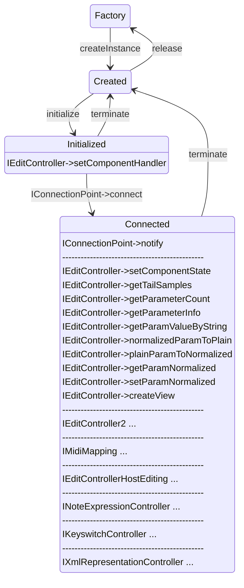
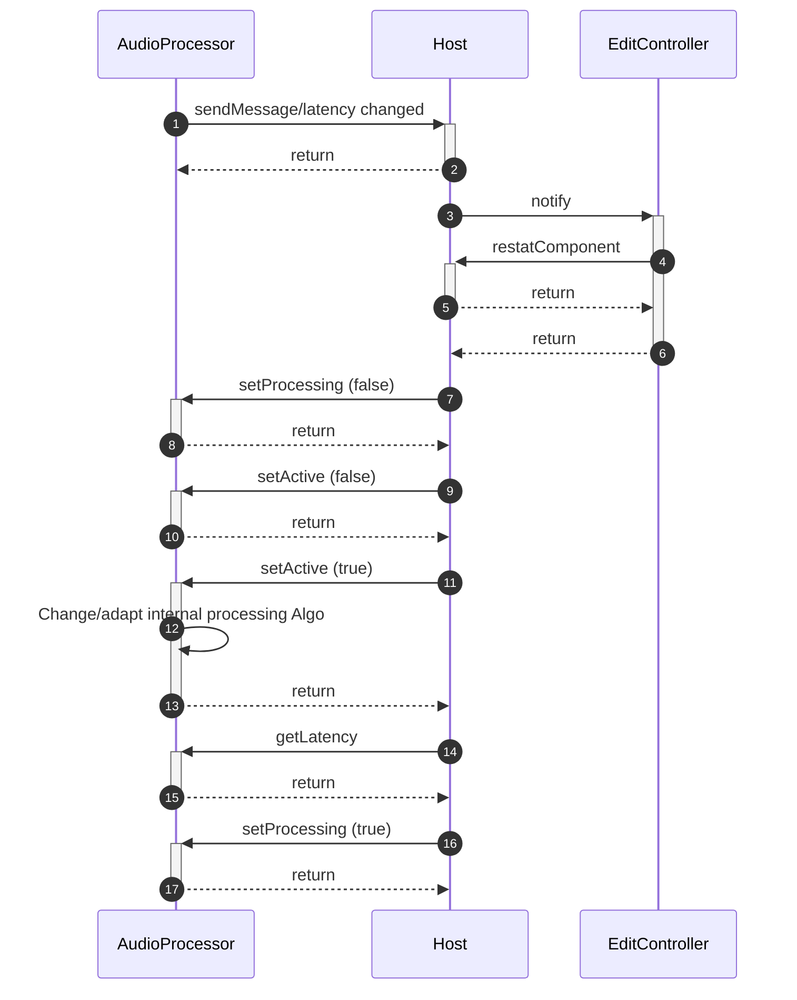
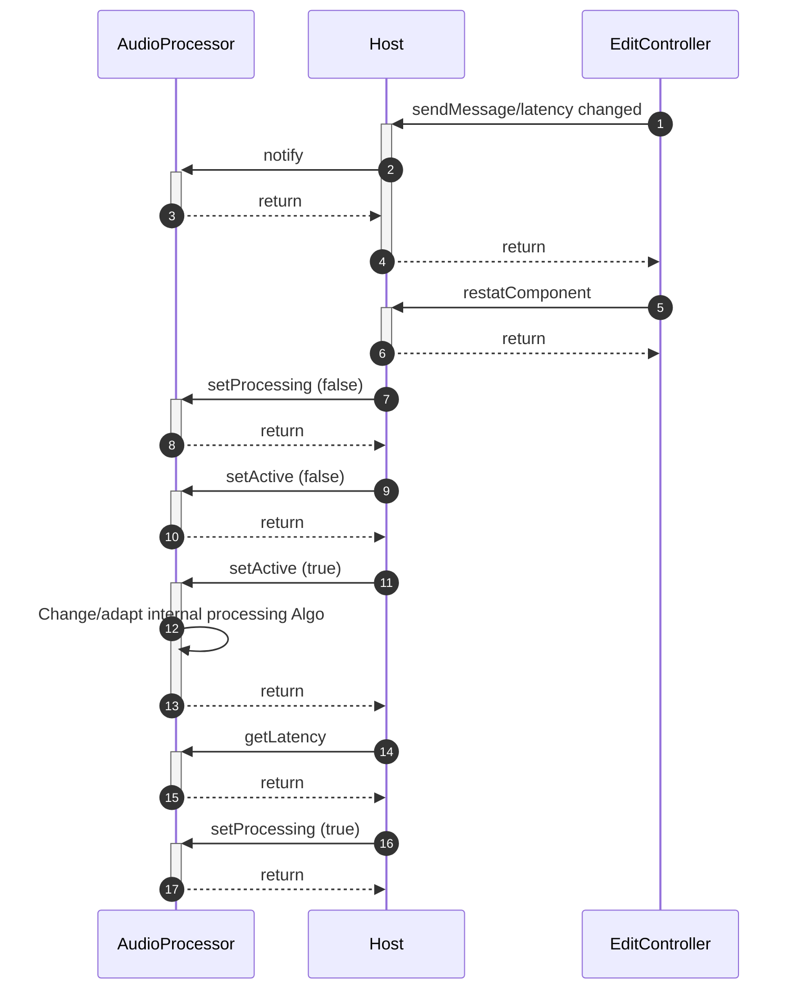
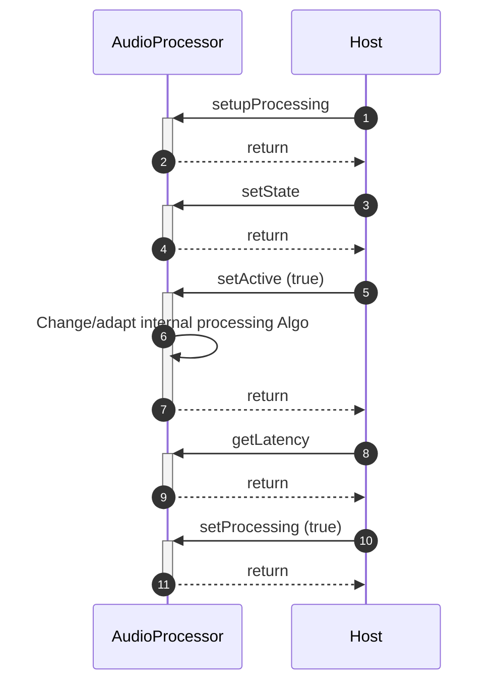
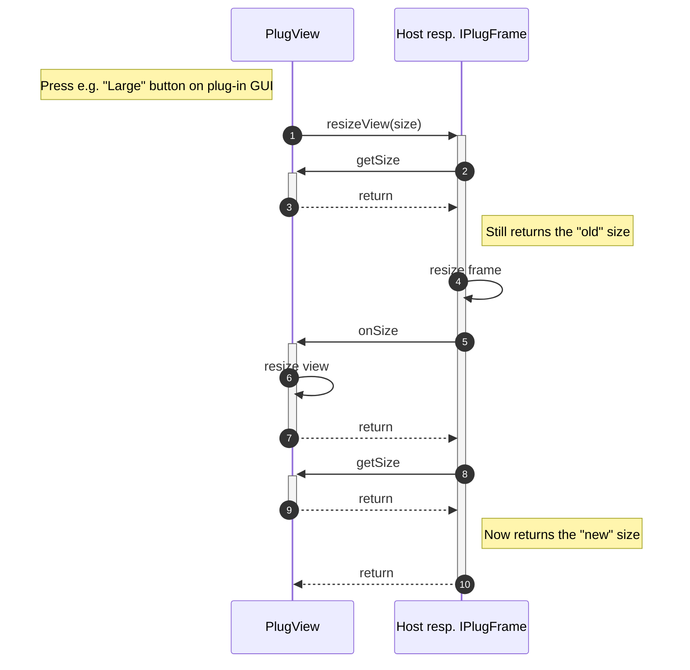
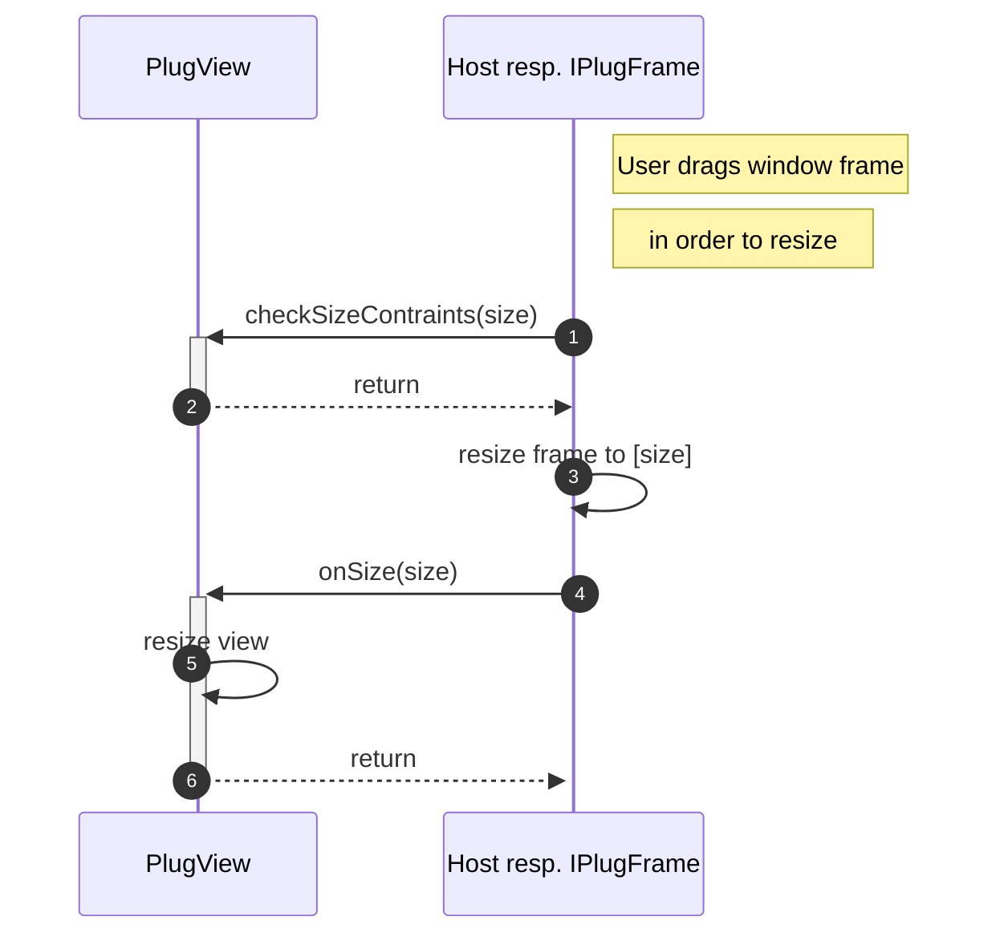
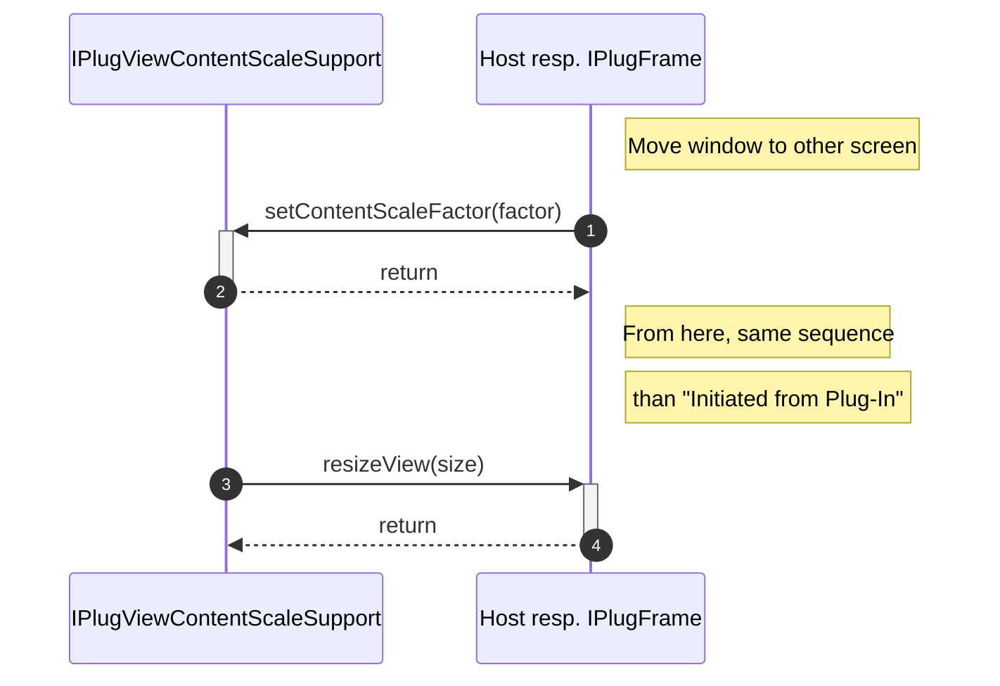
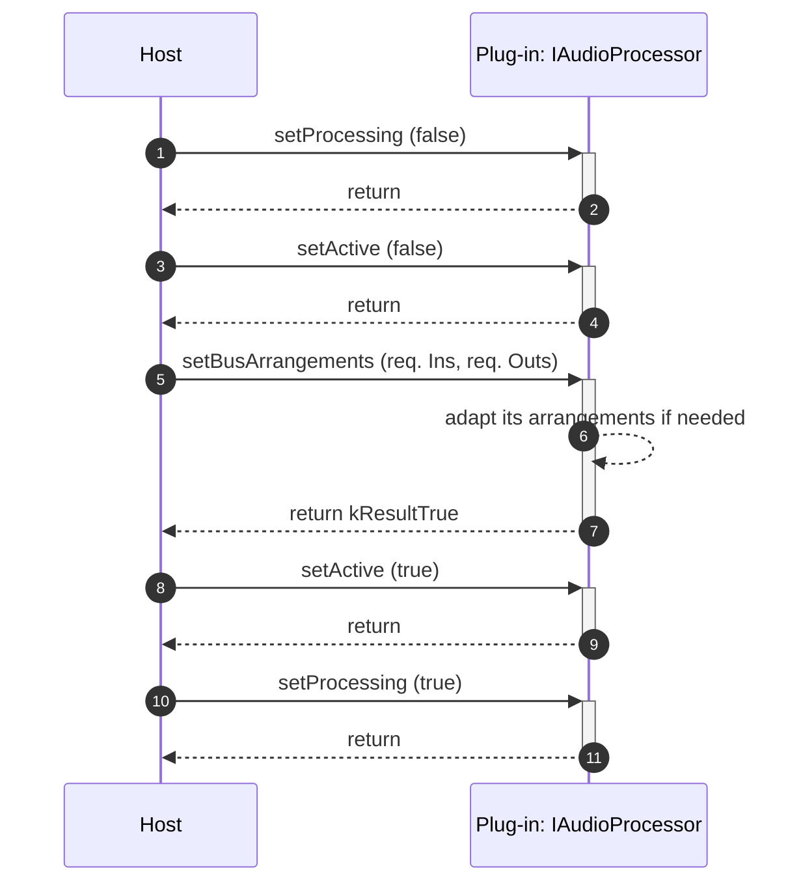
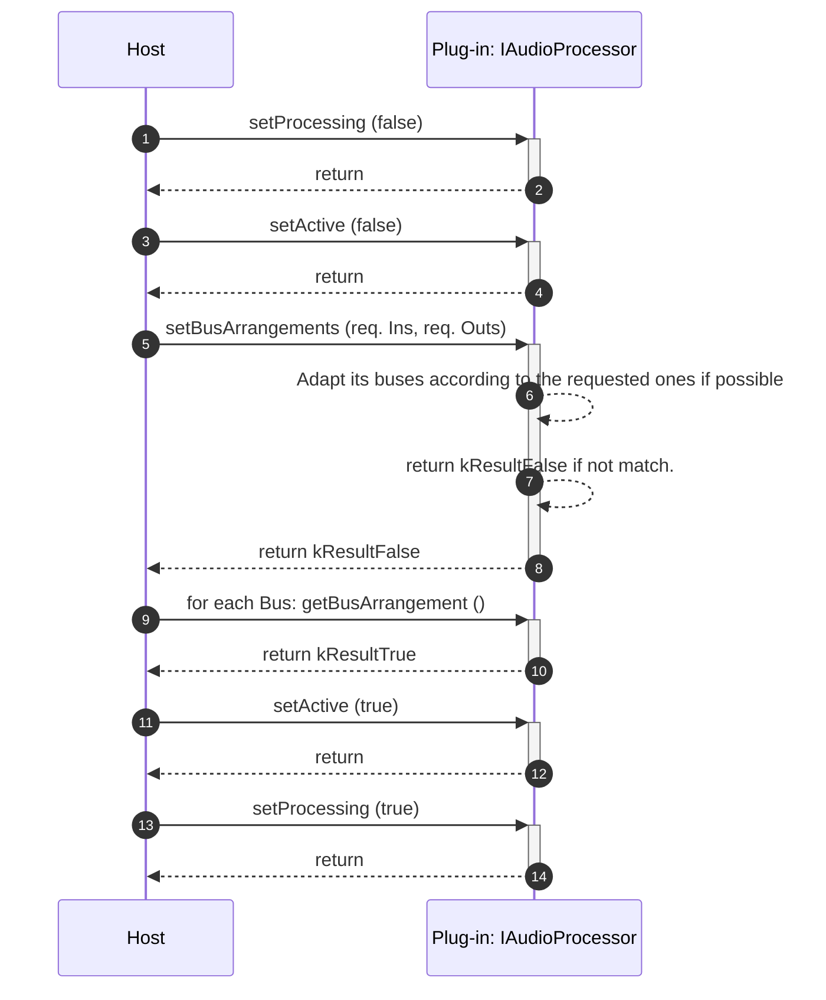

```mermaid
stateDiagram

State0: Factory
State1: Created
State2: Initialized
State25: Connected (optional)
State3: Setup Done
State4: Activated
State5: Processing


State1: IComponent->setIoMode
State1: IComponent->getControllerClassID   

State2: IComponent->setState
State2: IComponent->getState
State2: ----------------------------------------------
State2: IConnectionPoint->connect
State2: ----------------------------------------------
State2: IAudioProcessor->setBusArrangement
State2: IAudioProcessor->getBusArrangement
State2: IAudioProcessor->canProcessSampleSize

State25: IComponent->setState
State25: IComponent->getState
State25: ----------------------------------------------
State25: IConnectionPoint->disconnect
State25: IConnectionPoint->notify
State25: ----------------------------------------------
State25: IAudioProcessor->setBusArrangement
State25: IAudioProcessor->getBusArrangement
State25: IAudioProcessor->canProcessSampleSize

State3: IComponent->getBusCount
State3: IComponent->getBusInfo
State3: IComponent->getRoutingInfo
State3: IComponent->activateBus
State3: IComponent->setState
State3: IComponent->getState
State3: ----------------------------------------------
State3: IConnectionPoint->connect
State3: IConnectionPoint->disconnect
State3: IConnectionPoint->notify
State3: ----------------------------------------------
State3: IAudioProcessor->getLatencySamples
State3: IAudioProcessor->getTailSamples
State3: IAudioProcessor->setBusArrangement
State3: IAudioProcessor->getBusArrangement
State3: IAudioProcessor->canProcessSampleSize
State3: IAudioProcessor->setupProcessing
State3: ----------------------------------------------
State3: IProcessContextRequirements->getProcessContextRequirements

State4: IComponent->getBusCount
State4: IComponent->getBusInfo
State4: IComponent->getRoutingInfo
State4: IComponent->setState
State4: IComponent->getState
State4: ----------------------------------------------
State4: IConnectionPoint->notify
State4: ----------------------------------------------
State4: IAudioProcessor->getLatencySamples
State4: IAudioProcessor->getTailSamples
State4: IAudioProcessor->getBusArrangement
State4: IAudioProcessor->canProcessSampleSize
State4: ----------------------------------------------
State4: IAudioPresentationLatency->setAudioPresentationLatency

State5: ---[Processing Thread]-------------------------------
State5: IAudioProcessor->process
State5: ---[UI Thread]---------------------------------------
State5: IComponent->getBusCount
State5: IComponent->getBusInfo
State5: IComponent->getRoutingInfo
State5: IComponent->setState
State5: IComponent->getState
State5: ---[UI Thread]---------------------------------------
State5: IConnectionPoint->notify
State5: ---[UI Thread]---------------------------------------
State5: IAudioProcessor->getLatencySamples
State5: IAudioProcessor->getTailSamples
State5: IAudioProcessor->getBusArrangement
State5: IAudioProcessor->canProcessSampleSize

State0 --> State1: createInstance
State1 --> State0: release
State1 --> State2: initialize
State2 --> State25: connect
State25 --> State2: disconnect
State2 --> State1: terminate
State2 --> State3: setupProcessing
State25 --> State3: setupProcessing
State3 --> State1: terminate
State3 --> State4: setActive(true)
State4 --> State3: setActive(false)
State4 --> State5: setProcessing(true)
State5 --> State4: setProcessing(false)
```

># This is the source of the VST 3 Developer Portal

The source is written in Markdown and then build with [mdbook](https://github.com/rust-lang/mdBook)
to generate HTML pages.

## Requirements

- [mdbook](https://github.com/rust-lang/mdBook)
- [mdbook-mermaid](https://github.com/badboy/mdbook-mermaid)
- [mdbook-toc](https://github.com/badboy/mdbook-toc)
- [mdbook-linkcheck](https://github.com/Michael-F-Bryan/mdbook-linkcheck)

Install all of the above, so that the executables are in your environments path variable.

## Build

To build the html pages run mdbook from the checkout folder of this repository

```
mdbook build
```

or alternatively you can build and serve the html pages locally with

```
mdbook serve
```

then you can locate you webbrowser to http://localhost:3000

the html pages will automatically be updated if you change the source files.

<a id=atop href=#atop>🟩</a>

># Summary

[VST](#_readme_)

- [What is VST?](#_what_is_vst_index_)
  - [Use cases](#_what_is_vst_use_cases_)
- [Main benefits of VST 3](#_main_benefits_of_vst_3_index_)
- [What is the VST 3 SDK?](#_vst_3_sdk_index_)
  - [VST 3 Plug-in Examples](#_vst_3_sdk_plugin_examples_)
  - [VST 3 Plug-in Test Host](#_vst_3_sdk_plugin_test_host_)
  - [VST 3 Project Generator](#_vst_3_sdk_project_generator_)
  - [Validator command line](#_vst_3_sdk_validator_)
  - [AudioHost Application](#_vst_3_sdk_audiohost_)
  - [EditorHost Application](#_vst_3_sdk_editorhost_)
  - [VST 3 Inspector Application](#_vst_3_sdk_vst3inspector_)
  - [AAX, AUv3, AU and VST 2 Wrappers](#_vst_3_sdk_wrappers_index_)
    - [VST 2.x Wrapper](#_vst_3_sdk_wrappers_vst_2_wrapper_)
    - [AAX Wrapper](#_vst_3_sdk_wrappers_aax_wrapper_)
    - [AudioUnit v3 Wrapper](#_vst_3_sdk_wrappers_auv3_wrapper_)
    - [AudioUnit v2 Wrapper](#_vst_3_sdk_wrappers_auv2_wrapper_)
  - [iOS Inter-App Audio Support](#_vst_3_sdk_ios_inter_app_audio_support_)
  - [VSTGUI](#_vst_3_sdk_vstgui_)
- [VST 3 Licensing](#_vst_3_licensing_index_)
  - [Steinberg VST usage guidelines](#_vst_3_licensing_usage_guidelines_)
  - [What are the licensing options](#_vst_3_licensing_what_are_the_licensing_options_)
  - [Which files fall under which license?](#_vst_3_licensing_which_files_)
  - [Developer use cases (FAQs)](#_vst_3_licensing_developer_use_cases_)
- [Getting Started](#_getting_started_index_)
  - [VST 3 Links](#_getting_started_links_)
  - [How to set up my system for VST 3](#_getting_started_how_to_setup_my_system_)
  - [Preparation on Windows](#_getting_started_preparation_on_windows_)
- [Tutorials](#_tutorials_index_)
  - [Building the examples included in the SDK on Windows](#_tutorials_examples_windows_)
  - [Building the examples included in the SDK on macOS](#_tutorials_examples_macos_)
  - [Building the examples included in the SDK on Linux](#_tutorials_examples_linux_)
  - [Using cmake for building VST 3 plug-ins](#_tutorials_using_cmake_for_building_plugins_)
  - [Generate a new plug-in with the Project Generator App](#_tutorials_generate_new_plugin_)
  - [Code your first plug-in](#_tutorials_code_your_first_plugin_)
  - [Use VSTGUI to design a User Interface](#_tutorials_use_vstgui_)
  - [Advanced VST 3 techniques](#_tutorials_advanced_vst_3_)
  - [How to use the silence flags](#_tutorials_silence_flags_)
  - [Guideline for replacing a VST2 Plug-in by a VST3 Plug-in](#_tutorials_vst3_replacing_vst2_)
  - [Strings Conversion Helper](#_tutorials_strings_conversion_helper_)
  - [Creating a plug-in from the Helloworld template](#_tutorials_helloworld_template_)

- [Technical Documentation](#_technical_index_)
  - [VST 3 API Documentation](#_api_documentation_index_)
  - [VST Module Architecture](#_vst_module_architecture_index_)
    - [How the host will load a VST-MA based Plug-in](#_vst_module_architecture_loading_)
    - [How to derive a class from an interface](#_vst_module_architecture_derive_)
    - [Interface Versions and Inheritance](#_vst_module_architecture_interface_)
    - [Moduleinfo](#_vst_module_architecture_moduleinfo_json_)
  - [Parameters and Automation](#_parameters_automation_index_)
  - [VST 3 Units](#_vst_3_units_index_)
  - [Presets & Program Lists](#_presets_program_lists_index_)
  - [Complex Plug-in Structures / Multi-timbral Instruments](#_complex_structures_index_)
  - [VST 3 Workflow Diagrams](#_workflow_diagrams_index_)
    - [Audio Processor Call Sequence](#_workflow_diagrams_audio_processor_)
    - [Edit Controller Call Sequence](#_workflow_diagrams_edit_controller_)
    - [Get Latency Call Sequence](#_workflow_diagrams_get_latency_)
    - [Resize View Call Sequence](#_workflow_diagrams_resize_view_)
    - [Bus Arrangement Setting Sequence](#_workflow_diagrams_bus_)
  - [VST 3 Locations / Format](#_locations_format_index_)
    - [Plug-in Format Structure](#_locations_format_plugin_format_)
    - [Plug-in Locations](#_locations_format_plugin_locations_)
    - [Preset Format](#_locations_format_preset_format_)
    - [Preset Locations](#_locations_format_preset_locations_)
    - [Snapshots](#_locations_format_snapshots_)
  - [About MIDI in VST 3](#_about_midi_index_)
  - [Features History >>>>>>>>>>>>>>](#_change_index_)
  - [[3.0.0] Interfaces supported by the plug-in](#_change_3_0_0_plugin_interfaces_)
  - [[3.0.0] Multiple Dynamic I/O Support](#_change_3_0_0_multiple_dynamic_io_)
  - [[3.0.0] Silence flags](#_change_3_0_0_silence_flags_)
  - [[3.0.0] Interfaces supported by the host](#_change_3_0_0_host_interfaces_)
  - [[3.0.1] Parameter MIDI Mapping](#_change_3_0_1_imidimapping_)
  - [[3.0.2] Parameter Finder](#_change_3_0_2_iparameterfinder_)
  - [[3.1.0] Audio Presentation Latency](#_change_3_1_0_iaudiopresentationlatency_)
  - [[3.1.0] Dirty State, Open Editor Request and UI Group Editing Support](#_change_3_1_0_icomponenthandler2_)
  - [[3.1.0] KnobMode, Open Help & Open Aboutbox](#_change_3_1_0_ieditcontroller2_)
  - [[3.5.0] Note Expression](#_change_3_5_0_inoteexpressioncontroller_)
  - [[3.5.0] Key Switch](#_change_3_5_0_ikeyswitchcontroller_)
  - [[3.5.0] Remote Presentation of Parameters](#_change_3_5_0_ixmlrepresentationcontroller_)
  - [[3.5.0] Context Menu](#_change_3_5_0_icomponenthandler3_)
  - [[3.5.0] Enhanced Linked Parameters](#_change_3_5_0_ieditcontrollerhostediting_)
  - [[3.6.0] iOS Inter-App Audio](#_change_3_6_0_iaa_)
  - [[3.6.0] Preset Meta-Information](#_change_3_6_0_istreamattributes_)
  - [[3.6.5] Channel Context Info](#_change_3_6_5_iinfolistener_)
  - [[3.6.5] Unit-Bus Assignment Change](#_change_3_6_5_iunithandler2_)
  - [[3.6.5] Prefetchable](#_change_3_6_5_iprefetchablesupport_)
  - [[3.6.5] Automation State](#_change_3_6_5_iautomationstate_)
  - [[3.6.6] PlugView Content Scaling](#_change_3_6_6_iplugviewcontentscalesupport_)
  - [[3.6.8] Request Bus Activation](#_change_3_6_8_icomponenthandlerbusactivation_)
  - [[3.6.10] UI Snapshots](#_change_3_6_10_ui_snapshots_)
  - [[3.6.11] NoteExpression Physical UI Mapping](#_change_3_6_11_inoteexpressionphysicaluimapping_)
  - [[3.6.12] Legacy MIDI CC Out Event](#_change_3_6_12_legacymidiccoutevent_)
  - [[3.6.12] MIDI Learn](#_change_3_6_12_imidilearn_)
  - [[3.6.12] Host Query Interface support](#_change_3_6_12_ipluginterfacesupport_)
  - [[3.6.12] MPE support for Wrappers](#_change_3_6_12_ivst3wrappermpesupport_)
  - [[3.7.0] Parameter Function Name](#_change_3_7_0_iparameterfunctionname_)
  - [[3.7.0] Progress display](#_change_3_7_0_iprogress_)
  - [[3.7.0] Process Context Requirements](#_change_3_7_0_iprocesscontextrequirements_)
  - [[3.7.0] Control Voltage Bus Flag](#_change_3_7_0_control_voltage_)
  - [[3.7.5] Module Info and Plug-in Compatibility](#_change_3_7_5_moduleinfo_)
- [Change History](#_version_index_)
  - [Version 3.7.6 (2022/09/05)](#_version_3_7_6_)
  - [Version 3.7.5 (2022/05/16)](#_version_3_7_5_)
  - [Version 3.7.4 (2021/12/14)](#_version_3_7_4_)
  - [Version 3.7.3 (2021/08/10)](#_version_3_7_3_)
  - [Version 3.7.2 (2021/03/30)](#_version_3_7_2_)
  - [Version 3.7.1 (2020/11/17)](#_version_3_7_1_)
  - [Version 3.7.0 (2020/07/29)](#_version_3_7_0_)
  - [Version 3.6.14 (2019/11/29)](#_version_3_6_14_)
  - [Version 3.6.13 (2019/04/08)](#_version_3_6_13_)
  - [Version 3.6.12 (2018/12/03)](#_version_3_6_12_)
  - [Version 3.6.11 (2018/10/22)](#_version_3_6_11_)
  - [Version 3.6.10 (2018/06/11)](#_version_3_6_10_)
  - [Version 3.6.9 (2018/03/01)](#_version_3_6_9_)
  - [Version 3.6.8 (2017/11/08)](#_version_3_6_8_)
  - [Version 3.6.7 (2017/03/03)](#_version_3_6_7_)
  - [Version 3.6.6 (2016/06/17)](#_version_3_6_6_)
  - [Version 3.6.5 (2015/08/28)](#_version_3_6_5_)
  - [Version 3.6.0 (2013/11/22)](#_version_3_6_0_)
  - [Version 3.5.2 (2012/09/25)](#_version_3_5_2_)
  - [Version 3.5.1 (2011/11/11)](#_version_3_5_1_)
  - [Version 3.5.0 (2011/02/04)](#_version_3_5_0_)
  - [Version 3.1.0 (2010/06/25)](#_version_3_1_0_)
  - [Version 3.0.2 (2009/01/15)](#_version_3_0_2_)
  - [Version 3.0.1 (2008/03/19)](#_version_3_0_1_)
  - [Version 3.0.0 (2008/01/17)](#_version_3_0_0_)
- [Frequently Asked Questions](#_faq_index_)
  - [Communication](#_faq_communication_)
  - [Processing](#_faq_processing_)
  - [GUI-Editor](#_faq_gui_editor_)
  - [Compatibility with VST 2.x or VST 1](#_faq_compatibility_with_vst_2_x_or_vst_1_)
  - [Persistence](#_faq_persistence_)
  - [Miscellaneous](#_faq_miscellaneous_)
  - [Licensing](#_faq_licensing_)
  - [Hosting](#_faq_hosting_)
- [VST 3 Forum](#_forum_index_)
- [Miscellaneous](#_miscellaneous_index_)


<a id=_readme_ href=#atop>🟩</a>

># VST Home

## Welcome to the world of VST 3


This part of the [Steinberg Developer Resource](https://developer.steinberg.help/display/SDH/Steinberg+Developer+Resource) is a portal dedicated to developers of **VST 3** plug-ins and **VST 3** hosts. Almost everything you need for developing **VST 3** plug-ins is explained in the sections below.

## [What is VST?](#_what_is_vst_index_)

Virtual Studio Technology (**VST**) is an audio plug-in software interface that facilitates the integration of software synthesizers and effects in digital audio workstations (DAW).

- [Use cases](#_what_is_vst_use_cases_)

## [Main benefits of VST 3](#_main_benefits_of_vst_3_index_)

Here, you can find a non-exhaustive list of **VST 3** benefits.

## [What is the VST 3 SDK?](#_what_is_the_vst_3_sdk_index_)

The **VST 3 SDK** (Virtual Studio Technology Software Development Kit) is a collection of software development tools included in one package. This allows plug-in developers to create plug-ins in **VST 3** format and host developers to load **VST 3** plug-ins into a DAW or audio editor.

## [VST 3 licensing](#_vst_3_licensing_index_)

- [Steinberg VST usage guidelines](#_vst_3_licensing_usage_guidelines_)
- [What are the licensing options](#_vst_3_licensing_what_are_the_licensing_options_)
- [Which files fall under which license?](#_vst_3_licensing_which_files_)
- [Developer use cases (FAQs)](#_vst_3_licensing_developer_use_cases_)

## [Getting Started](#_getting_started_index_)

- [VST 3 Links](#_getting_started_links_) — Important links you will need for working with **VST 3**
- [How to setup up my system for VST 3](#_getting_started_how_to_setup_my_system_) — In order to build VST 3 plug-ins, you need the source code of the **VST 3** (API: interface definition), an IDE/compiler, cmake and a VST 3 host application.
- [Preparation on Windows](#_getting_started_preparation_on_windows_) — Generated **VST 3** Microsoft Visual Studio Projects using the [cmake](<https://cmake.org>) files included in the SDK will create by default symbolic links for each built plug-in in the official **VST 3** folder, in order to allow this on Windows you have to adapt the Group Policy of Windows. [See Here!](#_getting_started_preparation_on_windows_)

## [Tutorials](#_tutorials_index_)

- [Building the examples included in the SDK on Windows](#_tutorials_examples_windows_)
- [Building the examples included in the SDK on macOS](#_tutorials_examples_macos_)
- [Building the examples included in the SDK on Linux](#_tutorials_examples_linux_)
- [Using cmake for building VST 3 plug-ins](#_tutorials_using_cmake_for_building_plug_ins_)
- [Generate a new plug-in with the Project Generator App](#_tutorials_generate_new_plugin_)
- [Use VSTGUI to design a User Interface](#_tutorials_use_vstgui_to_design_a_ui_)
- [Advanced VST 3 techniques](#_tutorials_advanced_vst_3_techniques_)
- [How to use the silence flags](#_tutorials_how_to_use_the_silence_flags_)
- [Strings Conversion Helper](#_tutorials_strings_conversion_helper_)
- [Creating a plug-in from the Helloworld template](#_tutorials_helloworld_template_)

## [VST 3 Forum](#_forum_index_)

Visit Steinberg's **VST Developer Forum** in order to get help with development, to submit bug reports, to request new features and to connect to other **VST 3** developers:

## [Technical Documentation](#_technical_index_)

Browse the **VST 3 SDK**'s technical documentation. The full **VST 3 API** reference is only available in the [VST 3 Package](#_getting_started_links_) that you can download or find online here.

## [Miscellaneous](#_miscellaneous_index_)

Copyrights and Glossary

<a id=_what_is_vst_index_ href=#atop>🟩</a>

>/ [VST Home](#atop)
>
># What is VST?

**On this page:**


**Related pages:**

- [Use cases](#_what_is_vst_use_cases_)
- [Main benefits of VST 3](#_main_benefits_of_vst_3_index_)
- [What is the VST 3 SDK?](#_what_is_the_vst_3_sdk_index_)

---

## VST 3: New Standard for Virtual Studio Technology

With **VST** (Virtual Studio
Technology), [Steinberg](https://www.steinberg.net/) established the world’s leading and most widely supported standard for plug-ins and virtual instruments in 1996. With **VST 3** [Steinberg](https://www.steinberg.net/) releases the next major revision
of [Steinberg](https://www.steinberg.net/)’s Virtual Studio Technology to the audio industry. **VST 3** marks an important milestone in audio technology with a completely rewritten code base providing not only many new features but also the most stable and reliable VST platform ever.
This combination of the latest technology and new features is the result of [Steinberg](https://www.steinberg.net/)’s twelve years of development experience as the leading plug-in interface provider.**VST 3** has been designed to provide a technological and creative basis for many innovative and exciting new products for the audio industry, offering a new world of creative possibilities for instrument and effect plug-in users. The **VST 3 SDK** is available as a free technology, open in use for any developer.

## About the VST standard

The Virtual Studio Technology (**VST**) interface is nothing short of a revolution in digital audio. Developed by Steinberg and first launched in 1996, VST creates a full, professional studio environment on your computer.**VST** allows the integration of virtual effect processors and instruments into your digital audio environment. These can be software recreations of hardware effect units and instruments or new creative effect components in your **VST** system. All are integrated seamlessly into **VST** compatible host applications like digital audio workstations (DAW). **VST** also allows easy integration of external equipment, allowing you to put together a system tailor-made to your needs. Being an open standard, the possibilities offered by **VST** have steadily been growing over the past decade. New virtual effect processors and virtual instruments are constantly being developed by Steinberg and of course dozens of other companies.

## From the technical point of view

A **VST** plug-in is an audio processing component that is utilized within a host application. This host application provides the audio or/and event streams that are processed by the plug-in's code. Generally speaking, a **VST** plug-in can take a stream of audio data, apply a process to the audio, and return the result to the host application. A **VST** plug-in normally performs its process using the processor of the computer. The audio stream is broken into a series of blocks. The host supplies the blocks in sequence. The host and its current environment control the block-size. The **VST** plug-in maintains the status of all its own parameters relating to the running process: The host does not maintain any information about what the plug-in did with the last block of data it processed.

From the host application's point of view, a **VST** plug-in is a black box with an arbitrary number of inputs, outputs (Event (MIDI) or Audio), and associated parameters. The host needs no implicit knowledge of the plug-in's process to be able to use it. The plug-in process can use whatever parameters it wants, internally to the process, but depending on the capabilities of the host, it can allow the changes to user parameters to be automated by the host.

The source code of a **VST** plug-in is platform independent, but the delivery system depends on the platform architecture:

- On **Windows**, a **VST** plug-in is a multi-threaded DLL (Dynamic Link Library), recently packaged into a folder structure.
- On **Mac OS X**, a **VST** plug-in is a Mach-O Bundle
- On **Linux**, a **VST** plug-in is a package

<a id=_what_is_vst_use_cases_ href=#atop>🟩</a>

>[VST Home](#atop) / [What is VST?](#_what_is_vst_index_)
>
># Use cases

**On this page:**


**Related pages:**

- [Main benefits of VST 3](#_main_benefits_of_vst_3_index_)

---

## Why use VST 3 SDK?

There are different use cases you can realize by using the **VST 3 SDK**:

1. You are a ***plug-in developer*** and you want to create audio FX or instrument plug-ins which can be included and used in a **VST 3** host application.

   - an audio FX plug-in is an audio processor effect taking audio as input and creating audio as output: such as *Delay*, *Phaser*, *Compressor*, *Reverb*, …
   - an instrument plug-in is a sound/audio generator, taking as input note events and creating audio as output: such as emulations of well-known hardware synths. There are 2 kinds of instrument plug-ins: virtual sample-based (using audio samples as the basis for sound generation) and virtual synth (using different types of synthesis: physical modelling, additive, subtractive, FM, sample-based, …)

2. You are a ***host developer*** and you want to load in your application **VST 3** plug-ins:

    - audio FX and/or
    - instruments plug-ins.

## Advantages of using VST 3 SDK

By using **VST 3 SDK** directly:

- you are sure to be compliant with the **VST 3** format.
- developing your plug-in based on the **VST 3** format allows you to support easily new **VST 3** features that improve the integration of these plug-ins inside a DAW. Some 3rd party SDKs use only a common layer between all plug-in formats, limiting in this way the possibility for a better integration, for example exclusive **VST 3** features:
  - [context menu](#_change_3_5_0_icomponenthandler3_)
  - [dirty state](#_change_3_1_0_icomponenthandler2_)
  - loading differentially a preset or a project
  - [note expression](#_change_3_5_0_inoteexpressioncontroller_)
  - see [other benefits of VST 3](#_main_benefits_of_vst_3_index_)
- you get optimal integration of the **[VSTGUI](#_what_is_the_vst_3_sdk_vstgui_)** tool with **VST 3**
- it includes the major plug-in format wrappers: AAX, AUv3, AU, VST 2 (deprecated)
- the included [Validator](#validator-command-line) allows you to check your plug-in's conformity to the **VST 3** standard

## Examples of VST 3 host applications

| **Name**                | **Companies**                     | **Link**                                      |
| ----------------------- | --------------------------------- | --------------------------------------------- |
| ACID Pro                | MAGIX Software GmbH               | <https://www.magix.com>                       |
| Acoustica	              | Acon Digital                      | <https://acondigital.com>                     |
| Audacity                | Audacity Team                     | <https://www.audacityteam.org>                 |
| Audition                | Adobe                        	    | <https://www.adobe.com>                       |
| Bidule                  | Plogue Art et Technologie, Inc.   | <https://www.plogue.com>                      |
| Bitwig                  | Bitwig GmbH                       | <https://www.bitwig.com>                      |
| Camelot                 | Audio Modeling                    | <https://audiomodeling.com>                   |
| Cantabile               | Topten Software                   | <https://www.cantabilesoftware.com>           |
| Cross DJ                | MixVibes                          | <https://www.mixvibes.com>                    |
| Cubase                  | Steinberg Media Technologies GmbH | <https://new.steinberg.net/cubase>            |
| DaVinci Resolve         | Blackmagic Design                 | <https://www.blackmagicdesign.com/products/davinciresolve>|
| deCoda                  | zplane                            | <https://products.zplane.de/products/decoda>  |
| Digital Performer	      | MOTU                              | <https://motu.com/en-us/products/software/dp> |
| Dorico                  | Steinberg Media Technologies GmbH | <https://new.steinberg.net/dorico>            |
| FL Studio	              | ImageLine                         | <https://www.image-line.com>                  |
| Gig Performer           | Deskew Technologies               | <https://gigperformer.com>                    |
| Live                    | Ableton AG                        | <https://www.ableton.com/en/live>             |
| Maschine                | Native Instruments                | <https://www.native-instruments.com>          |
| Max                     | Cycling 74                        | <https://cycling74.com>                       |
| Mixcraft                | Acoustica                         | <https://acoustica.com>                       |
| Modula                  | Quantica Audio                    | <https://quanticaaudio.com>                   |
| Music Maker Plus        | MAGIX Software GmbH               | <https://www.magix.com>                       |
| Nuendo                  | Steinberg Media Technologies GmbH	| <https://new.steinberg.net/nuendo>            |
| Orb Composer Pro        | Hexachords                        | <https://hexachords.com>                      |
| Overture                | Sonic Scores                      | <https://sonicscores.com>                     |
| Reaper                  | Reaper                            | <https://www.reaper.fm>                       |
| Samplitude              | MAGIX Software GmbH               | <https://www.magix.com>                       |
| Sonar                   | Bandlab/Cakewalk                  | <https://www.bandlab.com/products/cakewalk>   |
| Sound Forge Audio Studio| MAGIX Software GmbH               | <https://www.magix.com>                       |
| Soundop                 | Ivosight Software Inc.            | <https://ivosight.com>                        |
| SpectraLayers           | Steinberg Media Technologies GmbH | <https://www.steinberg.net/spectralayers>     |
| Studio One              | PreSonus Software Ltd             | <https://www.presonus.com/products/Studio-One>|
| TS2                     | Ircam Lab                         | <https://www.ircamlab.com>                    |
| VST Live                | Steinberg Media Technologies GmbH | <https://www.steinberg.net/vst-live>          |
| VST Rack Pro            | Yamaha Corporation                | <https://europe.yamaha.com/en/products/proaudio/software/vst_rack/index.html>|
| Waveform                | Tracktion Software Corporation    | <https://www.tracktion.com>                   |
| Wavelab                 | Steinberg Media Technologies GmbH | <https://new.steinberg.net/wavelab>           |

<a id=_main_benefits_of_vst_3_index_ href=#atop>🟩</a>

>/ [VST Home](#atop)
>
># Main benefits of VST 3

**On this page:**


**Related pages:**

- [What is the VST 3 SDK?](#_what_is_the_vst_3_sdk_index_)

---

Here, you can find a non-exhaustive list of **VST 3** benefits.

**VST 3** is a general rework of the long-serving **VST** plug-in interface (VST 1 & VST 2) . It is not compatible with the older VST (1 & 2) versions, but it includes some new features and possibilities. We have redesigned the API to make it not only far easier and more reliable for developers to work with, but have also provided completely new possibilities for plug-ins. These include:

## 1. Improved Performance with the [Silence Flag](#_change_3_0_0_silence_flags_)

Managing large plug-in sets and multiple virtual instruments on typical studio computer systems can often be difficult because of CPU performance limits. **VST 3** helps to improve overall performance by applying processing to plug-ins only when audio signals are present on their respective inputs. Instead of always processing input signals, **VST 3** plug-ins can apply their processing economically and only when it is needed.

## 2. [Multiple Dynamic I/Os](#_change_3_0_0_multiple_dynamic_io_)

**VST 3** plug-ins are no longer limited to a fixed number of inputs and outputs, and their I/O configuration can dynamically adapt to the channel configuration. [Side-chains](#what-is-a-side-chain) are also very easily realizable. This includes the possibility to deactivate unused busses after loading and even reactivate those when needed. This cleans up the mixer and further helps to reduce CPU load.

## 3. [Sample-accurate Automation](#_parameters_automation_index_)

**VST 3** also features vastly improved parameter automation with sample accuracy and support for ramped automation data, allowing completely accurate and rapid parameter automation changes.

## 4. [Logical Parameter Organization](#_vst_3_units_index_)

The **VST 3** plug-in parameters are displayed in a tree structure. Parameters are grouped into sections which represent the structure of the plug-in. Plug-ins can communicate their internal structure for the purpose of overview, but also for some associated functionality (e.g. program lists). Parameters like *“Cutoff”* and *“Resonance”* could be grouped into a section called *“Filter”*. This makes searching for a certain parameters easier, such as on an automation track. This also allows for assigning a group of parameters to a specific *MIDI* Channel input and audio output bus.

## 5. Resizeable UI Editor

**VST 3** introduces a new approach to plug-in GUIs through window resizing, allowing for extremely flexible use of valuable screen space.

## 6. Mouse Over Support

The host can ask the plug-in which parameter is under the mouse.

## 7. [Context Menu Support](#_change_3_5_0_icomponenthandler3_)

**VST 3** defines a way to allow the host to add its own entries in the plug-in context menu of a specific parameter.

## 8. [Channel Context Information](#_change_3_6_5_iinfolistener_)

A **VST 3** plug-in can access channel information where it is instantiated: name, color, ...

## 9. [Note Expression](#_change_3_5_0_inoteexpressioncontroller_)

**VST 3** defines with [Note Expression](#_change_3_5_0_inoteexpressioncontroller_) a new way of event controller editing. The plug-in is able to break free from the limitations of MIDI controller events by providing access to new **VST 3** controller events that circumvent the laws of MIDI and provide articulation information for each individual note (event) in a polyphonic arrangement according to its noteId.

## 10. 3D Audio Support

**VST 3** supports new speaker configurations like Ambisonic, Atmos, Auro 3D or 22.2.

## 11. Factory Concept

**VST 3** plug-in library could export multiple plug-ins and in this way replaces the shell concept of **VST 2** (kPlugCategShell).

## 12. [Support Remote control Representation](#_change_3_5_0_ixmlrepresentationcontroller_)

Remote controllers for audio and MIDI software applications have become increasingly popular. **VST 3** offers far more flexible control of VST plug-ins by remote controllers. Using the knobs and faders on the control surface, parameters can be recorded, renamed and edited in many ways. Parameters that cannot be edited can be routed for display purposes to the control surface, for example, to show Gain Reduction on a compressor.

## 13. Others

While designing **VST 3**, we performed a careful analysis of the existing functionality of **VST** and rewrote the interfaces from scratch. In doing so, we focused a lot on providing clear interfaces and their documentation in order to avoid usage errors from the deepest possible layer. Some more features implemented specifically for developers include:

- More stable technical host/plug-in environment
- Advanced technical definition of the standard
- Modular approach
- Separation of UI and processing
- UTF16 for localized parameter naming
- Advanced preset system
- Multiple plug-ins per library
- [VST 3 SDK package](#_what_is_the_vst_3_sdk_index_):
  - [Test Host](#_what_is_the_vst_3_sdk_plugin_test_host_) included
  - Automated testing environment
  - Validator (small command line Test Host)
  - [Plug-in and host examples](#_what_is_the_vst_3_sdk_plugin_examples_) code included
  - [Project Generator](#_what_is_the_vst_3_sdk_project_generator_)
  - ...

<a id=_vst_3_sdk_index_ href=#atop>🟩</a>

>/ [VST Home](#atop)
>
># What is the VST 3 SDK?

**On this page:**


---

## VST 3 SDK explained

The **VST 3 SDK** (Virtual Studio Technology Software Development Kit) is a collection of software development tools included in one package. This allows plug-in developers to create plug-ins in **VST 3** format and host developers to load **VST 3** plug-ins into a DAW or audio editor.

## What is included

The **VST 3 SDK** package contains:

### The VST 3 API

This is a **C++ interface** defining how a **VST 3** plug-in communicates with a host and vice versa. The heart of **VST 3**.

>Check the folder *"pluginterfaces/vst"* of the SDK!

### VST 3 Implementation Helper Classes

Some helper classes are provided, implementing some **VST 3** interfaces for hosting and for creating **VST 3** plug-ins. Simply derived your plug-in C++ classes from these helper classes.


>Check the folder *"public.sdk"* of the SDK!

## [VST 3 Plug-ins Examples](#_what_is_the_vst_3_sdk_plugin_examples_)

The SDK includes some Plug-ins implementation examples.

## [VST 3 Plug-in Test Host](#_what_is_the_vst_3_sdk_plugin_test_host_)

The SDK provides a test application called **VST3PluginTestHost** for Apple Mac OS X (x86_64/M1) and Microsoft Windows (64bits).

## [VST 3 Project Generator](#_what_is_the_vst_3_sdk_project_generator_)

This open source application (Win/macOS) allows you to generate easily a new **VST 3** plug-in project by just entering in a GUI some parameters.

## [Validator command line](#_what_is_the_vst_3_sdk_validator_)

The ***validator*** is a small command line host application (source code included) which can be used to check your plug-in for VST 3 conformity.

## [AudioHost](#_what_is_the_vst_3_sdk_audiohost_)

Simple cross-platform (only tested on Linux) host application allowing you to register a VST 3 plug-in with Jack Server.

## [EditorHost](#_what_is_the_vst_3_sdk_editorhost_)

Simple cross-platform (Win/macOS/Linux) host application allowing you to open the editor of a VST 3 plug-in.

## [VST 3 Inspector](#_what_is_the_vst_3_sdk_vst3inspector_)

Simple cross-platform (Win/macOS/Linux) host application, built with VSTGUI, which scans the VST 3 Folder, collects information from the factory about each VST 3 plug-in and display it in its UI.

## [VSTGUI](#_what_is_the_vst_3_sdk_vstgui_)

This is a user interface toolkit mainly for audio plug-ins (VST, AudioUnit, etc). Based on the XML definition of the plug-in UI, **VSTGUI** includes an embedded editor (UIDescription Editor) which allows the developer to create a plug-in UI just by drag & drop of the UI element.

## [AAX, AUv3, AU and VST 2 wrappers](#_what_is_the_vst_3_sdk_wrappers_index_)

These wrappers allow you to create versions of your **VST 3** plug-in in other plug-in formats with minimum effort.

## [iOS Inter-App Audio support](#_what_is_the_vst_3_sdk_ios_inter_app_audio_support_)

iOS InterApp-Audio application out of your **VST 3 plug-in**

## [VST 3 Licensing](#_vst_3_licensing_index_)

Please sign this **Steinberg VST 3 Plug-In SDK Licensing Agreement** if you want to develop, release or host **VST 3** plug-Ins.

## System requirements

| Operating System                  | Architecture                  | Compiler              | Notes                             |
| --------------------------------- | ----------------------------- | --------------------- | --------------------------------- |
| Windows 10                        | x86, x86_64                   | MSVC 2019, MSVC 2022  |                                   |
| Windows 8.1                       | x86, x86_64                   | MSVC 2019, MSVC 2022  |                                   |
| macOS 10.13 - 12                  | x86, x86_64, Apple Silicon    | Xcode 10 - 13.3       |                                   |
| iOS 13 - 15                       | arm64                         | Xcode 11 - 13.3       |                                   |
| Linux - Raspberry Pi OS (Buster)  | arm32                         | GCC 8.3 and higher    | Visual Studio Code                |
| Linux - Ubuntu 22.04 LTS          | x86, x86_64                   | GCC 11.2 and higher   | Visual Studio Code, Qt Creator    |
| Linux - Ubuntu 20.04 LTS          | x86, x86_64                   | GCC 8.3 and higher    | Visual Studio Code, Qt Creator    |

## [Download link](#_getting_started_links_)

Important links you will need for working with **VST 3**

## [Change history](#_versions_index_)

All released versions of the **VST 3 SDK** with changes and dates.

<a id=_vst_3_sdk_plugin_examples_ href=#atop>🟩</a>

>/ [VST Home](#atop) / [What is the VST 3 SDK?](#_vst_3_sdk_index_)
>
># VST 3 Plug-in Examples

**On this page:**


**Related pages:**

- [VST 3 Plug-in Test Host](#_plugin_test_host_)
- [AAX, AUv3, AU and VST 2 Wrappers](#_wrappers_index_)
- [Building the examples included in the SDK on Windows](#_tutorials_examples_windows_)
- [Building the examples included in the SDK on macOS](#_tutorials_examples_macos_)
- [Building the examples included in the SDK on Linux](#_tutorials_examples_linux_)
---

## Introduction

The SDK includes some Plug-ins implementation examples. The Legendary **AGain** and **ADelay**, thanks Paul Kellet the Open-source **mda** Plug-ins, a basic "Note Expression Synth" supporting "**Note Expression Event**", an example of **pitchnames** support Plug-in, a **VST 3 Host Checker** which checks if a host is VST 3 compliant and more...

>
>
>
>
>
>
>

Check the folder *"public.sdk/samples/vst"* of the SDK!

>ⓘ **Note**\
>They use cmake as project generator: [Using cmake for building VST 3 plug-ins](#_tutorials_using_cmake_for_building_plug_ins_)\
>In order to add your own Plug-ins check: [Generate a new plug-in with the Project Generator App](#_tutorials_generate_new_plugin_)

## ADelay

Very simple delay plug-in:

- only one parameter (a delay)

Check the folder *"public.sdk/samples/vst/adelay"* of the SDK!

Classes:

- ADelayProcessor
- ADelayController

## AGain

The SDK includes an AGain plug-in which is a very simple **VST 3 Plug-in**. This plug-in:

- is multichannel compatible
- supports bypass processing
- has an automated gain parameter
- has an Event input bus (allowing to use noteOn velocity to control the gain factor)
- has a VU peak meter
- uses the [**VSTGUI4**](#_vstgui_) library
- a version of this plug-in with side-chaining is available (showing a plug-in using the same controller and different - components)
- a **AAX** version is available
- a **AUv3** version is available


Check the folder *"public.sdk/samples/vst/again"* of the SDK!

Classes:

- AGain
- AGainWithSideChain (used for side-chain version)
- AGainController

AGain Sample Accurate

Simple plug-in showing how to achieve sample accurate processing.

Based Check the folder *"public.sdk/samples/vst/again_sampleaccurate"* of the SDK!

## TestChannelContext

Very simple plug-in:

- showing how to use the [Steinberg::Vst::ChannelContext::IInfoListener](#_change_3_6_5_iinfolistener_) interface
- using a generic UI


Check the folder *"public.sdk/samples/vst/channelcontext"* of the SDK!

## HostChecker

- Instrument, Panner and Fx plug-in checking the **VST 3** support of a host.
- It uses [**VSTGUI**](#_vstgui_)
- a **AAX** version is available


Check the folder *"public.sdk/samples/vst/hostchecker"* of the SDK!

## TestLegacyMIDICCOut

Very simple plug-in:

- showing how to use [LegacyMIDICCOutEvent](#_change_3_6_12_legacymidiccoutevent_) which allow to generate MIDI CC as output event
- VST parameters change which creates [LegacyMIDICCOutEvent](#_change_3_6_12_legacymidiccoutevent_) Event


Check the folder *"public.sdk/samples/vst/legacymidiccout"* of the SDK!

Classes:

- LegacyMIDICCOut::Plug

## mda plug-ins

- Effects (stereo to stereo plug-ins):
  - Ambience : Reverb
  - Bandisto : Multi-band Distortion
  - BeatBox : Drum Replacer
  - Combo : Amp and Speaker Simulator
  - DeEsser : High frequency Dynamics Processor
  - Degrade : Sample quality reduction
  - Delay : Simple stereo delay with feedback tone control
  - Detune : Simple up/down pitch shifting thickener
  - Dither : Range of dither types including noise shaping
  - DubDelay : Delay with feedback saturation and time/pitch modulation
  - Dynamics : Compressor / Limiter / Gate
  - Image : Stereo image adjustment and M-S matrix
  - Leslie : Rotary speaker simulator
  - Limiter : Opto-electronic style limiter
  - Loudness : Equal loudness contours for bass EQ and mix correction
  - MultiBand : Multi-band compressor with M-S processing modes
  - Overdrive : Soft distortion
  - RePsycho! : Drum loop pitch changer
  - RezFilter : Resonant filter with LFO and envelope follower
  - RingMod : Simple Ring Modulator
  - Round Panner: 3D panner
  - Shepard : Continuously rising/falling tone generator
  - SpecMeter : Stereo 13 Bands spectral Meter
  - Splitter : Frequency / level crossover for setting up dynamic processing
  - Stereo Simulator: Haas delay and comb filtering
  - Sub-Bass Synthesizer: Several low frequency enhancement methods
  - TalkBox : High resolution vocoder
  - TestTone : Signal generator with pink and white noise, impulses and sweeps
  - Thru-Zero Flanger : Classic tape-flanging simulation
  - Tracker : Pitch tracking oscillator, or pitch tracking EQ
- Instruments (1 Event input, 1 stereo Audio output):
  - DX10 : Sounds similar to the later Yamaha DX synths including the heavy bass but with a warmer, cleaner tone.
  - EPiano : Simple EPiano
  - JX10 : The plug-in is designed for high quality (lower aliasing than most soft synths) and low processor usage
  - Piano : Not designed to be the best sounding piano in the world, but boasts extremely low CPU and memory usage.

Based on the OpenSource mda plug-ins (<http://mda.smartelectronix.com/>), this set of plug-ins demonstrates how wrap DS- code in a **VST 3** Plug-in.

Check the folder *"public.sdk/samples/vst/mda-vst3"* of the SDK!

Classes:

- BaseProcessor
- BaseController
- BaseParameter

## Note Expression Synth

- Instrument plug-in supporting [note expression](#_change_3_5_0_inoteexpressioncontroller_) events
- It shows how easy it is to use [**VSTGUI**](#_vstgui_)
- a **AUv3** version is available


Check the folder *"public.sdk/samples/vst/note_expression_synth"* of the SDK!

Classes:

- NoteExpressionSynth::Processor
- NoteExpressionSynth::Controller
- NoteExpressionSynth::Voice

## Note Expression Text

- Plug-in visualizing the NoteExpression as Text
- It shows how easy it is to use [**VSTGUI4**](#_vstgui_)

Check the folder *"public.sdk/samples/vst/note_expression_text"* of the SDK!

## Panner

- Simple Panner plug-in showing how to support Panner category (mono to Stereo)
- It shows how easy it is to use [**VSTGUI**](#_vstgui_)


Check the folder *"public.sdk/samples/vst/panner"* of the SDK!

Classes:

- PlugController
- PlugProcessor

## PitchNames

- Instrument plug-in showing PitchNames support
- It shows how easy it is to use [**VSTGUI**](#_vstgui_)


Check the folder *"public.sdk/samples/vst/pitchnames"* of the SDK!

Classes:

- PitchNamesController
- PitchNamesProcessor
- PitchNamesDataBrowserSource

## Test Prefetchable Support

Very simple plug-in:
- showing how to use the [Steinberg::Vst::IPrefetchableSupport](#_change_3_6_5_iprefetchablesupport_) interface
- using a generic UI


Check the folder *"public.sdk/samples/vst/prefetchablesupport"* of the SDK!

## Test Multiple Program Changes

Very simple plug-in:

- showing how to support multiple ProgramChange parameters: 16 slots with one associated program change parameter and a program list for each slot.
- using a generic UI

## Test Program Change

Very simple plug-in:

- showing how to support Program List
- using a generic UI


## Sync Delay

Very simple delay plug-in:
- showing how to support [IProcessContextRequirements](#_change_3_7_0_iprogress_)

Check the folder *"public.sdk/samples/vst/syncdelay"* of the SDK!

<a id=_vst_3_sdk_plugin_test_host_ href=#atop>🟩</a>

>/ [VST Home](#atop) / [What is the VST 3 SDK?](#_vst_3_sdk_index_)
>
># VST 3 Plug-in Test Host

**On this page:**


**Related pages:**

- [VST 3 Plug-in Examples](#_plugin_examples_)

---

## Introduction

The SDK provides a test application called **VST3PluginTestHost** for Apple Mac OS X (x86_64/Apple M1) and Microsoft Windows (64bits).

This application allows you to load a plug-in, simulates some inputs (Audio and Event) and acts like a small **VST 3** host application based on an **ASIO** driver.

Included in this application is a test module which allows you to check your plug-in in regard to the **VST 3** standard.


Check the folder *"bin"* of the SDK!

## How to use it?


- **View -> Open Plug-in Information Window**: opens a window showing all registered component and controller **VST 3 plug-ins**
- **View -> Open Plug-in Unit Tests Window**: opens a window where you can test your plug-in with a series of unit tests.
- **View -> Open Preset Editor**: allows you to open, check and modify **VST 3** presets (adding meta attributes like in Instrument/- Style/Character)
- **File -> Convert VST 3 Preset to VST 2 preset (fxp or fxb)**: allow to convert **VST 3** Presets to compatible **VST 2** Presets.
- **File -> Overwrite Plug-in Name in VST 3 Presets**: allow to rename the plug-in name in a set of **VST 3** Presets.


Dark Mode version

## VST Player Window

### Audio Input

In this section you can select the audio source of your plug-in for the Main Input Audio Bus and for the Aux Input Audio Bus ([Side-chain](#what-is-a-side-chain): if available) between:

- A sine wave
- Noise
- Silence
- ASIO Input (first stereo)
- An Audio File (in this case use the browser (... button) to choose the file (wave, aiff))

A Volume slider allows you to control the level of the source.

### Event Input

This section simulates note events sent to the plug-in.

- A pattern could be defined and initialized with randomized, chromatic or manual events. (for Chromatic choose the start note in the pattern and select Chromatic in the pop-up menu).
- Active check box: enable/disable the playback of this pattern.
- You can choose different loop stepping for this pattern [1, 1/2, ...1/32]

### VST Rack

This section allows you to load serialized multiple plug-ins. Each plug-in will be loaded in a slot.

- To load a plug-in (Audio or Instrument) click on the associated pop-up menu and select one plug-in.
- To unload a plug-in, click on its associated X button on its slot.

For each loaded plug-in in a slot you can:

- Enable/disable the plug-in with the **On** button.
- Bypass/process the plug-in with the **Byp** button (if available as parameter).
- Enable/disable the [Side-chain](#what-is-a-side-chain) bus with the **Aux** button (available only if the plug-in has input [Side-chain](#what-is-a-side-chain)).
- Open its editor with the **Edit** button.
- Save a Preset with the **Store** button.
- Load a Preset with the **Load** button.
- Open the information page of this plug-in with the **Info** button (see below).

### Info Window

- Information window of AGain plug-in showing the **Parameters** panel:


- Information window of NoteExpressionSynth plug-in showing the **[Note Expression](#_change_3_5_0_inoteexpressioncontroller_)** panel:


- Information window of AGain plug-in showing the **Properties** panel:


### Context Menu

Right click on the opened plug-in opens a context menu which allows to trigger some actions:


- **Switch to Generic Editor**: open the generic editor instead of the one provided by the plug-in.
- **Export Presets Parameters as XML**: load automatically all available VST 3 Presets for this plug-in and create a readable XML file for each preset including the parameter states.

### Transport

In this section you can:

|• set the gain of the output audio<br> • control the transport state (Loop/Start/Stop/Rewind)<br> • change the tempo and signature |  |
| :- | - |

## VST 3 Plug-ins Tests Window


In this window you can select a specific test branch for a specific plug-in. You can navigate in the test tree (left part), then click on the button **Run Selected** to process only the selected tests.

There are 2 kinds of tests concerning the way the plug-in is instantiated:

- Global Instance: only one instance of the plug-in will be instantiated for all tests.
- Local Instances: for each test a new instance of the plug-in will be instantiated.

We define currently 2 sets of test:

- VST 3 Conformity
- Special Features

You can run all available tests with **Run All**. It is possible also to disable some tests with the check box in the left view.

Error reports will be displayed in the **Errors view**. In the **Messages View** some warnings (or some plug-in limitations), test results and progress are displayed.

In this version of this Plug-in Test Host, the tests are limited to the main **VST 3** features, in future version the test coverage will be extended.

## Preset Editor


With this editor you can load and modify **VST 3** presets created with the **Store** button of the VST Rack by adding some meta-attributes.

<a id=_vst_3_sdk_project_generator_ href=#atop>🟩</a>

>/ [VST Home](#atop) / [What is the VST 3 SDK?](#_vst_3_sdk_index_)
>
># VST 3 Project Generator

**On this page:**


**Related pages:**

- [Generate a new plug-in with Project Generator](#_tutorials_generate_new_plugin_)

---

## Introduction

This open source application (Win/macOS) allows you to generate easily a new **VST 3** plug-in project by just entering in a GUI some parameters.


Check the folder *"VST3_Project_Generator"* of the SDK!

The source code is available at [GitHub - steinbergmedia/vst3projectgenerator: VST 3 Project Generator](https://github.com/steinbergmedia/vst3projectgenerator).

## Start the VST 3 Project Generator Application


The first time you start the application, you will ask to define 2 folders where are located the **VST SDK** and the **CMake** tool. It still possible to change these folders afterward in the *Preferences* Tab, see [Setting the Preferences](#setting-the-preferences).

The ***Visit us*** menu includes some useful links.

### Locate CMake

If you have already downloaded the **CMake** tool, you just have to indicate the *Project Generator* where it is located, for this click on **Locate CMake** and choose with the file selector the *cmake.exe* file:


If you do not have previously installed the **CMake** tool, you could download it, just click on ***Download CMake***, an internet browser will open the dedicated **CMake** webpage, check the Download section and install **CMake**.


### Locate VST SDK

If you have already downloaded the **VST SDK**, you just have to indicate the *Project Generator* where it is located, for this click on ***Locate VST SDK*** and choose with the folder selector the *VST3_SDK* folder:


If you do not have previously installed the **VST SDK**, you could download it, just click on ***Download VST SDK***, a dialog appears:


You have 2 possibilities to download the **VST 3 SDK**:

- **Commercial**: by clicking on it you will be redirected to the latest available SDK version to download, including all tools (check [What is the VST 3 SDK?](#_vst_3_sdk_index_)), with this variant of the SDK you are able to create and commercialize your plug-ins (See [What are the licensing options for VST 3?](#_vst_3_licensing_what_are_the_licensing_options_)).
- **Open Source**: by clicking on it you will be redirected to Steinberg **Github** where you will be able to clone the **VST 3 SDK**, this variant does not include all available tools (See [What are the licensing options for VST 3?](#_vst_3_licensing_what_are_the_licensing_options_)).

### VST SDK and cmake successfully located

As soon as the requested 2 locations are founded, the user interface of the application should like this:


The next time you start the *Project Generator* application you will not asked to relocate them!

## Setting the Preferences

Before creating any plug-in project, you have to define some global preferences which will be automatically saved when closing the application.

Company Information

The information included in this subsection will be used for generating Factory information associated to all plug-ins you will generate. This will be read by the host application loading your plug-ins and the host may display it to an user.

- **Vendor**: this is your Company name: e.g. *"Steinberg Media Technologies GmbH"*
- **E-Mail**: your email, which could be used by the host to redirect an user to your support for example: e.g. *"<mailto:support@steinberg.net>"*
- **URL**: the URL of your Company: e.g. *"<https://www.steinberg.net>"*
- **C++ Namespace**: this allows you to predefine a namespace which will be used to surround your plug-in source code: e.g. *"MyWantedNamespace"*:

``` c++
//...
namespace MyWantedNamespace {

//-----------------------------------------------------------------------
MyPluginController::MyPluginController ()
{
//...
}
} // end namespace
//...
namespace MyWantedNamespace {
```

### Path Preferences

Like mentioned above in the subsection Path Preferences you could change several locations:

- **VST 3 SDK Path**: the current used **VST 3 SDK** you have previously downloaded.
- **CMake Executable Path**: the current used **CMake** tool

## Setting and creating a plug-in project

In this tab you are defining some information for the creation of a new plug-in:


- **Name**: the name of the plug-in which is displayed in a host: e.g. *"AGain"*
- **Type**: this specifies the main **VST 3** Sub-Category ([PlugType](https://steinbergmedia.github.io/vst3_doc/vstinterfaces/group__plugType.html)) of your plug-in:
  - **Audio Effect**: ([kFx](https://steinbergmedia.github.io/vst3_doc/vstinterfaces/group__plugType.html#ga0411b97bcc13d604e738a28aee43bb61)) a simple audio effect Stereo→Stereo
  - **Instrument**: ([kInstrument](https://steinbergmedia.github.io/vst3_doc/vstinterfaces/group__plugType.html#ga93cb7a7100ac96cfafceb6216770c42dl#gabe030351fd22d14dad35c817e1849f59)) a simple instrument with 1 Event input and 1 stereo Audio output
- **Use VSTGUI**: check this if you want to use [**VSTGUI**](#_vstgui_) as UI framework
- **macOS Deployment Target**: enter here the minimum requested macOS version targeted
- **C++ Class Name**: this specifies the basename of your plug-in classes: e.g. *"AGain"*

``` c++
class AGainProcessor : public AudioEffect
{
    //...
};

class AGainController : public EditControllerEx1
{
    //...
};
```

- **Bundle ID**: this is the ID needed for example for the Info.plist of macOS: e.g. *"com.steinberg.again"*
- **Filename Prefix**: (optional) this will be added as file prefix to the created files: e.g. *"AGain"* => AGainProcessor.cpp / AGainController.h / ...
- **Output Directory**: you define here in which folder your project will be created
- **CMake Generator**: CMake tool required to define a generator in order to create configuration files for a specific build system: there are 2 kinds of generators: Command-Line and IDE. Choose the one you need for example:
  - on Windows: **Visual Studio 16 2019**
  - on macOS: **Xcode**
- **CMake Platform**: you could here define which target platform should be used, i.e x64 or ARM64

Once all information is set up, you could click on **Create**, a script will create and **CMake** will be used and the chosen IDE will be opened. In the bottom area the script output is displayed, you have the possibility to copy it by using the dedicated button: **Copy Script Output To Clipboard**.

**Example of script Output**

```
C:\Program Files\CMake\bin\CMake.exe C:\Users\YGrabit\Desktop\SDKs\VST3_SDKs\3.7.  2\VST_SDK\VST3_Project_Generator\Windows\Resources\GenerateVS3Plugin.cmake
-DSMTG_VST3_SDK_SOURCE_DIR_CLI="C:/Users/YGrabit/DesktopSDKs/VST3_SDKs/3.7.2/VST_SDK/VST3_SDK"
-DSMTG_GENERATOR_OUTPUT_DIRECTORY_CLI="C:/Users/YGrabitDesktop/SDKs/VST3_SDKs/3.7.2/VST_SDK"
-DSMTG_PLUGIN_NAME_CLI="AGain"-DSMTG_PLUGIN_CATEGORY_CLI="Fx" -DSMTG_CMAKE_PROJECT_NAME_CLI="AGain"
-DSMTG_PLUGIN_BUNDLE_NAME_CLI="AGain"  -DSMTG_PLUGIN_IDENTIFIER_CLI="com.steinberg.again"
-DSMTG_MACOS_DEPLOYMENT_TARGET_CLI="10.12" -DSMTG_VENDOR_NAME_CLI="Steinberg Media Technologies"
-DSMTG_VENDOR_HOMEPAGE_CLI="www.steinberg.net" -DSMTG_VENDOR_EMAIL_CLI="info@steinberg.net"
-DSMTG_PREFIX_FOR_FILENAMES_CLI="" -DSMTG_PLUGIN_CLASS_NAME_CLI="AGain"
-DSMTG_ENABLE_VSTGUI_SUPPORT_CLI=ON -P "C:\Users\YGrabit\Desktop\SDKs\VST3_SDKs\3.7.   2\VST_SDK\VST3_Project_Generator\Windows\Resources\GenerateVS3Plugi    n.cmake"
==================================================

 Steinberg Media Technologies GmbH
 VST 3 Project Generator

==================================================

-- Found Git: C:/Program Files/Git/cmd/git.exe (found version"2.9.2.windows.1")
-- SMTG_CMAKE_SCRIPT_DIR           : C:/Users/YGrabit/DesktopSDKs/ VST3_SDKs/3.7.2/VST_SDK/VST3_Project_Generator/WindowsResources
-- SMTG_ENABLE_VSTGUI_SUPPORT      : ON
-- SMTG_GENERATOR_OUTPUT_DIRECTORY : C:/Users/YGrabit/DesktopSDKs/ VST3_SDKs/3.7.2/VST_SDK
-- SMTG_TEMPLATE_FILES_PATH        : C:/Users/YGrabit/DesktopSDKs/ VST3_SDKs/3.7.2/VST_SDK/VST3_Project_Generator/WindowsResources/cmake/templates
-- SMTG_VST3_SDK_SOURCE_DIR        : C:/Users/YGrabit/DesktopSDKs/ VST3_SDKs/3.7.2/VST_SDK/VST3_SDK

-- SMTG_VENDOR_NAME            : Steinberg Media Technologies
-- SMTG_VENDOR_HOMEPAGE        : www.steinberg.net
-- SMTG_VENDOR_EMAIL           : info@steinberg.net
-- SMTG_SOURCE_COPYRIGHT_HEADER: Copyright(c) 2021 SteinbergMedia Technologies.
-- SMTG_PLUGIN_NAME            : AGain
-- SMTG_PREFIX_FOR_FILENAMES   : e.g. myplugincontroller.h
-- SMTG_PLUGIN_IDENTIFIER      : com.steinberg.again, used eg. in Info.plist
-- SMTG_PLUGIN_BUNDLE_NAME     : AGain

-- SMTG_CMAKE_PROJECT_NAME     : e.g. AGain will output AGainvst3
-- SMTG_VENDOR_NAMESPACE       : e.g. namespace MyCompanyName{...}
-- SMTG_PLUGIN_CLASS_NAME      : e.g. class AGainProcessor :public AudioEffect {...}
-- SMTG_PLUGIN_CATEGORY        : Fx
-- SMTG_MACOS_DEPLOYMENT_TARGET: 10.12

-- SMTG_Processor_UUID         : 0x127C3DBA, 0x64685FC5, 0x93CB28A6, 0x3D757D0D
-- SMTG_Controller_UUID        : 0x9D1EB67B, 0x14815678, 0x898F9FEE, 0xAD51C016

-- Configured: C:/Users/YGrabit/Desktop/SDKs/VST3_SDKs/3.72/VST_SDK/AGain/CMakeLists.txt
-- Configured: C:/Users/YGrabit/Desktop/SDKs/VST3_SDKs/3.72/VST_SDK/AGain/resource/Info.plist
-- Copied    : C:/Users/YGrabit/Desktop/SDKs/VST3_SDKs/3.72/VST_SDK/AGain/resource127C3DBA64685FC593CB28A63D757D0D_snapshot.png
-- Copied    : C:/Users/YGrabit/Desktop/SDKs/VST3_SDKs/3.72/VST_SDK/AGain/resource127C3DBA64685FC593CB28A63D757D0D_snapshot_2.0x.png
-- Configured: C:/Users/YGrabit/Desktop/SDKs/VST3_SDKs/3.72/VST_SDK/AGain/resource/myplugineditor.uidesc
-- Configured: C:/Users/YGrabit/Desktop/SDKs/VST3_SDKs/3.72/VST_SDK/AGain/resource/win32resource.rc
-- Configured: C:/Users/YGrabit/Desktop/SDKs/VST3_SDKs/3.72/VST_SDK/AGain/source/version.h
-- Configured: C:/Users/YGrabit/Desktop/SDKs/VST3_SDKs/3.72/VST_SDK/AGain/source/myplugincids.h
-- Configured: C:/Users/YGrabit/Desktop/SDKs/VST3_SDKs/3.72/VST_SDK/AGain/source/myplugincontroller.cpp
-- Configured: C:/Users/YGrabit/Desktop/SDKs/VST3_SDKs/3.72/VST_SDK/AGain/source/myplugincontroller.h
-- Configured: C:/Users/YGrabit/Desktop/SDKs/VST3_SDKs/3.72/VST_SDK/AGain/source/mypluginentry.cpp
-- Configured: C:/Users/YGrabit/Desktop/SDKs/VST3_SDKs/3.72/VST_SDK/AGain/source/mypluginprocessor.cpp
-- Configured: C:/Users/YGrabit/Desktop/SDKs/VST3_SDKs/3.72/VST_SDK/AGain/source/mypluginprocessor.h

C:\Program Files\CMake\bin\CMake.exe -G "Visual Studio 162019" -S "C:/Users/YGrabit/Desktop/SDKs/VST3_SDKs/3.7.2VST_SDK\AGain" -B "C:/Users/YGrabit/Desktop/SDKsVST3_SDKs/3.7.2/VST_SDK\AGain\build" -DSMTG_ADD_VSTGUI=ON
-- Selecting Windows SDK version 10.0.19041.0 to targetWindows 10. 0.19042.
-- The C compiler identification is MSVC 19.28.29913.0
-- The CXX compiler identification is MSVC 19.28.29913.0
-- Detecting C compiler ABI info
-- Detecting C compiler ABI info - done
-- Check for working C compiler: C:/Program Files (x86)Microsoft Visual Studio/2019/Professional/VC/Tools/MSVC/1428.29910/bin/Hostx64/x64/cl.exe - skipped
-- Detecting C compile features
-- Detecting C compile features - done
-- Detecting CXX compiler ABI info
-- Detecting CXX compiler ABI info - done
-- Check for working CXX compiler: C:/Program Files (x86)Microsoft Visual Studio/2019/Professional/VC/Tools/MSVC14.28.29910/bin/Hostx64/x64/cl.exe - skipped
-- Detecting CXX compile features
-- Detecting CXX compile features - done
-- [SMTG] SMTG_PLUGIN_TARGET_PATH is set to: C:/ProgramFiles/Common Files/VST3
-- [SMTG] CMAKE_SOURCE_DIR is set to: C:/Users/YGrabitDesktop/SDKs/VST3_SDKs/3.7.2/VST_SDK/AGain
-- [SMTG] CMAKE_CURRENT_LIST_DIR is set to: C:/UsersYGrabit/Desktop/SDKs/VST3_SDKs/3.7.2/VST_SDK/VST3_SDK
-- [SMTG] Disable all VST 3 samples
-- Could NOT find EXPAT (missing: EXPAT_LIBRARYEXPAT_INCLUDE_DIR)
-- VSTGUI will use the embedded Expat package!
-- [SMTG] SMTG_VSTGUI_ROOT is set to: C:/Users/YGrabitDesktop/SDKs/VST3_SDKs/3.7.2/VST_SDK/VST3_SDK
-- [SMTG] SMTG_AAX_SDK_PATH is not set. If you need it, please download the AAX SDK!
-- Looking for C++ include stdatomic.h
-- Looking for C++ include stdatomic.h - not found
-- [SMTG] Setup running validator for AGain
-- Configuring done
-- Generating done
-- Build files have been written to: C:/Users/YGrabit/DesktopSDKs/ VST3_SDKs/3.7.2/VST_SDK/AGain/build
```

That´s it!

You can contribute to this project on <https://github.com/steinbergmedia/vst3projectgenerator>!

## VST3ProjectGenerator License

``` text
BSD style

VST3ProjectGenerator LICENSE
(c) Steinberg Media Technologies, All Rights Reserved

Redistribution and use in source and binary forms, with orwithout modification,
are permitted provided that the following conditions are met:

* Redistributions of source code must retain the abovecopyright notice,
this list of conditions and the following disclaimer.
* Redistributions in binary form must reproduce the abovecopyright notice,
this list of conditions and the following disclaimer inthe documentation
and/or other materials provided with the distribution.
* Neither the name of the Steinberg Media Technologies northe names of its
contributors may be used to endorse or promote productsderived from this
software without specific prior written permission.

THIS SOFTWARE IS PROVIDED BY THE COPYRIGHT HOLDERS ANDCONTRIBUTORS "AS IS" AND
ANY EXPRESS OR IMPLIED WARRANTIES, INCLUDING, BUT NOT LIMITEDTO, THE IMPLIED
WARRANTIES OF MERCHANTABILITY AND FITNESS FOR A PARTICULARPURPOSE ARE DISCLAIMED.
IN NO EVENT SHALL THE COPYRIGHT OWNER OR CONTRIBUTORS BELIABLE FOR ANY DIRECT,
INDIRECT, INCIDENTAL, SPECIAL, EXEMPLARY, OR CONSEQUENTIALDAMAGES (INCLUDING,
BUT NOT LIMITED TO, PROCUREMENT OF SUBSTITUTE GOODS ORSERVICES; LOSS OF USE,
DATA, OR PROFITS; OR BUSINESS INTERRUPTION) HOWEVER CAUSEDAND ON ANY THEORY OF
LIABILITY, WHETHER IN CONTRACT, STRICT LIABILITY, OR TORT (INCLUDING NEGLIGENCE
OR OTHERWISE) ARISING IN ANY WAY OUT OF THE USE OF THISSOFTWARE, EVEN IF ADVISED
OF THE POSSIBILITY OF SUCH DAMAGE.
```

<a id=_vst_3_sdk_validator_ href=#atop>🟩</a>

>/ [VST Home](#atop) / [What is the VST 3 SDK?](#_vst_3_sdk_index_)
>
># Validator command line

**On this page:**


---

## Validator command line

As Cross-platform source code:
The ***validator*** is a small command line host application (source code included) which can be used to check your plug-in for **VST 3** conformity. You can also write your own test code and let the **validator** execute it.

Very nice for automatic build server integration.

<a id=_vst_3_sdk_audiohost_ href=#atop>🟩</a>

>/ [VST Home](#atop) / [What is the VST 3 SDK?](#_vst_3_sdk_index_)
>
># AudioHost Application

**On this page:**


---

## AudioHost

As Cross-platform source code:
Simple cross-platform (only tested on Linux) host application allowing you to register a VST 3 plug-in with Jack Server. First, you have to download the Jack Audio SDK and application server (<http://www.jackaudio.org>).

- Windows (not tested):

``` c++
 audiohost.exe "C:\PATH_TO_PLUGIN"
```

- macOS (not tested)
- Linux: 

``` c++
audiohost PATH_TO_PLUGIN
```

On Windows and macOS, you can also drag and drop a **VST 3 plug-in** on the executable via Explorer/Finder.

Check the folder *"public.sdk/samples/vst-hosting/audiohost"* of the SDK!

<a id=_vst_3_sdk_editorhost_ href=#atop>🟩</a>

>/ [VST Home](#atop) / [What is the VST 3 SDK?](#_vst_3_sdk_index_)
>
># EditorHost Application

**On this page:**


---

## EditorHost

As Cross-platform source code:
Simple cross-platform (Win/macOS/Linux) host application allowing you to open the editor of a VST 3 plug-in (with HiDPI support on Windows/macOS). Call it from the command line: 

- Windows:

``` c++
 editorhost.exe "C:\PATH_TO_PLUGIN"
```

- macOS/Linux:

``` c++
editorhost PATH_TO_PLUGIN
```

On Windows and macOS you can also drag and drop a **VST 3 plug-in** on the executable via Explorer/Finder.

Check the folder *"public.sdk/samples/vst-hosting/editorhost"* of the SDK!

<a id=_vst_3_sdk_vst3inspector_ href=#atop>🟩</a>

>/ [VST Home](#atop) / [What is the VST 3 SDK?](#_vst_3_sdk_index_)
>
># VST 3 Inspector Application

**On this page:**


---

## VST 3 Inspector

As Cross-platform source code:
Simple cross-platform (Win/macOS/Linux) host application, built with VSTGUI, which scans the VST 3 Folder, collects information from the factory about each VST 3 plug-in and display it in its UI.


Check the folder *"public.sdk/samples/vst-hosting/inspectorapp"* of the SDK!

<a id=_vst_3_sdk_wrappers_index_ href=#atop>🟩</a>

>/ [VST Home](#atop) / [What is the VST 3 SDK?](#_vst_3_sdk_index_)
>
># AAX, AUv3, AU and VST 2 Wrappers

**On this page:**


**Related pages:**

- [iOS Inter-App Audio support](#_ios_inter_app_audio_support_)

---

These wrappers allow you to create versions of your **VST 3** plug-in in other plug-in formats with minimum effort:
- **[AAX](http://apps.avid.com/aax-portal/)** format used by Pro Tools®
- **[AUv3](https://developer.apple.com/documentation/audiotoolbox)** and **AU** (Audio Unit) on Apple platform
- **VST 2** (deprecated)

Check the folder *"public.sdk/source/vst/aaxwrapper"* of the SDK!

>## [VST 3 - VST 2.x Wrapper](#_auv2_wrapper_)
>Helper Class wrapping a **VST 3 plug-in** to a **VST 2.4 plug-in**

>## [VST 3 - AAX Wrapper](#_aax_wrapper_)
>Helper Class wrapping a **VST 3 plug-in** to an **AAX plug-in**

>## [VST 3 - Audio Unit v3 Wrapper](#_auv3_wrapper_)
>Helper Class wrapping a **VST 3 plug-in** to an **Audio Unit v3 plug-in**

>## [VST 3 - Audio Unit Wrapper](#_auv2_wrapper_)
>Helper Class wrapping a **VST 3 plug-in** to an **Audio Unit v2 plug-in**

<a id=_vst_3_sdk_wrappers_vst_2_wrapper_ href=#atop>🟩</a>

>/ [VST Home](#atop) / [AAX, AUv3, AU and VST 2 Wrappers](#_vst_3_sdk_wrappers_index_)
>
># VST 3 - VST 2.x Wrapper

**On this page:**


---

Helper Class wrapping a VST 3 plug-in to a VST 2.4 plug-in

## Introduction

The VST 3 SDK comes with a helper class which wraps one VST 3 audio processor and edit controller to a VST 2.x plug-in.

## How does it work?

You just need to add public.sdk/source/vst/vst2wrapper/vst2wrapper.sdk.cpp to your project and add the following code somewhere in your sources:

``` c++
//-----------------------------------------------------------------
#include "public.sdk/source/vst/vst2wrapper/vst2wrapper.h"

//-----------------------------------------------------------------
::AudioEffect* createEffectInstance (audioMasterCallback audioMaster)
{
return Steinberg::Vst::Vst2Wrapper::create (GetPluginFactory(), kAudioProcessorCID, kVst2UniqueID, audioMaster);
}
```

<a id=_vst_3_sdk_wrappers_aax_wrapper_ href=#atop>🟩</a>

>/ [VST Home](#atop) / [AAX, AUv3, AU and VST 2 Wrappers](#_vst_3_sdk_wrappers_index_)
>
># VST 3 - AAX Wrapper

**On this page:**


---

Helper Class wrapping a VST 3 plug-in to a AAX plug-in

## Introduction

The VST 3 SDK comes with a helper class which wraps one VST 3 audio processor and edit controller to an AAX plug-in.

## How does it work?

- Check the AGainAAX example
- AAX SDK 2.3 or higher is expected in folder external.avid.aax (located at the same level as the folder public.sdk)
- Here is the step based on the AgainAAX example:
  - In the cpp file againaax.cpp, you can define the plug-in properties : IO audio, product ID, ...
  - On Windows, copy built linker output again_aax.aaxplugin to "c:\Program Files\Common Files\Avid\Audio\Plug-Ins\again_aax.aaxplugin\Contents\x64" (the debug build does this automatically, but needs appropriate access rights (Administrator rights of your visual))
  - On OSX, copy built bundle build/Debug/again.aaxplugin to "/Library/Application Support/Avid/Audio/Plug-Ins"
- A developer version of Pro Tools is needed to load the plug-in, the release version of Pro Tools requires plug-ins to be Pace-signed (PACE Anti-Piracy Inc.: <https://www.ilok.com>)

<a id=_vst_3_sdk_wrappers_auv3_wrapper_ href=#atop>🟩</a>

>/ [VST Home](#atop) / [AAX, AUv3, AU and VST 2 Wrappers](#_vst_3_sdk_wrappers_index_)
>
># VST 3 - AudioUnit v3 Wrapper

**On this page:**


**Related pages:**

- [Audio Unit v3 Plug-Ins | Apple Developer Documentation](https://developer.apple.com/documentation/audiotoolbox/audio_unit_v3_plug-ins?language=objc)

---

Helper Class wrapping a VST 3 plug-in to an Audio Unit v3 plug-in

## Introduction

The VST 3 SDK comes with a helper class which wraps one **VST 3** audio processor and edit controller to an AUv3 plug-in.

The wrapped AudioUnit does support MPE when the **VST 3** plug-in has Note Expression support. You need to implement [Steinberg::Vst::INoteExpressionPhysicalUIMapping](https://steinbergmedia.github.io/vst3_doc/vstinterfaces/classSteinberg_1_1Vst_1_1INoteExpressionPhysicalUIMapping.html) to map your Note Expression to the limited three expressions defined by MPE.

## How does it work?

- Structure:
  - App (container app which initializes the AU through small Playback Engine)
  - Extension (extension which is loaded by hosts, also initializes the AU)
- How to use the VST 3 → AU v3 Wrapper with the sample code:
  - make sure you have correct code signing set up
  - build & run targets
- How to use the VST 3 → AUv3 Wrapper with your own VST plug-in:
  - duplicate either the folder again_auv3 or note_expression_synth_auv3 in public.sdk/samples/vst, rename it and edit CMakelist.txt to add your sources, resources and modified target names etc.
  - open audiounitconfig.h and change the definitions in this file.
  - also change the other files in that folder to your requirements. Code signing is required, but you can build and test with a developer only identity.
  - build & run targets
  
<a id=_vst_3_sdk_wrappers_auv2_wrapper_ href=#atop>🟩</a>

>/ [VST Home](#atop) / [AAX, AUv3, AU and VST 2 Wrappers](#_vst_3_sdk_wrappers_index_)
>
># VST 3 - AudioUnit v2 Wrapper

**On this page:**


**Related pages:**

- [Audio Unit v3 Plug-Ins | Apple Developer Documentation](https://developer.apple.com/documentation/audiotoolbox/audio_unit_v3_plug-ins?language=objc)

---

Helper Class wrapping a **VST 3 plug-in** to an Audio Unit v2 plug-in

## Introduction

The VST 3 SDK comes with an AudioUnit wrapper, which can wrap one VST 3 audio processor and edit controller as an AudioUnit effect/instrument.

The wrapper is a small dynamic library which loads the **VST 3 plug-in**. As AudioUnits store some important information in their resource fork, this library must be compiled for every **VST 3 plug-in**.

## How does it work?

- You first need to build the SDK ([check here](#_tutorials_examples_macos_)) and then you should - have the xcode project.
- You may need to download the CoreAudio SDK from Apple and point cmake to it when building the SDK with it ([see here](#_tutorials_using_cmake_for_building_plug_ins_)).
- create a copy of the again AU wrapper example project directory (public.sdk/source/vst/auwrapper/again/)
- rename the copy to your needs
- edit the target settings of the project and change
  - Product Name
  - Library search path so that it points to the directory where libauwrapper.a exists
  - architecture setting so that it only includes architectures that the **VST 3 plug-in** supports
- search in the project for AUWRAPPER_CHANGE and change the settings to your needs, especially in:
  - edit audiounitconfig.h, see comments there
  - edit Info.plist, see comments there
- edit the "Make Links Script" for easier debugging/development
- build your project
- done ... that is all!

For the release version, you must place a copy or an alias of your **VST 3 plug-in** in the resource folder of the bundle named "plugin.vst3"

<a id=_vst_3_sdk_ios_inter_app_audio_support_ href=#atop>🟩</a>

>/ [VST Home](#atop) / [What is the VST 3 SDK?](#_vst_3_sdk_index_)
>
># iOS Inter-App Audio Support

See **[(3.6.0) iOS Inter-App Audio](#_change_3_6_0_iaa_)**

<a id=_vst_3_sdk_vstgui_ href=#atop>🟩</a>

>/ [VST Home](#atop) / [What is the VST 3 SDK?](#_vst_3_sdk_index_)
>
># VSTGUI

**On this page:**


**Related pages:**

- <https://sdk.steinberg.net>

---

## Introduction

This is a user interface toolkit mainly for audio plug-ins (VST, AudioUnit, etc). Based on the XML definition of the plug-in UI, **VSTGUI** includes an embedded editor (UIDescription Editor) which allows the developer to create a plug-in UI just by drag & drop of the UI element.

First developed in-house by Steinberg Media Technologies (around 1998) for their first VST plug-ins. Later added as binary libraries to the official **VST SDK**. Since May 2003, **VSTGUI** is open source, and is hosted now at GitHub <https://github.com/steinbergmedia/vstgui>.

The last official release version of **VSTGUI** is always included in the **VST 3 SDK**.


Example of the **VSTGUI** UIDescription Editor (embedded editing WYSIWYG)

Check the folder "*vstgui4"* of the SDK!

## VSTGUI Forum

Visit Steinberg's **VST Developer Forum** in order to get help with development, submit bug reports, request new features and connect to other VSTGUI developers:


**<https://sdk.steinberg.net>**

## VSTGUI on GitHub


**<https://github.com/steinbergmedia/vstgui>**

## VSTGUI License

```
BSD style

VSTGUI LICENSE
(c) Steinberg Media Technologies, All Rights Reserved

Redistribution and use in source and binary forms, with or without modification,
are permitted provided that the following conditions are met:

* Redistributions of source code must retain the abovecopyright notice,
this list of conditions and the following disclaimer.
* Redistributions in binary form must reproduce the above copyright notice,
this list of conditions and the following disclaimer inthe documentation
and/or other materials provided with the distribution.
* Neither the name of the Steinberg Media Technologies northe names of its
contributors may be used to endorse or promote productsderived from this
software without specific prior written permission.

THIS SOFTWARE IS PROVIDED BY THE COPYRIGHT HOLDERS AND CONTRIBUTORS "AS IS" AND
ANY EXPRESS OR IMPLIED WARRANTIES, INCLUDING, BUT NOT LIMITEDTO, THE IMPLIED
WARRANTIES OF MERCHANTABILITY AND FITNESS FOR A PARTICULAR PURPOSE ARE DISCLAIMED.
IN NO EVENT SHALL THE COPYRIGHT OWNER OR CONTRIBUTORS BELIABLE FOR ANY DIRECT,
INDIRECT, INCIDENTAL, SPECIAL, EXEMPLARY, OR CONSEQUENTIAL DAMAGES (INCLUDING,
BUT NOT LIMITED TO, PROCUREMENT OF SUBSTITUTE GOODS ORSERVICES; LOSS OF USE,
DATA, OR PROFITS; OR BUSINESS INTERRUPTION) HOWEVER CAUSEDAND ON ANY THEORY OF
LIABILITY, WHETHER IN CONTRACT, STRICT LIABILITY, OR TORT (INCLUDING NEGLIGENCE
OR OTHERWISE) ARISING IN ANY WAY OUT OF THE USE OF THISSOFTWARE, EVEN IF ADVISED
OF THE POSSIBILITY OF SUCH DAMAGE.
```

## [Tutorials for VSTGUI](#_tutorials_use_vstgui_to_design_a_ui_)

**[Use VSTGUI to design a User Interface](#_tutorials_use_vstgui_to_design_a_ui_)**

This tutorial explains how to use **VSTGUI**. **VSTGUI** comes with a *WYSIWYG* editor that allows you to createstunning user interfaces for your plug-in.

<a id=_vst_3_licensing_index_ href=#atop>🟩</a>

>/ [VST Home](#atop)
>
># VST 3 Licensing

**Related pages:**

- [Steinberg VST usage guidelines](#_usage_guidelines_)
- [What are the licensing options for VST 3?](#_what_are_the_licensing_options_)
- [Which files fall under which license?](#_which_files_)
- [Developer use cases (FAQs)](#_developer_use_cases_)

---

This developer use case guide will help you to decide which **VST 3** licensing model to choose. The **VST 3 SDK** has new Usage Guidelines to follow for all licensing models, please read them carefully!

# [Steinberg VST usage guidelines](#_usage_guidelines_)

Whenever **VST**® is used or the SDK has been used to create a product or the SDK is included (Open-source [GPLv3](https://www.gnu.org/licenses/gpl-3.0.en.html) case), it is required to add the reference to [Steinberg](https://www.steinberg.net/) by using the **VST compatible logo** as supplied by [Steinberg](https://www.steinberg.net/). Included in the VST SDK, the **VST compatible logo** can be found in the folder *VST_SDK/VST3_SDK/vst3_doc/artwork*.

# [What are the licensing options for VST 3?](#_what_are_the_licensing_options_)

You can choose between the [Proprietary Steinberg VST 3](What+are+the+licensing+options.md#proprietary-steinberg-vst-3-license) or the [Open-source GPLv3](What+are+the+licensing+options.md#open-source-gplv3-license) license ([dual-license](What+are+the+licensing+options.md#steinberg-dual-license-file)) depending on how you want to distribute your VST 3 plug-in/host. **The License Agreement could be found here and in the VST SDK package**.

# [Which files fall under which license?](#_which_files_)

All files describing the VST 3 interface, except VST 2 files, located in the folder *"pluginterfaces"* of the SDK, fall under the dual-license described previously.

# [Developer use cases (FAQs)](#_developer_use_cases_)

The following use cases support you to choose the right license.

<a id=_vst_3_licensing_usage_guidelines_ href=#atop>🟩</a>

>/ [VST Home](#atop) / [VST 3 Licensing](#_vst_3_licensing_index_)
>
># Steinberg VST usage guidelines

**On this page:**


**Related pages:**

- [VST 3 Licensing](#_vst_3_licensing_index_)
- [What are the licensing options for VST 3?](#_what_are_the_licensing_options_)
- [Developer use cases (FAQs)](#_developer_use_cases_)

---

Whenever **VST**® is used or the SDK has been used to create a product or the SDK is included (Open-source [GPLv3](https://www.gnu.org/licenses/gpl-3.0.en.html) case), it is required to add the reference to [Steinberg](https://www.steinberg.net/) by using the **VST compatible logo** as supplied by [Steinberg](https://www.steinberg.net/). Included in the VST SDK, the **VST compatible logo** can be found in the folder *VST_SDK/VST3_SDK/vst3_doc/artwork*.

This logo exists in different forms: with and without the trademark text, black on white and white on black. If you choose the logo without the trademark text, you have to include the following statement somewhere:

>**"VST is a trademark of Steinberg Media Technologies GmbH, registered in Europe and other countries."**

## 1. Required use of VST Compatible logo

Whenever “**VST**” is used, or the SDK is used to create a product, or when the SDK is included, it is required to add the reference to Steinberg by using the “**VST Compatible logo**” as supplied by Steinberg on each of the following:

1. on package

2. on website:\
The **VST Compatible logo** must be shown on every webpage that relates to such a product or shows **VST**. Using e.g. only within the imprint is NOT sufficient.

3. all documentation, regardless of the media used, such as PDF manuals, website, printed manuals etc.

On each of the following the logo can be omitted only if not enough space is available. However, in such a case be sure to include Steinberg's copyrights notice:

1. on all advertising materials

2. in the "about box" or similar (e.g. help menu, startup screen) of the product.

## 2. Use of VST unrelated to the VST Compatible logo

It is allowed for all parties that have entered into the current Steinberg **VST** Plug-in SDK Licensing Agreement to use “**VST**” in regular letters to refer to compatibility as long as complying with the Agreement. This can be done on the package/website or even within the name of the product as long as the form of use is in line with the Agreement and the **VST Compatible logo** is always shown in the context of such. The following shall provide more guidance related to common forms of usage.

## 3. Use when claiming compatibility

It is allowed to use claims such as “**compatible with 64-bit VST**” if the **VST Compatible logo** is placed in context of such claim, e.g. not too far away on the same page, and the product uses or has been created using the SDK and is, in fact, compatible.

## 4. Use on website

It is not sufficient to include the **VST Compatible logo** only in the imprint or one other page. All pages that relate to a product using or created using the SDK or showing VST must show the **VST Compatible logo**.

## 5. Use on package

The **VST Compatible logo** must be printed on the package of any product using or created using the SDK or showing **VST**.

## 6. Use in product name or logo

Provided that the **VST Compatible logo** is always displayed in the context of such a product name, “**VST**” may be added to the basic product name, e.g. like “mycoolEngine for **VST**”, if set in regular type and not graphically illustrated or integrated into the product name, and if the **VST Compatible logo** is always shown in direct context to such a product name. It is not allowed to merge the basic product name and **VST** in any graphical way into one integrated visual. E.g., it is allowed to use like this:


while it is unacceptable to use it like this:


## 7. Use in company name

It is not allowed to include **VST** in the company name.

## 8. Use in social media

It is allowed to use **VST** in channels and their names/URLs and the like, if a junction is used to denote the compatibility, e.g. in “MycoolEngineForVST”, and if the channels etc. always show the **VST Compatible logo**.

## 9. Use in domain

It is allowed to use **VST** in domains, e.g. second level domains, if a junction is used to denote the compatibility, e.g. in *“MycoolEngineForVST.com”*, and if any page under such domain shows the **VST Compatible logo** and the domain only shows products using or created using the SDK.

## 10. Use in logo

It is not permitted to include **VST** in a company logo but it is allowed to include **VST** in a product logo provided that is in conformity with No. 6 (Use in product name or logo).

## 11. Use in video

It is allowed to use “**VST**” in the title of a video or in a video, e.g. a tutorial, in a way as named above, e.g. as an addition to a product name or to show the compatibility, if the **VST Compatible logo** is shown in the video and, if **VST** is included in the title of the video, on any page that shows the video and/or the title. Provided that a frame of the video is shown as still (e.g. when presenting the video while not playing it) and such frame includes **VST**, the frame or the direct context of the video needs to show the **VST Compatible logo**.

## 12. Use in category

It is allowed to use **VST** in a category or in a related URL outside of the domain, e.g. in [www.myreviews.com/VSTplugins/](http://www.myreviews.com/VSTplugins/), if such category is of generic meaning, and if under such category only forms of use and/or products in line with the SDK agreement are listed.

## 13. Use in combination or composition

It is not allowed to create combinations or compositions like “**VSTi**” or similar.

## 14. VST Compatible logo

The current **VST Compatible logos** are the following:

>
>

Minimum printing size = 20 x 18,7 mm

>
>

Minimum printing size = 15 x 10 mm

## 15. General guidelines for using VST trademark

On product documentation and promotional materials, use the registered trademark symbol (®) the first time the VST trademark appears in the text. Also include an attribution of Steinberg's ownership within the credit notice.
Attribution:

>**"VST® is a trademark of Steinberg Media Technologies GmbH, registered in Europe and other countries."**

## 16. Questions and suggestions

Questions and suggestions regarding this guide can be sent to [reception@steinberg.de](mailto:reception@steinberg.de)

<a id=_vst_3_licensing_what_are_the_licensing_options_ href=#atop>🟩</a>

>/ [VST Home](#atop) / [VST 3 Licensing](#_vst_3_licensing_index_)
>
># What are the licensing options

**On this page:**


**Related pages:**

- [VST 3 Licensing](#_vst_3_licensing_index_)
- [Developer use cases (FAQs)](#_developer_use_cases_)
- [GNU General Public License GPLv3](https://www.gnu.org/licenses/gpl-3.0.en.html)

---

You can choose between the [Proprietary Steinberg VST 3](#proprietary-steinberg-vst-3-license) or the [Open-source GPLv3](#open-source-gplv3-license) license ([dual-license](#steinberg-dual-license-file)) depending on how you want to distribute your VST 3 plug-in/host. **The License Agreement could be found here and in the VST SDK package**.

## Proprietary Steinberg VST 3 license

The "***Proprietary Steinberg VST 3***" license allows you to distribute your VST 3 plug-in/host in a binary form. However, please note the following requirements:
- You need written permission from **Steinberg Media Technologies GmbH** in order to distribute your VST 3 plug-in/host (Steinberg will send you the countersigned License agreement included in the SDK that you signed and sent to us).
- You need to mention **Steinberg Media Technologies GmbH** in the about box and/or documentation of your VST 3 plug-in/host and follow the [Steinberg VST usage guidelines](#_usage_guidelines_).

For more details please read the "***Proprietary Steinberg VST 3***" license agreement. If you accept it, please enter all required information, sign it and send it back to us, either via land mail (to the [Steinberg address](https://o.steinberg.net/en/extras/about.html) mentioned in the license), or via e-mail to [reception@steinberg.de](mailto:reception@steinberg.de) or via fax (+49 (0)40 210 35-300). We will countersign the license agreement and send it back to you.

>ⓘ **As PDF**\
> [The License agreement](../../resources/VST3_License_Agreement.pdf) is part of the VST SDK package, too.

## Open-source GPLv3 license

The open-source license lets you share the source code of your VST 3 plug-in/host ***including the VST 3 SDK's sources which are subject to the [GPLv3](https://www.gnu.org/licenses/gpl-3.0.en.html).***

>ⓘ **Note**\
>Note that VST 2 sources are NOT part of the [GPLv3](https://www.gnu.org/licenses/gpl-3.0.en.html)!

For more information about [GPLv3](https://www.gnu.org/licenses/gpl-3.0.en.html) check [this link](https://www.gnu.org/licenses/gpl-3.0.en.html). It also permits you to change and modify the VST 3 SDK's sources as long as you share your changes and make them available for everyone (e_g_ on an Internet hosting service like GitHub). Note that you have to follow the [Steinberg VST usage guidelines](#_usage_guidelines_).

## Steinberg Dual-License file

```
//----------------------------------------------------------------------------
// LICENSE
// (c) 2022, Steinberg Media Technologies GmbH, All Rights Reserved
//----------------------------------------------------------------------------
This license applies only to files referencing this license,
for other files of the Software Development Kit therespective embedded license text
is applicable. The license can be found at: <http://www.steinberg.net/sdklicenses_vst3>

This Software Development Kit is licensed under the terms ofthe Steinberg VST 3 License,
or alternatively under the terms of the General PublicLicense (GPL) Version 3.
You may use the Software Development Kit according to eitherof these licenses as it is
most appropriate for your project on a case-by-case basis(commercial or not).

a) Proprietary Steinberg VST 3 License
The Software Development Kit may not be distributed in partsor its entirety
without prior written agreement by Steinberg MediaTechnologies GmbH.
The SDK must not be used to re-engineer or manipulate anytechnology used
in any Steinberg or Third-party application or softwaremodule,
unless permitted by law.
Neither the name of the Steinberg Media Technologies GmbH northe names of its
contributors may be used to endorse or promote productsderived from this
software without specific prior written permission.
Before publishing a software under the proprietary license, you need to obtain a copy
of the License Agreement signed by Steinberg MediaTechnologies GmbH.
The Steinberg VST SDK License Agreement can be found at:
<http://www.steinberg.net/en/company/developers.html>

THE SDK IS PROVIDED BY STEINBERG MEDIA TECHNOLOGIES GMBH "ASIS" AND
ANY EXPRESS OR IMPLIED WARRANTIES, INCLUDING, BUT NOT LIMITEDTO, THE IMPLIED
WARRANTIES OF MERCHANTABILITY AND FITNESS FOR A PARTICULARPURPOSE ARE DISCLAIMED.
IN NO EVENT SHALL STEINBERG MEDIA TECHNOLOGIES GMBH BE LIABLEFOR ANY DIRECT,
INDIRECT, INCIDENTAL, SPECIAL, EXEMPLARY, OR CONSEQUENTIALDAMAGES (INCLUDING,
BUT NOT LIMITED TO, PROCUREMENT OF SUBSTITUTE GOODS ORSERVICES; LOSS OF USE,
DATA, OR PROFITS; OR BUSINESS INTERRUPTION) HOWEVER CAUSEDAND ON ANY THEORY OF
LIABILITY, WHETHER IN CONTRACT, STRICT LIABILITY, OR TORT(INCLUDING NEGLIGENCE
OR OTHERWISE) ARISING IN ANY WAY OUT OF THE USE OF THISSOFTWARE, EVEN IF ADVISED
OF THE POSSIBILITY OF SUCH DAMAGE.

b) General Public License (GPL) Version 3
Details of these licenses can be found at: <http://www.gnu.orglicenses/gpl-3.0.html>
//---------------------------------------------------------------------------------
```

<a id=_vst_3_licensing_which_files_ href=#atop>🟩</a>

>/ [VST Home](#atop) / [VST 3 Licensing](#_vst_3_licensing_index_)
>
># Which files fall under which license?

**On this page:**


**Related pages:**

- [VST 3 Licensing](#_vst_3_licensing_index_)

---

## Which files of the VST 3 SDK fall under which license?

All files describing the VST 3 interface, except VST 2 files, located in the folder *"pluginterfaces"* of the SDK, fall under the dual-license described previously.

Each of these files includes this text:

``` c++
//----------------------------------------------------------------------------
// This file is part of a Steinberg SDK. It is subject to thelicense terms
// in the LICENSE file found in the top-level directory ofthis distribution
// and at www.steinberg.net/sdklicenses.
// No part of the SDK, including this file, may be copied, modified, propagated,
// or distributed except according to the terms contained inthe LICENSE file.
//----------------------------------------------------------------------------
```

- for all other files of the VST 3 SDK, the respective embedded license text is applicable, for example:
  - all **VSTGUI** files fall under a **BSD style** license
  - all **Helper files** (included in base and public.sdk folders) except VST 2 files fall under a **BSD style** license
  - all **VST 2 files** (included in pluginterfaces and public.sdk folders) fall under the "**Proprietary Steinberg VST 2**" license
  - all **mda-vst3 examples** (*public.sdk/samples/mda-vst3 folder*) fall under a **BSD style** license: Copyright (c) 2008 Paul Kellett

## What about VST 2?

The "Proprietary Steinberg VST 2" license, which is the VST 2 license agreement, allows you to distribute your VST 2 plug-in/host in a binary form. However, please note the following requirements:

- You need written permission from Steinberg Media Technologies GmbH in order to distribute your VST 2 plug-in/host (which had to be done before October 2018).
- You need to mention **Steinberg Media Technologies GmbH** in the about box and/or documentation of your VST 2 plug-in/host and follow the [Steinberg VST usage guidelines](#_usage_guidelines_).
- Note that the "Proprietary Steinberg VST 3" license does not include the "Proprietary Steinberg VST 2" license, you have to sign it separately! It was available in the VST 2 SDK and in the VST 3 SDK old version.
- Note that from the first of October 2018, Steinberg does **not accept any more submissions of license agreement for VST 2** plug-in/host! This means:

>If you do not have a license agreement signed with Steinberg before October 2018, you are not allowed to distribute VST 2 plug-ins or VST 2 hosts!

<a id=_vst_3_licensing_developer_use_cases_ href=#atop>🟩</a>

>/ [VST Home](#atop) / [VST 3 Licensing](#_vst_3_licensing_index_)
>
># Developer use cases (FAQs)

**Related pages:**

- [Steinberg VST usage guidelines](#_usage_guidelines_)
- [What are the licensing options for VST 3?](#_what_are_the_licensing_options_)

---

See **[Frequently Asked Questions: Licensing](#_faq_licensing_)**

<a id=_getting_started_index_ href=#atop>🟩</a>

>/ [VST Home](#atop)
>
># Getting Started

**Related pages:**

- [VST 3 Links](#_links_)
- [How to set up my system for VST 3](#_how_to_setup_my_system_)
- [Preparation on Windows](#_preparation_on_windows_)

---

This section provides general information about where to find the **VST 3 SDK** and how to get it.

## [VST 3 Links](#_getting_started_links_)

Important links you will need for working with **VST 3**

## [How to set up my system for VST 3](#_getting_started_how_to_setup_my_system_)

In order to build **VST 3** plug-ins, you need the source code of the **VST 3** (interface definition), an IDE/compiler, cmake and a **VST 3** host application.

<a id=_getting_started_links_ href=#atop>🟩</a>

>/ [VST Home](#atop) / [Getting Started](#_vst_3_licensing_index_)
>
># VST 3 Links

**On this page:**


**Related pages:**

- [How to set up my system for VST 3](#_how_to_setup_my_system_)

---

Important links you will need for working with **VST 3**

## Getting VST 3 SDK

You have 2 possibilities for getting the **VST 3 SDK:**

| Component                                                                                 | [as zip package](#download-the-full-vst-3-package-as-zip-file) | [as GitHub repository](#clone-vst-3-repository-from-github) |
| :-                                                                                        | :-:                   | :-: |
| [VST 3 API](#_api_documentation_index_)                        | ✔️                    | ✔️ |
| [Helpers classes](#_what_is_the_vst_3_sdk_index_)                                      | ✔️                    | ✔️ |
| [AAX, AUv3, AU and VST 2 wrappers](#_what_is_the_vst_3_sdk_wrappers_index_)            | ✔️                    | ✔️ |
| [iOS Inter-App Audio support](#_what_is_the_vst_3_sdk_ios_inter_app_audio_support_)    | ✔️                    | ✔️ |
| [VST 3 Plug-ins Examples](#_what_is_the_vst_3_sdk_plugin_examples_)                   | ✔️                    | ✔️ |
| [Validator command line](#validator-command-line)        | ✔️                    | ✔️ |
| [AudioAudioHost](#audiohost)                             | ✔️                    | ✔️ |
| [EditorHost](#editorhost)                                | ✔️                    | ✔️ |
| [VST 3 Inspector](#vst3-inspector)                       | ✔️                    | ✔️ |
| [VSTGUI](#_what_is_the_vst_3_sdk_vstgui_)                                              | ✔️                    | ✔️ |
| [VST 3 Project Generator](#_what_is_the_vst_3_sdk_project_generator_)                  | ✔️<br>(as exe only)   | ✔️<br>(as source code) |
| [VST 3 Plug-in Test Host (exe only)](#_what_is_the_vst_3_sdk_plugin_test_host_)       | ✔️                    | ❌ |
| [VST 3 Licensing](#_vst_3_licensing_index_)                                            | ✔️<br>Proprietary<br>+ [GPLv3](https://www.gnu.org/licenses/gpl-3.0.en.html) | ❌<br>only [GPLv3](https://www.gnu.org/licenses/gpl-3.0.en.html) |

### Download the full VST 3 package as zip file

Download a full **VST 3 SDK** package which includes everything you need to build a **VST 3** plug-in or host. Test your **VST 3** plug-in in real-time with the included [VST 3 Plug-in Test Host](#_what_is_the_vst_3_sdk_plugin_test_host_) and execute automated tests (See [What is the VST 3 SDK?](#_what_is_the_vst_3_sdk_index_)):

><https://www.steinberg.net/vst3sdk> (direct link to zip file, ~100 MB)

### Clone VST 3 repository from GitHub

Clone the **VST 3 SDK** repository from **GitHub** for easy integration into your workspace:

>**<https://github.com/steinbergmedia/vst3sdk>**

>ⓘ **Note**\
>Independently of the download source of the **VST 3 SDK** be sure that you follow the license agreement (check [What are the licensing options for VST 3?](#_vst_3_licensing_what_are_the_licensing_options_))

## Online Documentation

Browse the **VST 3 SDK**'s online documentation including **API** reference and sample code:

>**<https://steinbergmedia.github.io/vst3_doc>**

Browse the [VST portal](https://steinbergmedia.github.io/vst3_dev_portal/pages/index.html) for the whole documentation and tutorials:

>**<https://developer.steinberg.help/display/VST>**

## [VST 3 Forum](https://forums.steinberg.net/c/developer/103)
Visit Steinberg's **[VST Developer Forum](https://forums.steinberg.net/c/developer/103/none)** in order to get help with development, submit bug reports, request new features and connect to other **VST 3** developers:

>**<https://sdk.steinberg.net>**

## VSTGUI

When you download the **VST 3 SDK**, the last official release version of **[VSTGUI](#_what_is_the_vst_3_sdk_vstgui_)** is included, but you can get it (the release and the development branches) from github:

>**<https://github.com/steinbergmedia/vstgui>**

## External Links to VST 3, DSP, Conferences and Plug-ins development

Here you can find some links to external resource about **VST 3**, DSP and Plug-ins development:

| Category                              | Links |
| :-                                    | :-    |
| **YouTube**                           | • [ADC 2020](https://www.youtube.com/watch?v=zXnHaoN2Cig): Support of MIDI2 and MIDI-CI in **VST 3** instruments, Arne Scheffler and Janne Roeper [](https://www.youtube.com/watch?v=zXnHaoN2Cig) • [ADC 2017](https://www.youtube.com/watch?v=0QBWXC8KNz0): VST 3 history, advantages and best practice, Yvan Grabit [](https://www.youtube.com/watch?v=0QBWXC8KNz0) • [ADC 2016](https://www.youtube.com/watch?v=SJXGSJ6Zoro): The Golden Rules of Audio Programming, Pete Goodliffe<br> • [How to setup the VST3 SDK's Sample Plug-in Projects](https://www.youtube.com/watch?v=004zcWwgi1A) |
| **Forums / Mailing List**             | • [KVRAudio Forum](https://www.kvraudio.com/forum/viewforum.php?f=33): DSP and Plug-in Development<br> • music-dsp mailing list at [columbia.edu](https://www.columbia.edu/)<br> • [music-dsp](https://www.musicdsp.org/en/latest/) Web<br> • [Sursound](https://mail.music.vt.edu/mailman/listinfo/sursound) mailing list at Virginia Tech<br> • [DSP Stack Overflow](https://dsp.stackexchange.com/): DSP Developer community<br> • [Stack Overflow](https://stackoverflow.com/): Developer community |
| **Tools / Libraries**                 | • [MATLAB®](https://www.mathworks.com/help/audio/digital-audio-workstation-daw-plug-in-creation.html): Audio Plug-in Creation and Hosting<br> • [Blender](https://www.blender.org/): A free and open source 3D creation suite<br> • [Armadillo](http://arma.sourceforge.net/): C++ library for linear algebra & scientific computing<br> • [lapack++](https://math.nist.gov/lapack++/): Linear Algebra PACKage in C++<br> • [dlib](http://dlib.net/): Dlib is a modern C++ toolkit<br> • [Intel MKL](https://www.intel.com/content/www/us/en/developer/tools/oneapi/onemkl.html): Intel® Math Kernel Library<br> • [CMSIS-DSP](https://github.com/ARM-software/CMSIS-DSP): CMSIS-DSP is an optimized compute library for Arm CPU (filtering, mathematics,...) |
| **Books**	                            | • [DSP related.com](https://www.dsprelated.com/): Articles, news, and blogs about basic and modern DSP topics<br> • [Introduction to Signal Processing](#download-the-full-vst-3-package-as-zip-file) by Sophocles J. Orfanidis<br> • [DSP Guide](http://www.dspguide.com/whatdsp.htm) by Steven W. Smithn (The Scientist and Engineer's Guide to Digital Signal Processing)<br> • [Online Books](https://ccrma.stanford.edu/~jos/) by Julius O. Smith III (Mathematics of the Discrete Fourier Transform (DFT), Introduction to Digital Filters, Physical/Spectral Audio Signal Processing)<br> • [Seeing Circles, Sines, and Signals](https://jackschaedler.github.io/circles-sines-signals/): A visual and interactive introduction to DSP<br> • [The ART of VA Filter Design](https://www.native-instruments.com/fileadmin/ni_media/downloads/pdf/VAFilterDesign_2.1.0.pdf) by Vadim Zavalishin (theoretical and practical aspects of the virtual analog filter design in the music DSP context)<br> • [Stackoverflow - The Definitive C++ Book Guide and List](https://stackoverflow.com/questions/388242/the-definitive-c-book-guide-and-list): Nice list of C++ books (for beginner to advanced levels) |
| **Conferences**                       | • [ADC](https://audio.dev/): Audio Developer Conference by Roli<br> • [DAFx](http://www.dafx.de/): Digital Audio Effects<br> • [ICASSP](https://www.ieee.org/conferences/index.html): International Conference on Acoustics, Speech, and Signal Processing<br> • [ISMIR](https://www.ismir.net/): International Society for Music Information Retrieval |
| **Other**                             | • [VST](https://en.wikipedia.org/wiki/Virtual_Studio_Technology) on wikipedia<br> • [VST Story](https://www.steinberg.net/de/stories/) Interview<br> • [Steinberg Media Technologies](https://www.steinberg.net/de/) [](https://www.youtube.com/watch?v=nc8I36RI4Y4&feature=emb_title) |

<a id=_getting_started_how_to_setup_my_system_ href=#atop>🟩</a>

>/ [VST Home](#atop) / [Getting Started](#_vst_3_licensing_index_)
>
># How to setup up my system for VST 3

**On this page:**


**Related pages:**

- [VST 3 Links](#_links_)
- [Using cmake for building VST 3 plug-ins](#_tutorials_using_cmake_for_building_plug_ins_)

---

In order to build **VST 3** plug-ins, you need the source code of the **VST 3** (interface definition), an IDE/compiler, cmake and a **VST 3** host application.

## Get the source code

### From the downloaded *vstsdk.zip* file

Download the **VST 3 SDK**: check [VST 3 SDK Download](#_links_).

Unpack the zip file to a development folder on your computer.

### From GitHub:

>git clone --recursive <https://github.com/steinbergmedia/vst3sdk.git>

## Get an IDE for development

### For Windows

On **Windows**, we recommend that you to use **Visual Studio C++** or **Visual Studio Code**. You can get it for free here <https://visualstudio.microsoft.com/free>.

### For MacOS

On MacOS, a first choice is **Xcode** (available here <https://developer.apple.com/xcode/>).

### For Linux

In order to build the SDK successfully, you need an Ubuntu-based **Linux** distribution. Other distributions might work as well, but are not tested.

1. Download Linux: <http://www.ubuntu.com> or <https://www.linuxmint.com>
2. Install it directly or in a virtual machine like Parallels. We used and tested on Ubuntu 22.04 LTS.

### Package Requirements

Building the SDK examples requires installation of several packages:

Required:

``` c++
sudo apt-get install cmake gcc "libstdc++6" libx11-xcb-dev libxcb-util-dev libxcb-cursor-dev libxcb-xkb-dev libxkbcommon-dev libxkbcommon-x11-dev libfontconfig1-dev libcairo2-dev libgtkmm-3.0-dev libsqlite3-dev libxcb-keysyms1-dev
```

>ⓘ **Note**\
>On Raspbian/Debian, replace *"libxcb-util-dev"* with *"libxcb-util0-dev"*

Optional:

``` c++
sudo apt-get install subversion git ninja-build
```

A recommended IDE (optional): **QTCreator**

``` c++
sudo apt-get install qtcreator
```

>ⓘ **Note**\
>You can also use the bash file *"setup_linux_packages_for_vst3sdk.sh"* included in the *VST3_SDK/tools* folder!

>ⓘ **Note**\
>- [Instead of](http://www.gtkmm.org/en/) [**gcc**](https://gcc.gnu.org/install/) compiler, a recent version of [**clang**](https://clang.llvm.org/) [compiler will also work!](http://www.gtkmm.org/en/)
>- [libgtkmm3](http://www.gtkmm.org/en/) is required for [**VSTGUI**](#_what_is_the_vst_3_sdk_vstgui_) and the [editorhost](#editorhost) example!
>- [Jack Audio](http://www.jackaudio.org) is required for [audiohost](#audiohost) example!

## Get cmake

In order to control the compilation process and create an IDE project, **VST 3 SDK** uses the open-source and cross-platform tool [cmake](https://cmake.org/).

You can download cmake here: <https://cmake.org/download/> or use a package manager for your OS (Linux).

You can use it as a command line tool or use the cmake executable with GUI. cmake-gui is included in the cmake package:


>**Specific on Windows**
>
>---
> You have to adapt your Windows right access to allow creation of symbolic links for VST3 plug-ins: [Check HERE!](#___preparation_on_windows_)

## Get a VST 3 host application

You can use your favorite **VST 3** host application, see [here](#_what_is_vst_use_cases_) for some examples, or you can use the [VST 3 Plug-in Test Host](#_what_is_the_vst_3_sdk_plugin_test_host_) application included in the **VST 3 SDK**.

<a id=_getting_started_preparation_on_windows_ href=#atop>🟩</a>

>/ [VST Home](#atop) / [Getting Started](#_vst_3_licensing_index_)
>
># Preparation on Windows

Generated VST 3 Microsoft Visual Studio Projects using the [cmake](https://cmake.org/) included in the SDK will create by default symbolic links for each built plug-in in the [official VST 3 folder](#_locations_format_plugin_locations_) (**C:\Program Files\Common Files\VST3**). In this folder it is not directly possible to write these symbolic links if you are allowed to do this (not Administrator for example), to solve this problem you have 3 solutions:

## Solution 1

If you do not want to create these links, call [cmake](https://cmake.org/) with this parameter:

``` c++
-DSMTG_CREATE_PLUGIN_LINK=0
```

## Solution 2

You could choose (which is the default) the [new user location](../Technical+Documentation/Locations+Format/Plugin+Locations.html) for VST 3 plug-ins which should have no right access issue as normal user, call [cmake](https://cmake.org/) with this parameter:

``` c++
-DSMTG_PLUGIN_TARGET_USER_PROGRAM_FILES_COMMON=1
```

## Solution 3

In order to allow create these symbolic links on Windows you have to adapt the [Group Policy of Windows](https://docs.microsoft.com/en-us/windows/security/threat-protection/security-policy-settings/how-to-configure-security-policy-settings) which is only available by default in **Windows Pro** but not in **Windows Home**. In **Windows Home** you have to install it before changing the right access to this folder (**C:\Program Files\Common Files\VST3**). For this there are some internet webpages showing you how to do this, for example this one: <https://www.itechtics.com/enable-gpedit-msc-windows-11>.

As soon as the group Policy editor is available you have to start it by:
- Enter **run** in the Windows search field and start the run App and enter **gpedit.msc**

or

- Enter ***Edit group policy*** in the Windows search field:


Now the **Local Group Policy Editor** is started:

- Navigate to:

>*Computer Configuration => Windows Settings => Security Settings =>Local Policies => User Rights Assignment => Create symbolic links*

Here you can set which users can create symbolic links, add your user name.


<a id=_tutorials_index_ href=#atop>🟩</a>

>/ [VST Home](#atop)
>
># Tutorials

**On this page:**


---

The tutorials explain common techniques and best practices for building your plug-ins. By following the instruction step by step you will learn how to develop **VST 3** plug-ins.

>ⓘ **Note**\
>This section is under construction and will be extended inthe future with new tutorials.

## [Building the examples included in the SDK on Windows](#_tutorials_examples_windows_)

This tutorial explains how to set up your computer and create an environment for compiling the **VST 3** audio plug-in examples provided with the **VST 3 SDK**.
## [Building the examples included in the SDK on macOS](#_tutorials_examples_macos_)

This tutorial explains how to set up your computer and create an environment for compiling the **VST 3** audio plug-in examples provided with the **VST 3 SDK**.

## [Building the examples included in the SDK on Linux](#_tutorials_examples_linux_)

This tutorial explains how to set up your computer and create an environment for compiling the **VST 3** audio plug-in examples provided with the **VST 3 SDK**.

## [Using cmake for building VST 3 plug-ins](#_using_cmake_for_building_plug_ins_)

This tutorial explains how to use *cmake* with **VST 3 SDK**.

## [Generate a new plug-in with the Project Generator App](#_generate_new_plugin_with_project_generator_)

This tutorial explains how to create a new audio plug-in by using the ***[VST 3 Project Generator](#_what_is_the_vst_3_sdk_project_generator_)*** included in the **VST 3 SDK**.

## [Code your first plug-in](#_code_your_first_plugin_)

Following the previous tutorial [Generate a new plug-in with the Project Generator App](#_generate_new_plugin_with_project_generator_), this tutorial explains how to code an audio plug-in and how to add some basic features.

## [Use VSTGUI to design a User Interface](#_use_vstgui_to_design_a_ui_)

This tutorial explains how to use [**VSTGUI**](#_what_is_the_vst_3_sdk_vstgui_). [**VSTGUI**](#_what_is_the_vst_3_sdk_vstgui_) comes with a *WYSIWYG* editor that allows you to create stunning user interfaces for your plug-in.

## [Advanced VST 3 techniques](#_advanced_vst_3_techniques_)

In this tutorial you will learn:

- How to add nearly sample accurate parameter changes to an audio effect
- Using C++ templates to write one algorithm supporting 32 bit and 64 bit audio processing
- Setting the state of the audio effect in a thread safe manner

## [How to use the silence flags](#_how_to_use_the_silence_flags_)

This tutorial explains how to use silence flags.

## [Guideline for replacing a VST2 Plug-in by a VST3 Plug-in](#_guideline_for_vst3_replacing_vst2_)

This guideline explains what could be done for creating a VST3 Plug-in replacing an old VST2 Plug-in.

## [Strings Conversion Helper](#_strings_conversion_helper_)

The SDK provides some helpers functions to convert from UTF16 (use in VST 3 interfaces) to UTF8 (used by std::string).

## [Creating a plug-in from the Helloworld template](#_creating_a_plugin_from_the_helloworld_template_)

This tutorial explains how to create a new audio plug-in from the Helloworld template included in the **VST 3 SDK**.

## Tutorials on Youtube from 3rd Party developers

### How to setup the VST3 SDK's Sample Plugin Projects

[https://www.youtube.com/watch?v=004zcWwgi1A](https://www.youtube.com/watch?v=004zcWwgi1A)

### VST3 SDK Tutorial: Create your own VST3 Synth plug-in

[https://www.youtube.com/watch?v=zdgytoRLKj0](https://www.youtube.com/watch?v=zdgytoRLKj0)

### Building Your First Audio Plug-in (Windows 10)

[https://www.youtube.com/watch?v=4MQZyZKOPPM](https://www.youtube.com/watch?v=4MQZyZKOPPM)

### Building Your First Audio Plug-in (macOS)

[https://www.youtube.com/watch?v=Twcx6Sd6HBw](https://www.youtube.com/watch?v=Twcx6Sd6HBw)

### Building Your First Audio Plug-in (Linux Ubuntu)

[https://www.youtube.com/watch?v=jXryyxEsFag](https://www.youtube.com/watch?v=jXryyxEsFag)

<a id=_tutorials_examples_windows_ href=#atop>🟩</a>

>/ [VST Home](#atop) / [Tutorials](#_tutorials_index_)
>
># Building the examples included in the SDK on Windows

**On this page:**


---

This tutorial explains how to set up your computer and create an environment for compiling the **VST 3** audio plug-in examples provided with the **VST 3 SDK**. These include plug-ins like simple DSP effects (Gain, compressor, delay, ...), synths instruments and some plug-ins showing how to handle some specific **VST 3** features (Note Expression, Program Change, channel info context, ...).

They can be loaded into **VST 3** hosts like Cubase, WaveLab, ...

---

## Part 1: Getting and installing the VST 3 SDK

For downloading the SDK, see this section "[How to set up my system for VST 3](#_getting_started_how_to_setup_my_system_)".

Download cmake from: <https://cmake.org/download/> or use a package manager for your OS.

---

## Part 2: Building the examples on Windows

- Create a folder for the build and move to this folder (using cd):

``` c++
mkdir build
cd build
```

- Generate the solution/projects: specify the path to the project where CMakeLists.txt is located:

``` c++
cmake.exe -G "Visual Studio 17 2022" -A x64 ../vst3sdk
or without symbolic links
cmake.exe -G "Visual Studio 17 2022" -A x64 ../vst3sdk-DSMTG_CREATE_PLUGIN_LINK=0
```

>ⓘ **Note**\
>You can find the string definition for different Visual Studio Generators in the cmake online documentation (<https://cmake.org/documentation/>)

- You have to adapt your Windows right access to allow creation of symbolic links for VST3 plug-ins: [Check HERE!](#_getting_started_preparation_on_windows_)
- Build the plug-in (you can use Visual Studio too):

``` text
msbuild.exe vstsdk.sln
(or alternatively for example for release)

cmake --build . --config Release
```

## Building using cmake-gui

- Start the cmake-gui application which is part of the cmake installation (<https://cmake.org/download/>)


- **Browse Source...**: select the folder VST3_SDK
- **Browse Build...**: select a folder where the outputs (projects/...) will be created. Typically a folder named *build*
- You can check the **SMTG Options**
- Press **Configure** and choose the generator in the window that opens: for example "**Visual Studio 16 2019**"


- Press **Generate** to create the project
- Open your targeted IDE, and compile the solution/project.

<a id=_tutorials_examples_macos_ href=#atop>🟩</a>

>/ [VST Home](#atop) / [Tutorials](#_tutorials_index_)
>
># Building the examples included in the SDK on macOS

**On this page:**


---

This tutorial explains how to set up your computer and create an environment for compiling the **VST 3** audio plug-in examples provided with the **VST 3 SDK**. These include plug-ins like simple DSP effects (Gain, compressor, delay, ...), synths instruments and some plug-ins showing how to handle some specific **VST 3** features (Note Expression, Program Change, channel info context, ...).

They can be loaded into **VST 3** hosts like Cubase, WaveLab, ...

---

## Part 1: Getting and installing the VST 3 SDK

For downloading the SDK, see this section "[How to set up my system for VST 3](#_getting_started_how_to_setup_my_system_)".

Download cmake from: <https://cmake.org/download/> or use a package manager for your OS.

---

## Part 2: Building the examples on macOS

- Create a folder for the build and move to this folder (using cd):

``` c++
mkdir build
cd build
```

- Generate the solution/projects: specify the path to the project where CMakeLists.txt is located:

For XCode:

``` c++
cmake -GXcode ../vst3sdk
```

Without XCode (here debug variant):

``` c++
cmake -DCMAKE_BUILD_TYPE=Debug ../
```

- Build the plug-in (you can use XCode too):

``` c++
xcodebuild
(or alternatively for example for release)

cmake --build . --config Release
```

<a id=_tutorials_examples_linux_ href=#atop>🟩</a>

>/ [VST Home](#atop) / [Tutorials](#_tutorials_index_)
>
># Building the examples included in the SDK on Linux

**On this page:**


---

This tutorial explains how to set up your computer and create an environment for compiling the **VST 3** audio plug-in examples provided with the **VST 3 SDK**. These include plug-ins like simple DSP effects (Gain, compressor, delay, ...), synths instruments and some plug-ins showing how to handle some specific **VST 3** features (Note Expression, Program Change, channel info context, ...).

They can be loaded into **VST 3** hosts like Cubase, WaveLab, ...

---

## Part 1: Getting and installing the VST 3 SDK

For downloading the SDK, see this section "[How to set up my system for VST 3](#_getting_started_how_to_setup_my_system_)".

Download cmake from: <https://cmake.org/download/> or use a package manager for your OS.

---

## Part 2: Building the examples on Linux

- Install the required packages: [Required packages](#package-requirements)
- Create a folder for the build and move to this folder (using cd):

``` c++
mkdir build
cd build
```

- Generate the solution/projects: specify the path to the project where CMakeLists.txt is located:

``` c++
cmake ../vst3sdk
```

- Build the plug-in:

``` c++
make
(or alternatively for example for release)

cmake --build . --config Release
```

<a id=_tutorials_using_cmake_for_building_plugins_ href=#atop>🟩</a>

>/ [VST Home](#atop) / [Tutorials](#_tutorials_index_)
>
># Using cmake for building VST 3 plug-ins

**On this page:**


**Related pages:**

- [How to set up my system for VST 3](#_getting_started_how_to_setup_my_system_)
- [Building the examples included in the SDK on Windows](#_tutorials_examples_windows_)
- [Building the examples included in the SDK on macOS](#_tutorials_examples_macos_)
- [Building the examples included in the SDK on Linux](#_tutorials_examples_linux_)

---

This tutorial explains how to use *cmake* with **VST 3 SDK**.

---

## CMake for building VST 3 plug-ins

The SDK provides a set of cmake files allowing you to compile the included samples and to develop new plug-ins.

- Download cmake from: <https://cmake.org> or use a package manager for your OS (See [How to set up my system for VST 3](#_getting_started_how_to_setup_my_system_)).
- You can use the command line or the cmake editor ([cmake-gui](https://cmake.org/download/)).

## Command line for Windows

Example for building **Microsoft Studio 17 2022** solution:

``` c++
// go in to the folder where you extracted the VST 3 SDK
mkdir build
cd build
cmake.exe -G "Visual Studio 17 2022" -A x64 "..\vst3sdk"
// or without symbolic links
cmake.exe -G "Visual Studio 17 2022" -A x64 "..\vst3sdk" -DSMTG_CREATE_PLUGIN_LINK=0

// or with symbolic links but using the user location (enable by default), it does not request admin right
cmake.exe -G "Visual Studio 17 2022" -A x64 "..\vst3sdk" -DSMTG_PLUGIN_TARGET_USER_PROGRAM_FILES_COMMON=1

// note: you can find the string definition for different Visual Studio Generators in the cmake online documentation
```

## Command line for macOS

 Example for building **Xcode** project:

``` c++
// go in to the folder where you extracted the VST 3 SDK
mkdir build
cd build
/Applications/CMake.app/Content/bin/cmake -G"Xcode" "../vst3sdk"
```

## On Linux with QtCreator

You can use **QtCreator** 2.3.1 (or higher)

- start QtCreator 2.3.2
- open the CMakeLists.txt located at the top of the **VST3_SDK** folder
- click on the menu Build->Run CMake

## Use of cmake-gui

- start the CMake (cmake-gui) application
- set **Where is the source code** to the location of the **VST3_SDK** folder
- set **Where to build the binaries** to a build folder of yourchoice
- click on **Configure**
- click on **Generate** for creating project/solution


Example of cmakegui application on Windows

- Compile with cmake command line

``` c++
cd build
cmake --build
```

- Choose a specific compiler with cmake (command line on Linux)

``` c++
cmake -DCMAKE_C_COMPILER=/usr/bin/clang-DCMAKE_CXX_COMPILER=/usr/bin/clang++

// or

cmake -DCMAKE_C_COMPILER=/usr/bin/gcc-DCMAKE_CXX_COMPILER=/usr/bin/g++
```

## Available SMTG cmake options

- **SMTG_AAX_SDK_PATH**: Here you can define where the AAX SDK is located (if needed)
- **SMTG_ADD_VST3_HOSTING_SAMPLES**: Add VST 3 hosting samples to the solution (default ON)
- **SMTG_ADD_VST3_PLUGINS_SAMPLES**: Add VST 3 plug-in samples to the project (default ON)
- **SMTG_ADD_VSTGUI**: Add VSTGUI support (default ON)
- **SMTG_BUILD_UNIVERSAL_BINARY**: Build universal binary (32 & 64 bit) (Mac only)
- **SMTG_COREAUDIO_SDK_PATH**: Here you can define where the COREAUDIO SDK is located (Mac only, if needed)
- **SMTG_CREATE_BUNDLE_FOR_WINDOWS**: Create bundle on Windows for the VST 3 plug-ins (new since 3.6.10! Windows only) (default ON)
- **SMTG_CREATE_MODULE_INFO**: Create the moduleinfo.json file (default ON)
- **SMTG_CREATE_PLUGIN_LINK**: Create symbolic link for each VST 3 plug-in in ${VST3_FOLDER_NAME} folder (you need to have Administrator rights on Windows or change the Local Group Policy to allow the creation of symbolic links) (default ON)
- **SMTG_CREATE_VST2_AGAIN_SAMPLE_VERSION**: Allows you to create the VST 2 version of the Sample Plug-in AGain, be sure that you have copied the VST 2 interfaces into the folder VST_SDK/VST3_SDK/pluginterfaces/vst2.x (default OFF)
- **SMTG_CUSTOM_BINARY_LOCATION**: Customize output location for binaries
- **SMTG_CXX_STANDARD**: C++ standard version used for plugins: 14, 17, 20
- **SMTG_ENABLE_ADDRESS_SANITIZER**: Enable Address Sanitizer
- **SMTG_ENABLE_TARGET_VARS_LOG**: Enables to log target variables for debugging (new since 3.6.11!) (default OFF)
- **SMTG_ENABLE_USE_OF_JACK**: Allows you to create the audiohost application using Jack (default OFF)
- **SMTG_MDA_VST3_VST2_COMPATIBLE**: Build the MDA examples as a replacement for their VST 2 counterpart (default ON)
- **SMTG_IOS_DEVELOPMENT_TEAM**: Needed for building the InterAppAudio and AUv3 examples for iOS (Mac only)
- **SMTG_MYPLUGINS_SRC_PATH**: Here you can add your VST 3 plug-ins folder
- **SMTG_PLUGIN_TARGET_PATH**: Here you can redefine the VST 3 plug-ins folder
- **SMTG_PLUGIN_TARGET_USER_PROGRAM_FILES_COMMON**: use FOLDERID_UserProgramFilesCommon as VST 3 target path (Windows only) (default ON)
- **SMTG_RENAME_ASSERT**: Rename ASSERT to SMTG_ASSERT to avoid conflicts with 3rd party libraries (default ON)
- **SMTG_RUN_VST_VALIDATOR**: Run the VST validator on VST 3 plug-ins each time they are built (default ON)
- **SMTG_USE_STATIC_CRT**: Use static CRuntime on Windows (option /MT) (default OFF) (Windows only)

## Using your IDE for compiling the examples

- Solution/project (vstsdk.sln/vstsdk.xcodeproj) is generated in the *"build"* folder.
- The created plug-ins are located in the *"build"* folder, in sub-folders ***/VST3/Release*** or ***/VST3/Debug***.
- In order to allow a DAW to find these plug-ins you have to create links from the official [VST 3 Locations](../Technical+Documentation/Locations+Format/Index.html) to them.

<a id=_tutorials_generate_new_plugin_ href=#atop>🟩</a>

>/ [VST Home](#atop) / [Tutorials](#_tutorials_index_)
>
># Generate a new plug-in with the Project Generator App

**On this page:**


---

This tutorial explains how to create a new audio plug-in by using the ***[VST 3 Project Generator](#_what_is_the_vst_3_sdk_project_generator_)*** included in the **VST 3 SDK** and how to add some basic features.

The artifact will be an audio plug-in that can compute a gain to an audio signal and can be loaded into VST 3 hosts like **Cubase**, **WaveLab**, ...

---

## Part 1: Getting and installing the VST 3 SDK

For downloading the SDK, see the section "[How to set up my system for VST 3](#_getting_started_how_to_setup_my_system_)".

You have the following possibilities to start a new project:

- You can use the [**helloworld** template](#_creating_a_plugin_from_the_helloworld_template_) included in the **VST SDK** and duplicate the folder into a new folder. Adapt each file where the comment mentions it.
- Or, which is **easier** and **recommended**, you can use the [**VST 3 Project Generator**](#_what_is_the_vst_3_sdk_project_generator_) application included in the **VST SDK**. The following steps show how to use it.

---

## Part 2: Using the [VST 3 plug-in **Project Generator** application](#_what_is_the_vst_3_sdk_project_generator_)

The [**VST3 Project Generator**](#_what_is_the_vst_3_sdk_project_generator_) application included in the **VST SDK**  is available for Windows and for macOS.

Start the application located in the *VST3_Project_Generator* folder of the **VST SDK**.

Check that the **Preferences** tab has the required information: see [Setting the Preferences](#setting-the-preferences).

In the **Create Plug-in Project** tab you have to enter information about the plug-in that you want create:


Check the [Create Plug-in Project](#_What_is_the_VST_3_SDK_Project_Generator_#setting_and_creating_a_plugin_project) tab of the [VST 3 Project Generator](#_what_is_the_vst_3_sdk_project_generator_) dialog for more detailed documentation.

Once you have entered all information, click **Create**. A script is started which creates a project with updated files in the Output directory. After this step, the IDE ([Visual Studio](https://visualstudio.microsoft.com/de/) or [XCode](https://developer.apple.com/xcode/)) is launched.

Compile the project and test your new plug-in. The plug-in is created in the *Output Directory*, in order to make it visible to a **VST 3** host you may have to copy or symbolic-link it to the official VST 3 [Locations / Format](#_locations_format_index_).

For example, if you chose **Audio Effect** as Type, a simple Stereo→Stereo plug-in is created.

A good way to understand how a **VST 3** plug-in works is to add breakpoints in each function in the processor and controller files:

``` c++
tresult PLUGIN_API MyPluginController::initialize (FUnknown*context);
tresult PLUGIN_API MyPluginController::terminate ();
//...
tresult PLUGIN_API MyPluginProcessor::initialize (FUnknown*context);
//...
```

and start a **VST 3** host from the debugger.

---

That´s it, now you could start to code, see next tutorial [Code your first plug-in](#_code_your_first_plugin_).

<a id=_tutorials_code_your_first_plugin_ href=#atop>🟩</a>

>/ [VST Home](#atop) / [Tutorials](#_tutorials_index_)
>
># Code your first Plug-in

**On this page:**


---

Following the previous tutorial [Generate a new plug-in with the Project Generator App](#_generate_new_plugin_with_project_generator_), this tutorial explains how to code an audio plug-in and how to add some basic features.

The artifact will be an audio plug-in that can compute a gain to an audio signal and can be loaded into VST 3 hosts like **Cubase**, **WaveLab**, ...

---

## Part 1: Coding your plug-in

Now you have an automatically generated frame for your plug-in. The following sections explain how to add a new parameter, its associated processing algorithm, and other specific features like saving/loading project or presets, creating a dedicated user interface, etc.

A **VST 3** plug-in contains two main classes: its *PlugProcessor* (performing the processing and persistence) and its *PlugController* (taking care of communication with the DAW, handling parameters and the UI).

### Add a parameter: Gain

In this basic plug-in example, we will add a Gain parameter which modifies the volume of the audio going through the plug-in.

For this, each **VST 3** parameter requires a unique identifier (a number).

1. Open the file plugids.h and enter a new id kParamGainId. In this example, assign the unique number 102.

**plugids.h**

```c++
#include "pluginterfaces/vst/vsttypes.h"

enum GainParams : Steinberg::Vst::ParamID
{
    kParamGainId = 102, // should be an unique id...
};
```

2. Open the plugcontroller.cpp file, and add the gain parameter with the parameters.addParameter

**plugcontroller.cpp**

```c++
#include "myplugincids.h"

//----------------------------------------------------------------------------
tresult PLUGIN_API PlugController::initialize (FUnknown*context)
{
    tresult result = EditController::initialize (context);
    if (result != kResultOk)
    {
        return result;
    }

    //---Create Parameters------------
    parameters.addParameter (STR16 ("Gain"), STR16 ("dB"), 0, .5, Vst::ParameterInfo::kCanAutomate, GainParams::kParamGainId, 0);

    return kResultTrue;
}
```

>ⓘ **Note**\
>- We add the flag [*kCanAutomate*](https://steinbergmedia.github.io/vst3_doc/vstinterfaces/structSteinberg_1_1Vst_1_1ParameterInfo.html#ae3a5143ca8d0e271dbc259645a4ae645af38562ef6dde00a339d67f9be4ec3a31) which informs the DAW/host that this parameter can be automated.
>- A **VST 3** parameter is always normalized (its value is a floating point value between [0, 1]), here its default value is set to 0.5.

3. Now adapt the processor part for this new parameter. Open the file *plugprocessor.h* and add a gain value **Vst::ParamValue mGain**. This value is used for the processing to apply the gain.

**plugprocessor.h**

```c++
// ... 
static FUnknown* createInstance (void*)
{
    return (Steinberg::Vst::IAudioProcessor*)new PlugProcessor ();
}
protected:
    Steinberg::Vst::ParamValue mGain = 1.;
// ...
```

### Add the process applying the gain

1. We need to set our internal **mGain** with its required value from the host. This is the first step of the process method. Parse the parameter change coming from the host in the structure *data.inputParameterChanges* for the current audio block to process. Be sure to add **#include "public.sdk/source/vst/vstaudioprocessoralgo.h** at top of the file plugprocessor.cpp!\
This includes some helpers to access audio buffer.

**plugprocessor.cpp**

```c++
#include "pluginterfaces/vst/ivstparameterchanges.h"
#include "public.sdk/source/vst/vstaudioprocessoralgo.h"

//----------------------------------------------------------------------------
tresult PLUGIN_API PlugProcessor::process (Vst::ProcessData&data)
{
    //--- First : Read inputs parameter changes-----------
    if (data.inputParameterChanges)
    {
        // for each parameter defined by its ID
        int32 numParamsChanged = data.inputParameterChanges->getParameterCount ();
        for (int32 index = 0; index < numParamsChanged; index++)
        {
            // for this parameter we could iterate the list of value changes (could 1 per audio block or more!)
            // in this example we get only the last value (getPointCount - 1)
            Vst::IParamValueQueue* paramQueue = data.inputParameterChanges->getParameterData (index);
            if (paramQueue)
            {
                Vst::ParamValue value;
                int32 sampleOffset;
                int32 numPoints = paramQueue->getPointCount ();
                switch (paramQueue->getParameterId ())
                {
                    case GainParams::kParamGainId:
                        if (paramQueue->getPoint (numPoints - 1, sampleOffset, value) == kResultTrue)
                            mGain = value;
                        break;
                }
            }
        }
    }
    // ....
}
```

>ⓘ **Note**\
>**data.inputParameterChanges** can include more than **1** change for the same parameter inside a processing audio block. Here we take only the last change in the list and apply it our **mGain**.

2. The real processing part:

**plugprocessor.cpp**

```c++
// ...

//-- Flush case: we only need to update parameter, noprocessing possible
if (data.numInputs == 0 || data.numSamples == 0)
    return kResultOk;

//--- Here you have to implement your processing
int32 numChannels = data.inputs[0].numChannels;

//---get audio buffers using helper-functions(vstaudioprocessoralgo.h)-------------
uint32 sampleFramesSize = getSampleFramesSizeInBytes(processSetup, data.numSamples);
void** in = getChannelBuffersPointer (processSetup, data.inputs[0]);
void** out = getChannelBuffersPointer (processSetup, data.outputs[0]);

// Here could check the silent flags
// now we will produce the output
// mark our outputs has not silent
data.outputs[0].silenceFlags = 0;

float gain = mGain;
// for each channel (left and right)
for (int32 i = 0; i < numChannels; i++)
{
    int32 samples = data.numSamples;
    Vst::Sample32* ptrIn = (Vst::Sample32*)in[i];
    Vst::Sample32* ptrOut = (Vst::Sample32*)out[i];
    Vst::Sample32 tmp;
    // for each sample in this channel
    while (--samples >= 0)
    {
        // apply gain
        tmp = (*ptrIn++) * gain;
        (*ptrOut++) = tmp;
    }
}
//...
```

3. **VST 3** includes a way for the host to inform the plug-in that its inputs are silent (using the **VST 3** [silence flags](#_change_3_0_0_silence_flags_)):

**plugprocessor.cpp**

```c++
// Here could check the silent flags
//---check if silence---------------
// normally we have to check each channel (simplification)
if (data.inputs[0].silenceFlags != 0)
{
    // mark output silence too
    data.outputs[0].silenceFlags = data.inputs[0].silenceFlags;

    // the Plug-in has to be sure that if it sets the flags silence that the output buffer are clear
    for (int32 i = 0; i < numChannels; i++)
    {
       // do not need to be cleared if the buffers are the same (in this case input buffer are
        // already cleared by the host)
        if (in[i] != out[i])
        {
            memset (out[i], 0, sampleFramesSize);
        }
    }
    // nothing to do at this point
    return kResultOk;
}
```

### Add store/restore state

The *Processor* part represents the state of the plug-in, so it is its job to implement the **getState**/**setState** method used by the host to save/load projects and presets. The *Controller* part gets the *Processor* state too in its **setComponentState** method which allows to synchronize its parameters too (used for example by the UI).

1. In the file *plugprocessor.cpp*, add the **mGain** value to the state stream given by the host in the **getState** method which will save it as a project or preset.

**plugprocessor.cpp**

```c++
//-----------------------------------------------------------------------
tresult PLUGIN_API PlugProcessor::getState (IBStream* state)
{
    // here we need to save the model (preset or project)
    float toSaveParam1 = mGain;
    IBStreamer streamer (state, kLittleEndian);
    streamer.writeFloat (toSaveParam1);
    return kResultOk;
}
```

2. In the **setState** method, the plug-in receives a new state from the host, it is called after a project or preset is loaded.

**plugprocessor.cpp**

```c++
//-----------------------------------------------------------------------
tresult PLUGIN_API PlugProcessor::setState (IBStream* state)
{
    if (!state)
        return kResultFalse;

    // called when we load a preset or project, the model has to be reloaded
    IBStreamer streamer (state, kLittleEndian);
    float savedParam1 = 0.f;
    if (streamer.readFloat (savedParam1) == false)
        return kResultFalse;
    mGain = savedParam1;

    return kResultOk;
}
```

3. In the **setComponentState** method, the *Controller* part of the plug-in receives the same state than the one used in **PlugProcessor::setState**. **PlugController::setComponentState** is called just after **PlugProcessor::setState**.

**plugcontroller.cpp**

```c++
//-----------------------------------------------------------------------
tresult PLUGIN_API PlugController::setComponentState (IBStream* state)
{
	// Here you get the state of the component (Processor part)
	if (!state)
		return kResultFalse;

    IBStreamer streamer (state, kLittleEndian);
    float savedParam1 = 0.f;
    if (streamer.readFloat (savedParam1) == false)
        return kResultFalse;

	// sync with our parameter
	if (auto param = getParameter (GainParams::kParamGainId))
		param->setNormalized (savedParam1);

    return kResultOk;
}
```

---

## Part 2: Advanced Steps

### Add an Event Input

In our example we want to modify our current Gain factor with the velocity of a played "MIDI" event (noteOn).

1. If you need in your plug-in to receive not only audio but events (like MIDI), you have to add an Event input. For this you just have to add the Event input with [addEventInput](https://steinbergmedia.github.io/vst3_doc/vstsdk/classSteinberg_1_1Vst_1_1AudioEffect.html#a98a16757564b1a077d82e2b2decc2ad8) in the **initialize** method of the processor:

**plugprocessor.cpp**

```c++
//-----------------------------------------------------------------------
tresult PLUGIN_API PlugProcessor::initialize (FUnknown* context)
{
    //---always initialize the parent-------
    tresult result = AudioEffect::initialize (context);
    // if everything Ok, continue
    if (result != kResultOk)
    {
        return result;
    }

    //....

    //---create Event In/Out busses (1 bus with only 1 channel)------
    addEventInput (STR16 ("Event In"), 1);

    return kResultOk;
}
```

>ⓘ **Note**\
>In this example we add 1 input event bus, receiving only on 1 channel. If you need to receive differentiated events, for example, from different channels, just change it like this:
>
>addEventInput (STR16 ("Event In"), 4); // here 4 channels

2. We create a new internal value *mGainReduction* (not exported to the host) which is changed by the velocity of a played noteOn, so that the harder you hit the note, the higher is the gain reduction (this is what we want here in this plug-in):

**plugprocessor.h**

```c++
// ... 
static FUnknown* createInstance (void*)
{
    return (Steinberg::Vst::IAudioProcessor*)new PlugProcessor ();
}
protected:
    Steinberg::Vst::ParamValue mGain= 1.;
    Steinberg::Vst::ParamValue mGainReduction = 0.;
// ...
```

3. Now we have to receive the event changes in the process method:

**plugprocessor.cpp**

```c++
//-----------------------------------------------------------------------
tresult PLUGIN_API PlugProcessor::process (ProcessData& data)
{
    //--- First : Read inputs parameter changes-----------
    //...

    //---Second : Read input events-------------
    // get the list of all event changes
    Vst::IEventList* eventList = data.inputEvents;
    if (eventList)
    {
        int32 numEvent = eventList->getEventCount ();
        for (int32 i = 0; i < numEvent; i++)
        {
            Vst::Event event;
            if (eventList->getEvent (i, event) == kResultOk)
            {
                // here we do not take care of the channel info of the event
                switch (event.type)
                {
                    //----------------------
                    case Vst::Event::kNoteOnEvent:
                        // use the velocity as gain modifier: a velocity max (1) will lead to silent audio
                        mGainReduction = event.noteOn.velocity; // value between 0 and 1
                        break;
                    
                    //----------------------
                    case Vst::Event::kNoteOffEvent:
                        // noteOff reset the gain modifier
                        mGainReduction = 0.f;
                        break;
                }
            }
        }
    }
```

4. Make use of this *mGainReduction* in our real processing part:

**plugprocessor.cpp**

```c++
//----------------------------------------------------------------------------
tresult PLUGIN_API PlugProcessor::process (Vst::ProcessData&data)
{
    //....

    float gain = mGain - mGainReduction;
    if (gain < 0.f)  // gain should always positive or zero
        gain = 0.f;

    // for each channel (left and right)
    for (int32 i = 0; i < numChannels; i++)
    {
        int32 samples = data.numSamples;
        Vst::Sample32* ptrIn = (Vst::Sample32*)in[i];
        Vst::Sample32* ptrOut = (Vst::Sample32*)out[i];
        Vst::Sample32 tmp;
        // for each sample in this channel
        while (--samples >= 0)
        {
            // apply gain
            tmp = (*ptrIn++) * gain;
            (*ptrOut++) = tmp;
        }
    }
    //...
}
```

### Add a mono audio [Side-chain](#what-is-a-side-chain)

In our example we want to modulate our main audio input with a [Side-chain](#what-is-a-side-chain) audio input.

1. First add a new side-chain audio input (busType: ***kAux***) in the **initialize** call of our processor:

**plugprocessor.cpp**

``` c++
//-----------------------------------------------------------------------
tresult PLUGIN_API PlugProcessor::initialize (FUnknown*context)
{
    //---always initialize the parent-------
    tresult result = AudioEffect::initialize (context);
    // if everything Ok, continue
    if (result != kResultOk)
    {
        return result;
    }

    //....

    //---create Event In/Out busses (1 bus with only 1 channel)------
    addEventInput (STR16 ("Event In"), 1);

    // create a Mono SideChain input bus
    addAudioInput (STR16 ("Mono Aux In"), Steinberg::Vst::SpeakerArr::kMono, Steinberg::Vst::kAux, 0);

    return kResultOk;
}
```

2. We want to be sure that our side-chain is handled as mono input. For this we need to overwrite the **AudioEffect::setBusArrangements** function:

**plugprocessor.h**

``` c++
//-----------------------------------------------------------------------
class PlugProcessor: public AudioEffect
{
public:
    PlugProcessor ();
    
    //...
    // overwrite this function
    Steinberg::tresult PLUGIN_API setBusArrangements (Steinberg::Vst::SpeakerArrangement* inputs,
                                                    Steinberg::int32 numIns,
                                                    Steinberg::Vst::SpeakerArrangement* outputs,
                                                    Steinberg::int32 numOuts) SMTG_OVERRIDE;
    //...
};
```

**plugprocessor.cpp**

``` c++
//-----------------------------------------------------------------------
tresult PLUGIN_API PlugProcessor::setBusArrangements(Vst::SpeakerArrangement* inputs, int32 numIns,
                                                    Vst::SpeakerArrangement* outputs,
                                                    int32 numOuts)
{
    // the first input is the Main Input and the second is the SideChain Input
    // be sure that we have 2 inputs and 1 output
    if (numIns == 2 && numOuts == 1)
    {
        // we support only when Main input has the same number of channel than the output
        if (Vst::SpeakerArr::getChannelCount (inputs[0]) != Vst::SpeakerArr::getChannelCount (outputs[0]))
            return kResultFalse;

        // we are agree with all arrangement for Main Input and output
        // then apply them
        getAudioInput (0)->setArrangement (inputs[0]);
        getAudioOutput (0)->setArrangement (outputs[0]);

        // Now check if sidechain is mono (we support in our example only mono Side-chain)
        if (Vst::SpeakerArr::getChannelCount (inputs[1]) != 1)
            return kResultFalse;

        // OK the Side-chain is mono, we accept this by returning kResultTrue
        return kResultTrue;
    }

    // we do not accept what the host wants : return kResultFalse !
    return kResultFalse;
}
```

3. Adapt our process using the side-chain input as modulation:

``` c++
//-----------------------------------------------------------------------
tresult PLUGIN_API PlugProcessor::process (ProcessData& data)
{
    //--- First : Read inputs parameter changes-----------
    //...

    //---Second : Read input events-------------
    //...

    float gain = mGain - mGainReduction;
    if (gain < 0.f)  // gain should always positive or zero
        gain = 0.f;

    void** auxIn = nullptr;
    
    // Check if the Side-chain input is activated
    bool auxActive = false;
    if (getAudioInput (1)->isActive ())
    {
        auxIn = getChannelBuffersPointer (processSetup, data.inputs[1]);
        auxActive = true;
    }
    if (auxActive)
    {
        // for each channel (left and right)
        for (int32 i = 0; i < numChannels; i++)
        {
            int32 samples = data.numSamples;
            Vst::Sample32* ptrIn = (Vst::Sample32*)in[i];
            Vst::Sample32* ptrOut = (Vst::Sample32*)out[i];
            // Side-chain is mono, so take auxIn[0]: index 0
            Vst::Sample32* ptrAux = (Vst::Sample32*)auxIn[0];
            Vst::Sample32 tmp;

            // for each sample in this channel
            while (--samples >= 0)
            {
                // apply modulation and gain
                tmp = (*ptrIn++) * (*ptrAux++) * gain;
                (*ptrOut++) = tmp;
            }
        }
    }
    else
    {
        // for each channel (left and right)
        for (int32 i = 0; i < numChannels; i++)
        {
            int32 samples = data.numSamples;
            Vst::Sample32* ptrIn = (Vst::Sample32*)in[i];
            Vst::Sample32* ptrOut = (Vst::Sample32*)out[i];
            Vst::Sample32 tmp;
            // for each sample in this channel
            while (--samples >= 0)
            {
                // apply gain
                tmp = (*ptrIn++) * gain;
                (*ptrOut++) = tmp;
            }
        }
    }
```

That´s it!

<a id=_tutorials_use_vstgui_ href=#atop>🟩</a>

>/ [VST Home](#atop) / [Tutorials](#_tutorials_index_)
>
># Use VSTGUI to design a User Interface

**On this page:**


---

This tutorial explains how to use [**VSTGUI**](#_what_is_the_vst_3_sdk_vstgui_). [**VSTGUI**](#_what_is_the_vst_3_sdk_vstgui_) comes with a *WYSIWYG* editor that allows you to create stunning user interfaces for your plug-in.

---

## Part 1: Preparation

If you have created your project with the [VST 3 Project Generator](#_what_is_the_vst_3_sdk_project_generator_) and check the "**Use VSTGUI**" you can directly jump to [Part 2](#part-2-open-the-vstguiwyswyg-editor) of this tutorial.

Before using the inline UI editor, you must make sure that you use the [Steinberg::Vst::EditController](https://steinbergmedia.github.io/vst3_doc/vstsdk/classSteinberg_1_1Vst_1_1EditController.html) class as a base of your own edit controller and that you have used the [Steinberg::Vst::Parameter](https://steinbergmedia.github.io/vst3_doc/vstsdk/classSteinberg_1_1Vst_1_1Parameter.html) class or any subclass of it for your parameters.
Otherwise the inline UI editor won't work properly.

Next you have to add vstgui to your project. For *cmake* users, you can just add the vstgui_support library to your target:

``` c++
target_link_libraries(${target} PRIVATE vstgui_support)
```

If you are not using cmake, you have to manually include the following source files to your project:

- *vstgui/vstgui_[ios/mac/linux/win32].[cpp/mm]*
- *vstgui/vstgui_uidescription.cpp*
- *vstgui/plugin-bindings/vst3editor.cpp*

After that you have to alter your project settings to add a preprocessor definition to your debug build:

- *VSTGUI_LIVE_EDITING=1*

With *cmake*, this would look like this:

``` c++
target_compile_definitions(${target} PUBLIC$<$<CONFIG:Debug>:VSTGUI_LIVE_EDITING=1>)
```

Finally, you have to modify your edit controller class to overwrite the **createView()** method:

``` c++
#include "vstgui/plugin-bindings/vst3editor.h"

IPlugView* PLUGIN_API MyEditController::createView (FIDStringname)
{
    if (strcmp (name, ViewType::kEditor) == 0)
    {
        return new VSTGUI::VST3Editor (this, "view", "myEditor.uidesc");
    }
    return 0;
}
```

Also make sure to include the vst3editor.h header.

Now you can build your plug-in and start your preferred **VST 3** host to start designing your user interface.

---

## Part 2: Open the VSTGUI/WYSWYG editor

If you now open your plug-in UI in your host, you will see a blank editor. To enter the UI editor, right-click on it and choose "**Open UIDescription Editor**".

After your first edits, you have to add the *uidesc* file you have saved to your project (already done if you have used [VST 3 Project Generator](#_what_is_the_vst_3_sdk_project_generator_)). You also have to make sure to always build your project after changes to the *uidesc* file.

---

## Part 3: Parameter Binding

If you've used the Parameter class provided by the **VST 3 SDK**, you get automatic parameter bindings between the controls of your editor and the parameters in your VST Edit Controller.

The only thing you need to do is to declare the IDs of the parameters as tags in the Tags editor (or use the 'Sync Parameter Tags' command in the Edit menu of the toolbar) and set the tags of your controls to these IDs. Your VST Edit Controller now receives the beginEdit(...)/performEdit(...)/endEdit(...) calls when the user changes the controls. If the host automates the parameter, the control also reflects these changes.

Additionally, you can modify your VST Edit Controller to return specific parameter objects in the getParameterObject(int32 paramID) method for UI only needs, which are not parameters of your VST audio processor. This way you can store view settings (like the tab which is open when the user closes the editor so that it can be restored when the user opens the editor again). You can look at the sources of the included 'uidescription test' project for more information on how this works.

---

## Part 4: Creating Custom Views

If you need to create custom views, you can implement the VSTGUI::VST3EditorDelegate interface in your edit controller class. The createCustomView method is called if you set the 'custom-view-name' attribute in one of the views.

Another way to use your own views is to register them at runtime with the UIViewFactory. This method requires more work but has the advantage that the view is listed like the built-in views and changing attributes works on the fly. See VSTGUI::IViewCreator.

---

## Part 5: Showcase

Here's an example video recorded while creating the new user interface for the famous Grungelizer plug-in of Cubase after it was ported from **VST 2.4** to **VST 3**.


**Create the VST 3 Grungelizer UI in 15 minutes with the UIDescriptionEditor of VSTGUI**

[](https://www.youtube.com/watch?v=0zFT6bo2Dig)

<a id=_tutorials_advanced_vst_3_ href=#atop>🟩</a>

>/ [VST Home](#atop) / [Tutorials](#_tutorials_index_)
>
># Advanced VST 3 techniques

**On this page:**


---

In this tutorial you will learn:

- How to add nearly sample accurate parameter changes to an audio effect
- Using C++ templates to write one algorithm supporting 32 bit and 64 bit audio processing
- Setting the state of the audio effect in a thread safe manner

---

## Part 1: Sample accurate parameter handling

We will start by looking at this process function:

``` c++
void MyEffect::process (ProcessData& data)
{
    handleParameterChanges (data.inputParameterChanges);

    // get the gain value for this block
    ParamValue gain = gainParameter.getValue ();

    // process audio
    AudioBusBuffers* inputs = data.inputs;
    AudioBusBuffers* outputs = data.outputs;
    for (auto channelIndex = 0; channelIndex < inputs[0].numChannels; ++channelIndex)
    {
        for (auto sampleIndex = 0; sampleIndex < data.numSamples; ++sampleIndex)
        {
            auto sample = inputs[0].channelBuffers32[channelIndex][sampleIndex];
            outputs[0].channelBuffers32[channelIndex][sampleIndex] = sample * gain;
        }
    }
}
```

This is straight and simple, we handle the parameter changes in the function *handleParameterChanges*, which we will see in a moment. Then we get the last gain parameter value and iterate over the input buffers and copy the samples from there to the output buffers and apply the *gain* factor.

If we look at the handleParameterChanges function:

``` c++
void MyEffect::handleParameterChanges (IParameterChanges*changes)
{
    if (!changes)
        return;
    int32 changeCount = changes->getParameterCount ();
    for (auto i = 0; i < changeCount; ++i)
    {
        if (auto queue = changes->getParameterData (i))
        {
            auto paramID = queue->getParameterId ();
            if (paramID == ParameterID::Gain)
            {
                int32 pointCount = queue->getPointCount ();
                if (pointCount > 0)
                {
                    int32 sampleOffset;
                    ParamValue value;
                    if (queue->getPoint (pointCount - 1, sampleOffset, value) == kResultTrue)
                        gainParameter.setValue (value);
                }
            }
        }
    }
}
```

We see that the *Gain* parameter only uses the last point for the gain value.

If we now want to use all points of the *Gain* parameter we can use two utility classes from the SDK.

The first one is the *ProcessDataSlicer* which slices the audio block into smaller peaces.

``` c++
void MyEffect::process (ProcessData& data)
{
    handleParameterChanges (data.inputParameterChanges);

    ProcessDataSlicer slicer (8);
    
    auto doProcessing = [this] (ProcessData& data) {
        // get the gain value for this block
        ParamValue gain = gainParameter.getValue ();

        // process audio
        AudioBusBuffers* inputs = data.inputs;
        AudioBusBuffers* outputs = data.outputs;
        for (auto channelIndex = 0; channelIndex < inputs[0].numChannels; ++channelIndex)
        {
            for (auto sampleIndex = 0; sampleIndex < data.numSamples; ++sampleIndex)
            {
                auto sample = inputs[0].channelBuffers32[channelIndex][sampleIndex];
                outputs[0].channelBuffers32[channelIndex][sampleIndex] = sample * gain;
            }
        }
    }
    
    slicer.process<SymbolicSampleSizes::kSample32> (data, doProcessing);
}
```

As you see we have moved the algorithm part into a lambda *doProcessing* which is passed to *slicer.process*. This lambda is now called multiple times with a maximum of 8 samples per call until the whole buffer is processed. This doesn't give us yet a better parameter resolution, but we can now use the second utility class to handle this.

At first we now look at the type of the *gainParameter* variable as this is our next utility class:

``` c++
SampleAccurate::Parameter gainParameter;
```

We have to change the *handleParameterChanges* function to:

``` c++
void MyEffect::handleParameterChanges (IParameterChanges*inputParameterChanges)
{
    int32 changeCount = inputParameterChanges->getParameterCount ();
    for (auto i = 0; i < changeCount; ++i)
    {
        if (auto queue = changes->getParameterData (i))
        {
            auto paramID = queue->getParameterId ();
            if (paramID == ParameterID::Gain)
            {
                gainParameter.beginChanges (queue);
            }
        }
    }
    
}
```

in order to delegate the handling of the parameter changes to the *gainParameter* object.

Now we just need another small change in the process lambda to use the nearly sample accurate *gain* value. We have to call the *gainParameter* object to *advance* the parameter value:

``` c++
auto doProcessing = [this] (ProcessData& data) {
    // get the gain value for this block
    ParamValue gain = gainParameter.advance (data.numSamples);

    // process audio
    AudioBusBuffers* inputs = data.inputs;
    AudioBusBuffers* outputs = data.outputs;
    for (auto channelIndex = 0; channelIndex < inputs[0].numChannels; ++channelIndex)
    {
        for (auto sampleIndex = 0; sampleIndex < data.numSamples; ++sampleIndex)
        {
            auto sample = inputs[0].channelBuffers32[channelIndex][sampleIndex];
            outputs[0].channelBuffers32[channelIndex][sampleIndex] = sample * gain;
        }
    }
}
```

Finally we have to do some cleanup of the *gainParameter* at the end of the *process* function by calling *gainParameter.endChanges*.

``` c++
void MyEffect::process (ProcessData& data)
{
    handleParameterChanges (data.inputParameterChanges);

    ProcessDataSlicer slicer (8);
    
    auto doProcessing = [this] (ProcessData& data) {
        // get the gain value for this block
        ParamValue gain = gainParameter.advance (data.numSamples);

        // process audio
        AudioBusBuffers* inputs = data.inputs;
        AudioBusBuffers* outputs = data.outputs;
        for (auto channelIndex = 0; channelIndex < inputs[0].numChannels; ++channelIndex)
        {
            for (auto sampleIndex = 0; sampleIndex < data.numSamples; ++sampleIndex)
            {
                auto sample = inputs[0].channelBuffers32[channelIndex][sampleIndex];
                outputs[0].channelBuffers32[channelIndex][sampleIndex] = sample * gain;
            }
        }
    }
    
    slicer.process<SymbolicSampleSizes::kSample32> (data, doProcessing);
    
    gainParameter.endChanges ();
}
```

Now we have nearly sample accurate parameter changes support in this example. Every 8 samples the *gain* parameter will be updated to the correct value.

It's very simple to make this 100% sample accurate, check out the **AGain sample accurate** example in the SDK.

---

## Part 2: Adding 32 and 64 bit audio processing

The example currently only supports 32 bit processing. Now we will add 64 bit processing.

As you may have noticed above the *ProcessDataSlicer* uses a template parameter for its process function. This template parameter *SampleSize* defines the bit depth of the audio buffers in the *ProcessData* structure. This is currently hard-coded to be *SymbolicSampleSizes::kSample32*.

In order to support *SymbolicSampleSizes::kSample64* we only have to make a few changes to the code. First we adopt the algorithm part by introducing a new templated method to our effect:

``` c++
template <SymbolicSampleSizes SampleSize>
void MyEffect::process (ProcessData& data)
{
}
```

We mostly just move the code from the original process method to this one except the code for handling parameter changes:

``` c++
template <SymbolicSampleSizes SampleSize>
void MyEffect::process (ProcessData& data)
{
    ProcessDataSlicer slicer (8);
    
    auto doProcessing = [this] (ProcessData& data) {
        // get the gain value for this block
        ParamValue gain = gainParameter.advance (data.numSamples);

        // process audio
        AudioBusBuffers* inputs = data.inputs;
        AudioBusBuffers* outputs = data.outputs;
        for (auto channelIndex = 0; channelIndex < inputs[0].numChannels; ++channelIndex)
        {
            for (auto sampleIndex = 0; sampleIndex < data.numSamples; ++sampleIndex)
            {
                auto sample = inputs[0].channelBuffers32[channelIndex][sampleIndex];
                outputs[0].channelBuffers32[channelIndex][sampleIndex] = sample * gain;
            }
        }
    }
    
    slicer.process<SampleSize> (data, doProcessing);
}
```

We just change the template parameter *SampleSize* of the process method of the *ProcessDataSlicer* to use the same template parameter as of our own process function.

This will not work correctly yet as we still work with the 32 bit audio buffers in our *doProcessing* lambda. In order to fix this we have to introduce two more templated functions *getChannelBuffers* that will choose the correct audio buffers depending on the *SampleSize* template parameter, which can either be *SymbolicSampleSizes::kSample32* or *SymbolicSampleSizes::kSample64*:

``` c++
template <SymbolicSampleSizes SampleSize,
        typename std::enable_if<SampleSize == SymbolicSampleSizes::kSample32>::type* = nullptr>
inline Sample32** getChannelBuffers (AudioBusBuffers& buffer)
{
    return buffer.channelBuffers32;
}

template <SymbolicSampleSizes SampleSize,
        typename std::enable_if<SampleSize == SymbolicSampleSizes::kSample64>::type* = nullptr>
inline Sample64** getChannelBuffers (AudioBusBuffers& buffer)
{
    return buffer.channelBuffers64;
}
```

Now we can change our *doProcessing* algorithm to use these functions:

``` c++
template <SymbolicSampleSizes SampleSize>
void MyEffect::process (ProcessData& data)
{
    ProcessDataSlicer slicer (8);
    
    auto doProcessing = [this] (ProcessData& data) {
        // get the gain value for this block
        ParamValue gain = gainParameter.advance (data.numSamples);

        // process audio
        AudioBusBuffers* inputs = data.inputs;
        AudioBusBuffers* outputs = data.outputs;
        for (auto channelIndex = 0; channelIndex < inputs[0].numChannels; ++channelIndex)
        {
            auto inputBuffers = getChannelBuffers<SampleSize> (inputs[0])[channelIndex];
            auto outputBuffers = getChannelBuffers<SampleSize> (outputs[0])[channelIndex];
            for (auto sampleIndex = 0; sampleIndex < data.numSamples; ++sampleIndex)
            {
                auto sample = inputBuffers[sampleIndex];
                outputBuffers[sampleIndex] = sample * gain;
            }
        }
    };
    
    slicer.process<SampleSize> (data, doProcessing);
}
```

As a final step we now need to call the templated *process<...>* function from the normal *process* function:

``` c++
void MyEffect::process (ProcessData& data)
{
    handleParameterChanges (data.inputParameterChanges);

    if (processSetup.symbolicSampleSize == SymbolicSampleSizes::kSample32)
        process<SymbolicSampleSizes::kSample32> (data);
    else
        process<SymbolicSampleSizes::kSample64> (data);
    
    gainParameter.endChanges ();
}
```

Depending on the *processSetup.symbolicSampleSize* we either call the 32 bit *process* function or the 64 bit *process* function.

We just have to inform the host that we can process 64 bit:

``` c++
tresult PLUGIN_API MyEffect::canProcessSampleSize (int32symbolicSampleSize)
{
    return (symbolicSampleSize == SymbolicSampleSizes::kSample32 ||
            symbolicSampleSize == SymbolicSampleSizes::kSample64) ?
            kResultTrue :
            kResultFalse;
}
```

Now we have sample accurate parameter changes and 32 and 64 bit audio processing.

---

## Part 3: Thread safe state changes

One common issue in this domain is that the plug-in state coming from a preset or a DAW project is set by the host from a non realtime thread.

If we want to change our internal data model to use this state we have to transfer this state to the realtime thread. This should be done in a realtime thread safe manner otherwise the model may not reflect the correct state as parameter changes dispatched in the realtime thread and the state data set on another thread will end in an undefined state.

For this case we have another utility class: *RTTransferT*

This class expects to have a template parameter *StateModel* describing the state data. We create a simple struct as data model:

``` c++
struct StateModel
{
    double gain;
};

using RTTransfer = RTTransferT<StateModel>;
```

We use *RTTransfer* now as a member for our *MyEffect* class:

``` c++
class MyEffect : ....
{
    RTTransfer stateTransfer;
};
```

If we now get a new *state* from the host, we create a *newStateModel* and write the *stateGain* value into *model->gain* andpass it to the utility class *stateTransfer*:

``` c++
tresult PLUGIN_API MyEffect::setState (IBStream* state)
{
    double stateGain = ... // read this out of the state stream
    
    StateModel model = std::make_unique<StateModel> ();
    model->gain = stateGain;
    
    stateTransfer.transferObject_ui (std::move (model));
    
    return kResultTrue;
}
```

To get the *stateModel* into our realtime thread we have to change the *process* function like this:

``` c++
void MyEffect::process (ProcessData& data)
{
    stateTransfer.accessTransferObject_rt ([this] (const auto& stateModel) {
        gainParameter.setValue (stateModel.gain);
    });
    
    handleParameterChanges (data.inputParameterChanges);

    if (processSetup.symbolicSampleSize == SymbolicSampleSizes::kSample32)
        process<SymbolicSampleSizes::kSample32> (data);
    else
        process<SymbolicSampleSizes::kSample64> (data);
    
    gainParameter.endChanges ();
    return kResultTrue;
}
```

The *accessTransferObject_rt* function will check if there is a new model state and will call the lambda if it is and then we can set our *gainParameter* to the value of *stateModel.gain*.

To free up the memory in the *stateTransfer* object we have to call the *clear_ui* method of it. In this case where we only have one double as state model it is OK to hold onto it until the next state is set or the effect is terminated. So we just add it to the *terminate* method of the plug-in:

``` c++
tresult PLUGIN_API MyEffect::terminate ()
{
    stateTransfer.clear_ui ();
    return AudioEffect::terminate ();
}
```

If the model data uses more memory and you want to get rid of it earlier you have to use a timer or similar to call the clear_ui method a little bit after the setState method was called. But this is not the scope of this tutorial.

And that's it now. The complete source code can be found here:

*public.sdk/samples/vst/again_sampleaccurate/source/tutorial.cpp*

If you want to use the utility classes, you will find them here:

*public.sdk/source/vst/utility/processdataslicer.h*\
*public.sdk/source/vst/utility/sampleaccurate.h*\
*public.sdk/source/vst/utility/rttransfer.h*

That´s it!

<a id=_tutorials_silence_flags_ href=#atop>🟩</a>

>/ [VST Home](#atop) / [Tutorials](#_tutorials_index_)
>
># How to use the silence flags

**On this page:**


---

This tutorial explains how to use silence flags.

---

## What about Silence flags?

It is sometime useful for plug-ins processing to know if the audio inputs really contain audio or only silence (buffer filled with 0!), it is useful too for the host to know if the plug-in will produce silence audio outputs, for example in case of an instrument plug-in which has nothing to play (no input events are coming), then the host will be able to inform following plug-ins in the processing chain this information. This helps to reduce the amount of computing and improve overall performance.

But how does it works? The following part will show you how to get this information in the process call and how to propagate it to the audio outputs of the plug-in.

The silence flags is part of the [AudioBusBuffers](https://steinbergmedia.github.io/vst3_doc/vstinterfaces/structSteinberg_1_1Vst_1_1AudioBusBuffers.html) ([silenceFlags](https://steinbergmedia.github.io/vst3_doc/vstinterfaces/structSteinberg_1_1Vst_1_1AudioBusBuffers.html#a2c73b926e22ddb05193b6edd16a008f8)) passed from the host to the plug-in and back to the host in the process call.

## Plug-in receives a silent audio input

``` c++
//-----------------------------------------------------------------------
tresult PLUGIN_API AGain::process (ProcessData& data)
{
    //...

    //---check if silence---------------
    // silence flags are a bitmask where each bit corresponds to one channel of a bus
    // (for example L and R for stereo bus).
    // Here we check only if the whole first input is silent (in case of Stereo: the L and R are silent)
    if (data.inputs[0].silenceFlags != 0) // if flags is not zero => then it means that we have silent!
    {
        // in the example we are applying a gain to the input signal
        // As we know that the input is only filled with zero, the output will be then filled with zero too!
        for (int32 i = 0; i < numChannels; i++)
        {
            // do not need to clear the output buffer if they are the same than input buffer,
            // as we know that the input are filled with zero, else we need to clear the output buffers
            if (in[i] != out[i])
            {
                memset (out[i], 0, sampleFramesSize); // this is faster than applying a gain to each sample!
            }
        }

        // now we have to inform the host that our output is silent too
        // this is done simply by setting the silenceFlags of the output bus:
        data.outputs[0].silenceFlags = ((uint64)1 << numChannels) - 1; // which is 3 (in binary 0011) for stereo

        // here we are finish we could return
        return kResultTrue;
    }
```
        
>ⓘ **Note**\
>The host has the responsibility to clear the input buffers (set to something near zero, like 10e-7, to prevent de-normalization issue) when it enables the silence flags (the output silence flags will be set by the host to no silence (=0)).

## Plug-in generates silent output

``` c++
//-----------------------------------------------------------------------
tresult PLUGIN_API AGain::process (ProcessData& data)
{
    //...

    //---check if silence---------------
    // See above


    // under certain condition our output buffer could be silent:
    // for example here our gain could be set to 0 or smaller than a threshold.
    // We have to inform the host that our output is silent too
    // this is done simply by setting the silenceFlags of the output bus:
    if (gain < 0.0000001)
    {
        for (int32 i = 0; i < numChannels; i++)
        {
            // be sure to set to zero our outputs
            memset (out[i], 0, sampleFramesSize);
        }
        // this will set to 1 all channels
        data.outputs[0].silenceFlags = ((uint64)1 << numChannels) - 1; // which is 3 (in binary 0011) for stereo
    }
    else
    {
        //...
    }
```

>ⓘ **Note**\
>The plug-in, if it produces silence output, has the responsibility to clear (set to zero) its output buffers and to correctly set the output silence flags.

## In bypass

In Bypass mode the plug-in has to be sure that its outputs have the same stand than its inputs:

``` c++
//-----------------------------------------------------------------------
tresult PLUGIN_API AGain::process (ProcessData& data)
{
    //...

    //---check if silence---------------
    // See above


    //---in bypass mode outputs should be like inputs-----
    if (bBypass)
    {
        for (int32 i = 0; i < numChannels; i++)
        {
            // do not need to be copied if the buffers are the same
            if (in[i] != out[i])
            {
                memcpy (out[i], in[i], sampleFramesSize);
            }
        }
        // the input silence flags has to be forward to the output here!
        // very important for the host in order to inform next plug-in in the processing chain
        data.outputs[0].silenceFlags = data.inputs[0].silenceFlags;
    }
    else
    {
        //...
    }
```

## Plug-in generates audio output

``` c++
//-----------------------------------------------------------------------
tresult PLUGIN_API AGain::process (ProcessData& data)
{
    //...

    //---check if silence---------------
    // See above


    //---in bypass mode outputs should be like inputs-----
    if (bBypass)
    {
        //... see above
        data.outputs[0].silenceFlags = data.inputs[0].silenceFlags;
    }
    else
    {
        // here we will generate an audio output from the input which contains not only zero
        // which is the main use case of a plug-in
        //...

        // then we have to inform the host that our output is not silent
        // simply by setting the silenceFlags to zero
        data.outputs[0].silenceFlags = 0;
    }
    //...
```

<a id=_tutorials_vst3_replacing_vst2_ href=#atop>🟩</a>

>/ [VST Home](#atop) / [Tutorials](#_tutorials_index_)
>
># Guideline for replacing a VST2 Plug-in by a VST3 Plug-in

**On this page:**


---

Here you can find some informations about how to write a VST3 version of a plug-in which already exists as VST2 version.
How to guaranty that a Host will correctly replace the old VST2 by the new VST3 version of your plug-in.

For a VST3 Host the important information is the UID of your (processor) plug-in, with this information it will find the correct VST3 version to use.

2 scenarios are possible: The VST3 and the VST2 version of your plug-in have the same UID or not.

## VST2 and VST3 version of your Plug-in have the same UID

It is possible to reuse for a VST3 Plug-in the same generated UID of a VST2 version (based on 4 characters + its name), this should work with most VST3 Hosts. Check the function which generates a VST3 UID from a VST2 UID [here](#q-how-can-i-update-my-vst-2-version-of-my-plug-in-to-a-vst-3-version-and-be-sure-that-cubase-will-load-it-instead-of-my-old-one) and reuse this value as UID for the VST3 plug-in (processor component UID)

## VST2 and VST3 version of your Plug-in have not the same UID

For this use case since VST SDK version 3.7.5 we have 2 possibilities for a VST3 Plug-in to inform the Host about which VST2 Plug-in it could replace:

### Using the [moduleinfo.json](#_vst_module_architecture_moduleinfo_json_) file

The **Compatibility** json array in the [moduleinfo.json](#_vst_module_architecture_moduleinfo_json_) allows to list the UIDs which could be replaced by the VST3 Plug-in.

### Using the *IPluginCompatibility* interface

The plug-in should implement this interface (*pluginterfaces/base/iplugincompatibility.h*) when a [moduleinfo.json](#_vst_module_architecture_moduleinfo_json_) file cannot be used (when no bundle is available for example). Check [here](#_change_3_7_5_moduleinfo_).

## Preset/Project compatibility VST2 <-> VST3

Check the FAQ [here](#q-how-can-i-support-projects-which-were-saved-with-the-vst-2-version-of-my-plug-in) which shows how to use the helper function **VST3::tryVst2StateLoad** and read a VST2 state into a VST3 Plug-in.

It is possible to write back for VST2 backward compatibility by using the helper function **VST3::writeVst2State** (*public.sdk/source/vst/utility/vst2persistence.h*).

## Parameters compatibility

VST2 was using index to identify parameter, VST3 uses an ID. It means that to be compatible the VST3 parameter ID should be kept to same index value as the VST2 one (starting from 0).

If the parameter range or behavior is not changed, previously parameter automation in host should be played back correctly.

If you change the meaning of a parameter (range, conversion normalized to plain value), it is recommanded to create a new ID for this parameter.

You could add in the VST3 Plug-in a structure to your parameters by using [Unit](#_vst_3_units_index_).

<a id=_tutorials_strings_conversion_helper_ href=#atop>🟩</a>

>/ [VST Home](#atop) / [Tutorials](#_tutorials_index_)
>
># Strings Conversion Helper

**On this page:**


---

The SDK provides some helpers functions to convert from UTF16 (use in VST 3 interfaces) to UTF8 (used by std::string).

Here some code examples:

## Convert a String128 string to an UTF-8 string

``` c++
#include "public.sdk/source/vst/utility/stringconvert.h"

//...
FUnknownPtr<IHostApplication> hostApp (hostContext);
if (hostApp)
{
    Vst::String128 name;
    if (hostApp->getName (name) == kResultTrue)
    {
        // Here we convert a Vst::String128 to a std::string (UTF8)
        std::string str = VST3::StringConvert::convert (name);
        //...
    }
}
```

## Convert an UTF-8 string to a String128 string

``` c++
#include "public.sdk/source/vst/utility/stringconvert.h"

//...
std::string str ("My Title");
Vst::String128 vstStr;
VST3::StringConvert::convert (str, vstStr);
```

<a id=_tutorials_helloworld_template_ href=#atop>🟩</a>

>/ [VST Home](#atop) / [Tutorials](#_tutorials_index_)
>
># Creating a plug-in from the Helloworld template

**On this page:**


**Related pages:**

- [Generate a new plug-in with Project Generator](#_generate_new_plugin_with_project_generator_)

---

This tutorial explains how to create a new audio plug-in from the Helloworld template included in the **VST 3 SDK**.

---

## Part 1: Getting and installing the VST 3 SDK

For downloading the SDK, see the section "[How to set up my system for VST 3](#_getting_started_how_to_setup_my_system_)".

You have the following possibilities to start a new project:

- You can use the [**helloworld** template](#_creating_a_plugin_from_the_helloworld_template_) included in the **VST SDK** and duplicate the folder into a new folder. Adapt each file where the comment mentions it.
- Or, which is **easier** and **recommended**, you can use the [**VST 3 Project Generator**](#_what_is_the_vst_3_sdk_project_generator_) application included in the **VST SDK**. The following steps show how to use it.

---

## Part 2: Using the **helloworld** template

The SDK provides a HelloWorld example which you can use to create a new **VST 3 plug-in**:

- Just copy the folder **VST_SDK/my_plugins** containing the HelloWorld example into your development folder.
  - For example: copy **VST_SDK/my_plugins** to *D:/Users/Me/Desktop/development/my_plugins*
- Now you have to indicate to **cmake** to add this new location to the projects. There are 3 possibilities:
  - Search in *VST3_SDK/CMakeLists.txt* for the comment "# Here you can add your VST 3 Plug-ins folder" and specify the path to the folder, for example:
  ``` c++
   set(SMTG_MYPLUGINS_SRC_PATH "D:/Users/Me/Desktop/development/my_plugins")
  ```

- Or when using the **CMake GUI App**, you can specify the new location by using the browser for the variable **SMTG_MYPLUGINS_SRC_PATH**.
- Or call **cmake** with the option
  - ***-DSMTG_MYPLUGINS_SRC_PATH=D:/Users/Me/Desktop/development/my_plugins***
- You can duplicate the helloworld folder for your plug-in, for example:
  - copy ***D:/Users/Me/Desktop/development/my_plugins/helloworld*** to ***D:/Users/Me/Desktop/development/my_plugins/MyDelayPlugin***
- Adapt the **CMakeLists.txt** files:
  - Open the plug-in **CMakeLists.txt** file with a text editor: ***D:/Users/Me/Desktop/development/my_plugins/MyDelayPlugin/CMakeLists.txt***
  - Change the target name:
    - ***set(target helloworld) => set(target MyDelay)***
  - Open the folder CMakeLists.txt file located in my_plugins with a text editor in order to add your plug-in to the project:
    - ***D:/Users/Me/Desktop/development/my_plugins/CMakeLists.txt***
  - Add this entry (your newly created folder):
    - ***add_subdirectory(MyDelayPlugin)***

- Generate the project by using the command line or the cmake editor (cmake-gui) as described here: How to use cmake for building VST 3 plug-ins. Your new plug-in should appear in the project afterwards.

- Now you have to adapt some ***uids*** and naming to make your plug-in unique (and not a duplicate of helloworld!)
  1. Rename all strings for your plug-in from ***HelloWorld*** to ***MyDelay*** for example:
     - ***HelloWorldProcessor::HelloWorldProcessor*** to ***MyDelayProcessor::MyDelayProcessor***

  2. Open the file MyDelayPlugin/include/plugids.h and create new uids for processor and for controller: you can use GUID creator tools like <https://www.guidgenerator.com>:
  ``` c++
  static const FUID MyProcessorUID (0x2A0CC26C, 0xBF88964C, 0xB0BFFCB0, 0x554AF523);
  static const FUID MyControllerUID (0xB9DBBD64, 0xF7C40A4C, 0x9C8BFB33, 0x8761E244);
  ```

  3. Open the file ***version.h*** and adapt the strings like this:

  ``` c++
  #define stringPluginName "My First Delay"
  #define stringOriginalFilename "MyDelay.vst3"
  ```

  4. Adapt ***my_plugins/MyDelayPlugin/resource/info.plist*** by renaming:

  ``` xml
  <string>helloworld</string> => <string>mydelay<string>
  <string>com.steinberg.vst3.helloworld</string> =><string>com.steinberg.vst3.mydelay</string>
  ```

- Now you can start to code for your effect/instrument (see [Generate a new plug-in with Project Generator](#_generate_new_plugin_with_project_generator_) for a step-by-step explanation)
  1. Add parameters in plugcontroller.cpp
  2. Adapt your process algorithm in plugprocessor.cpp
  3. Add persistence in plugprocessor.cpp
  4. Add UI (check SDK examples using **[VSTGUI](#_what_is_the_vst_3_sdk_vstgui_))**
- Happy coding!

<a id=_technical_index_ href=#atop>🟩</a>

>/ [VST Home](#atop)
>
># Technical Documentation

Browse the **VST 3 SDK**'s technical documentation. The full **VST 3 API** reference is only available in the [VST 3 Package](#getting-vst-3-sdk) that you can download or find online here:

>[](https://steinbergmedia.github.io/vst3_doc)
>
>**<https://steinbergmedia.github.io/vst3_doc>**

---

- [VST 3 API Documentation](#_api_documentation_index_)
- [VST Module Architecture](#_vst_module_architecture_index_)
- [Parameters and Automation](#_parameters_automation_index_)
- [VST 3 Units](#_vst_3_units_index_)
- [Presets & Program Lists](#_presets_program_lists_index_)
- [Complex Plug-in Structures / Multi-timbral Instruments](#_complex_structures_index_)
- [VST 3 Workflow Diagrams](#_workflow_diagrams_index_)
- [VST 3 Locations / Format](#_locations_format_index_)
- [About MIDI in VST 3](#_about_midi_index_)
---
- [(3.0.0) Interfaces supported by the plug-in](#_change_3_0_0_plugin_interfaces_)
- [(3.0.0) Multiple Dynamic I/O Support](#_change_3_0_0_multiple_dynamic_io_)
- [(3.0.0) Silence flags](#_change_3_0_0_silence_flags_)
- [(3.0.0) Interfaces supported by the host](#_change_3_0_0_host_interfaces_)
- [(3.0.1) Parameter MIDI Mapping](#_change_3_0_1_imidimapping_)
- [(3.0.2) Parameter Finder](#_change_3_0_2_iparameterfinder_)
- [(3.1.0) Audio Presentation Latency](#_change_3_1_0_iaudiopresentationlatency_)
- [(3.1.0) UI Group Editing, Dirty State & Open Editor Request](#_change_3_1_0_icomponenthandler2_)
- [(3.1.0) KnobMode, Open Help & Open Aboutbox](#_change_3_1_0_ieditcontroller2_)
- [(3.5.0) Note Expression](#_change_3_5_0_inoteexpressioncontroller_)
- [(3.5.0) Key Switch](#_change_3_5_0_ikeyswitchcontroller_)
- [(3.5.0) Remote Presentation of Parameters](#_change_3_5_0_ixmlrepresentationcontroller_)
- [(3.5.0) Context Menu](#_change_3_5_0_icomponenthandler3_)
- [(3.5.0) Enhanced Linked Parameters](#_change_3_5_0_ieditcontrollerhostediting_)
- [(3.6.0) iOS Inter-App Audio](#_change_3_6_0_iaa_)
- [(3.6.0) Preset Meta-Information](#_change_3_6_0_istreamattributes_)
- [(3.6.5) Channel Context Info](#_change_3_6_5_iinfolistener_)
- [(3.6.5) Unit-Bus Assignment Change](#_change_3_6_5_iunithandler2_)
- [(3.6.5) Prefetchable](#_change_3_6_5_iprefetchablesupport_)
- [(3.6.5) Automation State](#_change_3_6_5_iautomationstate_)
- [(3.6.6) PlugView Content Scaling](#_change_3_6_6_iplugviewcontentscalesupport_)
- [(3.6.8) Request Bus Activation](#_change_3_6_8_icomponenthandlerbusactivation_)
- [(3.6.10) UI Snapshots](#_change_3_6_10_ui_snapshots_)
- [(3.6.11) NoteExpression Physical UI Mapping](#_change_3_6_11_inoteexpressionphysicaluimapping_)
- [(3.6.12) Legacy MIDI CC Out Event](#_change_3_6_12_legacymidiccoutevent_)
- [(3.6.12) MIDI Learn](#_change_3_6_12_imidilearn_)
- [(3.6.12) Host Query Interface Support](#_change_3_6_12_ipluginterfacesupport_)
- [(3.6.12) MPE support for Wrappers](#_change_3_6_12_ivst3wrappermpesupport_)
- [(3.7.0) Parameter Function Name](#_change_3_7_0_iparameterfunctionname_)
- [(3.7.0) Progress Display](#_change_3_7_0_iprogress_)
- [(3.7.0) Process Context Requirements](#_change_3_7_0_iprocesscontextrequirements_)
- [(3.7.0) Control Voltage Bus Flag](#_change_3_7_0_control_voltage_)
- [(3.7.5) Module Info](#_change_3_7_5_moduleinfo_)

---

* [VST 3 API Documentation](#_api_documentation_index_)  \
The **VST 3 API** is an interface collection designed for realtime audio processing components. Such a component can be an audio effect or an audio instrument.

* [VST Module Architecture](#_vst_module_architecture_index_)  \
**VST-MA** is a component model system which is used in all [Steinberg](https://www.steinberg.net/) host applications as the basic layer for plug-in support.

* [Parameters and Automation](#_parameters_automation_index_)  \
Description of how parameters are defined and used in **VST 3**

* [VST 3 Units](#_vst_3_units_index_)  \
A unit is a logical section of the plug-in.

* [Presets & Program Lists](#_presets_program_lists_index_)  \
How presets and program lists are handled in **VST 3**.

* [Complex Plug-in Structures / Multi-timbral Instruments](#_complex_structures_index_)  \
How to handle complex plug-in structures and multi-timbrality.

* [VST 3 Workflow Diagrams](#_workflow_diagrams_index_)  \
Some useful graphical call sequences a **VST 3** compliant host should follow.

* [VST 3 Locations / Format](#_locations_format_index_)  \
Formats definition of a **VST 3 Plug-in** and its preset and where they are located on different platforms.

* [About MIDI in VST 3](#_about_midi_index_)  \
Unlike in **VST 2**, **MIDI** is not included in **VST 3**.

---

* [(3.0.0) Interfaces supported by the plug-in](#_change_3_0_0_plugin_interfaces_)  \
List of interfaces supported/implemented by the plug-in in VST 3.0.0

* [(3.0.0) Interfaces supported by the host](#_change_3_0_0_host_interfaces_)  \
List of interfaces supported/implemented by the host in VST 3.0.0

* [(3.0.1) Parameter MIDI Mapping](#_change_3_0_1_imidimapping_)  \
How the mapping works between MIDI CCs and parameters.

* [(3.0.2) Parameter Finder](#_change_3_0_2_iparameterfinder_)  \
How the host can retrieve the parameter where the mouse cursor is located.

* [(3.1.0) Audio Presentation Latency](#_change_3_1_0_iaudiopresentationlatency_)  \
Inform the plug-in about how long from the moment of generation/acquiring (from file or from Input) it will take for its input to arrive, and how long it will take for its output to be presented (to output or to speaker).

* [(3.1.0) UI Group Editing, Dirty State & Open Editor Request](#_change_3_1_0_icomponenthandler2_) \
Improvement of the plug-in's integration in the host (dirty state, request Open Editor, group editing).

* [(3.1.0) KnobMode, openHelp & openAboutBox](#_change_3_1_0_ieditcontroller2_)  \
Extension to allow the host to inform the plug-in about the host knob mode.

* [(3.5.0) Note Expression](#_change_3_5_0_inoteexpressioncontroller_)  \
A new way to control / modify / change a specific played note during playback.

* [(3.5.0) Key Switch](#_change_3_5_0_ikeyswitchcontroller_)  \
Allows information exchange between the plug-in and host about which key switches are currently used.

* [(3.5.0) Remote Presentation of Parameters](#_change_3_5_0_ixmlrepresentationcontroller_) \
How to better support remote (UI and hardware) for parameters.

* [(3.5.0) Context Menu](#_change_3_5_0_icomponenthandler3_)  \
A plug-in can ask the host to create a context menu for a given exported parameter ID or a generic context menu.

* [(3.5.0) Enhanced Linked Parameters](#_change_3_5_0_ieditcontrollerhostediting_)  \
This allows the host to start a parameter editing action which can generate other parameter changes (like linked parameters) and this in one session (between a beginEdit and endEdit).

* [(3.6.0) iOS Inter-App Audio](#_change_3_6_0_iaa_)  \
iOS InterApp-Audio application out of your **VST 3 plug-in**.

* [(3.6.0) Preset Meta-Information](#_change_3_6_0_istreamattributes_)  \
Interface to access preset meta information from stream, used, for example, in [setState](https://steinbergmedia.github.io/vst3_doc/vstinterfaces/classSteinberg_1_1Vst_1_1IComponent.html#a77ac39bcc5c4b15818b1a87de2573805) in order to inform the plug-in about the current context in which the preset loading occurs.

* [(3.6.5) Channel Context Info](#_change_3_6_5_iinfolistener_)  \
Allows the host to inform the plug-in about the context in which the plug-in is instantiated, mainly channel based info (color, name, index, ...).

* [(3.6.5) Unit-Bus Assignment Change](#_change_3_6_5_iunithandler2_)  \
The plug-in has the possibility to inform the host with [notifyUnitByBusChange](https://steinbergmedia.github.io/vst3_doc/vstinterfaces/classSteinberg_1_1Vst_1_1IUnitHandler2.html#ad1f48213839cc5b28a612a2baaba6584) that something has changed in the bus - unit assignment.

* [(3.6.5) Prefetchable](#_change_3_6_5_iprefetchablesupport_)  \
Indicates if the plug-in supports prefetch (dynamically).

* [(3.6.5) Automation State](#_change_3_6_5_iautomationstate_)  \
Hosts can inform the plug-in about its current automation state (Read/Write/Nothing).

* [(3.6.6) PlugView Content Scaling](#_change_3_6_6_iplugviewcontentscalesupport_)  \
This interface communicates the content scale factor from the host to the plug-in view on systems where plug-ins cannot get this information directly like Microsoft Windows.

* [(3.6.8) Request Bus Activation](#_change_3_6_8_icomponenthandlerbusactivation_)  \
Allows the plug-in to request the host to activate or deactivate a specific bus.

* [(3.6.10) UI Snapshots](#_change_3_6_10_ui_snapshots_)  \
A **VST 3** bundle can contain pre-rendered snapshot images for a **VST 3** host as a visual representation of the plug-in UI.

* [(3.6.11) NoteExpression Physical UI Mapping](#_change_3_6_11_inoteexpressionphysicaluimapping_) \
With this plug-in interface, the host can retrieve the preferred physical mapping associated to note expression supported by the plug-in.

* [(3.6.12) Legacy MIDI CC Out Event](#_change_3_6_12_legacymidiccoutevent_)  \
This kind of event is reserved for generating MIDI CC as output event for kEvent Bus during the process call.

* [(3.6.12) MIDI Learn](#_change_3_6_12_imidilearn_)  \
If this interface is implemented by the edit controller, the host will call this method whenever there is live MIDI-CC input for the plug-in.

* [(3.6.12) Host Query Interface Support](#_change_3_6_12_ipluginterfacesupport_)  \
Allows a plug-in to ask the host if a given plug-in interface is supported/used by the host.

* [(3.6.12) MPE support for Wrappers](#_change_3_6_12_ivst3wrappermpesupport_)  \
Implemented on wrappers that support **MPE** ([MIDI Polyphonic Expression](https://www.midi.org/midi-articles/midi-polyphonic-expression-mpe)) to [Note Expression](#_change_3_5_0_inoteexpressioncontroller_) translation.

* [(3.7.0) Parameter Function Name](#_change_3_7_0_iparameterfunctionname_)  \
This interface allows the host to get a parameter associated to a specific meaning (a functionName) for a given unit

* [(3.7.0) Progress Display](#_change_3_7_0_iprogress_)  \
Allows the plug-in to request the host to create a progress for some specific tasks which take some time.

* [(3.7.0) Process Context Requirements](#_change_3_7_0_iprocesscontextrequirements_)  \
To get accurate process context information ([Vst::ProcessContext](https://steinbergmedia.github.io/vst3_doc/vstinterfaces/structSteinberg_1_1Vst_1_1ProcessContext.html)), it is now required to implement this interface.

* [(3.7.5) Module Info](#_change_3_7_5_moduleinfo_)  \
The [moduleinfo.json](#_vst_module_architecture_moduleinfo_json_) describes the contents of the plug-in in a JSON5 compatible format.

<a id=_api_documentation_index_ href=#atop>🟩</a>

>/ [VST Home](#atop) / [Technical Documentation](#_technical_index_)
>
># VST 3 API Documentation

**On this page:**


**Related pages:**

- [VST Module Architecture](#_vst_module_architecture_index_)

---

The **VST 3 API** is an interface collection designed for realtime audio processing components. Such a component can be an audio effect or an audio instrument.
**VST 3** is based on a technology called [VST Module Architecture](#_vst_module_architecture_index_) (**VST_MA**). Please read the [VST-MA documentation](#_vst_module_architecture_index_) to find out more about how the plug-in system works in general.
The API files belonging to **VST 3** are located in the folder *"pluginterfaces/vst"*.

## Basic Concept

A **VST 3** audio effect or instrument basically consists of two parts: a processing part and an edit controller part.
The corresponding interfaces are:

- Processor : [Steinberg::Vst::IAudioProcessor](https://steinbergmedia.github.io/vst3_doc/vstinterfaces/classSteinberg_1_1Vst_1_1IAudioProcessor.html) + [Steinberg::Vst::IComponent](https://steinbergmedia.github.io/vst3_doc/vstinterfaces/classSteinberg_1_1Vst_1_1IComponent.html)
- Controller : [Steinberg::Vst::IEditController](https://steinbergmedia.github.io/vst3_doc/vstinterfaces/classSteinberg_1_1Vst_1_1IEditController.html)


The design of **VST 3** suggests a complete separation of processor and edit controller by implementing two components. Splitting up an effect into these two parts requires some extra implementation efforts.
However, this separation enables the host to run each component in a different context, even on different computers. Another benefit is that parameter changes can be separated when it comes to automation. While for processing these changes need to be transmitted in a sample-accurate way, the GUI part can be updated with a much lower frequency and it can be shifted by the amount that results from any delay compensation or other processing offset.
A plug-in that supports this separation has to set the [Steinberg::Vst::kDistributable](https://steinbergmedia.github.io/vst3_doc/vstinterfaces/namespaceSteinberg_1_1Vst.html#a626a070dcd2e025250f41b9c3f9817cda3185111648c1599241528f1a7f523396) flag in the class info of the processor component ([Steinberg::PClassInfo2::classFlags](https://steinbergmedia.github.io/vst3_doc/base/structSteinberg_1_1PClassInfo2.html#ab5ab9135185421caad5ad8ae1d758409)). Of course not every plug-in can support this, for example if it depends deeply on resources that cannot be moved easily to another computer. So when this flag is not set, the host must not try to separate the components in any way.
Although it is not recommended, it is possible to implement both the processing part and the controller part in one component class. The host tries to query the  [Steinberg::Vst::IEditController](https://steinbergmedia.github.io/vst3_doc/vstinterfaces/classSteinberg_1_1Vst_1_1IEditController.html) interface after creating an [Steinberg::Vst::IAudioProcessor](https://steinbergmedia.github.io/vst3_doc/vstinterfaces/classSteinberg_1_1Vst_1_1IAudioProcessor.html) and on success uses it as the controller.

>ⓘ **Note**\
>A host does not need to instantiate the controller part of a plug-in for processing it.
>
>The plug-in should be prepared for processing without having the controller part instantiated.

### Initialization

Both [Steinberg::Vst::IComponent](https://steinbergmedia.github.io/vst3_doc/vstinterfaces/classSteinberg_1_1Vst_1_1IComponent.html) and [Steinberg::Vst::IEditController](https://steinbergmedia.github.io/vst3_doc/vstinterfaces/classSteinberg_1_1Vst_1_1IEditController.html) derive from [Steinberg::IPluginBase](https://steinbergmedia.github.io/vst3_doc/base/classSteinberg_1_1IPluginBase.html). The purpose of this basic interface is to initialize the component and to terminate it before it is destroyed.


The context parameter passed to [Steinberg::IPluginBase::initialize](https://steinbergmedia.github.io/vst3_doc/base/classSteinberg_1_1IPluginBase.html#a3c81be4ff2e7bbb541d3527264f26eed) should implement the interface [Steinberg::Vst::IHostApplication](https://steinbergmedia.github.io/vst3_doc/vstinterfaces/classSteinberg_1_1Vst_1_1IHostApplication.html). Hosts should not call other functions before initialize is called, with the sole exception of [Steinberg::Vst::IComponent::setIoMode](https://steinbergmedia.github.io/vst3_doc/vstinterfaces/classSteinberg_1_1Vst_1_1IComponent.html#a8aa65685068ad033af57b1497926b689) which must be called before initialize. [Steinberg::Vst::IComponent::getControllerClassId]() can also be called before ([See VST 3 Workflow Diagrams](#_workflow_diagrams_index_)).

**How can the plug-in access IHostApplication?**

``` c++
//-----------------------------------------------------------------------
tresult PLUGIN_API MyPluginProcessor::initialize (FUnknown*context)
{
    FUnknownPtr<IHostApplication> hostApp (hostContext);
    if (hostApp)
    {
        String128 name;
        if (hostApp->getName (name) == kResultTrue)
        {
            //...
        }
    }
    //...
}
//-----------------------------------------------------------------------
```

### Creation and initialization from Host point of view

Here an example of a host implementation creating the component and its associated controller of a plug-in with a given classID:

``` c++
//-----------------------------------------------------------------------
Vst::IComponent* processorComponent;
Vst::IEditController* editController;
IPluginFactory* factory;
// ...
// factory already initialized (after the library is loaded,see validator for example)
// ...
// create its component part
tresult result = factory->createInstance (classID,Vst::IComponent::iid, (void**)&processorComponent);
if (processorComponent && (result == kResultOk))
{
    // initialize the component with our host context (note: initialize called just after creatInstance)
    res = (processorComponent->initialize (gStandardPluginContext) == kResultOk);

    // try to create the controller part from the component
    // for Plug-ins which did not succeed to separate component from controller :-(
    if (processorComponent->queryInterface (Vst::IEditController::iid, (void**)&editController) != kResultTrue)
    {
        // editController is now created, we have the ownership, which means that we have
        // to release it when not used anymore FUID controllerCID;

        // ask for the associated controller class ID (could be called before processorComponent->initialize ())
        if (processorComponent->getControllerClassId (controllerCID) == kResultTrue && controllerCID.isValid ())
        {
            // create its controller part created from the factory
            result = factory->createInstance (controllerCID, Vst::IEditController::iid, (void**)&editController);
            if (editController && (result == kResultOk))
            {
                // initialize the component with our context
                res = (editController->initialize (gStandardPluginContext) == kResultOk);

                // now processorComponent and editController are initialized... :-)
            }
        }
    }
}
//-----------------------------------------------------------------------
```

>ⓘ **Note**\
>Please be aware that IPluginBase::initialize and IPluginBase::terminate must only be called once per object instance. So if an object implements both IAudioProcessor and IEditController take care to only call them once as in the example above.

### Extensions

The functionality of the components implementing these basic interfaces can be extended by a number of optional interfaces that only need to be implemented if this extension is required.

- Processor Extensions:
  - [Steinberg::Vst::IConnectionPoint](https://steinbergmedia.github.io/vst3_doc/vstinterfaces/classSteinberg_1_1Vst_1_1IConnectionPoint.html)
  - [Steinberg::Vst::IUnitData](https://steinbergmedia.github.io/vst3_doc/vstinterfaces/classSteinberg_1_1Vst_1_1IUnitData.html)
  - [Steinberg::Vst::IProgramListData](https://steinbergmedia.github.io/vst3_doc/vstinterfaces/classSteinberg_1_1Vst_1_1IProgramListData.html)
- Edit Controller Extensions:
  - [Steinberg::Vst::IConnectionPoint](https://steinbergmedia.github.io/vst3_doc/vstinterfaces/classSteinberg_1_1Vst_1_1IConnectionPoint.html)
  - [Steinberg::Vst::IMidiMapping](https://steinbergmedia.github.io/vst3_doc/vstinterfaces/classSteinberg_1_1Vst_1_1IMidiMapping.html)
  - [Steinberg::Vst::IUnitInfo](https://steinbergmedia.github.io/vst3_doc/vstinterfaces/classSteinberg_1_1Vst_1_1IUnitInfo.html)

### Persistence

The host stores and restores the complete state of the processor and of the controller in project files and in preset files:

- [Steinberg::Vst::IComponent::getState](https://steinbergmedia.github.io/vst3_doc/vstinterfaces/classSteinberg_1_1Vst_1_1IComponent.html#a10db03106be8ba89d23859fa6be5d9f6) + [Steinberg::Vst::IComponent::setState](https://steinbergmedia.github.io/vst3_doc/vstinterfaces/classSteinberg_1_1Vst_1_1IComponent.html#a77ac39bcc5c4b15818b1a87de2573805)
store and restore the DSP model.
- [Steinberg::Vst::IEditController::getState](https://steinbergmedia.github.io/vst3_doc/vstinterfaces/classSteinberg_1_1Vst_1_1IEditController.html#a10db03106be8ba89d23859fa6be5d9f6) + [Steinberg::Vst::IEditController::setState](https://steinbergmedia.github.io/vst3_doc/vstinterfaces/classSteinberg_1_1Vst_1_1IEditController.html#a77ac39bcc5c4b15818b1a87de2573805)
store and restore any GUI settings that are not related to the processor (like scroll positions etc).
- **Restore**: When the states are restored, the host passes the processor state to both the processor and the controller ([Steinberg::Vst::IEditController::setComponentState](https://steinbergmedia.github.io/vst3_doc/vstinterfaces/classSteinberg_1_1Vst_1_1IEditController.html#a4c2e1cafd88143fda2767a9c7ba5d48f)). A host must always pass that state to the processor first. The controller then has to synchronize its parameters to this state (but must not perform any [IComponentHandler](https://steinbergmedia.github.io/vst3_doc/vstinterfaces/classSteinberg_1_1Vst_1_1IComponentHandler.html) callbacks).
After restoring a state, the host rescans the parameters (asking the controller) in order to update its internal representation.


See also

- [Steinberg::IBStream](https://steinbergmedia.github.io/vst3_doc/base/classSteinberg_1_1IBStream.html)
- [VST 3 Interfaces to be implemented by the Plug-in](#_change_3_0_0_plugin_interfaces_)
- [VST 3 Interfaces to be implemented by the Host](#_change_3_0_0_host_interfaces_)

## The Processing Part


The processing part consists of two related interfaces: [Steinberg::Vst::IComponent](https://steinbergmedia.github.io/vst3_doc/vstinterfaces/classSteinberg_1_1Vst_1_1IComponent.html) and [Steinberg::Vst::IAudioProcessor](https://steinbergmedia.github.io/vst3_doc/vstinterfaces/classSteinberg_1_1Vst_1_1IAudioProcessor.html). The reason for splitting the two is to use the basic interfaces [Steinberg::Vst::IComponent](https://steinbergmedia.github.io/vst3_doc/vstinterfaces/classSteinberg_1_1Vst_1_1IComponent.html) not only for audio plug-ins but also for other kinds of media (e.g. video processing in the future). Hence the [Steinberg::Vst::IAudioProcessor](https://steinbergmedia.github.io/vst3_doc/vstinterfaces/classSteinberg_1_1Vst_1_1IAudioProcessor.html) interface represents the audio-specific part of a processing component. Let's have a closer look at the concepts.

### IComponent

The [Steinberg::Vst::IComponent](https://steinbergmedia.github.io/vst3_doc/vstinterfaces/classSteinberg_1_1Vst_1_1IComponent.html) interface allows the host to get information about the plug-in:

1. **Edit controller association**: In order to enable the host to create the associated edit controller part, the processing component has to provide the matching class-ID. The host uses the module's class factory to create the controller component. See [Steinberg::Vst::IComponent::getControllerClassId](https://steinbergmedia.github.io/vst3_doc/vstinterfaces/classSteinberg_1_1Vst_1_1IComponent.html#a8aa65685068ad033af57b1497926b689)

2. The host can ask for bus configurations ([Steinberg::Vst::BusInfo](https://steinbergmedia.github.io/vst3_doc/vstinterfaces/structSteinberg_1_1Vst_1_1BusInfo.html)). See [Steinberg::Vst::IComponent::getBusInfo](https://steinbergmedia.github.io/vst3_doc/vstinterfaces/classSteinberg_1_1Vst_1_1IComponent.html#a41b0e971a0ff153a4eb34274750b0c91)

3. The host can ask for routing information ([Steinberg::Vst::RoutingInfo](https://steinbergmedia.github.io/vst3_doc/vstinterfaces/structSteinberg_1_1Vst_1_1RoutingInfo.html)).

4. The host can activate or deactivate a specific bus like [side-chain](#what-is-a-side-chain). A deactivated bus should be not processed by the plug-in. See [Steinberg::Vst::IComponent::activateBus](https://steinbergmedia.github.io/vst3_doc/vstinterfaces/classSteinberg_1_1Vst_1_1IComponent.html#a3ab7d06aaefe03da1fcd1819f1261050)

5. The host can activate or deactivate the plug-in (On/Off button). See [Steinberg::Vst::IComponent::setActive](https://steinbergmedia.github.io/vst3_doc/vstinterfaces/classSteinberg_1_1Vst_1_1IComponent.html#a0a840e8077eb74ec429b8007c7b83517)

6. The host can store and restore the state of the plug-in (preset and project persistence). See [Steinberg::Vst::IComponent::getState](https://steinbergmedia.github.io/vst3_doc/vstsdk/classSteinberg_1_1Vst_1_1Component.html#aee393393dc4dccf6e0b30a43380859b4),  [Steinberg::Vst::IComponent::setState](https://steinbergmedia.github.io/vst3_doc/vstsdk/classSteinberg_1_1Vst_1_1Component.html#a9228db732b48ece8b5b734e69b979d10)

### IAudioProcessor

The [Steinberg::Vst::IAudioProcessor](https://steinbergmedia.github.io/vst3_doc/vstinterfaces/classSteinberg_1_1Vst_1_1IAudioProcessor.html) interface extends [Steinberg::Vst::IComponent](https://steinbergmedia.github.io/vst3_doc/vstinterfaces/classSteinberg_1_1Vst_1_1IComponent.html) by providing a state machine for processing and the process method:

1. **Setup**: The processor must be configured before processing can start. Configurations are only allowed when the processor is inactive ([Steinberg::Vst::IComponent::setActive](https://steinbergmedia.github.io/vst3_doc/vstinterfaces/classSteinberg_1_1Vst_1_1IComponent.html#a0a840e8077eb74ec429b8007c7b83517)).
   - **Process setup**: The processor is informed about the parameters that cannot be changed while processing is active. ([Steinberg::Vst::ProcessSetup](https://steinbergmedia.github.io/vst3_doc/vstinterfaces/structSteinberg_1_1Vst_1_1ProcessSetup.html)).
   - **Dynamic Speaker Arrangements**: The host can try to change the number of channels of an audio bus. By default the speaker arrangement is defined by the plug-in. In order to adjust the plug-in to a context where a different speaker arrangement is used, the host can try to change it using [Steinberg::Vst::IAudioProcessor::setBusArrangements](https://steinbergmedia.github.io/vst3_doc/vstinterfaces/classSteinberg_1_1Vst_1_1IAudioProcessor.html#ad3bc7bac3fd3b194122669be2a1ecc42)
2. When the processor is configured, it has to be activated ([Steinberg::Vst::IComponent::setActive](https://steinbergmedia.github.io/vst3_doc/vstinterfaces/classSteinberg_1_1Vst_1_1IComponent.html#a0a840e8077eb74ec429b8007c7b83517)). The activation call signals that all configurations have been finished.
3. In addition to that, the processor has a 'processing state'. Before a host begins to perform processing calls, it has to signal this by calling [IAudioProcessor::setProcessing](https://steinbergmedia.github.io/vst3_doc/vstinterfaces/classSteinberg_1_1Vst_1_1IAudioProcessor.html#af252fd721b195b793f3a5dfffc069401) (true). When the host stops processing, it must call [IAudioProcessor::setProcessing](https://steinbergmedia.github.io/vst3_doc/vstinterfaces/classSteinberg_1_1Vst_1_1IAudioProcessor.html#af252fd721b195b793f3a5dfffc069401) (false) after the last processing call. Please see also: [VST 3 Workflow Diagrams](#_workflow_diagrams_index_)
4. **Process**: [Steinberg::Vst::IAudioProcessor::process](https://steinbergmedia.github.io/vst3_doc/vstinterfaces/classSteinberg_1_1Vst_1_1IAudioProcessor.html#a6b98eb31cf38ba96a28b303c13c64e13) is the method that implements the actual processing. Any data needed for processing is passed to it as a parameter [Steinberg::Vst::ProcessData](https://steinbergmedia.github.io/vst3_doc/vstinterfaces/structSteinberg_1_1Vst_1_1ProcessData.html#a100f97803b72565daedee80e34bbb7f0). This is necessary because processing is often performed in a separate thread and this is a simple way to avoid thread synchronization problems.
   - **Block Size**: Processing is done in blocks. The maximum number of samples to be processed in one block is set in [Steinberg::Vst::IAudioProcessor::setupProcessing](https://steinbergmedia.github.io/vst3_doc/vstinterfaces/classSteinberg_1_1Vst_1_1IAudioProcessor.html#aefb5731b94dbc899a4a7e9cd1c96e6a2). The actual number of samples in a processing block is transmitted in the process call and can be different from call to call, but it must be a value between 1 and [maxSamplesPerBlock](https://steinbergmedia.github.io/vst3_doc/vstinterfaces/structSteinberg_1_1Vst_1_1ProcessSetup.html#a41cd06a0c942a1b3f283092b893d0de3).

   - **Audio Buffers**: For any audio bus defined by the plug-in, the host must provide buffer data - even for inactive busses. Busses are addressed by index, so leaving out inactive busses will mix up these indices. The actual data buffer can be null though (see [Steinberg::Vst::AudioBusBuffers](https://steinbergmedia.github.io/vst3_doc/vstinterfaces/structSteinberg_1_1Vst_1_1AudioBusBuffers.html)).</br>
   **Note**: The [channelBuffers32](https://steinbergmedia.github.io/vst3_doc/vstinterfaces/structSteinberg_1_1Vst_1_1AudioBusBuffers.html#abac2239417d88a091cad5b4f917dc49a) (or [channelBuffers64](https://steinbergmedia.github.io/vst3_doc/vstinterfaces/structSteinberg_1_1Vst_1_1AudioBusBuffers.html#a0bbcd9a3e75d01b547097c91f9f659cf)) buffer pointers can be the same or different for input and output: this has to be taken into account in the process function (for example not resetting the output before processing if input and output buffers are the same!). It can be the same for multiple inputs or multiple outputs (in the case of instrument plug-ins) all outputs (or inputs) can share the same buffer!</br>
   **Important**: The host can call [Steinberg::Vst::IAudioProcessor::process](https://steinbergmedia.github.io/vst3_doc/vstinterfaces/classSteinberg_1_1Vst_1_1IAudioProcessor.html#a6b98eb31cf38ba96a28b303c13c64e13) without buffers ([numInputs](https://steinbergmedia.github.io/vst3_doc/vstinterfaces/structSteinberg_1_1Vst_1_1ProcessData.html#a852a74fc4e461ef086bac048313d2de9) and [numOutputs](https://steinbergmedia.github.io/vst3_doc/vstinterfaces/structSteinberg_1_1Vst_1_1ProcessData.html#a1338255f88bad5cf4fb714c71f92b61a) of [Steinberg::Vst::AudioBusBuffers](https://steinbergmedia.github.io/vst3_doc/vstinterfaces/structSteinberg_1_1Vst_1_1AudioBusBuffers.html) are zeroed, [numSamples](https://steinbergmedia.github.io/vst3_doc/vstinterfaces/structSteinberg_1_1Vst_1_1ProcessData.html#aeb42971a4bd34d7baa27cff8d7e3cf26) too), in order to flush parameters (from host to plug-in). Parameters can only be flushed when the host needs to send parameter changes and no processing is called.
   - **Parameters & Automation**: Any parameter changes are transmitted in the process call through the interfaces [Steinberg::Vst::IParameterChanges](https://steinbergmedia.github.io/vst3_doc/vstinterfaces/classSteinberg_1_1Vst_1_1IParameterChanges.html) and [Steinberg::Vst::IParamValueQueue](https://steinbergmedia.github.io/vst3_doc/vstinterfaces/classSteinberg_1_1Vst_1_1IParamValueQueue.html). Simple parameter changes as a result of GUI interaction are transmitted exactly in the same way as automation. (see [Parameters and Automation](#_parameters_automation_index_)).
   - **Context**: For each processing block the host should provide information about its state. See [Steinberg::Vst::ProcessContext](https://steinbergmedia.github.io/vst3_doc/vstinterfaces/structSteinberg_1_1Vst_1_1ProcessContext.html)
   - **Events**: [Steinberg::Vst::IEventList](https://steinbergmedia.github.io/vst3_doc/vstinterfaces/classSteinberg_1_1Vst_1_1IEventList.html)


## The Editing Part


The edit controller is responsible for the GUI aspects ofthe plug-in. Its standard interface is [Steinberg::Vst::IEditController](https://steinbergmedia.github.io/vst3_doc/vstinterfaces/classSteinberg_1_1Vst_1_1IEditController.html). The host has to provide acallback interface for the edit controller named [Steinberg::Vst::IComponentHandler](https://steinbergmedia.github.io/vst3_doc/vstinterfaces/classSteinberg_1_1Vst_1_1IComponentHandler.html). The handler is essentialfor the communication with both the host and the processor.

- **GUI**: Optionally, the controller can define an editor view. The method [Steinberg::Vst::IEditController::createView](https://steinbergmedia.github.io/vst3_doc/vstinterfaces/classSteinberg_1_1Vst_1_1IEditController.html#a1fa4ed10cc0979e5559045104c998b1a) allows the host to specify the type of the view by passing an id-string. Currently the only type defined is "editor" ([Steinberg::Vst::ViewType::kEditor](https://steinbergmedia.github.io/vst3_doc/vstinterfaces/namespaceSteinberg_1_1Vst_1_1ViewType.html#aaa62c4c32f0270a908eb20c7c7124dfc)), but there might be variations in future versions (e.g. "setup").
See also [Steinberg::IPlugView](https://steinbergmedia.github.io/vst3_doc/base/classSteinberg_1_1IPlugView.html).

- **Parameters**: The controller is responsible for the management of parameters. Any change to a parameter that is caused by user interaction in the plug-in GUI must be properly reported to the [Steinberg::Vst::IComponentHandler](https://steinbergmedia.github.io/vst3_doc/vstinterfaces/classSteinberg_1_1Vst_1_1IComponentHandler.html). The host is responsible for transmitting the change to the processor. In order to make recording of automation work, it is necessary to call [beginEdit](https://steinbergmedia.github.io/vst3_doc/vstinterfaces/classSteinberg_1_1Vst_1_1IComponentHandler.html#a8456ad739430267a12dda11a53fe9223), [performEdit](https://steinbergmedia.github.io/vst3_doc/vstinterfaces/classSteinberg_1_1Vst_1_1IComponentHandler.html#a135d4e76355ef0ba0a4162a0546d5f93) and [endEdit](https://steinbergmedia.github.io/vst3_doc/vstinterfaces/classSteinberg_1_1Vst_1_1IComponentHandler.html#ae380206486b11f000cad7c0d9b6e877c) in the expected order! And from the **UI-Thread**!
With the new interface [IComponentHandler2](https://steinbergmedia.github.io/vst3_doc/vstinterfaces/classSteinberg_1_1Vst_1_1IComponentHandler2.html) (since VST 3.1), the plug-in (from UI) can group parameters which should use the same time-stamp in host when writing automation, by wrapping a set of [beginEdit](https://steinbergmedia.github.io/vst3_doc/vstinterfaces/classSteinberg_1_1Vst_1_1IComponentHandler.html#a8456ad739430267a12dda11a53fe9223)/[performEdit](https://steinbergmedia.github.io/vst3_doc/vstinterfaces/classSteinberg_1_1Vst_1_1IComponentHandler.html#a135d4e76355ef0ba0a4162a0546d5f93)/[endEdit](https://steinbergmedia.github.io/vst3_doc/vstinterfaces/classSteinberg_1_1Vst_1_1IComponentHandler.html#ae380206486b11f000cad7c0d9b6e877c) functions (see [IComponentHandler](https://steinbergmedia.github.io/vst3_doc/vstinterfaces/classSteinberg_1_1Vst_1_1IComponentHandler.html)) with [startGroupEdit](https://steinbergmedia.github.io/vst3_doc/vstinterfaces/classSteinberg_1_1Vst_1_1IComponentHandler2.html#aba339113df404a6b3c557774d4aa9102) and [finishGroupEdit](https://steinbergmedia.github.io/vst3_doc/vstinterfaces/classSteinberg_1_1Vst_1_1IComponentHandler2.html#adbdc10ff7ecd96fa365ad4f98d57b55e).
More details can be found on the page about [Parameters](#_parameters_automation_index_).

- **Plug-in structure**: If the plug-in is composed of discrete functional parts, the edit controller should publish this structure and the parameters belonging to each part by implementing the [Steinberg::Vst::IUnitInfo](https://steinbergmedia.github.io/vst3_doc/vstinterfaces/classSteinberg_1_1Vst_1_1IUnitInfo.html) interface. More details can be found on the page about [VST 3 Units](../VST+3+Units/Index.html).


## VST 3 threading model

The threading model used by **VST 3** is quite simple and requires that:

- all initialisation/de-initialisation are done in the UI Thread
- all function exported by the plug-in are called by the host in the UI Thread with the exception of:
  - IAudioProcessor→process: which could be called in a Audio Thread (realtime thread), avoid any memory allocation!
  - IAudioProcessor→setProcessing: which could be called in a Audio Thread (realtime thread), avoid any memory allocation!
- all function exported by the host are called by the plug-in in the UI Thread

Check the [Audio Processor Call Sequence](#_workflow_diagrams_audio_processor_) and the [Edit Controller Call Sequence](#_workflow_diagrams_edit_controller_)

## Communication between the components

The two **VST 3** components (processor and controller) need a way to communicate. It is the task of the host to handle this.

### Standard communication

All standard data (like parameter changes) are transmitted between processor and controller using the basic interfaces listed above.

- After creation of processor and controller, the host sets the controller component state from the processors state. This is a change from the previous SDK, where it was assumed that after creation the controller and the processor are in sync.
- When the host sets a new processor state ([Steinberg::Vst::IComponent::setState](https://steinbergmedia.github.io/vst3_doc/vstinterfaces/classSteinberg_1_1Vst_1_1IComponent.html#a77ac39bcc5c4b15818b1a87de2573805)), this state is always transmitted to the controller as well ([Steinberg::Vst::IEditController::setComponentState](https://steinbergmedia.github.io/vst3_doc/vstinterfaces/classSteinberg_1_1Vst_1_1IEditController.html#a4c2e1cafd88143fda2767a9c7ba5d48f)). The controller then has to synchronize to this state and adjust its parameters.
- When the controller transmits a parameter change to the host, the host synchronizes the processor by passing the new values as [Steinberg::Vst::IParameterChanges](https://steinbergmedia.github.io/vst3_doc/vstinterfaces/classSteinberg_1_1Vst_1_1IParameterChanges.html) to the process call.
- The processor can transmit outgoing parameter changes to the host as well. ([Steinberg::Vst::ProcessData::outputParameterChanges](https://steinbergmedia.github.io/vst3_doc/vstinterfaces/structSteinberg_1_1Vst_1_1ProcessData.html#af08c4f7dfd9e456cc98ba0eb325993ae)). These are transmitted to the edit controller by the call of [Steinberg::Vst::IEditController::setParamNormalized](https://steinbergmedia.github.io/vst3_doc/vstinterfaces/classSteinberg_1_1Vst_1_1IEditController.html#aded549c5b0f342a23dee18cc41ece6b8).


### Private communication

Data that is unknown to the host can be transmitted by means of messages. The communication interfaces are

- [Steinberg::Vst::IConnectionPoint](https://steinbergmedia.github.io/vst3_doc/vstinterfaces/classSteinberg_1_1Vst_1_1IConnectionPoint.html): The host establishes a connection between processor and controller.
- [Steinberg::Vst::IMessage](https://steinbergmedia.github.io/vst3_doc/vstinterfaces/classSteinberg_1_1Vst_1_1IMessage.html): Represents a message to send to the counterpart.
- [Steinberg::Vst::IAttributeList](https://steinbergmedia.github.io/vst3_doc/vstinterfaces/classSteinberg_1_1Vst_1_1IAttributeList.html): A list of attributes belonging to a message.

Please note that messages from the processor to the controller must not be sent during the process call, as this would not be fast enough and would break the real time processing. Such tasks should be handled in a separate timer thread.


### Initialization of communication from Host point of view

Here an example of host implementation where the component and controller parts are connected and synchronized:

``` c++
//-----------------------------------------------------------------------
// the component and the controller parts are previously becreated and initialized (see above)
// ...
if (editController)
{
    // set the host handler
    // the host set its handler to the controller
    editController->setComponentHandler (myHostComponentHandler);

    // connect the 2 components
    Vst::IConnectionPoint* iConnectionPointComponent = nullPtr;
    Vst::IConnectionPoint* iConnectionPointController = nullPtr;

    processorComponent->queryInterface (Vst::IConnectionPoint::iid, (void**)&iConnectionPointComponent);
    editController->queryInterface (Vst::IConnectionPoint::iid, (void**)&iConnectionPointController);

    if (iConnectionPointComponent && iConnectionPointController)
    {
        iConnectionPointComponent->connect (iConnectionPointController);
        iConnectionPointController->connect (iConnectionPointComponent);
    }

    // synchronize controller to component by using setComponentState
    MemoryStream stream; // defined in "public.sdk/source/common/memorystream.h"
    stream.setByteOrder (kLittleEndian);
    if (processorComponent->getState (&stream) == kResultTrue)
    {
        stream.rewind ();
        editController->setComponentState (&stream);
    }

    // now processorComponent and editController parts are connected and synchronized...:-)
}
```

>ⓘ **Note**\
>Please note that you CANNOT rely on the implementation detail that the connection is done directly between the processor component and the edit controller!

<a id=_vst_module_architecture_index_ href=#atop>🟩</a>

>/ [VST Home](#atop) / [Technical Documentation](#_technical_index_)
>
># VST Module Architecture

**On this page:**


**Related pages:**

- [How the host will load a VST-MA based Plug-in](#_loading_)
- [How to derive a class from an interface](#_derive_from_interface_)
- [Interface Versions and Inheritance](#_interface_versions_and_inheritance_)
- [VST 3 API Documentation](#_api_documentation_index_)

---

## Introduction

**VST-MA** is a component model system which is used in all [Steinberg](https://www.steinberg.net/) host applications as the basic layer for plug-in support.

It is object-oriented, cross-platform and (almost) compiler-independent.\
The basics are very much like [Microsoft® COM](https://en.wikipedia.org/wiki/Component_Object_Model), so if you are familiar with this technology, understanding *VST-MA* should be quite easy.

**VST-MA** is provided in C++ only. Interfaces in C++ are expressed as pure virtual class (which is a class with nothing but abstract methods). Unlike COM there is no support for C or other languages yet - simply because there has been no need for this so far. But all **VST-MA** interfaces can be transformed into different representations in case this should be inevitable some day.\
It is currently available for Windows, Mac OS X and Linux.

The C++ files belonging to **VST-MA** are located in the following folders:

- *pluginterfaces/base*
- *pluginterfaces/gui*

**Note**: The name '**VST Module Architecture**' has only little relation to the 'Virtual Studio Technology' itself.\
It describes the basic layer for any plug-in category supported in [Steinberg](https://www.steinberg.net/) hosts. **VST-MA** existed long before it was used as a base for **VST 3** itself.

## Interfaces

### FUnknown

[Steinberg::FUnknown](https://steinbergmedia.github.io/vst3_doc/base/classSteinberg_1_1FUnknown.html) is the basic interface of **VST-MA**. All other interfaces are directly or indirectly derived from it.

### IID/CID

Each interface has a unique identifier (IID) of type [Steinberg::FUID](https://steinbergmedia.github.io/vst3_doc/base/classSteinberg_1_1FUID.html). It is used to retrieve a new interface from another one ([Steinberg::FUnknown::queryInterface](https://steinbergmedia.github.io/vst3_doc/base/classSteinberg_1_1FUnknown.html#a4199134d0669bfa92b7419dac14c01a7)). It is important to understand the difference between interface identifier and component identifier.\
A component-ID or class-ID (CID) is used to identify a concrete implementation class and is usually passed to a class factory in order to create the corresponding component.\
So a lot of different classes (with different class identifiers) can implement the same interfaces.

### Direction

An interface may have a **direction**, meaning that the interface is expected to be implemented either in the plug-in or in the host. The nature of an interface is documented like this:

- **[host imp]**: the host implements the interface
- **[plug imp]**: the plug-in implements the interface

When neither of these is specified, the interface can be used in both ways.

### Versioning and inheritance

Unlike C++ classes, interfaces do not use inheritance to express specializations of objects. Inheritance is used for versioning only. One of the strict rules is that once an interface has been released, it must never change again. Adding new functionality to an interface requires a new version (usually an ordinal number is added to its name in this case, for example [IPluginFactory3](https://steinbergmedia.github.io/vst3_doc/base/classSteinberg_1_1IPluginFactory3.html) adds new features to [IPluginFactory2](https://steinbergmedia.github.io/vst3_doc/base/classSteinberg_1_1IPluginFactory2.html)).\
A new version inherits the old version(s) of the interface, so the old and the new methods are combined in one interface. This is why specializations need to be modeled as separate interfaces! If a specialized interface were to inherit from the basic interface as well, an implementation class that needs to implement all of these interfaces would inherit the base interface twice, causing the compiler to run into ambiguities. So the specialization relation to a basic interface can only be expressed in the documentation.

>- ISpecialInterface [**extends** IBaseInterface] => means IBaseInterface::queryInterface (ISpecialInterface::iid, ...) can be used to retrieve the derived interface.

You can find some example code here: [Interface Versions and Inheritance](#_interface_versions_and_inheritance_).

### COM Compatibility

The first layer of **VST-MA** is binary-compatible to **COM**. The [Vtable](https://en.wikipedia.org/wiki/Virtual_method_table) and interface identifier of [Steinberg::FUnknown](https://steinbergmedia.github.io/vst3_doc/base/classSteinberg_1_1FUnknown.html) match with the corresponding COM interface [IUnknown](https://en.wikipedia.org/wiki/IUnknown). The main difference is the organization and creation of components/plug-ins by a host application. VST-MA does not require any Microsoft® COM source file. You can find information about **COM** on pages like:

- <https://docs.microsoft.com/en-us/windows/win32/learnwin32/what-is-a-com-interface->

Basic Interfaces

- [Steinberg::FUnknown](https://steinbergmedia.github.io/vst3_doc/base/classSteinberg_1_1FUnknown.html)
- [Steinberg::IPluginBase](https://steinbergmedia.github.io/vst3_doc/base/classSteinberg_1_1IPluginBase.html)
- [Steinberg::IPluginFactory](https://steinbergmedia.github.io/vst3_doc/base/classSteinberg_1_1IPluginFactory.html)

Helper Classes

- [Steinberg::FUID](https://steinbergmedia.github.io/vst3_doc/base/classSteinberg_1_1FUID.html)
- [Steinberg::FUnknownPtr](https://steinbergmedia.github.io/vst3_doc/base/classSteinberg_1_1FUnknownPtr.html)

See also "[How to derive a class from an interface](#_derive_from_interface_)".

## Plug-ins

### Module Factory

A module (Windows: Dynamic Link Library, MAC: Mach-O Bundle, Linux: package) contains the implementation of one or more components (e.g. VST 3 effects). A **VST-MA** module must contain a class factory where meta-data and create-methods for the components are registered.\
The host has access to this factory through the [Steinberg::IPluginFactory](https://steinbergmedia.github.io/vst3_doc/base/classSteinberg_1_1IPluginFactory.html) interface. This is the anchor point for the module and it is realized as a C-style export function named [GetPluginFactory](https://steinbergmedia.github.io/vst3_doc/base/group__pluginBase.html#ga843ac97a36dfc717dadaa7192c7e8330). You can find an export definition file in the SDK - *public.sdk/source/main/winexport.def*  (*public.sdk/source/main/macexport.exp*) which can be used to export this function or you could use the macro SMTG_EXPORT_SYMBOL directly in cpp file (check *public.sdk/source/main/dllmain.cpp* for example).\
[GetPluginFactory](https://steinbergmedia.github.io/vst3_doc/base/group__pluginBase.html#ga843ac97a36dfc717dadaa7192c7e8330) is declared as follows:

``` c++
SMTG_EXPORT_SYMBOL IPluginFactory* PLUGIN_API GetPluginFactory ();
```

In addition to the **GetPluginFactory** function the plug-in may has to export additional **entry/exit** functions depending on the platform:

>**On Windows**\
>On *Windows* the entry/exit functions are named **InitDll** / **ExitDll** and are ***optional!***
>
>A Plug-In can export these functions and a host has to call the **InitDll** function directly after loading the plug-in via LoadLibrary and before calling **GetPluginFactory**. The **ExitDll** function must be called before the plug-in is unloaded via *FreeLibrary* or on program termination without *FreeLibrary*.
>
>As *Windows* already has this feature (see [DllMain](https://docs.microsoft.com/en-us/cpp/build/run-time-library-behavior?view=msvc-170) in Microsofts documentation) the above functions are optional.

>**On macOS**\
>On *macOS* the entry/exit functions are named **BundleEntry** / **BundleExit** and are ***required!***
>
>A plug-in must export these functions and a host has to call the **BundleEntry** function directly after loading the plug-in via *CFBundleLoadExecutable* and before calling **GetPluginFactory**.
>
>The **BundleExit** function must be called before the plug-in is unloaded or on program termination.
>
>As *macOS* does not have a standard entry function when loading a bundle the above functions are required and a host has to reject plug-ins not exporting these functions.

>**On Linux**\
>On *Linux* the entry/exit functions are named **ModuleEntry** / **ModuleExit** and are ***required!***
>
>A plug-in must export these functions and a host has to call the **ModuleEntry** function directly after loading the plug-In via dlopen and before calling **GetPluginFactory**.
>
>The **ModuleExit** function must be called before the plug-in is unloaded via dlclose or on program termination.
>
>As *Linux* does not have a standard entry function when loading a dynamic library, the above functions are required and a host has to reject plug-ins not exporting these functions.
>
>The entry function is intended for providing the plug-in with the platform specific instance handle which are needed for many platform APIs.
>
>Plug-in developers should use these functions instead of using platform functions to get the instance handle.

Here an example when using def/exp files instead of SMTG_EXPORT_SYMBOL:

**winexport.def file on Windows**

``` c
EXPORTS
GetPluginFactory
InitDll
ExitDll
```

**macexport.exp file on mac**

``` c
_GetPluginFactory
_bundleEntry
_bundleExit
```

### Locations

Component modules do not require registration like **DirectX**. The host application expects component modules to be located in predefined folders of the file system. These folders and their subfolders are scanned for **VST-MA** modules during application startup. Each folder serves a special purpose:

- The application's *Components* subfolder (e.g. *"C:\Program Files\Steinberg\Cubase 10\Components"*) is used for components tightly bound to the application. No other application should use it.
- Components that are shared between all [Steinberg](https://www.steinberg.net/) hosts are located at:
  - Win: *"/Program Files/Common Files/Steinberg/Shared Components"*
  - Mac: *"/Library/Application Support/Steinberg/Components/"*
- For special purpose plug-in types, additional locations are defined. Please refer to the corresponding documentation to find out if additional folders are used and where to find them. For **VST 3**, see [VST 3 Locations/Format](#_locations_format_index_).

### Categories

Any class that the factory can create is assigned to a category. It is this category that tells the host the purpose of the class (and gives a hint of which interfaces it might implement).\
A class is also described with a name and it has a unique id.

- For example, the category for import/export filters is "**Project Filter**" and for **VST 3** audio plug-ins it is "**Audio Module Class**".
- "Service" is a special category. The purpose of a class of this category is completely unknown to the host. It is loaded automatically during program start (provided that the user did not deactivate it).
- Since the factory can create any number of classes, one component library can contain multiple components of any type.

### IPluginBase

The entry-point interface for any component class is [Steinberg::IPluginBase](https://steinbergmedia.github.io/vst3_doc/base/classSteinberg_1_1IPluginBase.html). The host uses this interface to initialize and to terminate the Plug-in component. When the host initializes the Plug-in, it **has to pass** a so called context. This context contains any interface to the host that the Plug-in will need to work.

### Purpose-specific interfaces

Each plug-in category (VST 3 Effects, Project import/export Filters, Audio Codecs, etc...) defines its own set of purpose-specific interfaces. These are not part of the basic **VST-MA** layer.

### Unicode

Beginning with version 5 of Cubase and Nuendo, the internal structure of the host was modified for better support of internationalization. Therefore, string handling was changed to utilize [Unicode](https://en.wikipedia.org/wiki/Unicode) strings whenever strings are passed around. As a consequence, all the interfaces to plug-ins have changed from using ASCI to Unicode strings for call and return parameters. So in turn, all plug-ins must be adapted to support Unicode. This has major consequences in that:

- Unicode hosts (Cubase 5 or later) will only work with Unicode plug-ins. When loading a plug-in, a Unicode host checks the plug-in's type and will not load any non-Unicode plug-ins.
- Unicode plug-ins will **not** load in non-Unicode hosts. When loading, a Unicode plug-in requests information from the host and will not load if no Unicode host is detected. Therefore, if a plug-in is supposed to work with both older and newer hosts, it is best to provide two versions of the plug-in.

#### Plug-ins for Unicode hosts

Writing plug-ins that are supposed to work only with Unicode hosts is easy. Use a current version of this SDK and develop a plug-in as usual. Make sure that you only ever pass Unicode [UTF-16](https://en.wikipedia.org/wiki/UTF-16) strings to interfaces that have strings as call parameters and also be prepared that strings returned by these interfaces are always [UTF-16](https://en.wikipedia.org/wiki/UTF-16). Therefore, to make things easier, it is recommended that Unicode strings are used throughout the plug-in's implementation, in order to avoid back and forth conversions. Also, use the Steinberg::String and Steinberg::ConstString classes from the Base module, as they have been designed to work universally on both Mac and Win.

#### Migrating from non-Unicode to Unicode

In [Steinberg](https://www.steinberg.net/) SDKs released before Cubase 5, the interface functions were using pointers of type *char* for passing strings to and from the host. These have been changed now to using Steinberg's defined type *tchar* which is equivalent to *char16*, i.e. 16 bit character. In theory, there are many ways for representing 16 bit characters, but we chose to use the industry standard [Unicode](https://en.wikipedia.org/wiki/Unicode), so strings are expected to be encoded in [UTF-16](https://en.wikipedia.org/wiki/UTF-16).\
Accordingly, also the implementation of a plug-in needs to be adapted to deal correctly with Unicode-encoded strings, as well as only ever passing Unicode strings to the host.

>ⓘ **Note**\
>Changing a function from using 8 bit to 16 bit character pointers may seem as only a minor modification, but in interface design this is a major intrusion, because an interface is a contract to the outside world that is never to be changed. Therefore, classes that are changed to use Unicode strings are distinguished and also receive a new unique class ID.

## SDK backward compatibility

Even with the current SDK it is still possible to develop non-Unicode plug-ins. In the file *pluginterfaces/base/ftypes.h*, the line *"#define UNICODE_OFF"* is commented out, but by uncommenting it you can revert all interfaces to using single byte ASCII strings. Alternatively, you can also specify UNICODE_OFF as a preprocessor definition in your project file.\
Also, the plug-in's factory info now does not define the Unicode flag anymore, so a Unicode host sees the compiled plug-in as non-Unicode. Also, when reverting to single byte strings the plug-in's implementation also has to be changed to behave correctly.

>ⓘ **Note**\
When undefining Unicode, the class IDs also revert to the old ones.

<a id=_vst_module_architecture_loading_ href=#atop>🟩</a>

>/ [VST Home](#atop) / [VST Module Architecture](#_vst_module_architecture_index_)
>
># How the host will load a VST-MA based Plug-in

**Related pages:**

- [VST Module Architecture](#_vst_module_architecture_index_)

---

Check the included cpp files showing how to load such Component/plug-in:

- *public.sdk/source/vst/hosting/module.h*\
and
- *for each platform public.sdk/source/vst/hosting/module_win32.cpp, ...*

Here below you could found a basic implementation on Windows showing how to load the library and get pointer to the wanted exported functions:

``` c++
HMODULE hModule = LoadLibrary ("SomePlugin.dll");
if (hModule)
{
    InitModuleProc initProc = (InitModuleProc)GetProcAddress (hModule, "InitDll");
    if (initProc) // this entry function is optional on Windows, not on MacOS and Linux!
    {
        if (initProc () == false)
        {
            FreeLibrary (module);
            return false;
        }
    }

    GetFactoryProc proc = (GetFactoryProc)GetProcAddress (hModule, "GetPluginFactory");

    IPluginFactory* factory = proc ? proc () : nullptr;
    if (factory)
    {
        for (int32 i = 0; i < factory->countClasses (); i++)
        {
            PClassInfo ci;
            factory->getClassInfo (i, &ci);

            FUnknown* obj;
            factory->createInstance (ci.cid, FUnknown::iid, (void**)&obj);
            ...
            obj->release ();
        }

        factory->release ();
    }

    ExitModuleProc exitProc = (ExitModuleProc)GetProcAddress (hModule, "ExitDll");
    if (exitProc) // This exit function is optional on Windows, not on MacOS and Linux!
        exitProc ();

    FreeLibrary (hModule);
}
```

<a id=_vst_module_architecture_derive_ href=#atop>🟩</a>

>/ [VST Home](#atop) / [VST Module Architecture](#_vst_module_architecture_index_)
>
># Hot to derive a class from an interface

**Related pages:**

- [VST Module Architecture](#_vst_module_architecture_index_)
- [Interface Versions and Inheritance](#_interface_versions_and_inheritance_)

---

In the first example we derive a class directly from FUnknown, using some of the helper macros provided by the SDK.

``` c++
class CMyClass: public FUnknown
{
public:
    CMyClass ();
    virtual ~CMyClass ();

    DECLARE_FUNKNOWN_METHODS  // declares queryInterface, addRef and release
};

CMyClass::CMyClass ()
{
    FUNKNOWN_CTOR // init reference counter, increment global object counter
}

CMyClass::~CMyClass ()
{
    FUNKNOWN_DTOR // decrement global object counter
}

IMPLEMENT_REFCOUNT (CMyClass) // implements reference counting

tresult CMyClass::queryInterface (const char* iid, void** obj)
{
    QUERY_INTERFACE (iid, obj, ::FUnknown::iid, CMyClass)
    return kNoInterface;
}
```

Developing a class with more than one interface is done by multiple inheritance. Additionally you have to provide an appropriate cast for each interface in the queryInterface method.

``` c++
class CMyMultiClass : public Steinberg::IPluginBase,
                    public Steinberg::IPlugController,
                    public Steinberg::IEditorFactory
{
public:
    DECLARE_FUNKNOWN_METHODS

    // declare the methods of all inherited interfaces here...
};

IMPLEMENT_REFCOUNT (CMyMultiClass) // implements referencecounting

tresult CMyMultiClass::queryInterface (const char* iid, void** obj)
{
    QUERY_INTERFACE (iid, obj, Steinberg::FUnknown::iid, IPluginBase)
    QUERY_INTERFACE (iid, obj, Steinberg::IPluginBase::iid, IPluginBase)
    QUERY_INTERFACE (iid, obj, Steinberg::IPlugController::iid, IPlugController)
    QUERY_INTERFACE (iid, obj, Steinberg::IEditorFactory::iid, IEditorFactory)
    *obj = 0;
    return kNoInterface;
}
```

<a id=_vst_module_architecture_Interface_ href=#atop>🟩</a>

>/ [VST Home](#atop) / [VST Module Architecture](#_vst_module_architecture_index_)
>
># Interface Versions and Inheritance

**Related pages:**

- [VST Module Architecture](#_vst_module_architecture_index_)
- [How to derive a class from an interface](#_derive_from_interface_)

---

Unlike C++ classes, **VST-MA** interfaces do not use inheritance to express specializations of objects. Usually all interfaces are derived from FUnknown. This is because interfaces must **never** change after they have been released. The VST Module Architecture Interfaces use inheritance only for versioning! All specializations will be modeled as separate interfaces!

For example the C++ classes:

``` c++
class Shape
{
public:
    void setPosition (long x, long y);
protected:
    long x;
    long y;
};
class Rect : public Shape
{
public:
    void setDimension (long width, long height);
protected:
    long width;
    long height;
};
```

expressed in **VST-MA**, define an interface for each inheritance level:

``` c++
class IShape : public FUnknown
{
public:
    virtual void setPosition (long x, long y) = 0;
};
class IRect : public FUnknown
{
public:
    virtual void setDimension (long width, long height) = 0;
};
```

In the next program version there need to be changes to the *Shape* class that look like this:

``` c++
class Shape
{
public:
    void setPosition (long x, long y);
    void setColor (Color color);
protected:
    long x;
    long y;
    Color color;
};
```

The **VST-MA** representation now reflect the changes to Shape by adding a new interface that inherits from *IShape* and looks like the following code, while the former interface definitions remain the same:

``` c++
class IShape2 : public IShape
{
public:
    virtual void setColor (Color color) = 0;
};
```

<a id=_vst_module_architecture_moduleinfo_json_ href=#atop>🟩</a>

>/ [VST Home](#atop) / [Technical Documentation](#_technical_index_)
>
># Moduleinfo

An optional moduleinfo.json file can be part of the [module file package](#_locations_format_plugin_format_).

The file contains the same information as the [Module Factory](Index.md#module-factory), plus an optional list of compatible classes.
The file is encoded in [json5](http://json5.org) format.

The Compatibility json array is used to declare a class to be treated as a replacement for another class or classes.

When used this way, the host does not need to load the component to know which classes the module provides.

## SDK

The VST SDK contains a command-line utility called *moduleinfotool* that is used to create and validate the moduleinfo.json file from a VST plug-in.
See **public.sdk/vst-utilities/moduleinfotool**.

The *moduleinfotool* uses the ModuleInfoLib which can be used by hosts to read and parse the moduleinfo.json file.
See **public.sdk/source/vst/moduleinfo**

For plug-ins built with the VST SDK, the moduleinfo.json file will be automatically created during the build process.

## Example

An example moduleinfo.json looks like this:

```json
{
  "Name": "helloworld",
  "Version": "3.7.5.0",
  "Factory Info": {
    "Vendor": "Steinberg Media Technologies",
    "URL": "http://www.steinberg.net",
    "E-Mail": "mailto:info@steinberg.de",
    "Flags": {
      "Unicode": true,
      "Classes Discardable": false,
      "Component Non Discardable": false,
    },
  },
  "Classes": [
    {
      "CID": "BD58B550F9E5634E9D2EFF39EA0927B1",
      "Category": "Audio Module Class",
      "Name": "Hello World",
      "Vendor": "Steinberg Media Technologies",
      "Version": "1.0.0.1",
      "SDKVersion": "VST 3.7.5",
      "Sub Categories": [
        "Fx",
      ],
      "Class Flags": 1,
      "Cardinality": 2147483647,
      "Snapshots": [
        {
          "Scale Factor": 1,
          "Path": "Contents/Resources/Snapshots/BD58B550F9E5634E9D2EFF39EA0927B1_snapshot.png",
        },
        {
          "Scale Factor": 2,
          "Path": "Contents/Resources/Snapshots/BD58B550F9E5634E9D2EFF39EA0927B1_snapshot_2.0x.png",
        },
      ],
    },
    {
      "CID": "A0B1A6F4005D9B47967177E37A671891",
      "Category": "Component Controller Class",
      "Name": "Hello WorldController",
      "Vendor": "Steinberg Media Technologies",
      "Version": "1.0.0.1",
      "SDKVersion": "VST 3.7.5",
      "Class Flags": 0,
      "Cardinality": 2147483647,
      "Snapshots": [
      ],
    },
  ],
  "Compatibility": [
    {
		"New": "BD58B550F9E5634E9D2EFF39EA0927B1",
		"Old": [
		  "AAAAAAAAAAAAAAAAAAAAAAAAAAAAAAAA",
		  "BBBBBBBBBBBBBBBBBBBBBBBBBBBBBBBB",
		],
	},
  ],
}
```

Check [here](#_faq_compatibility_with_vst_2_x_or_vst_1_) to learn how to create UID for old VST 2 plug-in.

<a id=_parameters_automation_index_ href=#atop>🟩</a>

>/ [VST Home](#atop) / [Technical Documentation](#_technical_index_)
>
># Parameters and Automation

**On this page:**


**Related pages:**

- [VST 3 Units](#_vst_3_units_index_)

---

Description of how parameters are defined and used in **VST 3**

## Parameters

A plug-in requires parameters in order to control its DSP algorithm, for example, a Frequency parameter for a filter. The plug-in can export these parameters in order to make them visible to the host and allow the host to control/change/automate/remote/visualize them. Some parameters can be defined for private use only (not visible to the user) or as read-only, such as parameters associated to VU Meters.

[Steinberg::Vst::IEditController::getParameterCount](https://steinbergmedia.github.io/vst3_doc/vstinterfaces/classSteinberg_1_1Vst_1_1IEditController.html#ab6ffbb8e3bf6f4829ab1c9c23fe935a1) allows the host to identify the number of parameters that are exported by the plug-in.
The plug-in must assign a unique 32-bit identifier (ID) to each exported parameter.

>ⓘ **Note**\
>Up to 2^31 parameters can be exported with ID range **[0, 2.147.483.648]** (the range [2.147.483.649, 4.294.967.296] is reserved for host application).

Please note that it is not allowed to change this assignment at any time. In particular, a plug-in must not perform any reconfigurations that lead to a different set of automatable parameters. The only allowed variation is the adding or removing of parameters in a future plug-in version. However, keep in mind that automation data can get lost when parameters are removed.

Usually, the host is unaware of a parameter's semantics. However, there are a few important exceptions that the controller must announce using the [Steinberg::Vst::ParameterInfo::flags](https://steinbergmedia.github.io/vst3_doc/vstinterfaces/structSteinberg_1_1Vst_1_1ParameterInfo.html#a8ffba1d4311e48ae488bc118f20d7edb):

- **kCanAutomate**: This means that this parameter can be automated by the host using its automation track. **[SDK 3.0.0]**

- **kIsBypass**: If the plug-in performs bypass processing itself, it must export the corresponding parameter and flag it with kIsBypass. It is highly recommended that this bypass parameter is provided by the effect plug-in. If the plug-in does not export a bypass parameter, the host can perform bypass processing and the plug-in process call will be discontinued. Only one bypass parameter is allowed. The plug-in should save the state of this bypass parameter like other parameters (when getState and setState are used). If the plug-in does not need a bypass (like Instrument) this flag should be not used. Check this [FAQ](#_faq_index_) in order to understand how bypass processing works. **[SDK 3.0.0]**

- **kIsReadOnly**: This means that this parameter cannot be changed from outside the plug-in, this requires that kCanAutomate is NOT set. **[SDK 3.0.0]**

- **kIsWrapAround**: When a UI control created by the host for this parameter attempts to set its value out of the limits, this UI control will make a wrap around (useful for parameters like 360 degree rotation). **[SDK 3.0.2]**

- **kIsList**: This means that the host will display this parameter as list in a generic editor or automation editing. **[SDK 3.1.0]**

- **kIsHidden**: This means that this parameter will NOT be displayed and cannot be changed from outside the plug-in. This requires that kCanAutomate is NOT set and kIsReadOnly is set. **[SDK 3.7.0]**

- **kIsProgramChange**: If the plug-in supports program lists (see [VST 3 Units](#_vst_3_units_index_), [Program Lists](#_presets_program_lists_index_)), each 'unit' of the plug-in needs to export a program selector parameter. Such a parameter is not allowed to be automated when the affected parameters are flagged as automatable as well. A host can display program parameters at dedicated locations of its GUI. **[SDK 3.0.0]**

The controller must support the conversion to a string for any exported parameter. The conversion method [Steinberg::Vst::IEditController::getParamStringByValue](https://steinbergmedia.github.io/vst3_doc/vstinterfaces/classSteinberg_1_1Vst_1_1IEditController.html#aab2f0b853e75361d331b667e7893962e) must provide a result for any possible normalized parameter value.

>⚠️ **Warning**\
>Parameter values are always transmitted in a normalized floating point (64bit double) representation **[0.0, 1.0]**.

### Representation of parameter values

A plug-in parameter usually has more than one representation. The GUI of a plug-in can display something that appears to be a single parameter, but might control multiple processing parameters at the same time. Or the GUI representation displays a scale-transformed representation of a DSP-Parameter.

Somewhere on the way from the GUI to the DSP algorithm, this transformation has to be performed. The host does not need information about DSP parameters, but it is responsible for reporting parameter changes to the processor. According to this, the processor is the only place where a transformation can happen and all parameters always have to match the GUI representation.

Does this fit into the idea of separating GUI and processing? No problem so far

- it is a separation of duties, nothing more. The processor component and the controller component have to work on the same internal plug-in model. The controller knows how this model has to be presented in the GUI. The processor knows how the model has to be translated into DSP parameters.\
The **VST 3** interfaces suggest a normalized value representation for a part of this model (the part that is exported as parameters). This means every value has to be inside the range from 0.0 to 1.0.

#### Parameter styles / 'Step Count'

Although values are transmitted in a normalized format, the host needs to know some details of the parameter's displayed GUI representation. When editing automation data, for example, the host must know the nature of a parameter expressed in its 'step count' (see [Steinberg::Vst::ParameterInfo::stepCount](https://steinbergmedia.github.io/vst3_doc/vstinterfaces/structSteinberg_1_1Vst_1_1ParameterInfo.html#ac1efeff62e4ba9aea101c3327e0b5c4d)).

**Step count semantics :**

- **0**: A continuous parameter. Any normalized value has an exact mapping (0 = there are no steps between the values)
- **1**: A discrete parameter with 2 states like [on/off] [yes/no] etc. (1 = there is one step between these states)
- **2**: A discrete parameter with 3 states [0,1,2] or [3,5,7] (2 = there are two steps between these states)
- **3**: etc...

### Conversion of normalized values

The controller and the processor have to work with normalized parameter values.

- Step count 0 : Continuous parameters simply need to be mapped accordingly
- Step count n : Discrete parameters need a little bit more care

  - **Discrete Value => Normalize**
  ``` c++
  double normalized = discreteValue / (double)stepCount;
  ```
  - **Normalize => Discrete Value (Denormalize)**
  ``` c++
  int discreteValue = min (stepCount, normalized *(stepCount + 1));
  ```

**Example**: Step Count 3


## Automation

A host that supports parameter automation is dependent on a proper cooperation of the component owning these parameters. One intention in the design of the **VST 3** interfaces was to reduce the amount of possible mistakes for an implementation. The separation of processor and controller enforces that all parameter changes have to be handled by the host in a defined way. Additionally, this allows the host to store the changes as automation data. Nevertheless, there are some more things to consider:

No automated parameter must influence another automated parameter!

The prime example for this is the automation of preset changes. A preset change can lead to the change of all 'normal' parameters. So if automation data already has been recorded for these parameters and the preset change is recorded as well: who wins? This question cannot be answered and the problem can only be resolved by avoiding it. This is why automation of preset changes is not allowed by default.

### Problems

A fix value range from 0.0 to 1.0 simplifies the handling of parameters in some ways, but there are problems:

- **Non-linear scaling**\
If the DSP representation of a value does not scale in a linear way to the exported normalized representation (which can happen when a decibel scale is used, for example), the edit controller must provide a conversion to a plain representation. This allows the host to move automation data (being in GUI representation) and keep the original value relations intact. ([Steinberg::Vst::IEditController::normalizedParamToPlain](https://steinbergmedia.github.io/vst3_doc/vstinterfaces/classSteinberg_1_1Vst_1_1IEditController.html#a849747dc98909312b4cdbdeea82dbae0) / [Steinberg::Vst::IEditController::plainParamToNormalized](https://steinbergmedia.github.io/vst3_doc/vstinterfaces/classSteinberg_1_1Vst_1_1IEditController.html#ae9706616ae6d938bbf102954f8f2f110)).

- **Changes in future plug-in versions**\
Take a discrete parameter, for example, that controls an option of three choices. If the host stores normalized values as automation data and a new version of a plug-in invented a fourth choice, the automation data will be invalid now. So either the host has to store denormalized values as automation or it must recalculate the automation data accordingly.

### Automation Recording

Automation recording is performed by the host. In doing so, it is essential for the host to know the start and the end of a manipulation. Therefore, the plug-in must operate the [Steinberg::Vst::IComponentHandler](https://steinbergmedia.github.io/vst3_doc/vstinterfaces/classSteinberg_1_1Vst_1_1IComponentHandler.html) interface in the following way and in the **UI Thread**!:

- The begin of a manipulation must be signaled via [Steinberg::Vst::IComponentHandler::beginEdit](https://steinbergmedia.github.io/vst3_doc/vstinterfaces/classSteinberg_1_1Vst_1_1IComponentHandler.html#a8456ad739430267a12dda11a53fe9223)

- Changes of parameters are reported via [Steinberg::Vst::IComponentHandler::performEdit](https://steinbergmedia.github.io/vst3_doc/vstinterfaces/classSteinberg_1_1Vst_1_1IComponentHandler.html#a135d4e76355ef0ba0a4162a0546d5f93)

- The end of a manipulation must be signaled via [Steinberg::Vst::IComponentHandler::endEdit](https://steinbergmedia.github.io/vst3_doc/vstinterfaces/classSteinberg_1_1Vst_1_1IComponentHandler.html#ae380206486b11f000cad7c0d9b6e877c)

The plug-in must stick to the order of these callbacks. Otherwise, automation recording cannot work correctly. However, the implementation can bring up difficulties. Each type of GUI control and the way it is operated along with the nature of the controlled parameter requires specific considerations.
To address the most common cases:

#### Sliders & Knobs

This kind of controls usually control continuous parameters and they are usually operated with the mouse. This common case is the most simple to handle: On mouse-click-down call beginEdit (followed by performEdit when the control allows a jump), on mouse-drag call performEdit and on mouse-click-up call endEdit.

Trouble starts with the **mouse wheel**: There simply is nothing like a defined start or end when the wheel is operated - each wheel event arrives 'out of the blue'. The only way to enable proper automation recording in this case is the usage of a timer.

- A plug-in implementation should call beginEdit when the first wheel event is handled and start a timer (followed by the first call to performEdit). Further wheel events that arrive inside of the timeout interval are reported with performEdit and the timer is restarted. When the timeout period has passed without further events, endEdit should be called and the timer can be removed.
- But since it is the host's task to record automation data, one could argue that it should be the host's task to take care of the timer in this case. This is the reason for the following exception to the rule:
  - Mouse wheel events can be reported without beginEdit and endEdit to the host. The host must be prepared to receive a performEdit without a previous call of beginEdit for a parameter and handle the timeout itself.

#### Buttons / Radio Groups / Pop-up Menus

This kind of controls usually control discrete parameters and simply switch the state of something. A proper handling is to call beginEdit, performEdit and endEdit in a row. The affected parameter has to be exported to the host with the correct step count because discrete parameters are handled differently than continuous parameters in regard to automation.

Mouse wheel handling usually is not supported for buttons, but sometimes for pop-up menus. Discrete parameters do not require the usage of a timer in order to be recorded correctly.

So the plug-in should call the 3 functions in a row for each wheel event - again, the other option is to omit beginEdit and endEdit, but in this case, be sure to report the discrete nature of the parameter to the host correctly.

#### Text Input

For reporting the results of a text input value change for a continuous or a discrete parameter, always call beginEdit, performEdit and endEdit in a row.

### Automation Playback

In **VST 3**, automation playback is the task of the plug-in and it is the host's task to provide the automation data. The only way for a parameter change to arrive in the processor is the processing call. Receiving parameter changes from the edit controller and playing back automation data is one and the same thing.

The need to perform all transformations, from the normalized GUI representation to the DSP representation, produces some overhead. Performing sample accurate automation requires even more overhead, because the DSP value must be calculated for each single sample. While this cannot be avoided entirely, it is the choice of the plug-in implementation how much processing time to spend on automation accuracy. The host always transmits value changes in a way that allows a sample accurate reconstruction of the underlying automation curve. The plug-in is responsible for the realization.


The processor gets the automation data in the processing call by using queue of parameter changes for each parameter having automation data:

A [IParameterChanges](https://steinbergmedia.github.io/vst3_doc/vstinterfaces/classSteinberg_1_1Vst_1_1IParameterChanges.html) has some [IParamValueQueues](https://steinbergmedia.github.io/vst3_doc/vstinterfaces/classSteinberg_1_1Vst_1_1IParamValueQueue.html) (for a specific parameter ID) which has some Automation Points.

>⚠️ **Warning**\
>- A parameter (ID) is present only one time in the [IParameterChanges](https://steinbergmedia.github.io/vst3_doc/vstinterfaces/classSteinberg_1_1Vst_1_1IParameterChanges.html) list!
>- Automation Points inside a [IParamValueQueues](https://steinbergmedia.github.io/vst3_doc/vstinterfaces/classSteinberg_1_1Vst_1_1IParamValueQueue.html) are sorted per offset (position inside the audio block)!

### GUI playback

The host is responsible for updating the plug-in GUI when automation data is transmitted to the processor. This is realized by frequent calls of [Steinberg::Vst::IEditController::setParamNormalized](https://steinbergmedia.github.io/vst3_doc/vstinterfaces/classSteinberg_1_1Vst_1_1IEditController.html#aded549c5b0f342a23dee18cc41ece6b8) in the **UI Thread**.

See also [Steinberg::Vst::IParameterChanges](https://steinbergmedia.github.io/vst3_doc/vstinterfaces/classSteinberg_1_1Vst_1_1IParameterChanges.html), [Steinberg::Vst::IParamValueQueue](https://steinbergmedia.github.io/vst3_doc/vstinterfaces/classSteinberg_1_1Vst_1_1IParamValueQueue.html)

## Informing the host about changes

### Parameter titles, default values or flags have changed

If something happens, user interaction for example, which change the parameter styles ([ParameterFlags](https://steinbergmedia.github.io/vst3_doc/vstinterfaces/structSteinberg_1_1Vst_1_1ParameterInfo.html#ae3a5143ca8d0e271dbc259645a4ae645)) or title or default value of one or multiple parameters, the plug-in must call

``` c++
IComponentHandler::restartComponent (kParamTitlesChanged);
```

to inform the host about this change (in the **UI Thread**). The host rescans the [ParameterInfos](https://steinbergmedia.github.io/vst3_doc/vstinterfaces/structSteinberg_1_1Vst_1_1ParameterInfo.html) with [getParameterInfo](https://steinbergmedia.github.io/vst3_doc/vstinterfaces/classSteinberg_1_1Vst_1_1IEditController.html#a0ba78602ecf2f5e8d747d8b01d4cfb6c).

### Multiple parameter values have changed

As result of a program change for example, the plug-in must call:

``` c++
IComponentHandler::restartComponent (kParamValuesChanged);
```

to inform the host about this change (in the **UI Thread**). The host invalidates all caches of parameter values and asks the edit controller for the current values.

If only some values have changed (less than 10)  the plug-in should use the [Steinberg::Vst::IComponentHandler::performEdit](https://steinbergmedia.github.io/vst3_doc/vstinterfaces/classSteinberg_1_1Vst_1_1IComponentHandler.html#a135d4e76355ef0ba0a4162a0546d5f93) interface (Show the right use when automation are used: [Automation Recording](#automation-recording))

>ⓘ **Note**\
>If the plug-in needs to inform the host about changes containing parameter title, default or flags and values (of multiple parameters), it could combine the restartComponent flags:

``` c++
IComponentHandler::restartComponent (kParamValuesChanged|kParamTitlesChanged);
```

<a id=_vst_3_units_index_ href=#atop>🟩</a>

>/ [VST Home](#atop) / [Technical Documentation](#_technical_index_)
>
># VST 3 Units

**On this page:**


**Related pages:**

- [Presets & Program Lists](#_presets_program_lists_index_)
- [Complex Plug-in Structures / Multi-timbral Instruments](#_complex_structures_index_)

---

A unit is a logical section of the plug-in.

## Introduction

For example, an EQ section can be a unit.
The purposes of units are:

- Reveal the internal logical structure of the plug-in
- Organize parameters by associating them with units
- Support program lists
- Support handling of [Complex Plug-in Structures / Multi-timbral Instruments](#_complex_structures_index_)
  - Multiple program lists (associated with a unit)
  - Access to program list data
  - Associations of MIDI tracks and units
  - Synchronization of plug-in GUI and host GUI

## Unit details

- The plug-in can define any number and any kind of units. The semantics of a unit is not important.

- Units are organized in a hierarchical way. Each unit can contain sub-units.

- The root unit of this hierarchy is always present (explicit or implicit) and has ID '**0**'. A plug-in that does not define any further units simply consist of unit '**0**'.

- The plug-in has to assign a unique ID to each further unit it defines and must provide a suitable name for it to be shown in the GUI ([Steinberg::Vst::UnitInfo](https://steinbergmedia.github.io/vst3_doc/vstinterfaces/classSteinberg_1_1Vst_1_1IUnitInfo.html)).

- Each unit can 'contain' parameters. All parameters of the plug-in are managed and published by the [Steinberg::Vst::IEditController](https://steinbergmedia.github.io/vst3_doc/vstinterfaces/classSteinberg_1_1Vst_1_1IEditController.html), but each parameter can be associated with a unit. ([Steinberg::Vst::ParameterInfo::unitId](https://steinbergmedia.github.io/vst3_doc/vstinterfaces/structSteinberg_1_1Vst_1_1ParameterInfo.html#a4d2e0574df0f6d36f26fae1ad759a14f)). A host can organize the list of parameters in a tree view reflecting the unit hierarchy as nodes.

- Each unit can be associated with a program list. (See [Complex Plug-in Structures / Multi-timbral Instruments](#_complex_structures_index_))

- A unit can be associated with specific busses. There can be any kind of combination, but the VST 3 interfaces only define queries for special situations. (See [Units and Tracks](#units-and-tracks))


Most things of interest in regard to units are GUI related, so the access interface [Steinberg::Vst::IUnitInfo](https://steinbergmedia.github.io/vst3_doc/vstinterfaces/classSteinberg_1_1Vst_1_1IUnitInfo.html) needs to be implemented as extension of the edit controller.

See also [Steinberg::Vst::IUnitInfo](https://steinbergmedia.github.io/vst3_doc/vstinterfaces/classSteinberg_1_1Vst_1_1IUnitInfo.html), [Presets & Program Lists](#_presets_program_lists_index_)

## Examples

- Example of a plug-in (MultibandCompressor from **Cubase** pluginset) with structured parameters list that can be used by the host, here in **Cubase** for selecting a parameter to automate:

    

- Example of a plug-in (VST Amp Rack from **Cubase** pluginset) with structured parameters list visualized in the Parameters tab of the [**PluginTestHost**](#_what_is_the_vst_3_sdk_plugin_test_host_) application:

    

- Example of using the unit structure of **HALion Sonic SE** inside **Cakewalk** for automation selection:

    

<a id=_presets_program_lists_index_ href=#atop>🟩</a>

>/ [VST Home](#atop) / [Technical Documentation](#_technical_index_)
>
># Presets & Program Lists

**On this page:**


**Related pages:**

- [VST 3 Units](#_vst_3_units_index_)
- [Complex Plug-in Structures / Multi-timbral Instruments](#_complex_structures_index_)

---

How presets and program lists are handled in **VST 3**

See [VST 3 Locations / Format](#preset-format) for preset format definition.

## Simple Plug-ins


For a simple plug-in, the data of a preset is nothing more than its state. In this case:

- It is the job of the host to manage the preset handling for the plug-in.

- The plug-in itself does not need to provide any means in its GUI for loading presets at all and it does not need to define any program lists.

- Factory presets must be installed as files at the required location (See [Preset Locations](#preset-locations)).

The host has to provide the GUI for loading and saving preset files. These files contain data that the plug-in has filled into the stream in [Steinberg::Vst::IComponent::getState](https://steinbergmedia.github.io/vst3_doc/vstinterfaces/classSteinberg_1_1Vst_1_1IComponent.html#a10db03106be8ba89d23859fa6be5d9f6). **VST 3** defines dedicated locations in the OS file system (see [Preset Locations](#preset-locations)), so the host does not need to display a file selector dialog. It knows where to search for preset files of a specific plug-in and where to create them. So it can create a pop-up list for selecting a preset or any other GUI of its choice. After loading a preset, the host is responsible to rescan the parameters values (from the controller part). Therefore, the controller must be sure that it gets the correct parameter states when loading a preset (which is done with [Steinberg::Vst::IEditController::setComponentState](https://steinbergmedia.github.io/vst3_doc/vstinterfaces/classSteinberg_1_1Vst_1_1IEditController.html#a4c2e1cafd88143fda2767a9c7ba5d48f)).

See also [Communication between the components](#communication-between-the-components) and [Persistence](#persistence).

## Program Lists

If a plug-in uses a large pool of programs that require some kind of caching or that need to be preloaded, using preset files may not be a sufficient choice. In this case, the plug-in can define a program list. For this purpose, the edit controller has to be extended by the interface [Steinberg::Vst::IUnitInfo](https://steinbergmedia.github.io/vst3_doc/vstinterfaces/classSteinberg_1_1Vst_1_1IUnitInfo.html).

- If the plug-in defines a program list to be used as pool of factory presets, it must not allow the user to change these presets by the means of parameter editing. Instead, it should load the corresponding data into a kind of working memory and store possible modifications as component state. In addition, the user can be allowed to store the modifications as preset file.

- If the plug-in defines a program list to be used as a pool of user presets that are initially in an 'empty' state, modifications can be applied to the list items directly. This way of using program lists should only be chosen if programs do require a lot of resources that need to be cached in order to achieve fast program changes (good examples for this are sample-based plug-ins).


- The plug-in can provide GUI for the selection of programs, but it must enable the host to display the list and the selected program as well. The index of the selected program in the list must be exported as program selection parameter. ([Steinberg::Vst::ParameterInfo::kIsProgramChange](https://steinbergmedia.github.io/vst3_doc/vstinterfaces/structSteinberg_1_1Vst_1_1ParameterInfo.html#ae3a5143ca8d0e271dbc259645a4ae645a517665185bca1f4f3d77ce0a6468b8e3))

- The plug-in can allow the host to read and write the program data of a list item. To support this, the plug-in must implement the [Steinberg::Vst::IProgramListData](https://steinbergmedia.github.io/vst3_doc/vstinterfaces/classSteinberg_1_1Vst_1_1IProgramListData.html) interface as an extension of the component part.

### Structure of Program Lists

All programs are always transmitted as a flat list to the host. But the plug-in can assign a number of attributes to each program of the list. This enables the host to organize and filter them in a very flexible way. Attribute values are queried via [Steinberg::Vst::IUnitInfo::getProgramInfo](https://steinbergmedia.github.io/vst3_doc/vstinterfaces/classSteinberg_1_1Vst_1_1IUnitInfo.html#ac40c799f1f52837c311ac153d7a8ead7). The possible attribute identifiers are defined in namespace [Steinberg::Vst::PresetAttributes](https://steinbergmedia.github.io/vst3_doc/vstinterfaces/group__presetAttributes.html). The attribute identifier specifying a program category, for example, is [Steinberg::Vst::PresetAttributes::kInstrument](https://steinbergmedia.github.io/vst3_doc/vstinterfaces/group__presetAttributes.html#ga93cb7a7100ac96cfafceb6216770c42d). Although the name suggests that it should be used for instruments only, it can be used for any kind of audio plug-in. The value for an instrument category of a program is "Piano" for example. But it is possible to specify a subcategory like "Acoustic Piano" as well. In this case, the strings need to be chained like this:\
"Piano|Acoustic Piano". This allows the host to organize presets in a category tree view, for example.

### Pitch Names

Pitch names are intended to be used with drum kit programs where the different drum sounds are addressed by note pitches. In order to display the name of the drum instrument assigned to a pitch in a drum editor, for example, the host calls [Steinberg::Vst::IUnitInfo::hasProgramPitchNames](https://steinbergmedia.github.io/vst3_doc/vstinterfaces/classSteinberg_1_1Vst_1_1IUnitInfo.html#a63c02601259d4e8690f26eefaad53195) to determine if pitch names are supported and [Steinberg::Vst::IUnitInfo::getProgramPitchName](https://steinbergmedia.github.io/vst3_doc/vstinterfaces/classSteinberg_1_1Vst_1_1IUnitInfo.html#a6126c4506f7981b5e800c6b4daa1e66b) to query the pitch name of a single note.

See also [VST 3 Units Multi-timbral Program Lists](#multi-timbral-program-lists) and check out the [pitchnames VST 3 Plug-in example](#pitchnames).

<a id=_complex_structures_index_ href=#atop>🟩</a>

>/ [VST Home](#atop) / [Technical Documentation](#_technical_index_)
>
># Complex Plug-in Structures / Multi-timbral Instruments

**On this page:**


**Related pages:**

- [VST 3 Units](#_vst_3_units_index_)

---

How to handle complex plug-in structures and multi-timbrality.

## The Problem

A simple VST effect plug-in usually does not cause the host too many problems. It has only one audio input and output bus and a defined set of parameters that control aspects of its sound. But a VST plug-in can be a lot more complex than this. When the plug-in implements a multi-timbral musical instrument, the host is confronted with a range of problems regarding the integration of this plug-in in its GUI. To mention a few of them:

- The plug-in can define multiple event input and multiple audio outputs. How can the host know on which output a sound will emerge when a note-event is transmitted to the plug-in?
  - This may be of interest for the host in order to link a MIDI track to the corresponding audio channel.

- The plug-in can define a list of programs that the user can load from the plug-in GUI. In a multi-timbral instrument, a program only affects a certain part of the plug-in (we call this part a 'unit'). How can the host know about these parts and about the plug-in defined programs that can be loaded?
  - This may be of interest for a host in order to provide shortcuts for this functionality in its own GUI.

Since a VST plug-in unlike a hardware MIDI instrument is more than only a black box, a complex plug-in should help its host to provide a more convenient GUI integration than it is possible with hardware instruments. **VST 3** uses the concept of units to describe the internal structure of the plug-in (see [VST 3 Units](#_vst_3_units_index_)) and a multi-timbral instrument is supposed to support the respective interfaces. But the preferred solution in VST 3 is a reduction of this complexity with the 'simple mode'.

## The Simple Mode

The 'VST 3 simple mode' has the (selfish) background to support the so-called "simple instrument tracks" of Cubase. These tracks combine a MIDI track and VST audio channel (without the need to make any further assignments such as the choice of a MIDI output port or a MIDI channel). This mode is defined as 'only one input and only one output'. In 'simple mode', only MIDI channel 0 is used. Therefore, an instrument has to be mono-timbral.

The host will now work with multiple instances of the plug-in rather than using the same instance in a way that it contains multiple internal sections of the same kind. The **VST-MA** component model supports shared resources between multiple instances of a plug-in because usually the same module instance (dll/bundle) is used for each plug-in instance.

Yet, a plug-in has the option to support both the simple and the advanced mode with the same implementation. The host tests the general ability to support the 'simple mode' by checking the processor's class flags ([Steinberg::PClassInfo2::classFlags](https://steinbergmedia.github.io/vst3_doc/base/structSteinberg_1_1PClassInfo2.html#ab5ab9135185421caad5ad8ae1d758409)) for the [Steinberg::Vst::kSimpleModeSupported](https://steinbergmedia.github.io/vst3_doc/vstinterfaces/namespaceSteinberg_1_1Vst.html#a626a070dcd2e025250f41b9c3f9817cdabc2edc9bb281cebe9cc6dc00a7cac0ea) flag. If the plug-in is to be used in an instrument track (or whenever a host regards it more suitable) the [Steinberg::Vst::IComponent::setIoMode](https://steinbergmedia.github.io/vst3_doc/vstinterfaces/classSteinberg_1_1Vst_1_1IComponent.html#a4618e7358890d549f990010bea4a4137) method is called (before any other call!) to configure the plug-in. A mono-timbral plug-in should set this flag as well and does not need to take into account the [setIoMode](https://steinbergmedia.github.io/vst3_doc/vstinterfaces/classSteinberg_1_1Vst_1_1IComponent.html#a4618e7358890d549f990010bea4a4137) call.

## Multi-timbral Program Lists

For a multi-timbral instrument plug-in, preset handling can be a lot more complex. In this case:

- The plug-in can define any number of program lists.

- Each unit can reference one program list (this reference must not change).

- Each unit that uses a program list references one list item.

- For each unit referencing a program list, a program selection parameter has to be exported ([Steinberg::Vst::ParameterInfo::kIsProgramChange](https://steinbergmedia.github.io/vst3_doc/vstinterfaces/structSteinberg_1_1Vst_1_1ParameterInfo.html#ae3a5143ca8d0e271dbc259645a4ae645a517665185bca1f4f3d77ce0a6468b8e3)).

- The plug-in can provide GUI for the selection of programs, but it must synchronize the corresponding program selection parameter.

- A host may want to show the program list of the active unit in the same way as it shows the presets of a simple plug-in (usually in a separate control area at the top or the bottom of the window). The host must be able to display the correct list and the correct program name for the unit that has got the focus in the plug-in GUI.

To make this all work correctly, the plug-in must supply a valid implementation of [Steinberg::Vst::IUnitInfo](https://steinbergmedia.github.io/vst3_doc/vstinterfaces/classSteinberg_1_1Vst_1_1IUnitInfo.html) and it must operate the callback interface [Steinberg::Vst::IUnitHandler](https://steinbergmedia.github.io/vst3_doc/vstinterfaces/classSteinberg_1_1Vst_1_1IUnitHandler.html) accordingly.

Similar to the simple case, the host may want to save and load preset files. The component state of the plug-in is not useful here. A preset of a complex plug-in can be:

- The state of a plug-in unit
  - To support this, the plug-in must implement the [Steinberg::Vst::IUnitData](https://steinbergmedia.github.io/vst3_doc/vstinterfaces/classSteinberg_1_1Vst_1_1IUnitData.html) interface in its component part.

- The contents of an item in the program list
  - To support this, the plug-in must implement the [Steinberg::Vst::IProgramListData](https://steinbergmedia.github.io/vst3_doc/vstinterfaces/classSteinberg_1_1Vst_1_1IUnitData.html) interface in its component part.

A plug-in can support unit presets and program list presets.


See also [Presets & Program Lists](#_presets_program_lists_index_), [Steinberg::Vst::IProgramListData](https://steinbergmedia.github.io/vst3_doc/vstinterfaces/classSteinberg_1_1Vst_1_1IUnitData.html), [Steinberg::Vst::IUnitData](https://steinbergmedia.github.io/vst3_doc/vstinterfaces/classSteinberg_1_1Vst_1_1IUnitData.html)

## Units and Tracks

A unit can be associated with busses (or channels of busses). In particular, a unit can have a fixed and unique connection to an input MIDI channel. For a host, it might be useful to know about this connection and which unit can be associated with a specific MIDI track as a result of this. Often, the GUI of a multi-timbral plug-in does not show the settings of all similar units at the same time. Instead, there is some kind of unit selection. The idea is to be able to synchronize the selection of units in a plug-in to the selection of tracks in the host (in both ways).

When a plug-in GUI is organized in the described way, it should support the described behavior by implementing

- [Steinberg::Vst::IUnitInfo::getUnitByBus](https://steinbergmedia.github.io/vst3_doc/vstinterfaces/classSteinberg_1_1Vst_1_1IUnitInfo.html#a718fa905d04d7d559bc89c7ca761413b): find out the track - unit relations

- [Steinberg::Vst::IUnitInfo::getSelectedUnit](https://steinbergmedia.github.io/vst3_doc/vstinterfaces/classSteinberg_1_1Vst_1_1IUnitInfo.html#a6f1b43425ba894764f35b7d492e81c53): let the host know which track to select

- [Steinberg::Vst::IUnitInfo::selectUnit](https://steinbergmedia.github.io/vst3_doc/vstinterfaces/classSteinberg_1_1Vst_1_1IUnitInfo.html#a2504c2bb3c57742102577f34cb58e257): cause the plug-in to select its unit

and by calling

- [Steinberg::Vst::IUnitHandler::notifyUnitSelection](https://steinbergmedia.github.io/vst3_doc/vstinterfaces/classSteinberg_1_1Vst_1_1IUnitHandler.html#ab05a9a8dcca888caeabdb8ed74766bc6): trigger the host to synchronize its GUI

## Routing

For a host, it may be interesting to know which VSTi channel in the mixer is the output of a specific MIDI track if the plug-in defines multiple audio output busses (represented as VSTi mixer channels in the host).
In general, the host needs to know about any input to output routing of the plug-in. So if an unambiguous relation exists between a plug-in input and an output, the following method should be implemented:

- [Steinberg::Vst::IComponent::getRoutingInfo](https://steinbergmedia.github.io/vst3_doc/vstinterfaces/classSteinberg_1_1Vst_1_1IComponent.html#aa0ffeccad3c44364a199ce56365a4c12): find out the output of a given input


<a id=_workflow_diagrams_index_ href=#atop>🟩</a>

>/ [VST Home](#atop) / [Technical Documentation](#_technical_index_)
>
># VST 3 Workflow Diagrams

Some useful graphical call sequences a **VST 3** compliant host should follow.

## [Audio Processor Call Sequence](#_audio_processor_)

## [Edit Controller Call Sequence](#_edit_controller_)

## [Get Latency Call Sequence](#_get_latency_)

## [Resize View Call Sequence](#_resize_view_)

## [Bus Arrangement Setting Sequence](#_bus_arrangement_setting_sequence_)
<a id=_workflow_diagrams_audio_processor_ href=#atop>🟩</a>

>/ [VST Home](#atop) / [VST 3 Workflow Diagrams](#_workflow_diagrams_index_)
>
># Audio Processor Call Sequence

**Related pages:**

- [Edit Controller Call Sequence](#_edit_controller_)

---



>⚠️ **Warning**\
>Note about IAudioProcessor->setProcessing
>- transition between Activated and Processing state
>- may be called from real-time Processing Thread (must be lock-free and without memory allocation!)
>- plug-in has to reset its inner processing state (for example to clean its delay buffers in order to have a defined state when the processing starts again).
<a id=_workflow_diagrams_edit_controller_ href=#atop>🟩</a>

>/ [VST Home](#atop) / [VST 3 Workflow Diagrams](#_workflow_diagrams_index_)
>
># Edit Controller Call Sequence

**Related pages:**

- [Audio Processor Call Sequence](#_audio_processor_)

---


>ⓘ **Note**\
>All Edit Controller methods must be called from the UI Thread

<a id=_workflow_diagrams_get_latency_ href=#atop>🟩</a>

>/ [VST Home](#atop) / [VST 3 Workflow Diagrams](#_workflow_diagrams_index_)
>
># Get Latency Call Sequence

**On this page:**


---

## Initiated from AudioProcessor



## Initiated from EditController/UI



## without EditController


<a id=_workflow_diagrams_resize_view_ href=#atop>🟩</a>

>/ [VST Home](#atop) / [VST 3 Workflow Diagrams](#_workflow_diagrams_index_)
>
># Resize View Call Sequence

**On this page:**


---

## Initiated from Plug-In



## Initiated from Host

**User drags window frame in order to resize**



**Moving window to other screen**


<a id=_workflow_diagrams_bus_ href=#atop>🟩</a>

>/ [VST Home](#atop) / [VST 3 Workflow Diagrams](#_workflow_diagrams_index_)
>
># Bus Arrangement Setting Sequence

**On this page:**


---

## Plug-In does accepts what the host wants as Bus Arrangements



## Plug-In does not accept what the host wants as Bus Arrangements



## [Check FAQ for some use case!](#q-how-are-speaker-arrangement-settings-handled-for-fx-plug-ins)
<a id=_locations_format_index_ href=#atop>🟩</a>

>/ [VST Home](#atop) / [Technical Documentation](#_technical_index_)
>
># VST 3 Locations / Format

**On this page:**


---

Formats definition of a **VST 3 Plug-in** and its preset and where they are located on different platforms.

## [Plug-in Format Structure](#_plugin_format_)

This section explains how a **VST 3 Plug-in** is structured as files and folders.

## [Plug-in Locations](#_plugin_locations_)

This section explains where **VST 3 Plug-in** are located on the different supported platforms.

## [Preset Format](#_preset_format_)

This section explains the **VST 3** format for preset file.

## [Preset Locations](#_preset_locations_)

This section explains where **VST 3** preset files are located on the different supported platforms.

## [Snapshots](#_snapshots_)

Since VST 3.6.10, a **VST 3** bundle can contain pre-rendered snapshot images for **VST 3** host as visual representation of the plug-in UI.

## [Remote Representation Locations](#location-table-for-vst-xmls-representation)
This section explains where **VST XMLs** files (Remote Presentation of Parameters) are located on the different supported platforms.

<a id=_locations_format_plugin_format_ href=#atop>🟩</a>

>/ [VST Home](#atop) / [VST 3 Locations / Format](#_locations_format_index_)
>
># Plug-in Format Structure

**On this page:**


**Related pages:**

- [VST 3 Locations / Format](#_locations_format_index_)
- [Snapshots](#_snapshots_)

---

## For the macOS platform

On the macOS platform, **VST 3 Plug-in** is a standard macOS bundle, its file extension is "**.vst3**" and has the following folder structure:

| Folder                                 | Description                                                   |
| :-                                     | :-                                                            |
| MyPlugin.vst3/Contents/Resources/      | folder contains all additional resource files useful for the plug-in |
| MyPlugin.vst3/Contents/MacOS/          | folder contains the plug-in’s macOS universal binary (Mach-O) |
| MyPlugin.vst3/Contents/moduleinfo.json | the plug-in’s moduleinfo                                   |
| MyPlugin.vst3/Contents/Info.plist      | the plug-in’s property list                                   |
| MyPlugin.vst3/Contents/PkgInfo         | specifies the type and creator codes of the bundle (optional) |

## For the Windows platform

On the Windows platform, a **VST 3 Plug-in** is organized as a bundle like package format (simple folder), its file extension is "**.vst3**" and has the following folder structure:

| Folder                                             | Description                  |
| :-                                                 | :-                           |
| MyPlugin.vst3/Contents/Resources/                  | folder contains all additional resource files useful for the plug-in |
| MyPlugin.vst3/Contents/**x86-win**/MyPlugin.vst3       | folder contains the plug-in binary (32 bit dll for i386 architecture) |
| MyPlugin.vst3/Contents/**x86_64-win**/MyPlugin.vst3    | folder contains the plug-in binary (64 bit dll for x86_64 architecture) |
| MyPlugin.vst3/Contents/**arm64ec-win**/MyPlugin.vst3   | folder contains the plug-in binary (64 bit dll for Arm64EC architecture).<br> Recommended archi for Windows on Arm64! |
| MyPlugin.vst3/Contents/**arm-win**/MyPlugin.vst3       | folder contains the plug-in binary (32 bit dll for Arm classic architecture) |
| MyPlugin.vst3/Contents/**arm64-win**/MyPlugin.vst3     | folder contains the plug-in binary (64 bit dll for Arm64 classic architecture) |
| MyPlugin.vst3/Contents/moduleinfo.json             | the plug-in’s moduleinfo |
| MyPlugin.vst3/desktop.ini                          | used to set custom icon in Windows Explorer |
| MyPlugin.vst3/Plugin.ico                           | customized plug-in icon |

>ⓘ **Note**\
>In previous SDKs, the **VST 3 Plug-in** was defined as a single dll file with the **.vst3** extension. This is deprecated since VST 3.6.10.

The file **desktop.ini** should contain:

**desktop.ini**

``` text
[.ShellClassInfo]
IconResource=Plugin.ico,0
```

and you should then change their attributes with this command line (s for system to make sure that Windows will use it for the folder/bundle, **r** for read-only and **h** for hidden (optional)):

``` msdos
attrib +s +r +h desktop.ini
attrib +r +h Plugin.ico
```

### Limitation for loading Plug-in DLL in a Host (inside the same process)

See [Microsoft Blogs about this](https://devblogs.microsoft.com/windows-music-dev/load-x64-plug-ins-like-vsts-from-your-arm-code-using-arm64ec/):

| OS            | PC Architecture   | Host Process App	| Compatible Plug-in Architectures  |
| :-            | :-                | :-                | :-                                |
| Windows 10    | Intel x86         | Intel x86         | Intel x86                         |
| Windows 10/11	| Intel x64	        | Intel x64	        | Intel x64*                        |
| Windows 10/11	| Intel x64	        | Intel x86	        | Intel x86                         |
| Windows 10/11	| Arm64	            | Arm64 Classic     | Arm64 Classic                     |
| Windows 11	| Arm64	            | Arm64EC	        | Arm64EC, Intel x64                |
| Windows 11	| Arm64	            | Intel x64	        | Arm64EC, Intel x64                |

>"TLDR: Please offer both Arm64EC and x64 versions of your DAWs and plug-ins, and please stay up to date with the latest developer tooling and SDKs." ([Pete Brown (Microsoft)](https://devblogs.microsoft.com/windows-music-dev/load-x64-plug-ins-like-vsts-from-your-arm-code-using-arm64ec/))

 >ⓘ **Note**\
 With out of process (Inter-Process Commnunication) a Host could overriden these limitations, by allowing for example a Host Arm64 Classic to handle an Arm64EC Plug-in.

## For the Linux platform

On Linux, a **VST 3 Plug-in** is organized as a bundle like package format, its file extension is "**.vst3**", it follows this folder structure:
 
| Folder                                 | Description                        |
| :-                                     | :-                                 |
| MyPlugin.vst3/Contents/Resources/      | folder contains all additional resource files useful for the plug-in |
| MyPlugin.vst3/Contents/i386-linux      | folder contains the plug-in binary (32 bit shared library .so for Kernel Architecture i386) |
| MyPlugin.vst3/Contents/x86_64-linux    | folder contains the plug-in binary (64 bit shared library .so for Kernel Architecture x86_64) |
| MyPlugin.vst3/Contents/XXX-linux       | with XXX the architecture name based on the output of command-line "uname -m" (machine hardware) + "-linux" for example: • armv3l-linux<br> • armv4b-linux<br> • armv4l-linux<br> • armv5tel-linux<br> • armv5tejl-linux<br> • armv6l-linux<br> • armv7l-linux<br> • armv8l-linux |
| MyPlugin.vst3/Contents/moduleinfo.json | the plug-in’s moduleinfo |

## Merged Bundle

Note that all the bundles can be merged to one, which allows to have a cross-platform bundle/folder.

**For example:**

``` text
MyPlugin.vst3/
    |_ Contents/
    |   |__ Resources/
    |   |   |__ Documentation/
    |   |   |   |__ Manual.pdf
    |   |   |   |__ WhatsNew.pdf
    |   |   |__ Help/
    |   |   |   |__ helpdoc.xml
    |   |   |__ Snapshots/
    |   |   |   |__ 84E8DE5F92554F5396FAE4133C935A18_snapshot.png
    |   |   |   |__ 84E8DE5F92554F5396FAE4133C935A18_snapshot_2.0x.png
    |   |   |__ VST XMLs
    |   |   |   |__ AGain/
    |   |   |       |__84E8DE5F92554F5396FAE4133C935A18/
    |   |   |           |__Generic 8 Cells.xml
    |   |   |           |__WK-Audio ID 8 Cells.xml
    |   |   |__ MyPlugin.srf
    |   |
    |   |__ armv7l-linux/
    |   |   |__ MyPlugin.so
    |   |
    |   |__ i686-linux/
    |   |   |__ MyPlugin.so
    |   |
    |   |__ i386-linux/
    |   |   |__ MyPlugin.so
    |   |
    |   |__ x86_64-linux/
    |   |   |__ MyPlugin.so
    |   |
    |   |__ MacOS/
    |   |   |__ MyPlugin
    |   |
    |   |__ x86_64-win/
    |   |   |__ MyPlugin.vst3
    |   |
    |   |__ arm_64_ec-win/
    |   |   |__ MyPlugin.vst3
    |   |
    |   |__ moduleinfo.json
    |   |__ Info.plist  (macOS Only)
    |   |__ PkgInfo     (macOS Only)
    |
    |____desktop.ini    (Windows only)
    |___ Plugin.ico     (Windows only)
```

<a id=_locations_format_plugin_locations_ href=#atop>🟩</a>

>/ [VST Home](#atop) / [VST 3 Locations / Format](#_locations_format_index_)
>
># Plug-in Locations

**On this page:**


**Related pages:**

- [VST 3 Locations / Format](#_locations_format_index_)
- [Plug-in Format Structure](#_plugin_format_)

---

## Introduction

A **VST 3 Plug-in** should be installed at specific folder location, the following tables specify these predefined locations for different operating system.

>ⓘ **Note**\
>**VST 3** doesn't require a plug-in registration like it is used with DirectX.

>⚠️ **Warning**\
>Links, Symbolic links or Shortcuts could be used from these predefined folders.

3 levels of folder location are defined:

- **User**: available only for the current logged user
- **Global**: available for all users of the system
- **Application**: available only inside a specific Audio Application (local plug-ins)

>ⓘ **Note**\
>The host should scan at first higher level of priority, first found plug-in (for a given Processor UID) has to be used.

### On macOS platform

On the macOS platform, the host application expects **VST 3 Plug-ins** to be located in:

| Prio  | Location      | Path                                          |
| :-    | :-            | :-                                            |
| 1     |  User         | /Users/$USERNAME/Library/Audio/Plug-ins/VST3/ |
| 2     |  Global       | /Library/Audio/Plug-ins/VST3/                 |
| 3     |  Global       | /Network/Library/Audio/Plug-ins/VST3/         |
| 4     |  Application  | $APPFOLDER/Contents/VST3/                     |

>ⓘ **Note**\
>The host recursively scans these folders at startup in this order (Global/Application).

### On Windows platform

On the Windows platform, the host application expects **VST 3 Plug-ins** to be located in:

| Prio  | Location      | Path                                          | Comment   |
| :-    | :-            | :-                                            | :-        |
| 1     | User          | %LOCALAPPDATA%/Programs/Common/VST3/          | FOLDERID_UserProgramFilesCommon native bitdepth:<br> • 32bit Plug-in on 32bit OS,<br> • 64bit on 64bit OS<br> Mainly used for development use case. <br> example: C:\Users\MyUserName\AppData\Local\Programs\Common\VST3 |
| 2     | Global        | /Program Files/Common Files/VST3/             | FOLDERID_ProgramFilesCommon native bitdepth:<br> • 32bit Plug-in on 32bit OS,<br> • 64bit on 64bit OS |
| 2     | Global        | /Program Files (x86)/Common Files/VST3/       | 32bit Plug-ins on 64bit Windows |
| 3     | Application   | $APPFOLDER/VST3/                              | |

>ⓘ **Note**\
>The host recursively scans these folders at startup in this order (Global/Application).

### On Linux platform

On the Linux platform, the host application expects **VST 3 Plug-ins** to be located in:

| Prio  | Location      | Path                  |
| :-    | :-            | :-                    |
| 1     | User          | $HOME/.vst3/          |
| 2     | Global        | /usr/lib/vst3/        |
| 3     | Global        | /usr/local/lib/vst3/  |
| 4     | Application   | $APPFOLDER/vst3/      |

>ⓘ **Note**\
>The host recursively scans these folders at startup in this order (User/Global/Application).

<a id=_locations_format_preset_format_ href=#atop>🟩</a>

>/ [VST Home](#atop) / [VST 3 Locations / Format](#_locations_format_index_)
>
># Preset Format

**Related pages:**

- [Preset Locations](#_preset_locations_)
- [Presets & Program Lists](#_presets_program_lists_index_)

---

The file extension has to be **.vstpreset**, for example: *myBestDefault.vstpreset*

Specification of a **VST 3 Preset file**:


Check the [Steinberg::Vst::PresetFile](https://steinbergmedia.github.io/vst3_doc/vstsdk/classSteinberg_1_1Vst_1_1PresetFile.html#a9db1b48345e92320b0dffc446d5e3483) source code which allows to read and write such presets.

<a id=_locations_format_preset_locations_ href=#atop>🟩</a>

>/ [VST Home](#atop) / [VST 3 Locations / Format](#_locations_format_index_)
>
># Preset Locations

**On this page:**


**Related pages:**

- [VST 3 Locations / Format](#_locations_format_index_)

---

## Introduction

**VST 3** presets are located at predefined locations on the computer, depending on the operating system.

- 3 levels of preset scope are defined:
  - **User**: available only for the current logged user
  - **Public**: available for all users of the system
  - **Apps**: available only inside a specific audio application
- 4 types of preset are defined:
  - **User**: presets created by the user
  - **User_Factory**: like User type, but more hidden
  - **Shared_Factory**: factory presets installed by the plug-in installer
  - **App_Factory**: presets installed by an audio application installer, only visible for this specific audio application

>⚠️ **Warning**\
>**$COMPANY** and **$PLUGIN-NAME** folder names contain only allowed characters for file naming (replace characters "\\*?/:<>|\"by "_").

>ⓘ **Note**\
>Each path defined below should be scanned in the given priority, presets extracted and added to the preset list.

### For Mac platform

| Prio  | Type            | Scope   | Write | Path | Comment |
| :-    | :-              | :-      | :-    | :-   | :-      |
| 1     | User            | User    | X     | Users/$USERNAME/Library/Audio/Presets/$COMPANY/$PLUGIN-NAME/ |
| 2     | Shared_Factory  | Public  | -     | Library/Audio/Presets/$COMPANY/$PLUGIN-NAME/ | Computer shared FactoryROM |
| 3     | Shared_Factory  | Public  | -     | Network/Library/Audio/Presets/$COMPANY/$PLUGIN-NAME/ | Network shared FactoryROM |
| 4     | App_Factory     | Apps    | -     | [$APPFOLDER]/VST3 Presets/$COMPANY/$PLUGIN-NAME/ | Host Application (Cubase, ...) |

### For Windows XP/2000 platform

| Prio  | Type          |  Scope  | Write | Path | Comment |
| :-    | :-            | :-      | :-    | :-   | :-      |
| 1     | User          | User    | X     | [my documents]/vst3 presets/$company/$plugin-name/ | csidl_personal |
| 2     | User_Factory  | User    | X     | [documents and settings/$username/application data]/vst3 presets/$company/$plugin-name/ | csidl_appdata |
| 3     | Shared_Factory| Public  | -     | [documents and settings/$allusers/application data]/vst3 presets/$company/$plugin-name/ | csidl_common_appdata |
| 4     | App_Factory   | Apps    | -     | [$APPFOLDER]/VST3 Presets/$COMPANY/$PLUGIN-NAME/ | Host Application (Cubase, ...) |

### For Windows Vista/7/8/10 

| Prio  | Type          | Scope | Write | Path | Comment |
| :-    | :-            | :-    | :-    | :-   | :-      |
| 1     | User          | User  | X     | [Users/$USERNAME/Documents]/VST3 Presets/$COMPANY/$PLUGIN-NAME/ | FOLDERID_Documents |
| 2     | User_Factory  | User  | X     | [Users/$USERNAME/AppData/Roaming]/VST3 Presets/$COMPANY/$PLUGIN-NAME/ | FOLDERID_RoamingAppData |
| 3     | Shared_Factory| Public| -     | [ProgramData]/VST3 Presets/$COMPANY/$PLUGIN-NAME/ | FOLDERID_ProgramData |
| 4     | App_Factory   | Apps  | -     | [$APPFOLDER]/VST3 Presets/$COMPANY/$PLUGIN-NAME/ | Host Application (Cubase, ...) |

### For Linux platform

| Prio  | Type            | Scope   | Write | Path                                                | Comment |
| :-    | :-              | :-      | :-    | :-                                                  | :-      |
| 1     | User            | User    | X     | $HOME/.vst3/presets/$COMPANY/$PLUGIN-NAME/          |         |
| 2     | Shared_Factory  | Public  | -     | /usr/share/vst3/presets/$COMPANY/$PLUGIN-NAME/      |         |
| 3     | Shared_Factory  | Public  | -     | /usr/local/share/vst3/presets/$COMPANY/$PLUGIN-NAME/|         |
| 4     | App_Factory     | Apps    | -     | [$APPFOLDER]/vst3/presets/$COMPANY/$PLUGIN-NAME/    | Host Application |

<a id=_locations_format_snapshots_ href=#atop>🟩</a>

> [VST 3 Locations / Format](#_locations_format_index_)
> 
> # Snapshots

**On this page:**


**Related pages:**

- [VST 3 Locations / Format](#_locations_format_index_)

---

See **[(3.6.10) UI Snapshots](../Change+History/3.6.10/UI+Snapshots.html)**

<a id=_about_midi_index_ href=#atop>🟩</a>

>/ [VST Home](#atop) / [Technical Documentation](#_technical_index_)
>
># About MIDI in VST 3

**On this page:**


**Related pages:**

- [(3.0.1) Parameter MIDI Mapping](#_change_3_0_1_imidimapping_)
- [(3.5.0) Note Expression](#_change_3_5_0_inoteexpressioncontroller_)
- [(3.5.0) Key Switch](#_change_3_5_0_ikeyswitchcontroller_)
- [(3.6.11) NoteExpression Physical UI Mapping](#_change_3_6_11_inoteexpressionphysicaluimapping_)
- [(3.6.12) Legacy MIDI CC Out Event](#_change_3_6_12_legacymidiccoutevent_)
- [(3.6.12) MPE support for Wrappers](#_change_3_6_12_ivst3wrappermpesupport_)

---

Unlike in **VST 2, MIDI** is not included in **VST 3**.

But **VST 3** offers suitable concepts that can be translated to and from MIDI using [Event](https://steinbergmedia.github.io/vst3_doc/vstinterfaces/structSteinberg_1_1Vst_1_1Event.html):


## Related Concepts in MIDI and VST 3

Relationship of concepts in **MIDI 1.0** to **VST 3**

| MIDI 1.0                  | VST 3 | Defined in |
| :-                        | :- | :- |
| Port                      | Bus of [Steinberg::Vst::MediaType](https://steinbergmedia.github.io/vst3_doc/vstinterfaces/group__vstBus.html#ga576e5da9bdc49812cf65f803bb303ad5), [Steinberg::Vst::MediaTypes::kEvent](https://steinbergmedia.github.io/vst3_doc/vstinterfaces/group__vstBus.html#gga576e5da9bdc49812cf65f803bb303ad5ae6a97de99980aeac9312e818af337d6f) | *ivstcomponent.h* |
| Channel                   | Channel of a Bus, [Unit by Bus](#_vst_3_units_index_) and Channel | *ivstcomponent.h*, *ivstunits.h* |
| Note-On                   | [Steinberg::Vst::NoteOnEvent](https://steinbergmedia.github.io/vst3_doc/vstinterfaces/structSteinberg_1_1Vst_1_1NoteOnEvent.html) | *ivstevents.h* |
| Note-Off                  | [Steinberg::Vst::NoteOffEvent](https://steinbergmedia.github.io/vst3_doc/vstinterfaces/structSteinberg_1_1Vst_1_1NoteOffEvent.html) | *ivstevents.h* |
| Poly Key Pressure         | [Steinberg::Vst::PolyPressureEvent](https://steinbergmedia.github.io/vst3_doc/vstinterfaces/structSteinberg_1_1Vst_1_1PolyPressureEvent.html) | *ivstevents.h* |
| Control Change            | [Parameter](#_parameters_automation_index_), [IMidiMapping](#_change_3_0_1_imidimapping_) | *ivstcomponent.h*, *ivstmidicontrollers.h* |
| Channel Pressure          | [Parameter](#_parameters_automation_index_), [IMidiMapping](#_change_3_0_1_imidimapping_) | *ivstcomponent.h*, *ivstmidicontrollers.h* |
| Pitch Bend                | [Parameter](#_parameters_automation_index_), [IMidiMapping](#_change_3_0_1_imidimapping_) | *ivstcomponent.h*, *ivstmidicontrollers.h* |
| Program Change            | [Parameter](#_parameters_automation_index_), [kIsProgramChange](https://steinbergmedia.github.io/vst3_doc/vstinterfaces/structSteinberg_1_1Vst_1_1ParameterInfo.html#ae3a5143ca8d0e271dbc259645a4ae645a517665185bca1f4f3d77ce0a6468b8e3), [Steinberg::Vst::ProgramListInfo](https://steinbergmedia.github.io/vst3_doc/vstinterfaces/structSteinberg_1_1Vst_1_1ProgramListInfo.html) | *ivstcomponent.h*, *ivstunits.h* |
| MPE (MIDI Polyphonic Expression) | [NoteExpression](#_change_3_5_0_inoteexpressioncontroller_), [PhysicalUI](#_change_3_6_11_inoteexpressionphysicaluimapping_) | *ivstnoteexpression.h*, *ivstphysicalui.h* |
| System Exclusive          | [Steinberg::Vst::DataEvent](https://steinbergmedia.github.io/vst3_doc/vstinterfaces/structSteinberg_1_1Vst_1_1DataEvent.html) of Type [Steinberg::Vst::DataEvent::kMidiSysEx](https://steinbergmedia.github.io/vst3_doc/vstinterfaces/structSteinberg_1_1Vst_1_1DataEvent.html#afb6eb4f28419b652027fad41104a6d22ab06d86440be6a85eccce4df100ce8e79) | *ivstevents.h* |

Additional relationships of concepts introduced in MIDI 2.0 (<https://www.midi.org/>) to **VST 3**

| MIDI 2.0                          |      VST 3                    | Defined in/Comments   |
| :-                                | :-                            | :-                    |
| Group (of Channels)               | Bus of [Steinberg::Vst::MediaType](https://steinbergmedia.github.io/vst3_doc/vstinterfaces/group__vstBus.html#ga576e5da9bdc49812cf65f803bb303ad5), [Steinberg::Vst::MediaTypes::kEvent](https://steinbergmedia.github.io/vst3_doc/vstinterfaces/group__vstBus.html#gga576e5da9bdc49812cf65f803bb303ad5ae6a97de99980aeac9312e818af337d6f) | *ivstcomponent.h* |
| Registered Per-Note Controller    | [NoteExpression](#_change_3_5_0_inoteexpressioncontroller_), [PhysicalUI](#_change_3_6_11_inoteexpressionphysicaluimapping_) | *ivstnoteexpression.h*, *ivstphysicalui.h* |
| Assignable Per-Note Controller    | [NoteExpression](#_change_3_5_0_inoteexpressioncontroller_) | *ivstnoteexpression.h* |
| System Exclusive 8-Bit            | indirect support              | The host can translate to 7-Bit, [Steinberg::Vst::DataEventof](https://steinbergmedia.github.io/vst3_doc/vstinterfaces/structSteinberg_1_1Vst_1_1DataEvent.html) Type [Steinberg::Vst::DataEvent::kMidiSysEx](https://steinbergmedia.github.io/vst3_doc/vstinterfaces/structSteinberg_1_1Vst_1_1DataEvent.html#afb6eb4f28419b652027fad41104a6d22ab06d86440be6a85eccce4df100ce8e79) |
| Registered Controller             | not supported                 | The host can do detailed tuning via [NoteExpression](#_change_3_5_0_inoteexpressioncontroller_) |
| Assignable Controller             | not supported                 | The host should offer mapping to parameters |
| Relative Registered Controller    | not supported                 | The host is free to translate this to parameters |
| Relative Assignable Controller    | not supported                 | The host is free to translate this to parameters |
| Per-Note Pitch Bend               | not supported                 | The host can do detailed tuning via [NoteExpression](#_change_3_5_0_inoteexpressioncontroller_) |
| Mixed Data Set                    | not supported                 | not supported |

## MIDI 2.0 Per-Note Controllers

There are many subtle differences between **MIDI 2.0** Per-Note Controllers and [**VST 3** NoteExpression](#_change_3_5_0_inoteexpressioncontroller_). The good thing is that plug-in developers do not have to do anything about it. It is the host's duty to translate from MIDI 2.0 to **VST 3**.

## MIDI 2.0 Increased Resolution, compared to MIDI 1.0

**MIDI 2.0** achieved a significant increase in resolution of many important values, like Velocity, Pressure, and Controllers compared to **MIDI 1.0**. Nevertheless, **VST 3** still has superior resolution than **MIDI 2.0**. Plug-ins and hosts supporting **VST 3** should make use of these capabilities and should not stick to a 0-127 mindset.

See the following tables to compare the resolution of specific values in **MIDI 1.0**, **MIDI 2.0**, and **VST 3**.

| Value                         | MIDI 1.0          | MIDI 2.0       | VST 3        |
| :-                            | :-                | :-             | :-           |
| Velocity (On & Off)           | 7 Bit integer     | 16 Bit integer | 32 Bit float |
| Poly Pressure                 | 7 Bit integer     | 32 Bit integer | 32 Bit float |
| Channel Pressure / Parameters | 7 Bit integer     | 32 Bit integer | 64 Bit float |
| Controllers / Parameters      | 7-14 Bit integer  | 32 Bit integer | 64 Bit float |
| Pitch Bend / Parameters       | 14 Bit integer    | 32 Bit integer | 64 Bit float |
| Note Attribute Tuning         |not available      | 16 Bit fixed point (7.9) | 32 Bit float |
| Per-Note Controllers / [NoteExpression](#_change_3_5_0_inoteexpressioncontroller_) | not available | 32 Bit integer | 64 Bit float |

<a id=_change_index_ href=#atop>🟩</a>

# Features History

- [(3.0.0) Interfaces supported by the plug-in](#_change_3_0_0_plugin_interfaces_)
- [(3.0.0) Multiple Dynamic I/O Support](#_change_3_0_0_multiple_dynamic_io_)
- [(3.0.0) Silence flags](#_change_3_0_0_silence_flags_)
- [(3.0.0) Interfaces supported by the host](#_change_3_0_0_host_interfaces_)
- [(3.0.1) Parameter MIDI Mapping](#_change_3_0_1_imidimapping_)
- [(3.0.2) Parameter Finder](#_change_3_0_2_iparameterfinder_)
- [(3.1.0) Audio Presentation Latency](#_change_3_1_0_iaudiopresentationlatency_)
- [(3.1.0) Dirty State, Open Editor Request and UI Group Editing Support](#_change_3_1_0_icomponenthandler2_)
- [(3.1.0) KnobMode, Open Help & Open Aboutbox](#_change_3_1_0_ieditcontroller2_)
- [(3.5.0) Note Expression](#_change_3_5_0_inoteexpressioncontroller_)
- [(3.5.0) Key Switch](#_change_3_5_0_ikeyswitchcontroller_)
- [(3.5.0) Remote Presentation of Parameters](#_change_3_5_0_ixmlrepresentationcontroller_)
- [(3.5.0) Context Menu](#_change_3_5_0_icomponenthandler3_)
- [(3.5.0) Enhanced Linked Parameters](#_change_3_5_0_ieditcontrollerhostediting_)
- [(3.6.0) iOS Inter-App Audio](#_change_3_6_0_iaa_)
- [(3.6.0) Preset Meta-Information](#_change_3_6_0_istreamattributes_)
- [(3.6.5) Channel Context Info](#_change_3_6_5_iinfolistener_)
- [(3.6.5) Unit-Bus Assignment Change](#_change_3_6_5_iunithandler2_)
- [(3.6.5) Prefetchable](#_change_3_6_5_iprefetchablesupport_)
- [(3.6.5) Automation State](#_change_3_6_5_iautomationstate_)
- [(3.6.6) PlugView Content Scaling](#_change_3_6_6_iplugviewcontentscalesupport_)
- [(3.6.8) Request Bus Activation](#_change_3_6_8_icomponenthandlerbusactivation_)
- [(3.6.10) UI Snapshots](#_change_3_6_10_ui_snapshots_)
- [(3.6.11) NoteExpression Physical UI Mapping](#_change_3_6_11_inoteexpressionphysicaluimapping_)
- [(3.6.12) Legacy MIDI CC Out Event](#_change_3_6_12_legacymidiccoutevent_)
- [(3.6.12) MIDI Learn](#_change_3_6_12_imidilearn_)
- [(3.6.12) Host Query Interface support](#_change_3_6_12_ipluginterfacesupport_)
- [(3.6.12) MPE support for Wrappers](#_change_3_6_12_ivst3wrappermpesupport_)
- [(3.7.0) Parameter Function Name](#_change_3_7_0_iparameterfunctionname_)
- [(3.7.0) Progress display](#_change_3_7_0_iprogress_)
- [(3.7.0) Process Context Requirements](#_change_3_7_0_iprocesscontextrequirements_)
- [(3.7.0) Control Voltage Bus Flag](#_change_3_7_0_control_voltage_)
- [(3.7.5) Module Info and Plug-in Compatibility](#_change_3_7_5_moduleinfo_)

<a id=_change_3_0_0_plugin_interfaces_ href=#atop>🟩</a>

>/ [VST Home](#atop) / [Technical Documentation](#_technical_index_)
>
># [3.0.0] Interfaces supported by the plug-in

**On this page:**


**Related pages**

- [(3.0.0) Interfaces supported by the host](#_host_interfaces_)

---

List of interfaces supported/implemented by the plug-in in VST 3.0.0

## [IComponent](https://steinbergmedia.github.io/vst3_doc/vstinterfaces/classSteinberg_1_1Vst_1_1IComponent.html)

Component base interface.

- [plug imp]
- [released: 3.0.0]
- [mandatory]

This is the basic interface for a VST component and must always be supported. It contains the common parts of any kind of processing class. The parts that are specific to a media type are defined in a separate interface. An implementation component must provide both the specific interface and [IComponent](https://steinbergmedia.github.io/vst3_doc/vstinterfaces/classSteinberg_1_1Vst_1_1IComponent.html).

See also [IPluginBase](https://steinbergmedia.github.io/vst3_doc/base/classSteinberg_1_1IPluginBase.html)

## [IAudioProcessor](https://steinbergmedia.github.io/vst3_doc/vstinterfaces/classSteinberg_1_1Vst_1_1IAudioProcessor.html)

Audio processing interface.

- [plug imp]
- [extends [IComponent](https://steinbergmedia.github.io/vst3_doc/vstinterfaces/classSteinberg_1_1Vst_1_1IComponent.html)]
- [released: 3.0.0]
- [mandatory]

This interface must always be supported by audio processing plug-ins.

## [IEditController](https://steinbergmedia.github.io/vst3_doc/vstinterfaces/classSteinberg_1_1Vst_1_1IEditController.html)

Edit controller component interface.

- [plug imp]
- [released: 3.0.0]
- [mandatory]

The controller part of an effect or instrument with parameter handling (export, definition, conversion...).

See also [IComponent::getControllerClassId](https://steinbergmedia.github.io/vst3_doc/vstinterfaces/classSteinberg_1_1Vst_1_1IComponent.html#a8aa65685068ad033af57b1497926b689), [IMidiMapping](https://steinbergmedia.github.io/vst3_doc/vstinterfaces/classSteinberg_1_1Vst_1_1IMidiMapping.html)

## [IConnectionPoint](https://steinbergmedia.github.io/vst3_doc/vstinterfaces/classSteinberg_1_1Vst_1_1IConnectionPoint.html)

Connect a component with another one.

- [plug imp]
- [host imp]
- [released: 3.0.0]
- [mandatory]

This interface is used for the communication of separate components. Note that some hosts will place a proxy object between the components so that they are not directly connected.

See also [Communication between the components](#communication-between-the-components)

## [IUnitInfo](https://steinbergmedia.github.io/vst3_doc/vstinterfaces/classSteinberg_1_1Vst_1_1IUnitInfo.html)

Edit controller extension to describe the plug-in structure.

- [plug imp]
- [extends [IEditController](https://steinbergmedia.github.io/vst3_doc/vstinterfaces/classSteinberg_1_1Vst_1_1IEditController.html)]
- [released: 3.0.0]
- [optional]

[IUnitInfo](https://steinbergmedia.github.io/vst3_doc/vstinterfaces/classSteinberg_1_1Vst_1_1IUnitInfo.html) describes the internal structure of the plug-in.

- The root unit is the component itself, so getUnitCount must return 1 at least.
- The root unit id has to be 0 (kRootUnitId).
- Each unit can reference one program list - this reference must not change.
- Each unit that uses a program list references one program of the list.

See also [VST 3 Units](#_vst_3_units_index_), [IUnitHandler](https://steinbergmedia.github.io/vst3_doc/vstinterfaces/classSteinberg_1_1Vst_1_1IUnitHandler.html)

## [IProgramListData](https://steinbergmedia.github.io/vst3_doc/vstinterfaces/classSteinberg_1_1Vst_1_1IProgramListData.html)

Component extension to access program list data.

- [plug imp]
- [extends [IComponent](https://steinbergmedia.github.io/vst3_doc/vstinterfaces/classSteinberg_1_1Vst_1_1IComponent.html)]
- [released: 3.0.0]
- [optional]

A component can support program list data via this interface or/and unit preset data ([IUnitData](https://steinbergmedia.github.io/vst3_doc/vstinterfaces/classSteinberg_1_1Vst_1_1IUnitData.html)).

See also [IUnitData](https://steinbergmedia.github.io/vst3_doc/vstinterfaces/classSteinberg_1_1Vst_1_1IUnitData.html), [Complex Plug-in Structures / Multi-timbral Instruments](#_complex_structures_index_)

## [IUnitData](https://steinbergmedia.github.io/vst3_doc/vstinterfaces/classSteinberg_1_1Vst_1_1IUnitData.html)

Component extension to access unit data.

- [plug imp]
- [extends [IComponent](https://steinbergmedia.github.io/vst3_doc/vstinterfaces/classSteinberg_1_1Vst_1_1IComponent.html)]
- [released: 3.0.0]
- [optional]

A component can support unit preset data via this interface or program list data ([IProgramListData](https://steinbergmedia.github.io/vst3_doc/vstinterfaces/classSteinberg_1_1Vst_1_1IProgramListData.html)).

See also [Presets & Program Lists](#_presets_program_lists_index_)

## [IPlugView](https://steinbergmedia.github.io/vst3_doc/base/classSteinberg_1_1IPlugView.html)

Plug-in definition of a view.

- [plug imp]
- [released: 3.0.0]

### Sizing of a view

After the creation of a IPlugView, the plug-in must make sure that it returns the correct size if the host asks for it (IPlugView::getSize ()).

Usually, the size of a plug-in view is fixed. But both the host and the plug-in can cause a view to be resized:

- **Host**: If IPlugView::canResize () returns **kResultTrue**, the host will set up the window so that the user can resize it. While the user resizes the window, IPlugView::checkSizeConstraint () is called, allowing the plug-in to change the size to a valid supported rectangle size. The host then resizes the window to this rect and has to call IPlugView::onSize ().

- **Plug-in**: The plug-in can call IPlugFrame::resizeView () and cause the host to resize the window.
Afterwards, in the same callstack, the host has to call IPlugView::onSize () if a resize is needed (size was changed).

>ⓘ **Note**\
>Note that if the host calls IPlugView::getSize () before calling IPlugView::onSize () (if needed), it will get the old size, not the current one!

Here the calling sequence:

- plug-in->host: IPlugFrame::resizeView (newSize)
- host->plug-in (optional): IPlugView::getSize () returns the currentSize (not the newSize!)
- host->plug-in: if newSize is different from the current size: IPlugView::onSize (newSize)
- host->plug-in (optional): IPlugView::getSize () returns the newSize

>ⓘ **Note**\
>Please only resize the platform representation of the view when [IPlugView::onSize()](https://steinbergmedia.github.io/vst3_doc/base/classSteinberg_1_1IPlugView.html#a3e741e55c2c047a4cc10f102661f5654) is called.

### Keyboard handling

The plug-in view receives keyboard events from the host. A view implementation must not handle keyboard events by the means of platform callbacks, but let the host pass them to the view. The host depends on a proper return value when [IPlugView::onKeyDown](https://steinbergmedia.github.io/vst3_doc/base/classSteinberg_1_1IPlugView.html#a759b576f046e699c84dc07d579600b1b) is called, otherwise the plug-in view may cause a malfunction of the host's key command handling.

See also [IPlugFrame](https://steinbergmedia.github.io/vst3_doc/base/classSteinberg_1_1IPlugFrame.html), [Platform UI Types](https://steinbergmedia.github.io/vst3_doc/vstinterfaces/group__platformUIType.html)

<a id=_change_3_0_0_multiple_dynamic_io_ href=#atop>🟩</a>

>/ [VST Home](#atop) / [Technical Documentation](#_technical_index_)
>
># [3.0.0] Multiple Dynamic I/O Support

**On this page:**


**Related pages**

- [Audio Processor Call Sequence](#_workflow_diagrams_audio_processor_)
- [Bus Arrangement Setting Sequence](#_workflow_diagrams_bus_arrangement_setting_sequence_)
- [Complex Plug-in Structures / Multi-timbral Instruments](#_complex_structures_index_)

---

## Introduction

**VST 3** plug-ins are no longer limited to a fixed number of inputs and outputs, and their I/O configuration can dynamically adapt to the channel configuration. [Side-chains](#what-is-a-side-chain) are also very easily realizable. This includes the possibility to deactivate unused busses after loading and even reactivate those when needed. This cleans up the mixer and further helps to reduce CPU load.

A **bus** can be understood as a "collection of data channels" belonging together:

- it describes a data input (**kInput**) or a data output (**kOutput**) of the plug-in.
- 2 types of bus is supported: **kAudio** and **kEvent**
- a VST component can define any desired number of busses.
- a bus could be defined a main bus (**kMain**) or auxiliary bus (**kAux**) for sidechaining (The kMain busses have to place before any others kAux busses in the exported busses list)
- a host that can handle multiple busses, allows the user to activate busses which are initially all inactive.

## Multiple Input or Output busses

A plug-in could have different reason to define multiple event input busses, for examples:

- in case of complex multitimbral instrument supporting more than 16 loaded sub-instruments at the same time by adding a kind of structure in its inputs from host perspective (simulating a kind of number of "MIDI Port" having its sub-MIDI channels)
- in case to different inputs meaning, which are distinctly visible and selectable in the host:
  - one input for playing event
  - one input for modulation event

A plug-in could have different reason to define multiple event output busses, for example:

 - in case of a main event output for played event from the UI and one event output for internally generated events from an arpeggiator.

A plug-in could decide to export more than one audio input by adding a second audio input ([Side-chains, see below](#what-is-a-side-chain)) or more.

A typical use case for multiple audio outputs is instrument plug-ins, for examples:

- with one main audio output and some auxiliary audio outputs for FX Returns or FX Sends.
- with one main audio output for each internally loaded instrument.

**Example**

``` c++
//------------------------------------------------------------------------
tresult PLUGIN_API MyPlugin::initialize (FUnknown* context)
{
    //---always initialize the parent-------
    tresult result = AudioEffect::initialize (context);
    // if everything Ok, continue
    if (result != kResultOk)
    {
        return result;
    }
 
    //---create Audio In/Out busses------
    // we want a stereo Input and a Stereo Output
    addAudioInput (STR16 ("Stereo In"), SpeakerArr::kStereo, kMain, BusInfo::kDefaultActive);
    addAudioOutput (STR16 ("Stereo Out"), SpeakerArr::kStereo, kMain, BusInfo::kDefaultActive);
 
    //---create Main Event In bus (1 bus with only 16 channel)------
    addEventInput (STR16 ("Event In"), 16, kMain, BusInfo::kDefaultActive);
 
   //---create Aux Event In bus (1 bus with only 1 channel)------
   addEventInput (STR16 ("Mod In"), 1, kAux, 0); // not default activated wanted
 
    //---create Event out bus (1 bus with only 1 channel)------
   addEventOutput (STR16 ("Arpeggiator"), 1, kAux, 0); // not default activated wanted
 
    return kResultOk;
}
```

## Information about busses

In order to get the number and information about busses exported by the plug-in, the host uses this interface [IComponent](https://steinbergmedia.github.io/vst3_doc/vstinterfaces/classSteinberg_1_1Vst_1_1IComponent.html) with these functions:

``` c++
/** Called after the plug-in is initialized. */
virtual int32 PLUGIN_API getBusCount (MediaType type, BusDirection dir) = 0;
 
/** Called after the plug-in is initialized. */
virtual tresult PLUGIN_API getBusInfo (MediaType type, BusDirection dir, int32 index, BusInfo& bus /*out*/) = 0;
```

**BusInfo** contains information like:

- name,
- number of channel,
- ...
- and the some flags indicating:
  - **kDefaultActive**: The bus should be activated by the host per default on instantiation (activateBus call is requested). By default a bus is inactive. 
  - **kIsControlVoltage**: The bus does not contain ordinary audio data, but data used for control changes at sample rate.
    - The data is in the same format as the audio data [-1..1].
    - A host has to prevent unintended routing to speakers to prevent damage.
    - Only valid for audio media type busses.

## Activation of busses

Dynamic usage of busses is handled in the host by activating and deactivating busses. All busses are initially inactive.

The plug-in has to define which of them have to be activated by default after instantiation of the plug-in, this is only a wish, the host is allowed to not follow it, and only activate the first bus for example.

``` c++
// here default activation is wanted (but not guaranteed)
addAudioInput (STR16 ("SideChain"), SpeakerArr::kStereo, kAux, BusInfo::kDefaultActive);
```

In order to be use each Input bus and Output bus have to be activated, this is done by the host by using this interface implemented by the plug-in ([IComponent](https://steinbergmedia.github.io/vst3_doc/vstinterfaces/classSteinberg_1_1Vst_1_1IComponent.html)):

``` c++
//------------------------------------------------------------------------
tresult PLUGIN_API Component::activateBus (MediaType type, BusDirection dir, int32 index, TBool state)
{
    // ...
```

Not activated busses does need to be processed by the plug-in, which allows to reduce the CPU load.

Check the workflow diagrams in order to understand when this is called: 

- [Audio Processor Call Sequence](#_workflow_diagrams_audio_processor_)
- [Bus Arrangement Setting Sequence](#_workflow_diagrams_bus_arrangement_setting_sequence_)

## What is a Side-Chain?

In audio applications, some plug-ins allow for a secondary signal to be made available to the plug-in and act as a controller of one or more parameters in the processing. Such a signal is commonly called a Side-chain Signal or Side-chain Input.

**Examples**:

If a recorded kick drum is considered well played, but the recording of the bass player's part shows that he regularly plays slightly ahead of the kick drum, a plug-in with a 'Gating' function on the bass part can use the kick drum signal as a side-chain to 'trim' the bass part precisely to that of the kick.

Another application is to automatically lower the level of a musical background when another signal, such as a voice, reaches a certain level. In this case a plug-in with a 'Ducking' function would be used - where the main musical signal is reduced while the voice signal is applied to the side-chain input.

A delay's mix parameter can be controlled by a side-chain input signal - to make the amount of delay signal proportional to the level of another.

The side-chain can be used as an additional modulation source instead of cyclic forms of modulation. From the plug-in's perspective, side-chain inputs and/or outputs are additional inputs and outputs which can be enabled or disabled by the host.

The host (if supported) will provide to the user a way to route some signal paths to these side-chain inputs or from side-chain outputs to others signal inputs.

[](https://www.youtube.com/watch?v=6AvqoFSk2S8)

What is Side-Chaining and How to Use It | Music Production For Beginners

[](https://www.youtube.com/watch?v=PBQr-PnI6Yw)

Here an example of Side-Chaining for a Instrument in Cubase

## How can I implement a Side-chain path into my plug-in?

In AudioEffect::initialize (FUnknown* context) you must add the required bus- and speaker configuration of your plug-in.
For example, if your plug-in works on one input and one output bus, both stereo, the appropriate code snippet would look like this:

``` c++
addAudioInput (USTRING ("Stereo In"), SpeakerArr::kStereo);
addAudioOutput (USTRING ("Stereo Out"), SpeakerArr::kStereo);
 
// In addition, adding a stereo side-chain bus would look like this:
addAudioInput (USTRING ("Aux In"), SpeakerArr::kStereo, kAux, 0); // 0 here means not activated by default wanted
```

## Audio bus Channel Configuration

Each audio bus has its channel configuration which is a Speaker Arrangement:

**Stereo (L+R)**

``` c++
const SpeakerArrangement kStereo = kSpeakerL | kSpeakerR;
```

### How are the different Speakers located?

Here's an overview of the main defined speaker locations (Check enum Speakers and namespace SpeakerArr). A [SpeakerArrangement](https://steinbergmedia.github.io/vst3_doc/vstinterfaces/group__vst3typedef.html#ga54884a26d0b6dfa18eb919ea004775ac) is a bitset combination of speakers.

For example:

``` c++
const SpeakerArrangement kStereo = kSpeakerL | kSpeakerR; // => representing in hexadecimal 0x03 and in binary 0011.
```


### My plug-in is capable of processing all possible channel configurations

What type of speaker arrangement should I select when adding busses?

Take the configuration your plug-in is most likely to be used with. For a 5.1-surround setup that would be the following:

``` c++
addAudioInput (USTRING ("Surround In"), SpeakerArr::k51);
addAudioOutput (USTRING ("Surround Out"), SpeakerArr::k51);
```

But when the host calls [Vst::IAudioProcessor::setBusArrangements](https://steinbergmedia.github.io/vst3_doc/vstinterfaces/classSteinberg_1_1Vst_1_1IAudioProcessor.html#ad3bc7bac3fd3b194122669be2a1ecc42) the host is informing your plug-in of the current speaker arrangement of the track it was selected in. You should return **kResultOk**, in the case you accept this arrangement, or **kResultFalse**, in case you do not.

>ⓘ **Note**\
>If you reject a [Vst::IAudioProcessor::setBusArrangements](https://steinbergmedia.github.io/vst3_doc/vstinterfaces/classSteinberg_1_1Vst_1_1IAudioProcessor.html#ad3bc7bac3fd3b194122669be2a1ecc42) by returning **kResultFalse**, the host calls [Vst::IAudioProcessor::getBusArrangement](https://steinbergmedia.github.io/vst3_doc/vstinterfaces/classSteinberg_1_1Vst_1_1IAudioProcessor.html#adac76e90d4a18622d818c8204f937f94) where you have the chance to give the parameter 'arrangement' the value of the speaker arrangement your plug-in does accept for this given bus.
>
>Afterward the host can recall [Vst::IAudioProcessor::setBusArrangements](https://steinbergmedia.github.io/vst3_doc/vstinterfaces/classSteinberg_1_1Vst_1_1IAudioProcessor.html#ad3bc7bac3fd3b194122669be2a1ecc42) with the plug-in wanted Arrangements then the plug-in should return **kResultOk**.

### How are speaker arrangement settings handled for FX plug-ins?

After instantiation of the plug-in, the host calls [Vst::IAudioProcessor::setBusArrangements](https://steinbergmedia.github.io/vst3_doc/vstinterfaces/classSteinberg_1_1Vst_1_1IAudioProcessor.html#ad3bc7bac3fd3b194122669be2a1ecc42) with a default configuration (depending on the current channel configuration), if the plug-in accepts it (by returning **kResultOK**), it will continue with this configuration.
If not (by returning **kResultFalse**), the host asks the plug-in for its wanted configuration by calling [Vst::IAudioProcessor::getBusArrangement](https://steinbergmedia.github.io/vst3_doc/vstinterfaces/classSteinberg_1_1Vst_1_1IAudioProcessor.html#adac76e90d4a18622d818c8204f937f94) (for Input and Output) and then recall [Vst::IAudioProcessor::setBusArrangements](https://steinbergmedia.github.io/vst3_doc/vstinterfaces/classSteinberg_1_1Vst_1_1IAudioProcessor.html#ad3bc7bac3fd3b194122669be2a1ecc42) with the final wanted configuration. Check [Bus Arrangement Setting Sequences](#_workflow_diagrams_bus_arrangement_setting_sequence_) workflow.

``` c++
// Example of a Plug-in supporting only symmetric Input-Output Arrangements:

host -> plug-in : setBusArrangements (monoIN, stereoOUT)
plug-in return : kResultFalse
host -> plug-in : getBusArrangement (IN) => return Stereo;
host -> plug-in : getBusArrangement (OUT) => return Stereo;
host -> plug-in : setBusArrangements (stereoIN, stereoOUT)
plug-in return : kResultOk
```

``` c++
// Example of a Plug-in supporting only asymmetric Input-Output Arrangements (mono->stereo):

host -> plug-in : setBusArrangements (stereoIN, stereoOUT)
plug-in return : kResultFalse
host -> plug-in : getBusArrangement (IN) => return Mono;
host -> plug-in : getBusArrangement (OUT) => return Stereo;
host -> plug-in : setBusArrangements (MonoIN, stereoOUT)
plug-in return : kResultOk
```

``` c++
// Example of a Plug-in supporting only asymmetric Input-Output Arrangements (mono-> stereo to up 5.1):

host -> plug-in : setBusArrangements (5.1IN, 5.1OUT)
plug-in return : kResultFalse
host -> plug-in : getBusArrangement (IN) => return Mono;
host -> plug-in : getBusArrangement (OUT) => return 5.1;
host -> plug-in : setBusArrangements (MonoIN, 5.1OUT)
plug-in return : kResultOk
```

``` c++
// Host -> Plug-in : setBusArrangements (QuadroIN, QuadroOUT)

plug-in return : kResultFalse
host -> plug-in : getBusArrangement (IN) => return Mono;
host -> plug-in : getBusArrangement (OUT) => return Quadro;
host -> plug-in : setBusArrangements (MonoIN, QuadroOUT)
plug-in return : kResultOk
```

``` c++
// Example of a Plug-in supporting only symmetric Input-Output Arrangements and Side-chain Input always mono:

host -> plug-in : getBusArrangements (IN) => Input Main:Mono / Input Side-chain:Mono
host -> plug-in : getBusArrangements (OUT) => Output: mono
host -> plug-in : setBusArrangements (Input Main:stereo / Input Side-chain:Mono, Output: stereo)
plug-in return : kResultTrue

or
host -> plug-in : getBusArrangements (IN) => Input Main:Mono / Input Side-chain:Mono
host -> plug-in : getBusArrangements (OUT) => Output: mono
host -> plug-in : setBusArrangements (Input Main:stereo / Input Side-chain:stereo, Output: stereo)
plug-in return : kResultFalse // because we want mono for Side-chain
host -> plug-in : getBusArrangement (IN) => return Input Main:stereo / Input Side-chain:mono;
host -> plug-in : getBusArrangement (OUT) => return Stereo;
host -> plug-in : setBusArrangements (Input Main:stereo / Input Side-chain:mono, Output: stereo)
plug-in return : kResultOk
```

``` c++
// Example of a Plug-in supporting only symmetric Input-Output Arrangements and Side-chain Input following the Main Input Arrangement:

host -> plug-in : getBusArrangements (IN) => Input Main:Mono / Input Side-chain:Mono
host -> plug-in : getBusArrangements (OUT) => Output: mono
host -> plug-in : setBusArrangements (Input Main:stereo / Input Side-chain:Mono, Output: stereo)
plug-in return : kResultFalse // because we want the same arrangement for Input Main and Side-chain
host -> plug-in : getBusArrangement (IN) => return Input Main:stereo / Input Side-chain:stereo;
host -> plug-in : getBusArrangement (OUT) => return Stereo;
host -> plug-in : setBusArrangements (Input Main:stereo / Input Side-chain:stereo, Output: stereo)
plug-in return : kResultOk
```

### How report to the host that the plug-in Arrangement has changed?

When loading a preset or with an user interaction, the plug-in wants to change its IO configuration. In this case the plug-in should call from the editController its component handler with flag kIoChanged:

``` c++
componentHandler->restartComponent (kIoChanged);
```

The host will call [Vst::IAudioProcessor::getBusArrangement](https://steinbergmedia.github.io/vst3_doc/vstinterfaces/classSteinberg_1_1Vst_1_1IAudioProcessor.html#adac76e90d4a18622d818c8204f937f94) (for Input and Output) in order to check the new requested arrangement and then the host will call [Vst::IAudioProcessor::setBusArrangements](https://steinbergmedia.github.io/vst3_doc/vstinterfaces/classSteinberg_1_1Vst_1_1IAudioProcessor.html#ad3bc7bac3fd3b194122669be2a1ecc42) (called in suspend state: [setActive](https://steinbergmedia.github.io/vst3_doc/vstinterfaces/classSteinberg_1_1Vst_1_1IComponent.html#a0a840e8077eb74ec429b8007c7b83517) (false)) to confirm the requested arrangement.

### My plug-in has mono input and stereo output. How does VST 3 handle this?

There are two ways to instantiate a plug-in like this.

- **Way 1**

In AudioEffect::initialize (FUnknown* context) you add one mono and one stereo bus.

``` c++
//---------------------------------------------------------------
tresult PLUGIN_API AGain::initialize (FUnknown* context)
{
    //---always initialize the parent-------
    tresult result = AudioEffect::initialize (context);
    // if everything Ok, continue
    if (result != kResultOk)
    {
        return result;
    }

    addAudioInput (USTRING ("Mono In"), SpeakerArr::kMono);
    addAudioOutput (USTRING ("Stereo Out"), SpeakerArr::kStereo);
    //...
  ```

 In case of **Cubase/Nuendo** being the host, the plug-in, afterbeing inserted into a stereo track, gets the left channel ofthe stereo input signal as its mono input. From this signalyou can create a stereo output signal.

- **Way 2**

 In [AudioEffect](https://steinbergmedia.github.io/vst3_doc/vstsdk/classSteinberg_1_1Vst_1_1AudioEffect.html)::initialize (FUnknown* context) you add one stereo input and one stereo output bus.

``` c++
//---------------------------------------------------------------
tresult PLUGIN_API AGain::initialize (FUnknown* context)
{
    //---always initialize the parent-------
    tresult result = AudioEffect::initialize (context);
    // if everything Ok, continue
    if (result != kResultOk)
    {
        return result;
    }

    addAudioInput (USTRING ("Stereo In"), SpeakerArr::kStereo);
    addAudioOutput (USTRING ("Stereo Out"), SpeakerArr::kStereo);
    //...
```

For processing, the algorithm of your plug-in takes the left channel only, or creates a new mono input signal, by adding the samples of the left and right channels.

<a id=_change_3_0_0_silence_flags_ href=#atop>🟩</a>

>/ [VST Home](#atop) / [Technical Documentation](#_technical_index_)
>
># [3.0.0] Silence flags

**On this page:**


**Related pages**

- [How to use the silence flags](#_tutorials_how_to_use_the_silence_flags_)

---

## Introduction

Managing large plug-in sets and multiple virtual instruments on typical studio computer systems can often be difficult because of CPU performance limits. **VST 3** helps to improve overall performance by applying processing to plug-ins only when audio signals are present on their respective inputs. Instead of always processing input signals, **VST 3** plug-ins can apply their processing economically and only when it is needed.

The feature is supported by the [IAudioProcessor](https://steinbergmedia.github.io/vst3_doc/vstinterfaces/classSteinberg_1_1Vst_1_1IAudioProcessor.html) interface of the plug-in.

The silence flags is part of the [AudioBusBuffers](https://steinbergmedia.github.io/vst3_doc/vstinterfaces/structSteinberg_1_1Vst_1_1AudioBusBuffers.html) ([silenceFlags](https://steinbergmedia.github.io/vst3_doc/vstinterfaces/structSteinberg_1_1Vst_1_1AudioBusBuffers.html#a2c73b926e22ddb05193b6edd16a008f8)) passed from the host to the plug-in and back to the host in the process call:

- MyPluginProcessor::process (ProcessData& data)
- for the inputs: check this flag: **data.inputs[0]silenceFlags**
- for the outputs: set this when the plug-in generates or notsilence: **data.outputs[0].silenceFlags**

The silence flags are a bitmask where each bit corresponds to one channel of a bus (for example L and R for stereo bus).

>ⓘ **Note**\
>The host has the responsibility to clear the input buffers (set to something near zero, like 10e-7, to prevent de-normalization issue) when it enables the silence flags (the output silence flags will be set by the host to no silence (=0)), on the other side the plug-in, if it produces silence output, has the responsibility to clear (set to zero) its output buffers and to correctly set the output silence flags.

Check tutorial about [How to use the silence flags](#_tutorials_how_to_use_the_silence_flags_).

<a id=_change_3_0_0_host_interfaces_ href=#atop>🟩</a>

>/ [VST Home](#atop) / [Technical Documentation](#_technical_index_)
>
># [3.0.0] Interfaces supported by the host

**On this page:**


**Related pages**

- [(3.0.0) Interfaces supported by the plug-in](#_3_0_0_plugin_interfaces_)

---

List of interfaces supported/implemented by the host in VST 3.0.0

## [IAttributeList](https://steinbergmedia.github.io/vst3_doc/vstinterfaces/classSteinberg_1_1Vst_1_1IAttributeList.html)

Attribute list used in [IMessage](https://steinbergmedia.github.io/vst3_doc/vstinterfaces/classSteinberg_1_1Vst_1_1IMessage.html) and [IStreamAttributes](https://steinbergmedia.github.io/vst3_doc/vstinterfaces/classSteinberg_1_1Vst_1_1IStreamAttributes.html).

- [host imp]
- [released: 3.0.0]
- [mandatory]

An attribute list associates values with a key (id: some predefined keys can be found in [Predefined Preset Attributes](https://steinbergmedia.github.io/vst3_doc/vstinterfaces/group__presetAttributes.html)).

## [IComponentHandler](https://steinbergmedia.github.io/vst3_doc/vstinterfaces/classSteinberg_1_1Vst_1_1IComponentHandler.html)

Host callback interface for an edit controller.

- [host imp]
- [released: 3.0.0]
- [mandatory]

Allow transfer of parameter editing to component (processor) via host and support automation. Cause the host to react on configuration changes (restartComponent).

See also *[IEditController](https://steinbergmedia.github.io/vst3_doc/vstinterfaces/classSteinberg_1_1Vst_1_1IEditController.html)*

## [IEventList](https://steinbergmedia.github.io/vst3_doc/vstinterfaces/classSteinberg_1_1Vst_1_1IEventList.html)

List of events to process.

- [host imp]
- [released: 3.0.0]
- [mandatory]

See also [ProcessData](https://steinbergmedia.github.io/vst3_doc/vstinterfaces/structSteinberg_1_1Vst_1_1ProcessData.html), Event

## [IUnitHandler](https://steinbergmedia.github.io/vst3_doc/vstinterfaces/classSteinberg_1_1Vst_1_1IUnitHandler.html)

Host callback for unit support.

- [host imp]
- [extends [IComponentHandler](https://steinbergmedia.github.io/vst3_doc/vstinterfaces/classSteinberg_1_1Vst_1_1IComponentHandler.html)]
- [released: 3.0.0]
- [optional]

Host callback interface, used with [IUnitInfo](https://steinbergmedia.github.io/vst3_doc/vstinterfaces/classSteinberg_1_1Vst_1_1IUnitInfo.html). Retrieve via queryInterface from [IComponentHandler](https://steinbergmedia.github.io/vst3_doc/vstinterfaces/classSteinberg_1_1Vst_1_1IComponentHandler.html).

See also [VST 3 Units](#_vst_3_units_index_), [IUnitInfo](https://steinbergmedia.github.io/vst3_doc/vstinterfaces/classSteinberg_1_1Vst_1_1IUnitInfo.html)

## [IHostApplication](https://steinbergmedia.github.io/vst3_doc/vstinterfaces/classSteinberg_1_1Vst_1_1IHostApplication.html)

Basic host callback interface.

- [host imp]
- [passed as 'context' in to IPluginBase::initialize() ]
- [released: 3.0.0]
- [mandatory]

Basic VST host application interface.

## [IMessage](https://steinbergmedia.github.io/vst3_doc/vstinterfaces/classSteinberg_1_1Vst_1_1IMessage.html)

Private plug-in message.

- [host imp]
- [create via [IHostApplication::createInstance](https://steinbergmedia.github.io/vst3_doc/vstinterfaces/classSteinberg_1_1Vst_1_1IHostApplication.html#a931e5a2ff8867bd8dfdbae1e42b78106)]
- [released: 3.0.0]
- [mandatory]

Messages are sent from a VST controller component to a VST editor component and vice versa.

See also [IAttributeList](https://steinbergmedia.github.io/vst3_doc/vstinterfaces/classSteinberg_1_1Vst_1_1IAttributeList.html), [IConnectionPoint](https://steinbergmedia.github.io/vst3_doc/vstinterfaces/classSteinberg_1_1Vst_1_1IConnectionPoint.html), [Communication between the components](#communication-between-the-components)

## [IParamValueQueue](https://steinbergmedia.github.io/vst3_doc/vstinterfaces/classSteinberg_1_1Vst_1_1IParamValueQueue.html)

Queue of changes for a specific parameter.

- [host imp]
- [released: 3.0.0]
- [mandatory]

The change queue can be interpreted as segment of an automation curve. For each processing block, a segment with the size of the block is transmitted to the processor. The curve is expressed as sampling points of a linear approximation of the original automation curve. If the original already is a linear curve, it can be transmitted precisely. A non-linear curve has to be converted to a linear approximation by the host. Every point of the value queue defines a linear section of the curve as a straight line from the previous point of a block to the new one. So the plug-in can calculate the value of the curve for any sample position in the block.

**Implicit Points**:\
In each processing block, the section of the curve for each parameter is transmitted. In order to reduce the amount of points, the point at block position 0 can be omitted.

- If the curve has a slope of 0 over a period of multiple blocks, only one point is transmitted for the block where the constant curve section starts. The queue for the following blocks will be empty as long as the curve slope is 0.
- If the curve has a constant slope other than 0 over the period of several blocks, only the value for the last sample of the block is transmitted. In this case, the last valid point is at block position -1. The processor can calculate the value for each sample in the block by using a linear interpolation:

    ``` c++
    double x1 = -1; // position of last point related to current buffer
    double y1 = currentParameterValue; // last transmitted value
    
    int32 pointTime = 0;
    ParamValue pointValue = 0;
    IParamValueQueue::getPoint (0, pointTime, pointValue);
    
    double x2 = pointTime;
    double y2 = pointValue;
    
    double slope = (y2 - y1) / (x2 - x1);
    double offset = y1 - (slope * x1);
    
    double curveValue = (slope * bufferTime) + offset; // bufferTime is any position in buffer
    ```

**Jumps**:\
A jump in the automation curve has to be transmitted as two points: one with the old value and one with the new value at the next sample position.


See also [IParameterChanges](https://steinbergmedia.github.io/vst3_doc/vstinterfaces/classSteinberg_1_1Vst_1_1IParameterChanges.html), [ProcessData](https://steinbergmedia.github.io/vst3_doc/vstinterfaces/structSteinberg_1_1Vst_1_1ProcessData.html)

## [IParameterChanges](https://steinbergmedia.github.io/vst3_doc/vstinterfaces/classSteinberg_1_1Vst_1_1IParameterChanges.html)

All parameter changes of a processing block.

- [host imp]
- [released: 3.0.0]
- [mandatory]

This interface is used to transmit any changes to be applied to parameters in the current processing block. A change can be caused by GUI interaction as well as automation. They are transmitted as a list of queues ([IParamValueQueue](https://steinbergmedia.github.io/vst3_doc/vstinterfaces/classSteinberg_1_1Vst_1_1IParamValueQueue.html)) containing only queues for parameters that actually did change.

See [IParamValueQueue](https://steinbergmedia.github.io/vst3_doc/vstinterfaces/classSteinberg_1_1Vst_1_1IParamValueQueue.html), [ProcessData](https://steinbergmedia.github.io/vst3_doc/vstinterfaces/structSteinberg_1_1Vst_1_1ProcessData.html)

## [IPlugFrame](https://steinbergmedia.github.io/vst3_doc/base/classSteinberg_1_1IPlugFrame.html)

Callback interface passed to IPlugView.

- [host imp]
- [released: 3.0.0]
- [mandatory]

Enables a plug-in to resize the view and cause the host to resize the window.

<a id=_change_3_0_1_imidimapping_ href=#atop>🟩</a>

>/ [VST Home](#atop) / [Technical Documentation](#_technical_index_)
>
># [3.0.1] Parameter MIDI Mapping

**On this page:**


**Related pages**

- [About MIDI in VST 3](#_about_midi_index_)
- [(3.6.12) MIDI Learn](#_change_3_6_12_imidilearn_)

---

## Introduction

How the mapping works between **MIDI CC**s and **parameters**.

**MIDI** Mapping Interface: [Vst::IMidiMapping](https://steinbergmedia.github.io/vst3_doc/vstinterfaces/classSteinberg_1_1Vst_1_1IMidiMapping.html)

- [plug imp]
- [extends [IEditController](https://steinbergmedia.github.io/vst3_doc/vstinterfaces/classSteinberg_1_1Vst_1_1IEditController.html)]
- [released: 3.0.1]
- [optional]

**MIDI** controllers are not transmitted directly to a **VST** component. **MIDI** as hardware protocol has restrictions that can be avoided in software. Controller data in particular come along with unclear and often ignored semantics. On top of this, they can interfere with regular parameter automation and the host is unaware of what happens in the plug-in when passing **MIDI** controllers directly.

So any functionality that is to be controlled by **MIDI** controllers must be exported as regular parameter. The host will transform incoming **MIDI** controller data using this interface and transmit them as regular parameter change. This allows the host to automate them in the same way as other parameters. *CtrlNumber* can be a typical **MIDI** controller value extended to some others values like pitchbend or aftertouch (see [ControllerNumbers](https://steinbergmedia.github.io/vst3_doc/vstinterfaces/namespaceSteinberg_1_1Vst.html#a70ee68a13248febed5047cfa0fddf4e6)). If the mapping has changed, the plug-in must call [IComponentHandler::restartComponent](https://steinbergmedia.github.io/vst3_doc/vstinterfaces/classSteinberg_1_1Vst_1_1IComponentHandler.html#a1f283573728cf0807224c5ebdf3ec3a6) ([kMidiCCAssignmentChanged](https://steinbergmedia.github.io/vst3_doc/vstinterfaces/namespaceSteinberg_1_1Vst.html#a17867782006f9fdb2b72c16b0420bed5ae2e3ed4527f88e577a2aeb595bd853fd)) to inform the host about this change.

## Example

**In myeditcontroller.h**

``` c++
//--------------------------------------
class MyEditController: public EditControllerEx1, public IMidiMapping
{
    //...
    //---IMidiMapping---------------------------
    tresult PLUGIN_API getMidiControllerAssignment (int32 busIndex, int16 channel, CtrlNumber midiControllerNumber, ParamID& id) SMTG_OVERRIDE;
    //---Interface---------
    OBJ_METHODS (MyEditController, EditControllerEx1)
    DEFINE_INTERFACES
        DEF_INTERFACE (IMidiMapping)
    END_DEFINE_INTERFACES (MyEditController)
    REFCOUNT_METHODS (MyEditController)
};
```

**In myeditcontroller.cpp**

``` c++
//--------------------------------------
tresult PLUGIN_API MyEditController::getMidiControllerAssignment (int32 busIndex, int16 midiChannel, CtrlNumber midiControllerNumber, ParamID& tag)
{
    // for my first Event bus and for MIDI channel 0 and for MIDI CC Volume only
    if (busIndex == 0 && midiChannel == 0 && midiControllerNumber == kCtrlVolume)
    {
        tag = kGainId;
        return kResultTrue;
    }
    return kResultFalse;
}
```

<a id=_change_3_0_2_iparameterfinder_ href=#atop>🟩</a>

>/ [VST Home](#atop) / [Technical Documentation](#_technical_index_)
>
># [3.0.2] Parameter Finder

**On this page:**


---

## Introduction

How the host can retrieve the parameter where the mouse cursor is located.Extension for [IPlugView](https://steinbergmedia.github.io/vst3_doc/base/classSteinberg_1_1IPlugView.html) to find view parameters (lookup value under mouse support): [Vst::IParameterFinder](https://steinbergmedia.github.io/vst3_doc/vstinterfaces/classSteinberg_1_1Vst_1_1IParameterFinder.html)

- [plug imp]
- [extends [IPlugView](https://steinbergmedia.github.io/vst3_doc/base/classSteinberg_1_1IPlugView.html)]
- [released: 3.0.2]
- [optional]

It is highly recommended to implement this interface. A host can implement important functionality when a plug-in supports this interface.

## Examples

For example, all Steinberg hosts require this interface in order to support the **AI Knob**.

[](https://www.steinberg.net/de/cc121/)

<a id=_change_3_1_0_iaudiopresentationlatency_ href=#atop>🟩</a>

>/ [VST Home](#atop) / [Technical Documentation](#_technical_index_)
>
># [3.0.1] Parameter MIDI Mapping

**On this page:**


---

## Introduction

Extended [IAudioProcessor](https://steinbergmedia.github.io/vst3_doc/vstinterfaces/classSteinberg_1_1Vst_1_1IAudioProcessor.html) interface for a component: [Vst::IAudioPresentationLatency](https://steinbergmedia.github.io/vst3_doc/vstinterfaces/classSteinberg_1_1Vst_1_1IAudioPresentationLatency.html).

- [plug imp]
- [extends [IAudioProcessor](https://steinbergmedia.github.io/vst3_doc/vstinterfaces/classSteinberg_1_1Vst_1_1IAudioProcessor.html)]
- [released: 3.1.0]
- [optional]

Inform the plug-in about how long from the moment of generation/acquiring (from file or from Input) it will take for its input to arrive, and how long it will take for its output to be presented (to output or to speaker).Note for Input Presentation Latency: when reading from file, the first plug-in will have an input presentation latency set to zero. When monitoring audio input from an audio device, the initial input latency is the input latency of the audio device itself.

Note for Output Presentation Latency: when writing to a file, the last plug-in will have an output presentation latency set to zero. When the output of this plug-in is connected to an audio device, the initial output latency is the output latency of the audio device itself.

A value of zero either means no latency or an unknown latency.

Each plug-in adding a latency (returning a none zero value for [IAudioProcessor::getLatencySamples](https://steinbergmedia.github.io/vst3_doc/vstinterfaces/classSteinberg_1_1Vst_1_1IAudioProcessor.html#af8884671ccefe68e0a86e72413a0fcf8)) will modify the input presentation latency of the next plug-ins in the mixer routing graph and will modify the output presentation latency of the previous plug-ins.


<a id=_change_3_1_0_icomponenthandler2_ href=#atop>🟩</a>

>/ [VST Home](#atop) / [Technical Documentation](#_technical_index_)
>
># [3.1.0] Dirty State, Open Editor Request and UI Group Editing Support

**On this page:**


---

Improvement of the plug-in's integration in the host (dirty state, request Open Editor, group editing)

## Introduction

Extended host callback interface [Vst::IComponentHandler2](https://steinbergmedia.github.io/vst3_doc/vstinterfaces/classSteinberg_1_1Vst_1_1IComponentHandler2.html) for an edit controller.

- [host imp]
- [extends [IComponentHandler](https://steinbergmedia.github.io/vst3_doc/vstinterfaces/classSteinberg_1_1Vst_1_1IComponentHandler.html)]
- [released: 3.1.0]
- [optional]

## Dirty State Support

This allows the plug-in to tell the host that its internal state is dirty or not, if set to true it means that something besides parameters has changed since last save, then the host should apply a save before quitting.

``` c++
void MyPluginController::informHostAboutMyDirtyState (bool dirty)
{
    FUnknownPtr<IComponentHandler2> componentHandler2 (componentHandler);
    if (componentHandler2)
        componentHandler2->setDirty (dirty);
}
```

## Open Editor Request Support

Requesting the host to open the plug-in´s editor the next time it's possible. You should use this instead of showing an alert and blocking the program flow (especially on loading projects).

``` c++
void MyPluginController::requestHostToOpenEditor()
{
    FUnknownPtr<IComponentHandler2> componentHandler2 (componentHandler);
    if (componentHandler2)
        componentHandler2->requestOpenEditor ();
}
```

## UI Group Editing

This part handles parameter group editing from the plug-in UI. It wraps a set of IComponentHandler::beginEdit / Steinberg::Vst::IComponentHandler::performEdit / Steinberg::Vst::IComponentHandler::endEdit functions (see IComponentHandler) which should use the same timestamp in the host when writing automation. This allows for better synchronizing of multiple parameter changes at once.

### Examples of different use cases

``` c++
//--------------------------------------
// we are in the editcontroller...
// in case of multiple switch buttons (with associated ParamID 1 and 3)
// on mouse down :
hostHandler2->startGroupEdit ();
hostHandler->beginEdit (1);
hostHandler->beginEdit (3);
hostHandler->performEdit (1, 1.0);
hostHandler->performEdit (3, 0.0); // the opposite of paramID 1 for example
//....
// on mouse up :
hostHandler->endEdit (1);
hostHandler->endEdit (3);
hostHandler2->finishGroupEdit ();
//....
//....
//--------------------------------------
// in case of multiple faders (with associated ParamID 1 and 3)
// on mouse down :
hostHandler2->startGroupEdit ();
hostHandler->beginEdit (1);
hostHandler->beginEdit (3);
hostHandler2->finishGroupEdit ();
//....
// on mouse move :
hostHandler2->startGroupEdit ();
hostHandler->performEdit (1, x); // x the wanted value
hostHandler->performEdit (3, x);
hostHandler2->finishGroupEdit ();
//....
// on mouse up :
hostHandler2->startGroupEdit ();
hostHandler->endEdit (1);
hostHandler->endEdit (3);
hostHandler2->finishGroupEdit ();
```

See also [IComponentHandler](https://steinbergmedia.github.io/vst3_doc/vstinterfaces/classSteinberg_1_1Vst_1_1IComponentHandler.html), [IEditController](https://steinbergmedia.github.io/vst3_doc/vstinterfaces/classSteinberg_1_1Vst_1_1IEditController.html)

<a id=_change_3_1_0_ieditcontroller2_ href=#atop>🟩</a>

>/ [VST Home](#atop) / [Technical Documentation](#_technical_index_)
>
># [3.1.0] KnobMode, Open Help & Open Aboutbox

**On this page:**


---

## Introduction

Edit controller component interface extension: [Vst::IEditController2](https://steinbergmedia.github.io/vst3_doc/vstinterfaces/classSteinberg_1_1Vst_1_1IEditController2.html)

- [plug imp]
- [extends [IEditController](https://steinbergmedia.github.io/vst3_doc/vstinterfaces/classSteinberg_1_1Vst_1_1IEditController.html)]
- [released: 3.1.0]
- [optional]

Extension to allow the host to inform the plug-in about the host knob mode ([setKnobMode](https://steinbergmedia.github.io/vst3_doc/vstinterfaces/classSteinberg_1_1Vst_1_1IEditController2.html#ad38ac70a9efcc0cfee8ac0cc2b80e648)), and to open the plug-in's about box ([openAboutBox](https://steinbergmedia.github.io/vst3_doc/vstinterfaces/classSteinberg_1_1Vst_1_1IEditController2.html#aa52846d39014c3ca95224fa98930e7a8)) or help documentation ([openHelp](https://steinbergmedia.github.io/vst3_doc/vstinterfaces/classSteinberg_1_1Vst_1_1IEditController2.html#a749ceb08d2f33b5b12cdc59172d8a7c3)).

## Example

**In mycontroller.h**

``` c++
class MyEditController : public ComponentBase, public IEditController, public IEditController2
{
public:
 
    //...
    //---from IEditController2-------
    tresult PLUGIN_API setKnobMode (KnobMode mode) SMTG_OVERRIDE { hostKnobMode = mode; return kResultTrue; }
    tresult PLUGIN_API openHelp (TBool /*onlyCheck*/) SMTG_OVERRIDE;
    tresult PLUGIN_API openAboutBox (TBool /*onlyCheck*/) SMTG_OVERRIDE {return kResultFalse;}
    //...
 
    DEFINE_INTERFACES
        DEF_INTERFACE (IEditController)
        DEF_INTERFACE (IEditController2)
    END_DEFINE_INTERFACES (ComponentBase)
};
```

**In mycontroller.cpp**

``` c++
tresult PLUGIN_API MyEditController::openHelp (TBool onlyCheck)
{
    if (onlyCheck)
    {
        // the host just wants to know if i have a help documentation
        return kResultTrue;
    }
    // here i can open my documentation
    // could in my UI documentation or external pdf file
 
    return kResultTrue;
}
```

See also [IEditController](https://steinbergmedia.github.io/vst3_doc/vstinterfaces/classSteinberg_1_1Vst_1_1IEditController.html), [EditController](https://steinbergmedia.github.io/vst3_doc/vstsdk/classSteinberg_1_1Vst_1_1EditController.html)

<a id=_change_3_5_0_inoteexpressioncontroller_ href=#atop>🟩</a>

>/ [VST Home](#atop) / [Technical Documentation](#_technical_index_)
>
># [3.5.0] Note Expression

**On this page:**


**Related pages:**

- [(3.5.0) Key Switch](#_3_5_0_ikeyswitchcontroller_)
- [(3.6.11) NoteExpression Physical UI Mapping](#_3_6_11_inoteexpressionphysicaluimapping_)
- [About MIDI in VST 3](#_about_midi_index_)

---

A new way to control / modify / change a specific played note during playback.

## Introduction

Edit controller component interface extension: [Vst::INoteExpressionController](https://steinbergmedia.github.io/vst3_doc/vstinterfaces/classSteinberg_1_1Vst_1_1INoteExpressionController.html)

- [plug imp]
- [extends [IEditController](https://steinbergmedia.github.io/vst3_doc/vstinterfaces/classSteinberg_1_1Vst_1_1IEditController.html)]
- [released: 3.5.0]
- [optional]

Note Expression is a new way of event controller editing in hosts supporting this VST 3.5 feature (in **Cubase** since version 6).

[](https://www.youtube.com/watch?v=7sX8_VDS1AU)

[](https://www.youtube.com/watch?v=VqfYm4MzfAU)

With **VST 3** Note Expression, the plug-in is able to break free from the limitations of MIDI controller events by providing access to new **VST 3** controller events that provide articulation information for each individual note (event) in a polyphonic arrangement according to its noteId.

A major limitation of **MIDI** is the nature of controller information; controllers are only channel messages (Pitchbend, Modulation, ...) and cannot be assigned to a specific playing note, with the exception of poly pressure (polyphonic aftertouch), which allows change only for a given pitch (not a given note!).

Articulating each note in a chord individually creates a much more natural feel, just like multiple players playing the same instrument at the same time but each adding their own personality to the notes played.

For example **Cubase 6** introduces the first **VST 3 Note Expression** compatible virtual instrument: **HALion Sonic SE**. **HALion Sonic SE** not only supports "standard" note expression control for Tuning (Pitch), Volume and Pan, it also offers additional custom pre-assigned note expression types of event ([kCustomStart](https://steinbergmedia.github.io/vst3_doc/vstinterfaces/namespaceSteinberg_1_1Vst.html#a7d66c573aff27d890ec154f45b61f310a1c30475ef992f89f37c2fe0aafcc6283) in [Steinberg::Vst::NoteExpressionTypeIDs](https://steinbergmedia.github.io/vst3_doc/vstinterfaces/namespaceSteinberg_1_1Vst.html#a7d66c573aff27d890ec154f45b61f310)).

## How does it work?

The best way to understand how to support note expression from the plug-in side is to check out the step by step implementation example below. For more details, check out the *Note Expression Synth* example included in the SDK.

Step by Step:
We want a mono-timbral (1 channel) instrument plug-in with 1 event bus and support for the detune ([kTuningTypeID](https://steinbergmedia.github.io/vst3_doc/vstinterfaces/namespaceSteinberg_1_1Vst.html#a7d66c573aff27d890ec154f45b61f310ac196000d5497502327e2b4f69e5037be)) note expression:

1. The instrument Plug-in must have at least one input event bus:

``` c++
//------------------------------------------------------------------
tresult PLUGIN_API MyExampleProcessor::initialize (FUnknown* context)
{
    //---always initialize the parent-------
    tresult result = AudioEffect::initialize (context);
    if (result == kResultTrue)
    {
        // we want a Stereo Output
        addAudioOutput (STR16 ("Stereo Output"), SpeakerArr::kStereo);

        // create Event In bus (1 bus with only 1 channel)
        addEventInput (STR16 ("Event Input"), 1);
    }
    return result;
}
```

2. The controller must provide the [Vst::INoteExpressionController](https://steinbergmedia.github.io/vst3_doc/vstinterfaces/classSteinberg_1_1Vst_1_1INoteExpressionController.html) interface, like below:

``` c++
//------------------------------------------------------------------
class MyExampleController: public EditController, public INoteExpressionController
{
public:
    // ...
    //---from INoteExpressionController
    virtual int32 PLUGIN_API getNoteExpressionCount (int32 busIndex, int16 channel) SMTG_OVERRIDE;
    virtual tresult PLUGIN_API getNoteExpressionInfo (int32 busIndex, int16 channel, int32 noteExpressionIndex, NoteExpressionTypeInfo& info) SMTG_OVERRIDE;
    virtual tresult PLUGIN_API getNoteExpressionStringByValue (int32 busIndex, int16 channel, NoteExpressionTypeID id, NoteExpressionValue valueNormalized, String128 string) SMTG_OVERRIDE;
    virtual tresult PLUGIN_API getNoteExpressionValueByString (int32 busIndex, int16 channel, NoteExpressionTypeID id, const TChar* string, NoteExpressionValue& valueNormalized) SMTG_OVERRIDE;
    // ...

    OBJ_METHODS (MyExampleController, EditController)
    DEFINE_INTERFACES
        DEF_INTERFACE (INoteExpressionController)
    END_DEFINE_INTERFACES (EditController)

    REFCOUNT_METHODS(EditController)
    //...
};
```

3. Now we have to implement the [Steinberg::Vst::INoteExpressionController](https://steinbergmedia.github.io/vst3_doc/vstinterfaces/classSteinberg_1_1Vst_1_1INoteExpressionController.html) interface, in our example [Steinberg::Vst::INoteExpressionController::getNoteExpressionCount](https://steinbergmedia.github.io/vst3_doc/vstinterfaces/classSteinberg_1_1Vst_1_1INoteExpressionController.html#a197a1b66cc45ba1935d9ce0894b1ee02) should return 1 as we only want to support tuning:

``` c++
//------------------------------------------------------------------
int32 PLUGIN_API MyExampleController::getNoteExpressionCount (int32 busIndex, int16 channel)
{
    // we accept only the first bus and 1 channel
    if (busIndex == 0 && channel == 0)
        return 1;
    return 0;
}
```

4. Then we have to implement [Steinberg::Vst::INoteExpressionController::getNoteExpressionInfo](https://steinbergmedia.github.io/vst3_doc/vstinterfaces/classSteinberg_1_1Vst_1_1INoteExpressionController.html#ab12d543cbd83560a9f098ed4a5c76af8) which describes what note expression the plug-in supports:

``` c++
//  ------------------------------------------------------------------
tresult PLUGIN_API MyExampleController::getNoteExpressionInfo (int32 busIndex, int16 channel, int32 noteExpressionIndex,
                            NoteExpressionTypeInfo& info)
{
    // we accept only the first bus and 1 channel and only 1 Note Expression (tuning)
    if (busIndex == 0 && channel == 0 && noteExpressionIndex == 0)
    {
        memset (&info, 0, sizeof (NoteExpressionTypeInfo));

        // set the tuning type
        info.typeId = kTuningTypeID;

        // set some strings
        USTRING ("Tuning").copyTo (info.title, 128);
        USTRING ("Tun").copyTo (info.shortTitle, 128);
        USTRING ("Half Tone").copyTo (info.units, 128);

        info.unitID = -1; // no unit wanted
        info.associatedParameterID = -1; // no associated parameter wanted

        info.flags = NoteExpressionTypeInfo::kIsBipolar; // event is bipolar (centered)

        // for Tuning the convert functions are : plain = 240 * (norm - 0.5); norm = plain / 240 + 0.5;
        // we want to support only +/- one octave
        double kNormTuningOneOctave = 12.0 / 240.0;

        info.valueDesc.minimum = 0.5 - kNormTuningOneOctave;
        info.valueDesc.maximum = 0.5 + kNormTuningOneOctave;
        info.valueDesc.defaultValue = 0.5; // middle of [0, 1] => no detune (240 * (0.5 - 0.5) = 0)
        info.valueDesc.stepCount = 0; // we want continuous (no step)

        return kResultTrue;
    }

    return kResultFalse;
}
```

5. For displaying note expression values, we have to implement the conversion functions:
    - [Steinberg::Vst::INoteExpressionController::getNoteExpressionStringByValue](https://steinbergmedia.github.io/vst3_doc/vstinterfaces/classSteinberg_1_1Vst_1_1INoteExpressionController.html#a457f017fc3566d143914e44523425d23): normalized value -> string

``` c++
//------------------------------------------------------------------
tresult PLUGIN_API  MyExampleController::getNoteExpressionStringByValue (int32 busIndex, int16 channel, NoteExpressionTypeID id, NoteExpressionValue valueNormalized, String128 string)
{
    // here we use the id (not the index)
    if (busIndex == 0 && channel == 0 && id == kTuningTypeID)  
    {
        // here we have to convert a normalized value to a Tuning string representation
        UString128 wrapper;
        valueNormalized = (240 * valueNormalized) - 120; // compute half Tones
        wrapper.printFloat (valueNormalized, 2);
        wrapper.copyTo (string, 128);

        return kResultTrue;
    }

    return kResultFalse;
}
```

    - [Steinberg::Vst::INoteExpressionController::getNoteExpressionValueByString](https://steinbergmedia.github.io/vst3_doc/vstinterfaces/classSteinberg_1_1Vst_1_1INoteExpressionController.html#ab79e988315e33b4c30c8f2bd47a0cffc): string -> normalized value

``` c++
//------------------------------------------------------------------
tresult PLUGIN_API  MyExampleController::getNoteExpressionValueByString (int32 busIndex, int16 channel, NoteExpressionTypeID id,
                            const TChar* string, NoteExpressionValue& valueNormalized);
{
    // here we use the id (not the index)
    if (busIndex == 0 && channel == 0 && id == kTuningTypeID)
    {
        // here we have to convert a given tuning string (half Tone) to a normalized value
        String wrapper ((TChar*)string);
        ParamValue tmp;
        if (wrapper.scanFloat (tmp))
        {
            valueNormalized = (tmp + 120) / 240;
            return kResultTrue;
        }
    }

    return kResultFalse;
}
```

6. Last step, in the processor component we have to adapt the process call to interpret the note expression event ([Steinberg::Vst::NoteExpressionValueEvent](https://steinbergmedia.github.io/vst3_doc/vstinterfaces/structSteinberg_1_1Vst_1_1NoteExpressionValueEvent.html)) sent from the host to the plug-in:

``` c++
//------------------------------------------------------------------
tresult MyExampleProcessor::process (ProcessData& data)
{
    // ....
    // get the input event queue
    IEventList* inputEvents = data.inputEvents;
    if (inputEvents)
    {
        Event e;
        int32 numEvents = inputEvents->getEventCount ();

        // for each events check it..
        for (int32 i = 0; i < numEvents; i++)
        {
            if (inputEvents->getEvent (i, e) == kResultTrue)
            {
                switch (e.type)
                {
                    //-----------------------
                    case Event::kNoteOnEvent:
                    {
                        // here a note On, we may need to play something a keep a trace of the e.noteOn. noteId
                        break;
                    }
                    //-----------------------
                    case Event::kNoteOffEvent:
                    {
                        // here we have to release the voice associated to this id : e.noteOff.noteId
                        // Note that kNoteExpressionValueEvent event could be sent after the note is in released
                        break;
                    }
                    //-----------------------
                    case Event::kNoteExpressionValueEvent:
                    {
                        // here are the Note Expression interpretation

                        // we check and use only tuning expression
                        if (e.noteExpressionValue.typeId == kTuningTypeID)
                        {
                            // we have to find the voice which be changed (the note could be in released state)
                            VoiceClass* voice = findVoice (e. noteExpressionValue.noteId);
                            if (voice)
                            {
                                // we apply to it the wanted value (for a given type of note expression (detune, volume....)
                                voice->setNoteExpressionValue (e. noteExpressionValue.typeId, e. noteExpressionValue.value);
                            }
                            // if the associated id is not anymore marked as playing voice (end of release reached) we ignore the Note Expression Event
                        }

                        break;
                    }
                }
            }
        }
    }
    // ...
}
```

That is it!

<a id=_change_3_5_0_ikeyswitchcontroller_ href=#atop>🟩</a>

>/ [VST Home](#atop) / [Technical Documentation](#_technical_index_)
>
># [3.5.0] Key Switch

**On this page:**


**Related pages:**

- [(3.5.0) Note Expression](#_3_5_0_inoteexpressioncontroller_)

---

Allows information exchange between the plug-in and host about which key switches are currently used.

## Introduction

Extended plug-in interface [IEditController](https://steinbergmedia.github.io/vst3_doc/vstinterfaces/classSteinberg_1_1Vst_1_1IEditController.html) for key switches support: [Vst::IKeyswitchController](https://steinbergmedia.github.io/vst3_doc/vstinterfaces/classSteinberg_1_1Vst_1_1IKeyswitchController.html)

- [plug imp]
- [extends [IEditController](https://steinbergmedia.github.io/vst3_doc/vstinterfaces/classSteinberg_1_1Vst_1_1IEditController.html)]
- [released: 3.5.0]
- [optional]

Some instrument plug-ins support key switching functionality, which allows the user to switch between different layered sounds while playing notes. To achieve this, the user has to press a specific key associated to the wanted layer before playing new notes.

A typical example is a sample-based player plug-in with a violin sound, which can include different layers or articulations: pizzicato, legato, tremolo, etc. By pressing or by keeping pressed a specific key, for example C-1, before playing new notes, the plug-in will choose to play pizzicato, by using D-1, it will play legato, and so on.

With [VST Expression Map](https://www.steinberg.net/de/technology/) (introduced by Steinberg in Cubase 5), these key switches can be used in the Score Editor, to associate a symbol (articulation) to a note. Each time this note is played, the corresponding key switch will be used (sent to the plug-in as noteOn event).

[](https://www.youtube.com/watch?v=D5dj1v6EL2M)

In order to help the creation of such a map, VST 3.5 defines a new interface [Steinberg::Vst::IKeyswitchController](https://steinbergmedia.github.io/vst3_doc/vstinterfaces/classSteinberg_1_1Vst_1_1IKeyswitchController.html). If an (instrument) plug-in supports such an interface, the host can get the current set of used key switches from the plug-in (megatrigg / articulation: [Steinberg::Vst::KeyswitchInfo](https://steinbergmedia.github.io/vst3_doc/vstinterfaces/structSteinberg_1_1Vst_1_1KeyswitchInfo.html)) for a given channel of an event bus, and then automatically use them (like in **Cubase 6**) to create a [VST Expression Map](https://o.steinberg.net/en/support/content_and_accessories/expression_maps_for_vst_expression.html).

## How does it work?

Here the step by step example.
We want a plug-in with 1 event bus, which is mono-timbral (1 channel), and which supports 2 key switches:

1. The instrument plug-in should have one input event bus (could be more):

``` c++
//------------------------------------------------------------------
tresult PLUGIN_API MyExampleProcessor::initialize (FUnknown* context)
{
    //---always initialize the parent-------
    tresult result = AudioEffect::initialize (context);
    if (result == kResultTrue)
    {
        // we want a Stereo Output
        addAudioOutput (STR16 ("Stereo Output"), SpeakerArr::kStereo);

        // create Event In bus (1 bus with only 1 channel)
        addEventInput (STR16 ("Event Input"), 1);
    }
    return result;
}
```

2. The controller should have the interface [Steinberg::Vst::IKeyswitchController](https://steinbergmedia.github.io/vst3_doc/vstinterfaces/classSteinberg_1_1Vst_1_1IKeyswitchController.html), here in the class declaration:

``` c++
//------------------------------------------------------------------
class MyExampleController: public EditController, public IKeyswitchController
{
public:
    //...
    //---from IKeyswitchController
    virtual int32 PLUGIN_API getKeyswitchCount (int32 busIndex, int16 channel);
    virtual tresult PLUGIN_API getKeyswitchInfo (int32 busIndex, int16 channel, int32 keySwitchIndex, KeyswitchInfo& info);
    //...

    OBJ_METHODS (MyExampleController, EditController)
    DEFINE_INTERFACES
        DEF_INTERFACE (IKeyswitchController)
    END_DEFINE_INTERFACES (EditController)

    REFCOUNT_METHODS(EditController)
    //...
};
```

3. Now we have to implement the interface [Steinberg::Vst::IKeyswitchController](https://steinbergmedia.github.io/vst3_doc/vstinterfaces/classSteinberg_1_1Vst_1_1IKeyswitchController.html) (only 2 functions), in our example [Steinberg::Vst::IKeyswitchController::getKeyswitchCount](https://steinbergmedia.github.io/vst3_doc/vstinterfaces/classSteinberg_1_1Vst_1_1IKeyswitchController.html#aa98a707edb1b58d05da0c50e38983a4e) should return 2 (2 key switches):

``` c++
//------------------------------------------------------------------
int32 MyExampleController::getKeyswitchCount (int32 busIndex, int16 channel)
{
    // we accept only the first bus and 1 channel
    if (busIndex == 0 && channel == 0)
        return 2;
    return 0;
}
```

4. Then, we have to implement [Steinberg::Vst::IKeyswitchController::getKeyswitchInfo](https://steinbergmedia.github.io/vst3_doc/vstinterfaces/classSteinberg_1_1Vst_1_1IKeyswitchController.html#a8193190849039a70d08b084241d29e38), which allows to inform the host about what the plug-in supports:

``` c++
//------------------------------------------------------------------
tresult PLUGIN_API MyExampleController::getKeyswitchInfo (int32 busIndex, int16 channel, int32 keySwitchIndex, KeyswitchInfo& info)
{
    // we accept only the first bus and 1 channel and only 2 keyswitches
    if (busIndex == 0 && channel == 0 && (keySwitchIndex == 0 || keySwitchIndex == 1)
    {
        memset (&info, 0, sizeof (KeyswitchInfo));

        // in this case we want that Keyswitch should be maintained pressed for playing
        info.typeId = kKeyRangeTypeID;

        // we could use keyRemapped to make easier the use of the keyswitch (near the available instrument key range)
        // take care that there are no overlap between keyswitches and real key (playing sound)

        if (keySwitchIndex == 0)
        {
            USTRING ("Accentuation").copyTo (info.title, 128);
            USTRING ("Acc").copyTo (info.shortTitle, 128);

            // if the user keeps pressed C-1 or C#-1 or C-0 then the Accentuation sound should be played
            info.keyswitchMin = 12; // C-1
            info.keyswitchMax = 13; // C#-1
            info.keyRemapped  = 24; // C-0
        }
        else
        {
            USTRING ("Softly").copyTo (info.title, 128);
            USTRING ("Soft").copyTo (info.shortTitle, 128);

            // if the user keeps pressed D-1 or D#-1 or D-0 then the Softly sound should be played
            info.keyswitchMin = 14; // D-1
            info.keyswitchMax = 15; // D#-1
            info.keyRemapped  = 26; // D-0
        }

        info.unitID = -1; // not used
        info.flags = 0;  // not used

        return kResultTrue;
    }
    return kResultFalse;
}
```

5. Last step, in the processor component, we have to adapt the process call to switch to the wanted articulation:

``` c++
//------------------------------------------------------------------
tresult MyExampleProcessor::process (ProcessData& data)
{
    // ....

    // get the input event queue
    IEventList* inputEvents = data.inputEvents;
    if (inputEvents)
    {
        Event e;
        int32 numEvents = inputEvents->getEventCount ();

        // for each events check it..
        for (int32 i = 0; i < numEvents; i++)
        {
            if (inputEvents->getEvent (i, e) == kResultTrue)
            {
                switch (e.type)
                {
                    //-----------------------
                    case Event::kNoteOnEvent:
                    {
                        // here a note On
                        // check if this is a Keyswitch
                        switch (e.noteOn.pitch)
                        {
                            // Accentuation Keyswitch
                            case 12:
                            case 13:
                            case 24:
                                currentLayer = kAccentuationLayer;
                                break;

                            // Softly Keyswitch
                            case 14:
                            case 15:
                            case 26:
                                currentLayer = kSoftlyLayer;
                                break;

                            default:
                                // play the note in the currentLayer
                                // ...
                        }
                    }   break;

                    //-----------------------
                    case Event::kNoteOffEvent:
                    {
                        // check if keyswitch is released
                        switch (e.noteOff.pitch)
                        {
                            // Accentuation Keyswitch
                            case 12:
                            case 13:
                            case 24:
                            case 14:
                            case 15:
                            case 26:
                                currentLayer = kDefaultLayer;
                                break;
                            default:
                                // released note...
                                //...
                        }
                    }   break;
                    //....
                }
            }
        }
    }
    //...
}
```

That is it!

<a id=_change_3_5_0_IXmlRepresentationController_ href=#atop>🟩</a>

>/ [VST Home](#atop) / [Technical Documentation](#_technical_index_)
>
># [3.5.0] Remote Presentation of Parameters

**On this page:**


---

How to better support remote (UI and hardware) for parameters.

## Introduction

Since VST 3.5, a new interface is provided: [Vst::IXmlRepresentationController](https://steinbergmedia.github.io/vst3_doc/vstinterfaces/classSteinberg_1_1Vst_1_1IXmlRepresentationController.html)

Extended plug-in interface [IEditController](https://steinbergmedia.github.io/vst3_doc/vstinterfaces/classSteinberg_1_1Vst_1_1IEditController.html) for a component: [Vst::IXmlRepresentationController](https://steinbergmedia.github.io/vst3_doc/vstinterfaces/classSteinberg_1_1Vst_1_1IXmlRepresentationController.html)

- [plug imp]
- [extends [IEditController](https://steinbergmedia.github.io/vst3_doc/vstinterfaces/classSteinberg_1_1Vst_1_1IEditController.html)]
- [released: 3.5.0]
- [optional]

A representation based on XML is a way to export, structure, and group plug-in parameters for a specific remote (hardware or software rack (such as quick controls)).
It allows to describe each parameter more precisely (what is the best matching to a knob, different title lengths matching limited remote display, ...).

- A representation is composed of pages (this means that to see all exported parameters, the user has to navigate through the pages).
- A page is composed of cells (for example, 8 cells per page).
- A cell is composed of layers (for example, a cell can have a knob, a display, and a button, which means 3 layers).
- A layer is associated to a plug-in parameter using the ParameterID as identifier:
  - it could be a knob with a display for title and/or value, this display uses the same ParameterID, but it could be another one.
  - switch
  - link which allows to jump directly to a subpage (on another page)
  - more... See Vst::LayerType

This representation is implemented as XML text following the Document Type Definition (DTD): http://dtd.steinberg.net/VST-Remote-1.1.dtd

## Example

**Here an example of what should be passed in the stream of getXmlRepresentationStream:**

``` xml
<?xml version="1.0" encoding="utf-8"?>
<!DOCTYPE vstXML PUBLIC "-//Steinberg//DTD VST Remote 1.1//EN" "http://dtd.steinberg.net/VST-Remote-1.1.dtd">
<vstXML version="1.0">
    <plugin classID="341FC5898AAA46A7A506BC0799E882AE" name="Chorus" vendor="Steinberg Media Technologies" />
    <originator>My name</originator>
    <date>2010-12-31</date>
    <comment>This is an example for 4 Cells per Page for the Remote named ProductRemote
             from company HardwareCompany.</comment>
 
     <!-- ===================================== -->
    <representation name="ProductRemote" vendor="HardwareCompany" version="1.0">
        <page name="Root">
            <cell>
                <layer type="knob" parameterID="0">
                    <titleDisplay>
                        <name>Mix dry/wet</name>
                        <name>Mix</name>
                    </titleDisplay>
                </layer>
            </cell>
            <cell>
                <layer type="display"></layer>
            </cell>
            <cell>
                <layer type="knob" parameterID="3">
                    <titleDisplay>
                        <name>Delay</name>
                        <name>Dly</name>
                    </titleDisplay>
                </layer>
            </cell>
            <cell>
                <layer type="knob" parameterID="15">
                    <titleDisplay>
                        <name>Spatial</name>
                        <name>Spat</name>
                    </titleDisplay>
                </layer>
            </cell>
        </page>
        <page name="Page 2">
            <cell>
                <layer type="LED" ledStyle="spread" parameterID="2">
                    <titleDisplay>
                        <name>Width +</name>
                        <name>Widt</name>
                    </titleDisplay>
                </layer>
                <!--this is the switch for shape A/B-->
                <layer type="switch" switchStyle="pushIncLooped" parameterID="4"></layer>
            </cell>
            <cell>
                <layer type="display"></layer>
            </cell>
            <cell>
                <layer type="LED" ledStyle="singleDot" parameterID="17">
                    <titleDisplay>
                        <name>Sync Note +</name>
                        <name>Note</name>
                    </titleDisplay>
                </layer>
                <!--this is the switch for sync to tempo on /off-->
                <layer type="switch" switchStyle="pushIncLooped" parameterID="16"></layer>
            </cell>
            <cell>
                <layer type="knob" parameterID="1">
                    <titleDisplay>
                        <name>Rate</name>
                    </titleDisplay>
                </layer>
            </cell>
        </page>
    </representation>
</vstXML>
```

## Graphical overview


## Example of implementation using helper class

See [Steinberg::Vst::XmlRepresentationHelper](https://steinbergmedia.github.io/vst3_doc/vstsdk/classSteinberg_1_1Vst_1_1XmlRepresentationHelper.html).

## Location table for VST XMLs representation

When a host needs to use a VST XMLs representation (for internal use, like quick control assignments, to get the most important parameters sorted per page of a plug-in), the host will check the presence in a specific location for a given remote and for this given plug-in a representation XML file with the remote name as filename (check below about how the path is defined). If this is not found, the host will ask the plug-in by using Steinberg::Vst::IXmlRepresentationController (if implemented).

Explanation:

- priority column:
  - specifies the scan order by the host. Path #1 will be checked first, #8 will be checked last. The first XML found will be used and overrides the others.
- type of column:
  - user : specific to the currently logged in user
  - shared : for all users of this machine
  - factory : installed by Plug-in or App installer with the Plug-in
- $COMPANY and $PLUGIN-NAME folder names contain only allowed characters for file naming
  - replace characters "\\*?/:.<>|\\"\t\n\r" by "_"
- $UID is the Unique ID of the processor in its string representation
  - for example: "57F704D1FA974D668083E4B9AF581D23" len=32)

### For Mac platform

| Prio  | Type          | Scope | Write | Path                                                              | Comment |
| :-    | :-            | :-    | :-    | :-                                                                | :- |
| 1     | User          | User  | X     | Users/$USERNAME/Library/Audio/VST XMLs/$COMPANY/$PLUGIN-NAME/$UID | |
| 2     | User          | User  | X     | Users/$USERNAME/Library/Audio/VST XMLs/$COMPANY/$PLUGIN-NAME      | |
| 3     | Shared_Factory| Public| -     | Library/Audio/VST XMLs/$COMPANY/$PLUGIN-NAME/$UID                 | Computer shared FactoryROM |
| 4     | Shared_Factory| Public| -     | Library/Audio/VST XMLs/$COMPANY/$PLUGIN-NAME                      | Computer shared FactoryROM |
| 5     | App_Factory   | Apps  | -     | [$APPFOLDER]/VST XMLs/$COMPANY/$PLUGIN-NAME/$UID                  | Host Application |
| 6     | App_Factory   | Apps  | -     | [$APPFOLDER]/VST XMLs/$COMPANY/$PLUGIN-NAME                       | Host Application |
| 7     | Plug_Factory  | Plugs | -     | $PLUGIN-PATH/Contents/Resources/VST XMLs/$PLUGIN-NAME/$UID        | Plug-in Bundle |
| 8     | Plug_Factory  | Plugs | -     | $PLUGIN-PATH/Contents/Resources/VST XMLs/$PLUGIN-NAME             | Plug-in Bundle |

### For Windows Vista/7/8/10/11 platform

| Prio  | Type          | Scope | Write | Path                                                                  | Comment |
| :-    | :-            | :-    | :-    | :-                                                                    | :- |
| 1     | User          | User  | X     | [Users/$USERNAME/Documents]/VST XMLs/$COMPANY/$PLUGIN-NAME/$UID       | FOLDERID_Documents |
| 2     | User          | User  | X     | [Users/$USERNAME/Documents]/VST XMLs/$COMPANY/$PLUGIN-NAME            | FOLDERID_Documents |
| 3     | User_Factory  | User  | X     | [Users/$USERNAME/AppData/Roaming]/VST XMLs/$COMPANY/$PLUGIN-NAME/$UID | FOLDERID_RoamingAppData |
| 4     | User_Factory  | User  | X     | [Users/$USERNAME/AppData/Roaming]/VST XMLs/$COMPANY/$PLUGIN-NAME      | FOLDERID_RoamingAppData |
| 5     | Shared_Factory| Public| -     | [ProgramData]/VST XMLs/$COMPANY/$PLUGIN-NAME/$UID                     | FOLDERID_ProgramData |
| 6     | Shared_Factory| Public| -     | [ProgramData]/VST XMLs/$COMPANY/$PLUGIN-NAME                          | FOLDERID_ProgramData |
| 7     | App_Factory   | Apps  | -     | [$APPFOLDER]/VST XMLs/$COMPANY/                                       | Host Application |
| 8     | App_Factory   | Apps  | -     | [$APPFOLDER]/VST XMLs/$COMPANY/$PLUGIN-NAME                           | Host Application |
| 9     | Plug_Factory  | Plugs | -     | $PLUGIN-PATH/Contents/Resources/VST XMLs/$PLUGIN-NAME/$UID            | Plug-in Bundle |
| 10    | Plug_Factory  | Plugs | -     | $PLUGIN-PATH/Contents/Resources/VST XMLs/$PLUGIN-NAME                 | Plug-in Bundle |

## For Windows XP/2000 platform

| Prio  | Type          | Scope | Write | Path                                                                  | Comment |
| :-    | :-            | :-    | :-    | :-                                                                    | :- |
| 1     | User          | User  | X     | [My Documents]/VST XMLs/$COMPANY/$PLUGIN-NAME/$UID                    | CSIDL_PERSONAL |
| 2     | User          | User  | X     | [My Documents]/VST XMLs/$COMPANY/$PLUGIN-NAME                         | CSIDL_PERSONAL |
| 3     | User_Factory  | User  | X     | [Documents and Settings/$USERNAME/Application Data]/VST XMLs/$COMPANY/$PLUGIN-NAME/$UID | CSIDL_APPDATA |
| 4     | User_Factory  | User  | X     | [Documents and Settings/$USERNAME/Application Data]/VST XMLs/$COMPANY/$PLUGIN-NAME | CSIDL_APPDATA |
| 5     | Shared_Factory| Public| -     | [Documents and Settings/$ALLUSERS/Application Data]/VST XMLs/$COMPANY/$PLUGIN-NAME/$UID | CSIDL_COMMON_APPDATA |
| 6     | Shared_Factory| Public| -     | [Documents and Settings/$ALLUSERS/Application Data]/VST XMLs/$COMPANY/$PLUGIN-NAME | CSIDL_COMMON_APPDATA |
| 7     | App_Factory   | Apps  | -     | [$APPFOLDER]/VST XMLs/$COMPANY/$PLUGIN-NAME/$UID                      | Host Application |
| 8     | App_Factory   | Apps  | -     | [$APPFOLDER]/VST XMLs/$COMPANY/$PLUGIN-NAME                           | Host Application |
| 9     | Plug_Factory  | Plugs | -     | $PLUGIN-PATH/Contents/Resources/VST XMLs/$PLUGIN-NAME/$UID            | Plug-in Bundle |
| 10    | Plug_Factory  | Plugs | -     | $PLUGIN-PATH/Contents/Resources/VST XMLs/$PLUGIN-NAME                 | Plug-in Bundle |

<a id=_change_3_5_0_icomponenthandler3_ href=#atop>🟩</a>

>/ [VST Home](#atop) / [Technical Documentation](#_technical_index_)
>
># [3.5.0] Context Menu

**On this page:**


---

## Introduction

Extended host callback interface for an edit controller: [Vst::IComponentHandler3](https://steinbergmedia.github.io/vst3_doc/vstinterfaces/classSteinberg_1_1Vst_1_1IComponentHandler3.html)

- [host imp]
- [extends [IComponentHandler](https://steinbergmedia.github.io/vst3_doc/vstinterfaces/classSteinberg_1_1Vst_1_1IComponentHandler.html)]
- [released: 3.5.0]
- [optional]

A plug-in can ask the host to create a context menu for a given exported parameter ID or a generic context menu.
The host may pre-fill this context menu with specific items regarding the parameter ID like "Show automation for parameter", "MIDI learn" etc...
The plug-in can use the context menu in two ways :

- add its own items to the menu via the [IContextMenu](https://steinbergmedia.github.io/vst3_doc/vstinterfaces/classSteinberg_1_1Vst_1_1IContextMenu.html) interface and call [IContextMenu::popup(...)](https://steinbergmedia.github.io/vst3_doc/vstinterfaces/classSteinberg_1_1Vst_1_1IContextMenu.html#a8d6e113be32dfccabcacca0c81ee6f10) to create the pop-up. See below for an example of how to use it.
- extract the host menu items and add them to a context menu created by the plug-in.

>ⓘ **Note**\
>It is recommended to use this context menu interface, even if you do not add your own items to the menu as this is considered to be a big user value.

See also [IContextMenu](https://steinbergmedia.github.io/vst3_doc/vstinterfaces/classSteinberg_1_1Vst_1_1IContextMenu.html), [IContextMenuTarget](https://steinbergmedia.github.io/vst3_doc/vstinterfaces/classSteinberg_1_1Vst_1_1IContextMenuTarget.html)

## Examples

### From the host perspective

For example, **Cubase** adds its owned entries in the context menu opened with right-click on an exported parameter when the plug-in uses [createContextMenu](https://steinbergmedia.github.io/vst3_doc/vstinterfaces/classSteinberg_1_1Vst_1_1IComponentHandler3.html#a0c91e0b43003a34a7f43d0c4b33aa604). The plug-in itself, in this example, only adds the "Open UIDescription Editor" entry.

>ⓘ **Note**\
>Plug-ins using VSTGUI automatically have this context menu feature.


Context menu with **Cubase**


Here an example of what **Bitwig** is doing with context menus.

### From the plug-in perspective

Adding plug-in specific items to the context menu:

``` c++
//------------------------------------------------------------------------
class PluginContextMenuTarget : public IContextMenuTarget, public FObject
{
public:
    PluginContextMenuTarget () {}
  
    virtual tresult PLUGIN_API executeMenuItem (int32 tag)
    {
        // this will be called if the user has executed one of the menu items of the Plug-in.
        // It won't be called for items of the host.
        switch (tag)
        {
            case 1: break;
            case 2: break;
        }
        return kResultTrue;
    }
  
    OBJ_METHODS(PluginContextMenuTarget, FObject)
    DEFINE_INTERFACES
        DEF_INTERFACE (IContextMenuTarget)
    END_DEFINE_INTERFACES (FObject)
    REFCOUNT_METHODS(FObject)
};
  
// The following is the code to create the context menu
void popupContextMenu (IComponentHandler* componentHandler, IPlugView* view, const ParamID* paramID, UCoord x, UCoord y)
{
    if (componentHandler == 0 || view == 0)
        return;
    FUnknownPtr<IComponentHandler3> handler (componentHandler);
    if (handler == 0)
        return;
    IContextMenu* menu = handler->createContextMenu (view, paramID);
    if (menu)
    {
        // here you can add your entries (optional)
        PluginContextMenuTarget* target = new PluginContextMenuTarget ();
         
        IContextMenu::Item item = {0};
        UString128 ("My Item 1").copyTo (item.name, 128);
        item.tag = 1;
        menu->addItem (item, target);
  
        UString128 ("My Item 2").copyTo (item.name, 128);
        item.tag = 2;
        menu->addItem (item, target);
        target->release ();
        //--end of adding new entries
         
        // here the the context menu will be pop-up (and it waits a user interaction)
        menu->popup (x, y);
        menu->release ();
    }
}
```

<a id=_change_3_5_0_ieditcontrollerhostediting_ href=#atop>🟩</a>

>/ [VST Home](#atop) / [Technical Documentation](#_technical_index_)
>
># [3.5.0] Enhanced Linked Parameters

**On this page:**


---

## Introduction

Parameter editing from host: [Vst::IEditControllerHostEditing](https://steinbergmedia.github.io/vst3_doc/vstinterfaces/classSteinberg_1_1Vst_1_1IEditControllerHostEditing.html)

- [plug imp]
- [extends [IEditController](https://steinbergmedia.github.io/vst3_doc/vstinterfaces/classSteinberg_1_1Vst_1_1IEditController.html)]
- [released: 3.5.0]
- [optional]

This allows the host to start a parameter editing action which can generate other parameter changes (like linked parameters) and this in one session (between a beginEdit and endEdit). If this interface is implemented by the edit controller, and when performing edits from outside the plug-in (host / remote) of a not automatable, not read-only, and not hidden flagged parameter (kind of helper parameter), the host will start with a [beginEditFromHost](https://steinbergmedia.github.io/vst3_doc/vstinterfaces/classSteinberg_1_1Vst_1_1IEditControllerHostEditing.html#a97cc85e97b22ff0d4fb9b5109a1a2bf2) before calling [setParamNormalized](https://steinbergmedia.github.io/vst3_doc/vstinterfaces/classSteinberg_1_1Vst_1_1IEditController.html#aded549c5b0f342a23dee18cc41ece6b8) and end with an [endEditFromHost](https://steinbergmedia.github.io/vst3_doc/vstinterfaces/classSteinberg_1_1Vst_1_1IEditControllerHostEditing.html#a589c94be69d4ee5ed29cf62e437fecbb). Here the sequence that the host will call:

## Example

``` c++
//------------------------------------------------------------------------
plugEditController->beginEditFromHost (id);
plugEditController->setParamNormalized (id, value);
plugEditController->setParamNormalized (id, value + 0.1);
// ...
plugEditController->endEditFromHost (id);
```

See also [IEditController](https://steinbergmedia.github.io/vst3_doc/vstinterfaces/classSteinberg_1_1Vst_1_1IEditController.html)

<a id=_change_3_6_0_iaa_ href=#atop>🟩</a>

>/ [VST Home](#atop) / [Technical Documentation](#_technical_index_)
>
># [3.6.0] iOS Inter-App Audio

**On this page:**


---

iOS InterApp-Audio application out of your **VST 3 plug-in**

## Introduction

The **VST 3 SDK** provides an easy way to create an iOS InterApp-Audio application out of your **VST 3 plug-in**.

The SDK comes with an iOS **VST 3** host application that can run standalone or as an Inter-App Audio slave. If your plug-in does not use any specific Windows or Mac OS X API's, it should be reasonably easy to get your plug-in running on iOS.

If you use [**VSTGUI4**](#_what_is_the_vst_3_sdk_vstgui_) with the VST3Editor class as your UI, you mainly only have to create a new UI description for the different device sizes.

## How does it work?

### Create and Setup the Xcode Project

- Create a new iOS Application in Xcode. Use the "Empty Application" template.
- Use "C++11" as "C++ Language Dialect".
- Activate "Objective-C Automatic Reference Counting".
- Change the Bundle Identifier according to your registered AppID at Apple (see the Apple Documentation).
- Activate the "Inter-App Audio" capability for the project.
- Activate the "Background Modes" capability for the project and check the "Audio and Airplay" mode.
- Change the "Header Search Path" configuration to add a path to the root of the VST 3 SDK.

### Add your Audio Component description to the Info.plist

- Add a new Array with the name "AudioComponents".
- Add a new Dictionary to the array.
- Add the following keys to the dictionary: manufacturer, name, type, subtype, version.
- Set the values of these keys:
- The manufacturer value must be the one registered with Apple (the one you use for AudioUnits).
- The type value must be either 'aurx' (Effect), 'aurm' (Effect with MIDI), 'aurg' (Generator) or 'auri' (Instrument).
- The version value must be 1.

### Add files to the project

- all the sources from your **VST 3 plug-in** project
- all files from *public.sdk/source/vst/interappaudio/*
- all files from *public.sdk/source/vst/hosting*
- all files from *base/source/* (if not already done previously)
- *public.sdk/source/vst/auwrapper/NSDataIBStream.mm* (if not already done previously)

### If using VSTGUI

- add *vstgui_ios.mm*
- add *vstgui_uidescription_ios.mm*

## Code changes

**Xcode** created some files for you when you created the project. One of it is the App Delegate. You need to change the base class from `NSResponder<UIApplicationDelegate>` to `VSTInterAppAudioAppDelegateBase` (you need to import its header file which is here:\
*public.sdk/source/vst/interappaudio/VSTInterAppAudioAppDelegateBase.h)* and then remove all methods from it. If you want to add some custom behavior to your app, you should do it in your App Delegate class implementation. For example, if you want to only allow landscape mode, you have to add this method:

``` c++
//-----------------------------------------------------------------
- (NSUInteger)application:(UIApplication *)application supportedInterfaceOrientationsForWindow:(UIWindow *)window
{
    return UIInterfaceOrientationMaskLandscapeLeft|UIInterfaceOrientationMaskLandscapeRight;
}
```

Make sure to call the super method if you override one of themethods implemented by **VSTInterAppAudioAppDelegateBase** (theheader shows which methods are implemented).

## UI Handling

### Creating a different UI when running on iOS

To create a different view for iOS, you can check the host context for the **IInterAppAudioWrapper** interface:

``` c++
//-----------------------------------------------------------------
IPlugView* PLUGIN_API MyEditController::createView (FIDString _name)
{
    ConstString name (_name);
    if (name == ViewType::kEditor)
    {
        FUnknownPtr<IInterAppAudioHost> interAudioApp (getHostContext ());
        if (interAudioApp)
        {
            // create and return the view for iOS
        }
        else
        {
            // create and return the view for Windows/macOSX
        }
    }
    return 0;
}
```

### Using [**VSTGUI**](#_what_is_the_vst_3_sdk_vstgui_)

[**VSTGUI**](#_what_is_the_vst_3_sdk_vstgui_) 4.3 or higher includes support for iOS. You can use it the same like you use it for Windows or Mac OS X. See the [**VSTGUI**](#_what_is_the_vst_3_sdk_vstgui_) documentation for some limitations.

### Using a native UIView

If you want to create a native UIView as your plug-in editor, you have to create your own IPlugView derivate and attach the UIView in the IPlugView::attached method. An example of this can be seen in *"public.sdk/samples/vst/adelay/interappaudio/iosEditor.mm"*

### Host UI Integration

The example project in *"public.sdk/samples/vst/InterAppAudio"* uses a custom solution to show the UI for controlling and switching to the host application. You should take this as an example if you want to add it this way. You can also use the UI Apple provides with its example source for Inter-App Audio.

But you can also implement the host UI integration into your plug-in view. Your edit controller will get an interface to **IInterAppAudioHost** via its initialize method which you can use to get the host icon and send commands or switch to the host. If you use this method to show the host controls you should implement the **IInterAppAudioConnectionNotification** interface in your edit controller to conditionally show or hide the controls depending on the connection state.

<a id=_change_3_6_0_istreamattributes_ href=#atop>🟩</a>

>/ [VST Home](#atop) / [Technical Documentation](#_technical_index_)
>
># [3.6.0] Preset Meta-Information

**On this page:**


---

## Introduction

Meta attributes of a stream: [Vst::IStreamAttributes](https://steinbergmedia.github.io/vst3_doc/vstinterfaces/classSteinberg_1_1Vst_1_1IStreamAttributes.html)

- [host imp]
- [extends [IBStream](https://steinbergmedia.github.io/vst3_doc/base/classSteinberg_1_1IBStream.html)]
- [released: 3.6.0]
- [optional]

Interface to access preset meta information from stream, used, for example, in [setState](https://steinbergmedia.github.io/vst3_doc/vstinterfaces/classSteinberg_1_1Vst_1_1IComponent.html#a77ac39bcc5c4b15818b1a87de2573805) in order to inform the plug-in about the current context in which the preset loading occurs(Project context or Preset load (see [StateType](https://steinbergmedia.github.io/vst3_doc/vstinterfaces/namespaceSteinberg_1_1Vst_1_1StateType.html))) or used to get the full file path of the loaded preset (if available).

## Example

``` c++
#include "pluginterfaces/base/ustring.h"
#include "pluginterfaces/vst/vstpresetkeys.h"
// ...
 
tresult PLUGIN_API MyPluginProcessor::setState (IBStream* state)
{
    FUnknownPtr<IStreamAttributes> stream (state);
    if (stream)
    {
        IAttributeList* list = stream->getAttributes ();
        if (list)
        {
            // get the current type (project/Default..) of this state
            String128 string;
            if (list->getString (PresetAttributes::kStateType, string, 128 * sizeof (TChar)) == kResultTrue)
            {
                UString128 tmp (string);
                char ascii[128];
                tmp.toAscii (ascii, 128);
                if (!strncmp (ascii, StateType::kProject, strlen (StateType::kProject)))
                {
                    // we are in project loading context...
                }
            }
 
            // get the full file path of this state
            TChar fullPath[1024];
            if (list->getString (PresetAttributes::kFilePathStringType, fullPath, 1024 * sizeof (TChar)) == kResultTrue)
            {
                // here we have the full path ...
            }
        }
    }
    //...read the state here.....
    return kResultTrue;
}
```

<a id=_change_3_6_5_iinfolistener_ href=#atop>🟩</a>

>/ [VST Home](#atop) / [Technical Documentation](#_technical_index_)
>
># [3.6.5] Channel Context Info

**On this page:**


---

## Introduction

Channel context interface: [Vst::IInfoListener](https://steinbergmedia.github.io/vst3_doc/vstinterfaces/classSteinberg_1_1Vst_1_1ChannelContext_1_1IInfoListener.html)

- [plug imp]
- [extends [IEditController](https://steinbergmedia.github.io/vst3_doc/vstinterfaces/classSteinberg_1_1Vst_1_1IEditController.html)]
- [released: 3.6.5]
- [optional]

Allows the host to inform the plug-in about the context in which the plug-in is instantiated, mainly channel based info (color, name, index, ...). Index can be defined inside a namespace (for example, index start from 1 to N for Type Input/Output Channel (Index namespace) and index start from 1 to M for Type Audio Channel).
As soon as the plug-in provides this [Vst::IInfoListener](https://steinbergmedia.github.io/vst3_doc/vstinterfaces/classSteinberg_1_1Vst_1_1ChannelContext_1_1IInfoListener.html) interface, the host will call setChannelContextInfos for each change occurring to this channel (new name, new color, new indexation, ...)

## Example

``` c++
//------------------------------------------------------------------------
tresult PLUGIN_API MyPlugin::setChannelContextInfos (IAttributeList* list)
{
    if (list)
    {
        // optional we can ask for the Channel Name Length
        int64 length;
        if (list->getInt (ChannelContext::kChannelNameLengthKey, length) == kResultTrue)
        {
            ...
        }
         
        // get the Channel Name where we, as Plug-in, are instantiated
        String128 name;
        if (list->getString (ChannelContext::kChannelNameKey, name, sizeof (name)) == kResultTrue)
        {
            ...
        }
  
        // get the Channel UID
        if (list->getString (ChannelContext::kChannelUIDKey, name, sizeof (name)) == kResultTrue)
        {
            ...
        }
         
        // get Channel Index
        int64 index;
        if (list->getInt (ChannelContext::kChannelIndexKey, index) == kResultTrue)
        {
            ...
        }
         
        // get the Channel Color
        int64 color;
        if (list->getInt (ChannelContext::kChannelColorKey, color) == kResultTrue)
        {
            uint32 channelColor = (uint32)color;
            String str;
            str.printf ("%x%x%x%x", ChannelContext::GetAlpha (channelColor),
            ChannelContext::GetRed (channelColor),
            ChannelContext::GetGreen (channelColor),
            ChannelContext::GetBlue (channelColor));
            String128 string128;
            Steinberg::UString (string128, 128).fromAscii (str);
            ...
        }
  
        // get Channel Index Namespace Order of the current used index namespace
        if (list->getInt (ChannelContext::kChannelIndexNamespaceOrderKey, index) == kResultTrue)
        {
            ...
        }
     
        // get the channel Index Namespace Length
        if (list->getInt (ChannelContext::kChannelIndexNamespaceLengthKey, length) == kResultTrue)
        {
            ...
        }
         
        // get the channel Index Namespace
        String128 namespaceName;
        if (list->getString (ChannelContext::kChannelIndexNamespaceKey, namespaceName, sizeof (namespaceName)) == kResultTrue)
        {
            ...
        }
  
        // get Plug-in Channel Location
        int64 location;
        if (list->getInt (ChannelContext::kChannelPluginLocationKey, location) == kResultTrue)
        {
            String128 string128;
            switch (location)
            {
                case ChannelContext::kPreVolumeFader:
                    Steinberg::UString (string128, 128).fromAscii ("PreVolFader");
                break;
                case ChannelContext::kPostVolumeFader:
                    Steinberg::UString (string128, 128).fromAscii ("PostVolFader");
                break;
                case ChannelContext::kUsedAsPanner:
                    Steinberg::UString (string128, 128).fromAscii ("UsedAsPanner");
                break;
                default: Steinberg::UString (string128, 128).fromAscii ("unknown!");
                break;
            }
        }
         
        // do not forget to call addRef () if you want to keep this list
    }
}
```

<a id=_change_3_6_5_iunithandler2_ href=#atop>🟩</a>

>/ [VST Home](#atop) / [Technical Documentation](#_technical_index_)
>
># [3.6.5] Unit-Bus Assignment Change

**On this page:**


---

## Introduction

Host callback for extended unit support: [Vst::IUnitHandler2](https://steinbergmedia.github.io/vst3_doc/vstinterfaces/classSteinberg_1_1Vst_1_1IUnitHandler2.html)

- [host imp]
- [extends [IUnitHandler](https://steinbergmedia.github.io/vst3_doc/vstinterfaces/classSteinberg_1_1Vst_1_1IUnitHandler.html)]
- [released: 3.6.5]
- [optional]

Host callback interface, used with [IUnitInfo](https://steinbergmedia.github.io/vst3_doc/vstinterfaces/classSteinberg_1_1Vst_1_1IUnitInfo.html). Retrieve via queryInterface from [IComponentHandler](https://steinbergmedia.github.io/vst3_doc/vstinterfaces/classSteinberg_1_1Vst_1_1IComponentHandler.html). The plug-in has the possibility to inform the host with [notifyUnitByBusChange](https://steinbergmedia.github.io/vst3_doc/vstinterfaces/classSteinberg_1_1Vst_1_1IUnitHandler2.html#ad1f48213839cc5b28a612a2baaba6584) that something has changed in the bus - unit assignment,the host then has to recall [IUnitInfo::getUnitByBus](https://steinbergmedia.github.io/vst3_doc/vstinterfaces/classSteinberg_1_1Vst_1_1IUnitInfo.html#a718fa905d04d7d559bc89c7ca761413b) in order to get the new relations between busses and unit.

See also [VST 3 Units](#_vst_3_units_index_), [IUnitHandler](https://steinbergmedia.github.io/vst3_doc/vstinterfaces/classSteinberg_1_1Vst_1_1IUnitHandler.html), [IUnitInfo](https://steinbergmedia.github.io/vst3_doc/vstinterfaces/classSteinberg_1_1Vst_1_1IUnitInfo.html)

<a id=_change_3_6_5_iprefetchablesupport_ href=#atop>🟩</a>

>/ [VST Home](#atop) / [Technical Documentation](#_technical_index_)
>
># [3.6.5] Prefetchable

**On this page:**


---

## Introduction

Indicates if the plug-in supports prefetch (dynamically): [Vst::IPrefetchableSupport](https://steinbergmedia.github.io/vst3_doc/vstinterfaces/classSteinberg_1_1Vst_1_1IPrefetchableSupport.html)

- [plug imp]
- [extends [IComponent](https://steinbergmedia.github.io/vst3_doc/vstinterfaces/classSteinberg_1_1Vst_1_1IComponent.html)]
- [released: 3.6.5]
- [optional]

The plug-in should implement this interface if it needs to dynamically change between prefetchable or not. By default (without implementing this interface), the host decides in which mode the plug-in is processed. For more info about the prefetch processing mode check the P[rocessModes::kPrefetch](https://steinbergmedia.github.io/vst3_doc/vstinterfaces/namespaceSteinberg_1_1Vst.html#ae514554bd822c5370bf9496c70302e31a3b1caa5d658939c027cbb7759358a88a) documentation

## Example

``` c++
//------------------------------------------------------------------------
tresult PLUGIN_API myPlug::getPrefetchableSupport (PrefetchableSupport& prefetchable)
{
    prefetchable = kIsNeverPrefetchable;
 
    switch (myPrefetchableMode)
    {
        case 0: prefetchable = kIsNeverPrefetchable; break;
        case 1: prefetchable = kIsYetPrefetchable; break;
        case 2: prefetchable = kIsNotYetPrefetchable; break;
    }
    return kResultOk;
}
```

<a id=_change_3_6_5_iautomationstate_ href=#atop>🟩</a>

>/ [VST Home](#atop) / [Technical Documentation](#_technical_index_)
>
># [3.6.5] Automation State

**On this page:**


---

## Introduction

Extended plug-in interface [IEditController](https://steinbergmedia.github.io/vst3_doc/vstinterfaces/classSteinberg_1_1Vst_1_1IEditController.html): [Vst::IAutomationState](https://steinbergmedia.github.io/vst3_doc/vstinterfaces/classSteinberg_1_1Vst_1_1IAutomationState.html)

- [plug imp]
- [extends [IEditController](https://steinbergmedia.github.io/vst3_doc/vstinterfaces/classSteinberg_1_1Vst_1_1IEditController.html)]
- [released: 3.6.5]
- [optional]

Hosts can inform the plug-in about its current automation state (Read/Write/Nothing).

## Example

**in mycontroller.h**

``` c++
//------------------------------------------------------------------------
class MyController: public EditControllerEx1, public IAutomationState
{
    //...
    //---IAutomationState---------------------------------
    tresult PLUGIN_API setAutomationState (int32 state) SMTG_OVERRIDE;
 
    //...
    DEFINE_INTERFACES
        //...
        DEF_INTERFACE (IAutomationState)
    END_DEFINE_INTERFACES (EditControllerEx1)
    //...
};
```

**In mycontroller.cpp**

``` c++
//------------------------------------------------------------------------
tresult PLUGIN_API MyController::setAutomationState (int32 state)
{
    switch (state)
    {
        case kNoAutomation:
            break;
        case kReadState:
            break;
        case kWriteState:
            break;
        case kReadWriteState:
            break;
        default:
    }
    return kResultTrue;
}
```

<a id=_change_3_6_6_IPlugViewContentScaleSupport_ href=#atop>🟩</a>

>/ [VST Home](#atop) / [Technical Documentation](#_technical_index_)
>
># [3.6.6] PlugView Content Scaling

**On this page:**


---

## Introduction

Plug-in view content scale support: [Vst::IPlugViewContentScaleSupport](https://steinbergmedia.github.io/vst3_doc/base/classSteinberg_1_1IPlugViewContentScaleSupport.html)

- [plug impl]
- [extends [IPlugView](https://steinbergmedia.github.io/vst3_doc/base/classSteinberg_1_1IPlugView.html)]
- [released: 3.6.6]
- [optional]

This interface communicates the content scale factor from the host to the plug-in view on systems where plug-ins cannot get this information directly like Microsoft Windows.

The host calls [setContentScaleFactor](https://steinbergmedia.github.io/vst3_doc/base/classSteinberg_1_1IPlugViewContentScaleSupport.html#af5b0fea85beba3cdcfeb8de66779f478) directly after the plug-in view is attached and when the scale factor changes (system change or window moved to another screen with different scaling settings).

The host can call [setContentScaleFactor](https://steinbergmedia.github.io/vst3_doc/base/classSteinberg_1_1IPlugViewContentScaleSupport.html#af5b0fea85beba3cdcfeb8de66779f478) in a different context, for example: scaling the plug-in editor for better readability.

When a plug-in handles this (by returning kResultTrue), it needs to scale the width and height of its view by the scale factor and inform the host via a [IPlugFrame::resizeView()](https://steinbergmedia.github.io/vst3_doc/base/classSteinberg_1_1IPlugFrame.html#a94f218315acd695606fff41166294d56), the host will then call [IPlugView::onSize()](https://steinbergmedia.github.io/vst3_doc/base/classSteinberg_1_1IPlugView.html#a3e741e55c2c047a4cc10f102661f5654).

>ⓘ **Note**\
>Note that the host is allowed to call [setContentScaleFactor()](https://steinbergmedia.github.io/vst3_doc/base/classSteinberg_1_1IPlugViewContentScaleSupport.html#af5b0fea85beba3cdcfeb8de66779f478) at any time the [IPlugView](https://steinbergmedia.github.io/vst3_doc/base/classSteinberg_1_1IPlugView.html) is valid.

<a id=_change_3_6_8_IComponentHandlerBusActivation_ href=#atop>🟩</a>

>/ [VST Home](#atop) / [Technical Documentation](#_technical_index_)
>
># [3.6.8] Request Bus Activation

**On this page:**


**Related pages:**
- [(3.0.0) Multiple Dynamic I/O Support](#_3_0_0_multiple_dynamic_io_)

---

## Introduction

Extended host callback interface for an edit controller: [Vst::IComponentHandlerBusActivation](https://steinbergmedia.github.io/vst3_doc/vstinterfaces/classSteinberg_1_1Vst_1_1IComponentHandlerBusActivation.html)

- [host imp]
- [extends [IComponentHandler](https://steinbergmedia.github.io/vst3_doc/vstinterfaces/classSteinberg_1_1Vst_1_1IComponentHandler.html)]
- [released: 3.6.8]
- [optional]

Allows the plug-in to request the host to activate or deactivate a specific bus. If the host accepts this request, it will call later on [IComponent::activateBus](https://steinbergmedia.github.io/vst3_doc/vstinterfaces/classSteinberg_1_1Vst_1_1IComponent.html#a3ab7d06aaefe03da1fcd1819f1261050). This is particularly useful for instruments with more than 1 outputs, where the user could request from the plug-in UI a given output bus activation.

See also [IComponentHandler](https://steinbergmedia.github.io/vst3_doc/vstinterfaces/classSteinberg_1_1Vst_1_1IComponentHandler.html)

## Example

``` c++
// somewhere in your code when you need to inform the host to enable a specific Bus.
FUnknownPtr<IComponentHandlerBusActivation> busActivation (componentHandler);
if (busActivation)
{
    // here we want to activate our audio input Side-chain (the 2cd input bus: index 1)
    busActivation->requestBusActivation (kAudio, kInput, 1, true);
}
```

<a id=_change_3_6_10_ui_snapshots_ href=#atop>🟩</a>

>/ [VST Home](#atop) / [Technical Documentation](#_technical_index_)
>
># [3.6.10] UI Snapshots

**On this page:**


**Related pages:**
- [(3.0.0) Multiple Dynamic I/O Support](#_3_0_0_multiple_dynamic_io_)

---

## Introduction

Since VST 3.6.10, a **VST 3** bundle can contain pre-rendered snapshot images for a **VST 3** host as a visual representation of the plug-in UI.

- This snapshot must have a predefined format and file name so that a host can recognize it.
- The image format must be PNG
- The image needs to be located inside the bundle directory in the folder **Resources/Snapshots/**
The file name must start with the unique ID of the audio processor printed in the form **84E8DE5F92554F5396FAE4133C935A18** followed by the string **_snapshot** and optionally followed by the HiDPI scale factor **_2.0x** and ending with the file extension **.png**.
- For example, again's snapshot must be named:
  - **84E8DE5F92554F5396FAE4133C935A18_snapshot.png**
  - **84E8DE5F92554F5396FAE4133C935A18_snapshot_2.0x.png** for the 2x scaled HiDPI variant.
- If the HiDPI scale factor is omitted, a scale factor of 1 is used.

## Examples

### AGain

> \
> **84E8DE5F92554F5396FAE4133C935A18_snapshot.png**
>
> ---
>
> \
> **84E8DE5F92554F5396FAE4133C935A18_snapshot_2.0x.png**

### Note Expression Synth

> \
> **6EE65CD1B83A4AF480AA7929AEA6B8A0_snapshot.png**
>
> ---
>
> \
> **6EE65CD1B83A4AF480AA7929AEA6B8A0_snapshot_2.0x.png**

### How Cubase uses Snapshots


In the Right Zone under the Media Tab, the user can choose FXs and Instruments using the snapshots.

<a id=_change_3_6_11_INoteExpressionPhysicalUIMapping_ href=#atop>🟩</a>

>/ [VST Home](#atop) / [Technical Documentation](#_technical_index_)
>
># [3.6.11] NoteExpression Physical UI Mapping

**On this page:**


**Related pages:**

- [(3.5.0) Note Expression](#_change_3_5_0_inoteexpressioncontroller_)

---

# Introduction

Extended plug-in interface [IEditController](https://steinbergmedia.github.io/vst3_doc/vstinterfaces/classSteinberg_1_1Vst_1_1IEditController.html) for note expression event support: [Vst::INoteExpressionPhysicalUIMapping](https://steinbergmedia.github.io/vst3_doc/vstinterfaces/classSteinberg_1_1Vst_1_1INoteExpressionPhysicalUIMapping.html)

- [plug imp]
- [extends [IEditController](https://steinbergmedia.github.io/vst3_doc/vstinterfaces/classSteinberg_1_1Vst_1_1IEditController.html)]
- [released: 3.6.11]
- [optional]

With this plug-in interface, the host can retrieve the preferred physical mapping associated to note expression supported by the plug-in.When the mapping changes (for example, when switching presets) the plug-in needs to inform the host about it via [IComponentHandler::restartComponent](https://steinbergmedia.github.io/vst3_doc/vstinterfaces/classSteinberg_1_1Vst_1_1IComponentHandler.html#a1f283573728cf0807224c5ebdf3ec3a6) ([kNoteExpressionChanged](https://steinbergmedia.github.io/vst3_doc/vstinterfaces/namespaceSteinberg_1_1Vst.html#a17867782006f9fdb2b72c16b0420bed5aa11fe6e24349c6d2f7e0035dbc01c10b)).

## Example

**In mycontroller.h**

``` c++
//------------------------------------------------------------------------
// here an example of how a VST 3 Plug-in could support this INoteExpressionPhysicalUIMapping interface.
// we need to define somewhere the iids:
  
//in MyController class declaration
class MyController : public Vst::EditController, public Vst::INoteExpressionPhysicalUIMapping
{
    // ...
    //--- INoteExpressionPhysicalUIMapping ---------------------------------
    tresult PLUGIN_API getPhysicalUIMapping (int32 busIndex, int16 channel, PhysicalUIMapList& list) SMTG_OVERRIDE;
    // ...
  
    OBJ_METHODS (MyController, Vst::EditController)
    DEFINE_INTERFACES
        // ...
        DEF_INTERFACE (Vst::INoteExpressionPhysicalUIMapping)
    END_DEFINE_INTERFACES (Vst::EditController)
    //...
}
```

**In mycontroller.cpp**

``` c++
#include "pluginterfaces/vst/ivstnoteexpression.h"
 
namespace Steinberg {
    namespace Vst {
        DEF_CLASS_IID (INoteExpressionPhysicalUIMapping)
    }
}
  
//------------------------------------------------------------------------
tresult PLUGIN_API MyController::getPhysicalUIMapping (int32 busIndex, int16 channel, PhysicalUIMapList& list)
{
    if (busIndex == 0 && channel == 0)
    {
        for (uint32 i = 0; i < list.count; ++i)
        {
            NoteExpressionTypeID type = kInvalidTypeID;
            if (kPUIXMovement == list.map[i].physicalUITypeID)
                list.map[i].noteExpressionTypeID = kCustomStart + 1;
            else if (kPUIYMovement == list.map[i].physicalUITypeID)
                list.map[i].noteExpressionTypeID = kCustomStart + 2;
        }
        return kResultTrue;
    }
    return kResultFalse;
}
```

<a id=_change_3_6_12_legacymidiccoutevent_ href=#atop>🟩</a>

>/ [VST Home](#atop) / [Technical Documentation](#_technical_index_)
>
># [3.6.12] Legacy MIDI CC Out Event

**On this page:**


---

## Introduction

Legacy MIDI CC Out event specific data: [midiCCOut](https://steinbergmedia.github.io/vst3_doc/vstinterfaces/structSteinberg_1_1Vst_1_1Event.html#a3f45fbed968cf574aa1f9b859f0a0972)

Used in Event (union)

- [released: 3.6.12]

This kind of event is reserved for generating MIDI CC as output event for kEvent Bus during the process call.

## Example

**In myprocessor.cpp**

``` c++
#include "public.sdk/source/vst/vsteventshelper.h"
 
//-----------------------------------------------------------------------------
tresult PLUGIN_API MyProcessor::process (ProcessData& data)
{
    int16 channel = 10;
    float value = 0.4f;
    //...
    Event evtMIDICC;
    Helpers::initLegacyMIDICCOutEvent (evtMIDICC, kCtrlModWheel, channel, value);
    data.outputEvents->addEvent (evtMIDICC);
    //...
}
```

<a id=_change_3_6_12_imidilearn_ href=#atop>🟩</a>

>/ [VST Home](#atop) / [Technical Documentation](#_technical_index_)
>
># [3.6.12] MIDI Learn

**On this page:**


**Related pages:**

- [(3.0.1) Parameter MIDI Mapping](#_change_3_0_1_imidimapping_)

---

## Introduction

MIDI Learn Interface: [Vst::IMidiLearn](https://steinbergmedia.github.io/vst3_doc/vstinterfaces/classSteinberg_1_1Vst_1_1IMidiLearn.html)

- [plug imp]
- [extends [IEditController](https://steinbergmedia.github.io/vst3_doc/vstinterfaces/classSteinberg_1_1Vst_1_1IEditController.html)]
- [released: 3.6.12]
- [optional]

If this interface is implemented by the edit controller, the host will call this method whenever there is live MIDI-CC input for the plug-in. This way, the plug-in can change its MIDI-CC parameter mapping and inform the host via the [IComponentHandler::restartComponent](https://steinbergmedia.github.io/vst3_doc/vstinterfaces/classSteinberg_1_1Vst_1_1IComponentHandler.html#a1f283573728cf0807224c5ebdf3ec3a6) with the [kMidiCCAssignmentChanged](https://steinbergmedia.github.io/vst3_doc/vstinterfaces/namespaceSteinberg_1_1Vst.html#a17867782006f9fdb2b72c16b0420bed5ae2e3ed4527f88e577a2aeb595bd853fd) flag. Use this if you want to implement custom MIDI-Learn functionality in your plug-in.

## Example

**In mycontroller.h**

``` c++
//------------------------------------------------------------------------
// here an example of how a VST 3 Plug-in could support this IMidiLearn interface.
// we need to define somewhere the iids:
  
//in MyController class declaration
class MyController : public Vst::EditController, public Vst::IMidiLearn
{
    // ...
    //--- IMidiLearn ---------------------------------
    tresult PLUGIN_API onLiveMIDIControllerInput (int32 busIndex, int16 channel,
                                                  CtrlNumber midiCC) SMTG_OVERRIDE;
    // ...
  
    OBJ_METHODS (MyController, Vst::EditController)
    DEFINE_INTERFACES
        // ...
        DEF_INTERFACE (Vst::IMidiLearn)
    END_DEFINE_INTERFACES (Vst::EditController)
    //...
}
```

**In mycontroller.cpp**

``` c++
#include "pluginterfaces/vst/ivstmidilearn.h
 
namespace Steinberg {
    namespace Vst {
        DEF_CLASS_IID (IMidiLearn)
    }
}
  
//------------------------------------------------------------------------
tresult PLUGIN_API MyController::onLiveMIDIControllerInput (int32 busIndex, int16 channel, CtrlNumber midiCC)
{
    // if we are not in doMIDILearn (triggered by a UI button for example) or wrong channel then return
    if (!doMIDILearn || busIndex != 0 || channel != 0 || midiLearnParamID == InvalidParamID)
        return kResultFalse;
 
    // adapt our internal MIDICC -> parameterID mapping
    midiCCMapping[midiCC] = midiLearnParamID;
 
    // new mapping then inform the host that our MIDI assignment has changed
    if (auto componentHandler = getComponentHandler ())
    {
        componentHandler->restartComponent (kMidiCCAssignmentChanged);
    }
    return kResultTrue;
}
```

<a id=_change_3_6_12_ipluginterfacesupport_ href=#atop>🟩</a>

>/ [VST Home](#atop) / [Technical Documentation](#_technical_index_)
>
># [3.6.12] Host Query Interface support

**On this page:**


---

## Introduction

Host callback interface for an edit controller: [Vst::IPlugInterfaceSupport](https://steinbergmedia.github.io/vst3_doc/vstinterfaces/classSteinberg_1_1Vst_1_1IPlugInterfaceSupport.html)

- [host imp]
- [released: 3.6.12]
- [optional]

Allows a plug-in to ask the host if a given plug-in interface is supported/used by the host. It is implemented by the hostContext given when the component is initialized.

## Example

``` c++
//------------------------------------------------------------------------
tresult PLUGIN_API MyPluginController::initialize (FUnknown* context)
{
    // ...
    FUnknownPtr<IPlugInterfaceSupport> plugInterfaceSupport (context);
    if (plugInterfaceSupport)
    {
        if (plugInterfaceSupport->isPlugInterfaceSupported (IMidiMapping::iid) == kResultTrue)
            // IMidiMapping is used by the host
    }
    // ...
}
```

See also [IPluginBase](https://steinbergmedia.github.io/vst3_doc/base/classSteinberg_1_1IPluginBase.html)

<a id=_change_3_6_12_ivst3wrappermpesupport_ href=#atop>🟩</a>

>/ [VST Home](#atop) / [Technical Documentation](#_technical_index_)
>
># [3.6.12] MPE support for Wrappers

**On this page:**


**Related pages:**

- [(3.5.0) Note Expression](#_3_5_0_inoteexpressioncontroller_)
- [(3.6.11) NoteExpression Physical UI Mapping](#_3_6_11_inoteexpressionphysicaluimapping_)
- [About MIDI in VST 3](#_about_midi_index_)

---

## Introduction

Wrapper **MPE** Support interface: [Vst::IVst3WrapperMPESupport](https://steinbergmedia.github.io/vst3_doc/vstinterfaces/classSteinberg_1_1Vst_1_1IVst3WrapperMPESupport.html)

- [host imp]
- [passed as 'context' to [IPluginBase::initialize()](https://steinbergmedia.github.io/vst3_doc/base/classSteinberg_1_1IPluginBase.html#a3c81be4ff2e7bbb541d3527264f26eed)]
- [released: 3.6.12]
- [optional]

Implemented on wrappers that support **MPE** ([MIDI Polyphonic Expression](https://www.midi.org/midi-articles/midi-polyphonic-expression-mpe)) to [Note Expression](#_3_5_0_inoteexpressioncontroller_) translation.

>ⓘ **Note**\
>By default, **MPE** input processing is enabled, the masterChannel will be zero, the memberBeginChannel will be one and the memberEndChannel will be 14.

>ⓘ **Note**\
>As **MPE** is a subset of the VST 3 [Note Expression](#_3_5_0_inoteexpressioncontroller_) feature, mapping from the three **MPE** expressions is handled via the [INoteExpressionPhysicalUIMapping](https://steinbergmedia.github.io/vst3_doc/vstinterfaces/classSteinberg_1_1Vst_1_1INoteExpressionPhysicalUIMapping.html) interface.

<a id=_change_3_7_0_iparameterfunctionname_ href=#atop>🟩</a>

>/ [VST Home](#atop) / [Technical Documentation](#_technical_index_)
>
># [3.7.0] Parameter Function Name

**On this page:**


---

## Introduction

Edit controller component interface extension: [Vst::IParameterFunctionName](https://steinbergmedia.github.io/vst3_doc/vstinterfaces//classSteinberg_1_1Vst_1_1IParameterFunctionName.html)

- [plug imp]
- [extends [IEditController](https://steinbergmedia.github.io/vst3_doc/vstinterfaces/classSteinberg_1_1Vst_1_1IEditController.html)]
- [released: 3.7.0]
- [optional]

This interface allows the host to get a parameter associated to a specific meaning (a functionName) for a given unit. The host can use this information, for example, for drawing a Gain Reduction meter in its own UI. In order to get the plain value of this parameter, the host should use the [IEditController::normalizedParamToPlain](https://steinbergmedia.github.io/vst3_doc/vstinterfaces/classSteinberg_1_1Vst_1_1IEditController.html#a849747dc98909312b4cdbdeea82dbae0). The host can automatically map parameters to dedicated UI controls, such as the wet-dry mix knob or the Randomize button.

## Example

**In mycontroller.h**

``` c++
//------------------------------------------------------------------------
// here an example of how a VST 3 Plug-in could support this IParameterFunctionName interface.
// we need to define somewhere the iids:
  
//in MyController class declaration
class MyController : public Vst::EditController, public Vst::IParameterFunctionName
{
    // ...
    tresult PLUGIN_API getParameterIDFromFunctionName (UnitID unitID, FIDString functionName,
                                                    Vst::ParamID& paramID) override;
    // ...
  
    OBJ_METHODS (MyController, Vst::EditController)
    DEFINE_INTERFACES
        // ...
        DEF_INTERFACE (Vst::IParameterFunctionName)
    END_DEFINE_INTERFACES (Vst::EditController)
    //...
}
```

**In mycontroller.cpp**

``` c++
#include "pluginterfaces/vst/ivstparameterfunctionname.h"
 
namespace Steinberg {
    namespace Vst {
        DEF_CLASS_IID (IParameterFunctionName)
    }
}
  
//------------------------------------------------------------------------
tresult PLUGIN_API MyController::getParameterIDFromFunctionName (UnitID unitID, FIDString functionName,
                                                                 Vst::ParamID& paramID)
{
    using namespace Vst;
  
    paramID = kNoParamId;
  
    if (unitID == kRootUnitId && FIDStringsEqual (functionName, kCompGainReduction))
        paramID = kMyGainReductionId;
  
    return (paramID != kNoParamId) ? kResultOk : kResultFalse;
}
```

**Example of host implementation**

``` c++
FUnknownPtr<Vst::IParameterFunctionName> functionName (mEditController->getIEditController ());
if (functionName)
{
    Vst::ParamID paramID;
    if (functionName->getParameterIDFromFunctionName (Vst::FunctionNameType::kCompGainReduction, paramID) == kResultTrue)
    {
        // paramID could be cached for performance issue
        Vst::ParamValue norm = mEditController->getIEditController ()->getParamNormalized (paramID);
        Vst::ParamValue plain = mEditController->getIEditController ()->normalizedParamToPlain (paramID, norm);
        // plain is something like -6 (-6dB)
    }
}
```

<a id=_change_3_7_0_iprogress_ href=#atop>🟩</a>

>/ [VST Home](#atop) / [Technical Documentation](#_technical_index_)
>
># [3.7.0] Progress display

**On this page:**


---

## Introduction

Extended host callback interface for an edit controller: [Vst::IProgress](https://steinbergmedia.github.io/vst3_doc/vstinterfaces//classSteinberg_1_1Vst_1_1IProgress.html)

- [host imp]
- [extends [IComponentHandler](https://steinbergmedia.github.io/vst3_doc/vstinterfaces/classSteinberg_1_1Vst_1_1IComponentHandler.html)]
- [released: 3.7.0]
- [optional]

Allows the plug-in to request the host to create a progress for some specific tasks which take some time. The host can visualize the progress as read-only UI elements. For example, after loading a project where a plug-in needs to load extra data (e.g. samples) in a background thread, this enables the host to get and visualize the current status of the loading progress and to inform the user when the loading is finished. Note: During the progress, the host can unload the plug-in at any time. Make sure that the plug-in supports this use case.

## Examples

### How to call it from the plug-in side

``` c++
//--------------------------------------
// we are in the editcontroller:
// as member: IProgress::ID mProgressID;
  
FUnknownPtr<IProgress> progress (componentHandler);
if (progress)
    progress->start (IProgress::ProgressType::UIBackgroundTask, STR ("Load Samples..."), mProgressID);
  
// ...
myProgressValue += incProgressStep;
FUnknownPtr<IProgress> progress (componentHandler);
if (progress)
    progress->update (mProgressID, myProgressValue);
  
// ...
FUnknownPtr<IProgress> progress (componentHandler);
if (progress)
    progress->finish (mProgressID);
```

[VST 3 Plug-in Test Host](#_what_is_the_vst_3_sdk_plugin_test_host_) integration of [Vst::IProgress](https://steinbergmedia.github.io/vst3_doc/vstinterfaces//classSteinberg_1_1Vst_1_1IProgress.html)


<a id=_change_3_7_0_iprocesscontextrequirements_ href=#atop>🟩</a>

>/ [VST Home](#atop) / [Technical Documentation](#_technical_index_)
>
># [3.7.0] Process Context Requirements

**On this page:**


---

## Introduction

Extended [IAudioProcessor](https://steinbergmedia.github.io/vst3_doc/vstinterfaces/classSteinberg_1_1Vst_1_1IAudioProcessor.html) interface for a component: [Vst::IProcessContextRequirements](https://steinbergmedia.github.io/vst3_doc/vstinterfaces//classSteinberg_1_1Vst_1_1IProcessContextRequirements.html)

- [plug imp]
- [extends [IAudioProcessor](https://steinbergmedia.github.io/vst3_doc/vstinterfaces/classSteinberg_1_1Vst_1_1IAudioProcessor.html)]
- [released: 3.7.0]
- [mandatory]

To get accurate process context information ([Vst::ProcessContext](https://steinbergmedia.github.io/vst3_doc/vstinterfaces/structSteinberg_1_1Vst_1_1ProcessContext.html)), it is now required to implement this interface and return the desired bit mask of flags which your audio effect needs. If you do not implement this interface, you may not get any information at all in the process function.

The host asks for this information once between initialize and setActive. It cannot be changed afterwards.

This gives the host the opportunity to better optimize the audio process graph when it knows which plug-ins need which information.

>⚠️ **Warning**\
>Plug-Ins built with an earlier SDK version (< 3.7) will still get the old information, but the information may not be as accurate as when using this interface.

<a id=_change_3_7_0_control_voltage_ href=#atop>🟩</a>

>/ [VST Home](#atop) / [Technical Documentation](#_technical_index_)
>
># [3.7.0] Control Voltage Bus Flag

**On this page:**


**Related pages:**

- [(3.0.0) Multiple Dynamic I/O Support](#_3_0_0_multiple_dynamic_io_)

---

## Introduction

 Extended struct BusInfo flags for a component: [Vst::IComponent::getBusInfo](https://steinbergmedia.github.io/vst3_doc/vstsdk/classSteinberg_1_1Vst_1_1Component.html#acf3030d7cf275010945d97a071abd2d8)

- [plug imp]
- [extends [IComponent](https://steinbergmedia.github.io/vst3_doc/vstinterfaces/classSteinberg_1_1Vst_1_1IComponent.html)]
- [released: 3.7.0]

The kIsControlVoltage flag allows the plug-in to inform the host that an audio bus does not contain ordinary audio data, but data used for control changes at sample rate.

The data is in the same format as the audio data [-1..1].

A host has to prevent unintended routing to speakers to prevent damage.

Only valid for audio media type busses.

<a id=_change_3_7_5_moduleinfo_ href=#atop>🟩</a>

>/ [VST Home](#atop) / [Technical Documentation](#_technical_index_)
>
># [3.7.5] Module Info and Plug-in Compatibility

**On this page:**


## Introduction

A new [moduleinfo.json](#_vst_module_architecture_moduleinfo_json_) file added to the plug-in bundle describes the contents of the plug-in in a JSON5 compatible format. This includes a compatibility list which allows, for example, that a VST 3 plug-in could replace a given VST 2 plug-in (check [here](#_faq_compatibility_with_vst_2_x_or_vst_1_) to learn how to create UID for old VST 2 plug-in).

- [plug imp]
- [released: 3.7.5]

## Plug-in’s module info file: moduleinfo.json

Check [moduleinfo.json](#_vst_module_architecture_moduleinfo_json_) for more information about the content of this file.

## IPluginCompatibility

If the plug-in could not deliver the [moduleinfo.json](#_vst_module_architecture_moduleinfo_json_) because it does not support bundle, it is possible to add to the plug-in factory this new interface *IPluginCompatibility*.
### Example

**In plugentry.cpp**

``` c++
//------------------------------------------------------------------------
class PluginCompatibility : public FObject, public IPluginCompatibility
{
  public:  
    //... 
    tresult PLUGIN_API getCompatibilityJSON (IBStream* stream) override
    {
        // write in the stream the JSON compatibility array
        /* "Compatibility": [
        {
            "New": "BD58B550F9E5634E9D2EFF39EA0927B1",
            "Old": [
            "AAAAAAAAAAAAAAAAAAAAAAAAAAAAAAAA",
            "BBBBBBBBBBBBBBBBBBBBBBBBBBBBBBBB",
            ],
	    }*/
	    return kResultTrue;
    }
    //... 
};

//------------------------------------------------------------------------
static FUnknown* createCompatibilityInstance (void* context)
{
	return (IPluginCompatibility*)new PluginCompatibility;
}

//------------------------------------------------------------------------
BEGIN_FACTORY_DEF (stringCompanyName, stringCompanyWeb, stringCompanyEmail)

    //...
    DEF_CLASS2 (INLINE_UID_FROM_FUID(PluginCompatibilityUID),
				PClassInfo::kManyInstances,
				kPluginCompatibilityClass,
				stringPluginName,
				Vst::kDistributable,
				"",
				FULL_VERSION_STR,
				kVstVersionString,
				createCompatibilityInstance)
```

### Example of host implementation

Check function **void Validator::testModule** in public.sdk/samples/vst-hosting/validator/source/validator.cpp

``` c++
plugCompatibility = factory.createInstance<IPluginCompatibility> (classInfo.ID ());
```

<a id=_version_index_ href=#atop>🟩</a>

>/ [VST Home](#atop)
>
># Change History

## Versions

All released versions of the VST 3 SDK with changes and dates:

- [Version 3.7.6 (2022/09/05)](#_version_3_7_6_)
- [Version 3.7.5 (2022/05/16)](#_version_3_7_5_)
- [Version 3.7.4 (2021/12/14)](#_version_3_7_4_)
- [Version 3.7.3 (2021/08/10)](#_version_3_7_3_)
- [Version 3.7.2 (2021/03/30)](#_version_3_7_2_)
- [Version 3.7.1 (2020/11/17)](#_version_3_7_1_)
- [Version 3.7.0 (2020/07/29)](#_version_3_7_0_)
- [Version 3.6.14 (2019/11/29)](#_version_3_6_14_)
- [Version 3.6.13 (2019/04/08)](#_version_3_6_13_)
- [Version 3.6.12 (2018/12/03)](#_version_3_6_12_)
- [Version 3.6.11 (2018/10/22)](#_version_3_6_11_)
- [Version 3.6.10 (2018/06/11)](#_version_3_6_10_)
- [Version 3.6.9 (2018/03/01)](#_version_3_6_9_)
- [Version 3.6.8 (2017/11/08)](#_version_3_6_8_)
- [Version 3.6.7 (2017/03/03)](#_version_3_6_7_)
- [Version 3.6.6 (2016/06/17)](#_version_3_6_6_)
- [Version 3.6.5 (2015/08/28)](#_version_3_6_5_)
- [Version 3.6.0 (2013/11/22)](#_version_3_6_0_)
- [Version 3.5.2 (2012/09/25)](#_version_3_5_2_)
- [Version 3.5.1 (2011/11/11)](#_version_3_5_1_)
- [Version 3.5.0 (2011/02/04)](#_version_3_5_0_)
- [Version 3.1.0 (2010/06/25)](#_version_3_1_0_)
- [Version 3.0.2 (2009/01/15)](#_version_3_0_2_)
- [Version 3.0.1 (2008/03/19)](#_version_3_0_1_)
- [Version 3.0.0 (2008/01/17)](#_version_3_0_0_)

<a id=_version_3_7_6_ href=#atop>🟩</a>

>/ [VST Home](#atop) / [Change History](#_version_index_)
>
># Version 3.7.6(2022/09/05)

## Version 3.7.6 (2022/09/05)

### General change

The integer types used throughout the SDK are now based on the standard types defined in ```<cstdint>``` and the UTF-16 character type is now **char16_t** from c++11.
This is not an ABI change, all types have the same size as before, and old compiled plug-ins will still load without any issue in all hosts on all supported systems.
But implementations may have to be adopted especially on Windows where the tchar/char16 type was directly used for Windows API's.
There are simple casting functions in *pluginterfaces/base/fstrdefs.h* (see **wscast**) for easy adoption.

- Interface changes:
  - new [architecture folder for Windows Arm64EC and Arm64 Classic](#for-the-windows-platform)
  - new macro **SMTG_HIDDEN_SYMBOL** in *pluginterfaces/base/fplatform.h*
  
- [VSTGUI](#_what_is_the_vst_3_sdk_vstgui_) Bugfix update [4.11.1](https://github.com/steinbergmedia/vstgui/releases/tag/vstgui4_11_1)
  
- New Flags/Enums:
  - Fix ITU 3+7+0 Sound System F
    - **k70_3** => L R C Ls Rs Sl Sr Tfl Tfr Trc
    - **k72_3** => L R C LFE Ls Rs Sl Sr Tfl Tfr Trc LFE2
- Documentation
  - new tutorial: [Guideline for replacing a VST2 Plug-in by a VST3 Plug-in](#_tutorials_guideline_for_vst3_replacing_vst2_)
- cmake
  - New file *SMTG_AddVST3AuV2.cmake*:
    - Add AUv2 target for a VST 3 plug-in
    - Reworked AU Objective-C Namespace handling
  - Add check if **PROJECT_VERSION** is set in *project()*, if not then FATAL_ERROR.
  - Display error text when Spaces in Xcode path which is not supported by cmake.
  - New function *smtg_check_language_cxx* in *SMTG_DetectPlatform.cmake* allows checking if C++ compiler is available.

- [Plug-in Wrappers](#_what_is_the_vst_3_sdk_wrappers_index_):
  - Audio Unit:
    - Simplify the creation of an AUv2 wrapped plug-in by a simple cmake function (see smtg_target_add_auv2)
    - Reworked AUWrapper Objective-C code

- [Samples](#_what_is_the_vst_3_sdk_plugin_examples_):
  - Add more structured Units and parameters to Hostchecker plug-in.

- [Validator](#validator-command-line):
  - Fix validator output on Windows, cout was not flushed in case of crash

- Helpers classes:
  - Refactoring by using IPtr in *public.sdk/source/vst/vsteditcontroller.h* and *public.sdk/source/common/pluginview.h*
  - Fix crash in module_win32.cpp when loading failed and the error code could not be printed
  - Prevent the pluginfactory_constexpr on Linux to export symbols in debug mode which may be shared between modules.

- [VST3PluginTestHost](#_what_is_the_vst_3_sdk_plugin_test_host_) v3.3.10:
  - Support loading PACE protected plug-ins on macOS by using the required entitlement for the hardened runtime

- [VST3 Project Generator](#_what_is_the_vst_3_sdk_project_generator_) v2022.09:
  - Fix: Prevent crash when PATH contains empty substring [PR#3](https://github.com/steinbergmedia/vst3projectgenerator/pull/3)

<a id=_version_3_7_5_ href=#atop>🟩</a>

>/ [VST Home](#atop) / [Change History](#_version_index_)
>
># Version 3.7.5 (2022/05/16)

## Version 3.7.5 (2022/05/16)

- Interface changes:
  - New [moduleinfo.json](#_vst_module_architecture_moduleinfo_json_) file: The moduleinfo.json describes the contents of the plug-in in a JSON5 compatible format. It contains the factory info (see PFactoryInfo), the contained classes (see PClassInfo), the included snapshots and a list of compatibility of the included classes. This compatibility list allows, for example, that a VST 3 plug-in could replace a given VST 2 plug-in.
  - New interface *IPluginCompatibility* in *pluginterfaces/base/iplugincompatibility.h* to use when a moduleinfo.json file cannot be used.
  - Fix issue building with Visual Studio 2022 (https://github.com/steinbergmedia/vst3sdk/issues/90).
  - Fix warnings for Windows ARM64EC target.
  - Fix constexpr issue by using SMTG_CONSTEXPR.
- [VSTGUI](#_what_is_the_vst_3_sdk_vstgui_) 4.11
  - Using DirectComposition on Windows now with support for CLayeredViewContainer
  - Removed 32-bit Carbon support
  - Reworked Event handling
  - different fixes
- New Flags/Enums:
  - New predefined 3D speaker arrangement:
    - **k50_5_3** => L R C Ls Rs Tfl Tfc Tfr Trl Trr Bfl Bfc Bfr
    - **k51_5_3** => L R C LFE Ls Rs Tfl Tfc Tfr Trl Trr Bfl Bfc Bfr
    - ITU 4+5+1 Sound System E
      - **k50_4_1** => L R C Ls Rs Tfl Tfr Trl Trr Bfc
      - **k51_4_1** => L R C LFE Ls Rs Tfl Tfr Trl Trr Bfc
    - ITU 3+7+0 Sound System F
      - **k70_3** => L R C Ls Rs Sl Sr Tfl Tfr Trc
      - **k72_3** => L R C LFE Ls Rs Sl Sr Tfl Tfr Trc LFE2
- Documentation
  - New tutorial explaining [How to use the silence flags](#_tutorials_how_to_use_the_silence_flags_).
  - Move VST 3 documentation to md files.
- cmake
  - Minimum cmake version is now 3.19.
  - New function *smtg_target_setup_as_vst3_example*.
  - Change *smtg_target_set_bundle* for mac.
  - New option: **SMTG_CREATE_MODULE_INFO**: Create the [moduleinfo.json](#_vst_module_architecture_moduleinfo_json_) file (default ON).
  - use **VERSION** and **DESCRIPTION** with project() for generating automatically with cmake version file.
  - Change default to ON for SMTG_PLUGIN_TARGET_USER_PROGRAM_FILES_COMMON on Windows.
  - Fix https://github.com/steinbergmedia/vst3sdk/pull/91.
- [Plug-in Wrappers](#_what_is_the_vst_3_sdk_wrappers_index_):
  - Audio Unit:
    - Fix AUv3 validation issue (https://github.com/steinbergmedia/vst3_public_sdk/issues/39).
- [Samples](#_what_is_the_vst_3_sdk_plugin_examples_):
  - New VST 3 plug-ins example:
    - New *multiple_programchanges* showing support of multiple program change parameters.
  - Add new *Processing Load* simulation parameter in **HostChecker** which allows to create a CPU load.
  - Refactoring the examples cmake for using the new versioning handling and *smtg_target_setup_as_vst3_example*.
- [Validator](#validator-command-line):
  - Add test for *IPluginCompatibility* interface
- Helpers classes:
  - New file in *public.sdk/samples/vst-utilities* for moduleinfo support.
  - New files in *public.sdk/source/vst/moduleinfo* for creating and parsing moduleinfo.
  - Fix https://github.com/steinbergmedia/vst3_public_sdk/issues/37
- [VST3PluginTestHost](#_what_is_the_vst_3_sdk_plugin_test_host_) v3.3.0:
  - The 32bits version of plugintesthost is not availble anymore.
- [VST3 Project Generator](#_what_is_the_vst_3_sdk_project_generator_) v2022.05:
  - Adapt VST3 Inspector for Compatibility json file support.

<a id=_version_3_7_4_ href=#atop>🟩</a>

>/ [VST Home](#atop) / [Change History](#_version_index_)
>
># Version 3.7.4 (2021/12/14)

## Version 3.7.4 (2021/12/14)

- Interface changes:
  - Add support of _M_ARM64EC on Windows
  - New defines: SMTG_CPU_ARM_64EC, SMTG_CPP14 and SMTG_CPP17
  - New [VST 3 plug-in location](#_locations_format_plugin_locations_) user local on Windows: %LOCALAPPDATA%/Programs/Common/VST3/
  - Use SMTG_CONSTEXPR where needed
- [VSTGUI](#_what_is_the_vst_3_sdk_vstgui_) 4.10.3
  - different fixes
- Licensing has changed to version 2.2.2! Please read the new license agreement [VST 3 Licensing Issues](#_vst_3_licensing_index_). (if you have already signed the version 2.0 of the license agreement you do not have to sign it again).
- cmake:
  - **Refactoring**: rename function/macro by adding target when target is used: i.e. smtg_run_vst_validator => smtg_target_run_vst_validator
  - **Breaking Change**: change smtg_add_vst3_resource to smtg_target_add_plugin_resources allowing to add multiple resources in a call
  - **Breaking Change**: change smtg_add_vst3_snapshot to smtg_target_add_plugin_snapshots allowing to add multiple resources in a call
  - make Universal Binary on Mac default ON when Xcode12
  - Add support of new VST 3 Location on Windows: new option SMTG_PLUGIN_TARGET_USER_PROGRAM_FILES_COMMON
  - Fix some code Signing issue with XCode
- [Plug-in Wrappers](#_what_is_the_vst_3_sdk_wrappers_index_):
  - VST 2 Wrapper:
    - Fix termination of objects might still need data destroyed in _DeinitModule()
  - Audio Unit:
    - Update AU SDK as external (version 1.1)
    - Fix offline rendering info for AUWrapper
- [Samples](#_what_is_the_vst_3_sdk_plugin_examples_):
  - Add to validator self-tests
  - Add to validator a new function addErrorWarningTextToOutput
- Helpers classes:
  - New file pluginterfaces/base/funknownimpl.h (C++11 required): it provides classes for working with FUnknown.
  - Add Unitests for all hosting helpers classes
  - Show example const_exp (C++17) in plug-in factory: public.sdk/source/main/pluginfactory_constexpr.h
  - Add documentation to mpeprocessor classes
- [VST3PluginTestHost](#_what_is_the_vst_3_sdk_plugin_test_host_) v3.2.20:
  - Adapted to scan the new VST 3 plug-in location on Windows
  - This is the last version supporting 32bits plug-ins on Windows. The next update will support only 64bits plug-ins.
- [VST3 Project Generator](#_what_is_the_vst_3_sdk_project_generator_) v2021.12:
  - Add platform Architecture setting (cmake) in project generator on Windows

<a id=_version_3_7_3_ href=#atop>🟩</a>

>/ [VST Home](#atop) / [Change History](#_version_index_)
>
># Version 3.7.3 (2021/08/10)

## Version 3.7.3 (2021/08/10)

- Interface changes:
  - update documentation of IPlugViewContentScaleSupport
- [VSTGUI](#_what_is_the_vst_3_sdk_vstgui_) 4.10.1
  - different fixes
- Licensing has changed to version 2.2.1! Please read the new license agreement [VST 3 Licensing Issues](#_vst_3_licensing_index_). (if you have already signed the version 2.0 of the license agreement you do not have to sign it again).
- New Flags/Enums:
  - New RestartFlags flag kKeyswitchChanged: informing that Key switches has changed (info, count)
  - New FunctionNameType for Panner: like kPanPosCenterX
- cmake:
  - Fix wrong link path on Windows arm 64
  - Add -Werror=return-type to get the same error on mac as on Windows or Linux
  - Fix undefined variable vst3sdk_SOURCE_DIR when using fetchcontent for the SDK
  - Fix wrong symbol visibility when project created via project generator
- [New Tutorial for advanced techniques](#_tutorials_advanced_vst_3_techniques_)
- [Plug-in Wrappers](#_what_is_the_vst_3_sdk_wrappers_index_):
  - AAX Wrapper:
    - Refactoring of initModule/DeInitModule
    - GetParameterIndex wrong index when read-only parameters used
  - VST 2 Wrapper:
    - Fix issue calling too many InitModule
    - Refactoring of initModule/DeInitModule
  - Audio Unit v3:
    - Support AUv3 in macOS 11
    - Simplify AUv3Wrapper code
    - Fix Logic/GarageBand not showing editor on macOS 11
- Rename folder in zip SDK: VST3_SDK => vst3sdk
- [Samples](#_what_is_the_vst_3_sdk_plugin_examples_):
  - Added checks in HostChecker plug-in:
    - Check IParameterChanges for multiple queues with same ID
    - Check IParameterChanges for multiple points at same position
    - Add restartComponent (kKeyswitchChanged) / restartComponent (kNoteExpressionChanged) / restartComponent (kParamValuesChanged)
  - Add support of ivstparameterfunctionname in Panner sample
  - New VST 3 plug-ins example:
    - New "AGain Sample Accurate" showing sample accurate parameter changes processing
  - Fix editorHost when launch without arguments
  - Fix crash in VST3Inspector when no VST 3 plugins available
  - Fix warnings for mda plug-ins
  - Fix the build with gcc 11
- Helpers classes:
  - New utility files:
    - audiobuffers.h
    - processdataslicer.h
    - rttransfer.h
    - sampleaccurate.h
    - testing.cpp/.h

<a id=_version_3_7_2_ href=#atop>🟩</a>

>/ [VST Home](#atop) / [Change History](#_version_index_)
>
># Version 3.7.2 (2021/03/30)

## Version 3.7.2 (2021/03/30)

- [VSTGUI](#_what_is_the_vst_3_sdk_vstgui_) 4.10
  - minimum requirement C++14.
  - [VSTGUI](https://steinbergmedia.github.io/vst3_doc/vstgui/html/namespace_v_s_t_g_u_i.html) now needs to be initialized and terminated explicitly. See [VSTGUI::init()](https://steinbergmedia.github.io/vst3_doc/vstgui/html/group__new__in__4__10.html)
  - UIDescription files are now written in JSON format and the old XML format is deprecated
  - It's now possible to conditionally remove the XML parser and the expat library from building (set VSTGUI_ENABLE_XML_PARSER to 0)
- Licensing has changed to version 2.1! Please read the new license agreement /pages/VST+3+Licensing/Index.md). (if you have already signed the version 2.0 of the license agreement you do not have to sign it again).
- New Flags/Enums:
  - New predefined 3D speaker arrangement:
    - k220 (L R C Ls Rs Lc Rc Cs Sl Sr Tc Tfl Tfc Tfr Trl Trc Trr Tsl Tsr Bfl Bfc Bfr)
  - Some arrangements renamed:
    - "7.1 Music (Dolby)"=>"7.1"
    - "7.0 Music (Dolby)"=>"7.0"
    - "7.1 Cine (SDDS)"=>"7.1 SDDS"
    - "7.0 Cine (SDDS)"=>"7.0 SDDS"
- cmake:
  - Code styling changed
  - Each library defined which is the minimal requirementfor C++ version (11 for pluginterfaces) by usingtarget_compile_features
  - New flag: SMTG_CXX_STANDARD in order to overwrite thedefault used version of C++ (11)
  - New flag: SMTG_CUSTOM_BINARY_LOCATION: Customize outputlocation for binaries
  - New flag: SMTG_CXX_STANDARD: C++ standard version usedfor plugins: 14, 17, 20
  - New flag: SMTG_ENABLE_ADDRESS_SANITIZER: Enable AddressSanitizer
  - Add check for C11 atomic header
  - Add support for enabling Sanitizer
  - Add new file SMTG_SetDebugExecutable.cmake: allows topreconfigure the debug executable to run
  - Fix LOCAL_JACK_LIB in SMTG_FindJack.cmake on Windows
  - Fix link plug-in to common location on Windows
  - Fix: Failing unit test with validator results inplug-in resources/snapshots not being copied
- [Plug-in Wrappers](#_what_is_the_vst_3_sdk_wrappers_index_):
  - AAX Wrapper
    - Fix Export Symbols for AAX on macOS
  - Audio Unit v2
    - Fix AUv2 with Xcode 12
- [Samples](#_what_is_the_vst_3_sdk_plugin_examples_):
  - New VST 3 hosting example:
    - [VST 3 Inspector app](#_what_is_the_vst_3_sdk_index_): example showing how to parse the available VST 3 plug-ins factories, using VSTGUI.
  - C++14 minimum requirements for validator, audiohost, editorhost, Inspector app
- Helpers classes:
  - New file handling module initialization: public.sdk\source\main\moduleinit.cpp, public.sdk\source\main\moduleinit.h
  - #include <windows.h> instead of #include <Windows.h>
  - Fix incorrect string copy regression in HostAttributeList::getString
  - Fix some Validation tests: SliceProcessingTest,ValidStateTransitionTest.
  - Fix module_linux.cpp building in C++20 mode
- [VST3PluginTestHost](#_what_is_the_vst_3_sdk_plugin_test_host_) v3.1.0:
  - New context menu entry for instantiated plug-in: "Export Presets Parameters as XML" which allows to load automatically VST 3 presets and export them as XML files.
- [VST 3 Project Generator](#_what_is_the_vst_3_sdk_project_generator_) v2021.03:
  - This project is now open source on <https://github.com/steinbergmedia/vst3projectgenerator>
  - Universal binary for macOS (Intel/M1)
  - Add another default location to search for cmake on macOS
  - Use cmake for bundle ID setup
  - Make sure keyboard focus navigation is correct

<a id=_version_3_7_1_ href=#atop>🟩</a>

>/ [VST Home](#atop) / [Change History](#_version_index_)
>
># Version 3.7.1 (2020/11/17)

## Version 3.7.1 (2020/11/17)

- New Flags/Enums:
  - NoteIDUserRange: Reserved note identifier (noteId) range for a plug-in. Guaranteed not used by the host.
- cmake:
  - Rename files with SMTG_ prefix
  - Rename functions with smtg_ prefix
  - Reorganize files
  - Make VSTSDK more Mingw32 compatible
  - Support AUv3 building without team ID
  - Fix path handling in smtg_add_plugin_resource
- [Plug-in Wrappers](#_what_is_the_vst_3_sdk_wrappers_index_):
  - AAX Wrapper (AAXWrapper):
    - Add support of offline processing
  - Audio Unit v3 (AUv3) (AUv3Wrapper):
    - Add support of offline processing
    - Fix output bus activation
    - Fix when the component is not loaded from UI-Thread
- Helpers classes:
  - GetPluginFactory() def-file vs. declspec
- [VST3PluginTestHost](#_what_is_the_vst_3_sdk_plugin_test_host_) v3.0:
  - New control voltage bus info column
  - New links in help menu
  - New enable MPE Support
  - Dark-Light scheme Support
  - Fix "Valid State Transition" test always fails a 64-bit-only plug-in #50
  - Fix automation unit test
- [VST3 Project Generator](#_what_is_the_vst_3_sdk_project_generator_) v2020.10:
  - New support of [VSTGUI](#_what_is_the_vst_3_sdk_vstgui_)
  - Enable Symbolic link on Windows
  - Add VST3PluginTestHost.exe as Debugging->Command on Windows
  - Improve generate cmake file
  - Fix freeze after having choosing a wrong cmake.exe path

<a id=_version_3_7_0_ href=#atop>🟩</a>

>/ [VST Home](#atop) / [Change History](#_version_index_)
>
># Version 3.7.0 (2020/07/29)

## Version 3.7.0 (2020/07/29)

- Interface changes:
  - New [IProcessContextRequirements](#_change_3_7_0_iprocesscontextrequirements_) (implemented by plug-in).
    - This is a new required interface a plug-in needs to implement when building with VST SDK 3.7 or newer.
  - New [IProgress](#_change_3_7_0_iprogress_) (implemented by host)
  - New [IParameterFunctionName](#_change_3_7_0_iparameterfunctionname_) (implemented by plug-in)
- New Flags/Enums:
  - New kIsHidden flag. With this flag, the parameter should NOT be displayed by the host and cannot be changed from outside the plug-in.
  - New predefined 2D speaker arrangements:
    - k90Cine, k91Cine (L R C Lfe Ls Rs Lc Rc Sl Sr)
    - k100Cine, k101Cine (L R C Lfe Ls Rs Lc Rc Cs Sl Sr)
  - New predefined 3D speaker arrangements:
    - k90_4, k91_4 (L R C Lfe Ls Rs Lc Rc Sl Sr Tfl Tfr Trl Trr)
    - k90_6, k91_6 (L R C Lfe Ls Rs Lc Rc Sl Sr Tfl Tfr Trl Trr Tsl Tsr)
  - New Bus flag: kIsControlVoltage for audio busses
- Documentation:
  - add documentation about **VST 3** and **MIDI 2.0**:
    - [MIDI 2.0 Increased Resolution, compared to MIDI 1.0](#_about_midi_index_)
    - [MIDI 2.0 Per-Note Controllers](#_about_midi_index_)
- cmake:
  - New cmake files
  - Fix on Windows creation of VST 3 folder using powershell with admin rights
- [Samples](#_what_is_the_vst_3_sdk_plugin_examples_):
  - New VST 3 plug-ins examples:
    - SyncDelay using [Steinberg::Vst::IProcessContextRequirements](#_change_3_7_0_iprocesscontextrequirements_)
    - Panner using PlugType::kSpatialFx as SubCategory, it shows how to build a Panner plug-in Mono to Stereo
  - Added checks in HostChecker plug-in:
    - support of kIsHidden flag
    - support of [IProgress](#_change_3_7_0_iprogress_) (implemented by host)
    - support of [IParameterFunctionName](#_change_3_7_0_iparameterfunctionname_)
    - check if Silent flag for Main and [Side-chain](#what-is-a-side-chain) Inputs are used
- [Plug-in Wrappers](#_what_is_the_vst_3_sdk_wrappers_index_):
  - Fix for AAX/VST 2 BaseWrapper setChunk attribute Vst::StateType::kProject was not set for component.
- Helpers classes:
  - Added functions to load FXB/FXP states and to write FXB states for compatibility with VST2.x (see public.sdk/source/vst/utility/vst2persistence.h)
  - Fix compilation with MinGW-w64 GCC compiler
  - New helper: openurl.h allowing to open a URL in the default associated application
- [VST3PluginTestHost](#_what_is_the_vst_3_sdk_plugin_test_host_) v2.9.0: VST 3 Plug-in Test Host
  - Added support of:
    - IProgress
    - IProcessContextRequirements
    - IParameterFunctionName
  - Fix crashes when closing 2 or more instances of GUI of same plug-in in particular order
  - Fix support of SingleComponentEffect plug-ins that implement IMidiMapping
- [VST3 Project Generator](#_what_is_the_vst_3_sdk_project_generator_) v1.0.0:
  - New easy to use VST 3 Project Generator

<a id=_version_3_6_14_ href=#atop>🟩</a>

>/ [VST Home](#atop) / [Change History](#_version_index_)
>
># Version 3.6.14 (2019/11/29)

## Version 3.6.14 (2019/11/29)

- [VSTGUI](#_what_is_the_vst_3_sdk_vstgui_) 4.9
  - new control: VSTGUI::CListControl in play with VSTGUI::CStringList
  - custom font support: VSTGUI now supports using fonts embedded in its Bundle/Package at Resources/Fonts. Note that this works on Windows only when building with the Windows 10 SDK and it does also only work on Windows 10. There is no such restriction on macOS or Linux.
- cmake:
  - minor refactoring
  - add file SMTG_VST3_SDK.cmake
  - better FindJack support
  - better Cross-compiler support for Linux
- [Samples](#_what_is_the_vst_3_sdk_plugin_examples_):
  - add more checks and 64 bit processing support in HostChecker plug-in
  - add AAX version of "HostChecker Plug-in"
  - add new test in Validator:
    - threaded process, bypass persistence
    - new option to run more tests (optExtensiveTests, "Run extensive tests (may take a long time)")
    - improvement to MidiMappingTest performance
- [Plug-in Wrappers](#_what_is_the_vst_3_sdk_wrappers_index_):
  - The InterAppAudio Wrapper is deprecated and may be removed in the next SDK update. Please switch to AudioUnit V3 on iOS.
  - AAX Wrapper (VST 3 - AAX Wrapper):
    - add SMPTE support
- Helpers classes:
  - clear programLists, programIndexMap and units in EditControllerEx1 when terminating
- [VST3PluginTestHost](#_what_is_the_vst_3_sdk_plugin_test_host_) v2.8.10
  - menu change on Windows
  - add new tests

<a id=_version_3_6_13_ href=#atop>🟩</a>

>/ [VST Home](#atop) / [Change History](#_version_index_)
>
># Version 3.6.13 (2019/04/08)

## Version 3.6.13 (2019/04/08)

- [VSTGUI](#_what_is_the_vst_3_sdk_vstgui_) 4.8
  - new VSTGUI::CSegmentButton selection mode kSingleToggle and styles kHorizontalInverse and kVerticalInverse
- Interfaces changes:
  - new PluginType kInstrumentPiano (instrument for piano sounds)
- cmake:
  - minor refactoring
  - add Visual Studio 2020 support
- [Samples](#_what_is_the_vst_3_sdk_plugin_examples_):
  - add some more checks in HostChecker plug-in
  - add some debug output for editorhost
- [Plug-in Wrappers](#_what_is_the_vst_3_sdk_wrappers_index_):
  - AAX Wrapper (VST 3 - AAX Wrapper):
    - loading of preset should not overwrite the current Bypass state
- [VST3PluginTestHost](#_what_is_the_vst_3_sdk_plugin_test_host_): 
  - support of IPlugInterfaceSupport
  - support of MPE
  - possibility to open 2 times the same plug-in editor

<a id=_version_3_6_12_ href=#atop>🟩</a>

>/ [VST Home](#atop) / [Change History](#_version_index_)
>
># Version 3.6.12 (2018/12/03)

## Version 3.6.12 (2018/12/03)

- [VSTGUI](#_what_is_the_vst_3_sdk_vstgui_) 4.7
  - redesigned drag and drop (drags with bitmaps are now supported on Windows)
  - standalone library support for Windows 7
  - new ImageStitcher tool
  - the GDI+ draw backend was removed, the Direct2D backend is the replacement
  - fix crash with splash screen
  - fix compilation for VSTGUI Tools on win32
  - clean up
- Interfaces changes:
  - New LegacyMIDICCOutEvent (plug-in): allow a plug-in to generate MIDI CC as output event.
  - New IMidiLearn (plug-in): allow a plug-in to get the currently live playing MIDI CC to implement custom MIDI learning.
  - New IPlugInterfaceSupport (host): allow a plug-in to ask the host if a given plug-in interface is supported/used by the host.
  - New IVst3WrapperMPESupport (wrapper): allow a plug-in to set up MPE support in wrappers.
- cmake:
  - minor refactoring (like renaming WIN to SMTG_WIN)
  - fix WIN_ARCHITECTURE_NAME for Windows 32bits
  - fix SMTG_PACKAGE_ICON_PATH selection
  - split WIN_PDB into WIN_PDB32 and WIN_PDB64
- [Samples](#_what_is_the_vst_3_sdk_plugin_examples_):
  - New LegacyMIDICCOut VST 3 plug-in showing the use of LegacyMIDICCOutEvent
  - Add IMidiLearn support for NoteExpressionSynth
  - Add Audio Unit v3 NoteExpressionSynth example with MPE support
- [Plug-in Wrappers](#_what_is_the_vst_3_sdk_wrappers_index_):
  - Audio Unit v3 (AUv3) Wrapper (VST 3 - Audio Unit v3 Wrapper):
    - out of the box MPE support. As MPE is a limited subset of the Note Expression feature, the three expressions are simply mapped to the note expressions returned via the [INoteExpressionPhysicalUIMapping](#_change_3_6_11_inoteexpressionphysicaluimapping_) interface.
    - note that you must have certificates to sign on macOS/iOS for AUv3
    - complete folder restructuring for easy adaption
  - AAX Wrapper ([VST 3 - AAX Wrapper](#_what_is_the_vst_3_sdk_wrappers_aax_wrapper_)):
    - fix automation update after loading a preset
  - VST 2 Wrapper:
  - fix double release of editor
- Helpers classes:
  - New file with some helpers for event: vsteventshelper.h

<a id=_version_3_6_11_ href=#atop>🟩</a>

>/ [VST Home](#atop) / [Change History](#_version_index_)
>
># Version 3.6.11 (2018/10/22)

## Version 3.6.11 (2018/10/22)

- [VSTGUI](#_what_is_the_vst_3_sdk_vstgui_) 4.7
  - update to VSTGUI 4.7
  - move from GTK++ to XCB for Linux support
  - redesigned drag'n drop
  - drags with bitmaps are now supported on Windows
  - standalone library support for Windows 7
  - new ImageStitcher tool
  - the GDI+ draw backend was removed, the Direct2D backend is the replacement
- New icon for VST 3 bundles: VST_Logo_Steinberg.ico and VST_Logo_Steinberg.icns (located in VST_SDK/VST3_SDK/doc/artwork folder)
- Interface changes:
  - VST 2 interface not available anymore!
  - New [Steinberg::Vst::INoteExpressionPhysicalUIMapping](#_change_3_6_11_inoteexpressionphysicaluimapping_) (plug-in): allowing the host to retrieve the preferred physical mapping associated to note expression supported by the plug-in.
- cmake:
  - further improvement for users projects
- [Plug-in Wrappers](#_what_is_the_vst_3_sdk_wrappers_index_):
  - AAX Wrapper (VST 3 - AAX Wrapper):
    - fix UI resizing
    - fix issue for default blocksize
  - VST 2 Wrapper:
    - fix for instruments which were not visible as instrument
- Helpers classes:
  - make virtual some functions of class parameter (set/getUnitID, getInfo, set/getPrecision)

<a id=_version_3_6_10_ href=#atop>🟩</a>

>/ [VST Home](#atop) / [Change History](#_version_index_)
>
># Version 3.6.10 (2018/06/11)

## Version 3.6.10 (2018/06/11)

- New definition of plug-in format for Windows including icon support (VST 3 Bundle: [VST 3 Locations / Format](#_locations_format_plugin_locations_))
- Support of Snapshots inside the VST 3 Bundle
- cmake:
  - adapt cmake files for better integration of users projects
  - fix support Universal Binary for AudioUnit
- Plug-in wrappers:
  - refactoring AAX/VST 2 Wrappers
  - AAX Wrapper (VST 3 - AAX Wrapper):
    - fix Bypass behaviour
    - fix initial signal latency
    - fix indexing of parameter, conflicting with VST 2
- Helpers classes:
  - fix activateBus issue in class SingleComponentEffect
  - fix Ring Buffer class issue

<a id=_version_3_6_9_ href=#atop>🟩</a>

>/ [VST Home](#atop) / [Change History](#_version_index_)
>
># Version 3.6.9 (2018/03/01)

## Version 3.6.9 (2018/03/01)

- [VSTGUI](#_what_is_the_vst_3_sdk_vstgui_) 4.6
  - update to VSTGUI 4.6
  - including a new UI element: KeyboardView supporting Note Expression
- Interfaces changes:
  - rename some defines:
    - PLATFORM_64 => SMTG_PLATFORM_64
    - WINDOWS => SMTG_OS_WINDOWS
    - MAC => SMTG_OS_MACOS
    - LINUX => SMTG_OS_LINUX
  - extract Speaker Arrangement from vsttypes.h to vstspeaker.h
  - new kNoParamId constant for uninitialized parameter id
- cmake:
  - reorganization of cmake files
- Samples:
  - fix Validator State test
  - NoteExpressionSynth uses the new KeyboardView
  - New HelloWorld VST 3 plug-ins (template): [Creating a plug-in from the Helloworld template](#_tutorials_helloworld_template_)
- Plug-in wrappers:
  - VST 3 - Audio Unit Wrapper : fix and adaptation for newer XCode versions
  - Audio Unit v3 (AUv3) Wrapper (VST 3 - Audio Unit v3 Wrapper): some fixes, add cmake
  - AAX Wrapper (VST 3 - AAX Wrapper): add bypass and VU parameter support
  - interappaudio: improvements, fixes, add cmake
- Helpers classes:
  - New Ring Buffer class (ringbuffer.h)

<a id=_version_3_6_8_ href=#atop>🟩</a>

>/ [VST Home](#atop) / [Change History](#_version_index_)
>
># Version 3.6.8 (2017/11/08)

## Version 3.6.8 (2017/11/08)

- Changes in the Licensing Agreement! Please check it ([VST 3 Licensing Issues](#_vst_3_licensing_index_)).
- [New Steinberg VST usage guidelines](#_vst_3_licensing_usage_guidelines_) PDF
- This SDK version required compilers supporting C++11. It requires on Windows Visual Studio 2015 minimum!
- Linux support in Beta
- Interfaces changes:
  - New Steinberg::Vst::IComponentHandlerBusActivation (host): allowing a plug-in to request the host to activate or deactivate a specific bus (useful for instrument with multiple outputs)
- New Flags/Enums:
  - New predefined Ambisonic Speaker Arrangements: 1st, 2cd and 3rd order (ACN ordering and SN3D normalization): kAmbi1stOrderACN, kAmbi2cdOrderACN, kAmbi3rdOrderACN with their associated speakers: kSpeakerACN0...kSpeakerACN15
  - New predefined 3D speaker arrangements: k70_4, k71_4
- Samples:
  - New VST 3 Host implementation examples:
  - Folder reorganization: hosting examples are in a separate folder: public.sdk/samples/vst-hosting
  - New AudioHost (AudioHost - cross-platform standalone) showing how integrate a VST 3 plug-in in a Jack world! This required Jack Audio (<http://www.jackaudio.org>), only tested under Linux but should work on Windows 32bits and Mac.
- Plug-in wrappers:
  - New Audio Unit v3 (AUv3) Wrapper (VST 3 - Audio Unit v3 Wrapper)
  - New AAX wrapper (VST 3 - AAX Wrapper): Note that in order to use this AAX wrapper for your plug-in, you have to download the AAX SDK (contact AVID), tested with AAX SDK Version 2.3.0

<a id=_version_3_6_7_ href=#atop>🟩</a>

>/ [VST Home](#atop) / [Change History](#_version_index_)
>
># Version 3.6.7 (2017/03/03)

## Version 3.6.7 (2017/03/03)

- Preview Linux support (check <https://sdk.steinberg.net for discussion>): [Setup Linux for building VST 3 Plug-ins](#_getting_started_how_to_setup_my_system_)
- Licensing has changed! Please read the new [VST 3 Licensing Issues](#_vst_3_licensing_index_).
- Use cmake as project generator: [How to use cmake for Building VST 3 Plug-ins](#_tutorials_using_cmake_for_building_plug_ins_)
- This is the last version of the SDK supporting C++98, future versions will use C++11.
- Samples:
  - New VST 3 host implementation example:
    - New HostEditor application: Cross-platform (Win/macOS/Linux) standalone which opens the UI of a VST 3 plug-in
  - Updated validator application to support Linux
  - AGain plug-in updated:
    - it uses VSTGUI 4 instead of VSTGUI 3
    - it supports 64bit processing (template based)
  - All [VSTGUI](#_what_is_the_vst_3_sdk_vstgui_) 4 based samples support HiDPI on Windows now
  - Fix Program Change persistence in mda plug-ins example
  - Removed Xcode and Visual Studio projects, please use cmake now!
  - On Windows, we link VST 3 plug-ins with the MultiThreaded DLL runtime libraries (it will use Universal C Runtime Libraries, for older Windows version than Win 8.1 you may have to install these libraries from: <https://support.microsoft.com/en-us/kb/2999226>)
- VSTGUI 3.x is not supported anymore (removed from the SDK), but you can still download it from github: <https://github.com/steinbergmedia/vstgui>
- Plug-in wrappers:
  - VST 3 - Audio Unit Wrapper :
    - fix AU Wrapper MIDI Program Change issue (data1 instead of data2)
  - VST 3 - VST 2.x Wrapper :
    - fix resize issue on macOS
    - fix mapping between VST 3 ParamID and VST 2 paramID when bypass parameter is used

<a id=_version_3_6_6_ href=#atop>🟩</a>

>/ [VST Home](#atop) / [Change History](#_version_index_)
>
># Version 3.6.6 (2016/06/17)

## Version 3.6.6 (2016/06/17)

- Interface changes:
  - New Steinberg::IPlugViewContentScaleSupport: plug-in view content scale support
- New Flags/Enums:
  - New RestartFlags: kRoutingInfoChanged informing the host that the Routing Info (IComponent) has changed
- Samples:
  - New VST 3 plug-ins examples:
    - New **VST 3 Plug-in** Program Change showing how handling its own Program List is working
  - Remove Visual Projects version 8 and 9
- Plug-in wrappers:
  - VST 3 - Audio Unit Wrapper :
    - update to last Audio Core update
  - VST 3 - VST 2.x Wrapper :
    - add support of version (VST 3 -> VST 2)
- Helpers classes:
  - add support for bypass including delay compensation (vstbypassprocessor.h)
  - add helpers for events/parameters iterator (vstaudioprocessoralgo.h)
  - add helpers for SpeakerArr:
    - Speaker getSpeaker (const SpeakerArrangement& arr, int32 index)
    - bool isSubsetOf (const SpeakerArrangement& arrSubSet, const SpeakerArrangement& arr)
- VSTGUI 4.3
  - update to VSTGUI 4.3.1 (available here too: <http://sourceforge.net/projects/vstgui/files/vstgui/VSTGUI%204.3/)>
  - the [VSTGUI](#_what_is_the_vst_3_sdk_vstgui_) repository was moved to github: <https://github.com/steinbergmedia/vstgui>
  - Please use github if you want to contribute to VSTGUI.
- VST3PluginTestHost: VST 3 Plug-in Test Host
  - fix support of SingleComponent
- new Developer Forum:
  - finally we get our VST forum at start, please check <https://sdk.steinberg.net> and use it as new communication platform, the VST mailing list will be kept as archive mailing list

<a id=_version_3_6_5_ href=#atop>🟩</a>

>/ [VST Home](#atop) / [Change History](#_version_index_)
>
># Version 3.6.5 (2015/08/28)

## Version 3.6.5 (2015/08/28)

- Interface changes:
  - New [Steinberg::Vst::ChannelContext::IInfoListener](#_change_3_6_5_iinfolistener_) interface: informing the plug-in about the channel in which it is instanciated (name, color...)
  - New Steinberg::Vst::IPrefetchableSupport interface: allowing a plug-in to inform the host that it does not support prefetch/ASIO Guard (could be dynamically)
  - New Steinberg::Vst::IUnitHandler2 interface: allowing a plug-in to inform the host that an assignment Unit-Bus defined by IUnitInfo::getUnitByBus has changed
  - New Steinberg::Vst::IAutomationState interface: informing the plug-in about its current automation state
use "#pragma once" instead of "#ifndef"
- Samples:
  - New VST 3 Plug-ins examples:
    - New **VST 3 Plug-in** ChannelContext showing how Steinberg::Vst::ChannelContext::IInfoListener interface is working
    - New **VST 3 Plug-in** PrefetchableSupport showing how Steinberg::Vst::IPrefetchableSupport interface is working
  - "VST 3 Host Checker" plug-in updated with new checks
- Plug-in wrappers:
  - VST 3 - Audio Unit Wrapper:
    - support MIDI output
    - fix crash with namespace conflict with Mac OS X 10.10
    - add PresetAttributes::StateType support in AUWrapper::restoreState
- New Flags/Enums:
  - New predefined 3D Speaker Arrangements: k91Atmos
- [VST3PluginTestHost](#__what_is_the_vst_3_sdk_plugin_test_host_): VST 3 Plug-in Test Host
  - add some new unit tests: Bypass parameter support is mandatory for FX Plug-in (not Instrument)!

<a id=_version_3_6_0_ href=#atop>🟩</a>

>/ [VST Home](#atop) / [Change History](#_version_index_)
>
># Version 3.6.0 (2013/11/22)

## Version 3.6.0 (2013/11/22)

- Interface Changes:
  - Preset meta information via Steinberg::Vst::IStreamAttributes
  - New Event Types: Steinberg::Vst::ChordEvent, Steinberg::Vst::ScaleEvent
- Plug-in Wrappers:
  - [3.6.0] iOS Inter-App Audio support
  - VST 3 - VST 2.x Wrapper :
    - fix when changing from host between single and double precision processing
    - fix setProgram and processMidiEvent for kProgramChangeStatus where the wrong idx was used for programChange Parameter
  - VST 3 - Audio Unit Wrapper :
    - updopt to new AUPlugIn API in Mac OS X 10.7
    - virtual destructor for NSDataIBStream
- New Flags/Enums:
  - New predefined 3D Speaker Arrangements: k81MPEG3D, k222
- Helpers Classes:
  - fix compilation for UNICODE_OFF enable
- Samples:
  - New VST 3 HostChecker Plug-in
- VSTGUI 4.2
  - Update to the final 4.2 release including iOS support
- [VST3PluginTestHost](#_what_is_the_vst_3_sdk_plugin_test_host_): VST 3 Plug-in Test Host
  - New feature: Overwrite plug-in Name in VST 3 Presets
- Licensing has changed! Please read the new license agreement [VST 3 Licensing Issues](#_vst_3_licensing_index_).
- Xcode 5 note: To successfully build the examples for Mac OS X you need to change the SDKROOT variable in base/mac/config/settings/sdk_deployment_10_6.xcconfig to macosx10.8.

<a id=_version_3_5_2_ href=#atop>🟩</a>

>/ [VST Home](#atop) / [Change History](#_version_index_)
>
># Version 3.5.2 (2012/09/25)

## Version 3.5.2 (2012/09/25)

- Interface Changes:
  - Note Expression supports a new event type: NoteExpressionTextEvent
- Samples:
  - Fix Visual Studio 2010 projects (filters added)
  - Adaptation for XCode4 (The again sample project uses [VSTGUI](#_what_is_the_vst_3_sdk_vstgui_) 3.6 which needs the 10.6 SDK for the 32 bit build, in later Xcode tools this SDK is not available. If you use VSTGUI 3.6 you need to use a Xcode version which has the 10.6 SDK or earlier included.)
- Plug-in Wrappers:
  - VST 3 - Audio Unit Wrapper :
    - fix noteOn and noteOff offset
    - fix RestoreState with IO bus changes
    - MIDI PolyPressure support added
    - non-automatable parameters have now FlagAudioUnitParameterFlag_NonRealTime AU flag
    - fix under Logic where sample rate was not set for mono track
  - VST 3 - VST 2.x Wrapper :
    - fix getMidiProgramCategory
- New Flags/Enums:
  - New predefined Speaker Arrangements: 9.0/9.1/10.0/10.1/11.0/11.1/13.0/13.1 based on Auro 3D definition (<https://www.auro-3d.com/>).
- Helpers Classes:
  - New in Base:
    - class Steinberg::Region
    - class Steinberg::IStreamWrapper
    - Helper Steinberg::HexBinary : HexBinary encoding and decoding
- Some documentation changes
  - [Steinberg::Vst::IParameterFinder](https://steinbergmedia.github.io/vst3_doc/vstinterfaces/classSteinberg_1_1Vst_1_1IParameterFinder.html) : To enable important functionalities (like AI Knob) a recommendation to implement this interface was added.
  - The VST 3 Plug-in locations priority has been changed: Application level should be scanned from host after Global level.
- Licensing change for example source code files

<a id=_version_3_5_1_ href=#atop>🟩</a>

>/ [VST Home](#atop) / [Change History](#_version_index_)
>
># Version 3.5.1 (2011/11/11)

## Version 3.5.1 (2011/11/11)

- Interface Changes:
  - due to a missing calling convention in IContextMenu interfaces, we had to generate new iids for this set of interfaces, Steinberg hosts will be updated (from 6.0.5) in order to support correctly this interface set. The old interfaces when already used will continue to be supported in Steinberg hosts. Sorry for this issue...
- Helpers Classes:
  - EditController is now one of the base classes of SingleComponentEffect
    - If you have used the SingleComponentEffect before, make sure that you must exclude vsteditcontroller.cpp now if it was in your project
  - EditControllerEx1 has a new function: setProgramName
  - ProgramList has a new function: setProgramName
- Samples:
  - Add Visual Studio 2010 projects
  - Remove Visual Studio 2003 projects
  - Fix AGain Single Component Effect
- VSTGUI 4.0
  - Update to the final 4.0 release
- Plug-in Wrappers:
  - VST 3 - VST 2.x Wrapper :
    - fix an issue with destroying the editor
  - VST 3 - Audio Unit Wrapper :
    - fix initial editor size issue
    - optimization for GetParameterInfo
- [VST3PluginTestHost](#_what_is_the_vst_3_sdk_plugin_test_host_): VST 3 Plug-in Test Host
  - New feature: Convert VST 3 Preset to VST 2 preset (fxp or fxb)

<a id=_version_3_5_0_ href=#atop>🟩</a>

>/ [VST Home](#atop) / [Change History](#_version_index_)
>
># Version 3.5.0 (2011/02/04)

## Version 3.5.0 (2011/02/04)

- Interface Changes:
  - Steinberg::Vst::INoteExpressionController: [(3.5.0) Note Expression](#_change_3_5_0_inoteexpressioncontroller_) Support.
  - Steinberg::Vst::IKeyswitchController: [(3.5.0) Key Switch Support](#_change_3_5_0_ikeyswitchcontroller_) (used for building VST Expression Map in Cubase 6 for example).
  - Steinberg::Vst::IXmlRepresentationController: [(3.5.0) Remote Representation](#_change_3_5_0_ixmlrepresentationcontroller_) of Parameters Support (allows to define different parameter mappings for different remotes device).
  - Steinberg::Vst::IEditControllerHostEditing : Parameter editing from host/remote control (better support of linked parameters when editing from remote control)
  - Steinberg::Vst::IComponentHandler3 / Steinberg::Vst::IContextMenu / Steinberg::Vst::IContextMenuTarget: [(3.5.0) Context Menu Support](#_change_3_5_0_icomponenthandler3_) (allows the Plug-in to create a context menu for a given parameter, partially filled by the host).
- New Flags/Enums:
  - Add new restart flag: Steinberg::Vst::kIoTitlesChanged : informing the host about titles changes of busses.
- Helpers Classes:
  - New Steinberg::Vst::XmlRepresentationHelper : helper for constructing a remote representation (xml based). See [(3.5.0) Remote Representation of Parameters Support](#_change_3_5_0_ixmlrepresentationcontroller_).
  - Steinberg::Vst::EditControllerEx1 : support of ProgramPitchNames added.
- Samples:
  - New VST 3 instrument examples:
    - Instrument "Note Expression Synth" supporting Note Expression Events
    - Effect showing support of pitchnames (ProgramPitchNames)
- Validator:
  - More command line options
  - Possibility to add custom tests by the Plug-in
- VSTGUI 4.0
  - preview version of VSTGUI with optimal VST 3 support
- Plug-in Wrappers:
  - VST 3 - Audio Unit Wrapper fixes and support of Program changes
- Some documentation changes

<a id=_version_3_1_0_ href=#atop>🟩</a>

>/ [VST Home](#atop) / [Change History](#_version_index_)
>
># Version 3.1.0 (2010/06/25)

## Version 3.1.0 (2010/06/25)

- Restructuring of the SDK :
  - new Base Module (many useful classes, such as templates and containers)
  - Renamed the file public.sdk/source/main/pluginfactory.cpp to public.sdk/source/main/pluginfactoryvst3.cpp
  - Renamed the file public.sdk/source/main/pluginfactory.h to public.sdk/source/main/pluginfactoryvst3.h
  - Renaming Microsoft Visual Projects
- New Interfaces:
  - Steinberg::Vst::IEditController2 : support for setKnobMode/openHelp/openAboutBox
  - Steinberg::Vst::IComponentHandler2 : support for parameter group editing from plug-in UI, dirty state and request host to open the plug-in editor
  - Steinberg::Vst::IAudioPresentationLatency : informs the plug-in about the Audio Presentation Latencies (in/out)
- New Event Structure:
  - Steinberg::Vst::PolyPressureEvent : Polypressure event support
- New Flags/Enums:
  - New plug-in Types used for subCategories : PlugType::kMono, PlugType::kStereo, PlugType::kSurround
  - New parameter flag ParameterInfo::kIsList : flags the parameter as a list of discrete string values
  - New IoModes enum : Steinberg::Vst::IoModes::kOfflineProcessing used with setIoMode when the plug-in is used in an offline processing context
- Plug-ins Wrappers:
  - New VST 3 - VST 2.x Wrapper : by just adding small initializing code, you can provide a VST 2.x version of your **VST 3 Plug-in**
  - New VST 3 - Audio Unit Wrapper with just a few build settings, you can provide AU support with your VST 3 Plug-in
- Samples:
  - New **VST 3 Plug-ins** examples: ADelay plug-in, mda **VST 3 Plug-ins** (thanks Paul Kellet and Arne Scheffler)
  - Remove Visual Studio 2003 projects
  - Clean up AGain and add separate version supporting [side-chain](#what-is-a-side-chain)
- New features of the VST 3 Plug-in Test Host :
  - MIDI Input support
  - better ASIO support
  - Mac 64 bit support (Cocoa view support also in 32 bit)
- Fixes in Validator
- Some documentation changes

<a id=_version_3_0_2_ href=#atop>🟩</a>

>/ [VST Home](#atop) / [Change History](#_version_index_)
>
># Version 3.0.2 (2009/01/15)

## Version 3.0.2 (2009/01/15)

- Interface Changes:
  - [Steinberg::Vst::IParameterFinder](https://steinbergmedia.github.io/vst3_doc/vstinterfaces/classSteinberg_1_1Vst_1_1IParameterFinder.html) : Extension for [IPlugView](https://steinbergmedia.github.io/vst3_doc/base/classSteinberg_1_1IPlugView.html) to find view parameters (lookup value under mouse support)
- Samples:
  - Adaptation of AGain example for support of interface IParameterFinder
- Some documentation changes

<a id=_version_3_0_1_ href=#atop>🟩</a>

>/ [VST Home](#atop) / [Change History](#_version_index_)
>
># Version 3.0.1 (2008/03/19)

## Version 3.0.1 (2008/03/19)

- Interface Changes:
  - [Steinberg::Vst::IMidiMapping](https://steinbergmedia.github.io/vst3_doc/vstinterfaces/classSteinberg_1_1Vst_1_1IMidiMapping.html) : allowing to support MIDI Controllers and Pitchbend
- New Flags/Enums:
  - Add new restart flag: Steinberg::Vst::kMidiCCAssignmentChanged
- Restructuring of the SDK :
  - Move RestartFlags from vstTypes.h to ivsteditcontroller.h
  - Restructured helper classes by adding new files vstbus.cpp and vstparameters.cpp
  - Change the default refcount implementation of Steinberg::FUnknown (IMPLEMENT_REFCOUNT) to use atomic operations
  - Change InitModule/ExitModule to be called from host and not in DllMain (Cubase 4.2 needed)
  - Rename Steinberg::Vst::IUnitData to Steinberg::Vst::IProgramListData and introduce new interface Steinberg::Vst::IUnitData
- Helpers Classes:
  - Add new helper class EditControllerEx1 : extend of EditController with Unit support
  - Add new helper class Steinberg::Vst::SingleComponentEffect for single component effects
- Samples:
  - AGain example has been extended : supports IMidiMapping, [Side-chain](#what-is-a-side-chain) and Unit
  - Add Visual Studio 2008 solution
- Documentation
  - Rework
  - Add some new FAQs

<a id=_version_3_0_0_ href=#atop>🟩</a>

>/ [VST Home](#atop) / [Change History](#_version_index_)
>
># Version 3.0.0 (2008/01/17)

## Version 3.0.0 (2008/01/17)

- Public Release of VST SDK 3.0

<a id=_faq_index_ href=#atop>🟩</a>

>/ [VST Home](#atop)
>
># Frequently Asked Questions

The FAQ provides answers to some common questions. Kindly note that we do not provide individual SDK support. If you have any questions the FAQ below cannot answer, please refer to the [VST 3 SDK Forum](#_forum_index_).

---

- [Communication](#_faq_communication_)

- [Processing](#_faq_processing_)

- [GUI-Editor](#_faq_gui_editor_)

- [Compatibility with VST 2.x or VST 1](#_faq_compatibility_with_vst_2_x_or_vst_1_)

- [Persistence](#_faq_persistence_)

- [Miscellaneous](#_faq_miscellaneous_)

- [Licensing](#_faq_licensing_)

- [Hosting](#_faq_hosting_)

<a id=_faq_communication_ href=#atop>🟩</a>

>/ [VST Home](#atop) / [Frequently Asked Questions](#_faq_index_)
>
># Communication


---

## Q: How should I communicate between the 'Processing' and the 'User Interface'?

With the term 'Processing' we mean the code implementing the [Steinberg::Vst::IAudioProcessor](https://steinbergmedia.github.io/vst3_doc/vstinterfaces/classSteinberg_1_1Vst_1_1IAudioProcessor.html) interface, and with 'User Interface' the editor component implementing the [Steinberg::Vst::IEditController](https://steinbergmedia.github.io/vst3_doc/vstinterfaces/classSteinberg_1_1Vst_1_1IEditController.html) interface.

If you need to communicate the changes of parameters to the user interface, such as metering changes and peaks, you need to define the parameter as an exported type. The parameter then is associated with an ID. In the process function you can inform the host of changes by using the [outputParameterChanges](https://steinbergmedia.github.io/vst3_doc/vstinterfaces/structSteinberg_1_1Vst_1_1ProcessData.html#af08c4f7dfd9e456cc98ba0eb325993ae) (from [ProcessData](https://steinbergmedia.github.io/vst3_doc/vstinterfaces/structSteinberg_1_1Vst_1_1ProcessData.html)). You add the parameter (ID) to a list that will be used by the host to send them back to the user interface at the correct time.

If you should need to exchange more data than just parameter changes, such as tempo, sample rate, FFT, Pitch Analysis, or any other data resulting from your processing, you can use the [IMessage](https://steinbergmedia.github.io/vst3_doc/vstinterfaces/classSteinberg_1_1Vst_1_1IMessage.html) interface (see AGain example). However, you need to be careful and send the data from a 'timer' thread and not directly from the process function, for example, when sending from a 'process' call.

See [Communication between the components](#communication-between-the-components).

## Q: I want to implement an audio meter in my user interface. How do I do this?

See [Q: How should I communicate between the 'Processing' and the 'User Interface'?](#q-how-should-i-communicate-between-the-processing-and-the-user-interface)

## Q: How does the host send automation data to my VST 3 plug-in?

Automation data is sent to the audio processing method as part of the data passed as a parameter to the [IAudioProcessor::process](https://steinbergmedia.github.io/vst3_doc/vstinterfaces/classSteinberg_1_1Vst_1_1IAudioProcessor.html#a6b98eb31cf38ba96a28b303c13c64e13) (processData) method.

``` c++
IAudioProcessor::process (processData)
{
    IParameterChanges* paramChanges = processData.inputParameterChanges;
    //...
}
```

Automation data is transmitted as a list of parameter changes. This list always contains enough information to transmit the original automation curve from the host in a sample accurate way. Check the [AGain](#again) example to see how it can be implemented.

See also [Parameters and Automation](#_parameters_automation_index_)

## Q: How report to the host that the plug-in has new parameter titles?

Due to preset loading or user interaction the plug-in may change its parameters names (title) (but not the number of them or their IDs). To inform the host about this change, the plug-in should call from the editController its component handler function [restartComponent](https://steinbergmedia.github.io/vst3_doc/vstinterfaces/classSteinberg_1_1Vst_1_1IComponentHandler.html#a1f283573728cf0807224c5ebdf3ec3a6) with flag **kParamTitlesChanged**:

``` c++
componentHandler->restartComponent (kParamTitlesChanged);
```

The host will rescan the parameter list and update the titles.

>ⓘ **Note**\
>With the flag **kParamValuesChanged** only the parameters values will be updated.

## Q: How receive MIDI Controllers from the host?

**MIDI** controllers are not transmitted directly to a **VST** component. **MIDI** as hardware protocol has restrictions that can be avoided in software. Controller data in particular come along with unclear and often ignored semantics. On top of this they can interfere with regular parameter automation and the host is unaware of what happens in the plug-in when passing **MIDI** controllers directly.

So any functionality that is to be controlled by **MIDI** controllers must be exported as regular parameter. The host will transform incoming **MIDI** controller data using this interface and transmit them as normal parameter change. This allows the host to automate them in the same way as other parameters.

To inform the host about this **MIDI CC**s to plug-in parameters mapping, the plug-in should implement the [IMidiMapping](https://steinbergmedia.github.io/vst3_doc/vstinterfaces/classSteinberg_1_1Vst_1_1IMidiMapping.html) interface.
If the mapping has changed, the plug-in should call [IComponentHandler::restartComponent](https://steinbergmedia.github.io/vst3_doc/vstinterfaces/classSteinberg_1_1Vst_1_1IComponentHandler.html#a1f283573728cf0807224c5ebdf3ec3a6) (kMidiCCAssignmentChanged) to inform the host about this change.

## Q: How my parameter changes (from UI interaction) are sent to the processor if the host does not process?

When a parameter is changed in the plug-in UI by user action, the plug sends this change to the host with [performEdit](https://steinbergmedia.github.io/vst3_doc/vstinterfaces/classSteinberg_1_1Vst_1_1IComponentHandler.html#a135d4e76355ef0ba0a4162a0546d5f93) (do not forget to call [beginEdit](https://steinbergmedia.github.io/vst3_doc/vstinterfaces/classSteinberg_1_1Vst_1_1IComponentHandler.html#a8456ad739430267a12dda11a53fe9223) and [endEdit](https://steinbergmedia.github.io/vst3_doc/vstinterfaces/classSteinberg_1_1Vst_1_1IComponentHandler.html#ae380206486b11f000cad7c0d9b6e877c)), then the host has the responsibility to transfer this parameter change to the processor part: => if the audio engine is running (playing) this will be done in the next available process call => if the audio engine is not running, the host has to flush parameter changes from time to time by sending them to processor by calling process (with audio buffer set to null), in this case the plug-in should only update the parameters changes without processing any audio. This is very important that the host supports this flush mechanism else by saving plug-ins state (project/preset) the host will not get the correct updated one.

<a id=_faq_processing_ href=#atop>🟩</a>

>/ [VST Home](#atop) / [Frequently Asked Questions](#_faq_index_)
>
># Processing


---

## Q: How does Audio Processing Bypass work?

In order to implement audio process bypassing, the plug-in can export a parameter which is additionally and exclusively flagged as having the attribute kIsBypass. When the user activates the plug-in bypass in the host, like all parameter changes, this is sent as part of the parameter data passed to the [IAudioProcessor::process](https://steinbergmedia.github.io/vst3_doc/vstinterfaces/classSteinberg_1_1Vst_1_1IAudioProcessor.html#a6b98eb31cf38ba96a28b303c13c64e13) method.

The implementation of the bypass feature is entirely the responsibility of the plug-in:

The [IIAudioProcessor::process](https://steinbergmedia.github.io/vst3_doc/vstinterfaces/classSteinberg_1_1Vst_1_1IAudioProcessor.html#a6b98eb31cf38ba96a28b303c13c64e13) method will continue to be called. The plug-in must take care of artifact-free switching (ramping/fade-in/fade-out, parallel processing or algorithm changes) and must also provide a delayed action if the plug-in has a latency and be sure that the output buffers are providing a copy of the input buffers (eventually delayed). No need to copy the input buffers to the output buffers when the pointers are the same and the plug-in has no latency!

This is the choice of the plug-in to handle/process the bypass (like any other parameters) sample accurate (by using the sampleOffset of the parameter change) or audio block based (not recommended when the audio block length is too large > 1024).

During bypass the process is still called, but if not, for some reason, the host may call a flush (using process call with null audio buffer).

>ⓘ **Note**\
The plug-in needs to save in its state the bypass parameter like any other parameters.

Q: Must the host deliver valid initialized Audio buffers if the associated bus is deactivated?

In a correctly implemented host, if an input or output bus exists in the host, and it has become disconnected from the plug-in, the plug-in will receive disconnection information (bus activation).

Additionally, a plug-in with a disconnected input bus will continue to receive default silence buffers, just as a plug-in with a disconnected output bus will continue to receive default nirvana buffers. When these deactivated busses are the last busses (for input or output), the host could not provide associated [AudioBusBuffers](https://steinbergmedia.github.io/vst3_doc/vstinterfaces/structSteinberg_1_1Vst_1_1AudioBusBuffers.html), in this case the plug-in should check [numInputs](https://steinbergmedia.github.io/vst3_doc/vstinterfaces/structSteinberg_1_1Vst_1_1ProcessData.html#a852a74fc4e461ef086bac048313d2de9) and [numOutputs](https://steinbergmedia.github.io/vst3_doc/vstinterfaces/structSteinberg_1_1Vst_1_1ProcessData.html#a1338255f88bad5cf4fb714c71f92b61a) and doesn't process these busses.

## Q: Can the maximum sample block size change while the plug-in is processing?

The max. sample block size ([maxSamplesPerBlock](https://steinbergmedia.github.io/vst3_doc/vstinterfaces/structSteinberg_1_1Vst_1_1ProcessSetup.html#a41cd06a0c942a1b3f283092b893d0de3)) can change during the lifetime of a plug-in, but NOT while the audio component is active. Therefore max. sample block size ([maxSamplesPerBlock](https://steinbergmedia.github.io/vst3_doc/vstinterfaces/structSteinberg_1_1Vst_1_1ProcessSetup.html#a41cd06a0c942a1b3f283092b893d0de3)) can never change during or between processing calls while the plug-in is active.

If the host changes the maximum sample block size it specifically calls the following:

``` c++
Vst::IAudioProcessor::process (...);
Vst::IAudioProcessor::setProcessing (false);
Vst::IAudioProcessor::setActive (false);

Vst::IAudioProcessor::setupProcessing (...);

Vst::IAudioProcessor::setActive (true);
Vst::IAudioProcessor::setProcessing (true);
Vst::IAudioProcessor::process (...);
```

Note that the [ProcessData](https://steinbergmedia.github.io/vst3_doc/vstinterfaces/structSteinberg_1_1Vst_1_1ProcessData.html)->[numSamples](https://steinbergmedia.github.io/vst3_doc/vstinterfaces/structSteinberg_1_1Vst_1_1ProcessData.html#aeb42971a4bd34d7baa27cff8d7e3cf26) which indicates how many samples are used in a process call can change from call to call, but never bigger than the [maxSamplesPerBlock](https://steinbergmedia.github.io/vst3_doc/vstinterfaces/structSteinberg_1_1Vst_1_1ProcessSetup.html#a41cd06a0c942a1b3f283092b893d0de3).

## Q: Can the sample rate change while the plug-in is processing?

No. Same as [Q: Can the maximum sample block size change while the plug-in is processing?](#q-can-the-maximum-sample-block-size-change-while-the-plug-in-is-processing)

## Q: Can the host call the process function without Audio buffers?

Yes, the host can call [IAudioProcessor::process](https://steinbergmedia.github.io/vst3_doc/vstinterfaces/classSteinberg_1_1Vst_1_1IAudioProcessor.html#a6b98eb31cf38ba96a28b303c13c64e13) without buffers (numInputs and numOutputs are zeroed), in order to flush parameters (from host to plug-in).

## Q: What is a Side-Chain?

See [(3.0.0) Multiple Dynamic I/O Support](#_change_3_0_0_multiple_dynamic_io_)

## Q: How can I implement a Side-chain path into my plug-in?

See [(3.0.0) Multiple Dynamic I/O Support](#_change_3_0_0_multiple_dynamic_io_)

## Q: My plug-in is capable of processing all possible channel configurations.

See [(3.0.0) Multiple Dynamic I/O Support](#_change_3_0_0_multiple_dynamic_io_)

## Q: How are speaker arrangement settings handled for FX plug-ins?

See [(3.0.0) Multiple Dynamic I/O Support](#_change_3_0_0_multiple_dynamic_io_)

## Q: My plug-in has mono input and stereo output. How does VST 3 handle this?

See [(3.0.0) Multiple Dynamic I/O Support](#_change_3_0_0_multiple_dynamic_io_)

## Q: How does it work with silence flags?

See [(3.0.0) Silence flags Support](#_change_3_0_0_silence_flags_) and tutorial about [how to use Silence flags](#_tutorials_how_to_use_the_silence_flags_).

## Q: How report to the host that the plug-in latency has changed?

The plug-in should call from the editController its component handler [restartComponent](https://steinbergmedia.github.io/vst3_doc/vstinterfaces/classSteinberg_1_1Vst_1_1IComponentHandler.html#a1f283573728cf0807224c5ebdf3ec3a6) function with flag kLatencyChanged:

``` c++
componentHandler->restartComponent (kLatencyChanged);
```

The host will call [Vst::IAudioProcessor->getLatencySamples()](https://steinbergmedia.github.io/vst3_doc/vstinterfaces/classSteinberg_1_1Vst_1_1IAudioProcessor.html#af8884671ccefe68e0a86e72413a0fcf8) in order to check the new latency and adapt its latency compensation if supported.

## Q: How report to the host that the plug-in arrangement has changed?

See [(3.0.0) Multiple Dynamic I/O Support](#_change_3_0_0_multiple_dynamic_io_)

## Q: Can IAudioProcessor::setProcessing be called without any IAudioProcessor::process call?

Yes, it depends how the DAW is supporting its processing, the following call sequence is legal:

``` c++
Vst::IAudioProcessor::process (...);
Vst::IAudioProcessor::setProcessing (false);
Vst::IAudioProcessor::setProcessing (true);
// here no call to process, maybe something happen in between in the DAW
Vst::IAudioProcessor::setProcessing (false);
Vst::IAudioProcessor::setProcessing (true);
Vst::IAudioProcessor::process (...);
```

## Q: How to make sure that a plug-in is always processed?

If your plug-in always generates sound without need of any audio input, you can add the category "Generator" as subCategories (for example use [kFxGenerator](https://steinbergmedia.github.io/vst3_doc/vstinterfaces/group__plugType.html#ga09060af560cf34b87e14d5dbd839ad52)) or you can return kInfiniteTail in the function [IAudioProcessor::getTailSamples](https://steinbergmedia.github.io/vst3_doc/vstinterfaces/classSteinberg_1_1Vst_1_1IAudioProcessor.html#abb6b16a66b2356a4038a778b815dbbf3)

## Q: Can IComponent::getState()/setState() be called during processing?

Yes, setState and getState are called normally from the UI Thread when the plug-in is used in a realtime context, in an offline context set/getState can be called in the same thread as the process call. Check the workflow diagram Audio Processor Call Sequence for more info about in which state which interfaces are called.

## Q: How can a plug-in be informed that it is currently processed in offline processing?

When a plug-in is used in an offline processing context (which is the case with Cubase 9.5/Nuendo 8 feature: Direct Offline Processing), its component will be initialized with [IComponent::setIoMode](https://steinbergmedia.github.io/vst3_doc/vstinterfaces/classSteinberg_1_1Vst_1_1IComponent.html#a4618e7358890d549f990010bea4a4137) (Vst::kOfflineProcessing) (see The Simple Mode).
The offline processing mode (passed in the process call) is used when:

- the user exports audio (downmix)
- direct offline processing feature

With [IComponent::setIoMode](https://steinbergmedia.github.io/vst3_doc/vstinterfaces/classSteinberg_1_1Vst_1_1IComponent.html#a4618e7358890d549f990010bea4a4137) (Vst::kOfflineProcessing) you are able to differentiate between export and DOP (Direct Offline Processing).

[](https://www.youtube.com/watch?v=62yMkHRfd2I)

Direct Offline Processing since Cubase 9.5

## Q: What should I NOT call in the realtime process function?

A good practice is to avoid any library calls from this critical realtime process. If you have to use them, check if they are designed for realtime operation and do not contain any locking mechanism. Avoid any filesystem access, networks and UI calls, memory allocation and deallocation, be careful when using STL containers which can allocate memory behind the scene, prefer patterns like non-blocking memory pools, and delegate tasks to UI/Timer thread for doing memory/file-network access jobs. Check [Audio Processor Call Sequence](#_workflow_diagrams_audio_processor_) too.

<a id=_faq_gui_editor_ href=#atop>🟩</a>

>/ [VST Home](#atop) / [Frequently Asked Questions](#_faq_index_)
>
># GUI-Editor


---

## Q: The host doesn't open my plug-in UI, why?

If you are not using **[VSTGUI](#_what_is_the_vst_3_sdk_vstgui_)**, please check that you provide the correct object derived from [EditorView](https://steinbergmedia.github.io/vst3_doc/vstsdk/classSteinberg_1_1Vst_1_1EditorView.html) or [CPlugInView](https://steinbergmedia.github.io/vst3_doc/vstsdk/classSteinberg_1_1CPluginView.html#a7c25891fe7dde6dc274a0ac9f20890a4) and that you overwrite the function [isPlatformTypeSupported()](https://steinbergmedia.github.io/vst3_doc/base/classSteinberg_1_1IPlugView.html#abcfa60e135807caa316f3915622d9488).

<a id=_faq_compatibility_with_vst_2_x_or_vst_1_ href=#atop>🟩</a>

>/ [VST Home](#atop) / [Frequently Asked Questions](#_faq_index_)
>
># Compatibility with VST 2.x or VST 1


---

## Q: How can I update my VST 2 version of my plug-in to a VST 3 version and be sure that Cubase will load it instead of my old one?

You have to provide a special UID for your [kVstAudioEffectClass](https://steinbergmedia.github.io/vst3_doc/vstinterfaces/ivstaudioprocessor_8h.html#ae55c95a44e931e1cd78998c94bc65ee1) and [kVstComponentControllerClass](https://steinbergmedia.github.io/vst3_doc/vstinterfaces/ivsteditcontroller_8h.html#a49d6f6f53c7630ea334474e9998c0a99) components, based on its **VST 2** UniqueID (4 characters) and its plug-in name like this:

``` c++
static void convertVST2UID_To_FUID (FUID& newOne, int32 myVST2UID_4Chars, const char* pluginName, bool forControllerUID = false)
{
    char uidString[33];
 
    int32 vstfxid;
    if (forControllerUID)
        vstfxid = (('V' << 16) | ('S' << 8) | 'E');
    else
        vstfxid = (('V' << 16) | ('S' << 8) | 'T');
 
    char vstfxidStr[7] = {0};
    sprintf (vstfxidStr, "%06X", vstfxid);
 
    char uidStr[9] = {0};
    sprintf (uidStr, "%08X", myVST2UID_4Chars);
 
    strcpy (uidString, vstfxidStr);
    strcat (uidString, uidStr);
 
    char nameidStr[3] = {0};
    size_t len = strlen (pluginName);
 
    // !!!the pluginName has to be lower case!!!!
    for (uint16 i = 0; i <= 8; i++)
    {
        uint8 c = i < len ? pluginName[i] : 0;
        sprintf (nameidStr, "%02X", c);
        strcat (uidString, nameidStr);
    }
    newOne.fromString (uidString);
}
```

Note that if you are developing a new plug-in and if you are using the **VST 2** wrapper included in the SDK you do not need to use convertVST2UID_To_FUID, a **VST 2** specific vendor call allows the host ([Steinberg](https://www.steinberg.net/) hosts since **Cubase** 4.0) to get from a **VST 2** version a **VST 3** UID.

``` c++
// extracted code from vst2wrapper.cpp
//-----------------------------------------------------------------------------
VstIntPtr Vst2Wrapper::vendorSpecific (VstInt32 lArg, VstIntPtr lArg2, void* ptrArg, float floatArg)
{
    switch (lArg)
    {
        case 'stCA':
        case 'stCa':
            switch (lArg2)
            {
                case 'FUID':
                    if (ptrArg)
                    {
                        if (vst3EffectClassID.isValid ())
                        {
                            memcpy ((char*)ptrArg, vst3EffectClassID, 16);
                            return 1;
                        }
                    }
                break;
        // ....
```

## Q: How can I support projects which were saved with the VST 2 version of my plug-in?

The host will call [IComponent::setState()](https://steinbergmedia.github.io/vst3_doc/vstinterfaces/classSteinberg_1_1Vst_1_1IComponent.html#a77ac39bcc5c4b15818b1a87de2573805) and [IEditController::setComponentState()](https://steinbergmedia.github.io/vst3_doc/vstinterfaces/classSteinberg_1_1Vst_1_1IEditController.html#a4c2e1cafd88143fda2767a9c7ba5d48f) with the complete FXB/FXP stream. You have to extract your old state from that, for this the SDK provides a helper function [VST3::tryVst2StateLoad](https://steinbergmedia.github.io/vst3_doc/vstsdk/namespaceVST3.html#aadc6b99109a9b056a0176f49f9220822).

Here the code to add in the **VST 3** version when a **VST 3 plug-in** replaces a **VST 2** plug-in in a Steinberg sequencer project:

``` c++
#include "public.sdk/source/vst/utility/vst2persistence.h"
 
//------------------------------------------------------------------------
tresult PLUGIN_API MyVST3Effect::setState (IBStream* state)
{
    if (auto vst2State = VST3::tryVst2StateLoad (*state))
    {
        if ((vst2State->programs.empty ()) ||
            (static_cast<int32_t> (vst2State->programs.size ()) <= vst2State->currentProgram))
            return kResultFalse;
 
        //....
    }
    return kResultFalse;
}
```

For complete example source code you could check the function:\
tresult *PLUGIN_API Processor::setState (IBStream* state)* in the file *public.sdk/samples/vst/mda-vst3/source/mdaBaseProcessor.cpp*

For Automation compatibility, you have to ensure that **VST 3** parameter IDs have the same value than the indexes of their associated parameters in **VST 2**. Only with this condition the host can play back the automation. The parameter value has the same meaning in **VST 2** and **VST 3**.

## Q: I've already released a VST 3 plug-in with a different UID than its VST 2 equivalent. How can I declare that the VST 3 plug-in can replace its VST 2 plug-in counterpart?

You can use the compatibility array of the [moduleinfo.json](#_vst_module_architecture_moduleinfo_json_) file.
There you use the UID of your VST 3 audio effect class as the "New" UID and put the UID of your VST 2 plug-in in the "Old" array.

If you cannot use the [moduleinfo.json](#_vst_module_architecture_moduleinfo_json_) file, you can create a class that implements the [IPluginCompatibility](#_change_3_7_5_moduleinfo_) interface which you must provide to the host via your plug-in factory.

## Q: In VST 2 the editor was able to access the processing part, named effect, directly. How can I do this in VST 3?

You cannot and more importantly must not do this. The processing part and user interface part communicate via a messaging system.\
See [Q: How should I communicate between the 'Processing' and the 'User Interface'?](#q-how-should-i-communicate-between-the-processing-and-the-user-interface) for details.

## Q: Does VST 3 implement methods like beginEdit and endEdit known from VST 2?

Yes and it is essential to support this for automation. For details, please see [Parameters and Automation](#_parameters_automation_index_)

## Q: Does VST 3 include variable Input/Output processing like processVariableIo of VST 2?

Not in version 3.1.0, we plan something in this direction later. (Note: this variableIO processing was for example for time stretching plug-ins).

## Q: What is the equivalent to the VST 2 kPlugCategOfflineProcess?

VST 3 doesn't support offline processing like it did in VST 2 (this interface was exclusively used by **WaveLab**). But it is possible to use **VST 3 plug-ins** in an offline context (this means that the process function can be called faster than real time : for example, during an export or a batch processing). If the plug-in doesn't support faster than realtime, it should add [kOnlyRealTime](https://steinbergmedia.github.io/vst3_doc/vstinterfaces/group__plugType.html#gae58eb0aafa16197f12c1a61428fd5584) to its category.

<a id=_faq_persistence_ href=#atop>🟩</a>

>/ [VST Home](#atop) / [Frequently Asked Questions](#_faq_index_)
>
># Persistence


---

## Q: How does persistence work?

An instantiated plug-in often has state information that must be saved in order to properly re-instantiate that plug-in at a later time. A VST 3 plug-in has two states which are saved and reloaded: its component state and its controller state.

The sequence of actions for saving is:

- component->getState (compState)
- controller->getState (ctrlState)

The sequence of actions for loading is:

- component->setState (compState)
- controller->setComponentState (compState)
- controller->setState (ctrlState)

In the latter sequence you can see that the controller part will receive the component state. This allows the 2 parts to synchronize their states.

## Q: What's the difference between IEditController::setComponentState and IEditController::setState?

After a preset is loaded, the host calls [Vst::IEditController::setComponentState](https://steinbergmedia.github.io/vst3_doc/vstinterfaces/classSteinberg_1_1Vst_1_1IEditController.html#a4c2e1cafd88143fda2767a9c7ba5d48f) and [Vst::IComponent::setState](https://steinbergmedia.github.io/vst3_doc/vstinterfaces/classSteinberg_1_1Vst_1_1IComponent.html#a77ac39bcc5c4b15818b1a87de2573805). Both delivering the same information. [Vst::IEditController::setState](https://steinbergmedia.github.io/vst3_doc/vstinterfaces/classSteinberg_1_1Vst_1_1IEditController.html#a77ac39bcc5c4b15818b1a87de2573805) is called by the host so that the plug-in is able to update its controller dependent parameters, e.g. position of scroll bars. Prior to this, there should have been a call by the host to [Vst::IEditController::getState](https://steinbergmedia.github.io/vst3_doc/vstinterfaces/classSteinberg_1_1Vst_1_1IEditController.html#a10db03106be8ba89d23859fa6be5d9f6), where the plug-in writes these various parameters into the stream.

See also [Q: How does persistence work?](#q-how-does-persistence-work)

<a id=_faq_miscellaneous_ href=#atop>🟩</a>

>/ [VST Home](#atop) / [Frequently Asked Questions](#_faq_index_)
>
># Miscellaneous


---

## Q: How is a normalized value converted to a discrete integer value in VST 3?

A detailed description of parameter handling is provided here: [**Parameters**](#_parameters_automation_index_).

## Q: What is the return value **tresult**?

Almost all **VST 3** interfaces return a *tresult* value. This integer value allows to return to the caller more differentiated error/success information than just a boolean value with its true and false.

The various possible values are defined in *funknown.h*. They are the same values as used in COM. Be careful when checking a *tresult* return value, because on success **kResultOk** is returned which has the integer value *0*:

``` c++
// this is WRONG!!!!!
if (component->setActive (true))
{
}
 
// this is CORRECT!!!!!
if (component->setActive (true) == kResultOK)
{
}
// or
// this is CORRECT too!!!!!
if (component->setActive (true) != kResultOK)
{
    // error message....
}
```

## Q: Which version of Steinberg Sequencers support VST 3?

In order to load **VST 3 plug-ins** you need at least :

- For VST 3.0.0 **Cubase**/**Nuendo** 4.1.2 is needed.
- For VST 3.0.1 features **Cubase** 4.2 is needed.
- For VST 3.5.0 features **Cubase** 6.0 is needed.
- see [other VST 3 Hosts](#examples-of-vst-3-host-applications)

## Q: Why do plug-ins need subcategories?
When you export your plug-in in the factory instance (check *againentry.cpp*: DEF_CLASS2), you have to define a subcategory string (can be a combination of more than one string: like "**Fx|Dynamics|EQ**" for example).

Currently the subcategory string is used by **Cubase**/**Nuendo** to organize the plug-ins menu like this:

``` c++
// Computation of Folder Name (SubCategories => folder in menu)
"Fx"                        => "Other"
"Fx|Delay"                  => "Delay"
"Fx|Mastering|Delay"        => "Mastering"
"Spatial|Fx"                => "Spatial"
"Fx|Spatial"                => "Spatial"
"Instrument|Fx"             => if used as VSTi "" else if used as Insert "Other"
"Instrument|Sampler"        => "Sampler"
"Fx|Mastering|Surround"     => "Mastering\Surround"
"Fx|Mastering|Delay|Stereo" => "Mastering\Stereo"
"Fx|Mastering|Mono"         => "Mastering\Mono"
```

This string should only be a hint what type of plug-in it is. It's not possible to define all types. If you have wishes for new categories, please discuss them in the VST [Developer Forum](../Forum/Index.html) (<https://sdk.steinberg.net>) and we can add them to future versions of the SDK.

## Q: Is it possible to define a plug-in as Fx and Instrument?

Yes it is possible, you can use the CString [kFxInstrument](https://steinbergmedia.github.io/vst3_doc/vstinterfaces/group__plugType.html#gabe030351fd22d14dad35c817e1849f59) ("Fx|Instrument") as subcategories (check DEF_CLASS2). In this case Steinberg Sequencers will allow the user to load it as an effect and as an instrument. The plug-in as instrument (in case of current Steinberg Sequencers <= 5.5) will not enable the Audio Input busses.

## Q: Is it possible to ask a plug-in about which speaker arrangements are supported?

No, not before the plug-in is instantiated, there is no way to ask the factory about which arrangements are supported for a given plug-in. The host can instantiate the plug-in and before start processing then set some different speaker Arrangements and check if the plug-in supports them.

## Q: Which version of Steinberg Sequencers support [VST 3 Note Expression](#_change_3_5_0_inoteexpressioncontroller_)?

In order to use Note Expression with **VST 3 plug-ins** you need at least Cubase/Nuendo 6.0.

## Q: When compiling for Mac AudioUnit, I have a compiler error in AUCarbonViewBase.cpp. What can I do?

Due to an issue in the Mac CoreAudio SDK, not yet fixed by Apple, you have to apply a small patch to the file AUCarbonViewBase.cpp (located in CoreAudio/AudioUnits/AUPublic/AUCarbonViewBase):\
=> Change:

``` c++
HISize originalSize = { mBottomRight.h, mBottomRight.v };
// to
HISize originalSize = { static_cast<CGFloat>(mBottomRight.h),
                        static_cast<CGFloat>(mBottomRight.v) };
```

## Q: How can I develop a SurroundPanner plug-in which is integrated in Nuendo as Panner?

In order to make a surroundPanner plug-in selectable as panner (Post-fader) in Nuendo, this plug-in should have as subCategories: [kSpatial](https://steinbergmedia.github.io/vst3_doc/vstinterfaces/group__plugType.html#gaa334568999d986b4e50627646e51a8b4) or [kSpatialFx](https://steinbergmedia.github.io/vst3_doc/vstinterfaces/group__plugType.html#ga9439d03e5e14fb7a35976d2e37f34e31) (in order to use it as insert too). For example:

``` c++
DEF_CLASS2 (INLINE_UID_FROM_FUID(Steinberg::Vst::SPannerProcessor::cid),
            PClassInfo::kManyInstances,
            kVstAudioEffectClass,
            stringPluginName,
            Vst::kDistributable,
            Vst::PlugType::kSpatial ,
            FULL_VERSION_STR, // plug-in version (to be changed)
            kVstVersionString,
            Steinberg::Vst::SPannerProcessor::createInstance)
```

Be sure that you overwrite the function "tresult PLUGIN_API setBusArrangements ..." which allows you to get the current bus arrangements.

## Q: How can I validate my plug-in?

You have the Validator command line which can be automatically called after you compile your plug-in (when you use the cmake defined by the SDK). This will apply some standard validations. The 2cd validation tool is the [VST 3 plug-in Test Host](#_what_is_the_vst_3_sdk_plugin_test_host_): check its menu entry: View => Open plug-in Unit Tests Window

## Q: How can I allow to create Symbolic Link on Windows?

You have to adapt your Windows right access to allow creation of symbolic links for VST3 plug-ins: [Check HERE!](#_getting_started_preparation_on_windows_)

## Q: My generated **VST 3** plug-in is not visible in my preferred host?

If your plug-in is visible in the [VST 3 plug-in Test Host](#_what_is_the_vst_3_sdk_plugin_test_host_) but not in your DAW, this is maybe due to the fact:

- this host is not supporting VST3! Check the vendor ([known list of VST3 host](#examples-of-vst-3-host-applications))
- this host does not scan on Windows the [new user location](../Technical+Documentation/Locations+Format/Plugin+Locations.html).
You can try to use the main [VST3 folder](../Technical+Documentation/Locations+Format/Plugin+Locations.html) by setting the cmake variable when you generate the project:

```c++
-DSMTG_PLUGIN_TARGET_USER_PROGRAM_FILES_COMMON=0
```

- this host could not resolve symbolic link! You could try to copy your plug-in directly in the main [VST3 folder](../Technical+Documentation/Locations+Format/Plugin+Locations.html) (C:\Program Files\Common Files\VST3)

<a id=_faq_licensing_ href=#atop>🟩</a>

>/ [VST Home](#atop) / [Frequently Asked Questions](#_faq_index_)
>
># Licensing


---

## Q: I would like to share the source code of my VST 3 plug-in/host on GitHub or other such platform.

- You can choose the [GPLv3](https://www.gnu.org/licenses/gpl-3.0.en.html) license and feel free to share your plug-ins/host's source code including or referencing the VST 3 SDK's sources on GitHub.
- You are allowed to provide a binary form of your plug-ins/host too, provided that you provide its source code as [GPLv3](https://www.gnu.org/licenses/gpl-3.0.en.html) too.
- Note that you have to follow the [Steinberg VST usage guidelines](#_vst_3_licensing_usage_guidelines_).

## Q: I would like to distribute my VST 3 plug-in/host as freeware/shareware in binary form only.

- You can distribute your VST 3 plug-in/host in a binary form. This always requires that you to choose the "Proprietary Steinberg VST 3" license.
- Even though you distribute your VST 3 plug-in/host as freeware/shareware you need to adhere to the requirements of the "Proprietary Steinberg VST 3" license. 
- Download the [license agreement](#_vst_3_licensing_what_are_the_licensing_options_) (it is part of the [SDK](#_getting_started_links_) too), sign it and return it to Steinberg.

## Q: I would like to sell my VST 3 plug-in/host in binary form only.

If you work for-profit and distribute your VST 3 plug-in/host in binary form, you need to choose the "Proprietary Steinberg VST 3" license.
Download the [license agreement](#_vst_3_licensing_what_are_the_licensing_options_) (it is part of the [SDK](#_getting_started_links_) too), sign it and return it to Steinberg.

## Q: I would like to adapt the VST 3 SDK's sources to my VST 3 plug-in/host's needs.

You can adapt and modify the VST 3 SDK's source for your needs, but if you want to distribute these sources under [GPLv3](https://www.gnu.org/licenses/gpl-3.0.en.html) you have to distribute your VST 3 plug-in/host's sources under [GPLv3](https://www.gnu.org/licenses/gpl-3.0.en.html) too.
It is allowed to modify the VST 3 SDK's when you distribute your VST 3 plug-in/host in binary form and choose the "Proprietary Steinberg VST 3" license.
If you are of the opinion that we should include your changes in the SDK, please contact us (use the [sdk.steinberg.net](https://forums.steinberg.net/c/developer/103/none)).

## Q: I would like to reuse a distributed modified version of the VST 3 SDK for my own VST 3 plug-ins/host.

Yes, but you have to make sure that your VST 3 plug-in/host sources are under [GPLv3](https://www.gnu.org/licenses/gpl-3.0.en.html) too!

## Q: I would like to distribute my VST 3 plug-in/host in binary form based on a modified version of VST 3 SDK which is under [GPLv3](https://www.gnu.org/licenses/gpl-3.0.en.html).

- Yes, but you have to make sure that your VST 3 plug-in/host sources are under [GPLv3](https://www.gnu.org/licenses/gpl-3.0.en.html) too!
- Note that you have to follow the [Steinberg VST usage guidelines](#_vst_3_licensing_what_are_the_licensing_options_).
- If you do not want to be [GPLv3](https://www.gnu.org/licenses/gpl-3.0.en.html), you have to build your VST 3 plug-in/host based on the original or any private modified version of the VST 3 SDK and choose the "Proprietary Steinberg VST 3" license.

## Q: I would like to sell my VST 3 plug-in/host in binary form which is based on a 3rd party SDK like JUCE.

- If you work for-profit and distribute your plug-in/host in binary form, you need to choose the "Proprietary Steinberg VST 3" license.
- Download the [license agreement](#_vst_3_licensing_what_are_the_licensing_options_) (it is part of the [SDK](#_getting_started_links_) too), sign it and return it to Steinberg.
- Note that you have to follow the [Steinberg VST usage guidelines](#_vst_3_licensing_what_are_the_licensing_options_).

## Q: I would like to distribute my VST 3 plug-in/host in binary form which is based on a 3rd party SDK like JUCE and used its [GPLv3](https://www.gnu.org/licenses/gpl-3.0.en.html) license.

- Yes, but you have to make sure that your VST 3 plug-in/host sources are under [GPLv3](https://www.gnu.org/licenses/gpl-3.0.en.html) too!
- Note that you have to follow the [Steinberg VST usage guidelines](#_vst_3_licensing_what_are_the_licensing_options_).

## Q: Do I have to sign and send to Steinberg the "Proprietary Steinberg VST 3" license agreement for each new version of the VST 3 SDK?

- No, the license agreement has its own versioning, you just have to be sure that you have already signed the correct version of it.
- As of SDK version **3.6.8**, the license has the version **2.0** (only some minor change/formatting of the text of the license agreement were done in the last SDK versions [3.6.9 up to 3.7.1])
  - **If** you use a **VST 3 SDK version >= 3.6.8**, you have to be sure that you sent Steinberg a signed license agreement (*version 2.x*) from one of the last VST 3 SDKs (>= 3.6.8).
  - **If** you use a **VST 3 SDK version < 3.6.8**, you have to be sure that you sent Steinberg a signed license agreement (**version 1**) included in the VST 3 SDK that you use.
  - **If** you do not know if you already sent it, it is recommended to send it again and in this case it is possible to use the license agreement of the **last VST 3 SDK**, too!
  - **If** you have signed a license agreement (**version 2.x**) and a new released **VST 3 SDK** uses a new license agreement (**version 3.x**), then you have to signed it again.
- The previous explanation also applies to used 3rd parties SDK like JUCE/iPlug/SynthEdit... just check which VST 3 SDK version is used by the 3rd party SDK you work with and sign the correct license agreement or the last available one.

## Q: I would like to share the source code of my VST 2 plug-in/host on GitHub or other web-based exchange platform.

- It is allowed but be sure that you do NOT include the Steinberg VST 2 files: like *aeffect.h* and *aeffectx.h*. These files are under a different license which does not allow redistribution!

## Q: I am a developer/company and I want to develop and distribute a VST 2 plug-in and/or host in binary form.

- If you have signed the VST 2 license agreement (before October 2018), you can.
- If not, you are not allowed to distribute it!
- See [here](../Main+benefits+of+VST+3/Index.html)!

<a id=_faq_hosting_ href=#atop>🟩</a>

>/ [VST Home](#atop) / [Frequently Asked Questions](#_faq_index_)
>
># Hosting


---

## Q: What is the purpose of *restartComponent*? Is it generally OK to return *kNotImplemented*?

By default the host could return *kNotImplemented* if it does not implement a specific flag. But it is highly recommended to implement these flags:

- kLatencyChanged
- kParamValuesChanged
- kParamTitlesChanged
- kIoChanged

## Q: Can the host expect ClassID to be globally unique or should it expect different modules to reuse class IDs?

You must treat the Class ID as globally unique.
If it happens that the same classID is already registered by the host then the host could ignore it or try to compare the version (string based) and keep the newest version (done by Cubase for example). It should be only one VST3 plugin registered in the host at a time. The host could decide to show the duplicate classID to the user if wanted.

## Q: Do all version updates for a certain plugin require a new classID?

No, normally a new version should and could replace directly an older version by using the same classID, see previous question. This is the correct way to do it.

It may happen that some plugins will use new classIDs. If these plugins are done to replace older versions, the new [Moduleinfo](#_vst_module_architecture_moduleinfo_json_) or *IPluginCompatibility* interface, if used by the plug-in, allows the host to select the new plug-in as replacement for an older one (if not present or not) when loading a project using an old version.

## Q: Should the host support plugins that don't have *EditController* (*IComponent::getControllerClassId*() fails or subsequent *IPluginFactory::createInstance*() fails)?

The host have to check that the *IAudioProcessor* implements the *IEditController* interface too. A plug-in can implement both interfaces in the same object (Single Component Effect)

See [Here](#creation-and-initialization-from-host-point-of-view) for more info.

The Host should be able to handle the case when no *IEditController* is available.

## Q: Should the host support plugins that don't have IPlugView (*IEditController::createView*() fails or *IPlugView::isPlatformTypeSupported*() returns false)?

A plug-in don't need to have a custom editor. See the examples in the SDK. Many of them don't have a custom editor. This was true for VST2 too. So the host have to support these plugins without dedicated UI, but it could provide a generic UI.

## Q: What is allowed to change for a given parameter (*ParamID*)? Name, number of steps, automatable or not, which unit it is part of?

See [Here](#parameter-titles-default-values-or-flags-have-changed).

## Q: Is it allowed to change any/all the ParameterFlags on *kParamTitlesChanged*?

Yes, this is the way it should be done: *kParamTitlesChanged* => recheck title-unit, stepcount, default value and flags.

## Q: Is ParameterInfo::stepCount only allowed to be changed on *kReloadComponent*?

No see previous question.

## Q: Can the host get away with returning kNotImplemented for *restartComponent*(*kReloadComponent*)?

It is allowed for a host to return *kNotImplemented* if it does not support it! The plugin has then to react accordingly.

## Q: Do it is common among big / important plugins to rely on *kReloadComponent* for normal usage?

No, this is not the typical use case. But could be used by plugins changing its internal-external representation (change of parameter´s count, number of IO...). You could in a first host implementation postponed it to a future version.

## Q: In what ways (if any) can units change? Number of units, names of units, which and parameters buses belong to which units?

Unit names can change when restartComponent is called with *kParamTitlesChanged*.
When restartComponent is called with *kReloadComponent* then the whole structure should be regenerated.

## Q: IPlugViewContentScaleSupport - could / should this be used to set individual zoom levels for the GUI of specific plugins / instances, or should it only be used to convey OS scaling level (like in the editorhost example)?

Theoretically it is possible to use this for individual zoom levels, but most plug-ins won't work like this and on macOS many plug-ins don't implement this interface at all (or ignore it).

## Q: If it's only intended to convey OS-scale factor, then why an extra interface when the plugin can get the scale factor from the OS?

The design of this interface was done before it was possible on Windows for a plug-in to access the OS-scale.

But it could be used by the host to try to rescale a given plug-in or all plug-in. This is what is used in Cubase by changing the overall App scaling in the preference up to 50% to the system scale.

## Q: In the examples that implement host-specific interfaces, _FUnknown::addRef()_ and _FUnknown::release()_ tends to be implemented as a no-op, _e.g. {return 1000;}_ - this seems safer as the plugin can't delete or leak objects that live in the host. Is there any case when the host needs to implement true _addRef()_ and _release()_, which actually control the lifetime of the object?

You can only do this reference count no-ops for objects that are alive the whole lifetime of the host and will always outlive the plug-ins.

## Q: What should the host do if a plug-in does not call _ComponentHandler::restartComponent()_ from the main/UI thread?

You could report directly to the developer of this plug-in about this wrong behaviour, restartComponent has to be called from UI Thread! As security fallback the host could postpone this call in the UI Thread and handles it in the next UI idle.

<a id=_forum_index_ href=#atop>🟩</a>

>/ [VST Home](#atop)
>
># VST 3 Forum

Visit Steinberg's **VST Developer Forum** in order to get help with development, to submit bug reports, to request new features and to connect to other **VST 3** developers:

[](https://forums.steinberg.net/c/developer/103/none)

**<https://sdk.steinberg.net> (<https://forums.steinberg.net/c/developer>)**

<a id=_miscellaneous_index_ href=#atop>🟩</a>

>/ [VST Home](#atop) / [Getting Started](#_getting_started_index_)
>
># Miscellaneous

**On this page:**


---

## Some Copyrights/Trademarks referred to in the VST 3 SDK

- **AAX** by Avid Technology, Inc.
- **Apple** and **macOS** are either registered trademarks or trademarks of Apple Computer, Inc. registered in the U.S. and other countries.
- **ASIO** is a trademark and software of [Steinberg Media Technologies GmbH](https://www.steinberg.net/de/).
- **AU** and **AUv3** by Apple Inc.
- **Dolby™** is a registered trademark of Dolby Laboratories, Inc.
- **GITHUB** is exclusive trademark registered in the United States by GitHub, Inc.
- **JUCE library** - Copyright (c) 2017 - ROLI Ltd.
- **Microsoft**, **Windows** are either registered trademarks or trademarks of Microsoft Corporation in the United States and/or other countries.
- **Pro Tools** is a trademark or registered trademark of Avid Technology, Inc. or its subsidiaries in the United States and/or other countries.
- **VST**, **Cubase**, **Nuendo** and **WaveLab** are trademarks of [Steinberg Media Technologies GmbH](https://www.steinberg.net/de/), registered in Europe and other countries.
- Other company names, product names and logos are the trademarks or registered trademarks of their respective owners.

## Glossary

External Glossary: [AES - PAR - Pro Audio Reference:](https://www.aes.org/par/) <http://www.aes.org/par/>

| Abbr.         | Meaning                       | Comment   |
| :-            | :-                            | :-        |
| **AAX**       | Avid Audio Extension          | <https://www.avid.com/alliance-partner-program/aax-connectivity-toolkit> |
| **ADC**       | Audio Developer Conference    | <https://juce.com/adc> |
| **AES**       | Audio Engineering Society     | <https://www.aes.org> |
| **AMBI**      | Ambisonics                    | <https://en.wikipedia.org/wiki/Ambisonics> |
| **ASIO**      | Audio Stream Input/Output     | ASIO™ is a protocol for communication between a software application and a computer's sound card (trademark of [Steinberg](https://www.steinberg.net/de/)) |
| **AU**        | Audio Unit                    | <https://developer.apple.com/documentation/audiounit> |
| **COM**       | Component Object Model        | <https://en.wikipedia.org/wiki/Component_Object_Model> |
| **DAFX**      | Digital Audio Effects         | <https://dafx.org> |
| **DAW**       | Digital Audio Workstation     | <https://en.wikipedia.org/wiki/Digital_audio_workstation> |
| **DLL**       | Dynamic-Link Library          | <https://en.wikipedia.org/wiki/Dynamic-link_library> |
| **DSP**       | Digital Signal Processing     | <https://en.wikipedia.org/wiki/Digital_signal_processing> |
| **e.g.**      | exempli gratia | for example  |
| **FAQ**       | Frequently Asked Questions    | VST 3 [Frequently Asked Questions](#_faq_index_) |
| **FFT**       | Fast Fourier Transformation   | <https://en.wikipedia.org/wiki/Fast_Fourier_transform> |
| **GPL**       | General Public License        | <https://www.gnu.org/licenses/gpl-3.0.en.html> |
| **ICASSP**    | International Conference on Acoustics, Speech and Signal Processing | <https://en.wikipedia.org/wiki/International_Conference_on_Acoustics,_Speech,_and_Signal_Processing> |
| **ISMIR**     | International Society for Music Information Retrieval | <https://ismir.net> |
| **LFE**       | Low Frequency Effects         | <https://en.wikipedia.org/wiki/Low-frequency_effects> |
| **MIDI**      | Musical Instrument Digital Interface | <https://www.midi.org> |
| **MPE**       | MIDI Polyphonic Expression    | <https://www.midi.org> |
| **SDK**       | Software Development Kit      | <https://en.wikipedia.org/wiki/Software_development_kit> |
| **STL**       | Standard Library Containers   | <https://www.cplusplus.com/reference/stl/> |
| **URL**       | Uniform Resource Locator      | <https://en.wikipedia.org/wiki/URL> |
| **UTF-16**    | Unicode Transformation Format 16bit | String representation used by VST 3 for exchanging with the host. <https://en.wikipedia.org/wiki/UTF-16> |
| **VST**       | Virtual Studio Technology™    | A trademark of [Steinberg](https://www.steinberg.net/) for their interface standard for integrating software plug-ins with DAWs. |
| **VST-MA**    | Virtual Studio Technology - Module Architecture | This is the base architecture for VST 3 |
| **VSTGUI**    | Virtual Studio Technology - Graphical User Interface | <https://github.com/steinbergmedia/vstgui> |
| **Vtable**    | Virtual method table          | <https://en.wikipedia.org/wiki/Virtual_method_table> |
| **WYSIWYG**   |  What You See Is What You Get |
