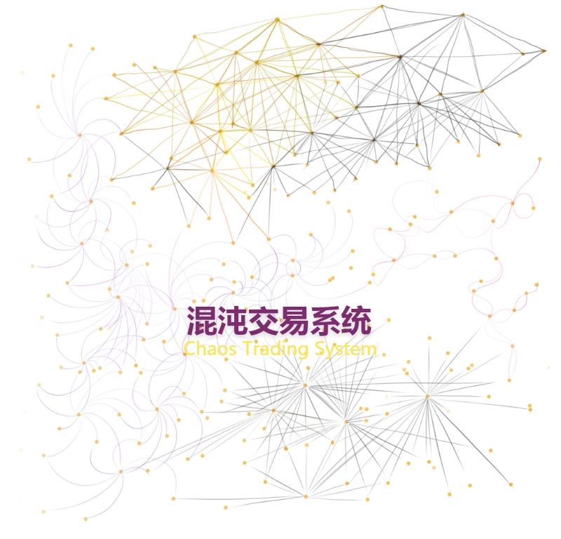

 Blank Page 

by Jeango

a speculator who knows logic and programming.

September 3, 2022

# 混沌交易系统 <b>Chaos Trading System</b>

[TOC]

<svg xmlns="http://www.w3.org/2000/svg" xmlns:xlink="http://www.w3.org/1999/xlink" width="300" height="274" viewBox="0 0 300 274">
  <defs>
    <filter id="随机交易系统_Trading_System" x="39" y="0" width="222" height="48" filterUnits="userSpaceOnUse">
      <feOffset dy="3" input="SourceAlpha"/>
      <feGaussianBlur stdDeviation="3" result="blur"/>
      <feFlood flood-opacity="0.161"/>
      <feComposite operator="in" in2="blur"/>
      <feComposite in="SourceGraphic"/>
    </filter>
  </defs>
  <g data-name="组 9" transform="translate(-38 -7)">
    <text data-name="Chaos Trading System" transform="translate(38 41)" fill="#fce657" font-size="14" font-family="MicrosoftYaHeiUI, Microsoft YaHei UI"><tspan x="75.495" y="14">Chaos Trading System</tspan></text>
    <g transform="matrix(1, 0, 0, 1, 38, 7)" filter="url(#随机交易系统_Trading_System)">
      <text data-name="随机交易系统 Trading System" transform="translate(48 6)" fill="#7d2d6f" font-size="24" font-family="MicrosoftYaHeiUI-Bold, Microsoft YaHei UI" font-weight="700"><tspan x="30" y="24">混沌交易系统</tspan></text>
    </g>
    <g data-name="组 7" transform="translate(0 9)">
      <g data-name="矩形 5" transform="translate(50 92)" fill="#fbfbfb" stroke="#d3b8b8" stroke-width="1">
        <rect width="288" height="180" rx="7" stroke="none"/>
        <rect x="0.5" y="0.5" width="287" height="179" rx="6.5" fill="none"/>
      </g>
      <g data-name="组 1" transform="translate(2 18.75)">
        <g data-name="矩形 1" transform="translate(69 96.25)" fill="#ffd4d4" stroke="#e9e1e1" stroke-linecap="round" stroke-width="1">
          <rect width="61" height="34" rx="8" stroke="none"/>
          <rect x="-0.5" y="-0.5" width="62" height="35" rx="8.5" fill="none"/>
        </g>
        <text transform="translate(69 104.25)" fill="#7d2d6f" font-size="14" font-family="YuGothicUI-Regular, Yu Gothic UI"><tspan x="16.5" y="15" font-weight="700">认知</tspan></text>
      </g>
      <g data-name="组 6" transform="translate(95 18.75)">
        <g data-name="矩形 1" transform="translate(69 96.25)" fill="#ffd4d4" stroke="#e9e1e1" stroke-linecap="round" stroke-width="1">
          <rect width="61" height="34" rx="8" stroke="none"/>
          <rect x="-0.5" y="-0.5" width="62" height="35" rx="8.5" fill="none"/>
        </g>
        <text transform="translate(69 104.25)" fill="#7d2d6f" font-size="14" font-family="YuGothicUI-Regular, Yu Gothic UI" font-weight="700"><tspan x="16.5" y="15">反馈</tspan></text>
      </g>
      <g data-name="组 8" transform="translate(188 18.75)">
        <g data-name="矩形 1" transform="translate(69 96.25)" fill="#ffd4d4" stroke="#e9e1e1" stroke-linecap="round" stroke-width="1">
          <rect width="61" height="34" rx="8" stroke="none"/>
          <rect x="-0.5" y="-0.5" width="62" height="35" rx="8.5" fill="none"/>
        </g>
        <text transform="translate(69 104.25)" fill="#7d2d6f" font-size="14" font-family="YuGothicUI-Regular, Yu Gothic UI" font-weight="700"><tspan x="16.5" y="15">交易</tspan></text>
      </g>
      <g data-name="组 2" transform="translate(68 88)">
        <g ata-name="矩形 1" transform="translate(69 96)" fill="#7d2d6f" stroke="#707070" stroke-width="1">
          <rect width="115" height="61" rx="8" stroke="none"/>
          <rect x="0.5" y="0.5" width="114" height="60" rx="7.5" fill="none"/>
        </g>
        <text transform="translate(84 111)" fill="#e9e1e1" font-size="20" font-family="YuGothicUI-Regular, Yu Gothic UI"><tspan x="2.5" y="22">交易系统</tspan></text>
      </g>
      <path data-name="路径 2" d="M9,0l9,16H12.847V27.931H5V16H0Z" transform="translate(153.107 172.11) rotate(137)" fill="#fce657"/>
      <path data-name="路径 5" d="M9,0l9,16H12.847V27.931H5V16H0Z" transform="translate(258.794 148.517) rotate(39)" fill="#fce657"/>
      <path data-name="路径 7" d="M9,0l9,16H12.847V27.931H5V16H0Z" transform="translate(226.035 141.035) rotate(-90)" fill="#fce657"/>
      <path data-name="路径 8" d="M9,0l9,16H12.847V27.931H5V16H0Z" transform="translate(133.035 141.035) rotate(-90)" fill="#fce657"/>
    </g>
  </g>
</svg>

## 认知 <b>Cognition/Perception</b>

**认知**是人类最基本的心理活动，它包括感觉、知觉、记忆、思维、想象和语言。认知的过程，就是从认识**具象**，进而**抽象**，再发生**想象**的过程。

>     孔子说：“知之为知之，不知为不知，是知也。”
>     庄子说："井蛙不可以语于海，夏虫不可以语于冰。"
>     苏格拉底说：“我只知道一件事，就是我什么都不知道。”

交易领域上的认知涉及：历史、经济、商品、货币、市场、风险、软件、心理、人性等多维度的专业邻域交叉。如果要用一句话总结什么是投机交易，我觉得：投机是跨多领域、与实践密切结合的**平衡艺术**！

成为专业交易者第一个门槛在于认知，主要问题不在于自以为是，而在于认知的停滞，不能建立完善的系统思维，无法修正原有的错误认知。

认知层次低的人，在思维上表现为固执，并非正向的执着、坚持原则。固执的问题根源在于面对不同意见时，异常敏感，异常自尊，拒绝反省、拒绝倾听、拒绝学习的行为。

根据由外及内的关系，可以将认知划分为几个层次：

- **环境归因层**：思维没闭环，思考没逻辑，只知好恶。你说 A，他说 B，思维没有交集。
- **行动归因层**：思维没闭环，思考有逻辑。有符合逻辑推理的一些观点，没有坚定立场。
- **认知固化层**：有逻辑闭环，明是非，知大体。但是，如果这个闭环形成的层次比较低，可能是一个比较可悲的事情。
- **精神开放层**：更高层次的逻辑闭环，十分通透，直达本质，保持开放心态，不断打破固有闭环，螺旋式无限地生长。

参考书：

>     [英] 卡罗琳·威廉姆斯（Caroline Williams）《认知迭代：自由切换大脑的思考模式》
>     Override: my quest to go beyond brain training and take control of my mind
>
>     Principles: Life & Work by Ray Dalio
>     
>     触碰神经：我即我脑 （美）丘奇兰德（Churchland,P. S.）
>     

桥水对冲基金创始人 Ray Dalio 在其《原则》一书中指出自我质疑的重要性，他说道：“我犯下代价惨痛的错误，使我改变了看问题的角度，从「我知道我是对的」转变成了「我怎么知道我是对的」”。这就是一种顶层的认知，从根源上发现问题，从而避免其带来灾难性后果。没有完美的人，每个人都会犯错，但能从错误中吸取教训的都不能称之为普通人。对待错误应该以积极的心态，即所有**已经发生的事都是好事**！

最低成本的认知拓展方法就是阅读，用略读式的、开放心态高效地阅读所关注的领域知识！现在可以通过 [Z-Library](https://www.zhelper.net) 这个在线书房获取大量优质的参考书籍。获取认知的途径，除了阅读、听闻这类二手信息，还有更重要的二个来源：实践感知（包括试错）和推理逻辑（包括验证），它们可以判断阅读获取到的信息真伪性。

认知迭代的前提，就是承认自己的无知。苏格拉底说自己无知，老子说上善若水、虚怀若谷，都是他们能够成为先圣的必要条件。王阳明的心学推崇知行合一，这就是完美的认知迭代方法论，后续在交易心理部分细说。

开启认知的大门，先决就是**开放心态**，开放的心态只需要做到两点：**真诚地倾听不同的声音和深刻地反思自己**，做到这两点通常足够让你发现自己的问题所在。通过开放心态，可达到对下层认知的兼容，以及对上层认知的学习和吸收。例如，高版本的软件通常兼容低版本，高段位者会给予低段位者更多的认同，而不是低段位者给予高段位者更多的质疑，甚至是诋毁。段位越高越冷漠、越深情、越慎言，这是因为无法与低段位实现双向兼容！

我在社交媒体上因为经常在一个观点非常认同的UP的视频中多次提及《混沌交易系统》，导致这个UP最后将我拉入黑名单！这件事情同时警醒了我，即使观点相同的人也可能因为一些潜在的冲突因素而相背而行！这种感慨是我在分享《混沌交易系统》的这个过程中体验到的，这正所谓，佛渡有缘人，自助者助人，我们应该将关注点放到自身上来！从 2022/9/27 这一天开始，我的手机上删除了一切社交应用！

所以，这里第一个认识拓展就是：所有系统都是一个整体，也就有组成部分，而交易系统是经济系统的一个部分，所以本身不能超出经济系统而存在！

接下来是和投机交易有密切关联的简要历史内容。

人类历史上，**货币** Currency 经历了从贝壳、贵金属的商品等价物时代，再到纸币、电子货币的信用时代。Currency 还特指流通中的货币，在商品交易的过程中，货币从不同的市场参与者手中流通。这个过程也就是货币的**流动性**，这也是体现资产在交易中便利性程度的一个重要属性。

以物易物是交易的最朴素的概念，早期的在商品市场概念产生之前，物与物直接交换是最简单有效的社会行为。在经济学观点来看，物物交换是一种交易成本巨大的交易方式。

而货币作为一种工具，它可以极大地提升交易的便利性，降低交易成本，提高经济效率。

世界上第一个全球流通货币是美元。两次世界大战是美国崛起直接因素，从1783年美国”独立战争“结束了北美殖民地欧洲统治时代，到1944年布雷顿森林货币体系建立，美元与黄金挂钩，确立35美元一盎司的黄金官价，每一美元的含金量为0.888671克黄金。

黄金，作为地球上"最硬的通货"，自然成为美金的最强大信用背书。

而美国作为一个联邦共和立宪制国家，从独立时东部沿海13个州，扩张到现在由华盛顿哥伦比亚特区、50个州和关岛等众多海外领土组成，但始终没有一个集权的中央银行。

历史上，1791-1834年间，美国有最可能成为中央银行的第一银行、第二银行，但由于政治、财团间的斗争，它们很自然地没获得永续许可经营命运。

直到1913年，代表各州私人银行家利益的**美联储** The Federal Reserve System 成立，它不是中央银行，但比中央银行强大。由私人银行持有原始股份，总部叫做联邦储备局，隶属美国联邦政府，另外还有12个分部联邦储备银行，分散在12个城市。

美联储实施的经济政策不仅影响美国本身，还会密切影响全球各国经济运行。美联储的**联邦公开市场委员会** The Federal Open Market Committee (FOMC) 产生利率决议，进而影响政策收紧、或宽松信用。通过调节**联邦基准利率**，美联储可以控制经济通胀或紧缩。

金融学根据资产流动性的差别将**货币供应量**分为不同的类型。M0 代表流动性最好的流通现金，M1 流动性次之，包含 M0 和企业单位活期存款等等。M2 流动性再次之，包含企业单位定期存款、个人储蓄存款等等。在美国这些发达国家中，还有更细分的 M3、M4 等等。

当基准利率升高，特别是利率高于通胀水平时，资金便会倾向存入银行收利息，这使得货币供应减少，货币成本增加。当基准利率下降，资金更倾向消费、投资，而不是储蓄，这相当蓄水池放水。 而通过周期性的降息、加息，美元可以像洪水一样席卷全球，并在退潮时收割全球资产，形成一个完美的美元环流。

美国作为全球最发达国家，其金融业就是一个巨大的蓄水池。即使2020年美国为了救市推出无限量化宽松，无节制印钞，也没有使美元信用破产。日本安倍政府也类似，大放水收买资产，却没有导致通胀失控有，因为大量货币转化成金融资产。美国靠巨额的债务和巨额的贸易逆差输出美元，而日本央行靠刻意制造出的极低的利率和日元资本在各地的疯狂投资。

然而，区区一个美联储并不能完全解决资本主义的社会问题。回到 1971年，美元跟黄金脱钩，**布雷顿森林货币体系**瓦解。随后，美元与石油绑定，美金变黑金。此前，美国正在经历70年代的高通用时期，并且在 1973 年爆发中东战争以争夺石油资源控制权。

70年代的高通胀失控源自美苏冷战期间开始衰败的美国制造业，以及1950朝鲜战争和1955年的越南战争两场大战影响。当时，苏联作为最先进社会制度，美国为了体现自身制度的优越性，实行了 Great Society 计划，增加对个人的财政补贴，财政赤字大幅上升。并且内需强盛极大刺激了进口，导致美国从一个贸易顺差国开始变为贸易逆差国。归根结底还是美国制造业全球竞争力的衰弱，和今天美国制造业空心化无二。

彼时，恰逢德国和日本的制造业开始崛起，而美国内部出现二战后的婴儿潮 Baby boom，从 1946 年至1964 年，这 18 年间婴儿潮人口高达 7800 万人，是战后人口 1.5 亿的一半还多。此时期年轻人是战后的婴儿潮一代，崇尚嬉皮士文化，向往自由而不是物质至上。不愿意为了提高收入而拼命工作，牺牲生活质量。这带来的直接结果是，劳动力供应与工资上涨无效关联，这也是造成美国在整个70年代高通胀的核心原因。

当下，在特朗普叫喊 Make America Great Again，也许他是有可能成功的让美国制造业再次伟大的，但是 2020 年的新冠疫情没有给美国机会。

回到交易上，对现代世界的基本运行框架需要有一个常识性认知，更需要对核心概念有全面的认知，并且认识过程始终伴随着整个交易系统的建立、学习过程。

美国作为最先进的国家，它的金融产品远比一般国家的金融产品发达。从**基础金融产品**，如**股票、债券、外汇**，到**期货，期权**等**衍生品**。道琼斯指数成分股，市值上两万亿美元的公司有 Apple 和 Microsoft，而中国没有。

当然，并不是说都是好的金融商品，比如 2008 引发次贷危机的**资产证券化**产品。将高风险的次级住房抵押贷款，通过资产证券化打包成资产支持证券 Asset-Backed Securities 再卖给一般投资者，以获取基础资产未来产生的现金流。这样表面看起来，即使借贷者还不起月供，也可以通过将房产二次抵押来偿还。一般投资者还可以获得房产增值部分收入。在过热的房产市场中，这种金融产品具有极大的系统性风险，随着美联储大幅调高联邦基金利率，投机性住房抵押贷款者损失惨重，次级贷款大量逾期违约。房价开始大幅下跌，房产泡沫破灭，直接导致道琼斯指数从13000点上方跌到6440点，以及美国第四大投行、百年历史的**雷曼兄弟控股公司** Lehman Brothers Holdings Inc. 破产。

投机交易者要进入市场，第一个任务就是选择合适的金融产品，并深入研究，多个角度了解它的历史、特点、风险。

**差价合约** CFD - Contract for Differences 就是一种专用于投机交易金融衍生品，比如，和道琼斯工业指数强关联的 US30，价格随着 30 家美国公司蓝筹股票价格变化。与股票类产品不同，CFD 不涉及实物交割，主要面向投机交易者。它的价值变化来自标的物价格变化，可以双向交易，和股指期货一样使用保证金交易制度。对于 US30 CFD，交易者交易 1 标准手，通常标准手合约价值10万美元，道琼斯指数每变化一个点，产生 CFD 价值变化为 10$。

相对于期货，CFD 合约出现时间更晚，出现在20世纪90年代，并在2000年后才逐步成为相对主流的交易品种。交易费用主要以点差为主，而期货合约是以手续费为主。相对于股票来说，在早年间，CFD 被对冲基金以及机构交易者用于更有效益地对冲风险，主要原因是为了规避股票交易的印花税以及从保证金中获利。

CFD 差价合约特征：

1. 保证金交易。交易双方无需持有实物商品或证券，仅需支付少量保证金，而剩余的资金则由经纪商或银行通过提供信贷支持进行融资融券。
2. 无交割日限制。与期货和期权等金融衍生品不同，差价合约在交易时并没有设定具体的交割日。这也意味着差价合约不会因为到期而失去价值，只要保证金充足，投资者就可以长期持有差价合约的头寸，跨越整个市场周期，直到实现预期利润为止。
3. 双向交易。因为不涉及交易物所有权，所以即使没有该交易物也可先行卖出合约。
4. 交易成本低廉。这主要体现在差价合约的低税负成本和低交易费用上，在不少国家（例如，英国）投资者进行差价合约交易时无需缴纳印花税，且差价合约的交易费用也比传统的做市商交易费用更为低廉。

MT4/MT5 上交易的所有品种，全都是差价合约，包括外汇、金银、大宗商品、股票指数等等。

交易平台在其众多用户之间有**内部对冲**和**外部对冲**两种对冲方式来释放风险到市场上。差价合约经纪商可以在平台内部撮合客户之间的交易，某品种某价格，你多一手 vs. 他空一手，经纪商负责撮合，只要客户数量多，交易量大，经纪商就像自己开了个交易所。而内部对冲不掉的净头寸，比如某品种共计多 10000 手、空 7500 手，净头寸就是多 2500 手。经纪商首先需要在其内部扮演交易对手，做空 2500 手接单，同时在市场上同向做多 2500 手。市场上的机构主要有交易所、ECN、PoP（Prime of Prime）或一级银行 PB（Prime Broker）。

期货作为价格发现工具，风险管理工具，自有其自身的运行逻辑，期货之所以称为期货，是因为属于远期、预期，并未到交割时间。

期货的价格与现货价格是有差别的，可以四大方面进行定性分析：

1. 现货价格是期货价格的基础
2. 期货价格的形成与变动对现货价格有着重大影响
3. 套期保值者是现货市场与期货市场之间相互联系的桥梁和相互作用的媒介
4. 现货价格与期货价格之间相互作用、相互影响的途径

参考书籍：

>     John C. Hull. Options, Futures, and Other Derivatives, 9th Editon.
>     ISBN 978-0-13-345631-8
>     Copyright © 2015, 2012, 2009 by Pearson Education, Inc.
> 
>     Principles of Economics 10th Edition - N  Gregory Mankiw

要做到深入了解金融产品，远不止以上这些。更需要明白，投机者是市场的一小部分的参与者，主体是**银行、金融机构、对冲基金、企业**。通常由市场主体向投机市场释放风险，而投机者承担风险以博取投机活动带来的潜在收益。可以粗略地将能参与市场交易的人员分为三大类：**对冲者** hedger、**投机者** speculator 以及**套利者** arbitrageur。对冲者采用衍生产品合约来减小自己所面临的由于市场变化而产生的风险，投机者利用金融产品价格走向进行博弈，套利者则采用两个或更多相互抵消的交易来锁定盈利。

**共同基金** Mutual Fund 即证券投资基金，信托基金的一种，是普通投资者最常接触到的投资方式之一。在美国被称为投资公司 Investment Company，亦称股份不定投资公司。共同基金受监管条约的限制：基金份额随时可以兑合包括买入价格被市场低估的股票和卖出价格被现，必须公布投资方针，限制使用杠杆效应，等市场高估的股票，因此市场总体变化趋势对组合等。

**对冲基金** Hedge Fund 已经成为衍生产品市场的重要参与者，它们运用衍生产品进行对冲、投机以及套利。对冲基金与共同基金类似，基金管理者将客户的资金进行投资，但是对冲基金的资金来自较为老练的客户，并且对冲基金不能进行公开融资。对冲基金通常不受共同基金的监管条件限制，从而可以采用较为复杂、与众不同、并具有独到见解的投资策略。

对冲基金的收费与对冲基金的表现有关，一般收费都较高，收费数量通常是管理资产的 1%～2% 再加上盈利的 20%。对冲基金现在已经十分普遍，全球有高达 2 万亿美元的资金投资在对冲基金上。

**基金式基金** Funds of Funds 的建立是在对冲基金的组合上进行投资。

对冲基金的投资策略常常利用衍生产品来设定投机和套利头寸，决定策略后会采取以下行动：

1. 对基金面临的风险进行评估;
2. 决定哪些风险可以接受，哪些风险应当对冲；
3. 设计交易策略（通常会涉及衍生产品）来对冲不能接受的风险。

以下是对冲基金常用的几种交易策略：

1. 股票多空对冲（long/short equities）：对冲组的影响会很小。
2. 可转债券套利（convertible arbitrage）：进人可转换债券的多头以及标的股票的空头，并以动态形式管理标的股票的空头。
3. 受压债券（distressed securities）:买入濒临破产企业的高风险证券。
4. 新兴市场（emerging markets）：投资于发展中国家或新兴市场公司的债券和股票，或投资于这些国家的国债。
5. 全球宏观（global macro）：投资反映预期全球宏观经济走势的交易。
6. 兼并套利（merger arbitrage）：也叫风险套利 Risk Arbitrage，在兼并和收购消息公布后进行交易，并购交易成功以达到盈利的目的。

例如，对冲基金在购入一种股票后，同时购入这种股票的一定价位和时效的看跌期权 Put Option，只需要向期权卖出方支付权利金，而卖出方必需承诺向买入方实现行权义务。看跌期权的效用在于当股票价位跌破期权限定的价格时，卖方期权的持有者可将手中持有的股票以期权限定的价格卖出，从而使股票跌价的风险得到对冲。也可以在股票价格上涨时放弃行权，这样只损权利金，股票收益却远远大于损失。

为了获得进入市场交易的权利，交易者还需要选择一家可信的外汇经纪商，或**综合交易平台** CTP (Comprehensive Transaction Platform) 。此外，要进行交易，还需要学习相应的软件，通常经纪商提供。

MT4/MT5 是通用交易软件，需要了解下单规则，以及操作方法。通常要交易的金融产品会有两个价格，Ask/Bid，对应交易时向经纪商请求买入、卖出行为时的对应价格。而这两个价格之间还会有定点差，经纪商收取的差价，作为服务费。基本的下单方式通常有**挂单**、**即时交易**两种。挂单买入 Buy limit 将成交价格设置在 Ask 价格下面，挂单卖出 Sell limit 则将成交价格设置在 Bid 价格上面，等市场出现符合的对手价即成交。即时交易还可以细分为市场执行 Market Execution、即时成交 Instant Execution。市场执行允许价格波动变动时，滑点成交，因网络延时或行情波动，成交价格和当前看到的价格会有出入。

此外，MT5 还有更复杂的下单方式，如突破后回踩时到指定价格时使用 Buy stop limit、Sell stop limit；又如预测价格突破到指定价格时使用 Buy stop、Sell stop 等等。下单的执行方式也会影响交易：

1. GFD - Good for Day 下单当前有效直到用户撤销
2. IOC - Immediate or Cancel  立即成交或部分撤回
3. FOK - Fill Or Kill 全部成交或全部取消
4. FAK - Fill and Kill 同 IOC

区别在于 GFD 指令不包含自动撤销，而 FOK、FAK均包含一个未成交自动撤销的指令，更适用于高频交易，程序化交易，报撤单较频繁的投资者使用。

以下是 MT5 设置和下单操作需要注意的事项。

MT5 交易选项配置中打开“一键交易”功能，并打开图表的“显示交易水平线”和“启用拖拽交易水平线”，这样就可以直接通过鼠标来移动**止损价格线**，并且还可以拖动成交价格线到市价的前方设置一个**止盈价格线**。注意，打开一键交易后，图表中会显示单击交易控件，可以隐藏它避免误触。因为它们立即下单并成交，并且不会设置止损！

在交易选项配置中可以设置止损级别为 In Points 方式，这样在下单时可以直接指定止损点差。需要注意的是，在波动行情中，因为下单时的价格是本地显示的价格，而止损点数也根据此价格计算出止损价格。下单后，如果行情波动，在市场执行下单方式下会导致成交价格偏离原来的价格，同时止损空间会扩大或缩小。这会导致两个问题：一是止损风险可能被放大，或者在止损空间太小的情况下，订单一成交就立即执行了止损！

此外，交易平台可能有滑点 Slippage 的情况出现，还有平台收取的点差 Spread 也是根据各有不同的。特别是止损滑点，应该检查交易数据，以掌握不同市场氛围下的滑点数量差别，以做心中有数。

比如，最近一次有可能出现巨大滑点的行情在 2022/9/13 北京时间 20:30:00，因为有个重要的数据发布，美国8月未季调CPI年率结果比预期的 8.1% 还高出两个档位，8.3%，因此在美股盘前就导致分钟级别的暴跌 600 点。流动性极度缺乏，成交极为困难，交易平台需要经过分钟级别的延时才能成交，这会导致潜在的滑点风险！如果有多头持仓，那么在这一分钟时间内击穿平仓线，并滑点上 3 位数应该是大概率事件！

最坏的情况是，在重要数据公布前，交易者提前建仓，而数据公布后价格走向与交易方向相反。不同的平台由于硬件配置差异，例如 IC Markets 的硬件是比较差的，这可能导致你的止损无法及时执行，并且手动平仓也可能失效，平仓指令可能会延时 1 分钟以上才被执行！详细信息可以在日志面板中查看，来源为 Trades 的记录就是交易指令执行相关的信息。

这些知识并不是学习一遍即可掌握的，需要结合交易系统来使用，通过反复练习或实践，根据自己的需要选择或组合使用其中的操作方法。

现代金融市场是一个复杂的系统，实现了全球联网交易，涵括外汇市场、股票市场、债券市场、衍生品市场，以及美国银行间资金市场。银行同业拆借市场就被称为联邦基金市场，银行间无担保短期借贷利率被称为联邦基金利率，是一个重要的市场经济指标。美国联邦储备体系也将其作为最重要的货币政策操作目标，是目前全球影响力最大的利率指标之一。

另外，**非农就业人口**、失业人口都是非常重要的经济指标，通过它们可以更好地了解美国经济运行状态。**核心PCE物价指数**是衡量美国民间消费通胀的关键指标。2012年1月，美联储将核心PCE指数年率涨幅2%定为长期通胀目标。这些数据可以通过**财经日历**工具查询，这是交易中经常用到的工具之一。

交易之所以需要了解经济指标数据，不是因为需要用它来预测市场，而是数据作为经济状态的一种指标，对市场的价格行为有重大的影响，它可以带来潜在的交易机会，同样也会带来价格波动的风险。从投机的的角度来理解，投机者通过经济数据指标来判断行情级别的作用，远远大于对市场走向的判断。

在美国上市的公司股票市场分三类：

1. 全国性证券交易所
2. 另类交易系统(ATS)
3. 经纪商—交易商内部撮合

另外，还有粉单市场和场外交易市场。

粉单市场 PK（Pink Sheet Exchange），已纳入纳斯达克最底层的一级报价系统，是美国柜台交易(OTC)的初级报价形式。

场外交易市场 OTC（Over-the-Counter）是在股票交易所以外的各种证券交易机构柜台上进行的股票交易市场。广义的美国 OTC 市场包括 NASDAQ、OTCBB 和粉单市场，按其上市报价要求高低依次为：NASDAQ → OTCBB → 粉单。

与国内A股市场不同，美股没有“手”的概念，最小交易单位是 1 股。没有单日涨跌幅限制，实行 T+2 交割制度，即交易发生后第二个交易日才能完成清算交割。包含多个级别的市场熔断机制和个股异动交易暂停机制，市场熔断机制根据跌幅实施，如果触发三级市场熔断，全市场停止交易，直至下个交易日开盘。

1. 7% 为一级市场熔断
2. 13% 为二级市场熔断
3. 20% 为三级市场熔断

**道琼斯指数**是一组指数，包含四种股价平均指数，其中，**道琼斯工业平均指数**编制了美国国内 30 家著名的工业公司股票，是最常使用的股票指数，也是百业指数。US30 CFD 也是根据此指数设计的股指期货差价合约。

许多金融产品都支持全天 24 小时交易，只有在节日时段，股市、大宗商品期货在会停止交易，而股指期货、CFD这些衍生品或外汇交易则可能是提几个小时早结束当天的交易，但也会因为股票市场的关闭而交易极度不活跃，即流动性极差，交易平台会发布假日交易时间变动通知。流动性是交易策略中的个重要参数，后面会再深入讨论。

美国、欧洲、日本市场的作为主要市场，其开市时间内，交易相对活跃。北京时间，早上 8:00，下午 3:00，晚上 9:00，是各个市场的开市时间，根据是否是夏令时会有调整。主要市场开市时间，市场上的订单会更多，流动性也更高，交易也容易出入。

另外，美股的交易时间分为盘前、盘中、盘后三段：

>     时段      美东时间          北京时间(夏令时、冬令时)
>     --------|----------------|----------------|----------------|
>     盘前     04:00 - 09:30    16:00 - 21:30    17:00 - 22:30
>     盘中     09:00 - 16:30    21:00 - 04:00    22:30 - 05:00
>     盘后     16:00 - 20:00    04:00 - 08:00    05:00 - 09:00

夏令时3-11月，冬令时11-次年3月。

总结：本小节内容从最基本的认识层面，强调交易需要掌握的一个世界观，金融市场的认识，了解经济指标反映的市场经济状态，投机者的市场定位，以及产品的选择和交易软件的基本认识。不同的产品具有不同的特性，需要根据所选择品种进行深入研究。认知是一个动态过程，不断更新认识，研究透这些基础知识点，弥补自身不足之处，是成为一个合格交易者的必要条件。

## 风险管理 <b>Risk Management</b>

>孟子曰：「莫非命也，顺受其正，是故知命者不立乎岩墙之下。尽其道而死者，正命也；梏桎死者，非正命也。」

混沌交易系统是**投机者** Speculator 用于投机的一套行为规范，概括地说，就是输入认识，输出交易结果的一套系统。投机者是指希望以较小的资金来博取差价利润的投资者，是交易系统的执行者，其认知水平、心理状态、精神状态都是这个系统的外部变量，对交易的执行起到决定性作用。投机者在完整的市场经济活动中功不可没，市场主体向投机市场释放风险，而投机者吸收风险，二者缺一不可。

许多人认为投机是风险极高的一种市场活动，其实只看到一个表面，管中窥豹而已。因为外行人不懂什么是风险管理，当他们觉得风险管理的真谛时，才会醒悟，投机交易才是最具价值的！**投机**是一种与**价值投资**相呼应的另一种市场博弈手段，它的天花板很高，同样门槛也不低！

对于笔交易初始设置的止损，这个很特别，它是可以在交易之前约定的。所以它是明确的，不能称之为风险，而应该称为**固定成本**。而那些不具有确定性才是真正的风险，例如成交时滑点就是潜在的风险，交易者应该了解在不同的市场氛围下可能出现的最大滑点数。

作为从属地位投机者，在高风险的投机活动中存活下来的机会，取决于对风险的认知及管理水平，这部分内容将对与风险相关的多个辩证关系进行辨析学习。

君子不立于危墙之下，忽视风险的认识与管理，无异于将自己置于危险境地。在经济学里永远要记住一句话：**需求更迫切的人，永远要付出更多**。在投机中永远不要让自己陷入迫切需要交易的状态，这离成功会越来越远。

以下所有内容以投机属性最强的 US30 CFD 差价合约产品为参考，其它金融产品可能有较大差异，需要区别对待。

先来辨析**投机** Speculation 与**赌博** Gambling 的关系。从基本原理上，投机和赌博没有区别，都是概率游戏，此外，它们差别大于相似。

赌博是人的本性，人类天生就有赌博的基因，当认知跟不上，就无法正确区分赌博还是投机。从心理上、大脑工作机制上讲，是大脑对自身经历的突发性利己行为的一种额外奖赏，让自身有动力去探索其中的内在规则的一种机制。

**前景理论** Prospect Theory 认为大多数人面临获利时倾向规避风险，即在确定性的好处和赌一把之间，会选择确定的好处。而面临损失时倾向风险偏爱，即在确定的损失和赌一把之间会选后者，尽管赌一把可能损失更大。这两点对应的是投机交易中的止盈、 止损时的选择态度，这符合人性弱点。为了克服这些人性弱点，后面还会提供一个**精确止损、模糊止盈**策略来降低其不良影响。

赌徒有自己的一套理论，即始终相信自己的预期目标会实现，称为**赌徒谬误** The Gambler's Fallacy。就像在抛硬币，每局出现正面、反面的机率都是 50％。可是赌徒却认为，若连续出现了同面后，下回出现反面的机率就会增加，而且相同面出现次数越多，反转机率越大。这是典型的非理性心理，很明显，实际上每次出现正反面的几率都会是50％。而赌徒会将目前已发生的独立事件与未发生的独立事件混乱，事实是已发生已经成为过去，而对于下次抛硬币，它的结果与历史无关。

**抄底行为**本质就是赌博，就是抛硬币游戏的金融版本，虽然事件发生场所有变化，但本质没有变。赌徒总是喜欢抄底的，这是其心理状态所决定的行为模式！他们总是在想：都跌了这么多了，该涨了！这是不是和抛硬币游戏如出一辙？而投机行为则讲究顺势而为，在于市场状态的观察与研究，在于风险的管理。

赌博是风险失控的，情绪化的，赌徒觉得要么赚得盆满钵满，要么亏得一无所有，而投机是一场持久战！

即使在一个 50:50 胜率的游戏中，长久来看，赌徒也必然会输给赌场。因为，赌场游戏背后是无限的资金支持，而赌徒资金有限，长久之下，必然有输光无法翻身的时候。何况，赌场游戏背后还有数学模型的设计，以及众多工作人员团队作战，从精力、精神状态层面就已经有足够胜算。从资金量的角度来看，投机者和赌徒的地位是类似的，这也就是为何要求投机者要设置止损，将其限制在可以承受的水平。

搞清楚投机交易和赌博的差别是很重要的一件事，否则你就可能成为一个赌徒。

- 赌徒只有幻想，交易需要拥有心智；
- 赌博只有概率，交易需要计划策略；
- 赌博只有盈亏，交易需要心力付出；
- 赌博只有情绪，交易需要风险管理；
- 赌博受限于时间，交易受限于交易能力；

如果赌徒能认知到差别，并应用投机交易需要的风险管理、策略、心智等等，那么他进行的就不是赌博行为。反过来，如果一个交易者分辨不出它们的差别，不能很好的应用成功进行投机交易所需要的前提要素，那么他就是在赌博，这与具体场所没有必然联系。

接下来是辨析风险这个概念，风险是什么？为什么要进行风险管理？**风险** Risk 朴素定义就是不确定性，收益的不确定性，损失的不确定性都是风险。当风险不受约束，最坏的结果是毁灭性的，这就要进行风险管理，降低风险发生机率，或风险发生时造成的损失。

市场上的风险随处可见，风险是多元化的，不同的风险对不同的经济活动产生不同的威胁：

- 信用或违约风险 Credit or Default Risk
- 突发事件风险 Emergency Risk
- 系统性风险 Systematic Risk
- 流动性风险 Liquidity Risk
- 对手风险 Counterparty Risk
- 政治风险 Political Risk
- 利率风险 Interest Rate Risk
- 汇率风险 Foreign-Exchange Risk
- 国家风险 Country Risk

除了以上这些，还有其它风险。财经日历工具可以用来获取一些关键经济数据、事件、假期的时间点。

**仓位** Position 与风险管理密切相关，持仓交易中需要注意突发事件风险带来的极度波动，如果仓位过重，突发情况极有可以导致爆仓。

仓位小，容许更大的止损空间去捕捉宏观上更可靠的机会，但资金利用效率低。仓位适当，合理提升资金效率，但止损空间变小，需要动态平衡。例如 200:1 杠杆下，将 50% 以下资金作为保证金使用。对于一个 500$ 的账户，US30 按当前 3 万点报价，可以使用 150$ 保证金去交易 0.1 标准手 US30，每点波动价值就是 1 美元，捕捉到波动 500 行情就可以实现账户翻倍。如果风险允许在 30$ 之内，就可以承受 30 点的波动，就需要将止损位设置为相应价格或点位上。

需要注意美国、欧洲开市或临近收市时，特别是周一开市时，还有不同国家节日文化差别，市场的节日前期，通常交易量极小，流动性风险明显，如果持仓对仓位控制不到位，极有可能因为缺少对手盘而形成的价格跳空，从而导致爆仓！特别是对短线交易，节日休市绝对是一大风险，节日后的开市交易的流动性极差，极容易造成巨大滑点。

2020年**中国银行原油宝事件**暴露出巨大金融产品的系统风险，首次出现原油负价现象，导致中国交易者亏损超过 40 亿人民币。原油宝作为期货品种，在保证金不足的情况下竟然不会强制平仓，这本身就不应该存在。CME 芝交所在事件发生时的上周末修改了规则，允许期货跌至 0 元以下。空头利用合约交接期间的流动性短缺风险，直接将原油价格打到每桶 -40 美元。

所以，止损是强制措施，最大程度控制了亏损的幅度，也是风险管理中的最后防线。但是在其他风险交叠时，还是可能产生止损失效风险。特别地，止损应该在下单时设置，它会在 MT4/MT5 服务器上执行，即使交易者的电脑停电、死机也不影响执行。而追踪止损则不同，它在本地执行，关掉交易软件就失效。

**杠杆** Leverage 与风险管理密切相关，金融杠杆就是通过小资金撬动大资金。杠杆也是天梯，一向地狱，一向天堂！

辩证地看待杠杆，正确使用杠杆才能将交易往有利的方向带动。杠杆直接体现在交易平台的品种合约指定的保证金比例 Margin level/percentage，列如 50:1，100:1，200:1 甚至 400:1，这是绝对杠杆。另一方面，如果交易者本身有 10 万资金用于投资，但只给账户入金 1 万，这相当于去杠杆的过程，是 1:10 缩小了杠杆。所以真实的杠杆不仅由交易平台提供的绝对杠杆决定，还由交易者的资金配置有关。

过重、过轻的杠杆都不能最大发挥杠杆的作用，特别是过重杠杆容易带来严重的交易心理方面问题，进而导致交易不能按交易系统正确执行。

**风险承受能力** Risk Tolerance 因人而异，这也是需要风险管理的一大理由。通过控制仓位、杠杆，将交易风险控制在可承受的水平，交易产生的亏损控制在合理水平，可以引导交易心理往正确方向发展。

杠杆本身不会放大风险，但它确实放大同样点差波动价值，但是风险并没变化，还按原样处于受控状态。风险也许产生在你选择的产品内部，因为金融产品的设计缺陷确实可以产生系统性风险，这个风险不管你在什么时候入场，它就已经存在了。当你不能正确辨析杠杆与风险关系时，应该要反省一下。

风险管理是交易系统的终极策略，止损是风险管理的底线，风险管理是执行止损的目的。

通过控制仓位与杠杆，可以最大化控制交易风险，但这还不够，还有一些容易忽视的交易心理与执行力上面潜在的风险，特别是在无效的风险认知情形下。

新手交易者可能忍受不了不做交易的状态，这意味着没有耐心，不能等待时机，而频繁在不恰当的时间执行交易行为，陷入剥头皮的过度交易之中，这可能会直接导致在交易系统产生正向效益之前亏完本金。应该反省，投机者的目的不是交易本身，而通过交易产生利润！

又比如，不设置止损，死扛单，通常这种情况发生在交易者对市场有所期待，或者对市场有主观的预测行为，认为市场会按自己的设想运行。交易者必须放弃幻想，请相信**墨菲定律**：如果坏事情有可能发生，不管这种可能性多么小，它总会发生 ，并引起最大可能的损失！

应该建立正确的交易观，可以制订日操作次数约束，或亏损额度限制，以避免在不适合的时期进行的过度交易而导致亏损超出可承受范围。比如，每日交易次数限制最多 10 次，或者最大亏损额度为 10% 资金。

为了公平性，一般投机性品种在设计时就会设置限制条件，每个账户限制最大交易量，在产品合约规格信息中，Minimal/Maximal volume 两个参数指定了可以交易的最小量、最大量。比如，0.1 到 25 标准手，或者 0.1 到 10 标准手，不同经纪商的限制有所差别。

作为高风险的保证金交易制度，进场交易之前必须了解经纪商的**保证金要求**和**强制平仓线**。保证金水平到达 100%，也就是账户上的所有资金都充当交易保证金了，有经纪商会这种情况下强制平仓，而不需要通知交易者。即使保证有富余，也可以因为当前亏损超过账户资金量导致穿仓，账户上的保证金全部亏掉，而且还倒欠期货公司的钱，一个合格的交易者不应该出现这些情况！

账户净值 Account Equity，在未开仓的状态下就是账户余额 Balance。通过杠杆放大交易规模，这正是保证金交易 Margin Trading 的魅力所在，以小博大。

强制平仓线=净值/已用保证金，假设规定强平线为 50%，账户净值只是当前占用保证金的一半，就会进行强平，这经常会导致账户出现大额亏损。一般，保证金水平低于 100%，大多数交易平台将不允许开设新交易。

在交易过程中，在现有持仓没有实现赢利的情况，也不建议增加仓位，应该保持原计划的仓位，只在可以实现止赢的情况才考虑加仓是比较稳妥的交易策略。

总结：风险管理是投机的制胜法宝，也是最重要的交易系统构成。这部分内容讨论了投机与赌博的区别，风险的认知，不同市场的文化差异可能带来的潜在风险，以及通过仓位、杠杆管理实现风险的管理，并且强调止损是必须的风险控制手段，它也是风险管理的底线。在后续交易策略部分，还会对止损作进一步的解析。

## 交易心理 <b>Trading Psychology</b>

人类是地球上最高级的物种，在神奇的进化过程中，形成了自主和非自主两套神经系统，一套产生**意识**，另一套控制欲望，这是人类的本性，是**潜意识**。而投机交易者需要深入理解它们的运行原理。

在股票交易亏损后的牛顿说过：我可以预测天体的运行，却没办法预测人类的疯狂。

相信市场在“骗人”，但你依然要保持对它的绝对信任，这就是交易的**反人性**。始终要相信的是**市场第一性原理**：市场不可预测！基于这样一个认识，才有利于建立健康的正确的交易心理，而不至于陷入因心理状态引起的无尽的麻烦。

古希腊哲学家亚里士多德认为，在每一个系统里面都存在着第一性原理 First principle thinking，它是基本的命题和假设，不能被省略、删除或违反。在第一性原理之下，继续研究投机交易的其它问题。

建立正确的交易心理认知，可以解决许多近似悬疑的交易问题。

以《列子·汤问》两小儿辩日为例：

>     孔子东游，见两小儿辩斗，问其故。
>     一儿曰：“我以日始出时去人近，而日中时远也。”
>     一儿曰：“以日初出远，而日中时近也。”
>     一儿曰：“日初出大如车盖，及日中则如盘盂，此不为远者小而近者大乎？”
>     一儿曰：“日初出沧沧凉凉，及其日中如探汤，此不为近者热而远者凉乎？”
>     孔子不能决也。
>     两小儿笑曰：“孰为汝多知乎？”

孔子到东方游历，途中遇见两个小孩儿在争辩，一个小孩儿认为晨间太阳更近，因为看着更大。另一个认为中午太阳更近，因为更热。孔子不能决断他们谁对谁错，两个小孩就笑话他。

而现代人在建立正确的地理认知下，就可以准确解答，两个小孩的观点都错了，地球上两个时间的太阳温度差别是因为光线的入射大气的角度引起的。而中午确实相对于晨间，人与大阳的距离更近一些，但这不是通过温度可以推断出来的。可见，建立正确认识是多么重要，否则一切的讨论都不能解决问题，都是枉然。

对于专业交易者，专注一个产品是最有价值的选择，专注一个品种可以做得更好更细致，这可能带来更大的效益。市场可以选择的金融产品太多了，光是美国三大交易所：纽交所、纳斯达克、美交所所提供的股票就几千个只，更别说金融衍生品。每个人的时间、精力，特别是专注力是有限的，专注一个产品，更能做到知己知彼百战不殆！

佛家所说的**入定**就是**专注**的一种现象，处于高度专注以致忘我的境界，也就是现代心理学中所谓的**心流** Mental flow，是一种高效率的智能状态，就像在精神世界与外界之间搭建了一条高速信息通道。老子道德经中说，神得一以灵，大体就是这个意思，专一而神敏。冥想（Meditation）对我来说，也是专注状态的另一种花哨的称谓。

科学上还有许多难以解释的现象，《盗火》就是一本讨论特异现象的书，作者展示了心理学、神经生物学、工程技术和药理学多个领域的不可思议的故事和前沿的数据，揭示了如何利用令人兴奋的技术使人改变思想意识状态，激发我们的大脑与身体的大潜能。

> Stealing Fire: How Silicon Valley, the Navy SEALs, and Maverick Scientists Are Revolutionizing the Way We Live and Work by Steven Kotler, Jamie Wheal 

《盗火》是关于“盗火出神”这种特异功能，即让凡人盗取能够出神“火种”获得的超一般人的能力：

- 盗火：意味着，你获取了天神的力量，对别人构成一种非常不公平的竞争优势。
- 出神：代表着无时间性体验、愉悦的状态。

出神机制有四个特征：

- 无自我性 Selflessness，忘我境界；
- 无时间性 Timelessness，也即活在当下；
- 无刻意性 Effortlessness，轻松自如、毫不费力；
- 有丰富性 Richness，信息、灵感；

何为出神？作家朱尔斯·埃文斯（Jules Evans），在他的“生活的哲学”网站的文章上，New book on ecstatic experience，对此做了很好的解释：

“出神（Ecstasis）来源于古希腊的「Exstasis」，字面意思是「站在室外」，更形象地讲是「在你通常会去的室外」，现在则被解释为「人神合一的恍惚」。”

交易心理问题很隐秘，另一方面它们也真的非常难以克服，不能克服心理问题，成功交易无从谈起。交易心理可以说是所有**投机者的核心**，心理问题是人类问题的根源，需要从哲学层次加以修正。世界三大哲学体系中，**中国哲学**是关于人心的哲学，而西方的是知识科学的哲学，印度的是与宗教结合的哲学。

西方哲学也有极大的参考作用，**辩证法** dialectics 就囊括了哲学三大规律、五大范畴和三个观点，是思辩与实证相统一的方法，是关于对立统一、普遍联系和变化发展的哲学学说。黑格尔首先在《逻辑学》中阐述出来，恩格斯则总结和提炼它，从而使辩证法的规律变得更加清晰。

- 哲学三大规律：对立统一规律、量变质变规律、否定之否定规律；
- 五大范畴：内容和形式、现象与本质、原因和结果、可能性与现实、偶然性与必然性；
- 三个观点：联系的观点、发展的观点、一分为二的观点；

佛学用**五蕴**：色、受、想、行、识，来概括人与世间的交互过程，所谓**尘世**，即烦扰人的世界。所谓色，即是色相，是外界一切事物的外貌，可以为人类所感受（受蕴），进而引发欲望（想蕴），再进而有所行动（行蘊），最后达成认知（识蕴）。

作为一个投机者，应该知晓些许中国哲学，应该能利用这些知识克服交易心理问题。比如说，应该创造一个可以隔离干扰因素的交易环境，因为干扰导致失败的交易太常见了。这种环境可以是一个地埋环境上的概念，但更重要的是心理上的概念，因为最终还是要在心理层面上起到无干扰的作用。比如，当你需要通过交易账户上的盈利来过日子，这种情况下对交易是极度不利的。因为，在这种生存压力下，没有强大的心理能量就不足以完全正确地执行交易系统。同时，因为对账户上的交易产生了盈利期待，非常不利用交易系统的执行。因为，交易系统的存在不是盈利的必然，而是正确交易的充分。

**性格** personality/disposition 看作个体在不同时空情境下相对稳定的想法、感受和行为，这些稳定的特点称作性格特质 personality traits。科学家常用大五人格（the Big Five）对构成性格的各种特征进行了不同角度的分类，这五大人格特质用五个单词的首字母组合到一起就是“OCEAN”（海洋）：

- 开放性 Openness
- 尽责性 Conscientiousness
- 外倾型 Extraversion
- 宜人性 Agreeableness
- 神经质 Neuroticism

性格是一个人对现实的稳定的态度，以及与这种态度相应的，习惯化了的行为方式中表现出来的人格特征。对每个人，一般可以将性格看作不可改变的存在看待，正所谓**江山易改，本性难移**！不要试着改变他人，这个世界上有两件难事：学校老师做了其中之一，金融界精英做了余下一件。性格的差异决定每个人的行为模式，对同一套交易系统，不同性格的人都有不同的执行效果。如果，因为性格缺陷带来交易心理问题，则可能需要通过建立**行为习惯**来克服，Tiny Habits 作者福格的理论表示，形成长期习惯的重要因素并不是动力和意志力，而是动机、能力、触点。通俗地说，要产生一种习惯，一是要有做此事的动机，二是要有足够的能力去做（包括时间、金钱、体力等等），三是要有触点或者是一种提醒，比如闹钟响起床。作者称之为福格模型 B = MAP

>     Behavior = Motivation + Ability + Prompt

也许，作为一个交易者，你需要重构自己的**理想或愿景**。如果说，你的是理想就是通过投机实现致富，也就是说金钱可能占据你的整个精神空间，很抱歉这可能是导致你失败的原罪。成功的投机交易者应该专注于交易本身，而财富应该是副产品！至少你应该拥有更大的理想目标，或更宏大的愿景。

>     孙子兵法：求其上得其中，求其中得其下，求其下必败！

当你心中没有足够强大的能量场，就必然支撑不起相应的成就，这就是现实。儒家有**三不朽**，《左传·襄公二十四年》：“太上有立德，其次有立功，其次有立言，虽久不废，此之谓不朽。”这应该是投机者最好的理想追求，甚至应该超过这一标准。我就一直在设想，能不能有这样一个世界：人类不必要通过工作来养活自己，只需要做自己想做的事，而这恰好是对社会最大的贡献！也曾经有过近似疯狂的想法：做一个“共享财富的投机者”！

关于**财富自由**这件事，我想几乎所有人都会向往这种极乐生活。然而，在我看来，财富自由是个相对概念，它取决于你对钞票的依赖程度，而不是具体的金钱数额。也许你只需要平凡朴素的人生，每年可能只需要几万的开销，那么有100万就可以很好实现这个目标。假如，你需要依赖更多的商品，更多的虚荣体验，更奢侈的花销，那么再多的金钱也是满足不了的。

由于人性的弱点的存在，面对利诱的情形下，几乎所有人都做着一夜暴富的美梦，极少数人能够做到慢慢致富。而我想说，真正的投机者应该是勇敢与机智并存的。如迅哥所说，真正的勇士，敢于直面惨淡的人生。其气度，也应该如林则徐的对联所写：“海纳百川有容乃大，壁立千仞无欲则刚”。如果，你不能从 200$ 或 500$ 这样的小规模资金玩起来，将资金做大，那么可以断言，你即使投入几万、几十万进去投机也都是打水漂！因为，投机市场的交易基本规则就是高杠杆，如果不是用**小资金加杠杆**的方式来交易，而是**杠杆加杠杆**的方式，这就是赌博而非投机，杠杆的失控本身已经错得离谱了！**杠杆是天梯，一向地狱，一向天堂！**

交易这件事，我是说职业投机交易这件事件，虽然天花板很高，门槛很低，但它确实是这个世界上最残酷的职业之一！上道前，你需要克服人性，探寻自己的内心，抛弃对这个世界的所有主观偏见。认清理想并为理想而活的人，就足够承受任何生活苦难的折磨。克服心理障碍，也不过是需要你拿出这种态度而已。

现代的交易市场已经实现，每周5天，全天24小时交易，每天能坐在盘前8小时已经算是守纪律。所谓投机，其机动性应该是所有行业最灵活的，每周5个交易日也没有必要规定必须天天工作。市场自有它的**财富周期**，就像日月有它们的运行规律，人类也有对应的生物钟不是？不要沦为交易机器，每个月给自己留出足够的休息时间，每周给自己安排适量运动。即使一个星期不做交易，顶多损失四分之一的收益，它们本身也不是必然属于你。如果，交易技术有所精进，余下的交易时间里创造的财富并不会比起其他工作收益低。总之，身体健康才是革命的本钱，是你生命赖以生存的青山。也许目前的你无法理解，有些交易员每年稳定盈利，还会感觉生活很枯燥。不要忘记，人类的本性就是在欲望与满足之间跳动，不应该因交易而被生活抛弃。

请记住一条纪律，任何时间你都可以选择休息而不是交易，这总是正确的，并且，在你出现交易混乱、情绪波动甚至濒临失控时，必须去休息！

投机交易市场是个确定性混沌系统，从人类历史演化来说，社会一起会进步，企业创造的物质财富会增长，所以它们的股价也会上涨。而具体到一只股票，它会不会涨，什么时候涨就成为一个不可预测的问题。

混沌≠随机，**混沌理论**起源于完全决定论的方程，包含非线性、决定论特征，又被称作 “确定性混沌”（deterministic chaos）。原则上它是完全确定的、可预测的，并没有什么随机性在里面。而在实际上，这种预测需要近乎无限的计算力，可能把全宇宙的所有物质全部用来制作成数据存储器还不够。所以说，它原则上可预测，实际上不可预测。

Determinism 决定论认为：每个事件都有一个原因，宇宙中的一切事物都有因果关系。

熵用来衡量混乱程度，熵增是能量的耗散，会自动发生。回到生活中，将一块糖放到一杯水中，我们很确定预测糖会溶解在水中。并且杯中的水无论是靠近上面还是下面，最后会一样甜，因为这是一个熵增过程。但是，我们无法预测，原来的糖块中上面的部分会跑到杯底，还是杯中间。这就是一个确定性混沌的简明例子，根据熵定律，确实可以预测糖块会从高能量的块状，分解为水溶液。而糖块具体如何溶解，具体哪个糖分子跑到哪个角落，这是无解的。

由于，市场不可测原理的存在，作为交易者，只能通过其它工具来解决这个问题，概率论、博弈论就是可用的工具。前面，我们讨论过赌博和投机的差异，它们都是概率游戏，使用概率论和博弈论是可行的。通过这些工具，可以让交易往最有利方向进行。**博弈论** Game Theory 已经成为经济学的标准分析工具之一，是研究具有斗争或竞争性质现象的数学理论和方法。囚徒困境悖论 Prisoner's dilemma、枪手博弈 Truel 和“智猪博弈” Pigs’payoffs 都是经典案列。

**无聊**是一种常见的情绪状态，也是交易者看盘过程最容易遇到的问题之一，解析这一现象和解决这个问题需要通过心理学方法来达到。

交易者的无聊状态，就是对市场缺乏正确认知，认为市场毫无生气。而面对同样的盘面，另一些交易者不觉得无聊，这是因为对于他们来讲，市场时刻都在运行，每一刻都是一个鲜活的状态，有不同的含义。对付无聊的一种有效的办法是阅读，或者学习，将市场处于振荡调整期的时间用起来，而不是一味盯着盘面，这确实会令人极度无聊！

对于新手，很多时候并不能区分什么是**机械式盯盘、专注盯盘**。这个问题非常糟糕，它不仅会导致交易心理产生极度无聊感，更严重的问题在于机械式盯盘并没产生效益的可能性！看似对盘面非常关注，心思也在盘面的波动上，但缺乏有效的思维，不能做出正面分析，更别说决策！专注盯盘应该是充分发挥主观能动性的、完全结合了高维思维及分析方法的一种正确看盘状态。机械式盯盘的问题在于，总是长时间将注意力倾注到盘面上，不论盘面是如何的状态！专注盯盘则完全不一样，在非交易时间窗口，即波动调整的市场状态下，专注盯盘的交易者就会很好地利用起这个时间窗口却做一些有意义的事。比如，阅读专业相关的书籍，提升理论、交易技术的水平。

另外，时间上的安排也非常重要。在交易时段开始之前，应该是充分休息状态。无论任何时候，都可以选择不交易，而是去休息，这也是投机交易这份本身不太容易的工作最大的优点之一。

睡眠的两个基本条件是：**放松的身心、黑暗的环境**。在入睡前，只需要保持这两种状态，并且**积累睡意**，注意这个睡意是非常有助于快速进入睡眠状态的。如果，在睡前玩手机、或者投入重脑力活动，会重新激活精神状态导致睡意全无。

人类的**睡眠周期**是有阶段性的，一个完整睡眠周期约为 90 ~ 120 分钟，分为非快速眼动、快速眼动两大阶段。从入睡到快速眼动阶段之前，又细分为 4 个子阶段：困倦、浅睡、中度睡眠、深度睡眠。脑波频率会逐步下降，体温也相应下降，肌肉放松直到失去控制以免因梦境的运动关联引起伤害。

- NREMS (Non-Rapid Eye Movement Sleep) 非快速眼动睡眠，指第一至第四子阶段的统称。
- REMS (Rapid Eye Movement Sleep) 快速眼动睡眠阶段，眼球会不自主地快速运动。

上面之所以强调完整睡眠周期，是因为在快速眼动阶段可能会直接跳跃到深度睡眠阶段，再回到快速眼动阶段，这种情况就不是完整的睡眠周期。人类在发明 8 小时这种单相睡眠方法之前，睡眠其实是分段，也叫多相睡眠方法。根据睡眠周期理论，可以将睡眠时间分割成几个部分，以适应投机交易的市场要求。日本市场、欧洲市场、美国市场是三大主要市场，开市时间大概在 8:00、15:00、21:00。而睡眠时间也可以按 1-1-5 或者 2-2-4 时段分割成 3 相睡眠。

快速眼动阶段人就像醒着一样，只是运动系统受限，大多数人清醒后还保留印象的梦境一般都发生在这个阶段。这个时候人们的眼球会快速地上下左右移动；心律和血压也变得不规则；呼吸变得迅速，就像清醒或恐惧的反应，肌肉却一直保持柔软。

有条件的话，午睡可以睡满一个睡眠周期。如果条件不允许，那么就要将午睡时间控制在 30 分钟之内，因为进入深度极其难以被唤醒，强行唤醒会导致昏昏沉沉的提不起劲，要很长一段时间才能恢复过来。

有趣的是，部分人群的梦游现象都处于深度睡眠阶段，这个时段大脑会产生一种频率非常慢的脑波，大多数生理修复都在这个阶段，比如人的生长激素。这是身体修复和再生组织、构建骨骼和肌肉以及增强免疫系统的阶段。有实验表明，**睡眠剥夺**（sleep deprivation）可能导致身段在短时间内受损。

投机交易是一个高思维强度的工作，不仅身段上需要休息，思维中枢也不能长时间紧张。低强度的**有氧运动**有助于思维中枢的功能恢复，例如长距离慢跑，因为运动中枢兴奋状态下会抑制思维中枢，从而使其获得较好的休息。而高强度的运动反而不利于大脑的休息，因为剧烈运动消耗过大。注意，运动后如果有交易需要，应该做交易心理状态的调整，因为思维中枢可能还没有完全发动，可能有引起较多的交易问题。

参考书：

>     SLEEP: Redefine Your Rest, for Success in Work, Sport and Life by Nick Littlehales
>     The Sleep Revolution Transforming Your Life, One Night at a Time by Arianna Huffington

人类的**感知**能力就是感觉和知觉，知觉即认知的形成，是一系列组织并解释外界客体和事件的产生的感觉信息的加工过程。不同的人感知能力的差异是如此之大，对同一个 K 线图表，得出的完全不同的认知。这涉及大脑的思维过程，内心丰富之人便善于发散联想，感官输入的信息会在大脑的想象空间中上天入地遨游一番；而对于内心迟钝之人，思维可能仅能局限于眼睛所见、耳中所闻，并不会有过多的信息处理，这也就是无聊感的来源。投机交易者不应该只用感官来观看市场的价格行为，应该结合交易系统综合地考虑市场的可能运行状态，并不断加以验证。

**感知并不完全可靠**，经常会出现完全不符合事物本身特征的失真的或扭曲事实的知觉经验，称为*错觉*（illusion）。错觉是比较普遍的，由视觉、听觉、味觉、嗅觉等所构成的知觉经验，都会有错觉。例如，在火车未开动之前，看着邻近车厢的移动，觉得自己车厢已经开动。而在 K 线图形中一样会引起这样的错觉，你会不自觉地认为 K 线会怎么样演化，即一种**近似本能的预测行为**。我们常说，不要听一个人怎么说，要看他怎么做。看盘也一样，不要觉得 K 线会怎么样，而应该看 K 线当下是怎么样，这才是最真实的市场！

上世纪六七十年代斯坦福大学进行了一个著名的儿童实验——棉花糖实验，发现“延迟满足”能力越强的实验对象，注意力、推理能力及抗压能力也更胜一筹，往后也越来越成功。延时满足的本质是对欲望的控制，人之所以为人，是因为可以选择不做不喜欢的事。而了解这个实验的家长们，却想通过复刻这样的实验来意图改变孩子行为模式，但他们忽略了实验的一个基本事实：参加实验的对象表现的是自发的行为模式，与家长揠苗助长的做法完全相违背。

>叔本华说：人受欲望支配，欲望不满足就痛苦，满足了就无聊，人生如同钟摆在痛苦和无聊之间摇摆。

欲望不能被消灭，但可以替代。欲望就一个空杯子，往里面倒水就是得到满足，当水溢出时再继续加水，也不会再有满足感。对于食欲，杯子对应的就是胃，水对应的就是食物。

运动欲望是生命的天性，最基本的需求，此并非体育的运动概念，对于人类，生命的运动背靠的是自由、好奇、探索、求知，并产生新的欲望。无聊是运动欲望诉求，是对当下状态的抗拒，是对新的欲望诉求的欲望。

人类进化出来的两套神经系统，一套具有自主性，是引导意识起作用的器官，意识 Consciousness 是人脑对大脑内外表象的觉察。

非自主神经系统则是潜意识起作用的器官，支配着人类的本能。这些器官和身体主要系统有自己的联系，用以支持它们的关键功能，甚至是意识没有注意到的功能，不受意识的控制，比如消化食物，肠蠕动，紧张出汗等。

非自主神经不休息，它总是保持警觉，控制着所有重要的力量。身体治愈过程通常发生在睡眠中，因为这个时候没有意识的干预。对于外界感知来说，你处于睡眠状态，听不到看不见。而对于潜意识来说，你处于十分清醒的状态，呼吸会自然进行，和醒着没有两样。

王阳明心学强调**知行合一**，正心即心外无物，是极度的专注。你需要的一切就是回归本心，将其正面能量发挥出来，才能避免被恐惧这样的底层脑回路支配。

>   专注是一切更高能力的根源。 ——李小龙（Bruce Lee）

王阳明心学四要诀：“无善无恶心之体，有善有恶意之动。知善知恶是良知，为善去恶是格物”。**心之本体**对应佛家所说的空、无相，但只要是人心，便会伴随夹杂着善恶的**欲望**。它们之间有一道边界，而**良知**可以在这两边穿越，要达到这种境界的方法就是**格物**。知行合一，格物致知，理论与实践相结合，终于开悟！王阳明总结为六个字：心即理、致良知，理学和心学终于统一！

生理上的健康是心理健康的一个必要条件，日常生活中需要积极锻炼身体，放轻松，调整好平稳的心态。拥有生理、心理两方面健康状态，才能进入交易的世界中来，才能有纪律地执行交易系统规则。

资本永不眠，本质是人性的贪婪！贪婪的第一大恶果就是频繁交易，让你成为交易机器。而面对行情的来来回回，总会出现与你心中所设想的走势一致的情况，而要保持不交易的镇静状态，就是一种最反人性的状态，意味要克服利益的诱惑。事实上，这种与心中设想一致的市场状态本质上是一种随机状态，与你设想生重合就是一种巧合。一旦你不能认清这事件的本质，就会产生**妄念**，就会隐含对市场预测的心态，并且不太容易被察觉。强调保持耐心是一种心理暗示，但要真正做到从心所欲不逾矩，非常难。交易心理这部分会指导你建立一个健康的交易心态：**赢家心态**，帮助你克服这些问题，教你用信心、纪律和赢家心态把握市场！

推荐一本书，《交易心理分析》：

>     Trading in the Zone: Master the Market with Confidence, Discipline, and a Winning Attitude

每笔交易的结果必然会对交易者的后续交易产生影响，赢家心态要求影响减到最小，甚至做到毫无关联。在投机交易中，**贪婪、恐惧**是最大的人性弱点，这是人类本性，它们永远不会从你的精神、潜意识中消失。克服人性弱点是创造条件，让其影响尽量小，以集中专注力到自己的交易系统规则。而最好的解决方法就是风险控制，对仓位、杠杆进行合理的安排。以多维思维，宏观层面的市场形势分析和微观层面上的价格行为分析相结合，做到准确识别市场状态，以及刻意的**耐心**的训练，将可以很好地克服这两个大问题。

投机市场上的机会如过江之鲫，但要收入囊中却如虎口夺食，最佳的做法是按交易策略来执行交易。做市场的信徒，不主观预测未来，以免对市场抱有幻想而做出不符合交易系统的行为。过度解读市场，对市场的任何不切实际的期待，都是在浪费大脑中有限的能量。摒弃它们，真正做到来去自如，进退有度。

耐心从另一个侧面来看，更本质的是**时间管理**：掌握市场关键点，在恰当的时机行云流水般执行交易系统!耐心需要结合你交易的是什么时间框架中的机会，如果你想以日线级别的行情作为目标，那么对于 US30 这种产品，日线可能连续几小时、十几小时，甚至整天都处于一个波段中运行，而有时，可能几十分钟就来一次小波动。这意味着，交易之前，你首先需要明确面临的机会是什么类型的，这需要你在市场中进行验证。

在交易系统中的每一笔交易都有**观察、谋划、入场、管理、退出**等不同的阶段，每个阶段的交易心理要求也不一样。交易前期，应当系统地分析当下行情状态，认清能量级别，对当下的机会做到掐头去尾留中间，根据交易策略进场交易，不因贪念草草入场建立头寸。一旦头寸存在，交易者就处于被动，从主动转变为被动，在整个交易系统中是一个阶段进入到另一个阶段的标志。

结果无论如何，心理状态应该进行调整以达到管理并掌控交易的目的。每笔交易，结果可能是赢利了或者亏损了，又或者先亏损后又实现了赢利，又或者反过来，先赢利后亏损。各式各样的结果，自然而然地牵动着交易者的心态。这是一种不好的心态，**得失心理**问题，我在经过几轮完整的、几乎是全天候式的看盘过程中克服了这种不良心态。看着大波段行情和自己当下所想的一样，但又不能交易，因为那是一种**妄念**。因为，真实的情况是这种现象是随机巧合，并非你真的预测到市场的后续，这个观点需要在看盘过程中强化下来。否则，带有主观偏见去预测市场，会很容易就会陷入**求不得、放不下**的困境中。因为交易巧合的东西并不会有很高的成功率，这注定是求不得的，而恶果就是放不下！

> 佛曰：“人生有八苦，生、老、病、死、爱离别、怨长久、求不得、放不下。”

赢家心态讲究坦然，释然，对每一笔已经开始的交易，必然是有风险管理、有止损策略的，交易之前就明白，也做好了交易计划，从下单开始，这笔资金已经完全交给了市场，不再属于自己！所以，交易结果是赢得或亏损，这都应该对心态有一点点影响。如果出现受当前持仓影响而波动的心态，就需要反省，是仓位过大了吗？是止损不合理了吗？是风险不在承受范围了吗？是交易计划没做好吗？解决问题，从交易策略上解决因不当交易给心理造成的负面影响。

之所以需要时刻保持坦然的心理状态，是因为在同一个时间内脑力是极其稀缺的一种资源。因为当前持仓带来的负面影响会极大消耗能力，极大降低智力，甚至可看作是一种短期的心智失常。

大脑天生不适合并行任务处理，这直接的导致处理多因素的决策时显得迟钝。而从视觉到中枢，再回传控制指令到四肢的过程更是延时巨大，一般人的反应时间在 200 ~ 300ms 之间，专业人员这个反应速度可以达到 150ms，但也不可能因为受到专业训练而有效突破这个反应延时间。

在交易中要求保持理智状态，一个主要原因是，每次经过交易策略筛选出机会，选择进场点不一定是一个最佳位置，可能因为波动大、止损空间小而提前出场。这时候，保持理智的状态就有能力立即响应，调动分析能力，对再次进场交易是否有价值进行决策，并能足够快速地执行交易指令。这一切离不开一个随时在线的智力系统的保障，最佳进场点可能就是在那么几分种时间内，但是对于智力严重消耗的状态，这几分钟时间是根本无法及时响应的，等反应过来，几分时间早就成为历史了。

交易者在形成赢家心态之前，极有可能会遇到一道坎，交易时总是犹豫不决，期待参透市场下一步会如何！这种预测心理非常隐秘，甚至于无法觉察到它的存在。

根据市场第一性原理，请相信所有结果都是一种随机不可预测的数据，市场所有与你设想同步的价格走势都是一种随机巧合。赢利，并不是因为你决策正确，亏损，也不是因为你决策错误，这就是**盈亏同源**。只需要客观地将结果当成一般意义的数据，后续再通过统计工具分析，反馈形成优化的认知以提升交易系统，这就是交易结果的意义！不要沉迷于随机事件的结果，不因赢利兴奋和也不纠结于亏损，要真正地将它们当作一个独立随机事件，赌徒眼中的那枚抛出的硬币。注意，如果不能按交易系统执行交易，得来的结果可能对于统计来说并不是有效数据。

认知是克服人性弱点的法宝，接下来，将从人性弱点的认知开始克服它们，虽然克服人性并不能将它们从你的身体中移除，但只要将它们的影响降到足够小，交易就会向正面发展。交易时犹豫不决，不是因为交易系统不够完美，是因为每开始一笔交易面临的是一笔潜在的亏损，脑回路自动倾向于不交易、不亏损！

历史进化出来的大脑有三个经典的大脑回路功能，它们对应三种潜意识行为。

第一条脑回路功能解析**负面偏好** Negativity Bias，比起积极的经历或其他类型的信息，我们倾向于在负面信息上投入更多的关注和重视。正如前面所了解的厌恶损失。为了避免损失 100 美元，人们会竭尽全力。但不会为了挣 100 美元而付出同样的努力，痛苦的经历(损失)比快乐的经历(收获)令人难忘。厌恶损失指的是负值，而负面偏好指的是负面信息。理解这些，理智看待交易中出现的正确止损导致的亏损。

第二条脑回路功能解析**即时享受**，Immediate Reward 很好地解析了为何许多交易者选择过早退出一个成功的交易，而不是让利润起飞。当然，在你充分理解了这个脑回路，同时在正确的分析下得出的同样做法是许可的，也是正面的。否则，你不认为这会成为问题，重复执行的错误将形成一个习惯。后面交易策略部分，将针对这个问题给出更合理的交易退出方案。

第三条脑回路关于大脑的**情绪事实**，想想你在交易中经历过的大多数情绪。他们大多是积极的还是消极的？它们主要是帮助还是伤害了你的交易过程、思维和心态？你知道如何利用情绪在交易中占优势吗？比如亏损产生的不良体验，可以导致你恐惧亏损而害怕进行交易。还有更糟糕的，**错失恐惧症**也称**局外人困境** FOMO - Fear of Missing Out，生怕丢失了一机获利的交易机会，这是造成追高或抄底的坏毛病的根源所在，情绪决定了你的大脑。这种情绪会导致交易者在踏空时非常难受，从而诱发过度交易。注意，要和贪婪、无聊等方式引发的过度交易区别开来。

推荐脑科学、心理学相关教材：

>     心理学与生活（第19版） 〔美〕理查德·格里格，菲利普·津巴多著；王垒，王甦等译
>     Human Emotions by Carroll E. Izard
>     Cognitive Neuroscience: The Biology of the Mind, 4th Edition
>     Neuroscience Exploring the Brain, 4th Edition (Mark F. Bear, Barry W. Connors etc.) 

**情绪** Emotion 是影响交易的一个极为重要的变量，每个人的心智不同，所以对同一个市场同一样的状态出现不一样的情绪，这也是导致交易结果差别巨大的一个主要因素！交易心理是投机交易的核心，稳定情绪是赢家心态的核心。建立在稳定情绪的交易系统才具有可测性，才能得到稳定的数据，才能进行深入的分析和总结，最终实现交易系统的动态更新以适应变化的市场状态！**情绪就像一个幽灵，会一步一步地将投机交易者引向赌徒的境地！**

众多的情绪研究者们大都从三个方面来考察和定义情绪，以下三个方面构成一个完整的情绪体验过程：

- 认知层面上的**主观体验**：这是人的一种自我觉察，即大脑的一种感受状态，比如对考试失败的悲伤。
- 生理层面上的**生理唤醒**：生理反应过程常常伴随不同情绪而产生，脉搏加快、肌肉紧张、血压升高及血流加快等。如激动时血压升高、愤怒浑身发抖、紧张时心跳加快、害羞时满脸通红。
- 表达层面上的**外部行为**：例如，悲伤时的痛哭流涕，激动时的手舞足蹈，高兴时的开怀大笑。

在整个情绪化验中，外部行为是最可能导致不可挽回错误的环节，特别是对于一个交易者而言，这极有可能在情绪不稳定招致亏损。**情绪动机** Emotional motivation 是指由人的喜、怒、哀、欲、爱、恶、惧等情绪引起的动机。例如，为了增添社交乐趣而购买名牌包包、衣服等等，这类动机常常是被外界刺激信息所感染，所购商品并不是生活必需或急需，或者事先也没有计划。同样，情绪动机推动下的交易行为，具有冲动性、即景性的特点。前面解析风险管理小节中解析过，只有**赌博** Gambling 才会具有**情绪动机**推动的行为，而投机者不应该出现这种情况！

理性来源于感性，人生下来就有基本的情绪功能。理智与情感是公认的人类两大心理领域，有时甚至有“情大于理”的情况。有理智而无情感，那就是冷血。正是理智与情感的相互联系，构成了人类精神世界的丰富内涵，人才所以为人。

在一个交易情况下，人类自发的情绪调节能力会产生潜在的不良结果。其中，最重要的是**注意力分配**问题，Attentional Deployment，通过转移注意和有选择地注意，对同一情境中的多方面进行注意上的调配，即不自觉的分心。这导致的结果就是，可能导致交易者仅注意某一方面而忽视其它重要的方面。遗憾的是，令人不悦的事情往往更容易吸引住人们的注意力，即负面偏好现象。

测试注意力分配、负面偏好的一个最典型的例子就是半杯水：对于面前装有半杯水的这样一个场景，大多数观察者的思维是只有半杯水，少数认为还有半杯水！

调节情绪最简单有效的方法就是，休息和远离相应的情景，主动做出回避行为是一种理智行为。所谓敬鬼神而远之，就是需要将精力放在重要的事情上。并且在认知层面上作出调节，通过改变认识而进行的情绪调节才是最有效的解决方法。

美国著名情绪心理学家伊扎德（Carroll E.Izard）的情绪动机 - 分化理论认为，情绪是人格系统的组成部分，是人格系统的动力核心。情绪系统与认知、行为等人格子系统建立联系，实现情绪与其他系统的相互作用。

1. 情绪是分化的，存在着具有不同体验的独立情绪，这些独立的情绪都具有动机特征。他假定存在 10 种基本情绪，即兴趣、愉快、惊奇、悲伤、愤怒、厌恶、轻蔑、恐惧、害羞与胆怯，它们组成了人类的动机系统。

2. 人格由体内平衡系统、内驱力系统、知觉系统、情绪系统、认知系统和动作系统六个子系统组成。其中情绪是人格系统的组成部分，也是人格系统的核心动力。

3. 情绪的分化是进化过程的产物，具有灵活多样的适应功能，在有机体的适应和生存上起着核心的作用。

参与情绪功能的脑神经结构包括杏仁核与海马体 hippocampus，是大脑边缘系统的一部分，杏仁核属于海马体的末端。海马体主要负责长时记忆和存储转换和定向功能，而杏仁核，主要负责产生情绪，识别情绪和调节情绪。

**杏仁核劫持** amygdala hijack 由心理学家丹尼尔・戈尔曼(Daniel Goleman)在 1995 年提出。在其 Emotional Intelligence 一书首次提出情绪智商（EQ）一词。

杏仁核作为大脑中的情绪中心，它可以记住过去经验的结果，并做出判断跟分析，让我们在面对事情的时候，不是用理智，而是用情绪直接做出反应，这些情绪可以称为「生存直觉」。杏仁核最直接的情绪是生气、害怕、难过，所以做出的反应分别有战斗、呆滞、逃跑。如果用在人际关系上，一旦接受到言语攻击，就出现生气、怒吼的反应，有时，杏仁核在接受完「言语刺激」之后，没有运用理智去解决，反而储存下来，在下一次遇到类似情境的时候，爆发出情绪反应。

而更高级的脑结构，前额叶负责理智思考，在控制能力上是不能和底层的神经直接争夺主动权的，所以失去理智是人类的情绪失常的正常现象。否则，人类就不会有机会进化到现代。因为，在进化过程中，脑结构如果不能对紧急情况采取有效的响应，而是由反应较慢的前额叶来响应，会更大概率地失去生存的机会。

**心智** Mindset 决定了你是否能使用正确的思维模式来分析并做出明智的决定，而天然的脑回路会在不知不觉中塑造你的心智模型。

芒格引用过一句老话：“手中有锤子的人，把世界上的一切都看成是钉子”。要学会把事情颠倒过来考虑，逆向思维会帮助你发现很多问题。很多难题就是在逆向思考，倒过来考虑问题的过程中发现并解决的。这都是在指导交易者不能以单一的心智、观点看待问题，而应该用更立体的观点对问题进行观察和分析。

斯坦福大学的卡罗尔·徳韦克 Carol Dweck 教授提出心智模型理论，指出我们对于智力、能力、性格是否可以改变的基本看法。大体上有，**僵固型思维** Fixed Mindset 和**成长型思维** Growth Mindset 两种心智模式。在顺境中这两类人的行为和表现没有太多差异，但是在遭遇挫折和挑战时，会出现明显区别。如果以大脑的可塑造性来看待它们的区别，成长型思维模式可以理解有助于大脑神经经重构的一种思维模式。

生理上，从生物遗传学的角度看，**肾上腺素**是人类生存繁衍的大功臣，这种物质却会在交易中带来不必要麻烦。

想象一个人正在森林采野果，突然树丛跳出剑齿虎，肯定会不知所措。但是在理性思考之前，人体就已经在几秒钟的时间里分泌了大量的肾上腺素，加快了血液循环，刺激肌肉进入兴奋状态，体内的脂肪和糖分储备也被充分调动。总之，身体已经为下一步的打斗或逃跑做好准备。

人激动、伤心、难过、紧张、焦虑的时候，血液中的大量肾上腺素会让大脑产生一系列变化：脑细胞之间的信息传递会受阻，某些负责促进思维的神经递质也会立即停止分泌。

举个例子：当在家做饭时，厨房突然着火，通常缺少经验的人都会被吓得不知所措，身体又不知道该做出什么“本能反应”，脑子不动了只是傻楞在那里。

在交易时面临突发的情况变化也会导致类似的现象，比如，下单当下，因波动大而止损离场就会发生这种现象。换言之，体内的肾上腺素水平越高，人的思维能力和接受新信息的能力就越低。

陷入非理智状态，最好是寻找合适自己的放松方法，通常越简单越大众化的方法，如足够睡眠，听喜欢的音乐，纯粹从生理角度来说，运动就能达到很好效果。通过游戏进行心态训练也是一个有效的方法，比如我经常玩 Colt Canyon 这款重血腥游戏来训练自己。

我们的大脑在经过不断演变后，能够完美适应周围的生存环境。美国神经学家 Paul D. MacLean 提出三重脑模型，包括边缘系统（古哺乳动物脑），爬行动物脑、新哺乳动物脑（或叫新皮层）。**爬虫类大脑**是旧的大脑构造，是一种蜥蜴脑。**脑边缘系统** Limbic system，包含海马体及杏仁体，就在蜥蜴脑和脑干负责向身体发送信号的上部，是支援多种功能，例如情绪、行为及长期记忆的大脑结构。这是一种非常智能的构造，在紧急情况下，比如你迎面碰到一只饥饿的狮子，这种大脑构造会迅速向身体发出逃离的信号。

消极的威胁对我们的生存会造成更大的伤害，因此，大脑只需要半秒钟就能留意到威胁的存在。相比之下，意识到一件好事的存在往往要花上好几秒。这种生活中合理的大脑功能，在交易过程中却是极坏的事，它会让你重复地犯同一个错误，也会让你不在交易前犹豫不决，生怕亏损。

这种生理系统的反应时间低于 1 秒，它会迅速调动人的全身细胞与荷尔蒙来决定接下来是战死方休、还是落荒而逃。这种生理系统会在瞬间攫取你对身体的自主权，控制你的情绪、恐惧和思想。不幸的是，它也让我们在 99% 的交易中做出迅速而冲动的决定却不自知。更糟糕的是，我们的大脑还有一个部分也会妨碍交易决定，这个部分被称为大脑的恐惧中心杏仁核，在大脑构造中它主要反映周围环境的消极面。

为了强调交易心理在交易过程中的重要作用，这里以 1995 年**巴林银行倒闭事件**作为案列进行讨论。时任巴林银行驻新加坡巴林期货公司总经理、首席交易员尼克•里森从一个误差账户 88888 开始，从小额亏损扩大到不可挽回的地步。里森之后被判有罪入狱，在狱中里森写了一本书，书名叫做《我搞垮了巴林银行》，根据此事件还有改编的电影《魔鬼交易员》。

1992 年当时日经 225 股指期货合约以每天 2000 单的速度成交，非常快。后来巴林银行来买了，摩根士丹利也来了，日本证券市场停止了交易。之后所有业务被转移到新加坡，一夜间交易量从 2000 单暴涨到 25000。而新加坡对此根本就没准备好，交易大厅里的人手不够，系统也不够完善。要为一单交易找到买家和卖家，本应只需要三十分钟，但实际要花费12-13小时，否则系统就会崩溃，延时才发现的原本应该完成的交易根本达成。这个时候还不能让客户蒙受损失，要么继续交易，要么承担损失。

随着仓位越来越大，里森每个月就多了一项固定任务，那就是在月底时确保自己的账户盈亏归零。因为每个月月底会有会计审查资产负债表，核对所有客户的账户余额，如果 88888 账号有亏损的话，账目就对不上了。为了达到这一目的，当时里森所做的选择就是卖出期权。那时在新加坡卖出期权，100% 的权利金马上就能到手。就可以利用这些权利金，把 88888 账户中的亏损归零，以此来确保没人知晓真相。很显然随着时间推移和市场波动，承担的风险会越来越大。

作为局外人回顾这次事件，不禁会觉得里森当时的做法是有多么的愚蠢啊！为了权利金而对风险不管不顾，然而置身事内，当时的里森满脑子都是亏损缺口，而不是风险！因为一旦核对出账目问题，里森就要直接面对赔偿或罚款，谎言一旦开始就会形成沉没成本。这就对应了人性弱点：面对确定的损失和赌一把，人性倾向于赌一把，而不是勇于承担责任！

误差帐户 Error Account 通常在会计情况下用于临时存储与交易活动中的错误相关的交易，帐户设立背后的想法是跟踪交易，直到确定并解决错误的根源。

最后，有些补充内容，首先是**专注力** Attentional Control，作为一种极有限的脑力资源，这是一种能够专心而持续地进行活动的同时，忽略外在环境造成干扰的能力。交易过程中发挥了巨大的作用，特别是在交易前期，需要充分的关注力来观察市场动向。当你不能专注风险管理、市场状态分析，就表示需要进行适当的休息以恢复它，可以参考“番茄工作法”分割时间进行管理的做法。

专注力应该聚焦于当下：

- 市场能量，分辨当前行情的级别，以估测行情变化的能量级别；
- 趋势分辨，在明确趋势下积极按羊群效应进行交易，顺势而为；
- 风险控制，控制交易频度、和情绪管理，避免陷入赌徒式交易；

其中，理解市场**趋势分辨**的内涵非常重要，一方面需要主动消耗精力关注价格行为的状态变化，更重要的一方面是，要意识到心理定势与价格行为是否一致，这点很重要。需要尽可能明确震荡区间，因为**大量的亏损都因为发生在震荡区间下交易**。只有明确了震荡区间，避免了不必要的交易，才更有信心去交易潜在的趋势区间！

由于**适应反应**的存在，即当机体组织或器官对周围环境发生的迅速变化（即刺激），由最初的迅速发生反应，随着时间的延长，最后反应减弱或不再发生反应的现象。在交易心理上表现为**心理定势** Mental Set，主要包括**认知定势、情感定势、思维定势**，是对某一特定活动的准备状态，它可以使我们在从事某些活动时能够相当热练，甚至达到自动化程度，可以节省很多时间和精力。但同时，心理定势的存在会束缚我们的思维，使我们只会用预期方法去解决问题，因而可能带来一些消极的影响。

当心理定势与价格行为一致时，即正确意识到当前市场是处于上涨、下跌、震荡之中的哪一种状态。这是最有利的一种情况，这种情况下进行交易通常都会实现盈利。但也要控制好止损位与入场时机的选择，如果因为交易技术能力的不足，也会导致因入场位置引起的止损。最不利的一种情况是，当心理定势与价格行为不一到致时的情形，这时进行的交易通常会止损出场，并不会因为时机选择的完美而避免。结果会出现两种现象，**击穿止损后，价格走向与交易选择的方向相向，或者按预想的方向运行**。总之，当一笔交易出场后，无论止损或止盈，都需要确认原因，通过确认就是在修正存在的市场状态分析错误。所以，一旦出现这种现象，请立即调动能量分析交易止损的原因。是因为入场时机选择问题吗？如果不是，那么极有可能是因为当下的价格行为与心理定势相背，应该立刻修正心理状态，重新分析市场状态和趋势走向。

这个处理流程在实际交易过程中的时间是非常短暂的，要求较高的反应、分析能力，如果能及时调整心理定势以适应当下的市场状态，这就可以避免进行不恰当的交易，甚至可以实现盈利的交易。注意，当响应处理不及时而导致错过交易时机，那么最好的对策就是等待下一个机会，因为你不是在赌博，这是赢家必备的一种高级能力。

交易中，通常需要结合**大周期、小周期和波动区间**的分析来决定入场时机。何谓大、小周期呢？没有时间上的绝对定义，举例来说明，看盘时使用 M1、M30、D1 三个时间框架，那么 M1 图形上的来来回回的价格走势就是波动，M1 上较为平顺的走势就可以看作小周期结构，而 M30 或 D1 时间构架上的平顺走势就应该看作大周期结构。M1 是交易机会的酝酿周期，因为波动的存在，小周期就显得还不够稳定。另一方面，小周期是发展成为大周期的前提，分析盘面时不能割裂地看待。

交易者对市场认知错配下进行的**逆向交易**、**入场位不恰当**的交易引起的亏损，都可以称为**认知风险**。在非震荡区间进行交易，无非只有上涨、下跌两个方向。一个是**大周期方向**，一个是**小周期方向**，一般和**交易方向**三者相同才是最佳状态。如果它们和交易方向不相同，那么应该优先配合小周期方向，并且你需要明白这是和大周期相反的方向，大周期会不会延续？特别地，节奏特别强的小周期，它有可能会持续一段时间，反弹可能会穿过几个个压力位。优先识别市场运行方向的重要性，远比抢占交易先机来得重要得多！对市场走向、运行状态的认知错误导致的亏损，远远比尝试跟随趋势的交易因入场位置不恰当引起的亏损大得多！**认知风险**才是导致亏损的最大风险，而交易心理的持续稳定有利于识别、破解这种风险！

一种比较糟糕的行情是，小周期波动不断，波动也不断，波动区间与小周期相互嵌入，这会导致交易时机极度难以取舍。因为成本区不能快速脱离，并且极大可能止损会被穿透，如果放大止损空间，又放大了交易成本！这种情况尽量避免交易，如果一定要交易，那么只能是轻仓尝试，可以适当增加止损空间，但一定要减少交易！除非你的交易技术了得，几乎是不太可能在这样的市场环境下盈利的，这个结论是在我的交易心理状态非常稳定的条件下测试过的，2022/9/29 这天，我亏损了一个 500$ 的账户 40% 本金就是为了证明这个可能性！虽然，胜率保持在 41.57%，但是盈亏比却离谱得很，89 笔交易，平均下来只剩下成本！一个有趣的现象就是：因为交易积极，总有些机会是几乎要成功的，并且可以实现大幅盈利，但是这种情况总是超出止损位一点点！这也许不是偶然的现象，因为在这一天的 89 笔交易中，这种情况有 10 多次的频率，但没有一次成功！就像是赌徒，当硬币连续出现同一面时，总觉得下次会出来反面！这里还潜藏一个更要命的问题：**频繁交易**，因为小波动出现的机率极为频繁，这就会导致交易者的交易信号不断，在不明显违反交易系统的前提下进行了大量的交易！这种方式的频繁交易非常隐秘而不易被发现，特别是在已经克服恐惧、并且足够谨慎盈利趋于稳定的情况下，心态就可能会放松，觉得无所不能，得意忘形，看到什么都觉得是机会，并始终如一地交易！职业交易者应该警惕这种陷阱，应该修炼到可以看盘几个小时而不交易的功夫，所谓**弱水三千只取一瓢**，慢即是快！

[2022.09.29 交易统计数据](https://www.mql5.com/en/charts/16546887/us30-m1-raw-trading-ltd)：

>
       毛利:      132.00
       毛损:     - 355.50      
    总净盈利:     - 223.50
    交易总计:      89
            盈利交易 (% 全部):      37 (41.57%) 
            亏损交易 (% 全部):      52 (58.43%)     
            最大 获利交易:        28.00 
            最大 亏损交易:      - 16.00     
            平均 获利交易:         3.57
            平均 亏损交易:      - 6.84      
            最大值 连胜 ($):     4 (30.00) 
            最大值 连败 ($):     5 (-38.50)      
            极大值 连续获利 (count):     30.00 (4) 
            极大值 连续亏损 (count):     -38.50 (5)      
            平均 连胜:       2  平均 连败:       2      

结合当代认知神经科学对脑与心智的研究来理解投机交易过程是很有必要的，对市场的分析行为本质上就是一个认知过程，为何对于同样的 K 线形态，不同人会有不同的解析呢？这就是个人认知过程出现差异导致的结果。

**视觉** vision 是人类最重要的感觉之一，对于投机交易者，它几乎是所有信息的唯一输入通道。但一个成功的交易者不能仅仅依靠视觉实现，更重要的是不能被视觉输入产生的干扰信息，打乱了交易系统的稳定性，这一点极其重要！对于心态不够稳定成熟的交易者，视觉产生的干扰会极大地改变当前的分析，导致交易系统不能稳定发挥作用，一个快速的大跌产生的阴 K 就可能改变当下的观点，原本做多的交易目标就可能被临时改变。更糟糕的，**原本有序的交易计划因此而打乱，进入到一个临时起义的混乱的交易状态中**！在一个不稳定的状态中，当下的分析显示，当前市场处于活跃身上的运动中，那么就应该以做多为目标，利用分析技术确认关键价格位作为入场点，这个价格位可能不止一个，可能是两个，三个都是可能的，并且根据市场的运行而不断更新。

所有交易者都在强调耐心的作用，而这个耐心需要建立在稳定的交易计划之上，否则耐心就无从谈起。要建立一个稳定的交易计划，就需要不断对市场进行有效分析，及时更新交易计划，然后才是进行计划中的交易。而要得到相对正确的分析结果，道氏理论相互验证原则认为，交易者需要根据设想，去测试市场的运行结果，如果统一得到确认，就可以认为是有效的分析。所有分析并不是一成不变的，这个分析、确认的过程会在交易过程中始终处理循环执行，不断更新的过程。而得到确认的交易计划，就应该执行好，按交易系统稳定地执行好交易计划。不要被交易结果干扰，因为盈亏同源，盈利是因为出现了交易机会，亏损也是因为出现了交易机会。如果，将所有机会都优化掉了，那么就不存在交易，没有盈利，也没有亏损。

基于脑科学对视觉系统的研究成果，可以更容易理解视觉对于人类的作用。从视觉神经系统开端，眼睛的视网膜中有一块区域用来连接视觉神经，所以这个区域没有视锥细胞，也没有视杆细胞，而导致这里存在一个视觉盲点，左右眼球的视觉盲点在眼球正前方往两侧偏 15° 方位上，闭一只眼就可以测试另一个眼睛的盲点所在。

视觉信号由眼球视网膜上的神经传入丘脑，再传递到后脑勺位置的枕叶的视觉皮层。每个眼球靠鼻子一侧的信号会经过交叉传递对侧的视觉神经中枢皮层中，而颞侧的视觉信息侧没有视交叉过程。视交叉意味着视觉系统的进化程序高，交叉使得视觉传导通路更加复杂，增加了视觉系统的稳定性。

但是整个视觉、知觉系统都充满了陷阱，常常对客观世界进行错误的解读，即眼见不一定为实。1912 年马克斯·韦特海默（Max Wertheimer）在 Experimental Studies on the Seeing of Motion 中提出的**似动现象**，但当时脑科学还不够发达，还不太清楚为什么。

另一个有趣的认知测试实验：用一级描述颜色的单词，如 Red、Green、Blue、Yellow，分别做成卡片，一组卡片的单词与实际颜色一致，而另一组卡片的单词与其描述的颜色不一致。测试者要求以最快速度复述出看到卡片的单词颜色。结果很有趣，单词和颜色不一致时，由于大脑接收到了两组相互冲突的信息，而需要花费更多的时间才能正确给出答案。

这种“刺激-反应”不协同效应现象最早由美国心理学家 John Riddley Stroop 在 1935 年发现，这种同一刺激的颜色信息和词义信息发生相互干扰的现象就叫 **Stroop 效应**。能引发 Stroop 效应的实验任务就叫 Stroop 任务。根据影响认知的信息源类型差异，还不同各种 Stroop 变式。其中，情绪 Stroop 变式是研究中的热点问题，情绪对认识有强大的影响力。情绪 Stroop 变式也被广泛用于成瘾行为对认知偏向的影响的研究。这些研究要求被试命名与其成瘾行为有关或无关的词的颜色，普遍的结果是，被试对哪种行为成瘾，那么对与那种行为相关词的颜色命名就表现出选择性干扰效应。例如，酒精成瘾的人对与酒有关的词表现出干扰效应，吸烟成瘾的人对与烟有关词的颜色命名变慢，赌博成瘾的人则对与赌有关的词的反应出现 Stroop 干扰效应。斯特鲁认为，主要是人们无法控制刺激情境中无关特征的强烈影响，从而产生心理干扰，使当前特定刺激无法得到正常反应。有证据说明 Stroop 的干扰不仅发生在知觉编码阶段，还发生在加工阶段。

**认知负荷**  Cognitive Load Theory 是指特定工作加在个体认知系统时所产生的负荷量。该理论认为教学的目的是要增加长期记忆中的知识，欲达成此目标，就必须考虑人类的认知在处理新信息时，其工作记忆的容量是相当有限的。因此，如何有效率地呈现信息，來降低工作记忆的负荷量，促使信息从工作记忆存入长期记忆。

短时间处理巨大信息，超认知负荷意味着你将以更快的速度消耗能量，这反过来又会对你的交易决策产生影响，更严重的是会让你的**专注力**直接处于失效状态。交易较短的时间框架，在没有建立成熟的交易系统之前，会引诱交易者去采取更多的行动。所以，接收市场的信息越多，可能越不利于你的交易！

认知负荷是可以通过训练来降低的，比如，刚开始学开车的人对怎么驾驶的认知，相对熟练后的认知是要沉重的。也就是说，当你将一些技巧用得烂熟时，它就会变得像你的潜意识一样，完全不用你去用脑子就可以做到。也正是因为如此，当负面情绪触动潜意识的保护机制时，它会对交易有相当大的破坏力。

为了避免过多的思考分散专注力，尝试将**止损当作后盾**，免去不必要的过度思考。如果经常感觉到，因为取舍一个机会导致错失交易时机，那么就可以将这些过度的思考统统交给严格的止损，这可以极大地提高专注力，以更高效地分析价格行为！

总结：本节内容探讨了交易系统最重要部分，从市场的第一性原理出发，讨论了人性弱点，及其带来的负面影响，以及如何通过建立赢家心态来克服交易过程中各种心理因素带来问题。最重要的是通过风险控制，正确使用高维分析方法，来达到克服恐惧与贪婪的目的。

## 策略规划 <b>Strategic Planning</b>

宏观上，经济有迹可循，价格总体趋势可测。微观上，价格就是一个随机值。交易行为发生在当下，是微观层面上事件。

一个交易是否值得，取决于当下，在遵循交易系统中的所有规则下进行的交易都应该是正确的，交易系统存在的目的不是让每一笔交易都实现赢利，而是为了交易更合理。因果论观点认为**盈亏同源**，因为市场不可预测原理，无论你使用任何交易策略，它都会有赢利和亏损的情况发生。而交易策略的目的，就是要利用各种工具使交易在最有利的条件下进行，包括选择入场时机、持仓管理，也包括了如何退出。

新手交易者经常陷入误区，在一些不是重点的问题纠结上花费过多的精力。例如，资产关联性定价问题，其实，对于投机，只需要关注强关联：US30 CFD 强关联美国30家龙头企业股票，而与科技股指数成分弱关联。又不是搞基本面分析，考虑太复杂的成分反而不利于决策。

相反，在交易策略的规划上却投入不够。例如，2022年9月21日美国美联储利率决定，这就是一个极大的金融行业事件。作为一个合格交易者，就应该在这个星期的交易开始前做一些准备，包含应对心态上的调整，交易计划的安排，市场的宏观把握等等。

对于日内交易者，通常每天交易次数是相对稳定的，应该根据市场不同时段的活跃度来安排相应的交易次数。尽可能安排多一点的交易机会到活跃时段，而非活跃时段应该减小交易次数！例如，每天安排 10 次交易，那么活跃时段安排 6 次交易，余下的 4 安排在非活跃时段，这样比较合理。交易者应该将专注力应该聚焦于当下，能够正确分辨出震荡行情，就已经可以使自己立于不败之地。

执行交易系统的规则，它们应该是简单的，重复执行简单规则就是一种能力。

>李小龙：“我不怕会一万种招式的人，我只怕把一种招式练了一万遍的对手。”

根据每笔交易的时间周期长短可以将交易风格类型分为，剥头皮、超短线、短线、长线等等。短线、长线交易是市场运行的客观结果，并非主观选择的结果。每一笔交易都是发生在当下的，时间是一个累积的变量，是客观世界的运行结果。

根据交易的决策方式，又可以分为类似以下这些交易风格类型：

1. Swing Trader 根据行情波动双向交易的墙头草风格
2. Position Trader 在确认趋势后进行持仓交易
3. Discretionary Trader 依靠个人直觉的主观交易
4. Systematic Trader 使用系统程序化的决策模式

对于有一定经验的交易者而言，也许以上各种交易风格都有所体验，每个交易者从开始到精通交易都有一个过程，首先是起步阶段，开始熟悉规则，慢慢建立信息，学习交易系统。到掌握了一定认识后，就会进入主观交易阶段。随着交易的深入与总结，主观应该转变为更高级的直觉交易阶段，直觉和预测行为有微妙相似点，但是直观更大差别是在能随心所欲地使用交易系统的一切规则的前提下发生，而预测仅仅可能是对市场的不切实际期望。适合何种交易风格，取决于你所掌握的交易系统，所建立的交易心理，所使用的决策模式，必须对交易系统建立个全面的认知。

在交易观察谋划阶段，需要使用宏观和微观两种视角来分析市场。当然，宏观上的分析并不能直接给出何时是合适的入场点，但多解度结合的分析会更有系统性。

在微观上，使用蜡烛图分析**价格行为** Price Action 作为入口，这是祼 K 交易策略。使用祼 K 有几个好处，首是是简洁，其次是有效，最后是价格包含一切。

为何不使用其它技术指标？从原理上，任何**技术指标**都可以看作一个函数、算法公式或者数学模型，其输入是价格和时间，或者交易量，掺入统计学等工具计算得到输出。而且，技术指标纷繁冗余，大多数技术指标都会有一个延时周期，这是技术指标给出参考信息的窗口时间。因此，从祼 K 的优点来说，什么技术指标没有任何的优势。

蜡烛图提供了不同的**时间框架** Time Frame，从最小的 1 分钟时间周期，到 1 小时或者 1 天，价格行为分析方法都适用。通常选择合适多个周期进行综合是一种合理的分析方法，换句话说就是一体多面，而不是管中窥豹或盲人摸象。作为日间交易，我选择的时间框架有三个图表，屏幕布局为 D1 周期占上半屏，另外 M1、M30 两个图匀占下半屏的左右两边。作为参考，D1 图表还会切换 M1 或 M5 进行一个大景别的观察。注意，应该以宏观上对市场状态的分析作为指导，结合微观的分析方法，这才是更客观的分析。

价格行为分析是一个非常具有人性化直觉的方法，你可以根据 K 线组合状态来赋予它不同的意义。但这里不讨论具体各种 K 线组合，因为不同交易者可以赋予它们不同的意义。如带长影线的 Pin Bar 或喇叭口通常被认为可能是入场的好时机，结合压力位、支撑位进行取舍。交易系统只是从上层思想指导上给出意见，而不是从具体细节上约束交易者的发挥。

回到 K 线本身上，无论是何种时间框架，所有价格走向无非只有 3 种：**上涨、下跌和振荡**，这也是最基本的价格行为。在历史的行情中，经常出现价格在某个区间长时间的振荡，这也是市场的绝大多数状态。这就是为何要减少交易的原因，大量的交易出现在振荡区不仅不会带来大幅赢利，反则会影响正常交易心理，消耗大脑能量和有限的资金，过度交易行为诱因包括但不仅限于无聊、贪念、错失恐惧症。

现在要对三种基本的价格行为进行扩展，如果基本价格行为看作是一个考察维度，那么新增加的活跃度、趋向性就可以看作第二个维度。和基本的价格行为结合后，将会产生至少 6 种价格行为，在活跃度和趋向性好与差的两种状态下，三种基本的价格行为会表现出更大的价格空间，这种状态称为打开的价格空间。而我们潜在的获利机会就在这个空间中非振荡区间内。

到这里，我们主要工作就在于通过宏观、微观角度去把握市场**价格空间**是否处于打开的周期。此时的市场运行又具有一些明显规律，趋势中会出现**冲动性价格走势**，并伴随相应的**冲动调整走势**，Impulsive & Corrective Moves。调整期的加入常常会让人觉得趋势结束的假象，到底是不是结束？这个没有人知道，市场就是这样的不可琢磨，在冲动区后面才会理所当然地进行一个纠正过程。而这个过程正是跟进趋势的时机潜在的位置，保险一点是在回撤到适当位置的时候，下一个止损单。这样做的目的就有一个，以可承受的损失来博取趋势的延续。

所谓顺势而为，就是要在这样一种看似进退两难的时机中，选择克服情绪的阻碍，理智地计划交易，做好最佳的止损，以博取趋势的延续所带来的利润，并且值得为此冒险一次！

交易者应该根据自己交易风格选择合适自己的时间框架，比如 D1、H1、M1 组合，以能够形成直觉一眼就能看出价格是否形成趋势抑或在盘整为准，然后据此决定自己要用什么工具。交易者需要主动研究市场，而不是等市场形成你设想的形态，如果市场反馈出来的是明显不同的趋势，你还在等它呈现你想要的形态吗？赶紧参与趋势中，进入羊群效应模式，尝试赚点钱，增强成功自信的思维心态。

因为市场就是人性的集合，所有能量也来自人性，从而造成市场的不可预测。

因此，表现在 K 线上便是人性，时而贪利冲动，时而谨小慎微，时而亦步亦趋，可以说每种交易产品都有自己特定的性格。一段冲动价格走势后调整走势如果没有明显的回调，而是相对平衡的价格调整，就可以将这种调整看作是使价格从一个位置走向另一个目标区，即平台。

我的观念是，冲动性价格走势就如同人性欲望得到满足的过程，而是否得到最终的满足，则需要通过冲动纠正走势来确认。或者说冲动性价格走势后，需要一个调整点，它存在的目的是重新试探一个平衡方向。

暂且将这些行为命名为 K 人格，K-Personality，这个 K 人格只有三种基本状态和多、空二种力量：

1. ⛏ 趋势明朗地上行或下行 Foward Bar，快或慢。
2. ⛏ 迷茫期会徘徊试探，Bouncing Bar，形成平台。
3. ⛏ 找到方向它便会动身并留下脚印 Footprint Bar。
4. ⛏ 会装模作样 Affectation Bar，露假脚印引诱你。

我一直在尝试用一个**弹簧模型**来表示市场行情的波动，弹簧的主要物理属性是弹性刚度、弹性限度、伸缩形变、振荡周期。之所以使用弹簧这种物理模型来做为价格行为的参照，主要是和混沌理论有非常好的契合度，例如，稳定状态的弹簧相当于纳什均衡。

**纳什均衡** Nash equilibrium 又称为非合作博弈均衡，是博弈论的一个重要术语，以约翰·纳什命名，他是电影《美丽心灵》的男主角原型。在一个博弈过程中，无论对方的策略选择如何，当事人一方都会选择某个确定的策略，则该策略被称作支配性策略。如果任意一位参与者在其他所有参与者的策略确定的情况下，其选择的策略是最优的，那么这个组合就被定义为纳什均衡。

在受到外部因素的冲击时，弹簧就强烈地震荡起来，投机市场中的外力因素包括**事件推动、经济数据推动、订单推动**。或者在市场噪音本身的影响下，出现共振使用其振动。弹簧模型包含市场的三种基本价格运动，上涨、下跌、震荡，其中震荡可以更为市场参与者间的谈判或协商行为。而由于重要经济数据、突发事件导致的强烈的上涨、下跌，可以看作弹簧突然受到强大的外力撞击，而导致位置剧烈移动，并且始终伴随震荡。而投机交易者的看盘主要任务之一就是，**解读市场活跃时段震荡行情的意义**。在不活跃时间的震荡行情中，大多数时候，这些震荡没有意义。

在受外力因素影响后，原弹簧模型参数就应该更新，或者将其看作在不同的时间出现的完全不同参数性质的弹簧模型。和弹簧模型相结合的 K 线形态主要有喇叭口，可以是价格空间收窄、或放大等形态。并且应该以分型的观点去上看待 K 线形态，弹簧内部还有弹簧。分析市场时，从宏观经济形势、盘面微观层面进行综合分析，以提供弹簧模型的正确率。在操作实践中，应该以**轻仓试探**，可以多做几次试探进行验证，特别是在非主要市场时段，更应该以轻仓操作为主。应该设置一个交易纪律：**轻仓试探交易实现盈利后才增加仓位，并且应该在连续止损后减轻仓位！**因为你不能永远保持与市场状态的同步，也无法在交易平水保证可以永远盈利下去。

结合博弈论，弹簧的振动就是多空双方的试探行为，理论上价格会向阻力小的方向运动。注意，市场每一刻都是一个全新的状态，也就是说阻力小的方向随时都在应场内的交易者行为而改变。

例如，2022年9月13日和19日两天，US30 就分别出现典型的经济数据推动（通胀高于预测）、订单推动的行情。这种分析方法就是一种**高维思维**，完全符合**辩证法**看待事物联系性基本观点的内涵。价格走势信息本身是平面上的二维信息，有价格高低和时间先后两个二维信息，而结合市场宏观信息，这就构成了三维信息。这种信息维度上的结构变化，比起简单的二维 K 线走势信息，将更能为投机交易来带前所未有的优势。在我学会这种分析方法之前，完全没有什么好的技能来应对市场的各种形势变化。

有三类投机交易日内交易策略：

1. 趋势跟随：上涨时买入，下跌时卖出，最广泛使用的策略，也的确适合多数人。
2. 反趋势交易：上涨时卖出，下跌时买入，风险很高，更适合经验丰富的交易者。
3. 突破交易：利用价格突破关键支撑位或阻力位来进行交易。

价格突破时市场波动性大，因此很多日内交易者利用挂单来进行突破交易入场。

支撑线或压力线仍然是一个重要参考，在 K 线上它表现出来的是一个密集的成交区。同时，在心理上它又是一个锚点，越是长时间形成就越有说服力。因为人作为社会以性生物，自带合群天性，免不了打上羊群效应烙印。

**羊群效应** The Effect of Sheep Flock，原指动物成群地移动进行迁徙、觅食等活动的一种现象。也是人的本性，指人们经常受到多数人影响，而跟从大众的思想或行为，也被称为“从众效应”。人们会追随大众所同意的，自己并不会思考事件的意义。

在个人与机构的博弈模型里，个人投资者等同于智猪博弈里的小猪，他具有**严优策略**———不收集信息而坐享其成。在这种情况下，机构投资者若不去收集与分析信息，那最后的结果是大家的利益都是零。而机构投资者去收集并分析信息，虽然会让个人投资者占到了便宜，但是毕竟有所得。因此这个博弈的**累次严优解**是机构投资者收集并分析信息，个人投资者分析机构投资者的行为并跟随。因此也产生了个人投资者跟随机构投资者的羊群行为。

机构经理人之间的博弈模型比较复杂，假设有两位互相竞争的经理人。对于目前市场上已经产生的某一经理人投资行为，都有两种选择，跟随与不跟随。通常，经理人会出于自己的名誉及报酬的考虑，选择跟随，这是博弈的均衡解，这也证明了羊群效应的一个直接原因，就是在很多情况下，职业经理人会舍弃自己相对正确的信息与投资策略，而去跟随一个未知的投资策略，以达到他本人职业的稳定与名誉的提高。

在投资博弈过程中，羊群效应是一种普遍现象。但是，如果你非常抗拒羊群效应，极少数人具有这种心理，这就需要警惕，因为在投机交易中，价格进入一个趋势时就是羊群效应的表现。如果抗拒它，就意味着你会逆向操作，如果在这个阶段交易，你就非常有可能进入一个连续止损的情境中。

短线交易更需要认识**空头陷阱** Bear Trap、**多头陷阱** Bull Trap，它们有时候也叫假破位、假突破 False Break，拐点的 K 线处以 Pin Bar 作为标记。对这些现象没有必要使用阴谋论去解释，它们只不过是市场的正常价格行为，也就是试探性行为。

看盘行为是市场分析的一个重要点，之所以要求交易者要主动研究市场，并且要感受市场当下的新变化，而不是等待市场走出你期待的那个样子。这是因为，对于交易者，市场只活在当下，不在过去，也不在未来。

看盘中可能遇到的一个问题是，**适应反应**带来的迟钝问题，敏感度会随着看盘时间增加而消失，人的天性就是适应环境。将手放在冷水中，随着皮肤的适应，一段时间后，就感觉不到水的冷，一方面是因为皮肤温度在下降，同时神经系统对不变化的环境的感知能力更弱。无论是皮肤，还是视觉，或听力，都存在这种现象，看是简单的的实验背后的秘密会极大地影响你的交易。而另外一种现象是**对比感知错觉**，Poggendorf illusion 波根多夫错觉。如将泡过冰水的手放到常温的水中，会感觉常温的水的温度更高。在 K 线中的表现就是，对于同样一根 K 线，放到活跃时段和冷淡的时段下会有不一样的感觉，在冷淡行情中可能会因为相对波动更大而显得它特别有能量。

**追随趋势**始终是一门平衡的艺术，作为日内交易者，你必需要时刻关注价格趋势，分析关键位置可能对价格趋势的影响。这种可能夹带预见性的分析，会让你在追随趋势的过程中，信心十足！但你仍然需要用风险管理来消化市场的不可预测性！

有了交易计划后，在入场之前需要对交易使用的仓位进行配置。并且需要有一个止损策略来指导如何定义止损点位，以及一个止盈策略来指导如何退出交易。**精确止损、模糊止盈**，就是不错的一套止损止盈策略。

**精确止损**是确定一个明确的止损点差，比如 5、7、9 点，根据市场所处的活跃度来决定，市场活跃波动大可以考虑用大的止损点数。但是注意，不能胡乱增大止损点数，这取决于风险承受能力和交易统计指标。比如，你有信心可以实现在 20 次交易中捕捉到一个可以弥补这些交易亏损并且有盈余的机会，那么就可以按心理点数来设置止损。精确止损水平取决于你的交易熟练程度，开始可能需要一个合理且稍为大一点的值，然后慢慢往更小的值进行调整。

**模糊止盈**是一个动态的交易退出策略，在交易实现盈利的情况下，通过动态地调整止损价格以实现最大化的赢利，同时避免过早离场而错失利润。经常有人说截断亏损，让利润奔跑，要截断亏损靠止损就可以实现，但要实现让利润奔跑却一点也不容易。因为人性天然会见到利润和风险并在时，会选择现有的利润。

所以，要实现让利润跑就必需舍弃一部分利润，也就是在当前价格和止损位之间留有一个合理的空间，并且禁止采用手动止盈出场这种操作。

模糊止盈重点在于止损空间管理，刚进场时的止损空间就是起始止盈空间，当然，事实上这个空间没有利润，它是每一笔交易确定的成本。然后，在价格走向有利方向的前提下，慢慢会抹平成本，甚至有利润出现。那么，这时就有模糊止盈的操作空间了，只需要一个最简单的二分法就可以解决它，将现有的利润和成本空间进行二等分。然后，随着利润空间的增长，再动态调整个止损价位，以实现纯利润止损的有利状态，并将这种优势状态保持在一个合理的范围。二分法并不是固定的，你可以根据情况决定。比如，在活跃又趋向明显的行情中，可以在开始阶段选择保留较少的部分作为利润，然后随着空间的扩大，再考虑给市场一个固定点位的**缓冲空间**，比如 20、30、50 甚至更大的止损空间，只要有足够的利润，就可以保证纯利润的优势下给市场更多的发展空间。

在形成这套交易系统之前，我对于像 2020 年美股股灾这种行情有点犯怵。一方面是面对一个百年一遇的做空时机，另一方面是行情波动极大，分钟级别随便就是几十上百点的波动。在没有合理的风险管理方案，仓位、杠杆合理的安排，就无法做到淡定地入场交易。

制定模糊止盈策略目的是让你的持仓管理有一个明确的规则可执行，而不是随意的设置，或者简单地直接通过手动止盈来退出交易。因为，随意的操作在后续的数据统计总结中，是难以量化的，不太具有正面的反馈作用。

一次正确的交易除了在宏观结合微观的行情分析之外，还应该包含以下要素：

1. 🗝 合理的仓位和合理的止损，风险控制在心理承受范围内，以促成赢家心态的养成。
2. 🗝 依据市场分析得到的合理入场点，尽量选择有缓冲的时机，以缩小止损空间。
3. 🗝 保持坦然的心态进行交易，不因盈亏得失影响心态，也不对市场有期待。

建仓的策略因人而异，有人在交易时选择一次交易完成建仓，有人分批建仓。分批建仓的，又可能选择金字塔式的早期完成大部分的仓位，或者倒金字塔式的后面完成大部分仓位。

无论如何，仓位总是应该保持在合理状态，应该考虑以往的交易数据的统计结果。作为不成熟的交易者，必然会经历账户大额回撤的起步阶段。在学习交易的早期，尽可能用小资金、轻仓位进行实盘交易。然后进入稳定期甚至可以实现回本，再慢慢增加资金和仓位。

制定交易计划的要点：

1. 🗝 市场状态分析、交易时机取舍
2. 🗝 仓位、资金和风险管理
3. 🗝 止损、止盈策略的运用
4. 🗝 心理状态的把握
5. 🗝 交易日志记录，分析计划实施过程

交易亏损后对心理状态有影响时的操作指南：

1. 🗝 停止交易，休息，冷静下来。
2. 🗝 调整心态，恢复信心，避免进入混乱交易状态。
3. 🗝 认清赌徒的回本心理陷阱，避免变成赌鬼。
4. 🗝 检测风险管理，仓位、资金管理问题。
5. 🗝 验证交易的准备工作、分析交易实施过程的问题。
6. 🗝 从时机选择、策略、心理状态方面评估交易水平。

世界本身是一个混沌系统，有许多运行规则是明显可以预测的，而有些又没办法预测。也许在投机交易中使用哲学思维去理解它，比通过技术或科学方式更恰当。道琼斯理论，**道氏理论** Dow theory，最伟大之处在于其宝贵的哲学思想，这是它全部的精髓。道氏理论在设计上是一种提升投机者或投资者知识的辅助或工具，并不是可以脱离经济基本条件与市场现况的一种全方位的严格技术理论。它是根据价格模式的研究，推测未来价格行为的一种方法。

道氏理论有三个核心思想，即三重运动原理、相互验证原则和投机原理。

最重要的是**三重运动原理**，它发源于自然法则。大级别的基本运动的规律能够为我们所把握，次级运动带有一定的欺骗性，小级别的细小波动具有很强的随机性。就像太阳每天起起落落，都是可以预测的，而由于太阳热辐射导致的大气运动无没去预测。因为它们的运作机理不同，这个原理告诉我们市场的宏观趋势是可以被预测的，但具体运动轨迹又是测不准的。

**相互验证原则**认为必须用二种方式得出的结果的一致性，来实现验证正确的市场走势。最后投机原理认为投机性是市场的基本属性之一，如果没有投机性，市场也就不存在。道氏理论的投机原理是我们一直所忽略的，或者说我们一直将投机视为非市场属性。

道氏理论对投机交易的一个最大的指导作用就是，在小级别波动，或者多个时间周期验证不到明显的价格趋势时，应该避免投机交易，**耐心等待时机**。很多交易者在传授经验时，总爱强调耐心等待时机，但却将最重要的部分隐含不提了：分析市场状态、感知价格走势的含义，并根据分析结果进行决策。

道氏理论也可以与价格周期性走势结合起来分析行情。一般，需要介入交易的是在行情活跃状态下，如果价格趋向相对明确那就更好。确定切入点需要结合当下的市场状态全面分析，当然，交易就是当下发生的，一般应该遵循大级别趋势的方向，从小周期来看，一个小级别的反转通常不代表大级别的趋势结束。特别是在趋势明确的状态下，小级别返转极有可能是趋势延续过程中的一个小调整，应该遵循**羊群效应**，积极参与其中。交易切入点可以根据一个基本的事实来确定：明确的价格趋势行情中，价格波动总是逐步推进的，也就是入场位的价格会越来越贵。可以考虑一个合适的支撑位作为止损点，待机会来临果断切入。当然，在不活跃、且趋向不强烈的情况下，小级别的反转越有可能是一个上一个级别趋势的反转。

一个有效的方法是，识别 K 线中的**节奏破坏线** Breaker Bars，通常它是一俩条反向，但不越过参考压力线的价格走势。它们会破坏你跟随趋势的信心，让你不断错失交易时机。当然，这一切需要建立在正确的市场形势分析之下，这样才能避免错误地识别少数方向反转的走势。

实践指导：如果你确实看到了明显的趋势，并且在等候一个合适的入场点，但是价格越来越远离你的心理价位。那么就应该以**动态眼光**地看入场时机，有些行情回弹的幅度小，有些则大。**敢于尝试**一下在大、小波动区间的交易机会，这就是要克服恐惧心理，否则就会看着机会一遍一遍地错失。一个有效的方法是，数数你错过的 K 线的条数，它们可能就是你错过的机会次数！在明显趋势下的尝试，它的风险回报比远远高于波动调区间的交易，这也是主要利润来源！

对于抗拒羊群效应的交易者，还需要注意**心理定价**问题。心理物理学家就发现，人们对数字的“相对差异”非常敏感，但对“绝对大小”没有感觉。于是，就催生出一种定价策略：心理定价策略，也就是生产经营者利用消费者的购买心理因素，有针对性地确定各种产品价格。在使用心理定价法时，销售商不仅要考虑经济方面的因素，同时也要顾及与价格有关的心理感知。

在交易中，心理定价在趋势行情中表现最明显，因为交易者会对原有价格有一个**锚定心理**，总是认为旧价格更合理，但是在一个趋势行情中，价格部是偏向更贵的方向发展的，否则就是不是趋势行情了。这些因素的混合就会导致抗拒羊群效应的交易者在趋势行情中总是不断错失交易机会，并且有可能发展成为错误的逆向交易。因此，交易者深入了解自身的交易心理是高效、正确执行交易策略的一个大前提。

锚定心理也叫**锚定陷阱** The Anchoring Trap，心理学家借用锚定陷阱一词指人脑活动中的一种有害的思维现象。人在决策时，总是先入为主，偏重于受第一次信息左右。

要克服对羊群效应的抗拒，解决之道是确认交易机会的**缓冲空间** Buffer，在小周期找一个有较好止损空间的位置，也可以找一个前行空间有充足余量的位置，这都是很好的入场点。

其实，作为投机交易者，交易风险本身就远大于其它市场参与者，交易目的就是投机，应该**顺势而为**，这样的交易才更能立于不败之地。因为顺势而为的操作空间更大，相当于给交易者提供了一个缓冲区，这个价格缓冲区间可以最大限度降低交易成本，以及提升把握住机会的自信。

价格波动区间可以作为市场活跃度的一个衡量参考，通常波动区间缩小意味的活跃度下降，如果是收市临近，或者非主要市场时间，那么就可以作市场慢慢走向不活跃状态。如果是在主要市场开市时间，那么就有可能是在等等市场确认一个方向，此时应该密切观察变化。

另外，每一笔完整的交易都有最基本的**入场理由**和**出场理由**。入场只需要一个动机，在符合交易系统规则下筛选出来的一个机会，通常它会在前的交易技术水平约束下产生，机会的质量应该随着交易技术水平的进步而得到优化。出场理由可能是交易者主动选择的，也可能是被动执行的。无论是什么原因，作为执行人，交易者应该主动确认交易的退出原因，例如，是因为价格波动过大止损的吗？是因为价格走势方向相反了吗？只有把握完整的入场、出场细节信息，才可能在交易实践中慢慢提升交易技术能力水平。

资本永不眠，在等待寻找击败资本的时机。做好自己该做的，只需要耐心等待，机会自然会来。

>孙子兵法曰：昔之善战者，先为不可胜，以待敌之可胜。不可胜在己，可胜在敌。故善战者，能为不可胜，不能使敌之必可胜。故曰：胜可知，而不可为。

做足准备工作让自己处于不败之势，然后再趁对手有可击败的时机。可不可以被打败完全在于自己，可不可以打败对手就要等待时机。

最后，补充一点关于**流动性**的看法。在任何金融市场上，流动性都是一个重要但又经常被忽略的内容。我们说现金流动性最好，想买什么就买什么。而金融市场上的产品也具有相当好的流动性，特别是对于 US30 CFD 这类可以 24 小时交易的衍生品。在不同市场状态下，金融产品流动性差异会有明显的变化。

比如，每年 9 月第一个周一是美国的劳工节，金融市场许多品种都不开市交易，如股票。虽然，US30 CFD 这个品种还可以交易，并且只提早几个小时收市，但是它的流动性明显受到影响。标的物股票市场都停止交易了，而依赖于股票价格的股指期货又如何能与股价产生强关联呢？所以，除非有什么特大突发事件，一般来讲行情不可能出现大的波动。另一方面，因为流动性变差，所以大笔交易进场和出场都不会流畅，对行情造成的波动也会更大。流动性不足的行情中，经常会出现跳空现象，而在活跃行情中极少出现。

2020 年 GameStop 股票引发的多空对决就是因流动性引起的，并直接导致做空的对冲基金打出拨网线、禁止App进行做多交易等卑劣手段来避免自己的破产！

另外，对于扛单行为，要执行好止损策略，其实是避免投入沉没成本。一旦对市场有期待，而且又对亏损有妥协，就越会使用陷入“避免损失100块”的困境，而不会想着从另一个机会中赚回它。

总结：本节内容是直接和交易相关的细节，**交易是平衡的艺术**，你需要平衡的内容太多了，而**稳定的交易心理**则是天平的支点。如果支点都不稳定，那么就应该离开市场好好休息，任何时候选择休息都是正确的，并且也是最优的选择！总的来说，在**高维思维**原理的指导下，我将为每一笔交易提供以下这组最基本的分析和决策数据来源：

- **经济数据指标**：指示当前市场的宏观运行状态，对应道氏理论的对基本运动的可测论断；
- **恐惧贪婪指标**：指示当下市场的活跃程度，MT4/MT5 的盘面报价量就是这种指标。注意，它不是具体的成交额数据，也不是波动率指数 Volatility Index 或者恐惧贪婪指数 Fear & Greed Index；
- **交易系统规则**：保持稳定的交易心理状态，以及风险管理、精确止损、模糊止盈、仓位控制、入场时机等关系的平衡；

为了让警觉性在交易时间段内保持高水平，在主要的美国市场开市前进行轻仓试探性交易是一个好方法。我知道交易不可能 100% 都盈利，所以为何要主动去交易而不是避免亏损？这就是重点，这种轻仓试探性交易即使亏损对本金影响不大，但在交易心理上的锻炼，以及获得稳定的交易心理状态具有非常积极的作用！它始终会提醒你，**市场的第一性原理：市场不可预测**，以免你陷入自信爆满类似赌徒一样的心境之中！

## 反馈统计 <b>Data Statistics/Feedback</b>

自然世界存在一个不变的定理：一切都在混沌中变化。市场也一直在变化，不可预测，回测旧数据并不能让你掌握市场的未来。一个有效的交易系统会有一个机制使得自身永远保持有效，这个机制我称为数据分析与反馈。

长江商学院有六个字的校训：**取势、明道、优术**。诚然，能够第一步取得趋势是最可能取胜的，但是**明道**才是认知启迪智慧的开始，而后自然才有取势的能力。最后才是优术，不断提高分析手段、锻炼盘面直觉，熟悉交易系统的使用，以及熟练地使用交易软件。总之，这一切是一个有机的结合体，缺少任何一个方面都不可能在投机交易的道路上走得长远，也不可能获得巨大的成功。

反馈流程中有几个平衡关系需要不断调整优化：止损空间与胜率的平衡，仓位轻重的平衡，还有机会取舍平衡，要根据当前交易技术的熟练程度来调整。

作为一名交易者，每个阶段都有自身的**短板**，必需通过认知的深入，和持续不断的修养与反省，随着时间推移慢慢改变所有不足。这里说的短板，这里的短板就是指自身要实现这件事所欠缺的条件。并不是一般意义上的个人能力短板，确实每个人的天赋都不一样，有长处也有短处，没有办法做到完美无缺。而要将一件事做成功，并不是要做一个完人，所以不需完美，但也是需要一些必要条件的。

交易日志是非常好的工具，通过日志反思现有的交易问题，对于认识自己的交易能力、提升交易水平有积极的作用，特别是在成为交易员的早期。

MT5 提供的交易报告包一些主要指标，包括盈亏比、胜率、持仓时间、连续亏损、最大单笔亏损、最大连续亏损，前两个是总结性的指标，而持仓时间的可以表明交易心态的稳定度。

有必要设定一个合理的盈亏比、胜率指标水平，其中盈亏比更重要，在指标数据处于低水平时，即使用胜率再高也应当检讨，毕竟交易目的是为赚钱，不是为了交易而交易。连续亏损控制应该适当控制，当连续亏损额度较大时，应当停止交易。所有指标都是为交易系统实现盈利而服务的，交易系统中的规则应该根据指标适当调整。

**止损空间与胜率平衡**主要是解决：止损空间太小将直接导致大量止损单而降低了胜率，一般投机交易胜率合理范围在 20% ~ 40% 之间。一味追求胜率或小止损空间都不是正确的观点，应该有一个自由浮动范围，可以根据行情的差别来调整。

投机交易中，一般不能做到 50% 的胜率，最优秀的交易者只能在40%的交易中赚钱，不能一味追求高胜率而忽视盈亏比。止损被约束在一个小的范围内，越是采取小而精确的止损，胜率会越低，但单笔交易的风险相应降低。而采用大点数的止损虽然可以增加胜率，但代价是增加了单笔交易的成本。交易者必须在胜率与风险之间平衡，以一个可以维持交易进行下去的状态为准。

大多数市场行情都是一个振荡波动状态，而扛单交易者的信心就是原自于此，他们有信心认为扛单有很大机会实现扭转亏为盈。这种放大止损空间的做法是错误的，在理智失控时会造成恶劣后果，应该在交易开始就杜绝它。

**仓位轻重的平衡**主要解决：在交易技术不成熟时或者机会质量不佳时使用轻仓可以避免在交易技术成熟之前造成过大的亏损。而在交易技术成熟后，并且只在优质交易机会中使用重仓以一个大一点的成本去博取可能的利润。

**机会取舍平衡**解决一个十分重要的问题，固定成本=仓位×止损+点差，其中点差由交易平台决定，胜率和止损正相关，在固定风险承受能力下，通过调节仓位和止损来可以实现胜率的调节。根据你的交易水平表现不同，仍然应该在优质机会中使用更高的胜率策略。

机会取舍是混沌交易系统中是一个哲学问题，而不是一个技术问题。有取舍就有舍得，选择稳定的工作或者投机交易是取舍，选择进体制或进民企又是取舍，选择买房或租房也是取舍。人生就是取舍之间的舍与得，得到什么就需要付出相应的代价。一个好的机会不仅取决于你对市场的直觉，更在于配合正确的风险管理、交易心理、交易策略。之所以说要有策略规划，是因为在每一次交易发生前，规划就已经开始着手指导交易该如何进行。

前面已经提到，对于一个日内投机交易者，应该将主要的交易精力放在主要市场，即美国市场开市时段为最核心的交易时段，其次是欧洲市场，再其次是日本市场。如果交易系统限制了每日的交易次数，那么就应该将更多的交易安排在主要时段，而不是在将要时段。这是由市场的状态发展客观条件决定的，而不是由交易者主观决定的，次要市场的从属地位决定了它的参与者数量不及主要时段的，同时行情发展潜力通常也一样不及。

请相信，市场的机多如浪涛，每隔一段时间就会给你送来丰盛的海鲜大餐。而你要付出精心的分析，耐心等待机会并勇于出手。所谓**掐头去尾取中间**就是这样一种哲学，耐心等待机会冒头，但是鱼头多骨不太容易吃，吃下它可能就没有胃口吃最有价值的鱼身了。掐掉它，就是避免一些试探性的价格走势。此时，你应该打起十二分精神，因为要验证趋势是否真的在形成。并且需要你敢于用一个固定的成本去博取一个机会，这有时候真的需要一点点勇气，一旦错过这个窗口期，后面可能因为行情的变化使你越来越缺乏信心。

行情中波动是有些规律的，波动点数也有相应的统计概率，在一个高胜率策略下，中位数波动点数应该是一个不错的止损点数。它一方面可以保证高胜率的同时，又不会产生巨大的止损空间，这是一个可行的止损空间定义方法。

在我回顾交易历史数据时发现，早期在轻仓、小止损的条件下可以将盈亏比控制在一个较平衡的状态，胜率为 41.86%。在下一个阶段，我尝试用一个 1500$ 的账户进行 0.4 手的 US30 CFD 交易时，心态就明显变样了，压力急剧上升。但是仍然保持在小止损水平，以为这样可以很好控制风险，胜率急跌至 25.16% 水平。这个变化导致的直接结果就是大量止损，并且由于仓位重而使得每笔止损在 20$ ~ 50$ 之间，**连续止损**更是高达 14 单(-273.32$)，最终账户直接亏损 1/3 本金。从根本上看，止损空间小意味着胜率不会高，而在早期对机会的把握完全没有水平，不会对机会进行筛选，无论是什么样的机会都使用一样的交易策略。虽然，每一单的止损完全可以接收，但是随着交易量的增加，这个风险就会累积成可观的亏损。另一方面，胜率低也直接导致不能有效地捕捉到好的赢利机会，影响了心态，又进一步加速了亏损。

一个更恰当的交易策略是，统计分时的波动点数，使用**波动中位数**作为止损空间，目的是**争取高胜率**，并且下单时参照小周期的**支撑线**来决定交易时机。这就需要根据波动范围，密切观察合适的进场价位，避免因为入场时机错误导致止损的发生，这需要非常高的**临场反应能力**。另一方面，为了不使用单笔交易成本有大幅的增长，就必须通过仓位来控制成本。在 1000$ 账户中可以按交易手数将仓位划分为 0.05、0.10、0.20、0.40 等挡位，甚至在极少数的情况下才采用极重的 0.5 手。以 US30 CFD 当前 30000 点的报价，在 200:1 杠杆下，保证金分别占用 75$、150$、300$、600$、750$，警告：只有在技术成熟的前提下使用中等或以上仓位。 

交易系统必须和交易者的交易水平相结合，并且需要在实践中不断总结经验，提升交易水平。例如，2022/9/21 美联储会发布重要的**利率决议**，这是最重要的经济数据之一。它会导致潜在的高级别行情，这种级别的行情中，分钟内 100 点波动是常见的，在数据刚发布的一分钟还更极端，600 点以上都是可能的，对于短线交易的持仓，这通常会超出账户可承受的最大止损空间！所以，在数据出来，行情相对稳定之前，不建议进行短线交易。并且，重要数据公布的这分钟内，流动性通常是极度缺乏的，提交订单可能因为滑点过大、无效的止损或止盈价位而无法成交。

当天的交易，也是我第一次做了充分准备的，另外，在数据公布之，我的交易状态还一度出现了非常隐秘的交易心理问题。因为目前宏观经济是普遍认为是强加息周期，因为超高通胀迫使美联储必须这样做，导致带有主观强烈的做空**心理定势**。正因此导致专注力不足以辨别市场状态，以致在前期震荡行情中连续做空，累积产生较大的止损。

结果还是因为**精确止损、模糊止盈**策略的实施问题，导致错失两波利润。因为，没有留足止盈空间给行情的大幅波动，导致提前止盈出场。这个问题非常值得思考，如何平衡这个模糊止盈空间可能关系到能否实现长期盈利这个目标。我的总结是：**小级别行情用大止盈空间，大级别行情用小止盈空间**，即留给小级另行情波动发展的空间要小，留给大级别行情波动发展的空间要大。这时，交易心理的作用又再次体现出来，还是前景理论指出的：确定利润与风险之间的取舍问题！

以上这个操作实践应该是符合现实情况的，即利润越大的机会，承担的风险可适当增加。并且，对于小级别行情来说，反复的波动应该是高概率事件！投机交易者应该明确：不应该以较大的止损来博取小级别行情，而应该使用较大的止损空间来博取大级别行情。注意，这里的较大止损空间也是在精确止损的前提下进行的，而不是随意放大的止损空间！因为，在大级别行情下，大幅波动本身带来的风险就大，更不应该随意放大止损设置。

以上这种平衡思维始终在混沌交易系统中反复出现，因为投机交易不是依靠简单的固定的完美规则就可以实现长期盈利的。而当下流行的程序化的量化交易，寄望于高速计算机，通过执行一个高概率的赢面的交易来实现盈利，就是这样的一种僵化的思维！我认为制胜的关键在于交易心理，这才是投机交易的核心。而中国哲学就是解决人心问题的，所谓修身先正心，**正心**就是极度的、不受人类本能支配的专注！《大学·修身先正心》所述，心不在焉，视而不见，听而不闻，食而不知其味。此谓修身在正其心。

在交易心理部分，已经解释过交易系统中的每一笔交易的**观察、谋划、入场、管理、退出**等不同的阶段，每个阶段的交易心理要求也不一样。而其中，持仓管理这部分是容易被忽视的！很多交易者在前期拥有优势仓位，并保存盈利状态，但无法完整实现最大的利润，并且很多情况下会让盈利反转为亏损状态！这些情况都是因为持仓管理技术欠缺水平导致的问题，也就是没有让利润跑起来、让亏损停止！特别是日内当冲的交易，每笔交易入场后，交易者其实还应该处于交易状态，应当**继续保持对市场状态的专注、积极地跟踪分析，以及时调止损、止盈策略**！通过对交易历史数据分析，可以发现，我早期的交易在这方面的能力几乎是空白的！根本不能有效地分析当下行情状态，也不能认清能量级别，对当下的机会做不到掐头去尾留中间这样的高明操作。甚至，在早期的交易临场表现中，在持仓状态下的心理几乎可以用**极度混乱**来形容，因为当时还没有克服贪婪、恐惧这样的基本问题！导致在未入场交易时，心态处理迫切想交易，面持仓后心态又极度不平稳，正所谓前怕狼后怕虎！

2022/9/22 日这天，我从中午开始交易，到下午 3 点欧洲开市时，已经就已经交易了 6 笔，并且有两组是连续的止损，盈利单则可以忽略不计，亏损额接近 10%，仓位接近 40% 水平。时间到傍晚时，就出现了 3 连止损两次，到美国市场开市时，3 连止损出现了 3 次，而盈利单基本都是微薄的。所以亏损额是以 10%，到 15% 再到 20% 这样的速度发展的。全天交易 46 单，这是正常交易的 4 倍单量！上一次有这么大交易量的是 2020/12/24 日，也就是我第一个账户资金为 200$ 的实盘，当时交易 GBPUSD 货币对完全没有章法，更没有形成混沌交易系统，可以堪称为赌博式的交易行为。录得单笔最高亏损 15%，还是两次，这还不是单日亏损！不能出现这么离谱的单笔亏损，原因很简单，风险管理失效，这会让你赔光本金之前来不及进行总结和反思！

这天的测试结果中显示是小额亏损，46 笔交易中，虽然胜率高达 56%，但是因为盈利数量较少，并且有滑点影响进一步缩小了到手利润。而止损单只要一出现，基本就是固定成本加滑点，并且 3 连败现象出现频繁。甚至，5 连胜的盈利才 24.50 点利润，还不及一个 3 连败的亏损 -32 点。另两个 3 连败亏损分别是 -29 和 -24.5。

2022.09.22 交易统计数据如下，图表有两张 [Part A](https://www.mql5.com/en/charts/16517162/us30-m1-raw-trading-ltd) 和 [Part B](https://www.mql5.com/en/charts/16517193/us30-m1-raw-trading-ltd)：
>
       毛利:      170.50
       毛损:    - 180.00    
    总净盈利:     - 9.50
    交易总计:      46
            盈利交易 (% 全部):    26 (56.52%)
            亏损交易 (% 全部):    20 (43.48%)   
            最大 获利交易:        54.50
            最大 亏损交易:      - 14.50   
            平均 获利交易:         6.56
            平均 亏损交易:      -  9.00    
            最大值 连胜 ($):     5 (24.50)
            最大值 连败 ($):     3 (-32.00)    
            极大值 连续获利 (count):     72.00 (2)
            极大值 连续亏损 (count):    -32.00 (3)    
            平均 连胜:       2 
            平均 连败:       2    

从交易历史图表可以看到，在欧洲开市的半个小时内，交易心理上还存在下单犹豫的问题。欧洲开市第一笔交易买空，问题不是很大，但还可以再谨慎些。虽然实际方向与交易方向相反，但这不是主要问题，因为 10 钟前的低位刚好是入场点，所以这个位置是稍欠考虑的。同样的问题还出现在接下来的一笔交易，由于没有足够积极参与上涨行情，错过了前面的时机。当前所在的平台调整波动为 30 点以上的级别，因为和 1 小时前的高位平台一致。而在较早前的一个小平台中，调整波动仅有 20 个点的幅度，是相当好的入场时机。

    持仓时间  交易品种  类型  建仓价位   平仓价位    平仓滑点 盈利    
    10:00:32  US30    sell  30 034.00  30 045.00  0.99    - 11.00   
    10:31:52  US30    buy   30 147.00  30 132.50  3.51    - 14.50   

一个交易日的开始就出现 10% 这么大的亏损不是正常的现象，显然还没有控制好交易的节奏，也没有很好的确认市场状态，交易心理也没有与市场同步起来。因为在下午承受了一定的亏损压力后，我临时决定需要给自己做一个压力测试。测试目的有两个：一是克服**下单犹豫**，二是尝试克服交易临场时出现的不稳定性。这里的压力是一个相当明显，但又不极端，不致让人陷入赌徒那种疯狂的状态。也就是亏损到让你心感觉到痛，能更有效地激发你提升交易水平的欲望，但又可以让你不失去理智的压力水平。

之所以下单犹豫，是因为思想有负担，不相信自己的分析能力，一方面又觉得机会就在眼前。只有当其中一种力量占据上风时，才能得到最终决策。而这种延误可能会在趋势明显的行情中不断地错过交易机会，最终又会陷入懊恼不已的负面情绪之中。这些问题根本上就是交易系统中的外部变量，即交易者的执行不具有**稳定性**。而一个稳定的执行交易系统的流程是极其重要的，因为，只能稳定执行的交易才具有面向的反馈意义，也更有利于发现交易出现的是什么问题，并加以修正。

在严格的风险控制下，同时也因为混沌交易系统已经测试有一段时间。因此交易现场大胆采用积极的交易态度，也就是接近**正心**的状态，不受恐惧的干扰，也没有贪婪思想，一直都专注于当下的机会，坦然地接收用一个受风险管理之下的成本去博取一个潜在的机会。**没有多一分的顾虑，没有多一点的迟疑，是交易系统最稳定的状态**。下单时的精确止损空间成为了一个盾牌，它分担了交易中不必要的顾虑与额外思考。最后两单在完美配合精确止损、模糊止盈策略下，成功地拿下当天最大盈利额，共 72 点利润，并将 20% 的亏损额弥补到 2% 以下的可接收水平。也就是说，主要盈利是两笔交易贡献的，占比高达 42%！而其它主要是 20 笔亏损交易，和 24 笔小额盈利交易。

接下来，是最重要的反思，回顾一下交易历史，几乎所有交易都是在震荡波动区间的交易产生的，而 3 连败这么频繁也正是因为在震荡区间交易而不自知。在趋势明显的交易中，虽然也会有止损，但潜在的收益更高，值得放手一博。所以结论也很明显，在交易心理完全过关的前提下，不会恐惧，也不会贪婪。在稳定发挥交易系统的前提下，也明显观察到当下最大的问题就是，如何提高分析水平，提高震荡行情的识别效率。避免在无效用区间进行大量交易，至少应该先使用轻仓试探，从而最大化地避免亏损，并且将更多的交易资源分配到非震荡行情上。

经过对以上的交易总结，[2022‎ 年‎ 9‎ 月‎ 23‎ 日的交易](https://www.mql5.com/en/charts/16519052/us30-m1-raw-trading-ltd)，在交易心理上就有了明显的变化，但是有点矫枉过正的感觉。在美国市场开盘后经过一轮调整，30 分钟后，我的感觉认为市场在酝酿往上的走势。但结果显示并有，只是主要市场中的合理的大幅波动。而经过纠正后的心态，在交易上明显太过积极了，出现了 5 连败，这又导致了 10% 的亏损。实践指导：在一次止损后需要确认原因，看是不是接了飞刀。第二次尝试时如果又止损，就应该谨慎了，这很可能是判断出错了！第三次尝试如果再止损，就应该停下来，此时心态可能会变坏，要好好恢复一下情绪。总之，这些都是从 5 连败的亏损中总结出来的实践经验，具有非常高的参考价值。

行情分析能力并不是很容易就可以提高的核心能力，应该有意识地训练，应用高维思维，在宏观策略上和战术策略双管齐下，Strategic & Tactical Planning，尽可能从多维度去分析行情的可能性，并在战术上优化交易技术的执行，减小亏损提高盈利能力。

下面再用两个交易日的数据作一对比，2022.09.12 vs 2022.09.16 这两天的交易结果对比丰富鲜明。

[2022.09.12 交易统计数据](https://www.mql5.com/en/charts/16517128/us30-m1-raw-trading-ltd)：
>
       毛利:       10.25
       毛损:     - 57.00   
    总净盈利:     - 46.75
    交易总计:      18
            盈利交易 (% 全部):    6 (33.33%)
            亏损交易 (% 全部):   12 (66.67%)   
            最大 获利交易:        3.50
            最大 亏损交易:      - 7.75    
            平均 获利交易:        1.71
            平均 亏损交易:      - 4.75    
            最大值 连胜 ($):     2 (4.25)
            最大值 连败 ($):     6 (-31.00)    
            极大值 连续获利 (count):     4.25 (2)
            极大值 连续亏损 (count):   -31.00 (6)    
            平均 连胜:       2
            平均 连败:       3

[2022.09.16 交易统计数据](https://www.mql5.com/en/charts/16517113/us30-m1-raw-trading-ltd)：

>
       毛利:       83.25
       毛损:     - 11.50   
    总净盈利:      71.75
    交易总计:      14
            盈利交易 (% 全部):   12 (85.71%)
            亏损交易 (% 全部):    2 (14.29%)    
            最大 获利交易:       30.00
            最大 亏损交易:      - 6.50    
            平均 获利交易:        6.94
            平均 亏损交易:      - 5.75    
            最大值 连胜 ($):     5 (37.50)
            最大值 连败 ($):     1 (-6.50)   
            极大值 连续获利 (count):     37.50 (5)
            极大值 连续亏损 (count):     -6.50 (1)   
            平均 连胜:       4
            平均 连败:       1

一个明显的反差对比是最大连胜 vs 连败，16 日 5 连胜对比 12 日 6 连败！为何会出现这样极端的两种情况呢？这就要回到当天各自的行情中的来分析，特别是交易临场发挥，交易心理的表现。这两天的行情波动幅度都在 300 点水平，并且主要行情时段是在美国开市时段。第一笔交易都发生在下午，欧洲开市时段。

这个星期也是自 2022‎ 年‎ 9‎ 月‎ 3‎ 日《混沌交易系统》创建以来的第一个实验周，一切还不是很成熟，更谈不上稳定发挥！

导致 12 日交易大亏损的原因或者说交易特点有两个：**一是没有在合理位置入场导致的止损，而主要的原理是大量的逆向交易！**

而导致 16 日出现较多连胜的原因也有两个：**一是顺势而为，这是主要的。其次是入场点更合理，顺着 K 线方向**。这样即是在一些方向错误的情况下，也能够利用潜在的缓冲空间，和精确止损、模糊止盈的策略实现小额盈利，或者少不亏。仅有的两次亏损交易，其原因如 12 日的两个理由完全一致！

通过比较这两个交易日的数据可以发现，亏损的两大原因：一是**逆势交易**，二是顺势但**入场时机不佳**，接到刀子！中国哲学讲究真实例子，我也喜欢用**百步穿杨**和**接飞刀**来形容这两种交易，即使交易通过模糊止盈策略实现微利！所以，结论也相当明了，当止损出现一次时，请认真对待：这是逆势了还是入场时机不对？这又回到交易心理层面上来，交易者的专注力应该聚焦于当下，特别是趋势分辨，也就是要做到**与市场同步**！能够识别到震荡区间，并保持不交易耐心，就已经是胜利了，因为立于不败之地！其次，潜在行情阶段，不因为入场时机不佳的止损而影响积极的交易态度，这在交易心理上又再次抢占了先机，敌之可胜正当时！这就是兵法中的：先为不可胜，以待敌之可胜。要做到这一点真的不容易，先决是交易心理完全清除了障碍，其实是分析能力要完全过关，二者缺一不可。而**道氏理论**三个核心思想，即三重运动原理、相互验证原则和投机原理，就提供了非常可靠的理论支持。特别是在相互验证原则上，需要交易者对交易进行验证，甚至在交易之前验证一个机会的可靠程度，可能是更正确的实践指导。

为了给这些原理提供实战的参考，每天第一笔交易可以使用一个轻仓，作为**试探性交易**，目的很单纯：测试交易者的状态是否在线，并应用验证原理确认机会的可靠性。市场是如此不可预测，所以，无论你多有把握，对你的交易进行验证都是应该做的工作。通过验证，确认市场状态是否和当下的交易心理保持同步，这是所有交易者的**终极追求目标**！

之所以用这些交易日做示范，是因为统计、分析、反馈是《混沌交易系统》运动发展的自我更新机制，这是一个谦虚的交易系统，这意味着它本身获得了无限更新的可能。每个交易者都应该根据自己的问题进行总结、分析和修正，这也是所有混沌交易系统用户的最基本能力要求。

交易者不可能仅靠阅读几遍《混沌交易系统》就获得持续盈利的能力，交易行为是在多个领域之间的**平衡艺术**，需要结合大量的交易实践，需要交易者在交易实践中总结、优化，不断提升交易水平和经验，逐步提高胜率以及盈亏比！《混沌交易系统》也不是江湖秘籍，而是一份集百家所长的非学术性理论，是一分非常具有开源精神的交易系统。《混沌交易系统》属于哲学范畴而不是科学，无法进行量化约束。

交易系统是一个不断优化的过程，不是一成不变的东西，需要根据所选择的金融产品进行调整。请不定期地，每隔一段时间做一次交易总结，特别是在亏损或账户波动较大时，检查账户和资金状态，核对主要亏损的动向，并根据实际情况调整交易策略，或者更新市场分析技术。

每个交易者都应该通过学习它形成自己的交易体系，而不应该将其限制在一个没有活力的框架之中。如果你有不同，或者更新的改进，欢迎通过信息来源处与坚果（Jeango）进行交流。

要完整地发挥交易系统的作用，就必需控制好交易者本身这个作为最大的外部变量的稳定性，同时将系统内的所有规则、策略、模型、分析方法、问题应对方法等等零件有机地综合起来，越是熟练系统细节，就越是能稳定执行交易系统，也越是能够修正现有不合理的成分，最终达到交易者与交易系统融合为一体的境界。

最后，送给投机交易者八个字作为混沌交易系统的美好祝愿：**知行合一·心想事成！**

 Blank Page 

