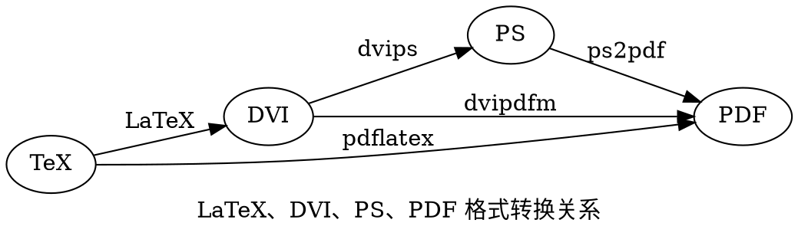

Ghostscript Documentation Release 10.04.0
=========================================

   https://ghostscript.com/releases/index.html
   https://ghostscript.readthedocs.io/_/downloads/en/gs10.04.0/pdf/

   [Ghostscript - Postscript and PDF interpreter/renderer])(https://ghostscript.com/releases/gsdnld.html)
   [GhostPCL - PCL5/PCL XL (PXL) interpreter/renderer])(https://ghostscript.com/releases/gpcldnld.html)
   [GhostXPS - XPS interpreter/renderer])(https://ghostscript.com/releases/gxpsdnld.html)
   [GhostPDL - GhostPDL Source (includes all the above products in one archive)])(https://ghostscript.com/releases/gpdldnld.html)

   Artifex
   Sep 19, 2024

**TIP**: Adobe 这家全球顶尖的设计行业软件公司创业的起点在施乐 PARC，当时约翰·沃诺克
(John Warnock)、查尔斯·格什克(Charles Geschke) 共同开发了 Interpress 页面
描述语言，该语言源于沃诺克加入施乐之前的工作。两人重写了用于超大规模集成电路设计和字体
打印研究的系统，花了两年时间试图说服施乐公司实现 Interpress 的商业化，遭到高层拒绝。
两人坚信 Interpress 的商业价值，相信它会成为企业标准，于是他们在 1982 年离开施乐，
创立了 Adobe，第一款产品是 PostScript，这是在 Interpress 基础上进行完善的页面
描述语言，用来提高计算机处理图形的能力。Adobe 采取了与施乐公司完全不同的商业模式，
它直接向美国各大计算机公司销售字库和图形软件等产品，比如与苹果公司合作，改进 PostScript
使之成为驱动激光打印机的语言，这一创新使 Adobe 声名鹊起，PostScript 最终创造出一个
全新的行业——桌面出版，鼓励创新也成为 Adobe 的文化基因。Adobe 的另一个伟大创新是 PDF 
(Portable Document Format，便携式文档格式) ，它的出现源于一个无纸化的梦想。
PDF 以 PostScript 语言图像模型为基础，不管使用哪种打印机，都会忠实再现原稿中的字符、
颜色和图象。后来，Adobe 公司又发明了可以查看、编辑 PDF 的软件 Acrobat。随着电子存储
的普及，PDF 的优势更加明显，在全球电子文档市场领先多年。Adobe 善收购，最成功的收购当属 
Photoshop。这款产品由两个年轻人研发，Adobe 在 1989 年买断了该产品的销售权，1995 年
收购了这家公司。Photoshop 堪称历史上最成功的软件，直接奠定 Adobe 设计软件的江湖地位。
PostScript® LANGUAGE REFERENCE third edition
https://www.adobe.com/jp/print/postscript/pdfs/PLRM.pdf



<a id=Ptoc href=Ptoc>⋈x</a>

ABOUT
=====

   [1  Introduction                                                     ](#P003)
   [2  News                                                             ](#P009)
   [3  Ghostscript Release Dates                                        ](#P011)
   [4  Building from Source                                             ](#P021)
   [5  Installing                                                       ](#P039)
   [6  Using                                                            ](#P045)
   [7  Information for Ghostscript Developers                           ](#P105)
   [8  API                                                              ](#P143)
   [9  The Core Library                                                 ](#P169)
   [10 Language Bindings                                                ](#P179)
   [11 PostScript Language                                              ](#P245)
   [12 Third Party Libraries                                            ](#P269)
   [13 Details of Ghostscript Output Devices                            ](#P271)
   [14 High Level Devices                                               ](#P297)
   [15 The Interface between Ghostscript and Device Drivers             ](#P321)
   [16 Unsupported Devices                                              ](#P359)
   [17 Sample CMYK 32-bit Device that Supports Post Rendering Processing](#P397)
   [18 Guide to Ghostscript Source Code                                 ](#P405)
   [19 Ghostscript C Coding Guidelines                                  ](#P409)
   [20 Ghostscript PostScript Coding Guidelines                         ](#P427)
   [21 Ghostscript Enterprise                                           ](#P433)
   [22 The GhostPDL Interpreter Framework                               ](#P435)
   [23 Convert PostScript to Encapsulated PostScript Interchange Format ](#P445)
   [24 PostScript Files Distributed with Ghostscript                    ](#P447)
   [25 Fonts and Font Facilities Supplied with Ghostscript              ](#P455)
   [26 Ghostscript Color Management                                     ](#P463)
   [27 Setting Up a Unix lpr Filter for Ghostscript                     ](#P489)


   Ghostscript is an interpreter for the PostScript® language and PDF files. It is available under either the GNU GPL
   Affero license or licensed for commercial use from Artifex Software, Inc. It has been under active development for
   over 30 years and has been ported to several different systems during this time. Ghostscript consists of a PostScript
   interpreter layer and a graphics library.

<a id=P001 href=Ptoc>⋈1</a>

<a id=P002 href=Ptoc>⋈2</a>


<a id=P003 href=Ptoc>⋈3</a>


Chapter 1 Introduction
======================

   This document is a roadmap to the Ghostscript documentation. After looking through it, if you want to install
   Ghostscript and not only use it, we recommend you read How to install Ghostscript, and How to compile Ghostscript
   from source code (which is necessary before installing it on Unix and VMS systems).


1.1 What is Ghostscript?
------------------------

   There are various products in the Ghostscript family; this document describes what they are, and how they are related.

### 1.1.1 Ghostscript

   Ghostscript is an interpreter for PostScript® and Portable Document Format (PDF) files.

   Ghostscript consists of a PostScript interpreter layer, and a graphics library. The graphics library is shared with all the
   other products in the Ghostscript family, so all of these technologies are sometimes referred to as Ghostscript, rather
   than the more correct GhostPDL.

   Binaries for Ghostscript and (see below) GhostPDF (included in the Ghostscript binaries) for various systems can
   be downloaded from ghostscript.com/download. The source can be found in both the Ghostscript and GhostPDL
   downloads from the same site.


### 1.1.2 GhostPDF

   Prior to release 9.55.0 GhostPDF was an interpreter for the PDF page description language built on top of Ghostscript,
   and written in the PostScript programming language. From 9.55.0 onwards there is a new GhostPDF executable,
   separate from Ghostscript and written in C rather than PostScript.

   This new interpreter has also been integrated into Ghostscript itself, in order to preserve the PDF functionality of
   that interpreter. For now, the old PostScript-based interpreter remains the default, but the new interpreter is built-in
   alongside it.

   The intention is that the new interpreter will replace the old one, which will be withdrawn.

   It is possible to control which interpreter is used with the NEWPDF command-line switch. When this is false (the
   current default) the old PostScript-based interpreter is used, when NEWPDF is true then the new C-based interpreter
   is used.


<a id=P004 href=Ptoc>⋈4</a>


### 1.1.3 GhostPDL

   Historically, we’ve used GhostPDL as an umbrella term to encompass our entire line of products. We’ve now brought
   all these disparate products together into a single package, called, appropriately enough, GhostPDL.

   When running on a printer (or server) GhostPDL now automatically detects the type of data being fed to it and pro-
   cesses it accordingly. The individual interpreters all plug into a top-level module that handles both automatic language
   detection and Printer Job Language (PJL) based configuration.

   The exact set of interpreters present in an installation can be tuned by the integrator for their specific product/use cases.

   In addition to our existing PDL modules (PS, PDF, PCL, PXL, and XPS) we have now added new modules to handle
   a range of common image formats. With these installed, GhostPDL will handle JPEGs (both JFIF and EXIF), PWGs,
   TIFFs, PNGs, JBIG2s, and JPEG2000s.

   GhostPDL is available both under the GNU Affero GPL license and for commercial licensing from Artifex.
   The source code for GhostPDL can be found from ghostscript.com/download.


### 1.1.4 GhostPCL

   GhostPCL is an interpreter for PCL™ and PXL files. This consists of an PCL/PXL interpreter hooked up to the
   Ghostscript graphics library.

   GhostPCL is available both under the GNU Affero GPL license and for commercial licensing from Artifex.

   Binaries for GhostPCL for various systems can be downloaded from ghostscript.com/download. The source can be
   found in the GhostPCL/GhostPDL downloads from the same site.


### 1.1.5 GhostXPS

   GhostXPS is an interpreter for XPS (XML Paper Specfication) files. This consists of an XPS interpreter hooked up to
   the Ghostscript graphics library.

   GhostXPS is available both under the GNU Affero GPL license and for commercial licensing from Artifex.

   Binaries for GhostXPS for various systems can be downloaded from ghostscript.com/download. The source can be
   found in the GhostXPS/GhostPDL downloads from the same site.


### 1.1.6 Ghostscript Enterprise

   Ghostscript Enterprise is a commercial version of GhostPDL which can also read and process a range of common
   office documents, including Word, PowerPoint and Excel. Find out more in the Ghostscript Enterprise section.

### 1.1.7 URW++ Font Information

   We rely on two sets of fonts for our products, both from URW++.

   Firstly, there is a PostScript Language Level 2 font set (also required for PDF), in Type 1 font format. These are included
   with Ghostscript and GhostPDL, and are distributed under the GNU GPLv2, with an exemption to allowing embedding
   in PDF and PostScript files.

   Secondly, there is the PCL5 set, in TrueType format. These are required for GhostPCL and GhostPDL (since the latter
   includes PCL5 support).


<a id=P005 href=Ptoc>⋈5</a>

   These PCL fonts are NOT FREE SOFTWARE and are NOT distributed under any GNU GPL/AGPL variant. They are,
   instead, distributed under the AFPL license which prohibits commercial use. A copy of this license in included in the
   GhostPDL source distribution.


1.2 Document roadmap by theme
-----------------------------


### 1.2.1 What should I read if I’m a new user?

   • How to use Ghostscript. This includes both a quickstart introduction to the command line version and more
   extensive reference material.

   • detailed information about specific devices that Ghostscript can use for output.

   • more detailed information about how to use Ghostscript under Unix with lpr as a filter for printing.

   • for information about known problems or to report a new one, please visit bugs.ghostscript.com but remember
   that free versions of Ghostscript come with with NO WARRANTY and NO SUPPORT.


### 1.2.2 GPL and commercial Ghostscript

   GPL Ghostscript, Artifex Ghostscript and AFPL Ghostscript are different releases.

   • additional information about GPL Ghostscript releases that is not relevant to commercial versions.

   If you run into any questions, or if you are going to be using Ghostscript extensively, you should at least skim, and
   probably eventually read:

   • about the fonts distributed with Ghostscript, including how to add or replace fonts.

   • a description of the Ghostscript language, and its differences from the documented PostScript language.

   • about the postscript files distributed with Ghostscript (other than fonts).


### 1.2.3 Before building Ghostscript

   If you are going to compile Ghostscript from source, rather than just use an executable you got from somewhere, you
   may want to read:

   • How to build Ghostscript and install it.


### 1.2.4 What should I read if I’m not a new user?

   If you have already used Ghostscript, when you receive a new release you should begin by reading this file, then:

   • News, for incompatible changes and new features in the current release.


<a id=P006 href=Ptoc>⋈6</a>


### 1.2.5 What if I’m a developer?

   If you are going to do any development on or with Ghostscript at all, you should at least look at:

   • the roadmap documentation for Ghostscript’s source files and architecture.

   If you are going to write a new driver for Ghostscript, you should read:

   • the guide to the Ghostscript source code.
   • the interface between Ghostscript and device drivers.

   If you are considering distributing GPL Ghostscript in conjunction with a commercial product, you should read the
   license carefully, and you should also read:

   • additional clarification of the circumstances under which Ghostscript can be distributed with a commercial prod-
   uct.

   If you intend to use Ghostscript in the form of a dynamic link library (DLL) under OS/2 or Microsoft Windows or in
   the form of shared object under Linux, read:

   • documentation on Ghostscript Interpreter API.

   If you want to use Ghostscript as part of another program, as a callable PostScript language interpreter, and not as a
   DLL or as a self-contained executable application, you should begin by reading:

   • the source file imain.h, the documented API for Ghostscript not as a DLL.

   or if you are going to use only the Ghostscript graphics library:

   • about the structure of the Ghostscript library and its interfaces.


### 1.2.6 What if I’m writing documentation?

   If you are editing or adding to Ghostscript’s existing documentation you should contact us on our Discord channel or
   the gs-devel mailing list for guidance, links to those are on: www.ghostscript.com.


1.3 Presence on the World Wide Web
----------------------------------


### 1.3.1 Ghostscript’s home page

   Ghostscript has a home page on the World Wide Web with helpful information such as the FAQ (Frequently Asked
   Questions):
   www.ghostscript.com

### 1.3.2 Other material on the WWW

   Much other material about Ghostscript is available on the World Wide Web, both as web pages and as archived Usenet
   and mailing list discussions. Use the well-known search engines to find such material.


<a id=P007 href=Ptoc>⋈7</a>


<a id=P008 href=Ptoc>⋈8</a>


<a id=P009 href=Ptoc>⋈9</a>

Chapter 2 News
==============


<a id=P010 href=Ptoc>⋈10</a>


<a id=P011 href=Ptoc>⋈11</a>


Chapter 3 Ghostscript Release Dates
===================================


3.1 Version 10
--------------

   Version 10.01.2 (2023-06-21)
   Version 10.01.1 (2023-03-27)
   Version 10.01.0 (2023-03-22)
   Version 10.00.0 (2022-09-21)

3.2 Version 9
-------------

   Version 9.56.1 (2022-04-04)
   Version 9.56.0 (2022-03-29)
   Version 9.55.0 (2021-09-27)
   Version 9.54.0 (2021-03-19)
   Version 9.53.3 (2020-10-01)
   Version 9.52 (2020-03-19)
   Version 9.50 (2019-10-15)
   Version 9.27 (2019-04-03)
   Version 9.26 (2018-11-20)
   Version 9.25 (2018-09-13)
   Version 9.24 (2018-09-03)
   Version 9.23 (2018-03-21)
   Version 9.22 (2017-10-04)
   Version 9.21 (2017-03-16)
   Version 9.20 (2016-09-26)
   Version 9.19 (2016-03-23)
   Version 9.18 (2015-09-23)
   Version 9.16 (2015-03-30)
   Version 9.15 (2014-09-22)

<a id=P012 href=Ptoc>⋈12</a>

   Version 9.14 (2014-03-26)
   Version 9.10 (2013-08-27)
   Version 9.09 (2013-08-21)
   Version 9.07 (2013-02-14)
   Version 9.06 (2012-07-31)
   Version 9.05 (2012-02-08)
   Version 9.04 (2011-08-05)
   Version 9.02 (2011-03-30)
   Version 9.01 (2011-02-07)
   Version 9.00 (2010-09-14)

3.3 Version 8
-------------

   Version 8.71 (2010-02-10)
   Version 8.70 (2009-07-31)
   Version 8.64 (2009-02-03)
   Version 8.63 (2008-08-01)
   Version 8.62 (2008-02-29)
   Version 8.61 (2007-11-21)
   Version 8.60 (2007-08-01)
   Version 8.57 (2007-05-11)
   Version 8.56 (2007-03-14)
   Version 8.54 (2006-05-17)
   Version 8.53 (2005-10-20)
   Version 8.52 (2005-10-07)
   Version 8.51 (2005-04-18)
   Version 8.50 (2004-12-10)
   Version 8.33 (2004-11-20)
   Version 8.32 (2004-10-26)
   Version 8.31 (2004-08-28)
   Version 8.30 (2004-05-29)
   Version 8.12 (2003-12-08)
   Version 8.11 (2003-08-16)
   Version 8.10 (2003-05-21)
   Version 8.00 (2002-11-21)

<a id=P013 href=Ptoc>⋈13</a>


3.4 Version 7
-------------

   Version 7.33 (2002-11-18)
   Version 7.32 (2002-11-02)
   Version 7.31 (2002-10-17)
   Version 7.30 (2002-09-07)
   Version 7.22 (2002-08-06)
   Version 7.21 (2002-07-08)
   Version 7.20 (2002-04-03)
   Version 7.03 (2001-10-20)
   Version 7.02 (2001-09-22)
   Version 7.00 (2001-04-08)

3.5 Version 6
-------------

   Version 6.64 (2001-04-07)
   Version 6.63 (2001-03-31)
   Version 6.62 (2001-03-19)
   Version 6.61 (2001-02-21)
   Version 6.60 (2000-12-31)
   Version 6.30 (2000-10-03)
   Version 6.23 (2000-08-07)
   Version 6.22 (2000-07-05)
   Version 6.21 (2000-04-28)
   Version 6.20 (2000-04-06)
   Version 6.01 (2000-03-17)
   Version 6.0 (2000-02-03)

3.6 Version 5
-------------

   Version 5.99 (beta) (1999-12-18)
   Version 5.98 (beta) (1999-12-01)
   Version 5.97 (beta) (1999-11-22)
   Version 5.96 (beta) (1999-11-12)
   Version 5.95 (beta) (1999-11-01)
   Version 5.94 (beta) (1999-09-30)
   Version 5.93 (beta) (1999-09-11)

<a id=P014 href=Ptoc>⋈14</a>

   Version 5.92 (beta) (1999-09-02)
   Version 5.91 (beta) (1999-08-30)
   Version 5.90 (beta) (1999-08-20)
   Version 5.88 (tester) (1999-08-03)
   Version 5.87 (tester) (1999-06-29)
   Version 5.86 (tester) (1999-06-14)
   Version 5.85 (tester) (1999-05-29)
   Version 5.84 (tester) (1999-05-19)
   Version 5.83 (tester) (1999-05-13)
   Version 5.82 (tester) (1999-04-24)
   Version 5.81 (tester) (1999-04-14)
   Version 5.80 (tester) (1999-04-06)
   Version 5.73 (tester) (1999-03-19)
   Version 5.72 (tester) (1999-03-17)
   Version 5.71 (tester) (1999-03-03)
   Version 5.70 (internal) (1999-02-20)
   Version 5.69 (internal) (1999-02-04)
   Version 5.68 (internal) (1999-01-29)
   Version 5.67 (internal) (1999-01-08)
   Version 5.66 (internal) (1998-11-25)
   Version 5.65 (internal) (1998-11-13)
   Version 5.64 (internal) (1998-11-05)
   Version 5.63 (internal) (1998-11-04)
   Version 5.62 (internal) (1998-10-31)
   Version 5.61 (internal) (1998-10-28)
   Version 5.60 (internal) (1998-10-18)
   Version 5.50 (1998-09-16)
   Version 5.40 (beta) (1998-09-10)
   Version 5.39 (beta) (1998-09-08)
   Version 5.38 (beta) (1998-09-03)
   Version 5.37 (beta) (1998-08-31)
   Version 5.36 (beta) (1998-08-25)
   Version 5.35 (beta) (1998-08-18)
   Version 5.34 (beta) (1998-08-16)
   Version 5.33 (beta) (1998-08-14)
   Version 5.32 (beta) (1998-08-13)

<a id=P015 href=Ptoc>⋈15</a>

   Version 5.31 (limited) (1998-08-11)
   Version 5.30 (limited) (1998-08-10)
   Version 5.28 (limited) (1998-08-03)
   Version 5.27 (limited) (1998-07-18)
   Version 5.26 (limited) (1998-07-07)
   Version 5.25 (limited) (1998-07-01)
   Version 5.24 (limited) (1998-06-17)
   Version 5.23 (limited) (1998-05-14)
   Version 5.22 (limited) (1998-02-19)
   Version 5.21 (limited) (1998-01-19)
   Version 5.20 (limited) (1998-01-08)
   Version 5.10 (1997-11-23)
   Version 5.07 (limited) (1997-10-31)
   Version 5.06 (limited) (1997-10-07)
   Version 5.05 (limited) (1997-09-24)
   Version 5.04 (limited) (1997-09-21)
   Version 5.03 (1997-08-08)
   Version 5.02 (1997-07-28)
   Version 5.01 (1997-06-22)
   Version 5.0 (1997-06-06)

3.7 Version 4
-------------

   Version 4.81 (1997-06-01)
   Version 4.80 (limited) (1997-05-28)
   Version 4.74 (limited) (1997-05-05)
   Version 4.73 (limited) (1997-04-19)
   Version 4.72 (limited) (1997-04-14)
   Version 4.71 (limited) (1997-03-31)
   Version 4.70 (limited) (1997-03-26)
   Version 4.61 (limited) (1997-03-13)
   Version 4.60 (limited) (1997-03-02)
   Version 4.51 (limited) (1997-02-09)
   Version 4.50 (limited) (1997-01-31)
   Version 4.41 (private) (1997-01-21)
   Version 4.40 (private) (1997-01-13)

<a id=P016 href=Ptoc>⋈16</a>

   Version 4.39 (limited) (1997-01-01)
   Version 4.38 (limited) (1996-12-20)
   Version 4.37 (limited) (1996-12-10)
   Version 4.36 (limited) (1996-12-03)
   Version 4.35 (limited) (1996-11-24)
   Version 4.34 (limited) (1996-11-18)
   Version 4.33 (limited) (1996-11-06)
   Version 4.32 (limited) (1996-11-01)
   Version 4.31 (limited) (1996-10-27)
   Version 4.30 (limited) (1996-10-23)
   Version 4.21 (limited) (1996-10-17)
   Version 4.20 (limited) (1996-10-13)
   Version 4.10 (limited) (1996-09-25)
   Version 4.03 (1996-09-23)
   Version 4.02 (1996-09-19)
   Version 4.01 (1996-07-10)
   Version 4.0 (1996-06-28)

3.8 Version 3
-------------

   Version 3.70 patch 1 (1996-06-24)
   Version 3.70 (limited) (1996-06-23)
   Version 3.69 (limited) (1996-06-14)
   Version 3.68 patch 4 (1996-05-23)
   Version 3.68 patch 3 (1996-05-17)
   Version 3.68 patch 2 (1996-05-13)
   Version 3.68 patch 1 (1996-05-10)
   Version 3.68 (limited) (1996-05-09)
   Version 3.67 (limited) (1996-04-12)
   Version 3.66 (limited) (1996-04-08)
   Version 3.65 (limited) (1996-03-09)
   Version 3.64 (limited, incremental) (1996-01-27)
   Version 3.63 (limited, incremental) (1996-01-14)
   Version 3.62 (limited, incremental) (1995-12-26)
   Version 3.61 (limited) (1995-12-10)
   Version 3.60 (limited) (1995-11-20)

<a id=P017 href=Ptoc>⋈17</a>

   Version 3.53 (1996-01-10) ➊
   Version 3.52 (limited) (1995-10-06)
   Version 3.51 (1995-09-27)
   Version 3.50 (limited) (1995-09-24)
   Version 3.49 (limited) (1995-09-20)
   Version 3.48 (limited) (1995-09-17)
   Version 3.47 (limited) (1995-09-14)
   Version 3.46 (limited) (1995-09-04)
   Version 3.45 (limited) (1995-08-27)
   Version 3.44 (limited) (1995-08-21)
   Version 3.43 (limited) (1995-08-10)
   Version 3.42 (limited) (1995-08-02)
   Version 3.41 (limited) (1995-07-27)
   Version 3.40 (limited) (1995-06-28)
   Version 3.39 (limited) (1995-06-24)
   Version 3.38 (limited) (1995-06-18)
   Version 3.37 (limited) (1995-05-11)
   Version 3.36 (limited) (1995-05-04)
   Version 3.35 (internal) (1995-05-02)
   Version 3.34 (internal) (1995-04-18)
   Version 3.33 (1995-04-13)
   Version 3.32 (1995-04-07)
   Version 3.31 (1995-04-02)
   Version 3.30 (beta) (1995-03-21)
   Version 3.29 (internal) (1995-03-08)
   Version 3.28 (beta) (1995-02-13)
   Version 3.27 (beta)(withdrawn) (1995-02-08)
   Version 3.26 (beta) (1995-02-01)
   Version 3.25 (beta) (1995-01-24)
   Version 3.24 (beta) (1995-01-17)
   Version 3.23 (beta) (1995-01-05)
   Version 3.22 (beta) (1994-11-30)
   Version 3.21 (beta) (1994-11-17)
   Version 3.20 (beta) (1994-10-31)
   Version 3.13 (private) (1994-10-03)

   ➊ This is an anomalous, out-of-sequence release requested by a commercial licensee.
   It consists of 3.52 plus the following retrofits from 3.60 through 3.63

<a id=P018 href=Ptoc>⋈18</a>

   Version 3.12 (1994-09-29)
   Version 3.1.1 (1994-09-25)
   Version 3.1 (1994-09-20)
   Version 3.0.3 (1994-09-16)
   Version 3.02 (1994-08-30)
   Version 3.01 (1994-08-14)
   Version 3.0 (1994-08-01)

3.9 Version 2
-------------

   Version 2.9.10-beta (1994-07-28)
   Version 2.9.9-beta (1994-06-23)
   Version 2.9.8 (1994-06-20)
   Version 2.9.7-beta (1994-06-05)
   Version 2.9.6-beta (not distributed to the public) (1994-05-23)
   Version 2.9.5-beta (1994-04-11)
   Version 2.9.4-beta (1994-02-19)
   Version 2.9.3-beta (1994-01-19)
   Version 2.9.2-beta (1994-01-02)
   Version 2.9.1-beta (1993-12-07)
   Version 2.9-beta (1993-12-06)
   Version 2.8-beta (1993-11-10)
   Version 2.7.2-beta (1993-10-11)
   Version 2.7.1-beta (not distributed to the public) (1993-10-04)
   Version 2.7-beta (not distributed to the public) (1993-09-20)
   Version 2.6.1 (1993-05-28)
   Version 2.6 (1993-05-09)
   Version 2.5.2 (1992-09-20)
   Version 2.5.1 (1992-09-11)
   Version 2.5 (1992-08-18)
   Version 2.4.2 (1992-05-08)
   Version 2.4.1 (1992-04-21)
   Version 2.4 (1992-03-25)
   Version 2.3 (1991-08-28)
   Version 2.2 (1991-06-01)
   Version 2.1.1 (1991-01-15)

<a id=P019 href=Ptoc>⋈19</a>

   Version 2.1 (1990-12-31)
   Version 2.0 (1990-09-12)

3.10 Version 1
--------------

   Version 1.3 (1989-06-20)
   Version 1.2 (1989-02-22)
   Version 1.1 (1989-02-12)
   Version 1.0 (1988-08-11)

<a id=P020 href=Ptoc>⋈20</a>


<a id=P021 href=Ptoc>⋈21</a>


Chapter 4 Building From Source
==============================


4.1 General overview
--------------------

   This document describes how to build a Ghostscript executable from source code. There are four major steps to building
   Ghostscript:

   1. Acquire the compressed archive files of source code for Ghostscript.
   2. Unpack the archive files into the Ghostscript directory.
   3. Configure the build to match your system and desired configuration options.
   4. Invoke “make” to build the software.

   The remainder of this document describes each of these steps in detail. Note that some of this process is platform-
   dependent. After building Ghostscript you must then install it; for that, see the installation instructions.

   Long term users of Ghostscript may notice the instructions for a number of older systems have been removed from this
   document. There is no value judgment implied in this, but recognition that the build system has changed considerably
   in recent years, and several of these legacy systems are no longer easily available to the development team. We will
   always consider contributions to continue support for legacy systems.


4.2 Built libraries
-------------------

   The following Ghostscript libraries will be built for these respective platforms:

    ┌─────────────────┬────────────────────────────┐
    │ Platform        │ Ghostscript library files  │
    ├─────────────────┼────────────────────────────┤
    │ Windows 32-bit  │ gpdldll32.dll gsdll32.dll  │
    │ Windows 64-bit  │ gpdldll64.dll gsdll64.dll  │
    │ MacOS           │ libgpdl.dylib libgs.dylib  │
    │ Linux / OpenBSD │ libgpdl.so libgs.so        │
    └─────────────────┴────────────────────────────┘

   Note: The actual filenames on MacOS will be appended with the version of Ghostscript with associated symlinks.

<a id=P022 href=Ptoc>⋈22</a>


4.3 How to acquire the source code
----------------------------------

   Building Ghostscript requires the Ghostscript source code itself, and in some cases the source code for the third-party
   libraries that Ghostscript uses.

   Official releases can be found under the AGPL license at:
   https://ghostscript.com/download/

   Ghostscript source code is packaged in gzip-compressed tar archives (*.tar.gz), e.g.:

      ghostscript-#.##.tar.gz
      (“#.##” are version numbers.)

   Software to decompress and extract both formats is available for almost every platform for which Ghostscript is available
   – including Unix, Linux, MS Windows, and so on – but it’s up to you to locate that software. See the section on
   unpacking the source code.

   Note: Unlike earlier versions, Ghostscript packages are now one, complete archive, including font files and third party
   library dependency sources.


4.4 How to acquire the development source code
----------------------------------------------

   The Ghostscript team use git for version control.

   If you require a snapshot of the development code, the easiest way to get it is to visit the web interface to our git
   repository: ghostpdl.git and click the “snapshot” link next to the specific commit in which you are interested. After a
   short delay, that will download a complete source tree for the given commit in a gzipped tar archive.

   If you require access to several commits, or wish to regularly access the latest development code, you are better to clone
   the entire git repository, using:

      git clone git://git.ghostscript.com/ghostpdl.git

   which will create a local, read-only repository.

   Both the “snapshot” and the git clone methods download the Ghostscript sources as part of the GhostPDL source tree,
   which includes the PCL/PXL and XPS interpreters also built on top of the Ghostscript graphics library.

   The configure script discussed later in the document is created as part of the Ghostscript release process, and as the
   source tree retrieved from git is “pre-release” code, it does not include a pre-made configure script. See autogen.sh.

4.5 How to unpack the source code
---------------------------------

   Unfortunately, there are no generally accepted standards for how to package source code into archives, so the instructions
   for unpacking Ghostscript are longer than they should be. We begin with a brief explanation of how to extract the two
   kinds of archive files.


<a id=P023 href=Ptoc>⋈23</a>


### 4.5.1 How to unpack compressed tar files generally

   Tar (.tar) files are the de facto standard for archiving files on Unix (every Unix-like system has the tar program),
   and programs to extract their contents are also widely available for MS Windows, and most other environments. To
   economize on space and downloading time, Ghostscript’s tar files are compressed with GNU gzip, which adds the
   suffix “.gz” to the file name, giving “.tar.gz”.

   To unpack a compressed tar file MyArchive.tar.gz you must both decompress it and extract the contents. You can
   do this in two steps, one to decompress the file and another to unpack it:

      gzip -d MyArchive.tar.gz
      tar -xf MyArchive.tar

   or in a pipeline:

      gzip -d -c MyArchive.tar.gz | tar -xf -

   or, if you have a program like GNU tar that can handle compressed tar files, with a single command:

      tar -zxf MyArchive.tar.gz

   The tar program automatically preserves directory structure in extracting files. The Ghostscript source archive puts
   all files under a directory ghostscript-#.##, so using tar to unpack a compressed archive should always properly
   create that directory, which we will call the “ghostscript directory”.

   Some other programs – under MS Windows, for instance – can also unpack compressed tar files, but they may not
   automatically preserve directory structure nor even extract files into the current directory. If you use one of these, you
   must:

   • set the program’s options to “Use folder names” (or the equivalent).

   , and:

   • check that it is extracting files into the right place.

   As both tar and gzip formats are now well supported by several applications on MS Windows, we only supply the
   tar.gz archive.

   WinZip, 7-zip & Info-ZIP are respectively a commercial and two free applications which can decompress and extract
   .tar.gz archives on MS Windows.


### 4.5.2 How to unpack Ghostscript itself

   At this point you have acquired the source code and are ready to unpack it according to the preceding guidelines.
   2-step:

      gzip -d ghostscript-#.##.tar.gz
      tar -xf ghostscript-#.##.tar

   Pipe:

      gzip -d -c ghostscript-#.##.tar.gz | tar -xf -

   GNU tar:

      tar -zxf ghostscript-#.##.tar.gz

   All the Ghostscript source files are now in subdirectories of the ghostscript-#.## directory.


<a id=P024 href=Ptoc>⋈24</a>


### 4.5.3 Ghostscript Core Source subdirectories

    ┌──────────────┬────────────────────────────────────────────────────────────────┐
    │ Subdirectory │ Contents                                                       │
    ├──────────────┼────────────────────────────────────────────────────────────────┤
    │ arch/        │ Pre-defined architecture header files                          │
    │ base/        │ Graphics library C source code and makefiles                   │
    │ contrib/     │ Community contributed/supported output devices                 │
    │ devices/     │ The output devices supported by the Ghostscript team           │
    │ psi/         │ PS interpreter C source code and makefiles                     │
    │ Resource/    │ Postscript initialization, resource and font files             │
    │ lib/         │ PostScript utilities and scripts used with Ghostscript         │
    │ doc/         │ Documentation                                                  │
    │ man/         │ Unix man pages                                                 │
    │ examples/    │ Sample PostScript files                                        │
    │ iccprofiles/ │ Default set of ICC profiles                                    │
    │ windows/     │ Visual Studio for Windows specific project and solution files  │
    │ toolbin/     │ Useful (non-Postscript) tools, mostly for devel- oper use only │
    └──────────────┴────────────────────────────────────────────────────────────────┘

   Optionally, if you downloaded the GhostPDL archive, you may also have:

### 4.5.4 Additional GhostPDL source subdirectories

    ┌──────────────┬────────────────────────────────────────────────────────────────┐
    │ Subdirectory │ Contents                                                       │
    ├──────────────┼────────────────────────────────────────────────────────────────┤
    │ pcl/         │ PCL/PXL interpreter C source code, makefiles, fonts etc.       │
    │ xps/         │ XPS interpreter C source code and makefiles                    │
    └──────────────┴────────────────────────────────────────────────────────────────┘

   Supporting third party libraries will also be in their own sub-directories (e.g. jpeg, freetype and so on).

4.6 How to check for post-release bug fixes
-------------------------------------------

   Bug information and fixes are tracked on Ghostscript Bugzilla.


4.7 How to prepare the makefiles
--------------------------------

   The Ghostscript makefiles are very large and complex in order to deal with the diverse requirements of all the different
   systems where they may be used.

   Ghostscript has an automatic configuration script. If you’re on unix or a system that supports unix shell scripts, this is
   the easiest option to use. Simply type:

      ./configure

<a id=P025 href=Ptoc>⋈25</a>

   from the top level of the Ghostscript source directory. It should configure itself based on what’s available on your
   system, warn you of any missing dependencies, and generate a Makefile. At this point you can skip to the section
   invoking make below. Also, many common configuration options (like install location) can be set through options to
   the configure script.

   Type ./configure --help for a complete listing. Note that the configuration option is only available with the unix
   .tar distributions of the source.

   Note: If you’re building Ghostscript from development source out of a repository instead of from a released
   source package, you should run ./autogen.sh instead of ./configure. This script takes all the same options that
   configure does.

   If your system doesn’t support the configure script or you don’t wish to use it, you can use the traditional Ghostscript
   makefile system, editing the options by hand to match your system as described below. Fortunately, the only
   makefiles you’re likely to want to change are relatively small ones containing platform-specific information.

### 4.7.1 Platform-specific makefiles

   The table below lists a number of platform independent makefiles in each of the core Ghostscript source directories.

    ┌───────────────────┬───────────────────────────────────────────────────────────┐
    │ Makefile          │ Used for                                                  │
    ├───────────────────┼───────────────────────────────────────────────────────────┤
    │ Makefile.in       │ Template makefile for the autoconf build.                 │
    │ psi/msvc.mak      │ MS Windows with Microsoft Visual Studio 2003 and later.   │
    │ base/unix-gcc.mak │ Unix with gcc.                                            │
    │ base/unixansi.mak │ Unix with ANSI C compilers other than gcc.                │
    └───────────────────┴───────────────────────────────────────────────────────────┘

   Since these files can change from one Ghostscript version to another, sometimes substantially, and since they all include
   documentation for the various options, here we don’t duplicate most of that documentation: we recommend strongly
   that you review the entire makefile specific for your operating system and compiler before building Ghostscript.

### 4.7.2 Changes for your environment

   Assuming you have opted not to use the configure script or the default Microsoft Visual Studio bulid, you must edit
   the platform-specific makefile to change any of these:

   • The name of the makefile itself (MAKEFILE macro).
   • The locations to install Ghostscript files (prefix etc.).
   • The default search paths for the initialization and font files (GS_LIB_DEFAULT macro).
   • The debugging options (DEBUG and TDEBUG macros).
   • Which optional features to include (FEATURE_DEVS).
   • Which device drivers to include (DEVICE_DEVS and DEVICE_DEVS{1--20} macros).
   • Default resolution parameters for some printer drivers (devs.mak or contrib.mak, whichever defines the driver).

   In general these will be set to commonly sensible values already, but may not be ideal for your specific case.

   The platform-specific makefiles include comments describing all these except the DEVICE_DEVS options. These are
   described in devs.mak and contrib.mak, even though the file that must be edited to select them is the platform-
   specific makefile.


<a id=P026 href=Ptoc>⋈26</a>

   Some platform-specific options are described in the sections for individual platforms. See the “Options” section near
   the beginning of the relevant makefile for more information.


### 4.7.3 Selecting features and devices

   You may build Ghostscript with any of a variety of features and with any subset of the available device drivers. The
   complete list of features is in a comment at the beginning of gs.mak, and the complete list of drivers in comments at
   the beginning of devs.mak and contrib.mak. To find what devices a platform-specific makefile selects to include
   in the executable, look in it for all lines of the form:

      FEATURE_DEVS={list of features}
      DEVICE_DEVS*={list of devices}

   For example, if the makefile has:

      FEATURE_DEVS=$(PSD)level2.dev

   indicating that only the PostScript Level 2 facilities should be included, you might make it:

      FEATURE_DEVS=$(PSD)level2.dev $(PSD)pdf.dev

   to add the ability to interpret PDF files. (In fact, FEATURE_DEVS in the current Unix makefiles already includes
   $(PSD)pdf.dev.).

   It is extremely important that FEATURE_DEVS is set correctly. Currently, the default builds will include a complete
   feature set, and as such most of those building Ghostscript will have no need to change it. Only those working in
   heavily resource constrained environment will want to experiment, and it is vital that the implications of such changes
   be understood, otherwise Ghostscript may behave in unexpected or apparently incorrect ways, or may even fail to build.
   The Unix makefile also defines:

      DEVICE_DEVS=$(DD)x11.dev

   indicating that the X Windows driver should be included, but since platform-specific makefiles as distributed nor-
   mally include many of the possible features and drivers, you will probably rather remove from the makefile the features
   and drivers you don’t want. It does no harm to include unneeded features and devices, but the resulting executable will
   be larger than needed.

   You may edit the FEATURE_DEVS line to select or omit any of the features listed near the beginning of gs.mak, and the
   DEVICE_DEVS* lines to select or omit any of the device drivers listed near the beginning of devs.mak and contrib.
   mak. GS_DEV_DEFAULT is a string containing whitespace separate device names, and give the devices Ghostscript
   should attempt to use (and the order) if no device is specified on the command line; see the usage documentation for
   how to select an output device at run time using the -sDEVICE= switch. If you can’t fit all the devices on a single line,
   you may add lines defining:

      DEVICE_DEVS1=$(DD){dev11}.dev ... $(DD){dev1n}.dev
      DEVICE_DEVS2=$(DD){dev21}.dev ... $(DD){dev2n}.dev

   etc., up to DEVICE_DEVS15. Don’t use continuation lines – on some platforms they don’t work.

   Note: If you want to include a driver named xxx, you must put $(DD)xxx.dev in DEVICE_DEVS*. Similarly, if you
   want to include a feature related to the PostScript or PDF language interpreters (PostScript level 1.. 3, or other
   language features such as the ability to read EPSF files or TrueType font files), you must represent it as $(PSD)xxx.dev.

<a id=P027 href=Ptoc>⋈27</a>

   **Precompiled run-time data**

   Ghostscript normally reads a number of external data files at run time: initialization files containing PostScript code,
   fonts, and other resources such as halftones. By changing options in the top-level makefile for the platform, you can
   cause some of these files to be compiled into the executable: this simplifies installation, improves security, may reduce
   memory requirements, and may be essential if you are planning on putting Ghostscript into ROM. Compiling these
   files into the executable also means the executable is (largely) self-contained, meaning initialization files, font files,
   resource files and ICC profile files are certain to be available and accessible. In general, Ghostscript should initialize
   more quickly, and files (especially PDF) files making heavy use of the built-in fonts will interpret more quickly.

   For those distributing Ghostscript binaries, compiling those files into the executable has another implication, any site-
   specific customizations (such as font and CIDFont substitutions) are slightly more complex to implement - see: How
   Ghostscript finds files for how to influence where Ghostscript searches for files. Furthermore, if the files Ghostscript
   usesarealsorequiredtobeaccessiblebyapplicationsotherthanGhostscript(themostlycaseforthiswouldbefontfiles
   and ICC profile files), having those files compiled into Ghostscript maybe suboptimal, essentially require two copies
   of the file data to be distributed (one set built into Ghostscript, and the other as “normal” files accessible outside of
   Ghostscript.

   Compiling the initialization files (Resource/Init/gs_init.ps, etc.) into the executable is the default. To disable
   this, change the 1 to a 0 in the line:

      COMPILE_INITS=1

   Or, if you use the configure based Unix-style build, you can disable COMPILE_INITS by adding the option
   --disable-compile-inits to the invocation of configure

   Files are now compiled into the executable as a %rom% file system that can be searched, opened, etc. as with the normal
   (%os%) file system. The data is (mostly) compressed. Several of the initialisation files (those in Resource/Init) are
   also converted to binary Postscript encoding, and “merged” into a single monolithic file - this is done for both size and
   speed optimization. Files that are often customized for individual installations (such as Fontmap and cidfmap) are not
   merged into the single file and thus installation specific versions can be used.

   The set of files built into the %rom% file system is specified in the psi/psromfs.mak file. By default the set of files
   built into the rom file system comprises all the resource files Ghostscript requires to run successfully (all the files under
   Resource directory, and those under the iccprofiles directory). Refer to the file base/mkromfs.c for a description
   of the parameters that control source and destination pathnames, file enumeration exclusion, compression, etc.

   Fonts normally are compiled into the executable using mkromfs (above) from the Resource/Font/ directory.

   Similarly, Half tone resources can be compiled into the executable using mkromfs, but also threshold-array half tones can
   be compiled into the executable. See the “Compiled halftone” section of int.mak for a sample makefile fragment,
   genht.c for the syntax of halftone data files, and lib/ht_ccsto.ps for a sample data file. Note that even though the
   data files use PostScript syntax, compiled halftones do not require the PostScript interpreter and may be used with the
   graphics library alone.


### 4.7.4 Setting up “makefile”

   After going through the steps just described to unpack the sources, configure the build and make any desired changes
   to the makefiles. As the final step in preparing to build Ghostscript you must usually associate the name “makefile”
   with the correct makefile for your environment so the make command can find it. See the section on your particular
   platform for how to do that if necessary.

   On unix systems, ./configure (or if checked out of git, ./autogen.sh) should create a Makefile which works in
   most scenarios. Manual tampering and editing should rarely be needed nor recommended.


<a id=P028 href=Ptoc>⋈28</a>


### 4.7.5 Invoking “make”


   **make**
   Builds Ghostscript without debugging options.

   **make debug**
   Builds Ghostscript with debugging options and additional internal error checks. The program will be somewhat
   larger and slower, but it will behave no differently unless you actually turn on debugging options at execution
   time with the -DDEBUG or -Z command line switches described in the usage documentation.

   **make pg**
   On Unix platforms, builds with the -pg compiler switch, creating an executable for time profiling.

   **make install**
   After building, installs the Ghostscript executables, support files, and documentation, but does not install fonts.
   See the installation documentation.

   **make (debug)clean**
   Deletes all the files created by the build process (relocatables, executables, and miscellaneous temporary files).
   If you’ve built an executable and want to save it, move it first to another place, because “make clean” deletes it.

   **make so**
   On some platforms (Linux, *BSD, Darwin/Mac OS X, SunOS), it is possible to build Ghostscript as a shared
   object library. There is a corresponding make soclean for cleaning up.

   **make sanitize**
   Builds Ghostscript with AddressSanitizer. Output is placed in ./sanbin.

   **make libgs**
   Builds static library for Ghostscript.

   **make libgpcl6**
   Builds static library for GhostPCL. Requires the full ghostpdl source release.

   **make libgxps**
   Builds static library for GhostXPS. Requires the full ghostpdl source release.

   **make libgpdl**
   Builds static library for GhostPDL. Requires the full ghostpdl source release.

   Note:

   • On some platforms aspects of these simple instructions don’t quite work in one way or another. Read the section
   on your specific platform.

   • If you are attempting to build a statically linked executable, you will probably need to add libraries to the linker
   options (libraries that are normally pulled-in automatically by the dynamic linker). These can be added at the
   make command line using the EXTRALIBS= option. Unfortunately, the set of libraries that may be required varies
   greatly depending on platform and configuration, so it is not practical to offer a list here.


<a id=P029 href=Ptoc>⋈29</a>


### 4.7.6 Cross-compiling

   Cross-compiling is not fully supported by the configure script (such support is a work-in-progress).
   You can either use base/unixansi.mak or unix-gcc.mak as the basis for a cross-compile makefile, or use config-
   ure to create a basic Makefile as the basis. And modify to suit.

   You can set the compiler to your cross-compiler for configure by doing:

      ./configure CC=<cross-compiler executable>

   and configure will then run its checks (as best it can) with the cross-compiler.

   If you do so, you should also give configure the option to set the target architecture endianness: --enable-big-endian
   or --enable-little-endian.

   It would also be wise to review the settings shown in the output of ./configure --help for any that would be
   applicable to your target.

   The Ghostscript build system uses several interim executables, built and run on the host, as such, even when cross-
   compiling, a host native compiler is also required. You must edit your makefile to ensure that is available. Find the
   line that starts:

      CCAUX=

   and set that to your host compiler.

   If you did not use configure or did not set the CC variable for configure, you must also set the:

      CC=

   to your cross-compiler.

   The Ghostscript build system uses a utility called genarch (see base/genarch.c for details) to interrogate the envi-
   ronment and generate a header file describing the architecture for which Ghostscript is being built. As this is run on
   the host it will generate header for the host architecture rather than that of the target.

   For cross compiling, you must create (or modify) a header file (arch.h) which accurately describes the target
   architecture. Then you must edit your makefile by finding the line:

      TARGET_ARCH_FILE=

   and set it to the path to, and file name of your custom arch.h file. With that setting, genarch will still be run, but
   rather than interrogate the current environment, it will copy the contents of your custom arch.h to the build.

4.8 How to build Ghostscript from source (PC version)
-----------------------------------------------------

   All Ghostscript builds in PC (DOS and MS Windows) environments are 32- or 64-bit: 16-bit builds are not supported.
   The relevant makefiles are:

      ┌─────────────┬────────────────────────────────────────┬────────────────────────────┐
      │ Makefile    │ Construction tools                     │ For environment            │
      ├─────────────┼────────────────────────────────────────┼─────────────────────────── │
      │ msvc.mak    │ Microsoft Visual Studio.NET2003(orlater) │ MS Windows 32/64-bit       │
      │ Makefile.in │ Cygwin/gcc                             │ Cygwin (Use Unix configure)│
      └─────────────┴────────────────────────────────────────┴────────────────────────────┘

   Ghostscript requires at least MS Windows 95 (although we no longer actively test nor support Win95, we have not
   deliberately done anything to break compatibility with it). We recommend at least MS Windows NT 4.0.

<a id=P030 href=Ptoc>⋈30</a>

   For building, Ghostscript requires at least Visual Studio .NET 2003, and we recommend at least Visual Studio 2019.
   It can probably be made to work with earlier versions, though at least VS2005 will be required for 64 bit Windows
   support.

   Note: The make program supplied with Visual Studio (and earlier Visual C++ versions) is actually called nmake. We
   refer to this program generically as make everywhere else in this document.

   You must have cmd.exe in your path to build Ghostscript (using the Visual Studio command prompt is ideal). After
   making any changes required to choose features and devices to build into the executable, you can then invoke make to
   build the executable.


### 4.8.1 Microsoft Visual Studio

   **Using Microsoft Visual Studio**

   To build the required DLLs, load /windows/ghostpdl.sln into Visual Studio, and select the required architecture
   from the drop down - then right click on ‘ghostpdl’ in the solution explorer and choose “Build”.

   **Further details**

   The Ghostscript source distribution ships with project and solution files for Visual Studio 2015 and later. These
   can be found in the windows directory. The project(s) are nmake projects which means that rather than Visual
   Studio controlling the build directly, it delegates the build process to the nmake.

   Beyond lacking support for parallel builds (nmake cannot support parallel builds), there should be little visible differ-
   ence between a conventional VS project and an nmake project to the user of the VS graphical interface. The only
   exception to that is if you have to make changes to build options beyond those available in the defined build configura-
   tions. In that case, you need to find the Nmake tab in the project Property Pages and modify the appropriate entry:
   Build Command Line, Rebuild All Command Line and/or Clean Command Line.

   As mentioned above, nmake does not support parallel builds. If you have downloaded and are building the GhostPDL
   source archive (which contains Ghostscript, GhostPCL, GhostXPS, and GhostPDL “products”), the GhostPDL.sln
   contains individual projects for each product but, as a result of the limitations of nmake the products cannot be built in
   parallel, because nmake's lack of parallel build awareness means it cannot manage the dependencies shared between
   the products, and may fail as multiple builds attempt to access the same dependencies.

   To build all the products in one action, use the All “pseudo-project”. The All project uses a single nmake invocation
   to build all the supported products.

   Note: Changing the Output property in the Nmake properties will not change the name of the executable - to do that
   requires editing of the psi/msvc.mak makefile, or you can add: GS=myname.exe to the nmake command line.

<a id=P031 href=Ptoc>⋈31</a>

   **Using the command line**

   Ghostscript can be made using the Windows command prompt or one of the various command line shells made for
   Windows, as long as the command line syntax is compatible with the Windows CMD.exe. The Visual Studio command
   prompt is ideal.

   In order for the makefiles to work properly, two items may have to be changed. An attempt is made to select the correct
   version of Microsoft Visual C++ based on the version of nmake. If this doesn’t work it will default to version 6.x. If the
   auto-detection does not work, and you are not using version 6.x then before building, in psi\msvc.mak find the line
   #MSVC_VERSION=6 and change it to MSVC_VERSION=4, MSVC_VERSION=5, MSVC_VERSION=7 or MSVC_VERSION=8
   and so on.

   In some cases the location of the Microsoft Developer Studio, needs to be changed. The location of Microsoft Developer
   Studio is defined by the value of DEVSTUDIO. There are several different definitions of DEVSTUDIO in psi\msvc.mak.
   There is one for each of the currently supported versions of Microsoft Visual C++ (4, 5, 6, 7, 7.1 and 8).

   The normal installation process for Microsoft Visual C++ includes setting the location of the Microsoft Visual C++
   executables (cl.exe, link.exe, nmake.exe, rc.exe) in your PATH definition and the LIB and INCLUDE environment
   variables are set to point to the Microsoft Visual C++ directories. If this is true then the value for DEVSTUDIO can be
   changed to empty, i.e. DEVSTUDIO=

   If PATH, LIB, and INCLUDE are not correctly set then the value for DEVSTUDIO needs to be defined. For example,
   for version 6.0, the default definition for the location for the Microsoft Developer Studio is: DEVSTUDIO=C:\Program
   Files\Microsoft Visual Studio If the path to Microsoft Developer Studio on your system differs from the default
   then change the appropriate definition of DEVSTUDIO. (Remember that there is a separate definition of DEVSTUDIO for
   each version of MSVC, so be sure to change the correct definition.)

   To run the make program, give the command:

      nmake -f psi\msvc.mak

   Rather than changing psi/msvc.mak, these values can also be specified on the make command line, i.e.

      nmake -f psi\msvc.mak MSVC_VERSION=6 DEVSTUDIO="C:\Program Files\Microsoft Visual Studio"
      nmake -f psi\msvc.mak MSVC_VERSION=7 DEVSTUDIO="C:\Program Files\Microsoft Visual Studio␣
      ˓→ .NET"

   Note that double quotes have been added around the path for DEVSTUDIO due to the spaces in the path value.

   This command line can also be put into a batch file.

   You may get warning messages during compilation about various undefined and/or unsupported switches - this is
   because the compiler switches are set in the makefiles, and are applied when building with all versions of Visual
   Studio, but not all options are supported (or required) by all versions of Visual Studio. These warnings are benign and
   can be ignored.


### 4.8.2 Microsoft Environment for 64-bit

   Building Ghostscript for 64-bit Windows (AMD64 processor) requires Microsoft Visual Studio .NET 2005 or Microsoft
   Visual Studio 2008 or later on 64-bit Windows. Cross compiling on 32-bit Windows is possible.

   Compiling for 64-bit is similar to the Microsoft Environment instructions above, but with the addition of a WIN64
   define.

   To make Ghostscript use:

      nmake -f psi/msvc.mak WIN64=

<a id=P032 href=Ptoc>⋈32</a>

   **Making self-extracting installers**

   You can build self-extracting Windows installers based on NSIS (Nullsoft Scriptable Install System). To do so, use the
   nsis makefile target as well as any other options, for example:

      nmake -f psi/msvc.mak WIN64= nsis

   will create an nsis based installer for Ghostscript built for 64 bit Windows systems.


### 4.8.3 Microsoft Environment for WinRT

   Ghostscript can be built in the form of a win32 DLL for use within a Windows Runtime application or Windows
   Runtime component. Building for WinRT requires use of Microsoft Visual Studio 2012. There is a solution file that
   can be loaded into VS 2012, in the directory winrt.

   The WinRT application or component should include iapi.h from gs/psi and link with gsdll32metro.lib from
   gs/debugbin or gs/releasebin. Also any app using Ghostscript either directly or via a component should add
   gsdll32metro.dll as “content”. This inclusion of the dll is necessary so that it will be packaged with the app. If
   one wishes to be able to run the debugger on Ghostscript then gsdll32metro.pdb should also be added as content.

### 4.8.4 Cygwin32 gcc

   It is possible to compile Ghostscript for MS Windows using the Cygwin32 gcc compiler, GNU make, using the “con-
   figure” generated Makefile.

   Information about this compiler and environment is at the Cygwin site.

   **MSys/Mingw**

   The configure build can be used to build Ghostscript on MSys/Mingw systems, but with a caveat. The msys-dvlpr
   adds header files into the compiler’s header search paths which cause a clash, and the build will fail as a result. If you
   have the msys-dvlpr package installed, and until a better solution is available you can work around this by temporarily
   renaming the \mingw\msys\1.0\include directory so those headers are no longer found by the compiler.

4.9 How to build Ghostscript from source (MacOS version)
--------------------------------------------------------


### 4.9.1 MacOS X

   The unix source distribution (.tar.gz) builds fine on Darwin/MacOS X, albeit without a display device. You can
   generally just use the Makefile generated by configure as your top-level makefile and get a reasonable default build.
   This will allow you to use Ghostscript from the command line as a BSD-layer tool to rasterize postscript and pdf to
   image files, and convert between the high-level formats supported by Ghostscript. See the instructions for the unix
   build below for details of how to customize this build.

   Note: If you have MacPorts installed, it can “confuse” the configure script because it includes some librares which
   duplicate the “system” ones. This can cause missing symbol link errors. In order to resolve this, you can do:
   LDFLAGS="-L/usr/lib" ./configure. That will force the linker to search the default directory first, and thus
   pick up the system libraries first.


<a id=P033 href=Ptoc>⋈33</a>

   It is also possible to build “universal binaries” for MacOS X, containing i386 and x86_64 binaries in one file, using
   the Makefile from configure. This can be achieved by using the following invocation of configure:

      ./configure CC="gcc -arch i386 -arch x86_64 -arch ppc" CPP="gcc -E"

   You can choose the combination of valid architectures (i386/x86_64/ppc) that you require.

   The separate options for CC and CPP are required because some of the features used by configure to explore the capa-
   bilities of the preprocessor are not compatible with having multiple -arch options.

   Building a shared library on MacOSX is the same as for other Unix-like systems, the “configure” step is done normally,
   and the “so” target is given to the make invocation, thus:

      make so

   The only difference compared to other Unix-like systems is that on OS X the resulting shared library is created with
   the “.dylib” file name extension, instead of the more usual “.so”.


4.10 How to build Ghostscript from source (Unix version)
--------------------------------------------------------

   Ghostscript now ships with a build system for unix-like operating systems based on GNU Autoconf. In general the
   following should work to configure and build Ghostscript:

      ./configure
      make

   or

      ./configure
      make so

   for building Ghostscript as a shared library.

   Please report any problems with this method on your system as a bug.

   On modern unix systems, ./configure should create a Makefile which works in most scenarios. Manual tempering
   and editing should rarely be needed nor recommended.

   Note: If you’re building Ghostscript from development source out of a repository instead of from a released
   source package, you should run ./autogen.sh instead of ./configure. This script takes all the same options that
   configure does.

   (deprecated; see Autoconf-based method above) For the convenience of those already familiar with Ghostscript, the
   old method based on hand-edited makefiles is still possible but no longer supported (and in many cases, simply do
   not work without substantial expert manual-editing effort). It may also be helpful in getting Ghostscript to build on
   very old platforms. The rest of this section deals exclusively with that older method and includes numerous pointers
   regarding legacy systems.

   (deprecated; see Autoconf-based method above) Before issuing the make command to build Ghostscript, you have to
   make some choices, for instance:

   • Which compiler to use.
   • What features and devices to include.
   • Whether to use system libraries for PNG and zlib.
   • How to handle issues for your particular platform.


<a id=P034 href=Ptoc>⋈34</a>


   Be sure to check the sections on tool-, OS-, and hardware-specific issues for notes on your particular platform and
   compiler. In fact, that is the first place to check if you build Ghostscript and it crashes or produces obviously incorrect
   results.

### 4.10.1 make tools

   You require a make tool which supports separate directories for the derived objects (such as object files, executables
   and dynamically created header files) and the source files.

   In general, GNU make is the recommended choice, and some features (such as the building of the Linux/Unix shared
   library build (“make so”) are only available with GNU make.

   Other make implementations are known to work, but are not guaranteed to do so.

   GNU make
   Current versions of GNU make have no problems building Ghostscript.


### 4.10.2 OS-specific issues

   **MacOS or Linux / OpenBSD**

   Running the autogen.sh script from the command line depends on having both autoconf and automake installed
   on your system.

   If this software is not already on your system (usually this can be found in the following location: usr/local/bin,
   but it could be located elsewhere depending on your setup) then it can be installed from your OS’s package system.

   Alternatively, it can be installed from GNU Software

   Or, it can be installed via Brew by running:

      brew install autoconf automake

   Once built, these libraries can be found in your ghostpdl/sobin/ or ghostpdl/sodebugbin location depending on
   your build command.

   **H-P RISC workstations**

   (see Autoconf-based method above)

   • HP-UX versions before 11.0 do not support POSIX threads. Set SYNC=nosync in the makefile before building.

   • Ghostscript builds on H-P machines with either GNU gcc or H-P’s ANSI-capable cc. The minimal, non-ANSI-
   capable cc that shiped with some basic HPUX system does not work. If cc on your system doesn’t accept the

   - Aa switch, then you need to get the full cc or gcc.

   • If you use H-P’s compiler, be sure you have upgraded to a recent release. Many bizarre symptoms have been
   reported trying to build Ghostscript with older, buggier compilers, for example:

   -  The link step fails with a message about “max” not being defined.
   _  The build succeeds, but the resulting executable fails to start up, with an error message like “Initializing...
      Unrecoverable error: typecheck in .registerencoding”.
   -  The build succeeds, but the resulting executable produces a black background on the first page of output.


<a id=P035 href=Ptoc>⋈35</a>

   • It is reported that On HPUX 9.* you need at least compiler patch PHSS_5723 and dld.sl patch PHSS_5734
   to build Ghostscript. (As of late 1997, those patches are long obsolete; the current patches are compiler
   PHSS_10357 and dld.sl PHSS_11246. It is unknown whether current Ghostscript releases work with
   compiler/dld.sl versions older than these).

   • On HPUX 10.*, we don’t know what combinations of compiler version and switches work. It is reported that On
   HPUX 10.20, setting CC=c89 and CFLAGS=+O3 $(XCFLAGS) works, contradicting the information in the next
   paragraph, but this may be dependent on the specific compiler version.

   • In either HPUX version, you need to set CC=cc -Aa (or use -Ae if you prefer), and set
   CFLAGS=-D_HPUX_SOURCE -O $(XCFLAGS). Higher levels of optimization than -O may work depend-
   ing on your compiler revision; some users have reported success with +O3, some have not.

   • Some users have reported needing -DNOSYSTIME and -D_POSIX_SOURCE in CFLAGS, but recent tests do not
   show these to be necessary.

   • If you use gcc, it’s a good idea to have a recent release – at the very least 2.7.2.1 or later. You may be able to get
   a working executable with an older gcc by removing -O from CFLAGS.

   **IBM AIX**

   We recommend installing gcc and GNU make, and using the Autoconf-based method.

   Other combinations are known to work, but are less well supported.

   Recent veresions of Ghostscript can trigger a ‘TOC overflow’ error with some compilers on AIX. If this occurs, use
   the linker flag -bbigtoc, which can either be added to your configure options:

      configure LDFLAGS="-Wl,-bbigtoc"

   Or on the make command line:

      make XLDFLAGS="-Wl,-bbigtoc"

   **Silicon Graphics**

   (see Autoconf-based method above)

   Users have had a lot of problems with the MIPSpro compilers on SGI systems. We recommend using gcc. If you do
   choose to use the MIPSpro compiler, please read the following carefully.

   • To make the optimizer allocate enough table space, set:
   CFLAGS="-Olimit 2500" (for older compilers) CFLAGS="-OPT:Olimit=2500" (for newer com-
   pilers)

   • MIPSpro compiler version 3.19 is “older”, and 7.1 is “newer”; we aren’t sure at what point in between the latter
   syntax was introduced.

   • With the compiler shipped with Irix 5.2, use the -ansi option.

   • The SGI C compiler may produce warnings about “Undefined the ANSI standard library defined macro
   stdin/stdout/stderr”. To suppress these warnings, add -woff 608 to the definition of CFLAGS.

   • The SGICcompilershippedwithIrix6.1and6.2willnotcompilezlib/deflate.cproperlywithoptimization.

   Compile this file separately without -O.


<a id=P036 href=Ptoc>⋈36</a>

   • With IRIX 6.5.x and the MIPSpro 7.x compilers there have been reports about incorrect output and binaries that
   cause segmentation faults. Various solutions have been suggested and you may want to try them in this order,
   until you get a working binary:
   – Compile idict.c and isave.c separately without optimization after doing a normal compile; then re-
   link.e.g.:

      cc -OPT:Olimit=2500 -I. -I./obj -o ./obj/idict.o -c ./idict.c
      cc -OPT:Olimit=2500 -I. -I./obj -o ./obj/isave.o -c ./isave.c

   – Set CFLAGS= (no optimization).

   – Use only -O2. Compiler produces incorrect output with -O3 or -Ofast=ip32 -show.

   – Irix6.5.1mwithMIPSprocompiler7.2.1.1m, Irix6.5.3mwithMIPSprocompiler7.2.1, andprobablyother
   6.5x/7.2xcombinationsrequirecompilingwiththe-o32option. Compilingwiththe(default)-n32option
   produces non-working executables. -O2 is OK (possibly except for idict.c), but not -O3.


### 4.10.3 Oracle/Sun

   (see Autoconf-based method above)
   • TheSununbundledCcompiler(SC1.0)doesn’tcompileGhostscriptproperlywiththe-fastoption: Ghostscript
   core-dumps in build_gs_font. With that compiler use -g, or use gcc instead.

   • The Sun version of dbx often gives up with an error message when trying to load Ghostscript. If this happens,
   use GNU gdb instead. (gdb is more reliable than dbx in other ways as well).

   • A bug in some versions of zlib results in an undefined symbol zmemcmp when compiling with Sun cc. Use gcc
   instead.


### 4.10.4 Solaris

   • Solaris 2.2 may require setting EXTRALIBS=-lsocket. Solaris 2.3 and later seem to require EXTRALIBS=-lnsl
   -lsocket -lposix4.

   • For Solaris 2.6 (and possibly some other versions), if you set SHARE_LIBPNG=1, SHARE_ZLIB=1, or
   SHARE_JPEG=1, you may need to set XLDFLAGS=-R /usr/local/xxx/lib:/usr/local/lib using the full
   path names of the relevant directories.

   • Solaris 2.n uses /usr/openwin/share/include for the X11 libraries rather than /usr/local/X/include.
   • Solaris 2.n typically has Type 1 fonts in /usr/openwin/lib/X11/fonts/Type1/outline.

   • For Solaris 2.n in the makefile you must change the definition of INSTALL from install -c to /usr/ucb/
   install -c.

   • You may need to set XLIBDIR to the directory that holds the X11 libraries, as for other SVR4 systems. Set
   -DSVR4 in CFLAGS.

   • If you are using the SunPRO C compiler, don’t use optimization level -xO3. On SPARC platforms the compiler
   hangs;onIntelplatformsthegeneratedcodeisincorrect. WiththiscompileronIntel,donotusethe-nativeflag:
   floating point computations become unacceptably inaccurate. You can use -xcg92 (SPARC V8) and -dalign
   for better performance.

   • One user reported compiling from source on a Linux NFS mounted volume failed. Compiling from a local
   volume was the workaround.


<a id=P037 href=Ptoc>⋈37</a>


4.11 Other environments
-----------------------


### 4.11.1 Environments lacking multi-threading

   All environments mentioned here by name have multi-threading capability. However, if your environment doesn’t, you
   can remove all need for multi-threading by setting SYNC=nosync in the top-level makefile. Note that you will not be
   able to use any so-called “async” drivers (drivers that overlap interpretation and rasterization) if you do this. No such
   drivers are in the DEVICE_DEVS* lists of any makefile that we distribute.


### 4.11.2 Plan 9

   Use unix-gcc.mak, editing it to define:

      CC=cc GCFLAGS=-D_BSD_EXTENSION -DPlan9

   You will also probably have to edit many path names.


4.12 How to build Ghostscript with UFST
---------------------------------------

   Note: This section is only for customers who have a Monotype Imaging UFST license. Other users please skip this
   section.

   Ghostscript sources do not include UFST sources. You need to obtain them separately. The Ghostscript distributed
   source include only some source modules that provide a bridge to UFST. You will also need an additional, UFST
   specific makefile: contact Ghostscript support for more information.

   If optioned in, the Ghostscript build system will build the UFST as part of the normal bulid process (previously, the
   UFST was required to be built separately).

   To build Ghostscript with UFST, specify additional options for “make”:

      UFST_BRIDGE=1

   Forces the UFST bridge to build.

      UFST_ROOT=path

   Specifies the path to UFST root directory or folder.

      UFST_CFLAGS=options

   Specifies C compiler options for UFST library. Refer to UFST manual for information about them.

      UFST_LIB_EXT=extension

   Sets the file name extension for object libraries. You must use the appropriate one for your platform and linker.
   An example for Unix/GCC :

      UFST_BRIDGE=1 UFST_ROOT=../ufst UFST_CFLAGS=-DGCCx86 UFST_LIB_EXT=.a

   Starting with Ghostscript 9.x (Summer 2010), the above options are conveniently inserted in the Makefile with (this
   also automatically disable the freetype bridge):

      ./configure --with-ufst=../ufst

<a id=P038 href=Ptoc>⋈38</a>

   For Windows/MSVC you need only specify UFST_ROOT. msvc.mak sets the other options automatically.

<a id=P039 href=Ptoc>⋈39</a>


Chapter 5 Installing
====================


5.1 Downloading
---------------

   See Ghostscript releases if you need to download a Ghostscript release.


5.2 Overview of how to install Ghostscript
------------------------------------------

   You must have four things to run Ghostscript:
   1. The Ghostscript executable file; on some operating systems, more than one file is required. These are entirely
   platform-specific. See below for details.

   2. Initialization files that Ghostscript reads in when it starts up; these are the same on all platforms.
   3. Check the following:
   • gs_*.ps unless Ghostscript was compiled using the “compiled initialization files” option. See the docu-
   mentation of PostScript files distributed with Ghostscript.

   • pdf_*.ps if Ghostscript was compiled with the ability to interpret Adobe Portable Document Format
   (PDF) files, that is, pdf.dev was included in FEATURE_DEVS when Ghostscript was built.

   • Fontmap and Fontmap.GS (or the appropriate Fontmap.xxx for your platform), unless you plan always
   to invoke Ghostscript with the -dNOFONTMAP switch.

   4. Fonts, for rendering text. These are platform-independent, but if you already have fonts of the right kind on your
   platform, you may be able to use those. See below for details. Also see the documentation on fonts.
   Theusagedocumentationdescribesthesearchalgorithmsusedtofindinitializationfilesandfontfiles. Theper-platform
   descriptions that follow tell you where to install these files.


5.3 Installing Ghostscript on Unix
----------------------------------

   Ghostscript uses the common configure, build and install method common to many modern software packages.
   In general the following with suffice to build Ghostscript:
   ./configure
   make
   and then it may be installed in the default location with:

<a id=P040 href=Ptoc>⋈40</a>

   make install
   This last command may need to be performed with super user privileges.

   You can set the installation directory by adding --prefix=path to the configure invocation in the first step. The
   default prefix is /usr/local, which is to say the gs executable is installed as /usr/local/bin/gs.
   A list of similar configuration options is available via ./configure --help.

   For more detailed information on building Ghostscript see how to build Ghostscript on Unix in the documentation on
   building Ghostscript, especially regarding information on using the older hand edited makefile approach. Whatever
   configuration method you use, execute make install to install the executable and all the required and ancillary files
   after the build is complete.


### 5.3.1 Fonts

   The makefile installs all the files except fonts under the directory defined in the makefile as prefix. Fonts need to
   be installed separately. The fonts should be installed in {prefix}/share/ghostscript/fonts. (That is, /usr/
   local/share/ghostscript/fonts/ if you used the default configuration above.)
   If you have Adobe Acrobat installed, you can use the Acrobat fonts in place of the ones distributed with with
   Ghostscript by adding the Acrobat fonts directory to GS_FONTPATH and removing these fonts from
   Fontmap.GS:
   Courier, Courier-Bold, Courier-BoldOblique, Courier-Oblique, Helvetica, Helvetica-Bold,
   Helvetica-BoldOblique, Helvetica-Oblique, Symbol, Times-Bold, Times-BoldItalic,
   Times-Italic, Times-Roman, ZapfDingbats
   Similarly, you can have Ghostscript use other fonts on your system by adding entries to the fontmap or adding the
   directories to the GS_FONTMAP environment variable. See the usage documentation for more information.
   For example, many linux distributions place fonts under /usr/share/fonts.


### 5.3.2 Ghostscript as a shared object

   If you’ve built Ghostscript as a shared object, instead of make install, you must use make soinstall. See how to
   build Ghostscript as a shared object for more details.


### 5.3.3 Additional notes on Linux

   For Linux, you may be able to install or upgrade Ghostscript from precompiled RPM files using:
   rpm -U ghostscript-N.NN.N-1.i386.rpm
   rpm -U ghostscript-fonts-N.NN.N-1.noarch.rpm
   However, please note that we do not create RPMs for Ghostscript, and we take no responsibility for RPMs created by
   others.

   Wesupplyasnap(Snap)ofourreleases,availablefromthedownloadspage: gs_N.NN.N_amd64_snap.tgz. Installing
   the snap means decompressing and untarring the archive:
   gunzip gs_N.NN.N_amd64_snap.tgz
   tar xvf gs_N.NN.N_amd64_snap.tar

<a id=P041 href=Ptoc>⋈41</a>

   The archive contains a README, which we advise you to check for any additional details.

   The snap must be installed in “devmode” because Ghostscript cannot be bound by the snap file system sandbox, since
   it needs to access the input file, output file, and possibly fonts, and other resources.

   sudo snap install --devmode gs_N.NN.N_amd64.snap
   Please note: the snap includes only a monolithic Ghostscript executable, it does not include a share library, since a snap
   cannot replace a system’s existing shared library.


5.4 Installing Ghostscript on MS Windows
----------------------------------------

   We usually distribute Ghostscript releases for Windows as a binary installer, for the convenience of most users.

### 5.4.1 Windows 3.1 (16-bit)

   The last version to run on 16-bit Windows 3.1 was Ghostscript 4.03.


### 5.4.2 Windows 95, 98, Me

   The last version to be available as a binary for Windows 95/98/Me was 8.60. Although building from source with
   Visual Studio 2003 should produce a working binary for those versions.


### 5.4.3 Windows NT4, 2000, XP, 2003 or Vista (32-bit)

   The installer is normally named gs###w32.exe, where ### is the release number (e.g., 871 for Ghostscript 8.71, 910
   for Ghostscript 9.10).


### 5.4.4 Windows XP x64 edition, 2003 or Vista (64-bit)

   The x64 installer is normally named gs###w64.exe This is for 64-bit Windows operating systems based on the x64
   instruction set. Do not use this on 64-bit processors running 32-bit Windows.


### 5.4.5 Installing

   To install Ghostscript on Windows, you should run the installer executable.

   The installer is NSIS-based and supports a few standard NSIS options: /NCRC disables the CRC check, /D sets the
   default installation directory (It must be the last parameter used in the command line and must not contain any quotes,
   even if the path contains spaces. Only absolute paths are supported).


<a id=P042 href=Ptoc>⋈42</a>


### 5.4.6 General Windows configuration

   The installer includes files in these subdirectories:
   • gs#.##\bin
   • gs#.##\examples
   • gs#.##\lib
   • gs#.##\doc
   • gs#.##\Resource
   • fonts
   The actual executable files for the 32-bit Windows install, in the gs#.##\bin subdirectory, are:
   GSWIN32C.EXE Ghostscript as a 32-bit Windows command line program. This is usually the preferred exe-
   cutable.

   GSWIN32.EXE 32-bit Ghostscript using its own window for commands.

   GSDLL32.DLL 32-bit dynamic link library containing most of Ghostscript’s functionality.

   For the 64-bit Windows install, also in the gs#.##\bin subdirectory, they are:
   GSWIN64C.EXE Ghostscript as a 64-bit Windows command line program. This is usually the preferred exe-
   cutable.

   GSWIN64.EXE 64-bit Ghostscript using its own window for commands.

   GSDLL64.DLL 64-bit dynamic link library containing most of Ghostscript’s functionality.

   For printer devices, the default output is the default printer. This can be modified as follows:
   -sOutputFile="%printer%printer name"
   If your printer is named “HP DeskJet 500” then you would use -sOutputFile="%printer%HP DeskJet 500".
   If Ghostscript fails to find an environment variable, it looks for a registry value of the same name under the key
   HKEY_CURRENT_USER\Software\GPL Ghostscript\#.##
   or if that fails, under the key:
   HKEY_LOCAL_MACHINE\SOFTWARE\GPL Ghostscript\#.##
   where #.## is the Ghostscript version number.

   Ghostscript will attempt to load the Ghostscript dynamic link library GSDLL32.DLL in the following order:
   • In the same directory as the Ghostscript executable.

   • If the environment variable GS_DLL is defined, Ghostscript tries to load the Ghostscript dynamic link library
   (DLL) with the name given.

   • Using the standard Windows library search method: the directory from which the application loaded, the current
   directory, the Windows system directory, the Windows directory and the directories listed in the PATH environ-
   ment variable.

   The Ghostscript installer will create registry values for the environment variables GS_LIB and GS_DLL.

<a id=P043 href=Ptoc>⋈43</a>


### 5.4.7 Uninstalling Ghostscript on Windows

   TouninstallGhostscript,usetheControlPanel,Add/RemoveProgramsandremove“Ghostscript#.##”and“Ghostscript
   Fonts”. (Theentriesmaybecalled“GPLGhostscript”or“AFPLGhostscript”,ratherthanjust“Ghostscript”,depending
   on what version of Ghostscript was installed).

   Alternatively, an uninstall shortcut is also available in the Start Menu group.


5.5 Installing Ghostscript on OpenVMS
-------------------------------------

   Support for OpenVMS has stagnated (and almost certainly bit-rotted), and as the core development team has no access
   to an OpenVMS environment, we are unable to bring it up to date. We will consider patches from contributors if any
   wish to take on the task of getting it working again. Given the very limited appeal of OpenVMS these days, however,
   we are unlikely to consider patches with invasive code changes.

   You need the file GS.EXE to run Ghostscript on OpenVMS, and installing Ghostscript on an OpenVMS system requires
   building it first.

   The following installation steps assume that the Ghostscript directory is DISK1:[DIR.GHOSTSCRIPT]. Yours will
   almost certainly be in a different location so adjust the following commands accordingly.

   • Download the fonts and unpack them into DISK1:[DIR.GHOSTSCRIPT.LIB].

   • Enable access to the program and support files for all users with:
   $ set file/prot=w:re DISK1:[DIR]GHOSTSCRIPT.dir
   $ set file/prot=w:re DISK1:[DIR.GHOSTSCRIPT...]*.*
   • Optionally, add the Ghostscript help instructions to your system wide help file:
   $ lib/help sys$help:HELPLIB.HLB DISK1:[DIR.GHOSTSCRIPT.DOC]GS-VMS.HLP
   • Lastly, add the following lines to the appropriate system wide or user specific login script.
   $ define gs_exe DISK1:[DIR.GHOSTSCRIPT.BIN]
   $ define gs_lib DISK1:[DIR.GHOSTSCRIPT.EXE]
   $ gs :== $gs_exe:gs.exe
   If you have DECWindows/Motif installed, you may wish to replace the FONTMAP.GS file with FONTMAP.VMS. Read the
   comment at the beginning of the latter file for more information.


5.6 Installing Ghostscript on MacOS
-----------------------------------

   The simplest way to install Ghostscript on a Mac would be to use MacPorts or Homebrew.

   The installation on MacPorts would be as follows:
   • Install MacPorts - https://www.macports.org/install.php
   • Goto https://ports.macports.org/port/ghostscript/ & follow the instructions there.

   – If your MacPorts is out of date and cannot find the latest verison of Ghostscript be sure to update
   MacPorts.

   • At the end of the install, run gs --version in a new Terminal window to validate your installation.

<a id=P044 href=Ptoc>⋈44</a>


<a id=P045 href=Ptoc>⋈45</a>


Chapter 6 Using
===============

   This document describes how to use the command line Ghostscript client. Ghostscript is also used as a general engine
   inside other applications (for viewing files for example). Please refer to the documentation for those applications for
   using Ghostscript in other contexts.


6.1 Invoking Ghostscript
------------------------

   The command line to invoke Ghostscript is essentially the same on all systems, although the name of the executable
   program itself may differ among systems. For instance, to invoke Ghostscript on unix-like systems type:

      gs [options] {filename 1} ... [options] {filename N} ...

   ```bash
   gs --help

   GPL Ghostscript 9.22 (2017-10-04)
   Copyright (C) 2017 Artifex Software, Inc.  All rights reserved.
   Usage: gs [switches] [file1.ps file2.ps ...]
   Most frequently used switches: (you can use # in place of =)
    -dNOPAUSE           no pause after page   | -q       `quiet', fewer messages
    -g<width>x<height>  page size in pixels   | -r<res>  pixels/inch resolution
    -sDEVICE=<devname>  select device         | -dBATCH  exit after last file
    -sOutputFile=<file> select output file: - for stdout, |command for pipe,
                                            embed %d or %ld for page #
   Input formats: PostScript PostScriptLevel1 PostScriptLevel2 PostScriptLevel3 PDF
   Default output device: display
   Available devices:
      bbox bit bitcmyk bitrgb bitrgbtags bj10e bj200 bjc600 bjc800 bmp16 bmp16m
      bmp256 bmp32b bmpgray bmpmono bmpsep1 bmpsep8 cdeskjet cdj550 cdjcolor
      cdjmono cp50 declj250 deskjet devicen display djet500 djet500c eps2write
      eps9high eps9mid epson epsonc fpng gprf ibmpro ijs ink_cov inkcov
      jetp3852 jpeg jpegcmyk jpeggray laserjet lbp8 lj250 ljet2p ljet3 ljet3d
      ljet4 ljet4d ljetplus m8510 mswinpr2 necp6 nullpage pam pamcmyk32
      pamcmyk4 pbm pbmraw pcx16 pcx24b pcx256 pcxcmyk pcxgray pcxmono pdfwrite
      pgm pgmraw pgnm pgnmraw pj pjxl pjxl300 pkmraw plan planc plang plank
      planm plib plibc plibg plibk plibm png16 png16m png256 pngalpha pnggray
      pngmono pngmonod pnm pnmcmyk pnmraw ppm ppmraw ps2write psdcmyk psdcmykog
      psdrgb pxlcolor pxlmono r4081 spotcmyk st800 stcolor t4693d2 t4693d4
      t4693d8 tek4696 tiff12nc tiff24nc tiff32nc tiff48nc tiff64nc tiffcrle
      tiffg3 tiffg32d tiffg4 tiffgray tifflzw tiffpack tiffscaled tiffscaled24
      tiffscaled32 tiffscaled4 tiffscaled8 tiffsep tiffsep1 txtwrite uniprint
      xpswrite
   Search path:
      C:\Program Files\gs\gs9.22\bin ; C:\Program Files\gs\gs9.22\lib ;
      C:\Program Files\gs\gs9.22\fonts ; %rom%Resource/Init/ ; %rom%lib/ ;
      c:/gs/gs9.22/Resource/Init ; c:/gs/gs9.22/lib ;
      c:/gs/gs9.22/Resource/Font ; c:/gs/fonts
   Initialization files are compiled into the executable.
   For more information, see c:/gs/gs9.22/doc/Use.htm.
   Please report bugs to bugs.ghostscript.com.
   ```

   Here are some basic examples. The details of how these work are described below.


### 6.1.1 To view a file

      gs -dSAFER -dBATCH document.pdf
      gs -dSAFER -dFirstPage=2 -dLastPage=2 document.pdf

   Note: You’ll be prompted to press return between pages.


### 6.1.2 To convert a figure to an image file

   gs -dSAFER -dBATCH -sDEVICE=png16m -sPageList=25 -sOutputFile='out.png' some.pdf

   gs -dSAFER -dBATCH -dNOPAUSE -sDEVICE=png16m -dGraphicsAlphaBits=4 \
   -sOutputFile=tiger.png tiger.eps

### 6.1.3 To render the same image at 300 dpi

   gs -dSAFER -dBATCH -dNOPAUSE -sDEVICE=png16m -r300 \
   -sOutputFile=tiger_300.png tiger.eps

<a id=P046 href=Ptoc>⋈46</a>


### 6.1.4 To render a figure in grayscale

   gs -dSAFER -dBATCH -dNOPAUSE -sDEVICE=pnggray -sOutputFile=figure.png figure.pdf

### 6.1.5 To rasterize a whole document

   gs -dSAFER -dBATCH -dNOPAUSE -sDEVICE=pgmraw -r150 \
   -dTextAlphaBits=4 -sOutputFile='paper-%00d.pgm' paper.ps

### 6.1.6 Convert a PostScript document to PDF

   ps2pdf file.ps

   The output is saved as file.pdf.

   Note: There are other utility scripts besides ps2pdf, including pdf2ps, ps2epsi, pdf2dsc, ps2ascii, ps2ps and
   ps2ps2. These just call Ghostscript with the appropriate (if complicated) set of options. You can use the ‘ps2’ set with
   eps files.

   Ghostscript is capable of interpreting PostScript, encapsulated PostScript (EPS), DOSEPS (EPSF), and Adobe Portable
   Document Format (PDF). The interpreter reads and executes the files in sequence, using the method described under
   “File searching” to find them.

   The interpreter runs in interactive mode by default. After processing the files given on the commandline (if any) it reads
   further lines of PostScript language commands from the primary input stream, normally the keyboard, interpreting each
   line separately. To quit the interpreter, type “quit”. The -dBATCH -dNOPAUSE options in the examples above disable
   the interactive prompting. The interpreter also quits gracefully if it encounters end-of-file or control-C.
   The interpreter recognizes many options. An option may appear anywhere in the command line, and applies to all files
   named after it on the line. Many of them include “=” followed by a parameter. The most important are described in
   detail here. Please see the reference sections on Command line options and Devices for a more complete listing.

### 6.1.7 Help at the command line: gs -h

   You can get a brief help message by invoking Ghostscript with the -h or -? switch, like this:

      gs -h
      gs -?

   The message shows for that version of the Ghostscript executable:

   • the version and release information.
   • the general format of the command line.
   • a few of the most useful options.
   • the formats it can interpret.
   • the available output devices.
   • the search path.


<a id=P047 href=Ptoc>⋈47</a>

   • the bug report address.

   On other systems the executable may have a different name:

    ┌─────────────────────────┬──────────────────────────────────┐
    │ System                  │ Invocation Name                  │
    ├─────────────────────────┼──────────────────────────────────┤
    │ Unix                    │ gs                               │
    ├─────────────────────────┼──────────────────────────────────┤
    │ VMS                     │ gs                               │
    ├─────────────────────────┼──────────────────────────────────┤
    │ MS Windows 95 and later │ gswin32.exe                      │
    │                         │ gswin32c.exe                     │
    │                         │ gswin64.exe                      │
    │                         │ gswin64c.exe                     │
    ├─────────────────────────┼──────────────────────────────────┤
    │ OS/2                    │ gsos2                            │
    └─────────────────────────┴──────────────────────────────────┘

   On Windows, the two digit number indicates the word length of the system for which the binary was built (so gswin32.
   exe is for x86 Windows systems, whilst gswin64.exe is for x86_64 Windows systems). And the “c” suffix indicates
   a Windows console based binary (note that the “display device” window will still appear).


6.2 Selecting an output device
------------------------------

   Ghostscript has a notion of ‘output devices’ which handle saving or displaying the results in a particular format.
   Ghostscript comes with a diverse variety of such devices supporting vector and raster file output, screen display, driving
   various printers and communicating with other applications.

   The command line option '-sDEVICE=device' selects which output device Ghostscript should use. If this option
   isn’t given the default device (usually a display device) is used. Ghostscript’s built-in help message (gs -h) lists the
   available output devices. For complete description of the devices distributed with Ghostscript and their options, please
   see the Devices section of the documentation.

   Note that this switch must precede the name of the first input file, and only its first use has any effect. For example, for
   printer output in a configuration that includes an Epson printer driver, instead of just 'gs myfile.ps' you might use:

      gs -sDEVICE=epson myfile.ps

   The output device can also be set through the GS_DEVICE environment variable.

   Once you invoke Ghostscript you can also find out what devices are available by typing 'devicenames ==' at the
   interactive prompt. You can set the output device and process a file from the interactive prompt as well:

      (epson) selectdevice
      (myfile.ps) run

   All output then goes to the Epson printer instead of the display until you do something to change devices. You can
   switch devices at any time by using the selectdevice procedure, for instance like one of these:

      (x11alpha) selectdevice
      (epson) selectdevice

<a id=P048 href=Ptoc>⋈48</a>


### 6.2.1 Output resolution

   Some printers can print at several different resolutions, letting you balance resolution against printing speed. To select
   the resolution on such a printer, use the -r switch:

      gs -sDEVICE=printer -rXRESxYRES

   where XRES and YRES are the requested number of dots (or pixels) per inch. Where the two resolutions are same, as is
   the common case, you can simply use -rres.

   The -r option is also useful for controlling the density of pixels when rasterizing to an image file. It is used this way
   in the examples at the beginning of this document.


### 6.2.2 Output to files

   Ghostscript also allows you to control where it sends its output. With a display device this isn’t necessary as the device
   handles presenting the output on screen internally. Some specialized printer drivers operate this way as well, but most
   devices are general and need to be directed to a particular file or printer.

   To send the output to a file, use the -sOutputFile= switch or the -o switch (below). For instance, to direct all output
   into the file ABC.xyz, use:

      gs -sOutputFile=ABC.xyz

   When printing on MS Windows systems, output normally goes directly to the printer, PRN. On Unix and VMS systems
   it normally goes to a temporary file which is sent to the printer in a separate step. When using Ghostscript as a file
   rasterizer (converting PostScript or PDF to a raster image format) you will of course want to specify an appropriately
   named file for the output.

   Ghostscript also accepts the special filename ‘-’ which indicates the output should be written to standard output (the
   command shell).

   Be aware that filenames beginning with the character % have a special meaning in PostScript. If you need to specify a
   file name that actually begins with %, you must prepend the %os% filedevice explicitly. For example to output to a file
   named %abc, you need to specify:

      gs -sOutputFile=%os%%abc

   Please see Ghostscript and the PostScript Language and the PostScript Language Reference Manual for more details
   on % and filedevices.

   Note: On MS Windows systems, the % character also has a special meaning for the command processor (shell), so you
   will have to double it, e.g.:

      gs -sOutputFile=%%os%%%%abc

   Note, some devices (e.g. pdfwrite, ps2write) only write the output file upon exit, but changing the OutputFile device
   parameter will cause these devices to emit the pages received up to that point and then open the new file name given
   by OutputFile.

   For example, in order to create two PDF files from a single invocation of Ghostscript the following can be used:

      gs -sDEVICE=pdfwrite -o tiger.pdf examples/tiger.eps -c "<< /OutputFile (colorcir.pdf) >>
      ˓→ setpagedevice" -f examples/colorcir.ps

<a id=P049 href=Ptoc>⋈49</a>

   **One page per file**

   Specifying a single output file works fine for printing and rasterizing figures, but sometimes you want images of each
   page of a multi-page document. You can tell Ghostscript to put each page of output in a series of similarly named files.
   To do this place a template '%d' in the filename which Ghostscript will replace with the page number.
   Note: Since the % character is used to precede the page number format specification, in order to represent a file name
   that contains a %, double % characters must be used. For example for the file my%foo the OutputFile string needs to
   be my%%foo.

   The format can in fact be more involved than a simple '%d'. The format specifier is of a form similar to the C printf
   format. The general form supported is:

      %[flags][width][.precision][l]type

      where: flags is one of: #+-
              type is one of: diuoxX

   For more information, please refer to documentation on the C printf format specifications. Some examples are:

      -sOutputFile=ABC-%d.png
      produces 'ABC-1.png', ... , 'ABC-10.png', ..

      -sOutputFile=ABC-%03d.pgm
      produces 'ABC-001.pgm', ... , 'ABC-010.pgm', ...

      -sOutputFile=ABC_p%04d.tiff
      produces 'ABC_p0001.tiff', ... , 'ABC_p0510.tiff', ... , 'ABC_p5238.tiff'

   Note, however that the one page per file feature may not supported by all devices. Also, since some devices write output
   files when opened, there may be an extra blank page written (pdfwrite, ps2write, eps2write, pxlmono, pxlcolor).

   As noted above, when using MS Windows console (command.com or cmd.exe), you will have to double the % character
   since the % is used by that shell to prefix variables for substitution, e.g.,

      gswin32c -sOutputFile=ABC%%03d.xyz

   **-o option**

   As a convenient shorthand you can use the -o option followed by the output file specification as discussed above. The
   -o option also sets the -dBATCH and -dNOPAUSE options. This is intended to be a quick way to invoke Ghostscript
   to convert one or more input files.

   For instance, to convert somefile.ps to JPEG image files, one per page, use:

      gs -sDEVICE=jpeg -o out-%d.jpg somefile.ps

   is equivalent to:

      gs -sDEVICE=jpeg -sOutputFile=out-%d.jpg -dBATCH -dNOPAUSE somefile.ps

<a id=P050 href=Ptoc>⋈50</a>


### 6.2.3 Choosing paper size

   Ghostscript is distributed configured to use U.S. letter paper as its default page size. There are two ways to select other
   paper sizes from the command line:

   If the desired paper size is listed in the section on paper sizes known to Ghostscript below, you can select it as the
   default paper size for a single invocation of Ghostscript by using the -sPAPERSIZE= switch, for instance:

      -sPAPERSIZE=a4
      -sPAPERSIZE=legal

   Otherwise you can set the page size using the pair of switches:

      -dDEVICEWIDTHPOINTS=w -dDEVICEHEIGHTPOINTS=h

   Where w be the desired paper width and h be the desired paper height in points (units of 1/72 of an inch).

   Individual documents can (and often do) specify a paper size, which takes precedence over the default size. To force a
   specific paper size and ignore the paper size specified in the document, select a paper size as just described, and also
   include the -dFIXEDMEDIA switch on the command line.

   The default set of paper sizes will be included in the currentpagedevice in the InputAttributes dictionary with
   each paper size as one of the entries. The last entry in the dictionary (which has numeric keys) is a non-standard
   (Ghostscript extension) type of PageSize where the array has four elements rather than the standard two elements. This
   four element array represents a page size range where the first two elements are the lower bound of the range and the
   second two are the upper bound. By default these are [0, 0] for the lower bound and [16#fffff, 16#fffff] for the upper
   bound.

   The range type of PageSize is intended to allow flexible page size sepcification for non-printer file formats such as
   JPEG, PNG, TIFF, EPS, ...

   For actual printers, either the entire InputAttributes dictionary should be replaced or the range type entry should
   not be included. To simplify using the default page sizes in the InputAttributes dictionary, the command line
   option -dNORANGEPAGESIZE can be used. Using this option will result in automatic rotation of the document page if
   the requested page size matches one of the default page sizes.

   When the -dFIXEDMEDIA switch is given on the command line, the InputAttributes dictionary will only be pop-
   ulated with the single page size. This allows the -dPSFitPage option to fit the page size requested in a PostScript file
   to be rotated, scaled and centered for the best fit on the specified page.


### 6.2.4 Changing the installed default paper size

   You can change the installed default paper size on an installed version of Ghostscript, by editing the initialization file
   gs_init.ps. This file is usually in the Resource/Init directory somewhere in the search path. See the section on
   finding files for details.

   Find the line:

      % /DEFAULTPAPERSIZE (a4) def

   Then to make A4 the default paper size, uncomment the line to change this to:

      /DEFAULTPAPERSIZE (a4) def

   For a4 you can substitute any paper size Ghostscript knows.

   This supecedes the previous method of uncommenting the line % (a4) ....


<a id=P051 href=Ptoc>⋈51</a>

   Sometimes the initialization files are compiled into Ghostscript and cannot be changed.

   On Windows and some Linux builds, the default paper size will be selected to be a4 or letter depending on the locale.

6.3 Interacting with pipes
--------------------------

   As noted above, input files are normally specified on the command line. However, one can also “pipe” input into
   Ghostscript from another program by using the special file name ‘-’ which is interpreted as standard input. Examples:

      {some program producing ps} | gs [options] -
      zcat paper.ps.gz | gs -

   When Ghostscript finishes reading from the pipe, it quits rather than going into interactive mode. Because of this,
   options and files after the ‘-’ in the command line will be ignored.

   On Unix and MS Windows systems you can send output to a pipe in the same way. For example, to pipe the output to
   lpr, use the command:

      gs -q -sOutputFile=- | lpr

   In this case you must also use the -q switch to prevent Ghostscript from writing messages to standard output which
   become mixed with the intended output stream.

   Also, using the -sstdout=%stderr option is useful, particularly with input from PostScript files that may print to
   stdout.

   Similar results can be obtained with the %stdout and %pipe% filedevices. The example above would become:

      gs -sOutputFile=%stdout -q | lpr

   or:

      gs -sOutputFile=%pipe%lpr

   (again, doubling the % character on MS Windows systems.)

   In the last case, -q isn’t necessary since Ghostscript handles the pipe itself and messages sent to stdout will be printed
   as normal.


6.4 Using Ghostscript with PDF files
------------------------------------

   Ghostscript is normally built to interpret both PostScript and PDF files, examining each file to determine automatically
   whether its contents are PDF or PostScript. All the normal switches and procedures for interpreting PostScript files
   also apply to PDF files, with a few exceptions. In addition, the pdf2ps utility uses Ghostscript to convert PDF to
   (Level 2) PostScript.


<a id=P052 href=Ptoc>⋈52</a>


### 6.4.1 Switches for PDF files

   Here are some command line options specific to PDF:

#### -dPDFINFO

   Starting with release 9.56.0 this new switch will work with the PDF interpreter (GhostPDF) and with the PDF interpreter
   integrated into Ghostscript. When this switch is set the interpreter will emit information regarding the file, similar to
   that produced by the old pdf_info.ps program in the ‘lib’ folder. The format is not entirely the same, and the search
   for fonts and spot colours is ‘deeper’ than the old program; pdf_info.ps stops at the page level whereas the PDFINFO
   switch will descend into objects such as Forms, Images, type 3 fonts and Patterns. In addition different instances of
   fonts with the same name are now enumerated.

   Unlike the pdf_info.ps program there is no need to add the input file to the list of permitted files for reading (using
   –permit-file-read).

#### -dPDFFitPage

   Rather than selecting a PageSize given by the PDF MediaBox, BleedBox (see -dUseBleedBox), TrimBox (see
   -dUseTrimBox), ArtBox (see -dUseArtBox), or CropBox (see -dUseCropBox), the PDF file will be scaled to fit
   the current device page size (usually the default page size). This is useful for creating fixed size images of PDF files
   that may have a variety of page sizes, for example thumbnail images.

   This option is also set by the -dFitPage option.

#### -dPrinted & -dPrinted=false

   Determines whether the file should be displayed or printed using the “screen” or “printer” options for annotations and
   images. With -dPrinted, the output will use the file’s “print” options; with -dPrinted=false, the output will use
   the file’s “screen” options. If neither of these is specified, the output will use the screen options for any output device
   that doesn’t have an OutputFile parameter, and the printer options for devices that do have this parameter.

#### -dUseBleedBox

   Sets the page size to the BleedBox rather than the MediaBox. defines the region to which the contents of the page should
   be clipped when output in a production environment. This may include any extra bleed area needed to accommodate
   the physical limitations of cutting, folding, and trimming equipment. The actual printed page may include printing
   marks that fall outside the bleed box.

#### -dUseTrimBox

   Sets the page size to the TrimBox rather than the MediaBox. The trim box defines the intended dimensions of the
   finished page after trimming. Some files have a TrimBox that is smaller than the MediaBox and may include white
   space, registration or cutting marks outside the Crop Box. Using this option simulates appearance of the finished printed
   page.


<a id=P053 href=Ptoc>⋈53</a>

#### -dUseArtBox

   Sets the page size to the ArtBox rather than the MediaBox. The art box defines the extent of the page’s meaningful
   content (including potential white space) as intended by the page’s creator. The art box is likely to be the smallest box.
   It can be useful when one wants to crop the page as much as possible without losing the content.

#### -dUseCropBox

   Sets the page size to the CropBox rather than the MediaBox. Unlike the other “page boundary” boxes, CropBox does
   not have a defined meaning, it simply provides a rectangle to which the page contents will be clipped (cropped). By
   convention, it is often, but not exclusively, used to aid the positioning of content on the (usually larger, in these cases)
   media.

      -sPDFPassword=password

   Sets the user or owner password to be used in decoding encrypted PDF files. For files created with encryption method
   4 or earlier, the password is an arbitrary string of bytes; with encryption method 5 or later, it should be text in either
   UTF-8 or your locale’s character set (Ghostscript tries both).

#### -dShowAnnots=false

   Don’t enumerate annotations associated with the page Annots key. Annotations are shown by default.
   In addition, finer control is available by defining an array /ShowAnnotTypes. Annotation types listed in this array will
   be drawn, whilst those not listed will not be drawn.

   To use this feature:

      -c "/ShowAnnotTypes [....] def" -f <input file>

   Where the array can contain one or more of the following names: /Stamp, /Squiggly, /Underline, /Link, /Text,
   /Highlight, /Ink, /FreeText, /StrikeOut and /stamp_dict.

   For example, adding the follow to the command line:

      -c "/ShowAnnotTypes [/Text /UnderLine] def" -f <input file>

   would draw only annotations with the subtypes “Text” and “UnderLine”.

#### -dShowAcroForm=false

   Don’t show an notations from the Interactive Form Dictionary (AcroForm dictionary). By default, AcroForm processing
   is now enabled because Adobe Acrobat does this. This option is provided to restore the previous behavior which
   corresponded to older Acrobat.

#### -dNoUserUnit

   Ignore UserUnit parameter. This may be useful for backward compatibility with old versions of Ghostscript and
   Adobe Acrobat, or for processing files with large values of UserUnit that otherwise exceed implementation limits.

<a id=P054 href=Ptoc>⋈54</a>

#### -dRENDERTTNOTDEF

   If a glyph is not present in a font the normal behaviour is to use the /.notdef glyph instead. On TrueType fonts, this is
   often a hollow square. Under some conditions Acrobat does not do this, instead leaving a gap equivalent to the width of
   the missing glyph, or the width of the /.notdef glyph if no /Widths array is present. Ghostscript now attempts to mimic
   this undocumented feature using a user parameter RenderTTNotdef. The PDF interpreter sets this user parameter to
   the value of RENDERTTNOTDEF in systemdict, when rendering PDF files. To restore rendering of /.notdef glyphs from
   TrueType fonts in PDF files, set this parameter to true.

   These command line options are no longer specific to PDF, but have some specific differences with PDF files:

#### -dFirstPage=pagenumber

   Begin on the designated page of the document. Pages of all documents in PDF collections are numbered sequentionally.

#### -dLastPage=pagenumber

   Stop after the designated page of the document. Pages of all documents in PDF collections are numbered sequentionally.

   Note: The PDF and XPS interpreters allow the use of a -dLastPage less than -dFirstPage. In this case the pages
   will be processed backwards from LastPage to FirstPage.

#### -sPageList=pageranges

   Page ranges are separated by a comma ‘,’. Each range of pages can consist of:

   • (a) a single page number.
   • (b) a range with a starting page number, followed by a dash ‘-’ followed by an ending page number.
   • (c) a range with a starting page number, followed by a dash ‘-’ which ends at the last page.
   • (d) the keyword “even” or “odd”, which optionally can be followed by a colon ‘:’ and a page range. If there is
     no page range then all even or odd pages are processed in forward order.
   • (e) a range with an initial dash ‘-’ followed by and ending page number which starts at the last page and ends
     at the specified page (PDF and XPS only).

   For example:

      -sPageList=1,3,5 indicates that pages 1, 3 and 5 should be processed.
      -sPageList=5-10 indicates that pages 5, 6, 7, 8, 9 and 10 should be processed.
      -sPageList=1,5-10,12- indicates that pages 1, 5, 6, 7, 8, 9, 10 and 12 onwards should be␣
      ˓→ processed.
      -sPageList=odd:3-7,9-,-1,8 processes pages 3, 5, 7, 9, 10, 11, ..., last, last, last-1, .
      ˓→ .., 1, 8

   Note: Use of PageList overrides FirstPage and/or LastPage, if you set these as well as PageList they will be
   ignored.

   Be aware that using the %d syntax for -sOutputFile=...does not reflect the page number in the original document. If
   you chose (for example) to process even pages by using -sPageList=even, then the output of -sOutputFile=out%d.
   png would still be out1.png, out2.png, out3.png etc.


<a id=P055 href=Ptoc>⋈55</a>

   For PostScript or PCL input files, the list of pages must be given in increasing order, you cannot process pages out of
   order or repeat pages and this will generate an error. PCL and PostScript require that all the pages must be interpreted,
   however since only the requested pages are rendered, this can still lead to savings in time.

   The PDF and XPS interpreters handle this in a slightly different way. Because these file types provide for random
   access to individual pages in the document these inerpreters only need to process the required pages, and can do so in
   any order.

   Because the PostScript and PCL interpreters cannot determine when a document terminates, sending multple files
   as input on the command line does not reset the PageList between each document, each page in the second and
   subsequent documents is treated as following on directly from the last page in the first document. The PDF interpreter,
   however, does not work this way. Since it knows about individual PDF files the PageList is applied to each PDF file
   separately. So if you were to set -sPageList=1,2 and then send two PDF files, the result would be pages 1 and 2 from
   the first file, and then pages 1 and 2 from the second file. The PostScript interpreter, by contrast, would only render
   pages 1 and 2 from the first file. This means you must exercise caution when using this switch, and probably should
   not use it at all when processing a mixture of PostScript and PDF files on the same command line.

### 6.4.2 Problems interpreting a PDF file

   Occasionally you may try to read or print a ‘PDF’ file that Ghostscript doesn’t recognize as PDF, even though the
   same file can be opened and interpreted by an Adobe Acrobat viewer. In many cases, this is because of incorrectly
   generated PDF. Acrobat tends to be very forgiving of invalid PDF files. Ghostscript tends to expect files to conform to
   the standard. For example, even though valid PDF files must begin with %PDF, Acrobat will scan the first 1000 bytes
   or so for this string, and ignore any preceding garbage.

   In the past, Ghostscript’s policy has been to simply fail with an error message when confronted with these files. This
   policy has, no doubt, encouraged PDF generators to be more careful. However, we now recognize that this behavior
   is not very friendly for people who just want to use Ghostscript to view or print PDF files. Our new policy is to try to
   render broken PDF’s, and also to print a warning, so that Ghostscript is still useful as a sanity-check for invalid files.

### 6.4.3 PDF files from standard input

   The PDF language, unlike the PostScript language, inherently requires random access to the file. If you provide PDF
   to standard input using the special filename ‘-’, Ghostscript will copy it to a temporary file before interpreting the PDF.

6.5 Using Ghostscript with EPS files
------------------------------------

   Encapsulated PostScript (EPS) files are intended to be incorporated in other PostScript documents and may not dis-
   play or print on their own. An EPS file must conform to the Document Structuring Conventions, must include a
   %%BoundingBox line to indicate the rectangle in which it will draw, must not use PostScript commands which will
   interfere with the document importing the EPS, and can have either zero pages or one page. Ghostscript has support for
   handling EPS files, but requires that the %%BoundingBox be in the header, not the trailer. To customize EPS handling,
   see EPS parameters.

   For the official description of the EPS file format, please refer to the Adobe documentation.


<a id=P056 href=Ptoc>⋈56</a>


6.6 Using Ghostscript with overprinting and spot colors
-------------------------------------------------------

   In general with PostScript and PDF interpreters, the handling of overprinting and spot colors depends upon the process
   color model of the output device. Devices that produce gray or RGB output have an additive process color model.
   Devices which produce CMYK output have a subtractive process color model. Devices may, or may not, have support
   for spot colors.

   Note: The differences in appearance of files with overprinting and spot colors caused by the differences in the color
   model of the output device are part of the PostScript and PDF specifications. They are not due to a limitation in the
   implementation of Ghostscript or its output devices.

   With devices which use a subtractive process color model, both PostScript and PDF allow the drawing of objects using
   colorants (inks) for one or more planes without affecting the data for the remaining colorants. Thus the inks for one
   object may overprint the inks for another object. In some cases this produces a transparency like effect. (The effects of
   overprinting should not be confused with the PDF 1.4 blending operations which are supported for all output devices.)
   Overprinting is not allowed for devices with an additive process color model. With files that use overprinting, the
   appearance of the resulting image can differ between devices which produce RGB output versus devices which produce
   CMYK output. Ghostscript automatically over prints (if needed) when the output device uses a subtractive process color
   model. For example, if the file is using overprinting, differences can be seen in the appearance of the output from the
   tiff24nc and tiff32nc devices which use an RGB and a CMYK process color models.

   Most of the Ghostscript output devices do not have file formats which support spot colors. Instead spot colors are
   converted using the tint transform function contained within the color space definition.. However there are several
   devices which have support for spot colors. The PSD format (Adobe Photoshop) produced by the psdcmyk device
   contains both the raster data plus an equivalent CMYK color for each spot color. This allows Photoshop to simulate the
   appearance of the spot colors. The display device (MS Windows, OS/2, gtk+) can be used with different color models:
   Gray, RGB, CMYK only, or CMYK plus spot colors (separation). The display device, when using its CMYK plus spot
   color (separation) mode, also uses an equivalent CMYK color to simulate the appearance of the spot color. The tiffsep
   device creates output files for each separation (CMYK and any spot colors present). It also creates a composite CMYK
   file using an equivalent CMYK color to simulate the appearance of spot colors. The xcfcmyk device creates output
   files with spot colors placed in separate alpha channels. (The XCF file format does not currently directly support spot
   colors.)

   Overprinting with spot colors is not allowed if the tint transform function is being used to convert spot colors. Thus if
   spot colors are used with overprinting, then the appearance of the result can differ between output devices. One result
   would be obtained with a CMYK only device and another would be obtained with a CMYK plus spot color device. In a
   worst case situation where a file has overprinting with both process (CMYK) and spot colors, it is possible to get three
   different appearances for the same input file using the tiff24nc (RGB), tiff32nc (CMYK), and tiffsep (CMYK plus spot
   colors) devices.

   Note: In Adobe Acrobat, viewing of the effects of overprinting is enabled by the ‘Overprint Preview’ item in the
   ‘Advanced’ menu. This feature is not available in the free Acrobat Reader. The free Acrobat Reader also uses the tint
   transform functions to convert spot colors to the appropriate alternate color space.


<a id=P057 href=Ptoc>⋈57</a>


6.7 How Ghostscript finds files
-------------------------------

   When looking for initialization files (gs_*.ps, pdf_*.ps), font files, the Fontmap file, files named on the command
   line, and resource files, Ghostscript first tests whether the file name specifies an absolute path.

### 6.7.1 Testing a file name for an absolute path

    ┌─────────────┬────────────────────────────────────────────────────────┐
    │ System      │ Does the name ...                                      │
    ├─────────────┼────────────────────────────────────────────────────────┤
    │ Unix        │ Begin with / ?                                         │
    │ MS Windows  │ Have : as its second character, or begin with /, \, or │
    │             │ //servername/share/ ?                                  │
    │ VMS         │ Contain a node, device, or root specification?         │
    └─────────────┴────────────────────────────────────────────────────────┘

   If the test succeeds, Ghostscript tries to open the file using the name given. Otherwise it tries directories in this order:

   1. The current directory if enabled by the -P switch.
   2. The directories specified by -I switches in the command line, if any.
   3. The directories specified by the GS_LIB environment variable, if any.
   4. If built with COMPILE_INITS=1 (currently the default build) the files in the %rom%Resource/ and
      %rom%iccprofiles/ directories are built into the executable.
   5. The directories specified by the GS_LIB_DEFAULT macro (if any) in the makefile when this executable was built.

   GS_LIB_DEFAULT, GS_LIB, and the -I parameter may specify either a single directory or a list of directories separated
   by a character appropriate for the operating system (”:” on Unix systems, “,” on VMS systems, and “;” on MS
   Windows systems). By default, Ghostscript no longer searches the current directory first but provides -P switch for a
   degree of backward compatibility.

   Note that Ghostscript does not use this file searching algorithm for the run or file operators: for these operators, it
   simply opens the file with the name given. To run a file using the searching algorithm, use runlibfile instead of
   run.


### 6.7.2 Finding PostScript Level 2 resources

   Adobe specifies that resources are installed in a single directory. Ghostscript instead maintains a list of resource direc-
   tories, and uses an extended method for finding resource files.

   The search for a resource file depends on whether the value of the system parameter GenericResourceDir specifies
   an absolute path. The user may set it as explained in resource related parameters.

   If the user doesn’t set the system parameter GenericResourceDir, or use the -sGenericResourceDir= command
   line option, Ghostscript creates a default value for it by looking on the directory paths explained in How Ghostscript
   finds files, excluding the current directory. The first path with Resource in it is used, including any prefix up to the path
   separator character following the string Resource. For example, when COMPILE_INITS=1 (the current default build), if
   the first path is %rom%Resource/Init/, then the GenericResourceDir systemparam will be set to %rom%Resource/
   by default.

   If the value of the system parameter GenericResourceDir is an absolute path (the default), Ghostscript assumes a
   single resource directory. It concatenates:

   1. The value of the system parameter GenericResourceDir.
   2. The name of the resource category (for instance, CMap).
   3. The name of the resource instance (for instance, Identity-H).


<a id=P058 href=Ptoc>⋈58</a>


   If the value of the system parameter GenericResourceDir is not an absolute path, Ghostscript assumes multiple resource
   directories. In this case it concatenates:

   1. A directory listed in the section How Ghostscript finds files, except the current directory.
   2. The value of the system parameter GenericResourceDir.
   3. The name of the resource category (for instance, CMap).
   4. The name of the resource instance (for instance, Identity-H).

   Due to possible variety of the part 1, the first successful combination is used. For example, if the value of the sys-
   tem parameter GenericResourceDir is the string ../Resource/ (or its equivalent in the file path syntax of the
   underlying platform), Ghostscript searches for ../Resource/CMap/Identity-H from all directories listed in How
   Ghostscript finds files. So in this example, if the user on a Windows platform specifies the command line option
   -I.;../gs/lib;c:/gs8.50/lib, Ghostscript searches for ../gs/Resource/CMap/Identity-H and then for c:/
   gs8.50/Resource/CMap/Identity-H.

   To get a proper platform dependent syntax Ghostscript inserts the value of the system parameter
   GenericResourcePathSep (initially “/” on Unix and Windows, “:” on MacOS, “.” or “]” on OpenVMS).
   The string ../Resource is replaced with a platform dependent equivalent.

   In the case of multiple resource directories, the default ResourceFileName procedure retrieves either a path to the
   first avaliable resource, or if the resource is not available it returns a path starting with GenericResourceDir. Con-
   sequently Postscript installers of Postscript resources will overwrite an existing resource or add a new one to the first
   resource directory.

   To look up fonts, after exhausting the search method described in the next section, it concatenates together:

   1. the value of the system parameter FontResourceDir (initially /Resource/Font/).
   2. the name of the resource font (for instance, Times-Roman).

   Note: Even although the system parameters are named “somethingDir”, they are not just plain directory names: they
   have “/” on the end, so that they can be concatenated with the category name or font name.


### 6.7.3 Font lookup

   Ghostscript has a slightly different way to find the file containing a font with a given name. This rule uses not only the
   search path defined by -I, GS_LIB, and GS_LIB_DEFAULT as described above, but also the directory that is the value
   of the FontResourceDir system parameter, and an additional list of directories that is the value of the GS_FONTPATH
   environment variable (or the value provided with the -sFONTPATH= switch, if present).

   At startup time, Ghostscript reads in the Fontmap files in every directory on the search path (or in the list provided
   with the -sFONTMAP= switch, if present): these files are catalogs of fonts and the files that contain them. (See the
   documentation of fonts for details.) Then, when Ghostscript needs to find a font that isn’t already loaded into memory,
   it goes through a series of steps.

   1. First, it looks up the font name in the combined Fontmaps. If there is an entry for the desired font name, and the
      file named in the entry can be found in some directory on the general search path (defined by -I, GS_LIB, and
      GS_LIB_DEFAULT), and the file is loaded successfully, and loading it defines a font of the desired name, that is
      the end of the process.

   2. If this process fails at any step, Ghostscript looks for a file whose name is the concatenation of the value of the
      FontResourceDir system parameter and the font name, with no extension. If such a file exists, can be loaded,
      and defines a font of the desired name, that again is the end. The value of FontResourceDir is normally
      the string /Resource/Font/, but it can be changed with the setsystemparams operator: see the PostScript
      Language Reference Manual for details.

<a id=P059 href=Ptoc>⋈59</a>


   3. If that fails, Ghostscript then looks for a file on the general search path whose name is the desired font name,
      with no extension. If such a file exists, can be loaded, and defines a font of the desired name, that again is the
      end.

   4. If that too fails, Ghostscript looks at the GS_FONTPATH environment variable (or the value provided with the
      -sFONTPATH= switch, if present), which is also a list of directories. It goes to the first directory on the list, and
      it’s descendants, looking for all files that appear to contain PostScript fonts (also Truetype fonts); it then adds all
      those files and fonts to the combined Fontmaps, and starts over.

   5. If scanning the first FONTPATH directory doesn’t produce a file that provides the desired font, it adds the next
      directory on the FONTPATH list, and so on until either the font is defined successfully or the list is exhausted.

   6. Finally, if all else fails, it will try to find a substitute for the font from among the standard 35 fonts.
      Note: CID fonts (e.g. Chinese, Japanese and Korean) are found using a different method.

   Differences between search path and font path


    ┌─────────────────────────────────────────────────────────┬─────────────────────────────────────────────────────────┐
    │Search path                                              │ Font path                                               │
    ├─────────────────────────────────────────────────────────┼─────────────────────────────────────────────────────────┤
    │-I switch                                                │ -sFONTPATH= switch                                      │
    ├─────────────────────────────────────────────────────────┼─────────────────────────────────────────────────────────┤
    │GS_LIB and GS_LIB_DEFAULT environment variables          │ GS_FONTPATH environment variable                        │
    │                                                         │ Consulted first Consulted only if search path and       │
    │                                                         │ FontResourceDir don’t provide the file.                 │
    ├─────────────────────────────────────────────────────────┼─────────────────────────────────────────────────────────┤
    │Font-name-to-file-name mapping given in Fontmap files;   │ Font-name-to-file-name mapping is implicit – the        │
    │aliases are possible, and there need not be any relation │ FontName in the file is used.                           │
    │between the font name in the Fontmap and the FontName    │ Aliases are not possible.                               │
    │in the file.                                             │                                                         │
    ├─────────────────────────────────────────────────────────┼─────────────────────────────────────────────────────────┤
    │ Only fonts and files named in Fontmap are used.         │ Every Type 1 font file in each directory is available;  │
    │                                                         │ if TrueType fonts are supported (the ttfont.dev fea-    │
    │                                                         │ ture was included                                       │
    │                                                         │ when the executable was built), they are also available.│
    └─────────────────────────────────────────────────────────┴─────────────────────────────────────────────────────────┘

   If you are using one of the following types of computer, you may wish to set the environment variable GS_FONTPATH to
   the value indicated so that Ghostscript will automatically acquire all the installed Type 1 (and, if supported, TrueType)
   fonts (but see below for notes on systems marked with “*”):

<a id=P060 href=Ptoc>⋈60</a>

   Suggested GS_FONTPATH for different systems

     ┌────────────────────────────┬───────────────────────────────────────────────────┐
     │ System type                │ GS_FONTPATH                                       │
     ├────────────────────────────┼───────────────────────────────────────────────────┤
     │ Digital Unix               │ /usr/lib/X11/fonts/Type1Adobe                     │
     │ Ultrix                     │ /usr/lib/DPS/outline/decwin                       │
     │ HP-UX 9                    │ /usr/lib/X11/fonts/type1.st/typefaces             │
     │ IBM AIX                    │ /usr/lpp/DPS/fonts/outlines                       │
     │                            │ /usr/lpp/X11/lib/X11/fonts/Type1                  │
     │                            │ /usr/lpp/X11/lib/X11/fonts/Type1/DPS              │
     │ NeXT                       │ /NextLibrary/Fonts/outline                        │
     │ SGI IRIX *                 │ /usr/lib/DPS/outline/base                         │
     │                            │ /usr/lib/X11/fonts/Type1                          │
     │ SunOS 4.x (NeWSprint only) │ newsprint_2.5/SUNWsteNP/reloc/$BASEDIR/NeWSprint/ │
     │                            │ small_openwin/lib/fonts                           │
     │ SunOS 4.x **               │ /usr/openwin/lib/X11/fonts/Type1/outline          │
     │ Solaris 2.x **             │ /usr/openwin/lib/X11/fonts/Type1/outline          │
     │ VMS                        │ SYS$COMMON:[SYSFONT.XDPS.OUTLINE]                 │
     └────────────────────────────┴───────────────────────────────────────────────────┘

   ** On SGI IRIX systems, you must use Fontmap.SGI in place of Fontmap or Fontmap.GS, because otherwise the
   entries in Fontmap will take precedence over the fonts in the FONTPATH directories.

   ** On Solaris systems simply setting GS_FONTPATH or using -sFONTPATH= may not work, because for some reason
   some versions of Ghostscript can’t seem to find any of the Type1 fonts in /usr/openwin/lib/X11/fonts/Type1/
   outline. (It says: “15 files, 15 scanned, 0 new fonts”. We think this problem has been fixed in Ghostscript version
   6.0, but we aren’t sure because we’ve never been able to reproduce it.) See Fontmap.Sol instead. Also, on Solaris
   2.x it’s probably not worth your while to add Sun’s fonts to your font path and Fontmap. The fonts Sun distributes on
   Solaris 2.xin the directories: /usr/openwin/lib/X11/fonts/Type1&/usr/openwin/lib/X11/fonts/Type1/
   outline are already represented among the ones distributed as part of Ghostscript; and on some test files, Sun’s fonts
   have been shown to cause incorrect displays with Ghostscript.

   These paths may not be exactly right for your installation; if the indicated directory doesn’t contain files whose names
   are familiar font names like Courier and Helvetica, you may wish to ask your system administrator where to find these
   fonts.

   Adobe Acrobat comes with a set of fourteen Type 1 fonts, on Unix typically in a directory called /Acrobat3/Fonts.
   There is no particular reason to use these instead of the corresponding fonts in the Ghostscript distribution (which are
   of just as good quality), except to save about a megabyte of disk space, but the installation documentation explains how
   to do it on Unix.


### 6.7.4 CID fonts

   CID fonts are PostScript resources containing a large number of glyphs (e.g. glyphs for Far East languages, Chinese,
   Japanese and Korean). Please refer to the PostScript Language Reference, third edition, for details.
   CID font resources are a different kind of PostScript resource from fonts. In particular, they cannot be used as regular
   fonts. CID font resources must first be combined with a CMap resource, which defines specific codes for glyphs, before
   it can be used as a font. This allows the reuse of a collection of glyphs with different encodings.
   The simplest method to request a font composed of a CID font resource and a CMap resource in a PostScript document
   is:

      /CIDFont-CMap findfont

<a id=P061 href=Ptoc>⋈61</a>

   where CIDFont is a name of any CID font resource, and CMap is a name of a CMap resource designed for the same char-
   acter collection. The interpreter will compose the font automatically from the specified CID font and CMap resources.
   Another method is possible using the composefont operator.

   CID fonts must be placed in the /Resource/CIDFont/ directory. They are not found using Font lookup on the search
   path or font path.


### 6.7.5 CID font substitution

   **Automatic CIDFont Substitution**

   In general, it is highly recommended that CIDFonts used in the creation of PDF jobs should be embedded or available
   to Ghostscript as CIDFont resources, this ensures that the character set, and typeface style are as intended by the author.
   In cases where the original CIDFont is not available, the next best option is to provide Ghostscript with a mapping to
   a suitable alternative CIDFont - see below for details on how this is achieved. However, Ghostscript does provide the
   ability to use a “fall back” CIDFont substitute. As shipped, this uses the DroidSansFallback.ttf font. This font contains
   a large number of glyphs covering several languages, but it is not comprehensive. There is, therefore, a chance that
   glyphs may be wrong, or missing in the output when this fallback is used.

   Internally, the font is referenced as CIDFont resource called CIDFallBack, thus a different fallback from
   DroidSansFallback.ttf can be specified adding a mapping to your cidfmap file (see below for details) to map the
   name “CIDFallBack” as you prefer. For CIDFallBack the mapping must be a TrueType font or TrueType collection,
   it cannot be a Postscript CIDFont file.

   As with any font containing large numbers of glyphs, DroidSansFallback.ttf is quite large (~3.5Mb at the of
   writing). If this is space you cannot afford in your use of Ghostscript, you can simply delete the file from: Resource/
   CIDFSubst/DroidSansFallback.ttf. The build system will cope with the file being removed, and the initialization
   code will avoid adding the internal fall back mapping if the file is missing.

   If DroidSansFallback.ttf is removed, and no other CIDFallBack mapping is supplied, the final “fall back” is to
   use a “dumb” bullet CIDFont, called ArtifexBullet. As the name suggests, this will result in all the glyphs from a
   missing CIDFont being replaced with a simple bullet point.

   This type of generic fall back CIDFont substitution can be very useful for viewing and proofing jobs, but may not
   be appropriate for a “production” workflow, where it is expected that only the original font should be used. For
   this situation, you can supply Ghostscript with the command line option: -dPDFNOCIDFALLBACK. By combining
   -dPDFNOCIDFALLBACK with -dPDFSTOPONERROR a production workflow can force a PDF with missing CIDFonts
   to error, and avoid realising a CIDFont was missing only after printing.

   The directory in which the fallback TrueType font or collection can be specified by the command line parameter
   -sCIDFSubstPath="path/to/TTF", or with the environment variable CIDFSUBSTPATH. The file name of the substi-
   tute TrueType font can be specified using the command line parameter -sCIDFSubstFont="TTF file name" or the
   environment variable CIDFSUBSTFONT.

   **Explicit CIDFont Substitution**

   Substitution of CID font resources is controlled, by default, by the Ghostscript configuration file Resource/Init/
   cidfmap, which defines a CID font resource map.

   The file forms a table of records, each of which should use one of three formats, explained below. Users may modify
   Resource/Init/cidfmaptoconfigureGhostscriptforaspecificneed. NotethatthedefaultGhostscriptbuildincludes
   such configuration and resource files in a rom file system built into the executable. So, to ensure your changes have
   an effect, you should do one of the following: rebuild the executable; use the “-I” command line option to add the
   directory containing your modified file to Ghostscript’s search path; or, finally, build Ghostscript to use disk based
   resources.


<a id=P062 href=Ptoc>⋈62</a>

   **Format 1**

   To substitute a CID font resource with another CID font resource, add a record like this:

      /Substituted /Original ;

   where Substituted is a name of CID font resource being used by a document, and Original is a name of an available
   CID font resource. Please pay attention that both them must be designed for same character collection. In other words,
   you cannot substitute a Japanese CID font resource with a Korean CID font resource, etc. CMap resource names must
   not appear in lib/cidfmap. The trailing semicolon and the space before it are both required.

   **Format 2**

   To substitute (emulate) a CID font resource with a TrueType font file, add a record like this:

      /Substituted << keys&values >> ;

   Where keys&values are explained in the table below.

    Key         Type           Description
    /Path       string         A path to a TrueType font file.
                               This must be an absolute path. If using -dSAFER, the directory containing the
                               font file must be on one of the permitted paths.

    /FileType   name           Must be /TrueType.

    /SubfontID  integer        (optional) Index of the font in font collection, such as TTC.
                               This is ignored if Path doesn’t specify a collection. The first font in a collection
                               is 0. Default value is 0.

    /CSI        array of 2 or 3
                elements
                               (required) Information for building CIDSystemInfo.
                               If the array consists of 2 elements, the first element is a string,
                               which specifies Ordering; the second element is a number, which specifies
                               Supplement.

                               If the array consists of 3 elements, the first element is a string,
                               which specifies Registry; the second element is a string,
                               which specifies Ordering; the third element is a number,
                               which specifies Supplement.

   Currently only CIDFontType 2 can be emulated with a TrueType font. The TrueType font must contain enough char-
   acters to cover an Adobe character collection, which is specified in Ordering and used in documents.

   **Format 3**

   To point Ghostscript at a specific CIDFont file outside it’s “normal” resource search path :

      /CIDName (path/to/cid/font/file) ;

   where CIDName is a name of CID font resource being used by a document, and path/to/cid/font/file is the path
   to the Postscript CIDFont file, including the file name. NOTE: the CIDFont file, when executed by the Postscript
   interpreter, must result in a CIDFont resource being defined whose CIDFontName matches the “CIDName” key for
   the current record. I.E. an entry with the key /PingHei-Bold must reference a file which creates a CIDFont resource

<a id=P063 href=Ptoc>⋈63</a>

   called “PingHei-Bold”. To substitute a file based CIDFont for a differently named CIDFont, use formats 1 and 3 in
   combination (the order of the entries is not important).

   The trailing semicolon and the space before it are both required.

   Examples
   Format 1

      /Ryumin-Medium /ShinGo-Bold ;
      /Ryumin-Light /MS-Mincho ;
      Format 2:
      /Batang << /FileType /TrueType /Path (C:/WINDOWS/fonts/batang.ttc) /SubfontID 0 /CSI␣
      ˓→ [(Korea1) 3] >> ;
      /Gulim << /FileType /TrueType /Path (C:/WINDOWS/fonts/gulim.ttc) /SubfontID 0 /CSI␣
      ˓→ [(Korea1) 3] >> ;
      /Dotum << /FileType /TrueType /Path (C:/WINDOWS/fonts/gulim.ttc) /SubfontID 2 /CSI␣
      ˓→ [(Korea1) 3] >> ;

   Format 1 & 2

      /SimSun << /FileType /TrueType /Path (C:/WINDOWS/fonts/simsun.ttc) /SubfontID 0 /CSI␣
      ˓→ [(GB1) 2] >> ;
      /SimHei << /FileType /TrueType /Path (C:/WINDOWS/fonts/simhei.ttf) /SubfontID 0 /CSI␣
      ˓→ [(GB1) 2] >> ;
      /STSong-Light /SimSun ;
      /STHeiti-Regular /SimHei ;

   Format 3:

      /PMingLiU (/usr/local/share/font/cidfont/PMingLiU.cid) ;

   Format 1 & 3

      /Ryumin-Light /PMingLiU ;
      /PMingLiU (/usr/local/share/font/cidfont/PMingLiU.cid) ;

   The win32 installer of recent version of Ghostscript has a checkbox for “Use Windows TrueType fonts for Chinese,
   Japanese and Korean”to optionally update lib/cidfmapwith the commonCJK fonts provided byMicrosoft products.
   The script can also be run separately (e.g. against a network drive with windows CJK fonts):

      gswin32c -q -dBATCH -sFONTDIR=c:/windows/fonts -sCIDFMAP=lib/cidfmap lib/mkcidfm.ps

   Note that the font file path uses Postscript syntax. Because of this, backslashes in the paths must be represented as a
   double backslash.

   This can complicate substitutions for fonts with non-Roman names. For example, if a PDF file asks for a font with
   the name /#82l#82r#83S#83V#83b#83N. This cannot be used directly in a cidfmap file because the #xx notation in
   names is a PDF-only encoding. Instead, try something like:

      <82C68272835383568362834E>cvn << /Path (C:/WINDOWS/Fonts/msmincho.ttc) /FileType /
      ˓→ TrueType /SubfontID 0 /CSI [(Japan1) 3] >> ;

   Where <82C68272835383568362834E> is the same byte sequence converted to a hex string. This lets you specify a
   name using any sequence of bytes through the encodings available for Postscript strings.


<a id=P064 href=Ptoc>⋈64</a>

   Note that loading truetype fonts directly from /Resources/CIDFont is no longer supported. There is no reliable way
   to generate a character ordering for truetype fonts. The 7.0x versions of Ghostscript supported this by assuming a
   Japanese character ordering. This is replaced in the 8.0x and later releases with the more general cidfmap mechanism.
   The PDF specification requires CID font files to be embedded, however some documents omit them. As a workaround
   the PDF interpreter applies an additional substitution method when a requested CID font resource is not embedded
   and it is not available. It takes values of the keys Registry and Ordering from the CIDFontSystem dictionary, and
   concatenates them with a dash inserted. For example, if a PDF CID font resource specifies:

      /CIDSystemInfo << /Registry (Adobe) /Ordering (CNS1) /Supplement 1 >>

   the generated subsitituite name is Adobe-CNS1. The latter may look some confusing for a font name, but we keep
   it for compatibility with older Ghostscript versions, which do so due to a historical reason. Add a proper record to
   lib/cidfmap to provide it.

   Please note that when a PDF font resource specifies:

      /Registry (Adobe) /Ordering (Identity)

   there is no way to determine the language properly. If the CID font file is not embedded, the Adobe-Identity record
   depends on the document and a correct record isn’t possible when a document refers to multiple Far East languages. In
   the latter case add individual records for specific CID font names used in the document.

   Consequently, if you want to handle any PDF document with non-embedded CID fonts (which isn’t a correct PDF),
   you need to create a suitable lib/cidfmap by hand, possibly a specific one for each document.


### 6.7.6 Using Unicode True Type fonts

   Ghostscript can make use of Truetype fonts with a Unicode character set. To do so, you should generate a (NOTE: non-
   standard!) Postscript or PDF job where the relevant text is encoded as UTF-16. Ghostscript may be used for converting
   such jobs to other formats (Postscript, PDF, PXL etc). The resulting output will be compliant with the spec (unlike the
   input).

   To render an UTF-16 encoded text, one must do the following:

   • Provide a True Type font with Unicode Encoding. It must have a cmap table with platformID equals to 3
   (Windows), and SpecificID eqials to 1 (Unicode).

   • Describe the font in Resource/Init/cidfmap with special values for the CSI key : [(Artifex) (Unicode)
   0].

   • In the PS or PDF job combine the font with one of CMap Identity-UTF16-H (for the horizontal writing
   mode) or Identity-UTF16-V (for the vertical writing mode). Those CMaps are distributed with Ghostscript in
   Resource/CMap.

   Please note that /Registry (Adobe) /Ordering (Identity) won’t properly work for Unicode documents, espe-
   cially for the searchability feature (see CID font substitution).


<a id=P065 href=Ptoc>⋈65</a>


### 6.7.7 Temporary files

   Where Ghostscript puts temporary files

      Platform                Filename       Location
      MS Windows and OpenVMS  _temp_XX.XXX   Current directory
      OS/2                    gsXXXXXX       Current directory
      Unix                    gs_XXXXX       /tmp

   You can change in which directory Ghostscript creates temporary files by setting the TMPDIR or TEMP environment
   variable to the name of the directory you want used. Ghostscript currently doesn’t do a very good job of deleting
   temporary files if it exits because of an error; you may have to delete them manually from time to time.

6.8 Notes on specific platforms
-------------------------------


### 6.8.1 Word size (32 or 64 bits)

   The original PostScript language specification, while not stating a specific word size, defines ‘typical’ limits which
   make it clear that it was intended to run as a 32-bit environment. Ghostscript was originally coded that way, and the
   heritage remains within the code base.

   Because the Ghostscript PDF interpreter is currently written in PostScript, it proved necessary to add support for 64-bit
   integers so that we could process PDF files which exceed 2GB in size. This is the only real purpose in adding support
   for large integers, however since that time, we have made some efforts to allow for the use of 64-bit words; in particular
   the use of integers, but also lifting the 64K limit on strings and arrays, among other areas.

   However this is, obviously, dependent on the operating system and compiler support available. Not all builds of
   Ghostscript will support 64-bit integers, though some 32-bit builds (eg Windows) will.

   Even when the build supports 64-bit words, you should be aware that there are areas of Ghostscript which do not
   support 64-bit values. Sometimes these are dependent on the build and other times they are inherent in the architecture
   of Ghostscript (the graphics library does not support 64-bit co-ordinates in device space for example, and most likely
   never will).

   Note: The extended support for 64-bit word size can be disabled by executing ‘true .setcpsimode’, This is important
   for checking the output of the Quality Logic test suite (and possibly other test suites) as the tests make assumptions
   about the sizes of integers (amongst other things). You can run /ghostpdl/Resource/Init/gs_cet.ps to change
   Ghostscript’s behaviour so that it matches the observed behaviour of Adobe CPSI interpreters.


### 6.8.2 Unix

   The Ghostscript distribution includes some Unix shell scripts to use with Ghostscript in different environments. These
   are all user-contributed code, so if you have questions, please contact the user identified in the file, not Artifex Software.

<a id=P066 href=Ptoc>⋈66</a>

      pv.sh          Preview a specified page of a dvi file in an X window
      sysvlp.sh      System V 3.2 lp interface for parallel printer
      pj-gs.sh       Printing on an H-P PaintJet under HP-UX
      unix-lpr.sh    Queue filter for lpr under Unix; its documentation is intended for system administrators
      lprsetup.sh    Setup for unix-lpr.sh

### 6.8.3 VMS

   To be able to specify switches and file names when invoking the interpreter, define gs as a foreign command:

      $ gs == "$disk:[directory]gs.exe"

   where the “disk” and “directory” specify where the Ghostscript executable is located. For instance:

      $ gs == "$dua1:[ghostscript]gs.exe"

   On VMS systems, the last character of each “directory” name indicates what sort of entity the “directory” refers to. If
   the “directory” name ends with a colon “:”, it is taken to refer to a logical device, for instance:

      $ define ghostscript_device dua1:[ghostscript_510]
      $ define gs_lib ghostscript_device:

   If the “directory” name ends with a closing square bracket “]”, it is taken to refer to a real directory, for instance

      $ define gs_lib dua1:[ghostscript]

   Defining the logical GS_LIB:

      $ define gs_lib disk:[directory]

   allows Ghostscript to find its initialization files in the Ghostscript directory even if that’s not where the executable
   resides.

   Although VMS DCL itself converts unquoted parameters to upper case, C programs such as Ghostscript receive their
   parameters through the C runtime library, which forces all unquoted command-line parameters to lower case. That is,
   with the command:

<a id=P067 href=Ptoc>⋈67</a>


      $ gs -Isys$login:

   Ghostscript sees the switch as -isys$login, which doesn’t work. To preserve the case of switches, quote them like
   this:

      $ gs "-Isys$login:"

   If you write printer output to a file with -sOutputFile= and then want to print the file later, use "PRINT/PASSALL".
   PDF files (or PostScript files that use the setfileposition operator) must be “stream LF” type files to work properly
   on VMS systems. (Note: This definitely matters if Ghostscript was compiled with DEC C; we are not sure of the
   situation if you use gcc.) Because of this, if you transfer files by FTP, you probably need to do one of these two things
   after the transfer:

   • If the FTP transfer was in text (ASCII) mode:

      $ convert/fdl=streamlf.fdl input-file output-file

   where the contents of the file STREAMLF.FDL are:

      FILE
            ORGANIZATION sequential
         RECORD
         BLOCK_SPAN yes
         CARRIAGE_CONTROL carriage_return
         FORMAT stream_lf

   • If the FTP transfer was in binary mode:

      $ set file/attribute=(rfm:stmlf)

   **Using X Windows on VMS**

   If you are using on an X Windows display, you can set it up with the node name and network transport, for instance:

      $ set display/create/node="doof.city.com"/transport=tcpip

   and then run Ghostscript by typing gs at the command line.


### 6.8.4 MS Windows

   The name of the Ghostscript command line executable on MS Windows is gswin32c/gswin64c so use this instead of
   the plain ‘gs’ in the quickstart examples.

   To run the batch files in the Ghostscript lib directory, you must add gs\bin and gs\lib to the PATH, where gs is the
   top-level Ghostscript directory.

   When passing options to Ghostscript through a batch file wrapper such as ps2pdf.bat you need to substitute ‘#’ for
   ‘=’ as the separator between options and their arguments. For example:

      ps2pdf -sPAPERSIZE#a4 file.ps file.pdf

<a id=P068 href=Ptoc>⋈68</a>

   Ghostscript treats ‘#’ the same internally, and the ‘=’ is mangled by the command shell.

   There is also an older version for MS Windows called just gswin32 that provides its own window for the interactive
   postscript prompt. The executable gswin32c/gswin64c is usually the better option since it uses the native command
   prompt window.

   For printer devices, the default output is the default printer. This can be modified as follows:

      -sOutputFile="%printer%printer name"

   Output to the named printer. If your printer is named “HP DeskJet 500” then you would use

      -sOutputFile="%printer%HP DeskJet 500".


### 6.8.5 MS-DOS

   Note: Ghostscript is no longer supported on MS-DOS.

   Invoking Ghostscript from the command prompt in Windows is supported by the Windows executable described above.

### 6.8.6 X Windows

   Ghostscript looks for the following resources under the program name ghostscript and class name Ghostscript;
   the ones marked “**” are calculated from display metrics:

   **X Windows resources**

      Name                    Class                   Default
      ───────────────────────────────────────────────────────
      background              Background              white
      foreground              Foreground              black
      borderColor             BorderColor             black
      borderWidth             BorderWidth             1
      geometry                Geometry                NULL
      xResolution             Resolution              **
      yResolution             Resolution              **
      useExternalFonts        UseExternalFonts        true
      useScalableFonts        UseScalableFonts        true
      logExternalFonts        LogExternalFonts        false
      externalFontTolerance   ExternalFontTolerance   10.0
      palette                 Palette                 Color
      maxGrayRamp             MaxGrayRamp             128
      maxRGBRamp              MaxRGBRamp              5
      maxDynamicColors        MaxDynamicColors        256
      useBackingPixmap        UseBackingPixmap        true
      useXPutImage            UseXPutImage            true
      useXSetTile             UseXSetTile             true

<a id=P069 href=Ptoc>⋈69</a>

   **X resources**

   To set X resources, put them in a file (such as ~/.Xdefaults on Unix) in a form like this:

      Ghostscript*geometry: 595x842-0+0
      Ghostscript*xResolution: 72
      Ghostscript*yResolution: 72

   Then merge these resources into the X server’s resource database:

      xrdb -merge ~/.Xdefaults

   • Ghostscript doesn’t look at the default system background and foreground colors; if you want to change the
   background or foreground color, you must set them explicitly for Ghostscript. This is a deliberate choice, so that
   PostScript documents will display correctly by default – with white as white and black as black – even if text
   windows use other colors.

   • The geometry resource affects only window placement.

   • Resolution is expressed in pixels per inch (1 inch = 25.4mm).

   • The font tolerance gives the largest acceptable difference in height of the screen font, expressed as a percentage
   of the height of the desired font.

   • The palette resource can be used to restrict Ghostscript to using a grayscale or monochrome palette.

   maxRGBRamp and maxGrayRamp control the maximum number of colors that Ghostscript allocates ahead of time for
   the dither cube (ramp). Ghostscript never preallocates more than half the cells in a colormap. maxDynamicColors
   controls the maximum number of colors that Ghostscript will allocate dynamically in the colormap.

   **Working around bugs in X servers**

   The “use...” resources exist primarily to work around bugs in X servers.

   • Old versions of DEC’s X server (DECwindows) have bugs that require setting useXPutImage or useXSetTile
   to false.

   • Some servers do not implement backing pixmaps properly, or do not have enough memory for them. If you get
   strange behavior or “out of memory” messages, try setting useBackingPixmap to false.

   • Someserversdonotimplementtilingproperly. Thisappearsasbroadbandsofcolorwhereditherpatternsshould
   appear. If this happens, try setting useXSetTile to false.

   • Some servers do not implement bitmap or pixmap displaying properly. This may appear as white or black rectan-
   gles where characters should appear; or characters may appear in “inverse video” (for instance, white on a black
   rectangle rather than black on white). If this happens, try setting useXPutImage to false.


<a id=P070 href=Ptoc>⋈70</a>

   **X device parameters**

   In addition to the device parameters recognized by all devices, Ghostscript’s X driver provides parameters
   to adjust its performance. Users will rarely need to modify these. Note that these are parameters to be set
   with the -d switch in the command line (e.g., -dMaxBitmap=10000000), not resources to be defined in
   the ~/.Xdefaults file.

   **AlwaysUpdate \<boolean\>**

   If true, the driver updates the screen after each primitive drawing operation; if false (the default), the
   driver uses an intelligent buffered updating algorithm.

   **MaxBitmap \<integer\>**

   If the amount of memory required to hold the pixmap for the window is no more than the value of
   MaxBitmap, thedriverwilldrawtoapixmapinGhostscript’saddressspace(calleda“client-sidepixmap”)
   and will copy it to the screen from time to time; if the amount of memory required for the pixmap exceeds
   the value of MaxBitmap, the driver will draw to a server pixmap. Using a client-side pixmap usually pro-
   vides better performance – for bitmap images, possibly much better performance – but since it may require
   quite a lot of RAM (e.g., about 2.2 Mb for a 24-bit 1024x768 window), the default value of MaxBitmap
   is 0.

   **MaxTempPixmap, MaxTempImage \<integer\>**

   These control various aspects of the driver’s buffering behavior. For details, please consult the source file
   gdevx.h.

   **SCO Unix**

   Because of bugs in the SCO Unix kernel, Ghostscript will not work if you select direct screen output and also allow it
   to write messages on the console. If you are using direct screen output, redirect Ghostscript’s terminal output to a file.

6.9 Command line options
------------------------

   Unless otherwise noted, these switches can be used on all platforms.


### 6.9.1 General switches

   **Input control**

   @filename

   Causes Ghostscript to read filename and treat its contents the same as the command line. (This was in-
   tended primarily for getting around DOS’s 128-character limit on the length of a command line.) Switches
   or file names in the file may be separated by any amount of white space (space, tab, line break); there is
   no limit on the size of the file.


<a id=P071 href=Ptoc>⋈71</a>

   – filename arg1 ...

   -+ filename arg1 ...

   Takes the next argument as a file name as usual, but takes all remaining arguments (even if they have the
   syntactic form of switches) and defines the name ARGUMENTS in userdict (not systemdict) as an array of
   thosestrings, beforerunningthefile. WhenGhostscriptfinishesexecutingthefile, itexitsbacktotheshell.
   -@ filename arg1 ...

   Does the same thing as – and -+, but expands @filename arguments.

   -
   -_

   These are not really switches: they tell Ghostscript to read from standard input, which is coming from a
   file or a pipe, with or without buffering. On some systems, Ghostscript may read the input one character
   at a time, which is useful for programs such as ghostview that generate input for Ghostscript dynamically
   and watch for some response, but can slow processing. If performance is significantly slower than with a
   named file, try ‘-_’ which always reads the input in blocks. However, ‘-’ is equivalent on most systems.

   -c token ...

   -c string ...

   Interprets arguments as PostScript code up to the next argument that begins with “-” followed by a non-
   digit, or with “@”. For example, if the file quit.ps contains just the word “quit”, then -c quit on the
   command line is equivalent to quit.ps there. Each argument must be valid PostScript, either individual
   tokens as defined by the token operator, or a string containing valid PostScript.

   Because Ghostscript must initialize the PostScript environment before executing the commands specified
   by this option it should be specified after other setup options. Specifically this option ‘bind’s all operations
   and sets the systemdict to readonly.

   -f

   Interprets following non-switch arguments as file names to be executed using the normal run command.
   Since this is the default behavior, -f is useful only for terminating the list of tokens for the -c switch.

<a id=P072 href=Ptoc>⋈72</a>

   -f filename

   Execute the given file, even if its name begins with a “-” or “@”.

   **File searching**

   Note that by “library files” here we mean all the files identified using the search rule under “How Ghostscript finds
   files” above: Ghostscript’s own initialization files, fonts, and files named on the command line.

   -I directories

   Adds the designated list of directories at the head of the search path for library files.

   -P

   Makes Ghostscript look first in the current directory for library files.

   -P-

   Makes Ghostscript not look first in the current directory for library files (unless, of course, the first explicitly
   supplied directory is “.”). This is now the default.

   **Setting parameters**

   -D name, -d name

   Define a name in systemdict with value=true.

   -D name=token, -d name=token

   Define a name in systemdict with the given value. The value must be a valid PostScript token (as defined
   by the token operator). If the token is a non-literal name, it must be true, false, or null. It is recommeded
   that this is used only for simple values – use -c (above) for complex values such as procedures, arrays or
   dictionaries.

   Note that these values are defined before other names in systemdict, so any name that that conflicts with
   one usually in systemdict will be replaced by the normal definition during the interpreter initialization.

   -S name=string, -s name=string

   Defineanameinsystemdictwithagivenstringasvalue. Thisisdifferentfrom -d. Forexample,-dXYZ=35
   on the command line is equivalent to the program fragment:

      /XYZ 35 def

   whereas -sXYZ=35 is equivalent to:

      /XYZ (35) def

<a id=P073 href=Ptoc>⋈73</a>

   -p name=string

   Define a name in systemdict with the parsed version of the given string as value. The string takes a pa-
   rameter definition in (something very close to) postscript format. This allows more complex structures to
   be passed in than is possible with -d or -s. For example:

      -pFoo="<< /Bar[1 2 3]/Baz 0.1 /Whizz (string) /Bang <0123> >>"

   This means that -p can do the job of both -d and -s. For example:

      -dDownScaleFactor=3

   can be equivalently performed by:

      -pDownScaleFactor=3

   and:

      -sPAPERSIZE=letter

   can be equivalently performed by:

      -pPAPERSIZE="(letter)"

   Note: There are some ‘special’ values that should be set using -s, not -p, such as DEVICE and DefaultGrayProfile.
   Broadly, only use -p if you cannot set what you want using -s or -d.

   Also, internally, after setting an parameter with -p we perform an initgraphics operation. This is required to allow
   changes in parameters such as HWResolution to take effect. This means that attempting to use -p other than at the
   start of a page is liable to give unexpected results.

   -u name

   Un-define a name, cancelling -d or -s.

   Note that the initialization file gs_init.ps makes systemdict read-only, so the values of names defined with
   -D, -d, -S, and -s cannot be changed – although, of course, they can be superseded by definitions in
   userdict or other dictionaries. However, device parameters set this way (PageSize, Margins, etc.) are not
   read-only, and can be changed by code in PostScript files.


<a id=P074 href=Ptoc>⋈74</a>

   -g number1 x number2

   Equivalent to -dDEVICEWIDTH=number1 and -dDEVICEHEIGHT=number2, specifying the device width
   and height in pixels for the benefit of devices such as X11 windows and VESA displays that require (or
   allow) you to specify width and height. Note that this causes documents of other sizes to be clipped, not
   scaled: see -dFIXEDMEDIA below.

   -r number (same as -r number x number)  
   -r number1 x number2  

   Equivalent to -dDEVICEXRESOLUTION=number1, -dDEVICEYRESOLUTION=number2 and
   -dFIXEDRESOLUTION, specifying the device horizontal and vertical resolution in pixels per inch
   for the benefit of devices such as printers that support multiple X and Y resolutions. Also preventing the
   resolution changing due to, for example, a PostScript setpagedevice operation.

   **Suppress messages**

   -q

   Quiet startup: suppress normal startup messages, and also do the equivalent of -dQUIET.


### 6.9.2 Parameter switches (-d and -s)

   As noted above, -d and -s define initial values for PostScript names. Some of these names are parameters
   that control the interpreter or the graphics engine. You can also use -d or -s to define a value for any
   device parameter of the initial device (the one defined with -sDEVICE=, or the default device if this switch
   isnotused). Forexample, sincetheppmraw devicehasanumericGrayValuesparameterthatcontrolsthe
   number of bits per component, -sDEVICE=ppmraw -dGrayValues=16 will make this the default device
   and set the number of bits per component to 4 (log2(16)).

   **Rendering parameters**

   -dCOLORSCREEN  
   -dCOLORSCREEN=0  
   -dCOLORSCREEN=false  

   On high-resolution devices (at least 150 dpi resolution, or -dDITHERPPI specified), -dCOLORSCREEN
   forces the use of separate halftone screens with different angles for CMYK or RGB if halftones are needed
   (this produces the best-quality output); -dCOLORSCREEN=0 uses separate screens with the same frequency
   and angle; -dCOLORSCREEN=false forces the use of a single binary screen. The default if COLORSCREEN
   is not specified is to use separate screens with different angles if the device has fewer than 5 bits per color,
   and a single binary screen (which is never actually used under normal circumstances) on all other devices.

<a id=P075 href=Ptoc>⋈75</a>

   -dDITHERPPI= lpi

   Forces all devices to be considered high-resolution, and forces use of a halftone screen or screens with lpi
   lines per inch, disregarding the actual device resolution. Reasonable values for lpi are N/5 to N/20, where
   N is the resolution in dots per inch.

   -dInterpolateControl= control_value

   This allows control of the image interpolation.

   Bydefault InterpolateControlis1andtheimagerenderingforimagesthathave/Interpolate true
   are interpolated to the full device resolution. Otherwise, images are rendered using the nearest neighbour
   scaling (Bresenham’s line algorithm through the image, plotting the closest texture coord at each pixel).
   When downscaling this results in some source pixels not appearing at all in the destination. When upscal-
   ing, each source pixels will cover at least one destination pixel.

   When the control_value is 0 no interpolation is performed, whether or not the file has images with /
   Interpolate true.

   Whenthecontrol_valueisgreaterthan1interpolationisperformedforimageswith /Interpolate true
   as long as the image scaling factor on either axis is larger than the control_value. Also, the interpolation
   only produces images that have (device resolution / control_value) maximum resolution rather than full
   device resolution. This allows for a performance vs. quality tradeoff since the number of pixels produced
   by the interpolation will be a fraction of the interpolated pixels at full device resolution. Every source
   pixel will contribute partially to the destination pixels.

   When the InterpolateControl control_value is less than 0 interpolation is forced as if all images have
   /Interpolate true, and the interpolation is controlled by the absolute value of the control_value as
   described above. Thus, -dInterpolateControl=-1 forces all images to be interpolated at full device
   resolution.

   Computationally, image interpolation is much more demanding than without interpolation (lots of floating
   point muliplies and adds for every output pixel vs simple integer additions, subtractions, and shifts).
   In all but special cases image interpolation uses a Mitchell filter function to scale the contributions for
   each output pixel. When upscaling, every output pixel ends up being the weighted sum of 16 input pixels,
   When downscaling more source pixels will contribute to the interpolated pixels. Every source pixel has
   some effect on the output pixels.

   -dDOINTERPOLATE

   This option still works, but is deprecated, and is the equivalent of -dInterpolateControl=-1.

   -dNOINTERPOLATE

   This option still works, but is deprecated and is the equivalent of -dInterpolateControl=0.

   Turns off image interpolation, improving performance on interpolated images at the expense of image
   quality. -dNOINTERPOLATE overrides -dDOINTERPOLATE.


<a id=P076 href=Ptoc>⋈76</a>

   -dTextAlphaBits= n  
   -dGraphicsAlphaBits= n  

   These options control the use of subsample antialiasing. Their use is highly recommended for producing
   highqualityrasterizations. Thesubsamplingboxsizenshouldbe4foroptimumoutput, butsmallervalues
   can be used for faster rendering. Antialiasing is enabled separately for text and graphics content. Allowed
   values are 1, 2 or 4.

   Note: Because of the way antialiasing blends the edges of shapes into the background when they are drawn
   some files that rely on joining separate filled polygons together to cover an area may not render as expected with
   GraphicsAlphaBits at 2 or 4. If you encounter strange lines within solid areas, try rendering that file again with
   -dGraphicsAlphaBits=1.

   Further note: because this feature relies upon rendering the input it is incompatible, and will generate an error on
   attempted use, with any of the vector output devices.

   -dAlignToPixels= n

   Chooses glyph alignent to integral pixel boundaries (if set to the value 1) or to subpixels (value 0). Sub-
   pixels are a smaller raster grid which is used internally for text antialiasing. The number of subpixels in a
   pixel usually is 2^TextAlphaBits, but this may be automatically reduced for big characters to save space
   in character cache.

   The parameter has no effect if -dTextAlphaBits=1. Default value is 0.

   Setting -dAlignToPixels=0 can improve rendering of poorly hinted fonts, but may impair the appearance
   of well-hinted fonts.

   -dGridFitTT= n

   This specifies the initial value for the implementation specific user parameter GridFitTT. It controls grid
   fitting of True Type fonts (Sometimes referred to as “hinting”, but strictly speaking the latter is a feature of
   Type1fonts). Settingthisto2enablesautomaticgridfittingforTrueTypeglyphs. Thevalue0disablesgrid
   fitting. The default value is 2. For more information see the description of the user parameter GridFitTT.

   -dUseCIEColor

   Set UseCIEColor in the page device dictionary, remapping device-dependent color values through a
   Postscript defined CIE color space. Document DeviceGray, DeviceRGB and DeviceCMYK source col-
   ors will be substituted respectively by Postscript CIEA, CIEABC and CIEDEFG color spaces. See the
   document Ghostscript Color Management for details on how this option will interact with Ghostscript’s
   ICC-based color workflow. If accurate colors are desired, it is recommended that an ICC workflow be
   used.


<a id=P077 href=Ptoc>⋈77</a>

   -dNOCIE

   Substitutes DeviceGray for CIEBasedA, DeviceRGB for CIEBasedABC and CIEBasedDEF spaces and
   DeviceCMYK for CIEBasedDEFG color spaces. Useful only on very slow systems where color accuracy
   is less important.

   -dNOSUBSTDEVICECOLORS

   This switch prevents the substitution of the ColorSpace resources (DefaultGray, DefaultRGB, and
   DefaultCMYK) for the DeviceGray, DeviceRGB, and DeviceCMYK color spaces. This switch is primar-
   ily useful for PDF creation using the pdfwrite device when retaining the color spaces from the original
   document is important.

   -dNOPSICC

   Disables the automatic loading and use of an input color space that is contained in a PostScript file as DSC
   comments starting with the %%BeginICCProfile: comment. ICC profiles are sometimes embedded by
   applications to convey the exact input color space allowing better color fidelity. Since the embedded ICC
   profiles often use multidimensional RenderTables, color conversion may be slower than using the Default
   color conversion invoked when the -dUseCIEColor option is specified, therefore the -dNOPSICC option
   may result in improved performance at slightly reduced color fidelity.

   -dNOTRANSPARENCY

   Turns off PDF 1.4 transparency, resulting in faster (but possibly incorrect) rendering of pages containing
   PDF 1.4 transparency and blending.

   -dALLOWPSTRANSPARENCY

   Enables the use of the Ghostscript custom transparency operators (Transparency) from Postscript input.
   Normally, these operators are not accessible from Postscript jobs, being primarily intended to be called
   by the PDF interpreter. Using -dALLOWPSTRANSPARENCY leaves them available. It is important that these
   operators are used correctly, especially the order in which they are called, otherwise unintended, even
   undefined behavior may result.

   -dNO_TN5044

   Turns off the TN 5044 psuedo operators. These psuedo operators are not a part of the official Postscript
   specification. However they are defined in Technical Note #5044 Color Separation Conventions for
   PostScript Language Programs. These psuedo operators are required for some files from QuarkXPress.
   However some files from Corel 9 and Illustrator 88 do not operate properly if these operators are present.

<a id=P078 href=Ptoc>⋈78</a>

   -dDOPS

   Enables processing of Subtype /PS streams in PDF files and the DoPS operator. DoPS has in fact been
   deprecated for some time. Also the “PS” operator that was removed from the 1.3 2nd edition specification
   is also disabled by default, and enabled by -dDOPS. Use of this option is NOT recommended in security-
   conscious applications, as it increases the scope for malicious code. -dDOPS has no effect on processing
   of PostScript source files. Note: in releases 7.30 and earlier, processing of DoPS was always enabled.

   -dBlackText

   Forces text to be drawn with black. This occurs for text fill and text stroke operations. PDF output created
   with this setting will be updated to be drawn with gray values of 0. Type 3 fonts, which are sometimes
   used for graphics, are not affected by this parameter. Note, works only for fills with gray, rgb, and cmyk.
   Pattern, separation, and deviceN fills will not be affected.

   -dBlackVector

   Forces vector stroke and fills to be drawn with black. PDF output created with this setting will be updated
   to be drawn with gray values of 0. Note, works only for fills with gray, rgb, and cmyk. Pattern, separation,
   and deviceN fills will not be affected.

   -dBlackThresholdL= float

   Sets the threshold for the luminance value (L*) at which that value and above will be mapped to white
   when using the BlackText and BlackVector option. Default is 90. Pure white has a value of 100. Pure
   black has a value of 0. This means that if you set BlackThresholdL=101, all colors will be mapped to
   black. If you set BlackThresholdL=75, colors that are below an L* value of 75 will be mapped to black.
   Colors at or above an L* of 75 will be mapped to white, depending upon the setting of BlackThresholdC
   (see below).

   -dBlackThresholdC= float

   For colors that are at or above the value set by BlackThresholdL (or the default setting of 90), map colors
   to white that are within a distance of BlackThresholdC from the CIELAB neutral axis in terms of the L1
   norm on the a* and b* value. All others are mapped to black. This has the effect of forcing colors with high
   luminance and high chrominance to black (e.g. pure yellow) while those with a lower luminance and less
   chrominance to white (e.g. a light gray). Default value is 3. You can visualize the region that is mapped
   to white as a cuboid that is centered on the CIELAB neutral axis with one end tied to the L*=100 value.
   The cuboid cross sections across the neutral axis are squares whose size is set by BlackThresholdC. The
   cuboid length is set by BlackThresholdL and is effectively 100-BlackThresholdL.


<a id=P079 href=Ptoc>⋈79</a>

   **Page parameters**

   -dFirstPage= pagenumber

   Begin on the designated page of the document. Pages of all documents in PDF collections are numbered
   sequentionally.

   -dLastPage= pagenumber

   Stop after the designated page of the document. Pages of all documents in PDF collections are numbered
   sequentionally.

   -sPageList= pagenumber

   There are three possible values for this; even, odd or a list of pages to be processed. A list can include
   single pages or ranges of pages. Ranges of pages use the minus sign ‘-’, individual pages and ranges of
   pages are separated by commas ‘,’. A trailing minus ‘-’ means process all remaining pages. For example:

   • -sPageList=1,3,5 indicates that pages 1, 3 and 5 should be processed.  
   • -sPageList=5-10 indicates that pages 5, 6, 7, 8, 9 and 10 should be processed.  
   • -sPageList=1, 5-10, 12 indicates that pages 1, 5, 6, 7, 8, 9, 10 and 12 onwards should be processed.  

   The PDF interpreter and the other language interpreters handle these in slightly different ways. Because PDF files
   enable random access to pages in the document the PDF inerpreter only interprets and renders the required pages. PCL
   and PostScript cannot be handled in ths way, and so all the pages must be interpreted. However only the requested
   pages are rendered, which can still lead to savings in time. Be aware that using the ‘%d’ syntax for OutputFile
   does not reflect the page number in the original document. If you chose (for example) to process even pages by using
   -sPageList=even, then the output of -sOutputFile=out%d.png would still be out0.png, out1.png, out2.png
   etc.

   Because the PostScript and PCL interpreters cannot determine when a document terminates, sending multple files
   as input on the command line does not reset the PageList between each document, each page in the second and
   subsequent documents is treated as following on directly from the last page in the first document. The PDF interpreter,
   however, does not work this way. Since it knows about individual PDF files the PageList is applied to each PDF file
   separately. So if you were to set -sPageList=1,2 and then send two PDF files, the result would be pages 1 and 2 from
   the first file, and then pages 1 and 2 from the second file. The PostScript interpreter, by contrast, would only render
   pages 1 and 2 from the first file. This means you must exercise caution when using this switch, and probably should
   not use it at all when processing a mixture of PostScript and PDF files on the same command line.

   -dFIXEDMEDIA

   Causes the media size to be fixed after initialization, forcing pages of other sizes or orientations to be
   clipped. Thismaybeusefulwhenprintingdocumentsonaprinterthatcanhandletheirrequestedpapersize
   but whose default is some other size. Note that -g automatically sets -dFIXEDMEDIA, but -sPAPERSIZE=
   does not.


<a id=P080 href=Ptoc>⋈80</a>

   -dFIXEDRESOLUTION

   Causes the media resolution to be fixed similarly. -r automatically sets -dFIXEDRESOLUTION.

   -dPSFitPage

   The page size from the PostScript file setpagedevice operator, or one of the older statusdict page
   size operators (such as letter or a4) will be rotated, scaled and centered on the “best fit” page size from
   those availiable in the InputAttributes list. The -dPSFitPage is most easily used to fit pages when
   used with the -dFIXEDMEDIA option.

   This option is also set by the -dFitPage option.

   -dReopenPerPage

   Normally, when using a single fixed filename (e.g. output.tif) the Ghostscript device will not release the
   file handle when a page is complete, but instead will retain it for the next page. The file handle is only
   released when the device is closed. However, if -dReopenPerPage=true, then the file handle will be
   released at the end of the page and a new file (with the same name) will be created for the next page,
   thereby creating a new file handle.

   -dORIENT1=true  
   -dORIENT1=false  

   Defines the meaning of the 0 and 1 orientation values for the setpage[params] compatibility operators.
   The default value of ORIENT1 is true (set in gs_init.ps), which is the correct value for most files that
   use setpage[params] at all, namely, files produced by badly designed applications that “know” that the
   output will be printed on certain roll-media printers: these applications use 0 to mean landscape and 1
   to mean portrait. -dORIENT1=false declares that 0 means portrait and 1 means landscape, which is the
   convention used by a smaller number of files produced by properly written applications.

   -dDEVICEWIDTHPOINTS= w  
   -dDEVICEHEIGHTPOINTS= h  

   Sets the initial page width to w or initial page height to h respectively, specified in 1/72” units.

   -sDEFAULTPAPERSIZE= a4

   This value will be used to replace the device default papersize ONLY if the default papersize for the device
   is ‘letter’ or ‘a4’ serving to insulate users of A4 or 8.5x11 from particular device defaults (the collection
   of contributed drivers in Ghostscript vary as to the default size).


<a id=P081 href=Ptoc>⋈81</a>

   -dFitPage

   This is a “convenience” operator that sets the various options to perform page fitting for specific file types.
   This option sets the -dEPSFitPage, -dPDFFitPage, and the -dFitPage options.

   -sNupControl= Nup_option_string

   This option specifies the N-up nesting to be performed. The pages are scaled and arranged on the current
   PageSize “master” page according the the option.

   The only option strings are as follows:

   -sNupControl=number1xnumber2

   Will fit number1 nested pages across the master page, and number2 down the master page, from the
   upper left, then to the right to fill the row, moving down to the leftmost place on the next row until the
   nest is complete. A partially filled nest will be output when the -sNupControl= string is changed,
   when Ghostscript exits, or when the page size changes.

   Pages are scaled to fit the requested number horizontally and vertically, maintaining the aspect ratio. If the
   scaling selected for fitting the nested pages leaves space horizontally on the master page, the blank area
   will be added to the left and right of the entire row of nested pages. If the fit results in vertical space, the
   blank area will be added above and below all of the rows.

   -sNupControl=

   An empty string will turn off nesting. If there are any nested pages on the master page, the partially
   filled master page will be output. Printer devices typically reallocate their memory whenever the
   transparency use of a page changes (from one page having transparency, to the next page not having
   transparency, or vice versa). This would cause problems with Nup, possibly leading to lost or corrupt
   pagesintheoutput. Toavoidthis, theNupdevicechangestheparametersofthepagetoalwayssetthe
   PageUsesTransparency flag. While this should be entirely transparent for the user and not cause
   extra transparency blending operations during the standard rendering processes for most devices, it
   may cause devices to use the clist rather than PageMode.

   **Font-related parameters**

   -dLOCALFONTS

   Causes Type 1 fonts to be loaded into the current VM – normally local VM – instead of always being
   loaded into global VM. Useful only for compatibility with Adobe printers for loading some obsolete fonts.

   -dNOFONTMAP

   Suppresses the normal loading of the Fontmap file. This may be useful in environments without a file
   system.


<a id=P082 href=Ptoc>⋈82</a>

   -dNOFONTPATH

   Suppresses consultation of GS_FONTPATH. This may be useful for debugging.

   -dNOPLATFONTS

   Disables the use of fonts supplied by the underlying platform (X Windows or Microsoft Windows). This
   may be needed if the platform fonts look undesirably different from the scalable fonts.

   -dNONATIVEFONTMAP

   Disables the use of font map and corresponding fonts supplied by the underlying platform. This may be
   needed to ensure consistent rendering on the platforms with different fonts, for instance, during regression
   testing.

   -sFONTMAP= filename1;filename2;...

   Specifies alternate name or names for the Fontmap file. Note that the names are separated by “:” on Unix
   systems, by “;” on MS Windows systems, and by “,” on VMS systems, just as for search paths.

   -sFONTPATH= dir1;dir2;...

   Specifies a list of directories that will be scanned when looking for fonts not found on the search path,
   overriding the environment variable GS_FONTPATH.

   By implication, any paths specified by FONTPATH or GS_FONTPATH are automatically added to the permit
   file read list (see “-dSAFER”).

   -sSUBSTFONT= fontname

   Causes the given font to be substituted for all unknown fonts, instead of using the normal intelligent sub-
   stitution algorithm. Also, in this case, the font returned by findfont is the actual font named fontname, not
   a copy of the font with its FontName changed to the requested one.

   Note: THIS OPTION SHOULD NOT BE USED WITH HIGH LEVEL (VECTOR) DEVICES, such as pdfwrite,
   because it prevents such devices from providing the original font names in the output document. The font specified
   (fontname) will be embedded instead, limiting all future users of the document to the same approximate rendering.

<a id=P083 href=Ptoc>⋈83</a>

   **Resource-related parameters**

   -sGenericResourceDir= path

   Specifies a path to resource files. The value is platform dependent. It must end with a directory separator.
   A note for Windows users, Artifex recommends the use of the forward slash delimiter due to the special
   interpretation of \" by the Microsoft C startup code. See Parsing C Command-Line Arguments for more
   information.

   Adobe specifies GenericResourceDir to be an absolute path to a single resource directory. Ghostscript
   instead maintains multiple resource directories and uses an extended method for finding resources, which
   is explained in “Finding PostScript Level 2 resources”.

   Due to the extended search method, Ghostscript uses GenericResourceDir only as a default direc-
   tory for resources being not installed. Therefore GenericResourceDir may be considered as a place
   where new resources to be installed. The default implementation of the function ResourceFileName
   uses GenericResourceDir when it is an absolute path, or when the resource file is absent.

   The extended search method does not call ResourceFileName.

   Default value is (./Resource/) for Unix, and an equivalent one on other platforms.

   -sFontResourceDir= path

   Specifies a path where font files are installed. It’s meaning is similar to GenericResourceDir.
   Default value is (./Font/) for Unix, and an equivalent one on other platforms.

   **Interaction-related parameters**

   -dBATCH

   Causes Ghostscript to exit after processing all files named on the command line, rather than going into an
   interactive loop reading PostScript commands. Equivalent to putting -c quit at the end of the command
   line.

   -dNOPAGEPROMPT

   Disables only the prompt, but not the pause, at the end of each page. This may be useful on PC displays
   that get confused if a program attempts to write text to the console while the display is in a graphics mode.

   -dNOPAUSE

   Disables the prompt and pause at the end of each page. Normally one should use this (along with -dBATCH)
   when producing output on a printer or to a file; it also may be desirable for applications where another
   program is “driving” Ghostscript.


<a id=P084 href=Ptoc>⋈84</a>

   -dNOPROMPT

   Disables the prompt printed by Ghostscript when it expects interactive input, as well as the end-of-page
   prompt (-dNOPAGEPROMPT). This allows piping input directly into Ghostscript, as long as the data doesn’t
   refer to currentfile.

   -dQUIET

   Suppresses routine information comments on standard output. This is currently necessary when redirecting
   device output to standard output.

   -dSHORTERRORS

   Makes certain error and information messages more Adobe-compatible.

   -sstdout= filename

   Redirect PostScript %stdout to a file or stderr, to avoid it being mixed with device stdout. To redirect
   stdout to stderr use -sstdout=%stderr. To cancel redirection of stdout use -sstdout=%stdout or
   -sstdout=-.

   Note: This redirects PostScript output to %stdout but does not change the destination FILE of device output as with
   -sOutputFile=- or even -sOutputFile=%stdout since devices write directly using the stdout FILE * pointer with
   C function calls such as fwrite or fputs.

   -dTTYPAUSE

   Causes Ghostscript to read a character from /dev/tty, rather than standard input, at the end of each page.
   This may be useful if input is coming from a pipe.

   Note: -dTTYPAUSE overrides -dNOPAUSE.

   **Device and output selection parameters**

   -dNODISPLAY

   Initializes Ghostscript with a null device (a device that discards the output image) rather than the default
   device or the device selected with -sDEVICE=. This is usually useful only when running PostScript code
   whose purpose is to compute something rather than to produce an output image.


<a id=P085 href=Ptoc>⋈85</a>

   -sDEVICE= device

   Selects an alternate initial output device.

   -sOutputFile= filename

   Selects an alternate output file (or pipe) for the initial output device, as described above.

   -d.IgnoreNumCopies= true

   Some devices implement support for “printing” multiple copies of the input document and some do not,
   usually based on whether it makes sense for a particular output format. This switch instructs all devices to
   ignore a request to print multiple copies, giving more consistent behaviour.

   **Deferred Page Rendering**

   Raster printers and image formats that can use the “command list” (clist) to store a representation of the page prior to
   rendering can use the --saved-pages= string on the command line for deferred rendering of pages.
   Pages that are saved instead of printed are retained until the list of saved pages is emptied by the flush command of the
   saved-pages= command string.

   Pages can be printed in reverse or normal order, or selected pages, including all even or all odd, and multiple collated
   copies can be produced. Since pages are saved until the flush command, pages can be printed multiple times, in any
   order.

   Refer to the Using Saved Pages document for details.

   **EPS parameters**

   -dEPSCrop

   Crop an EPS file to the bounding box. This is useful when converting an EPS file to a bitmap.

   -dEPSFitPage

   Resize an EPS file to fit the page. This is useful for shrinking or enlarging an EPS file to fit the paper size
   when printing. This option is also set by the -dFitPage option.

   -dNOEPS

   PreventspecialprocessingofEPSfiles. ThisisusefulwhenEPSfileshaveincorrectDocumentStructuring
   Convention comments.


<a id=P086 href=Ptoc>⋈86</a>

   **ICC color parameters**

   For details about the ICC controls see the document GS9 Color Management.

   -sDefaultGrayProfile= filename

   Set the ICC profile that will be associated with undefined device gray color spaces. If this is not set, the
   profile file name “default_gray.icc” will be used as the default.

   -sDefaultRGBProfile= filename

   Set the ICC profile that will be associated with undefined device RGB color spaces. If this is not set, the
   profile file name “default_rgb.icc” will be used as the default.

   -sDefaultCMYKProfile= filename

   Set the ICC profile that will be associated with undefined device CMYK color spaces. If this is not set,
   the profile file name “default_cmyk.icc” will be used as the default.

   -sDeviceNProfile= filename

   Associate a devicen color space contained in a PS or PDF document with an ICC profile. Note that neither
   PS nor PDF provide in-document ICC profile definitions for DeviceN color spaces. With this interface it is
   possible to provide this definition. The colorants tag order in the ICC profile defines the lay-down order of
   the inks associated with the profile. A windows-based tool for creating these source profiles is contained
   in ./toolbin/color/icc_creator.

   -sOutputICCProfile= filename

   Set the ICC profile that will be associated with the output device. Care should be taken to ensure that the
   number of colorants associated with the device is the same as the profile. If this is not set, an appropriate
   profile (i.e. one with the proper number of colorants) will be selected from those in the directory specified
   by ICCProfilesDir (see below). Note that if the output device is CMYK + spot colorants, a CMYK
   profile can be used to provide color management for the CMYK colorants only. In this case, spot colors
   will pass through unprocessed assuming the device supports those colorants. It is also possible for these
   devices to specify NCLR ICC profiles for output.

   -sICCOutputColors= “Cyan, Magenta, Yellow, Black, Orange, Violet”

   For the psdcmyk and tiffsep separation devices, the device ICC profile can be an NCLR profile, which
   means something that includes non-traditional inks like Orange, Violet, etc. In this case, the list of the
   color names in the order that they exist in the profile must be provided with this command line option.
   Note that if a color name that is specified for the profile occurs also within the document (e.g. “Orange”
   above), then these color names will be associated with the same separation. Additional names beyond
   those of the ICC profile component count can be included. In this case, those components will be installed
   into the tiffsep or psdcmyk device list of colors, following the ICC profile colors. The number of spot
   colors (those that go beyond the standard CMYK colors) allowed by tiffsep or psdcmyk can be set using
   -dMaxSpots=#. The default value for this is currently set to 10 (GS_SOFT_MAX_SPOTS). As an example

<a id=P087 href=Ptoc>⋈87</a>

   consider the case where we wish to use a 6CLR ICC profile that includes Orange and Violet, but need the
   device to include a specialty color component such as Varnish, which does not appear in the document and
   is not handled by the 6CLR ICC profile.

   In addition, we desire to allow one more spot color of the document to come through to our device.
   For this case using -sICCOutputColors="Cyan, Magenta, Yellow, Black, Orange, Violet,
   Varnish" -dMaxSpots=4 -sOutputICCProfile=My_6CLR_Profile.icc would provide the desired
   outcome. Note that it is up to the device or through the use of -sNamedProfile (see below) to involve
   the setting of any values in the Varnish channel. However, if an All color value is encountered in the
   document, the Varnish component will have its value set as will the Orange and Violet values (Likewise
   if a spot color named Varnish is encountered in the document the Varnish component will be used for the
   values). The All value is typically used for placing registration targets on separations. Finally, note that if
   an NCLR ICC profile is specified and ICCOutputColors is not used, then a set of default names will be
   used for the extra colorants (non-CMYK) in the profile. These names are given as ICC_COLOR_N for the
   Nth non-CMYK channel.

   -sProofProfile= filename

   Enable the specificiation of a proofing profile that will make the color management system link multiple
   profiles together to emulate the device defined by the proofing profile. See the document GS9 Color
   Management for details about this option.

   -sDeviceLinkProfile= filename

   Define a device link profile. This profile is used following the output device profile. Care should be taken
   to ensure that the output device process color model is the same as the output color space for the device
   link profile. In addition, the color space of the OutputICCProfile should match the input color space of
   the device link profile. For example, the following would be a valid specification -sDEVICE=tiff32nc
   -sOutputICCProfile=srgb.icc -sDeviceLinkProfile=linkRGBtoCMYK.icc. In this case, the
   output device’s color model is CMYK (tiff32nc) and the colors are mapped through sRGB and through a
   devicelinkprofilethatmapssRGBtoCMYKvalues. SeethedocumentGS9ColorManagementfordetails
   about this option.

   -sNamedProfile= filename

   Define a structure that is to be used by the color management module (CMM) to provide color manage-
   ment of named colors. While the ICC does define a named color format, this structure can in practice
   be much more general. Many developers wish to use their own proprietary-based format for spot color
   management. This command option is for developer use when an implementation for named color man-
   agement is designed for the function gsicc_transform_named_color located in gsicccache.c . An example
   implementation is currently contained in the code for the handling of both Separation and DeviceN colors.
   For the general user this command option should really not be used.


<a id=P088 href=Ptoc>⋈88</a>

   -sBlendColorProfile= filename

   With the PDF transparency imaging model, a color space can be specified within which the color blending
   operations are to take place. Some files lack this specification, in which case the blending occurs in the
   output device’s native color space. This dependency of blending color space on the device color model can
   be avoided by using the above command to force a specific color space in which to perform the blending.

   -dColorAccuracy= 0/1/2

   Set the level of accuracy that should be used. A setting of 0 will result in less accurate color rendering
   compared to a setting of 2. However, the creation of a transformation will be faster at a setting of 0
   compared to a setting of 2. Default setting is 2.

   -dRenderIntent= 0/1/2/3

   Set the rendering intent that should be used with the profile specified above by -sOutputICCProfile.
   The options 0, 1, 2, and 3 correspond to the ICC intents of Perceptual, Colorimetric, Saturation, and
   Absolute Colorimetric.

   -dBlackPtComp= 0/1

   Specify if black point compensation should be used with the profile specified above by
   -sOutputICCProfile.

   -dKPreserve= 0/1/2

   SpecifyifblackpreservationshouldbeusedwhenmappingfromCMYKtoCMYK.WhenusinglittleCMS
   astheCMM,thecode0correspondstonopreservation, 1correspondstothe PRESERVE_K_ONLYapproach
   described in the littleCMS documentation and 2 corresponds to the PRESERVE_K_PLANE approach. This
   is only valid when using littleCMS for color management.

   -sVectorICCProfile= filename

   SettheICCprofilethatwillbeassociatedwiththeoutputdeviceforvector-basedgraphics(e.g. Fill, Stroke
   operations). Care should be taken to ensure that the number of colorants associated with the device is the
   same as the profile. This can be used to obtain more saturated colors for graphics.

   -dVectorIntent= 0/1/2/3

   Set the rendering intent that should be used with vector-based graphic objects. The options are the same
   as specified for -dRenderIntent.


<a id=P089 href=Ptoc>⋈89</a>

   -dVectorBlackPt= 0/1

   Specify if black point compensation should be used for vector-based graphic objects.

   -dVectorKPreserve= 0/1/2

   Specify if black preservation should be used when mapping from CMYK to CMYK for vector-based
   graphic objects. The options are the same as specified for -dKPreserve.

   -sImageICCProfile= filename

   Set the ICC profile that will be associated with the output device for images. Care should be taken to
   ensure that the number of colorants associated with the device is the same as the profile. This can be used
   to obtain perceptually pleasing images.

   -dImageIntent= 0/1/2/3

   Set the rendering intent that should be used for images.

   -dImageBlackPt= 0/1

   Specify if black point compensation should be used with images.

   -dImageKPreserve= 0/1/2

   Specify if black preservation should be used when mapping from CMYK to CMYK for image objects.

   The options are the same as specified for -dKPreserve.

   -sTextICCProfile= filename

   Set the ICC profile that will be associated with the output device for text. Care should be taken to ensure
   that the number of colorants associated with the device is the same as the profile. This can be used ensure
   K only text.

   -dTextIntent= 0/1/2/3

   Set the rendering intent that should be used text objects. The options are the same as specified for
   -dRenderIntent.


<a id=P090 href=Ptoc>⋈90</a>

   -dTextBlackPt= 0/1

   Specify if black point compensation should be used with text objects.

   -dTextKPreserve= 0/1/2

   Specify if black preservation should be used when mapping from CMYK to CMYK for text objects. The
   options are the same as specified for -dKPreserve.

   -dOverrideICC

   Override any ICC profiles contained in the source document with the profiles specified by
   sDefaultGrayProfile, sDefaultRGBProfile, sDefaultCMYKProfile. Note that if no profiles are
   specified for the default Device color spaces, then the system default profiles will be used. For detailed
   override control in the specification of source colors see -sSourceObjectICC.

   -sSourceObjectICC= filename

   This option provides an extreme level of override control to specify the source color spaces and render-
   ing intents to use with vector-based graphics, images and text for both RGB and CMYK source objects.
   The specification is made through a file that contains on a line a key name to specify the object type (e.g.
   Image_CMYK) followed by an ICC profile file name, a rendering intent number (0 for perceptual, 1 for
   colorimetric, 2 for saturation, 3 for absolute colorimetric) and information for black point compensation,
   black preservation, and source ICC override. It is also possible to turn off color management for certain
   object types, use device link profiles for object types and do custom color replacements. An example file
   is given in ./gs/toolbin/color/src_color/objsrc_profiles_example.txt. Profiles to demon-
   strate this method of specification are also included in this folder. Note that if objects are colorimetrically
   specifiedthroughthismechanismotheroperationslike -dImageIntent, -dOverrideICC,havenoaffect.

   Also see below the interaction with the -dDeviceGrayToK option. See further details in the document
   GS9 Color Management.

   -dDeviceGrayToK= true/false

   By default, Ghostscript will map DeviceGray color spaces to pure K when the output device is
   CMYK based. This may not always be desired. In particular, it may be desired to map from the
   gray ICC profile specified by -sDefaultGrayProfile to the output device profile. To achieve this,
   one should specify -dDeviceGrayToK=false. Note that this option may not have any effect in cases
   where SourceObjectICC settings are made for gray objects. In particular, if the gray objects in
   SourceObjectICC are set to None, which implies that ICC color management is not to be applied to
   these objects, then they are treated as DeviceGray and always mapped to K values in a CMYK target de-
   vice, regardless of the settings of -dDeviceGrayToK (i.e. there is no color management). If instead, the
   gray objects in SourceObjectICC are set to a specific ICC profile, then they are no longer DeviceGray
   but are ICC colors. They will be color managed, regardless of the setting of -dDeviceGrayToK.


<a id=P091 href=Ptoc>⋈91</a>

   -dUseFastColor= true/false

   This is used to avoid the use of ICC profiles for source colors. This includes those that are defined by
   DeviceGray, DeviceRGB and DeviceCMYK definitions as well as ICC-based color spaces in the source
   document. With UseFastColor set to true, the traditional Postscript 255 minus operations are used to
   convert between RGB and CMYK with black generation and undercolor removal mappings.

   -dSimulateOverprint= true/false

   This option has been replaced by -dOverprint=
   -dOverprint= /enable | /disable | /simulate
   This option provides control of overprinting. The default setting is /enable which allows devices such as
   CMYKthatcansupportoverprinttoleaveplanesunchangedundercontrolofPostScriptandPDFoverprint
   settings.

   The /disable setting ignores all overprint (and overprint mode) from the input.

   If /simulate is set, then pages with overprint (or overprint mode) set for CMYK or Separation colors will
   be internally maintained and output to RGB or Gray devices.

   Note: Not all spot color overprint cases can be accurately simulated with a CMYK only device. For example, a case
   where you have a spot color overprinted with CMYK colors will be indistiguishable from a case where you have spot
   color equivalent CMYK colorants overprinted with CMYK colors, even though they may need to show significantly
   different overprint simulations. To obtain a full overprint simulation, use the /simulate setting or the psdcmyk or tiffsep
   device, where the spot colors are kept in their own individual planes.

   -dUsePDFX3Profile= int

   ThisoptionenablesrenderingwithanoutputintentdefinedinthePDFsourcefile. Ifthisoptionisincluded
   in the command line, source device color values (e.g DeviceCMYK, DeviceRGB, or DeviceGray) that
   match the color model of the output intent will be interpreted to be in the output intent color space. In
   addition, if the output device color model matches the output intent color model, then the destination ICC
   profile will be the output intent ICC profile. If there is a mismatch between the device color model and
   the output intent, the output intent profile will be used as a proofing profile, since that is the intended
   rendering. Note that a PDF document can have multiple rendering intents per the PDF specification. As
   such, with the option -dUsePDFX3Profile the first output intent encountered will be used. It is possible
   to specify a particular output intent where int is an integer (a value of 0 is the same as not specifying a
   number). Probing of the output intents for a particular file is possible using extractICCprofiles.ps in ./
   gs/toolbin. Finally, note that the ICC profile member entry is an option in the output intent dictionary.
   In these cases, the output intent specifies a registry and a standard profile (e.g. Fogra39). Ghostscript will
   not make use of these output intents. Instead, if desired, these standard profiles should be used with the
   commands specified above (e.g. -sOutputICCProfile).


<a id=P092 href=Ptoc>⋈92</a>

   -sUseOutputIntent= string

   Like -dUsePDFX3Profile above, this option enables rendering with an output intent defined in the PDF
   source file. This option behaves the same way as the -dUsePDFX3Profile, but the selection criteria are
   different. Because its possible (as of PDF 2.0) for each page to have a different array, its not sufficient just
   to supply an array index, as the same profile might potentially be at different indices in each array.
   Instead this option takes a string, which is first compared against the OutputConditionIdentifier in
   each OutputIntent in the array. If the OutputConditionIdentifier is not a standard identifier then
   it should be Custom and the UseOutputIntent string will be matched against the value of the Info key
   instead. If the OutputConditionIdentifier or Info matches the value of UseOuttpuIntent, then
   that OutputIntent is selected if the OutputIntent contains a DestOutputProfile key.

   -sICCProfilesDir= path

   Set a directory in which to search for the above profiles. The directory path must end with a file system
   delimiter. If the user doesn’t use the -sICCProfilesDir= command line option, Ghostscript creates a
   default value for it by looking on the directory paths explained in How Ghostscript finds files. If the current
   directory is the first path a test is made for the iccprofiles directory. Next, the remaining paths with
   the string Resource in it are tested. The prefix up to the path separator character preceding the string
   Resource, concatenated with the string iccprofiles is used and if this exists, then this path will be used
   for ICCProfilesDir.

   Note that if the build is performed with COMPILE_INITS=1, then the profiles contained in gs/
   iccprofiles will be placed in the ROM file system. If a directory is specified on the command line
   using -sICCProfilesDir=, that directory is searched before the iccprofiles/ directory of the ROM
   file system is searched.

   Note: A note for Windows users, Artifex recommends the use of the forward slash delimiter due to the special
   interpretation of \" by the Microsoft C startup code. See Parsing C Command-Line Arguments for more information.

   **Other parameters**

   -dFILTERIMAGE

   If set, this will ignore all images in the input (in this context image means a bitmap), these will therefore
   not be rendered.

   -dFILTERTEXT

   If set, this will ignore all text in the input (just because it looks like text doesn’t mean it is, it might be an
   image), text will therefore not be rendered.


<a id=P093 href=Ptoc>⋈93</a>

   -dFILTERVECTOR

   If set, this will ignore anything which is neither text nor an image.

   -dDELAYBIND

   Causes bind to remember all its invocations, but not actually execute them until the .bindnow procedure
   is called. Useful only for certain specialized packages like pstotext that redefine operators. See the docu-
   mentation for .bindnow for more information on using this feature.

   -dDOPDFMARKS

   Causes pdfmark to be called for bookmarks, annotations, links and cropbox when processing PDF files.
   Normally, pdfmark is only called for these types for PostScript files or when the output device requests it
   (e.g. pdfwrite device).

   -dJOBSERVER

   Define \004 (^D) to start a new encapsulated job used for compatibility with Adobe PS Interpreters that
   ordinarily run under a job server. The -dNOOUTERSAVE switch is ignored if -dJOBSERVER is specified
   sincejobserversalwaysexecutetheinputPostScriptunderasavelevel, althoughthe exitserveroperator
   can be used to escape from the encapsulated job and execute as if the -dNOOUTERSAVE was specified. This
   also requires that the input be from stdin, otherwise an error will result (Error: /invalidrestore in
   --restore--).

   Example usage is:

      gs ... -dJOBSERVER - < inputfile.ps

   Or:

      cat inputfile.ps | gs ... -dJOBSERVER -

   Note: The ^D does not result in an end-of-file action on stdin as it may on some PostScript printers that rely on TBCP
   (Tagged Binary Communication Protocol) to cause an out-of-band ^D to signal EOF in a stream input data. This means
   that direct file actions on stdin such as flushfile and closefile will affect processing of data beyond the ^D in
   the stream.

   -dNOCACHE

   Disables character caching. Useful only for debugging.


<a id=P094 href=Ptoc>⋈94</a>

   -dNOGC

   Suppresses the initial automatic enabling of the garbage collector in Level 2 systems. (The vmreclaim
   operator is not disabled.) Useful only for debugging.

   -dNOOUTERSAVE

   Suppresses the initial save that is used for compatibility with Adobe PS Interpreters that ordinarily run un-
   der a job server. If a job server is going to be used to set up the outermost save level, then -dNOOUTERSAVE
   should be used so that the restore between jobs will restore global VM as expected.

   -dNOSAFER

   Equivalent to -dDELAYSAFER.

   This flag disables SAFER mode until the .setsafe procedure is run. This is intended for clients or
   scripts that cannot operate in SAFER mode. If Ghostscript is started with -dNOSAFER or -dDELAYSAFER,
   PostScript programs are allowed to read, write, rename or delete any files in the system that are not pro-
   tected by operating system permissions.

   This mode should be used with caution, and .setsafe should be run prior to running any PostScript file
   with unknown contents.

   -dSAFER

   Important: Ghostscript now (as of 9.50) defaults to SAFER being active.

   Enables access controls on files, selection of devices and some device parameters. File access controls
   fall into three categories, files from which Ghostscript is permitted to read, ones to which it is permitted
   to write, and ones over which it has “control” (i.e. delete/rename). These access controls apply to all
   files accessed via Ghostscript’s internal interface to the C library file handling. Whilst we have taken
   considerable pains to ensure that all the code we maintain (as well as the so called “contrib” devices, that
   are devices included in our release packages, but not strictly maintained by the Ghostscript development
   team) uses this interface, we have no control over thirdparty code.

   This is an entirely new implementation of SAFER for Ghostscript versions 9.50 and later. Earlier versions
   relied on storing the file permission lists in Postscript VM (Virtual Memory), and only applied file access
   permissions to the Postscript file related operators. It relied on restricting the function of setpagedevice
   to avoid the device code from being manipulated into opening arbitrary files. The application of the file
   permissions was done within the internal context of the Postscript interpreter, and some other aspects of
   the Postscript restrictions were applied in the Postscript environment. With so many of the feature’s ca-
   pabilities relying on the Postscript context and environment, by using other (Ghostscript specific) features
   maliciously, the restrictions could be overridden.

   Whilst the path storage and application of the permissions is implemented entirely in C, it is still possible
   for Postscript to add and remove paths from the permissions lists (see .addcontrolpath) until such time as
   the access controls are enabled (see .activatepathcontrol), any call to .addcontrolpath after .activatepath-
   control will result in a Fatal error causing the interpreter to immediately exit.

   An incompatibility exists between the pre-9.50 and 9.50 and later SAFER. By removing storage and appli-
   cation entirely from the Postscript language environment and internal context, SAFER is no longer affected
   by Postscript save/restore operations. Previously, it was possible to do the equivalent of:

<a id=P095 href=Ptoc>⋈95</a>

      save
      .setsafe
      Postscript ops
      restore

   In that sequence, the Postscript ops would run with SAFER protection but after the restore, SAFER would
   no longer be in force. This is no longer the case. After the call to .setsafe the file controls are in
   force until the interpreter exits. As the 9.50 and later implementation no longer restricts the operation of
   setpagedevice, and because this capability is extremely rarely used, we feel the improvement in security
   warrants the small reduction in flexibility.

   Path matching is very simple: it is case sensitive, and we do not implement full featured “globbing” or
   regular expression matching (such complexity would significantly and negatively impact performance).
   Further, the string parameter(s) passed to the --permit-file-* option must exactly match the string(s)
   used to reference the file(s): for example, you cannot use an absolute path to grant permission, and then
   a relative path to reference the file (or vice versa) - the path match will fail. Similarly, you cannot grant
   permission through one symlink, and then reference a file directly, or through an alternative symlink -
   again, the matching will fail.

   The following cases are handled:

      "/path/to/file"

   Permits access only to the file: “/path/to/file”

      "/path/to/directory/"

   Permits access to any file in, and only in, the directory: “/path/to/directory”

      "/path/to/directory/*"

   Permits access to any file in the directory: “/path/to/directory” and any child of that directory.

   Important: Note for Windows Users

   The file/path pattern matching is case sensitive, even on Windows. This is a change in behaviour compared
   to the old code which, on Windows, was case insensitive. This is in recognition of changes in Windows
   behaviour, in that it now supports (although does not enforce) case sensitivity.

   Four command line parameters permit explicit control of the paths included in the access control lists:

      --permit-file-read=pathlist

   Adds a path, or list of paths, to the “permit read” list. A list of paths is a series of paths separated by the
   appropriate path list separator for your platform (for example, on Unix-like systems it is “:” and on MS
   Windows it is “;”).

      --permit-file-write=pathlist

   Adds a path, or list of paths, to the “permit write” list. A list of paths is a series of paths separated by the
   appropriate path list separator for your platform (for example, on Unix-like systems it is “:” and on MS
   Windows it is “;”).

      --permit-file-control=pathlist

<a id=P096 href=Ptoc>⋈96</a>

   Adds a path, or list of paths, to the “permit control” list. A list of paths is a series of paths separated by
   the appropriate path list separator for your platform (for example, on Unix-like systems it is “:” and on MS
   Windows it is “;”).

      --permit-file-all=pathlist

   Adds a path, or list of paths, to the all the above lists. A list of paths is a series of paths separated by the
   appropriate path list separator for your platform (for example, on Unix-like systems it is “:” and on MS
   Windows it is “;”).

   ‘*’ may be used as a wildcard in the above paths to mean “any character other than the directory separator.
   Do not use two or more *’s without intervening characters.

   Finally, paths supplied on the command line (such as those in -I, -sFONTPATH parameters) are added to
   the permitted reading list. Similarly, paths read during initialisation from Fontmap, cidfmap, and the
   platform specific font file enumeration (e.g. fontconfig on Unix systems) are automatically added to the
   permit read lists.

   Device selection is controlled by it’s own parameter :

      --permit-devices=devicelist

   devicelist is a list of devices known to Ghostscript, separated by the OS-specific path separator,
   which may be selected using the /OutputDevice key in a dictionary supplied to setpagedevice or
   the Ghostscript-specific extension PostSript operator selectdevice. The device names must be as they
   are known to Ghostscript (use gs --help for a list). Attempting to select a device not on this list will
   result in an invalidaccess error. For convenience the single character ‘*’ may be used to permit any
   device.

   In addition some devices have parameters which are inherently unsafe (e.g. the IJS device’s IjsServer
   parameter). Attempting to alter these parameters after SAFER is active will result in an invalidaccess
   error. These parameters can only be set from the command line when SAFER is selected.

   -dPreBandThreshold= true/false

   If the target device is a halftone device, then images that are normally stored in the command list during
   banded output will be halftoned during the command list writing phase, if the resulting image will result
   in a smaller command list. The decision to halftone depends upon the output and source resolution as well
   as the output and source color space.

   -dWRITESYSTEMDICT

   Leaves systemdict writable. This is necessary when running special utility programs such as font2c and
   pcharstr, which must bypass normal PostScript access protection.


<a id=P097 href=Ptoc>⋈97</a>


6.10 Improving performance
--------------------------

   Ghostscript attempts to find an optimum balance between speed and memory consumption, but there are some cases
   in which you may get a very large speedup by telling Ghostscript to use more memory.

   Please note that this discussion relates to devices which produce a bitmap format as the output. These parameters have
   no effect on the vector devices, such as pdfwrite.

   • For raster printers and image format (jpeg*, tiff*, png* ...) devices, performance can be ‘tuned’ by adjusting
   some of the parameters related to banding (clist) options (refer to: Banding Parameters).

   • All devices may use a display list (“clist”) and use banding when rendering PDF 1.4 transparency. This prevents
   allocation of excessively large amounts of memory for the transparency buffer stack. The -dMaxBitmap= option
   is used to control when to use the display list, and the other banding parameters mentioned above control the
   band size.

   In general, page buffer mode is faster than banded/clist mode (a full page buffer is used when
   -dMaxBitmap=# is large enough for the entire raster image) since there is no need to write, then
   interpret the clist data.

   Onamulti-coresystemwheremultiplethreadscanbedispatchedtoindividualprocessors/cores,band-
   ing mode may provide higher performance since -dNumRenderingThreads=# can be used to take
   advantage of more than one CPU core when rendering the clist. The number of threads should gen-
   erally be set to the number of available processor cores for best throughput.

   In general, larger -dBufferSpace=# values provide slightly higher performance since the per-band
   overhead is reduced.

   • If you are using X Windows, setting the -dMaxBitmap= parameter described in X device parameters may dra-
   matically improve performance on files that have a lot of bitmap images.

   • With some PDF files, or if you are using Chinese, Japanese, or other fonts with very large character sets, adding
   the following sequence of switches before the first file name may dramatically improve performance at the cost of
   an additional memory. For example, to allow use of 30Mb of extra RAM use: -c 30000000 setvmthreshold
   -f.

   This can also be useful in processing large documents when using a high-level (vector) output device
   (like pdfwrite) that maintains significant internal state.

   • For pattern tiles that are very large, Ghostscript uses an internal display list (memory based clist), but this can
   slow things down. The current default threshold is 8Mb – pattern tiles larger than this will be cached as clist
   rather than bitmap tiles. The parameter -dMaxPatternBitmap=# can be used to adjust this threshold, smaller
   to reduce memory requirements and larger to avoid performance impacts due to clist based pattern handling.

   For example, -dMaxPatternBitmap=200000 will use clist based patterns for pattern tiles larger than
   200,000 bytes.


6.11 Summary of environment variables
-------------------------------------


### 6.11.1 GS, GSC (MS Windows only)

   Specify the names of the Ghostscript executables. GS brings up a new typein window and possibly a
   graphics window; GSC uses the DOS console. If these are not set, GS defaults to gswin32, and GSC
   defaults to gswin32c.


<a id=P098 href=Ptoc>⋈98</a>


### 6.11.2 GS_DEVICE

   Defines the default output device. This overrides the compiled-in default, but is overridden by any com-
   mand line setting.


### 6.11.3 GS_FONTPATH

   Specifies a list of directories to scan for fonts if a font requested can’t be found anywhere on the search
   path.


### 6.11.4 GS_LIB

   Provides a search path for initialization files and fonts.


### 6.11.5 GS_OPTIONS

   Defines a list of command-line arguments to be processed before the ones actually specified on the
   command line. For example, setting GS_DEVICE to XYZ is equivalent to setting GS_OPTIONS to
   -sDEVICE=XYZ. The contents of GS_OPTIONS are not limited to switches; they may include actual file
   names or even “@file” arguments.


### 6.11.6 TEMP, TMPDIR

   Defines a directory name for temporary files. If both TEMP and TMPDIR are defined, TMPDIR takes prece-
   dence.


6.12 Debugging
--------------

   The information here describing is probably interesting only to developers.


### 6.12.1 Debug switches

   There are several debugging switches that are detected by the interpreter. These switches are available whether or not
   Ghostscript was built with the DEBUG macro defined to the compiler (refer to building a debugging configuration).
   Previous to 8.10, there was a single DEBUG flag, enabled with -dDEBUG on the command line. Now there are several de-
   bugging flags toallow more selective debugging informationto be printed containing onlywhat is needed to investigate
   particular areas. For backward compatibilty, the -dDEBUG option will set all of the subset switches.

<a id=P099 href=Ptoc>⋈99</a>

      -dCCFONTDEBUG     Compiled Fonts
      -dCFFDEBUG        CFF Fonts
      -dCMAPDEBUG       CMAP
      -dDOCIEDEBUG      CIE color
      -dEPSDEBUG        EPS handling
      -dFAPIDEBUG       Font API
      -dINITDEBUG       Initialization
      -dPDFDEBUG        PDF Interpreter
      -dPDFWRDEBUG      PDF Writer
      -dSETPDDEBUG      setpagedevice
      -dSTRESDEBUG      Static Resources
      -dTTFDEBUG        TTF Fonts
      -dVGIFDEBUG       ViewGIF
      -dVJPGDEBUG       ViewJPEG

   The PDF interpreter normally tries to repair, or ignore, all problems encountered in PDF files. Setting
   -dPDFSTOPONERROR instead causes the interpreter to signal an error and stop processing the PDF file, instead of print-
   ing a warning.

   The-dPDFSTOPONWARNINGswitchbehavesthesame,butwillstopifaconditionwhichwouldnormallymeritawarning
   (instead of an error) is encountered. Note that setting -dPDFSTOPONWARNING also sets -dPDFSTOPONERROR.
   The -Z and -T switches apply only if the interpreter was built for a debugging configuration. In the table below, the
   first column is a debugging switch, the second is an equivalent switch (if any) and the third is its usage.

      Switch   Equivalent switch    Usage
      0                             garbage collector, minimal detail
      1                             type 1 and type 42 font interpreter
      2                             curve subdivider/rasterizer
               3                    curve subdivider/rasterizer, detail
      4                             garbage collector (strings)
               5                    garbage collector (strings, detail)
      6                             garbage collector (clumps, roots)
               7                    garbage collector (objects)
               8                    garbage collector (refs)
               9                    garbage collector (pointers)
      a                             allocator (large blocks only)
               A                    allocator (all calls)
      b                             bitmap image processor
               B                    bitmap images, detail
      c                             color/halftone mapper
      d                             dictionary put/undef
               D                    dictionary lookups
      e                             external (OS-related) calls
      f                             fill algorithm (summary)
               F                    fill algorithm (detail)
      g                             gsave/grestore[all]
      h                             halftone renderer
               H                    halftones, every pixel
      i                             interpreter, just names
               I                    interpreter, everything

   continues on next page

<a id=P100 href=Ptoc>⋈100</a>

   Table 1 – continued from previous page

      Switch   Equivalent switch    Usage
      j                             (Japanese) composite fonts
      k                             character cache and xfonts
               K                    character cache, every access
      l                             command lists, bands
               L                    command lists, everything
      m                             makefont and font cache
      n                             name lookup (new names only)
      o                             outliner (stroke)
               O                    stroke detail
      p                             band list paths
               P                    all paths
      q                             clipping
      r                             arc renderer
      s                             streams
               S                    scanner
      t                             tiling algorithm
      u                             undo saver (for save/restore), finalization
               U                    undo saver, more detail
      v                             compositors: alpha/transparency/overprint/rop
               V                    compositors: alpha/transparency/overprint/rop, more detail
      w                             compression encoder/decoder
      x                             transformations
      y                             Type 1 hints
               Y                    Type 1 hints, every access
      z                             trapezoid fill
      #                             operator error returns
      %                             externally processed comments
      *                             image and RasterOp parameters
      :                             command list and allocator/time summary
      ~                             math functions and Functions
      '                             contexts, create/destroy
               "                    contexts, every operation
      ^                             reference counting
      _                             high-level (vector) output
      !                             Postscript operator names (this option is available only
                                    when Ghostscript is compiled with a predefined macro DE-
                                    BUG_TRACE_PS_OPERATORS)
      |                             (reserved for experimental code)

   The following switch affects what is printed, but does not select specific items for printing:

      Switch   Equivalent switch    Usage
      /                             include file name and line number on all trace output

   These switches select debugging options other than what should be printed:

<a id=P101 href=Ptoc>⋈101</a>

      Switch   Equivalent switch    Usage
      $                             set unused parts of object references to identifiable garbage values
      +                             use minimum-size stack blocks
      ,                             don’t use path-based banding
                                    don’t use high-level banded images
      ?                             validate pointers before, during and after garbage collection, also
                                    before and after save and restore; also make other allocator validity checks
      @                             fill newly allocated, garbage-collected, and freed storage with a
                                    marker (a1, c1, and f1 respectively)
      f                             the filling algorithm with characters
               F                    the filling algorithm with non-character paths
      h                             the Type 1 hinter
      s                             the shading algorithm
               S                    the stroking algorithm

   Switches used in debugging

      Switch      Description
      -Bsize      Run all subsequent files named on the commandline (except 
                  for -F) through the run_string interface, using a
                  buffer of size bytes.

      -B-         Turn off -B: run subsequent files (except for -F) directly
                  in the normal way.

      -Ffile      Execute the file with -B1 temporarily in effect
      -Kn         Limit the total amount of memory that the interpreter
                  can have allocated at any one time to nK bytes. n is a
                  positive decimal integer.

      -Mn         Force the interpreter’s allocator to acquire additional
                  memory in units of nK bytes, rather than the default 20K.
                  n is a positive decimal integer, on 16-bit systems no
                  greater than 63.

      -Nn         Allocate space for nK names, rather than the default
                  (normally 64K).
                  n may be greater than 64 only if EXTEND_NAMES was
                  defined (in inameidx.h) when the interpreter was com-
                  piled.

      -Zxxx
      -Z-xxx
                  Turn debugging printout on (off). Each of the xxx char-
                  acters selects an option.
                  Caseissignificant: “a”and“A”havedifferentmeanings.

      -Txxx
      -T-xxx
                  Turn Visual Trace on (off). Each of the xxx characters
                  selects an option.

                  Case is significant: “f” and “F” have different meanings.

   In addition, calling Ghostscript with --debug will list all the currently defined (non visual trace) debugging flags, both
   in their short form (as listed above for use with -Z) and in a long form, which can be used as in: --debug=tiling,
   alloc. All the short form flags for -Z have an equivalent long form. Future flags may be added with a long form only
   (due to all the short form flags being used already).


<a id=P102 href=Ptoc>⋈102</a>


### 6.12.2 Visual Trace

   Visual Trace allows to view internal Ghostscript data in a graphical form while execution of C code. Special instructions
   to be inserted into C code for generating the output. Client application rasterizes it into a window.

   Currently the rasterization is implemented for Windows only, in clients gswin32.exe and gswin32c.exe. They open
   Visual Trace window when graphical debug output appears, -T switch is set, and Ghostscript was built with DEBUG
   option.

   There are two important incompletenesses of the implementation :

   1. The graphical output uses a hardcoded scale. An advanced client would provide a scale option via user interface.
   2. Breaks are not implemented in the client. If you need a step-by-step view, you should use an interactive C
   debugger to delay execution at breakpoints.


6.13 Appendix: Paper sizes known to Ghostscript
-----------------------------------------------

   The paper sizes known to Ghostscript are defined at the beginning of the initialization file gs_statd.ps; see the
   comments there for more details about the definitions. The table here lists them by name and size. gs_statd.ps
   defines their sizes exactly in points, and the dimensions in inches (at 72 points per inch) and centimeters shown in
   the table are derived from those, rounded to the nearest 0.1 unit. A guide to international paper sizes can be found at
   papersizes.org.


### 6.13.1 U.S. standard

      Name         Inches      mm       Points      Notes
                   W x H       W x H    W x H
      ────────────────────────────────────────────────────────
      11x17        11.0x17.0   279x432  792x1224    11×17in portrait
      ledger       17.0x11.0   432x279  1224x792    11×17in landscape
      legal        8.5x14.0    216x356  612x1008
      letter       8.5x11.0    216x279  612x792
      letter small 8.5x11.0    216x279  612x792
      archA        9.0x12.0    229x305  648x864
      archB        12.0x18.0   305x457  864x1296
      archC        18.0x24.0   457x610  1296x1728
      archD        24.0x36.0   610x914  1728x2592
      archE        36.0x48.0   914x1219 2592x3456

<a id=P103 href=Ptoc>⋈103</a>


### 6.13.2 ISO standard

      Name         Inches      mm        Points      Notes
                   W x H       W x H     W x H
      ─────────────────────────────────────────────────────────
      a0           33.1x46.8   841x1189  2384x3370
      a1           23.4x33.1   594x841   1684x2384
      a2           16.5x23.4   420x594   1191x1684
      a3           11.7x16.5   297x420   842x1191
      a4           8.3x11.7    210x297   595x842
      a4small      8.3x11.7    210x297   595x842
      a5           5.8x8.3     148x210   420x595
      a6           4.1x5.8     105x148   297x420
      a7           2.9x4.1     74x105    210x297
      a8           2.1x2.9     52x74     148x210
      a9           1.5x2.1     37x52     105x148
      a10          1.0x1.5     26x37     73x105
      isob0        39.4x55.7   1000x1414 2835x4008
      isob1        27.8x39.4   707x1000  2004x2835
      isob2        19.7x27.8   500x707   1417x2004
      isob3        13.9x19.7   353x500   1001x1417
      isob4        9.8x13.9    250x353   709x1001
      isob5        6.9x9.8     176x250   499x709
      isob6        4.9x6.9     125x176   354x499
      c0           36.1x51.1   917x1297  2599x3677
      c1           25.5x36.1   648x917   1837x2599
      c2           18.0x25.5   458x648   1298x1837
      c3           12.8x18.0   324x458   918x1298
      c4           9.0x12.8    229x324   649x918
      c5           6.4x9.0     162x229   459x649
      c6           4.5x6.4     114x162   323x459

### 6.13.3 JIS standard

      Name      mm      Notes
               W x H
      ────────────────────────────────────────────────────────
      jisb0    1030 x 1456
      jisb1    728 x 1030
      jisb2    515 x 728
      jisb     364 x 515
      jisb4    257 x 364
      jisb5    182 x 257
      jisb6    128 x 182

<a id=P104 href=Ptoc>⋈104</a>


### 6.13.4 ISO/JIS switchable

      Name
      b0
      b1
      b2
      b3
      b4
      b5

   Note: Initially the B paper sizes are the ISO sizes, e.g., b0 is the same as isob0. Running the file lib/jispaper.ps
   makes the B paper sizes be the JIS sizes, e.g., b0 becomes the same as jisb0.


### 6.13.5 Other

      Name         Inches      mm       Points      Notes
                   W x H       W x H    W x H
      ────────────────────────────────────────────────────────
      flsa         8.5x13.0   216x330   612x936    U.S. foolscap
      flse         8.5x13.0   216x330   612x936    European foolscap
      halfletter   5.5x8.5    140x216   396x612
      hagaki       3.9x5.8    100x148   283x420    Japanese postcard

<a id=P105 href=Ptoc>⋈105</a>


Chapter 7 Information For Ghostscript Developers
================================================


7.1 Introduction
----------------

   ThisdocumentprovidesawealthofinformationaboutGhostscript’sinternals,primarilyfordevelopersactivelyworking
   on Ghostscript. It is primarily descriptive, documenting the way things are; the companion C style guide is primarily
   prescriptive, documenting what developers should do when writing new code.


7.2 Architecture
----------------


### 7.2.1 Design Goals

   Ghostscript has the following high-level design goals (not listed in order of importance):
   Functionality
   • AbilitytointerpretthecurrentPostScriptandPDFlanguages, asdefined(andoccasionally, inthecaseofconflict,
   as implemented) by Adobe.

   • Ability to convert PostScript to and from PDF, comparable to Adobe products.

   • Ability to produce output for a wide range of resolutions (from TV-resolution displays to imagesetters) and color
   models (black and white, multilevel gray, bilevel or multi-level RGB and CMYK, 6- or 8-color inkjet printers,
   spot color).

   Performance
   • Ability to render PostScript and PDF with commercial-quality performance (memory usage, speed, and output
   quality) on all platforms.

   • Specifically, ability to render PostScript effectively in embedded environments with constrained RAM, including
   the ability to put the code and supporting data in ROM.


<a id=P106 href=Ptoc>⋈106</a>

   Licensing
   • Licensing that supports both the Open Source / Free software communities and a commercial licensing business.
   • Freedom from licensing restrictions or fees imposed by third parties.

   Other
   • Easy source portability to any platform (CPU, operating system, and development tools) that has an ANSI C
   compiler.

   • Support for writing new interpreters and new drivers with no change to any existing code; specifically, ability to
   support PCL 5e, PCL 5c, and PCL XL interpreters, and the ever-changing roster of inkjet printers.
   These goals often conflict: part of Ghostscript’s claim to quality is that the conflicts have been resolved well.

7.3 Design principles
---------------------

   Part of what has kept Ghostscript healthy through many years of major code revisions and functional expansion is
   consistent and conscientious adherence to a set of design principles. We hope the following list captures the most
   important ones.


### 7.3.1 Non-preemption

   Ghostscript is designed to be used as a component. As such, it must share its environment with other components.
   Therefore, it must not require ownership of, or make decisions about, inherently shared resources. Specifically, it must
   not assume that it can “own” either the locus of control or the management of the address space.
   Not owning control means that whenever Ghostscript passes control to its caller, it must do so in a way that doesn’t
   constrain what the caller can do next. The caller must be able to call any other piece of software, wait for an external
   event, execute another task, etc., without having to worry about Ghostscript being in an unknown state. While this is
   easy to arrange in a multi-threaded environment (by running Ghostscript in a separate thread), multi-threading APIs are
   notwellstandardizedatthistime(December2000),andmaynotbeimplementedefficiently,oratall,onsomeplatforms.
   Therefore, Ghostscript must choose between only two options for interacting with its caller: to return, preserving its
   own state in data structures, or to call back through a caller-supplied procedure. Calling back constrains the client
   program unacceptably: the callback procedure only has the options of either returning, or aborting Ghostscript. In
   particular, if it wants (for whatever reason) to multi-task Ghostscript with another program, it cannot do so in general,
   especially if the other program also uses callback rather than suspension. Therefore, Ghostscript tries extremely hard
   to return, rather than calling back, for all caller interaction. In particular:
   • For callers that want to pass input to Ghostscript piece by piece, Ghostscript returns with an
   gs_error_NeedInputcoderatherthanusingacallback. Thisallowsthecallercompleteflexibilityinitscontrol
   structure for managing the source of input. (It might, for example, be generating the input dynamically).
   • In the future, the same arrangement should be used for input from stdin and output to stdout and stderr.
   • Likewise, scheduling of Ghostscript’s own threads (contexts), currently done with a callback, should be done
   with suspension. The Display Ghostscript project (GNU DGS) is working on this.

   The one area where suspension is not feasible with Ghostscript’s current architecture is device output. Device drivers
   are called from deep within the graphics library. (If Ghostscript were being redesigned from scratch, we might try to
   do this with suspension as well, or at least optional suspension.)
   Not owning management of the address space means that even though Ghostscript supports garbage collection for its
   own data, it must not do any of the things that garbage collection schemes for C often require: it must not replace

<a id=P107 href=Ptoc>⋈107</a>

   ‘malloc’ and ‘free’, must not require its clients to use its own allocator, must not rely on manipulating the read/write
   status of memory pages, must not require special compiler or run-time support (e.g., APIs for scanning the C stack),
   must not depend on the availability of multi-threading, and must not take possession of one of a limited number of
   timer interrupts. However, in order not to constrain its own code unduly, it must also not require using special macros
   or calls to enter or leave procedures or assign pointers, and must not constrain the variety of C data structures any more
   than absolutely necessary. It achieves all of these goals, at the expense of some complexity, some performance cost
   (mostly for garbage collection), and some extra manual work required for each structure type allocated by its allocator.
   The details appear in the Memory management section below.


### 7.3.2 Multi-instantiability

   From many years of experience with the benefits of object-oriented design, we have learned that when the word “the”
   appears in a software design – “the” process scheduler, “the” memory manager, “the” output device, “the” interpreter,
   “the” stack – it often flags an area in which the software will have difficulty adapting to future needs. For this rea-
   son, Ghostscript attempts to make every internal structure capable of existing in multiple instances. For example,
   Ghostscript’s memory manager is not a one-of-a-kind entity with global state and procedures: it is (or rather they are,
   since Ghostscript has multiple memory managers, some of which have multiple instances) objects with their own state
   and (virtual) procedures. Ghostscript’s PostScript interpreter has no writable non-local data (necessary, but not suffi-
   cient, to allow multiple instances), and in the future will be extended to be completely reentrant and instantiable. The
   device driver API is designed to make this easy for drivers as well. The graphics library is currently not completely
   reentrant or instantiable: we hope this will occur in the future.


### 7.3.3 Late configuration binding

   Ghostscript is designed to make configuration choices as late as possible, subject to simplicity and performance con-
   siderations. The major binding times for such choices are compilation, linking, startup, and dynamic.
   • Compilation binds only CPU and compiler characteristics (including data type size, presence of floating point
   hardware, and data alignment), and whether the code will be used for production, debugging, or profiling.
   • Linking binds the choice of what features and device drivers will be included in the executable. (Work is under-
   way to make the choice of drivers dynamic).

   • Startup binds essentially nothing. Almost every option and parameter that can appear on the command line can
   also be changed dynamically.

   • The selection of output device, all parameters associated with the device, the selection of debugging printout and
   self-checking (in debugging configurations), the macro-allocation of memory, and almost all other operational
   parameters are dynamic.

   In addition, a number of major implementation decisions are made dynamically depending on the availability of re-
   sources. For example, Ghostscript chooses between banded and non-banded rendering depending on memory avail-
   ability.


### 7.3.4 Large-scale structure

   At the largest design scale, Ghostscript consists of 4 layers. Layer N is allowed to use the facilities of all layers M <=
   N.

   1. The bottom layer is called the substrate. It includes facilities like memory management, streams, fixed-point
   arithmetic, and low-level interfaces to the operating system. The substrate is written in C, with a little C++
   and/or assembler code for some platforms.

   2. The layer above the substrate is the graphics layer. It consists of two separate sub-parts. The graphics layer is
   written in C.


<a id=P108 href=Ptoc>⋈108</a>

   • The graphics library manages graphics state information for, and decomposes and renders 2-D images
   described using, a graphics model that is approximately the union of those of PostScript, PDF, and PCL
   5e/5c/XL.

   • The device drivers are called by the graphics library to produce actual output. The graphics library, and all
   higher layers, call device driver procedures only through virtual functions.

   3. The principal clients of the graphics layer are language interpreters. Ghostscript as distributed includes the
   PostScript interpreter; there are also interpreters for PCL 5e, PCL 5c, and PCL XL, which are not currently
   freely redistributable and are not included in the standard Ghostscript package. The PostScript interpreter is
   written partly in C and partly in PostScript.

   4. The PDF interpreter is actually a client of the PostScript interpreter: it is written entirely in PostScript.
   ThemostimportantinterfaceinGhostscriptistheAPIbetweenthegraphicslibraryandthedevicedrivers: newprinters
   (and, to a lesser extent, window systems, displays, plotters, film recorders, and graphics file formats) come on the scene
   frequently, and it must be possible to produce output for them with a minimum of effort and distruption. This API is the
   only one that is extensively documented (see Drivers) and kept stringently backward-compatible through successive
   releases.


### 7.3.5 Object-oriented constructs

   Ghostscript makes heavy use of object-oriented constructs, including analogues of classes, instances, subclassing,
   and class-associated procedures. Since Ghostscript is written in C, not C++, implementing these constructs requires
   following coding conventions. The “Objects” section of the C style guide explains these.

   The memory manager API provides run-time type information about each class, but this information does not include
   anything about subclassing. See under Structure descriptors below.


7.4 File roadmap
----------------

   This section of the document provides a roadmap to all of the Ghostscript source files.


### 7.4.1 Substrate

   Runtime Context
   The libctx provides pointers to memory, stdio, and various other runtime portablility services:
   base/gslibctx.h, base/gslibctx.c
   Memory manager
   See Memory Management

<a id=P109 href=Ptoc>⋈109</a>

   Streams
   Framework, file and string streams:
   base/gsdsrc.c, base/gsdsrc.h, base/scommon.h, base/strmio.c, base/strmio.h, base/sfxboth.c, base/sfxfd.c,
   base/sfxstdio.c, base/sfxcommon.c, base/stream.h, base/stream.c, base/strimpl.h.

   Standard filters:
   CCITTFax:
   base/scf.h, base/scfd.c, base/scfdgen.c, base/scfdtab.c, base/scfe.c, base/scfetab.c, base/scfparam.c,
   base/scfx.h.

   DCT (JPEG):
   base/gsjconf.h, base/gsjmorec.h, base/sdcparam.c, base/sdcparam.h, base/sdct.h, base/sdctc.c,
   base/sdctd.c, base/sdcte.c, base/sddparam.c, base/sdeparam.c, base/sjpeg.h, base/sjpegc.c,
   base/sjpegd.c, base/sjpege.c.

   JBIG2:
   base/sjbig2.h, base/sjbig2.c
   JPX (JPEG 2000):
   base/sjpx_openjpeg.h, base/sjpx_openjpeg.c
   Other compression/decompression:
   base/slzwc.c, base/slzwd.c, base/slzwe.c, base/slzwx.h, base/srld.c, base/srle.c, base/srlx.h.

   Other:
   base/sa85d.c, base/sa85d.h, base/sa85x.h, psi/sfilter1.c, base/sfilter2.c, base/sstring.c, base/sstring.h.
   Non-standard filters used to implement standard filters:
   base/seexec.c, base/sfilter.h, base/shc.c, base/shc.h, base/spdiff.c, base/spdiffx.h, base/spngp.c, base/spngpx.h,
   base/szlibc.c, base/szlibd.c, base/szlibe.c, base/szlibx.h, base/szlibxx.h.

   Non-standard filters:
   base/sbcp.c, base/sbcp.h, base/sbtx.h, base/smd5.c, base/smd5.h, base/saes.c, base/saes.h, base/sarc4.c,
   base/sarc4.h,
   Internal filters:
   base/siinterp.c, base/siinterp.h, base/siscale.c, base/siscale.h, base/sidscale.c, base/sidscale.h, base/sisparam.h.
   Higher-level stream support:
   base/spprint.c, base/spprint.h, base/spsdf.c, base/spsdf.h, base/srdline.h.

   Platform-specific code
   See Cross-platform APIs.

   Miscellaneous
   Library top level:
   base/gsinit.c, base/gslib.h.

   Configuration-related:
   base/gconf.c, base/gconf.h, base/gscdef.c, base/gscdefs.h, base/gsromfs0.c.

   Arithmetic:
   base/gxarith.h, base/gxdda.h, base/gxfarith.h, base/gxfixed.h, base/gxfrac.h.

   Operating system interface:
   base/gserrors.h, base/gsexit.h, base/gxstdio.h, base/gxsync.c, base/gxsync.h.


<a id=P110 href=Ptoc>⋈110</a>

   Other:
   base/gsargs.c, base/gsargs.h, base/gserrors.h, base/gsnotify.c, base/gsnotify.h, base/gsrect.h, base/gstypes.h,
   base/gsuid.h, base/gsutil.h, base/gsutil.c, base/gx.h, base/gsmd5.c, base/gsmd5.h, base/aes.c, base/aes.h.

### 7.4.2 Graphics library

   Support
   Bitmap processing:
   base/gsbitcom.c, base/gsbitmap.h, base/gsbitops.c, base/gsbitops.h, base/gsbittab.c, base/gsbittab.h,
   base/gsflip.c, base/gsflip.h, base/gxbitmap.h, base/gxbitops.h, base/gxsample.c, base/gxsample.h.
   base/gxsamplp.h.

   Functions:
   base/gsfunc.c, base/gsfunc.h, base/gsfunc0.c, base/gsfunc0.h, base/gsfunc3.c, base/gsfunc3.h, base/gsfunc4.c,
   base/gsfunc4.h, base/gxfunc.h.

   Parameter lists:
   base/gscparam.c, base/gsparam.c, base/gsparam.h, base/gsparam2.c (not used), base/gsparams.c,
   base/gsparams.h, base/gsparamx.c, base/gsparamx.h.

   I/O-related:
   base/gdevpipe.c, base/gsfname.c, base/gsfname.h, base/gsio.h, base/gsiodev.c, base/gsiodevs.c, base/gsiodisk.c,
   base/gsiorom.c. base/gsiorom.h. base/gxiodev.h.

   Paths
   Coordinate transformation:
   base/gscoord.c, base/gscoord.h, base/gsmatrix.c, base/gsmatrix.h, base/gxcoord.h, base/gxmatrix.h.
   Path building:
   base/gsdps1.c, base/gspath.c, base/gspath.h, base/gspath1.c, base/gspath2.h, base/gxpath.c, base/gxpath.h,
   base/gxpath2.c, base/gxpcopy.c, base/gxpdash.c, base/gxpflat.c, base/gzpath.h.

   Path rendering:
   base/gdevddrw.c, base/gdevddrw.h, base/gxdtfill.h, base/gsdps1.c, base/gspaint.c, base/gspaint.h,
   base/gspenum.h, base/gxfill.c, base/gxfill.h, base/gxfillsl.h, base/gxfilltr.h, base/gxfillts.h, base/gximask.c,
   base/gximask.h, base/gxfdrop.c, base/gxfdrop.h, base/gxpaint.c, base/gxpaint.h, base/gxstroke.c,
   base/gzspotan.c, base/gzspotan.h.

   Clipping:
   See under Clipping below.

   Text
   Fonts, generic:
   base/gsfont.c, base/gsfont.h, devices/gxfcopy.c, devices/gxfcopy.h, base/gxfont.h.

   Fonts, specific FontTypes:
   base/gsfcid.c, base/gsfcid.c, base/gsfcmap.c, base/gsfcmap1.c, base/gsfcmap.h, base/gsfont0.c, base/gsfont0c.c,
   base/gxcid.h,base/gxfcid.h,base/gxfcmap.h,base/gxfcmap1.h,base/gxfont0.h,base/gxfont0c.h,base/gxfont1.h,
   base/gxfont42.h, base/gxftype.h, base/gxttf.h.

   Character rendering + font cache, generic:
   base/gsccode.h, base/gschar.c, base/gschar.h, base/gscpm.h, base/gsgdata.c, base/gsgdata.h, base/gsgcache.c,

<a id=P111 href=Ptoc>⋈111</a>

   base/gsgcache.h, base/gstext.c, base/gstext.h, base/gxbcache.c, base/gxbcache.h, base/gxccache.c,
   base/gxccman.c, base/gxchar.c, base/gxchar.h, base/gxfcache.h, base/gxtext.h.

   Character rendering, specific FontTypes:
   base/gschar0.c, base/gscrypt1.c, base/gscrypt1.h, base/gstype1.c, base/gstype1.h, base/gstype2.c,
   base/gstype42.c, base/gxchrout.c, base/gxchrout.h, base/gxhintn.h, base/gxhintn.c, base/gxhintn1.c,
   base/gxtype1.c, base/gxtype1.h.

   Images
   Buffered API (mostly for PostScript interpreter):
   base/gsimage.c, base/gsimage.h.

   Generic support:
   base/gsiparam.h, base/gxiclass.h, base/gximage.c, base/gximage.h, base/gxiparam.h.

   Type 1 and 4 images:
   Setup:
   base/gsiparm4.h, base/gximage1.c, base/gximage4.c.

   Rendering:
   base/gxi12bit.c, base/gxi16bit.c, base/gxicolor.c, base/gxidata.c, base/gxifast.c, base/gximono.c,
   base/gxino12b.c, base/gxino16b.c, base/gxipixel.c, base/gxiscale.c.

   Type 2 images (Display PostScript):
   base/gsiparm2.h, base/gximage2.c.

   Type 3 images:
   base/gsipar3x.h, base/gsiparm3.h, base/gximag3x.c, base/gximag3x.h, base/gximage3.c, base/gximage3.h.
   Other:
   base/gsimpath.c, base/simscale.c, base/simscale.h.

   Paint
   Ghostscript uses 4 internal representations of color. We list them here in the order in which they occur in the rendering
   pipeline.

   1. Clients of the graphics library normally specify colors using the client color structure (gs_client_color,
   defined in psi/gs.color.h), consisting of one or more numeric values and/or a pointer to a Pattern instance.
   This corresponds directly to the values that would be passed to the PostScript setcolor operator: one or more
   (floating-point) numeric components and/or a Pattern. Client colors are interpreted relative to a color space
   (gs_color_space, defined in base/gscspace.h and base/gxcspace.h, with specific color spaces defined in other
   files). Client colors do not explicitly reference the color space in which they are are interpreted: setcolor uses
   the color space in the graphics state, while images and shadings explicitly specify the color space to be used.
   2. For ordinary non-Pattern colors, the first step in color rendering reduces a client color to a concrete color – a set
   of values in a color space that corresponds to the device’s color model (except for possible conversions between
   DeviceGray, DeviceRGB, and DeviceCMYK), together with an identification of the associated color space. (The
   confusion here between color spaces and color models will have to be cleaned up when we implement native
   Separation/DeviceN colors.) Concrete colors are like the numeric values in a client color, except that they are
   represented by arrays of frac values (defined in base/gxfrac.h) rather than floats. The procedure for this step
   is the virtual concretize_color and concrete_space procedures in the (original) color space. This step
   reduces Indexed colors, CIEBased colors, and Separation and DeviceN colors that use the alternate space.
   3. The final step requires mapping a concrete color to the device’s color model, done by procedures in
   base/gxcmap.c. These procedures combine the following three conceptual sub-steps:

<a id=P112 href=Ptoc>⋈112</a>

   • A possible mapping between Device color spaces, possibly involving black generation and undercolor re-
   moval. The non-trivial cases are implemented in base/gxdcconv.c.

   • Application of the transfer function(s) (done in-line).

   • Halftoning if necessary: see below.

   The result is called (inappropriately) a device color (gx_device_color, defined in psi/gs.color.h and
   base/gxdcolor.h). For ordinary non-Pattern colors, a device color is either a pure color, or a halftone. The
   device and color model associated with a device color are implicit. The procedure for this step is the virtual
   remap_concrete_color procedure in the color space.

   4. The pure colors that underlie a device color are opaque pixel values defined by the device (misnamed
   gx_color_index, defined in base/gscindex.h). The device with which they are associated is implicit. Although
   the format and interpretation of a pixel value are known only to the device, the device’s color model and color
   representation capabilities are public, defined by a gx_color_info structure stored in the device (defined in
   base/gxdevcli.h). Virtual procedures of the device driver map between pixel values and RGB or CMYK. (This
   area is untidy and will need to be cleaned up when we implement native Separation/DeviceN colors).
   Steps 2 and 3 are normally combined into a single step for efficiency, as the remap_color virtual procedure in a color
   space.

   Usingadevicecolortoactuallypaintpixelsrequiresafurtherstepcalledcolorloading, implementedbytheloadvirtual
   procedure in the device color. This does nothing for pure colors, but loads the caches for halftones and Patterns.
   All of the above steps – concretizing, mapping to a device color, and color loading – are done as late as possible,
   normally not until the color is actually needed for painting.

   All painting operations (fill, stroke, imagemask/show) eventually call a virtual procedure in the device color, either
   fill_rectangle or fill_mask to actually paint pixels. For rectangle fills, pure colors call the device’s fill_rectangle
   procedure; halftones and tiled Patterns call the device’s strip_tile_rectangle; shaded Patterns, and painting op-
   erations that involve a RasterOp, do something more complicated.

   Color specification:
   base/gsdcolor.h, base/gscolor.c, base/gscolor.h, base/gscolor1.c, base/gscolor1.h, base/gscolor2.c,
   base/gscolor2.h, base/gscolor3.c, base/gscolor3.h, base/gshsb.c, base/gshsb.h, base/gxcolor2.h, base/gxcvalue.h.
   Color spaces:
   base/gscdevn.c, base/gscdevn.h, base/gscie.c, base/gscie.h, base/gscpixel.c, base/gscpixel.h, base/gscscie.c,
   base/gscsepr.c, base/gscsepr.h, base/gscspace.c, base/gscspace.h, base/gscssub.c, base/gscssub.h,
   base/gxcdevn.h, base/gxcie.h, base/gxcspace.h.

   Color mapping:
   base/gsciemap.c, base/gscindex.h, base/gscrd.c, base/gscrd.h, base/gscrdp.c, base/gscrdp.h, base/gscsel.h,
   base/gxcindex.h, base/gxcmap.c, base/gxcmap.h, base/gxctable.c, base/gxctable.h, base/gxdcconv.c,
   base/gxdcconv.h, base/gxdcolor.c, base/gxdcolor.h, base/gxdevndi.c, base/gxdevndi.h, base/gxdither.h,
   base/gxfmap.h, base/gxlum.h, base/gxtmap.h.

   ICC profiles are in some ways a special case of color mapping, but are not standard in PostScript.
   base/gsicc.c, base/gsicc.h,
   The following files provide a callback mechanism to allow a client program to specify a special case alternate
   tint transforms for Separation and DeviceN color spaces. Among other uses this can be used to provide special
   handling for PANTONE colors.

   base/gsnamecl.c, base/gsnamecl.h, base/gsncdummy.c, base/gsncdummy.h, psi/zncdummy.c
   Ghostscriptrepresentshalftonesinternallyby“whiteningorders”–essentially, arraysofarraysofbitcoordinateswithin
   a halftone cell, specifying which bits are inverted to get from halftone level K to level K+1. The code does support all
   of the PostScript halftone types, but they are all ultimately reduced to whitening orders.


<a id=P113 href=Ptoc>⋈113</a>

   Threshold arrays, the more conventional representation of halftones, can be mapped to whitening orders straightfor-
   wardly; however, whitening orders can represent non-monotonic halftones (halftones where the bits turned on for level
   K+1 don’t necessarily include all the bits turned on for level K), while threshold arrays cannot. On the other hand,
   threshold arrays allow rapid conversion of images (using a threshold comparison for each pixel) with no additional
   space, while whitening orders do not: they require storing the rendered halftone cell for each possible level as a bitmap.
   Ghostscript uses two distinct types of rendered halftones – that is, the bitmap(s) that represent a particular level.
   • Binary halftones. The rendered halftone is a single bit plane; each bit selects one of two pure colors. These are
   fast but limited: they are used for monochrome output devices, or for color devices in those cases where only
   two distinct colors are involved in a halftone (e.g., a pure cyan shade on a CMYK device). The device color for
   a binary halftone stores a pointer to the halftone bitmap, and the two pure colors.

   • Multi-plane halftones. Internally, each plane is rendered individually. Since there isn’t enough room to store all
   2^N pure colors, multi-plane halftones only store the scaled values for the individual components; the halftone
   renderer maps these to the pure colors on the fly, then combines the planes to assemble an N-bit index into the
   list of colors for each pixel, and stores the color into the fully rendered halftone.

   The halftone level for rendering a color is computed in base/gxdevndi.c; the actual halftone mask or tile is computed
   either in base/gxcht.c (for multi-plane halftones), or in base/gxht.c and base/gxhtbit.c (for binary halftones).
   Halftoning:
   base/gsht.c, base/gsht.h, base/gsht1.c, base/gsht1.h, base/gshtscr.c, base/gshtx.c, base/gshtx.h, base/gxcht.c,
   base/gxdht.h, base/gxdhtres.h, base/gxht.c, base/gxht.h, base/gxhtbit.c, base/gxhttile.h, base/gxhttype.h,
   base/gzht.h.

   Pattern colors (tiled patterns and shadings) each use a slightly different approach from solid colors.
   The device color for a tiled (PatternType 1) pattern contains a pointer to a pattern instance, plus (for uncolored patterns)
   the device color to be masked. The pattern instance includes a procedure that actually paints the pattern if the pattern is
   not in the cache. For the PostScript interpreter, this procedure returns an gs_error_RemapColor exception code: this
   eventuallycausestheinterpretertorunthepattern’sPaintProc, loadingtherenderingintothecache, andthenre-execute
   the original drawing operator.

   Patterns:
   base/gs.color.c, base/gs.color.h, base/gsptype1.c, base/gsptype1.h, base/gxp1fill.c, base/gxp1impl.h,
   base/gxpcache.h, base/gxpcmap.c, base/gxpcolor.h.

   The device color for a shading (PatternType 2) pattern also contains a pointer to a pattern instance. Shadings are not
   cached: painting with a shading runs the shading algorithm every time.

   Shading:
   base/gsptype2.c, base/gsptype2.h, base/gsshade.c, base/gsshade.h, base/gxshade.c, base/gxshade.h,
   base/gxshade1.c, base/gxshade4.c, base/gxshade4.h, base/gxshade6.c, base/gscicach.h, base/gscicach.c.
   In addition to the PostScript graphics model, Ghostscript supports RasterOp, a weak form of alpha channel, and even-
   tually the full PDF 1.4 transparency model. The implemention of these facilities is quite slipshod and scattered: only
   RasterOp is really implemented fully. There is a general compositing architecture, but it is hardly used at all, and in
   particular is not used for RasterOp. It is used for implementation of the general support for overprint and overprint
   mode.

   Compositing architecture:
   base/gscompt.h, base/gxcomp.h.

   RasterOp:
   base/gdevdrop.c, base/gdevrops.c, base/gsrop.c, base/gsrop.h, base/gsropt.h, base/gsroptab.c, base/gxdevrop.h.
   Alpha channel and compositing:
   base/gsalpha.c, base/gsalpha.h, base/gsdpnext.h, base/gxalpha.h.


<a id=P114 href=Ptoc>⋈114</a>

   Advanced transparency:
   base/gstparam.h, base/gstrans.c, base/gstrans.h, base/gxblend.c, base/gxblend.h, base/gdevp14.c,
   base/gdevp14.h.

   Overprint and Overprint mode:
   base/gsovrc.c, base/gsovrc.h, base/gxoprect.c, base/gxoprect.h. There is support for both overprint and overprint
   mode. There is a general compositor based implementation of these features for all devices. In addition, the
   memory devices implement a higher speed set of special fill routines to improve performance for printer based
   devices.

   Clipping
   TheGhostscriptgraphicslibraryimplementsclippingbyinsertingaclippingdeviceinthedevicepipeline. Theclipping
   device modifies all drawing operations to confine them to the clipping region.

   The library supports three different kinds of clipping:
   • Region/path clipping
   This corresponds to the PostScript concept of a clipping path. The clipping region is specified either by a
   list of rectangles (subject to the constraints documented in base/gxcpath.h), or by a path that is converted
   to such a list of rectangles.

   • Stationary mask clipping
   This corresponds to the mask operand of a PostScript ImageType 3 image. The clipping region is specified
   by a bitmap and an (X,Y) offset in the coordinate space.

   • Tiled mask clipping
   This corresponds to the region painted by a PostScript Pattern, for the case where the Pattern does not
   completely cover its bounding box but the combined transformation matrix has no skew or non-orthogonal
   rotation (i.e., XStep and YStep map respectively to (X,0) and (0,Y) or vice versa). The clipping region is
   specified by a bitmap and an (X,Y) offset in the coordinate space, and is replicated indefinitely in both X
   and Y.

   Note that simply scan-converting a clipping path in the usual way does not produce a succession of rectangles that can
   simplybestoredasthelistforregion-basedclipping: ingeneral, therectanglesdonotsatisfytheconstraintforrectangle
   lists specified in base/gxcpath.h, since they may overlap in X, Y, or both. A non-trivial “clipping list accumulator”
   device is needed to produce a rectangle list that does satisfy the constraint.

   Clipping support:
   base/gxclip.c, base/gxclip.h.

   Region/path clipping:
   base/gxcpath.c, base/gxcpath.h, base/gzcpath.h.

   Clipping list accumulator:
   base/gxacpath.c, base/gzacpath.h.

   Mask clipping support:
   base/gxmclip.c, base/gxmclip.h.

   Stationary mask clipping:
   base/gxclipm.c, base/gxclipm.h.

   Tiled mask clipping:
   base/gxclip2.c, base/gxclip2.h.


<a id=P115 href=Ptoc>⋈115</a>

   Other graphics
   Miscellaneous graphics state:
   base/gsclipsr.c, base/gsclipsr.h, base/gsdps.c, base/gsdps.h, base/gsdps1.c, base/gsistate.c, base/gsline.c,
   base/gsline.h, base/gslparam.h, base/gsstate.c, base/gsstate.h, base/gstrap.c, base/gstrap.h, base/gxclipsr.h,
   base/gxistate.h, base/gxline.h, base/gxstate.h, base/gzline.h, base/gzstate.h.

   Font API support
   UFST bridge:
   base/gxfapiu.c, base/gxfapiu.h.

   Driver support
   Generic driver support:
   base/gdevdcrd.c, base/gdevdcrd.h, base/gdevdsha.c, base/gdevemap.c, base/gsdevice.c, base/gsdevice.h,
   base/gsdparam.c, base/gsxfont.h, base/gxdevbuf.h, base/gxdevcli.h, base/gxdevice.h, base/gxrplane.h,
   base/gxxfont.h.

   Accessing rendered bits:
   base/gdevdbit.c, base/gdevdgbr.c, base/gxbitfmt.h, base/gxgetbit.h.

   “Printer” driver support:
   devices/gdevmeds.c, devices/gdevmeds.h, base/gdevppla.c, base/gdevppla.h, base/gdevprn.c, base/gdevprn.h,
   base/gdevprna.c, base/gdevprna.h, base/gxband.h, base/gxpageq.c, base/gxpageq.h.

   High-level device support:
   base/gdevvec.c, base/gdevvec.h, base/gxhldevc.c, base/gxhldevc.h.

   Banding:
   base/gxclbits.c, base/gxcldev.h, base/gxclfile.c, base/gxclimag.c, base/gxclio.h, base/gxclist.c, base/gxclist.h,
   base/gxcllzw.c, base/gxclmem.c, base/gxclmem.h, base/gxclpage.c, base/gxclpage.h, base/gxclpath.c,
   base/gxclpath.h, base/gxclrast.c, base/gxclread.c, base/gxclrect.c, base/gxclthrd.c, base/gxclthrd.h,
   base/gxclutil.c, base/gxclzlib.c, base/gxdhtserial.c, base/gxdhtserial.h, base/gsserial.c, base/gsserial.h.
   Visual Trace
   Visual Trace support :
   base/vdtrace.h, base/vdtrace.c.

   See Visual Trace instructions for extensive documentation.


### 7.4.3 Device drivers

   See Drivers for extensive documentation on the interface between the core code and drivers.

   The driver API includes high-level (path / image / text), mid-level (polygon), and low-level (rectangle / raster) opera-
   tions. Mostdevicesimplementonlythelow-leveloperations,andletgenericcodebreakdownthehigh-leveloperations.
   However, some devices produce high-level output, and therefore must implement the high-level operations.

<a id=P116 href=Ptoc>⋈116</a>

   Internal devices
   There are a number of “devices” that serve internal purposes. Some of these are meant to be real rendering targets;
   others are intended for use in device pipelines. The rendering targets are:
   Memory devices, depth-independent:
   base/gdevmem.c, base/gdevmem.h, base/gdevmpla.c, base/gdevmpla.h, base/gdevmrop.h, base/gsdevmem.c,
   base/gxdevmem.h.

   Memory devices, specific depths:
   base/gdevm1.c, base/gdevm2.c, base/gdevm4.c, base/gdevm8.c, base/gdevm16.c, base/gdevm24.c,
   base/gdevm32.c, base/gdevm40.c, base/gdevm48.c, base/gdevm56.c, base/gdevm64.c, base/gdevmr1.c,
   base/gdevmr2n.c, base/gdevmr8n.c.

   Alpha-related devices:
   base/gdevabuf.c.

   Other devices:
   base/gdevdflt.c, base/gdevhit.c, base/gdevmrun.c, base/gdevmrun.h, base/gdevplnx.c, base/gdevplnx.h.
   The forwarding devices meant for use in pipelines are:
   The bounding box device:
   base/gdevbbox.h, base/gdevbbox.c.

   Clipping devices:
   See under Clipping above.

   Other devices:
   base/gdevnfwd.c.

   PostScript and PDF writers
   BecausePostScriptandPDFhavethesamegraphicsmodel,lexicalsyntax,andstack-basedexecutionmodel,thedrivers
   that produce PostScript and PDF output share a significant amount of support code. In the future, the PostScript output
   driver should be replaced with a slightly modified version of the PDF driver, since the latter is far more sophisticated
   (in particular, it has extensive facilities for image compression and for handling text and fonts).
   The PDF code for handling text and fonts is complex and fragile. A major rewrite in June 2002 was intended to make
   it more robust and somewhat easier to understand, but also increased its size by about 40%, contrary to the expectation
   that it would shrink. Currently both sets of code are in the code base, with compatible APIs, selected by a line in
   devices/devs.mak.

   Shared support
   Writing fonts:
   devices/vector/gdevpsf.h, devices/vector/gdevpsf1.c, devices/vector/gdevpsf2.c, devices/vector/gdevpsfm.c, de-
   vices/vector/gdevpsft.c, devices/vector/gdevpsfu.c, devices/vector/gdevpsfx.c, base/gscedata.c, base/gscedata.h,
   base/gscencs.c, base/gscencs.h.

   Other:
   devices/vector/gdevpsdf.h, devices/vector/gdevpsdi.c, devices/vector/gdevpsdp.c, devices/vector/gdevpsds.c,
   devices/vector/gdevpsds.h, devices/vector/gdevpsdu.c.

   Encapsulated PostScript output driver (epswrite):
   devices/vector/gdevpsu.c, devices/vector/gdevpsu.h.


<a id=P117 href=Ptoc>⋈117</a>

   PDF output driver (pdfwrite)
   Substrate:
   devices/vector/gdevpdfo.c, devices/vector/gdevpdfo.h, devices/vector/gdevpdfr.c, devices/vector/gdevpdfu.c.
   Old text and fonts:
   devices/vector/gdevpdfe.c, devices/vector/gdevpdft.c.

   New text and fonts:
   devices/vector/gdevpdt.c, devices/vector/gdevpdt.h, devices/vector/gdevpdtb.c, devices/vector/gdevpdtb.h, de-
   vices/vector/gdevpdtc.c, devices/vector/gdevpdtd.c, devices/vector/gdevpdtd.h, devices/vector/gdevpdte.c, de-
   vices/vector/gdevpdtf.c, devices/vector/gdevpdtf.h, devices/vector/gdevpdti.c, devices/vector/gdevpdti.h, de-
   vices/vector/gdevpdts.c, devices/vector/gdevpdts.h, devices/vector/gdevpdtt.c, devices/vector/gdevpdtt.h, de-
   vices/vector/gdevpdtv.c, devices/vector/gdevpdtv.h, devices/vector/gdevpdtw.c, devices/vector/gdevpdtw.h, de-
   vices/vector/gdevpdtx.h. base/ConvertUTF.h, base/ConvertUTF.c,
   Graphics:
   devices/vector/gdevpdfc.c, devices/vector/gdevpdfc.h, devices/vector/gdevpdfd.c, devices/vector/gdevpdfg.c,
   devices/vector/gdevpdfg.h, devices/vector/gdevpdfk.c, devices/vector/gdevpdft.c. devices/vector/gdevpdfv.c.
   Images:
   devices/vector/gdevpdfb.c, devices/vector/gdevpdfi.c, devices/vector/gdevpdfj.c.

   Other:
   devices/vector/gdevpdf.c, devices/vector/gdevpdfm.c, devices/vector/gdevpdfp.c, devices/vector/gdevpdfx.h.
   devices/vector/gdevpdfb.h.

   Other high-level devices
   PCL XL output device (pxlmono, pxlcolor):
   devices/vector/gdevpx.c, base/gdevpxat.h, base/gdevpxen.h, base/gdevpxop.h, devices/gdevpxut.c, de-
   vices/gdevpxut.h.

   Text extraction:
   devices/vector/gdevtxtw.c.

   Other:
   devices/gdevtrac.c.

   Other maintained drivers
   The standard Ghostscript distribution includes a collection of drivers, mostly written by Aladdin Enterprises, that are
   “maintained” in the same sense as the Ghostscript core code.

   Display drivers:
   devices/gdev8bcm.c, devices/gdev8bcm.h, devices/gdevevga.c, devices/gdevl256.c, base/gdevpccm.c,
   base/gdevpccm.h, devices/gdevpcfb.c, devices/gdevpcfb.h, devices/gdevs3ga.c, devices/gdevsco.c, de-
   vices/gdevsvga.c, devices/gdevsvga.h, devices/gdevvglb.c.


<a id=P118 href=Ptoc>⋈118</a>

   Window system drivers
   X Windows:
   devices/gdevx.c, devices/gdevx.h, devices/gdevxalt.c, devices/gdevxcmp.c, devices/gdevxcmp.h, de-
   vices/gdevxini.c, devices/gdevxres.c.

   Microsoft Windows:
   devices/gdevmswn.c, devices/gdevmswn.h, devices/gdevmsxf.c, devices/gdevwddb.c, devices/gdevwdib.c.
   OS/2 Presentation Manager:
   devices/gdevpm.h, base/gspmdrv.c, base/gspmdrv.h.

   Raster file output drivers
   Fax and TIFF:
   devices/gdevfax.c, devices/gdevfax.h, devices/gdevtfax.c, devices/gdevtfax.h, devices/gdevtifs.c, de-
   vices/gdevtifs.h, devices/gdevtfnx.c. devices/gdevtsep.c.

   Example DeviceN devices:
   base/gdevdevn.c, base/gdevdevn.h, devices/gdevxcf.c, devices/gdevpsd.c, devices/gdevperm.c.

   Other raster file formats:
   devices/gdevbit.c, devices/gdevbmp.c, devices/gdevbmp.h, devices/gdevbmpa.c, devices/gdevbmpc.c, de-
   vices/gdevjpeg.c, devices/gdevmiff.c, devices/gdevp2up.c, devices/gdevpcx.c, devices/gdevpbm.c, de-
   vices/gdevpng.c, devices/gdevpsim.c.

   Printer drivers
   Operating system printer services:
   devices/gdevos2p.c, devices/gdevwpr2.c, devices/gdevwprn.c.

   H-P monochrome printers:
   devices/gdevdljm.c, devices/gdevdljm.h, devices/gdevdjet.c, devices/gdevlj56.c.

   Other printers:
   devices/gdevatx.c.

   Contributed drivers
   This list is likely to be incomplete and inaccurate: see devices/contrib.mak and contrib/contrib.mak.
   Display and window system drivers:
   devices/gdev3b1.c, devices/gdevherc.c, devices/gdevpe.c, devices/gdevsnfb.c, devices/gdevsun.c.
   Raster file output drivers:
   devices/gdevcfax.c, devices/gdevcif.c, devices/gdevdfax.c, devices/gdevifno.c, devices/gdevmgr.c, de-
   vices/gdevmgr.h, devices/gdevsgi.c, devices/gdevsgi.h, devices/gdevsunr.c, devices/gdevjbig2.c, de-
   vices/gdevjpx.c.

   Printer drivers:
   lib/bj8.rpd, lib/cbjc600.ppd, lib/cbjc800.ppd, devices/gdev3852.c, devices/gdev4081.c, devices/gdev4693.c,
   devices/gdev8510.c, devices/gdevadmp.c, devices/gdevbj10.c, devices/gdevbjc.h, devices/gdevbjcl.c,

<a id=P119 href=Ptoc>⋈119</a>

   devices/gdevbjcl.h, devices/gdevccr.c, devices/gdevcdj.c, devices/gdevclj.c, devices/gdevcljc.c, de-
   vices/gdevcslw.c, devices/gdevdjtc.c, devices/gdevdm24.c, devices/gdevepsc.c, devices/gdevepsn.c, de-
   vices/gdevescp.c, devices/gdevhl7x.c, devices/gdevijs.c, devices/gdevimgn.c, devices/gdevl31s.c, de-
   vices/gdevlbp8.c, devices/gdevlp8k.c, devices/gdevlxm.c, devices/gdevn533.c, devices/gdevo182.c,
   devices/gdevokii.c, devices/gdevpcl.c, devices/gdevpcl.h, devices/gdevphex.c, devices/gdevpjet.c, de-
   vices/gdevsj48.c, devices/gdevsppr.c, devices/gdevstc.c, devices/gdevstc.h, devices/gdevstc1.c, de-
   vices/gdevstc2.c, devices/gdevstc3.c, devices/gdevstc4.c, devices/gdevtknk.c, devices/gdevupd.c.
   The special rinkj high-quality inkjet driver:
   devices/gdevrinkj.c, base/gsequivc.c, base/gsequivc.h, devices/rinkj/evenbetter-rll.c, devices/rinkj/evenbetter-
   rll.h, devices/rinkj/rinkj-byte-stream.c, devices/rinkj/rinkj-byte-stream.h, devices/rinkj/rinkj-config.c,
   devices/rinkj/rinkj-config.h, devices/rinkj/rinkj-device.c, devices/rinkj/rinkj-device.h, devices/rinkj/rinkj-
   dither.c, devices/rinkj/rinkj-dither.h, devices/rinkj/rinkj-epson870.c, devices/rinkj/rinkj-epson870.h,
   devices/rinkj/rinkj-screen-eb.c, devices/rinkj/rinkj-screen-eb.h, lib/rinkj-2200-setup.


### 7.4.4 PostScript interpreter

   The PostScript interpreter is conceptually simple: in fact, an interpreter that could execute “3 4 add =” and print “7”
   was running 3 weeks after the first line of Ghostscript code was written. However, a number of considerations make
   the code large and complex.

   The interpreter is designed to run in environments with very limited memory. The main consequence of this is that it
   cannot allocate its stacks (dictionary, execution, operand) as ordinary arrays, since the user-specified stack size limit
   may be very large. Instead, it allocates them as a linked list of blocks. See below for more details.
   The interpreter must never cause a C runtime error that it cannot trap. Unfortunately, C implementations almost never
   provide the ability to trap stack overflow. In order to put a fixed bound on the C stack size, the interpreter never
   implements PostScript recursion by C recursion. This means that any C code that logically needs to call the interpreter
   must instead push a continuation (including all necessary state information) on the PostScript execution stack, followed
   by the PostScript object to be executed, and then return to the interpreter. (See psi/estack.h for more details about
   continuations.) Unfortunately, since PostScript Level 2 introduces streams whose data source can be a PostScript
   procedure, any code that reads or writes stream data must be prepared to suspend itself, storing all necessary state in a
   continuation. There are some places where this is extremely awkward, such as the scanner/parser.
   The use of continuations affects many places in the interpreter, and even some places in the graphics library. For
   example, when processing an image, one may need to call a PostScript procedure as part of mapping a CIE color to a
   device color. Ghostscript uses a variety of dodges to handle this: for example, in the case of CIE color mapping, all
   of the PostScript procedures are pre-sampled and the results cached. The Adobe implementation limits this kind of
   recursion to a fixed number of levels (5?): this would be another acceptable approach, but at this point it would require
   far more code restructuring than it would be worth.

   A significant amount of the PostScript language implementation is in fact written in PostScript. Writing in PostScript
   leverages the C code for multi-threading, garbage collection, error handling, continuations for streams, etc., etc.; also,
   we have found PostScript in general more concise and easier to debug than C, mostly because of memory management
   issues. So given the choice, we tended to implement a feature in PostScript if it worked primarily with PostScript data
   structures, wasn’t heavily used (example: font loading), or if it interacted with the stream or other callback machinery
   (examples: ReusableFileDecode streams, resourceforall). Often we would add non-standard PostScript operators for
   functions that had to run faster or that did more C-like things, such as the media matching algorithm for setpagedevice.

<a id=P120 href=Ptoc>⋈120</a>

   Main program
   The main program of the interpreter is normally invoked from the command line, but it has an API as well. In fact,
   it has two APIs: one that recognizes the existence of multiple “interpreter instances” (although it currently provides
   a default instance, which almost all clients use), and a completely different one designed for Windows DLLs. These
   should be unified as soon as possible, since there are two steadily growing incompatible bodies of client code.
   Files:
   psi/gs.c, psi/gserver.c, psi/iinit.c, psi/iinit.h, psi/imain.c, psi/imain.h, psi/imainarg.c, psi/imainarg.h, psi/iminst.h,
   psi/main.h.

   Data structures
   The main data structures visible to the PostScript programmers are arrays, contexts, dictionaries, names, and stacks.
   Arrays have no unusual properties. See under Refs below for more information about how array elements are stored.
   Contexts are used to hold the interpreter state even in configurations that don’t include the Display PostScript multiple
   context extension. Context switching is implemented by a complex cooperation of C and PostScript code.
   Dictionaries have two special properties worth noting:
   They use an optimized storage representation if all the keys are names, which is almost always the case.
   They interact with a caching scheme used to accelerate name lookup in the interpreter.

   Names are allocatedin blocks. The characters and hashchains are stored separately fromthe lookup cache information,
   so that in the future, most of the former can be compiled into the executable and shared or put in ROM. (This is not
   actually done yet.)
   Contexts:
   psi/icontext.c, psi/icontext.h, psi/icstate.h.

   Dictionaries:
   psi/iddict.h, psi/idict.h, psi/idict.c, psi/idictdef.h, psi/idicttpl.h.

   Names:
   psi/iname.c, psi/iname.h, psi/inamedef.h, psi/inameidx.h, psi/inames.h, psi/inamestr.h.

   Stacks
   As mentioned above, each stack is allocated as a linked list of blocks. However, for reasonable performance, operators
   mustnormallybeabletoaccesstheiroperandsandproducetheirresultsusingindexingratherthananaccessprocedure.
   This is implemented by ensuring that all the operands of an operator are in the topmost block of the stack, using guard
   entries that cause an internal error if the condition isn’t met. See psi/iostack.h for more details.
   Generic stacks:
   psi/isdata.h, psi/istack.c, psi/istack.h, psi/istkparm.h.

   Specific stacks:
   Dictionary stack:
   psi/dstack.h, psi/iddstack.h, psi/idsdata.h, psi/idstack.c, psi/idstack.h.

   Execution stack:
   psi/estack.h, psi/iesdata.h, psi/iestack.h.

   Operand stack:
   psi/iosdata.h, psi/iostack.h, psi/ostack.h.


<a id=P121 href=Ptoc>⋈121</a>

   Interpreter loop
   Files:
   psi/interp.c, psi/interp.h.

   Scanning/parsing
   PostScript parsing consists essentially of token scanning, and is simple in principle. The scanner is complex because it
   must be able to suspend its operation at any time (i.e., between any two input characters) to allow an interpreter callout,
   if its input is coming from a procedure-based stream and the procedure must be called to provide more input data.
   Main scanner:
   psi/iscan.c, psi/iscan.h, psi/iscannum.c, psi/iscannum.h, base/scanchar.h, base/scantab.c.

   Binary tokens:
   psi/btoken.h, psi/ibnum.c, psi/ibnum.h, psi/inobtokn.c, psi/iscanbin.c, psi/iscanbin.h.

   DSC parsing:
   psi/dscparse.c, psi/dscparse.h.

   Standard operators
   Non-output-related:
   Filters:
   psi/ifilter.h, psi/ifilter2.h, psi/ifrpred.h, psi/ifwpred.h, psi/istream.h, psi/zfbcp.c, psi/zfdctd.c, psi/zfdcte.c,
   psi/zfdecode.c, psi/zfilter.c, psi/zfilter2.c, psi/zfjbig2.c, psi/zfjpx.c, psi/zfmd5.c, psi/zfarc4.c, psi/zfproc.c,
   psi/zfrsd.c, psi/zfzlib.c.

   File and stream I/O:
   psi/files.h, psi/itoken.h, psi/zbseq.c, psi/zdscpars.c, psi/zfile.h, psi/zfile.c, psi/zfile1.c, psi/zfileio.c,
   psi/ztoken.c.

   Data structures:
   psi/zarray.c, psi/zdict.c, psi/zgeneric.c, psi/zpacked.c, psi/zstring.c.

   Functions:
   psi/ifunc.h, psi/zfunc.c, psi/zfunc0.c, psi/zfunc3.c, psi/zfunc4.c,
   Other:
   psi/ivmem2.h,psi/zalg.c,psi/zarith.c,psi/zcontext.c,psi/zcontrol.c,psi/zmath.c,psi/zmatrix.c,psi/zmisc.c,
   psi/zmisc1.c, psi/zmisc2.c, psi/zmisc3.c, psi/zrelbit.c, psi/zstack.c, psi/ztype.c, psi/zusparam.c,
   psi/zvmem.c, psi/zvmem2.c.

   Output-related:
   Device management:
   psi/zdevcal.c, psi/zdevice.c, psi/zdevice2.c, psi/ziodev.c, psi/ziodev2.c, psi/ziodevs.c, psi/zmedia2.c,
   Fonts and text:
   psi/bfont.h, psi/ichar.h, psi/ichar1.h, psi/icharout.h, psi/icid.h, psi/ifcid.h, psi/ifont.h, psi/ifont1.h,
   psi/ifont2.h, psi/ifont42.h, psi/zbfont.c, psi/zcfont.c, psi/zchar.c, psi/zchar1.c, psi/zchar2.c, psi/zchar32.c,
   psi/zchar42.c, psi/zchar42.h, psi/zcharout.c, psi/zcharx.c, psi/zcid.c, psi/zfcid.c, psi/zfcid0.c,
   psi/zfcid1.c, psi/zfcmap.c, psi/zfont.c, psi/zfont0.c, psi/zfont1.c, psi/zfont2.c, psi/zfont32.c, psi/zfont42.c,
   psi/zfontenum.c.

   A bridge to the True Type bytecode interpreter:
   base/gxttfb.c, base/gxttfb.h, base/ttfoutl.h, base/ttfmain.c, base/ttfmemd.c, base/ttfmemd.h, base/ttfinp.c,
   base/ttfinp.h.


<a id=P122 href=Ptoc>⋈122</a>

   A reduced True Type bytecode interpreter:
   (this is based in part on the work of the Freetype Team and incorporates some code from the FreeType
   1 project) base/ttfsfnt.h, base/ttcalc.c, base/ttcalc.h, base/ttcommon.h, base/ttconf.h, base/ttconfig.h,
   base/ttinterp.c, base/ttinterp.h, base/ttload.c, base/ttload.h, base/ttmisc.h, base/ttobjs.c, base/ttobjs.h,
   base/tttables.h, base/tttype.h, base/tttypes.h.

   Color, pattern, and halftone:
   psi/icie.h, psi/icolor.h, psi/icremap.h, psi/icsmap.h, psi/iht.h, psi/ipcolor.h, psi/zcie.c, psi/zcolor.c,
   psi/zcolor1.c, psi/zcolor2.c, psi/zcolor3.c, psi/zcrd.c, psi/zcsindex.c, psi/zcspixel.c, psi/zcssepr.c,
   psi/zicc.c, psi/zht.c, psi/zht1.c, psi/zht2.h, psi/zht2.c, psi/zpcolor.c, psi/zshade.c, psi/ztrans.c.
   Images:
   psi/iimage.h, psi/zimage.c, psi/zimage3.c, psi/zfimscale.c.

   Other graphics:
   psi/igstate.h, psi/zdpnext.c, psi/zdps.c, psi/zdps1.c, psi/zgstate.c, psi/zpaint.c, psi/zpath.c, psi/zpath1.c,
   psi/ztrap.c, psi/zupath.c.

   Operator support:
   psi/oparc.h, psi/opcheck.h, psi/opdef.h, psi/oper.h, psi/opextern.h.

   Non-standard operators
   The interpreter includes many non-standard operators. Most of these provide some part of the function of a standard
   operator, so that the standard operator itself can be implemented in PostScript: these are not of interest to users, and
   their function is usually obvious from the way they are used. However, some non-standard operators provide access to
   additional, non-standardfacilitiesthatusersmightwanttoknowabout, suchastransparency, RasterOp, andin-memory
   rendering. These are documented at Additional Operators.

   We don’t document the complete set of non-standard operators here, because the set changes frequently. However,
   all non-standard operators are supposed to have names that begin with ‘.’, so you can find them all by executing the
   following (Unix) command:
   grep '{".[.]' psi/[zi]*.c
   In addition to individual non-standard operators implemented in the same files as standard ones, there are several
   independent optional packages of non-standard operators. As with other non-standard operators, the names of all the
   operators in these packages begin with ‘.’. We list those packages here.

   psi/zdouble.c
   Provides “double” floating point arithmetic, using 8-byte strings to hold values. Developed under a contract;
   probably used only by the group that funded the development.

   psi/zfsample.c,
   Provides a special operator to sample a given function and create a new type 0 function.

   psi/zsysvm.c
   Provides operators for allocating objects in specific VM spaces, disregarding the current VM mode.

<a id=P123 href=Ptoc>⋈123</a>

   Interpreter support
   Memory management (refs, GC, save/restore) – see Postscript Interpreter Extensions.

   Font API :
   psi/ifapi.h, psi/zfapi.c, base/fapiufst.c, base/fapi_ft.c, base/wrfont.h, base/wrfont.c, base/write_t1.h,
   base/write_t1.c, base/write_t2.h, base/write_t2.c,
   Miscellaneous support:
   psi/ierrors.h, base/gserrors.h, psi/ghost.h, psi/iconf.c, psi/iconf.h, psi/idparam.c, psi/idparam.h, psi/ilevel.h,
   psi/inouparm.c, psi/iparam.c, psi/iparam.h, psi/iparray.h, psi/iutil.c, psi/iutil.h, psi/iutil2.c, psi/iutil2.h,
   psi/iplugin.c, psi/iplugin.h.

   PostScript code
   Initialization and language support:
   All configurations:
   Resource/Init/gs_init.ps, Resource/Init/gs_statd.ps.

   Level 2:
   Resource/Init/gs_btokn.ps, Resource/Init/gs_dps1.ps, Resource/Init/gs_dps2.ps, Re-
   source/Init/gs_lev2.ps, Resource/Init/gs_res.ps, Resource/Init/gs_resmp.ps, Re-
   source/Init/gs_setpd.ps.

   LanguageLevel 3:
   Resource/Init/gs_frsd.ps, Resource/Init/gs_ll3.ps, Resource/Init/gs_trap.ps.

   Display PostScript:
   Resource/Init/gs_dpnxt.ps, Resource/Init/gs_dps.ps.

   Emulation of other interpreters:
   Resource/Init/gs_cet.ps (Adobe CPSI).

   Color Spaces and support:
   Color Space Loading:
   Resource/Init/gs_cspace.ps,
   ICC color profiles:
   Resource/Init/gs_icc.ps.

   Font loading and support:
   Font name mapping:
   Resource/Init/Fontmap, lib/Fontmap.ATB, lib/Fontmap.ATM, Resource/Init/Fontmap.GS,
   lib/Fontmap.OS2, lib/Fontmap.OSF, lib/Fontmap.SGI, lib/Fontmap.Sol, lib/Fontmap.Ult,
   lib/Fontmap.VMS, lib/Fontmap.URW-136.T1, lib/Fontmap.URW-136.TT, Resource/Init/cidfmap,
   Resource/Init/FAPIcidfmap, Resource/Init/FAPIfontmap, Resource/Init/FCOfontmap-PCLPS2.

   Generic:
   Resource/Init/gs_fonts.ps, Resource/Init/gs_fntem.ps.

   Type 1 and CFF:
   Resource/Init/gs_cff.ps, Resource/Init/gs_diskf.ps, Resource/Init/gs_type1.ps.

   TrueType:
   Resource/Init/gs_ttf.ps, Resource/Init/gs_typ42.ps.


<a id=P124 href=Ptoc>⋈124</a>

   CID-keyed:
   Resource/Init/gs_cidcm.ps, Resource/Init/gs_cidfn.ps, Resource/Init/gs_cmap.ps, Re-
   source/Init/gs_ciddc.ps, Resource/Init/gs_cidfm.ps, Resource/Init/gs_cidtt.ps.

   Font API:
   Resource/Init/gs_fapi.ps, Resource/Init/FAPIconfig, lib/FAPIconfig-FCO, Resource/Init/xlatmap.

   Resource/Init/FCOfontmap-PCLPS2. lib/FCOfontmap-PCLPS3. lib/FCOfontmap-PS3.

   Other:
   lib/gs_kanji.ps, lib/gs_pfile.ps, Resource/Init/gs_typ32.ps.

   Encodings:
   Adobe-specified:
   lib/gs_ce_e.ps, Resource/Init/gs_dbt_e.ps, Resource/Init/gs_il1_e.ps, Resource/Init/gs_mex_e.ps,
   Resource/Init/gs_mro_e.ps, Resource/Init/gs_pdf_e.ps, Resource/Init/gs_std_e.ps, Re-
   source/Init/gs_sym_e.ps, Resource/Init/gs_wan_e.ps.

   Additional:
   lib/gs_il2_e.ps, lib/gs_ksb_e.ps, lib/gs_wl1_e.ps, lib/gs_wl2_e.ps, lib/gs_wl5_e.ps.

   Pseudo-encodings for internal use:
   lib/gs_lgo_e.ps, lib/gs_lgx_e.ps, Resource/Init/gs_mgl_e.ps.

   Miscellaneous:
   Image support:
   Resource/Init/gs_img.ps,
   Emulation of %disk IODevice:
   Resource/Init/gs_diskn.ps,
   Other support:
   Resource/Init/gs_agl.ps, Resource/Init/gs_dscp.ps, Resource/Init/gs_epsf.ps, Resource/Init/gs_pdfwr.ps,
   lib/gs_rdlin.ps.

   X Windows icon bitmaps:
   lib/gs_l.xbm,lib/gs_l.xpm,lib/gs_l_m.xbm,lib/gs_m.xbm,lib/gs_m.xpm,lib/gs_m_m.xbm,lib/gs_s.xbm,
   lib/gs_s.xpm, lib/gs_s_m.xbm, lib/gs_t.xbm, lib/gs_t.xpm, lib/gs_t_m.xbm.

   PDF/X-3 definition file sample:
   lib/PDFX_def.ps

### 7.4.5 PDF interpreter

   Ghostscript’s PDF interpreter is written entirely in PostScript, because its data structures are the same as PostScript’s,
   and it is much more convenient to manipulate PostScript-like data structures in PostScript than in C. There is definitely
   a performance cost, but apparently not a substantial one: we considered moving the main interpreter loop (read a
   token using slightly different syntax than PostScript, push it on the stack if literal, look it up in a special dictionary for
   execution if not) into C, but we did some profiling and discovered that this wasn’t accounting for enough of the time to
   be worthwhile.

   Until recently, there was essentially no C code specifically for the purpose of supporting PDF interpretation. The one
   major exception is the PDF 1.4 transparency features, which we (but not Adobe) have made available to PostScript
   code.

   In addition to patching the run operator to detect PDF files, the interpreter provides some procedures in Re-
   source/Init/pdf_main.ps that are meant to be called from applications such as previewers.


<a id=P125 href=Ptoc>⋈125</a>

   Files:
   Resource/Init/pdf_base.ps, Resource/Init/pdf_draw.ps, Resource/Init/pdf_font.ps, Resource/Init/pdf_main.ps,
   Resource/Init/pdf_rbld.ps, Resource/Init/pdf_ops.ps, Resource/Init/pdf_sec.ps.


### 7.4.6 PostScript Printer Description

   A PostScript Printer Description tells a generic PostScript printer driver how to generate PostScript for a particular
   printer. Ghostscript includes a PPD file for generating PostScript intended to be converted to PDF. A Windows INF
   file for installing the PPD on Windows 2000 and XP is included.

   Files:
   lib/ghostpdf.ppd, lib/ghostpdf.inf, lib/ghostpdf.cat, lib/ghostpdf.README.


### 7.4.7 Build process

   Makefile structure
   Ghostscript’s makefiles embody a number of design decisions and assumptions that may not be obvious from a casual
   reading of the code.

   • All files are stored in subdirectories. The names of all subdirectories used in the build process are defined in
   the top-level makefiles for the various platforms: there are no “hard wired” directory names in any makefile
   rule. Subdirectory names in the makefiles are relative to the directory that is current at build time: normally this
   directory is the parent of the various subdirectories, and holds only a makefile, which in turn simply references
   the real top-level makefile in the source subdirectory.

   • All compiler and linker switches are likewise defined by macros, again preferably in the top-level platform make-
   file.

   • There is an absolute distinction between “source-like” subdirectories, which are read-only during the build pro-
   cess, and “object-like” subdirectories, all of whose contents are generated by the build process and which can
   be emptied (rm *) at any time with no bad effects. The source subdirectories are defined by macros named
   xxxSRCDIR.

   • Object subdirectories may distinguish further between those that hold the results of the build process that are
   needed at run time (i.e., that should be included in a run-time distribution), defined by BINDIR, and those that
   are not needed at run time, defined by xxxGENDIR and xxxOBJDIR. (The distinction between these is historical
   and probably no longer relevant).

   • There may be multiple object subdirectories for different build configurations. On Unix, the obj and bin directo-
   ries are used for normal production builds, the debugobj directory for debugging builds, and the pgobj directory
   for profiling builds; other platforms may use different conventions. The Unix makefiles support targets named
   debug and pg for debugging and profiling builds respectively; other platforms generally do not.
   • Makefiles will be maintained by hand. This requires editing the following makefile elements whenever the rele-
   vant source files changes:
   – Every header (.h) file must have a corresponding macro definition in a makefile. If abc.h #includes
   def.h and xyz.h, the definition must have the form:
   xyz_h=$(xxxSRCD)xyz.h $(def_h) $(xyz_h)
   where xxxSRCD is the macro defining the relevant source directory (including a trailing ‘/’). Note that
   the ‘.’ in the file name has been replaced by an underscore. Note also that the definition must follow
   all definitions it references, since some make programs expand macros in definitions at the time of
   definition rather than at the time of use.


<a id=P126 href=Ptoc>⋈126</a>

   – Every .c file must have a corresponding rule in a makefile. If abc.c #includes def.h and lmn.h, the rule must
   have approximately the form:
   $(xxxOBJD)abc.$(OBJ) : $(xxxSRCD)abc.c $(def_h) $(lmn_h) $(xxCC)
   $(xxO_)abc.$(OBJ) $(C_) $(xxxSRCD)abc.c
   where xxxSRCD is as before; xxxOBJD is the relevant object directory; xxCC defines the name of
   theCcompilerplustherelevantcompilationswitches; and xxO_and C_aremacrosusedtobridge
   syntactic differences between different make programs.

   The requirement to keep makefiles up to date by hand has been controversial. Two alternatives are generally proposed.
   • Programs like makedeps, which generate build rules automatically from the #include lists in C files. We have
   found such programs useless: they “wire in” specific, concrete directory names, not only for our own code but
   evenforthesystemheaderfiles; theyhavetoberunmanuallywhenevercodefilesareadded, renamed, ordeleted,
   or whenever the list of #includes in any file changes; and they cannot deal with different source files requiring
   different compilation switches.

   • MSVC-style “project” files. These are equally useless: they are not portable across different vendors’ tools – in
   fact, there may not even be a usable import/export facility to convert their data to or from text form – and they
   cannot combine configuration-independent data with configuration-specific data.

   We have seriously considered writing our own build program in Tcl or Python that would eliminate these problems, or
   perhaps porting the tools developed by Digital’s Vesta research project (if we can get access to them); however, either
   of these approaches would create potential portability problems of its own, not to mention difficulties in integrating
   with others’ build systems.

   For more information about makefiles:
   • For a detailed list of makefiles, and a discussion of makefile issues related to portability, see the Makefiles section
   below.

   • For more detailed information about editing configuration information in makefiles, see Makefiles Overview.
   • For a complete example of adding a new driver to a makefile, see Drivers.

   • For a few more notes on makefile coding conventions, see C-Style Makefiles.

   .dev files
   On top of the general conventions just described, Ghostscript’s makefiles add a further layer of structure in order
   to support an open-ended set of fine-grained, flexible configuration options. Selecting an option (usually called a
   “module”) for inclusion in the build may affect the build in many ways:
   • Almost always, it requires linking in some compiled code files.

   • It may require running some additional initialization procedures at startup.

   • It may require reading in some additional PostScript files at startup. For example, a Level 2 PostScript build
   requires support for PostScript resources and for setpagedevice, which are implemented in PostScript code.
   • It may require adding entries to a variety of internal tables that catalogue such things as drivers, IODevices,
   Function types, etc.

   • It may require that other particular modules be included. For example, the “PostScript Level 2” module requires
   the modules for various filters, color spaces, etc.

   • It may require removing some other (default) module from the build. For example, the core (Level 1) PostScript
   build has a “stub” for binary tokens, which are a Level 2 feature but are referenced by the core scanner: a Level
   2 build must remove the stub. For more information about this, look for the string -replace in the makefiles
   and in base/genconf.c.


<a id=P127 href=Ptoc>⋈127</a>

   Eachmoduleisdefinedinthemakefilesbyrulesthatcreateafilenamed xxx.dev. Thedependenciesoftheruleinclude
   all the files that make up the module (compiled code files, PostScript files, etc.); the body of the rule creates the .dev
   file by writing the description of the module into it. A program called genconf, described in the next section, merges
   all the relevant .dev files together. For examples of .dev rules, see any of the Ghostscript makefiles.
   Ultimately, a person must specify the root set of modules to include in a build (which of course may require other
   modules, recursively). Ghostscript’s makefiles do this with a set of macros called FEATURE_DEVS and DEVICE_DEVSn,
   defined in each top-level makefile, but nothing in the module machinery depends on this.

   Generators
   Ghostscript’s build procedure is somewhat unusual in that it compiles and then executes some support programs during
   the build process. These programs then generate data or source code that is used later on in the build.
   The most important and complex of the generator programs is genconf. genconf merges all the .dev files that make up
   the build, and creates three or more output files used in later stages:
   • gconfig.h,consistingmainlyofmacrocalls,onecallper“resource”makingupthebuild,otherthan“resources”
   listed in the other output files.

   • gconfigf.h, produced only for PostScript builds with compiled-in fonts, consisting of one macro call per font.
   • A linker control file whose name varies from one platform to another, containing the list of compiled code files
   to be linked.

   • If necessary, another linker control file, also varying between platforms, that contains other information for the
   linker such as the list of system libraries to be searched. (On Unix platforms, the two linker control functions are
   combined in a single file).

   Source generators:
   base/genarch.c
   Createsaheaderfilecontainingavarietyofinformationaboutthehardwareandcompilerthatisn’tprovided
   in any standard system header file. Always used.

   base/genconf.c (also generates non-source)
   Constructs header files and linker control files from the collection of options and modules that make up the
   build. See above. Always used.

   base/genht.c
   ConvertsaPostScripthalftone(inaparticularconstrainedformat)toaCdatastructurethatcanbecompiled
   into an executable. Only used if any such halftones are included in the build.

   base/mkromfs.c
   Takes a set of directories, and creates a compressed filesystem image that can be compiled into the ex-
   ecutable as static data and accessed through the %rom% iodevice prefix. This is used to implement the
   COMPILE_INITS=1 feature (a compressed init fileset is more efficient than the current ‘gsinit.c’ produced
   by ‘geninit.c’). This IODevice is more versatile since other files can be encapsulated such as fonts, helper
   PostScript files and Resources. The list of files is defined in part in psi/psromfs.mak.

   Other generators:
   base/echogs.c
   Implements a variety of shell-like functions to get around quirks, limitations, and omissions in the shells
   on various platforms. Always used.

   base/genconf.c (also generates source)
   See above.

   base/gendev.c (not used)
   Was intended as a replacement for genconf, but was never completed.


<a id=P128 href=Ptoc>⋈128</a>

   Support
   There are a number of programs, scripts, and configuration files that exist only for the sake of the build process.
   Files for PC environments:
   base/gswin.icx, base/gswin16.icx, base/bcc32.cfg, base/cp.bat, base/cp.cmd, psi/dw32c.def, psi/dwmain.rc,
   psi/dwmain32.def, psi/dwsetup.def, psi/dwsetup_x86.manifest, psi/dwsetup_x64.manifest, psi/dwuninst.def,
   psi/dwuninst_x86.manifest, psi/dwuninst_x64.manifest, psi/gsdll2.def, psi/gsdll2.rc, psi/gsdll32.def,
   psi/gsdll32.rc, psi/gsdll32w.lnk, psi/gsos2.def, psi/gsos2.icx, psi/gsos2.rc, base/gspmdrv.def, base/gspmdrv.icx,
   base/gspmdrv.rc, base/gswin.rc, base/gswin32.rc, base/mv.bat, base/mv.cmd, base/rm.bat, base/rm.cmd,
   Files for MacOS:
   lib/Info-macos.plist.

   Files for OpenVMS:
   base/append_l.com, base/copy_one.com, base/rm_all.com, base/rm_one.com.

   Other files:
   base/bench.c, base/catmake, base/instcopy.


### 7.4.8 Utilities

   Ghostscript comes with many utilities for doing things like viewing bitmap files and converting between file formats.
   Some of these are written in PostScript, some as scripts, and some as scripts that invoke special PostScript code.
   Utilities in PostScript
   These are all documented in doc/Psfiles.html, q.v.

   Utility scripts
   Many of these scripts come in both Unix and MS-DOS (.bat versions; some also have an OS/2 (.cmd) version. The
   choice of which versions are provided is historical and irregular. These scripts should all be documented somewhere,
   but currently, many of them have man pages, a few have their own documentation in the doc directory, and some aren’t
   documented at all.

   Script files without PC versions:
   lib/afmdiff.awk, lib/dvipdf, lib/lprsetup.sh, lib/pphs, lib/printafm, lib/unix-lpr.sh, lib/wftopfa.
   Script files with PC versions:
   lib/eps2eps, lib/eps2eps.bat, lib/eps2eps.cmd, lib/ps2ps2, lib/ps2ps2.bat, lib/ps2ps2.cmd, lib/font2c,
   lib/font2c.bat, lib/font2c.cmd, lib/gsbj, lib/gsbj.bat, lib/gsdj, lib/gsdj.bat, lib/gsdj500, lib/gsdj500.bat, lib/gslj,
   lib/gslj.bat, lib/gslp, lib/gslp.bat, lib/gsnd, lib/gsnd.bat, lib/pdf2dsc, lib/pdf2dsc.bat, lib/pdf2ps, lib/pdf2ps.bat,
   lib/pdf2ps.cmd, lib/pf2afm, lib/pf2afm.bat, lib/pf2afm.cmd, lib/pfbtopfa, lib/pfbtopfa.bat, lib/ps2ascii,
   lib/ps2ascii.bat, lib/ps2ascii.cmd, lib/ps2epsi, lib/ps2epsi.bat, lib/ps2epsi.cmd, lib/ps2pdf, lib/ps2pdf.bat,
   lib/ps2pdf.cmd, lib/ps2pdf12, lib/ps2pdf12.bat, lib/ps2pdf12.cmd, lib/ps2pdf13, lib/ps2pdf13.bat,
   lib/ps2pdf13.cmd, lib/ps2pdf14, lib/ps2pdf14.bat, lib/ps2pdf14.cmd, lib/ps2pdfwr, lib/ps2pdfxx.bat, lib/ps2ps,
   lib/ps2ps.bat, lib/ps2ps.cmd.

   Script files with only PC versions:
   lib/gsndt.bat, lib/gssetgs.bat, lib/gssetgs32.bat, lib/gssetgs64.bat, lib/gst.bat, lib/gstt.bat, lib/lp386.bat,
   lib/lp386r2.bat, lib/lpgs.bat, lib/lpr2.bat, lib/pftogsf.bat, lib/wmakebat.bat.


<a id=P129 href=Ptoc>⋈129</a>


7.5 Memory management
---------------------


### 7.5.1 Memory manager architecture

   In many environments, the memory manager is a set of library facilities that implicitly manage the entire address space
   in a homogenous manner. Ghostscript’s memory manager architecture has none of these properties:
   • Rather than a single library accessed as procedures, Ghostscript includes multiple allocator types, each of which
   inturnmayhavemultipleinstances(allocators). Allocatorsare‘objects’withasubstantialsetofvirtualfunctions.
   • Rather than managing the entire address space, each allocator manages a storage pool, which it may or may not
   be able to expand or reduce by calling on a ‘parent’ allocator.

   • Rather than a single genus of untyped storage blocks, Ghostscript’s allocators provide two genera – type-tagged
   ‘objects’, and ‘strings’ – with substantially different properties.

   Objects vs strings
   As noted above, allocators provide two different storage genera.

   Objects:
   • Are aligned in storage to satisfy the most stringent alignment requirement imposed by the CPU or compiler;
   • Can be referenced only by pointers to their start, not to any internal location, unless special arrangements are
   made;
   • May contain pointers to other objects, or to strings;
   • Haveanassociatedstructuredescriptorthatspecifiestheirsize(usually)andthelocationofanypointerscontained
   within them.

   Given a pointer to an object, the allocator that allocated it must be able to return the object’s size and the pointer to its
   structure descriptor. (It is up to the client to know what allocator allocated an object.)
   Strings:
   • Are not aligned in storage;
   • Can be referenced by pointers (consisting of a starting address and a length) to any substring, starting anywhere
   within the string;
   • May not contain pointers;
   • Do not have a structure descriptor.

   The object/string distinction reflects a space/capability tradeoff. The per-object space overhead of the standard type of
   allocator is typically 12 bytes; this is too much to impose on every string of a few bytes. On the other hand, restricting
   object pointers to reference the start of the object currently makes object garbage collection and compaction more
   space-efficient. If we were to redesign the standard allocator, we would probably opt for a different design in which
   strings were allocated within container objects of a few hundred bytes, and pointers into the middle of all objects were
   allowed.


<a id=P130 href=Ptoc>⋈130</a>

   Structure descriptors
   Every object allocated by a Ghostscript allocator has an associated structure descriptor, which the caller provides when
   allocating the object. The structure descriptor serves several purposes:
   • Specifying the size of the object for allocation;
   • Providing pointer-enumeration and pointer-relocation procedures for the garbage collector;
   • Providing an optional finalization procedure to be called when the object is freed (either explicitly or automati-
   cally).

   Structure descriptors are read-only, and are normally defined statically using one of the large set of gs_private_st_
   or gs_public_st_ macros in base/gsstruct.h.

   Whilethestructuredescriptornormallyspecifiesthesizeoftheobject, onecanalsoallocateanarrayofbytesorobjects,
   whose size is a multiple of the size in the descriptor. For this reason, every object stores its size as well as a reference
   to its descriptor.

   Because the standard Ghostscript garbage collector is non-conservative and can move objects, every object allocated by
   aGhostscriptallocatormusthaveanaccuratestructuredescriptor. Ifyoudefineanewtypeofobject(structure)thatwill
   be allocated in storage managed by Ghostscript, you must create an accurate descriptor for it, and use that descriptor
   to allocate it. The process of creating accurate descriptors for all structures was long and painful, and accounted for
   many hard-to-diagnose bugs.

   By convention, the structure descriptor for structure type xxx_t is named st_xxx (this is preferred), or occasionally
   st_xxx_t.

   Note that a structure descriptor is only required for objects allocated by the Ghostscript allocator. A structure type
   xxx_t does not require a structure descriptor if instances of that type are used only in the following ways:
   • Instances are allocated only on the C stack, e.g., as xxx_t, xxx1, xxx2;, or on the C heap, with malloc or through
   the Ghostscript “wrapper” defined in base/gsmalloc.h.

   • Pointers to instances are not stored in places where the garbage collector will try to trace the pointer.
   • Code never attempts to get the structure type or size of an instance through the allocator API.
   In general, structures without descriptors are problem-prone, and are deprecated; in new code, they should only be used
   if the structure is confined to a single .c file and its instances are only allocated on the C stack.
   Files:
   base/gsstruct.h, base/gsstype.h.

   Garbage collection
   Theallocatorarchitectureisdesignedtosupportcompactinggarbagecollection. Everyobjectmustbeabletoenumerate
   all the pointers it contains, both for tracing and for relocation. As noted just above, the structure descriptor provides
   procedures that do this.

   Whether or not a particular allocator type actually provides a garbage collector is up to the allocator: garbage col-
   lection is invoked through a virtual procedure. In practice, however, there are only two useful garbage collectors for
   Ghostscript’s own allocator:
   • The “real” garbage collector associated with the PostScript interpreter, described below;
   • A “non” garbage collector that only merges adjacent free blocks.

   As noted above, because the architecture supports compacting garbage collection, a “real” garbage collector cannot be
   run at arbitrary times, because it cannot reliably find and relocate pointers that are on the C stack. In general, it is only
   safe to run a “real” garbage collector when control is at the top level of the program, when there are no pointers to
   garbage collectable objects from the stack (other than designated roots).


<a id=P131 href=Ptoc>⋈131</a>

   Files:
   base/gsgc.h, base/gsnogc.c, base/gsnogc.h.

   Movability
   As just noted, objects are normally movable by the garbage collector. However, some objects must be immovable,
   usually because some other piece of software must retain pointers to them. The allocator API includes procedures
   for allocating both movable (default) and immovable objects. Note, however, that even immovable objects must be
   traceable (have a structure descriptor), and may be freed, by the garbage collector.

   Parent hierarchy
   When an allocator needs to add memory to the pool that it manages, it requests the memory from its parent allocator.
   Every allocator has a pointer to its parent; multiple allocators may share a single parent. The ultimate ancestor of all
   allocatorsthatcanexpandtheirpooldynamicallyisanallocatorthatcallsmalloc, describedbelow. However, especially
   in embedded environments, an allocator may be limited to a fixed-size pool assigned to it when it is created.
   Allocator API
   In summary, the allocator API provides the following principal operations:
   • Allocate and free movable (default) or immovable objects and strings.

   • Return the structure type and size of an object.

   • Resize (shrink or grow) movable objects and strings, preserving the contents insofar as possible.
   • Report the size of the managed pool, and how much of it is in use.

   • Register and unregister root pointers for the garbage collector.

   • Free the allocator itself.

   • Consolidate adjacent free blocks to reduce fragmentation.

   For details, see base/gsmemory.h.

   The allocator API also includes one special hook for the PostScript interpreter: the concept of stable allocators. See
   the section on “save and restore” below for details.

   Files:
   base/gsmemraw.h, base/gsmemory.c, base/gsmemory.h, base/gsstruct.h, base/gsstype.h.


### 7.5.2 Freeing storage

   Ghostscript’s memory management architecture provides three different ways to free objects: explicitly, by reference
   counting, or by garbage collection. They provide different safety / performance / convenience tradeoffs; we believe that
   all three are necessary.

   Objects are always freed as a whole; strings may be freed piecemeal.

   An object may have an associated finalization procedure, defined in the structure descriptor. This procedure is called
   just before the object is freed, independent of which method is being used to free the object. A few types of objects
   have a virtual finalization procedure as well: the finalization procedure defined in the descriptor simply calls the one
   in the object.


<a id=P132 href=Ptoc>⋈132</a>

   Explicit freeing
   Objects and strings may be freed explicitly, using the gs_free_ virtual procedures in the allocator API. It is up to the
   client to ensure that all allocated objects are freed at most once, and that there are no dangling pointers.
   Explicit freeing is the fastest method, but is the least convenient and least safe. It is most appropriate when storage is
   freed in the same procedure where it is allocated, or for storage that is known to be referenced by only one pointer.
   Reference counting
   Objects may be managed by reference counting. When an object is allocated, its reference count may be set to 0 or 1.
   Subsequently, when the reference count is decremented to 0, the object is freed.

   Thereferencecountingmachineryprovidesitsownvirtualfinalizationprocedureforallreference-countedobjects. The
   machinery calls this procedure when it is about to free the object (but not when the object is freed in any other way,
   which is probably a design bug). This is in addition to (and called before) any finalization procedure associated with
   the object type.

   Reference counting is as fast as explicit freeing, but takes more space in the object. It is most appropriate for relatively
   large objects which are referenced only from a small set of pointers. Note that reference counting cannot free objects
   that are involved in a pointer cycle (e.g., A -> B -> C -> A).

   Files:
   base/gsrefct.h.

   (Real) garbage collection
   Objects and strings may be freed automatically by a garbage collector. See below.


### 7.5.3 Special implementations

   malloc
   As mentioned above, the ultimate ancestor of all allocators with an expandable pool is one that calls malloc.
   Notethatthedefaultgsmalloc.callocatorformalloc/freenowusesamutexsothatallocatorsthatusethiscanbeassured
   of thread safe behavior.

   Files:
   base/gsmalloc.h, base/gsmalloc.c.

   Locking
   In a multi-threaded environment, if an allocator must be callable from multiple threads (for example, if it is used to
   allocate structures in one thread that are passed to, and freed by, another thread), the allocator must provide mutex
   protection. Ghostscript provides this capability in the form of a wrapper allocator, that simply forwards all calls to a
   target allocator under protection of a mutex. Using the wrapper technique, any allocator can be made thread-safe.
   Files:
   base/gsmemlok.h, base/gsmemlok.c.


<a id=P133 href=Ptoc>⋈133</a>

   Retrying
   Inanembeddedenvironment,jobfailureduetomemoryexhaustionisveryundesirable. Ghostscriptprovidesawrapper
   allocator that, when an allocation attempt fails, calls a client-provided procedure that can attempt to free memory, then
   ask for the original allocation to be retried. For example, such a procedure can wait for a queue to empty, or can free
   memory occupied by caches.

   Files:
   base/gsmemret.h, base/gsmemret.c.

   Chunk
   When multiple threads are used and there may be frequent memory allocator requests, mutex contention is a problem
   and can cause severe performance degradation. The chunk memory wrapper can provide each thread with its own
   instance of an allocator that only makes requests on the underlying (non-GC) alloctor when large blocks are needed.
   Small object allocations are managed within chunks.

   This allocator is intended to be used on top of the basic ‘gsmalloc’ allocator (malloc/free) which is NOT garbage
   collected or relocated and which MUST be mutex protected.

   Files:
   base/gsmchunk.h, base/gsmchunk.c.


### 7.5.4 Standard implementation

   The standard Ghostscript allocator gets storage from its parent (normally the malloc allocator) in large blocks called
   clumps, and then allocates objects up from the low end and strings down from the high end. Large objects or strings
   are allocated in their own clump.

   The standard allocator maintains a set of free-block lists for small object sizes, one list per size (rounded up to the word
   size), plus a free-block list for large objects (but not for objects so large that they get their own clump: when such an
   object is freed, its chunk is returned to the parent). The lists are not sorted; adjacent blocks are only merged if needed.
   While the standard allocator implements the generic allocator API, and is usable with the library alone, it includes a
   special hook for the PostScript interpreter to aid in the efficient allocation of PostScript composite objects (arrays and
   dictionaries). See the section on Refs below for details.

   Files:
   base/gsalloc.c, base/gsalloc.h, base/gxalloc.h, base/gxobj.h.


### 7.5.5 PostScript interpreter extensions

   The PostScript interpreter uses an allocator that extends the graphic library’s standard allocator to handle PostScript
   objects, save and restore, and real garbage collection.


<a id=P134 href=Ptoc>⋈134</a>

   Refs (PostScript “objects”)
   Ghostscript represents what the PLRM calls PostScript “objects” using a structure called a ref, defined in psi/iref.h;
   packedrefs, usedfortheelementsofpackedarrays,aredefinedinpsi/ipacked.h. Seethosefilesfordetailedinformation.
   Files:
   psi/ipacked.h, psi/iref.h.

   The PLRM calls for two types of “virtual memory” (VM) space: global and local. Ghostscript adds a third space,
   system VM, whose lifetime is an entire session – i.e., it is effectively “permanent”. All three spaces are subject to
   garbage collection. There is a separate allocator instance for each VM space (actually, two instances each for global
   and local spaces; see below). In a system with multiple contexts and multiple global or local VMs, each global or local
   VM has its own allocator instance(s).

   Refs that represent PostScript composite objects, and therefore include pointers to stored data, include a 2-bit VM
   space tag to indicate in which VM the object data are stored. In addition to system, global, and local VM, there is a tag
   for “foreign” VM, which means that the memory is not managed by a Ghostscript allocator at all. Every store into a
   composite object must check for invalidaccess: the VM space tag values are chosen to help make this check efficient.
   See psi/ivmspace.h, psi/iref.h, and psi/store.h for details.

   Files:
   psi/ivmspace.h.

   PostScript composite objects (arrays and dictionaries) are usually small. Using a separate memory manager object for
   each composite object would waste a lot of space for object headers. Therefore, the interpreter’s memory manager
   packs multiple composite objects (also called “ref-containing objects”) into a single memory manager object, similar
   to the way the memory manager packs multiple objects into a clump (see above). See base/gxalloc.h for details. This
   memory manager object has a structure descriptor, like all other memory manager objects.

   Note that the value.pdict, value.refs, or value.packed member of a ref must point to a PostScript composite object, and
   thereforecanpointintothemiddleofamemorymanagerobject. Thisrequiresspecialhandlingbythegarbagecollector
   (q.v.).

   Files:
   psi/ialloc.c, psi/ialloc.h, psi/iastate.h, psi/iastruct.h, psi/ilocate.c, psi/imemory.h, psi/istruct.h.
   save/.forgetsave/restore
   In addition to save and restore, Ghostscript provides a .forgetsave operator that makes things as though a given save had
   never happened. (In data base terminology, save is “begin transaction”, restore is “abort transaction”, and .forgetsave
   is “end/commit transaction”). .forgetsave was implemented for a specific commercial customer (who may no longer
   even be using it): it was a pain to make work, but it’s in the code now, and should be maintained. See the extensive
   comments in psi/isave.c for more information about how these operations work.

   Files:
   psi/idosave.h, psi/isave.c, psi/isave.h, psi/isstate.h, psi/store.h.

   Stable allocators
   Eventhough saveand restoreareconceptsfromthePostScriptinterpreter, thegenericallocatorarchitectureandAPI
   include a feature to support them, called stable allocators. Every allocator has an associated stable allocator, which
   tags pointers with the same VM space number but which is not subject to save and restore. System VM is intrinsically
   stable (its associated stable allocator is the same allocator), so there are only 5 allocators in ordinary single-context
   usage: system VM, stable global VM, ordinary global VM, stable local VM, ordinary local VM.

   The reason that we cannot simply allocate all stable objects in system VM is that their refs must still be tagged with
   the correct VM space number, so that the check against storing pointers from global VM to local VM can be enforced
   properly.


<a id=P135 href=Ptoc>⋈135</a>

   All PostScript objects are normally allocated with the non-stable allocators. The stable allocators should be used with
   care, since using them can easily create dangling pointers: if storage allocated with a stable allocator contains any
   references to PostScript objects, the client is responsible for ensuring that the references don’t outlive the referenced
   objects, normally by ensuring that any such referenced objects are allocated at the outermost save level.
   The original reason for wanting stable allocators was the PostScript stacks, which are essentially PostScript arrays but
   are not subject to save and restore. Some other uses of stable allocators are:
   • Several per-context structures for DPS.

   • Paths (see gstate_path_memory in base/gsstate.c.

   • Row buffers for images (see gs_image_row_memory in base/gsimage.c), because the data-reading procedure for
   an image can invoke save and restore.

   • Notification lists for fonts, to handle the sequence allocate .. save .. register .. restore.
   • The parameter lists for pdfwrite and epswrite devices (in devices/vector/gdevpsdp.c), because the whole issue of
   local vs. global VM for setpagedevice is, in the words of Ed Taft of Adobe, “a mess”.

   • Many places in the pdfwrite driver, because many of its bookkeeping structures must not be restorable.
   For more specific examples, search the sources for references to gs_memory_stable.

   Garbage collection
   The interpreter’s garbage collector is a compacting, non-conservative, mark-and-sweep collector.
   • It compacts storage because that is the only way to avoid permanent sandbars, which is essential in limited-
   memory environments.

   • It is non-conservative because conservative collectors (which attempt to determine whether arbitrary bit patterns
   are pointers) cannot compact.

   • It uses mark-and-sweep, rather than a more modern copying approach, because it cannot afford the extra memory
   required for copying.

   Because the garbage collector is non-conservative, it cannot be run if there are any pointers to movable storage from
   the C stack. Thus it cannot be run automatically when the allocator is unable to allocate requested space. Instead, when
   the allocator has allocated a given amount of storage (the vm_threshold amount, corresponding to the PostScript
   VMThreshold parameter), it sets a flag that the interpreter checks in the main loop. When the interpreter sees that this
   flag is set, it calls the garbage collector: at that point, there are no problematic pointers from the stack.
   Roots for tracing must be registered with the allocator. Most roots are registered during initialization.
   “Mark-and-sweep” is a bit of a misnomer. The garbage collector actually has 5 main phases:
   • Sweep to clear marks;
   • Trace and mark;
   • Sweep to compute relocation;
   • Sweep to relocate pointers;
   • Sweep and compact.

   There is some extra complexity to handle collecting local VM only. In this case, all pointers in global VM are treated
   as roots, and global VM is not compacted.

   As noted above, PostScript arrays and strings can have refs that point within them (because of getinterval). Thus
   the garbage collector must mark each element of an array, and even each byte of a string, individually. Specifically, it
   marks objects, refs, and strings using 3 different mechanisms:

<a id=P136 href=Ptoc>⋈136</a>

   • Objects have a mark bit in their header: see base/gxobj.h,
   • Refs and packed refs have a reserved mark bit: see psi/iref.h and psi/ipacked.h.

   • Strings use a separate bit table, with one bit per string byte: see base/gxalloc.h,
   Similarly, it records the relocation information for objects, refs, and strings differently:
   • Objects record relocation in the object header.

   • Refs record relocation in unused fields of refs such as nulls that don’t use their value field. Every memory
   manager object that stores ref-containing objects as described above has an extra, unused ref at the end for this
   purpose.

   • Strings use a separate relocation table.

   Files:
   psi/igc.c, psi/igc.h, psi/igcref.c, psi/igcstr.c, psi/igcstr.h, psi/ireclaim.c.


### 7.5.6 Portability

   One of Ghostscript’s most important features is its great portability across platforms (CPUs, operating systems, com-
   pilers, and build tools). The code supports portability through two mechanisms:
   • Structural mechanisms – segregating platform-dependent information into files in a particular way.
   • Coding standards – avoiding relying onbyte order, scalar size, and platform-specific compiler orlibrary features.
   Structural mechanisms
   CPU and compiler
   Ghostscript attempts to discover characteristics of the CPU and compiler automatically during the build process, by
   compiling and then executing a program called genarch. genarch generates a file obj/arch.h, which almost all
   Ghostscript files then include. This works well for things like word size, byte order, and floating point representa-
   tion, but it can’t determine whether or not a compiler supports a particular feature, because if a feature is absent, the
   compilation may fail.

   Files:
   base/genarch.c, obj/arch.h.

   Library headers
   Despite the supposed standardization of ANSI C, platforms vary considerably in where (and whether) they provide
   various standard library facilities. Currently, Ghostscript’s build process doesn’t attempt to sort this out automatically.
   Instead, foreachlibraryheaderfile <xxx.h>thereisacorrespondingGhostscriptsourcefile base/xxx_.h, containing
   a set of compile-time conditionals that attempt to select the correct platform header file, or in some cases substitute
   Ghostscript’sowncodeforamissingfacility. Youmayneedtoeditthesefileswhenmovingtoplatformswithunusually
   non-standard libraries.

   Files:
   base/ctype_.h, base/dirent_.h, base/dos_.h, base/errno_.h, base/fcntl_.h, base/jerror_.h,
   base/malloc_.h, base/math_.h, base/memory_.h, base/pipe_.h, base/png_.h, base/setjmp_.h,
   base/stat_.h, base/stdint_.h, base/stdio_.h, base/string_.h, base/time_.h, base/unistd_.h,
   base/vmsmath.h, base/windows_.h, base/x_.h

<a id=P137 href=Ptoc>⋈137</a>

   It has been suggested that the GNU configure scripts do the above better, for Unix systems, than Ghostscript’s current
   methods. While this may be true, we have found configure scripts difficult to write, understand, and maintain; and
   the autoconf tool for generating configure scripts, which we found easy to use, doesn’t cover much of the ground that
   Ghostscript requires.

   Cross-platform APIs
   For a few library facilities that are available on all platforms but are not well standardized, or that may need to be
   changed for special environments, Ghostscript defines its own APIs. It is an architectural property of Ghostscript that
   theimplementationsoftheseAPIsaretheonly.cfilesforwhichthechoiceofplatform(asopposedtochoicesofdrivers
   or optional features) determines whether they are compiled and linked into an executable.

   API:
   base/gp.h, base/gpcheck.h, base/gpgetenv.h, base/gpmisc.h, base/gpsync.h.

   Implementation files shared among multiple platforms:
   base/gp_getnv.c, base/gp_mktmp.c, base/gp_nsync.c, base/gp_paper.c, base/gp_psync.c, base/gp_strdl.c,
   base/gpmisc.c.

   Platform-specific implementation files:
   base/gp_dosfe.c, base/gp_dosfs.c, base/gp_dvx.c, base/gp_msdos.c, base/gp_mshdl.c, base/gp_mslib.c,
   base/gp_mswin.c, base/gp_mswin.h, base/gp_ntfs.c, base/gp_os2.c, base/gp_os2.h, base/gp_os2fs.c,
   base/gp_os9.c, base/gp_stdia.c, base/gp_stdin.c, base/gp_unifn.c, base/gp_unifs.c, base/gp_unix.c,
   base/gp_unix_cache.c, base/gp_upapr.c, base/gp_vms.c, base/gp_wgetv.c, base/gp_win32.c, base/gp_wpapr.c,
   base/gp_wsync.c, base/gs_dll_call.h.

   Makefiles
   For information on the structure and conventions used within makefiles, see the Makefile structure section above.
   Ghostscript’s makefiles are structured very similarly to the cross-platform library files. The great majority of the make-
   files are portable across all platforms and all versions of make. To achieve this, the platform-independent makefiles
   must obey two constraints beyond those of the POSIX make program:
   • No conditionals or includes are allowed. While most make programs now provide some form of conditional
   execution and some form of inclusion, there is no agreement on the syntax. (Conditionals and includes are
   allowed in platform-dependent makefiles; in fact, an inclusion facility is required.)
   • There must be a space on both sides of the : that separates the target of a rule from its dependencies. This is
   required for compatibility with the OpenVMS MMS and MMK programs.

   The top-level makefile for each platform (where “platform” includes the OS, the compiler, and the flavor of make)
   contains all the build options, plus includes for the generic makefiles and any platform-dependent makefiles that are
   shared among multiple platforms.

   While most of the top-level makefiles build a PostScript and/or PDF interpreter configuration, there are also a few
   makefiles that build a test program that only uses the graphics library without any language interpreter. Among other
   things, this can be helpful in verifying that no accidental dependencies on the interpreter have crept into the library or
   drivers.

   For families of similar platforms, the question arises whether to use multiple top-level makefiles, or whether to use
   a single top-level makefile that may require minor editing for some (or all) platforms. Ghostscript currently uses the
   following top-level makefiles for building interpreter configurations:
   • POSIX systems (inluding Linux and Unix):
   – GNU Autoconf source script for automatic build configuration.


<a id=P138 href=Ptoc>⋈138</a>

   – Makefile.in, source for the top-level makefile used in the Autoconf build.

   – base/unix-gcc.mak, for Unix with gcc.

   – base/unixansi.mak, for Unix with an ANSI C compiler other than gcc.

   • PC:
   – ghostscript.vcproj, Visual Studio project file used to build Ghostscript.

   – psi/msvc32.mak, for MS Windows with Microsoft Visual C (MSVC).

   – psi/os2.mak, for MS-DOS or OS/2 GCC/EMX environment.

   • Macintosh:
   – base/macosx.mak, commandline makefile for MacOS X.

   – base/macos-mcp.mak, dummy makefile to generate an xml project file for Metrowerks Codewarrior.
   • Other:
   – base/all-arch.mak, for building on many Unix systems in a networked test environment.

   – base/openvms.mak, for OpenVMS with Digital’s CC compiler and the MMS build program.

   – base/openvms.mmk, for OpenVMS with Digital’s CC compiler and the MMK build program.

   The following top-level makefiles build the library test program:
   • base/ugcclib.mak, on Unix with gcc.

   • base/msvclib.mak, on MS Windows with MSVC.

   The MSVC makefiles may require editing to select between different versions of MSVC, since different versions may
   have slightly incompatible command line switches or customary installation path names. The Unix makefiles often
   require editing to deal with differing library path names and/or library names. For details, see the Unix section of the
   documentation for building Ghostscript.

   Library test program:
   base/gslib.c.

   Platform-independent makefiles:
   Graphics library and support:
   devices/contrib.mak, devices/devs.mak, base/gs.mak, base/lib.mak, base/version.mak.

   PostScript interpreter and fonts:
   psi/int.mak.

   Third-party libraries:
   base/expat.mak, base/ijs.mak, base/jbig2.mak, base/ldf_jb2.mak, base/lwf_jp2.mak, base/jpeg.mak,
   base/png.mak, base/zlib.mak.

   Shared platform-dependent makefiles:
   Unix:
   base/unix-aux.mak, base/unix-dll.mak, base/unix-end.mak, base/unixhead.mak, base/unixinst.mak,
   base/unixlink.mak.

   Microsoft Windows and MS-DOS:
   base/msvccmd.mak, base/msvctail.mak, base/pcwin.mak, psi/winint.mak, base/winlib.mak,
   base/winplat.mak.


<a id=P139 href=Ptoc>⋈139</a>

   Coding standards
   Coding for portability requires avoiding both explicit dependencies, such as platform-dependent #ifdefs, and implicit
   dependencies, such as dependencies on byte order or the size of the integral types.

   Explicit dependencies
   The platform-independent .c files never, ever, use #ifdef or #if to select code for specific platforms. Instead, we
   always try to characterize some abstract property that is being tested. For example, rather than checking for macros
   that are defined on those specific platforms that have 64-bit long values, we define a macro ARCH_SIZEOF_LONG
   that can then be tested. Such macros are always defined in a .h file, either automatically in arch.h, or explicitly in a
   xxx_.h file, as described in earlier sections.

   Files:
   base/std.h, base/stdpn.h, base/stdpre.h.

   Implicit dependencies
   The most common source of byte ordering dependencies is casting between types (T1 *) and (T2 *) where T1 and T2
   are numeric types that aren’t merely signed/unsigned variants of each other. To avoid this, the only casts allowed in the
   code are between numeric types, from a pointer type to a long integral type, and between pointer types.
   Ghostscript’s code assumes the following about the sizes of various types:
   char
   8 bits
   short
   16 bits
   int
   32 or 64 bits
   long
   32 or 64 bits
   float
   32 bits (may work with 64 bits)
   double
   64 bits (may work with 128 bits)
   The code does not assume that the char type is signed (or unsigned); except for places where the value is always a
   literal string, or for interfacing to library procedures, the code uses byte (a Ghostscript synonym for unsigned char)
   almost everywhere.

   Pointers are signed on some platforms and unsigned on others. In the few places in the memory manager where it’s
   necessary to reliably order-compare (as opposed to equality-compare) pointers that aren’t known to point to the same
   allocated block of memory, the code uses the PTR_relation macros rather than direct comparisons.
   See the files listed above for other situations where a macro provides platform-independence or a workaround for bugs
   in specific compilers or libraries (of which there are a distressing number).


<a id=P140 href=Ptoc>⋈140</a>

   Platform-specific code
   There are some features that are inherently platform-specific:
   • Microsoft Windows requires a lot of special top-level code, and also has an installer and uninstaller.
   • OS/2 requires a little special code.

   • MacOS also requires special top-level code (now distributed with the standard Ghostscript package).
   • All platforms supporting DLLs (currently all three of the above) share some special top-level code.
   MS Windows files:
   psi/dpmain.c, psi/dwdll.c, psi/dwdll.h, psi/dwimg.c, psi/dwimg.h, psi/dwmain.c, psi/dwmainc.c, psi/dwnodll.c,
   psi/dwreg.c, psi/dwreg.h, psi/dwres.h, psi/dwtext.c, psi/dwtext.h, psi/dwtrace.c, psi/dwtrace.h, base/gp_msdll.c,
   base/gp_mspol.c, base/gp_msprn.c, base/gsdllwin.h.

   OS/2 files:
   base/gp_os2pr.c,
   Unix files:
   psi/dxmain.c, psi/dxmainc.c.

   Macintosh files:
   devices/gdevmac.c, devices/gdevmac.h, devices/gdevmacpictop.h, devices/gdevmacttf.h, base/gp_mac.c,
   base/gp_mac.h, base/gp_macio.c, base/gp_macpoll.c, base/gsiomacres.c, base/macgenmcpxml.sh,
   base/macsystypes.h, base/macos_carbon_pre.h, base/macos_carbon_d_pre.h, base/macos_classic_d_pre.h,
   psi/dmmain.c, psi/dmmain.r.

   VMS files:
   base/vms_x_fix.h.

   DLL files:
   psi/gsdll.c, base/gsdll.h, devices/gdevdsp.c, devices/gdevdsp.h, devices/gdevdsp2.h, psi/iapi.c, psi/iapi.h,
   psi/idisp.c, psi/idisp.h. The new DLL interface (new as of 7.0) is especially useful with the new display de-
   vice, so it is included here. Both are due to Russell Lang.


7.6 Troubleshooting
-------------------

   The Ghostscript code has many tracing and debugging features that can be enabled at run time using the -Z command
   line switch, if the executable was compiled with DEBUG defined. One particularly useful combination is -Z@\?, which
   fillsfreememoryblockswithapatternandalsoturnsonrun-timememoryconsistencychecking. Formoreinformation,
   see doc/Use.html#Debugging; you can also search for occurrences of if_debug or gs_debug_c in the source code.
   Note that many of these features are in the graphics library and do not require a PostScript interpreter.
   Thecodealsocontainsmanyrun-timeprocedureswhoseonlypurposeistobecalledfromthedebuggertoprintoutvar-
   ious data structures, including all the procedures in psi/idebug.c (for the PostScript interpreter) and the debug_dump_
   procedures in base/gsmisc.c.

   Files:
   doc/Use.html#Debugging, base/gdebug.h, base/gsmdebug.h, psi/idebug.h, psi/idebug.c.


<a id=P141 href=Ptoc>⋈141</a>


7.7 Profiling
-------------


### 7.7.1 Profiling with Microsoft Developer Studio 6

   The Microsoft profiling tool is included into Microsoft Developer Studio 6 Enterprise Edition only. Standard Edition
   and Professional Edition do not include it.

   Microsoft profiler tool requires the application to be linked with a special linker option. To provide it you need the
   following change to gs/base/msvccmd.mak:
   *** SVN-GS\HEAD\gs\src\msvccmd.mak Tue Jan 9 21:41:07 2007
   --- gs\src\msvccmd.mak Mon May 7 11:29:35 2007
   ***************
   *** 159,163 ****
   \# Note that it must be followed by a space.

   CT=/Od /Fd$(GLOBJDIR) $(NULL) $(CDCC) $(CPCH)
   ! LCT=/DEBUG /INCREMENTAL:YES
   COMPILE_FULL_OPTIMIZED= # no optimization when debugging
   COMPILE_WITH_FRAMES= # no optimization when debugging
   --- 159,164 ----
   \# Note that it must be followed by a space.

   CT=/Od /Fd$(GLOBJDIR) $(NULL) $(CDCC) $(CPCH)
   ! # LCT=/DEBUG /INCREMENTAL:YES
   ! LCT=/DEBUG /PROFILE
   COMPILE_FULL_OPTIMIZED= # no optimization when debugging
   COMPILE_WITH_FRAMES= # no optimization when debugging
   ***************
   *** 167,175 ****
   !if $(DEBUGSYM)==0
   CT=
   ! LCT=
   CMT=/MT
   !else
   CT=/Zi /Fd$(GLOBJDIR) $(NULL)
   ! LCT=/DEBUG
   CMT=/MTd
   !endif
   --- 168,178 ----
   !if $(DEBUGSYM)==0
   CT=
   ! # LCT=
   ! LCT=/PROFILE
   CMT=/MT
   !else
   CT=/Zi /Fd$(GLOBJDIR) $(NULL)
   ! # LCT=/DEBUG
   ! LCT=/DEBUG /PROFILE
   CMT=/MTd
   !endif
   Note: Any of debug and release build may be profiled.


<a id=P142 href=Ptoc>⋈142</a>

   Microsoft Profiler tool can’t profile a dynamically loaded DLLs. When building Ghostscript with makefiles you need
   to specify MAKEDLL=0 to nmake command line.

   The Integrated Development Environment of Microsoft Developer Studio 6 cannot profile a makefile-based project.
   Therefore the profiling tool to be started from command line.

   The profiling from command line is a 4 step procedure. The following batch file provides a sample for it :
   set DEVSTUDIO=G:\Program Files\Microsoft Visual Studio
   set GS_HOME=..\..\gs-hdp
   set GS_COMMAND_LINE=%GS_HOME%\bin\gswin32c.exe -I%GS_HOME%\lib;f:\afpl\fonts -r144 -
   ˓→ dBATCH -dNOPAUSE -d/DEBUG attachment.pdf
   set START_FUNCTION=_main
   set Path=%DEVSTUDIO%\Common\MSDev98\Bin;%DEVSTUDIO%\VC98\Bin
   PREP.EXE /OM /SF %START_FUNCTION% /FT %GS_HOME%\bin\gswin32c.exe
   If ERRORLEVEL 1 echo step 1 fails&exit
   PROFILE /I %GS_HOME%\bin\gswin32c.pbi %GS_COMMAND_LINE%
   If ERRORLEVEL 1 echo step 2 fails&exit
   PREP /M %GS_HOME%\bin\gswin32c /OT xxx.pbt
   If ERRORLEVEL 1 echo step 3 fails&exit
   PLIST /ST xxx.pbt >profile.txt
   If ERRORLEVEL 1 echo step 4 fails&exit
   This batch file to be adopted to your configuration :
   • Edit the path to developer studio in the line 1.

   • Edit the Ghostscript home directory in the line 2.

   • Edit Ghostscript command line in line 3. Note that profiling without /NOPAUSE is a bad idea.

   • In the line 4 edit the function name to start the profiling from. The sample code specifies _main as the starting
   function. Note it is the linker’s function name, which starts with underscore.

   • Edit the output file name in the line 5.


<a id=P143 href=Ptoc>⋈143</a>


Chapter 8 Api
=============


8.1 What is the Ghostscript Interpreter API?
--------------------------------------------

   The Ghostscript interpreter can be built as a dynamic link library (DLL) on Microsoft Windows, as a shared object
   on the Linux, Unix and MacOS X platforms. With some changes, it could be built as a static library. This document
   describes the Application Programming Interface (API) for the Ghostscript interpreter library. This should not be
   confused with the Ghostscript library which provides a graphics library but not the interpreter.
   This supercedes the old DLL interface.

   To provide the interface described in the usage documentation, a smaller independent executable loads the DLL/shared
   object. This executable must provide all the interaction with the windowing system, including image windows and, if
   necessary, a text window.

   The Ghostscript interpreter library’s name and characteristics differ for each platform:
   • The Win32 DLL gsdll32.dll can be used by multiple programs simultaneously, but only once within each
   process.

   • The OS/2 DLL gsdll2.dll has MULTIPLE NONSHARED data segments and can be called by multiple pro-
   grams simultaneously.

   • The Linux shared object libgs.so can be used by multiple programs simultaneously.

   The source for the executable is in dw*.* (Windows), dp*.* (OS/2) and dx*.* (Linux/Unix). See these source files
   for examples of how to use the DLL.

   The source file dxmainc.c can also serve as an example of how to use the shared library component on MacOS X,
   providing the same command-line tool it does on any linux, bsd or similar operating system.

   At this stage, Ghostscript does not support multiple instances of the interpreter within a single process.

8.2 Exported functions
----------------------

   The functions exported by the DLL/shared object are described in the header file iapi.h and are summarised below.
   Omitted from the summary are the calling convention (e.g. __stdcall), details of return values and error handling.
   • int gsapi_revision (gsapi_revision_t *pr, int len); details
   • int gsapi_new_instance (void **pinstance, void *caller_handle); details
   • void gsapi_delete_instance (void *instance); details

<a id=P144 href=Ptoc>⋈144</a>

   • int gsapi_set_stdio_with_handle (void *instance, int(*stdin_fn)(void *caller_handle,
   char *buf, int len), int(*stdout_fn)(void *caller_handle, const char *str,
   int len), int(*stderr_fn)(void *caller_handle, const char *str, int len), void
   *caller_handle); details
   • int gsapi_set_stdio (void *instance, int(*stdin_fn)(void *caller_handle, char
   *buf, int len), int(*stdout_fn)(void *caller_handle, const char *str, int len),
   int(*stderr_fn)(void *caller_handle, const char *str, int len)); details
   • int gsapi_set_poll_with_handle (void *instance, int(*poll_fn)(void *caller_handle),
   void *caller_handle); details
   • int gsapi_set_poll (void *instance, int(*poll_fn)(void *caller_handle)); details
   • int gsapi_set_display_callback (void *instance, display_callback *callback); details
   • int gsapi_register_callout (void *instance, gs_callout callout, void
   *callout_handle); details
   • void gsapi_deregister_callout (void *instance, gs_callout callout, void
   *callout_handle); details
   • int gsapi_set_arg_encoding (void *instance, int encoding); details
   • int gsapi_get_default_device_list(void *instance, char **list, int *listlen); details
   • int gsapi_set_default_device_list(void *instance, const char *list, int listlen); de-
   tails
   • int gsapi_run_string_begin (void *instance, int user_errors, int *pexit_code); details
   • int gsapi_run_string_continue (void *instance, const char *str, unsigned int length,
   int user_errors, int *pexit_code); details
   • int gsapi_run_string_end (void *instance, int user_errors, int *pexit_code); details
   • int gsapi_run_string_with_length (void *instance, const char *str, unsigned int
   length, int user_errors, int *pexit_code); details
   • int gsapi_run_string (void *instance, const char *str, int user_errors, int
   *pexit_code); details
   • int gsapi_run_file (void *instance, const char *file_name, int user_errors, int
   *pexit_code); details
   • int gsapi_init_with_args (void *instance, int argc, char **argv); details
   • int gsapi_exit (void *instance); details
   • int gsapi_set_param(void *instance, const char *param, const void *value,
   gs_set_param_type type); details
   • int gsapi_get_param(void *instance, const char *param, void *value,
   gs_set_param_type type); details
   • int gsapi_enumerate_params(void *instance, void **iter, const char **key,
   gs_set_param_type *type); details
   • int gsapi_add_control_path(void *instance, int type, const char *path); details
   • int gsapi_remove_control_path(void *instance, int type, const char *path); details
   • void gsapi_purge_control_paths(void *instance, int type); details
   • void gsapi_activate_path_control(void *instance, int enable); details

<a id=P145 href=Ptoc>⋈145</a>

   • int gsapi_is_path_control_active(void *instance); details
   • int gsapi_add_fs (void *instance, gsapi_fs_t *fs, void *secret); details
   • void gsapi_remove_fs (void *instance, gsapi_fs_t *fs, void *secret); details
   8.2.1 gsapi_revision()
   This function returns the revision numbers and strings of the Ghostscript interpreter library; you should call it before
   any other interpreter library functions to make sure that the correct version of the Ghostscript interpreter has been
   loaded.

   typedef struct gsapi_revision_s {
   const char *product;
   const char *copyright;
   long revision;
   long revisiondate;
   } gsapi_revision_t;
   gsapi_revision_t r;
   if (gsapi_revision(&r, sizeof(r)) == 0) {
   if (r.revision < 650)
   printf("Need at least Ghostscript 6.50");
   }
   else {
   printf("revision structure size is incorrect");
   }
   8.2.2 gsapi_new_instance()
   Create a new instance of Ghostscript. This instance is passed to most other gsapi functions. The caller_handle is the
   default value that will be provided to callback functions. On some platforms (those that do not support threading),
   only one instance of Ghostscript is supported at a time; any attempt to create more than one at a time would result in
   gsapi_new_instance returning an error.

   While the core Ghostscript devices are believed to be thread safe now, a handful of devices are known not to be (at
   least the x11 devices, uniprint, and the open printing devices). A new mechanism has been implemented that allows
   devices to check for concurrent use and to refuse to start up. The devices shipped with Ghostscript known to use global
   variables have had these calls added to them. Any authors of non-standard Ghostscript devices that use global variables
   should consider adding the same calls to their own code.

   The first parameter, is a pointer to an opaque pointer (void **). The opaque pointer (void *) must be initialised to
   NULL before the call to gsapi_new_instance(). See Example 1.


<a id=P146 href=Ptoc>⋈146</a>

   8.2.3 gsapi_delete_instance()
   Destroy an instance of Ghostscript. Before you call this, Ghostscript must have finished. If Ghostscript has been
   initialised, you must call gsapi_exit before gsapi_delete_instance.

   8.2.4 gsapi_set_stdio_with_handle()
   Setthecallbackfunctionsforstdio,togetherwiththehandletouseinthecallbackfunctions. Thestdincallbackfunction
   should return the number of characters read, 0 for EOF, or -1 for error. The stdout and stderr callback functions should
   return the number of characters written.

   NOTE: These callbacks do not affect output device I/O when using “%stdout” as the output file. In that case, device
   output will still be directed to the process “stdout” file descriptor, not to the stdio callback.
   8.2.5 gsapi_set_stdio()
   Set the callback functions for stdio. The handle used in the callbacks will be taken from the value passed to
   gsapi_new_instance. Otherwise the behaviour of this function matches gsapi_set_stdio_with_handle.
   8.2.6 gsapi_set_poll_with_handle()
   Set the callback function for polling, together with the handle to pass to the callback function. This function will only
   be called if the Ghostscript interpreter was compiled with CHECK_INTERRUPTS as described in gpcheck.h.
   The polling function should return zero if all is well, and return negative if it wants Ghostscript to abort. This is often
   used for checking for a user cancel. This can also be used for handling window events or cooperative multitasking.
   The polling function is called very frequently during interpretation and rendering so it must be fast. If the function
   is slow, then using a counter to return 0 immediately some number of times can be used to reduce the performance
   impact.

   8.2.7 gsapi_set_poll()
   Set the callback function for polling. The handle passed to the callback function will be taken from the handle passed
   to gsapi_new_instance. Otherwise the behaviour of this function matches gsapi_set_poll_with_handle.
   8.2.8 gsapi_set_display_callback()
   This call is deprecated; please use gsapi_register_callout to register a callout handler for the display device in prefer-
   ence. Set the callback structure for the display device. The handle passed in the callback functions is taken from the
   DisplayHandle parameter (or NULL if there is no such parameter). If the display device is used, this must be called
   after gsapi_new_instance() and before gsapi_init_with_args(). See gdevdsp.h for more details.


<a id=P147 href=Ptoc>⋈147</a>

   8.2.9 gsapi_register_callout()
   This call registers a callout handler.

   8.2.10 gsapi_deregister_callout()
   This call deregisters a callout handler previously registered with gsapi_register_callout. All three arguments must
   match exactly for the callout handler to be deregistered.

   8.2.11 gsapi_set_arg_encoding()
   Set the encoding used for the interpretation of all subsequent args supplied via the gsapi interface on this instance. By
   default we expect args to be in encoding 0 (the ‘local’ encoding for this OS). On Windows this means “the currently
   selected codepage”. On Linux this typically means utf8. This means that omitting to call this function will leave
   Ghostscript running exactly as it always has. Please note that use of the ‘local’ encoding is now deprecated and should
   be avoided in new code. This must be called after gsapi_new_instance() and before gsapi_init_with_args().
   8.2.12 gsapi_set_default_device_list()
   Set the string containing the list of default device names, for example “display x11alpha x11 bbox”. Allows the calling
   application to influence which device(s) gs will try, in order, in it’s selection of the default device. This must be called
   after gsapi_new_instance() and before gsapi_init_with_args().

   8.2.13 gsapi_get_default_device_list()
   Returns a pointer to the current default device string. This must be called after gsapi_new_instance() and before
   gsapi_init_with_args().

   8.2.14 gsapi_init_with_args()
   Initialise the interpreter. This calls gs_main_init_with_args() in imainarg.c . See below for return codes. The
   arguments are the same as the “C” main function: argv[0] is ignored and the user supplied arguments are argv[1]
   to argv[argc-1].

   8.2.15 gsapi_run_*()
   The gsapi_run_* functions are like gs_main_run_* except that the error_object is omitted. If these functions re-
   turn <= -100, either quit or a fatal error has occured. You must call gsapi_exit() next. The only exception is
   gsapi_run_string_continue() which will return gs_error_NeedInput if all is well. See below for return codes.
   The address passed in pexit_code will be used to return the exit code for the interpreter in case of a quit or fatal
   error. The user_errors argument is normally set to zero to indicate that errors should be handled through the normal
   mechanisms within the interpreted code. If set to a negative value, the functions will return an error code directly
   to the caller, bypassing the interpreted language. The interpreted language’s error handler is bypassed, regardless of
   user_errors parameter, for the gs_error_interrupt generated when the polling callback returns a negative value.
   A positive user_errors is treated the same as zero.

   There is a 64 KB length limit on any buffer submitted to a gsapi_run_* function for processing. If you
   have more than 65535 bytes of input then you must split it into smaller pieces and submit each in a separate
   gsapi_run_string_continue() call.


<a id=P148 href=Ptoc>⋈148</a>

   8.2.16 gsapi_exit()
   Exit the interpreter. This must be called on shutdown if gsapi_init_with_args() has been called, and just before
   gsapi_delete_instance().

   8.2.17 gsapi_set_param()
   Setaparameter. Broadly,thisisequivalenttosettingaparameterusing-d,-sor -ponthecommandline. Thiscallcan-
   not be made during a run_string operation. Parameters in this context are not the same as ‘arguments’ as processed
   by gsapi_init_with_args, but often the same thing can be achieved. For example, with gsapi_init_with_args,
   we can pass “-r200” to change the resolution. Broadly the same thing can be achieved by using gsapi_set_param to
   set a parsed value of “<</HWResolution [ 200.0 200.0 ]>>”.

   Note, that internally, when we set a parameter, we perform an initgraphics operation. This means that using
   set_param other than at the start of a page is likely to give unexpected results.

   Further, note that attempting to set a parameter that the device does not recognise will be silently ignored, and that
   parameter will not be found in subsequent gsapi_get_param calls.

   The type argument dictates the kind of object that value points to:
   typedef enum {
   gs_spt_invalid = -1,
   gs_spt_null = 0, /* void * is NULL */
   gs_spt_bool = 1, /* void * is a pointer to an int (0 false,
   * non-zero true). */
   gs_spt_int = 2, /* void * is a pointer to an int */
   gs_spt_float = 3, /* void * is a float * */
   gs_spt_name = 4, /* void * is a char * */
   gs_spt_string = 5, /* void * is a char * */
   gs_spt_long = 6, /* void * is a long * */
   gs_spt_i64 = 7, /* void * is an int64_t * */
   gs_spt_size_t = 8, /* void * is a size_t * */
   gs_spt_parsed = 9, /* void * is a pointer to a char * to be parsed */
   /* Setting a typed param causes it to be instantly fed to to the
   * device. This can cause the device to reinitialise itself. Hence,
   * setting a sequence of typed params can cause the device to reset
   * itself several times. Accordingly, if you OR the type with
   * gs_spt_more_to_come, the param will held ready to be passed into
   * the device, and will only actually be sent when the next typed
   * param is set without this flag (or on device init). Not valid
   * for get_typed_param. */
   gs_spt_more_to_come = 1<<31
   } gs_set_param_type;
   Combining a type value by ORRing it with the gs_spt_more_to_come flag will cause the set_param operation to be
   queued internally, but not actually be sent to the device. Thus a series of set_param operations can be queued, for
   example as below:
   int code = gsapi_set_param(instance,
   "HWResolution",
   "[300 300]",
   gs_spt_parsed | gs_spt_more_to_come);
   (continues on next page)

<a id=P149 href=Ptoc>⋈149</a>

   (continued from previous page)
   if (code >= 0) {
   int i = 1;
   code = gsapi_set_param(instance,
   "FirstPage",
   &i,
   gs_spt_int | gs_spt_more_to_come);
   }
   if (code >= 0) {
   int i = 3;
   code = gsapi_set_param(instance,
   "DownScaleFactor",
   &i,
   gs_spt_int);
   }
   This enables a series of set operations to be performed ‘atomically’. This can be useful for performance, in that any
   reconfigurations to the device (such as page size changes or memory reallocations) will only happen when all the
   parameters are sent, rather than potentially each time each one is sent.

   8.2.18 gsapi_get_param()
   Get a parameter. Retrieve the current value of a parameter.

   If an error occurs, the return value is negative. Otherwise the return value is the number of bytes required for storage
   of the value. Call once with value = NULL to get the number of bytes required, then call again with value pointing
   to at least the required number of bytes where the value will be copied out. Note that the caller is required to know
   the type of value in order to get it. For all types other than string, name, and parsed knowing the type means you
   already know the size required.

   This call retrieves parameters/values that have made it to the device. Thus, any values set using the
   gs_spt_more_to_come without a following call without that flag will not be retrieved. Similarly, attempting to get
   a parameter before gsapi_init_with_args has been called will not list any, even if gsapi_set_param has been
   used.

   Attempting to read a parameter that is not set will return gs_error_undefined (-21). Note that calling
   gsapi_set_param followed by gsapi_get_param may not find the value, if the device did not recognise the key
   as being one of its configuration keys.

   8.2.19 gsapi_enumerate_params()
   Enumerate the current parameters. Call repeatedly to list out the current parameters.

   The first call should have *iter = NULL. Subsequent calls should pass the same pointer in so the iterator can be
   updated. Negative return codes indicate error, 0 success, and 1 indicates that there are no more keys to read. On
   success, key will be updated to point to a null terminated string with the key name that is guaranteed to be valid until
   the next call to gsapi_enumerate_params. If type is non NULL then *type will be updated to have the type of the
   parameter.

   Note that only one enumeration can happen at a time. Starting a second enumeration will reset the first.
   The enumeration only returns parameters/values that have made it to the device. Thus, any values set using the
   gs_spt_more_to_come without a following call without that flag will not be retrieved. Similarly, attempting to enu-
   merate parameters before gsapi_init_with_args has been called will not list any, even if gsapi_set_param has
   been used.


<a id=P150 href=Ptoc>⋈150</a>

   8.2.20 gsapi_add_control_path()
   Add a (case sensitive) path to one of the lists of permitted paths for file access. See dSAFER for more information about
   permitted paths.

   8.2.21 gsapi_remove_control_path()
   Removea(casesensitive)pathfromoneofthelistsofpermittedpathsforfileaccess. SeedSAFERformoreinformation
   about permitted paths.

   8.2.22 gsapi_purge_control_paths()
   Clear all the paths from one of the lists of permitted paths for file access. See dSAFER for more information about
   permitted paths.

   8.2.23 gsapi_activate_path_control()
   Enable/Disable path control (i.e. whether paths are checked against permitted paths before access is granted). See
   dSAFER for more information about permitted paths.

   8.2.24 gsapi_is_path_control_active()
   Query whether path control is activated or not. See dSAFER for more information about permitted paths.
   8.2.25 gsapi_add_fs
   Adds a new ‘Filing System’ to the interpreter. This enables callers to implement their own filing systems. The system
   starts with just the conventional ‘file’ handlers installed, to allow access to the local filing system. Whenever files are
   to be opened from the interpreter, the file paths are offered around each registered filing system in turn (from most
   recently registered to oldest), until either an error is given, or the file is opened successfully.
   Details of the gsapi_fs_t are given below.

   8.2.26 gsapi_remove_fs
   Remove a previously registered ‘Filing System’ from the interpreter. Both the function pointers within the gs_fs_t
   and the secret value must match exactly.

   8.2.27 gsapi_fs_t
   Each ‘filing system’ within gs is a structure of function pointers; each function pointer gives a handler from taking a
   different named resource (a file, a pipe, a printer, a scratch file etc) and attempts to open it.
   typedef struct
   {
   int (*open_file)(const gs_memory_t *mem,
   void *secret,
   const char *fname,
   (continues on next page)

<a id=P151 href=Ptoc>⋈151</a>

   (continued from previous page)
   const char *mode,
   gp_file **file);
   int (*open_pipe)(const gs_memory_t *mem,
   void *secret,
   const char *fname,
   char *rfname, /* 4096 bytes */
   const char *mode,
   gp_file **file);
   int (*open_scratch)(const gs_memory_t *mem,
   void *secret,
   const char *prefix,
   char *rfname, /* 4096 bytes */
   const char *mode,
   int rm,
   gp_file **file);
   int (*open_printer)(const gs_memory_t *mem,
   void *secret,
   char *fname, /* 4096 bytes */
   int binary,
   gp_file **file);
   int (*open_handle)(const gs_memory_t *mem,
   void *secret,
   char *fname, /* 4096 bytes */
   const char *mode,
   gp_file **file);
   } gsapi_fs_t;
   If the filename (always given in utf-8 format) is recognised as being one that the filing system handles (perhaps by the
   prefix used), then it should open the file, fill in the gp_file pointer and return 0.

   If the filename is not-recognised as being one that the filing system handles, then returning 0 will cause the filename
   to be offered to other registered filing systems.

   If an error is returned (perhaps gs_error_invalidfileaccess), then no other filing system will be allowed to try to
   open the file. This provides a mechanism whereby a caller to gsapi can completely control access to all files accessed
   via gp_fopen at runtime.

   Note, thatwhilemostfileaccesswithinGhostscriptwillberedirectedviathesefunctions, stdiowillnot; seetheexisting
   mechanisms within Ghostscript for intercepting/replacing this.

   • The open_file function pointer will be called when something (most often a call to gp_fopen) attempts to
   open a file.

   • The open_pipe function pointer will be called when something (most often a call to gp_popen) attempts to
   open a pipe. rfname points to a 4K buffer in which the actual name of the opened pipe should be returned.
   • The open_scratch function pointer will be called when something (most often a call to
   gp_open_scratch_file or gp_open_scratch_file_rm) attempts to open a temporary file. rfname
   points to a 4K buffer in which the actual name of the opened pipe should be returned. If rm is true, then the file
   should be set to delete itself when all handles to it are closed.

   • The open_printer function pointer will be called when something (most often a call to gp_open_printer)
   attempts to open a stream to a printer. If binary is true, then the stream should be opened as binary; most
   streams will be binary by default - this has historical meaning on OS/2.

   • Theopen_handlefunctionpointerwillbecalledwhensomething(mostoftenacallviathepostscript%handle%
   IO device) attempts to open a Windows handle. This entry point will never be called on non-Windows builds.

<a id=P152 href=Ptoc>⋈152</a>

   Any of these which are left as NULL will never be called; a filing system with all of the entries left as NULL is therefore
   pointless.

   The most complex part of the implementation of these functions is the creation of a gp_file instance to return. There
   are some helper functions for this, best explained by example.

   Let us consider a hypothetical filing system that encrypts data as it is written, and decrypts it as it is read back. As
   each file is read and written the encryption/decryption routines will need to use some state, carried between calls to the
   filing system. We therefore might define a new type ‘derived’ from gp_file as follows:
   typedef struct
   {
   gp_file base;
   /* State private to the implementation of this file for encryption/decryption */
   /* For example: */
   int foo;
   char *bar;
   } gp_file_crypt;
   An implementation of gs_fs_t for our ‘crypt’ filing system might then look like this:
   gsapi_fs_t gs_fs_crypt =
   {
   crypt_open_file,
   NULL, /* open_pipe */
   NULL, /* open_scratch */
   NULL, /* open_printer */
   NULL /* open_handle */
   };
   In the above definition, we define a single handler, to cope with the opening of our input/output files. If we wanted to
   encrypt/decrypt other files too (perhaps the temporary files we produce) we’d need to define additional handlers (such
   as open_scratch).

   Our handler might look as follows:
   int crypt_open_file(const gs_memory_t *mem,
   void *secret,
   const char *filename,
   const char *mode,
   gp_file **file)
   {
   gp_file_crypt crypt;
   /* Ignore any filename not starting with "crypt://" */
   if (strncmp(filename, "crypt://", 8) != 0)
   return 0;
   /* Allocate us an instance (and fill in the non-crypt-specific
   * internals) */
   crypt = (gp_file_crypt *)gp_file_alloc(mem, &crypt_ops, sizeof(*crypt), "gp_file_
   ˓→ crypt");
   if (crypt == NULL)
   return gs_error_VMerror; /* Allocation failed */
   (continues on next page)

<a id=P153 href=Ptoc>⋈153</a>

   (continued from previous page)
   /* Setup the crypt-specific state */
   crypt->foo = 1;
   crypt->bar = gs_alloc_bytes(mem->non_gc_memory, 256, "bar");
   /* If allocations fail, we need to clean up before exiting */
   if (crypt->bar) {
   gp_file_dealloc(crypt);
   return gs_error_VMerror;
   }
   /* Return the new instance */
   *file = &crypt.base;
   return 0;
   }
   The crucial part of this function is the definition of crypt_ops, an instance of the gp_file_ops_t type; a table of
   function pointers that implement the actual operations required.

   typedef struct {
   int (*close)(gp_file *);
   int (*getc)(gp_file *);
   int (*putc)(gp_file *, int);
   int (*read)(gp_file *, size_t size, unsigned int count, void *buf);
   int (*write)(gp_file *, size_t size, unsigned int count, const void *buf);
   int (*seek)(gp_file *, gs_offset_t offset, int whence);
   gs_offset_t (*tell)(gp_file *);
   int (*eof)(gp_file *);
   gp_file *(*dup)(gp_file *, const char *mode);
   int (*seekable)(gp_file *);
   int (*pread)(gp_file *, size_t count, gs_offset_t offset, void *buf);
   int (*pwrite)(gp_file *, size_t count, gs_offset_t offset, const void *buf);
   int (*is_char_buffered)(gp_file *file);
   void (*fflush)(gp_file *file);
   int (*ferror)(gp_file *file);
   FILE *(*get_file)(gp_file *file);
   void (*clearerr)(gp_file *file);
   gp_file *(*reopen)(gp_file *f, const char *fname, const char *mode);
   } gp_file_ops_t;
   These functions generally follow the same patterns as the posix functions that match them, and so in many cases we
   will describe these with references to such. Whenever these routines are called, they will be passed a gp_file pointer.
   This pointer will have originated from the crypt_open_file call, and so can safely be cast back to a gp_file_crypt
   pointer to allow private data to be accessed.

   close(gp_file *)
   • close the given file; free any storage in the crypt specific parts of gp_file_crypt, but not the
   gp_file_crypt structure itself.

   int getc(gp_file *)
   • Get a single character from the file, returning it as an int (or -1 for EOF). Behaves like
   fgetc(FILE *).

   int putc(gp_file *, int)

<a id=P154 href=Ptoc>⋈154</a>

   • Putasinglecharactertothefile, returningthecharacteronsuccess, orEOF(andsettingtheerror
   indicator) on error. Behaves like fgetc(FILE *).

   int read(gp_file *, size_t size, unsigned int count, void *buf)
   • Reads count entries of size bytes the file into buf, returning the number of entries read. Behaves
   like fread(FILE *, size, count, buf).

   int write(gp_file *, size_t size, unsigned int count, const void *buf)
   • Writes count entries of size bytes from buf into the file, returning the number of entries written.
   Behaves like fwrite(FILE *, size, count, buf).

   int seek(gp_file *, gs_offset_t offset, int whence)
   • Seeks within the file. Behaves like fseek(FILE *, offset, whence).

   gs_offset_t tell(gp_file *)
   • Returns the current offset within the file. Behaves like ftell(FILE *).

   int eof(gp_file *)
   • Returns 1 if we are at the end of the file, 0 otherwise. Behaves like feof(FILE *).

   gp_file * dup(gp_file *, const char *mode)
   • Optional function, only used if clist files are to be stored in this filing system. Behaves like
   fdup(FILE *). Leave NULL if not implemented.

   int seekable(gp_file *)
   • Returns1ifthefileisseekable,0otherwise. Certainoutputdeviceswillonlyworkwithseekable
   files.

   int pread(gp_file *, size_t count, gs_offset_t offset, void *buf)
   • Optional function, only used if clist files are to be stored in this filing system. Behaves like
   an atomic fseek(FILE *, offset, 0) and fread(FILE *, 1, count, buf). Akin to
   pread.

   int pwrite(gp_file *, size_t count, gs_offset_t offset, const void *buf)
   • Optional function, only used if clist files are to be stored in this filing system. Behaves like
   an atomic fseek(FILE *, offset, 0) and fwrite(FILE *, 1, count, buf). Akin to
   pwrite.

   int is_char_buffered(gp_file *file)
   • Returns1ifthefileischaracterbuffered, 0otherwise. Usedforhandlingreadingfromterminals.

   Very unlikely to be used, so returning 0 all the time should be safe. Leave NULL to indicate
   “always 0”.

   void fflush(gp_file *file)
   • Ensuresthatanybuffereddataiswrittentothefile. Behaveslikefflush(FILE *). LeaveNULL
   to indicate that no flushing is ever required.

   int ferror(gp_file *file)
   • Returns non-zero if there has been an error, or 0 otherwise. Behaves like ferror(FILE *).

   FILE * get_file(gp_file *file)
   • Optional: Gets the FILE * pointer that backs this file. Required for a few devices that insist on
   working with FILE *’s direct. Generally safe to leave this set to NULL, and those devices will
   fail gracefully.


<a id=P155 href=Ptoc>⋈155</a>

   void clearerr(gp_file *file)
   • Clear the error and EOF values for a file. Behaves like clearerror(FILE *).

   gp_file * reopen(gp_file *f, const char *fname, const char *mode)
   • Optional function, only used if the gp_file came from an open_scratch call; can be left
   as NULL if the open_scratch pointer is set to NULL. Reopen a stream with a different mode.

   Behaves like freopen(fname, mode, FILE *).


8.3 Callouts
------------

   Callouts are a mechanism for the core code (specifically devices) to communicate with the user of gsapi. This com-
   munication can take the form of passing information out vis-a-vis what devices are doing, or requesting configuration
   from the caller to affect exactly how the device itself works.

   This is deliberately an extensible system, so exact details of callouts should be documented with the device in question.
   In general however a callout handler will be of the form:
   typedef int (*gs_callout)(void *callout_handle,
   const char *device_name,
   int id,
   int size,
   void *data);
   The callout_handle value passed to the callout will be the value passed in at registration. The device_name should
   be a null-terminated string giving the name of the device (though care should be taken to cope with the case where
   device_name is NULL for potential future uses). The id value will have a (device-specific) meaning; see the documen-
   tation for the device in question for more details. The same id value may be used to mean different things in different
   devices. Finally, size and data have callout specific meanings, but typically, data will be a pointer to data block (which
   may either be uninitialised or wholly/partially initialised on entry, and may be updated on exit), and size will be the
   size (in bytes) of the block pointed to by data.

   A return value of -1 (gs_error_unknownerror) means the callout was not recognised by the handler, and should
   be passed to more handlers. Other negative values are interpreted as standard Ghostscript error values, and stop the
   propagation of the callout. Non-negative return codes mean the callout was handled and should not be passed to any
   more registered callout handlers.


8.4 Return codes
----------------

   The gsapi_init_with_args, gsapi_run_* and gsapi_exit functions return an integer code.


<a id=P156 href=Ptoc>⋈156</a>


### 8.4.1 Return Codes from gsapi_*()

   CODE STATUS
   0 No errors
   gs_error_Quit “quit” has been executed. This is not an error.

   gsapi_exit() must be called next.

   gs_error_interrupt The polling callback function returned a negative value,
   requesting Ghostscript to abort.

   gs_error_NeedInput More input is needed by
   gsapi_run_string_continue(). This is not an
   error.

   gs_error_Info “gs -h” has been executed. This is not an error.

   gsapi_exit() must be called next.

   < 0 Error
   <= gs_error_Fatal Fatal error. gsapi_exit() must be called next.

   Thegsapi_run_*()functionsdonotflushstdio. IfyouwanttoseeoutputfromGhostscriptyoumustdothisexplicitly
   as shown in the example below.

   When executing a string with gsapi_run_string_*(), currentfile is the input from the string. Reading from
   %stdin uses the stdin callback.


8.5 Example Usage
-----------------

   To try out the following examples in a development environment like Microsoft’s developer tools or Metrowerks Code-
   warrior, create a new project, save the example source code as a .c file and add it, along with the Ghostscript dll or
   shared library. You will also need to make sure the Ghostscript headers are available, either by adding their location
   (the src directory in the Ghostscript source distribution) to the project’s search path, or by copying ierrors.h and
   iapi.h into the same directory as the example source.


### 8.5.1 Example 1

   /* Example of using GS DLL as a ps2pdf converter. */
   #if defined(_WIN32) && !defined(_Windows)
   \# define _Windows
   #endif
   #ifdef _Windows
   /* add this source to a project with gsdll32.dll, or compile it directly with:
   * cl -D_Windows -Isrc -Febin\ps2pdf.exe ps2pdf.c bin\gsdll32.lib
   */
   \# include <windows.h>
   \# define GSDLLEXPORT __declspec(dllimport)
   #endif
   #include "ierrors.h"
   #include "iapi.h"
   void *minst = NULL;
   (continues on next page)

<a id=P157 href=Ptoc>⋈157</a>

   (continued from previous page)
   int main(int argc, char *argv[])
   {
   int code, code1;
   const char * gsargv[7];
   int gsargc;
   gsargv[0] = "";
   gsargv[1] = "-dNOPAUSE";
   gsargv[2] = "-dBATCH";
   gsargv[3] = "-dSAFER";
   gsargv[4] = "-sDEVICE=pdfwrite";
   gsargv[5] = "-sOutputFile=out.pdf";
   gsargv[6] = "input.ps";
   gsargc=7;
   code = gsapi_new_instance(&minst, NULL);
   if (code < 0)
   return 1;
   code = gsapi_set_arg_encoding(minst, GS_ARG_ENCODING_UTF8);
   if (code == 0)
   code = gsapi_init_with_args(minst, gsargc, gsargv);
   code1 = gsapi_exit(minst);
   if ((code == 0) || (code == gs_error_Quit))
   code = code1;
   gsapi_delete_instance(minst);
   if ((code == 0) || (code == gs_error_Quit))
   return 0;
   return 1;
   }

### 8.5.2 Example 2

   /* Similar to command line gs */
   #if defined(_WIN32) && !defined(_Windows)
   \# define _Windows
   #endif
   #ifdef _Windows
   /* Compile directly with:
   * cl -D_Windows -Isrc -Febin\gstest.exe gstest.c bin\gsdll32.lib
   */
   \# include <windows.h>
   \# define GSDLLEXPORT __declspec(dllimport)
   #endif
   #include <stdio.h>
   #include "ierrors.h"
   #include "iapi.h"
   /* stdio functions */
   (continues on next page)

<a id=P158 href=Ptoc>⋈158</a>

   (continued from previous page)
   static int GSDLLCALL
   gsdll_stdin(void *instance, char *buf, int len)
   {
   int ch;
   int count = 0;
   while (count < len) {
   ch = fgetc(stdin);
   if (ch == EOF)
   return 0;
   *buf++ = ch;
   count++;
   if (ch == '\n')
   break;
   }
   return count;
   }
   static int GSDLLCALL
   gsdll_stdout(void *instance, const char *str, int len)
   {
   fwrite(str, 1, len, stdout);
   fflush(stdout);
   return len;
   }
   static int GSDLLCALL
   gsdll_stderr(void *instance, const char *str, int len)
   {
   fwrite(str, 1, len, stderr);
   fflush(stderr);
   return len;
   }
   void *minst = NULL;
   const char start_string[] = "systemdict /start get exec\n";
   int main(int argc, char *argv[])
   {
   int code, code1;
   int exit_code;
   code = gsapi_new_instance(&minst, NULL);
   if (code < 0)
   return 1;
   gsapi_set_stdio(minst, gsdll_stdin, gsdll_stdout, gsdll_stderr);
   code = gsapi_set_arg_encoding(minst, GS_ARG_ENCODING_UTF8);
   if (code == 0)
   code = gsapi_init_with_args(minst, argc, argv);
   if (code == 0)
   code = gsapi_run_string(minst, start_string, 0, &exit_code);
   code1 = gsapi_exit(minst);
   if ((code == 0) || (code == gs_error_Quit))
   (continues on next page)

<a id=P159 href=Ptoc>⋈159</a>

   (continued from previous page)
   code = code1;
   gsapi_delete_instance(minst);
   if ((code == 0) || (code == gs_error_Quit))
   return 0;
   return 1;
   }

### 8.5.3 Example 3

   Replace main() in either of the above with the following code, showing how you can feed Ghostscript piecemeal:
   const char *command = "1 2 add == flush\n";
   int main(int argc, char *argv[])
   {
   int code, code1;
   int exit_code;
   code = gsapi_new_instance(&minst, NULL);
   if (code < 0)
   return 1;
   code = gsapi_set_arg_encoding(minst, GS_ARG_ENCODING_UTF8);
   if (code == 0)
   code = gsapi_init_with_args(minst, argc, argv);
   if (code == 0) {
   gsapi_run_string_begin(minst, 0, &exit_code);
   gsapi_run_string_continue(minst, command, strlen(command), 0, &exit_code);
   gsapi_run_string_continue(minst, "qu", 2, 0, &exit_code);
   gsapi_run_string_continue(minst, "it", 2, 0, &exit_code);
   gsapi_run_string_end(minst, 0, &exit_code);
   }
   code1 = gsapi_exit(minst);
   if ((code == 0) || (code == gs_error_Quit))
   code = code1;
   gsapi_delete_instance(minst);
   if ((code == 0) || (code == gs_error_Quit))
   return 0;
   return 1;
   }

<a id=P160 href=Ptoc>⋈160</a>


### 8.5.4 Example 4

   When feeding Ghostscript piecemeal buffers, one can use the normal operators to configure things and invoke library
   routines. For example, to parse a PDF file one could say:
   code = gsapi_run_string(minst, "(example.pdf) .runlibfile", 0, &exit_code);
   and Ghostscript would open and process the file named “example.pdf” as if it had been passed as an argument to
   gsapi_init_with_args().


8.6 Multiple Threads
--------------------

   The Ghostscript library should have been compiled with a thread safe run time library. Synchronisation of threads is
   entirely up to the caller. The exported gsapi_*() functions must be called from one thread only.

8.7 Standard Input and Output
-----------------------------

   When using the Ghostscript interpreter library interface, you have a choice of two standard input/output methods.
   • If you do nothing, the “C” stdio will be used.

   • If you use gsapi_set_stdio(), all stdio will be redirected to the callback functions you provide. This would
   be used in a graphical user interface environment where stdio is not available, or where you wish to process
   Ghostscript input or output.

   The callback functions are described in iapi.h.


8.8 Display Device
------------------

   The display device is available for use with the Ghostscript interpreter library. While originally designed for allowing
   screen display of rendered output from Ghostscript, this is now powerful enough to provide a simple mechanism for
   getting rendered output suitable for use in all manner of output scenarios, including printing.
   Details of the API and options are given in the file gdevdsp.h. This device provides you with access to the raster
   output of Ghostscript. It is the callers responsibility to copy this raster to a display window or printer.
   In order for this device to operate, it needs access to a structure containing a set of callback functions, and a callback
   handle (an opaque void * that can be used by caller to locate its own state). There are 2 ways that the device can get
   this information, a legacy method, and a modern method.


### 8.8.1 Legacy method

   The address of the callback structure, is provided using gsapi_set_display_callback(). This must be called after
   gsapi_new_instance() and before gsapi_init_with_args().

   Withthiscall, thecallbackhandleispassedasNULLbydefault, butcanbeoverriddenbyusingaparameter. Weactively
   dislike this way of working, as we consider passing addresses via the command line distasteful. The handle can be set
   using:
   -sDisplayHandle=1234

<a id=P161 href=Ptoc>⋈161</a>

   Where “1234” is a string. The API was changed to use a string rather than an integer/long value when support for 64
   bit systems arrived. A display “handle” is often a pointer, and since these command line options have to survive being
   processed by Postscript machinery, and Postscript only permits 32 bit number values, a different representation was
   required. Hence changing the value to a string, so that 64 bit values can be supported. The string formats allowed are:
   1234 implicit base 10
   10#1234 explicit base 10
   16#04d2 explicit base 16
   The“numberstring”isparsedbythedisplaydevicetoretrievethenumbervalue, andisthenassignedtothevoidpointer
   parameter “pHandle” in the display device structure. Thus, for a trivial example, passing -sDisplayHandle=0 will
   result in the first parameter passed to your display device callbacks being: (void *)0.

   The previous API, using a number value:
   -dDisplayHandle=1234
   is still supported on 32 bit systems, but will cause a “typecheck” error on 64 bit systems, and is considered deprecated.
   It should not be used in new code.


### 8.8.2 Modern method

   The preferred method is to register a callout handler using gsapi_register_callout. When this handler is called for
   the “display” device, with id = 0 (= DISPLAY_CALLOUT_GET_CALLBACK), then data should point to an empty
   gs_display_get_callback_t block, with size = sizeof(gs_display_get_callback_t).

   typedef struct {
   display_callback *callback;
   void *caller_handle;
   } gs_display_get_callback_t;
   The handler should fill in the structure before returning, with a return code of 0.

   Note, that the DisplayHandle value is only consulted for display device callbacks registered using the (legacy, now
   deprecated) gsapi_set_display_callback API, not the preferred gsapi_register_callout based mechanism.
   The device raster format can be configured using:
   -dDisplayFormat=NNNN
   Options include:
   • native, gray, RGB, CMYK or separation color spaces.

   • alpha byte (ignored).

   • 1 to 16 bits/component.

   • bigendian (RGB) or littleendian (BGR) order.

   • top first or bottom first raster.

   • 16 bits/pixel with 555 or 565 bitfields.

   • Chunky, Planar and Planar interleaved formats.

   • “Full screen” or “Rectangle Request” modes of operation.


<a id=P162 href=Ptoc>⋈162</a>

   The operation of the device is best described with a walkthrough of some example code that uses it. For simplicity and
   clarity, we have omitted the error handling code in this example; in production code, every place where we get a code
   value returned we should check it for failure (a negative value) and clean up accordingly. First, we create an instance
   of Ghostscript:
   void *minst = NULL;
   code = gsapi_new_instance(&minst, NULL);
   code = gsapi_set_stdio(minst, gsdll_stdin, gsdll_stdout, gsdll_stderr);
   Next, we have to give the display device the address of our callback structure. In old code, we would do so using
   something like this:
   code = gsapi_set_display_callback(minst, &display_callback);
   We strongly recommend that you don’t do that, but instead use the more modern callout mechanism:
   code = gsapi_register_callout(minst, my_callout_handler, state);
   where state is any void * value you like, usually a pointer to help you reach any internal state you may need. Earlier
   in your code you would have the definition of my_callout_handler that might look like this:
   static int
   my_callout_handler(void *instance,
   void *callout_handle,
   const char *device_name,
   int id,
   int size,
   void *data)
   {
   /* On entry, callout_handle == the value of state passed in
   * to gsapi_register_callout. */
   /* We are only interested in callouts from the display device. */
   if (device_name == NULL || strcmp(device_name, "display"))
   return -1;
   if (id == DISPLAY_CALLOUT_GET_CALLBACK)
   {
   /* Fill in the supplied block with the details of our callback
   * handler, and the handle to use. In this instance, the handle
   * is the pointer to our test structure. */
   gs_display_get_callback_t *cb = (gs_display_get_callback_t *)data;
   cb->callback = &display_callback;
   cb->caller_handle = callout_handle;
   return 0;
   }
   return -1;
   }
   As you can see, this callout handler only responds to callouts for the display device, and then only for one particular
   function (id). It returns the same display_callback structure as the deprecated, legacy mechanism passed in using
   gsapi_set_display_callback, with the added benefit that the caller_handle value can be passed in too. In this
   example we pass in the same value as was used for callout_handle, but implementations are free to use any value
   they want.

   Returning to our example, we now set up a set of arguments to setup Ghostscript:

<a id=P163 href=Ptoc>⋈163</a>

   int argc = 0;
   /* Allow for up to 32 args of up to 64 chars each. */
   char argv[32][64];
   sprintf(argc[argc++], "gs");
   sprintf(argv[argc++], "-sDEVICE=display");
   The zeroth arg is a dummy argument to match the standard C mechanism for passing arguments to a program. Tradi-
   tionally this is the name of the program being invoked. Next, we tell Ghostscript to use the display device.
   sprintf(argv[argc++], "-sDEVICE=display");
   Next we tell the display device what output format to use. The format is flexible enough to support common Windows,
   OS/2, Linux and Mac raster formats.

   The format values are described in gdevdsp.h. To select the display device with a Windows 24-bit RGB raster:
   sprintf(argv[argc++], "-dDisplayFormat=%d",
   DISPLAY_COLORS_RGB | DISPLAY_ALPHA_NONE | DISPLAY_DEPTH_8 |
   DISPLAY_LITTLEENDIAN | DISPLAY_BOTTOMFIRST);
   If (and only if) you used the legacy mechanism described above, you will need another argument to pass in the
   caller_handle value to be parroted back to the functions listed within display_callback:
   sprintf(arg2, "-dDisplayHandle=%d", callout_handle);
   Any other arguments that you want can be added to the end of the command line, typically including a file to run. Then
   we pass that all to Ghostscript:
   code = gsapi_init_with_args(minst, argc, argv);
   At this point you should start to see your display callback functions being called. Exactly which callback functions are
   provided, and how they respond will determine exactly how the display device operates. The primary choice will be
   whether the device runs in “full page” or “rectangle request” mode. Details of these are given below.
   Once we have finished processing the file, we can process other files using gsapi_run_file, or feed in data using
   gsapi_run_string. Once you have finished, you can shut the interpreter down and exit, using:
   code = gsapi_exit(minst);
   gsapi_delete_instance(minst);
   A full list of the display callback functions can be found in gdevdsp.h. There are several different versions of the
   callback, corresponding to different “generations” of the device. In general you should use the latest one. The size field
   of the structure should be initialised to the size of the structure in bytes.

   8.8.3 display_open()
   int (*display_open)(void *handle, void *device);
   This function will be called when the display device is opened. The device may be opened and closed many times,
   sometimes without any output being produced.


<a id=P164 href=Ptoc>⋈164</a>

   8.8.4 display_preclose()
   int (*display_preclose)(void *handle, void *device);
   This function will be called when the display device is about to be closed. The device will not actually be closed until
   this function returns.

   8.8.5 display_close()
   int (*display_close)(void *handle, void *device);
   This function will be called once the display device has been closed. There will be no more events from the device
   unless/until it is reopened.

   8.8.6 display_presize()
   int (*display_presize)(void *handle, void *device,
   int width, int height, int raster, unsigned int format);
   This function will be called when the display device is about to be resized. The device will only be resized if this
   function returns 0.

   8.8.7 display_size()
   int (*display_size)(void *handle, void *device, int width, int height,
   int raster, unsigned int format, unsigned char *pimage);
   This function will be called when the display device is has been resized. The pointer to the raster image is pimage.
   8.8.8 display_sync()
   int (*display_sync)(void *handle, void *device);
   This function may be called periodically during display to flush the page to the display.

   8.8.9 display_page()
   int (*display_page)(void *handle, void *device, int copies, int flush);
   This function is called on a “showpage” operation (i.e. at the end of every page). Operation will continue as soon as
   this function returns.


<a id=P165 href=Ptoc>⋈165</a>

   8.8.10 display_update()
   int (*display_update)(void *handle, void *device,
   int x, int y, int w, int h);
   Thisfunctionmaygetcalledrepeatedlyduringrenderingtoindicatethatanareaoftheoutputhasbeenupdated. Certain
   types of rendering will not see this function called back at all (in particular files using transparency).
   8.8.11 display_memalloc()
   int (*display_memalloc)(void *handle, void *device,
   size_t long size);
   Note: In older versions of this API, size is an unsigned long rather than a size_t.

   If this function pointer is sent as NULL, then the display device will handle all the memory allocations internally, and
   will always work in full page rendering mode.

   Otherwise, this function will be called to allocate the storage for the page to be rendered into. If a non-NULL value
   is returned, then the device will proceed to render the full page into it. If NULL is returned, then the device will
   check a) whether we are using a V2 or greater display callback structure and b) whether that structure specifies a
   rectangle_request function pointer.

   If both of those conditions are true, then the device will continue in rectangle request mode. Otherwise it will fail with
   an out of memory error.

   8.8.12 display_memfree()
   int (*display_memfree)(void *handle, void *device, void *ptr);
   This function should be NULL if and only if display_memalloc is NULL. Any memory allocated using
   display_memalloc will be freed via this function.

   8.8.13 display_separation()
   int (*display_separation)(void *handle, void *device,
   int component, const char *component_name,
   unsigned short c, unsigned short m,
   unsigned short y, unsigned short k);
   When using DISPLAY_COLORS_SEPARATION, this function will be called once for every separation component - first
   “Cyan”, “Magenta”, “Yellow” and “Black”, then any spot colors used. The supplied c, m, y and k values give the
   equivalent color for each spot. Each colorant value ranges from 0 (for none) to 65535 (full).

   Inseparationcolormodeyouareexpectedtocountthenumberofcallsyougettothisfunctionaftereachdisplay_size
   to know how many colors you are dealing with.


<a id=P166 href=Ptoc>⋈166</a>

   8.8.14 display_adjust_band_height()
   int (*display_adjust_band_height)(void *handle, void *device,
   int bandheight);
   When running in “rectangle request mode” the device first renders the page to a display list internally. It can then be
   played back repeatedly so that different regions (rectangles) of the page can be extracted in sequence. A common use of
   this is to support “banded” operation, where the page is divided into multiple non-overlapping bands of a fixed height.
   The display device itself will pick an appropriate band height for it to use. If this function pointer is left as NULL then
   this value will be used unchanged. Otherwise, the proposed value will be offered to this function. This function can
   override the choice of bandheight, by returning the value that it would like to be used in preference.
   In general, this figure should (as much as possible) only be adjusted downwards. For example, a device targeting an
   inkjet printer with 200 nozzles in the print head might like to extract bands that are a multiple of 200 lines high. So the
   function might return max(200, 200*(bandheight/200)). If the function returns 0, then the existing value will
   be used unchanged.

   Any size rectangle can be chosen with any size bandheight, so ultimately the value chosen here will not matter much.
   It may make some small difference in speed in some cases.

   8.8.15 display_rectangle_request()
   int (*display_rectangle_request)(void *handle, void *device,
   void **memory, int *ox, int *oy,
   int *raster, int *plane_raster,
   int *x, int *y, int *w, int *h);
   If the display device chooses to use rectangle request mode, this function will be called repeatedly to request a rectangle
   to render. Ghostscript will render the rectangle, and call this function again. The implementer is expected to handle
   the rectangle that has just been rendered, and to return the details of another rectangle to render. This will continue
   until a rectangle with zero height or width is returned, whereupon Ghostscript will continue operation.
   On entry, *raster and *plane_raster are set to the values expected by the format in use. All the other pointers
   point to uninitialised values.

   On exit, the values should be updated appropriately. The implementor is expected to store the values returned so that
   the rendered output given can be correctly interpreted when control returns to this function.

   memory should be updated to point to a block of memory to use for the rendered output. Pixel (*ox, *oy) is the first
   pixel represented in that block.

   *raster is the number of bytes difference between the address of component 0 of Pixel(*ox, *oy) and the address of
   component 0 of Pixel(*ox, 1 + *oy).

   *plane_raster is the number of bytes difference between the address of component 0 of Pixel(*ox, *oy) and the
   address of component 1 of Pixel(*ox, *oy), if in planar mode, 0 otherwise. *x, *y, *w and *h give the rectangle
   requested within that memory block.

   Any set of rectangles can be rendered with this method, so this can be used to drive Ghostscript in various ways. Firstly,
   it is simple to request a set of non-overlapping “bands” that cover the page, to drive a printer. Alternatively, rectangles
   can be chosen to fill a given block of memory to implement a window panning around a larger page. Either the whole
   image could be redrawn each time, or smaller rectangles around the edge of the panned area could be requested. The
   choice is down to the caller.

   Some examples of driving this code in full page mode are in dwmain.c (Windows), dpmain.c (OS/2) and dxmain.c
   (X11/Linux), and dmmain.c (MacOS Classic or Carbon).


<a id=P167 href=Ptoc>⋈167</a>

   Alternatively an example that drives this code in both full page and rectangle request mode can be found in api_test.
   c.

   Onsomeplatforms,thecallingconventionforthedisplaydevicecallbacksingdevdsp.hisnotthesameastheexported
   gsapi_*() functions in iapi.h.


<a id=P168 href=Ptoc>⋈168</a>


<a id=P169 href=Ptoc>⋈169</a>


Chapter 9 The Core Library
==========================

   ThisdocumentdescribestheGhostscriptlibrary, asetofprocedurestoimplementthegraphicsandfilteringcapabilities
   that are primitive operations in the PostScript language and in Adobe Portable Document Format (PDF).
   Ghostscript is actually two programs: a language interpreter, and a graphics library. The library provides, in the form
   of C procedures, all the graphics functions of the language, that is, approximately those facilities listed in section 8.1 of
   the PostScript Language Reference Manual, starting with the graphics state operators. In addition, the library provides
   some lower-level graphics facilities that offer higher performance in exchange for less generality.

9.1 PostScript operator API
---------------------------

   The highest level of the library, which is the one that most clients will use, directly implements the PostScript graphics
   operators with procedures named gs_XXX, for instance gs_moveto and gs_fill. Nearly all of these procedures take
   graphics state objects as their first arguments, such as:
   int gs_moveto(gs_state *, double, double);
   Nearly every procedure returns an integer code which is >= 0 for a successful return or <0 for a failure. The failure
   codes correspond directly to PostScript errors, and are defined in gserrors.h.

   The library implements all the operators in the following sections of the PostScript Language Reference Manual, with
   the indicated omissions and with the APIs defined in the indicated .h files. A header of the form A.h (B.h) indicates
   that A.h is included in B.h, so A.h need not be included explicitly if B.h is included. Operators marked with * in
   the “omissions” column are not implemented directly; the library provides lower-level procedures that can be used to
   implement the operator.

   There are slight differences in the operators that return multiple values, since C’s provisions for this are awkward. Also,
   the control structure for the operators involving callback procedures (pathforall, image, colorimage, imagemask)
   is partly inverted: the client calls a procedure to set up an enumerator object, and then calls another procedure for each
   iteration. The ...show operators, charpath, and stringwidth also use an inverted control structure.

<a id=P170 href=Ptoc>⋈170</a>

   Section (operators) Headers Omissions
   Graphics state – device-
   independent
   gscolor.h (gsstate.h)
   gscolor1.h
   gscolor2.h
   gscspace.h
   gshsb.h
   gsline.h (gsstate.h)
   gsstate.h
   Graphics state – device-
   dependent
   gscolor.h (gsstate.h)
   gscolor1.h
   gscolor2.h
   gsht.h(gsht1.h,gsstate.h)
   gsht1.h
   gsline.h (gsstate.h)
   Coordinate system and matrix gscoord.h
   gsmatrix.h
   *matrix, *identmatrix,
   *concatmatrix, *invertmatrix
   Path construction gspath.h
   gspath2.h
   *arct, *pathforall, ustrokepath,
   uappend, upath, ucache
   Painting gsimage.h
   gspaint.h
   gspath2.h
   *image, *colorimage, *imagemask,
   ufill, ueofill, ustroke
   Form and pattern gscolor2.h execform
   Device setup and output gsdevice.h *showpage, *set/currentpagedevice
   Character and font gschar.h
   gsfont.h
   * (all the show operators), definefont,
   undefinefont,
   findfont, *scalefont, *makefont,
   selectfont,
   [Global]FontDirectory, Standard/
   ISOLatin1Encoding, findencoding
   The following procedures from the list above operate differently from their PostScript operator counterparts, as ex-
   plained here:
   gs_makepattern (gscolor2.h)
   Takesanexplicitcurrentcolor, ratherthanusingthecurrentcolorinthegraphicsstate. Takesanexplicitallocator
   for allocating the pattern implementation. See below for more details on gs_makepattern.

   gs_setpattern (gscolor2.h), gs_setcolor (gscolor2.h), gs_currentcolor (gscolor2.h)
   Use gs_client_color rather than a set of color parameter values. See below for more details on
   gs_setpattern.

   gs_currentdash_length/pattern/offset (gsline.h)
   Splits up currentdash into three separate procedures.

   gs_screen_init/currentpoint/next/install (gsht.h)
   Provide an “enumeration style” interface to setscreen. (gs_setscreen is also implemented.)
   gs_rotate/scale/translate (gscoord.h), gs_[i][d]transform (gscoord.h)
   These always operate on the graphics state CTM. The corresponding operations on free-standing matrices are in
   gsmatrix.h and have different names.

   gs_path_enum_alloc/init/next/cleanup (gspath.h)
   Provide an “enumeration style” implementation of pathforall.

   gs_image_enum_alloc (gsimage.h), gs_image_init/next/cleanup (gsimage.h)
   Provide an “enumeration style” interface to the equivalent of image, imagemask, and colorimage. In the

<a id=P171 href=Ptoc>⋈171</a>

   gs_image_t, ColorSpace provides an explicit color space, rather than using the current color space in the
   graphics state; ImageMask distinguishes imagemask from [color]image.

   gs_get/putdeviceparams (gsdevice.h)
   Take a gs_param_list for specifying or receiving the parameter values. See gsparam.h for more details.
   gs_show_enum_alloc/release (gschar.h), gs_xxxshow_[n_]init (gschar.h), gs_show_next (gschar.h)
   Provide an “enumeration style” interface to writing text. Note that control returns to the caller if the character
   must be rasterized.

   This level of the library also implements the following operators from other sections of the Manual:
   Section (operators) Headers Operators
   Interpreter parameter gsfont.h cachestatus, setcachelimit, *set/
   currentcacheparams
   Display PostScript gsstate.h set/currenthalftonephase
   In order to obtain the full PostScript Level 2 functionality listed above, FEATURE_DEVS must be set in the makefile
   to include at least the following:
   The *lib.mak makefiles mentioned below do not always include all of these features.

   Files named gs*.c implement the higher level of the graphics library. As might be expected, all procedures, variables,
   and structures available at this level begin with “gs_”. Structures that appear in these interfaces, but whose definitions
   may be hidden from clients, also have names beginning with “gs_”, that is, the prefix, not the implementation, reflects
   at what level the abstraction is made available.


### 9.1.1 Patterns

   PatternsarethemostcomplicatedPostScriptlanguageobjectsthatthelibraryAPIdealswith. AsinPostScript, defining
   a pattern color and using the color are two separate operations.

   gs_makepattern defines a pattern color. Its arguments are as follows:
   gs_client_color * The resulting Pattern color is stored here.

   This is different from PostScript, which has no color objects per se,
   and hence returns a modified copy of the dictionary.

   const
   gs_client_pattern
   *
   The analogue of the original Pattern dictionary, described in detail just below.

   const gs_matrix * Corresponds to the matrix argument of the makepattern operator.

   gs_state * The current graphics state.

   gs_memory_t * The allocator to use for allocating the saved data for the Pattern color.

   If this is NULL, gs_makepattern uses the same allocator that allocated
   the graphics state. Library clients should probably always use NULL.

   The gs_client_pattern structure defined in gscolor2.h corresponds to the Pattern dictionary that is the argu-
   ment to the PostScript language makepattern operator. This structure has one extra member, void *client_data,
   which is a place for clients to store a pointer to additional data for the PaintProc; this provides the same functionality
   as putting additional keys in the Pattern dictionary at the PostScript language level. The PaintProc is an ordinary C
   procedure that takes as parameters a gs_client_color *, which is the Pattern color that is being used for painting,
   anda gs_state *, whichisthesamegraphicsstatethatwouldbepresentedtothePaintProcinPostScript. Currently
   the gs_client_color * is always the current color in the graphics state, but the PaintProc should not rely on this.
   The PaintProc can retrieve the gs_client_pattern * from the gs_client_color * with the gs_getpattern
   procedure, also defined in gscolor2.h, and from there, it can retrieve the client_data pointer.

<a id=P172 href=Ptoc>⋈172</a>

   The normal way to set a Pattern color is to call gs_setpattern with the graphics state and with the
   gs_client_color returned by gs_makepattern. After that, one can use gs_setcolor to set further Pattern
   colors (colored, or uncolored with the same underlying color space); the rules are the same as those in PostScript. Note
   that for gs_setpattern, the paint.values in the gs_client_color must be filled in for uncolored patterns; this
   corresponds to the additional arguments for the PostScript setpattern operator in the uncolored case.
   There is a special procedure gs_makebitmappattern for creating bitmap-based patterns. Its API is documented in
   gscolor2.h; its implementation, in gspcolor.c, may be useful as an example of a pattern using a particularly simple
   PaintProc.


### 9.1.2 Lower-level API

   Files named gx*.c implement the lower level of the graphics library. The interfaces at the gx level are less stable,
   and expose more of the implementation detail, than those at the gs level: in particular, the gx interfaces generally use
   device coordinates in an internal fixed-point representation, as opposed to the gs interfaces that use floating point user
   coordinates. Named entities at this level begin with gx_.

   Files named gz*.c and gz*.h are internal to the Ghostscript implementation, and are not designed to be called by
   clients.


9.2 Visual Trace instructions
-----------------------------

   Visual Trace instructions may be inserted in code to provide debug output in a graphical form. Graphics Library
   doesn’t provide a rasterisation of the output, because it is platform dependent. Instead this, client application shpuld
   set vd_trace0 external variable to Graphics Library, passing a set of callbacks which provide the rasterization.
   VisualTraceinstructionsaredefinedin vdtrace.h. Debugoutputmustbeopenedwith vd_get_dcinstruction, which
   obtains a drawing context for the debug output, and must be closed with vd_release_dc instruction. After opening
   theoutput, scale, origin andshift tobeset formapping thedebugeecoordinate spaceto windowcoordinatespace. Than
   painting instructions to be used. Painting may be either immediate or indirect.

   Indirect painting uses vd_beg_path before line output and vd_end_path after line output, to store a path into a
   temporary storage. After this vd_stroke may be used for stroking the path, or vd_fill may be used for filling the
   region inside the path.

   Immediate painting happens when path construction instructions are involved without vd_beg_path and
   vd_end_path. In this case lines and curves are being drawed immediately, when a path construction instruction is
   executed.

   The following table explains the semantics of Visual Trace instructions.


### 9.2.1 Visual Trace instructions semantics

   Instruction Function Parameters
   vd_get_dc Obtain drawing context -T option flag value, for which the
   subsequent output is enabled.

   vd_release_dc Release drawing context
   vd_enabled Is trace currently enabled ?
   vd_get_size_unscaled_x Get the horizontal size of the output
   window in pixels.

   vd_get_size_unscaled_y Get the vertical size of the output
   window in pixels.

   continues on next page

<a id=P173 href=Ptoc>⋈173</a>

   Table 1 – continued from previous page
   Instruction Function Parameters
   vd_get_size_caled_x Get the horizontal size of the out-
   put window in debuggee coordinate
   units.

   vd_get_size_caled_y Get the vertical size of the out-
   put window in debuggee coordinate
   units.

   vd_get_scale_x Get the horizontal scale.

   vd_get_scale_y Get the vertical scale.

   vd_get_origin_x Get the horizontal position of the
   draft origin in debuggee coordinate
   space.

   vd_get_origin_y Get the vertical position of the draft
   originindebuggeecoordinatespace.

   vd_set_scale(s) Set isotripic scale. Debugee space to window space
   mappingscale,sameforbothdimen-
   tions.

   vd_set_scaleXY(sx,sy) Set anisotripic scale. Debugee space to window space
   mapping scale, one for each dimen-
   tion.

   vd_set_origin(x,y) Set the draft origin. Origin of the draft in debugee space.

   vd_set_shift(x,y) Set the draft position. Position of the draft origin in win-
   dow space (in pixels).

   vd_set_central_shift Setthedraftpositiontowindowcen-
   ter.

   vd_erase(c) Fill entire window. Color to fill.

   vd_beg_path Begin path construction.

   vd_end_path End path construction.

   vd_moveto(x,y) Path construction : Set the draft cur-
   rent point.

   Debugee coordinates.

   vd_lineto(x,y) Path construction : Line from cur-
   rent point to specified point.

   Debugee coordinates.

   vd_lineto_mupti(p,n) Path construction : Polyline from
   current point to specified points.

   Array of points and its size, debugee
   coordinates.

   vd_curveto(x0,y0,x1,y1,x2,
   y2)
   Pathconstruction: Curve(3rd-order
   Bezier) from current point to
   specified point, with specified poles.

   2 poles and the curve ending point,
   debuggee coordinates.

   vd_closepath Pathconstruction: Closethepath(is
   necessary for filling an area).

   vd_bar(x0,y0,x1,y1,w,c) Bar from point to point. 2 points (debugee coordinates),
   width (in pixels) and color.

   vd_square(x0,y0,w,c) Square with specified center and
   size.

   The center (debugee coordinates),
   size (in pixels) and color.

   vd_rect(x0,y0,x1,y1,w,c) Canonicrectangle withspecifiedco-
   ordinites.

   Coordinates of boundaries (debugee
   coordinates),
   line width (in pixels) and color.

   vd_quad(x0,y0,x1,y1,x2,y2,
   x3,y3,w,c)
   Quadrangle with specified coor-
   dinites.

   Coordinatesofvertices(debugeeco-
   ordinates),
   line width (in pixels) and color.

   vd_curve(x0,y0,x1,y1,x2,y2,
   x3,y3,c,w)
   Curve with width. 4curvepoles(debugeecoordinates),
   color, and width (in pixels).

   continues on next page

<a id=P174 href=Ptoc>⋈174</a>

   Table 1 – continued from previous page
   Instruction Function Parameters
   vd_circle(x,y,r,c) Circle. Center (debugee coordinates), ra-
   dius (in pixels) and color.

   vd_round(x,y,r,c) Filled circle. Center (debugee coordinates), ra-
   dius (in pixels) and color.

   vd_stroke Stroke a path constructed with:
   vd_beg_path, vd_moveto,
   vd_lineto,
   vd_curveto, vd_closepath,
   vd_end_path.

   vd_fill Fill a path constructed with:
   vd_beg_path, vd_moveto,
   vd_lineto,
   vd_curveto, vd_closepath,
   vd_end_path.

   vd_setcolor(c) Set a color. Color (an integer consisting of red,
   green, blue bytes).

   vd_setlinewidth(w) Set line width. Width (in pixels).

   vd_text(x,y,s,c) Paint a text. Origin point (debugee coordinates),
   a string, and a color.

   vd_wait Delay execution until a resuming
   commandisenteredthroughuserin-
   terface.

   Graphics Library doesn’t provide a rasterization of the debug output. Instead it calls callbacks, which are specified by a
   client, and which may have a platform dependent implementation. The implementation must not use Graphics Library
   to exclude recursive calls to it from Visual Trace instructions. The callbacks and auxiliary data are collected in the
   structure vd_trace_interface, explained in the table below.


<a id=P175 href=Ptoc>⋈175</a>

   9.2.2 vd_trace_interface structure
   Field Purpose Parameters
   host A pointer to the rasterizer control block -
   to be provided by client application.

   The type of the field is client dependent.

   scale_x,
   scale_y
   Scale of debugee coordinate to window co-
   ordinate mapping -
   internal work data, don’t change.

   orig_x,
   orig_y
   Draft origin in debugee coordinates -
   internal work data, don’t change.

   shift_x,
   shift_y
   Draft shift in window coordinates -
   internal work data, don’t change.

   get_size_x(I)Get window width in pixels.

   get_size_y(I)Get window height in pixels.

   get_dc(I,
   I1)
   Obtain drawing context. Pointer to interface block,
   and pointer to copy of the pointer.

   Implementation must set *I1 if it succeeds
   to get a drawing context.

   release_dc(I,
   I1)
   Release drawing context. Pointer to interface block,
   and pointer to copy of the pointer.

   Implementation must reset *I1 if it succeeds
   to release the drawing context.

   erase(I,c) Erase entire window. Background color.

   beg_path(I) Begin path construction.

   end_path(I) End path construction.

   moveto(I,
   x,y)
   Set current point. A point in window coordinates.

   lineto(I,
   x,y)
   Line from current point to specified point. A point in window coordinates.

   curveto(I,
   x0,y0,x1,
   y1,x2,y2)
   Curve from current point with specified
   poles to specified point.

   3 points in window coordinates.

   closepath(I) Close the path.

   circle(I,
   x,y,r)
   Circle. Center and radius, window coordinates.

   round(I,x,
   y,r)
   Filled circle. Center and radius, window coordinates.

   fill(I) Fill the path.

   stroke(I) Stroke the path.

   setcolor(I,
   c)
   Set color. An integer, consisting of red, green, blue bytes.

   setlinewidth(I,
   w)
   Set line width. Line width in pixels.

   text(I,x,
   y,s)
   Draw a text. Coordinates in pixels, and a string.

   wait(I) Delay execution until resume command is
   inputted from user.


<a id=P176 href=Ptoc>⋈176</a>


9.3 A full example
------------------

   The file gslib.c in the Ghostscript fileset is a complete example program that initializes the library and produces
   output using it; files named *lib.mak (such as ugcclib.mak and bclib.mak) are makefiles using gslib.c as the
   main program. The following annotated excerpts from this file are intended to provide a roadmap for applications that
   call the library.

   /* Capture stdin/out/err before gs.h redefines them. */
   #include <stdio.h>
   static FILE *real_stdin, *real_stdout, *real_stderr;
   static void
   get_real(void)
   { real_stdin = stdin, real_stdout = stdout, real_stderr = stderr;
   }
   Any application using Ghostscript should include the fragment above at the very beginning of the main program.
   #include "gx.h"
   The gx.h header includes a wealth of declarations related to the Ghostscript memory manager, portability machinery,
   debugging framework, and other substrate facilities. Any application file that calls any Ghostscript API functions
   should probably include gx.h.

   /* Configuration information imported from gconfig.c. */
   extern gx_device *gx_device_list[];
   /* Other imported procedures */
   /* from gsinit.c */
   extern void gs_lib_init(P1(FILE *));
   extern void gs_lib_finit(P2(int, int));
   /* from gsalloc.c */
   extern gs_ref_memory_t *ialloc_alloc_state(P2(gs_memory_t *, uint));
   The externs above are needed for initializing the library.

   gs_ref_memory_t *imem;
   #define mem ((gs_memory_t *)imem)
   gs_state *pgs;
   gx_device *dev = gx_device_list[0];
   gp_init();
   get_real();
   gs_stdin = real_stdin;
   gs_stdout = real_stdout;
   gs_stderr = real_stderr;
   gs_lib_init(stdout);
   ....

   imem = ialloc_alloc_state(&gs_memory_default, 20000);
   imem->space = 0;
   ....

   pgs = gs_state_alloc(mem);
   The code above initializes the library and its memory manager. pgs now points to the graphics state that will be passed
   to the drawing routines in the library.


<a id=P177 href=Ptoc>⋈177</a>

   gs_setdevice_no_erase(pgs, dev); /* can't erase yet */
   { gs_point dpi;
   gs_screen_halftone ht;
   gs_dtransform(pgs, 72.0, 72.0, &dpi);
   ht.frequency = min(fabs(dpi.x), fabs(dpi.y)) / 16.001;
   ht.angle = 0;
   ht.spot_function = odsf;
   gs_setscreen(pgs, &ht);
   }
   The code above initializes the default device and sets a default halftone screen. (For brevity, we have omitted the
   definition of odsf, the spot function.)
   /* gsave and grestore (among other places) assume that */
   /* there are at least 2 gstates on the graphics stack. */
   /* Ensure that now. */
   gs_gsave(pgs);
   The call above completes initializing the graphics state. When the program is finished, it should execute:
   gs_lib_finit(0, 0);

<a id=P178 href=Ptoc>⋈178</a>


<a id=P179 href=Ptoc>⋈179</a>


Chapter 10 Language Bindings
============================

   The core of Ghostscript is written in C, but also supports language bindings for the following programming languages:
   • C#
   • Java
   • Python
   All of the above languages have equivalent methods as defined in the C API. Java and C# provide additional helper
   methods to make the use of the API easier for certain applications. These languages also provide example viewers that
   make use of these methods.

   This developer documentation is organized by programming language type and includes API reference and sample
   code.

   Before using the language bindings first ensure that Ghostscript is built for your platform before proceeding. See:
   • Building with Visual Studio
   • Building with MacOS
   • Building with Unix

10.1 The C API
--------------

   Ghostscript has been in development for over thirty years and is written in C. The API has evolved over time and is
   continually being developed. The language bindings into Ghostscript will attempt to mirror this evolution and match
   the current C API as much as possible.


10.2 Licensing
--------------

   Before using Ghostscript, please make sure that you have a valid license to do so. There are two available licenses;
   make sure you pick the one whose terms you can comply with.


<a id=P180 href=Ptoc>⋈180</a>


### 10.2.1 Open Source license

   If your software is open source, you may use Ghostscript under the terms of the GNU Affero General Public License.
   This means that all of the source code for your complete app must be released under a compatible open source license!
   It also means that you may not use any proprietary closed source libraries or components in your app.
   Please read the full text of the AGPL license agreement from the FSF web site
   If you cannot or do not want to comply with these restrictions, you must acquire a commercial license instead.

### 10.2.2 Commercial license

   If your project does not meet the requirements of the AGPL, please contact our sales team to discuss a commercial
   license. Each Artifex commercial license is crafted based on your individual use case.


10.3 Demo code
--------------

   Please locate the demos folder in your ghostpdl source code download from the GhostPDL repository to find sample
   code demonstrating the language bindings in action.


10.4 C#
-------


### 10.4.1 Introduction

   In the GhostPDL repository a sample C# project can be found in /demos/csharp.

   Within this project the following namespaces and corresponding C# files are of relevance:
   • GhostAPI ghostapi.cs
   • GhostNET ghostnet.cs
   • GhostMono ghostmono.cs

### 10.4.2 Platform & setup

   Ghostscript should be built as a shared library for your platform.

   See Building Ghostscript.


### 10.4.3 GhostAPI

   GhostAPI is the main wrapper responsible for bridging over to the C library and ensuring that the correct DLLs are
   imported.

   GhostAPI contains the ghostapi class which does not need to be instantiated as it provides public static methods.
   These methods, which mirror their C counterparts, are as follows:

<a id=P181 href=Ptoc>⋈181</a>

   Method Description
   gsapi_revision Returns the revision numbers and strings of the Ghostscript interpreter library.
   gsapi_new_instance Create a new instance of Ghostscript.

   gsapi_delete_instance Destroy an instance of Ghostscript.

   gsapi_set_stdio_with_handleSet the callback functions for stdio, together with the handle to use in the callback
   functions.

   gsapi_set_stdio Set the callback functions for stdio.

   gsapi_set_poll_with_handle Set the callback function for polling, together with the handle to pass to the callback
   function.

   gsapi_set_poll Set the callback function for polling.

   gsapi_set_display_callback deprecated
   gsapi_register_callout This call registers a callout handler.

   gsapi_deregister_callout This call deregisters a previously registered callout handler.

   gsapi_set_arg_encoding Set the encoding used for the interpretation of all subsequent args supplied via the
   gsapi interface on this instance.

   gsapi_set_default_device_listSet the string containing the list of default device names.

   gsapi_get_default_device_listReturns a pointer to the current default device string.

   gsapi_init_with_args Initialise the interpreter.

   gsapi_run_* (Wildcard for various “run” methods).

   gsapi_exit Exit the interpreter.

   gsapi_set_param Set a parameter.

   gsapi_get_param Get a parameter.

   gsapi_enumerate_params Enumerate the current parameters.

   gsapi_add_control_path Add a (case sensitive) path to one of the lists of permitted paths for file access.
   gsapi_remove_control_path Remove a (case sensitive) path from one of the lists of permitted paths for file access.
   gsapi_purge_control_paths Clear all the paths from one of the lists of permitted paths for file access.
   gsapi_activate_path_control Enable/Disable path control.

   gsapi_is_path_control_activeQuery whether path control is activated or not.

   GhostAPI contains some essential structs & enums as well as a static class for some constants, finally it contains the
   main GSAPI class which holds the key methods which interface with the C library.

   Structs and Enums
   gsapi_revision_t
   This struct is used to contain information pertinent to the version of Ghostscript.

   public struct gsapi_revision_t
   {
   public IntPtr product;
   public IntPtr copyright;
   public int revision;
   public int revisiondate;
   }

<a id=P182 href=Ptoc>⋈182</a>

   gs_set_param_type
   public enum gs_set_param_type
   {
   gs_spt_invalid = -1,
   gs_spt_null = 0, /* void * is NULL */
   gs_spt_bool = 1, /* void * is NULL (false) or non-NULL (true) */
   gs_spt_int = 2, /* void * is a pointer to an int */
   gs_spt_float = 3, /* void * is a float * */
   gs_spt_name = 4, /* void * is a char * */
   gs_spt_string = 5, /* void * is a char * */
   gs_spt_long = 6, /* void * is a long * */
   gs_spt_i64 = 7, /* void * is an int64_t * */
   gs_spt_size_t = 8, /* void * is a size_t * */
   gs_spt_parsed = 9, /* void * is a pointer to a char * to be parsed */
   gs_spt_more_to_come = 1 << 31
   };
   gsEncoding
   public enum gsEncoding
   {
   GS_ARG_ENCODING_LOCAL = 0,
   GS_ARG_ENCODING_UTF8 = 1,
   GS_ARG_ENCODING_UTF16LE = 2
   };
   Constants
   Constants are stored in the static class gsConstants for direct referencing.

   gsConstants
   static class gsConstants
   {
   public const int E_QUIT = -101;
   public const int GS_READ_BUFFER = 32768;
   public const int DISPLAY_UNUSED_LAST = (1 << 7);
   public const int DISPLAY_COLORS_RGB = (1 << 2);
   public const int DISPLAY_DEPTH_8 = (1 << 11);
   public const int DISPLAY_LITTLEENDIAN = (1 << 16);
   public const int DISPLAY_BIGENDIAN = (0 << 16);
   }

<a id=P183 href=Ptoc>⋈183</a>

   GSAPI
   Methods contained within are explained below.

   gsapi_run_* and gsapi_exit methods return an int code which can be interpreted as follows:
   code status
   0 no error
   gsConstants.E_QUIT “quit” has been executed. This is not an error. gsapi_exit must be called next
   <0 error
   Note: For full details on these return codes please see The C API return codes.

   All GSAPI methods aside from gsapi_revision and gsapi_new_instance should pass an instance of Ghostscript
   as their first parameter with an IntPtr instance
   gsapi_revision
   ThismethodreturnstherevisionnumbersandstringsoftheGhostscriptinterpreterlibrary; youshouldcallitbeforeany
   other interpreter library functions to make sure that the correct version of the Ghostscript interpreter has been loaded.
   public static extern int gsapi_revision(ref gsapi_revision_t vers, int size);
   Note: The method should write to a reference variable which conforms to the struct gsapi_revision_t.
   gsapi_new_instance
   Creates a new instance of Ghostscript. This instance is passed to most other GSAPI methods. Unless Ghostscript has
   been compiled with the GS_THREADSAFE define, only one instance at a time is supported.

   public static extern int gsapi_new_instance(out IntPtr pinstance,
   IntPtr caller_handle);
   Note: The method returns a pointer which represents your instance of Ghostscript.

   gsapi_delete_instance
   Destroy an instance of Ghostscript. Before you call this, Ghostscript must have finished. If Ghostscript has been
   initialised, you must call gsapi_exit beforehand.

   public static extern void gsapi_delete_instance(IntPtr instance);
   Sample code:
   GSAPI.gsapi_delete_instance(gsInstance);
   gsInstance = IntPtr.Zero;

<a id=P184 href=Ptoc>⋈184</a>

   gsapi_set_stdio_with_handle
   Set the callback functions for stdio, together with the handle to use in the callback functions. The stdin callback
   function should return the number of characters read, 0 for EOF, or -1 for error. The stdout and stderr callback
   functions should return the number of characters written.

   Note: These callbacks do not affect output device I/O when using “%stdout” as the output file. In that case, device
   output will still be directed to the process “stdout” file descriptor, not to the stdio callback.
   public static extern int gsapi_set_stdio_with_handle(IntPtr instance,
   gs_stdio_handler stdin,
   gs_stdio_handler stdout,
   gs_stdio_handler stderr,
   IntPtr caller_handle);
   gsapi_set_stdio
   Set the callback functions for stdio. The handle used in the callbacks will be taken from the value passed to
   gsapi_new_instance. Otherwise the behaviour of this function matches gsapi_set_stdio_with_handle.
   public static extern int gsapi_set_stdio_with_handle(IntPtr instance,
   gs_stdio_handler stdin,
   gs_stdio_handler stdout,
   gs_stdio_handler stderr);
   gsapi_set_poll_with_handle
   Set the callback function for polling, together with the handle to pass to the callback function. This function will only
   be called if the Ghostscript interpreter was compiled with CHECK_INTERRUPTS as described in gpcheck.h.
   The polling function should return zero if all is well, and return negative if it wants Ghostscript to abort. This is often
   used for checking for a user cancel. This can also be used for handling window events or cooperative multitasking.
   The polling function is called very frequently during interpretation and rendering so it must be fast. If the function
   is slow, then using a counter to return 0 immediately some number of times can be used to reduce the performance
   impact.

   public static extern int gsapi_set_poll_with_handle(IntPtr instance,
   gsPollHandler pollfn,
   IntPtr caller_handle);

<a id=P185 href=Ptoc>⋈185</a>

   gsapi_set_poll
   Set the callback function for polling. The handle passed to the callback function will be taken from the handle passed
   to gsapi_new_instance. Otherwise the behaviour of this function matches gsapi_set_poll_with_handle.
   public static extern int gsapi_set_poll(IntPtr instance,
   gsPollHandler pollfn);
   gsapi_set_display_callback
   This call is deprecated; please use gsapi_register_callout to register a callout handler for the display device in prefer-
   ence.

   public static extern int gsapi_set_display_callback(IntPtr pinstance,
   IntPtr caller_handle);
   gsapi_register_callout
   This call registers a callout handler.

   public static extern int gsapi_register_callout(IntPtr instance,
   gsCallOut callout,
   IntPtr callout_handle);
   gsapi_deregister_callout
   This call deregisters a callout handler previously registered with gsapi_register_callout. All three arguments must
   match exactly for the callout handler to be deregistered.

   public static extern int gsapi_deregister_callout(IntPtr instance,
   gsCallOut callout,
   IntPtr callout_handle);
   gsapi_set_arg_encoding
   Set the encoding used for the interpretation of all subsequent arguments supplied via the GhostAPI interface on this
   instance. By default we expect args to be in encoding 0 (the ‘local’ encoding for this OS). On Windows this means “the
   currently selected codepage”. On Linux this typically means utf8. This means that omitting to call this function will
   leave Ghostscript running exactly as it always has. Please note that use of the ‘local’ encoding is now deprecated and
   should be avoided in new code. This must be called after gsapi_new_instance and before gsapi_init_with_args.
   public static extern int gsapi_set_arg_encoding(IntPtr instance,
   int encoding);

<a id=P186 href=Ptoc>⋈186</a>

   gsapi_set_default_device_list
   Set the string containing the list of default device names, for example “display x11alpha x11 bbox”. Allows the calling
   application to influence which device(s) Ghostscript will try, in order, in its selection of the default device. This must
   be called after gsapi_new_instance and before gsapi_init_with_args.

   public static extern int gsapi_set_default_device_list(IntPtr instance,
   IntPtr list,
   ref int listlen);
   gsapi_get_default_device_list
   Returns a pointer to the current default device string. This must be called after gsapi_new_instance and before
   gsapi_init_with_args.

   public static extern int gsapi_get_default_device_list(IntPtr instance,
   ref IntPtr list,
   ref int listlen);
   gsapi_init_with_args
   To initialise the interpreter, pass your instance of Ghostscript, your argument count, argc and your argument vari-
   ables, argv.

   public static extern int gsapi_init_with_args(IntPtr instance,
   int argc,
   IntPtr argv);
   gsapi_run_*
   If these functions return <= -100, either quit or a fatal error has occured. You must call gsapi_exit next. The only
   exception is gsapi_run_string_continue which will return gs_error_NeedInput if all is well.

   Thereisa64KBlengthlimitonanybuffersubmittedtoa gsapi_run_*functionforprocessing. Ifyouhavemorethan
   65535 bytes of input then you must split it into smaller pieces and submit each in a separate gsapi_run_string_continue
   call.

   gsapi_run_string_begin
   public static extern int gsapi_run_string_begin(IntPtr instance,
   int usererr,
   ref int exitcode);

<a id=P187 href=Ptoc>⋈187</a>

   gsapi_run_string_continue
   public static extern int gsapi_run_string_continue(IntPtr instance,
   IntPtr command,
   int count,
   int usererr,
   ref int exitcode);
   gsapi_run_string_with_length
   public static extern int gsapi_run_string_with_length(IntPtr instance,
   IntPtr command,
   uint length,
   int usererr,
   ref int exitcode);
   gsapi_run_string
   public static extern int gsapi_run_string(IntPtr instance,
   IntPtr command,
   int usererr,
   ref int exitcode);
   gsapi_run_string_end
   public static extern int gsapi_run_string_end(IntPtr instance,
   int usererr,
   ref int exitcode);

<a id=P188 href=Ptoc>⋈188</a>

   gsapi_run_file
   public static extern int gsapi_run_file(IntPtr instance,
   IntPtr filename,
   int usererr,
   ref int exitcode);
   gsapi_exit
   Exit the interpreter. This must be called on shutdown if gsapi_init_with_args has been called, and just before
   gsapi_delete_instance.

   public static extern int gsapi_exit(IntPtr instance);
   gsapi_set_param
   Sets a parameter.

   Broadly, this is equivalent to setting a parameter using -d, -s or -p on the command line. This call cannot be made
   during a gsapi_run_string operation.

   Parameters in this context are not the same as ‘arguments’ as processed by gsapi_init_with_args, but often the same
   thing can be achieved. For example, with gsapi_init_with_args, we can pass “-r200” to change the resolution. Broadly
   the same thing can be achieved by using gsapi_set_param to set a parsed value of “<</HWResolution [ 200.0 200.0
   ]>>”.

   Internally, when we set a parameter, we perform an initgraphics operation. This means that using gsapi_set_param
   other than at the start of a page is likely to give unexpected results.

   Attempting to set a parameter that the device does not recognise will be silently ignored, and that parameter will not
   be found in subsequent gsapi_get_param calls.

   public static extern int gsapi_set_param(IntPtr instance,
   IntPtr param,
   IntPtr value,
   gs_set_param_type type);
   Note: The type argument, as a gs_set_param_type, dictates the kind of object that the value argument points to.
   For more on the C implementation of parameters see: Ghostscript parameters in C.

   gsapi_get_param
   Retrieve the current value of a parameter.

   If an error occurs, the return value is negative. Otherwise the return value is the number of bytes required for storage
   of the value. Call once with value NULL to get the number of bytes required, then call again with value pointing to at
   least the required number of bytes where the value will be copied out. Note that the caller is required to know the type
   of value in order to get it. For all types other than gs_spt_string, gs_spt_name, and gs_spt_parsed knowing the
   type means you already know the size required.


<a id=P189 href=Ptoc>⋈189</a>

   Thiscallretrievesparameters/valuesthathavemadeittothedevice. Thus,anyvaluessetusinggs_spt_more_to_come
   without a following call omitting that flag will not be retrieved. Similarly, attempting to get a parameter before
   gsapi_init_with_args has been called will not list any, even if gsapi_set_param has been used.

   Attempting to read a parameter that is not set will return gs_error_undefined (-21). Note that calling
   gsapi_set_param followed by gsapi_get_param may not find the value, if the device did not recognise the key as being
   one of its configuration keys.

   For further documentation please refer to the C API.

   public static extern int gsapi_get_param(IntPtr instance,
   IntPtr param,
   IntPtr value,
   gs_set_param_type type);
   gsapi_enumerate_params
   Enumerate the current parameters. Call repeatedly to list out the current parameters.

   Thefirstcallshouldhaveiter = NULL.Subsequentcallsshouldpassthesamepointerinsotheiteratorcanbeupdated.
   Negative return codes indicate error, 0 success, and 1 indicates that there are no more keys to read. On success, key
   will be updated to point to a null terminated string with the key name that is guaranteed to be valid until the next call to
   gsapi_enumerate_params. If type is non NULL then the pointer type will be updated to have the type of the parameter.
   Note: Only one enumeration can happen at a time. Starting a second enumeration will reset the first.
   The enumeration only returns parameters/values that have made it to the device. Thus, any values set using the
   gs_spt_more_to_come without a following call omitting that flag will not be retrieved. Similarly, attempting to
   enumerate parameters before gsapi_init_with_args has been called will not list any, even if gsapi_set_param has been
   used.

   public static extern int gsapi_enumerate_params(IntPtr instance,
   out IntPtr iter,
   out IntPtr key,
   IntPtr type);
   gsapi_add_control_path
   Add a (case sensitive) path to one of the lists of permitted paths for file access.

   public static extern int gsapi_add_control_path(IntPtr instance,
   int type,
   IntPtr path);

<a id=P190 href=Ptoc>⋈190</a>

   gsapi_remove_control_path
   Remove a (case sensitive) path from one of the lists of permitted paths for file access.

   public static extern int gsapi_remove_control_path(IntPtr instance,
   int type,
   IntPtr path);
   gsapi_purge_control_paths
   Clear all the paths from one of the lists of permitted paths for file access.

   public static extern void gsapi_purge_control_paths(IntPtr instance,
   int type);
   gsapi_activate_path_control
   Enable/Disable path control (i.e. whether paths are checked against permitted paths before access is granted).
   public static extern void gsapi_activate_path_control(IntPtr instance,
   int enable);
   gsapi_is_path_control_active
   Query whether path control is activated or not.

   public static extern int gsapi_is_path_control_active(IntPtr instance);
   Callback and Callout prototypes
   GSAPI also defines some prototype pointers which are defined as follows.

   gs_stdio_handler
   /* Callback proto for stdio */
   public delegate int gs_stdio_handler(IntPtr caller_handle,
   IntPtr buffer,
   int len);

<a id=P191 href=Ptoc>⋈191</a>

   gsPollHandler
   /* Callback proto for poll function */
   public delegate int gsPollHandler(IntPtr caller_handle);
   gsCallOut
   /* Callout proto */
   public delegate int gsCallOut(IntPtr callout_handle,
   IntPtr device_name,
   int id,
   int size,
   IntPtr data);

### 10.4.4 GhostNET

   GhostNET is the .NET interface into GhostAPI. It exemplifies how to do more complex operations involving multiple
   API calls and sequences. See the table below for the main methods:
   Method Description Notes
   GetVersion Returns the version of Ghostscript.

   DisplayDeviceOpen Sets up the display device ahead of time.

   DisplayDevice-
   Close
   Closes the display device and deletes the instance.

   GetPageCount Returns the page count for the document.

   CreateXPS Launches a thread to create an XPS document for Windows printing. asyn-
   chronous
   DistillPS Launches a thread rendering all the pages of a supplied PostScript file to a PDF. asyn-
   chronous
   DisplayDeviceRun-
   File
   Launches a thread to run a file with the display device. asyn-
   chronous
   DisplayDeviceRen-
   derThumbs
   Launches a thread rendering all the pages with the display device to collect thumbnail
   images.

   asyn-
   chronous
   DisplayDeviceRen-
   derPages
   Launches a thread rendering a set of pages with the display device. asyn-
   chronous
   GetStatus Returns the current status of Ghostscript.

   Cancel Cancels asynchronous operations.

   GhostscriptExcep-
   tion
   An application developer can log any exceptions in this public class.

   In demos/csharp/windows/ghostnet.sln there is a sample C# demo project.

   This project can be opened in Visual Studio and used to test the Ghostscript API alongside a UI which handles opening
   PostScript and PDF files. The sample application here allows for file browsing and Ghostscript file viewing.
   Below is a screenshot of the sample application with a PDF open:

<a id=P192 href=Ptoc>⋈192</a>

   Enums
   Tasks
   The Ghostscript task type enum is used to inform GhostAPI of the type of operation which is being requested.
   Task Description
   PS_DISTILL Task associated with converting a PostScript stream to a PDF document.

   CREATE_XPS Task associated with outputting a copy of a document to XPS.

   SAVE_RESULT Task associated with saving documents.

   GET_PAGE_COUNT Task associated with getting the page count of a document.

   GENERIC Generic task identifier.

   DISPLAY_DEV_THUMBSDisplay Device task associated with rendering thumbnails.

   DISPLAY_DEV_NON_PDF Display Device task associated with non-PDF or non-XPS rendering (see: Ghostscript &
   Page Description Languages).

   DISPLAY_DEV_PDF Display Device task associated with PDF & XPS rendering (see: Ghostscript & Page De-
   scription Languages).

   DISPLAY_DEV_RUN_FILE Display Device task associated with running files.

   Task types are defined as GS_Task_t.

   public enum GS_Task_t
   {
   PS_DISTILL,
   CREATE_XPS,
   SAVE_RESULT,
   GET_PAGE_COUNT,
   GENERIC,
   DISPLAY_DEV_THUMBS,
   DISPLAY_DEV_NON_PDF,
   DISPLAY_DEV_PDF,
   DISPLAY_DEV_RUN_FILE
   }
   Results
   Result types are defined as GS_Result_t.

   public enum GS_Result_t
   {
   gsOK,
   gsFAILED,
   gsCANCELLED
   }

<a id=P193 href=Ptoc>⋈193</a>

   Status
   Status types are defined as gsStatus.

   public enum gsStatus
   {
   GS_READY,
   GS_BUSY,
   GS_ERROR
   }
   The Parameter Struct
   The parameter struct gsParamState_t allows for bundles of information to be processed by Ghostscript to complete
   overall requests.

   public struct gsParamState_t
   {
   public String outputfile;
   public String inputfile;
   public GS_Task_t task;
   public GS_Result_t result;
   public int num_pages;
   public List<int> pages;
   public int firstpage;
   public int lastpage;
   public int currpage;
   public List<String> args;
   public int return_code;
   public double zoom;
   public bool aa;
   public bool is_valid;
   };
   Parameters explained
   Setting up your parameters (with any dedicated bespoke method(s) which your application requires) is needed when
   communicating directly with GhostAPI.

   When requesting Ghostscript to process an operation an application developer should send a parameter payload which
   defines the details for the operation.

   For example in GhostNET we can see the public method as follows:
   public gsStatus DistillPS(String fileName, int resolution)
   {
   gsParamState_t gsparams = new gsParamState_t();
   gsparams.args = new List<string>();
   gsparams.inputfile = fileName;
   gsparams.args.Add("gs");
   gsparams.args.Add("-sDEVICE=pdfwrite");
   (continues on next page)

<a id=P194 href=Ptoc>⋈194</a>

   (continued from previous page)
   gsparams.outputfile = Path.GetTempFileName();
   gsparams.args.Add("-o" + gsparams.outputfile);
   gsparams.task = GS_Task_t.PS_DISTILL;
   return RunGhostscriptAsync(gsparams);
   }
   Here we can see a parameter payload being setup before being passed on to the asynchronous method
   RunGhostscriptAsync which sets up a worker thread to run according to the task type in the payload.
   GhostNET handles many common operations on an application developer’s behalf, however if you require to write your
   own methods to interface with GhostAPI then referring to the public methods in GhostNET is a good starting point.
   For full documentation on parameters refer to Ghostscript parameters.

   The Event class
   GhostNET contains a public class gsEventArgs which is an extension of the C# class EventArgs. This class is used
   toset andget eventsasthey occur. GhostNET willcreate thesepayloads anddeliverthem backto theapplicationlayer’s
   ProgressCallBack method asynchronously.

   public class gsEventArgs : EventArgs
   {
   private bool m_completed;
   private int m_progress;
   private gsParamState_t m_param;
   public bool Completed
   {
   get { return m_completed; }
   }
   public gsParamState_t Params
   {
   get { return m_param; }
   }
   public int Progress
   {
   get { return m_progress; }
   }
   public gsEventArgs(bool completed, int progress, gsParamState_t param)
   {
   m_completed = completed;
   m_progress = progress;
   m_param = param;
   }
   }

<a id=P195 href=Ptoc>⋈195</a>

   GSNET
   This class should be instantiated as a member variable in your application with callback definitions setup as required.
   Handlers for asynchronous operations can injected by providing your own bespoke callback methods to your instance’s
   ProgressCallBack function.

   Sample code
   /* Set up ghostscript with callbacks for system updates */
   m_ghostscript = new GSNET();
   m_ghostscript.ProgressCallBack += new GSNET.Progress(gsProgress);
   m_ghostscript.StdIOCallBack += new GSNET.StdIO(gsIO);
   m_ghostscript.DLLProblemCallBack += new GSNET.DLLProblem(gsDLL);
   m_ghostscript.PageRenderedCallBack += new GSNET.PageRendered(gsPageRendered);
   m_ghostscript.DisplayDeviceOpen();
   /* example callback stubs for asynchronous operations */
   private void gsProgress(gsEventArgs asyncInformation)
   {
   Console.WriteLine($"gsProgress().progress:{asyncInformation.Progress}");
   if (asyncInformation.Completed) // task complete
   {
   // what was the task?
   switch (asyncInformation.Params.task)
   {
   case GS_Task_t.CREATE_XPS:
   Console.WriteLine($"CREATE_XPS.outputfile:");
   Console.WriteLine($"{asyncInformation.Params.result.outputfile}");
   break;
   case GS_Task_t.PS_DISTILL:
   Console.WriteLine($"PS_DISTILL.outputfile:");
   Console.WriteLine($"{asyncInformation.Params.result.outputfile}");
   break;
   case GS_Task_t.SAVE_RESULT:
   break;
   case GS_Task_t.DISPLAY_DEV_THUMBS:
   break;
   case GS_Task_t.DISPLAY_DEV_RUN_FILE:
   break;
   case GS_Task_t.DISPLAY_DEV_PDF:
   break;
   (continues on next page)

<a id=P196 href=Ptoc>⋈196</a>

   (continued from previous page)
   case GS_Task_t.DISPLAY_DEV_NON_PDF:
   break;
   default:
   break;
   }
   // task failed
   if (asyncInformation.Params.result == GS_Result_t.gsFAILED)
   {
   switch (asyncInformation.Params.task)
   {
   case GS_Task_t.CREATE_XPS:
   break;
   case GS_Task_t.PS_DISTILL:
   break;
   case GS_Task_t.SAVE_RESULT:
   break;
   default:
   break;
   }
   return;
   }
   // task cancelled
   if (asyncInformation.Params.result == GS_Result_t.gsCANCELLED)
   {
   }
   }
   else // task is still running
   {
   switch (asyncInformation.Params.task)
   {
   case GS_Task_t.CREATE_XPS:
   break;
   case GS_Task_t.PS_DISTILL:
   break;
   (continues on next page)

<a id=P197 href=Ptoc>⋈197</a>

   (continued from previous page)
   case GS_Task_t.SAVE_RESULT:
   break;
   }
   }
   }
   private void gsIO(String message, int len)
   {
   Console.WriteLine($"gsIO().message:{message}, length:{len}");
   }
   private void gsDLL(String message)
   {
   Console.WriteLine($"gsDLL().message:{message}");
   }
   private void gsPageRendered(int width,
   int height,
   int raster,
   IntPtr data,
   gsParamState_t state)
   {
   };
   Note: Once a Ghostscript operation is in progress any defined callback functions will be called as the operation runs
   up unto completion. These callback methods are essential for your application to interpret activity events and react
   accordingly.

   An explanation of callbacks and the available public methods within GSNET are explained below.

   Delegates
   To handle asynchronous events GhostNET has four delegates which define callback methods that an application can
   assign to.

   Callback Description
   DLLProblemCallBack Occurs if there is some issue with the Ghostscript DLL.

   StdIOCallBack Occurs if Ghostscript outputs something to stderr or stdout.

   ProgressCallBack Occurs as Ghostscript makes its way through a file.

   PageRenderedCallBack Occurs when a page has been rendered and the data from the display device is ready.

<a id=P198 href=Ptoc>⋈198</a>

   DLLProblemCallBack
   internal delegate void DLLProblem(String mess);
   internal event DLLProblem DLLProblemCallBack;
   StdIOCallBack
   internal delegate void StdIO(String mess,
   int len);
   internal event StdIO StdIOCallBack;
   ProgressCallBack
   internal delegate void Progress(gsEventArgs info);
   internal event Progress ProgressCallBack;
   PageRenderedCallBack
   internal delegate void PageRendered(int width,
   int height,
   int raster,
   IntPtr data,
   gsParamState_t state);
   internal event PageRendered PageRenderedCallBack;
   GetVersion
   Use this method to get Ghostscript version info as a String.

   public String GetVersion()
   Sample code:
   String gs_vers = m_ghostscript.GetVersion();
   Note: An exception will be thrown if there is any issue with the Ghostscript DLL.


<a id=P199 href=Ptoc>⋈199</a>

   DisplayDeviceOpen
   Sets up the display device ahead of time.

   public gsParamState_t DisplayDeviceOpen()
   Sample code:
   m_ghostscript.DisplayDeviceOpen();
   Note: CallingthismethodinstantiatesGhostscriptandconfigurestheencodingandthecallbacksforthedisplaydevice.
   DisplayDeviceClose
   Closes the display device and deletes the instance.

   public gsParamState_t DisplayDeviceClose()
   Sample code:
   m_ghostscript.DisplayDeviceClose();
   Note: Calling this method deletes Ghostscript.

   GetPageCount
   Use this method to get the number of pages in a supplied document.

   public int GetPageCount(String fileName)
   Sample code:
   int page_number = m_ghostscript.GetPageCount("my_document.pdf");
   Note: If Ghostscript is unable to determine the page count then this method will return -1.

   CreateXPS
   Launches a thread to create an XPS document for Windows printing. This method is asynchronous and logic should
   be hooked into your application upon GSNET instantiation to interpret progress.

   public gsStatus CreateXPS(String fileName,
   int resolution,
   int num_pages,
   double width,
   (continues on next page)

<a id=P200 href=Ptoc>⋈200</a>

   (continued from previous page)
   double height,
   bool fit_page,
   int firstpage,
   int lastpage)
   Sample code:
   m_ghostscript.CreateXPS("my_document.pdf",
   300,
   10,
   1000,
   1000,
   true,
   0,
   9);
   DistillPS
   Launches a thread rendering all the pages of a supplied PostScript file to a PDF.

   public gsStatus DistillPS(String fileName, int resolution)
   Sample code:
   m_ghostscript.DistillPS("my_postscript_document.ps", 300);
   DisplayDeviceRunFile
   Launches a thread to run a file with the display device.

   public gsStatus DisplayDeviceRunFile(String fileName,
   double zoom,
   bool aa, // anti-aliasing value
   int firstpage,
   int lastpage)
   Sample code:
   m_ghostscript.DisplayDeviceRunFile("my_document.pdf",
   1.0,
   true,
   0,
   9);

<a id=P201 href=Ptoc>⋈201</a>

   DisplayDeviceRenderThumbs
   Launches a thread rendering all the pages with the display device to collect thumbnail images.

   Recommended zoom level for thumbnails is between 0.05 and 0.2, additionally anti-aliasing is probably not required.
   public gsStatus DisplayDeviceRenderThumbs(String fileName,
   double zoom,
   bool aa)
   Sample code:
   m_ghostscript.DisplayDeviceRenderThumbs("my_document.pdf",
   0.1,
   false);
   DisplayDeviceRenderPages
   Launches a thread rendering a set of pages with the display device. For use with languages that can be indexed via
   pages which include PDF and XPS. (see: Ghostscript & Page Description Languages)
   public gsStatus DisplayDeviceRenderPages(String fileName,
   int first_page,
   int last_page,
   double zoom)
   Sample code:
   m_ghostscript.DisplayDeviceRenderPages("my_document.pdf",
   0,
   9,
   1.0);
   GetStatus
   Returns the current status of Ghostscript.

   public gsStatus GetStatus()
   Sample code:
   gsStatus status = m_ghostscript.GetStatus();

<a id=P202 href=Ptoc>⋈202</a>

   Cancel
   Cancels asynchronous operations.

   public void Cancel()
   Sample code:
   m_ghostscript.Cancel();
   GhostscriptException
   An application developer can log any exceptions in this public class as required by editing the constructor.
   public class GhostscriptException : Exception
   {
   public GhostscriptException(string message) : base(message)
   {
   // Report exceptions as required
   }
   }

### 10.4.5 GhostMono

   GhostMono is the C# interface into the GhostAPI library and is developed for Linux systems.

   As such GhostMono is the Mono equivalent of GhostNET with no dependency on a Windows environment.
   Enums
   Tasks
   The Ghostscript task type enum is used to inform GhostAPI of the type of operation which is being requested.
   Task Description
   PS_DISTILL Task associated with converting a PostScript stream to a PDF document.

   CREATE_XPS Task associated with outputting a copy of a document to XPS.

   SAVE_RESULT Task associated with saving documents.

   GET_PAGE_COUNT Task associated with getting the page count of a document.

   GENERIC Generic task identifier.

   DISPLAY_DEV_THUMBSDisplay Device task associated with rendering thumbnails.

   DISPLAY_DEV_NON_PDF Display Device task associated with non-PDF or non-XPS rendering (see: Ghostscript &
   Page Description Languages).

   DISPLAY_DEV_PDF Display Device task associated with PDF & XPS rendering (see: Ghostscript & Page De-
   scription Languages).

   DISPLAY_DEV_RUN_FILE Display Device task associated with running files.

   Task types are defined as GS_Task_t.


<a id=P203 href=Ptoc>⋈203</a>

   public enum GS_Task_t
   {
   PS_DISTILL,
   CREATE_XPS,
   SAVE_RESULT,
   GET_PAGE_COUNT,
   GENERIC,
   DISPLAY_DEV_THUMBS,
   DISPLAY_DEV_NON_PDF,
   DISPLAY_DEV_PDF,
   DISPLAY_DEV_RUN_FILE
   }
   Results
   Result types are defined as GS_Result_t.

   public enum GS_Result_t
   {
   gsOK,
   gsFAILED,
   gsCANCELLED
   }
   Status
   Status types are defined as gsStatus.

   public enum gsStatus
   {
   GS_READY,
   GS_BUSY,
   GS_ERROR
   }
   The Parameter Struct
   The parameter struct gsParamState_t allows for bundles of information to be processed by Ghostscript to complete
   overall requests.

   public struct gsParamState_t
   {
   public String outputfile;
   public String inputfile;
   public GS_Task_t task;
   public GS_Result_t result;
   public int num_pages;
   public List<int> pages;
   public int firstpage;
   (continues on next page)

<a id=P204 href=Ptoc>⋈204</a>

   (continued from previous page)
   public int lastpage;
   public int currpage;
   public List<String> args;
   public int return_code;
   public double zoom;
   };
   Parameters explained
   Setting up your parameters (with any dedicated bespoke method(s) which your application requires) is needed when
   communicating directly with GhostAPI.

   When requesting Ghostscript to process an operation an application developer should send a parameter payload which
   defines the details for the operation.

   For example in GhostMono we can see the public method as follows:
   public gsStatus DistillPS(String fileName, int resolution)
   {
   gsParamState_t gsparams = new gsParamState_t();
   gsparams.args = new List<string>();
   gsparams.inputfile = fileName;
   gsparams.args.Add("gs");
   gsparams.args.Add("-dNOPAUSE");
   gsparams.args.Add("-dBATCH");
   gsparams.args.Add("-I%rom%Resource/Init/");
   gsparams.args.Add("-dSAFER");
   gsparams.args.Add("-sDEVICE=pdfwrite");
   gsparams.outputfile = Path.GetTempFileName();
   gsparams.args.Add("-o" + gsparams.outputfile);
   gsparams.task = GS_Task_t.PS_DISTILL;
   return RunGhostscriptAsync(gsparams);
   }
   Here we can see a parameter payload being setup before being passed on to the asynchronous method
   RunGhostscriptAsync which sets up a worker thread to run according to the task type in the payload.
   GhostMono handles many common operations on an application developer’s behalf, however if you require to write
   your own methods to interface with GhostAPI then referring to the public methods in GhostMono is a good starting
   point.

   For full documentation on parameters refer to Ghostscript parameters in C.


<a id=P205 href=Ptoc>⋈205</a>

   The Event class
   GhostMono contains a public class gsThreadCallBack. This class is used to set and get callback information as they
   occur. GhostMono will create these payloads and deliver them back to the application layer’s ProgressCallBack
   method asynchronously.

   public class gsThreadCallBack
   {
   private bool m_completed;
   private int m_progress;
   private gsParamState_t m_param;
   public bool Completed
   {
   get { return m_completed; }
   }
   public gsParamState_t Params
   {
   get { return m_param; }
   }
   public int Progress
   {
   get { return m_progress; }
   }
   public gsThreadCallBack(bool completed, int progress, gsParamState_t param)
   {
   m_completed = completed;
   m_progress = progress;
   m_param = param;
   }
   }
   GSMONO
   This class should be instantiated as a member variable in your application with callback definitions setup as required.
   Handlers for asynchronous operations can injected by providing your own bespoke callback methods to your instance’s
   ProgressCallBack function.

   /* Set up Ghostscript with callbacks for system updates */
   m_ghostscript = new GSMONO();
   m_ghostscript.ProgressCallBack += new GSMONO.Progress(gsProgress);
   m_ghostscript.StdIOCallBack += new GSMONO.StdIO(gsIO);
   m_ghostscript.DLLProblemCallBack += new GSMONO.DLLProblem(gsDLL);
   m_ghostscript.PageRenderedCallBack += new GSMONO.PageRendered(gsPageRendered);
   m_ghostscript.DisplayDeviceOpen();
   /* example callback stubs for asynchronous operations */
   private void gsProgress(gsThreadCallBack asyncInformation)
   {
   Console.WriteLine($"gsProgress().progress:{asyncInformation.Progress}");
   if (asyncInformation.Completed) // task complete
   {
   (continues on next page)

<a id=P206 href=Ptoc>⋈206</a>

   (continued from previous page)
   // what was the task?
   switch (asyncInformation.Params.task)
   {
   case GS_Task_t.CREATE_XPS:
   Console.WriteLine($"CREATE_XPS.outputfile:");
   Console.WriteLine($"{asyncInformation.Params.result.outputfile}");
   break;
   case GS_Task_t.PS_DISTILL:
   Console.WriteLine($"PS_DISTILL.outputfile:");
   Console.WriteLine($"{asyncInformation.Params.result.outputfile}");
   break;
   case GS_Task_t.SAVE_RESULT:
   break;
   case GS_Task_t.DISPLAY_DEV_THUMBS:
   break;
   case GS_Task_t.DISPLAY_DEV_RUN_FILE:
   break;
   case GS_Task_t.DISPLAY_DEV_PDF:
   break;
   case GS_Task_t.DISPLAY_DEV_NON_PDF:
   break;
   default:
   break;
   }
   // task failed
   if (asyncInformation.Params.result == GS_Result_t.gsFAILED)
   {
   switch (asyncInformation.Params.task)
   {
   case GS_Task_t.CREATE_XPS:
   break;
   case GS_Task_t.PS_DISTILL:
   break;
   case GS_Task_t.SAVE_RESULT:
   (continues on next page)

<a id=P207 href=Ptoc>⋈207</a>

   (continued from previous page)
   break;
   default:
   break;
   }
   return;
   }
   // task cancelled
   if (asyncInformation.Params.result == GS_Result_t.gsCANCELLED)
   {
   }
   }
   else // task is still running
   {
   switch (asyncInformation.Params.task)
   {
   case GS_Task_t.CREATE_XPS:
   break;
   case GS_Task_t.PS_DISTILL:
   break;
   case GS_Task_t.SAVE_RESULT:
   break;
   }
   }
   }
   private void gsIO(String message, int len)
   {
   Console.WriteLine($"gsIO().message:{message}, length:{len}");
   }
   private void gsDLL(String message)
   {
   Console.WriteLine($"gsDLL().message:{message}");
   }
   private void gsPageRendered(int width,
   int height,
   int raster,
   IntPtr data,
   gsParamState_t state)
   {
   (continues on next page)

<a id=P208 href=Ptoc>⋈208</a>

   (continued from previous page)
   };
   Note: Once a Ghostscript operation is in progress any defined callback functions will be called as the operation runs
   up unto completion. These callback methods are essential for your application to interpret activity events and react
   accordingly.

   An explanation of callbacks and the available public methods within GSMONO are explained below.
   Delegates
   To handle asynchronous events GhostMONO has four delegates which define callback methods that an application can
   assign to.

   Callback Description
   DLLProblemCallBack Occurs if there is some issue with the Ghostscript Shared Object (libgpdl.so)
   StdIOCallBack Occurs if Ghostscript outputs something to stderr or stdout.

   ProgressCallBack Occurs as Ghostscript makes its way through a file.

   PageRenderedCallBack Occurs when a page has been rendered and the data from the display device is ready.
   DLLProblemCallBack
   internal delegate void DLLProblem(String mess);
   internal event DLLProblem DLLProblemCallBack;
   StdIOCallBack
   internal delegate void StdIO(String mess,
   int len);
   internal event StdIO StdIOCallBack;
   ProgressCallBack
   internal delegate void Progress(gsEventArgs info);
   internal event Progress ProgressCallBack;

<a id=P209 href=Ptoc>⋈209</a>

   PageRenderedCallBack
   internal delegate void PageRendered(int width,
   int height,
   int raster,
   IntPtr data,
   gsParamState_t state);
   internal event PageRendered PageRenderedCallBack;
   GetVersion
   Use this method to get Ghostscript version info as a String.

   public String GetVersion()
   Sample code:
   String gs_vers = m_ghostscript.GetVersion();
   Note: An exception will be thrown if there is any issue with the Ghostscript DLL.

   DisplayDeviceOpen
   Sets up the display device ahead of time.

   public gsParamState_t DisplayDeviceOpen()
   Sample code:
   m_ghostscript.DisplayDeviceOpen();
   Note: CallingthismethodinstantiatesGhostscriptandconfigurestheencodingandthecallbacksforthedisplaydevice.
   DisplayDeviceClose
   Closes the display device and deletes the instance.

   public gsParamState_t DisplayDeviceClose()
   Sample code:
   m_ghostscript.DisplayDeviceClose();
   Note: Calling this method deletes Ghostscript.


<a id=P210 href=Ptoc>⋈210</a>

   GetPageCount
   Use this method to get the number of pages in a supplied document.

   public int GetPageCount(String fileName)
   Sample code:
   int page_number = m_ghostscript.GetPageCount("my_document.pdf");
   Note: If Ghostscript is unable to determine the page count then this method will return -1.

   DistillPS
   Launches a thread rendering all the pages of a supplied PostScript file to a PDF.

   public gsStatus DistillPS(String fileName, int resolution)
   Sample code:
   m_ghostscript.DistillPS("my_postscript_document.ps", 300);
   DisplayDeviceRenderAll
   Launchesathreadrenderingallthedocumentpageswiththedisplaydevice. Forusewithlanguagesthatcanbeindexed
   via pages which include PDF and XPS. (see: Ghostscript & Page Description Languages)
   public gsStatus DisplayDeviceRenderAll(String fileName, double zoom, bool aa, GS_Task_t␣
   ˓→ task)
   Sample code:
   m_ghostscript.DisplayDeviceRenderAll("my_document.pdf",
   0.1,
   false,
   GS_Task_t.DISPLAY_DEV_THUMBS_NON_PDF);
   DisplayDeviceRenderThumbs
   Launches a thread rendering all the pages with the display device to collect thumbnail images.

   Recommended zoom level for thumbnails is between 0.05 and 0.2, additionally anti-aliasing is probably not required.
   public gsStatus DisplayDeviceRenderThumbs(String fileName,
   double zoom,
   bool aa)
   Sample code:

<a id=P211 href=Ptoc>⋈211</a>

   m_ghostscript.DisplayDeviceRenderThumbs("my_document.pdf",
   0.1,
   false);
   DisplayDeviceRenderPages
   Launches a thread rendering a set of pages with the display device. For use with languages that can be indexed via
   pages which include PDF and XPS. (see: Ghostscript & Page Description Languages)
   public gsStatus DisplayDeviceRenderPages(String fileName,
   int first_page,
   int last_page,
   double zoom)
   Sample code:
   m_ghostscript.DisplayDeviceRenderPages("my_document.pdf",
   0,
   9,
   1.0);
   GetStatus
   Returns the current status of Ghostscript.

   public gsStatus GetStatus()
   Sample code:
   gsStatus status = m_ghostscript.GetStatus();
   GhostscriptException
   An application developer can log any exceptions in this public class as required by editing the constructor.
   public class GhostscriptException : Exception
   {
   public GhostscriptException(string message) : base(message)
   {
   // Report exceptions as required
   }
   }
   Note: Ghostscript & Page Description Languages
   Ghostscript handles the following PDLs: PCL PDF PS XPS.

   PCL and PS do not allow random access, meaning that, to print page 2 in a 100 page document, Ghostscript has to read
   the entire document stream of 100 pages.


<a id=P212 href=Ptoc>⋈212</a>

   On the other hand, PDF and XPS allow for going directly to page 2 and then only dealing with that content. The
   tasks DISPLAY_DEV_NON_PDF and DISPLAY_DEV_PDF keep track of what sort of input Ghostscript is dealing with and
   enables the application to direct progress or completion callbacks accordingly.


10.5 Java
---------


### 10.5.1 Introduction

   In the GhostPDL repository sample Java projects can be found in /demos/java.

   Within this location the following folders are of relevance:
   • jni jni
   • gsjava gsjava
   • gstest gstest
   • gsviewer gsviewer

### 10.5.2 Platform & setup

   Ghostscript should be built as a shared library for your platform.

   See Building Ghostscript.

   jni: Building the Java Native Interface
   BeforebuildingtheJNIensurethatGhostscripthasalreadybeenbuiltforyourplatformandthatyouhaveJDKinstalled.
   The JNI is for use in the Java interface, this object must be placed somewhere on your Java PATH. On Windows, the
   DLL can be placed in the working directory, next to gsjava.jar.

   Platform JNI file
   Windows gs_jni.dll
   MacOS gs_jni.dylib
   Linux / OpenBSD gs_jni.so
   Preparing your include folder
   The build scripts require the header jni.h, which defines all JNI functions, and jni_md.h, which defines all system-
   specific integer types. The build scripts expect an include folder relative to their location which contain these header
   files from your system.

   These headers are typically found in the following directories:

<a id=P213 href=Ptoc>⋈213</a>

   Plat-
   form
   jni.h jni_md.h
   Win-
   dows
   C:Program FilesJava<JDK Install>includejni.h C:Program FilesJava<JDK In-
   stall>includewin32jni_md.h
   Ma-
   cOS
   /Library/Java/JavaVirtualMachines/<JDK
   Install>/Contents/Home/include/jni.h
   /Library/Java/JavaVirtualMachines/<JDK In-
   stall>/Contents/Home/include/darwin/jni_md.h
   Linux /lib/jvm/<JDK Install>/include/jni.h /lib/jvm/<JDK Install>/include/linux/jni_md.h
   Once your include folder has been located folder you can copy it and place it in your ghostpdl/demos/java/jni/
   gs_jni folder.

   Your build scripts should now be ready to run as they will be able to find the required JNI header files in their own
   relative include folder.

   Building on Windows
   The jni folder contains a Visual Studio Solution file /jni/gs_jni/gs_jni.sln which you should use to build the
   required JNI gs_jni.dll library file.

   With the project open in Visual Studio, select the required architecture from the drop down - then right click on ‘gs_jni’
   in the solution explorer and choose “Build”.

   Building on MacOS
   Onyourcommandline,navigatetoghostpdl/demos/java/jni/gs_jniandensurethatthebuildscriptisexecutable
   and then run it, with:
   chmod +x build_darwin.sh
   ./build_darwin.sh
   Building on Linux
   Onyourcommandline,navigatetoghostpdl/demos/java/jni/gs_jniandensurethatthebuildscriptisexecutable
   and then run it, with:
   chmod +x build_linux.sh
   ./build_linux.sh
   gsjava: Building the JAR
   gsjava.jar is the Java library which contains classes and interfaces which enable API calls required to use
   Ghostscript.

   Assuming that the JAR for your project has been built and properly linked with your own project then the Ghostscript
   API should be available by importing the required classes within your project’s .java files.


<a id=P214 href=Ptoc>⋈214</a>

   Building with the command line
   Navigate to ghostpdl/demos/java/gsjava and use the following:
   Platform Run file
   Windows build_win32.bat
   MacOS build_darwin.sh
   Linux build_linux.sh
   Note: gsjava has a dependency on jni, please ensure that gs_jni is able to be built beforehand.
   Building with Eclipse
   Alternatively you can use Eclipse to build the JAR file.

   Using Eclipse import the source folder gsjava as a project and select Export > Java > JAR File as shown in the
   screenshot example below:
   Linking the JAR
   The built JAR should be properly linked within your project Java Build Path as follows:

### 10.5.3 Demo projects

   gstest
   Use this to quickly test Ghostscript methods.

   This project can be opened in Eclipse and used to test the Ghostscript API. The sample here simply sets up an instance
   of Ghostscript and then sets and gets some parameters accordingly.

   gsviewer
   A handy file viewer.

   This project can be used to test the Ghostscript API alongside a UI which handles opening PostScript and PDF files.
   The sample application here allows for file browsing and Ghostscript file viewing.

   Below is a screenshot of the sample application with a PDF open:
   To run the project navigate to the demos/java/gsviewer location and ensure that the required libraries are in the
   directory:

<a id=P215 href=Ptoc>⋈215</a>

   Platform Ghostscript library file JNI library
   file
   Windows gpdldll64.dll gs_jni.dll
   MacOS libgpdl.dylib gs_jni.

   dylib
   Linux /
   OpenBSD
   libgpdl.so (this may have been built as libgs.so,
   so it should be copied into this directory and
   renamed to libgpdl.so)
   gs_jni.so
   Building on Windows
   Run the build_win32.bat script.

   Running on Windows
   To run, open gsviewer.jar either through File Explorer or in the command line through the following command:
   java -jar gsviewer.jar
   Building on MacOS
   On your command line, navigate to ghostpdl/demos/java/gsviewer and ensure that the build script is executable
   and then run it, with:
   chmod +x build_darwin.sh
   ./build_darwin.sh
   This will automatically build gs_jni.dylib (in the ghostpdl/demos/java/jni/gs_jni/ location) and
   gsjava.jar gsviewer.jar in the gsviewer directory.

   Running on MacOS
   EnsurethattheGhostscriptlibraryexistsinthe gsviewerdirectory. (Copyandmovethebuiltlibraryfrom ghostpdl/
   sobin as required).

   Ensure that the run script is executable and then run it, with:
   chmod +x start_darwin.sh
   ./start_darwin.sh

<a id=P216 href=Ptoc>⋈216</a>

   Building on Linux
   On your command line, navigate to ghostpdl/demos/java/gsviewer and ensure that the build script is executable
   and then run it, with:
   chmod +x build_linux.sh
   ./build_linux.sh
   This will automatically build gs_jni.so (in the ghostpdl/demos/java/jni/gs_jni/ location) and gsjava.jar
   gsviewer.jar in the gsviewer directory.

   Note: On Linux, when using OpenJDK, the property “assistive_technologies” may need to be modified for the Java
   code to build. It can be modified by editing the “accessibility.properties” file. This is located at:
   /etc/java-8-openjdk/accessibility.properties
   Running on Linux
   EnsurethattheGhostscriptlibraryexistsinthe gsviewerdirectory. (Copyandmovethebuiltlibraryfrom ghostpdl/
   sobin as required).

   Ensure that the run script is executable and then run it, with:
   chmod +x start_linux.sh
   ./start_linux.sh

### 10.5.4 Using the Java library

   gsjava
   There are two main classes within the gsjava.jar library to consider:
   GSAPI & GSInstance
   GSAPI is the main Ghostscript API class which bridges into the Ghostscript C library.

   GSInstance is a wrapper class for GSAPI which encapsulates an instance of Ghostscript and allows for simpler API
   calls.

   Sample code:
   // to use GSAPI
   import static com.artifex.gsjava.GSAPI.*;
   // to use GSInstance
   import com.artifex.gsjava.GSInstance;

<a id=P217 href=Ptoc>⋈217</a>

   GSAPI
   gsapi_revision
   ThismethodreturnstherevisionnumbersandstringsoftheGhostscriptinterpreterlibrary; youshouldcallitbeforeany
   other interpreter library functions to make sure that the correct version of the Ghostscript interpreter has been loaded.
   public static native int gsapi_revision(GSAPI.Revision revision,
   int len);
   Note: The method should write to a reference variable which conforms to the class GSAPI.Revision.
   GSAPI.Revision
   This class is used to store information about Ghostscript and provides handy getters for the product and the copyright
   information.

   public static class Revision {
   public volatile byte[] product;
   public volatile byte[] copyright;
   public volatile long revision;
   public volatile long revisionDate;
   public Revision() {
   this.product = null;
   this.copyright = null;
   this.revision = 0L;
   this.revisionDate = 0L;
   }
   /**
   * Returns the product information as a String.

   *
   * @return The product information.

   */
   public String getProduct() {
   return new String(product);
   }
   /**
   * Returns the copyright information as a String.

   *
   * @return The copyright information.

   */
   public String getCopyright() {
   return new String(copyright);
   }
   }

<a id=P218 href=Ptoc>⋈218</a>

   gsapi_new_instance
   Creates a new instance of Ghostscript. This instance is passed to most other GSAPI methods. Unless Ghostscript has
   been compiled with the GS_THREADSAFE define, only one instance at a time is supported.

   public static native int gsapi_new_instance(Reference<Long> instance,
   long callerHandle);
   Note: The method returns a reference which represents your instance of Ghostscript.

   gsapi_delete_instance
   Destroy an instance of Ghostscript. Before you call this, Ghostscript must have finished. If Ghostscript has been
   initialised, you should call gsapi_exit beforehand.

   public static native void gsapi_delete_instance(long instance);
   gsapi_set_stdio_with_handle
   Set the callback functions for stdio, together with the handle to use in the callback functions. The stdin callback
   function should return the number of characters read, 0 for EOF, or -1 for error. The stdout and stderr callback
   functions should return the number of characters written.

   public static native int gsapi_set_stdio_with_handle(long instance,
   IStdInFunction stdin,
   IStdOutFunction stdout,
   IStdErrFunction stderr,
   long callerHandle);
   gsapi_set_stdio
   Set the callback functions for stdio. The handle used in the callbacks will be taken from the value passed to
   gsapi_new_instance. Otherwise the behaviour of this function matches gsapi_set_stdio_with_handle.
   public static native int gsapi_set_stdio(long instance,
   IStdInFunction stdin,
   IStdOutFunction stdout,
   IStdErrFunction stderr);

<a id=P219 href=Ptoc>⋈219</a>

   gsapi_set_poll_with_handle
   Set the callback function for polling, together with the handle to pass to the callback function. This function will only
   be called if the Ghostscript interpreter was compiled with CHECK_INTERRUPTS as described in gpcheck.h.
   The polling function should return zero if all is well, and return negative if it wants Ghostscript to abort. This is often
   used for checking for a user cancel. This can also be used for handling window events or cooperative multitasking.
   The polling function is called very frequently during interpretation and rendering so it must be fast. If the function is
   slow, then using a counter to return 0 immediately some number of times can be used to reduce the performance
   impact.

   public static native int gsapi_set_poll_with_handle(long instance,
   IPollFunction pollfun,
   long callerHandle);
   gsapi_set_poll
   Set the callback function for polling. The handle passed to the callback function will be taken from the handle passed
   to gsapi_new_instance. Otherwise the behaviour of this function matches gsapi_set_poll_with_handle.
   public static native int gsapi_set_poll(long instance,
   IPollFunction pollfun);
   gsapi_set_display_callback
   This call is deprecated; please use gsapi_register_callout to register a callout handler for the display device in prefer-
   ence.

   public static native int gsapi_set_display_callback(long instance,
   DisplayCallback displayCallback);
   gsapi_register_callout
   This call registers a callout handler.

   public static native int gsapi_register_callout(long instance,
   ICalloutFunction callout,
   long calloutHandle);
   gsapi_deregister_callout
   This call deregisters a callout handler previously registered with gsapi_register_callout. All three arguments must
   match exactly for the callout handler to be deregistered.

   public static native void gsapi_deregister_callout(long instance,
   ICalloutFunction callout,
   long calloutHandle);

<a id=P220 href=Ptoc>⋈220</a>

   gsapi_set_arg_encoding
   Set the encoding used for the interpretation of all subsequent arguments supplied via the GSAPI interface on this
   instance. By default we expect args to be in encoding 0 (the ‘local’ encoding for this OS). On Windows this means “the
   currently selected codepage”. This means that omitting to call this function will leave Ghostscript running exactly as
   it always has. Please note that use of the ‘local’ encoding is now deprecated and should be avoided in new code. This
   must be called after gsapi_new_instance and before gsapi_init_with_args.

   public static native int gsapi_set_arg_encoding(long instance,
   int encoding);
   gsapi_set_default_device_list
   Set the string containing the list of default device names, for example “display x11alpha x11 bbox”. Allows the calling
   application to influence which device(s) Ghostscript will try, in order, in its selection of the default device. This must
   be called after gsapi_new_instance and before gsapi_init_with_args.

   public static native int gsapi_set_default_device_list(long instance,
   byte[] list,
   int listlen);
   gsapi_get_default_device_list
   Returns a pointer to the current default device string. This must be called after gsapi_new_instance and before
   gsapi_init_with_args.

   public static native int gsapi_get_default_device_list(long instance,
   Reference<byte[]> list,
   Reference<Integer> listlen);
   gsapi_init_with_args
   To initialise the interpreter, pass your instance of Ghostscript, your argument count: argc, and your argument vari-
   ables: argv.

   public static native int gsapi_init_with_args(long instance,
   int argc,
   byte[][] argv);
   Note: There are also simpler utility methods which eliminates the need to send through your argument count and
   allows for simpler String passing for your argument array.

   Utility methods:
   public static int gsapi_init_with_args(long instance,
   String[] argv);
   public static int gsapi_init_with_args(long instance,
   List<String> argv);

<a id=P221 href=Ptoc>⋈221</a>

   gsapi_run_*
   If these functions return <= -100, either quit or a fatal error has occured. You must call java gsapi_exit next. The only
   exception is gsapi_run_string_continue which will return gs_error_NeedInput if all is well.

   Thereisa64KBlengthlimitonanybuffersubmittedtoa gsapi_run_*functionforprocessing. Ifyouhavemorethan
   65535 bytes of input then you must split it into smaller pieces and submit each in a separate gsapi_run_string_continue
   call.

   gsapi_run_string_begin
   public static native int gsapi_run_string_begin(long instance,
   int userErrors,
   Reference<Integer> pExitCode);
   gsapi_run_string_continue
   public static native int gsapi_run_string_continue(long instance,
   byte[] str,
   int length,
   int userErrors,
   Reference<Integer> pExitCode);
   Note: There is a simpler utility method which allows for simpler String passing for the str argument.
   Utility method:
   public static int gsapi_run_string_continue(long instance,
   String str,
   int length,
   int userErrors,
   Reference<Integer> pExitCode);
   gsapi_run_string_with_length
   public static native int gsapi_run_string_with_length(long instance,
   byte[] str,
   int length,
   int userErrors,
   Reference<Integer> pExitCode);
   Note: There is a simpler utility method which allows for simpler String passing for the str argument.
   Utility method:

<a id=P222 href=Ptoc>⋈222</a>

   public static int gsapi_run_string_with_length(long instance,
   String str,
   int length,
   int userErrors,
   Reference<Integer> pExitCode);
   gsapi_run_string
   public static native int gsapi_run_string(long instance,
   byte[] str,
   int userErrors,
   Reference<Integer> pExitCode);
   Note: There is a simpler utility method which allows for simpler String passing for the str argument.
   Utility method:
   public static int gsapi_run_string(long instance,
   String str,
   int userErrors,
   Reference<Integer> pExitCode);
   gsapi_run_string_end
   public static native int gsapi_run_string_end(long instance,
   int userErrors,
   Reference<Integer> pExitCode);
   gsapi_run_file
   public static native int gsapi_run_file(long instance,
   byte[] fileName,
   int userErrors,
   Reference<Integer> pExitCode);
   Note: There is a simpler utility method which allows for simpler String passing for the fileName argument.
   Utility method:
   public static int gsapi_run_file(long instance,
   String fileName,
   int userErrors,
   Reference<Integer> pExitCode);

<a id=P223 href=Ptoc>⋈223</a>

   gsapi_exit
   Exit the interpreter. This must be called on shutdown if gsapi_init_with_args has been called, and just before
   gsapi_delete_instance.

   public static native int gsapi_exit(long instance);
   gsapi_set_param
   Sets a parameter. Broadly, this is equivalent to setting a parameter using -d, -s or -p on the command line. This call
   cannot be made during a gsapi_run_string operation.

   Parameters in this context are not the same as ‘arguments’ as processed by gsapi_init_with_args, but often the same
   thing can be achieved. For example, with gsapi_init_with_args, we can pass “-r200” to change the resolution. Broadly
   the same thing can be achieved by using gsapi_set_param to set a parsed value of “<</HWResolution [ 200.0 200.0
   ]>>”.

   Internally, when we set a parameter, we perform an initgraphics operation. This means that using gsapi_set_param
   other than at the start of a page is likely to give unexpected results.

   Attempting to set a parameter that the device does not recognise will be silently ignored, and that parameter will not
   be found in subsequent gsapi_get_param calls.

   public static native int gsapi_set_param(long instance,
   byte[] param,
   Object value,
   int paramType);
   Note: For more on the C implementation of parameters see: Ghostscript parameters in C.

   There are also simpler utility methods which allows for simpler String passing for your arguments.
   Utility methods:
   public static int gsapi_set_param(long instance,
   String param,
   String value,
   int paramType);
   public static int gsapi_set_param(long instance,
   String param,
   Object value,
   int paramType);

<a id=P224 href=Ptoc>⋈224</a>

   gsapi_get_param
   Retrieve the current value of a parameter.

   If an error occurs, the return value is negative. Otherwise the return value is the number of bytes required for storage
   of the value. Call once with value NULL to get the number of bytes required, then call again with value pointing to at
   least the required number of bytes where the value will be copied out. Note that the caller is required to know the type
   of value in order to get it. For all types other than gs_spt_string, gs_spt_name, and gs_spt_parsed knowing the
   type means you already know the size required.

   Thiscallretrievesparameters/valuesthathavemadeittothedevice. Thus,anyvaluessetusinggs_spt_more_to_come
   without a following call omitting that flag will not be retrieved. Similarly, attempting to get a parameter before
   gsapi_init_with_args has been called will not list any, even if gsapi_set_param has been used.

   Attempting to read a parameter that is not set will return gs_error_undefined (-21). Note that calling
   gsapi_set_param followed by gsapi_get_param may not find the value, if the device did not recognise the key as being
   one of its configuration keys.

   For further documentation please refer to the C API.

   public static native int gsapi_get_param(long instance,
   byte[] param,
   long value,
   int paramType);
   Note: There is a simpler utility method which allows for simpler String passing for the param argument.
   Utility method:
   public static int gsapi_get_param(long instance,
   String param,
   long value,
   int paramType);
   gsapi_enumerate_params
   Enumerate the current parameters. Call repeatedly to list out the current parameters.

   Thefirstcallshouldhaveiter = NULL.Subsequentcallsshouldpassthesamepointerinsotheiteratorcanbeupdated.
   Negative return codes indicate error, 0 success, and 1 indicates that there are no more keys to read. On success, key
   will be updated to point to a null terminated string with the key name that is guaranteed to be valid until the next call to
   gsapi_enumerate_params. If type is non NULL then the pointer type will be updated to have the type of the parameter.
   Note: Only one enumeration can happen at a time. Starting a second enumeration will reset the first.
   The enumeration only returns parameters/values that have made it to the device. Thus, any values set using the
   gs_spt_more_to_come without a following call omitting that flag will not be retrieved. Similarly, attempting to
   enumerate parameters before gsapi_init_with_args has been called will not list any, even if gsapi_set_param has been
   used.

   public static native int gsapi_enumerate_params(long instance,
   Reference<Long> iter,
   (continues on next page)

<a id=P225 href=Ptoc>⋈225</a>

   (continued from previous page)
   Reference<byte[]> key,
   Reference<Integer> paramType);
   gsapi_add_control_path
   Add a (case sensitive) path to one of the lists of permitted paths for file access.

   public static native int gsapi_add_control_path(long instance,
   int type,
   byte[] path);
   Note: There is a simpler utility method which allows for simpler String passing for the path argument.
   Utility method:
   public static int gsapi_add_control_path(long instance,
   int type,
   String path);
   gsapi_remove_control_path
   Remove a (case sensitive) path from one of the lists of permitted paths for file access.

   public static native int gsapi_remove_control_path(long instance,
   int type,
   byte[] path);
   Note: There is a simpler utility method which allows for simpler String passing for the path argument.
   Utility method:
   public static int gsapi_remove_control_path(long instance,
   int type,
   String path);
   gsapi_purge_control_paths
   Clear all the paths from one of the lists of permitted paths for file access.

   public static native void gsapi_purge_control_paths(long instance,
   int type);

<a id=P226 href=Ptoc>⋈226</a>

   gsapi_activate_path_control
   Enable/Disable path control (i.e. whether paths are checked against permitted paths before access is granted).
   public static native void gsapi_activate_path_control(long instance,
   boolean enable);
   gsapi_is_path_control_active
   Query whether path control is activated or not.

   public static native boolean gsapi_is_path_control_active(long instance);
   Callback & Callout interfaces
   gsjava.jar also defines some functional interfaces for callbacks & callouts with package com.artifex.gsjava.
   callback which are defined as follows.

   IStdInFunction
   public interface IStdInFunction {
   /**
   * @param callerHandle The caller handle.

   * @param buf A string represented by a byte array.

   * @param len The number of bytes to read.

   * @return The number of bytes read, must be <code>len</code>/
   */
   public int onStdIn(long callerHandle,
   byte[] buf,
   int len);
   }
   IStdOutFunction
   public interface IStdOutFunction {
   /**
   * Called when something should be written to the standard
   * output stream.

   *
   * @param callerHandle The caller handle.

   * @param str The string represented by a byte array to write.

   * @param len The number of bytes to write.

   * @return The number of bytes written, must be <code>len</code>.

   */
   public int onStdOut(long callerHandle,
   byte[] str,
   int len);
   }

<a id=P227 href=Ptoc>⋈227</a>

   IStdErrFunction
   public interface IStdErrFunction {
   /**
   * Called when something should be written to the standard error stream.

   *
   * @param callerHandle The caller handle.

   * @param str The string represented by a byte array to write.

   * @param len The length of bytes to be written.

   * @return The amount of bytes written, must be <code>len</code>.

   */
   public int onStdErr(long callerHandle,
   byte[] str,
   int len);
   }
   IPollFunction
   public interface IPollFunction {
   public int onPoll(long callerHandle);
   }
   ICalloutFunction
   public interface ICalloutFunction {
   public int onCallout(long instance,
   long calloutHandle,
   byte[] deviceName,
   int id,
   int size,
   long data);
   }
   GSInstance
   This is a utility class which makes Ghostscript calls easier by storing a Ghostscript instance and, optionally, a caller
   handle. Essentially the class acts as a handy wrapper for the standard GSAPI methods.

   Constructors
   public GSInstance() throws IllegalStateException;
   public GSInstance(long callerHandle) throws IllegalStateException;

<a id=P228 href=Ptoc>⋈228</a>

   delete_instance
   Wraps gsapi_delete_instance.

   public void delete_instance();
   set_stdio
   Wraps gsapi_set_stdio.

   public int set_stdio(IStdInFunction stdin,
   IStdOutFunction stdout,
   IStdErrFunction stderr);
   set_poll
   Wraps gsapi_set_poll.

   public int set_poll(IPollFunction pollfun);
   set_display_callback
   Wraps gsapi_set_display_callback.

   public int set_display_callback(DisplayCallback displaycallback);
   register_callout
   Wraps gsapi_register_callout.

   public int register_callout(ICalloutFunction callout);
   deregister_callout
   Wraps gsapi_deregister_callout.

   public void deregister_callout(ICalloutFunction callout);

<a id=P229 href=Ptoc>⋈229</a>

   set_arg_encoding
   Wraps gsapi_set_arg_encoding.

   public int set_arg_encoding(int encoding);
   set_default_device_list
   Wraps gsapi_set_default_device_list.

   public int set_default_device_list(byte[] list,
   int listlen);
   get_default_device_list
   Wraps gsapi_get_default_device_list.

   public int get_default_device_list(Reference<byte[]> list,
   Reference<Integer> listlen);
   init_with_args
   Wraps gsapi_init_with_args.

   public int init_with_args(int argc,
   byte[][] argv);
   public int init_with_args(String[] argv);
   public int init_with_args(List<String> argv);
   run_string_begin
   Wraps gsapi_run_string_begin.

   public int run_string_begin(int userErrors,
   Reference<Integer> pExitCode);
   run_string_continue
   Wraps gsapi_run_string_continue.

   public int run_string_continue(byte[] str,
   int length,
   int userErrors,
   Reference<Integer> pExitCode);
   (continues on next page)

<a id=P230 href=Ptoc>⋈230</a>

   (continued from previous page)
   public int run_string_continue(String str,
   int length,
   int userErrors,
   Reference<Integer> pExitCode);
   run_string
   Wraps gsapi_run_string.

   public int run_string(byte[] str,
   int userErrors,
   Reference<Integer> pExitCode);
   public int run_string(String str,
   int userErrors,
   Reference<Integer> pExitCode);
   run_file
   Wraps gsapi_run_file.

   public int run_file(byte[] fileName,
   int userErrors,
   Reference<Integer> pExitCode);
   public int run_file(String filename,
   int userErrors,
   Reference<Integer> pExitCode);
   exit
   Wraps gsapi_exit.

   public int exit();
   set_param
   Wraps gsapi_set_param.

   public int set_param(byte[] param,
   Object value,
   int paramType);
   public int set_param(String param,
   String value,
   int paramType);
   (continues on next page)

<a id=P231 href=Ptoc>⋈231</a>

   (continued from previous page)
   public int set_param(String param,
   Object value,
   int paramType);
   get_param
   Wraps gsapi_get_param.

   public int get_param(byte[] param,
   long value,
   int paramType);
   public int get_param(String param,
   long value,
   int paramType);
   enumerate_params
   Wraps gsapi_enumerate_params.

   public int enumerate_params(Reference<Long> iter,
   Reference<byte[]> key,
   Reference<Integer> paramType);
   add_control_path
   Wraps gsapi_add_control_path.

   public int add_control_path(int type,
   byte[] path);
   public int add_control_path(int type,
   String path);
   remove_control_path
   Wraps gsapi_remove_control_path.

   public int remove_control_path(int type,
   byte[] path);
   public int remove_control_path(int type,
   String path);

<a id=P232 href=Ptoc>⋈232</a>

   purge_control_paths
   Wraps gsapi_purge_control_paths.

   public void purge_control_paths(int type);
   activate_path_control
   Wraps gsapi_activate_path_control.

   public void activate_path_control(boolean enable);
   is_path_control_active
   Wraps gsapi_is_path_control_active.

   public boolean is_path_control_active();
   Utility classes
   The com.artifex.gsjava.util package contains a set of classes and interfaces which are used throughout the API.
   com.artifex.gsjava.util.Reference
   Reference<T> is used in many of the Ghostscript calls, it stores a reference to a generic value of type T. This class
   exists to emulate pointers being passed to a native function. Its value can be fetched with getValue() and set with
   setValue(T value).

   public class Reference<T> {
   private volatile T value;
   public Reference() {
   this(null);
   }
   public Reference(T value) {
   this.value = value;
   }
   public void setValue(T value) {
   this.value = value;
   }
   public T getValue() {
   return value;
   }
   ...

   }

<a id=P233 href=Ptoc>⋈233</a>


10.6 Python
-----------


### 10.6.1 Introduction

   The Python API is provided by the file gsapi.py - this is the binding to the Ghostscript C library.
   In the GhostPDL repository sample Python examples can be found in /demos/python/examples.py.


### 10.6.2 Platform & setup

   Ghostscript should be built as a shared library for your platform.

   See Building Ghostscript.

   Specifying the Ghostscript shared library
   Two environmental variables can be used to specify where to find the Ghostscript shared library.
   GSAPI_LIBsetstheexactpathoftheGhostscriptsharedlibrary,otherwise,GSAPI_LIBDIRsetsthedirectorycontaining
   the Ghostscript shared library.

   If neither is defined we will use the OS’s default location(s) for shared libraries.

   If GSAPI_LIB is not defined, the leafname of the shared library is inferred from the OS type:
   Platform Shared library file
   Windows gsdll64.dll
   MacOS libgs.dylib
   Linux / OpenBSD libgs.so
   API test
   The gsapi.py file that provides the Python bindings can also be used to test the bindings, by running it directly.
   Assuming that your Ghostscript library has successfully been created, then from the root of your ghostpdl repository
   checkout do the following:
   Windows
   Run gsapi.py as a test script in a cmd.exe window:
   set GSAPI_LIBDIR=debugbin&& python ./demos/python/gsapi.py
   Run gsapi.py as a test script in a PowerShell window:
   cmd /C "set GSAPI_LIBDIR=debugbin&& python ./demos/python/gsapi.py"
   Linux/OpenBSD/MacOS
   Run gsapi.py as a test script:
   GSAPI_LIBDIR=sodebugbin ./demos/python/gsapi.py
   Note: If there are no errors then this will have validated that the Ghostscript library is present & operational.

<a id=P234 href=Ptoc>⋈234</a>


### 10.6.3 The gsapi Python module

   Assuming that the above platform & setup has been completed, then gsapi should be imported into your own Python
   scripts for API usage.

   • Implemented using Python’s ctypes module.

   • All functions have the same name as the C function that they wrap.

   • Functions raise a GSError exception if the underlying function returned a negative error code.
   • Functions that don’t have out-params return None. Out-params are returned directly (using tuples if there are
   more than one).

   gsapi_revision()
   Returns a gsapi_revision_t.

   ThismethodreturnstherevisionnumbersandstringsoftheGhostscriptinterpreterlibrary; youshouldcallitbeforeany
   other interpreter library functions to make sure that the correct version of the Ghostscript interpreter has been loaded.
   Sample code:
   version_info = gsapi.gsapi_revision()
   print(version_info)
   C code reference: gsapi_revision
   gsapi_new_instance(caller_handle)
   Returns a new instance of Ghostscript to be used with other gsapi_*() functions.

   Parameters:
   caller_handle
   Typically unused, but is passed to callbacks e.g. via gsapi_set_stdio(). Must be convertible to a C void*, so
   None or an integer is ok but other types such as strings will fail.

   Sample code:
   instance = gsapi.gsapi_new_instance(1)
   C code reference: gsapi_new_instance
   gsapi_delete_instance(instance)
   Destroy an instance of Ghostscript. Before you call this, Ghostscript should ensure to have finished any processes.
   Parameters:
   instance
   Your instance of Ghostscript.

   Sample code:
   gsapi.gsapi_delete_instance(instance)
   C code reference: gsapi_delete_instance

<a id=P235 href=Ptoc>⋈235</a>

   gsapi_set_stdio(instance, stdin_fn, stdout_fn, stderr_fn)
   Set the callback functions for stdio, together with the handle to use in the callback functions.
   Parameters:
   instance
   Your instance of Ghostscript.

   stdin_fn
   If not None, will be called with:
   • (caller_handle, text, len_):
   – caller_handle: As passed originally to gsapi_new_instance().

   – text: A ctypes.LP_c_char of length len_.

   stdout_fn , stderr_fn
   If not None, called with:
   • (caller_handle, text):
   – caller_handle: As passed originally to gsapi_new_instance().

   – text: A Python bytes object.

   Should return the number of bytes of text that they handled; for convenience None is converted to len(text).
   Sample code:
   def stdout_fn(caller_handle, bytes_):
   sys.stdout.write(bytes_.decode('latin-1'))
   gsapi.gsapi_set_stdio(instance, None, stdout_fn, None)
   print('gsapi_set_stdio() ok.')
   C code reference: gsapi_set_stdio
   gsapi_set_poll(instance, poll_fn)
   Set the callback function for polling.

   Parameters:
   instance
   Your instance of Ghostscript.

   poll_fn
   Will be called with caller_handle as passed to gsapi_new_instance.

   Sample code:
   def poll_fn(caller_handle, bytes_):
   sys.stdout.write(bytes_.decode('latin-1'))
   gsapi.gsapi_set_poll(instance, poll_fn)
   print('gsapi_set_poll() ok.')
   C code reference: gsapi_set_poll

<a id=P236 href=Ptoc>⋈236</a>

   gsapi_set_display_callback(instance, callback)
   Sets the display callback.

   Parameters:
   instance
   Your instance of Ghostscript.

   callback
   Must be a display_callback instance.

   Sample code:
   d = display_callback()
   gsapi.gsapi_set_display_callback(instance, d)
   print('gsapi_set_display_callback() ok.')
   C code reference: gsapi_set_display_callback
   gsapi_set_arg_encoding(instance, encoding)
   Set the encoding used for the interpretation of all subsequent arguments supplied via the GhostAPI interface on this
   instance. By default we expect args to be in encoding 0 (the ‘local’ encoding for this OS). On Windows this means
   “the currently selected codepage”. On Linux this typically means utf8. This means that omitting to call this function
   will leave Ghostscript running exactly as it always has.

   This must be called after gsapi_new_instance and before gsapi_init_with_args.

   Parameters:
   instance
   Your instance of Ghostscript.

   encoding
   Encoding must be one of:
   Encoding enum Value
   GS_ARG_ENCODING_LOCAL 0
   GS_ARG_ENCODING_UTF8 1
   GS_ARG_ENCODING_UTF16LE 2
   Sample code:
   gsapi.gsapi_set_arg_encoding(instance, gsapi.GS_ARG_ENCODING_UTF8)
   Note: Please note that use of the ‘local’ encoding (GS_ARG_ENCODING_LOCAL) is now deprecated and should be
   avoided in new code.

   C code reference: gsapi_set_arg_encoding

<a id=P237 href=Ptoc>⋈237</a>

   gsapi_set_default_device_list(instance, list_)
   Set the string containing the list of default device names, for example “display x11alpha x11 bbox”. Allows the calling
   application to influence which device(s) Ghostscript will try, in order, in its selection of the default device. This must
   be called after gsapi_new_instance and before gsapi_init_with_args.

   Parameters:
   instance
   Your instance of Ghostscript.

   list_
   A string of device names.

   Sample code:
   gsapi.gsapi_set_default_device_list(instance, 'bmp256 bmp32b bmpgray cdeskjet cdj1600␣
   ˓→ cdj500')
   C code reference: gsapi_set_default_device_list
   gsapi_get_default_device_list(instance)
   Returns a string containing the list of default device names. This must be called after gsapi_new_instance and before
   gsapi_init_with_args.

   Parameters:
   instance
   Your instance of Ghostscript.

   Sample code:
   device_list = gsapi.gsapi_get_default_device_list(instance)
   print(device_list)
   C code reference: gsapi_get_default_device_list
   gsapi_init_with_args(instance, args)
   To initialise the interpreter, pass your instance of Ghostscript and your argument variables with args.
   Parameters:
   instance
   Your instance of Ghostscript.

   args
   A list/tuple of strings.

   Sample code:
   in_filename = 'tiger.eps'
   out_filename = 'tiger.pdf'
   params = ['gs', '-dNOPAUSE', '-dBATCH', '-sDEVICE=pdfwrite',
   '-o', out_filename, '-f', in_filename]
   gsapi.gsapi_init_with_args(instance, params)
   C code reference: gsapi_init_with_args

<a id=P238 href=Ptoc>⋈238</a>

   gsapi_run_*
   There is a 64 KB length limit on any buffer submitted to a gsapi_run_* function for processing. If you have more than
   65535 bytes of input then you must split it into smaller pieces and submit each in a separate gsapi_run_string_continue
   call.

   Onsuccess(underlyingCfunction’sreturnvalueis>=0), thesefunctionsreturntheunderlyingCfunction’sexit_code
   out-parameter (and the return value is discarded). Otherwise they raise a GSError in the usual way (and the underlying
   exit_code out-parameter is discarded).

   For full details on these return codes please see The C API return codes.

   Note: User errors parameter explained
   The user_errors argument is normally set to zero to indicate that errors should be handled through the normal
   mechanisms within the interpreted code. If set to a negative value, the functions will return an error code directly
   to the caller, bypassing the interpreted language. The interpreted language’s error handler is bypassed, regardless of
   user_errors parameter, for the gs_error_interrupt generated when the polling callback returns a negative value.
   A positive user_errors is treated the same as zero.

   C code reference: gsapi_run_*
   gsapi_run_string_begin(instance, user_errors)
   Starts a run_string_ operation.

   Parameters:
   instance
   Your instance of Ghostscript.

   user_errors
   An int, for more see: User errors parameter explained.

   Sample code:
   exitcode = gsapi.gsapi_run_string_begin(instance, 0)
   C code reference: gsapi_run_*
   gsapi_run_string_continue(instance, str_, user_errors)
   Processes file byte data (str_) to feed as chunks into Ghostscript. This method should typically be called within a
   buffer context.

   Note: An exception is not raised for the gs_error_NeedInput return code.

   Parameters:
   instance
   Your instance of Ghostscript.

   str_
   Should be either a Python string or a bytes object. If the former, it is converted into a bytes object using utf-8
   encoding.


<a id=P239 href=Ptoc>⋈239</a>

   user_errors
   An int, for more see: User errors parameter explained.

   Sample code:
   exitcode = gsapi.gsapi_run_string_continue(instance, data, 0)
   Note: For the return code, we don’t raise an exception for gs_error_NeedInput.

   C code reference: gsapi_run_*
   gsapi_run_string_with_length(instance, str_, length, user_errors)
   Processes file byte data (str_) to feed into Ghostscript when the length is known and the file byte data is immediately
   available.

   Parameters:
   instance
   Your instance of Ghostscript.

   str_
   Should be either a Python string or a bytes object. If the former, it is converted into a bytes object using utf-8
   encoding.

   length
   An int representing the length of str_.

   user_errors
   An int, for more see: User errors parameter explained.

   Sample code:
   gsapi.gsapi_run_string_with_length(instance,"hello",5,0)
   Note: If using this method then ensure that the file byte data will fit into a single (<64k) buffer.
   C code reference: gsapi_run_*
   gsapi_run_string(instance, str_, user_errors)
   Processes file byte data (str_) to feed into Ghostscript.

   Parameters:
   instance
   Your instance of Ghostscript.

   str_
   Should be either a Python string or a bytes object. If the former, it is converted into a bytes object using utf-8
   encoding.

   user_errors
   An int, for more see: User errors parameter explained.

   Sample code:

<a id=P240 href=Ptoc>⋈240</a>

   gsapi.gsapi_run_string(instance,"hello",0)
   Note: This method can only work on a standard, null terminated C string.

   C code reference: gsapi_run_*
   gsapi_run_string_end(instance, user_errors)
   Ends a run_string_ operation.

   Parameters:
   instance
   Your instance of Ghostscript.

   user_errors
   An int, for more see: User errors parameter explained.

   Sample code:
   exitcode = gsapi.gsapi_run_string_end(instance, 0)
   C code reference: gsapi_run_*
   gsapi_run_file(instance, filename, user_errors)
   Runs a file through Ghostscript.

   Parameters:
   instance
   Your instance of Ghostscript.

   filename
   String representing file name.

   user_errors
   An int, for more see: User errors parameter explained.

   Sample code:
   in_filename = 'tiger.eps'
   gsapi.gsapi_run_file(instance, in_filename, 0)
   Note: This will process the supplied input file with any previously supplied argument parameters.
   C code reference: gsapi_run_*

<a id=P241 href=Ptoc>⋈241</a>

   gsapi_exit(instance)
   Returns a successful exit code 0, or raises a GSError exception on error.

   Exit the interpreter. This must be called on shutdown if gsapi_init_with_args has been called, and just before
   gsapi_delete_instance.

   Parameters:
   instance
   Your instance of Ghostscript.

   Sample code:
   gsapi.gsapi_exit(instance)
   C code reference: gsapi_exit
   gsapi_set_param(instance, param, value, type_=None)
   Sets a parameter.

   We behave much like the underlying gsapi_set_param() C function, except that we also support automatic inference
   of type type_ arg by looking at the type of value.

   Parameters:
   instance
   Your instance of Ghostscript.

   param
   Name of parameter, either a bytes or a str; if str it is encoded using latin-1.

   value
   A bool, int, float, bytes or str. If str, it is encoded into a bytes using utf-8.

   type_
   If type_ is not None, value must be convertible to the Python type implied by type_:
   type_ Python type(s)
   gs_spt_null [Ignored]
   gs_spt_bool bool
   gs_spt_int int
   gs_spt_float float
   gs_spt_name [Error]
   gs_spt_string (bytes, str)
   gs_spt_long int
   gs_spt_i64 int
   gs_spt_size_t int
   gs_spt_parsed (bytes, str)
   gs_spt_more_to_come (bytes, str)
   An exception is raised if type_ is an integer type and value is outside its range.

   If type_ is None, we choose something suitable for type of value:

<a id=P242 href=Ptoc>⋈242</a>

   Python type of value type_
   bool gs_spt_bool
   int gs_spt_i64
   float gs_spt_float
   bytes gs_spt_parsed
   str gs_spt_parsed (encoded with utf-8)
   If value is None, we use gs_spt_null.

   Otherwise type_ must be a gs_spt_* except for gs_spt_invalid and gs_spt_name (we don’t allow
   psapi_spt_name because the underlying C does not copy the string, so cannot be safely used from Python).
   Sample code:
   set_margins = gsapi.gsapi_set_param(instance, "Margins", "[10 10]")
   C code reference: gsapi_set_param
   gsapi_get_param(instance, param, type_=None, encoding=None)
   Returns value of specified parameter, or None if parameter type is gs_spt_null.

   Parameters:
   instance
   Your instance of Ghostscript.

   param
   Name of parameter, either a bytes or str; if a str it is encoded using latin-1.

   type_
   A gs_spt_* constant or None. If None we try each gs_spt_* until one succeeds; if none succeeds we raise the
   last error.

   encoding
   Onlyaffectsstringvalues. If Nonewereturna bytesobject, otherwiseitshouldbetheencodingtousetodecode
   into a string, e.g. ‘utf-8’.

   Sample code:
   get_margins = gsapi.gsapi_get_param(instance, "Margins")
   C code reference: gsapi_get_param
   gsapi_enumerate_params(instance)
   Enumerate the current parameters on the instance of Ghostscript.

   Yields (key, value) for each param. key is decoded as latin-1.

   Parameters:
   instance
   Your instance of Ghostscript.

   Sample code:

<a id=P243 href=Ptoc>⋈243</a>

   for param, type_ in gsapi.gsapi_enumerate_params(instance):
   val = gsapi.gsapi_get_param(instance,param, encoding='utf-8')
   print('%-24s : %s' % (param, val))
   C code reference: gsapi_enumerate_params
   gsapi_add_control_path(instance, type_, path)
   Add a (case sensitive) path to one of the lists of permitted paths for file access.

   Parameters:
   instance
   Your instance of Ghostscript.

   type_
   An int which must be one of:
   Enum Value
   GS_PERMIT_FILE_READING 0
   GS_PERMIT_FILE_WRITING 1
   GS_PERMIT_FILE_CONTROL 2
   path
   A string representing the file path.

   Sample code:
   gsapi.gsapi_add_control_path(instance, gsapi.GS_PERMIT_FILE_READING, "/docs/secure/")
   C code reference: gsapi_add_control_path
   gsapi_remove_control_path(instance, type_, path)
   Remove a (case sensitive) path from one of the lists of permitted paths for file access.

   Parameters:
   instance
   Your instance of Ghostscript.

   type_
   An int representing the permission type.

   path
   A string representing the file path.

   Sample code:
   gsapi.gsapi_remove_control_path(instance, gsapi.GS_PERMIT_FILE_READING, "/docs/secure/")
   C code reference: gsapi_remove_control_path

<a id=P244 href=Ptoc>⋈244</a>

   gsapi_purge_control_paths(instance, type_)
   Clear all the paths from one of the lists of permitted paths for file access.

   Parameters:
   instance
   Your instance of Ghostscript.

   type_
   An int representing the permission type.

   Sample code:
   gsapi.gsapi_purge_control_paths(instance, gsapi.GS_PERMIT_FILE_READING)
   C code reference: gsapi_purge_control_paths
   gsapi_activate_path_control(instance, enable)
   Enable/Disable path control (i.e. whether paths are checked against permitted paths before access is granted).
   Parameters:
   instance
   Your instance of Ghostscript.

   enable
   bool to enable/disable path control.

   Sample code:
   gsapi.gsapi_activate_path_control(instance, true)
   C code reference: gsapi_activate_path_control
   gsapi_is_path_control_active(instance)
   Query whether path control is activated or not.

   Parameters:
   instance
   Your instance of Ghostscript.

   Sample code:
   isActive = gsapi.gsapi_is_path_control_active(instance)
   C code reference: gsapi_is_path_control_active

<a id=P245 href=Ptoc>⋈245</a>


Chapter 11 Postscript Language
==============================


11.1 Ghostscript’s capabilities in relation to PostScript
---------------------------------------------------------

   The Ghostscript interpreter, except as noted below, is intended to execute properly any source program written in the
   (LanguageLevel 3) PostScript language as defined in the PostScript Language Reference, Third Edition (ISBN 0-201-
   37922-8) published by Addison-Wesley in mid-1999. However, the interpreter is configurable in ways that can restrict
   it to various subsets of this language. Specifically, the base interpreter accepts the Level 1 subset of the PostScript
   language, as defined in the first edition of the PostScript Language Reference Manual (ISBN 0-201-10174-2) Addison-
   Wesley 1985, plus the file system, version 25.0 language, and miscellaneous additions listed in sections A.1.6, A.1.7,
   and A.1.8 of the Second Edition respectively, including allowing a string operand for the “status” operator. The base
   interpreter may be configured (see the documentation on building Ghostscript for how to configure it) by adding any
   combination of the following:
   • The ability to process PostScript Type 1 fonts. This facility is normally included in the interpreter.
   • The CMYK color extensions listed in section A.1.4 of the Second Edition (including colorimage). These
   facilities are available only if the color, dps, or level2 feature was selected when Ghostscript was built.
   • TheDisplayPostScriptextensionslistedinsectionA.1.3oftheSecondEdition, butexcludingtheoperatorslisted
   in section A.1.2. These facilities are available only if the dps feature or the level2 feature was selected when
   Ghostscript was built.

   • ThecompositefontextensionslistedinsectionA.1.5oftheSecondEdition,andtheabilitytohandleType0fonts.
   These facilities are available only if the compfont feature or the level2 feature was selected when Ghostscript
   was built.

   • The ability to load TrueType fonts and to handle PostScript Type 42 (encapsulated TrueType) fonts. These
   facilities are available only if the ttfont feature was selected when Ghostscript was built.

   • The PostScript Level 2 “filter” facilities except the DCTEncode and DCTDecode filters. These facilities are avail-
   able only if the filter, dps, or level2 feature was selected when Ghostscript was built.

   • The PostScript Level 2 DCTEncode and DCTDecode filters. These facilities are available only if the dct or
   level2 feature was selected when Ghostscript was built.

   • All the other PostScript Level 2 operators and facilities listed in section A.1.1 of the Second Edition and not
   listed in any of the other A.1.n sections. These facilities are available only if the level2 feature was selected
   when Ghostscript was built.

   • All PostScript LanguageLevel 3 operators and facilities listed in the Third Edition, except as noted below. These
   facilities are available only if the psl3 feature was selected when Ghostscript was built.

   • The ability to recognize DOS EPSF files and process only the PostScript part, ignoring bitmap previews or other
   information. This facility is available only if the epsf feature was selected when Ghostscript was built.
   Ghostscript currently does not implement the following PostScript LanguageLevel 3 facilities:

<a id=P246 href=Ptoc>⋈246</a>

   • Settable ProcessColorModel for page devices, except for a very few special devices.

   • IODevices other than %stdin, %stdout, %stderr, %lineedit, %statementedit, %os%, and (if configured)
   %pipe% and %disk0% through %disk0%.

   Ghostscript can also interpret files in the Portable Document Format (PDF) 1.7 format defined in the PDF Reference
   Version 1.7, distributed by Adobe Systems Incorporated, except as noted below. This facility can be disabled by dese-
   lecting the pdf feature when Ghostscript is built.

   Ghostscript currently implements the majority of non-interactive features defined in the PDF reference.
   GhostscriptalsoincludesanumberofadditionaloperatorsdefinedbelowthatarenotinthePostScriptlanguagedefined
   by Adobe.


11.2 Implementation limits
--------------------------

   The implementation limits show here correspond to those in Tables B.1 and B.2 of the Second and Third Editions,
   which describe the quantities fully. Where Ghostscript’s limits are different from those of Adobe’s implementations
   (as shown in the Third Edition), Adobe’s limits are also shown.


### 11.2.1 Architectural limits

   Architectural limits (corresponds to Adobe table B.1)
   Quantity Limit Type Adobe
   integer 32-bit twos complement integer
   real single-precision IEEE float
   array 16777216 elements 65535
   dictionary 16777215 elements 65535
   string 16777216 characters 65535
   name 16383 characters 127
   filename 128 * characters
   save level none (capacity of memory) 15
   gsave level none (capacity of memory) 13
   * The limit on the length of a file name is 128 characters if the name starts with a %...% IODevice designation, or
   124 characters if it does not.


### 11.2.2 Typical memory limits in LanguageLevel 1

   Memory limits (corresponds to Adobe table B.2)

<a id=P247 href=Ptoc>⋈247</a>

   Quantity Limit Type Adobe
   userdict 200
   FontDirectory 100
   operand stack 800 500
   dictionary stack 20
   execution stack 250
   interpreter level none (capacity of memory) 10
   path none (capacity of memory) 1500
   dash 11
   VM none (capacity of memory) 240000
   file none (determined by operating
   system)
   6
   image 65535 values (samples × compo-
   nents)
   for 1-, 2-, 4-, or 8-bit sam-
   ples
   3300
   32767 values for 12-bit samples 3300

### 11.2.3 Other differences in VM consumption

   In 32-bit builds packed array elements occupy either 2 bytes or 12 bytes. The average element size is probably about 7
   bytes. Names occupy 16 bytes plus the space for the string.

   In 64-bit builds packed array elements occupy either 2 bytes or 16 bytes. The average element size is probably about 9
   bytes. Names occupy 24 bytes plus the space for the string.

   The garbage collector doesn’t reclaim portions of arrays obtained with getinterval, rather it collects entire arrays.

11.3 Additional operators in Ghostscript
----------------------------------------


### 11.3.1 Graphics and text operators

   Transparency
   Note: The following paragraphs describe non-standard operators for accessing the PDF 1.4 and later transparent
   imaging model through Postscript. If used incorrectly, they can have unexpected side effects and result in undefined
   behavior. As a result, these operators are disabled when SAFER is in force (as it is by default from version 9.50
   onwards). To utilise these operators you will either have to disable SAFER (-dNOSAFER) or use the command line
   parameter -dALLOWPSTRANSPARENCY. The latter will make the custom operators available, but leave the file access
   controls active.

   Ghostscript provides a set of operators for implementing the transparency and compositing facilities of PDF 1.4. These
   are defined only if the transpar option was selected when Ghostscript was built. We do not attempt to explain the
   underlying graphics model here: for details, see Adobe Technical Note #5407, “Transparency in PDF”. Previously (in
   9.52 and earlier), Ghostscript’s model maintained separate alpha and mask values for opacity and shape. This model
   has been changed (as of 9.53) and instead Ghostscript maintains separate float values for stroke and fill alpha values
   with a boolean that indicates if these should be interpreted as shape or alpha values to be more in line with the PDF
   specification.


<a id=P248 href=Ptoc>⋈248</a>

   What follows is a subset of all the custom operators related to transparency, but covers the most useful, most common
   requirements.

   Graphics state operators
   Pushing the compositor device must be done before any other marking operations are made on the current page, and
   must be done per page. Popping the compositor should be done after the last marking operation of the page, and before
   thecalltoshowpage. Anymarkingoperationsmadeafterthecompositorispoppedwillbypassthetransparentimaging
   model, and may produce unexpected output.

   <depth> .pushpdf14devicefilter -
   Installsthetransparencycompositordeviceintothegraphicsstate. Atpresentthedepthparametershouldalways
   be zero (Subject To Change.)
   - .popdf14devicefilter -
   Removes (or, more accuracately, disables) the transparency compositor in graphics state.

   <modename> .setblendmode -
   Sets the blending mode in the graphics state. If the mode name is not recognized, causes a rangecheck error.
   The initial value of the blending mode is /Compatible.

   - .currentblendmode <modename>
   Returns the graphics state blend mode on the stack.

   [Deprecated as of 9.53] <0..1> .setopacityalpha -
   Setstheopacityalphavalueinthegraphicsstate. Theinitialopacityalphavalueis1. Note,itisstronglysuggested
   that this method not be used as it currently may give inconsistent results when mixed with methods that set stroke
   and fill alpha values.

   [Deprecated as of 9.53] - .currentopacityalpha <0..1>
   Returns the graphics state opacity alpha on the stack. Note, it is strongly suggested that this method not be used
   as it currently may give inconsistent results when mixed with methods that set stroke and fill alpha values.
   [Deprecated as of 9.53] <0..1> .setshapealpha -
   Sets the shape alpha value in the graphics state. The initial shape alpha value is 1. Note, it is strongly suggested
   that this method not be used as it currently may give inconsistent results when mixed with methods that set stroke
   and fill alpha values.

   [Deprecated as of 9.53] - .currentshapealpha <0..1>
   Returns the graphics state shape alpha on the stack. Note, it is strongly suggested that this method not be used
   as it currently may give inconsistent results when mixed with methods that set stroke and fill alpha values.
   <0..1> .setstrokeconstantalpha -
   Sets the stroke alpha value in the graphics state. The initial stroke alpha value is 1.

   - .currentstrokeconstantalpha <0..1>
   Returns the graphics state stroke alpha value on the stack.

   <0..1> .setfillconstantalpha -
   Sets the fill alpha value in the graphics state. The initial fill alpha value is 1.

   - .currentfillconstantalpha <0..1>
   Returns the graphics state fill alpha value on the stack.

   <bool> .setalphaisshape -
   If true, the values set by setstrokeconstantalpha and setfillconstantalpha are interpreted as shape
   values. The initial value of the AIS flag is false.

   - .currentalphaisshape <0..1>
   Returns the graphics state alpha is shape (AIS) on the stack.


<a id=P249 href=Ptoc>⋈249</a>

   <bool> .settextknockout -
   Sets the text knockout flag in the graphics state. The initial value of the text knockout flag is true.
   - .currenttextknockout <bool>
   Returns the graphics state text knockout on the stack.

   Rendering stack operators
   The interpreter state is extended to include a (per-context) rendering stack for handling transparency groups and masks
   (generically, “layers”). Groups accumulate a full value for each pixel (paint plus transparency); masks accumulate only
   a coverage value. Layers must be properly nested, i.e., the ‘end’ or ‘discard’ operator must match the corresponding
   ‘begin’ operator.

   Beginning and ending groups must nest properly with respect to save and restore: save and restore do not save and
   restore the layer stack. Currently, layers are not required to nest with respect to gsave and grestore, except that the
   device that is current in the graphics state when ending a layer must be the same as the device that was current when
   beginning the layer.

   Warning: THIS AREA IS SUBJECT TO CHANGE.

   <paramdict> <llx> <lly> <urx> <ury> .begintransparencygroup -
   Begins a new transparency group. The ll/ur coordinates are the bounding box of the group in the current user
   coordinate system. paramdict has the following keys:
   /Isolated
   (optional) Boolean; default value = false.

   /Knockout
   (optional) Boolean; default value = false.

   - .endtransparencygroup -
   Ends the current transparency group, compositing the group being ended onto the group that now becomes
   current.

   <cs_set?> <paramdict> <llx> <lly> <urx> <ury> .begintransparencymaskgroup -
   Begins a new transparency mask, which is represented as a group. The ll/ur coordinates are the bounding box
   of the mask in the current user coordinate system. paramdict has the following keys:
   /Subtype
   (required) Name, either /Alpha or /Luminosity.

   /Background
   (optional) Array of number.

   /TransferFunction
   (optional) Function object (produced by applying .buildfunction to a Function dictionary).

   The cs_set parameter is a boolean indicating whether the color space for the mask group is the current color
   space in the graphics state, or whether mask group color space should be inherited from the previous group in
   the transparency group stack. In general, for the most consistent results, it is recommended that this be set to
   true, and the intended color space set in the graphics state prior to the .begintransparencymaskgroup call.
   <mask#> .endtransparencymask -
   Ends the current transparency mask group, compositing the mask group being ended and setting it as the current
   soft mask in the graphics state. The mask# parameter indicates whether the mask should be treated as as opacity
   mask (0) or shape (1).


<a id=P250 href=Ptoc>⋈250</a>

   New ImageType
   The transparency extension defines a new ImageType 103, similar to ImageType 3 with the following differences:
   • The required MaskDict is replaced by two optional dictionaries, OpacityMaskDict and ShapeMaskDict. If
   present, these dictionaries must have a BitsPerComponent entry, whose value may be greater than 1. Note that
   in contrast to ImageType 3, where any non-zero chunky mask value is equivalent to 1, ImageType 103 simply
   takes the low-order bits of chunky mask values.

   • A Matte entry may be present in one or both mask dictionaries, indicating premultiplication of the data values.
   If both MaskDicts have a Matte entry and the values of the two Matte entries are different, a rangecheck
   error occurs.

   • InterleaveType appears in the MaskDicts, not the DataDict, because each mask has its own
   InterleaveType. InterleaveType 2 (interlaced scan lines) is not supported.

   Other graphics state operators
   <int> .setoverprintmode -
   Sets the overprint mode in the graphics state. Legal values are 0 or 1. Per the PDF 1.3 specification, if the
   overprint mode is 1, then when the current color space is DeviceCMYK, color components whose value is 0 do
   not write into the target, rather than writing a 0 value. THIS BEHAVIOR IS NOT IMPLEMENTED YET. The
   initial value of the overprint mode is 0.

   - .currentoverprintmode <int>
   Returns the current overprint mode.

   Character operators
   <font> <charcode> %Type1BuildChar -
   This is not a new operator: rather, it is a name known specially to the interpreter. Whenever the interpreter needs
   to render a character (during a ...show, stringwidth, or charpath), it looks up the name BuildChar in the
   font dictionary to find a procedure to run. If it does not find this name, and if the FontType is 1, the interpreter
   instead uses the value (looked up on the dictionary stack in the usual way) of the name %Type1BuildChar.
   The standard definition of %Type1BuildChar is in the initialization file gs_type1.ps. Users should not need
   to redefine %Type1BuildChar, except perhaps for tracing or debugging.

   <font> <charname> %Type1BuildGlyph -
   Provides the Type 1 implementation of BuildGlyph.


### 11.3.2 Other operators

   Mathematical operators
   <number> arccos <number>
   Computes the arc cosine of a number between -1 and 1.

   <number> arcsin <number>
   Computes the arc sine of a number between -1 and 1.


<a id=P251 href=Ptoc>⋈251</a>

   Dictionary operators
   mark <key1> <value1> <key2> <value2> ... .dicttomark <dict>
   Creates and returns a dictionary with the given keys and values. This is the same as the PostScript Level 2 >>
   operator, but is available even in Level 1 configurations.

   <dict> <key> .knownget <value> true, <dict> <key> .knownget false
   Combines known and get in the obvious way.

   File operators
   <file> .fileposition <integer> true
   Returns the position of file. Unlike the standard fileposition operator, which causes an error if the file is not
   positionable, .fileposition works on all files, including filters: for non-positionable files, it returns the total
   number of bytes read or written since the file was opened.

   <string> findlibfile <foundstring> <file> true, <string> findlibfile <string> false
   Opens the file of the given name for reading, searching through directories as described in the usage documen-
   tation. If the search fails, findlibfile simply pushes false on the stack and returns, rather than causing an
   error.

   <prefix_string|null> <access_string> .tempfile <string> <file>
   Creates and opens a temporary file like the file operator, also returning the file name. There are three cases for
   the <prefix_string|null> operand:
   • null: create the file in the same directory and with the same name conventions as other temporary files
   createdbytheGhostscriptimplementationonthisplatform. E.g., thetemporaryfilemightbenamed /tmp/
   gs_a1234.

   • A string that contains only alphanumeric characters, underline, and dash: create the file in the stan-
   dard temporary directory, but use the <prefix_string> as the first part of the file name. E.g., if
   <prefix_string> is xx, the temporary file might be named /tmp/xxa1234.

   • A stringthat is the beginningof an absolute filename: use the <prefix_string>as thefirst part of thefile
   name. E.g., if <prefix_string> is /my/tmpdir/zz, the temporary file might be named /my/tmpdir/
   zza1234.

   When running in SAFER mode, the absolute path must be one of the strings on the permit file writing
   list (see -dSAFER) .

   Ghostscript also supports the following IODevice in addition to a subset of those defined in the Adobe documentation:
   • %pipe%command, which opens a pipe on the given command. This is supported only on operating systems that
   provide popen (primarily Unix systems, and not all of those).

   • %disk#%, which emulates the %disk0 through %disk9 devices on some Adobe PostScript printers. This pseudo
   device provides a flat filenaming system with a user definable location for the files (/Root). These devices will
   only be present if the diskn.dev feature is specified during the build.

   This feature is intended to allow compatibility with font downloaders that expect to store fonts on the
   %disk device of the printer.

   Use of the %disk#% devices requires that the location of files be given by the user setting the /Root
   device parameter. The syntax for setting the /Root parameter is:
   mark /Root (directory_specification) (%disk#) .putdevparams
   For example, to store the files of the %disk0 device on the directory /tmp/disk0, use:

<a id=P252 href=Ptoc>⋈252</a>

   mark /Root (/tmp/disk0/) (%disk0) .putdevparams
   The files will be stored in the specified directory with arbitrary names. A mapping file is used to store
   the association between the file names given for the file operations on the %diskn# device and the file
   that resides in the /Root directory.

   Miscellaneous operators
   <array> bind <array>
   Depending on the command line parameters bind is redefined as:
   Flag Definition
   DELAYBIND Returns the argument, stores the argument for
   later use by .bindnow
   <array> .bind <array>
   Performs standard bind operation as defined in PLRM regardless of the DELAYBIND flag.

   - .bindnow -
   Applies bind operator to all saved procedures after binding has been deferred through -dDELAYBIND. Note that
   idiom recognition has no effect for the deferred binding because the value returned from bind is discarded.
   Since v. 8.12 .bindnow undefines itself and restores standard definition of bind operator. In earlier versions
   after calling .bindnow, the postscript bind operator needs to be rebound to the internal implementation .bind,
   as in this fragment from the ps2ascii script:
   DELAYBIND {
   .bindnow
   /bind /.bind load def
   } if
   This is necessary for correct behavior with later code that uses the bind operator.

   <string> getenv <string> true, <string> getenv false
   Looks up a name in the shell environment. If the name is found, returns the corresponding value and true; if the
   name is not found, returns false.

   <string> <boolean> .setdebug -
   Sets or clears any subset of the debugging flags included in <string> based on the value of <boolean>. These
   correspond to the debug flags set by -Z on the command line and enable debug and tracing output from various
   internal modules.

   Note: Most tracing output is only produced if the Ghostscript interpreter was built with the DEBUG preprocessor
   symbol defined.

   The zsetdebug() C function, which implements this operator, is a useful breakpoint for debuggers. Inserting
   ‘() true .setdebug’ in the interpreted code will trigger a breakpoint at that location without side effects. The
   currentflagstateisavailableinCasthegs_debug[]array, indexedbycharactervalue. Thezsetdebugfunction
   will be entered, and gs_debug[] updated, whether or not Ghostscript is built with the DEBUG preprocessor
   symbol defined, so this is useful even with release builds.

   - .setsafe -
   If Ghostscript is started with -dNOSAFER or -dDELAYSAFER, this operator can be used to enter SAFER mode (see
   -dSAFER)

<a id=P253 href=Ptoc>⋈253</a>

   The following is deprecated, see -dSAFER.

   Since SAFER mode is implemented with userparameters and device parameters, it is possible to use save and
   restore before and after .setsafe to return to NOSAFER mode, but note that such a save object is accessible to
   any procedures or file run in SAFER mode. A malicious file with an unbalanced restore could potentially restore
   back to a point where SAFER was not in operation.

   Note: This uses setpagedevice to change .LockSafetyParams, so the page will be erased as a side effect
   of this operator.

   - .locksafe -
   The following is deprecated, see -dSAFER.

   This operator sets the current device’s .LockSafetyParams and the LockFilePermissions user parame-
   ter true as well as adding the paths on LIBPATH and FONTPATH and the paths given by the system params /
   GenericResourceDir and /FontResourceDir to the current PermitFileReading list of paths.

   If Ghostscript is started with -dNOSAFER or -dDELAYSAFER, this operator can be used to enter SAFER mode with
   the current set of PermitFile... user parameters in effect. Since .setsafe sets the PermitFile... user
   parameters to empty arrays, a script or job server that needs to enable certain paths for file Reading, Writing
   and/or Control can use this operator to perform the locking needed to enter SAFER mode.

   For example, to enable reading everywhere, but disallow writing and file control (deleting and renaming files),
   the following can be used:
   { << /PermitFileReading [ (*) ]
   /PermitFileWriting [ ]
   /PermitFileControl [ ]
   >> setuserparams
   .locksafe
   } stopped pop
   In the above example, use of stopped will allow the use of this sequence on older versions of Ghostscript where
   .locksafe was not an operator.

   Note: This uses setpagedevice to change .LockSafetyParams, so the page will be erased as a side effect
   of this operator.

   See also .LockSafetyParams and User Parameters.

   <name> <string> .addcontrolpath
   Adds a single path to the file access control lists.

   The <name> parameter can be one of:
   • /PermitFileReading
   • /PermitFileWriting
   • /PermitFileControl
   Whilst the string parameter is the path to be added to the requested list.

   Note: Any attempt to call this operator after .activatepathcontrol has been called will result in a
   Fatal error, and the interpreter will immediately exit.


<a id=P254 href=Ptoc>⋈254</a>

   .activatepathcontrol
   Activates file access controls. Once activated, these access controls remain in place until the interpreter shuts
   down.

   .currentpathcontrolstate
   Returns true on the operand stack if file access control has been activated, false if not.

   <dict> .genordered <dict> (default: /OutputType /Type3)., <dict> .genordered <string>
   (/OutputType /ThreshString)., <dict> .genordered <array> (/OutputType /TOSArray).

   This operator creates an ordered dither screening pattern with the parameters from the dictionary, returning (by
   default) a PostScript HalftoneType 3 (threshold array based) dictionary suitable for use with sethalftone or as
   a component Halftone of a HalftoneType 5 Halftone dictionary. The /OutputType parameter can also select
   other than Halftone Type 3 as the return paramter, <dict> has the following keys (all are optional):
   /Frequency
   Integer; default value = 75
   /Angle
   Integer; default value = 0
   /HResolution
   Real or Integer; default value is device X resolution.

   /VResolution
   Real or Integer; default value is device Y resolution.

   /DotShape
   Integer; default value = 0 (CIRCLE). Other shapes available are:
   1=REDBOOK, 2=INVERTED, 3=RHOMBOID, 4=LINE_X, 5=LINE_Y, 6=DIAMOND1,
   7=DIAMOND2, 8=ROUNDSPOT
   /SuperCellSize
   Integer; default value = 1 – actual cell size determined by Frequency, Angle, H/V Resolution.

   A larger value will allow more levels to be attained.

   /Levels
   Integer; default value = 1 – actual number of gray levels is determined by Frequency and H/V
   Resolution.

   SuperCellSize may need to be specified large enough to achieve the requested number of gray
   levels.

   /OutputType
   Name; default value = /Type3 (HalftoneType 3 dictionary).

   /ThreshString
   First two bytes are width (high byte first), next two bytes are height, followed by the threshold
   array bytes (same as /Thresholds of the Type3 dictionary).

   /TOSArray
   First element is the width, next is the height, followed by pairs X, then Y, of the turn-on-sequence
   of the threshold array. This information can be used to construct a threshold array with a transfer
   function “pickled into” the threshold array, which is useful if the turn-on-sequence has more than
   256 pairs. Refer to toolbin/halftone/thresh_remap for more information.

   .shellarguments
   This operator is used to access the ARGUMENTS command line option.

   Relies on Ghostscript being called with the “--” command line option - see Input Control.

   See examples in lib for more information.


<a id=P255 href=Ptoc>⋈255</a>

   Device operators
   <matrix> <width> <height> <palette> makeimagedevice <device>
   Makes a new device that accumulates an image in memory. matrix is the initial transformation matrix: it must
   be orthogonal (that is, [a 0 0 b x y] or [0 a b 0 x y]). palette is a string of 2^N or 3 × 2^N elements, specifying how
   the 2^N possible pixel values will be interpreted. Each element is interpreted as a gray value, or as RGB values,
   multiplied by 255. For example, if you want a monochrome image for which 0=white and 1=black, the palette
   should be <ff 00>; if you want a 3-bit deep image with just the primary colors and their complements (ignoring
   the fact that 3-bit images are not supported), the palette might be <000000 0000ff 00ff00 00ffff ff0000
   ff00ff ffff00 ffffff>. Atpresent,thepalettemustcontainexactly2,4,16,or256entries,andmustcontain
   an entry for black and an entry for white; if it contains any entries that aren’t black, white, or gray, it must contain
   at least the six primary colors (red, green, blue, and their complements cyan, magenta, and yellow); aside from
   this, its contents are arbitrary. This operator is only available when running Ghostscript with NOSAFER.
   Alternatively, palette can be 16, 24, 32, or null (equivalent to 24). These are interpreted as:
   Palette Bits allocated per color
   16 5 red, 6 green, 5 blue
   24 8 red, 8 green, 8 blue
   32 8C, 8M, 8Y, 8K
   Note: One can also make an image device (with the same palette as an existing image device) by copying a
   device using the copydevice operator.

   <device> <index> <string> copyscanlines <substring>
   Copies one or more scan lines from an image device into a string, starting at a given scan line in the image. The
   data is in the same format as for the image operator. It is an error if the device is not an image device or if the
   string is too small to hold at least one complete scan line. Always copies an integral number of scan lines.
   <device> setdevice -
   Sets the current device to the specified device. Also resets the transformation and clipping path to the initial
   values for the device. Signals an invalidaccess error if the device is a prototype or if .LockSafetyParams is
   true for the current device.

   Some device properties may need to be set before setdevice is called. For example, the pdfwrite device will try
   to open its output file, causing an undefinedfilename error if OutputFile hasn’t been set to a valid filename.
   In such cases use the level 2 operator instead: << /OutputDevice /pdfwrite /OutputFile (MyPDF.pdf)
   >> setpagedevice.

   - currentdevice <device>
   Gets the current device from the graphics state.


11.4 Filters
------------


### 11.4.1 Standard filters

   In its usual configuration, Ghostscript supports all the standard PostScript LanguageLevel 3 filters, both encoding and
   decoding, except that it does not currently support:
   • the EarlyChange key in the LZWEncode filter.

   Ghostscript also supports additional keys in the optional dictionary operands for some filters. For the LZWDecode filter:

<a id=P256 href=Ptoc>⋈256</a>

   InitialCodeLength <integer> (default 8)
   An integer between 2 and 11 specifying the initial number of data bits per code. Note that the actual initial code
   length is 1 greater than this, to allow for the reset and end-of-data code values.

   FirstBitLowOrder <boolean> (default false)
   If true, codes appear with their low-order bit first.

   BlockData <boolean> (default false)
   If true, the data is broken into blocks in the manner specified for the GIF file format.

   For the CCITTFaxEncode and CCITTFaxDecode filters:
   DecodedByteAlign <integer> (default 1)
   An integer N with the value 1, 2, 4, 8, or 16, specifying that decoded data scan lines are always a multiple of N
   bytes. TheencodingfilterskipsdataineachscanlinefromColumnstothenextmultipleofNbytes; thedecoding
   filter pads each scan line to a multiple of N bytes.


### 11.4.2 Non-standard filters

   In addition to the standard PostScript LanguageLevel 3 filters, Ghostscript supports the following non-standard filters.
   Many of these filters are used internally to implement standard filters or facilities; they are almost certain to remain, in
   their present form or a backward-compatible one, in future Ghostscript releases.

   <target> /BCPEncode filter <file>, <source> /BCPDecode filter <file>
   Create filters that implement the Adobe Binary Communications Protocol. See Adobe documentation for details.
   <target> <seed_integer> /eexecEncode filter <file>
   Creates a filter for encrypting data into the encrypted format described in the Adobe Type 1 Font Format docu-
   mentation. The seed_integer must be 55665 for the eexec section of a font, or 4330 for a CharString. Note
   that for the eexec section of a font, this filter produces binary output and does not include the initial 4 (or lenIV)
   garbage bytes.

   <source> <seed_integer> /eexecDecode filter <file>, <source> <dict> /eexecDecode filter
   <file>
   Creates a filter for decrypting data encrypted as described in the Adobe Type 1 Font Format documentation. The
   seed_integer must be 55665 or 4330 as described just above. PDF interpreters don’t skip space characters
   after operator eexec. Use keep_spaces = true for decoding embedded PDF fonts. Recognized dictionary
   keys are:
   seed <16-bit integer> (required)
   lenIV <non-negative integer> (default=4)
   eexec <bool> (default=false)
   keep_spaces <bool> (default=false)
   <target> /MD5Encode filter <file>
   Creates a filter that produces the 16-byte MD5 digest of the input. Note that no output is produced until the filter
   is closed.

   <source> <hex_boolean> /PFBDecode filter <file>
   Creates a filter that decodes data in .PFB format, the usual semi-binary representation for Type 1 font files on
   IBM PC and compatible systems. If hex_boolean is true, binary packets are converted to hex; if false, binary
   packets are not converted.

   <target> <dict> /PixelDifferenceEncode filter <file>, <source> <dict>
   /PixelDifferenceDecode filter <file>
   Implements the Predictor=2 pixel-differencing option of the LZW filters. Recognized keys are:

<a id=P257 href=Ptoc>⋈257</a>

   Colors <integer> (1 to 4, default=1)
   BitsPerComponent <integer> (1, 2, 4, or 8, default=8)
   Columns <integer> (>= 0, required)
   See the Adobe PDF Reference Manual for details.

   <target> <dict> /PNGPredictorEncode filter <file>, <source> <dict> /PNGPredictorDecode
   filter <file>
   Implements the “filter” algorithms of the Portable Network Graphics (PNG) graphics format. Recognized keys
   are:
   Key Range Default
   Colors <integer> 1 to 16 16
   BitsPerComponent <integer> 1, 2, 4, 8, or 16 8
   Columns <integer> >= 0 1
   Predictor <integer> 10 to 15 15
   The Predictor is the PNG algorithm number + 10 for the Encoding filter; the Decoding filter ignores
   Predictor. 15 means the encoder attempts to optimize the choice of algorithm. For more details see the
   PNG specification.

   <target> /TBCPEncode filter <file>, <source> /TBCPDecode filter <file>
   Create filters that implement the Adobe Tagged Binary Communications Protocol. See Adobe documentation
   for details.

   <target> /zlibEncode filter <file>, <source> /zlibDecode filter <file>
   Creates filters that use the data compression method variously known as ‘zlib’ (the name of a popular library that
   implements it), ‘Deflate’ (as in RFC 1951, which is a detailed specification for the method), ‘gzip’ (the name of
   a popular compression application that uses it), or ‘Flate’ (Adobe’s name). Note that the PostScript Flate filters
   are actually a combination of this filter with an optional predictor filter.


### 11.4.3 Unstable filters

   Some versions of Ghostscript may also support other non-standard filters for experimental purposes. The current
   version includes the following such filters, which are not documented further. No code should assume that these filters
   will exist in compatible form, or at all, in future versions.

   <target/source> <string> ByteTranslateEncode/Decode filter <file>
   string must be a string of exactly 256 bytes. Creates a filter that converts each input byte b to string[b]. Note
   that the Encode and Decode filters operate identically: the client must provide a string for the Decode filter that
   is the inverse mapping of the string for the Encode filter.

   <target/source> <dict> BoundedHuffmanEncode/Decode filter <file>
   These filters encode and decode data using Huffman codes. Since these filters aren’t used anywhere, we don’t
   document them further, except to note the recognized dictionary keys, which must be set identically for encoding
   and decoding:
   FirstBitLowOrder <bool> (default=false)
   MaxCodeLength <int> (default=16)
   EndOfData <bool> (default=true)
   EncodeZeroRuns <int> (default=256)
   Tables <int_array>

<a id=P258 href=Ptoc>⋈258</a>

   <target/source> <dict> BWBlockSortEncode/Decode filter <file>
   This filter implements the Burroughs-Wheeler block sorting compression method, which we’ve heard is also
   used in the popular bzip2 compression application. The only recognized dictionary key is:
   BlockSize <integer> (default=16384)

11.5 Device parameters
----------------------

   Ghostscript supports the concept of device parameters for all devices, not just page devices. Here are the currently
   defined parameters for all devices:
   .LockSafetyParams <boolean>
   ThisparameterallowsforimprovedsystemsecuritybypreventingPostScriptprogramsfrombeingabletochange
   potentially dangerous device parameters such as OutputFile. This parameter cannot be set false if it is already
   true.

   If this parameter is true for the current device, attempt to set a new device that has .LockSafetyParams false
   will signal an invalidaccess error.

   BitsPerPixel <integer> (usually read-only)
   Number of bits per pixel.

   .HWMargins [<four floats>]
   Size of non-imageable regions around the edges of the page, in points (units of 1/72in; see the notes on measure-
   ments in the documentation on devices).

   HWSize [<integer> <integer>]
   X and Y size in pixels.

   %MediaSource <integer>
   The input tray key as determined by setpagedevice. PostScript language programs don’t set this parameter
   directly; they can request a particular tray through the MediaPosition setpagedevice parameter, but the
   setpagedevice logic need not necessarily honor the request. Devices which support switchable trays should
   implement %MediaSource in their put_params device procedure, but (unlike most other such parameters) need
   not implement corresponding reading logic in get_params.

   %MediaDestination <integer>
   The output tray key as determined by setpagedevice. Handling by devices should be parallel to
   %MediaSource.

   .IgnoreNumCopies <boolean>
   Some page description languages support a NumCopies parameter. This parameter instructs the device to ignore
   this, producing only one copy of the document on output. Note that some devices ignore NumCopies regardless
   because of limitation of the output format or the implementation.

   Name <string> (read-only)
   The device name. Currently the same as OutputDevice.

   Colors, GrayValues, RedValues, GreenValues, BlueValues, ColorValues (usually read-only)
   As for the deviceinfo operator of Display PostScript. Red, Green, Blue, and ColorValues are only defined
   if Colors > 1.

   TextAlphaBits, GraphicsAlphaBits (usually read-only)
   The number of bits of anti-aliasing information for text or graphics respectively. Legal values are 1 (no anti-
   aliasing, the default for most devices), 2, or 4.

   Because this feature relies upon rendering the input it is incompatible, and will generate an error on attempted
   use, with any of the vector output devices.


<a id=P259 href=Ptoc>⋈259</a>

   Ghostscript also supports the following read-only parameter that is not a true device parameter:
   .EmbedFontObjects <integer>
   If non-zero, indicates that the device may embed font objects (as opposed to bitmaps for individual characters)
   in the output. The purpose of this parameter is to disable third-party font renderers for such devices. (This is
   zero for almost all devices.)
   In addition, the following are defined per Adobe’s documentation for the setpagedevice operator:
   Duplex (if supported)
   HWResolution
   ImagingBBox
   Margins
   LeadingEdge
   MediaPosition
   NumCopies (for printers only)
   Orientation (if supported)
   OutputDevice
   PageOffset (write-only)
   PageSize
   ProcessColorModel (usually read-only)
   Some devices may only allow certain values for HWResolution and PageSize. The null device ignores attempts to
   set PageSize; its size is always [0 0].

   It should be noted that calling setpagedevice with one of the above keys may reset the effects of any pdfmark
   commands up to that point. In particular this is true of HWResolution, a behavior that differs from Adobe Distiller.
   For raster printers and image format (jpeg*, tiff*, png* ...) devices these page device parameters are also defined:
   MaxBitmap <integer>
   Maximumspaceforafullpagerasterimage(bitmap)inmemory. Thisvalueincludesthespaceforpaddingraster
   lines and for an array of pointers for each raster line, thus the MaxBitmap value to allow a given PageSize of
   a specific number of bits per pixel to be rendered in a full page buffer may be somewhat larger than the bitmap
   size alone.

   BandListStorage <file|memory>
   The default is determined by the make file macro BAND_LIST_STORAGE. Since memory is always included,
   specifying -sBandListStorage=memory when the default is file will use memory based storage for the band
   list of the page. This is primarily intended for testing, but if the disk I/O is slow, band list storage in memory
   may be faster.

   BufferSpace <integer>
   Size of the buffer space for band lists, if the full page raster image (bitmap) is larger than MaxBitmap (see above.)
   The buffer space is used to collect display list (clist) commands for the bands and then to consolidate those com-
   mands when writing the clist to the selected BAND_LIST_STORAGE device (memory or file) set when Ghostscript
   is compiled.

   If MaxBitmap (above) forces banding mode, and if BufferSpace is large enough, the display list (clist) will
   consist of a single band.

   The BufferSpace will determine the size of the ‘consolidation’ buffer (above) even if the MaxBitmap value is
   low enough to force banding/clist mode.

   BGPrint <boolean>
   With many printer devices, when the display list (clist) banding mode is being used, the page rendering and
   output can be performed in a background thread. The default value, false, causes the rendering and printing to be
   done in the same thread as the parser. When -dBGPrint=true, the page output will be overlapped with parsing
   and writing the clist for the next page.


<a id=P260 href=Ptoc>⋈260</a>

   If the device does not support background printing, rendering and printing will be performed as if
   -dBGPrint=false.

   Note: The background printing thread will allocate a band buffer (size determined by the BufferSpace or
   BandBufferSpace values) in addition to the band buffer in the ‘main’ parsing thread.

   If NumRenderingThreads is > 0, then the background printing thread will use the specified number of ren-
   dering threads as children of the background printing thread. The background printing thread will perform any
   processing of the raster data delivered by the rendering threads. Note that BGPrint is disabled for vector devices
   such as pdfwrite and NumRenderingThreads has no effect on these devices either.

   GrayDetection <boolean>
   When true, and when the display list (clist) banding mode is being used, during writing of the clist, the color
   processing logic collects information about the colors used before the device color profile is applied. This allows
   special devices that examine dev->icc_struct->pageneutralcolor with the information that all colors on
   the page are near neutral, i.e. monochrome, and converting the rendered raster to gray may be used to reduce the
   use of color toners/inks.

   Since the determination of whether or not the page uses colors is determined before the conversion to de-
   vice colors, this information is independent of the device output profile. The determination has a small delta
   (DEV_NEUTRAL and AB_NEUTRAL in base/gscms.h) to allow colors close to neutral to be detected as neutral.
   Changing this value requires rebuilding.

   Among the devices distributed with the source, currently only the pnmcmyk device supports this parameter and
   will produce either a P7 PAM CMYK output or a P5 PGM Gray output depending on the use of color on the page.
   Also, the pageneutralcolor status can be interrogated as a device parameter of the same name. Using
   PostScript there are several methods:
   currentpagedevice /pageneutralcolor get
   mark currentdevice getdeviceprops .dicttomark /pageneutralcolor get
   /pageneutralcolor /GetDeviceParam .special_op { exch pop }{ //false } ifelse
   Note that the pageneutralcolor state is reset to false after the page is output, so this parameter is only valid
   immediately before showpage is executed, although the setpagedevice EndPage procedure can be used to
   check the state just prior to the actual output of the page that resets pagenuetralcolor. For example:
   << /EndPage {
   exch pop 2 ne dup {
   currentpagedevice /pageneutralcolor get (pageneutralcolor: ) print =␣
   ˓→ flush
   } if
   }
   >> setpagedevice
   Note: Since -dGrayDetection=true requires extra checking during writing of the clist, this option should
   only be used for devices that support the optimization of pages to monochrome, otherwise performance may be
   degraded for no benefit.

   Since GrayDetection=true is only effective when in clist (banding) mode, it is recommended to also force
   banding. For example: -dGrayDetection=true -dMaxBitmap=0.

   NumRenderingThreads <integer>
   When the display list (clist) banding mode is being used, bands can be rendered in separate threads. The

<a id=P261 href=Ptoc>⋈261</a>

   default value, 0, causes the rendering of bands to be done in the same thread as the parser and device driver.
   NumRenderingThreads of 1 or higher results in bands rendering in the specified number of ‘background’
   threads.

   The number of threads should generally be set to the number of available processor cores for best throughput.
   Note that each thread will allocate a band buffer (size determined by the BufferSpace or BandBufferSpace
   values) in addition to the band buffer in the ‘main’ thread.

   Additionally note that this parameter has no effect with devices which do not generally render to a bitmap output,
   suchasthevectordevices(e.g. pdfwrite)andhasnoeffectwhenrendering, butnotusinga clist. SeeImproving
   performance.

   OutputFile <string>
   An empty string means “send to printer directly”, otherwise specifies the file name for output; %d is replaced
   by the page number for page-oriented output devices; on Unix systems %pipe% command writes to a pipe. (|
   command also writes to a pipe, but is now deprecated). Also see the -o parameter.

   Attempts to set this parameter if .LockSafetyParams is true will signal an invalidaccess error.
   OpenOutputFile <boolean>
   If true, open the device’s output file when the device is opened, rather than waiting until the first page is ready
   to print.

   PageCount <integer> (read-only)
   Counts the number of pages printed on the device.

   The following parameters are for use only by very specialized applications that separate band construction from band
   rasterization. Improper use may cause unpredictable errors. In particular, if you only want to allocate more memory for
   banding, to increase band size and improve performance, use the BufferSpace parameter, not BandBufferSpace.
   BandHeight <integer>
   Theheightofbandswhenbanding. 0meansusethelargestbandheightthatwillfitwithintheBandBufferSpace
   (or BufferSpace, if BandBufferSpace is not specified). If BandHeight is larger than the number of lines that
   will fit in the buffer, opening the device will fail. If the value is -1, the BandHeight will automatically be set to
   the page height (1 band for the entire page). This is primarily for developers debugging clist issues.
   BandWidth <integer>
   The width of bands in the rasterizing pass, in pixels. 0 means use the actual page width. A BandWidth value
   smaller than the width of the page will be ignored, and the actual page width will be used instead.
   BandBufferSpace <integer>
   The size of the band buffer in the rasterizing pass, in bytes. 0 means use the same buffer size as for the interpre-
   tation pass.

   Ghostscript supports the following parameter for setpagedevice and currentpagedevice that is not a device pa-
   rameter per se:
   ViewerPreProcess <procedure>
   Specifies a procedure to be applied to the page device dictionary before any other processing is done. The
   procedure may not alter the dictionary, but it may return a modified copy. This “hook” is provided for use by
   viewing programs such as GSview.


<a id=P262 href=Ptoc>⋈262</a>


11.6 User parameters
--------------------

   Ghostscript supports the following non-standard user parameters:
   ProcessDSCComment <procedure|null>
   If not null, this procedure is called whenever the scanner detects a DSC comment (comment beginning with %%
   or %!). There are two operands, the file and the comment (minus any terminating EOL), which the procedure
   must consume.

   ProcessComment <procedure|null>
   If not null, this procedure is called whenever the scanner detects a comment (or, if ProcessDSCComment is also
   not null, a comment other than a DSC comment). The operands are the same as for ProcessDSCComment.
   LockFilePermissions <boolean>
   If true, this parameter and the three PermitFile... parameters cannot be changed. Attempts to change any of
   the values when LockFilePermissions is true will signal invalidaccess. Also, when this value is true, the
   file operator will give invalidaccess when attempting to open files (processes) using the %pipe device.
   Also when LockFilePermissions is true, strings cannot reference the parent directory (platform specific). For
   example (../../xyz) is illegal on unix, Windows and Macintosh, and ([.#.#.XYZ]) is illegal on VMS.
   This parameter is set true by the .setsafe and .locksafe operators.

   PermitFileReading <array of strings>, PermitFileWriting <array of strings>,
   PermitFileControl <array of strings>
   These parameters specify paths where file reading, writing and the ‘control’ operations are permitted, respec-
   tively. File control operations are deletefile and renamefile. For renamefile, the filename for the current
   filename must match one of the paths on the PermitFileControl list, and the new filename must be on both
   the PermitFileControl and the PermitFileWriting lists of paths.

   The strings can contain wildcard characters as for the filenameforall operator and unless specifying a single
   file, will end with a * for directories (folders) to allow access to all files and sub-directories in that directory.
   Note: The strings are used for stringmatch operations similar to filenameforall, thus on MS Windows
   platforms, use the ‘/’ character to separate directories and filenames or use ‘\\\\’ to have the string contain ‘\\’
   which will match a single ‘\’ in the target filename (use of ‘/’ is strongly recommended).

   The SAFER mode and the .setsafe operator set all three lists to empty arrays, thus the only files that can
   be read are the %stdin device and on LIBPATH or FONTPATH or the Resource paths specified by the /
   FontResourceDir or /GenericResourceDir system params. Files cannot be opened for writing anywhere
   and cannot be deleted or renamed except for files created with the .tempfile operator).

   AlignToPixels <integer>
   Control sub-pixel positioning of character glyphs (where applicable). A value of 1 specifies alignment of text
   characters to pixels boundaries. A value of 0 to subpixels where the division factor is set by the device parameter
   TextAlphaBits. If the latter is 1, the same rendering results regardless of the value of AlignToPixels. The
   initial value defaults to 1, but this may be overridden by the command line argument -dAlignToPixels.
   GridFitTT <integer>
   Control the use of True Type grid fitting. Ghostscript, by default, uses Freetype for rendering Truetype (and most
   other) glyphs (but other scaler/renderer libraries can be used), thus has access to a complete Truetype bytecode
   interpreter.

   This parameter controls the hinting of Truetype glyphs.

   • A value of 0 disables grid fitting for all True Type fonts (not generally recommended).


<a id=P263 href=Ptoc>⋈263</a>

   • A value of 1 enables the grid fitting using the native Truetype hinting bytecode program(s). Fonts or glyphs
   with faulty bytecode program(s) will be rendered unhinted.

   • A value 2 is scaler/renderer dependent (generally, if no alternative hinting engine is available this will be
   equivalent to 1). With the Freetype (our default) this enables Freetype’s built-in autohinter.

   • With Freetype, a value of 3 is effectively equivalent to 1.

   This parameter defaults to 1, but this may be overridden on the command line with -dGridFitTT=n.

11.7 Miscellaneous additions
----------------------------


### 11.7.1 Extended semantics of ‘run’

   The operator run can take either a string or a file as its argument. In the latter case, it just runs the file, closing it at the
   end, and trapping errors just as for the string case.


### 11.7.2 Decoding resources

   Decoding is a Ghostscript-specific resource category. It contains various resources for emulating PostScript fonts with
   other font technologies. Instances of the Decoding category are tables which map PostScript glyph names to character
   codes used with TrueType, Intellifont, Microtype and other font formats.

   Currently Ghostscript is capable of PostScript font emulation in 2 ways :
   1. Through FAPI plugins.

   2. WithTrueTypefontfiles,usingthenativefontrenderer,byspecifyingTrueTypefontnamesorfilesinResource/
   Init/Fontmap.GS.

   Decoding resources are not currently used by the native font renderer.

   An instance of the Decoding resource category is a dictionary. The dictionary keys are PostScript glyph names and
   the values are either character codes, or arrays of character codes. Arrays are used when a single name may be mapped
   to various character codes - in this case Ghostscript tries all alternatives until a success. The name of the resource
   instance should reflect the character set for which it maps. For example, /Unicode /Decoding resource maps to
   Unicode UTF-16.

   The rules for using Decoding resources in particular cases are specified in the configuration file Resource/Init/
   xlatmap. See the file itself for more information.

   The file format for Decoding resource files is generic PostScript. Users may want to define custom Decoding re-
   sources. The ParseDecoding procset defined in Resource/Init/gs_ciddc.ps allows representation of the table
   in a comfortable form.


### 11.7.3 CIDDecoding resources

   CIDDecoding resources are similar to Decoding resources, except they map Character Identifiers (CIDs)
   rather than glyph names. Another difference is that the native Ghostscript font renderer uses CIDDecoding resources
   while emulate CID fonts with TrueType or OpenType fonts.

   An instance of the CIDDecoding resource category is a dictionary of arrays. Keys in the dictionary are integers, which
   correspond to high order byte of a CID. Values are 256-element arrays, and their indices correspond to the low order
   byteofa CID.Eachelemetofanarrayiseithernull, orcharactercode(integer), oranarrayofcharactercodes(integers).
   The zero code represents mapping to the default character.


<a id=P264 href=Ptoc>⋈264</a>

   The dictionary includes the additional key CIDCount. Its value is the maximal CID defined, plus one.
   The Ghostscript library is capable of generating some CIDDecoding instances automatically, using the appropriate
   CMap (character map) resources. This covers most of practical cases if the neccessary CMap resources are provided.
   See the table .CMapChooser in Resource/Init/gs_ciddc.ps for the names of automatically generated resources
   and associated CMaps. They allow to mapping CNS1, GB1, Japan1, Japan2 and Korea1 CID sets to TrueType character
   sets known as Unicode (exactly UTF-16), Big5, GB1213, ShiftJIS, Johab and Wansung.

   The file format for CIDDecoding resource file is generic PostScript. Users may want to define custom resources to
   CIDDecoding resource category.


### 11.7.4 GlyphNames2Unicode

   GlyphNames2Unicode is an undocumented dictionary which Adobe PostScript printer driver uses to communicate
   with Adobe Distiller. In this dictionary the keys are glyph names, the values are Unicode UTF-16 codes for them. The
   dictionaly is stored in the FontInfo dictionary under the key GlyphNames2Unicode. Ghostscript recognises it and
   uses to generate ToUnicode CMaps with pdfwrite.


### 11.7.5 Multiple Resource directories

   Since 8.10 release Ghostscript maintains multiple resource directories.

   Ghostscript does not distinguish lib and Resource directories. There is no file name conflicts because lib does not
   contain subdirectories, but Resource always store files in subdirectories.

   The search method with multiple resource directories appears not fully conforming to PLRM. We cannot uncondition-
   ally call ResourceFileName while executing findresource or resourcestatus, resourceforall, because per
   PLRMitalwaysreturnsasinglepath. ThereforeGhostscriptimplementsanextendedsearchmethodinfindresource,
   resourcestatus and resourceforall, which first calls ResourceFileName and checks whether the returned path
   points to an existing file. If yes, the file is used, otherwise Ghostscript searches all directories specified in LIB_PATH.
   With a single resource directory it appears conforming to PLRM and equivalent to Adobe implementations.
   ResourceFileName may be used for obtaining a path where a resource file to be installed. In this case
   Ghostscript to be invoked with -sGenericResourceDir=path, specifying an absolute path. The default value for
   GenericResourceDir is a relative path. Therefore a default invocation with a PostScript installer will install resource
   files into /gs/Resource.


11.8 Scripting the PDF interpreter
----------------------------------


### 11.8.1 PostScript functions

   WehavenotpreviouslydocumentedtheinternalsoftheGhostscriptPDFinterpreter,butwehave,onoccasion,provided
   solutions that rely upon scripting the interpreter from PostScript. This was possible because the interpreter was written
   in PostScript.

   From release 9.55.0 Ghostscript comes supplied with two PDF interpreters, the original written in PostScript and a
   brand-new interpreterwritten inC. Whilethe newinterpreter canbe runas partof the GhostPDLfamilyit hasalso been
   integrated into Ghostscript, and can be run from the PostScript environment in a similar fashion to the old interpreter.
   We plan to deprecate, and eventually remove, the old interpreter and carry on with the new one.
   Because we have supplied solutions in the past based on the old interpreter, we have had to implement the same capa-
   bilities in the integration of the new interpreter. Since this has meant discovering which internal portions were being
   used, working out how those function, and duplicating them anew, it seemed a good time to document these officially,
   so that in future the functionality would be available to all.


<a id=P265 href=Ptoc>⋈265</a>

   The following functions existed in the original PDF interpreter and have been replicated for the new interpreter. It
   should be possible to use these for the forseeable future.

   <file> runpdf -
   Called from the modified PostScript run operator (which copies stdin to a temp file if required). Checks for
   PDF collections, processes all requested pages.

   <file> runpdfbegin -
   This must be called before performing any further operations. Its exact action depends on which interpreter is
   being used, but it essentially sets up the environment to process the file as a PDF.

   <int> pdfgetpage <pagedict> | <null>
   int is a number from 1 to N indicating the desired page number from the PDF file. Returns the a dictionary
   containing various informational key/value pairs. If this fails, returns a null object.

   - pdfshowpage_init -
   In the PostScript PDF interpreter this simply adds 1 to the /DSCPageCount value in a dictionary. It has no effect
   in the new PDF interpreter but is maintained for backwards compatibility.

   <pagedict> pdfshowpage_setpage <pagedict>
   Takes a dictionary as returned from pdfgetpage, extracts various parameters from it, and sets the media size
   for the page, taking into account the boxes, and requested Box, Rotate value and PDFFitPage.

   <pagedict> pdfshowpage_finish -
   Takes a dictionary as returned from pdfgetpage, renders the page content executes showpage to transfer the
   rendered content to the device.

   - runpdfend -
   Terminates the PDF processing, executes restore and various cleanup activities.

   <file> pdfopen <dict>
   Open a PDF file and read the header, trailer and cross-reference.

   <dict> pdfclose -
   Terminates processing the original PDF file object. The dictionary parameter should be the one returned from
   pdfopen.

   <pagedict> pdfshowpage -
   Takes a dictionary returned from pdfgetpage and calls the pdfshowpage_init, pdfshowpage_setpage,
   pdfshowpage_finish trio to start the page, set up the media and render the page.

   <int> <int> dopdfpages -
   The integers are the first and last pages to be run from the file. Runs a loop from the fist integer to the last.
   Note: Ifthecurrentdictionarycontainsa PDFPageListarraythetwovaluesonthestackareignoredandweuse
   the range triples from that array (even/odd, start, end) to determine the pages to process. Page numbers for start
   and end are 1..lastpage and even/odd is 1 for odd, 2 for even, otherwise 0. Uses pdfshowpage to actually
   render the page.

   - runpdfpagerange <int> <int>
   ProcessesthePostScript /FirstPage, /LastPageand /PageListparameters. Theseareusedtogethertobuild
   aninternalarrayofpagenumberstorun,whichisusedbydopdfpagestoactuallyprocessthepagesif PageList
   is present, and a FirstPage and LastPage value.

   Despite the name this function does not actually ‘run’ any pages at all.

   Normal operation simply calls runpdf with an opened-for-read PostScript file object. The table below shows
   the normal calling sequence:

<a id=P266 href=Ptoc>⋈266</a>

   Function Calls Calls Calls
   runpdf runpdfbegin pdfopen
   process_trailer_attrs
   runpdfpagerange
   dopdfpages pdfgetpage
   pdfshowpage pdfshowpage_init
   pdfshowpage_setpage
   pdfshowpage_finish
   runpdfend pdfclose
   It is important to get the number of spots and the presence of transparency correct when rendering. Failure to do
   so will lead to odd output, and potentially crahses. This can be important in situations such as N-up ordering.
   As an example, if we have 2 A4 pages and want to render them side-by-side on A3 media, we might set up the
   media size to A3, draw the first page contents, translate the origin, draw the second page contents and then render
   the final content. If the first PDF page did not contain transparency, but the second did, it would be necessary to
   set /PageHasTransparency before drawing the first PDF page.


### 11.8.2 PostScript operators interfacing to the PDF interpreter

   The PostScript functions documented above must somehow interface with the actual PDF interpreter, and this is done
   using a small number of custom PostScript operators. These operators do not exist in standard PostScript; they are
   specific to the Ghostscript implementation. These operators are documented here for the benefit of any developers
   wishing to use them directly.

   dict .PDFInit <PDFContext>
   Initialises an instance of the PDF interpreter. dict is an optional dictionary that contains any interpreter-level
   switches, such as PDFDEBUG, this is used to set the initial state of the PDF interpreter. The return value is a
   PDFContext object which is an opaque object to be used with the other PDF operators.

   filename PDFContext .PDFFile -
   Opens a named file and associates it with the instance of the PDF interpreter. Filename is a string con-
   taining a fully qualified path to the PDF file to open, this file must have been made accesible by setting
   --permit-file-read.

   file PDFContext .PDFStream -
   Takes an already open (disk-based) file and associates it with the instance of the PDF interpreter.
   PDFcontext .PDFClose -
   If the context contains an open PDF file which was opened via the .PDFfile operator, this closes the file. Files
   associated with the context by the .PDFStream operator are unaffected. Regardless of the source it then shuts
   down the PDF interpreter and frees the associated memory.

   PDFContext .PDFInfo dict
   PDFContext is a PDFContext object returned from a previous call to .PDFInit. The returned dictionary
   contains various key/value pairs with useful file level information:
   /NumPages int
   /Creator string
   /Producer string
   /IsEncrypted boolean
   PDFContext .PDFMetadata -
   PDFContextisa PDFContextobjectreturnedfromapreviouscallto.PDFInit. Forthebenefitofhighlevelde-
   vices, this is a replacement for ‘process_trailer_attrs’ which is a seriously misnamed function now. This function

<a id=P267 href=Ptoc>⋈267</a>

   needstowriteanyrequiredoutputintents, loadandsend Outlinestothedevice, copytheAuthor, Creator, Title,
   SubjectandKeywordsfromtheInfodicttotheoutputdevice,copyOptionalContentProperties(OCProperties)
   to the output device. If an AcroForm is present send all its fields and link widget annotations to fields, and finally
   copy the PageLabels. If we add support for anything else, it will be here too.

   PDFContext int .PDFPageInfo -
   The integer argument is the page number to retrieve information for. This value starts from zero for the first page.
   Returns a dictionary with the following key/value pairs:
   /UsesTransparency true|false
   /NumSpots integer containing the number of spot inks on this page
   /MediaBox [llx lly urx ury]
   /HasAnnots true|false
   May also contain (if they are present in the Page dictionary):
   /ArtBox [llx lly urx ury]
   /CropBox [llx lly urx ury]
   /BleedBox [llx lly urx ury]
   /TrimBox [llx lly urx ury]
   /UserUnit int
   /Rotate number
   PDFcontext int .PDFPageInfoExt -
   As per .PDFPageInfo above but returns ‘Extended’ information. This consists of two additional arrays in the
   returned dictionary:
   /Spots array of names, may be empty
   /Fonts array of dictionaries, one dictionary per font used on the page.

   Each font dictionary contains:
   /BaseFont string containing the name of the font.

   /Subtype string containing the type of the font, as per the PDF Reference.

   /ObjectNum if present, the object number of the font in the file (fonts may be␣
   ˓→ defined inline and have no object number).

   /Embedded boolean indicating if the font's FontDescriptor includes a FontFile and␣
   ˓→ is therefore embedded.

   Type 0 fonts also contain:
   /Descendants an array containing a single font dictionary, contents as above.

   PDFContext int .PDFDrawPage -
   PDFContext is a PDFContext object returned from a previous call to .PDFInit. The integer argument is
   the page number to be processed. Interprets the page content stream(s) of the specified page using the current
   graphics state.

   PDFContext int .PDFDrawAnnots -
   PDFContext is a PDFContext object returned from a previous call to .PDFInit. The integer argument is the
   page number to be processed.

   Renders the Annotations (if any) of the specified page using the current graphics state For correct results, the
   graphics state when this operator is run should be the same as when PDFDrawPage is executed.

   Note: The PDFContext object created by PDFInit must (clearly) have a PDF file associated with it before you

<a id=P268 href=Ptoc>⋈268</a>

   can usefully use it. Attempting to use a PDFContext with any of the processing operators (e.g. .PDFDrawPage)
   before using either .PDFStream of .PDFFile to associate a file with the context will result in an error.

<a id=P269 href=Ptoc>⋈269</a>


Chapter 12 Third Party Libraries
================================


12.1 Third Party Libraries used by Ghostscript and GhostPDL
-----------------------------------------------------------

   The table below details the third party libraries that Ghostscript and/or GhostPDL include, the versions QA tested and
   shipped with our releases, the relevant license, and the “upstream” URL.

   Library Name Version Function License URL
   CUPS
   (AGPL Release
   Only)

### 2.8.0 CUPSrasterformatoutput GPL Version 3 http://www.cups.


   org/
   eXpat 2.5.0 XML parsing for XPS in-
   terpreter
   MIT/eXpat License http://expat.

   sourceforge.net/
   FreeType 2.13.0 Fontscalingandrendering
   for Ghostscript
   FreeType License
   (BSD-style license
   with a credit clause)
   http://www.

   freetype.org/
   jbig2dec 0.19 JBIG2 decoding for the
   PDF interpreter
   Licensed with
   Ghostscript/GhostPDL
   (copyright owned by Ar-
   tifex)
   http://www.

   ghostscript.com/
   libjpeg 9e with
   patches
   JPEG/DCT decod-
   ing/encoding
   “Free” Can be used in
   commercial applications
   without royalty,
   with acknowledgement.

   http://www.ijg.org/
   LittleCMS2 mt
   (lcms2mt - thread
   safe fork of lcms2)
   2.10mt ICC profile based color
   conversion
   and management
   MIT LICENSE http://www.

   ghostscript.com/
   libpng 1.6.39 PNG image encod-
   ing/decoding
   libpng license - classified
   as
   “a permissive free soft-
   ware license”
   http://www.libpng.

   org/
   OpenJPEG 2.5.0 JPEG2000 image decod-
   ing for the
   PDF interpreter
   BSD-style http://www.

   openjpeg.org/
   zlib 1.2.13 (De)Flate compression zlib license - classified as
   “a permissive free soft-
   ware license”
   http://www.zlib.net/
   libtiff 4.5.0 TIFF image encod-
   ing/decoding
   BSD-style http://www.

   remotesensing.

   org/libtiff

<a id=P270 href=Ptoc>⋈270</a>

   The following are optional.

   Library Name Version Function License URL
   tesseract 4.1.0
   with
   patches
   Optical Character Recog-
   nition (OCR) library
   Apache License 2.0 https://github.

   com/tesseract-ocr/
   tesseract
   leptonica 1.80.0
   with
   patches
   Image processing toolkit -
   support
   library for tesseract OCR
   Leptonica License
   “a permissive free soft-
   ware license”
   http://www.

   leptonica.org/
   The following are no-cost, open source licensed, but not GPL compatible.

   Library Name Version Function License URL
   jpegxr (JPEG XR
   reference software)

1.8 HDPhoto/JPEG-XR
-------------------

   image
   decoding for the XPS in-
   terpreter
   ITU/ISO/IEC “Free” Li-
   cense
   Reference implementation
   http://www.itu.int/
   rec/T-REC-T.835
   The following is optional & relevant to Artifex Software commercial releases only.

   Library Name Version Function License URL
   Monotype UFST 5.x/6.x
   with
   patches
   Access, scale and render
   Monotype MicroType
   fonts
   Commercial https://www.

   monotype.com/

<a id=P271 href=Ptoc>⋈271</a>


Chapter 13 Details Of Ghostscript Output Devices
================================================

   For other information, see the Ghostscript overview. You may also be interested in how to build Ghostscript and install
   it, as well as the description of the driver interface.

   Documentation for some older, superceded devices has been moved to unsupported devices. In general such devices
   are deprecated and will be removedin future versions of Ghostscript. In general all older printer drivers can be replaced
   by the ijs interface and one of the available 3rd party raster driver collections. We recommend moving to the ijs device
   for all such printing.

   Documentation for device subclassing can be found on the Device Subclassing page.


13.1 Notes on measurements
--------------------------

   Several different important kinds of measures appear throughout this document: inches, centimeters and millimeters,
   points, dots per inch and bits per pixel.


### 13.1.1 Inches

   1 inch equals 2.54 centimeters. The inch measure is sometimes represented by in or a quotation mark
   (”) to the right of a measure, like 8.5in or 8.5”. U.S. “letter” paper is exactly 8.5in×11in, approximately
   21.6cm×27.9cm. (See in the usage documentation all the paper sizes predefined in Ghostscript.)

### 13.1.2 Centimeters and millimeters

   ISO standard paper sizes such as A4 and A3 are commonly represented in the SI units of centimeters and
   millimeters. Centimeters are abbreviated cm, millimeters mm. ISO A4 paper is quite close to 210×297
   millimeters (approximately 8.3×11.7 inches).


### 13.1.3 Points

   Points are a measure traditionally used in the printing trade and now in PostScript, which specifies exactly
   72 points per inch (approximately 28.35 per centimeter). The paper sizes known to Ghostscript are defined
   in the initialization file gs_statd.ps in terms of points.


<a id=P272 href=Ptoc>⋈272</a>


### 13.1.4 Dots per inch

   Dots per inch or “dpi” is the common measure of printing resolution in the US.


### 13.1.5 Bits per pixel

   Commonly abbreviated “bpp” this is the number of digital bits used to represent the color of each pixel.
   This is also referred to as ‘bit depth’ or ‘pixel depth’.


13.2 Image file formats
-----------------------

   Ghostscript supports output to a variety of image file formats and is widely used for rasterizing postscript and pdf files.
   A collection of such formats (‘output devices’ in Ghostscript terminology) are described in this section.
   Here are some commonly useful driver options that apply to all raster drivers. Options specific to particular file formats
   are described in their respective sections below.

   -sOutputFile=filename
   This is a general option telling Ghostscript what to name the output. It can either be a single filename ‘tiger.png’ or a
   template ‘figure-%03d.jpg’ where the %03d is replaced by the page number.

   -rres
   -rxresxyres
   This option sets the resolution of the output file in dots per inch. The default value if you don’t specify this options is
   usually 72 dpi.

   -dTextAlphaBits=n
   -dGraphicsAlphaBits=n
   These options control the use of subsample antialiasing. Their use is highly recommended for producing high quality
   rasterizations of the input files. The size of the subsampling box n should be 4 for optimum output, but smaller values
   can be used for faster rendering. Antialiasing is enabled separately for text and graphics content.
   Because this feature relies upon rendering the input it is incompatible, and will generate an error on attempted use,
   with any of the vector output devices.

   It is also conventional to call Ghostscript with the -dSAFER -dBATCH -dNOPAUSE trio of options when rasterizing to
   a file. These suppress interactive prompts and enable some security checks on the file to be run. Please see the Using
   Ghostscript section for further details.


### 13.2.1 PNG file format

   PNG (pronounced ‘ping’) stands for Portable Network Graphics, and is the recommended format for high-quality
   images. It supports full quality color and transparency, offers excellent lossless compression of the image data, and is
   widely supported. Please see the PNG website for a complete description of the format.

   Ghostscript provides a variety of devices for PNG output varying by bit depth. For normal use we recommend png16m
   for 24-bit RGB color, or pnggray for grayscale. The png256, png16 and pngmono devices respectively provide 8-bit
   color, 4-bit color and black-and-white for special needs. The pngmonod device is also a black-and-white device, but the
   output is formed from an internal 8 bit grayscale rendering which is then error diffused and converted down to 1bpp.

<a id=P273 href=Ptoc>⋈273</a>

   Thepng16malpha andpngalpha devicesare32-bitRGBAcolorwithtransparencyindicatingpixelcoverage. Theback-
   ground is transparent unless it has been explicitly filled. PDF 1.4 transparent files do not give a transparent background
   with this device. The devices differ, in that the pngalpha device enables Text and graphics anti-aliasing by default. We
   now recommend that people use the png16malpha device in preference, and achieve any required antialiasing via the
   DownScaleFactor parameter, as this gives better results in many cases.

   Options
   The pngmonod, png16m, pnggray, png16malpha and pngalpha devices all respond to the following:
   -dDownScaleFactor=integer
   Thiscausestheinternalrenderingtobescaleddownbythegiven(integer<=8)factorbeforebeingoutput. Forexample,
   the following will produce a 200dpi output png from a 600dpi internal rendering:
   gs -sDEVICE=png16m -r600 -dDownScaleFactor=3 -o tiger.png\
   examples/tiger.eps
   The pngmonod device responds to the following option:
   -dMinFeatureSize=state (0 to 4; default = 1)
   This option allows a minimum feature size to be set; if any output pixel appears on its own, or as part of a group of
   pixels smaller than MinFeatureSize x MinFeatureSize, it will be expanded to ensure that it does. This is useful for
   output devices that are high resolution, but that have trouble rendering isolated pixels.

   While this parameter will accept values from 0 to 4, not all are fully implemented. 0 and 1 cause no change to the
   output (as expected). 2 works as specified. Values of 3 and 4 are accepted for compatibility, but behave as for 2.
   The png16malpha and pngalpha devices respond to the following option:
   -dBackgroundColor=16#RRGGBB (RGB color, default white = 16#ffffff)
   For the png16malpha and pngalpha devices only, set the suggested background color in the PNG bKGD chunk. When
   a program reading a PNG file does not support alpha transparency, the PNG library converts the image using either
   a background color if supplied by the program or the bKGD chunk. One common web browser has this problem, so
   when using <body bgcolor="CCCC00"> on a web page you would need to use -dBackgroundColor=16#CCCC00
   when creating alpha transparent PNG images for use on the page.

   Examples
   Examples of how to use Ghostscript to convert postscript to PNG image files:
   gs -dSAFER -dBATCH -dNOPAUSE -sDEVICE=png16m -dGraphicsAlphaBits=4 \
   -sOutputFile=tiger.png examples/tiger.png
   gs -dSAFER -dBATCH -dNOPAUSE -r150 -sDEVICE=pnggray -dTextAlphaBits=4 \
   -sOutputFile=doc-%02d.png doc.pdf
   In commercial builds, the png16m device will accept a -dDeskew option to automatically detect/correct skew when
   generating output bitmaps.


<a id=P274 href=Ptoc>⋈274</a>


### 13.2.2 JPEG file format (JFIF)

   Ghostscript includes output drivers that can produce jpeg files from postscript or pdf images. These are the jpeg and
   jpeggray devices.

   TechnicallytheseproduceIndependentJPEGGroupJFIF(JPEGFileInterchangeFormat)files, thecommonsortfound
   on the web.

   Please note that JPEG is a compression method specifically intended for continuous-tone images such as photographs,
   not for graphics, and it is therefore quite unsuitable for the vast majority of page images produced with PostScript. For
   anything other than pages containing simple images the lossy compression of the jpeg format will result in poor quality
   output regardless of the input. To learn more about the distinction, consult a reference about uses and abuses of JPEG,
   such as the JPEG FAQ.

   Options
   The JPEG devices support several special parameters to control the JPEG “quality setting” (DCT quantization level).
   -dJPEGQ=N (integer from 0 to 100, default 75)
   Set the quality level N according to the widely used IJG quality scale, which balances the extent of compression against
   the fidelity of the image when reconstituted. Lower values drop more information from the image to achieve higher
   compression, and therefore have lower quality when reconstituted.

   -dQFactor=M (float from 0.0 to 1.0)
   Adobe’s QFactor quality scale, which you may use in place of JPEGQ above. The QFactor scale is used by PostScript’s
   DCTEncode filter but is nearly unheard-of elsewhere.

   AtthiswritingthedefaultJPEGqualitylevelof75isequivalentto-dQFactor=0.5, buttheJPEGdefaultmightchange
   inthefuture. ThereiscurrentlynosupportforanyadditionalJPEGcompressionoptions, suchastheotherDCTEncode
   filter parameters.

   Examples
   You can use the JPEG output drivers – jpeg to produce color JPEG files and jpeggray for grayscale JPEGs – the same
   as other file-format drivers: by specifying the device name and an output file name, for example
   gs -sDEVICE=jpeg -sOutputFile=foo.jpg foo.ps

### 13.2.3 PNM

   The PNM (portable network map) family of formats are very simple uncompressed image formats commonly used on
   unix-like systems. They are particularly useful for testing or as input to an external conversion utility.
   A wide variety of data formats and depths is supported. Devices include pbm pbmraw pgm pgmraw pgnm pgnmraw
   pnm pnmraw ppm ppmraw pkm pkmraw pksm pksmraw.


<a id=P275 href=Ptoc>⋈275</a>


### 13.2.4 TIFF file formats

   TIFF is a loose collection of formats, now largely superceded by PNG except in applications where backward compat-
   ibility or special compression is required. The TIFF file format is described in the TIFF 6.0 Specification published by
   Adobe Systems Incorporated.

   Note: Due to the structure of the TIFF format, writing TIFF output requires that the target file be seekable. Writing
   to stdout, pipes or other similar stream is not supported. Attempting to do so will generate an error.
   There are two unrelated sets of TIFF drivers. There are five color TIFF drivers that produce uncompressed output:
   tiffgray
   Produces 8-bit gray output.

   tiff12nc
   Produces 12-bit RGB output (4 bits per component).

   tiff24nc
   Produces 24-bit RGB output (8 bits per component).

   tiff48nc
   Produces 48-bit RGB output (16 bits per component).

   tiff32nc
   Produces 32-bit CMYK output (8 bits per component).

   tiff64nc
   Produces 64-bit CMYK output (16 bits per component).

   tiffsep
   The tiffsep device creates multiple output files: a single 32 bit composite CMYK file and multiple tiffgray files,
   one for each separation (unless -dNoSeparationFiles is specified). If separation files are being produced
   and more than one page is being generated, the output file specification must include a format specifier (e.g -o
   outfile-%d.tif) so that each page can have a uniquely named set of separation files.

   The default compression is lzw but this may be overridden by the -sCompression= option.

   The file specified via the OutputFile command line parameter will contain CMYK data. This data is based
   upon the CMYK data within the file plus an equivalent CMYK color for each spot color. The equivalent CMYK
   color for each spot color is determined using the alternate tint transform function specified in the Separation
   and devicen color spaces. Since this file is created based upon having color planes for each colorant, the file will
   correctly represent the appearance of overprinting with spot colors.

   File names for the separations for the CMYK colorants are created by appending ‘.Cyan.tif’, ‘.Magenta.tif’ ‘.Yel-
   low.tif’ or ‘.Black.tif’ to the end of the file name specified via the OutputFile parameter. File names for the
   spot color separation files are created by appending the Spot color name in ‘(’ and ‘).tif’ to the filename.
   Note that, while the name of the ink is case-sensitive, the filename may not be (depending on the Operating
   System), so if a spot name matches one of the process ink names, it will have the spot number included as part
   of the name (e.g. YELLOW0).

   Ifdesiredthefilenamesforthespotcolorseparationfilescanbecreatedbyappending‘.sn.tif’(wherenisthespot
   color number, see below) to the end of the file name specified via the OutputFile parameter. This change is a
   compile time edit. To obtain this type of output the function create_separation_file_name in gdevtsep.c
   should be called with a true value for its use_sep_name parameter.

   The tiffsep device will automatically recognize spot colors. In this case their order is determined by when they
   are found in the input file. The names of spot colors may be specified via the SeparationColorNames device
   parameters.


<a id=P276 href=Ptoc>⋈276</a>

   Internally each spot color is assigned a spot color number. These numbers start with 0 for the first spot color. The
   spot color numbers are assigned in the same order as the names are printed to stderr (see below). This order also
   matches the ordering in the SeparationColorNames list, if this parameter is specified. The spot color numbers
   are not affected by the SeparationOrder parameter.

   If only a subset of the colorants for a file is desired, then the separations to be output can be selected via the
   SeparationOrder device parameter. When colorants are selected via the SeparationOrder parameter, the
   composite CMYK output contains the equivalent CMYK data only for the selected colorants.

   Note: The composite CMYK output, because it uses the tint transformed colour equivalents for any spot colours
   (see Postscript Language Reference “Separation Color Spaces” and “DeviceN Color Spaces”), may not produce
   an accurate preview, if the job uses overprinting.

   The tiffsep device can also print the names of any spot colors detected within a document to stderr, (stderr is
   also used for the output from the bbox device). For each spot color, the name of the color is printed preceded by
   ‘%%SeparationName: ‘. This provides a simple mechanism for users and external applications to be informed
   about the names of spot colors within a document. This is controlled by the PrintSpotCMYK switch, which
   defaults to false (don’t print).

   Generally Ghostscript will support a maximum of 64 process and spot colors. The tiffsep device the psdcmyk
   device and the psdcmyk16 devices maintain rendered data in a planar form with a maximum of 64 planes set
   by the definition of GS_CLIENT_COLOR_MAX_COMPONENTS in the code. That is there can be up to 64 colorants
   accurately handled with overprint on a single page. If more than 64 colorants are encountered, those beyond 64
   will be mapped to CMYK using the alternate tint transform.

   When rendering a PDF document, Ghostscript can deteremine prior to rendering how many colorants occur on a
   particular page. With Postscript, this is not possible in general. To optimize for this, when rendering Postscript,
   it is possible to specify at run-time the number of spot colorants you wish to have the device capable of handling
   using the -dMaxSpots=N command option, where N is the number of spot colorants that you wish to be able
   to handle and must be no more than the 64 minus the number of process colors. For example, 60 or less for a
   CMYK device such as tiffsep. If you specify more than is needed, the document will render more slowly. The
   ideal case is to use the same number as the maximum number of spot colorants that occur on a single page of
   the document. If more spot colorants are encountered than is specified by -dMaxSpots, then a warning will be
   printed indicating that some spot colorants will be mapped to CMYK using the alternate tint transform.
   The tiffsep device accepts a -dBitsPerComponent= option, which may be set to 8 (the default) or 1. In 1bpp
   mode, thedevicerenderseachcomponentinternallyin8bits, butthenconvertsdownto1bppwitherrordiffusion
   before output as described below in the tiffscaled device. No composite file is produced in 1bpp mode, only
   individual separations.

   The device also accepts the -dDownScaleFactor= -dTrapX= -dTrapy= and -sPostRenderProfile= pa-
   rameters as described below in the tiffscaled device, and -dMinFeatureSize= in 1bpp mode.

   When -dDownScaleFactor= is used in 8 bit mode with the tiffsep (and psdcmyk/psdrgb/psdcmyk16/psdrgb16)
   device(s) 2 additional “special” ratios are available, 32 and 34. 32 provides a 3:2 downscale (so from 300 to 200
   dpi, say). 34 produces a 3:4 upscale (so from 300 to 400 dpi, say).

   In commercial builds, with 8 bit per component output, the -dDeskew option can be used to automatically
   detect/correct skew when generating output bitmaps.

   The tiffscaled and tiffscaled4 devices can optionally use Even Toned Screening, rather than simple Floyd Stein-
   berg error diffusion. This patented technique gives better quality at the expense of some speed. While the
   code used has many quality tuning options, none of these are currently exposed. Any device author inter-
   ested in trying these options should contact Artifex for more information. Currently ETS can be enabled using
   -dDownScaleETS=1.

   tiffsep1

<a id=P277 href=Ptoc>⋈277</a>

   The tiffsep1 device creates multiple output files, one for each component or separation color. The device creates
   multiple tiffg4 files (the compression can be set using -sCompression= described below). The 1 bit per com-
   ponent output is halftoned using the current screening set by ‘setcolorscreen’ or ‘sethalftone’ which allows for
   ordered dither or stochastic threshold array dither to be used. This is faster than error diffusion.
   The file specified via the OutputFile command line parameter will not be created (it is opened, but deleted
   prior to finishing each page).

   File names for the separations for the CMYK colorants are created by appending ‘(Cyan).tif’, ‘(Magenta).tif’
   ‘(Yellow).tif’ or ‘(Black).tif’ to the to the end of the file name specified via the OutputFile parameter. File
   names for the spot color separation files are created by appending the Spot color name in ‘(’ and ‘).tif’ to the
   filename. If the file name specified via the OutputFile parameter ends with the suffix ‘.tif’, then the suffix is
   removed prior to adding the component name in ‘(’ and ‘).tif’.

   The tiffsep1 device can also print the names of any spot colors detected within a document to stderr, (stderr is
   also used for the output from the bbox device). For each spot color, the name of the color is printed preceded by
   ‘%%SeparationName: ‘. This provides a simple mechanism for users and external applications to be informed
   about the names of spot colors within a document. This is controlled by the PrintSpotCMYK switch, which
   defaults to false (don’t print).

   tiffscaled
   The tiffscaled device renders internally at the specified resolution to an 8 bit greyscale image. This is then scaled
   down by an integer scale factor (set by -dDownScaleFactor= described below) and then error diffused to give
   1bpp output. The compression can be set using -sCompression= as described below.

   tiffscaled4
   The tiffscaled4 device renders internally at the specified resolution to an 8 bit cmyk image. This is then scaled
   down by an integer scale factor (set by -dDownScaleFactor= described below) and then error diffused to give
   4bpp cmyk output. The compression can be set using -sCompression= as described below.

   tiffscaled8
   Thetiffscaled8 devicerendersinternallyatthespecifiedresolutiontoan8bitgreyscaleimage. Thisisthenscaled
   down by an integer scale factor (set by -dDownScaleFactor= described below). The compression can be set
   using -sCompression= as described below.

   tiffscaled24
   The tiffscaled24 device renders internally at the specified resolution to a 24 bit rgb image. This is then scaled
   down by an integer scale factor (set by -dDownScaleFactor= described below). The compression can be set
   using -sCompression= as described below.

   In commercial builds, the -dDeskew option can be used to automatically detect/correct skew when generating
   output bitmaps.

   tiffscaled32
   The tiffscaled32 device renders internally at the specified resolution to a 32 bit cmyk image. This is then scaled
   down by an integer scale factor (set by -dDownScaleFactor= described below). The compression can be set
   using -sCompression= as described below.

   In commercial builds, the -dDeskew option can be used to automatically detect/correct skew when generating
   output bitmaps.

   The remaining TIFF drivers all produce black-and-white output with different compression modes:
   tiffcrle
   G3 fax encoding with no EOLs.

   tiffg3
   G3 fax encoding with EOLs.

   tiffg32d
   2-D G3 fax encoding.


<a id=P278 href=Ptoc>⋈278</a>

   tiffg4
   G4 fax encoding.

   tifflzw
   LZW-compatible (tag = 5) compression.

   tiffpack
   PackBits (tag = 32773) compression.

   See the AdjustWidth option documentation below for important information about these devices.

   Options
   All TIFF drivers support creation of files that are comprised of more than a single strip. Multi-strip files reduce the
   memory requirement on the reader, since readers need only store and process one strip at a time. The MaxStripSize
   parameter controls the strip size:
   -dMaxStripSize=N
   Where N is a non-negative integer; default = 8192, 0 on Fax devices. Set the maximum (uncompressed) size of a strip.
   The TIFF 6.0 specification, Section 7, page 27, recommends that the size of each strip be about 8 Kbytes.
   If the value of the MaxStripSize parameter is smaller than a single image row, then no error will be generated, and
   the TIFF file will be generated correctly using one row per strip. Note that smaller strip sizes increase the size of the
   file by increasing the size of the StripOffsets and StripByteCounts tables, and by reducing the effectiveness of
   the compression which must start over for each strip.

   If the value of MaxStripSize is 0, then the entire image will be a single strip.

   Since v. 8.51 the logical order of bits within a byte, FillOrder, tag = 266 is controlled by a parameter:
   -dFillOrder=1 | 2 (default = 1)
   If this option set to 2 then pixels are arranged within a byte such that pixels with lower column values are stored in the
   lower-order bits of the byte; otherwise pixels are arranged in reverse order.

   Earlier versions of Ghostscript always generated TIFF files with FillOrder = 2. According to the TIFF 6.0 specifi-
   cation, Section 8, page 32, support of FillOrder = 2 is not required in a Baseline TIFF compliant reader
   The writing of BigTIFF format output files is controlled with the -dUseBigTIFF parameter.

   Unfortunately, due the unpredictable size of compressed output, we cannot automate the selection of BigTIFF, using
   it only when the output file grows large enough to warrant it.

   -dUseBigTIFF(=false/true) (boolean, default: false)
   Forces use (or not) of BigTIFF format in output from TIFF devices.

   The writing of the DateTime TAG can be controlled using the -dTIFFDateTime parameter.

   -dTIFFDateTime(=true/false) (boolean, default: true)
   Write or otherwise the DateTime TAG to the TIFF output file. Thus to disable writing the TAG, use:
   -dTIFFDateTime=false.

   The compression scheme that is used for the image data can be set for all tiff devices with:
   -sCompression=none | crle | g3 | g4 | lzw | pack

<a id=P279 href=Ptoc>⋈279</a>

   Change the compression scheme of the tiff device. crle, g3, and g4 may only be used with 1 bit devices (including
   tiffsep1).

   For the tiffsep device, it changes the compression scheme of the separation files and composite cmyk file (which is lzw
   by default). It defaults to g4 for the tiffsep1 device.

   The black-and-white TIFF devices also provide the following parameters:
   -dAdjustWidth=state (0, 1, or value; default = 1)
   If this option is 1 then if the requested page width is in the range of either 1680..1736 or 2000..2056 columns, set the
   page width to A4 (1728 columns) or B4 (2048 columns) respectively. If this option is set to a value >1 then the width
   is unconditionally adjusted to this value.

   This behavior is the default for all the fax based devices (i.e. all the black and white devices except tifflzw, tiffpack and
   tiffscaled). Pass -dAdjustWidth=0 to force this behaviour off.

   When using this option with tiffscaled it is the downsampled size that triggers the adjustment.
   -dMinFeatureSize=state (0 to 4; default = 1)
   This option allows a minimum feature size to be set; if any output pixel appears on its own, or as part of a group of
   pixels smaller than MinFeatureSize x MinFeatureSize, it will be expanded to ensure that it does. This is useful for
   output devices that are high resolution, but that have trouble rendering isolated pixels.

   While this parameter will accept values from 0 to 4, not all are fully implemented. 0 and 1 cause no change to the
   output (as expected). 2 works as specified. 3 and 4 currently expand pixels correctly horizontally, but only expand
   vertically to the 2 pixel size.

   The mechanism by which MinFeatureSize is implemented for tiffscaled is different, in that it is done as part of the
   error diffusion. Values of 0 to 2 work as expected, but values 3 and 4 (while accepted for compatibility) will behave as
   for 2.

   The tiffscaled, tiffscaled4, tiffscaled8, tiffscaled24 and tiffscaled32 TIFF drivers also provide the following two param-
   eters:
   -dDownScaleFactor=factor (integer <= 8; default = 1)
   If this option set then the page is downscaled by the given factor on both axes before error diffusion takes place. For
   example rendering with -r600 and then specifying -dDownScaleFactor=3 will produce a 200dpi image.
   -sPostRenderProfile=path (path to an ICC profile)
   If this option set then the page will be color transformed using that profile after downscaling.
   This is useful when the file uses overprint to separately paint to some subset of the C, M, Y, and K colorants, but the
   final CMYK is to be color corrected for printing or display.

   The tiffsep TIFF device also provide this parameter:
   -dPrintSpotCMYK=boolean defaults to false.

   When set to true the device will print (to stdout) the name of each ink used on the page, and the CMYK values which
   are equivalent to 100% of that ink. The values are 16-bits ranging from 0 to 32760.

   The tiffsep device (along with the tiffscaled32 and psdcmyk devices) can perform rudimentary automatic bitmap ‘trap-
   ping’ on the final rendered bitmap. This code is disabled by default; see the note below as to why.
   Trapping is a process whereby the output is adjusted to minimise the visual impact of offsets between each printed
   plane. Typically this involves slightly extending abutting regions that are rendered in different inks. The intent of this

<a id=P280 href=Ptoc>⋈280</a>

   is to avoid the unsightly gaps that might be otherwise be revealed in the final printout if the different color plates do
   not exactly line up.

   Thistrappingiscontrolledby3deviceparameters. FirstlythemaximumXandYoffsetsarespecifiedusing-dTrapX=N
   and -dTrapY=N (where N is a figure in pixels, before the downscaler is applied).

   The final control is to inform the trapping process in what order inks should be processed, from darkest to lightest. For
   a typical CMYK device this order would be [ 3 1 0 2 ] (K darker than M darker than C darker than Y). This is the
   default. In the case where CMYK + spots are used, the code defaults to assuming that the spots are lighter than the
   standard colours and are sent darkest first (thus [ 3 1 0 2 4 5 6 ... ]).

   To override these defaults, the TrapOrder parameter can be used, for example:
   gs -sDEVICE=psdcmyk -dTrapX=2 -dTrapY=2 -o out.psd -c "<< /TrapOrder [ 4 5 3 1 0 2 ] >>␣
   ˓→ setpagedevice" -f examples\tiger.eps
   Note: Trapping patents. Trapping is an technology area encumbered by many patents. We believe that the last of
   these has now lapsed, and so have enabled the code by default.


### 13.2.5 FAX

   Ghostscript supports a variety of fax encodings, both encapsulated in TIFF (see above) and as raw files. The later case
   is described here.

   The fax devices are faxg3, faxg32d and faxg4.

   The fax devices support the MinFeatureSize parameter as defined in the TIFF device section.

   It appears from this commit: 0abc209b8460396cdece8fc824c053a2662c4cbf that some (many ?) fax readers
   cannot cope with multiple strip TIFF files. The commit noted above works around this by assuming no fax output will
   exceed 1MB. Unfrotunately it also altered all the TIFF devices’ default strip size which we now think was inadvisable.
   The fax devices now use a MaxStripSize of 0 so that the file only contains a single strip. This can still be overridden
   by specifying MaxStripSize on the command line.


### 13.2.6 BMP

   BMP is a simple uncompressed image format commonly used on MS Windows.

   It is supported by the bmpmono bmpgray bmpsep1 bmpsep8 bmp16 bmp256 bmp16m bmp32b series of devices.

### 13.2.7 PCX

   PCX is an image format sometimes used on MS Windows. It has some support for image compression and alternate
   color spaces, and so can be a useful way to output CMYK.

   It is supported by the pcxmono pcxgray pcx16 pcx256 pcx24b pcxcmyk series of devices.


<a id=P281 href=Ptoc>⋈281</a>


### 13.2.8 PSD

   PSD is the image format used by Adobe Photoshop.

   It is supported by the psdcmyk psdrgb psdcmyk16 psdrgb16 series of devices.

   Of special interest with the psdcmyk and psdcmyk16 devices is that they support spot colors. See the comments under
   the tiffsep and tiffsep1 device about the maximum number of spot colors supported by Ghostscript.
   The psdcmyk16 and psdrgb16 devices are essentially the same as the psdcmyk and psdrgb devices except they provide
   16 bit output.

   The psdcmykog device produces PSD files with 6 components: Cyan, Magenta, Yellow, blacK, Orange, and Green.
   This device does not support the -dDownScaleFactor= option (see below), instead it always scales down by a factor
   of two.

   These devices support the same -dDownScaleFactor= ratios as tiffsep. The psdcmyk device supports the same trap-
   ping options as tiffsep (but see this note).

   Note: The PSD format is a single image per file format, so you must use the “%d” format for the OutputFile (or
   “-o”) file name parameter (see One page per file for details). An attempt to output multiple pages to a single PSD file
   (i.e. without the “%d” format) will result in an ioerror Postscript error.

   In commercial builds, for the psdcmyk and psdrgb devices, the -dDeskew option can be used to automatically de-
   tect/correct skew when generating output bitmaps.


### 13.2.9 PDF

   These devices render input to a bitmap (or in the case of PCLm multiple bitmaps) then wraps the bitmap(s) up as the
   contentofaPDFfile. For PCLmtherearesomeadditionalrulesregarding headers, extracontentandtheorderin which
   the content is written in the PDF file.

   The aim is to support the PCLm mobile printing standard, and to permit production of PDF files from input where the
   graphics model differs significantly from PDF (eg PCL and RasterOPs).

   There are five devices named pdfimage8, pdfimage24, pdfimage32, pclm and pclm8. These produce valid PDF files
   with a colour depth of 8 (Gray), 24 (RGB) or 32 (CMYK), the pclm device only supports 24-bit RGB and the pclm8
   device only supports 8-bit gray. These are all implemented as ‘downscale’ devices, which means they can implement
   page level anti-aliasing using the -dDownScaleFactor switch.

   -dDownScaleFactor=integer
   Thiscausestheinternalrenderingtobescaleddownbythegiven(integer<=8)factorbeforebeingoutput. Forexample,
   the following will produce a PDF containing a 200dpi output from a 600dpi internal rendering:
   gs -sDEVICE=pdfimage8 -r600 -dDownScaleFactor=3 -o tiger.pdf\
   examples/tiger.eps
   In commercial builds, the -dDeskew option can be used to automatically detect/correct skew when generating the
   output file.

   The type of compression used for the image data can also be selected using the -sCompression switch. Valid com-
   pression types are None, LZW, Flate, jpeg and RLE.

   Note: LZW is not supported on pclm (not valid) and None is only supported on pclm for debugging purposes.

<a id=P282 href=Ptoc>⋈282</a>

   For JPEG compression the devices support both the JPEGQ and QFactor switches as documented for the JPEG file
   format device.

   In addition, the PCLm device supports some other parameters. Firstly, the -dStripHeight switch to set the vertical
   height of the strips of image content, as required by the specification.

   Secondly, thestandardpostscript -dDuplexand -dTumbleswitchesaresupported, inthatifbotharesettotrue, every
   verso page (i.e. all even pages) will be rotated by 180 degrees.

   As an extension to this, a -dTumble2 parameter is also supported that will add an additional X-axis flip for every verso
   page. Thus -dDuplex=true -dTumble=false -dTumble2=true will result in verso pages being flipped horizon-
   tally, and -dDuplex=true -dTumble=true -dTumble2=true will result in verso pages being flipped vertically.
   Note: In addition to raster image files, Ghostscript supports output in a number of ‘high-level’ formats. These allow
   Ghostscript to preserve (as much as possible) the drawing elements of the input file maintaining flexibility, resolution
   independence, and editability.


13.3 Optical Character Recognition (OCR) devices
------------------------------------------------


### 13.3.1 OCR text output

   These devices render internally in 8 bit greyscale, and then feed the resultant image into an OCR engine. Currently,
   we are using the Tesseract engine. Not only is this both free and open source, it gives very good results, and supports
   a huge number of languages/scripts.

   The Tesseract engine relies on files to encapsulate each language and/or script. These “traineddata” files are available
   in different forms, including fast and best variants. Alternatively, people can train their own data using the standard
   Tesseract tools.

   These files are looked for from a variety of places.

   1. Files will be searched for in the directory given by the environment variable TESSDATA_PREFIX.
   2. Then they will be searched for within the ROM filing system. Any files placed in “tessdata” will be included
   within the ROM filing system in the binary for any standard (COMPILE_INITS=1) build.

   3. Then files will be searched for in the configured ‘tessdata’ path. On Unix, this can be specified at the configure
   stage using ‘–with-tessdata=<path>’ (where <path> is a list of directories to search, separated by ‘:’ (on Unix)
   or ‘;’ (on Windows)).

   4. Finally, we resort to searching the current directory.

   Please note, this pattern of directory searching differs from the original release of the OCR devices.
   By default, the OCR process defaults to looking for English text, using “eng.traineddata”. This can be changed by
   using the -sOCRLanguage= switch:
   -sOCRLanguage=language
   This sets the trained data sets to use within the Tesseract OCR engine.

   For example, the following will use English and Arabic:
   gs -sDEVICE=ocr -r200 -sOCRLanguage="eng+ara" -o out.txt\
   zlib/zlib.3.pdf

<a id=P283 href=Ptoc>⋈283</a>

   The first device is named ocr. It extracts data as unicode codepoints and outputs them to the device as a stream of
   UTF-8 bytes.

   The second device is named hocr. This extracts the data in hOCR format.

   These devices are implemented as downscaling devices, so the standard parameters can be used to control this process.
   It may seem strange to use downscaling on an image that is not actually going to be output, but there are actually good
   reasons for this. Firstly, the higher the resolution, the slower the OCR process. Secondly, the way the Tesseract OCR
   engine works means that anti-aliased images perform broadly as well as the super-sampled image from which it came.

### 13.3.2 PDF image output (with OCR text)

   These devices do the same render to bitmap and wrap as a PDF process as the PDFimage devices above, but with the
   addition of an OCR step at the end. The OCR’d text is overlaid “invisibly” over the images, so searching and cut/paste
   should still work.

   The OCR engine being used is Tesseract. For information on this including how to control what language data is used,
   see the OCR devices section above.

   There are three devices named pdfocr8, pdfocr24 and pdfocr32. These produce valid PDF files with a colour depth of
   8 (Gray), 24 (RGB) or 32 (CMYK).

   These devices accept all the same flags as the PDFimage devices described above.


### 13.3.3 Vector PDF output (with OCR Unicode CMaps)

   The pdfwrite device has been augmented to use the OCR engine to analyse text (not images!) in the input stream, and
   derive Unicode code points for it. That information can then be used to create ToUnicode CMaps which are attached
   to the Font (or CIDFont) objects embedded in the PDF file.

   FontswhichhaveToUnicode CMapscanbereliably(limitedbytheaccuracyoftheCMap)usedinsearchandcopy/paste
   functions, as well as text extraction from PDF files. Note that OCR is not a 100% perfect process; it is possible that
   some text might be misidentified.

   OCR is a slow operation! In addition it can (for Latin text at least) sometimes be preferable not to add ToUnicode
   information which may be incorrect, but instead to use the existing font Encoding. For English text this may give
   better results.

   For these reasons the OCR functionality of pdfwrite can be controlled by using a new parameter -sUseOCR. This has
   three possible values:
   -sUseOCR=string
   string values as follows:
   Never
   Default - don’t use OCR at all even if support is built-in.

   AsNeeded
   If there is no existing ToUnicode information, use OCR.

   Always
   Ignore any existing information and always use OCR.


<a id=P284 href=Ptoc>⋈284</a>


13.4 High level devices
-----------------------

   Please refer to High Level Devices for documentation on the device options for these devices.


### 13.4.1 PDF writer

   The pdfwrite device outputs PDF.


### 13.4.2 PS2 writer

   The ps2write device outputs postscript language level 2. It is recommnded that this device is used for PostScript output.
   There is no longer any support for creating PostScript level 1 output.


### 13.4.3 EPS writer

   The eps2write device outputs encapsulated postscript.


### 13.4.4 PXL

   The pxlmono and pxlcolor devices output HP PCL-XL, a graphic language understood by many recent laser printers.

### 13.4.5 Text output

   The txtwrite device will output the text contained in the original document as Unicode.


13.5 Display devices
--------------------

   Ghostscript is often used for screen display of postscript and pdf documents. In many cases, a client or ‘viewer’
   application calls the Ghostscript engine to do the rasterization and handles the display of the resulting image itself, but
   it is also possible to invoke Ghostscript directly and select an output device which directly handles displaying the image
   on screen.

   This section describes the various display-oriented devices that are available in Ghostscript.


### 13.5.1 X Window System

   Perhaps the most common use of of a display device is with the X Window System on unix-like systems. It is the
   default device on the command line client on such systems, and is used more creatively by the gv client application.
   The available devices are:
   x11
   This is the default device, handling display on X11R6.

   x11alpha
   This is the x11 device, but with antialiasing. It is equivalent to invoking the x11 device with the options
   -dGraphicsAlphaBits=4 -dTextAlphaBits=4 -dMaxBitmap=50000000.


<a id=P285 href=Ptoc>⋈285</a>

   x11cmyk
   This device rasterizes the image in the CMYK color space, then flattens it to RGB for display. It’s intended for
   testing only.

   x11mono
   This is a strict black-and-white device for 1-bit monochrome displays.

   x11gray2
   This is a device for 2 bpp (4-level) monochrome displays.

   x11gray4
   This is a device for 4 bpp (16-level) monochrome displays.

   On Mac OS X as of 10.6, the X server (XQuartz) only supports color depth 15 and 24. Depth 15 isn’t well-tested, and
   it may be desirable, for serious use, to switch to depth 24 with:
   defaults write org.x.X11 depth 24

### 13.5.2 Display device (MS Windows, OS/2, gtk+)

   The display device is used by the MS Windows, OS/2 and the gtk+ versions of Ghostscript.

   Options
   The display device has several user settable options.

   -dDisplayFormat=N (integer bit-field)
   Some common values are 16#30804 for Windows RGB, 16#804 for gtk+ RGB, 16#20101 for Windows
   monochrome, 16#102 for gtk+ monochrome, 16#20802 grayscale, 16#20808 for CMYK, 16#a0800 for
   separations.

   The bit fields are:
   • native (1), gray (2), RGB (4), CMYK (8), or separation (80000) color spaces.

   • unused first byte (40) or last byte (80).

   • 1 (100), 4 (400), or 8 (800) bits/component.

   • bigendian (00000 = RGB) or littleendian (10000 = BGR) order.

   • top first (20000) or bottom first (00000) raster.

   • 16 bits/pixel with 555 (00000) or 565 (40000) bitfields.

   • For more details, see the Ghostscript Interpreter API.

   -dDisplayResolution=DPI
   Set the initial resolution resolution for the display device. This is used by the Windows clients to set the
   displaydeviceresolutiontotheWindowsdisplaylogicalresolution. Thiscanbeoverridenbythecommand
   line option -rDPI.

   When using the separation color space, the following options may be set using setpagedevice, as described in the
   PostScript Language Reference:
   SeparationColorNames
   An array giving the names of the spot colors.

   SeparationOrder
   An array giving the names and order of the colorants to be output.


<a id=P286 href=Ptoc>⋈286</a>


13.6 IJS - Inkjet and other raster devices
------------------------------------------

   IJS is a relatively new initiative to improve the quality and ease of use of inkjet printing with Ghostscript. Using IJS,
   you can add new drivers, or upgrade existing ones, without recompiling Ghostscript. All driver authors are encouraged
   to adapt their drivers for IJS, and if there is an IJS driver available for your printer, it should be your first choice.
   Please see the IJS web page for more information about IJS, including a listing of IJS-compatible drivers.
   A typical command line for IJS is:
   gs -dSAFER -sDEVICE=ijs -sIjsServer=hpijs -sDeviceManufacturer=HEWLETT-PACKARD -
   ˓→ sDeviceModel='DESKJET 990' -dIjsUseOutputFD -sOutputFile=/dev/usb/lp1 -dNOPAUSE --␣
   ˓→ examples/tiger.eps
   Individual IJS command line parameters are as follows:
   -sIjsServer={path}
   Sets the pathname for the IJS server (ie printer driver). Ghostscript will spawn a new process for this driver,
   and communicate with it using the IJS protocol. The pathname need not be absolute, as the PATH environment
   variable is searched, but it’s probably a good idea for robustness and security. Note also that if -dSAFER is not
   specified, it’s possible for PostScript code to set this parameter, so it can cause arbitrary code to be executed. See
   the section on Security for more information.

   -sDeviceManufacturer={name} -sDeviceModel={name}
   These parameters select the device according to IEEE-1284 standard device ID strings. In general, consult the
   documentation for the driver to find the appropriate settings. Note that, if the value contains a space, you’ll want
   to quote the value in your shell, as in the example above.

   -sIjsParams={params}
   This parameter allows you to set arbitrary IJS parameters on the IJS driver. The format is a comma-separated list
   of key=value pairs. If it is necessary to send a value containing a comma or backslash, it can be escaped with a
   backslash. Thus, -sIjsParams=Foo=bar,Baz=a\,b sets the parameter Foo to “bar”, and Baz to “a,b”.
   -dIjsUseOutputFD
   This flag indicates that Ghostscript should open the output file and pass a file descriptor to the server. If
   not set, Ghostscript simply passes the filename set in OutputFile to the server. In most cases, this flag won’t
   matter, but if you have a driver which works only with OutputFD (such as hpijs 1.0.2), or if you’re using the
   -sOutputFile="|cmd" syntax, you’ll need to set it.

   -dBitsPerSample=N
   This parameter controls the number of bits per sample. The default value of 8 should be appropriate for most
   work. For monochrome images, use -dBitsPerSample=1.

   Generic Ghostscript options that are particularly relevant for IJS are summarized below:
   -rnumber -rnumber1xnumber2
   Sets the resolution, in dpi. If the resolution is not specified, Ghostscript queries the IJS server to determine the
   preferred resolution. When the resolution is specified, it overrides the value (if any) preferred by the IJS server.
   -dDuplex -dTumble
   These flags enable duplex (two-sided) printing. Tumble controls the orientation. When Tumble is false, the
   pages are oriented suitably at the left or right. When Tumble is true, the pages are oriented suitably for binding
   at the top or bottom.

   -sProcessColorModel={name}
   Use this flag to select the process color model. Suitable values include DeviceGray, DeviceRGB, and
   DeviceCMYK.


<a id=P287 href=Ptoc>⋈287</a>


### 13.6.1 Building IJS

   IJS is included by default on Unix gcc builds, and also in autoconf’ed builds. Others may need some makefile
   tweaking. Firstly, make sure the IJS device is selected:
   DEVICE_DEVS2=$(DD)ijs.dev
   Next, make sure that the path and execution type are set in the top level makefile. The values for Unix are as
   follows:
   IJSSRCDIR=ijs IJSEXECTYPE=unix
   At present, “unix” and “win” are the only supported values for IJSEXECTYPE. If neither sounds appropriate for
   your system, it’s possible that more porting work is needed.

   Lastly, make sure that ijs.mak is included in the top level makefile. It should be present right after the include of
   icclib.mak.

   IJS is not inherently platform-specific. We’re very much interested in taking patches from people who have ported it
   to non-mainstream platforms. And once it’s built, you won’t have to recompile Ghostscript to support new drivers!

13.7 Rinkj - Resplendent inkjet driver
--------------------------------------

   The Rinkj driver is an experimental new driver, capable of driving some Epson printers at a very high level of quality.
   It is not currently recommended for the faint of heart.

   You will need to add the following line to your makefile:
   DEVICE_DEVS2=$(DD)rinkj.dev
   Most of the configuration parameters, including resolution, choice of printer model, and linearization curves, are
   in a separate setup file. In addition, we rely heavily on an ICC profile for mapping document colors to actual
   device colors.

   A typical command line invocation is:
   gs -r1440x720 -sDEVICE=rinkj -sOutputFile=/dev/usb/lp0 -sSetupFile=lib/rinkj-2200-setup -
   ˓→ sProfileOut=2200-cmyk.icm -dNOPAUSE -dBATCH file.ps
   Individual Rinkj command line parameters are as follows:
   -sSetupFile={path}
   Specifies the path for the setup file.

   -sProfileOut={path}
   Specifies the path for the output ICC profile. This profile should be a link profile, mapping the
   ProcessColorModel (DeviceCMYK by default) to the device color space.

   For6-and7-colordevices,thetargetcolorspacefortheoutputprofileiscurrentlya4-componentspace. Theconversion
   from this into the 6- or 7-color space (the “ink split”) is done by lookup tables in the setup file.
   Setup files are in a simple “Key: value” text format. Relevant keys are:
   Manufacturer:{name} Model:{name}
   Themanufacturerandmodeloftheindividualdevice,usingthesamesyntaxasIEEEprinteridentificationstrings.
   Currently, the only supported manufacturer string is “EPSON”, and the only supported model strings are “Stylus
   Photo 2200” and “Stylus Photo 7600”.

   Resolution:{x-dpi}x{y-dpi}
   The resolution in dpi. Usually, this should match the Ghostscript resolution set with the -r switch. Otherwise,
   the page image will be scaled.


<a id=P288 href=Ptoc>⋈288</a>

   Dither:{int}
   Selects among variant dither options. Currently, the choices are 1 for one-bit dither, and 2, for a 2-bit variable
   dot dither.

   Aspect:{int}
   Controls the aspect ratio for highlight dot placement. Valid values are 1, 2, and 4. For best results, choose a value
   near the x resolution divided by the y resolution. For example, if resolution is 1440x720, aspect should be 2.
   Microdot:{int}
   Chooses a microdot size. On EPSON devices, this value is passed directly through to the “ESC ( e” command.
   See EPSON documentation for further details (see, I told you this wasn’t for the faint of heart).
   Unidirectional:{int}
   Enables (1) or disables (0) unidirectional printing, which is slower but possibly higher quality.
   AddLut:{plane}
   Adds a linearization look-up table. The plane is one of “CcMmYKk”. The lookup table data follows. The line
   immediately following AddLut is the number of data points. Then, for each data point is a line consisting of two
   space-separated floats - the output value and the input value. If more than one LUT is specified for a single plane,
   they are applied in sequence.

   A typical setup file is supplied in lib/rinkj-2200-setup. It is configured for the 2200, but can be adapted to the
   7600 just by changing the “Model” line.

   A known issue with this driver is poor support for margins and page size. In some cases, this will cause an addi-
   tional page to be ejected at the end of a job. You may be able to work around this by supplying a cut-down value for
   -dDEVICEHEIGHTPOINTS, for example 755 for an 8.5x11 inch page on the EPSON 2200.


13.8 HP Deskjet official drivers
--------------------------------

   HP provides official drivers for many of their Deskjet printer models. In order to use these drivers, you will need the
   HP Inkjet Server as well as Ghostscript, available from HP Linux Imaging and Printing. This version of Ghostscript
   includes the patch from version 0.97 of the hpijs software. If you are installing hpijs from an RPM, you will only
   need the hpijs RPM, not the Ghostscript-hpijs one, as the code needed to work with hpijs is already included.
   Note that newer version of the hpijs drivers support the IJS protocol. If you can, you should consider using the ijs
   driverinstead. Amongotherthings, the hpijsGhostscriptdriverisUnix-only, andisuntestedonolderUnixplatforms.
   As of the 0.97 version, hpijs supports the following printer models:
   e-Series: e-20
   DeskJet 350C Series: 350C
   DeskJet 600C Series: 600C, 660C, 670/672C, 670TV, 680/682C
   DeskJet 600C Series Photo: 610/612C, 640/648C, 690/692/693/694/695/697C
   DeskJet 630C Series: 630/632C
   DeskJet 800C Series: 810/812C, 830/832C, 840/842/843C, 880/882C, 895C
   DeskJet 900C Series, PhotoSmart: 930/932C, 950/952C, 970C, PhotoSmart 1000/1100
   DeskJet 990C, PhotoSmart: 960C, 980C, 990C, PhotoSmart 1215/1218
   You will need to add the following line to your makefile:
   DEVICE_DEVS2=$(DD)DJ630.dev $(DD)DJ6xx.dev $(DD)DJ6xxP.dev $(DD)DJ8xx.dev $(DD)DJ9xx.dev
   ˓→ $(DD)DJ9xxVIP.dev $(DD)AP21xx.dev

<a id=P289 href=Ptoc>⋈289</a>

   Please see HP Linux Imaging and Printing for more information about this driver. Thanks to the folks at HP, especially
   David Suffield for making this driver available and working to integrate it with Ghostscript.


13.9 Gimp-Print driver collection
---------------------------------

   The Gimp-Print project provides a large collection of printer drivers with an IJS interface. Please see Gimp print for
   details.


13.10 MS Windows printers
-------------------------

   This section was written by Russell Lang, the author of Ghostscript’s MS Windows-specific printer driver, and updated
   by Pierre Arnaud.

   Themswinpr2deviceusesMSWindowsprinterdrivers, andthusshouldworkwithanyprinterwithdevice-independent
   bitmap (DIB) raster capabilities. The printer resolution cannot be selected directly using PostScript commands from
   Ghostscript: use the printer setup in the Control Panel instead. It is however possible to specify a maximum resolution
   for the printed document (see below).

   If no Windows printer name is specified in -sOutputFile, Ghostscript prompts for a Windows printer using the stan-
   dard Print Setup dialog box. You must set the orientation to Portrait and the page size to that expected by Ghostscript;
   otherwise the image will be clipped. Ghostscript sets the physical device size to that of the Windows printer driver, but
   it does not update the PostScript clipping path.

   If a Windows printer name is specified in -sOutputFile using the format “%printer%printer_name”, for instance:
   gs ... -sOutputFile="%printer%Apple LaserWriter II NT"
   Then Ghostscript attempts to open the Windows printer without prompting (except, of course, if the printer is con-
   nected to FILE:). Ghostscript attempts to set the Windows printer page size and orientation to match that expected by
   Ghostscript, but doesn’t always succeed. It uses this algorithm:
   1. If the requested page size matches one of the Windows standard page sizes +/- 2mm, request that standard size.
   2. Otherwise if the requested page size matches one of the Windows standard page sizes in landscape mode, ask
   for that standard size in landscape.

   3. Otherwise ask for the page size by specifying only its dimensions.

   4. Merge the requests above with the defaults. If the printer driver ignores the requested paper size, no error is
   generated: it will print on the wrong paper size.

   5. Open the Windows printer with the merged orientation and size.

   The Ghostscript physical device size is updated to match the Windows printer physical device.


<a id=P290 href=Ptoc>⋈290</a>


### 13.10.1 Supported command-line parameters

   The mswinpr2 device supports a limited number of command-line parameters (e.g. it does not support setting the
   printer resolution). The recognized parameters are the following:
   -sDEVICE=mswinpr2
   Selects the MS Windows printer device. If Ghostscript was not compiled with this device as the default output
   device, you have to specify it on the command line.

   -dNoCancel
   Hides the progress dialog, which shows the percent of the document page already processed and also provides
   a cancel button. This option is useful if GS is intended to print pages in the background, without any user
   intervention.

   -sOutputFile="%printer%printer_name"
   Specifies which printer should be used. The printer_name should be typed exactly as it appears in the Printers
   control panel, including spaces.


### 13.10.2 Supported options (device properties)

   Several extra options exist which cannot be set through the command-line, but only by executing the appropriate
   PostScript setup code. These options can be set through the inclusion of a setup file on the command-line:
   gs ... setup.ps ...

   The setup.ps file is responsible for the device selection, therefore you should not specify the -sDEVICE=mswinpr2
   option on the command-line if you are using such a setup file. Here is an example of such a setup file:
   <<
   /NoCancel true % don't show the cancel dialog
   /BitsPerPixel 4 % force 4 bits/pixel
   /UserSettings
   <<
   /DocumentName (Ghostscript document) % name for the Windows spooler
   /MaxResolution 360 % maximum document resolution
   >>
   /OutputDevice /mswinpr2 % select the Windows device driver
   >> setpagedevice
   setdevice
   This example disables the progress dialog (same as the -dNoCancel option), forces a 4 bits/pixel output resolution
   and specifies additional user settings, such as the document name (which will be displayed by the Windows spooler
   for the queued document) and the maximum resolution (here 360 dpi). It then finds and selects an instance of the MS
   Windows device printer and activates it. This will show the standard printer dialog, since no /OutputFile property
   was specified.

   The following options are available:
   /NoCancel boolean
   Disables (hides) the progress dialog when set to true or show the progress dialog if not set or set to false.
   /OutputFile string
   Specifies which printer should be used. The string should be of the form %printer%printer_name, where the
   printer_name should be typed exactly as it appears in the Printers control panel, including spaces.

<a id=P291 href=Ptoc>⋈291</a>

   /QueryUser integer
   Shows the standard printer dialog (1 or any other value), shows the printer setup dialog (2) or selects the default
   Windows printer without any user interaction (3).

   /BitsPerPixel integer
   Sets the device depth to the specified bits per pixel. Currently supported values are 1 (monochrome), 4 (CMYK
   with screening handled by Ghostscript) and 24 (True Color, dithering handled by the Windows printer driver;
   this option can produce huge print jobs).

   /UserSettings dict
   Sets additional options, defined in a dictionary. The following properties can be set:
   /DocumentName string
   Defines the user friendly document name which will be displayed by the Windows spooler.

   /DocumentRange [n1 n2]
   Defines the range of pages contained in the document. This information can be used by the printer dialog,
   in conjunction with the following property.

   /SelectedRange [n1 n2]
   Defines the selected range of pages. This information will be displayed in the printer dialog and will be
   updatedaftertheuserinteraction. APostScriptprogramcouldcheckthesevaluesandprintonlytheselected
   page range.

   /MaxResolution dpi
   Specifies the maximum tolerated output resolution. If the selected printer has a higher resolution than dpi,
   then Ghostscript will render the document with a submultiple of the printer resolution. For example, if
   MaxResolution is set to 360 and the output printer supports up to 1200 dpi, then Ghostscript renders the
   document with an internal resolution of 1200/4=300 dpi. This can be very useful to reduce the memory
   requirements when printing in True Color on some high resolution ink-jet color printers.

   These properties can be queried through the currentpagedevice operator. The following PostScript code snippet shows
   how to do it for some of the properties:
   currentpagedevice /BitsPerPixel get == % displays the selected depth
   currentpagedevice /UserSettings get % get the additional options..

   /us exch def % ..and assign them to a variable
   us /DocumentName get == % displays the document name
   us /SelectedRange get == % displays the selected page range
   % other misc. information (don't rely on them)
   us /Color get == % 1 => monochrome output, 2 => color output
   us /PrintCopies get == % displays the number of copies requested
   There are a few undocumented parameters stored in the UserSettings dictionary. You should not rely on them. Their
   use is still experimental and they could be removed in a future version.


<a id=P292 href=Ptoc>⋈292</a>


### 13.10.3 Duplex printing

   If the Windows printer supports the duplex printing feature, then it will also be available through the mswinpr2 device.
   You can query for this support through the /Duplex property of the currentpagedevice. If it returns null, then the
   feature is not supported by the selected printer. Otherwise, true means that the printer is currently set up to print on
   both faces of the paper and false that it is not, but that it can.

   The following example shows how to print on both faces of the paper (using the long side of the paper as the reference):
   << /Duplex true /Tumble false >> setpagedevice

13.11 Sun SPARCprinter
----------------------

   This section was contributed by Martin Schulte.

   With a SPARCprinter you always buy software that enables you to do PostScript printing on it. A page image is
   composed on the host, which sends a bitmap to the SPARCprinter through a special SBUS video interface. So the need
   for a Ghostscript interfaceto the SPARCprinter seems low, but on theother hand, Sun’s software prints some PostScript
   drawings incorrectly: some pages contain a thin vertical line of rubbish, and on some Mathematica drawings the text at
   the axes isn’t rotated. Ghostscript, however, gives the correct results. Moreover, replacing proprietary software should
   never be a bad idea.

   The problem is that there has yet been no effort to make the SPARCPrinter driver behave like a BSD output filter. I
   made my tests using the script shown here.


### 13.11.1 Installation

   Add sparc.dev to DEVICE_DEVS and compile Ghostscript as described in the documentation on how to build
   Ghostscript. Afterwards you can use the following script as an example for printing after modifying it with the right
   pathnames – including for {GSPATH} the full pathname of the Ghostscript executable:
   outcmd1='/vol/local/lib/troff2/psxlate -r'
   outcmd2='{GSPATH} -sDEVICE=sparc -sOUTPUTFILE=/dev/lpvi0 -'
   if [ $# -eq 0 ]
   then
   $outcmd1 | $outcmd2
   else
   cat $* | $outcmd1 | $outcmd2
   fi

### 13.11.2 Problems

   Since /dev/lpi can be opened only for exclusive use, if another job has it open (engine_ctl_sparc or another
   Ghostscript are the most likely candidates), Ghostscript stops with “Error: /invalidfileaccess in –.outputpage–”
   In case of common printer problems like being out of paper, a warning describing the reason is printed to stdout. The
   driver tries access again each five seconds. Due to a problem with the device driver (in the kernel) the reason for printer
   failure isn’t always reported correctly to the program. This is the case, for instance, if you open the top cover (error
   E5 on the printer’s display). Look at the display on the printer itself if a “Printer problem with unknown reason” is
   reported. Fatal errors cause the print job to be terminated.


<a id=P293 href=Ptoc>⋈293</a>

   Note: There is some confusion whether the resolution setting should be the integers 300 and 400, or the symbolic
   constants DPI300 and DPI400 (defined in lpviio.h). Ghostscript releases have had it both ways. It is currently the
   latter. However, INOUE Namihiko reports (in bug #215256) that the former works better for him. If anyone has a
   definitive answer, please let us know.


13.12 Apple dot matrix printer
------------------------------

   This section was contributed by Mark Wedel.

   The Apple Dot Matrix Printer (DMP) was a parallel predecessor to the Imagewriter printer. As far as I know, Im-
   agewriter commands are a superset of the Dot Matrix printer’s, so the driver should generate output that can be printed
   on Imagewriters.

   To print images, the driver sets the printer for unidirectional printing and 15 characters per inch (cpi), or 120dpi. It
   sets the line feed to 1/9 inch. When finished, it sets the printer to bidirectional printing, 1/8-inch line feeds, and 12 cpi.
   There appears to be no way to reset the printer to initial values.

   This code does not set for 8-bit characters (which is required). It also assumes that carriage return-newline is needed,
   and not just carriage return. These are all switch settings on the DMP, and I have configured them for 8-bit data and
   carriage return exclusively. Ensure that the Unix printer daemon handles 8-bit (binary) data properly; in my SunOS
   4.1.1 printcap file the string “ms=pass8,-opost” works fine for this.

   Finally, you can search devdemp.c for “Init” and “Reset” to find the strings that initialize the printer and reset things
   when finished, and change them to meet your needs.


13.13 Special and Test devices
------------------------------

   The devices in this section are intended primarily for testing. They may be interesting as code examples, as well.

### 13.13.1 Raw ‘bit’ devices

   There are a collection of ‘bit’ devices that don’t do any special formatting but output ‘raw’ binary data for the page
   images. These are used for benchmarking but can also be useful when you want to directly access the raster data.
   The raw devices are bit bitrgb bitcmyk.


### 13.13.2 Bounding box output

   There is a special bbox “device” that just prints the bounding box of each page. You select it in the usual way:
   gs -dSAFER -dNOPAUSE -dBATCH -sDEVICE=bbox
   It prints the output in a format like this:
   %%BoundingBox: 14 37 570 719
   %%HiResBoundingBox: 14.3ep08066 37.547999 569.495061 718.319158
   Currently, it always prints the bounding box on stderr; eventually, it should also recognize -sOutputFile=.
   By default, white objects don’t contribute to the bounding box because many files fill the whole page with white before
   drawing other objects. This can be changed by:

<a id=P294 href=Ptoc>⋈294</a>

   << /WhiteIsOpaque true >> setpagedevice
   Note that this device, like other devices, has a resolution and a (maximum) page size. As for other devices, the prod-
   uct (resolution x page size) is limited to approximately 500K pixels. By default, the resolution is 4000 DPI and the
   maximum page size is approximately 125”, or approximately 9000 default (1/72”) user coordinate units. If you need
   to measure larger pages than this, you must reset both the resolution and the page size in pixels, e.g.,
   gs -dNOPAUSE -dBATCH -sDEVICE=bbox -r100 -g500000x500000
   Note: The box returned by the bbox device is just sufficient to contain the pixels which would be rendered by
   Ghostscript at the selected resolution. The language rendering rules can mean this differs by up to two pixels from
   the ‘theoretical’ area covered, and the precise area covered by curves and line joins is also, to some extent, related to
   the resolution. Finally the actual pixel position needs to be converted back to PostScript points, and that can be affected
   by mathematical precision, which can cause rounding errors. As a result the bounding box returned may differ very
   slightly from that which was expected.


### 13.13.3 Ink coverage output

   There are two special inkcov devices that print the ink coverage of each page; the inkcov device and the ink_cov device.
   They are selected like this:
   gs -dSAFER -dNOPAUSE -dBATCH -o- -sDEVICE=inkcov Y.pdf
   gs -dSAFER -dNOPAUSE -dBATCH -o- -sDEVICE=ink_cov Y.pdf
   These commands also work as expected:
   gs -o X_inkcov.txt -sDEVICE=inkcov Y.pdf
   gs -o X_inkcov_page%03d.txt -sDEVICE=inkcov Y.pdf
   The devices print their output in a format like this:
   Page 1
   0.10022 0.09563 0.10071 0.06259 CMYK OK
   Page 2
   0.06108 0.05000 0.05834 0.04727 CMYK OK
   The difference between the two devices is that the inkcov device considers each rendered pixel and whether it marks
   the C, M, Y or K channels. So the percentages are a measure of how many device pixels contain that ink. The ink_cov
   device gives the more traditional use of ink coverage, it also considers the amount of each colourant at each rendered
   pixel, so the percentages in this case are what percentage of the ink is used on the page.

   As an example, If we take a page which is covered by a pure 100% cyan fill both devices would give the same result
   1.00 0.00 0.00 0.00; each pixel is marked by the cyan ink and each pixel contains 100% cyan. If however we use a 50%
   cyan fill the inkcov device will still give 1.00 0.00 0.00 0.00 as 100% of the pixels contain cyan. The ink_cov device,
   however, would give a result of 0.50 0.00 0.00 0.00.


<a id=P295 href=Ptoc>⋈295</a>


### 13.13.4 Permutation (DeviceN color model)

   Withnoadditionalparameters,thedevicenamed“permute”lookstoGhostscriptlikeastandardCMYKcontonedevice,
   and outputs a PPM file, using a simple CMYK->RGB transform. This should be the baseline for regression testing.
   With the addition of -dPermute=1, the internal behavior changes somewhat, but in most cases the resulting rendered
   file should be the same. In this mode, the color model becomes “DeviceN” rather than “DeviceCMYK”, the number of
   components goes to six, and the color model is considered to be the (yellow, cyan, cyan, magenta, 0, black) tuple. This
   is what’s rendered into the memory buffer. Finally, on conversion to RGB for output, the colors are permuted back.
   As such, this code should check that all imaging code paths are 64-bit clean. Additionally, it should find incorrect code
   that assumes that the color model is one of DeviceGray, DeviceRGB, or DeviceCMYK.

   Currently, the code has the limitation of 8-bit continuous tone rendering only. An enhancement to do halftones is
   planned as well. Note, however, that when testing permuted halftones for consistency, it is important to permute the
   planes of the default halftone accordingly, and that any file which sets halftones explicitly will fail a consistency check.
   13.13.5 spotcmyk (DeviceN color model)
   The spotcmyk device was created for debugging and testing of the devicen extensions to Ghostscript that were released
   in version 8.0. There are also another device (devicen) in the same source file. It were created for testing however it
   are not actually useful except as example code.

   The spotcmyk device was also designed to provide example code for a device which supports spot colors. Spot colors
   need to be specified prior to opening the first page. This can be done via adding the following to the command line: -c
   "<< /SeparationColorNames [ /Name1 /Name2 ] >> setpagedevice" -f.

   The spotcmyk device produces a binary data file (similar to the bitcmyk device) for the CMYK data. This data file has
   the name specified by the “OutputFile” parameter. The device also produces a binary data file (similar to the bitmono
   device) for each spot color plane. These data files have the name specified by the “OutputFile” parameter with “sn”
   appended to the end (where “n” is the spot color number 0 to 12)”.

   After the spotcmyk device produces the binary data files, the files are read and PCX format versions of these files are
   created with “.pcx” appended to the binary source file name.

   If the spotcmyk is being used with three spot colors and the “OutputFile” parameter is xxx then the following files
   would be created by the device:
   xxx binary CMYK data
   xxxs0 binary data for first spot color
   xxxs1 binary data for second spot color
   xxxs2 binary data for third spot color
   xxx.pcx CMYK data in PCX format
   xxxs0.pcx first spot color in PCX format
   xxxs1.pcx second spot color in PCX format
   xxxs2.pcx third spot color in PCX format
   The spotcmyk device has the creation of the binary data files separated from the creation of the PCX files since the
   source file is intended as example code and many people may not be interested in the PCX format. The PCX format
   was chosen because it was simple to implement from pre-existing code and viewers are available. The PCX format
   does have the dis-advantage that most of those viewers are on Windows.


<a id=P296 href=Ptoc>⋈296</a>


### 13.13.6 XCF (DeviceN color model)

   The XCF file format is the native image format for the GIMP program. This format is currently supported by two
   devices: xcfrgb and xcfcmyk.

   We have been warned by the people supporting the GIMP program that they reserve the right to change the XCF format
   at anytime and thus these devices may become invalid. They are being included in the documentation because we have
   received some questions about what these devices do.

   The XCF devices were created for testing of the devicen extensions to Ghostscript which were released in version 8.0.
   The xcfrgb device uses a DeviceRGB process color model and creates a normal XCF file.

   The xcfcmyk device was created as a means of viewing spot colors for those users that do not have access to either
   Photoshop (see the PSD devices) or a PCX viewer (see the spotcmyk device).

   The xcfcmyk device starts by using a DeviceCMYK process color model. The DeviceCMYK process color model allows
   the xcfcmyk device to also support spot colors. Spot colors need to be specified prior to opening the first page. This
   can be done via adding the following to the command line:
   -c "<< /SeparationColorNames [ /Name1 /Name2 ] >> setpagedevice" -f
   After a page is complete, the xcfcmyk converts the CMYK image data into RGB for storing in the XCF output file. The
   XCF format does not currently support CMYK data directly. The spot color planes are converted into alpha channel
   planes. This is done because the XCF format does not currently support spot colors.


<a id=P297 href=Ptoc>⋈297</a>


Chapter 14 High Level Devices
=============================

   High level devices are Ghostscript output devices which do not render to a raster, in general they produce ‘vector’ as
   opposed to bitmap output. Such devices currently include: pdfwrite, ps2write, eps2write, txtwrite, xpswrite, pxlmono,
   pxlcolor and docxwrite.

   Althoughthesedevicesproduceoutputwhichisnotaraster,theystillworkinthesamegeneralfashionasallGhostscript
   devices. The input (PostScript, PDF, XPS, PCL or PXL) is handled by an appropriate interpreter, the interpreter
   processes the input and produces from it a sequence of drawing ‘primitives’ which are handed to the device. The
   device decides whether to handle the primitive itself, or call upon the graphics library to render the primitive to the
   final raster.

   Primitives are quite low level graphics operations; as an example consider the PDF sequence '0 0 100 100 re f'.
   This constructs a rectangle with the bottom left corner at 0,0 which is 100 units wide by 100 units high, and fills it with
   the current color. A lower level implementation using only primitives would first move the current point to 0,0, then
   construct a line to 0,100, then a line to 100,100, a line to 100, 0 and finally a line back to 0,0. It would then fill the
   result.

   Obviously that’s a simple example but it serves to demonstrate the point.

   Now the raster devices all call the graphics library to process primitives (though they may choose to take some action
   first) and render the result to a bitmap. The high level devices instead reassemble the primitives back into high level
   page description and write the result to a file. This means that the output, while it should be visually the same as the
   input (because it makes the same marks), is not the same as the original input, even if the output Page Description
   Language is the same as the input one was (eg PDF to PDF).

   Why is this important? Firstly because the description of the page won’t be the same, if your workflow relies upon (for
   example) finding rectangles in the description then it might not work after it has been processed by a high level device,
   as the rectangles may all have turned into lengthy path descriptions.

   In addition, any part of the original input which does not actually make marks on the page (such as hyperlinks, book-
   marks, comments etc) will normally not be present in the output, even if the output is the same format. In general the
   PDF interpreter and the PDF output device (pdfwrite) try to preserve the non-marking information from the input, but
   some kinds of content are not carried across, in particular comments are not preserved.

   We often hear from users that they are ‘splitting’ PDF files, or ‘modifying’ them, or converting them to PDF/A, and
   it’s important to realize that this is not what’s happening. Instead, a new PDF file is being created, which should look
   the same as the original, but the actual insides of the PDF file are not the same as the original. This may not be a
   problem, but if it’s important to keep the original contents, then you need to use a different tool (we’d suggest MuPDF,
   also available from Artifex). Of course, if the intention is to produce a modified PDF file (for example, reducing the
   resolution of images, or changing the colour space), then clearly you cannot keep the original contents unchanged, and
   pdfwrite performs these tasks well.


<a id=P298 href=Ptoc>⋈298</a>


14.1 PCL-XL (PXL)
-----------------

   The pxlmono and pxlcolor devices output HP PCL-XL, a graphic language understood by many recent laser printers.

### 14.1.1 Options

   -dCompressMode=1 | 2 | 3 (default is 1)
   Set the compression algorithm used for bitmap graphics. RLE=1, JPEG=2, DeltaRow=3. When JPEG=2 is on,
   it is applied only to full-color images; indexed-color graphics and masks continues to be compressed with RLE.

14.2 Text output
----------------

   The txtwrite device will output the text contained in the original document as Unicode.


### 14.2.1 Options

   -dTextFormat=0 | 1 | 2 | 3 | 4 (default is 3)
   Format 0 is intended for use by developers and outputs XML-escaped Unicode along with information regarding
   the format of the text (position, font name, point size, etc). The XML output is the same format as the MuPDF
   output, but no additional processing is performed on the content, so no block detection.

   Format 1 uses the same XML output format, but attempts similar processing to MuPDF, and will output blocks
   of text. Note the algorithm used is not the same as the MuPDF code, and so the results will not be identical.
   Format 2 outputs Unicode (UCS2) text (with a Byte Order Mark) which approximates the layout of the text in
   the original document.

   Format 3 is the same as format 2, but the text is encoded in UTF-8.

   Format 4 is internal format similar to Format 0 but with extra information.


14.3 DOCX output
----------------

   The docxwrite device creates a DOCX file suitable for use with applications such as Word or LibreOffice, containing
   the text in the original document.

   Rotated text is placed into textboxes. Heuristics are used to group glyphs into words, lines and paragraphs; for some
   types of formatting, these heuristics may not be able to recover all of the original document structure.
   This device currently has no special configuration parameters.


<a id=P299 href=Ptoc>⋈299</a>


14.4 XPS file output
--------------------

   The xpswrite device writes its output according to the Microsoft XML Paper Specification. This specification was later
   amended to the Open XML Paper specification, submitted to ECMA International and adopted as ECMA-388.
   This device currently has no special configuration parameters.


14.5 The family of PDF and PostScript output devices
----------------------------------------------------


### 14.5.1 Common controls and features

   The PDF and PostScript (including Encapsulated PostScript, or EPS) devices have much of their code in common, and
   so many of the controlling parameters are also common amongst the devices. The pdfwrite, ps2write and eps2write
   devices create PDF or PostScript files whose visual appearance should match, as closely as possible, the appearance of
   the original input (PS, PDF, XPS, PCL, PXL). There are a number of caveats as mentioned in the overview above. In
   addition to the general comments there are some additional points that bear mentioning.

   PCL has a graphics model which differs significantly from the PostScript or PDF one, in particular it has a form of
   transparency called RasterOps, some aspects of which cannot be represented in PDF at a high level (or at all, in
   PostScript). The pdfwrite device makes no attempt to handle this, and the resulting PDF file will not match the original
   input. The only way to deal with these types of file is to render the whole page to a bitmap and then ‘wrap’ the bitmap
   as a PDF file. Currently we do not do this either, but it is possible that a future enhancement may do so.
   IftheinputcontainsPDF-compatibletransparency,buttheps2writedeviceisselected,orthepdfwritedeviceisselected,
   but has been told to limit the PDF feature set to a version less than 1.4, the transparency cannot be preserved. In this
   case the entire page is rendered to a bitmap and that bitmap is ‘wrapped up’ in appropriate PDF or PostScript content.
   The output should be visually the same as the input, but since it has been rendered it will not scale up or down well,
   unlike the original, vector, content of the input.

   The options in the command line may include any switches that may be used with the language interpreter appropriate
   for the input (see here for a complete list). In addition the following options are common to all the pdfwrite family of
   devices, and should work when specified on the command line with any of the language interpreters.
   -rresolution
   Sets the resolution for pattern fills, for fonts that must be converted to bitmaps and any other rendering required
   (eg rendering transparent pages for output to PDF versions < 14). The default internal resolution for pdfwrite is
   720dpi.

   -dUNROLLFORMS
   When converting from PostScript, pdfwrite (and ps2write) preserve the use of Form resources as Form XObjects
   in the output. Some badly written PostScript can cause this to produce incorrect output (the Quality Logic CET
   tests for example). By setting this flag, forms will be unrolled and stored in the output each time they are used,
   which avoids the problems. Note that the output file will of course be larger this way. We do not attempt to
   preserve Form XObjects from PDF files, unless they are associated with transparency groups.

   -dNoOutputFonts
   Ordinarily the pdfwrite device family goes to considerable lengths to preserve fonts from the input as
   fonts in the output. However in some highly specific cases it can be useful to have the text emitted as
   linework/bitmaps instead. Setting this switch will prevent these devices from emitting any fonts, all
   text will be stored as vectors (or bitmaps in the case of bitmapped fonts) in the page content stream.
   Note that this will produce larger output which will process more slowly, render differently and par-
   ticularly at lower resolution produce less consistent text rendering. Use with caution.

   PostScript device parameters

<a id=P300 href=Ptoc>⋈300</a>

   These controls can only be set from PostScript as they require a PostScript array to contain the names of the
   fonts.

   AlwaysOutline
   Similar to the -dNoOutputFonts control, this can be used to control whether text is converted into linework
   or preserved as a font, based on the name. Text using a font which is listed in the AlwaysOutline array
   will always be converted into linework and the font will not be embedded in the output. Subset fonts have
   a prefix of the form ‘ABCDE+’ (Acrobat does not display the prefix in the Fonts dialog) and the code will
   remove this from fonts used in the document before matching so you should not specify that part of the font
   name.

   Example usage:
   gs -sDEVICE=pdfwrite -o out.pdf -c "<< /AlwaysOutline [/Calibri (Comic Sans)␣
   ˓→ cvn] >> setdistillerparams" -f input.pdf
   Note: CIDFonts are composed with the CMap name to produce the final font name, and it is not possible
   to reliably remove the CMap name in the font name matching, so you must specify the composed name.
   gs -sDEVICE=pdfwrite -o out.pdf -c "<< /AlwaysOutline [/Calibri-Identity-H␣
   ˓→ (Comic Sans-Identity-H) cvn] >> setdistillerparams" -f input.pdf
   NeverOutline
   Associated with the -dNoOutputFonts control, this can be used to control whether text is converted into
   linework or preserved as a font, based on the name. When -dNoOutputFonts is set to true, text using a font
   which is listed in the NeverOutline array will not be converted into linework but will continue to use a
   font, which will be embedded in the output, subject to the embedding rules.

   Example usage:
   gs -sDEVICE=pdfwrite -o out.pdf -dNoOutputFonts -c"<< /NeverOutline [/Calibri␣
   ˓→ (Conic Sans) cvn] >> setdistillerparams" -f input.pdf
   Note: When using NeverOutline, if -dNoOutputFonts is not set to true then this control will have no
   effect.

   -dCompressFonts=boolean
   Defines whether pdfwrite will compress embedded fonts in the output. The default value is true; the false setting
   is intended only for debugging as it will result in larger output.

   -dCompressStreams=boolean
   Defines whether pdfwrite will compress streams other than those in fonts or pages in the output. The default
   value is true; the false setting is intended only for debugging as it will result in larger output.

<a id=P301 href=Ptoc>⋈301</a>

   Distiller Parameters
   Options may also include -dparameter=value or -sparameter=string switches for setting “distiller param-
   eters”, Adobe’s documented parameters for controlling the conversion of PostScript into PDF. The PostScript
   setdistillerparams and currentdistillerparams operators are also recognized when the input is PostScript,
   and provide an equivalent way to set these parameters from within a PostScript input file.

   Although the name implies that these parameters are for controlling PDF output, in fact the whole family of devices
   use these same parameters to control the conversion into PostScript and EPS as well.

   The pdfwrite family of devices recognize all of the Acrobat Distiller 5 parameters defined in the DistillerParameters
   (version 5) document available from the Adobe web site. Cells in the table below containing ‘=’ mean that the value
   of the parameter is the same as in the “default” column.

   Parameter name Notes default screen ebook printer prepress
   AlwaysEmbed (13) [ ] = = = =
   AntiAliasColorImages (0) false = = = =
   AntiAliasGrayImages (0) false = = = =
   AntiAliasMonoImages (0) false = = = =
   ASCII85EncodePages false = = = =
   AutoFilterColorImages (1) true = = = =
   AutoFilterGrayImages (1) true = = = =
   AutoPositionEPSFiles (0) true = = = =
   AutoRotatePages /PageByPage /PageByPage /All /None /None
   Binding (0) /Left = = = =
   CalCMYKProfile (0) () = = = =
   CalGrayProfile (0) () = = = =
   CalRGBProfile (0) () = = = =
   CannotEmbedFontPolicy (0) /Warning /Warning /Warning /Warning /Error
   ColorACSImageDict (13) (7) (10) (10) (8) (9)
   ColorConversionStrategy (6) LeaveColorUnchanged RGB RGB UseDeviceIndependentColor LeaveColorUnchanged
   ColorImageDepth -1 = = = =
   ColorImageDict (13) (7) = = = =
   ColorImageFilter /DCTEncode = = = =
   ColorImageDownsampleThreshold 1.5 = = = =
   ColorImageDownsampleType (3) /Subsample /Average /Average /Average /Bicubic
   ColorImageResolution 72 72 150 300 300
   CompatibilityLevel 1.7 1.5 1.5 1.7 1.7
   CompressPages (14) true = = = =
   ConvertCMYKImagesToRGB false = = = =
   ConvertImagesToIndexed (0) false = = = =
   CoreDistVersion 4000 = = = =
   CreateJobTicket (0) false false false true true
   DefaultRenderingIntent /Default = = = =
   DetectBlends (0) true = = = =
   DoThumbnails (0) false false false false true
   DownsampleColorImages false true true false false
   DownsampleGrayImages false true true false false
   DownsampleMonoImages false true true false false
   EmbedAllFonts (17) true false true true true
   EmitDSCWarnings (0) false = = = =
   EncodeColorImages true = = = =
   continues on next page

<a id=P302 href=Ptoc>⋈302</a>

   Table 1 – continued from previous page
   Parameter name Notes default screen ebook printer prepress
   EncodeGrayImages true = = = =
   EncodeMonoImages true = = = =
   EndPage (0) -1 = = = =
   GrayACSImageDict (13) (7) (7) (10) (8) (9)
   GrayImageDepth -1 = = = =
   GrayImageDict (13) (7) = = = =
   GrayImageDownsampleThreshold 1.5 = = = =
   GrayImageDownsampleType (3) /Subsample /Average /Bicubic /Bicubic /Bicubic
   GrayImageFilter /DCTEncode = = = =
   GrayImageResolution 72 72 150 300 300
   ImageMemory (0) 524288 = = = =
   LockDistillerParams false = = = =
   LZWEncodePages (2) false = = = =
   MaxSubsetPct 100 = = = =
   MonoImageDepth -1 = = = =
   MonoImageDict (13) <<K -1>> = = = =
   MonoImageDownsampleThreshold 1.5 = = = =
   MonoImageDownsampleType /Subsample /Subsample /Subsample /Subsample /Subsample
   MonoImageFilter /CCITTFaxEncode = = = =
   MonoImageResolution 300 300 300 1200 1200
   NeverEmbed (13) (11) (12) (11) (12) (11) (12) [] (12) [] (12)
   OffOptimizations 0 = = = =
   OPM 1 = = = =
   Optimize (0) (5) false true true true true
   ParseDSCComments true = = = =
   ParseDSCCommentsForDocInfo true = = = =
   PreserveCopyPage (0) true = = = =
   PreserveEPSInfo (0) true = = = =
   PreserveHalftoneInfo false = = = =
   PreserveOPIComments (0) false false false true true
   PreserveOverprintSettings false false false true true
   sRGBProfile (0) () = = = =
   StartPage (0) 1 = = = =
   SubsetFonts true = = = =
   TransferFunctionInfo (4) /Preserve = = = =
   UCRandBGInfo /Remove /Remove /Remove /Preserve /Preserve
   UseFlateCompression (2) true = = = =
   UsePrologue (0) false = = = =
   PassThroughJPEGImages (15) true = = = =
   PassThroughJPXImages (16) true = = = =

<a id=P303 href=Ptoc>⋈303</a>

   Note 0
   This parameter can be set and queried, but currently has no effect.

   Note 1
   -dAutoFilterxxxImages=false works since Ghostscript version 7.30. Older versions of Ghostscript
   don’t examine the image to decide between JPEG and LZW or Flate compression: they always use Flate
   compression.

   Note 2
   Because the LZW compression scheme was covered by patents at the time this device was created,
   pdfwrite does not actually use LZW compression: all requests for LZW compression are ignored.

   UseFlateCompression is treated as always on, but the switch CompressPages can be set to false to
   turn off page level stream compression. Now that the patent has expired, we could change this should it
   become worthwhile.

   Note 3
   The xxxDownsampleType parameters can also have the value /Bicubic (a Distiller 4 feature), this will
   useaMitchellfilter. (olderversionsofpdfwritesimplyusedAverageinstead). Ifanon-integerdownsample
   factor is used the code will clamp to the nearest integer (if the difference is less than 0.1) or will silently
   switch to the old bicubic filter, NOT the Mitchell filter.

   Note 4
   The default for transfer functions is to preserve them, this is because transfer functions are a device-
   dependent feature, a set of transfer functions designed for an RGB device will give incorrect output on
   a CMYK device for instance. The pdfwrite device does now support /Preserve, /Apply and /Remove
   (the previous documentation was incorrect, application of transfer functions was not supported). PDF
   2.0 deprecates the use of transfer functions, and so when producing PDF 2.0 compatible output if the
   TransferFunctionInfor is set to /Preserve it will be silently replaced with /Apply. You can in-
   stead specifically set TransferFunctionInfo to /Remove when producing PDF 2.0 in order to avoid the
   transfer function being applied.

   Note 5
   Use the -dFastWebView command line switch to ‘optimize’ output.


<a id=P304 href=Ptoc>⋈304</a>

   Note 6
   The value UseDeviceIndependentColorForImages works the same as
   UseDeviceIndependentColor. The value sRGB actually converts to RGB with the default Ghostscript
   conversion. The new Ghostscript-specific value Gray converts all colors to DeviceGray. With
   the introduction of new color conversion code in version 9.11 it is no longer necessary to set
   ProcessColorModel when selecting Gray, RGB or CMYK. It is also no longer necessary to set
   UseCIEColor for UseDeviceIndependentColor to work properly, and the use of UseCIEColor is
   now strongly discouraged.

   Note 7
   The default image parameter dictionary is:
   << /QFactor 0.9 /Blend 1 /HSamples [2 1 1 2] /VSamples [2 1 1 2] >>
   Note 8
   The printer ACS image parameter dictionary is:
   << /QFactor 0.4 /Blend 1 /ColorTransform 1 /HSamples [1 1 1 1] /VSamples [1 1␣
   ˓→ 1 1] >>
   Note 9
   The prepress ACS image parameter dictionary is:
   << /QFactor 0.15 /Blend 1 /ColorTransform 1 /HSamples [1 1 1 1] /VSamples [1 1␣
   ˓→ 1 1] >>
   Note 10
   The screen and ebook ACS image parameter dictionary is:
   << /QFactor 0.76 /Blend 1 /ColorTransform 1 /HSamples [2 1 1 2] /VSamples [2 1␣
   ˓→ 1 2] >>
   Note 11
   The default, screen, and ebook settings never embed the 14 standard fonts (Courier, Helvetica, and Times
   families, Symbol, and ZapfDingbats). This behaviour is intentional but can be overridden by:
   << /NeverEmbed [ ] >> setdistillerparams

<a id=P305 href=Ptoc>⋈305</a>

   Note 12
   NeverEmbed can include CID font names. If a CID font is substituted in lib/cidfmap, the substitute
   font name is used when the CID font is embedded, and the original CID font name is used when it is not
   embedded. NeverEmbed should always specify the original CID font name.

   Note 13
   The arrays AlwaysEmbed and NeverEmbed and image parameter dictionaries ColorACSImageDict,
   ColorACSImageDict,ColorImageDict,GrayACSImageDict,GrayImageDict,MonoImageDictcan-
   not be specified on the command line. To specify these, you must use PostScript, either by including it in
   the PostScript source or by passing the -c command-line parameter to Ghostscript as described in Limi-
   tations below. For example, including the PostScript string in your file in.ps:
   <</AlwaysEmbed [/Helvetica /Times-Roman]>> setdistillerparams
   is equivalent to invoking:
   gs -dBATCH -dSAFER -DNOPAUSE -q -sDEVICE=pdfwrite -sOutputFile=out.pdf -c '<</
   ˓→ AlwaysEmbed [/Helvetica /Times-Roman]>> setdistillerparams' -f in.ps
   or using the extra parameters in a file:
   @params.in
   where the file params.in contains:
   -c '<</AlwaysEmbed [/Helvetica /Times-Roman]>> setdistillerparams' -f in.ps
   Note 14
   The default value of CompressPages is false for ps2write and eps2write.

   Note 15
   WhentrueimagedatainthesourcewhichisencodedusingtheDCT(JPEG)filterwillnotbedecompressed
   and then recompressed on output. This prevents the multiplication of JPEG artefacts caused by lossy
   compression. PassThroughJPEGImages currently only affects simple JPEG images. It has no effect on
   JPX(JPEG2000)encodedimages(seebelow)ormaskedimages. Inadditionthisparameterwillbeignored
   ifthepdfwritedeviceneedstomodifythesourcedata. Thiscanhappeniftheimageisbeingdownsampled,
   changing colour space or having transfer functions applied. Note that this parameter essentially overrides
   the EncodeColorImages and EncodeGrayImages parameters if they are false, the image will still be
   written with a DCTDecode filter. NB this feature currently only works with PostScript or PDF input, it
   does not work with PCL, PXL or XPS input.


<a id=P306 href=Ptoc>⋈306</a>

   Note 16
   When true image data in the source which is encoded using the JPX (JPEG 2000) filter will not be de-
   compressed and then recompressed on output. This prevents the multiplication of JPEG artefacts caused
   by lossy compression. PassThroughJPXImages currently only affects simple JPX encoded images. It
   has no effect on JPEG encoded images (see above) or masked images. In addition this parameter will be
   ignored if the pdfwrite device needs to modify the source data. This can happen if the image is being
   downsampled, changing colour space or having transfer functions applied. Note that this parameter essen-
   tially overrides the EncodeColorImages and EncodeGrayImages parameters if they are false, the image
   will still be written with a JPXDecode filter. NB this feature currently only works with PostScript or PDF
   input, it does not work with PCL, PXL or XPS input.

   Note 17
   When EmbedAllFonts is false only Fonts (not CIDFonts) which are symbolic will be embedded in the
   output file. When EmbedAllFonts is true the behaviour is dependent on the input type. Ordinarily (all
   interpreters except PDF) all the fonts will be embedded in the output. Fonts which are not embedded in the
   input will have a substitute assigned and that will be embedded in the output. For PDF input only, if the
   Font or CIDFont is not embedded in the input then it will not be embedded in the output. This is a change
   in behaviour with the release of 10.03.0. If you have defined a specific font as a known good substitute in
   Fontmap.GS or cidfmap then you will also need to add it to the AlwaysEmbed array in order that it gets
   embedded.

   Color Conversion and Management
   As of the 9.11 pre-release, the color management in the pdfwrite family has been substantially altered so that it now
   uses the same Color Management System as rendering (the default is LCMS2). This considerably improves the color
   handlinginbothpdfwriteandps2write,particularlyintheareasof Separationanddevicencolorspaces,and Indexed
   color spaces with images.

   Note that while pdfwrite uses the same CMS as the rendering devices, this does not mean that the entire suite of options
   is available, as described in the GS9_Colour Management.pdf file. The colour management code has no effect at all
   unless either ColorConversionStrategy or ConvertCMYKImagesToRGB is set, or content has to be rendered to an
   image (this is rare and usually required only when converting a PDF file with transparency to a version < PDF 1.4).
   Options based on object type (image, text, linework) are not used, all objects are converted using the same scheme.
   -dKPreserve has no effect because we will not convert CMYK to CMYK. -dDeviceGrayToK also has no effect;
   when converting to CMYK DeviceGray objects are left in DeviceGray since that can be mapped directly to the K
   channel.

   The ColorConversionStrategy switch can now be set to LeaveColorUnchanged, Gray, RGB, CMYK
   or UseDeviceIndependentColor. Note that, particularly for ps2write, LeaveColorUnchanged may still
   need to convert colors into a different space (ICCbased colors cannot be represented in PostScript for
   example). ColorConversionStrategy can be specified either as; a string by using the -s switch
   (-sColorConversionStrategy=RGB) or as a name using the -d switch (-dColorConversionStrategy=/RGB).
   ps2writecannotcurrentlyconvertintodevice-independentcolorspaces,andsoUseDeviceIndependentColorshould
   not be used with ps2write (or eps2write).

   All other color spaces are converted appropriately. Separation and devicen spaces will be preserved if possible
   (ps2write cannot preserve devicen or Lab) and if the alternate space is not appropriate a new alternate space will be
   created, e.g. a [/Separation (MyColor) /DeviceRGB {...}] when the ColorConversionStrategy is set to
   CMYK would be converted to [/Separation (MyColor) /DeviceCMYK {...}] The new tint transform will be
   created by sampling the original tint transform, converting the RGB values into CMYK, and then creating a function
   to linearly interpolate between those values.


<a id=P307 href=Ptoc>⋈307</a>

   The PreserveSeparation switch now controls whether the pdfwrite family of devices will attempt to preserve
   Separation spaces. If this is set to false then all Separation colours will be converted into the current device
   space specified by ProcessColorModel.

   Setting page orientation
   By default Ghostscript determines viewing page orientation based on the dominant text orientation on the page. Some-
   times, when the page has text in several orientations or has no text at all, wrong orientation can be selected.
   Acrobat Distiller parameter AutoRotatePages controls the automatic orientation selection algorithm. On
   Ghostscript, besides input stream, Distiller parameters can be given as command line arguments. For instance:
   -dAutoRotatePages=/None or /All or /PageByPage.

   When there is no text on the page or automatic page rotation is set to /None an orientation value from setpagedevice
   is used. Valid values are: 0 (portrait), 3 (landscape), 2 (upside down), and 1 (seascape). The orientation can be set
   from the command line as -c "<</Orientation 3>> setpagedevice" using Ghostscript directly but cannot be
   set in ps2pdf. See Limitations below.

   Ghostscript passes the orientation values from DSC comments to the pdfwrite driver, and these are compared with
   the auto-rotate heuristic. If they are different then the DSC value will be used preferentially. If the heuristic is to be
   preferred over the DSC comments then comment parsing can be disabled by setting -dParseDSCComments=false.

### 14.5.2 Controls and features specific to PostScript and PDF input

   -dPDFSETTINGS=configuration
   Presets the “distiller parameters” to one of the following predefined settings:
   • /screen selects low-resolution output similar to the Acrobat Distiller (up to version X) “Screen Optimized”
   setting.

   • /ebook selects medium-resolution output similar to the Acrobat Distiller (up to version X) “eBook” setting.
   • /printer selects output similar to the Acrobat Distiller “Print Optimized” (up to version X) setting.
   • /prepress selects output similar to Acrobat Distiller “Prepress Optimized” (up to version X) setting.
   • /default selects output intended to be useful across a wide variety of uses, possibly at the expense of a larger
   output file.

   Note: Adobe has recently changed the names of the presets it uses in Adobe Acrobat Distiller, in order to avoid
   confusion with earlier versions we do not plan to change the names of the PDFSETTINGS parameters. The precise value
   for each control is listed in the table above.

   Please be aware that the /prepress setting does not indicate the highest quality conversion. Using any of these presets
   will involve altering the input, and as such may result in a PDF of poorer quality (compared to the input) than simply
   using the defaults. The ‘best’ quality (where best means closest to the original input) is obtained by not setting this
   parameter at all (or by using /default).

   The PDFSETTINGS presets should only be used if you are sure you understand that the output will be altered in a variety
   of ways from the input. It is usually better to adjust the controls individually (see the table below) if you have a genuine
   requirement to produce, for example, a PDF file where the images are reduced in resolution.


<a id=P308 href=Ptoc>⋈308</a>


### 14.5.3 Controls and features specific to PCL and PXL input

   Many of the controls used for distiller parameters can be used on the command line with the -d or -s switches, and
   these will work correctly with PCL or PXL input. However, some controls (e.g. /NeverEmbed) do not take simple
   numeric or string arguments, and these cannot be set from the command line. When the input is PostScript or PDF we
   can use the -c and -f switches to send PostScript through the interpreter to control these parameters, but clearly this
   is not possible when the interpreter does not understand PostScript. In addition some features are controlled using the
   PostScript pdfmark operator and again that clearly is not possible unless we are using a PostScript interpreter to read
   the input.

   To overcome this new, GhostPCL-specific, PJL parameters have been added. These parameters are defined as PDFMARK
   and SETDISTILLERPARAMS. In order to reduce confusion when using PostScript and PCL as inputs these PJL pa-
   rameters take essentially the same PostScript constructs as the corresponding PostScript operators pdfmark and
   setdistillerparams. However it is important to realise that these are not processed by a full PostScript interpreter,
   and there are syntactic rules which must be followed carefully when using these parameters.

   You cannot use arbitrary PostScript operators, only boolean, number, name, string, array and dictionary objects are
   supported (but see PUTFILE later). All tokens must be separated by white space, so while this [/Test(string)] is
   perfectly valid in PostScript, you must instead write it as [ /Test (string) ] for PJL parsing. All PDFMARK and
   SETDISTILLERPARAMS must be set as DEFAULT, the values must be on a single line, and delimited by "".
   pdfmarks sometimes require the insertion of file objects (especially for production of PDF/A files) so we must find
   some way to handle these. This is done (for the pdfmark case only) by defining a special (non-standard) pdfmark name
   PUTFILE, this simply takes the preceding string, and uses it as a fully qualified path to a file. Any further pdfmark
   operations can then use the named object holding the file to access it.

   The easiest way to use these parameters is to create a ‘settings’ file, put all the commands in it, and then put it on the
   command line immediately before the real input file. For example:
   ./gpcl6 -sDEVICE=pdfwrite -dPDFA=1 -dCompressPages=false -dCompressFonts=false -
   ˓→ sOutputFile=./out.pdf ./pdfa.pjl ./input.pcl
   Where pdfa.pjl contains the PJL commands to create a PDF/A-1b file (see example below).

   Example creation of a PDF/A output file
   For readability the line has been bisected, when used for real this must be a single line. The ‘ESC’ represents a single
   byte, value 0x1B, an escape character in ASCII. The line must end with an ASCII newline (\n, 0x0A) and this must
   be the only newline following the @PJL. The line breaks between "" below should be replaced with space characters,
   the double quote characters (") are required.

   ESC%-12345X
   @PJL DEFAULT PDFMARK = "
   [ /_objdef {icc_PDFA} /type /stream /OBJ pdfmark
   [ {icc_PDFA} << /N 3 >> /PUT pdfmark
   [ {icc_PDFA} (/ghostpdl/iccprofiles/default_rgb.icc) /PUTFILE pdfmark
   [ /_objdef {OutputIntent_PDFA} /type /dict /OBJ pdfmark
   [ {OutputIntent_PDFA} << /S /GTS_PDFA1 /Type /OutputIntent /DestOutputProfile {icc_PDFA}␣
   ˓→ /OutputConditionIdentifier (sRGB) >> /PUT pdfmark
   [ {Catalog} << /OutputIntents [{OutputIntent_PDFA}] >> /PUT pdfmark
   [ /Author (Ken) /Creator (also Ken) /Title (PDF/A-1b) /DOCINFO pdfmark
   "

<a id=P309 href=Ptoc>⋈309</a>

   Example using DISTILLERPARAMS to set the quality of JPEG compression
   ESC%-12345X @PJL DEFAULT SETDISTILLERPARAMS = "<< /ColorImageDict << /QFactor 0.7 /Blend␣
   ˓→ 1 /HSamples [ 2 1 1 2 ] /VSamples [ 2 1 1 2 ] >> >>"

### 14.5.4 PDF file output - pdfwrite

   -dMaxInlineImageSize=integer
   Specifies the maximum size of an inline image, in bytes. For images larger than this size, pdfwrite will create an
   XObject instead of embedding the image into the context stream. The default value is 4000. Note that redundant
   inline images must be embedded each time they occur in the document, while multiple references can be made
   to a single XObject image. Therefore it may be advantageous to set a small or zero value if the source document
   is expected to contain multiple identical images, reducing the size of the generated PDF.

   -dDoNumCopies
   When present, causes pdfwrite to use the #copies or /NumCopies entry in the page device dictionary to dupli-
   cate each page in the output PDF file as many times as the ‘copies’ value. This is intended for use by workflow
   applicationslikecupsandshouldnotbeusedforgeneratinggeneralpurposePDFfiles. Inparticularanypdfmark
   operations which rely on page numbers, such as Link or Outline annotations will not work correctly with this
   flag.

   -dDetectDuplicateImages
   Takes a Boolean argument, when set to true (the default) pdfwrite will compare all new images with all the
   images encountered to date (NOT small images which are stored in-line) to see if the new image is a duplicate
   of an earlier one. If it is a duplicate then instead of writing a new image into the PDF file, the PDF will reuse
   the reference to the earlier image. This can considerably reduce the size of the output PDF file, but increases the
   time taken to process the file. This time grows exponentially as more images are added, and on large input files
   with numerous images can be prohibitively slow. Setting this to false will improve performance at the cost of
   final file size.

   -dFastWebView
   Takes a Boolean argument, default is false. When set to true pdfwrite will reorder the output PDF file to conform
   to the Adobe ‘linearised’ PDF specification. The Acrobat user interface refers to this as ‘Optimised for Fast Web
   Viewing’. Note that this will cause the conversion to PDF to be slightly slower and will usually result in a slightly
   larger PDF file. This option is incompatible with producing an encrypted (password protected) PDF file.
   -dPreserveAnnots=boolean
   We now attempt to preserve most annotations from input PDF files as annotations in the output PDF file (note,
   not in output PostScript!). There are a few annotation types which are not preserved, most notably Link and
   Widget annotations. However, should you wish to revert to the old behaviour, or find that the new behaviour
   leads to problems, you can set this switch to false which will cause all annotations to be inserted into the page
   content stream, instead of preserved as annotations.

   In addition, finer control is available by defining an array /PreserveAnnotTypes. Annotation types listed
   in this array will be preserved, whilst those not listed will be drawn according to the setting of ShowAnnots
   and ShowAnnotTypes. By using the controls PreserveAnnots, PreserveAnnotTypes, ShowAnnots and
   ShowAnnotTypes it is possible to select by annotation type whether annotations are preserved as annotations,
   drawn into the page, or simply dropped.

   To use this feature: -c "/PreserveAnnotTypes [....] def" -f <input file>
   Where the array can contain one or more of the following names: /Stamp, /Squiggly, /Underline, /Link,
   /Text, /Highlight, /Ink, /FreeText, /StrikeOut and /stamp_dict.

   For example, adding the follow to the command line: -c "/PreserveAnnotTypes [/Text /UnderLine]
   def" -f <input file> would preserve only annotations with the subtypes “Text” and “UnderLine”.


<a id=P310 href=Ptoc>⋈310</a>

   -dPreserveMarkedContent=boolean
   We now attempt to preserve marked content from input PDF files through to the output PDF file (note, not in
   output PostScript!). This does now include marked content relating to optional content.

   This control also requires the PDF interpreter to pass the marked content to the pdfwrite device, this is only done
   with the new (C-based) PDF interpreter. The old (PostScript-based) interpreter does not support this feature and
   will not pass marked content to the pdfwrite device.

   -dOmitInfoDate=boolean
   Under some conditions the CreationDate and ModDate in the /Info dictionary are optional and can be omit-
   ted. They are required when producing PDF/X output however. This control will allow the user to omit the
   /CreationDate and /ModDate entries in the Info dictionary (and the corresponding information in the XMP
   metadata, if present). If you try to set this control when writing PDF/X output, the device will give a warning
   and ignore this control.

   -dOmitID=boolean
   Under some conditions the /ID array trailer dictionary is optional and can be omitted. It is required when
   producing PDF 2.0, or encrypted PDFs however. This control will allow the user to omit the /ID entry in the
   trailer dictionary. If you try to set this control when writing PDF 2.0 or encrypted PDF output, the device will
   give a warning and ignore this control.

   -dOmitXMP=boolean
   Under some conditions the XMP /Metadata entry in the Catalog dictionary is optional and can be omitted.
   It is required when producing PDF/A output however. This control will allow the user to omit the /Metadata
   entry in the Catalog dictionary. If you try to set this control when writing PDF/A output, the device will give a
   warning and ignore this control.

   -dNO_PDFMARK_OUTLINES
   When the input is a PDF file which has an /Outlines tree (called “Bookmarks” in Adobe Acrobat) these are
   normally turned into pdfmarks and sent to the pdfwrite device so that they are preserved in the output PDF
   file. However, if this control is set then the interpreter will ignore the Outlines in the input.
   The following options are useful for creating PDF 1.2 files:
   -dPatternImagemask=boolean
   With CompatibilityLevel < 1.3 it specifies whether the target viewer handles ImageMask with a pattern color.
   Some old viewers, such as Ghostscript 3.30 fail with such constructs. Setting this option to false, one can get
   more compatibility, but the mask interpolation is lost. With CompatibilityLevel ≥ 1.3 this option is ignored.
   Default value is false.

   -dMaxClipPathSize=integer
   Specifies the maximum number of elements in the clipping path that the target viewer can handle. This option
   is used only with CompatibilityLevel < 1.3 and PatternImagemask=false, and only when converting a
   mask into a clipping path. If the clipping path exceeds the specified size, the masked image and the clipping path
   is decomposed into smaller images. The value of the option counts straight path segments (curved segments are
   not used for representing a mask). Default value is 12000.

   -dMaxShadingBitmapSize=integer
   Specifies the maximum number of bytes allowed for representing a shading as a bitmap. If a shading exceeds this
   value,theresolutionoftheoutputbitmapisreducedtofitintothespecifiednumberofbytes. Notethatthenumber
   ofbytesdependsonthenumberofcolorcomponentsin ProcessColorModelor ColorConversionStrategy,
   assumes 8 bits per sample, and doesn’t consider image compression or downsampling. The image is rendered
   at the current resolution as specified by -r or the default of 720 dpi. Default value is 256000. In general larger
   values will result in higher quality, but the output file size may increase dramatically, particularly with shadings
   which cover large areas. Shadings should generally only be rendered to images if CompatibilityLevel is 1.2
   or less or if ColorCoversionStrategy specifies a color space different to that of the shading.

   -dHaveTrueTypes=boolean
   With CompatibilityLevel < 1.3 it specifies whether the target viewer can handle TrueType fonts. If not,

<a id=P311 href=Ptoc>⋈311</a>

   TrueType fonts are converted into raster fonts with resolution specified in HWResolution. Note that large text
   at higher resolutions results in very large bitmaps which are likely to defeat caching in many printers. As a
   result the text is emitted as simple images rather than as a (type 3) bitmap font. The PostScript user parameter
   MaxFontItem can be used to increase the maximum size of a cache entry which will increase the size/resolution
   of the text which can be stored in a font. With CompatibilityLevel ≥ 1.3 this option is ignored. Default
   value is true.

   The following options are useful for creating PDF 1.3 files:
   -dHaveTransparency=boolean
   With CompatibilityLevel ≥ 1.4 it specifies whether the target viewer can handle PDF 1.4 transparency
   objects. If not, the page is converted into a single plain image with all transparency flattened. Default value is
   true.

   The following option specifies creation of a PDF/X-3 file:
   -dPDFX=boolean
   Specifies the generated document is to follow the PDF/X-3 standard. When true, a DefaultRGB ColorSpace
   resource must be defined, and options NOSUBSTDEVICECOLORS, NOCIE must not be specified. Default value is
   false.

   The pdfwrite device does not currently support PDF/X versions other than 3.

   When generating a PDF/X-3 document, Ghostscript performs the following special actions to satisfy the PDF/X-3
   standard:
   • All fonts are embedded.

   • DeviceRGB color space is substituted with the DefaultRGB color space, which must be defined in the
   ColorSpace category. The easiest way is to provide it in the DefaultRGB file in the resource directory.
   • DeviceRGB color values are passed unchanged. If a user needs a non trivial color adjustment, a non trivial
   DefaultRGB color space must be defined.

   • Transfer functions and halftone phases are skipped.

   • /PS pdfmark interprets the DataSource stream or file.

   • TrimBox and BleedBox entries are generated in page descriptions. Their values can be changed using the
   PDFXTrimBoxToMediaBoxOffset, PDFXSetBleedBoxToMediaBox, and PDFXBleedBoxToTrimBoxOffset
   distiller parameters (see below).

   The following switches are used for creating encrypted documents:
   -sOwnerPassword=string
   Defines that the document be encrypted with the specified owner password.

   -sUserPassword=string
   Defines the user password for opening the document. If empty, the document can be opened with no password,
   but the owner password is required to edit it.

   -dPermissions=number
   Defines the PDF permissions flag field. Negative values are allowed to represent unsigned integers with the
   highest bit set. See the PDF Reference manual for the meaning of the flag bits.

   -dEncryptionR=number
   Defines the encryption method revision number - either 2 or 3.

   -dKeyLength=number
   Defines the length (in bits) of the encryption key. Must be a multiple of 8 in the interval [40, 128]. If the length
   isn’t 40, -dEncryptionR must be 3.

   The following switches are used for generating metadata according to the Adobe XMP specification :

<a id=P312 href=Ptoc>⋈312</a>

   -sDocumentUUID=string
   Defines a DocumentID to be included into the document Metadata. If not specified, Ghostscript generates an
   UUID automatically. Otherwise the specified string is copied into the document without checking its syntax or
   consistence.

   Note that Adobe XMP specification requires DocumentID must be same for all versions of a document. Since
   Ghostscript does not provide a maintenance of document versions, users are responsible to provide a correct
   UUID through this parameter.

   Note that Ghostscript has no access to the host node ID due to a minimization of platform dependent modules.
   Therefore it uses an MD5 hash of the document contents for generating UUIDs.

   -sInstanceUUID=string
   Defines a instance ID to be included into the document Metadata. If not specified, Ghostscript generates an
   UUID automatically. Otherwise the specified string is copied into the document without checking its syntax or
   consistence.

   Note that the Adobe XMP specification requires the instance ID to be unique for all versions of the document.
   This parameter may be used to disable unique ID generation for debug purposes.

   When none of DocumentUUID and InstanceUUID are specified, the generated DocumentID appears same as
   instance ID.

   -sDocumentTimeSeq=integer
   Defines an integer to be used as a deconflictor for generating UUIDs, when several invocations of Ghostscript
   create several PDF documents within same clock quantum (tick). Mainly reserved for very fast computers and/or
   multithreading applications, which may appear in future. If both DocumentUUID and InstanceUUID are speci-
   fied, DocumentTimeSeq is ignored.

   -sDSCEncoding=string
   Defines the name of a Postscript encoding in which DSC comments in the source document are encoded. If
   specified, the comments are converted from that encoding into Unicode UTF-8 when writing Metadata. If not
   specified, the comments are copied to Metadata with no conversion. Note that Adobe Distiller for Windows
   uses the default locale’s code page for this translation, so it’s result may differ from Ghostscript. Adobe Acrobat
   appears to use PDFDocEncoding when displaying document’s properties, so we recommend this value.
   -sUseOCR=string
   Controls the use of OCR in pdfwrite. If enabled this will use an OCR engine to analyse the glyph bitmaps used
   to draw text in a PDF file, and the resulting Unicode code points are then used to construct a ToUnicode CMap.
   PDF files containing ToUnicode CMaps can be searched, use copy/paste and extract the text, subject to the
   accuracy of the ToUnicode CMap. Since not all PDF files contain these it can be beneficial to create them.
   Notethat,forEnglishtext,itispossiblethattheexistingstandardcharacterencoding(whichmostPDFconsumers
   will fall back to in the absence of Unicode information) is better than using OCR, as OCR is not a 100% reliable
   process. OCR processing is also comparatively slow.

   For the reasons above it is useful to be able to exercise some control over the action of pdfwrite when OCR
   processing is available, and the UseOCR parameter provides that control. There are three possible values:
   • Never Default - don’t use OCR at all even if support is built-in.

   • AsNeeded If there is no existing ToUnicode information, use OCR.

   • Always Ignore any existing information and always use OCR.

   Our experimentation with the Tesseract OCR engine has shown that the more text we can supply for the engine
   to look at, the better the result we get. We are, unfortunately, limited to the graphics library operations for text
   as follows.

   The code works on text ‘fragments’; these are the text sequences sent to the text operators of the source language.
   Generally most input languages will try to send text in its simplest form, eg “Hello”, but the requirements of

<a id=P313 href=Ptoc>⋈313</a>

   justification, kerning and so on mean that sometimes each character is positioned independently on the page.
   So pdfwrite renders all the bitmaps for every character in the text document, when set up to use OCR. Later, if
   any character in the font does not have a Unicode value already we use the bitmaps to assemble a ‘strip’ of text
   which we then send to the OCR engine. If the engine returns a different number of recognised characters than
   we expected then we ignore that result. We’ve found that (for English text) constructions such as “. The” tend to
   ignore the full stop, presumably because the OCR engine thinks that it is simply noise. In contrast “text.” does
   identify the full stop correctly. So by ignoring the failed result we can potentially get a better result later in the
   document.

   Obviously this is all heuristic and undoubtedly there is more we can do to improve the functionality here, but we
   need concrete examples to work from.

   -dToUnicodeForStdEnc
   Controls whether or not pdfwrite generates a ToUnicode CMap for simple fonts (ie not CIDFonts) where all the
   glyph names can be found in one of hte standard encodings.

   Because these names are standard a PDF consumer can determine the sense of the text using just the names,
   a ToUnicode CMap is redundant. However it seems that some consumers are unable to perform this kind of
   lookup and only use the ToUnicode CMap. Accordingly pdfwrite now emits ToUnicode CMaps for these fonts.
   As this is a change in behaviour, and the inclusion of ToUnicode CMaps increases the output file size slightly,
   this control has been added to allow users to restore the old behaviour by setting it to false.
   -dWriteXRefStm=boolean
   Controls whether the pdfwrite device will use an XRef stream in the output file instead of a regular xref table.
   This switch defaults to true, however if the output file is less than PDF 1.5 then XRef streams are not supported,
   and it will be set to false.

   Using an XRef stream instead of a regular xref can reduce the size of the output file, and is required in order to
   use ObjStms (see below) which can reduce the file size even further. This is currently a new feature and can be
   disabled if problems arise.

   -dWriteObjStms=boolean
   Controls whether the pdfwrite device will use ObjStms to store non-stream objects in the output file. This switch
   defaults to true, however if the output file is less than PDF 1.5, or XRef streams are disabled then ObjStms
   are not supported and this switch will be set to false. Additionally, the pdfwrite device does not currently sup-
   port ObjStms when Linearizing (Optimize for Fast Web View) the output file and ObjStms will be disabled if
   Linearization is activated.

   UsingObjStmscansignificantlyreducethesizeofsomePDFfiles, atthecostofsomewhatreducedperformance.
   Taking as an exmple the PDF 1.7 Reference Manual; the original file is ~32MB, producing a PDF file from it
   usingpdfwritewithouttheXRefStmorObjStmsenabledproducesafile~19MB,withboththesefeaturesenabled
   the output file is ~13.9MB. This is currently a new feature and can be disabled if problems arise.
   pdfwrite for the new interpreter
   Usingthenewinterpreter(thedefaultfromversion10.0.0ofGhostscript)thesecanbesetfromthecommandlineusing
   -d or from PostScript using the setpagedevice operator:
   -dModifiesPageSize=boolean
   When this device parameter is true the new PDF interpreter will not pass the various Box values (ArtBox, Bleed-
   Box, CropBox, TrimBox) to the output device. This is used when scripting the interpreter and using a media size
   other than the MediaBox in the PDF file. If the media size has changed and we preserve the Boxes in the output
   they would be incorrect.


<a id=P314 href=Ptoc>⋈314</a>

   -dModifiesPageOrder=boolean
   When this device parameter is true the new PDF interpreter will not pass Outlines (what Acrobat calls Book-
   marks) and Dests (the destination of document-local hyperlinks for example). This is because these rely on
   specifying the page by number, and if we alter the page order the destination would be incorrect. Again this is
   intended for use when scripting the interpreter.

   Note: TheNupdevicealreadysetstheseparametersinternally(andtheycannotbechangedinthatdevice)asitmodifies
   both the media size and the order of pages, the pdfwrite device now supports both these parameters and they can be
   altered as required.


### 14.5.5 PostScript file output

   The ps2write device handles the same set of distiller parameters as are handled by the pdfwrite device (and 2 unique
   extensions, see below).

   The option -dMaxInlineImageSize=integer must not be used with ps2write as all images are inline in PostScript.
   There are also two additional (not Adobe-standard) Distiller parameters, specific to ps2write:
   /PSDocOptions string
   No default value. If defined, the contents of the string will be emitted in the output PostScript prolog enclosed
   within %%BeginSetup and %%EndSetup comments. This is intended as a means of introducing device-specific
   document wide setup or configuration options into the output. Default media selection, printer resolution etc
   might be included here.

   /PSPageOptions array of strings
   No default value. If defined, the contents of the strings in the array will be emitted in the output PostScript at the
   start of each page, one string per page, enclosed within %%BeginPageSetup and %%EndPageSetup comments.
   This is intended as a means of introducing device-specific setup or configuration options into the output on a
   page by page basis. The strings are used from the array sequentially, if there are more pages than strings then
   we ‘wrap round’ and start again with the first string. This makes it convenient to do setup for even/odd pages by
   simply including 2 strings in the array.

   Note: Executing setpagedevice will reset distiller parameters to the default, if you use any of these options via
   setdistillerparams, and expect to execute setpagedevice, you should set /LockDistillerParams true. Ordi-
   narily the PDF interpreter executes setpagedevice for every page in order to set the media size.
   Note: The strings contained in PSDocOptions, and the PSPageOptions array, are written verbatim to the output.
   No error checking is (or can be) performed on these strings and it is the users responsibility to ensure they contain well
   formed PostScript which does not cause errors on the target device.

   There are also the following ps2write specific options :
   -dProduceDSC=boolean
   Default value is true. When this value is true the output PostScript file will be constructed in a way which is
   compatible with the Adobe Document Structuring Convention, and will include a set of comments appropriate
   for use by document managers. This enables features such as page extraction, N-up printing and so on to be
   performed. When set to false, the output file will not be DSC-compliant. Older versions of Ghostscript cannot
   produce DSC-compliant output from ps2write, and the behaviour for these older versions matches the case when
   ProduceDSC is false.


<a id=P315 href=Ptoc>⋈315</a>

   -dCompressEntireFile=boolean
   When this parameter is true, the LZWEncode and ASCII85Encode filters will be applied to the entire output file.
   In this case CompressPages should be false to prevent a dual compression. When this parameter is false, these
   filters will be applied to the initial procset only, if CompressPages is true. Default value is false.
   Note: It is not possible to set CompressEntireFile when ProduceDSC is true as a single compressed object cannot
   conform to the DSC. It is possible to set CompressPages which will also compress the ps2write ProcSet.
   Controlling device specific behaviour
   AfewoptionscanbeusedtoinfluencethebehaviorofaprinterorPostScriptinterpreterthatreadstheresultof ps2ps2.
   All of these options are incompatible with DSC-compliant PostScript, in order to use any of them ProduceDSC must
   be set to false.

   -dRotatePages=boolean
   The printer will rotate pages for a better fit with the physical size. Default value : false. Must be false if
   -dSetPageSize=true.

   -dFitPages=boolean
   The printer will scale pages down to better fit the physical page size. The rendering quality may be poor due to
   the scaling, especially for fonts which Ghostscript had converted into bitmaps (see the ps2write device parameter
   HaveTrueTypes; See options about the PageSize entry of the Policies dictionary while the conversion step).
   Default value : false. Must be false if -dSetPageSize=true or -dCenterPages=true.

   -dCenterPages=boolean
   The printer will center the page image on the selected media. Compatible with -dRotatePages=true, which
   may rotate the image on the media if it fits better, and then center it. Default value : false. Must be false if
   -dSetPageSize=true or -dFitPages=true.

   -dSetPageSize=boolean
   The printer will try to set page size from the job. Only use with printers which can handle random PageSize.
   Defaults to true, must be false if -dRotatePages=true, -dCenterPages=true or -dFitPages=true.

   -dDoNumCopies=boolean
   The PostScript emitted by ps2write will try to use copypage to create the number of copies originally requested.
   Note that this relies on the level 2 semantics for copypage and will not reliably work on language level 3 devices
   (such as Ghostscript itself). Defaults to false.

   This flag is not compatible with the ProduceDSC flag which will take precedence if set.

   These correspond to keys in the Postscript userdict of the target printer’s virtual memory to control its behavior while
   executing a job generated with ps2write.

   These keys can be set when executing using the ps2write device, this ‘fixes’ the resulting behaviour according to which
   key has been set. If these keys are not defined during conversion, the resulting PostScript will not attempt any form of
   media selection. In this case the behaviour can then be modified by setting the keys, either by modifying the resulting
   PostScript or setting the values in some other manner on the target device.

   See also the distiller params PSDocOptions and PSPageOptions mentioned above.


<a id=P316 href=Ptoc>⋈316</a>


### 14.5.6 Encapsulated PostScript (EPS) file output

   The eps2write device is the same as the ps2write device, except that it produces Encapsulated PostScript, which is
   intended to be imported into another document and treated as a ‘black box’. There are certain restrictions which
   EPS files must follow, the primary one being that they must be DSC conformant. This means that you must not set
   -dProduceDSC to false.

   In addition EPS files may only contain a single page and may not contain device-specific PostScript. You should
   therefore not use the PSDocOptions or PSPageOptions or any of the switches noted in the ps2write section above
   under Controlling device specific behaviour.


14.6 Creating a PDF/X-3 document
--------------------------------

   To create a PDF/X-3 document from a Postscript or a PDF file, you should :
   • Specify the pdfwrite device or use the ps2pdf script.

   • Specify the -dPDFX option. It provides the document conformity and forces -dCompatibilityLevel=1.3.
   • Specify -sColorConversionStrategy=Gray, -sColorConversionStrategy=CMYK or
   -sColorConversionStrategy=UseDeviceIndependentColor (RGB is not allowed).

   • Specify a PDF/X definition file before running the input document. It provides additional information to be
   included into the output document. A sample PDF/X definition file may be found in gs/lib/PDFX_def.ps.
   You will need to modify the content of this file; in particular you must alter the /ICCProfile so that it points
   to a valid ICC profile for your OutputCondition. The string ‘(...)’ defining the ICCProfile must be a fully
   qualified device and path specification appropriate for your Operating System.

   • If a registered printing condition is applicable, specify its identifier in the PDF/X definition file. Otherwise
   provide an ICC profile and specify it in the PDF/X definition file as explained below.

   • Provide a DefaultRGB resource file in the ColorSpace resource category. Either define it in the PDF/X defi-
   nition file, or provide a definition of gs/Resource/ColorSpace/DefaultRGB. gs/Resource/ColorSpace/
   DefaultRGB is usually distributed with Ghostscript, its content may not necessarily satisfy your needs, see
   below.

   Note: Unless -dNOSAFER is specified (NOT reccomended!) the ICC profile will be read using the SAFER file permis-
   sions; you must ensure that the profile is in a directory which is readable according to the SAFER permissions, or that
   the file itself is specifically made readable. See -dSAFER for details of how to set file permissions for SAFER.
   As mentioned above, the PDF/X definition file provides special information, which the PDF/X-3 standard requires.
   You can find a sample file in gs/lib/PDFX_def.ps, and edit it according to your needs. The file follows Postscript
   syntax and uses the operator pdfmark to pass the special information. To ease customisation the lines likely to need
   editing in the sample file are marked with the comment % Customize. They are explained below.

   OutputCondition string
   Defines an OutputCondition value for the output intent dictionary.

   OutputConditionIdentifier string
   Defines an OutputConditionIdentifier value for the output intent dictionary.

   ICCProfile string
   May be omitted if OutputConditionIdentifier specifies a registered identifier of characterized printing
   condition (see IPA_2003-11_PDFX.pdf). Defines a file name of an ICC profile file to be included into the output
   document. You may specify either an absolute file name, or a relative path from the working directory.

<a id=P317 href=Ptoc>⋈317</a>

   Title string
   Defines the document title. Only useful if the source Postscript file doesn’t define a title with DSC comments.
   Otherwise remove entire line from definition file.

   Info string
   Defines an Info value for the output intent dictionary.

   The Ghostscript distribution does not contain an ICC profile to be used for creating a PDF/X-3 document. Users should
   either create an appropriate one themselves, or use one from a public domain, or create one with the PDF/X-3 inspector
   freeware.

   The PDF/X-3 standard requires a TrimBox entry to be written for all page descriptions. This is an array of four offsets
   that specify how the page is to be trimmed after it has been printed. It is set to the same as MediaBox by default unless
   the PDFXTrimBoxToMediaBoxOffset distiller parameter is present. It accepts offsets to the MediaBox as an array
   [left right top bottom], e.g., the PostScript input code << /PDFXTrimBoxToMediaBoxOffset [10 20 30 40] >>
   setdistillerparams specifies that 10 points will be trimmed at the left, 20 points at the right, 30 points at the top,
   and 40 points at the bottom.

   Another page entry is the BleedBox. It gives the area of the page to which actual output items may ex-
   tend; cut marks, color bars etc. must be positioned in the area between the BleedBox and the MediaBox.
   The TrimBox is always contained within the BleedBox. By default, the PDFXSetBleedBoxToMediaBox dis-
   tiller parameter is true, and the BleedBox is set to the same values as the MediaBox. If it is set to false, the
   PDFXBleedBoxToTrimBoxOffset parameter gives offset to the TrimBox. It accepts a four-value array in the same
   format as the PDFXTrimBoxToMediaBoxOffset parameter.

   Here is a sample command line to invoke Ghostscript for generating a PDF/X-3 document :
   gs -dPDFX -dBATCH -dNOPAUSE -sColorConversionStrategy=CMYK -sDEVICE=pdfwrite -
   ˓→ sOutputFile=out-x3.pdf PDFX_def.ps input.ps
   Please also see the PDFACompatibilityPolicy control described under Creating a PDF/A document. The same
   control is now used to specify the desired behaviour when an input file cannot be converted ‘as is’ into a PDF/X file.

14.7 Creating a PDF/A document
------------------------------

   To create a PDF/A document, please follow the instructions for Creating a PDF/X-3 document, with the following
   exceptions :
   • Specify the pdfwrite device or use the ps2pdf script.

   • Specify the -dPDFA option to specify PDF/A-1, -dPDFA=2 for PDF/A-2 or -dPDFA=3 for PDF/A-3.

   • Specify -sColorConversionStrategy=RGB, -sColorConversionStrategy=CMYK or
   -sColorConversionStrategy=UseDeviceIndependentColor.

   • Specify a PDF/A definition file before running the input document. It provides additional information to be
   included in the output document. A sample PDF/A definition file may be found in gs/lib/PDFA_def.ps. You
   will need to modify the content of this file; in particular you must alter the /ICCProfile so that it points to a
   valid ICC profile for your OutputIntent. The string ‘(...)’ defining the ICCProfile must be a fully qualified
   device and path specification appropriate for your Operating System.

   There is one additional control for PDF/A output:
   PDFACompatibilityPolicy integer
   Whenanoperation(e.g. pdfmark)isencounteredwhichcannotbeemittedinaPDF/Acompliantfile, thispolicy
   is consulted, there are currently three possible values:

<a id=P318 href=Ptoc>⋈318</a>

   0 - (default) Include the feature or operation in the output file, the file will not be PDF/A compliant. Because the
   document Catalog is emitted before this is encountered, the file will still contain PDF/A metadata but will not
   be compliant. A warning will be emitted in this case.

   1 - The feature or operation is ignored, the resulting PDF file will be PDF/A compliant. A warning will be
   emitted for every elided feature.

   2 - Processing of the file is aborted with an error, the exact error may vary depending on the nature of the PDF/A
   incompatibility.

   Here is a sample command line to invoke Ghostscript for generating a PDF/A document:
   gs -dPDFA=1 -dBATCH -dNOPAUSE -sColorConversionStrategy=RGB -sDEVICE=pdfwrite -
   ˓→ sOutputFile=out-a.pdf PDFA_def.ps input.ps

14.8 PDF Optimization and Compression
-------------------------------------

   The are techniques to compress & optmize PDF files which are explained in depth on our Optimizing PDFs with
   Ghostscript blog.


14.9 Ghostscript PDF Printer Description
----------------------------------------

   To assist with creating a PostScript file suitable for conversion to PDF, Ghostscript includes ghostpdf.ppd, a
   PostScript Printer Description (PPD) file. This allows some distiller parameters to be set when a PostScript file is
   generated.


### 14.9.1 Windows XP or 2000

   To install a “Ghostscript PDF” printer on Windows XP, select the Windows Control Panel, Printers and Faxes, Add
   a Printer, Local Printer, Use port FILE: (Print to File), Have Disk..., select the directory containing ghostpdf.ppd
   and ghostpdf.inf, select “Ghostscript PDF”, Replace existing driver (if asked), and answer the remaining questions
   appropriately. After installing, open the “Ghostscript PDF” properties, select the Device Settings tab, set “Minimum
   Font Size to Download as Outline” to 0 pixels.

   To set distiller parameters, select the “Ghostscript PDF” Printing Preferences, then the Advanced button. The PDF
   settings are under “Printer Features”.

   14.10 pdfmark extensions
   In order to better support the ZUGFeRD electronic invoice standard and potentially other standards in the future, a new
   non-standard pdfmark has been defined for use by pdfwrite. Find out more on our creating ZUGFeRD documents with
   Ghostscript blog.

   This pdfmark allows additional Metadata to be defined which will be inserted into the Metadata generated by the
   pdfwrite device. This is necessary because the standard requires a PDF/A-3 file be produced, with an extension schema
   (and some additional XML data) contained within the Metadata referenced from the Catalog object.
   While it would be possible to use the existing Metadata pdfmark to write a completely new set of metadata into
   the Catalog, creating a conformant set of XML, with all the information synchronised with the /Info dictionary
   would be challenging, this pdfmark allows the pdfwrite device to generate all the normal information leaving the

<a id=P319 href=Ptoc>⋈319</a>

   user with only the task of specifying the additional data. [ /XML (string containing additional XMP data)
   /Ext_Metadata pdfmark

14.11 Limitations
-----------------

   The pdfwrite family will sometimes convert input constructs to lower-level ones, even if a higher-level construct is
   available. For example, if the PostScript file uses charpath to set a clipping path consisting of text, pdfwrite may
   write the clipping path as a path in the PDF file, rather than as text, even though PDF is able to express clipping with
   text. This is only a performance issue, and will be improved incrementally over time.

   Some applications, such as HIGZ, produce PostScript files that use ridiculously large coordinates. On such files,
   pdfwrite may cause a limitcheck error. If this occurs, try reducing the default internal resolution of 720 dpi by using
   the -r switch, e.g., -r300 somefile.ps.

   pdfwrite ignores the PDF 1.3 (Acrobat 4.x) pdfmarks related to document content structure: StRoleMap,
   StClassMap, StPNE, StBookmarkRoot, StPush, StPop, StPopAll, StBMC, StBDC, EMC, StOBJ, StAttr, StStore,
   StRetrieve, NamespacePush, NamespacePop, and NI. While this causes some structural information to be omitted
   from the output file, the displayed and printed output are normally not affected.


<a id=P320 href=Ptoc>⋈320</a>


<a id=P321 href=Ptoc>⋈321</a>


Chapter 15 The Interface Between Ghostscript And Device Drivers
===============================================================


15.1 Adding a driver
--------------------

   To add a driver to Ghostscript, first pick a name for your device, say “smurf”. (Device names must be 1 to 8 characters,
   begin with a letter, and consist only of letters, digits, and underscores. Case is significant: all current device names are
   lower case.) Then all you need do is edit contrib.mak in two places.

   1. The list of devices, in the section headed “Catalog”. Add “smurf” to the list.

   2. The section headed “Device drivers”.

   Suppose the files containing the “smurf” driver are called “joe” and “fred”. Then you should add the following lines:
   \# ------ The SMURF device ------ #
   smurf_=$(GLOBJ)joe.$(OBJ) $(GLOBJ)fred.$(OBJ)
   $(DD)smurf.dev: $(smurf_)
   $(SETDEV) $(DD)smurf $(smurf_)
   $(GLOBJ)joe.$(OBJ) : $(GLSRC)joe.c
   $(GLCC) $(GLO_)joe.$(OBJ) $(C_) $(GLSRC)joe.c
   $(GLOBJ)fred.$(OBJ) : $(GLSRC)fred.c
   $(GLCC) $(GLO_)fred.$(OBJ) $(C_) $(GLSRC)fred.c
   and whatever joe.c and fred.c depend on. If the “smurf” driver also needs special libraries, for instance a library
   named “gorf”, then the entry should look like this:
   $(DD)smurf.dev : $(smurf_)
   $(SETDEV) $(DD)smurf $(smurf_)
   $(ADDMOD) $(DD)smurf -lib gorf
   If, as will usually be the case, your driver is a printer driver (as discussed below), the device entry should look like this:
   $(DD)smurf.dev : $(smurf_) $(GLD)page.dev
   $(SETPDEV) $(DD)smurf $(smurf_)
   or:
   $(DD)smurf.dev : $(smurf_) $(GLD)page.dev
   $(SETPDEV) $(DD)smurf $(smurf_)
   $(ADDMOD) $(DD)smurf -lib gorf

<a id=P322 href=Ptoc>⋈322</a>

   Note: The space before the :, and the explicit compilation rules for the .c files, are required for portability.

15.2 Keeping things simple
--------------------------

   If you want to add a simple device (specifically, a monochrome printer), you probably don’t need to read the rest of this
   document; just use the code in an existing driver as a guide. The Epson and Canon BubbleJet drivers gdevepsn.c and
   gdevbj10.c are good models for dot-matrix printers, which require presenting the data for many scan lines at once;
   the DeskJet/LaserJet drivers in gdevdjet.c are good models for laser printers, which take a single scan line at a time
   but support data compression. For color printers, there are unfortunately no good models: the two major color inkjet
   printer drivers, gdevcdj.c and gdevstc.c, are far too complex to read.

   On the other hand, if you’re writing a driver for some more esoteric device, you probably do need at least some of
   the information in the rest of this document. It might be a good idea for you to read it in conjunction with one of the
   existing drivers.

   Duplication of code, and sheer volume of code, is a serious maintenance and distribution problem for Ghostscript. If
   your device is similar to an existing one, try to implement your driver by adding some parameterization to an existing
   driver rather than by copying code to create an entirely new source module. gdevepsn.c and gdevdjet.c are good
   examples of this approach.


15.3 Driver structure
---------------------

   A device is represented by a structure divided into three parts:
   1. Parameters that are present in all devices but may be different for each device or instance.
   2. An initialize_device_procs procedure.

   3. Device-specific parameters that may be different for each instance.

   Aprototypeoftheparameterstructure(includingbothgenericanddevice-specificparameters)isdefinedandinitialized
   at compile time, but is copied and filled in when an instance of the device is created. This structure should be declared
   as const, but for backward compatibility reasons it is not.

   The gx_device_common macro defines the common structure elements, with the intent that devices define and export
   a structure along the following lines. Do not fill in the individual generic parameter values in the usual way for C
   structures: use the macros defined for this purpose in gxdevice.h or, if applicable, gdevprn.h.
   typedef struct smurf_device_s {
   gx_device_common;
   ... device-specific parameters ...

   } smurf_device;
   smurf_device gs_smurf_device = {
   ... macro for generic parameter values ...,
   initialize_device_procs,
   ... device-specific parameter values if any ...

   };
   The device structure instance must have the name gs_smurf_device, where “smurf” is the device name used in
   contrib.mak. gx_device_common is a macro consisting only of the element definitions.

   The initialize_device_procs function pointer is called when the device is created. Its sole job is to initialize the
   entries in the device procedure table. On entry, the device procedure table will be full of NULL pointers. On exit,

<a id=P323 href=Ptoc>⋈323</a>

   any NULLs left in the table will be filled in with pointers to the default routines. Therefore, the routine should set any
   non-default entries itself.

   Devices that are (in object-oriented terms) derived from ‘base’ classes (for instance a new printer device that derives
   from the prn device) can call provided helper functions for setting the standard functions for that base class.
   For example, if the “smurf” device was a printer device, its initialize_device_procs procedure might look like:
   static void smurf_initialize_device_procs(gx_device *dev) {
   /* We are derived from a prn device, and can print in the background */
   gdev_prn_initialize_bg(dev);
   /* Override functions for our specifics */
   set_dev_proc(dev, map_color_rgb, smurf_map_color_rgb);
   set_dev_proc(dev, map_rgb_color, smurf_map_rgb_color);
   ...

   }
   The initialize procedure function pointer does not live in the in the device procedure table (and as such is statically
   initialized at compile time). Nonetheless, we refer to this as being a device procedure in the rest of the discussion here.
   Note that the initialize_device_procs function may be called with a pointer to a gx_device rather than to the
   derived device class. This happens frequently when one device wants to obtain the prototype of another to copy device
   procedures around. Initialization of items in the device other than device procs should therefore be reserved for the
   initialize_device device procedure.

   The use of the initialize procedure is new to Ghostscript 9.55. Previous versions used a statically initialized table of
   device procedures. We changed to a dynamically initialized system to more easily cope with future changes to the
   device procedures.

   All the device procedures are called with the device as the first argument. Since each device type is actually a different
   structure type, the device procedures must be declared as taking a gx_device * as their first argument, and must cast
   it to smurf_device * internally. For example, in the code for the “memory” device, the first argument to all routines
   is called dev, but the routines actually use mdev to refer to elements of the full structure, using the following standard
   initialization statement at the beginning of each procedure:
   gx_memory_device *const mdev = (gx_device_memory *)dev;
   (This is a cheap version of “object-oriented” programming: in C++, for example, the cast would be unnecessary, and
   in fact the procedure table would be constructed by the compiler.)

### 15.3.1 Structure definition

   You should consult the definition of struct gx_device_s in gxdevice.h for the complete details of the generic device
   structure. Some of the most important members of this structure for ordinary drivers are:
   const char *dname; The device name
   bool is_open; True if device has been opened
   gx_device_color_info color_info; Color information
   int width; Width in pixels
   int height; Height in pixels
   The name in the structure (dname) should be the same as the name in contrib.mak.


<a id=P324 href=Ptoc>⋈324</a>


### 15.3.2 For sophisticated developers only

   If for any reason you need to change the definition of the basic device structure, or to add procedures, you must change
   the following places:
   • This document and the news document (if you want to keep the documentation up to date).

   • The definition of gx_device_common and the procedures in gxdevcli.h.

   • Possibly, the default forwarding procedures declared in gxdevice.h and implemented in gdevnfwd.c.
   • The device procedure record completion routines in gdevdflt.c.

   • Possibly, the default device implementation in gdevdflt.c, gdevddrw.c, and gxcmap.c.

   • The bounding box device in gdevbbox.c (probably just adding NULL procedure entries if the new procedures
   don’t produce output).

   • These devices that must have complete (non-defaulted) procedure vectors:
   – The null device in gdevnfwd.c.

   – The command list “device” in gxclist.c. This is not an actual device; it only defines procedures.
   – The “memory” devices in gdevmem.h and gdevm*.c.

   • The clip list accumulation “device” in gxacpath.c.

   • The clipping “devices” gxclip.c, gxclip2.c, and gxclipm.c.

   • The pattern accumulation “device” in gxpcmap.c.

   • The hit detection “device” in gdevhit.c.

   • The generic printer device macros in gdevprn.h.

   • The generic printer device code in gdevprn.c.

   • The RasterOp source device in gdevrops.c.

   You may also have to change the code for gx_default_get_params or gx_default_put_params in gsdparam.c.
   You should not have to change any of the real devices in the standard Ghostscript distribution (listed in devs.mak and
   contrib.mak) or any of your own devices, because all of them are supposed to use the macros in gxdevice.h or
   gdevprn.h to define and initialize their state.


15.4 Coordinates and types
--------------------------


### 15.4.1 Coordinate system

   Since each driver specifies the initial transformation from user coordinates to device coordinates, the driver can use
   any coordinate system it wants, as long as a device coordinate will fit in an int. (This is only an issue on DOS systems,
   where ints are only 16 bits. User coordinates are represented as floats.) Most current drivers use a coordinate system
   with (0,0) in the upper left corner, with X increasing to the right and Y increasing toward the bottom. However, there
   is supposed to be nothing in the rest of Ghostscript that assumes this, and indeed some drivers use a coordinate system
   with (0,0) in the lower left corner.

   Drivers must check (and, if necessary, clip) the coordinate parameters given to them: they should not assume the
   coordinates will be in bounds. The fit_fill and fit_copy macros in gxdevice.h are very helpful in doing this.

<a id=P325 href=Ptoc>⋈325</a>


### 15.4.2 Color definition

   Between the Ghostscript graphics library and the device, colors are represented in three forms. Color compo-
   nents in a color space (Gray, RGB, DeviceN, etc.) represented as frac values. Device colorants are represented as
   gx_color_value values. For many procedures, colors are represented in a type called gx_color_index. All three
   types are described in more detail in Types.

   The color_info member of the device structure defines the color and gray-scale capabilities of the device. Its type is
   defined as follows:
   /*
   * The enlarged color model information structure: Some of the
   * information that was implicit in the component number in
   * the earlier conventions (component names, polarity, mapping
   * functions) are now explicitly provided.

   *
   * Also included is some information regarding the encoding of
   * color information into gx_color_index. Some of this information
   * was previously gathered indirectly from the mapping
   * functions in the existing code, specifically to speed up the
   * halftoned color rendering operator (see
   * gx_dc_ht_colored_fill_rectangle in gxcht.c). The information
   * is now provided explicitly because such optimizations are
   * more critical when the number of color components is large.

   *
   * Note: no pointers have been added to this structure, so there
   * is no requirement for a structure descriptor.

   */
   typedef struct gx_device_color_info_s {
   /*
   * max_components is the maximum number of components for all
   * color models supported by this device. This does not include
   * any alpha components.

   */
   int max_components;
   /*
   * The number of color components. This does not include any
   * alpha-channel information, which may be integrated into
   * the gx_color_index but is otherwise passed as a separate
   * component.

   */
   int num_components;
   /*
   * Polarity of the components of the color space, either
   * additive or subtractive. This is used to interpret transfer
   * functions and halftone threshold arrays. Possible values
   * are GX_CM_POLARITY_ADDITIVE or GX_CM_POLARITY_SUBTRACTIVE
   */
   gx_color_polarity_t polarity;
   /*
   (continues on next page)

<a id=P326 href=Ptoc>⋈326</a>

   (continued from previous page)
   * The number of bits of gx_color_index actually used.

   * This must be <= sizeof(gx_color_index), which is usually 64.

   */
   byte depth;
   /*
   * Index of the gray color component, if any. The max_gray and
   * dither_gray values apply to this component only; all other
   * components use the max_color and dither_color values.

   *
   * This will be GX_CINFO_COMP_NO_INDEX if there is no gray
   * component.

   */
   byte gray_index;
   /*
   * max_gray and max_color are the number of distinct native
   * intensity levels, less 1, for the gray and all other color
   * components, respectively. For nearly all current devices
   * that support both gray and non-gray components, the two
   * parameters have the same value.

   *
   * dither_grays and dither_colors are the number of intensity
   * levels between which halftoning can occur, for the gray and
   * all other color components, respectively. This is
   * essentially redundant information: in all reasonable cases,
   * dither_grays = max_gray + 1 and dither_colors = max_color + 1.

   * These parameters are, however, extensively used in the
   * current code, and thus have been retained.

   *
   * Note that the non-gray values may now be relevant even if
   * num_components == 1. This simplifies the handling of devices
   * with configurable color models which may be set for a single
   * non-gray color model.

   */
   gx_color_value max_gray; /* # of distinct color levels -1 */
   gx_color_value max_color;
   gx_color_value dither_grays;
   gx_color_value dither_colors;
   /*
   * Information to control super-sampling of objects to support
   * anti-aliasing.

   */
   gx_device_anti_alias_info anti_alias;
   /*
   * Flag to indicate if gx_color_index for this device may be divided
   * into individual fields for each component. This is almost always
   * the case for printers, and is the case for most modern displays
   * as well. When this is the case, halftoning may be performed
   (continues on next page)

<a id=P327 href=Ptoc>⋈327</a>

   (continued from previous page)
   * separately for each component, which greatly simplifies processing
   * when the number of color components is large.

   *
   * If the gx_color_index is separable in this manner, the comp_shift
   * array provides the location of the low-order bit for each
   * component. This may be filled in by the client, but need not be.

   * If it is not provided, it will be calculated based on the values
   * in the max_gray and max_color fields as follows:
   *
   * comp_shift[num_components - 1] = 0,
   * comp_shift[i] = comp_shift[i + 1]
   * + ( i == gray_index ? ceil(log2(max_gray + 1))
   * : ceil(log2(max_color + 1)) )
   *
   * The comp_mask and comp_bits fields should be left empty by the client.

   * They will be filled in during initialization using the following
   * mechanism:
   *
   * comp_bits[i] = ( i == gray_index ? ceil(log2(max_gray + 1))
   * : ceil(log2(max_color + 1)) )
   *
   * comp_mask[i] = (((gx_color_index)1 << comp_bits[i]) - 1)
   * << comp_shift[i]
   *
   * (For current devices, it is almost always the case that
   * max_gray == max_color, if the color model contains both gray and
   * non-gray components.)
   *
   * If separable_and_linear is not set, the data in the other fields
   * is unpredictable and should be ignored.

   */
   gx_color_enc_sep_lin_t separable_and_linear;
   byte comp_shift[GX_DEVICE_COLOR_MAX_COMPONENTS];
   byte comp_bits[GX_DEVICE_COLOR_MAX_COMPONENTS];
   gx_color_index comp_mask[GX_DEVICE_COLOR_MAX_COMPONENTS];
   /*
   * Pointer to name for the process color model.

   */
   const char * cm_name;
   } gx_device_color_info;
   Note: See Changing color_info data before changing any information in the color_info structure for a device.
   It is recommended that the values for this structure be defined using one of the standard macros provided for this
   purpose. This allows for future changes to be made to the structure without changes being required in the actual device
   code.

   The following macros (in gxdevcli.h) provide convenient shorthands for initializing this structure for ordinary black-
   and-white or color devices:

<a id=P328 href=Ptoc>⋈328</a>

   #define dci_black_and_white ...

   #define dci_color(depth,maxv,dither) ...

   The #define dci_black_and_white macro defines a single bit monochrome device (For example: a typical
   monochrome printer device.)
   The #define dci_color(depth,maxv,dither) macro can be used to define a 24 bit RGB device or a 4 or 32 bit
   CMYK device.

   The #define dci_extended_alpha_values macro (in gxdevcli.h) specifies most of the current fields in the
   structure. However this macro allows only the default setting for the comp_shift, comp_bits, and comp_mask fields
   to be set. Any device which requires a non-default setting for these fields has to correctly these fields during the device
   open procedure. See Separable and linear fields and Changing color_info data.

   Theideaisthatadevicehasacertainnumberofgraylevels(max_gray+1)andacertainnumberofcolors(max_rgb+1)
   that it can produce directly. When Ghostscript wants to render a given color space color value as a device color, it first
   tests whether the color is a gray level and if so:
   If max_gray is large (>= 31), Ghostscript asks the device to approximate the gray level directly. If the
   device returns a valid gx_color_index, Ghostscript uses it. Otherwise, Ghostscript assumes that the
   device can represent dither_gray distinct gray levels, equally spaced along the diagonal of the color
   cube, and uses the two nearest ones to the desired color for halftoning.

   If the color is not a gray level:
   If max_rgb is large (>= 31), Ghostscript asks the device to approximate the color directly. If the device
   returns a valid gx_color_index, Ghostscript uses it. Otherwise, Ghostscript assumes that the device can
   represent distinct colors, equally spaced throughout the color cube, and uses two of the nearest ones to the
   desired color for halftoning.

   Separable and linear fields
   The three fields comp_shift, comp_bits, and comp_mask are only used if the separable_and_linear field is set
   to GX_CINFO_SEP_LIN. In this situation a gx_color_index value must represent a combination created by or’ing bits
   for each of the devices’s output colorants. The comp_shift array defines the location (shift count) of each colorants
   bits in the output gx_color_index value. The comp_bits array defines the number of bits for each colorant. The
   comp_mask array contains a mask which can be used to isolate the bits for each colorant. These fields must be set if
   the device supports more than four colorants.

   Changing color_info data
   For most devices, the information in the device’s color_info structure is defined by the various device definition
   macros and the data remains constant during the entire existence of the device. In general the Ghostscript graphics
   assumes that the information is constant. However some devices want to modify the data in this structure.
   The device’s put_params procedure may change color_info field values. After the data has been modified then
   the device should be closed (via a call to gs_closedevice). Closing the device will erase the current page so these
   changes should only be made before anything has been drawn on a page.

   The device’s open_device procedure may change color_info field values. These changes should be done before
   any other procedures are called.

   The Ghostscript graphics library uses some of the data in color_info to set the default procedures for the
   get_color_mapping_procs, get_color_comp_index, encode_color, and decode_color procedures. These
   default procedures are set when the device is originally created. If any changes are made to the color_info fields
   then the device’s open_device procedure has responsibility for insuring that the correct procedures are contained

<a id=P329 href=Ptoc>⋈329</a>

   in the device structure. (For an example, see the display device open procedure display_open and its subroutine
   display_set_color_format (in gdevdsp.c).


### 15.4.3 Types

   Here is a brief explanation of the various types that appear as parameters or results of the drivers.
   frac (defined in gxfrac.h)
   This is the type used to represent color values for the input to the color model mapping procedures. It is currently
   defined as a short. It has a range of frac_0 to frac_1.

   gx_color_value (defined in gxdevice.h)
   This is the type used to represent RGB or CMYK color values. It is currently equivalent to unsigned
   short. However, Ghostscript may use less than the full range of the type to represent color values:
   gx_color_value_bits is the number of bits actually used, and gx_max_color_value is the maximum value,
   equal to (2^gx_max_color_value_bits)-1.

   gx_device (defined in gxdevice.h)
   This is the device structure, as explained above.

   gs_matrix (defined in gsmatrix.h)
   This is a 2-D homogeneous coordinate transformation matrix, used by many Ghostscript operators.
   gx_color_index (defined in gxcindex.h)
   This is meant to be whatever the driver uses to represent a device color. For example, it might be an index
   in a color map, or it might be R, G, and B values packed into a single integer. The Ghostscript graphics li-
   brary gets gx_color_index values from the device’s encode_color and hands them back as arguments to
   several other procedures. If the separable_and_linear field in the device’s color_info structure is not set
   to GX_CINFO_SEP_LIN then Ghostscript does not do any computations with gx_color_index values.

   Thespecialvaluegx_no_color_index(definedas(~(gx_color_index)(0)))means“transparent”forsome
   of the procedures.

   The size of gx_color_index can be either 32 or 64 bits. The choice depends upon the architecture of the CPU
   and the compiler. The default type definition is simply:
   typedef unsigned long gx_color_index;
   However if GX_COLOR_INDEX_TYPE is defined, then it is used as the type for gx_color_index.

   typedef GX_COLOR_INDEX_TYPE gx_color_index;
   The smaller size (32 bits) may produce more efficient or faster executing code. The larger size (64 bits) is needed
   for representing either more bits per component or more components. An example of the later case is a device
   that supports 8 bit contone colorants using a DeviceCMYK process color model with its four colorants and also
   supports additional spot colorants.

   Currently autoconf attempts to find a 64 bit type definition for the compiler being used, and if a 64 bit type is
   found then GX_COLOR_INDEX_TYPE is set to the type.

   For Microsoft and the MSVC compiler, GX_COLOR_INDEX_TYPE will be set to unsigned _int64 if
   USE_LARGE_COLOR_INDEX is set to 1 either on the make command line or by editing the definition in msvc32.
   mak.

   gs_param_list (defined in gsparam.h)
   This is a parameter list, which is used to read and set attributes in a device. See the comments in gsparam.h,
   and the description of the get_params and put_params procedures below, for more detail.

   gx_tile_bitmap (defined in gxbitmap.h)

<a id=P330 href=Ptoc>⋈330</a>

   gx_strip_bitmap (defined in gxbitmap.h)
   These structure types represent bitmaps to be used as a tile for filling a region (rectangle). gx_tile_bitmap
   is an older, deprecated type lacking shift and rep_shift; gx_strip_bitmap has superseded it, and should be
   used in new code. Here is a copy of the relevant part of the file:
   /*
   * Structure for describing stored bitmaps.

   * Bitmaps are stored bit-big-endian (i.e., the 2^7 bit of the first
   * byte corresponds to x=0), as a sequence of bytes (i.e., you can't
   * do word-oriented operations on them if you're on a little-endian
   * platform like the Intel 80x86 or VAX). Each scan line must start on
   * a (32-bit) word boundary, and hence is padded to a word boundary,
   * although this should rarely be of concern, since the raster and width
   * are specified individually. The first scan line corresponds to y=0
   * in whatever coordinate system is relevant.

   *
   * For bitmaps used as halftone tiles, we may replicate the tile in
   * X and/or Y, but it is still valuable to know the true tile dimensions
   * (i.e., the dimensions prior to replication). Requirements:
   * width % rep_width = 0
   * height % rep_height = 0
   *
   * For halftones at arbitrary angles, we provide for storing the halftone
   * data as a strip that must be shifted in X for different values of Y.

   * For an ordinary (non-shifted) halftone that has a repetition width of
   * W and a repetition height of H, the pixel at coordinate (X,Y)
   * corresponds to halftone pixel (X mod W, Y mod H), ignoring phase;
   * for a shifted halftone with shift S, the pixel at (X,Y) corresponds
   * to halftone pixel ((X + S * floor(Y/H)) mod W, Y mod H). In other words,
   * each Y increment of H shifts the strip left by S pixels.

   *
   * As for non-shifted tiles, a strip bitmap may include multiple copies
   * in X or Y to reduce loop overhead. In this case, we must distinguish:
   * - The height of an individual strip, which is the same as
   * the height of the bitmap being replicated (rep_height, H);
   * - The height of the entire bitmap (size.y).

   * Similarly, we must distinguish:
   * - The shift per strip (rep_shift, S);
   * - The shift for the entire bitmap (shift).

   * Note that shift = (rep_shift * size.y / rep_height) mod rep_width,
   * so the shift member of the structure is only an accelerator. It is,
   * however, an important one, since it indicates whether the overall
   * bitmap requires shifting or not.

   *
   * Note that for shifted tiles, size.y is the size of the stored bitmap
   * (1 or more strips), and NOT the height of the actual tile. The latter
   * is not stored in the structure at all: it can be computed as H * W /
   * gcd(S, W).

   *
   * If the bitmap consists of a multiple of W / gcd(S, W) copies in Y, the
   * effective shift is zero, reducing it to a tile. For simplicity, we
   * require that if shift is non-zero, the bitmap height be less than H * W /
   * gcd(S, W). I.e., we don't allow strip bitmaps that are large enough to
   (continues on next page)

<a id=P331 href=Ptoc>⋈331</a>

   (continued from previous page)
   * include a complete tile but that don't include an integral number of
   * tiles. Requirements:
   * rep_shift < rep_width
   * shift = (rep_shift * (size.y / rep_height)) % rep_width
   *
   * For the benefit of the planar device, we now have a num_planes field.

   * For chunky data this should be set to 1. For planar data, the data pointer
   * points to the first plane of data; subsequent planes of data follow
   * immediately after this as if there were num_planes * height lines of data.

   */
   typedef struct gx_strip_bitmap_s {
   byte *data;
   int raster; /* bytes per scan line */
   gs_int_point size; /* width, height */
   gx_bitmap_id id;
   ushort rep_width, rep_height; /* true size of tile */
   ushort rep_shift;
   ushort shift;
   int num_planes;
   } gx_strip_bitmap;

15.5 Coding conventions
-----------------------

   All the driver procedures defined below that return int results return 0 on success, or an appropriate negative error
   code in the case of error conditions. The error codes are defined in gserrors.h; they correspond directly to the errors
   defined in the PostScript language reference manuals. The most common ones for drivers are:
   gs_error_invalidfileaccess
   An attempt to open a file failed.

   gs_error_ioerror
   An error occurred in reading or writing a file.

   gs_error_limitcheck
   An otherwise valid parameter value was too large for the implementation.

   gs_error_rangecheck
   A parameter was outside the valid range.

   gs_error_VMerror
   An attempt to allocate memory failed. (If this happens, the procedure should release all memory it allocated
   before it returns.)
   If a driver does return an error, rather than a simple return statement it should use the return_error macro defined
   in gx.h, which is automatically included by gdevprn.h but not by gserrors.h. For example:
   return_error(gs_error_VMerror);

<a id=P332 href=Ptoc>⋈332</a>


### 15.5.1 Allocating storage

   While most drivers (especially printer drivers) follow a very similar template, there is one important coding convention
   that is not obvious from reading the code for existing drivers: driver procedures must not use malloc to allocate any
   storage that stays around after the procedure returns. Instead, they must use gs_malloc and gs_free, which have
   slightly different calling conventions. (The prototypes for these are in gsmemory.h, which is included in gx.h, which
   is included in gdevprn.h.) This is necessary so that Ghostscript can clean up all allocated memory before exiting,
   which is essential in environments that provide only single-address-space multi-tasking (some versions of Microsoft
   Windows).

   char *gs_malloc(uint num_elements, uint element_size, const char *client_name);
   Like calloc, but unlike malloc, gs_malloc takes an element count and an element size. For structures,
   num_elements is 1 and element_size is sizeof the structure; for byte arrays, num_elements is the number of
   bytes and element_size is 1. Unlike calloc, gs_malloc does not clear the block of storage.

   The client_name is used for tracing and debugging. It must be a real string, not NULL. Normally it is the name of the
   procedure in which the call occurs.

   void gs_free(char *data, uint num_elements, uint element_size, const char *client_name);
   Unlike free, gs_free demands that num_elements and element_size be supplied. It also requires a client name,
   like gs_malloc.


### 15.5.2 Driver instance allocation

   All driver instances allocated by Ghostscript’s standard allocator must point to a “structure descriptor” that tells
   the garbage collector how to trace pointers in the structure. For drivers registered in the normal way (using the
   makefile approach described above), no special care is needed as long as instances are created only by calling the
   gs_copydevice procedure defined in gsdevice.h. If you have a need to define devices that are not registered in
   this way, you must fill in the stype member in any dynamically allocated instances with a pointer to the same struc-
   ture descriptor used to allocate the instance. For more information about structure descriptors, see gsmemory.h and
   gsstruct.h.


15.6 Printer drivers
--------------------

   Printer drivers (which include drivers that write some kind of raster file) are especially simple to implement. The
   printerdrivermustimplementaprint_pageorprint_page_copiesprocedure. Therearemacrosingdevprn.hthat
   generate the device structure for such devices, of which the simplest is prn_device; for an example, see gdevbj10.c.
   If you are writing a printer driver, we suggest you start by reading gdevprn.h and the subsection on Color mapping
   below; you may be able to ignore all the rest of the driver procedures.

   The print_page procedures are defined as follows:
   int (*print_page)(gx_device_printer *, FILE *)
   int (*print_page_copies)(gx_device_printer *, FILE *, int)
   This procedure must read out the rendered image from the device and write whatever is appropriate to the file. To read
   back one or more scan lines of the image, the print_page procedure must call one of several procedures. Tradition-
   ally devices have called gdev_prn_copy_scan_lines, gdev_prn_get_bits, or the generic get_bits_rectangle
   device entry point. Alternatively devices may now call the new process_page entrypoint, which can have significant
   performance advantages in multi-threaded situations.


<a id=P333 href=Ptoc>⋈333</a>

   int gdev_prn_copy_scan_lines(gx_device_printer *pdev, int y, byte *str, uint size)
   For this procedure, str is where the data should be copied to, and size is the size of the buffer starting at str. This
   procedure returns the number of scan lines copied, or <0 for an error. str need not be aligned.
   int gdev_prn_get_bits(gx_device_printer *pdev, int y, byte *str, byte **actual_data)
   Thisprocedurereadsoutexactlyonescanline. Ifthescanlineisavailableinthecorrectformatalready, *actual_data
   is set to point to it; otherwise, the scan line is copied to the buffer starting at str, and *actual_data is set to str. This
   saves a copying step most of the time. str need not be aligned; however, if *actual_data is set to point to an existing
   scan line, it will be aligned. (See the description of the get_bits procedure below for more details.)
   In either of these two cases, each row of the image is stored in the form described in the comment under
   gx_tile_bitmap above; each pixel takes the number of bits specified as color_info.depth in the device struc-
   ture, and holds values returned by the device’s encode_color procedure.

   The print_page procedure can determine the number of bytes required to hold a scan line by calling:
   uint gdev_prn_raster(gx_device_printer *)
   For a very simple concrete example of this pattern of use, we suggest reading the code in bit_print_page in
   gdevbit.c.

   Ifthedeviceprovidesprint_page, Ghostscriptwillcallprint_pagetherequisitenumberoftimestoprintthedesired
   number of copies; if the device provides print_page_copies, Ghostscript will call print_page_copies once per
   page, passing it the desired number of copies.


15.7 Printer drivers (Multi-threaded)
-------------------------------------

   This interface is new, and subject to change without notice.

   Ghostscript has supported multi-threaded rendering (controlled by the -dNumRenderingThreads command line op-
   tion) since version 8.64. This uses multiple threads of execution to accelerate the rendering phase of operations, but
   driver specific operations (such as compression) have not been able to benefit in the same way.
   As from Ghostscript 9.11 onwards, a new device function, process_page has been introduced to solve this. A printer
   driver will be called via the print_page or print_page_copies entry point as before, but rather than requesting a
   rectangle of pixels at a time (by calling get_bits_rectangle), the driver can now invite Ghostscript to “process the
   page” in whatever sized chunks it chooses.

   While the benefits of process_page come from its use with multiple rendering threads, it will work perfectly well in
   single threaded mode too. Devices do not need to implement both schemes.

   int (*process_page)(gx_device *dev, gx_process_page_options_t *options)
   Thedeviceshouldfilloutagx_process_page_options_tstructureandpasstheaddressofthistotheprocess_page
   function. The entries within this structure will control exactly how Ghostscript will process the page. For forwards
   compatibility devices should ensure that any unknown fields/option bits within the structure are initialised to 0.
   typedef struct gx_process_page_options_s gx_process_page_options_t;
   struct gx_process_page_options_s
   {
   int (*init_buffer_fn)(void *arg, gx_device *dev, gs_memory_t *memory, int w, int h,␣
   ˓→ void **buffer);
   (continues on next page)

<a id=P334 href=Ptoc>⋈334</a>

   (continued from previous page)
   void (*free_buffer_fn)(void *arg, gx_device *dev, gs_memory_t *memory, void *buffer);
   int (*process_fn)(void *arg, gx_device *dev, gx_device *bdev, const gs_int_rect␣
   ˓→ *rect, void *buffer);
   int (*output_fn)(void *arg, gx_device *dev, void *buffer);
   void *arg;
   int options; /* A mask of GX_PROCPAGE_... options bits */
   };
   Ghostscript is free to process the page in 1 or more sections. The potential benefits of process_page come when
   Ghostscript chooses to use more than 1 section (or “band”) and shares the job of rendering these bands between a set
   of rendering threads. The overall scheme of operation is as follows:
   • Ghostscript will call init_buffer_fn in turn, once for each rendering thread in use. This function should (as
   far as possible) allocate any buffering that may be required to cope with a band of the given size.
   • Foreachbandrendered, Ghostscriptwillcallprocess_fntoprocessthegivenrectangleofthepageintothebuffer.
   To achieve this process_fn is passed a buffer device that contains the rendered version of that rectangle (with
   the y range adjusted to start from 0). process_fn should call get_bits_rectangle as usual to extract the
   rendered area. If the options to this call are set correctly (using GB_RETURN_POINTER) no copying or additional
   storage will be required. All the calls to process_fn will be for non-overlapping rectangles that cover the page,
   henceprocess_fnmayoverwritethestorageusedinthereturnedbufferdeviceaspartoftheprocessing. Several
   calls to process_fn may take place simultaneously in different threads, and there is no guarantee that they will
   happen ‘in order’.

   • Ghostscript will call output_fn for each band in turn, passing in the processed buffer containing the output of
   the process_fn stage. These calls are guaranteed to happen ‘in order’, and will be interleaved arbitrarily with
   the process_fn calls. Once an output_fn returns, the buffer may instantly be reused for another process_fn
   calls.

   • Once the page has been processed, Ghostscript will call free_buffer_fn for each allocated buffer to allow the
   device to clean up.

   At the time of writing the only defined bit in the options word is GX_PROCPAGE_BOTTOM_UP which signifies that
   Ghostscript should render bands from the bottom of the page to the top, rather than the default top to bottom.
   The height of the bands used by Ghostscript when rendering the page can either be specified by the device itself (using
   the band_params structure), or can be calculated by Ghostscript based upon the space available to it. It can sometimes
   be much easier/more efficient to code a device if the band height can be relied upon to take only particular values - for
   instance, a device that downscales its output will prefer the height to be a multiple of the downscale used, or a device
   that uses DCT based compression may prefer a multiple of 8.

   To accommodate such needs, before Ghostscript sets up its buffers, it will perform a gxdso_adjust_bandheight
   call. A device can catch this call to adjust the calculated band height to a value it would prefer. To avoid invalidating
   the calculated memory bounds this should generally be a ‘fine’ adjustment, and always downwards.
   A simple example of how to use process_page may be found as the fpng device. Within this device:
   • The init_buffer_fn allocates a buffer large enough to hold the compressed version of each band.
   • The process_fn applies the sub/paeth filters to the buffered image, then compresses each band with zlib.
   • The output_fn simply writes each compressed buffer to the file.

   • The free_buffer_fn frees the buffers.

   • In addition, the downscaler is called to demonstrate that it is possible to ‘chain’ process_page functions.
   The fpng device is broadly equivalent to the png16m device, but performs much better when multiple threads are in
   use. Compression is potentially worse than with png16m due to each band being compressed separately.

<a id=P335 href=Ptoc>⋈335</a>

   While the print_page entry point is specific to printer devices, the process_page device entry point is not. It will,
   however, only be useful for devices that involve rendering the page. As such, neither -dNumRenderingThreads or
   process_page will help accelerate devices such as pdfwrite or ps2write.


15.8 Driver procedures
----------------------

   Most of the procedures that a driver may implement are optional. If a device doesn’t supply an op-
   tional procedure WXYZ, the entry in the procedure structure may be either gx_default_WXYZ, for instance
   gx_default_strip_tile_rectangle, or NULL or 0. (The device procedure must also call the gx_default_ pro-
   cedure if it doesn’t implement the function for particular values of the arguments.) Since, by construction, device
   procedure entries are set to 0 at creation time, ones that are not explicitly initialised will continue to work even if new
   (optional) members are added.


### 15.8.1 Life cycle

   When a device is first created, it will have an empty device procs table. The system will call the device’s
   initialize_device_procs function pointer to fill out this table. This operation can never fail.
   Note: This operation is also used for creating temporary ‘prototype’ devices for copying device procedures from.
   A device instance begins life in a closed state. In this state, no output operations will occur. Only the following
   procedures may be called:
   initialize_device
   open_device
   get_initial_matrix
   get_params
   put_params
   get_hardware_params
   When setdevice installs a device instance in the graphics state, it checks whether the instance is closed or open. If
   the instance is closed, setdevice calls the open routine, and then sets the state to open.

   There is no user-accessible operation to close a device instance. This is not an oversight – it is required in order to
   enforce the following invariant:
   If a device instance is the current device in any graphics state, it must be open (have is_open set to true).
   Device instances are only closed when they are about to be freed, which occurs in three situations:
   • When a restore occurs, if the instance was created since the corresponding save and is in a VM being restored.
   I.e., if the instance was created in local VM since a save, it will always be closed and freed by the corresponding
   restore; if it was created in global VM, it will only be closed by the outermost restore, regardless of the save
   level at the time the instance was created.

   • By the garbage collector, if the instance is no longer accessible.

   • When Ghostscript exits (terminates).


<a id=P336 href=Ptoc>⋈336</a>


### 15.8.2 Open, close, sync, copy

   void (*initialize_device_procs)(gx_device *dev)
   Called once a new device instance has been created. The function should initialize the device procedure tables.
   This cannot fail. NOTE: Clients should rarely need to call a device’s initialize_device_procs procedure:
   this procedure is mostly used by the internal device creation code. The sole exception here is when a device
   implementation wishes to copy device function pointers from another device; then a blank gx_device can be
   created, and initialize_device_procs can be used to fill out the device procs table so it can be copied from.
   int (*initialize_device)(gx_device *dev) [OPTIONAL]
   Called once a new device instance has been created and the device procs table has been initialized. This function
   should perform the minimum initialization to any internal device state required. If the initial setup fails, this
   procedure should return an error; the new instance will be freed.

   Note: Clients should never call a device’s initialize_device procedure: this procedure is only intended for
   use by the internal device creation code.

   int (*open_device)(gx_device *) [OPTIONAL]
   Openthedevice: doanyinitializationassociatedwithmakingthedeviceinstancevalid. Thismustbedonebefore
   any output to the device. The default implementation does nothing.

   Note: Clients should never call a device’s open_device procedure directly: they should always call
   gs_opendevice instead.

   void (*get_initial_matrix)(gx_device *, gs_matrix *) [OPTIONAL]
   Construct the initial transformation matrix mapping user coordinates (nominally 1/72 inch per unit) to device
   coordinates. The default procedure computes this from width, height, and [xy]_pixels_per_inch on the
   assumption that the origin is in the upper left corner, that is:
   xx = x_pixels_per_inch/72, xy = 0,
   yx = 0, yy = -y_pixels_per_inch/72,
   tx = 0, ty = height.

   int (*sync_output)(gx_device *) [OPTIONAL]
   Synchronize the device. If any output to the device has been buffered, send or write it now. Note that this may be
   called several times in the process of constructing a page, so printer drivers should not implement this by printing
   the page. The default implementation does nothing.

   int (*output_page)(gx_device *, int num_copies, int flush) [OPTIONAL]
   Output a fully composed page to the device. The num_copies argument is the number of copies that should be
   produced for a hardcopy device. (This may be ignored if the driver has some other way to specify the number
   of copies.) The flush argument is true for showpage, false for copypage. The default definition just calls
   sync_output. Printer drivers should implement this by printing and ejecting the page.

   int (*close_device)(gx_device *) [OPTIONAL]
   Close the device: release any associated resources. After this, output to the device is no longer allowed. The
   default implementation does nothing.

   Note: Clients should never call a device’s close_device procedure directly: they should always call
   gs_closedevice instead.


<a id=P337 href=Ptoc>⋈337</a>


### 15.8.3 Color and alpha mapping

   Note that code in the Ghostscript library may cache the results of calling one or more of the color mapping procedures.
   If the result returned by any of these procedures would change (other than as a result of a change made by the driver’s
   put_params procedure), the driver must call gx_device_decache_colors(dev).

   The map_rgb_color, map_color_rgb, and map_cmyk_color are obsolete. They have been left in the device pro-
   cedure list for backward compatibility. See the encode_color and decode_color procedures below. To insure that
   older device drivers are changed to use the new encode_color and decode_color procedures, the parameters for the
   older procedures have been changed to match the new procedures. To minimize changes in devices that have already
   been written, the map_rgb_color and map_cmyk_color routines are used as the default value for the encode_color
   routine. The map_cmyk_color routine is used if the number of components is four. The map_rgb_color routine is
   used if the number of components is one or three. This works okay for RGB and CMYK process color model devices.
   However this does not work properly for gray devices. The encode_color routine for a gray device is only passed one
   component. Thus the map_rgb_color routine must be modified to only use a single input (instead of three). (See the
   encode_color and decode_color routines below.)
   Colors can be specified to the Ghostscript graphics library in a variety of forms. For example, there are a wide variety
   of color spaces that can be used such as Gray, RGB, CMYK, DeviceN, Separation, Indexed, CIEbasedABC, etc. The
   graphics library converts the various input color space values into four base color spaces: Gray, RGB, CMYK, and
   DeviceN. The DeviceN color space allows for specifying values for individual device colorants or spot colors.
   Colors are converted by the device in a two step process. The first step is to convert a color in one of the base color
   spaces (Gray, RGB, CMYK, or DeviceN) into values for each device colorant. This transformation is done via a set
   of procedures provided by the device. These procedures are provided by the get_color_mapping_procs device
   procedure.

   Betweenthefirstandsecondsteps,thegraphicslibraryappliestransferfunctionstothedevicecolorants. Whereneeded,
   the output of the results after the transfer functions is used by the graphics library for halftoning.
   In the second step, the device procedure encode_color is used to convert the transfer function results into a
   gx_color_index value. The gx_color_index values are passed to specify colors to various routines. The choice of
   the encoding for a gx_color_index is up to the device. Common choices are indexes into a color palette or several
   integers packed together into a single value. The manner of this encoding is usually opaque to the graphics library. The
   only exception to this statement occurs when halftoning 5 or more colorants. In this case the graphics library assumes
   that if a colorant values is zero then the bits associated with the colorant in the gx_color_index value are zero.
   int get_color_comp_index(const gx_device * dev, const char * pname, int name_size, int
   src_index) [OPTIONAL]
   This procedure returns the device colorant number of the given name. The possible return values are -1, 0 to
   GX_DEVICE_COLOR_MAX_COMPONENTS - 1, or GX_DEVICE_COLOR_MAX_COMPONENTS. A value of -1 indicates
   that the specified name is not a colorant for the device. A value of 0 to GX_DEVICE_COLOR_MAX_COMPONENTS -
   1 indicates the colorant number of the given name. A value of GX_DEVICE_COLOR_MAX_COMPONENTS indicates
   that the given name is a valid colorant name for the device but the colorant is not currently being used. This is
   used for implementing names which are in SeparationColorNames but not in SeparationOrder.

   The default procedure returns results based upon process color model of DeviceGray, DeviceRGB, or De-
   viceCMYK selected by color_info.num_components. This procedure must be defined if another process
   color model is used by the device or spot colors are supported by the device.

   const gx_cm_color_map_procs * get_color_mapping_procs(const gx_device * dev, const
   gx_device ** tdev) [OPTIONAL]
   This procedure returns a list of three procedures, together with the device to pass to them. These procedures
   are used to translate values in either Gray, RGB, or CMYK color spaces into device colorant values. A separate
   procedure is not required for the devicen and Separation color spaces since these already represent device
   colorants.

   Inmanycases, thedevicereturnedintdevwillbethesameasdev, butthecallershouldnotrelyonthis. Forcases
   where we have a chain of devices (perhaps because of a subclass or compositor device having been introduced

<a id=P338 href=Ptoc>⋈338</a>

   internally as part of the rendering process), the actual device that needs to do the color mapping may be a child
   device of the original one. In such cases tdev will be returned as a different value to dev.

   The default procedure returns a list of procedures based upon color_info.num_components. These proce-
   dures are appropriate for DeviceGray, DeviceRGB, or DeviceCMYK process color model devices. A procedure
   must be defined if another process color model is used by the device or spot colors are to be supported. All these
   procedures take a gx_device pointer; these should be called with the value returned in tdev NOT the initial
   value of dev.

   gx_color_index (*encode_color)(gx_device * dev, gx_color_value * cv) [OPTIONAL]
   Map a set of device color values into a gx_color_index value. The range of legal values of the arguments is
   0 to gx_max_color_value. The default procedure packs bits into a gx_color_index value based upon the
   values in color_info.depth and color_info.num_components. Note that the encode_color procedure
   must not return gx_no_color_index (all 1s).

   int (*decode_color)(gx_device *, gx_color_index color, gx_color_value * CV) [OPTIONAL]
   This is the inverse of the encode_color procedure. Map a gx_color_index value to color values. The default
   procedure unpacks bits from the gx_color_index value based upon the values in color_info.depth and
   color_info.num_components.

   typedef enum { go_text, go_graphics } graphic_object_type; int
   (*get_alpha_bits)(gx_device *dev, graphic_object_type type) [OPTIONAL]
   This procedure returns the number of bits to use for anti-aliasing. The default implementation simply returns the
   color_info.anti_alias member of the driver structure.

   void (*update_spot_equivalent_colors)(gx_device *, const gs_state *) [OPTIONAL]
   This routine provides a method for the device to gather an equivalent color for spot colorants. This routine is
   called when a Separation or devicen color space is installed. See comments at the start of gsequivc.c.
   Note: This procedure is only needed for devices that support spot colorants and also need to have an equivalent
   color for simulating the appearance of the spot colorants.


### 15.8.4 Pixel-level drawing

   This group of drawing operations specifies data at the pixel level. All drawing operations use device coordinates and
   device color values.

   int (*fill_rectangle)(gx_device *, int x, int y, int width, int height, gx_color_index
   color)
   Fill a rectangle with a color. The set of pixels filled is {(px,py) | x <= px < x + width and y <= py
   < y + height}. In other words, the point (x,y) is included in the rectangle, as are (x+w-1,y), (x,y+h-1), and
   (x+w-1,y+h-1), but not (x+w,y), (x,y+h), or (x+w,y+h). If width <= 0 or height <= 0, fill_rectangle should
   return 0 without drawing anything.

   Note that fill_rectangle is the only non-optional procedure in the driver interface.


<a id=P339 href=Ptoc>⋈339</a>

   Bitmap imaging
   Bitmap (or pixmap) images are stored in memory in a nearly standard way. The first byte corresponds to (0,0) in the
   image coordinate system: bits (or polybit color values) are packed into it left to right. There may be padding at the end
   of each scan line: the distance from one scan line to the next is always passed as an explicit argument.
   int (*copy_mono)(gx_device *, const unsigned char *data, int data_x, int raster,
   gx_bitmap_id id, int x, int y, int width, int height, gx_color_index color0,
   gx_color_index color1) [OPTIONAL]
   Copy a monochrome image (similar to the PostScript image operator). Each scan line is raster bytes wide.
   Copying begins at (data_x,0) and transfers a rectangle of the given width and height to the device at device
   coordinate (x,y). (If the transfer should start at some non-zero y value in the data, the caller can adjust the data
   address by the appropriate multiple of the raster.) The copying operation writes device color color0 at each
   0-bit, and color1 at each 1-bit: if color0 or color1 is gx_no_color_index, the device pixel is unaffected if
   the image bit is 0 or 1 respectively. If id is different from gx_no_bitmap_id, it identifies the bitmap contents
   unambiguously; a call with the same id will always have the same data, raster, and data contents.
   This operation, with color0 = gx_no_color_index, is the workhorse for text display in Ghostscript, so im-
   plementing it efficiently is very important.

   int (*strip_tile_rectangle)(gx_device *, const gx_strip_bitmap *tile, int x, int y, int
   width, int height, gx_color_index color0, gx_color_index color1, int phase_x, int
   phase_y) [OPTIONAL]
   Tile a rectangle. Tiling consists of doing multiple copy_mono operations to fill the rectangle with copies of
   the tile. The tiles are aligned with the device coordinate system, to avoid “seams”. Specifically, the (phase_x,
   phase_y) point of the tile is aligned with the origin of the device coordinate system. (Note that this is backwards
   from the PostScript definition of halftone phase.) phase_x and phase_y are guaranteed to be in the range
   [0..tile->width] and [0..tile->height] respectively.

   If color0 and color1 are both gx_no_color_index, then the tile is a color pixmap, not a bitmap: see the next
   section.

   This operation is the workhorse for halftone filling in Ghostscript, so implementing it efficiently for solid tiles
   (that is, where either color0 and color1 are both gx_no_color_index, for colored halftones, or neither one
   is gx_no_color_index, for monochrome halftones) is very important.

   Pixmap imaging
   Pixmaps are just like bitmaps, except that each pixel may occupy more than one bit. In “chunky” or “Z format”, all the
   bits for each pixel are grouped together. For copy_color, the number of bits per pixel is given by the color_info.
   depth parameter in the device structure. The legal values are 1, 2, 4, 8, 16, 24, 32, 40, 48, 56, or 64. The pixel values
   are device color codes (that is, whatever it is that encode_color returns).

   If the data is planar, then each plane is contiguous, and the number of planes is given by color_info.
   num_components. The bits per component is depth/num_components.

   int (*copy_color)(gx_device *, const unsigned char *data, int data_x, int raster,
   gx_bitmap_id id, int x, int y, int width, int height) [OPTIONAL]
   Copy a color image with multiple bits per pixel. The raster is in bytes, but x and width are in pixels, not bits.
   If id is different from gx_no_bitmap_id, it identifies the bitmap contents unambiguously; a call with the same
   id will always have the same data, raster, and data contents.

   int (*copy_planes)(gx_device *, const unsigned char *data, int data_x, int raster,
   gx_bitmap_id id, int x, int y, int width, int height, int plane_height) [OPTIONAL]
   Copy an image with data stored in planar format. The raster is in bytes, but x and width are in pixels, not bits.
   If id is different from gx_no_bitmap_id, it identifies the bitmap contents unambiguously; a call with the same
   id will always have the same data, raster, and data contents.


<a id=P340 href=Ptoc>⋈340</a>

   Each plane is depth/num_components number of bits and the distance between planes is plane_height num-
   ber of rows. The height is always less than or equal to the plane_height.

   We do not provide a separate procedure for tiling with a pixmap; instead, strip_tile_rectangle can also take
   colored tiles. This is indicated by the color0 and color1 arguments’ both being gx_no_color_index. In this case,
   as for copy_color, the raster and height in the “bitmap” are interpreted as for real bitmaps, but the x and width are
   in pixels, not bits.

   typedef enum {
   transform_pixel_region_begin = 0,
   transform_pixel_region_data_needed = 1,
   transform_pixel_region_process_data = 2,
   transform_pixel_region_end = 3
   } transform_pixel_region_reason;
   typedef struct {
   void *state;
   union {
   struct {
   const gs_int_rect *clip;
   int w; /* source width */
   int h; /* source height */
   int spp;
   const gx_dda_fixed_point *pixels; /* DDA to enumerate the destination␣
   ˓→ positions of pixels across a row */
   const gx_dda_fixed_point *rows; /* DDA to enumerate the starting position of␣
   ˓→ each row */
   gs_logical_operation_t lop;
   } init;
   struct {
   const unsigned char *buffer[GX_DEVICE_COLOR_MAX_COMPONENTS];
   int data_x;
   gx_cmapper_t *cmapper;
   const gs_gstate *pgs;
   } process_data;
   } u;
   } transform_pixel_region_data;
   int (*transform_pixel_region)(gx_device *, transform_pixel_reason,
   transform_pixel_reason_data *data) [OPTIONAL]
   Transform a 2-dimensional region of pixels into the destination. Given a 2d source block of pixels (supplied as
   scanline data), this function transforms that data, maps it through the supplied colour lookup function, clips it,
   and plots it into the device.

   In all calls to this function a negative return value indicates an error.

   Called first with the transform_pixel_region_init reason code, this prepares for subsequent calls to scale
   a region as described in the data.u.init structure. A pointer to any state required for this should be written
   into data.state, and the caller must pass that in to subsequent calls.

   Subsequently this will be called with transform_pixel_region_data_needed. The function will then check
   to see if the next scanline of data will be trivially clipped away. If so, then it will return zero to indicate that it is
   not needed. This can help the caller to avoid unnecessary processing. A positive return value indicates that the
   line is required.

   For every line where the data is required, the function will be called with
   transform_pixel_region_process_data. The function will then read and process the line from
   data.u.process_data. The data in the buffer is packed 8 bit values, which will be fed into the supplied

<a id=P341 href=Ptoc>⋈341</a>

   cmapper to set the device color as required. This is then written into the device.

   Once all the scanlines have been fed through calls to transform_pixel_region_data_needed and
   transform_pixel_region_process_data, a final call with transform_pixel_region_end is made that
   frees the state.

   The default implementation of this device function will generally break the pixel data down into calls to
   fill_rectangle, though in some cases (notably the portrait 8 bit per component output case), a faster route
   through copy_color can be used.

   Memory devices offer a version of this device function that can accelerate direct plotting to the memory array.
   Note: Currently the clipping rectangle is not honoured for skewed (not portrait or landscape) transformations.
   This is allowed for in the callers.

   Compositing
   In addition to direct writing of opaque pixels, devices must also support compositing. Currently two kinds of com-
   positing are defined (RasterOp and alpha-based), but more may be added in the future.

   int (*copy_alpha)(gx_device *dev, const unsigned char *data, int data_x, int raster,
   gx_bitmap_id id, int x, int y, int width, int height, gx_color_index color, int depth)
   [OPTIONAL]
   This procedure is somewhat misnamed: it was added to the interface before we really understood alpha channel
   and compositing. Fill a given region with a given color modified by an individual alpha value for each pixel. For
   each pixel, this is equivalent to alpha-compositing with a source pixel whose alpha value is obtained from the
   pixmap (data, data_x, and raster) and whose color is the given color (which has not been premultiplied by
   the alpha value), using the Sover rule.

   depth, the number of bits per alpha value, is either 2, 4 or 8. Any copy_alpha routine must accept being called
   withan8bitdepth. Inadditiontheyshouldaccepteither2or4ifthecorrespondingget_alpha_bitsprocedure
   returns either of those values.

   int (*copy_alpha_hl_color)(gx_device *dev, const byte *data, int data_x, int raster,
   gx_bitmap_id id, int x, int y, int width, int height, const gx_drawing_color *pdcolor,
   int depth) [OPTIONAL]
   Equivalent function to copy_alpha, using high level color rather than a gx_color_index.

   int (*composite)(dev_t *dev, gx_device_t **pcdev, const gs_composite_t *pcte, const
   gs_imager_state *pis, gs_memory_t *memory) [OPTIONAL]
   Requests that a device perform a compositing operation; the device should composite data written to it with
   the device’s existing data, according to the compositing function defined by *pcte. If a device cannot perform
   such an operation itself, it will create a compositor device to wrap itself that will perform such operations for it.
   Accordingly, the caller must watch the return values from this function to understand if a new device has been
   created to which future calls should be made.

   Devices will normally implement this in one of the following standard ways:
   • Devices that don’t do any imaging and don’t forward any imaging operations (for example, the null device,
   the hit detection device, and the clipping list accumulation device) simply set *pcdev to themselves, and
   return 0, which effectively ignores the compositing function.

   • “Leaf” devices that do imaging and have no special optimizations for compositing (for example, some
   memory devices) ask the gs_composite_t to create a default compositor device that ‘wraps’ the current
   device. They put this in *pcdev and return 1.

   • Leaf devices that can implement some kinds of compositing operation efficiently (for example, monobit
   memory devices and RasterOp) inspect the type and values of *pcte to determine whether it specifies

<a id=P342 href=Ptoc>⋈342</a>

   such an operation: if so, they create a specialized compositor, and if not, they ask the gs_composite_t to
   create a default compositor. They place this in *pcdev and return 1.

   In short, on every non-error return, *pcdev will be set either to the leaf device (in the case where no special
   compositing is required), or to the device that does the compositing. If the return code is 1, then *pcdev is a
   new device that was created to wrap dev to perform the compositing for it. Callers may need to spot this case so
   as to update which device future operations are sent to.

   For forwarding devices, for example, if the call returns 1, then they should update their target device to be the
   new device. For the graphics library, if the call returns 1, then it should update the current device to be the new
   one.

   Other kinds of forwarding devices, which don’t fall into any of these categories, require special treatment. In
   principle, what they do is ask their target to create a compositor, and then create and return a copy of themselves
   with the target’s new compositor as the target of the copy. There is a possible default implementation of this ap-
   proach: if the original device was D with target T, and T creates a compositor C, then the default implementation
   creates a device F that for each operation temporarily changes D’s target to C, forwards the operation to D, and
   then changes D’s target back to T. However, the Ghostscript library currently only creates a compositor with an
   imaging forwarding device as target in a few specialized situations (banding, and bounding box computation),
   and these are handled as special cases.

   Note that the compositor may have a different color space, color representation, or bit depth from the device to
   which it is compositing. For example, alpha-compositing devices use standard-format chunky color even if the
   underlying device doesn’t.

   Closing a compositor frees all of its storage, including the compositor itself. However, since the composite call
   may return the same device, clients must check for this case, and only call the close procedure if a separate device
   was created.


### 15.8.5 Polygon-level drawing

   In addition to the pixel-level drawing operations that take integer device coordinates and pure device colors, the driver
   interface includes higher-level operations that draw polygons using fixed-point coordinates, possibly halftoned colors,
   and possibly a non-default logical operation.

   The fill_* drawing operations all use the center-of-pixel rule: a pixel is colored if, and only if, its center falls within
   the polygonal region being filled. If a pixel center (X+0.5,Y+0.5) falls exactly on the boundary, the pixel is filled if,
   and only if, the boundary is horizontal and the filled region is above it, or the boundary is not horizontal and the filled
   region is to the right of it.

   int (*fill_trapezoid)(gx_device *dev, const gs_fixed_edge *left, const gs_fixed_edge
   *right, fixed ybot, fixed ytop, bool swap_axes, const gx_drawing_color *pdcolor,
   gs_logical_operation_t lop) [OPTIONAL]
   Fill a trapezoid. The bottom and top edges are parallel to the x axis, and are defined by ybot and ytop, respec-
   tively. The left and right edges are defined by left and right. Both of these represent lines (gs_fixed_edge
   is defined in gxdevcli.h and consists of gs_fixed_point start and end points). The y coordinates of these
   lines need not have any specific relation to ybot and ytop. The routine is defined this way so that the filling
   algorithm can subdivide edges and still guarantee that the exact same pixels will be filled. If swap_axes is set,
   the meanings of X and Y are interchanged.

   int (*fill_parallelogram)(gx_device *dev, fixed px, fixed py, fixed ax, fixed ay, fixed
   bx, fixed by, const gx_drawing_color *pdcolor, gs_logical_operation_t lop) [OPTIONAL]
   Fill a parallelogram whose corners are (px, py), (px+ax, py+ay), (px+bx, py+by), and (px+ax+bx, py+ay+by).
   There are no constraints on the values of any of the parameters, so the parallelogram may have any orientation
   relative to the coordinate axes.


<a id=P343 href=Ptoc>⋈343</a>

   int (*fill_triangle)(gx_device *dev, fixed px, fixed py, fixed ax, fixed ay, fixed bx,
   fixed by, const gx_drawing_color *pdcolor, gs_logical_operation_t lop) [OPTIONAL]
   Fill a triangle whose corners are (px, py), (px+ax, py+ay), and (px+bx, py+by).

   int (*draw_thin_line)(gx_device *dev, fixed fx0, fixed fy0, fixed fx1, fixed fy1, const
   gx_drawing_color *pdcolor, gs_logical_operation_t lop) [OPTIONAL]
   Draw a one-pixel-wide line from (fx0, fy0) to (fx1, fy1).


### 15.8.6 Linear color drawing

   Linear color functions allow fast high quality rendering of shadings on continuous tone devices. They implement
   filling simple areas with a lineary varying color. These functions are not called if the device applies halftones, or uses
   a non-separable or a non-linear color model.

   int (*fill_linear_color_triangle) (dev_t *dev, const gs_fill_attributes *fa, const
   gs_fixed_point *p0, const gs_fixed_point *p1, const gs_fixed_point *p2, const frac31 *c0,
   const frac31 *c1, const frac31 *c2) [OPTIONAL]
   This function is the highest level one within the linear color function group. It fills a triangle with a linearly
   varying color. Arguments specify 3 points in the device space - vertices of a triangle, and their colors. The
   colors are represented as vectors of positive fractional numbers, each of which represents a color component
   value in the interval [0,1]. The number of components in a vector in the number of color components in the
   device (process) color model.

   The implementation fills entire triangle. The filling rule is same as for Polygon-level drawing. The color of each
   pixel within the triangle is computed as a linear interpolation of vertex colors.

   The implementation may reject the request if the area or the color appears too complex for filling in a single
   action. For doing that the implementation returns 0 and must not paint any pixel. In this case the graphics library
   will perform a subdivision of the area into smaller triangles and call the function again with smaller areas.
   Important:
   • Do not try to decompose the area within the implementation of fill_linear_color_triangle, because
   it can break the plane coverage contiguity and cause a dropout. Instead request that the graphics library
   should perform the decomposition. The graphics library is smart enough to do that properly.

   • The implementation must handle a special case, when only 2 colors are specified. It happens if p2 is NULL.
   This means that the color does not depend on the X coordinate, i.e. it forms a linear gradient along the Y
   axis. The implementation must not reject (return 0) such cases.

   • The device color component value 1 may be represented with several hexadecimal values : 0x7FFF0000,
   0x7FFFF000, 0x7FFFFF00, etc., because the precision here exceeds the color precision of the device. To
   convert a frac31 value into a device color component value, first drop (ignore) the sign bit, then drop least
   significant bits - so many ones as you need to fit the device color precision.

   • Thefaargumentmaycontaintheswap_axesbitset. Inthiscasetheimplementationmustswap(transpose)
   X and Y axes.

   • The implementation must not paint outside the clipping rectangle specified in the fa argument. If
   fa->swap_axes is true, the clipping rectangle is transposed.

   See gx_default_fill_linear_color_triangle in gdevddrw.c for sample code.

   int (*fill_linear_color_trapezoid) (dev_t *dev, const gs_fill_attributes *fa, const
   gs_fixed_point *p0, const gs_fixed_point *p1, const gs_fixed_point *p2, const
   gs_fixed_point *p3, const frac31 *c0, const frac31 *c1, const frac31 *c2, const frac31
   *c2) [OPTIONAL]
   This function is a lower level one within the linear color function group. The default implementation of

<a id=P344 href=Ptoc>⋈344</a>

   fill_linear_color_triangle calls this function 1-2 times per triangle. Besides that, this function may be
   called by the graphics library for other special cases, when a decomposition into triangles appears undesirable.
   While the prototype can specify a bilinear color, we assume that the implementation handles linear colors only.
   This means that the implementation can ignore any of c0, c1, c2, c3 . The graphics library takes a special care
   of the color linearity when calling this function. The reason for passing all 4 color arguments is to avoid color
   precision problems.

   Similarly to fill_linear_color_triangle , this function may be called with only 2 colors, and may reject
   areas as being too complex. All those important notes are applicable here.

   Sample code may be found in in gxdtfill.h; be aware it’s rather complicated. A linear color function is
   generated from it as gx_fill_trapezoid_ns_lc with the following template parameters:
   #define LINEAR_COLOR 1
   #define EDGE_TYPE gs_linear_color_edge
   #define FILL_ATTRS const gs_fill_attributes *
   #define CONTIGUOUS_FILL 0
   #define SWAP_AXES 0
   #define FILL_DIRECT 1
   See the helplers init_gradient, step_gradient (defined in gdevddrw.c), how to manage colors.

   See check_gradient_overflow (defined in in gdevddrw.c), as an example of an area that can’t be painted in
   a single action due to 64-bits fixed overflows.

   int (*fill_linear_color_scanline) (dev_t *dev, const gs_fill_attributes *fa, int i, int
   j, int w, const frac31 *c0, const int32_t *c0_f, const int32_t *cg_num, int32_t cg_den)
   [OPTIONAL]
   This function is the lowest level one within the linear color function group. It implements filling a scan-
   line with a linearly varying color. The default implementation for fill_linear_color_trapezoid calls
   this function, and there are no other calls to it from the graphics libary. Thus if the device implements
   fill_linear_color_triangle and fill_linear_color_trapezoid by own means, this function may be
   left unimplemented.

   i and j specify device coordinates (indices) of the starting pixel of the scanline, w specifies the width of the
   scanline, i.e. the number of pixels to be painted to the right from the starting pixel, including the starting pixel.
   c0 specifies the color for the starting pixel as a vector of fraction values, each of which represents a color value
   in the interval [0,1].

   c0_f specify a fraction part of the color for the starting pixel. See the formula below about using it.
   cg_num specify a numerator for the color gradient - a vector of values in [-1,1], each of which correspond to a
   color component.

   cg_den specify the denominator for the color gradient - a value in [-1,1].

   The color for the pixel [i + k, j] to be computed like this :
   (double)(c0[n] + (c0_f[n] + cg_num[n] * k) / cg_den) / (1 ^ 31 - 1)
   where 0 <= k <= w , and n is a device color component index.

   Important:
   • Thefaargumentmaycontaintheswap_axesbitset. Inthiscasetheimplementationmustswap(transpose)
   X and Y axes.

   • The implementation must not paint outside the clipping rectangle specified in the fa argument. If
   fa->swap_axes is true, the clipping rectangle is transposed.


<a id=P345 href=Ptoc>⋈345</a>

   See gx_default_fill_linear_color_scanline in gdevdsha.c for sample code.


### 15.8.7 High-level drawing

   In addition to the lower-level drawing operations described above, the driver interface provides a set of high-level
   operations. Normally these will have their default implementation, which converts the high-level operation to the
   low-level ones just described; however, drivers that generate high-level (vector) output formats such as pdfwrite, or
   communicate with devices that have firmware for higher-level operations such as polygon fills, may implement these
   high-level operations directly. For more details, please consult the source code, specifically:
   Header Defines
   gxpaint.h gx_fill_params, gx_stroke_params
   gxfixed.h fixed, gs_fixed_point (used by gx_*_params)
   gxgstate.h gs_imager_state (used by gx_*_params)
   gxline.h gx_line_params (used by gs_imager_state)
   gslparam.h line cap/join values (used by gx_line_params)
   gxmatrix.h gs_matrix_fixed (used by gs_imager_state)
   gspath.h, gxpath.h, gzpath.h gx_path
   gxcpath.h, gzcpath.h gx_clip_path
   For a minimal example of how to implement the high-level drawing operations, see gdevtrac.c.

   Paths
   int (*fill_path)(gx_device *dev, const gs_imager_state *pis, gx_path *ppath, const
   gx_fill_params *params, const gx_drawing_color *pdcolor, const gx_clip_path *pcpath)
   [OPTIONAL]
   Fill the given path, clipped by the given clip path, according to the given parameters, with the given color. The
   clip path pointer may be NULL, meaning do not clip.

   Theimplementationmustpaintthepathwiththespecifieddevicecolor,whichmaybeeitherapurecolor,orapat-
   tern. Ifthedevicecan’thandlenon-purecolors, itshouldcheckthecolortypeandcallthedefaultimplementation
   gx_default_fill_pathforcaseswhichitcan’thandle. Thedefaultimplementationwillperformasubdivision
   of the area to be painted, and will call other device virtual functions (such as fill_linear_color_triangle)
   with simpler areas.

   int (*stroke_path)(gx_device *dev, const gs_imager_state *pis, gx_path *ppath, const
   gx_stroke_params *params, const gx_drawing_color *pdcolor, const gx_clip_path *pcpath)
   [OPTIONAL]
   Stroke the given path, clipped by the given clip path, according to the given parameters, with the given color.
   The clip path pointer may be NULL, meaning not to clip.

   int (*fill_mask)(gx_device *dev, const byte *data, int data_x, int raster, gx_bitmap_id
   id, int x, int y, int width, int height, const gx_drawing_color *pdcolor, int depth, int
   command, const gx_clip_path *pcpath) [OPTIONAL]
   Color the 1-bits in the given mask (or according to the alpha values, if depth > 1), clipped by the given clip
   path, with the given color and logical operation. The clip path pointer may be NULL, meaning do not clip. The
   parameters data, ..., height are as for copy_mono; depth is as for copy_alpha; command is as below.

<a id=P346 href=Ptoc>⋈346</a>

   The function specification f
   “Command” indicates the raster operation and transparency as follows:
   Bits Notes
   7-0 raster op
   8 0 if source opaque, 1 if source transparent
   9 0 if texture opaque, 1 if texture transparent
   10 1 if pdf transparency is in use, 0 otherwise.

   This makes no difference to the rendering,
   but forces the raster operation to be considered non-idempotent by internal routines.

   11 1 if the target of this operation is a specific plane, rather than all planes.

   The plane in question is given by bits 13 upwards. This is only used by the planar device.

   12- If bit 11 = 1, then bits 1
   In general most devices should just check to see that bits they do not handle (11 and above typically) are zero, and
   should jump to the default implementation, or return an error otherwise.

   The raster operation follows the Microsoft and H-P specification. It is an 8-element truth table that specifies the output
   value for each of the possible 2×2×2 input values as follows:
   Bit Texture Source Destination
   7 1 1 1
   6 1 1 0
   5 1 0 1
   4 1 0 0
   3 0 1 1
   2 0 1 0
   1 0 0 1
   0 0 0 0
   Transparency affects the output in the following way. A source or texture pixel is considered transparent if its value
   is all 1s (for instance, 1 for bitmaps, 0xffffff for 24-bit RGB pixmaps) and the corresponding transparency bit is
   set in the command. For each pixel, the result of the Boolean operation is written into the destination if, and only if,
   neitherthesourcenorthetexturepixelistransparent. (NotethattheHP RasterOpspecification, onwhichthisisbased,
   specifies that if the source and texture are both all 1s and the command specifies transparent source and opaque texture,
   the result should be written in the output. We think this is an error in the documentation.)
   Images
   Similar to the high-level interface for fill and stroke graphics, a high-level interface exists for bitmap images. The
   procedures in this part of the interface are optional.

   Bitmap images come in a variety of types, corresponding closely (but not precisely) to the PostScript ImageTypes. The
   generic or common part of all bitmap images is defined by:
   typedef struct {
   const gx_image_type_t *type;
   gs_matrix ImageMatrix;
   } gs_image_common_t;
   Bitmap images that supply data (all image types except image_type_from_device (2)) are defined by:

<a id=P347 href=Ptoc>⋈347</a>

   #define gs_image_max_components 5
   typedef struct {
   << gs_image_common_t >>
   int Width;
   int Height;
   int BitsPerComponent;
   float Decode[gs_image_max_components * 2];
   bool Interpolate;
   } gs_data_image_t;
   Images that supply pixel (as opposed to mask) data are defined by:
   typedef enum {
   /* Single plane, chunky pixels. */
   gs_image_format_chunky = 0,
   /* num_components planes, chunky components. */
   gs_image_format_component_planar = 1,
   /* BitsPerComponent * num_components planes, 1 bit per plane */
   gs_image_format_bit_planar = 2
   } gs_image_format_t;
   typedef struct {
   << gs_data_image_t >>
   const gs_color_space *ColorSpace;
   bool CombineWithColor;
   } gs_pixel_image_t;
   Ordinary PostScript Level 1 or Level 2 (ImageType 1) images are defined by:
   typedef enum {
   /* No alpha. */
   gs_image_alpha_none = 0,
   /* Alpha precedes color components. */
   gs_image_alpha_first,
   /* Alpha follows color components. */
   gs_image_alpha_last
   } gs_image_alpha_t;
   typedef struct {
   << gs_pixel_image_t >>
   bool ImageMask;
   bool adjust;
   gs_image_alpha_t Alpha;
   } gs_image1_t;
   typedef gs_image1_t gs_image_t;
   Of course, standard PostScript images don’t have an alpha component. For more details, consult the source code in
   gsiparam.h and gsiparm*.h, which define parameters for an image.

   The begin[_typed_]image driver procedures create image enumeration structures. The common part of these struc-
   tures consists of:
   typedef struct gx_image_enum_common_s {
   const gx_image_type_t *image_type;
   const gx_image_enum_procs_t *procs;
   gx_device *dev;
   (continues on next page)

<a id=P348 href=Ptoc>⋈348</a>

   (continued from previous page)
   gs_id id;
   int num_planes;
   int plane_depths[gs_image_max_planes]; /* [num_planes] */
   int plane_widths[gs_image_max_planes] /* [num_planes] */
   } gx_image_enum_common_t;
   where procs consists of:
   typedef struct gx_image_enum_procs_s {
   /*
   * Pass the next batch of data for processing.

   */
   #define image_enum_proc_plane_data(proc)\
   int proc(gx_device *dev,\
   gx_image_enum_common_t *info, const gx_image_plane_t *planes,\
   int height)
   image_enum_proc_plane_data((*plane_data));
   /*
   * End processing an image, freeing the enumerator.

   */
   #define image_enum_proc_end_image(proc)\
   int proc(gx_device *dev,\
   gx_image_enum_common_t *info, bool draw_last)
   image_enum_proc_end_image((*end_image));
   /*
   * Flush any intermediate buffers to the target device.

   * We need this for situations where two images interact
   * (currently, only the mask and the data of ImageType 3).

   * This procedure is optional (may be 0).

   */
   #define image_enum_proc_flush(proc)\
   int proc(gx_image_enum_common_t *info)
   image_enum_proc_flush((*flush));
   } gx_image_enum_procs_t;
   In other words, begin[_typed]_image sets up an enumeration structure that contains the procedures that will pro-
   cess the image data, together with all variables needed to maintain the state of the process. Since this is somewhat
   tricky to get right, if you plan to create one of your own you should probably read an existing implementation of
   begin[_typed]_image, such as the one in gdevbbox.c.

   Thedatapassedateachcallof image_plane_dataconsistsofoneormoreplanes,asappropriateforthetypeofimage.
   begin[_typed]_image must initialize the plane_depths array in the enumeration structure with the depths (bits per
   element) of the planes. The array of gx_image_plane_t structures passed to each call of image_plane_data then
   defines where the data are stored, as follows:
   typedef struct gx_image_plane_s {
   (continues on next page)

<a id=P349 href=Ptoc>⋈349</a>

   (continued from previous page)
   const byte *data;
   int data_x;
   uint raster;
   } gx_image_plane_t;
   int (*begin_typed_image)(gx_device *dev, const gs_imager_state *pis, const gs_matrix
   *pmat, const gs_image_common_t *pim, gs_int_rect *prect, const gx_drawing_color *pdcolor,
   const gx_clip_path *pcpath, gs_memory_t *memory, gx_image_enum_common_t **pinfo)
   [OPTIONAL]
   Begin the transmission of an image. Zero or more calls of the image_plane_data function supplied in the
   returned image enumerator will follow, and then a call of end_image. The parameters of begin_typed_image
   are as follows:
   pis pointer to an imager state. The only relevant elements of the imager state are the CTM
   (coordinate transformation matrix),
   the logical operation (RasterOp or transparency), and the color rendering information.

   For mask images, if pmat is not NULL and the color is pure, pis may be NULL.

   pmat pointer to a gs_matrix structure that defines the image transformation matrix.

   If pis is non-NULL, and pmat is NULL, then the ctm from pis should be used.

   pim pointer to the gs_image_t structure that defines the image parameters.

   prect if not NULL, defines a subrectangle of the image;
   only the data for this subrectangle will be passed to image_plane_data,
   and only this subrectangle should be drawn.

   pdcolor defines a drawing color, only needed for masks or if CombineWithColor is true.

   pcpath if not NULL, defines an optional clipping path.

   memory defines the allocator to be used for allocating bookkeeping information.

   pinfo the implementation should return a pointer to its state structure here.

   begin_typed_image is expected to allocate a structure for its bookkeeping needs, using the allocator defined
   by the memory parameter, and return it in *pinfo. begin_typed_image should not assume that the structures
   in *pim, *prect, or *pdcolor will survive the call on begin_typed_image (except for the color space in
   *pim->ColorSpace): it should copy any necessary parts of them into its own bookkeeping structure. It may,
   however, assume that *pis, *pcpath, and of course *memory will live at least until end_image is called.
   begin_typed_image returns 0 normally, or 1 if the image does not need any data. In the latter case,
   begin_typed_image does not allocate an enumeration structure.

   The format of the image (how pixels are represented) is given by pim->format.

   The actual transmission of data uses the procedures in the enumeration structure, not driver procedures, since the
   handling of the data usually depends on the image type and parameters rather than the device. These procedures are
   specified as follows.

   int (*image_plane_data)(gx_device *dev, gx_image_enum_common_t *info, const
   gx_image_plane_t *planes, int height)
   This call provides more of the image source data: specifically, height rows, with Width pixels supplied for each
   row.

   Thedataforeachrowarepackedbig-endianwithineachbyte, asforcopy_color. Thedata_x(startingXposition
   within the row) and raster (number of bytes per row) are specified separately for each plane, and may include
   some padding at the beginning or end of each row. Note that for non-mask images, the input data may be in
   any color space and may have any number of bits per component (1, 2, 4, 8, 12); currently mask images always
   have 1 bit per component, but in the future, they might allow multiple bits of alpha. Note also that each call of
   image_plane_data passes complete pixels: for example, for a chunky image with 24 bits per pixel, each call
   of image_plane_data passes 3N bytes of data (specifically, 3 × Width × height).


<a id=P350 href=Ptoc>⋈350</a>

   The interpretation of planes depends on the format member of the gs_image[_common]_t structure:
   If the format is gs_image_format_chunky, planes[0].data points to data in “chunky” format, in which the
   components follow each other (for instance, RGBRGBRGB....)
   If the format is gs_image_format_component_planar, planes[0 .. N-1].data point to data for the N
   components (for example, N=3 for RGB data); each plane contains samples for a single component, for instance,
   RR..., GG..., BB.... Note that the planes are divided by component, not by bit: for example, for 24-bit RGB
   data, N=3, with 8-bit values in each plane of data.

   If the format is gs_image_format_bit_planar, planes[0 .. N*B-1].data point to data for the N compo-
   nents of B bits each (for example, N=3 and B=4 for RGB data with 4 bits per component); each plane contains
   samples for a single bit, for instance, R0 R1 R2 R3 G0 G1 G2 G3 B0 B1 B2 B3.

   Note that the most significant bit of each plane comes first.

   If, as a result of this call, image_plane_data has been called with all the data for the (sub-)image, it returns 1;
   otherwise, it returns 0 or an error code as usual.

   image_plane_data, unlike most other procedures that take bitmaps as arguments, does not require the data to
   be aligned in any way.

   Note that for some image types, different planes may have different numbers of bits per pixel, as defined in the
   plane_depths array.

   int (*end_image)(gx_device *dev, void *info, bool draw_last)
   Finish processing an image, either because all data have been supplied or because the caller has decided to
   abandon this image. end_image may be called at any time after begin_typed_image. It should free the info
   structure and any subsidiary structures. If draw_last is true, it should finish drawing any buffered lines of the
   image.

   Note:
   • While there will almost never be more than one image enumeration in progress – that is, after a
   begin_typed_image, end_image will almost always be called before the next begin_typed_image – driver
   code should not rely on this property; in particular, it should store all information regarding the image in the info
   structure, not in the driver structure.

   • If begin_typed_image saves its parameters in the info structure, it can decide on each call whether to use its
   own algorithms or to use the default implementation. (It may need to call gx_default_begin/end_image
   partway through.)
   Text
   The third high-level interface handles text. As for images, the interface is based on creating an enumerator which then
   may execute the operation in multiple steps. As for the other high-level interfaces, the procedures are optional.
   int (*text_begin)(gx_device *dev, gs_imager_state *pis, const gs_text_params_t *text,
   gs_font *font, const gx_clip_path *pcpath, gs_text_enum_t **ppte) [OPTIONAL]
   Begin processing text, by creating a state structure and storing it in *ppte. The parameters of text_begin are
   as follows:

<a id=P351 href=Ptoc>⋈351</a>

   dev The usual pointer to the device.

   pis A pointer to an imager state. All elements may be relevant, depending on how the text is
   rendered.

   text A pointer to the structure that defines the text operation and parameters. See gstext.h for
   details.

   font Defines the font for drawing.

   pcpath If not NULL, defines an optional clipping path. Only relevant if the text operation includes
   TEXT_DO_DRAW.

   ppte The implementation should return a pointer to its state structure here.

   text_begin must allocate a structure for its bookkeeping needs, using the allocator used by the graphics state,
   and return it in *ppte. text_begin may assume that the structures passed as parameters will survive until text
   processing is complete.

   If the text operation includes TEXT_DO...PATH then the character outline will be appended to the current path
   in the pgs. The current point of that path indicates where drawing should occur and will be updated by the string
   width (unless the text operation includes TEXT_DO_NONE).

   If the text operation includes TEXT_DO_DRAW then the text color will be taken from the current colour in the
   graphics state. (Otherwise no colour is required).

   The bookkeeping information will be allocated using the memory allocator from the graphics state.
   Clients should not call the driver text_begin procedure directly. Instead, they should call
   gx_device_text_begin, which takes the same parameters and also initializes certain common elements of
   the text enumeration structure, or gs_text_begin, which takes many of the parameters from a graphics state
   structure. For details, see gstext.h.

   The actual processing of text uses the procedures in the enumeration structure, not driver procedures, since the
   handling of the text may depend on the font and parameters rather than the device. Text processing may also
   require the client to take action between characters, either because the client requested it (TEXT_INTERVENE in
   the operation) or because rendering a character requires suspending text processing to call an external package
   suchasthePostScriptinterpreter. (Itisadeliberatedesigndecisiontohandlethisbyreturningtotheclient, rather
   than calling out of the text renderer, in order to avoid potentially unknown stack requirements.) Specifically, the
   client must call the following procedures, which in turn call the procedures in the text enumerator.
   int gs_text_process(gs_text_enum_t *pte)
   Continue processing text. This procedure may return 0 or a negative error code as usual, or one of the following
   values (see gstext.h for details).

   TEXT_PROCESS_RENDER The client must cause the current character to be rendered.

   ThiscurrentlyonlyisusedforPostScriptType0-4fontsandtheirCID-keyed
   relatives.

   TEXT_PROCESS_INTERVENETheclienthasaskedtointervenebetweencharacters. Thisisusedfor cshow
   and kshow.

   int gs_text_release(gs_gstate * pgs, gs_text_enum_t *pte, client_name_t cname)
   Finish processing text and release all associated structures. Clients must call this procedure after
   gs_text_process returns 0 or an error, and may call it at any time.

   There are numerous other procedures that clients may call during text processing. See gstext.h for details.
   Note: Unlikemanyotheroptionalprocedures, thedefaultimplementationof text_begincannotsimplyreturn:
   like the default implementation of begin[_typed]_image, it must create and return an enumerator. Further-
   more, the implementation of the process procedure (in the enumerator structure, called by gs_text_process)

<a id=P352 href=Ptoc>⋈352</a>

   cannot simply return without doing anything, even if it doesn’t want to draw anything on the output. See the
   comments in gxtext.h for details.

   Unicode support for high level (vector) devices
   Implementing a new high level (also known as vector) device, one may need to translate Postscript character codes into
   Unicode. This can be done pretty simply.

   For translating a Postscript text you need to implement the device virtual function text_begin. It should cre-
   ate a new instance of gs_text_enum_t in the heap (let its pointer be pte), and assign a special function to
   gs_text_enum_t::procs.process. The function will receive pte. It should take the top level font from
   pte->orig_font, and iterate with font->procs.next_char_glyph(pte, ..., &glyph). The last argument re-
   ceives a gs_glyph value, which encodes a Postscript character name or CID (and also stores it into pte->returned.
   current_glyph). Then obtain the current subfont with gs_text_current_font(pte) (it can differ from the
   font) and call subfont->procs.decode_glyph(subfont, glyph). The return value will be an Unicode code,
   or GS_NO_CHAR if the glyph can’t be translated to Unicode.


### 15.8.8 Reading bits back

   int (*get_bits_rectangle)(gx_device *dev, const gs_int_rect *prect, gs_get_bits_params_t
   *params) [OPTIONAL]
   Read a rectangle of bits back from the device. The params structure consists of:
   options the allowable formats for returning the data
   data[32] pointers to the returned data
   x_offset the X offset of the first returned pixel in data
   raster the distance between scan lines in the returned data
   options is a bit mask specifying what formats the client is willing to accept. (If the client has more flexibility,
   the implementation may be able to return the data more efficiently, by avoiding representation conversions.) The
   options are divided into groups:
   alignment
   Specifieswhetherthereturneddatamustbealignedinthenormalmannerforbitmaps,orwhetherunaligned
   data are acceptable.

   pointer or copy
   Specifies whether the data may be copied into storage provided by the client and/or returned as pointers to
   existing storage. (Note that if copying is not allowed, it is much more likely that the implementation will
   return an error, since this requires that the client accept the data in the implementation’s internal format.)
   X offset
   Specifies whether the returned data must have a specific X offset (usually zero, but possibly other values to
   avoid skew at some later stage of processing) or whether it may have any X offset (which may avoid skew
   in the get_bits_rectangle operation itself).

   raster
   Specifies whether the raster (distance between returned scan lines) must have its standard value, must have
   some other specific value, or may have any value. The standard value for the raster is the device width
   padded out to the alignment modulus when using pointers, or the minimum raster to accommodate the X
   offset + width when copying (padded out to the alignment modulus if standard alignment is required).

<a id=P353 href=Ptoc>⋈353</a>

   format
   Specifies whether the data are returned in chunky (all components of a single pixel together), component-
   planar (each component has its own scan lines), or bit-planar (each bit has its own scan lines) format.
   color space
   Specifies whether the data are returned as native device pixels, or in a standard color space. Currently the
   only supported standard space is RGB.

   standard component depth
   Specifies the number of bits per component if the data are returned in the standard color space. (Native
   device pixels use dev->color_info.depth bits per pixel.)
   alpha
   Specifies whether alpha channel information should be returned as the first component, the last component,
   or not at all. Note that for devices that have no alpha capability, the returned alpha values will be all 1s.
   Theclientmaysetmorethanoneoptionineachoftheabovegroups; theimplementationwillchooseoneoftheselected
   optionsineachgrouptodeterminetheactualformofthereturneddata, andwillupdateparams[].optionstoindicate
   the form. The returned params[].options will normally have only one option set per group.

   For further details on params, see gxgetbit.h. For further details on options, see gxbitfmt.h.

   Define w = prect->q.x - prect->p.x, h = prect->q.y - prect->p.y. If the bits cannot be read back (for
   example, from a printer), return gs_error_unknownerror; if raster bytes is not enough space to hold offset_x
   + w pixels, or if the source rectangle goes outside the device dimensions (p.x < 0 || p.y < 0 || q.x >
   dev->width || q.y > dev->height), return gs_error_rangecheck; if any regions could not be read, return
   gs_error_ioerror if unpainted is NULL, otherwise the number of rectangles (see below); otherwise return 0.
   The caller supplies a buffer of raster × h bytes starting at data[0] for the returned data in chunky format, or
   N buffers of raster × h bytes starting at data[0] through data[N-1] in planar format where N is the number of
   componentsorbits. Thecontentsofthebitsbeyondthelastvalidbitineachscanline(asdefinedbyw)areunpredictable.
   data need not be aligned in any way. If x_offset is non-zero, the bits before the first valid bit in each scan line are
   undefined. If the implementation returns pointers to the data, it stores them into data[0] or data[0..N-1].

### 15.8.9 Parameters

   Devices may have an open-ended set of parameters, which are simply pairs consisting of a name and a value. The value
   may be of various types: integer (int or long), boolean, float, string, name, NULL, array of integer, array of float, or
   arrays or dictionaries of mixed types. For example, the Name of a device is a string; the Margins of a device is an array
   of two floats. See gsparam.h for more details.

   If a device has parameters other than the ones applicable to all devices (or, in the case of printer devices, all printer
   devices), it must provide get_params and put_params procedures. If your device has parameters beyond those of a
   straightforwarddisplayorprinter,westronglyadviseusingtheget_paramsand put_paramsproceduresinanexisting
   device (for example, gdevcdj.c or gdevbit.c) as a model for your own code.

   int (*get_params)(gx_device *dev, gs_param_list *plist) [OPTIONAL]
   Readtheparametersofthedeviceintotheparameterlistatplist, usingtheparam_write_*macrosorprocedures
   defined in gsparam.h.

   int (*get_hardware_params)(gx_device *dev, gs_param_list *plist) [OPTIONAL]
   Read the hardware-related parameters of the device into the parameter list at plist. These are any param-
   eters whose values are under control of external forces rather than the program – for example, front panel
   switches, paper jam or tray empty sensors, etc. If a parameter involves significant delay or hardware ac-
   tion, the driver should only determine the value of the parameter if it is “requested” by the gs_param_list
   [param_requested(plist, key_name)]. This function may cause the asynchronous rendering pipeline (if
   enabled) to be drained, so it should be used sparingly.


<a id=P354 href=Ptoc>⋈354</a>

   int (*put_params)(gx_device *dev, gs_param_list *plist) [OPTIONAL]
   Set the parameters of the device from the parameter list at plist, using the param_read_* macros/procedures
   defined in gsparam.h. All put_params procedures must use a “two-phase commit” algorithm; see gsparam.h
   for details.

   Default color rendering dictionary (CRD) parameters
   Drivers that want to provide one or more default CIE color rendering dictionaries (CRDs) can do so through
   get_params. To do this, they create the CRD in the usual way (normally using the gs_cie_render1_build and
   _initialize procedures defined in gscrd.h), and then write it as a parameter using param_write_cie_render1
   defined in gscrdp.h. However, the TransformPQR procedure requires special handling. If the CRD uses a
   TransformPQR procedure different from the default (identity), the driver must do the following:
   • The TransformPQR element of the CRD must include a proc_name, and optionally proc_data. The
   proc_name is an arbitrary name chosen by the driver to designate the particular TransformPQR function. It
   must not be the same as any device parameter name; we strongly suggest it include the device name, for instance,
   “bitTPQRDefault”.

   • For each such named TransformPQR procedure, the driver’s get_param procedure must provide a parameter
   of the same name. The parameter value must be a string whose bytes are the actual procedure address.
   For a complete example, see the bit_get_params procedure in gdevbit.c. Note that it is essential that the driver
   return the CRD or the procedure address only if specifically requested (param_requested(...) > 0); otherwise,
   errors will occur.

   Device parameters affecting interpretation
   Some parameters have been defined for high level (vector) device drivers which affect the operation of the interpreter.
   These are documented here so that other devices requiring the same behaviour can use these parameters.
   /HighLevelDevice
   True if the device is a high level (vector) device. Currently this controls haltone emission during setpagedevice.
   Normallysetpagdeviceresetsthehalftonetoadefaultvalue,whichisunfortunateforhigh-leveldevicessuchas
   ps2write and pdfwrite, as they are unable to tell that this is caused by setpagdevice rather than a halftone set by
   theinputfile. Inordertopreventspuriousdefaulthalftonesbeingembeddedintheoutput,if /HighLevelDevice
   ispresentandtrueinthedeviceparamters, thenthedefaulthalftonewillnotbesetduringsetpagedevice. Also
   prevents interpolation of imagemasks during PDF interpretation.

   /AllowIncrementalCFF
   pdfwrite relies on font processing occuring in a particular order, which may not happen if CFF fonts are down-
   loaded incrementally. Defining this parameter to true will prevent incremental CFF downloading (may raise an
   error during processing).

   /AllowPSRepeatFuncs
   pdfwrite emits functions as type 4, and as a result can’t convert PostScript functions using the repeat operator
   into PDF functions. Defining this parameter as true will cause such functions to raise an error during processing.
   /IsDistiller
   Defining this parameter as true will result in the operators relating to ‘distillerparams’ being defined
   (setdistillerparams/currentdistillerparams). Some PostScript files behave differently if these opera-
   tors are present (e.g. rotating the page) so this parameter may be true even if the device is not strictly a Distiller.
   For example ps2write defines this parameter to be true.

   /PreserveSMask
   If this parameter is true then the PDF interpreter will not convert SMask (soft mask, ie transparent) images into
   opaque images. This should be set to true for devices which can handle transparency (e.g. pdfwrite).

<a id=P355 href=Ptoc>⋈355</a>

   /PreserveTrMode
   If this parameter is true then the PDF interpreter will not handle Text Rendering modes by degenerating into a
   sequence of text operations, but will instead set the Tr mode, and emit the text once. This value should be true
   for devices which can handle PDF text rendering modes directly.

   /WantsToUnicode
   Ingeneral,Unicodevaluesarenotofinteresttorenderingdevices,butforhighlevel(akavector)devices,theycan
   be extremely valuable. If this parameter is defined as true then ToUnicode CMaps and GlyphName2Unicode
   tables will be processed and stored.


### 15.8.10 Page devices

   gx_device *(*get_page_device)(gx_device *dev) [OPTIONAL]
   AccordingtotheAdobespecifications,somedevicesare“pagedevices”andsomearenot. Thisprocedurereturns
   NULLifthedeviceisnotapagedevice,orthedeviceitselfifitisapagedevice. Inthecaseofforwardingdevices,
   get_page_device returns the underlying page device (or NULL if the underlying device is not a page device).

### 15.8.11 Miscellaneous

   int (*get_band)(gx_device *dev, int y, int *band_start) [OPTIONAL]
   If the device is a band device, this procedure stores in *band_start the scan line (device Y coordinate) of the
   band that includes the given Y coordinate, and returns the number of scan lines in the band. If the device is not
   a band device, this procedure returns 0. The latter is the default implementation.

   void (*get_clipping_box)(gx_device *dev, gs_fixed_rect *pbox) [OPTIONAL]
   Stores in *pbox a rectangle that defines the device’s clipping region. For all but a few specialized devices, this
   is ((0,0),(width,height)).


### 15.8.12 Device Specific Operations

   In order to enable the provision of operations that make sense only to a small range of devices/callers, we provide an
   extensible function. The operation to perform is specified by an integer, taken from an enumeration in gxdevsop.h.
   A typical user of this function might make a call to detect whether a device works in a particular way (such as whether
   it has a particular color mapping) to enable an optimisation elsewhere. Sometimes it may be used to detect a particular
   piece of functionality (such as whether copy_plane is supported); in other cases it may be used both to detect the
   presence of other functionality and to perform functions as well (such as with the pdf specific pattern management
   calls - moved here from their own dedicated device function).

   Thisfunctionisdesignedtobeeasytochainthroughmultiplelevelsofdevicewithouteachintermediatedeviceneeding
   to know about the full range of operations it may be asked to perform.

   int (*dev_spec_op)(gx_device *dev, int dso, void *data, int size) [OPTIONAL]
   Perform device specific operation dso. Returns gs_error_undefined for an unknown (or unsupported opera-
   tion), other negative values for errors, and (dso specific) non-negative values to indicate success. For details of
   the meanings of dso, data and size, see gxdevsop.h.


<a id=P356 href=Ptoc>⋈356</a>


15.9 Tray selection
-------------------

   The logic for selecting input trays, and modifying other parameters based on tray selection, can be complex and subtle,
   largely thanks to the requirement to be compatible with the PostScript language setpagedevice mechanism. This
   section will describe recipes for several common scenarios for tray selection, with special attention to the how the
   overall task factors into configuration options, generic logic provided by the PostScript language (or not, if the device
   is used with other PDL’s), and implementation of the put_param / get_param device functions within the device.
   In general, tray selection is determined primarily through the setpagedevice operator, which is part of the PostScript
   runtime. Ghostscript attempts to be as compatible as is reasonable with the PostScript standard, so for more details, see
   the description in the PostScript language specifications, including the “supplements”, which tend to have more detail
   about setpagedevice behavior than the PLRM book itself.

   The first step is to set up an /InputAttributes dictionary matching the trays and so on available in the device. The
   standardGhostscriptinitializationfilessetupalarge InputAttributesdictionarywithmany“known”pagesizes(the
   full list is in gs_statd.ps, under .setpagesize). It’s possible to edit this list in the Ghostscript source, of course,
   but most of the time it is better to execute a snippet of PostScript code after the default initialization but before sending
   any actual jobs.

   Simply setting a new /InputAttributes dictionary with setpagedevice will not work, because the the language
   specification for setpagedevice demands a “merging” behavior - paper tray keys present in the old dictionary will
   be preserved even if the key is not present in the new /InputAttributes dictionary. Here is a sample invocation
   that clears out all existing keys, and installs three new ones: a US letter page size for trays 0 and 1, and 11x17 for tray
   1. Note that you must add at least one valid entry into the /InputAttributes dictionary; if all are null, then the
   setpagedevice will fail with a /configurationerror.

   << /InputAttributes
   currentpagedevice /InputAttributes get
   dup { pop 1 index exch null put } forall
   dup 0 << /PageSize [612 792] >> put
   dup 1 << /PageSize [612 792] >> put
   dup 2 << /PageSize [792 1224] >> put
   >> setpagedevice
   After this code runs, then requesting a letter page size (612x792 points) from setpagedevice will select tray 0, and
   requesting an 11x17 size will select tray 2. To explicitly request tray 1, run:
   << /PageSize [612 792] /MediaPosition 1 >> setpagedevice
   At this point, the chosen tray is sent to the device as the (nonstandard) %MediaSource device parameter. Devices with
   switchable trays should implement this device parameter in the put_params procedure. Unlike the usual protocol
   for device parameters, it is not necessary for devices to also implement get_params querying of this paramter; it is
   effectively a write-only communication from the language to the device. Currently, among the devices that ship with
   Ghostscript, only PCL (gdevdjet.c) and PCL/XL (gdevpx.c) implement this parameter, but that list may well grow
   over time.

   If the device has dynamic configuration of trays, etc., then the easiest way to get that information into the tray selection
   logic is to send a setpagedevice request (if using the standard API, then using gsapi_run_string_continue) to
   update the /InputAttributes dictionary immediately before beginning a job.


<a id=P357 href=Ptoc>⋈357</a>


### 15.9.1 Tray rotation and the LeadingEdge parameter

   Large, sophisticated printers often have multiple trays supporting both short-edge and long-edge feed. For example, if
   the paper path is 11 inches wide, then 11x17 pages must always print short-edge, but letter size pages print with higher
   throughput if fed from long-edge trays. Generally, the device will expect the rasterized bitmap image to be rotated with
   respect to the page, so that it’s always the same orientation with respect to the paper feed direction.
   The simplest way to achieve this behavior is to call gx_device_request_leadingedge to request a LeadingEdge
   value LeadingEdge field in the device structure based on the %MediaSource tray selection index and knowledge of
   the device’s trays. The default put_params implementation will then handle this request (it’s done this way to preserve
   the transactional semantics of put_params; it needs the new value, but the changes can’t actually be made until all
   params succeed). For example, if tray 0 is long-edge, while trays 1 and 2 are short-edge, the following code outline
   should select the appropriate rotation:
   my_put_params(gx_device *pdev, gs_param_list *plist) {
   my_device *dev = (my_device *)pdev;
   int MediaSource = dev->myMediaSource;
   code = param_read_int(plist, "%MediaSource", &MediaSource);
   switch (MediaSource) {
   case 0:
   gx_device_req_leadingedge(dev, 1);
   break;
   case 1:
   case 2:
   gx_device_req_leadingedge(dev, 0);
   break;
   }
   ...call default put_params, which makes the change...

   dev->myMediaSource = MediaSource;
   return 0;
   }
   Ghostscript also supports explicit rotation of the page through setting the /LeadingEdge parameter with
   setpagedevice. The above code snippet will simply override this request. To give manual setting through
   setpagedevice priority, don’t change the LeadingEdge field in the device if its LEADINGEDGE_SET_MASK bit
   is set. In other words, simply enclose the above switch statement inside an if (!(dev->LeadingEdge &
   LEADINGEDGE_SET_MASK) { ... } statement.


### 15.9.2 Interaction between LeadingEdge and PageSize

   As of LanguageLevel 3, PostScript now has two mechanisms for rotating the imaging of the page: the LeadingEdge
   parameter described in detail above, and the automatic rotation as enabled by the /PageSize page device pa-
   rameter (described in detail in Table 6.2 of the PLRM3). Briefly, the PageSize autorotation handles the case
   where the page size requested in setpagedevice matches the swapped size of the paper source (as set in the
   InputAttributesDictionary). This mechanism can be, and has been, used to implement long-edge feed, but has
   several disadvantages. Among other things, it’s overly tied to the PostScript language, while the device code above will
   work with other languages. Also, it only specifies one direction of rotation (90 degrees counterclockwise). Thus, given
   the choice, LeadingEdge is to be preferred.

   If PageSize is used, the following things are different:
   • The PageSize array in InputAttributes is swapped, so it is [long short].


<a id=P358 href=Ptoc>⋈358</a>

   • The .MediaSize device parameter is similarly swapped.

   • The initial matrix established by the device through the get_initial_matrix procedure is the same as for the
   non-rotated case.

   • The CTM rotation is done in the setpagedevice implementation.


<a id=P359 href=Ptoc>⋈359</a>


Chapter 16 Unsupported Devices
==============================

   These devices are no longer supported and/or superceeded by newer methods. The documentation is kept here for
   reference. Be advised that these devices will be removed in future versions of Ghostscript.

   Supported devices are descripted in Details of Ghostscript output devices.

   For other information, see the Ghostscript overview. You may also be interested in how to build Ghostscript and install
   it, as well as the description of the driver interface.


16.1 H-P 8xx, 1100, and 1600 color inkjet printers
--------------------------------------------------

   This section, written by Uli Wortmann, deals with the DeskJet 670, 690, 850, 855, 870, 890, 1100, and 1600.

### 16.1.1 Drivers contained in gdevcd8.c

   The source module gdevcd8.c contains four generic drivers:
   cdj670 HP DeskJet 670 and 690
   cdj850 HP DeskJet 850, 855, 870, and 1100
   cdj890 HP DeskJet 890
   cdj1600 HP DeskJet 1600

### 16.1.2 Further documentation

   Credits: Much of the driver is based on ideas derived from the cdj550 driver of George Cameron. The support for the
   hp670, hp690, hp890 and hp1600 was added by Martin Gerbershagen.

   Date Version Comments

### 11.11.96 Version 1.0


### 25.08.97 Version 1.2 Resolved all but one of the known bugs,

   introduced a couple of perfomance improvements.

   Complete new color-transfer-function handling (see gamma).


### 01.06.98 Version 1.3 Due to the most welcome contribution of

   Martin Gerbershagen, support for the
   hp670, hp690 and hp890
   and hp1600 has been added.

   Martin has also resolved all known bugs.

   Problems: Dark colors are still pale.


<a id=P360 href=Ptoc>⋈360</a>

   The hp690 is supported through the hp670 device, the hp855, hp870 and the hp1100 through the hp850 de-
   vice. The driver needs no longer special switches to be invoked except -sDEVICE=cdj850, -sDEVICE=CDJ890,
   -sDEVICE=CDJ670, or -sDevice=CDJ1600. The following switches are supported:
   -dPapertype= 0 plain paper [default]
   1 bond paper
   2 special paper
   3 glossy film
   4 transparency film
   Currently the lookup tables are unsuited for printing on
   special
   paper or transparencies. For these please revert to the
   gamma functions.

   -dQuality= -1 draft
   0 normal [default]
   1 presentation
   -dRetStatus= 0 C-RET off
   1 C-RET on [default]
   -dMasterGamma= 3.0 [default = 1.0]
   Note: To take advantage of the calibrated color-transfer functions, be sure not to have any gamma statements left! If
   you need to (i.e., for overhead transparencies), you still can use the gamma functions, but they will override the built-in
   calibration. To use gamma in the traditional way, set MasterGamma to any value greater than 1.0 and less than 10.0.
   To adjust individual gamma values, you have to additionally set MasterGamma to a value greater than 1.0 and less than
   10.0. With the next release, gamma functions will be dropped.

   When using the driver, be aware that printing at 600dpi involves processing large amounts of data (> 188MB !). There-
   fore the driver is not what you would expect to be a fast driver ;-) This is no problem when printing a full-sized color
   page (because printing itself is slow), but it’s really annoying if you print only text pages. Maybe I can optimize the
   code for text-only pages in a later release. Right now, it is recommended to use the highest possible optimisation level
   your compiler offers. For the time being, use the cdj550 device with -sBitsPerPixel=3 for fast proof prints. If you
   simply want to print 600dpi BW data, use the cdj550 device with -sBitsPerPixel=8 (or 1).

   Since the printer itself is slow, it may help to set the process priority of the gs process to “regular” or even less. On a
   486/100MHz this is still sufficient to maintain a continuous data flow. Note to OS/2 users: simply put the gs window
   intothebackgroundorminimizeit. Alsomakesurethat print01.sysisinvokedwithoutthe /irqswitch(greatspeed
   improvement under Warp4).

   The printer default settings compensate for dot-gain by a calibrated color-transfer function. If this appears to be too
   light for your business graphs, or for overhead transparencies, feel free to set -dMasterGamma=1.7. Furthermore, you
   may tweak the gamma values independently by setting -dGammaValC, -dGammaValM, -dGammaValY or -dGammaValK
   (if not set, the values default to MasterGamma). This will only work when -dMasterGamma is set to a value greater
   than 1.0.

   Depending on how you transfer the files, under UNIX you may need to remove the CRs of the CR-LF sequence used
   for end-of-line on DOS-based (MS Windows-based) systems. You can do this in unpacking the files with unzip -a
   hp850.zip.

   To compile with gs5.x or later, simply add to your makefile:
   DEVICE_DEVS4=cdj850.dev cdj670.dev cdj890.dev cdj1600.dev

<a id=P361 href=Ptoc>⋈361</a>


16.2 H-P 812, 815, 832, 880, 882, 895, and 970 color inkjet printers
--------------------------------------------------------------------

   This section, written by Matthew Gelhaus, deals with the DeskJet 812, 815, 832, 880, 882, 895, and 970.
   This is a modified version of the HP8xx driver written by Uli Wortmann. More information and download are available
   at gelhaus.net/hp880c.


### 16.2.1 Drivers contained in gdevcd8.c

   The source module gdevcd8.c contains one generic driver:
   cdj880 HP DeskJet 812, 815, 832, 880, 882, 895, and 970

### 16.2.2 Further documentation

   Credits: This driver is based on the cdj850 driver by Uli Wortmann, and shares the same internal structure, although
   the PCL3+ interpretation has changed.

   Date Version Comments

### 15.03.99 Version 1.3 Initial version, based on Version 1.3 of Uli Wortmann’s driver.


### 26.02.00 Version 1.4beta Greatly improved color handling & dithering, but not yet complete enough to

   use for text.

   All printers are supported through the cdj880 device. Invoke with -sDEVICE=cdj880. The following switches are
   supported:
   -dPapertype= 0 plain paper [default]
   1 bond paper
   2 special paper
   3 glossy film
   4 transparency film
   Currently the lookup tables are unsuited for printing on
   special
   paper or transparencies. For these please revert to the
   gamma functions.

   -dQuality= -1 draft
   0 normal [default]
   1 presentation
   -dMasterGamma= 3.0 [default = 1.0]
   The printer default settings compensate for dot-gain by a pre-defined color-transfer function. If this appears to be too
   light for your business graphs, or for overhead transparencies, feel free to set -dMasterGamma=1.7. Furthermore, you
   may tweak the gamma values independently by setting -dGammaValC, -dGammaValM, -dGammaValY or -dGammaValK
   (if not set, the values default to MasterGamma). This will only work when -dMasterGamma is set to a value greater
   than 1.0.

   To compile with gs6.x or later, simply add to your makefile:
   DEVICE_DEVS4=$(DD)cdj880.dev

<a id=P362 href=Ptoc>⋈362</a>


16.3 H-P color inkjet printers
------------------------------

   This section, written by George Cameron, deals with the DeskJet 500C, DeskJet 550C, PaintJet, PaintJet XL, PaintJet
   XL300, the DEC LJ250 operating in PaintJet-compatible mode.


### 16.3.1 Drivers contained in gdevcdj.c

   The source module gdevcdj.c contains six generic drivers:
   cdj500 HP DeskJet 500C and 540C
   cdj550 HP DeskJet 550C, 560C, 660C, 660Cse
   pjxl300 HP PaintJet XL300, DeskJet 1200C, and CopyJet
   pjtest HP PaintJet
   pjxltest HP PaintJet XL
   declj250 DEC LJ250
   Allthesedrivershave8-bit(monochrome),16-bitand24-bit(colour)andfortheDJ550C,32-bit(colour,CMYKmode)
   options in addition to standard colour and mono drivers. It is also possible to set various printer-specific parameters
   from the command line, for example:
   gs -sDEVICE=cDeskJet -dBitsPerPixel=16 -dDepletion=1 -dShingling=2 tiger.eps
   Note: Theoldnamescdeskjet,cdjcolor andcdjmonodrivershavebeenretained;however,theirfunctionalityduplicates
   that available using the drivers above (and cdeskjet is identical to cdj500). That is, we can use:
   gs -sDEVICE=cdj500 -dBitsPerPixel=24 for cdjcolor, and
   gs -sDEVICE=cdj500 -dBitsPerPixel=1 for cdjmono

### 16.3.2 Default paper size

   If the preprocessor symbol A4 is defined, the default paper size is ISO A4; otherwise it is U.S. letter size (see about
   paper sizes in the usage documentation). You can specify other paper sizes on the command line, including A3 for the
   PaintJet XL and PaintJet XL300, as also explained in the usage documentation.


### 16.3.3 DeskJet physical limits

   TheDeskJet’smaximumprintingwidthis2400dots, or8inches(20.32cm). Theprintermanualssaythatthemaximum
   recommended printing height on the page is 10.3 inches (26.16cm), but since this is obviously not true for A4 paper,
   and I have been unable to detect any problems in printing longer page lengths, this would seem to be a rather artificial
   restriction.

   All DeskJets have 0.5 inches (1.27cm) of unprintable bottom margin, due to the mechanical arrangement used to grab
   the paper. Side margins are approximately 0.25 inches (0.64cm) for U.S. letter paper, and 0.15 inches (0.38cm) for A4.

<a id=P363 href=Ptoc>⋈363</a>

   Printer properties (command-line parameters)
   Several printer “properties” have been implemented for these printers. Those available so far are all integer quantities,
   and thus may be specified, for instance, like
   gs -dBitsPerPixel=32 -dShingling=1 ...

   which sets the BitsPerPixel parameter to 32 and the Shingling parameter to 1.

   Bits per pixel
   If the preprocessor symbol BITSPERPIXEL is defined as an integer (see below for the range of allowable values), that
   number defines the default bits per pixel (bit depth) for the generic drivers. If the symbol is undefined, the default is
   24 bits per pixel. It is, of course, still possible to specify the value from the command line as described below. Note
   also that the cDeskJet, cdjcolor and cdjmono drivers are unaffected by setting this symbol, as their default settings are
   predefined to be 1, 3 and 24 respectively.

   All of the drivers in gdevcdj.c accept a command line option to set the BitsPerPixel property. This gives consid-
   erable flexibility in choosing various tradeoffs among speed, quality, colour, etc. The valid numbers are:
   BITSPERPIXEL Comments
   1 A standard Ghostscript monochrome driver, using black
   ink (by installing the separate mono cartridge in the
   case of the DeskJet 500C, or automatically for the other printers).

   3 A standard Ghostscript colour driver, using internal dithering.

   This is fast to compute and to print, but the clustered
   dithering can lose some detail and colour fidelity.

   8 An “error-diffusion” monochrome driver which uses Floyd-Steinberg
   dithering to print greyscale images.

   The patterns are much more randomised than with the normal
   clustered dithering, but the data files can be much larger
   and somewhat slower to print.

   16 A “cheaper” version of the 24-bit driver, which generates
   Floyd-Steinberg colour dithered output using the minimum
   memory (this may be helpful when using Ghostscript has not
   been compiled using a 16-bit build environment).

   The quality can be almost as good as the 24-bit version.

   24 A high-quality colour driver using Floyd-Steinberg
   dithering for maximum detail and colour range.

   However, it is very memory-intensive, and thus can
   be slow to compute. It tends to produce rather
   larger raw data files, so they can also take longer to print.

   32 Only for the DeskJet 550C, which uses the black cartridge
   and the colour cartridge simultaneously (that is, CMYK printing).

   This printer can both be faster and give higher quality than
   the DeskJet 500C, because of the true black ink.

   (Note that the 24-bit mode also permits CMYK printing on
   this printer, and uses less memory). Any differences
   between 24-bit and 32-bit should be small.


<a id=P364 href=Ptoc>⋈364</a>

   DeskJet properties
   Name Type Comments
   BlackCorrect int Colour correction to give better blacks when using
   the DJ500C in colour mode. For example, the
   default of 4 reduces the cyan component to 4/5.

   Range accepted: 0 - 9 (0 = none).

   Shingling int Interlaced, multi-pass printing:
   0 = none, 1 = 50%, 2 = 25%, 2 is best and slowest.

   Depletion int “Intelligent” dot-removal:
   0 = none, 1 = 25%, 2 = 50%, 1 best for graphics?
   Use 0 for transparencies.

   PaintJet XL300 / PaintJet XL properties
   Name Type Comments
   PrintQuality int Mechanical print quality: -1 = fast, 0 = normal, 1 = presentation.

   Fast mode reduces ink usage and uses single-pass operation for
   some media types. Presentation uses more ink and the maximum
   number
   of passes, giving slowest printing for highest quality.

   RenderType int 0 driver does dithering
   1 snap to primaries
   2 snap black to white, others to black
   3 ordered dither
   4 error diffusion
   5 monochrome ordered dither
   6 monochrome error diffusion
   7 cluster ordered dither
   8 monochrome cluster ordered dither
   9 user-defined dither (not supported)
   10 monochrome user-defined dither ns.

   The PaintJet (non-XL) has no additional properties.


### 16.3.4 Gamma correction

   One consequence of using Floyd-Steinberg dithering rather than Ghostscript’s default clustered ordered dither is that
   it is much more obvious that the ink dots are rather larger on the page than their nominal 1/180-inch or 1/300-inch size
   (clustering the dots tends to minimise this effect). Thus it is often the case that the printed result is rather too dark. A
   simple empirical correction for this may be achieved by preceding the actual PostScript file to be printed by a short file
   which effectively sets the gamma for the device, such as:
   gs ... gamma.ps colorpic.ps -c quit
   where gamma.ps is:
   %!
   /.fixtransfer {
   currentcolortransfer 4 {
   (continues on next page)

<a id=P365 href=Ptoc>⋈365</a>

   (continued from previous page)
   mark exch
   dup type dup /arraytype eq exch /packedarraytype eq or
   1 index xcheck and { /exec load } if
   0.333 /exp load
   ] cvx 4 1 roll
   } repeat setcolortransfer
   } bind odef
   .fixtransfer
   /setpagedevice { setpagedevice .fixtransfer } bind odef
   This does the gamma correction after whatever correction the device might be doing already. To do the correction
   before the current correction:
   %!
   /.fixtransfer {
   currentcolortransfer 4 {
   mark 0.333 /exp load 4 -1 roll
   dup type dup /arraytype eq exch /packedarraytype eq or
   1 index xcheck and { /exec load } if
   ] cvx 4 1 roll
   } repeat setcolortransfer
   } bind odef
   .fixtransfer
   /setpagedevice { setpagedevice .fixtransfer } bind odef
   This example sets the gamma for R, G, and B to 3, which seems to work reasonably well in practice.

### 16.3.5 HP’s resolution-enhanced mode for Inkjet printers

   This feature is available on HP’s more recent inkjet printers, including the DeskJet 520 (mono), 540 (mono or colour)
   and 560C (mono and colour). The colour and monochrome drivers for the HP DeskJet 550c are (probably) the best
   you will get for use with Ghostscript, for the following reasons.

   These printers do not offer true 600×300dpi resolution. Those that print in colour are strictly 300×300dpi in colour
   mode, while in mono mode there is a pseudo 600×300dpi mode with the restriction that you can’t print two adjacent
   dots. In effect what you have is 600dpi dot positioning, but on average you don’t get more dots per line. This provides
   the possibility, for instance, to have sharper character outlines, because you can place dots on the edges nearer to their
   ideal positions. This is why it is worth doing.

   However, HP will not support user-level programming of this resolution-enhanced mode, one reason being that (I
   understand) all the dot spacing has to be done by the driver, and if you get it wrong, you can actually damage the print
   head.

   To summarise, you may lose a smidgin of (potential) text clarity using the 550c drivers (cdj550, cdjcolor, cdjmono
   etc.), but other than that, they are the ones for the job.


<a id=P366 href=Ptoc>⋈366</a>


### 16.3.6 General tips

   For all the printers above, the choice of paper is critically important to the final results. The printer manuals suggest
   type of paper, but in general, smoother, less fibrous types give better results. In particular, the special ink-jet paper can
   make a big difference: colours are brighter, but most importantly, there is almost no colour bleed, even with adjacent
   areas of very heavy inking. Similarly the special coated transparencies also work well (and ordinary transparencies do
   not work at all!).

   The Unix procedure unix-lpr.sh provides one example of setting up a multi-option colour PostScript lpr queue on Unix
   systems, and includes the ability to choose a range of different colour options and printer accounting and error logging.
   Caveat emptor! It is not always easy for me to test all of these drivers, as the only colour printer I have here is the
   DeskJet 500C. I rely on others to test drivers for the additional machines and report their findings back to me.

16.4 Canon BJC-8200 printer
---------------------------

   This section was contributed by the author of the uniprint configuration files for the Canon BJC-8200, Stephan C.
   Buchert. These files also handle the Japanese Canon F850 printer.

   Warning: Usage of this program is neither supported nor endorsed by the Canon corporation. Please see the
   Ghostscript license regarding warranty.


### 16.4.1 Introduction

   The Canon Bubble Jet printer BJC-8200 is designed for printing digital photos and halftone images. Software drivers
   for Windows 95-2000 and Mac are usually included and can be downloaded from the Canon web sites for the US
   market. If these drivers cannot be used for some reason, then at present Ghostscript is probably the alternative giving
   the best results.

   The BJC-8200 has features not found among the specs of earlier bubble jet models (except the even more advanced
   BJC-8500) and is advertised to offer:
   1. Microfine droplet technology.

   2. Support for printing on a new type of paper, Photo Paper Pro.

   3. A printhead capable of printing up to 1200 DpI.

   4. Individual ink tanks for 6 colors.

   5. An internal status monitor reporting low ink back to a driver.

   6. An optional color scanner cartridge for up to 600 DpI resolution.

   Access to features 5 and 6 requires use of the original Canon drivers for the foreseeable future. This README is about
   getting the printer features 1-3 working with Ghostscript. No (re)compilation of Ghostscript is normally required.
   Ghostscript comes with a relatively highly configurable driver, called uniprint, for printers which understand raster
   images in various propriety formats. Most options for this driver are usually organized into files having the suffix .
   upp. Ghostscript versions >= 5.10 (or even earlier) include such uniprint control files for the Canon BJC-610. They
   work also well for some other Canon Bubble Jet models, for example for my BJC-35vII. But when using them for a
   BJC-8200 the result is unsatisfactory.


<a id=P367 href=Ptoc>⋈367</a>


### 16.4.2 The uniprint control files for the BJC-8200

   After some experimenting with the options for uniprint I have obtained quite satisfactory prints with my printer. This
   distribution includes six new uniprint control files:
   • bj8pp12f.upp
   • bj8hg12f.upp
   • bj8gc12f.upp
   • bj8oh06n.upp
   • bj8ts06n.upp
   • bj8pa06n.upp
   They are included in Ghostscript >=6.21. For older versions you can put them anywhere in the Ghostscript search
   path (type gs -h to see the path), but should perhaps add the files to the directory with the other *.upp files. This is
   /usr/share/ghostscript/gs6.01/lib in my RedHat 6.1 Linux box with Aladdin Ghostscript 6.01.

   Here is an explanation of my file name convention: the prefix “bj8” should perhaps be used for the Canon BJC-8200
   and compatible (like the Japanese F850 and perhaps the non-Japanese BJC-8500) models. The next two letters indicate
   the print media:
   • pp - “Photo Paper Pro”.

   • hg - “High Gloss Photo Film”.

   • gc - “Glossy Photo Cards”.

   • oh - “OHP transparencies”.

   • ts - “T-shirt transfer”.

   • pa - “Plain Paper”.

   The numbers at positions 6 and 7 indicate the resolution
   • 12 - 1200x1200 DpIxDpI.

   • 06 - 600x600 DpIxDpI.

   The last letter stands for a quality factor that effects also the print speed (presumably related to the number of passes
   that the printhead makes).

   • f - highest quality.

   • n - normal quality.

   Printing a postcard size (~10x15 cm^2) image at 1200x1200 DpI^2 takes about 3 minutes. The output of Ghostscript
   is then typically 4-5 MByte. The bootleneck seems to be the transfer of the raster image in run-length encoded Canon
   format to the printer (via the parallel port on my system) or the printer’s speed, not Ghostscript or the uniprint renderer.

<a id=P368 href=Ptoc>⋈368</a>


### 16.4.3 Further Optimization for the Canon BJC-8200

   So far I have only experimented with the printer initialization code at the beginning of each page
   (-dupBeginPageCommand) and the resolution (-r). Other options, particularly the transfer arrays
   (-dupBlackTransfer, -dupCyanTransfer, -dupMagentaTransfer, -dupYellowTransfer) and the mar-
   gins (-dupMargins) were simply copied from the files for the BJC-610, but they may need to be changed for
   optimized performance.

   Here is information useful for changing or adding uniprint control files for the BJC-8200:
   In -dupBeginPageCommand=... use the line:
   1b28 64 0400 04b0 04b0
   for 1200x1200 resolution, and:
   1b28 64 0400 0258 0258
   for 600x600. The -r option in the control file must of course match this line. Other resolutions might work as well,
   but I didn’t try.

   Crucial are the numbers in the lines like:
   1b28 63 0300 3005 04
   ^ ^
   Plain Paper 0 4 Highest quality
   OHP transparency 2 .

   T-shirt transfer 3 .

   Glossy Photo Film 5 .

   High Gloss Paper 6 0 Lowest quality
   Photo Paper Pro 9

### 16.4.4 Outlook

   Presently uniprint can use the black (K), cyan (C), magenta (M), and yellow (Y) colors in the BJC-8200. The unused
   colors are photo (or light) cyan (c) and magenta (m). Also the Canon driver seems to use only CMYK, for example
   when printing on Photo Paper Pro in “Camera” or “SuperPhoto” mode. These modes supposedly produce prints of
   the best quality that the Canon driver can offer. Other modes of Canon driver do use up to all six color cartridges
   (CMYKcm). Therefore expanding uniprint’s capabilities for six colors would be interesting, but it may not increase
   the output quality of 6-color printers such as the BJC-8200 drastically.

   More control files for uniprint could be added in order to offer more versatility for controlling the BJC-8200 within
   a Ghostscript installation. The number of possible combinations for media type, resolution and print quality factor is
   very large, many combinations would not make much sense, many might be used here and there, but relatively rarely.
   The user would have to remember a name for each combination that is used.

   A better way would be to let the user patch optionally a user owned or system wide uniprint control file before each
   print via some print tool. This is similar to the approach taken by Canon with their driver for Windows. Similarly a
   uniprint tool could also incorporate other functions such as printing test and demo pages and the low ink warning once
   the protocol for this is known. Clearly it would be difficult to code such a uniprint tool for all the platforms where
   Ghostscript is running.


<a id=P369 href=Ptoc>⋈369</a>


### 16.4.5 Usage on RedHat Linux

   In order to install a BJC-8200 printer on a RedHat Linux system with RedHat’s printtool, you need also to insert with
   a text editor the contents of the file bj8.rpd into the RedHat printer database /usr/lib/rhs/rhs-printfilters/
   printerdb. Insert it most appropriately after the section:
   StartEntry: U_CanonBJC610
   .

   .

   .

   EndEntry
   < --- insert here "bj8.rpd" from this distribution:
   < --- StartEntry: U_CanonBJC8200
   .

   .

   .

   Note: Actually I have a F850, not a BJC-8200. That model is sold for the Japanese market only. The specs and also
   the external look are the same as those of the BJC-8200 models for the American and European markets. I expect that
   the raster image mode which is used exclusively by Ghostscript is entirely compatible for both models.

16.5 Other Canon BubbleJet (BJC) printers
-----------------------------------------

   Thissectionwascontributedbytheauthorofthedrivers,YvesArrouye. ThedrivershandleCanonBJC-600,BJC-4xxx,
   BJC-70, Stylewriter 2x00, and BJC-800 printers.


### 16.5.1 History

   The BJC-600 driver was written in the first place by Yoshio Kuniyoshi and later modified by Yves Arrouye. We tried to
   make it evolve synchronously, though Yoshio cannot be reached since a long time ago. The drivers are based on code
   for the HP printers by George Cameron (in fact, they are in the same file!), so he’s the first person to thank.
   The 2.00 version of the drivers wasa complete rewrite of the driver (arguments, optimization, colour handling, in short:
   everything!) by Yves Arrouye. That release was also the first one to be able to use the full width of an A3 paper size.
   PostScript Printer Description (PPD) files for the drivers were released with version 2.15. They are incomplete, but
   they can be used to drive the printers’ main features.


### 16.5.2 Configuring and building the BJC drivers

   Modify values in gdevbjc.h.

   Configure the drivers by modifying the default values in the file gdevbjc.h or on the compilation line. If you don’t do
   that, the drivers use reasonable defaults that make them work “as expected”. All default values shown here are defined
   in that file.


<a id=P370 href=Ptoc>⋈370</a>

   CMYK-to-RGB color conversion
   By default, the drivers use the same algorithm as Ghostscript to convert CMYK colors to RGB. If you prefer to use
   Adobe formulas, define USE_ADOBE_CMYK_RGB when compiling. (See the top of the file gdevcdj.c to see the differ-
   ence between the two.)
   Vertical centering of the printable area
   The drivers center the imageable area horizontally but not vertically, so that what can be printed does use the most of
   the output media. If you define BJC_DEFAULT_CENTEREDAREA when compiling, then the top and bottom margins will
   be the same, resulting in a (smaller) vertically centered imageable area also.

   Page margins
   If you define USE_RECOMMENDED_MARGINS, then the top and bottom margins will be the same (that is,
   BJC_DEFAULT_CENTEREDAREA will be defined for you) and the margins will be the 12.4mm recommended by Canon.
   Since margins are complicated (because one must rely on the mechanical precision of the printer), the drivers do some-
   thing about the bottom margin: by default the bottom margin is 9.54mm for the BJC-600 driver and 7mm for the
   BJC-800. If you define USE_TIGHT_MARGINS, then the bottom margin is 7mm for both drivers (but I never managed
   to get my own BJC-600 to print a line on this low bound, hence the larger default). Regardless of the presence of this
   definition, USE_FIXED_MARGINS will not allow the BJC-800 to use the lower 7mm bottom margin, so if you have a
   problem with the bottom margin on a BJC-800, just define that (without defining USE_TIGHT_MARGINS, of course).
   A quick way to be sure the margins you selected is to print a file whose contents are:
   %!
   clippath stroke showpage
   If the margins are okay, you will get a rectangle visibly surrounding the printable area. If they’re not correct, one or
   more of the sides will be either incomplete or completely unprinted.

   Makefile and compilation
   Make sure the bjc600 or bjc800 devices are in DEVICE_DEVS in the makefile; that is, look in the makefile for your
   platform and add them if necessary – they may already be there. As of Ghostscript 5.10, for instance, one makefile
   has:
   DEVICE_DEVS6=bj10e.dev bj200.dev bjc600.dev bjc800.dev

### 16.5.3 Use of the drivers

   There are two drivers here. The bjc600 one supports the BJC-600 and BJC-4xxx (maybe the BJC-70 as well) and the
   bjc800 one supports the BJC-800 series. Remarks here that apply to both drivers use the name bjc.

<a id=P371 href=Ptoc>⋈371</a>

   Supported Options and Defaults
   Note: “options”, “properties”, and “parameters” designate the same thing: device parameters that you can change.
   Giving an option an incorrect value causes an error. Unless stated otherwise, this error will be a rangecheckerror.
   Options may be set from the Ghostscript command line (using the -d and -s switches or other predetermined switches
   if they have an effect on the driver) or using the PostScript Level 2 setpagedevice operator if Ghostscript has been
   compiled with the level2 or level3 device (which it should ;-)). There are no special-purpose operators such as one
   was able to find in Level 1 printers.

   The bjc uses 24 bits per pixel by default (unless you change the value of BJC_BITSPERPIXEL), corresponding to
   CMYK printing. Supported modes are 1 bpp and 4 bpp (gray levels), 8 bpp, 16 bpp, 24 bpp and 32 bpp (colours).
   Colours are preferably stored in the CMYK model (which means, for example, that with 16 bpp there are only 16
   different shades of each color) but it is possible to store them as RGB color for some depths. Some modes do Floyd-
   Steinbergditheringandsomedon’t,butusethedefaultGhostscripthalftoning(infact,whenhalftoningisused,dithering
   takes also place but because of the low point density it is usually not efficient, and thus invisible).
   Descriptions of printing modes by bpp and Colors
   bpp Colors Mode
   32 4 CMYK colour printing, Floyd-Steinberg dithering
   24 4 The same. (But each primary colour is stored on 6 bits instead of 8.)
   24 3 RGB colour printing, Floyd-Steinberg dithering. This mode does not use the black
   cartridge (that’s why it exists, for when you don’t want to use it ;-)).

   Each primary colour is stored in 8 bits as in the 32/4 mode, but black generation
   and under-color removal are done on the driver side and not by Ghostscript,
   so you have no control over it. (This mode is no longer supported in this driver.)
   16 4 CMYK colour printing, halftoned by Ghostscript. F-S dithering is still
   visible here (but the halftone patterns are visible too!).

   8 4 The same.(But each primary colour is stored in 2 bits instead of 4.)
   8 3 RGB colour printing. This mode is not intended for use. What I mean is
   that it should be used only if you want to use custom halftone screens
   and the halftoning is broken using the 8/4 mode (some versions of
   Ghostscript have this problem).

   8 1 Gray-level printing, Floyd-Steinberg dithering
   1 1 Gray-level printing halftoned by Ghostscript
   These modes are selected using the BitsPerPixel and Colors integer options (either from the command line or in a
   PostScript program using setpagedevice). See below.

   A note about darkness of what is printed: Canon printers do print dark, really. And the Floyd-Steinberg dithering may
   eventually darken your image too. So you may need to apply gamma correction by calling Ghostscript as in:
   gs -sDEVICE=bjc600 gamma.ps myfile.ps
   where gamma.ps changes the gamma correction (here to 3 for all colors); 0.45 gives me good results, but your mileage
   may vary. The bigger the value the lighter the output:
   { 0.45 exp } dup dup currenttransfer setcolortransfer
   The drivers support printing at 90dpi, 180dpi and 360dpi. Horizontal and vertical resolutions must be the same or a
   limitcheck error will happen. A rangecheck will happen too if the resolution is not 90 ×2^N. If the driver is compiled
   with -DBJC_STRICT a rangecheck also happens if the resolution is not one of those supported. This is not the case,
   as we expect that there may be a 720dpi bjc some day.


<a id=P372 href=Ptoc>⋈372</a>

   Here are the various options supported by the bjc drivers, along with their types, supported values, effects, and usage:
   BitsPerPixel (int)
   Choose the depth of the page. Valid values are 1, 8, 16, 24 (the default) and 32. Note that when this is set for
   the first time, the Colors property is automatically adjusted unless it is also specified. The table here shows
   the corresponding color models and the rendering method visible: “GS” for Ghostscript halftoning and “F-S”
   for Floyd-Steinberg dithering. When both are present it means that the dithering of halftones is visible. Default
   choices are indicated by asterisk “*”.

   Valid colors values for allowed BitsPerPixel values
   bpp Colors Default Color model Dithering
   32 4 CMYK F-S
   24 4 * CMYK F-S
   3 RGB F-S
   16 4 CMYK GS, F-S
   8 4 * CMYK GS
   3 RGB GS
   1 K (CMYK) F-S
   1 1 * K (CMYK) GS
   Also note that automagical change of one parameter depending on the other one does not work in a
   setpagedevice call. This means that if you want to change BitsPerPixel to a value whose valid Colors
   values do not include the actual Colors value, you must change Colors too.

   Colors (int)
   Choose the number of color components from among 1, 3 and 4 (the default). This setting cannot be used in
   a PostScript program, only on Ghostscript’s command line. See ProcessColorModel below for what to use to
   change the number of colors with PostScript code. Note that setting this property does limit the choices of
   BitsPerPixel. As for the previous property, its first setting may induce a setting of the “other value” (BitsPerPixel
   here). The table here indicates valid combinations with “V”, default values with asterisk “*”.

   Valid BitsPerPixel values for allowed Colors values
   BitsPerPixel OK values
   Colors Type 32 24 16 8 1
   4 CMYK V V V
   3 RGB * V
   1 K V *
   Also note that automagical change of one parameter depending on the other one does not work in a
   setpagedevice call. This means that if you want to change Colors to a value whose valid BitsPerPixel
   values don’t include the actual BitsPerPixel value, you must change BitsPerPixel too.

   ProcessColorModel (symbol)
   A symbol taken from /DeviceGray, /DeviceRGB or /DeviceCMYK which can be used to select 1, 3 or 4 colors
   respectively. Note that this parameter takes precedence over Colors, and that both affect the same variable of
   the driver. (See Colors above for values combined with BitsPerPixel.)
   HWResolution (floats array)
   An array of two floats giving the horizontal and vertical resolution in dots per inch from among 90, 180 and 360
   (the default). Both values must be the same. On the Ghostscript command line, the resolution may be changed
   with the -r switch.


<a id=P373 href=Ptoc>⋈373</a>

   ManualFeed (bool)
   Indicate that the sheets won’t be fed automatically by the printer, false by default. (Not meaningful on the BJC-
   600, I fear.)
   MediaType (string)
   The media to print on, chosen from among “PlainPaper”, “CoatedPaper”, “TransparencyFilm”, “Envelope”,
   “Card” and “Other”. Default is “PlainPaper”. For “Envelope”, “Card” or “Other” the driver puts the printer into
   thick mode automatically regardless of the actual media weight.

   MediaWeight (int or null)
   The weight of the media in grams per square meter. Null (the default) indicates that the weight is of no impor-
   tance. If the specified media weight is greater than 105 (that is, the value of the compilation default BJC???
   _MEDIAWEIGHT_THICKLIMIT) then the printer will be set to use thick paper.

   PrintQuality (string)
   The quality of printing.

   Value bjc600bjc800Comments
   Low X Has the effect of making only two printing passes instead of four,
   so should be twice the speed; known as “CN” (Color Normal) mode
   Draft X X Unlights the “HQ” light on a BJC-600
   Nor-
   mal
   X X Default for both drivers; lights the “HQ” light on a BJC-600
   High X X Means 200% black and 100% C
   DitheringType (string)
   Dithering algorithm from between “Floyd-Steinberg” and “None”. “None” is the default for 1/1 print mode,
   “Floyd-Steinberg” for other modes. At the moment this parameter is read-only, though no error is generated if
   one tries to change it. This parameter is not of much value at the moment and is here mainly to reserve the name
   for future addition of dithering algorithms.

   PrintColors (int)
   Mask for printing color. If 0, use black for any color; otherwise the value must be the sum of any of 1 (cyan),
   2 (magenta), 4 (yellow) and 8 (black), indicating which colors will be used for printing. When printing colour,
   only colours specified will be printed (this means that some planes will be missing if a color’s value above is
   omitted). When printing grays, black is used if it is present in the PrintColors; otherwise, the image is printed
   by superimposing each requested color.

   MonochromePrint (bool)
   For bjc600 only, false by default. Substitute black for Cyan, Magenta and Yellow when printing – useful, for
   example, to get some monochrome output of a dithered printing This is a hardware mechanism as opposed to the
   previous software one. I think that using this or setting PrintColors to 0 will give the same results.
   Note: The MediaType and ThickMedia options will be replaced by the use of the device InputAttributes and
   OutputAttributes as soon as possible. Please note too that the print mode may be reset at the start of printing, not
   at the end. This is the expected behaviour. If you need to reset the printer to its default state, simply print a file that
   does just a showpage.


<a id=P374 href=Ptoc>⋈374</a>

   Device information
   Here is other information published by the driver that you will find in the deviceinfo dictionary.
   OutputFaceUp (bool)
   This has the boolean value true, indicating that the sheets are stacked face up.

   Version (float)
   In the form M.mmpp, where M is the major version, mm the bjc driver’s minor version, and pp the specific driver
   minor version (that is, M.mm will always be the same for the bjc600 and bjc800 drivers).

   VersionString (string)
   A string showing the driver version and other indications. At the moment, things like “a” or “b” may follow
   the version to indicate alpha or beta versions. The date of the last change to this version is given in the form
   MM/DD/YY (no, it won’t adapt to your locale).

   Hardware margins
   The BJC printers have top and bottom hardware margins of 3mm and 7.1mm respectively (Canon says 7mm, but this
   is unusable because of the rounding of paper sizes to PostScript points). The left margin is 3.4mm for A4 and smaller
   paper sizes, 6.4mm for U.S. paper sizes, envelopes and cards. It is 4.0mm for A3 paper on the BJC-800.
   The maximum printing width of a BJC-600 printer is 203mm. The maximum printing width of a BJC-800 printer is
   289mm on A3 paper, 203mm on U.S. letter and ISO A4 paper.

   PostScript printer description (PPD) files
   The files CBJC600.PPD and CBJC800.PPD (whose long names are, respectively, Canon_BubbleJetColor_600.ppd
   and Canon_BubbleJetColor_800.ppd)arePPDfilestodrivethefeaturesofthebjc600 andbjc800 drivers. Theycan
   be used, for example, on NextStep systems (presumably on OpenStep systems too) and on Unix systems with Adobe’s
   TranScript and pslpr (not tested). The files are not complete at the moment. Please note that NextStep’s printing
   interface does not correctly enforce constraints specified in these files (in UIConstraints descriptions): you must
   force yourself to use valid combinations of options.

   Customizing the PPD files
   By default the PPD files are set for U.S. letter size paper, and they use a normalized transfer function. If you choose to
   use A4 printing by default, you must replace “Letter” with “A4” in these (noncontiguous) lines:
   [...]
   *DefaultPageSize: Letter
   [...]
   *DefaultRegion: Letter
   [...]
   *DefaultImageableArea: Letter
   [...]
   Some versions of Ghostscript have problems with normalized colors, which makes them add magenta in gray levels.
   If you experience this problem, in the PPD file replace the line:
   *DefaultTransfer: Normalized
   with the alternate line:

<a id=P375 href=Ptoc>⋈375</a>

   *DefaultTransfer: Null
   The “thick media” option is implemented by choosing a value of 120 or 80 (for thick and thin media respectively) for
   the MediaWeight feature of the drivers. If you ever change the threshold for thick media in the driver code, you may
   need to change the values in the PPD files too.

   Allcustomizationshouldbedoneusingthe“*Include:”featureofPPDfilessothatyourlocalchangeswillberetained
   if you update the PPD files.


### 16.5.4 How to report problems

   YvesArrouyenolongermaintainsthisdriver, andwillnotanswerquestionsaboutit. Ifyouarepostingaquestionabout
   it in a public form, please be as descriptive as possible, and please send information that can be used to reproduce the
   problem. Don’t forget to say which driver you use, and in what version. Version information can be found in the source
   code of the driver or by issuing the following command in a shell:
   echo "currentpagedevice /VersionString get ==" | gs -q -sDEVICE=bjc600 -

### 16.5.5 Acknowledgements

   IamparticularlygratefultoYoshioKuniyoshiwithoutwhomI’dnevermakethesedrivers, andalsotoL.PeterDeutsch,
   who answered all my (often silly) questions about Ghostscript’s driver interface.

   Thanks also to the people who volunteered to beta-test the v2.x BJC drivers: David Gaudine, Robert M. Kenney, James
   McPherson and Ian Thurlbeck (listed alphabetically) were particularly helpful by discovering bugs and helping find out
   exact paper margins on printers I don’t have access to.

   And many thanks to Klaus-Gunther Hess for looking at the dithering code and devising a good CMYK dithering
   algorithm for the Epson Stylus Color, which I then adapted to the code of these drivers.


16.6 Epson Stylus color printer (see also uniprint)
---------------------------------------------------

   This section was contributed by Gunther Hess, who also wrote uniprint, a later set of drivers. You should probably see
   the section on uniprint for whether it might be better for your uses than this driver.


### 16.6.1 Usage

   This driver is selected with -sDEVICE=stcolor, producing output for an Epson Stylus Color at 360dpi resolution by
   default. But it can do much more with this printer, and with significantly better quality, than with the default mode; and
   it can also produce code for monochrome versions of the printer. This can be achieved via either command-line options
   or Ghostscript input. For convenience a PostScript file is supplied for use as an initial input file. Try the following
   command:
   gs -sDEVICE=stcolor -r{Xdpi}x{Ydpi} stcolor.ps {YourFile.ps}
   where {Xdpi} is one of 180, 360, or 720 and {Ydpi} is one of 90, 180, 360, or 720. The result should be significantly
   better. Youmayusestcolor.pswithotherdevicestoo, butIdonotrecommendthis, sinceitdoesnothingthen. stcolor.ps
   should be available with binary distributions and should reside in the same directory as other Ghostscript initialization
   files or in the same directory as the files to be printed. Thus if Ghostscript is part of your printer-spooler, you can insert:

<a id=P376 href=Ptoc>⋈376</a>

   (stcolor.ps) findlibfile { pop run } if pop
   in files you want to use the improved algorithms. You may want to adapt stcolor.ps file to your specific needs. The
   methods and options for this are described here, but this description is restricted to Ghostscript options, while their
   manipulation at the PostScript level is documented in the material on the relationship of Ghostscript and PostScript and
   in stcolor.ps.


### 16.6.2 Options

   Now to explain the options (as written on my UNIX system). The order is somehow related to their use during the
   printing process:
   -dUnidirectional
   Force unidirectional printing, recommended for transparencies
   -dMicroweave
   Enable the printer’s “microweave” feature; see “What is weaving?” below.

   -dnoWeave
   Disable any Weaving (overrides -dMicroweave)
   -dSoftweave
   Enable the driver’s internal weaving. Note that Softweave works only with the original Stylus Color and the
   PRO-Series.

   -sDithering= {name}
   Select another dithering algorithm (name) from among:
   Dithering name Comments
   gscmyk fast color output, CMYK process color model (default)
   gsmono fast monochrome output
   gsrgb fast color output, RGB process color model
   fsmono Floyd-Steinberg, monochrome
   fsrgb Floyd-Steinberg, RGB process color model (almost identical to
   the cdj550/bjc algorithm)
   fsx4 Floyd-Steinberg, CMYK process color model (shares code with fsmono and
   fsrgb, but is algorithmically really bad)
   fscmyk Floyd-Steinberg, CMYK process color model and proper modifications for CMYK
   hscmyk modified Floyd-Steinberg with CMYK model (“hs” stands for “hess” not
   for “high speed”, but the major difference from fscmyk is speed)
   fs2 algorithm by Steven Singer (RGB) should be identical to escp2cfs2.

   -dBitsPerPixel={1...32}
   number of bits used for pixel storage; the larger the value, the better the quality – at least in theory. In fsrgb one
   can gain some speed by restricting to 24 bits rather than the default 30.

   -dFlag0
   causes some algorithms to select a uniform initialisation rather than a set of random values. May yield a sharper
   image impression at the cost of dithering artifacts. (Applies to hscmyk and all fs modes, except for fs2, which
   always uses a constant initialization.)
   -dFlag1 ... -dFlag4
   Available for future algorithms.

   -dColorAdjustMatrix='{three, nine, or sixteen floating-point values}'
   This is a matrix to adjust the colors. Values should be between -1.0 and 1.0, and the number of values depends

<a id=P377 href=Ptoc>⋈377</a>

   on the color model the selected algorithm uses. In RGB and CMYK modes a matrix with 1.0 on the diagonal
   produces no transformation. This feature is really required, but I could not identify a similar feature at the
   language level, so I implemented it, but I don’t know reasonable values yet.

   -dCtransfer='{float float ...}' or -dMtransfer=..., -dY..., -dK... or -dRtransfer='{float
   float ...}' or -dG..., -dB... or -dKtransfer='{float float ...}'
   Which you use depends on the algorithm, which may be either either CMYK, RGB or monochrome. The values
   are arrays of floats in the range from 0 to 1.0, representing the visible color intensity for the device. One may
   achievesimilareffectswithsetcolortransferatthelanguagelevel,butthistakesmoretimeandtheunderlying
   code for the driver-specific parameters is still required. The size of the arrays is arbitrary and the defaults are
   “{0.0 1.0}”, which is a linear characteristic. Most of the code in stcolor.ps are better transfer arrays.
   -dKcoding='{float...}' , -dC..., -dM... etc.

   Arrays between 0.0 and 1.0, controlling the internal coding of the color values. Clever use of these arrays may
   yield further enhancements, but I have no experience yet. (To be discontinued with version 2.x.)
   -sModel=st800
   Causes output to be suitable for the monochrome Stylus 800 (no weaving, no color).

   -sOutputCode= {name}
   Can be either “plain”, “runlength” or “deltarow” and changes the ESC/P2 coding technique used by the
   driver. The default is to use runlength encoding. “plain” selects uncompressed encoding and generates enor-
   mous amounts of data.

   -descp_Band= 1/8/15/24
   Number of nozzles of scanlines used in printing, Useful only with -dnoWeave. Larger Values yield smaller code,
   but this doesn’t increase the printing speed.

   -descp_Width= N
   Number of pixels Printed in each scan Line. (Useful only when tuning margins; see below)
   -descp_Height= pixels
   Length of the entire page in pixels. (Parameter of “ESC(C” in default initialization.)
   -descp_Top= scan lines
   Top margin in scan lines. (First parameter of “ESC(c” in default initialization.)
   -descp_Bottom= scan lines
   Bottom margin in scan lines. (Second parameter of “ESC(c” in default initialization.)
   -sescp_Init= “string”
   Override for the initialization sequence. (Must set graphics mode 1 and units.)
   -sescp_Release= “string”
   Overrides the release sequence, “ESC @ FF” by default.

   ESC/P2 allows any resolutions to be valid in theory, but only -r360x360 (the default) and -r720x720 (not on STC-IIs
   ? and st800) are known to work with most printers.

   Valid option combinations – Stylus I & Pro-Series only

<a id=P378 href=Ptoc>⋈378</a>

   Resolution escp_Band Weave usable escp_Band & number of
   passes
   180x90 15 noWeave
   180x180 1, 8, 24 noWeave, Microweave 15/2 SoftWeave
   180x360 15/4 SoftWeave
   180x720 15/8 SoftWeave
   360x90 15 noWeave
   360x180 1, 8, 24 noWeave, Microweave 15/2 SoftWeave
   360x360 1, 8, 24 noWeave, Microweave 15/4 SoftWeave
   360x720 15/8 SoftWeave
   720x90 15 noWeave
   720x180 15/2 SoftWeave
   720x360 15/4 SoftWeave
   720x720 1 noWeave, Mi-
   croweave
   1 noWeave, Microweave 15/8 SoftWeave
   Warning: Beware: there are only few validity checks for parameters. A good example is escp_Band: if you set
   this, the driver uses your value even if the value is not supported by the printer. You asked for it and you got it!

### 16.6.3 Application note and FAQ

   Quite a bunch of parameters. Hopefully you never need any of them, besides feeding stcolor.ps to Ghostscript in front
   of your input.

   After answering some questions over fifty times I prepared a FAQ. Here is version 1.3 of the FAQ, as of stcolor version
   1.20 (for Ghostscript 3.50).

   Support for A3 paper
   Yes, this driver supports the A3-size printer: merely set the required pagesize and margins. A simple way to do
   this is to specify the command-line switch -sPAPERSIZE=a3 or include the procedure call a3 in the PostScript prolog
   section. To optimize the printable area or set the proper margins, see the next paragraph.

   Margins, PageSize
   I refuse to add code to stcolor that tries to guess the proper margins or page size, because I found that such guessing
   is usually wrong and needs correction in either the source or the parameters. You can modify stcolor.ps to do that,
   however. After the line:
   mark % prepare stack for "setpagedevice"
   insert these lines, which define page size and margins in points:
   /.HWMargins [9.0 39.96 12.6 9.0] % Left, bottom, right, top (1/72")
   /PageSize [597.6 842.4] % Paper, including margins (1/72")
   /Margins [ % neg. Offset to Left/Top in Pixels
   4 index 0 get STCold /HWResolution get 0 get mul 72 div neg
   5 index 3 get STCold /HWResolution get 1 get mul 72 div neg
   ]

<a id=P379 href=Ptoc>⋈379</a>

   Feel free to change the values of .HWMargins and PageSize to match your needs; the values given are the defaults
   when the driver is compiled with “-DA4”. This option or its omission may cause trouble: the Stylus Color can print
   up to exactly 8 inches (2880 pixels) at 360dpi. The remaining paper is the margin, where the left margin varies only
   slightly with the paper size, while the right margin is significantly increased for wider paper, such as U.S. letter size.
   Note: If you are using an ISO paper size with a version of stcolor after 1.20 and compiled without “-DA4”, then the
   default margin is too large, and you need to add the proper “.HWMargins” to the command line or to stcolor.ps.
   Stylus Color II / IIs and 1500
   First the good news: the driver can print on the Stylus Color II. Now the bad news:
   • According to Epson support the driver “abuses” the color capabilities. (See “Future Plans” for details).
   • You need some parameters on the command line (or in stcolor.ps).

   • I doubted that it would be usable with the Stylus Color IIs, but it is usable and suffers from mixing problems!
   To make things work, you MUST disable the driver’s internal weaving (Softweave), in one of these two ways:
   gs -dMicroweave ...

   gs -dnoWeave -descp_Band=1 ...

   Version 1.90, current as of Ghostscript 5.10, fixes this bug by new default behaviour. I experienced significantly
   increased printing speed with the second variant on the old Stylus Color, when printing mostly monochrome data.

### 16.6.4 Recommendations

   The next section is a contribution from Jason Patterson who evaluated a previous version (1.17). Ghostscript was
   invoked as follows:
   gs -sDEVICE=stcolor -r720x720 -sDithering=... -sOutputFile=escp.out stcolor.ps␣
   ˓→ whatsoever.ps
   where “...” is the name of the desired algorithm. stcolor.ps was omitted for the gs-algorithms (gsmono, gsrgb
   and gscmyk), for which it is useless and would not allow the selection of “gscmyk”.

   Color dithering experiments with gdevstc 1.21
   Here are data about the EPSON Stylus Color driver’s different dithering methods, based on a little experiment using
   fourgoodqualityscannedimagesofquitevariednature, tobeginwith, asummaryoftheresultsofthefourexperiments.
   Sanity note: the results here are from only four images and a total of 24 printouts (eight on 720dpi paper, sixteen on
   plain paper). Your results will almost certainly vary, and your standards might not be the same as mine, so use these
   results only as a guide, not as a formal evaluation.

   Quality of output by method

<a id=P380 href=Ptoc>⋈380</a>

   gsmono Pretty much what you’d expect from a mono ordered pattern. Looks like what a lot of mono laser
   printers produce.

   fsmono Excellent for monochrome.

   gscmyk Not very good, but expected from an ordered pattern.

   gsrgb A little better than gscmyk. More consistent looking.

   fs2 Good, but not quite as good as fsrgb. Gets the brightness wrong: too light at 720dpi, too dark at
   360dpi.

   fsrgb Very good, but a little too dark and has a slight blue tint.

   hscmyk Excellent. Slightly better than fsrgb and fs2. Better than fscmyk on some images, almost the same
   on most.

   fscmyk Best. Very, very slightly better than hscmyk. On some images nearly as good as the EPSON
   demos done with the MS Windows driver.

   Overall visual quality (1-10), best to worst
   0 1 2 3 4 5 6 7 8 9 10
   Monochrome
   fsmono ******************
   gsmono **********
   Colour
   fscmyk *******************
   hscmyk *******************
   fsrgb ******************
   fs2 *****************
   gsrgb **********
   gscmyk *********

### 16.6.5 Color transformation

   In the initial version of the driver distributed with Ghostscript 3.33, the parameter SpotSize was the only way to
   manipulate the colors at the driver level. According to the parameters enumerated above, this has changed significantly
   with version 1.16 and above as a result an ongoing discussion about dithering algorithms and “false color” on the
   Epson Stylus Color. This initiated the transformation of the stcolor driver into a framework for different dithering
   algorithms, providing a generalized interface to the internal Ghostscript color models and the other data structures
   related to Ghostscript drivers.

   The main thing such a framework should be able to do is to deliver the values the dithering algorithm needs; and since
   this directly influences the optical image impression, this transformation should be adjustable without the need for
   recompilation and relinking.

   Due to the limitations on raster storage, information is lost in the first transformation step, except for the 16-bit
   monochrome mode. So any color adjustment should take place before this step and this is where the optional
   ColorAdjustMatrix works.

   The first transformation step, called “coding”, is controlled by the ?coding arrays. The decoding process expands
   the range of values expontentially to a larger range than that provided by the initial Ghostscript color model, and is
   therefore a reasonable place to make device- or algorithm-specific adjustments. This is where the ?transfer arrays
   are used. Array access might be not the fastest method, but its generality is superior, so this step is always based upon
   internally algorithm-specific array access. If 8 bits are stored per color component and if the algorithm uses bytes too,
   the second transformation is included within the first, which saves significant computation time when printing the data.

<a id=P381 href=Ptoc>⋈381</a>


### 16.6.6 ColorAdjustMatrix

   The driver supports different values for ProcessColorModel, which raises the need for different color adjustments.
   Here “CAM” stands for “ColorAdjustMatrix”.

   DeviceGray (three floats)
   if ((r == g) && (g == b))
   K' = 1.0 - R;
   else
   K' = 1.0 - CAM[0] * R + CAM[1] * G + CAM[2] * B;
   According to the documentation on drivers, the latter (the “else” clause) should never happen.

   DeviceRGB (nine floats)
   if((r == g) && (g == b))
   R' = B' = G' = R;
   else
   R' = CAM[0]*R + CAM[1]*G + CAM[2]*B;
   G' = CAM[3]*R + CAM[4]*G + CAM[5]*B;
   B' = CAM[6]*R + CAM[7]*G + CAM[8]*B;
   The printer always uses four inks, so a special treatment of black is provided. Algorithms may take special action if R,
   G, and B are all equal.

   DeviceCMYK (sixteen floats)
   if((c == m) && (m == y))
   K' = max(C,K);
   C' = M' = Y' = 0;
   else
   K = min(C,M,Y);
   if((K > 0) && ColorAdjustMatrix_present) { => UCR
   C -= K;
   M -= K;
   Y -= K;
   }
   C' = CAM[ 0]*C + CAM[ 1]*M + CAM[ 2]*Y + CAM[ 3]*K;
   M' = CAM[ 4]*C + CAM[ 5]*M + CAM[ 6]*Y + CAM[ 7]*K;
   Y' = CAM[ 8]*C + CAM[ 9]*M + CAM[10]*Y + CAM[11]*K;
   K' = CAM[12]*C + CAM[13]*M + CAM[14]*Y + CAM[15]*K;
   Again we have a special black treatment. “max(C,K)” was introduced because of a slight misbehaviour of Ghostscript,
   which delivers black under certain circumstances as (1,1,1,0). Normally, when no special black separation and under-
   color removal procedures are defined at the PostScript level, either (C,M,Y,0) or (0,0,0,K) values are mapped. This
   would make the extended ColorAdjustMatrix quite tedious, and so during mapping, black separation is done for
   (C,M,Y,0) requests; and if there is a ColorAdjustMatrix, undercolor removal is used too. In other words the default
   matrix is:
   1 0 0 1
   0 1 0 1
   0 0 1 1
   0 0 0 1
   and it is applied to CMYK values with separated and removed black. Raising the CMY coefficients while lowering the

<a id=P382 href=Ptoc>⋈382</a>

   K coefficients reduces black and intensifies color. But be careful, because even small deviations from the default cause
   drastic changes.

   If no ColorAdjustMatrix is set, the matrix computations are skipped. Thus the transformation reduces to range
   inversion in monochrome mode and black separation in CMYK mode.


### 16.6.7 RGB / CMYK coding and transfer, and BitsPerPixel

   These two (groups of) parameters are arrays of floating-point numbers in the range 0.0 to 1.0. They control the trunca-
   tion to the desired number of bits stored in raster memory (BitsPerPixel) and the ink density. The “truncation” may
   become a nonlinear function if any of the ?coding arrays is set. Assume the following Ghostscript invocation:
   gs -sDEVICE=stcolor -sDithering=fscmyk -dBitsPerPixel=16 \
   -dKcoding='{ 0.0 0.09 0.9 1.0 }' \
   -dMcoding='{ 0.0 0.09 0.9 1.0 }' \
   -dKtransfer='{ 0.0 0.09 0.9 1.0 }' \
   -dYtransfer='{ 0.0 0.09 0.9 1.0 }'
   We may have either or both of ?coding and ?transfer, giving four possible combinations. (These four combinations
   appear in the given example.) The resulting mapping appears in the following tables, where except for the internal
   Indices (4 components × 4 bits = 16 BitsPerPixel), all values are normalized to the range 0 to 1. The actual range
   is 0 to 65535 for the Ghostscript color and 0 to 16777215 for the ink values delivered to the fscmyk algorithm. Sorry
   for the bunch of numbers following, but you may try this example in conjunction with stcinfo.ps, which should give
   you a graphical printout of the following numbers when you issue a showpage command.

   The difference between cyan and magenta is the presence of a coding array. The coding process must map a range of
   color values to each of the sixteen component indices. If no coding array is given, this is accomplished by dividing by
   4096, equivalent to a right shift by 12 bits. The final ink density resides in the given interval and moves from the left
   to the right side from 0 to 15. For magenta there is a coding array and the ink value matches the center of the intervals.
   But the distribution of the mapped intervals follows the given coding array and is nonlinear in the linear color space of
   Ghostscript.

   Now let us take a look at the case with transfer arrays:
   Yellow uses a transfer array. There is no linear correspondence between the color and the ink values: this correspon-
   dence is defined through the given array. In other words, the transfer arrays define a nonlinear ink characteristic, which
   is exactly the same functionality that PostScript’s “(color)transfer” function provides.

   While for yellow the intervals match the intervals used with cyan, for black the intervals match the magenta intervals.
   But watch the correspondence between the CI/15 values and the ink density for black: this is a linear distribution in
   the ink domain.

   Not a bad idea, I think. Consider the fs2 algorithm: it uses values in the range 0 to 255. If any transfer array were
   alone, some of the 256 possible values would never be used and others would be used for adjacent intervals several
   times. Establishing an identical coding array solves this problem, so the full potential of the algorithm is used.
   Another useful feature of the coding arrays is that they are internally normalized to the range 0-1. In 720x720dpi mode
   the transfer arrays in stcolor.ps limit the dot density to about 50%, so these arrays end at 0.5 (and begin at 0.5 for

<a id=P383 href=Ptoc>⋈383</a>

   RGB). Because of automatic normalization, these arrays can also be used as coding arrays. But of course in the fs2
   casementionedabove, valuesfrom0to127willneverbedeliveredtothealgorithm, whilevalues128-255aredelivered
   for adjacent intervals.

   To clarify the intended use of the three parameters (parameter groups), keep this in mind:
   • ColorAdjustMatrix is never used when transferring gray values. This restricts it to what the name says:
   adjustment of colors, that is, correction for miscolored ink. Do not use it for saturation or brightness control.
   • ?transfer arrays control the values delivered to the driver, which in turn controls the ink quantity. Use these
   arrays to control saturation and brightness. In general these arrays are identical for all inks. If they differ they
   provide a simpler scheme for color correction, which is not necessarily faster than the ColorAdjustMatrix.
   • ?coding arrays control the color value intervals mapped to the internal color indices.


### 16.6.8 What is weaving?

   The Epson Stylus Color has a head assembly that contains two physically identifiable heads, one for black and one for
   cyan, magenta, and yellow (CMY). This makes four “logical” heads, one for each color component. Each of these four
   heads has several jets at some vertical (Y) distance from one another, so several horizontal lines can be printed of a
   given color during one pass of the heads. From experience I think there are fifteen jets per color, spaced at 1/90in.
   So the question arises of how to print at a Y resolution of 360dpi with 90dpi jets. Simply by division one gets
   360dpi/90dpi = 4, which tells us that 4 passes of the head assembly are needed to achieve a Y resolution of 360dpi.
   Weaving is the method of how the fifteen jets are used to print adjacent horizontal rows separated here by 1/360 inch:
   Now let’s assume that the dot diameter is different for each individual jet, but the average among the jets matches the
   desired resolution. With weaving, adjacent rows are printed by different jets, thus some averaging takes place. Without
   weaving, adjacent rows are printed by the same jet and this makes the dot diameter deviations visible as 1/90in stripes
   on the paper.


### 16.6.9 Print mode parameters

   The parameters “Unidirectional”, “Microweave”, “noWeave”, “OutputCode”, “Model” and the given resolution
   control the data generated for the printer.

   Unidirectional
   Simply toggles the unidirectional mode of the printer. Setting “Unidirectional” definitely slows printing speed, but
   may improve the quality. I use this for printing transparencies, where fast head movement could smear the ink.
   Microweave, noWeave and OutputCode=deltarow
   The first are two booleans, which implies that four combinations are possible. Actually only three exist (if you don’t
   count for deltarow): Softweave, Microweave, and noWeave. The first and second are functionally identical, the
   difference being whether the driver or the printer does the job.

   In the default Softweave mode the driver sends the data properly arranged to the printer, while in Microweave mode,
   it is the printer that arranges the data. But in general the host processor is much faster than the printer’s processor, and
   thus it is faster for the host do the job. In addition to that, for 720dpi eight passes are required, and the amount of buffer
   space needed to buffer the data for the passes is far beyond the printer’s memory. Softweave requires an odd value of
   “escp_Band”; the Stylus Color provides fifteen for that.


<a id=P384 href=Ptoc>⋈384</a>

   “OutputCode” controls the encoding used. In the basic modes, the choice consists of “plain” and “runlength”. The
   computation of runlength-encoded data does not take much time, less than the data tranfer to the printer; thus this
   is the recommended mode, and of course the default. With the Stylus Color, Epson introduced some new encoding
   principles, namely “tiff” and “deltarow”. While the first was omitted from this driver for lack of apparent advantages,
   deltarow is available as an option. Softweave cannot be used with this encoding, so if OutputCode=deltarow
   is set, Microweave becomes the default. Maybe that the size of the ESC/P2 code becomes smaller, but I have never
   observed faster printing speed. Things tend to become slower with deltarow compared to Softweave.
   Model
   Some ESC/P2 printers such as the Stylus 800 do not offer Microweave or the commands required to do Softweave.
   Setting Model just changes the defaults and omits some parts of the initialization sequence which are not compatible
   with the given printer model. Currently only “st800” is supported besides the default stcolor.


### 16.6.10 Bugs and pitfalls

   • The given ?coding and ?transfer arrays should be strictly monotonic.

   • It is impossible to change WHITE: that’s your paper. Thus RGB transfer should end at 1.0 and CMYK transfer
   should start at 0.0.

   • Usually 8 bits per component yields fastest operation.

   • The ColorAdjustMatrix is not used in the reverse transformation used when Ghostscript does the dithering
   (gs* modes). Expect funny results.

   • If BitsPerPixel is less than 6, the entire coding and transfer process does not work. This is always true for the
   gs* modes and becomes true for the other modes if BitsPerPixel is forced to low values.

   • 720×720dpi printingshould never selectthe gs*modes andshould always use stcolor.ps. (I prefer360×720.)

### 16.6.11 Tests

   This section gives an overview of performance in terms of processing and printing times, from tests run after version
   1.13. Printing was done offline (simply copying a processed file to the printer) to measure real printing speed without
   regard to speed of processing on the host, since at high resolutions, processing time is the same order of magnitude and
   thus may become the limiting factor.

   The various OutputCodes
   I ran several files though Ghostscript and recorded the size of the resulting print code, the processing time, and the
   printing time, at least for some of the files, always using these options:
   gs -sDEVICE=stcolor -sPAPERSIZE=a4 stcolor.ps - < file.ps
   (Actually “-sPAPERSIZE=a4” is in my gs_init.ps since I’m a germ.)
   “deltarow” is the new encoding principle (”ESC . 3 10 10 1”) with Microweave on. It is activated with
   “-sOutputCode=deltarow”.

   “Softweave” actually means that nothing else was used: it is the default, and implies that odd v=40/h=10/m=15 mode
   (”ESC . 1 40 10 15”).

   “Microweave” means “-dMicroweave”, equivalent to “ESC . 1 10 10 1”, with full skip optimization and mi-
   croweave activated.


<a id=P385 href=Ptoc>⋈385</a>

   Finally I wanted to see the plain Kathy Ireland, and used “-sOutputCode=plain”, which just replaces runlength
   encoding (RLE) by no encoding, thus using “ESC . 0 40 10 15”. [So sorry ;-) Kathy was still dressed in blue in
   front of the blue sea on a blue air cushion – nice to see but hard to dither.]
   So here are the results.

   It may be that I’ve not chosen the optimal deltarow code, but even if it saves at lot of bytes, printing-speed is not
   increased.

   AtleasttheprinterprefersplainKathy. Inotherwords, sending1Megabyteor20%moredatahasnoimpactonprinting
   speed. drawing.ps is an exception to this rule: plain prints slower than RLE.

   “Unclever” coding – especially with deltarow – can significantly slow down printing. But even if very significant
   advantages in the size of the code are achieved, deltarow is not competitive. colorcir.ps shows savings with
   deltarow, but printing is a mess.


### 16.6.12 Acknowledgments

   Thisdriverwascopiedfrom gdevcdj.c(Ghostscript3.12),whichwascontributedbyGeorgeCameron,KoertZeilstra,
   and Eckhard Rueggeberg. Some of the ESC/P2 code was drawn from Richard Brown’s gdevescp.c. The POSIX
   interrupt code (compilation option -DSTC_SIGNAL) is from Frederic Loyer. Several improvements are based on
   discussions with Brian Converse, Bill Davidson, Gero Guenther, Jason Patterson, ? Rueschstroer, and Steven Singer.
   While I wish to thank everyone mentioned above, they are by no means responsible for bugs in the stcolor driver – just
   for the features.

   16.7 uniprint, a flexible unified printer driver
   uniprint is a unified parametric driver by Gunther Hess for several kinds of printers and devices, including:
   • Any Epson Stylus Color, Stylus, or Stylus Pro.

   • HP PCL/RTL.

   • Canon BubbleJet Color 610.

   • NEC P2X.

   • Sun raster file format.

   This driver is intended to become a unified printer driver. If you consider it ugly, please send me your suggestions
   for improvements. The driver will be updated with them. Thus the full explanation of the driver’s name is: Ugly- ->
   Updated- -> Unified Printer Driver
   But you probably want to know something about the functionality. At the time of this writing uniprint drives:
   • NEC Pinwriter P2X (24-pin monochrome impact printer, ESC/P style).

   • Several Epson Stylus Color models (ESC/P2 style).


<a id=P386 href=Ptoc>⋈386</a>

   • HP-DeskJet 550c (basic HP-RTL).

   • Canon BJC 610.

   It can be configured for various other printers without recompilation and offers uncompressed (ugly) Sun rasterfiles as
   another format, but this format is intended for testing purposes rather than real use. The usage of this driver is quite
   simple. The typical command line looks like this:
   gs @{MODEL}.upp -sOutputFile={printable file} MyFile.ps -c quit
   For example, from my Linux box:
   gs @stc.upp -sOutputFile=/dev/lp1 tiger.eps -c quit
   Thanks to Danilo Beuche, Guido Classen, Mark Goldberg and Hans-Heinrich Viehmann for providing the files for the
   stc200, hp690, stc500 and the stc640. Thanks to Michael Lossin for the newer st640 parameter sets.
   Note:
   • Changing the resolution with Ghostscript’s -r switch is usually not possible.

   • ForEpsonStylusColormodelsnotlistedabove,thetwostc500variantsarelikelytoworkinadditiontostcany,
   but their gamma correction might be wrong.


### 16.7.1 The state of this driver

   The coding of uniprint was triggered by the requirements of the various Stylus Color models and some personal needs
   for HP and NEC drivers. Thus the Epson models are well represented among the distributed parameter files. When this
   driver entered the beta test phase, three other drivers appeared on the scene that could be at least partially integrated
   into uniprint: cdj850 by Uli Wortmann, hpdj by Martin Lottermoser, and bjc610 by Helmut Riegler.
   Uli addresses features of the more recent DeskJet models that will not be available in uniprint soon. Martin taught me
   a lesson on HP-PCL3 headers that will be available in uniprint soon. Helmut in turn followed an almost similar idea,
   but targetted primarily for printing on Canon printers from the pbmplus library. Starting with version 1.68 of uniprint,
   BJC support is available. Work on the hpdj integration will start after the update of my website.

### 16.7.2 Notes on uniprint’s background

   uniprint is actually an update of stcolor, but much more versatile than its predecessor; stcolor, in its turn, started as
   a clone of the color DeskJet family of drivers (cdj*). Finally, cdj* can be considered an addition of features to the
   simpler monochrome drivers of Ghostscript. This addition of features is useful to get an idea of the functionality of
   uniprint:
   Monochrome to advanced color (cdj*)
   This adds color mapping and rendering functions to the driver. Error diffusion is especially important for the
   quality of printing.

   HP color to Epson Color (stcolor)
   The Epson Stylus Color offered two features simultaneously: it could produce 720×720dpi output and it could

<a id=P387 href=Ptoc>⋈387</a>

   soak the paper. In other words, it required more color management features inside the driver. This is still the
   major conceptual difference in the data generation for HP and Epson printers.

   Weaving techniques (stcolor)
   Besidestheinternalcolormanagement,theStylusColordidnotprovideenoughbufferspacetooperatetheprinter
   fast at 720×720dpi. The use of weaving could yield triple the print speed. Weaving, also called interleaving, is
   present in some monochrome drivers too. The new thing in stcolor was the combination with error diffusion.
   Unfortunately the weaving was somehow hard-coded, as the problems with the newer members of the Stylus
   Color family of printers demonstrated.

   Generalized output format and weaving (uniprint)
   The features mentioned above yield about 90% of stcolor’s source code; only 10% is related to the formatting
   of the output. The idea to make the output format switchable came up soon after completing stcolor, but its final
   design was triggered by the (personal) necessity to drive a NEC P2X and a Designjet 750c.

   Thus uniprint accumulates almost any features that can be found among the other printer drivers, which clearly has
   some disadvantage in processing speed – true in particular of version 1.75, since it was targetted for functionality, and
   several speed-gaining features were (knowingly) omitted.

   To summarize and to introduce the terms used in the description of the parameters, the features of uniprint that can be
   parameterized are:
   • Color mapping.

   • Color rendering (error diffusion or Floyd-Steinberg).

   • Output format, including weaving.


### 16.7.3 Godzilla’s guide to the creation of Unified Printer Parameter (.upp) files

   Here is one of the distributed parameter files (stc_l.upp) with some added comments. Also see the section that
   describes all uniprint’s parameters in brief.

   -supModel="Epson Stylus Color I (and PRO Series), 360x360DpI, noWeave"
   -sDEVICE=uniprint -- Select the driver
   -dNOPAUSE -- Useful with printers
   -dSAFER -- Provides some security
   -dupColorModel=/DeviceCMYK -- Selects the color mapping
   -dupRendering=/ErrorDiffusion -- Selects the color rendering
   -dupOutputFormat=/EscP2 -- Selects the output format
   -r360x360 -- Adjusts the resolution
   -dupMargins="{ 9.0 39.96 9.0 9.0}" -- Establishes (L/B/R/T margins in points)
   -dupComponentBits="{1 1 1 1}" -- Map: bits per component (default: 8)
   -dupWeaveYPasses=4 -- Weave: Y-passes (default: 1)
   -dupOutputPins=15 -- Format/weave: scans per Command
   -dupBeginPageCommand="< -- Goes to the printer
   1b40 1b40 -- ESC '@' ESC '@' -> dual reset
   1b2847 0100 01 -- ESC '(' 'G' 1 0 1 -> graphics
   1b2869 0100 00 -- ESC '(' 'i' 1 0 1 -> no HW weave
   1b2855 0100 0A -- ESC '(' 'U' 1 0 10 -> 360dpi
   1b5500 -- ESC 'U' 0 -> bidir print
   1b2843 0200 0000 -- ESC '(' 'C' 2 0 xx -> page length
   1b2863 0400 0000 0000 -- ESC '(' 'c' 4 0 xxxx -> margins
   >" -- as it is, unless:
   -dupAdjustPageLengthCommand -- Adjust page length in BOP requested
   -dupAdjustTopMarginCommand -- Adjust top margin in BOP
   (continues on next page)

<a id=P388 href=Ptoc>⋈388</a>

   (continued from previous page)
   -dupAdjustBottomMarginCommand -- Adjust bottom margin in BOP
   -dupEndPageCommand="(\033@\014)" -- Last (but one) data to the printer
   -dupAbortCommand="(\033@\15\12\12\12\12 Printout-Aborted\15\014)"
   That’s short, and if one removes upWeaveYPasses and upOutputPins it becomes shorter, almost stcany.upp. This
   miniature size is because I am most familiar with ESC/P2, and was able to add defaults for the omitted parameters.
   Now a few notes about the parameters used in this example:
   • upModel is a string serving as a comment (and nothing else).

   • DEVICE, NOPAUSE, SAFER are well-known Ghostscript parameters described in the usage documentation.
   • upColorModel is one of the major uniprint parameters: it selects the color mapping and in turn the PostScript
   color model. It supports the devices /DeviceGray, /DeviceRGBW, /DeviceRGB, /DeviceCMYK, and /
   DeviceCMYKgenerate.

   • upRendering selects the (color) rendering, supporting the values /ErrorDiffusion and /FSCMYK32. /
   ErrorDiffusion is similar to fsmono, fsrgb and fsx4 of stcolor, while /FSCMYK32 is (almost) iden-
   tical to fscmyk and hscmyk, but is restricted to 32-bit data and should be used in conjunction with /
   DeviceCMYKgenerate.

   • upOutputFormat selects the output method, supporting the values /SunRaster, /Epson, /EscP2, /EscP2XY,
   and /Pcl.

   /SunRaster createsSunrasterfilesandrequiresnootherpa-
   rameters
   /Epson is used for the elderly ESC/P format (used by
   many printers)
   /EscP2 is used by more recent Epson printers (no X
   weaving supported)
   /EscP2XY supports X-Weaving, used with 1440dpi print-
   ers and in stc2s_h
   /Pcl HP PCL/RTL-style output formatter without
   weaving
   • -r360x360 is Ghostscript’s standard resolution switch.

   • upMargins="{ 9.0 39.96 9.0 9.0}"hasfunctionsimilartotheGhostscriptparameter .HWMargins: itsets
   the left, bottom, right, and top margins in points. uniprint provides this parameter to enable automatic left-right
   exchange if upYFlip is active.

   • upComponentBits is an array of integers that selects the bits stored in raster memory, by default 8 bits per com-
   ponent. In this example, 1 bit is selected for each component, thus turning down the Floyd-Steinberg algorithm
   (but still carrying out the time-consuming computation). The related parameter upComponentShift controls
   positioningthecomponentswithinrastermemory. Eachofthenumbersgivencorrespondstoacomponentwhich
   depends on the selected upColorModel:
   /De-
   viceGray
   /De-
   viceRGBW
   /De-
   viceRGB
   /De-
   viceCMYK
   /DeviceCMYKgener-
   ate
   0 White White Red Black Black
   1 – Red Green Cyan Cyan
   2 – Green Blue Magenta Magenta
   3 – Blue – Yellow Yellow

<a id=P389 href=Ptoc>⋈389</a>

   This order may not be suitable for some printers, so another parameter upOutputComponentOrder,
   also an array of integers, selects the output order using the numbers on the left.

   One group of very important parameters not used in the example above deserves to be mentioned
   here: the transfer arrays, named up{color}Transfer, where {color} is one of the names in the
   table above. These are arrays of floats in the range 0.0 - 1.0 representing the color transfer functions.
   They are used during mapping and rendering. In the simplest case, these arrays ensure an equidis-
   tant distribution of the stored values within the device space (which means a nonlinear mapping from
   Ghostscript’s point of view). If the given array does not cover the entire range from 0 to 1, which ap-
   plies for the Stylus Color family at high resolution for some media, only the relevant part gets mapped
   to raster memory (meaning that is’s fully utilized) and the rendering takes care of the “overhang” (in
   this case the post-diffusion of 1-bit components makes sense).

   Finally an important note on the transfer arrays: for monochrome devices the stored component is
   White, which is the way PostScript defines these devices, but most printers require Black. Thus one
   has to provide a falling upWhiteTransfer for such printers.

   • upWeaveYPassesisanintegerthatgivesthenumberofprintheadpassesrequiredtoachievetherequested Ydpi.
   This makes sense only if upOutputPins is set to something greater than 1. Thus multiple pins or nozzles are
   transferred with a single command, and of course such a command must be supported by the device.
   If no other weave parameters are given, uniprint computes several defaults which together do no weaving. The /Epson
   and /EscP2XY formats take care of upWeaveXPasses too.

   • upBeginPageCommand represents the data transferred to the printer whenever a new page begins. Before that,
   upBeginJobCommand is written to the device only once per output file. (Intended for the HP PJL sequences).
   • upAdjustBottomMarginCommand, upAdjustMediaSize, upAdjustPageLengthCommand,
   upAdjustPageWidthCommand, upAdjustResolutionCommand, and upAdjustTopMarginCommand.

   Normally uniprint does not change the upBeginPageCommand, nor does it provide a default. How-
   ever, if the above boolean values are set, the corresponding values are changed (provided that the
   code of the formatters supports this change and the commands to be adjusted are included in the BOP
   string).

   • upEndPageCommand is the fixed termination sequence for each page, and of course there is an
   upEndJobCommand too.

   • upAbortCommand is written if uniprint’s interrupt detection is enabled and a signal is caught. It replaces
   upEndPageCommand and upEndJobCommand, thus allowing the indication of an aborted job. (Ghostscript gets
   an error return from uniprint in this case, and abandons further processing).

   For the ESC/P(2) formats all commands represent binary data, while for the PCL/RTL formatter some of them are
   formats for fprintf. These strings must explicitly have a trailing "\0'.

   I should write more, but the only recommendation is to take a look at the various parameter files. Here are a few more
   hints.

   • If the Driver rejects a configuration, nothing happens until showpage; then an error is raised and a message with
   CALL-REJECTED upd_print_page... is printed on stderr.

   • uniprint has lots of messages that can be activated by setting bits in the preprocessor macro UPD_MESSAGES. I
   usuallyusethecompile-timeoption -DUPD_MESSAGES=0x17forconfigurationdevelopment. (Forthesemantics,
   check the UPD_M_ macros in the source).

   • A program "uninfo.ps" distributed with Ghostscript displays interactively in alphabetical order the contents
   of the current pagedevice dictionary. This includes any parameters generated or changed by uniprint.

<a id=P390 href=Ptoc>⋈390</a>


### 16.7.4 All parameters in brief

   This table gives a brief explanation of every parameter known to uniprint, listing them in alphabetical order. “[ ]”
   denotes that a parameter is an array, and “(RO)” that it is read-only.

   16.7.5 uniprint’s Roll of Honor
   I should mention all of the people who were involved in stcolor’s evolution, but I’ve decided to start from scratch here
   for uniprint:
   John P. Beale
   for testing the stc600 modes
   Bill Davidson
   who triggered some weaving research and tested stc2s_h
   L. Peter Deutsch
   who triggered ease of configuration
   Mark Goldberg
   who prepared the stc500 transfers
   Scott F. Johnston and Scott J. Kramer
   for testing the stc800 modes
   Martin Lottermoser
   for his great commented H-P DeskJet driver
   Helmut Riegler
   for the BJC extension
   Hans-Gerd Straeter
   for some measured transfer curves and more
   Uli Wortmann
   for discussions and his cdj850 driver
   My family
   for tolerating my printer-driver hacking
   Gunther Hess Duesseldorfer Landstr. 16b, D-47249 Duisburg ,Germany, +49 203 376273 telephone (MET evening
   hours)

### 16.7.6 Uniprint weaving parameters HowTo

   This section was contributed by Glenn Ramsey.

   I wrote this because the documentation was very brief and I really struggled with it for a while, but it is very simple
   once you understand what is going on.

   This only describes how to work out the Y parameters, I haven’t looked at the X parameters yet.
   1. Determine the nozzle geometry (upOutputPins) You need to know how many nozzles the printer has and the
   spacing between them. Usually you can find this out from the printer manual, or the printer supplier, but you
   may have to dissect a couple of printer output files produced with the driver supplied with the printer. There is
   a utility called escp2ras* that will help with that. Sometimes the term pin is used instead of nozzle but they
   mean the same thing.

   The number of nozzles will be the value assigned to the upOutputPins parameter.


<a id=P391 href=Ptoc>⋈391</a>

   Actually you don’t have to print with all the pins available but for the purpose of demonstration I’ll assume that
   we are using them all.

   2. Determine how many passes are required (upWeaveYPasses).

   3. The number of passes required is going to depend on the required resolution and the nozzle spacing.
   passes = resolution * nozzle spacing
   This will be the value assigned to the upWeaveYPasses parameter.

   For example if the desired resolution is 360 dpi and the nozzles are spaced at 1/90in then 360 * 1/90 = 4 passes
   are required. For 720 dpi 8 passes would be required. The printer would, of course, have to be capable of moving
   the paper in increments of either 360 or 720 dpi too.

   4. Determine the normal Y feed increment (upWeaveYFeeds)
   You need to work out how much to feed the paper so that when the paper has moved by one head length in
   however many passes you have then each row space on the paper has been passed over by at least one nozzle.
   There will be one feed value for each pass and the feed values must comply with the following rules:
   sum of feeds = passes * nozzles
   feed%passes != 0 (feed is not exactly divisible by passes)
   sum of (nozzles - feed) = 0
   For example if passes=4 and nozzles=15, then sum of feeds=60. The feed values could be 1,1,1,57 or
   15,15,15,15 or 14,15,18,13.

   These values will be assigned to the upWeaveYFeeds parameter.

   You would need to experiment to see what combination looks best on the printer.

   I found it convenient to draw several lines of nozzles and then move them around to see how the different com-
   binations would fill the paper. A computer drawing tool makes this easier than pencil and paper (I used Dia, a
   GNOME app). The number of nozzles would probably be be a good place to start.

   Rememberthatifthenumberofpassesismorethan1thenthefeedincrementwillbelessthanthenozzlespacing
   and passes × feed increment size must equal the physical distance between each nozzle.

   5. Determine the beginning of page pins (upWeaveInitialPins).

   These values will be assigned to the upWeaveInitialPins parameter and are the numbers of nozzles to operate
   in each of the initial passes at the top of a page. The nozzles that the values refer to are the topmost nozzles on
   the head, nearest the top margin. If the image doesn’t start at the top margin then uniprint doesn’t use these feeds.
   I don’t know a mathematical relation for this except that at least one of the values must be the number of nozzles,
   but I’m sure that there must be one. I used a graphical method, the description that follows refers to the ascii
   diagram in below.

   Draw a line of nozzles for each pass arranged as they would be using the normal Y feed increment determined
   in step 3. In the diagram below this would be passes 5-8.

   Draw a line of nozzles that would print just before the first normal pass. The feed increment for this pass will be
   close to and most likely 1 or 2 units less than the feed increment of the last normal pass. In the example below
   this line is pass 4 and the feed increment is 13 whereas the normal feed increment is 15.

   Draw each pass before that with a small feed increment so that if all of the nozzles appearing above the first
   nozzle of the first normal pass operate then all of the spaces will be filled. This feed increment is usually 1 except
   in cases where some jiggery pokery is going on to make the printer print at an apparent higher resolution than
   the nozzle diameter.


<a id=P392 href=Ptoc>⋈392</a>

   Now select the nozzles that will operate in each of theses initial passes so that the paper is filled. In each pass
   the nozzles must be adjacent to each other and at least one of the passes will have all the nozzles operating. I
   suspect that for each combination of normal Y feed increments there will only be one set of valid beginning of
   page increments.

   Example: stc.upp from Aladdin Ghostscript 6.01
   15 nozzles spaced at 1/90 in, 360 dpi requires 4 passes.

   -dupWeaveYPasses=4
   -dupOutputPins=15
   -dupWeaveYFeeds="{15 15 15 15}"
   -dupWeaveInitialYFeeds="{1 1 1 13}"
   -dupWeaveInitialPins="{ 4 15 11 7}"
   The following diagram shows which nozzles operate during each pass.

   Passes 1-4 are beginning of page passes and passes 5-8 are normal passes.

   These parameters would also work:
   -dupWeaveYPasses=4
   -dupOutputPins=15
   -dupWeaveYFeeds="{14 15 18 13}"
   -dupWeaveInitialYFeeds="{1 1 1 13}"
   -dupWeaveInitialPins="{ 4 11 7 15}"

### 16.7.7 Extension to uniprint for the Epson Stylus Color 300

   This section was contributed by Glenn Ramsey.

   The Epson Stylus Color 300 uses a different command set to other Epson Stylus Color printers that use the ESC/P2
   language. As far as I can tell its commands are a subset of ESC/P2. In ESC/P2 the colour to be printed is selected by a
   ‘set colour’ command and then the data sent is only printed in that colour until the colour is changed with another ‘set
   colour’ command. The Stylus Color 300 lacks this functionality. The data sent to the printer maps directly to the ink
   nozzles and colour of an output scan line in the printed output is determined by the position of the scan line within the
   data. This means that the driver must know how the nozzles are arranged and must format the output accordingly. The
   extension adds a format that I have called EscNozzleMap and adds some additional parameters to uniprint.
   • upOutputFormatselects the output method, and should be set to the value /EscNozzleMap to select this format.
   /EscNozzleMap
   produces output for the Epson Stylus Color 300
   A more detailed description of the new parameters
   upNozzleMapRowsPerPass
   Thenumberofrowsofdatathatarerequiredtoaddressallnozzlesforasinglepassofthehead. Therewillalways
   be this number of rows of output data generated. I’d expect it to be the same as the total number of nozzles but it
   wouldn’t break the formatter if it wasn’t. So if you wanted to print with only the 10th nozzle then row 10 would
   contain data corresponding to the bit pattern and all of the others would be padded with zeros.
   upNozzleMapPatternRepeat
   The number of nozzles in each repeated group on the printing head. This parameter must correspond with the
   length of the upNozzleMapRowMask array.


<a id=P393 href=Ptoc>⋈393</a>

   upNozzleMapRowMask
   An array of integers that defines the colour of the nozzles on the head and whether the nozzles will be used to
   print. The array index defines the row index for the nozzle in the output data and the value defines the colour of
   the nozzle. The mapping of colours to values is defined in the table below.

   Table 1: header-rows: 1
   colour mask value
   K 1
   C 2
   M 3
   Y 4
   no data 0
   A value of 0 means that the nozzle is not used and the row in the output data will be padded with zeros.
   upNozzleMapMaskScanOffset
   An array of integers that defines the physical position of the nozzles relative to the first nozzle in the repeated
   group. The relative distance is measured in printed line widths and will be different for different printing resolu-
   tions. This parameter is used because the physical spacing of the nozzles may not correspond to their mapping
   in the output data. For example the ESC300 has nozzles physically arranged something like this:
   There is a one nozzle width space between the last two nozzles in each group. In the output data the data for the last
   nozzle in the group would be in row 5 (numbering starts at 0) but the nozzle is physically positioned at 6 spaces from
   the first nozzle.

   Example 1 - Epson Stylus Color 300 - 360 dpi colour
   -dupWeaveYPasses=6
   -dupOutputPins=11
   -dupWeaveYFeeds="{ 11 11 11 11 11 11 }"
   -dupWeaveInitialYFeeds="{ 1 1 1 1 1 7 }"
   -dupWeaveInitialPins="{ 2 11 9 7 5 3 }"
   -dupNozzleMapRowsPerPass=64
   -dupNozzleMapPatternRepeat=6
   -dupNozzleMapRowMask="{ 2 4 1 3 0 0 }"
   -dupNozzleMapMaskScanOffset="{ 0 1 2 3 0 0 }"
   The weaving parameters are the same as for any other uniprint driver but they must be consistent with the nozzle map
   parameters. In this printer the coloured nozzles are spaced at 1/60” so 6 passes are required for 360 dpi resolution.
   In the example there are 64 rows of data required for each head pass. Each row must be completely filled with data for
   each pass so if certain nozzles do not print in the pass then the rows for those nozzles will be padded with zeroes.
   The row mask translates to “C Y K M 0 0” so in the output data rows 0,7,13,... will contain data for cyan, rows
   1,8,14,... will contain data for yellow, etc. Rows 4,10,16,... and 5, 11,15,... will always be padded with zeroes. The
   upNozzleMapPatternRepeat parameter defines the length of the mask.

   The row mask is repeated for each group of upNozzleMapPatternRepeat rows in the output data. In this case there
   are 64 rows so there will be 10 groups of “C Y K M 0 0” followed by “C Y K M” which is equivalent to 11 output pins.
   The upNozzleMaskScanOffset array indicates how the data from the scan buffer is mapped to the output data. The
   data is presented to the formatter as a buffer of four colour scanlines. The index of the scanline being printed, lets call
   it y, always corresponds, in this example, to the physical position of the cyan nozzle but since the nozzles are not on
   the same horizontal line then the other colours for the current pass must come from other scanlines in the scan buffer.
   The example is { 0 1 2 3 0 0 }, this means that when printing a 4 colour image the magenta data would come from

<a id=P394 href=Ptoc>⋈394</a>

   scanline y+3, the black from scanline y+2, etc. It would have been possible in this case to use the array index instead
   of the upNozzleMaskScanOffset parameter however the parameter is necessary to be able to use the full capability
   of the printer in black only mode.

   Example 2 - Epson Stylus Color 300 - 180 dpi black only
   -dupMargins="{ 9.0 39.96 9.0 9.0}"
   -dupWeaveYPasses=1
   -dupOutputPins=31
   -dupNozzleMapRowsPerPass=64
   -dupNozzleMapPatternRepeat=6
   -dupNozzleMapRowMask="{ 0 0 1 0 1 1}"
   -dupNozzleMapMaskScanOffset="{ 0 0 0 0 1 2 }"
   In this example there is no weaving.

   The ESC300 has black nozzles evenly physically arranged as K K K but the data must be sent to the printer as 00K0KK.
   This is handled by the upNozzleMapRowMask and upNozzleMaskScanOffset arrays. The upNozzleMapRowMask
   array is { 0 0 1 0 1 1} which translates to { 0 0 K 0 K K } so rows 0, 1 and 3 will always contain zeros and the
   other rows will contain data.

   The upNozzleMaskScanOffset array in this case is { 0 0 0 0 1 2 } so if the data for the 1st nozzle comes from
   row y in the scan buffer then the data for the 2nd and 3rd nozzles will come from rows y+1 and y+2.
   Example 3 - Epson Stylus Color 300 - 360 dpi black only
   -dupWeaveYPasses=2
   -dupOutputPins=31
   -dupWeaveYFeeds="{31 31}"
   -dupWeaveInitialYFeeds="{1 31}"
   -dupWeaveInitialPins="{16 31}"
   -dupNozzleMapRowsPerPass=64
   -dupNozzleMapPatternRepeat=6
   -dupNozzleMapRowMask="{ 0 0 1 0 1 1}"
   -dupNozzleMapMaskScanOffset="{ 0 0 0 0 2 4 }"
   In this example 2 weave passes are required to achieve the desired resolution.

   The upNozzleMaskScanOffset array in this case is { 0 0 0 0 2 4 } because there are two weave passes so if the
   data for the first nozzle comes from row y in the scan buffer then the data for the 2nd and 3rd nozzles must come from
   rows y+(1*2) and y+(2*2).

   Glenn Ramsey
   glennr at users.sourceforge.net
   February 2001

<a id=P395 href=Ptoc>⋈395</a>


<a id=P396 href=Ptoc>⋈396</a>


<a id=P397 href=Ptoc>⋈397</a>


Chapter 17 Sample Cmyk 32-Bit Device That Supports Post Rendering
=================================================================

   PROCESSING
   This device is a basic CMYK 32-bit (8-bits per component) device that uses the downscaler features to provide post-
   rendering operations on the raster data produced by Ghostscript.

   It is designed to allow a developer to add code to handle the resulting raster data and perform any desired formatting
   and transmission to some destination, for example DMA to a printer or sending over a network link.

17.1 Features
-------------

   The downscaler modules provide for the following optional post-rendering manipulation:
   -dDownScaleFactor=factor (small non-negative integer; default = 1)
   If this option set then the page is downscaled by the given factor on both axes. For example rendering with -r600
   and then specifying -dDownScaleFactor=3 will produce a 200dpi image.

   2 additional “special” ratios are available, 32 and 34. 32 provides a 3:2 downscale (so from 300 to 200 dpi, if
   the resolution is 300 dpi as with -r300). 34 produces a 3:4 upscale (so from 300 to 400 dpi, similarly).
   -sPostRenderProfile=path (path to an ICC profile)
   If this option set then the page will be color transformed using that profile after downscaling. This is useful when
   the file uses overprint to separately paint to some subset of the C, M, Y, and K colorants, but the final CMYK is
   to be color corrected for printing or display.

   The ds32 device can perform rudimentary automatic bitmap ‘trapping’ on the final rendered bitmap. This code is
   disabled by default; see the Trapping patents below as to why.

   Trapping is a process whereby the output is adjusted to minimise the visual impact of offsets between each printed
   plane. Typically this involves slightly extending abutting regions that are rendered in different inks. The intent of this
   is to avoid the unsightly gaps that might be otherwise be revealed in the final printout if the different color plates do
   not exactly line up.

   This trapping is controlled by 3 device parameters. Firstly the maximum X and Y offsets are specified using:
   -dTrapX=N
   and:
   -dTrapY=N
   (where N is a figure in pixels, before the downscaler is applied).

   The final control is to inform the trapping process in what order inks should be processed, from darkest to lightest. For
   a typical CMYK device this order would be [ 3 1 0 2 ] (K darker than M darker than C darker than Y). This is the
   default.


<a id=P398 href=Ptoc>⋈398</a>

   To override these defaults, the TrapOrder parameter can be used. Since this parameter requires an array, it must be
   specified using a different method. For example, if Cyan is darker than Magenta:
   gs -sDEVICE=ds32 -dTrapX=2 -dTrapY=2 -c "<< /TrapOrder [ 3 0 1 2 ] >> setpagedevice" -f␣
   ˓→ examples\colorcir.ps

### 17.1.1 Trapping patents

   Trapping is an technology area encumbered by many patents. Until we can convince ourselves that our trapping code
   is not covered by any of these patents, the functionality is disabled by default.

   It can be enabled by building with the ENABLE_TRAPPING define, but before you do so you should convince yourself
   that either:
   • The trapping code is not covered by any existing patent.

   • Any patents that do cover the code are invalid in your jurisdiction.

   • That you have appropriate patent licenses for any patents that do apply.

   You bear full responsibility for choosing to build with ENABLE_TRAPPING.


17.2 Changes to devices/devs.mak
--------------------------------

   The make files used to build Ghostscript use the file devices/devs.mak to describe what is needed for devices that
   can be built into the executable, such as source code files, header files, libraries and dependencies on other parts of
   Ghostscript.

   The section below can be added to the end of the devices/devs.mak file:
   ### -------- Example 32-bit CMYK downscaled device --------------------- ###
   \# NB: downscale_ is standard in the lib (LIB1s)
   $(DD)ds32.dev : $(DEVOBJ)gdevds32.$(OBJ) $(GLD)page.dev \
   $(GDEV) $(DEVS_MAK) $(MAKEDIRS)
   $(SETPDEV2) $(DD)ds32 $(DEVOBJ)gdevds32.$(OBJ)
   $(ADDMOD) $(DD)ds32 -include $(GLD)page
   $(DEVOBJ)gdevds32.$(OBJ) : $(DEVSRC)gdevds32.c $(gsicc_cache_h) $(gxdownscale_h) $(AK) \
   $(arch_h) $(gdevprn_h) $(stdio__h) $(stdint__h) $(DEVS_MAK) $(MAKEDIRS)
   $(DEVCC) $(DEVO_)gdevds32.$(OBJ) $(C_) $(DEVSRC)gdevds32.c
   This snippet is also in a commented block at the top of the source code file.


17.3 Building Ghostscript with the driver
-----------------------------------------

   The make system also needs to be told to include the ds32 device. This can either be added to the top level make file
   on one of the DEVICE_DEVS lines, for example, in psi/msvc.mak for the Windows build:
   DEVICE_DEVS21=$(DD)ds32.dev $(DD)spotcmyk.dev $(DD)devicen.dev $(DD)bmpsep1.dev
   ˓→ $(DD)bmpsep8.dev $(DD)bmp16m.dev $(DD)bmp32b.dev $(DD)psdcmyk.dev $(DD)psdrgb.dev
   ˓→ $(DD)cp50.dev $(DD)gprf.dev

<a id=P399 href=Ptoc>⋈399</a>

   Ratherthaneditingamakefile,thereisaconvenientmacrothatallowstheextradevicetobeaddedtothebuildcommand
   line, DEVICE_DEVS_EXTRA.

   For example, on linux:
   make DEVICE_DEVS_EXTRA=obj/ds32.dev
   or, on Windows:
   nmake -f psi/msvc32.mak DEVICE_DEVS_EXTRA=obj\ds32.dev

17.4 Source code
----------------

   The source for this device driver, gdevds32.c, is as follows:
   /* Copyright (C) 2001-2021 Artifex Software, Inc.

   All Rights Reserved.

   This software is provided AS-IS with no warranty, either express or
   implied.

   This software is distributed under license and may not be copied,
   modified or distributed except as expressly authorized under the terms
   of the license contained in the file LICENSE in this distribution.

   Refer to licensing information at http://www.artifex.com or contact
   Artifex Software, Inc., 1305 Grant Avenue - Suite 200, Novato,
   CA 94945, U.S.A., +1(415)492-9861, for further information.

   */
   /* ds32 device:32-bit CMYK TIFF device (downscaled output
   * from 32-bit CMYK internal rendering)
   * Supports downscaler options similar to the tiffscaled32 device such
   * as DownScaleFactor, PostRenderProfile, TrapX, TrapY,and TrapOrder.

   *
   * No file is written (except for a debug mode that writes a PAM32 file)
   * so that raster lines can be passed in memory to a user function.

   */
   #include "stdint_.h"
   #include "gdevprn.h"
   #include "gxiodev.h"
   #include "stdio_.h"
   #include "ctype_.h"
   #include "gxgetbit.h"
   #include "gsicc_cache.h"
   #include "gscms.h"
   #include "gxdownscale.h"
   #include "gp.h"
   /********************************************************************************
   The following section can be added to the end of device/devs.mak
   (continues on next page)

<a id=P400 href=Ptoc>⋈400</a>

   (continued from previous page)
   ### -------- Example 32-bit CMYK downscaled device --------------------- ###
   \# NB: downscale_ is standard in the lib (LIB1s)
   $(DD)ds32.dev : $(DEVOBJ)gdevds32.$(OBJ) $(GLD)page.dev $(GDEV) $(DEVS_MAK) $(MAKEDIRS)
   $(SETPDEV2) $(DD)ds32 $(DEVOBJ)gdevds32.$(OBJ)
   $(ADDMOD) $(DD)ds32 -include $(GLD)page
   $(DEVOBJ)gdevds32.$(OBJ) : $(DEVSRC)gdevds32.c $(gsicc_cache_h) $(gxdownscale_h) $(AK) \
   $(arch_h) $(gdevprn_h) $(stdio__h) $(stdint__h) $(DEVS_MAK) $(MAKEDIRS)
   $(DEVCC) $(DEVO_)gdevds32.$(OBJ) $(C_) $(DEVSRC)gdevds32.c
   ***************** END OF devs.mak INSERTION *************************************/
   /*
   Once that is added, then rebuild Ghostscript, for example, on linux:
   make DEVICE_DEVS_EXTRA=obj/ds32.dev
   or, on Windows:
   nmake -f psi/msvc32.mak DEVICE_DEVS_EXTRA=obj\ds32.dev
   */
   /* ------ The device descriptors ------ */
   /* Default X and Y resolution */
   #define X_DPI 72
   #define Y_DPI 72
   /* ------ The ds32 device ------ */
   static dev_proc_print_page(ds32_print_page);
   static dev_proc_get_params(ds32_get_params_downscale_cmyk);
   static dev_proc_put_params(ds32_put_params_downscale_cmyk);
   static const gx_device_procs ds32_procs = {
   gdev_prn_open, NULL, NULL, gdev_prn_bg_output_page, gdev_prn_close,
   NULL, cmyk_8bit_map_color_rgb,
   NULL, NULL, NULL, NULL, NULL, NULL,
   ds32_get_params_downscale_cmyk,
   ds32_put_params_downscale_cmyk,
   cmyk_8bit_map_cmyk_color,
   NULL, NULL, NULL, gx_page_device_get_page_device
   };
   typedef struct gx_device_ds32_s {
   gx_device_common;
   gx_prn_device_common;
   gx_downscaler_params downscale;
   gsicc_link_t *icclink;
   } gx_device_ds32;
   (continues on next page)

<a id=P401 href=Ptoc>⋈401</a>

   (continued from previous page)
   const gx_device_ds32 gs_ds32_device = {
   prn_device_body(gx_device_ds32,
   ds32_procs,
   "ds32",
   DEFAULT_WIDTH_10THS, DEFAULT_HEIGHT_10THS,
   600, 600, /* 600 dpi by default */
   0, 0, 0, 0, /* Margins */
   4, /* num components */
   32, /* bits per sample */
   255, 255, 256, 256,
   ds32_print_page),
   GX_DOWNSCALER_PARAMS_DEFAULTS,
   0 /* icclink for PostRenderProfile */
   };
   static int
   ds32_get_params_downscale_cmyk(gx_device * dev, gs_param_list * plist)
   {
   gx_device_ds32 *const dsdev = (gx_device_ds32 *)dev;
   int code = gdev_prn_get_params(dev, plist);
   int ecode = code;
   code = gx_downscaler_write_params(plist, &dsdev->downscale,
   GX_DOWNSCALER_PARAMS_MFS |
   GX_DOWNSCALER_PARAMS_TRAP);
   if (code < 0) {
   ecode = code;
   }
   return ecode;
   }
   static int
   ds32_put_params_downscale_cmyk(gx_device * dev, gs_param_list * plist)
   {
   gx_device_ds32 *const dsdev = (gx_device_ds32 *)dev;
   int code, ecode;
   code = gx_downscaler_read_params(plist, &dsdev->downscale,
   (GX_DOWNSCALER_PARAMS_MFS |
   GX_DOWNSCALER_PARAMS_TRAP));
   if (code < 0)
   {
   ecode = code;
   }
   if (ecode < 0)
   return ecode;
   code = gdev_prn_put_params(dev, plist);
   return code;
   }
   /* below is copied (renamed) from tiff_chunky_post_cm */
   (continues on next page)

<a id=P402 href=Ptoc>⋈402</a>

   (continued from previous page)
   static int ds32_chunky_post_cm(void *arg, byte **dst, byte **src, int w, int h,
   int raster)
   {
   gsicc_bufferdesc_t input_buffer_desc, output_buffer_desc;
   gsicc_link_t *icclink = (gsicc_link_t*)arg;
   /*
   void gsicc_init_buffer(gsicc_bufferdesc_t *buffer_desc, unsigned char num_chan,
   unsigned char bytes_per_chan, bool has_alpha, bool alpha_first,
   bool is_planar, int plane_stride, int row_stride, int num_rows,
   int pixels_per_row);
   */
   gsicc_init_buffer(&input_buffer_desc, icclink->num_input, 1, false,
   false, false, 0, raster, h, w);
   gsicc_init_buffer(&output_buffer_desc, icclink->num_output, 1, false,
   false, false, 0, raster, h, w);
   icclink->procs.map_buffer(NULL, icclink, &input_buffer_desc, &output_buffer_desc,
   src[0], dst[0]);
   return 0;
   }
   #define WRITE_PAM32 /* for debugging */
   #ifdef WRITE_PAM32 /* debugging code to write a PAM 32 file. */
   static int
   debug_write_pam_32(gx_device_ds32 *dsdev, byte *data, int row, FILE *file)
   {
   int code = 0;
   if (row == 0) {
   /* PAM "magic" ID == 7 */
   code = fprintf(file, "P7\nWIDTH %d\nHEIGHT %d\nDEPTH 4\nMAXVAL 255\nTUPLTYPE CMYK\n
   ˓→ "
   "# Image generated by GPL Ghostscript GIT PRERELEASE\
   ˓→ nENDHDR\n",
   dsdev->width, dsdev->height);
   if (code < 0)
   code = gs_error_ioerror;
   }
   if (code < 0 || fwrite(data, 1, 4*dsdev->width, file) != 4*dsdev->width)
   code = gs_error_ioerror;
   return code;
   }
   #endif
   static int
   ds32_print_page(gx_device_printer * pdev, FILE * file)
   {
   gx_device_ds32 *const dsdev = (gx_device_ds32 *)pdev;
   int code = 0;
   byte *data = NULL;
   (continues on next page)

<a id=P403 href=Ptoc>⋈403</a>

   (continued from previous page)
   int size = gdev_mem_bytes_per_scan_line((gx_device *)pdev);
   int row;
   int factor = dsdev->downscale.downscale_factor;
   int height = pdev->height / factor;
   int bpc = 8;
   int num_comps = 4;
   int trap_w = dsdev->downscale.trap_w;
   int trap_h = dsdev->downscale.trap_h;
   int *trap_order = dsdev->downscale.trap_order;
   gx_downscaler_t ds;
   if (dsdev->icclink == NULL) {
   code = gx_downscaler_init(&ds, (gx_device *)pdev,
   8, bpc, num_comps,
   &dsdev->downscale,
   &fax_adjusted_width, 0 /*aw*/);
   } else {
   code = gx_downscaler_init_cm(&ds, (gx_device *)pdev,
   8, bpc, num_comps,
   &dsdev->downscale,
   &fax_adjusted_width, 0, /*aw*/
   ds32_chunky_post_cm, dsdev->icclink,
   dsdev->icclink->num_output);
   }
   if (code < 0)
   return code;
   data = gs_alloc_bytes(pdev->memory, size, "ds32_print_page(data)");
   if (data == NULL) {
   gx_downscaler_fin(&ds);
   return_error(gs_error_VMerror);
   }
   for (row = 0; row < height && code >= 0; row++) {
   code = gx_downscaler_getbits(&ds, data, row);
   if (code < 0)
   break;
   #ifdef WRITE_PAM32 /* debugging code to write a PAM 32 file. */
   if ((code = debug_write_pam_32(dsdev, data, row, file)) < 0)
   break;
   #endif
   /*************************************************************/
   /* User code to handle the row of data (dsdev->width bytes) */
   /* Set code to a negative value (e.g. gs_error_ioerror) if a */
   /* problem occurs. */
   /* Note that nothing needs to be written to 'file' and this */
   /* can be set to '-' (stdout) to avoid leaving an empty file */
   /* if (row == 0) can be used to perform any initialization */
   /* needed to process the user data */
   /*************************************************************/
   if (code < 0)
   (continues on next page)

<a id=P404 href=Ptoc>⋈404</a>

   (continued from previous page)
   break;
   }
   /**************************************************************/
   /* User code to finish writing and perform any cleanup needed */
   /**************************************************************/
   gx_downscaler_fin(&ds);
   gs_free_object(pdev->memory, data, "tiff_print_page(data)");
   return code;
   }

<a id=P405 href=Ptoc>⋈405</a>


Chapter 18 Guide To Ghostscript Source Code
===========================================


18.1 Conceptual overview
------------------------

   The Ghostscript source code is divided conceptually as follows:
   PostScript interpreter
   PostScript operators z*.h and z*.c
   Other interpreter code i*.h and i*.c
   PostScript code gs_*.ps
   PDF interpreter
   PostScript code pdf_*.ps
   Graphics library
   Main library code g*.h and g*.c
   Streams s*.h and s*.c
   Device drivers gdev*.h and gdev*.c
   Platform-specific code gp*.h and gp*.c

18.2 PostScript interpreter
---------------------------

   gs.c is the main program for the interactive language interpreter; gserver.c is an alternative main program that is a
   rudimentaryserver. IfyouconfigureGhostscriptasaserverratherthananinteractiveprogram,youwillusegserver.c
   instead of gs.c.

   Files named z*.c are Ghostscript operator files. The names of the files generally follow the section headings of the
   operator summary in section 6.2 (Second Edition) or 8.2 (Third Edition) of the PostScript Language Reference Manual.
   Each operator XXX is implemented by a procedure named zXXX, for example, zfill and zarray.

   Files named i*.c, and *.h other than g*.h, are the rest of the interpreter. See the makefile for a little more infor-
   mation on how the files are divided functionally.

   The main loop of the PostScript interpreter is the interp procedure in interp.c. When the interpreter is reading from
   an input file, it calls the token scanner in iscan*.c.

   idebug.c contains a lot of debugger-callable routines useful for printing PostScript objects when debugging.

<a id=P406 href=Ptoc>⋈406</a>


18.3 PDF interpreter
--------------------

   The PDF interpreter is written entirely in C meaning it’s faster than the old interpreter, uses less memory, is more robust
   and more secure because it can’t execute PostScript. Furthermore it is easier to maintain than previous versions.

18.4 Graphics library
---------------------

   Files beginning with gs, gx, or gz (both .c and .h), other than gs.c and gserver.c, are the Ghostscript library. Files
   beginning with gdev are device drivers or related code, also part of the library. Other files beginning with g are library
   files that don’t fall neatly into either the kernel or the driver category.

   Files named s*.c and s*.h are a flexible stream package, including the Level 2 PostScript “filters” supported by
   Ghostscript. See stream.h, scommon.h, and strimpl.h for all the details.


### 18.4.1 Device drivers

   The interface between the graphics library and device drivers is the only really well documented one in all of
   Ghostscript: see the documentation on drivers.

   In addition to many real device and file format drivers listed in devs.mak and contrib.mak, a number of drivers are
   used for internal purposes. You can search lib.mak for files named gdev*.c to find almost all of them.
   Drivers are divided into “printer” drivers, which support banding, and non-printer drivers, which don’t. The decision
   whether banding is required is made (by default on the basis of how much memory is available) in the procedure
   gdev_prn_alloc in gdevprn.c: it implements this decision by filling the virtual procedure table for the printer
   device in one of two different ways.

   A good simple “printer” (bandable) driver to read isgdevmiff.c: it’s less than 100 lines, of which much is boilerplate.
   There are no simple non-printer drivers that actually drive devices: probably the simplest non-printer driver for reading
   is gdevm8.c, which implements 8-bit-deep devices that only store the bits in memory.


### 18.4.2 Platform-specific code

   There are very few platform dependencies in Ghostscript. Ghostscript deals with them in three ways:
   Files named *_.h substitute for the corresponding <*.h> file by adding conditionals that provide a uniform set of
   system interfaces on all platforms.

   The file arch.h contains a set of mechanically-discovered platform properties like byte order, size of int, etc. These
   properties, not the names of specific platforms, are used to select between different algorithms or parameters at compile
   time.

   Files named gp*.h define interfaces that are intended to be implemented differently on each platform, but whose
   specification is common to all platforms.

   Theplatform-specificimplementationsofthegp*.hinterfaceshavenamesoftheform gp_{platform}.c,specifically
   (this list may be out of date):
   Platform-specific interfaces

<a id=P407 href=Ptoc>⋈407</a>

   Routine Platform
   gp_dosfb.c DOS
   gp_dosfs.c DOS and MS Windows
   gp_itbc.c DOS, Borland compilers
   gp_iwatc.c DOS, Watcom or Microsoft compiler
   gp_msdos.c DOS and MS Windows
   gp_ntfs.c MS Windows NT
   gp_os2.c OS/2
   gp_os9.c OS-9
   gp_unifs.c Unix, OS-9, and QNX
   gp_unix.c Unix and QNX
   gp_vms.c VMS
   gp_win32.c MS Windows NT
   If you are going to extend Ghostscript to new machines or operating systems, check the *_.h files for ifdef on things
   other than DEBUG. You should probably plan to make a new makefile and a new gp_XXX.c file.


18.5 Makefiles
--------------

   This section is only for advanced developers who need to integrate Ghostscript into a larger program at build time.
   Note: THIS SECTION IS INCOMPLETE. IT WILL BE IMPROVED IN A LATER REVISION.

   The Ghostscript makefiles are meant to be organized according to the following two principles:
   1. All the parameters that vary from platform to platform appear in the top-level makefile for a given platform.
   (“Platform” = OS + compiler + choice of interpreter vs. library).

   2. All the rules and definitions that can meaningfully be shared among more than 1 platform appear in a makefile
   that is “included” by a makefile (normally the top-level makefile) for those platforms.

   Thus, for example:
   • Rules and definitions shared by all builds are in gs.mak.

   • Rules and definitions specific to the library (on all platforms) are in lib.mak. In principle this could be
   merged with gs.mak, but we wanted to leave open the possibility that gs.mak might be useful with hypothetical
   interpreter-only products.

   • Stuff specific to interpreters (on all platforms) is in int.mak.

   • Stuff specific to all Unix platforms should be in a single unix.mak file, but because make sometimes cares
   about the order of definitions, and because some of it is shared with DV/X, it got split between unix-aux.mak,
   unix-end.mak, unixhead.mak, unixinst.mak, and unixlink.mak.

   For MS-DOS and MS Windows builds, there should be:
   • A makefile for all MS OS (DOS or Windows) builds, for all compilers and products.

   Perhaps a makefile for all MS-DOS builds, for all compilers and products, although since Watcom
   is the only such compiler we’re likely to support this may be overkill.

   • A makefile for all MS Windows builds, for all compilers and products.

   • A makefile for all Watcom builds (DOS or Windows), for all products.


<a id=P408 href=Ptoc>⋈408</a>

   • A top-level makefile for the Watcom DOS interpreter product.

   • A top-level makefile for the Watcom Windows interpreter product.

   • A top-level makefile for the Watcom DOS library “product”.

   • A top-level makefile for the Watcom Windows library “product”.

   • A makefile for all Borland builds (DOS or Windows), for all products.

   and so on.


<a id=P409 href=Ptoc>⋈409</a>


Chapter 19 Ghostscript C Coding Guidelines
==========================================

   ThisdocumentdescribesGhostscript’sCcodingconventions. Itisprimarilyprescriptive,documentingwhatdevelopers
   should do when writing new code; the companion developer documentation is primarily descriptive, documenting the
   way things are.

   We encourage following the general language usage and stylistic rules for any code that will be integrated with
   Ghostscript, even if the code doesn’t use Ghostscript’s run-time facilities or have anything to do with PostScript, PDF,
   orpage descriptionlanguages. Ghostscript itselffollowssome additionalconventions; these aredocumented separately
   under Ghostscript conventions below.


19.1 C language do’s and don’ts
-------------------------------

   There are several different versions of the C language, and even of the ANSI C standard. Ghostscript versions through
   7.0weredesignedtocompileonpre-ANSIcompilersaswellasonmanycompilersthatimplementedtheANSIstandard
   with varying faithfulness. Ghostscript versions since 7.0 do not cater for pre-ANSI compilers: they must conform to
   the ANSI 1989 standard (ANS X3.159-1989), with certain restrictions and a few conventional additions.

### 19.1.1 Preprocessor

   Conditionals
   Restrictions:
   • Don’t assume that #if will treat undefined names as 0. While the ANSI standard requires this, it may produce
   a warning.

   • In .c files, don’t use preprocessor conditionals that test for individual platforms or compilers. Use them only in
   header files named xxx_.h.

   Macros
   Restrictions:
   • Don’t redefine a macro, even with the same definition, without using #undef.

   • CAPITALIZE macro names unless there is a good reason not to.

   • Even though the legacy code contains some macros which contain control flow statments, avoid the use of this
   in new code and do not create macros which contain hidden control flow, especially ‘return’. The use of control
   flow in macros complicates debug significantly requiring tedious expansion of macros to build a module to be
   debugged or resorting to disassembly windows to set breakpoints or to trace flow.


<a id=P410 href=Ptoc>⋈410</a>

   • Don’t use a macro call within a macro argument if the call expands to a token sequence that includes any commas
   not within parentheses: this produces different results depending on whether the compiler expands the inner call
   before or after the argument is substituted into the macro body. (The ANSI standard says that calls must be
   expanded after substitution, but some compilers do it the other way.)
   • Don’t use macro names, even inadvertently, in string constants. Some compilers erroneously try to expand them.
   • Don’t use macros to define shorthands for casted pointers. For instance, avoid:
   #define fdev ((gx_device_fubar *)dev)
   and instead use:
   gx_device_fubar * const fdev = (gx_device_fubar *)dev;
   The use of const alerts the reader that this is effectively a synonym.

   • If a macro generates anything larger than a single expression (that is, one or more statements), surround it with
   BEGIN and END. These work around the fact that simple statements and compound statements in C can’t be
   substituted for each other syntactically.

   • Ifamacrointroduceslocalvariables, onlyusenamesthatendwithanunderscore(_), suchascode_. Thisavoids
   clashes both with ordinary variable names (which should never end with an underscore) and with system-defined
   names (which may begin with an underscore).


### 19.1.2 Other

   Restrictions:
   Only use #pragma in files that are explicitly identified as being platform-dependent. Many compilers complain if this
   is used at all, and some complain if they don’t recognize the specific pragma being requested (both incorrect according
   to the ANSI standard).


### 19.1.3 Lexical elements

   Do not use:
   • ANSI trigraphs (??x).

   • Nested comments (/* /* */ */) (not ANSI compliant, but often accepted).

   • Multi-character character constants (‘abc’).

   • Wide-character character or string constants (L'x', L"x").

   Restrictions:
   • Procedure and static variable names must be 31 characters or less.

   • Externally visible procedure and variable names must be unique in the first 23 characters.


<a id=P411 href=Ptoc>⋈411</a>


### 19.1.4 Scoping (extern, static, ...)

   Do not use:
   • register
   Restrictions:
   • Do not allow a global variable (constant) to have more than one non-extern definition, even though some ANSI
   C compilers allow this. Every global constant should have exactly one definition, in a .c file, and preferably just
   one extern declaration, in a header file.

   • static or variables must be const and initialized: non-const statically allocated variables are incompatible
   with reentrancy, and we’re in the process of eliminating all of them.

   • Do not use extern in .c files, only in .h files, unless you have a very good reason for it (e.g., as in iconf.c).
   There are too many such externs in the code now: we are eliminating them over time.

   • Do not declare the same name as both static and non-static within the same compilation. (Some compilers
   complain, some do not.) This is especially a problem for procedures: it is easy to declare a procedure as static
   near the beginning of a file and accidentally not declare it static where it is defined later in the file.
   • Even though the ANSI standard allows initialized external declarations (extern int x = 0), don’t use them.

### 19.1.5 Scalars

   Restrictions:
   • Avoid using char, except for char * for a pointer to a string. Don’t assume that char is signed; also don’t
   assume it is unsigned.

   • Never cast a float to a double explicitly. ANSI compilers in their default mode do all floating point computa-
   tions in double precision, and handle such casts automatically.

   • Don’t use long long: even though it is in the ANSI standard, not all compilers support it. Use the (u)int64_t
   types from stdint_.h instead.

   • Don’t assume anything about whether sizeof(long) is less than, equal to, or greater than sizeof(ptr).
   (However, you can make such comparisons in preprocessor conditionals using ARCH_SIZEOF_LONG and
   ARCH_SIZEOF_PTR).


### 19.1.6 Arrays

   Restrictions:
   • Don’t declare arrays of size 0. (The newer ANSI standard allows this, but the older one doesn’t).
   • Don’t declare an array of size 1 at the end of a structure to indicate that a variable-size array follows.
   • Don’t declare initialized auto arrays.


<a id=P412 href=Ptoc>⋈412</a>


### 19.1.7 Typedefs

   Restrictions:
   • Don’t use typedef for function types, such as:
   typedef int proc_xyz_t(double, int *);
   Many compilers don’t handle this correctly – they will give errors, or do the wrong thing, when declaring variables of
   type proc_xyz_t and/or proc_xyz_t *. Instead, do this:
   #define PROC_XYZ(proc) int proc(double, int *)
   PROC_XYZ(some_proc); /* declare a procedure of this type */
   typedef PROC_XYZ((*proc_xyz_ptr_t)); /* define a type for procedure ptrs */
   proc_xyz_ptr_t pp; /* pointer to procedure */
   Don’tredefinetypedef’ednames,evenwiththesamedefinition. Somecompilerscomplainaboutthis,andthestandard
   doesn’t allow it.


### 19.1.8 Structures

   Restrictions:
   • Don’t use anonymous structures if you can possibly avoid it, except occasionally as components of other struc-
   tures. Ideally, use the struct keyword only for declaring named structure types, like this:
   typedef struct xxx_s {
   ... members ...

   } xxx_t;
   • Use struct only when declaring structure types, never for referring to them (e.g., never declare a variable as
   type struct xxx_s *).

   • Don’t assume that the compiler will (or won’t) insert padding in structures to align members for best perfor-
   mance. To preserve alignment, only declare structure members that are narrower than an int if there will be a
   lot of instances of that structure in memory. For such structures, insert byte and/or short padding members as
   necessary to re-establish int alignment.

   • Don’t declare initialized auto structures.


### 19.1.9 Unions

   Restrictions:
   • Use unions only as components of structures, not as typedefs in their own right.

   • Don’t attempt to initialize unions: not all compilers support this, even though it is in the 1989 ANSI standard.

<a id=P413 href=Ptoc>⋈413</a>


### 19.1.10 Expressions

   Restrictions:
   • Don’t assign a larger integer data type to a smaller one without a cast (int_x = long_y).

   • It’s OK to use the address of a structure or array element (&p->e, &a[i]) locally, or pass it to a procedure that
   won’t store it, but don’t store such an address in allocated storage unless you’re very sure of what you’re doing.
   • Don’t use conditional expressions with structure or union values. (Pointers to structures or unions are OK).
   • For calling a variable or parameter procedure, use ptr->func(...). Some old code uses explicit indirection,
   (*ptr->func)(...): don’t use this in new code.

   • Don’t write expressions that depend on order of evaluation, unless the order is created explicitly by use of ||,
   &&, ?:, ,, or function nesting (the arguments of a function must be evaluated before the function is called). In
   particular, don’t assume that the arguments of a function will be evaluated left-to-right, or that the left side of an
   assignment will be evaluated before the right.

   • Don’t mix integer and enumerated types ad lib: treat enumerated types as distinct from integer types, and use
   casts to convert between the two. (- Some compilers generate warnings if you do not do this).


### 19.1.11 Statements

   Restrictions:
   • Ifyouuseanexpressionasastatement, otherthananassignmentorafunctioncallwithvoidreturnvalue, enclose
   it explicitly in DISCARD().

   • The type of the operand of a switch must match the type of the case labels, whether the labels are ints or the
   members of an enum type. (Use a cast if necessary).

   • It is OK for one case of a switch to “fall through” into another (i.e., for the statement just before a case label not
   to be a control transfer), but a comment /* falls through */ is required.

   • If you are returning an error code specified explicitly (e.g., return gs_error_rangecheck), use
   return_error() rather than plain return. However, if the program is simply propagating an error code gen-
   erated elsewhere, as opposed to generating the error, use return (e.g., if (code < 0) return code).

### 19.1.12 Procedures

   Restrictions:
   • Provide a prototype for every procedure, and make sure the prototype is available at every call site. If the pro-
   cedure is local to a file (static), the prototype should precede the procedure, in the same file; if the procedure is
   global, the prototype should be in a header file.

   • If a procedure parameter is itself a procedure, do list its parameter types rather than just using (). For example:
   int foo(int (*callback)(int, int));
   rather than just:
   int foo(int (*callback)());
   • Don’t use the P* macros in new code. (See the Procedures section of Language extensions below for more
   information.)

<a id=P414 href=Ptoc>⋈414</a>

   • Always provide an explicit return type for procedures, in both the prototype and the definition: don’t rely on the
   implicit declaration as int.

   • Don’t use float as the return type of a procedure, unless there’s a special reason. Floating point hardware
   typically does everything in double precision internally and has to do extra work to convert between double and
   single precision.

   • Don’t declare parameters as being of type float, short, or char. If you do this and forget to include the
   prototype at a call site, ANSI compilers will generate incompatible calling sequences. Use double instead of
   float, and use int or uint instead of short or char.


### 19.1.13 Standard library

   Restrictions:
   • Only use library features that are documented in the established ANSI standard (e.g., Harbison & Steele’s book).
   Do not use procedures that are “standards” promulgated by Microsoft (e.g., stricmp), or originate in BSD Unix
   (e.g., strcasecmp), or were added in later versions of the standard such as C 9X.

   • Do not use any features from stdio.h that assume the existence of stdin, stdout, or stderr. See gsio.h
   for the full list. Instead, use gs_stdin et al.


19.2 Language extensions
------------------------


### 19.2.1 Scoping

   static
   Ghostscript assumes the compiler supports the static keyword for declaring variables and procedures as local
   to a particular source file.

   inline
   inline is available even if the compiler does not support it. Be aware, however, that it may have no effect. In
   particular, do not use inline in header files. Instead, use the extern_inline facility described just below.
   extern_inline
   Compilers that do support inline vary in how they decide whether to (also) compile a closed-code copy of the
   procedure. Because of this, putting an inline procedure in a header file may produce multiple closed copies,
   causing duplicate name errors at link time. extern_inline provides a safe way to put inline procedures in
   header files, regardless of compiler. Unfortunately, the only way we’ve found to make this fully portable involves
   a fair amount of boilerplate. For details, please see stdpre.h.


### 19.2.2 Scalar types

   bool, true, false
   boolisintendedasa Booleantype,withcanonicalvaluestrueand false. Inamorereasonablelanguage,such
   as Java, bool is an enumerated type requiring an explicit cast to or from int; however, because C’s conditionals
   aredefinedasproducingintvalues,wecan’tevendefineboolasaCenumwithoutprovokingcompilerwarnings.

   Even though bool is a synonym for int, treat them as conceptually different types:
   • Initialize or set bool variables to true or false, not 0 or 1.

   • UsetheBooleanoperators!,&&,and||onlywithBooleans. Don’tusetheidiom!!xtocreateaBoolean
   that is true iff x != 0: use x != 0.


<a id=P415 href=Ptoc>⋈415</a>

   • Use an explicit (int) cast to convert a Boolean to an integer.

   byte, ushort, uint, ulong
   These types are simply shorthands for unsigned char, short, int, long.

   In addition, the use of byte * indicates a Ghostscript-style string, with explicit length given separately, as
   opposed to a null terminated C-style string, which is char *.

   bits8, bits16, bits32
   These are unsigned integer types of the given width. Use them wherever the actual width matters: do not, for
   example, use short assuming that it is 16 bits wide. New code can use the C99 fixed-width types from stdint_.
   h.


19.3 Stylistic conventions
--------------------------

   Ghostscript’s coding rules cover not only the use of the language, but also many stylistic issues like the choice of names
   and the use of whitespace. The stylistic rules are meant to produce code that is easy to read. It’s important to observe
   them as much as possible in order to maintain a consistent style, but if you find these rules getting in your way or
   producing ugly-looking results once in a while, it’s OK to break it.


### 19.3.1 Formatting

   Indentation
   We’ve formatted all of our code using the GNU indent program.

   indent -bad -nbap -nsob -br -ce -cli4 -npcs -ncs \
   -i4 -di0 -psl -lp -lps -nut somefile.c
   does a 98% accurate job of producing our preferred style. Unfortunately, there are bugs in all versions of GNU indent,
   requiring both pre- and post-processing of the code.

   Put indentation points every 4 spaces. Never use tab stops!
   Don’t indent the initial # of preprocessor commands. However, for nested preprocessor commands, do use indentation
   between the # and the command itself. Use 2 spaces per level of nesting, e.g.:
   #ifndef xyz
   \# define xyz 0
   #endif
   For assignments (including chain assignments), put the entire statement on one line if it will fit; if not, break it after a
   = and indent all the following lines. I.e., format like this:
   var1 = value;
   var1 = var2 = value;
   var1 =
   value;
   var1 =
   var2 = value;
   var1 = var2 =
   value;
   But not like this:

<a id=P416 href=Ptoc>⋈416</a>

   var1 =
   var2 = value;
   Indent in-line blocks thus:
   {
   ... declarations ...

   {{ blank line if any declarations above }}
   ... statements ...

   }
   Similarly, indent procedures thus:
   return_type
   proc_name(... arguments ...)
   {
   ... declarations ...

   {{ blank line if any declarations above }}
   ... statements ...

   }
   If a control construct (if, do, while, or for) has a one-line body, use this:
   ... control construct ...

   ... subordinate simple statement ...

   This is considered particularly important so that a breakpoint can be set inside the conditional easily.
   If it has a multi-line body, use this:
   ... control construct ... {
   ... subordinate code ...

   }
   If the subordinate code has declarations, see blocks above.

   For if-else statements, do this:
   if ( ... ) {
   ... subordinate code ...

   } else if ( ... ) {
   ... subordinate code ...

   } else {
   ... subordinate code ...

   }
   When there are more than two alternatives, as in the example above, use the above (“parallel”) syntax rather than the
   following (“nested”) syntax:
   if ( ... ) {
   ... subordinate code ...

   } else {
   if ( ... ) {
   ... subordinate code ...

   } else {
   (continues on next page)

<a id=P417 href=Ptoc>⋈417</a>

   (continued from previous page)
   ... subordinate code ...

   }
   }
   Similarly, for do-while statements, do this:
   do {
   ... body ...

   } while ( ... condition ... );
   Spaces
   Do put a space:
   • After every comma and semicolon, unless it ends a line.

   • Around every binary operator other than “->” and “.”, although you can omit the spaces around the innermost
   operator in a nested expression if you like.

   • On both sides of the parentheses of an if, for, or while.

   Don’t put a space:
   • At the end of a line.

   • Before a comma or semicolon.

   • After unary prefix operators.

   • Before the parenthesis of a macro or procedure call.

   Parentheses
   Parentheses are important in only a few places:
   • Around the inner subexpressions in expressions that mix && and ||, even if they are not required by
   precedence, for example:
   (xx && yy) || zz
   • Similarly around inner subexpressions in expressions that mix &, |, or shifts, especially if mixing these
   with other operators, for instance:
   (x << 3) | (y >> 5)
   • In macro definitions around every use of an argument that logically could be an expression, for example:
   ((x) * (x) + (y) * (y))
   Anywhere else, given the choice, use fewer parentheses.

   For stylistic consistency with the existing Ghostscript code, put parentheses around conditional expressions even if they
   aren’t syntactically required, unless you really dislike doing this. Note that the parentheses should go around the entire
   expression, not the condition. For instance, instead of:
   hpgl_add_point_to_path(pgls, arccoord_x, arccoord_y,
   (pgls->g.pen_down) ? gs_lineto : gs_moveto);

<a id=P418 href=Ptoc>⋈418</a>

   use:
   hpgl_add_point_to_path(pgls, arccoord_x, arccoord_y,
   (pgls->g.pen_down ? gs_lineto : gs_moveto));

### 19.3.2 Preprocessor

   Conditionals
   Using preprocessor conditionals can easily lead to unreadable code, since the eye really wants to read linearly rather
   than having to parse the conditionals just to figure out what code is relevant. It’s OK to use conditionals that have small
   scope and that don’t change the structure or logic of the program (typically, they select between different sets of values
   depending on some configuration parameter), but where possible, break up source modules rather than use conditionals
   that affect the structure or logic.

   Macros
   Ghostscript code uses macros heavily to effectively extend the rather weak abstraction capabilities of the C language,
   specifically in the area of memory management and garbage collection: in order to read Ghostscript code effectively,
   you simply have to learn some of these macros as though they were part of the language. The current code also uses
   macros heavily for other purposes, but we are trying to phase these out as rapidly as possible, because they make the
   code harder to read and debug, and to use the rules that follow consistently in new code.

   Define macros in the smallest scope you can manage (procedure, file, or .h file), and #undef them at the end of that
   scope: thatway, someonereadingthecodecanseethedefinitionseasilywhenreadingtheuses. Ifthatisn’tappropriate,
   definetheminaslargeascopeaspossible,sothattheyeffectivelybecomepartofthelanguage. Thisplacesanadditional
   burden on the reader, but it can be amortized over reading larger amounts of code.

   Try hard to use procedures instead of macros. Use “inline” if you really think the extra speed is needed, but only
   within a .c file: don’t put inline procedures in .h files, because most compilers don’t honor “inline” and you’ll wind
   up with a copy of the procedure in every .c file that includes the .h file.

   If you define a macro that looks like a procedure, make sure it will work wherever a procedure will work. In particular,
   put parentheses around every use of an argument within the macro body, so that the macro will parse correctly if some
   oftheargumentsareexpressions, andputparenthesesaroundtheentiremacrobody. (Thisisstillsubjecttotheproblem
   that an argument may be evaluated more than once, but there is no way around this in C, since C doesn’t provide for
   local variables within expressions.)
   Ifyoudefinemacrosforspecialloopcontrolstructures, maketheiruseslooksomewhatlikeordinaryloops,forinstance:
   BEGIN_RECT(xx, yy) {
   ... body indented one position ...

   } END_RECT(xx, yy);
   If at all possible, don’t use free variables in macros – that is, variables that aren’t apparent as arguments of the macro.
   If you must use free variables, list them all in a comment at the point where the macro is defined.
   If you define new macros or groups of macros, especially if they aren’t simply inline procedures or named constant
   values, put some extra effort into documenting them, to compensate for the fact that macros are intrinsically harder to
   understand than procedures.


<a id=P419 href=Ptoc>⋈419</a>


### 19.3.3 Comments

   The most important descriptive comments are ones in header files that describe structures, including invariants; but
   every procedure or structure declaration, or group of other declarations, should have a comment. Don’t spend a lot of
   time commenting executable code unless something unusual or subtle is going on.


### 19.3.4 Naming

   Usefully spelled-outEnglish wordsinnames, ratherthan contractions. Thisis mostimportantfor procedureand macro
   names, global variables and constants, values of #define and enum, struct and other typedef names, and structure
   member names, and for argument and variable names which have uninformative types like int. It’s not very important
   for arguments or local variables of distinctive types, or for local index or count variables.

   Avoid names that run English words together: “hpgl_compute_arc_center” is better than
   “hpgl_compute_arccenter”. However, for terms drawn from some predefined source, like the names of PostScript
   operators, use a term in its well-known form (for instance, gs_setlinewidth rather than gs_set_line_width).
   Procedures, variables, and structures visible outside a single .c file should generally have prefixes that indicate what
   subsystem they belong to (in the case of Ghostscript, gs_ or gx_). This rule isn’t followed very consistently.

### 19.3.5 Types

   Many older structure names don’t have _t on the end, but this suffix should be used in all new code. (The _s structure
   name is needed only to satisfy some debuggers. No code other than the structure declaration should refer to it.)
   Declare structure types that contain pointers to other instances of themselves like this:
   typedef struct xxx_s xxx_t;
   struct xxx_s {
   ... members ...

   xxx_t *ptr_member_name;
   ... members ...

   };
   If, to maintain data abstraction and avoid including otherwise unnecessary header files, you find that you want the type
   xxx_t to be available in a header file that doesn’t include the definition of the structure xxx_s, use this approach:
   #ifndef xxx_DEFINED
   \# define xxx_DEFINED
   typedef struct xxx_s xxx_t;
   #endif
   struct xxx_s {
   ... members ...

   };
   You can then copy the first 4 lines in other header files. (Don’t ever include them in an executable code file.)
   Don’t bother using const for anything other than with pointers as described below. However, in those places where
   it is necessary to cast a pointer of type const T * to type T *, always include a comment that explains why you are
   “breaking const”.


<a id=P420 href=Ptoc>⋈420</a>

   Pointers
   Use const for pointer referents (that is, const T *) wherever possible and appropriate.

   Ifyoufindyourselfwantingtousevoid *,trytofindanalternativeusingunionsor(inthecaseofsuper-andsubclasses)
   casts, unless you’re writing something like a memory manager that really treats memory as opaque.

### 19.3.6 Procedures

   In general, don’t create procedures that are private and only called from one place. However, if a compound statement
   (especially an arm of a conditional) is too long for the eye easily to match its enclosing braces “{...}” – that is, longer
   than 10 or 15 lines – and it doesn’t use or set a lot of state held in outer local variables, it may be more readable if you
   put it in a procedure.

   Miscellany
   Local variables
   Don’t assign new values to procedure parameters. It makes debugging very confusing when the parameter values
   printed for a procedure are not the ones actually supplied by the caller. Instead use a separate local variable initialized
   to the value of the parameter.

   If a local variable is only assigned a value once, assign it that value at its declaration, if possible. For example,
   int x = some expression ;
   rather than:
   int x;
   ...

   x = some expression ;
   Use a local pointer variable like this to “narrow” pointer types:
   int
   someproc(... gx_device *dev ...)
   {
   gx_device_printer *const pdev = (gx_device_printer *)dev;
   ...

   }
   Don’t “shadow” a local variable or procedure parameter with an inner local variable of the same name. I.e., don’t do
   this:
   int
   someproc(... int x ...)
   {
   ...

   int x;
   ...

   }

<a id=P421 href=Ptoc>⋈421</a>


### 19.3.7 Compiler warnings

   We want Ghostscript to compile with no warnings. This is a constant battle as compilers change and new code is added.
   Work hard to eliminate warnings by improving the code structure instead of patching over them. If the compiler can’t
   figure out that a variable is always initialized, a future reader will probably have trouble as well.

19.4 File structuring
---------------------


### 19.4.1 All files

   Keep file names within the “8.3” format for portability:
   • Use only letters, digits, dash, and underscore in file names.

   • Don’t assume upper and lower case letters are distinct.

   • Put no more than 8 characters before the “.”, if any.

   • If there is a “.”, put between 1 and 3 characters after the “.”.

   For files other than documentation files, use only lower case letters in the names; for HTML documentation files,
   capitalize the first letter.

   Every code file should start with comments containing:
   1. A copyright notice.

   2. The name of the file in the form of an RCS Id:
   /* $Id: filename.ext $*/
   (using the comment convention appropriate to the language of the file), and
   3. A summary, no more than one line, of what the file contains.

   If you create a file by copying the beginning of another file, be sure to update the copyright year and change the file
   name.


### 19.4.2 Makefiles

   Use the extension .mak for makefiles.

   For each:
   #include "xxx.h"
   make sure there is a dependency on $(xxx_h) in the makefile. If xxx ends with a “_”, this rule still holds, so that if
   you code:
   #include "math_.h"
   the makefile must contain a dependency on “$(math__h)” (note the two underscores “__”).

   List the dependencies bottom-to-top, like the #include statements themselves; within each level, list them alphabet-
   ically. Do this also with #include statements themselves whenever possible (but sometimes there are inter-header
   dependencies that require bending this rule).


<a id=P422 href=Ptoc>⋈422</a>

   For compatibility with the build utilities on OpenVMS, always put a space before the colon that separates the target(s)
   of a rule from the dependents.


### 19.4.3 General C code

   List #include statements from “bottom” to “top”, that is, in the following order:
   1. System includes (”xxx_.h”).

   2. gs*.h
   3. gx*.h (yes, gs and gx are in the wrong order).

   4. s*.h
   5. i*.h (or other interpreter headers that don’t start with “i”).


### 19.4.4 Headers (.h files)

   In header files, always use the following at the beginning of a header file to prevent double inclusion:
   {{ Copyright notice etc. }}
   #ifndef <filename>_INCLUDED
   #define <filename>_INCLUDED
   {{ The contents of the file }}
   #endif /* <filename>_INCLUDED */
   Theheaderfileisthefirstplacethatareadergoesforinformationaboutprocedures, structures, constants, etc., soensure
   that every procedure and structure has a comment that says what it does. Divide procedures into meaningful groups
   set off by some distinguished form of comment.


### 19.4.5 Source (.c files)

   After the initial comments, arrange C files in the following order:
   1. #include statements.

   2. Exported data declarations.

   3. Explicit externs (if necessary).

   4. Forward declarations of procedures.

   5. Private data declarations.

   6. Exported procedures.

   7. Private procedures.

   Be flexible about the order of the declarations if necessary to improve readability. Many older files don’t follow this
   order, often without good reason.


<a id=P423 href=Ptoc>⋈423</a>


19.5 Ghostscript conventions
----------------------------


### 19.5.1 Specific names

   The Ghostscript code uses certain names consistently for certain kinds of values. Some of the commonest and least
   obvious are these two:
   code
   A value to be returned from a procedure.

   < 0 An error code defined in gserrors.h (or ierrors.h)
   0 Normal return
   > 0 A non-standard but successful return (which must be
   documented, preferably with the procedure’s prototype)
   status
   A value returned from a stream procedure.

   < 0 An exceptional condition as defined in scommon.h
   0 Normal return (or, from the “process” procedure, means
   that more input is needed)
   1 More output space is needed (from the “process” proce-
   dure)

### 19.5.2 Structure type descriptors

   The Ghostscript memory manager requires run-time type information for every structure. (We don’t document this in
   detail here: see the Structure descriptors section of the developer documentation for details.) Putting the descriptor
   for a structure next to the structure definition will help keep the two consistent, so immediately after the definition of a
   structure xxx_s, define its structure descriptor:
   struct xxx_s {
   ... members ...

   };
   #define private_st_xxx() /* in <filename>.c */\
   gs_private_st_<whatever>(st_xxx, xxx_t,\
   "xxx_t", xxx_enum_ptrs, xxx_reloc_ptrs,\
   ... additional parameters as needed ...)
   The file that implements operations on this structure (<filename>.c) should then include, near the beginning, the
   line:
   private_st_xxx();
   In much existing code, structure descriptors are declared as public, which allows clients to allocate instances of the
   structure directly. We now consider this bad design. Instead, structure descriptors should always be static; the imple-
   mentation file should provide one or more procedures for allocating instances, e.g.,

<a id=P424 href=Ptoc>⋈424</a>

   xxx_t *gs_xxx_alloc(P1(gs_memory_t *mem));
   If it is necessary to make a structure descriptor public, it should be declared in its clients as:
   extern_st(st_xxx);
   19.5.3 “Objects”
   Ghostscript makes heavy use of object-oriented constructs, including analogues of classes, instances, subclassing, and
   class-associated procedures. However, these constructs are implemented in C rather than C++, for two reasons:
   The first Ghostscript code was written in 1986, long before C++ was codified or was well supported by tools. Even
   today, C++ tools rarely support C++ as well as C tools support C.

   C++ imposes its own implementations for virtual procedures, inheritance, run-time type information, and (to some
   extent) memory management. Ghostscript requires use of its own memory manager, and also sometimes requires the
   ability to change the virtual procedures of an object dynamically.

   Classes
   The source code representation of a class is simply a typedef for a C struct. See Structures, above, for details.
   Procedures
   Ghostscript has no special construct for non-virtual procedures associated with a class. In some cases, the typedef for
   the class is in a header file but the struct declaration is in the implementation code file: this provides an extra level of
   opaqueness, since clients then can’t see the representation and must make all accesses through procedures. You should
   use this approach in new code, if it doesn’t increase the size of the code too much or require procedure calls for very
   heavily used accesses.

   Ghostscriptusesthreedifferentapproachesforstoringandaccessingvirtualprocedures, plusafourthonethatisrecom-
   mended but not currently used. For exposition, we assume the class (type) is named xxx_t, it has a virtual procedure
   void (*virtu)(P1(xxx_t *)), and we have a variable declared as xxx_t *pxx.

   1. The procedures are stored in a separate, constant structure of type xxx_procs, of which virtu is a member.
   The structure definition of xxx_t includes a member defined as const xxx_procs *procs (always named
   procs). The construct for calling the virtual procedure is pxx->procs->virtu(pxx).

   2. Theproceduresaredefinedinastructureoftypexxx_procsasabove. Thestructuredefinitionof xxx_tincludes
   a member defined as xxx_procs procs (always named procs). The construct for calling the virtual procedure
   is pxx->procs.virtu(pxx).

   3. The procedures are not defined in a separate structure: each procedure is a separate member of xxx_t. The
   construct for calling the virtual procedure is pxx->virtu(pxx).

   4. The procedures are defined in a structure of type xxx_procs as above. The structure definition of xxx_t in-
   cludes a member defined as xxx_procs procs[1] (always named procs). The construct for calling the virtual
   procedure is again pxx->procs->virtu(pxx).

   Note that in approach 1, the procedures are in a shared constant structure; in approaches 2 - 4, they are in a per-instance
   structure that can be changed dynamically, which is sometimes important.

   In the present Ghostscript code, approach 1 is most common, followed by 2 and 3; 4 is not used at all. For new code,
   you should use 1 or 4: that way, all virtual procedure calls have the same form, regardless of whether the procedures
   are shared and constant or per-instance and mutable.


<a id=P425 href=Ptoc>⋈425</a>

   Subclassing
   Ghostscript’s class mechanism allows for subclasses that can add data members, or can add procedure members if
   approach 1 or 3 (above) is used. Since C doesn’t support subclassing, we use a convention to accomplish it. In the
   example below, gx_device is the root class; it has a subclass gx_device_forward, which in turn has a subclass
   gx_device_null. First we define a macro for all the members of the root class, and the root class type. (As for
   structures in general, classes need a structure descriptor, as discussed in Structures above: we include these in the
   examples below.)
   #define gx_device_common\
   type1 member1;\
   ...

   typeN memberN
   typedef struct gx_device_s {
   gx_device_common;
   } gx_device;
   #define private_st_gx_device() /* in gsdevice.c */\
   gs_private_st_<whatever>(st_gx_device, gx_device,\
   "gx_device", device_enum_ptrs, device_reloc_ptrs,\
   ... additional parameters as needed ...)
   We then define a similar macro and type for the subclass.

   #define gx_device_forward_common\
   gx_device_common;\
   gx_device *target
   typedef struct gx_device_forward_s {
   gx_device_forward_common;
   } gx_device_forward;
   #define private_st_device_forward() /* in gsdevice.c */\
   gs_private_st_suffix_add1(st_device_forward, gx_device_forward,\
   "gx_device_forward", device_forward_enum_ptrs, device_forward_reloc_ptrs,\
   gx_device, target)
   Finally, we define a leaf class, which doesn’t need a macro because we don’t currently subclass it. (We can create the
   macro later if needed, with no changes anywhere else.) In this particular case, the leaf class has no additional data
   members, but it could have some.

   typedef struct gx_device_null_s {
   gx_device_forward_common;
   };
   #define private_st_device_null() /* in gsdevice.c */\
   gs_private_st_suffix_add0_local(st_device_null, gx_device_null,\
   "gx_device_null", device_null_enum_ptrs, device_null_reloc_ptrs,\
   gx_device_forward)
   Note: The above example is not the actual definition of the gx_device structure type: the actual type has some
   additional complications because it has a finalization procedure. See base/gxdevcli.h for the details.

<a id=P426 href=Ptoc>⋈426</a>

   If you add members to a root class (such as gx_device in this example), or change existing members, do this in the
   gx_device_common macro, not the gx_device structure definition. Similarly, to change the gx_device_forward
   class, modify the gx_device_forward_common macro, not the structure definition. Only change the structure defini-
   tion if the class is a leaf class (one with no _common macro and no possibility of subclassing), like gx_device_null.

### 19.5.4 Error handling

   Every caller should check for error returns and, in general, propagate them to its callers. By convention, nearly every
   procedure returns an int to indicate the outcome of the call:
   < 0 Error return
   0 Normal return
   > 0 Non-error return other than the normal case
   To make a procedure generate an error and return it, as opposed to propagating an error generated by a lower procedure,
   you should use:
   return_error(error_number);
   Sometimes it is more convenient to generate the error in one place and return it in another. In this case, you should use:
   code = gs_note_error(error_number);
   ...

   return code;
   In executables built for debugging, the -E (or -Z#) command line switch causes return_error and gs_note_error
   to print the error number and the source file and line: this is often helpful for identifying the original cause of an error.
   Seethefilebase/gserrors.hfortheerrorreturncodesusedbythegraphicslibrary,mostofwhichcorresponddirectly
   to PostScript error conditions.


<a id=P427 href=Ptoc>⋈427</a>


Chapter 20 Ghostscript Postscript Coding Guidelines
===================================================


20.1 Summary of the coding guidelines
-------------------------------------

   • Don’t store into literals.

   • Use loop to create a block with multiple exits.

   • Use a dictionary or an array for multi-way switches.

   • Start every file with a copyright notice, the file name, and a one-line summary.

   • Comment every procedure with the arguments and result, and with the function of the procedure unless it’s
   obvious.

   • Comment the stack contents ad lib, and particularly at the beginning of every loop body.

   • Indent every 2 spaces.

   • Always put { at the end of a line, and } at the beginning of a line, unless the contents are very short.
   • Always put spaces between adjacent tokens.

   • Use only lower-case letters and digits for names, or Vienna style names, except for an initial “.” for names only
   used within a single file.

   • Don’t allocate objects in heavily used code.

   • Consider factoring out code into a procedure if it is used more than once.

   The many rules that Ghostscript’s code follows almost everywhere are meant to produce code that is easy to read. It’s
   important to observe them as much as possible in order to maintain a consistent style, but if you find a rule getting in
   your way or producing ugly-looking results once in a while, it’s OK to break it.


20.2 Use of PostScript language features
----------------------------------------


### 20.2.1 Restrictions

   If you need to store a value temporarily, don’t write into a literal in the code, as in this fragment to show a character
   given the character code:
   ( ) dup 0 4 -1 roll put show
   Instead, allocate storage for it:

<a id=P428 href=Ptoc>⋈428</a>

   1 string dup 0 4 -1 roll put show

### 20.2.2 Protection

   If an object is never supposed to change, use readonly to make it read-only. This applies especially to permanently
   allocated objects such as constant strings or dictionaries.

   During initialization, and occasionally afterwards, it may be necessary to store into a read-only dictionary, or to
   store a pointer to a dictionary in local VM into a dictionary in global VM. The operators .forceput and .
   forceundef are available for this purpose. To make these operators inaccessible to ordinary programs, they are
   removed from systemdict at the end of initialization: system code that uses them should always use bind and odef
   (or executeonly) to make uses of them inaccessible as well.


### 20.2.3 Standard constructions

   Multi-way conditionals
   If you write a block of code with more than about 3 exit points, the usual way to do it would be like this:
   {
   ... {
   ...1
   } {
   ... {
   ...2
   } {
   ... {
   ...3
   } {
   ...4
   } ifelse
   } ifelse
   } ifelse
   }
   However, this causes the 4 logically somewhat parallel code blocks to be indented differently, and as the indentation
   increases, it becomes harder to see the structure visually. As an alternative, you can do it this way:
   { % The loop doesn't actually loop: it just provides a common exit.

   ... {
   ...1
   exit
   } if
   ... {
   ...2
   exit
   } if
   ... {
   ...3
   exit
   } if
   (continues on next page)

<a id=P429 href=Ptoc>⋈429</a>

   (continued from previous page)
   ...4
   exit
   } loop
   Don’t forget the final exit, to prevent the loop from actually looping.

   Switches
   Use a dictionary or an array of procedures to implement a ‘switch’, rather than a series of conditionals, if there are
   more than about 3 cases. For example, rather than:
   dup /a eq {
   pop ...a
   } {
   dup /b eq {
   pop ...b
   } {
   dup /c eq {
   pop ...c
   } {
   ...x
   } ifelse
   } ifelse
   } ifelse
   (or using the loop/exit construct suggested above), consider:
   /xyzdict mark
   /a {...a} bind
   /b {...b} bind
   /c {...c} bind
   .dicttomark readonly def
   ...

   //xyzdict 1 index .knownget {
   exch pop exec
   } {
   ...x
   } ifelse

### 20.2.4 File structuring

   Every code file should start with comments containing
   1. A copyright notice.

   2. The name of the file in the form of an RCS Id:
   % $Id: filename.ps $
   3. A very brief summary (preferably only one line) of what the file contains.

   If you create a file by copying the beginning of another file, be sure to update the copyright year and change the file
   name.


<a id=P430 href=Ptoc>⋈430</a>


20.3 Commenting
---------------

   If a file has well-defined functional sections, put a comment at the beginning of each section to describe its purpose or
   function.

   Put a comment before every procedure to describe what the procedure does, unless it’s obvious or the procedure’s
   function is defined by the PLRM. In case of doubt, don’t assume it’s obvious. If the procedure may execute a deliberate
   ‘stop’ or ‘exit’ not enclosed in ‘stopped’ or a loop respectively, that should be mentioned. However, information about
   the arguments and results should go in the argument and result comment (described just below) if possible, not the
   functional comment.

   Put a comment on every procedure to describe the arguments and results:
   /hypot { % <num1> <num2> hypot <real>
   dup mul exch dup mul add sqrt
   } def
   There is another commenting style that some people prefer to the above:
   /hypot { % num1 num2 --> realnum
   dup mul exch dup mul add sqrt
   } def
   We have adopted the first style for consistency with Adobe’s documentation, but we recognize that there are technical
   arguments for and against both styles, and might consider switching some time in the future. If you have strong feelings
   either way, please make your opinion known to us.

   Put comments describing the stack contents wherever you think they will be helpful; put such a comment at the begin-
   ning of every loop body unless you have a good reason not to.

   When you change a piece of code, do not include a comment with your name or initials. Also, do not retain the old
   code in a comment, unless you consider it essential to explain something about the new code; in that case, retain as
   little as possible. (CVS logs do both of these things better than manual editing.) However, if you make major changes
   in a procedure or a file, you may put your initials, the date, and a brief comment at the head of the procedure or file
   respectively.


20.4 Formatting
---------------


### 20.4.1 Indentation

   Indent 2 spaces per indentation level. You may use tabs at the left margin for indentation, with 1 tab = 8 spaces, but
   you should not use tabs anywhere else, except to place comments.

   Indent { } constructs like this:
   ... {
   ...

   } {
   ...

   } ...

   If the body of a conditional or loop is no more than about 20 characters, you can put the entire construct on a single
   line if you want:

<a id=P431 href=Ptoc>⋈431</a>

   ... { ... } if
   rather than:
   ... {
   ...

   } if
   There is another indentation style that many people prefer to the above:
   ...

   { ...

   }
   { ...

   } ...

   We have adopted the first style for consistency with our C code, but we recognize that there are technical arguments for
   and against both styles, and might consider switching some time in the future. If you have strong feelings either way,
   please make your opinion known to us.


### 20.4.2 Spaces

   Always put spaces between two adjacent tokens, even if this isn’t strictly required. E.g.,
   /Halftone /Category findresource
   not:
   /Halftone/Category findresource

20.5 Naming
-----------

   All names should consist only of letters and digits, possibly with an initial “.”, except for names drawn from the
   PostScript or PDF reference manual, which must be capitalized as in the manual. In general, an initial “.” should
   be used for those and only those names that are not defined in a private dictionary but that are meant to be used only in
   the file where they are defined.

   For edits to existing code, names made up of multiple words should not use any punctuation, or capitalization, to sepa-
   rate the words, again except for names that must match a specification. For new code, you may use this convention, or
   you may use the “Vienna” convention of capitalizing the first letter of words, e.g., readSubrs rather than readsubrs.
   If you use the Vienna convention, function names should start with an upper case letter, variable names with a lower
   case letter. Using the first letter of a variable name to indicate the variable’s type is optional, but if you do it, you should
   follow existing codified usage.


<a id=P432 href=Ptoc>⋈432</a>


20.6 Miscellany
---------------


### 20.6.1 Some useful non-standard operators

   <obj1> <obj2> ... <objn> <n> .execn ...

   This executes obj1 through objn in that order, essentially equivalent to: <obj1> <obj2> ... <objn> <n>
   array astore {exec} forall except that it doesn’t actually create the array.

   <dict> <key> .knownget <value> true, <dict> <key> .knownget false
   This combines known and get in the obvious way.

   <name> <proc> odef -
   This defines name as a “pseudo-operator”. The value of name will be executable, will have type operatortype,
   and will be executed if it appears directly in the body of a procedure (like an operator, unlike a procedure),
   but what will actually be executed will be proc. In addition, if the execution of proc is ended prematurely
   (by stop, including the stop that is normally executed when an error occurs, or exit) and the operand and
   dictionary stacks are at least as deep as they were when the “operator” was invoked, the stacks will be cut back to
   their original depths before the error is processed. Thus, if pseudo-operator procedures are careful not to remove
   any of their operands until they reach a point in execution beyond which they cannot possibly cause an error, they
   will behave just like operators in that the stacks will appear to be unchanged if an error occurs.

### 20.6.2 Some useful procedures

   <object> <errorname> signalerror -
   Signal an error with the given name and the given “current object”. This does exactly what the interpreter does
   when an error occurs.


### 20.6.3 Other

   If you can avoid it, don’t allocate objects (strings, arrays, dictionaries, gstates, etc.) in commonly used operators or
   procedures: these will need to be garbage collected later, slowing down execution. Instead, keep values on the stack, if
   you can. The .execn operator discussed above may be helpful in doing this.

   If you find yourself writing the same stretch of code (more than about half a dozen tokens) more than once, ask yourself
   whether it performs a function that could be made into a procedure.


<a id=P433 href=Ptoc>⋈433</a>


Chapter 21 Ghostscript Enterprise
=================================

   Ghostscript Enterprise is a commercial version of GhostPDL which can also read and process a range of common
   office documents, including Word, PowerPoint and Excel.


21.1 File Support
-----------------


21.2 Licensing
--------------

   If you are interested in using Ghostscript Enterprise, please contact our sales team to discuss a commercial license.
   Each Artifex commercial license is crafted based on your individual use case.


21.3 Using
----------

   Once you have acquired a commercial license agreement you will be supplied with a built binary (gse) for your system
   to run Ghostscript Enterprise.

   • Use Ghostscript Enterprise in the regular way in which you would use Ghostscript itself.

   • Just declare your device, your output & input files and then any other optional parameters as required.
   • Ensure to run your commands against your gse binary as opposed to any other installation of Ghostscript.

### 21.3.1 Interpreter flags

   Ghostscript Enterprise specific interpreter flags are as follows:
   Flag name Description
   -sSOLOCALE The locale to set for the document.

   -sSOPASSWORD The password to set to open the file.


<a id=P434 href=Ptoc>⋈434</a>


### 21.3.2 Examples

   Create a PDF file from a Word file
   A simple use case to create a new PDF document from a Word document.

   ./gse -sDEVICE=pdfwrite -o output.pdf input.docx
   Convert a Word document into a series of image files
   This snippet outputs files in PNG image format, one per page at a 300 DPI resolution.

   ./gse -sDEVICE=png16m -o output%d.png -r300 input.docx
   Extracting text
   A simple use-case of extracting text from a PowerPoint file.

   ./gse -sDEVICE=txtwrite -o output.txt input.pptx
   Handle a password protected document
   Here we send through a password to ensure we can open a password-protected file.

   ./gse -sDEVICE=txtwrite -o output.txt -sSOPASSWORD=clyde30 password-is-clyde30.docx
   Handle a document with a specific locale
   In this snippet, the document locale should be set to Korean, so text extraction knows to use Korean versions of char-
   acters that are shared with other languages.

   ./gse -sDEVICE=txtwrite -o output.txt -sSOLOCALE=ko-kr input.xls

<a id=P435 href=Ptoc>⋈435</a>


Chapter 22 The Ghostpdl Interpreter Framework
=============================================


22.1 What is the GhostPDL Interpreter Framework?
------------------------------------------------

   The GhostPDL interpreter framework (henceforth, just GhostPDL) is a framework into which multiple interpreters can
   be fitted, together with a set of interpreters for different input “languages”.

   The intent is that a build of GPDL will behave as much as possible like a build of Ghostscript, but should be able to
   transparently cope with as many different input formats as it has interpreters built into it.

   It can be built as a dynamic link library (DLL) on Microsoft Windows, as a shared object on the Linux, Unix and
   MacOS X platforms. With some changes, it could be built as a static library.

   The reason we dub it a “Framework” is that it is designed to be modular, and to readily allow new interpreters to be
   swapped in and out to extend and customise its capabilities.

   Jobs must be separated by UEL (Universal End of Language) code sequences (or PJL fragments, which implicitly start
   with a UEL marker).


22.2 The API
------------

   TheAPIforGPDL(foundinplapi.h)isdeliberatelydesignedtobenearlyidenticaltothatforGhostscriptitself(found
   in iapi.h). Details of Ghostscript’s API can be found here, and we refer you to that. Only differences from that API
   will be documented here. In particular the differences in the handling of switches within the gsapi_init_with_args
   are documented here.

   Our intent is that existing users of the Ghostscript API should be able to drop a GPDL DLL in as a replacement with
   little to no code changes.


### 22.2.1 The run_string APIs

   The run_string APIs have parameters for int user_errors and int *error_code. Within Ghostscript, these allow
   a caller to bypass the language’s standard error handling, and to trap errors externally. This makes no sense within a
   printer implementation (and, in particular, no sense for a postscript interpreter running jobs within a JobServer loop
   as GPDL does). Thus these parameters are kept for ABI compatibility, but are largely ignored within the GPDL
   implementation of gsapi. For sanity, pass 0 for user_errors, and expect *error_code to be set to 0 on exit.

<a id=P436 href=Ptoc>⋈436</a>


### 22.2.2 String vs File functions

   Some file types, such as Postscript and PCL, are designed to be ‘streamable’; that is to say that the files can be fed in
   and consumed as they are interpreted. Other file types, such as PDF or XPS require the whole file to be available so
   that the interpreters can seek back and forth within it to extract the data they require.

   Traditionally, Ghostscript has relied upon the caller knowing which type of data is which; streamable data can be fed
   in to the system using the gsapi_run_string APIs, and complete files of data can be fed in using gsapi_run_file
   or gsapi_init_with_args APIs. Streamable data contained with a file is simple to deal with, as it’s trivial for an
   interpreter to read bytes from a file, but doing random access on a stream is much harder.

   In systems where data is being streamed in, but it is required to be available for random access, the entire stream must
   be buffered for presentation to the language interpreters. With Ghostscript, the responsibility for doing this fell to
   the caller. Unfortunately, this means that the caller also has to be responsible for scanning the incoming data to spot
   when it is in a format that requires buffering. With the explosion of formats that GPDL supports this quickly becomes
   unpalatable.

   While the caller is still free to do such buffering of data itself, GPDL will do it automatically if required. If a language
   spots that data being fed to it via the gsapi_run_string APIs is in a format that requires buffering, the entire string
   of data will be automatically collected together, and then be represented internally to the gsapi_run_file API.
   The current implementation buffers the data in memory. Alternative implementations could use a backing store if
   such a thing were available. For server based applications the use of memory is not likely to be a problem (assuming
   reasonablysizedinputfilesatleast). Forprinterintegrations,it’sentirelypossiblethatnobackingstorewillbeavailable,
   so RAM may be the only option. Integrators may wish to place a limit on the size of files that can be buffered in this
   way.


22.3 The GPDL executable
------------------------

   The GPDL executable is a small executable that loads the DLL/shared object, and implements, pretty much, the in-
   terface described in the usage documentation for Ghostscript, but capable of reading any of the configured languages.
   This executable provides all the interaction with the windowing system, including image windows.
   Areas where the GPDL executable differs from the Ghostscript executable are described below. These are primarily to
   do with (slightly) esoteric requirements when running Postscript in an interactive environment. Whereas Ghostscript
   is a generic Postscript interpreter, GPDL is unashamedly targeted as a print processor.

   The GPDL framework’s library name and characteristics differ for each platform:
   • The Win32 DLL gpdldll32.dll can be used by multiple programs simultaneously, but only once within each
   process.

   • The Linux shared object libgs.so can be used by multiple programs simultaneously.

   The source for the executable is in plw*.* (Windows) and plx*.* (Linux/Unix). See these source files for examples
   of how to use the DLL.

   At this stage, GhostPDL does not support multiple instances of the interpreter within a single process.

<a id=P437 href=Ptoc>⋈437</a>


22.4 Differences in switches from Ghostscript
---------------------------------------------

   The gsapi_init_with_args API entrypoint takes a set of arguments, which can include various switches. We doc-
   ument the differences between Ghostscript’s handling of switches and GhostPDL’s here. The GhostPDL executable
   directly maps parameters given on the command-line into this list, so this list of differences applies both to API calls
   and uses of the executable.

   GhostPDL does not support the -_, -+, -@, -B, -F, -M, -N, -P, -u, and -X switches that Ghostscript does.
   GhostPDL supports a few switches that the Ghostscript executable does not.

   • -E #: Sets the “error reporting mode” for PCL/PXL.

   • -H #x#x#x#: Sets the hardware margins to the given left/bottom/right/top values (in points).

   • -j <string>: Passes the string to the PJL level. The string is split on ‘;’.

   • -J: Same as -j.

   • -l {RTL,PCL5E,PCL5C}: Sets the “personality” of the PCL/PXL interpreter.

   • -L <language>: Sets the language to be used. Run with -L and no string to see a list of languages supported
   in your build.

   • -m #x#: Sets the margin values to the left/bottom values (in points).


22.5 Supported languages
------------------------

   The following is a (possibly non-exhaustive) list of languages for which implementations exist for GhostPDL. We use
   the term “language” to include both full page description languages (such as PCL, Postscript and XPS), and handlers
   for simpler formats (such as JPEG, PNG and TIFF).

   It is inherent in the design that new handlers can be included, and unwanted formats can be dropped from any given
   build/integration.


### 22.5.1 PJL

   PJL is special, in that it is the central language implementation to which we return between all jobs. As such it always
   appears first in the list, and must be present in all builds.


### 22.5.2 PCL

   The PCL language implementation supports PCL5C/PXL5E and HPGL/2 with RTL.


### 22.5.3 PCLXL

   The PCLXL language implementation supports PCLXL.


<a id=P438 href=Ptoc>⋈438</a>


### 22.5.4 XPS

   The XPS language implementation supports the XML Paper Specification format, as used in modern Windows systems
   printing pipelines.


### 22.5.5 POSTSCRIPT

   ThePOSTSCRIPTlanguageimplementationistheGhostscriptPostscriptinterpreter,asdescribedintheaccompanying
   documentation.


### 22.5.6 URF

   Currently available to commercial customers only, the URF language implementation implements support for the URF
   file format, as used by Apple Airprint.


### 22.5.7 JPG

   The JPG language implementation supports JPEG files (in both JFIF and EXIF formats).


### 22.5.8 PWG

   The PWG language implementation supports PWG (Printer Working Group) format files.


### 22.5.9 TIFF

   The TIFF language implementation supports TIFF format files in a variety of compression formats, depending on the
   exact configuration of libtiff used in the build.


### 22.5.10 JBIG2

   The JBIG2 language implementation supports JBIG2 format images.


### 22.5.11 JP2K

   The JP2K language implementation supports JPEG2000 and JPX format images.


### 22.5.12 PNG

   The PNG language implementation supports PNG format images.


<a id=P439 href=Ptoc>⋈439</a>


22.6 Adding a new language
--------------------------

   Each language implementation in the system appears as an instance of a pl_interp_implementation_t structure.
   typedef struct pl_interp_implementation_s
   {
   /* Procedure vector */
   pl_interp_proc_characteristics_t proc_characteristics;
   pl_interp_proc_allocate_interp_instance_t proc_allocate_interp_instance;
   pl_interp_proc_get_device_memory_t proc_get_device_memory;
   pl_interp_proc_set_param_t proc_set_param;
   pl_interp_proc_add_path_t proc_add_path;
   pl_interp_proc_post_args_init_t proc_post_args_init;
   pl_interp_proc_init_job_t proc_init_job;
   pl_interp_proc_run_prefix_commands_t proc_run_prefix_commands;
   pl_interp_proc_process_file_t proc_process_file;
   pl_interp_proc_process_begin_t proc_process_begin;
   pl_interp_proc_process_t proc_process;
   pl_interp_proc_process_end_t proc_process_end;
   pl_interp_proc_flush_to_eoj_t proc_flush_to_eoj;
   pl_interp_proc_process_eof_t proc_process_eof;
   pl_interp_proc_report_errors_t proc_report_errors;
   pl_interp_proc_dnit_job_t proc_dnit_job;
   pl_interp_proc_deallocate_interp_instance_t
   proc_deallocate_interp_instance;
   void *interp_client_data;
   } pl_interp_implementation_t;
   This structure consists of series of function pointers, each of which performs some portion of the processing required
   to handle detection of language type and processing of data. These function pointers are described in detail below.
   In addition, the interp_client_data field is used to hold the running state of a given interpreter.
   All the languages to be supported in the build are listed in the pdl_implementations array in plimpl.c. To add a
   new implementation the name of the appropriate pl_interp_implementation_t should be added here.
   The existing range of language implementations may prove useful as references when implementing new ones. They
   can be found as gpdl/*top.c. In particular, pngtop.c is a simple implementation of a well-defined, relatively simple
   file format (PNG), based upon a well-known and well-documented library (libpng), so is probably a good place to
   start.

   22.6.1 proc_characteristics
   typedef const pl_interp_characteristics_t
   *(*pl_interp_proc_characteristics_t) (const pl_interp_implementation_t *);
   This entrypoint is called to request details of the characteristics of the language. This must be implemented in all
   instances.

   This returns a pointer to a pl_interp_characteristics_t structure:
   typedef struct pl_interp_characteristics_s
   {
   const char *language; /* generic language should correspond with
   (continues on next page)

<a id=P440 href=Ptoc>⋈440</a>

   (continued from previous page)
   HP documented PJL name */
   int (*auto_sense)(const char *string, int length); /* routine used to detect␣
   ˓→ language - returns a score: 0 is definitely not, 100 is definitely yes. */
   const char *manufacturer; /* manuf str */
   const char *version; /* version str */
   const char *build_date; /* build date str */
   } pl_interp_characteristics_t;
   The language entry contains a simple NULL terminated string that names the interpreter. Similarly, the manufacturer,
   version, and build_date fields are for informational purposes only.

   The auto_sense function is called with a prefix of data from each new source. Each language is passed the data in
   turn, and “scores;” according to how sure it is the file is that format.

   For many file formats this means looking for known in the first few bytes (such as PNG or TIFF looking for their
   signature bytes). For others, such as XPS, the best that can be done is to spot that it’s a zip file. For still others, such as
   PCL, heuristics have to be used.

   A ‘definite’ match is returned as 100, a definite rejection as 0, with intermediate values used appropriately.
   22.6.2 proc_allocate_interp_instance
   typedef int (*pl_interp_proc_allocate_interp_instance_t)
   (pl_interp_implementation_t *,
   gs_memory_t *);
   On startup, the GPDL library calls around all the languages via this function, getting them to allocate themselves an
   instance. What this means will vary between languages, but typically it involves allocating a state structure, and storing
   the pointer to that in the interp_client_data pointer of the pl_interp_implementation_t *. Part of this state
   structure will typically be a gstate to use to drive the graphics library.

   22.6.3 proc_get_device_memory
   typedef gs_memory_t *(*pl_interp_proc_get_device_memory_t)
   (pl_interp_implementation_t *);
   On shutdown, the GPDL library calls around all the languages via this function, getting them to release their resources
   and deallocate any memory.

   22.6.4 proc_set_param
   typedef int (*pl_interp_proc_set_param_t) (pl_interp_implementation_t *,
   pl_set_param_type,
   const char *,
   const void *);
   Some languages (particularly Postscript) can have their behaviour changed by the use of parameters. This function
   provides a generic method for the GPDL library to pass parameters into a language. Each language is free to ignore
   the parameters that do not apply to it. For most languages, this can safely be passed as NULL.


<a id=P441 href=Ptoc>⋈441</a>

   22.6.5 proc_add_path
   typedef int (*pl_interp_proc_add_path_t) (pl_interp_implementation_t *,
   const char *);
   Some languages (particularly Postscript) have the ability to open files from the local storage. These files can be found
   in a variety of different locations within the local storage. As such this call allows the GPDL library to add paths to the
   current list of locations that will be searched. For most languages, this can safely be passed as NULL.
   22.6.6 proc_post_args_init
   typedef int (*pl_interp_proc_post_args_init_t) (pl_interp_implementation_t *);
   22.6.7 proc_init_job
   typedef int (*pl_interp_proc_init_job_t) (pl_interp_implementation_t *,
   gx_device *);
   Once the GPDL library has identified which language should be used for an incoming job, it will call this entrypoint
   to initialise the language for the job. What this means will vary between languages, but at the very minimum the job
   will need to take note of the device to be used.

   22.6.8 proc_run_prefix_commands
   typedef int (*pl_interp_proc_run_prefix_commands_t)
   (pl_interp_implementation_t *,
   const char *prefix);
   The GPDL library (and executable) allow language commands to be sent in the argument parameters using the -c
   switch. These are collected into a buffer, and forwarded to a language to be run as part of the same job as any following
   file.

   Currently, only the Postscript language handler implements this function, all others should pass NULL.
   22.6.9 proc_process_file
   typedef int (*pl_interp_proc_process_file_t) (pl_interp_implementation_t *,
   const char *);
   If the GPDL library is given a filename to process, and this function is non-NULL, it will call this to run the file. For
   file formats such as PDF (which need to be buffered so they can be read out of order), this can avoid the need to feed
   in all the data via proc_process, buffer it somewhere, and then process it at the end.

   For many languages this can be NULL.


<a id=P442 href=Ptoc>⋈442</a>

   22.6.10 proc_process_begin
   typedef int (*pl_interp_proc_process_begin_t) (pl_interp_implementation_t *);
   Once the GPDL library has data to process (that it cannot process with proc_process_file, it will call this function
   to setup the transfer of data.

   22.6.11 proc_process
   typedef int (*pl_interp_proc_process_t) (pl_interp_implementation_t *,
   stream_cursor_read *);
   AftertheGPDLlibraryhascalled proc_process_beginthisfunctionmaybecalledmultipletimestoactuallytransfer
   the data in. The implementation is expected to consume as many bytes as it can (but not necessarily all of them)
   before returning with an updated read pointer. If this function cannot advance without more data, it should return with
   gs_error_NeedInput.

   22.6.12 proc_process_end
   typedef int (*pl_interp_proc_process_end_t) (pl_interp_implementation_t *);
   After the GPDL library has called proc_process_begin (and possibly made a number of calls to proc_process) it
   will call proc_process_end to signify the end of the data. This does not necessarily signal the end of the job.
   22.6.13 proc_flush_to_eoj
   typedef int (*pl_interp_proc_flush_to_eoj_t) (pl_interp_implementation_t *,
   stream_cursor_read *);
   In the event of a problem while processing data, GPDL may seek to abandon processing of a transfer in progress by
   calling proc_flush_to_eoj. If possible, the language should continue to process data until a reasonable stopping
   point, or until UEL is reached.

   22.6.14 proc_process_eof
   typedef int (*pl_interp_proc_process_eof_t) (pl_interp_implementation_t *);
   Called when GPDL reaches EOF in processing a job. A language implementation should assume no more data is
   forthcoming.


<a id=P443 href=Ptoc>⋈443</a>

   22.6.15 proc_report_errors
   typedef int (*pl_interp_proc_report_errors_t) (pl_interp_implementation_t *,
   int,
   long,
   bool);
   Called after running a job to give the language implementation the chance to report any errors it may have detected as
   it ran.

   22.6.16 proc_dnit_job
   typedef int (*pl_interp_proc_dnit_job_t) (pl_interp_implementation_t *);
   Called after a job is complete so that the language implementation may clean up. The interpreter is kept open so that
   more jobs can be fed to it, but no state should be kept from this job to the next.

   22.6.17 proc_deallocate_interp_instance
   typedef int (*pl_interp_proc_deallocate_interp_instance_t)
   (pl_interp_implementation_t *);
   Called on shutdown of the GPDL library to close down the language instance and free all the resources.

<a id=P444 href=Ptoc>⋈444</a>


<a id=P445 href=Ptoc>⋈445</a>


Chapter 23 Convert Postscript To Encapsulated Postscript
========================================================

   INTERCHANGE FORMAT
   The information in this document was contributed by George Cameron; please direct any questions about it to him.
   Because the software described here is no longer being maintained, this document may be obsolete, or inconsistent
   with ps2epsi.1.

   For other information, see the Ghostscript overview.


23.1 Overview
-------------

   ps2epsiisautilitybasedonGhostscript, whichtakesasinputaPostScriptfileandgeneratesasoutputanewfilewhich
   conforms to Adobe’s Encapsulated PostScript Interchange (EPSI) format, a special form of Encapsulated PostScript
   (EPS) which adds to the beginning of the file, as PostScript comments, a low-resolution monochrome bitmap image
   of the final displayed page. Programs which understand EPSI can use this bitmap as a preview on screen of the full
   PostScript page. The displayed quality is often not very good, but the final printed version uses the “real” PostScript,
   and thus has the normal full PostScript quality. Framemaker can use EPSI.

   The Adobe Framemaker DTP system is one application which understands EPSI files, and ps2epsi has been tested us-
   ingFramemaker3.0onaSunworkstationwithanumberofPostScriptdiagramsfromavarietyofsources. Framemaker
   on other platforms may also be able to use files made with ps2epsi, although this has not been tested.

23.2 Usage
----------


### 23.2.1 MS-DOS

   Using the supplied batch file ps2epsi.bat, the command is:
   ps2epsi infile.ps outfile.epi
   where infile.ps is the original PostScript file, and outfile.epi is the output EPSI file to be created.

<a id=P446 href=Ptoc>⋈446</a>


### 23.2.2 Unix

   Using the supplied shell script ps2epsi, the command is:
   ps2epsi infile.ps [outfile.epsi]
   where infile.ps is the input file and outfile.epsi is the output EPSI file to be created. If the output filename is
   omitted, ps2epsi generates one from the input filename; and any standard extension (.ps, .cps, .eps or .epsf) of
   the input file is replaced in the output file with the extension .epsi.


23.3 Limitations
----------------

   Not all PostScript files can be encapsulated, because there are restrictions in what is permitted in a PostScript file for
   it to be properly encapsulated. ps2epsi does a little extra work to try to help encapsulation, and it automatically
   calculates the bounding box required for all encapsulated PostScript files, so most of the time it does a pretty good job.
   There are certain to be cases, however, when encapsulation fails because of the nature of the original PostScript file.

23.4 Files
----------

   File Contents
   ps2epsi.bat MS-DOS batch file
   ps2epsi Unix shell script
   ps2epsi.ps Ghostscript program which does the work

<a id=P447 href=Ptoc>⋈447</a>


Chapter 24 Postscript Files Distributed With Ghostscript
========================================================


24.1 Generally used system files
--------------------------------

   24.1.1 gs_*_e.ps
   These files define the Encodings known to Ghostscript. All of them except gs_std_e.ps and gs_il1_e.
   ps are loaded only if referred to. However some are additionally built into gscencs.c.

   PostScript Encodings
   These files are found in the lib subdirectory of the Ghostscript source distribution.

   gs_ce_e.ps
   These files are found in the Resource/Init subdirectory of the Ghostscript source distribution.
   gs_il1_e.ps, gs_std_e.ps, gs_sym_e.ps
   PDF Encodings
   These files are found in the Resource/Init subdirectory of the Ghostscript source distribution.
   gs_mex_e.ps, gs_mro_e.ps, gs_pdf_e.ps, gs_wan_e.ps
   Non-standard Encodings
   These files are found in the Resource/Init subdirectory of the Ghostscript source distribution.
   gs_dbt_e.ps
   These files are found in the lib subdirectory of the Ghostscript source distribution.

   gs_il2_e.ps, gs_ksb_e.ps, gs_lgo_e.ps, gs_lgx_e.ps, gs_wl1_e.ps, gs_wl2_e.ps,
   gs_wl5_e.ps

<a id=P448 href=Ptoc>⋈448</a>

   Pseudo-encodings
   These files are found in the Resource/Init subdirectory of the Ghostscript source distribution.
   gs_mgl_e.ps
   These files are found in the lib subdirectory of the Ghostscript source distribution.

   gs_lgo_e.ps, gs_lgx_e.ps

### 24.1.2 Other files

   These files are found in the Resource/Init subdirectory of the Ghostscript source distribution.
   gs_btokn.ps
   gs_init.ps reads this in if the btoken feature is included in the configuration. It provides support for binary
   tokens.

   gs_cff.ps
   Load CFF (compressed) fonts.

   gs_fntem.ps
   Code for emulating PostScript fonts with non-PostScript font technologies.

   gs_cidtt.ps
   Code for emulating CID fonts with TrueType fonts.

   gs_cidcm.ps
   Code for recognizing font names of the form CIDFont-CMap (or CIDFont--CMap) and creating the font auto-
   matically.

   gs_ciddc.ps
   Defines Decoding and CIDDecoding resource categories and related procsets. Used for for emulating PostScript
   fonts with non-PostScript font technologies.

   gs_cidfm.ps
   Provides resource mapping for CIDFont category.

   gs_cidfn.ps
   ProcSet for implementing CIDFont and CIDMap resources.

   gs_cmap.ps
   ProcSet for implementing CMap resources.

   gs_cspace.ps
   PostScript portion of the basic color space handling; see the extensive comment at the head of the file for infor-
   mation.

   gs_dscp.ps
   Code to compensate for badly written PostScript files by setting Orientation according to the DSC comments.
   gs_epsf.ps
   Allow the interpreter to recognize DOS EPSF file headers, and skip to the PostScript section of the file.
   gs_fapi.ps
   Font API support.

   gs_fonts.ps
   gs_init.ps reads this in. It initializes Ghostscript’s font machinery and provides some utility procedures that
   work with fonts.

   gs_frsd.ps
   Support for the PostScript LanguageLevel 3 ReusableStreamDecode filter.


<a id=P449 href=Ptoc>⋈449</a>

   gs_img.ps
   Implementation of the traditional (non-dictionary) form of the image and imagemask operators, and the colorim-
   age operator (including the Next alphaimage facility).

   gs_init.ps
   Ghostscript reads this automatically when it starts up. It contains definitions of many standard procedures and
   initialization for a wide variety of things.

   gs_lev2.ps
   gs_init.ps reads this in if the Ghostscript interpreter includes Level 2 PostScript functions. It contains defini-
   tions of procedures and miscellaneous initialization for the Level 2 functions.

   gs_ll3.ps
   Initialize PostScript LanguageLevel 3 functions.

   gs_resmp.ps
   A procset for redefining resource categories with a resource map.

   gs_res.ps
   gs_init.ps reads this in if the Level 2 resource machinery is included. Currently, this is the case for all Level
   2 configurations.

   gs_setpd.ps
   Implementation of the setpagedevice operator.

   gs_statd.ps
   gs_init.ps reads this in. It creates a dummy statusdict and some other environmental odds and ends for
   the benefit of PostScript files that really want to be printed on a LaserWriter.

   gs_trap.ps
   Stub support for the PostScript LanguageLevel 3 “In-RIP trapping” feature.

   gs_ttf.ps
   Support code for direct use of TrueType fonts.

   gs_typ32.ps
   Initialization file for Type 32 fonts.

   gs_typ42.ps
   Support code for Type 42 fonts (TrueType font in a PostScript “wrapper”).

   gs_type1.ps
   gs_init.ps reads this in if the Ghostscript interpreter includes Type 1 font capability (which it normally does).

24.2 Configuration files
------------------------

   These files are found in the Resource/Init subdirectory of the Ghostscript source distribution. Users are allowed to
   modify them to configure Ghostscript.

   Fontmap
   Font mapping table.

   cidfmap
   CID font mapping table. Allows substitution of a CID font for another CID font or a TrueType font for a CID
   font.

   FAPIconfig
   A configuration file for Font API client.


<a id=P450 href=Ptoc>⋈450</a>

   FAPIfontmap
   Font mapping table for Font-API-handled fonts.

   FAPIcidfmap
   Font mapping table for Font-API-handled CID fonts.


24.3 More obscure system files
------------------------------

   Unlessotherwisestated,thesefilesarefoundintheResource/InitsubdirectoryoftheGhostscriptsourcedistribution.
   gs_agl.ps
   ContainsthemappingfromAdobeglyphnamestoUnicodevalues,usedtosupportTrueTypefontsanddisk-based
   Type 1 fonts.

   gs_cet.ps
   Sets a number of alternate defaults to make Ghostscript behave more like Adobe CPSI. Useful for running the
   CET conformance test suite.

   gs_diskn.ps
   This file implements the %disk IODevice (diskn.dev feature). See the language documentation for informa-
   tion on the use of the %disk# devices. These PostScript modifications primarily perform the searching of all
   Searchablefilesystemsinadefined SearchOrderwhenafilereferencedoesnotcontainanexplicit %device%
   specifier (such as %os% or %disk0%). This is required to emulate undocumented behaviour of Adobe PostScript
   printers that have a disk and was experimentally determined.

   gs_kanji.ps
   This file provides support for the Wadalab free Kanji font. It is not included automatically in any configuration.
   This file is stored in the lib subdirectory.

   gs_pdfwr.ps
   This file contains some patches for providing information to the pdfwrite driver. It is included only if the pdfwrite
   driver is included.

   ht_ccsto.ps
   A default stochastic CMYK halftone. This file is in the public domain. This file is stored in the lib subdirectory.
   stcolor.ps
   Configure the (Epson) stcolor driver. This file is stored in the lib subdirectory.


24.4 PDF-specific system files
------------------------------

   These files are found in the Resource/Init subdirectory of the Ghostscript source distribution.
   pdf_base.ps
   Utilities for interpreting PDF objects and streams.

   pdf_draw.ps
   The interpreter for drawing-related PDF operations.

   pdf_font.ps
   Code for handling fonts in PDF files.

   pdf_main.ps
   Document- and page-level control for interpreting PDF files.

   pdf_ops.ps
   Definitions for most of the PDF operators.


<a id=P451 href=Ptoc>⋈451</a>

   pdf_rbld.ps
   Contains procedures for bebuilding damaged PDF files.

   pdf_sec.ps
   PDF security (encryption) code.

   gs_icc.ps
   Support for ICC color profiles. These are not a standard PostScript feature, but are used in the PDF interpreter,
   as ICC profiles may be embedded in PDF files.

   These files are found in the lib subdirectory of the Ghostscript source distribution. These files are templates and should
   not be used without modification.

   PDFX_def.ps
   This is a sample prefix file for creating a PDF/X-3 document with the pdfwrite device.

   PDFA_def.ps
   This is a sample prefix file for creating a PDF/A document with the pdfwrite device.


24.5 Display PostScript-specific system files
---------------------------------------------

   These files are found in the Resource/Init subdirectory of the Ghostscript source distribution.
   gs_dpnxt.ps
   NeXT Display PostScript extensions.

   gs_dps.ps, gs_dps1.ps, gs_dps2.ps
   gs_init.ps reads these in if the dps feature is included in the configuration. They provide support for various
   Display PostScript and Level 2 features.


24.6 Art and examples
---------------------

   These files are found in the examples subdirectory of the Ghostscript source distribution.

   alphabet.ps
   Prints a sample alphabet at several different sizes.

   annots.pdf
   A sample file with a wide variety of PDF “annotations”.

   colorcir.ps
   A set of nested ellipses made up of colored bars.

   doretree.ps
   A 3-D image produced by a modeling program. This file is in the public domain.

   escher.ps
   A colored version of a hexagonally symmetric Escher drawing of interlocking butterflies. Can be printed on
   monochrome devices, with somewhat less dramatic results.

   golfer.eps
   A gray-scale picture of a stylishly dressed woman swinging a golf club.

   grayalph.ps
   Grayscaled text test pattern.


<a id=P452 href=Ptoc>⋈452</a>

   ridt91.eps
   The RIDT ‘91 logo. Note that since this is an EPS file, you will have to add -c showpage at the end of the
   command line to print it or convert it to a raster file.

   snowflak.ps
   A rectangular grid of intricate colored snowflakes. (May render very slowly.)
   text_graph_image_cmyk_rgb.pdf
   A simple PDF containing text and graphics in both RGB and CMYK spaces.

   text_graphic_image.pdf
   A simple PDF containing text and graphics in RGB space.

   tiger.eps
   A dramatic colored picture of a tiger’s head.

   transparency_example.ps
   A simple example of transparency.

   vasarely.ps
   Colored rectangles and ellipses inspired by Victor Vasarely’s experiments with tilting circles and squares.
   waterfal.ps
   Prints text in a variety of different sizes, to help evaluate the quality of text rendering.


24.7 Utilities
--------------

   For more information on these utility programs, see the comments at the start of each file . The ones marked (*) have
   batch files or shell scripts of the same name (like bdftops and bdftops.bat) to invoke them conveniently.
   These files are found in the lib subdirectory of the Ghostscript source distribution.

   align.ps
   A test page for determining the proper margin and offset parameters for your printer.

   caption.ps
   A file for putting a caption in a box at the bottom of each page, useful for trade show demos.

   cat.ps
   Appends one file to another. Primarily used to overcome the ‘copy’ limitation of Windows command shell for
   ps2epsi.

   cid2code.ps
   A utility for creating maps from CIDs to Unicode, useful when substituting a TrueType font for an Adobe font.
   docie.ps
   An emulation of the CIE color mapping algorithms.

   font2pcl.ps
   A utility to write a font as a PCL bitmap font.

   gslp.ps
   A utility for doing “line printing” of plain text files.

   gsnup.ps
   A file that you can concatenate in front of (very well-behaved) PostScript files to do N-up printing. It is deliber-
   ately simple and naive: for more generality, use psnup (which, however, requires DSC comments).
   jispaper.ps
   A file that makes the b0 through b6 procedures refer to JIS B paper sizes rather than ISO B.


<a id=P453 href=Ptoc>⋈453</a>

   landscap.ps
   A file that you can put in front of your own files to get them rendered in landscape mode.

   mkcidfm.ps
   A utility for creating a CID font mapping table cidfmap from fonts found in a specified directory.
   pdf2dsc.ps
   A utility to read a PDF file and produce a DSC “index” file.

   pf2afm.ps
   A utility for producing AFM files from PFA, PFB, and optionally PFM files.

   pfbtopfa.ps
   A utility to convert PFB (binary) font files to PFA (text) format.

   prfont.ps
   A utility to print a font catalog.

   printafm.ps
   A utility to print an AFM file on standard output.

   ps2ai.ps
   A utility for converting an arbitrary PostScript file into a form compatible with Adobe Illustrator. NOTE: ps2ai
   doesn’tworkproperlywithAdobe’sHelvetica-Obliquefont,andotherfontswhoseoriginalFontMatrixinvolves
   skewing or rotation.

   ps2epsi.ps
   A utility for converting an arbitrary PostScript file into EPSI form.

   rollconv.ps
   A utility for converting files produced by Macromedia’s Rollup program to a Type 0 form directly usable by
   Ghostscript.

   stocht.ps
   A file that installs the StochasticDefault halftone as the default, which may improve output quality on inkjet
   printers. See the file for more information.

   viewcmyk.ps
   A utility for displaying CMYK files.

   viewgif.ps
   A utility for displaying GIF files.

   viewjpeg.ps
   A utility for displaying JPEG files.

   viewmiff.ps
   A utility for displaying MIFF files.

   viewpbm.ps
   A utility for displaying PBM/PGM/PPM files.

   viewpcx.ps
   A utility for displaying PCX files.

   viewrgb.ps
   A utility for displaying files created by -sDEVICE=bitrgb.

   viewraw.ps
   An extended utility for displaying files created by -sDEVICE=bitrgb.


<a id=P454 href=Ptoc>⋈454</a>


24.8 Development tools
----------------------

   These files are found in the lib subdirectory of the Ghostscript source distribution.

   acctest.ps
   A utility that checks whether the interpreter enforces access restrictions.

   image-qa.ps
   A comprehensive test of the image display operators.

   ppath.ps
   A couple of utilities for printing out the current path, for debugging.

   pphs.ps
   A utility to print the Primary Hint Stream of a linearized PDF file.

   traceimg.ps
   Trace the data supplied to the image operator.

   traceop.ps
   A utility for tracing uses of any procedure or operator for debugging.

   uninfo.ps
   Some utilities for printing out PostScript data structures.

   viewps2a.ps
   A utility for displaying the output of ps2ascii.ps.

   winmaps.ps
   A utility for creating mappings between the Adobe encodings and the Microsoft Windows character sets.
   zeroline.ps
   A utility for testing how interpreters handle zero-width lines.


24.9 Odds and ends
------------------

   These files are found in the lib subdirectory of the Ghostscript source distribution.

   jobseparator.ps
   Convenience file containing a job separator sequence for use when passing files with -dJOBSERVER.
   lines.

   A test program for line joins and caps.

   stcinfo.ps
   Print and show parameters of the (Epson) stcolor driver.


<a id=P455 href=Ptoc>⋈455</a>


Chapter 25 Fonts And Font Facilities Supplied With Ghostscript
==============================================================


25.1 About Ghostscript fonts
----------------------------

   Ghostscript is distributed with two kinds of files related to fonts:
   • The fonts themselves in individual files.

   • A file “Fontmap” that defines for Ghostscript which file represents which font.

   Additionally, the file cidfmap can be used to create substitutes for CIDFonts referenced by name in Postscript and
   PDF jobs. See the section on CID Font Substitution for details.

   Note: Care must be exercised since poor or incorrect output may result from inappropriate CIDFont substitution. We
   therefore strongly recommend embedding CIDFonts in your Postscript and PDF files if at all possible.
   The “base 35” fonts required for Postscript (and “base 14” required for PDF) are Postscript Type 1 font files.
   When Ghostscript needs a font, it must have some way to know where to look for it: that’s the purpose of the Fontmap
   file, which associates the names of fonts such as /Times-Roman with the names of font files, such as n021003l.pfb.
   Fontmap can also create aliases for font names, so that for instance, /NimbusNo9L-Regu means the same font as
   /Times-Roman.

   Where a mapping in Fontmap maps a font name to a path/file, the directory containing the font file is automatically
   added to the permit file read list. For example:
   /Arial (/usr/share/fonts/truetype/msttcorefonts/arial.ttf) ;
   will result in the path /usr/share/fonts/truetype/msttcorefonts/ being added to the permit file read list. This
   is done on the basis that font files are often grouped in common directories, and rather than risk the file permissions
   lists being swamped with (potentially) hundreds of individual files, it makes sense to add the directories.
   Note: Fontmap is processed (and the paths added to the file permissions list) during initialisation of the Postscript
   interpreter, so any attempt by a Postscript job to change the font map cannot influence the file permissions list.

<a id=P456 href=Ptoc>⋈456</a>


25.2 Ghostscript’s free fonts
-----------------------------

   35 commercial-quality Type 1 basic PostScript fonts – Times, Helvetica, Courier, Symbol, etc. – contributed by
   URW++ Design and Development Incorporated, of Hamburg, Germany. Fontmap names them all.


25.3 How Ghostscript gets fonts when it runs
--------------------------------------------

   Fonts occupy about 50KB each, so Ghostscript doesn’t load them all automatically when it runs. Instead, as part of
   normal initialization Ghostscript runs a file gs_fonts.ps, which arranges to load fonts on demand using information
   from the font map. To preload all of the known fonts, invoke the procedure:
   loadallfonts
   The file lib/prfont.ps contains code to print a sample page of a font. Load this program by including it in the gs
   command line or by invoking:
   (prfont.ps) run
   Then to produce a sampler of a particular font XYZ, invoke:
   /XYZ DoFont
   For example,
   /Times-Roman DoFont
   For more information about how Ghostscript loads fonts during execution, see Font lookup.


25.4 Adding your own fonts
--------------------------

   Ghostscript can use any Type 0, 1, 3, 4, or 42 font acceptable to other PostScript language interpreters or to ATM,
   including MultiMaster fonts. Ghostscript can also use TrueType font files.

   To add fonts of your own, you must edit Fontmap to include at the end an entry for your new font; the format for entries
   is documented in Fontmap itself. Since later entries in Fontmap override earlier entries, a font you add at the end
   supersedes any corresponding fonts supplied with Ghostscript and defined earlier in the file. To ensure correct output,
   it is vital that entries for the “base 35” fonts remain intact in the Fontmap file.

   In the PC world, Type 1 fonts are customarily given names ending in .PFA or .PFB. Ghostscript can use these directly:
   you just need to make the entry in Fontmap. If you want to use with Ghostscript a commercial Type 1 font (such as
   fonts obtained in conjunction with Adobe Type Manager), please read carefully the license that accompanies the font
   to satisfy yourself that you may do so legally; we take no responsibility for any possible violations of such licenses.
   The same applies to TrueType fonts.


<a id=P457 href=Ptoc>⋈457</a>


### 25.4.1 Converting BDF fonts

   Note: This is deprecated.

   Ghostscript provides a way to construct a (low-quality) Type 1 font from a bitmap font in the BDF format popular in
   the Unix world. The shell script bdftops (Unix) or the command file bdftops.bat (DOS) converts a BDF file to a
   scalable outline using bdftops.ps . Run the shell command:
   bdftops BDF_filename [AFM_file1_name ...] gsf_filename fontname
   UniqueID [XUID] [encodingname]
   The arguments have these meanings:
   BDF_filename Input bitmap file in BDF format
   AFM_file1_nameAFM files giving metrics (Op-
   tional)
   gsf_filename Output file
   fontname Name of the font
   UniqueID UniqueID (as described below)
   XUID XUID, in the form n1.n2.n3... (as described below) (Op-
   tional)
   encodingname “StandardEncoding” (the default), “ISOLatin1Encoding”, “SymbolEncoding”,
   “DingbatsEncoding”
   (Op-
   tional)
   For instance:
   bdftops pzdr.bdf ZapfDingbats.afm pzdr.gsf ZapfDingbats 4100000 1000000.1.41
   Then make an entry in Fontmap for the .gsf file (pzdr.gsf in the example) as described above.


25.5 For developers only
------------------------

   The rest of this document is very unlikely to be of value to ordinary users.


### 25.5.1 Contents of fonts

   As noted above, Ghostscript accepts fonts in the same formats as PostScript interpreters. Type 0, 1, and 3 fonts are
   documented in the PostScript Language Reference Manual (Second Edition); detailed documentation for Type 1 fonts
   appears in a separate Adobe book. Type 2 (compressed format) fonts are documented in separate Adobe publications.
   Type4fontsarenotdocumentedanywhere; theyareessentiallyType1fontswithaBuildCharorBuildGlyphprocedure.
   Types 9, 10, and 11 (CIDFontType 0, 1, and 2) and Type 32 (downloaded bitmap) fonts are documented in Adobe
   supplements. Type 42 (encapsulated TrueType) fonts are documented in an Adobe supplement; the TrueType format is
   documented in publications available from Apple and Microsoft. Ghostscript does not support Type 14 (Chameleon)
   fonts, which use a proprietary Adobe format.


<a id=P458 href=Ptoc>⋈458</a>


### 25.5.2 Font names and unique IDs

   If you create your own fonts and will use them only within your own organization, you should use UniqueID values
   between 4000000 and 4999999.

   If you plan to distribute fonts, ask Adobe to assign you some UniqueIDs and also an XUID for your organization.
   Contact:
   Unique ID Coordinator
   Adobe Developers Association
   Adobe Systems, Inc.

   345 Park Avenue
   San Jose, CA 95110-2704
   +1-408-536-9000 telephone (ADA)
   +1-408-536-6883 fax
   fontdev-person@adobe.com
   The XUID is a Level 2 PostScript feature that serves the same function as the UniqueID, but is not limited to a single
   24-bit integer. The bdftops program creates XUIDs of the form “[-X- 0 -U-]” where “-X-” is the organization
   XUID and “-U-” is the UniqueID. (Aladdin Enterprises’ organization XUID, which appears in a few places in various
   font-related files distributed with Ghostscript, is 107; do not use this for your own fonts that you distribute.)

### 25.5.3 Running Ghostscript with third-party font renderers

   Font API (FAPI) is a feature which allows to attach third-party font renderers to Ghostscript. This section explains how
   to run Ghostscript with third-party font renderers, such as UFST.

   Note: FreeType is now the default font renderer for Ghostscript.

   Note: To run Ghostscript with UFST you need a license from Monotype Imaging. Please ignore issues about UFST
   if you haven’t got it.

   Important: Third-party font renderers may be incompatible with devices that can embed fonts in their output (such as
   pdfwrite),becausesuchrenderersmaystorefontsinaformfromwhichGhostscriptcannotgetthenecessaryinformation
   for embedding, for example, the Microtype fonts supplied with the UFST. Ghostscript can be configured to disable such
   renderers when such a device is being used.

   As of Ghostscript version 9.0, Ghostscript uses Freetype 2.4.x as the default font scaler/renderer.
   With this change, we added a new switch:-dDisableFAPI=true to revert to the older behavior, just in case serious
   regression happens that cannot be resolved in a timely manner. It is intended that this switch will be removed once the
   FAPI/Freetype implementation has proven itself robust and reliable in the “real world”.

   With version 9.18 released we have, for some time, regarded FAPI/Freetype as being the canonical glyph render-
   ing solution for Ghostscript and associated products, and the non-FAPI rendering to be deprecated. As such, the
   -dDisableFAPI=true option is also considered deprecated, and should be expected to be removed shortly after the
   next release.

   TorunGhostscriptwithUFST,youfirstneedtobuildGhostscriptwiththeUFSTbridge. Bothbridgesmayruntogether.

<a id=P459 href=Ptoc>⋈459</a>

   There are 2 ways to handle fonts with a third-party font renderer (FAPI). First, you can substitute any FAPI-handled
   font to a resident PostScript font, using special map files FAPIfontmap and FAPIcidfmap. Second, you can redirect
   PostScript fonts to FAPI, setting entries in FAPIconfig file.

   NamesFAPIfontmap,FAPIcidfmap,FAPIconfiginthistextactuallyareplaceholders,whichmaybesubstitutedwith
   command line arguments : -sFAPIfontmap=name1 -sFAPIcidfmap=name2 -sFAPIconfig=name3. Ghostscript
   searches the specified file names as explained in How Ghostscript finds files. Default values for these arguments are
   equal to argument names. When building Ghostscript with COMPILE_INITS=1, only default values are used.
   Font files, which are being handled with FAPI, may reside in any directory in your hard disk. Paths to them to be
   specifiedinFAPIfontmapandwithspecialcommandlinearguments,explainedbelow. Thepathmaybeeitherabsolute
   or relative. Relative ones are being resolved from the path, which is specified in FAPIconfig file.
   The file FAPIfontmap is actually special PostScript code. It may include records of 2 types : general records and FCO
   records (see below).

   A general record describes a font, which is being rendered with FAPI. They must end with semicolon. Each general
   record is a pair. The first element of the pair is the font name (the name that PostScript documents use to access the
   font, which may differ from real name of the font which the font file defines). The second element is a dictionary with
   entries:
   Key Type Description
   Path string Absolute path to font file, or relative path to font file from the Font-
   Path value, being specified in FAPIconfig.

   FontType integer PostScript type for this font. Only 1 and 42 are currently allowed.

   Note that this is unrelated to the real type of the font file - the bridge
   will perform a format conversion.

   FAPI name Name of the renderer to be used with the font. Only /UFST and
   /FreeType are now allowed.

   SubfontId integer (optional) Index of the font in font collection, such as FCO or TTC.

   It is being ignored if Path doesn’t specify a collection.

   Note that Free Type can’t handle FCO. Default value is 0.

   Decoding name (optional)ThenameofaDecodingresourcetobeusedwiththefont.

   If specified, lib/xlatmap (see below) doesn’t work for this font.

   Example of a general FAPI font map record :
   /FCO1 << /Path (/AFPL/UFST/fontdata/MTFONTS/PCLPS3/MT1/PCLP3__F.fco) /FontType 1 /FAPI /
   ˓→ UFST >> ;
   FCO records work for UFST only. A group of FCO records start with a line name ReadFCOfontmap:, where name is a
   name of a command line argument, which specify a path to an FCO file. The group of FCO records must end with the
   line EndFCOfontmap. Each record of a group occupy a single line, and contains a number and 1, 2 or 3 names. The
   number is the font index in the FCO file, the first name is the Postscript font name, the secong is an Encoding resource
   name, and the third is a decoding resource name.

   Note: FAPIfontmap specifies only instances of Font category. CID fonts to be listed in another map file.
   Ghostscript distribution includes sample map files gs/lib/FAPIfontmap, gs/lib/FCOfontmap-PCLPS2, gs/
   lib/FCOfontmap-PCLPS3, gs/lib/FCOfontmap-PS3, which may be customized by the user. The last 3 ones in-
   clude an information about UFST FCO files.

   The file FAPIcidfmap defines a mapping table for CIDFont resources. It contains records for each CID font being
   rendered with FAPI. The format is similar to FAPIfontmap, but dictionaries must contain few different entries:

<a id=P460 href=Ptoc>⋈460</a>

   Key Type Description
   Path string Absolute path to font file, or relative path to font file from the
   CIDFontPath value, being specified in FAPIconfig.

   CIDFontType integer PostScript type for this CID font.

   Only 0, 1 and 2 are currently allowed.

   Note that this is unrelated to the real type of the font file - the bridge
   will perform format conversion.

   FAPI name Name of the renderer to be used with the font.

   Only /UFST and /FreeType are now allowed.

   SubfontId integer (optional) Index of the font in font collection, such as FCO or TTC.

   It is being ignored if Path doesn’t specify a collection.

   Default value is 0.

   CSI array of 2 elements (required) Information for building CIDSystemInfo.

   The first element is a string, which specifies Ordering.

   The second element is a number, which specifies Supplement.

   Example of FAPI CID font map record:
   /HeiseiKakuGo-W5 << /Path (/WIN2000/Fonts/PMINGLIU.TTF) /CIDFontType 0 /FAPI /UFST /CSI␣
   ˓→ [(Japan1) 2] >> ;
   The control file FAPIconfig defines 4 entries:
   Key Type Description
   FontPath string Absolute path to a directory, which contains fonts.

   Used to resolve relative paths in FAPIfontmap.

   CIDFontPath string Absolute path to a directory, which contains fonts to substitute to
   CID fonts.

   Used to resolve relative paths in FAPIcidfmap.

   It may be same or different than FontPath.

   HookDiskFonts array of integers List of PS font types to be handled with FAPI.

   This controls other fonts that ones listed in FAPIfontmap and
   FAPIcidfmap -
   such ones are PS fonts installed to Ghostscript with lib/fontmap
   or
   with GS_FONTPATH, or regular CID font resources.

   Unlisted font types will be rendered with the native Ghostscript font
   renderer.

   Only allowed values now are 1,9,11,42.

   Note that 9 and 11 correspond to CIDFontType 0 and 2.

   HookEmbedded-
   Fonts
   array of integers List of PS font types to be handled with FAPI.

   This controls fonts being embedded into a document - either fonts
   or CID font resources.

   Unlisted font types will be rendered with the native Ghostscript font
   renderer.

   Only allowed values now are 1,9,11,42.

   Note that 9 and 11 correspond to CIDFontType 0 and 2.

   Ghostscript distribution includes sample config files gs/lib/FAPIconfig, gs/lib/FAPIconfig-FCO. which may
   be customized by the user. The last ones defines the configuration for handling resident UFST fonts only.
   In special cases you may need to customize the file lib/xlatmap. Follow instructions in it.


<a id=P461 href=Ptoc>⋈461</a>

   Some UFST font collections need a path for finding an UFST plugin. If you run UFST with such font collection, you
   shouldrunGhostscriptwithaspecialcommandlineargument -sUFST_PlugIn=path, wherepathspecifiesadiskpath
   to the UFST plugin file, which Monotype Imaging distributes in ufst/fontdata/MTFONTS/PCL45/MT3/plug__xi.
   fco. If UFST needs it and the command line argument is not specified, Ghostscript prints a warning and searches
   plugin file in the current directory.

   If you want to run UFST with resident UFST fonts only (and allow Ghostscript font renderer to handle fonts, which
   may be downloaded or embedded into documents), you should run Ghostscript with these command line argu-
   ments : -sFCOfontfile=path1 -sFCOfontfile2=path2 -sUFST_PlugIn=path3 -sFAPIfontmap=map-name
   -sFAPIconfig=FAPIconfig-FCOwherepath1specifiesadiskpathtothemainFCOfile, path2specifiesadiskpath
   to the Wingdings FCO file, path3 a disk path the FCO plugin file, path1 is either gs/lib/FCOfontmap-PCLPS2,
   gs/lib/FCOfontmap-PCLPS3, or gs/lib/FCOfontmap-PS3. FAPIcidfmap works as usual, but probably you want
   to leave it empty because FCO doesn’t emulate CID fonts.

   Some configurations of UFST need a path for finding symbol set files. If you compiled UFST with such configuration,
   you should run Ghostscript with a special command line argument -sUFST_SSdir=path, where path specifies a disk
   pathtotheUFSTsupportdirectory,whichMonotypeImagingdistributesinufst/fontdata/SUPPORT.IfUFSTneeds
   it and the command line argument is not specified, Ghostscript prints a warning and searches symbol set files in the
   current directory.

   Note: UFST and Free Type cannot handle some Ghostscript fonts because they do not include a PostScript interpreter
   and therefore have stronger restrictions on font formats than Ghostscript itself does - in particular, Type 3 fonts. If
   their font types are listed in HookDiskFonts or in HookEmbeddedFonts, Ghostscript interprets them as PS files, then
   serializes font data into a RAM buffer and passes it to FAPI as PCLEOs. (see the FAPI-related source code for details).

<a id=P462 href=Ptoc>⋈462</a>


<a id=P463 href=Ptoc>⋈463</a>


Chapter 26 Ghostscript Color Management
=======================================

   Revision 1.66

26.1 Author
-----------

   Michael J. Vrhel, Ph.D.

   Artifex Software
   39 Mesa Street, Suite 108A
   San Francisco, CA 94129, USA

26.2 Abstract
-------------

   This document provides information about the color architecture in Ghostscript 9.54 and above. The document is
   suitable for users who wish to obtain accurate color with their output device as well as for developers who wish to
   customize Ghostscript to achieve a higher level of control and/or interface with a different color management module.

26.3 Introduction
-----------------

   With release 9.0, the color architecture of Ghostscript was updated to primarily use the ICC [1] format for its color
   management needs. Prior to this release, Ghostscript’s color architecture was based heavily upon PostScript [2] Color
   Management(PCM).ThisisduetothefactthatGhostscriptwasdesignedpriortotheICCformatandlikelyevenbefore
   there was much thought about digital color management. At that point in time, color management was very much an
   art with someone adjusting controls to achieve the proper output color. Today, almost all print color management is
   performed using ICC profiles as opposed to PCM. This fact along with the desire to create a faster, more flexible design
   was the motivation for the color architectural changes in release 9.0. Since 9.0, several new features and capabilities
   have been added. As of the 9.54 release, features of the color architecture include:
   • Easy to interface different CMMs (Color Management Modules) with Ghostscript.

   • ALL color spaces are defined in terms of ICC profiles.

   • Linked transformations and internally generated profiles are cached.

   • Easily accessed manager for ICC profiles.

   • Easy to specify default profiles for source DeviceGray, DeviceRGB and DeviceCMYK color spaces.
   • Devices can readily communicate their ICC profiles and have their ICC profiles set.


<a id=P464 href=Ptoc>⋈464</a>

   • Operates efficiently in a multithreaded environment.

   • Handles named colors (spots) with ICC named color profile or proprietary format.

   • ICC color management of Device-N colors or alternatively customizable spot color handing.

   • Includes object type (e.g. image, vector graphics, text), rendering intent and black point compensation into the
   computation of the linked transform.

   • Ability to override document embedded ICC profiles with Ghostscript’s default ICC profiles.

   • Easy to specify unique source ICC profiles to use with vector graphic, image and text objects.
   • Easy to specify unique destination ICC profiles to use with vector graphic, image and text objects.
   • Easy to specify different rendering intents (perceptual, colorimetric, saturation, absolute colorimetric) for vector
   graphic, image and text objects.

   • Easy to specify different black point compensation settings for vector graphic, image and text objects.
   • Ability to make use of a PDF output intent ICC profile.

   • Ability to use an NCLR ICC output profile when rendering to a separation device.

   • Control to force gray source colors to black ink only when rendering to output devices that support black ink.
   • Ability to make use of device link ICC profiles for direct mapping of source colors to the device color space.
   • AbilitytomakeuseofdevicelinkICCprofilesforretargetingfromSWOP/Fograstandardcolorspacetoaspecific
   device color space.

   • Ability to monitor for the presence of color on individual pages, which is useful for certain print systems.
   • Ability to specify different default transparency blending color spaces.

   • Ability to specify a post rendering ICC profile for certain devices.

   • Ability to accurately simulate overprinting with spot colors regardless of the output device color capabilities.
   The document is organized to first provide a high level overview of the architecture. This is followed by details of the
   variousfunctionsandstructures, whichincludetheinformationnecessarytointerfaceothercolormanagementmodules
   to Ghostscript as well as how to interface specialized color handling operations.


26.4 Overall Architecture and Typical Flow
------------------------------------------

   Figure 1 provides a graphical overview of the various components that make up the architecture. The primary compo-
   nents are:
   • The ICC manager, which maintains the various default profiles.

   • The link cache, which stores recently used linked transforms.

   • The profile cache, which stores internally generated ICC profiles created from PostScript CIE based color spaces
   and CalRGB, CalGray PDF color spaces.

   • The profiles contained in the root folder iccprofiles, which are used as default color spaces for the output device
   and for undefined source colors in the document.

   • The color management module (CMM), which is the engine that provides and performs the transformations (e.g.
   little CMS).

   • The profiles associated with the device, which include profiles dependent upon object type, a proofing profile
   and a device link profile.


<a id=P465 href=Ptoc>⋈465</a>

   In the typical flow, when a thread is ready to transform a buffer of data, it will request a linked transform from the link
   cache. When requesting a link, it is necessary to provide information to the CMM, which consists of a source color
   space, a destination color space, an object state (e.g. text, vector graphic, or image), black point compensation setting
   and a rendering type (e.g. perceptual, saturation, colorimetric). The linked transform provides a mapping directly from
   the source color space to the destination color space. If a linked transform for these settings does not already exist in
   the link cache, a linked transform from the CMM will be obtained (assuming there is sufficient memory – if there is not
   sufficientmemory thentherequesting threadwillneedto wait). Dependinguponthe CMM,itis possiblethatthe CMM
   may create a lazy linked object (i.e. create the real thing when it is asked to transform data). At some point, a linked
   transform will be returned to the requesting thread. The thread can then use this mapping to transform buffers of data
   through calls through an interface to the external CMM. Once the thread has completed its use of the link transform, it
   will notify the link cache. The link cache will then be able to release the link when it needs additional cache space due
   to other link requests.


26.5 PDL Color Definitions and ICC Profiles
-------------------------------------------

   To help reduce confusion, it is worthwhile to clarify terminology. In particular, the use of the terms process color and
   device color need to be defined in the context of ICC profiles. Both PDF [3] and PostScript (PS) have a distinction
   between process colors and device colors. In PS, there is a conversion (e.g. via UCR/BG) from device colors to process
   colors. InanICCworkflow,thecolorsaretransformeddirectlyfromaninputcolorspace(oftencalledthesourcespace)
   to an output color space (often called the destination space). The output color space defined by the device’s ICC profile
   is a mapping to what PDF and PS define as the process color space of the device. In other words, the “device color
   space” as defined by the device’s ICC profile IS the process color space of PDF and PS. The ICC profile of the device
   is a mapping from a CIE color space to the process color space AND from the process color space to a CIE color space.
   To understand this better, it may help to understand the method by which a print based ICC profile is created. To create
   an ICC profile for a device, a chart is printed using its process colors (e.g. CMYK). This chart is measured using a
   colorimeter or a spectrophotometer. This provides the forward mapping from process colors to CIELAB values. The
   inverse mapping (from CIELAB to process colors) is obtained by inverting this table usually through a brute force
   search and extrapolation method. These mappings are both packed into an ICC format, thereby defining mappings
   between the device “process colors” and the CIE color space.


26.6 Usage
----------

   There are a number of command line options available for color control. These options are also available as device
   parametersandsocanbesetfromGhostscript’scommandpromptwhenGhostscriptisusedin“server-mode”operation.
   To define source colors that are not already colorimetrically defined in the source document, the following command
   line options can be invoked:
   -sDefaultGrayProfile = my_gray_profile.icc
   -sDefaultRGBProfile = my_rgb_profile.icc
   -sDefaultCMYKProfile = my_cmyk_profile.icc
   In this case, for example, any Device Gray source colors will be interpreted as being defined by the ICC profile
   my_gray_profile.icc. If these profiles are not set, default ICC profiles will be used to define undefined colors.
   These default profiles are contained in the directory iccprofiles and are named default_gray.icc, default_rgb.
   icc and default_cmyk.icc. The profile default_gray.icc is defined to provide output along the neutral axis with
   ansRGBlinearization. Theprofiledefault_rgb.iccistheV2sRGBICCprofileandtheprofiledefault_cmyk.icc
   is a SWOP CMYK ICC profile.

   ItispossibletohaveGhostscriptusetheabovespecifiedICCprofilesinplaceofICCprofilesembeddedinthedocument.
   This is achieved using:

<a id=P466 href=Ptoc>⋈466</a>

   -dOverrideICC = true/false
   which, when set to true overrides any ICC profiles contained in the source document with the profiles specified by
   DefaultGrayProfile, DefaultRGBProfile, DefaultCMYKProfile. Note that if no profiles are specified for
   the default Device color spaces, then the system default profiles will be used for DeviceGray, DeviceRGB and
   DeviceCMYK source colors.

   For detailed override control in the specification of source colors see SourceObjectICC. In addition to being able to
   define undefined source colors, it is possible to define the ICC profile for the output device using:
   -sOutputICCProfile = my_device_profile.icc
   Care should be taken to make sure that the number of components associated with the output device is the same as the
   number of components for the output device ICC profile (i.e. use an RGB profile for an RGB device). If the destination
   device is CMYK + SPOT colorants, then it is possible to specify either a CMYK ICC profile or an N-Color ICC profile
   for the device. If a CMYK profile is specified, then only the CMYK colorants will be color managed. If an output
   profile is not specified, then the default CMYK profile is used as the output profile. If an N-Color (NCLR) ICC profile
   is specified for the output device (valid for tiffsep and psdcmyk devices), then it is possible to specify the name of
   the colorants in the profile. This specification is done using:
   -sICCOutputColors="Cyan, Magenta, Yellow, Black, Orange, Violet"
   where the colorants listed are shown as an example. The list of the colorant names must be in the order that they exist in
   the profile. Note that if a colorant name that is specified for the profile occurs also within the document (e.g. “Orange”
   above), then these colorants will be associated with the same separation. It is possible through a compile time option
   LIMIT_TO_ICC defined in gdevdevn.h to restrict the output colorants of the psdcmyk and tiffsep device to the
   colorants of the ICC profile or to allow additional spot colorants in the document to be created as different separations.
   If restricted, the other spot colorants will go through the alternate tint transform and then be mapped to the color space
   defined by the N-CLR profile.

   Note that if an NCLR profile is specified for the device and -sICCOutputColors is not specified, then the assumption
   will be that the first four colorants in the profile are cyan, magenta, yellow and black and the remaining spot colors will
   be named using the form ICC_COLOR_i where i is an index from 0 to the number of spot colors in the profile minus
   one.

   A directory can be defined, which will be searched to find the above defined ICC profiles. This makes it easier for
   users who have their profiles contained in a single directory and do not wish to append the full path name in the above
   command line options. The directory is set using:
   -sICCProfilesDir = c:/my_icc_profiles
   Note that if the build of gs or other PDL languages is performed with COMPILE_INITS=1, then the profiles contained
   in gs/iccprofiles will be placed in the ROM file system. If a directory is specified on the command line us-
   ing -sICCProfilesDir=, that directory is searched before the iccprofiles/ directory of the ROM file system is
   searched.

   Named color support for separation color spaces is specified through the command line option:
   -sNamedProfile = c:/my_namedcolor_structure
   While the ICC specification does define a named color format, the above structure can in practice be much more
   general for those who have complex handling requirements of separation color spaces. For example, some developers
   wish to use their own proprietary-based format for spot color management. This command option is for developer use
   when an implementation for named color management is designed for the function gsicc_transform_named_color
   located in gsicc_cache.c . An example implementation is currently contained in the code [see comments above
   gsicc_transform_named_color in gsicc_cache.c]. For the general user, this command option should really not
   be used.

   Theaboveoptiondealswiththehandlingofsinglespot(Separation)colorsaswellaswithDeviceNcolors. Anexample
   of its use for DeviceN and Separation colors is given in gs/toolbin/color/named_color, where you will want to
   use the command line option:

<a id=P467 href=Ptoc>⋈467</a>

   sNamedProfile=named_color_table.txt
   It is also possible to specify ICC profiles for managing DeviceN source colors. This is done using the command line
   option:
   -sDeviceNProfile = c:/my_devicen_profile.icc
   NotethatneitherPSnorPDFprovidein-documentICCprofiledefinitionsforDeviceNcolorspaces. Withthisinterface
   it is possible to provide this definition. The colorants tag order in the ICC profile defines the lay-down order of the
   inks associated with the profile. A windows based tool for creating these source profiles is contained in gs/toolbin/
   color/icc_creator. If non-ICC based color management of DeviceN source colors is desired by a developer, it is
   possible to use the same methods used for the handling of individual spot colors as described above.
   The command line option:
   -sProofProfile = my_proof_profile.icc
   enables the specification of a proofing profile, which will make the color management system link multiple profiles
   together to emulate the device defined by the proofing profile. See this section for details on this option.
   The command line option:
   -sDeviceLinkProfile = my_link_profile.icc
   makes it possible to include a device link profile in the color transformations. This is useful for work flows where one
   wants to map colors first to a standard color space such as SWOP or Fogra CMYK, but it is desired to redirect this
   output to other CMYK devices. See this section for details on this option.

   It is possible for a document to specify the rendering intent to be used when performing a color transformation.
   Ghostscript is set up to handle four rendering intents with the nomenclature of Perceptual, Colorimetric, Saturation,
   and Absolute Colorimetric, which matches the terminology used by the ICC format. By default, per the specification,
   the rendering intent is Relative Colorimetric for PDF and PS documents. In many cases, it may be desired to ignore
   the source settings for rendering intent. This is achieved through the use of:
   -dRenderIntent = intent
   which sets the rendering intent that should be used with the profile specified above by - sOutputICCProfile. The
   options for intent are 0, 1, 2 and 3, which correspond to the ICC intents of Perceptual, Colorimetric, Saturation, and
   Absolute Colorimetric.

   Similarly, it is possible to turn off or on black point compensation for the color managed objects in the document. Black
   point compensation is a mapping performed near the black point that ensures that the luminance black in a source color
   space is mapped to the luminance black in a destination color space with adjustments to ensure a smooth transition for
   near black colors. The mapping is similar to the mapping performed at the white point between devices. With black
   point compensation enabled, potential loss of detail in the shadows is reduced. By default, Ghostscript has black point
   compensation enabled. However, note that the PDF 2.0 specification adds a black point compensation member to the
   extended graphic state. As such, it is possible that the document could turn off black point compensation. If this is not
   desired, it is possible to force black point compensation to a particular state using:
   -dBlackPtComp = 0 / 1
   where 0 implies compensation is off and 1 implies that compensation if on. Integer values were used instead of boolean
   for this command to enable easy expansion of the option to different types of black point compensation methods.
   It is also possible to make use of the special black preserving controls that exist in littleCMS.
   The command line option:
   -dKPreserve = 0 / 1 / 2
   specifies if black preservation should be used when mapping from CMYK to CMYK. When using littleCMS as the
   CMM, the code 0 corresponds to no preservation, 1 corresponds to the PRESERVE_K_ONLY approach described in

<a id=P468 href=Ptoc>⋈468</a>

   the littleCMS documentation and 2 corresponds to the PRESERVE_K_PLANE approach. See the lcms users manual for
   details on what these options mean.

   Ghostscript currently provides overprint simulation for spot colorants when rendering to the separation devices
   psdcmyk and tiffsep. These devices maintain all the spot color planes and merge these together to provide a simu-
   lated preview of what would be printed. Work is currently under development to provide overprint simulation to the
   other devices through the use of an intermediate compositing device. There are three additional special color handling
   options that may be of interest to some users. One is:
   -dDeviceGrayToK = true/false
   By default, Ghostscript will map DeviceGray color spaces to pure K when the output device is CMYK based. The
   gray_to_k.icc profile in ./profiles is used to achieve this mapping of source gray to the colorant K. The mapping
   of gray to K may not always be desired. In particular, it may be desired to map from the gray ICC profile specified by
   -sDefaultGrayProfiletotheoutputdeviceprofile. Toachievethis, oneshouldspecify -dDeviceGrayToK=false.
   Incertaincases,itmaybedesiredtonotperformICCcolormanagementonDeviceGray,DeviceRGBandDeviceCMYK
   source colors. This can occur in particular if one is attempting to create an ICC profile for a target device and needed
   to print pure colorants. In this case, one may want instead to use the traditional Postscript 255 minus operations to
   convert between RGB and CMYK with black generation and undercolor removal mappings. To achieve these types of
   color mappings use the following command set to true:
   -dUseFastColor = true/false

### 26.6.1 Output Intents and Post Rendering Color Management

   PDF documents can contain target ICC profiles to which the document is designed to be rendered. These are called
   output intents within the PDF specification. It is possible to make use of these profiles with the use of the command
   line option:
   -dUsePDFX3Profile = int
   If this option is included in the command line, source device color values (e.g DeviceCMYK, DeviceRGB, or
   DeviceGray) that match the color model of the output intent will be interpreted to be in the output intent color space.
   In addition, if the output device color model matches the output intent color model, then the destination ICC profile
   will be the output intent ICC profile. If there is a mismatch between the device color model and the output intent, the
   output intent profile will be used as a proofing profile, since that is the intended rendering. Note that a PDF document
   can have multiple rendering intents per the PDF specification. As such, with the option -dUsePDFX3Profile the
   first output intent encountered will be used. It is possible to specify a particular output intent where int is an integer
   (a value of 0 is the same as not specifying a number). Probing of the output intents for a particular file is possible
   using extractICCprofiles.ps in ./gs/toolbin. Finally, note that the ICC profile member entry is an option in
   the output intent dictionary. It is possible for the output intent dictionary to specify a registry and a standard profile
   (e.g. Fogra39) instead of providing a profile. Ghostscript will not make use of these output intents. Instead, if desired,
   these standard profiles should be used with the commands specified above (e.g. -sOutputICCProfile). Note that it
   is possible that a rendering intent can be an NCLR profile. In this case, it is necessary to ensure that the device can
   handle such a profile (e.g. the psdcmyk and tiffsep devices). In addition, the colorant names should be specified
   using -sICCOutputColors.

   Whenusingtheoutputintent,butgoingtoanoutputcolorspacethatisdifferentthantheactualintent,itmaybedesirable
   to apply an ICC transformation on the rendered output buffer. For example, it may be necessary to render to the output
   intent ICC profile color space to ensure proper color blending, overprinting and that other complex operations occur
   as intended by the document author. Once the document is rendered, we would want to transform to the color space
   defined for our actual output device. The tiffscaled devices as well as the tiffsep device allow the specification
   of a post render ICC profile to achieve this.

   The command line option is made using:
   -sPostRenderProfile = my_postrender_profile.icc

<a id=P469 href=Ptoc>⋈469</a>

   Note that this allows for the cases where the output intent color space of the document is CMYK based while the output
   device is RGB based. In such a situation we would use a PostRenderProfile that was RGB based.


### 26.6.2 Transparency and Color Management

   Transparency blending in PDF can be dependent upon the color space in which the blending takes place. In certain
   source files, the color space for which the blending is to occur is not specified. Per the specification, when this occurs,
   the color space of the target device should be used. For consistent output across different device types this is not
   always desirable. For this reason, Ghostscript provides the capability to specify the desired default blending color
   space through the command line option:
   -sBlendColorProfile = my_blend_profile.icc
   When this option is used, if a source file has transparency blending the blending result should not depend upon the
   output device color model.

   Ghostscripthasthecapabilitytomaintainobjecttypeinformationeventhroughtransparencyblending. Thisisachieved
   through the use of a special tag plane during the blending of the objects. When the final blending of the objects occurs
   this tag information is available. Mixed objects will be indicated as such (e.g text blended with image). A device can
   have a specialized put_image operation that can handle the pixel level color management operation and apply the
   desired color mapping for different blend cases. The bittagrgb device in Ghostscript provides a demonstration of the
   use of the tag information.


### 26.6.3 Proof and Device-Link Profiles

   As shown in Figure 1, the proofing profile and the device link profile are associated with the device. If these profiles
   have been specified using the options -sProofProfile = my_proof_profile.icc and -sDeviceLinkProfile
   = my_link_profile.icc, then when the graphics library maps a source color defined by the ICC profile source.
   icc to the device color values, a transformation is computed by the CMM that consists of the steps shown in Figure
   2. In this Figure, Device ICC Profile is the ICC profile specified for the actual device (this can be specified using
   -sOutputICCProfile). In practice, the CMM will create a single mapping that performs the transformation of the
   multiple mappings shown in Figure 2. If we specify a proofing profile, then our output should provide a proof of how
   the output would appear if it had been displayed or printed on the proofing device defined by the proofing profile. The
   device link profile is useful for cases where one may have a work flow that consists of always rendering to a common
   CMYK space such as Fogra 39 followed by a mapping with a specialized device link profile. In this case, the profile
   specified by -sOutputICCProfile would be the profile for the common CMYK space.

   Note that if -sSourceObjectICC is used to specify device link ICC profiles to map from source color spaces to device
   colors, then it is not possible to use either the device profile or the proofing profile for these objects. However, a device
   link profile that is associated with the target device will be merged with the device link profile specified for the source
   object.


### 26.6.4 Object dependent color management

   It is often desired to perform unique mappings based upon object types. For example, one may want to perform one
   color transformation on text colors to ensure a black text and a different transformation on image colors to ensure
   perceptually pleasing images and yet another transformation on graphics to create saturated colors. To achieve this,
   Ghostscript provides an unprecedented amount of color control based upon object type. The following commands,
   enable one to specify unique output ICC profiles, rendering intents, black point compensation and black preserving
   methods for text, vector graphic, and image objects. As shown in Figure 1, these profiles are stored in the device
   structure.

   Specifically, the command options are:

<a id=P470 href=Ptoc>⋈470</a>

   -sVectorICCProfile = filename
   Sets the ICC profile that will be associated with the output device for vector graphics (e.g. solid color
   Fill, Stroke operations). This option can be used to obtain more saturated colors for graphics. Care
   should be taken to ensure that the number of colorants associated with the device is the same as the
   profile.

   -dVectorIntent = intent
   Sets the rendering intent that should be used with the profile specified above by
   -sVectorICCProfile. The options are the same as specified for -dRenderIntent.

   -dVectorBlackPt = 0 / 1
   Sets the black point compensation setting that should be used with the profile specified above by
   -sVectorICCProfile.

   -dVectorKPreserve = 0 / 1 / 2
   SpecifiestheblackpreservingmethodthatshouldbeusedfrommappingCMYKtoCMYKforvector
   graphic objects. The options are the same as specified for -dKPreserve.

   -sImageICCProfile = filename
   Sets the ICC profile that will be associated with the output device for images. This can be used to
   obtain perceptually pleasing images. Care should be taken to ensure that the number of colorants
   associated with the device is the same as the profile.

   -dImageIntent = intent
   Sets the rendering intent that should be used with the profile specified above by
   -sImageICCProfile. The options are the same as specified for -dRenderIntent.

   -dImageBlackPt = 0 / 1
   Sets the black point compensation setting that should be used with the profile specified above by
   -sImageICCProfile.

   -dImageKPreserve = 0 / 1 / 2
   SpecifiestheblackpreservingmethodthatshouldbeusedfrommappingCMYKtoCMYKforimage
   objects. The options are the same as specified for -dKPreserve.

   -sTextICCProfile = filename
   Sets the ICC profile that will be associated with the output device for text. This can be used ensure K
   only text at the output. Care should be taken to ensure that the number of colorants associated with
   the device is the same as the profile.

   -dTextIntent = intent
   Setstherenderingintentthatshouldbeusedwiththeprofilespecifiedaboveby-sTextICCProfile.

   The options are the same as specified for -dRenderIntent.

   -dTextBlackPt = 0 / 1
   Sets the black point compensation setting that should be used with the profile specified above by
   -sTextICCProfile.

   -dTextKPreserve = 0 / 1 / 2
   Specifies the black preserving method that should be used from mapping CMYK to CMYK for text
   objects. The options are the same as specified for -dKPreserve. In addition to being able to have
   the output ICC profile dependent upon object type, it is possible to have the source ICC profile and
   rendering intents be dependent upon object types for GRAY, RGB and CMYK objects. Because
   this requires the specification of many new parameters and is only used in specialized situations, the
   specification is made through a single text file. The text file is specified to Ghostscript using:
   -sSourceObjectICC = filename
   This option provides an extreme level of override control to specify the source color spaces, ren-
   dering intents and black point compensation to use with vector graphics, images and text for source
   objects. The specification is made through a file that contains on a line, a key name to specify the

<a id=P471 href=Ptoc>⋈471</a>

   object type (e.g. Image_CMYK) followed by an ICC profile file name, a rendering intent number (0
   for perceptual, 1 for colorimetric, 2 for saturation, 3 for absolute colorimetric), a black point com-
   pensation value (0 or 1), a boolean to indicate if source ICC profiles should be overridden, and
   a value for the CMYK objects to indicate if any type of black preservation should be used when
   going from CMYK to CMYK transformations. An example file is given in ./gs/toolbin/color/
   src_color/objsrc_profiles_example.txt. Profiles to demonstrate this method of specifica-
   tion are also included in this folder. Note that if objects are colorimetrically specified through this
   mechanism, other operations like -sImageIntent, -dOverrideICC, have no affect.

   The example file mentioned above contains the following tab delimited lines:
   Vector_CMYK cmyk_src_cyan.icc 0 1 0 0
   Image_CMYK cmyk_src_magenta.icc 0 1 0 0
   Text_CMYK cmyk_src_yellow.icc 0 1 0 0
   Vector_RGB rgb_source_red.icc 0 1 0
   Image_RGB rgb_source_green.icc 0 1 0
   Text_RGB rgb_source_blue.icc 0 1 0
   wherethefirstiteminthelineisthekeyword, theseconditeminthelineisthefilenameofthesource
   ICC profile to use for that object type, the third item specifies the rendering intent, the fourth item
   specifies the black point compensation setting, the fifth term indicates if source ICC profiles should
   be overridden, and the sixth term which should only be there for CMYK source objects indicates
   if any type of black preservation should be performed if we are going to a CMYK color space.

   Note that not all types need to be specified. It is possible to have only a single type specified in
   the file (e.g. Image_CMYK). The other items would render in a normal default fashion in this case.
   Note that it is necessary to include all the possible options in each line. That is, Vector_CMYK
   cmyk_src_cyan.icc 0 is not a valid line but must include settings for the next three values as
   given above for Vector_CMYK. In addition to CMYK and RGB types given above, the user can also
   specify Vector_GRAY, Image_GRAY and Text_GRAY objects.

   In addition, it is possible to have unique color management methods for these object types through two
   special names which are “None” and “Replace”. For example, if our file contained the following two lines:
   Vector_CMYK None
   Text_CMYK Replace
   then vector graphic CMYK source objects will not be color managed but instead will go through the
   standard Postscript mapping methods (e.g. 255-X). CMYK text objects will go through the color replace-
   ment color management route which is provided for those developers who wish to provide direct out-
   put replacement colors for a given incoming source color. This is currently implemented in the function
   gsicc_rcm_transform_general, which is in the file gsicc_replacecm.c. The current implemen-
   tation computes the color negative of the source color as a demonstration. Note that the replaced color
   should be in the device’s color space. The entire contents of the file, gsicc_replacecm.c are provided
   as an example for developers.

   In addition, one can specify a device link ICC profile to use with a particular source object type when
   mapping to the destination color space. This is done by simply using a notation such as:
   Vector_RGB linkRGBtoCMYK.icc 0 1 0
   in the -sSourceObjectICC file, where linkRGBtoCMYK.icc is the device link ICC profile file name.
   Note that the rendering intent etc are still specified but their effect is dependent upon the CMM that is
   hooked in with Ghostscript. With the current use of lcms, these values have no effect with device link
   profiles. Note also that if the device ICC profile is an NCLR profile, it is possible that the device link
   profiles specified in the -sSourceObjectICC file can have a destination color space that is either CMYK
   or NCLR.


<a id=P472 href=Ptoc>⋈472</a>

   For those interested in this level of control, it is recommended to execute a number of examples. In
   the first example, copy the files in ./gs/toolbin/color/src_color/ to ./iccprofiles and ren-
   der the file ./examples/text_graph_image_cmyk_rgb.pdf with the option -sSourceObjectICC =
   objsrc_profiles_example.txt to an RGB device (e.g. tiff24nc). Note, to ensure that Ghostscript
   can find all the files and to avoid having to do a full rebuild to create the ROM file system, you may want
   to specify the icc directory using:
   -sICCProfilesDir=“your_full_path_to_iccprofiles/"
   , which provides the full path to ./iccprofiles/. Windows users should be sure to use the forward slash
   delimiter due to the special interpretation of \ by the Microsoft C startup code.

   Figure 3 displays the source file text_graph_image_cmyk_rgb.pdf rendered with de-
   fault settings and Figure 4a displays the result when rendered using -sSourceObjectICC =
   objsrc_profiles_example.txt. The profiles specified in objsrc_profiles_example.txt
   are designed to render object types to the color specified in their name when used as a source profile. In
   this case, RGB vector graphics, images and text are rendered red, green and blue respectively and CMYK
   vector graphics, images and text are rendered cyan, magenta and yellow respectively.

   Modifying the contents of the objsrc_profiles_example.txt file to:
   Vector_CMYK cmyk_src_renderintent.icc 0 1 0 0
   Image_CMYK cmyk_src_renderintent.icc 1 1 0 0
   Text_CMYK cmyk_src_renderintent.icc 2 1 0 0
   and rendering the file ./examples/text_graph_image_cmyk_rgb.pdf to an RGB device, one obtains
   the output shown in Figure 4b. In this case, we demonstrated the control of rendering intent based upon
   objecttype. Theprofilecmyk_src_renderintent.iccisdesignedtocreatesignificantlydifferentcolors
   for its different intents. Since we only specified this for the CMYK objects we see that they are the only
   objects effected and that this profile renders its perceptual intent cyan, its colorimetric intent magenta and
   its saturation intent yellow.

   For another example of object dependent color management, copy the files in ./toolbin/color/
   icc_creator/effects to ./iccprofiles. Now specify unique output ICC profiles for different object
   types using the command line options:
   -sVectorICCProfile = yellow_output.icc
   -sImageICCProfile = magenta_output.icc
   -sTextICCProfile = cyan_output.icc
   while rendering the file text_graph_image_cmyk_rgb.pdf to a CMYK device (e.g. tiff32nc).

   Figure 5a displays the results. In this case, the profiles, cyan_output.icc, yellow_output.icc and
   magenta_output.icc render a color that is indicated by their name when used as an output profile.
   Finally, inyetanotherexample, wecandemonstratetheeffectofrenderingintentfordifferentobjectsusing
   the command line options:
   -sVectorICCProfile = cmyk_des_renderintent.icc
   -sImageICCProfile = cmyk_des_renderintent.icc
   -sTextICCProfile = cmyk_des_renderintent.icc
   -dImageIntent = 0
   -dVectorIntent = 1
   -dTextIntent = 2

<a id=P473 href=Ptoc>⋈473</a>

   Figure 5b displays the result. The profile cmyk_des_renderintent.icc is designed such that the per-
   ceptual rendering intent outputs cyan only, the colorimetric intent outputs magenta only and the saturation
   intent outputs yellow only.

   A graphical overview of the object dependent color control is shown in Figure 6, which shows how both
   the source and/or the destination ICC profiles can be specified.


26.7 Details of objects and methods
-----------------------------------

   Atthispoint, letusgointofurtherdetailofthearchitectureandinparticularthevariousfunctionsthatmaybeofinterest
   to those wishing to work with ICC profiles within Ghostscript. Following this, we will discuss the requirements for
   interfacing another CMM to Ghostscript as well as details for customization of handling Separation and DeviceN color
   spaces.


### 26.7.1 ICC Manager

   The ICC Manager is a reference counted member variable of Ghostscript’s imager state. Its functions are to:
   • Store the required profile information to use for Gray, RGB, and CMYK source colors that are NOT colorimet-
   rically defined in the source document. These entries must always be set in the manager and are set to default
   values unless defined by the command line interface.

   • Store the optional profile/structure information related to named colors and DeviceN colors.

   • Store the CIELAB source profile.

   • Store the specialized profile for mapping gray source colors to K-only CMYK values.

   • Store settings for profile override, output rendering intent (i.e. perceptual, colorimetric, saturation or absolute
   colorimetric) and source color rendering intents.

   • Store the profiles that are used for softmask rendering if soft masks are contained in the document.
   • Store the profiles used for object dependent source color specification through the use of -sSourceObjectICC.
   • Store the boolean flags for profile and rendering intent override of source settings.

   The manager is created when the imaging state object is created for the graphics library. It is reference counted and
   allocated in garbage collected (GC) memory that is stable with graphic state restores. The default GRAY, RGB and
   CMYK ICC color spaces are defined immediately during the initialization of the graphics library. If no ICC profiles
   are specified externally, then the ICC profiles that are contained in the root folder iccprofiles will be used. The ICC
   Manager is defined by the structure given below.

   typedef struct gsicc_manager_s {
   cmm_profile_t *device_named; /* The named color profile for the device */
   cmm_profile_t *default_gray; /* Default gray profile for device gray */
   cmm_profile_t *default_rgb; /* Default RGB profile for device RGB */
   cmm_profile_t *default_cmyk; /* Default CMYK profile for device CMKY */
   cmm_profile_t *lab_profile; /* Colorspace type ICC profile from LAB to LAB */
   cmm_profile_t *xyz_profile; /* RGB profile that hands back CIEXYZ values */
   cmm_profile_t *graytok_profile; /* A specialized profile for mapping gray to K */
   gsicc_devicen_t *device_n; /* A linked list of profiles for DeviceN support */
   gsicc_smask_t *smask_profiles; /* Profiles used when we are in a softmask group */
   bool override_internal; /* Set via the user params */
   cmm_srcgtag_profile_t *srcgtag_profile; /* Object dependent source profiles */
   gs_memory_t *memory;
   (continues on next page)

<a id=P474 href=Ptoc>⋈474</a>

   (continued from previous page)
   rc_header rc;
   } gsicc_manager_t;
   Operators that relate to the ICC Manager are contained in the file gsicc_manage.c/h and include the following:
   gsicc_manager_t* gsicc_manager_new(gs_memory_t *memory);
   Creator for the ICC Manager.

   int gsicc_init_iccmanager(gs_state * pgs);
   Initializes the ICC Manager with all the required default profiles.

   int gsicc_set_profile(gsicc_manager_t *icc_manager, const char *pname, int namelen,
   gsicc_profile_t defaulttype);
   This is used to set the default related member variables in the ICC Manager. The member variable to set is
   specified by defaulttype.

   cmm_profile_t* gsicc_finddevicen(const gs_color_space *pcs, gsicc_manager_t
   *icc_manager);
   Search the DeviceN profile array contained in the ICC Manager for a profile that has the same colorants as the
   DeviceN color space in the PDF or PS document.

   Several ICC profile-specific operators in gsicc_manage.c/h that may be of interest to developers include the follow-
   ing:
   cmm_profile_t* gsicc_profile_new(stream *s, gs_memory_t *memory, const char* pname, int
   namelen);
   Returns an ICC object given a stream pointer to the ICC content. The variables pname and namelen provide the
   filename and name length of the stream if it is to be created from a file. If the data is from the source stream,
   pname should be NULL and namelen should be zero.

   int gsicc_clone_profile(cmm_profile_t *source, cmm_profile_t **destination, gs_memory_t
   *memory);
   Used for cloning an ICC profile. This is used in the multi-threaded rendering case to create thread-safe color
   management as the threads render to the same device profile.

   void gsicc_init_hash_cs(cmm_profile_t *picc_profile, gs_imager_state *pis);
   Set the hash code for a profile.

   int64_t gsicc_get_hash(cmm_profile_t *profile);
   Get the hash code for a profile. In gsicc_cache.h/c due to its use in computing links.

   gcmmhprofile_t gsicc_get_profile_handle_clist(cmm_profile_t *picc_profile, gs_memory_t
   *memory);
   For a profile that is embedded inside the c-list, obtain a handle from the CMM.

   gcmmhprofile_t gsicc_get_profile_handle_buffer(unsigned char *buffer, int profile_size);
   For a profile that is contained in a memory buffer, obtain a handle from the CMM.

   cmm_profile_t* gsicc_get_profile_handle_file(const char* pname, int namelen, gs_memory_t
   *mem);
   Given a profile file name, obtain a handle from the CMM.

   void gsicc_init_profile_info(cmm_profile_t *profile);
   With a profile handle already obtained from the CMM, set up some of the member variables in the structure
   cmm_profile_t.

   void gsicc_profile_serialize(gsicc_serialized_profile_t *profile_data, cmm_profile_t
   *iccprofile);
   A function used to serialize the icc profile information for embedding into the c-list (display list).
   cmm_profile_t* gsicc_read_serial_icc(gx_device * dev, int64_t icc_hashcode);
   Read out the serialized icc data contained in the c-list for a given hash code.


<a id=P475 href=Ptoc>⋈475</a>

   cmm_profile_t* gsicc_get_gscs_profile(gs_color_space *gs_colorspace, gsicc_manager_t
   *icc_manager);
   Returns the cmm_icc_profile_data member variable of the gs_color_space object.

   int gsicc_set_gscs_profile(gs_color_space *pcs, cmm_profile_t *icc_profile, gs_memory_t *
   mem);
   Sets the member variable cmm_icc_profile_data of the gs_color_space object (pointed to by pcs) to
   icc_profile.

   unsigned int gsicc_getprofilesize(unsigned char *buffer);
   Get the size of a profile, as given by the profile information.

   int gsicc_getsrc_channel_count(cmm_profile_t *icc_profile);
   Returns the number of device channels for a profile.

   gs_color_space_index gsicc_get_default_type(cmm_profile_t *profile_data);
   Detect profiles that were set as part of the default settings. These are needed to differentiate between embedded
   document ICC profiles and ones that were supplied to undefined device source colors (e.g. DeviceRGB). During
   high level device writing (e.g. pdfwrite), these default profiles are usually NOT written out.

   void gsicc_get_srcprofile(gsicc_colorbuffer_t data_cs, gs_graphics_type_tag_t
   graphics_type_tag, cmm_srcgtag_profile_t *srcgtag_profile, cmm_profile_t **profile,
   gsicc_rendering_intents_t *rendering_intent);
   Given a particular object type this function will return the source profile and rendering intent that should be used
   if it has been specified using -sSourceObjectICC.


### 26.7.2 Device Profile Structure

   The device structure contains a member variable called icc_struct, which is of type *cmm_dev_profile_t.
   The details of this structure are shown below.

   typedef struct cmm_dev_profile_s {
   cmm_profile_t *device_profile[]; /* Object dependent (and default) device profiles */
   cmm_profile_t *proof_profile; /* The proof profile */
   cmm_profile_t *link_profile; /* The device link profile */
   cmm_profile_t *oi_profile; /* Output intent profile */
   cmm_profile_t *blend_profile; /* blending color space */
   cmm_profile_t *postren_profile; /* Profile for use by devices post render */
   gsicc_rendering_param_t rendercond[]; /* Object dependent rendering conditions */
   bool devicegraytok; /* Force source gray to device black */
   bool graydetection; /* Device param for monitoring for gray only page */
   bool pageneutralcolor; /* Only valid if graydetection true */
   bool usefastcolor; /* No color management */
   bool supports_devn; /* Set if the device handles DeviceN colors */
   bool sim_overprint; /* Indicates we want to do overprint blending */
   gsicc_namelist_t *spotnames; /* If NCLR ICC profile, list of colorant names */
   bool prebandthreshold; /* Should we halftone images before display list */
   gs_memory_t *memory;
   rc_header rc;
   } cmm_dev_profile_t;
   There are a number of operators of interest associated with the device profiles that may be of use for developers. These
   include:
   cmm_dev_profile_t* gsicc_new_device_profile_array(gs_memory_t *memory);
   This allocates the above structure.


<a id=P476 href=Ptoc>⋈476</a>

   int gsicc_set_device_profile(gx_device * pdev, gs_memory_t * mem, char *file_name,
   gsicc_profile_types_t defaulttype);
   Thissetsadeviceprofileforaparticularobjecttype,defaulttype,outputintent,post-render,blendingcolorspace,
   proofingorlink. Thisisusedbygsicc_init_device_profile_struct, whichwillspecifythedefaultprofile
   to this function if one was not specified.

   int gsicc_init_device_profile_struct(gx_device * dev, char *profile_name,
   gsicc_profile_types_t profile_type);
   This sets the device profiles. If the device does not have a defined profile, then a default one is selected.
   int gsicc_set_device_profile_intent(gx_device *dev, gsicc_profile_types_t intent,
   gsicc_profile_types_t profile_type);
   This sets the rendering intent for a particular object type.

   int gsicc_set_device_blackptcomp(gx_device *dev, gsicc_blackptcomp_t blackptcomp,
   gsicc_profile_types_t profile_type);
   This sets the black point compensation for a particular object type.

   int gsicc_set_device_blackpreserve(gx_device *dev, gsicc_blackpreserve_t blackpreserve,
   gsicc_profile_types_t profile_type);
   This sets the black preservation for a particular object type.

   void gsicc_extract_profile(gs_graphics_type_tag_t graphics_type_tag, cmm_dev_profile_t
   *profile_struct, cmm_profile_t **profile, gsicc_rendering_param_t *render_cond);
   Given a particular object type, this will return the device ICC profile and rendering conditions to use.
   int gsicc_get_device_profile_comps(cmm_dev_profile_t *dev_profile);
   Returns the number of device components of the profile associated with the device. (Defined in gsicc_cache.
   h/c)

### 26.7.3 Link Cache

   The Link Cache is a reference counted member variable of Ghostscript’s imager state and maintains recently used links
   that were provided by the CMM. These links are handles or context pointers provided by the CMM and are opaque
   to Ghostscript. As mentioned above, the link is related to the rendering intents, the object type and the source and
   destination ICC profile. From these items, a hash code is computed. This hash code is then used to check if the link
   is already present in the Link Cache. A reference count variable is included in the table entry so that it is possible
   to determine if any entries can be removed, if there is insufficient space in the Link Cache for a new link. The Link
   Cache is allocated in stable GC memory and is designed with semaphore calls to allow multi-threaded c-list (display
   list) rendering to share a common cache. Sharing does require that the CMM be thread safe. Operators that relate to
   the Link Cache are contained in the file gsicc_cache.c/h and include the following:
   gsicc_link_cache_t* gsicc_cache_new(gs_memory_t *memory);
   Creator for the Link Cache.

   void gsicc_init_buffer(gsicc_bufferdesc_t *buffer_desc, unsigned char num_chan, unsigned
   char bytes_per_chan, bool has_alpha, bool alpha_first, bool is_planar, int plane_stride,
   int row_stride, int num_rows, int pixels_per_row);
   This is used to initialize a gsicc_bufferdesc_t object. Two of these objects are used to describe the format
   of the source and destination buffers when transforming a buffer of color values.

   gsicc_link_t* gsicc_get_link(gs_imager_state * pis, gx_device *dev, gs_color_space
   *input_colorspace, gs_color_space *output_colorspace, gsicc_rendering_param_t
   *rendering_params, gs_memory_t *memory);
   This returns the link given the input color space, the output color space, and the rendering intent. When the
   requester of the link is finished using the link, it should release the link. When a link request is made, the Link
   Cache will use the parameters to compute a hash code. This hash code is used to determine if there is already a
   link transform that meets the needs of the request. If there is not a link present, the Link Cache will obtain a new
   one from the CMM (assuming there is sufficient memory), updating the cache.


<a id=P477 href=Ptoc>⋈477</a>

   The linked hash code is a unique code that identifies the link for an input color space, an object type, a rendering
   intent and an output color space.

   Note, that the output color space can be different than the device space. This occurs for example, when we have
   a transparency blending color space that is different than the device color space. If the output_colorspace
   variable is NULL, then the ICC profile associated with dev will be used as the destination color space.
   gsicc_link_t* gsicc_get_link_profile(gs_imager_state *pis, gx_device *dev, cmm_profile_t
   *gs_input_profile, cmm_profile_t *gs_output_profile, gsicc_rendering_param_t
   *rendering_params, gs_memory_t *memory, bool devicegraytok);
   This is similar to the above operation gsicc_get_link but will obtain the link with profiles that are not member
   variables of the gs_color_space object.

   int gsicc_transform_named_color(float tint_value, byte *color_name, uint name_size,
   gx_color_value device_values[], const gs_imager_state *pis, gx_device *dev, cmm_profile_t
   *gs_output_profile, gsicc_rendering_param_t *rendering_params);
   This performs a transformation on the named color given a particular tint value and returns device_values.
   void gsicc_release_link(gsicc_link_t *icclink);
   This is called to notify the cache that the requester for the link no longer needs it. The link is reference counted,
   so that the cache knows when it is able to destroy the link. The link is released through a call to the CMM.
   There are special link allocation/free operations that can be invoked that are not tied to the Link Cache. These are
   typically used in situations where a device may need to create a link for special post rendering color management. The
   operations are:
   gsicc_link_t* gsicc_alloc_link_dev(gs_memory_t *memory, cmm_profile_t *src_profile,
   cmm_profile_t *des_profile, gsicc_rendering_param_t *rendering_params);
   This is a special allocation for a link that is used by devices for doing color management on post rendered data.
   It is not tied into the profile cache like gsicc_alloc_link.

   void gsicc_free_link_dev(gs_memory_t *memory, gsicc_link_t* *link);
   Free link allocated using gsicc_alloc_link_dev.


### 26.7.4 Interface of Ghostscript to CMM

   Ghostscript interfaces to the CMM through a single file. The file gsicc_littlecms2.c/h is a reference interface
   between littleCMS and Ghostscript. If a new library is used (for example, if littleCMS is replaced with a different
   CMM), the interface of these functions will remain the same, but internally they will need to be changed. Specifically,
   the functions are as follows:
   void gscms_create(void **contextptr);
   This operation performs any initializations required for the CMM.

   void gscms_destroy(void **contextptr);
   This operation performs any cleanup required for the CMM.

   gcmmhprofile_t gscms_get_profile_handle_mem(unsigned char *buffer, unsigned int
   input_size);
   This returns a profile handle for the profile contained in the specified buffer.

   void gscms_release_profile(void *profile);
   When a color space is removed or we are ending, this is used to have the CMM release a profile handle it has
   created.

   int gscms_get_input_channel_count(gcmmhprofile_t profile);
   Provides the number of colorants associated with the ICC profile. Note that if this is a device link profile this is
   the number of input channels for the profile.


<a id=P478 href=Ptoc>⋈478</a>

   int gscms_get_output_channel_count(gcmmhprofile_t profile);
   If this is a device link profile, then the function returns the number of output channels for the profile. If it is a
   profile with a PCS, then the function should return a value of three.

   gcmmhlink_t gscms_get_link(gcmmhprofile_t lcms_srchandle, gcmmhprofile_t lcms_deshandle,
   gsicc_rendering_param_t *rendering_params);
   This is the function that obtains the linkhandle from the CMM. The call gscms_get_link is usually called from
   the Link Cache. In the graphics library, calls are made to obtain links using gsicc_get_link, since the link
   may already be available. However, it is possible to use gscms_get_link to obtain linked transforms outside
   thegraphicslibrary. Forexample, thisisthecasewiththeXPSinterpreter, whereminorcolormanagementneeds
   to occur to properly handle gradient stops.

   gcmmhlink_t gscms_get_link_proof_devlink(gcmmhprofile_t lcms_srchandle, gcmmhprofile_t
   lcms_proofhandle, gcmmhprofile_t lcms_deshandle, gcmmhprofile_t lcms_devlinkhandle,
   gsicc_rendering_param_t *rendering_params);
   This function is similar to the above function but includes a proofing ICC profile and/or a device link ICC profile
   in the calculation of the link transform. See Proof and Device-Link Profiles.

   void gscms_release_link(gsicc_link_t *icclink);
   When a link is removed from the cache or we are ending, this is used to have the CMM release the link handles
   it has created.

   void gscms_transform_color_buffer(gx_device *dev, gsicc_link_t *icclink,
   gsicc_bufferdesc_t *input_buff_desc, gsicc_bufferdesc_t *output_buff_desc, void
   *inputbuffer, void *outputbuffer);
   This is the function through which all color transformations on chunks of data will occur. Note that if the
   source hash code and the destination hash code are the same, the transformation will not occur as the source
   and destination color spaces are identical. This feature can be used to enable “device colors” to pass unmolested
   through the color processing. Note that a pointer to this function is stored in a member variable of Ghostscript’s
   ICC link structure (gsicc_link_t.procs.map_buffer).

   void gscms_transform_color(gx_device *dev, gsicc_link_t *icclink, void *inputcolor, void
   *outputcolor, int num_bytes);
   This is a special case where we desire to transform a single color. While it would be possible to use
   gscms_transform_color_buffer for this operation, single color transformations are frequently required and it is
   possible that the CMM may have special optimized code for this operation. Note that a pointer to this function
   is stored in a member variable of Ghostscript’s ICC link structure (gsicc_link_t.procs.map_color).
   int gscms_transform_named_color(gsicc_link_t *icclink, float tint_value, const char*
   ColorName, gx_color_value device_values[]);
   This function obtains a device value for the named color. While there exist named color ICC profiles and lit-
   tleCMS supports them, the code in gsicc_littlecms.c is not designed to use that format. The named color
   object need not be an ICC named color profile but can be a proprietary type table. This is discussed further
   where -sNamedProfile is defined in the Usage section.

   void gscms_get_name2device_link(gsicc_link_t *icclink, gcmmhprofile_t lcms_srchandle,
   gcmmhprofile_t lcms_deshandle, gcmmhprofile_t lcms_proofhandle, gsicc_rendering_param_t
   *rendering_params, gsicc_manager_t *icc_manager);
   Thisisthecompanionoperatortogscms_transform_named_colorinthatitprovidesthelinktransformthatshould
   be used when transforming named colors when named color ICC profiles are used for named color management.
   Since gscms_transform_named_color currently is set up to use a non-ICC table format, this function is not
   used.

   gcmmhprofile_t gscms_get_profile_handle_file(const char *filename);
   Obtain a profile handle given a file name.

   char* gscms_get_clrtname(gcmmhprofile_t profile, int k);
   Obtain the kth colorant name in a profile. Used for DeviceN color management with ICC profiles.
   int gscms_get_numberclrtnames(gcmmhprofile_t profile);

<a id=P479 href=Ptoc>⋈479</a>

   Return the number of colorant names that are contained within the profile. Used for DeviceN color management
   with ICC profiles.

   gsicc_colorbuffer_t gscms_get_profile_data_space(gcmmhprofile_t profile);
   Get the color space type associated with the profile.

   int gscms_get_channel_count(gcmmhprofile_t profile);
   Return the number of colorants or primaries associated with the profile.

   int gscms_get_pcs_channel_count(gcmmhprofile_t profile);
   Get the channel count for the profile connection space. In general this will be three but could be larger for device
   link profiles.


26.8 ICC Color, the Display List and Multi-Threaded Rendering
-------------------------------------------------------------

   Ghostscript’s display list is referred to as the c-list (command list). Using the option -dNumRenderingThreads=X, it
   is possible to have Ghostscript’s c-list rendered with X threads. In this case, each thread will simultaneously render
   different horizontal bands of the page. When a thread completes a band, it will move on to the next one that has not
   yet been started or completed by another thread. Since color transformations are computationally expensive, it makes
   sense to perform these operations during the multi-threaded rendering. To achieve this, ICC profiles can be stored in
   the c-list and the associated color data stored in the c-list in its original source space.

   Vector colors are typically passed into the c-list in their destination color space, which is to say that they are already
   converted through the CMM. Images however are not necessarily pre-converted but are usually put into the c-list in
   their source color space. In this way, the more time consuming color conversions required for images occurs during
   the multi-threaded rendering phase of the c-list. Transparency buffers also require extensive color conversions. These
   buffers are created during the c-list rendering phase and will thus benefit from having their color conversions occur
   during the multi-threaded rendering process.


26.9 PDF and PS CIE color space handling
----------------------------------------

   One feature of Ghostscript is that all color conversions can be handled by the external CMM. This enables more con-
   sistent specialized rendering based upon object type and rendering intents. Most CMMs cannot directly handle CIE
   color spaces defined in PostScript or the CalGray and CalRGB color spaces defined in PDF. Instead most CMMs are
   limited to handling only ICC-based color conversions. To enable the handling of the non ICC-based color spaces,
   Ghostscript converts these to equivalent ICC forms. The profiles are created by the functions in gsicc_create.c.
   Note that gsicc_create.c requires icc34.h, since it uses the type definitions in that file in creating the ICC profiles
   from the PS and PDF CIE color spaces.

   PostScript color spaces can be quite complex, including functional mappings defined by programming procedures.
   Representing these operations can require a sampling of the 1-D procedures. Sampling of functions can be computa-
   tionally expensive if the same non-ICC color space is repeatedly encountered. To address this issue, the equivalent ICC
   profiles are cached and a resource id is used to detect repeated color space settings within the source document when
   possible. The profiles are stored in the profile cache indicated in Figure 1. In PDF, it is possible to define CIELAB
   color values directly. The ICC profile lab.icc contained in iccprofiles of Figure 1 is used as the source ICC profile
   for color defined in this manner.

   Currently PostScript color rendering dictionaries (CRDs) are ignored. Instead, a device ICC profile should be used to
   define the color for the output device. There is currently an enhancement request to enable the option of converting
   CRDs to equivalent ICC profiles.

   The use of the command line option -dUseCIEColor will result in document DeviceGray, DeviceRGB and De-
   viceCMYK source colors being substituted respectively by Postscript CIEA, CIEABC and CIEDEFG color spaces. In
   this case, -sDefaultGrayProfile, -sDefaultRGBProfile and -sDefaultCMYKProfile will not specify the ICC

<a id=P480 href=Ptoc>⋈480</a>

   profiles to use for these source spaces. The PS color spaces that are used with -dUseCIEColor are defined in the direc-
   tory gs/Resource/ColorSpace within the files DefaultGray, DefaultRGB and DefaultCMYK. Note that Ghostscript
   will end up converting these PS color spaces to equivalent ICC profiles using the methods in gsicc_create.c, so
   that the ICC-based CMM can perform the proper color conversions.


26.10 DeviceN and Separation colors
-----------------------------------


### 26.10.1 Spot Colors

   Spot colors, which are sometimes referred to as named colors, are colorants that are different than the standard cyan,
   magenta, yellow or black colorants. Spot colors are commonly used in the printing of labels or for special corporate
   logos for example. In PostScript and PDF documents, color spaces associated with spot colors are referred to as
   separation color spaces. The ICC format defines a structure for managing spot colors called a named color profile.
   The structure consists of a table of names with associated CIELAB values for 100 percent tint coverage. In addition,
   the table can contain optional CMYK device values that can be used to print the same color as the spot color. In
   practice, these profiles are rarely used and instead the proofing of spot colors with CMYK colors is often achieved with
   proprietary mixing models. The color architecture of Ghostscript enables the specification of a structure that contains
   the data necessary for these mixing models. When a fill is to be made with a color in a separation color space, a call
   is made passing along the tint value, the spot color name and a pointer to the structure so that the proprietary function
   can return the device values to be used for that particular spot color. If the function cannot perform the mapping, then
   a NULL valued pointer is returned for the device values, in which case the alternate tint transform specified in the PDF
   or PS content is used to map the spot tint color.


### 26.10.2 DeviceN Colors

   DeviceNcolorspacesaredefinedtobespacesconsistingofaspotcolorcombinedwithoneormoreadditionalcolorants.
   A DeviceN color space can be handled in a similar proprietary fashion as spot colors if desired. The details of this
   implementation are given in this section.

   Ghostscript also provides an ICC-based approach for handling DeviceN source colors. In this approach, xCLR
   ICC source profiles can be provided to Ghostscript upon execution through the command line interface using
   -sDeviceNProfile. These profiles describe how to map from DeviceN tint values to CIELAB values. The pro-
   files must include the colorantTableTag. This tag is used to indicate the colorant names and the lay-down order of
   the inks. The colorant names are associated with the colorant names in a DeviceN color space when it is encountered.
   If a match is found, the xCLR ICC profile will be used to characterize the source DeviceN colors. Note that the col-
   orant orders specified by the names may be different in the source profile, necessitating the use of a permutation of the
   DeviceN tint values prior to color management. An overview of the process is shown in Figure 7. The directory ./
   gs/toolbin/color/icc_creator contains a Windows application for creating these DeviceN source ICC profiles.
   Refer to the README.txt file for details and for an example.

   In Microsoft’s XPS format, all input DeviceN and Separation type colors are required to have an associated ICC profile.
   If one is not provided, then per the XPS specification [4] a SWOP CMYK profile is assumed for the first four colorants
   andtheremainingcolorantsareignored. WithPDFDeviceNorSeparationcolors,thedocumentdefinesatinttransform
   and an alternate color space, which could be any of the CIE (e.g. CalGray, CalRGB, Lab, ICC) or device (e.g. Gray,
   RGB, CMYK) color spaces. If the input source document is PDF or PS and the output device does not understand the
   colorants defined in the DeviceN color space, then the colors will be transformed to the alternate color space and color
   managed from there assuming an external xCLR ICC profile was not specified as described above.

   For cases when the device does understand the spot colorants of the DeviceN color space, the preferred handling of
   DeviceN varies. Many prefer to color manage the CMYK components with a defined CMYK profile, while the other
   spotcolorantspassthroughunmolested. ThisisthedefaultmannerbywhichGhostscripthandlesDeviceNinputcolors.
   In other words, if the device profile is set to a particular CMYK profile, and the output device is a separation device,
   which can handle all spot colors, then the CMYK process colorants will be color managed, but the other colorants will

<a id=P481 href=Ptoc>⋈481</a>

   not be managed. If it is desired that the CMYK colorants not be altered also, it is possible to achieve this by having the
   source and destination ICC profiles the same. This will result in an identity transform for the CMYK colorants.
   It should be noted that an ICC profile can define color spaces with up to 15 colorants. For a device that has 15 or fewer
   colorants, it is possible to provide an ICC profile for such a device. In this case, all the colorants will be color managed
   through the ICC profile. For cases beyond 15, the device will be doing direct printing of the DeviceN colors outside of
   the 15 colorants.


### 26.10.3 DeviceN, Spot Color Customization and Direct Color Replacement

   In earlier versions of Ghostscript, there existed a compile define named CUSTOM_COLOR_CALLBACK, which provided
   developers with a method to intercept color conversions and provide customized processing in particular for Sepa-
   ration and DeviceN input color spaces. Using specialized mixing models in place of the standard tint transforms,
   accurate proofing of the spot colorants was obtainable. An interface for custom handling of separation colors and
   DeviceN is now performed by customization of the function gsicc_transform_named_color. An example, imple-
   mentation is currently in place, which uses a look-up-table based upon the colorant name. The look-up-table is stored
   in the device_named object of the icc manager. The structure can be stored in the location using -sNamedProfile
   = c:/my_namedcolor_stucture. An example file is contained in gs/toolbin/color/named_color. The PDF
   file includes both DeviceN and separation colors and the named color structure contains the CIELAB values of the
   colorants. Mixing of the colors is performed with the sample function gsicc_transform_named_color.
   DeviceNcolorhandlingcanalsodefinedbyanobjectstoredinthedevice_nentryoftheicc_manager. Currently, the
   example implementation is to use an array of ICC profiles that describe the mixing of the DeviceN colors of interest.
   This array of profiles is contained in the device_n entry of the icc_manager. In this case, a multi-dimensional
   look-up-table is essentially used to map the overlayed DeviceN colors to the output device colorants.
   InadditiontoCustomDeviceNandSeparationcolorhandling, itispossibletoforceapathtoacompletelycustomizable
   colormanagementsolutionforanyobjecttypeusingthe-sSourceObjectICC = filenamecommandlineoptionand
   the “Replace” key word described above. In this case, all the RGB or CMYK source objects will be forced through the
   methods in gsicc_replacecm.c. All of the mapping is handled in the function gsicc_rcm_transform_general.
   Note that through the use of the settings in -sSourceObjectICC it is possible to have this flow occur only for certain
   source object types as well as for only those objects that are not already colorimetrically defined.
   Note that the graphics library is unaware of what type of color management is being performed (i.e. the custom replace
   color (rc) method, none or ICC) but simply asks for a link and applies it to a color or buffer of colors. The mappings are
   performed through the procedures of Ghostscript’s link structure. The procedure structure, which is a member variable
   of gsicc_link_t is defined in gscms.h and given as:
   typedef struct gscms_procs_s {
   gscms_trans_buffer_proc_t map_buffer; /* Use link to map buffer */
   gscms_trans_color_proc_t map_color; /* Use link to map single color */
   gscms_link_free_proc_t free_link /* Free link */
   } gscms_procs_t;
   For the CMM that is interfaced with Ghostscript, these procedures are populated with:
   map_buffer = gscms_transform_color_buffer;
   map_color = gscms_transform_color;
   free_link = gscms_release_link;
   The unmanaged color option -dUseFastColor uses special mapping procedures where:
   map_buffer = gsicc_nocm_transform_color_buffer;
   map_color = gsicc_nocm_transform_color;
   free_link = gsicc_nocm_freelink;

<a id=P482 href=Ptoc>⋈482</a>

   In this way, the fact that unmanaged color is occurring is opaque to Ghostscript. Similarly, the use of “Replace” in
   -sSourceObjectICC results in a link with the procedures:
   map_buffer = gsicc_rcm_transform_color_buffer;
   map_color = gsicc_rcm_transform_color;
   free_link = gsicc_rcm_freelink;
   This is provided as an example implementation for RIP OEMs desiring to provide unique color solutions for their
   products. Note that the file gsicc_nocm.c and gs_replacecm.c both use operators tied to the Link Cache to enable
   thelinksthatarenotICCbasedtobestoredinthesamecacheastheICCbasedones. Ifadeveloperwishestoimplement
   their own color conversion methods and make use of Ghostscript’s Link Cache they can do so following the examples
   in these files.


26.11 PCL and XPS Support
-------------------------

   PCL [5] makes use of the new color management architecture primarily through the output device profiles as source
   colors are typically specified to be in the sRGB color space.

   Full ICC support for XPS [4] is contained in ghostxps. This includes the handling of profiles for DeviceN color spaces,
   Named colors and for profiles embedded within images.


26.12 Figures
-------------


26.13 References
----------------

   [1] Specification ICC.1:2004-10 (Profile version 4.2.0.0) Image technology colour management - Architecture, profile
   format, and data structure, (www.color.org/ICC1v42_2006-05.pdf), Oct. 2004.

   [2] PostScript Language Reference Third Edition, Adobe Systems Incorporated, Addison- Wesley Publishing, (part-
   ners.adobe.com/public/developer/ps/index_specs.html) Reading Massachusetts, 1999.

   [3] PDF Reference Sixth Edition Ver. 1.7, Adobe Systems Incorporated,
   (www.adobe.com/devnet/pdf/pdf_reference.html), November 2006.

   [4] XML Paper Specification Ver. 1.0, Microsoft Corporation, (www.microsoft.com/whdc/xps/xpsspec.mspx), 2006.
   [5] PCL5 Printer Language Technical Reference Manual, Hewlett Packard,
   (h20000.www2.hp.com/bc/docs/support/SupportManual/bpl13210/bpl13210.pdf), October 1992.


<a id=P483 href=Ptoc>⋈483</a>

   Fig. 1: Figure 1: Graphical Overview of Ghostscript’s Color Architecture
   Fig. 2: Figure 2: Flow of data through source, proof, destination and device link ICC profiles

<a id=P484 href=Ptoc>⋈484</a>

   Fig. 3: Figure 3: Example file with mixed content. The file includes RGB and CMYK text, vector graphics, and images

<a id=P485 href=Ptoc>⋈485</a>

   Fig.4: Figure4: ExamplesofobjectbasedcolortransformationsforthefilefromFigure3byspecifyingsourceprofiles
   and/or rendering intents

<a id=P486 href=Ptoc>⋈486</a>

   Fig. 5: Figure 5: Examples of object based color transformations for the file from Figure 3 by specifying destination
   profiles and/or intents

<a id=P487 href=Ptoc>⋈487</a>

   Fig. 6: Figure 6: Overview of profiles that can be used in object dependent color management

<a id=P488 href=Ptoc>⋈488</a>

   Fig. 7: Figure 7: Flow for use of xCLR source profiles to define DeviceN color in PDF and PS source files

<a id=P489 href=Ptoc>⋈489</a>


Chapter 27 Setting Up A Unix Lpr Filter For Ghostscript
=======================================================

   “How do I set up Ghostscript to provide PostScript queues in a standard lpr environment on Unix systems?” is a
   Frequently Asked Question amongst Ghostscript users. The two shell scripts described by this document are designed
   to make this task a little easier. They are:
   unix-lpr.sh
   A flexible, multi-option print filter.

   lprsetup.sh
   A shell script which sets up soft links and creates a template insert for the printcap file.

   Note: These shell scripts can be found in the lib folder of the Ghostscript source tree.


27.1 What it can do
-------------------

   The print filter resides in the Ghostscript installation directory (often /usr/local/bin as the default location, but
   may be something else at your installation), together with a dummy filter directory containing various soft links which
   point to the filter. It offers the following features:
   • Multiple devices supported by a single filter.

   • Multiple bit-depths for the same device.

   • Multiple number of colours for the same device.

   • Direct (single-queue) and indirect (two-queue) setup.

   • Support for the standard preprocessing filters if you have the corresponding (whatever)-to-PostScript translators.
   • Redirection of diagnostic and programmed output to a logfile in the spooling directory.

   • Maintaining of printer accounting records of the numbers of pages printed by each user (compatible with the
   pac command).

   • Straightforward editing for further customisation.


<a id=P490 href=Ptoc>⋈490</a>


27.2 Setting it up
------------------

   The lprsetup.sh script needs to have two lines edited before running, to set the printer devices to use and the list of
   filters available. With this information, it:
   • Creates a “filt” subdirectory under the Ghostscript installation directory.

   • Creates the links in this directory which enable the filter to determine the parameters for running Ghostscript.
   • Automatically generates printcap entries which should need only a little editing before adding to your system
   printcap file.


### 27.2.1 Editing the device list DEVICES

   At the top of lprsetup.sh is a line of the form DEVICES={list}. Replace the example list with your own list of
   devices. Each entry is the name of a device, followed by three more optional fields, separated by dots “.”.
   Field 1: bits per pixel
   The first field is required only if the printer device understands the -dBitsPerPixel= switch, which applies only to
   colourdevices. ForaparticularnumberNofbitsperpixel, addthesuffix .Ntothedevicename, forinstance cdj500.3,
   cdj500.24, etc.

   Field 2: colours
   The second field is required only if the printer device understands the setting of the Colors device parameter (as in
   -dColors=), which applies only to colour devices (and at present is only supported by the bjc* family of drivers). For
   a particular number N of colours, suffix .N to the device name, such as bjc600.24.3, bjc600.8.1 etc.
   Field 3: dual queues
   The third field is required in order to use two separate queues for the device, a “raw” queue and a PostScript queue (see
   Single or dual queues below). If you want dual queues, add the suffix .dq (“dual queue”) to the name, whether or not
   a bits-per-pixel suffix has already been added.

   Example definition of DEVICES
   Thus the following list supports a cdj550 device at three different bit depths (24 bpp, 3 bpp and 1 bpp), with a dual
   queue (that is, a separate queue for the raw data); a monochrome deskjet device with a single queue; and a djet500
   device using a separate queue:
   DEVICES="cdj550.24.dq cdj550.3.dq cdj550.1.dq deskjet djet500.dq"

<a id=P491 href=Ptoc>⋈491</a>


### 27.2.2 Editing the filter list

   The standard list contains only the generic “if” filter, but a commented-out list shows other filters which may be
   available. If you wish to use the support for these filters, you may need to edit the bsd-if file to add to the PATH the
   directories where the translators are stored, or to change the names of the filters if yours are different. The bsd-if
   scriptissuppliedwithanexamplesetupusingTranscript(acommercialpackagefromAdobe),andPBMPLUS,afreeware
   package by Jef Poskanzer and others.


### 27.2.3 Editing the printer port and type

   You can set the port and port type (parallel or printer) for an attached printer, but for remote printers you’ll have to
   modify the printcap.insert file yourself.


### 27.2.4 Modifying printcap.insert

   Running lprsetup.sh generates a file printcap.insert which has a template setup for your printer queues. It
   cannot guarantee to do the whole job, and you will probably need to consult your system documentation and edit this
   file before you add it to your printcap file. The file has good defaults for serial printers, as these often cause problems
   in getting binary data to the printer. However, you may need to change the baud rate, or the handshaking method. Only
   a small change is required in the printcap file to use a networked remote printer instead of an attached printer, and
   an example is given in printcap.insert.


### 27.2.5 Single or dual queues

   If you wish to provide a PostScript-only queue (for example, so that all pages printed go through accounting), and the
   printer port is local to the host machine, a single queue is appropriate – Ghostscript simply converts PostScript into the
   printer’s native data format and sends it to the port. But if the printer is on a remote networked machine, or if you need
   to send raw printer data to the printer, you must use two queues. Simply specify the dq option above.
   27.2. Setting it up 491
