<!-- 
mermaid/src/docs
├── mermaid/src/docs/index.md
├── mermaid/src/docs/adding-new-shape.md
├── mermaid/src/docs/intro
│   ├── mermaid/src/docs/intro/index.md
│   ├── mermaid/src/docs/intro/examples.md
│   ├── mermaid/src/docs/intro/getting-started.md
│   └── mermaid/src/docs/intro/syntax-reference.md
├── mermaid/src/docs/community
│   ├── mermaid/src/docs/community/intro.md
│   ├── mermaid/src/docs/community/contributing.md
│   ├── mermaid/src/docs/community/new-diagram.md
│   ├── mermaid/src/docs/community/new-diagram-jison.md
│   ├── mermaid/src/docs/community/questions-and-suggestions.md
│   └── mermaid/src/docs/community/security.md
├── mermaid/src/docs/config
│   ├── mermaid/src/docs/config/configuration.md
│   └── mermaid/src/docs/config/usage.md
│   ├── mermaid/src/docs/config/8.6.0_docs.md
│   ├── mermaid/src/docs/config/accessibility.md
│   ├── mermaid/src/docs/config/directives.md
│   ├── mermaid/src/docs/config/icons.md
│   ├── mermaid/src/docs/config/math.md
│   ├── mermaid/src/docs/config/mermaidCLI.md
│   ├── mermaid/src/docs/config/theming.md
│   ├── mermaid/src/docs/config/faq.md
├── mermaid/src/docs/ecosystem
│   ├── mermaid/src/docs/ecosystem/integrations-community.md
│   ├── mermaid/src/docs/ecosystem/integrations-create.md
│   ├── mermaid/src/docs/ecosystem/mermaid-chart.md
│   └── mermaid/src/docs/ecosystem/tutorials.md
├── mermaid/src/docs/news
│   ├── mermaid/src/docs/news/announcements.md
│   └── mermaid/src/docs/news/blog.md
└── mermaid/src/docs/syntax

while read -r path
do
echo "" >> $0
cat "mermaid/packages/$path" >> $0
done << EOF
mermaid/src/docs/syntax/architecture.md
mermaid/src/docs/syntax/block.md
mermaid/src/docs/syntax/c4.md
mermaid/src/docs/syntax/classDiagram.md
mermaid/src/docs/syntax/entityRelationshipDiagram.md
mermaid/src/docs/syntax/examples.md
mermaid/src/docs/syntax/flowchart.md
mermaid/src/docs/syntax/gantt.md
mermaid/src/docs/syntax/gitgraph.md
mermaid/src/docs/syntax/kanban.md
mermaid/src/docs/syntax/mindmap.md
mermaid/src/docs/syntax/packet.md
mermaid/src/docs/syntax/pie.md
mermaid/src/docs/syntax/quadrantChart.md
mermaid/src/docs/syntax/requirementDiagram.md
mermaid/src/docs/syntax/sankey.md
mermaid/src/docs/syntax/sequenceDiagram.md
mermaid/src/docs/syntax/stateDiagram.md
mermaid/src/docs/syntax/timeline.md
mermaid/src/docs/syntax/userJourney.md
mermaid/src/docs/syntax/xyChart.md
mermaid/src/docs/syntax/zenuml.md 
EOF
-->


# üìî Readme

<p align="center">

</p>
<h1 align="center">
Mermaid
</h1>
<p align="center">
Generate diagrams from markdown-like text.
<p>
<p align="center">
  <a href="https://www.npmjs.com/package/mermaid"></a>
<p>

<p align="center">
<a href="https://mermaid.live/"><b>Live Editor!</b></a>
</p>
<p align="center">
 <a href="https://mermaid.js.org">üìñ Documentation</a> | 
 <a href="https://mermaid.js.org/intro/">üöÄ Getting Started</a> | 
 <a href="https://www.jsdelivr.com/package/npm/mermaid">üåê CDN</a> | 
 <a href="https://discord.gg/AgrbSrBer3" title="Discord invite">üôå Join Us</a>
 <br><a href="https://mermaid.js.org/landing/"></a>
 <!-- https://vscode.dev/github.com/PacktPublishing/The-Official-Guide-to-Mermaid.js -->
</p>
<p align="center">
 Try Live Editor previews of future releases: 
 <a href="https://develop.git.mermaid.live/" title="Try the mermaid version from the develop branch.">Develop</a> | 
 <a href="https://next.git.mermaid.live/" title="Try the mermaid version from the next branch.">Next</a>
</p>

<br>
<br>

[](https://www.npmjs.com/package/mermaid)
[](https://github.com/mermaid-js/mermaid/actions/workflows/build.yml)
[](https://bundlephobia.com/package/mermaid)
[](https://app.codecov.io/github/mermaid-js/mermaid/tree/develop)
[](https://www.jsdelivr.com/package/npm/mermaid)
[](https://www.npmjs.com/package/mermaid)
[](https://discord.gg/AgrbSrBer3)
[](https://twitter.com/mermaidjs_)
[](https://argos-ci.com?utm_source=mermaid&utm_campaign=oss)
[](https://securityscorecards.dev/viewer/?uri=github.com/mermaid-js/mermaid)


:trophy: **Mermaid was nominated and won the [JS Open Source Awards (2019)](https://osawards.com/javascript/2019) in the category "The most exciting use of technology"!!!**

**Thanks to all involved, people committing pull requests, people answering questions! üôè**


## Table of content

<details>
<summary>Expand contents</summary>

- [About](#about)
- [Examples](#examples)
- [Release](#release)
- [Related projects](#related-projects)
- [Contributors](#contributors---)
- [Security and safe diagrams](#security-and-safe-diagrams)
- [Reporting vulnerabilities](#reporting-vulnerabilities)
- [Appreciation](#appreciation)

</details>

## About

<!-- <Main description>   -->

Mermaid is a JavaScript-based diagramming and charting tool that uses Markdown-inspired text definitions and a renderer to create and modify complex diagrams. The main purpose of Mermaid is to help documentation catch up with development.

> Doc-Rot is a Catch-22 that Mermaid helps to solve.

Diagramming and documentation costs precious developer time and gets outdated quickly.
But not having diagrams or docs ruins productivity and hurts organizational learning.<br/>
Mermaid addresses this problem by enabling users to create easily modifiable diagrams. It can also be made part of production scripts (and other pieces of code).<br/>
<br/>

Mermaid allows even non-programmers to easily create detailed diagrams through the [Mermaid Live Editor](https://mermaid.live/).<br/>
For video tutorials, visit our [Tutorials](https://mermaid.js.org/ecosystem/tutorials.html) page.
Use Mermaid with your favorite applications, check out the list of [Integrations and Usages of Mermaid](https://mermaid.js.org/ecosystem/integrations-community.html).

You can also use Mermaid within [GitHub](https://github.blog/2022-02-14-include-diagrams-markdown-files-mermaid/) as well many of your other favorite applications—check out the list of [Integrations and Usages of Mermaid](https://mermaid.js.org/ecosystem/integrations-community.html).

For a more detailed introduction to Mermaid and some of its more basic uses, look to the [Beginner's Guide](https://mermaid.js.org/intro/getting-started.html), [Usage](https://mermaid.js.org/config/usage.html) and [Tutorials](https://mermaid.js.org/ecosystem/tutorials.html).

Our PR Visual Regression Testing is powered by [Argos](https://argos-ci.com/?utm_source=mermaid&utm_campaign=oss) with their generous Open Source plan. It makes the process of reviewing PRs with visual changes a breeze.

[](https://argos-ci.com?utm_source=mermaid&utm_campaign=oss)

In our release process we rely heavily on visual regression tests using [applitools](https://applitools.com/). Applitools is a great service which has been easy to use and integrate with our tests.

<!-- </Main description> -->

## Mermaid AI Bot

[Mermaid](https://codeparrot.ai/oracle?owner=mermaid-js&repo=mermaid) Bot will help you understand this repository better. You can ask for code examples, installation guide, debugging help and much more.

## Examples

**The following are some examples of the diagrams, charts and graphs that can be made using Mermaid. Click here to jump into the [text syntax](https://mermaid.js.org/intro/syntax-reference.html).**

<!-- <Flowchart> -->

### Flowchart [<a href="https://mermaid.js.org/syntax/flowchart.html">docs</a> - <a href="https://mermaid.live/edit#pako:eNpNkMtqwzAQRX9FzKqFJK7t1km8KDQP6KJQSLOLvZhIY1tgS0GWmgbb_165IaFaiXvOFTPqgGtBkEJR6zOv0Fj2scsU8-ft8I5G5Gw6fe339GN7tnrYaafE45WvRsLW3Ya4bKVWwzVe_xU-FfVsc9hR62rLwvw_2591z7Y3FuUwgYZMg1L4ObrRzMBW1FAGqb8KKtCLGWRq8Ko7CbS0FdJqA2mBdUsTQGf110VxSK1xdJM2EkuDzd2qNQrypQ7s5TQuXcrW-ie5VoUsx9yZ2seVtac2DYIRz0ppK3eccd0ErRTjD1XfyyRIomSBUUzJPMaXOBb8GC4XRfQcFmL-FEYIwzD8AggvcHE">live editor</a>]
```

flowchart LR

A[Hard] -->|Text| B(Round)
B --> C{Decision}
C -->|One| D[Result 1]
C -->|Two| E[Result 2]
```

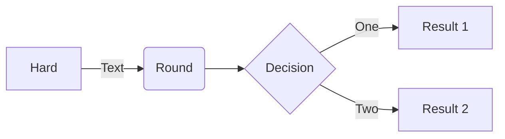
```mermaid
flowchart LR

A[Hard] -->|Text| B(Round)
B --> C{Decision}
C -->|One| D[Result 1]
C -->|Two| E[Result 2]
```

### Sequence diagram [<a href="https://mermaid.js.org/syntax/sequenceDiagram.html">docs</a> - <a href="https://mermaid.live/edit#pako:eNo9kMluwjAQhl_F-AykQMuSA1WrbuLQQ3v1ZbAnsVXHkzrjVhHi3etQwKfRv4w-z0FqMihL2eF3wqDxyUEdoVHhwTuNk-12RzaU4g29JzHMY2HpV0BE0VO6V8ETtdkGz1Zb1F8qiPyG5LX84mrLAmpwoWNh-5a0pWCiAxUwGBXeiVHEU4oq8V_6AHYUwAu2lLLTjVQ4bc1rT2yleI0IfJG320faZ9ABbk-Jz3hZnFxBduR9L2oiM5Jj2WBswJn8-cMArSRbbFDJMo8GK0ielVThmKOpNcD4bBxTlGUFvsOxhMT02QctS44JL6HzAS-iJzCYOwfJfTscunYd542aQuXqQU_RZ9kyt11ZFIM9rR3btJ9qaorOGQuR7c9mWSznyzXMF7hcLeBusTB6P9usq_ntrDKrm9kc5PF4_AMJE56Z">live editor</a>]
```

sequenceDiagram
Alice->>John: Hello John, how are you?
loop HealthCheck
    John->>John: Fight against hypochondria
end
Note right of John: Rational thoughts!
John -->> Alice: Great!
John ->>  Bob: How about you?
Bob  -->> John: Jolly good!
```

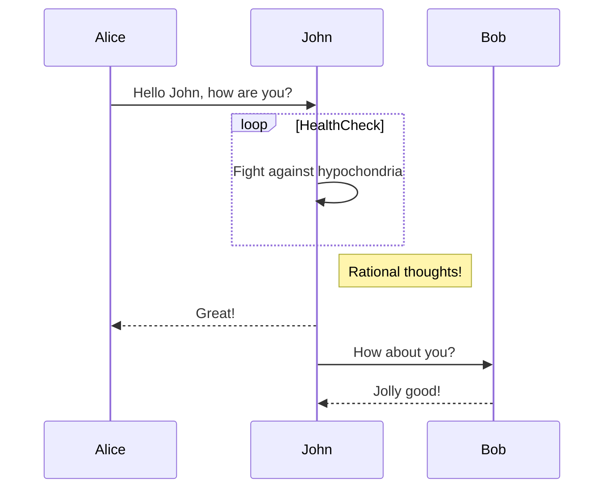
```mermaid
sequenceDiagram
Alice->>John: Hello John, how are you?
loop HealthCheck
    John->>John: Fight against hypochondria
end
Note right of John: Rational thoughts!
John -->> Alice: Great!
John ->>  Bob: How about you?
Bob  -->> John: Jolly good!
```

### Gantt chart [<a href="https://mermaid.js.org/syntax/gantt.html">docs</a> - <a href="https://mermaid.live/edit#pako:eNp90cGOgyAQBuBXIZxtFbG29bbZ3fsmvXKZylhJEAyOTZrGd1_sto3xsHMBhu-HBO689hp5xS_giJQbsCbjHTv9jcp9-q63SKhZpb3DhMXSOIiE5ZkoNpnYZGXynh6U-4jBK7JnVfBYJo9QvgjtEya1cj8QwFq0TMz4lZqxTBg0hOF5m1jifI2Lf7Bc490CyxUu1rhc4GLGPOEdhg6Mjq92V44xxanFDhWv4lRjA6MlxZWbIh17DYTf2pAPvGrADphwGMmfbq7mFYURX-jLwCVA91bWg8YYunO69Y8vMgPFI2vvGnOZ-2Owsd0S9UOVpvP29mKoHc_b2nfpYHQLgdrrsUzLvDxALrHcS9hJqeuzOB6avBCN3mciBz5N0y_wxZ0J">live editor</a>]
```

gantt
    section Section
    Completed  :done,    des1, 2014-01-06,2014-01-08
    Active     :active,  des2, 2014-01-07, 3d
    Parallel 1 :         des3, after des1, 1d
    Parallel 2 :         des4, after des1, 1d
    Parallel 3 :         des5, after des3, 1d
    Parallel 4 :         des6, after des4, 1d
```

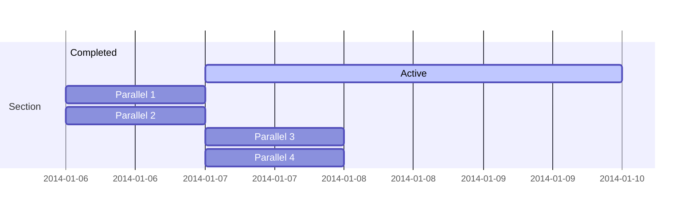
```mermaid
gantt
    section Section
    Completed  :done,    des1, 2014-01-06,2014-01-08
    Active     :active,  des2, 2014-01-07, 3d
    Parallel 1 :         des3, after des1, 1d
    Parallel 2 :         des4, after des1, 1d
    Parallel 3 :         des5, after des3, 1d
    Parallel 4 :         des6, after des4, 1d
```

### Class diagram [<a href="https://mermaid.js.org/syntax/classDiagram.html">docs</a> - <a href="https://mermaid.live/edit#pako:eNpdkTFPwzAQhf-K5QlQ2zQJJG1UBaGWDYmBgYEwXO1LYuTEwXYqlZL_jt02asXm--690zvfgTLFkWaUSTBmI6DS0BTt2lfzkKx-p1PytEO9f1FtdaQkI2ulZNGuVqK1qEtgmOfk7BitSzKdOhg59XuNGgk0RDxed-_IOr6uf8cZ6UhTZ8bvHqS5ub1mr9svZPbjk6DEBlu7AQuXyBkx4gcvDk9cUMJq0XT_YaW0kNK5j-ufAoRzcihaQvLcoN4Jv50vvVxw_xrnD3RCG9QNCO4-8OgpqK1dpoJm7smxhF7agp6kfcfB4jMXVmmalW4tnFDorXrbt4xmVvc4is53GKFUwNF5DtTuO3-sShjrJjLVlqLyvNfS4drazmRB4NuzSti6386YagIjeA3a1rtlEiRRsoAoxiSN4SGOOduGy0UZ3YclT-dhBHQYhj8dc6_I">live editor</a>]
```

classDiagram
Class01 <|-- AveryLongClass : Cool
<<Interface>> Class01
Class09 --> C2 : Where am I?
Class09 --* C3
Class09 --|> Class07
Class07 : equals()
Class07 : Object[] elementData
Class01 : size()
Class01 : int chimp
Class01 : int gorilla
class Class10 {
  <<service>>
  int id
  size()
}
```

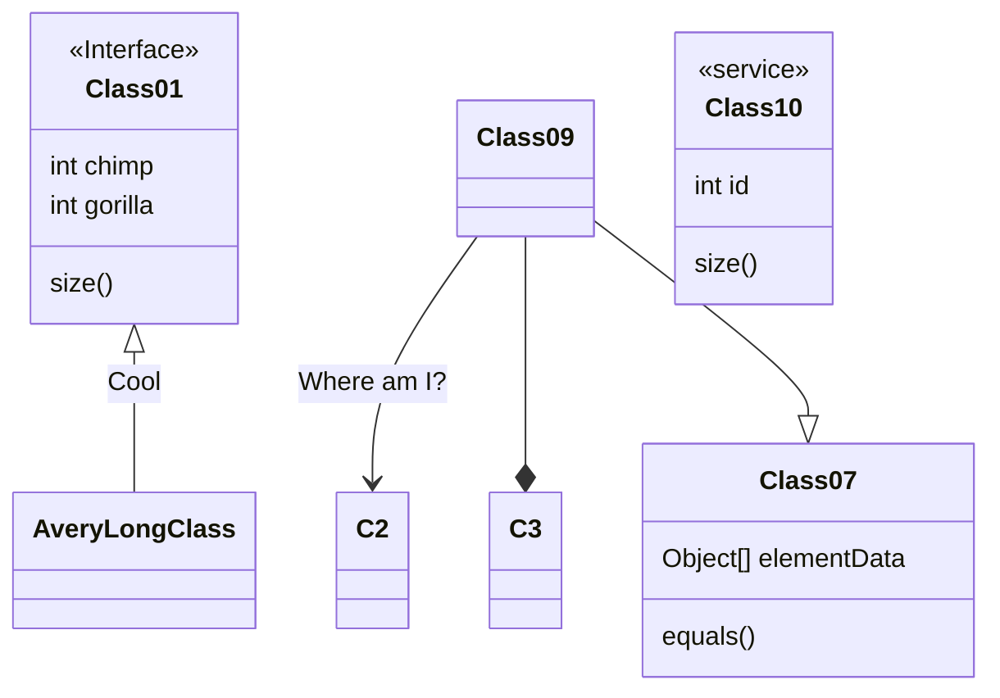
```mermaid
classDiagram
Class01 <|-- AveryLongClass : Cool
<<Interface>> Class01
Class09 --> C2 : Where am I?
Class09 --* C3
Class09 --|> Class07
Class07 : equals()
Class07 : Object[] elementData
Class01 : size()
Class01 : int chimp
Class01 : int gorilla
class Class10 {
  <<service>>
  int id
  size()
}
```

### State diagram [<a href="https://mermaid.js.org/syntax/stateDiagram.html">docs</a> - <a href="https://mermaid.live/edit#pako:eNpdkEFvgzAMhf8K8nEqpYSNthx22Xbcqcexg0sCiZQQlDhIFeK_L8A6TfXp6fOz9ewJGssFVOAJSbwr7ByadGR1n8T6evpO0vQ1uZDSekOrXGFsPqJPO6q-2-imH8f_0TeHXm50lfelsAMjnEHFY6xpMdRAUhhRQxUlFy0GTTXU_RytYeAx-AdXZB1ULWovdoCB7OXWN1CRC-Ju-r3uz6UtchGHJqDbsPygU57iysb2reoWHpyOWBINvsqypb3vFMlw3TfWZF5xiY7keC6zkpUnZIUojwW-FAVvrvn51LLnvOXHQ84Q5nn-AVtLcwk">live editor</a>]
```

stateDiagram-v2
[*] --> Still
Still --> [*]
Still --> Moving
Moving --> Still
Moving --> Crash
Crash --> [*]
```

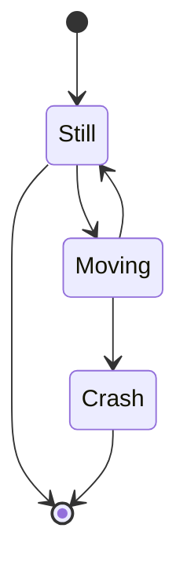
```mermaid
stateDiagram-v2
[*] --> Still
Still --> [*]
Still --> Moving
Moving --> Still
Moving --> Crash
Crash --> [*]
```

### Pie chart [<a href="https://mermaid.js.org/syntax/pie.html">docs</a> - <a href="https://mermaid.live/edit#pako:eNo9jsFugzAMhl8F-VzBgEEh13Uv0F1zcYkTIpEEBadShXj3BU3dzf_n77e8wxQUgYDVkvQSbsFsEgpRtEN_5i_kvzx05XiC-xvUHVzAUXRoVe7v0heFBJ7JkQSRR0Ua08ISpD-ymlaFTN_KcoggNC4bXQATh5-Xn0BwTPSWbhZNRPdvLQEV5dIO_FrPZ43dOJ-cgtfWnDzFJeOZed1EVZ3r0lie06Ocgqs2q2aMPD_HvuqbfsCmpf7aYte2anrU46Cbz1qr60fdIBzH8QvW9lkl">live editor</a>]
```

pie
"Dogs" : 386
"Cats" : 85.9
"Rats" : 15
```

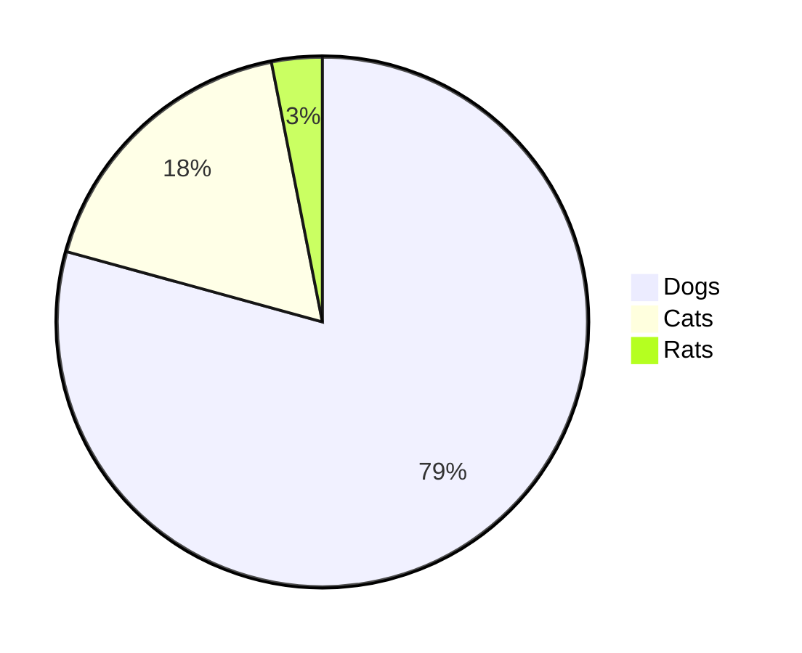
```mermaid
pie
"Dogs" : 386
"Cats" : 85.9
"Rats" : 15
```

### Git graph [experimental - <a href="https://mermaid.live/edit#pako:eNqNkMFugzAMhl8F-VyVAR1tOW_aA-zKxSSGRCMJCk6lCvHuNZPKZdM0n-zf3_8r8QIqaIIGMqnB8kfEybQ--y4VnLP8-9RF9Mpkmm40hmlnDKmvkPiH_kfS7nFo_VN0FAf6XwocQGgxa_nGsm1bYEOOWmik1dRjGrmF1q-Cpkkj07u2HCI0PY4zHQATh8-7V9BwTPSE3iwOEd1OjQE1iWkBvk_bzQY7s0Sq4Hs7bHqKo8iGeZqbPN_WR7mpSd1RHpvPVhuMbG7XOq_L-oJlRfW5wteq0qorrpe-PBW9Pr8UJcK6rg-BLYPQ">live editor</a>]
```

gitGraph
    commit
    commit
    branch develop
    checkout develop
    commit
    commit
    checkout main
    merge develop
    commit
    commit
```

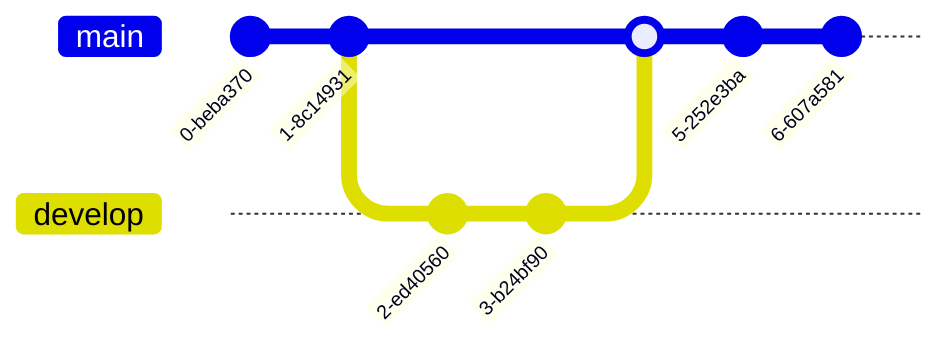
```mermaid
gitGraph
    commit
    commit
    branch develop
    checkout develop
    commit
    commit
    checkout main
    merge develop
    commit
    commit
```

### Bar chart (using gantt chart) [<a href="https://mermaid.js.org/syntax/gantt.html">docs</a> - <a href="https://mermaid.live/edit#pako:eNptkU1vhCAQhv8KIenNugiI4rkf6bmXpvEyFVxJFDYyNt1u9r8X63Z7WQ9m5pknLzieaBeMpQ3dg0dsPUkPOhwteXZIXmJcbCT3xMAxkuh8Z8kIEclyMIB209fqKcwTICFvG4IvFy_oLrZ-g9F26ILfQgvNFN94VaRXQ1iWqpumZBcu1J8p1E1TXDx59eQNr5LyEqjJn6hv5QnGNlxevZJmdLLpy5xJSzut45biYCfb0iaVxvawjNjS1p-TCguG16PvaIPzYjO67e3BwX6GiTY9jPFKH43DMF_hGMDY1J4oHg-_f8hFTJFd8L3br3yZx4QHxENsdrt1nO8dDstH3oVpF50ZYMbhU6ud4qoGLqyqBJRCmO6j0HXPZdGbihUc6Pmc0QP49xD-b5X69ZQv2gjO81IwzWqhC1lKrjJ6pA3nVS7SMiVjrKirWlYp5fs3osgrWeo00lorLWvOzz8JVbXm">live editor</a>]
```

gantt
    title Git Issues - days since last update
    dateFormat  X
    axisFormat %s

    section Issue19062
    71   : 0, 71
    section Issue19401
    36   : 0, 36
    section Issue193
    34   : 0, 34
    section Issue7441
    9    : 0, 9
    section Issue1300
    5    : 0, 5
```


```mermaid
gantt
    title Git Issues - days since last update
    dateFormat  X
    axisFormat %s

    section Issue19062
    71   : 0, 71
    section Issue19401
    36   : 0, 36
    section Issue193
    34   : 0, 34
    section Issue7441
    9    : 0, 9
    section Issue1300
    5    : 0, 5
```

### User Journey diagram [<a href="https://mermaid.js.org/syntax/userJourney.html">docs</a> - <a href="https://mermaid.live/edit#pako:eNplkMFuwjAQRH9l5TMiTVIC-FqqnjhxzWWJN4khsSN7XRSh_HsdKBVt97R6Mzsj-yoqq0hIAXCywRkaSwNxWHNHsB_hYt1ZmwYUfiueKtbWwIcFtjf5zgH2eCZgQgkrCXt64GgMg2fUzkvIn5Xd_V5COtMFvCH_62ht_5yk7MU8sn61HDTfxD8VYiF6cj1qFd94nWkpuKWYKWRcFdUYOi5FaaZoDYNCpnel2Toha-w8LQQGtofRVEKyC_Qw7TQ2DvsfV2dRUTy6Ch6H-UMb7TlGVtbUupl5cF3ELfPgZZLM8rLR3IbjsrJ94rVq0XH7uS2SIis2mOVUrHNc5bmqjul2U2evaa3WL2mGYpqmL2BGiho">live editor</a>]
```

  journey
    title My working day
    section Go to work
      Make tea       : 5  : Me
      Go upstairs    : 3  : Me
      Do work        : 1  : Me, Cat
    section Go home
      Go downstairs  : 5  : Me
      Sit down       : 3  : Me
```

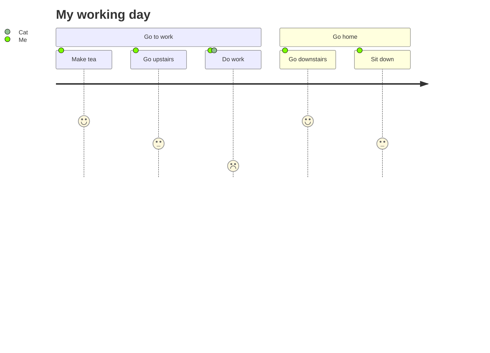
```mermaid
  journey
    title My working day
    section Go to work
      Make tea       : 5  : Me
      Go upstairs    : 3  : Me
      Do work        : 1  : Me, Cat
    section Go home
      Go downstairs  : 5  : Me
      Sit down       : 3  : Me
```


### C4 diagram [<a href="https://mermaid.js.org/syntax/c4.html">docs</a>]

```
C4Context
title System Context diagram for Internet Banking System

Person(customerA, "Banking Customer A", "A customer of the bank, with personal bank accounts.")
Person(customerB, "Banking Customer B")
Person_Ext(customerC, "Banking Customer C")
System(SystemAA, "Internet Banking System", "Allows customers to view information about their bank accounts, and make payments.")

Person(customerD, "Banking Customer D", "A customer of the bank, <br/> with personal bank accounts.")

Enterprise_Boundary(b1, "BankBoundary") {

  SystemDb_Ext(SystemE, "Mainframe Banking System", "Stores all of the core banking information about customers, accounts, transactions, etc.")

  System_Boundary(b2, "BankBoundary2") {
    System(SystemA, "Banking System A")
    System(SystemB, "Banking System B", "A system of the bank, with personal bank accounts.")
  }

  System_Ext(SystemC, "E-mail system", "The internal Microsoft Exchange e-mail system.")
  SystemDb(SystemD, "Banking System D Database", "A system of the bank, with personal bank accounts.")

  Boundary(b3, "BankBoundary3", "boundary") {
    SystemQueue(SystemF, "Banking System F Queue", "A system of the bank, with personal bank accounts.")
    SystemQueue_Ext(SystemG, "Banking System G Queue", "A system of the bank, with personal bank accounts.")
  }
}

BiRel(customerA, SystemAA, "Uses")
BiRel(SystemAA, SystemE, "Uses")
Rel(SystemAA, SystemC, "Sends e-mails", "SMTP")
Rel(SystemC, customerA, "Sends e-mails to")
```

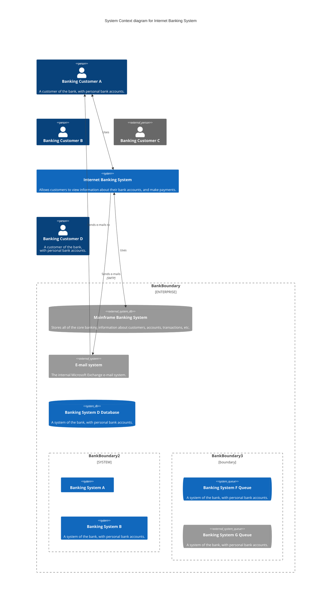
```mermaid
C4Context
title System Context diagram for Internet Banking System

Person(customerA, "Banking Customer A", "A customer of the bank, with personal bank accounts.")
Person(customerB, "Banking Customer B")
Person_Ext(customerC, "Banking Customer C")
System(SystemAA, "Internet Banking System", "Allows customers to view information about their bank accounts, and make payments.")

Person(customerD, "Banking Customer D", "A customer of the bank, <br/> with personal bank accounts.")

Enterprise_Boundary(b1, "BankBoundary") {

  SystemDb_Ext(SystemE, "Mainframe Banking System", "Stores all of the core banking information about customers, accounts, transactions, etc.")

  System_Boundary(b2, "BankBoundary2") {
    System(SystemA, "Banking System A")
    System(SystemB, "Banking System B", "A system of the bank, with personal bank accounts.")
  }

  System_Ext(SystemC, "E-mail system", "The internal Microsoft Exchange e-mail system.")
  SystemDb(SystemD, "Banking System D Database", "A system of the bank, with personal bank accounts.")

  Boundary(b3, "BankBoundary3", "boundary") {
    SystemQueue(SystemF, "Banking System F Queue", "A system of the bank, with personal bank accounts.")
    SystemQueue_Ext(SystemG, "Banking System G Queue", "A system of the bank, with personal bank accounts.")
  }
}

BiRel(customerA, SystemAA, "Uses")
BiRel(SystemAA, SystemE, "Uses")
Rel(SystemAA, SystemC, "Sends e-mails", "SMTP")
Rel(SystemC, customerA, "Sends e-mails to")
```

## Release

For those who have the permission to do so:

Update version number in `package.json`.

```sh
npm publish
```

The above command generates files into the `dist` folder and publishes them to <https://www.npmjs.com>.

## Related projects

- [Command Line Interface](https://github.com/mermaid-js/mermaid-cli)
- [Live Editor](https://github.com/mermaid-js/mermaid-live-editor)
- [HTTP Server](https://github.com/TomWright/mermaid-server)

## Contributors [](https://github.com/mermaid-js/mermaid/issues?q=is%3Aissue+is%3Aopen+label%3A%22Good+first+issue%21%22) [](https://github.com/mermaid-js/mermaid/graphs/contributors) [](https://github.com/mermaid-js/mermaid/graphs/contributors)

Mermaid is a growing community and is always accepting new contributors. There's a lot of different ways to help out and we're always looking for extra hands! Look at [this issue](https://github.com/mermaid-js/mermaid/issues/866) if you want to know where to start helping out.

Detailed information about how to contribute can be found in the [contribution guide](https://mermaid.js.org/community/contributing.html)


# üìî Custom SVG Shapes Library

This library provides a collection of custom SVG shapes, utilities, and helpers for generating diagram components. The shapes are designed to be used within an SVG container and include a variety of common and complex shapes.

## Overview

## Shape Helpers and Utilities

Before starting with shape creation, it's essential to familiarize yourself with the utilities provided in the `utils.ts` file from `packages/mermaid/src/rendering-util/rendering-elements/shapes/util.js`. These utilities are designed to assist with various aspects of SVG shape manipulation and ensure consistent and accurate rendering.

## Available Utilities

### 1. `labelHelper`

- **Purpose**: This function creates and inserts labels inside SVG shapes.
- **Features**:
  - Handles both HTML labels and plain text.
  - Calculates the bounding box dimensions of the label.
  - Ensures proper positioning of labels within shapes.

### 2. `updateNodeBounds`

- **Purpose**: Updates the bounding box dimensions (width and height) of a node.
- **Usage**:
  - Adjusts the size of the node to fit the content or shape.
  - Useful for ensuring that shapes resize appropriately based on their content.

### 3. `insertPolygonShape`

- **Purpose**: Inserts a polygon shape into an SVG container.
- **Features**:
  - Handles the creation and insertion of complex polygonal shapes.
  - Configures the shape's appearance and positioning within the SVG container.

### 4. `getNodeClasses`

- **Purpose**: Returns the appropriate CSS classes for a node based on its configuration.
- **Usage**:
  - Dynamically applies CSS classes to nodes for styling purposes.
  - Ensures that nodes adhere to the desired design and theme.

### 5. `createPathFromPoints`

- **Purpose**: Generates an SVG path string from an array of points.
- **Usage**:
  - Converts a list of points into a smooth path.
  - Useful for creating custom shapes or paths within the SVG.

### 6. `generateFullSineWavePoints`

- **Purpose**: Generates points for a sine wave, useful for creating wavy-edged shapes.
- **Usage**:
  - Facilitates the creation of shapes with wavy or sine-wave edges.
  - Can be used to add decorative or dynamic edges to shapes.

## Getting Started

To utilize these utilities, simply import them from the `utils.ts` file into your shape creation script. These helpers will streamline the process of building and customizing SVG shapes, ensuring consistent results across your projects.

```typescript
import {
  labelHelper,
  updateNodeBounds,
  insertPolygonShape,
  getNodeClasses,
  createPathFromPoints,
  generateFullSineWavePoints,
} from './utils.ts';
```

## Example Usage

Here’s a basic example of how you might use some of these utilities:

```typescript
import { labelHelper, insertPolygonShape } from './utils.ts';

const svgContainer = document.getElementById('svgContainer');

// Insert a polygon shape
insertPolygonShape(svgContainer /* shape-specific parameters */);

// Create and insert a label inside the shape
labelHelper(svgContainer /* label-specific parameters */);
```

## Adding New Shapes

### 1. Create the Shape Function

To add a new shape:

- **Create the shape function**: Create a new file of name of the shape and export a function in the `shapes` directory that generates your shape. The file and function should follow the pattern used in existing shapes and return an SVG element.

- **Example**:

  ```typescript
  import { Node, RenderOptions } from '../../types.ts';

  export const myNewShape = async (
    parent: SVGAElement,
    node: Node,
    renderOptions: RenderOptions
  ) => {
    // Create your shape here
    const shape = parent.insert('g').attr('class', 'my-new-shape');
    // Add other elements or styles as needed
    return shape;
  };
  ```

### 2. Register the Shape

- **Register the shape**: Add your shape to the `shapes` object in the [main shapes module](../rendering-util/rendering-elements/shapes.ts). This allows your shape to be recognized and used within the system.

- **Example**:

  ```typescript
  import { myNewShape } from './shapes/myNewShape';

  const shapes = {
    ...,
    {
      semanticName: 'My Shape',
      name: 'Shape Name',
      shortName: '<short-name>',
      description: '<Description for the shape>',
      aliases: ['<alias-one>', '<al-on>', '<alias-two>', '<al-two>'],
      handler: myNewShape,
    },
  };
  ```

## Shape Intersection Algorithms

This contains algorithms and utilities for calculating intersection points for various shapes in SVG. Arrow intersection points are crucial for accurately determining where arrows connect with shapes. Ensuring precise intersection points enhances the clarity and accuracy of flowcharts and diagrams.

## Shape Intersection Functions

### 1. `Ellipse`

Calculates the intersection points for an ellipse.

**Usage**:

```javascript
import intersectEllipse from './intersect-ellipse.js';

const intersection = intersectEllipse(node, rx, ry, point);
```

- **Parameters**:
  - `node`: The SVG node element.
  - `rx`: The x-radius of the ellipse.
  - `ry`: The y-radius of the ellipse.
  - `point`: The point from which the intersection is calculated.

### 2. `intersectRect`

Calculates the intersection points for a rectangle.

**Usage**:

```javascript
import intersectRect from './intersect-rect.js';

const intersection = intersectRect(node, point);
```

- **Parameters**:
  - `node`: The SVG node element.
  - `point`: The point from which the intersection is calculated.

### 3. `intersectPolygon`

Calculates the intersection points for a polygon.

**Usage**:

```javascript
import intersectPolygon from './intersect-polygon.js';

const intersection = intersectPolygon(node, polyPoints, point);
```

- **Parameters**:
  - `node`: The SVG node element.
  - `polyPoints`: Array of points defining the polygon.
  - `point`: The point from which the intersection is calculated.

## Cypress Tests

To ensure the robustness of the flowchart shapes, there are implementation of comprehensive Cypress test cases in `newShapes.spec.ts` file. These tests cover various aspects such as:

- **Shapes**: Testing new shapes like `bowTieRect`, `waveRectangle`, `trapezoidalPentagon`, etc.
- **Looks**: Verifying shapes under different visual styles (`classic` and `handDrawn`).
- **Directions**: Ensuring correct rendering in all flow directions of arrows :
  - `TB` `(Top -> Bottom)`
  - `BT` `(Bottom -> Top)`
  - `LR` `(Left -> Right)`
  - `RL` `(Right -> Left)`
- **Labels**: Testing shapes with different labels, including:
  - No labels
  - Short labels
  - Very long labels
  - Markdown with `htmlLabels:true` and `htmlLabels:false`
- **Styles**: Applying custom styles to shapes and verifying correct rendering.
- **Class Definitions**: Using `classDef` to apply custom classes and testing their impact.

### Running the Tests

To run the Cypress tests, follow these steps:

1. Ensure you have all dependencies installed by running:
   ```bash
   pnpm install
   ```
2. Start the Cypress test runner:

   ```bash
   cypress open --env updateSnapshots=true

   ```

3. Select the test suite from the Cypress interface to run all the flowchart shape tests.

# üìî mermaid Changelog

## 11.4.1

### Patch Changes

- [#6059](https://github.com/mermaid-js/mermaid/pull/6059) [`01b5079`](https://github.com/mermaid-js/mermaid/commit/01b5079562ec8d34ce9964910f168873843c68f8) Thanks [@knsv](https://github.com/knsv)! - fix: Kanban diagrams will not render when adding a number as ticket id or assigned for a task

- [#6038](https://github.com/mermaid-js/mermaid/pull/6038) [`1388662`](https://github.com/mermaid-js/mermaid/commit/1388662132cc829f9820c2e9970ae04e2dd90588) Thanks [@knsv](https://github.com/knsv)! - fix: Intersection calculations for tilted cylinder/DAS when using handdrawn look. Some random seeds could cause the calculations to break.

- [#6079](https://github.com/mermaid-js/mermaid/pull/6079) [`fe3cffb`](https://github.com/mermaid-js/mermaid/commit/fe3cffbb673a25b81989aacb06e5d0eda35326db) Thanks [@aloisklink](https://github.com/aloisklink)! - Bump dompurify to `^3.2.1`. This removes the need for `@types/dompurify`.

## 11.4.0

### Minor Changes

- [#5999](https://github.com/mermaid-js/mermaid/pull/5999) [`742ad7c`](https://github.com/mermaid-js/mermaid/commit/742ad7c130964df1fb5544e909d9556081285f68) Thanks [@knsv](https://github.com/knsv)! - Adding Kanban board, a new diagram type

- [#5880](https://github.com/mermaid-js/mermaid/pull/5880) [`bdf145f`](https://github.com/mermaid-js/mermaid/commit/bdf145ffe362462176d9c1e68d5f3ff5c9d962b0) Thanks [@yari-dewalt](https://github.com/yari-dewalt)! - Class diagram changes:

  - Updates the class diagram to the new unified way of rendering.
  - Includes a new "classBox" shape to be used in diagrams
  - Other updates such as:
    - the option to hide the empty members box in class diagrams,
    - support for handDrawn look,
    - the introduction of the classDef statement into class diagrams,
    - support for styling the default class,
    - support lollipop interfaces.
  - Includes fixes / additions for #5562 #3139 and #4037

### Patch Changes

- [#5937](https://github.com/mermaid-js/mermaid/pull/5937) [`17b7831`](https://github.com/mermaid-js/mermaid/commit/17b783135f9b2b7748b620dbf81d0f56ab4755f1) Thanks [@saurabhg772244](https://github.com/saurabhg772244)! - fix: Jagged edge fix for icon shape

- [#5933](https://github.com/mermaid-js/mermaid/pull/5933) [`72d60d2`](https://github.com/mermaid-js/mermaid/commit/72d60d2633584eb59bccdb6cf30b9522db645db2) Thanks [@remcohaszing](https://github.com/remcohaszing)! - Add missing TypeScript dependencies

- [#5937](https://github.com/mermaid-js/mermaid/pull/5937) [`17b7831`](https://github.com/mermaid-js/mermaid/commit/17b783135f9b2b7748b620dbf81d0f56ab4755f1) Thanks [@saurabhg772244](https://github.com/saurabhg772244)! - fix: Icon color fix for colored icons.

- [#6002](https://github.com/mermaid-js/mermaid/pull/6002) [`5fabd41`](https://github.com/mermaid-js/mermaid/commit/5fabd414fbee01e43bf6c900907ffc1511ca7440) Thanks [@aloisklink](https://github.com/aloisklink)! - fix: error `mermaid.parse` on an invalid shape, so that it matches the errors thrown by `mermaid.render`

## 11.3.0

### Minor Changes

- [#5825](https://github.com/mermaid-js/mermaid/pull/5825) [`9e3aa70`](https://github.com/mermaid-js/mermaid/commit/9e3aa705ae21fd4898504ab22d775a9e437b898e) Thanks [@ashishjain0512](https://github.com/ashishjain0512)! - New Flowchart Shapes (with new syntax)

### Patch Changes

- [#5849](https://github.com/mermaid-js/mermaid/pull/5849) [`6c5b7ce`](https://github.com/mermaid-js/mermaid/commit/6c5b7ce9f41c0fbd59fe03dbefc8418d97697f0a) Thanks [@ReneLombard](https://github.com/ReneLombard)! - Fixed an issue when the mermaid classdiagram crashes when adding a . to the namespace.
  Forexample

  ```mermaid
  classDiagram
    namespace Company.Project.Module {
      class GenericClass~T~ {
        +addItem(item: T)
        +getItem() T
      }
    }
  ```

- [#5914](https://github.com/mermaid-js/mermaid/pull/5914) [`de2c05c`](https://github.com/mermaid-js/mermaid/commit/de2c05cd5463af68d19dd7b6b3f1303d69ddb2dd) Thanks [@aloisklink](https://github.com/aloisklink)! - Ban DOMPurify v3.1.7 as a dependency

## 11.2.1

### Patch Changes

- [#5856](https://github.com/mermaid-js/mermaid/pull/5856) [`bfd8c63`](https://github.com/mermaid-js/mermaid/commit/bfd8c63daaa8420e57da9953922b9f0c94123064) Thanks [@knsv](https://github.com/knsv)! - Fix for issue with calculation of label width when using in firefox

## 11.2.0

### Minor Changes

- [#5831](https://github.com/mermaid-js/mermaid/pull/5831) [`64abf29`](https://github.com/mermaid-js/mermaid/commit/64abf29ea870eaa47148197f95ce714f85bd7eea) Thanks [@sidharthv96](https://github.com/sidharthv96)! - feat: Return parsed config from mermaid.parse

### Patch Changes

- [#5838](https://github.com/mermaid-js/mermaid/pull/5838) [`5e75320`](https://github.com/mermaid-js/mermaid/commit/5e75320d49eab65aca630dcc3c04c8d620a8bbf7) Thanks [@bollwyvl](https://github.com/bollwyvl)! - fix: Replace $root with relative paths

## 11.1.1

### Patch Changes

- [#5828](https://github.com/mermaid-js/mermaid/pull/5828) [`4c43d21`](https://github.com/mermaid-js/mermaid/commit/4c43d21196f784b6f483ae635fc462329f3d176f) Thanks [@knsv](https://github.com/knsv)! - fix: Fix for issue where self-loops in the root of diagrams break the rendering

## 11.1.0

### Minor Changes

- [#5793](https://github.com/mermaid-js/mermaid/pull/5793) [`6ecdf7b`](https://github.com/mermaid-js/mermaid/commit/6ecdf7be688efdc53c52fea3ba891327242bc890) Thanks [@sidharthv96](https://github.com/sidharthv96)! - feat: Add support for iconify icons

- [#5711](https://github.com/mermaid-js/mermaid/pull/5711) [`8e640da`](https://github.com/mermaid-js/mermaid/commit/8e640da5436e8ae013b11b1c1821a9afcc15d0d3) Thanks [@NicolasNewman](https://github.com/NicolasNewman)! - feat(er): allow multi-line relationship labels

- [#5452](https://github.com/mermaid-js/mermaid/pull/5452) [`256a148`](https://github.com/mermaid-js/mermaid/commit/256a148bbf484fc7db6c19f94dd69d5d268ee048) Thanks [@NicolasNewman](https://github.com/NicolasNewman)! - New Diagram: Architecture

  Adds architecture diagrams which allows users to show relations between services.

### Patch Changes

- [#5810](https://github.com/mermaid-js/mermaid/pull/5810) [`28bd07f`](https://github.com/mermaid-js/mermaid/commit/28bd07fdeb4fc981107d21317ec6160b31f80116) Thanks [@knsv](https://github.com/knsv)! - Fix for self loops in cluster
  Supporting legacy defaultRenderer directive

- [#5789](https://github.com/mermaid-js/mermaid/pull/5789) [`16faef4`](https://github.com/mermaid-js/mermaid/commit/16faef4613b91a7d3a98a1563c25b57f9238acc7) Thanks [@sidharthv96](https://github.com/sidharthv96)! - chore: Move icons to architecture, remove full icon sets to reduce bundle size

- Updated dependencies [[`256a148`](https://github.com/mermaid-js/mermaid/commit/256a148bbf484fc7db6c19f94dd69d5d268ee048), [`7d8143b`](https://github.com/mermaid-js/mermaid/commit/7d8143b917ee3562149a0e0a821ed2d6f29cc05d)]:
  - @mermaid-js/parser@0.3.0

## 11.0.2

### Patch Changes

- [#5664](https://github.com/mermaid-js/mermaid/pull/5664) [`5deaef4`](https://github.com/mermaid-js/mermaid/commit/5deaef456e74d796866431c26f69360e4e74dbff) Thanks [@Austin-Fulbright](https://github.com/Austin-Fulbright)! - chore: Migrate git graph to langium, use typescript for internals

- Updated dependencies [[`5deaef4`](https://github.com/mermaid-js/mermaid/commit/5deaef456e74d796866431c26f69360e4e74dbff)]:
  - @mermaid-js/parser@0.2.0

## 11.0.1

### Patch Changes

- [#2](https://github.com/calvinvette/mermaid/pull/2) [`bf05d87`](https://github.com/mermaid-js/mermaid/commit/bf05d8781edacb580fdb053da167e968b7570117) Thanks [@calvinvette](https://github.com/calvinvette)! - test changeset

## 11.0.2

### Patch Changes

- Updated dependencies [[`83926c9`](https://github.com/mermaid-js/mermaid/commit/83926c9707b09c34e300888186250191ee8ae30a)]:
  - @mermaid-js/parser@0.1.1

## 11.0.1

### Patch Changes

- [#5744](https://github.com/mermaid-js/mermaid/pull/5744) [`5013484`](https://github.com/mermaid-js/mermaid/commit/50134849246141ec400e33e08c12c10539b84de9) Thanks [@sidharthv96](https://github.com/sidharthv96)! - Release parser, test changesets

- Updated dependencies [[`5013484`](https://github.com/mermaid-js/mermaid/commit/50134849246141ec400e33e08c12c10539b84de9)]:
  - @mermaid-js/parser@0.1.0

# üìî Introduction

# About Mermaid

**Mermaid lets you create diagrams and visualizations using text and code.**

It is a JavaScript based diagramming and charting tool that renders Markdown-inspired text definitions to create and modify diagrams dynamically.

> If you are familiar with Markdown you should have no problem learning [Mermaid's Syntax](#syntax-reference.md).

<!-- <Main description> -->

Mermaid is a JavaScript based diagramming and charting tool that uses Markdown-inspired text definitions and a renderer to create and modify complex diagrams. The main purpose of Mermaid is to help documentation catch up with development.

> Doc-Rot is a Catch-22 that Mermaid helps to solve.

Diagramming and documentation costs precious developer time and gets outdated quickly.
But not having diagrams or docs ruins productivity and hurts organizational learning.<br/>
Mermaid addresses this problem by enabling users to create easily modifiable diagrams, it can also be made part of production scripts (and other pieces of code).<br/>
<br/>
Mermaid allows even non-programmers to easily create detailed and diagrams through the [Mermaid Live Editor](https://mermaid.live/).<br/>
[Tutorials](#./ecosystem/tutorials.md) has video tutorials.

Use Mermaid with your favorite applications, check out the list of [Community Integrations](#./ecosystem/integrations-community.md).

For a more detailed introduction to Mermaid and some of its more basic uses, look to the [Beginner's Guide](#./intro/getting-started.md) and [Usage](#./config/usage.md).

üåê [CDN](https://www.jsdelivr.com/package/npm/mermaid) | üìñ [Documentation](https://mermaidjs.github.io) | üôå [Contribution](#./community/contributing.md) | üîå [Plug-Ins](#./ecosystem/integrations-community.md)

> üññ Keep a steady pulse: mermaid needs more Collaborators, [Read More](https://github.com/mermaid-js/mermaid/issues/866).

:trophy: **Mermaid was nominated and won the [JS Open Source Awards (2019)](https://osawards.com/javascript/#nominees) in the category "The most exciting use of technology"!!!**

**Thanks to all involved, people committing pull requests, people answering questions and special thanks to Tyler Long who is helping me maintain the project üôè**

Our PR Visual Regression Testing is powered by [Argos](https://argos-ci.com/?utm_source=mermaid&utm_campaign=oss) with their generous Open Source plan. It makes the process of reviewing PRs with visual changes a breeze.

[](https://argos-ci.com?utm_source=mermaid&utm_campaign=oss)

In our release process we rely heavily on visual regression tests using [applitools](https://applitools.com/). Applitools is a great service which has been easy to use and integrate with our tests.


<!--@include: ./examples.md -->
## Diagram Types

### [Flowchart](#./syntax/flowchart.md?id=flowcharts-basic-syntax)


```mermaid-example
graph TD;
    A-->B;
    A-->C;
    B-->D;
    C-->D;
```

### [Sequence diagram](#./syntax/sequenceDiagram.md)

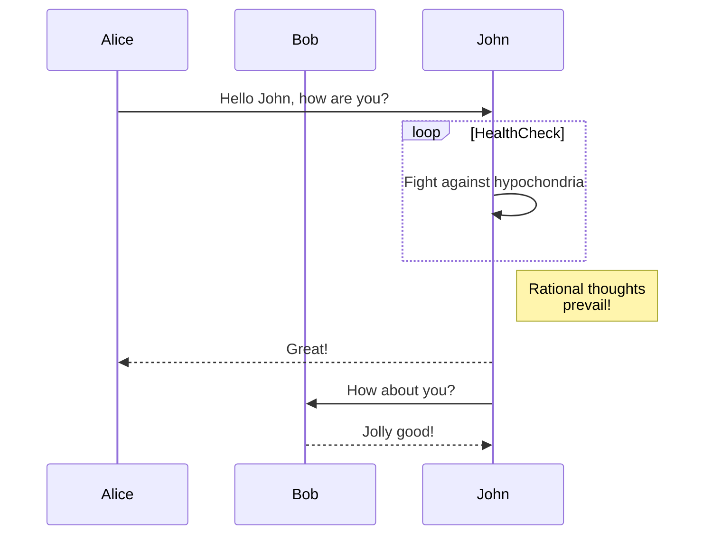
```mermaid-example
sequenceDiagram
    participant Alice
    participant Bob
    Alice->>John: Hello John, how are you?
    loop HealthCheck
        John->>John: Fight against hypochondria
    end
    Note right of John: Rational thoughts <br/>prevail!
    John-->>Alice: Great!
    John->>Bob: How about you?
    Bob-->>John: Jolly good!
```

### [Gantt diagram](#./syntax/gantt.md)

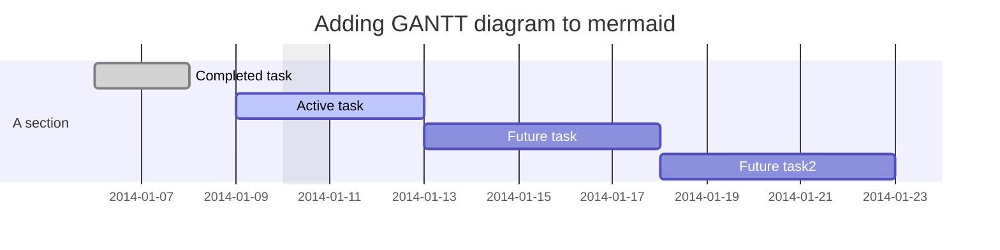
```mermaid-example
gantt
dateFormat  YYYY-MM-DD
title Adding GANTT diagram to mermaid
excludes weekdays 2014-01-10

section A section
Completed task            :done,    des1, 2014-01-06,2014-01-08
Active task               :active,  des2, 2014-01-09, 3d
Future task               :         des3, after des2, 5d
Future task2               :         des4, after des3, 5d
```

### [Class diagram](#./syntax/classDiagram.md)

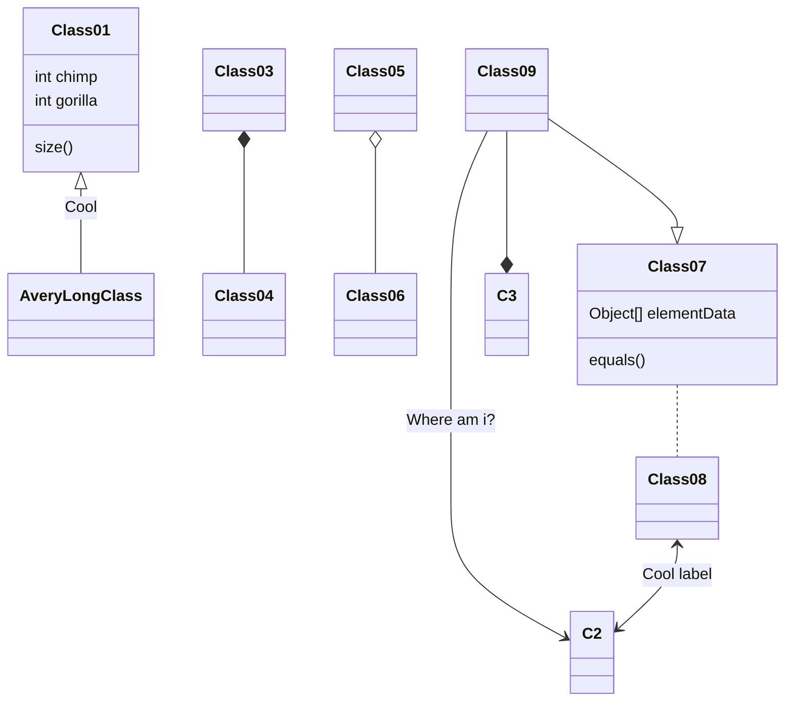
```mermaid-example
classDiagram
Class01 <|-- AveryLongClass : Cool
Class03 *-- Class04
Class05 o-- Class06
Class07 .. Class08
Class09 --> C2 : Where am i?
Class09 --* C3
Class09 --|> Class07
Class07 : equals()
Class07 : Object[] elementData
Class01 : size()
Class01 : int chimp
Class01 : int gorilla
Class08 <--> C2: Cool label
```

### [Git graph](#./syntax/gitgraph.md)

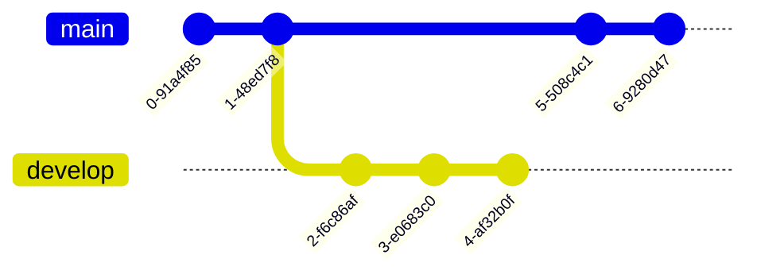
```mermaid-example
    gitGraph
       commit
       commit
       branch develop
       commit
       commit
       commit
       checkout main
       commit
       commit
```

### [Entity Relationship Diagram - :exclamation: experimental](#./syntax/entityRelationshipDiagram.md)

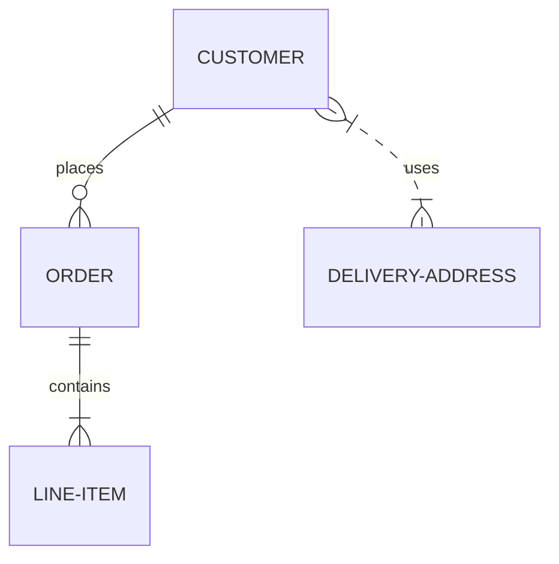
```mermaid-example
erDiagram
    CUSTOMER ||--o{ ORDER : places
    ORDER ||--|{ LINE-ITEM : contains
    CUSTOMER }|..|{ DELIVERY-ADDRESS : uses
```


### [User Journey Diagram](#./syntax/userJourney.md)

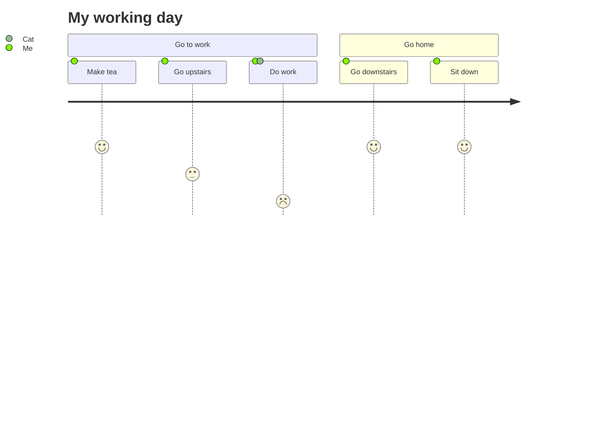
```mermaid-example
journey
    title My working day
    section Go to work
      Make tea: 5: Me
      Go upstairs: 3: Me
      Do work: 1: Me, Cat
    section Go home
      Go downstairs: 5: Me
      Sit down: 5: Me
```

### [Quadrant Chart](#./syntax/quadrantChart.md)

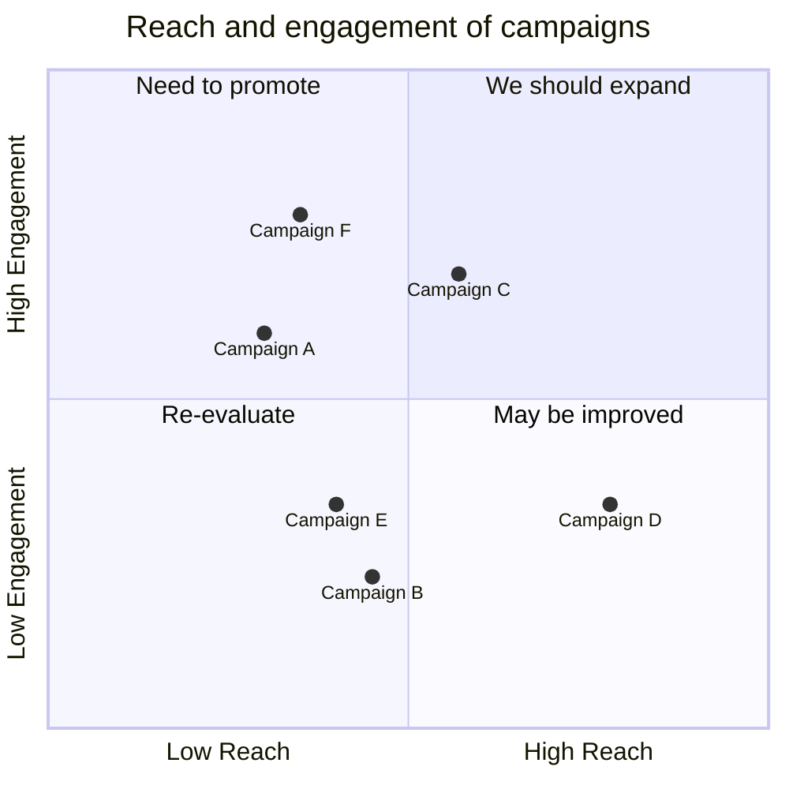
```mermaid-example
quadrantChart
    title Reach and engagement of campaigns
    x-axis Low Reach --> High Reach
    y-axis Low Engagement --> High Engagement
    quadrant-1 We should expand
    quadrant-2 Need to promote
    quadrant-3 Re-evaluate
    quadrant-4 May be improved
    Campaign A: [0.3, 0.6]
    Campaign B: [0.45, 0.23]
    Campaign C: [0.57, 0.69]
    Campaign D: [0.78, 0.34]
    Campaign E: [0.40, 0.34]
    Campaign F: [0.35, 0.78]
```

### [XY Chart](#./syntax/xyChart.md)

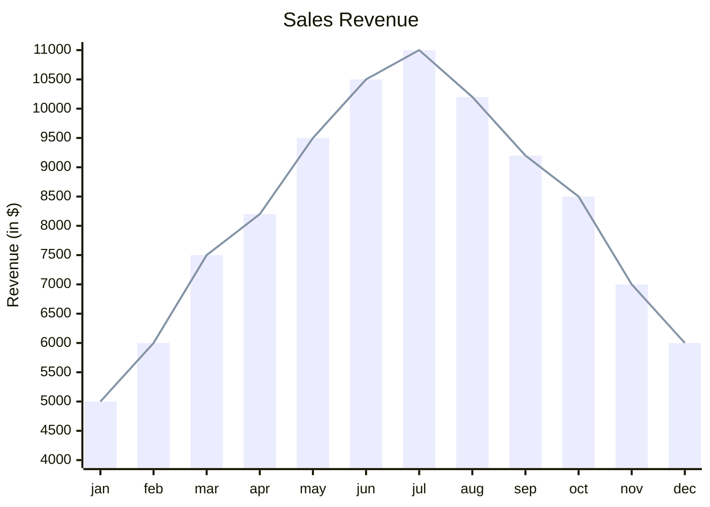
```mermaid-example
xychart-beta
    title "Sales Revenue"
    x-axis [jan, feb, mar, apr, may, jun, jul, aug, sep, oct, nov, dec]
    y-axis "Revenue (in $)" 4000 --> 11000
    bar [5000, 6000, 7500, 8200, 9500, 10500, 11000, 10200, 9200, 8500, 7000, 6000]
    line [5000, 6000, 7500, 8200, 9500, 10500, 11000, 10200, 9200, 8500, 7000, 6000]
```

## Installation

**In depth guides and examples can be found at [Getting Started](./getting-started.md) and [Usage](#./config/usage.md).**

**It would also be helpful to learn more about mermaid's [Syntax](./syntax-reference.md).**

### CDN

```
<CDN_URL>/mermaid@<version>/dist/
```

To select a version:

Replace `<version>` with the desired version number.

Latest Version: [<CDN_URL>/mermaid@<MERMAID_VERSION>](<CDN_URL>/mermaid@<MERMAID_VERSION>)

## Deploying Mermaid

To Deploy Mermaid:

1. You will need to install node v16, which would have npm
2. Install mermaid
   - NPM: `npm i mermaid`
   - Yarn: `yarn add mermaid`
   - Pnpm: `pnpm add mermaid`

### [Mermaid API](#./config/setup/README.md):

**To deploy mermaid without a bundler, insert a `script` tag with an absolute address and a `mermaid.initialize` call into the HTML using the following example:**

```html
<script type="module">
  import mermaid from '<CDN_URL>/mermaid@<MERMAID_VERSION>/dist/mermaid.esm.min.mjs';
  mermaid.initialize({ startOnLoad: true });
</script>
```

**Doing so commands the mermaid parser to look for the `<div>` or `<pre>` tags with `class="mermaid"`. From these tags, mermaid tries to read the diagram/chart definitions and render them into SVG charts.**

**Examples can be found in** [Other examples](#./syntax/examples.md)

## Sibling projects

- [Mermaid Live Editor](https://github.com/mermaid-js/mermaid-live-editor)
- [Mermaid CLI](https://github.com/mermaid-js/mermaid-cli)
- [Mermaid Webpack Demo](https://github.com/mermaidjs/mermaid-webpack-demo)
- [Mermaid Parcel Demo](https://github.com/mermaidjs/mermaid-parcel-demo)

## Request for Assistance

Things are piling up and I have a hard time keeping up. It would be great if we could form a core team of developers to cooperate
with the future development of mermaid.

As part of this team you would get write access to the repository and would
represent the project when answering questions and issues.

Together we could continue the work with things like:

- Adding more types of diagrams like mindmaps, ert diagrams, etc.
- Improving existing diagrams

Don't hesitate to contact me if you want to get involved!

## Contributors

<div class='badges'>

[](https://github.com/mermaid-js/mermaid/issues?q=is%3Aissue+is%3Aopen+label%3A%22Good+first+issue%21%22)
[](https://github.com/mermaid-js/mermaid/graphs/contributors)
[](https://github.com/mermaid-js/mermaid/graphs/contributors)

</div>

Mermaid is a growing community and is always accepting new contributors. There's a lot of different ways to help out and we're always looking for extra hands! Look at [this issue](https://github.com/mermaid-js/mermaid/issues/866) if you want to know where to start helping out.

Detailed information about how to contribute can be found in the [contribution guideline](#./community/contributing.md).

### Requirements

- [volta](https://volta.sh/) to manage node versions.
- [Node.js](https://nodejs.org/en/). `volta install node`
- [pnpm](https://pnpm.io/) package manager. `volta install pnpm`

### Development Installation

```bash
git clone git@github.com:mermaid-js/mermaid.git
cd mermaid
# npx is required for first install as volta support for pnpm is not added yet.
npx pnpm install
pnpm test
```

### Lint

```sh
pnpm lint
```

We use [eslint](https://eslint.org/).
We recommend you to install [editor plugins](https://eslint.org/docs/user-guide/integrations) to get real time lint result.

### Test

```sh
pnpm test
```

Manual test in browser: open `dist/index.html`

### Release

For those who have the permission to do so:

Update version number in `package.json`.

```sh
npm publish
```

The above command generates files into the `dist` folder and publishes them to [npmjs.com](https://www.npmjs.com/).

## Security and safe diagrams

For public sites, it can be precarious to retrieve text from users on the internet, storing that content for presentation in a browser at a later stage. The reason is that the user content can contain embedded malicious scripts that will run when the data is presented. For Mermaid this is a risk, specially as mermaid diagrams contain many characters that are used in html which makes the standard sanitation unusable as it also breaks the diagrams. We still make an effort to sanitize the incoming code and keep refining the process but it is hard to guarantee that there are no loop holes.

As an extra level of security for sites with external users we are happy to introduce a new security level in which the diagram is rendered in a sandboxed iframe preventing JavaScript in the code from being executed. This is a great step forward for better security.

_Unfortunately you can not have a cake and eat it at the same time which in this case means that some of the interactive functionality gets blocked along with the possible malicious code._

## Reporting vulnerabilities

To report a vulnerability, please e-mail security@mermaid.live with a description of the issue, the steps you took to create the issue, affected versions, and if known, mitigations for the issue.

## Appreciation

A quick note from Knut Sveidqvist:

> _Many thanks to the [d3](https://d3js.org/) and [dagre-d3](https://github.com/cpettitt/dagre-d3) projects for providing the graphical layout and drawing libraries!_
>
> _Thanks also to the [js-sequence-diagram](https://bramp.github.io/js-sequence-diagrams) project for usage of the grammar for the sequence diagrams. Thanks to Jessica Peter for inspiration and starting point for gantt rendering._
>
> _Thank you to [Tyler Long](https://github.com/tylerlong) who has been a collaborator since April 2017._
>
> _Thank you to the ever-growing list of [contributors](https://github.com/mermaid-js/mermaid/graphs/contributors) that brought the project this far!_

---

_Mermaid was created by Knut Sveidqvist for easier documentation._


# Mermaid User Guide

## Mermaid is composed of three parts

1. Deployment
2. Syntax
3. Configuration

This section talks about the different ways to **deploy** Mermaid.

If you are a beginner:

- Check out the [Diagram Syntax](#syntax-reference.md) page
- Check out the [Tutorials](#./ecosystem/tutorials.md) page

## Ways to use Mermaid

1. [Using the Mermaid Live Editor](#_1-using-the-mermaid-live-editor)
2. [Using the Mermaid Chart Editor](#_2-using-the-mermaid-chart-editor)
3. [Using Mermaid Plugins and Integrations](#_3-using-mermaid-plugins)
4. [Calling the Mermaid JavaScript API](#_4-calling-the-mermaid-javascript-api)
5. [Adding Mermaid as a dependency](#_5-adding-mermaid-as-a-dependency)

To learn more, visit the [Usage](#./config/usage.md) page.

## 1. Using the Mermaid Live Editor

Available at the [Mermaid Live Editor](https://mermaid.live) website.

### Features

<br />

#### • Diagram Code

In the `Code` panel, write or edit Mermaid code, and instantly `Preview` the rendered result in the diagram panel.

Here is an example of Mermaid code and its rendered result:

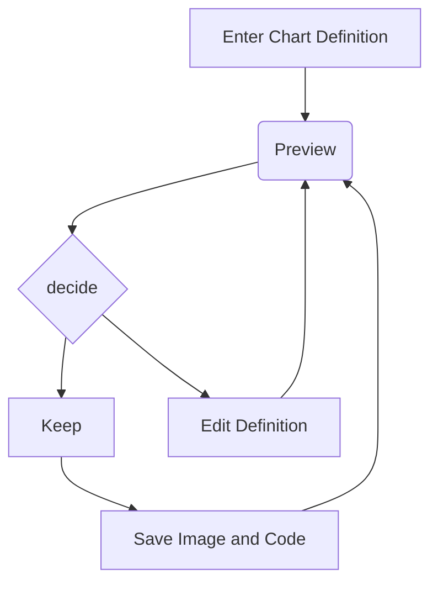
```mermaid
graph TD
    A[Enter Chart Definition] --> B(Preview)
    B --> C{decide}
    C --> D[Keep]
    C --> E[Edit Definition]
    E --> B
    D --> F[Save Image and Code]
    F --> B
```

<br />

#### • Configurations

Configuration options are available in the `Configuration` panel. The options are applied to the diagram in the `Preview` panel.

To learn more, visit the [Configuration Reference](#./config/setup/README.md) page


<br />

#### • Editing History

Your code will be autosaved and appear in the `Timeline` tab of the `History` section. Edits are saved every minute and only the last 30 edits are viewable.

Alternatively, you can manually save code by clicking on the `Save` icon from the `History` section.

```note
History is stored in the browser storage only.
```

<br />

#### • Saving a diagram

There are multiple ways of saving your diagram from the `Actions` section:

- export PNG
- export SVG
- export as Markdown


<br />

#### • Editing your diagrams

To edit your diagram, you can copy paste existing Mermaid diagram code into the `Code` section of the `Live Editor`.

Or:

- create a new diagram from scratch
- use a Sample Diagram from the `Sample Diagrams` section

<br />

#### • Loading from Gists

The Gist you create should have a `code.mmd` file and optionally a `config.json`, similar to this [example](https://gist.github.com/sidharthv96/6268a23e673a533dcb198f241fd7012a).

> [!NOTE]
To learn about Gists, visit the GitHub documentation page on [Creating gists](https://docs.github.com/en/get-started/writing-on-github/editing-and-sharing-content-with-gists/creating-gists).


Once you have created a Gist, copy paste the Gist URL into the respective field in the `Actions` section and click on the `Load Gist` button.

Here is an example of a Gist being loaded into the Editor:

<https://mermaid.live/edit?gist=https://gist.github.com/sidharthv96/6268a23e673a533dcb198f241fd7012a>

And, here is the diagram view from the above example:

<https://mermaid.live/view?gist=https://gist.github.com/sidharthv96/6268a23e673a533dcb198f241fd7012a>

## 2. Using the Mermaid Chart Editor

Available at the [Mermaid Chart](https://www.mermaidchart.com/) website.

Mermaid Chart is a web-based diagram editor that allows you to create and edit diagrams in your browser. It is built by the team behind Mermaid.

Features include:

- AI diagramming
- Collaboration & multi-user editing
- Storage
- and more

To learn more, visit the [Mermaid Chart page](/ecosystem/mermaid-chart.html) in the Ecosystem section of the documentation.

Or go to the [Mermaid Chart website](https://www.mermaidchart.com/app/sign-up) to sign up for a Free account.

## 3. Using Mermaid Plugins

### Mermaid Plugins

You can generate Mermaid diagrams from within popular applications using plug-ins.

For a list of Mermaid Plugins and Integrations, visit the [Integrations page](#./ecosystem/integrations-community.md).

### Mermaid Chart Plugins

Mermaid Chart plugins are available for:

- [ChatGPT](https://docs.mermaidchart.com/plugins/mermaid-chart-gpt)
- [JetBrains IDE](https://docs.mermaidchart.com/plugins/jetbrains-ide)
- [Microsoft PowerPoint](https://docs.mermaidchart.com/plugins/microsoft-powerpoint)
- [Microsoft Word](https://docs.mermaidchart.com/plugins/microsoft-word)
- [Visual Studio Code](https://docs.mermaidchart.com/plugins/visual-studio-code)

To learn more, visit the [Mermaid Chart Plugins](https://www.mermaidchart.com/plugins) page.

### Native Mermaid Support

For apps that support markdown (e.g. [GitHub](https://docs.github.com/en/get-started/writing-on-github/working-with-advanced-formatting/creating-diagrams) and [GitLab](https://handbook.gitlab.com/handbook/tools-and-tips/mermaid/)), you can add Mermaid diagrams by making a `mermaid` code block.

````markdown
The following code-block will be rendered as a Mermaid diagram:

```mermaid
flowchart LR
  A --> B
```
````

## 4. Calling the Mermaid JavaScript API

This method can be used with any common web server like `Apache`, `IIS`, `Nginx`, and `Node Express`.

You will also need a text editing tool like `Notepad++` to generate an `html` file. It is then deployed by a web browser, i.e. `Firefox`, `Chrome`, `Safari`.

```note
Internet Explorer is not supported.
```

The API works by pulling rendering instructions from the source `mermaid.js` in order to render diagrams on the page.

### Requirements for the Mermaid API

When writing the `html` file, we give two instructions inside the `html code` to the `web browser`:

a. The Mermaid code for the diagram we want to create.

b. The importing of the Mermaid library through the `mermaid.esm.mjs` or `mermaid.esm.min.mjs`, and the `mermaid.initialize()` call, which dictates the appearance of diagrams and also starts the rendering process.

#### Examples

- This is an example of an embedded Mermaid diagram definition inside a `<pre class="mermaid">`:

```html
<body>
  Here is a mermaid diagram:
  <pre class="mermaid">
        graph TD
        A[Client] --> B[Load Balancer]
        B --> C[Server01]
        B --> D[Server02]
  </pre>
</body>
```

```note
Every Mermaid chart/graph/diagram definition should have separate `<pre>` tags.
```

- This is an example of a Mermaid import and the `mermaid.initialize()` call.

```note
A `mermaid.initialize()` call takes all the definitions contained within `<pre class="mermaid">` tags and renders them into diagrams.
```

```html
<body>
  <script type="module">
    import mermaid from '<CDN_URL>/mermaid@<MERMAID_VERSION>/dist/mermaid.esm.min.mjs';
    mermaid.initialize({ startOnLoad: true });
  </script>
</body>
```

```note
<script src="https://cdn.jsdelivr.net/npm/mermaid@11.4.1/dist/mermaid.min.js"></script>
<script>
  mermaid.initialize({ startOnLoad: true });
</script>
```

```note
Rendering in Mermaid is initialized by the `mermaid.initialize()` call. However, doing the opposite lets you control when it starts looking for `<pre>` tags inside the web page with `mermaid.initialize()`. This is useful when you think that not all `<pre>` tags may have loaded on the execution of `mermaid.esm.min.mjs` file.
```

`startOnLoad` is one of the parameters that can be defined by `mermaid.initialize()`

| Parameter   | Description                       | Type    | Values      |
| ----------- | --------------------------------- | ------- | ----------- |
| startOnLoad | Toggle for Rendering upon loading | Boolean | true, false |

In this example, the `mermaidAPI` is being called through the `CDN`:

```html
<html>
  <body>
    Here is one mermaid diagram:
    <pre class="mermaid">
            graph TD
            A[Client] --> B[Load Balancer]
            B --> C[Server1]
            B --> D[Server2]
    </pre>

    And here is another:
    <pre class="mermaid">
            graph TD
            A[Client] -->|tcp_123| B
            B(Load Balancer)
            B -->|tcp_456| C[Server1]
            B -->|tcp_456| D[Server2]
    </pre>

    <script type="module">
      import mermaid from '<CDN_URL>/mermaid@<MERMAID_VERSION>/dist/mermaid.esm.min.mjs';
      mermaid.initialize({ startOnLoad: true });
    </script>
  </body>
</html>
```

In this example, `mermaid.js` is referenced in `src` as a separate JavaScript file:

```html
<html lang="en">
  <head>
    <meta charset="utf-8" />
  </head>
  <body>
    <pre class="mermaid">
            graph LR
            A --- B
            B-->C[fa:fa-ban forbidden]
            B-->D(fa:fa-spinner);
    </pre>
    <pre class="mermaid">
            graph TD
            A[Client] --> B[Load Balancer]
            B --> C[Server1]
            B --> D[Server2]
    </pre>
    <script type="module">
      import mermaid from 'The/Path/In/Your/Package/mermaid.esm.mjs';
      mermaid.initialize({ startOnLoad: true });
    </script>
  </body>
</html>
```

## 5. Adding Mermaid as a dependency

Below are the steps for adding Mermaid as a dependency:

1. Install `node v16`

```note
To learn more about downloading and installing `Node.js` and `npm`, visit the [npm Docs website](https://docs.npmjs.com/downloading-and-installing-node-js-and-npm).
```

1. Install `yarn` using `npm` with this command:

   `npm install -g yarn`

1. After yarn installs, enter this command:

   `yarn add mermaid`

1. To add Mermaid as a dev dependency, enter this command:

   `yarn add --dev mermaid`

## Closing note

```note
Comments from Knut Sveidqvist, creator of Mermaid:

- In early versions of Mermaid, the `<script>` tag was invoked in the `<head>` part of the web page. Nowadays, we can place it in the `<body>` as seen above. Older parts of the documentation frequently reflect the previous way, which still works.
```

# Diagram Syntax

Mermaid's syntax is used to create diagrams. You'll find that it is not too tricky and can be learned in a day. The next sections dive deep into the syntax of each diagram type.

Syntax, together with Deployment and Configuration constitute the whole of Mermaid.

Diagram Examples can be found in the [Mermaid Live Editor](https://mermaid.live), it is also a great practice area.

## Syntax Structure

One would notice that all **Diagrams definitions begin** with a declaration of the **diagram type**, followed by the definitions of the diagram and its contents. This declaration notifies the parser which kind of diagram the code is supposed to generate.

**Example** : The code below is for an Entity Relationship Diagram, specified by the `erDiagram` declaration. What follows is the definition of the different `Entities` represented in it.

```mermaid-example
erDiagram
          CUSTOMER         }|..|{ DELIVERY-ADDRESS : has
          CUSTOMER         ||--o{ ORDER : places
          CUSTOMER         ||--o{ INVOICE : "liable for"
          DELIVERY-ADDRESS ||--o{ ORDER : receives
          INVOICE          ||--|{ ORDER : covers
          ORDER            ||--|{ ORDER-ITEM : includes
          PRODUCT-CATEGORY ||--|{ PRODUCT : contains
          PRODUCT          ||--o{ ORDER-ITEM : "ordered in"
```

The [Getting Started](./getting-started.md) section can also provide some practical examples of mermaid syntax.

## Diagram Breaking

One should **beware the use of some words or symbols** that can break diagrams. These words or symbols are few and often only affect specific types of diagrams. The table below will continuously be updated.

| Diagram Breakers                                                                     | Reason                                                                  | Solution                                          |
| ------------------------------------------------------------------------------------ | ----------------------------------------------------------------------- | ------------------------------------------------- |
| **Comments**                                                                         |                                                                         |                                                   |
| [`%%{``}%%`](https://github.com/mermaid-js/mermaid/issues/1968)                      | Similar to [Directives](#./config/directives.md) confuses the renderer. | In comments using `%%`, avoid using "{}".         |
| **Flow-Charts**                                                                      |                                                                         |                                                   |
| 'end'                                                                                | The word "End" can cause Flowcharts and Sequence diagrams to break      | Wrap them in quotation marks to prevent breakage. |
| [Nodes inside Nodes](#./syntax/flowchart.md?id=special-characters-that-break-syntax) | Mermaid gets confused with nested shapes                                | wrap them in quotation marks to prevent breaking  |

## Mermaid Live Editor

Now, that you've seen what you should not add to your diagrams, you can play around with them in the [Mermaid Live Editor](https://mermaid.live).

## Configuration

Configuration is the third part of Mermaid, after deployment and syntax. It deals with the different ways that Mermaid can be customized across different deployments.

If you are interested in altering and customizing your Mermaid Diagrams, you will find the methods and values available for [Configuration](#./config/setup/README.md) here. It includes themes.
This section will introduce the different methods of configuring the behaviors and appearances of Mermaid Diagrams.
The following are the most commonly used methods, and they are all tied to Mermaid [Deployment](./getting-started.md) methods.

### Configuration Section in the [Live Editor](https://mermaid.live).

Here you can edit certain values to change the behavior and appearance of the diagram.

### [The initialize() call](./getting-started.md#_3-calling-the-javascript-api)

Used when Mermaid is called via an API, or through a `<script>` tag.

### [Directives](#./config/directives.md)

Allows for the limited reconfiguration of a diagram just before it is rendered. It can alter the font style, color and other aesthetic aspects of the diagram. You can pass a directive alongside your definition inside `%%{ }%%`. It can be done either above or below your diagram definition.

### [Theme Manipulation](#./config/theming.md)

An application of using Directives to change [Themes](#./config/theming.md). `Theme` is a value within Mermaid's configuration that dictates the color scheme for diagrams.

### Layout and look

We've restructured how Mermaid renders diagrams, enabling new features like selecting layout and look. **Currently, this is supported for flowcharts and state diagrams**, with plans to extend support to all diagram types.

### Selecting Diagram Looks

Mermaid offers a variety of styles or “looks” for your diagrams, allowing you to tailor the visual appearance to match your specific needs or preferences. Whether you prefer a hand-drawn or classic style, you can easily customize your diagrams.

**Available Looks:**

- Hand-Drawn Look: For a more personal, creative touch, the hand-drawn look brings a sketch-like quality to your diagrams. This style is perfect for informal settings or when you want to add a bit of personality to your diagrams.
- Classic Look: If you prefer the traditional Mermaid style, the classic look maintains the original appearance that many users are familiar with. It’s great for consistency across projects or when you want to keep the familiar aesthetic.

**How to Select a Look:**

You can select a look by adding the look parameter in the metadata section of your Mermaid diagram code. Here’s an example:

```mermaid
---
config:
  look: handDrawn
  theme: neutral
---
flowchart LR
  A[Start] --> B{Decision}
  B -->|Yes| C[Continue]
  B -->|No| D[Stop]
```

#### Selecting Layout Algorithms

In addition to customizing the look of your diagrams, Mermaid Chart now allows you to choose different layout algorithms to better organize and present your diagrams, especially when dealing with more complex structures. The layout algorithm dictates how nodes and edges are arranged on the page.

#### Supported Layout Algorithms:

- Dagre (default): This is the classic layout algorithm that has been used in Mermaid for a long time. It provides a good balance of simplicity and visual clarity, making it ideal for most diagrams.
- ELK: For those who need more sophisticated layout capabilities, especially when working with large or intricate diagrams, the ELK (Eclipse Layout Kernel) layout offers advanced options. It provides a more optimized arrangement, potentially reducing overlapping and improving readability. This is not included out the box but needs to be added when integrating mermaid for sites/applications that want to have elk support.

#### How to Select a Layout Algorithm:

You can specify the layout algorithm directly in the metadata section of your Mermaid diagram code. Here’s an example:

```mermaid
---
config:
  layout: elk
  look: handDrawn
  theme: dark
---
flowchart TB
  A[Start] --> B{Decision}
  B -->|Yes| C[Continue]
  B -->|No| D[Stop]
```

In this example, the `layout: elk` line configures the diagram to use the ELK layout algorithm, along with the hand drawn look and forest theme.

#### Customizing ELK Layout:

When using the ELK layout, you can further refine the diagram’s configuration, such as how nodes are placed and whether parallel edges should be combined:

- To combine parallel edges, use mergeEdges: true | false.
- To configure node placement, use nodePlacementStrategy with the following options:
  - SIMPLE
  - NETWORK_SIMPLEX
  - LINEAR_SEGMENTS
  - BRANDES_KOEPF (default)

**Example configuration:**
```

---
config:
  layout: elk
  elk:
    mergeEdges: true
    nodePlacementStrategy: LINEAR_SEGMENTS
---
flowchart LR
  A[Start] --> B{Choose Path}
  B -->|Option 1| C[Path 1]
  B -->|Option 2| D[Path 2]

#### Using Dagre Layout with Classic Look:
```

Another example:
```

---
config:
  layout: dagre
  look: classic
  theme: default
---

flowchart LR
A[Start] --> B{Choose Path}
B -->|Option 1| C[Path 1]
B -->|Option 2| D[Path 2]
```


These options give you the flexibility to create diagrams that not only look great but are also arranged to best suit your data’s structure and flow.

When integrating Mermaid, you can include look and layout configuration with the initialize call. This is also where you add the loading of elk.

# üìî @mermaid-js/layout-elk

This package provides a layout engine for Mermaid based on the [ELK](https://www.eclipse.org/elk/) layout engine.

> [!NOTE]  
> The ELK Layout engine will not be available in all providers that support mermaid by default.
> The websites will have to install the `@mermaid-js/layout-elk` package to use the ELK layout engine.

## Usage

<table>
<tr><td>
```

flowchart-elk TD
  A --> B
  A --> C
```

</td><td>

```mermaid
flowchart-elk TD
  A --> B
  A --> C
```

</td></tr>
<tr><td>
```

---
config:
  layout: elk
---

flowchart TD
  A --> B
  A --> C
```

</td><td>

```mermaid
---
config:
  layout: elk
---
flowchart TD
  A --> B
  A --> C
```

</td></tr>
<tr><td>
```

---
config:
  layout: elk.stress
---

flowchart TD
  A --> B
  A --> C
```

</td><td>

```mermaid
---
config:
  layout: elk.stress
---

flowchart TD
  A --> B
  A --> C
```

</td></tr>
</table>

### With bundlers

```sh
npm install @mermaid-js/layout-elk
```

```ts
import mermaid from 'mermaid';
import elkLayouts from '@mermaid-js/layout-elk';

mermaid.registerLayoutLoaders(elkLayouts);
```

### With CDN

```html
<script type="module">
  import mermaid from 'https://cdn.jsdelivr.net/npm/mermaid@11/dist/mermaid.esm.min.mjs';
  import elkLayouts from 'https://cdn.jsdelivr.net/npm/@mermaid-js/layout-elk@11/dist/mermaid-layout-elk.esm.min.mjs';

  mermaid.registerLayoutLoaders(elkLayouts);
</script>
```

## Supported layouts

- `elk`: The default layout, which is `elk.layered`.
- `elk.layered`: Layered layout
- `elk.stress`: Stress layout
- `elk.force`: Force layout
- `elk.mrtree`: Multi-root tree layout
- `elk.sporeOverlap`: Spore overlap layout

<!-- TODO: Add images for these layouts, as GitHub doesn't support natively -->

# üôå Contributing

# Getting Started

So you want to help? That's great!


Here are a few things to get you started on the right path.

## How can I help?

```mermaid-nocode
mindmap
  root)Contributing(
    Development
      Solving issues
      Adding new diagrams
      Handling pull requests
      Updating tooling
    Testing
      Verification of fixed issues
      Regression testing in connection with releases
      Testing pull requests
    Management
      Coordinating the work
      Classification and monitoring of incoming issues
```

## Join the Development

```tip
**Check out our** [**detailed contribution guide**](./contributing.md).
```

Where to start:

- You could start getting some knowledge of the code base by working on [these "good first issues"](https://github.com/mermaid-js/mermaid/issues?utf8=%E2%9C%93&q=is%3Aissue+is%3Aopen+label%3A%22Good+first+issue%21%22+).
- You could jump right in and help us fix any of [these bugs](https://github.com/mermaid-js/mermaid/issues?q=is%3Aissue+is%3Aopen+label%3A%22Type%3A+Bug+%2F+Error%22++label%3A%22Contributor+needed%22+)!
- You could help write and [improve the documentation](https://github.com/mermaid-js/mermaid/issues?q=is%3Aissue+is%3Aopen+label%3A%22Area%3A+Documentation%22).
- You could work on a new feature! [These](https://github.com/mermaid-js/mermaid/issues?q=is%3Aissue+is%3Aopen+label%3A%22Area%3A+Development%22+label%3A%22Type%3A+Enhancement%22+label%3A%22Status%3A+Approved%22+) are some ideas!
- You could confirm the bugs in [these issues](https://github.com/mermaid-js/mermaid/issues?q=is%3Aissue+is%3Aopen+label%3A%22Status%3A+Triage%22++label%3A%22Type%3A+Bug+%2F+Error%22).

[You can join our Discord server if you want closer contact!](https://discord.gg/AgrbSrBer3)

## A Question Or a Suggestion?

```tip
**Have a look at** [**how to open an issue**](./questions-and-suggestions.md).
```

If you have faced a vulnerability [report it to us](./security.md).

## Last Words

Don't get daunted if it is hard in the beginning. We have a great community with only encouraging words. So, if you get stuck, ask for help and hints in the Slack forum. If you want to show off something good, show it off there.

[You can join our Discord server if you want closer contact!](https://discord.gg/AgrbSrBer3)


# Mermaid Contributing Guide

You decided to take part in the development? Welcome!

We are trying to make our guidelines for you as explicit and detailed as possible.

## Initial Setup

Initial setup consists of 3 main steps:

```mermaid-nocode
flowchart LR
  source --> requirements --> setup

  source[Get the Source Code]
  requirements[Install the Requirements]
  setup[Install Packages]
```

### Get the Source Code

In GitHub, you first [**fork a mermaid repository**](https://github.com/mermaid-js/mermaid/fork) when you are going to make changes and submit pull requests.

Then you **clone** a copy to your local development machine (e.g. where you code) to make a copy with all the files to work with.

```tip
[Here is a GitHub document that gives an overview of the process](https://docs.github.com/en/get-started/quickstart/fork-a-repo).
```

```bash
git clone git@github.com/your-fork/mermaid
```

Once you have cloned the repository onto your development machine, change into the `mermaid` project folder (the top level directory of the mermaid project repository)

```bash
cd mermaid
```

### Install Requirements

We support **development within Docker** environment along with **host setup**. You may choose it up to your preferences.

**Host**

These are the tools we use for working with the code and documentation:

- [Node.js](https://nodejs.org/en/).
- [pnpm](https://pnpm.io/) package manager.

The following commands must be sufficient enough to start with:

```bash
curl -fsSL https://get.pnpm.io/install.sh | sh -
pnpm env use --global 20
```

You may also need to reload `.shrc` or `.bashrc` afterwards.

**Docker**

[Install Docker](https://docs.docker.com/engine/install/). And that is pretty much all you need.

Optionally, to run GUI (Cypress) within Docker you will also need an X11 server installed.
You might already have it installed, so check this by running:

```bash
echo $DISPLAY
```

If the `$DISPLAY` variable is not empty, then an X11 server is running. Otherwise you may need to install one.

### Install Packages

**Host**

Install packages:

```bash
pnpm install
```

**Docker**

For development using Docker there is a self-documented `run` bash script, which provides convenient aliases for `docker compose` commands.

Make sure that `./run` script is executable:

```bash
chmod +x run
```

```tip
To get detailed help simply type `./run` or `./run help`.

It also has short _Development quick start guide_ embedded.
```

Then install packages:

```bash
./run pnpm install
```

### Verify Everything Works

This step is optional, but it helps to make sure that everything in development branch was OK before you started making any changes.

You can run the `test` script to verify that pnpm is working _and_ that the repository has been cloned correctly:

**Host**

```bash
pnpm test
```

**Docker**

```bash
./run pnpm test
```

The `test` script and others are in the top-level `package.json` file.

All tests should run successfully without any errors or failures.

```note
You might see _lint_ or _formatting_ warnings. Those are ok during this step.
```

## Workflow

Contributing process is very simple and straightforward:

```mermaid-nocode
  flowchart LR

  branch --> changes --> submit
  branch[Checkout a New Branch]
  changes[Make Changes]
  submit[Submit a PR]
```

Mermaid uses a [Git Flow](https://guides.github.com/introduction/flow/)–inspired approach to branching.

Development is done in the `develop` branch.

```mermaid-nocode
---
config:
  gitGraph:
    mainBranchName: develop
---
gitGraph LR:
  commit
  commit
  branch "docs/2910_update-guidelines" order: 1
  commit
  commit
  commit
  checkout develop
  merge "docs/2910_update-guidelines"
  commit
```

To prepare a new version for release the maintainers create a `release/vX.X.X` branch from `develop` for testing. Once the release happens we add a tag to the `release` branch and merge it with `master`. The live product and on-line documentation are what is in the `master` branch.

## Checkout a New Branch

```tip
All new work should be based on the `develop` branch.
```

Make sure you have the most up-to-date version of the `develop` branch.

Check out the `develop` branch, then `fetch` or `pull` to update it:

```bash
git checkout develop
git fetch # or `git pull`
```

Create a new branch for your work:

```bash
git checkout -b docs/2910_update-contributing-guidelines
```

We use the following naming convention for branches:

```txt
[feature | bug | chore | docs]/[issue number]_[short-description]
```

You can always check current [configuration of labelling and branch prefixes](https://github.com/mermaid-js/mermaid/blob/develop/.github/pr-labeler.yml)

- The first part is the **type** of change: a `feature`, `bug`, `chore`, `docs`
- followed by a **slash** (`/`),which helps to group like types together in many git tools
- followed by the **issue number**, e.g. `2910`
- followed by an **underscore** (`_`)
- followed by a **short description** with dashes (`-`) or underscores (`_`) instead of spaces

```mermaid-nocode
flowchart LR
  feature    --> slash
  bug        --> slash
  chore      --> slash
  docs       --> slash
  slash      --> 2945 --> underscore
  slash      --> 1123 --> underscore
  underscore --> short_description_1
  underscore --> short_description_2

  underscore["_"]
  slash["/"]

  short_description_1["state-diagram-new-arrow-florbs"]
  short_description_2["fix_random_ugly_red_text"]
```

If your work is specific to a single diagram type, it is a good idea to put the diagram type at the start of the description. This will help us keep release notes organized by a diagram type.

```note
A new feature described in issue 2945 that adds a new arrow type called 'florbs' to state diagrams

`feature/2945_state-diagram-new-arrow-florbs`
```

```tip
A bug described in issue 1123 that causes random ugly red text in multiple diagram types

`bug/1123_fix_random_ugly_red_text`
```

## Contributing Code

Code is the heart of every software project. We strive to make it better. Who if not us?

### Where is the Code Located?

The core of Mermaid is located under `packages/mermaid/src`.

### Running Mermaid Locally

**Host**

```bash
pnpm run dev
```

**Docker**

```bash
./run dev
```

After starting the dev server open <http://localhost:9000> in your browser.

Now you are ready to make your changes!

### Make Changes

Have a look at <http://localhost:9000>. There is a list of demos that can be used to see and test your changes.

If you need a specific diagram, you can duplicate the `example.html` file in `/demos/dev` and add your own mermaid code to your copy.

That will be served at <http://localhost:9000/dev/your-file-name.html>.
After making code changes, the dev server will rebuild the mermaid library and automatically reload the page.

Edit files in `packages/mermaid/src` as required.

### Write Tests

Tests ensure that each function, module, or part of code does what it says it will do. This is critically important when other changes are made to ensure that existing code is not broken (no regression).

Just as important, the tests act as _specifications:_ they specify what the code does (or should do).
Whenever someone is new to a section of code, they should be able to read the tests to get a thorough understanding of what it does and why.

If you are fixing a bug, you should add tests to ensure that your code has actually fixed the bug, to specify/describe what the code is doing, and to ensure the bug doesn't happen again.
(If there had been a test for the situation, the bug never would have happened in the first place.)
You may need to change existing tests if they were inaccurate.

If you are adding a feature, you will definitely need to add tests. Depending on the size of your feature, you may need to add integration tests.

#### Unit Tests

Unit tests are tests that test a single function or module. They are the easiest to write and the fastest to run.

Unit tests are mandatory for all code except the renderers. (The renderers are tested with integration tests.)

We use [Vitest](https://vitest.dev) to run unit tests.

**Host**

You can use the following command to run the unit tests:

```sh
pnpm test
```

When writing new tests, it's easier to have the tests automatically run as you make changes. You can do this by running the following command:

```sh
pnpm test:watch
```

**Docker**

When using Docker prepend your command with `./run`:

```sh
./run pnpm test
```

#### Integration / End-to-End (E2E) Tests

These test the rendering and visual appearance of the diagrams.

This ensures that the rendering of that feature in the E2E will be reviewed in the release process going forward. Less chance that it breaks!

To start working with the E2E tests:

**Host**

- Run `pnpm dev` to start the dev server
- Start **Cypress** by running `pnpm cypress:open`

**Docker**

- Enable local connections for x11 server `xhost +local:`
- Run `./run pnpm dev` to start the dev server
- Start **Cypress** by running `./run pnpm cypress:open --project .`

The rendering tests are very straightforward to create. There is a function `imgSnapshotTest`, which takes a diagram in text form and the mermaid options, and it renders that diagram in Cypress.

When running in CI it will take a snapshot of the rendered diagram and compare it with the snapshot from last build and flag it for review if it differs.

This is what a rendering test looks like:

```js
it('should render forks and joins', () => {
  imgSnapshotTest(
    `
    stateDiagram
    state fork_state &lt;&lt;fork&gt;&gt;
      [*]        --> fork_state
      fork_state --> State2
      fork_state --> State3

      state join_state &lt;&lt;join&gt;&gt;
      State2     --> join_state
      State3     --> join_state
      join_state --> State4
      State4     --> [*]
    `,
    { logLevel: 0 }
  );
});
```

<!-- **_[TODO - running the tests against what is expected in development. ]_** -->
<!-- **_[TODO - how to generate new screenshots]_** -->

### Update Documentation

```tip
Our documentation is managed in `packages/mermaid/src/docs`. Details on how to edit is in the [documentation section](#contributing-documentation)
```

If the users have no way to know that things have changed, then you haven't really _fixed_ anything for the users; you've just added to making Mermaid feel broken.
Likewise, if users don't know that there is a new feature that you've implemented, it will forever remain unknown and unused.

The documentation has to be updated for users to know that things have been changed and added!
If you are adding a new feature, add `(v<MERMAID_RELEASE_VERSION>+)` in the title or description. It will be replaced automatically with the current version number when the release happens.

eg: `# Feature Name (v<MERMAID_RELEASE_VERSION>+)`

We know it can sometimes be hard to code _and_ write user documentation.

Create another issue specifically for the documentation.
You will need to help with the PR, but definitely ask for help if you feel stuck.
When it feels hard to write stuff out, explaining it to someone and having that person ask you clarifying questions can often be 80% of the work!

When in doubt, write up and submit what you can. It can be clarified and refined later. (With documentation, something is better than nothing!)

## Contributing Documentation

If it is not in the documentation, it's like it never happened. Wouldn't that be sad? With all the effort that was put into the feature?

### Where is the Documentation Located?

```warning
DO NOT CHANGE FILES IN `/docs`

The `docs` folder will be automatically generated when committing to `packages/mermaid/src/docs` and **should not** be edited manually.
```

Documentation is located in the [`packages/mermaid/src/docs`](https://github.com/mermaid-js/mermaid/tree/develop/packages/mermaid/src/docs) folder. Just pick the right section and start typing.

The contents of [mermaid.js.org](https://mermaid.js.org/) are based on the docs from the `master` branch. Updates committed to the `master` branch are reflected in the [Mermaid Docs](https://mermaid.js.org/) once published.

```mermaid
flowchart LR
  classDef default fill:#fff,color:black,stroke:black

  source["Edit /packages/mermaid/src/docs"] -- automatic processing--> published["View /docs which will be published on Official Website"]
```

### Running the Documentation Website Locally

**[The mermaid documentation site](https://mermaid.js.org/) is powered by [Vitepress](https://vitepress.vuejs.org/).**

Start development server for the documentation site

**Host**

```bash
pnpm --filter mermaid run docs:dev
```

or

```bash
cd packages/mermaid
pnpm docs:dev
```

**Docker**

```bash
./run docs:dev
```

Open [http://localhost:3333/](http://localhost:3333/) in your browser.

### Formatting

The documentation is written in Markdown. To get acquainted with its syntax [see the GitHub Markdown help page](https://help.github.com/en/github/writing-on-github/basic-writing-and-formatting-syntax).

You can use `note`, `tip`, `warning` and `danger` in triple backticks to add a note, tip, warning or danger box.

```danger
Do not use vitepress specific markdown syntax `::: warning` as it will not be processed correctly.
```

Here are a few examples:

````markdown
```note
This is a note
```

```tip
This is a tip
```

```warning
This is a warning
```

```danger
This is a danger alert
```
````

```note
This is a note
```

```tip
This is a tip
```

```warning
This is a warning
```

```danger
This is a danger alert
```

### Navigation

If you want to propose changes to how the documentation is _organized_, such as adding a new section or re-arranging or renaming a section, you must update the **sidebar navigation**, which is defined in [the vitepress config](../.vitepress/config.ts). The same goes to **topbar**.

### Build Docs

The content of `/docs` folder is built with Github Actions.

```warning
So as to allow automatic compilation of documentation pages you have to enable Github Actions on your fork first
```

## Submit your pull request

````note
Do not forget to push your changes

```bash
git push -u origin docs/2910_update-guidelines
```
````

We make all changes via Pull Requests (PRs). Open a new one.

Right now we are not following any strict rules about naming PRs. Give it a representative title and short description. There is also a [pull request template](https://github.com/mermaid-js/mermaid/blob/develop/.github/pull_request_template.md) which will help you with it.

In case in its description contains a [magic comment](https://docs.github.com/en/issues/tracking-your-work-with-issues/linking-a-pull-request-to-an-issue) your PR will be automatically attached to the issue:

```markdown
Resolves #<your issue ID here>
```

## Congratulations

You have successfully submitted your improvements! What is next?

- PRs will be reviewed by active maintainers, who will provide feedback and request changes as needed.
- The maintainers will request a review from _knsv_, if necessary.
- Once the PR is approved, the maintainers will merge the PR into the `develop` branch.
- When a release is ready, the `release/x.x.x` branch will be created, extensively tested and knsv will be in charge of the release process.

Thanks for you help!

<!--- cspell:ignore florbs --->

# Adding a New Diagram/Chart (Deprecated) üìä

```warning
JISON grammars are deprecated in mermaid. Please use Langium instead. See [New Diagram](./new-diagram.md) for more information.

**New diagrams with JISON grammars will not be accepted.**
```

### Step 1: Grammar & Parsing

#### Grammar

This would be to define a JISON grammar for the new diagram type. That should start with a way to identify that the text in the mermaid tag is a diagram of that type. Create a new folder under diagrams for your new diagram type and a parser folder in it. This leads us to step 2.

For instance:

- the flowchart starts with the keyword _graph_
- the sequence diagram starts with the keyword _sequenceDiagram_

#### Store data found during parsing

There are some jison specific sub steps here where the parser stores the data encountered when parsing the diagram, this data is later used by the renderer. You can during the parsing call an object provided to the parser by the user of the parser. This object can be called during parsing for storing data.

```jison
statement
	: 'participant' actor  { $$='actor'; }
	| signal               { $$='signal'; }
	| note_statement       { $$='note';  }
	| 'title' message      { yy.setTitle($2);  }
	;
```

In the extract of the grammar above, it is defined that a call to the setTitle method in the data object will be done when parsing and the title keyword is encountered.

```note
Make sure that the `parseError` function for the parser is defined and calling `mermaid.parseError`. This way a common way of detecting parse errors is provided for the end-user.
```

For more info look at the example diagram type:

The `yy` object has the following function:

```javascript
exports.parseError = function (err, hash) {
  mermaid.parseError(err, hash);
};
```

when parsing the `yy` object is initialized as per below:

```javascript
const parser = exampleParser.parser;
parser.yy = db;
```

### Step 2: Rendering

Write a renderer that given the data found during parsing renders the diagram. To look at an example look at sequenceRenderer.js rather than the flowchart renderer as this is a more generic example.

Place the renderer in the diagram folder.

### Step 3: Detection of the new diagram type

The second thing to do is to add the capability to detect the new diagram to type to the detectType in `diagram-api/detectType.ts`. The detection should return a key for the new diagram type.
[This key will be used to as the aria roledescription](#aria-roledescription), so it should be a word that clearly describes the diagram type.
For example, if your new diagram uses a UML deployment diagram, a good key would be "UMLDeploymentDiagram" because assistive technologies such as a screen reader
would voice that as "U-M-L Deployment diagram." Another good key would be "deploymentDiagram" because that would be voiced as "Deployment Diagram." A bad key would be "deployment" because that would not sufficiently describe the diagram.

Note that the diagram type key does not have to be the same as the diagram keyword chosen for the [grammar](#grammar), but it is helpful if they are the same.

### Step 4: The final piece - triggering the rendering

At this point when mermaid is trying to render the diagram, it will detect it as being of the new type but there will be no match when trying to render the diagram. To fix this add a new case in the switch statement in main.js:init this should match the diagram type returned from step #2. The code in this new case statement should call the renderer for the diagram type with the data found by the parser as an argument.

## Usage of the parser as a separate module

### Setup

```javascript
const graph = require('./graphDb');
const flow = require('./parser/flow');
flow.parser.yy = graph;
```

### Parsing

```javascript
flow.parser.parse(text);
```

### Data extraction

```javascript
graph.getDirection();
graph.getVertices();
graph.getEdges();
```

The parser is also exposed in the mermaid api by calling:

```javascript
const parser = mermaid.getParser();
```

Note that the parse needs a graph object to store the data as per:

```javascript
flow.parser.yy = graph;
```

Look at `graphDb.js` for more details on that object.

## Layout

If you are using a dagre based layout, please use flowchart-v2 as a template and by doing that you will be using dagre-wrapper instead of dagreD3 which we are migrating away from.

### Common parts of a diagram

There are a few features that are common between the different types of diagrams. We try to standardize the diagrams that work as similar as possible for the end user. The commonalities are:

- Directives, a way of modifying the diagram configuration from within the diagram code.
- Accessibility, a way for an author to provide additional information like titles and descriptions to people accessing a text with diagrams using a screen reader.
- Themes, there is a common way to modify the styling of diagrams in Mermaid.
- Comments should follow mermaid standards

Here are some pointers on how to handle these different areas.

## Accessibility

Mermaid automatically adds the following accessibility information for the diagram SVG HTML element:

- aria-roledescription
- accessible title
- accessible description

### aria-roledescription

The aria-roledescription is automatically set to [the diagram type](#step-3--detection-of-the-new-diagram-type) and inserted into the SVG element.

See [the definition of aria-roledescription](https://www.w3.org/TR/wai-aria-1.1/#aria-roledescription) in [the Accessible Rich Internet Applications W3 standard.](https://www.w3.org/WAI/standards-guidelines/aria/)

### accessible title and description

The syntax for accessible titles and descriptions is described in [the Accessibility documentation section.](#./config/accessibility.md)

As a design goal, the jison syntax should be similar between the diagrams.

```jison

* lexical grammar */
%lex
%x acc_title
%x acc_descr
%x acc_descr_multiline

%%
accTitle\s*":"\s*                                { this.begin("acc_title");return 'acc_title'; }
<acc_title>(?!\n|;|#)*[^\n]*                     { this.popState(); return "acc_title_value"; }
accDescr\s*":"\s*                                { this.begin("acc_descr");return 'acc_descr'; }
<acc_descr>(?!\n|;|#)*[^\n]*                     { this.popState(); return "acc_descr_value"; }
accDescr\s*"{"\s*                                { this.begin("acc_descr_multiline");}
<acc_descr_multiline>[\}]                        { this.popState(); }
<acc_descr_multiline>[^\}]*                      return "acc_descr_multiline_value";

statement
    : acc_title acc_title_value  { $$=$2.trim();yy.setTitle($$); }
    | acc_descr acc_descr_value  { $$=$2.trim();yy.setAccDescription($$); }
    | acc_descr_multiline_value { $$=$1.trim();yy.setAccDescription($$); }
```


The functions for setting title and description are provided by a common module. This is the import from flowDb.js:
```

import {
  setAccTitle,
  getAccTitle,
  getAccDescription,
  setAccDescription,
  clear as commonClear,
} from '../../commonDb';
```

The accessibility title and description are inserted into the SVG element in the `render` function in mermaidAPI.

## Theming

Mermaid supports themes and has an integrated theming engine. You can read more about how the themes can be used [in the docs](#./config/theming.md).

When adding themes to a diagram it comes down to a few important locations in the code.

The entry point for the styling engine is in **src/styles.js**. The getStyles function will be called by Mermaid when the styles are being applied to the diagram.

This function will in turn call a function _your diagram should provide_ returning the css for the new diagram. The diagram specific, also which is commonly also called getStyles and located in the folder for your diagram under src/diagrams and should be named styles.js. The getStyles function will be called with the theme options as an argument like in the following example:

```js
const getStyles = (options) =>
  `
    .line {
      stroke-width: 1;
      stroke: ${options.lineColor};
      stroke-dasharray: 2;
    }
    // ...
    `;
```

Note that you need to provide your function to the main getStyles by adding it into the themes object in **src/styles.js** like in the xyzDiagram in the provided example:

```js
const themes = {
  flowchart,
  'flowchart-v2': flowchart,
  sequence,
  xyzDiagram,
  //...
};
```

The actual options and values for the colors are defined in **src/theme/theme-[xyz].js**. If you provide the options your diagram needs in the existing theme files then the theming will work smoothly without hiccups.

# Adding a New Diagram/Chart üìä

### Examples

Please refer to the following PRs on how to use Langium to add a new diagram grammar.

- https://github.com/mermaid-js/mermaid/pull/4839
- https://github.com/mermaid-js/mermaid/pull/4751

```warning
The below steps are a work in progress and will be updated soon.
```

### Step 1: Grammar & Parsing

### Step 2: Rendering

Write a renderer that given the data found during parsing renders the diagram. To look at an example look at sequenceRenderer.js rather than the flowchart renderer as this is a more generic example.

Place the renderer in the diagram folder.

### Step 3: Detection of the new diagram type

The second thing to do is to add the capability to detect the new diagram to type to the detectType in `diagram-api/detectType.ts`. The detection should return a key for the new diagram type.
[This key will be used to as the aria roledescription](#aria-roledescription), so it should be a word that clearly describes the diagram type.
For example, if your new diagram uses a UML deployment diagram, a good key would be "UMLDeploymentDiagram" because assistive technologies such as a screen reader
would voice that as "U-M-L Deployment diagram." Another good key would be "deploymentDiagram" because that would be voiced as "Deployment Diagram." A bad key would be "deployment" because that would not sufficiently describe the diagram.

Note that the diagram type key does not have to be the same as the diagram keyword chosen for the [grammar](#grammar), but it is helpful if they are the same.

### Common parts of a diagram

There are a few features that are common between the different types of diagrams. We try to standardize the diagrams that work as similar as possible for the end user. The commonalities are:

- Directives, a way of modifying the diagram configuration from within the diagram code.
- Accessibility, a way for an author to provide additional information like titles and descriptions to people accessing a text with diagrams using a screen reader.
- Themes, there is a common way to modify the styling of diagrams in Mermaid.
- Comments should follow mermaid standards

Here are some pointers on how to handle these different areas.

## Accessibility

Mermaid automatically adds the following accessibility information for the diagram SVG HTML element:

- aria-roledescription
- accessible title
- accessible description

### aria-roledescription

The aria-roledescription is automatically set to [the diagram type](#step-3--detection-of-the-new-diagram-type) and inserted into the SVG element.

See [the definition of aria-roledescription](https://www.w3.org/TR/wai-aria-1.1/#aria-roledescription) in [the Accessible Rich Internet Applications W3 standard.](https://www.w3.org/WAI/standards-guidelines/aria/)

### accessible title and description

The syntax for accessible titles and descriptions is described in [the Accessibility documentation section.](#./config/accessibility.md)

The functions for setting title and description are provided by a common module. This is the import in flowDb.js:
```

import {
  setAccTitle,
  getAccTitle,
  getAccDescription,
  setAccDescription,
  clear as commonClear,
} from '../../commonDb';
```

The accessibility title and description are inserted into the SVG element in the `render` function in mermaidAPI.

## Theming

Mermaid supports themes and has an integrated theming engine. You can read more about how the themes can be used [in the docs](#./config/theming.md).

When adding themes to a diagram it comes down to a few important locations in the code.

The entry point for the styling engine is in **src/styles.js**. The getStyles function will be called by Mermaid when the styles are being applied to the diagram.

This function will in turn call a function _your diagram should provide_ returning the css for the new diagram. The diagram specific, also which is commonly also called getStyles and located in the folder for your diagram under src/diagrams and should be named styles.js. The getStyles function will be called with the theme options as an argument like in the following example:

```js
const getStyles = (options) =>
  `
    .line {
      stroke-width: 1;
      stroke: ${options.lineColor};
      stroke-dasharray: 2;
    }
    // ...
    `;
```

Note that you need to provide your function to the main getStyles by adding it into the themes object in **src/styles.js** like in the xyzDiagram in the provided example:

```js
const themes = {
  flowchart,
  'flowchart-v2': flowchart,
  sequence,
  xyzDiagram,
  //...
};
```

The actual options and values for the colors are defined in **src/theme/theme-[xyz].js**. If you provide the options your diagram needs in the existing theme files then the theming will work smoothly without hiccups.


# Questions or Suggestions?

## Search for Existing Issue

First search to see if someone has already asked (and hopefully been answered) or suggested the same thing.

- [Search in Discussions](https://github.com/orgs/mermaid-js/discussions)
- [Search in Issues (Open & Closed)](https://github.com/mermaid-js/mermaid/issues?q=is%3Aissue)

If you find an open issue or discussion thread that is similar to your question but isn't answered, you can let us know that you are also interested in it.
Use the GitHub reactions to add a thumbs-up to the issue or discussion thread, or append to the issue if needed.

This helps the team know the relative interest in something and helps them set priorities and assignments.

## Add a new Issue

You have not found anything that already addresses your request, or maybe you have come up with the new idea? Feel free to open a new issue or discussion.

Log in to [GitHub.com](https://www.github.com), and use [GitHub issue tracker of the mermaid-js repository](https://github.com/mermaid-js/mermaid/issues). Press [https://github.com/mermaid-js/mermaid/issues/new/choose] issue, select the appropriate template and describe your problem.


# Security

The Mermaid team takes the security of Mermaid and the applications that use Mermaid seriously. This page describes how to report any vulnerabilities you may find, and lists best practices to minimize the risk of introducing a vulnerability.

## Reporting vulnerabilities

To report a vulnerability, please e-mail <security@mermaid.live> with a description of the issue, the steps you took to create the issue, affected versions, and if known, mitigations for the issue.

We aim to reply within three working days, probably much sooner.

You should expect a close collaboration as we work to resolve the issue you have reported. Please reach out to <security@mermaid.live> again if you do not receive prompt attention and regular updates.

You may also reach out to the team via our public Discord chat channels; however, please make sure to e-mail <security@mermaid.live> when reporting an issue, and avoid revealing information about vulnerabilities in public as that could that could put users at risk.

## Best practices

Keep current with the latest Mermaid releases. We regularly update Mermaid, and these updates may fix security defects discovered in previous versions. Check the Mermaid release notes for security-related updates.

Keep your application’s dependencies up to date. Make sure you upgrade your package dependencies to keep the dependencies up to date. Avoid pinning to specific versions for your dependencies and, if you do, make sure you check periodically to see if your dependencies have had security updates, and update the pin accordingly.

## Configuring DomPurify

By default Mermaid uses a baseline [DOMPurify](https://github.com/cure53/DOMPurify) config. It is possible to override the options passed to DOMPurify by adding a `dompurifyConfig` key to the Mermaid options. This could potentially break the output of Mermaid so use this with caution.

# üìö Ecosystem

# Mermaid Chart

The Future of Diagramming & Visual Collaboration

Try the Ultimate AI, Mermaid, and Visual Diagramming Suite by creating an account at [Mermaid Chart](https://www.mermaidchart.com/app/sign-up).

<br />

<a href="https://www.producthunt.com/products/mermaid-chart?utm_source=badge-follow&utm_medium=badge&utm_souce=badge-mermaid&#0045;chart" target="_blank"></a>

## About

[Mermaid Chart](https://www.mermaidchart.com) was born out of the Mermaid open source project and was founded by Knut Sveidqvist together with Open Core Ventures. The lead developers from Mermaid have joined the company and there is a strong connection between the project we all love and Mermaid Chart. Mermaid Chart brings resources to the open source development of Mermaid and makes it possible to work with Mermaid professionally.

## Features

- **Editor** - A web based editor for creating and editing Mermaid diagrams.

- **Mermaid AI** - Use our embedded AI Chat to generate diagrams from natural language descriptions.

- **Whiteboard** - A virtual whiteboard for creating and editing Mermaid diagrams.

- **Plugins** - A plugin system for extending the functionality of Mermaid.

  Official Mermaid Chart plugins:

  - [Mermaid Chart GPT](https://chat.openai.com/g/g-1IRFKwq4G-mermaid-chart)
  - [Confluence](https://marketplace.atlassian.com/apps/1234056/mermaid-chart-for-confluence?hosting=cloud&tab=overview)
  - [Jira](https://marketplace.atlassian.com/apps/1234810/mermaid-chart-for-jira?tab=overview&hosting=cloud)
  - [Visual Studio Code](https://marketplace.visualstudio.com/items?itemName=MermaidChart.vscode-mermaid-chart)
  - [JetBrains IDE](https://plugins.jetbrains.com/plugin/23043-mermaid-chart)
  - [Google Docs](https://gsuite.google.com/marketplace/app/mermaidchart/947683068472)
  - [Microsoft PowerPoint and Word](https://appsource.microsoft.com/en-us/product/office/WA200006214?tab=Overview)

  Visit our [Plugins](https://www.mermaidchart.com/plugins) page for more information.

- **Collaboration** - A web based collaboration feature for multi-user editing on Mermaid diagrams in real-time (Pro and Enterprise plans).

- **Comments** - Enhance collaboration by adding comments to diagrams.

- **Presentations** - A presentation mode for viewing Mermaid diagrams in a slideshow format.

## Plans

- **Free** - A free plan that includes five diagrams.

- **Pro** - A paid plan that includes unlimited diagrams, access to the collaboration feature, and more.

- **Enterprise** - A paid plan for enterprise use that includes all Pro features, and more.

To learn more, visit our [Pricing](https://mermaidchart.com/pricing) page.

Mermaid Chart is currently offering a 14-day free trial on our Pro and Enterprise tiers. Sign up for a free account at [Mermaid Chart](https://www.mermaidchart.com/app/sign-up).

## Mermaid JS contributions

First time contributors are eligible for a free Pro tier account for 1 year.


# Tutorials

This is a list of publicly available Tutorials for using Mermaid.JS and is intended as a basic introduction for the use of the Live Editor for generating diagrams, and deploying Mermaid.JS through HTML.

**Note that these tutorials might display an older interface, but the usage of the live-editor will largely be the same.**

For most purposes, you can use the [Live Editor](https://mermaid.live), to quickly and easily render a diagram.

## Live-Editor Tutorials

The definitions that can be generated the Live-Editor are also backwards-compatible as of version 8.7.0.

[Chris Chinchilla: Hands on - Text-based diagrams with Mermaid](https://www.youtube.com/watch?v=4_LdV1cs2sA)

[GitLab Unfiltered: How to Create Mermaid Diagrams](https://www.youtube.com/watch?v=SQ9QmuTHuSI&t=438s)

[GitLab Unfiltered: Emilie adds a mermaid diagram to the handbook](https://www.youtube.com/watch?v=5RQqht3NNSE)

[World of Zero: I Learn How To Build Flowcharts and Signal Diagram's in Mermaid.JS](https://www.youtube.com/watch?v=7_2IroEs6Is&t=207s)

[Eddie Jaoude: Can you code your diagrams?](https://www.youtube.com/watch?v=9HZzKkAqrX8)

## Mermaid with OpenAI

[Elle Neal: Mind Mapping with AI: An Accessible Approach for Neurodiverse Learners Tutorial:](https://medium.com/@elle.neal_71064/mind-mapping-with-ai-an-accessible-approach-for-neurodiverse-learners-1a74767359ff), [Demo:](https://databutton.com/v/jk9vrghc)

## Mermaid with HTML

Examples are provided in [Getting Started](#./intro/getting-started.md)

**CodePen Examples:**

https://codepen.io/CarlBoneri/pen/BQwZzq


```mermaid
---
config:
  layout: elk.layered
  look: handDrawn
  theme: forest
---
graph TD
    st{HI!}
    good((Great))
    bad((Mizzz))
    en>Goodbye!]
    A((HI))
    
    style st fill:blue,fill-opacity:0.35,color:#FFFFFF,stroke-opacity:0.2
    style en fill:red,fill-opacity:0.35,color:#FFFFFF,stroke-opacity:0.2
    classDef eco fill:green;
    class A eco
```

```mermaid
---
config:
  layout: elk.layered
  look: handDrawn
  theme: forest
---
graph TB
    A[13,032] --> |Accept John's Offer| B[12,000]
    A ==> |Reject John's Offer |C(($13,032))
    C --> |Offer from Vanessa 0.6| D[$14,000]
    D ==> |Accept Vanessa's Offer| E[$14,000]
    D --> |Reject Vanessa's Offer| F(($11,580))
    C --> |No Offer from Vanessa 0.4| G(($11,580))
    G --> |Salary 1 0.05| H[$21,600]
    G --> |Salary 2 0.25| I[$16,800]
    G --> |Salary 3 0.40| J[$12,800]
    G --> |Salary 4 0.25| K[$6,000]
    G --> |Salary 5 0.05| L[$0]
    F --> |Salary 1 0.05| M[$21,600]
    F --> |Salary 2 0.25| N[$16,800]
    F --> |Salary 3 0.40| O[$12,800]
    F --> |Salary 4 0.25| P[$6,000]
    F --> |Salary 5 0.05| Q[$0]
```

https://codepen.io/tdkn/pen/vZxQzd

```mermaid
---
config:
  layout: elk
  look: handDrawn
  theme: forest
---
sequenceDiagram
    participant Alice
    participant Bob
    Alice->>John: Hello John, how are you?
    loop Healthcheck
        John->>John: Fight against hypochondria
    end
    Note right of John: Rational thoughts <br/>prevail...
    John-->>Alice: Great!
    John->>Bob: How about you?
    Bob-->>John: Jolly good!
```

https://codepen.io/janzeteachesit/pen/OWWZKN


```mermaid
---
config:
  layout: elk
  look: handDrawn
  theme: forest
---
%% Code for flowchart below
graph TB
    sq[Square shape] --> ci((Circle shape))

    subgraph A subgraph
        od>Odd shape]-- Two line<br>edge comment --> ro
        di{Diamond with <br/> line break} -.-> ro(Rounded<br>square<br>shape)
        di==>ro2(Rounded square shape)
    end

    %% Notice that no text in shape are added here 
    %% instead that is appended further down
    e --> od3>Really long text with linebreak<br>in an Odd shape]

    %% Comments after double percent signs
    e((Inner / circle<br>and some odd <br>special characters)) --> f(,.?!+-*ÿ≤)

    cyr[Cyrillic]-->cyr2((Circle shape –ù–∞—á–∞–ª–æ));

     classDef green fill:#9f6,stroke:#333,stroke-width:2px;
     classDef orange fill:#f96,stroke:#333,stroke-width:4px;
     class sq,e green
     class di orange
```


```mermaid
---
config:
  layout: elk
  look: handDrawn
  theme: forest
---
%% Sequence diagram code
sequenceDiagram
    Alice ->> Bob: Hello Bob, how are you?
    Bob-->>John: How about you John?
    Bob--x Alice: I am good thanks!
    Bob-x John: I am good thanks!
    Note right of John: Bob thinks a long<br/>long time, so long<br/>that the text does<br/>not fit on a row.

    Bob-->Alice: Checking with John...
    Alice->John: Yes... John, how are you?
```

## Mermaid with Text Area

https://codepen.io/Ryuno-Ki/pen/LNxwgR

```mermaid
---
config:
  layout: elk.stress
  look: handDrawn
  theme: forest
---
sequenceDiagram
    A->> B: Query
    B->> C: Forward query
    Note right of C: Thinking...
    C->> B: Response
    B->> A: Forward response
```

## Mermaid in open source docs

[K8s.io Diagram Guide](https://kubernetes.io/docs/contribute/style/diagram-guide/)

[K8s.dev blog: Improve your documentation with Mermaid.js diagrams](https://www.kubernetes.dev/blog/2021/12/01/improve-your-documentation-with-mermaid.js-diagrams/)

## Jupyter Integration with mermaid-js

Here's an example of Python integration with mermaid-js which uses the mermaid.ink service, that displays the graph in a Jupyter notebook.

```python
import base64
from IPython.display import Image, display
import matplotlib.pyplot as plt

def mm(graph):
    graphbytes = graph.encode("utf8")
    base64_bytes = base64.urlsafe_b64encode(graphbytes)
    base64_string = base64_bytes.decode("ascii")
    display(Image(url="https://mermaid.ink/img/" + base64_string))

mm("""
graph LR;
    A--> B & C & D;
    B--> A & E;
    C--> A & E;
    D--> A & E;
    E--> B & C & D;
""")
```

**Output**


<!--- cspell:ignore Elle Jaoude Neurodiverse graphbytes --->

# Integrations

## Official integration

### Mermaid Chart

Mermaid Chart is built by the team behind Mermaid JS.

For more details, visit the [Mermaid Chart page](./mermaid-chart.md), or visit the [Mermaid Chart website](https://www.mermaidchart.com) .

## Community integrations

We're excited about the growth of the Mermaid community, and the number of plugins and integrations that have been created by the community.

See the list below of community plugins and integrations created with Mermaid.

```note
A ‚úÖ indicates Native support for Mermaid on the respective platform.
```

To add an integration to this list, see the [Integrations - create page](./integrations-create.md).

### Productivity tools

- [Atlassian Products](https://www.atlassian.com)
  - [Mermaid for Confluence](https://marketplace.atlassian.com/apps/1224722/mermaid-for-confluence?hosting=cloud&tab=overview)
  - [Mermaid Integration for Confluence](https://marketplace.atlassian.com/apps/1222792/mermaid-integration-for-confluence?hosting=cloud&tab=overview)
  - [Mermaid Charts & Diagrams for Confluence](https://marketplace.atlassian.com/apps/1222572/)
  - [Mermaid Diagrams for Confluence](https://marketplace.atlassian.com/apps/1226945/mermaid-diagrams-for-confluence?hosting=cloud&tab=overview)
  - [Mermaid Live Editor for Confluence Cloud](https://marketplace.atlassian.com/apps/1231571/mermaid-live-editor-for-confluence?hosting=cloud&tab=overview)
  - [Mermaid Macro for Confluence](https://marketplace.atlassian.com/apps/1231150/mermaid-macro-for-confluence?hosting=cloud&tab=overview)
  - [Mermaid Plugin for Confluence](https://marketplace.atlassian.com/apps/1214124/mermaid-plugin-for-confluence?hosting=server&tab=overview)
  - [EliteSoft Mermaid Charts and Diagrams](https://marketplace.atlassian.com/apps/1227286/elitesoft-mermaid-charts-and-diagrams?hosting=cloud&tab=overview)
  - [Auto convert diagrams in Jira](https://github.com/coddingtonbear/jirafs-mermaid)
  - [Mermaid Charts & Diagrams for Jira](https://marketplace.atlassian.com/apps/1224537/)
  - [Mermaid for Jira Cloud - Draw UML diagrams easily](https://marketplace.atlassian.com/apps/1223053/mermaid-for-jira-cloud-draw-uml-diagrams-easily?hosting=cloud&tab=overview)
  - [CloudScript.io Mermaid Addon](https://marketplace.atlassian.com/apps/1219878/cloudscript-io-mermaid-addon?hosting=cloud&tab=overview)
- [Azure Devops](https://learn.microsoft.com/en-us/azure/devops/project/wiki/markdown-guidance?view=azure-devops#add-mermaid-diagrams-to-a-wiki-page) ‚úÖ
- [Deepdwn](https://billiam.itch.io/deepdwn) ‚úÖ
- [Doctave](https://www.doctave.com/) ‚úÖ
  - [Mermaid in Markdown code blocks](https://docs.doctave.com/components/mermaid) ‚úÖ
- [Forgejo](https://forgejo.org/) ‚úÖ
- [GitBook](https://gitbook.com)
  - [Mermaid Plugin](https://github.com/JozoVilcek/gitbook-plugin-mermaid)
  - [Mermaid plugin for GitBook](https://github.com/wwformat/gitbook-plugin-mermaid-pdf)
  - [Markdown with Mermaid CLI](https://github.com/miao1007/gitbook-plugin-mermaid-cli)
- [Gitea](https://gitea.io) ‚úÖ
- [GitHub](https://github.com) ‚úÖ
  - [Using code blocks](https://github.blog/2022-02-14-include-diagrams-markdown-files-mermaid/) ‚úÖ
  - [GitHub action: Compile mermaid to image](https://github.com/neenjaw/compile-mermaid-markdown-action)
  - [GitHub Writer](https://github.com/ckeditor/github-writer)
  - [SVG diagram generator](https://github.com/SimonKenyonShepard/mermaidjs-github-svg-generator)
- [GitLab](https://docs.gitlab.com/ee/user/markdown.html#diagrams-and-flowcharts) ‚úÖ
- [Mermaid Plugin for JetBrains IDEs](https://plugins.jetbrains.com/plugin/20146-mermaid)
- [MonsterWriter](https://www.monsterwriter.com/) ‚úÖ
- [Joplin](https://joplinapp.org) ‚úÖ
- [LiveBook](https://livebook.dev) ‚úÖ
- [Slidev](https://sli.dev) ‚úÖ
- [Tuleap](https://docs.tuleap.org/user-guide/writing-in-tuleap.html#graphs) ‚úÖ
- [Mermaid Flow Visual Editor](https://www.mermaidflow.app) ‚úÖ
- [Mermerd](https://github.com/KarnerTh/mermerd)
- [Slab](https://slab.com) ‚úÖ
- [Swimm](https://docs.swimm.io/features/diagrams-and-charts) ‚úÖ
- [NotesHub](https://noteshub.app) ‚úÖ
- [Notion](https://notion.so) ‚úÖ
- [Observable](https://observablehq.com/@observablehq/mermaid) ‚úÖ
- [Obsidian](https://help.obsidian.md/Editing+and+formatting/Advanced+formatting+syntax#Diagram) ‚úÖ
- [Redmine](https://redmine.org)
  - [Mermaid Macro](https://www.redmine.org/plugins/redmine_mermaid_macro)
  - [Markdown for mermaid plugin](https://github.com/jamieh-mongolian/markdown-for-mermaid-plugin)
  - [redmine-mermaid](https://github.com/styz/redmine_mermaid)
- Visual Studio Code [Polyglot Interactive Notebooks](https://github.com/dotnet/interactive#net-interactive)
- [Microsoft Loop](https://loop.cloud.microsoft) ‚úÖ

### LLM integrations

LLM integrations to create mermaid diagrams using AI from text descriptions.

- [HueHive - Create mermaid diagrams with text](https://huehive.co/tools/diagrams)

### CRM/ERP

Customer Relationship Management/Enterprise Resource Planning

- [coreBOS](https://blog.corebos.org/blog/december2019)

### Blogging

Blogging frameworks and platforms

- [Hexo](https://hexo.io)
  - [hexo-filter-mermaid-diagrams](https://github.com/webappdevelp/hexo-filter-mermaid-diagrams)
  - [hexo-tag-mermaid](https://github.com/JameChou/hexo-tag-mermaid)
  - [hexo-mermaid-diagrams](https://github.com/mslxl/hexo-mermaid-diagrams)
- [Nextra](https://nextra.site/)
  - [Mermaid](https://nextra.site/docs/guide/mermaid)
- [WordPress](https://wordpress.org)
  - [MerPRess](https://wordpress.org/plugins/merpress/)

### CMS/ECM

Content Management Systems/Enterprise Content Management

- [ApostropheCMS](https://apostrophecms.com/)
  - [Extension for Mermaid.js](https://github.com/BoDonkey/mermaid-extension)
- [Drupal](https://drupal.org/)
  - [Mermaid Diagram Field module](https://www.drupal.org/project/mermaid_diagram_field)
- [Grav CMS](https://getgrav.org/)
  - [Mermaid Diagrams Plugin](https://github.com/DanielFlaum/grav-plugin-mermaid-diagrams)
  - [GitLab Markdown Adapter](https://github.com/Goutte/grav-plugin-gitlab-markdown-adapter)
- [VitePress](https://vitepress.vuejs.org/)
  - [Plugin for Mermaid.js](https://emersonbottero.github.io/vitepress-plugin-mermaid/)
- [VuePress](https://vuepress.vuejs.org/)
  - [Plugin for Mermaid.js](https://github.com/eFrane/vuepress-plugin-mermaidjs)

### Communication

Communication tools and platforms

- [Discourse](https://discourse.org)
  - [Mermaid Plugin](https://github.com/pnewell/discourse-mermaid)
- [Mattermost](https://mattermost.com/)
  - [Mermaid Plugin](https://github.com/SpikeTings/Mermaid)
- [NodeBB](https://nodebb.org)
  - [Mermaid Parser Plugin](https://www.npmjs.com/package/nodebb-plugin-mermaid)
- [phpBB](https://phpbb.com)
  - [phpbb-ext-mermaid](https://github.com/AlfredoRamos/phpbb-ext-mermaid)
- [Slack](https://slack.com)
  - [Mermaid Preview](https://mermaid-preview.com)

### Wikis

- [DokuWiki](https://dokuwiki.org)
  - [ComboStrap](https://combostrap.com/utility/create-diagram-with-mermaid-vh3ab9yj)
  - [Mermaid Plugin](https://www.dokuwiki.org/plugin:mermaid)
- [Foswiki](https://foswiki.org)
  - [Mermaid Plugin](https://foswiki.org/Extensions/MermaidPlugin)
- [MediaWiki](https://www.mediawiki.org)
  - [Flex Diagrams Extension](https://www.mediawiki.org/wiki/Extension:Flex_Diagrams)
  - [Mermaid Extension](https://www.mediawiki.org/wiki/Extension:Mermaid)
- [PmWiki](https://www.pmwiki.org)
  - [MermaidJs Cookbook recipe](https://www.pmwiki.org/wiki/Cookbook/MermaidJs)
- [Semantic Media Wiki](https://www.semantic-mediawiki.org)
  - [Mermaid Plugin](https://github.com/SemanticMediaWiki/Mermaid)
- [TiddlyWiki](https://tiddlywiki.com/)
  - [mermaid-tw5: wrapper for Mermaid Live](https://github.com/efurlanm/mermaid-tw5)
  - [tw5-mermaid: plugin for managing Mermaid.js tiddlers](https://github.com/jasonmhoule/tw5-mermaid)

### Editor Plugins

- Atom _(Atom has been [archived.](https://github.blog/2022-06-08-sunsetting-atom/))_
  - [Markdown Preview Enhanced](https://github.com/shd101wyy/markdown-preview-enhanced)
  - [Atom Mermaid](https://github.com/y-takey/atom-mermaid)
  - [Language Mermaid Syntax Highlighter](https://github.com/ytisf/language-mermaid)
- [Astah](https://astah.net)
  - [Export to Mermaid](https://github.com/Avens666/Astah_Jude_UML_export_to_Markdown-mermaid-Plantuml-)
- [Brackets](https://brackets.io/)
  - [Mermaid Preview](https://github.com/AlanHohn/mermaid-preview)
- [CKEditor](https://github.com/ckeditor/ckeditor5)
  - [CKEditor 5 Mermaid plugin](https://github.com/ckeditor/ckeditor5-mermaid)
- [Draw.io](https://draw.io)
  - [Mermaid Plugin](https://github.com/nopeslide/drawio_mermaid_plugin)
- [GNU Emacs](https://www.gnu.org/software/emacs/)
  - [Major mode for .mmd files](https://github.com/abrochard/mermaid-mode)
  - [Org-Mode integration](https://github.com/arnm/ob-mermaid)
- [GNU Nano](https://www.nano-editor.org/)
  - [Nano Mermaid](https://github.com/Yash-Singh1/nano-mermaid)
- [Google docs](https://docs.google.com/)
  - [Mermaid plugin for google docs](https://workspace.google.com/marketplace/app/mermaid/636321283856)
- [Inkdrop](https://www.inkdrop.app)
  - [Mermaid Plugin](https://github.com/inkdropapp/inkdrop-mermaid)
- [Light Table](http://lighttable.com/)
  - [Mermaid Plugin](https://github.com/cldwalker/Mermaid)
- [Markdown-It](https://github.com/markdown-it/markdown-it)
  - [Textual UML Parser](https://github.com/manastalukdar/markdown-it-textual-uml)
  - [Mermaid Plugin](https://github.com/tylingsoft/markdown-it-mermaid)
  - [md-it-mermaid](https://github.com/iamcco/md-it-mermaid)
  - [markdown-it-mermaid-less](https://github.com/searKing/markdown-it-mermaid-less)
- [Podlite](https://github.com/zag/podlite-desktop)
  - [=Diagram block](https://github.com/zag/podlite/tree/main/packages/podlite-diagrams)
- [Standard Notes](https://standardnotes.com/)
  - [Mermaid Extension](https://github.com/nienow/sn-mermaid)
- [VS Code](https://code.visualstudio.com/)
  - [Mermaid Editor](https://marketplace.visualstudio.com/items?itemName=tomoyukim.vscode-mermaid-editor)
  - [Mermaid Export](https://marketplace.visualstudio.com/items?itemName=Gruntfuggly.mermaid-export)
  - [Markdown PDF](https://marketplace.visualstudio.com/items?itemName=yzane.markdown-pdf)
  - [Markdown Preview Mermaid Support](https://marketplace.visualstudio.com/items?itemName=bierner.markdown-mermaid)
  - [Markdown Preview Enhanced](https://marketplace.visualstudio.com/items?itemName=shd101wyy.markdown-preview-enhanced)
  - [Mermaid Preview](https://marketplace.visualstudio.com/items?itemName=vstirbu.vscode-mermaid-preview)
  - [Preview](https://marketplace.visualstudio.com/items?itemName=searKing.preview-vscode)
  - [Preview Sequence Diagrams](https://marketplace.visualstudio.com/items?itemName=arichika.previewseqdiag-vscode)
  - [Mermaid Markdown Syntax Highlighting](https://marketplace.visualstudio.com/items?itemName=bpruitt-goddard.mermaid-markdown-syntax-highlighting)
- [Vim](https://www.vim.org)
  - [Vim Diagram Syntax](https://github.com/zhaozg/vim-diagram)
  - [Official Vim Syntax and ft plugin](https://github.com/craigmac/vim-mermaid)
- [Zed](https://zed.dev)
  - [zed-mermaid](https://github.com/gabeidx/zed-mermaid)

### Document Generation

- [Astro](https://astro.build/)
  - [Adding diagrams to your Astro site with MermaidJS and Playwright](https://agramont.net/blog/diagraming-with-mermaidjs-astro/)
- [Codedoc](https://codedoc.cc/)
  - [codedoc-mermaid-plugin](https://www.npmjs.com/package/codedoc-mermaid-plugin)
- [Docsy Hugo Theme](https://www.docsy.dev/docs/adding-content/lookandfeel/#diagrams-with-mermaid) ‚úÖ
- [Docusaurus](https://docusaurus.io/docs/markdown-features/diagrams) ‚úÖ
- [Gatsby](https://www.gatsbyjs.com/)
  - [gatsby-remark-mermaid](https://github.com/remcohaszing/gatsby-remark-mermaid)
- [Jekyll](https://jekyllrb.com/)
  - [jekyll-mermaid](https://rubygems.org/gems/jekyll-mermaid)
  - [jekyll-mermaid-diagrams](https://github.com/fuzhibo/jekyll-mermaid-diagrams)
- [JSDoc](https://jsdoc.app/)
  - [jsdoc-mermaid](https://github.com/Jellyvision/jsdoc-mermaid)
- [Madness](https://madness.dannyb.co/)
- [mdBook](https://rust-lang.github.io/mdBook/index.html)
  - [mdbook-mermaid](https://github.com/badboy/mdbook-mermaid)
- [MkDocs](https://www.mkdocs.org)
  - [mkdocs-mermaid2-plugin](https://github.com/fralau/mkdocs-mermaid2-plugin)
  - [mkdocs-material](https://github.com/squidfunk/mkdocs-material), check the [docs](https://squidfunk.github.io/mkdocs-material/reference/diagrams/)
- [Quarto](https://quarto.org/) ‚úÖ
- [rehype](https://github.com/rehypejs/rehype)
  - [rehype-mermaid](https://github.com/remcohaszing/rehype-mermaid)
- [remark](https://remark.js.org/)
  - [remark-mermaidjs](https://github.com/remcohaszing/remark-mermaidjs)
- [Sphinx](https://www.sphinx-doc.org/en/master/)
  - [sphinxcontrib-mermaid](https://github.com/mgaitan/sphinxcontrib-mermaid)
- [Type Doc](https://typedoc.org/)
  - [typedoc-plugin-mermaid](https://www.npmjs.com/package/typedoc-plugin-mermaid)
- [Typora](https://support.typora.io/Draw-Diagrams-With-Markdown/#mermaid) ‚úÖ
- [Unison programming language](https://www.unison-lang.org/docs/usage-topics/documentation/) ‚úÖ

### Browser Extensions

| Name                     | Chrome Web Store                                                                                            | Firefox Add-ons                                                                | Opera                                                                          | Edge                                                                                                                         | Source/Repository                                                                                    |
| ------------------------ | ----------------------------------------------------------------------------------------------------------- | ------------------------------------------------------------------------------ | ------------------------------------------------------------------------------ | ---------------------------------------------------------------------------------------------------------------------------- | ---------------------------------------------------------------------------------------------------- |
| GitHub + Mermaid         | -                                                                                                           | [🦊🔗](https://addons.mozilla.org/firefox/addon/github-mermaid/)               | -                                                                              | -                                                                                                                            | [🐙🔗](https://github.com/BackMarket/github-mermaid-extension)                                       |
| Asciidoctor Live Preview | [🎡🔗](https://chromewebstore.google.com/detail/asciidoctorjs-live-previe/iaalpfgpbocpdfblpnhhgllgbdbchmia) | -                                                                              | -                                                                              | [🌀🔗](https://microsoftedge.microsoft.com/addons/detail/asciidoctorjs-live-previ/pefkelkanablhjdekgdahplkccnbdggd?hl=en-US) | -                                                                                                    |
| Diagram Tab              | -                                                                                                           | -                                                                              | -                                                                              | -                                                                                                                            | [üêôüîó](https://github.com/khafast/diagramtab)                                                        |
| Markdown Diagrams        | [🎡🔗](https://chromewebstore.google.com/detail/markdown-diagrams/pmoglnmodacnbbofbgcagndelmgaclel)         | [🦊🔗](https://addons.mozilla.org/en-US/firefox/addon/markdown-diagrams/)      | [🔴🔗](https://addons.opera.com/en/extensions/details/markdown-diagrams/)      | [🌀🔗](https://microsoftedge.microsoft.com/addons/detail/markdown-diagrams/hceenoomhhdkjjijnmlclkpenkapfihe)                 | [🐙🔗](https://github.com/marcozaccari/markdown-diagrams-browser-extension/tree/master/doc/examples) |
| Markdown Viewer          | -                                                                                                           | [🦊🔗](https://addons.mozilla.org/en-US/firefox/addon/markdown-viewer-chrome/) | -                                                                              | -                                                                                                                            | [🐙🔗](https://github.com/simov/markdown-viewer)                                                     |
| Extensions for Mermaid   | -                                                                                                           | -                                                                              | [🔴🔗](https://addons.opera.com/en/extensions/details/extensions-for-mermaid/) | -                                                                                                                            | [🐙🔗](https://github.com/Stefan-S/mermaid-extension)                                                |
| Chrome Diagrammer        | [üé°üîó](https://chromewebstore.google.com/detail/chrome-diagrammer/bkpbgjmkomfoakfklcjeoegkklgjnnpk)         | -                                                                              | -                                                                              | -                                                                                                                            | -                                                                                                    |
| Mermaid Diagrams         | [üé°üîó](https://chromewebstore.google.com/detail/mermaid-diagrams/phfcghedmopjadpojhmmaffjmfiakfil)          | -                                                                              | -                                                                              | -                                                                                                                            | -                                                                                                    |
| Monkeys                  | [üé°üîó](https://chromewebstore.google.com/detail/monkeys-mermaid-for-githu/cplfdpoajbclbgphaphphcldamfkjlgi) | -                                                                              | -                                                                              | -                                                                                                                            | -                                                                                                    |
| Mermaid Previewer        | [üé°üîó](https://chromewebstore.google.com/detail/mermaid-previewer/oidjnlhbegipkcklbdfnbkikplpghfdl)         | -                                                                              | -                                                                              | -                                                                                                                            | -                                                                                                    |

### Other

- [Bisheng](https://www.npmjs.com/package/bisheng)
  - [bisheng-plugin-mermaid](https://github.com/yct21/bisheng-plugin-mermaid)
- [Blazorade Mermaid: Render Mermaid diagrams in Blazor applications](https://github.com/Blazorade/Blazorade-Mermaid/wiki)
- [Codemia: A tool to practice system design problems](https://codemia.io) ‚úÖ
- [ExDoc](https://github.com/elixir-lang/ex_doc)
  - [Rendering Mermaid graphs](https://github.com/elixir-lang/ex_doc#rendering-mermaid-graphs)
- [MarkChart: Preview Mermaid diagrams on macOS](https://markchart.app/)
- [mermaid-isomorphic](https://github.com/remcohaszing/mermaid-isomorphic)
- [mermaid-server: Generate diagrams using a HTTP request](https://github.com/TomWright/mermaid-server)
- [NiceGUI: Let any browser be the frontend of your Python code](https://nicegui.io) ‚úÖ
  - [ui.mermaid(...)](https://nicegui.io/documentation/mermaid)
- [Reveal.js](https://github.com/hakimel/reveal.js)
  - [reveal.js-mermaid-plugin](https://github.com/ludwick/reveal.js-mermaid-plugin)
- [Reveal CK](https://github.com/jedcn/reveal-ck)
  - [reveal-ck-mermaid-plugin](https://github.com/tmtm/reveal-ck-mermaid-plugin)
- [mermaid-isomorphic](https://github.com/remcohaszing/mermaid-isomorphic)
- [mermaid-server: Generate diagrams using a HTTP request](https://github.com/TomWright/mermaid-server)

<!--- cspell:ignore Blazorade HueHive --->

# Integrations - create

## Recommendations

Below are recommendations for creating plugins and integrations with Mermaid.

### File Extension

Applications that support Mermaid files [SHOULD](https://datatracker.ietf.org/doc/html/rfc2119#section-3) use `.mermaid` or `.mmd` file extensions.

### MIME Type

The recommended [MIME type](https://www.iana.org/assignments/media-types/media-types.xhtml) for Mermaid media is `text/vnd.mermaid`.

Currently pending [IANA](https://www.iana.org/) recognition.

## Showcase

### Mermaid Discord workspace

We would love to see what you create with Mermaid. Please share your creations with us in our [Discord](https://discord.gg/AgrbSrBer3) server [#showcase](https://discord.com/channels/1079455296289788015/1079502635054399649) channel.

### Add to Mermaid Ecosystem

If you have a plugin or integration that you'd like to add to our [Community integrations](/ecosystem/integrations-community) list, please [open a pull request](https://github.com/mermaid-js/mermaid).


# üì∞ Latest News

# Announcements

## üöÄ Exciting News from Mermaid Chart! üöÄ

We're thrilled to announce that Mermaid Chart has successfully raised $7.5 million in Seed funding! üåü This achievement marks the beginning of a new era for Mermaid and Mermaid Chart.

**Why It Matters for Mermaid Chart:**

- **Empowering Collaboration**: Our tools are designed to enable faster, more efficient team collaboration across any distance, leveraging the best of text, voice, and automation.
- **Opening New Doors**: Mermaid AI and our Visual Editor are breaking down barriers, making sophisticated diagramming accessible to everyone, not just software engineers.
- **Looking Forward**: We're not stopping here! Expect groundbreaking features like automated documentation tools, advanced AI diagramming, and high-security on-premise solutions.

**Why It Matters for Mermaid JS:**

- **Continued support from Mermaid Chart**: At Mermaid Chart, we value our still-growing Mermaid JS roots. As such, we have funneled back development and support to the project. Thanks to the successful seed round, we can continue to ramp up these efforts.

We are incredibly excited about the future and are grateful to the community, our team, and our investors for being part of this journey. Together, we're not just creating diagrams; we're designing the future of collaboration.

üåê Learn more about our groundbreaking tools and what's next for Mermaid Chart by visiting [our website](https://www.mermaidchart.com/blog/posts/mermaid-chart-raises-7.5m-to-reinvent-visual-collaoration-for-enterprises).

Thank you for being part of our story. Here's to creating, innovating, and collaborating on a global scale!

Knut Sveidqvist 🧜‍♂️✨

## Mermaid Chart's Visual Editor for Flowcharts and Sequence diagrams

The Mermaid Chart team is excited to introduce a new Visual Editor for Flowcharts and Sequence diagrams, enabling users of all skill levels to create diagrams easily and efficiently, with both GUI and code-based editing options.

Learn more:

- Visual Editor For Flowcharts

  - [Blog post](https://www.mermaidchart.com/blog/posts/mermaid-chart-releases-new-visual-editor-for-flowcharts)

  - [Demo video](https://www.youtube.com/watch?v=5aja0gijoO0)

- Visual Editor For Sequence diagrams

  - [Blog post](https://www.mermaidchart.com/blog/posts/mermaid-chart-unveils-visual-editor-for-sequence-diagrams)

  - [Demo video](https://youtu.be/imc2u5_N6Dc)

## üìñ Blog posts

Visit our [Blog](./blog.md) to see the latest blog posts.

# Blog

## [Mermaid 11.4 is out: New Features and Kanban Diagramming](https://www.mermaidchart.com/blog/posts/mermaid-11-4-is-out-new-features-and-kanban-diagramming)

Mermaid 11.4 brings enhanced functionality with the introduction of Kanban diagrams, allowing users to create visual workflows with status columns and task details.

October 31, 2024 · 2 mins

## [How To Build an ER Diagram with Mermaid Chart](https://www.mermaidchart.com/blog/posts/how-to-build-an-er-diagram-with-mermaid-chart)

An entity relationship (ER) diagram acts like a blueprint for your database. This makes ER diagrams effective tools for anyone dealing with complex databases, data modeling, and AI model training.

October 24, 2024 · 4 mins

## [Expanding the Horizons of Mermaid Flowcharts: Introducing 30 New Shapes!](https://www.mermaidchart.com/blog/posts/new-mermaid-flowchart-shapes/)

24 September 2024 · 5 mins

Discover 30 new shapes in Mermaid flowcharts, offering enhanced clarity, customization, and versatility for more dynamic and expressive visualizations.

## [Introducing Architecture Diagrams in Mermaid](https://www.mermaidchart.com/blog/posts/mermaid-supports-architecture-diagrams/)

2 September 2024 · 2 mins

Discover the fresh new and unique Neo and Hand-Drawn looks for Mermaid Diagrams, while still offering the classic look you love.

## [Mermaid v11 is out!](https://www.mermaidchart.com/blog/posts/mermaid-v11/)

23 August 2024 · 2 mins

Mermaid v11 introduces advanced layout options, new diagram types, and enhanced customization features, thanks to the incredible contributions from our community.

## [Mermaid Innovation - Introducing New Looks for Mermaid Diagrams](https://www.mermaidchart.com/blog/posts/mermaid-innovation-introducing-new-looks-for-mermaid-diagrams/)

6 August 2024 ·3 mins

Discover the fresh new and unique Neo and Hand-Drawn looks for Mermaid Diagrams, while still offering the classic look you love.

## [The Mermaid Chart Plugin for Jira: A How-To User Guide](https://www.mermaidchart.com/blog/posts/the-mermaid-chart-plugin-for-jira-a-how-to-user-guide/)

31 July 2024 · 5 mins

The Mermaid Chart plugin for Jira has arrived!

## [Mermaid AI Is Here to Change the Game For Diagram Creation](https://www.mermaidchart.com/blog/posts/mermaid-ai-is-here-to-change-the-game-for-diagram-creation/)

22 July 2024 · 5 mins

The Mermaid AI chat interface

## [How to Make a Sequence Diagram with Mermaid Chart](https://www.mermaidchart.com/blog/posts/how-to-make-a-sequence-diagram-in-mermaid-chart-step-by-step-guide/)

8 July 2024 · 6 mins

Sequence diagrams are important for communicating complex systems in a clear and concise manner.

## [How to Use the New “Comments” Feature in Mermaid Chart](https://www.mermaidchart.com/blog/posts/how-to-use-the-new-comments-feature-in-mermaid-chart/)

2 July 2024 · 3 mins

How to Use the New Comments Feature in Mermaid Chart

## [How to Use the official Mermaid Chart for Confluence app](https://www.mermaidchart.com/blog/posts/how-to-use-the-official-mermaid-chart-for-confluence-app/)

21 May 2024 · 4 mins

It doesn’t matter if you’re a data enthusiast, software engineer, or visual storyteller; our Confluence app can allow you to embed Mermaid Chart diagrams — and dynamically edit them — within your Confluence pages.

## [How to Choose the Right Documentation Software](https://www.mermaidchart.com/blog/posts/how-to-choose-the-right-documentation-software/)

7 May 2024 · 5 mins

How to Choose the Right Documentation Software. Reliable and efficient documentation software is crucial in the fast-paced world of software development.

## [AI in software diagramming: What trends will define the future?](https://www.mermaidchart.com/blog/posts/ai-in-software-diagramming/)

24 April 2024 · 5 mins

Artificial intelligence (AI) tools are changing the way developers work.

## [Mermaid Chart Unveils Visual Editor for Sequence Diagrams](https://www.mermaidchart.com/blog/posts/mermaid-chart-unveils-visual-editor-for-sequence-diagrams/)

8 April 2024 · 5 mins

Sequence diagrams are excellent tools for communication and documentation.

## [Modeling system states: It starts with a Turing machine](https://www.mermaidchart.com/blog/posts/modeling-system-states/)

27 March 2024 · 12 mins

In computer science, there are a few fundamental papers that, without exaggeration, changed everything.

## [Mermaid Chart Raises $7.5M to Reinvent Visual Collaboration for Enterprises](https://www.mermaidchart.com/blog/posts/mermaid-chart-raises-7.5m-to-reinvent-visual-collaoration-for-enterprises/)

20 March 2024 · 4 mins

Mermaid Chart, the company offering text-based diagramming and workflow management tools, today announced it has raised $7.5 million in Seed funding.

## [Mermaid Chart GPT Is Now Available In the GPT Store!](https://www.mermaidchart.com/blog/posts/mermaid-chart-gpt-is-now-available-in-the-gpt-store/)

7 March 2024 · 3 mins

Mermaid Chart GPT is Now Available In the GPT Store!

## [How to Make a Flowchart with Mermaid Chart](https://www.mermaidchart.com/blog/posts/how-to-make-flowcharts-with-mermaid-chart/)

30 January 2024 · 6 mins

Learn how to make a flowchart with Mermaid Chart, the leading text-to-diagram platform for both developers and non-developers.

## [How one data scientist uses Mermaid Chart to quickly and easily build flowcharts](https://www.mermaidchart.com/blog/posts/customer-spotlight-ari-tal/)

23 January 2024 · 4 mins

Read about how Ari Tal, a data scientist and founder of Leveling Up with XAI, utilizes Mermaid Chart for its easy-to-use flowchart creation capabilities to enhance his work in explainable AI (XAI).

## [Introducing Mermaid Chart’s JetBrains IDE Extension](https://www.mermaidchart.com/blog/posts/introducing-mermaid-charts-jetbrains-ide-extension/)

20 December 2023 · 5 mins

Diagrams are essential for documenting your code.

## [Mermaid Chart Releases New Visual Editor For Flowcharts](https://www.mermaidchart.com/blog/posts/mermaid-chart-releases-new-visual-editor-for-flowcharts/)

14 December 2023 · 5 mins

Mermaid Chart introduces a new Visual Editor for flowcharts, enabling users of all skill levels to create diagrams easily and efficiently, with both GUI and code-based editing options.

## [7 best practices (+ examples) for good developer documentation](https://www.mermaidchart.com/blog/posts/7-best-practices-for-good-documentation/)

4 December 2023 · 11 min

Essential strategies for crafting grate developer documentation, with practical examples and insights from leading tech companies.

## [5 Reasons You Should Be Using Mermaid Chart As Your Diagram Generator](https://www.mermaidchart.com/blog/posts/5-reasons-you-should-be-using-mermaid-chart-as-your-diagram-generator/)

14 November 2023 · 5 mins

Mermaid Chart, a user-friendly, code-based diagram generator with AI integrations, templates, collaborative tools, and plugins for developers, streamlines the process of creating and sharing diagrams, enhancing both creativity and collaboration.

## [How to Use Mermaid Chart as an AI Diagram Generator](https://www.mermaidchart.com/blog/posts/how-to-use-mermaid-chart-as-an-ai-diagram-generator/)

1 November 2023 · 5 mins

Would an AI diagram generator make your life easier?

## [Diagrams, Made Even Easier: Introducing “Code Snippets” in the Mermaid Chart Editor](https://www.mermaidchart.com/blog/posts/easier-diagram-editing-with-code-snippets/)

12 October 2023 · 4 mins

Mermaid Chart introduces Code Snippets in its editor, streamlining the diagramming process for developers and professionals.

## [How to Make a Git Graph with Mermaid Chart](https://www.mermaidchart.com/blog/posts/how-to-make-a-git-graph-with-mermaid-chart/)

22 September 2023 · 7 mins

A git graph is one of the more useful forms of diagrams for developers and DevOps professionals.

## [Present flow data using Sankey diagrams in Mermaid, thanks to Nikolay Rozhkov](https://www.mermaidchart.com/blog/posts/present-flow-data-using-sankey-diagrams/)

8 September 2023 · 4 mins

Sankey diagrams are a powerful tool for visualizing flow data.

## [Special cases broke Microsoft Zune and can ruin your code base too](https://www.mermaidchart.com/blog/posts/special-cases-broke-microsoft-zune-and-can-ruin-your-code-base-too/)

23 August 2023 · 15 mins

Read about the pitfalls of special cases in programming, illustrating how they can lead to complexity, diminish readability, and create maintenance challenges.

## [New AI chatbot now available on Mermaid Chart to simplify text-based diagram creation](https://www.mermaidchart.com/blog/posts/ai-chatbot-now-available-on-mermaid-chart-to-simplify-text-based-diagram-creation/)

14 August 2023 · 4 mins

Introducing Mermaid Chart’s new AI chatbot, a diagramming assistant that simplifies text-based diagram creation for everyone, from developers to educators, offering features to start, edit, and fix diagrams, and embodying our vision to make diagramming accessible, user-friendly, and fun.

## [Believe It or Not, You Still Need an Online UML Diagram Tool](https://www.mermaidchart.com/blog/posts/uml-diagram-tool/)

14 August 2023 · 8 mins

A UML diagram tool helps developers and other professionals quickly create and share UML diagrams that communicate information about complex software systems.

## [From Chaos to Clarity: Exploring Mind Maps with MermaidJS](https://www.mermaidchart.com/blog/posts/from-chaos-to-clarity-exploring-mind-maps-with-mermaidjs)

24 July 2023 · 4 mins

Introducing the concept of mind mapping as a tool for organizing complex information, and highlights Mermaid as a user-friendly software that simplifies the creation and editing of mind maps for applications in IT solution design, business decision-making, and knowledge organization.

## [Mermaid Chart Announces Visual Studio Code Plugin to Simplify Development Workflows](https://www.mermaidchart.com/blog/posts/mermaid-chart-announces-visual-studio-code-plugin)

17 July 2023 · 3 mins

New Integration Enhances Workflows By Enabling Developers To Reference And Edit Diagrams Within Visual Studio Code.

## [Mermaid Chart’s ChatGPT Plugin Combines Generative AI and Smart Diagramming For Users](https://www.mermaidchart.com/blog/posts/mermaid-chart-chatgpt-plugin-combines-generative-ai-and-smart-diagramming)

29 June 2023 · 4 mins

Mermaid Chart’s new ChatGPT plugin integrates AI-powered text prompts with Mermaid’s intuitive diagramming editor, enabling users to generate, edit, and share complex diagrams with ease and efficiency.

## [Sequence diagrams, the only good thing UML brought to software development](https://www.mermaidchart.com/blog/posts/sequence-diagrams-the-good-thing-uml-brought-to-software-development/)

15 June 2023 · 12 mins

Sequence diagrams really shine when you’re documenting different parts of a system and the various ways these parts interact with each other.

## [subhash-halder contributed quadrant charts so you can show your manager what to select - just like the strategy consultants at BCG do](https://www.mermaidchart.com/blog/posts/subhash-halder-contributed-quadrant-charts-so-you-can-show-your-manager-what-to-select-just-like-the-strategy-consultants-at-bcg-do/)

8 June 2023 · 7 mins

A quadrant chart is a useful diagram that helps users visualize data and identify patterns in a data set.

## [Bad documentation is bad for developers](https://www.mermaidchart.com/blog/posts/bad-documentation-is-bad-for-developers)

26 April 2023 · 11 mins

Documentation tends to be bad because companies and projects don’t fully realize the costs of bad documentation.

## [Automatic text wrapping in flowcharts is here!](https://www.mermaidchart.com/blog/posts/automatic-text-wrapping-in-flowcharts-is-here/)

3 April 2023 · 3 mins

Markdown Strings reduce the hassle # Starting from v10.

## [Mermaid Chart officially launched with sharable diagram links and presentation mode](https://www.mermaidchart.com/blog/posts/mermaid-chart-officially-launched-with-sharable-diagram-links-and-presentation-mode/)

27 March 2023 · 2 mins

Exciting news for all Mermaid OSS fans: Mermaid Chart has officially launched with Mermaid Chart!

## [If you're not excited about ChatGPT, then you're not being creative](https://www.mermaidchart.com/blog/posts/if-youre-not-excited-about-chatgpt-then-youre-not-being-creative-enough/)

8 March 2023 · 9 mins

The hype around AI in general and ChatGPT, in particular, is so intense that it’s very understandable to assume the hype train is driving straight toward the trough of disillusionment.

## [Flow charts are O(n)2 complex, so don't go over 100 connections](https://www.mermaidchart.com/blog/posts/flow-charts-are-on2-complex-so-dont-go-over-100-connections/)

1 March 2023 · 12 mins

Flowchart design is a game of balance: Read about the importance of dialling in the right level of detail and how to manage complexity in large flowcharts.

## [Busting the myth that developers can't write](https://www.mermaidchart.com/blog/posts/busting-the-myth-that-developers-cant-write/)

10 February 2023 · 10 mins

Busting the myth that developers can’t write # It’s an annoying stereotype that developers don’t know how to write, speak, and otherwise communicate.


# ⚙️ Deployment and Configuration

# Configuration

When mermaid starts, configuration is extracted to determine a configuration to be used for a diagram. There are 3 sources for configuration:

- The default configuration
- Overrides at the site level are set by the initialize call, and will be applied to all diagrams in the site/app. The term for this is the **siteConfig**.
- Frontmatter (v10.5.0+) - diagram authors can update selected configuration parameters in the frontmatter of the diagram. These are applied to the render config.
- Directives (Deprecated by Frontmatter) - diagram authors can update selected configuration parameters directly in the diagram code via directives. These are applied to the render config.

**The render config** is configuration that is used when rendering by applying these configurations.

## Frontmatter config

The entire mermaid configuration (except the secure configs) can be overridden by the diagram author in the frontmatter of the diagram. The frontmatter is a YAML block at the top of the diagram.

```mermaid-example
---
title: Hello Title
config:
  theme: base
  themeVariables:
    primaryColor: "#00ff00"
---
flowchart
	Hello --> World
```


## Theme configuration

## Starting mermaid

```mermaid
sequenceDiagram
	Site->>mermaid: initialize
	Site->>mermaid: content loaded
	mermaid->>mermaidAPI: init
```

## Initialize

The initialize call is applied **only once**. It is called by the site integrator in order to override the default configuration at a site level.

## configApi.reset

This method resets the configuration for a diagram to the overall site configuration, which is the configuration provided by the site integrator. Before each rendering of a diagram, reset is called at the very beginning.

# Usage

Mermaid is a JavaScript tool that makes use of a Markdown based syntax to render customizable diagrams, charts and visualizations.

Diagrams can be re-rendered/modified by modifying their descriptions.

### CDN

[https://www.jsdelivr.com/package/npm/mermaid](https://www.jsdelivr.com/package/npm/mermaid)

Please note that you can switch versions through the dropdown box at the top right.

## Using mermaid

For the majority of users, Using the [Live Editor](https://mermaid.live/) would be sufficient, however you may also opt to deploy mermaid as a dependency or using the [Mermaid API](./setup/README.md).

We have compiled some Video [Tutorials](#./ecosystem/tutorials.md) on how to use the Mermaid Live Editor.

### Installing and Hosting Mermaid on a Webpage

**Using the npm package:**

Requirements:

- Node >= 16

```bash
# NPM
npm install mermaid
# Yarn
yarn add mermaid
# PNPM
pnpm add mermaid
```

**Hosting mermaid on a web page:**

> Note: This topic is explored in greater depth in the [User Guide for Beginners](#./intro/getting-started.md)

The easiest way to integrate mermaid on a web page requires two elements:

- A graph definition, inside `<pre>` tags labeled `class=mermaid`.

Example:

```html
<pre class="mermaid">
    graph LR
    A --- B
    B-->C[fa:fa-ban forbidden]
    B-->D(fa:fa-spinner);
</pre>
```

- The mermaid js script. Added using a `script` tag as an ESM import.

Example:

```html
<script type="module">
  import mermaid from '<CDN_URL>/mermaid@<MERMAID_VERSION>/dist/mermaid.esm.min.mjs';
</script>
```

**Following these directions, mermaid starts at page load and (when the page has loaded) it will locate the graph definitions inside the `pre` tags with `class="mermaid"` and return diagrams in SVG form, following given definitions.**

## Simple full example:

```html
<!doctype html>
<html lang="en">
  <body>
    <pre class="mermaid">
  graph LR
      A --- B
      B-->C[fa:fa-ban forbidden]
      B-->D(fa:fa-spinner);
    </pre>
    <script type="module">
      import mermaid from '<CDN_URL>/mermaid@<MERMAID_VERSION>/dist/mermaid.esm.min.mjs';
    </script>
  </body>
</html>
```

## Notes:

An id attribute is also added to mermaid tags without one.

Mermaid can load multiple diagrams, in the same page.

> Try it out, save this code as HTML and load it using any browser.
> (Except Internet Explorer, please don't use Internet Explorer.)

## Enabling Click Event and Tags in Nodes

A `securityLevel` configuration has to first be cleared. `securityLevel` sets the level of trust for the parsed diagrams and limits click functionality. This was introduced in version 8.2 as a security improvement, aimed at preventing malicious use.

**It is the site owner's responsibility to discriminate between trustworthy and untrustworthy user-bases and we encourage the use of discretion.**

## securityLevel

| Parameter     | Description                       | Type   | Required | Values                                     |
| ------------- | --------------------------------- | ------ | -------- | ------------------------------------------ |
| securityLevel | Level of trust for parsed diagram | String | Optional | 'sandbox', 'strict', 'loose', 'antiscript' |

Values:

- **strict**: (**default**) HTML tags in the text are encoded and click functionality is disabled.
- **antiscript**: HTML tags in text are allowed (only script elements are removed) and click functionality is enabled.
- **loose**: HTML tags in text are allowed and click functionality is enabled.
- **sandbox**: With this security level, all rendering takes place in a sandboxed iframe. This prevents any JavaScript from running in the context. This may hinder interactive functionality of the diagram, like scripts, popups in the sequence diagram, links to other tabs or targets, etc.

```note
This changes the default behaviour of mermaid so that after upgrade to 8.2, unless the `securityLevel` is not changed, tags in flowcharts are encoded as tags and clicking is disabled.
**sandbox** security level is still in the beta version.
```

**If you are taking responsibility for the diagram source security you can set the `securityLevel` to a value of your choosing. This allows clicks and tags are allowed.**

**To change `securityLevel`, you have to call `mermaid.initialize`:**

```javascript
mermaid.initialize({
  securityLevel: 'loose',
});
```

### Labels out of bounds

If you use dynamically loaded fonts that are loaded through CSS, such as fonts, mermaid should wait for the whole page to load (dom + assets, particularly the fonts file).

```javascript
$(document).ready(function () {
  mermaid.initialize();
});
```

Not doing so will most likely result in mermaid rendering graphs that have labels out of bounds. The default integration in mermaid uses the window.load event to start rendering.

If your page has other fonts in its body those might be used instead of the mermaid font. Specifying the font in your styling is a workaround for this.

```css
pre.mermaid {
  font-family: 'trebuchet ms', verdana, arial;
}
```

### Using `mermaid.run`

mermaid.run was added in v10 and is the preferred way of handling more complex integration.
By default, `mermaid.run` will be called when the document is ready, rendering all elements with `class="mermaid"`.

You can customize that behavior by calling `await mermaid.run(<config>)`.

`mermaid.initialize({startOnLoad: false})` will prevent `mermaid.run` from being called automatically after load.

Render all elements with querySelector ".someOtherClass"

```js
mermaid.initialize({ startOnLoad: false });
await mermaid.run({
  querySelector: '.someOtherClass',
});
```

Render all elements passed as an array

```js
mermaid.initialize({ startOnLoad: false });
await mermaid.run({
  nodes: [document.getElementById('someId'), document.getElementById('anotherId')],
});
await mermaid.run({
  nodes: document.querySelectorAll('.yetAnotherClass'),
});
```

Render all `.mermaid` elements while suppressing any error

```js
mermaid.initialize({ startOnLoad: false });
await mermaid.run({
  suppressErrors: true,
});
```

### Calling `mermaid.init` - Deprecated

```warning
mermaid.init is deprecated in v10 and will be removed in a future release. Please use mermaid.run instead.
```

By default, `mermaid.init` will be called when the document is ready, finding all elements with
`class="mermaid"`. If you are adding content after mermaid is loaded, or otherwise need
finer-grained control of this behavior, you can call `init` yourself with:

- a configuration object
- some nodes, as
  - a node
  - an array-like of nodes
  - or W3C selector that will find your nodes

Example:

```javascript
mermaid.init({ noteMargin: 10 }, '.someOtherClass');
```

Or with no config object, and a jQuery selection:

```javascript
mermaid.init(undefined, $('#someId .yetAnotherClass'));
```

## Usage with webpack

mermaid fully supports webpack. Here is a [working demo](https://github.com/mermaidjs/mermaid-webpack-demo).

## API usage

The main idea of the API is to be able to call a render function with the graph definition as a string. The render function will render the graph and call a callback with the resulting SVG code. With this approach it is up to the site creator to fetch the graph definition from the site (perhaps from a textarea), render it and place the graph somewhere in the site.

The example below shows an example of how this could be used. The example just logs the resulting SVG to the JavaScript console.

```html
<script type="module">
  import mermaid from './mermaid.esm.mjs';
  mermaid.initialize({ startOnLoad: false });

  // Example of using the render function
  const drawDiagram = async function () {
    element = document.querySelector('#graphDiv');
    const graphDefinition = 'graph TB\na-->b';
    const { svg } = await mermaid.render('graphDiv', graphDefinition);
    element.innerHTML = svg;
  };

  await drawDiagram();
</script>
```

To determine the type of diagram present in a given text, you can utilize the `mermaid.detectType` function, as demonstrated in the example below.

```html
<script type="module">
  import mermaid from './mermaid.esm.mjs';
  const graphDefinition = `sequenceDiagram
    Pumbaa->>Timon:I ate like a pig.
    Timon->>Pumbaa:Pumbaa, you ARE a pig.`;
  try {
    const type = mermaid.detectType(graphDefinition);
    console.log(type); // 'sequence'
  } catch (error) {
    // UnknownDiagramError
  }
</script>
```

### Binding events

Sometimes the generated graph also has defined interactions like tooltip and click events. When using the API one must
add those events after the graph has been inserted into the DOM.

The example code below is an extract of what mermaid does when using the API. The example shows how it is possible to
bind events to an SVG when using the API for rendering.

```javascript
// Example of using the bindFunctions
const drawDiagram = async function () {
  element = document.querySelector('#graphDiv');
  const graphDefinition = 'graph TB\na-->b';
  const { svg, bindFunctions } = await mermaid.render('graphDiv', graphDefinition);
  element.innerHTML = svg;
  // This can also be written as `bindFunctions?.(element);` using the `?` shorthand.
  if (bindFunctions) {
    bindFunctions(element);
  }
};
```

1. The graph is generated using the render call.
2. After generation the render function calls the provided callback function, in this case it's called insertSvg.
3. The callback function is called with two parameters, the SVG code of the generated graph and a function. This function binds events to the SVG **after** it is inserted into the DOM.
4. Insert the SVG code into the DOM for presentation.
5. Call the binding function that binds the events.

## Example of a marked renderer

This is the renderer used for transforming the documentation from Markdown to html with mermaid diagrams in the html.

```javascript
const renderer = new marked.Renderer();
renderer.code = function (code, language) {
  if (code.match(/^sequenceDiagram/) || code.match(/^graph/)) {
    return '<pre class="mermaid">' + code + '</pre>';
  } else {
    return '<pre><code>' + code + '</code></pre>';
  }
};
```

Another example in CoffeeScript that also includes the mermaid script tag in the generated markup.

```coffee
marked = require 'marked'

module.exports = (options) ->
  hasMermaid = false
  renderer = new marked.Renderer()
  renderer.defaultCode = renderer.code
  renderer.code = (code, language) ->
    if language is 'mermaid'
      html = ''
      if not hasMermaid
        hasMermaid = true
        html += '<script src="'+options.mermaidPath+'"></script>'
      html + '<pre class="mermaid">'+code+'</pre>'
    else
      @defaultCode(code, language)

  renderer
```

## Advanced usage

### Syntax validation without rendering

The `mermaid.parse(text, parseOptions)` function validates graph definitions without rendering a graph.

The function `mermaid.parse(text, parseOptions)`, takes a text string as an argument and returns `{ diagramType: string }` if the definition follows mermaid's syntax.

If the definition is invalid, the function returns `false` if `parseOptions.suppressErrors` is set to `true`. Otherwise, it throws an error.

The parseError function will be called when the parse function throws an error. It will not be called if `parseOptions.suppressErrors` is set to `true`.

It is possible to override this function in order to handle the error in an application-specific way.

The code-example below in meta code illustrates how this could work:

```javascript
mermaid.parseError = function (err, hash) {
  displayErrorInGui(err);
};

const textFieldUpdated = async function () {
  const textStr = getTextFromFormField('code');

  if (await mermaid.parse(textStr)) {
    reRender(textStr);
  }
};

bindEventHandler('change', 'code', textFieldUpdated);
```

## Configuration

You can pass the required configuration to the `mermaid.initialize` call. This is the preferred way of configuring mermaid.
The list of configuration objects are described [in the mermaidAPI documentation](./setup/README.md).

```html
<script type="module">
  import mermaid from './mermaid.esm.mjs';
  let config = { startOnLoad: true, flowchart: { useMaxWidth: false, htmlLabels: true } };
  mermaid.initialize(config);
</script>
```

```note
This is the preferred way of configuring mermaid.
```

### The following methods are deprecated and are kept only for backwards compatibility.

## Using the mermaid object

It is possible to set some configuration via the mermaid object. The two parameters that are supported using this
approach are:

- mermaid.startOnLoad
- mermaid.htmlLabels

```javascript
mermaid.startOnLoad = true;
```

```warning
This way of setting the configuration is deprecated. Instead the preferred way is to use the initialize method. This functionality is only kept for backwards compatibility.
```

<!---
cspell:locale en,en-gb
cspell:ignore pumbaa
--->

# Version 8.6.0 Changes

### [New Mermaid Live-Editor Beta](https://mermaid-js.github.io/docs/mermaid-live-editor-beta/#/edit/eyJjb2RlIjoiJSV7aW5pdDoge1widGhlbWVcIjogXCJmb3Jlc3RcIiwgXCJsb2dMZXZlbFwiOiAxIH19JSVcbmdyYXBoIFREXG4gIEFbQ2hyaXN0bWFzXSAtLT58R2V0IG1vbmV5fCBCKEdvIHNob3BwaW5nKVxuICBCIC0tPiBDe0xldCBtZSB0aGlua31cbiAgQyAtLT58T25lfCBEW0xhcHRvcF1cbiAgQyAtLT58VHdvfCBFW2lQaG9uZV1cbiAgQyAtLT58VGhyZWV8IEZbZmE6ZmEtY2FyIENhcl1cblx0XHQiLCJtZXJtYWlkIjp7InRoZW1lIjoiZGFyayJ9fQ)

### [CDN](https://www.jsdelivr.com/package/npm/mermaid)

With version 8.6.0 comes the release of directives for mermaid, a new system for modifying configurations, with the aim of establishing centralized, sane defaults and simple implementation.

`directives` allow for a single-use overwriting of `config`, as it has been discussed in [Configurations](#./config/configuration.md).
This allows site Diagram Authors to instantiate temporary modifications to `config` through the use of [Directives](#directives.md), which are parsed before rendering diagram definitions. This allows the Diagram Authors to alter the appearance of the diagrams.

**A likely application for this is in the creation of diagrams/charts inside company/organizational webpages, that rely on mermaid for diagram and chart rendering.**

the `init` directive is the main method of configuration for Site and Current Levels.

The three levels of are Configuration, Global, Site and Current.

| Level of Configuration | Description                         |
| ---------------------- | ----------------------------------- |
| Global Configuration   | Default Mermaid Configurations      |
| Site Configuration     | Configurations made by site owner   |
| Current Configuration  | Configurations made by Implementors |

## Limits to Modifying Configurations

**secure Array**

| Parameter | Description                                      | Type  | Required | Values         |
| --------- | ------------------------------------------------ | ----- | -------- | -------------- |
| secure    | Array of parameters excluded from init directive | Array | Required | Any parameters |

The modifiable parts of the Configuration are limited by the secure array, which is an array of immutable parameters, this array can be expanded by site owners.

**Notes**: secure arrays work like nesting dolls, with the Global Configurations’ secure array holding the default and immutable list of immutable parameters, or the smallest doll, to which site owners may add to, but implementors may not modify it.

## Secure Arrays

Site owners can add to the **secure** array using this command:
mermaidAPI.initialize( { startOnLoad: true, secure: ['parameter1', 'parameter2'] } );

Default values for the `secure array` consists of: ['secure', 'securityLevel', 'startOnLoad', 'maxTextSize']. These default values are immutable.

Implementors can only modify configurations using directives, and cannot change the `secure` array.

## Modifying Configurations and directives:

The Two types of directives: are `init` (or `initialize`) and `wrap`.

```note
All directives are enclosed in `%%{ }%%`
```

Older versions of mermaid will not parse directives because `%%` will comment out the directive. This makes the update backwards-compatible.

## Init

`init`, or `initialize`: this directive gives the user the ability to overwrite and change the values for any configuration parameters not set in the secure array.

| Parameter | Description             | Type      | Required | Values                                          |
| --------- | ----------------------- | --------- | -------- | ----------------------------------------------- |
| init      | modifies configurations | Directive | Optional | Any parameters not included in the secure array |

```note
init would be an argument-directive: `%%{init: { **insert argument here**}}%%`

The json object that is passed as {**argument** } must be valid, quoted json or it will be ignored.
**for example**:

`%%{init: {"theme": "default", "logLevel": 1 }}%%`

Configurations that are passed through init cannot change the parameters in a secure array at a higher level. In the event of a collision, mermaid will give priority to secure arrays and parse the request without changing the values of those parameters in conflict.

When deployed within code, init is called before the graph/diagram description.
```

**for example**:

```mermaid
%%{init: {"theme": "default", "logLevel": 1 }}%%
 graph LR
  a-->b
  b-->c
  c-->d
  d-->e
  e-->f
  f-->g
  g-->h
```

## Wrap

| Parameter | Description                   | Type      | Required | Values     |
| --------- | ----------------------------- | --------- | -------- | ---------- |
| wrap      | a callable text-wrap function | Directive | Optional | %%{wrap}%% |

```note
Wrap is a function that is currently only deployable for sequence diagrams.

`Wrap respects a manually added <br>, so if the user wants to break up their text, they have full control over line breaks by adding <br> tags.`

It is a non-argument directive and can be executed thusly:

`%%{wrap}%%` .
```

**An example of text wrapping in a sequence diagram**:


## Resetting Configurations:

There are two more functions in the mermaidAPI that can be called by site owners: **reset** and **globalReset**.

**reset**: resets the configuration to whatever the last configuration was. This can be done to undo more recent changes set from the last mermaidAPI.initialize({...}) configuration.

**globalReset** will reset both the current configuration AND the site configuration back to the global defaults.

**Notes**: Both `reset` and `globalReset` are only available to site owners, and as such implementors have to edit their configs using `init`.

## Additional Utils to mermaid

• **memoize**: simple caching for computationally expensive functions, reducing rendering time by about 90%.

• **assignWithDepth** - an improvement on previous functions with config.js and `Object.assign`. The purpose of this function is to provide a sane mechanism for merging objects, similar to `object.assign`, but with depth.

Example of **assignWithDepth**:


Example of **object.Assign**:


• **calculateTextDimensions**, **calculateTextWidth**， and **calculateTextHeight** - for measuring text dimensions, width and height.

**Notes**: For more information on usage, parameters, and return info for these new functions take a look at the jsdocs for them in the utils package.

## New API Requests Introduced in Version 8.6.0

### setSiteConfig

| Function        | Description                           | Type        | Values                                  | Parameters | Returns    |
| --------------- | ------------------------------------- | ----------- | --------------------------------------- | ---------- | ---------- |
| `setSiteConfig` | Sets the siteConfig to desired values | Put Request | Any Values, except ones in secure array | conf       | siteConfig |

```note
Sets the siteConfig. The siteConfig is a protected configuration for repeat use. Calls to reset() will reset
the currentConfig to siteConfig. Calls to reset(configApi.defaultConfig) will reset siteConfig and currentConfig
to the defaultConfig
Note: currentConfig is set in this function„ÄÇ
Default value: will mirror Global Config
```

### getSiteConfig

| Function        | Description                                         | Type        | Values                             |
| --------------- | --------------------------------------------------- | ----------- | ---------------------------------- |
| `getSiteConfig` | Returns the current `siteConfig` base configuration | Get Request | Returns Any Values in `siteConfig` |

```note
Returns any values in siteConfig.
```

### setConfig

| Function    | Description                                | Type        | Values                            | Parameters | Returns                                        |
| ----------- | ------------------------------------------ | ----------- | --------------------------------- | ---------- | ---------------------------------------------- |
| `setConfig` | Sets the `currentConfig` to desired values | Put Request | Any Values, those in secure array | conf       | `currentConfig` merged with the sanitized conf |

```note
Sets the currentConfig. The parameter conf is sanitized based on the siteConfig.secure keys. Any
values found in conf with key found in siteConfig.secure will be replaced with the corresponding
siteConfig value.
```

### getConfig

| Function    | Description                 | Type        | Return Values                   |
| ----------- | --------------------------- | ----------- | ------------------------------- |
| `getConfig` | Obtains the `currentConfig` | Get Request | Any Values from `currentConfig` |

```note
Returns any values in currentConfig.
```

### sanitize

| Function   | Description                              | Type           | Values |
| ---------- | ---------------------------------------- | -------------- | ------ |
| `sanitize` | Sets the `siteConfig` to desired values. | Put Request(?) | None   |

```note
modifies options in-place
Ensures options parameter does not attempt to override siteConfig secure keys.
```

### reset

| Function | Description                    | Type        | Required | Values | Parameter |
| -------- | ------------------------------ | ----------- | -------- | ------ | --------- |
| `reset`  | Resets `currentConfig` to conf | Put Request | Required | None   | conf      |

### conf

| Parameter | Description                                                  | Type       | Required | Values                                       |
| --------- | ------------------------------------------------------------ | ---------- | -------- | -------------------------------------------- |
| `conf`    | base set of values, which `currentConfig` could be reset to. | Dictionary | Required | Any Values, with respect to the secure Array |

```note
default: current siteConfig (optional, default `getSiteConfig()`)
```

For more information, read [Setup](./setup/README.md).


# Accessibility Options

## Accessibility

Now with Mermaid library in much wider use, we have started to work towards more accessible features, based on the feedback from the community.

Adding accessibility means that the rich information communicated by visual diagrams can be made available to those using assistive technologies (and of course to search engines).
[Read more about Accessible Rich Internet Applications and the W3 standards.](https://www.w3.org/WAI/standards-guidelines/aria/)

Mermaid will automatically insert the [aria-roledescription](#aria-roledescription) and, if provided in the diagram text by the diagram author, the [accessible title and description.](#accessible-title-and-description)

### aria-roledescription

The [aria-roledescription](https://www.w3.org/TR/wai-aria-1.1/#aria-roledescription) for the SVG HTML element is set to the diagram type key. (Note this may be slightly different than the keyword used for the diagram in the diagram text.)

For example: The diagram type key for a state diagram is "stateDiagram". Here (a part of) the HTML of the SVG tag that shows the automatically inserted aria-roledescription set to "stateDiagram". _(Note that some of the SVG attributes and the SVG contents are omitted for clarity.):_

```html
<svg
  aria-roledescription="stateDiagram"
  class="statediagram"
  xmlns="http://www.w3.org/2000/svg"
  width="100%"
  id="mermaid-1668720491568"
></svg>
```

### Accessible Title and Description

Support for accessible titles and descriptions is available for all diagrams/chart types. We have tried to keep the same keywords and format for all diagrams so that it is easy to understand and maintain.

The accessible title and description will add `<title>` and `<desc>` elements within the SVG element and the [aria-labelledby](https://www.w3.org/TR/wai-aria/#aria-labelledby) and [aria-describedby](https://www.w3.org/TR/wai-aria/#aria-describedby) attributes in the SVG tag.

Here is HTML that is generated, showing that the SVG element is labelled by the accessible title (id = `chart-title-mermaid-1668725057758`)
and described by the accessible description (id = `chart-desc-mermaid-1668725057758` );
and the accessible title element (text = "This is the accessible title")
and the accessible description element (text = "This is an accessible description").

_(Note that some of the SVG attributes and the SVG contents are omitted for clarity.)_

```html
<svg
  aria-labelledby="chart-title-mermaid-1668725057758"
  aria-describedby="chart-desc-mermaid-1668725057758"
  xmlns="http://www.w3.org/2000/svg"
  width="100%"
  id="mermaid-1668725057758"
>
  <title id="chart-title-mermaid-1668725057758">This is the accessible title</title>
  <desc id="chart-desc-mermaid-1668725057758">This is an accessible description</desc>
</svg>
```

Details for the syntax follow.

#### accessible title

The **accessible title** is specified with the **accTitle** _keyword_, followed by a colon (`:`), and the string value for the title.
The string value ends at the end of the line. (It can only be a single line.)

Ex: `accTitle: This is a single line title`

See [the accTitle and accDescr usage examples](#acctitle-and-accdescr-usage-examples) for how this can be used in a diagram and the resulting HTML generated.

#### accessible description

An accessible description can be 1 line long (a single line) or many lines long.

The **single line accessible description** is specified with the **accDescr** _keyword_, followed by a colon (`:`), followed by the string value for the description.

Ex: `accDescr: This is a single line description.`

A **multiple line accessible description** _does not have a colon (`:`) after the accDescr keyword_ and is surrounded by curly brackets (`{}`).

Ex:

```markdown
accDescr {
This is a multiple line accessible description.
It does not have a colon and is surrounded by curly brackets.
}
```

See [the accTitle and accDescr usage examples](#acctitle-and-accdescr-usage-examples) for how this can be used in a diagram and the resulting HTML generated.

#### accTitle and accDescr Usage Examples

- Flowchart with the accessible title "Big Decisions" and the single-line accessible description "Bob's Burgers process for making big decisions"

```mermaid-example
  graph LR
      accTitle: Big Decisions
      accDescr: Bob's Burgers process for making big decisions
      A[Identify Big Decision] --> B{Make Big Decision}
      B --> D[Be done]
```

Here is the HTML generated for the SVG element: _(Note that some of the SVG attributes and the SVG contents are omitted for clarity.):_

```html
<svg
  aria-labelledby="chart-title-mermaid_382ee221"
  aria-describedby="chart-desc-mermaid_382ee221"
  aria-roledescription="flowchart-v2"
  xmlns="http://www.w3.org/2000/svg"
  width="100%"
  id="mermaid_382ee221"
>
  <title id="chart-title-mermaid_382ee221">Big decisions</title>
  <desc id="chart-desc-mermaid_382ee221">Bob's Burgers process for making big decisions</desc>
</svg>
```

- Flowchart with the accessible title "Bob's Burger's Making Big Decisions" and the multiple line accessible description "The official Bob's Burgers corporate processes that are used
  for making very, very big decisions.
  This is actually a very simple flow: identify the big decision and then make the big decision."

```mermaid-example
  graph LR
      accTitle: Bob's Burger's Making Big Decisions
      accDescr {
        The official Bob's Burgers corporate processes that are used
        for making very, very big decisions.
        This is actually a very simple flow: identify the big decision and then make the big decision.
         }
      A[Identify Big Decision] --> B{Make Big Decision}
      B --> D[Be done]
```

Here is the HTML generated for the SVG element: _(Note that some of the SVG attributes and the SVG contents are omitted for clarity.):_

```html
<svg
  aria-labelledby="chart-title-mermaid_382ee221"
  aria-describedby="chart-desc-mermaid_382ee221"
  aria-roledescription="flowchart-v2"
  xmlns="http://www.w3.org/2000/svg"
  width="100%"
  id="mermaid_382ee221"
>
  <title id="chart-title-mermaid_382ee221">Big decisions</title>
  <desc id="chart-desc-mermaid_382ee221">
    The official Bob's Burgers corporate processes that are used for making very, very big
    decisions. This is actually a very simple flow: identify the big decision and then make the big
    decision.
  </desc>
</svg>
```

#### Sample Code Snippets for other diagram types

##### Class Diagram

```mermaid-example
   classDiagram
      accTitle: My Class Diagram
      accDescr: My Class Diagram Description

      Vehicle <|-- Car
```

##### Entity Relationship Diagram

```mermaid-example
   erDiagram
      accTitle: My Entity Relationship Diagram
      accDescr: My Entity Relationship Diagram Description

    CUSTOMER ||--o{ ORDER : places
    ORDER ||--|{ LINE-ITEM : contains
    CUSTOMER }|..|{ DELIVERY-ADDRESS : uses
```


##### Gantt Chart

```mermaid-example
   gantt
      accTitle: My Gantt Chart Accessibility Title
      accDescr: My Gantt Chart Accessibility Description

    title A Gantt Diagram
    dateFormat  YYYY-MM-DD
    section Section
    A task           :a1, 2014-01-01, 30d
    Another task     :after a1  , 20d
    section Another
    Task in sec      :2014-01-12  , 12d
    another task      : 24d
```


##### Gitgraph

```mermaid-example
  gitGraph
      accTitle: My Gitgraph Accessibility Title
      accDescr: My Gitgraph Accessibility Description

     commit
     commit
     branch develop
     checkout develop
     commit
     commit
     checkout main
     merge develop
     commit
     commit
```


##### Pie Chart

```mermaid-example
   pie
      accTitle: My Pie Chart Accessibility Title
      accDescr: My Pie Chart Accessibility Description

    title Key elements in Product X
    "Calcium" : 42.96
    "Potassium" : 50.05
    "Magnesium" : 10.01
    "Iron" :  5
```


##### Requirement Diagram

```mermaid-example
  requirementDiagram
      accTitle: My Requirement Diagram
      accDescr: My Requirement Diagram Description

       requirement test_req {
  id: 1
  text: the test text.
  risk: high
  verifymethod: test
  }

  element test_entity {
  type: simulation
  }

  test_entity - satisfies -> test_req
```


##### Sequence Diagram

```mermaid-example
   sequenceDiagram
      accTitle: My Sequence Diagram
      accDescr: My Sequence Diagram Description

      Alice->>John: Hello John, how are you?
      John-->>Alice: Great!
      Alice-)John: See you later!
```

##### State Diagram

```mermaid-example
   stateDiagram
      accTitle: My State Diagram
      accDescr: My State Diagram Description

       s1 --> s2
```


##### User Journey Diagram

```mermaid-example
  journey
      accTitle: My User Journey Diagram
      accDescr: My User Journey Diagram Description

      title My working day
      section Go to work
        Make tea: 5: Me
        Go upstairs: 3: Me
        Do work: 1: Me, Cat
      section Go home
        Go downstairs: 5: Me
        Sit down: 5: Me
```

# Directives

```warning
Directives are deprecated from v10.5.0. Please use the `config` key in frontmatter to pass configuration. See [Configuration](./configuration.md) for more details.
```

## Directives

Directives give a diagram author the capability to alter the appearance of a diagram before rendering by changing the applied configuration.

The significance of having directives is that you have them available while writing the diagram, and can modify the default global and diagram-specific configurations. So, directives are applied on top of the default configuration. The beauty of directives is that you can use them to alter configuration settings for a specific diagram, i.e. at an individual level.

While directives allow you to change most of the default configuration settings, there are some that are not available, for security reasons. Also, you have the _option to define the set of configurations_ that you wish to allow diagram authors to override with directives.

## Types of Directives options

Mermaid basically supports two types of configuration options to be overridden by directives.

1. _General/Top Level configurations_ : These are the configurations that are available and applied to all the diagram. **Some of the most important top-level** configurations are:

   - theme
   - fontFamily
   - logLevel
   - securityLevel
   - startOnLoad
   - secure

2. _Diagram-specific configurations_ : These are the configurations that are available and applied to a specific diagram. For each diagram there are specific configuration that will alter how that particular diagram looks and behaves.
   For example, `mirrorActors` is a configuration that is specific to the `SequenceDiagram` and alters whether the actors are mirrored or not. So this config is available only for the `SequenceDiagram` type.

**NOTE:** Not all configuration options are listed here. To get hold of all the configuration options, please refer to the [defaultConfig.ts](https://github.com/mermaid-js/mermaid/blob/develop/packages/mermaid/src/defaultConfig.ts) in the source code.

```note
We plan to publish a complete list of top-level configurations & diagram-specific configurations with their possible values in the docs soon.
```

## Declaring directives

Now that we have defined the types of configurations that are available, we can learn how to declare directives.
A directive always starts and ends with `%%` signs with directive text in between, like `%% {directive_text} %%`.

Here the structure of a directive text is like a nested key-value pair map or a JSON object with root being _init_. Where all the general configurations are defined in the top level, and all the diagram specific configurations are defined one level deeper with diagram type as key/root for that section.

The following code snippet shows the structure of a directive:

```
%%{
  init: {
    "theme": "dark",
    "fontFamily": "monospace",
    "logLevel": "info",
    "flowchart": {
      "htmlLabels": true,
      "curve": "linear"
    },
    "sequence": {
      "mirrorActors": true
    }
  }
}%%
```

You can also define the directives in a single line, like this:

```
%%{init: { **insert configuration options here** } }%%
```

For example, the following code snippet:

```
%%{init: { "sequence": { "mirrorActors":false }}}%%
```

**Notes:**
The JSON object that is passed as {**argument**} must be valid key value pairs and encased in quotation marks or it will be ignored.
Valid Key Value pairs can be found in config.

Example with a simple graph:

```mermaid-example
%%{init: { 'logLevel': 'debug', 'theme': 'dark' } }%%
graph LR
A-->B
```

Here the directive declaration will set the `logLevel` to `debug` and the `theme` to `dark` for a rendered mermaid diagram, changing the appearance of the diagram itself.

Note: You can use 'init' or 'initialize' as both are acceptable as init directives. Also note that `%%init%%` and `%%initialize%%` directives will be grouped together after they are parsed.

```mermaid
%%{init: { 'logLevel': 'debug', 'theme': 'forest' } }%%
%%{initialize: { 'logLevel': 'fatal', "theme":'dark', 'startOnLoad': true } }%%
...
```

For example, parsing the above generates a single `%%init%%` JSON object below, combining the two directives and carrying over the last value given for `loglevel`:

```json
{
  "logLevel": "fatal",
  "theme": "dark",
  "startOnLoad": true
}
```

This will then be sent to `mermaid.initialize(...)` for rendering.

## Directive Examples

Now that the concept of directives has been explained, let us see some more examples of directive usage:

### Changing theme via directive

The following code snippet changes `theme` to `forest`:

`%%{init: { "theme": "forest" } }%%`

Possible theme values are: `default`, `base`, `dark`, `forest` and `neutral`.
Default Value is `default`.

Example:

```mermaid-example
%%{init: { "theme": "forest" } }%%
graph TD
A(Forest) --> B[/Another/]
A --> C[End]
  subgraph section
  B
  C
  end

```

### Changing fontFamily via directive

The following code snippet changes fontFamily to Trebuchet MS, Verdana, Arial, Sans-Serif:

`%%{init: { "fontFamily": "Trebuchet MS, Verdana, Arial, Sans-Serif" } }%%`

Example:

```mermaid-example
%%{init: { "fontFamily": "Trebuchet MS, Verdana, Arial, Sans-Serif" } }%%
graph TD
A(Forest) --> B[/Another/]
A --> C[End]
  subgraph section
  B
  C
  end

```

### Changing logLevel via directive

The following code snippet changes `logLevel` to `2`:

`%%{init: { "logLevel": 2 } }%%`

Possible `logLevel` values are:

- `1` for _debug_,
- `2` for _info_
- `3` for _warn_
- `4` for _error_
- `5` for _only fatal errors_

Default Value is `5`.

Example:

```mermaid-example
%%{init: { "logLevel": 2 } }%%
graph TD
A(Forest) --> B[/Another/]
A --> C[End]
  subgraph section
  B
  C
  end
```

### Changing flowchart config via directive

Some common flowchart configurations are:

- _htmlLabels_: true/false
- _curve_: linear/curve
- _diagramPadding_: number
- _useMaxWidth_: number

For a complete list of flowchart configurations, see [defaultConfig.ts](https://github.com/mermaid-js/mermaid/blob/develop/packages/mermaid/src/defaultConfig.ts) in the source code.
_Soon we plan to publish a complete list of all diagram-specific configurations updated in the docs._

The following code snippet changes flowchart config:

`%%{init: { "flowchart": { "htmlLabels": true, "curve": "linear" } } }%%`

Here we are overriding only the flowchart config, and not the general config, setting `htmlLabels` to `true` and `curve` to `linear`.

```mermaid-example
%%{init: { "flowchart": { "htmlLabels": true, "curve": "linear" } } }%%
graph TD
A(Forest) --> B[/Another/]
A --> C[End]
  subgraph section
  B
  C
  end
```

### Changing Sequence diagram config via directive

Some common sequence diagram configurations are:

- _width_: number
- _height_: number
- _messageAlign_: left, center, right
- _mirrorActors_: boolean
- _useMaxWidth_: boolean
- _rightAngles_: boolean
- _showSequenceNumbers_: boolean
- _wrap_: boolean

For a complete list of sequence diagram configurations, see [defaultConfig.ts](https://github.com/mermaid-js/mermaid/blob/develop/packages/mermaid/src/defaultConfig.ts) in the source code.
_Soon we plan to publish a complete list of all diagram-specific configurations updated in the docs._

So, `wrap` by default has a value of `false` for sequence diagrams.

Let us see an example:

```mermaid-example
sequenceDiagram

Alice->Bob: Hello Bob, how are you?
Bob->Alice: Fine, how did your mother like the book I suggested? And did you catch the new book about alien invasion?
Alice->Bob: Good.
Bob->Alice: Cool
```

Now let us enable wrap for sequence diagrams.

The following code snippet changes sequence diagram config for `wrap` to `true`:

`%%{init: { "sequence": { "wrap": true} } }%%`

By applying that snippet to the diagram above, `wrap` will be enabled:

```mermaid-example
%%{init: { "sequence": { "wrap": true, "width":300 } } }%%
sequenceDiagram
Alice->Bob: Hello Bob, how are you?
Bob->Alice: Fine, how did your mother like the book I suggested? And did you catch the new book about alien invasion?
Alice->Bob: Good.
Bob->Alice: Cool
```

# Registering icon pack in mermaid

The icon packs available can be found at [icones.js.org](https://icones.js.org/).
We use the name defined when registering the icon pack, to override the prefix field of the iconify pack. This allows the user to use shorter names for the icons. It also allows us to load a particular pack only when it is used in a diagram.

Using JSON file directly from CDN:
<script>
  mermaid.registerIconPacks([
  {
    name: 'logos',
    loader: () =>
      fetch('https://unpkg.com/@iconify-json/logos@1/icons.json').then((res) => res.json()),
  },
  ]);
</script>

```js
import mermaid from 'CDN/mermaid.esm.mjs';
mermaid.registerIconPacks([
  {
    name: 'logos',
    loader: () =>
      fetch('https://unpkg.com/@iconify-json/logos@1/icons.json').then((res) => res.json()),
  },
]);
```

Using packages and a bundler:

```bash
npm install @iconify-json/logos@1
```

With lazy loading

```js
import mermaid from 'mermaid';

mermaid.registerIconPacks([
  {
    name: 'logos',
    loader: () => import('@iconify-json/logos').then((module) => module.icons),
  },
]);
```

Without lazy loading

```js
import mermaid from 'mermaid';
import { icons } from '@iconify-json/logos';
mermaid.registerIconPacks([
  {
    name: icons.prefix, // To use the prefix defined in the icon pack
    icons,
  },
]);
```
# Math Configuration (v10.9.0+)

Mermaid supports rendering mathematical expressions through the [KaTeX](https://katex.org/) typesetter.

## Usage

To render math within a diagram, surround the mathematical expression with the `$$` delimiter.

Note that at the moment, the only supported diagrams are below:

### Flowcharts

```mermaid
 graph LR
      A["$$x^2$$"] -->|"$$\sqrt{x+3}$$"| B("$$\frac{1}{2}$$")
      A -->|"$$\overbrace{a+b+c}^{\text{note}}$$"| C("$$\pi r^2$$")
      B --> D("$$x = \begin{cases} a &\text{if } b \\ c &\text{if } d \end{cases}$$")
      C --> E("$$x(t)=c_1\begin{bmatrix}-\cos{t}+\sin{t}\\ 2\cos{t} \end{bmatrix}e^{2t}$$")
```

### Sequence

```mermaid
sequenceDiagram
    autonumber
    participant 1 as $$\alpha$$
    participant 2 as $$\beta$$
    1->>2: Solve: $$\sqrt{2+2}$$
    2-->>1: Answer: $$2$$
    Note right of 2: $$\sqrt{2+2}=\sqrt{4}=2$$
```

## Legacy Support

By default, MathML is used for rendering mathematical expressions. If you have users on [unsupported browsers](https://caniuse.com/?search=mathml), `legacyMathML` can be set in the config to fall back to CSS rendering. Note that **you must provide KaTeX's stylesheets on your own** as they do not come bundled with Mermaid.

Example with legacy mode enabled (the latest version of KaTeX's stylesheet can be found on their [docs](https://katex.org/docs/browser.html)):

```html
<!doctype html>
<!-- KaTeX requires the use of the HTML5 doctype. Without it, KaTeX may not render properly -->
<html lang="en">
  <head>
    <!-- Please ensure the stylesheet's version matches with the KaTeX version in your package-lock -->
    <link
      rel="stylesheet"
      href="https://cdn.jsdelivr.net/npm/katex@{version_number}/dist/katex.min.css"
      integrity="sha384-{hash}"
      crossorigin="anonymous"
    />
  </head>

  <body>
    <script type="module">
      import mermaid from './mermaid.esm.mjs';
      mermaid.initialize({
        legacyMathML: true,
      });
    </script>
  </body>
</html>
```

## Handling Rendering Differences

Due to differences between default fonts across operating systems and browser's MathML implementations, inconsistent results can be seen across platforms. If having consistent results are important, or the most optimal rendered results are desired, `forceLegacyMathML` can be enabled in the config.

This option will always use KaTeX's stylesheet instead of only when MathML is not supported (as with `legacyMathML`). Note that only `forceLegacyMathML` needs to be set.

If including KaTeX's stylesheet is not a concern, enabling this option is recommended to avoid scenarios where no MathML implementation within a browser provides the desired output (as seen below).


# mermaid CLI

mermaid CLI has been moved to [mermaid-cli](https://github.com/mermaid-js/mermaid-cli). Please read its documentation instead.

# Theme Configuration

Dynamic and integrated theme configuration was introduced in Mermaid version 8.7.0.

Themes can now be customized at the site-wide level, or on individual Mermaid diagrams. For site-wide theme customization, the `initialize` call is used. For diagram specific customization, the `init` directive is used.

## Available Themes

1.  [**default**](https://github.com/mermaid-js/mermaid/blob/develop/packages/mermaid/src/themes/theme-default.js) - This is the default theme for all diagrams.

2.  [**neutral**](https://github.com/mermaid-js/mermaid/blob/develop/packages/mermaid/src/themes/theme-neutral.js) - This theme is great for black and white documents that will be printed.

3.  [**dark**](https://github.com/mermaid-js/mermaid/blob/develop/packages/mermaid/src/themes/theme-dark.js) - This theme goes well with dark-colored elements or dark-mode.

4.  [**forest**](https://github.com/mermaid-js/mermaid/blob/develop/packages/mermaid/src/themes/theme-forest.js) - This theme contains shades of green.

5.  [**base**](https://github.com/mermaid-js/mermaid/blob/develop/packages/mermaid/src/themes/theme-base.js) - This is the only theme that can be modified. Use this theme as the base for customizations.

## Site-wide Theme

To customize themes site-wide, call the `initialize` method on the `mermaid`.

Example of `initialize` call setting `theme` to `base`:

```javascript
mermaid.initialize({
  securityLevel: 'loose',
  theme: 'base',
});
```

## Diagram-specific Themes

To customize the theme of an individual diagram, use the `init` directive.

Example of `init` directive setting the `theme` to `forest`:

```mermaid-example
%%{init: {'theme':'forest'}}%%
  graph TD
    a --> b
```

```mermaid
%%{init: {'theme':'forest'}}%%
  graph TD
    a --> b
```

> **Reminder**: the only theme that can be customized is the `base` theme. The following section covers how to use `themeVariables` for customizations.

## Customizing Themes with `themeVariables`

To make a custom theme, modify `themeVariables` via `init`.

You will need to use the [base](#available-themes) theme as it is the only modifiable theme.

| Parameter      | Description                          | Type   | Properties                                                                          |
| -------------- | ------------------------------------ | ------ | ----------------------------------------------------------------------------------- |
| themeVariables | Modifiable with the `init` directive | Object | `primaryColor`, `primaryTextColor`, `lineColor` ([see full list](#theme-variables)) |

Example of modifying `themeVariables` using the `init` directive:

```mermaid-example
%%{
  init: {
    'theme': 'base',
    'themeVariables': {
      'primaryColor': '#BB2528',
      'primaryTextColor': '#fff',
      'primaryBorderColor': '#7C0000',
      'lineColor': '#F8B229',
      'secondaryColor': '#006100',
      'tertiaryColor': '#fff'
    }
  }
}%%
        graph TD
          A[Christmas] -->|Get money| B(Go shopping)
          B --> C{Let me think}
          B --> G[/Another/]
          C ==>|One| D[Laptop]
          C -->|Two| E[iPhone]
          C -->|Three| F[fa:fa-car Car]
          subgraph section
            C
            D
            E
            F
            G
          end
```

```mermaid
%%{
  init: {
    'theme': 'base',
    'themeVariables': {
      'primaryColor': '#BB2528',
      'primaryTextColor': '#fff',
      'primaryBorderColor': '#7C0000',
      'lineColor': '#F8B229',
      'secondaryColor': '#006100',
      'tertiaryColor': '#fff'
    }
  }
}%%
        graph TD
          A[Christmas] -->|Get money| B(Go shopping)
          B --> C{Let me think}
          B --> G[/Another/]
          C ==>|One| D[Laptop]
          C -->|Two| E[iPhone]
          C -->|Three| F[fa:fa-car Car]
          subgraph section
            C
            D
            E
            F
            G
          end
```

## Color and Color Calculation

To ensure diagram readability, the default value of certain variables is calculated or derived from other variables. For example, `primaryBorderColor` is derived from the `primaryColor` variable. So if the `primaryColor` variable is customized, Mermaid will adjust `primaryBorderColor` automatically. Adjustments can mean a color inversion, a hue change, a darkening/lightening by 10%, etc.

The theming engine will only recognize hex colors and not color names. So, the value `#ff0000` will work, but `red` will not.

## Theme Variables

| Variable             | Default value                      | Description                                                                                                                      |
| -------------------- | ---------------------------------- | -------------------------------------------------------------------------------------------------------------------------------- |
| darkMode             | false                              | Affects how derived colors are calculated. Set value to `true` for dark mode.                                                    |
| background           | #f4f4f4                            | Used to calculate color for items that should either be background colored or contrasting to the background                      |
| fontFamily           | trebuchet ms, verdana, arial       |                                                                                                                                  |
| fontSize             | 16px                               | Font size in pixels                                                                                                              |
| primaryColor         | #fff4dd                            | Color to be used as background in nodes, other colors will be derived from this                                                  |
| primaryTextColor     | calculated from darkMode #ddd/#333 | Color to be used as text color in nodes using `primaryColor`                                                                     |
| secondaryColor       | calculated from primaryColor       |                                                                                                                                  |
| primaryBorderColor   | calculated from primaryColor       | Color to be used as border in nodes using `primaryColor`                                                                         |
| secondaryBorderColor | calculated from secondaryColor     | Color to be used as border in nodes using `secondaryColor`                                                                       |
| secondaryTextColor   | calculated from secondaryColor     | Color to be used as text color in nodes using `secondaryColor`                                                                   |
| tertiaryColor        | calculated from primaryColor       |                                                                                                                                  |
| tertiaryBorderColor  | calculated from tertiaryColor      | Color to be used as border in nodes using `tertiaryColor`                                                                        |
| tertiaryTextColor    | calculated from tertiaryColor      | Color to be used as text color in nodes using `tertiaryColor`                                                                    |
| noteBkgColor         | #fff5ad                            | Color used as background in notes                                                                                                |
| noteTextColor        | #333                               | Text color in note rectangles                                                                                                    |
| noteBorderColor      | calculated from noteBkgColor       | Border color in note rectangles                                                                                                  |
| lineColor            | calculated from background         |                                                                                                                                  |
| textColor            | calculated from primaryTextColor   | Text in diagram over the background for instance text on labels and on signals in sequence diagram or the title in Gantt diagram |
| mainBkg              | calculated from primaryColor       | Background in flowchart objects like rects/circles, class diagram classes, sequence diagram etc                                  |
| errorBkgColor        | tertiaryColor                      | Color for syntax error message                                                                                                   |
| errorTextColor       | tertiaryTextColor                  | Color for syntax error message                                                                                                   |

## Flowchart Variables

| Variable            | Default value                  | Description                 |
| ------------------- | ------------------------------ | --------------------------- |
| nodeBorder          | primaryBorderColor             | Node Border Color           |
| clusterBkg          | tertiaryColor                  | Background in subgraphs     |
| clusterBorder       | tertiaryBorderColor            | Cluster Border Color        |
| defaultLinkColor    | lineColor                      | Link Color                  |
| titleColor          | tertiaryTextColor              | Title Color                 |
| edgeLabelBackground | calculated from secondaryColor |                             |
| nodeTextColor       | primaryTextColor               | Color for text inside Nodes |

## Sequence Diagram Variables

| Variable              | Default value                  | Description                 |
| --------------------- | ------------------------------ | --------------------------- |
| actorBkg              | mainBkg                        | Actor Background Color      |
| actorBorder           | primaryBorderColor             | Actor Border Color          |
| actorTextColor        | primaryTextColor               | Actor Text Color            |
| actorLineColor        | actorBorder                    | Actor Line Color            |
| signalColor           | textColor                      | Signal Color                |
| signalTextColor       | textColor                      | Signal Text Color           |
| labelBoxBkgColor      | actorBkg                       | Label Box Background Color  |
| labelBoxBorderColor   | actorBorder                    | Label Box Border Color      |
| labelTextColor        | actorTextColor                 | Label Text Color            |
| loopTextColor         | actorTextColor                 | Loop Text Color             |
| activationBorderColor | calculated from secondaryColor | Activation Border Color     |
| activationBkgColor    | secondaryColor                 | Activation Background Color |
| sequenceNumberColor   | calculated from lineColor      | Sequence Number Color       |

## Pie Diagram Variables

| Variable            | Default value                  | Description                                |
| ------------------- | ------------------------------ | ------------------------------------------ |
| pie1                | primaryColor                   | Fill for 1st section in pie diagram        |
| pie2                | secondaryColor                 | Fill for 2nd section in pie diagram        |
| pie3                | calculated from tertiary       | Fill for 3rd section in pie diagram        |
| pie4                | calculated from primaryColor   | Fill for 4th section in pie diagram        |
| pie5                | calculated from secondaryColor | Fill for 5th section in pie diagram        |
| pie6                | calculated from tertiaryColor  | Fill for 6th section in pie diagram        |
| pie7                | calculated from primaryColor   | Fill for 7th section in pie diagram        |
| pie8                | calculated from primaryColor   | Fill for 8th section in pie diagram        |
| pie9                | calculated from primaryColor   | Fill for 9th section in pie diagram        |
| pie10               | calculated from primaryColor   | Fill for 10th section in pie diagram       |
| pie11               | calculated from primaryColor   | Fill for 11th section in pie diagram       |
| pie12               | calculated from primaryColor   | Fill for 12th section in pie diagram       |
| pieTitleTextSize    | 25px                           | Title text size                            |
| pieTitleTextColor   | taskTextDarkColor              | Title text color                           |
| pieSectionTextSize  | 17px                           | Text size of individual section labels     |
| pieSectionTextColor | textColor                      | Text color of individual section labels    |
| pieLegendTextSize   | 17px                           | Text size of labels in diagram legend      |
| pieLegendTextColor  | taskTextDarkColor              | Text color of labels in diagram legend     |
| pieStrokeColor      | black                          | Border color of individual pie sections    |
| pieStrokeWidth      | 2px                            | Border width of individual pie sections    |
| pieOuterStrokeWidth | 2px                            | Border width of pie diagram's outer circle |
| pieOuterStrokeColor | black                          | Border color of pie diagram's outer circle |
| pieOpacity          | 0.7                            | Opacity of individual pie sections         |

## State Colors

| Variable      | Default value    | Description                                  |
| ------------- | ---------------- | -------------------------------------------- |
| labelColor    | primaryTextColor |                                              |
| altBackground | tertiaryColor    | Used for background in deep composite states |

## Class Colors

| Variable  | Default value | Description                     |
| --------- | ------------- | ------------------------------- |
| classText | textColor     | Color of Text in class diagrams |

## User Journey Colors

| Variable  | Default value                  | Description                             |
| --------- | ------------------------------ | --------------------------------------- |
| fillType0 | primaryColor                   | Fill for 1st section in journey diagram |
| fillType1 | secondaryColor                 | Fill for 2nd section in journey diagram |
| fillType2 | calculated from primaryColor   | Fill for 3rd section in journey diagram |
| fillType3 | calculated from secondaryColor | Fill for 4th section in journey diagram |
| fillType4 | calculated from primaryColor   | Fill for 5th section in journey diagram |
| fillType5 | calculated from secondaryColor | Fill for 6th section in journey diagram |
| fillType6 | calculated from primaryColor   | Fill for 7th section in journey diagram |
| fillType7 | calculated from secondaryColor | Fill for 8th section in journey diagram |

# Frequently Asked Questions

1. [How to add title to flowchart?](https://github.com/mermaid-js/mermaid/issues/556#issuecomment-363182217)
1. [How to specify custom CSS file?](https://github.com/mermaidjs/mermaid.cli/pull/24#issuecomment-373402785)
1. [How to fix tooltip misplacement issue?](https://github.com/mermaid-js/mermaid/issues/542#issuecomment-3343564621)
1. [How to specify gantt diagram xAxis format?](https://github.com/mermaid-js/mermaid/issues/269#issuecomment-373229136)
1. [How to bind an event?](https://github.com/mermaid-js/mermaid/issues/372)
1. [How to add newline in the text?](https://github.com/mermaid-js/mermaid/issues/384#issuecomment-281339381)
1. [How to have special characters in link text?](https://github.com/mermaid-js/mermaid/issues/407#issuecomment-329944735)
1. [How to change Flowchart curve style?](https://github.com/mermaid-js/mermaid/issues/580#issuecomment-373929046)
1. [How to create a Flowchart end-Node that says "End"](https://github.com/mermaid-js/mermaid/issues/1444#issuecomment-639528897)

# üìä Diagram Syntax

# Architecture Diagrams Documentation (v11.1.0+)

> In the context of mermaid-js, the architecture diagram is used to show the relationship between services and resources commonly found within the Cloud or CI/CD deployments. In an architecture diagram, services (nodes) are connected by edges. Related services can be placed within groups to better illustrate how they are organized.

## Example

```mermaid-example
architecture-beta
    group api(cloud)[API]

    service db(database)[Database] in api
    service disk1(disk)[Storage] in api
    service disk2(disk)[Storage] in api
    service server(server)[Server] in api

    db:L -- R:server
    disk1:T -- B:server
    disk2:T -- B:db
```

## Syntax

The building blocks of an architecture are `groups`, `services`, `edges`, and `junctions`.

For supporting components, icons are declared by surrounding the icon name with `()`, while labels are declared by surrounding the text with `[]`.

To begin an architecture diagram, use the keyword `architecture-beta`, followed by your groups, services, edges, and junctions. While each of the 3 building blocks can be declared in any order, care must be taken to ensure the identifier was previously declared by another component.

### Groups

The syntax for declaring a group is:

```
group {group id}({icon name})[{title}] (in {parent id})?
```

Put together:

```
group public_api(cloud)[Public API]
```

creates a group identified as `public_api`, uses the icon `cloud`, and has the label `Public API`.

Additionally, groups can be placed within a group using the optional `in` keyword

```
group private_api(cloud)[Private API] in public_api
```

### Services

The syntax for declaring a service is:

```
service {service id}({icon name})[{title}] (in {parent id})?
```

Put together:

```
service database1(database)[My Database]
```

creates the service identified as `database1`, using the icon `database`, with the label `My Database`.

If the service belongs to a group, it can be placed inside it through the optional `in` keyword

```
service database1(database)[My Database] in private_api
```

### Edges

The syntax for declaring an edge is:

```
{serviceId}{{group}}?:{T|B|L|R} {<}?--{>}? {T|B|L|R}:{serviceId}{{group}}?
```

#### Edge Direction

The side of the service the edge comes out of is specified by adding a colon (`:`) to the side of the service connecting to the arrow and adding `L|R|T|B`

For example:

```
db:R -- L:server
```

creates an edge between the services `db` and `server`, with the edge coming out of the right of `db` and the left of `server`.

```
db:T -- L:server
```

creates a 90 degree edge between the services `db` and `server`, with the edge coming out of the top of `db` and the left of `server`.

#### Arrows

Arrows can be added to each side of an edge by adding `<` before the direction on the left, and/or `>` after the direction on the right.

For example:

```
subnet:R --> L:gateway
```

creates an edge with the arrow going into the `gateway` service

#### Edges out of Groups

To have an edge go from a group to another group or service within another group, the `{group}` modifier can be added after the `serviceId`.

For example:

```
service server[Server] in groupOne
service subnet[Subnet] in groupTwo

server{group}:B --> T:subnet{group}
```

creates an edge going out of `groupOne`, adjacent to `server`, and into `groupTwo`, adjacent to `subnet`.

It's important to note that `groupId`s cannot be used for specifying edges and the `{group}` modifier can only be used for services within a group.

### Junctions

Junctions are a special type of node which acts as a potential 4-way split between edges.

The syntax for declaring a junction is:

```
junction {junction id} (in {parent id})?
```

```mermaid-example
architecture-beta
    service left_disk(disk)[Disk]
    service top_disk(disk)[Disk]
    service bottom_disk(disk)[Disk]
    service top_gateway(internet)[Gateway]
    service bottom_gateway(internet)[Gateway]
    junction junctionCenter
    junction junctionRight

    left_disk:R -- L:junctionCenter
    top_disk:B -- T:junctionCenter
    bottom_disk:T -- B:junctionCenter
    junctionCenter:R -- L:junctionRight
    top_gateway:B -- T:junctionRight
    bottom_gateway:T -- B:junctionRight
```

## Icons

By default, architecture diagram supports the following icons: `cloud`, `database`, `disk`, `internet`, `server`.
Users can use any of the 200,000+ icons available in iconify.design, or add their own custom icons, by following the steps [here](#./config/icons.md).

After the icons are installed, they can be used in the architecture diagram by using the format "name:icon-name", where name is the value used when registering the icon pack.

```mermaid-example
architecture-beta
    group api(logos:aws-lambda)[API]

    service db(logos:aws-aurora)[Database] in api
    service disk1(logos:aws-glacier)[Storage] in api
    service disk2(logos:aws-s3)[Storage] in api
    service server(logos:aws-ec2)[Server] in api

    db:L -- R:server
    disk1:T -- B:server
    disk2:T -- B:db
```


# Block Diagrams Documentation

## Introduction to Block Diagrams

```mermaid
block-beta
columns 1
  db(("DB"))
  blockArrowId6<["&nbsp;&nbsp;&nbsp;"]>(down)
  block:ID
    A
    B["A wide one in the middle"]
    C
  end
  space
  D
  ID --> D
  C --> D
  style B fill:#969,stroke:#333,stroke-width:4px
```

### Definition and Purpose

Block diagrams are an intuitive and efficient way to represent complex systems, processes, or architectures visually. They are composed of blocks and connectors, where blocks represent the fundamental components or functions, and connectors show the relationship or flow between these components. This method of diagramming is essential in various fields such as engineering, software development, and process management.

The primary purpose of block diagrams is to provide a high-level view of a system, allowing for easy understanding and analysis without delving into the intricate details of each component. This makes them particularly useful for simplifying complex systems and for explaining the overall structure and interaction of components within a system.

Many people use mermaid flowcharts for this purpose. A side-effect of this is that the automatic layout sometimes move shapes to positions that the diagram maker does not want. Block diagrams use a different approach. In this diagram we give the author full control over where the shapes are positioned.

### General Use Cases

Block diagrams have a wide range of applications across various industries and disciplines. Some of the key use cases include:

- **Software Architecture**: In software development, block diagrams can be used to illustrate the architecture of a software application. This includes showing how different modules or services interact, data flow, and high-level component interaction.

- **Network Diagrams**: Block diagrams are ideal for representing network architectures in IT and telecommunications. They can depict how different network devices and services are interconnected, including routers, switches, firewalls, and the flow of data across the network.

- **Process Flowcharts**: In business and manufacturing, block diagrams can be employed to create process flowcharts. These flowcharts represent various stages of a business or manufacturing process, helping to visualize the sequence of steps, decision points, and the flow of control.

- **Electrical Systems**: Engineers use block diagrams to represent electrical systems and circuitry. They can illustrate the high-level structure of an electrical system, the interaction between different electrical components, and the flow of electrical currents.

- **Educational Purposes**: Block diagrams are also extensively used in educational materials to explain complex concepts and systems in a simplified manner. They help in breaking down and visualizing scientific theories, engineering principles, and technological systems.

These examples demonstrate the versatility of block diagrams in providing clear and concise representations of complex systems. Their simplicity and clarity make them a valuable tool for professionals across various fields to communicate complex ideas effectively.

In the following sections, we will delve into the specifics of creating and manipulating block diagrams using Mermaid, covering everything from basic syntax to advanced configurations and styling.

Creating block diagrams with Mermaid is straightforward and accessible. This section introduces the basic syntax and structure needed to start building simple diagrams. Understanding these foundational concepts is key to efficiently utilizing Mermaid for more complex diagramming tasks.

### Simple Block Diagrams

#### Basic Structure

At its core, a block diagram consists of blocks representing different entities or components. In Mermaid, these blocks are easily created using simple text labels. The most basic form of a block diagram can be a series of blocks without any connectors.

**Example - Simple Block Diagram**:
To create a simple block diagram with three blocks labeled 'a', 'b', and 'c', the syntax is as follows:

```mermaid-example
block-beta
  a b c
```

This example will produce a horizontal sequence of three blocks. Each block is automatically spaced and aligned for optimal readability.

### Defining the number of columns to use

#### Column Usage

While simple block diagrams are linear and straightforward, more complex systems may require a structured layout. Mermaid allows for the organization of blocks into multiple columns, facilitating the creation of more intricate and detailed diagrams.

**Example - Multi-Column Diagram:**
In scenarios where you need to distribute blocks across multiple columns, you can specify the number of columns and arrange the blocks accordingly. Here's how to create a block diagram with three columns and four blocks, where the fourth block appears in a second row:

```mermaid-example
block-beta
  columns 3
  a b c d
```

This syntax instructs Mermaid to arrange the blocks 'a', 'b', 'c', and 'd' across three columns, wrapping to the next row as needed. This feature is particularly useful for representing layered or multi-tiered systems, such as network layers or hierarchical structures.

These basic building blocks of Mermaid's block diagrams provide a foundation for more complex diagramming. The simplicity of the syntax allows for quick creation and iteration of diagrams, making it an efficient tool for visualizing ideas and concepts. In the next section, we'll explore advanced block configuration options, including setting block widths and creating composite blocks.

## 3. Advanced Block Configuration

Building upon the basics, this section delves into more advanced features of block diagramming in Mermaid. These features allow for greater flexibility and complexity in diagram design, accommodating a wider range of use cases and scenarios.

### Setting Block Width

#### Spanning Multiple Columns

In more complex diagrams, you may need blocks that span multiple columns to emphasize certain components or to represent larger entities. Mermaid allows for the adjustment of block widths to cover multiple columns, enhancing the diagram's readability and structure.

**Example - Block Spanning Multiple Columns**:
To create a block diagram where one block spans across two columns, you can specify the desired width for each block:

```mermaid-example
block-beta
  columns 3
  a["A label"] b:2 c:2 d
```

In this example, the block labeled "A labels" spans one column, while blocks 'b', 'c' span 2 columns, and 'd' is again allocated its own column. This flexibility in block sizing is crucial for accurately representing systems with components of varying significance or size.

### Creating Composite Blocks

#### Nested Blocks

Composite blocks, or blocks within blocks, are an advanced feature in Mermaid's block diagram syntax. They allow for the representation of nested or hierarchical systems, where one component encompasses several subcomponents.

**Example - Composite Blocks:**
Creating a composite block involves defining a parent block and then nesting other blocks within it. Here's how to define a composite block with nested elements:

```mermaid-example
block-beta
    block
      D
    end
    A["A: I am a wide one"]
```

In this syntax, 'D' is a nested block within a larger parent block. This feature is particularly useful for depicting complex structures, such as a server with multiple services or a department within a larger organizational framework.

### Column Width Dynamics

#### Adjusting Widths

Mermaid also allows for dynamic adjustment of column widths based on the content of the blocks. The width of the columns is determined by the widest block in the column, ensuring that the diagram remains balanced and readable.

**Example - Dynamic Column Widths:**
In diagrams with varying block sizes, Mermaid automatically adjusts the column widths to fit the largest block in each column. Here's an example:

```mermaid-example
block-beta
  columns 3
  a:3
  block:group1:2
    columns 2
    h i j k
  end
  g
  block:group2:3
    %% columns auto (default)
    l m n o p q r
  end
```

This example demonstrates how Mermaid dynamically adjusts the width of the columns to accommodate the widest block, in this case, 'a' and the composite block 'e'. This dynamic adjustment is essential for creating visually balanced and easy-to-understand diagrams.

**Merging Blocks Horizontally:**
In scenarios where you need to stack blocks horizontally, you can use column width to accomplish the task. Blocks can be arranged vertically by putting them in a single column. Here is how you can create a block diagram in which 4 blocks are stacked on top of each other:

```mermaid-example
block-beta
  block
    columns 1
    a["A label"] b c d
  end
```

In this example, the width of the merged block dynamically adjusts to the width of the largest child block.

With these advanced configuration options, Mermaid's block diagrams can be tailored to represent a wide array of complex systems and structures. The flexibility offered by these features enables users to create diagrams that are both informative and visually appealing. In the following sections, we will explore further capabilities, including different block shapes and linking options.

## 4. Block Varieties and Shapes

Mermaid's block diagrams are not limited to standard rectangular shapes. A variety of block shapes are available, allowing for a more nuanced and tailored representation of different types of information or entities. This section outlines the different block shapes you can use in Mermaid and their specific applications.

### Standard and Special Block Shapes

Mermaid supports a range of block shapes to suit different diagramming needs, from basic geometric shapes to more specialized forms.

#### Example - Round Edged Block

To create a block with round edges, which can be used to represent a softer or more flexible component:

```mermaid-example
block-beta
    id1("This is the text in the box")
```

#### Example - Stadium-Shaped Block

A stadium-shaped block, resembling an elongated circle, can be used for components that are process-oriented:

```mermaid-example
block-beta
    id1(["This is the text in the box"])
```

#### Example - Subroutine Shape

For representing subroutines or contained processes, a block with double vertical lines is useful:

```mermaid-example
block-beta
    id1[["This is the text in the box"]]
```

#### Example - Cylindrical Shape

The cylindrical shape is ideal for representing databases or storage components:

```mermaid-example
block-beta
    id1[("Database")]
```

#### Example - Circle Shape

A circle can be used for centralized or pivotal components:

```mermaid-example
block-beta
    id1(("This is the text in the circle"))
```

#### Example - Asymmetric, Rhombus, and Hexagon Shapes

For decision points, use a rhombus, and for unique or specialized processes, asymmetric and hexagon shapes can be utilized:

**Asymmetric**

```mermaid-example
block-beta
  id1>"This is the text in the box"]
```

**Rhombus**

```mermaid-example
block-beta
    id1{"This is the text in the box"}
```

**Hexagon**

```mermaid-example
block-beta
    id1{{"This is the text in the box"}}
```

#### Example - Parallelogram and Trapezoid Shapes

Parallelogram and trapezoid shapes are perfect for inputs/outputs and transitional processes:

```mermaid-example
block-beta
  id1[/"This is the text in the box"/]
  id2[\"This is the text in the box"\]
  A[/"Christmas"\]
  B[\"Go shopping"/]
```

#### Example - Double Circle

For highlighting critical or high-priority components, a double circle can be effective:

```mermaid-example
block-beta
    id1((("This is the text in the circle")))
```

### Block Arrows and Space Blocks

Mermaid also offers unique shapes like block arrows and space blocks for directional flow and spacing.

#### Example - Block Arrows

Block arrows can visually indicate direction or flow within a process:

```mermaid-example
block-beta
  blockArrowId<["Label"]>(right)
  blockArrowId2<["Label"]>(left)
  blockArrowId3<["Label"]>(up)
  blockArrowId4<["Label"]>(down)
  blockArrowId5<["Label"]>(x)
  blockArrowId6<["Label"]>(y)
  blockArrowId6<["Label"]>(x, down)
```

#### Example - Space Blocks

Space blocks can be used to create intentional empty spaces in the diagram, which is useful for layout and readability:

```mermaid-example
block-beta
  columns 3
  a space b
  c   d   e
```

or

```mermaid-example
block-beta
  ida space:3 idb idc
```

Note that you can set how many columns the space block occupied using the number notation `space:num` where num is a number indicating the num columns width. You can also use `space` which defaults to one column.

The variety of shapes and special blocks in Mermaid enhances the expressive power of block diagrams, allowing for more accurate and context-specific representations. These options give users the flexibility to create diagrams that are both informative and visually appealing. In the next sections, we will explore the ways to connect these blocks and customize their appearance.

### Standard and Special Block Shapes

Discuss the various shapes available for blocks, including standard shapes and special forms like block arrows and space blocks.

## 5. Connecting Blocks with Edges

One of the key features of block diagrams in Mermaid is the ability to connect blocks using various types of edges or links. This section explores the different ways blocks can be interconnected to represent relationships and flows between components.

### Basic Linking and Arrow Types

The most fundamental aspect of connecting blocks is the use of arrows or links. These connectors depict the relationships or the flow of information between the blocks. Mermaid offers a range of arrow types to suit different diagramming needs.

**Example - Basic Links**

A simple link with an arrow can be created to show direction or flow from one block to another:

```mermaid-example
block-beta
  A space B
  A-->B
```

This example illustrates a direct connection from block 'A' to block 'B', using a straightforward arrow.

This syntax creates a line connecting 'A' and 'B', implying a relationship or connection without indicating a specific direction.

### Text on Links

In addition to connecting blocks, it's often necessary to describe or label the relationship. Mermaid allows for the inclusion of text on links, providing context to the connections.

Example - Text with Links
To add text to a link, the syntax includes the text within the link definition:

```mermaid-example
block-beta
  A space:2 B
  A-- "X" -->B
```

This example show how to add descriptive text to the links, enhancing the information conveyed by the diagram.

Example - Edges and Styles:

```mermaid-example
block-beta
columns 1
  db(("DB"))
  blockArrowId6<["&nbsp;&nbsp;&nbsp;"]>(down)
  block:ID
    A
    B["A wide one in the middle"]
    C
  end
  space
  D
  ID --> D
  C --> D
  style B fill:#939,stroke:#333,stroke-width:4px
```

## 6. Styling and Customization

Beyond the structure and layout of block diagrams, Mermaid offers extensive styling options. These customization features allow for the creation of more visually distinctive and informative diagrams. This section covers how to apply individual styles to blocks and how to use classes for consistent styling across multiple elements.

### Individual Block Styling

Mermaid enables detailed styling of individual blocks, allowing you to apply various CSS properties such as color, stroke, and border thickness. This feature is especially useful for highlighting specific parts of a diagram or for adhering to certain visual themes.

#### Example - Styling a Single Block

To apply custom styles to a block, you can use the `style` keyword followed by the block identifier and the desired CSS properties:

```mermaid-example
block-beta
  id1 space id2
  id1("Start")-->id2("Stop")
  style id1 fill:#636,stroke:#333,stroke-width:4px
  style id2 fill:#bbf,stroke:#f66,stroke-width:2px,color:#fff,stroke-dasharray: 5 5
```

In this example, a class named 'blue' is defined and applied to block 'A', while block 'B' receives individual styling. This demonstrates the flexibility of Mermaid in applying both shared and unique styles within the same diagram.

The ability to style blocks individually or through classes provides a powerful tool for enhancing the visual impact and clarity of block diagrams. Whether emphasizing certain elements or maintaining a cohesive design across the diagram, these styling capabilities are central to effective diagramming. The next sections will present practical examples and use cases, followed by tips for troubleshooting common issues.

### 7. Practical Examples and Use Cases

The versatility of Mermaid's block diagrams becomes evident when applied to real-world scenarios. This section provides practical examples demonstrating the application of various features discussed in previous sections. These examples showcase how block diagrams can be used to represent complex systems and processes in an accessible and informative manner.

### Detailed Examples Illustrating Various Features

Combining the elements of structure, linking, and styling, we can create comprehensive diagrams that serve specific purposes in different contexts.

#### Example - System Architecture

Illustrating a simple software system architecture with interconnected components:

```mermaid
block-beta
  columns 3
  Frontend blockArrowId6<[" "]>(right) Backend
  space:2 down<[" "]>(down)
  Disk left<[" "]>(left) Database[("Database")]

  classDef front fill:#696,stroke:#333;
  classDef back fill:#969,stroke:#333;
  class Frontend front
  class Backend,Database back
```

This example shows a basic architecture with a frontend, backend, and database. The blocks are styled to differentiate between types of components.

#### Example - Business Process Flow

Representing a business process flow with decision points and multiple stages:

```mermaid-example
block-beta
  columns 3
  Start(("Start")) space:2
  down<[" "]>(down) space:2
  Decision{{"Make Decision"}} right<["Yes"]>(right) Process1["Process A"]
  downAgain<["No"]>(down) space r3<["Done"]>(down)
  Process2["Process B"] r2<["Done"]>(right) End(("End"))

  style Start fill:#969;
  style End fill:#696;
```

These practical examples and scenarios underscore the utility of Mermaid block diagrams in simplifying and effectively communicating complex information across various domains.

The next section, 'Troubleshooting and Common Issues', will provide insights into resolving common challenges encountered when working with Mermaid block diagrams, ensuring a smooth diagramming experience.

## 8. Troubleshooting and Common Issues

Working with Mermaid block diagrams can sometimes present challenges, especially as the complexity of the diagrams increases. This section aims to provide guidance on resolving common issues and offers tips for managing more intricate diagram structures.

### Common Syntax Errors

Understanding and avoiding common syntax errors is key to a smooth experience with Mermaid diagrams.

#### Example - Incorrect Linking

A common mistake is incorrect linking syntax, which can lead to unexpected results or broken diagrams:

```
block-beta
  A - B
```

**Correction**:
Ensure that links between blocks are correctly specified with arrows (--> or ---) to define the direction and type of connection. Also remember that one of the fundaments for block diagram is to give the author full control of where the boxes are positioned so in the example you need to add a space between the boxes:

```mermaid-example
block-beta
  A space B
  A --> B
```

#### Example - Misplaced Styling

Applying styles in the wrong context or with incorrect syntax can lead to blocks not being styled as intended:

```mermaid-example
  block-beta
    A
    style A fill#969;
```

**Correction:**
Correct the syntax by ensuring proper separation of style properties with commas and using the correct CSS property format:

```mermaid-example
block-beta
  A
  style A fill:#969,stroke:#333;

```

### Tips for Complex Diagram Structures

Managing complexity in Mermaid diagrams involves planning and employing best practices.

#### Modular Design

Break down complex diagrams into smaller, more manageable components. This approach not only makes the diagram easier to understand but also simplifies the creation and maintenance process.

#### Consistent Styling

Use classes to maintain consistent styling across similar elements. This not only saves time but also ensures a cohesive and professional appearance.

#### Comments and Documentation

Use comments with `%%` within the Mermaid syntax to document the purpose of various parts of the diagram. This practice is invaluable for maintaining clarity, especially when working in teams or returning to a diagram after some time.

With these troubleshooting tips and best practices, you can effectively manage and resolve common issues in Mermaid block diagrams. The final section, 'Conclusion', will summarize the key points covered in this documentation and invite user feedback for continuous improvement.

# C4 Diagrams

> C4 Diagram: This is an experimental diagram for now. The syntax and properties can change in future releases. Proper documentation will be provided when the syntax is stable.

Mermaid's C4 diagram syntax is compatible with plantUML. See example below:

```mermaid-example
    C4Context
      title System Context diagram for Internet Banking System
      Enterprise_Boundary(b0, "BankBoundary0") {
        Person(customerA, "Banking Customer A", "A customer of the bank, with personal bank accounts.")
        Person(customerB, "Banking Customer B")
        Person_Ext(customerC, "Banking Customer C", "desc")

        Person(customerD, "Banking Customer D", "A customer of the bank, <br/> with personal bank accounts.")

        System(SystemAA, "Internet Banking System", "Allows customers to view information about their bank accounts, and make payments.")

        Enterprise_Boundary(b1, "BankBoundary") {

          SystemDb_Ext(SystemE, "Mainframe Banking System", "Stores all of the core banking information about customers, accounts, transactions, etc.")

          System_Boundary(b2, "BankBoundary2") {
            System(SystemA, "Banking System A")
            System(SystemB, "Banking System B", "A system of the bank, with personal bank accounts. next line.")
          }

          System_Ext(SystemC, "E-mail system", "The internal Microsoft Exchange e-mail system.")
          SystemDb(SystemD, "Banking System D Database", "A system of the bank, with personal bank accounts.")

          Boundary(b3, "BankBoundary3", "boundary") {
            SystemQueue(SystemF, "Banking System F Queue", "A system of the bank.")
            SystemQueue_Ext(SystemG, "Banking System G Queue", "A system of the bank, with personal bank accounts.")
          }
        }
      }

      BiRel(customerA, SystemAA, "Uses")
      BiRel(SystemAA, SystemE, "Uses")
      Rel(SystemAA, SystemC, "Sends e-mails", "SMTP")
      Rel(SystemC, customerA, "Sends e-mails to")

      UpdateElementStyle(customerA, $fontColor="red", $bgColor="grey", $borderColor="red")
      UpdateRelStyle(customerA, SystemAA, $textColor="blue", $lineColor="blue", $offsetX="5")
      UpdateRelStyle(SystemAA, SystemE, $textColor="blue", $lineColor="blue", $offsetY="-10")
      UpdateRelStyle(SystemAA, SystemC, $textColor="blue", $lineColor="blue", $offsetY="-40", $offsetX="-50")
      UpdateRelStyle(SystemC, customerA, $textColor="red", $lineColor="red", $offsetX="-50", $offsetY="20")

      UpdateLayoutConfig($c4ShapeInRow="3", $c4BoundaryInRow="1")


```

For an example, see the source code demos/index.html

5 types of C4 charts are supported.

- System Context (C4Context)
- Container diagram (C4Container)
- Component diagram (C4Component)
- Dynamic diagram (C4Dynamic)
- Deployment diagram (C4Deployment)

Please refer to the linked document [C4-PlantUML syntax](https://github.com/plantuml-stdlib/C4-PlantUML/blob/master/README.md) for how to write the C4 diagram.

C4 diagram is fixed style, such as css color, so different css is not provided under different skins.
updateElementStyle and UpdateElementStyle are written in the diagram last part. updateElementStyle is inconsistent with the original definition and updates the style of the relationship, including the offset of the text label relative to the original position.

The layout does not use a fully automated layout algorithm. The position of shapes is adjusted by changing the order in which statements are written. So there is no plan to support the following Layout statements.
The number of shapes per row and the number of boundaries can be adjusted using UpdateLayoutConfig.

- Layout
  - Lay_U, Lay_Up
  - Lay_D, Lay_Down
  - Lay_L, Lay_Left
  - Lay_R, Lay_Right

The following unfinished features are not supported in the short term.

- [ ] sprite
- [ ] tags
- [ ] link
- [ ] Legend

- [x] System Context

  - [x] Person(alias, label, ?descr, ?sprite, ?tags, $link)
  - [x] Person_Ext
  - [x] System(alias, label, ?descr, ?sprite, ?tags, $link)
  - [x] SystemDb
  - [x] SystemQueue
  - [x] System_Ext
  - [x] SystemDb_Ext
  - [x] SystemQueue_Ext
  - [x] Boundary(alias, label, ?type, ?tags, $link)
  - [x] Enterprise_Boundary(alias, label, ?tags, $link)
  - [x] System_Boundary

- [x] Container diagram

  - [x] Container(alias, label, ?techn, ?descr, ?sprite, ?tags, $link)
  - [x] ContainerDb
  - [x] ContainerQueue
  - [x] Container_Ext
  - [x] ContainerDb_Ext
  - [x] ContainerQueue_Ext
  - [x] Container_Boundary(alias, label, ?tags, $link)

- [x] Component diagram

  - [x] Component(alias, label, ?techn, ?descr, ?sprite, ?tags, $link)
  - [x] ComponentDb
  - [x] ComponentQueue
  - [x] Component_Ext
  - [x] ComponentDb_Ext
  - [x] ComponentQueue_Ext

- [x] Dynamic diagram

  - [x] RelIndex(index, from, to, label, ?tags, $link)

- [x] Deployment diagram

  - [x] Deployment_Node(alias, label, ?type, ?descr, ?sprite, ?tags, $link)
  - [x] Node(alias, label, ?type, ?descr, ?sprite, ?tags, $link): short name of Deployment_Node()
  - [x] Node_L(alias, label, ?type, ?descr, ?sprite, ?tags, $link): left aligned Node()
  - [x] Node_R(alias, label, ?type, ?descr, ?sprite, ?tags, $link): right aligned Node()

- [x] Relationship Types

  - [x] Rel(from, to, label, ?techn, ?descr, ?sprite, ?tags, $link)
  - [x] BiRel (bidirectional relationship)
  - [x] Rel_U, Rel_Up
  - [x] Rel_D, Rel_Down
  - [x] Rel_L, Rel_Left
  - [x] Rel_R, Rel_Right
  - [x] Rel_Back
  - [x] RelIndex \* Compatible with C4-PlantUML syntax, but ignores the index parameter. The sequence number is determined by the order in which the rel statements are written.

- [ ] Custom tags/stereotypes support and skin param updates
  - [ ] AddElementTag(tagStereo, ?bgColor, ?fontColor, ?borderColor, ?shadowing, ?shape, ?sprite, ?techn, ?legendText, ?legendSprite): Introduces a new element tag. The styles of the tagged elements are updated and the tag is displayed in the calculated legend.
  - [ ] AddRelTag(tagStereo, ?textColor, ?lineColor, ?lineStyle, ?sprite, ?techn, ?legendText, ?legendSprite): Introduces a new Relationship tag. The styles of the tagged relationships are updated and the tag is displayed in the calculated legend.
  - [x] UpdateElementStyle(elementName, ?bgColor, ?fontColor, ?borderColor, ?shadowing, ?shape, ?sprite, ?techn, ?legendText, ?legendSprite): This call updates the default style of the elements (component, ...) and creates no additional legend entry.
  - [x] UpdateRelStyle(from, to, ?textColor, ?lineColor, ?offsetX, ?offsetY): This call updates the default relationship colors and creates no additional legend entry. Two new parameters, offsetX and offsetY, are added to set the offset of the original position of the text.
  - [ ] RoundedBoxShape(): This call returns the name of the rounded box shape and can be used as ?shape argument.
  - [ ] EightSidedShape(): This call returns the name of the eight sided shape and can be used as ?shape argument.
  - [ ] DashedLine(): This call returns the name of the dashed line and can be used as ?lineStyle argument.
  - [ ] DottedLine(): This call returns the name of the dotted line and can be used as ?lineStyle argument.
  - [ ] BoldLine(): This call returns the name of the bold line and can be used as ?lineStyle argument.
  - [x] UpdateLayoutConfig(?c4ShapeInRow, ?c4BoundaryInRow): New. This call updates the default c4ShapeInRow(4) and c4BoundaryInRow(2).

There are two ways to assign parameters with question marks. One uses the non-named parameter assignment method in the order of the parameters, and the other uses the named parameter assignment method, where the name must start with a $ symbol.

Example: UpdateRelStyle(from, to, ?textColor, ?lineColor, ?offsetX, ?offsetY)

```
UpdateRelStyle(customerA, bankA, "red", "blue", "-40", "60")
UpdateRelStyle(customerA, bankA, $offsetX="-40", $offsetY="60", $lineColor="blue", $textColor="red")
UpdateRelStyle(customerA, bankA, $offsetY="60")

```

## C4 System Context Diagram (C4Context)

```mermaid-example
    C4Context
      title System Context diagram for Internet Banking System
      Enterprise_Boundary(b0, "BankBoundary0") {
        Person(customerA, "Banking Customer A", "A customer of the bank, with personal bank accounts.")
        Person(customerB, "Banking Customer B")
        Person_Ext(customerC, "Banking Customer C", "desc")

        Person(customerD, "Banking Customer D", "A customer of the bank, <br/> with personal bank accounts.")

        System(SystemAA, "Internet Banking System", "Allows customers to view information about their bank accounts, and make payments.")

        Enterprise_Boundary(b1, "BankBoundary") {

          SystemDb_Ext(SystemE, "Mainframe Banking System", "Stores all of the core banking information about customers, accounts, transactions, etc.")

          System_Boundary(b2, "BankBoundary2") {
            System(SystemA, "Banking System A")
            System(SystemB, "Banking System B", "A system of the bank, with personal bank accounts. next line.")
          }

          System_Ext(SystemC, "E-mail system", "The internal Microsoft Exchange e-mail system.")
          SystemDb(SystemD, "Banking System D Database", "A system of the bank, with personal bank accounts.")

          Boundary(b3, "BankBoundary3", "boundary") {
            SystemQueue(SystemF, "Banking System F Queue", "A system of the bank.")
            SystemQueue_Ext(SystemG, "Banking System G Queue", "A system of the bank, with personal bank accounts.")
          }
        }
      }

      BiRel(customerA, SystemAA, "Uses")
      BiRel(SystemAA, SystemE, "Uses")
      Rel(SystemAA, SystemC, "Sends e-mails", "SMTP")
      Rel(SystemC, customerA, "Sends e-mails to")

      UpdateElementStyle(customerA, $fontColor="red", $bgColor="grey", $borderColor="red")
      UpdateRelStyle(customerA, SystemAA, $textColor="blue", $lineColor="blue", $offsetX="5")
      UpdateRelStyle(SystemAA, SystemE, $textColor="blue", $lineColor="blue", $offsetY="-10")
      UpdateRelStyle(SystemAA, SystemC, $textColor="blue", $lineColor="blue", $offsetY="-40", $offsetX="-50")
      UpdateRelStyle(SystemC, customerA, $textColor="red", $lineColor="red", $offsetX="-50", $offsetY="20")

      UpdateLayoutConfig($c4ShapeInRow="3", $c4BoundaryInRow="1")

```

## C4 Container diagram (C4Container)

```mermaid-example
    C4Container
    title Container diagram for Internet Banking System

    System_Ext(email_system, "E-Mail System", "The internal Microsoft Exchange system", $tags="v1.0")
    Person(customer, Customer, "A customer of the bank, with personal bank accounts", $tags="v1.0")

    Container_Boundary(c1, "Internet Banking") {
        Container(spa, "Single-Page App", "JavaScript, Angular", "Provides all the Internet banking functionality to customers via their web browser")
        Container_Ext(mobile_app, "Mobile App", "C#, Xamarin", "Provides a limited subset of the Internet banking functionality to customers via their mobile device")
        Container(web_app, "Web Application", "Java, Spring MVC", "Delivers the static content and the Internet banking SPA")
        ContainerDb(database, "Database", "SQL Database", "Stores user registration information, hashed auth credentials, access logs, etc.")
        ContainerDb_Ext(backend_api, "API Application", "Java, Docker Container", "Provides Internet banking functionality via API")

    }

    System_Ext(banking_system, "Mainframe Banking System", "Stores all of the core banking information about customers, accounts, transactions, etc.")

    Rel(customer, web_app, "Uses", "HTTPS")
    UpdateRelStyle(customer, web_app, $offsetY="60", $offsetX="90")
    Rel(customer, spa, "Uses", "HTTPS")
    UpdateRelStyle(customer, spa, $offsetY="-40")
    Rel(customer, mobile_app, "Uses")
    UpdateRelStyle(customer, mobile_app, $offsetY="-30")

    Rel(web_app, spa, "Delivers")
    UpdateRelStyle(web_app, spa, $offsetX="130")
    Rel(spa, backend_api, "Uses", "async, JSON/HTTPS")
    Rel(mobile_app, backend_api, "Uses", "async, JSON/HTTPS")
    Rel_Back(database, backend_api, "Reads from and writes to", "sync, JDBC")

    Rel(email_system, customer, "Sends e-mails to")
    UpdateRelStyle(email_system, customer, $offsetX="-45")
    Rel(backend_api, email_system, "Sends e-mails using", "sync, SMTP")
    UpdateRelStyle(backend_api, email_system, $offsetY="-60")
    Rel(backend_api, banking_system, "Uses", "sync/async, XML/HTTPS")
    UpdateRelStyle(backend_api, banking_system, $offsetY="-50", $offsetX="-140")

```

## C4 Component diagram (C4Component)

```mermaid-example
    C4Component
    title Component diagram for Internet Banking System - API Application

    Container(spa, "Single Page Application", "javascript and angular", "Provides all the internet banking functionality to customers via their web browser.")
    Container(ma, "Mobile App", "Xamarin", "Provides a limited subset to the internet banking functionality to customers via their mobile mobile device.")
    ContainerDb(db, "Database", "Relational Database Schema", "Stores user registration information, hashed authentication credentials, access logs, etc.")
    System_Ext(mbs, "Mainframe Banking System", "Stores all of the core banking information about customers, accounts, transactions, etc.")

    Container_Boundary(api, "API Application") {
        Component(sign, "Sign In Controller", "MVC Rest Controller", "Allows users to sign in to the internet banking system")
        Component(accounts, "Accounts Summary Controller", "MVC Rest Controller", "Provides customers with a summary of their bank accounts")
        Component(security, "Security Component", "Spring Bean", "Provides functionality related to singing in, changing passwords, etc.")
        Component(mbsfacade, "Mainframe Banking System Facade", "Spring Bean", "A facade onto the mainframe banking system.")

        Rel(sign, security, "Uses")
        Rel(accounts, mbsfacade, "Uses")
        Rel(security, db, "Read & write to", "JDBC")
        Rel(mbsfacade, mbs, "Uses", "XML/HTTPS")
    }

    Rel_Back(spa, sign, "Uses", "JSON/HTTPS")
    Rel(spa, accounts, "Uses", "JSON/HTTPS")

    Rel(ma, sign, "Uses", "JSON/HTTPS")
    Rel(ma, accounts, "Uses", "JSON/HTTPS")

    UpdateRelStyle(spa, sign, $offsetY="-40")
    UpdateRelStyle(spa, accounts, $offsetX="40", $offsetY="40")

    UpdateRelStyle(ma, sign, $offsetX="-90", $offsetY="40")
    UpdateRelStyle(ma, accounts, $offsetY="-40")

        UpdateRelStyle(sign, security, $offsetX="-160", $offsetY="10")
        UpdateRelStyle(accounts, mbsfacade, $offsetX="140", $offsetY="10")
        UpdateRelStyle(security, db, $offsetY="-40")
        UpdateRelStyle(mbsfacade, mbs, $offsetY="-40")

```

## C4 Dynamic diagram (C4Dynamic)

```mermaid-example
    C4Dynamic
    title Dynamic diagram for Internet Banking System - API Application

    ContainerDb(c4, "Database", "Relational Database Schema", "Stores user registration information, hashed authentication credentials, access logs, etc.")
    Container(c1, "Single-Page Application", "JavaScript and Angular", "Provides all of the Internet banking functionality to customers via their web browser.")
    Container_Boundary(b, "API Application") {
      Component(c3, "Security Component", "Spring Bean", "Provides functionality Related to signing in, changing passwords, etc.")
      Component(c2, "Sign In Controller", "Spring MVC Rest Controller", "Allows users to sign in to the Internet Banking System.")
    }
    Rel(c1, c2, "Submits credentials to", "JSON/HTTPS")
    Rel(c2, c3, "Calls isAuthenticated() on")
    Rel(c3, c4, "select * from users where username = ?", "JDBC")

    UpdateRelStyle(c1, c2, $textColor="red", $offsetY="-40")
    UpdateRelStyle(c2, c3, $textColor="red", $offsetX="-40", $offsetY="60")
    UpdateRelStyle(c3, c4, $textColor="red", $offsetY="-40", $offsetX="10")

```

## C4 Deployment diagram (C4Deployment)

```mermaid-example
    C4Deployment
    title Deployment Diagram for Internet Banking System - Live

    Deployment_Node(mob, "Customer's mobile device", "Apple IOS or Android"){
        Container(mobile, "Mobile App", "Xamarin", "Provides a limited subset of the Internet Banking functionality to customers via their mobile device.")
    }

    Deployment_Node(comp, "Customer's computer", "Microsoft Windows or Apple macOS"){
        Deployment_Node(browser, "Web Browser", "Google Chrome, Mozilla Firefox,<br/> Apple Safari or Microsoft Edge"){
            Container(spa, "Single Page Application", "JavaScript and Angular", "Provides all of the Internet Banking functionality to customers via their web browser.")
        }
    }

    Deployment_Node(plc, "Big Bank plc", "Big Bank plc data center"){
        Deployment_Node(dn, "bigbank-api*** x8", "Ubuntu 16.04 LTS"){
            Deployment_Node(apache, "Apache Tomcat", "Apache Tomcat 8.x"){
                Container(api, "API Application", "Java and Spring MVC", "Provides Internet Banking functionality via a JSON/HTTPS API.")
            }
        }
        Deployment_Node(bb2, "bigbank-web*** x4", "Ubuntu 16.04 LTS"){
            Deployment_Node(apache2, "Apache Tomcat", "Apache Tomcat 8.x"){
                Container(web, "Web Application", "Java and Spring MVC", "Delivers the static content and the Internet Banking single page application.")
            }
        }
        Deployment_Node(bigbankdb01, "bigbank-db01", "Ubuntu 16.04 LTS"){
            Deployment_Node(oracle, "Oracle - Primary", "Oracle 12c"){
                ContainerDb(db, "Database", "Relational Database Schema", "Stores user registration information, hashed authentication credentials, access logs, etc.")
            }
        }
        Deployment_Node(bigbankdb02, "bigbank-db02", "Ubuntu 16.04 LTS") {
            Deployment_Node(oracle2, "Oracle - Secondary", "Oracle 12c") {
                ContainerDb(db2, "Database", "Relational Database Schema", "Stores user registration information, hashed authentication credentials, access logs, etc.")
            }
        }
    }

    Rel(mobile, api, "Makes API calls to", "json/HTTPS")
    Rel(spa, api, "Makes API calls to", "json/HTTPS")
    Rel_U(web, spa, "Delivers to the customer's web browser")
    Rel(api, db, "Reads from and writes to", "JDBC")
    Rel(api, db2, "Reads from and writes to", "JDBC")
    Rel_R(db, db2, "Replicates data to")

    UpdateRelStyle(spa, api, $offsetY="-40")
    UpdateRelStyle(web, spa, $offsetY="-40")
    UpdateRelStyle(api, db, $offsetY="-20", $offsetX="5")
    UpdateRelStyle(api, db2, $offsetX="-40", $offsetY="-20")
    UpdateRelStyle(db, db2, $offsetY="-10")

```

<!--- cspell:ignore bigbank bigbankdb techn mbsfacade  --->

# Class diagrams

> "In software engineering, a class diagram in the Unified Modeling Language (UML) is a type of static structure diagram that describes the structure of a system by showing the system's classes, their attributes, operations (or methods), and the relationships among objects."
>
> -Wikipedia

The class diagram is the main building block of object-oriented modeling. It is used for general conceptual modeling of the structure of the application, and for detailed modeling to translate the models into programming code. Class diagrams can also be used for data modeling. The classes in a class diagram represent both the main elements, interactions in the application, and the classes to be programmed.

Mermaid can render class diagrams.

```mermaid-example
---
title: Animal example
---
classDiagram
    note "From Duck till Zebra"
    Animal <|-- Duck
    note for Duck "can fly\ncan swim\ncan dive\ncan help in debugging"
    Animal <|-- Fish
    Animal <|-- Zebra
    Animal : +int age
    Animal : +String gender
    Animal: +isMammal()
    Animal: +mate()
    class Duck{
        +String beakColor
        +swim()
        +quack()
    }
    class Fish{
        -int sizeInFeet
        -canEat()
    }
    class Zebra{
        +bool is_wild
        +run()
    }
```

## Syntax

### Class

UML provides mechanisms to represent class members, such as attributes and methods, and additional information about them.
A single instance of a class in the diagram contains three compartments:

- The top compartment contains the name of the class. It is printed in bold and centered, and the first letter is capitalized. It may also contain optional annotation text describing the nature of the class.
- The middle compartment contains the attributes of the class. They are left-aligned and the first letter is lowercase.
- The bottom compartment contains the operations the class can execute. They are also left-aligned and the first letter is lowercase.

```mermaid-example
---
title: Bank example
---
classDiagram
    class BankAccount
    BankAccount : +String owner
    BankAccount : +Bigdecimal balance
    BankAccount : +deposit(amount)
    BankAccount : +withdrawal(amount)

```

## Define a class

There are two ways to define a class:

- Explicitly using keyword **class** like `class Animal` which would define the Animal class.
- Via a **relationship** which defines two classes at a time along with their relationship. For instance, `Vehicle <|-- Car`.

```mermaid-example
classDiagram
    class Animal
    Vehicle <|-- Car
```

Naming convention: a class name should be composed only of alphanumeric characters (including unicode), underscores, and dashes (-).

### Class labels

In case you need to provide a label for a class, you can use the following syntax:

```mermaid-example
classDiagram
    class Animal["Animal with a label"]
    class Car["Car with *! symbols"]
    Animal --> Car
```

You can also use backticks to escape special characters in the label:

```mermaid-example
classDiagram
    class `Animal Class!`
    class `Car Class`
    `Animal Class!` --> `Car Class`
```

## Defining Members of a class

UML provides mechanisms to represent class members such as attributes and methods, as well as additional information about them.

Mermaid distinguishes between attributes and functions/methods based on if the **parenthesis** `()` are present or not. The ones with `()` are treated as functions/methods, and all others as attributes.

There are two ways to define the members of a class, and regardless of whichever syntax is used to define the members, the output will still be same. The two different ways are :

- Associate a member of a class using **:** (colon) followed by member name, useful to define one member at a time. For example:

```mermaid-example
classDiagram
class BankAccount
BankAccount : +String owner
BankAccount : +BigDecimal balance
BankAccount : +deposit(amount)
BankAccount : +withdrawal(amount)
```

- Associate members of a class using **{}** brackets, where members are grouped within curly brackets. Suitable for defining multiple members at once. For example:

```mermaid-example
classDiagram
class BankAccount{
    +String owner
    +BigDecimal balance
    +deposit(amount)
    +withdrawal(amount)
}
```

#### Return Type

Optionally you can end a method/function definition with the data type that will be returned (note: there must be a space between the final `)` and the return type). An example:

```mermaid-example
classDiagram
class BankAccount{
    +String owner
    +BigDecimal balance
    +deposit(amount) bool
    +withdrawal(amount) int
}
```

#### Generic Types

Generics can be represented as part of a class definition, and for class members/return types. In order to denote an item as generic, you enclose that type within `~` (**tilde**). **Nested** type declarations such as `List<List<int>>` are supported, though generics that include a comma are currently not supported. (such as `List<List<K, V>>`)

> _note_ when a generic is used within a class definition, the generic type is NOT considered part of the class name. i.e.: for any syntax which required you to reference the class name, you need to drop the type part of the definition. This also means that mermaid does not currently support having two classes with the same name, but different generic types.

```mermaid-example
classDiagram
class Square~Shape~{
    int id
    List~int~ position
    setPoints(List~int~ points)
    getPoints() List~int~
}

Square : -List~string~ messages
Square : +setMessages(List~string~ messages)
Square : +getMessages() List~string~
Square : +getDistanceMatrix() List~List~int~~
```

#### Visibility

To describe the visibility (or encapsulation) of an attribute or method/function that is a part of a class (i.e. a class member), optional notation may be placed before that members' name:

- `+` Public
- `-` Private
- `#` Protected
- `~` Package/Internal

> _note_ you can also include additional _classifiers_ to a method definition by adding the following notation to the _end_ of the method, i.e.: after the `()` or after the return type:
>
> - `*` Abstract e.g.: `someAbstractMethod()*` or `someAbstractMethod() int*`
> - `$` Static e.g.: `someStaticMethod()$` or `someStaticMethod() String$`

> _note_ you can also include additional _classifiers_ to a field definition by adding the following notation to the very end:
>
> - `$` Static e.g.: `String someField$`

## Defining Relationship

A relationship is a general term covering the specific types of logical connections found on class and object diagrams.

```
[classA][Arrow][ClassB]
```

There are eight different types of relations defined for classes under UML which are currently supported:

| Type    | Description   |
| ------- | ------------- |
| `<\|--` | Inheritance   |
| `*--`   | Composition   |
| `o--`   | Aggregation   |
| `-->`   | Association   |
| `--`    | Link (Solid)  |
| `..>`   | Dependency    |
| `..\|>` | Realization   |
| `..`    | Link (Dashed) |

```mermaid-example
classDiagram
classA <|-- classB
classC *-- classD
classE o-- classF
classG <-- classH
classI -- classJ
classK <.. classL
classM <|.. classN
classO .. classP

```

We can use the labels to describe the nature of the relation between two classes. Also, arrowheads can be used in the opposite direction as well:

```mermaid-example
classDiagram
classA --|> classB : Inheritance
classC --* classD : Composition
classE --o classF : Aggregation
classG --> classH : Association
classI -- classJ : Link(Solid)
classK ..> classL : Dependency
classM ..|> classN : Realization
classO .. classP : Link(Dashed)

```

### Labels on Relations

It is possible to add label text to a relation:

```
[classA][Arrow][ClassB]:LabelText
```

```mermaid-example
classDiagram
classA <|-- classB : implements
classC *-- classD : composition
classE o-- classF : aggregation
```

### Two-way relations

Relations can logically represent an N:M association:

```mermaid
classDiagram
    Animal <|--|> Zebra
```

Here is the syntax:

```
[Relation Type][Link][Relation Type]
```

Where `Relation Type` can be one of:

| Type  | Description |
| ----- | ----------- |
| `<\|` | Inheritance |
| `\*`  | Composition |
| `o`   | Aggregation |
| `>`   | Association |
| `<`   | Association |
| `\|>` | Realization |

And `Link` can be one of:

| Type | Description |
| ---- | ----------- |
| --   | Solid       |
| ..   | Dashed      |

### Lollipop Interfaces

Classes can also be given a special relation type that defines a lollipop interface on the class. A lollipop interface is defined using the following syntax:

- `bar ()-- foo`
- `foo --() bar`

The interface (bar) with the lollipop connects to the class (foo).

Note: Each interface that is defined is unique and is meant to not be shared between classes / have multiple edges connecting to it.

```mermaid-example
classDiagram
  bar ()-- foo
```

```mermaid-example
classDiagram
  class Class01 {
    int amount
    draw()
  }
  Class01 --() bar
  Class02 --() bar

  foo ()-- Class01
```

## Define Namespace

A namespace groups classes.

```mermaid-example
classDiagram
namespace BaseShapes {
    class Triangle
    class Rectangle {
      double width
      double height
    }
}
```

## Cardinality / Multiplicity on relations

Multiplicity or cardinality in class diagrams indicates the number of instances of one class that can be linked to an instance of the other class. For example, each company will have one or more employees (not zero), and each employee currently works for zero or one companies.

Multiplicity notations are placed near the end of an association.

The different cardinality options are :

- `1` Only 1
- `0..1` Zero or One
- `1..*` One or more
- `*` Many
- `n` n (where n>1)
- `0..n` zero to n (where n>1)
- `1..n` one to n (where n>1)

Cardinality can be easily defined by placing the text option within quotes `"` before or after a given arrow. For example:

```
[classA] "cardinality1" [Arrow] "cardinality2" [ClassB]:LabelText
```

```mermaid-example
classDiagram
    Customer "1" --> "*" Ticket
    Student "1" --> "1..*" Course
    Galaxy --> "many" Star : Contains
```

## Annotations on classes

It is possible to annotate classes with markers to provide additional metadata about the class. This can give a clearer indication about its nature. Some common annotations include:

- `<<Interface>>` To represent an Interface class
- `<<Abstract>>` To represent an abstract class
- `<<Service>>` To represent a service class
- `<<Enumeration>>` To represent an enum

Annotations are defined within the opening `<<` and closing `>>`. There are two ways to add an annotation to a class, and either way the output will be same:

- In a **_separate line_** after a class is defined:

```mermaid-example
classDiagram
class Shape
<<interface>> Shape
Shape : noOfVertices
Shape : draw()
```

- In a **_nested structure_** along with the class definition:

```mermaid-example
classDiagram
class Shape{
    <<interface>>
    noOfVertices
    draw()
}
class Color{
    <<enumeration>>
    RED
    BLUE
    GREEN
    WHITE
    BLACK
}

```

## Comments

Comments can be entered within a class diagram, which will be ignored by the parser. Comments need to be on their own line, and must be prefaced with `%%` (double percent signs). Any text until the next newline will be treated as a comment, including any class diagram syntax.

```mermaid
classDiagram
%% This whole line is a comment classDiagram class Shape <<interface>>
class Shape{
    <<interface>>
    noOfVertices
    draw()
}
```

## Setting the direction of the diagram

With class diagrams you can use the direction statement to set the direction in which the diagram will render:

```mermaid-example
classDiagram
  direction RL
  class Student {
    -idCard : IdCard
  }
  class IdCard{
    -id : int
    -name : string
  }
  class Bike{
    -id : int
    -name : string
  }
  Student "1" --o "1" IdCard : carries
  Student "1" --o "1" Bike : rides
```

## Interaction

It is possible to bind a click event to a node. The click can lead to either a javascript callback or to a link which will be opened in a new browser tab. **Note**: This functionality is disabled when using `securityLevel='strict'` and enabled when using `securityLevel='loose'`.

You would define these actions on a separate line after all classes have been declared.

```
action className "reference" "tooltip"
click className call callback() "tooltip"
click className href "url" "tooltip"
```

- _action_ is either `link` or `callback`, depending on which type of interaction you want to have called
- _className_ is the id of the node that the action will be associated with
- _reference_ is either the url link, or the function name for callback.
- (_optional_) tooltip is a string to be displayed when hovering over element (note: The styles of the tooltip are set by the class .mermaidTooltip.)
- note: callback function will be called with the nodeId as parameter.

## Notes

It is possible to add notes on the diagram using `note "line1\nline2"`. A note can be added for a specific class using `note for <CLASS NAME> "line1\nline2"`.

### Examples

```mermaid
classDiagram
    note "This is a general note"
    note for MyClass "This is a note for a class"
    class MyClass{
    }
```

_URL Link:_

```mermaid
classDiagram
class Shape
link Shape "https://www.github.com" "This is a tooltip for a link"
class Shape2
click Shape2 href "https://www.github.com" "This is a tooltip for a link"
```

_Callback:_

```mermaid
classDiagram
class Shape
callback Shape "callbackFunction" "This is a tooltip for a callback"
class Shape2
click Shape2 call callbackFunction() "This is a tooltip for a callback"
```

```html
<script>
  const callbackFunction = function () {
    alert('A callback was triggered');
  };
</script>
```

```mermaid
classDiagram
    class Class01
    class Class02
    callback Class01 "callbackFunction" "Callback tooltip"
    link Class02 "https://www.github.com" "This is a link"
    class Class03
    class Class04
    click Class03 call callbackFunction() "Callback tooltip"
    click Class04 href "https://www.github.com" "This is a link"
```

> **Success** The tooltip functionality and the ability to link to urls are available from version 0.5.2.

Beginner's tip—a full example using interactive links in an HTML page:

```html
<body>
  <pre class="mermaid">
    classDiagram
    Animal <|-- Duck
    Animal <|-- Fish
    Animal <|-- Zebra
    Animal : +int age
    Animal : +String gender
    Animal: +isMammal()
    Animal: +mate()
    class Duck{
      +String beakColor
      +swim()
      +quack()
      }
    class Fish{
      -int sizeInFeet
      -canEat()
      }
    class Zebra{
      +bool is_wild
      +run()
      }

      callback Duck callback "Tooltip"
      link Zebra "https://www.github.com" "This is a link"
  </pre>

  <script>
    const callback = function () {
      alert('A callback was triggered');
    };
    const config = {
      startOnLoad: true,
      securityLevel: 'loose',
    };
    mermaid.initialize(config);
  </script>
</body>
```

## Styling

### Styling a node

It is possible to apply specific styles such as a thicker border or a different background color to an individual node using the `style` keyword.

Note that notes and namespaces cannot be styled individually but do support themes.

```mermaid-example
classDiagram
  class Animal
  class Mineral
  style Animal fill:#f9f,stroke:#333,stroke-width:4px
  style Mineral fill:#bbf,stroke:#f66,stroke-width:2px,color:#fff,stroke-dasharray: 5 5
```

#### Classes

More convenient than defining the style every time is to define a class of styles and attach this class to the nodes that
should have a different look.

A class definition looks like the example below:

```
classDef className fill:#f9f,stroke:#333,stroke-width:4px;
```

Also, it is possible to define style to multiple classes in one statement:

```
classDef firstClassName,secondClassName font-size:12pt;
```

Attachment of a class to a node is done as per below:

```
cssClass "nodeId1" className;
```

It is also possible to attach a class to a list of nodes in one statement:

```
cssClass "nodeId1,nodeId2" className;
```

A shorter form of adding a class is to attach the classname to the node using the `:::` operator:

```mermaid-example
classDiagram
    class Animal:::someclass
    classDef someclass fill:#f96
```

Or:

```mermaid-example
classDiagram
    class Animal:::someclass {
        -int sizeInFeet
        -canEat()
    }
    classDef someclass fill:#f96
```

### Default class

If a class is named default it will be applied to all nodes. Specific styles and classes should be defined afterwards to override the applied default styling.

```
classDef default fill:#f9f,stroke:#333,stroke-width:4px;
```

```mermaid-example
classDiagram
  class Animal:::pink
  class Mineral

  classDef default fill:#f96,color:red
  classDef pink color:#f9f
```

### CSS Classes

It is also possible to predefine classes in CSS styles that can be applied from the graph definition as in the example
below:

**Example style**

```html
<style>
  .styleClass > * > g {
    fill: #ff0000;
    stroke: #ffff00;
    stroke-width: 4px;
  }
</style>
```

**Example definition**

```mermaid-example
classDiagram
    class Animal:::styleClass
```

> cssClasses cannot be added using this shorthand method at the same time as a relation statement.

## Configuration

### Members Box

It is possible to hide the empty members box of a class node.

This is done by changing the **hideEmptyMembersBox** value of the class diagram configuration. For more information on how to edit the Mermaid configuration see the [configuration page.](https://mermaid.js.org/config/configuration.html)

```mermaid-example
---
  config:
    class:
      hideEmptyMembersBox: true
---
classDiagram
  class Duck
```

# Entity Relationship Diagrams

> An entity–relationship model (or ER model) describes interrelated things of interest in a specific domain of knowledge. A basic ER model is composed of entity types (which classify the things of interest) and specifies relationships that can exist between entities (instances of those entity types) [Wikipedia](https://en.wikipedia.org/wiki/Entity%E2%80%93relationship_model).

Note that practitioners of ER modelling almost always refer to _entity types_ simply as _entities_. For example the `CUSTOMER` entity _type_ would be referred to simply as the `CUSTOMER` entity. This is so common it would be inadvisable to do anything else, but technically an entity is an abstract _instance_ of an entity type, and this is what an ER diagram shows - abstract instances, and the relationships between them. This is why entities are always named using singular nouns.

Mermaid can render ER diagrams

```mermaid-example
---
title: Order example
---
erDiagram
    CUSTOMER ||--o{ ORDER : places
    ORDER ||--|{ LINE-ITEM : contains
    CUSTOMER }|..|{ DELIVERY-ADDRESS : uses
```

Entity names are often capitalised, although there is no accepted standard on this, and it is not required in Mermaid.

Relationships between entities are represented by lines with end markers representing cardinality. Mermaid uses the most popular crow's foot notation. The crow's foot intuitively conveys the possibility of many instances of the entity that it connects to.

ER diagrams can be used for various purposes, ranging from abstract logical models devoid of any implementation details, through to physical models of relational database tables. It can be useful to include attribute definitions on ER diagrams to aid comprehension of the purpose and meaning of entities. These do not necessarily need to be exhaustive; often a small subset of attributes is enough. Mermaid allows them to be defined in terms of their _type_ and _name_.

```mermaid-example
erDiagram
    CUSTOMER ||--o{ ORDER : places
    CUSTOMER {
        string name
        string custNumber
        string sector
    }
    ORDER ||--|{ LINE-ITEM : contains
    ORDER {
        int orderNumber
        string deliveryAddress
    }
    LINE-ITEM {
        string productCode
        int quantity
        float pricePerUnit
    }
```

When including attributes on ER diagrams, you must decide whether to include foreign keys as attributes. This probably depends on how closely you are trying to represent relational table structures. If your diagram is a _logical_ model which is not meant to imply a relational implementation, then it is better to leave these out because the associative relationships already convey the way that entities are associated. For example, a JSON data structure can implement a one-to-many relationship without the need for foreign key properties, using arrays. Similarly an object-oriented programming language may use pointers or references to collections. Even for models that are intended for relational implementation, you might decide that inclusion of foreign key attributes duplicates information already portrayed by the relationships, and does not add meaning to entities. Ultimately, it's your choice.

## Syntax

### Entities and Relationships

Mermaid syntax for ER diagrams is compatible with PlantUML, with an extension to label the relationship. Each statement consists of the following parts:

```
    <first-entity> [<relationship> <second-entity> : <relationship-label>]
```

Where:

- `first-entity` is the name of an entity. Names must begin with an alphabetic character or an underscore (from v10.5.0+), and may also contain digits and hyphens.
- `relationship` describes the way that both entities inter-relate. See below.
- `second-entity` is the name of the other entity.
- `relationship-label` describes the relationship from the perspective of the first entity.

For example:

```
    PROPERTY ||--|{ ROOM : contains
```

This statement can be read as _a property contains one or more rooms, and a room is part of one and only one property_. You can see that the label here is from the first entity's perspective: a property contains a room, but a room does not contain a property. When considered from the perspective of the second entity, the equivalent label is usually very easy to infer. (Some ER diagrams label relationships from both perspectives, but this is not supported here, and is usually superfluous).

Only the `first-entity` part of a statement is mandatory. This makes it possible to show an entity with no relationships, which can be useful during iterative construction of diagrams. If any other parts of a statement are specified, then all parts are mandatory.

### Relationship Syntax

The `relationship` part of each statement can be broken down into three sub-components:

- the cardinality of the first entity with respect to the second
- whether the relationship confers identity on a 'child' entity
- the cardinality of the second entity with respect to the first

Cardinality is a property that describes how many elements of another entity can be related to the entity in question. In the above example a `PROPERTY` can have one or more `ROOM` instances associated to it, whereas a `ROOM` can only be associated with one `PROPERTY`. In each cardinality marker there are two characters. The outermost character represents a maximum value, and the innermost character represents a minimum value. The table below summarises possible cardinalities.

| Value (left) | Value (right) | Meaning                       |
| :----------: | :-----------: | ----------------------------- |
|    `\|o`     |     `o\|`     | Zero or one                   |
|    `\|\|`    |    `\|\|`     | Exactly one                   |
|     `}o`     |     `o{`      | Zero or more (no upper limit) |
|    `}\|`     |     `\|{`     | One or more (no upper limit)  |

**Aliases**

| Value (left) | Value (right) | Alias for    |
| :----------: | :-----------: | ------------ |
| one or zero  |  one or zero  | Zero or one  |
| zero or one  |  zero or one  | Zero or one  |
| one or more  |  one or more  | One or more  |
| one or many  |  one or many  | One or more  |
|   many(1)    |    many(1)    | One or more  |
|      1+      |      1+       | One or more  |
| zero or more | zero or more  | Zero or more |
| zero or many | zero or many  | Zero or more |
|   many(0)    |    many(0)    | Zero or more |
|      0+      |      0+       | Zero or more |
|   only one   |   only one    | Exactly one  |
|      1       |       1       | Exactly one  |

### Identification

Relationships may be classified as either _identifying_ or _non-identifying_ and these are rendered with either solid or dashed lines respectively. This is relevant when one of the entities in question can not have independent existence without the other. For example a firm that insures people to drive cars might need to store data on `NAMED-DRIVER`s. In modelling this we might start out by observing that a `CAR` can be driven by many `PERSON` instances, and a `PERSON` can drive many `CAR`s - both entities can exist without the other, so this is a non-identifying relationship that we might specify in Mermaid as: `PERSON }|..|{ CAR : "driver"`. Note the two dots in the middle of the relationship that will result in a dashed line being drawn between the two entities. But when this many-to-many relationship is resolved into two one-to-many relationships, we observe that a `NAMED-DRIVER` cannot exist without both a `PERSON` and a `CAR` - the relationships become identifying and would be specified using hyphens, which translate to a solid line:

**Aliases**

|     Value     |     Alias for     |
| :-----------: | :---------------: |
|      to       |   _identifying_   |
| optionally to | _non-identifying_ |

```mermaid
erDiagram
    CAR ||--o{ NAMED-DRIVER : allows
    PERSON ||--o{ NAMED-DRIVER : is
```

### Attributes

Attributes can be defined for entities by specifying the entity name followed by a block containing multiple `type name` pairs, where a block is delimited by an opening `{` and a closing `}`. The attributes are rendered inside the entity boxes. For example:

```mermaid-example
erDiagram
    CAR ||--o{ NAMED-DRIVER : allows
    CAR {
        string registrationNumber
        string make
        string model
    }
    PERSON ||--o{ NAMED-DRIVER : is
    PERSON {
        string firstName
        string lastName
        int age
    }
```

The `type` values must begin with an alphabetic character and may contain digits, hyphens, underscores, parentheses and square brackets. The `name` values follow a similar format to `type`, but may start with an asterisk as another option to indicate an attribute is a primary key. Other than that, there are no restrictions, and there is no implicit set of valid data types.

### Entity Name Aliases (v10.5.0+)

An alias can be added to an entity using square brackets. If provided, the alias will be showed in the diagram instead of the entity name.

```mermaid-example
erDiagram
    p[Person] {
        string firstName
        string lastName
    }
    a["Customer Account"] {
        string email
    }
    p ||--o| a : has
```

#### Attribute Keys and Comments

Attributes may also have a `key` or comment defined. Keys can be `PK`, `FK` or `UK`, for Primary Key, Foreign Key or Unique Key. To specify multiple key constraints on a single attribute, separate them with a comma (e.g., `PK, FK`). A `comment` is defined by double quotes at the end of an attribute. Comments themselves cannot have double-quote characters in them.

```mermaid-example
erDiagram
    CAR ||--o{ NAMED-DRIVER : allows
    CAR {
        string registrationNumber PK
        string make
        string model
        string[] parts
    }
    PERSON ||--o{ NAMED-DRIVER : is
    PERSON {
        string driversLicense PK "The license #"
        string(99) firstName "Only 99 characters are allowed"
        string lastName
        string phone UK
        int age
    }
    NAMED-DRIVER {
        string carRegistrationNumber PK, FK
        string driverLicence PK, FK
    }
    MANUFACTURER only one to zero or more CAR : makes
```

### Other Things

- If you want the relationship label to be more than one word, you must use double quotes around the phrase
- If you don't want a label at all on a relationship, you must use an empty double-quoted string
- (v11.1.0+) If you want a multi-line label on a relationship, use `<br />` between the two lines (`"first line<br />second line"`)

## Styling

### Config options

For simple color customization:

| Name     | Used as                                                              |
| :------- | :------------------------------------------------------------------- |
| `fill`   | Background color of an entity or attribute                           |
| `stroke` | Border color of an entity or attribute, line color of a relationship |

### Classes used

The following CSS class selectors are available for richer styling:

| Selector                   | Description                                           |
| :------------------------- | :---------------------------------------------------- |
| `.er.attributeBoxEven`     | The box containing attributes on even-numbered rows   |
| `.er.attributeBoxOdd`      | The box containing attributes on odd-numbered rows    |
| `.er.entityBox`            | The box representing an entity                        |
| `.er.entityLabel`          | The label for an entity                               |
| `.er.relationshipLabel`    | The label for a relationship                          |
| `.er.relationshipLabelBox` | The box surrounding a relationship label              |
| `.er.relationshipLine`     | The line representing a relationship between entities |

<!--- cspell:locale en,en-gb --->

# Examples

This page contains a collection of examples of diagrams and charts that can be created through mermaid and its myriad applications.

**If you wish to learn how to support mermaid on your webpage, read the [Beginner's Guide](#./config/usage.md?id=usage).**

**If you wish to learn about mermaid's syntax, Read the [Diagram Syntax](#./syntax/flowchart.md?id=flowcharts-basic-syntax) section.**

## Basic Pie Chart

```mermaid-example
pie title NETFLIX
         "Time spent looking for movie" : 90
         "Time spent watching it" : 10
```

```mermaid-example
pie title What Voldemort doesn't have?
         "FRIENDS" : 2
         "FAMILY" : 3
         "NOSE" : 45
```

## Basic sequence diagram

```mermaid-example
sequenceDiagram
    Alice ->> Bob: Hello Bob, how are you?
    Bob-->>John: How about you John?
    Bob--x Alice: I am good thanks!
    Bob-x John: I am good thanks!
    Note right of John: Bob thinks a long<br/>long time, so long<br/>that the text does<br/>not fit on a row.

    Bob-->Alice: Checking with John...
    Alice->John: Yes... John, how are you?
```

## Basic flowchart

```mermaid-example
graph LR
    A[Square Rect] -- Link text --> B((Circle))
    A --> C(Round Rect)
    B --> D{Rhombus}
    C --> D
```

## Larger flowchart with some styling

```mermaid-example
graph TB
    sq[Square shape] --> ci((Circle shape))

    subgraph A
        od>Odd shape]-- Two line<br/>edge comment --> ro
        di{Diamond with <br/> line break} -.-> ro(Rounded<br>square<br>shape)
        di==>ro2(Rounded square shape)
    end

    %% Notice that no text in shape are added here instead that is appended further down
    e --> od3>Really long text with linebreak<br>in an Odd shape]

    %% Comments after double percent signs
    e((Inner / circle<br>and some odd <br>special characters)) --> f(,.?!+-*ÿ≤)

    cyr[Cyrillic]-->cyr2((Circle shape –ù–∞—á–∞–ª–æ));

     classDef green fill:#9f6,stroke:#333,stroke-width:2px;
     classDef orange fill:#f96,stroke:#333,stroke-width:4px;
     class sq,e green
     class di orange
```

## SequenceDiagram: Loops, alt and opt

```mermaid-example
sequenceDiagram
    loop Daily query
        Alice->>Bob: Hello Bob, how are you?
        alt is sick
            Bob->>Alice: Not so good :(
        else is well
            Bob->>Alice: Feeling fresh like a daisy
        end

        opt Extra response
            Bob->>Alice: Thanks for asking
        end
    end
```

## SequenceDiagram: Message to self in loop

```mermaid-example
sequenceDiagram
    participant Alice
    participant Bob
    Alice->>John: Hello John, how are you?
    loop HealthCheck
        John->>John: Fight against hypochondria
    end
    Note right of John: Rational thoughts<br/>prevail...
    John-->>Alice: Great!
    John->>Bob: How about you?
    Bob-->>John: Jolly good!
```

## Sequence Diagram: Blogging app service communication

```mermaid-example
sequenceDiagram
    participant web as Web Browser
    participant blog as Blog Service
    participant account as Account Service
    participant mail as Mail Service
    participant db as Storage

    Note over web,db: The user must be logged in to submit blog posts
    web->>+account: Logs in using credentials
    account->>db: Query stored accounts
    db->>account: Respond with query result

    alt Credentials not found
        account->>web: Invalid credentials
    else Credentials found
        account->>-web: Successfully logged in

        Note over web,db: When the user is authenticated, they can now submit new posts
        web->>+blog: Submit new post
        blog->>db: Store post data

        par Notifications
            blog--)mail: Send mail to blog subscribers
            blog--)db: Store in-site notifications
        and Response
            blog-->>-web: Successfully posted
        end
    end

```

## A commit flow diagram.

```mermaid
gitGraph:
    commit "Ashish"
    branch newbranch
    checkout newbranch
    commit id:"1111"
    commit tag:"test"
    checkout main
    commit type: HIGHLIGHT
    commit
    merge newbranch
    commit
    branch b2
    commit
```

<!--- cspell:ignore Ashish newbranch --->


# Flowcharts - Basic Syntax

Flowcharts are composed of **nodes** (geometric shapes) and **edges** (arrows or lines). The Mermaid code defines how nodes and edges are made and accommodates different arrow types, multi-directional arrows, and any linking to and from subgraphs.

```warning
If you are using the word "end" in a Flowchart node, capitalize the entire word or any of the letters (e.g., "End" or "END"), or apply this [workaround](https://github.com/mermaid-js/mermaid/issues/1444#issuecomment-639528897). Typing "end" in all lowercase letters will break the Flowchart.
```

```warning
If you are using the letter "o" or "x" as the first letter in a connecting Flowchart node, add a space before the letter or capitalize the letter (e.g., "dev--- ops", "dev---Ops").

Typing "A---oB" will create a [circle edge](#circle-edge-example).

Typing "A---xB" will create a [cross edge](#cross-edge-example).
```

### A node (default)

```mermaid-example
---
title: Node
---
flowchart LR
    id
```

```note
The id is what is displayed in the box.
```

```tip
Instead of `flowchart` one can also use `graph`.
```

### A node with text

It is also possible to set text in the box that differs from the id. If this is done several times, it is the last text
found for the node that will be used. Also if you define edges for the node later on, you can omit text definitions. The
one previously defined will be used when rendering the box.

```mermaid-example
---
title: Node with text
---
flowchart LR
    id1[This is the text in the box]
```

#### Unicode text

Use `"` to enclose the unicode text.

```mermaid-example
flowchart LR
    id["This ‚ù§ Unicode"]
```

#### Markdown formatting

Use double quotes and backticks "\` text \`" to enclose the markdown text.

```mermaid-example
%%{init: {"flowchart": {"htmlLabels": false}} }%%
flowchart LR
    markdown["`This **is** _Markdown_`"]
    newLines["`Line1
    Line 2
    Line 3`"]
    markdown --> newLines
```

### Direction

This statement declares the direction of the Flowchart.

This declares the flowchart is oriented from top to bottom (`TD` or `TB`).

```mermaid-example
flowchart TD
    Start --> Stop
```

This declares the flowchart is oriented from left to right (`LR`).

```mermaid-example
flowchart LR
    Start --> Stop
```

Possible FlowChart orientations are:

- TB - Top to bottom
- TD - Top-down/ same as top to bottom
- BT - Bottom to top
- RL - Right to left
- LR - Left to right

## Node shapes

### A node with round edges

```mermaid-example
flowchart LR
    id1(This is the text in the box)
```

### A stadium-shaped node

```mermaid-example
flowchart LR
    id1([This is the text in the box])
```

### A node in a subroutine shape

```mermaid-example
flowchart LR
    id1[[This is the text in the box]]
```

### A node in a cylindrical shape

```mermaid-example
flowchart LR
    id1[(Database)]
```

### A node in the form of a circle

```mermaid-example
flowchart LR
    id1((This is the text in the circle))
```

### A node in an asymmetric shape

```mermaid-example
flowchart LR
    id1>This is the text in the box]
```

Currently only the shape above is possible and not its mirror. _This might change with future releases._

### A node (rhombus)

```mermaid-example
flowchart LR
    id1{This is the text in the box}
```

### A hexagon node

```mermaid-example
flowchart LR
    id1{{This is the text in the box}}
```

### Parallelogram

```mermaid-example
flowchart TD
    id1[/This is the text in the box/]
```

### Parallelogram alt

```mermaid-example
flowchart TD
    id1[\This is the text in the box\]
```

### Trapezoid

```mermaid-example
flowchart TD
    A[/Christmas\]
```

### Trapezoid alt

```mermaid-example
flowchart TD
    B[\Go shopping/]
```

### Double circle

```mermaid-example
flowchart TD
    id1(((This is the text in the circle)))
```

## Expanded Node Shapes in Mermaid Flowcharts (v11.3.0+)

Mermaid introduces 30 new shapes to enhance the flexibility and precision of flowchart creation. These new shapes provide more options to represent processes, decisions, events, data storage visually, and other elements within your flowcharts, improving clarity and semantic meaning.

New Syntax for Shape Definition

Mermaid now supports a general syntax for defining shape types to accommodate the growing number of shapes. This syntax allows you to assign specific shapes to nodes using a clear and flexible format:

```
A@{ shape: rect }
```

This syntax creates a node A as a rectangle. It renders in the same way as `A["A"]`, or `A`.

### Complete List of New Shapes

Below is a comprehensive list of the newly introduced shapes and their corresponding semantic meanings, short names, and aliases:

<!--@include: virtual:shapesTable -->

### Example Flowchart with New Shapes

Here’s an example flowchart that utilizes some of the newly introduced shapes:

```mermaid-example
---
layout: elk.layered
---
flowchart TD
    A@{ shape: manual-file, label: "File Handling"}
    B@{ shape: manual-input, label: "User Input"}
    C@{ shape: docs, label: "Multiple Documents"}
    D@{ shape: procs, label: "Process Automation"}
    E@{ shape: paper-tape, label: "Paper Records"}
```

### Process

```mermaid-example
flowchart TD
    A@{ shape: rect, label: "This is a process" }
```

### Event

```mermaid-example
flowchart TD
    A@{ shape: rounded, label: "This is an event" }
```

### Terminal Point (Stadium)

```mermaid-example
flowchart TD
    A@{ shape: stadium, label: "Terminal point" }
```

### Subprocess

```mermaid-example
flowchart TD
    A@{ shape: subproc, label: "This is a subprocess" }
```

### Database (Cylinder)

```mermaid-example
flowchart TD
    A@{ shape: cyl, label: "Database" }
```

### Start (Circle)

```mermaid-example
flowchart TD
    A@{ shape: circle, label: "Start" }
```

### Odd

```mermaid-example
flowchart TD
    A@{ shape: odd, label: "Odd shape" }
```

### Decision (Diamond)

```mermaid-example
flowchart TD
    A@{ shape: diamond, label: "Decision" }
```

### Prepare Conditional (Hexagon)

```mermaid-example
flowchart TD
    A@{ shape: hex, label: "Prepare conditional" }
```

### Data Input/Output (Lean Right)

```mermaid-example
flowchart TD
    A@{ shape: lean-r, label: "Input/Output" }
```

### Data Input/Output (Lean Left)

```mermaid-example
flowchart TD
    A@{ shape: lean-l, label: "Output/Input" }
```

### Priority Action (Trapezoid Base Bottom)

```mermaid-example
flowchart TD
    A@{ shape: trap-b, label: "Priority action" }
```

### Manual Operation (Trapezoid Base Top)

```mermaid-example
flowchart TD
    A@{ shape: trap-t, label: "Manual operation" }
```

### Stop (Double Circle)

```mermaid-example
flowchart TD
    A@{ shape: dbl-circ, label: "Stop" }
```

### Text Block

```mermaid-example
flowchart TD
    A@{ shape: text, label: "This is a text block" }
```

### Card (Notched Rectangle)

```mermaid-example
flowchart TD
    A@{ shape: notch-rect, label: "Card" }
```

### Lined/Shaded Process

```mermaid-example
flowchart TD
    A@{ shape: lin-rect, label: "Lined process" }
```

### Start (Small Circle)

```mermaid-example
flowchart TD
    A@{ shape: sm-circ, label: "Small start" }
```

### Stop (Framed Circle)

```mermaid-example
flowchart TD
    A@{ shape: framed-circle, label: "Stop" }
```

### Fork/Join (Long Rectangle)

```mermaid-example
flowchart TD
    A@{ shape: fork, label: "Fork or Join" }
```

### Collate (Hourglass)

```mermaid-example
flowchart TD
    A@{ shape: hourglass, label: "Collate" }
```

### Comment (Curly Brace)

```mermaid-example
flowchart TD
    A@{ shape: comment, label: "Comment" }
```

### Comment Right (Curly Brace Right)

```mermaid-example
flowchart TD
    A@{ shape: brace-r, label: "Comment" }
```

### Comment with braces on both sides

```mermaid-example
flowchart TD
    A@{ shape: braces, label: "Comment" }
```

### Com Link (Lightning Bolt)

```mermaid-example
flowchart TD
    A@{ shape: bolt, label: "Communication link" }
```

### Document

```mermaid-example
flowchart TD
    A@{ shape: doc, label: "Document" }
```

### Delay (Half-Rounded Rectangle)

```mermaid-example
flowchart TD
    A@{ shape: delay, label: "Delay" }
```

### Direct Access Storage (Horizontal Cylinder)

```mermaid-example
flowchart TD
    A@{ shape: das, label: "Direct access storage" }
```

### Disk Storage (Lined Cylinder)

```mermaid-example
flowchart TD
    A@{ shape: lin-cyl, label: "Disk storage" }
```

### Display (Curved Trapezoid)

```mermaid-example
flowchart TD
    A@{ shape: curv-trap, label: "Display" }
```

### Divided Process (Divided Rectangle)

```mermaid-example
flowchart TD
    A@{ shape: div-rect, label: "Divided process" }
```

### Extract (Small Triangle)

```mermaid-example
flowchart TD
    A@{ shape: tri, label: "Extract" }
```

### Internal Storage (Window Pane)

```mermaid-example
flowchart TD
    A@{ shape: win-pane, label: "Internal storage" }
```

### Junction (Filled Circle)

```mermaid-example
flowchart TD
    A@{ shape: f-circ, label: "Junction" }
```

### Lined Document

```mermaid-example
flowchart TD
    A@{ shape: lin-doc, label: "Lined document" }
```

### Loop Limit (Notched Pentagon)

```mermaid-example
flowchart TD
    A@{ shape: notch-pent, label: "Loop limit" }
```

### Manual File (Flipped Triangle)

```mermaid-example
flowchart TD
    A@{ shape: flip-tri, label: "Manual file" }
```

### Manual Input (Sloped Rectangle)

```mermaid-example
flowchart TD
    A@{ shape: sl-rect, label: "Manual input" }
```

### Multi-Document (Stacked Document)

```mermaid-example
flowchart TD
    A@{ shape: docs, label: "Multiple documents" }
```

### Multi-Process (Stacked Rectangle)

```mermaid-example
flowchart TD
    A@{ shape: processes, label: "Multiple processes" }
```

### Paper Tape (Flag)

```mermaid-example
flowchart TD
    A@{ shape: flag, label: "Paper tape" }
```

### Stored Data (Bow Tie Rectangle)

```mermaid-example
flowchart TD
    A@{ shape: bow-rect, label: "Stored data" }
```

### Summary (Crossed Circle)

```mermaid-example
flowchart TD
    A@{ shape: cross-circ, label: "Summary" }
```

### Tagged Document

```mermaid-example
flowchart TD
    A@{ shape: tag-doc, label: "Tagged document" }
```

### Tagged Process (Tagged Rectangle)

```mermaid-example
flowchart TD
    A@{ shape: tag-rect, label: "Tagged process" }
```

## Special shapes in Mermaid Flowcharts (v11.3.0+)

Mermaid also introduces 2 special shapes to enhance your flowcharts: **icon** and **image**. These shapes allow you to include icons and images directly within your flowcharts, providing more visual context and clarity.

### Icon Shape

You can use the `icon` shape to include an icon in your flowchart. To use icons, you need to register the icon pack first. Follow the instructions provided [here](#./config/icons.md). The syntax for defining an icon shape is as follows:

```mermaid-example
flowchart TD
    A@{ icon: "fa:user", form: "square", label: "User Icon", pos: "t", h: 60 }
```

### Parameters

- **icon**: The name of the icon from the registered icon pack.
- **form**: Specifies the background shape of the icon. If not defined there will be no background to icon. Options include:
  - `square`
  - `circle`
  - `rounded`
- **label**: The text label associated with the icon. This can be any string. If not defined, no label will be displayed.
- **pos**: The position of the label. If not defined label will default to bottom of icon. Possible values are:
  - `t`
  - `b`
- **h**: The height of the icon. If not defined this will default to 48 which is minimum.

### Image Shape

You can use the `image` shape to include an image in your flowchart. The syntax for defining an image shape is as follows:

```mermaid-example
flowchart TD
    A@{ img: "https://example.com/image.png", label: "Image Label", pos: "t", w: 60, h: 60, constraint: "off" }
```

### Parameters

- **img**: The URL of the image to be displayed.
- **label**: The text label associated with the image. This can be any string. If not defined, no label will be displayed.
- **pos**: The position of the label. If not defined, the label will default to the bottom of the image. Possible values are:
  - `t`
  - `b`
- **w**: The width of the image. If not defined, this will default to the natural width of the image.
- **h**: The height of the image. If not defined, this will default to the natural height of the image.
- **constraint**: Determines if the image should constrain the node size. This setting also ensures the image maintains its original aspect ratio, adjusting the height (`h`) accordingly to the width (`w`). If not defined, this will default to `off` Possible values are:
  - `on`
  - `off`

These new shapes provide additional flexibility and visual appeal to your flowcharts, making them more informative and engaging.

## Links between nodes

Nodes can be connected with links/edges. It is possible to have different types of links or attach a text string to a link.

### A link with arrow head

```mermaid-example
flowchart LR
    A-->B
```

### An open link

```mermaid-example
flowchart LR
    A --- B
```

### Text on links

```mermaid-example
flowchart LR
    A-- This is the text! ---B
```

or

```mermaid-example
flowchart LR
    A---|This is the text|B
```

### A link with arrow head and text

```mermaid-example
flowchart LR
    A-->|text|B
```

or

```mermaid-example
flowchart LR
    A-- text -->B
```

### Dotted link

```mermaid-example
flowchart LR
   A-.->B;
```

### Dotted link with text

```mermaid-example
flowchart LR
   A-. text .-> B
```

### Thick link

```mermaid-example
flowchart LR
   A ==> B
```

### Thick link with text

```mermaid-example
flowchart LR
   A == text ==> B
```

### An invisible link

This can be a useful tool in some instances where you want to alter the default positioning of a node.

```mermaid-example
flowchart LR
    A ~~~ B
```

### Chaining of links

It is possible declare many links in the same line as per below:

```mermaid-example
flowchart LR
   A -- text --> B -- text2 --> C
```

It is also possible to declare multiple nodes links in the same line as per below:

```mermaid-example
flowchart LR
   a --> b & c--> d
```

You can then describe dependencies in a very expressive way. Like the one-liner below:

```mermaid-example
flowchart TB
    A & B--> C & D
```

If you describe the same diagram using the basic syntax, it will take four lines. A
word of warning, one could go overboard with this making the flowchart harder to read in
markdown form. The Swedish word `lagom` comes to mind. It means, not too much and not too little.
This goes for expressive syntaxes as well.

```mermaid
flowchart TB
    A --> C
    A --> D
    B --> C
    B --> D
```

### Attaching an ID to Edges

Mermaid now supports assigning IDs to edges, similar to how IDs and metadata can be attached to nodes. This feature lays the groundwork for more advanced styling, classes, and animation capabilities on edges.

**Syntax:**

To give an edge an ID, prepend the edge syntax with the ID followed by an `@` character. For example:

```mermaid
flowchart LR
  A e1@–> B
```

In this example, `e1` is the ID of the edge connecting `A` to `B`. You can then use this ID in later definitions or style statements, just like with nodes.

### Turning an Animation On

Once you have assigned an ID to an edge, you can turn on animations for that edge by defining the edge’s properties:

```mermaid
flowchart LR
  A e1@==> B
  e1@{ animate: true }
```

This tells Mermaid that the edge `e1` should be animated.

### Selecting Type of Animation

In the initial version, two animation speeds are supported: `fast` and `slow`. Selecting a specific animation type is a shorthand for enabling animation and setting the animation speed in one go.

**Examples:**

```mermaid
flowchart LR
  A e1@–> B
  e1@{ animation: fast }
```

This is equivalent to `{ animate: true, animation: fast }`.

### Using classDef Statements for Animations

You can also animate edges by assigning a class to them and then defining animation properties in a `classDef` statement. For example:

```mermaid
flowchart LR
  A e1@–> B
  classDef animate stroke-dasharray: 9,5,stroke-dashoffset: 900,animation: dash 25s linear infinite;
  class e1 animate
```

In this snippet:

- `e1@-->` creates an edge with ID `e1`.
- `classDef animate` defines a class named `animate` with styling and animation properties.
- `class e1 animate` applies the `animate` class to the edge `e1`.

**Note on Escaping Commas:**
When setting the `stroke-dasharray` property, remember to escape commas as `\,` since commas are used as delimiters in Mermaid’s style definitions.

## New arrow types

There are new types of arrows supported:

- circle edge
- cross edge

### Circle edge example

```mermaid-example
flowchart LR
    A --o B
```

### Cross edge example

```mermaid-example
flowchart LR
    A --x B
```

## Multi directional arrows

There is the possibility to use multidirectional arrows.

```mermaid-example
flowchart LR
    A o--o B
    B <--> C
    C x--x D
```

### Minimum length of a link

Each node in the flowchart is ultimately assigned to a rank in the rendered
graph, i.e. to a vertical or horizontal level (depending on the flowchart
orientation), based on the nodes to which it is linked. By default, links
can span any number of ranks, but you can ask for any link to be longer
than the others by adding extra dashes in the link definition.

In the following example, two extra dashes are added in the link from node _B_
to node _E_, so that it spans two more ranks than regular links:

```mermaid-example
flowchart TD
    A[Start] --> B{Is it?}
    B -->|Yes| C[OK]
    C --> D[Rethink]
    D --> B
    B ---->|No| E[End]
```

> **Note** Links may still be made longer than the requested number of ranks
> by the rendering engine to accommodate other requests.

When the link label is written in the middle of the link, the extra dashes must
be added on the right side of the link. The following example is equivalent to
the previous one:

```mermaid-example
flowchart TD
    A[Start] --> B{Is it?}
    B -- Yes --> C[OK]
    C --> D[Rethink]
    D --> B
    B -- No ----> E[End]
```

For dotted or thick links, the characters to add are equals signs or dots,
as summed up in the following table:

| Length            |   1    |    2    |    3     |
| ----------------- | :----: | :-----: | :------: |
| Normal            | `---`  | `----`  | `-----`  |
| Normal with arrow | `-->`  | `--->`  | `---->`  |
| Thick             | `===`  | `====`  | `=====`  |
| Thick with arrow  | `==>`  | `===>`  | `====>`  |
| Dotted            | `-.-`  | `-..-`  | `-...-`  |
| Dotted with arrow | `-.->` | `-..->` | `-...->` |

## Special characters that break syntax

It is possible to put text within quotes in order to render more troublesome characters. As in the example below:

```mermaid-example
flowchart LR
    id1["This is the (text) in the box"]
```

### Entity codes to escape characters

It is possible to escape characters using the syntax exemplified here.

```mermaid-example
    flowchart LR
        A["A double quote:#quot;"] --> B["A dec char:#9829;"]
```

Numbers given are base 10, so `#` can be encoded as `#35;`. It is also supported to use HTML character names.

## Subgraphs

```
subgraph title
    graph definition
end
```

An example below:

```mermaid-example
flowchart TB
    c1-->a2
    subgraph one
    a1-->a2
    end
    subgraph two
    b1-->b2
    end
    subgraph three
    c1-->c2
    end
```

You can also set an explicit id for the subgraph.

```mermaid-example
flowchart TB
    c1-->a2
    subgraph ide1 [one]
    a1-->a2
    end
```

### flowcharts

With the graphtype flowchart it is also possible to set edges to and from subgraphs as in the flowchart below.

```mermaid-example
flowchart TB
    c1-->a2
    subgraph one
    a1-->a2
    end
    subgraph two
    b1-->b2
    end
    subgraph three
    c1-->c2
    end
    one --> two
    three --> two
    two --> c2
```

### Direction in subgraphs

With the graphtype flowcharts you can use the direction statement to set the direction which the subgraph will render like in this example.

```mermaid-example
flowchart LR
  subgraph TOP
    direction TB
    subgraph B1
        direction RL
        i1 -->f1
    end
    subgraph B2
        direction BT
        i2 -->f2
    end
  end
  A --> TOP --> B
  B1 --> B2
```

#### Limitation

If any of a subgraph's nodes are linked to the outside, subgraph direction will be ignored. Instead the subgraph will inherit the direction of the parent graph:

```mermaid-example
flowchart LR
    subgraph subgraph1
        direction TB
        top1[top] --> bottom1[bottom]
    end
    subgraph subgraph2
        direction TB
        top2[top] --> bottom2[bottom]
    end
    %% ^ These subgraphs are identical, except for the links to them:

    %% Link *to* subgraph1: subgraph1 direction is maintained
    outside --> subgraph1
    %% Link *within* subgraph2:
    %% subgraph2 inherits the direction of the top-level graph (LR)
    outside ---> top2
```

## Markdown Strings

The "Markdown Strings" feature enhances flowcharts and mind maps by offering a more versatile string type, which supports text formatting options such as bold and italics, and automatically wraps text within labels.

```mermaid-example
%%{init: {"flowchart": {"htmlLabels": false}} }%%
flowchart LR
subgraph "One"
  a("`The **cat**
  in the hat`") -- "edge label" --> b{{"`The **dog** in the hog`"}}
end
subgraph "`**Two**`"
  c("`The **cat**
  in the hat`") -- "`Bold **edge label**`" --> d("The dog in the hog")
end
```

Formatting:

- For bold text, use double asterisks (`**`) before and after the text.
- For italics, use single asterisks (`*`) before and after the text.
- With traditional strings, you needed to add `<br>` tags for text to wrap in nodes. However, markdown strings automatically wrap text when it becomes too long and allows you to start a new line by simply using a newline character instead of a `<br>` tag.

This feature is applicable to node labels, edge labels, and subgraph labels.

The auto wrapping can be disabled by using

```
---
config:
  markdownAutoWrap: false
---
graph LR
```

## Interaction

It is possible to bind a click event to a node, the click can lead to either a javascript callback or to a link which will be opened in a new browser tab.

```note
This functionality is disabled when using `securityLevel='strict'` and enabled when using `securityLevel='loose'`.
```

```
click nodeId callback
click nodeId call callback()
```

- nodeId is the id of the node
- callback is the name of a javascript function defined on the page displaying the graph, the function will be called with the nodeId as parameter.

Examples of tooltip usage below:

```html
<script>
  window.callback = function () {
    alert('A callback was triggered');
  };
</script>
```

The tooltip text is surrounded in double quotes. The styles of the tooltip are set by the class `.mermaidTooltip`.

```mermaid-example
flowchart LR
    A-->B
    B-->C
    C-->D
    click A callback "Tooltip for a callback"
    click B "https://www.github.com" "This is a tooltip for a link"
    click C call callback() "Tooltip for a callback"
    click D href "https://www.github.com" "This is a tooltip for a link"
```

> **Success** The tooltip functionality and the ability to link to urls are available from version 0.5.2.

?> Due to limitations with how Docsify handles JavaScript callback functions, an alternate working demo for the above code can be viewed at [this jsfiddle](https://jsfiddle.net/yk4h7qou/2/).

Links are opened in the same browser tab/window by default. It is possible to change this by adding a link target to the click definition (`_self`, `_blank`, `_parent` and `_top` are supported):

```mermaid-example
flowchart LR
    A-->B
    B-->C
    C-->D
    D-->E
    click A "https://www.github.com" _blank
    click B "https://www.github.com" "Open this in a new tab" _blank
    click C href "https://www.github.com" _blank
    click D href "https://www.github.com" "Open this in a new tab" _blank
```

Beginner's tip—a full example using interactive links in a html context:

```html
<body>
  <pre class="mermaid">
    flowchart LR
        A-->B
        B-->C
        C-->D
        click A callback "Tooltip"
        click B "https://www.github.com" "This is a link"
        click C call callback() "Tooltip"
        click D href "https://www.github.com" "This is a link"
  </pre>

  <script>
    window.callback = function () {
      alert('A callback was triggered');
    };
    const config = {
      startOnLoad: true,
      flowchart: { useMaxWidth: true, htmlLabels: true, curve: 'cardinal' },
      securityLevel: 'loose',
    };
    mermaid.initialize(config);
  </script>
</body>
```

### Comments

Comments can be entered within a flow diagram, which will be ignored by the parser. Comments need to be on their own line, and must be prefaced with `%%` (double percent signs). Any text after the start of the comment to the next newline will be treated as a comment, including any flow syntax

```mermaid
flowchart LR
%% this is a comment A -- text --> B{node}
   A -- text --> B -- text2 --> C
```

## Styling and classes

### Styling links

It is possible to style links. For instance, you might want to style a link that is going backwards in the flow. As links
have no ids in the same way as nodes, some other way of deciding what style the links should be attached to is required.
Instead of ids, the order number of when the link was defined in the graph is used, or use default to apply to all links.
In the example below the style defined in the linkStyle statement will belong to the fourth link in the graph:

```
linkStyle 3 stroke:#ff3,stroke-width:4px,color:red;
```

It is also possible to add style to multiple links in a single statement, by separating link numbers with commas:

```
linkStyle 1,2,7 color:blue;
```

### Styling line curves

It is possible to style the type of curve used for lines between items, if the default method does not meet your needs.
Available curve styles include `basis`, `bumpX`, `bumpY`, `cardinal`, `catmullRom`, `linear`, `monotoneX`, `monotoneY`,
`natural`, `step`, `stepAfter`, and `stepBefore`.

In this example, a left-to-right graph uses the `stepBefore` curve style:

```
%%{ init: { 'flowchart': { 'curve': 'stepBefore' } } }%%
graph LR
```

For a full list of available curves, including an explanation of custom curves, refer to
the [Shapes](https://d3js.org/d3-shape/curve) documentation in the [d3-shape](https://github.com/d3/d3-shape/) project.

### Styling a node

It is possible to apply specific styles such as a thicker border or a different background color to a node.

```mermaid-example
flowchart LR
    id1(Start)-->id2(Stop)
    style id1 fill:#f9f,stroke:#333,stroke-width:4px
    style id2 fill:#bbf,stroke:#f66,stroke-width:2px,color:#fff,stroke-dasharray: 5 5
```

#### Classes

More convenient than defining the style every time is to define a class of styles and attach this class to the nodes that
should have a different look.

A class definition looks like the example below:

```
    classDef className fill:#f9f,stroke:#333,stroke-width:4px;
```

Also, it is possible to define style to multiple classes in one statement:

```
    classDef firstClassName,secondClassName font-size:12pt;
```

Attachment of a class to a node is done as per below:

```
    class nodeId1 className;
```

It is also possible to attach a class to a list of nodes in one statement:

```
    class nodeId1,nodeId2 className;
```

A shorter form of adding a class is to attach the classname to the node using the `:::`operator as per below:

```mermaid-example
flowchart LR
    A:::someclass --> B
    classDef someclass fill:#f96
```

This form can be used when declaring multiple links between nodes:

```mermaid-example
flowchart LR
    A:::foo & B:::bar --> C:::foobar
    classDef foo stroke:#f00
    classDef bar stroke:#0f0
    classDef foobar stroke:#00f
```

### CSS classes

It is also possible to predefine classes in CSS styles that can be applied from the graph definition as in the example
below:

**Example style**

```html
<style>
  .cssClass > rect {
    fill: #ff0000;
    stroke: #ffff00;
    stroke-width: 4px;
  }
</style>
```

**Example definition**

```mermaid-example
flowchart LR
    A-->B[AAA<span>BBB</span>]
    B-->D
    class A cssClass
```

### Default class

If a class is named default it will be assigned to all classes without specific class definitions.

```
    classDef default fill:#f9f,stroke:#333,stroke-width:4px;
```

## Basic support for fontawesome

It is possible to add icons from fontawesome.

The icons are accessed via the syntax fa:#icon class name#.

```mermaid-example
flowchart TD
    B["fa:fa-twitter for peace"]
    B-->C[fa:fa-ban forbidden]
    B-->D(fa:fa-spinner)
    B-->E(A fa:fa-camera-retro perhaps?)
```

Mermaid supports Font Awesome if the CSS is included on the website.
Mermaid does not have any restriction on the version of Font Awesome that can be used.

Please refer the [Official Font Awesome Documentation](https://fontawesome.com/start) on how to include it in your website.

Adding this snippet in the `<head>` would add support for Font Awesome v6.5.1

```html
<link
  href="https://cdnjs.cloudflare.com/ajax/libs/font-awesome/6.5.1/css/all.min.css"
  rel="stylesheet"
/>
```

### Custom icons

It is possible to use custom icons served from Font Awesome as long as the website imports the corresponding kit.

Note that this is currently a paid feature from Font Awesome.

For custom icons, you need to use the `fak` prefix.

**Example**

```
flowchart TD
    B[fa:fa-twitter] %% standard icon
    B-->E(fak:fa-custom-icon-name) %% custom icon
```

And trying to render it

```mermaid-example
flowchart TD
    B["fa:fa-twitter for peace"]
    B-->C["fab:fa-truck-bold a custom icon"]
```

## Graph declarations with spaces between vertices and link and without semicolon

- In graph declarations, the statements also can now end without a semicolon. After release 0.2.16, ending a graph statement with semicolon is just optional. So the below graph declaration is also valid along with the old declarations of the graph.

- A single space is allowed between vertices and the link. However there should not be any space between a vertex and its text and a link and its text. The old syntax of graph declaration will also work and hence this new feature is optional and is introduced to improve readability.

Below is the new declaration of the graph edges which is also valid along with the old declaration of the graph edges.

```mermaid-example
flowchart LR
    A[Hard edge] -->|Link text| B(Round edge)
    B --> C{Decision}
    C -->|One| D[Result one]
    C -->|Two| E[Result two]
```

## Configuration

### Renderer

The layout of the diagram is done with the renderer. The default renderer is dagre.

Starting with Mermaid version 9.4, you can use an alternate renderer named elk. The elk renderer is better for larger and/or more complex diagrams.

The _elk_ renderer is an experimental feature.
You can change the renderer to elk by adding this directive:

```
%%{init: {"flowchart": {"defaultRenderer": "elk"}} }%%
```

```note
Note that the site needs to use mermaid version 9.4+ for this to work and have this featured enabled in the lazy-loading configuration.
```

### Width

It is possible to adjust the width of the rendered flowchart.

This is done by defining **mermaid.flowchartConfig** or by the CLI to use a JSON file with the configuration. How to use the CLI is described in the mermaidCLI page.
mermaid.flowchartConfig can be set to a JSON string with config parameters or the corresponding object.

```javascript
mermaid.flowchartConfig = {
    width: 100%
}
```

<!--- cspell:ignore lagom --->

# Gantt diagrams

> A Gantt chart is a type of bar chart, first developed by Karol Adamiecki in 1896, and independently by Henry Gantt in the 1910s, that illustrates a project schedule and the amount of time it would take for any one project to finish. Gantt charts illustrate number of days between the start and finish dates of the terminal elements and summary elements of a project.

## A note to users

Gantt Charts will record each scheduled task as one continuous bar that extends from the left to the right. The x axis represents time and the y records the different tasks and the order in which they are to be completed.

It is important to remember that when a date, day, or collection of dates specific to a task are "excluded", the Gantt Chart will accommodate those changes by extending an equal number of days, towards the right, not by creating a gap inside the task.
As shown here 

However, if the excluded dates are between two tasks that are set to start consecutively, the excluded dates will be skipped graphically and left blank, and the following task will begin after the end of the excluded dates.
As shown here 

A Gantt chart is useful for tracking the amount of time it would take before a project is finished, but it can also be used to graphically represent "non-working days", with a few tweaks.

Mermaid can render Gantt diagrams as SVG, PNG or a MarkDown link that can be pasted into docs.

```mermaid-example
gantt
    title A Gantt Diagram
    dateFormat YYYY-MM-DD
    section Section
        A task          :a1, 2014-01-01, 30d
        Another task    :after a1, 20d
    section Another
        Task in Another :2014-01-12, 12d
        another task    :24d
```

## Syntax

```mermaid-example
gantt
    dateFormat  YYYY-MM-DD
    title       Adding GANTT diagram functionality to mermaid
    excludes    weekends
    %% (`excludes` accepts specific dates in YYYY-MM-DD format, days of the week ("sunday") or "weekends", but not the word "weekdays".)

    section A section
    Completed task            :done,    des1, 2014-01-06,2014-01-08
    Active task               :active,  des2, 2014-01-09, 3d
    Future task               :         des3, after des2, 5d
    Future task2              :         des4, after des3, 5d

    section Critical tasks
    Completed task in the critical line :crit, done, 2014-01-06,24h
    Implement parser and jison          :crit, done, after des1, 2d
    Create tests for parser             :crit, active, 3d
    Future task in critical line        :crit, 5d
    Create tests for renderer           :2d
    Add to mermaid                      :until isadded
    Functionality added                 :milestone, isadded, 2014-01-25, 0d

    section Documentation
    Describe gantt syntax               :active, a1, after des1, 3d
    Add gantt diagram to demo page      :after a1  , 20h
    Add another diagram to demo page    :doc1, after a1  , 48h

    section Last section
    Describe gantt syntax               :after doc1, 3d
    Add gantt diagram to demo page      :20h
    Add another diagram to demo page    :48h
```

Tasks are by default sequential. A task start date defaults to the end date of the preceding task.

A colon, `:`, separates the task title from its metadata.
Metadata items are separated by a comma, `,`. Valid tags are `active`, `done`, `crit`, and `milestone`. Tags are optional, but if used, they must be specified first.
After processing the tags, the remaining metadata items are interpreted as follows:

1. If a single item is specified, it determines when the task ends. It can either be a specific date/time or a duration. If a duration is specified, it is added to the start date of the task to determine the end date of the task, taking into account any exclusions.
2. If two items are specified, the last item is interpreted as in the previous case. The first item can either specify an explicit start date/time (in the format specified by `dateFormat`) or reference another task using `after <otherTaskID> [[otherTaskID2 [otherTaskID3]]...]`. In the latter case, the start date of the task will be set according to the latest end date of any referenced task.
3. If three items are specified, the last two will be interpreted as in the previous case. The first item will denote the ID of the task, which can be referenced using the `later <taskID>` syntax.

| Metadata syntax                                      | Start date                                          | End date                                              | ID       |
| ---------------------------------------------------- | --------------------------------------------------- | ----------------------------------------------------- | -------- |
| `<taskID>, <startDate>, <endDate>`                   | `startdate` as interpreted using `dateformat`       | `endDate` as interpreted using `dateformat`           | `taskID` |
| `<taskID>, <startDate>, <length>`                    | `startdate` as interpreted using `dateformat`       | Start date + `length`                                 | `taskID` |
| `<taskID>, after <otherTaskId>, <endDate>`           | End date of previously specified task `otherTaskID` | `endDate` as interpreted using `dateformat`           | `taskID` |
| `<taskID>, after <otherTaskId>, <length>`            | End date of previously specified task `otherTaskID` | Start date + `length`                                 | `taskID` |
| `<taskID>, <startDate>, until <otherTaskId>`         | `startdate` as interpreted using `dateformat`       | Start date of previously specified task `otherTaskID` | `taskID` |
| `<taskID>, after <otherTaskId>, until <otherTaskId>` | End date of previously specified task `otherTaskID` | Start date of previously specified task `otherTaskID` | `taskID` |
| `<startDate>, <endDate>`                             | `startdate` as interpreted using `dateformat`       | `enddate` as interpreted using `dateformat`           | n/a      |
| `<startDate>, <length>`                              | `startdate` as interpreted using `dateformat`       | Start date + `length`                                 | n/a      |
| `after <otherTaskID>, <endDate>`                     | End date of previously specified task `otherTaskID` | `enddate` as interpreted using `dateformat`           | n/a      |
| `after <otherTaskID>, <length>`                      | End date of previously specified task `otherTaskID` | Start date + `length`                                 | n/a      |
| `<startDate>, until <otherTaskId>`                   | `startdate` as interpreted using `dateformat`       | Start date of previously specified task `otherTaskID` | n/a      |
| `after <otherTaskId>, until <otherTaskId>`           | End date of previously specified task `otherTaskID` | Start date of previously specified task `otherTaskID` | n/a      |
| `<endDate>`                                          | End date of preceding task                          | `enddate` as interpreted using `dateformat`           | n/a      |
| `<length>`                                           | End date of preceding task                          | Start date + `length`                                 | n/a      |
| `until <otherTaskId>`                                | End date of preceding task                          | Start date of previously specified task `otherTaskID` | n/a      |

```note
Support for keyword `until` was added in (v10.9.0+). This can be used to define a task which is running until some other specific task or milestone starts.
```

For simplicity, the table does not show the use of multiple tasks listed with the `after` keyword. Here is an example of how to use it and how it's interpreted:

```mermaid-example
gantt
    apple :a, 2017-07-20, 1w
    banana :crit, b, 2017-07-23, 1d
    cherry :active, c, after b a, 1d
    kiwi   :d, 2017-07-20, until b c
```

### Title

The `title` is an _optional_ string to be displayed at the top of the Gantt chart to describe the chart as a whole.

### Excludes

The `excludes` is an _optional_ attribute that accepts specific dates in YYYY-MM-DD format, days of the week ("sunday") or "weekends", but not the word "weekdays".
These date will be marked on the graph, and be excluded from the duration calculation of tasks. Meaning that if there are excluded dates during a task interval, the number of 'skipped' days will be added to the end of the task to ensure the duration is as specified in the code.

#### Weekend (v\11.0.0+)

When excluding weekends, it is possible to configure the weekends to be either Friday and Saturday or Saturday and Sunday. By default weekends are Saturday and Sunday.
To define the weekend start day, there is an _optional_ attribute `weekend` that can be added in a new line followed by either `friday` or `saturday`.

```mermaid-example
gantt
    title A Gantt Diagram Excluding Fri - Sat weekends
    dateFormat YYYY-MM-DD
    excludes weekends
    weekend friday
    section Section
        A task          :a1, 2024-01-01, 30d
        Another task    :after a1, 20d
```

### Section statements

You can divide the chart into various sections, for example to separate different parts of a project like development and documentation.

To do so, start a line with the `section` keyword and give it a name. (Note that unlike with the [title for the entire chart](#title), this name is _required_.

### Milestones

You can add milestones to the diagrams. Milestones differ from tasks as they represent a single instant in time and are identified by the keyword `milestone`. Below is an example on how to use milestones. As you may notice, the exact location of the milestone is determined by the initial date for the milestone and the "duration" of the task this way: _initial date_+_duration_/2.

```mermaid-example
gantt
    dateFormat HH:mm
    axisFormat %H:%M
    Initial milestone : milestone, m1, 17:49, 2m
    Task A : 10m
    Task B : 5m
    Final milestone : milestone, m2, 18:08, 4m
```

## Setting dates

`dateFormat` defines the format of the date **input** of your gantt elements. How these dates are represented in the rendered chart **output** are defined by `axisFormat`.

### Input date format

The default input date format is `YYYY-MM-DD`. You can define your custom `dateFormat`.

```markdown
dateFormat YYYY-MM-DD
```

The following formatting options are supported:

| Input      | Example        | Description                                            |
| ---------- | -------------- | ------------------------------------------------------ |
| `YYYY`     | 2014           | 4 digit year                                           |
| `YY`       | 14             | 2 digit year                                           |
| `Q`        | 1..4           | Quarter of year. Sets month to first month in quarter. |
| `M MM`     | 1..12          | Month number                                           |
| `MMM MMMM` | January..Dec   | Month name in locale set by `dayjs.locale()`           |
| `D DD`     | 1..31          | Day of month                                           |
| `Do`       | 1st..31st      | Day of month with ordinal                              |
| `DDD DDDD` | 1..365         | Day of year                                            |
| `X`        | 1410715640.579 | Unix timestamp                                         |
| `x`        | 1410715640579  | Unix ms timestamp                                      |
| `H HH`     | 0..23          | 24 hour time                                           |
| `h hh`     | 1..12          | 12 hour time used with `a A`.                          |
| `a A`      | am pm          | Post or ante meridiem                                  |
| `m mm`     | 0..59          | Minutes                                                |
| `s ss`     | 0..59          | Seconds                                                |
| `S`        | 0..9           | Tenths of a second                                     |
| `SS`       | 0..99          | Hundreds of a second                                   |
| `SSS`      | 0..999         | Thousandths of a second                                |
| `Z ZZ`     | +12:00         | Offset from UTC as +-HH:mm, +-HHmm, or Z               |

More info in: https://day.js.org/docs/en/parse/string-format/

### Output date format on the axis

The default output date format is `YYYY-MM-DD`. You can define your custom `axisFormat`, like `2020-Q1` for the first quarter of the year 2020.

```markdown
axisFormat %Y-%m-%d
```

The following formatting strings are supported:

| Format | Definition                                                                                |
| ------ | ----------------------------------------------------------------------------------------- |
| %a     | abbreviated weekday name                                                                  |
| %A     | full weekday name                                                                         |
| %b     | abbreviated month name                                                                    |
| %B     | full month name                                                                           |
| %c     | date and time, as "%a %b %e %H:%M:%S %Y"                                                  |
| %d     | zero-padded day of the month as a decimal number [01,31]                                  |
| %e     | space-padded day of the month as a decimal number [ 1,31]; equivalent to %\_d             |
| %H     | hour (24-hour clock) as a decimal number [00,23]                                          |
| %I     | hour (12-hour clock) as a decimal number [01,12]                                          |
| %j     | day of the year as a decimal number [001,366]                                             |
| %m     | month as a decimal number [01,12]                                                         |
| %M     | minute as a decimal number [00,59]                                                        |
| %L     | milliseconds as a decimal number [000, 999]                                               |
| %p     | either AM or PM                                                                           |
| %S     | second as a decimal number [00,61]                                                        |
| %U     | week number of the year (Sunday as the first day of the week) as a decimal number [00,53] |
| %w     | weekday as a decimal number [0(Sunday),6]                                                 |
| %W     | week number of the year (Monday as the first day of the week) as a decimal number [00,53] |
| %x     | date, as "%m/%d/%Y"                                                                       |
| %X     | time, as "%H:%M:%S"                                                                       |
| %y     | year without century as a decimal number [00,99]                                          |
| %Y     | year with century as a decimal number                                                     |
| %Z     | time zone offset, such as "-0700"                                                         |
| %%     | a literal "%" character                                                                   |

More info in: [https://github.com/d3/d3-time-format/tree/v4.0.0#locale_format](https://github.com/d3/d3-time-format/tree/v4.0.0#locale_format)

### Axis ticks (v10.3.0+)

The default output ticks are auto. You can custom your `tickInterval`, like `1day` or `1week`.

```markdown
tickInterval 1day
```

The pattern is:

```javascript
/^([1-9][0-9]*)(millisecond|second|minute|hour|day|week|month)$/;
```

More info in: [https://github.com/d3/d3-time#interval_every](https://github.com/d3/d3-time#interval_every)

Week-based `tickInterval`s start the week on sunday by default. If you wish to specify another weekday on which the `tickInterval` should start, use the `weekday` option:

```mermaid-example
gantt
  tickInterval 1week
  weekday monday
```

```warning
`millisecond` and `second` support was added in v10.3.0
```

## Output in compact mode

The compact mode allows you to display multiple tasks in the same row. Compact mode can be enabled for a gantt chart by setting the display mode of the graph via preceding YAML settings.

```mermaid
---
displayMode: compact
---
gantt
    title A Gantt Diagram
    dateFormat  YYYY-MM-DD

    section Section
    A task           :a1, 2014-01-01, 30d
    Another task     :a2, 2014-01-20, 25d
    Another one      :a3, 2014-02-10, 20d
```

## Comments

Comments can be entered within a gantt chart, which will be ignored by the parser. Comments need to be on their own line and must be prefaced with `%%` (double percent signs). Any text after the start of the comment to the next newline will be treated as a comment, including any diagram syntax.

```mermaid
gantt
    title A Gantt Diagram
    %% This is a comment
    dateFormat YYYY-MM-DD
    section Section
        A task          :a1, 2014-01-01, 30d
        Another task    :after a1, 20d
    section Another
        Task in Another :2014-01-12, 12d
        another task    :24d
```

## Styling

Styling of the Gantt diagram is done by defining a number of CSS classes. During rendering, these classes are extracted from the file located at src/diagrams/gantt/styles.js

### Classes used

| Class                 | Description                                                            |
| --------------------- | ---------------------------------------------------------------------- |
| grid.tick             | Styling for the Grid Lines                                             |
| grid.path             | Styling for the Grid's borders                                         |
| .taskText             | Task Text Styling                                                      |
| .taskTextOutsideRight | Styling for Task Text that exceeds the activity bar towards the right. |
| .taskTextOutsideLeft  | Styling for Task Text that exceeds the activity bar, towards the left. |
| todayMarker           | Toggle and Styling for the "Today Marker"                              |

### Sample stylesheet

```css
.grid .tick {
  stroke: lightgrey;
  opacity: 0.3;
  shape-rendering: crispEdges;
}
.grid path {
  stroke-width: 0;
}

#tag {
  color: white;
  background: #fa283d;
  width: 150px;
  position: absolute;
  display: none;
  padding: 3px 6px;
  margin-left: -80px;
  font-size: 11px;
}

#tag:before {
  border: solid transparent;
  content: ' ';
  height: 0;
  left: 50%;
  margin-left: -5px;
  position: absolute;
  width: 0;
  border-width: 10px;
  border-bottom-color: #fa283d;
  top: -20px;
}
.taskText {
  fill: white;
  text-anchor: middle;
}
.taskTextOutsideRight {
  fill: black;
  text-anchor: start;
}
.taskTextOutsideLeft {
  fill: black;
  text-anchor: end;
}
```

## Today marker

You can style or hide the marker for the current date. To style it, add a value for the `todayMarker` key.

```
todayMarker stroke-width:5px,stroke:#0f0,opacity:0.5
```

To hide the marker, set `todayMarker` to `off`.

```
todayMarker off
```

## Configuration

It is possible to adjust the margins for rendering the gantt diagram.

This is done by defining the `ganttConfig` part of the configuration object.
How to use the CLI is described in the [mermaidCLI](#./config/mermaidCLI.md) page.

mermaid.ganttConfig can be set to a JSON string with config parameters or the corresponding object.

```javascript
mermaid.ganttConfig = {
  titleTopMargin: 25, // Margin top for the text over the diagram
  barHeight: 20, // The height of the bars in the graph
  barGap: 4, // The margin between the different activities in the gantt diagram
  topPadding: 75, // Margin between title and gantt diagram and between axis and gantt diagram.
  rightPadding: 75, // The space allocated for the section name to the right of the activities
  leftPadding: 75, // The space allocated for the section name to the left of the activities
  gridLineStartPadding: 10, // Vertical starting position of the grid lines
  fontSize: 12, // Font size
  sectionFontSize: 24, // Font size for sections
  numberSectionStyles: 1, // The number of alternating section styles
  axisFormat: '%d/%m', // Date/time format of the axis
  tickInterval: '1week', // Axis ticks
  topAxis: true, // When this flag is set, date labels will be added to the top of the chart
  displayMode: 'compact', // Turns compact mode on
  weekday: 'sunday', // On which day a week-based interval should start
};
```

### Possible configuration params:

| Param           | Description                                                                                                                                | Default value |
| --------------- | ------------------------------------------------------------------------------------------------------------------------------------------ | ------------- |
| mirrorActor     | Turns on/off the rendering of actors below the diagram as well as above it                                                                 | false         |
| bottomMarginAdj | Adjusts how far down the graph ended. Wide borders styles with css could generate unwanted clipping which is why this config param exists. | 1             |

## Interaction

It is possible to bind a click event to a task. The click can lead to either a javascript callback or to a link which will be opened in the current browser tab. **Note**: This functionality is disabled when using `securityLevel='strict'` and enabled when using `securityLevel='loose'`.

```
click taskId call callback(arguments)
click taskId href URL
```

- taskId is the id of the task
- callback is the name of a javascript function defined on the page displaying the graph, the function will be called with the taskId as the parameter if no other arguments are specified.

Beginner's tip—a full example using interactive links in an html context:

```html
<body>
  <pre class="mermaid">
    gantt
      dateFormat  YYYY-MM-DD

      section Clickable
      Visit mermaidjs         :active, cl1, 2014-01-07, 3d
      Print arguments         :cl2, after cl1, 3d
      Print task              :cl3, after cl2, 3d

      click cl1 href "https://mermaidjs.github.io/"
      click cl2 call printArguments("test1", "test2", test3)
      click cl3 call printTask()
  </pre>

  <script>
    const printArguments = function (arg1, arg2, arg3) {
      alert('printArguments called with arguments: ' + arg1 + ', ' + arg2 + ', ' + arg3);
    };
    const printTask = function (taskId) {
      alert('taskId: ' + taskId);
    };
    const config = {
      startOnLoad: true,
      securityLevel: 'loose',
    };
    mermaid.initialize(config);
  </script>
</body>
```

## Examples

### Bar chart (using gantt chart)

```mermaid-example
gantt
    title Git Issues - days since last update
    dateFormat X
    axisFormat %s
    section Issue19062
    71   : 0, 71
    section Issue19401
    36   : 0, 36
    section Issue193
    34   : 0, 34
    section Issue7441
    9    : 0, 9
    section Issue1300
    5    : 0, 5
```

<!--- cspell:ignore isadded --->

# Gitgraph Diagrams

> A Git Graph is a pictorial representation of git commits and git actions(commands) on various branches.

These kind of diagram are particularly helpful to developers and devops teams to share their Git branching strategies. For example, it makes it easier to visualize how git flow works.

Mermaid can render Git diagrams

```mermaid-example
---
title: Example Git diagram
---
gitGraph
   commit
   commit
   branch develop
   checkout develop
   commit
   commit
   checkout main
   merge develop
   commit
   commit
```

In Mermaid, we support the basic git operations like:

- _commit_ : Representing a new commit on the current branch.
- _branch_ : To create & switch to a new branch, setting it as the current branch.
- _checkout_ : To checking out an existing branch and setting it as the current branch.
- _merge_ : To merge an existing branch onto the current branch.

With the help of these key git commands, you will be able to draw a gitgraph in Mermaid very easily and quickly.
Entity names are often capitalized, although there is no accepted standard on this, and it is not required in Mermaid.

**NOTE**: `checkout` and `switch` can be used interchangeably.

## Syntax

Mermaid syntax for a gitgraph is very straight-forward and simple. It follows a declarative-approach, where each commit is drawn on the timeline in the diagram, in order of its occurrences/presence in code. Basically, it follows the insertion order for each command.

First thing you do is to declare your diagram type using the **gitgraph** keyword. This `gitgraph` keyword, tells Mermaid that you wish to draw a gitgraph, and parse the diagram code accordingly.

Each gitgraph, is initialized with **_main_** branch. So unless you create a different branch, by-default the commits will go to the main branch. This is driven with how git works, where in the beginning you always start with the main branch (formerly called as **_master_** branch). And by-default, `main` branch is set as your **_current branch_**.

You make use of **_commit_** keyword to register a commit on the current branch. Let see how this works:

A simple gitgraph showing three commits on the default (**_main_**) branch:

```mermaid-example
    gitGraph
       commit
       commit
       commit
```

If you look closely at the previous example, you can see the default branch `main` along with three commits. Also, notice that by default each commit has been given a unique & random ID. What if you wanted to give your own custom ID to a commit? Yes, it is possible to do that with Mermaid.

### Adding custom commit id

For a given commit you may specify a custom ID at the time of declaring it using the `id` attribute, followed by `:` and your custom value within a `""` quote. For example: `commit id: "your_custom_id"`

Let us see how this works with the help of the following diagram:

```mermaid-example
    gitGraph
       commit id: "Alpha"
       commit id: "Beta"
       commit id: "Gamma"
```

In this example, we have given our custom IDs to the commits.

### Modifying commit type

In Mermaid, a commit can be of three type, which render a bit different in the diagram. These types are:

- `NORMAL` : Default commit type. Represented by a solid circle in the diagram
- `REVERSE` : To emphasize a commit as a reverse commit. Represented by a crossed solid circle in the diagram.
- `HIGHLIGHT` : To highlight a particular commit in the diagram. Represented by a filled rectangle in the diagram.

For a given commit you may specify its type at the time of declaring it using the `type` attribute, followed by `:` and the required type option discussed above. For example: `commit type: HIGHLIGHT`

NOTE: If no commit type is specified, `NORMAL` is picked as default.

Let us see how these different commit type look with the help of the following diagram:

```mermaid-example
    gitGraph
       commit id: "Normal"
       commit
       commit id: "Reverse" type: REVERSE
       commit
       commit id: "Highlight" type: HIGHLIGHT
       commit
```

In this example, we have specified different types to each commit. Also, see how we have included both `id` and `type` together at the time of declaring our commits.

### Adding Tags

For a given commit you may decorate it as a **tag**, similar to the concept of tags or release version in git world.
You can attach a custom tag at the time of declaring a commit using the `tag` attribute, followed by `:` and your custom value within `""` quote. For example: `commit tag: "your_custom_tag"`

Let us see how this works with the help of the following diagram:

```mermaid-example
    gitGraph
       commit
       commit id: "Normal" tag: "v1.0.0"
       commit
       commit id: "Reverse" type: REVERSE tag: "RC_1"
       commit
       commit id: "Highlight" type: HIGHLIGHT tag: "8.8.4"
       commit
```

In this example, we have given custom tags to the commits. Also, see how we have combined all these attributes in a single commit declaration. You can mix-match these attributes as you like.

### Create a new branch

In Mermaid, in-order to create a new branch, you make use of the `branch` keyword. You also need to provide a name of the new branch. The name has to be unique and cannot be that of an existing branch. A branch name that could be confused for a keyword must be quoted within `""`. Usage examples: `branch develop`, `branch "cherry-pick"`

When Mermaid, reads the `branch` keyword, it creates a new branch and sets it as the current branch. Equivalent to you creating a new branch and checking it out in Git world.

Let see this in an example:

```mermaid-example
    gitGraph
       commit
       commit
       branch develop
       commit
       commit
       commit
```

In this example, see how we started with default `main` branch, and pushed two commits on that.
Then we created the `develop` branch, and all commits afterwards are put on the `develop` branch as it became the current branch.

### Checking out an existing branch

In Mermaid, in order to switch to an existing branch, you make use of the `checkout` keyword. You also need to provide a name of an existing branch. If no branch is found with the given name, it will result in console error. Usage example: `checkout develop`

When Mermaid, reads the `checkout` keyword, it finds the given branch and sets it as the current branch. Equivalent to checking out a branch in the Git world.

Let see modify our previous example:

```mermaid-example
    gitGraph
       commit
       commit
       branch develop
       commit
       commit
       commit
       checkout main
       commit
       commit
```

In this example, see how we started with default `main` branch, and pushed two commits on that.
Then we created the `develop` branch, and all three commits afterwards are put on the `develop` branch as it became the current branch.
After this we made use of the `checkout` keyword to set the current branch as `main`, and all commit that follow are registered against the current branch, i.e. `main`.

### Merging two branches

In Mermaid, in order to merge or join to an existing branch, you make use of the `merge` keyword. You also need to provide the name of an existing branch to merge from. If no branch is found with the given name, it will result in console error. Also, you can only merge two separate branches, and cannot merge a branch with itself. In such case an error is throw.

Usage example: `merge develop`

When Mermaid, reads the `merge` keyword, it finds the given branch and its head commit (the last commit on that branch), and joins it with the head commit on the **current branch**. Each merge results in a **_merge commit_**, represented in the diagram with **filled double circle**.

Let us modify our previous example to merge our two branches:

```mermaid-example
    gitGraph
       commit
       commit
       branch develop
       commit
       commit
       commit
       checkout main
       commit
       commit
       merge develop
       commit
       commit
```

In this example, see how we started with default `main` branch, and pushed two commits on that.
Then we created the `develop` branch, and all three commits afterwards are put on the `develop` branch as it became the current branch.
After this we made use of the `checkout` keyword to set the current branch as `main`, and all commits that follow are registered against the current branch, i.e. `main`.
After this we merge the `develop` branch onto the current branch `main`, resulting in a merge commit.
Since the current branch at this point is still `main`, the last two commits are registered against that.

You can also decorate your merge with similar attributes as you did for the commit using:

- `id`--> To override the default ID with custom ID
- `tag`--> To add a custom tag to your merge commit
- `type`--> To override the default shape of merge commit. Here you can use other commit type mentioned earlier.

And you can choose to use none, some or all of these attributes together.
For example: `merge develop id: "my_custom_id" tag: "my_custom_tag" type: REVERSE`

Let us see how this works with the help of the following diagram:

```mermaid-example
    gitGraph
       commit id: "1"
       commit id: "2"
       branch nice_feature
       checkout nice_feature
       commit id: "3"
       checkout main
       commit id: "4"
       checkout nice_feature
       branch very_nice_feature
       checkout very_nice_feature
       commit id: "5"
       checkout main
       commit id: "6"
       checkout nice_feature
       commit id: "7"
       checkout main
       merge nice_feature id: "customID" tag: "customTag" type: REVERSE
       checkout very_nice_feature
       commit id: "8"
       checkout main
       commit id: "9"
```

### Cherry Pick commit from another branch

Similar to how 'git' allows you to cherry-pick a commit from **another branch** onto the **current** branch, Mermaid also supports this functionality. You can also cherry-pick a commit from another branch using the `cherry-pick` keyword.

To use the `cherry-pick` keyword, you must specify the id using the `id` attribute, followed by `:` and your desired commit id within a `""` quote. For example:

`cherry-pick id: "your_custom_id"`

Here, a new commit representing the cherry-pick is created on the current branch, and is visually highlighted in the diagram with a **cherry** and a tag depicting the commit id from which it is cherry-picked from.

A few important rules to note here are:

1. You need to provide the `id` for an existing commit to be cherry-picked. If given commit id does not exist it will result in an error. For this, make use of the `commit id:$value` format of declaring commits. See the examples from above.
2. The given commit must not exist on the current branch. The cherry-picked commit must always be a different branch than the current branch.
3. Current branch must have at least one commit, before you can cherry-pick, otherwise it will cause an error is throw.
4. When cherry-picking a merge commit, providing a parent commit ID is mandatory. If the parent attribute is omitted or an invalid parent commit ID is provided, an error will be thrown.
5. The specified parent commit must be an immediate parent of the merge commit being cherry-picked.

Let see an example:

```mermaid-example
    gitGraph
        commit id: "ZERO"
        branch develop
        branch release
        commit id:"A"
        checkout main
        commit id:"ONE"
        checkout develop
        commit id:"B"
        checkout main
        merge develop id:"MERGE"
        commit id:"TWO"
        checkout release
        cherry-pick id:"MERGE" parent:"B"
        commit id:"THREE"
        checkout develop
        commit id:"C"
```

## Gitgraph specific configuration options

In Mermaid, you have the option to configure the gitgraph diagram. You can configure the following options:

- `showBranches` : Boolean, default is `true`. If set to `false`, the branches are not shown in the diagram.
- `showCommitLabel` : Boolean, default is `true`. If set to `false`, the commit labels are not shown in the diagram.
- `mainBranchName` : String, default is `main`. The name of the default/root branch.
- `mainBranchOrder` : Position of the main branch in the list of branches. default is `0`, meaning, by default `main` branch is the first in the order.
- `parallelCommits`: Boolean, default is `false`. If set to `true`, commits x distance away from the parent are shown at the same level in the diagram.

Let's look at them one by one.

## Hiding Branch names and lines

Sometimes you may want to hide the branch names and lines from the diagram. You can do this by using the `showBranches` keyword. By default its value is `true`. You can set it to `false` using directives.

Usage example:

```mermaid-example
%%{init: { 'logLevel': 'debug', 'theme': 'base', 'gitGraph': {'showBranches': false}} }%%
      gitGraph
        commit
        branch hotfix
        checkout hotfix
        commit
        branch develop
        checkout develop
        commit id:"ash" tag:"abc"
        branch featureB
        checkout featureB
        commit type:HIGHLIGHT
        checkout main
        checkout hotfix
        commit type:NORMAL
        checkout develop
        commit type:REVERSE
        checkout featureB
        commit
        checkout main
        merge hotfix
        checkout featureB
        commit
        checkout develop
        branch featureA
        commit
        checkout develop
        merge hotfix
        checkout featureA
        commit
        checkout featureB
        commit
        checkout develop
        merge featureA
        branch release
        checkout release
        commit
        checkout main
        commit
        checkout release
        merge main
        checkout develop
        merge release
```

## Commit labels Layout: Rotated or Horizontal

Mermaid supports two types of commit labels layout. The default layout is **rotated**, which means the labels are placed below the commit circle, rotated at 45 degrees for better readability. This is particularly useful for commits with long labels.

The other option is **horizontal**, which means the labels are placed below the commit circle centred horizontally, and are not rotated. This is particularly useful for commits with short labels.

You can change the layout of the commit labels by using the `rotateCommitLabel` keyword in the directive. It defaults to `true`, which means the commit labels are rotated.

Usage example: Rotated commit labels

```mermaid-example
%%{init: { 'logLevel': 'debug', 'theme': 'base', 'gitGraph': {'rotateCommitLabel': true}} }%%
gitGraph
  commit id: "feat(api): ..."
  commit id: "a"
  commit id: "b"
  commit id: "fix(client): .extra long label.."
  branch c2
  commit id: "feat(modules): ..."
  commit id: "test(client): ..."
  checkout main
  commit id: "fix(api): ..."
  commit id: "ci: ..."
  branch b1
  commit
  branch b2
  commit
```

Usage example: Horizontal commit labels

```mermaid-example
%%{init: { 'logLevel': 'debug', 'theme': 'base', 'gitGraph': {'rotateCommitLabel': false}} }%%
gitGraph
  commit id: "feat(api): ..."
  commit id: "a"
  commit id: "b"
  commit id: "fix(client): .extra long label.."
  branch c2
  commit id: "feat(modules): ..."
  commit id: "test(client): ..."
  checkout main
  commit id: "fix(api): ..."
  commit id: "ci: ..."
  branch b1
  commit
  branch b2
  commit
```

## Hiding commit labels

Sometimes you may want to hide the commit labels from the diagram. You can do this by using the `showCommitLabel` keyword. By default its value is `true`. You can set it to `false` using directives.

Usage example:

```mermaid-example
%%{init: { 'logLevel': 'debug', 'theme': 'base', 'gitGraph': {'showBranches': false,'showCommitLabel': false}} }%%
      gitGraph
        commit
        branch hotfix
        checkout hotfix
        commit
        branch develop
        checkout develop
        commit id:"ash"
        branch featureB
        checkout featureB
        commit type:HIGHLIGHT
        checkout main
        checkout hotfix
        commit type:NORMAL
        checkout develop
        commit type:REVERSE
        checkout featureB
        commit
        checkout main
        merge hotfix
        checkout featureB
        commit
        checkout develop
        branch featureA
        commit
        checkout develop
        merge hotfix
        checkout featureA
        commit
        checkout featureB
        commit
        checkout develop
        merge featureA
        branch release
        checkout release
        commit
        checkout main
        commit
        checkout release
        merge main
        checkout develop
        merge release
```

## Customizing main branch name

Sometimes you may want to customize the name of the main/default branch. You can do this by using the `mainBranchName` keyword. By default its value is `main`. You can set it to any string using directives.

Usage example:

```mermaid-example
%%{init: { 'logLevel': 'debug', 'theme': 'base', 'gitGraph': {'showBranches': true, 'showCommitLabel':true,'mainBranchName': 'MetroLine1'}} }%%
      gitGraph
        commit id:"NewYork"
        commit id:"Dallas"
        branch MetroLine2
        commit id:"LosAngeles"
        commit id:"Chicago"
        commit id:"Houston"
        branch MetroLine3
        commit id:"Phoenix"
        commit type: HIGHLIGHT id:"Denver"
        commit id:"Boston"
        checkout MetroLine1
        commit id:"Atlanta"
        merge MetroLine3
        commit id:"Miami"
        commit id:"Washington"
        merge MetroLine2 tag:"MY JUNCTION"
        commit id:"Boston"
        commit id:"Detroit"
        commit type:REVERSE id:"SanFrancisco"
```

Look at the imaginary railroad map created using Mermaid. Here, we have changed the default main branch name to `MetroLine1`.

## Customizing branch ordering

In Mermaid, by default the branches are shown in the order of their definition or appearance in the diagram code.

Sometimes you may want to customize the order of the branches. You can do this by using the `order` keyword next the branch definition. You can set it to a positive number.

Mermaid follows the given precedence order of the `order` keyword.

- Main branch is always shown first as it has default order value of `0`. (unless its order is modified and changed from `0` using the `mainBranchOrder` keyword in the config)
- Next, All branches without an `order` are shown in the order of their appearance in the diagram code.
- Next, All branches with an `order` are shown in the order of their `order` value.

To fully control the order of all the branches, you must define `order` for all the branches.

Usage example:

```mermaid-example
%%{init: { 'logLevel': 'debug', 'theme': 'base', 'gitGraph': {'showBranches': true, 'showCommitLabel':true}} }%%
      gitGraph
      commit
      branch test1 order: 3
      branch test2 order: 2
      branch test3 order: 1

```

Look at the diagram, all the branches are following the order defined.

Usage example:

```mermaid-example
%%{init: { 'logLevel': 'debug', 'theme': 'base', 'gitGraph': {'showBranches': true, 'showCommitLabel':true,'mainBranchOrder': 2}} }%%
      gitGraph
      commit
      branch test1 order: 3
      branch test2
      branch test3
      branch test4 order: 1

```

Look at the diagram, here, all the branches without a specified order are drawn in their order of definition.
Then, `test4` branch is drawn because the order of `1`.
Then, `main` branch is drawn because the order of `2`.
And, lastly `test1`is drawn because the order of `3`.

NOTE: Because we have overridden the `mainBranchOrder` to `2`, the `main` branch is not drawn in the beginning, instead follows the ordering.

Here, we have changed the default main branch name to `MetroLine1`.

## Orientation (v10.3.0+)

Mermaid supports three graph orientations: **Left-to-Right** (default), **Top-to-Bottom**, and **Bottom-to-Top**.

You can set this with either `LR:` (for [**Left-to-Right**](#left-to-right-default-lr)), `TB:` (for [**Top-to-Bottom**](#top-to-bottom-tb)) or `BT:` (for [**Bottom-to-Top**](#bottom-to-top-bt)) after `gitGraph`.

### Left to Right (default, `LR:`)

In Mermaid, the default orientation is for commits to run from left to right and for branches to be stacked on top of one another.

However, you can set this explicitly with `LR:` after `gitGraph`.

Usage example:

```mermaid-example
    gitGraph LR:
       commit
       commit
       branch develop
       commit
       commit
       checkout main
       commit
       commit
       merge develop
       commit
       commit
```

### Top to Bottom (`TB:`)

In `TB` (**Top-to-Bottom**) orientation, the commits run from top to bottom of the graph and branches are arranged side-by-side.

To orient the graph this way, you need to add `TB:` after gitGraph.

Usage example:

```mermaid-example
    gitGraph TB:
       commit
       commit
       branch develop
       commit
       commit
       checkout main
       commit
       commit
       merge develop
       commit
       commit
```

### Bottom to Top (`BT:`) (v11.0.0+)

In `BT` (**Bottom-to-Top**) orientation, the commits run from bottom to top of the graph and branches are arranged side-by-side.

To orient the graph this way, you need to add `BT:` after gitGraph.

Usage example:

```mermaid-example
    gitGraph BT:
       commit
       commit
       branch develop
       commit
       commit
       checkout main
       commit
       commit
       merge develop
       commit
       commit
```

## Parallel commits (v10.8.0+)

Commits in Mermaid display temporal information in gitgraph by default. For example if two commits are one commit away from its parent, the commit that was made earlier is rendered closer to its parent. You can turn this off by enabling the `parallelCommits` flag.

### Temporal Commits (default, `parallelCommits: false`)

```mermaid-example
---
config:
  gitGraph:
    parallelCommits: false
---
gitGraph:
  commit
  branch develop
  commit
  commit
  checkout main
  commit
  commit
```

### Parallel commits (`parallelCommits: true`)

```mermaid-example
---
config:
  gitGraph:
    parallelCommits: true
---
gitGraph:
  commit
  branch develop
  commit
  commit
  checkout main
  commit
  commit
```

## Themes

Mermaid supports a bunch of pre-defined themes which you can use to find the right one for you. PS: you can actually override an existing theme's variable to get your own custom theme going. Learn more about theming your diagram [here](#./config/theming.md).

The following are the different pre-defined theme options:

- `base`
- `forest`
- `dark`
- `default`
- `neutral`

**NOTE**: To change theme you can either use the `initialize` call or _directives_. Learn more about [directives](#./config/directives.md)
Let's put them to use, and see how our sample diagram looks in different themes:

### Base Theme

```mermaid-example
%%{init: { 'logLevel': 'debug', 'theme': 'base' } }%%
      gitGraph
        commit
        branch hotfix
        checkout hotfix
        commit
        branch develop
        checkout develop
        commit id:"ash" tag:"abc"
        branch featureB
        checkout featureB
        commit type:HIGHLIGHT
        checkout main
        checkout hotfix
        commit type:NORMAL
        checkout develop
        commit type:REVERSE
        checkout featureB
        commit
        checkout main
        merge hotfix
        checkout featureB
        commit
        checkout develop
        branch featureA
        commit
        checkout develop
        merge hotfix
        checkout featureA
        commit
        checkout featureB
        commit
        checkout develop
        merge featureA
        branch release
        checkout release
        commit
        checkout main
        commit
        checkout release
        merge main
        checkout develop
        merge release
```

### Forest Theme

```mermaid-example
%%{init: { 'logLevel': 'debug', 'theme': 'forest' } }%%
      gitGraph
        commit
        branch hotfix
        checkout hotfix
        commit
        branch develop
        checkout develop
        commit id:"ash" tag:"abc"
        branch featureB
        checkout featureB
        commit type:HIGHLIGHT
        checkout main
        checkout hotfix
        commit type:NORMAL
        checkout develop
        commit type:REVERSE
        checkout featureB
        commit
        checkout main
        merge hotfix
        checkout featureB
        commit
        checkout develop
        branch featureA
        commit
        checkout develop
        merge hotfix
        checkout featureA
        commit
        checkout featureB
        commit
        checkout develop
        merge featureA
        branch release
        checkout release
        commit
        checkout main
        commit
        checkout release
        merge main
        checkout develop
        merge release
```

### Default Theme

```mermaid-example
%%{init: { 'logLevel': 'debug', 'theme': 'default' } }%%
      gitGraph
        commit type:HIGHLIGHT
        branch hotfix
        checkout hotfix
        commit
        branch develop
        checkout develop
        commit id:"ash" tag:"abc"
        branch featureB
        checkout featureB
        commit type:HIGHLIGHT
        checkout main
        checkout hotfix
        commit type:NORMAL
        checkout develop
        commit type:REVERSE
        checkout featureB
        commit
        checkout main
        merge hotfix
        checkout featureB
        commit
        checkout develop
        branch featureA
        commit
        checkout develop
        merge hotfix
        checkout featureA
        commit
        checkout featureB
        commit
        checkout develop
        merge featureA
        branch release
        checkout release
        commit
        checkout main
        commit
        checkout release
        merge main
        checkout develop
        merge release
```

### Dark Theme

```mermaid-example
%%{init: { 'logLevel': 'debug', 'theme': 'dark' } }%%
      gitGraph
        commit
        branch hotfix
        checkout hotfix
        commit
        branch develop
        checkout develop
        commit id:"ash" tag:"abc"
        branch featureB
        checkout featureB
        commit type:HIGHLIGHT
        checkout main
        checkout hotfix
        commit type:NORMAL
        checkout develop
        commit type:REVERSE
        checkout featureB
        commit
        checkout main
        merge hotfix
        checkout featureB
        commit
        checkout develop
        branch featureA
        commit
        checkout develop
        merge hotfix
        checkout featureA
        commit
        checkout featureB
        commit
        checkout develop
        merge featureA
        branch release
        checkout release
        commit
        checkout main
        commit
        checkout release
        merge main
        checkout develop
        merge release
```

### Neutral Theme

```mermaid-example
%%{init: { 'logLevel': 'debug', 'theme': 'neutral' } }%%
      gitGraph
        commit
        branch hotfix
        checkout hotfix
        commit
        branch develop
        checkout develop
        commit id:"ash" tag:"abc"
        branch featureB
        checkout featureB
        commit type:HIGHLIGHT
        checkout main
        checkout hotfix
        commit type:NORMAL
        checkout develop
        commit type:REVERSE
        checkout featureB
        commit
        checkout main
        merge hotfix
        checkout featureB
        commit
        checkout develop
        branch featureA
        commit
        checkout develop
        merge hotfix
        checkout featureA
        commit
        checkout featureB
        commit
        checkout develop
        merge featureA
        branch release
        checkout release
        commit
        checkout main
        commit
        checkout release
        merge main
        checkout develop
        merge release
```

## Customize using Theme Variables

Mermaid allows you to customize your diagram using theme variables which govern the look and feel of various elements of the diagram.

For understanding let us take a sample diagram with theme `default`, the default values of the theme variables is picked automatically from the theme. Later on we will see how to override the default values of the theme variables.

See how the default theme is used to set the colors for the branches:

```mermaid-example
%%{init: { 'logLevel': 'debug', 'theme': 'default' } }%%
       gitGraph
       commit
       branch develop
       commit tag:"v1.0.0"
       commit
       checkout main
       commit type: HIGHLIGHT
       commit
       merge develop
       commit
       branch featureA
       commit
```

> #### IMPORTANT:
>
> Mermaid supports the theme variables to override the default values for **up to 8 branches**, i.e., you can set the color/styling of up to 8 branches using theme variables. After this threshold of 8 branches, the theme variables are reused in the cyclic manner, i.e. the 9th branch will use the color/styling of the 1st branch, or the branch at index position '8' will use the color/styling of the branch at index position '0'.
> _More on this in the next section. See examples on **Customizing branch label colors** below_

### Customizing branch colors

You can customize the branch colors using the `git0` to `git7` theme variables. Mermaid allows you to set the colors for up-to 8 branches, where `git0` variable will drive the value of the first branch, `git1` will drive the value of the second branch and so on.

NOTE: Default values for these theme variables are picked from the selected theme. If you want to override the default values, you can use the `initialize` call to add your custom theme variable values.

Example:

Now let's override the default values for the `git0` to `git3` variables:

```mermaid-example
    %%{init: { 'logLevel': 'debug', 'theme': 'default' , 'themeVariables': {
              'git0': '#ff0000',
              'git1': '#00ff00',
              'git2': '#0000ff',
              'git3': '#ff00ff',
              'git4': '#00ffff',
              'git5': '#ffff00',
              'git6': '#ff00ff',
              'git7': '#00ffff'
       } } }%%
       gitGraph
       commit
       branch develop
       commit tag:"v1.0.0"
       commit
       checkout main
       commit type: HIGHLIGHT
       commit
       merge develop
       commit
       branch featureA
       commit

```

See how the branch colors are changed to the values specified in the theme variables.

### Customizing branch label colors

You can customize the branch label colors using the `gitBranchLabel0` to `gitBranchLabel7` theme variables. Mermaid allows you to set the colors for up-to 8 branches, where `gitBranchLabel0` variable will drive the value of the first branch label, `gitBranchLabel1` will drive the value of the second branch label and so on.

Lets see how the default theme is used to set the colors for the branch labels:

Now let's override the default values for the `gitBranchLabel0` to `gitBranchLabel2` variables:

```mermaid-example
    %%{init: { 'logLevel': 'debug', 'theme': 'default' , 'themeVariables': {
        'gitBranchLabel0': '#ffffff',
        'gitBranchLabel1': '#ffffff',
        'gitBranchLabel2': '#ffffff',
        'gitBranchLabel3': '#ffffff',
        'gitBranchLabel4': '#ffffff',
        'gitBranchLabel5': '#ffffff',
        'gitBranchLabel6': '#ffffff',
        'gitBranchLabel7': '#ffffff',
        'gitBranchLabel8': '#ffffff',
        'gitBranchLabel9': '#ffffff'
  } } }%%
  gitGraph
    checkout main
    branch branch1
    branch branch2
    branch branch3
    branch branch4
    branch branch5
    branch branch6
    branch branch7
    branch branch8
    branch branch9
    checkout branch1
    commit
```

Here, you can see that `branch8` and `branch9` colors and the styles are being picked from branch at index position `0` (`main`) and `1`(`branch1`) respectively, i.e., **branch themeVariables are repeated cyclically**.

### Customizing Commit colors

You can customize commit using the `commitLabelColor` and `commitLabelBackground` theme variables for changes in the commit label color and background color respectively.

Example:
Now let's override the default values for the `commitLabelColor` to `commitLabelBackground` variables:

```mermaid-example
    %%{init: { 'logLevel': 'debug', 'theme': 'default' , 'themeVariables': {
              'commitLabelColor': '#ff0000',
              'commitLabelBackground': '#00ff00'
       } } }%%
       gitGraph
       commit
       branch develop
       commit tag:"v1.0.0"
       commit
       checkout main
       commit type: HIGHLIGHT
       commit
       merge develop
       commit
       branch featureA
       commit

```

See how the commit label color and background color are changed to the values specified in the theme variables.

### Customizing Commit Label Font Size

You can customize commit using the `commitLabelFontSize` theme variables for changing in the font size of the commit label .

Example:
Now let's override the default values for the `commitLabelFontSize` variable:

```mermaid-example
    %%{init: { 'logLevel': 'debug', 'theme': 'default' , 'themeVariables': {
              'commitLabelColor': '#ff0000',
              'commitLabelBackground': '#00ff00',
              'commitLabelFontSize': '16px'
       } } }%%
       gitGraph
       commit
       branch develop
       commit tag:"v1.0.0"
       commit
       checkout main
       commit type: HIGHLIGHT
       commit
       merge develop
       commit
       branch featureA
       commit

```

See how the commit label font size changed.

### Customizing Tag Label Font Size

You can customize commit using the `tagLabelFontSize` theme variables for changing in the font size of the tag label .

Example:
Now let's override the default values for the `tagLabelFontSize` variable:

```mermaid-example
    %%{init: { 'logLevel': 'debug', 'theme': 'default' , 'themeVariables': {
              'commitLabelColor': '#ff0000',
              'commitLabelBackground': '#00ff00',
              'tagLabelFontSize': '16px'
       } } }%%
       gitGraph
       commit
       branch develop
       commit tag:"v1.0.0"
       commit
       checkout main
       commit type: HIGHLIGHT
       commit
       merge develop
       commit
       branch featureA
       commit

```

See how the tag label font size changed.

### Customizing Tag colors

You can customize tag using the `tagLabelColor`,`tagLabelBackground` and `tagLabelBorder` theme variables for changes in the tag label color,tag label background color and tag label border respectively.
Example:
Now let's override the default values for the `tagLabelColor`, `tagLabelBackground` and to `tagLabelBorder` variables:

```mermaid-example
    %%{init: { 'logLevel': 'debug', 'theme': 'default' , 'themeVariables': {
              'tagLabelColor': '#ff0000',
              'tagLabelBackground': '#00ff00',
              'tagLabelBorder': '#0000ff'
       } } }%%
       gitGraph
       commit
       branch develop
       commit tag:"v1.0.0"
       commit
       checkout main
       commit type: HIGHLIGHT
       commit
       merge develop
       commit
       branch featureA
       commit

```

See how the tag colors are changed to the values specified in the theme variables.

### Customizing Highlight commit colors

You can customize the highlight commit colors in relation to the branch it is on using the `gitInv0` to `gitInv7` theme variables. Mermaid allows you to set the colors for up-to 8 branches specific highlight commit, where `gitInv0` variable will drive the value of the first branch's highlight commits, `gitInv1` will drive the value of the second branch's highlight commit label and so on.

Example:

Now let's override the default values for the `git0` to `git3` variables:

```mermaid-example
    %%{init: { 'logLevel': 'debug', 'theme': 'default' , 'themeVariables': {
              'gitInv0': '#ff0000'
       } } }%%
       gitGraph
       commit
       branch develop
       commit tag:"v1.0.0"
       commit
       checkout main
       commit type: HIGHLIGHT
       commit
       merge develop
       commit
       branch featureA
       commit

```

See how the highlighted commit color on the first branch is changed to the value specified in the theme variable `gitInv0`.

# Mermaid Kanban Diagram Documentation

Mermaid’s Kanban diagram allows you to create visual representations of tasks moving through different stages of a workflow. This guide explains how to use the Kanban diagram syntax, based on the provided example.

## Overview

A Kanban diagram in Mermaid starts with the kanban keyword, followed by the definition of columns (stages) and tasks within those columns.

```mermaid-example
kanban
  column1[Column Title]
    task1[Task Description]
```

## Defining Columns

Columns represent the different stages in your workflow, such as “Todo,” “In Progress,” “Done,” etc. Each column is defined using a unique identifier and a title enclosed in square brackets.

**Syntax:**

```
columnId[Column Title]
```

- columnId: A unique identifier for the column.
- [Column Title]: The title displayed on the column header.

Like this `id1[Todo]`

## Adding Tasks to Columns

Tasks are listed under their respective columns with an indentation. Each task also has a unique identifier and a description enclosed in square brackets.

**Syntax:**

```
taskId[Task Description]
```

    •	taskId: A unique identifier for the task.
    •	[Task Description]: The description of the task.

**Example:**

```
docs[Create Documentation]
```

## Adding Metadata to Tasks

You can include additional metadata for each task using the @{ ... } syntax. Metadata can contain key-value pairs like assigned, ticket, priority, etc. This will be rendered added to the rendering of the node.

## Supported Metadata Keys

    •	assigned: Specifies who is responsible for the task.
    •	ticket: Links the task to a ticket or issue number.
    •	priority: Indicates the urgency of the task. Allowed values: 'Very High', 'High', 'Low' and 'Very Low'

```mermaid-example
kanban
todo[Todo]
  id3[Update Database Function]@{ ticket: MC-2037, assigned: 'knsv', priority: 'High' }
```

## Configuration Options

You can customize the Kanban diagram using a configuration block at the beginning of your markdown file. This is useful for setting global settings like a base URL for tickets. Currently there is one configuration option for kanban diagrams `ticketBaseUrl`. This can be set as in the the following example:

```yaml
---
config:
  kanban:
    ticketBaseUrl: 'https://yourproject.atlassian.net/browse/#TICKET#'
---
```

When the kanban item has an assigned ticket number the ticket number in the diagram will have a link to an external system where the ticket is defined. The `ticketBaseUrl` sets the base URL to the external system and #TICKET# is replaced with the ticket value from task metadata to create a valid link.

## Full Example

Below is the full Kanban diagram based on the provided example:

```mermaid-example
---
config:
  kanban:
    ticketBaseUrl: 'https://mermaidchart.atlassian.net/browse/#TICKET#'
---
kanban
  Todo
    [Create Documentation]
    docs[Create Blog about the new diagram]
  [In progress]
    id6[Create renderer so that it works in all cases. We also add som extra text here for testing purposes. And some more just for the extra flare.]
  id9[Ready for deploy]
    id8[Design grammar]@{ assigned: 'knsv' }
  id10[Ready for test]
    id4[Create parsing tests]@{ ticket: MC-2038, assigned: 'K.Sveidqvist', priority: 'High' }
    id66[last item]@{ priority: 'Very Low', assigned: 'knsv' }
  id11[Done]
    id5[define getData]
    id2[Title of diagram is more than 100 chars when user duplicates diagram with 100 char]@{ ticket: MC-2036, priority: 'Very High'}
    id3[Update DB function]@{ ticket: MC-2037, assigned: knsv, priority: 'High' }

  id12[Can't reproduce]
    id3[Weird flickering in Firefox]
```

In conclusion, creating a Kanban diagram in Mermaid is a straightforward process that effectively visualizes your workflow. Start by using the kanban keyword to initiate the diagram. Define your columns with unique identifiers and titles to represent different stages of your project. Under each column, list your tasks—also with unique identifiers—and provide detailed descriptions as needed. Remember that proper indentation is crucial; tasks must be indented under their parent columns to maintain the correct structure.

You can enhance your diagram by adding optional metadata to tasks using the @{ ... } syntax, which allows you to include additional context such as assignee, ticket numbers, and priority levels. For further customization, utilize the configuration block at the top of your file to set global options like ticketBaseUrl for linking tickets directly from your diagram.

By adhering to these guidelines—ensuring unique identifiers, proper indentation, and utilizing metadata and configuration options—you can create a comprehensive and customized Kanban board that effectively maps out your project’s workflow using Mermaid.

# Mindmap

> Mindmap: This is an experimental diagram for now. The syntax and properties can change in future releases. The syntax is stable except for the icon integration which is the experimental part.

"A mind map is a diagram used to visually organize information into a hierarchy, showing relationships among pieces of the whole. It is often created around a single concept, drawn as an image in the center of a blank page, to which associated representations of ideas such as images, words and parts of words are added. Major ideas are connected directly to the central concept, and other ideas branch out from those major ideas." Wikipedia

### An example of a mindmap.

<link rel="preload stylesheet" href="https://api.iconify.design/mdi.css?selector=.mdi-{name}&icons=skull-outline,book" as="style">
<link rel="preload stylesheet" href="https://lf3-cdn-tos.bytecdntp.com/cdn/expire-1-M/font-awesome/4.7.0/css/font-awesome.min.css" as="style">
<!-- 
<script _src="https://cdn.jsdelivr.net/npm/mermaid@11.4.1/dist/mermaid.min.js"></script>
<pre class="mermaid">
mindmap
  root((mindmap))
    Origins
      Long history
      ::icon(fa fa-book)
      Popularisation
        British popular psychology author Tony Buzan
    Research
      On effectiveness<br/>and features
      On Automatic creation
        Uses
            Creative techniques
            Strategic planning
            Argument mapping
    Tools
      Pen and paper
      Mermaid
</pre> 
-->

```mermaid
mindmap
  root((mindmap))
    Origins
      Long history
      ::icon(fa fa-book)
      Popularisation
        British popular psychology author Tony Buzan
    Research
      On effectiveness<br/>and features
      On Automatic creation
        Uses
            Creative techniques
            Strategic planning
            Argument mapping
    Tools
      Pen and paper
      Mermaid
```

## Syntax

The syntax for creating Mindmaps is simple and relies on indentation for setting the levels in the hierarchy.

In the following example you can see how there are 3 different levels. One with starting at the left of the text and another level with two rows starting at the same column, defining the node A. At the end there is one more level where the text is indented further than the previous lines defining the nodes B and C.

```
mindmap
    Root
        A
            B
            C
```

In summary is a simple text outline where there is one node at the root level called `Root` which has one child `A`. `A` in turn has two children `B`and `C`. In the diagram below we can see this rendered as a mindmap.

```mermaid
mindmap
Root
    A
      B
      C
```

In this way we can use a text outline to generate a hierarchical mindmap.

## Different shapes

Mermaid mindmaps can show nodes using different shapes. When specifying a shape for a node the syntax is similar to flowchart nodes, with an id followed by the shape definition and with the text within the shape delimiters. Where possible we try/will try to keep the same shapes as for flowcharts, even though they are not all supported from the start.

Mindmap can show the following shapes:

### Square

```mermaid-example
mindmap
    id[I am a square]
```

### Rounded square

```mermaid-example
mindmap
    id(I am a rounded square)
```

### Circle

```mermaid-example
mindmap
    id((I am a circle))
```

### Bang

```mermaid-example
mindmap
    id))I am a bang((
```

### Cloud

```mermaid-example
mindmap
    id)I am a cloud(
```

### Hexagon

```mermaid-example
mindmap
    id{{I am a hexagon}}
```

### Default

```mermaid-example
mindmap
    I am the default shape
```

More shapes will be added, beginning with the shapes available in flowcharts.

## Icons and classes

### Icons

As with flowcharts you can add icons to your nodes but with an updated syntax. The styling for the font based icons are added during the integration so that they are available for the web page. _This is not something a diagram author can do but has to be done with the site administrator or the integrator_. Once the icon fonts are in place you add them to the mind map nodes using the `::icon()` syntax. You place the classes for the icon within the parenthesis like in the following example where icons for material design and [Font Awesome 5](https://fontawesome.com/v5/search?o=r&m=free) are displayed. The intention is that this approach should be used for all diagrams supporting icons. **Experimental feature:** This wider scope is also the reason Mindmaps are experimental as this syntax and approach could change.

```mermaid-example
mindmap
    Root
        A
        ::icon(fa fa-book)
        B(B)
        ::icon(mdi mdi-skull-outline)
```

### Classes

Again the syntax for adding classes is similar to flowcharts. You can add classes using a triple colon following a number of css classes separated by space. In the following example one of the nodes has two custom classes attached urgent turning the background red and the text white and large increasing the font size:

```mermaid-example
mindmap
    Root
        A[A]
        :::urgent large
        B(B)
        C
```

_These classes need to be supplied by the site administrator._

### Unclear indentation

The actual indentation does not really matter only compared with the previous rows. If we take the previous example and disrupt it a little we can see how the calculations are performed. Let us start with placing C with a smaller indentation than `B` but larger then `A`.

```
mindmap
    Root
        A
            B
          C
```

This outline is unclear as `B` clearly is a child of `A` but when we move on to `C` the clarity is lost. `C` is not a child of `B` with a higher indentation nor does it have the same indentation as `B`. The only thing that is clear is that the first node with smaller indentation, indicating a parent, is A. Then Mermaid relies on this known truth and compensates for the unclear indentation and selects `A` as a parent of `C` leading till the same diagram with `B` and `C` as siblings.

```mermaid
mindmap
Root
    A
        B
      C
```

### Markdown Strings

The "Markdown Strings" feature enhances mind maps by offering a more versatile string type, which supports text formatting options such as bold and italics, and automatically wraps text within labels.

```mermaid-example
mindmap
    id1["`**Root** with
a second line
Unicode works too: 🤓`"]
      id2["`The dog in **the** hog... a *very long text* that wraps to a new line`"]
      id3[Regular labels still works]
```

Formatting:

- For bold text, use double asterisks \*\* before and after the text.
- For italics, use single asterisks \* before and after the text.
- With traditional strings, you needed to add <br> tags for text to wrap in nodes. However, markdown strings automatically wrap text when it becomes too long and allows you to start a new line by simply using a newline character instead of a <br> tag.

### Integrating with your library/website.

Mindmap uses the experimental lazy loading & async rendering features which could change in the future. From version 9.4.0 this diagram is included in mermaid but use lazy loading in order to keep the size of mermaid down. This is important in order to be able to add additional diagrams going forward.

You can still use the pre 9.4.0 method to add mermaid with mindmaps to a web page:

```html
<script type="module">
  import mermaid from '<CDN_URL>/mermaid@9.3.0/dist/mermaid.esm.min.mjs';
  import mindmap from '<CDN_URL>/@mermaid-js/mermaid-mindmap@9.3.0/dist/mermaid-mindmap.esm.min.mjs';
  await mermaid.registerExternalDiagrams([mindmap]);
</script>
```

From version 9.4.0 you can simplify this code to:

```html
<script type="module">
  import mermaid from '<CDN_URL>/mermaid@<MERMAID_VERSION>/dist/mermaid.esm.min.mjs';
</script>
```

You can also refer the implementation in the live editor [here](https://github.com/mermaid-js/mermaid-live-editor/blob/develop/src/lib/util/mermaid.ts) to see how the async loading is done.

<!---
cspell:locale en,en-gb
cspell:ignore Buzan
--->

# Packet Diagram (v11.0.0+)

## Introduction

A packet diagram is a visual representation used to illustrate the structure and contents of a network packet. Network packets are the fundamental units of data transferred over a network.

## Usage

This diagram type is particularly useful for developers, network engineers, educators, and students who require a clear and concise way to represent the structure of network packets.

## Syntax

```md
packet-beta
start: "Block name" %% Single-bit block
start-end: "Block name" %% Multi-bit blocks
... More Fields ...
```

## Examples

```mermaid-example
---
title: "TCP Packet"
---
packet-beta
0-15: "Source Port"
16-31: "Destination Port"
32-63: "Sequence Number"
64-95: "Acknowledgment Number"
96-99: "Data Offset"
100-105: "Reserved"
106: "URG"
107: "ACK"
108: "PSH"
109: "RST"
110: "SYN"
111: "FIN"
112-127: "Window"
128-143: "Checksum"
144-159: "Urgent Pointer"
160-191: "(Options and Padding)"
192-255: "Data (variable length)"
```

```mermaid-example
packet-beta
title UDP Packet
0-15: "Source Port"
16-31: "Destination Port"
32-47: "Length"
48-63: "Checksum"
64-95: "Data (variable length)"
```

## Details of Syntax

- **Ranges**: Each line after the title represents a different field in the packet. The range (e.g., `0-15`) indicates the bit positions in the packet.
- **Field Description**: A brief description of what the field represents, enclosed in quotes.

## Configuration

Please refer to the [configuration](/config/schema-docs/config-defs-packet-diagram-config.html) guide for details.

<!--

Theme variables are not currently working due to a mermaid bug. The passed values are not being propagated into styles function.

## Theme Variables

| Property         | Description                | Default Value |
| ---------------- | -------------------------- | ------------- |
| byteFontSize     | Font size of the bytes     | '10px'        |
| startByteColor   | Color of the starting byte | 'black'       |
| endByteColor     | Color of the ending byte   | 'black'       |
| labelColor       | Color of the labels        | 'black'       |
| labelFontSize    | Font size of the labels    | '12px'        |
| titleColor       | Color of the title         | 'black'       |
| titleFontSize    | Font size of the title     | '14px'        |
| blockStrokeColor | Color of the block stroke  | 'black'       |
| blockStrokeWidth | Width of the block stroke  | '1'           |
| blockFillColor   | Fill color of the block    | '#efefef'     |

## Example on config and theme

```mermaid-example
---
config:
  packet:
    showBits: true
  themeVariables:
    packet:
      startByteColor: red
---
packet-beta
0-15: "Source Port"
16-31: "Destination Port"
32-63: "Sequence Number"
```

-->

# Pie chart diagrams

> A pie chart (or a circle chart) is a circular statistical graphic, which is divided into slices to illustrate numerical proportion. In a pie chart, the arc length of each slice (and consequently its central angle and area), is proportional to the quantity it represents. While it is named for its resemblance to a pie which has been sliced, there are variations on the way it can be presented. The earliest known pie chart is generally credited to William Playfair's Statistical Breviary of 1801
> -Wikipedia

Mermaid can render Pie Chart diagrams.

```mermaid-example
pie title Pets adopted by volunteers
    "Dogs" : 386
    "Cats" : 85
    "Rats" : 15
```

## Syntax

Drawing a pie chart is really simple in mermaid.

- Start with `pie` keyword to begin the diagram
  - `showData` to render the actual data values after the legend text. This is **_OPTIONAL_**
- Followed by `title` keyword and its value in string to give a title to the pie-chart. This is **_OPTIONAL_**
- Followed by dataSet. Pie slices will be ordered clockwise in the same order as the labels.
  - `label` for a section in the pie diagram within `" "` quotes.
  - Followed by `:` colon as separator
  - Followed by `positive numeric value` (supported up to two decimal places)

[pie] [showData] (OPTIONAL)
[title] [titlevalue] (OPTIONAL)
"[datakey1]" : [dataValue1]
"[datakey2]" : [dataValue2]
"[datakey3]" : [dataValue3]
.
.

## Example

```mermaid-example
%%{init: {"pie": {"textPosition": 0.5}, "themeVariables": {"pieOuterStrokeWidth": "5px"}} }%%
pie showData
    title Key elements in Product X
    "Calcium" : 42.96
    "Potassium" : 50.05
    "Magnesium" : 10.01
    "Iron" :  5
```

## Configuration

Possible pie diagram configuration parameters:

| Parameter      | Description                                                                                                  | Default value |
| -------------- | ------------------------------------------------------------------------------------------------------------ | ------------- |
| `textPosition` | The axial position of the pie slice labels, from 0.0 at the center to 1.0 at the outside edge of the circle. | `0.75`        |

# Quadrant Chart

> A quadrant chart is a visual representation of data that is divided into four quadrants. It is used to plot data points on a two-dimensional grid, with one variable represented on the x-axis and another variable represented on the y-axis. The quadrants are determined by dividing the chart into four equal parts based on a set of criteria that is specific to the data being analyzed. Quadrant charts are often used to identify patterns and trends in data, and to prioritize actions based on the position of data points within the chart. They are commonly used in business, marketing, and risk management, among other fields.

## Example

```mermaid-example
quadrantChart
    title Reach and engagement of campaigns
    x-axis Low Reach --> High Reach
    y-axis Low Engagement --> High Engagement
    quadrant-1 We should expand
    quadrant-2 Need to promote
    quadrant-3 Re-evaluate
    quadrant-4 May be improved
    Campaign A: [0.3, 0.6]
    Campaign B: [0.45, 0.23]
    Campaign C: [0.57, 0.69]
    Campaign D: [0.78, 0.34]
    Campaign E: [0.40, 0.34]
    Campaign F: [0.35, 0.78]
```

## Syntax

```note
If there are no points available in the chart both **axis** text and **quadrant** will be rendered in the center of the respective quadrant.
If there are points **x-axis** labels will rendered from the left of the respective quadrant also they will be displayed at the bottom of the chart, and **y-axis** labels will be rendered at the bottom of the respective quadrant, the quadrant text will render at the top of the respective quadrant.
```

```note
For points x and y value min value is 0 and max value is 1.
```

### Title

The title is a short description of the chart and it will always render on top of the chart.

#### Example

```
quadrantChart
    title This is a sample example
```

### x-axis

The x-axis determines what text would be displayed in the x-axis. In x-axis there is two part **left** and **right** you can pass **both** or you can pass only **left**. The statement should start with `x-axis` then the `left axis text` followed by the delimiter `-->` then `right axis text`.

#### Example

1. `x-axis <text> --> <text>` both the left and right axis text will be rendered.
2. `x-axis <text>` only the left axis text will be rendered.

### y-axis

The y-axis determines what text would be displayed in the y-axis. In y-axis there is two part **top** and **bottom** you can pass **both** or you can pass only **bottom**. The statement should start with `y-axis` then the `bottom axis text` followed by the delimiter `-->` then `top axis text`.

#### Example

1. `y-axis <text> --> <text>` both the bottom and top axis text will be rendered.
2. `y-axis <text>` only the bottom axis text will be rendered.

### Quadrants text

The `quadrant-[1,2,3,4]` determine what text would be displayed inside the quadrants.

#### Example

1. `quadrant-1 <text>` determine what text will be rendered inside the top right quadrant.
2. `quadrant-2 <text>` determine what text will be rendered inside the top left quadrant.
3. `quadrant-3 <text>` determine what text will be rendered inside the bottom left quadrant.
4. `quadrant-4 <text>` determine what text will be rendered inside the bottom right quadrant.

### Points

Points are used to plot a circle inside the quadrantChart. The syntax is `<text>: [x, y]` here x and y value is in the range 0 - 1.

#### Example

1. `Point 1: [0.75, 0.80]` here the Point 1 will be drawn in the top right quadrant.
2. `Point 2: [0.35, 0.24]` here the Point 2 will be drawn in the bottom left quadrant.

## Chart Configurations

| Parameter                         | Description                                                                                        | Default value |
| --------------------------------- | -------------------------------------------------------------------------------------------------- | :-----------: |
| chartWidth                        | Width of the chart                                                                                 |      500      |
| chartHeight                       | Height of the chart                                                                                |      500      |
| titlePadding                      | Top and Bottom padding of the title                                                                |      10       |
| titleFontSize                     | Title font size                                                                                    |      20       |
| quadrantPadding                   | Padding outside all the quadrants                                                                  |       5       |
| quadrantTextTopPadding            | Quadrant text top padding when text is drawn on top ( not data points are there)                   |       5       |
| quadrantLabelFontSize             | Quadrant text font size                                                                            |      16       |
| quadrantInternalBorderStrokeWidth | Border stroke width inside the quadrants                                                           |       1       |
| quadrantExternalBorderStrokeWidth | Quadrant external border stroke width                                                              |       2       |
| xAxisLabelPadding                 | Top and bottom padding of x-axis text                                                              |       5       |
| xAxisLabelFontSize                | X-axis texts font size                                                                             |      16       |
| xAxisPosition                     | Position of x-axis (top , bottom) if there are points the x-axis will always be rendered in bottom |     'top'     |
| yAxisLabelPadding                 | Left and Right padding of y-axis text                                                              |       5       |
| yAxisLabelFontSize                | Y-axis texts font size                                                                             |      16       |
| yAxisPosition                     | Position of y-axis (left , right)                                                                  |    'left'     |
| pointTextPadding                  | Padding between point and the below text                                                           |       5       |
| pointLabelFontSize                | Point text font size                                                                               |      12       |
| pointRadius                       | Radius of the point to be drawn                                                                    |       5       |

## Chart Theme Variables

| Parameter                        | Description                             |
| -------------------------------- | --------------------------------------- |
| quadrant1Fill                    | Fill color of the top right quadrant    |
| quadrant2Fill                    | Fill color of the top left quadrant     |
| quadrant3Fill                    | Fill color of the bottom left quadrant  |
| quadrant4Fill                    | Fill color of the bottom right quadrant |
| quadrant1TextFill                | Text color of the top right quadrant    |
| quadrant2TextFill                | Text color of the top left quadrant     |
| quadrant3TextFill                | Text color of the bottom left quadrant  |
| quadrant4TextFill                | Text color of the bottom right quadrant |
| quadrantPointFill                | Points fill color                       |
| quadrantPointTextFill            | Points text color                       |
| quadrantXAxisTextFill            | X-axis text color                       |
| quadrantYAxisTextFill            | Y-axis text color                       |
| quadrantInternalBorderStrokeFill | Quadrants inner border color            |
| quadrantExternalBorderStrokeFill | Quadrants outer border color            |
| quadrantTitleFill                | Title color                             |

## Example on config and theme

```mermaid-example
%%{init: {"quadrantChart": {"chartWidth": 400, "chartHeight": 400}, "themeVariables": {"quadrant1TextFill": "#ff0000"} }}%%
quadrantChart
  x-axis Urgent --> Not Urgent
  y-axis Not Important --> "Important ‚ù§"
  quadrant-1 Plan
  quadrant-2 Do
  quadrant-3 Delegate
  quadrant-4 Delete
```

### Point styling

Points can either be styled directly or with defined shared classes

1. Direct styling

```md
Point A: [0.9, 0.0] radius: 12
Point B: [0.8, 0.1] color: #ff3300, radius: 10
Point C: [0.7, 0.2] radius: 25, color: #00ff33, stroke-color: #10f0f0  
Point D: [0.6, 0.3] radius: 15, stroke-color: #00ff0f, stroke-width: 5px ,color: #ff33f0
```

2. Classes styling

```md
Point A:::class1: [0.9, 0.0]
Point B:::class2: [0.8, 0.1]
Point C:::class3: [0.7, 0.2]
Point D:::class3: [0.7, 0.2]
classDef class1 color: #109060
classDef class2 color: #908342, radius : 10, stroke-color: #310085, stroke-width: 10px
classDef class3 color: #f00fff, radius : 10
```

#### Available styles:

| Parameter    | Description                                                            |
| ------------ | ---------------------------------------------------------------------- |
| color        | Fill color of the point                                                |
| radius       | Radius of the point                                                    |
| stroke-width | Border width of the point                                              |
| stroke-color | Border color of the point (useless when stroke-width is not specified) |

```note
Order of preference:
1. Direct styles
2. Class styles
3. Theme styles
```

## Example on styling

```mermaid-example
quadrantChart
  title Reach and engagement of campaigns
  x-axis Low Reach --> High Reach
  y-axis Low Engagement --> High Engagement
  quadrant-1 We should expand
  quadrant-2 Need to promote
  quadrant-3 Re-evaluate
  quadrant-4 May be improved
  Campaign A: [0.9, 0.0] radius: 12
  Campaign B:::class1: [0.8, 0.1] color: #ff3300, radius: 10
  Campaign C: [0.7, 0.2] radius: 25, color: #00ff33, stroke-color: #10f0f0
  Campaign D: [0.6, 0.3] radius: 15, stroke-color: #00ff0f, stroke-width: 5px ,color: #ff33f0
  Campaign E:::class2: [0.5, 0.4]
  Campaign F:::class3: [0.4, 0.5] color: #0000ff
  classDef class1 color: #109060
  classDef class2 color: #908342, radius : 10, stroke-color: #310085, stroke-width: 10px
  classDef class3 color: #f00fff, radius : 10
```

# Requirement Diagram

> A Requirement diagram provides a visualization for requirements and their connections, to each other and other documented elements. The modeling specs follow those defined by SysML v1.6.

Rendering requirements is straightforward.

```mermaid-example
    requirementDiagram

    requirement test_req {
    id: 1
    text: the test text.
    risk: high
    verifymethod: test
    }

    element test_entity {
    type: simulation
    }

    test_entity - satisfies -> test_req
```

## Syntax

There are three types of components to a requirement diagram: requirement, element, and relationship.

The grammar for defining each is defined below. Words denoted in angle brackets, such as `<word>`, are enumerated keywords that have options elaborated in a table. `user_defined_...` is use in any place where user input is expected.

An important note on user text: all input can be surrounded in quotes or not. For example, both `Id: "here is an example"` and `Id: here is an example` are both valid. However, users must be careful with unquoted input. The parser will fail if another keyword is detected.

### Requirement

A requirement definition contains a requirement type, name, id, text, risk, and verification method. The syntax follows:

```
<type> user_defined_name {
    id: user_defined_id
    text: user_defined text
    risk: <risk>
    verifymethod: <method>
}
```

Type, risk, and method are enumerations defined in SysML.

| Keyword            | Options                                                                                                                 |
| ------------------ | ----------------------------------------------------------------------------------------------------------------------- |
| Type               | requirement, functionalRequirement, interfaceRequirement, performanceRequirement, physicalRequirement, designConstraint |
| Risk               | Low, Medium, High                                                                                                       |
| VerificationMethod | Analysis, Inspection, Test, Demonstration                                                                               |

### Element

An element definition contains an element name, type, and document reference. These three are all user defined. The element feature is intended to be lightweight but allow requirements to be connected to portions of other documents.

```
element user_defined_name {
    type: user_defined_type
    docref: user_defined_ref
}
```

### Relationship

Relationships are comprised of a source node, destination node, and relationship type.

Each follows the definition format of

```
{name of source} - <type> -> {name of destination}
```

or

```
{name of destination} <- <type> - {name of source}
```

"name of source" and "name of destination" should be names of requirement or element nodes defined elsewhere.

A relationship type can be one of contains, copies, derives, satisfies, verifies, refines, or traces.

Each relationship is labeled in the diagram.

## Larger Example

This example uses all features of the diagram.

```mermaid-example
    requirementDiagram

    requirement test_req {
    id: 1
    text: the test text.
    risk: high
    verifymethod: test
    }

    functionalRequirement test_req2 {
    id: 1.1
    text: the second test text.
    risk: low
    verifymethod: inspection
    }

    performanceRequirement test_req3 {
    id: 1.2
    text: the third test text.
    risk: medium
    verifymethod: demonstration
    }

    interfaceRequirement test_req4 {
    id: 1.2.1
    text: the fourth test text.
    risk: medium
    verifymethod: analysis
    }

    physicalRequirement test_req5 {
    id: 1.2.2
    text: the fifth test text.
    risk: medium
    verifymethod: analysis
    }

    designConstraint test_req6 {
    id: 1.2.3
    text: the sixth test text.
    risk: medium
    verifymethod: analysis
    }

    element test_entity {
    type: simulation
    }

    element test_entity2 {
    type: word doc
    docRef: reqs/test_entity
    }

    element test_entity3 {
    type: "test suite"
    docRef: github.com/all_the_tests
    }


    test_entity - satisfies -> test_req2
    test_req - traces -> test_req2
    test_req - contains -> test_req3
    test_req3 - contains -> test_req4
    test_req4 - derives -> test_req5
    test_req5 - refines -> test_req6
    test_entity3 - verifies -> test_req5
    test_req <- copies - test_entity2
```

<!--- cspell:ignore reqs --->

# Sankey diagram (v10.3.0+)

> A sankey diagram is a visualization used to depict a flow from one set of values to another.

```warning
This is an experimental diagram. Its syntax are very close to plain CSV, but it is to be extended in the nearest future.
```

The things being connected are called nodes and the connections are called links.

## Example

This example taken from [observable](https://observablehq.com/@d3/sankey/2?collection=@d3/d3-sankey). It may be rendered a little bit differently, though, in terms of size and colors.

```mermaid-example
---
config:
  sankey:
    showValues: false
---
sankey-beta

Agricultural 'waste',Bio-conversion,124.729
Bio-conversion,Liquid,0.597
Bio-conversion,Losses,26.862
Bio-conversion,Solid,280.322
Bio-conversion,Gas,81.144
Biofuel imports,Liquid,35
Biomass imports,Solid,35
Coal imports,Coal,11.606
Coal reserves,Coal,63.965
Coal,Solid,75.571
District heating,Industry,10.639
District heating,Heating and cooling - commercial,22.505
District heating,Heating and cooling - homes,46.184
Electricity grid,Over generation / exports,104.453
Electricity grid,Heating and cooling - homes,113.726
Electricity grid,H2 conversion,27.14
Electricity grid,Industry,342.165
Electricity grid,Road transport,37.797
Electricity grid,Agriculture,4.412
Electricity grid,Heating and cooling - commercial,40.858
Electricity grid,Losses,56.691
Electricity grid,Rail transport,7.863
Electricity grid,Lighting & appliances - commercial,90.008
Electricity grid,Lighting & appliances - homes,93.494
Gas imports,Ngas,40.719
Gas reserves,Ngas,82.233
Gas,Heating and cooling - commercial,0.129
Gas,Losses,1.401
Gas,Thermal generation,151.891
Gas,Agriculture,2.096
Gas,Industry,48.58
Geothermal,Electricity grid,7.013
H2 conversion,H2,20.897
H2 conversion,Losses,6.242
H2,Road transport,20.897
Hydro,Electricity grid,6.995
Liquid,Industry,121.066
Liquid,International shipping,128.69
Liquid,Road transport,135.835
Liquid,Domestic aviation,14.458
Liquid,International aviation,206.267
Liquid,Agriculture,3.64
Liquid,National navigation,33.218
Liquid,Rail transport,4.413
Marine algae,Bio-conversion,4.375
Ngas,Gas,122.952
Nuclear,Thermal generation,839.978
Oil imports,Oil,504.287
Oil reserves,Oil,107.703
Oil,Liquid,611.99
Other waste,Solid,56.587
Other waste,Bio-conversion,77.81
Pumped heat,Heating and cooling - homes,193.026
Pumped heat,Heating and cooling - commercial,70.672
Solar PV,Electricity grid,59.901
Solar Thermal,Heating and cooling - homes,19.263
Solar,Solar Thermal,19.263
Solar,Solar PV,59.901
Solid,Agriculture,0.882
Solid,Thermal generation,400.12
Solid,Industry,46.477
Thermal generation,Electricity grid,525.531
Thermal generation,Losses,787.129
Thermal generation,District heating,79.329
Tidal,Electricity grid,9.452
UK land based bioenergy,Bio-conversion,182.01
Wave,Electricity grid,19.013
Wind,Electricity grid,289.366
```

## Syntax

The idea behind syntax is that a user types `sankey-beta` keyword first, then pastes raw CSV below and get the result.

It implements CSV standard as [described here](https://www.ietf.org/rfc/rfc4180.txt) with subtle **differences**:

- CSV must contain **3 columns only**
- It is **allowed** to have **empty lines** without comma separators for visual purposes

### Basic

It is implied that 3 columns inside CSV should represent `source`, `target` and `value` accordingly:

```mermaid-example
sankey-beta

%% source,target,value
Electricity grid,Over generation / exports,104.453
Electricity grid,Heating and cooling - homes,113.726
Electricity grid,H2 conversion,27.14
```

### Empty Lines

CSV does not support empty lines without comma delimiters by default. But you can add them if needed:

```mermaid-example
sankey-beta

Bio-conversion,Losses,26.862

Bio-conversion,Solid,280.322

Bio-conversion,Gas,81.144
```

### Commas

If you need to have a comma, wrap it in double quotes:

```mermaid-example
sankey-beta

Pumped heat,"Heating and cooling, homes",193.026
Pumped heat,"Heating and cooling, commercial",70.672
```

### Double Quotes

If you need to have double quote, put a pair of them inside quoted string:

```mermaid-example
sankey-beta

Pumped heat,"Heating and cooling, ""homes""",193.026
Pumped heat,"Heating and cooling, ""commercial""",70.672
```

## Configuration

You can customize link colors, node alignments and diagram dimensions.

```html
<script>
  const config = {
    startOnLoad: true,
    securityLevel: 'loose',
    sankey: {
      width: 800,
      height: 400,
      linkColor: 'source',
      nodeAlignment: 'left',
    },
  };
  mermaid.initialize(config);
</script>
```

### Links Coloring

You can adjust links' color by setting `linkColor` to one of those:

- `source` - link will be of a source node color
- `target` - link will be of a target node color
- `gradient` - link color will be smoothly transient between source and target node colors
- hex code of color, like `#a1a1a1`

### Node Alignment

Graph layout can be changed by setting `nodeAlignment` to:

- `justify`
- `center`
- `left`
- `right`

<!--- cspell:ignore Ngas bioenergy biofuel --->

# Sequence diagrams

> A Sequence diagram is an interaction diagram that shows how processes operate with one another and in what order.

Mermaid can render sequence diagrams.

```mermaid-example
sequenceDiagram
    Alice->>John: Hello John, how are you?
    John-->>Alice: Great!
    Alice-)John: See you later!
```

```note
A note on nodes, the word "end" could potentially break the diagram, due to the way that the mermaid language is scripted.

If unavoidable, one must use parentheses(), quotation marks "", or brackets {},[], to enclose the word "end". i.e : (end), [end], {end}.
```

## Syntax

### Participants

The participants can be defined implicitly as in the first example on this page. The participants or actors are
rendered in order of appearance in the diagram source text. Sometimes you might want to show the participants in a
different order than how they appear in the first message. It is possible to specify the actor's order of
appearance by doing the following:

```mermaid-example
sequenceDiagram
    participant Alice
    participant Bob
    Bob->>Alice: Hi Alice
    Alice->>Bob: Hi Bob
```

### Actors

If you specifically want to use the actor symbol instead of a rectangle with text you can do so by using actor statements as per below.

```mermaid-example
sequenceDiagram
    actor Alice
    actor Bob
    Alice->>Bob: Hi Bob
    Bob->>Alice: Hi Alice
```

### Aliases

The actor can have a convenient identifier and a descriptive label.

```mermaid-example
sequenceDiagram
    participant A as Alice
    participant J as John
    A->>J: Hello John, how are you?
    J->>A: Great!
```

### Actor Creation and Destruction (v10.3.0+)

It is possible to create and destroy actors by messages. To do so, add a create or destroy directive before the message.

```
create participant B
A --> B: Hello
```

Create directives support actor/participant distinction and aliases. The sender or the recipient of a message can be destroyed but only the recipient can be created.

```mermaid-example
sequenceDiagram
    Alice->>Bob: Hello Bob, how are you ?
    Bob->>Alice: Fine, thank you. And you?
    create participant Carl
    Alice->>Carl: Hi Carl!
    create actor D as Donald
    Carl->>D: Hi!
    destroy Carl
    Alice-xCarl: We are too many
    destroy Bob
    Bob->>Alice: I agree
```

#### Unfixable actor/participant creation/deletion error

If an error of the following type occurs when creating or deleting an actor/participant:

> The destroyed participant **participant-name** does not have an associated destroying message after its declaration. Please check the sequence diagram.

And fixing diagram code does not get rid of this error and rendering of all other diagrams results in the same error, then you need to update the mermaid version to (v10.7.0+).

### Grouping / Box

The actor(s) can be grouped in vertical boxes. You can define a color (if not, it will be transparent) and/or a descriptive label using the following notation:

```
box Aqua Group Description
... actors ...
end
box Group without description
... actors ...
end
box rgb(33,66,99)
... actors ...
end
box rgba(33,66,99,0.5)
... actors ...
end
```

```note
If your group name is a color you can force the color to be transparent:
```

```
box transparent Aqua
... actors ...
end
```

```mermaid-example
    sequenceDiagram
    box Purple Alice & John
    participant A
    participant J
    end
    box Another Group
    participant B
    participant C
    end
    A->>J: Hello John, how are you?
    J->>A: Great!
    A->>B: Hello Bob, how is Charley?
    B->>C: Hello Charley, how are you?
```

## Messages

Messages can be of two displayed either solid or with a dotted line.

```
[Actor][Arrow][Actor]:Message text
```

There are ten types of arrows currently supported:

| Type     | Description                                          |
| -------- | ---------------------------------------------------- |
| `->`     | Solid line without arrow                             |
| `-->`    | Dotted line without arrow                            |
| `->>`    | Solid line with arrowhead                            |
| `-->>`   | Dotted line with arrowhead                           |
| `<<->>`  | Solid line with bidirectional arrowheads (v11.0.0+)  |
| `<<-->>` | Dotted line with bidirectional arrowheads (v11.0.0+) |
| `-x`     | Solid line with a cross at the end                   |
| `--x`    | Dotted line with a cross at the end                  |
| `-)`     | Solid line with an open arrow at the end (async)     |
| `--)`    | Dotted line with a open arrow at the end (async)     |

## Activations

It is possible to activate and deactivate an actor. (de)activation can be dedicated declarations:

```mermaid-example
sequenceDiagram
    Alice->>John: Hello John, how are you?
    activate John
    John-->>Alice: Great!
    deactivate John
```

There is also a shortcut notation by appending `+`/`-` suffix to the message arrow:

```mermaid-example
sequenceDiagram
    Alice->>+John: Hello John, how are you?
    John-->>-Alice: Great!
```

Activations can be stacked for same actor:

```mermaid-example
sequenceDiagram
    Alice->>+John: Hello John, how are you?
    Alice->>+John: John, can you hear me?
    John-->>-Alice: Hi Alice, I can hear you!
    John-->>-Alice: I feel great!
```

## Notes

It is possible to add notes to a sequence diagram. This is done by the notation
Note [ right of | left of | over ] [Actor]: Text in note content

See the example below:

```mermaid-example
sequenceDiagram
    participant John
    Note right of John: Text in note
```

It is also possible to create notes spanning two participants:

```mermaid-example
sequenceDiagram
    Alice->John: Hello John, how are you?
    Note over Alice,John: A typical interaction
```

## Line breaks

Line break can be added to Note and Message:

```mermaid-example
sequenceDiagram
    Alice->John: Hello John,<br/>how are you?
    Note over Alice,John: A typical interaction<br/>But now in two lines
```

Line breaks in Actor names requires aliases:

```mermaid-example
sequenceDiagram
    participant Alice as Alice<br/>Johnson
    Alice->John: Hello John,<br/>how are you?
    Note over Alice,John: A typical interaction<br/>But now in two lines
```

## Loops

It is possible to express loops in a sequence diagram. This is done by the notation

```
loop Loop text
... statements ...
end
```

See the example below:

```mermaid-example
sequenceDiagram
    Alice->John: Hello John, how are you?
    loop Every minute
        John-->Alice: Great!
    end
```

## Alt

It is possible to express alternative paths in a sequence diagram. This is done by the notation

```
alt Describing text
... statements ...
else
... statements ...
end
```

or if there is sequence that is optional (if without else).

```
opt Describing text
... statements ...
end
```

See the example below:

```mermaid-example
sequenceDiagram
    Alice->>Bob: Hello Bob, how are you?
    alt is sick
        Bob->>Alice: Not so good :(
    else is well
        Bob->>Alice: Feeling fresh like a daisy
    end
    opt Extra response
        Bob->>Alice: Thanks for asking
    end
```

## Parallel

It is possible to show actions that are happening in parallel.

This is done by the notation

```
par [Action 1]
... statements ...
and [Action 2]
... statements ...
and [Action N]
... statements ...
end
```

See the example below:

```mermaid-example
sequenceDiagram
    par Alice to Bob
        Alice->>Bob: Hello guys!
    and Alice to John
        Alice->>John: Hello guys!
    end
    Bob-->>Alice: Hi Alice!
    John-->>Alice: Hi Alice!
```

It is also possible to nest parallel blocks.

```mermaid-example
sequenceDiagram
    par Alice to Bob
        Alice->>Bob: Go help John
    and Alice to John
        Alice->>John: I want this done today
        par John to Charlie
            John->>Charlie: Can we do this today?
        and John to Diana
            John->>Diana: Can you help us today?
        end
    end
```

## Critical Region

It is possible to show actions that must happen automatically with conditional handling of circumstances.

This is done by the notation

```
critical [Action that must be performed]
... statements ...
option [Circumstance A]
... statements ...
option [Circumstance B]
... statements ...
end
```

See the example below:

```mermaid-example
sequenceDiagram
    critical Establish a connection to the DB
        Service-->DB: connect
    option Network timeout
        Service-->Service: Log error
    option Credentials rejected
        Service-->Service: Log different error
    end
```

It is also possible to have no options at all

```mermaid-example
sequenceDiagram
    critical Establish a connection to the DB
        Service-->DB: connect
    end
```

This critical block can also be nested, equivalently to the `par` statement as seen above.

## Break

It is possible to indicate a stop of the sequence within the flow (usually used to model exceptions).

This is done by the notation

```
break [something happened]
... statements ...
end
```

See the example below:

```mermaid-example
sequenceDiagram
    Consumer-->API: Book something
    API-->BookingService: Start booking process
    break when the booking process fails
        API-->Consumer: show failure
    end
    API-->BillingService: Start billing process
```

## Background Highlighting

It is possible to highlight flows by providing colored background rects. This is done by the notation

```
rect COLOR
... content ...
end
```

The colors are defined using rgb and rgba syntax.

```
rect rgb(0, 255, 0)
... content ...
end
```

```
rect rgba(0, 0, 255, .1)
... content ...
end
```

See the examples below:

```mermaid-example
sequenceDiagram
    participant Alice
    participant John

    rect rgb(191, 223, 255)
    note right of Alice: Alice calls John.
    Alice->>+John: Hello John, how are you?
    rect rgb(200, 150, 255)
    Alice->>+John: John, can you hear me?
    John-->>-Alice: Hi Alice, I can hear you!
    end
    John-->>-Alice: I feel great!
    end
    Alice ->>+ John: Did you want to go to the game tonight?
    John -->>- Alice: Yeah! See you there.

```

## Comments

Comments can be entered within a sequence diagram, which will be ignored by the parser. Comments need to be on their own line, and must be prefaced with `%%` (double percent signs). Any text after the start of the comment to the next newline will be treated as a comment, including any diagram syntax

```mermaid
sequenceDiagram
    Alice->>John: Hello John, how are you?
    %% this is a comment
    John-->>Alice: Great!
```

## Entity codes to escape characters

It is possible to escape characters using the syntax exemplified here.

```mermaid-example
sequenceDiagram
    A->>B: I #9829; you!
    B->>A: I #9829; you #infin; times more!
```

Numbers given are base 10, so `#` can be encoded as `#35;`. It is also supported to use HTML character names.

Because semicolons can be used instead of line breaks to define the markup, you need to use `#59;` to include a semicolon in message text.

## sequenceNumbers

It is possible to get a sequence number attached to each arrow in a sequence diagram. This can be configured when adding mermaid to the website as shown below:

```html
<script>
  mermaid.initialize({ sequence: { showSequenceNumbers: true } });
</script>
```

It can also be turned on via the diagram code as in the diagram:

```mermaid-example
sequenceDiagram
    autonumber
    Alice->>John: Hello John, how are you?
    loop HealthCheck
        John->>John: Fight against hypochondria
    end
    Note right of John: Rational thoughts!
    John-->>Alice: Great!
    John->>Bob: How about you?
    Bob-->>John: Jolly good!
```

## Actor Menus

Actors can have popup-menus containing individualized links to external pages. For example, if an actor represented a web service, useful links might include a link to the service health dashboard, repo containing the code for the service, or a wiki page describing the service.

This can be configured by adding one or more link lines with the format:

```
link <actor>: <link-label> @ <link-url>
```

```mermaid
sequenceDiagram
    participant Alice
    participant John
    link Alice: Dashboard @ https://dashboard.contoso.com/alice
    link Alice: Wiki @ https://wiki.contoso.com/alice
    link John: Dashboard @ https://dashboard.contoso.com/john
    link John: Wiki @ https://wiki.contoso.com/john
    Alice->>John: Hello John, how are you?
    John-->>Alice: Great!
    Alice-)John: See you later!
```

#### Advanced Menu Syntax

There is an advanced syntax that relies on JSON formatting. If you are comfortable with JSON format, then this exists as well.

This can be configured by adding the links lines with the format:

```
links <actor>: <json-formatted link-name link-url pairs>
```

An example is below:

```mermaid-example
sequenceDiagram
    participant Alice
    participant John
    links Alice: {"Dashboard": "https://dashboard.contoso.com/alice", "Wiki": "https://wiki.contoso.com/alice"}
    links John: {"Dashboard": "https://dashboard.contoso.com/john", "Wiki": "https://wiki.contoso.com/john"}
    Alice->>John: Hello John, how are you?
    John-->>Alice: Great!
    Alice-)John: See you later!
```

## Styling

Styling of a sequence diagram is done by defining a number of css classes. During rendering these classes are extracted from the file located at src/themes/sequence.scss

### Classes used

| Class          | Description                                                    |
| -------------- | -------------------------------------------------------------- |
| actor          | Styles for the actor box.                                      |
| actor-top      | Styles for the actor figure/ box at the top of the diagram.    |
| actor-bottom   | Styles for the actor figure/ box at the bottom of the diagram. |
| text.actor     | Styles for text of all of the actors.                          |
| text.actor-box | Styles for text of the actor box.                              |
| text.actor-man | Styles for text of the actor figure.                           |
| actor-line     | The vertical line for an actor.                                |
| messageLine0   | Styles for the solid message line.                             |
| messageLine1   | Styles for the dotted message line.                            |
| messageText    | Defines styles for the text on the message arrows.             |
| labelBox       | Defines styles label to left in a loop.                        |
| labelText      | Styles for the text in label for loops.                        |
| loopText       | Styles for the text in the loop box.                           |
| loopLine       | Defines styles for the lines in the loop box.                  |
| note           | Styles for the note box.                                       |
| noteText       | Styles for the text on in the note boxes.                      |

### Sample stylesheet

```css
body {
  background: white;
}

.actor {
  stroke: #ccccff;
  fill: #ececff;
}
text.actor {
  fill: black;
  stroke: none;
  font-family: Helvetica;
}

.actor-line {
  stroke: grey;
}

.messageLine0 {
  stroke-width: 1.5;
  stroke-dasharray: '2 2';
  marker-end: 'url(#arrowhead)';
  stroke: black;
}

.messageLine1 {
  stroke-width: 1.5;
  stroke-dasharray: '2 2';
  stroke: black;
}

#arrowhead {
  fill: black;
}

.messageText {
  fill: black;
  stroke: none;
  font-family: 'trebuchet ms', verdana, arial;
  font-size: 14px;
}

.labelBox {
  stroke: #ccccff;
  fill: #ececff;
}

.labelText {
  fill: black;
  stroke: none;
  font-family: 'trebuchet ms', verdana, arial;
}

.loopText {
  fill: black;
  stroke: none;
  font-family: 'trebuchet ms', verdana, arial;
}

.loopLine {
  stroke-width: 2;
  stroke-dasharray: '2 2';
  marker-end: 'url(#arrowhead)';
  stroke: #ccccff;
}

.note {
  stroke: #decc93;
  fill: #fff5ad;
}

.noteText {
  fill: black;
  stroke: none;
  font-family: 'trebuchet ms', verdana, arial;
  font-size: 14px;
}
```

## Configuration

It is possible to adjust the margins for rendering the sequence diagram.

This is done by defining `mermaid.sequenceConfig` or by the CLI to use a json file with the configuration.
How to use the CLI is described in the [mermaidCLI](#./config/mermaidCLI.md) page.
`mermaid.sequenceConfig` can be set to a JSON string with config parameters or the corresponding object.

```javascript
mermaid.sequenceConfig = {
  diagramMarginX: 50,
  diagramMarginY: 10,
  boxTextMargin: 5,
  noteMargin: 10,
  messageMargin: 35,
  mirrorActors: true,
};
```

### Possible configuration parameters:

| Parameter         | Description                                                                                                                                | Default value                  |
| ----------------- | ------------------------------------------------------------------------------------------------------------------------------------------ | ------------------------------ |
| mirrorActors      | Turns on/off the rendering of actors below the diagram as well as above it                                                                 | false                          |
| bottomMarginAdj   | Adjusts how far down the graph ended. Wide borders styles with css could generate unwanted clipping which is why this config param exists. | 1                              |
| actorFontSize     | Sets the font size for the actor's description                                                                                             | 14                             |
| actorFontFamily   | Sets the font family for the actor's description                                                                                           | "Open Sans", sans-serif        |
| actorFontWeight   | Sets the font weight for the actor's description                                                                                           | "Open Sans", sans-serif        |
| noteFontSize      | Sets the font size for actor-attached notes                                                                                                | 14                             |
| noteFontFamily    | Sets the font family for actor-attached notes                                                                                              | "trebuchet ms", verdana, arial |
| noteFontWeight    | Sets the font weight for actor-attached notes                                                                                              | "trebuchet ms", verdana, arial |
| noteAlign         | Sets the text alignment for text in actor-attached notes                                                                                   | center                         |
| messageFontSize   | Sets the font size for actor<->actor messages                                                                                              | 16                             |
| messageFontFamily | Sets the font family for actor<->actor messages                                                                                            | "trebuchet ms", verdana, arial |
| messageFontWeight | Sets the font weight for actor<->actor messages                                                                                            | "trebuchet ms", verdana, arial |

# State diagrams

> "A state diagram is a type of diagram used in computer science and related fields to describe the behavior of systems.
> State diagrams require that the system described is composed of a finite number of states; sometimes, this is indeed the
> case, while at other times this is a reasonable abstraction." Wikipedia

Mermaid can render state diagrams. The syntax tries to be compliant with the syntax used in plantUml as this will make
it easier for users to share diagrams between mermaid and plantUml.

```mermaid-example
---
title: Simple sample
---
stateDiagram-v2
    [*] --> Still
    Still --> [*]

    Still --> Moving
    Moving --> Still
    Moving --> Crash
    Crash --> [*]
```

Older renderer:

```mermaid-example
stateDiagram
    [*] --> Still
    Still --> [*]

    Still --> Moving
    Moving --> Still
    Moving --> Crash
    Crash --> [*]
```

In state diagrams systems are described in terms of _states_ and how one _state_ can change to another _state_ via
a _transition._ The example diagram above shows three states: **Still**, **Moving** and **Crash**. You start in the
**Still** state. From **Still** you can change to the **Moving** state. From **Moving** you can change either back to the **Still** state or to
the **Crash** state. There is no transition from **Still** to **Crash**. (You can't crash if you're still.)

## States

A state can be declared in multiple ways. The simplest way is to define a state with just an id:

```mermaid-example
stateDiagram-v2
    stateId
```

Another way is by using the state keyword with a description as per below:

```mermaid-example
stateDiagram-v2
    state "This is a state description" as s2
```

Another way to define a state with a description is to define the state id followed by a colon and the description:

```mermaid-example
stateDiagram-v2
    s2 : This is a state description
```

## Transitions

Transitions are path/edges when one state passes into another. This is represented using text arrow, "\-\-\>".

When you define a transition between two states and the states are not already defined, the undefined states are defined
with the id from the transition. You can later add descriptions to states defined this way.

```mermaid-example
stateDiagram-v2
    s1 --> s2
```

It is possible to add text to a transition to describe what it represents:

```mermaid-example
stateDiagram-v2
    s1 --> s2: A transition
```

## Start and End

There are two special states indicating the start and stop of the diagram. These are written with the [\*] syntax and
the direction of the transition to it defines it either as a start or a stop state.

```mermaid-example
stateDiagram-v2
    [*] --> s1
    s1 --> [*]
```

## Composite states

In a real world use of state diagrams you often end up with diagrams that are multidimensional as one state can
have several internal states. These are called composite states in this terminology.

In order to define a composite state you need to use the state keyword followed by an id and the body of the composite
state between \{\}. You can name a composite state on a separate line just like a simple state. See the example below:

```mermaid-example
stateDiagram-v2
    [*] --> First
    state First {
        [*] --> second
        second --> [*]
    }

    [*] --> NamedComposite
    NamedComposite: Another Composite
    state NamedComposite {
        [*] --> namedSimple
        namedSimple --> [*]
        namedSimple: Another simple
    }
```

You can do this in several layers:

```mermaid-example
stateDiagram-v2
    [*] --> First

    state First {
        [*] --> Second

        state Second {
            [*] --> second
            second --> Third

            state Third {
                [*] --> third
                third --> [*]
            }
        }
    }
```

You can also define transitions also between composite states:

```mermaid-example
stateDiagram-v2
    [*] --> First
    First --> Second
    First --> Third

    state First {
        [*] --> fir
        fir --> [*]
    }
    state Second {
        [*] --> sec
        sec --> [*]
    }
    state Third {
        [*] --> thi
        thi --> [*]
    }
```

_You can not define transitions between internal states belonging to different composite states_

## Choice

Sometimes you need to model a choice between two or more paths, you can do so using &lt;&lt;choice&gt;&gt;.

```mermaid-example
stateDiagram-v2
    state if_state <<choice>>
    [*] --> IsPositive
    IsPositive --> if_state
    if_state --> False: if n < 0
    if_state --> True : if n >= 0
```

## Forks

It is possible to specify a fork in the diagram using &lt;&lt;fork&gt;&gt; &lt;&lt;join&gt;&gt;.

```mermaid-example
   stateDiagram-v2
    state fork_state <<fork>>
      [*] --> fork_state
      fork_state --> State2
      fork_state --> State3

      state join_state <<join>>
      State2 --> join_state
      State3 --> join_state
      join_state --> State4
      State4 --> [*]
```

## Notes

Sometimes nothing says it better than a Post-it note. That is also the case in state diagrams.

Here you can choose to put the note to the _right of_ or to the _left of_ a node.

```mermaid-example
    stateDiagram-v2
        State1: The state with a note
        note right of State1
            Important information! You can write
            notes.
        end note
        State1 --> State2
        note left of State2 : This is the note to the left.
```

## Concurrency

As in plantUml you can specify concurrency using the -- symbol.

```mermaid-example
stateDiagram-v2
    [*] --> Active

    state Active {
        [*] --> NumLockOff
        NumLockOff --> NumLockOn : EvNumLockPressed
        NumLockOn --> NumLockOff : EvNumLockPressed
        --
        [*] --> CapsLockOff
        CapsLockOff --> CapsLockOn : EvCapsLockPressed
        CapsLockOn --> CapsLockOff : EvCapsLockPressed
        --
        [*] --> ScrollLockOff
        ScrollLockOff --> ScrollLockOn : EvScrollLockPressed
        ScrollLockOn --> ScrollLockOff : EvScrollLockPressed
    }
```

## Setting the direction of the diagram

With state diagrams you can use the direction statement to set the direction which the diagram will render like in this
example.

```mermaid-example
stateDiagram
    direction LR
    [*] --> A
    A --> B
    B --> C
    state B {
      direction LR
      a --> b
    }
    B --> D
```

## Comments

Comments can be entered within a state diagram chart, which will be ignored by the parser. Comments need to be on their
own line, and must be prefaced with `%%` (double percent signs). Any text after the start of the comment to the next
newline will be treated as a comment, including any diagram syntax

```mermaid
stateDiagram-v2
    [*] --> Still
    Still --> [*]
%% this is a comment
    Still --> Moving
    Moving --> Still %% another comment
    Moving --> Crash
    Crash --> [*]
```

## Styling with classDefs

As with other diagrams (like flowcharts), you can define a style in the diagram itself and apply that named style to a
state or states in the diagram.

**These are the current limitations with state diagram classDefs:**

1. Cannot be applied to start or end states
2. Cannot be applied to or within composite states

_These are in development and will be available in a future version._

You define a style using the `classDef` keyword, which is short for "class definition" (where "class" means something
like a _CSS class_)
followed by _a name for the style,_
and then one or more _property-value pairs_. Each _property-value pair_ is
a _[valid CSS property name](https://www.w3.org/TR/CSS/#properties)_ followed by a colon (`:`) and then a _value._

Here is an example of a classDef with just one property-value pair:

```txt
classDef movement font-style:italic;
```

where

- the _name_ of the style is `movement`
- the only _property_ is `font-style` and its _value_ is `italic`

If you want to have more than one _property-value pair_ then you put a comma (`,`) between each _property-value pair._

Here is an example with three property-value pairs:

```txt
classDef badBadEvent fill:#f00,color:white,font-weight:bold,stroke-width:2px,stroke:yellow
```

where

- the _name_ of the style is `badBadEvent`
- the first _property_ is `fill` and its _value_ is `#f00`
- the second _property_ is `color` and its _value_ is `white`
- the third _property_ is `font-weight` and its _value_ is `bold`
- the fourth _property_ is `stroke-width` and its _value_ is `2px`
- the fifth _property_ is `stroke` and its _value_ is `yellow`

### Apply classDef styles to states

There are two ways to apply a `classDef` style to a state:

1. use the `class` keyword to apply a classDef style to one or more states in a single statement, or
2. use the `:::` operator to apply a classDef style to a state as it is being used in a transition statement (e.g. with an arrow
   to/from another state)

#### 1. `class` statement

A `class` statement tells Mermaid to apply the named classDef to one or more classes. The form is:

```txt
class [one or more state names, separated by commas] [name of a style defined with classDef]
```

Here is an example applying the `badBadEvent` style to a state named `Crash`:

```txt
class Crash badBadEvent
```

Here is an example applying the `movement` style to the two states `Moving` and `Crash`:

```txt
class Moving, Crash movement
```

Here is a diagram that shows the examples in use. Note that the `Crash` state has two classDef styles applied: `movement`
and `badBadEvent`

```mermaid-example
   stateDiagram
   direction TB

   accTitle: This is the accessible title
   accDescr: This is an accessible description

   classDef notMoving fill:white
   classDef movement font-style:italic
   classDef badBadEvent fill:#f00,color:white,font-weight:bold,stroke-width:2px,stroke:yellow

   [*]--> Still
   Still --> [*]
   Still --> Moving
   Moving --> Still
   Moving --> Crash
   Crash --> [*]

   class Still notMoving
   class Moving, Crash movement
   class Crash badBadEvent
   class end badBadEvent
```

#### 2. `:::` operator to apply a style to a state

You can apply a classDef style to a state using the `:::` (three colons) operator. The syntax is

```txt
[state]:::[style name]
```

You can use this in a diagram within a statement using a class. This includes the start and end states. For example:

```mermaid-example
stateDiagram
   direction TB

   accTitle: This is the accessible title
   accDescr: This is an accessible description

   classDef notMoving fill:white
   classDef movement font-style:italic;
   classDef badBadEvent fill:#f00,color:white,font-weight:bold,stroke-width:2px,stroke:yellow

   [*] --> Still:::notMoving
   Still --> [*]
   Still --> Moving:::movement
   Moving --> Still
   Moving --> Crash:::movement
   Crash:::badBadEvent --> [*]
```

## Spaces in state names

Spaces can be added to a state by first defining the state with an id and then referencing the id later.

In the following example there is a state with the id **yswsii** and description **Your state with spaces in it**.
After it has been defined, **yswsii** is used in the diagram in the first transition (`[*] --> yswsii`)
and also in the transition to **YetAnotherState** (`yswsii --> YetAnotherState`).
(**yswsii** has been styled so that it is different from the other states.)

```mermaid-example
stateDiagram
    classDef yourState font-style:italic,font-weight:bold,fill:white

    yswsii: Your state with spaces in it
    [*] --> yswsii:::yourState
    [*] --> SomeOtherState
    SomeOtherState --> YetAnotherState
    yswsii --> YetAnotherState
    YetAnotherState --> [*]
```

<!--- cspell:ignore yswsii --->

# Timeline Diagram

> Timeline: This is an experimental diagram for now. The syntax and properties can change in future releases. The syntax is stable except for the icon integration which is the experimental part.

"A timeline is a type of diagram used to illustrate a chronology of events, dates, or periods of time. It is usually presented graphically to indicate the passing of time, and it is usually organized chronologically. A basic timeline presents a list of events in chronological order, usually using dates as markers. A timeline can also be used to show the relationship between events, such as the relationship between the events of a person's life" [(Wikipedia)](https://en.wikipedia.org/wiki/Timeline).

### An example of a timeline

```mermaid
timeline
    title History of Social Media Platform
    2002 : LinkedIn
    2004 : Facebook
         : Google
    2005 : YouTube
    2006 : Twitter
```

## Syntax

The syntax for creating Timeline diagram is simple. You always start with the `timeline` keyword to let mermaid know that you want to create a timeline diagram.

After that there is a possibility to add a title to the timeline. This is done by adding a line with the keyword `title` followed by the title text.

Then you add the timeline data, where you always start with a time period, followed by a colon and then the text for the event. Optionally you can add a second colon and then the text for the event. So, you can have one or more events per time period.

```json
{time period} : {event}
```

or

```json
{time period} : {event} : {event}
```

or

```json
{time period} : {event}
              : {event}
              : {event}
```

**NOTE**: Both time period and event are simple text, and not limited to numbers.

Let us look at the syntax for the example above.

```mermaid-example
timeline
    title History of Social Media Platform
    2002 : LinkedIn
    2004 : Facebook : Google
    2005 : YouTube
    2006 : Twitter
```

In this way we can use a text outline to generate a timeline diagram.
The sequence of time period and events is important, as it will be used to draw the timeline. The first time period will be placed at the left side of the timeline, and the last time period will be placed at the right side of the timeline.

Similarly, the first event will be placed at the top for that specific time period, and the last event will be placed at the bottom.

## Grouping of time periods in sections/ages

You can group time periods in sections/ages. This is done by adding a line with the keyword `section` followed by the section name.

All subsequent time periods will be placed in this section until a new section is defined.

If no section is defined, all time periods will be placed in the default section.

Let us look at an example, where we have grouped the time periods in sections.

```mermaid-example
timeline
    title Timeline of Industrial Revolution
    section 17th-20th century
        Industry 1.0 : Machinery, Water power, Steam <br>power
        Industry 2.0 : Electricity, Internal combustion engine, Mass production
        Industry 3.0 : Electronics, Computers, Automation
    section 21st century
        Industry 4.0 : Internet, Robotics, Internet of Things
        Industry 5.0 : Artificial intelligence, Big data, 3D printing
```

As you can see, the time periods are placed in the sections, and the sections are placed in the order they are defined.

All time periods and events under a given section follow a similar color scheme. This is done to make it easier to see the relationship between time periods and events.

## Wrapping of text for long time-periods or events

By default, the text for time-periods and events will be wrapped if it is too long. This is done to avoid that the text is drawn outside the diagram.

You can also use `<br>` to force a line break.

Let us look at another example, where we have a long time period, and a long event.

```mermaid-example
timeline
        title England's History Timeline
        section Stone Age
          7600 BC : Britain's oldest known house was built in Orkney, Scotland
          6000 BC : Sea levels rise and Britain becomes an island.<br> The people who live here are hunter-gatherers.
        section Bronze Age
          2300 BC : People arrive from Europe and settle in Britain. <br>They bring farming and metalworking.
                  : New styles of pottery and ways of burying the dead appear.
          2200 BC : The last major building works are completed at Stonehenge.<br> People now bury their dead in stone circles.
                  : The first metal objects are made in Britain.Some other nice things happen. it is a good time to be alive.

```

```mermaid-example
timeline
        title MermaidChart 2023 Timeline
        section 2023 Q1 <br> Release Personal Tier
          Bullet 1 : sub-point 1a : sub-point 1b
               : sub-point 1c
          Bullet 2 : sub-point 2a : sub-point 2b
        section 2023 Q2 <br> Release XYZ Tier
          Bullet 3 : sub-point <br> 3a : sub-point 3b
               : sub-point 3c
          Bullet 4 : sub-point 4a : sub-point 4b
```

## Styling of time periods and events

As explained earlier, each section has a color scheme, and each time period and event under a section follow the similar color scheme.

However, if there is no section defined, then we have two possibilities:

1. Style time periods individually, i.e. each time period(and its corresponding events) will have its own color scheme. This is the DEFAULT behavior.

```mermaid-example
    timeline
        title History of Social Media Platform
          2002 : LinkedIn
          2004 : Facebook : Google
          2005 : YouTube
          2006 : Twitter

```

**NOTE**: that there are no sections defined, and each time period and its corresponding events will have its own color scheme.

2. Disable the multiColor option using the `disableMultiColor` option. This will make all time periods and events follow the same color scheme.

You will need to add this option either via mermaid.initialize function or directives.

```javascript
mermaid.initialize({
        theme: 'base',
        startOnLoad: true,
        logLevel: 0,
        timeline: {
          disableMulticolor: false,
        },
        ...
        ...
```

let us look at same example, where we have disabled the multiColor option.

```mermaid-example
   %%{init: { 'logLevel': 'debug', 'theme': 'base', 'timeline': {'disableMulticolor': true}}}%%
    timeline
        title History of Social Media Platform
          2002 : LinkedIn
          2004 : Facebook : Google
          2005 : YouTube
          2006 : Twitter

```

### Customizing Color scheme

You can customize the color scheme using the `cScale0` to `cScale11` theme variables, which will change the background colors. Mermaid allows you to set unique colors for up-to 12 sections, where `cScale0` variable will drive the value of the first section or time-period, `cScale1` will drive the value of the second section and so on.
In case you have more than 12 sections, the color scheme will start to repeat.

If you also want to change the foreground color of a section, you can do so use theme variables corresponding `cScaleLabel0` to `cScaleLabel11` variables.

**NOTE**: Default values for these theme variables are picked from the selected theme. If you want to override the default values, you can use the `initialize` call to add your custom theme variable values.

Example:

Now let's override the default values for the `cScale0` to `cScale2` variables:

```mermaid-example
    %%{init: { 'logLevel': 'debug', 'theme': 'default' , 'themeVariables': {
              'cScale0': '#ff0000', 'cScaleLabel0': '#ffffff',
              'cScale1': '#00ff00',
              'cScale2': '#0000ff', 'cScaleLabel2': '#ffffff'
       } } }%%
       timeline
        title History of Social Media Platform
          2002 : LinkedIn
          2004 : Facebook : Google
          2005 : YouTube
          2006 : Twitter
          2007 : Tumblr
          2008 : Instagram
          2010 : Pinterest

```

See how the colors are changed to the values specified in the theme variables.

## Themes

Mermaid supports a bunch of pre-defined themes which you can use to find the right one for you. PS: you can actually override an existing theme's variable to get your own custom theme going. Learn more about theming your diagram [here](#./config/theming.md).

The following are the different pre-defined theme options:

- `base`
- `forest`
- `dark`
- `default`
- `neutral`

**NOTE**: To change theme you can either use the `initialize` call or _directives_. Learn more about [directives](#./config/directives.md)
Let's put them to use, and see how our sample diagram looks in different themes:

### Base Theme

```mermaid-example
%%{init: { 'logLevel': 'debug', 'theme': 'base' } }%%
    timeline
        title History of Social Media Platform
          2002 : LinkedIn
          2004 : Facebook : Google
          2005 : YouTube
          2006 : Twitter
          2007 : Tumblr
          2008 : Instagram
          2010 : Pinterest
```

### Forest Theme

```mermaid-example
%%{init: { 'logLevel': 'debug', 'theme': 'forest' } }%%
    timeline
        title History of Social Media Platform
          2002 : LinkedIn
          2004 : Facebook : Google
          2005 : YouTube
          2006 : Twitter
          2007 : Tumblr
          2008 : Instagram
          2010 : Pinterest
```

### Dark Theme

```mermaid-example
%%{init: { 'logLevel': 'debug', 'theme': 'dark' } }%%
    timeline
        title History of Social Media Platform
          2002 : LinkedIn
          2004 : Facebook : Google
          2005 : YouTube
          2006 : Twitter
          2007 : Tumblr
          2008 : Instagram
          2010 : Pinterest
```

### Default Theme

```mermaid-example
%%{init: { 'logLevel': 'debug', 'theme': 'default' } }%%
    timeline
        title History of Social Media Platform
          2002 : LinkedIn
          2004 : Facebook : Google
          2005 : YouTube
          2006 : Twitter
          2007 : Tumblr
          2008 : Instagram
          2010 : Pinterest
```

### Neutral Theme

```mermaid-example
%%{init: { 'logLevel': 'debug', 'theme': 'neutral' } }%%
    timeline
        title History of Social Media Platform
          2002 : LinkedIn
          2004 : Facebook : Google
          2005 : YouTube
          2006 : Twitter
          2007 : Tumblr
          2008 : Instagram
          2010 : Pinterest
```

## Integrating with your library/website

Timeline uses experimental lazy loading & async rendering features which could change in the future.The lazy loading is important in order to be able to add additional diagrams going forward.

You can use this method to add mermaid including the timeline diagram to a web page:

```html
<script type="module">
  import mermaid from '<CDN_URL>/mermaid@<MERMAID_VERSION>/dist/mermaid.esm.min.mjs';
</script>
```

You can also refer the implementation in the live editor [here](https://github.com/mermaid-js/mermaid-live-editor/blob/develop/src/lib/util/mermaid.ts) to see how the async loading is done.

# User Journey Diagram

> User journeys describe at a high level of detail exactly what steps different users take to complete a specific task within a system, application or website. This technique shows the current (as-is) user workflow, and reveals areas of improvement for the to-be workflow. (Wikipedia)

Mermaid can render user journey diagrams:

```mermaid-example
journey
    title My working day
    section Go to work
      Make tea: 5: Me
      Go upstairs: 3: Me
      Do work: 1: Me, Cat
    section Go home
      Go downstairs: 5: Me
      Sit down: 5: Me
```

Each user journey is split into sections, these describe the part of the task
the user is trying to complete.

Tasks syntax is `Task name: <score>: <comma separated list of actors>`

# XY Chart

> In the context of mermaid-js, the XY chart is a comprehensive charting module that encompasses various types of charts that utilize both x-axis and y-axis for data representation. Presently, it includes two fundamental chart types: the bar chart and the line chart. These charts are designed to visually display and analyze data that involve two numerical variables.

> It's important to note that while the current implementation of mermaid-js includes these two chart types, the framework is designed to be dynamic and adaptable. Therefore, it has the capacity for expansion and the inclusion of additional chart types in the future. This means that users can expect an evolving suite of charting options within the XY chart module, catering to various data visualization needs as new chart types are introduced over time.

## Example

```mermaid-example
xychart-beta
    title "Sales Revenue"
    x-axis [jan, feb, mar, apr, may, jun, jul, aug, sep, oct, nov, dec]
    y-axis "Revenue (in $)" 4000 --> 11000
    bar [5000, 6000, 7500, 8200, 9500, 10500, 11000, 10200, 9200, 8500, 7000, 6000]
    line [5000, 6000, 7500, 8200, 9500, 10500, 11000, 10200, 9200, 8500, 7000, 6000]
```

## Syntax

```note
All text values that contain only one word can be written without `"`. If a text value has many words in it, specifically if it contains spaces, enclose the value in `"`
```

### Orientations

The chart can be drawn horizontal or vertical, default value is vertical.

```
xychart-beta horizontal
...
```

### Title

The title is a short description of the chart and it will always render on top of the chart.

#### Example

```
xychart-beta
    title "This is a simple example"
    ...
```

```note
If the title is a single word one no need to use `"`, but if it has space `"` is needed
```

### x-axis

The x-axis primarily serves as a categorical value, although it can also function as a numeric range value when needed.

#### Example

1. `x-axis title min --> max` x-axis will function as numeric with the given range
2. `x-axis "title with space" [cat1, "cat2 with space", cat3]` x-axis if categorical, categories are text type

### y-axis

The y-axis is employed to represent numerical range values, it cannot have categorical values.

#### Example

1. `y-axis title min --> max`
2. `y-axis title` it will only add the title, the range will be auto generated from data.

```note
Both x and y axis are optional if not provided we will try to create the range
```

### Line chart

A line chart offers the capability to graphically depict lines.

#### Example

1. `line [2.3, 45, .98, -3.4]` it can have all valid numeric values.

### Bar chart

A bar chart offers the capability to graphically depict bars.

#### Example

1. `bar [2.3, 45, .98, -3.4]` it can have all valid numeric values.

#### Simplest example

The only two things required are the chart name (`xychart-beta`) and one data set. So you will be able to draw a chart with a simple config like

```
xychart-beta
    line [+1.3, .6, 2.4, -.34]
```

## Chart Configurations

| Parameter                | Description                                    | Default value |
| ------------------------ | ---------------------------------------------- | :-----------: |
| width                    | Width of the chart                             |      700      |
| height                   | Height of the chart                            |      500      |
| titlePadding             | Top and Bottom padding of the title            |      10       |
| titleFontSize            | Title font size                                |      20       |
| showTitle                | Title to be shown or not                       |     true      |
| xAxis                    | xAxis configuration                            |  AxisConfig   |
| yAxis                    | yAxis configuration                            |  AxisConfig   |
| chartOrientation         | 'vertical' or 'horizontal'                     |  'vertical'   |
| plotReservedSpacePercent | Minimum space plots will take inside the chart |      50       |

### AxisConfig

| Parameter     | Description                          | Default value |
| ------------- | ------------------------------------ | :-----------: |
| showLabel     | Show axis labels or tick values      |     true      |
| labelFontSize | Font size of the label to be drawn   |      14       |
| labelPadding  | Top and Bottom padding of the label  |       5       |
| showTitle     | Axis title to be shown or not        |     true      |
| titleFontSize | Axis title font size                 |      16       |
| titlePadding  | Top and Bottom padding of Axis title |       5       |
| showTick      | Tick to be shown or not              |     true      |
| tickLength    | How long the tick will be            |       5       |
| tickWidth     | How width the tick will be           |       2       |
| showAxisLine  | Axis line to be shown or not         |     true      |
| axisLineWidth | Thickness of the axis line           |       2       |

## Chart Theme Variables

```note
Themes for xychart resides inside xychart attribute so to set the variables use this syntax
%%{init: { "themeVariables": {"xyChart": {"titleColor": "#ff0000"} } }}%%
```

| Parameter        | Description                                               |
| ---------------- | --------------------------------------------------------- |
| backgroundColor  | Background color of the whole chart                       |
| titleColor       | Color of the Title text                                   |
| xAxisLabelColor  | Color of the x-axis labels                                |
| xAxisTitleColor  | Color of the x-axis title                                 |
| xAxisTickColor   | Color of the x-axis tick                                  |
| xAxisLineColor   | Color of the x-axis line                                  |
| yAxisLabelColor  | Color of the y-axis labels                                |
| yAxisTitleColor  | Color of the y-axis title                                 |
| yAxisTickColor   | Color of the y-axis tick                                  |
| yAxisLineColor   | Color of the y-axis line                                  |
| plotColorPalette | String of colors separated by comma e.g. "#f3456, #43445" |

## Example on config and theme

```mermaid-example
---
config:
    xyChart:
        width: 900
        height: 600
    themeVariables:
        xyChart:
            titleColor: "#ff0000"
---
xychart-beta
    title "Sales Revenue"
    x-axis [jan, feb, mar, apr, may, jun, jul, aug, sep, oct, nov, dec]
    y-axis "Revenue (in $)" 4000 --> 11000
    bar [5000, 6000, 7500, 8200, 9500, 10500, 11000, 10200, 9200, 8500, 7000, 6000]
    line [5000, 6000, 7500, 8200, 9500, 10500, 11000, 10200, 9200, 8500, 7000, 6000]
```

# ZenUML

> A Sequence diagram is an interaction diagram that shows how processes operate with one another and in what order.

Mermaid can render sequence diagrams with [ZenUML](https://zenuml.com). Note that ZenUML uses a different
syntax than the original Sequence Diagram in mermaid.

```mermaid-example
zenuml
    title Demo
    Alice->John: Hello John, how are you?
    John->Alice: Great!
    Alice->John: See you later!
```

## Syntax

### Participants

The participants can be defined implicitly as in the first example on this page. The participants or actors are
rendered in order of appearance in the diagram source text. Sometimes you might want to show the participants in a
different order than how they appear in the first message. It is possible to specify the actor's order of
appearance by doing the following:

```mermaid-example
zenuml
    title Declare participant (optional)
    Bob
    Alice
    Alice->Bob: Hi Bob
    Bob->Alice: Hi Alice
```

### Annotators

If you specifically want to use symbols instead of just rectangles with text you can do so by using the annotator syntax to declare participants as per below.

```mermaid-example
zenuml
    title Annotators
    @Actor Alice
    @Database Bob
    Alice->Bob: Hi Bob
    Bob->Alice: Hi Alice
```

Here are the available annotators:


### Aliases

The participants can have a convenient identifier and a descriptive label.

```mermaid-example
zenuml
    title Aliases
    A as Alice
    J as John
    A->J: Hello John, how are you?
    J->A: Great!
```

## Messages

Messages can be one of:

1. Sync message
2. Async message
3. Creation message
4. Reply message

### Sync message

You can think of a sync (blocking) method in a programming language.

```mermaid-example
zenuml
    title Sync message
    A.SyncMessage
    A.SyncMessage(with, parameters) {
      B.nestedSyncMessage()
    }
```

### Async message

You can think of an async (non-blocking) method in a programming language.
Fire an event and forget about it.

```mermaid-example
zenuml
    title Async message
    Alice->Bob: How are you?
```

### Creation message

We use `new` keyword to create an object.

```mermaid-example
zenuml
    new A1
    new A2(with, parameters)
```

### Reply message

There are three ways to express a reply message:

```mermaid-example
zenuml
    // 1. assign a variable from a sync message.
    a = A.SyncMessage()

    // 1.1. optionally give the variable a type
    SomeType a = A.SyncMessage()

    // 2. use return keyword
    A.SyncMessage() {
    return result
    }

    // 3. use @return or @reply annotator on an async message
    @return
    A->B: result
```

The third way `@return` is rarely used, but it is useful when you want to return to one level up.

```mermaid-example
zenuml
    title Reply message
    Client->A.method() {
      B.method() {
        if(condition) {
          return x1
          // return early
          @return
          A->Client: x11
        }
      }
      return x2
    }
```

## Nesting

Sync messages and Creation messages are naturally nestable with `{}`.

```mermaid-example
zenuml
    A.method() {
      B.nested_sync_method()
      B->C: nested async message
    }
```

## Comments

It is possible to add comments to a sequence diagram with `// comment` syntax.
Comments will be rendered above the messages or fragments. Comments on other places
are ignored. Markdown is supported.

See the example below:

```mermaid-example
zenuml
    // a comment on a participant will not be rendered
    BookService
    // a comment on a message.
    // **Markdown** is supported.
    BookService.getBook()
```

## Loops

It is possible to express loops in a ZenUML diagram. This is done by any of the
following notations:

1. while
2. for
3. forEach, foreach
4. loop

```zenuml
while(condition) {
    ...statements...
}
```

See the example below:

```mermaid-example
zenuml
    Alice->John: Hello John, how are you?
    while(true) {
      John->Alice: Great!
    }
```

## Alt

It is possible to express alternative paths in a sequence diagram. This is done by the notation

```zenuml
if(condition1) {
    ...statements...
} else if(condition2) {
    ...statements...
} else {
    ...statements...
}
```

See the example below:

```mermaid-example
zenuml
    Alice->Bob: Hello Bob, how are you?
    if(is_sick) {
      Bob->Alice: Not so good :(
    } else {
      Bob->Alice: Feeling fresh like a daisy
    }
```

## Opt

It is possible to render an `opt` fragment. This is done by the notation

```zenuml
opt {
  ...statements...
}
```

See the example below:

```mermaid-example
zenuml
    Alice->Bob: Hello Bob, how are you?
    Bob->Alice: Not so good :(
    opt {
      Bob->Alice: Thanks for asking
    }
```

## Parallel

It is possible to show actions that are happening in parallel.

This is done by the notation

```zenuml
par {
  statement1
  statement2
  statement3
}
```

See the example below:

```mermaid-example
zenuml
    par {
        Alice->Bob: Hello guys!
        Alice->John: Hello guys!
    }
```

## Try/Catch/Finally (Break)

It is possible to indicate a stop of the sequence within the flow (usually used to model exceptions).

This is done by the notation

```
try {
  ...statements...
} catch {
  ...statements...
} finally {
  ...statements...
}
```

See the example below:

```mermaid-example
zenuml
    try {
      Consumer->API: Book something
      API->BookingService: Start booking process
    } catch {
      API->Consumer: show failure
    } finally {
      API->BookingService: rollback status
    }
```

## Integrating with your library/website.

Zenuml uses the experimental lazy loading & async rendering features which could change in the future.

You can use this method to add mermaid including the zenuml diagram to a web page:

```html
<script type="module">
  import mermaid from 'https://cdn.jsdelivr.net/npm/mermaid@10/dist/mermaid.esm.min.mjs';
  import zenuml from 'https://cdn.jsdelivr.net/npm/@mermaid-js/mermaid-zenuml@0.1.0/dist/mermaid-zenuml.esm.min.mjs';
  await mermaid.registerExternalDiagrams([zenuml]);
</script>
```
