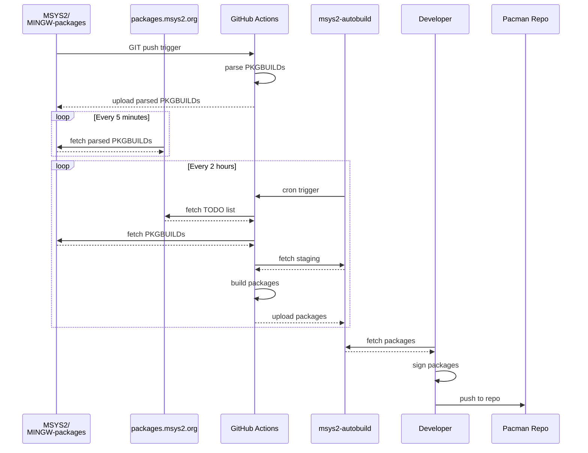

/. combine script
========================================================

此文档合并使用此 bash 脚本处理 mkdocs.yml 中的目录数据，仅供参考：
REF: Bash manual 3.5 Shell Expansions - 3.5.3 Shell Parameter Expansion

    #! /usr/bin/env bash

    print_title (  ) {
        printf "\n%.0s" {1..2}    
        echo $1
        printf "=%.0s" {1..57}
        printf "\n%.0s" {1..2}    
    }

    print_title "/. combine script"
    cat << EOF
    此文档合并使用此 bash 脚本处理 mkdocs.yml 中的目录数据，仅供参考：
    REF: Bash manual 3.5 Shell Expansions - 3.5.3 Shell Parameter Expansion

    EOF
    sed -n 's/.*/    \0/p' $0

    print_title "/. mkdocs.yml"
    sed -n 's/.*/    \0/p' ../mkdocs.yml

    while read -r line
    do
        if [ "${line: -3:3}" = ".md" ] || [ "${line: -4:3}" = ".md" ];
        then
            file=${line/**[-:] /}
            file=`echo $file | sed -n "s/['\"]\?\([^'\"]\+\)['\"]\?/\1/gp"`
            print_title "/. $file"
            cat $file
        fi
    done << EOF
    `sed -n '/nav:/,/^[^ ]/{p}' ../mkdocs.yml | sed -n '$!p'`
    EOF


/. mkdocs.yml
========================================================

    site_name: MSYS2
    site_description: Software Distribution and Building Platform for Windows
    docs_dir: web/
    theme:
        font: false
        name: material
        logo: 'logo.svg'
        favicon: 'favicon.ico'
        palette:
          - scheme: default
            media: "(prefers-color-scheme: light)"
            toggle:
              icon: material/brightness-7
              name: Switch to dark mode
            primary: 'indigo'
            accent: 'indigo'
          - scheme: slate
            media: "(prefers-color-scheme: dark)"
            toggle:
              icon: material/brightness-4
              name: Switch to light mode
            primary: 'blue'
            accent: 'blue'
    
        features:
            - navigation.instant
            - content.action.edit
            - content.code.copy
    
        custom_dir: overrides
    
    extra_css:
        - 'stylesheets/extra.css'
        - 'stylesheets/fonts.css'
    
    extra:
        social:
            - icon: 'fontawesome/brands/github'
              link: 'https://github.com/msys2'
            - icon: 'fontawesome/brands/twitter'
              link: 'https://twitter.com/msys2org'
            - icon: 'fontawesome/brands/mastodon'
              link: 'https://fosstodon.org/@msys2org'
            - icon: 'fontawesome/brands/discord'
              link: 'https://discord.gg/jPQdRdDcT9'
    
    site_url: https://www.msys2.org
    repo_url: https://github.com/msys2/msys2.github.io
    edit_uri: edit/source/web/
    
    markdown_extensions:
        - meta
        - attr_list
        - codehilite
        - sane_lists
        - admonition
        - pymdownx.arithmatex
        - pymdownx.betterem:
            smart_enable: all
        - pymdownx.caret
        - pymdownx.critic
        - pymdownx.details
        - pymdownx.emoji:
            emoji_generator: !!python/name:pymdownx.emoji.to_svg
        - pymdownx.inlinehilite
        - pymdownx.magiclink
        - pymdownx.mark
        - pymdownx.smartsymbols
        - pymdownx.superfences:
            custom_fences:
              - name: mermaid
                class: mermaid
                format: !!python/name:pymdownx.superfences.fence_code_format
        - pymdownx.tasklist:
            custom_checkbox: true
        - pymdownx.tilde
    
    nav:
        - 'Getting Started': index.md
        - news.md
        - Package Index: https://packages.msys2.org
        - Documentation:
            # For users of MSYS2 which just use the provided software
            # or develop their software using MSYS2 provided packages/tools.
            - docs/what-is-msys2.md
            - docs/who-is-using-msys2.md
            - docs/environments.md
            - docs/updating.md
            - docs/ci.md
            - docs/terminals.md
            - docs/ides-editors.md
            - docs/installer.md
            - Package Management:
              - docs/package-management.md
              - docs/package-naming.md
              - docs/repos-mirrors.md
              - docs/package-management-tips.md
              - docs/package-management-faq.md
            - docs/filesystem-paths.md
            - docs/configuration.md
            - Languages & Tools:
              - docs/cmake.md
              - docs/autotools.md
              - docs/python.md
              - docs/git.md
              - docs/cpp.md
              - docs/pkgconfig.md
            - docs/windows_support.md
            - docs/faq.md
        - Development:
            # For MSYS2 developers, maintaining, creating packages, porting packages,
            # infrastructure, mirrors etc and everything else.
            - Packaging:
              - dev/new-package.md
              - dev/update-package.md
              - dev/package-guidelines.md
              - dev/package-licensing.md
              - dev/pkgbuild.md
            - dev/mirrors.md
            - dev/keyring.md
            - dev/python.md
            - dev/build-process.md
            - dev/accounts.md
        - Other Topics:
            # Old stuff that should ideally move to the above categories in the future
            - wiki/Home.md
            - wiki/Creating-Packages.md
            - wiki/Devtopics.md
            - wiki/Distributing.md
            - wiki/GDB-qtcreator.md
            - wiki/History.md
            - wiki/How-does-MSYS2-differ-from-Cygwin.md
            - wiki/Launchers.md
            - wiki/MSYS2-installation.md
            - wiki/MSYS2-introduction.md
            - wiki/MSYS2-reinstallation.md
            - wiki/Porting.md
            - wiki/Setting-up-SSHd.md
            - wiki/Signing-packages.md
            - wiki/Sudo.md
            - wiki/Terminals.md
            - wiki/JIT-Debugging.md
            - wiki/arm64.md
        - 'get-involved.md'
        - 'license.md'
        - 'privacy.md'
        - 'contact.md'
        - "codeofconduct.md"

# MinTTY Terminal Emulator

Linux 系统 shell 环境配置脚本路径：

    Location        Profile Level        Priority Notes
    =============== ==================== ======== ==============================
    /etc/profile    System-wide profile  1        config with /etc/profile.d
    /etc/bashrc     Every-User profile   2        -
    ~/.bash_profile Current-User profile 3        only execute when user login
    ~/.bash_rc      Current-User profile 4        execute when shell start

MSYS2 提供了以下 MinTTY 终端模拟器用于执行平台初始化，它们对应 msys2_shell.cmd 脚本的功能：

*   clang32.exe
*   clang64.exe
*   clangarm64.exe
*   mingw32.exe
*   mingw64.exe
*   msys2.exe
*   ucrt64.exe

这些入口程序就等价于 mintty + MSYS2 平台配置，运行它们就相当于运行 mintty (默认设置的终端)，
并配置平台参数，如可执行命令所在的子目录。它们没有使用帮助，但是可以直接给传递要运行的程序以及参数。
MinTTY 本身就是一个支持 shebang 的脚本执行器：

```sh
  msys2 .\opendocs.sh
  msys2 bash -login -i
  msys2 vim .\vim_flavor.md
  mintty vim .\vim_flavor.md
```

这些 shell 环境本身就是 bash 运行环境，也可以另外安装 bash 解释器，但是另外安装的解释器可能
出现无法使用 Unicode 符号的问题，比如使用 vim 无法查看 Unicode 表情符号。另外 msys2_shell
脚本设置的初始环境也不支持 Unicode 表情符号，还会弹出终端窗口，可以使用以下参数来避免弹窗：

    msys2_shell.cmd -defterm -here -no-start -ucrt64

注意，以上这些 [mintty](https://mintty.github.io/) 入口程序有个问题：不会执行用户主目录下的
默认 bash 配置脚本，只执行 /etc/profile 配置脚本。可以在此添加用户配置信息，比如 PATH 搜索路径，
增加 USER_PATH 变量，并将此变量添加到 PATH 路径列表中运行导出：

```sh
echo "bash runtime config [msys2]: /etc/profile"

USER_PATH="C:\\ProgramData\\chocolatey\\bin:/c/vcpkg"


unset MINGW_MOUNT_POINT
. '/etc/msystem'
case "${MSYSTEM}" in
MINGW*|CLANG*|UCRT*)
  ...
  PATH="${USER_PATH}:${MINGW_MOUNT_POINT}/bin:${MSYS2_PATH}${ORIGINAL_PATH:+:${ORIGINAL_PATH}}"
  ...
  ;;
*)
  PATH="${USER_PATH}:${MSYS2_PATH}:/opt/bin${ORIGINAL_PATH:+:${ORIGINAL_PATH}}"
  PKG_CONFIG_PATH="/usr/lib/pkgconfig:/usr/share/pkgconfig:/lib/pkgconfig"
esac

...
export PATH MANPATH INFOPATH PKG_CONFIG_PATH ...
```

MSYS2 以上自带的环境入口程序确实可以支持 Unicode 符号，并且 MinTTY 终端模拟器提供更丰富的设置，
包括终端窗口的透明。[MinTTY](https://mintty.github.io/) 是开源终端模拟器，广泛应用于 MSYS2、
Cygwin，Git bash 以及 WSL 等系统环境中。支持图形显示以及 Sixel 图形库。

MinTTY 以其轻量级的设计和高性能著称，使用 Windows API 实现原生的图形渲染。其特点是：

*  现代界面：全新的窗口样式，支持透明度调整、多色彩方案，并能很好地适应高 DPI 显示器。
*  快速响应：优化的 I/O 处理使其在处理大量数据流时表现优异，无卡顿感。
*  Unicode 支持：能够完美呈现各种语言的字符，无论是在 ASCII 还是非 ASCII 环境下。
*  低资源占用：与其他终端相比，MinTTY 对系统资源的需求更低，运行更加流畅。

MinTTY 3.5.1 文档显示开始支持标签栏，这样方便使用多个终端窗口，使用 −−tabbar 启用终端标签。
如果这样，MinTTY 将比 Windows Terminal 还好用，更加有吸引力。

但是在当前的 MinTTY 3.6.4 (x86_64-pc-msys2) 版本上，运行会闪退。还有一个选择是：ConEmu-Maximus5，
这个终端模拟器可以吸附系统进程到 Tab 标签页。

Bash 作为通用脚本解释器，它可以在 Linux/Windows 环境下很好地执行自动化任务，它有多种运行方式：

* Invoked as an interactive login shell, or with --login
* Invoked as an interactive non-login shell
* Invoked non-interactively
* Invoked with name sh

所谓登录（--login）即让脚本解释器在启动时就加载解释器登录配置脚本（.bash_profile），此配置脚本
可以在多个位置存放： `~/.bash_profile`, `~/.bash_login`, `~/.profile`。同时，在退出时
还会执行 `~/.bash_logout` 配置脚本。如果不使用登录参数，则加载 Bash 解释器时不执行登录配置脚本，
但是会加载默认运行配置 `~/.bashrc`，可以使用 --norc 参数禁用它，或使用 --rcfile 指定其它配置。

所谓交互（interactive shell）即可以与用户进行输入/输出数据交互的脚本运行环境，这是默认执行状态，
除非使用 -s 参数让 Bash 进入静默模式，此时用户不能参与脚本的交互，脚本解释器执行完指定脚本后退出。

为了整合 MinTTY 支持 Unicode 的特性，以及 Vim 高速处理文件的优点，可以在 Windows 系统上使用
脚本添加以下注册表选项，这样就可以直接在文件浏览器中使用右键菜单来执行 Vim 打开文件：

```sh
    vim='C:\\msys64\\usr\\bin\\mintty.exe C:\\msys64\\usr\\bin\\vim.exe'
    # REG ADD     'HKCR\*\shell\Open with VIM...' -f
    REG ADD     'HKCR\*\shell\Open with VIM...\command' -f -ve -t REG_SZ -d "$vim '%1'"
    REG ADD     'HKCR\*\shell\Open with VIM...\command' -f -v "Icon" -t REG_SZ -d "$vim"
```


/. index.md
========================================================

MSYS2

Software Distribution and Building Platform for Windows


# Getting Started

**MSYS2** is a collection of tools and libraries providing you with an
easy-to-use environment for building, installing and running native Windows
software.

It consists of a command line terminal called
[mintty](https://mintty.github.io/), bash, version control systems like git and
subversion, tools like tar and awk and even build systems like autotools, all
based on a modified version of [Cygwin](https://cygwin.com). Despite some of
these central parts being based on Cygwin, the main focus of MSYS2 is to provide
a build environment for native Windows software and the Cygwin-using parts are
kept at a minimum. MSYS2 provides up-to-date native builds for GCC, mingw-w64,
CPython, CMake, Meson, OpenSSL, FFmpeg, Rust, Ruby, just to name a few.

To provide easy installation of packages and a way to keep them updated it
features a package management system called
[Pacman](https://wiki.archlinux.org/index.php/pacman), which should be familiar
to Arch Linux users. It brings many powerful features such as dependency
resolution and simple complete system upgrades, as well as straight-forward and
reproducible package building. Our package repository contains [more than 2900
pre-built packages](https://packages.msys2.org/base) ready to install.

For more details see ['What is MSYS2?'](docs/what-is-msys2.md) which also
compares MSYS2 to other software distributions and development environments like
[Cygwin](https://cygwin.com),
[WSL](https://en.wikipedia.org/wiki/Windows_Subsystem_for_Linux),
[Chocolatey](https://chocolatey.org/), [Scoop](https://scoop.sh/), ... and ['Who
Is Using MSYS2?'](docs/who-is-using-msys2.md) to see which projects are using
MSYS2 and what for.


## Installation

1. Download the installer: <a href="https://github.com/msys2/msys2-installer/releases/download/2023-10-26/msys2-x86_64-20231026.exe" class="button">msys2-x86_64-20231026.exe</a>

    <span style="opacity: 0.6; word-wrap: break-word;">For more information on the installer, like command line options, or how to verify the checksum and signature of the installer, see the [installer guide](./docs/installer.md).</span>

2. Run the installer. MSYS2 requires 64 bit Windows 8.1 or newer.

3. Enter your desired **Installation Folder** (short ASCII-only path on a NTFS volume, no accents, no spaces, no symlinks, no subst or network drives, no FAT).

    

4. When done, click **Finish**.

    

5. Now MSYS2 is ready for you and a terminal for the [UCRT64 environment](./docs/environments.md) will launch.

    
    

6. You will probably want to install some tools like the mingw-w64 GCC to start compiling projects. Run the following command:

    ```sh
    $ pacman -S mingw-w64-ucrt-x86_64-gcc
    ```

7. The terminal window will show the output as below. Press 'Enter' to continue:

    ```console
    resolving dependencies...
    looking for conflicting packages...

    Packages (15) mingw-w64-ucrt-x86_64-binutils-2.41-2
                mingw-w64-ucrt-x86_64-crt-git-11.0.0.r216.gffe883434-1
                mingw-w64-ucrt-x86_64-gcc-libs-13.2.0-2  mingw-w64-ucrt-x86_64-gmp-6.3.0-2
                mingw-w64-ucrt-x86_64-headers-git-11.0.0.r216.gffe883434-1
                mingw-w64-ucrt-x86_64-isl-0.26-1  mingw-w64-ucrt-x86_64-libiconv-1.17-3
                mingw-w64-ucrt-x86_64-libwinpthread-git-11.0.0.r216.gffe883434-1
                mingw-w64-ucrt-x86_64-mpc-1.3.1-2  mingw-w64-ucrt-x86_64-mpfr-4.2.1-2
                mingw-w64-ucrt-x86_64-windows-default-manifest-6.4-4
                mingw-w64-ucrt-x86_64-winpthreads-git-11.0.0.r216.gffe883434-1
                mingw-w64-ucrt-x86_64-zlib-1.3-1  mingw-w64-ucrt-x86_64-zstd-1.5.5-1
                mingw-w64-ucrt-x86_64-gcc-13.2.0-2

    Total Download Size:    49.38 MiB
    Total Installed Size:  418.82 MiB

    :: Proceed with installation? [Y/n]
    [... downloading and installation continues ...]
    ```

8. Now you can call `gcc` to build software for Windows.

    ```console
    $ gcc --version
    gcc.exe (Rev2, Built by MSYS2 project) 13.2.0
    ```

9. After installing MSYS2 it will update itself via `pacman`, see the [update guide](./docs/updating.md) for more information.


## Sponsors

Our main server is sponsored by [jsDelivr](https://www.jsdelivr.com)

[{: width=250px}{: width=250px}](https://www.jsdelivr.com)

[Microsoft Open Source Programs Office](https://opensource.microsoft.com/) sponsors us financially via their [FOSS Fund](https://github.com/microsoft/foss-fund#2022)

[{: width=250px}{: width=250px}](https://opensource.microsoft.com/)

Various organizations provide us with mirrors all around the world, see [our mirror list](dev/mirrors.md) for details.

##  Authors and Contributors

* [Alexpux (Alexey Pavlov)](https://github.com/Alexpux)
* [martell (Martell Malone)](https://github.com/martell)
* [mingwandroid (Ray Donnelly)](https://github.com/mingwandroid)
* [Elieux (David Macek)](https://github.com/elieux)
* [lazka (Christoph Reiter)](https://github.com/lazka)
* [Renato Silva](https://github.com/renatosilva)
* [niXman](https://github.com/niXman)
* [naveen521kk (Naveen M K)](https://github.com/naveen521kk)
* [Biswa96 (Biswapriyo Nath)](https://github.com/Biswa96)
* [jeremyd2019 (Jeremy Drake)](https://github.com/jeremyd2019)
* [mati865 (Mateusz Mikuła)](https://github.com/mati865)
* [MehdiChinoune (مهدي شينون / Mehdi Chinoune)](https://github.com/MehdiChinoune)

## Donations

You can donate to the project via [GitHub Sponsors](https://github.com/sponsors/msys2):

[{: width=150px}{: width=150px}](https://github.com/sponsors/msys2)

or via [Open Collective](https://opencollective.com/msys2):

[{: width=280px}](https://opencollective.com/msys2)


/. news.md
========================================================

---
summary: Important events happening.
---
# News

This page lists important changes or issues affecting MSYS2 users. We also post them to [Twitter](https://twitter.com/msys2org) and [Mastodon](https://fosstodon.org/@msys2org), including some not-so-important things :)

### 2023-11-05 - Package installation issues for very old/outdated installations

If you haven't updated pacman in 2.5 years or longer, but are installing
new packages, you will see errors like this, due to a format change in the
package database:

```
error: mingw-w64-ucrt-x86_64-shared-mime-info: missing required signature
error: mingw-w64-ucrt-x86_64-gtk3: missing required signature
error: failed to commit transaction (package missing required signature)
Errors occurred, no packages were upgraded.
```

This can be fixed by [updating your installation](./docs/updating.md).

### 2023-08-06 - Python: Changed behavior when loading DLL dependencies of extension modules

Starting with CPython 3.8, upstream CPython changed their DLL lookup behavior to
a safer default when loading extension modules, which meant no longer looking in
PATH and the current working directory as a fallback, but requiring code to
explicitly add directories containing dependencies via
[`os.add_dll_directory()`](https://docs.python.org/3/library/os.html#os.add_dll_directory).

Because many packages weren't ported yet back then, and this behavior interfered
with our MinGW port build process we reverted this change and kept the old
behavior. This had the downsides of being less secure and
`os.add_dll_directory()` not working.

We have now finally managed to fix this in our port, so that DLL loading works
the same as with the official CPython distribution.

If this change is causing problems for you:

* Make sure to use `os.add_dll_directory()` where needed, as recommended by
  upstream, see https://docs.python.org/3/library/os.html#os.add_dll_directory
  for details
* To ease the transition we've temporarily added a
  `PYTHONLEGACYWINDOWSDLLLOADING` environment variable, which you can set to `1`
  to get back the old behavior. We will remove this workaround after some time,
  so please let us know if there are any problems that can't be solved without
  it.

### 2023-04-01 - LLVM 16

LLVM/Clang has now been updated to v16, here are some things to look out for:

* Stricter C compiler: Various previously warnings are now errors by default and
  might make your build fail. See the following for more information:

    * The upstream changelog entry: https://releases.llvm.org/16.0.0/tools/clang/docs/ReleaseNotes.html#potentially-breaking-changes
    * The Gentoo guide for how to adjust your code for the new stricter defaults: https://wiki.gentoo.org/wiki/Modern_C_porting
    * The Gentoo bug which tracks all related issues in Gentoo: https://bugs.gentoo.org/870412

* autoconf bugs: The stricter defaults in clang v16 exposed some autoconf bugs
  which lead to some compiler checks returning the wrong results. We have
  backported the respective fixes into all our autoconf versions (2.13, 2.69 and
  2.71) and updated autoconf-archive, but this means you will have to run
  autoreconf to get those fixes. There is also a chance that other checks in
  configure.ac or m4 macros shipped with your project will need to be updated.
  So watch out for changes in your configure results.

* fortran/flang: flang, the llvm based Fortran compiler, is now capable of
  building some of our Fortran based packages. But despite that, it still has
  known issues of generating wrong or broken code without warnings and should
  not be used in production. The same is true for all Fortran based packages we
  are building with it.

* Packages not compatible with llvm v16: So we don't have to wait for all
  packages/projects to support the newest llvm version, we added new packages for
  llvm v14 and v15 which only contain static builds and are now used by the
  packages not supporting llvm v16. This currently affects python-llvmlite,
  openshadinglanguage and include-what-you-use.

### 2023-02-10 - Server maintenance on 2023-02-18/19

There will be a short server maintenance around the weekend of 2023-02-18/19 which will affect repo.msys2.org, mirror.msys2.org, packages.msys2.org, and some subdomain redirects of our website.

Update: all done now

### 2023-01-15 - Dropping support for Windows 7 and 8.0

As announced last April we will no longer support Windows 7 / 8.0 from now on.

### 2023-01-15 - OpenSSL updated from 1.1.1 to 3.0.x

With v3.0 being out for more than a year and the EOL of v1.1.1 approaching this year we have moved both cygwin and mingw builds to v3.0.x now. If there are any issues let us know.

Note that the license of OpenSSL has changed to Apache-2.0 starting with v3.

### 2023-01-05 - Dropping 32bit support for Qt 6

Qt project dropped support for Windows version older than Windows 10 from Qt 6,
see this official [blog post](https://www.qt.io/blog/qt6-development-hosts-and-targets).
It was also added that we will not have 32 bit x86 Windows support available.
With this above condition, we too have very few users who are using 32 bit x86
Windows 10. So, we decided to remove 32 bit builds for Qt 6 and their dependencies.
The remaining 32 bit x86 packages which depends on Qt will be linked with Qt 5.
With this, our Qt 6 packages will be available for all official
[Windows platforms](https://doc.qt.io/qt-6/windows.html).

### 2022-12-26 - Default `_WIN32_WINNT` bumped to Windows 8.1 for UCRT environments

We have bumped the default `_WIN32_WINNT` version defined in mingw-w64 from Windows 7 to Windows 8.1 for non-arm UCRT environments (CLANG32, CLANG64, UCRT64). For projects that don't define their own `_WIN32_WINNT` and conditionally include features depending on the minimum supported Windows version this might mean that new builds will start depending on Windows 8.1. MINGW32/64 will default to Windows 7 for a bit longer to smooth over the transition.

This is part of our goal to phase out Windows 7 support and target newer Windows versions by default.

### 2022-12-16 - Dropping Windows 7 support for the MSYS2 installer

The latest release of the MSYS2 installer (v2022-12-16) has dropped support for Windows 7. It will show an error message and abort if started on Windows 7.

### 2022-10-29 - Changing the default environment from MINGW64 to UCRT64

About 1.5 years ago we started adding a new variant of the MINGW64 environment called [UCRT64](./docs/environments.md), which uses the Universal CRT instead of
the old msvcrt.dll. Now that all our packages are available in this new environment and a very large percentage of our users (~97%) are on a system that includes UCRT, we recommend it as the default environment instead of MINGW64.

The MINGW32/64 environments will continue to exist and there are no plans to remove them, but we will focus our attention more on UCRT64 and the other UCRT-using environments such as CLANG64 and CLANGARM64.

### 2022-10-23 - mingw packages now built with `-D_FORTIFY_SOURCE=2` and `-fstack-protector-strong`

Our mingw packages will be built with `-D_FORTIFY_SOURCE=2` and `-fstack-protector-strong` from now on.

### 2022-10-18 - New minimum hardware requirements (CPUs from ~2006/7+)

As a first step of phasing out support for Windows 7, we're raising the minimum hardware requirements to match Windows 8.1, which roughly equals Intel Core 2 / AMD Phenom, so anything after 2006/7 is fine.

In terms of GCC/Clang compiler flags this means going from `-march=x86-64` to `-march=nocona -msahf`. This only affects 64bit packages, and only those that use features only available in those newer CPUs, and only once they are updated or rebuilt.

### 2022-10-10 - libssp is no longer required

Building with `_FORTIFY_SOURCE` no longer requires explicitly linking with libssp (-lssp) and enabling stack protection no longer pulls in libssp. This brings things in line with other platforms. Thanks to [Martin Storsjö](https://github.com/mstorsjo) for implementing this in mingw-w64. Once all our affected packages are rebuilt we will remove the libssp package from our repo.

2022-10-13: We have decided to keep just the libssp DLL around for some more time to avoid breaking existing users

### 2022-09-24 - Changed behavior for empty env vars

Empty environment variables are no longer removed when starting a new non-cygwin process.

```console
$ FOO= python -c "import os; print('FOO' in os.environ)" # Old
False
$ FOO= python -c "import os; print('FOO' in os.environ)" # New
True
```

You can **revert to the old behavior** by setting `MSYS=noemptyenvvalues`. Please let us know if this is breaking anything that can't be solved by just unsetting the env var where needed.

### 2022-09-24 - ConPTY support enabled by default

ConPTY support in our cygwin fork is now enabled by default. This means any non-cygwin apps will now behave as if they are run in with a console attached and not redirected. This feature has been enabled in upstream cygwin for quite a while but we wanted to wait until there are no more known issues. We now feel that not enabling it causes more problems then enabling it.

You can **disable it again** by setting `MSYS=disable_pcon`.

### 2022-04-06 - Windows 7 / 8 support will be dropped late 2022 or early 2023

Cygwin 3.5 will drop support for Windows <8.1, which means the new requirement will be "64 bit Windows 8.1 / Windows Server 2012 R2". We expect the update to Cygwin 3.5 to be around late 2022, early 2023. For more information, look [here](https://www.msys2.org/docs/windows_support/).

A recent survey suggests that ~2-3% of our active users (excluding cloud servers and CI systems) are still using Windows <8.1. We recommend them stopping to update at the end of the year. We've enabled an inline warning message for them when they open a terminal.

For developers bundling our packages, we recommend simply pointing out the last version of their application that still worked with Windows 7 / 8 on their download page.

### 2022-03-04 - Sunsetting the SourceForge mirror in 30 days from now

*Note: This should only affect systems not updated in over a year, or users that actively switched to this mirror, which is unlikely.*

Due to space constrains and our ever growing package archive we can no longer update the [SourceForge mirror](https://sourceforge.net/projects/msys2/files/). We already hit the space limit last year but worked around it by no longer syncing source packages. We have now hit the limit again, and decided that it is no longer worth it maintaining it.

**We will remove the SourceForge mirror on 2022-04-03**. We will delete the package databases as well to make DB syncs fail to avoid users using outdated software without them knowing it. After 4 more weeks we will delete the remaining packages and installers.

**2022-05-07**: The mirror has now been removed.

### 2022-02-24 - repo.msys2.org only available via HTTPS/TLS

We have switched repo.msys2.org to always redirect to a secure connection. If
for some reason you require HTTP you can use one of our [tier 1
mirrors](./dev/mirrors.md).

### 2021-12-22 - Ongoing Cleanup of the `base-devel` Package Group

The `base-devel` package group is the set of packages required to be installed
before running `makepkg` / `makepkg-mingw`. We have recently started to clean
this group up and moved some of the packages to be explicit dependencies in the
`PKGBUILD` files instead.

One notable removal is various autotools related packages. There now exists an
`autotools` and a `${MINGW_PACKAGE_PREFIX}-autotools` meta package which will
pull in anything related to autotools which packages can add to their
`makedepends`.

Further more the group was replaced with a package of the same name, to make
adding/removing packages easier. Note that pacman prefers packages over groups
for the same name, so the set of included packages is now listed here
https://packages.msys2.org/package/base-devel

This cleanup can lead to build errors in case your build setup assumes certain
packages being installed with `base-devel`. If that is the case make sure to
install those missing packages explicitly instead.

### 2021-12-21 - Potential Incompatibilities with newer Python setuptools

**tl;dr:** use `export SETUPTOOLS_USE_DISTUTILS=stdlib` if you have problems
building/installing packages with newer versions of setuptools from pypi.

The Python packaging ecosystem is currently in the transition of removing
distutils from CPython and moving it into setuptools. Historically distutils is
patched quite a bit by us to make it work with our directory layout and to build
packages with gcc/clang instead of MSVC. With this move our patches are no
longer used and setuptools will fail in various ways, or install things into
wrong places.

We are working with upstream to include our patches, but this will take some
more time. In the meantime you can force setuptools to use the (still patched)
distutils from the CPython stdlib via `export SETUPTOOLS_USE_DISTUTILS=stdlib`
The setuptools version in our repo however will continue to use the patched
distutils until all issues are resolved and is not affected.

🙏 Many thanks to the distutils and setuptools maintainers for considering our
patches, despite Cygwin/MSYS2 not being officially supported by CPython.

### 2021-10-14 - OpenSSH 8.8 dropped support for old ssh-rsa keys using SHA-1

The recent OpenSSH update disabled support for old ssh-rsa keys using SHA-1 by
default. See https://www.openssh.com/txt/release-8.8
"Potentially-incompatible changes" for details and possible workarounds.


### 2021-07-04 - Some Mirror/Server/Repository Changes

**Primary Pacman Server**: We've switched the main server in the pacman config
to https://mirror.msys2.org. This server will redirect pacman to an up-to-date
mirror [near you](https://mirror.msys2.org/?mirrorstats) for each file. We hope
this will improve the download speed for users further away from Europe. We also
have a new overview of all mirrors [here](./dev/mirrors.md).

**Repo Path Renaming:** We've renamed `mingw/i686/` to `mingw/mingw32/` and
`mingw/x86_86/` to `mingw/mingw64/` and added symlinks for the old paths. This
means 100GB of resyncing for mirrors using rsync (sorry :/). Having the repo
name in the directory path allows us to have one mirrorlist configuration for
all repos in the future.

**Sourceforge**: Due to space constraints we no longer host the source packages
on Sourceforge. They are still available on our main server and on all mirrors.


### 2021-04-21 - R.I.P. [mingwandroid](https://github.com/mingwandroid)

Ray Donnelly is a co-founder and developer of MSYS2 and after a multi year fight
with cancer passed away on 2021-04-20.

{: width=589 height=393 style="max-width: 300px; width:100%; border: 2px solid #333; box-shadow: 0px 0px 3px #ccc;" }https://www.msys2.org/docs/

If you want to know more about his life and work see his fundraiser
descriptions:

* https://www.gofundme.com/f/help-Ray-fund-a-hospice-bedroom
* https://www.gofundme.com/f/arku72-help-ray-fight-cancer

He was always helpful, knowledgeable, and friendly, and he will be greatly missed.

### 2021-03-25 - Temporarily broken msys2-launcher package

The repo contained a broken msys2-launcher package for a few hours today causing things like
"msys2.exe" to just show an error dialog. You can get back to a working setup this way:

* Start `C:/msys64/msys2_shell.cmd` to get a shell
* Run `pacman -Suy` to get all the fixed packages


### 2021-02-27 - New server for repo.msys2.org and packages.msys2.org

We have moved repo.msys2.org (and package.msys2.org) to a new server.  There was
a short downtime, but everything should be running great now.  Big thanks to
~~appfleet.com~~ jsdelivr.com for sponsoring the new server.

New mirrorlists for Pacman will be published soon.  After you get them, your
package installs and updates should be faster than before and without the
404s and glitches.

With the migration, Christoph (@lazka) will now be updating and signing
the Pacman databases more often.  This should go smoothly as the GPG keys are
already in place and the process has been tested on the new server before it
went live.

By the way, the redirect domain msys2.org (no www.) should work more
reliably now and HTTPS is now available for it.


### 2021-01-31 - ASLR enabled by default

About 5 months ago we started backporting patches to our binutils
2.35 to allow enabling ASLR support via various flags. We also enabled these
flags in our build system, so any package in our repo that was updated in the
last 5 months has ASLR support enabled.

We've now updated to 2.36 which has ASLR enabled by default. Ideally you
shouldn't notice any changes, but in case this leads to problems all of it can
be disabled/reverted via linker flags:

* mingw64: `-Wl,--disable-dynamicbase,--disable-high-entropy-va,--default-image-base-low`
* mingw32: `-Wl,--disable-dynamicbase`

Note that this is only a temporary workaround and some of these flags will not
be available forever, so you should either fix your code or file a bug in case
you suspect a toolchain issue.

Thanks to the binutils developers for improving/fixing ASLR support and to
everyone helping on the MSYS2 side of things, especially [Jeremy
Drake](https://github.com/jeremyd2019) for backporting, upstreaming and fixing
bugs exposed by these changes.

**Known issues:**

* (Fixed now) ~~In case you are seeing errors such as `relocation truncated to fit:
  IMAGE_REL_AMD64_REL32 against undefined symbol` try building with
  `-Wl,--default-image-base-low`. Here is the upstream bug report:
  https://sourceware.org/bugzilla/show_bug.cgi?id=26659~~


### 2020-12-26 - Zstd exemption for core packages removed

Given it's been months since we began the switch to Zstd for compressing
packages, we've now started using it for core packages as well.  This means
older installations without Zstd support won't be able to cleanly upgrade
anymore.

@dmn-star compiled these commands that should update an older installation to
support Zstd and unblock futher upgrades:

```
pacman --noconfirm -U "https://repo.msys2.org/msys/x86_64/libzstd-1.4.4-2-x86_64.pkg.tar.xz"
pacman --noconfirm -U "https://repo.msys2.org/msys/x86_64/zstd-1.4.4-2-x86_64.pkg.tar.xz"
pacman --noconfirm -U "https://repo.msys2.org/msys/x86_64/pacman-5.2.1-6-x86_64.pkg.tar.xz"
```


### 2020-10-08 - main repo pruned

Due to limited space on the new server and SourceForge file hosting, we are
starting to remove older unused packages from the archives.  There should still
be a 1 year's worth of packages available for downgrades.  Mirrors are free to
choose whether they want to keep everything or follow the lead.


### 2020-10-07 - server downtime

From Friday 2nd to Wednesday 10th, the main hosting at repo.msys2.org was down.
The server unfortunately completely died and the hosting had to be moved
elsewhere.  We thank Diablo-D3 for having provided the hardware and hosting.  If
you notice anything wrong with repo.msys2.org since the move, please tell us.


### 2020-06-29 - new packagers

Alexey is stepping down from his role as the main packager and two new packagers
have been appointed in his place:

- David Macek with [signing key 0x9078f532](https://keyserver.ubuntu.com/pks/lookup?search=0x87771331B3F1FF5263856A6D974C8BE49078F532&fingerprint=on&op=vindex)
- Christoph Reiter with [signing key 0xa0aa7f57](https://keyserver.ubuntu.com/pks/lookup?search=0x5F944B027F7FE2091985AA2EFA11531AA0AA7F57&fingerprint=on&op=vindex)

You can see the keys in full without relying on keyservers in the [msys2-keyring
GitHub repository](https://github.com/msys2/MSYS2-keyring/).

We have released a new *msys2-keyring* package from that source (and a new
installer that includes them) and we are waiting for a bit before uploading new
databases and packages to give people time to update.  If you don't update the
keyring in time, you'll see something like this:

```
:: Synchronizing package databases...
downloading mingw32.db...
downloading mingw32.db.sig...
error: mingw32: key "4A6129F4E4B84AE46ED7F635628F528CF3053E04" is unknown
:: Import PGP key 4096R/87771331B3F1FF5263856A6D974C8BE49078F532, "David Macek <david.macek.0@gmail.com>", created: 2018-01-14? [Y/n]
error: mingw32: signature from "David Macek <david.macek.0@gmail.com>" is marginal trust
error: failed to update mingw32 (invalid or corrupted database (PGP signature))

downloading mingw64.db...
downloading mingw64.db.sig...
error: mingw64: signature from "David Macek <david.macek.0@gmail.com>" is marginal trust
error: failed to update mingw64 (invalid or corrupted database (PGP signature))

downloading msys.db...
downloading msys.db.sig...
error: msys: signature from "David Macek <david.macek.0@gmail.com>" is marginal trust
error: failed to update msys (invalid or corrupted database (PGP signature))
error: failed to synchronize all databases

error: mingw32: signature from "David Macek <david.macek.0@gmail.com>" is marginal trust
error: mingw64: signature from "David Macek <david.macek.0@gmail.com>" is marginal trust
error: msys: signature from "David Macek <david.macek.0@gmail.com>" is marginal trust
```

We have prepared the following steps to verify and install the new keyring
manually after which you should be able to use `pacman -Syu` again:

```
$ curl -O https://repo.msys2.org/msys/x86_64/msys2-keyring-r21.b39fb11-1-any.pkg.tar.xz
$ curl -O https://repo.msys2.org/msys/x86_64/msys2-keyring-r21.b39fb11-1-any.pkg.tar.xz.sig

$ pacman-key --verify msys2-keyring-r21.b39fb11-1-any.pkg.tar.xz.sig
==> Checking msys2-keyring-r21.b39fb11-1-any.pkg.tar.xz.sig... (detached)
gpg: Signature made Mon Jun 29 07:36:14 2020 CEST
gpg:                using DSA key AD351C50AE085775EB59333B5F92EFC1A47D45A1
gpg: Good signature from "Alexey Pavlov (Alexpux) <alexpux@gmail.com>" [full]

# pacman -U msys2-keyring-r21.b39fb11-1-any.pkg.tar.xz
```

If you can't even import the key and the above command fails like this:

```
error: msys: key "4A6129F4E4B84AE46ED7F635628F528CF3053E04" is unknown
:: Import PGP key 4A6129F4E4B84AE46ED7F635628F528CF3053E04? [Y/n]
[...]
error: database 'msys' is not valid (invalid or corrupted database (PGP signature))
loading packages...
error: failed to prepare transaction (invalid or corrupted database)
```

... you have to convince pacman to not care about those databases for a while,
for example like this:

```
# pacman -U --config <(echo) msys2-keyring-r21.b39fb11-1-any.pkg.tar.xz
```

If you still see signature errors, resetting your pacman key store might help:

```
# rm -r /etc/pacman.d/gnupg/
# pacman-key --init
# pacman-key --populate msys2
```


### 2020-06-15 - New `base` metapackage; `pacman-contrib` is now separate

Following a similar change in Arch Linux, the `base` group was replaced with
a `base` metapackage.  If you installed your MSYS2 using an installer older than
2020-06-02, please run `pacman -S base` to get up to date.

This also installs the `pacman-contrib` package where `updpkgsums`, `pactree`
etc. now live (previously included in the `pacman` package).

Details at [#1979](https://github.com/msys2/MSYS2-packages/pull/1979),
[#1976](https://github.com/msys2/MSYS2-packages/issues/1976) and
[#1988](https://github.com/msys2/MSYS2-packages/pull/1988).


### 2020-05-31 - Update may fail with "could not open file"

In case your update process errors out with something similar to

> error: could not open file /var/cache/pacman/pkg/zstd-1.4.5-1-x86_64.pkg.tar.zst: Child process exited with status 127

update pacman separately first:

```
pacman -Sydd pacman
```

This issue is caused by a pacman version that is too old and can't handle newer
packages compressed with zstd. In case you are seeing this problem in CI
consider using a newer base which contains a newer pacman which supports zstd:
https://github.com/msys2/msys2-installer/releases


### 2020-05-22 - MSYS2 may fail to start after a msys2-runtime upgrade

MSYS2 programs will fail to start if programs started before the update are
still running in the background (especially sshd, dirmngr, gpg-agent, bash,
pacman and mintty). You can stop them by running the following in a Windows
terminal:

```batch
taskkill /f /fi "MODULES eq msys-2.0.dll"
```

If that fails, try a reboot.

We've improved our update process so this shouldn't happen again with future
updates.


### 2020-05-22 - Pacman may fail to install packages with `Unrecognized archive format`

For a while, the core packages were prematurely packaged using zstd without
giving users time to update to zstd-enabled pacman first.  This should be
resolved now.


### 2020-05-17 - 32-bit MSYS2 no longer actively supported

32-bit mingw-w64 packages are still supported, this is about the POSIX emulation
layer, i.e. the runtime, Bash, MinTTY...

After this date, we don't plan on building updated msys-i686 packages nor
releasing i686 installers anymore.  This is due to increasingly frustrating
difficulties with limited 32-bit address space, high penetration of 64-bit
systems and Cygwin (our upstream) starting their way to drop 32-bit support as
well.


### 2019-06-03 - mingw-w64 Ada and ObjC unsupported until further notice

Pacman may say this when updating:

```
looking for conflicting packages...
error: failed to prepare transaction (could not satisfy dependencies)
:: installing mingw-w64-x86_64-gcc (9.1.0-1) breaks dependency 'mingw-w64-x86_64-gcc=8.3.0-2' required by mingw-w64-x86_64-gcc-ada
:: installing mingw-w64-x86_64-gcc (9.1.0-1) breaks dependency 'mingw-w64-x86_64-gcc=8.3.0-2' required by mingw-w64-x86_64-gcc-objc
:: installing mingw-w64-x86_64-gcc (9.1.0-1) breaks dependency 'mingw-w64-i686-gcc=8.3.0-2' required by mingw-w64-i686-gcc-ada
:: installing mingw-w64-x86_64-gcc (9.1.0-1) breaks dependency 'mingw-w64-i686-gcc=8.3.0-2' required by mingw-w64-i686-gcc-objc
```

Ada and ObjC are currently unsupported in MSYS2 builds due to long-standing
issues with the i686 variant.  Run
`pacman -R mingw-w64-x86_64-gcc-ada mingw-w64-x86_64-gcc-objc` and/or
`pacman -R mingw-w64-i686-gcc-ada mingw-w64-i686-gcc-objc`, then update.


### 2016 - Core update integrated into Pacman; `update-core` removed

The function of `update-core` is transferred to `pacman -Syuu`.


### 2016 - Command window may linger after startup

Change the argument `/K` to `/C` in all three Start menu shortcuts.


/. docs/what-is-msys2.md
========================================================

---
summary: MSYS2 provides a native build environment, based on open source software, and
     makes you feel right at home when you are already comfortable with Linux.
---
# What is MSYS2?

MSYS2 isn't "one tool to rule them all", but tries to focus on what it's good
at. It provides a native build environment, based on open source software, and
makes you feel right at home when you are already comfortable with Linux. There
are good reasons to use multiple different environments and tools for different
tasks on Windows.

## MSYS2 vs Other Projects

In case you'd like to see more comparisons or feel that they could be improved
please let us know.

#### MSYS2 vs WSL

MSYS2 allows you to build native Windows programs, while with
[WSL](https://en.wikipedia.org/wiki/Windows_Subsystem_for_Linux) you can only
cross compile them which makes things more complicated. If you are just looking
for Linux CLI tools, or want to build software that ends up on a Linux server
anyway then WSL is the better choice.

#### MSYS2 vs Chocolatey

[Chocolatey](https://chocolatey.org/) mainly bundles already built (open and
closed source) software and makes it easy to install/update them. In MSYS2 on
the other hand all packages are built from source and you can easily reproduce
the builds on your machine. Chocolatey packages have the advantage that the
bundled installers usually have better Windows integration, in that they set up
file associations, shortcuts, etc. and because they are not built from source
there are also lots of packages for closed source software like Visual Studio
etc. that would be hard to manage/update otherwise.

#### MSYS2 vs Cygwin

The unixy tools in MSYS2 are directly based on [Cygwin](https://cygwin.com), so
there is some overlap there. While Cygwin focuses on building Unix software on
Windows as is, MSYS2 focuses on building native software built against the
Windows APIs.

#### MSYS2 vs Arch Linux

MSYS2 and [Arch Linux](https://www.archlinux.org) share the package manager and
all that comes with it, like build definitions, rules for how to package things,
how updates work, how packages are signed, how packages are shipped, the rolling
release nature and so on. By re-using this functionality and concepts we can
focus on the actual packages and profit from the experience and work of Arch
Linux developers. Users already familiar with Arch Linux will also have an
easier time getting started.

#### MSYS2 vs Scoop

Due to lack of experience with [scoop](https://scoop.sh) see their comparison page:

* https://github.com/lukesampson/scoop/wiki/Chocolatey-Comparison
* https://github.com/lukesampson/scoop/wiki/Cygwin-and-MSYS-Comparison


/. docs/who-is-using-msys2.md
========================================================

# Who Is Using MSYS2?

* [RubyInstaller2](https://github.com/oneclick/rubyinstaller2) uses MSYS2 to build Ruby for Windows in CI and as build environment for gems with C extensions.
* [Gaphor](https://gaphor.org) uses MSYS2 for its Windows releases and for CI
* [Git for Windows](https://gitforwindows.org/) is based on MSYS2
* [Quod Libet](https://quodlibet.readthedocs.io) uses MSYS2 for its Windows build and for CI
* [HDL/MINGW-packages](https://github.com/hdl/MINGW-packages) uses MSYS2 for building and testing open source Electronic Design Automation (EDA) tools.
  * [ghdl/ghdl](https://github.com/ghdl/ghdl) uses MSYS2 for building, packaging and testing GHDL.
    * [ghdl/setup-ghdl-ci](https://github.com/ghdl/setup-ghdl-ci) uses setup-msys2 for users to run GHDL on GitHub Actions' Windows environments.
    * [ghdl/extended-tests](https://github.com/ghdl/extended-tests) uses setup-msys2 and setup-ghdl-ci for testing third-party projects with GHDL on GitHub Actions' Windows environments.
  * [gtkwave/gtkwave](https://github.com/gtkwave/gtkwave) uses MSYS2 for building and packaging GTKWave.
  * [steveicarus/iverilog](https://github.com/steveicarus/iverilog) uses MSYS2 for building, packaging and testing Icarus Verilog.
  * [trabucayre/openFPGALoader](https://github.com/trabucayre/openFPGALoader) uses MSYS2 for building, packaging and testing openFPGALoader.
  * [azonenberg/scopehal-apps](https://github.com/azonenberg/scopehal-apps) uses MSYS2 for building libscopehal, glscopeclient and other client applications for libscopehal.
  * [Serial-Studio/Serial-Studio](https://github.com/Serial-Studio/Serial-Studio) uses MSYS2 for building and testing Serial Studio.
  * [VUnit/vunit](https://github.com/VUnit/vunit) uses MSYS2 for testing VUnit.
* [ImPPG](https://github.com/GreatAttractor/imppg) uses MSYS2 for its Windows releases.
* [Inkscape](https://inkscape.org) uses MSYS2 for its Windows releases and for CI ([Documentation](https://wiki.inkscape.org/wiki/index.php?title=Compiling_Inkscape_on_Windows_with_MSYS2))
* [KeePassXC](https://github.com/keepassxreboot/keepassxc) uses MSYS2 for building and running KeePassXC password manager.
* [Media-autobuild_suite](https://github.com/m-ab-s/media-autobuild_suite) uses MSYS2 for automatically building FFmpeg and other media related tools
* [Nuwen's MinGW Build](https://nuwen.net/mingw.html) uses MSYS2 to build the files.
* [OpenModelica](https://openmodelica.org/) uses MSYS2 for building the OpenModelica tools and compiling the generated simulation code on Windows.
* [Paperwork](https://openpaper.work) uses MSYS2 for its Windows releases and for CI ([Documentation](https://gitlab.gnome.org/World/OpenPaperwork/paperwork/-/blob/master/doc/devel.windows.markdown))
* [The R Project](https://www.r-project.org/) build system [rtools40](https://cran.r-project.org/bin/windows/Rtools) is based on MSYS2 icw/ a custom repository of [mingw packages](https://github.com/r-windows/rtools-packages) (all statically linked).
* [Spatial Model Editor](https://spatial-model-editor.github.io/) uses MSYS2 for its Windows releases and for CI
* [UrusStudio Installer](https://github.com/UrusTeam/urusstudio_installer) uses MSYS2 for building and running Urus Studio IDE and URUS System.
* [Webots](https://github.com/cyberbotics/webots) uses MSYS2 to build Webots on Windows and for CI.
* [Xournal++](https://github.com/xournalpp/xournalpp) uses MSYS2 for its Windows releases and for CI ([Documentation](https://github.com/xournalpp/xournalpp/blob/master/readme/WindowsBuild.md)).
* [Neovim](https://github.com/neovim/neovim) uses MSYS2 for its Windows building and running  ([Documentation](https://github.com/neovim/neovim/wiki/Building-Neovim#windows--msys2--mingw)).
* [darktable](https://www.darktable.org/) uses MSYS2 for its Windows releases and for CI ([Documentation](https://github.com/darktable-org/darktable/tree/master/packaging/windows))
* [Mesh2HRTF](https://mesh2hrtf.sourceforge.io) uses MSYS2 for its Windows NumCalc [binaries](https://sourceforge.net/p/mesh2hrtf-tools/code/ci/master/tree/NumCalc_WindowsExe/) ([Documentation](https://sourceforge.net/p/mesh2hrtf/wiki/Installation_2/#compiling-numcalc-on-windows-using-msys2)).
* [PVSnesLib](https://github.com/alekmaul/pvsneslib) uses MSYS2 to build ROMs on Windows

*Feel free to add your project to this list!*


/. docs/environments.md
========================================================

---
summary: The differences between the environments is
    mainly between environment variables, default compilers/linkers, architecture,
    system libraries used etc.
---

# Environments

MSYS2 comes with different environments and the first thing you have
to decide is which one to use. The differences among the environments are
mainly environment variables, default compilers/linkers, architecture,
system libraries used etc. If you are unsure, go with **UCRT64**.

The **MSYS** environment contains the unix-like/cygwin based tools, lives under
`/usr` and is special in that it is always active. All the other environments
inherit from the **MSYS** environment and add various things on top of it.

For example, in the **UCRT64** environment the `$PATH` variable starts with
`/ucrt64/bin:/usr/bin` so you get all ucrt64 based tools as well as all msys
tools.

## Overview

|                                                          | Name           | Prefix        | Toolchain | Architecture | C Library | C++ Library |
|----------------------------------------------------------|----------------|---------------|-----------|--------------|-----------|-------------|
| {: style="max-width:25px" }             | **MSYS**       | `/usr`        | gcc       | x86_64       | cygwin    | libstdc++   |
| {: style="max-width:25px" }         | **UCRT64**     | `/ucrt64`     | gcc       | x86_64       | ucrt      | libstdc++   |
| {: style="max-width:25px" }       | **CLANG64**    | `/clang64`    | llvm      | x86_64       | ucrt      | libc++      |
| {: style="max-width:25px" } | **CLANGARM64** | `/clangarm64` | llvm      | aarch64      | ucrt      | libc++      |
| {: style="max-width:25px" }       | **CLANG32**    | `/clang32`    | llvm      | i686         | ucrt      | libc++      |
| {: style="max-width:25px" }       | **MINGW64**    | `/mingw64`    | gcc       | x86_64       | msvcrt    | libstdc++   |
| {: style="max-width:25px" }       | **MINGW32**    | `/mingw32`    | gcc       | i686         | msvcrt    | libstdc++   |

The active environment is selected via the `MSYSTEM` environment variable.
Setting `MSYSTEM` to `UCRT64` and starting a login shell will put you in that
environment.

## GCC vs LLVM/Clang

These are the default compilers/toolchains used for building all packages in the
respective repositories.

**GCC** based environments:

* Widely tested/used at this point
* Fortran support
* While there also exists a Clang package in the MINGW environments, that one
  still uses the GNU linker and the GNU C++ library. In some cases Clang is used
  to build packages as well there, in case upstream prefers Clang over GCC for
  example.

**LLVM/Clang** based environments:

* Only uses LLVM tools, LLD as a linker, LIBC++ as a C++ standard library
* Clang provides ASAN support
* Native support for TLS (Thread-local storage)
* LLD is faster than LD, but does not support all the features LD supports
* Some tools lack feature parity with equivalent GNU tools
* Supports ARM64/AArch64 architecture on Microsoft Windows 10

## MSVCRT vs UCRT

These are two variants of the C standard library on Microsoft Windows.

**MSVCRT** (Microsoft Visual C++ Runtime) is available by default on all
Microsoft Windows versions, but due to backwards compatibility issues is
stuck in the past, not C99 compatible and is missing some features.

* It isn't C99 compatible, for example the printf() function family, but...
* mingw-w64 provides replacement functions to make things C99 compatible in many
  cases
* It doesn't support the UTF-8 locale
* Binaries linked with MSVCRT should not be mixed with UCRT ones because the
  internal structures and data types are different. (More strictly, object
  files or static libraries built for different targets shouldn't be mixed.
  DLLs built for different CRTs can be mixed as long as they don't share
  CRT objects, e.g. `FILE*`, across DLL boundaries.) Same rule is applied for
  MSVC compiled binaries because MSVC uses UCRT by default (if not changed).
* Works out of the box on every version of Microsoft Windows.

**UCRT** (Universal C Runtime) is a newer version which is also used by
Microsoft Visual Studio by default. It should work and behave as if the
code was compiled with MSVC.

* Better compatibility with MSVC, both at build time and at run time.
* It only ships by default on Windows 10 and for older versions you have to
  provide it yourself or depend on the user having it installed.


/. docs/updating.md
========================================================

# Updating MSYS2

After you have installed MSYS2 via the installer or other means, you need to continue updating it with the built-in `pacman` tool. MSYS2 is a [rolling release](https://en.wikipedia.org/wiki/Rolling_release) distribution and only supports full system upgrades, which means there are frequent minor and major updates to various packages and you can only update all packages at once.

To update all packages run the following command:

```console
$ pacman -Suy
:: Synchronizing package databases...
 mingw32 is up to date
 mingw64 is up to date
 ucrt64 is up to date
 clang32 is up to date
 clang64 is up to date
 msys is up to date
:: Starting core system upgrade...
 there is nothing to do
:: Starting full system upgrade...
 there is nothing to do
```

In some cases, certain core packages will get updated and pacman will prompt you to close all terminals:

```console
:: To complete this update all MSYS2 processes including this terminal will be closed.
   Confirm to proceed [Y/n]
```

After confirming you need to start a new terminal and run the update again (`pacman -Suy`) to update the remaining non-core packages.

## Optional Maintenance Tasks

### Pruning the package cache

`pacman` keeps all packages it downloads under `/var/cache/pacman/pkg/`. To free up some space by removing old packages run:

```console
$ paccache -r
==> finished: 5 packages removed (disk space saved: 49.05 MiB)
```

### Managing configuration file backups

When you have modified a global configuration file of a package (under `/etc` for example) and the package is about to be removed or updated then pacman will avoid deleting your changes. The `pacdiff` tool can then be used to merge your configuration file with the default state again.

1) In case a new package version with some changed configuration gets installed, which would discard your changes, pacman will leave the existing file alone and create a `<filename>.pacnew` with the new configuration instead:

```console
warning: /etc/myconfig.conf installed as /etc/pacman.d/myconfig.conf.pacnew
```

You can run `pacdiff` which searches for such `.pacnew` files and will ask you how it should deal with them:

```console
$ pacdiff
==> pacnew file found for /etc/myconfig.conf
:: (V)iew, (M)erge, (S)kip, (R)emove pacnew, (O)verwrite with pacnew, (Q)uit: [v/m/s/r/o/q]
```

2) In case the configuration file is part of a package which gets uninstalled it will save a copy as `<filename>.pacsave` instead of deleting it:

```console
warning: /etc/myconfig.conf saved as /etc/myconfig.conf.pacsave
```

If you later on install the package again you can run `pacdiff` to restore your original changes:

```console
$ pacdiff
==> pacsave file found for /etc/myconfig.conf
:: (V)iew, (M)erge, (S)kip, (R)emove pacsave, (O)verwrite with pacsave, (Q)uit: [v/m/s/r/o/q]
```

### Pruning unsupported packages

In some cases we decide to drop packages from the repositories, for example
because they are outdated, unmaintained or have been replaced by a better
alternative. If you've installed them previously then they will stay installed
but wont get updated anymore. To find such packages you can run:

```console
$ pacman -Qm
```

It might be a good idea to remove them, or look for alternatives if you still
need them.

## Potential Issues

If you haven't updated MSYS2 for more than half a year then you could end up in a state where an update would require a new or updated package maintainer's signature key but you haven't gotten it through an update yet. This will lead to pacman failing to verify the package or database signatures:

```console
$ pacman -S lftp
[...]
error: lftp: signature from "Some MSYS2 Maintainer <some.msys2.maintainer@gmail.com>" is unknown trust
:: File /var/cache/pacman/pkg/lftp-4.9.2-3-x86_64.pkg.tar.zst is corrupted (invalid or corrupted package (PGP signature)).
Do you want to delete it? [Y/n]
```

To get back to a working state you can run `pacman-key --refresh-keys`, which updates the package maintainer keys you already have installed.

In case that doesn't help because a new key is required, you can do a partial upgrade of the keyring to get the missing key, followed by a full upgrade: `pacman -Sy msys2-keyring; pacman -Suy`


/. docs/ci.md
========================================================

---
summary: There are many ways to use MSYS2 in CI. The recommended way is Github Actions.
---
# Using MSYS2 in CI

## Github Actions (recommended)

Assuming you use GitHub this is the easiest way to get going. We provide a
GitHub Action which handles everything from installing the latest MSYS2,
updating it and installing all the packages you need. All you have to do is to
provide a BASH script that runs your code in the MSYS2 environment.

1) Create a workflow file, for example `.github/workflows/msys2.yml`, see [the GitHub docs for more details](https://docs.github.com/en/actions/configuring-and-managing-workflows/configuring-a-workflow#creating-a-workflow-file)

2) Paste the following into your workflow file:

```yaml
name: MSYS2
on: [push, pull_request]

jobs:
  msys2-ucrt64:
    runs-on: windows-latest
    defaults:
      run:
        shell: msys2 {0}
    steps:
      - uses: actions/checkout@v3
      - uses: msys2/setup-msys2@v2
        with:
          msystem: UCRT64
          update: true
          install: git mingw-w64-ucrt-x86_64-gcc
      - name: CI-Build
        run: |
          echo 'Running in MSYS2!'
          ./ci-build.sh
```

For more details on the 'msys2/setup-msys2' action and all the available options
see https://github.com/marketplace/actions/setup-msys2

## Appveyor

Appveyor provides a MSYS2 installation on all their images under `C:\msys64`,
see https://www.appveyor.com/docs/windows-images-software/

Make sure to use the `Visual Studio 2019` image or newer, as the MSYS2
installation on older images is outdated and updating there no longer works.

In case you want to update the MSYS2 installation and install packages you need
to update MSYS2 first. For this you need to run the following commands:

```powershell
# Update MSYS2
C:\msys64\usr\bin\bash -lc "pacman --noconfirm -Syuu"  # Core update (in case any core packages are outdated)
C:\msys64\usr\bin\bash -lc "pacman --noconfirm -Syuu"  # Normal update

# Then run your code
$env:CHERE_INVOKING = 'yes'  # Preserve the current working directory
$env:MSYSTEM = 'UCRT64'  # Start a 64 bit Mingw environment
C:\msys64\usr\bin\bash -lc "./ci-build.sh"
```

## Docker

Install MSYS2 under `C:\msys64` into a Windows based Docker image:

```docker
# select as base image matching your host to get process isolation
FROM mcr.microsoft.com/windows/servercore:2004

SHELL ["powershell", "-Command", "$ErrorActionPreference = 'Stop'; $ProgressPreference = 'SilentlyContinue';"]

RUN [Net.ServicePointManager]::SecurityProtocol = [Net.SecurityProtocolType]::Tls12; \
  Invoke-WebRequest -UseBasicParsing -uri "https://github.com/msys2/msys2-installer/releases/download/nightly-x86_64/msys2-base-x86_64-latest.sfx.exe" -OutFile msys2.exe; \
  .\msys2.exe -y -oC:\; \
  Remove-Item msys2.exe ; \
  function msys() { C:\msys64\usr\bin\bash.exe @('-lc') + @Args; } \
  msys ' '; \
  msys 'pacman --noconfirm -Syuu'; \
  msys 'pacman --noconfirm -Syuu'; \
  msys 'pacman --noconfirm -Scc';
```

## Other Systems

On systems that don't provide MSYS2 integration you need to install and update
MSYS2 yourself.

1) Download and install MSYS2. For CI systems we provide a self extracting 
   archive, so you don't need any additional tools.

   ```powershell
   # Download the archive
   (New-Object System.Net.WebClient).DownloadFile('https://github.com/msys2/msys2-installer/releases/download/nightly-x86_64/msys2-base-x86_64-latest.sfx.exe', 'msys2.exe')
   .\msys2.exe -y -oC:\  # Extract to C:\msys64
   Remove-Item msys2.exe  # Delete the archive again
   ```

2) Run MSYS2 for the first time and update it

   ```powershell
   # Run for the first time
   C:\msys64\usr\bin\bash -lc ' '
   # Update MSYS2
   C:\msys64\usr\bin\bash -lc 'pacman --noconfirm -Syuu'  # Core update (in case any core packages are outdated)
   C:\msys64\usr\bin\bash -lc 'pacman --noconfirm -Syuu'  # Normal update
   ```

3) Run your code (`ci-build.sh` in this case)

   ```powershell
   $env:CHERE_INVOKING = 'yes'  # Preserve the current working directory
   $env:MSYSTEM = 'UCRT64'  # Start a 64 bit Mingw environment
   C:\msys64\usr\bin\bash -lc './ci-build.sh'
   ```

## FAQ

**My CI system doesn't exit at the end of the run and hangs. What's wrong?**

In some cases CI systems will wait until all processes you have started have
also ended, but the MSYS2 setup and update might spawn processes for gnupg etc.
that will stay around in the background forever. To end them all you can run:

```powershell
taskkill /F /FI "MODULES eq msys-2.0.dll"
```

**MSYS2 fails to update on Appveyor with some "key is unknown" error. What's wrong?**

The MSYS2 installation on older Appveyor images hasn't been updated in years and
is no longer supported. Either use the `Visual Studio 2019` image or newer, or
install MSYS2 manually as described above.


/. docs/terminals.md
========================================================

---
summary: Terminals with which MSYS2 can be used.
---
# Terminals

## Mintty

{: align=right width=45% }

{: align=right style="clear:both" width=45% }

[Mintty](https://mintty.github.io) is the default terminal application in MSYS2
and is included in the installer. We also include some custom Mintty integration
by providing separate launchers with corresponding .ini configuration files
(msys2{.exe,.ini}/ucrt64{.exe,.ini}/...) for all the MSYS2
environments, so you can easily configure your environments and pin the
launchers to your Windows taskbar.


See https://github.com/msys2/msys2-launcher and https://mintty.github.io for
more details.<br style="clear:both"/>


## Windows Terminal

{: align=right width=45% }

The new Windows Terminal application, which by default supports cmd, powershell
and WSL can also be extended to support a MSYS2 shell.

* Get it via the [Windows app store](https://aka.ms/terminal) if you don't have
  it installed already.
* In the tab dropdown menu select "Settings" which opens a code editor showing
  a JSON configuration file.
* Insert the example profiles shown below under the `profiles` key. Note that
  the examples assume that you have MSYS2 installed under `C:\msys64`.
* You can make one of the MSYS2 profiles the default by setting the `defaultProfile`
  key to the `guid` value of one of the profile entries.

For more info on the different profile settings see
https://docs.microsoft.com/en-us/windows/terminal/customize-settings/profile-settings <br style="clear:both"/>

```json
// This makes UCRT64 the default shell
"defaultProfile": "{17da3cac-b318-431e-8a3e-7fcdefe6d114}",
"profiles": {
  "list":
  [
    // ...
    {
      "guid": "{17da3cac-b318-431e-8a3e-7fcdefe6d114}",
      "name": "UCRT64 / MSYS2",
      "commandline": "C:/msys64/msys2_shell.cmd -defterm -here -no-start -ucrt64",
      "startingDirectory": "C:/msys64/home/%USERNAME%",
      "icon": "C:/msys64/ucrt64.ico",
      "font": 
      {
        "face": "Lucida Console",
        "size": 9
      }
    },
    {
      "guid": "{71160544-14d8-4194-af25-d05feeac7233}",
      "name": "MSYS / MSYS2",
      "commandline": "C:/msys64/msys2_shell.cmd -defterm -here -no-start -msys",
      "startingDirectory": "C:/msys64/home/%USERNAME%",
      "icon": "C:/msys64/msys2.ico",
      "font": 
      {
        "face": "Lucida Console",
        "size": 9
      }
    },
    // ...
  ]
}
```

* The `commandline` in that profile will launch bash shell by default. To change
  default login shell, install the corresponding package for that shell and append
  `-shell` option with the command line. For example,
  - To set `fish` shell as default:
    ```
    "commandline": "C:/msys64/msys2_shell.cmd -defterm -here -no-start -ucrt64 -shell fish"
    ```
  - To set `zsh` shell as default:
    ```
    "commandline": "C:/msys64/msys2_shell.cmd -defterm -here -no-start -ucrt64 -shell zsh"
    ```

## Konsole

{: align=right width=45% }

[Konsole](https://konsole.kde.org/) is a powerful and customizable terminal
emulator made by KDE. MSYS2 provides it as a [mingw package](https://packages.msys2.org/base/mingw-w64-konsole).
To use it with MSYS2, first install the appropriate package and create a new
profile with the following steps.

* In the Konsole window menu bar, select "Settings" > "Create New Profile...".
* Select it as a default profile to always open msys2 environment at start.
* Add profile name and following command.

```
C:\\msys64\\msys2_shell.cmd -defterm -here -no-start -ucrt64
```

* Now close and restart Konsole.


/. docs/ides-editors.md
========================================================

# IDEs and Text Editors

## Sublime Text

{: align=right width=45% }

[Sublime Text](https://www.sublimetext.com/) is a text and source code editor.
It features syntax highlighting, code folding, terminal output window, and more.
To add the MSYS2 terminal profile in Sublime Text, please follow these steps:

* Install [Terminus package](https://packagecontrol.io/packages/Terminus) using
  Package Control.

* In the menu bar, select Preferences > Package Settings > Terminus > Settings
  option. This will open Terminus.sublime-settings file in separate Sublime Text
  window with two panes.

* In the right pane, add the following configuration for UCRT64.

* Change the command options as usual to use other terminal environments. If the
  Terminus.sublime-settings is not empty append the above section after others.

```json
{
  "shell_configs": [
    {
      "name": "UCRT64",
      "cmd": [
        "cmd.exe",
        "/c",
        "C:\\msys64\\msys2_shell.cmd -defterm -here -no-start -ucrt64"
      ],
      "env": {},
      "enable": true,
      "platforms": ["windows"]
    }
  ]
}
```

* Now the UCRT64 environment can be opened like any other shell in Sublime Text.
  Press Ctrl + Shift + P > Terminus: List shells > UCRT64 > Open in tab or pane.

## Visual Studio Code

Add these lines to your `settings.json`:

```jsonc
{
    "terminal.integrated.profiles.windows": {
        "MSYS2 UCRT": {
            "path": "cmd.exe",
            "args": [
                "/c",
                "C:\\msys64\\msys2_shell.cmd -defterm -here -no-start -ucrt64"
            ]
        }
    }
}
```

Now the `MSYS2 UCRT` profile is available when launching a terminal.


/. docs/installer.md
========================================================

# MSYS2 Installer

The [MSYS2 installer](https://github.com/msys2/msys2-installer) can be used to
set up an initial MSYS2 environment. For further updating pacman is used. See
[the updating guide](./updating.md) for more information.


The installer comes in three variants:

* `msys2-x86_64-.exe`: The GUI installer (see screenshot above)
* `msys2-base-x86_64-*.sfx.exe`: Just the files in a self extracting archive (missing Windows integration like shortcuts, uninstall entry, but otherwise works the same)
* `msys2-base-x86_64-*.tar.xz`: Same as `.sfx.exe` but as an XZ archive

The installer executables and tarballs are hosted on
[GitHub](https://github.com/msys2/msys2-installer/releases) as well as on the
[repo server](https://repo.msys2.org/distrib). We also provide [nightly
builds](https://github.com/msys2/msys2-installer/releases/tag/nightly-x86_64).

## CLI Usage Examples

The GUI installer utilizes the [Qt Installer
Framework](https://doc.qt.io/qtinstallerframework/) which also offers CLI
options for automation.

Installing the GUI installer via the CLI to `C:\msys64`:

```powershell
.\msys2-x86_64-latest.exe in --confirm-command --accept-messages --root C:/msys64
```

Uninstalling an existing installation in `C:\msys64` via the CLI:

```powershell
C:\msys64\uninstall.exe pr --confirm-command
```

Installing the self extracting archive to `C:\msys64`:

```powershell
.\msys2-base-x86_64-latest.sfx.exe -y -oC:\
```

## FAQ

### What's the difference between the installer and the archives?

The installer provides some additional features such as installing shortcuts, registering an uninstaller, a GUI for selecting the installation path and automatically running a login shell at the end to initialize the MSYS2 environment.

If you unpack the archives and run a login shell once, you will get a functionally equivalent MSYS2 installation.

### What is contained in the installer/archives?

It contains the [base](https://packages.msys2.org/package/base) package and all its dependencies. You can list the contained packages using: `pactree base -lu | sort`

### How can I verify the basic integrity of the downloaded files?

You can download the expected checksum by appending `.sha256` to each download URL. You can verify that the downloaded file matches the checksum by computing the checksum either with Powershell:

```powershell
(Get-FileHash -Algorithm SHA256 -Path .\msys2-x86_64-20230526.exe).Hash.toLower()
432dcc8b5cc7d5104a85b52df8b1e77cdf91018e102ac7aa998248637d636229
```

or with 7-Zip, if you have it installed:

* Right clicking on `msys2-x86_64-20230526.exe`
* Go into the "7-Zip" and then "CRC SHA" sub menu, and finally click on "SHA-256"
* 7-Zip will pop up a window containing the checksum

Compare the result with the content of "https://github.com/msys2/msys2-installer/releases/download/2023-05-26/msys2-x86_64-20230526.exe.sha256" to verify that your local file matches the checksum.

### How can I verify that the downloaded files were generated by MSYS2 developers?

The installer is signed using the following key:

[`0EBF 782C 5D53 F7E5 FB02  A667 46BD 761F 7A49 B0EC`](http://keyserver.ubuntu.com/pks/lookup?search=0x0ebf782c5d53f7e5fb02a66746bd761f7a49b0ec&fingerprint=on&op=vindex)

You can download the signature by appending a `.sig` to all download URLs.

Verification example:

```console
$ gpg --keyserver keyserver.ubuntu.com --recv "0EBF 782C 5D53 F7E5 FB02  A667 46BD 761F 7A49 B0EC"
gpg: key 46BD761F7A49B0EC: public key "Christoph Reiter <reiter.christoph@gmail.com>" imported
gpg: Total number processed: 1
gpg:               imported: 1
$ ls
msys2-x86_64-20230526.exe  msys2-x86_64-20230526.exe.sig
$ gpg --verify msys2-x86_64-20230526.exe.sig
gpg: assuming signed data in 'msys2-x86_64-20230526.exe'
gpg: Signature made Fr 26 Mai 2023 11:46:54 CEST
gpg:                using RSA key E0AA0F031DBD80FFBA57B06D5A62D0CAB6264964
gpg: Good signature from "Christoph Reiter <reiter.christoph@gmail.com>" [unknown]
gpg: WARNING: This key is not certified with a trusted signature!
gpg:          There is no indication that the signature belongs to the owner.
Primary key fingerprint: 0EBF 782C 5D53 F7E5 FB02  A667 46BD 761F 7A49 B0EC
     Subkey fingerprint: E0AA 0F03 1DBD 80FF BA57  B06D 5A62 D0CA B626 4964
```

For the signature to be valid, gnupg has to print "Good signature" **and** the primary fingerprint shown has to match `0EBF 782C 5D53 F7E5 FB02  A667 46BD 761F 7A49 B0EC`.

### Microsoft Defender SmartScreen prevents me from running the installer

Depending on the age of the installer release and how many people have already
used it successfully, Windows will show a SmartScreen warning, preventing you
from running the installer.

You can skip this warning by first clicking on "More info" and then on "Run
anyway".

{: style="max-width:450px" }


/. docs/package-management.md
========================================================

---
summary: The MSYS2 software distribution uses a port of `pacman` (known from Arch Linux) to manage (install,
    remove and update) binary packages and also to build those packages in the first place.
---

# Package Management

## Package repositories

The MSYS2 software distribution uses a port of `pacman` (known from Arch Linux) to manage (install, remove and update) binary packages and also to build those packages in the first place.

Packages in MSYS2 work like packages in popular Linux distributions. A package is an archive containing a piece of software. This normally means executable files, runtime libraries, data, shared and static link libraries, header files, config files, and manual pages. Packages also contain metadata, such as the software's name, description of its purpose, version number, vendor, checksum, and a list of dependencies necessary for the software to run properly. Upon installation, the files contained are extracted into your MSYS2 installation directory and the metadata are stored in a local database.

There are 6 package repositories, the "classical" ones **msys2**, **mingw32**, and **mingw64** and the newer **ucrt64**, **clang32**, and **clang64**.
The packages in **msys2** are named just like on a Linux distribution, the packages in the others are prefixed by either `mingw-w64-i686-` for 32-bit packages, or `mingw-w64-x86_64-` for 64-bit packages with a secondary prefix `clang` or `ucrt` where applicable.  
For more details about those see ['Environments'](environments.md) and '[Package Naming'](package-naming.md).


## Finding a package

If you want to find a specific package in the repository (and that package can or cannot be installed on your machine) you can use the following command:

`pacman -Ss <name or part of the name of the package>`

Example:

`$ pacman -Ss openjp`

    mingw32/mingw-w64-i686-openjpeg 1.5.2-7
        An open source JPEG 2000 codec (mingw-w64)
    mingw32/mingw-w64-i686-openjpeg2 2.1.0-7
        An open source JPEG 2000 codec (mingw-w64)
    mingw64/mingw-w64-x86_64-openjpeg 1.5.2-7
        An open source JPEG 2000 codec (mingw-w64)
    mingw64/mingw-w64-x86_64-openjpeg2 2.1.0-7 [installed]
        An open source JPEG 2000 codec (mingw-w64)

As you can see the `mingw-w64-x86_64-openjpeg2` package is installed, while the `mingw-w64-x86_64-openjpeg` package is **not** installed.

If you would like to search **only** among the packages which has been already installed, use the following command:

`pacman -Qs <name or part of the name of the package>`

## Installing a package

If you want to install a package, use the following command:

`pacman -S <name of the package>`

If the package has dependencies which are not installed, `pacman` will ask you whether you would like to install the dependencies in the first place.

`pacman -S` also accepts virtual package names and package group names. Virtual package names can be often encountered with packages built from Git, e.g. `msys2-launcher-git` can be installed by requesting `msys-launcher`. Package groups simplify installation of related packages, e.g. install `base-devel` to get basic development tools. Please note that neither of those are real packages, so the commands below won't accept these names and you need to use the real package names instead.

## Uninstalling a package

The following command will remove a package (but not its dependencies nor any files produced by running it):

`pacman -R <name of the package>`

## Installing a specific version of a package or a stand-alone packages

Older (or pre-release) versions of packages can be installed directly from the package archive (`.tar.zst` or `.tar.xz`). [The data store](https://repo.msys2.org/) for the repositories contains older versions of packages, but beware that you might need to recursively find correct versions of dependencies for the desired package. Once downloaded, the package can be installed like this:

`pacman -U <packagefile.tar.zst>`

or

`pacman -U <packagefile.tar.xz>`

## Finding dependencies of a package

You can use `pactree` to figure out which packages are needed to make a package working properly:

`$ pactree mingw-w64-x86_64-gettext`

```
mingw-w64-x86_64-gettext
├─mingw-w64-x86_64-expat
├─mingw-w64-x86_64-gcc-libs
│ ├─mingw-w64-x86_64-gmp
│ ├─mingw-w64-x86_64-libwinpthread-git provides mingw-w64-x86_64-libwinpthread
│ └─mingw-w64-x86_64-gcc-libgfortran
│   └─mingw-w64-x86_64-gcc-libs
└─mingw-w64-x86_64-libiconv
```

Alternatively you can use `pacman -Qi` to get the list of **direct** dependencies of a package:

`$ pacman -Qi mingw-w64-x86_64-gettext`

```
Name            : mingw-w64-x86_64-gettext
Version         : 0.19.7-1
Description     : GNU internationalization library (mingw-w64)
[...]
Depends On      : mingw-w64-x86_64-expat  mingw-w64-x86_64-gcc-libs
                  mingw-w64-x86_64-libiconv
```

## Finding out which package a file belongs to

Use the following command to trace a file back to its owning package:

`pacman -Qo <full file path>`

Note that this operation only compares the file paths, so proper capitalization and the `.exe` suffix (if applicable) is required. Also note that this works only on installed packages, it will not scan the whole package repositories.

## Finding which package will install the file you need

The two recommended tools that can scan a repository and find packages that contain specific files are `pacman -F` and `pkgfile`. Below are examples of `pacman -F` usage:

Call `pacman -Fy` to update your package database. To find an exact match, call `pacman -F <filename>` (don't include the path in the filename). To find a substring match, call `pacman -Fx <filename>`.

Note that this operation only compares the file paths, so proper capitalization and the `.exe` suffix (if applicable) is required.

## Resources

- [Pacman on ArchWiki](https://wiki.archlinux.org/index.php/Pacman)
- [Pacman tips on ArchWiki](https://wiki.archlinux.org/index.php/Pacman_tips)


/. docs/package-naming.md
========================================================

---
summary: The MSYS2 software distribution provides binary packages with for `pacman` using
    prefixes according to the target environment.
---

# Package Naming

## Overview

The following table lists the packages according to their environment, see ['Environments'](environments.md) for general information on these.
When installing packages, see  ['Package Management'](package-management.md), you'll commonly use the full name including the package prefix as outlined below.

|                                                          | Name [^1]      | Package prefix [^2]        |
|----------------------------------------------------------|----------------|----------------------------|
| {: style="max-width:25px" }             | **MSYS**       | None                       |
| {: style="max-width:25px" }       | **MINGW64**    | `mingw-w64-x86_64-`        |
| {: style="max-width:25px" }         | **UCRT64**     | `mingw-w64-ucrt-x86_64-`   |
| {: style="max-width:25px" }       | **CLANG64**    | `mingw-w64-clang-x86_64-`  |
| {: style="max-width:25px" }       | **MINGW32**    | `mingw-w64-i686-`          |
| {: style="max-width:25px" }       | **CLANG32**    | `mingw-w64-clang-i686-`    |
| {: style="max-width:25px" } | **CLANGARM64** | `mingw-w64-clang-aarch64-` |

[^1]: environment variable `MSYSTEM` 
[^2]: environment variable `MINGW_PACKAGE_PREFIX`

## Avoiding writing long package names

Use `pacboy` to install **mingw** packages without having to type the long package names (install `pacboy` first using `pacman -S pactoys` if necessary).  Examples:

`pacboy` installs the listed packages for one or more environments. The
selection of environments for each package is controlled by appending
suffixes on the package name.

In particular, adding the `:p` suffix installs the package for the current
environment only.

If no suffix is given, the selection of environments depends on what
environment you're currently in - e.g. in a `mingw64` environment, it
currently defaults to installing the package for both `mingw32` and `mingw64`.

See the output of `pacboy help` for the list of suffixes:
```
$ pacboy help

    Pacboy 2016.6.24
    Copyright (C) 2015, 2016 Renato Silva
    Licensed under BSD

    This is a pacman wrapper for MSYS2 which handles the package prefixes
    automatically, and provides human-friendly commands for common tasks.

    Usage:
        pacboy [command] [arguments]
        Arguments will be passed to pacman after translation:

        For 64-bit MSYS2 shell:
            name:i means i686-only
            name:x means x86_64-only
            name:z means clang-i686-only
            name:c means clang-x86_64-only
            name:u means ucrt-x86_64-only
            name:a means clang-aarch64-only
            name:p means MINGW_PACKAGE_PREFIX-only

        For MSYS shell:
            name:m means mingw-w64
            name:l means mingw-w64-clang

        For all shells:
            name: disables any translation for name
            repository::name means repository/name
```

Here are examples of using the `:x`, `:i` and `:m` suffixes for installing
packages for the `mingw64`, `mingw32` and both environments:
```
$ pacboy -S x265:x
resolving dependencies...
looking for conflicting packages...

Packages (1) mingw-w64-x86_64-x265-2.3-1

Total Download Size:    0.97 MiB
Total Installed Size:  20.72 MiB

:: Proceed with installation? [Y/n]
```
```
$ pacboy -S x265:i
resolving dependencies...
looking for conflicting packages...

Packages (1) mingw-w64-i686-x265-2.3-1

Total Download Size:    0.97 MiB
Total Installed Size:  11.37 MiB

:: Proceed with installation? [Y/n]
```
```
$ pacboy -S x265:m
resolving dependencies...
looking for conflicting packages...

Packages (2) mingw-w64-i686-x265-2.3-1  mingw-w64-x86_64-x265-2.3-1

Total Download Size:    0.97 MiB
Total Installed Size:  32.09 MiB

:: Proceed with installation? [Y/n]
```


/. docs/repos-mirrors.md
========================================================

# Repositories and Mirrors

## Active environments

The package manager uses only environments that are configured under `/etc/pacman.conf`.
You may add/uncomment/remove/comment those as needed:

```pkgconf
# always include msys!
[msys]
Include = /etc/pacman.d/mirrorlist.msys

[mingw32]
Include = /etc/pacman.d/mirrorlist.mingw

[mingw64]
Include = /etc/pacman.d/mirrorlist.mingw

[ucrt64]
Include = /etc/pacman.d/mirrorlist.mingw

[clang64]
Include = /etc/pacman.d/mirrorlist.mingw

[clang32]
Include = /etc/pacman.d/mirrorlist.mingw

[clangarm64]
Include = /etc/pacman.d/mirrorlist.mingw
```

For more details about how to install packages see ['Package Management'](package-management.md).

To launch an environment either use the wrapper executables like `ucrt64.exe` or
call `msys2_shell.cmd` with either the matching parameter like `msys2_shell.cmd -clang64`
or by setting `MSYSTEM`.


/. docs/package-management-tips.md
========================================================

# Tips and Tricks

A list of useful small guides related to package management. See lots more on the [Arch
Linux wiki](https://wiki.archlinux.org/title/Pacman/Tips_and_tricks).


### Show the license information of a package

To list the license of an installed package you can run:

```bash
$ pacman -Qi meson | grep '^Licenses'
Licenses        : Apache 2
```

To list the license of a package in the sync database you can run:

```bash
$ pacman -Si meson | grep '^Licenses'
Licenses        : Apache 2
```

For the exact meaning of the license string see [License Metadata](../dev/package-licensing.md).

To list all license files installed by a package in the recommended location:

```bash
$ pacman -Ql meson | grep -E "/share/licenses/.+/.+"
meson /usr/share/licenses/meson/COPYING
```

Note that not every package includes the license text as a file, nor puts it
in this specific recommended location.


### Listing the content of a package

If you would like to know what has been installed as a part of a specific package use the following command:

`pacman -Ql <name of the package>`

Example:

`$ pacman -Ql mingw-w64-x86_64-pugixml`

```
mingw-w64-x86_64-pugixml /mingw64/
mingw-w64-x86_64-pugixml /mingw64/bin/
mingw-w64-x86_64-pugixml /mingw64/bin/libpugixml.dll
mingw-w64-x86_64-pugixml /mingw64/include/
mingw-w64-x86_64-pugixml /mingw64/include/pugixml-1.8/
mingw-w64-x86_64-pugixml /mingw64/include/pugixml-1.8/pugiconfig.hpp
mingw-w64-x86_64-pugixml /mingw64/include/pugixml-1.8/pugixml.hpp
mingw-w64-x86_64-pugixml /mingw64/lib/
mingw-w64-x86_64-pugixml /mingw64/lib/cmake/
mingw-w64-x86_64-pugixml /mingw64/lib/cmake/pugixml/
mingw-w64-x86_64-pugixml /mingw64/lib/cmake/pugixml/pugixml-config-noconfig.cmake
mingw-w64-x86_64-pugixml /mingw64/lib/cmake/pugixml/pugixml-config.cmake
mingw-w64-x86_64-pugixml /mingw64/lib/pkgconfig/
mingw-w64-x86_64-pugixml /mingw64/lib/pkgconfig/pugixml.pc
mingw-w64-x86_64-pugixml /mingw64/lib/pugixml-1.8/
mingw-w64-x86_64-pugixml /mingw64/lib/pugixml-1.8/libpugixml.dll.a
```

As you can see the package contains:

* a binary executable library file (libpugixml.dll),
* a static library (libpugixml.dll.a),
* 2 header files (pugixml.hpp, pugiconfig.hpp),
* 2 cmake files,
* and a PKGCONFIG file (pugixml.pc).


/. docs/package-management-faq.md
========================================================

# FAQ

#### What to do when Pacman is telling me there are conflicts in the file system?

This indicates that Pacman isn't sure it is safe to overwrite some files.  This sometimes happens during regular package updates, but could also happen if you installed some software manually (`make install`, `npm install npm -g` etc.).  To continue with the operation, pass `--overwrite <conflicting_file_path>` to the Pacman command line.  For other options, see the [Arch Linux FAQ entry about Pacman file conflicts](https://wiki.archlinux.org/index.php/Pacman#.22Failed_to_commit_transaction_.28conflicting_files.29.22_error).


/. docs/filesystem-paths.md
========================================================

---
summary: Many of our build processes are made up of a mix of Cygwin tools (makepkg/bash for starters) 
    and native Windows tools.
---
# Filesystem Paths

Many of our build processes are made up of a mix of Cygwin tools (makepkg/bash for
starters) and native Windows tools. When building things the paths of input and
output files and directories are often communicated between them via process
arguments or environment variables. The problem here is that those are in many
cases not compatible:

* `C:\nope` is not a valid Unix path and `\n` might make problems when being
  interpreted as an escape sequence.
* `C:/nope` is slightly better, because, while it's not a valid Unix path, if
  it's just forwarded to some other Windows tools things might work out fine.
* `/foo` is both a valid Windows path (drive relative path evaluating to
  `C:\foo` for example) and a valid Unix path, but resolves to a different path.
  Again, if it's just forwarded to some other Unix tool then things might work
  out fine.
* `foo/bar.txt`just works, relative to the current working directory, while
  `foo\bar.txt` is only OK with native tools.
* Path lists, commonly used in environment variables like `FOO=/foo:/bar` also
  will never work, since paths are separated by `;` on Windows and not `:`,
  similarly `c:/foo` could be interpreted as a Unix path list containing `c` and
  `/foo` when a path list is expected.

The only solution here is to avoid mixing Unix/Cygwin and native tools outside
of makepkg (preferred) or convert them when they get passed between the
different programs. For the latter MSYS2 provides an automatic conversion that
just works automatically in many cases.

## Manual Unix ⟷ Windows Path Conversion

MSYS2 ships the Cygwin tool `cygpath` by default which allows converting paths
between the Unix format, Windows format, and mixed format, see `cygpath --help`
for details.

```shell
$ cygpath -u C:\\foo
/c/foo
$ cygpath -m /mingw64/bin
C:/msys64/mingw64/bin
$ cygpath -w /mingw64/bin
C:\msys64\mingw64\bin
```

## Automatic Unix ⟶ Windows Path Conversion

### Process Arguments

When calling native executables from the context of Cygwin then all the
arguments that look like Unix paths will get auto converted to Windows. For
example when calling native Python from the context of bash:

```shell
$ python3 -c "import sys; print(sys.argv)" --dir=/foo
['-c', '--dir=C:/msys64/foo']
$ python3 -c "import sys; print(sys.argv)" --dir=/foo:/bla
['-c', '--dir=C:\\msys64\\foo;C:\\msys64\\bla']
```

While this is helpful in many cases it's also not perfect and in corner cases
converts arguments that look like Unix paths while they are not, or detects
lists of Unix paths where there are none. For these cases you can exclude
certain arguments via the `MSYS2_ARG_CONV_EXCL` environment variable:

```shell
$ MSYS2_ARG_CONV_EXCL='--dir=' python3 -c "import sys; print(sys.argv)" --dir=/foo
['-c', '--dir=/foo']
```

`MSYS2_ARG_CONV_EXCL` can either be `*` to mean exclude everything, or a list of
one or more arguments prefixes separated by `;`, like
`MSYS2_ARG_CONV_EXCL=--dir=;--bla=;/test`. It matches the prefix against the
whole argument string.

### Environment Variables

Similar to process arguments, paths in environment variables get converted too:

```shell
$ MYVAR=/foo python3 -c "import os; print(os.environ['MYVAR'])"
C:/msys64/foo
$ MYVAR=/foo:/bar python3 -c "import os; print(os.environ['MYVAR'])"
C:\msys64\foo;C:\msys64\bar
```

You can disable the conversion with `MSYS2_ENV_CONV_EXCL`:

```
$ MSYS2_ENV_CONV_EXCL='MYVAR' MYVAR=/foo python3 -c "import os; print(os.environ['MYVAR'])"
/foo
```

`MSYS2_ENV_CONV_EXCL` can either be `*` to mean exclude everything, or a list of
one or more environment variable prefixes separated by `;`, like
`MSYS2_ENV_CONV_EXCL=FOO;BAR;/test`. It matches the prefix against the following
string `KEY=VALUE`.

Cygwin special cases some environment variables that are known to be paths or
path lists and does less guessing with them. For example `HOME` will never be
interpreted as a path list even if it contains `:`.

## Windows ⟶ Unix Path Conversion

You might wonder why calling things like `ls C:/` might work and suspect that
again auto conversion is used, but that's not the case:

```shell
$ /usr/bin/python3 -c "import sys, os; print(sys.argv, os.listdir(sys.argv[1]))" C:/
['-c', 'C:/'] ['$Recycle.Bin', '$SysReset', ...]
```

Cygwin which provides the POSIX API will just forward the paths to the Windows
API as is. This works as long as the tool does not try to interpret the path too
much and just forwards it to the system API. If that doesn't work in your case
you can use `cygpath`:

```shell
$ /usr/bin/python3 -c "import sys, os; print(sys.argv, os.listdir(sys.argv[1]))" "$(cygpath -u C:/)"
['-c', '/c/'] ['$Recycle.Bin', '$SysReset', ...]
```


/. docs/configuration.md
========================================================

# Configuration Locations

Cygwin packages, like openssh and git, follow the standard Unix conventions and
use your `$HOME` or `$HOME/.config` directory for storing the user configuration
and `/etc` for the system configuration.

For native Windows programs the situation is a bit more complicated. For the
user configuration some programs use the standard Windows paths, such as
`%USERPROFILE%\AppData\Roaming`. In some cases native Windows programs are
minimally ported from Unix and will write to `%USERPROFILE%\.appname` or
`%USERPROFILE%\.config\appname`, or they will prefer the `HOME` environment
variable over `USERPROFILE` and store their configuration in `$HOME\.appname` or
`$HOME\.config\appname` like their Unix variants. For the system configuration
some programs might store them alongside their other data files or in case they
were ported from Unix they might follow the Unix layout and store things in
`$MINGW_PREFIX/etc/appname`

## FAQ

**Can't all programs use the same location for their user configuration?**

While having two locations for configuration can be confusing we want native
programs to follow Windows conventions and be independent from MSYS2. Also we
don't want to change the behavior of programs compared to their upstream
versions unless we have to.


/. docs/cmake.md
========================================================

---
summary: There are a few gotchas regarding how to use CMake in MSYS2.
---
# Using CMake in MSYS2

## Installing

When building projects for Windows with CMake (as opposed to
building projects that are going to run in MSYS2 posix emulation runtime)
make sure to install the MinGW version of CMake, i.e. installing
e.g. `mingw-w64-x86_64-cmake`.

You also want to install a tool for actually doing the build. The
current recommended default is Ninja, which you can install from the
`mingw-w64-x86_64-ninja` package.

(Other alternatives are `make` or `mingw-w64-x86_64-make`, for building
with GNU Make running either as a MSYS2 or MinGW process.)

## Building

When running the CMake configuration command, it's recommended to explicitly
specify the desired build file generator with the `-G` option. MSYS2
provided CMake defaults to Ninja (but this is not the default in upstream
CMake, so it's safest to explicitly specify it).

Thus, to configure and build a CMake based project, you can run the
following commands:

```shell
$ cmake -G Ninja <path-to-source> -DCMAKE_BUILD_TYPE=Release
$ cmake --build .
```

The relevant generator alternatives are:

* `-G Ninja`
* `-G "MSYS Makefiles"`
* `-G "MinGW Makefiles"`

If building by invoking `cmake --build`, the same command works for all
generator choices. Alternatively, to build by directly invoking the
build tool, you can call `ninja`, `make` or `mingw32-make` respectively
for those three alternatives.

## Examples

For building projects with CMake in MSYS2 in Github Actions, see the
[CMake Example](https://github.com/msys2/setup-msys2/blob/master/examples/cmake.yml).


/. docs/autotools.md
========================================================

# Autotools

MSYS2 ships with multiple versions of autotools related tools such as autoconf and automake. To make things easier for developers we provide meta packages which depend on all the usual packages needed to re-configure an autotools based project:

```bash
pacman -S "${MINGW_PACKAGE_PREFIX}-autotools" # for mingw
pacman -S autotools # for msys
```

Since some projects depend on specific versions of automake and, in some cases, autoconf, we provide two wrappers which dynamically provide different versions using the same script:

### automake wrapper

By default the [automake wrapper](https://packages.msys2.org/package/automake-wrapper) will detect the right version based on existing generated files and things will just work. You can also force a different version via the `WANT_AUTOMAKE` env var, and the newest available version via `WANT_AUTOMAKE=latest`.

```shell
WANT_AUTOMAKE='1.15' autoreconf -fvi
```

### autoconf wrapper

By default the [autoconf wrapper](https://packages.msys2.org/package/autoconf-wrapper) will detect the right version based on existing generated files and things will just work. You can also force a different version via the `WANT_AUTOCONF` env var, and the newest available version via `WANT_AUTOCONF=latest`.

```bash
WANT_AUTOCONF='2.69' autoreconf -fvi
```

These wrappers are developed by [Gentoo Linux](https://devmanual.gentoo.org/general-concepts/autotools/index.html) and are also used in Cygwin.

### Known Issues

Some projects require their configure scripts to be updated to make them build successfully:

```console
$ pacman -S "${MINGW_PACKAGE_PREFIX}-autotools"
$ autoreconf -fvi
$ ./configure
$ make
...
```

This is due to some MSYS2 specific patches that have not been upstreamed yet or have not made it into upstream projects.


/. docs/python.md
========================================================

# Python

Since the official CPython implementation doesn't support building with GCC/Clang on Windows and has its own Windows specific directory layout, we maintain a friendly fork of CPython at https://github.com/msys2-contrib/cpython-mingw/

Some differences/features compared to the official Windows CPython:

* In an active MSYS2 environment `os.sep` and `os.altsep` are switched to make relative paths more compatible with Unix tools that don't understand Windows paths. Outside of an active MSYS2 environment it behaves normally though.
* `sys.path` uses the Unix directory layout, see `python -m site`
* Virtual environments also work with bash: `python -m venv _venv`, `source _venv/bin/activate` and so on.
* When building against the limited API only defining `Py_LIMITED_API` isn't enough, you also have to explicitly link against `python3` instead of `python3.y`.

### Portability

As long as you don't hardcode/assume platform specific values and paths and always use things like `os.sep`, do path operations with `os.path` or `pathlib` and derive Python installation related paths and configuration from the `sysconfig` module then your Python code should work just like with the official Windows CPython installation.

If for some reason you still need to detect our fork you can check for it as follows:

```python
import os
import sysconfig

if os.name == "nt" and sysconfig.get_platform().startswith("mingw"):
    print("cpython-mingw detected!")
```

### Known issues

* C extensions are not compatible with the official CPython, which means pip can't use binary wheels from PyPI and packages have to be build when installing them.
* Some C extensions don't build out of the box since they don't expect non-MSVC on Windows. In some cases we provide patched versions in our repo.
* [setuptools](https://github.com/pypa/setuptools) >= 60.0 is currently incompatible with MSYS2. You can set `export SETUPTOOLS_USE_DISTUTILS=stdlib` to work around the issue. We are currently working on restoring compatibility.


/. docs/git.md
========================================================

# Git

We currently only provide a [cygwin based git](https://packages.msys2.org/base/git), which only understands and outputs Unix paths and thus behaves slightly differently compared to ["Git for Windows"](https://gitforwindows.org/). It also is quite a bit slower, which is especially noticeable on larger repositories.

```bash
pacman -S git
```

## FAQ

### Why is there no MinGW based Git in MSYS2 despite "Git for Windows" being based on MSYS2?

The [git-for-windows](https://github.com/git-for-windows) project maintains various patches on top of git itself as well as patches various MSYS2 packages to get the git test suite to pass on Windows and provide a complete and bug-free git experience. Our long term goal is to include their git build, but no one has started working on this yet.

There exists a guide to install the official build into MSYS2: https://github.com/git-for-windows/git/wiki/Install-inside-MSYS2-proper but note that this setup is only supported on a best effort basis and any issues should be verified with the official git build before reporting them upstream.

### Why are "gitk" and "git gui" not working in the MSYS environment?

They depend on Tcl/Tk and we only provide mingw builds for those. In all environments besides MSYS they should work fine though.

### Some tool I use fails to work with the git in MSYS2, but works fine with the official one

One common issue with external tools integrating git, is that they get confused by Unix paths, for example when figuring out the project root path via `git rev-parse --show-toplevel`. This can be worked around by using `git rev-parse --show-prefix` instead which outputs a relative path from the root to the current working directory, which is both a valid Unix and Windows path.


/. docs/cpp.md
========================================================

# C++

## Known Issues

The exception handling implementation used in the MINGW32 environment only works with a dynamically linked libgcc, so using `-static-libgcc` anywhere in your build will lead to broken exception handling (see https://gcc.gnu.org/bugzilla/show_bug.cgi?id=105507#c5). Other environments are not affected.

/. docs/pkgconfig.md
========================================================

# pkg-config

We default to [pkgconf](https://github.com/pkgconf/pkgconf) as our pkg-config
implementation. This page lists some Windows specific topics/issues/challenges
for working with pkg-config on Windows.

## Environment Variables

By default, the MSYS2 shells set the following environment variables with paths for the active environment to support pkgconf:

* `PKG_CONFIG_PATH` - e.g. `/ucrt64/lib/pkgconfig:/ucrt64/share/pkgconfig`
* `PKG_CONFIG_SYSTEM_INCLUDE_PATH` - e.g. `/ucrt64/include`
* `PKG_CONFIG_SYSTEM_LIBRARY_PATH` - e.g. `/ucrt64/lib`

## Prefix / Relocation

The first few lines of a .pc file usually look something like this:

```bash
prefix=/ucrt64
includedir=${prefix}/include
libdir=${prefix}/lib
```

As you can see `/ucrt64` is not a proper Windows path, but that's not a problem
because by default `prefix` will be ignored, or rather re-defined by
pkgconf/pkg-config based on the location of the .pc file itself. It will strip
off `/<...>/pkgconfig` from the directory of the `.pc` file and use the resulting
path as the new `prefix` (as documented
[here](https://gitlab.freedesktop.org/pkg-config/pkg-config/-/blob/d97db4fae4c1cd099b506970b285dc2afd818ea2/README.win32#L17-22),
which is sightly outdated as the second parent doesn't have to be `(lib|share)`
but can be anything)

So if the file is at `C:/msys64/ucrt64/lib/pkgconfig/glib-2.0.pc` it will take
the directory `C:/msys64/ucrt64/lib/pkgconfig`, then strip of the last two
parts, leading to `C:/msys64/ucrt64` and use that as the new prefix. This way
you will get the right output independent of where MSYS2 is installed. You can
disable this feature by passing `--dont-define-prefix` to pkgconf if wanted.

Relocation depends on all other variables being relative to `prefix` by using
`${prefix}` like in the example above. But some projects use absolute paths and
in theory don't support relocation, which looks something like:

```bash
prefix=/ucrt64
includedir=/ucrt64/include
libdir=/ucrt64/lib
```

Luckily both pkg-config and pkgconf include a hack which replace all values that
start with the value of `prefix` with `${prefix}`, so `/ucrt64/include` becomes
`${prefix}/include`, making them relocatable anyway. So, despite `prefix`
normally being ignored it might still be useful for such broken `.pc` files.
Ideally all projects would only use relative paths, as absolute paths can also
lead to problems on other platforms, see
https://www.bassi.io/articles/2018/03/15/pkg-config-and-paths/.

The above relocation logic sadly breaks down when you install the `.pc` into a
different custom location, like `/lib/mylib-1.2/pkgconfig` as it will derive the
wrong `prefix` value for them. See https://github.com/pkgconf/pkgconf/issues/286
for a more detailed summary of the problem. The only workaround there is to
patch the `.pc` file with the wrong prefix in mind, like in this example:
https://github.com/msys2/MINGW-packages/blob/9d4a713ce27c363a0ec63877775e229e7e4f36cb/mingw-w64-ffmpeg4.4/PKGBUILD#L215-L217

## Syntax, Paths & Escaping

pkg-config values can be dumped as is into a Unix shell, so if you want to use
backslashes or spaces you need to escape them with `\`.  So for example:

```bash
mypath=C:\\my\ path\ with\ spaces\\file.txt
```

Since this is rather uncommon on Unix systems and tools might not expect it,
it's recommended to avoid spaces in paths and use forward slashes instead of
backslashes instead. Ideally both should work though.

## Cflags.private / Static Libraries

[pkgconf](https://github.com/pkgconf/pkgconf), unlike
[pkg-config](https://gitlab.freedesktop.org/pkg-config/pkg-config), supports an
additional field called `Cflags.private` which is especially relevant on
Windows.

Many projects require that you define a specific C macro when statically linking
against it on Windows, something like `-DMYLIB_STATIC`, or they define a macro
via `Cflags` and require that you unset it when linking statically like
`-UMYLIB_DLL`.

`Cflags.private` allows you to add extra CFLAGS that are only emitted via
`--cflags` when `--static` is passed, making static builds work automatically.

```console
$ pkgconf --cflags libxml-2.0
-IC:/msys64/ucrt64/include/libxml2
$ pkgconf --cflags --static libxml-2.0
-IC:/msys64/ucrt64/include/libxml2 -DLIBXML_STATIC
$ pkgconf --cflags x264
-DX264_API_IMPORTS
$ pkgconf --cflags --static x264
-DX264_API_IMPORTS -UX264_API_IMPORTS
```


/. docs/windows_support.md
========================================================

# Supported Windows Versions and Hardware

We try to cater to two different types of users for our pre-built packages:

* Developers using MSYS2 directly, who usually want the latest software and tend to use newer hardware and keep their Windows up to date.
* End users, who use bundled applications containing pre-built packages from the MSYS2 repository. They can use [very outdated Windows versions on very outdated hardware](https://data.firefox.com/dashboard/hardware).

In some cases we can't please both groups at the same time, so we have to find compromises.

## Msys Packages & the Installer

This includes the unixy environment and the GUI installer.

**Required Windows version:** 64bit Windows 8.1 / Windows Server 2012 R2

## Mingw Packages

This includes all packages that don't depend on Cygwin.

**Targeted Windows version (*):** Windows 8.1+

(*) If possible, depending on the upstream support. In some cases we can delay dropping support by staying on older versions/branches longer, or patching them, but that is not always practical or desirable.

## Supported Hardware

We try to follow the minimum hardware requirements of the Windows versions we support.

## Additional Resources

* [Windows 7 Support Dates](https://docs.microsoft.com/en-us/lifecycle/products/windows-7)
* [Windows 8 Support Dates](https://docs.microsoft.com/en-us/lifecycle/products/windows-8)
* [Windows 8.1 Support Dates](https://docs.microsoft.com/en-us/lifecycle/products/windows-81)
* [Windows 10 Support Dates](https://learn.microsoft.com/en-us/lifecycle/products/windows-10-home-and-pro)
* [Windows 11 Support Dates](https://learn.microsoft.com/en-us/lifecycle/products/windows-11-home-and-pro)


/. docs/faq.md
========================================================

# FAQ

### How can I get MSYS2 running under Wine?

Wine fails to run Cygwin binaries and as a result MSYS2 and Git for Windows, which are based on Cygwin. See the following bug reports for the current state of things:

* https://github.com/msys2/MSYS2-packages/issues/682
* https://github.com/git-for-windows/git/issues/3478
* https://bugs.winehq.org/show_bug.cgi?id=40528

It might require fixes in both Wine and Cygwin to get resolved. If anyone makes some progress on this, let us know!

### How can I make MSYS2/pacman trust my company's custom TLS CA certificate

In case your computer is managed by an organization they might MITM all your TLS connections and install their own custom CA certificate onto your system so that MITM connections are still marked as secure. Because OpenSSL in MSYS2 currently doesn't integrate with the Windows system CA store, and thus doesn't know about your organization's custom certificates you have to add them and trust them manually.

You might be affected if you see the following errors when using pacman, curl or similar:

* `SSL certificate problem: unable to get local issuer certificate`
* `SSL certificate problem: self signed certificate in certificate chain`

First we need to get the certificates of your organization

1) via Firefox:

* Open https://repo.msys2.org in Firefox (the connection should be marked as secure!)
* Press ctrl+i to open the page info
* Go to "Security" and click "View Certificate"
* Go through all tabs where the certificate belongs to your organization, scroll down and click on "PEM (cert)" to download the "*.pem" file

2) or via Chrome/Chromium/Edge:

See https://stackoverflow.com/a/70398349

3) or by asking your IT department to give you the certificates.

Now that we have the certificate files, we copy them into MSYS2 and register them:

* Open a MSYS2 shell
* Place the .pem/.cer files into `/etc/pki/ca-trust/source/anchors`
* Run `update-ca-trust` (there is no output)

Now TLS connections to the MSYS2 repo should work:

```bash
$ curl --fail --silent --show-error -I https://repo.msys2.org -o /dev/null && echo "OK!"
OK!
```

The certificates can be removed again by deleting the .pem/.cer files in `/etc/pki/ca-trust/source/anchors` and running `update-ca-trust` again.

### How long are old packages kept on repo.msys2.org?

1.75 years after a package version leaves the pacman package database, it is removed from the server. This means that if you do not update the pacman DB for more than 1.75 years, the installation of packages may fail until you update.

External projects that rely on specific package versions on the repo server are advised to mirror those packages if the above retention policy does not meet their needs.

### What does "magic number mismatch detected" mean?

msys2 is a fork of cygwin and uses a pinned memory address to allow coordination between different executables running in the same environment. This memory format is determined by a "magic number" header at the top of the pinned memory address to ensure that corrupted memory is not read. While having multiple copies of the msys2 dll running at the same time is not necessarily a problem, what is a problem is having multiple versions that write different versions to the same space (or if that pinned memory gets rebased and accessed in a wrong way).

For this reason, the following scenarios can cause a address memory mismatch:

1. Address randomization being turned on for the initial program or dll
2. A program loading multiple versions of msys2 with mismatched magic numbers
3. A program loading multiple versions of msys2 and forcing the dll to be address rebased
4. A separate program loading msys2 in

Since a lot of command line tools pack msys2 with them to provide a nice operating scenario then you may need to make sure that these are aligned correctly. For this reason, make sure to be using compatible versions of msys2 with other components


/. dev/new-package.md
========================================================

# Creating a new Package

A package consists of a package recipe in the form of a `PKGBUILD` file. See the
[PKGBUILD file for
glib](https://github.com/msys2/MINGW-packages/blob/master/mingw-w64-glib2/PKGBUILD)
as an example. To have your package included in the official repository it has
to end up in the package git repository via a pull request →
https://github.com/msys2/MINGW-packages/pulls

## Things to consider before creating a PKGBUILD file

* Does the project you'd like to package support Windows and does it support
  other compilers than MSVC?
* Is the project you'd like to package already in the repo?
* Are all the runtime and build dependencies of that project already in the
  repo?
* Does building the project work in an MSYS2 environment?
* Is the project packaged in [Arch Linux](https://archlinux.org/packages/) or in
  the [AUR](https://aur.archlinux.org/), to help you as a reference for both the
  build process and finding a package name?

## Creating a new PKGBUILD file

Many projects are similar to build and package, so it's easiest to just copy an
existing PKGBUILD file as a starting point. You can either look for a package
with a similar build system and dependencies in our repository or use one of our
`PKGBUILD` templates:

* CMake - git: [PKGBUILD.CMake-git](https://github.com/msys2/MINGW-packages/blob/master/mingw-w64-PKGBUILD-templates/PKGBUILD.CMake-git.sh)
* CMake - tarball: [PKGBUILD.CMake-tarball](https://github.com/msys2/MINGW-packages/blob/master/mingw-w64-PKGBUILD-templates/PKGBUILD.CMake-tarball.sh)
* Autotools - tarball: [PKGBUILD.autotools-tarball](https://github.com/msys2/MINGW-packages/blob/master/mingw-w64-PKGBUILD-templates/PKGBUILD.autotools-tarball.sh)
* Rust/Cargo - tarball: [PKGBUILD.cargo-tarball](https://github.com/msys2/MINGW-packages/blob/master/mingw-w64-PKGBUILD-templates/PKGBUILD.cargo-tarball.sh)
* Meson - tarball: [PKGBUILD.meson-tarball](https://github.com/msys2/MINGW-packages/blob/master/mingw-w64-PKGBUILD-templates/PKGBUILD.meson-tarball.sh)
* Python - tarball: [PKGBUILD.python](https://github.com/msys2/MINGW-packages/blob/master/mingw-w64-PKGBUILD-templates/PKGBUILD.python.sh)

After you have decided on a good starting point:

1. Decide on a package name. If the project is already packaged in Arch Linux or
   the AUR then we prefer the same name.
2. Create a directory called `mingw-w64-<package-name>`
3. Move your `PKGBUILD` file into that directory.
4. Fill out your `PKGBUILD` file
    * See https://wiki.archlinux.org/title/PKGBUILD for details on the format and
      the meaning of variables and functions.
    * See our [Package Guidelines](./package-guidelines.md) for how we expect
      `PKGBUILD` files to be structured and how they should behave.
5. Run `updpkgsums` to update the source checksums in the `PKGBUILD` file.
6. Build the package...

## Building the package

Building a package requires a base set of build related packages to be installed
first. This only needs to be done once:

```bash
pacman -S --needed base-devel
```

To build the package, start a shell in an environment you want to build for,
change the working directory to the directory of the `PKGBUILD`, and run:

```bash
makepkg-mingw --cleanbuild --syncdeps --force --noconfirm
```

This will download all required build dependencies, build your package, and will
result in a `*.pkg.tar.zst` package in the same directory, if nothing goes
wrong.

To install the package you can run:

```bash
pacman -U *.pkg.tar.zst
```

`makepkg-mingw` has various other helpful options you can add:

* `--install` - to install the built package right away
* `--rmdeps` - to remove all packages again that it installed for building
* `--help` - to see more options

## Proposing the package to be included in our official repository

Once you are pleased with your package and have tested it sufficiently you can
create a pull request against our package repository →
https://github.com/msys2/MINGW-packages/pulls

Once the PR is opened, our CI system will try to build your package in a fresh
and clean build environment and will also try to build it for all our supported
target environments (mingw64, clang64, etc).

There is a chance that this will uncover some issues in your package, such as
unspecified build dependencies, or uncover errors in projects that build with
gcc but not with clang for example. If that is the case you can try to fix the
found issues or ask us for assistance.

## Differences compared to Arch Linux

If you are already accustomed to building packages for Arch Linux, you might
notice some differences despite us using the same tools:

* Our `PKGBUILD` files use environment variables such as `MINGW_PACKAGE_PREFIX`
  and `MINGW_PREFIX` in various places so they can be used to build packages for
  difference environments using the same `PKGBUILD` file.
* We use `makepkg-mingw` instead of `makepkg`. `makepkg-mingw` is just a small
  wrapper around `makepkg` which sets up the right environment and also allows
  building the same package multiple times for different environments in one go.


/. dev/update-package.md
========================================================

# Updating an existing Package

In case you are looking for packages which need to be updated have a look at our
[Outdated Packages](https://packages.msys2.org/outofdate) page. To get a list of
packages which are outdated and have potential security issues have a look at
the Repology pages for
[msys2_mingw](https://repology.org/projects/?inrepo=msys2_mingw&outdated=on&vulnerable=on)
and
[msys2_msys2](https://repology.org/projects/?inrepo=msys2_msys2&outdated=on&vulnerable=on).

## Updating a Package

* Fork the [packages repository](https://github.com/msys2/MINGW-packages) if you
  haven't already and create a new branch for your update
* Look at the upstream changelog for potential update related information like
  new dependencies, changes to build options, changes to the build system, etc.
* Update pkgver in the PKGBUILD and reset pkgrel back to 1
* Run `updpkgsums` in the PKGBUILD directory for updating the checksums of the
  source files
* Run `makepkg-mingw --cleanbuild --syncdeps --force --install --noconfirm` to
  build and install the new version
* Test the new version, if possible
* Commit and push your changes and open a pull request. Try to include some
  brief information of your changes like why you added/removed patches, why you
  added/removed new dependencies, why you changed the build options etc.

If your lucky then this is all that's needed, but in some cases the new version
might need some additional work:

* In case there are patches that no longer apply they have to be refreshed
* In case some patches are no longer needed in the new version they have to be
  removed
* In case the release is signed by a new signing key the key has to be added to
  the `validpgpkeys` array
* In case of major changes, like a build system switch, consider comparing the
  old build result and the new build result for differences to avoid any
  regressions. [meld](https://packages.msys2.org/base/mingw-w64-meld3) can be a
  helpful tool for this.
* In case there are incompatible changes that might break reverse-dependencies
  (DLL name changes, ABI breaks, etc.) bump the pkgrel of all reverse
  dependencies and include them in your PR.

After you have submitted your pull request, our CI system will try to build the
package for all environments and do so some simple checks on it. After the
update is reviewed and merged you can follow the build process on our [Pending
Updates](https://packages.msys2.org/queue) status page.


/. dev/package-guidelines.md
========================================================

# Package Guidelines

## Applying git patches

Git patches should be applied in `prepare()`. Since the build system doesn't have a committer configured and we generally try to avoid changing the git history because that distorts the input for a later `pkgver()` call, we apply patches without committing:

* Use `git apply` to apply a git patch without creating a commit
* In case of a git checkout use `git cherry-pick --no-commit` to backport a commit without creating a commit.

## Release Signing Keys

### What to do when a new release is signed with a new key?

Visit the upstream website or other official communication channels and verify that the new key is an official release signing key.

While at it you can also verify that `validpgpkeys` does not contain inactive signing keys. If a key in `validpgpkeys` seems unused, either because the person upstream switched to a new key, or if the key isn't listed upstream anymore please remove it from `validpgpkeys`.

## Python Packages

If possible we include ".pyc" and ".opt-1.pyc" for all .py files in all packages because:

* In case the package directory isn't writable to speed up the Python startup
* To avoid file conflicts when a package starts do create their own .pyc files while for the older version the user's Python created them at runtime.

.pyc files contain the absolute path of their respective Python source file for things like stack traces. Since our packages are relocatable there is no "right" path to store, so we just use the "unix" path, so something like `/ucrt64/lib/python3.10/site-packages/foo.py`.

To create such .pyc files in a PKGBUILD for packages which don't do it themselves you can use the following snippet:

```bash
MSYS2_ARG_CONV_EXCL="-p" \
  python -m compileall -o 0 -o 1 -q -s"${pkgdir}" -p"/" "${pkgdir}${MINGW_PREFIX}"
```

## The package prefix (hack)

When looking at some of our package recipes you might have seen something like:

```bash
MSYS2_ARG_CONV_EXCL="--prefix=" \
  meson \
    --prefix="${MINGW_PREFIX}" \
    ...
```

which results in `meson --prefix=/mingw64 ...` being executed.

`/mingw64` in this case is the UNIX prefix where the package will be installed
to and in addition is a valid Windows path (a drive relative path, so
`C:\mingw64`), so the native build tools will concatenate it with DESTDIR and
copy things to the right place.

In the native Windows world this path doesn't make much sense, as `C:\mingw64`
likely doesn't match where the software lives, but ideally all native Windows
tools are relocatable and won't use the prefix at runtime anyway. And if they do
and happen to call Cygwin tools then the prefix resolves to the correct path
because the Cygwin root path is relocatable.


/. dev/package-licensing.md
========================================================

# License Metadata

Software we package is always licensed and there are two places where the
licenses are recorded in a package:

* The `license` array field in the package metadata, as specified in the
  PKGBUILD file
* Copies of the license text contained in the package, usually under
  `<prefix>/share/licenses/<real-package-name>/*`. In some cases packages install
  their license files in different places though.

## Guidelines for Specifying License Metadata

#### The license array field

* Values starting with `spdx:` are [SPDX license
  expressions](https://spdx.github.io/spdx-spec/SPDX-license-expressions/).
  Example: `('spdx:GPL-2.0-or-later')`
* Multiple values starting with `spdx:` are treated as if they are combined with
  `OR`. Example: `('spdx:LGPL-2.1-only', 'spdx:MPL-1.1')` is the same as
  `('LGPL-2.1-only OR MPL-1.1')`
* Mixing of spdx values and other values is undefined
* Values not starting with `spdx:` or starting with `custom:` follow the Arch
  Linux rules.
* In case of a split package each package can have a different license field
  depending on the package content. The global license field is inherited by
  each split package but can be overridden there.

#### The license text files

In case the package provides one or more license text files, they can be
installed to `<prefix>/share/licenses/<real-package-name>/*`.
`real-package-name` is the package name without the environment specific prefix,
so in case of `mingw-w64-ucrt-x86_64-meson` it is just `meson`. Example:
`/ucrt64/share/licenses/meson/COPYING`

These guidelines are inspired by

* https://www.python.org/dev/peps/pep-0639/#advanced-example
* https://getcomposer.org/doc/04-schema.md#license

### Differences compared to Arch Linux

See https://wiki.archlinux.org/title/PKGBUILD#license

* Arch Linux doesn't use SPDX identifiers, but manages its own license list in a
  [licenses](https://archlinux.org/packages/core/any/licenses) package.
  This list is not very exhaustive and is missing various variants of common licenses
  such as `GPL-2.0-or-later` vs `GPL-2.0-only`.
* Everything else is prefixed with `custom:`, e.g. `custom:name of license`.
* It's unclear (does anyone know?) if multiple licenses mean that the package is
  available under either license or you must comply with both licenses.

Given the above shortcomings we use our own rules inspired by other packaging
systems.

## FAQ

#### The package includes different components with different licenses, what should I do?

Let's say the package source is licensed under `Apache-2.0`, there is a vendored
library that is licenses under `MIT`, and there is documentation that is
licensed under `CC-BY-4.0`.

You can set the license field to `spdx:Apache-2.0 AND MIT AND CC-BY-4.0`.

In case the documentation is split out into a separate package then you can use
`spdx:Apache-2.0 AND MIT` for the main package and `spdx:CC-BY-4.0` for the
documentation package.

#### How can I specify a custom license in an SPDX expression that is not on the SPDX license list?

You can define your own license ID with the following format
`LicenseRef-<idstring>` where `idstring` is allowed to contain `[A-Za-z0-9.-]`.
For example: `LicenseRef-my-special-license`

#### The projects is licensed under `GPL-2.0-or-later` and only advertises that but contains `MIT` and `BSD` code as well. Should I include them all?

We can't be expected to hunt down every license in every file of every project. In case the project says it's `GPL-2.0-or-later` then it's fine to just use that.


/. dev/pkgbuild.md
========================================================

# PKGBUILD

PKGBUILD is the Arch Linux package build description file, which we inherit by
using pacman. See https://man.archlinux.org/man/PKGBUILD.5 for details on the
format. We have some minor extensions to the format, which are documented here.

## Extra Metadata

Variables starting with `msys2_` and `mingw_` can be used to add additional metadata to a package, which will be read and used by our tools.
The following variables are recognized:

| Variable                   | Type    | Description |
|--------------------------- |---------|-------------|
| `mingw_arch`               | array   | A list of MSYS2 environments the package is built for. Defaults to an empty list. |
| `msys2_internal`           | boolean | Whether the package is an internal or meta package and shouldn't be linked to external sources. Defaults to `false`. |
| `msys2_references`         | mapping | Maps the package to external resources, such as other package repositories. |
| `msys2_changelog_url`      | string  | NEWS file in git or the GitHub releases page. In case there are multiple, the one that is more useful for packagers. |
| `msys2_documentation_url`  | string  | URL to the documentation for the API, tools, etc., in case it's a different website than the homepage. |
| `msys2_repository_url`     | string  | URL to the web view of the repository, e.g., on GitHub or GitLab. |
| `msys2_issue_tracker_url`  | string  | URL to the bug tracker, mailing list archive, etc. |
| `msys2_pgp_keys_url`       | string  | URL to a website containing which keys are used to sign releases. |

For `msys2_references` the following keys are recognized:

* `archlinux` - the Arch Linux package name: https://archlinux.org/packages/
* `aur` - the AUR package name: https://aur.archlinux.org/packages
* `cygwin` - the cygwin package name: https://cygwin.com/packages/src_package_list.html
* `cygwin-mingw64` -
  the cygwin package name for all packages starting with "mingw64-x86_64-",
  minus that prefix: https://cygwin.com/packages/src_package_list.html
* `pypi` - the PyPI project name: https://pypi.org/search/

Defining a key without a value means there is no mapping and the package shouldn't be linked.

The following datatypes are supported:

* **string:** `msys2_myvar="example"` 🠆 `{"myvar": "example"}`
* **array:** Arrays of strings: `msys2_myvar=("example1" "example2")` 🠆 `{"myvar": ["example1", "example2"]}`
* **mapping:** Mappings of strings to an optional string, separated by `":"`, values are
  stripped: `msys2_myvar=("example1: value1" "example2")` 🠆 `{"myvar": {"example1": "value1", "example2": null}}`
* **boolean:** either `true` or `false`: `msys2_myvar=true` 🠆 `{"myvar": true}`


/. dev/mirrors.md
========================================================

# Mirrors

Our [main repo server](https://repo.msys2.org/) is located in Germany and
contains the pacman databases and packages, matching source packages and
installers. The whole content of the mirror is regularly synced to multiple
mirrors across the world.

All these servers are registered with pacman under `/etc/pacman.d/mirrorlist.*`.
The first URL in those lists is the primary mirror, all others will be used as a
fallback. You can make another mirror the primary one by moving it to the top.

In case you have problems with a particular mirror please let us know by filing
an issue: https://github.com/msys2/msys2.github.io/issues

## Primary Server

| Name | URL | Note |
| -    | -   | -    |
| repo.msys2.org | [HTTPS](https://repo.msys2.org/) \| [RSYNC](rsync://repo.msys2.org/builds/) | primary |
| mirror.msys2.org | [HTTPS](https://mirror.msys2.org/) | geo redirection service for Tier 1 mirrors |

## Tier 1 Mirrors

**Requirements:** Reliable, 1GBit/s+ with enough free bandwidth, rsync server
support (\*), HTTPS support, synced at least once per day from the primary server.

**Map**: <https://mirror.msys2.org/?mirrorstats>

| Name | URLs  |  Note |
| -    | -     | -     |
| mirror.umd.edu | [HTTPS](https://mirror.umd.edu/msys2/) \| [RSYNC](rsync://mirror.umd.edu/msys2/) | [website](https://mirror.umd.edu/)|
| ftp.acc.umu.se | [HTTPS](https://ftp.acc.umu.se/mirror/msys2.org/) \| [RSYNC](rsync://ftp.acc.umu.se/mirror/msys2.org/) | <ftp-adm@acc.umu.se> |
| ftp.nluug.nl | [HTTPS](https://ftp.nluug.nl/pub/os/windows/msys2/builds/) \| [RSYNC](rsync://ftp.nluug.nl/msys2/builds/) | <ftp-admin@nluug.nl> |
| ftp.osuosl.org | [HTTPS](https://ftp.osuosl.org/pub/msys2/) \| [RSYNC](rsync://rsync.osuosl.org/msys2/) | <hosting-request@osuosl.org> | |
| mirror.internet.asn.au | [HTTPS](https://mirror.internet.asn.au/pub/msys2/) \| [RSYNC](rsync://mirror.internet.asn.au/msys2/) |  <peering@ix.asn.au> |
| mirror.selfnet.de | [HTTPS](https://mirror.selfnet.de/msys2/) \| [RSYNC](rsync://mirror.selfnet.de/msys2/) | [admin](https://github.com/carrotIndustries) |
| mirror.yandex.ru | [HTTPS](https://mirror.yandex.ru/mirrors/msys2/) \| [RSYNC](rsync://mirror.yandex.ru/mirrors/msys2/) | - |
| mirrors.dotsrc.org | [HTTPS](https://mirrors.dotsrc.org/msys2/) \| [RSYNC](rsync://mirrors.dotsrc.org/msys2/) | <staff@dotsrc.org> |
| mirrors.tuna.tsinghua.edu.cn | [HTTPS](https://mirrors.tuna.tsinghua.edu.cn/msys2/) \| [RSYNC](rsync://mirrors.tuna.tsinghua.edu.cn/msys2/) | - |
| mirrors.ustc.edu.cn | [HTTPS](https://mirrors.ustc.edu.cn/msys2/) \| [RSYNC](rsync://rsync.mirrors.ustc.edu.cn/repo/msys2/) | <lug@ustc.edu.cn> |
| mirror.nju.edu.cn | [HTTPS](https://mirror.nju.edu.cn/msys2/) \| [RSYNC](rsync://mirror.nju.edu.cn/msys2/) | [issue](https://github.com/msys2/msys2.github.io/issues/155) |
| mirrors.bfsu.edu.cn | [HTTPS](https://mirrors.bfsu.edu.cn/msys2/) \| [RSYNC](rsync://mirrors.bfsu.edu.cn/msys2/) | [issue](https://github.com/msys2/MSYS2-packages/issues/2775) |
| mirrors.hit.edu.cn | [HTTPS](https://mirrors.hit.edu.cn/msys2/) \| [RSYNC](rsync://mirrors.hit.edu.cn/msys2/) | [issue](https://github.com/msys2/msys2.github.io/issues/180) |
| mirror.clarkson.edu | [HTTPS](https://mirror.clarkson.edu/msys2/) \| [RSYNC](rsync://mirror.clarkson.edu/msys2/) | [issue](https://github.com/msys2/msys2.github.io/issues/185) |
| quantum-mirror.hu | [HTTPS](https://quantum-mirror.hu/mirrors/pub/msys2/) \| [RSYNC](rsync://quantum-mirror.hu/msys2/) | [website](https://quantum-mirror.hu/web/contact_en.html) |
| fastmirror.pp.ua | [HTTPS](https://fastmirror.pp.ua/msys2/) \| [RSYNC](rsync://fastmirror.pp.ua/msys2/) | [website](https://fastmirror.pp.ua) |

(\*) rsync is required by [mirrorbits](https://github.com/etix/mirrorbits), which we use to auto-redirect users to a local mirror via [mirror.msys2.org](https://mirror.msys2.org)

## Tier 2 Mirrors

**Requirements:** Synced regularly.

| Name | URLs  | Note    |
| -    | -     | -       |
| ftp.cc.uoc.gr | [HTTPS](https://ftp.cc.uoc.gr/mirrors/msys2/) | <mirrors@cc.uoc.gr> |
| mirrors.bit.edu.cn | [HTTPS](https://mirrors.bit.edu.cn/msys2/) | <webmaster@bitnp.net> |
| mirror.jmu.edu | [HTTPS](https://mirror.jmu.edu/pub/msys2/) | <mirrormaster@jmu.edu> |
| mirrors.piconets.webwerks.in | [HTTPS](https://mirrors.piconets.webwerks.in/msys2-mirror/) | <mirrors@piconets.com> |
| mirrors.sjtug.sjtu.edu.cn | [HTTPS](https://mirrors.sjtug.sjtu.edu.cn/msys2/) | |
| www2.futureware.at | [HTTPS](https://www2.futureware.at/~nickoe/msys2-mirror/) | [Nick Østergaard](mailto:oe.nick@gmail.com) |
| repo.casualgamer.ca | [HTTPS](https://repo.casualgamer.ca/) | |
| mirrors.aliyun.com | [HTTPS](https://mirrors.aliyun.com/msys2/) | <ali-yum@alibaba-inc.com> |
| mirror.iscas.ac.cn | [HTTPS](https://mirror.iscas.ac.cn/msys2/) | |
| mirrors.tencent.com | [HTTPS](https://mirrors.tencent.com/msys2/) | <petzhou@tencent.com> |
| mirror.ufro.cl | [HTTPS](https://mirror.ufro.cl/msys2/) | [Jonathan Gutiérrez](mailto:jonathan.gutierrez@ufrontera.cl) |
| download.nus.edu.sg | [HTTPS](https://download.nus.edu.sg/mirror/msys2/) | <download@nus.edu.sg> |

## Adding a New Mirror

The repository size is ~725 GiB (see https://mirror.jmu.edu/ for current stats)
with the distribution of sizes like this:

```
  -1K: ~14000 files
-100K:  ~3200 files
  -1M:  ~5000 files
 -10M:  ~4000 files
-100M:  ~1000 files
  -1G:   ~200 files
 -10G:    ~20 files
```

You can use rsync to update your mirror using

```shell
rsync -rlptH --safe-links --delete-delay --delay-updates \
    rsync://repo.msys2.org/builds/ ./msys2
```

Our repository layout is compatible with Arch Linux, which means you can use the
following script to sync everything more frequently and efficiently:

https://gitlab.archlinux.org/archlinux/infrastructure/-/blob/master/roles/syncrepo/files/syncrepo-template.sh

```shell
source_url='rsync://repo.msys2.org/builds/'
lastupdate_url='https://repo.msys2.org/lastupdate'
```

To register your mirror please open an issue here:
https://github.com/msys2/msys2.github.io/issues


/. dev/keyring.md
========================================================

# MSYS2 Keyring

* Repository: <https://github.com/msys2/MSYS2-keyring>
* Also see <https://wiki.archlinux.org/index.php/Pacman/Package_signing>

### Master Keys

| Master Key                                                                                                         | Full Fingerprint                                    | Owner                                           |
|--------------------------------------------------------------------------------------------------------------------|-----------------------------------------------------|-------------------------------------------------|
| [0xF40D263ECA25678A](https://keyserver.ubuntu.com/pks/lookup?op=vindex&fingerprint=on&search=0xF40D263ECA25678A) | `D55E 7A6D 7CE9 BA15 87C0 ACAC F40D 263E CA25 678A` | [alexpux](https://github.com/Alexpux)           |
| [0x9F418C233E652008](https://keyserver.ubuntu.com/pks/lookup?op=vindex&fingerprint=on&search=0x9F418C233E652008) | `B91B CF33 0328 4BF9 0CC0 43CA 9F41 8C23 3E65 2008` | [nacho](https://github.com/nacho)               |
| [0xDA7EF2ABAEEA755C](https://keyserver.ubuntu.com/pks/lookup?op=vindex&fingerprint=on&search=0xDA7EF2ABAEEA755C) | `9DD0 D421 7D75 A33B 8961 59E6 DA7E F2AB AEEA 755C` | [martell](https://github.com/martell)           |
| [0x790AE56A1D3CFDDC](https://keyserver.ubuntu.com/pks/lookup?op=vindex&fingerprint=on&search=0x790AE56A1D3CFDDC) | `6E8F EAFF 9644 F54E ED90 EEA0 790A E56A 1D3C FDDC` | [elieux](https://github.com/elieux)             |
| [0x755B8182ACD22879](https://keyserver.ubuntu.com/pks/lookup?op=vindex&fingerprint=on&search=0x755B8182ACD22879) | `6998 5C5E B351 011C 78DF 7F6D 755B 8182 ACD2 2879` | [lazka](https://github.com/lazka)               |

### Developer Keys

Each of these keys is signed by at least three master keys.

| Developer Key                                                                                                      | Full Fingerprint                         | Owner                                           |
|--------------------------------------------------------------------------------------------------------------------|------------------------------------------|-------------------------------------------------|
| [0x5F92EFC1A47D45A1](https://keyserver.ubuntu.com/pks/lookup?op=vindex&fingerprint=on&search=0x5F92EFC1A47D45A1) | `AD35 1C50 AE08 5775 EB59 333B 5F92 EFC1 A47D 45A1` | [alexpux](https://github.com/Alexpux)           |
| [0x974C8BE49078F532](https://keyserver.ubuntu.com/pks/lookup?op=vindex&fingerprint=on&search=0x974C8BE49078F532) | `8777 1331 B3F1 FF52 6385 6A6D 974C 8BE4 9078 F532` | [elieux](https://github.com/elieux)             |
| [0xFA11531AA0AA7F57](https://keyserver.ubuntu.com/pks/lookup?op=vindex&fingerprint=on&search=0xFA11531AA0AA7F57) | `5F94 4B02 7F7F E209 1985 AA2E FA11 531A A0AA 7F57` | [lazka](https://github.com/lazka)               |

### Master Key Signatures

| Developer Key | Signed by                                    |
|---------------|----------------------------------------------|
| alexpux       | alexpux, nacho, martell, lazka               |
| elieux        | elieux, alexpux, lazka                       |
| lazka         | alexpux, lazka, elieux                       |


/. dev/python.md
========================================================

# Python

* PKGBUILD: https://github.com/msys2/MINGW-packages/tree/master/mingw-w64-python
* Source: https://github.com/msys2-contrib/cpython-mingw

## Major Version Upgrade Workflow

* Create a new branch at https://github.com/msys2-contrib/cpython-mingw for the new version
* Copy the existing PKGBUILD to a "python3.x" and set `_primary_python=no`
* Test the new version (Windows 7 support?)
* Maybe wait for 3.x.1 / 2 for the initial issues to be ironed out
* Figure out which packages need to be rebuild:
    * Use https://github.com/jeremyd2019/package-grokker to detect dependencies on
      the .dll
    * `pacman -Fyqx '/python3\.9/' '.*\.pyc'` to detect the remaining packages
* Try to update packages that need to be rebuild to get potential Python related
  fixes.
* Move the PKGBUILD over to `mingw-w64-python` and make it the default one and
  rebuild all relevant packages
* Let autobuild handle the rest


/. dev/build-process.md
========================================================

# Automated Build Process

The following graph shows what happens between a PKGBUILD getting changed in git
and the built package being available in the pacman repo.



## Security Considerations

Assuming changes to PKGBUILDs are properly reviewed, the pacman signature
checking works, the upstream source is OK and all MSYS2 organization members are
trusted we need to consider a bad actor controlling some part of the building
process between the PKGBUILD getting changed and the package ending up signed in
the pacman repo.

A bad actor would need to get a package on the machine of the developer signing
the package and adding it to the pacman repo. We take the following precautions:

* We only build packages automatically with GitHub Actions without third party
  actions, excluding the official GitHub ones. We assume the GHA images and
  official actions are safe.
* The download tool used by the person signing the package checks that the
  binaries where uploaded by a restricted set of GitHub users or GHA.
  We assume the bad actor doesn't have git push rights.
* Packages too large for GHA get built/signed by MSYS2 developers on their
  machines. We assume the developer machines are safe.
* We enforce 2FA for the MSYS2 organization to make account takeovers of
  existing MSYS2 developers harder.

Feedback and ideas on how to improve this welcome.


/. dev/accounts.md
========================================================

# Accounts and Ownership

All the accounts and services which are associated with the MSYS2 project, including who has access and manages them.

- domains: msys2.org, msys2.net, msys2.com registered through Hover to Elieux, same for mingw-w64.org and mingw-w64.net
- Twitter: [@msys2org](https://twitter.com/msys2org) registered to Lazka
- Mastodon: [@msys2org@fosstodon.org](https://fosstodon.org/@msys2org) registered to Lazka
- GitHub: [msys2](https://github.com/msys2) org with multiple owners, [msys2-contrib](https://github.com/msys2-contrib) org with multiple owners
- SourceForge: [msys2 project](https://sourceforge.net/projects/msys2) with admins Alexey, Elieux, Lazka
- server: sponsored by JSDelivr, root access given to Elieux and Lazka
- file backup server: Hetzner Storage Box, managed by Lazka
- OpenCollective: [msys2 project](https://opencollective.com/msys2) with Lazka and Elieux as admins
- Discord: https://discord.gg/jPQdRdDcT9 owned by Lazka, admins Lazka and Elieux
- Matrix: `#msys2_msys2:gitter.im` with admin access through GitHub, as well as Lazka and Biswa96 via matrix.org accounts
- IRC: `#msys2` registered on OFTC to Elieux, Alexey, `#msys2` registered on Libera Chat to Elieux, `#msys2` registered on Freenode to Elieux

Lazka and Elieux have each other's backup contact authorized to solve ownership issues.

Some of the services cost money, we keep track of that here: https://github.com/msys2/finances


/. wiki/Home.md
========================================================

# Welcome to the MSYS2 wiki

**Welcome to the MSYS2 wiki**

- [Introduction](MSYS2-introduction.md) - overview and important information
- [Installing and upgrading](MSYS2-installation.md) - required reading for all users
- [History](History.md) - about the project's inception and origins
- [Re-installing from scratch](MSYS2-reinstallation.md) - in case of unrecoverable problems
- [Creating packages](Creating-Packages.md) - how packages are built and how to make new ones
- [MSYS2 vs. Cygwin](How-does-MSYS2-differ-from-Cygwin.md) - differences and similarities
- [MSYS2 on Wine](https://github.com/TeaCI/tea-ci/wiki/Msys2-on-Wine) - how to install and use MSYS2 under Wine [sadly [broken](https://github.com/Alexpux/MSYS2-packages/issues/682) with current version of MSYS2 and no-one is actively working on a fix as far as we know]
- [Porting for MSYS2 or MinGW-w64](Porting.md) - useful resources and common issues
- [Launchers](Launchers.md) - various ways to launch MSYS2 shells
- [Distributing software without pacman](Distributing.md) - how to bundle your software built using MSYS2, including all required dependencies, to non-MSYS2-users
- [About terminals, consoles and shells](Terminals.md)
- [Setting up SSHd on MSYS2](Setting-up-SSHd.md)
- [Sudo on MSYS2](Sudo.md)
- [Developer discussion](Devtopics.md)
- [Signing packages](Signing-packages.md) (draft)
- [Tips for investigating package issues using GDB on Qt Creator](GDB-qtcreator.md) (draft)

**More documentation:**

If you have any problems with the POSIX side of MSYS2 (e.g. ssh, home directories, user accounts, native symlinks, signal handling, ...), try to consult the [Cygwin documentation](https://cygwin.com/docs.html) first, as a lot of what's written there applies to MSYS2 as well.

There is also an [excellent introduction from Matthieu Vachon](https://sourceforge.net/p/msys2/discussion/general/thread/dcf8f4d3/#8473/588e) describing MSYS2, the shells, pacman and other stuff in a less technical, more practical way.

Some pages on the [Git for Windows wiki](https://github.com/git-for-windows/git/wiki) are relevant to MSYS2 as well.

There are various [communication channels](https://www.msys2.org/#support-or-contact) set up, including the [#msys2 IRC channel](irc://irc.oftc.net:6667/msys2) on OFTC and the mailing list at msys2-users@lists.sourceforge.net.

**With thanks to:**

- [The MinGW-w64 Project](http://mingw-w64.sourceforge.net/)
- [The Cygwin Project](https://www.cygwin.com/)
- [The Qt-Project](http://qt-project.org/)

... and all of the other Open Source software projects we build, package and distribute


/. wiki/Creating-Packages.md
========================================================

---
summary: The MSYS2 software distribution uses a port of Pacman (known from Arch Linux) to safely install,
    remove and update binary packages and also to build those packages in the first place.
---

# Creating Packages

The MSYS2 software distribution uses a port of Pacman (known from Arch Linux) to safely install, remove and update binary packages and also to build those packages in the first place.

## General information

There are 3 package repositories, **msys**, **mingw32**, and **mingw64**. **msys** software (from the **msys** repository) is software that depends on `msys-2.0.dll` and is very similar to Cygwin software (which is a POSIX emulation layer for Windows). Native Windows software (from this project's perspective) is software that doesn't depend on `msys-2.0.dll`, and links dynamically to the highly compatible `msvcrt.dll`.

In this document, to attempt to avoid confusion, MSYS2 refers to the software distribution while **msys** refers to the repository, the packages in that repository and the software in those packages that link to `msys-2.0.dll`.

### Package recipes

Packages are built from programmatic recipes to ensure builds are reproducible. A recipe is a set of files which describe how to build, package and install a given piece of software; these are often specific to MSYS2.

In the simplest form it is a single file named `PKGBUILD`, which contains metadata for the package, a specification where the source for the given software can be found, and a few lines of code which that takes the source and builds the final software from it. For more complex cases it also contains install scripts or a number of patch files which are needed to be applied on the released version of the upstream software in order to be able to compile and work in the given environment.

Typically, each recipe is in its own directory. The directory is also used when building as a working place by default.

### PKGBUILD

Use 2 spaces for indentation: `expand -t 2 PKGBUILD > PKGBUILD.new && mv PKGBUILD.new PKGBUILD`

A PKGBUILD is a bash script defining variables and functions that are then used by the build system to create the package. The [PKGBUILD manpage](https://www.archlinux.org/pacman/PKGBUILD.5.html) and the [PKGBUILD wikipage on ArchWiki](https://wiki.archlinux.org/index.php/PKGBUILD) are good sources to read about all the details of PKGBUILDs. The **mingw** PKGBUILDs are loosely based on the [mingw-w64 cross-compilation packages guidelines in Arch Linux](https://wiki.archlinux.org/index.php/MinGW_package_guidelines). If you don't want to read all that just yet, just read some existing PKGBUILDs; the purpose of most parts should be obvious.

### Patch files

When creating a patch file, you can use the following naming convention for its name: `###-target-Purpose.patch`

Where

* `###` a sequence number, starting from 001
* `target`, is the package name and version (separated by a hyphen) for which the patch was first created
* `[Purpose]` describes what the patch is fixing or improving

### Building

The actual build and packaging is done by running `makepkg` or `makepkg-mingw`. The former is used to build **msys** packages and the latter for **mingw** packages. To learn more, read the [makepkg manpage](https://www.archlinux.org/pacman/makepkg.8.html) and the [makepkg wikipage on ArchWiki](https://wiki.archlinux.org/index.php/makepkg). When building *either* **msys** or native software, you should use the MSYS shell, not the MINGW{32,64} shells.

The process happens in multiple phases:

* download, verify and extract - the package sources are downloaded if necessary, checked against checksums and PGP signatures if specified, and extracted into a working directory (`src` by default)
* `prepare()` - using this function, the packager can specify what should happen with the sources before the actual build; apply patches and source modifications here
* `build()` - this function contains commands to run the build tool(s), e.g. `./configure` and `make`
* `check()` - an optional step to check the build products by e.g. running the software's test suite
* `package()` - this function is provided with a temporary directory, where it should put the final contents of the package using e.g. `make install`
* tidy, archive and sign - the package contents are scanned for some issues, tidied up and packaged into the final `.tar.zst` with an optional signature in `.tar.zst.sig`

The makepkg tool takes arguments allowing you to turn off some phases or some checks. The typical usage is `makepkg -sCLf` for a full build and `makepkg -RdLf` for a "re-package". Re-packaging is useful when the process failed in `package()` and you don't want to run the long build part again. `makepkg-mingw` takes the same arguments.

## Re-building a package

To get you started, you can try just re-building an existing package. This may also be helpful if you need to diagnose an issue and need the debugging symbols.

An example of fetching the **msys** repository source, building and then installing a package from it is:

    git clone "https://github.com/msys2/MSYS2-packages"
    cd MSYS2-packages/flex
    makepkg -sCLf
    pacman -U flex-*.pkg.tar.zst

An example of fetching the **mingw** repository source, building and then installing a package from it is:

    git clone "https://github.com/msys2/MINGW-packages"
    cd MINGW-packages/mingw-w64-python3
    makepkg-mingw -sCLf
    pacman -U mingw-w64-*-python3-*-any.pkg.tar.zst

## A new package from start to finish

Please do *not* create pull requests for PKGBUILDs that just repackage binary releases from other projects. This is contrary to the goals of MSYS2. If the software cannot be built for some reason then try to fix the cause of that.

1. Decide which subsystem to target (**msys** or **mingw**)
2. Build the software in the target subsystem
3. Test the functionality
4. Create patches if necessary and repeat
5. Prepare a recipe
6. Build the package
7. Install the package locally
8. Test the installed package
9. Modify the recipe if necessary and repeat
10. Commit the new package to the target repository (on your own GitHub account)
11. Send a pull request to merge the new recipe into the official repository
12. Check CI results, reviews and comments
13. Fix issues if necessary and repeat
14. Offer your fixes to the software's developers (upstream)

The steps above describe an intuitive process of going from the idea of creating a package to making it available to you and others using `pacman`. You can of course customize the process to suit you and your situation.

Once you are familiar with the process, we recommend creating recipes and using `makepkg` straight away for all packages. It's a great way to record your build steps in a reproducible way, which is not only useful for you, but also for other people when asked for help with the builds.

### Which subsystem?

In MSYS2 there are 2 types of packages:

* **msys packages** - these run on the emulation layer and are typically POSIX-only programs
* **mingw packages** - these run natively just like any other Windows program

You should think of these two systems as separate where **msys** packages should generally only be build dependencies of **mingw** packages. You also can't link a **mingw** program against an **msys** library.

This means you first need to decide which subsystem (and which repository) is the right one for your new package. The set of things that belong to the **msys** subsystem is pretty small:

- essential POSIX stuff: `filesystem`, `msys2-runtime`, ...
- the native toolchain: `gcc`, `binutils`, `gdb`, ...
- supporting programs that are hard to port to Windows: `pacman`, `bash`, `automake`, `make`, ...
- programs for bridging the gap: `mintty`, `winpty`, ...
- supporting programs, even though they're portable: `python`, `man`, `vim`, `git`, ...
- carefully chosen useful tools: `mc`, `ssh`, `rsync`, `lftp`, ...
- dependencies of these packages

In other words, if a program is needed to build native software, but is itself hard to port, it can be made into an **msys** package. Anything else needs to be done as a **mingw** package or vetted individually.

### Build software

In order to be able to compile a software or build a package you need to install
basic packages by installing `base-devel`, as the MSYS2 install does not contain
build tools.

If you don't install the required package, building might fail with unexpected
errors.

Note that -- contrary to what you might expect -- `base-devel` doesn't contain
`gcc` nor `binutils`.

### Test software

Check that the software does what it should. Try its test suite.

### Patch software

If the software doesn't work straight away or doesn't even build, you'll probably need to pass some arguments to the build scripts or modify (patch) its build system, its source code, its definitions files etc. Such patches will be stored as files alongside the PKGBUILD.

This part is very specific to each software and may require searching the Internet, talking to the software's developers or support team, talking to us etc. The [Porting wikipage](Porting.md) may help with some common issues. While it is probably okay to make quick (monkey-)patches that fix the software for our use case (and possibly break it for every other), is it better to make proper surgical-precision patches and attempt to have them accepted by the software developer ("upstream").

### Recipe

Create a `PKGBUILD` describing all the steps necessary to build and package the software, including any patches or additional files. Make sure the follow the style and ideas of other recipes if applicable. A good strategy is to find some existing working recipes that use the same build system as your software does and use them as a template for your recipe. You can also take inspiration from an official Arch Linux (or unofficial AUR) recipe for your software.

### Build package

Run the makepkg command (`makepkg` or `makepkg-mingw`) on your recipe.

`makepkg-mingw` is essentially a wrapper that does a few checks, sets up the correct environments and runs `makepkg` twice, once for **mingw32** and once for **mingw64**. If you want to build just for one architecture (e.g. if you're on 32-bit Windows), you'll need to define `MINGW_ARCH` in the environment, with either `mingw32` or `mingw64` as the value, for example:

    MINGW_ARCH=mingw64 makepkg-mingw -sCLf

... or you could export it from `~/.profile` so it's set up automatically:

    export MINGW_ARCH=mingw64

Note that if you want to contribute, we'd appreciate it if you test your packages on both architectures (32 and 64 bits), which is only possible on a 64-bit Windows system. If you can't do that for some reason, we can test your pull requests on a 64-bit system.

### Install package

If the package build successfully, it's good to check its contents first before installing to see if it contains what you intended. When installing (using `pacman -U pkgname-pkgver-arch.tar.zst`), pacman checks for any filesystem conflicts and then places the package contents into your MSYS2 root as it would do with any other package. You can also remove the package using `pacman -R pkgname`.

### Test package

Make sure the package installed all the files which it's supposed to distribute: executables, shared and static libraries, configuration files, header files, licenses, documentation etc.

Pay special attention to the configuration files and make sure they are not containing hard-coded path elements and are pointing to the right location. Typical config files:

* `*-config` files in the `${prefix}/bin` directory
* `*.pc` files for `pkg-config` in the `${prefix}/lib/pkgconfig` directory
* `*.cmake` files in the `${prefix}/lib/cmake` directory

Verify that the package works even if installed into a clean updated MSYS2 installation, preferably not in the default `C:\msys{32,64}` location (and maybe even temporarily rename your primary MSYS2 installation root). This checks that you specified the runtime dependencies correctly and that the software doesn't try to use hard-coded paths from your build.

### Modify package

If there are issues, fix them in your PKGBUILD and re-build or re-package as necessary. Make sure you're not using stale build products or source files from a previous build (use the `-C` flag for makepkg).

### Commit

Integrate your recipe into your local clone of the **msys2-packages** or **mingw-packages** repository. In order to help us avoid accumulating useless commits in the repository, please follow these guidelines:

- create a new branch for your work
- put all your work into it, preferably in just 1 commit
- if you want to pull changes from our repository, use the rebasing strategy (`git pull --rebase`) to place your commits above ours, do not just merge
- if you need to change something in your recipe, amend your existing commit (`git commit --amend`)
- push your new branch onto your repository "fork" on your GitHub account, using `git push --force-with-lease` if necessary

Although these guidelines (which rely heavily on rewriting history) are not suitable for public development on main branches (`master` etc.), they're an excellent match for this kind the iterative work-in-progress development that happens when contributing new packages.

### Send PR

Open and send a pull request against the master branch of the official repositories on GitHub ([links here](https://github.com/msys2/msys2)). Please include a short description of what you're submitting and why. In case your recipe is not final yet, add "[do not merge]" to the title and explain in the description.

### Check

Our CI systems will automatically try to build your package. If it fails, try to figure out why. However, the CI systems are not perfect and unfortunately may fail even if your package is fine.

The project maintainers will try to look at your PR and review it. This may take some time and sometimes happens in bursts, so don't be discouraged if you get no response for a few days, but don't be afraid to explicitly ask for help or a review on our IRC channel.

### Fix

If there are any issues pointed out, try to fix them and update your pull request. GitHub will automatically refresh the pull request when you push to your branch, there is no need to create a new PR. After pushing, add a comment to the PR to notify the reviewers.

If there are no issues with the package, it will be merged. Please note that this doesn't make the package immediately available through pacman. The binary repositories are updated in bursts.

### Upstream

In case you had to made changes in order to be able to compile and run properly (and hence created patches), please make an effort to submit proper patches and PRs to the upstream project so that the patches can be removed from our repositories and can be of use to other Windows developers.

## Resources

Read through our wiki, especially the [Porting section](Porting.md).

### Useful packages and tools

Package                                | Purpose
---------------------------------------|------------------------------------------------------------
`mingw-w64-{i686,x86_64}-qt-creator`   | to build/debug qmake, qbs, autotools and cmake based packages
`mingw-w64-{i686,x86_64}-codelite`     | if you dislike qt-creator
`mingw-w64-{i686,x86_64}-gedit`        | to avoid notepad and notepad++
`mingw-w64-{i686,x86_64}-meld3`        | to compare files and directories
`perl-ack`                             | Faster, better replacement for `grep`
`mingw-w64-{i686,x86_64}-ag`           | Very fast replacement for `grep` or `perl-ack`

### Various links

- [bash on ArchWiki](https://wiki.archlinux.org/index.php/bash)


/. wiki/Devtopics.md
========================================================

---
summary: Here are some topics and milestones that deserve more discussion or work. This page should serve as an overview of our long-term issues and goals and be a place
    to write down the decisions and open questions so that they don't get buried in IRC logs or mailing list archives.
---

# TODO LIST

Here are some topics and milestones that deserve more discussion or work. This page should serve as an overview of our long-term issues and goals and be a place to write down the decisions and open questions so that they don't get buried in IRC logs or mailing list archives. Each goal should be described in appropriate detail and should be broken up into smaller tasks for interested members to tackle the goal step by step.

## Finish the SourceForge migration

- triage/migrate tickets from SF to GH; close them on SF afterwards
- archive the (closed) mailing list maybe? see [mbox export](https://sourceforge.net/p/forge/documentation/Mailing%20List%20Archives/)

## Streamline automation for the package review/build/upload process

- write down packaging rules (rules inherited from Arch Linux, rules about `pkgbase`, `pkgname`, `description`, FHS, 32+64 bits, ...)
- prepare automated checks to prevent mistakes (an idea: compare package file list between latest and new version of the package)
- also work towards reproducible builds (https://reproducible-builds.org/)
- don't build for mingw32 in CI if the package doesn't support it etc.

Official release
---
MSYS2 is quite known but it's not obvious e.g. how stable and reliable it's supposed to be.  People are sometimes confusing it (in their minds, or in their words, or both) with MSys, much like MinGW-w64 is confused with MinGW.org.  The naming clash of MSYS2 the distribution vs. msys2 the emulation layer is also unfortunate (again reminiscent of the MinGW-w64 projects vs. its distributions).

What to do:

- decide if there's a need for a different name for *the whole thing*; if yes, decide upon one
- split release Qt runtime from debug Qt runtime and Qt developer files (those debug and dev files are really huge)
- make core updates fool-proof
- maybe approve and polish one graphical front-end to pacman
- create and/or polish packages for most popular open-source software (browsers, video players, email clients, office suites, IDEs, web servers) and maybe some additional useful software (like password managers, games, image editors)


Merge with Cygwin
---
The MSYS2 runtime is forked from Cygwin and the code bases are irregularly (but often) synchronized. There has been some talk about modifying Cygwin to make it pluggable so that the MSYS2 runtime can be reduced to a plugin DLL that will make all the desired behavior changes.

There have been a lot of requests for additional POSIX-only software in MSYS2 (X, various daemons...) and the response was always "MSYS2 is not for you; use Cygwin". It would be nice if people could just install one POSIX emulation layer and have everything available from there.

What to do:

- write down every difference between Cygwin and MSYS2 runtimes (see [the patches](https://github.com/msys2/msys2-packages/tree/master/msys2-runtime))
- offer appropriate patches to Cygwin as configurable behavior (e.g. CYGWIN=winsymlinks:copy)
- design an interface prototype for unacceptable features; figure out if the idea is sound
- design and implement the plug-in interface in cooperation with Cygwin
- re-implement MSYS2 runtime as a Cygwin plugin
- figure out if we can use Cygwin package repositories or if MSYS2 repositories can be used from Cygwin

Links:

- https://github.com/Alexpux/Cygwin/commit/4f756d6cc28179319ceccce01dd698de3f22c212
- https://sourceforge.net/p/mingw-w64/mailman/mingw-w64-public/thread/2F9017D3-8357-48C2-B887-A32FDF4E2141@gmail.com/
- http://sourceware.org/ml/cygwin/2014-12/msg00084.html
- https://github.com/Alexpux/MSYS2-packages/issues/83


Connect with upstreams
---
Where possible, we shouldn't maintain a bunch of patches, but rather polish them and have them accepted by upstreams.

Another change to consider is to start building only release versions of the core packages. Although MSYS2 is a rolling release distro, there seems to be little need to use less tested, potentially more buggy code directly from git. If there's a really important, not yet realeased patch, we apply it in the PKGBUILD until the next release. Currently the mingw-w64 toolchains are the most prominent examples.

- switch to release versions of upstream code
- improve technical quality of packages (make sure they follow all the packaging rules, tests are succeeding)
- send ideas and patches upstream, be prepared to compromise

Connect with downstreams
---
Altough we are probably not so big among end-users yet, a lot of cross-platform developers know about MSYS2 and support it and even some big projects use it for their official builds.  Some applications and environments use MSYS2 internally.  We should get in touch with them and help them (it is, after all, one of the core goals of the project).

Links:

- https://vcpkg.readthedocs.io/en/latest/maintainers/vcpkg_acquire_msys/
- https://chocolatey.org/packages/msys2/
- https://github.com/msys2/setup-msys2
- https://github.com/actions/virtual-environments/blob/master/images/win/Windows2019-Readme.md (https://github.com/actions/virtual-environments/pull/632 + https://github.com/actions/virtual-environments/pull/630)
- https://www.appveyor.com/docs/windows-images-software/#mingw-msys-cygwin
- https://docs.travis-ci.com/user/reference/windows/#how-do-i-use-msys2
- https://circleci.com/docs/2.0/hello-world-windows/
- https://github.com/git-for-windows/git/issues/284
- https://github.com/Alexpux/Cygwin/pull/8
- https://gitlab.haskell.org/ghc/ghc/wikis/building/preparation/windows
- https://wiki.qt.io/MSYS2
- https://www.gtk.org/download/windows.php#MSYS2
- https://cran.r-project.org/bin/windows/Rtools/
- https://wiki.inkscape.org/wiki/index.php?title=Compiling_Inkscape_on_Windows_with_MSYS2
- https://wiki.gnome.org/Initiatives/Windows
- https://github.com/xmrig/xmrig/wiki/Windows-Build
- https://github.com/LuminanceHDR/LuminanceHDR/tree/master/build_files/platforms/msys2
- https://sigrok.org/gitweb/?p=sigrok-util.git;a=blob;f=cross-compile/msys2/README
- https://blogs.gnome.org/nacho/2014/08/01/how-to-build-your-gtk-application-on-windows/


Get more people
---
The MSYS2 team is pretty small and we could use more people.  Some contributors become pretty active and motivated from time to time, but often they burn out after a while.  Since there are so few of core people, the occasional interested users, contributors and issue reporters are often greeted by silence and turned off.

What to do to get them:

- respond to them on IRC, Matrix, ML, handle their bug reports and contributions on GitHub in a timely fashion
- good documentation helps with frequent inquiries, automated checks help with code reviews
- get money and pay people?
- other ideas?

Links:

- https://www.msys2.org/wiki/Contributing-to-MSYS2/


Fix pacman errors wrt. conflicts in `bin/foo` vs `bin/foo.exe`
---
The runtime emulates extension-less executables by also looking for `.exe` on various FS calls. (There are more of these hacks, for example for symlink emulation.) This is causing pacman to complain when two packages independently provide both `foo` and `foo.exe`, or even worse `dir/` and `dir.exe`. People have to either disregard these conflicts with `--force`or (re-)install packages in a specific order.

A possible solution to these conflicts would be to disable the .exe interpolation, but then something would break, either users wouldn't be able to either run MSYS2 executables directly from Windows, or couldn't use the short extension-less names of commands in MSYS2. Therefore there also has to be a change that will mitigate that. We can for example design some passes for `makepkg`:

- make sure every `.exe` going into `{,/usr}/{bin,lib,libexec}/` has its extension stripped
- make sure only `.{exe,dll}` go into `/mingw{32,64}/bin/`
- build a good `.exe` wrapper for every executable in MSYS-land
- build a good shell wrapper for every executable in MINGW-land

This way, we can even make all non-binaries like shell scripts directly executable from Windows.

What to help with:

- think/discuss if this is a good idea


Provide more mingw-w64 versions of common CLI tools
---
It would be nice to allow people to have as complete as possible GNU-like environment without having to fall back to msys2 bash and the likes. The roadblock in this is that by putting every possible tool into `/mingw{32,64}/bin` will inevitably screw up native (i.e. non-cross) builds. Ideas for solutions:

- for every tool that's known to cause problems inside of MSYS2, include shell scripts in `/mingw{32,64}/bin/` that take priority over the `.exe`s.
- separate the essential build tools from everything else; (by using symlinks, aliases, or just using the package manager) we could have gcc, binutils and friends in `/mingw{32,64}/bin/` and everything else for instance in `/mingw{32,64}/morebin/` so that a MSYS2/MINGW shell only uses the `bin`, but people can opt in for using `morebin` outside of MSYS2

What to help with:

- design, test, agree on, and implement a way to prevent problems when building
- port all the tools!

Links:

- [Pull requests from @pfmoore](https://github.com/Alexpux/MINGW-packages/pulls?q=author%3Apfmoore)
- [GnuWin](http://gnuwin32.sourceforge.net)
- [UnxUtils](http://unxutils.sourceforge.net/)
- [GNU on Windows](https://github.com/bmatzelle/gow/wiki)
- [mksh/Win32](https://www.mirbsd.org/permalinks/wlog-10_e20130718-tg.htm)
- [busybox-w32](https://frippery.org/busybox/) and [MinGit](https://github.com/git-for-windows/git/wiki/MinGit#experimental-busybox-based-mingit) and [mingw-w64-busybox](https://github.com/git-for-windows/MINGW-packages/tree/main/mingw-w64-busybox)


Midipix
---
Maybe?


/. wiki/Distributing.md
========================================================

---
summary: Possibly useful sources of information
---

# Distributing

[ This page is a stub. Help us by sending your experience and ideas for improvements. ]

Possibly useful sources of information
---
- [Styrene](https://github.com/achadwick/styrene) from Andrew Chadwick
- the build scripts for [Git for Windows](https://git-for-windows.github.io), especially [make-file-list.sh](https://github.com/git-for-windows/build-extra/blob/master/make-file-list.sh)
- a [`deploy.sh` script](https://sourceforge.net/p/msys2/tickets/34/#1cb7) from @rubenvb
- a [Makefile rule](https://github.com/matlo/GIMX/blob/e461c6ed3650b3707c17252a367413b36d1d1d0e/Makefile#L26) from @matlo
- a newer [Makefile rule](https://github.com/matlo/GIMX/blob/master/Makefile#L27-L56) from @matlo
- the [`pactree`](https://man.archlinux.org/man/pactree.8) command
- a [`copy_dependencies.py` script](https://bitbucket.org/librepilot/librepilot/src/4c9c3c202caad2250a35ce6aed796f5f46b5224c/make/copy_dependencies.py) for librepilot from @filnet, [discussion](https://github.com/Alexpux/MINGW-packages/issues/2634)
- the [rtools-installer](https://github.com/r-windows/rtools-installer) project
- the [build script for quodlibet](https://github.com/quodlibet/quodlibet/blob/master/dev-utils/win_installer/_base.sh)


/. wiki/GDB-qtcreator.md
========================================================

---
summary: WAP.
---

# Qt Creator

This page is extremely work-in-progress. Eventually it will cover setting up Qt Creator so you can "Start and Debug External Application ..." (you need to build it from source to get access to the latest patch that makes this workable), rebuilding and reinstalling the involved packages in debug, !strip mode and debugging them. The also being able to see Python callstacks and pretty printing of GDB internals in-case you are debugging those sorts of things. For now, this is all I have:

.. To see Python Callstacks and vars when debugging something that intermixes Python and C/C++ (e.g. pygtk)
.. add to .gdbinit or QtCreator Tools->Options->Debugger->GDB->Additional Startup Commands, enter
  python
  sys.path.append('C:/msys64/mingw64/share/gdb/python3')
  import python-gdb
  reload(python-gdb)
  end


/. wiki/History.md
========================================================

---
summary: MSYS2 is an independent rewrite of MSYS, based on modern Cygwin and MinGW-w64 with the aim of better interoperability with native Windows software.
---

# MSYS2 History

## MSYS2

**MSYS2** is an independent rewrite of MSYS, based on modern Cygwin and MinGW-w64 with the aim of better interoperability with native Windows software.

The name is a contraction of Minimal SYStem 2, and aims to provide support to facilitate using the bash shell, Autotools, revision control systems and the like for building native Windows applications using MinGW-w64 toolchains.

We wanted a package management system to provide easy installation of packages, and ported Pacman (known from Arch Linux). This brings many powerful features such as dependency resolution and simple complete system upgrades, as well as providing the build system which is used to make these packages.

## Cygwin

Cygwin is a POSIX platform atop of Windows (the Win32 subsystem), running in user-mode. It requires a POSIX compatibility layer at runtime. It doesn't emulate Linux, it's not the same thing as WSL.

It is our hope that MSYS2 be viewed as a complementary off-shot of Cygwin (even *hopefully* by the Cygwin developers!), and we still hold out hopes that MSYS2 can someday operate as a special mode for Cygwin (via a DLL plugin mechanism).

## MinGW-w64

MinGW is an abbreviation of *Minimalist GNU for Windows*. The idea of MinGW is to provide a development platform for building cross-platform applications on Windows. The important pieces are:

* a set of FOSS Windows specific header files and import libraries which enable the use of the Windows API,
* a supplementary library and a runtime that fill in some gaps.

... but the term generally encompasses the cross-platform GNU development tools:

* GNU Compiler Collection (GCC),
* GNU Binutils (assembler, linker, archive manager),
* GNU Debugger (GDB),
* and miscellaneous utilities.

There are at least two projects implementing this idea:

* the original MinGW project, sometimes referred to as mingw.org
* and the MinGW-w64 project.

The MinGW-w64 project itself doesn't aim to be a software distribution. There are multiple builds of mingw-w64 toolchains and multiple software distributions built using MinGW-w64.

## MSYS and MinGW

MinGW is a software distribution and development platform. It is accompanied by MSYS, an old Cygwin fork. The MSYS2 and MinGW-w64 projects are not associated with MSYS and MinGW, other than by the name and common goals.

MSYS2 is ideologically a successor to MSYS and MinGW. MSYS -- although definitely useful -- is really old and getting in the way of developers. MSYS2 was created to replace the original MSYS while avoiding its problems.


/. wiki/How-does-MSYS2-differ-from-Cygwin.md
========================================================

---
summary: Cygwin and MSYS2 -- as projects -- have significantly different goals.
---

# How does MSYS2 differ from Cygwin?

Goals
=====

Cygwin and MSYS2 -- as projects -- have significantly different goals.

Cygwin tries to bring a POSIX-compatible environment to Windows so that most software that runs on unices will build and run on Cygwin without any significant modifications. Cygwin provides a large collection of packages containing such software, and libraries for their development.

MSYS2 tries to provide an environment for building native Windows software. MSYS2 provides a large collection of packages containing such software, and libraries for their development. As a large portion of the software uses GNU build tools which are tightly coupled to the unix world, this environment is also POSIX-compatible, and is in fact based on Cygwin. 

MSYS2 provides a minimal shell required to run autotools and other build systems which get the source for software from the Internet from different repositories, configure them and build them. The shell and core tools exist mainly to allow porting Unix programs to run natively on Windows (i.e. without requiring a POSIX emulation layer). MSYS2 doesn't try to duplicate Cygwin's efforts more than necessary, so the number of provided POSIX-emulated software is very small.

Packages
========

MSYS2 uses Pacman (known from Arch Linux) to manage its packages and comes with three different package repositories:

- `msys2`: Containing MSYS2-dependent software
- `mingw64`: Containing 64-bit native Windows software (compiled with mingw-w64 x86_64 toolchain)
- `mingw32`: Containing 32-bit native Windows software (compiled with mingw-w64 i686 toolchain)

Cygwin comes only with Cygwin-dependent software. It uses its own package management system, commonly called setup.exe.

Runtime
=======

Cygwin provides a runtime library called `cygwin1.dll` that provides the POSIX compatibility layer where necessary. The MSYS2 variant of this library is called `msys-2.0.dll` and includes the following changes to support using native Windows programs:

1. Automatic path mangling of command line arguments and environment variables to Windows form on the fly. (This can be [selectively turned off](Porting.md#user-content-filesystem-namespaces).)
2. Ability to change the reported OS using an environment variable (`MSYSTEM`, with values of `MSYS2`, `MINGW32`, and `MINGW64`).  This allows mingw-w64 software to be built in native build mode (as opposed to cross-compilation mode).
3. Conversion of output of native Windown applications from Windows line endings to POSIX line endings by removing trailing `'\r'` characters, so that e.g. `bb=$(gcc --print-search-dirs)` works as expected.
4. Replacement of symlinks with copying, so that Windows programs don't trip up on these files. MSYS2 also supports creating native NTFS symlinks, but these are limited in other ways.
5. Removal of the `/cygdrive` prefix for automounts. This is to retain compatibility with MSYS-enabled software that makes assumptions about `/c/` being equivalent to `C:/`, and it saves a bit of typing.
6. Switch to `noacl` on default mounts. This prevents any permission mangling from MSYS2.
7. MSYS2 releases might be ahead of or behind Cygwin releases.

Other notable differences:

1. System root is `/usr`, not `/`.
2. Removal of system integration stuff, such as `cyglsa`, `cygserver`, `cygstart`...
3. Dynamic libraries are prefixed `msys` instead of `cyg` (most other platforms, including mingw-w64, use `lib`).
4. Addition of the "-W" option to the `pwd` command in shells for compatibility with the old MSYS.
5. Various changes in utilities to help retain compatibility and interoperability.  An example is Perl reporting `msys` as `$^O`, or Sed recognizing CRLF as a line ending.


/. wiki/Launchers.md
========================================================

---
summary: How to start MSYS2?
---

# Launchers

You should *not* launch sh.exe directly as that doesn't start a login shell or set the correct environment variables for the type of shell that you want to use. Instead, your best choices are:

[**msys2_shell.cmd**](https://github.com/Alexpux/MSYS2-packages/blob/master/filesystem/msys2_shell.cmd), the improved multi-purpose batch file from the [`filesystem` package](https://github.com/Alexpux/MSYS2-packages/tree/master/filesystem).  Run `msys2_shell.cmd --help` for usage.

**msys2.exe**, **mingw64.exe**, **mingw32.exe**, the new pinnable launchers from the `msys2-launcher` package from @Elieux. [GitHub](https://github.com/elieux/msys2-launcher), [discussion](https://github.com/Alexpux/MSYS2-packages/issues/370#issuecomment-152021427), [discussion](https://sourceforge.net/p/msys2/mailman/message/34599465/)

A nice explanation how to [set up ConEmu](https://superuser.com/a/1297072) to run MSYS2 inside it by jstine.

Configuration for [an MSYS2 shell in Visual Studio Code](https://stackoverflow.com/a/48016561).

**msys2_env.bat** from @DavidEGrayson. [Gist](https://gist.github.com/DavidEGrayson/2e5923b9c0d8acb3f7a7), [discussion](https://github.com/Alexpux/MSYS2-packages/issues/370#issuecomment-151658726)

**msys2.cmd**, **mingw64.cmd**, **mingw32.cmd** from @Elieux. [Gist](https://gist.github.com/elieux/dd6d0c15cc0ae503f830)

**smart_msys** from @jhasse. [GitHub](https://github.com/jhasse/smart_cmd), [discussion](https://sourceforge.net/p/msys2/mailman/message/34639135/)

**MSYS2 here**, **MINGW64 here** and **MINGW32 here** Explorer context menu items from @Elieux. [Gist](https://gist.github.com/elieux/ef044468d067d68040c7)

**msystem.bat** and cmd/clink integration in the `filesystem-cmd` package from @userzimmermann. [PR](https://github.com/Alexpux/MSYS2-packages/pull/350), [commits](https://github.com/userzimmermann/MSYS2-packages/commits/ed54eccce9716b9471c63bc1738ebbab637ed552)

**git-bash.exe** and **start-ssh-agent.cmd** as part of the Git for Windows project from @dscho. [GitHub](https://github.com/git-for-windows/git/blob/master/compat/win32/git-wrapper.c), [GitHub](https://github.com/git-for-windows/MINGW-packages/tree/master/mingw-w64-git)

**Open MSYS2 here** from @magthe, with contributions from @sushovan-dw and @ryanpfeeley. [Gist+discussion](https://gist.github.com/magthe/a60293fe395af7245a9e)

[**msys2_shell.bat**](https://github.com/Alexpux/MSYS2-packages/blob/b827a678b1793571968a4d27f72f981d99c305ef/filesystem/msys2_shell.bat), [**mingw64_shell.bat**](https://github.com/Alexpux/MSYS2-packages/blob/b827a678b1793571968a4d27f72f981d99c305ef/filesystem/mingw64_shell.bat) and [**mingw32_shell.bat**](https://github.com/Alexpux/MSYS2-packages/blob/b827a678b1793571968a4d27f72f981d99c305ef/filesystem/mingw32_shell.bat), the old-school batch files from [old versions of the `filesystem` package](https://github.com/Alexpux/MSYS2-packages/tree/b827a678b1793571968a4d27f72f981d99c305ef/filesystem).

### The idea

If you need to start a shell correctly, but none of the ways above suit you, devise your own way based on this knowledge:

- set `MSYSTEM=...` into the environment, with the value of either `MSYS`, `MINGW32`, or `MINGW64`
- then run a *login* shell

The typical one-liner if your options are limited is `C:\\msys64\\usr\\bin\\env MSYSTEM=MSYS /usr/bin/bash -li`.

Caveats:

- MSYS2 inherits multi-user capabilities from Cygwin and there is a notion of user's default shell.  Not everyone's default shell is *bash*.  To correctly figure out the default shell from outside (i.e. without directly calling the POSIX APIs), you can use this shell one-liner or an equivalent: `getent passwd $(whoami) | cut -d: -f7`
- There are other environment variables that control MSYS2 at runtime or initialization.  See the source of launchers above to figure them out if needed.
- You might need to set `CHERE_INVOKING=1` for the shell to stay in the current working directory.
- If you need to run a specific command instead of an interactive shell, you still need to go through a login shell, e.g. `... /usr/bin/bash -lc python`.


/. wiki/MSYS2-installation.md
========================================================

---
summary: MSYS2 ships in the form of installers and base archives.
---

# MSYS2-Installation

I. Downloading
==============
**MSYS2** ships in the form of installers and base archives. They can be installed or extracted to any place on your computer, but you **MUST** use folder names that consist of only ascii characters and no spaces (also it makes good sense to put it in a path that doesn't use many characters due to PATH_MAX being 260; C:\msys64 is ideal).
  You can download the installers or base MSYS2 archives from the links below:

  * [**64-bit**](https://repo.msys2.org/distrib/x86_64/)

II. Installation
================
The installers and base archives only contain the tools necessary to 1) start **MSYS2** 2) update the pre-installed packages and 3) install new packages.

 * After installing or extracting MSYS2 you should start MSYS2 by executing **msys2_shell.cmd**.
  (if you did not use an installer and this is first time running of MSYS2 after unpacking, then at this point it will create the files and settings necessary for it to function properly. After this initial run you **MUST** restart MSYS2 so that the settings are correct)

 * Now you can update the base MSYS2 packages to their latest versions. MSYS2 comes with a ported version of the **[Pacman][1]** package manager (known from Arch Linux).

III. Updating packages
======================
  Partial upgrades (e.g. updating just `pacman` while not updating `msys2-runtime`) are not supported and are expected to break stuff.

  1. Since pacman 5.0.1.6403, you can just:
    - Run **`pacman -Syuu`**. Follow the instructions. Repeat this step until it says there are no packages to update.

  2. Since pacman 4.2.1.6187, there's an `update-core` script that helps you to update MSYS2 in the right way. To update your MSYS2 installation you need:
    - Run **`update-core`**. If one of the packages is updated during script run you ***MUST*** restart MSYS2
    - Run **`pacman -Suu`** to update the rest of the packages (allowing downgrades).

  3. In older MSYS2 installations, follow these steps:
    - Before updating you should synchronize your local package databases with the latest repositories:
    **`pacman -Sy`**
     This command connects to the remote repositories and downloads the package databases.
    - The next step is to update the installed packages (do this initially and as often as you want thereafter):
     The 'normal' way (**don't do this**) would be to simply issue:
    **`pacman -Suu`**
     ... however, because all MSYS2 programs share the same address space for DLLs due to how MSYS2 (well, Cygwin) implements 'fork', updating bash, MSYS2 or Pacman itself can cause subsequent package updates to fail. For this reason, the safest procedure for updating MSYS2 is to do it in two stages; first those 'core' MSYS2 packages:
    **`pacman --needed -S bash pacman pacman-mirrors msys2-runtime`**
    ... if any packages got updated during this then you **MUST** restart MSYS2 because files that are provided by these packages will be in use and after update you can get fork errors - you need to exit all MSYS2 shells then re-launch **`msys2_shell.bat`**
    - Finally you can do an update of the remaining packages by issuing:
    **`pacman -Suu`**

IV. General Package Management
==============================
  1. Installing new packages:
    **`pacman -S <package_names|package_groups>`**
     For example, `pacman -S make gettext base-devel`
     In this example, `base-devel` is a package group which contains many packages. If you try to install a package group, Pacman will ask you whether you want to install one package from the group or all of the packages from the group.
  2. Removing packages:
    **`pacman -R <package_names|package_groups>`**
  3. Searching for packages:
    **`pacman -Ss <name_pattern>`**

V. Issues and workarounds
=========================
  1. Please read "III." above, carefully :-) We will continue working towards trouble-free updates.
  2. If you do run into failures to run post-install scripts, it's really *nothing* to panic about. Simply make a list of the packages that failed to install correctly, exit all your MSYS2 shells (make sure that they fully exit and no mintty/bash processes are running). Then launch a new MSYS2 shell, and issue: `pacman -S <list-of-packages-that-failed-to-install>`
  3. If you get `error: failed to prepare transaction (could not satisfy dependencies)` complaining about `msys2-runtime-devel` when you try to update the core, you need to update this package alongside `msys2-runtime` and the other core packages.
  4. Sometimes a package upgrade fails with `failed to commit transaction (conflicting files)` and `some-pkg: /path/to/some/file exists in filesystem`. If you're sure you didn't put the offending files there manually, move or delete the files and start the upgrade again.
  5. If your MSYS2 is unable to start after an upgrade, it's possible you just have some lingering MSYS2 processes (loaded with an older version of the runtime) that are conflicting with the processes you're trying to start. Hunt down these processes in your favorite task manager and kill them, or just reboot your system.
  6. After an update, you get `error: GPGME error: No data` then you were unlucky and caught SourceForge at a bad time. Check `/var/lib/pacman/sync` and if the files in there contain an HTML formatted error page, then delete those files and try again.


/. wiki/MSYS2-introduction.md
========================================================

---
summary: MSYS2 is software distribution and a building platform for Windows.
---

# MSYS2-Introduction

MSYS2 is software distribution and a building platform for Windows. It provides a Unix-like environment, a command-line interface and a software repository making it easier to install, use, build and port software on Windows. That means Bash, Autotools, Make, Git, GCC, GDB..., all easily installable through Pacman, a fully-featured package manager.

It is an independent rewrite of MSys, based on modern Cygwin (POSIX compatibility layer) and MinGW-w64 with the aim of better interoperability with native Windows software.

Both 32-bit and 64-bit variants exist and receive mostly the same level of support.

## Subsystems

MSYS2 consists of three subsystems and their corresponding package repositories, `msys2`, `mingw32`, and `mingw64`.

The `mingw` subsystems provide native Windows programs and are the main focus of the project. These programs are built to co-operate well with other Windows programs, independently of the other subsystems. This part builds on the MinGW-w64 project.

The `msys2` subsystem provides an emulated mostly-POSIX-compliant environment for building software, package management, and shell scripting. These programs live in a virtual single-root filesystem (the root is the MSYS2 installation directory). Some effort is made to have the programs work well with native Windows programs, but it's not seamless. This part builds on the Cygwin project.

Each of the subsystems provides its own native (i.e. _target=host_) compiler toolchain, in `mingw-w64-i686-toolchain`, and `mingw-w64-x86_64-toolchain`. There are also cross compiler toolchains with _host={i686,x86_64}-pc-msys_ and _target={i686,x86_64}-w64-mingw32_ in `mingw-w64-cross-toolchain`, but these are of limited use because there are no library packages for them.

## Shells

Every subsystem has an associated "shell", which is essentially a set of environment variables that allow the subsystems to co-operate properly. These shells can be invoked using launchers in the MSYS2 installation directory or using the shortcuts in the Windows Start menu. The launchers set the `MSYSTEM` variable and open a terminal window (*mintty*) with a proper shell (*bash*). Bash in turn sources `/etc/profile` which sets the environment depending on the value of `MSYSTEM`.

Without the correct environment, various things may and will (sometimes silently) break. The exception is using mingw subsystems from pure Windows, which shouldn't require any special environment apart from an entry in `PATH`. Do not set `MSYSTEM` outside of the shells, because that will also break things.

## PATH

For optimal usage, MSYS2 automatically strips your `PATH` environment variable, essentially only leaving `C:\Windows\System32` and few others. This behavior can be controlled by setting the variable `MSYS2_PATH_TYPE` before starting a shell or using a correct argument when executing the launcher script. Beware that mixing in programs from other MSYS2 installations, Cygwin installations, compiler toolchains or even various other programs is not supported and will probably break things in unexpected ways. Do not have these things in `PATH` when running MSYS2 unless you know what you're doing.

Use `msys2` shell for running `pacman`, `makepkg`, `makepkg-mingw` and for building POSIX-dependent software that you don't intend to distribute. Use `mingw` shells for building native Windows software and other tasks.

## Packages

MSYS2 uses a port of **pacman** (known from Arch Linux) for package management. This brings many powerful features such as dependency resolution and simple complete system upgrades, as well as providing the build system (`makepkg-mingw`) - which is used to make these packages.

Packages for `msys2` are built from recipes in the `msys2-packages` Git repository, packages for `mingw` are in `mingw-packages`. Official repositories are on GitHub under user the *msys2* organization. When looking for `msys2` packages or deciding to create a new one, keep in mind that MSYS2 doesn't intend to compete with Cygwin or duplicate their efforts. The set of things that belong to the `msys2` subsystem is pretty small and needs to stay that way.

You might be wondering why there appears to be only one architecture variant of the `msys2` repository. In reality there are two, but the decision about which one to use is made at the time you install it, depending on whether you installed the i686 or the x86_64 version. It is possible to install both if you wish. Actually, you can have multiple installations of each on your computer, but you should never run programs from two different MSYS2 XXbit variants at the same time due to DLL address space and version conflicts. Also note that the uninstaller will only remove the most recently installed one of each variant).

## File system

The virtual filesystem contains:

Paths                                                    | Contents
---------------------------------------------------------|--------------------------------
`/bin`, `/dev`, `/home`, `/opt`, `/proc`, `/tmp`, `/var` | essential POSIX stuff
`/etc`, `/usr`                                           | `msys2` subsystem
`/mingw32`, `/mingw64`                                   | `mingw` subsystems
`/c`, `/d`, ...                                          | mount points for Windows drives
`/*.xml`, `/maintenancetool.*`, `InstallationLog.txt`    | (un)installer
`/autorebase.bat`, `/msys2_shell.cmd`, `/msys2.ico`      | shell entry points


/. wiki/MSYS2-reinstallation.md
========================================================

---
summary: When we release new installers and new base tar.zst packages
---

# Re-installing MSYS2

Introduction
------------

When we release new installers and new base tar.zst packages, we'd appreciate it if people can help out by testing complete re-installs of their entire MSYS2. The procedure is safe as it is fully reversible. Also, if your system gets messed up, this procedure could help to get you running again.

Re-installing
-------------

1. Run your existing MSYS2 installation via `msys2_shell.cmd`.

2. Make a list of installed packages:

        pacman -Qqe | xargs echo > /c/packages.txt ; exit

3. Rename your `msys??` folder to `msys??.old`.

4. Run the installer (or untar the base package, run `msys2_shell.cmd`, then exit it).

5. To save server bandwidth and your time, move your old cached packages directory to the new installation. In Explorer, remove the empty `msys??\var\cache\pacman\pkg` folder, then replace it with `msys??.old\var\cache\pacman\pkg`.

6. Run the new MSYS2 installation via `msys2_shell.cmd`.

7. Update the package databases:

        pacman -Sy

8. Update the core packages:

        pacman --needed -S bash pacman pacman-mirrors msys2-runtime

9. If any packages got updated during step 8, you MUST restart MSYS2, otherwise you can get fork errors in the next step. You need to exit all MSYS2 shells (and if using MSYS2 32bit, run `autorebase.bat`) then re-launch `msys2_shell.cmd`.

10. Re-install your old packages, by entering:

        pacman -S --needed $(cat /c/packages.txt)

You may also want to compare your new $HOME folder with your old one and merge across your dotfiles and other files.

Reversing the procedure
-----------------------

1. Move the pkg folder back from `msys??\var\cache\pacman\pkg` to `msys??.old\var\cache\pacman\pkg`.
2. Delete the new `msys??` folder.
3. Rename `msys??.old` to `msys??`.

Finally
-------

It would be good if you can try working with the new installation to see if everything's OK, and if not, please report a bug (try to use e.g. strace or procmon to figure out what goes wrong and meld3 or Beyond Compare to help track down which files are different).


/. wiki/Porting.md
========================================================

---
summary: While in our humble opinions, MSYS2 makes collaborative, organised development of open-source software on Windows a workable proposition, there are a few things to be aware of that we commonly run into,
     mostly due to the design decisions made by Microsoft, our preference for using native tools and compilers rather than cross msys2-to-native ones and our wish to be as flexible as we can be.
---

# Porting

While in our humble opinions, MSYS2 makes collaborative, organised development of open-source software on Windows a workable proposition, there are a few things to be aware of that we commonly run into, mostly due to the design decisions made by Microsoft, our preference for using native tools and compilers rather than cross msys2-to-native ones and our wish to be as flexible as we can be.

mingw32-make
------------
MSYS2 provides two versions of make, one in the `make` package and one in the `mingw-w64-{i686,x86_64}-make` packages. The latter one is called `mingw32-make` on command line, is fully native and doesn't depend on `msys2` shells. The downside is that it doesn't work with many `Makefile`s. Unless you know what you're doing, use the regular `make`.

Detecting version of MSYS from GNU make
---------------------------------------
You can use the following `Makefile` snippet to detect whether you are running GNU make from an MSYS or an MSYS2 shell. If you run it through `mingw32-make.exe` from `cmd.exe` you will likely get an error since `uname` will not be found on your `PATH`. If you run it through `mingw32-make.exe` from one of the MSYS shells, it will set `msys_version` to 1 or 2 as appropriate. On any other system with `uname` present, it will set it to 0.

~~~~
msys_version := $(if $(findstring Msys, $(shell uname -o)),$(word 1, $(subst ., ,$(shell uname -r))),0)
$(info The version of MSYS you are running is $(msys_version) (0 meaning not MSYS at all))
~~~~


Platform checks
---------------

You may need to use platform checks to switch between behaviour suited for MSYS2 and the default one. Some useful identifiers:

Identifier           | Platform(s)                | Usage
---------------------|----------------------------|----------------------------
`_WIN32`             | mingw, msvc                | C code (`#ifdef ...`)
`_WIN64`             | 64-bit mingw, 64-bit msvc  | C code (`#ifdef ...`)
`__CYGWIN__`         | msys2, cygwin              | C code (`#ifdef ...`)
`__MSYS__`           | msys2                      | C code (`#ifdef ...`)
`x86_64-pc-msys2`    | 64-bit msys2               | Build scripts (`if [ $host = '...' ]`)
`i686-pc-msys2`      | 32-bit msys2               | Build scripts (`if [ $host = '...' ]`)
`x86_64-w64-mingw32` | 64-bit mingw               | Build scripts (`if [ $host = '...' ]`)
`i686-w64-mingw32`   | 32-bit mingw               | Build scripts (`if [ $host = '...' ]`)
`cygwin`             | msys2                      | Python (`sys.platform`)
`win32`              | mingw                      | Python (`sys.platform`)

Filesystem namespaces
---------------------

In MSYS2 there are two different filesystem namespaces in play. If you are building purely `msys2` software, you can ignore the Windows filesystem namespace entirely, however, when building native software using MSYS2's tools, you must be mindful that when `msys2` executes a native program, it will translate environment variables and command arguments from msys2-form to native-form. To do this, it converts things that _look_ like `msys2` paths. Sometimes it gets this wrong, e.g.:

    command.exe /switch
Explanation: `/switch` is a Windows style switch. Note that Windows programs commonly accept unambiguous dash-prefixed switches (`-switch`) as well.

    adb push readme.txt /sdcard/0/
Explanation: `/sdcard/0/` is a path on a foreign system.

    ./configure --root=/
Explanation: The value of root (`/`) is emitted to a text file via echo (which is an `msys2` program and hence not mangled) and also to a `Makefile` (through autotools) which passes it to a native program, which reads the text file replacing each instance of `/` with "some-other-path". This will go wrong as `/` passed to the native program was converted to e.g. `C:/msys64/` and therefore the necessary substitutions did not happen. [last sentence needs review or rewording]

To work around this, path conversion can be selectively disabled. MSYS2 reads an environment variable called `MSYS2_ARG_CONV_EXCL`. This is a `;` delimited string each part of which is compared against the front part of each argument and if a match is found, that conversion is skipped. An example of a value for `MSYS2_ARG_CONV_EXCL` that would inhibit path transformations of the 3 cases above is `/switch;/sdcard;--root=`.

Setting `MSYS2_ARG_CONV_EXCL=*` prevents any path transformation.

The development repository for this path conversion code is <https://github.com/Alexpux/path_convert>. If you find a case that you think is unambiguously being converted incorrectly, please raise an issue there and/or a pull request with the broken test-case.


Hard-coded paths and relocation
-------------------------------

When installing MSYS2, the user selects the root folder. POSIX software has a habit of baking the installation paths into the packages at build time, which is okay for `msys2` software (which only sees the single-root virtual filesystem), but usually causes failures in native software. When a program tries to load its data files using these absolute paths on another MSYS2 installed to a different root folder, it won't find them. For this reason, adding path relocation patches is a common necessity for `mingw` packages (but never for `msys2` packages). The point is to find the path where the program's executable resides, cutting off the `/bin` from the end and finding all necessary files using paths relative to that. Since this is a pretty common task and is not exactly trivial to get it right for all cases, we wrote some re-usable C code for that, available at <https://github.com/msys2/MINGW-packages/tree/master/mingw-w64-pathtools>.

Sometimes these paths are baked into shell scripts or pkg-config's `.pc` files. In that case, you should use sed in the `PKGBUILD` `package()` function to correct this back to the `msys2` version of the path. [please review last sentence] An example of this can be seen at <https://github.com/msys2/MINGW-packages/blob/e0280472a1912cfcd9e714f6e0d06c407326e0df/mingw-w64-libtool/PKGBUILD#L79>.


C *printf Format Specifier issues
---------------------------------

The vc6.0 msvcrt.dll that MinGW-w64 targets doesn't implement support for the ANSI standard format specifiers. MinGW-w64 works around this by providing their own implementation. To enable this you should pass -D__USE_MINGW_ANSI_STDIO=1 to the MinGW-w64 C and C++ compilers. All of our C/C++ packages are built with this flag.


Different size of struct timeval
--------------------------------

The Windows (and thus mingw-w64) `struct timeval` is defined as having two `long` members, while the POSIX specs say it's supposed to have one `time_t` and one `suseconds_t` member. This means that on 64-bit, the size of the struct will be different from what you would expect on Linux/Cygwin/MSYS2.

[struct timeval on MSDN](https://msdn.microsoft.com/en-us/library/windows/desktop/ms740560(v=vs.85).aspx)
[struct timeval on OpenGroup.org](http://pubs.opengroup.org/onlinepubs/007908775/xsh/systime.h.html)


More 32/64 bit peculiarities
----------------------------

Sorting out the stat thing by LRN:
https://archive.li/IsgPq

(Original URL - now down: `https://gnunet.org/sorting-out-stat-thing`)


Calling conventions, stdcall, and autotools
-------------------------------------------

Details about Windows' 32bit calling conventions:
http://www.willus.com/mingw/yongweiwu_stdcall.html

Problems stdcall causes with autotool's AC_CHECK_FUNC and AC_SEARCH_LIBS:
http://lists.gnu.org/archive/html/autoconf/2013-05/msg00090.html


Macro/inline function and autotools
-----------------------------------

`AC_CHECK_FUNCS` and friends can't deal with function macros and static inline functions (because the checking code tries to `#undef` the symbol, doesn't include any headers and declares the symbol as extern instead). Possible solution is replacing them with more elaborate checks using `AC_LINK_IFELSE` or `AC_COMPILE_IFELSE`. For example this:

    AC_CHECK_FUNCS([localtime_r],
    [AM_CONDITIONAL([HAVE_LOCALTIME_R], true)],
    [AM_CONDITIONAL([HAVE_LOCALTIME_R], false)])

... can be replaced with this:

    AC_MSG_CHECKING([for localtime_r])
    AC_LINK_IFELSE([AC_LANG_PROGRAM([[
      #include <time.h>
    ]], [[
      time_t t; struct tm r;
      localtime_r(&t, &r);
    ]])],
    [AC_MSG_RESULT([yes])
     AM_CONDITIONAL([HAVE_LOCALTIME_R], true)
     AC_DEFINE([HAVE_LOCALTIME_R], [1], [Define to 1 if you have the `localtime_r' function or macro.])],
    [AC_MSG_RESULT([no])
     AM_CONDITIONAL([HAVE_LOCALTIME_R], false)])

Don't forget to `autoreconf -fi` after patching `configure.ac`.

A tidy workaround from flameeyes for asprintf/vasprintf (but generally applicable):
https://mailman.videolan.org/pipermail/vlc-devel/2015-March/101802.html


Guarded time functions, ANSI format specifiers
----------------------------------------------

Some things in mingw-w64 are (maybe unexpectedly) guarded by `#ifdef`s. Check out `_POSIX_C_SOURCE`, `__USE_MINGW_ANSI_STDIO`, the `time.h` file. Note that (at the time of writing) `pthread.h` contains some defines that affect the definitions in `time.h`.


Undefined references and linking to DLLs/SOs
--------------------------------------------
[this section may contain misinformations; it needs review from a knowledgeable person]

Linux/ELF platforms generally don't do anything special to link to shared objects, they just leave the undefined references in the binary. Windows however requires all references to be resolved at link time. In case of DLLs, this is solved by the .dll.a import libraries that add the relevant .dll to the binary's import table and insert correct calls into the code, but it needs that correct linker flags be passed when linking binaries. Note that the linker is aware of these files and will use them automatically when using the standard `-l` arguments, for example `-lfoo` will make the linker check for `libfoo.dll.a` and `libfoo.a`, in this order (unless specified otherwise).

Libtool generally refuses to create DLLs unless `-no-undefined` is passed to the linker invocation (`library_la_LDFLAGS = -no-undefined`).
See: https://lists.gnu.org/archive/html/libtool/2007-04/msg00066.html


Library prefixes
----------------

`mingw` DLLs follow the convention of prefixing libraries with `lib`. This affects shared libraries (`.dll`), static object archives (`.a`), and DLL import libraries (`.dll.a`). Because `msys2` DLLs are generally ABI-incompatible with everything from outside of `msys2`, they are prefixed with `msys2-` instead. For completeness, we note that Cygwin DLLs are prefixed with `cyg`.

[does libtool or the linker handle this automatically?]


Standard streams in mintty
--------------------------

mintty is primarily designed to be a good terminal emulator (in the POSIX sense of the word) and it works well with bash, ssh and other Cygwin/MSYS2 programs. Because native Windows console programs use a fundamentally different way of handling console input/output, mintty uses pipes to connect to their standard streams (stdin, stdout, stderr). Unfortunately, this has the effect that `isatty` and similar APIs (used to check whether a stream is attached to an interactive console or a pipe/file) will return incorrect values for native programs running under mintty.

One way of fixing this problem is to run native programs inside a real Windows console, hide the console and use the console API to communicate with the program. This approach has obvious disadvantages, but it's good enough. Actually, this is the way most Windows console emulators work (e.g. ConsoleZ, ConEmu). There is also a wrapper program called winpty that does exactly this and translates the I/O to/from standard terminal sequences which mintty understands.

Running a program under winpty (by prefixing the command line with `winpty`) will make the program think it is running interactively, but it will also break any special features depending on terminal sequences, possibly including colored text output and TUIs.

MSYS2 includes wrappers for some affected programs, so that they will work correctly most of the time. Examples can be seen in packages containing REPLs (python3, lua, nodejs, ...).

[mintty issue #56](https://github.com/mintty/mintty/issues/56), original [on Google Code](http://code.google.com/p/mintty/issues/detail?id=56)

[winpty on GitHub](https://github.com/rprichard/winpty)


Response files
--------------

When passing arguments with absolute paths to native Windows programs (such as `/mingw64/bin/gcc`), these paths  get (in most cases) automatically converted by MSYS2 if they're in POSIX format. However, if you're passing these paths inside a file (e.g. a response file for GCC -- `gcc @somefile`), they need to be pre-converted to Windows native format.

[discussion topic: gcc -I (eye) uses msys2 path or windows path?](https://sourceforge.net/p/msys2/discussion/general/thread/b82485a3/)

Setting floating point precision
--------------------------------

Floating point precision issues with multiple threads:
gfortran, open mp and floating point precision by Carl Kleffner:

- https://sourceforge.net/p/mingw-w64/mailman/message/33332276/
- https://gcc.gnu.org/wiki/FloatingPointMath
- https://gcc.gnu.org/wiki/x87note


Command line parsing
--------------------

Windows programs parse the command line themselves, it isn't parsed for them by the calling process, as on Linux. This means that if wildcards (glob patterns) are to be accepted by the program, it has to be able to expand them somehow. MinGW-w64 supplies the correct start-up code, so it happens automatically, in a manner compatible with MSVC-compiled programs. If undesirable, the behavior can be disabled at program build.

Cygwin/MSYS2 programs have to deal with a mix of both approaches, but they can apparently deal with it. Note that they don't behave exactly like native programs, for example they understand single-quoted arguments.

["How Command Line Parameters Are Parsed" by David Deley](http://www.daviddeley.com/autohotkey/parameters/parameters.htm)

["Everyone quotes command line arguments the wrong way" by Daniel Colascione](http://blogs.msdn.com/b/twistylittlepassagesallalike/archive/2011/04/23/everyone-quotes-arguments-the-wrong-way.aspx)

Other resources
---------------

A collection of articles on general C and C++ topics.
http://locklessinc.com/articles/

The MinGW-w64 project's wiki.
http://sourceforge.net/p/mingw-w64/wiki2/browse_pages/


/. wiki/Setting-up-SSHd.md
========================================================

One can connect to MSYS2 via Win32-OpenSSH by creating a batch file (e.g. C:\msys64\sshd_default_shell.cmd) containing `@C:\msys64\msys2_shell.cmd -defterm -here -no-start -mingw64` (you can change -mingw64 to the environment of your choice) and then setting the registry entry HKEY_LOCAL_MACHINE\SOFTWARE\OpenSSH\DefaultShell to the path of that batch file.

MSYS2 can also use its own OpenSSHd.  Use the set-up script below.

```bash
#!/bin/sh
#
#  msys2-sshd-setup.sh — configure sshd on MSYS2 and run it as a Windows service
#
#  Replaces ssh-host-config <https://github.com/openssh/openssh-portable/blob/master/contrib/cygwin/ssh-host-config>
#  Adapted from <https://ghc.haskell.org/trac/ghc/wiki/Building/Windows/SSHD> by Sam Hocevar <sam@hocevar.net>
#  Adapted from <https://gist.github.com/samhocevar/00eec26d9e9988d080ac> by David Macek
#
#  Prerequisites:
#    — a 64-bit installation of MSYS2 itself: https://msys2.org
#    — some packages: pacman -S openssh cygrunsrv mingw-w64-x86_64-editrights
#
#  Gotchas:
#    — the log file will be /var/log/msys2_sshd.log
#    — if you get error “sshd: fatal: seteuid XXX : No such device or address”
#      in the logs, try “passwd -R” (with admin privileges)
#    — if you get error “chown(/dev/pty1, XXX, YYY) failed: Invalid argument”
#      in the logs, make sure your account and group names are detectable (see
#      `id`); issues are often caused by having /etc/{passwd,group} or having
#      a modified /etc/nsswitch.conf
#
#  Changelog:
#   09 May 2020 — completely remove additional privileged user
#   16 Apr 2020 — remove additional privileged user
#               — only touch /etc/{passwd,group} if they exist
#   27 Jun 2019 — rename service to msys2_sshd to avoid conflicts with Windows OpenSSH
#               — use mkgroup.exe as suggested in the comments
#               — fix a problem with CRLF and grep
#   24 Aug 2015 — run server with -e to redirect logs to /var/log/sshd.log
#

set -e

#
# Configuration
#

UNPRIV_USER=sshd # DO NOT CHANGE; this username is hardcoded in the openssh code
UNPRIV_NAME="Privilege separation user for sshd"

EMPTY_DIR=/var/empty


#
# Check installation sanity
#

if ! /mingw64/bin/editrights -h >/dev/null; then
    echo "ERROR: Missing 'editrights'. Try: pacman -S mingw-w64-x86_64-editrights."
    exit 1
fi

if ! cygrunsrv -v >/dev/null; then
    echo "ERROR: Missing 'cygrunsrv'. Try: pacman -S cygrunsrv."
    exit 1
fi

if ! ssh-keygen -A; then
    echo "ERROR: Missing 'ssh-keygen'. Try: pacman -S openssh."
    exit 1
fi


#
# The unprivileged sshd user (for privilege separation)
#

add="$(if ! net user "${UNPRIV_USER}" >/dev/null; then echo "//add"; fi)"
if ! net user "${UNPRIV_USER}" ${add} //fullname:"${UNPRIV_NAME}" \
              //homedir:"$(cygpath -w ${EMPTY_DIR})" //active:no; then
    echo "ERROR: Unable to create Windows user ${UNPRIV_USER}"
    exit 1
fi


#
# Add or update /etc/passwd entries
#

if test -f /etc/passwd; then
    sed -i -e '/^'"${UNPRIV_USER}"':/d' /etc/passwd
    SED='/^'"${UNPRIV_USER}"':/s?^\(\([^:]*:\)\{5\}\).*?\1'"${EMPTY_DIR}"':/bin/false?p'
    mkpasswd -l -u "${UNPRIV_USER}" | sed -e 's/^[^:]*+//' | sed -ne "${SED}" \
             >> /etc/passwd
    mkgroup.exe -l > /etc/group
fi


#
# Finally, register service with cygrunsrv and start it
#

cygrunsrv -R msys2_sshd || true
cygrunsrv -I msys2_sshd -d "MSYS2 sshd" -p /usr/bin/sshd.exe -a "-D -e" -y tcpip

# The SSH service should start automatically when Windows is rebooted. You can
# manually restart the service by running `net stop msys2_sshd` + `net start msys2_sshd`
if ! net start msys2_sshd; then
    echo "ERROR: Unable to start msys2_sshd service"
    exit 1
fi
```


/. wiki/Signing-packages.md
========================================================

---
summary: Create a GPG key and import it into pacman.
---

# Signing Packages

[ rough draft ]

Have a GPG key
--------------

Create your new key:
`gpg --gen-key`
[more...](https://fedoraproject.org/wiki/Creating_GPG_Keys#Creating_GPG_Keys_Using_the_Command_Line) [ TBD: how strong should the key be? ]

Back it up:
`gpg --export-secret-keys --armor <keyid> > my_key_backup.asc`
[more...](https://fedoraproject.org/wiki/Creating_GPG_Keys#Making_a_Key_Backup_Using_the_Command_Line)

In case you need to import the backup later:
`gpg --import <backup_file>`, `gpg --edit-key <keyid>` and `trust` it ultimately.

Export the public key:
`gpg --export --armor <keyid> > my_pub_key.asc`

If you're going to use the key for GPG/MIME or share your signed packages with other people, you probably need to publish your key:
`gpg --send-key <keyid>`
[more...](https://fedoraproject.org/wiki/Creating_GPG_Keys#Exporting_a_GPG_Key_Using_the_Command_Line)


Import into pacman
---------------------

This is needed because pacman has its own keystore and own rules for trusting keys. Either you get approved as a packager for the MSYS2 project, or you have to import your key manually.

To import and sign your key with `pacman-key`:

1. `pacman-key --add <pubkeyfile>`, or if it's published `pacman-key --recv-keys <keyid>`
2. `pacman-key --lsign-key <keyid>`
[more...](https://wiki.archlinux.org/index.php/pacman-key#Adding_unofficial_keys)

To make your key a trusted developer key for signing official packages, you have to get your key included in the respective keyring and get it signed by at least 3 master keys. The package and repository is `msys2-keyring` for MSYS2, see [Alexpux/msys2-keyring](https://github.com/Alexpux/MSYS2-keyring/). The package and repository for Arch Linux is `archlinux-keyring`, see https://projects.archlinux.org/archlinux-keyring.git/. These packages install keyring files into `/usr/share/pacman/keyrings` which then can be imported and locally signed in one batch using `pacman-key --populate <keyringname>`.


Actually sign stuff
-------------------

- Old packages: `gpg --detach-sign --no-armor <pkg>` for each package (all such packages need to be re-`repo-add`ed to make the database aware of the new signatures)
- New packages: just add `--sign` to makepkg command line or set the related `makepkg.conf` option
- Databases: `repo-add -s -v <db> <pkg>`


/. wiki/Sudo.md
========================================================

---
summary: In regular GNU/Linux environments, people use `sudo` to perform administrative tasks on their system
---

# Do you need Sudo?

## Do you need Sudo?

In regular GNU/Linux environments, people use `sudo` to perform administrative tasks on their system, e.g. installing and removing packages, editing system configuration.  Since the most common way of installing MSYS2 results in the MSYS2 root directory being writable by the user, these tasks can be performed without doing anything special.  If you made your MSYS2 root read only for users or want to run Windows administrative tasks from MSYS2, continue reading.

## How to get Sudo

Since MSYS2 doesn't support all the things a classic Sudo needs (setuid? PAM?), we need a replacement.  One such replacement that doesn't seem to suffer from horrible security flaws is [*win-sudo*](https://github.com/imachug/win-sudo).  It doesn't support (as of May 2020) the various different arguments (`-H`, `-u` etc.), but it does work in the most common use case of `sudo foo` running `foo` with elevated privileges.  The authorization is handled by UAC, same as any other Windows program.


/. wiki/Terminals.md
========================================================

---
summary: This is a basic explanation of how console programs work in Cygwin and MSYS2.
---

# Terminals

This is a basic explanation of how [console programs](https://en.wikipedia.org/wiki/Console_application) work in Cygwin and MSYS2. [GUI](https://en.wikipedia.org/wiki/Graphical_user_interface) (graphical, windowed) programs fall outside of the scope of this text.

Note that this topic is not simple and there are many factors that can cause differences in observed behavior (`TERM`, `LANG`, `LC_*`...). The following information is our best understanding and our best attempt at explaining it. If the reader has any corrections or clarifications, please post to the mailing list. Note that where we say MSYS2 below, it usually denotes Cygwin as well.

MSYS2 (more generally POSIX) and regular Windows (i.e. non-MSYS2 ones) console programs both use character streams to read data from the user and to display data to the user. If reading and writing simple text is the only thing a program does (i.e. it's not interactive), then the program's I/O should be easily portable between Windows, MSYS2 and other platforms.

On a more advanced level, e.g. when a program employs a [REPL](https://en.wikipedia.org/wiki/Read–eval–print_loop) or uses colored output or draws [TUIs](https://en.wikipedia.org/wiki/Text-based_user_interface), the two systems are fundamentally different. MSYS2/POSIX programs use [in-band terminal sequences](https://en.wikipedia.org/wiki/ANSI_escape_code), while Windows programs use out-of-band calls to the [Windows Console API](https://en.wikipedia.org/wiki/Win32_console). In the POSIX world, REPLs are often programmed using the *readline* library and TUIs using the *ncurses* library.

Terminals
---

[Terminals](https://en.wikipedia.org/wiki/Terminal#Electronics.2C_telecommunication.2C_and_computers) are programs that interface with console programs and facilitate their input (e.g. accept keypresses from the user and send corresponding characters to the program) and output (e.g. draw the characters from the programs as corresponding glyphs on the screen).

**Mintty** is a terminal emulator built for MSYS2 programs. It provides the necessary POSIX interfaces to MSYS2 programs. There are other terminal emulators in Cygwin, but they're not provided in MSYS2.

The Windows console (*conhost*) does the same for Windows programs. It provides the back-end to the Windows Console API.

Shells
---

A distinct category of programs is [shells](https://en.wikipedia.org/wiki/Shell#Computing). A shell is the actual program that reads commands from the user and runs them.

The "DOS window" in Windows is actually a combination of a Windows console and the Windows shell (**cmd**, command line). Likewise, when you open a mintty window, you'll probably see the **bash** shell running inside and waiting for your commands. This matching is not mandatory though, as bash can be run in a Windows console and cmd can be run in mintty.

Mixing MSYS2 and Windows
---

MSYS2 allows some inter-operation between a MSYS2 program and Windows console and between a Windows program and MSYS2 terminal emulators. For basic stuff, it works fine. Anything more complicated, like colored text, [TUIs](https://en.wikipedia.org/wiki/Text-based_user_interface) and [line editing](https://en.wikipedia.org/wiki/Line_editor), is a lottery -- it can work, it can break.

**Winpty** is a wrapper program that works as a translator between Windows programs and MSYS2 terminals. It opens an invisible Windows console window and runs the wrapped program in it. It then relays input from the terminal to the program and output from the program to the terminal. This solves a lot of the issues of running Windows programs in a MSYS2 terminal.


/. wiki/JIT-Debugging.md
========================================================

---
summary: Just-in-time debugging with MSYS2
---

# Just-in-time Debugging

## MSYS2 processes

To get just-in-time debugging of MSYS2 processes, use the `error_start` `MSYS` environment variable setting:
```bash
export MSYS="error_start:$(cygpath -w /usr/bin/gdb)"
./crashy.exe
```

## Native Windows processes

MINGW gdb can be used as a [Windows JIT debugger](https://docs.microsoft.com/en-us/windows/win32/debug/configuring-automatic-debugging#configuring-automatic-debugging-for-application-crashes).
This is documented [here](https://www.sourceware.org/gdb/current/onlinedocs/gdb/Cygwin-Native.html) under `signal-event`.

As Administrator:
```bash
regtool add -w '/HKLM/SOFTWARE/Microsoft/Windows NT/CurrentVersion/AeDebug'
regtool set -w '/HKLM/SOFTWARE/Microsoft/Windows NT/CurrentVersion/AeDebug/Debugger' \"$(cygpath -w /mingw64/bin/gdb.exe)'" -ex "attach %ld" -ex "signal-event %ld" -ex "continue"'
regtool set -w '/HKLM/SOFTWARE/Microsoft/Windows NT/CurrentVersion/AeDebug/Auto' 1

regtool add -W '/HKLM/SOFTWARE/Microsoft/Windows NT/CurrentVersion/AeDebug'
regtool set -W '/HKLM/SOFTWARE/Microsoft/Windows NT/CurrentVersion/AeDebug/Debugger' \"$(cygpath -w /mingw32/bin/gdb.exe)'" -ex "attach %ld" -ex "signal-event %ld" -ex "continue"'
regtool set -W '/HKLM/SOFTWARE/Microsoft/Windows NT/CurrentVersion/AeDebug/Auto' 1
```

### Native Windows processes started from MSYS2

When a native process which was started (possibly indirectly) from an MSYS2 process (such as `bash`) crashes, it does not invoke
the registered debugger (or Windows Error Reporting), unless the `SetErrorMode` `SEM_NOGPFAULTERRORBOX` flag was cleared in the meantime
(`SetErrorMode` flags are inherited from a parent process by default).  As of [msys2-runtime](https://packages.msys2.org/package/msys2-runtime?repo=msys) `3.2.0-2`, it is possible to tell MSYS2 to
create processes without inheriting its error mode flags by setting an `MSYS` environment variable setting:
```bash
export MSYS=winjitdebug
exec bash
./crashy.exe
```
(note that the option needs to be set in the parent process, so `bash` needs to be restarted, assuming you are starting processes from `bash`).


/. wiki/arm64.md
========================================================

# ARM64 Support

MSYS2 has preliminary ARM64/AArch64 support. [Lots of MSYS2 packages](https://packages.msys2.org/package/?repo=clangarm64) have native ARM64 builds available and you can build your own programs for ARM64 Windows. Give it a try and let us know if there are any issues.

Requirements:

* Windows 11 ARM64

Installation:

* [Download/Install MSYS2 as usual](../index.md#installation)
* Execute `clangarm64.exe` in the MSYS2 install directory
* Run `pacman -Suy`
* Install clang for example: `pacman -S mingw-w64-clang-aarch64-clang`

## Known Issues

* Not all packages in the repo have native builds yet, let us know if any you need are missing.
* All unixy tools, like bash, will go through x64 emulation, so they might run slower than expected.
* Windows 10 ARM64 isn't supported since we require x64 emulation, which was added in Windows 11. The MinGW packages and anything you build yourself should support Windows 10 ARM64 though.


/. get-involved.md
========================================================

---
summary: If you're interested in helping the MSYS2 project, we will appreciate it
---
# Get Involved

Hi. If you're interested in helping the MSYS2 project, we will appreciate it. Please come to our IRC channel [#msys2 on OFTC](irc://irc.oftc.net:6667/msys2) or [Matrix room](https://matrix.to/#/#msys2_msys2:gitter.im) or [Discord Server](https://discord.gg/jPQdRdDcT9) and talk to us.
Don't be discouraged if nobody responds straight away, people are often busy or asleep.

How can you help:

- Prepare and maintain packages
- Help other users
- Spread the word
- Use MSYS2 for your projects
- Triage bugs
- Report bugs
- Fix bugs
- Upstream patches
- Improve core packages
- Write documentation
- Help with organization or infrastructure
- Provide mirrors
- Donated

/. license.md
========================================================

# License

MSYS2 is a software distribution consisting of several independent parts, each with their own licenses, comparable to a Linux distribution.

The [installer](https://github.com/msys2/msys2-installer), for example, is based on the [qt-installer-framework](https://packages.msys2.org/base/mingw-w64-qt-installer-framework) and pre-packs the direct and indirect dependencies of the [base](https://packages.msys2.org/package/base) meta package. Each package has its own licenses.

The "pacman" package manager in MSYS2 allows users to install [other packages](https://packages.msys2.org/base) available in our repository, each with their own licenses.

The license information for each package as visible on <https://packages.msys2.org> is maintained on a best effort basis and we make no guarantee that it is accurate or complete.


/. privacy.md
========================================================

# Privacy

## Pacman & Mirrors

In the default configuration pacman will connect to "mirror.msys2.org" when updating/installing packages and transmit the IP address, the requested file, as well as a user agent in the form of "pacman/6.0.1 (MSYS_NT-10.0-19042 x86_64) libalpm/13.0.1". This means the target server will receive the following information:

* The IP address
* The package/database requested for download
* The pacman version
* The Windows version, including the Windows build number
* The architecture of the pacman installation

"mirror.msys2.org" will then redirect the request to a [tier 1 mirror](./dev/mirrors.md) which will receive the same information again. To prevent requests going to third party mirrors you can reduce the mirror list to just "repo.msys.org".

## Logging

We log the above listed information for every request to "msys2.org", including a timestamp, and keep it for up to two weeks for the following reasons:

* Debugging and abuse detection
* Creation and publication of anonymised usage reports:
    * Overall popularity of requested packages and package types, based on the IP and request path
    * Distribution of Windows/pacman versions used, based on the IP and the user agent
    * Distribution of cloud/non-cloud users, based on the IP

For what mirrors log, store or process see their respective websites.

## Packages

Software packaged in our repository might talk to third party servers for functional, analytics, or other reasons. Please see the respective upstream documentation for details.


/. contact.md
========================================================

# Support & Contact

*   read our news and documentation [on this site](https://www.msys2.org)
*   talk and get help in our [Discord server](https://discord.gg/jPQdRdDcT9)
*   search for and file [issues for msys2 packages on GitHub](https://github.com/msys2/msys2-packages/issues)
*   search for and file [issues for mingw-w64 packages on GitHub](https://github.com/msys2/mingw-packages/issues)
*   follow our [Twitter account](https://twitter.com/msys2org)
*   follow our [Mastodon account](https://fosstodon.org/@msys2org)
*   [less active] talk in our [Matrix room](https://matrix.to/#/#msys2_msys2:gitter.im), bridged to our Discord server
*   [less active] talk in our [IRC channel](irc://irc.oftc.net:6667/msys2), which is also bridged to our Discord server
*   [archived] read older [discussion on SourceForge](https://sourceforge.net/p/msys2/discussion/general/)
*   [archived] search for very old [tickets on SourceForge](https://sourceforge.net/p/msys2/tickets/)
*   [archived] read our [mailing list](https://sourceforge.net/p/msys2/mailman/msys2-users/)

## Security Contact

For reporting vulnerabilities, managing coordinated security updates, or anything which shouldn't be posted to the public GitHub issue tracker:

* Contact: reiter.christoph@gmail.com
* PGP key for encryption, if needed: https://keyserver.ubuntu.com/pks/lookup?op=vindex&search=0x46BD761F7A49B0EC&fingerprint=on

If there is no timely response please ping us on the other support channels.


/. codeofconduct.md
========================================================

# Code of Conduct

## Contact for CoC related Issues

* Christoph Reiter <reiter.christoph@gmail.com>
* If for some reason you want to contact someone else or if there is no timely
  response: David Macek <david.macek.0@gmail.com>

## Our Pledge

We as members, contributors, and leaders pledge to make participation in our
community a harassment-free experience for everyone, regardless of age, body
size, visible or invisible disability, ethnicity, sex characteristics, gender
identity and expression, level of experience, education, socio-economic status,
nationality, personal appearance, race, caste, color, religion, or sexual identity
and orientation.

We pledge to act and interact in ways that contribute to an open, welcoming,
diverse, inclusive, and healthy community.

## Our Standards

Examples of behavior that contributes to a positive environment for our
community include:

* Demonstrating empathy and kindness toward other people
* Being respectful of differing opinions, viewpoints, and experiences
* Giving and gracefully accepting constructive feedback
* Accepting responsibility and apologizing to those affected by our mistakes,
  and learning from the experience
* Focusing on what is best not just for us as individuals, but for the
  overall community

Examples of unacceptable behavior include:

* The use of sexualized language or imagery, and sexual attention or
  advances of any kind
* Trolling, insulting or derogatory comments, and personal or political attacks
* Public or private harassment
* Publishing others' private information, such as a physical or email
  address, without their explicit permission
* Other conduct which could reasonably be considered inappropriate in a
  professional setting

## Enforcement Responsibilities

Community leaders are responsible for clarifying and enforcing our standards of
acceptable behavior and will take appropriate and fair corrective action in
response to any behavior that they deem inappropriate, threatening, offensive,
or harmful.

Community leaders have the right and responsibility to remove, edit, or reject
comments, commits, code, wiki edits, issues, and other contributions that are
not aligned to this Code of Conduct, and will communicate reasons for moderation
decisions when appropriate.

## Scope

This Code of Conduct applies within all community spaces, and also applies when
an individual is officially representing the community in public spaces.
Examples of representing our community include using an official e-mail address,
posting via an official social media account, or acting as an appointed
representative at an online or offline event.

## Enforcement

Instances of abusive, harassing, or otherwise unacceptable behavior may be
reported to the community leaders responsible for enforcement at
-> please see "Contact for CoC related Issues" above.
All complaints will be reviewed and investigated promptly and fairly.

All community leaders are obligated to respect the privacy and security of the
reporter of any incident.

## Enforcement Guidelines

Community leaders will follow these Community Impact Guidelines in determining
the consequences for any action they deem in violation of this Code of Conduct:

### 1. Correction

**Community Impact**: Use of inappropriate language or other behavior deemed
unprofessional or unwelcome in the community.

**Consequence**: A private, written warning from community leaders, providing
clarity around the nature of the violation and an explanation of why the
behavior was inappropriate. A public apology may be requested.

### 2. Warning

**Community Impact**: A violation through a single incident or series
of actions.

**Consequence**: A warning with consequences for continued behavior. No
interaction with the people involved, including unsolicited interaction with
those enforcing the Code of Conduct, for a specified period of time. This
includes avoiding interactions in community spaces as well as external channels
like social media. Violating these terms may lead to a temporary or
permanent ban.

### 3. Temporary Ban

**Community Impact**: A serious violation of community standards, including
sustained inappropriate behavior.

**Consequence**: A temporary ban from any sort of interaction or public
communication with the community for a specified period of time. No public or
private interaction with the people involved, including unsolicited interaction
with those enforcing the Code of Conduct, is allowed during this period.
Violating these terms may lead to a permanent ban.

### 4. Permanent Ban

**Community Impact**: Demonstrating a pattern of violation of community
standards, including sustained inappropriate behavior,  harassment of an
individual, or aggression toward or disparagement of classes of individuals.

**Consequence**: A permanent ban from any sort of public interaction within
the community.

## Attribution

This Code of Conduct is adapted from the [Contributor Covenant][homepage],
version 2.0, available at
[https://www.contributor-covenant.org/version/2/0/code_of_conduct.html][v2.0].

Community Impact Guidelines were inspired by 
[Mozilla's code of conduct enforcement ladder][Mozilla CoC].

For answers to common questions about this code of conduct, see the FAQ at
[https://www.contributor-covenant.org/faq][FAQ]. Translations are available 
at [https://www.contributor-covenant.org/translations][translations].

[homepage]: https://www.contributor-covenant.org
[v2.0]: https://www.contributor-covenant.org/version/2/0/code_of_conduct.html
[Mozilla CoC]: https://github.com/mozilla/diversity
[FAQ]: https://www.contributor-covenant.org/faq
[translations]: https://www.contributor-covenant.org/translations
