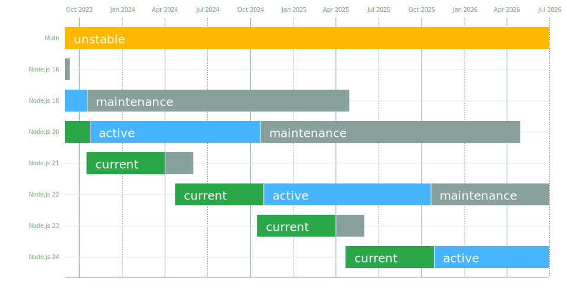

#!/usr/bin/env bash

# find . | grep -v release | grep \.md
exit

while read md; do
  if [[ -f "$md" ]]; then
    if [[ $md  =~ 'blog' ]]; then
      echo "#/ $md" >> $0
    fi
    cat $md >> $0
  fi
done << EOF

index.mdx
about/index.mdx
about/branding.mdx
about/governance.md
about/previous-releases.mdx
about/security-reporting.mdx
about/get-involved/index.md
about/get-involved/collab-summit.md
about/get-involved/contribute.md
about/get-involved/events.mdx

download/current.mdx
download/index.mdx
download/package-manager/all.md
download/package-manager/current.mdx
download/package-manager/index.mdx
download/prebuilt-binaries/current.mdx
download/prebuilt-binaries/index.mdx
download/source-code/current.mdx
download/source-code/index.mdx

learn/getting-started/introduction-to-nodejs.md
learn/getting-started/how-to-install-nodejs.md
learn/getting-started/differences-between-nodejs-and-the-browser.md
learn/getting-started/the-v8-javascript-engine.md
learn/getting-started/an-introduction-to-the-npm-package-manager.md
learn/getting-started/ecmascript-2015-es6-and-beyond.md
learn/getting-started/nodejs-the-difference-between-development-and-production.md
learn/getting-started/nodejs-with-typescript.md
learn/getting-started/nodejs-with-webassembly.md
learn/getting-started/debugging.md
learn/getting-started/profiling.md
learn/getting-started/how-much-javascript-do-you-need-to-know-to-use-nodejs.md
learn/getting-started/security-best-practices.md

learn/asynchronous-work/asynchronous-flow-control.md
learn/asynchronous-work/overview-of-blocking-vs-non-blocking.md
learn/asynchronous-work/javascript-asynchronous-programming-and-callbacks.md
learn/asynchronous-work/discover-javascript-timers.md
learn/asynchronous-work/the-nodejs-event-emitter.md
learn/asynchronous-work/event-loop-timers-and-nexttick.md
learn/asynchronous-work/understanding-processnexttick.md
learn/asynchronous-work/understanding-setimmediate.md
learn/asynchronous-work/dont-block-the-event-loop.md

learn/manipulating-files/nodejs-file-stats.md
learn/manipulating-files/nodejs-file-paths.md
learn/manipulating-files/working-with-file-descriptors-in-nodejs.md
learn/manipulating-files/reading-files-with-nodejs.md
learn/manipulating-files/writing-files-with-nodejs.md
learn/manipulating-files/working-with-folders-in-nodejs.md
learn/manipulating-files/working-with-different-filesystems.md

learn/command-line/run-nodejs-scripts-from-the-command-line.md
learn/command-line/how-to-read-environment-variables-from-nodejs.md
learn/command-line/how-to-use-the-nodejs-repl.md
learn/command-line/output-to-the-command-line-using-nodejs.md
learn/command-line/accept-input-from-the-command-line-in-nodejs.md

learn/modules/publishing-node-api-modules.md
learn/modules/anatomy-of-an-http-transaction.md
learn/modules/abi-stability.md
learn/modules/backpressuring-in-streams.md

learn/diagnostics/user-journey.md
learn/diagnostics/memory/index.md
learn/diagnostics/memory/using-gc-traces.md
learn/diagnostics/memory/using-heap-profiler.md
learn/diagnostics/memory/using-heap-snapshot.md
learn/diagnostics/live-debugging/index.md
learn/diagnostics/live-debugging/using-inspector.md
learn/diagnostics/poor-performance/index.md
learn/diagnostics/poor-performance/using-linux-perf.md
learn/diagnostics/flame-graphs.md

blog/announcements/apigee-rising-stack-yahoo.md
blog/announcements/appdynamics-newrelic-opbeat-sphinx.md
blog/announcements/cars-dynatrace.md
blog/announcements/diving-into-the-nodejs-website-redesign.md
blog/announcements/foundation-advances-growth.md
blog/announcements/foundation-elects-board.md
blog/announcements/foundation-express-news.md
blog/announcements/foundation-v4-announce.md
blog/announcements/interactive-2015-keynotes.md
blog/announcements/interactive-2015-programming.md
blog/announcements/interactive-2015.md
blog/announcements/interactive-2016-ams.md
blog/announcements/interactive-2016-north-america-schedule.md
blog/announcements/node-js-march-17-incident.md
blog/announcements/nodejs-certified-developer-program.md
blog/announcements/nodejs-foundation-survey.md
blog/announcements/nodejs-security-project.md
blog/announcements/nodejs-trademarks-transferred-to-openjs-foundation.md
blog/announcements/nodejs16-eol.md
blog/announcements/retiring-the-node-js-community-committee.md
blog/announcements/welcome-google.md
blog/announcements/welcome-redhat.md
blog/community/2017-election.md
blog/community/building-nodejs-together.md
blog/community/foundation-benefits-all.md
blog/community/individual-membership.md
blog/community/next-chapter.md
blog/community/node-leaders-building-open-neutral-foundation.md
blog/community/node-v5.md
blog/community/quality-with-speed.md
blog/community/transitions.md
blog/community/update-v8-5.4.md
blog/community/v5-to-v7.md
blog/feature/streams2.md
blog/module/multi-server-continuous-deployment-with-fleet.md
blog/module/service-logging-in-json-with-bunyan.md
blog/npm/2013-outage-postmortem.md
blog/npm/managing-node-js-dependencies-with-shrinkwrap.md
blog/npm/npm-1-0-global-vs-local-installation.md
blog/npm/npm-1-0-link.md
blog/npm/npm-1-0-the-new-ls.md
blog/npm/peer-dependencies.mdx
blog/video/bert-belder-libuv-lxjs-2012.md
blog/video/bryan-cantrill-instrumenting-the-real-time-web.md
blog/video/welcome-to-the-node-blog.md
blog/vulnerability/april-2020-openssl-updates.md
blog/vulnerability/cve-2015-8027_cve-2015-6764.md
blog/vulnerability/http-server-pipeline-flood-dos.md
blog/vulnerability/http-server-security-vulnerability-please-upgrade-to-0-6-17.md
blog/vulnerability/jan-2018-spectre-meltdown.md
blog/vulnerability/npm-tokens-leak-march-2016.md
blog/vulnerability/oct-2017-dos.md
blog/vulnerability/openssl-and-low-severity-fixes-jan-2016.md
blog/vulnerability/openssl-and-utf8.md
blog/vulnerability/openssl-and-zlib-vulnerability-assessment.md
blog/vulnerability/openssl-january-2017.md
blog/vulnerability/openssl-march-2016.md
blog/vulnerability/openssl-may-2016.md
blog/vulnerability/openssl-november-2017.md
blog/vulnerability/openssl-november-2022.md
blog/vulnerability/september-2017-path-validation.md
blog/vulnerability/september-2019-openssl-no-updates.md
blog/vulnerability/september-2019-openssl-updates.md
blog/vulnerability/v8-memory-corruption-stack-overflow.md
blog/wg/diag-wg-update-2017-02.md
EOF

exit
========================================================================

# /nodejs.org Readme

<p align="center">
  <a href="https://nodejs.org">Node.js</a> Website built using Next.js with TypeScript, SCSS and MDXv2
</p>

## What is this repo?

[Nodejs.org](https://nodejs.org/) by the [OpenJS Foundation](https://openjsf.org/) is the official website for the Node.js® JavaScript runtime. This repo is the source code for the website. It is built using [Next.js](https://nextjs.org), a React Framework.

```bash
npm ci
npx turbo serve

# listening at localhost:3000
```

## Contributing

This project adopts the Node.js [Code of Conduct][].

Any person who wants to contribute to the Website is welcome! Please read [Contribution Guidelines][] and see the [Figma Design][] to understand better the structure of this repository.

> \[!IMPORTANT]\
> Please read our [Translation Guidelines][] before contributing to Translation and Localization of the Website

> \[!NOTE]\
> We recommend a read of all Relevant Links below before doing code changes; Including Dependency changes, Content changes, and Code changes.

### Deployment

The Website is automatically deployed to [Vercel](https://vercel.com) through its GitHub App integration when new pushes happen on the `main` branch.

Details regarding the deployment are only accessible to the maintainers of the Website Team due to certain limitations.

The current integration is owned by the OpenJS Foundation and managed by the Website Team.

<details>
  <summary>Legacy Deployment</summary>

The full setup is in <https://github.com/nodejs/build/tree/master/ansible/www-standalone> minus secrets and certificates.

The webhook is set up on GitHub for this project and talks to a small Node server on the host, which does the work. See the [github-webhook](https://github.com/rvagg/github-webhook) package for this.

</details>

## Node.js Binaries & API Docs

This repository does not contain the codebase or related infrastructure that serves `https://nodejs.org/api/`, `https://nodejs.org/docs/` or `https://nodejs.org/dist/`.

These are maintained in different repositories and we urge users to open **issues in their respective repositories**, for bug reports, feature requests or any matter related to these endpoints.

- [`release-cloudflare-worker`](https://github.com/nodejs/release-cloudflare-worker): The codebase responsible for serving the Node.js Distribution Binaries, API Docs and any other assets from the links mentioned above.
  - We use Cloudflare R2 Buckets for storing our Assets and Cloudflare Workers for serving these Assets to the Web.
- [`node/doc/api`](https://github.com/nodejs/node/tree/main/doc/api): The source code of our API docs, it contains all the Node.js API Documentation Markdown files
  - [`node/doc`](https://github.com/nodejs/node/tree/main/doc) contains the HTML templates, CSS styles and JavaScript code that runs on the client-side of our API Docs generated pages.
  - [`node/tools/doc`](https://github.com/nodejs/node/tree/main/tools/doc) contains the tooling that validates, lints, builds and compiles our API Docs. Also responsible for generating what you see when accessing `https://nodejs.org/api/`.

## Relevant Links

[Code of Conduct][]

[Contribution Guidelines][]

[Collaborator Guide][]

[Figma Design][]

[Content vs Code][]

[Dependency Pinning][]

[Translation Guidelines][]

## Thanks

- Thanks to all contributors and collaborators that make this project possible.
- Thanks to [Chromatic](https://www.chromatic.com/) for providing the visual testing platform that helps us review UI changes and catch visual regressions.
- Thanks to [Vercel](https://www.vercel.com/) for providing the infrastructure that serves and powers the Node.js Website
- Thanks to [Cloudflare](https://cloudflare.com) for providing the infrastructure that serves Node.js's Website, Node.js's CDN and more.
  - A really warm thank you to Cloudflare as we would not be able to serve our community without their immense support.
- Thanks to [Sentry](https://sentry.io/welcome/) for providing an open source license for their error reporting, monitoring and diagnostic tools.
- Thanks to [Crowdin](https://crowdin.com/) for providing a platform that allows us to localize the Node.js Website and collaborate with translators.
- Thanks to [Orama](https://docs.oramasearch.com/) for providing a search platform that indexes our expansive content and provides lightning-fast results for our users.

[code of conduct]: https://github.com/nodejs/admin/blob/main/CODE_OF_CONDUCT.md
[contribution guidelines]: https://github.com/nodejs/nodejs.org/blob/main/CONTRIBUTING.md
[content vs code]: https://github.com/nodejs/nodejs.org/blob/main/CONTENT_VS_CODE.md
[dependency pinning]: https://github.com/nodejs/nodejs.org/blob/main/DEPENDENCY_PINNING.md
[collaborator guide]: https://github.com/nodejs/nodejs.org/blob/main/COLLABORATOR_GUIDE.md
[figma design]: https://www.figma.com/file/pu1vZPqNIM7BePd6W8APA5/Node.js
[translation guidelines]: https://github.com/nodejs/nodejs.org/blob/main/TRANSLATION.md

---
title: Run JavaScript Everywhere
layout: home
---

<section>
 <WithBadge section="index" />

  <div>
    <h1 className="special">Run JavaScript Everywhere</h1>

    Node.js® is a free, open-source, cross-platform JavaScript runtime
    environment that lets developers create servers, web apps,
    command line tools and scripts.

  </div>

  <div>
    <WithNodeRelease status={['LTS']}>
      {({ release }) => (
        <>
          <DownloadButton release={release}>Download Node.js (LTS)</DownloadButton>
          <small>
            Downloads Node.js <b>{release.versionWithPrefix}</b>
            <sup title="Downloads a Node.js installer for your current platform">1</sup> with long-term support.
            Node.js can also be installed via <a href="/download/package-manager">package managers</a>.
          </small>
        </>
      )}
    </WithNodeRelease>
    <WithNodeRelease status={['Current']}>
      {({ release }) => (
        <small>
          Want new features sooner?
          Get <b>Node.js <DownloadLink release={release}>{release.versionWithPrefix}</DownloadLink></b>
          <sup title="Downloads a Node.js installer for your current platform">1</sup> instead.
        </small>
      )}
    </WithNodeRelease>
  </div>
</section>

<section>
  <div>

  ```js displayName="Create an HTTP Server"
  // server.mjs
  import { createServer } from 'node:http';

  const server = createServer((req, res) => {
    res.writeHead(200, { 'Content-Type': 'text/plain' });
    res.end('Hello World!\n');
  });

  // starts a simple http server locally on port 3000
  server.listen(3000, '127.0.0.1', () => {
    console.log('Listening on 127.0.0.1:3000');
  });

  // run with `node server.mjs`
  ```

  ```js displayName="Write Tests"
  // tests.mjs
  import assert from 'node:assert';
  import test from 'node:test';

  test('that 1 is equal 1', () => {
    assert.strictEqual(1, 1);
  });

  test('that throws as 1 is not equal 2', () => {
    // throws an exception because 1 != 2
    assert.strictEqual(1, 2);
  });

  // run with `node tests.mjs`
  ```

  ```js displayName="Read and Hash a File"
  // crypto.mjs
  import { createHash } from 'node:crypto';
  import { readFile } from 'node:fs/promises';

  const hasher = createHash('sha1');

  hasher.setEncoding('hex');
  // ensure you have a `package.json` file for this test!
  hasher.write(await readFile('package.json'));
  hasher.end();

  const fileHash = hasher.read();

  // run with `node crypto.mjs`
  ```

  ```js displayName="Streams Pipeline"
  // streams.mjs
  import { pipeline } from 'node:stream/promises';
  import { createReadStream, createWriteStream } from 'node:fs';
  import { createGzip } from 'node:zlib';

  // ensure you have a `package.json` file for this test!
  await pipeline
  (
    createReadStream('package.json'),
    createGzip(),
    createWriteStream('package.json.gz')
  );

  // run with `node streams.mjs`
  ```

  ```js displayName="Work with Threads"
  // threads.mjs
  import { Worker, isMainThread,
    workerData, parentPort } from 'node:worker_threads';

  if (isMainThread) {
    const data = 'some data';
    const worker = new Worker(import.meta.filename, { workerData: data });
    worker.on('message', msg => console.log('Reply from Thread:', msg));
  } else {
    const source = workerData;
    parentPort.postMessage(btoa(source.toUpperCase()));
  }

  // run with `node threads.mjs`
  ```

  </div>
  Learn more what Node.js is able to offer with our [Learning materials](/learn).
</section>


---
title: About Node.js®
layout: about
---

# About Node.js®

As an asynchronous event-driven JavaScript runtime, Node.js is designed to build
scalable network applications. In the following "hello world" example, many
connections can be handled concurrently. Upon each connection, the callback is
fired, but if there is no work to be done, Node.js will sleep.

```cjs
const { createServer } = require('node:http');

const hostname = '127.0.0.1';
const port = 3000;

const server = createServer((req, res) => {
  res.statusCode = 200;
  res.setHeader('Content-Type', 'text/plain');
  res.end('Hello World');
});

server.listen(port, hostname, () => {
  console.log(`Server running at http://${hostname}:${port}/`);
});
```

```mjs
import { createServer } from 'node:http';

const hostname = '127.0.0.1';
const port = 3000;

const server = createServer((req, res) => {
  res.statusCode = 200;
  res.setHeader('Content-Type', 'text/plain');
  res.end('Hello World');
});

server.listen(port, hostname, () => {
  console.log(`Server running at http://${hostname}:${port}/`);
});
```

This is in contrast to today's more common concurrency model, in which OS threads
are employed. Thread-based networking is relatively inefficient and very
difficult to use. Furthermore, users of Node.js are free from worries of
dead-locking the process, since there are no locks. Almost no function in
Node.js directly performs I/O, so the process never blocks except when the I/O is performed using
synchronous methods of Node.js standard library. Because nothing blocks, scalable systems are very
reasonable to develop in Node.js.

If some of this language is unfamiliar, there is a full article on
[Blocking vs. Non-Blocking][].

---

Node.js is similar in design to, and influenced by, systems like Ruby's
[Event Machine][] and Python's [Twisted][]. Node.js takes the event model a bit
further. It presents an event loop as a runtime construct instead of as a library. In other systems,
there is always a blocking call to start the event-loop.
Typically, behavior is defined through callbacks at the beginning of a script, and
at the end a server is started through a blocking call like `EventMachine::run()`.
In Node.js, there is no such start-the-event-loop call. Node.js simply enters the event loop after executing the input script. Node.js
exits the event loop when there are no more callbacks to perform. This behavior
is like browser JavaScript — the event loop is hidden from the user.

HTTP is a first-class citizen in Node.js, designed with streaming and low
latency in mind. This makes Node.js well suited for the foundation of a web
library or framework.

Node.js being designed without threads doesn't mean you can't take
advantage of multiple cores in your environment. Child processes can be spawned
by using our [`child_process.fork()`][] API, and are designed to be easy to
communicate with. Built upon that same interface is the [`cluster`][] module,
which allows you to share sockets between processes to enable load balancing
over your cores.

[blocking vs. non-blocking]: /learn/asynchronous-work/overview-of-blocking-vs-non-blocking
[`child_process.fork()`]: https://nodejs.org/api/child_process.html
[`cluster`]: https://nodejs.org/api/cluster.html
[event machine]: https://github.com/eventmachine/eventmachine
[twisted]: https://twistedmatrix.com/trac/

---
title: Branding of Node.js
layout: about
---

# Branding of Node.js

Please review the [trademark policy](https://trademark-policy.openjsf.org/) for information about permissible use of Node.js® logos and marks.

## Node.js® Mascot


## Node.js® Logo

### Node.js® Horizontal Logo

<table>
  <tr>
    <td>
      
    </td>
    <td>
      
    </td>
  </tr>
</table>

### Node.js® Stacked Logo

<table>
  <tr>
    <td>
      
    </td>
    <td>
      
    </td>
  </tr>
  <tr>
    <td>
      
    </td>
    <td>
      
    </td>
  </tr>
</table>

### JS Icons

<table>
  <tr>
    <td>
      
    </td>
    <td>
      
    </td>
  </tr>
</table>

---
title: Project Governance
layout: about
---

# Project Governance

## Consensus Seeking Process

The Node.js project follows a [Consensus Seeking][] decision making model.

## Collaborators

The [nodejs/node][] core GitHub repository is maintained by the Collaborators
who are nominated by other existing Collaborators on an ongoing basis.

Individuals making significant and valuable contributions are made Collaborators
and given commit-access to the project. These individuals are identified by other
Collaborators and their nomination is discussed with the existing Collaborators.

For the current list of Collaborators, see the project's [README.md][].

A guide for Collaborators is maintained at [collaborator-guide.md][].

## Technical Steering Committee

The project is governed by the [Technical Steering Committee (TSC)][]
which is responsible for high-level guidance of the project. TSC is a
subset of active Collaborators who are nominated by other existing TSC
members.

[consensus seeking]: https://en.wikipedia.org/wiki/Consensus-seeking_decision-making
[readme.md]: https://github.com/nodejs/node/blob/main/README.md#current-project-team-members
[tsc]: https://github.com/nodejs/TSC
[technical steering committee (tsc)]: https://github.com/nodejs/TSC/blob/main/TSC-Charter.md
[collaborator-guide.md]: https://github.com/nodejs/node/blob/main/doc/contributing/collaborator-guide.md
[nodejs/node]: https://github.com/nodejs/node

---
title: Previous Releases
layout: about
---

# Previous Releases

Major Node.js versions enter _Current_ release status for six months, which gives library authors time to add support for them.
After six months, odd-numbered releases (9, 11, etc.) become unsupported, and even-numbered releases (10, 12, etc.) move to _Active LTS_ status and are ready for general use.
_LTS_ release status is "long-term support", which typically guarantees that critical bugs will be fixed for a total of 30 months.
Production applications should only use _Active LTS_ or _Maintenance LTS_ releases.

### Release Schedule


[Releases](https://raw.githubusercontent.com/nodejs/Release/main/schedule.svg?sanitize=true)

Full details regarding Node.js release schedule are available [on GitHub](https://github.com/nodejs/release#release-schedule).

### Looking for latest release of a version branch?

<!-- <DownloadReleasesTable /> -->

 
| Node.js Version | Codename | Release Date |    npm    |                                                                   |
|-----------------|----------|--------------|-----------|-------------------------------------------------------------------|
| v 21.7.3        | -        | 2024-04-10   | v 10.5.0  | [Releases][rv21.7.3]   [Changelog][cv21.7.3]   [Docs][av21.7.3]   |
| v 20.12.2       | Iron     | 2024-04-10   | v 10.5.0  | [Releases][rv20.12.2]  [Changelog][cv20.12.2]  [Docs][av20.12.2]  |
| v 19.9.0        | -        | 2023-04-10   | v 9.6.3   | [Releases][rv19.9.0]   [Changelog][cv19.9.0]   [Docs][av19.9.0]   |
| v 18.20.2       | Hydrogen | 2024-04-10   | v 10.5.0  | [Releases][rv18.20.2]  [Changelog][cv18.20.2]  [Docs][av18.20.2]  |
| v 17.9.1        | -        | 2022-06-01   | v 8.11.0  | [Releases][rv17.9.1]   [Changelog][cv17.9.1]   [Docs][av17.9.1]   |
| v 16.20.2       | Gallium  | 2023-08-08   | v 8.19.4  | [Releases][rv16.20.2]  [Changelog][cv16.20.2]  [Docs][av16.20.2]  |
| v 15.14.0       | -        | 2021-04-06   | v 7.7.6   | [Releases][rv15.14.0]  [Changelog][cv15.14.0]  [Docs][av15.14.0]  |
| v 14.21.3       | Fermium  | 2023-02-16   | v 6.14.18 | [Releases][rv14.21.3]  [Changelog][cv14.21.3]  [Docs][av14.21.3]  |
| v 13.14.0       | -        | 2020-04-29   | v 6.14.4  | [Releases][rv13.14.0]  [Changelog][cv13.14.0]  [Docs][av13.14.0]  |
| v 12.22.12      | Erbium   | 2022-04-05   | v 6.14.16 | [Releases][rv12.22.12] [Changelog][cv12.22.12] [Docs][av12.22.12] |
| v 11.15.0       | -        | 2019-04-30   | v 6.7.0   | [Releases][rv11.15.0]  [Changelog][cv11.15.0]  [Docs][av11.15.0]  |
| v 10.24.1       | Dubnium  | 2021-04-06   | v 6.14.12 | [Releases][rv10.24.1]  [Changelog][cv10.24.1]  [Docs][av10.24.1]  |
| v 9.11.2        | -        | 2018-06-12   | v 5.6.0   | [Releases][rv9.11.2]   [Changelog][cv9.11.2]   [Docs][av9.11.2]   |
| v 8.17.0        | Carbon   | 2019-12-17   | v 6.13.4  | [Releases][rv8.17.0]   [Changelog][cv8.17.0]   [Docs][av8.17.0]   |
| v 7.10.1        | -        | 2017-07-11   | v 4.2.0   | [Releases][rv7.10.1]   [Changelog][cv7.10.1]   [Docs][av7.10.1]   |
| v 6.17.1        | Boron    | 2019-04-03   | v 3.10.10 | [Releases][rv6.17.1]   [Changelog][cv6.17.1]   [Docs][av6.17.1]   |
| v 5.12.0        | -        | 2016-06-23   | v 3.8.6   | [Releases][rv5.12.0]   [Changelog][cv5.12.0]   [Docs][av5.12.0]   |
| v 4.9.1         | Argon    | 2018-03-29   | v 2.15.11 | [Releases][rv4.9.1]    [Changelog][cv4.9.1]    [Docs][av4.9.1]    |
| v 0.12.18       | -        | 2017-02-22   | v 2.15.11 | [Releases][rv0.12.18]  [Changelog][cv0.12.18]  [Docs][av0.12.18]  |


[rv21.7.3]: https://nodejs.org/download/release/v21.7.3/)
[cv21.7.3]: (https://github.com/nodejs/node/blob/main/doc/changelogs/CHANGELOG_V21.md#21.7.3)
[av21.7.3]: (https://nodejs.org/dist/v21.7.3/docs/api/)
[rv20.12.2]: https://nodejs.org/download/release/v20.12.2/)
[cv20.12.2]: (https://github.com/nodejs/node/blob/main/doc/changelogs/CHANGELOG_V20.md#20.12.2)
[av20.12.2]: (https://nodejs.org/dist/v20.12.2/docs/api/)
[rv19.9.0]: https://nodejs.org/download/release/v19.9.0/)
[cv19.9.0]: (https://github.com/nodejs/node/blob/main/doc/changelogs/CHANGELOG_V19.md#19.9.0)
[av19.9.0]: (https://nodejs.org/dist/v19.9.0/docs/api/)
[rv18.20.2]: https://nodejs.org/download/release/v18.20.2/)
[cv18.20.2]: (https://github.com/nodejs/node/blob/main/doc/changelogs/CHANGELOG_V18.md#18.20.2)
[av18.20.2]: (https://nodejs.org/dist/v18.20.2/docs/api/)
[rv17.9.1]: https://nodejs.org/download/release/v17.9.1/)
[cv17.9.1]: (https://github.com/nodejs/node/blob/main/doc/changelogs/CHANGELOG_V17.md#17.9.1)
[av17.9.1]: (https://nodejs.org/dist/v17.9.1/docs/api/)
[rv16.20.2]: https://nodejs.org/download/release/v16.20.2/)
[cv16.20.2]: (https://github.com/nodejs/node/blob/main/doc/changelogs/CHANGELOG_V16.md#16.20.2)
[av16.20.2]: (https://nodejs.org/dist/v16.20.2/docs/api/)
[rv15.14.0]: https://nodejs.org/download/release/v15.14.0/)
[cv15.14.0]: (https://github.com/nodejs/node/blob/main/doc/changelogs/CHANGELOG_V15.md#15.14.0)
[av15.14.0]: (https://nodejs.org/dist/v15.14.0/docs/api/)
[rv14.21.3]: https://nodejs.org/download/release/v14.21.3/)
[cv14.21.3]: (https://github.com/nodejs/node/blob/main/doc/changelogs/CHANGELOG_V14.md#14.21.3)
[av14.21.3]: (https://nodejs.org/dist/v14.21.3/docs/api/)
[rv13.14.0]: https://nodejs.org/download/release/v13.14.0/)
[cv13.14.0]: (https://github.com/nodejs/node/blob/main/doc/changelogs/CHANGELOG_V13.md#13.14.0)
[av13.14.0]: (https://nodejs.org/dist/v13.14.0/docs/api/)
[rv12.22.12]: https://nodejs.org/download/release/v12.22.12/)
[cv12.22.12]: (https://github.com/nodejs/node/blob/main/doc/changelogs/CHANGELOG_V12.md#12.22.12)
[av12.22.12]: (https://nodejs.org/dist/v12.22.12/docs/api/)
[rv11.15.0]: https://nodejs.org/download/release/v11.15.0/)
[cv11.15.0]: (https://github.com/nodejs/node/blob/main/doc/changelogs/CHANGELOG_V11.md#11.15.0)
[av11.15.0]: (https://nodejs.org/dist/v11.15.0/docs/api/)
[rv10.24.1]: https://nodejs.org/download/release/v10.24.1/)
[cv10.24.1]: (https://github.com/nodejs/node/blob/main/doc/changelogs/CHANGELOG_V10.md#10.24.1)
[av10.24.1]: (https://nodejs.org/dist/v10.24.1/docs/api/)
[rv9.11.2]: https://nodejs.org/download/release/v9.11.2/)
[cv9.11.2]: (https://github.com/nodejs/node/blob/main/doc/changelogs/CHANGELOG_V9.md#9.11.2)
[av9.11.2]: (https://nodejs.org/dist/v9.11.2/docs/api/)
[rv8.17.0]: https://nodejs.org/download/release/v8.17.0/)
[cv8.17.0]: (https://github.com/nodejs/node/blob/main/doc/changelogs/CHANGELOG_V8.md#8.17.0)
[av8.17.0]: (https://nodejs.org/dist/v8.17.0/docs/api/)
[rv7.10.1]: https://nodejs.org/download/release/v7.10.1/)
[cv7.10.1]: (https://github.com/nodejs/node/blob/main/doc/changelogs/CHANGELOG_V7.md#7.10.1)
[av7.10.1]: (https://nodejs.org/dist/v7.10.1/docs/api/)
[rv6.17.1]: https://nodejs.org/download/release/v6.17.1/)
[cv6.17.1]: (https://github.com/nodejs/node/blob/main/doc/changelogs/CHANGELOG_V6.md#6.17.1)
[av6.17.1]: (https://nodejs.org/dist/v6.17.1/docs/api/)
[rv5.12.0]: https://nodejs.org/download/release/v5.12.0/)
[cv5.12.0]: (https://github.com/nodejs/node/blob/main/doc/changelogs/CHANGELOG_V5.md#5.12.0)
[av5.12.0]: (https://nodejs.org/dist/v5.12.0/docs/api/)
[rv4.9.1]: https://nodejs.org/download/release/v4.9.1/)
[cv4.9.1]: (https://github.com/nodejs/node/blob/main/doc/changelogs/CHANGELOG_V4.md#4.9.1)
[av4.9.1]: (https://nodejs.org/dist/v4.9.1/docs/api/)
[rv0.12.18]: https://nodejs.org/download/release/v0.12.18/)
[cv0.12.18]: (https://github.com/nodejs/node/blob/main/doc/changelogs/CHANGELOG_V012.md#0.12.18)
[av0.12.18]: (https://nodejs.org/dist/v0.12.18/docs/api/)

---
title: Security Reporting
layout: about
---

# Security Reporting

For more details on active Security Policies, checkout [this page](https://github.com/nodejs/node/security/policy).

## Reporting a bug in Node.js

Report security bugs in Node.js via [HackerOne](https://hackerone.com/nodejs).

Your report will be acknowledged within 5 days, and you'll receive a more
detailed response to your report within 10 days indicating the next steps in
handling your submission.

After the initial reply to your report, the security team will endeavor to keep
you informed of the progress being made towards a fix and full announcement,
and may ask for additional information or guidance surrounding the reported
issue.

### Node.js bug bounty program

The Node.js project engages in an official bug bounty program for security
researchers and responsible public disclosures. The program is managed through
the HackerOne platform. See [https://hackerone.com/nodejs](https://hackerone.com/nodejs) for further details.

## Reporting a bug in a third party module

Security bugs in third party modules should be reported to their respective
maintainers.

## Disclosure policy

Here is the security disclosure policy for Node.js

- The security report is received and is assigned a primary handler. This
  person will coordinate the fix and release process. The problem is confirmed
  and a list of all affected versions is determined. Code is audited to find
  any potential similar problems. Fixes are prepared for all releases which are
  still under maintenance. These fixes are not committed to the public
  repository but rather held locally pending the announcement.

- A suggested embargo date for this vulnerability is chosen and a CVE (Common
  Vulnerabilities and Exposures (CVE®)) is requested for the vulnerability.

- On the embargo date, the Node.js security mailing list is sent a copy of the
  announcement. The changes are pushed to the public repository and new builds
  are deployed to nodejs.org. Within 6 hours of the mailing list being
  notified, a copy of the advisory will be published on the Node.js blog.

- Typically the embargo date will be set 72 hours from the time the CVE is
  issued. However, this may vary depending on the severity of the bug or
  difficulty in applying a fix.

- This process can take some time, especially when coordination is required
  with maintainers of other projects. Every effort will be made to handle the
  bug in as timely a manner as possible; however, it's important that we follow
  the release process above to ensure that the disclosure is handled in a
  consistent manner.

## Receiving security updates

Security notifications will be distributed via the following methods.

- [Google Group](https://groups.google.com/group/nodejs-sec)
- [Node.js Blog](/blog)

## Comments on this policy

If you have suggestions on how this process could be improved please submit a
[pull request](https://github.com/nodejs/nodejs.org) or
[file an issue](https://github.com/nodejs/security-wg/issues/new) to discuss.

## OpenSSF Best Practices

<a
  href="https://bestpractices.coreinfrastructure.org/projects/29"
  style={{ display: 'inline-flex' }}
>
  
</a>

The Open Source Security Foundation (OpenSSF) [Best Practices badge](https://github.com/coreinfrastructure/best-practices-badge) is a way for Free/Libre and Open Source Software (FLOSS) projects to show that they follow best practices. Projects can voluntarily self-certify how they follow each best practice. Consumers of the badge can quickly assess which FLOSS projects are following best practices and as a result are more likely to produce higher-quality secure software.

---
title: Get involved
layout: about
---

# Get Involved

## Community Discussion

- The [GitHub issues list](https://github.com/nodejs/node/issues) is the place for discussion of Node.js core features.
- For real-time chat about Node.js development use one of the platforms below
  - For IRC, go to `irc.libera.chat` in the `#node.js` channel with an [IRC client](https://en.wikipedia.org/wiki/Comparison_of_Internet_Relay_Chat_clients) or connect in your web browser to the channel using [a web client](https://kiwiirc.com/nextclient/)
  - For Slack, there are two options:
    - The [OpenJSF Slack](https://slack-invite.openjsf.org/) is a Foundation run Slack with several Node.js channels (channels prefixed by `#nodejs-` are related to the project).
    - [Node Slackers](https://www.nodeslackers.com/) is a Node.js-focused Slack community.
- The official Node.js Twitter account is [nodejs](https://twitter.com/nodejs).
- The [Node.js project calendar](https://nodejs.org/calendar) with all public team meetings.

## Learning

- [Official Learn section](https://nodejs.org/en/learn/) of the Node.js website.
- [Official API reference documentation](https://nodejs.org/api/).
- [NodeSchool.io](https://nodeschool.io/) will teach you Node.js concepts via interactive command-line games.
- [Stack Overflow Node.js tag](https://stackoverflow.com/questions/tagged/node.js) collects new information every day.
- [The DEV Community Node.js tag](https://dev.to/t/node) is a place to share Node.js projects, articles and tutorials as well as start discussions and ask for feedback on Node.js-related topics. Developers of all skill-levels are welcome to take part.
- [Nodeiflux](https://discordapp.com/invite/vUsrbjd) is a friendly community of Node.js backend developers supporting each other on Discord.

---
title: Collaboration Summit
layout: about
---

# Collaboration Summit

Node.js's Collaboration Summit is an un-conference for bringing current and
potential contributors together to discuss Node.js with lively collaboration,
education, and knowledge sharing. Teams, working groups and contributors
from the community come together twice per year to have discussions that
help decision-making while also working on some exciting efforts they
want to push forward in-person.

## Who attends?

The Collaboration Summit is primarily attended by existing contributors and
community members, but it also welcomes those who are not yet a contributor
and want to get onboard. If you are new to contributing to Node.js, the
Collaboration Summit can be a good opportunity to help you learn what is
happening within the community and contribute with the skills you have
and would like to hone.

Prior to the summit, contributors and community members send session proposals to
create a schedule. Attendees can familiarize themselves with the session before
getting onsite, having the general collaborator discussions, and then diving
into sessions. There will also be plenty of opportunities for hallway tracks
and brainstorms.

For information about upcoming and past Collaboration Summits, check out the
[Summit repo](https://github.com/openjs-foundation/summit). Have a look at the
[issues filed](https://github.com/nodejs/summit/issues) that share what
contributors and community members are proposing to discuss in-person.

---
title: Contributing
layout: about
---

# Contributing

Thank you for your interest in contributing to Node.js! There are multiple ways and places you can contribute, and we're here to help facilitate that.

## Asking for General Help

Because the level of activity in the `nodejs/node` repository is so high, questions or requests for general help using Node.js should be directed at the [Node.js help repository](https://github.com/nodejs/help/issues).

## Reporting an Issue

If you have found what you believe to be an issue with Node.js please do not hesitate to file an issue on the GitHub project. When filing your issue please make sure you can express the issue with a reproducible test case, and that test case should not include any external dependencies. That is to say, the test case can be executed without anything more than Node.js itself.

When reporting an issue we also need as much information about your environment that you can include. We never know what information will be pertinent when trying to narrow down the issue. Please include at least the following information:

- Version of Node.js
- Platform you're running on (macOS, SmartOS, Linux, Windows)
- Architecture you're running on (32bit or 64bit and x86 or ARM)

The Node.js project is currently managed across a number of separate GitHub repositories, each with their own separate issues database. If possible, please direct any issues you are reporting to the appropriate repository but don't worry if things happen to get put in the wrong place, the community of contributors will be more than happy to help get you pointed in the right direction.

- To report issues specific to Node.js, please use [nodejs/node](https://github.com/nodejs/node)
- To report issues specific to this website, please use [nodejs/nodejs.org](https://github.com/nodejs/nodejs.org/issues)

## Code contributions

If you'd like to fix bugs or add a new feature to Node.js, please make sure you consult the [Node.js Contribution Guidelines](https://github.com/nodejs/node/blob/main/CONTRIBUTING.md/#pull-requests). The review process by existing collaborators for all contributions to the project is explained there as well.

If you are wondering how to start, you can check [Node Todo](https://www.nodetodo.org/) which may guide you towards your first contribution.

## Becoming a collaborator

By becoming a collaborator, contributors can have even more impact on the project. They can help other contributors by reviewing their contributions, triage issues and take an even bigger part in shaping the project's future. Individuals identified by the TSC as making significant and valuable contributions across any Node.js repository may be made Collaborators and given commit access to the project. Activities taken into consideration include (but are not limited to) the quality of:

- code commits and pull requests
- documentation commits and pull requests
- comments on issues and pull requests
- contributions to the Node.js website
- assistance provided to end users and novice contributors
- participation in working groups
- other participation in the wider Node.js community

If individuals making valuable contributions do not believe they have been considered for commit access, they may [log an issue](https://github.com/nodejs/TSC/issues) or [contact a TSC member](https://github.com/nodejs/node#tsc-technical-steering-committee) directly.

---
title: Upcoming Events
layout: about
---

## Upcoming Events

Node.js events are open and available to the public. Anyone is welcome to join and participate.

### Upcoming Node.js® Meetings

The Node.js project holds numerous meetings throughout the year to discuss and plan aspects of the project.

The following meetings are upcoming in the next 7 days.

<UpcomingMeetings />
---
layout: download
title: Download Node.js®
subtitle: Download Node.js the way you want.
---

<section>
I want the <Release.VersionDropdown /> version of Node.js for <Release.OperatingSystemDropdown exclude={["LINUX", "AIX"]} /> running <Release.BitnessDropdown />

<Release.DownloadButton kind={"installer"} />
</section>

<section>
Node.js includes <Release.NpmLink />.

Read the changelog for <Release.ChangelogLink>this version</Release.ChangelogLink>

Read the blog post for <Release.BlogPostLink>this version</Release.BlogPostLink>

Learn how to <Release.VerifyingBinariesLink>verify signed SHASUMS</Release.VerifyingBinariesLink>

Check out all available Node.js <LinkWithArrow href="https://nodejs.org/dist/">download options</LinkWithArrow>

</section>
---
layout: download
title: Download Node.js®
subtitle: Download Node.js the way you want.
---

<section>
I want the <Release.VersionDropdown /> version of Node.js for <Release.OperatingSystemDropdown exclude={["LINUX", "AIX"]} /> running <Release.BitnessDropdown />

<Release.DownloadButton kind={"installer"} />
</section>

<section>
Node.js includes <Release.NpmLink />.

Read the changelog for <Release.ChangelogLink>this version</Release.ChangelogLink>

Read the blog post for <Release.BlogPostLink>this version</Release.BlogPostLink>

Learn how to <Release.VerifyingBinariesLink>verify signed SHASUMS</Release.VerifyingBinariesLink>

Check out all available Node.js <LinkWithArrow href="https://nodejs.org/dist/">download options</LinkWithArrow>

</section>
---
layout: docs
title: Installing Node.js via package manager
---

# Installing Node.js via Package Managers

> The packages on this page are maintained and supported by their respective packagers, **not** the Node.js core team. Please report any issues you encounter to the package maintainer. If it turns out your issue is a bug in Node.js itself, the maintainer will report the issue upstream.

---

- [Alpine Linux](#alpine-linux)
- [Android](#android)
- [Arch Linux](#arch-linux)
- [CentOS, Fedora and Red Hat Enterprise Linux](#centos-fedora-and-red-hat-enterprise-linux)
- [Debian and Ubuntu based Linux distributions](#debian-and-ubuntu-based-linux-distributions)
- [Exherbo Linux](#exherbo-linux)
- [fnm](#fnm)
- [FreeBSD](#freebsd)
- [Gentoo](#gentoo)
- [IBM i](#ibm-i)
- [macOS](#macos)
- [n](#n)
- [NetBSD](#netbsd)
- [Nodenv](#nodenv)
- [nvm](#nvm)
- [nvs](#nvs)
- [OpenBSD](#openbsd)
- [openSUSE and SLE](#opensuse-and-sle)
- [SmartOS and illumos](#smartos-and-illumos)
- [Snap](#snap)
- [Solus](#solus)
- [Void Linux](#void-linux)
- [Windows](#windows-1)
- [z/OS](#zos)

---

## Alpine Linux

Node.js LTS and npm packages are available in the Main Repository.

```bash
apk add nodejs npm
```

Node.js Current can be installed from the Community Repository.

```bash
apk add nodejs-current
```

## Android

Android support is still experimental in Node.js, so precompiled binaries are not yet provided by Node.js developers.

However, there are some third-party solutions. For example, [Termux](https://termux.com/) community provides terminal emulator and Linux environment for Android, as well as own package manager and [extensive collection](https://github.com/termux/termux-packages) of many precompiled applications. This command in Termux app will install the last available Node.js version:

```bash
pkg install nodejs
```

Currently, Termux Node.js binaries are linked against `system-icu` (depending on `libicu` package).

## Arch Linux

Node.js and npm packages are available in the Community Repository.

```bash
pacman -S nodejs npm
```

## CentOS, Fedora and Red Hat Enterprise Linux

Node.js is available as a module called `nodejs` in CentOS/RHEL 8 and Fedora.

```bash
dnf module install nodejs:<stream>
```

where `<stream>` corresponds to the major version of Node.js.
To see a list of available streams:

```bash
dnf module list nodejs
```

For example, to install Node.js 18:

```bash
dnf module install nodejs:18/common
```

### Alternatives

These resources provide packages compatible with CentOS, Fedora, and RHEL.

- [Node.js snaps](#snap) maintained and supported at https://github.com/nodejs/snap
- [Node.js binary distributions](#debian-and-ubuntu-based-linux-distributions) maintained and supported by [NodeSource](https://github.com/nodesource/distributions)

## Debian and Ubuntu based Linux distributions

[Node.js binary distributions](https://github.com/nodesource/distributions) are available from NodeSource.

### Alternatives

Packages compatible with Debian and Ubuntu based Linux distributions are available via [Node.js snaps](#snap).

## Exherbo Linux

Node.js and npm packages are available in the [arbor repository](https://gitlab.exherbo.org/exherbo/arbor/-/tree/master/packages/dev-lang/node).

```bash
cave resolve -x node
```

## fnm

Fast and simple Node.js version manager built in Rust used to manage multiple released Node.js versions. It allows you to perform operations like install, uninstall, switch Node versions automatically based on the current directory, etc.
To install fnm, use this [install script](https://github.com/Schniz/fnm#using-a-script-macoslinux).

fnm has cross-platform support (macOS, Windows, Linux) & all popular shells (Bash, Zsh, Fish, PowerShell, Windows Command Line Prompt).
fnm is built with speed in mind and compatibility support for `.node-version` and `.nvmrc` files.

## FreeBSD

The most recent release of Node.js is available via the [www/node](https://www.freshports.org/www/node) port.

Install a binary package via [pkg](https://www.freebsd.org/cgi/man.cgi?pkg):

```bash
pkg install node
```

Or compile it on your own using [ports](https://www.freebsd.org/cgi/man.cgi?ports):

```bash
cd /usr/ports/www/node && make install
```

## Gentoo

Node.js is available in the portage tree.

```bash
emerge nodejs
```

## IBM i

LTS versions of Node.js are available from IBM, and are available via [the 'yum' package manager](https://ibm.biz/ibmi-rpms). The package name is `nodejs` followed by the major version number (for instance, `nodejs18`, `nodejs20` etc)

To install Node.js 20.x from the command line, run the following as a user with \*ALLOBJ special authority:

```bash
yum install nodejs20
```

Node.js can also be installed with the IBM i Access Client Solutions product. See [this support document](http://www-01.ibm.com/support/docview.wss?uid=nas8N1022619) for more details

## macOS

Download the [macOS Installer](/#home-downloadhead) directly from the [nodejs.org](https://nodejs.org/) web site.

_If you want to download the package with bash:_

```bash
curl "https://nodejs.org/dist/latest/$(curl -s https://nodejs.org/dist/latest/ | grep "pkg" | cut -d'"' -f 2)" -o "$HOME/Downloads/node-latest.pkg" && sudo installer -store -pkg "$HOME/Downloads/node-latest.pkg" -target "/"
```

### Alternatives

Using **[Homebrew](https://brew.sh/)**:

```bash
brew install node
```

Using **[MacPorts](https://www.macports.org/)**:

```bash
port install nodejs<major version>

# Example
port install nodejs7
```

Using **[pkgsrc](https://pkgsrc.joyent.com/install-on-macos/)**:

Install the binary package:

```bash
pkgin -y install nodejs
```

Or build manually from pkgsrc:

```bash
cd pkgsrc/lang/nodejs && bmake install
```

## n

`n` is a simple to use Node.js version manager for Mac and Linux. Specify the target version to install using a rich syntax,
or select from a menu of previously downloaded versions. The versions are installed system-wide or user-wide, and for more
targeted use you can run a version directly from the cached downloads.

See the [homepage](https://github.com/tj/n) for install methods (bootstrap, npm, Homebrew, third-party), and all the usage details.

If you already have `npm` then installing `n` and then the newest LTS `node` version is as simple as:

```
npm install -g n
n lts
```

## NetBSD

Node.js is available in the pkgsrc tree:

```bash
cd /usr/pkgsrc/lang/nodejs && make install
```

Or install a binary package (if available for your platform) using pkgin:

```bash
pkgin -y install nodejs
```

## Nodenv

`nodenv` is a lightweight node version manager, similar to `nvm`. It's simple and predictable. A rich plugin ecosystem lets you tailor it to suit your needs. Use `nodenv` to pick a Node version for your application and guarantee that your development environment matches production.

Nodenv installation instructions are maintained [on its Github page](https://github.com/nodenv/nodenv#installation). Please visit that page to ensure you're following the latest version of the installation steps.

## nvm

Node Version Manager is a bash script used to manage multiple released Node.js versions. It allows
you to perform operations like install, uninstall, switch version, etc.
To install nvm, use this [install script](https://github.com/nvm-sh/nvm#install--update-script).

On Unix / OS X systems Node.js built from source can be installed using
[nvm](https://github.com/creationix/nvm) by installing into the location that nvm expects:

```bash
env VERSION=`python tools/getnodeversion.py` make install DESTDIR=`nvm_version_path v$VERSION` PREFIX=""
```

After this you can use `nvm` to switch between released versions and versions
built from source.
For example, if the version of Node.js is v8.0.0-pre:

```bash
nvm use 8
```

Once the official release is out you will want to uninstall the version built
from source:

```bash
nvm uninstall 8
```

## nvs

#### Windows

The `nvs` version manager is cross-platform and can be used on Windows, macOS, and Unix-like systems

To install `nvs` on Windows go to the [release page](https://github.com/jasongin/nvs/releases) here and download the MSI installer file of the latest release.

You can also use `chocolatey` to install it:

```bash
choco install nvs
```

#### macOS,UnixLike

You can find the documentation regarding the installation steps of `nvs` in macOS/Unix-like systems [here](https://github.com/jasongin/nvs/blob/master/doc/SETUP.md#mac-linux)

#### Usage

After this you can use `nvs` to switch between different versions of node.

To add the latest version of node:

```bash
nvs add latest
```

Or to add the latest LTS version of node:

```bash
nvs add lts
```

Then run the `nvs use` command to add a version of node to your `PATH` for the current shell:

```bash
$ nvs use lts
PATH -= %LOCALAPPDATA%\nvs\default
PATH += %LOCALAPPDATA%\nvs\node\14.17.0\x64
```

To add it to `PATH` permanently, use `nvs link`:

```bash
nvs link lts
```

## OpenBSD

Node.js is available through the ports system.

```bash
/usr/ports/lang/node
```

Using [pkg_add](https://man.openbsd.org/OpenBSD-current/man1/pkg_add.1) on OpenBSD:

```bash
pkg_add node
```

## openSUSE and SLE

Node.js is available in the main repositories under the following packages:

- **openSUSE Leap 15.2**: `nodejs10`, `nodejs12`, `nodejs14`
- **openSUSE Tumbleweed**: `nodejs20`
- **SUSE Linux Enterprise Server (SLES) 12**: `nodejs10`, `nodejs12`, and `nodejs14`
  (The "Web and Scripting Module" must be [enabled](https://www.suse.com/releasenotes/x86_64/SUSE-SLES/12-SP5/#intro-modulesExtensionsRelated).)
- **SUSE Linux Enterprise Server (SLES) 15 SP2**: `nodejs10`, `nodejs12`, and `nodejs14`
  (The "Web and Scripting Module" must be [enabled](https://www.suse.com/releasenotes/x86_64/SUSE-SLES/15/#Intro.Module).)

For example, to install Node.js 14.x on openSUSE Leap 15.2, run the following as root:

```bash
zypper install nodejs14
```

Different major versions of Node can be installed and used concurrently.

## SmartOS and illumos

SmartOS images come with pkgsrc pre-installed. On other illumos distributions, first install **[pkgsrc](https://pkgsrc.joyent.com/install-on-illumos/)**, then you may install the binary package as normal:

```bash
pkgin -y install nodejs
```

Or build manually from pkgsrc:

```bash
cd pkgsrc/lang/nodejs && bmake install
```

## Snap

[Node.js snaps](https://github.com/nodejs/snap) are available as [`node`](https://snapcraft.io/node) on the Snap store.

## Solus

Solus provides Node.js in its main repository.

```bash
sudo eopkg install nodejs
```

## Void Linux

Void Linux ships Node.js stable in the main repository.

```bash
xbps-install -Sy nodejs
```

## Windows

Download the [Windows Installer](/#home-downloadhead) directly from the [nodejs.org](https://nodejs.org/) web site.

### Alternatives

Using **[Winget](https://aka.ms/winget-cli)**:

```bash
winget install OpenJS.NodeJS
# or for LTS
winget install OpenJS.NodeJS.LTS
```

After running one of the two commands above, it may be necessary to restart the
terminal emulator before the `node` CLI command becomes available.

Using **[Chocolatey](https://chocolatey.org/)**:

```bash
cinst nodejs
# or for full install with npm
cinst nodejs.install
```

Using **[Scoop](https://scoop.sh/)**:

```bash
scoop install nodejs
# or for LTS
scoop install nodejs-lts
```

## z/OS

IBM&reg; SDK for Node.js - z/OS&reg; is available in two installation formats,
SMP/E and PAX. Select the installation format that applies to you:

- [Installing and configuring SMP/E edition of Node.js on z/OS](https://www.ibm.com/docs/en/sdk-nodejs-zos/14.0?topic=configuring-installing-smpe-edition)
- [Installing and configuring PAX edition of Node.js on z/OS](https://www.ibm.com/docs/en/sdk-nodejs-zos/14.0?topic=configuring-installing-pax-edition)
---
layout: download
title: Download Node.js®
subtitle: Download Node.js the way you want.
---

<section>
Install Node.js <Release.VersionDropdown /> on  <Release.OperatingSystemDropdown exclude={["AIX"]} /> using <Release.PlatformDropdown />

<Release.ReleaseCodeBox />
</section>

<section>
Node.js includes <Release.NpmLink />.

Read the changelog for <Release.ChangelogLink>this version</Release.ChangelogLink>

Read the blog post for <Release.BlogPostLink>this version</Release.BlogPostLink>

Learn how to <Release.VerifyingBinariesLink>verify signed SHASUMS</Release.VerifyingBinariesLink>

Check out other community supported <LinkWithArrow href="/download/package-manager/all">package managers</LinkWithArrow>

</section>
---
layout: download
title: Download Node.js®
subtitle: Download Node.js the way you want.
---

<section>
Install Node.js <Release.VersionDropdown /> on <Release.OperatingSystemDropdown exclude={["AIX"]} /> using <Release.PlatformDropdown />

<Release.ReleaseCodeBox />
</section>

<section>
Node.js includes <Release.NpmLink />.

Read the changelog for <Release.ChangelogLink>this version</Release.ChangelogLink>

Read the blog post for <Release.BlogPostLink>this version</Release.BlogPostLink>

Learn how to <Release.VerifyingBinariesLink>verify signed SHASUMS</Release.VerifyingBinariesLink>

Check out other community supported <LinkWithArrow href="/download/package-manager/all">package managers</LinkWithArrow>

</section>
---
layout: download
title: Download Node.js®
subtitle: Download Node.js the way you want.
---

<section>
I want the <Release.VersionDropdown /> version of Node.js for <Release.OperatingSystemDropdown /> running <Release.BitnessDropdown />

<Release.DownloadButton kind={"binary"} />
</section>

<section>
Node.js includes <Release.NpmLink />.

Read the changelog for <Release.ChangelogLink>this version</Release.ChangelogLink>

Read the blog post for <Release.BlogPostLink>this version</Release.BlogPostLink>

Learn how to <Release.VerifyingBinariesLink>verify signed SHASUMS</Release.VerifyingBinariesLink>

Check out <LinkWithArrow href="https://nodejs.org/download/nightly/">Nightly</LinkWithArrow> prebuilt binaries or <LinkWithArrow href="https://unofficial-builds.nodejs.org/download/">Unofficial Builds</LinkWithArrow> for other platforms

</section>
---
layout: download
title: Download Node.js®
subtitle: Download Node.js the way you want.
---

<section>
I want the <Release.VersionDropdown /> version of Node.js for <Release.OperatingSystemDropdown /> running <Release.BitnessDropdown />

<Release.DownloadButton kind={"binary"} />
</section>

<section>
Node.js includes <Release.NpmLink />.

Read the changelog for <Release.ChangelogLink>this version</Release.ChangelogLink>

Read the blog post for <Release.BlogPostLink>this version</Release.BlogPostLink>

Learn how to <Release.VerifyingBinariesLink>verify signed SHASUMS</Release.VerifyingBinariesLink>

Check out <LinkWithArrow href="https://nodejs.org/download/nightly/">Nightly</LinkWithArrow> prebuilt binaries or <LinkWithArrow href="https://unofficial-builds.nodejs.org/download/">Unofficial Builds</LinkWithArrow> for other platforms

</section>
---
layout: download
title: Download Node.js®
subtitle: Download Node.js the way you want.
---

<section>
I want the <Release.VersionDropdown /> version of the Node.js source code.

<Release.SourceButton />
</section>

<section>
Node.js includes <Release.NpmLink />.

Read the changelog for <Release.ChangelogLink>this version</Release.ChangelogLink>

Read the blog post for <Release.BlogPostLink>this version</Release.BlogPostLink>

Learn how to <Release.VerifyingBinariesLink>verify signed SHASUMS</Release.VerifyingBinariesLink>

Check out how to <LinkWithArrow href="https://github.com/nodejs/node/blob/main/BUILDING.md#building-nodejs-on-supported-platforms">build Node.js</LinkWithArrow> from source.

</section>
---
layout: download
title: Download Node.js®
subtitle: Download Node.js the way you want.
---

<section>
I want the <Release.VersionDropdown /> version of the Node.js source code.

<Release.SourceButton />
</section>

<section>
Node.js includes <Release.NpmLink />.

Read the changelog for <Release.ChangelogLink>this version</Release.ChangelogLink>

Read the blog post for <Release.BlogPostLink>this version</Release.BlogPostLink>

Learn how to <Release.VerifyingBinariesLink>verify signed SHASUMS</Release.VerifyingBinariesLink>

Check out how to <LinkWithArrow href="https://github.com/nodejs/node/blob/main/BUILDING.md#building-nodejs-on-supported-platforms">build Node.js</LinkWithArrow> from source.

</section>

---
title: Introduction to Node.js
layout: learn
authors: flaviocopes, potch, MylesBorins, RomainLanz, virkt25, Trott, onel0p3z, ollelauribostrom, MarkPieszak, fhemberger, LaRuaNa, FrozenPandaz, mcollina, amiller-gh, ahmadawais, saqibameen, dangen-effy, aymen94, benhalverson
---

# Introduction to Node.js

Node.js is an open-source and cross-platform JavaScript runtime environment. It is a popular tool for almost any kind of project!

Node.js runs the V8 JavaScript engine, the core of Google Chrome, outside of the browser. This allows Node.js to be very performant.

A Node.js app runs in a single process, without creating a new thread for every request. Node.js provides a set of asynchronous I/O primitives in its standard library that prevent JavaScript code from blocking and generally, libraries in Node.js are written using non-blocking paradigms, making blocking behavior the exception rather than the norm.

When Node.js performs an I/O operation, like reading from the network, accessing a database or the filesystem, instead of blocking the thread and wasting CPU cycles waiting, Node.js will resume the operations when the response comes back.

This allows Node.js to handle thousands of concurrent connections with a single server without introducing the burden of managing thread concurrency, which could be a significant source of bugs.

Node.js has a unique advantage because millions of frontend developers that write JavaScript for the browser are now able to write the server-side code in addition to the client-side code without the need to learn a completely different language.

In Node.js the new ECMAScript standards can be used without problems, as you don't have to wait for all your users to update their browsers - you are in charge of deciding which ECMAScript version to use by changing the Node.js version, and you can also enable specific experimental features by running Node.js with flags.

## An Example Node.js Application

The most common example Hello World of Node.js is a web server:

```cjs
const { createServer } = require('node:http');

const hostname = '127.0.0.1';
const port = 3000;

const server = createServer((req, res) => {
  res.statusCode = 200;
  res.setHeader('Content-Type', 'text/plain');
  res.end('Hello World');
});

server.listen(port, hostname, () => {
  console.log(`Server running at http://${hostname}:${port}/`);
});
```

```mjs
import { createServer } from 'node:http';

const hostname = '127.0.0.1';
const port = 3000;

const server = createServer((req, res) => {
  res.statusCode = 200;
  res.setHeader('Content-Type', 'text/plain');
  res.end('Hello World');
});

server.listen(port, hostname, () => {
  console.log(`Server running at http://${hostname}:${port}/`);
});
```

To run this snippet, save it as a `server.js` file and run `node server.js` in your terminal.

This code first includes the Node.js [`http` module](https://nodejs.org/api/http.html).

Node.js has a fantastic [standard library](https://nodejs.org/api/), including first-class support for networking.

The `createServer()` method of `http` creates a new HTTP server and returns it.

The server is set to listen on the specified port and host name. When the server is ready, the callback function is called, in this case informing us that the server is running.

Whenever a new request is received, the [`request` event](https://nodejs.org/api/http.html#http_event_request) is called, providing two objects: a request (an [`http.IncomingMessage`](https://nodejs.org/api/http.html#http_class_http_incomingmessage) object) and a response (an [`http.ServerResponse`](https://nodejs.org/api/http.html#http_class_http_serverresponse) object).

Those 2 objects are essential to handle the HTTP call.

The first provides the request details. In this simple example, this is not used, but you could access the request headers and request data.

The second is used to return data to the caller.

In this case with:

```js
res.statusCode = 200;
```

we set the statusCode property to 200, to indicate a successful response.

We set the Content-Type header:

```js
res.setHeader('Content-Type', 'text/plain');
```

and we close the response, adding the content as an argument to `end()`:

```js
res.end('Hello World\n');
```

### More Examples

See https://github.com/nodejs/examples for a list of Node.js examples that go beyond hello world.

---
title: How to install Node.js
layout: learn
authors: flaviocopes, ZYSzys, ollelauribostrom, MylesBorins, fhemberger, LaRuaNa, ahmadawais, benhalverson, ovflowd
---

# How to install Node.js

Node.js can be installed in different ways. This post highlights the most common and convenient ones. Official packages for all the major platforms are available at [https://nodejs.org/download/](/download).

One very convenient way to install Node.js is through a package manager. In this case, every operating system has its own. Other package managers for macOS, Linux, and Windows are listed in [https://nodejs.org/download/package-manager/](/download/package-manager/)

`nvm` is a popular way to run Node.js. It allows you to easily switch the Node.js version, and install new versions to try and easily rollback if something breaks. It is also very useful to test your code with old Node.js versions.

> See [https://github.com/nvm-sh/nvm](https://github.com/nvm-sh/nvm) for more information about this option.

In any case, when Node.js is installed you'll have access to the `node` executable program in the command line.

---
title: Differences between Node.js and the Browser
layout: learn
authors: flaviocopes, ollelauribostrom, MylesBorins, fhemberger, LaRuaNa, ahmadawais, karlhorky
---

# Differences between Node.js and the Browser

Both the browser and Node.js use JavaScript as their programming language. Building apps that run in the browser is a completely different thing than building a Node.js application. Despite the fact that it's always JavaScript, there are some key differences that make the experience radically different.

From the perspective of a frontend developer who extensively uses JavaScript, Node.js apps bring with them a huge advantage: the comfort of programming everything - the frontend and the backend - in a single language.

You have a huge opportunity because we know how hard it is to fully, deeply learn a programming language, and by using the same language to perform all your work on the web - both on the client and on the server, you're in a unique position of advantage.

> **What changes is the ecosystem.**

In the browser, most of the time what you are doing is interacting with the DOM, or other Web Platform APIs like Cookies. Those do not exist in Node.js, of course. You don't have the `document`, `window` and all the other objects that are provided by the browser.

And in the browser, we don't have all the nice APIs that Node.js provides through its modules, like the filesystem access functionality.

Another big difference is that in Node.js you control the environment. Unless you are building an open source application that anyone can deploy anywhere, you know which version of Node.js you will run the application on. Compared to the browser environment, where you don't get the luxury to choose what browser your visitors will use, this is very convenient.

This means that you can write all the modern ES2015+ JavaScript that your Node.js version supports. Since JavaScript moves so fast, but browsers can be a bit slow to upgrade, sometimes on the web you are stuck with using older JavaScript / ECMAScript releases. You can use Babel to transform your code to be ES5-compatible before shipping it to the browser, but in Node.js, you won't need that.

Another difference is that Node.js supports both the CommonJS and ES module systems (since Node.js v12), while in the browser we are starting to see the ES Modules standard being implemented.

In practice, this means that you can use both `require()` and `import` in Node.js, while you are limited to `import` in the browser.

---
title: The V8 JavaScript Engine
layout: learn
authors: flaviocopes, smfoote, co16353sidak, MylesBorins, LaRuaNa, andys8, ahmadawais, karlhorky, aymen94
---

# The V8 JavaScript Engine

V8 is the name of the JavaScript engine that powers Google Chrome. It's the thing that takes our JavaScript and executes it while browsing with Chrome.

V8 is the JavaScript engine i.e. it parses and executes JavaScript code. The DOM, and the other Web Platform APIs (they all makeup runtime environment) are provided by the browser.

The cool thing is that the JavaScript engine is independent of the browser in which it's hosted. This key feature enabled the rise of Node.js. V8 was chosen to be the engine that powered Node.js back in 2009, and as the popularity of Node.js exploded, V8 became the engine that now powers an incredible amount of server-side code written in JavaScript.

The Node.js ecosystem is huge and thanks to V8 which also powers desktop apps, with projects like Electron.

## Other JS engines

Other browsers have their own JavaScript engine:

- Firefox has [**SpiderMonkey**](https://spidermonkey.dev)
- Safari has [**JavaScriptCore**](https://developer.apple.com/documentation/javascriptcore) (also called Nitro)
- Edge was originally based on [**Chakra**](https://github.com/Microsoft/ChakraCore) but has more recently been [rebuilt using Chromium](https://support.microsoft.com/en-us/help/4501095/download-the-new-microsoft-edge-based-on-chromium) and the V8 engine.

and many others exist as well.

All those engines implement the [ECMA ES-262 standard](https://www.ecma-international.org/publications/standards/Ecma-262.htm), also called ECMAScript, the standard used by JavaScript.

## The quest for performance

V8 is written in C++, and it's continuously improved. It is portable and runs on Mac, Windows, Linux and several other systems.

In this V8 introduction, we will ignore the implementation details of V8: they can be found on more authoritative sites (e.g. the [V8 official site](https://v8.dev/)), and they change over time, often radically.

V8 is always evolving, just like the other JavaScript engines around, to speed up the Web and the Node.js ecosystem.

On the web, there is a race for performance that's been going on for years, and we (as users and developers) benefit a lot from this competition because we get faster and more optimized machines year after year.

## Compilation

JavaScript is generally considered an interpreted language, but modern JavaScript engines no longer just interpret JavaScript, they compile it.

This has been happening since 2009, when the SpiderMonkey JavaScript compiler was added to Firefox 3.5, and everyone followed this idea.

JavaScript is internally compiled by V8 with **just-in-time** (JIT) **compilation** to speed up the execution.

This might seem counter-intuitive, but since the introduction of Google Maps in 2004, JavaScript has evolved from a language that was generally executing a few dozens of lines of code to complete applications with thousands to hundreds of thousands of lines running in the browser.

Our applications can now run for hours inside a browser, rather than being just a few form validation rules or simple scripts.

In this _new world_, compiling JavaScript makes perfect sense because while it might take a little bit more to have the JavaScript _ready_, once done it's going to be much more performant than purely interpreted code.

---
title: An introduction to the npm package manager
layout: learn
authors: flaviocopes, MylesBorins, LaRuaNa, jgb-solutions, amiller-gh, ahmadawais
---

# An introduction to the npm package manager

## Introduction to npm

`npm` is the standard package manager for Node.js.

In September 2022 over 2.1 million packages were reported being listed in the npm registry, making it the biggest single language code repository on Earth, and you can be sure there is a package for (almost!) everything.

It started as a way to download and manage dependencies of Node.js packages, but it has since become a tool used also in frontend JavaScript.

> [**Yarn**](https://yarnpkg.com/en/) and [**pnpm**](https://pnpm.io) are alternatives to npm cli. You can check them out as well.

## Packages

`npm` manages downloads of dependencies of your project.

### Installing all dependencies

If a project has a `package.json` file, by running

```bash
npm install
```

it will install everything the project needs, in the `node_modules` folder, creating it if it's not existing already.

### Installing a single package

You can also install a specific package by running

```bash
npm install <package-name>
```

Furthermore, since npm 5, this command adds `<package-name>` to the `package.json` file _dependencies_. Before version 5, you needed to add the flag `--save`.

Often you'll see more flags added to this command:

- `--save-dev` installs and adds the entry to the `package.json` file _devDependencies_
- `--no-save` installs but does not add the entry to the `package.json` file _dependencies_
- `--save-optional` installs and adds the entry to the `package.json` file _optionalDependencies_
- `--no-optional` will prevent optional dependencies from being installed

Shorthands of the flags can also be used:

- \-S: `--save`
- \-D: `--save-dev`
- \-O: `--save-optional`

The difference between _devDependencies_ and _dependencies_ is that the former contains development tools, like a testing library, while the latter is bundled with the app in production.

As for the _optionalDependencies_ the difference is that build failure of the dependency will not cause installation to fail. But it is your program's responsibility to handle the lack of the dependency. Read more about [optional dependencies](https://docs.npmjs.com/cli/v7/configuring-npm/package-json#optionaldependencies).

### Updating packages

Updating is also made easy, by running

```bash
npm update
```

`npm` will check all packages for a newer version that satisfies your versioning constraints.

You can specify a single package to update as well:

```bash
npm update <package-name>
```

## Versioning

In addition to plain downloads, `npm` also manages **versioning**, so you can specify any specific version of a package, or require a version higher or lower than what you need.

Many times you'll find that a library is only compatible with a major release of another library.

Or a bug in the latest release of a lib, still unfixed, is causing an issue.

Specifying an explicit version of a library also helps to keep everyone on the same exact version of a package, so that the whole team runs the same version until the `package.json` file is updated.

In all those cases, versioning helps a lot, and `npm` follows the semantic versioning (semver) standard.

You can install a specific version of a package, by running

```bash
npm install <package-name>@<version>
```

## Running Tasks

The package.json file supports a format for specifying command line tasks that can be run by using

```bash
npm run <task-name>
```

For example:

```json
{
  "scripts": {
    "start-dev": "node lib/server-development",
    "start": "node lib/server-production"
  }
}
```

It's very common to use this feature to run Webpack:

```json
{
  "scripts": {
    "watch": "webpack --watch --progress --colors --config webpack.conf.js",
    "dev": "webpack --progress --colors --config webpack.conf.js",
    "prod": "NODE_ENV=production webpack -p --config webpack.conf.js"
  }
}
```

So instead of typing those long commands, which are easy to forget or mistype, you can run

```console
$ npm run watch
$ npm run dev
$ npm run prod
```

---
title: ECMAScript 2015 (ES6) and beyond
layout: learn
authors: ovflowd
---

# ECMAScript 2015 (ES6) and beyond

Node.js is built against modern versions of [V8](https://v8.dev/). By keeping up-to-date with the latest releases of this engine, we ensure new features from the [JavaScript ECMA-262 specification](http://www.ecma-international.org/publications/standards/Ecma-262.htm) are brought to Node.js developers in a timely manner, as well as continued performance and stability improvements.

All ECMAScript 2015 (ES6) features are split into three groups for **shipping**, **staged**, and **in progress** features:

- All **shipping** features, which V8 considers stable, are turned **on by default on Node.js** and do **NOT** require any kind of runtime flag.
- **Staged** features, which are almost-completed features that are not considered stable by the V8 team, require a runtime flag: `--harmony`.
- **In progress** features can be activated individually by their respective harmony flag, although this is highly discouraged unless for testing purposes. Note: these flags are exposed by V8 and will potentially change without any deprecation notice.

### Which features ship with which Node.js version by default?

The website [node.green](https://node.green/) provides an excellent overview over supported ECMAScript features in various versions of Node.js, based on kangax's compat-table.

### Which features are in progress?

New features are constantly being added to the V8 engine. Generally speaking, expect them to land on a future Node.js release, although timing is unknown.

You may list all the _in progress_ features available on each Node.js release by grepping through the `--v8-options` argument. Please note that these are incomplete and possibly broken features of V8, so use them at your own risk:

```bash
node --v8-options | grep "in progress"
```

### I have my infrastructure set up to leverage the --harmony flag. Should I remove it?

The current behavior of the `--harmony` flag on Node.js is to enable **staged** features only. After all, it is now a synonym of `--es_staging`. As mentioned above, these are completed features that have not been considered stable yet. If you want to play safe, especially on production environments, consider removing this runtime flag until it ships by default on V8 and, consequently, on Node.js. If you keep this enabled, you should be prepared for further Node.js upgrades to break your code if V8 changes their semantics to more closely follow the standard.

### How do I find which version of V8 ships with a particular version of Node.js?

Node.js provides a simple way to list all dependencies and respective versions that ship with a specific binary through the `process` global object. In case of the V8 engine, type the following in your terminal to retrieve its version:

```bash
node -p process.versions.v8
```

---
title: Node.js, the difference between development and production
layout: learn
authors: flaviocopes, MylesBorins, fhemberger, LaRuaNa, ahmadawais, RenanTKN
---

# Node.js, the difference between development and production

You can have different configurations for production and development environments.

Node.js assumes it's always running in a development environment.
You can signal Node.js that you are running in production by setting the `NODE_ENV=production` environment variable.

This is usually done by executing the command

```bash
export NODE_ENV=production
```

in the shell, but it's better to put it in your shell configuration file (e.g. `.bash_profile` with the Bash shell) because otherwise the setting does not persist in case of a system restart.

You can also apply the environment variable by prepending it to your application initialization command:

```bash
NODE_ENV=production node app.js
```

This environment variable is a convention that is widely used in external libraries as well.

Setting the environment to `production` generally ensures that

- logging is kept to a minimum, essential level
- more caching levels take place to optimize performance

For example [Pug](https://pugjs.org), the templating library used by [Express](https://expressjs.com), compiles in debug mode if `NODE_ENV` is not set to `production`. Express views are compiled in every request in development mode, while in production they are cached. There are many more examples.

You can use conditional statements to execute code in different environments:

```js
if (process.env.NODE_ENV === 'development') {
  // ...
}

if (process.env.NODE_ENV === 'production') {
  // ...
}

if (['production', 'staging'].includes(process.env.NODE_ENV)) {
  // ...
}
```

For example, in an Express app, you can use this to set different error handlers per environment:

```js
if (process.env.NODE_ENV === 'development') {
  app.use(express.errorHandler({ dumpExceptions: true, showStack: true }));
}

if (process.env.NODE_ENV === 'production') {
  app.use(express.errorHandler());
}
```

---
title: Node.js with TypeScript
layout: learn
authors: sbielenica, ovflowd, vaishnav-mk
---

# Node.js with TypeScript

## What is TypeScript

**[TypeScript](https://www.typescriptlang.org)** is a trendy open-source language maintained and developed by Microsoft. It's loved and used by a lot of software developers around the world.

Basically, it's a superset of JavaScript that adds new capabilities to the language. The most notable addition is static type definitions, something that is not present in plain JavaScript. Thanks to types, it's possible, for example, to declare what kind of arguments we are expecting and what is returned exactly in our functions or what's the exact shape of the object that we are creating. TypeScript is a really powerful tool and opens a new world of possibilities in JavaScript projects. It makes our code more secure and robust by preventing many bugs before the code is even shipped - it catches problems during code development and integrates wonderfully with code editors like Visual Studio Code.

We can talk about other TypeScript benefits later, let's see some examples now!

### Examples

Take a look at this code snippet and then we can unpack it together:

```ts
type User = {
  name: string;
  age: number;
};

function isAdult(user: User): boolean {
  return user.age >= 18;
}

const justine: User = {
  name: 'Justine',
  age: 23,
};

const isJustineAnAdult: boolean = isAdult(justine);
```

The first part (with the `type` keyword) is responsible for declaring our custom object type representing users. Later we utilize this newly created type to create function `isAdult` that accepts one argument of type `User` and returns `boolean`. After this, we create `justine`, our example data that can be used for calling the previously defined function. Finally, we create a new variable with information on whether `justine` is an adult.

There are additional things about this example that you should know. Firstly, if we would not comply with declared types, TypeScript would alarm us that something is wrong and prevent misuse. Secondly, not everything must be typed explicitly - TypeScript is very smart and can deduce types for us. For example, variable `isJustineAnAdult` would be of type `boolean` even if we didn't type it explicitly or `justine` would be valid argument for our function even if we didn't declare this variable as of `User` type.

Okay, so we have some TypeScript code. Now how do we run it?

**First thing to do is to install TypeScript in our project:**

```bash
npm i -D typescript
```

Now we can compile it to JavaScript using `tsc` command in the terminal. Let's do it!

**Assuming that our file is named `example.ts`, the command would look like:**

```bash
npx tsc example.ts
```

> [npx](https://www.npmjs.com/package/npx) here stands for Node Package Execute. This tool allows us to run TypeScript's compiler without installing it globally.

`tsc` is the TypeScript compiler which will take our TypeScript code and compile it to JavaScript.
This command will result in a new file named `example.js` that we can run using Node.js.
Now when we know how to compile and run TypeScript code let's see TypeScript bug-preventing capabilities in action!

**This is how we will modify our code:**

```ts
type User = {
  name: string;
  age: number;
};

function isAdult(user: User): boolean {
  return user.age >= 18;
}

const justine: User = {
  name: 'Justine',
  age: 'Secret!',
};

const isJustineAnAdult: string = isAdult(justine, "I shouldn't be here!");
```

**And this is what TypeScript has to say about this:**

```console
example.ts:12:3 - error TS2322: Type 'string' is not assignable to type 'number'.

12   age: "Secret!",
     ~~~

  example.ts:3:3
    3   age: number;
        ~~~
    The expected type comes from property 'age' which is declared here on type 'User'

example.ts:15:7 - error TS2322: Type 'boolean' is not assignable to type 'string'.

15 const isJustineAnAdult: string = isAdult(justine, "I shouldn't be here!");
         ~~~~~~~~~~~~~~~~

example.ts:15:51 - error TS2554: Expected 1 arguments, but got 2.

15 const isJustineAnAdult: string = isAdult(justine, "I shouldn't be here!");
                                                     ~~~~~~~~~~~~~~~~~~~~~~


Found 3 errors.
```

As you can see TypeScript successfully prevents us from shipping code that could work unexpectedly. That's wonderful!

## More about TypeScript

TypeScript offers a whole lot of other great mechanisms like interfaces, classes, utility types and so on. Also, on bigger projects you can declare your TypeScript compiler configuration in a separate file and granularly adjust how it works, how strict it is and where it stores compiled files for example. You can read more about all this awesome stuff in [the official TypeScript docs](https://www.typescriptlang.org/docs).

Some of the other benefits of TypeScript that are worth mentioning are that it can be adopted progressively, it helps making code more readable and understandable and it allows developers to use modern language features while shipping code for older Node.js versions.

## TypeScript in the Node.js world

TypeScript is well-established in the Node.js world and used by many companies, open-source projects, tools and frameworks.
Some of the notable examples of open-source projects using TypeScript are:

- [NestJS](https://nestjs.com/) - robust and fully-featured framework that makes creating scalable and well-architected systems easy and pleasant
- [TypeORM](https://typeorm.io/#/) - great ORM influenced by other well-known tools from other languages like Hibernate, Doctrine or Entity Framework
- [Prisma](https://prisma.io/) - next-generation ORM featuring a declarative data model, generated migrations and fully type-safe database queries
- [RxJS](https://rxjs.dev/) - widely used library for reactive programming
- [AdonisJS](https://adonisjs.com) - A fully featured web framework with Node.js
- [FoalTs](https://foalts.org/) - The Elegant Nodejs Framework

And many, many more great projects... Maybe even your next one!

---
title: Node.js with WebAssembly
layout: learn
authors: lancemccluskey, ovflowd
---

# Node.js with WebAssembly

**[WebAssembly](https://webassembly.org)** is a high-performance assembly-like language that can be compiled from various languages, including C/C++, Rust, and AssemblyScript. Currently, it is supported by Chrome, Firefox, Safari, Edge, and Node.js!

The WebAssembly specification details two file formats, a binary format called a WebAssembly Module with a `.wasm` extension and corresponding text representation called WebAssembly Text format with a `.wat` extension.

## Key Concepts

- Module - A compiled WebAssembly binary, ie a `.wasm` file.
- Memory - A resizable ArrayBuffer.
- Table - A resizable typed array of references not stored in Memory.
- Instance - An instantiation of a Module with its Memory, Table, and variables.

In order to use WebAssembly, you need a `.wasm` binary file and a set of APIs to communicate with WebAssembly. Node.js provides the necessary APIs via the global `WebAssembly` object.

```js
console.log(WebAssembly);
/*
Object [WebAssembly] {
  compile: [Function: compile],
  validate: [Function: validate],
  instantiate: [Function: instantiate]
}
*/
```

## Generating WebAssembly Modules

There are multiple methods available to generate WebAssembly binary files including:

- Writing WebAssembly (`.wat`) by hand and converting to binary format using tools such as [wabt](https://github.com/webassembly/wabt)
- Using [emscripten](https://emscripten.org/) with a C/C++ application
- Using [wasm-pack](https://rustwasm.github.io/wasm-pack/book/) with a Rust application
- Using [AssemblyScript](https://www.assemblyscript.org/) if you prefer a TypeScript-like experience

> Some of these tools generate not only the binary file, but the JavaScript "glue" code and corresponding HTML files to run in the browser.

## How to use it

Once you have a WebAssembly module, you can use the Node.js `WebAssembly` object to instantiate it.

```js
// Assume add.wasm file exists that contains a single function adding 2 provided arguments
const fs = require('node:fs');

const wasmBuffer = fs.readFileSync('/path/to/add.wasm');
WebAssembly.instantiate(wasmBuffer).then(wasmModule => {
  // Exported function live under instance.exports
  const { add } = wasmModule.instance.exports;
  const sum = add(5, 6);
  console.log(sum); // Outputs: 11
});
```

## Interacting with the OS

WebAssembly modules cannot directly access OS functionality on its own. A third-party tool [Wasmtime](https://docs.wasmtime.dev/) can be used to access this functionality. `Wasmtime` utilizes the [WASI](https://wasi.dev/) API to access the OS functionality.

## Resources

- [General WebAssembly Information](https://webassembly.org/)
- [MDN Docs](https://developer.mozilla.org/en-US/docs/WebAssembly)
- [Write WebAssembly by hand](https://webassembly.github.io/spec/core/text/index.html)

---
title: Debugging Node.js
layout: learn
---

# Debugging Node.js

This guide will help you get started debugging your Node.js apps and scripts.

## Enable Inspector

When started with the `--inspect` switch, a Node.js process listens for a
debugging client. By default, it will listen at host and port 127.0.0.1:9229.
Each process is also assigned a unique [UUID][].

Inspector clients must know and specify host address, port, and UUID to connect.
A full URL will look something like
`ws://127.0.0.1:9229/0f2c936f-b1cd-4ac9-aab3-f63b0f33d55e`.

Node.js will also start listening for debugging messages if it receives a
`SIGUSR1` signal. (`SIGUSR1` is not available on Windows.) In Node.js 7 and
earlier, this activates the legacy Debugger API. In Node.js 8 and later, it will
activate the Inspector API.

## Security Implications

Since the debugger has full access to the Node.js execution environment, a
malicious actor able to connect to this port may be able to execute arbitrary
code on behalf of the Node.js process. It is important to understand the security
implications of exposing the debugger port on public and private networks.

### Exposing the debug port publicly is unsafe

If the debugger is bound to a public IP address, or to 0.0.0.0, any clients that
can reach your IP address will be able to connect to the debugger without any
restriction and will be able to run arbitrary code.

By default `node --inspect` binds to 127.0.0.1. You explicitly need to provide a
public IP address or 0.0.0.0, etc., if you intend to allow external connections
to the debugger. Doing so may expose you to a potentially significant security
threat. We suggest you ensure appropriate firewalls and access controls in place
to prevent a security exposure.

See the section on '[Enabling remote debugging scenarios](#enabling-remote-debugging-scenarios)' on some advice on how
to safely allow remote debugger clients to connect.

### Local applications have full access to the inspector

Even if you bind the inspector port to 127.0.0.1 (the default), any applications
running locally on your machine will have unrestricted access. This is by design
to allow local debuggers to be able to attach conveniently.

### Browsers, WebSockets and same-origin policy

Websites open in a web-browser can make WebSocket and HTTP requests under the
browser security model. An initial HTTP connection is necessary to obtain a
unique debugger session id. The same-origin-policy prevents websites from being
able to make this HTTP connection. For additional security against
[DNS rebinding attacks](https://en.wikipedia.org/wiki/DNS_rebinding), Node.js
verifies that the 'Host' headers for the connection either
specify an IP address or `localhost` precisely.

These security policies disallow connecting to a remote debug server by
specifying the hostname. You can work-around this restriction by specifying
either the IP address or by using ssh tunnels as described below.

## Inspector Clients

A minimal CLI debugger is available with `node inspect myscript.js`.
Several commercial and open source tools can also connect to the Node.js Inspector.

### [Chrome DevTools](https://github.com/ChromeDevTools/devtools-frontend) 55+, [Microsoft Edge](https://www.microsoftedgeinsider.com)

- **Option 1**: Open `chrome://inspect` in a Chromium-based
  browser or `edge://inspect` in Edge. Click the Configure button and ensure your target host and port
  are listed.
- **Option 2**: Copy the `devtoolsFrontendUrl` from the output of `/json/list`
  (see above) or the --inspect hint text and paste into Chrome.

> Note that the Node.js and the Chrome need to be run on the same platform.

### [Visual Studio Code](https://github.com/microsoft/vscode) 1.10+

- In the Debug panel, click the settings icon to open `.vscode/launch.json`.
  Select "Node.js" for initial setup.

### [Visual Studio](https://github.com/Microsoft/nodejstools) 2017+

- Choose "Debug > Start Debugging" from the menu or hit F5.
- [Detailed instructions](https://github.com/Microsoft/nodejstools/wiki/Debugging).

### [JetBrains WebStorm](https://www.jetbrains.com/webstorm/) and other JetBrains IDEs

- Create a new Node.js debug configuration and hit Debug. `--inspect` will be used
  by default for Node.js 7+. To disable uncheck `js.debugger.node.use.inspect` in
  the IDE Registry. To learn more about running and debugging Node.js in WebStorm and other JetBrains IDEs,
  check out [WebStorm online help](https://www.jetbrains.com/help/webstorm/running-and-debugging-node-js.html).

### [chrome-remote-interface](https://github.com/cyrus-and/chrome-remote-interface)

- Library to ease connections to [Inspector Protocol][] endpoints.

### [Gitpod](https://www.gitpod.io)

- Start a Node.js debug configuration from the `Debug` view or hit `F5`. [Detailed instructions](https://medium.com/gitpod/debugging-node-js-applications-in-theia-76c94c76f0a1)

### [Eclipse IDE](https://eclipse.org/eclipseide) with Eclipse Wild Web Developer extension

- From a .js file, choose "Debug As... > Node program", or
- Create a Debug Configuration to attach debugger to running Node.js application (already started with `--inspect`).

## Command-line options

The following table lists the impact of various runtime flags on debugging:

| Flag                               | Meaning                                                                                                                                           |
| ---------------------------------- | ------------------------------------------------------------------------------------------------------------------------------------------------- |
| --inspect                          | Enable inspector agent; Listen on default address and port (127.0.0.1:9229)                                                                       |
| --inspect=[host:port]              | Enable inspector agent; Bind to address or hostname host (default: 127.0.0.1); Listen on port port (default: 9229)                                |
| --inspect-brk                      | Enable inspector agent; Listen on default address and port (127.0.0.1:9229); Break before user code starts                                        |
| --inspect-brk=[host:port]          | Enable inspector agent; Bind to address or hostname host (default: 127.0.0.1); Listen on port port (default: 9229); Break before user code starts |
| node inspect script.js             | Spawn child process to run user's script under --inspect flag; and use main process to run CLI debugger.                                          |
| node inspect --port=xxxx script.js | Spawn child process to run user's script under --inspect flag; and use main process to run CLI debugger. Listen on port port (default: 9229)      |

## Enabling remote debugging scenarios

We recommend that you never have the debugger listen on a public IP address. If
you need to allow remote debugging connections we recommend the use of ssh
tunnels instead. We provide the following example for illustrative purposes only.
Please understand the security risk of allowing remote access to a privileged
service before proceeding.

Let's say you are running Node.js on a remote machine, remote.example.com, that
you want to be able to debug. On that machine, you should start the node process
with the inspector listening only to localhost (the default).

```bash
node --inspect server.js
```

Now, on your local machine from where you want to initiate a debug client
connection, you can setup an ssh tunnel:

```bash
ssh -L 9221:localhost:9229 user@remote.example.com
```

This starts a ssh tunnel session where a connection to port 9221 on your local
machine will be forwarded to port 9229 on remote.example.com. You can now attach
a debugger such as Chrome DevTools or Visual Studio Code to localhost:9221,
which should be able to debug as if the Node.js application was running locally.

## Legacy Debugger

**The legacy debugger has been deprecated as of Node.js 7.7.0. Please use
`--inspect` and Inspector instead.**

When started with the **--debug** or **--debug-brk** switches in version 7 and
earlier, Node.js listens for debugging commands defined by the discontinued
V8 Debugging Protocol on a TCP port, by default `5858`. Any debugger client
which speaks this protocol can connect to and debug the running process; a
couple popular ones are listed below.

The V8 Debugging Protocol is no longer maintained or documented.

### [Built-in Debugger](https://nodejs.org/dist/latest/docs/api/debugger.html)

Start `node debug script_name.js` to start your script under the builtin
command-line debugger. Your script starts in another Node.js process started with
the `--debug-brk` option, and the initial Node.js process runs the `_debugger.js`
script and connects to your target.

### [node-inspector](https://github.com/node-inspector/node-inspector)

Debug your Node.js app with Chrome DevTools by using an intermediary process
which translates the [Inspector Protocol][] used in Chromium to the V8 Debugger
protocol used in Node.js.

[Inspector Protocol]: https://chromedevtools.github.io/debugger-protocol-viewer/v8/
[UUID]: https://tools.ietf.org/html/rfc4122

---
title: Profiling Node.js Applications
layout: learn
---

# Profiling Node.js Applications

There are many third party tools available for profiling Node.js applications
but, in many cases, the easiest option is to use the Node.js built-in profiler.
The built-in profiler uses the [profiler inside V8][] which samples the stack at
regular intervals during program execution. It records the results of these
samples, along with important optimization events such as jit compiles, as a
series of ticks:

```
code-creation,LazyCompile,0,0x2d5000a337a0,396,"bp native array.js:1153:16",0x289f644df68,~
code-creation,LazyCompile,0,0x2d5000a33940,716,"hasOwnProperty native v8natives.js:198:30",0x289f64438d0,~
code-creation,LazyCompile,0,0x2d5000a33c20,284,"ToName native runtime.js:549:16",0x289f643bb28,~
code-creation,Stub,2,0x2d5000a33d40,182,"DoubleToIStub"
code-creation,Stub,2,0x2d5000a33e00,507,"NumberToStringStub"
```

In the past, you needed the V8 source code to be able to interpret the ticks.
Luckily, tools have been introduced since Node.js 4.4.0 that facilitate the
consumption of this information without separately building V8 from source.
Let's see how the built-in profiler can help provide insight into application
performance.

To illustrate the use of the tick profiler, we will work with a simple Express
application. Our application will have two handlers, one for adding new users to
our system:

```js
app.get('/newUser', (req, res) => {
  let username = req.query.username || '';
  const password = req.query.password || '';

  username = username.replace(/[!@#$%^&*]/g, '');

  if (!username || !password || users[username]) {
    return res.sendStatus(400);
  }

  const salt = crypto.randomBytes(128).toString('base64');
  const hash = crypto.pbkdf2Sync(password, salt, 10000, 512, 'sha512');

  users[username] = { salt, hash };

  res.sendStatus(200);
});
```

and another for validating user authentication attempts:

```js
app.get('/auth', (req, res) => {
  let username = req.query.username || '';
  const password = req.query.password || '';

  username = username.replace(/[!@#$%^&*]/g, '');

  if (!username || !password || !users[username]) {
    return res.sendStatus(400);
  }

  const { salt, hash } = users[username];
  const encryptHash = crypto.pbkdf2Sync(password, salt, 10000, 512, 'sha512');

  if (crypto.timingSafeEqual(hash, encryptHash)) {
    res.sendStatus(200);
  } else {
    res.sendStatus(401);
  }
});
```

_Please note that these are NOT recommended handlers for authenticating users in
your Node.js applications and are used purely for illustration purposes. You
should not be trying to design your own cryptographic authentication mechanisms
in general. It is much better to use existing, proven authentication solutions._

Now assume that we've deployed our application and users are complaining about
high latency on requests. We can easily run the app with the built-in profiler:

```
NODE_ENV=production node --prof app.js
```

and put some load on the server using `ab` (ApacheBench):

```
curl -X GET "http://localhost:8080/newUser?username=matt&password=password"
ab -k -c 20 -n 250 "http://localhost:8080/auth?username=matt&password=password"
```

and get an ab output of:

```
Concurrency Level:      20
Time taken for tests:   46.932 seconds
Complete requests:      250
Failed requests:        0
Keep-Alive requests:    250
Total transferred:      50250 bytes
HTML transferred:       500 bytes
Requests per second:    5.33 [#/sec] (mean)
Time per request:       3754.556 [ms] (mean)
Time per request:       187.728 [ms] (mean, across all concurrent requests)
Transfer rate:          1.05 [Kbytes/sec] received

...

Percentage of the requests served within a certain time (ms)
  50%   3755
  66%   3804
  75%   3818
  80%   3825
  90%   3845
  95%   3858
  98%   3874
  99%   3875
 100%   4225 (longest request)
```

From this output, we see that we're only managing to serve about 5 requests per
second and that the average request takes just under 4 seconds round trip. In a
real-world example, we could be doing lots of work in many functions on behalf
of a user request but even in our simple example, time could be lost compiling
regular expressions, generating random salts, generating unique hashes from user
passwords, or inside the Express framework itself.

Since we ran our application using the `--prof` option, a tick file was generated
in the same directory as your local run of the application. It should have the
form `isolate-0xnnnnnnnnnnnn-v8.log` (where `n` is a digit).

In order to make sense of this file, we need to use the tick processor bundled
with the Node.js binary. To run the processor, use the `--prof-process` flag:

```
node --prof-process isolate-0xnnnnnnnnnnnn-v8.log > processed.txt
```

Opening processed.txt in your favorite text editor will give you a few different
types of information. The file is broken up into sections which are again broken
up by language. First, we look at the summary section and see:

```
 [Summary]:
   ticks  total  nonlib   name
     79    0.2%    0.2%  JavaScript
  36703   97.2%   99.2%  C++
      7    0.0%    0.0%  GC
    767    2.0%          Shared libraries
    215    0.6%          Unaccounted
```

This tells us that 97% of all samples gathered occurred in C++ code and that
when viewing other sections of the processed output we should pay most attention
to work being done in C++ (as opposed to JavaScript). With this in mind, we next
find the \[C++\] section which contains information about which C++ functions are
taking the most CPU time and see:

```
 [C++]:
   ticks  total  nonlib   name
  19557   51.8%   52.9%  node::crypto::PBKDF2(v8::FunctionCallbackInfo<v8::Value> const&)
   4510   11.9%   12.2%  _sha1_block_data_order
   3165    8.4%    8.6%  _malloc_zone_malloc
```

We see that the top 3 entries account for 72.1% of CPU time taken by the
program. From this output, we immediately see that at least 51.8% of CPU time is
taken up by a function called PBKDF2 which corresponds to our hash generation
from a user's password. However, it may not be immediately obvious how the lower
two entries factor into our application (or if it is we will pretend otherwise
for the sake of example). To better understand the relationship between these
functions, we will next look at the \[Bottom up (heavy) profile\] section which
provides information about the primary callers of each function. Examining this
section, we find:

```
   ticks parent  name
  19557   51.8%  node::crypto::PBKDF2(v8::FunctionCallbackInfo<v8::Value> const&)
  19557  100.0%    v8::internal::Builtins::~Builtins()
  19557  100.0%      LazyCompile: ~pbkdf2 crypto.js:557:16

   4510   11.9%  _sha1_block_data_order
   4510  100.0%    LazyCompile: *pbkdf2 crypto.js:557:16
   4510  100.0%      LazyCompile: *exports.pbkdf2Sync crypto.js:552:30

   3165    8.4%  _malloc_zone_malloc
   3161   99.9%    LazyCompile: *pbkdf2 crypto.js:557:16
   3161  100.0%      LazyCompile: *exports.pbkdf2Sync crypto.js:552:30
```

Parsing this section takes a little more work than the raw tick counts above.
Within each of the "call stacks" above, the percentage in the parent column
tells you the percentage of samples for which the function in the row above was
called by the function in the current row. For example, in the middle "call
stack" above for \_sha1_block_data_order, we see that `_sha1_block_data_order` occurred
in 11.9% of samples, which we knew from the raw counts above. However, here, we
can also tell that it was always called by the pbkdf2 function inside the
Node.js crypto module. We see that similarly, `_malloc_zone_malloc` was called
almost exclusively by the same pbkdf2 function. Thus, using the information in
this view, we can tell that our hash computation from the user's password
accounts not only for the 51.8% from above but also for all CPU time in the top
3 most sampled functions since the calls to `_sha1_block_data_order` and
`_malloc_zone_malloc` were made on behalf of the pbkdf2 function.

At this point, it is very clear that the password-based hash generation should
be the target of our optimization. Thankfully, you've fully internalized the
[benefits of asynchronous programming][] and you realize that the work to
generate a hash from the user's password is being done in a synchronous way and
thus tying down the event loop. This prevents us from working on other incoming
requests while computing a hash.

To remedy this issue, you make a small modification to the above handlers to use
the asynchronous version of the pbkdf2 function:

```js
app.get('/auth', (req, res) => {
  let username = req.query.username || '';
  const password = req.query.password || '';

  username = username.replace(/[!@#$%^&*]/g, '');

  if (!username || !password || !users[username]) {
    return res.sendStatus(400);
  }

  crypto.pbkdf2(
    password,
    users[username].salt,
    10000,
    512,
    'sha512',
    (err, hash) => {
      if (users[username].hash.toString() === hash.toString()) {
        res.sendStatus(200);
      } else {
        res.sendStatus(401);
      }
    }
  );
});
```

A new run of the ab benchmark above with the asynchronous version of your app
yields:

```
Concurrency Level:      20
Time taken for tests:   12.846 seconds
Complete requests:      250
Failed requests:        0
Keep-Alive requests:    250
Total transferred:      50250 bytes
HTML transferred:       500 bytes
Requests per second:    19.46 [#/sec] (mean)
Time per request:       1027.689 [ms] (mean)
Time per request:       51.384 [ms] (mean, across all concurrent requests)
Transfer rate:          3.82 [Kbytes/sec] received

...

Percentage of the requests served within a certain time (ms)
  50%   1018
  66%   1035
  75%   1041
  80%   1043
  90%   1049
  95%   1063
  98%   1070
  99%   1071
 100%   1079 (longest request)
```

Yay! Your app is now serving about 20 requests per second, roughly 4 times more
than it was with the synchronous hash generation. Additionally, the average
latency is down from the 4 seconds before to just over 1 second.

Hopefully, through the performance investigation of this (admittedly contrived)
example, you've seen how the V8 tick processor can help you gain a better
understanding of the performance of your Node.js applications.

You may also find [how to create a flame graph][diagnostics flamegraph] helpful.

[profiler inside V8]: https://v8.dev/docs/profile
[benefits of asynchronous programming]: https://nodesource.com/blog/why-asynchronous
[diagnostics flamegraph]: /learn/diagnostics/flame-graphs

---
title: 'How much JavaScript do you need to know to use Node.js?'
layout: learn
authors: flaviocopes, ollelauribostrom, MylesBorins, fhemberger, LaRuaNa, ahmadawais, elanandkumar, ovflowd, vaishnav-mk
---

# How much JavaScript do you need to know to use Node.js?

As a beginner, it's hard to get to a point where you are confident enough in your programming abilities. While learning to code, you might also be confused at where does JavaScript end, and where Node.js begins, and vice versa.

### What is recommended to learn before diving deep with Node.js?

- [Lexical Structure](https://developer.mozilla.org/en-US/docs/Web/JavaScript/Reference/Lexical_grammar)
- [Expressions](https://developer.mozilla.org/en-US/docs/Web/JavaScript/Reference/Operators)
- [Data Types](https://developer.mozilla.org/en-US/docs/Web/JavaScript/Data_structures)
- [Classes](https://developer.mozilla.org/en-US/docs/Web/JavaScript/Reference/Classes)
- [Variables](https://developer.mozilla.org/en-US/docs/Learn/JavaScript/First_steps/Variables#what_is_a_variable)
- [Functions](https://developer.mozilla.org/en-US/docs/Web/JavaScript/Guide/Functions)
- [`this` operator](https://developer.mozilla.org/en-US/docs/Web/JavaScript/Reference/Operators/this)
- [Arrow Functions](https://developer.mozilla.org/en-US/docs/Web/JavaScript/Reference/Functions/Arrow_functions)
- [Loops](https://developer.mozilla.org/en-US/docs/Web/JavaScript/Guide/Loops_and_iteration)
- [Scopes](https://developer.mozilla.org/en-US/docs/Glossary/Scope)
- [Arrays](https://developer.mozilla.org/en-US/docs/Web/JavaScript/Reference/Global_Objects/Array)
- [Template Literals](https://developer.mozilla.org/en-US/docs/Web/JavaScript/Reference/Template_literals)
- [Strict Mode](https://developer.mozilla.org/en-US/docs/Web/JavaScript/Reference/Strict_mode)
- [ECMAScript 2015 (ES6) and beyond](/learn/getting-started/ecmascript-2015-es6-and-beyond)

With those concepts in mind, you are well on your road to become a proficient JavaScript developer, in both the browser and in Node.js.

#### Asynchronous Programming

The following concepts are also key to understand asynchronous programming, which is one of the fundamental parts of Node.js:

- [Asynchronous programming and callbacks](https://developer.mozilla.org/en-US/docs/Learn/JavaScript/Asynchronous/Introducing)
- [Timers](https://developer.mozilla.org/en-US/docs/Web/API/setTimeout)
- [Promises](https://developer.mozilla.org/en-US/docs/Web/JavaScript/Guide/Using_promises)
- [Async and Await](https://developer.mozilla.org/en-US/docs/Web/JavaScript/Reference/Statements/async_function)
- [Closures](https://developer.mozilla.org/en-US/docs/Web/JavaScript/Closures)
- [The Event Loop](https://developer.mozilla.org/en-US/docs/Web/JavaScript/EventLoop)

---
title: Security Best Practices
layout: learn
---

# Security Best Practices

## Intent

This document intends to extend the current [threat model][] and provide extensive
guidelines on how to secure a Node.js application.

## Document Content

- Best practices: A simplified condensed way to see the best practices. We can
  use [this issue][security guidance issue] or [this guideline][nodejs guideline]
  as the starting point. It is important to note that this document is specific
  to Node.js, if you are looking for something broad, consider
  [OSSF Best Practices][].
- Attacks explained: illustrate and document in plain English with some code
  examples (if possible) of the attacks that we are mentioning in the threat model.
- Third-Party Libraries: define threats
  (typosquatting attacks, malicious packages...) and best practices regarding
  node modules dependencies, etc...

## Threat List

### Denial of Service of HTTP server (CWE-400)

This is an attack where the application becomes unavailable for the purpose it
was designed due to the way it processes incoming HTTP requests. These requests
need not be deliberately crafted by a malicious actor: a misconfigured or buggy
client can also send a pattern of requests to the server that result in a denial
of service.

HTTP requests are received by the Node.js HTTP server and handed over to the
application code via the registered request handler. The server does not parse
the content of the request body. Therefore any DoS caused by the contents of the
body after they are handed over to the request handler is not a vulnerability in
Node.js itself, since it's the responsibility of the application code to handle
it correctly.

Ensure that the WebServer handles socket errors properly, for instance, when a
server is created without an error handler, it will be vulnerable to DoS

```cjs
const net = require('node:net');

const server = net.createServer(function (socket) {
  // socket.on('error', console.error) // this prevents the server to crash
  socket.write('Echo server\r\n');
  socket.pipe(socket);
});

server.listen(5000, '0.0.0.0');
```

```mjs
import net from 'node:net';

const server = net.createServer(function (socket) {
  // socket.on('error', console.error) // this prevents the server to crash
  socket.write('Echo server\r\n');
  socket.pipe(socket);
});

server.listen(5000, '0.0.0.0');
```

If a _bad request_ is performed the server could crash.

An example of a DoS attack that is not caused by the request's contents is
[Slowloris][]. In this attack, HTTP requests are sent slowly and fragmented,
one fragment at a time. Until the full request is delivered, the server will
keep resources dedicated to the ongoing request. If enough of these requests
are sent at the same time, the amount of concurrent connections will soon reach
its maximum resulting in a denial of service. This is how the attack depends
not on the request's contents but on the timing and pattern of the requests
being sent to the server.

**Mitigations**

- Use a reverse proxy to receive and forward requests to the Node.js application.
  Reverse proxies can provide caching, load balancing, IP blacklisting, etc. which
  reduce the probability of a DoS attack being effective.
- Correctly configure the server timeouts, so that connections that are idle or
  where requests are arriving too slowly can be dropped. See the different timeouts
  in [`http.Server`][], particularly `headersTimeout`, `requestTimeout`, `timeout`,
  and `keepAliveTimeout`.
- Limit the number of open sockets per host and in total. See the [http docs][],
  particularly `agent.maxSockets`, `agent.maxTotalSockets`, `agent.maxFreeSockets`
  and `server.maxRequestsPerSocket`.

### DNS Rebinding (CWE-346)

This is an attack that can target Node.js applications being run with the
debugging inspector enabled using the [--inspect switch][].

Since websites opened in a web browser can make WebSocket and HTTP requests,
they can target the debugging inspector running locally.
This is usually prevented by the [same-origin policy][] implemented by modern
browsers, which forbids scripts from reaching resources from different origins
(meaning a malicious website cannot read data requested from a local IP address).

However, through DNS rebinding, an attacker can temporarily control the origin
for their requests so that they seem to originate from a local IP address.
This is done by controlling both a website and the DNS server used to resolve
its IP address. See [DNS Rebinding wiki][] for more details.

**Mitigations**

- Disable inspector on _SIGUSR1_ signal by attaching a `process.on(‘SIGUSR1’, …)`
  listener to it.
- Do not run the inspector protocol in production.

### Exposure of Sensitive Information to an Unauthorized Actor (CWE-552)

All the files and folders included in the current directory are pushed to the
npm registry during the package publication.

There are some mechanisms to control this behavior by defining a blocklist with
`.npmignore` and `.gitignore` or by defining an allowlist in the `package.json`

**Mitigations**

- Using `npm publish --dry-run` to list all the files to publish. Ensure to review the
  content before publishing the package.
- It’s also important to create and maintain ignore files such as `.gitignore` and
  `.npmignore`.
  Throughout these files, you can specify which files/folders should not be published.
  The [files property][] in `package.json` allows the inverse operation
  -- allowed list.
- In case of an exposure, make sure to [unpublish the package][].

### HTTP Request Smuggling (CWE-444)

This is an attack that involves two HTTP servers (usually a proxy and a Node.js
application). A client sends an HTTP request that goes first through the
front-end server (the proxy) and then is redirected to the back-end server (the application).
When the front-end and back-end interpret ambiguous HTTP requests differently,
there is potential for an attacker to send a malicious message that won't be
seen by the front-end but will be seen by the back-end, effectively "smuggling"
it past the proxy server.

See the [CWE-444][] for a more detailed description and examples.

Since this attack depends on Node.js interpreting HTTP requests
differently from an (arbitrary) HTTP server, a successful attack can be due to
a vulnerability in Node.js, the front-end server, or both.
If the way the request is interpreted by Node.js is consistent with the
HTTP specification (see [RFC7230][]), then it is not considered a vulnerability
in Node.js.

**Mitigations**

- Do not use the `insecureHTTPParser` option when creating a HTTP Server.
- Configure the front-end server to normalize ambiguous requests.
- Continuously monitor for new HTTP request smuggling vulnerabilities in both
  Node.js and the front-end server of choice.
- Use HTTP/2 end to end and disable HTTP downgrading if possible.

### Information Exposure through Timing Attacks (CWE-208)

This is an attack that allows the attacker to learn potentially sensitive information by, for example, measuring how long
it takes for the application to respond to a request. This attack is not specific to Node.js and can target almost all runtimes.

The attack is possible whenever the application uses a secret in a timing-sensitive operation (e.g., branch). Consider handling authentication in a typical application. Here, a basic authentication method includes email and password as credentials.
User information is retrieved from the input the user has supplied from ideally a
DBMS.
Upon retrieving user information, the password is compared with the user
information retrieved from the database. Using the built-in string comparison takes a longer
time for the same-length values.
This comparison, when run for an acceptable amount unwillingly increases the
response time of the request. By comparing the request response times, an
attacker can guess the length and the value of the password in a large quantity
of requests.

**Mitigations**

- The crypto API exposes a function `timingSafeEqual` to compare actual and
  expected sensitive values using a constant-time algorithm.
- For password comparison, you can use the [scrypt][] available also on the
  native crypto module.

- More generally, avoid using secrets in variable-time operations. This includes branching on secrets and, when the attacker could be co-located on the same infrastructure (e.g., same cloud machine), using a secret as an index into memory. Writing constant-time code in JavaScript is hard (partly because of the JIT). For crypto applications, use the built-in crypto APIs or WebAssembly (for algorithms not implemented in natively).

### Malicious Third-Party Modules (CWE-1357)

Currently, in Node.js, any package can access powerful resources such as
network access.
Furthermore, because they also have access to the file system, they can send
any data anywhere.

All code running into a node process has the ability to load and run additional
arbitrary code by using `eval()`(or its equivalents).
All code with file system write access may achieve the same thing by writing to
new or existing files that are loaded.

Node.js has an experimental[¹][experimental-features]
[policy mechanism][] to declare the loaded resource as untrusted or trusted.
However, this policy is not enabled by default.
Be sure to pin dependency versions and run automatic checks for vulnerabilities
using common workflows or npm scripts.
Before installing a package make sure that this package is maintained and
includes all the content you expected.
Be careful, the GitHub source code is not always the same as the published one,
validate it in the _node_modules_.

#### Supply chain attacks

A supply chain attack on a Node.js application happens when one of its
dependencies (either direct or transitive) are compromised.
This can happen either due to the application being too lax on the specification
of the dependencies (allowing for unwanted updates) and/or common typos in the
specification (vulnerable to [typosquatting][]).

An attacker who takes control of an upstream package can publish a new version
with malicious code in it. If a Node.js application depends on that package
without being strict on which version is safe to use, the package can be
automatically updated to the latest malicious version, compromising the application.

Dependencies specified in the `package.json` file can have an exact version number
or a range. However, when pinning a dependency to an exact version, its
transitive dependencies are not themselves pinned.
This still leaves the application vulnerable to unwanted/unexpected updates.

Possible attack vectors:

- Typosquatting attacks
- Lockfile poisoning
- Compromised maintainers
- Malicious Packages
- Dependency Confusions

**Mitigations**

- Prevent npm from executing arbitrary scripts with `--ignore-scripts`
  - Additionally, you can disable it globally with `npm config set ignore-scripts true`
- Pin dependency versions to a specific immutable version,
  not a version that is a range or from a mutable source.
- Use lockfiles, which pin every dependency (direct and transitive).
  - Use [Mitigations for lockfile poisoning][].
- Automate checks for new vulnerabilities using CI, with tools like [`npm-audit`][].
  - Tools such as [`Socket`][] can be used to analyze packages with static analysis
    to find risky behaviors such as network or filesystem access.
- Use [`npm ci`][] instead of `npm install`.
  This enforces the lockfile so that inconsistencies between it and the
  _package.json_ file causes an error (instead of silently ignoring the lockfile
  in favor of _package.json_).
- Carefully check the _package.json_ file for errors/typos in the names of the
  dependencies.

### Memory Access Violation (CWE-284)

Memory-based or heap-based attacks depend on a combination of memory management
errors and an exploitable memory allocator.
Like all runtimes, Node.js is vulnerable to these attacks if your projects run
on a shared machine.
Using a secure heap is useful for preventing sensitive information from leaking
due to pointer overruns and underruns.

Unfortunately, a secure heap is not available on Windows.
More information can be found on Node.js [secure-heap documentation][].

**Mitigations**

- Use `--secure-heap=n` depending on your application where _n_ is the allocated
  maximum byte size.
- Do not run your production app on a shared machine.

### Monkey Patching (CWE-349)

Monkey patching refers to the modification of properties in runtime aiming to
change the existing behavior. Example:

```js
// eslint-disable-next-line no-extend-native
Array.prototype.push = function (item) {
  // overriding the global [].push
};
```

**Mitigations**

The `--frozen-intrinsics` flag enables experimental[¹][experimental-features]
frozen intrinsics, which means all the built-in JavaScript objects and functions
are recursively frozen.
Therefore, the following snippet **will not** override the default behavior of
`Array.prototype.push`

```js
// eslint-disable-next-line no-extend-native
Array.prototype.push = function (item) {
  // overriding the global [].push
};

// Uncaught:
// TypeError <Object <Object <[Object: null prototype] {}>>>:
// Cannot assign to read only property 'push' of object ''
```

However, it’s important to mention you can still define new globals and replace
existing globals using `globalThis`

```console
> globalThis.foo = 3; foo; // you can still define new globals
3
> globalThis.Array = 4; Array; // However, you can also replace existing globals
4
```

Therefore, `Object.freeze(globalThis)` can be used to guarantee no globals will
be replaced.

### Prototype Pollution Attacks (CWE-1321)

Prototype pollution refers to the possibility of modifying or injecting properties
into Javascript language items by abusing the usage of \_\_proto\__,
\_constructor_, _prototype_, and other properties inherited from built-in
prototypes.

<!-- eslint-skip -->

```js
const a = { a: 1, b: 2 };
const data = JSON.parse('{"__proto__": { "polluted": true}}');

const c = Object.assign({}, a, data);
console.log(c.polluted); // true

// Potential DoS
const data2 = JSON.parse('{"__proto__": null}');
const d = Object.assign(a, data2);
d.hasOwnProperty('b'); // Uncaught TypeError: d.hasOwnProperty is not a function
```

This is a potential vulnerability inherited from the JavaScript
language.

**Examples**:

- [CVE-2022-21824][] (Node.js)
- [CVE-2018-3721][] (3rd Party library: Lodash)

**Mitigations**

- Avoid [insecure recursive merges][], see [CVE-2018-16487][].
- Implement JSON Schema validations for external/untrusted requests.
- Create Objects without prototype by using `Object.create(null)`.
- Freezing the prototype: `Object.freeze(MyObject.prototype)`.
- Disable the `Object.prototype.__proto__` property using `--disable-proto` flag.
- Check that the property exists directly on the object, not from the prototype
  using `Object.hasOwn(obj, keyFromObj)`.
- Avoid using methods from `Object.prototype`.

### Uncontrolled Search Path Element (CWE-427)

Node.js loads modules following the [Module Resolution Algorithm][].
Therefore, it assumes the directory in which a module is requested
(require) is trusted.

By that, it means the following application behavior is expected.
Assuming the following directory structure:

- _app/_
  - _server.js_
  - _auth.js_
  - _auth_

If server.js uses `require('./auth')` it will follow the module resolution
algorithm and load _auth_ instead of _auth.js_.

**Mitigations**

Using the experimental[¹][experimental-features]
[policy mechanism with integrity checking][] can avoid the above threat.
For the directory described above, one can use the following `policy.json`

```json
{
  "resources": {
    "./app/auth.js": {
      "integrity": "sha256-iuGZ6SFVFpMuHUcJciQTIKpIyaQVigMZlvg9Lx66HV8="
    },
    "./app/server.js": {
      "dependencies": {
        "./auth": "./app/auth.js"
      },
      "integrity": "sha256-NPtLCQ0ntPPWgfVEgX46ryTNpdvTWdQPoZO3kHo0bKI="
    }
  }
}
```

Therefore, when requiring the _auth_ module, the system will validate the
integrity and throw an error if doesn’t match the expected one.

```console
» node --experimental-policy=policy.json app/server.js
node:internal/policy/sri:65
      throw new ERR_SRI_PARSE(str, str[prevIndex], prevIndex);
      ^

SyntaxError [ERR_SRI_PARSE]: Subresource Integrity string "sha256-iuGZ6SFVFpMuHUcJciQTIKpIyaQVigMZlvg9Lx66HV8=%" had an unexpected "%" at position 51
    at new NodeError (node:internal/errors:393:5)
    at Object.parse (node:internal/policy/sri:65:13)
    at processEntry (node:internal/policy/manifest:581:38)
    at Manifest.assertIntegrity (node:internal/policy/manifest:588:32)
    at Module._compile (node:internal/modules/cjs/loader:1119:21)
    at Module._extensions..js (node:internal/modules/cjs/loader:1213:10)
    at Module.load (node:internal/modules/cjs/loader:1037:32)
    at Module._load (node:internal/modules/cjs/loader:878:12)
    at Module.require (node:internal/modules/cjs/loader:1061:19)
    at require (node:internal/modules/cjs/helpers:99:18) {
  code: 'ERR_SRI_PARSE'
}
```

Note, it's always recommended the use of `--policy-integrity` to avoid policy mutations.

## Experimental Features in Production

The use of experimental features in production isn't recommended.
Experimental features can suffer breaking changes if needed, and their
functionality isn't securely stable. Although, feedback is highly appreciated.

## OpenSSF Tools

The [OpenSSF][] is leading several initiatives that can be very useful, especially if you plan to publish an npm package. These initiatives include:

- [OpenSSF Scorecard][] Scorecard evaluates open source projects using a series of automated security risk checks. You can use it to proactively assess vulnerabilities and dependencies in your code base and make informed decisions about accepting vulnerabilities.
- [OpenSSF Best Practices Badge Program][] Projects can voluntarily self-certify by describing how they comply with each best practice. This will generate a badge that can be added to the project.

[threat model]: https://github.com/nodejs/node/security/policy#the-nodejs-threat-model
[security guidance issue]: https://github.com/nodejs/security-wg/issues/488
[nodejs guideline]: https://github.com/goldbergyoni/nodebestpractices
[OSSF Best Practices]: https://github.com/ossf/wg-best-practices-os-developers
[Slowloris]: https://en.wikipedia.org/wiki/Slowloris_(computer_security)
[`http.Server`]: https://nodejs.org/api/http.html#class-httpserver
[http docs]: https://nodejs.org/api/http.html
[--inspect switch]: /learn/getting-started/debugging
[same-origin policy]: /learn/getting-started/debugging
[DNS Rebinding wiki]: https://en.wikipedia.org/wiki/DNS_rebinding
[files property]: https://docs.npmjs.com/cli/v8/configuring-npm/package-json#files
[unpublish the package]: https://docs.npmjs.com/unpublishing-packages-from-the-registry
[CWE-444]: https://cwe.mitre.org/data/definitions/444.html
[RFC7230]: https://datatracker.ietf.org/doc/html/rfc7230#section-3
[policy mechanism]: https://nodejs.org/api/permissions.html#policies
[typosquatting]: https://en.wikipedia.org/wiki/Typosquatting
[Mitigations for lockfile poisoning]: https://blog.ulisesgascon.com/lockfile-posioned
[`npm ci`]: https://docs.npmjs.com/cli/v8/commands/npm-ci
[secure-heap documentation]: https://nodejs.org/dist/latest-v18.x/docs/api/cli.html#--secure-heapn
[CVE-2022-21824]: https://www.cvedetails.com/cve/CVE-2022-21824/
[CVE-2018-3721]: https://www.cvedetails.com/cve/CVE-2018-3721/
[insecure recursive merges]: https://gist.github.com/DaniAkash/b3d7159fddcff0a9ee035bd10e34b277#file-unsafe-merge-js
[CVE-2018-16487]: https://www.cve.org/CVERecord?id=CVE-2018-16487
[scrypt]: https://nodejs.org/api/crypto.html#cryptoscryptpassword-salt-keylen-options-callback
[Module Resolution Algorithm]: https://nodejs.org/api/modules.html#modules_all_together
[policy mechanism with integrity checking]: https://nodejs.org/api/permissions.html#integrity-checks
[experimental-features]: #experimental-features-in-production
[`Socket`]: https://socket.dev/
[OpenSSF]: https://openssf.org/
[OpenSSF Scorecard]: https://securityscorecards.dev/
[OpenSSF Best Practices Badge Program]: https://bestpractices.coreinfrastructure.org/en

---
title: Asynchronous flow control
layout: learn
authors: aug2uag, ovflowd
---

# Asynchronous flow control

> The material in this post is heavily inspired by [Mixu's Node.js Book](http://book.mixu.net/node/ch7.html).

At its core, JavaScript is designed to be non-blocking on the "main" thread, this is where views are rendered. You can imagine the importance of this in the browser. When the main thread becomes blocked it results in the infamous "freezing" that end users dread, and no other events can be dispatched resulting in the loss of data acquisition, for example.

This creates some unique constraints that only a functional style of programming can cure. This is where callbacks come in to the picture.

However, callbacks can become challenging to handle in more complicated procedures. This often results in "callback hell" where multiple nested functions with callbacks make the code more challenging to read, debug, organize, etc.

```js
async1(function (input, result1) {
  async2(function (result2) {
    async3(function (result3) {
      async4(function (result4) {
        async5(function (output) {
          // do something with output
        });
      });
    });
  });
});
```

Of course, in real life there would most likely be additional lines of code to handle `result1`, `result2`, etc., thus, the length and complexity of this issue usually results in code that looks much more messy than the example above.

**This is where _functions_ come in to great use. More complex operations are made up of many functions:**

1. initiator style / input
2. middleware
3. terminator

**The "initiator style / input" is the first function in the sequence. This function will accept the original input, if any, for the operation. The operation is an executable series of functions, and the original input will primarily be:**

1. variables in a global environment
2. direct invocation with or without arguments
3. values obtained by file system or network requests

Network requests can be incoming requests initiated by a foreign network, by another application on the same network, or by the app itself on the same or foreign network.

A middleware function will return another function, and a terminator function will invoke the callback. The following illustrates the flow to network or file system requests. Here the latency is 0 because all these values are available in memory.

```js
function final(someInput, callback) {
  callback(`${someInput} and terminated by executing callback `);
}

function middleware(someInput, callback) {
  return final(`${someInput} touched by middleware `, callback);
}

function initiate() {
  const someInput = 'hello this is a function ';
  middleware(someInput, function (result) {
    console.log(result);
    // requires callback to `return` result
  });
}

initiate();
```

## State management

Functions may or may not be state dependent. State dependency arises when the input or other variable of a function relies on an outside function.

**In this way there are two primary strategies for state management:**

1. passing in variables directly to a function, and
2. acquiring a variable value from a cache, session, file, database, network, or other outside source.

Note, I did not mention global variable. Managing state with global variables is often a sloppy anti-pattern that makes it difficult or impossible to guarantee state. Global variables in complex programs should be avoided when possible.

## Control flow

If an object is available in memory, iteration is possible, and there will not be a change to control flow:

```js
function getSong() {
  let _song = '';
  let i = 100;
  for (i; i > 0; i -= 1) {
    _song += `${i} beers on the wall, you take one down and pass it around, ${
      i - 1
    } bottles of beer on the wall\n`;
    if (i === 1) {
      _song += "Hey let's get some more beer";
    }
  }

  return _song;
}

function singSong(_song) {
  if (!_song) throw new Error("song is '' empty, FEED ME A SONG!");
  console.log(_song);
}

const song = getSong();
// this will work
singSong(song);
```

However, if the data exists outside of memory the iteration will no longer work:

```js
function getSong() {
  let _song = '';
  let i = 100;
  for (i; i > 0; i -= 1) {
    /* eslint-disable no-loop-func */
    setTimeout(function () {
      _song += `${i} beers on the wall, you take one down and pass it around, ${
        i - 1
      } bottles of beer on the wall\n`;
      if (i === 1) {
        _song += "Hey let's get some more beer";
      }
    }, 0);
    /* eslint-enable no-loop-func */
  }

  return _song;
}

function singSong(_song) {
  if (!_song) throw new Error("song is '' empty, FEED ME A SONG!");
  console.log(_song);
}

const song = getSong('beer');
// this will not work
singSong(song);
// Uncaught Error: song is '' empty, FEED ME A SONG!
```

Why did this happen? `setTimeout` instructs the CPU to store the instructions elsewhere on the bus, and instructs that the data is scheduled for pickup at a later time. Thousands of CPU cycles pass before the function hits again at the 0 millisecond mark, the CPU fetches the instructions from the bus and executes them. The only problem is that song ('') was returned thousands of cycles prior.

The same situation arises in dealing with file systems and network requests. The main thread simply cannot be blocked for an indeterminate period of time-- therefore, we use callbacks to schedule the execution of code in time in a controlled manner.

You will be able to perform almost all of your operations with the following 3 patterns:

1. **In series:** functions will be executed in a strict sequential order, this one is most similar to `for` loops.

```js
// operations defined elsewhere and ready to execute
const operations = [
  { func: function1, args: args1 },
  { func: function2, args: args2 },
  { func: function3, args: args3 },
];

function executeFunctionWithArgs(operation, callback) {
  // executes function
  const { args, func } = operation;
  func(args, callback);
}

function serialProcedure(operation) {
  if (!operation) process.exit(0); // finished
  executeFunctionWithArgs(operation, function (result) {
    // continue AFTER callback
    serialProcedure(operations.shift());
  });
}

serialProcedure(operations.shift());
```

2. **Full parallel:** when ordering is not an issue, such as emailing a list of 1,000,000 email recipients.

```js
let count = 0;
let success = 0;
const failed = [];
const recipients = [
  { name: 'Bart', email: 'bart@tld' },
  { name: 'Marge', email: 'marge@tld' },
  { name: 'Homer', email: 'homer@tld' },
  { name: 'Lisa', email: 'lisa@tld' },
  { name: 'Maggie', email: 'maggie@tld' },
];

function dispatch(recipient, callback) {
  // `sendEmail` is a hypothetical SMTP client
  sendMail(
    {
      subject: 'Dinner tonight',
      message: 'We have lots of cabbage on the plate. You coming?',
      smtp: recipient.email,
    },
    callback
  );
}

function final(result) {
  console.log(`Result: ${result.count} attempts \
      & ${result.success} succeeded emails`);
  if (result.failed.length)
    console.log(`Failed to send to: \
        \n${result.failed.join('\n')}\n`);
}

recipients.forEach(function (recipient) {
  dispatch(recipient, function (err) {
    if (!err) {
      success += 1;
    } else {
      failed.push(recipient.name);
    }
    count += 1;

    if (count === recipients.length) {
      final({
        count,
        success,
        failed,
      });
    }
  });
});
```

3. **Limited parallel:** parallel with limit, such as successfully emailing 1,000,000 recipients from a list of 10E7 users.

```js
let successCount = 0;

function final() {
  console.log(`dispatched ${successCount} emails`);
  console.log('finished');
}

function dispatch(recipient, callback) {
  // `sendEmail` is a hypothetical SMTP client
  sendMail(
    {
      subject: 'Dinner tonight',
      message: 'We have lots of cabbage on the plate. You coming?',
      smtp: recipient.email,
    },
    callback
  );
}

function sendOneMillionEmailsOnly() {
  getListOfTenMillionGreatEmails(function (err, bigList) {
    if (err) throw err;

    function serial(recipient) {
      if (!recipient || successCount >= 1000000) return final();
      dispatch(recipient, function (_err) {
        if (!_err) successCount += 1;
        serial(bigList.pop());
      });
    }

    serial(bigList.pop());
  });
}

sendOneMillionEmailsOnly();
```

Each has its own use cases, benefits, and issues you can experiment and read about in more detail. Most importantly, remember to modularize your operations and use callbacks! If you feel any doubt, treat everything as if it were middleware!

---
title: Overview of Blocking vs Non-Blocking
layout: learn
authors: ovflowd, HassanBahati
---

# Overview of Blocking vs Non-Blocking

This overview covers the difference between **blocking** and **non-blocking**
calls in Node.js. This overview will refer to the event loop and libuv but no
prior knowledge of those topics is required. Readers are assumed to have a
basic understanding of the JavaScript language and Node.js [callback pattern](/learn/asynchronous-work/javascript-asynchronous-programming-and-callbacks).

> "I/O" refers primarily to interaction with the system's disk and
> network supported by [libuv](https://libuv.org/).

## Blocking

**Blocking** is when the execution of additional JavaScript in the Node.js
process must wait until a non-JavaScript operation completes. This happens
because the event loop is unable to continue running JavaScript while a
**blocking** operation is occurring.

In Node.js, JavaScript that exhibits poor performance due to being CPU intensive
rather than waiting on a non-JavaScript operation, such as I/O, isn't typically
referred to as **blocking**. Synchronous methods in the Node.js standard library
that use libuv are the most commonly used **blocking** operations. Native
modules may also have **blocking** methods.

All of the I/O methods in the Node.js standard library provide asynchronous
versions, which are **non-blocking**, and accept callback functions. Some
methods also have **blocking** counterparts, which have names that end with
`Sync`.

## Comparing Code

**Blocking** methods execute **synchronously** and **non-blocking** methods
execute **asynchronously**.

Using the File System module as an example, this is a **synchronous** file read:

```js
const fs = require('node:fs');

const data = fs.readFileSync('/file.md'); // blocks here until file is read
```

And here is an equivalent **asynchronous** example:

```js
const fs = require('node:fs');

fs.readFile('/file.md', (err, data) => {
  if (err) throw err;
});
```

The first example appears simpler than the second but has the disadvantage of
the second line **blocking** the execution of any additional JavaScript until
the entire file is read. Note that in the synchronous version if an error is
thrown it will need to be caught or the process will crash. In the asynchronous
version, it is up to the author to decide whether an error should throw as
shown.

Let's expand our example a little bit:

```js
const fs = require('node:fs');

const data = fs.readFileSync('/file.md'); // blocks here until file is read
console.log(data);
moreWork(); // will run after console.log
```

And here is a similar, but not equivalent asynchronous example:

```js
const fs = require('node:fs');

fs.readFile('/file.md', (err, data) => {
  if (err) throw err;
  console.log(data);
});
moreWork(); // will run before console.log
```

In the first example above, `console.log` will be called before `moreWork()`. In
the second example `fs.readFile()` is **non-blocking** so JavaScript execution
can continue and `moreWork()` will be called first. The ability to run
`moreWork()` without waiting for the file read to complete is a key design
choice that allows for higher throughput.

## Concurrency and Throughput

JavaScript execution in Node.js is single threaded, so concurrency refers to the
event loop's capacity to execute JavaScript callback functions after completing
other work. Any code that is expected to run in a concurrent manner must allow
the event loop to continue running as non-JavaScript operations, like I/O, are
occurring.

As an example, let's consider a case where each request to a web server takes
50ms to complete and 45ms of that 50ms is database I/O that can be done
asynchronously. Choosing **non-blocking** asynchronous operations frees up that
45ms per request to handle other requests. This is a significant difference in
capacity just by choosing to use **non-blocking** methods instead of
**blocking** methods.

The event loop is different than models in many other languages where additional
threads may be created to handle concurrent work.

## Dangers of Mixing Blocking and Non-Blocking Code

There are some patterns that should be avoided when dealing with I/O. Let's look
at an example:

```js
const fs = require('node:fs');

fs.readFile('/file.md', (err, data) => {
  if (err) throw err;
  console.log(data);
});
fs.unlinkSync('/file.md');
```

In the above example, `fs.unlinkSync()` is likely to be run before
`fs.readFile()`, which would delete `file.md` before it is actually read. A
better way to write this, which is completely **non-blocking** and guaranteed to
execute in the correct order is:

```js
const fs = require('node:fs');

fs.readFile('/file.md', (readFileErr, data) => {
  if (readFileErr) throw readFileErr;
  console.log(data);
  fs.unlink('/file.md', unlinkErr => {
    if (unlinkErr) throw unlinkErr;
  });
});
```

The above places a **non-blocking** call to `fs.unlink()` within the callback of
`fs.readFile()` which guarantees the correct order of operations.

## Additional Resources

- [libuv](https://libuv.org/)

---
title: JavaScript Asynchronous Programming and Callbacks
layout: learn
authors: flaviocopes, MylesBorins, LaRuaNa, amiller-gh, ahmadawais, ovflowd
---

# JavaScript Asynchronous Programming and Callbacks

## Asynchronicity in Programming Languages

Computers are asynchronous by design.

Asynchronous means that things can happen independently of the main program flow.

In the current consumer computers, every program runs for a specific time slot and then it stops its execution to let another program continue their execution. This thing runs in a cycle so fast that it's impossible to notice. We think our computers run many programs simultaneously, but this is an illusion (except on multiprocessor machines).

Programs internally use _interrupts_, a signal that's emitted to the processor to gain the attention of the system.

Let's not go into the internals of this now, but just keep in mind that it's normal for programs to be asynchronous and halt their execution until they need attention, allowing the computer to execute other things in the meantime. When a program is waiting for a response from the network, it cannot halt the processor until the request finishes.

Normally, programming languages are synchronous and some provide a way to manage asynchronicity in the language or through libraries. C, Java, C#, PHP, Go, Ruby, Swift, and Python are all synchronous by default. Some of them handle async operations by using threads, spawning a new process.

## JavaScript

JavaScript is **synchronous** by default and is single threaded. This means that code cannot create new threads and run in parallel.

Lines of code are executed in series, one after another, for example:

```js
const a = 1;
const b = 2;
const c = a * b;
console.log(c);
doSomething();
```

But JavaScript was born inside the browser, its main job, in the beginning, was to respond to user actions, like `onClick`, `onMouseOver`, `onChange`, `onSubmit` and so on. How could it do this with a synchronous programming model?

The answer was in its environment. The **browser** provides a way to do it by providing a set of APIs that can handle this kind of functionality.

More recently, Node.js introduced a non-blocking I/O environment to extend this concept to file access, network calls and so on.

## Callbacks

You can't know when a user is going to click a button. So, you **define an event handler for the click event**. This event handler accepts a function, which will be called when the event is triggered:

```js
document.getElementById('button').addEventListener('click', () => {
  // item clicked
});
```

This is the so-called **callback**.

A callback is a simple function that's passed as a value to another function, and will only be executed when the event happens. We can do this because JavaScript has first-class functions, which can be assigned to variables and passed around to other functions (called **higher-order functions**)

It's common to wrap all your client code in a `load` event listener on the `window` object, which runs the callback function only when the page is ready:

```js
window.addEventListener('load', () => {
  // window loaded
  // do what you want
});
```

Callbacks are used everywhere, not just in DOM events.

One common example is by using timers:

```js
setTimeout(() => {
  // runs after 2 seconds
}, 2000);
```

XHR requests also accept a callback, in this example by assigning a function to a property that will be called when a particular event occurs (in this case, the state of the request changes):

```js
const xhr = new XMLHttpRequest();
xhr.onreadystatechange = () => {
  if (xhr.readyState === 4) {
    xhr.status === 200 ? console.log(xhr.responseText) : console.error('error');
  }
};
xhr.open('GET', 'https://yoursite.com');
xhr.send();
```

### Handling errors in callbacks

How do you handle errors with callbacks? One very common strategy is to use what Node.js adopted: the first parameter in any callback function is the error object: **error-first callbacks**

If there is no error, the object is `null`. If there is an error, it contains some description of the error and other information.

```js
const fs = require('node:fs');

fs.readFile('/file.json', (err, data) => {
  if (err) {
    // handle error
    console.log(err);
    return;
  }

  // no errors, process data
  console.log(data);
});
```

### The problem with callbacks

Callbacks are great for simple cases!

However every callback adds a level of nesting, and when you have lots of callbacks, the code starts to be complicated very quickly:

```js
window.addEventListener('load', () => {
  document.getElementById('button').addEventListener('click', () => {
    setTimeout(() => {
      items.forEach(item => {
        // your code here
      });
    }, 2000);
  });
});
```

This is just a simple 4-levels code, but I've seen much more levels of nesting and it's not fun.

How do we solve this?

### Alternatives to callbacks

Starting with ES6, JavaScript introduced several features that help us with asynchronous code that do not involve using callbacks: Promises (ES6) and Async/Await (ES2017).

---
title: Discover JavaScript Timers
layout: learn
authors: flaviocopes, MylesBorins, LaRuaNa, amiller-gh, ahmadawais, ovflowd
---

# Discover JavaScript Timers

## `setTimeout()`

When writing JavaScript code, you might want to delay the execution of a function.

This is the job of `setTimeout`. You specify a callback function to execute later, and a value expressing how later you want it to run, in milliseconds:

```js
setTimeout(() => {
  // runs after 2 seconds
}, 2000);

setTimeout(() => {
  // runs after 50 milliseconds
}, 50);
```

This syntax defines a new function. You can call whatever other function you want in there, or you can pass an existing function name, and a set of parameters:

```js
const myFunction = (firstParam, secondParam) => {
  // do something
};

// runs after 2 seconds
setTimeout(myFunction, 2000, firstParam, secondParam);
```

`setTimeout` returns the timer id. This is generally not used, but you can store this id, and clear it if you want to delete this scheduled function execution:

```js
const id = setTimeout(() => {
  // should run after 2 seconds
}, 2000);

// I changed my mind
clearTimeout(id);
```

### Zero delay

If you specify the timeout delay to `0`, the callback function will be executed as soon as possible, but after the current function execution:

```js
setTimeout(() => {
  console.log('after ');
}, 0);

console.log(' before ');
```

This code will print

```bash
before
after
```

This is especially useful to avoid blocking the CPU on intensive tasks and let other functions be executed while performing a heavy calculation, by queuing functions in the scheduler.

> Some browsers (IE and Edge) implement a `setImmediate()` method that does this same exact functionality, but it's not standard and [unavailable on other browsers](https://caniuse.com/#feat=setimmediate). But it's a standard function in Node.js.

## `setInterval()`

`setInterval` is a function similar to `setTimeout`, with a difference: instead of running the callback function once, it will run it forever, at the specific time interval you specify (in milliseconds):

```js
setInterval(() => {
  // runs every 2 seconds
}, 2000);
```

The function above runs every 2 seconds unless you tell it to stop, using `clearInterval`, passing it the interval id that `setInterval` returned:

```js
const id = setInterval(() => {
  // runs every 2 seconds
}, 2000);

clearInterval(id);
```

It's common to call `clearInterval` inside the setInterval callback function, to let it auto-determine if it should run again or stop. For example this code runs something unless App.somethingIWait has the value `arrived`:

```js
const interval = setInterval(() => {
  if (App.somethingIWait === 'arrived') {
    clearInterval(interval);
  }
  // otherwise do things
}, 100);
```

## Recursive setTimeout

`setInterval` starts a function every n milliseconds, without any consideration about when a function finished its execution.

If a function always takes the same amount of time, it's all fine:


Maybe the function takes different execution times, depending on network conditions for example:


And maybe one long execution overlaps the next one:


To avoid this, you can schedule a recursive setTimeout to be called when the callback function finishes:

```js
const myFunction = () => {
  // do something

  setTimeout(myFunction, 1000);
};

setTimeout(myFunction, 1000);
```

to achieve this scenario:


`setTimeout` and `setInterval` are available in Node.js, through the [Timers module](https://nodejs.org/api/timers.html).

Node.js also provides `setImmediate()`, which is equivalent to using `setTimeout(() => {}, 0)`, mostly used to work with the Node.js Event Loop.

---
title: The Node.js Event emitter
layout: learn
authors: flaviocopes, MylesBorins, fhemberger, LaRuaNa, ahmadawais, ovflowd
---

# The Node.js Event emitter

If you worked with JavaScript in the browser, you know how much of the interaction of the user is handled through events: mouse clicks, keyboard button presses, reacting to mouse movements, and so on.

On the backend side, Node.js offers us the option to build a similar system using the [`events` module](https://nodejs.org/api/events.html).

This module, in particular, offers the `EventEmitter` class, which we'll use to handle our events.

You initialize that using

```cjs
const EventEmitter = require('node:events');

const eventEmitter = new EventEmitter();
```

```mjs
import EventEmitter from 'node:events';

const eventEmitter = new EventEmitter();
```

This object exposes, among many others, the `on` and `emit` methods.

- `emit` is used to trigger an event
- `on` is used to add a callback function that's going to be executed when the event is triggered

For example, let's create a `start` event, and as a matter of providing a sample, we react to that by just logging to the console:

```js
eventEmitter.on('start', () => {
  console.log('started');
});
```

When we run

```js
eventEmitter.emit('start');
```

the event handler function is triggered, and we get the console log.

You can pass arguments to the event handler by passing them as additional arguments to `emit()`:

```js
eventEmitter.on('start', number => {
  console.log(`started ${number}`);
});

eventEmitter.emit('start', 23);
```

Multiple arguments:

```js
eventEmitter.on('start', (start, end) => {
  console.log(`started from ${start} to ${end}`);
});

eventEmitter.emit('start', 1, 100);
```

The EventEmitter object also exposes several other methods to interact with events, like

- `once()`: add a one-time listener
- `removeListener()` / `off()`: remove an event listener from an event
- `removeAllListeners()`: remove all listeners for an event

You can read more about these methods in the [official documentation](https://nodejs.org/api/events.html).

---
title: The Node.js Event Loop
layout: learn
---

# The Node.js Event Loop

## What is the Event Loop?

The event loop is what allows Node.js to perform non-blocking I/O
operations — despite the fact that JavaScript is single-threaded — by
offloading operations to the system kernel whenever possible.

Since most modern kernels are multi-threaded, they can handle multiple
operations executing in the background. When one of these operations
completes, the kernel tells Node.js so that the appropriate callback
may be added to the **poll** queue to eventually be executed. We'll explain
this in further detail later in this topic.

## Event Loop Explained

When Node.js starts, it initializes the event loop, processes the
provided input script (or drops into the [REPL][], which is not covered in
this document) which may make async API calls, schedule timers, or call
`process.nextTick()`, then begins processing the event loop.

The following diagram shows a simplified overview of the event loop's
order of operations.

```
   ┌───────────────────────────┐
┌─>│           timers          │
│  └─────────────┬─────────────┘
│  ┌─────────────┴─────────────┐
│  │     pending callbacks     │
│  └─────────────┬─────────────┘
│  ┌─────────────┴─────────────┐
│  │       idle, prepare       │
│  └─────────────┬─────────────┘      ┌───────────────┐
│  ┌─────────────┴─────────────┐      │   incoming:   │
│  │           poll            │<─────┤  connections, │
│  └─────────────┬─────────────┘      │   data, etc.  │
│  ┌─────────────┴─────────────┐      └───────────────┘
│  │           check           │
│  └─────────────┬─────────────┘
│  ┌─────────────┴─────────────┐
└──┤      close callbacks      │
   └───────────────────────────┘
```

> Each box will be referred to as a "phase" of the event loop.

Each phase has a FIFO queue of callbacks to execute. While each phase is
special in its own way, generally, when the event loop enters a given
phase, it will perform any operations specific to that phase, then
execute callbacks in that phase's queue until the queue has been
exhausted or the maximum number of callbacks has executed. When the
queue has been exhausted or the callback limit is reached, the event
loop will move to the next phase, and so on.

Since any of these operations may schedule _more_ operations and new
events processed in the **poll** phase are queued by the kernel, poll
events can be queued while polling events are being processed. As a
result, long running callbacks can allow the poll phase to run much
longer than a timer's threshold. See the [**timers**](#timers) and
[**poll**](#poll) sections for more details.

> There is a slight discrepancy between the Windows and the
> Unix/Linux implementation, but that's not important for this
> demonstration. The most important parts are here. There are actually
> seven or eight steps, but the ones we care about — ones that Node.js
> actually uses - are those above.

## Phases Overview

- **timers**: this phase executes callbacks scheduled by `setTimeout()`
  and `setInterval()`.
- **pending callbacks**: executes I/O callbacks deferred to the next loop
  iteration.
- **idle, prepare**: only used internally.
- **poll**: retrieve new I/O events; execute I/O related callbacks (almost
  all with the exception of close callbacks, the ones scheduled by timers,
  and `setImmediate()`); node will block here when appropriate.
- **check**: `setImmediate()` callbacks are invoked here.
- **close callbacks**: some close callbacks, e.g. `socket.on('close', ...)`.

Between each run of the event loop, Node.js checks if it is waiting for
any asynchronous I/O or timers and shuts down cleanly if there are not
any.

## Phases in Detail

### timers

A timer specifies the **threshold** _after which_ a provided callback
_may be executed_ rather than the **exact** time a person _wants it to
be executed_. Timers callbacks will run as early as they can be
scheduled after the specified amount of time has passed; however,
Operating System scheduling or the running of other callbacks may delay
them.

> Technically, the [**poll** phase](#poll) controls when timers are executed.

For example, say you schedule a timeout to execute after a 100 ms
threshold, then your script starts asynchronously reading a file which
takes 95 ms:

```js
const fs = require('node:fs');

function someAsyncOperation(callback) {
  // Assume this takes 95ms to complete
  fs.readFile('/path/to/file', callback);
}

const timeoutScheduled = Date.now();

setTimeout(() => {
  const delay = Date.now() - timeoutScheduled;

  console.log(`${delay}ms have passed since I was scheduled`);
}, 100);

// do someAsyncOperation which takes 95 ms to complete
someAsyncOperation(() => {
  const startCallback = Date.now();

  // do something that will take 10ms...
  while (Date.now() - startCallback < 10) {
    // do nothing
  }
});
```

When the event loop enters the **poll** phase, it has an empty queue
(`fs.readFile()` has not completed), so it will wait for the number of ms
remaining until the soonest timer's threshold is reached. While it is
waiting 95 ms pass, `fs.readFile()` finishes reading the file and its
callback which takes 10 ms to complete is added to the **poll** queue and
executed. When the callback finishes, there are no more callbacks in the
queue, so the event loop will see that the threshold of the soonest
timer has been reached then wrap back to the **timers** phase to execute
the timer's callback. In this example, you will see that the total delay
between the timer being scheduled and its callback being executed will
be 105ms.

> To prevent the **poll** phase from starving the event loop, [libuv][]
> (the C library that implements the Node.js
> event loop and all of the asynchronous behaviors of the platform)
> also has a hard maximum (system dependent) before it stops polling for
> more events.

### pending callbacks

This phase executes callbacks for some system operations such as types
of TCP errors. For example if a TCP socket receives `ECONNREFUSED` when
attempting to connect, some \*nix systems want to wait to report the
error. This will be queued to execute in the **pending callbacks** phase.

### poll

The **poll** phase has two main functions:

1. Calculating how long it should block and poll for I/O, then
2. Processing events in the **poll** queue.

When the event loop enters the **poll** phase _and there are no timers
scheduled_, one of two things will happen:

- _If the **poll** queue **is not empty**_, the event loop will iterate
  through its queue of callbacks executing them synchronously until
  either the queue has been exhausted, or the system-dependent hard limit
  is reached.

- _If the **poll** queue **is empty**_, one of two more things will
  happen:

  - If scripts have been scheduled by `setImmediate()`, the event loop
    will end the **poll** phase and continue to the **check** phase to
    execute those scheduled scripts.

  - If scripts **have not** been scheduled by `setImmediate()`, the
    event loop will wait for callbacks to be added to the queue, then
    execute them immediately.

Once the **poll** queue is empty the event loop will check for timers
_whose time thresholds have been reached_. If one or more timers are
ready, the event loop will wrap back to the **timers** phase to execute
those timers' callbacks.

### check

This phase allows a person to execute callbacks immediately after the
**poll** phase has completed. If the **poll** phase becomes idle and
scripts have been queued with `setImmediate()`, the event loop may
continue to the **check** phase rather than waiting.

`setImmediate()` is actually a special timer that runs in a separate
phase of the event loop. It uses a libuv API that schedules callbacks to
execute after the **poll** phase has completed.

Generally, as the code is executed, the event loop will eventually hit
the **poll** phase where it will wait for an incoming connection, request,
etc. However, if a callback has been scheduled with `setImmediate()`
and the **poll** phase becomes idle, it will end and continue to the
**check** phase rather than waiting for **poll** events.

### close callbacks

If a socket or handle is closed abruptly (e.g. `socket.destroy()`), the
`'close'` event will be emitted in this phase. Otherwise it will be
emitted via `process.nextTick()`.

## `setImmediate()` vs `setTimeout()`

`setImmediate()` and `setTimeout()` are similar, but behave in different
ways depending on when they are called.

- `setImmediate()` is designed to execute a script once the
  current **poll** phase completes.
- `setTimeout()` schedules a script to be run after a minimum threshold
  in ms has elapsed.

The order in which the timers are executed will vary depending on the
context in which they are called. If both are called from within the
main module, then timing will be bound by the performance of the process
(which can be impacted by other applications running on the machine).

For example, if we run the following script which is not within an I/O
cycle (i.e. the main module), the order in which the two timers are
executed is non-deterministic, as it is bound by the performance of the
process:

```js
// timeout_vs_immediate.js
setTimeout(() => {
  console.log('timeout');
}, 0);

setImmediate(() => {
  console.log('immediate');
});
```

```bash
$ node timeout_vs_immediate.js
timeout
immediate

$ node timeout_vs_immediate.js
immediate
timeout
```

However, if you move the two calls within an I/O cycle, the immediate
callback is always executed first:

```js
// timeout_vs_immediate.js
const fs = require('node:fs');

fs.readFile(__filename, () => {
  setTimeout(() => {
    console.log('timeout');
  }, 0);
  setImmediate(() => {
    console.log('immediate');
  });
});
```

```bash
$ node timeout_vs_immediate.js
immediate
timeout

$ node timeout_vs_immediate.js
immediate
timeout
```

The main advantage to using `setImmediate()` over `setTimeout()` is
`setImmediate()` will always be executed before any timers if scheduled
within an I/O cycle, independently of how many timers are present.

## `process.nextTick()`

### Understanding `process.nextTick()`

You may have noticed that `process.nextTick()` was not displayed in the
diagram, even though it's a part of the asynchronous API. This is because
`process.nextTick()` is not technically part of the event loop. Instead,
the `nextTickQueue` will be processed after the current operation is
completed, regardless of the current phase of the event loop. Here,
an _operation_ is defined as a transition from the
underlying C/C++ handler, and handling the JavaScript that needs to be
executed.

Looking back at our diagram, any time you call `process.nextTick()` in a
given phase, all callbacks passed to `process.nextTick()` will be
resolved before the event loop continues. This can create some bad
situations because **it allows you to "starve" your I/O by making
recursive `process.nextTick()` calls**, which prevents the event loop
from reaching the **poll** phase.

### Why would that be allowed?

Why would something like this be included in Node.js? Part of it is a
design philosophy where an API should always be asynchronous even where
it doesn't have to be. Take this code snippet for example:

```js
function apiCall(arg, callback) {
  if (typeof arg !== 'string')
    return process.nextTick(
      callback,
      new TypeError('argument should be string')
    );
}
```

The snippet does an argument check and if it's not correct, it will pass
the error to the callback. The API updated fairly recently to allow
passing arguments to `process.nextTick()` allowing it to take any
arguments passed after the callback to be propagated as the arguments to
the callback so you don't have to nest functions.

What we're doing is passing an error back to the user but only _after_
we have allowed the rest of the user's code to execute. By using
`process.nextTick()` we guarantee that `apiCall()` always runs its
callback _after_ the rest of the user's code and _before_ the event loop
is allowed to proceed. To achieve this, the JS call stack is allowed to
unwind then immediately execute the provided callback which allows a
person to make recursive calls to `process.nextTick()` without reaching a
`RangeError: Maximum call stack size exceeded from v8`.

This philosophy can lead to some potentially problematic situations.
Take this snippet for example:

```js
let bar;

// this has an asynchronous signature, but calls callback synchronously
function someAsyncApiCall(callback) {
  callback();
}

// the callback is called before `someAsyncApiCall` completes.
someAsyncApiCall(() => {
  // since someAsyncApiCall hasn't completed, bar hasn't been assigned any value
  console.log('bar', bar); // undefined
});

bar = 1;
```

The user defines `someAsyncApiCall()` to have an asynchronous signature,
but it actually operates synchronously. When it is called, the callback
provided to `someAsyncApiCall()` is called in the same phase of the
event loop because `someAsyncApiCall()` doesn't actually do anything
asynchronously. As a result, the callback tries to reference `bar` even
though it may not have that variable in scope yet, because the script has not
been able to run to completion.

By placing the callback in a `process.nextTick()`, the script still has the
ability to run to completion, allowing all the variables, functions,
etc., to be initialized prior to the callback being called. It also has
the advantage of not allowing the event loop to continue. It may be
useful for the user to be alerted to an error before the event loop is
allowed to continue. Here is the previous example using `process.nextTick()`:

```js
let bar;

function someAsyncApiCall(callback) {
  process.nextTick(callback);
}

someAsyncApiCall(() => {
  console.log('bar', bar); // 1
});

bar = 1;
```

Here's another real world example:

```js
const server = net.createServer(() => {}).listen(8080);

server.on('listening', () => {});
```

When only a port is passed, the port is bound immediately. So, the
`'listening'` callback could be called immediately. The problem is that the
`.on('listening')` callback will not have been set by that time.

To get around this, the `'listening'` event is queued in a `nextTick()`
to allow the script to run to completion. This allows the user to set
any event handlers they want.

## `process.nextTick()` vs `setImmediate()`

We have two calls that are similar as far as users are concerned, but
their names are confusing.

- `process.nextTick()` fires immediately on the same phase
- `setImmediate()` fires on the following iteration or 'tick' of the
  event loop

In essence, the names should be swapped. `process.nextTick()` fires more
immediately than `setImmediate()`, but this is an artifact of the past
which is unlikely to change. Making this switch would break a large
percentage of the packages on npm. Every day more new modules are being
added, which means every day we wait, more potential breakages occur.
While they are confusing, the names themselves won't change.

> We recommend developers use `setImmediate()` in all cases because it's
> easier to reason about.

## Why use `process.nextTick()`?

There are two main reasons:

1. Allow users to handle errors, cleanup any then unneeded resources, or
   perhaps try the request again before the event loop continues.

2. At times it's necessary to allow a callback to run after the call
   stack has unwound but before the event loop continues.

One example is to match the user's expectations. Simple example:

```js
const server = net.createServer();
server.on('connection', conn => {});

server.listen(8080);
server.on('listening', () => {});
```

Say that `listen()` is run at the beginning of the event loop, but the
listening callback is placed in a `setImmediate()`. Unless a
hostname is passed, binding to the port will happen immediately. For
the event loop to proceed, it must hit the **poll** phase, which means
there is a non-zero chance that a connection could have been received
allowing the connection event to be fired before the listening event.

Another example is extending an `EventEmitter` and emitting an
event from within the constructor:

```js
const EventEmitter = require('node:events');

class MyEmitter extends EventEmitter {
  constructor() {
    super();
    this.emit('event');
  }
}

const myEmitter = new MyEmitter();
myEmitter.on('event', () => {
  console.log('an event occurred!');
});
```

You can't emit an event from the constructor immediately
because the script will not have processed to the point where the user
assigns a callback to that event. So, within the constructor itself,
you can use `process.nextTick()` to set a callback to emit the event
after the constructor has finished, which provides the expected results:

```js
const EventEmitter = require('node:events');

class MyEmitter extends EventEmitter {
  constructor() {
    super();

    // use nextTick to emit the event once a handler is assigned
    process.nextTick(() => {
      this.emit('event');
    });
  }
}

const myEmitter = new MyEmitter();
myEmitter.on('event', () => {
  console.log('an event occurred!');
});
```

[libuv]: https://libuv.org/
[REPL]: https://nodejs.org/api/repl.html#repl_repl

---
title: Understanding process.nextTick()
layout: learn
authors: flaviocopes, MylesBorins, LaRuaNa, ahmadawais, ovflowd, marksist300
---

# Understanding process.nextTick()

As you try to understand the Node.js event loop, one important part of it is `process.nextTick()`. Every time the event loop takes a full trip, we call it a tick.

When we pass a function to `process.nextTick()`, we instruct the engine to invoke this function at the end of the current operation, before the next event loop tick starts:

```js
process.nextTick(() => {
  // do something
});
```

The event loop is busy processing the current function code. When this operation ends, the JS engine runs all the functions passed to `nextTick` calls during that operation.

It's the way we can tell the JS engine to process a function asynchronously (after the current function), but as soon as possible, not queue it.

Calling `setTimeout(() => {}, 0)` will execute the function at the end of next tick, much later than when using `nextTick()` which prioritizes the call and executes it just before the beginning of the next tick.

Use `nextTick()` when you want to make sure that in the next event loop iteration that code is already executed.

#### An Example of the order of events:

```js
console.log('Hello => number 1');

setImmediate(() => {
  console.log('Running before the timeout => number 3');
});

setTimeout(() => {
  console.log('The timeout running last => number 4');
}, 0);

process.nextTick(() => {
  console.log('Running at next tick => number 2');
});
```

#### Example output:

```bash
Hello => number 1
Running at next tick => number 2
Running before the timeout => number 3
The timeout running last => number 4
```

The exact output may differ from run to run.

---
title: Understanding setImmediate()
layout: learn
authors: flaviocopes, MylesBorins, LaRuaNa, ahmadawais, clean99, ovflowd
---

# Understanding setImmediate()

When you want to execute some piece of code asynchronously, but as soon as possible, one option is to use the `setImmediate()` function provided by Node.js:

```js
setImmediate(() => {
  // run something
});
```

Any function passed as the setImmediate() argument is a callback that's executed in the next iteration of the event loop.

How is `setImmediate()` different from `setTimeout(() => {}, 0)` (passing a 0ms timeout), and from `process.nextTick()` and `Promise.then()`?

A function passed to `process.nextTick()` is going to be executed on the current iteration of the event loop, after the current operation ends. This means it will always execute before `setTimeout` and `setImmediate`.

A `setTimeout()` callback with a 0ms delay is very similar to `setImmediate()`. The execution order will depend on various factors, but they will be both run in the next iteration of the event loop.

A `process.nextTick` callback is added to `process.nextTick queue`. A `Promise.then()` callback is added to `promises microtask queue`. A `setTimeout`, `setImmediate` callback is added to `macrotask queue`.

Event loop executes tasks in `process.nextTick queue` first, and then executes `promises microtask queue`, and then executes `macrotask queue`.

Here is an example to show the order between `setImmediate()`, `process.nextTick()` and `Promise.then()`:

```js
const baz = () => console.log('baz');
const foo = () => console.log('foo');
const zoo = () => console.log('zoo');

const start = () => {
  console.log('start');
  setImmediate(baz);
  new Promise((resolve, reject) => {
    resolve('bar');
  }).then(resolve => {
    console.log(resolve);
    process.nextTick(zoo);
  });
  process.nextTick(foo);
};

start();

// start foo bar zoo baz
```

This code will first call `start()`, then call `foo()` in `process.nextTick queue`. After that, it will handle `promises microtask queue`, which prints `bar` and adds `zoo()` in `process.nextTick queue` at the same time. Then it will call `zoo()` which has just been added. In the end, the `baz()` in `macrotask queue` is called.

---
title: Don't Block the Event Loop (or the Worker Pool)
layout: learn
---

# Don't Block the Event Loop (or the Worker Pool)

## Should you read this guide?

If you're writing anything more complicated than a brief command-line script, reading this should help you write higher-performance, more-secure applications.

This document is written with Node.js servers in mind, but the concepts apply to complex Node.js applications as well.
Where OS-specific details vary, this document is Linux-centric.

## Summary

Node.js runs JavaScript code in the Event Loop (initialization and callbacks), and offers a Worker Pool to handle expensive tasks like file I/O.
Node.js scales well, sometimes better than more heavyweight approaches like Apache.
The secret to the scalability of Node.js is that it uses a small number of threads to handle many clients.
If Node.js can make do with fewer threads, then it can spend more of your system's time and memory working on clients rather than on paying space and time overheads for threads (memory, context-switching).
But because Node.js has only a few threads, you must structure your application to use them wisely.

Here's a good rule of thumb for keeping your Node.js server speedy:
_Node.js is fast when the work associated with each client at any given time is "small"_.

This applies to callbacks on the Event Loop and tasks on the Worker Pool.

## Why should I avoid blocking the Event Loop and the Worker Pool?

Node.js uses a small number of threads to handle many clients.
In Node.js there are two types of threads: one Event Loop (aka the main loop, main thread, event thread, etc.), and a pool of `k` Workers in a Worker Pool (aka the threadpool).

If a thread is taking a long time to execute a callback (Event Loop) or a task (Worker), we call it "blocked".
While a thread is blocked working on behalf of one client, it cannot handle requests from any other clients.
This provides two motivations for blocking neither the Event Loop nor the Worker Pool:

1. Performance: If you regularly perform heavyweight activity on either type of thread, the _throughput_ (requests/second) of your server will suffer.
2. Security: If it is possible that for certain input one of your threads might block, a malicious client could submit this "evil input", make your threads block, and keep them from working on other clients. This would be a [Denial of Service](https://en.wikipedia.org/wiki/Denial-of-service_attack) attack.

## A quick review of Node

Node.js uses the Event-Driven Architecture: it has an Event Loop for orchestration and a Worker Pool for expensive tasks.

### What code runs on the Event Loop?

When they begin, Node.js applications first complete an initialization phase, `require`'ing modules and registering callbacks for events.
Node.js applications then enter the Event Loop, responding to incoming client requests by executing the appropriate callback.
This callback executes synchronously, and may register asynchronous requests to continue processing after it completes.
The callbacks for these asynchronous requests will also be executed on the Event Loop.

The Event Loop will also fulfill the non-blocking asynchronous requests made by its callbacks, e.g., network I/O.

In summary, the Event Loop executes the JavaScript callbacks registered for events, and is also responsible for fulfilling non-blocking asynchronous requests like network I/O.

### What code runs on the Worker Pool?

The Worker Pool of Node.js is implemented in libuv ([docs](http://docs.libuv.org/en/v1.x/threadpool.html)), which exposes a general task submission API.

Node.js uses the Worker Pool to handle "expensive" tasks.
This includes I/O for which an operating system does not provide a non-blocking version, as well as particularly CPU-intensive tasks.

These are the Node.js module APIs that make use of this Worker Pool:

1. I/O-intensive
   1. [DNS](https://nodejs.org/api/dns.html): `dns.lookup()`, `dns.lookupService()`.
   2. [File System](https://nodejs.org/api/fs.html#fs_threadpool_usage): All file system APIs except `fs.FSWatcher()` and those that are explicitly synchronous use libuv's threadpool.
2. CPU-intensive
   1. [Crypto](https://nodejs.org/api/crypto.html): `crypto.pbkdf2()`, `crypto.scrypt()`, `crypto.randomBytes()`, `crypto.randomFill()`, `crypto.generateKeyPair()`.
   2. [Zlib](https://nodejs.org/api/zlib.html#zlib_threadpool_usage): All zlib APIs except those that are explicitly synchronous use libuv's threadpool.

In many Node.js applications, these APIs are the only sources of tasks for the Worker Pool. Applications and modules that use a [C++ add-on](https://nodejs.org/api/addons.html) can submit other tasks to the Worker Pool.

For the sake of completeness, we note that when you call one of these APIs from a callback on the Event Loop, the Event Loop pays some minor setup costs as it enters the Node.js C++ bindings for that API and submits a task to the Worker Pool.
These costs are negligible compared to the overall cost of the task, which is why the Event Loop is offloading it.
When submitting one of these tasks to the Worker Pool, Node.js provides a pointer to the corresponding C++ function in the Node.js C++ bindings.

### How does Node.js decide what code to run next?

Abstractly, the Event Loop and the Worker Pool maintain queues for pending events and pending tasks, respectively.

In truth, the Event Loop does not actually maintain a queue.
Instead, it has a collection of file descriptors that it asks the operating system to monitor, using a mechanism like [epoll](http://man7.org/linux/man-pages/man7/epoll.7.html) (Linux), [kqueue](https://developer.apple.com/library/content/documentation/Darwin/Conceptual/FSEvents_ProgGuide/KernelQueues/KernelQueues.html) (OSX), event ports (Solaris), or [IOCP](https://msdn.microsoft.com/en-us/library/windows/desktop/aa365198.aspx) (Windows).
These file descriptors correspond to network sockets, any files it is watching, and so on.
When the operating system says that one of these file descriptors is ready, the Event Loop translates it to the appropriate event and invokes the callback(s) associated with that event.
You can learn more about this process [here](https://www.youtube.com/watch?v=P9csgxBgaZ8).

In contrast, the Worker Pool uses a real queue whose entries are tasks to be processed.
A Worker pops a task from this queue and works on it, and when finished the Worker raises an "At least one task is finished" event for the Event Loop.

### What does this mean for application design?

In a one-thread-per-client system like Apache, each pending client is assigned its own thread.
If a thread handling one client blocks, the operating system will interrupt it and give another client a turn.
The operating system thus ensures that clients that require a small amount of work are not penalized by clients that require more work.

Because Node.js handles many clients with few threads, if a thread blocks handling one client's request, then pending client requests may not get a turn until the thread finishes its callback or task.
_The fair treatment of clients is thus the responsibility of your application_.
This means that you shouldn't do too much work for any client in any single callback or task.

This is part of why Node.js can scale well, but it also means that you are responsible for ensuring fair scheduling.
The next sections talk about how to ensure fair scheduling for the Event Loop and for the Worker Pool.

## Don't block the Event Loop

The Event Loop notices each new client connection and orchestrates the generation of a response.
All incoming requests and outgoing responses pass through the Event Loop.
This means that if the Event Loop spends too long at any point, all current and new clients will not get a turn.

You should make sure you never block the Event Loop.
In other words, each of your JavaScript callbacks should complete quickly.
This of course also applies to your `await`'s, your `Promise.then`'s, and so on.

A good way to ensure this is to reason about the ["computational complexity"](https://en.wikipedia.org/wiki/Time_complexity) of your callbacks.
If your callback takes a constant number of steps no matter what its arguments are, then you'll always give every pending client a fair turn.
If your callback takes a different number of steps depending on its arguments, then you should think about how long the arguments might be.

Example 1: A constant-time callback.

```js
app.get('/constant-time', (req, res) => {
  res.sendStatus(200);
});
```

Example 2: An `O(n)` callback. This callback will run quickly for small `n` and more slowly for large `n`.

```js
app.get('/countToN', (req, res) => {
  let n = req.query.n;

  // n iterations before giving someone else a turn
  for (let i = 0; i < n; i++) {
    console.log(`Iter ${i}`);
  }

  res.sendStatus(200);
});
```

Example 3: An `O(n^2)` callback. This callback will still run quickly for small `n`, but for large `n` it will run much more slowly than the previous `O(n)` example.

```js
app.get('/countToN2', (req, res) => {
  let n = req.query.n;

  // n^2 iterations before giving someone else a turn
  for (let i = 0; i < n; i++) {
    for (let j = 0; j < n; j++) {
      console.log(`Iter ${i}.${j}`);
    }
  }

  res.sendStatus(200);
});
```

### How careful should you be?

Node.js uses the Google V8 engine for JavaScript, which is quite fast for many common operations.
Exceptions to this rule are regexps and JSON operations, discussed below.

However, for complex tasks you should consider bounding the input and rejecting inputs that are too long.
That way, even if your callback has large complexity, by bounding the input you ensure the callback cannot take more than the worst-case time on the longest acceptable input.
You can then evaluate the worst-case cost of this callback and determine whether its running time is acceptable in your context.

### Blocking the Event Loop: REDOS

One common way to block the Event Loop disastrously is by using a "vulnerable" [regular expression](https://developer.mozilla.org/en-US/docs/Web/JavaScript/Guide/Regular_Expressions).

#### Avoiding vulnerable regular expressions

A regular expression (regexp) matches an input string against a pattern.
We usually think of a regexp match as requiring a single pass through the input string --- `O(n)` time where `n` is the length of the input string.
In many cases, a single pass is indeed all it takes.
Unfortunately, in some cases the regexp match might require an exponential number of trips through the input string --- `O(2^n)` time.
An exponential number of trips means that if the engine requires `x` trips to determine a match, it will need `2*x` trips if we add only one more character to the input string.
Since the number of trips is linearly related to the time required, the effect of this evaluation will be to block the Event Loop.

A _vulnerable regular expression_ is one on which your regular expression engine might take exponential time, exposing you to [REDOS](https://owasp.org/www-community/attacks/Regular_expression_Denial_of_Service_-_ReDoS) on "evil input".
Whether or not your regular expression pattern is vulnerable (i.e. the regexp engine might take exponential time on it) is actually a difficult question to answer, and varies depending on whether you're using Perl, Python, Ruby, Java, JavaScript, etc., but here are some rules of thumb that apply across all of these languages:

1. Avoid nested quantifiers like `(a+)*`. V8's regexp engine can handle some of these quickly, but others are vulnerable.
2. Avoid OR's with overlapping clauses, like `(a|a)*`. Again, these are sometimes-fast.
3. Avoid using backreferences, like `(a.*) \1`. No regexp engine can guarantee evaluating these in linear time.
4. If you're doing a simple string match, use `indexOf` or the local equivalent. It will be cheaper and will never take more than `O(n)`.

If you aren't sure whether your regular expression is vulnerable, remember that Node.js generally doesn't have trouble reporting a _match_ even for a vulnerable regexp and a long input string.
The exponential behavior is triggered when there is a mismatch but Node.js can't be certain until it tries many paths through the input string.

#### A REDOS example

Here is an example vulnerable regexp exposing its server to REDOS:

```js
app.get('/redos-me', (req, res) => {
  let filePath = req.query.filePath;

  // REDOS
  if (filePath.match(/(\/.+)+$/)) {
    console.log('valid path');
  } else {
    console.log('invalid path');
  }

  res.sendStatus(200);
});
```

The vulnerable regexp in this example is a (bad!) way to check for a valid path on Linux.
It matches strings that are a sequence of "/"-delimited names, like "/a/b/c".
It is dangerous because it violates rule 1: it has a doubly-nested quantifier.

If a client queries with filePath `///.../\n` (100 /'s followed by a newline character that the regexp's "." won't match), then the Event Loop will take effectively forever, blocking the Event Loop.
This client's REDOS attack causes all other clients not to get a turn until the regexp match finishes.

For this reason, you should be leery of using complex regular expressions to validate user input.

#### Anti-REDOS Resources

There are some tools to check your regexps for safety, like

- [safe-regex](https://github.com/davisjam/safe-regex)
- [rxxr2](https://github.com/superhuman/rxxr2).
  However, neither of these will catch all vulnerable regexps.

Another approach is to use a different regexp engine.
You could use the [node-re2](https://github.com/uhop/node-re2) module, which uses Google's blazing-fast [RE2](https://github.com/google/re2) regexp engine.
But be warned, RE2 is not 100% compatible with V8's regexps, so check for regressions if you swap in the node-re2 module to handle your regexps.
And particularly complicated regexps are not supported by node-re2.

If you're trying to match something "obvious", like a URL or a file path, find an example in a [regexp library](http://www.regexlib.com) or use an npm module, e.g. [ip-regex](https://www.npmjs.com/package/ip-regex).

### Blocking the Event Loop: Node.js core modules

Several Node.js core modules have synchronous expensive APIs, including:

- [Encryption](https://nodejs.org/api/crypto.html)
- [Compression](https://nodejs.org/api/zlib.html)
- [File system](https://nodejs.org/api/fs.html)
- [Child process](https://nodejs.org/api/child_process.html)

These APIs are expensive, because they involve significant computation (encryption, compression), require I/O (file I/O), or potentially both (child process). These APIs are intended for scripting convenience, but are not intended for use in the server context. If you execute them on the Event Loop, they will take far longer to complete than a typical JavaScript instruction, blocking the Event Loop.

In a server, _you should not use the following synchronous APIs from these modules_:

- Encryption:
  - `crypto.randomBytes` (synchronous version)
  - `crypto.randomFillSync`
  - `crypto.pbkdf2Sync`
  - You should also be careful about providing large input to the encryption and decryption routines.
- Compression:
  - `zlib.inflateSync`
  - `zlib.deflateSync`
- File system:
  - Do not use the synchronous file system APIs. For example, if the file you access is in a [distributed file system](https://en.wikipedia.org/wiki/Clustered_file_system#Distributed_file_systems) like [NFS](https://en.wikipedia.org/wiki/Network_File_System), access times can vary widely.
- Child process:
  - `child_process.spawnSync`
  - `child_process.execSync`
  - `child_process.execFileSync`

This list is reasonably complete as of Node.js v9.

### Blocking the Event Loop: JSON DOS

`JSON.parse` and `JSON.stringify` are other potentially expensive operations.
While these are `O(n)` in the length of the input, for large `n` they can take surprisingly long.

If your server manipulates JSON objects, particularly those from a client, you should be cautious about the size of the objects or strings you work with on the Event Loop.

Example: JSON blocking. We create an object `obj` of size 2^21 and `JSON.stringify` it, run `indexOf` on the string, and then JSON.parse it. The `JSON.stringify`'d string is 50MB. It takes 0.7 seconds to stringify the object, 0.03 seconds to indexOf on the 50MB string, and 1.3 seconds to parse the string.

```js
let obj = { a: 1 };
let niter = 20;

let before, str, pos, res, took;

for (let i = 0; i < niter; i++) {
  obj = { obj1: obj, obj2: obj }; // Doubles in size each iter
}

before = process.hrtime();
str = JSON.stringify(obj);
took = process.hrtime(before);
console.log('JSON.stringify took ' + took);

before = process.hrtime();
pos = str.indexOf('nomatch');
took = process.hrtime(before);
console.log('Pure indexof took ' + took);

before = process.hrtime();
res = JSON.parse(str);
took = process.hrtime(before);
console.log('JSON.parse took ' + took);
```

There are npm modules that offer asynchronous JSON APIs. See for example:

- [JSONStream](https://www.npmjs.com/package/JSONStream), which has stream APIs.
- [Big-Friendly JSON](https://www.npmjs.com/package/bfj), which has stream APIs as well as asynchronous versions of the standard JSON APIs using the partitioning-on-the-Event-Loop paradigm outlined below.

### Complex calculations without blocking the Event Loop

Suppose you want to do complex calculations in JavaScript without blocking the Event Loop.
You have two options: partitioning or offloading.

#### Partitioning

You could _partition_ your calculations so that each runs on the Event Loop but regularly yields (gives turns to) other pending events.
In JavaScript it's easy to save the state of an ongoing task in a closure, as shown in example 2 below.

For a simple example, suppose you want to compute the average of the numbers `1` to `n`.

Example 1: Un-partitioned average, costs `O(n)`

```js
for (let i = 0; i < n; i++) sum += i;
let avg = sum / n;
console.log('avg: ' + avg);
```

Example 2: Partitioned average, each of the `n` asynchronous steps costs `O(1)`.

```js
function asyncAvg(n, avgCB) {
  // Save ongoing sum in JS closure.
  let sum = 0;
  function help(i, cb) {
    sum += i;
    if (i == n) {
      cb(sum);
      return;
    }

    // "Asynchronous recursion".
    // Schedule next operation asynchronously.
    setImmediate(help.bind(null, i + 1, cb));
  }

  // Start the helper, with CB to call avgCB.
  help(1, function (sum) {
    let avg = sum / n;
    avgCB(avg);
  });
}

asyncAvg(n, function (avg) {
  console.log('avg of 1-n: ' + avg);
});
```

You can apply this principle to array iterations and so forth.

#### Offloading

If you need to do something more complex, partitioning is not a good option.
This is because partitioning uses only the Event Loop, and you won't benefit from multiple cores almost certainly available on your machine.
_Remember, the Event Loop should orchestrate client requests, not fulfill them itself._
For a complicated task, move the work off of the Event Loop onto a Worker Pool.

##### How to offload

You have two options for a destination Worker Pool to which to offload work.

1. You can use the built-in Node.js Worker Pool by developing a [C++ addon](https://nodejs.org/api/addons.html). On older versions of Node, build your C++ addon using [NAN](https://github.com/nodejs/nan), and on newer versions use [N-API](https://nodejs.org/api/n-api.html). [node-webworker-threads](https://www.npmjs.com/package/webworker-threads) offers a JavaScript-only way to access the Node.js Worker Pool.
2. You can create and manage your own Worker Pool dedicated to computation rather than the Node.js I/O-themed Worker Pool. The most straightforward ways to do this is using [Child Process](https://nodejs.org/api/child_process.html) or [Cluster](https://nodejs.org/api/cluster.html).

You should _not_ simply create a [Child Process](https://nodejs.org/api/child_process.html) for every client.
You can receive client requests more quickly than you can create and manage children, and your server might become a [fork bomb](https://en.wikipedia.org/wiki/Fork_bomb).

##### Downside of offloading

The downside of the offloading approach is that it incurs overhead in the form of _communication costs_.
Only the Event Loop is allowed to see the "namespace" (JavaScript state) of your application.
From a Worker, you cannot manipulate a JavaScript object in the Event Loop's namespace.
Instead, you have to serialize and deserialize any objects you wish to share.
Then the Worker can operate on its own copy of these object(s) and return the modified object (or a "patch") to the Event Loop.

For serialization concerns, see the section on JSON DOS.

##### Some suggestions for offloading

You may wish to distinguish between CPU-intensive and I/O-intensive tasks because they have markedly different characteristics.

A CPU-intensive task only makes progress when its Worker is scheduled, and the Worker must be scheduled onto one of your machine's [logical cores](https://nodejs.org/api/os.html#os_os_cpus).
If you have 4 logical cores and 5 Workers, one of these Workers cannot make progress.
As a result, you are paying overhead (memory and scheduling costs) for this Worker and getting no return for it.

I/O-intensive tasks involve querying an external service provider (DNS, file system, etc.) and waiting for its response.
While a Worker with an I/O-intensive task is waiting for its response, it has nothing else to do and can be de-scheduled by the operating system, giving another Worker a chance to submit their request.
Thus, _I/O-intensive tasks will be making progress even while the associated thread is not running_.
External service providers like databases and file systems have been highly optimized to handle many pending requests concurrently.
For example, a file system will examine a large set of pending write and read requests to merge conflicting updates and to retrieve files in an optimal order (e.g. see [these slides](http://researcher.ibm.com/researcher/files/il-AVISHAY/01-block_io-v1.3.pdf)).

If you rely on only one Worker Pool, e.g. the Node.js Worker Pool, then the differing characteristics of CPU-bound and I/O-bound work may harm your application's performance.

For this reason, you might wish to maintain a separate Computation Worker Pool.

#### Offloading: conclusions

For simple tasks, like iterating over the elements of an arbitrarily long array, partitioning might be a good option.
If your computation is more complex, offloading is a better approach: the communication costs, i.e. the overhead of passing serialized objects between the Event Loop and the Worker Pool, are offset by the benefit of using multiple cores.

However, if your server relies heavily on complex calculations, you should think about whether Node.js is really a good fit. Node.js excels for I/O-bound work, but for expensive computation it might not be the best option.

If you take the offloading approach, see the section on not blocking the Worker Pool.

## Don't block the Worker Pool

Node.js has a Worker Pool composed of `k` Workers.
If you are using the Offloading paradigm discussed above, you might have a separate Computational Worker Pool, to which the same principles apply.
In either case, let us assume that `k` is much smaller than the number of clients you might be handling concurrently.
This is in keeping with the "one thread for many clients" philosophy of Node.js, the secret to its scalability.

As discussed above, each Worker completes its current Task before proceeding to the next one on the Worker Pool queue.

Now, there will be variation in the cost of the Tasks required to handle your clients' requests.
Some Tasks can be completed quickly (e.g. reading short or cached files, or producing a small number of random bytes), and others will take longer (e.g reading larger or uncached files, or generating more random bytes).
Your goal should be to _minimize the variation in Task times_, and you should use _Task partitioning_ to accomplish this.

### Minimizing the variation in Task times

If a Worker's current Task is much more expensive than other Tasks, then it will be unavailable to work on other pending Tasks.
In other words, _each relatively long Task effectively decreases the size of the Worker Pool by one until it is completed_.
This is undesirable because, up to a point, the more Workers in the Worker Pool, the greater the Worker Pool throughput (tasks/second) and thus the greater the server throughput (client requests/second).
One client with a relatively expensive Task will decrease the throughput of the Worker Pool, in turn decreasing the throughput of the server.

To avoid this, you should try to minimize variation in the length of Tasks you submit to the Worker Pool.
While it is appropriate to treat the external systems accessed by your I/O requests (DB, FS, etc.) as black boxes, you should be aware of the relative cost of these I/O requests, and should avoid submitting requests you can expect to be particularly long.

Two examples should illustrate the possible variation in task times.

#### Variation example: Long-running file system reads

Suppose your server must read files in order to handle some client requests.
After consulting the Node.js [File system](https://nodejs.org/api/fs.html) APIs, you opted to use `fs.readFile()` for simplicity.
However, `fs.readFile()` is ([currently](https://github.com/nodejs/node/pull/17054)) not partitioned: it submits a single `fs.read()` Task spanning the entire file.
If you read shorter files for some users and longer files for others, `fs.readFile()` may introduce significant variation in Task lengths, to the detriment of Worker Pool throughput.

For a worst-case scenario, suppose an attacker can convince your server to read an _arbitrary_ file (this is a [directory traversal vulnerability](https://www.owasp.org/index.php/Path_Traversal)).
If your server is running Linux, the attacker can name an extremely slow file: [`/dev/random`](http://man7.org/linux/man-pages/man4/random.4.html).
For all practical purposes, `/dev/random` is infinitely slow, and every Worker asked to read from `/dev/random` will never finish that Task.
An attacker then submits `k` requests, one for each Worker, and no other client requests that use the Worker Pool will make progress.

#### Variation example: Long-running crypto operations

Suppose your server generates cryptographically secure random bytes using [`crypto.randomBytes()`](https://nodejs.org/api/crypto.html#crypto_crypto_randombytes_size_callback).
`crypto.randomBytes()` is not partitioned: it creates a single `randomBytes()` Task to generate as many bytes as you requested.
If you create fewer bytes for some users and more bytes for others, `crypto.randomBytes()` is another source of variation in Task lengths.

### Task partitioning

Tasks with variable time costs can harm the throughput of the Worker Pool.
To minimize variation in Task times, as far as possible you should _partition_ each Task into comparable-cost sub-Tasks.
When each sub-Task completes it should submit the next sub-Task, and when the final sub-Task completes it should notify the submitter.

To continue the `fs.readFile()` example, you should instead use `fs.read()` (manual partitioning) or `ReadStream` (automatically partitioned).

The same principle applies to CPU-bound tasks; the `asyncAvg` example might be inappropriate for the Event Loop, but it is well suited to the Worker Pool.

When you partition a Task into sub-Tasks, shorter Tasks expand into a small number of sub-Tasks, and longer Tasks expand into a larger number of sub-Tasks.
Between each sub-Task of a longer Task, the Worker to which it was assigned can work on a sub-Task from another, shorter, Task, thus improving the overall Task throughput of the Worker Pool.

Note that the number of sub-Tasks completed is not a useful metric for the throughput of the Worker Pool.
Instead, concern yourself with the number of _Tasks_ completed.

### Avoiding Task partitioning

Recall that the purpose of Task partitioning is to minimize the variation in Task times.
If you can distinguish between shorter Tasks and longer Tasks (e.g. summing an array vs. sorting an array), you could create one Worker Pool for each class of Task.
Routing shorter Tasks and longer Tasks to separate Worker Pools is another way to minimize Task time variation.

In favor of this approach, partitioning Tasks incurs overhead (the costs of creating a Worker Pool Task representation and of manipulating the Worker Pool queue), and avoiding partitioning saves you the costs of additional trips to the Worker Pool.
It also keeps you from making mistakes in partitioning your Tasks.

The downside of this approach is that Workers in all of these Worker Pools will incur space and time overheads and will compete with each other for CPU time.
Remember that each CPU-bound Task makes progress only while it is scheduled.
As a result, you should only consider this approach after careful analysis.

### Worker Pool: conclusions

Whether you use only the Node.js Worker Pool or maintain separate Worker Pool(s), you should optimize the Task throughput of your Pool(s).

To do this, minimize the variation in Task times by using Task partitioning.

## The risks of npm modules

While the Node.js core modules offer building blocks for a wide variety of applications, sometimes something more is needed. Node.js developers benefit tremendously from the [npm ecosystem](https://www.npmjs.com/), with hundreds of thousands of modules offering functionality to accelerate your development process.

Remember, however, that the majority of these modules are written by third-party developers and are generally released with only best-effort guarantees. A developer using an npm module should be concerned about two things, though the latter is frequently forgotten.

1. Does it honor its APIs?
2. Might its APIs block the Event Loop or a Worker?
   Many modules make no effort to indicate the cost of their APIs, to the detriment of the community.

For simple APIs you can estimate the cost of the APIs; the cost of string manipulation isn't hard to fathom.
But in many cases it's unclear how much an API might cost.

_If you are calling an API that might do something expensive, double-check the cost. Ask the developers to document it, or examine the source code yourself (and submit a PR documenting the cost)._

Remember, even if the API is asynchronous, you don't know how much time it might spend on a Worker or on the Event Loop in each of its partitions.
For example, suppose in the `asyncAvg` example given above, each call to the helper function summed _half_ of the numbers rather than one of them.
Then this function would still be asynchronous, but the cost of each partition would be `O(n)`, not `O(1)`, making it much less safe to use for arbitrary values of `n`.

## Conclusion

Node.js has two types of threads: one Event Loop and `k` Workers.
The Event Loop is responsible for JavaScript callbacks and non-blocking I/O, and a Worker executes tasks corresponding to C++ code that completes an asynchronous request, including blocking I/O and CPU-intensive work.
Both types of threads work on no more than one activity at a time.
If any callback or task takes a long time, the thread running it becomes _blocked_.
If your application makes blocking callbacks or tasks, this can lead to degraded throughput (clients/second) at best, and complete denial of service at worst.

To write a high-throughput, more DoS-proof web server, you must ensure that on benign and on malicious input, neither your Event Loop nor your Workers will block.

---
title: Node.js file stats
layout: learn
authors: flaviocopes, ZYSzys, MylesBorins, fhemberger, LaRuaNa, ahmadawais, clean99, ovflowd, vaishnav-mk
---

# Node.js file stats

Every file comes with a set of details that we can inspect using Node.js. In particular, using the `stat()` method provided by the [`fs` module](https://nodejs.org/api/fs.html).

You call it passing a file path, and once Node.js gets the file details it will call the callback function you pass, with 2 parameters: an error message, and the file stats:

```cjs
const fs = require('node:fs');

fs.stat('/Users/joe/test.txt', (err, stats) => {
  if (err) {
    console.error(err);
  }
  // we have access to the file stats in `stats`
});
```

```mjs
import fs from 'node:fs';

fs.stat('/Users/joe/test.txt', (err, stats) => {
  if (err) {
    console.error(err);
  }
  // we have access to the file stats in `stats`
});
```

Node.js also provides a sync method, which blocks the thread until the file stats are ready:

```cjs
const fs = require('node:fs');

try {
  const stats = fs.statSync('/Users/joe/test.txt');
} catch (err) {
  console.error(err);
}
```

```mjs
import fs from 'node:fs';

try {
  const stats = fs.statSync('/Users/joe/test.txt');
} catch (err) {
  console.error(err);
}
```

The file information is included in the stats variable. What kind of information can we extract using the stats?

**A lot, including:**

- if the file is a directory or a file, using `stats.isFile()` and `stats.isDirectory()`
- if the file is a symbolic link using `stats.isSymbolicLink()`
- the file size in bytes using `stats.size`.

There are other advanced methods, but the bulk of what you'll use in your day-to-day programming is this.

```cjs
const fs = require('node:fs');

fs.stat('/Users/joe/test.txt', (err, stats) => {
  if (err) {
    console.error(err);
    return;
  }

  stats.isFile(); // true
  stats.isDirectory(); // false
  stats.isSymbolicLink(); // false
  stats.size; // 1024000 //= 1MB
});
```

```mjs
import fs from 'node:fs';

fs.stat('/Users/joe/test.txt', (err, stats) => {
  if (err) {
    console.error(err);
    return;
  }

  stats.isFile(); // true
  stats.isDirectory(); // false
  stats.isSymbolicLink(); // false
  stats.size; // 1024000 //= 1MB
});
```

You can also use promise-based `fsPromises.stat()` method offered by the `fs/promises` module if you like:

```cjs
const fs = require('node:fs/promises');

async function example() {
  try {
    const stats = await fs.stat('/Users/joe/test.txt');
    stats.isFile(); // true
    stats.isDirectory(); // false
    stats.isSymbolicLink(); // false
    stats.size; // 1024000 //= 1MB
  } catch (err) {
    console.log(err);
  }
}
example();
```

```mjs
import fs from 'node:fs/promises';

try {
  const stats = await fs.stat('/Users/joe/test.txt');
  stats.isFile(); // true
  stats.isDirectory(); // false
  stats.isSymbolicLink(); // false
  stats.size; // 1024000 //= 1MB
} catch (err) {
  console.log(err);
}
```

You can read more about the `fs` module in the [official documentation](https://nodejs.org/api/fs.html).

---
title: Node.js File Paths
layout: learn
authors: flaviocopes, MylesBorins, fhemberger, LaRuaNa, amiller-gh, ahmadawais
---

# Node.js File Paths

Every file in the system has a path. On Linux and macOS, a path might look like: `/users/joe/file.txt` while Windows computers are different, and have a structure such as: `C:\users\joe\file.txt`

You need to pay attention when using paths in your applications, as this difference must be taken into account.

You include this module in your files using `const path = require('node:path');` and you can start using its methods.

## Getting information out of a path

Given a path, you can extract information out of it using those methods:

- `dirname`: gets the parent folder of a file
- `basename`: gets the filename part
- `extname`: gets the file extension

### Example

```cjs
const path = require('node:path');

const notes = '/users/joe/notes.txt';

path.dirname(notes); // /users/joe
path.basename(notes); // notes.txt
path.extname(notes); // .txt
```

```mjs
import path from 'node:path';

const notes = '/users/joe/notes.txt';

path.dirname(notes); // /users/joe
path.basename(notes); // notes.txt
path.extname(notes); // .txt
```

You can get the file name without the extension by specifying a second argument to `basename`:

```js
path.basename(notes, path.extname(notes)); // notes
```

## Working with paths

You can join two or more parts of a path by using `path.join()`:

```js
const name = 'joe';
path.join('/', 'users', name, 'notes.txt'); // '/users/joe/notes.txt'
```

You can get the absolute path calculation of a relative path using `path.resolve()`:

```js
path.resolve('joe.txt'); // '/Users/joe/joe.txt' if run from my home folder
```

In this case Node.js will simply append `/joe.txt` to the current working directory. If you specify a second parameter folder, `resolve` will use the first as a base for the second:

```js
path.resolve('tmp', 'joe.txt'); // '/Users/joe/tmp/joe.txt' if run from my home folder
```

If the first parameter starts with a slash, that means it's an absolute path:

```js
path.resolve('/etc', 'joe.txt'); // '/etc/joe.txt'
```

`path.normalize()` is another useful function, that will try and calculate the actual path, when it contains relative specifiers like `.` or `..`, or double slashes:

```js
path.normalize('/users/joe/..//test.txt'); // '/users/test.txt'
```

**Neither resolve nor normalize will check if the path exists**. They just calculate a path based on the information they got.

---
title: Working with file descriptors in Node.js
layout: learn
authors: flaviocopes, MylesBorins, fhemberger, LaRuaNa, ahmadawais, clean99, vaishnav-mk
---

# Working with file descriptors in Node.js

Before you're able to interact with a file that sits in your filesystem, you must get a file descriptor.

A file descriptor is a reference to an open file, a number (fd) returned by opening the file using the `open()` method offered by the `fs` module. This number (`fd`) uniquely identifies an open file in operating system:

```cjs
const fs = require('node:fs');

fs.open('/Users/joe/test.txt', 'r', (err, fd) => {
  // fd is our file descriptor
});
```

```mjs
import fs from 'node:fs';

fs.open('/Users/joe/test.txt', 'r', (err, fd) => {
  // fd is our file descriptor
});
```

Notice the `r` we used as the second parameter to the `fs.open()` call.

That flag means we open the file for reading.

**Other flags you'll commonly use are:**

| Flag | Description                                                                                                    | File gets created if it doesn't exist |
| ---- | -------------------------------------------------------------------------------------------------------------- | ------------------------------------- |
| r+   | This flag opens the file for reading and writing                                                               | ❌                                    |
| w+   | This flag opens the file for reading and writing and it also positions the stream at the beginning of the file | ✅                                    |
| a    | This flag opens the file for writing and it also positions the stream at the end of the file                   | ✅                                    |
| a+   | This flag opens the file for reading and writing and it also positions the stream at the end of the file       | ✅                                    |

You can also open the file by using the `fs.openSync` method, which returns the file descriptor, instead of providing it in a callback:

```cjs
const fs = require('node:fs');

try {
  const fd = fs.openSync('/Users/joe/test.txt', 'r');
} catch (err) {
  console.error(err);
}
```

```mjs
import fs from 'node:fs';

try {
  const fd = fs.openSync('/Users/joe/test.txt', 'r');
} catch (err) {
  console.error(err);
}
```

Once you get the file descriptor, in whatever way you choose, you can perform all the operations that require it, like calling `fs.close()` and many other operations that interact with the filesystem.

You can also open the file by using the promise-based `fsPromises.open` method offered by the `fs/promises` module.

The `fs/promises` module is available starting only from Node.js v14. Before v14, after v10, you can use `require('fs').promises` instead. Before v10, after v8, you can use `util.promisify` to convert `fs` methods into promise-based methods.

```cjs
const fs = require('node:fs/promises');
// Or const fs = require('fs').promises before v14.
async function example() {
  let filehandle;
  try {
    filehandle = await fs.open('/Users/joe/test.txt', 'r');
    console.log(filehandle.fd);
    console.log(await filehandle.readFile({ encoding: 'utf8' }));
  } finally {
    if (filehandle) await filehandle.close();
  }
}
example();
```

```mjs
import fs from 'node:fs/promises';
// Or const fs = require('fs').promises before v14.
let filehandle;
try {
  filehandle = await fs.open('/Users/joe/test.txt', 'r');
  console.log(filehandle.fd);
  console.log(await filehandle.readFile({ encoding: 'utf8' }));
} finally {
  if (filehandle) await filehandle.close();
}
```

Here is an example of `util.promisify`:

```cjs
const fs = require('node:fs');
const util = require('node:util');

async function example() {
  const open = util.promisify(fs.open);
  const fd = await open('/Users/joe/test.txt', 'r');
}
example();
```

```mjs
import fs from 'node:fs';
import util from 'node:util';

async function example() {
  const open = util.promisify(fs.open);
  const fd = await open('/Users/joe/test.txt', 'r');
}
example();
```

To see more details about the `fs/promises` module, please check [fs/promises API](https://nodejs.org/api/fs.html#promise-example).

---
title: Reading files with Node.js
layout: learn
authors: flaviocopes, MylesBorins, fhemberger, LaRuaNa, ahmadawais, clean99
---

# Reading files with Node.js

The simplest way to read a file in Node.js is to use the `fs.readFile()` method, passing it the file path, encoding and a callback function that will be called with the file data (and the error):

```cjs
const fs = require('node:fs');

fs.readFile('/Users/joe/test.txt', 'utf8', (err, data) => {
  if (err) {
    console.error(err);
    return;
  }
  console.log(data);
});
```

```mjs
import fs from 'node:fs';

fs.readFile('/Users/joe/test.txt', 'utf8', (err, data) => {
  if (err) {
    console.error(err);
    return;
  }
  console.log(data);
});
```

Alternatively, you can use the synchronous version `fs.readFileSync()`:

```cjs
const fs = require('node:fs');

try {
  const data = fs.readFileSync('/Users/joe/test.txt', 'utf8');
  console.log(data);
} catch (err) {
  console.error(err);
}
```

```mjs
import fs from 'node:fs';

try {
  const data = fs.readFileSync('/Users/joe/test.txt', 'utf8');
  console.log(data);
} catch (err) {
  console.error(err);
}
```

You can also use the promise-based `fsPromises.readFile()` method offered by the `fs/promises` module:

```js
const fs = require('node:fs/promises');

async function example() {
  try {
    const data = await fs.readFile('/Users/joe/test.txt', { encoding: 'utf8' });
    console.log(data);
  } catch (err) {
    console.log(err);
  }
}
example();
```

```mjs
import fs from 'node:fs/promises';

try {
  const data = await fs.readFile('/Users/joe/test.txt', { encoding: 'utf8' });
  console.log(data);
} catch (err) {
  console.log(err);
}
```

All three of `fs.readFile()`, `fs.readFileSync()` and `fsPromises.readFile()` read the full content of the file in memory before returning the data.

This means that big files are going to have a major impact on your memory consumption and speed of execution of the program.

In this case, a better option is to read the file content using streams.

---
title: Writing files with Node.js
layout: learn
authors: flaviocopes, MylesBorins, fhemberger, LaRuaNa, ahmadawais, clean99, ovflowd, vaishnav-mk
---

# Writing files with Node.js

## Writing a file

The easiest way to write to files in Node.js is to use the `fs.writeFile()` API.

```js
const fs = require('node:fs');

const content = 'Some content!';

fs.writeFile('/Users/joe/test.txt', content, err => {
  if (err) {
    console.error(err);
  } else {
    // file written successfully
  }
});
```

### Writing a file synchronously

Alternatively, you can use the synchronous version `fs.writeFileSync()`:

```js
const fs = require('node:fs');

const content = 'Some content!';

try {
  fs.writeFileSync('/Users/joe/test.txt', content);
  // file written successfully
} catch (err) {
  console.error(err);
}
```

You can also use the promise-based `fsPromises.writeFile()` method offered by the `fs/promises` module:

```js
const fs = require('node:fs/promises');

async function example() {
  try {
    const content = 'Some content!';
    await fs.writeFile('/Users/joe/test.txt', content);
  } catch (err) {
    console.log(err);
  }
}

example();
```

By default, this API will **replace the contents of the file** if it does already exist.

**You can modify the default by specifying a flag:**

```js
fs.writeFile('/Users/joe/test.txt', content, { flag: 'a+' }, err => {});
```

#### The flags you'll likely use are

| Flag | Description                                                                                                                | File gets created if it doesn't exist |
| ---- | -------------------------------------------------------------------------------------------------------------------------- | :-----------------------------------: |
| `r+` | This flag opens the file for **reading** and **writing**                                                                   |                  ❌                   |
| `w+` | This flag opens the file for **reading** and **writing** and it also positions the stream at the **beginning** of the file |                  ✅                   |
| `a`  | This flag opens the file for **writing** and it also positions the stream at the **end** of the file                       |                  ✅                   |
| `a+` | This flag opens the file for **reading** and **writing** and it also positions the stream at the **end** of the file       |                  ✅                   |

- You can find more information about the flags in the [fs documentation](https://nodejs.org/api/fs.html#file-system-flags).

## Appending content to a file

Appending to files is handy when you don't want to overwrite a file with new content, but rather add to it.

### Examples

A handy method to append content to the end of a file is `fs.appendFile()` (and its `fs.appendFileSync()` counterpart):

```js
const fs = require('node:fs');

const content = 'Some content!';

fs.appendFile('file.log', content, err => {
  if (err) {
    console.error(err);
  } else {
    // done!
  }
});
```

#### Example with Promises

Here is a `fsPromises.appendFile()` example:

```js
const fs = require('node:fs/promises');

async function example() {
  try {
    const content = 'Some content!';
    await fs.appendFile('/Users/joe/test.txt', content);
  } catch (err) {
    console.log(err);
  }
}

example();
```

---
title: Working with folders in Node.js
layout: learn
authors: flaviocopes, MylesBorins, fhemberger, liangpeili, LaRuaNa, ahmadawais, clean99
---

# Working with folders in Node.js

The Node.js `fs` core module provides many handy methods you can use to work with folders.

## Check if a folder exists

Use `fs.access()` (and its promise-based `fsPromises.access()` counterpart) to check if the folder exists and Node.js can access it with its permissions.

## Create a new folder

Use `fs.mkdir()` or `fs.mkdirSync()` or `fsPromises.mkdir()` to create a new folder.

```cjs
const fs = require('node:fs');

const folderName = '/Users/joe/test';

try {
  if (!fs.existsSync(folderName)) {
    fs.mkdirSync(folderName);
  }
} catch (err) {
  console.error(err);
}
```

```mjs
import fs from 'node:fs';

const folderName = '/Users/joe/test';

try {
  if (!fs.existsSync(folderName)) {
    fs.mkdirSync(folderName);
  }
} catch (err) {
  console.error(err);
}
```

## Read the content of a directory

Use `fs.readdir()` or `fs.readdirSync()` or `fsPromises.readdir()` to read the contents of a directory.

This piece of code reads the content of a folder, both files and subfolders, and returns their relative path:

```cjs
const fs = require('node:fs');

const folderPath = '/Users/joe';

fs.readdirSync(folderPath);
```

```mjs
import fs from 'node:fs';

const folderPath = '/Users/joe';

fs.readdirSync(folderPath);
```

You can get the full path:

```js
fs.readdirSync(folderPath).map(fileName => {
  return path.join(folderPath, fileName);
});
```

You can also filter the results to only return the files, and exclude the folders:

```cjs
const fs = require('node:fs');

const isFile = fileName => {
  return fs.lstatSync(fileName).isFile();
};

fs.readdirSync(folderPath)
  .map(fileName => {
    return path.join(folderPath, fileName);
  })
  .filter(isFile);
```

```mjs
import fs from 'node:fs';

const isFile = fileName => {
  return fs.lstatSync(fileName).isFile();
};

fs.readdirSync(folderPath)
  .map(fileName => {
    return path.join(folderPath, fileName);
  })
  .filter(isFile);
```

## Rename a folder

Use `fs.rename()` or `fs.renameSync()` or `fsPromises.rename()` to rename folder. The first parameter is the current path, the second the new path:

```cjs
const fs = require('node:fs');

fs.rename('/Users/joe', '/Users/roger', err => {
  if (err) {
    console.error(err);
  }
  // done
});
```

```mjs
import fs from 'node:fs';

fs.rename('/Users/joe', '/Users/roger', err => {
  if (err) {
    console.error(err);
  }
  // done
});
```

`fs.renameSync()` is the synchronous version:

```cjs
const fs = require('node:fs');

try {
  fs.renameSync('/Users/joe', '/Users/roger');
} catch (err) {
  console.error(err);
}
```

```mjs
import fs from 'node:fs';

try {
  fs.renameSync('/Users/joe', '/Users/roger');
} catch (err) {
  console.error(err);
}
```

`fsPromises.rename()` is the promise-based version:

```cjs
const fs = require('node:fs/promises');

async function example() {
  try {
    await fs.rename('/Users/joe', '/Users/roger');
  } catch (err) {
    console.log(err);
  }
}
example();
```

```mjs
import fs from 'node:fs/promises';

try {
  await fs.rename('/Users/joe', '/Users/roger');
} catch (err) {
  console.log(err);
}
```

## Remove a folder

Use `fs.rmdir()` or `fs.rmdirSync()` or `fsPromises.rmdir()` to remove a folder.

```cjs
const fs = require('node:fs');

fs.rmdir(dir, err => {
  if (err) {
    throw err;
  }

  console.log(`${dir} is deleted!`);
});
```

```mjs
import fs from 'node:fs';

fs.rmdir(dir, err => {
  if (err) {
    throw err;
  }

  console.log(`${dir} is deleted!`);
});
```

To remove a folder that has contents use `fs.rm()` with the option `{ recursive: true }` to recursively remove the contents.

`{ recursive: true, force: true }` makes it so that exceptions will be ignored if the folder does not exist.

```cjs
const fs = require('node:fs');

fs.rm(dir, { recursive: true, force: true }, err => {
  if (err) {
    throw err;
  }

  console.log(`${dir} is deleted!`);
});
```

```mjs
import fs from 'node:fs';

fs.rm(dir, { recursive: true, force: true }, err => {
  if (err) {
    throw err;
  }

  console.log(`${dir} is deleted!`);
});
```

---
title: How to work with Different Filesystems
layout: learn
---

# How to Work with Different Filesystems

Node.js exposes many features of the filesystem. But not all filesystems are alike.
The following are suggested best practices to keep your code simple and safe
when working with different filesystems.

## Filesystem Behavior

Before you can work with a filesystem, you need to know how it behaves.
Different filesystems behave differently and have more or less features than
others: case sensitivity, case insensitivity, case preservation, Unicode form
preservation, timestamp resolution, extended attributes, inodes, Unix
permissions, alternate data streams etc.

Be wary of inferring filesystem behavior from `process.platform`. For example,
do not assume that because your program is running on Darwin that you are
therefore working on a case-insensitive filesystem (HFS+), as the user may be
using a case-sensitive filesystem (HFSX). Similarly, do not assume that because
your program is running on Linux that you are therefore working on a filesystem
which supports Unix permissions and inodes, as you may be on a particular
external drive, USB or network drive which does not.

The operating system may not make it easy to infer filesystem behavior, but all
is not lost. Instead of keeping a list of every known filesystem and behavior
(which is always going to be incomplete), you can probe the filesystem to see
how it actually behaves. The presence or absence of certain features which are
easy to probe, are often enough to infer the behavior of other features which
are more difficult to probe.

Remember that some users may have different filesystems mounted at various paths
in the working tree.

## Avoid a Lowest Common Denominator Approach

You might be tempted to make your program act like a lowest common denominator
filesystem, by normalizing all filenames to uppercase, normalizing all filenames
to NFC Unicode form, and normalizing all file timestamps to say 1-second
resolution. This would be the lowest common denominator approach.

Do not do this. You would only be able to interact safely with a filesystem
which has the exact same lowest common denominator characteristics in every
respect. You would be unable to work with more advanced filesystems in the way
that users expect, and you would run into filename or timestamp collisions. You
would most certainly lose and corrupt user data through a series of complicated
dependent events, and you would create bugs that would be difficult if not
impossible to solve.

What happens when you later need to support a filesystem that only has 2-second
or 24-hour timestamp resolution? What happens when the Unicode standard advances
to include a slightly different normalization algorithm (as has happened in the
past)?

A lowest common denominator approach would tend to try to create a portable
program by using only "portable" system calls. This leads to programs that are
leaky and not in fact portable.

## Adopt a Superset Approach

Make the best use of each platform you support by adopting a superset approach.
For example, a portable backup program should sync btimes (the created time of a
file or folder) correctly between Windows systems, and should not destroy or
alter btimes, even though btimes are not supported on Linux systems. The same
portable backup program should sync Unix permissions correctly between Linux
systems, and should not destroy or alter Unix permissions, even though Unix
permissions are not supported on Windows systems.

Handle different filesystems by making your program act like a more advanced
filesystem. Support a superset of all possible features: case-sensitivity,
case-preservation, Unicode form sensitivity, Unicode form preservation, Unix
permissions, high-resolution nanosecond timestamps, extended attributes etc.

Once you have case-preservation in your program, you can always implement
case-insensitivity if you need to interact with a case-insensitive filesystem.
But if you forego case-preservation in your program, you cannot interact safely
with a case-preserving filesystem. The same is true for Unicode form
preservation and timestamp resolution preservation.

If a filesystem provides you with a filename in a mix of lowercase and
uppercase, then keep the filename in the exact case given. If a filesystem
provides you with a filename in mixed Unicode form or NFC or NFD (or NFKC or
NFKD), then keep the filename in the exact byte sequence given. If a filesystem
provides you with a millisecond timestamp, then keep the timestamp in
millisecond resolution.

When you work with a lesser filesystem, you can always downsample appropriately,
with comparison functions as required by the behavior of the filesystem on which
your program is running. If you know that the filesystem does not support Unix
permissions, then you should not expect to read the same Unix permissions you
write. If you know that the filesystem does not preserve case, then you should
be prepared to see `ABC` in a directory listing when your program creates `abc`.
But if you know that the filesystem does preserve case, then you should consider
`ABC` to be a different filename to `abc`, when detecting file renames or if the
filesystem is case-sensitive.

## Case Preservation

You may create a directory called `test/abc` and be surprised to see sometimes
that `fs.readdir('test')` returns `['ABC']`. This is not a bug in Node. Node
returns the filename as the filesystem stores it, and not all filesystems
support case-preservation. Some filesystems convert all filenames to uppercase
(or lowercase).

## Unicode Form Preservation

_Case preservation and Unicode form preservation are similar concepts. To
understand why Unicode form should be preserved , make sure that you first
understand why case should be preserved. Unicode form preservation is just as
simple when understood correctly._

Unicode can encode the same characters using several different byte sequences.
Several strings may look the same, but have different byte sequences. When
working with UTF-8 strings, be careful that your expectations are in line with
how Unicode works. Just as you would not expect all UTF-8 characters to encode
to a single byte, you should not expect several UTF-8 strings that look the same
to the human eye to have the same byte representation. This may be an
expectation that you can have of ASCII, but not of UTF-8.

You may create a directory called `test/café` (NFC Unicode form with byte
sequence `<63 61 66 c3 a9>` and `string.length === 5`) and be surprised to see
sometimes that `fs.readdir('test')` returns `['café']` (NFD Unicode form with
byte sequence `<63 61 66 65 cc 81>` and `string.length === 6`). This is not a
bug in Node. Node.js returns the filename as the filesystem stores it, and not
all filesystems support Unicode form preservation.

HFS+, for example, will normalize all filenames to a form almost always the same
as NFD form. Do not expect HFS+ to behave the same as NTFS or EXT4 and
vice-versa. Do not try to change data permanently through normalization as a
leaky abstraction to paper over Unicode differences between filesystems. This
would create problems without solving any. Rather, preserve Unicode form and use
normalization as a comparison function only.

## Unicode Form Insensitivity

Unicode form insensitivity and Unicode form preservation are two different
filesystem behaviors often mistaken for each other. Just as case-insensitivity
has sometimes been incorrectly implemented by permanently normalizing filenames
to uppercase when storing and transmitting filenames, so Unicode form
insensitivity has sometimes been incorrectly implemented by permanently
normalizing filenames to a certain Unicode form (NFD in the case of HFS+) when
storing and transmitting filenames. It is possible and much better to implement
Unicode form insensitivity without sacrificing Unicode form preservation, by
using Unicode normalization for comparison only.

## Comparing Different Unicode Forms

Node.js provides `string.normalize('NFC' / 'NFD')` which you can use to normalize a
UTF-8 string to either NFC or NFD. You should never store the output from this
function but only use it as part of a comparison function to test whether two
UTF-8 strings would look the same to the user.

You can use `string1.normalize('NFC') === string2.normalize('NFC')` or
`string1.normalize('NFD') === string2.normalize('NFD')` as your comparison
function. Which form you use does not matter.

Normalization is fast but you may want to use a cache as input to your
comparison function to avoid normalizing the same string many times over. If the
string is not present in the cache then normalize it and cache it. Be careful
not to store or persist the cache, use it only as a cache.

Note that using `normalize()` requires that your version of Node.js include ICU
(otherwise `normalize()` will just return the original string). If you download
the latest version of Node.js from the website then it will include ICU.

## Timestamp Resolution

You may set the `mtime` (the modified time) of a file to `1444291759414`
(millisecond resolution) and be surprised to see sometimes that `fs.stat`
returns the new mtime as `1444291759000` (1-second resolution) or
`1444291758000` (2-second resolution). This is not a bug in Node. Node.js returns
the timestamp as the filesystem stores it, and not all filesystems support
nanosecond, millisecond or 1-second timestamp resolution. Some filesystems even
have very coarse resolution for the atime timestamp in particular, e.g. 24 hours
for some FAT filesystems.

## Do Not Corrupt Filenames and Timestamps Through Normalization

Filenames and timestamps are user data. Just as you would never automatically
rewrite user file data to uppercase the data or normalize `CRLF` to `LF`
line-endings, so you should never change, interfere or corrupt filenames or
timestamps through case / Unicode form / timestamp normalization. Normalization
should only ever be used for comparison, never for altering data.

Normalization is effectively a lossy hash code. You can use it to test for
certain kinds of equivalence (e.g. do several strings look the same even though
they have different byte sequences) but you can never use it as a substitute for
the actual data. Your program should pass on filename and timestamp data as is.

Your program can create new data in NFC (or in any combination of Unicode form
it prefers) or with a lowercase or uppercase filename, or with a 2-second
resolution timestamp, but your program should not corrupt existing user data by
imposing case / Unicode form / timestamp normalization. Rather, adopt a superset
approach and preserve case, Unicode form and timestamp resolution in your
program. That way, you will be able to interact safely with filesystems which do
the same.

## Use Normalization Comparison Functions Appropriately

Make sure that you use case / Unicode form / timestamp comparison functions
appropriately. Do not use a case-insensitive filename comparison function if you
are working on a case-sensitive filesystem. Do not use a Unicode form
insensitive comparison function if you are working on a Unicode form sensitive
filesystem (e.g. NTFS and most Linux filesystems which preserve both NFC and NFD
or mixed Unicode forms). Do not compare timestamps at 2-second resolution if you
are working on a nanosecond timestamp resolution filesystem.

## Be Prepared for Slight Differences in Comparison Functions

Be careful that your comparison functions match those of the filesystem (or
probe the filesystem if possible to see how it would actually compare).
Case-insensitivity for example is more complex than a simple `toLowerCase()`
comparison. In fact, `toUpperCase()` is usually better than `toLowerCase()`
(since it handles certain foreign language characters differently). But better
still would be to probe the filesystem since every filesystem has its own case
comparison table baked in.

As an example, Apple's HFS+ normalizes filenames to NFD form but this NFD form
is actually an older version of the current NFD form and may sometimes be
slightly different from the latest Unicode standard's NFD form. Do not expect
HFS+ NFD to be exactly the same as Unicode NFD all the time.

---
title: Run Node.js scripts from the command line
layout: learn
authors: flaviocopes, MylesBorins, fhemberger, LaRuaNa, ahmadawais, akazyti, AugustinMauroy
---

# Run Node.js scripts from the command line

The usual way to run a Node.js program is to run the globally available `node` command (once you install Node.js) and pass the name of the file you want to execute.

If your main Node.js application file is `app.js`, you can call it by typing:

```bash
node app.js
```

Above, you are explicitly telling the shell to run your script with `node`. You can also embed this information into your JavaScript file with a "shebang" line. The "shebang" is the first line in the file, and tells the OS which interpreter to use for running the script. Below is the first line of JavaScript:

```js
#!/usr/bin/node
```

Above, we are explicitly giving the absolute path of interpreter. Not all operating systems have `node` in the bin folder, but all should have `env`. You can tell the OS to run `env` with node as parameter:

```js
#!/usr/bin/env node

// your javascript code
```

To use a shebang, your file should have executable permission. You can give `app.js` the executable permission by running:

```bash
chmod u+x app.js
```

While running the command, make sure you are in the same directory which contains the `app.js` file.

## Pass string as argument to `node` instead of file path

To execute a string as argument you can use `-e`, `--eval "script"`. Evaluate the following argument as JavaScript. The modules which are predefined in the REPL can also be used in script.

On Windows, using cmd.exe a single quote will not work correctly because it only recognizes double `"` for quoting. In Powershell or Git bash, both `'` and `"` are usable.

```bash
node -e "console.log(123)"
```

## Restart the application automatically

As of nodejs V16, there is a built-in option to automatically restart the application when a file changes. This is useful for development purposes.
To use this feature, you need to pass the `--watch' flag to nodejs.

```bash
node --watch app.js
```

So when you change the file, the application will restart automatically.
Read the [`--watch` flag documentation](https://nodejs.org/docs/latest/api/cli.html#--watch).

---
title: How to read environment variables from Node.js
layout: learn
authors: flaviocopes, MylesBorins, fhemberger, LaRuaNa, ahmadawais, manishprivet, nikhilbhatt
---

# How to read environment variables from Node.js

The `process` core module of Node.js provides the `env` property which hosts all the environment variables that were set at the moment the process was started.

The below code runs `app.js` and set `USER_ID` and `USER_KEY`.

```bash
USER_ID=239482 USER_KEY=foobar node app.js
```

That will pass the user `USER_ID` as **239482** and the `USER_KEY` as **foobar**. This is suitable for testing, however for production, you will probably be configuring some bash scripts to export variables.

> Note: `process` does not require a "require", it's automatically available.

Here is an example that accesses the `USER_ID` and `USER_KEY` environment variables, which we set in above code.

```js
process.env.USER_ID; // "239482"
process.env.USER_KEY; // "foobar"
```

In the same way you can access any custom environment variable you set.

Node.js 20 introduced **experimental** [support for .env files](https://nodejs.org/dist/latest-v20.x/docs/api/cli.html#--env-fileconfig).

Now, you can use the `--env-file` flag to specify an environment file when running your Node.js application. Here's an example `.env` file and how to access its variables using `process.env`.

```bash
# .env file
PORT=3000
```

In your js file

```js
process.env.PORT; // "3000"
```

Run `app.js` file with environment variables set in `.env` file.

```bash
node --env-file=.env app.js
```

This command loads all the environment variables from the `.env` file, making them available to the application on `process.env`

Also, you can pass multiple `--env-file` arguments. Subsequent files override pre-existing variables defined in previous files.

```bash
node --env-file=.env --env-file=.development.env app.js
```

> Note: if the same variable is defined in the environment and in the file, the value from the environment takes precedence.

---
title: How to use the Node.js REPL
layout: learn
authors: flaviocopes, MylesBorins, fhemberger, LaRuaNa, ahmadawais, vaishnav-mk
---

# How to use the Node.js REPL

The `node` command is the one we use to run our Node.js scripts:

```bash
node script.js
```

If we run the `node` command without any script to execute or without any arguments, we start a REPL session:

```bash
node
```

> **Note:** `REPL` stands for Read Evaluate Print Loop, and it is a programming language environment (basically a console window) that takes single expression as user input and returns the result back to the console after execution. The REPL session provides a convenient way to quickly test simple JavaScript code.

If you try it now in your terminal, this is what happens:

```bash
❯ node
>
```

The command stays in idle mode and waits for us to enter something.

> **Tip:** if you are unsure how to open your terminal, google "How to open terminal on your-operating-system".

The REPL is waiting for us to enter some JavaScript code, to be more precise.

Start simple and enter

```console
> console.log('test')
test
undefined
>
```

The first value, `test`, is the output we told the console to print, then we get `undefined` which is the return value of running `console.log()`.
Node read this line of code, evaluated it, printed the result, and then went back to waiting for more lines of code. Node will loop through these three steps for every piece of code we execute in the REPL until we exit the session. That is where the REPL got its name.

Node automatically prints the result of any line of JavaScript code without the need to instruct it to do so. For example, type in the following line and press enter:

```console
> 5 === '5'
false
>
```

Note the difference in the outputs of the above two lines. The Node REPL printed `undefined` after executed `console.log()`, while on the other hand, it just printed the result of `5 === '5'`. You need to keep in mind that the former is just a statement in JavaScript, and the latter is an expression.

In some cases, the code you want to test might need multiple lines. For example, say you want to define a function that generates a random number, in the REPL session type in the following line and press enter:

```console
function generateRandom() {
...
```

The Node REPL is smart enough to determine that you are not done writing your code yet, and it will go into a multi-line mode for you to type in more code. Now finish your function definition and press enter:

```console
function generateRandom() {
...return Math.random()
}
undefined
```

### The `_` special variable

If after some code you type `_`, that is going to print the result of the last operation.

### The Up arrow key

If you press the `up` arrow key, you will get access to the history of the previous lines of code executed in the current, and even previous REPL sessions.

### Dot commands

The REPL has some special commands, all starting with a dot `.`. They are

- `.help`: shows the dot commands help
- `.editor`: enables editor mode, to write multiline JavaScript code with ease. Once you are in this mode, enter ctrl-D to run the code you wrote.
- `.break`: when inputting a multi-line expression, entering the .break command will abort further input. Same as pressing ctrl-C.
- `.clear`: resets the REPL context to an empty object and clears any multi-line expression currently being input.
- `.load`: loads a JavaScript file, relative to the current working directory
- `.save`: saves all you entered in the REPL session to a file (specify the filename)
- `.exit`: exits the repl (same as pressing ctrl-C two times)

The REPL knows when you are typing a multi-line statement without the need to invoke `.editor`.

For example if you start typing an iteration like this:

```console
[1, 2, 3].forEach(num => {
```

and you press `enter`, the REPL will go to a new line that starts with 3 dots, indicating you can now continue to work on that block.

```console
... console.log(num)
... })
```

If you type `.break` at the end of a line, the multiline mode will stop and the statement will not be executed.

### Run REPL from JavaScript file

We can import the REPL in a JavaScript file using `repl`.

```js
const repl = require('node:repl');
```

Using the repl variable we can perform various operations.
To start the REPL command prompt, type in the following line

```js
repl.start();
```

Run the file in the command line.

```bash
node repl.js
```

```console
> const n = 10
```

You can pass a string which shows when the REPL starts. The default is '> ' (with a trailing space), but we can define custom prompt.

```js
// a Unix style prompt
const local = repl.start('$ ');
```

You can display a message while exiting the REPL

```js
local.on('exit', () => {
  console.log('exiting repl');
  process.exit();
});
```

You can read more about the REPL module in the [repl documentation](https://nodejs.org/api/repl.html).

---
title: Output to the command line using Node.js
layout: learn
authors: flaviocopes, potch, MylesBorins, fhemberger, LaRuaNa, amiller-gh, ahmadawais
---

# Output to the command line using Node.js

### Basic output using the console module

Node.js provides a [`console` module](https://nodejs.org/api/console.html) which provides tons of very useful ways to interact with the command line.

It is basically the same as the `console` object you find in the browser.

The most basic and most used method is `console.log()`, which prints the string you pass to it to the console.

If you pass an object, it will render it as a string.

You can pass multiple variables to `console.log`, for example:

```js
const x = 'x';
const y = 'y';
console.log(x, y);
```

and Node.js will print both.

We can also format pretty phrases by passing variables and a format specifier.

For example:

```js
console.log('My %s has %d ears', 'cat', 2);
```

- `%s` format a variable as a string
- `%d` format a variable as a number
- `%i` format a variable as its integer part only
- `%o` format a variable as an object

Example:

```js
console.log('%o', Number);
```

### Clear the console

`console.clear()` clears the console (the behavior might depend on the console used)

### Counting elements

`console.count()` is a handy method.

Take this code:

```js
const x = 1;
const y = 2;
const z = 3;

console.count(
  'The value of x is ' + x + ' and has been checked .. how many times?'
);

console.count(
  'The value of x is ' + x + ' and has been checked .. how many times?'
);

console.count(
  'The value of y is ' + y + ' and has been checked .. how many times?'
);
```

What happens is that `console.count()` will count the number of times a string is printed, and print the count next to it:

You can just count apples and oranges:

```js
const oranges = ['orange', 'orange'];
const apples = ['just one apple'];

oranges.forEach(fruit => {
  console.count(fruit);
});
apples.forEach(fruit => {
  console.count(fruit);
});
```

### Reset counting

The console.countReset() method resets counter used with console.count().

We will use the apples and orange example to demonstrate this.

```js
const oranges = ['orange', 'orange'];
const apples = ['just one apple'];

oranges.forEach(fruit => {
  console.count(fruit);
});
apples.forEach(fruit => {
  console.count(fruit);
});

console.countReset('orange');

oranges.forEach(fruit => {
  console.count(fruit);
});
```

Notice how the call to `console.countReset('orange')` resets the value counter to zero.

### Print the stack trace

There might be cases where it's useful to print the call stack trace of a function, maybe to answer the question _how did you reach that part of the code?_

You can do so using `console.trace()`:

```js
const function2 = () => console.trace();
const function1 = () => function2();
function1();
```

This will print the stack trace. This is what's printed if we try this in the Node.js REPL:

```bash
Trace
    at function2 (repl:1:33)
    at function1 (repl:1:25)
    at repl:1:1
    at ContextifyScript.Script.runInThisContext (vm.js:44:33)
    at REPLServer.defaultEval (repl.js:239:29)
    at bound (domain.js:301:14)
    at REPLServer.runBound [as eval] (domain.js:314:12)
    at REPLServer.onLine (repl.js:440:10)
    at emitOne (events.js:120:20)
    at REPLServer.emit (events.js:210:7)
```

### Calculate the time spent

You can easily calculate how much time a function takes to run, using `time()` and `timeEnd()`

```js
const doSomething = () => console.log('test');
const measureDoingSomething = () => {
  console.time('doSomething()');
  // do something, and measure the time it takes
  doSomething();
  console.timeEnd('doSomething()');
};
measureDoingSomething();
```

### stdout and stderr

As we saw console.log is great for printing messages in the Console. This is what's called the standard output, or `stdout`.

`console.error` prints to the `stderr` stream.

It will not appear in the console, but it will appear in the error log.

### Color the output

You can color the output of your text in the console by using [escape sequences](https://gist.github.com/iamnewton/8754917). An escape sequence is a set of characters that identifies a color.

Example:

```js
console.log('\x1b[33m%s\x1b[0m', 'hi!');
```

You can try that in the Node.js REPL, and it will print `hi!` in yellow.

However, this is the low-level way to do this. The simplest way to go about coloring the console output is by using a library. [Chalk](https://github.com/chalk/chalk) is such a library, and in addition to coloring it also helps with other styling facilities, like making text bold, italic or underlined.

You install it with `npm install chalk`, then you can use it:

```js
const chalk = require('chalk');

console.log(chalk.yellow('hi!'));
```

Using `chalk.yellow` is much more convenient than trying to remember the escape codes, and the code is much more readable.

Check the project link posted above for more usage examples.

### Create a progress bar

[Progress](https://www.npmjs.com/package/progress) is an awesome package to create a progress bar in the console. Install it using `npm install progress`

This snippet creates a 10-step progress bar, and every 100ms one step is completed. When the bar completes we clear the interval:

```js
const ProgressBar = require('progress');

const bar = new ProgressBar(':bar', { total: 10 });
const timer = setInterval(() => {
  bar.tick();
  if (bar.complete) {
    clearInterval(timer);
  }
}, 100);
```

---
title: Accept input from the command line in Node.js
layout: learn
authors: flaviocopes, MylesBorins, fhemberger, LaRuaNa, ahmadawais
---

# Accept input from the command line in Node.js

How to make a Node.js CLI program interactive?

Node.js since version 7 provides the [`readline` module](https://nodejs.org/api/readline.html) to perform exactly this: get input from a readable stream such as the `process.stdin` stream, which during the execution of a Node.js program is the terminal input, one line at a time.

```cjs
const readline = require('node:readline');

const rl = readline.createInterface({
  input: process.stdin,
  output: process.stdout,
});

rl.question(`What's your name?`, name => {
  console.log(`Hi ${name}!`);
  rl.close();
});
```

```mjs
import readline from 'node:readline';

const rl = readline.createInterface({
  input: process.stdin,
  output: process.stdout,
});

rl.question(`What's your name?`, name => {
  console.log(`Hi ${name}!`);
  rl.close();
});
```

This piece of code asks the user's _name_, and once the text is entered and the user presses enter, we send a greeting.

The `question()` method shows the first parameter (a question) and waits for the user input. It calls the callback function once enter is pressed.

In this callback function, we close the readline interface.

`readline` offers several other methods, please check them out on the package documentation linked above.

If you need to require a password, it's best not to echo it back, but instead show a `*` symbol.

The simplest way is to use the [`readline-sync` package](https://www.npmjs.com/package/readline-sync) which is very similar in terms of the API and handles this out of the box.

A more complete and abstract solution is provided by the [Inquirer.js package](https://github.com/SBoudrias/Inquirer.js).

You can install it using `npm install inquirer`, and then you can replicate the above code like this:

```cjs
const inquirer = require('inquirer');

const questions = [
  {
    type: 'input',
    name: 'name',
    message: "What's your name?",
  },
];

inquirer.prompt(questions).then(answers => {
  console.log(`Hi ${answers.name}!`);
});
```

```mjs
import inquirer from 'inquirer';

const questions = [
  {
    type: 'input',
    name: 'name',
    message: "What's your name?",
  },
];

inquirer.prompt(questions).then(answers => {
  console.log(`Hi ${answers.name}!`);
});
```

Inquirer.js lets you do many things like asking multiple choices, having radio buttons, confirmations, and more.

It's worth knowing all the alternatives, especially the built-in ones provided by Node.js, but if you plan to take CLI input to the next level, Inquirer.js is an optimal choice.

---
title: How to publish a Node-API package
layout: learn
---

# How to publish a Node-API version of a package alongside a non-Node-API version

The following steps are illustrated using the package `iotivity-node`:

- First, publish the non-Node-API version:
  - Update the version in `package.json`. For `iotivity-node`, the version
    becomes `1.2.0-2`.
  - Go through the release checklist (ensure tests/demos/docs are OK)
  - `npm publish`
- Then, publish the Node-API version:
  - Update the version in `package.json`. In the case of `iotivity-node`,
    the version becomes `1.2.0-3`. For versioning, we recommend following
    the pre-release version scheme as described by
    [semver.org](https://semver.org/#spec-item-9) e.g. `1.2.0-napi`.
  - Go through the release checklist (ensure tests/demos/docs are OK)
  - `npm publish --tag n-api`

In this example, tagging the release with `n-api` has ensured that, although
version 1.2.0-3 is later than the non-Node-API published version (1.2.0-2), it
will not be installed if someone chooses to install `iotivity-node` by simply
running `npm install iotivity-node`. This will install the non-Node-API version
by default. The user will have to run `npm install iotivity-node@n-api` to
receive the Node-API version. For more information on using tags with npm check
out ["Using dist-tags"][].

## How to introduce a dependency on a Node-API version of a package

To add the Node-API version of `iotivity-node` as a dependency, the `package.json`
will look like this:

```json
"dependencies": {
  "iotivity-node": "n-api"
}
```

> As explained in
> ["Using dist-tags"][], unlike regular versions, tagged versions cannot be
> addressed by version ranges such as `"^2.0.0"` inside `package.json`. The
> reason for this is that the tag refers to exactly one version. So, if the
> package maintainer chooses to tag a later version of the package using the
> same tag, `npm update` will receive the later version. This should be acceptable
> version other than the latest published, the `package.json` dependency will
> have to refer to the exact version like the following:

```json
"dependencies": {
  "iotivity-node": "1.2.0-3"
}
```

["Using dist-tags"]: https://docs.npmjs.com/getting-started/using-tags

---
title: Anatomy of an HTTP Transaction
layout: learn
---

# Anatomy of an HTTP Transaction

The purpose of this guide is to impart a solid understanding of the process of
Node.js HTTP handling. We'll assume that you know, in a general sense, how HTTP
requests work, regardless of language or programming environment. We'll also
assume a bit of familiarity with Node.js [`EventEmitters`][] and [`Streams`][].
If you're not quite familiar with them, it's worth taking a quick read through
the API docs for each of those.

## Create the Server

Any node web server application will at some point have to create a web server
object. This is done by using [`createServer`][].

```cjs
const http = require('node:http');

const server = http.createServer((request, response) => {
  // magic happens here!
});
```

```mjs
import http from 'node:http';

const server = http.createServer((request, response) => {
  // magic happens here!
});
```

The function that's passed in to [`createServer`][] is called once for every
HTTP request that's made against that server, so it's called the request
handler. In fact, the [`Server`][] object returned by [`createServer`][] is an
[`EventEmitter`][], and what we have here is just shorthand for creating a
`server` object and then adding the listener later.

```js
const server = http.createServer();
server.on('request', (request, response) => {
  // the same kind of magic happens here!
});
```

When an HTTP request hits the server, node calls the request handler function
with a few handy objects for dealing with the transaction, `request` and
`response`. We'll get to those shortly.

In order to actually serve requests, the [`listen`][] method needs to be called
on the `server` object. In most cases, all you'll need to pass to `listen` is
the port number you want the server to listen on. There are some other options
too, so consult the [API reference][].

## Method, URL and Headers

When handling a request, the first thing you'll probably want to do is look at
the method and URL, so that appropriate actions can be taken. Node.js makes this
relatively painless by putting handy properties onto the `request` object.

```js
const { method, url } = request;
```

> The `request` object is an instance of [`IncomingMessage`][].

The `method` here will always be a normal HTTP method/verb. The `url` is the
full URL without the server, protocol or port. For a typical URL, this means
everything after and including the third forward slash.

Headers are also not far away. They're in their own object on `request` called
`headers`.

```js
const { headers } = request;
const userAgent = headers['user-agent'];
```

It's important to note here that all headers are represented in lower-case only,
regardless of how the client actually sent them. This simplifies the task of
parsing headers for whatever purpose.

If some headers are repeated, then their values are overwritten or joined
together as comma-separated strings, depending on the header. In some cases,
this can be problematic, so [`rawHeaders`][] is also available.

## Request Body

When receiving a `POST` or `PUT` request, the request body might be important to
your application. Getting at the body data is a little more involved than
accessing request headers. The `request` object that's passed in to a handler
implements the [`ReadableStream`][] interface. This stream can be listened to or
piped elsewhere just like any other stream. We can grab the data right out of
the stream by listening to the stream's `'data'` and `'end'` events.

The chunk emitted in each `'data'` event is a [`Buffer`][]. If you know it's
going to be string data, the best thing to do is collect the data in an array,
then at the `'end'`, concatenate and stringify it.

```js
let body = [];
request
  .on('data', chunk => {
    body.push(chunk);
  })
  .on('end', () => {
    body = Buffer.concat(body).toString();
    // at this point, `body` has the entire request body stored in it as a string
  });
```

> This may seem a tad tedious, and in many cases, it is. Luckily,
> there are modules like [`concat-stream`][] and [`body`][] on [`npm`][] which can
> help hide away some of this logic. It's important to have a good understanding
> of what's going on before going down that road, and that's why you're here!

## A Quick Thing About Errors

Since the `request` object is a [`ReadableStream`][], it's also an
[`EventEmitter`][] and behaves like one when an error happens.

An error in the `request` stream presents itself by emitting an `'error'` event
on the stream. **If you don't have a listener for that event, the error will be
_thrown_, which could crash your Node.js program.** You should therefore add an
`'error'` listener on your request streams, even if you just log it and
continue on your way. (Though it's probably best to send some kind of HTTP error
response. More on that later.)

```js
request.on('error', err => {
  // This prints the error message and stack trace to `stderr`.
  console.error(err.stack);
});
```

There are other ways of [handling these errors][] such as
other abstractions and tools, but always be aware that errors can and do happen,
and you're going to have to deal with them.

## What We've Got so Far

At this point, we've covered creating a server, and grabbing the method, URL,
headers and body out of requests. When we put that all together, it might look
something like this:

```cjs
const http = require('node:http');

http
  .createServer((request, response) => {
    const { headers, method, url } = request;
    let body = [];
    request
      .on('error', err => {
        console.error(err);
      })
      .on('data', chunk => {
        body.push(chunk);
      })
      .on('end', () => {
        body = Buffer.concat(body).toString();
        // At this point, we have the headers, method, url and body, and can now
        // do whatever we need to in order to respond to this request.
      });
  })
  .listen(8080); // Activates this server, listening on port 8080.
```

```mjs
import http from 'node:http';

http
  .createServer((request, response) => {
    const { headers, method, url } = request;
    let body = [];
    request
      .on('error', err => {
        console.error(err);
      })
      .on('data', chunk => {
        body.push(chunk);
      })
      .on('end', () => {
        body = Buffer.concat(body).toString();
        // At this point, we have the headers, method, url and body, and can now
        // do whatever we need to in order to respond to this request.
      });
  })
  .listen(8080); // Activates this server, listening on port 8080.
```

If we run this example, we'll be able to _receive_ requests, but not _respond_
to them. In fact, if you hit this example in a web browser, your request would
time out, as nothing is being sent back to the client.

So far we haven't touched on the `response` object at all, which is an instance
of [`ServerResponse`][], which is a [`WritableStream`][]. It contains many
useful methods for sending data back to the client. We'll cover that next.

## HTTP Status Code

If you don't bother setting it, the HTTP status code on a response will always
be 200. Of course, not every HTTP response warrants this, and at some point
you'll definitely want to send a different status code. To do that, you can set
the `statusCode` property.

```js
response.statusCode = 404; // Tell the client that the resource wasn't found.
```

There are some other shortcuts to this, as we'll see soon.

## Setting Response Headers

Headers are set through a convenient method called [`setHeader`][].

```js
response.setHeader('Content-Type', 'application/json');
response.setHeader('X-Powered-By', 'bacon');
```

When setting the headers on a response, the case is insensitive on their names.
If you set a header repeatedly, the last value you set is the value that gets
sent.

## Explicitly Sending Header Data

The methods of setting the headers and status code that we've already discussed
assume that you're using "implicit headers". This means you're counting on node
to send the headers for you at the correct time before you start sending body
data.

If you want, you can _explicitly_ write the headers to the response stream.
To do this, there's a method called [`writeHead`][], which writes the status
code and the headers to the stream.

```js
response.writeHead(200, {
  'Content-Type': 'application/json',
  'X-Powered-By': 'bacon',
});
```

Once you've set the headers (either implicitly or explicitly), you're ready to
start sending response data.

## Sending Response Body

Since the `response` object is a [`WritableStream`][], writing a response body
out to the client is just a matter of using the usual stream methods.

```js
response.write('<html>');
response.write('<body>');
response.write('<h1>Hello, World!</h1>');
response.write('</body>');
response.write('</html>');
response.end();
```

The `end` function on streams can also take in some optional data to send as the
last bit of data on the stream, so we can simplify the example above as follows.

```js
response.end('<html><body><h1>Hello, World!</h1></body></html>');
```

> It's important to set the status and headers _before_ you start
> writing chunks of data to the body. This makes sense, since headers come before
> the body in HTTP responses.

## Another Quick Thing About Errors

The `response` stream can also emit `'error'` events, and at some point you're
going to have to deal with that as well. All of the advice for `request` stream
errors still applies here.

## Put It All Together

Now that we've learned about making HTTP responses, let's put it all together.
Building on the earlier example, we're going to make a server that sends back
all of the data that was sent to us by the user. We'll format that data as JSON
using `JSON.stringify`.

```cjs
const http = require('node:http');

http
  .createServer((request, response) => {
    const { headers, method, url } = request;
    let body = [];
    request
      .on('error', err => {
        console.error(err);
      })
      .on('data', chunk => {
        body.push(chunk);
      })
      .on('end', () => {
        body = Buffer.concat(body).toString();
        // BEGINNING OF NEW STUFF

        response.on('error', err => {
          console.error(err);
        });

        response.statusCode = 200;
        response.setHeader('Content-Type', 'application/json');
        // Note: the 2 lines above could be replaced with this next one:
        // response.writeHead(200, {'Content-Type': 'application/json'})

        const responseBody = { headers, method, url, body };

        response.write(JSON.stringify(responseBody));
        response.end();
        // Note: the 2 lines above could be replaced with this next one:
        // response.end(JSON.stringify(responseBody))

        // END OF NEW STUFF
      });
  })
  .listen(8080);
```

```mjs
import http from 'node:http';

http
  .createServer((request, response) => {
    const { headers, method, url } = request;
    let body = [];
    request
      .on('error', err => {
        console.error(err);
      })
      .on('data', chunk => {
        body.push(chunk);
      })
      .on('end', () => {
        body = Buffer.concat(body).toString();
        // BEGINNING OF NEW STUFF

        response.on('error', err => {
          console.error(err);
        });

        response.statusCode = 200;
        response.setHeader('Content-Type', 'application/json');
        // Note: the 2 lines above could be replaced with this next one:
        // response.writeHead(200, {'Content-Type': 'application/json'})

        const responseBody = { headers, method, url, body };

        response.write(JSON.stringify(responseBody));
        response.end();
        // Note: the 2 lines above could be replaced with this next one:
        // response.end(JSON.stringify(responseBody))

        // END OF NEW STUFF
      });
  })
  .listen(8080);
```

## Echo Server Example

Let's simplify the previous example to make a simple echo server, which just
sends whatever data is received in the request right back in the response. All
we need to do is grab the data from the request stream and write that data to
the response stream, similar to what we did previously.

```cjs
const http = require('node:http');

http
  .createServer((request, response) => {
    let body = [];
    request
      .on('data', chunk => {
        body.push(chunk);
      })
      .on('end', () => {
        body = Buffer.concat(body).toString();
        response.end(body);
      });
  })
  .listen(8080);
```

```mjs
import http from 'node:http';

http
  .createServer((request, response) => {
    let body = [];
    request
      .on('data', chunk => {
        body.push(chunk);
      })
      .on('end', () => {
        body = Buffer.concat(body).toString();
        response.end(body);
      });
  })
  .listen(8080);
```

Now let's tweak this. We want to only send an echo under the following
conditions:

- The request method is POST.
- The URL is `/echo`.

In any other case, we want to simply respond with a 404.

```cjs
const http = require('node:http');

http
  .createServer((request, response) => {
    if (request.method === 'POST' && request.url === '/echo') {
      let body = [];
      request
        .on('data', chunk => {
          body.push(chunk);
        })
        .on('end', () => {
          body = Buffer.concat(body).toString();
          response.end(body);
        });
    } else {
      response.statusCode = 404;
      response.end();
    }
  })
  .listen(8080);
```

```mjs
import http from 'node:http';

http
  .createServer((request, response) => {
    if (request.method === 'POST' && request.url === '/echo') {
      let body = [];
      request
        .on('data', chunk => {
          body.push(chunk);
        })
        .on('end', () => {
          body = Buffer.concat(body).toString();
          response.end(body);
        });
    } else {
      response.statusCode = 404;
      response.end();
    }
  })
  .listen(8080);
```

> By checking the URL in this way, we're doing a form of "routing".
> Other forms of routing can be as simple as `switch` statements or as complex as
> whole frameworks like [`express`][]. If you're looking for something that does
> routing and nothing else, try [`router`][].

Great! Now let's take a stab at simplifying this. Remember, the `request` object
is a [`ReadableStream`][] and the `response` object is a [`WritableStream`][].
That means we can use [`pipe`][] to direct data from one to the other. That's
exactly what we want for an echo server!

```cjs
const http = require('node:http');

http
  .createServer((request, response) => {
    if (request.method === 'POST' && request.url === '/echo') {
      request.pipe(response);
    } else {
      response.statusCode = 404;
      response.end();
    }
  })
  .listen(8080);
```

```mjs
import http from 'node:http';

http
  .createServer((request, response) => {
    if (request.method === 'POST' && request.url === '/echo') {
      request.pipe(response);
    } else {
      response.statusCode = 404;
      response.end();
    }
  })
  .listen(8080);
```

Yay streams!

We're not quite done yet though. As mentioned multiple times in this guide,
errors can and do happen, and we need to deal with them.

To handle errors on the request stream, we'll log the error to `stderr` and send
a 400 status code to indicate a `Bad Request`. In a real-world application,
though, we'd want to inspect the error to figure out what the correct status code
and message would be. As usual with errors, you should consult the
[`Error` documentation][].

On the response, we'll just log the error to `stderr`.

```js
const http = require('node:http');

http
  .createServer((request, response) => {
    request.on('error', err => {
      console.error(err);
      response.statusCode = 400;
      response.end();
    });
    response.on('error', err => {
      console.error(err);
    });
    if (request.method === 'POST' && request.url === '/echo') {
      request.pipe(response);
    } else {
      response.statusCode = 404;
      response.end();
    }
  })
  .listen(8080);
```

```js
import http from 'node:http';

http
  .createServer((request, response) => {
    request.on('error', err => {
      console.error(err);
      response.statusCode = 400;
      response.end();
    });
    response.on('error', err => {
      console.error(err);
    });
    if (request.method === 'POST' && request.url === '/echo') {
      request.pipe(response);
    } else {
      response.statusCode = 404;
      response.end();
    }
  })
  .listen(8080);
```

We've now covered most of the basics of handling HTTP requests. At this point,
you should be able to:

- Instantiate an HTTP server with a request handler function, and have it listen
  on a port.
- Get headers, URL, method and body data from `request` objects.
- Make routing decisions based on URL and/or other data in `request` objects.
- Send headers, HTTP status codes and body data via `response` objects.
- Pipe data from `request` objects and to `response` objects.
- Handle stream errors in both the `request` and `response` streams.

From these basics, Node.js HTTP servers for many typical use cases can be
constructed. There are plenty of other things these APIs provide, so be sure to
read through the API docs for [`EventEmitters`][], [`Streams`][], and [`HTTP`][].

[`EventEmitters`]: https://nodejs.org/api/events.html
[`Streams`]: https://nodejs.org/api/stream.html
[`createServer`]: https://nodejs.org/api/http.html#http_http_createserver_requestlistener
[`Server`]: https://nodejs.org/api/http.html#http_class_http_server
[`listen`]: https://nodejs.org/api/http.html#http_server_listen_port_hostname_backlog_callback
[API reference]: https://nodejs.org/api/http.html
[`IncomingMessage`]: https://nodejs.org/api/http.html#http_class_http_incomingmessage
[`ReadableStream`]: https://nodejs.org/api/stream.html#stream_class_stream_readable
[`rawHeaders`]: https://nodejs.org/api/http.html#http_message_rawheaders
[`Buffer`]: https://nodejs.org/api/buffer.html
[`concat-stream`]: https://www.npmjs.com/package/concat-stream
[`body`]: https://www.npmjs.com/package/body
[`npm`]: https://www.npmjs.com
[`EventEmitter`]: https://nodejs.org/api/events.html#events_class_eventemitter
[handling these errors]: https://nodejs.org/api/errors.html
[`ServerResponse`]: https://nodejs.org/api/http.html#http_class_http_serverresponse
[`setHeader`]: https://nodejs.org/api/http.html#http_response_setheader_name_value
[`WritableStream`]: https://nodejs.org/api/stream.html#stream_class_stream_writable
[`writeHead`]: https://nodejs.org/api/http.html#http_response_writehead_statuscode_statusmessage_headers
[`express`]: https://www.npmjs.com/package/express
[`router`]: https://www.npmjs.com/package/router
[`pipe`]: https://nodejs.org/api/stream.html#stream_readable_pipe_destination_options
[`Error` documentation]: https://nodejs.org/api/errors.html
[`HTTP`]: https://nodejs.org/api/http.html

---
title: ABI Stability
layout: learn
---

# ABI Stability

## Introduction

An Application Binary Interface (ABI) is a way for programs to call functions
and use data structures from other compiled programs. It is the compiled version
of an Application Programming Interface (API). In other words, the headers files
describing the classes, functions, data structures, enumerations, and constants
which enable an application to perform a desired task correspond by way of
compilation to a set of addresses and expected parameter values and memory
structure sizes and layouts with which the provider of the ABI was compiled.

The application using the ABI must be compiled such that the available
addresses, expected parameter values, and memory structure sizes and layouts
agree with those with which the ABI provider was compiled. This is usually
accomplished by compiling against the headers provided by the ABI provider.

Since the provider of the ABI and the user of the ABI may be compiled at
different times with different versions of the compiler, a portion of the
responsibility for ensuring ABI compatibility lies with the compiler. Different
versions of the compiler, perhaps provided by different vendors, must all
produce the same ABI from a header file with a certain content, and must produce
code for the application using the ABI that accesses the API described in a
given header according to the conventions of the ABI resulting from the
description in the header. Modern compilers have a fairly good track record of
not breaking the ABI compatibility of the applications they compile.

The remaining responsibility for ensuring ABI compatibility lies with the team
maintaining the header files which provide the API that results, upon
compilation, in the ABI that is to remain stable. Changes to the header files
can be made, but the nature of the changes has to be closely tracked to ensure
that, upon compilation, the ABI does not change in a way that will render
existing users of the ABI incompatible with the new version.

## ABI Stability in Node.js

Node.js provides header files maintained by several independent teams. For
example, header files such as `node.h` and `node_buffer.h` are maintained by
the Node.js team. `v8.h` is maintained by the V8 team, which, although in close
co-operation with the Node.js team, is independent, and with its own schedule
and priorities. Thus, the Node.js team has only partial control over the
changes that are introduced in the headers the project provides. As a result,
the Node.js project has adopted [semantic versioning](https://semver.org/).
This ensures that the APIs provided by the project will result in a stable ABI
for all minor and patch versions of Node.js released within one major version.
In practice, this means that the Node.js project has committed itself to
ensuring that a Node.js native addon compiled against a given major version of
Node.js will load successfully when loaded by any Node.js minor or patch version
within the major version against which it was compiled.

## N-API

Demand has arisen for equipping Node.js with an API that results in an ABI that
remains stable across multiple Node.js major versions. The motivation for
creating such an API is as follows:

- The JavaScript language has remained compatible with itself since its very
  early days, whereas the ABI of the engine executing the JavaScript code changes
  with every major version of Node.js. This means that applications consisting of
  Node.js packages written entirely in JavaScript need not be recompiled,
  reinstalled, or redeployed as a new major version of Node.js is dropped into
  the production environment in which such applications run. In contrast, if an
  application depends on a package that contains a native addon, the application
  has to be recompiled, reinstalled, and redeployed whenever a new major version
  of Node.js is introduced into the production environment. This disparity
  between Node.js packages containing native addons and those that are written
  entirely in JavaScript has added to the maintenance burden of production
  systems which rely on native addons.

- Other projects have started to produce JavaScript interfaces that are
  essentially alternative implementations of Node.js. Since these projects are
  usually built on a different JavaScript engine than V8, their native addons
  necessarily take on a different structure and use a different API. Nevertheless,
  using a single API for a native addon across different implementations of the
  Node.js JavaScript API would allow these projects to take advantage of the
  ecosystem of JavaScript packages that has accrued around Node.js.

- Node.js may contain a different JavaScript engine in the future. This means
  that, externally, all Node.js interfaces would remain the same, but the V8
  header file would be absent. Such a step would cause the disruption of the
  Node.js ecosystem in general, and that of the native addons in particular, if
  an API that is JavaScript engine agnostic is not first provided by Node.js and
  adopted by native addons.

To these ends Node.js has introduced N-API in version 8.6.0 and marked it as a
stable component of the project as of Node.js 8.12.0. The API is defined in the
headers [`node_api.h`][] and [`node_api_types.h`][], and provides a forward-
compatibility guarantee that crosses the Node.js major version boundary. The
guarantee can be stated as follows:

**A given version _n_ of N-API will be available in the major version of
Node.js in which it was published, and in all subsequent versions of Node.js,
including subsequent major versions.**

A native addon author can take advantage of the N-API forward compatibility
guarantee by ensuring that the addon makes use only of APIs defined in
`node_api.h` and data structures and constants defined in `node_api_types.h`.
By doing so, the author facilitates adoption of their addon by indicating to
production users that the maintenance burden for their application will increase
no more by the addition of the native addon to their project than it would by
the addition of a package written purely in JavaScript.

N-API is versioned because new APIs are added from time to time. Unlike
semantic versioning, N-API versioning is cumulative. That is, each version of
N-API conveys the same meaning as a minor version in the semver system, meaning
that all changes made to N-API will be backwards compatible. Additionally, new
N-APIs are added under an experimental flag to give the community an opportunity
to vet them in a production environment. Experimental status means that,
although care has been taken to ensure that the new API will not have to be
modified in an ABI-incompatible way in the future, it has not yet been
sufficiently proven in production to be correct and useful as designed and, as
such, may undergo ABI-incompatible changes before it is finally incorporated
into a forthcoming version of N-API. That is, an experimental N-API is not yet
covered by the forward compatibility guarantee.

[`node_api.h`]: https://github.com/nodejs/node/blob/main/src/node_api.h
[`node_api_types.h`]: https://github.com/nodejs/node/blob/main/src/node_api_types.h

---
title: Backpressuring in Streams
layout: learn
---

# Backpressuring in Streams

There is a general problem that occurs during data handling called
[`backpressure`][] and describes a buildup of data behind a buffer during data
transfer. When the receiving end of the transfer has complex operations, or is
slower for whatever reason, there is a tendency for data from the incoming
source to accumulate, like a clog.

To solve this problem, there must be a delegation system in place to ensure a
smooth flow of data from one source to another. Different communities have
resolved this issue uniquely to their programs, Unix pipes and TCP sockets are
good examples of this, and are often referred to as _flow control_. In
Node.js, streams have been the adopted solution.

The purpose of this guide is to further detail what backpressure is, and how
exactly streams address this in Node.js' source code. The second part of
the guide will introduce suggested best practices to ensure your application's
code is safe and optimized when implementing streams.

We assume a little familiarity with the general definition of
[`backpressure`][], [`Buffer`][], and [`EventEmitters`][] in Node.js, as well as
some experience with [`Stream`][]. If you haven't read through those docs,
it's not a bad idea to take a look at the API documentation first, as it will
help expand your understanding while reading this guide.

## The Problem with Data Handling

In a computer system, data is transferred from one process to another through
pipes, sockets, and signals. In Node.js, we find a similar mechanism called
[`Stream`][]. Streams are great! They do so much for Node.js and almost every
part of the internal codebase utilizes that module. As a developer, you
are more than encouraged to use them too!

```cjs
const readline = require('node:readline');

// process.stdin and process.stdout are both instances of Streams.
const rl = readline.createInterface({
  input: process.stdin,
  output: process.stdout,
});

rl.question('Why should you use streams? ', answer => {
  console.log(`Maybe it's ${answer}, maybe it's because they are awesome! :)`);

  rl.close();
});
```

```mjs
import readline from 'node:readline';

// process.stdin and process.stdout are both instances of Streams.
const rl = readline.createInterface({
  input: process.stdin,
  output: process.stdout,
});

rl.question('Why should you use streams? ', answer => {
  console.log(`Maybe it's ${answer}, maybe it's because they are awesome! :)`);

  rl.close();
});
```

A good example of why the backpressure mechanism implemented through streams is
a great optimization can be demonstrated by comparing the internal system tools
from Node.js' [`Stream`][] implementation.

In one scenario, we will take a large file (approximately ~9 GB) and compress it
using the familiar [`zip(1)`][] tool.

```
zip The.Matrix.1080p.mkv
```

While that will take a few minutes to complete, in another shell we may run
a script that takes Node.js' module [`zlib`][], that wraps around another
compression tool, [`gzip(1)`][].

```cjs
const gzip = require('node:zlib').createGzip();
const fs = require('node:fs');

const inp = fs.createReadStream('The.Matrix.1080p.mkv');
const out = fs.createWriteStream('The.Matrix.1080p.mkv.gz');

inp.pipe(gzip).pipe(out);
```

```mjs
import { createGzip } from 'node:zlib';
import { createReadStream, createWriteStream } from 'node:fs';

const gzip = createGzip();

const inp = createReadStream('The.Matrix.1080p.mkv');
const out = createWriteStream('The.Matrix.1080p.mkv.gz');

inp.pipe(gzip).pipe(out);
```

To test the results, try opening each compressed file. The file compressed by
the [`zip(1)`][] tool will notify you the file is corrupt, whereas the
compression finished by [`Stream`][] will decompress without error.

> In this example, we use `.pipe()` to get the data source from one end
> to the other. However, notice there are no proper error handlers attached. If
> a chunk of data were to fail to be properly received, the `Readable` source or
> `gzip` stream will not be destroyed. [`pump`][] is a utility tool that would
> properly destroy all the streams in a pipeline if one of them fails or closes,
> and is a must-have in this case!

[`pump`][] is only necessary for Node.js 8.x or earlier, as for Node.js 10.x
or later version, [`pipeline`][] is introduced to replace for [`pump`][].
This is a module method to pipe between streams forwarding errors and properly
cleaning up and providing a callback when the pipeline is complete.

Here is an example of using pipeline:

```cjs
const { pipeline } = require('node:stream/promises');
const fs = require('node:fs');
const zlib = require('node:zlib');

// Use the pipeline API to easily pipe a series of streams
// together and get notified when the pipeline is fully done.
// A pipeline to gzip a potentially huge video file efficiently:

pipeline(
  fs.createReadStream('The.Matrix.1080p.mkv'),
  zlib.createGzip(),
  fs.createWriteStream('The.Matrix.1080p.mkv.gz'),
  err => {
    if (err) {
      console.error('Pipeline failed', err);
    } else {
      console.log('Pipeline succeeded');
    }
  }
);
```

```mjs
import { pipeline } from 'node:stream/promises';
import fs from 'node:fs';
import zlib from 'node:zlib';

// Use the pipeline API to easily pipe a series of streams
// together and get notified when the pipeline is fully done.
// A pipeline to gzip a potentially huge video file efficiently:

pipeline(
  fs.createReadStream('The.Matrix.1080p.mkv'),
  zlib.createGzip(),
  fs.createWriteStream('The.Matrix.1080p.mkv.gz'),
  err => {
    if (err) {
      console.error('Pipeline failed', err);
    } else {
      console.log('Pipeline succeeded');
    }
  }
);
```

You can also call [`promisify`][] on pipeline to use it with `async` / `await`:

```cjs
const stream = require('node:stream');
const fs = require('node:fs');
const zlib = require('node:zlib');
const util = require('node:util');

const pipeline = util.promisify(stream.pipeline);

async function run() {
  try {
    await pipeline(
      fs.createReadStream('The.Matrix.1080p.mkv'),
      zlib.createGzip(),
      fs.createWriteStream('The.Matrix.1080p.mkv.gz')
    );
    console.log('Pipeline succeeded');
  } catch (err) {
    console.error('Pipeline failed', err);
  }
}
```

```mjs
import stream from 'node:stream';
import fs from 'node:fs';
import zlib from 'node:zlib';
import util from 'node:util';

const pipeline = util.promisify(stream.pipeline);

async function run() {
  try {
    await pipeline(
      fs.createReadStream('The.Matrix.1080p.mkv'),
      zlib.createGzip(),
      fs.createWriteStream('The.Matrix.1080p.mkv.gz')
    );
    console.log('Pipeline succeeded');
  } catch (err) {
    console.error('Pipeline failed', err);
  }
}
```

## Too Much Data, Too Quickly

There are instances where a [`Readable`][] stream might give data to the
[`Writable`][] much too quickly — much more than the consumer can handle!

When that occurs, the consumer will begin to queue all the chunks of data for
later consumption. The write queue will get longer and longer, and because of
this more data must be kept in memory until the entire process has been completed.

Writing to a disk is a lot slower than reading from a disk, thus, when we are
trying to compress a file and write it to our hard disk, backpressure will
occur because the write disk will not be able to keep up with the speed from
the read.

```js
// Secretly the stream is saying: "whoa, whoa! hang on, this is way too much!"
// Data will begin to build up on the read side of the data buffer as
// `write` tries to keep up with the incoming data flow.
inp.pipe(gzip).pipe(outputFile);
```

This is why a backpressure mechanism is important. If a backpressure system was
not present, the process would use up your system's memory, effectively slowing
down other processes, and monopolizing a large part of your system until
completion.

This results in a few things:

- Slowing down all other current processes
- A very overworked garbage collector
- Memory exhaustion

In the following examples, we will take out the [return value][] of the
`.write()` function and change it to `true`, which effectively disables
backpressure support in Node.js core. In any reference to 'modified' binary,
we are talking about running the `node` binary without the `return ret;` line,
and instead with the replaced `return true;`.

## Excess Drag on Garbage Collection

Let's take a look at a quick benchmark. Using the same example from above, we
ran a few time trials to get a median time for both binaries.

```
   trial (#)  | `node` binary (ms) | modified `node` binary (ms)
=================================================================
      1       |      56924         |           55011
      2       |      52686         |           55869
      3       |      59479         |           54043
      4       |      54473         |           55229
      5       |      52933         |           59723
=================================================================
average time: |      55299         |           55975
```

Both take around a minute to run, so there's not much of a difference at all,
but let's take a closer look to confirm whether our suspicions are correct. We
use the Linux tool [`dtrace`][] to evaluate what's happening with the V8 garbage
collector.

The GC (garbage collector) measured time indicates the intervals of a full cycle
of a single sweep done by the garbage collector:

```
approx. time (ms) | GC (ms) | modified GC (ms)
=================================================
          0       |    0    |      0
          1       |    0    |      0
         40       |    0    |      2
        170       |    3    |      1
        300       |    3    |      1

         *             *           *
         *             *           *
         *             *           *

      39000       |    6    |     26
      42000       |    6    |     21
      47000       |    5    |     32
      50000       |    8    |     28
      54000       |    6    |     35
```

While the two processes start the same and seem to work the GC at the same
rate, it becomes evident that after a few seconds with a properly working
backpressure system in place, it spreads the GC load across consistent
intervals of 4-8 milliseconds until the end of the data transfer.

However, when a backpressure system is not in place, the V8 garbage collection
starts to drag out. The normal binary called the GC fires approximately **75**
times in a minute, whereas, the modified binary fires only **36** times.

This is the slow and gradual debt accumulating from growing memory usage. As
data gets transferred, without a backpressure system in place, more memory is
being used for each chunk transfer.

The more memory that is being allocated, the more the GC has to take care of in
one sweep. The bigger the sweep, the more the GC needs to decide what can be
freed up, and scanning for detached pointers in a larger memory space will
consume more computing power.

## Memory Exhaustion

To determine the memory consumption of each binary, we've clocked each process
with `/usr/bin/time -lp sudo ./node ./backpressure-example/zlib.js`
individually.

This is the output on the normal binary:

```
Respecting the return value of .write()
=============================================
real        58.88
user        56.79
sys          8.79
  87810048  maximum resident set size
         0  average shared memory size
         0  average unshared data size
         0  average unshared stack size
     19427  page reclaims
      3134  page faults
         0  swaps
         5  block input operations
       194  block output operations
         0  messages sent
         0  messages received
         1  signals received
        12  voluntary context switches
    666037  involuntary context switches
```

The maximum byte size occupied by virtual memory turns out to be approximately
87.81 mb.

And now changing the [return value][] of the [`.write()`][] function, we get:

```
Without respecting the return value of .write():
==================================================
real        54.48
user        53.15
sys          7.43
1524965376  maximum resident set size
         0  average shared memory size
         0  average unshared data size
         0  average unshared stack size
    373617  page reclaims
      3139  page faults
         0  swaps
        18  block input operations
       199  block output operations
         0  messages sent
         0  messages received
         1  signals received
        25  voluntary context switches
    629566  involuntary context switches
```

The maximum byte size occupied by virtual memory turns out to be approximately
1.52 gb.

Without streams in place to delegate the backpressure, there is an order of
magnitude greater of memory space being allocated - a huge margin of
difference between the same process!

This experiment shows how optimized and cost-effective Node.js' backpressure
mechanism is for your computing system. Now, let's do a breakdown of how it
works!

## How Does Backpressure Resolve These Issues?

There are different functions to transfer data from one process to another. In
Node.js, there is an internal built-in function called [`.pipe()`][]. There are
[other packages][] out there you can use too! Ultimately though, at the basic
level of this process, we have two separate components: the _source_ of the
data and the _consumer_.

When [`.pipe()`][] is called from the source, it signals to the consumer that
there is data to be transferred. The pipe function helps to set up the
appropriate backpressure closures for the event triggers.

In Node.js the source is a [`Readable`][] stream and the consumer is the
[`Writable`][] stream (both of these may be interchanged with a [`Duplex`][] or
a [`Transform`][] stream, but that is out-of-scope for this guide).

The moment that backpressure is triggered can be narrowed exactly to the return
value of a [`Writable`][]'s [`.write()`][] function. This return value is
determined by a few conditions, of course.

In any scenario where the data buffer has exceeded the [`highWaterMark`][] or
the write queue is currently busy, [`.write()`][] will return `false`.

When a `false` value is returned, the backpressure system kicks in. It will
pause the incoming [`Readable`][] stream from sending any data and wait until
the consumer is ready again. Once the data buffer is emptied, a [`'drain'`][]
event will be emitted and resume the incoming data flow.

Once the queue is finished, backpressure will allow data to be sent again.
The space in memory that was being used will free itself up and prepare for the
next batch of data.

This effectively allows a fixed amount of memory to be used at any given
time for a [`.pipe()`][] function. There will be no memory leakage, and no
infinite buffering, and the garbage collector will only have to deal with
one area in memory!

So, if backpressure is so important, why have you (probably) not heard of it?
Well, the answer is simple: Node.js does all of this automatically for you.

That's so great! But also not so great when we are trying to understand how to
implement our custom streams.

> In most machines, there is a byte size that determines when a buffer
> is full (which will vary across different machines). Node.js allows you to set
> your custom [`highWaterMark`][], but commonly, the default is set to 16kb
> (16384, or 16 for objectMode streams). In instances where you might
> want to raise that value, go for it, but do so with caution!

## Lifecycle of `.pipe()`

To achieve a better understanding of backpressure, here is a flow-chart on the
lifecycle of a [`Readable`][] stream being [piped][] into a [`Writable`][]
stream:

```
                                                     +===================+
                         x-->  Piping functions   +-->   src.pipe(dest)  |
                         x     are set up during     |===================|
                         x     the .pipe method.     |  Event callbacks  |
  +===============+      x                           |-------------------|
  |   Your Data   |      x     They exist outside    | .on('close', cb)  |
  +=======+=======+      x     the data flow, but    | .on('data', cb)   |
          |              x     importantly attach    | .on('drain', cb)  |
          |              x     events, and their     | .on('unpipe', cb) |
+---------v---------+    x     respective callbacks. | .on('error', cb)  |
|  Readable Stream  +----+                           | .on('finish', cb) |
+-^-------^-------^-+    |                           | .on('end', cb)    |
  ^       |       ^      |                           +-------------------+
  |       |       |      |
  |       ^       |      |
  ^       ^       ^      |    +-------------------+         +=================+
  ^       |       ^      +---->  Writable Stream  +--------->  .write(chunk)  |
  |       |       |           +-------------------+         +=======+=========+
  |       |       |                                                 |
  |       ^       |                              +------------------v---------+
  ^       |       +-> if (!chunk)                |    Is this chunk too big?  |
  ^       |       |     emit .end();             |    Is the queue busy?      |
  |       |       +-> else                       +-------+----------------+---+
  |       ^       |     emit .write();                   |                |
  |       ^       ^                                   +--v---+        +---v---+
  |       |       ^-----------------------------------<  No  |        |  Yes  |
  ^       |                                           +------+        +---v---+
  ^       |                                                               |
  |       ^               emit .pause();          +=================+     |
  |       ^---------------^-----------------------+  return false;  <-----+---+
  |                                               +=================+         |
  |                                                                           |
  ^            when queue is empty     +============+                         |
  ^------------^-----------------------<  Buffering |                         |
               |                       |============|                         |
               +> emit .drain();       |  ^Buffer^  |                         |
               +> emit .resume();      +------------+                         |
                                       |  ^Buffer^  |                         |
                                       +------------+   add chunk to queue    |
                                       |            <---^---------------------<
                                       +============+
```

> If you are setting up a pipeline to chain together a few streams to
> manipulate your data, you will most likely be implementing [`Transform`][]
> stream.

In this case, your output from your [`Readable`][] stream will enter in the
[`Transform`][] and will pipe into the [`Writable`][].

```js
Readable.pipe(Transformable).pipe(Writable);
```

Backpressure will be automatically applied, but note that both the incoming and
outgoing `highWaterMark` of the [`Transform`][] stream may be manipulated and
will affect the backpressure system.

## Backpressure Guidelines

Since [Node.js v0.10][], the [`Stream`][] class has offered the ability to
modify the behavior of the [`.read()`][] or [`.write()`][] by using the
underscore version of these respective functions ([`._read()`][] and
[`._write()`][]).

There are guidelines documented for [implementing Readable streams][] and
[implementing Writable streams][]. We will assume you've read these over, and
the next section will go a little bit more in-depth.

## Rules to Abide By When Implementing Custom Streams

The golden rule of streams is **to always respect backpressure**. What
constitutes as best practice is non-contradictory practice. So long as you are
careful to avoid behaviors that conflict with internal backpressure support,
you can be sure you're following good practice.

In general,

1. Never `.push()` if you are not asked.
2. Never call `.write()` after it returns false but wait for 'drain' instead.
3. Streams changes between different Node.js versions, and the library you use.
   Be careful and test things.

> In regards to point 3, an incredibly useful package for building
> browser streams is [`readable-stream`][]. Rodd Vagg has written a
> [great blog post][] describing the utility of this library. In short, it
> provides a type of automated graceful degradation for [`Readable`][] streams,
> and supports older versions of browsers and Node.js.

## Rules specific to Readable Streams

So far, we have taken a look at how [`.write()`][] affects backpressure and have
focused much on the [`Writable`][] stream. Because of Node.js' functionality,
data is technically flowing downstream from [`Readable`][] to [`Writable`][].
However, as we can observe in any transmission of data, matter, or energy, the
source is just as important as the destination, and the [`Readable`][] stream
is vital to how backpressure is handled.

Both these processes rely on one another to communicate effectively, if
the [`Readable`][] ignores when the [`Writable`][] stream asks for it to stop
sending in data, it can be just as problematic as when the [`.write()`][]'s return
value is incorrect.

So, as well as respecting the [`.write()`][] return, we must also respect the
return value of [`.push()`][] used in the [`._read()`][] method. If
[`.push()`][] returns a `false` value, the stream will stop reading from the
source. Otherwise, it will continue without pause.

Here is an example of bad practice using [`.push()`][]:

```js
// This is problematic as it completely ignores the return value from the push
// which may be a signal for backpressure from the destination stream!
class MyReadable extends Readable {
  _read(size) {
    let chunk;
    while (null !== (chunk = getNextChunk())) {
      this.push(chunk);
    }
  }
}
```

Additionally, from outside the custom stream, there are pitfalls to ignoring
backpressure. In this counter-example of good practice, the application's code
forces data through whenever it is available (signaled by the
[`'data'` event][]):

```js
// This ignores the backpressure mechanisms Node.js has set in place,
// and unconditionally pushes through data, regardless if the
// destination stream is ready for it or not.
readable.on('data', data => writable.write(data));
```

Here's an example of using [`.push()`][] with a Readable stream.

```cjs
const { Readable } = require('node:stream');

// Create a custom Readable stream
const myReadableStream = new Readable({
  objectMode: true,
  read(size) {
    // Push some data onto the stream
    this.push({ message: 'Hello, world!' });
    this.push(null); // Mark the end of the stream
  },
});

// Consume the stream
myReadableStream.on('data', chunk => {
  console.log(chunk);
});

// Output:
// { message: 'Hello, world!' }
```

```mjs
import { Readable } from 'node:stream';

// Create a custom Readable stream
const myReadableStream = new Readable({
  objectMode: true,
  read(size) {
    // Push some data onto the stream
    this.push({ message: 'Hello, world!' });
    this.push(null); // Mark the end of the stream
  },
});

// Consume the stream
myReadableStream.on('data', chunk => {
  console.log(chunk);
});

// Output:
// { message: 'Hello, world!' }
```

In this example, we create a custom Readable stream that pushes a single object
onto the stream using [`.push()`][]. The [`._read()`][] method is called when the stream is ready
to consume data, and in this case, we immediately push some data onto the stream and
mark the end of the stream by pushing null.

We then consume the stream by listening for the 'data' event and logging each chunk of
data that is pushed onto the stream. In this case, we only push a single chunk of data
onto the stream, so we only see one log message.

## Rules specific to Writable Streams

Recall that a [`.write()`][] may return true or false dependent on some
conditions. Luckily for us, when building our own [`Writable`][] stream,
the [`stream state machine`][] will handle our callbacks and determine when to
handle backpressure and optimize the flow of data for us.

However, when we want to use a [`Writable`][] directly, we must respect the
[`.write()`][] return value and pay close attention to these conditions:

- If the write queue is busy, [`.write()`][] will return false.
- If the data chunk is too large, [`.write()`][] will return false (the limit
  is indicated by the variable, [`highWaterMark`][]).

```js
// This writable is invalid because of the async nature of JavaScript callbacks.
// Without a return statement for each callback prior to the last,
// there is a great chance multiple callbacks will be called.
class MyWritable extends Writable {
  _write(chunk, encoding, callback) {
    if (chunk.toString().indexOf('a') >= 0) callback();
    else if (chunk.toString().indexOf('b') >= 0) callback();
    callback();
  }
}

// The proper way to write this would be:
if (chunk.contains('a')) return callback();
if (chunk.contains('b')) return callback();
callback();
```

There are also some things to look out for when implementing [`._writev()`][].
The function is coupled with [`.cork()`][], but there is a common mistake when
writing:

```js
// Using .uncork() twice here makes two calls on the C++ layer, rendering the
// cork/uncork technique useless.
ws.cork();
ws.write('hello ');
ws.write('world ');
ws.uncork();

ws.cork();
ws.write('from ');
ws.write('Matteo');
ws.uncork();

// The correct way to write this is to utilize process.nextTick(), which fires
// on the next event loop.
ws.cork();
ws.write('hello ');
ws.write('world ');
process.nextTick(doUncork, ws);

ws.cork();
ws.write('from ');
ws.write('Matteo');
process.nextTick(doUncork, ws);

// As a global function.
function doUncork(stream) {
  stream.uncork();
}
```

[`.cork()`][] can be called as many times as we want, we just need to be careful to
call [`.uncork()`][] the same amount of times to make it flow again.

## Conclusion

Streams are an often-used module in Node.js. They are important to the internal
structure, and for developers, to expand and connect across the Node.js modules
ecosystem.

Hopefully, you will now be able to troubleshoot and safely code your own
[`Writable`][] and [`Readable`][] streams with backpressure in mind, and share
your knowledge with colleagues and friends.

Be sure to read up more on [`Stream`][] for other API functions to help
improve and unleash your streaming capabilities when building an application with
Node.js.

[`Stream`]: https://nodejs.org/api/stream.html
[`Buffer`]: https://nodejs.org/api/buffer.html
[`EventEmitters`]: https://nodejs.org/api/events.html
[`Writable`]: https://nodejs.org/api/stream.html#stream_writable_streams
[`Readable`]: https://nodejs.org/api/stream.html#stream_readable_streams
[`Duplex`]: https://nodejs.org/api/stream.html#stream_duplex_and_transform_streams
[`Transform`]: https://nodejs.org/api/stream.html#stream_duplex_and_transform_streams
[`zlib`]: https://nodejs.org/api/zlib.html
[`'drain'`]: https://nodejs.org/api/stream.html#stream_event_drain
[`'data'` event]: https://nodejs.org/api/stream.html#stream_event_data
[`.read()`]: https://nodejs.org/docs/latest/api/stream.html#stream_readable_read_size
[`.write()`]: https://nodejs.org/api/stream.html#stream_writable_write_chunk_encoding_callback
[`._read()`]: https://nodejs.org/docs/latest/api/stream.html#stream_readable_read_size_1
[`._write()`]: https://nodejs.org/docs/latest/api/stream.html#stream_writable_write_chunk_encoding_callback_1
[`._writev()`]: https://nodejs.org/api/stream.html#stream_writable_writev_chunks_callback
[`.cork()`]: https://nodejs.org/api/stream.html#writablecork
[`.uncork()`]: https://nodejs.org/api/stream.html#stream_writable_uncork
[`.push()`]: https://nodejs.org/docs/latest/api/stream.html#stream_readable_push_chunk_encoding
[implementing Writable streams]: https://nodejs.org/docs/latest/api/stream.html#stream_implementing_a_writable_stream
[implementing Readable streams]: https://nodejs.org/docs/latest/api/stream.html#stream_implementing_a_readable_stream
[other packages]: https://github.com/sindresorhus/awesome-nodejs#streams
[`backpressure`]: https://en.wikipedia.org/wiki/Backpressure_routing
[Node.js v0.10]: https://nodejs.org/docs/v0.10.0/
[`highWaterMark`]: https://nodejs.org/api/stream.html#stream_buffering
[return value]: https://github.com/nodejs/node/blob/55c42bc6e5602e5a47fb774009cfe9289cb88e71/lib/_stream_writable.js#L239
[`readable-stream`]: https://github.com/nodejs/readable-stream
[great blog post]: https://r.va.gg/2014/06/why-i-dont-use-nodes-core-stream-module.html
[`dtrace`]: https://dtrace.org/about/
[`zip(1)`]: https://linux.die.net/man/1/zip
[`gzip(1)`]: https://linux.die.net/man/1/gzip
[`stream state machine`]: https://en.wikipedia.org/wiki/Finite-state_machine
[`.pipe()`]: https://nodejs.org/docs/latest/api/stream.html#stream_readable_pipe_destination_options
[piped]: https://nodejs.org/docs/latest/api/stream.html#stream_readable_pipe_destination_options
[`pump`]: https://github.com/mafintosh/pump
[`pipeline`]: https://nodejs.org/api/stream.html#stream_stream_pipeline_streams_callback
[`promisify`]: https://nodejs.org/api/util.html#util_util_promisify_original

---
title: User Journey
layout: learn
---

# User Journey

These diagnostics guides were created by the [Diagnostics Working Group][] with the
objective of providing guidance when diagnosing an issue in a user's
application.

The documentation project is organized based on user journey. Those journeys
are a coherent set of step-by-step procedures that a user can follow to
root-cause their issues.

[Diagnostics Working Group]: https://github.com/nodejs/diagnostics

---
title: Memory
layout: learn
---

# Memory

In this document you can learn about how to debug memory related issues.

## My process runs out of memory

Node.js _(JavaScript)_ is a garbage collected language, so having memory
leaks is possible through retainers. As Node.js applications are usually
multi-tenant, business critical, and long-running, providing an accessible and
efficient way of finding a memory leak is essential.

### Symptoms

The user observes continuously increasing memory usage _(can be fast or slow,
over days or even weeks)_ then sees the process crashing and restarting by the
process manager. The process is maybe running slower than before and the
restarts cause some requests to fail _(load balancer responds with 502)_.

### Side Effects

- Process restarts due to the memory exhaustion and requests are dropped
  on the floor
- Increased GC activity leads to higher CPU usage and slower response time
  - GC blocking the Event Loop causing slowness
- Increased memory swapping slows down the process (GC activity)
- May not have enough available memory to get a Heap Snapshot

## My process utilizes memory inefficiently

### Symptoms

The application uses an unexpected amount of memory and/or we observe elevated
garbage collector activity.

### Side Effects

- An elevated number of page faults
- Higher GC activity and CPU usage

## Debugging

Most memory issues can be solved by determining how much space our specific
type of objects take and what variables are preventing them from being garbage
collected. It can also help to know the allocation pattern of our program over
time.

- [Using Heap Profiler](/learn/diagnostics/memory/using-heap-profiler/)
- [Using Heap Snapshot](/learn/diagnostics/memory/using-heap-snapshot/)
- [GC Traces](/learn/diagnostics/memory/using-gc-traces)

---
title: Tracing garbage collection
layout: learn
---

# Tracing garbage collection

This guide will go through the fundamentals of garbage collection traces.

By the end of this guide, you'll be able to:

- Enable traces in your Node.js application
- Interpret traces
- Identify potential memory issues in your Node.js application

There's a lot to learn about how the garbage collector works, but if you learn
one thing it's that when GC is running, your code is not.

You may want to know how often and long the garbage collection runs,
and what is the outcome.

## Setup

For the proposal of this guide, we'll use this script:

```mjs
// script.mjs

import os from 'node:os';

let len = 1_000_000;
const entries = new Set();

function addEntry() {
  const entry = {
    timestamp: Date.now(),
    memory: os.freemem(),
    totalMemory: os.totalmem(),
    uptime: os.uptime(),
  };

  entries.add(entry);
}

function summary() {
  console.log(`Total: ${entries.size} entries`);
}

// execution
(() => {
  while (len > 0) {
    addEntry();
    process.stdout.write(`~~> ${len} entries to record\r`);
    len--;
  }

  summary();
})();
```

> Even if the leak is evident here, finding the source of a leak
> could be cumbersome in the context of a real-world application.

## Running with garbage collection traces

You can see traces for garbage collection in console output of your process
using the `--trace-gc` flag.

```console
$ node --trace-gc script.mjs
```

> Note: you can find the source code of this [exercise][]
> in the Node.js Diagnostics repository.

It should output something like:

```bash
[39067:0x158008000]     2297 ms: Scavenge 117.5 (135.8) -> 102.2 (135.8) MB, 0.8 / 0.0 ms  (average mu = 0.994, current mu = 0.994) allocation failure
[39067:0x158008000]     2375 ms: Scavenge 120.0 (138.3) -> 104.7 (138.3) MB, 0.9 / 0.0 ms  (average mu = 0.994, current mu = 0.994) allocation failure
[39067:0x158008000]     2453 ms: Scavenge 122.4 (140.8) -> 107.1 (140.8) MB, 0.7 / 0.0 ms  (average mu = 0.994, current mu = 0.994) allocation failure
[39067:0x158008000]     2531 ms: Scavenge 124.9 (143.3) -> 109.6 (143.3) MB, 0.7 / 0.0 ms  (average mu = 0.994, current mu = 0.994) allocation failure
[39067:0x158008000]     2610 ms: Scavenge 127.1 (145.5) -> 111.8 (145.5) MB, 0.7 / 0.0 ms  (average mu = 0.994, current mu = 0.994) allocation failure
[39067:0x158008000]     2688 ms: Scavenge 129.6 (148.0) -> 114.2 (148.0) MB, 0.8 / 0.0 ms  (average mu = 0.994, current mu = 0.994) allocation failure
[39067:0x158008000]     2766 ms: Scavenge 132.0 (150.5) -> 116.7 (150.5) MB, 1.1 / 0.0 ms  (average mu = 0.994, current mu = 0.994) allocation failure
Total: 1000000 entries
```

Hard to read? Maybe we should pass in review a few concepts
and explain the outputs of the `--trace-gc` flag.

### Examining a trace with `--trace-gc`

The `--trace-gc` (or `--trace_gc`, either is fine) flag outputs all garbage collection
events in the console.
The composition of each line can be described as:

```bash
[13973:0x110008000]       44 ms: Scavenge 2.4 (3.2) -> 2.0 (4.2) MB, 0.5 / 0.0 ms  (average mu = 1.000, current mu = 1.000) allocation failure
```

| Token value                                           | Interpretation                           |
| ----------------------------------------------------- | ---------------------------------------- |
| 13973                                                 | PID of the running process               |
| 0x110008000                                           | Isolate (JS heap instance)               |
| 44 ms                                                 | The time since the process started in ms |
| Scavenge                                              | Type / Phase of GC                       |
| 2.4                                                   | Heap used before GC in MB                |
| (3.2)                                                 | Total heap before GC in MB               |
| 2.0                                                   | Heap used after GC in MB                 |
| (4.2)                                                 | Total heap after GC in MB                |
| 0.5 / 0.0 ms (average mu = 1.000, current mu = 1.000) | Time spent in GC in ms                   |
| allocation failure                                    | Reason for GC                            |

We'll only focus on two events here:

- Scavenge
- Mark-sweep

The heap is divided into _spaces_. Amongst these, we have a space called
the "new" space and another one called the "old" space.

> 👉 In reality, the heap structure is a bit different, but we'll stick
> to a simpler version for this article. If you want more details
> we encourage you to look at this [talk of Peter Marshall][] about Orinoco.

### Scavenge

Scavenge is the name of an algorithm that will perform garbage collection
into new space. The new space is where objects are created.
The new space is designed to be small and fast for garbage collection.

Let's imagine a Scavenge scenario:

- we allocated `A`, `B`, `C` & `D`.
  ```bash
  | A | B | C | D | <unallocated> |
  ```
- we want to allocate `E`
- not enough space, the memory is exhausted
- then, a (garbage) collection is triggered
- dead objects are collected
- living object will stay
- assuming `B` and `D` were dead
  ```bash
  | A | C | <unallocated> |
  ```
- now we can allocate `E`
  ```bash
  | A | C | E | <unallocated> |
  ```

v8 will promote objects, not garbage collected after two Scavenge
operations to the old space.

> 👉 Full [Scavenge scenario][]

### Mark-sweep

Mark-sweep is used to collect objects from old space. The old space
is where objects that survived the new space are living.

This algorithm is composed of two phases:

- **Mark**: Will mark still alive objects as black and others as white.
- **Sweep**: Scans for white objects and converts them to free spaces.

> 👉 In fact, the Mark and Sweep steps are a bit more elaborate.
> Please read this [document][] for more details.


## `--trace-gc` in action

### Memory leak

Now, if you return quickly to the previous terminal window:
you will see many `Mark-sweep` events in the console.
We also see that the amount of memory collected after
the event is insignificant.

Now that we are experts in garbage collection! What could we deduce?

We probably have a memory leak! But how could we be sure of that?
(Reminder: it is pretty apparent in this example,
but what about a real-world application?)

But how could we spot the context?

### How to get the context of bad allocations

1. Suppose we observe that the old space is continuously increasing.
2. Reduce [`--max-old-space-size`][] such that the total heap is closer to the limit
3. Run the program until you hit the out of memory.
4. The produced log shows the failing context.
5. If it hits OOM, increment the heap size by ~10% and repeat a few times. If the same pattern is observed, it indicates a memory leak.
6. If there is no OOM, then freeze the heap size to that value - A packed heap reduces memory footprint and computation latency.

For example, try to run `script.mjs` with the following command:

```bash
node --trace-gc --max-old-space-size=50 script.mjs
```

You should experience an OOM:

```bash
[...]
<--- Last few GCs --->
[40928:0x148008000]      509 ms: Mark-sweep 46.8 (65.8) -> 40.6 (77.3) MB, 6.4 / 0.0 ms  (+ 1.4 ms in 11 steps since start of marking, biggest step 0.2 ms, walltime since start of marking 24 ms) (average mu = 0.977, current mu = 0.977) finalize incrementa[40928:0x148008000]      768 ms: Mark-sweep 56.3 (77.3) -> 47.1 (83.0) MB, 35.9 / 0.0 ms  (average mu = 0.927, current mu = 0.861) allocation failure scavenge might not succeed
<--- JS stacktrace --->
FATAL ERROR: Reached heap limit Allocation failed - JavaScript heap out of memory [...]
```

Now, try to it for 100mb:

```bash
node --trace-gc --max-old-space-size=100 script.mjs
```

You should experience something similar, the only difference
should be that the last GC trace will contain a bigger heap size.

```bash
<--- Last few GCs --->
[40977:0x128008000]     2066 ms: Mark-sweep (reduce) 99.6 (102.5) -> 99.6 (102.5) MB, 46.7 / 0.0 ms  (+ 0.0 ms in 0 steps since start of marking, biggest step 0.0 ms, walltime since start of marking 47 ms) (average mu = 0.154, current mu = 0.155) allocati[40977:0x128008000]     2123 ms: Mark-sweep (reduce) 99.6 (102.5) -> 99.6 (102.5) MB, 47.7 / 0.0 ms  (+ 0.0 ms in 0 steps since start of marking, biggest step 0.0 ms, walltime since start of marking 48 ms) (average mu = 0.165, current mu = 0.175) allocati
```

> Note: In the context of real application, it could be cumbersome to find the leaked object in the code. Heap snapshot could help you to find it. Visit the [guide dedicated to heap snapshot][]

### Slowness

How do you assert whether too many garbage collections
are happening or causing an overhead?

1. Review the trace data, precisely the time between consecutive collections.
2. Review the trace data, specifically around time spent in GC.
3. If the time between two GC is less than the time spent in GC, the application is severely starving.
4. If the time between two GCS and the time spent in GC are very high, probably the application can use a smaller heap.
5. If the time between two GCS is much greater than the time spent in GC, the application is relatively healthy.

## Fix the leak

Now let's fix the leak. Instead of using an object to store
our entries, we could use a file.

Let's modify our script a bit:

```mjs
// script-fix.mjs
import os from 'node:os';
import fs from 'node:fs/promises';

let len = 1_000_000;
const fileName = `entries-${Date.now()}`;

async function addEntry() {
  const entry = {
    timestamp: Date.now(),
    memory: os.freemem(),
    totalMemory: os.totalmem(),
    uptime: os.uptime(),
  };
  await fs.appendFile(fileName, JSON.stringify(entry) + '\n');
}

async function summary() {
  const stats = await fs.lstat(fileName);
  console.log(`File size ${stats.size} bytes`);
}

// execution
(async () => {
  await fs.writeFile(fileName, '----START---\n');
  while (len > 0) {
    await addEntry();
    process.stdout.write(`~~> ${len} entries to record\r`);
    len--;
  }

  await summary();
})();
```

Using a `Set` to store data is not a bad practice at all;
you should just care about the memory footprint of your program.

> Note: you can find the source code of this [exercise][]
> in the Node.js Diagnostics repository.

Now, let's execute this script.

```
node --trace-gc script-fix.mjs
```

You should observe two things:

- Mark-sweep events appear less frequently
- the memory footprint doesn't exceed 25MB versus more than 130MB with the first script.

It makes a lot of sense as the new version puts less pressure on
the memory than the first one.

**Takeaway**: What do you think about improving this script?
You probably see that the new version of the script is slow.
What if we use a `Set` again and write its content into a
file only when the memory reaches a specific size?

> [`getheapstatistics`][] API could help you.

## Bonus: Trace garbage collection programmatically

### Using `v8` module

You might want to avoid getting traces from the entire lifetime of your process.
In that case, set the flag from within the process.
The `v8` module exposes an API to put flags on the fly.

```js
import v8 from 'v8';

// enabling trace-gc
v8.setFlagsFromString('--trace-gc');

// disabling trace-gc
v8.setFlagsFromString('--notrace-gc');
```

### Using performance hooks

In Node.js, you can use [performance hooks][] to trace
garbage collection.

```cjs
const { PerformanceObserver } = require('node:perf_hooks');

// Create a performance observer
const obs = new PerformanceObserver(list => {
  const entry = list.getEntries()[0];
  /*
  The entry is an instance of PerformanceEntry containing
  metrics of a single garbage collection event.
  For example:
  PerformanceEntry {
    name: 'gc',
    entryType: 'gc',
    startTime: 2820.567669,
    duration: 1.315709,
    kind: 1
  }
  */
});

// Subscribe to notifications of GCs
obs.observe({ entryTypes: ['gc'] });

// Stop subscription
obs.disconnect();
```

### Examining a trace with performance hooks

You can get GC statistics as [PerformanceEntry][] from the callback in
[PerformanceObserver][].

For example:

```ts
PerformanceEntry {
  name: 'gc',
  entryType: 'gc',
  startTime: 2820.567669,
  duration: 1.315709,
  kind: 1
}
```

| Property  | Interpretation                                                                                   |
| --------- | ------------------------------------------------------------------------------------------------ |
| name      | The name of the performance entry.                                                               |
| entryType | The type of the performance entry.                                                               |
| startTime | The high-resolution millisecond timestamp is marking the starting time of the Performance Entry. |
| duration  | The total number of milliseconds elapsed for this entry.                                         |
| kind      | The type of garbage collection operation that occurred.                                          |
| flags     | The additional information about GC.                                                             |

For more information, you can refer to
[the documentation about performance hooks][performance hooks].

[PerformanceEntry]: https://nodejs.org/api/perf_hooks.html#perf_hooks_class_performanceentry
[PerformanceObserver]: https://nodejs.org/api/perf_hooks.html#perf_hooks_class_performanceobserver
[`--max-old-space-size`]: https://nodejs.org/api/cli.html#--max-old-space-sizesize-in-megabytes
[performance hooks]: https://nodejs.org/api/perf_hooks.html
[exercise]: https://github.com/nodejs/diagnostics/tree/main/documentation/memory/step3/exercise
[guide dedicated to heap snapshot]: /learn/diagnostics/memory/using-heap-snapshot#how-to-find-a-memory-leak-with-heap-snapshots
[document]: https://github.com/thlorenz/v8-perf/blob/master/gc.md#marking-state
[Scavenge scenario]: https://github.com/thlorenz/v8-perf/blob/master/gc.md#sample-scavenge-scenario
[talk of Peter Marshall]: https://v8.dev/blog/trash-talk
[`getheapstatistics`]: https://nodejs.org/dist/latest-v16.x/docs/api/v8.html#v8getheapstatistics

---
title: Using Heap Profiler
layout: learn
---

# Using Heap Profiler

The heap profiler acts on top of V8 to capture allocations over time. In this
document, we will cover memory profiling using:

1. Allocation Timeline
2. Sampling Heap Profiler

Unlike heap dumps which were covered in the [Using Heap Snapshot][] guide, the
idea of using real-time profiling is to understand allocations over a period of
time.

## Heap Profiler - Allocation Timeline

Heap Profiler is similar to the Sampling Heap Profiler, except it will trace
every allocation. It has higher overhead than the Sampling Heap Profiler so
it’s not recommended to use in production.

> You can use [@mmarchini/observe][] to start and stop the profiler
> programmatically.

### How To

Start the application:

```console
node --inspect index.js
```

> `--inspect-brk` is a better choice for scripts.

Connect to the dev-tools instance in chrome and then:

- Select the `Memory` tab.
- Select `Allocation instrumentation timeline`.
- Start profiling.

![heap profiler tutorial step 1][heap profiler tutorial 1]

Once the heap profiling is running, it is strongly recommended to run samples
in order to identify memory issues. For example, if we were heap profiling a
web application, we could use `Apache Benchmark` to produce load:

```console
$ ab -n 1000 -c 5 http://localhost:3000
```

Then, press stop button when the load is complete:

![heap profiler tutorial step 2][heap profiler tutorial 2]

Finally, look at the snapshot data:

![heap profiler tutorial step 3][heap profiler tutorial 3]

Check the [useful links](#useful-links) section for further information
about memory terminology.

## Sampling Heap Profiler

Sampling Heap Profiler tracks the memory allocation pattern and reserved space
over time. Since it is sampling based its overhead is low enough to use in
production systems.

> You can use the module [`heap-profiler`][] to start and stop the heap
> profiler programmatically.

### How To

Start the application:

```console
$ node --inspect index.js
```

> `--inspect-brk` is an better choice for scripts.

Connect to the dev-tools instance and then:

1. Select the `Memory` tab.
2. Select `Allocation sampling`.
3. Start profiling.

![heap profiler tutorial 4][heap profiler tutorial 4]

Produce some load and stop the profiler. It will generate a summary with
allocation based on their stacktraces. You can focus on the functions with more
heap allocations, see the example below:

![heap profiler tutorial 5][heap profiler tutorial 5]

## Useful Links

- https://developer.chrome.com/docs/devtools/memory-problems/memory-101/
- https://developer.chrome.com/docs/devtools/memory-problems/allocation-profiler/

[Using Heap Snapshot]: /learn/diagnostics/memory/using-heap-snapshot/
[@mmarchini/observe]: https://www.npmjs.com/package/@mmarchini/observe
[`heap-profiler`]: https://www.npmjs.com/package/heap-profile
[heap profiler tutorial 1]: /static/images/docs/guides/diagnostics/heap-profiler-tutorial-1.png
[heap profiler tutorial 2]: /static/images/docs/guides/diagnostics/heap-profiler-tutorial-2.png
[heap profiler tutorial 3]: /static/images/docs/guides/diagnostics/heap-profiler-tutorial-3.png
[heap profiler tutorial 4]: /static/images/docs/guides/diagnostics/heap-profiler-tutorial-4.png
[heap profiler tutorial 5]: /static/images/docs/guides/diagnostics/heap-profiler-tutorial-5.png

---
title: Using Heap Snapshot
layout: learn
---

# Using Heap Snapshot

You can take a Heap Snapshot from your running application and load it into
[Chrome Developer Tools][] to inspect certain variables or check retainer size.
You can also compare multiple snapshots to see differences over time.

## Warning

When creating a snapshot, all other work in your main thread is stopped.
Depending on the heap contents it could even take more than a minute.
The snapshot is built in memory, so it can double the heap size, resulting
in filling up entire memory and then crashing the app.

If you're going to take a heap snapshot in production, make sure the process
you're taking it from can crash without impacting your application's
availability.

## How To

### Get the Heap Snapshot

There are multiple ways to obtain a heap snapshot:

1. via the inspector,
2. via an external signal and command-line flag,
3. via a `writeHeapSnapshot` call within the process,
4. via the inspector protocol.

#### 1. Use memory profiling in inspector

> Works in all actively maintained versions of Node.js

Run node with `--inspect` flag and open the inspector.
![open inspector][open inspector image]

The simplest way to get a Heap Snapshot is to connect a inspector to your
process running locally. Then go to Memory tab and take a heap snapshot.

![take a heap snapshot][take a heap snapshot image]

#### 2. Use `--heapsnapshot-signal` flag

> Works in v12.0.0 or later

You can start node with a command-line flag enabling reacting to a signal to
create a heap snapshot.

```
$ node --heapsnapshot-signal=SIGUSR2 index.js
```

```
$ ps aux
USER       PID %CPU %MEM    VSZ   RSS TTY      STAT START   TIME COMMAND
node         1  5.5  6.1 787252 247004 ?       Ssl  16:43   0:02 node --heapsnapshot-signal=SIGUSR2 index.js
$ kill -USR2 1
$ ls
Heap.20190718.133405.15554.0.001.heapsnapshot
```

For details, see the latest documentation of [heapsnapshot-signal flag][].

#### 3. Use `writeHeapSnapshot` function

> Works in v11.13.0 or later
> Can work in older versions with [heapdump package][]

If you need a snapshot from a working process, like an application running on a
server, you can implement getting it using:

```js
require('v8').writeHeapSnapshot();
```

Check [`writeHeapSnapshot` docs][] for file name options.

You need to have a way to invoke it without stopping the process, so calling it
in a HTTP handler or as a reaction to a signal from the operating system
is advised. Be careful not to expose the HTTP endpoint triggering a snapshot.
It should not be possible for anybody else to access it.

For versions of Node.js before v11.13.0 you can use the [heapdump package][].

#### 4. Trigger Heap Snapshot using inspector protocol

Inspector protocol can be used to trigger Heap Snapshot from outside of the
process.

It's not necessary to run the actual inspector from Chromium to use the API.

Here's an example snapshot trigger in bash, using `websocat` and `jq`:

```bash
#!/bin/bash
set -e

kill -USR1 "$1"
rm -f fifo out
mkfifo ./fifo
websocat -B 10000000000 "$(curl -s http://localhost:9229/json | jq -r '.[0].webSocketDebuggerUrl')" < ./fifo > ./out &
exec 3>./fifo
echo '{"method": "HeapProfiler.enable", "id": 1}' > ./fifo
echo '{"method": "HeapProfiler.takeHeapSnapshot", "id": 2}' > ./fifo
while jq -e "[.id != 2, .result != {}] | all" < <(tail -n 1 ./out); do
  sleep 1s
  echo "Capturing Heap Snapshot..."
done

echo -n "" > ./out.heapsnapshot
while read -r line; do
  f="$(echo "$line" | jq -r '.params.chunk')"
  echo -n "$f" >> out.heapsnapshot
  i=$((i+1))
done < <(cat out | tail -n +2 | head -n -1)

exec 3>&-
```

Here is a non-exhaustive list of memory profiling tools usable with the
inspector protocol:

- [OpenProfiling for Node.js][openprofiling]

## How to find a memory leak with Heap Snapshots

You can find a memory leak by comparing two snapshots. It's important to make
sure the snapshots difference does not contain unnecessary information.
Following steps should produce a clean diff between snapshots.

1. Let the process load all sources and finish bootstrapping. It should take a
   few seconds at most.
2. Start using the functionality you suspect of leaking memory. It's likely it
   makes some initial allocations that are not the leaking ones.
3. Take one heap snapshot.
4. Continue using the functionality for a while, preferably without running
   anything else in between.
5. Take another heap snapshot. The difference between the two should mostly
   contain what was leaking.
6. Open Chromium/Chrome dev tools and go to _Memory_ tab
7. Load the older snapshot file first, and the newer one second.
   ![Load button in tools][load button image]
8. Select the newer snapshot and switch mode in the dropdown at the top from
   _Summary_ to _Comparison_. ![Comparison dropdown][comparison image]
9. Look for large positive deltas and explore the references that caused
   them in the bottom panel.

You can practice capturing heap snapshots and finding memory leaks with [this
heap snapshot exercise][heapsnapshot exercise].

[open inspector image]: /static/images/docs/guides/diagnostics/tools.png
[take a heap snapshot image]: /static/images/docs/guides/diagnostics/snapshot.png
[heapsnapshot-signal flag]: https://nodejs.org/api/cli.html#--heapsnapshot-signalsignal
[heapdump package]: https://www.npmjs.com/package/heapdump
[`writeHeapSnapshot` docs]: https://nodejs.org/api/v8.html#v8_v8_writeheapsnapshot_filename
[openprofiling]: https://github.com/vmarchaud/openprofiling-node
[load button image]: /static/images/docs/guides/diagnostics/load-snapshot.png
[comparison image]: /static/images/docs/guides/diagnostics/compare.png
[heapsnapshot exercise]: https://github.com/naugtur/node-example-heapdump
[Chrome Developer Tools]: https://developer.chrome.com/docs/devtools/

---
title: Live Debugging
layout: learn
---

# Live Debugging

In this document you can learn about how to live debug a Node.js process.

## My application doesn’t behave as expected

### Symptoms

The user may observe that the application doesn’t provide the expected output
for certain inputs, for example, an HTTP server returns a JSON response where
certain fields are empty. Various things can go wrong in the process but in this
use case, we are mainly focused on the application logic and its correctness.

### Debugging

In this use case, the user would like to understand the code path that our
application executes for a certain trigger like an incoming HTTP request. They
may also want to step through the code and control the execution as well as
inspect what values variables hold in memory.

- [Using Inspector](/learn/diagnostics/live-debugging/using-inspector)

---
title: Using Inspector
layout: learn
---

# Using Inspector

In a local environment, we usually speak about live debugging where we attach a
debugger to our application and we add breakpoints to suspend the program
execution. Then we step through the code paths and inspect our heap over the
different steps. Using the live debugger in production is usually not an option
as we have limited access to the machine and we cannot interrupt the execution
of the application as it handles a business-critical workload.

## How To

[Debugging Node.js](/learn/getting-started/debugging)

---
title: Poor Performance
layout: learn
---

# Poor Performance

In this document you can learn about how to profile a Node.js process.

## My application has a poor performance

### Symptoms

My applications latency is high and I have already confirmed that the bottleneck
is not my dependencies like databases and downstream services. So I suspect that
my application spends significant time to run code or process information.

You are satisfied with your application performance in general but would like to
understand which part of our application can be improved to run faster or more
efficient. It can be useful when we want to improve the user experience or save
computation cost.

### Debugging

In this use-case, we are interested in code pieces that use more CPU cycles than
the others. When we do this locally, we usually try to optimize our code.

This document provides two simple ways to profile a Node.js application:

- [Using V8 Sampling Profiler](/learn/getting-started/profiling/)
- [Using Linux Perf](/learn/diagnostics/poor-performance/using-linux-perf)

---
title: Using Linux Perf
layout: learn
---

# Using Linux Perf

[Linux Perf](https://perf.wiki.kernel.org/index.php/Main_Page) provides low level CPU profiling with JavaScript,
native and OS level frames.

**Important**: this tutorial is only available on Linux.

## How To

Linux Perf is usually available through the `linux-tools-common` package. Through either `--perf-basic-prof` or
`--perf-basic-prof-only-functions` we are able to start a Node.js application supporting _perf_events_.

`--perf-basic-prof` will always write to a file (/tmp/perf-PID.map), which can lead to infinite disk growth.
If that’s a concern either use the module: [linux-perf](https://www.npmjs.com/package/linux-perf)
or `--perf-basic-prof-only-functions`.

The main difference between both is that `--perf-basic-prof-only-functions` produces less output, it is a viable option
for production profiling.

```console
# Launch the application an get the PID
$ node --perf-basic-prof-only-functions index.js &
[1] 3870
```

Then record events based in the desired frequency:

```console
$ sudo perf record -F 99 -p 3870 -g
```

In this phase, you may want to use a load test in the application in order to generate more records for a reliable
analysis. When the job is done, close the perf process by sending a SIGINT (Ctrl-C) to the command.

The `perf` will generate a file inside the `/tmp` folder, usually called `/tmp/perf-PID.map`
(in above example: `/tmp/perf-3870.map`) containing the traces for each function called.

To aggregate those results in a specific file execute:

```console
$ sudo perf script > perfs.out
```

```console
$ cat ./perfs.out
node 3870 25147.878454:          1 cycles:
        ffffffffb5878b06 native_write_msr+0x6 ([kernel.kallsyms])
        ffffffffb580d9d5 intel_tfa_pmu_enable_all+0x35 ([kernel.kallsyms])
        ffffffffb5807ac8 x86_pmu_enable+0x118 ([kernel.kallsyms])
        ffffffffb5a0a93d perf_pmu_enable.part.0+0xd ([kernel.kallsyms])
        ffffffffb5a10c06 __perf_event_task_sched_in+0x186 ([kernel.kallsyms])
        ffffffffb58d3e1d finish_task_switch+0xfd ([kernel.kallsyms])
        ffffffffb62d46fb __sched_text_start+0x2eb ([kernel.kallsyms])
        ffffffffb62d4b92 schedule+0x42 ([kernel.kallsyms])
        ffffffffb62d87a9 schedule_hrtimeout_range_clock+0xf9 ([kernel.kallsyms])
        ffffffffb62d87d3 schedule_hrtimeout_range+0x13 ([kernel.kallsyms])
        ffffffffb5b35980 ep_poll+0x400 ([kernel.kallsyms])
        ffffffffb5b35a88 do_epoll_wait+0xb8 ([kernel.kallsyms])
        ffffffffb5b35abe __x64_sys_epoll_wait+0x1e ([kernel.kallsyms])
        ffffffffb58044c7 do_syscall_64+0x57 ([kernel.kallsyms])
        ffffffffb640008c entry_SYSCALL_64_after_hwframe+0x44 ([kernel.kallsyms])
....
```

The raw output can be a bit hard to understand so typically the raw file is used to generate flamegraphs for a better
visualization.


To generate a flamegraph from this result, follow [this tutorial](/learn/diagnostics/flame-graphs#create-a-flame-graph-with-system-perf-tools)
from step 6.

Because `perf` output is not a Node.js specific tool, it might have issues with how JavaScript code is optimized in
Node.js. See [perf output issues](/learn/diagnostics/flame-graphs#perf-output-issues) for a
further reference.

## Useful Links

- /learn/diagnostics/flame-graphs
- https://www.brendangregg.com/blog/2014-09-17/node-flame-graphs-on-linux.html
- https://perf.wiki.kernel.org/index.php/Main_Page
- https://blog.rafaelgss.com.br/node-cpu-profiler

---
title: Flame Graphs
layout: learn
---

# Flame Graphs

## What's a flame graph useful for?

Flame graphs are a way of visualizing CPU time spent in functions. They can help you pin down where you spend too much time doing synchronous operations.

## How to create a flame graph

You might have heard creating a flame graph for Node.js is difficult, but that's not true (anymore).
Solaris vms are no longer needed for flame graphs!

Flame graphs are generated from `perf` output, which is not a node-specific tool. While it's the most powerful way to visualize CPU time spent, it may have issues with how JavaScript code is optimized in Node.js 8 and above. See [perf output issues](#perf-output-issues) section below.

### Use a pre-packaged tool

If you want a single step that produces a flame graph locally, try [0x](https://www.npmjs.com/package/0x)

For diagnosing production deployments, read these notes: [0x production servers][].

### Create a flame graph with system perf tools

The purpose of this guide is to show the steps involved in creating a flame graph and keep you in control of each step.

If you want to understand each step better, take a look at the sections that follow where we go into more detail.

Now let's get to work.

1. Install `perf` (usually available through the linux-tools-common package if not already installed)
2. Try running `perf` - it might complain about missing kernel modules, install them too
3. Run node with perf enabled (see [perf output issues](#perf-output-issues) for tips specific to Node.js versions)

   ```
   perf record -e cycles:u -g -- node --perf-basic-prof app.js
   ```

4. Disregard warnings unless they're saying you can't run perf due to missing packages; you may get some warnings about not being able to access kernel module samples which you're not after anyway.
5. Run `perf script > perfs.out` to generate the data file you'll visualize in a moment. It's useful to [apply some cleanup](#filtering-out-nodejs-internal-functions) for a more readable graph
6. Install stackvis if not yet installed `npm i -g stackvis`
7. Run `stackvis perf < perfs.out > flamegraph.htm`

Now open the flame graph file in your favorite browser and watch it burn. It's color-coded so you can focus on the most saturated orange bars first. They're likely to represent CPU heavy functions.

Worth mentioning - if you click an element of a flame graph a zoom-in of its surroundings will be displayed above the graph.

### Using `perf` to sample a running process

This is great for recording flame graph data from an already running process that you don't want to interrupt. Imagine a production process with a hard to reproduce issue.

```bash
perf record -F99 -p `pgrep -n node` -g -- sleep 3
```

Wait, what is that `sleep 3` for? It's there to keep the perf running - despite `-p` option pointing to a different pid, the command needs to be executed on a process and end with it.
perf runs for the life of the command you pass to it, whether or not you're actually profiling that command. `sleep 3` ensures that perf runs for 3 seconds.

Why is `-F` (profiling frequency) set to 99? It's a reasonable default. You can adjust if you want.
`-F99` tells perf to take 99 samples per second, for more precision increase the value. Lower values should produce less output with less precise results. The precision you need depends on how long your CPU intensive functions really run. If you're looking for the reason for a noticeable slowdown, 99 frames per second should be more than enough.

After you get that 3 second perf record, proceed with generating the flame graph with the last two steps from above.

### Filtering out Node.js internal functions

Usually, you just want to look at the performance of your calls, so filtering out Node.js and V8 internal functions can make the graph much easier to read. You can clean up your perf file with:

```bash
sed -i -r \
  -e "/( __libc_start| LazyCompile | v8::internal::| Builtin:| Stub:| LoadIC:|\[unknown\]| LoadPolymorphicIC:)/d" \
  -e 's/ LazyCompile:[*~]?/ /' \
  perfs.out
```

If you read your flame graph and it seems odd, as if something is missing in the key function taking up most time, try generating your flame graph without the filters - maybe you got a rare case of an issue with Node.js itself.

### Node.js's profiling options

`--perf-basic-prof-only-functions` and `--perf-basic-prof` are the two that are useful for debugging your JavaScript code. Other options are used for profiling Node.js itself, which is outside the scope of this guide.

`--perf-basic-prof-only-functions` produces less output, so it's the option with the least overhead.

### Why do I need them at all?

Well, without these options, you'll still get a flame graph, but with most bars labeled `v8::Function::Call`.

## `perf` output issues

### Node.js 8.x V8 pipeline changes

Node.js 8.x and above ships with new optimizations to the JavaScript compilation pipeline in the V8 engine which makes function names/references unreachable for perf sometimes. (It's called Turbofan)

The result is you might not get your function names right in the flame graph.

You'll notice `ByteCodeHandler:` where you'd expect function names.

[0x](https://www.npmjs.com/package/0x) has some mitigations for that built in.

For details see:

- https://github.com/nodejs/benchmarking/issues/168
- https://github.com/nodejs/diagnostics/issues/148#issuecomment-369348961

### Node.js 10+

Node.js 10.x addresses the issue with Turbofan using the `--interpreted-frames-native-stack` flag.

Run `node --interpreted-frames-native-stack --perf-basic-prof-only-functions` to get function names in the flame graph regardless of which pipeline V8 used to compile your JavaScript.

### Broken labels in the flame graph

If you're seeing labels looking like this

```
node`_ZN2v88internal11interpreter17BytecodeGenerator15VisitStatementsEPNS0_8ZoneListIPNS0_9StatementEEE
```

it means the Linux perf you're using was not compiled with demangle support, see https://bugs.launchpad.net/ubuntu/+source/linux/+bug/1396654 for example

## Examples

Practice capturing flame graphs yourself with [a flame graph exercise](https://github.com/naugtur/node-example-flamegraph)!

[0x production servers]: https://github.com/davidmarkclements/0x/blob/master/docs/production-servers.md


---
title: BLOG Apigee, RisingStack and Yahoo Join the Node.js Foundation
---
date: '2015-12-08T12:00:00.000Z'
category: announcements
layout: blog-post
author: The Node.js Project

> New Silver Members to Advance Node.js Growth and Enterprise Adoption

**NODE.JS INTERACTIVE 2015, PORTLAND, OR.** — [The Node.js Foundation](https://foundation.nodejs.org/), a community-led and industry-backed consortium to advance the development of the Node.js platform, today announced Apigee, RisingStack and Yahoo are joining the Foundation as Silver Members to build and support the Node.js platform. With over 2 million downloads per month, Node.js is the runtime of choice for developers building everything from enterprise applications to Industrial IoT.

The Node.js Foundation members work together alongside the community to help grow this diverse technology for large financial services, web-scale, cloud computing companies, and more. The newly added [Long-Term Support](/blog/release/v4.2.0/) release version 4.0 is just one of the many initiatives from the Foundation, which addresses the needs of enterprises that are using Node.js in more complex production environments, and signals the growing maturity of the technology.

“We continue to welcome new Node.js Foundation members that are committed to providing the financial and technical resources needed to ensure the technology continues to evolve, while nurturing the community and ecosystem at the same time,” said Danese Cooper, Chairperson of the Node.js Foundation Board. “We are excited to have Apigee, RisingStack, and Yahoo on board to help grow the diversity of the platform and the community.”

The new members are joining just in time for the inaugural Node.js Interactive event taking place today and tomorrow in Portland, OR. The conference focuses on frontend, backend and IoT technologies, and the next big initiatives for the Node.js Foundation. It includes more than 50 tutorials, sessions and keynotes. To stream the event, go to [http://events.linuxfoundation.org/events/node-interactive/program/live-video-stream](http://events.linuxfoundation.org/events/node-interactive/program/live-video-stream).

More information about the newest Node.js Foundation members:

[Apigee](https://apigee.com/about/) provides an intelligent API platform for digital businesses. Headquartered in San Jose, California, Apigee’s software supports some of the largest global enterprises. Developers can use the Node.js software platform to build highly customized application programming interfaces (APIs) and apps in the [Apigee API management platform](http://apigee.com/about/products/api-management). The integration of the Node.js technology allows developers to use code to create specialized APIs in Apigee, while utilizing the huge community of JavaScript developers.

“We want to provide to the developer community the best platform for building today’s modern apps and APIs,,” said Ed Anuff, executive vice president of strategy at Apigee. “We are committed to the advancement of Node.js and look forward to continuing to utilize the strengths and further possibilities of the technology. The Node.js Foundation provides an excellent place for us to help push this technology to become even better for our developers that use it everyday.”

[RisingStack](https://risingstack.com/) was founded in 2014 by Gergely Nemeth and Peter Marton as a full stack JavaScript consulting company. It provides help with digital transitioning to Node.js and offers a microservice monitoring tool called [Trace](http://trace.risingstack.com/). RisingStack also contributes to several open source projects, and engages the developer community via a popular JavaScript/DevOps [engineering blog](https://blog.risingstack.com/), with a tremendous amount of long reads.

“Node.js is extremely important in JavaScript development, and we have experienced a rapid rise of interest in the technology from enterprises.” said Gergely Nemeth, CEO and Co-Founder of RisingStack. “Our business was established to support this growing technology, and we are very excited to join the Node.js Foundation to help broaden this already active community and continue its growth through open governance.”

Yahoo is a guide focused on informing, connecting and entertaining its users. By creating highly personalized experiences for its users, Yahoo keeps people connected to what matters most to them, across devices and around the world. In turn, Yahoo creates value for advertisers by connecting them with the audiences that build their businesses.

“Joining the Node.js Foundation underscores our deep appreciation for the Node.js community, and our commitment to drive its health and growth,” said Preeti Somal, vice president of engineering, Yahoo. “As a technology pioneer with a deep legacy of JavaScript expertise and a strong commitment to open source, we saw the promise of Node.js from the start and have since scaled to become one of the industry’s largest deployments. We embrace Node.js’s evolution and encourage our developers to be contributing citizens of the Open Source community.”

Additional Resources

- Learn more about the [Node.js Foundation](https://foundation.nodejs.org/) and get involved with [the project](/about/get-involved/).

About Node.js Foundation
Node.js Foundation is a collaborative open source project dedicated to building and supporting the Node.js platform and other related modules. Node.js is used by tens of thousands of organizations in more than 200 countries and amasses more than 2 million downloads per month. It is the runtime of choice for high-performance, low latency applications, powering everything from enterprise applications, robots, API engines, cloud stacks and mobile websites. The Foundation is made up of a diverse group of companies including Platinum members Famous, IBM, Intel, Joyent, Microsoft, PayPal and Red Hat. Gold members include GoDaddy, NodeSource and Modulus/Progress Software, and Silver members include Apigee, Codefresh, DigitalOcean, Fidelity, Groupon, nearForm, npm, RisingStack, Sauce Labs, SAP, StrongLoop (an IBM company), YLD!, and Yahoo. Get involved here: [https://nodejs.org](/).


---
title: BLOG AppDynamics, New Relic, Opbeat and Sphinx Join the Node.js Foundation as Silver Members
---
date: '2016-03-09T21:00:00.000Z'
category: announcements
layout: blog-post
author: The Node.js Project

> Foundation Announces Dates for Node.js Interactive Conferences in Amsterdam and Austin, Texas

SAN FRANCISCO, Mar. 9, 2016 — The [Node.js Foundation](https://foundation.nodejs.org/), a community-led and industry-backed consortium to advance the development of the Node.js platform, today announced AppDynamics, New Relic, Opbeat and Sphinx are joining the Foundation as Silver Members to continue to sustain and grow the Node.js platform.

Many of the new members are within the application performance management industry, both established and up-and-coming vendors. Application performance management is an essential part of any infrastructure and there is a need across public, private and hybrid clouds to ensure that current and future products offer next-generation application performance with Node.js as a core component to the stability and potential of these offerings.

The new members have the opportunity to support a range of Foundation activities such as new training programs and user-focused events like the new, ongoing [Node.js Live](http://live.nodejs.org/) series and Node.js Interactive events. Expanding to Europe this year, Node.js Interactive will take place September 15-16 in Amsterdam, Netherlands; while the North America event will be held November 29-30, 2016, in Austin, Texas. More information on the conference to come.

Node.js has grown tremendously in the last year with a total of [3.5 million](https://www.npmjs.com/) users and 100 percent year-over-year growth. It is becoming ubiquitous across numerous industries from financial services to media companies, and is heavily used by frontend, backend and IoT developers.

“While the popularity of Node.js has dramatically increased in recent years, the Foundation is committed to maintaining a stable, neutral and transparent ground to support continuation of the technology’s growth,” said Danese Cooper, Chairperson of the Node.js Foundation Board. “We are pleased to have AppDynamics, New Relic, Opbeat and Sphinx join the Foundation to help support both continued expansion for the technology and stability needs of the community.”

More About the New Members:

[AppDynamics](http://www.appdynamics.com/) is the application intelligence company that provides real-time insights into application performance, user experience, and business outcomes with cloud, on-premises, and hybrid deployment flexibility. Seeing the growing popularity of Node.js as a platform for building fast and scalable web and mobile applications, AppDynamics created a Node.js monitoring solution built on their core APM platform. The solution helps customers monitor Node.js applications in real-time and diagnose performance bottlenecks while running in live production or development environments.

“Node.js is clearly taking off, and we’ve seen significant adoption of the platform in production for quite some time now, especially within the enterprise. We have participated in multiple Node.js events in the past, and look forward to continuing to support the longevity of this project, which is important to the developers that we serve,” said AppDynamics Chief Technology Officer and Senior Vice President of Product Management, Bhaskar Sunkara.

[New Relic](https://newrelic.com/) is a software analytics company that delivers real-time insights and helps companies securely monitor their production software in virtually any environment, without having to build or maintain dedicated infrastructure. New Relic’s agent helps pinpoint Node.js application performance issues across private, public or hybrid cloud environments.

“We're seeing huge growth in our Node.js application counts on a daily basis, from customers of all sizes - there's just as much interest from the Fortune 100 as there is from new startups. New Relic's engineers have been contributing to Node.js's core development for years, and we're excited to help accelerate its advancement and success even further by supporting the Node.js Foundation," said Tim Krajcar, Engineering Manager, Node.js Agent, New Relic.

[Opbeat](https://opbeat.com/) provides next-generation performance insights, specifically built for JavaScript developers. Opbeat maps production issues to the developers that write the code, leading to faster debugging and more coding. The young company recently launched [full support for Node.js](https://opbeat.com/nodejs/).

“We’re seeing massive interest in Opbeat within the Node community - from larger organizations to smaller start-ups - so we’re excited to join the Foundation to help support the community. At the end of the day, our customers are developers and we want to contribute to the increased popularity of Node amongst developers and CTOs,” said Rasmus Makwarth, Co-Founder and CEO of Opbeat.

[Sphinx](http://sphinx.sg/) was established in 2014 by experience Vietnamese developers from Silicon Valley with the aim to become the leading company on Node.js and the MEAN stack — the group has co-founded the Vietnamese Node.js and Angular.js communities. The consulting team helps take large-scale applications from the concept phase to production for some of the largest global enterprises and government departments.

“Becoming a silver member is a breakthrough for us, and gives us the opportunity to establish long-lasting relationships with companies that also share a common interest in the rapidly growing Node.js technology. We look forward to collaborating with other Foundation members and continuing to develop and support the open source community,” said Hai Luong, CEO and Co-Founder of Sphinx.

About Node.js Foundation
Node.js is used by tens of thousands of organizations in more than 200 countries and amasses more than 3.5 million active users per month. It is the runtime of choice for high-performance, low latency applications, powering everything from enterprise applications, robots, API engines, cloud stacks and mobile websites.

The Foundation is made up of a diverse group of companies including Platinum members Famous, IBM, Intel, Joyent, Microsoft, PayPal and Red Hat. Gold members include GoDaddy, NodeSource and Modulus/Progress Software, and Silver members include Apigee, AppDynamics, Codefresh, DigitalOcean, Fidelity, Groupon, nearForm, New Relic, npm, Opbeat, RisingStack, Sauce Labs, SAP, StrongLoop (an IBM company), Sphinx, YLD!, and Yahoo!. Get involved here: [https://nodejs.org](https://nodejs.org/).

The Node.js Foundation is a Linux Foundation Project, which are independently funded software projects that harness the power of collaborative development to fuel innovation across industries and ecosystems. [www.linuxfoundation.org](http://www.linuxfoundation.org/)


---
title: BLOG Cars.com and Dynatrace join the Foundation to support the stability and success of the Node.js platform
---
date: '2016-08-17T12:00:00.000Z'
category: announcements
layout: blog-post
author: The Node.js Project

> New Node.js Foundation Members Drive Enterprise Growth

**SAN FRANCISCO, Aug. 17, 2016** —
[The Node.js Foundation](https://foundation.nodejs.org/), a community-led
and industry-backed consortium to advance the development of the Node.js
platform, today announced [Cars.com](https://www.cars.com/) and
[Dynatrace](https://www.dynatrace.com) have joined the Foundation as
Silver Members.

An ecosystem of tools and services for enterprises is rapidly coalescing around
Node.js, giving it a boost as a universal platform powering everything from
enterprise applications, robots, API engines, cloud stacks and mobile websites.
The JavaScript runtime environment is resource-efficient, high-performing and
well-suited to scalability, making it an increasingly mainstream technology in
startups and enterprises alike for application development and microservice
architectures. Furthermore, Node.js ranks among the Top 10 languages for full
stack, frontend and backend developers surveyed by Stack Overflow in its 2016
developer survey.

More about today’s new Node.js Foundation members:

Launched in 1998 and headquartered in Chicago, [Cars.com](https://www.cars.com/)
is a leading online destination that offers information from experts and
consumers to help car shoppers and owners buy, sell and service their vehicles.
The site offers millions of new and used vehicle listings, an extensive
database of consumer reviews, research and pricing tools, unbiased expert
content, and multiple options to sell a vehicle. Cars.com uses Node.js to help
scale its high-trafficked website to meet its users’ demands and service
expectations.

“Prior to Node.js, we were using older content management solutions that were
not allowing us to effectively meet the demands of Cars.com, which receives
around 30 to 35 million visits to its web properties each month,” said Darrell
Pratt, director of software development at Cars.com. “Node.js provides the
necessary utility to allow us to grow and change to a microservice
infrastructure. There is so much potential in the future of Node.js through its
community, extensive libraries, and excellent tooling, and we are excited to
help fuel that growth through the Node.js Foundation.”

[Dynatrace](https://www.dynatrace.com), a digital performance management
software company, believes Node.js is a core component for its enterprise
customers. As more enterprises begin to go through digital transformations and
implement microservice-type architectures, Node.js is a key technology that
ties frontend and backend systems together to provide an end-to-end view of
application performance with the help of Dynatrace offerings.

“Digital transformation is constantly changing how companies do business,
something we see first-hand working directly with enterprises to meet their
performance monitoring needs,” said Alois Reitbauer, chief technology
strategist at Dynatrace. “Node.js very often plays a key role in their
transformation process, so we are excited to actively contribute to the Node.js
platform and help developers improve their monitoring capabilities.”

“By joining the Node.js Foundation, companies are investing in the stability of
Node.js and helping to accelerate the widespread adoption and development of
Node.js,” said Mikeal Rogers, community manager at the Node.js Foundation. “New
members like Cars.com and Dynatrace are incredibly important to the
Foundation's work to develop services, education, training and events that
support the needs and demands of enterprise users.”

The Node.js Foundation will be holding
[Node.js Interactive Europe](http://events.linuxfoundation.org/events/node-interactive-europe) in
Amsterdam September 15-18; and
[Node.js Interactive North America](http://events.linuxfoundation.org/events/node-interactive) in Austin, Texas,
November 29 - December 2. This is the only vendor-neutral event that offers an
in-depth look at the future of Node.js from
the developers who are driving the code forward. Node.js Core contributors will
offer insights into new developments, while enterprise users and vendors will
share best practices around tools, training and other services needed to
optimize Node.js.

### About the Node.js Foundation

Node.js is used by tens of thousands of organizations in more than 200 countries and amasses more than 4 million active users per month. It is the runtime of choice for high-performance, low latency applications, powering everything from enterprise applications, robots, API engines, cloud stacks and mobile websites.

The Foundation is made up of a diverse group of companies including Platinum members IBM, Intel, Joyent, Microsoft, PayPal and Red Hat. Gold members include GoDaddy and NodeSource, and Silver members include Apigee, AppDynamics, Cars.com, Codefresh, DigitalOcean, Dynatrace, Fidelity, Google, Groupon, nearForm, New Relic, npm, Opbeat, RisingStack, Sauce Labs, SAP, StrongLoop (an IBM company), Sphinx, YLD, and Yahoo!. Get involved here: https://nodejs.org.


---
title: BLOG Diving into the Node.js Website Redesign
---
date: '2024-03-24T12:30:09.000Z'
category: announcements
layout: blog-post
author: Brian Muenzenmeyer

By now you've noticed nodejs.org's fresh new look!

We've taken great care in approaching this design with a nod to the past and look to the future. The site has many converging use cases, thousands of pages, and is a daily resource to many. The whole story had some dead ends and detours. But in the end it was a collective effort; coming to life with the contributions of over three dozen contributors and fantastic teamwork with select partners. The site improves the information architecture, brings content to users' fingertips like never before, and puts in place a stable development platform for years to come. We've also iterated on a revamped developer experience, clearer CI/CD feedback, and an approachable tech stack.

Read on for a deeper dive into the journey and insights into what's to come.


## Scale and Constraints

The nodejs.org site has been around for over 14 years. A design resembling the utilitarian download and docs homepage first appeared in late 2011. This was Node.js _0.6_ days, for context.


Ever since, the site has slowly grown in scale, as the project has needed it to. It contains 1600+ pages. At its peak it had almost 20 localized languages. The domain serves _3 billion_ requests a month, with _2 petabytes_ of data transferred. It would be an understatement to say that the site is a critical resource for the Node.js community. It was absolutely paramount to ensure changes didn't cause unnecessary disruption, both to users and contributors.

## A False Start: nodejs.dev

The project's first attempt at a redesign began in 2019. The work started on a new domain and a new repo, [nodejs.dev](https://github.com/nodejs/nodejs.dev). In retrospect, this might have unintentionally doomed the project from the start. The team faced challenges of siloed development. Put simply, this codebase was not where the community or contributors were. Established contributor workflows were not present. Already busy people volunteering their time don't want to learn a second set of tools. It was too heavy a burden. The project was not able to sustain the kind of leadership it needed to maintain momentum. Additionally, a singular cutover for the new tech stack would have been complicated and pose a risk to the established presence of the site.

Out of nodejs.dev, however, came a lot of lessons and renewed content. A series of [comprehensive learning resources](https://nodejs.org/en/learn/getting-started/introduction-to-nodejs) was created that we carried forward into our current design. A vision from all this was forming: incremental evolution, in-place development, and as little disruption as possible.

## Reassembling the Airplane in Flight

In 2022, Claudio Wunder joined the project. He bridged the gap between both development efforts. He steered the web team toward a new direction: pivot back to the existing repository. Consider how the site could be rebuilt _while_ still functioning as a production-grade resource.

The codebase was starting to show its age across a number of dimensions. The design was stale. The Metalsmith and Handlebars templates had fallen out of favor for most web developers approaching the project. The internals of the site were hard to extend and poorly documented. Trying to blend code and content was a challenge.

The team carefully considered the tech stack. The first stage of the in-flight redesign dwelt on [nextra](https://nextra.site/), an excellent Next.js static site generator. This was a great way to get started, but as the site grew, we needed a custom setup. We found ourselves "breaking out" of nextra's conventions more and more, relying on the underlying Next.js patterns and power tools that nextra abstracts away.

[Next.js](https://nextjs.org/) was a natural progression, notable for its flexibility and power. For instance, the site is still statically built for end-user speed and foundational hosting independence but leverages Next.js's incremental static regeneration to pick up dynamic content like releases. React offered an authoring experience not only more aligned with the current skillsets of contributors, but also with a larger ecosystem of tools at our disposal.

We had a close partnership with [Vercel](https://vercel.com/) along this journey. They provided direct support when the scale of the site strained webpack's memory management during static export. This was a symbiotic relationship of sorts. Our needs pushed their platform to improve, and their platform enabled us to build a better site. We beta-tested new releases before public availability, a real-world stress test for the framework.

In April 2023, we performed a miniature cutover. This is a bit of an ironic statement. The [pull request](https://github.com/nodejs/nodejs.org/pull/4991) was 1600 files and pushed the GitHub UI to the limits of its rendering capabilities. The site's infrastructure would change, but the look and feel, content, and authoring experience would remain unchanged. This was a critical milestone—proof we could rebuild the airplane in flight.

## Redesign

The [OpenJS Foundation](https://openjsf.org/) was kind enough to help fund our redesign with designer [Hayden Bleasel](https://haydenbleasel.com/). Hayden brought a modern design to the site and helped us think through the multi-faceted use cases we encountered. The result was a [Figma](https://www.figma.com/) document that we could use to guide our development. Included were UX flows, dark/light modes, page layouts, mobile viewport considerations, and a component breakdown.


Realizing the design as code was next, and an effort distributed across the world. A lot of emphasis was placed on sequential build-up of foundational design elements and structured component hierarchies. We built variants of components from day one and considered internationalization at the outset. This reduced rework and made any task accessible to a newcomer. We started building components in isolation via [Storybook](https://storybook.js.org/) and [Chromatic](https://www.chromatic.com/)'s hosted instance. Storybook was a great place to prototype, iterate on, and test components. We choose to use [Tailwind CSS](https://tailwindcss.com/), but with an emphasis on design tokens and applied CSS. This common language helped newcomers orient to our approach and translate the Figma.

[Orama](https://docs.oramasearch.com/) search puts all the site's content at a user's fingertips. They index our static content and provide lightning-fast results of API content, learning material, blog posts, and more. The team there directly contributed this integration and continues to help us deliver a superb experience. It's already hard to imagine _not_ having this feature.

The reach that Node.js enjoys in our communities is important to us. As such, the old site was internationalized to almost 20 languages. An unfortunate combination of events led us to reset all translations, however. This was a hard decision, but the right one given the circumstances. We're working with [Crowdin](https://crowdin.com/) to re-establish our efforts. This will include a careful parsing of the new MDX-based content. We're looking forward to the continual internalization in the coming months.

As we built and started previewing the site both on the new infrastructure and redesigned, having deeper insight into end-user behavior was invaluable. We've leveraged [Sentry](https://sentry.io/welcome/) to provide error reporting, monitoring, and diagnostic tools. This has been a great help in identifying issues and providing a better experience for our users. Sentry was also useful prior to the redesign work to identify issues in the old site via replayed user sessions.

Throughout all of these integrations and development steps, we've focused on end-user accessibility and performance. Vercel and [Cloudflare](https://cloudflare.com) support ensures the site is fast and reliable. We've also invested in our CI/CD pipeline with GitHub Actions, providing contributors with real-time feedback. This includes visual regression testing with Chromatic, Lighthouse results, and a suite of linters and tests to ensure the site quality remains high.


### Grace Hopper and Hacktoberfest

Throughout the site redesign, we've worked actively to make for an inclusive and welcoming experience. The redesign effort aligned well with both [Grace Hopper Celebration's Open Source Day](https://ghc.anitab.org/awards-programs/open-source-day/) in September of 2023, and then [Hacktoberfest](https://hacktoberfest.com/) the following month. Both events expose new contributors to projects across the ecosystem. We prepared for these events by staging "good first issues" as discrete development tasks. In the case of Grace Hopper, we also provided in-the-field mentorship so attendees could end the day with a landed PR. We're proud to say that we had a number of first-time contributors to the project as a result.

During Grace Hopper alone, 40 PRs opened from 28 authors. Hacktoberfest saw 26 more PRs.


### Documentation, documentation, documentation

An open source project is only as good as its documentation. Allowing new contributors to asynchronously establish context is essential. To that end, we don't limit DX (developer experience) to tooling. The redesign served as an excellent opportunity to identify and improve gaps in our docs. Along the way, we iterated on or introduced:

- [COLLABORATOR_GUIDE](https://github.com/nodejs/nodejs.org/blob/main/COLLABORATOR_GUIDE.md)
- [CONTENT_VS_CODE](https://github.com/nodejs/nodejs.org/blob/main/CONTENT_VS_CODE.md)
- [CONTRIBUTING](https://github.com/nodejs/nodejs.org/blob/main/CONTRIBUTING.md)
- [DEPENDENCY_PINNING](https://github.com/nodejs/nodejs.org/blob/main/DEPENDENCY_PINNING.md)
- [GOVERNANCE](https://github.com/nodejs/nodejs.org/blob/main/GOVERNANCE.md)
- [README](https://github.com/nodejs/nodejs.org/blob/main/README.md)
- [TRANSLATION](https://github.com/nodejs/nodejs.org/blob/main/TRANSLATION.md)

New code has a strong focus on inline code and configuration comments, separation of concerns, and clearly defined constants. The use of TypeScript throughout helps contributors understand the shape of data and the expected behavior of functions.

## Future Plans

The redesign sets the stage for a new era of the Node.js website. We have a solid foundation in place that will last for years to come. If the past is any indicator, we'll be iterating within this space for a long time.

But the work isn't done yet. We'll:

- extend the site redesign to the API docs. They are in a separate codebase but plan to port the styles developed here to the API. This is careful work again that cannot disrupt daily use or contribution.
- explore a monorepo for the website and API docs. This should improve coupling where it matters and reduce the overhead of managing two separate codebases.
- reset internationalization efforts. The prior translations could not be carried over. Our heavy markdown / MDX approach poses a unique challenge we are partnering with Crowdin to solve.
- continue to improve the CI/CD processes. We've made great strides in providing self-service feedback to contributors, but there's more to do.

## Thanks

Many people and organizations have contributed in both big and small ways to realize the redesign. We'd like to thank:

- first and foremost, all [contributors and collaborators](https://github.com/nodejs/nodejs.org/graphs/contributors) that make this project possible.
- [Chromatic](https://www.chromatic.com/) for providing the visual testing platform that helps us review UI changes and catch visual regressions.
- [Cloudflare](https://cloudflare.com) for providing the infrastructure that serves Node.js's Website, Node.js's CDN, and more.
- [Crowdin](https://crowdin.com/) for providing a platform that allows us to localize the Node.js Website and collaborate with translators.
- [Hayden Bleasel](https://haydenbleasel.com/) for his design work on the Node.js redesign.
- [Orama](https://docs.oramasearch.com/) for providing a search platform that indexes our content and provides lightning-fast results.
- [Sentry](https://sentry.io/welcome/) for providing an open source license for their error reporting, monitoring, and diagnostic tools.
- [Vercel](https://www.vercel.com/) for providing the infrastructure that serves and powers the Node.js Website
- and lastly, the [OpenJS Foundation](https://openjsf.org/) for their support and guidance.

The community is strong, and we're excited about what we can accomplish together.

> Here is your weekly reminder that the Node.js project is driven by volunteers. Therefore every feature that lands is because someone spent time (or money) to make it happen. This is called Open Governance.
> <cite>[Matteo Collina, via social media](https://x.com/matteocollina/status/1770496526424351205?s=46&t=22eoAstJVk5l46KQXYEk5Q)</cite>

Want to get involved? [Check out the project on GitHub](https://github.com/nodejs/nodejs.org).

---

Thanks to Amal Hussein and Claudio Wunder for helping gather info for this post.


---
title: BLOG Node.js Foundation Advances Platform with More Than Three Million Users
---
date: '2015-12-08T12:00:00.000Z'
category: announcements
layout: blog-post
author: The Node.js Project

> Node.js Platform Stronger Than Ever with New Node.js Foundation Members,
> Community Contributions, and 100 Percent Year-Over-Year User Growth

**NODE.JS INTERACTIVE 2015, PORTLAND, OR.** — [The Node.js Foundation](https://foundation.nodejs.org/), a community-led and industry-backed consortium to advance the development of the Node.js platform, today is announcing major community, code and membership growth, adoption statistics of the technology at large, and the Foundation’s new incubation program.

The Node.js Foundation was founded in 2015 to accelerate the development of Node.js and support the large ecosystem that it encompasses through open governance. As part of this mission, the Foundation announced its first incubation project libuv. Libuv is a software library that provides asynchronous event notification and improves the Node.js programming experience. The project is both critical to Node.js and already widely used, making it a natural fit for the Foundation. Under the Foundation's umbrella, it will receive additional support and mentorship.

The first Node.js Interactive event unites more than 700 developers, engineers, system architects, DevOps professionals and users representing a wide range of projects, products and companies in Portland, Ore. Node.js Interactive brings together a broad range of speakers to help experienced and novice Node.js users alike learn tips, best practices, new skills, as well as gain insight into future developments for the technology. With Node.js being used in 98% of the Fortune 500 companies regularly, the event will also highlight the maturation of the technology within enterprises.

Attendees have the opportunity to see and learn more about how organizations like Capital One, GoDaddy, Intel, NodeSource, npm and Uber are using Node.js to meet their innovation needs. Attendees are also getting a first look at Node.js advancements announced and demoed this week including:

- JOYENT: Joyent is announcing the 2016 Node.js Innovation Program, which provides Node.js expertise, marketing support and free cloud or on-premise infrastructure to start-ups and teams within larger enterprises that are driving innovation powered by Node.js. The 2015 program included [bitHound](https://www.bithound.io/), who will speak at Node.js Interactive about innovative approaches to identifying risk and priorities in dependencies and code. More info can be found [here](https://www.joyent.com/innovation).

  Joyent also released a new Node.js, Docker and NoSQL reference [architecture](https://www.joyent.com/blog/how-to-dockerize-a-complete-application) that enables microservices in seconds. To learn more, the company will be demoing this at booth number 7.

- IBM is featuring multiple Node.js based solutions for: a complete API lifecycle via StrongLoop Arc and Loopback.io; real-time location tracking in Node using Cloudant® data services; how to write Node applications against Apache Spark; and end-to-end mobile applications using IBM MobileFirst -- all running on Bluemix®, IBM's Cloud Platform.

- INTEL: A leader in the Internet of Things, Intel will be demoing a SmartHouse at booth number 0013. Based on the [IoTivity](https://www.iotivity.org/) open source project, which is sponsored by the [Open Interconnect Consortium (OIC)](http://openinterconnect.org/), the SmartHouse includes a home gateway from MinnowBoard Max client, three Edison controlled LEDs, fan, motion sensor, and smoke detector. Intel developed Node.js binding for IoTivity to power the demo with everything being controlled from a WebGL 3D virtual house interface.

- NEARFORM: nearForm is holding a Node Expert Clinic for attendees who are looking for advice on Node.js adoption or struggling with any existing problems. Individuals will be connected to experts including Matteo Collina, Colin Ihrig, Wyatt Preul and Peter Elger for 30 minute sessions which can be arranged at the conference.

  In addition, the company is sharing real customer successes and adoption statistics of Node.js at large. The company gathered the data from 100 of their Node customers across the globe. The leading industries in implementation and adoption of Node.js include enterprise software companies and media companies. Financial, payment, travel, e-commerce and IoT tie for third in industries that are leading in both adoption and implementation.

  Startups are leading the way in adding Node.js into their strategy, but in 2013 and 2014 larger incumbents started to transition their stacks with Node.js as a core technology, notable names include PayPal, Condé Nast, and Costa. In terms of startup saturation:

  - 25% of developers at growth-stage companies in enterprise software are using Node.js;
  - 25% of developers at FinTech startups are using Node.js;
  - Healthcare startups are using Node.js in a significant way - an average of 33% of developers are using Node.js with the primary use-case to enable rapid-innovation;
  - 48% of developers are using Node.js at IoT companies;
  - 80% of developers at education startups are using the technology.

- NODESOURCE: The company will showcase [N|Solid](https://nodesource.com/products/nsolid) for Enterprise-grade Node.js platform. It extends the capability of Node.js to provide increased developer productivity, protection of critical applications, and peak application performance.

  The company will also have [free upgrade tools](https://marketing.nodesource.com/acton/fs/blocks/showLandingPage/a/15680/p/p-001f/t/page/fm/4) available to help developers implement the latest Long Term Support version, v4. This version is essential for enterprises and companies using Node.js in more complex environments as it is the most stable and highly security code from the platform.

- SYNCHRO LABS: Silver Node.js Interactive sponsor Synchro Labs announced the launch of Synchro platform, a new tool that allows enterprise developers to create high quality, high performance, cross-platform native mobile applications using the Node.js framework. The company is demoing the new platform at the conference booth 2. More information on the recent announcement [here](https://synchro.io/launch).

### Community and Code Growth

Since the independent Node.js Foundation launched earlier this year, development progress continues to accelerate with dramatic increases in contributions to the project. In the past eight months, the community has grown from 8 to more than 400 contributors, with first-time contributors as high as 63 percent per month. There are more than 3 million active users of Node.js, which has increased 100% year over year.

Currently the core Node.js repository includes 52 committers, while there’s been more than 709 contributors over time. Node.js core had 77 active contributors in October alone, with 46 of those being first-time contributors. More than 400 developers have commit rights to some part of the Node.js project currently. The community is focused on creating a new type of open source contribution philosophy called participatory governance, which liberalizes contribution policies and provides direct ownership to contributors.

In addition, the Foundation announced three new Silver members to the team, Apigee, RisingStack, and Yahoo. You can find details of the new membership here.

#### About Node.js Foundation

Node.js Foundation is a collaborative open source project dedicated to building and supporting the Node.js platform and other related modules. Node.js is used by tens of thousands of organizations in more than 200 countries and amasses more than 2 million downloads per month. It is the runtime of choice for high-performance, low latency applications, powering everything from enterprise applications, robots, API engines, cloud stacks and mobile websites. The Foundation is made up of a diverse group of companies including Platinum members Famous, IBM, Intel, Joyent, Microsoft, PayPal and Red Hat. Gold members include GoDaddy, NodeSource and Modulus/Progress Software, and Silver members include Apigee, Codefresh, DigitalOcean, Fidelity, Groupon, nearForm, npm, RisingStack, Sauce Labs, SAP, StrongLoop (an IBM company), YLD!, and Yahoo!. Get involved here: <https://nodejs.org/>.


---
title: BLOG Node.js Foundation Elects Board of Directors
---
date: '2015-09-04T21:00:00.000Z'
category: announcements
layout: blog-post
author: The Node.js Project

> New Foundation Committed to Accelerating Growth of the Node.js Platform Also Adds Marketing Chair and Community Manager

SAN FRANCISCO, Sept. 4, 2015 – The [Node.js Foundation](https://foundation.nodejs.org/), a community-led and industry-backed consortium to advance the development of the Node.js platform, today announced key executives have been elected to its Board of Directors. The Board of Directors represents the broad Node.js community and will guide the Foundation as it executes on its mission to enable widespread adoption and help accelerate development of Node.js and other related modules.

The Node.js Foundation board, which sets the business and technical direction as well as oversees IP management, marketing, and events on behalf of the organization, includes:

- [Danese Cooper](https://www.linkedin.com/in/danesecooper), chairman of the board, distinguished member of technical staff - open source at PayPal;
- [Scott Hammond](https://www.linkedin.com/pub/scott-hammond/1/a4b/92a), vice-chairman of the board, chief executive officer at Joyent;
- [Brian McCallister](https://www.linkedin.com/in/brianmccallister), silver-level director of the board, chief technology officer of platforms at Groupon;
- [Todd Moore](https://www.linkedin.com/pub/todd-moore/2b/540/798), board member, vice president of open technology at IBM;
- [Steve Newcomb](https://www.linkedin.com/in/stevenewcomb), board member, founder and chief executive officer at Famous Industries;
- [Gianugo Rabellino](https://www.linkedin.com/in/gianugo), secretary of the board, senior director of open source programs at Microsoft;
- [Charlie Robbins](https://www.linkedin.com/in/charlierobbins), gold-level director of the board, director of engineering at GoDaddy.com;
- [Imad Sousou](https://www.linkedin.com/pub/imad-sousou/6/b49/2b8), board member, vice president and general manager at Intel;
- [Rod Vagg](https://www.linkedin.com/in/rvagg), technical steering committee chairperson, chief node officer at NodeSource.

In addition to formalizing the board, [Bill Fine](https://www.linkedin.com/pub/bill-fine/2/497/916), vice president of product and marketing at Joyent, was elected as the marketing chairperson. The Linux Foundation also hired [Mikeal Rogers](https://www.linkedin.com/in/mikealrogers) as its community manager to help support and guide the new organization.

“The new board members represent the diversity of the Node.js community and the commitment that these companies have to supporting its overall efforts,” said Danese Cooper, chairman of the board, Node.js Foundation. “Node.js is incredibly important to the developer ecosystem and is increasingly relevant for building applications on devices that are changing the pace of commerce. The board will work to support and build the Node.js platform using the blueprint of an open governance model that is transparent and supportive of its community.”

In early June, the Node.js and io.js developer community announced that they were merging their respective code base to continue their work in a neutral forum, the Node.js Foundation. The new leaders will help support the ongoing growth and evolution of the combined communities and will foster a collaborative environment to accelerate growth and the platform’s evolution.

### About Node.js Foundation

Node.js Foundation is a collaborative open source project dedicated to building and supporting the Node.js platform and other related modules. Node.js is used by tens of thousands of organizations in more than 200 countries and amasses more than 2 million downloads per month. It is the runtime of choice for high-performance, low latency applications, powering everything from enterprise applications, robots, API engines, cloud stacks and mobile websites.

The Foundation is made up of a diverse group of companies including Platinum members Famous, IBM, Intel, Joyent, Microsoft and PayPal. Gold members include GoDaddy, NodeSource and Modulus/Progress Software, and Silver members include Apigee, Codefresh, DigitalOcean, Fidelity, Groupon, nearForm, npm, Sauce Labs, SAP, StrongLoop and YLD!. Get involved here: <https://nodejs.org/>.

The Node.js Foundation is a Collaborative Project at The Linux Foundation. Linux Foundation Collaborative Projects are independently funded software projects that harness the power of collaborative development to fuel innovation across industries and ecosystems. [www.linuxfoundation.org](http://www.linuxfoundation.org)


---
title: BLOG Node.js Foundation to Add Express to its Incubator Program
---
date: '2016-02-10T21:00:00.000Z'
category: announcements
layout: blog-post
author: The Node.js Project

> Node.js Foundation to Add Express to its Incubator Program

SAN FRANCISCO, Feb. 10, 2016 — The [Node.js Foundation](https://foundation.nodejs.org/), a community-led and industry-backed consortium to advance the development of the Node.js platform, today announced Express, the most popular Node.js web server framework, and some of its constituent modules are on track to become a new incubation project of the Foundation.

With [53+ million downloads in the last two years](http://npm-stat.com/charts.html?package=express&author=&from=&to=), Express has become one of the key toolkits for building web applications and its stability is essential for many Node.js users, especially those that are just getting started with the platform. Express also underpins some of the most significant projects that support Node.js, including [kraken.js](http://krakenjs.com/), a secure and scalable layer that extends Express and is heavily used by enterprises. Kraken.js was open sourced [by PayPal in 2014](https://www.paypal-engineering.com/2014/03/03/open-sourcing-kraken-js/). It also underpins [Sails.js](http://sailsjs.org/), a web framework that makes it easy to build custom, enterprise-grade Node.js apps, and [Loopback](http://loopback.io/), a Node.js API framework.

“This framework is critical to a significant portion of many Node.js users,” said Mikeal Rogers, Community Manager of the Node.js Foundation. “Bringing this project into the Node.js Foundation, under open governance, will allow it to continue to be a dependable choice for many enterprises and users, while ensuring that we retain a healthy ecosystem of competing approaches to solving problems that Express addresses.”

"The work around developing and maintaining Express has been a tremendous asset to the community," said Rod Vagg, Chief Node Officer at NodeSource and Technical Steering Committee Director of the Node.js Foundation. "With 5 million package downloads in the last month, the stability of this project, that will get a huge boost through open governance, is very important to the efforts of the Node.js Foundation in supporting Node.js as a technology and developer ecosystem."

“IBM is committed not only to growing and supporting the Node.js ecosystem, but to promoting open governance for the frameworks that enable Node.js developers to work smarter, faster and with more agility,” said Todd Moore, IBM, VP Open Technology. “We are thrilled that Express is being introduced as an incubated top level project of the Foundation. Express has a bright future and a new long term home that will ensure resources, reliability and relevancy of Express to the global Node.js developer community.”

Assets related to Express are being contributed to the Node.js Foundation by IBM.

The Node.js Foundation Incubator Program was launched last year. Projects under the Node.js Foundation Incubator Program receive assistance and governance mentorship from the Foundation's Technical Steering Committee and related working groups. The Incubator Program is intended to support the many needs of Node.js users to maintain a competitive and robust ecosystem.

### About Node.js Foundation

Node.js is used by tens of thousands of organizations in more than 200 countries and amasses more than 3 million active users per month. It is the runtime of choice for high-performance, low latency applications, powering everything from enterprise applications, robots, API engines, cloud stacks and mobile websites.

The Foundation is made up of a diverse group of companies including Platinum members Famous, IBM, Intel, Joyent, Microsoft, PayPal and Red Hat. Gold members include GoDaddy, NodeSource and Modulus/Progress Software, and Silver members include Apigee, Codefresh, DigitalOcean, Fidelity, Groupon, nearForm, npm, RisingStack, Sauce Labs, SAP, StrongLoop (an IBM company), YLD!, and Yahoo!. Get involved here: https://nodejs.org.

The Node.js Foundation is a Collaborative Project at The Linux Foundation. Linux Foundation Collaborative Projects are independently funded software projects that harness the power of collaborative development to fuel innovation across industries and ecosystems. [www.linuxfoundation.org](http://www.linuxfoundation.org)


---
title: BLOG Node.js Foundation Combines Node.js and io.js Into Single Codebase in New Release
---
date: '2015-09-14T17:00:00.000Z'
category: announcements
layout: blog-post
author: The Node.js Project

More Stability, Security, and Improved Test Coverage Appeals to Growing Number of Enterprises Using Node.js

SAN FRANCISCO, Sept. 14, 2015 – The [Node.js Foundation](https://foundation.nodejs.org/), a community-led and industry-backed consortium to advance the development of the Node.js platform, today announced the release of Node.js version 4.0.0. A record number of individuals and companies helped to contribute to the release, which combines both the Node.js project and io.js project in a single codebase under the direction of the Node.js Foundation.

Currently, Node.js is used by tens of thousands of organizations in more than 200 countries and amasses more than 2 million downloads per month. With major stability and security updates, a new test cluster, support for ARM processors and long-term support, Node.js v4 represents the latest framework innovation for enterprise users leveraging it to run JavaScript programs.

Named version 4.0.0 because it includes major updates from io.js version 3.0.0, the new release also contains V8 v4.5, the same version of V8 shipping with the Chrome web browser today. This brings with it many bonuses for Node.js users, most notably a raft of new [ES6](https://nodejs.org/docs/es6/) features that are enabled by default including block scoping, classes, typed arrays (Node's Buffer is now backed by Uint8Array), generators, Promises, Symbols, template strings, collections (Map, Set, etc.) and new to V8 v4.5, arrow functions.

Node.js v4 also brings a plan for [long-term support (LTS)](https://github.com/nodejs/LTS/) and a regular release cycle. Release versioning now follows the Semantic Versioning Specification, a specification for version numbers of software libraries and similar dependencies, so expect increments of both minor and patch version over the coming weeks as bugs are fixed and features are added. The LTS will support enterprise users that need more long-term requirements and continue the innovation and work with the V8 team to ensure that Node.js continues to evolve.

"Under the Node.js Foundation, our unified community has made incredibly progress in developing a converged codebase,” said Mikeal Rogers, Community Manager of The Node.js Foundation. “We believe that the new release and LTS cycles allow the project to continue its innovation and adopt cutting-edge JavaScript features, while also serving the need for predictable long-term stability and security demanded by a growing number of enterprise users who are proudly adopting Node.js as a key technology.”

Additional updates include:

- **Stability and Security**: Key Node.js Foundation members, such as IBM, NodeSource and StrongLoop, contributed a strong enterprise-focus to the latest release. Their contributions make this latest version more stable and secure for enterprise needs.
- **Improved Platform Test Coverage**: With the assistance of some major partners, including RackSpace, DigitalOcean, Scaleway and ARM Holdings, the new release has built one of the most advanced testing clusters of any major open source project creating additional stability to the platform.
- **First-Class Coverage of ARM variants**: All major ARM variants, ARMv6, ARMv7, and the brand new 64-bit ARMv8, which is making major inroads in the server market, are supported as part of the test infrastructure. Developers who need to use these architectures for developing enterprise-ready and IoT applications are assured solid runtime.
- **Addition of Arrow Functions**: Node.js v4 now includes arrow functions, an addition that was not previously available even in io.js.

The technical steering committee for the Node.js Foundation is now 15 members strong with 40 plus core committers and 350+ GitHub organization members contributing to the community. The development process and release cycles are much faster due to the large, active community united under the Node.js Foundation umbrella. The next release is planned before the end of 2015. In parallel, the project will be branching a new stable line of releases every six months, with one planned in October and another for spring of 2016.

Additional Resources

- Technical Blog - [Node v4.0.0 (Stable)](/blog/release/v4.0.0/)
- New GitHub [home](https://github.com/nodejs/node)

About Node.js Foundation
Node.js Foundation is a collaborative open source project dedicated to building and supporting the Node.js platform and other related modules. Node.js is used by tens of thousands of organizations in more than 200 countries and amasses more than 2 million downloads per month. It is the runtime of choice for high-performance, low latency applications, powering everything from enterprise applications, robots, API engines, cloud stacks and mobile websites. The Foundation is made up of a diverse group of companies including Platinum members Famous, IBM, Intel, Joyent, Microsoft and PayPal. Gold members include GoDaddy, NodeSource and Modulus/Progress Software, and Silver members include Apigee, Codefresh, DigitalOcean, Fidelity, Groupon, nearForm, npm, Sauce Labs, SAP, StrongLoop and YLD!. Get involved here: <https://nodejs.org/>.
The Node.js Foundation is a Collaborative Project at The Linux Foundation. Linux Foundation Collaborative Projects are independently funded software projects that harness the power of collaborative development to fuel innovation across industries and ecosystems. [https://foundation.nodejs.org/](https://foundation.nodejs.org/)

> Node.js Foundation is a licensed mark of Node.js Foundation. Node.js is a trademark of Joyent, Inc. and is used with its permission

Media Contact
Node.js Foundation
Sarah Conway
978-578-5300
pr@nodejs.org


---
title: BLOG Keynotes for Node.js Interactive 2015 Announced
---
date: '2015-11-20T09:00:00.000Z'
category: announcements
layout: blog-post
author: The Node.js Project

> Keynotes from GoDaddy, IBM, NodeSource, Uber and More Featured At Inaugural Node.js Foundation Event December 8-9, 2015, in Portland, Ore.

**SAN FRANCISCO, Nov. 20, 2015** – The [Node.js Foundation](https://foundation.nodejs.org/), a community-led and industry-backed consortium to advance the development of the Node.js platform, today announced the final keynotes and programming for [Node.js Interactive](http://events.linuxfoundation.org/events/node-interactive). The event will feature conversations and presentations on everything from the future of Node.js in IoT to collaborations between the community and the enterprise.

Node.js is the runtime of choice for building mobile, web and cloud applications. The diversity of the technology and its capabilities are making it ubiquitous in almost every ecosystem from personal finance to robotics. To highlight changes with the platform and what’s to come, Node.js Interactive will focus on three tracks: Frontend, Backend and the Internet of Things (IoT). Highlights of these tracks available [here](/blog/announcements/interactive-2015-programming/); full track sessions [here](http://events.linuxfoundation.org/events/node-interactive/program/schedule).

Node.js Interactive brings together a broad range of speakers to help experienced and novice Node.js users alike learn tips, best practices, new skills, as well as gain insight into future developments for the technology.

2015 Node.js Interactive keynotes include:

### Day 1, December 8, 2015

- Jason Gartner, Vice President, WebSphere Foundation and PureApplication Dev at IBM
- James Snell, Open Technologies at IBM, “Convergence: Evolving Node.js with Open Governance and an Open Community”
- Joe McCann, Co-Founder and CEO at NodeSource, “Enterprise Adoptions Rates and How They Benefit the Community”
- Ashley Williams, Developer Community and Content Manager at npm
- Tom Croucher, Engineer Manager at Uber, “Node.js at Uber”

### Day 2, December 9, 2015

- Mikeal Rogers, Node.js Foundation Community Manager at The Linux Foundation, “Node.js Foundation Growth and Goals”
- Danese Cooper, Distinguished Member of Technical Staff - Open Source at PayPal and Node.js Foundation Chairperson
- Panel Discussion with Node.js Foundation [Technical Steering Committee members](https://foundation.nodejs.org/tsc/)

In addition to keynotes, Node.js Foundation will have breakout sessions and panels discussing how Node.js is used in some of the largest and fastest growing organizations.

**These include:**

- Robert Schultz, Applications Architect at Ancestry
- Azat Mardan, Technology Fellow at Capital One
- Charlie Robbins, Director of Engineering UX Platform at GoDaddy
- Chris Saint-Amant, Director of UI Engineering at Netflix
- Kim Trott, Director of UI Platform Engineering at Netflix
- Bill Scott, VP of Next Generation Commerce at PayPal
- Panel - APIs in Node.js with GoDaddy, Symantec, and StrongLoop Inc.
- Panel - Node.js and Docker with Joyent, Ancestry and nearForm
- Panel - Node.js in the Media with Condé Nast, Mic and Bloomberg

“Our list of speakers and breakout sessions are a great way to dive head first into Node.js, no matter if you are new to the platform or an expert,” said Mikeal Rogers, Community Manager, Node.js Foundation. “It is a great way for the community to come together, learn, share and better understand where the technology is heading in the future. The case studies, keynotes and breakout sessions showcased at the event shows how rapidly Node.js is growing in the enterprise.”

Standard registration closes November 27, 2015, after which the conference price will increase from $425 to $525. To register visit [https://www.regonline.com/Register/Checkin.aspx?EventID=1753707](https://www.regonline.com/Register/Checkin.aspx?EventID=1753707).

Node.js Interactive is made possible by Platinum sponsor IBM; Gold sponsors: Joyent, Microsoft, Modulus Inc., Red Hat; and Silver sponsors NodeSource, nearForm and npm and Synchro.

### Additional Resources

- Learn more about the [Node.js Foundation](https://foundation.nodejs.org/), and get involved with the [project](/about/get-involved/).
- Want to keep abreast of Node.js Foundation news? Sign up for our newsletter at the bottom of the [Node.js Foundation page](https://foundation.nodejs.org/).
- Follow on [Twitter](https://twitter.com/nodejs?ref_src=twsrc^google|twcamp^serp|twgr^author) and [Google+](https://plus.google.com/u/1/100598160817214911030/posts).

About Node.js Foundation
Node.js Foundation is a collaborative open source project dedicated to building and supporting the Node.js platform and other related modules. Node.js is used by tens of thousands of organizations in more than 200 countries and amasses more than 2 million downloads per month. It is the runtime of choice for high-performance, low latency applications, powering everything from enterprise applications, robots, API engines, cloud stacks and mobile websites. The Foundation is made up of a diverse group of companies including Platinum members Famous, IBM, Intel, Joyent, Microsoft, PayPal and Red Hat. Gold members include GoDaddy, NodeSource and Modulus/Progress Software, and Silver members include Apigee, Codefresh, DigitalOcean, Fidelity, Groupon, nearForm, npm, Sauce Labs, SAP, and YLD!. Get involved here: <https://nodejs.org/>.
The Node.js Foundation is a Collaborative Project at The Linux Foundation. Linux Foundation Collaborative Projects are independently funded software projects that harness the power of collaborative development to fuel innovation across industries and ecosystems. [https://foundation.nodejs.org/](https://foundation.nodejs.org/)


---
title: BLOG Node.js Foundation Announces Programming For Node.js Interactive
---
date: '2015-10-20T17:00:00.000Z'
category: announcements
layout: blog-post
author: The Node.js Project

> Inaugural Conference to Advance the Use of Node.js Within Backend, Frontend, IoT Applications

SAN FRANCISCO, Oct. 20, 2015 – [The Node.js Foundation](https://foundation.nodejs.org/), a community-led and industry-backed consortium to advance the development of the Node.js platform, today announced initial programming for [Node.js Interactive](http://events.linuxfoundation.org/events/node-interactive). This inaugural event, which is being led by the newly formed Node.js Foundation in cooperation with the Linux Foundation, will be held December 8-9, 2015, in Portland, Ore.

Node.js has become ubiquitous in almost every ecosystem in technology and is consistently being used more in mainstream enterprises. To continue to evolve the platform, Node.js Interactive brings together a wide range of community, projects, products and companies to create an educational and collaborative space. With more than 700 attendees expected, Node.js Interactive will provide a way to network with other developers and engineers within this diverse community.

Node.js Interactive will also focus on three tracks: Frontend, Backend and the Internet of Things (IoT); talks for each track were selected in collaboration with track chairs [Jessica Lord](https://github.com/jlord/) (Frontend), [C J Silvero](https://github.com/ceejbot) (Backend) and [Kassandra Perch](https://github.com/nodebotanist) (IoT). A few highlights include:

Frontend Session Highlights:

- JavaScript, For Science! _with_ Max Ogden, Computer Programmer for Dat Project
- Making Your Node.js Applications Debuggable _with_ Patrick Mueller, Senior Node Engineer at NodeSource
- Node Intl: Where We Are, What's Next _with_ Steven Loomis, Senior Software Engineer at IBM
- Rapid Development of Data Mining Applications in Node.js _with_ Blaz Fortuna, Research Consultant for Bloomberg L.P., Senior Researcher at Jožef Stefan Institute and Partner at Quintelligence
- Real-Time Collaboration Sync Strategies _with_ Todd Kennedy, CTO of Scripto
- Rebuilding the Ship as It Sails: Making Large Legacy Sites Responsive _with_ Philip James, Senior Software Engineer at Eventbrite

Backend Session Highlights:

- Building and Engaging High-Performance Teams in the Node.js Ecosystem _with_ Chanda Dharap, Director of Engineering at StrongLoop, an IBM company
- Microservice Developer Experience _with_ Peter Elger, Director of Engineering at nearForm
- Modernizing Winston for Node.js v4 _with_ Charlie Robbins, Director of Engineering UX Platform at GoDaddy
- Node.js API Pitfalls, Can You Spot Them? _with_ Sam Roberts, Node/Ops Developer at StrongLoop, an IBM Company
- Node.js Performance Optimization Case Study _with_ Bryce Baril, Senior Node Engineer at NodeSource
- Resource Management in Node.js _with_ Bradley Meck, Software Engineer at NodeSource

IoT Session Highlights:

- Contributing to Node Core _with_ Jeremiah Senkpiel, Node Core Contributor at NodeSource
- Hands on Hardware Workshop _with_ Tessel with Kelsey Breseman, Engineering Project Manager at 3D Robotics and Steering Committee Member and Board Co-Creator of Tessel Project
- Internet of Cats _with_ Rachel White, Front-End Engineer for IBM Watson
- IoT && Node.js && You _with_ Emily Rose, Senior Software Engineer at Particle IO
- Node.s Bots at Scale _with_ Matteo Collina, Architect at nearForm
- Node.js Development for the Next Generation of IoT _with_ Melissa Evers-Hood, Software Product Line Manager at Intel Corporation
- Node.js While Crafting: Make Textile to Compute! _with_ Mariko Kosaka, JavaScript Engineer at Scripto

“Node.js has become pervasive within the last few years, with so many community accomplishments to highlight, including forming the new Node.js Foundation and the convergence of io.js and Node.js,” said Mikeal Rogers, Community Manager, Node.js Foundation. “We created this conference to help showcase this growth, to accommodate the Node.js community’s many different needs, and to help accelerate adoption as it expands into enterprises.”

Early bird registration ends October 23, 2015. Standard registration closes November 21, 2015, after which the conference price will increase from $425 to $525. Discounted hotel rates are also available until Wednesday, November 11, 2015. To register visit [https://www.regonline.com/Register/Checkin.aspx?EventID=1753707](https://www.regonline.com/Register/Checkin.aspx?EventID=1753707).

Node.js Interactive is made possible by platinum sponsor IBM, gold sponsor Microsoft, and silver sponsors NodeSource and nearForm.

Additional panels and keynotes will be announced in the coming weeks; to see the initial program visit: [http://nodejspdx2015.sched.org](http://nodejspdx2015.sched.org). For more information visit [http://events.linuxfoundation.org/events/node-interactive](http://events.linuxfoundation.org/events/node-interactive).

Additional Resources

Learn more about the [Node.js Foundation](https://foundation.nodejs.org/), and get involved with [the project](/about/get-involved/).
Want to keep abreast of Node.js Foundation news? Sign up for our newsletter at the bottom of the [Node.js Foundation page](https://foundation.nodejs.org/).
Follow on [Twitter](https://twitter.com/nodejs?ref_src=twsrc%5Egoogle%7Ctwcamp%5Eserp%7Ctwgr%5Eauthor) and [Google+](https://plus.google.com/u/1/100598160817214911030/posts).

About Node.js Foundation
Node.js Foundation is a collaborative open source project dedicated to building and supporting the Node.js platform and other related modules. Node.js is used by tens of thousands of organizations in more than 200 countries and amasses more than 2 million downloads per month. It is the runtime of choice for high-performance, low latency applications, powering everything from enterprise applications, robots, API engines, cloud stacks and mobile websites.

The Foundation is made up of a diverse group of companies including Platinum members Famous, IBM, Intel, Joyent, Microsoft, PayPal and Red Hat. Gold members include GoDaddy, NodeSource and Modulus/Progress Software, and Silver members include Apigee, Codefresh, DigitalOcean, Fidelity, Groupon, nearForm, npm, Rising Stack, Sauce Labs, SAP, and YLD!. Get involved here: <https://nodejs.org/>.
The Node.js Foundation is a Collaborative Project at The Linux Foundation. Linux Foundation Collaborative Projects are independently funded software projects that harness the power of collaborative development to fuel innovation across industries and ecosystems. [https://foundation.nodejs.org/](https://foundation.nodejs.org/)


---
title: BLOG Node.js Interactive
---
date: '2015-09-10T17:00:00.000Z'
category: announcements
layout: blog-post
author: The Node.js Project

Are You Ready for Node.js Interactive?

The Node.js Foundation is pleased to announce [Node.js Interactive](http://interactive.nodejs.org) happening from December 8-9, 2015 in Portland, OR. With Node.js growing in all aspects of technology, the gathering will cover everything from streamlining development of fast websites and real-time applications to tips for managing Node.js applications, and much more.

The event will be the first of its kind under the Node.js Foundation led in cooperation with The Linux Foundation. Vendor-neutral by design, it will focus on the continued ideals of open governance collaboration between the now joined Node.js and io.js community. The conference welcomes experienced developers as well as those interested in how Node.js might be of use to their business with tracks that focus on IoT, front-end and back-end technologies. To curate these tracks and create the best experience for attendees, track chairs include seasoned veterans:

- [Kassandra Perch](https://github.com/nodebotanist) for IoT, a software developer / evangelist / advocate / educator / roboticist living in Austin, TX, who you can follow at: [@nodebotanist](https://twitter.com/nodebotanist).
- [Jessica Lord](https://github.com/jlord/) for Front-End, a GitHub developer and designer who loves open source, JavaScript & Node.js, and stories of Tudor England and is a Portland transplant.
- [C J Silverio](https://github.com/ceejbot) for Back-End, who is all node, all the time and works as VP of engineering at npm, Inc. in the Bay area.

As the Node.js community continues to grow, the Node.js Foundation believes this event is the perfect place to continue to develop collaboration and better understand what’s next for this extremely popular technology. Interested in joining us? Register [here](http://events.linuxfoundation.org/events/node-interactive/attend/register). Timeline for discount rates are as follows:

- Super Early Bird - US$200 for the 1st 100 tickets
- Early Bird - US$325, ends October 17
- Standard - US$425, ends November 21
- Late & Onsite - US$525, begins November 22

If you are interested in becoming a speaker, please check out our [Call For Participation](http://events.linuxfoundation.org/events/node-interactive/program/cfp) page for more details. Call for Participation closes on September 24, 2015.


---
title: BLOG Node.js Foundation Announces Keynotes and Programming for Node.js Interactive Europe
---
date: '2016-06-29T12:00:00.000Z'
category: announcements
layout: blog-post
author: The Node.js Project

> Event provides neutral forum for learning about the future of Node.js and JavaScript from the community and enterprise alike

**SAN FRANCISCO, June 29, 2016** – [Node.js Foundation](https://foundation.nodejs.org/), a community-led and industry-backed consortium to advance the development of the Node.js platform, today announced the initial programming for Node.js Interactive Europe, September 15 -16, 2016, in Amsterdam, Netherlands. The event will showcase workshops, community and technical talks, and use cases that will inform the future development of Node.js and JavaScript.

With 4 million users a month and adoption across numerous industries, Node.js is emerging as a universal platform used for web applications, IoT, enterprise application development and microservice architectures. This marquee event attracts enterprise users, developers and community stakeholders, providing them with a unique opportunity for cross-disciplinary discussions that are aimed to provide new insights and new opportunities around Node.js development.

“We’ve hand-selected a range of presenters and content that will showcase the future of Node.js and how pervasive it has become in the market through both a community and enterprise lens,” said Mikeal Rogers, community manager of Node.js Foundation. “This is a perfect conference if you are a front end, back end, mobile, IoT or full stack developer.”

The keynotes will focus on the future of Node.js and corresponding technologies. The initial keynotes include:

- **Ashley Williams**, Node.js Foundation community board chair, founder of NodeTogether, and developer community and content manager at npm
- **Doug Wilson**, Express lead maintainer
- **James Snell**, IBM engineer and Node.js Foundation TSC member
- **Kat Marchán**, CLI engineer at npm
- **Mikeal Rogers**, community manager at the Node.js Foundation

Experts from the world’s leading companies and most important open source projects will deep dive into tracks ranging from artificial intelligence to security. A sampling of this year’s sessions include:

## Cloud and Back End

- Node.js and Containers go together like Peanut Butter and Jelly from **Ross Kukulinski of NodeSource**
- Building the Node.js Global Distribution Network from **Guillermo Rauch creator of Socket.io**
- SWIMming in the microservices Ocean from **Luca Maraschi of Sporti and nearForm**

## Diagnosing, Debugging, and DevOps

- Instrumentation and Tracing in Node.js from **Thomas Watson of Opbeat**
- The Cost of Logging from **Matteo Collina of nearForm**

## Machine Learning, Big Data, Artificial Intelligence

- Taking on Genetically Evolving Cellular Automata with JavaScript from **Irina Shestak of Small Media Foundation**
- From Pterodactyls and Cactus to Artificial Intelligence by **Ivan Seidel of Tenda Digital**

## Node.js Core

- Keeping the Node.js Community Infrastructure Humming: An Update from the Build Workgroup from **Michael Dawson of IBM**
- Creating Native Addons - General Principles from **Gabriel Schulhof of Intel**
- The CITGM Diaries from **Myles Borins of IBM**

## Security

- FIPS Comes to Node.js from **Stefan Budeanu of IBM**
- Take Data Validation Seriously from **Paul Milham of WildWorks**

## IoT

- Node.js on Hardware: Where We Are, Where We're Going, and How We'll Get There from **Kassandra Perch of NodeBots**
- Why did the robot cross the road? Computer vision, robots and mobile games from **Pawel Szymczykowski of Wedgies**
- The Future is Now: How to Realize your New Potential as a Cyborg from **Emily Rose of Salesforce**

## Node.js Everywhere

- Bitcoin, Blockchain and Node from **Portia Burton of The Atlantic**
- Node.js and the African Market from **Ogatcha Prudence of Pilby**
- The Radical Modularity from **Aria Stewart of npm**

## Workshops

- Deploying Node.js applications using plain old Linux from **Luke Bond of YLD**
- Build a real-time multiplayer chess game with Socket.io from **David Washington of Microsoft**
- Isomorphic JavaScript with React + Express from **Azat Mardan of Capital One**

The event will provide free onsite childcare for attendees and offers ASL, interpretation and transcription assistance upon request. The Node.js Foundation is offering three diversity scholarships this year. More information can be found [here](http://events.linuxfoundation.org/events/node-interactive-europe/attend/diversity-scholarship).

Node.js Interactive is made possible by support from Platinum Sponsor IBM; Gold Sponsors nearForm and YLD; and Silver Sponsor Opbeat. If you are interested in sponsoring please contact Todd Benzies at tbenzies@linuxfoundation.org.

For attendees who register before July 4th, the early bird registration fee is $400. Visit [here](https://www.regonline.com/Register/Checkin.aspx?EventID=1811779) to register.

## About the Node.js Foundation

Node.js is used by tens of thousands of organizations in more than 200 countries and amasses more than 4 million active users per month. It is the runtime of choice for high-performance, low latency applications, powering everything from enterprise applications, robots, API engines, cloud stacks and mobile websites.

The Foundation is made up of a diverse group of companies including Platinum members IBM, Intel, Joyent, Microsoft, PayPal and Red Hat. Gold members include GoDaddy and NodeSource, and Silver members include Apigee, AppDynamics, Codefresh, DigitalOcean, Fidelity, Google, Groupon, nearForm, New Relic, npm, Opbeat, RisingStack, Sauce Labs, SAP, StrongLoop (an IBM company), Sphinx, YLD, and Yahoo!. Get involved here: <https://nodejs.org/>.


---
title: BLOG Node.js Foundation Announces Schedule for Second Annual Node.js Interactive North America
---
date: '2016-09-12T16:00:00.000Z'
category: announcements
layout: blog-post
author: The Node.js Project

> IBM, Netflix, Microsoft, and leading community experts to showcase the current and future of Node.js

**SAN FRANCISCO, September 12, 2016** — [The Node.js Foundation](https://foundation.nodejs.org/), a community-led and industry-backed consortium to advance the development of the Node.js platform, today announced the keynotes and agenda for Node.js Interactive North America, November 29 - December 2, 2016, in Austin, TX. The event attracts enterprise users, developers, and community stakeholders, providing them with the tools and training they need to optimize the Node.js platform.

With almost 5 million users a month and adoption across numerous industries, Node.js is a universal platform for web applications, IoT, enterprise application development, and microservice architectures. Its liberal contribution policies have also allowed the platform to increase the number of contributors working on the project by a sustained 100% year-over-year growth for the last several years.

Node.js Interactive offers a unique mix of skill-building and knowledge-sharing sessions, panels, and workshops to help developers accelerate their use of Node.js. It is the only vendor-neutral event that offers the community better insight into Node.js and its working groups, combined with best practices and instruction on how to improve performance, debugging, security, and tooling for mainstream enterprise users.

The event is designed to appeal to both experienced and new developers and architects with a NodeSchool event happening during the conferences. Additionally, NodeTogether, a beginner tutorial event that also aims to improve diversity within the Node.js community, is holding a special teachers training at the event.

“Node.js has clearly become a high-priority platform for digital transformation. Node.js Interactive will have a roster of expert technical and community speakers who will discuss the future of Node.js and new growth in areas like artificial intelligence, cloud native architectures, container-packaged applications and more,” said Mikeal Rogers, community manager of the Node.js Foundation.

Keynotes for the conference will provide an update and future look at Node.js and its growing ecosystem of related modules. A sampling of keynotes includes:

- “The Road Forward on Education and Diversity” - Tracy Hinds of the Node.js Foundation and Emily Rose of Salesforce
- “npm State of the Union” - Ashley Williams of npm
- “Node.js State of the Union” - Rod Vagg of NodeSource and Technical Steering Committee Director of Node.js Foundation
- “Express State of the Union” - Doug Wilson, Express lead maintainer

Experts from the leading open source projects and enterprises will share their expertise with Node.js and JavaScript in areas ranging from artificial intelligence to full stack development. Highlights include:

### Node.js Everywhere

- “Node.js Releases, How Do They Work?” - Myles Borins of IBM
- “Slaying Monoliths with Docker and Node.js” - Yunong Xiao of Netflix
- “Instrumentation and Tracing in Node.js” - Thomas Watson of Opbeat
- “Surviving Web Security Using Node.js” - Gergely Nemeth of RisingStack
- “Writing Secure Node Code: Understanding and Avoiding the Most Common Node.js Security Mistakes” - Guy Podjarny of Snyk

### Cloud and Back End

- “Hitchhiker’s Guide to ‘Serverless’ JavaScript” - Steven Faulkner of Bustle
- “Making Magic in the Cloud with Node.js at Google” - Justin Beckwith of Google
- “Buzzword Bingo: Architecting a Cloud-Native Internet Time Machine” - Ross Kukulinski of NodeSource

### Diagnosing, Debugging, and DevOps

- “Building and Shipping Node.js Apps with Docker” - Mano Marks of Docker
- “The Morality of Code” - Glen Goodwin of SAS Institute, Inc.

### Machine Learning, Big Data, Artificial Intelligence

- “Real-Time Machine Learning with Node.js” - Phillip Burckhardt of Carnegie Mellon University
- “Math in V8 is Broken and How We Can Fix It” - Athan Reines of Fourier

### Node.js Core

- “Contributing to Node.js: Coding Not Required” - William Kapke of Kap Co, LLC
- “A Beginner’s Guide To Reading Node.js Core Source” - Rich Trott of University of California, San Francisco
- “Node.js and ChakraCore” - Arunesh Chandra of Microsoft
- “Implementing HTTP/2 for Node.js Core” - James Snell of IBM

### The New Full Stack

- “Serverless Front-End Deployments using npm” - Charlie Robbins of GoDaddy
- “API Design Through the Lens of Photography” - Bryan Hughes of Microsoft
- “JavaScript will Let Your Site Work without JavaScript” - Sarah Meyer of Buzzfeed
- “Nodifying the Enterprise” - Shweta Sharma from To The New
- “Full Stack Testing with Node.js” - Stacy Kirk of Quality Works

### IoT

- “IoT & Developer Happiness” - Emily Rose of Salesforce
- “Taking on Genetically Evolving Cellular Automata with JavaScript” - Irina Shestak of Small Media Foundation

### Operations and Performance

- “Scaling State” - Matteo Collina of nearForm
- “Don't Let Just Node.js Take the Blame!” - Daniel Khan of Dynatrace

### Workshops

- “Games as Conversational Interfaces” - Kevin Zurawel of Braintree
- “Agile Security for Web Developers” - Kim Carter of BinaryMist
- “Science Meets Industry: Online Behavioral Experiments with nodeGame” - Stefano Balietti of Northeastern University
- “Building Desktop Applications With Node.js Using Electron” - Steve Kinney of Turing School of Software and Design

Free onsite childcare for attendees is available as well as ASL, interpretation and transcription assistance upon request. Please email events@node.js for more information.

Node.js Interactive is made possible by support from Platinum Sponsors IBM and Google Cloud Platform; Gold Sponsors nearForm and NodeSource; Silver Sponsors GoDaddy, Langa, Opbeat, Rollbar, and Sauce Labs; and Bronze Sponsors Codiscope, Sqreen, and Stormpath. If you are interested in sponsoring please contact Todd Benzies at tbenzies@linuxfoundation.org.

For attendees who register before November 14, the standard registration fee is $600; registration increases to $800 after November 14. Visit [here](http://events.linuxfoundation.org/events/node-interactive) to register.

### About the Node.js Foundation

Node.js is used by tens of thousands of organizations in more than 200 countries and amasses more than 4.5 million active users per month. It is the runtime of choice for high-performance, low latency applications, powering everything from enterprise applications, robots, API engines, cloud stacks, and mobile websites.

The Foundation is made up of a diverse group of companies including Platinum members IBM, Intel, Joyent, Microsoft, PayPal, and Red Hat. Gold members include GoDaddy and NodeSource, and Silver members include Apigee, AppDynamics, Cars.com, Codefresh, DigitalOcean, Dynatrace, Fidelity, Google, Groupon, nearForm, New Relic, npm, Opbeat, RisingStack, Sauce Labs, SAP, StrongLoop (an IBM company), Sphinx, YLD, and Yahoo!. Get involved here: https://nodejs.org.

### Media Contact

Zibby Keaton
Node.js Foundation
zkeaton@linuxfoundation.org


---
title: BLOG Node.js March 17th Infrastructure Incident Post-mortem
---
date: '2023-03-23T20:10:01.466Z'
category: announcements
layout: blog-post
author: Matt Cowley, Claudio Wunder

# The Incident

Starting on March 15th and going through to March 17th (with much of the issue being mitigated on the 16th), users were receiving intermittent 404 responses when trying to download Node.js from nodejs.org, or even accessing parts of the website.

What surfaced as one issue, users seeing 404s, was actually the result of multiple compounding issues all happening at once:

- The Cloudflare config for nodejs.org had multiple Page Rules configured with "Cache Everything" enabled alongside "Browser/Edge Cache TTLs" being set. This resulted in any 404 responses from the origin server being cached by Cloudflare.

- The origin server for nodejs.org was being overloaded, and due to a recent configuration change, was now erroneously returning 404 responses for valid files when it was overloaded and couldn't read them from its disk.

- A build script bug caused by the recent migration of the website to Next.js resulted in the site being rebuilt and the entire Cloudflare cache being purged every five minutes, sending an abnormally high number of requests to the origin server and putting it under excessive load.

Together, these resulted in the origin server receiving far more requests than normal, failing to read files from its disk that should've existed, returning incorrect 404 responses, and Cloudflare then caching those 404s.

A large team came together to investigate this issue, with the full fix being put in place at approximately 8 PM UTC on the 16th. Many of the Cloudflare Page Rules that had been removed as part of this fix (that were causing the 404s to be cached) had cache TTLs for four hours, and so the full impact of this incident was not resolved until midnight UTC on the 17th.

Related to the 404s users were receiving, it was also discovered that requests to localised pages on nodejs.org weren't resolving as expected when a localised version didn't exist. Instead of falling back to the English version of the pages, they were returning a 404. A secondary update was made to the NGINX config for nodejs.org on the 17th that fixed this, as well as a further set of updates to reduce the load on the origin server.

## Lessons

We learnt a lot from this incident, not least about how our NGINX configuration for the website works and our Cloudflare setup. We've now got a much cleaner setup in both that should be more maintainable going forward, and that has more documentation for the future.

We also learnt from this that we need a staging environment for the website that mirrors the production setup across Cloudflare and NGINX so that major changes like the Next.js migration (and our later experimentation) can be validated against the production setup without risking impacting production itself.

We're also looking at what we can do for automated testing of the NGINX configuration for the website, testing happy paths in CI before any changes to it make their way to production.

## Details

We believe much of this stemmed from a recent change that was made to the NGINX config for nodejs.org as part of the migration of the site to Next.js. With the move to Next.js, the NGINX configuration was updated to more heavily use `try_files` for requests, gracefully returning the custom 404 page if files weren't found. This is a relatively standard way to use NGINX, and we believed it should've been fine.

However, when we started investigating this incident we noticed that the origin server was under far more load than it should've been. This excessive load on the origin server would sometimes cause it to fail to read a file from the disk even when it did exist and would appear to instead return an erroneous 404 response. We believe this erroneous 404 stems from the chain of `try_files` directives now used in our config, whereas before the changes it would've been a direct 5xx response from NGINX (though we're not sure we completely understand this failure mode still). That historical 5xx response would not be cached by Cloudflare, but now it was a 404 and Cloudflare was caching it!

Part of this extra load was due to a bug in one of the site build scripts caused by the Next.js update that was resulting in Cloudflare's cache for the domain being purged every five minutes. We'd accidentally caused this with the migration of the site to Next.js, as what was previously `en/index.html` on disk was now `en.html`, and our build script was still looking for the old file to check if the site had been built. Updating the script to look for the new file, `en.html`, stopped the continual rebuilds and cache purging.

At this point a lot of experimentation started happening in both our NGINX config and in Cloudflare to understand why disk reads were failing, why there was so much load on NGINX, and why Cloudflare was caching 404 responses. One of the initial attempts that we thought would solve it was to explicitly set `no-store`/`no-cache` headers on the 404 responses from NGINX, but even that didn't seem to affect Cloudflare's caching of them. After a lot more digging and testing, we realised that Page Rules configured in Cloudflare for the domain were setting both a Browser and Edge cache TTL for all responses, which wins out even over a `no-store` response from the origin. To fix this, we added a default cache header in our NGINX config, as well as the `no-store` for 404s, and then disabled the cache TTL Page Rules in Cloudflare.

We'd now fixed the issue of 404s being cached by Cloudflare, and this had resolved much of the impact seen by end users, but we'd not yet fixed the load issues on the origin itself which were causing the erroneous 404 responses in the first place. One of the next steps taken was to enable the `open_file_cache` in NGINX, which caches assorted file metadata and descriptors for files being loaded from disk, optimising repeat requests for the same file. We added this with a minimum request count of two and relatively long-tailed timeouts for both revalidating the data and removing the data from the cache, given that most files on disk are very unlikely to ever change, and with the aim being to reduce disk reads as much as possible. We deployed this config change and its effect was almost instant, with everyone responding to the incident immediately noticing how much faster the origin was when hit directly, and how much quieter the logs were with fewer "too many files open" errors.

With both the 404 caching being fixed, and the origin now in a much happier state, we had mitigated the impact of the incident for most users at this point. This was completed at roughly 8 PM UTC on the 16th, and so by midnight, we were confident the last remaining erroneous 404s would be gone (many responses had a 4-hour cache TTL on them).

One final step we took on the 16th was to block what appeared to be invalid requests coming from misconfigured Artifactory instances, which were hammering our server with requests that were continually (correctly) 404-ing. We added this block in Cloudflare to prevent load on the origin.

The only remaining issue at this point was that during this whole process, we'd discovered that requests to NGINX for localised versions of pages were not working quite as expected. If the localised version existed, NGINX responded with it as expected, but if it didn't then there should be a fallback to the English version, but this wasn't happening. Moving into the 17th, we investigated this with local testing of NGINX and deployed a fix, allowing users to see an English version of a localised page if the localised version didn't exist, and if the English version also didn't exist they'd be served a 404 page matching the requested localisation still.

On the 17th we also deployed two more optimisations for the NGINX config, to further reduce the load on the origin server. When reviewing logs, we noticed that NGINX was often trying to open `.gz` versions of files (for example, `index.html.gz`). There are no pre-compressed versions of files on the origin server's disk, so we investigated where these requests were coming from and realised that `gzip_static` was enabled for the NGINX server. This told NGINX to always look on disk for a pre-compressed version of any file before accessing the uncompressed version, and as we had no pre-compressed versions available it essentially was doubling the number of disk reads for the origin. We removed this directive and the logs became noticeably quieter as we were now only making reads for files that should actually exist on the disk.

The second optimisation deployed on the 17th related to Cloudflare load balancing, and the health check requests it continually makes to check that the origin is online (switching to a backup origin if our main origin were to stop responding). This health check was configured to hit the index page for the site, and so every 60 seconds a request would hit the origin from every colo that Cloudflare had, which resulted in a lot of requests all wanting to read the index file that was on the disk. To optimise this, as the health check is really only worried about if NGINX itself is up and running, we created a dedicated location block in the NGINX config with a route specifically for Cloudflare's traffic manager that uses a `return 204` directive, removing the need for disk reads.

We also made a small tweak to the Cloudflare rule used to block the misconfigured Artifactory requests, as the RegEx we'd written wasn't being processed correctly by Cloudflare initially (an escape was being double-escaped by Cloudflare's UI where it shouldn't be, so we switched to writing the expression manually -- this is a known bug on their end).

For those curious, the changes made to the NGINX config for nodejs.org in response to this incident are:

- https://github.com/nodejs/build/pull/3226
- https://github.com/nodejs/build/pull/3233

We've since updated the NGINX config further with detailed comments on what everything does for future contributors:

- https://github.com/nodejs/build/pull/3239

---

We learned a lot from this incident, and have a much better understanding of how the NGINX config that powers nodejs.org works, as well as the current gaps in the process when it comes to making changes to it. We have created tickets in the nodejs/build repository to track the work needed to fill those gaps:

- https://github.com/nodejs/build/issues/3235
- https://github.com/nodejs/build/issues/3236

We apologise for any interruption this caused to your workflows.


---
title: BLOG The Node.js Foundation Partners with The Linux Foundation on New Node.js Certification Program
---
date: '2017-01-26T12:00:00.000Z'
category: announcements
layout: blog-post
author: The Node.js Project

_Node.js Foundation to launch
vendor-neutral certification program for fastest growing platform_

**SAN FRANCISCO, Jan. 26, 2017** — [The Node.js Foundation](https://foundation.nodejs.org/), a community-led and
industry-backed consortium to advance the development of the Node.js platform,
today announced development of the inaugural Node.js certification program
aimed to establish a baseline competency in Node.js.

Node.js is one of the most popular programming languages with more than 4.5 million
active users per month. While Node.js is increasingly pervasive with
enterprises of all sizes today, organizations that are eager to expand their
use of Node.js often struggle when retraining Java developers and recruiting
new talent.

“The Node.js Foundation, with help from incredible community members and core
experts, is creating a comprehensive certification program that broadens the
funnel of skilled Node.js expertise available. Whether working in enterprise
environments or as individual consultants, those who become Node.js Certified
Developers will be well-positioned to hit the ground running as a Node.js
developer, possessing skills that are in high demand,” said Tracy Hinds,
education community manager for the Node.js Foundation.

The Node.js Certified Developer program, which is being developed with input from
leading Node.js experts and contributors, is expected to be available in Q2 of 2017. The program will provide a framework for general Node.js competency,
helping enterprises quickly identify qualified Node.js engineers, while
providing developers, contractors and consultants with a way to differentiate
themselves in the market.

Node.js Foundation is worked closely with [The Linux Foundation](https://training.linuxfoundation.org/certification/why-certify-with-us) to create the blueprint
and process for administering the program. The Linux Foundation offers a
neutral home for running training and certification programs, thanks to its
close involvement with the open source community. It offers several open online
courses (MOOCs), including an [Intro to Linux](https://www.edx.org/course/introduction-linux-linuxfoundationx-lfs101x-0), [Intro to DevOps:
Transforming and Improving Operations](https://www.edx.org/course/introduction-devops-transforming-linuxfoundationx-lfs161x); [Developing
Applications for Linux](https://training.linuxfoundation.org/linux-courses/development-training/developing-applications-for-linux); [Kubernetes
Fundamentals](https://training.linuxfoundation.org/linux-courses/system-administration-training/kubernetes-fundamentals); among many others.

Ideal Node.js Certified Developer candidates are early intermediate-level developers
who can already work proficiently in JavaScript with the Node.js platform.
Pricing for the self-paced, online exam is still
to be determined.

Currently the Node.js Foundation is working with the community to determine specific questions that will be asked on the exam. To
contribute to the Node.js Foundation Certification Development Item Writing
Workshop Sessions, fill out this [application](https://docs.google.com/a/linuxfoundation.org/forms/d/10X9RJ4oLu2IU7cXppnXmwDMdJTetq3i9focw-R7GB8s/viewform?edit_requested=true).

Exam topics will be published publicly as will resources to help prepare for the
certification, allowing others to leverage the source materials for their own
Node.js learning.


---
title: BLOG 'New Node.js Foundation Survey Reports New “Full Stack” In Demand Among Enterprise Developers'
---
date: '2016-04-12T13:00:00.000Z'
category: announcements
layout: blog-post
author: The Node.js Project

> Nearly 50 percent of Node.js developers surveyed using container technology, strong growth emerges in cloud, front end, mobile and devices

**SAN FRANCISCO, April, 12, 2016** — [The Node.js Foundation](http://ctt.marketwire.com/?release=11G082331-001&id=8448115&type=0&url=https%3a%2f%2fnodejs.org%2fen%2ffoundation%2f),
a community-led and industry-backed consortium to advance the development of the Node.js
platform, today announced the availability of its first ever Node.js User Survey Report.

With over 3.5 million users and an annual growth rate of 100 percent, Node.js is emerging as
a universal platform used for web applications, IoT, and enterprise. The Node.js User Survey
report features insights on emerging trends happening in this massive community that serves
as a leading indicator on trends like microservices architectures, real-time web applications,
Internet of Things (IoT). The report paints a detailed picture of the technologies that are
being used, in particular, with Node.js in production and language preferences (current and
future) for front end, back end and IoT developers.

## Key findings from the Node.js Foundation survey

### Node.js and Containers Take Off Together

Both Node.js and containers are a good match for efficiently developing and deploying
microservices architectures. And, while the surge in container use is relatively new, **45
percent of developers that responded to the survey use Node.js with the technology**. Other
container-related data points:

- 58 percent of respondents that identified as IoT developers use Node.js with Docker.
- 39 percent of respondents that identified as back end developers use Node.js with Docker.
- 37 percent of respondents that identified as front end developers use Node.js with Docker.

### Node.js — the Engine that Drives IoT

JavaScript and Node.js have risen to be the language and platform of choice for IoT as both
are suited for data intensive environments that require parallel programming without
disruption. JavaScript, including Node.js and frameworks, such as React, have become the de
facto choice of developers working in these connected, device-driven environments with **96
percent of IoT respondents indicating they use JavaScript/Node.js for development**.

“Data about developer choices is catnip for developers,” said James Governor, RedMonk
co-founder. “In this survey, the Node.js Foundation identifies some interesting results,
notably about languages programmers are using alongside Node.js and IoT demographics.”

These environments are challenging, and the survey revealed that on average, IoT developers
using Node.js have more experience than their front end and back end counterparts with more
than 40 percent of IoT developers surveyed having over 10+ years of development experience.

Additionally, although Docker is a server technology, many IoT developers (58%) are using
Node.js with Docker compared to only 39 percent of back end developers. This metric is
significant as it means that the new IoT world also is quickly adopting containers and
microservices.

### Node.js Becoming Universal Platform

**The full stack is no longer “front end and back end,” but rather “front end, back end and
connected devices,”** which is a combination of everything from the browser to a toaster all
being run in JavaScript and enabled by Node.js. The survey revealed that 62 percent of
respondents are using Node.js for both front end and back end development, and nearly 10
percent are using Node.js for front end, back end, and IoT development.

### Node.js Pervasive in Enterprises

Node.js is increasingly used in the enterprise, and used within huge enterprises like PayPal,
Go Daddy, Capital One, and Intel. The survey found:

- **More than 45 percent already using the Node.js Long Term Support release (v4) geared
  toward medium to large enterprise users who require stability and high performance.**
- Of those who haven’t upgraded, 80 percent report definite plans to upgrade to v4, with half
  of respondents planning to do so this year.
- Strong interest in enterprise tooling among 34 percent of tech leaders.

### Full “MEAN” Stack Explodes

The popularity of real-time, social networking and interactive game applications is pushing a
new stack among developers. The MEAN stack is able to handle lots of concurrent connections
and extreme scalability, which these applications demand. Node.js, in combination with
MongoDB, Express, AngularJS, allows developers to tackle the needs of front end and back end
development. Not surprisingly, all of these technologies were commonly used alongside
Node.js. **Express, cited the most, is used by an average of 83 percent of developers**.

### Popularity of JavaScript and Node.js

JavaScript and Node.js were popular among back end, front end, and IoT developers. Other
languages, beyond JavaScript, that were popular for all three developer types included PHP,
Python and Java. However, when looking to the future, back end, front end and IoT developers
planned to decrease their use of Java, .Net and PHP (PHP averages a 15% decrease) and
increase the use of Python and C++.

## About the Survey

The survey was open for 15 days, from January 13 to January 28, 2016. During this time, 1,760
people from around the world completed the survey. Seventy percent were developer's, 22
percent technical management and 64 percent run Node.js in production. Geographic
representation of survey covered: 35 percent from United States, 22 percent from Continental
Europe, 6 percent India, and 6 percent from United Kingdom with the remaining respondents
hailing from Asia, Latin America, Africa, Russia and the Middle East.

**Additional Resources:**

- [Node.js Foundation User survey infographic](https://nodejs.org/static/documents/2016-survey-infographic.png)
- [Report summarizing Node.js Foundation User Survey 2016](https://nodejs.org/static/documents/2016-survey-report.pdf)

**About Node.js Foundation**

Node.js is used by tens of thousands of organizations in more than 200 countries and amasses
more than 3 million active users per month. It is the runtime of choice for high-performance,
low latency applications, powering everything from enterprise applications, robots, API
engines, cloud stacks and mobile websites.

The Foundation is made up of a diverse group of companies including Platinum members Famous,
IBM, Intel, Joyent, Microsoft, PayPal and Red Hat. Gold members include GoDaddy, NodeSource
and Modulus/Progress Software, and Silver members include Apigee, AppDynamics, Codefresh,
DigitalOcean, Fidelity, Google, Groupon, nearForm, New Relic, npm, Opbeat, RisingStack, Sauce
Labs, SAP, StrongLoop (an IBM company), Sphinx, YLD!, and Yahoo!. Get involved here:
<https://nodejs.org/>.


---
title: BLOG Node.js Foundation To Oversee Node.js Security Project To Further Improve Stability for Enterprises
---
date: '2016-11-30T12:00:00.000Z'
category: announcements
layout: blog-post
author: The Node.js Project

> Node.js Security Project to become one of the largest community projects focused on detecting and fixing vulnerabilities for the fast-growing platform

**SAN FRANCISCO, Nov. 30, 2016** — [The Node.js Foundation](https://foundation.nodejs.org/), a community-led and industry-backed consortium to advance the development of the Node.js platform, today announced that the Node.js Security Project will become a part of the Node.js Foundation. Under the Node.js Foundation, the Node.js Security Project will provide a unified
process for discovering and disclosing security vulnerabilities found in the Node.js module ecosystem.

Last year Node.js Foundation worked with The Linux Foundation’s Core Infrastructure Initiative to form the Node.js Core Security Group to encourage security best practices. By overseeing datasets of vulnerability disclosures, which will be publicly available and openly licensed, the Foundation is building on this work and expanding its role in fortifying Node.js through strong security governance. It will also allow the Foundation to drive standardization around security data and encourage a broader ecosystem of open source and vendor based tools on top of it.

All security vendors are encouraged to contribute to the common vulnerability repository. Once it is openly licensed, the Foundation expects the repository to grow quickly as other vendors add to it.

With 15 million downloads per month, more than a billion package downloads per week, and growing adoption across numerous industries, Node.js and its module ecosystem underpins some of the most heavily used desktop, web, mobile, cloud and IoT applications in the world. The need for a more open, robust, and standard process for finding and fixing vulnerabilities
within the module ecosystem that surrounds Node.js is essential, according to Mikeal Rogers, community manager for Node.js Foundation.

“The Node.js Security Project will become one of the largest projects to build a community around detecting and fixing vulnerabilities,” said Rogers. “Given the maturity of Node.js and how widely used it is in enterprise environments, it makes sense to tackle this endeavor under open governance facilitated by the Node.js Foundation. This allows for more collaboration and communication within the broad community of developers and end users, ensuring the stability and longevity of the large, continually growing Node.js ecosystem.”

A Node.js Security Project Working Group will be established in the next few weeks to begin validating vulnerability disclosures and maintaining the base dataset. Individuals and anyone from the Technical Steering Committee and Core Technical Committee are encouraged to join the working group and provide input on GitHub.

The Node.js Security Project, founded by Adam Baldwin and previously managed by [^Lift Security](https://liftsecurity.io/), an application security company, collects data around vulnerability and security flaws in the Node.js module ecosystem. The Node.js Foundation will take over the following responsibilities from ^Lift:

- Maintaining an entry point for ecosystem vulnerability disclosure;
- Maintaining a private communication channel for vulnerabilities to be vetted;
- Vetting participants in the private security disclosure group;
- Facilitating ongoing research and testing of security data;
- Owning and publishing the base dataset of disclosures, and
- Defining a standard for the data, which tool vendors can build on top of, and security and vendors can add data and value to as well.

“We are very excited about the opportunity to donate this project to the Node.js Foundation” said Adam Baldwin, team lead at ^[Lift](https://liftsecurity.io/)[Security](https://liftsecurity.io/) and founder of the Node.js Security Project. “The Foundation will be able to funnel contributions from numerous vendors, developers and end users to create an incredibly useful baseline of data sets that will be available to anyone. This ensures broader reach and long-lasting viability of the project to encourage availability of more security tools, which is increasingly in demand among Node.js enterprise developers and users.”

^Lift plans to provide upstream contributions to the project based on any new flaws their team uncovers through working with their customers.

### About the Node.js Foundation

Node.js is used by tens of thousands of organizations in more than 200 countries and amasses more than 4.5 million active users per month. It is the runtime of choice for high-performance, low latency applications, powering everything from enterprise applications, robots, API engines, cloud stacks, and mobile websites. The Foundation is made up of a diverse group of companies including Platinum members GoDaddy, IBM, Intel, Joyent, Microsoft, NodeSource, PayPal, and Red Hat. Silver members include Apigee, AppDynamics, Cars.com, Codefresh, DigitalOcean, Dynatrace, Fidelity,Google, Groupon, nearForm, New Relic, npm, Opbeat, RisingStack, Sauce Labs, SAP, StrongLoop (an IBM company), Sphinx, YLD, and Yahoo!. Get involved here: [https://nodejs.org](https://nodejs.org/).


---
title: BLOG Node.js Trademarks Transferred to OpenJS Foundation
---
date: '2022-02-14T17:00:00.000Z'
category: announcements
layout: blog-post
author: Joe Sepi

Exciting news today for the Node.js project: Joyent has transferred ownership of its trademarks to the OpenJS Foundation. Nothing will change for contributors, but the OpenJS Foundation will become the steward of the trademarks that help protect the work of the Node.js collaborators.

Read more on the [OpenJS blog](https://openjsf.org/blog/2022/02/14/node-js-trademarks-transferred-to-openjs-foundation/)


---
title: BLOG Bringing forward the End-of-Life Date for Node.js 16
---
date: '2022-06-08T16:00:00.000Z'
category: announcements
layout: blog-post
author: Richard Lau

# Changing the End-of-Life Date for Node.js 16 to September 11th, 2023

## Summary

We are moving the End-of-Life date of Node.js 16 by seven months to coincide with the end of support of OpenSSL 1.1.1 on September 11th, 2023.

## Why?

When we put together Node.js 16 the hope was that we would be able to include OpenSSL 3. Unfortunately, the timing of the releases did not allow that to be possible, and we released Node.js 16 with OpenSSL 1.1.1. OpenSSL 1.1.1 is [scheduled to be supported up until September 11th, 2023](https://www.openssl.org/policies/releasestrat.html), which is seven months before the planned End-of-Life date of Node.js 16 (April 2024).

We have evaluated the following options:

1. Do nothing. Node.js 16 will be at risk for any vulnerabilities in OpenSSL 1.1.1 for the last seven months of its lifetime.
2. End support for Node.js 16 early in September 2023 to coincide with EOL of OpenSSL 1.1.1. We have precedent for doing this when we ended support for [Node.js 8 four months early](https://github.com/nodejs/Release/issues/186) to coincide with the EOL of OpenSSL 1.0.2.
3. Attempt a switch to OpenSSL 3. Based on issues reported against Node.js 17 and 18 (which are on OpenSSL 3) and adjustments that needed to be made to our test suite, this is considered risky and will likely cause compatibility issues for some applications.
4. Attempt to replace OpenSSL 1.1.1 with the version of [OpenSSL 1.1.1 from CentOS Stream 8](https://git.centos.org/rpms/openssl/tree/c8s). CentOS Stream 8 is upstream Red Hat Enterprise Linux 8 (RHEL 8) and its openssl package would be supported for the duration of RHEL 8 ([until May 31st, 2024](https://access.redhat.com/support/policy/updates/errata/)). Unfortunately, the changes made to OpenSSL for CentOS Stream 8 result in differences (e.g., [removal of several algorithms](https://git.centos.org/rpms/openssl/blob/c8s/f/SOURCES/hobble-openssl)) which would cause compatibility issues for some applications.

After consideration, we have decided that the least risky option is to avoid the potential breaking change of an in-release OpenSSL switch and bring forward the End-of-Life date of Node.js 16 to be on the same day as the end of support of OpenSSL 1.1.1, September 11th, 2023.


---
title: BLOG Retiring the Node.js Community Committee
---
date: '2021-10-07T20:00:00.000Z'
category: announcements
layout: blog-post
author: Tierney Cyren

# Retiring the Node.js Community Committee

**tl;dr:** we're going to be retiring the Node.js Community Committee, moving our existing Initiatives to exist under the Node.js Technical Steering Committee (TSC).

From the Community Committee's side, we've seen a convergence of our initiatives' goals with the goals of the work that is generally under the TSC. Further, we've seen a decline in the number of people who can consistently dedicate the necessary amount of time/energy. As such, separation between the TSC and Community Committee has become more of a barrier to accomplishing our collective goals rather than the helpful and necessary construct it once was.

## The Past

I want to start with a bit of history as a form of preservation of the context I've collected as the Community Committee's chair for the majority of its existence.

On January 11th, 2017, [Tracy Hinds](https://twitter.com/hackygolucky) made the first commit to the [nodejs/community-committee](https://github.com/nodejs/community-committee/commit/1902cdc71c8e62e65a5bab4cca9a21d5b5e744c0) repository. This commit was the result of in-person discussion with a number of key Node.js community members at the 2016 North America Collaborator Summit in Austin, Texas, though there'd been a rising discourse to push for something like it for some time in various forums including the (now-archived) [Inclusivity WG](https://github.com/nodejs/inclusivity).

The stated goal of the Community Committee has been to be a _top-level_ commitment of and investment in the Node.js project to support community efforts.

At the time, this was particularly important. Node.js as a project was still figuring out its identity as a project independent from a Corporation while existing in a neutral Foundation. The Node.js community was foundational not only in the project's success - be it in the v0.x era in the early 2010s, during the io.js fork, or post-reunification - and those starting the Committee wanted to be sure that we were effectively representing and enabling that from the project directly.

## The Present

Since the creation of the Node.js Community Committee, members have largely spent project and committee time on outward-facing efforts with the goal of continuing to enable and grow the Node.js community. There've been multiple facets to this approach, some of which have been relatively successful and others that have been entirely unsuccessful.

The broad trend that I've personally witnessed is that the Community Committee's interest and activity have slowed dramatically since its inception. My perception is that this is due to a couple of different factors:

- **Sponsorship and Investment:**
  - A majority of work in Node.js is done by people who can dedicate non-trivial amounts of their paid time to progress the project, sponsored by their employer. Initially, there was already a small number of people who were able to focus their employer-sponsored time on "community" work - work that doesn't ship features they need - in Node.js, and that number has only gone down over time.
    - I _do not_ think that this will be a universal experience in open source. Several other massive-scale projects are relatively successful in approaching this. They also have fundamentally different models and investment than Node.js does, which is likely a contributing factor to their sustainability. The [Electron Outreach WG](https://github.com/electron/governance/tree/main/wg-outreach) and the [Kubernetes Contributor Experience SIG](https://github.com/kubernetes/community/tree/master/sig-contributor-experience) are both good examples of "success" here, in my opinion.
  - In general, JavaScript occupies a relatively unique space. It is ubiquitous, yet very few companies are willing to substantially invest time, energy, and resources into it despite their reliance on it. Lack of investment into community sustainability is one facet of this.
- **Necessity:**
  - The Node.js Community Committee was created at a time in which the Node.js project was larger, with louder voices sharing relatively differing opinions on how we should approach the future. The reality is that we're smaller now than we were then, and there's generally less conflict around how we should approach community, safety, and governance. As such, the necessity for a distinct "community" focus is not only less but - in my opinion - actively detrimental to progress. It splits the project's collaborators into different, disconnected groups rather than unifying the project towards the same goal.
  - The Node.js Community Committee was also created at a time when Node.js was relatively alone. Under the Node.js Foundation, we had to do a lot of community organization within the project directly. Under the OpenJS Foundation, we have shifted several initiatives that the Community Committee was charged with under the Node.js foundation up to the OpenJS Foundation Cross-project Council. As such, certain tasks that we initially envisioned being core to the Community Committee are now living in a different home.

## The Future

I don't believe that retiring the Node.js Community Committee means we'll see a lack of investment in the community from the Node.js project.

Rather, I think it's an enabling function for Node.js to continue to **sustainably** invest in the community. This means fewer barriers, more connectedness, and allowing for resilience in the ebb and flow of those who can invest to do so.

I look forward to what we'll collectively work on next.

## A Big, Heartfelt Thanks

Over the years, we've seen [dozens of people](https://github.com/nodejs/community-committee/graphs/contributors) contribute to the Node.js Community Committee and [its initiatives](https://github.com/nodejs/community-committee#current-initiatives), and I'd like to be explicit:

Y'all have been lovely over the past five years. You all care deeply about the Node.js ecosystem, community, and _people_. It's been truly a privilege to have the opportunity to work on something like this with each and every one of you.

As we retire the CommComm, I hope that you see this as yet another evolution of the Node.js project's commitment to the community... just as the CommComm itself was.


---
title: BLOG 'Welcome Google Cloud Platform!'
---
date: '2016-03-29T13:00:00.000Z'
category: announcements
layout: blog-post
author: The Node.js Project

Google Cloud Platform joined the Node.js Foundation today. This news comes on the heels of the Node.js runtime going into beta on [Google App Engine](https://cloudplatform.googleblog.com/2016/03/Node.js-on-Google-App-Engine-goes-beta.html), a platform that makes it easy to build scalable web applications and mobile backends across a variety of programming languages.

In the industry, there’s been a lot of conversations around a third wave of cloud computing that focuses less on infrastructure and more on microservices and container architectures. Node.js, which is a cross-platform runtime environment that consists of open source modules, is a perfect platform for these types of environments. It’s incredibly resource-efficient, high performing and well-suited to scalability. This is one of the main reasons why Node.js is heavily used by IoT developers who are working with microservices environments.

“Node.js is emerging as the platform in the center of a broad full stack, consisting of front end, back end, devices and the cloud,” said Mikeal Rogers, community manager of the Node.js Foundation. “By joining the Node.js Foundation, Google is increasing its investment in Node.js and deepening its involvement in a vibrant community. Having more companies join the Node.js Foundation helps solidify Node.js as a leading universal development environment.”

Along with joining the Node.js Foundation, Google develops the V8 JavaScript engine which powers Chrome and Node.js. The V8 team is working on infrastructural changes to improve the Node.js development workflow, including making it easier to build and test Node.js on V8’s continuous integration system. Google V8 contributors are also involved in the Core Technical Committee.

The Node.js Foundation is very excited to have Google Cloud Platform join our community and look forward to helping developers continue to use Node.js everywhere.


---
title: BLOG Node.js Foundation Welcomes Red Hat as Newest Platinum Member
---
date: '2015-10-06T12:30:00.000Z'
category: announcements
layout: blog-post
author: The Node.js Project

# Node.js Foundation Welcomes Red Hat as Newest Platinum Member

> Company Looks to Accelerate Node.js Adoption for Enterprise Software Development

**SAN FRANCISCO, Oct. 6, 2015** – The [Node.js Foundation](https://foundation.nodejs.org/), a community-led and industry-backed consortium to advance the development of the Node.js platform, today announced Red Hat, Inc. has joined the Foundation as a Platinum member. Red Hat joins platinum members, including Famous, IBM, Intel, Joyent, Microsoft and PayPal, to provide support in the adoption, development and long-term success of the Node.js project.

Node.js is the runtime of choice for high-performance, low latency applications, powering everything from enterprise applications to robots. Over the last two years, more large enterprises, including Red Hat, IBM, PayPal, Fidelity, and Microsoft, have adopted Node.js as part of their enterprise fabric. Today there are 2 million unique IP addresses installing Node.js packages and more than 2 billion package downloads in the last month.

Often used for building fast, scalable network applications, Node.js supports Red Hat technologies such as [Red Hat Mobile Application Platform](https://www.redhat.com/en/technologies/mobile/application-platform), and is available in [OpenShift by Red Hat](https://www.openshift.com/) and [Red Hat Software Collections](http://developerblog.redhat.com/tag/software-collections/). As a new member, Red Hat is providing financial support, technical contributions, and high-level policy guidance for the newly formed Foundation that operates as a neutral organization to support the project governed by the Node.js community.

“Node.js has become an important tool for developers who need to build and deploy a new generation of highly responsive, scalable applications for mobile and Internet of Things (IoT),” said Rich Sharples, senior director, Product Management at Red Hat. “We welcome deeper collaboration with the Node.js Foundation and broader community, and look forward to helping increase the role that the technology plays in enterprise software development.”

“Node.js is exploding in popularity in almost every aspect of technology from microservices architecture to data-intensive applications that run across distributed devices,” said Danese Cooper, Chairperson of the Node.js Foundation Board. “It is a pivotal moment for the technology, and the support of Foundation members is imperative to ensure that Node.js stays relevant and addresses topical projects and problems that are happening within the wider Node.js community.”

Additional Resources

- Learn more about the [Node.js Foundation](https://foundation.nodejs.org/) and get involved with [the project](/about/get-involved/).

## About Node.js Foundation

Node.js Foundation is a collaborative open source project dedicated to building and supporting the Node.js platform and other related modules. Node.js is used by tens of thousands of organizations in more than 200 countries and amasses more than 2 million downloads per month. It is the runtime of choice for high-performance, low latency applications, powering everything from enterprise applications, robots, API engines, cloud stacks and mobile websites. The Foundation is made up of a diverse group of companies including Platinum members Famous, IBM, Intel, Joyent, Microsoft, PayPal and Red Hat. Gold members include GoDaddy, NodeSource and Modulus/Progress Software, and Silver members include Apigee, Codefresh, DigitalOcean, Fidelity, Groupon, nearForm, npm, Sauce Labs, SAP, and YLD!. Get involved here: <https://nodejs.org/>.

The Node.js Foundation is a Collaborative Project at The Linux Foundation. Linux Foundation Collaborative Projects are independently funded software projects that harness the power of collaborative development to fuel innovation across industries and ecosystems. [https://foundation.nodejs.org/](https://foundation.nodejs.org/)


---
title: BLOG Node.js Foundation Individual Membership Director election opens Friday, January 20
---
date: '2017-01-20T09:00:00.000Z'
category: community
layout: blog-post
author: Tracy Hinds

The Node.js Foundation is a member-supported organization. The Node.js
Foundation Individual Director is the Node.js project’s community voice on the
board. There are two individual directors that sit on the Node.js Foundation
board and they serve a two-year term.

> “Having the community represented is extremely important for open source
> projects with a Board of Directors as diverse as ours. This gives the community
> a voice on the board and helps to guide how we make the investment decisions.
> The individual board members are able to provide feedback on how proposed board
> items might impact the community and can provide suggestions on how the Node.js
> Foundation can better support the community. With this knowledge and feedback,
> the board is able to contribute the resources the community needs to stay
> healthy and continue to grow.”
>
> _Todd Moore, Node.js Foundation Director_

The Individual Membership Director is responsible for soliciting feedback and
data that represents the wishes of other individual members and the community at
large. They have been entrusted with the duty to make decisions based on the
information they receive to best represent the community, and can gather input
for proposals when relevant and granted permission to do so.

This includes participating and voting in Board meetings, introducing and
driving forward initiatives to conclusion that capture the mission of the
Node.js project, and representing the Board at speaking engagements (this is by
no means a comprehensive list). Read more about [“What’s it like being on the
Node.js Foundation Board of
Directors?”](https://medium.com/@nodejs/whats-it-like-being-on-the-node-js-foundation-board-of-directors-f9456b8b7c4d).

### What does the Board of Directors do?

The Board meets every month to approve resolutions and discuss Node.js
Foundation administrative matters. This includes legal considerations, budgeting
and approving Foundation-led conferences and other initiatives. Technical
governance is overseen by the TSC, not the Board of Directors.

The current board members are listed
[here](https://foundation.nodejs.org/board).

### Who is running for the Individual Membership Director seat?

Read more about why our candidates are running below.

- William Kapke [@williamkapke](https://github.com/williamkapke)
  - [I'm running for the Node.js Board of Directors!](https://www.youtube.com/watch?v=zPBOkqclJFc&feature=youtu.be)
- Kat Marchán [@zkat](https://github.com/zkat)
  - [Director nomination for Kat Marchán](https://gist.github.com/zkat/345d1485fc4cd1f45155678a3729cd21)
- Charlie Robbins [@indexzero](https://github.com/indexzero)
  - [I'm running to increase transparency to the community from the Node.js Board
    of Directors](https://medium.com/@indexzero/vote-to-increase-transparency-in-the-node-js-foundation-4a2b22ffaada)
- William P. Riley-Land [@wprl](https://github.com/wprl)
  - [I Would Like to Represent Individual Members of the Node.js Foundation](https://medium.com/@wprl/i-would-like-to-represent-individual-members-of-the-node-js-foundation-977157d90aa0#.hq3vo8d8m)

### When is the election? Nominations were solicited until January 15th.

- Ballot will be distributed on January 20th.
- The election will close **January 30th at 17:00 UTC**.

### How do I vote?

You must be an Individual Member of the Node.js Foundation to cast a vote. If
you are a member, you can vote [NOW](https://vote.linuxfoundation.org)!

### How do I become a member?

Individual membership costs [$100 a year, or $25 for students](https://identity.linuxfoundation.org/pid/99).
Contributors to the Node.js project, including all Working Groups and
sub-projects, are eligible for free membership. Please
[contact us](mailto:membership@nodejs.org) for discount codes. You are
required to have a GitHub account to register.

### What’s the benefit of being an individual member?

- You have a vote and voice on the Node.js Foundation Board of Directors
  through the two above-mentioned elected Individual Membership Directors.
- 20% off regular price registration to Node Interactive 2017

See you at the (digital)poll?


---
title: BLOG Building Node.js Together
---
date: '2014-07-29T21:00:00.000Z'
category: community
layout: blog-post
author: tjfontaine

Node.js is reaching more people than ever, it's attracting new and interesting
use cases, at the same time as seeing heavy adoption from traditional
engineering departments. Managing the project to make sure it continues to
satisfy the needs of its end users requires a higher level of precision and
diligence. It requires taking the time to communicate and reach out to new and
old parties alike. It means seeking out new and dedicated resources. It means
properly scoping a change in concert with end users, and documenting and
regularly check pointing your progress. These are just some of the ways we're
working to improve our process, and work to deliver higher quality software
that meets our goals.

## Documentation

One of the big things we've wanted to do is to change the way the website
works, which is something I've [mentioned
before](http://blog.nodejs.org/2014/01/16/nodejs-road-ahead/). It should be a
living breathing website whose content is created by our end users and team.
The website should be the canonical location for documentation on how to use
Node.js, how Node.js works, and how to find out what's going on in the Node
community. We have seeded the initial documentation with [how to
contribute](/about/get-involved/contribute/), [who the core team
is](/about/organization/#index_md_technical_steering_committee),
and some basic documentation of the [project
itself](/about/organization). From there we're looking to
enable the community to come in and build out the rest of the framework for
documentation.

One of the key changes here is that we're extending the tools that generate API
documentation to work for the website in general. That means the website is now
written in markdown. Contributions work with the same
[pull-request](/about/get-involved/contribute/#code-contributions)
way as contributions to Node itself. The intent here is to be able to quickly
generate new documentation and improve it with feedback from the community.

The website should also be where we host information about where the project is
going and the features we're currently working on (more about that later). But
it's crucial we communicate to our end users what improvements will be coming,
and the reasons we've made those decisions. That way it's clear what is coming
in what release, and also can inspire you to collaborate on the design of that
API. This is not a replacement for our issue tracking, but an enhancement that
can allow us to reach more people.

## Features

Which brings us to the conversation about features. During the Q & A portions
of the [Node.js on the
Road](http://blog.nodejs.org/2014/06/11/notes-from-the-road/) events there are
often questions about what does and doesn't go into core. How the team
identifies what those features are and when you decide to integrate them. I've
spent a lot of time talking about that but I've also
[added](/about/organization) it to the new documentation on
the site.

It's pretty straight forward, but in short if Node.js needs an interface to
provide an abstraction, or if everyone in the community is using the same
interface, then those interfaces are candidates for being exposed as public
interfaces for Node. But what's important is that the addition of an API should
not be taken lightly. It is important for us to consider just how much of an
interface we can commit to, because once we add the API it's incredibly hard
for us to change or remove it. At least in a way that allows people to write
software that will continue to work.

So new features and APIs need to come with known use cases and consumers, and
with working test suites. That information is clearly and concisely present on
the website to reach as wide of an audience as possible. Once an implementation
meets those requirements it can be integrated into the project. Then and only
then, when we have an implementation that meets the design specification and
satisfies the test suite, will we be able to integrate it. That's how we'll
scope our releases going forward, that's how we'll know when we're ready to
release a new version of Node. This will be a great change for Node, as it's a
step forward on moving to an always production ready master branch.

## Quality Software

And it's because Node.js is focused on quality software and a commitment to
backwards compatibility that it's important for us to seek ways to get more
information from the community about when and where we might be breaking them.
Having downstream users test their code bases with recent versions of Node.js
(even from our master branch) is an important way we derive feedback for our
changes. The sooner we can get that information, the more test coverage we can
add, the better the software we deliver is.

Recently I had the opportunity to speak with [Dav
Glass](http://twitter.com/davglass) from [Yahoo!](http://yahoo.com), and we're
going to be finding ways to get automated test results back from some larger
test suites. The more automation we can get for downstream integration testing
the better the project can be at delivering quality software.

If you're interested in participating in the conversation about how Node.js can
be proactively testing your software/modules when we've changed things, please
[join the conversation](http://github.com/joyent/node/issues).

## Current release

Before we can release v0.12, we need to ensure we're providing a high quality
release that addresses the needs of the users as well as what we've previously
committed to as going into this release. Sometimes what can seem like an
innocuous change that solves an immediate symptom, doesn't actually treat the
disease, but instead results in other symptoms that need to be treated.
Specifically in our streams API, it can be easy to subtly break people while
trying to fix another bug with good intent.

This serves as a reminder that we need to properly scope our releases. We need
to know who the consumers are for new APIs and features. We need to make sure
those features' test cases are met. We need to make sure we're adopting APIs
that have broad appeal. And while we're able to work around some of these
things through external modules and experimenting with JavaScript APIs, that's
not a replacement for quality engineering.

Those are the things that we could have done better before embarking on 0.12,
and now to release it we need to fix some of the underlying issues. Moving
forward I'm working with consumers of the tracing APIs to work on getting a
maintainable interface for Node that will satisfy their needs. We'll publicly
document those things, we'll reach out to other stakeholders, and we'll make
sure that as we implement that we can deliver discretely on what they need.

That's why it's important for us to get our releases right, and diagnose and
fix root causes. We want to make sure that your first experience with 0.12
results in your software still working. This is why we're working with large
production environments to get their feedback, and we're looking for those
environments and you to [file bugs](https://github.com/joyent/node/issues) that
you find.

## The Team

The great part about Node's contribution process and our fantastic community is
that we have a lot of very enthusiastic members who want to work as much as
possible on Node. Maybe they want to contribute because they have free time,
maybe they want to contribute to make their job easier, or perhaps they want to
contribute because their company wants them to spend their time on open source.
Whatever the reason, we welcome contributions of every stripe!

We have our core team that manages the day to day of Node, and that works
mostly by people wanting to maintain subsystems. They alone are not solely
responsible for the entirety of that subsystem, but they guide its progress by
communicating with end users, reviewing bugs and pull requests, and identifying
test cases and consumers of new features. People come and go from the core
team, and recently we've added [some
documentation](/about/organization) that describes how you
find your way onto that team. It's based largely around our contribution
process. It's not about who you work for, or about who you know, it's about
your ability to provide technical improvement to the project itself.

For instance, Chris Dickinson was recently hired to work full time on Node.js,
and has expressed interest in working on the current and future state of
streams. But it's not who employs Chris that makes him an ideal candidate, but
it will be the quality of his contributions, and his understanding of the ethos
of Node.js. That's how we find members of the team. And Chris gets that, in
[his blog](http://neversaw.us/2014/05/08/on-joining-walmart-labs/) about
working full time on Node.js he says (and I couldn't have said it better
myself):

> I will not automatically get commit access to these repositories — like any
> other community member, I will have to continually submit work of consistent
> quality and put in the time to earn the commit bit. The existing core team will
> have final say on whether or not I get the commit bit — which is as it should
> be!

Exactly. And not only does he understand how mechanism works, but he's [already
started](http://neversaw.us/2014/07/13/june-recap/) getting feedback from
consumers of streams and documenting some of his plans.

In addition to Chris being hired to work full time on Node.js, Joyent has
recently hired [Julien Gilli](https://github.com/misterdjules) to work full
time with me on Node. I'm really excited for all of the team to be seeking out
new contributors, and getting to know Chris and Julien. They're both fantastic
and highly motivated, and I want to do my best to enable them to be successful
and join the team. But that's not all, I've been talking to other companies who
are excited to participate in this model, and in fact
[Modulus.io](http://modulus.io) themselves are looking to find someone this
year to work full time on Node.js.

Node.js is bigger than the core team, it's bigger than our community, and we
are excited to continue to get new contributors, and to enable everyone. So
while we're working on the project we can't just focus on one area, but instead
consider the connected system as a whole. How we scale Node, how we scale the
team, how we scale your contributions, and how we integrate your feedback --
this is what we have to consider while taking this project forward, together.


---
title: BLOG The Node.js Foundation benefits all
---
date: '2015-05-15T22:50:46.000Z'
category: community
layout: blog-post
author: Scott Hammond

When I joined Joyent last summer I quickly realized that, despite the huge
success of Node.js in the market and the tireless work of many here at Joyent,
there were challenges in the project that we needed to address. Through
discussions with various project contributors, Node.js users, ecosystem
vendors and the [Node.js Advisory Board](http://nodeadvisoryboard.com), it
became clear that the best way to address the concerns of all key stakeholders
(and the best thing for Node.js as a whole) was to establish the Foundation as
a path for the future.

The biggest and most obvious challenge we sought to address with the
Foundation was the friction that existed amongst some developers in the
Node.js community. Historically, leadership ran the project fairly tightly,
with a small core of developers working in a BDFL model. It was difficult for
new people to join the project, and there wasn’t enough transparency for such
a diverse, passionate community to have a sense of ownership. Consequently, a
group of developers who wanted to operate under a more open governance model
created the io.js fork. That team has done a great job innovating on
governance and engagement models, and the Node.js Foundation’s models will be
based on those policies to ensure broader community engagement in the future
of Node.js. We welcome community review and feedback on [the draft governance
documents](https://github.com/joyent/nodejs-advisory-board/tree/master/governance-proposal).

With the recent vote by the io.js TC to join the Node.js Foundation, we took a
giant leap toward rebuilding a unified community. @mikeal, @piscisaureus and
others have done an excellent job evangelizing the value of the Foundation,
and it’s great to see it have such positive impact this early in its
formation.

Reunification of the Node.js developer community remains an important goal of
the Foundation. But to have a successful project, we must also maintain focus
on addressing the concerns of Node.js users and the ecosystem of vendors. If
we succeed, Node.js will continue its meteoric rise as the defacto server side
JavaScript platform, and everyone wins. If we get it wrong, we jeopardize the
momentum and critical mass that's driven that growth, and everyone loses.

In the user community, enterprise adoption of Node.js has skyrocketed with an
abundance of success stories. But behind every successful project is someone
who is betting their career on the choice to build with Node.js. Their primary
“ask” is to de-risk the project. They want stable, production-grade code that
will handle their technical requirements and an LTS that matches what they get
from other software. The Foundation will get that right. Donations to the
Foundation will provide the resources we need to broaden and automate the
necessary test suites and expand coverage across a large set of platforms. We
are working now on codifying the LTS policy (comments welcome
[here](https://github.com/nodejs/dev-policy/issues/67)) and will establish the
right 6-9 month release cadence with rigor on backward compatibility and EOL
horizon.

Users also want the project to be insulated from the direction of any single
company or individual. Putting the project into a foundation insulates it from
the commercial aspirations of Joyent or any other single company. It also
facilitates the creation of the vibrant vendor ecosystem around Node.js that
users want. Users want to see relevant innovation from a strong group of
contributors and vendors.

The vendors themselves have a clear set of requirements that can best be
addressed by the Foundation. They want a level playing field and they want to
know they can monetize the contributions they make to the project. We need a
vibrant ecosystem to complete the solution for the users of Node.js and drive
additional value and innovation around the core project. The ecosystem is the
force multiplier of value for every piece of technology and Node.js is no
exception.

Finally, in addition to risk mitigation, transparency, neutrality and an open
governance model, the Foundation will provide needed resources. Over the past
few years Joyent and other members of the community have invested thousands of
hours and millions of dollars into the project, and much has been
accomplished. Going forward, Joyent will continue to invest aggressively in
the success and growth of Node.js. But now, with the support of new Foundation
members, we will be able to do even more. Investments from new members can be
used to expand coverage of testing harnesses, establish API compatibility
tests and certifications, extend coverage for additional platforms, underwrite
travel expenses for technical meetups for core contributors, build training
programs for users and developers, expand community development efforts, fund
full-time developers and more.

I’m convinced the Foundation is the best vehicle for balancing the needs of
Node.js users, vendors and contributors. The project has a brilliant future
ahead of it and I am more optimistic than ever that we can work together as
one strong community to secure that future.


---
title: BLOG Node.js Foundation Individual Membership Now Open
---
date: '2015-11-04T12:00:00.000Z'
category: community
layout: blog-post
author: mikeal

The Node.js Foundation is a member-supported organization. To date we've added over 20 corporate members who provide the financial support necessary for the Foundation to thrive.

With the support of the Linux Foundation we are now able to launch an Individual Membership program. These members will be electing two representatives to the Board of Directors this January who will be
responsible for representing the diverse needs of the Node.js community in the administration of the Node.js Foundation.

## How do I become a member?

Membership costs [$100 a year, or $25 for students](https://identity.linuxfoundation.org/pid/99).
Contributors to the Node.js project, including all Working Groups and sub-projects, are eligible for free membership.

You are required to have a GitHub account to register.

## Who can run for the board of directors?

Any registered member.

Keep in mind that every meeting of the Board must reach quorum in order to pass resolutions, so only people who can make themselves available on a recurring and consistent basis should consider running.

## What does the Board of Directors do?

The Board meets every month to approve resolutions and discuss Node.js Foundation administrative matters. This includes legal considerations, budgeting and approving Foundation-led conferences and other initiatives. Technical governance is overseen by the TSC, not the Board of Directors.

The current board members are listed [here](https://foundation.nodejs.org/about/leadership).

## What are the term lengths?

The standard term length for those elected by the individual membership is 2 years, with an election each year to select a new representative for a new term.

However, in the first election two representatives will be elected; the representative with the most votes will be elected for the standard 2 year term and the runner-up will serve a special 1-year term so that in 2017 we can elect a single new director for a 2 year staggered term.

## When is the election?

- Nominations are being solicited until January 15th.
- A ballot will be distributed on January 20th.
- The election will be completed by January 30th.

## How do I run in the 2016 election?

After you've registered as a member follow the instructions [here](https://github.com/nodejs/membership/issues/12).


---
title: BLOG Next Chapter
---
date: '2015-05-08T19:00:00.000Z'
category: community
layout: blog-post
author: tjfontaine

Open source projects are about the software, the users, and the community. Since
becoming project lead in 2014, I've been privileged to be a part of the most
passionate, diverse, and vibrant community in the ecosystem. The community is
responsible for Node.js' meteoric rise and continued adoption by users and
companies all over the world. Given the strength of its community, I'm confident
that Node.js is heading in the right direction. With that said, it's time for me
to step back.

For the past year, I've worked directly with community members to improve
Node.js, focusing on improving the parts of the project that benefit everyone.
We wanted to know what in Node.js was working for them and what wasn't. During
the life of a project, it's crucial to constantly reset yourself and not lose
sight of your identity. Node.js is a small set of stable core modules, doing one
thing, and one thing well. Every change we make, we tried to make sure we were
being true to ourselves and not violating our ethos. We've focused on
eliminating bugs and critical performance issues, as well as improving our
workflows. Ultimately, our goal was to ensure Node.js was on the right path.

The formation of the Node.js Foundation couldn't have happened at a better time
in the life of Node.js. I believe this will be the tipping point that cements
Node's place in technology. Soon, the foundation will be announcing its first
meeting, initial membership, and future plans for Node.js. The project is on the
right path, has the right contributors and is not tied to one person. It has a
vibrant and loyal community supporting it.

I want to take some time to highlight a few of those who have made an impact on
Node.js. This list only scratches the surface, but these are a few of the unsung
contributors that deserve some attention:

Node.js wanted to have a [living breathing
site](https://github.com/joyent/node-website), one that could attract our
community and be the canonical source of documentation and tutorials for
Node.js. Leading the charge has been [Robert
Kowalski](https://github.com/robertkowalski) and [Wyatt
Preul](https://github.com/geek), who have been incredibly helpful to the Node.js
ecosystem in many ways, but most notably by helping breathe life in the website.

One key point of the maturity for Node.js has been its growing predominance
worldwide. Therefore, we've been working to improve our support for
internationalization and localization. Node.js is so widely accepted that our
users need Node.js to support internationalization so they can better support
their own customers. Luckily, we have [Steven Loomis](https://github.com/srl295)
leading the charge on this — he has the unique privilege of being a member of
both ICU and Node.js.

Node.js is seeing adoption across many new platforms, which means we need to
collaborate with the community to support those platforms. Much like we have
[Alexis Campilla](https://github.com/orangemocha) working to support the Windows
platform, we have people like [Michael Dawson](https://github.com/mhdawson)
working on adding support for PowerPC and zSeries. Additionally, he's been able
to leverage the technical depth of IBM to help squash bugs and do work on our VM
backend of V8.

OpenSSL has had its share of issues recently, but it's not the only dependency
that can be sensitive to upgrade -- so many thanks go to [James
Snell](https://github.com/jasnell) for working to help simplify and manage those
upgrades. James has also been working together with our large, diverse, and
complex community to make sure our development policies are easy to understand
and approachable for other new contributors.

Finally, I want to make a very special mention of [Julien
Gilli](https://github.com/misterdjules), who has been an incredible addition to
the team. Julien has been responsible for the last few releases of Node.js —
both the v0.10 and v0.12 branches. He's done wonders for the project, mostly
behind the scenes, as he has spent tons of time working on shoring up our CI
environment and the tests we run. Thanks to him, we were able to ship v0.12.0
with all our tests passing and on all of our supported platforms. This was the
first Node.js release ever to have that feature. He has also been working
tirelessly to iterate on the process by which the team manages Node.js. Case in
point is the excellent
[documentation](https://nodejs.org/documentation/workflow/) he's put together
describing how to manage the workflow of developing and contributing to the
project.

In short, hiring Julien to work full time on Node.js has been one of the best
things for the project. His care and concern for Node.js, its users, and their
combined future is evident in all of his actions. Node.js is incredibly lucky to
have him at its core and I am truly indebted to him.

It's because of this strong team, community, and the formation of the Foundation
that it makes it the right time for me to step back. The foundation is here, the
software is stable, and the contributors pushing it forward are people I have a
lot of faith in. I can't wait to see just how far Node.js' star will rise. I am
excited to see how the contributors grow, shape and deliver on the promise of
Node.js, for themselves and for our users.

Moving forward, I will still remain involved with Node.js and will provide as
much help and support to the rest of the core team as they need. However, I
won't have the time to participate at the level needed to remain a core
contributor. With the core team and the community working together, I know they
won't miss a step.


---
title: BLOG Node.js and io.js leaders are building an open, neutral Node.js Foundation to support the future of the platform
---
date: '2015-05-15T23:50:46.000Z'
category: community
layout: blog-post
author: Mike Dolan

Just a couple months ago a variety of members of the Node.js and io.js
community announced they would discuss establishing a neutral foundation for
the community. The Linux Foundation has since been helping guide discussions
with contributors, developers, users and leaders in these communities,
increasingly expanding the scope of discussion to more stakeholders. Node.js
and io.js have a long, complex history and the facilitated discussions have
brought together key leaders to focus on what the future might mean for these
technologies.

A lot of progress has been made in just a few short months, and we're
entering the final stages of discussions and decisions that will guide the
projects forward. Most recently [the io.js TC voted to join in the
Foundation](https://github.com/nodejs/node/issues/1705) effort and planning is
already underway to begin the process of converging the codebases. The neutral
organization, or foundation, will be a key element of that work and has been
discussed at length by those involved. When a technology and community reach a
level of maturity and adoption that outgrows one company or project, a
foundation becomes a critical enabler for ongoing growth.

Foundations can be used to support industrial-scale open source projects that
require a legal entity to hold assets or conduct business (hiring, internship
programs, compliance, licensing trademarks, marketing and event services,
fundraising, etc). Ultimately foundations enable communities to participate in
large scale collaboration under agreed upon terms that no one company, person
or entity can change or dictate.

It's important to note that while critical, an open governance model does not
guarantee success or growth. The io.js project has a strong developer
community, for example, but to grow further needs a model to enable funding
and investments in the project. If you haven't already, please [take a look
at Mikeal Rogers blog post](https://medium.com/node-js-javascript/growing-up-27d6cc8b7c53).
The Node.js community has needed an avenue for other companies
to participate as equals in a neutral field. rowing a community and widening
the adoption of a technology all takes resources and a governance model that
serves everyone involved. A foundation becomes the place where participants
can meet, agree on paths forward, ensure a neutral playing field in the
community and invest resources to grow the community even more. It can also
allow for broad community engagement through liberal contribution policies,
community self organization and working groups.

At The Linux Foundation, we've helped set up neutral organizations that
support a variety of open source projects and communities through open and
neutral governance and believe the future is bright for the Node.js and io.js
communities. The technology being created has incredible value and expanding
use cases,which is why getting the governance model and defining the role of
the Foundation to support the developer community is the number one priority.

While I'm a relative "newbie" to both the Node.js and io.js communities, I've
been able to identify with our team at Linux Foundation a number of
opportunities, as well as very common challenges in both communities that
relate to other projects we've helped before. What we've found is the
challenges the Node.js and io.js communities have are not unique; many open
source projects struggle with the same challenges and many have been
successful. As I've [previously written on
Linux.com](https://www.linux.com/news/featured-blogs/205-mike-dolan/763051-five-key-features-of-a-project-designed-for-open-collaboration),
there are five key features that we see in successful open governance:

1. open participation
2. open, transparent technical decision making
3. open design and architecture
4. an open source license
5. an open, level playing field for intellectual property.

I think these same features apply to the case for a foundation in the Node.js
and io.js communities. The io.js project has certainly been founded on many of
these principles and has taken off in terms of growing its developer
community. Many in the io.js community joined because they felt these
principles were not present elsewhere. For all of these reasons, we leveraged
the governance provisions from io.js to [draft proposals for the technical
community governance](https://github.com/joyent/nodejs-advisory-board/tree/master/governance-proposal).

Now I'd like to share specific next steps for establishing the Node.js
Foundation (all of this is of course subject to change based on input from the
communities). We've started with a core group that offered advice on how to
address key governance issues. We've expanded the circle to the technical
committees of both communities and are now taking the discussion to the
entirety of both communities.

1. Draft technical governance documents are [up for review and
   comment](https://github.com/joyent/nodejs-advisory-board/tree/master/governance-proposal).

2. The Foundation Bylaws and Membership Agreements based on our LF templates are
   available for companies to sign up as members. There is no need to sign any
   agreements as a community developer. If your company is interested in
   participating, [now is the time to sign
   up](http://f.cl.ly/items/0N1m3x0I3S2L203M1h1r/nodejs-foundation-membership-agreement-2015-march-04.pdf).

3. Hold elections for the foundation's Gold and Silver member Board Directors and
   the Technical Steering Committee elects a TSC Chair. The process typically
   entails 1 week of nominations, 3-5 days of voting and then announcing the
   election winners.

4. Set up an initial Board meeting, likely mid-June. The first Board meeting will
   put in place all of the key legal documents, policies, operations, etc that
   are being discussed (the reason for wrapping up edits on May 8).

5. Initiate TSC meetings under the new foundation by upon resolution of both
   technical committees. The TSC will meet regularly on open, recorded calls.
   Details will be posted on a foundation wiki or page. The combined io.js and
   Node.js TCs have been meeting roughly every other week to work through the
   [Convergence planning](https://github.com/jasnell/dev-policy/blob/6601ca1cd2886f336ac65ddb3f67d3e741a021c9/convergence.md).

6. May 25 - June 5: Announce the new foundation, members, initial Board Directors
   (elections may be pending), TSC members and any reconciliation plans agreed to
   by the TSC (if ready).

And so I ask both communities to review the ideas being proposed, including
how best to align goals, align resources and establish a platform for growing
adoption of an amazing technology the development community working to build.
I would like to thank the people building this future. Some you know; others
you do not. It takes a lot of personal strength to voice opinions and stand up
for new ideas in large communities. I appreciate the candor of the discussions
but also ask you to seek out those putting forth ideas to understand them and
to question them in a constructive dialogue. This community has another decade
or more ahead of it; now is the time to set the right foundational elements to
move forward.


---
title: BLOG What You Should Know about Node.js v5 and More
---
date: '2015-10-30T12:00:00.000Z'
category: community
layout: blog-post
author: The Node.js Project

## There’s Something New with Node.js Releases

We just released [Node.js v5.0.0](/blog/release/v5.0.0/). You might be thinking to yourself: These folks just released [Node.js v4.2.1](/blog/release/v4.2.1/) “Argon,” under the new Long Term Support (LTS) plan, now I need to download this? The answer is yes and no.

Node.js is growing, and growing fast. As we continue to innovate quickly, we will focus on two different release lines. One release line will fall under our **LTS** plan. All release lines that have LTS support will be even numbers, and (most importantly) focus on stability and security. These release lines are for organizations with complex environments that find it cumbersome to continually upgrade. We recently released the first in this line: [Node.js v4.2.1](/blog/release/v4.2.1/) “Argon.”

The other release line is called **Current**. All release lines will be odd numbers, and have a shorter lifespan and more frequent updates to the code. The Current release line will focus on active development of necessary features and refinement of existing APIs. Node.js version 5 is this type of release.

We want to make sure that you are adopting the release that best meets your Node.js needs, so to break it down:

Stay on or upgrade to Node.js v4.2.x if you need stability and have a complex production environment, e.g. you are a medium or large enterprise.

Upgrade to Node.js v5.x if you have the ability to upgrade versions quickly and easily without disturbing your environment.

Now that you have the very basics, let’s take a deeper look at the new features and characteristics of v5, and the benefits and details of our LTS plan.

## Introduction to Node.js v5

[Node.js v5](/blog/release/v5.0.0/) is an intermediate feature release line that is best suited for users who have an easier time upgrading their Node.js installations, such as developers using the technology for front-end toolchains. This version will be supported for a maximum of only eight months and will be continually updated with new features and better performance; it is not supported under our LTS plan.

The release cadence for v5.x will be more rapid than in the past. Expect a new release once every one to two weeks for v5.x. If upgrading is a challenge for you, we suggest you do not use this release. There will be significant ongoing development. The focus is on getting the releases to users as soon as possible.

npm has been upgraded to v3 in Node.js v5.0.0, which (amongst other changes) will install dependencies as flat as possible in node_modules. v5.0.0 also comes with V8 4.6, which ships the [new.target](https://developer.mozilla.org/en-US/docs/Web/JavaScript/Reference/Operators/new.target) and [spread operator](https://developer.mozilla.org/en-US/docs/Web/JavaScript/Reference/Operators/Spread_operator) JavaScript language features. If you want to learn more about other technical details around this, please check out our [release post](/blog/release/v5.0.0/).

It’s another top-quality release from us, and we are averaging roughly 50 unique contributors per month to the codebase. We are extremely excited with all the enthusiasm and amazing work that is going into this Node.js v5 and future releases.

## What Is Long Term Support and Why Does It Matter to Me?

First and foremost, if you haven’t read the [Essential Steps: Long Term Support (LTS) for Node.js by Rod Vagg](https://medium.com/@nodesource/essential-steps-long-term-support-for-node-js-8ecf7514dbd#.hi7hosy92), Technical Steering Committee Chairperson at the Node.js Foundation and the Chief Node Officer at NodeSource, do so. It’s a very helpful source for understanding our release cycle process. If you only have two minutes now, here is a quick summary:

- The point of establishing an LTS plan for Node.js is to build on top of an existing stable release cycle by delivering new versions on a predictable schedule that have a clearly defined extended support lifecycle. It is an essential requirement for enterprise application development and operations teams. It also affects companies that provide professional support for Node.js.

- As stated above, the first LTS release line is v4 “Argon," beginning at v4.2.0 and currently standing at v4.2.1. The next LTS release line will begin in 12 months around the first week of October 2016. All LTS release lines will begin at the same time each year.

- All LTS release lines are assigned a “codename” drawn from the names of the elements on the Periodic Table.

- The LTS release line will be actively maintained for a period of 18 months from the date the LTS release line begins. After 18 months have passed, it will transition into Maintenance mode.

- There will be no more than two active LTS release lines at any given time. Overlap is intended to help ease migration planning.

- Once a Current release line becomes LTS, no new features or breaking changes will be added to that release. Changes are limited to bug fixes for stability, security updates, possible npm updates, documentation updates and certain performance improvements that can be demonstrated to not break existing applications.

## Questions?

If you have any questions you can always connect with us on our [help](https://github.com/nodejs/help) repository. If you encounter an issue log or bug with Node.js v5, please report to our main code repository [here](https://github.com/nodejs/node/issues).


---
title: BLOG Node.js - Quality with Speed
---
date: '2017-02-22T14:41:04.442Z'
category: community
layout: blog-post
author: Michael Dawson and Myles Borins

# Node.js - Quality with Speed

One of the key tenets of the Node.js community is to allow change
at a rapid pace in order to foster innovation and to allow Node.js
to be used in a growing number of use cases.

At the same time the community values quality. Newer versions of
the runtime must be as good or better than earlier versions and must
not un-intentionally break existing applications.

Instead of trading off one for the other, the community looks for the path
that allows us to maintain our rate of change while ensuring the
required level of quality.

Many of the activities undertaken by the community over the last year
are in support of this goal.

This is our take on how these activities fit together.

## Key strategies

Several key strategies are in place to build the safety
net in order to enable change/innovation while maintaining
quality. These include:

- Different release types
- Change flow processes
- Enhancement Proposal process
- Automation and Testing
  - Functional Tests
  - Module Testing
  - Stress Testing
  - Platform/OS coverage
  - Development Workflows
- Performance Benchmarks
- Tools

## Release Types

The Node.js project maintains 3 key types of releases

- Nightlies
- Current
- LTS

Having different release types allows innovation/change
to flow rapidly into Nightly builds where we can get
early feedback on upcoming changes.
When ready, these changes then transition
to Current and LTS releases in a more controlled manner,
such that the level of quality/stability increases at
each level.

### Nightlies

These are built from master and contain the very latest changes
that have been landed. If you want to try out the bleeding edge
these are the binaries to use. There is no additional testing
on these releases, however, the standard Node.js unit tests are
run for each change landed so these will most often be usable.

### Current

Changes which have landed in master are backported to Current
on a regular basis. In general all changes that land in master
will be backported to Current, however there may be a lag if
there are specific concerns or for larger changes where the community
believes more soak time is required. One key exception is
that semver breaking changes will not be backported until the
next major version (ex 5 -> 6). This includes V8 and other
components such that the expectation is that an application/module
written to run on a major level will continue to do so.

These releases are documented in the changelog so
there is more visibility with respect to the changes in each release.
Current releases are created roughly every 1-2 weeks.

In addition to the regular Node.js unit tests, CITGM (see
later sections) is run on Current releases.

If you want to try out the latest with a reasonable expectation
that your application will continue to run, these are the releases
to use.

### LTS

Once changes have been proven in the Current stream, they are candidates
for the LTS streams. In the first stage of LTS (Active)
changes are limited to:

- Bug fixes
- Security updates
- Non-semver-major npm updates
- Relevant documentation updates
- Certain performance improvements where the risk of
  breaking existing applications is minimal
- Changes that introduce large amount of code churn where
  the risk of breaking existing applications is low and
  where the change in question may significantly ease the
  ability to backport future changes due to the reduction in diff noise.

Further, in the second stage of an LTS release (Maintenance), only
**critical** bugs and **critical** security fixes will be included.

Like Current releases, CITGM (see
later sections) is run on LTS releases. In addition we also
track performance through nightly benchmarks reported on
[benchmarking.nodejs.org](https://benchmarking.nodejs.org) (See later sections).

You can read more about the LTS releases [here](https://github.com/nodejs/lts).

If you want the best level of stability/quality for your production
applications these are the releases to use.

## Change flow processes

We've already touched on this in the discussion on the different release
types but we'll expand on this strategy here.

The main idea is that as changes flow from Nightlies, to Stable, to LTS
Active, to LTS Maintenance we increase the following:

- scrutiny
- time

Changes going into master are well reviewed and time is allowed
(minimum 48 to 72 hours) for as many community members as possible
to comment and review. However, as we all know, some problems
will still get through.

Before changes are pulled into Current from the Nightly builds, they will have
spent more time in master where intermittent issues may surface in the
ongoing regressions runs and this provides time where users may more fully
exercise the release and report issues. Further, there is an additional
review/sanity check that they are not breaking as they are pulled over to
Current.

Similarly, before changes are pulled into an LTS update release,
they must have been in a
Current release version for at least a week, and are often left longer.
This provides additional time where users may more fully
exercise the changes and report issues. In addition, changes are more
carefully reviewed as they are pulled into LTS, again reducing the
chance that unintentional breaking changes make it through. As an LTS
release ages, particularly once it reaches maintenance, the scope of
changes that will be pulled in narrows, further reducing the risk.

When it comes to new LTS versions, changes will have soaked in the latest
release for up to 6 months. In particular, larger changes like an upgrade
to V8 are done early in the lifespan of the stream such that they will have
significant soaking and usage in the Current stream before they make it
into an LTS release.

This strategy allows for rapid innovation/change, with releases being available
where those changes can be used/validated and a funnel through which
these can flow in an appropriate manner into releases used by more
risk-averse community members.

## Enhancement Proposal Process

Some changes are of such scope that they cannot simply be reviewed in a
pull request. There are often larger questions that will factor into the
decision as to whether the change proposed is desirable or appropriate
for the Node.js runtime.

The strategy for these changes is the "enhancement proposal" process. The
proposed change is documented, discussed and moves through a number of
stages including DRAFT and ACCEPTED or REJECTED. You can read more on
the process [here](https://github.com/nodejs/node-eps#progress-of-an-ep).

This process ensures that larger changes can be discussed in advance and agreed
by the community, allowing the final review of the pull request to focus
on implementation. The result being that the merits of the concept can be
discussed at the appropriate level of abstraction without having to
review all of the technical details.

## Automation and Testing

Automation and Testing are key strategies that go hand in hand in allowing
rapid change in a safe manner.

Automation avoids error-prone manual steps. Once you have a task automated
the likelihood of errors is orders of magnitude smaller than doing those
tasks by hand, particularly when those tasks are done by different
individuals.

One of our key tenets is to automate as much as we can. This ranges all
the way from the configuration of the machines in our build infrastructure
using Ansible, to automated jobs that build/sign/and release our binaries.

Automated Testing allows tests to be run often enough to catch regressions
quickly and reliably. Given a good set of tests, we can make changes
confident that we'll catch changes which introduce regressions.

There are many levels of testing and the strategy is to build our way
up the levels until we have as complete coverage as is reasonable.

These levels include:

- Functional Tests
- Platform/OS Coverage
- Dependency Testing
- Module Testing
- Stress Testing
- Development Workflows
- Use Case Testing

### Functional Tests

Functional tests are the first level of defense. Our collaborator guidelines
require test cases for all new features added, and our collaborators set a
high standard in respect to requiring tests.

It is not enough to simply have tests, those tests must be effective at
exercising the runtime. We measure code coverage nightly and publish
the results at [coverage.nodejs.org](https://coverage.nodejs.org/).
This allows us to ensure our tests remain effective and provides the data
necessary to further improve our tests.

You'll also notice that there has been a lot of effort put into making sure
the tests pass reliably and consistently. If you watch the continuous
integration (ci) runs you will see that they are mostly green
and intermittent failures are rare.

### Platform/OS Coverage

This is not a type of test by itself. But by applying the strategy of
running tests across a broad range of platforms and OS types and levels it
multiplies the effectiveness of the existing tests.

Issues which surface on a particular platform or OS often are not specific
to that platform or OS but instead are uncovered because of different timing,
default configuration or general environment. They could have occurred on any
of the other platforms.

Our strategy is to test on a broad range of platforms both to ensure Node.js
works on our supported platforms, but also to leverage the diversity to
uncover as many problems as early as possible.

### Dependency Testing

Node.js has a number of key dependencies. It's important that we ensure
that any changes we apply to those dependencies don't have a negative effect.

To this end we have a job which runs the V8 tests on the V8 tree within
the Node.js repo. This job runs nightly and on request for PRs that are
making changes to the V8 tree.

We don't currently run the tests for other dependencies, but the delta in
the Node.js tree for the dependencies other than V8 is more limited.

### Module Tests

Module tests are the next level of defense. They help to validate that
changes are not going to break for end users. Most applications use
a number of modules, and many of the most popular modules are extensively
used. Any changes that impact those modules would have a
significant community impact.

Our strategy is to run the module's own unit tests on a set of key modules
and to run these as often as possible. Currently they are run for
Current and LTS releases and we are working to increase that frequency.

You can read more about our module testing efforts in
[https://github.com/nodejs/citgm/](https://github.com/nodejs/citgm/).

### Stress Tests

Some problems only surface after running for a long time. Stress tests help
to flush those out by running certain scenarios over a prolonged period
of time.

We don't have any stress tests running at this point but it will be our next
priority after we have module testing running at an appropriate frequency.

### Development Workflows

Development Workflows is another level up from Module Testing. It aims
to test common development workflows to ensure changes will not introduce
any regressions to those flows.

These are more work to put in place and run but they will be next on our
list after getting stress tests in place.

### Use Case Testing

This would be the next logical step after Development Workflows, testing
for the common use cases for Node.js.

Our current strategy is to get some of this coverage through the
benchmarking that we put in place, but it is another area we can work
on once we have the other levels of testing in place.

## Performance Benchmarks

While ensuring functional stability is good, its not enough. We also need
to make sure that performance is not degraded as changes flow in.

Our strategy is to define the common use cases for Node.js and then
build up a set of benchmarks that we run and publish results for on a
regular basis. This work is ongoing in the
[Benchmarking Working Group](https://github.com/nodejs/benchmarking),
but we already have a number of key benchmarks being run nightly
across the major Node.js versions. You can view this data at:

[https://benchmarking.nodejs.org/](https://benchmarking.nodejs.org/).

This data allows us to ensure we avoid performance regressions as
changes flow in.

## In Summary

This may have been a bit of a long read but I hope it has put a number
of the activities you may have seen in the Node.js community over the last
year into context. If you ever wondered "Why are they doing that?", the answer is:

**Node.js - Quality with Speed**


---
title: BLOG Transitions
---
date: '2015-05-08T18:00:00.000Z'
category: community
layout: blog-post
author: Scott Hammond

In February, we announced the [Node.js
Foundation](https://www.joyent.com/blog/introducing-the-nodejs-foundation),
which will steward Node.js moving forward and open its future up to the
community in a fashion that has not been available before. Organizations like
IBM, SAP, Apigee, F5, Fidelity, Microsoft, PayPal, Red Hat, and others are
sponsoring the Foundation, and they’re adding more contributors to the project.
The mission of the Foundation is to accelerate the adoption of Node and ensure
that the project is driven by the community under a transparent, open governance
model.

Under the aegis of the Foundation, the Node.js project is entering the next
phase of maturity and adopting a model in which there is no BD or project lead.
Instead, the technical direction of the project will be established by a
technical steering committee run with an open governance model. There has been a
lot of discussion on the dev policies and [governance
model](https://github.com/joyent/nodejs-advisory-board/tree/master/governance-proposal)
on GitHub. As we move toward the Foundation model, the core team on Node.js is
already adopting some of these policies [as shown
here](https://github.com/joyent/node-website/pull/111).

As we open a new chapter with the Foundation, we also close a remarkable chapter
in Node.js, as TJ Fontaine will be stepping back from his post as Node.js
Project Lead. TJ has come to be an integral member of our team, and his
contributions will have long-lasting effects on the future of Node.js. Although
he will not be as active, TJ will continue to act as a resource for helping the
Node.js project as needed.

I would like to thank TJ for his time and contributions to Node.js and to
Joyent. I have witnessed firsthand the kind of impact he can have on a team, and
his technical chops will be missed. As we take this next major step in the
growth of Node.js, we wish TJ luck in his future endeavors.


---
title: BLOG Node.js v7 has updated V8 to 5.4
---
date: '2016-12-03T14:41:04.442Z'
category: announcements
layout: blog-post
author: Michaël Zasso

With the release of Node.js 7.0.0, the V8 JavaScript engine has been upgraded from 5.1
to its latest stable version, 5.4.
It brings in new language features and increased performance.

## New ECMAScript features

### Exponentiation operator (ES2016)

- [Proposal](https://github.com/rwaldron/exponentiation-operator)
- [Spec](https://www.ecma-international.org/ecma-262/7.0/#sec-exp-operator)

The `**` operator can now be used to raise the left-hand side to the power of the right-hand side. Example:

```javascript
const maxInt = 2 ** 32 - 1; // Equivalent to: Math.pow(2, 32) - 1
```

### Object.values / Object.entries (ES2017)

- [Proposal](https://github.com/tc39/proposal-object-values-entries)
- [Spec (draft)](https://tc39.github.io/ecma262/#sec-object.values)

Complementing `Object.keys`, those two new static methods return respectively an Array of enumerable own property values
or entries (an entry being an array with two elements: key and value). Example:

```javascript
const obj = {
  x: 0,
  y: 100,
};

const keys = Object.keys(obj); // ['x', 'y']
const values = Object.values(obj); // [0, 100]
const entries = Object.entries(obj); // [['x', 0], ['y', 100]]
```

### Object.getOwnPropertyDescriptors (ES2017)

- [Proposal](https://github.com/tc39/proposal-object-getownpropertydescriptors)
- [Spec (draft)](https://tc39.github.io/ecma262/#sec-object.getownpropertydescriptors)

Returns all own property descriptors of an Object in a new Object, mapped by their respective key. Example:

```javascript
const obj = {
  x: 0,
  y: 100,
};

const descriptors = Object.getOwnPropertyDescriptors(obj);
/*
{ x: {value: 0, writable: true, enumerable: true, configurable: true},
  y: {value: 100, writable: true, enumerable: true, configurable: true} }
*/
```

## Performance and memory optimizations

### From [V8 5.2](https://v8project.blogspot.ch/2016/06/release-52.html)

Improvement of JavaScript built-ins, including:

- `Array` operations like the `isArray` method.
- The `in` operator.
- `Function.prototype.bind`.

### From [V8 5.3](https://v8project.blogspot.ch/2016/07/v8-release-53.html)

- The new Ignition interpreter is now feature complete and can be tested with the flag `--ignition`. Read the [blog post](https://v8project.blogspot.ch/2016/08/firing-up-ignition-interpreter.html) from V8's team for more information.
- The garbage collector has been improved and full garbage collection pause times can be reduced up to 25%.
- Improvement of ES6 Promise performance.

### From [V8 5.4](https://v8project.blogspot.ch/2016/09/v8-release-54.html)

- Reduced on-heap peak memory consumption on low-memory devices up to 40%.
- Optimizations in V8's parser allowed to reduce off-heap peak memory consumption up to 20% and improve startup performance.


---
title: BLOG Farewell to Node.js v5, Preparing for v7
---
date: '2016-09-06T23:36:16.645Z'
category: announcements
layout: blog-post
author: Rod Vagg

You may have missed it but at the end of June, the Node.js project said a final farewell to version 5. There will be no more patches, critical or otherwise, for this branch. To those who have been using Node.js for some time this may seem anomalous, shouldn't major versions stick around for _years_?

## We have a plan!


Last year, the core team devised a Long-term Support (LTS) and release plan to balance the various wants and needs expressed by Node.js users. Chief among those were:

1. Stability
2. Progress

The io.js diversion was useful for many reasons, including the opportunity we had to lean into this "progress" thing. We learned that there is a necessary trade-off between "stability" and the rapid iteration of the platform. Some of it was manageable but much was unavoidable. Breaking the entire C++ add-on ecosystem each time we upgraded V8 turned out to be quite painful for the Node.js package ecosystem. This is due to the heavy reliance on compiled native components in Node.js userland and the difficulty Node.js has had in maintaining [API](https://en.wikipedia.org/wiki/Application_programming_interface) and [ABI](https://en.wikipedia.org/wiki/Application_binary_interface) stability while upgrading V8.

On the flip side, it was clear that v0.10 went on far too long and the slow downward trend in release frequency was hurting the platform's reputation for being innovative and _modern_ and was preventing iteration on the features and fixes that Node.js actually needed. This was one of the key reasons io.js even existed.

So, all this experience and history put us in a position to try and formulate a plan for combining both stability and progress. We didn't just find a compromise, we found a way that these often competing goals could coexist.

## Which brings me to Node.js v5.

Every 6 months, we plan to release a new _major_ version of Node.js. The version is _major_ in the [semver](http://semver.org/) sense in that we hold back breaking changes on our master branch until the 6 month point where we can release them together in a batch. The creation of these new release lines occur during April and October each year. Even version numbers happen to come in the April release while odd version numbers are in the October release.

Each major version of Node.js has an active life of 6 months in what we are now calling "Current". During this period we ship most of the active work that goes in to the Node.js codebase except for some items that we reserve for the next major release. Node.js version 5 was first released in October last year, so its "Current" period ended in April this year. At the end of this 6 month period, something different happens for odd and even versioned release lines. The even versions turn in to LTS and receive another 30 months of life; this happened for version 4 in October last year and will happen for version 6 in October this year. The odd versions, however, don't get this extended life. Instead, as a transitionary measure, we provide another 2 months of support where we'll ensure that important fixes make it into that release line.

And this is exactly what happened to version 5. It lived as _Current_ for 6 months from October, 2015 to April, 2016 and then in a special Maintenance phase for another 2 months until June, 2016. At the end of June, we ceased supporting Node.js version 5 and it will no longer receive any fixes or updates from the core team _(although you're welcome to play with the `v5.x` branch on the [Node.js repository](https://github.com/nodejs/node) if it's important to you!)_

The core team is focusing all of its activities on the following release lines:

- v0.10 which will receive occasional critical fixes during its current Maintenance phase and will cease to be supported in October this year.
- v0.12 which will receive occasional critical fixes during its current Maintenance phase and will cease to be supported in December this year.
- v4 which is in Active LTS and is receiving more regular patches and occasional important feature additions, this will continue until October 2017 where it will switch to Maintenance and operate in a manner similar to v0.10 and v0.12 until April 2018.
- v6 which is still a Current release, due to become our second LTS release in October where its life will continue under Active LTS and Maintenance until April 2019.
- v7 is being planned for a release in October this year at the same time that we switch v6 to LTS. You can already try out nightly builds from our `master` branch at <https://nodejs.org/download/nightly> but expect to see a focus on quality and stability of these in the coming months as we create a `v7.x` branch and becoming more choosy about what gets to make it in to v7.0.0.

It sounds like a lot, but once we move beyond the legacy v0.12 and v0.10 release lines we expect the steady cadence of major versions and their various releases to become easier to understand.

Armed with this knowledge, what's next for you? We suggest you make a judgement on the stability and quality requirements for your own use of Node.js and pick a release line that suits. For production deployments of Node.js we generally recommend version 4 where stability is taken very seriously. For everyday development, non-critical deployments and where Node.js is used as part of a toolchain (e.g. for building frontend components), a Current release should work just fine. We'd love your help testing nightly builds of the next major version of Node.js and while we do continuous unit testing and smoke testing of our `master` branch, we can't provide any assurances of stability or quality of these nightly builds, so buyer beware.


---
title: BLOG A New Streaming API for Node v0.10
---
date: '2012-12-21T00:45:13.000Z'
category: feature
layout: blog-post
author: Isaac Z. Schlueter

**tl;dr**

- Node streams are great, except for all the ways in which they're
  terrible.
- A new Stream implementation is coming in 0.10, that has gotten the
  nickname "streams2".
- Readable streams have a `read()` method that returns a buffer or
  null. (More documentation included below.)
- `'data'` events, `pause()`, and `resume()` will still work as before
  (except that they'll actually work how you'd expect).
- Old programs will **almost always** work without modification, but
  streams start out in a paused state, and need to be read from to be
  consumed.
- **WARNING**: If you never add a `'data'` event handler, or call
  `resume()`, then it'll sit in a paused state forever and never
  emit `'end'`.

---

Throughout the life of Node, we've been gradually iterating on the
ideal event-based API for handling data. Over time, this developed
into the "Stream" interface that you see throughout Node's core
modules and many of the modules in npm.

Consistent interfaces increase the portability and reliability of our
programs and libraries. Overall, the move from domain-specific events
and methods towards a unified stream interface was a huge win.
However, there are still several problems with Node's streams as of
v0.8. In a nutshell:

1. The `pause()` method doesn't pause. It is advisory-only. In
   Node's implementation, this makes things much simpler, but it's
   confusing to users, and doesn't do what it looks like it does.
2. `'data'` events come right away (whether you're ready or not).
   This makes it unreasonably difficult to do common tasks like load a
   user's session before deciding how to handle their request.
3. There is no way to consume a specific number of bytes, and then
   leave the rest for some other part of the program to deal with.
4. It's unreasonably difficult to implement streams and get all the
   intricacies of pause, resume, write-buffering, and data events
   correct. The lack of shared classes mean that we all have to solve
   the same problems repeatedly, making similar mistakes and similar
   bugs.

Common simple tasks should be easy, or we aren't doing our job.
People often say that Node is better than most other platforms at this
stuff, but in my opinion, that is less of a compliment and more of an
indictment of the current state of software. Being better than the
next guy isn't enough; we have to be the best imaginable. While they
were a big step in the right direction, the Streams in Node up until
now leave a lot wanting.

So, just fix it, right?

Well, we are sitting on the results of several years of explosive
growth in the Node community, so any changes have to be made very
carefully. If we break all the Node programs in 0.10, then no one
will ever want to upgrade to 0.10, and it's all pointless. We had
this conversation around 0.4, then again around 0.6, then again around
0.8. Every time, the conclusion has been "Too much work, too hard to
make backwards-compatible", and we always had more pressing problems
to solve.

In 0.10, we cannot put it off any longer. We've bitten the bullet and
are making a significant change to the Stream implementation. You may
have seen conversations on twitter or IRC or the mailing list about
"streams2". I also gave [a talk in
November](https://dl.dropbox.com/u/3685/presentations/streams2/streams2-ko.pdf)
about this subject. A lot of node module authors have been involved
with the development of streams2 (and of course the node core team).

## streams2

The feature is described pretty thoroughly in the documentation, so
I'm including it below. Please read it, especially the section on
"compatibility". There's a caveat there that is unfortunately
unavoidable, but hopefully enough of an edge case that it's easily
worked around.

The first preview release with this change will be 0.9.4. I highly
recommend trying this release and providing feedback before it lands
in a stable version.

As of writing this post, there are some known performance regressions,
especially in the http module. We are fanatical about maintaining
performance in Node.js, so of course this will have to be fixed before
the v0.10 stable release. (Watch for a future blog post on the tools
and techniques that have been useful in tracking down these issues.)

There may be minor changes as necessary to fix bugs and improve
performance, but the API at this point should be considered feature
complete. It correctly does all the things we need it to do, it just
doesn't do them quite well enough yet. As always, be wary of running
unstable releases in production, of course, but I encourage you to try
it out and see what you think. Especially, if you have tests that you
can run on your modules and libraries, that would be extremely useful
feedback.

---

# Stream

> Stability: 2 - Unstable

A stream is an abstract interface implemented by various objects in
Node. For example a request to an HTTP server is a stream, as is
stdout. Streams are readable, writable, or both. All streams are
instances of [EventEmitter][]

You can load the Stream base classes by doing `require('stream')`.
There are base classes provided for Readable streams, Writable
streams, Duplex streams, and Transform streams.

## Compatibility

In earlier versions of Node, the Readable stream interface was
simpler, but also less powerful and less useful.

- Rather than waiting for you to call the `read()` method, `'data'`
  events would start emitting immediately. If you needed to do some
  I/O to decide how to handle data, then you had to store the chunks
  in some kind of buffer so that they would not be lost.
- The `pause()` method was advisory, rather than guaranteed. This
  meant that you still had to be prepared to receive `'data'` events
  even when the stream was in a paused state.

In Node v0.10, the Readable class described below was added. For
backwards compatibility with older Node programs, Readable streams
switch into "old mode" when a `'data'` event handler is added, or when
the `pause()` or `resume()` methods are called. The effect is that,
even if you are not using the new `read()` method and `'readable'`
event, you no longer have to worry about losing `'data'` chunks.

Most programs will continue to function normally. However, this
introduces an edge case in the following conditions:

- No `'data'` event handler is added.
- The `pause()` and `resume()` methods are never called.

For example, consider the following code:

```javascript
// WARNING! BROKEN!
net
  .createServer(function (socket) {
    // we add an 'end' method, but never consume the data
    socket.on('end', function () {
      // It will never get here.
      socket.end('I got your message (but didnt read it)\n');
    });
  })
  .listen(1337);
```

In versions of node prior to v0.10, the incoming message data would be
simply discarded. However, in Node v0.10 and beyond, the socket will
remain paused forever.

The workaround in this situation is to call the `resume()` method to
trigger "old mode" behavior:

```javascript
// Workaround
net
  .createServer(function (socket) {
    socket.on('end', function () {
      socket.end('I got your message (but didnt read it)\n');
    });

    // start the flow of data, discarding it.
    socket.resume();
  })
  .listen(1337);
```

In addition to new Readable streams switching into old-mode, pre-v0.10
style streams can be wrapped in a Readable class using the `wrap()`
method.

## Class: stream.Readable

<!--type=class-->

A `Readable Stream` has the following methods, members, and events.

Note that `stream.Readable` is an abstract class designed to be
extended with an underlying implementation of the `_read(size)`
method. (See below.)

### new stream.Readable(\[options\])

- `options` {Object}
  - `highWaterMark` {Number} The maximum number of bytes to store in
    the internal buffer before ceasing to read from the underlying
    resource. Default=16kb
  - `encoding` {String} If specified, then buffers will be decoded to
    strings using the specified encoding. Default=null
  - `objectMode` {Boolean} Whether this stream should behave
    as a stream of objects. Meaning that stream.read(n) returns
    a single value instead of a Buffer of size n

In classes that extend the Readable class, make sure to call the
constructor so that the buffering settings can be properly
initialized.

### readable.\_read(size)

- `size` {Number} Number of bytes to read asynchronously

Note: **This function should NOT be called directly.** It should be
implemented by child classes, and called by the internal Readable
class methods only.

All Readable stream implementations must provide a `_read` method
to fetch data from the underlying resource.

This method is prefixed with an underscore because it is internal to
the class that defines it, and should not be called directly by user
programs. However, you **are** expected to override this method in
your own extension classes.

When data is available, put it into the read queue by calling
`readable.push(chunk)`. If `push` returns false, then you should stop
reading. When `_read` is called again, you should start pushing more
data.

The `size` argument is advisory. Implementations where a "read" is a
single call that returns data can use this to know how much data to
fetch. Implementations where that is not relevant, such as TCP or
TLS, may ignore this argument, and simply provide data whenever it
becomes available. There is no need, for example to "wait" until
`size` bytes are available before calling `stream.push(chunk)`.

### readable.push(chunk)

- `chunk` {Buffer | null | String} Chunk of data to push into the read queue
- return {Boolean} Whether or not more pushes should be performed

Note: **This function should be called by Readable implementors, NOT
by consumers of Readable subclasses.** The `_read()` function will not
be called again until at least one `push(chunk)` call is made. If no
data is available, then you MAY call `push('')` (an empty string) to
allow a future `_read` call, without adding any data to the queue.

The `Readable` class works by putting data into a read queue to be
pulled out later by calling the `read()` method when the `'readable'`
event fires.

The `push()` method will explicitly insert some data into the read
queue. If it is called with `null` then it will signal the end of the
data.

In some cases, you may be wrapping a lower-level source which has some
sort of pause/resume mechanism, and a data callback. In those cases,
you could wrap the low-level source object by doing something like
this:

```javascript
// source is an object with readStop() and readStart() methods,
// and an `ondata` member that gets called when it has data, and
// an `onend` member that gets called when the data is over.

var stream = new Readable();

source.ondata = function (chunk) {
  // if push() returns false, then we need to stop reading from source
  if (!stream.push(chunk)) source.readStop();
};

source.onend = function () {
  stream.push(null);
};

// _read will be called when the stream wants to pull more data in
// the advisory size argument is ignored in this case.
stream._read = function (n) {
  source.readStart();
};
```

### readable.unshift(chunk)

- `chunk` {Buffer | null | String} Chunk of data to unshift onto the read queue
- return {Boolean} Whether or not more pushes should be performed

This is the corollary of `readable.push(chunk)`. Rather than putting
the data at the _end_ of the read queue, it puts it at the _front_ of
the read queue.

This is useful in certain use-cases where a stream is being consumed
by a parser, which needs to "un-consume" some data that it has
optimistically pulled out of the source.

```javascript
// A parser for a simple data protocol.
// The "header" is a JSON object, followed by 2 \n characters, and
// then a message body.
//
// Note: This can be done more simply as a Transform stream. See below.

function SimpleProtocol(source, options) {
  if (!(this instanceof SimpleProtocol)) return new SimpleProtocol(options);

  Readable.call(this, options);
  this._inBody = false;
  this._sawFirstCr = false;

  // source is a readable stream, such as a socket or file
  this._source = source;

  var self = this;
  source.on('end', function () {
    self.push(null);
  });

  // give it a kick whenever the source is readable
  // read(0) will not consume any bytes
  source.on('readable', function () {
    self.read(0);
  });

  this._rawHeader = [];
  this.header = null;
}

SimpleProtocol.prototype = Object.create(Readable.prototype, {
  constructor: { value: SimpleProtocol },
});

SimpleProtocol.prototype._read = function (n) {
  if (!this._inBody) {
    var chunk = this._source.read();

    // if the source doesn't have data, we don't have data yet.
    if (chunk === null) return this.push('');

    // check if the chunk has a \n\n
    var split = -1;
    for (var i = 0; i < chunk.length; i++) {
      if (chunk[i] === 10) {
        // '\n'
        if (this._sawFirstCr) {
          split = i;
          break;
        } else {
          this._sawFirstCr = true;
        }
      } else {
        this._sawFirstCr = false;
      }
    }

    if (split === -1) {
      // still waiting for the \n\n
      // stash the chunk, and try again.
      this._rawHeader.push(chunk);
      this.push('');
    } else {
      this._inBody = true;
      var h = chunk.slice(0, split);
      this._rawHeader.push(h);
      var header = Buffer.concat(this._rawHeader).toString();
      try {
        this.header = JSON.parse(header);
      } catch (er) {
        this.emit('error', new Error('invalid simple protocol data'));
        return;
      }
      // now, because we got some extra data, unshift the rest
      // back into the read queue so that our consumer will see it.
      var b = chunk.slice(split);
      this.unshift(b);

      // and let them know that we are done parsing the header.
      this.emit('header', this.header);
    }
  } else {
    // from there on, just provide the data to our consumer.
    // careful not to push(null), since that would indicate EOF.
    var chunk = this._source.read();
    if (chunk) this.push(chunk);
  }
};

// Usage:
var parser = new SimpleProtocol(source);
// Now parser is a readable stream that will emit 'header'
// with the parsed header data.
```

### readable.wrap(stream)

- `stream` {Stream} An "old style" readable stream

If you are using an older Node library that emits `'data'` events and
has a `pause()` method that is advisory only, then you can use the
`wrap()` method to create a Readable stream that uses the old stream
as its data source.

For example:

```javascript
var OldReader = require('./old-api-module.js').OldReader;
var oreader = new OldReader();
var Readable = require('stream').Readable;
var myReader = new Readable().wrap(oreader);

myReader.on('readable', function () {
  myReader.read(); // etc.
});
```

### Event: 'readable'

When there is data ready to be consumed, this event will fire.

When this event emits, call the `read()` method to consume the data.

### Event: 'end'

Emitted when the stream has received an EOF (FIN in TCP terminology).
Indicates that no more `'data'` events will happen. If the stream is
also writable, it may be possible to continue writing.

### Event: 'data'

The `'data'` event emits either a `Buffer` (by default) or a string if
`setEncoding()` was used.

Note that adding a `'data'` event listener will switch the Readable
stream into "old mode", where data is emitted as soon as it is
available, rather than waiting for you to call `read()` to consume it.

### Event: 'error'

Emitted if there was an error receiving data.

### Event: 'close'

Emitted when the underlying resource (for example, the backing file
descriptor) has been closed. Not all streams will emit this.

### readable.setEncoding(encoding)

Makes the `'data'` event emit a string instead of a `Buffer`. `encoding`
can be `'utf8'`, `'utf16le'` (`'ucs2'`), `'ascii'`, or `'hex'`.

The encoding can also be set by specifying an `encoding` field to the
constructor.

### readable.read(\[size\])

- `size` {Number | null} Optional number of bytes to read.
- Return: {Buffer | String | null}

Note: **This function SHOULD be called by Readable stream users.**

Call this method to consume data once the `'readable'` event is
emitted.

The `size` argument will set a minimum number of bytes that you are
interested in. If not set, then the entire content of the internal
buffer is returned.

If there is no data to consume, or if there are fewer bytes in the
internal buffer than the `size` argument, then `null` is returned, and
a future `'readable'` event will be emitted when more is available.

Calling `stream.read(0)` will always return `null`, and will trigger a
refresh of the internal buffer, but otherwise be a no-op.

### readable.pipe(destination, \[options\])

- `destination` {Writable Stream}
- `options` {Object} Optional
  - `end` {Boolean} Default=true

Connects this readable stream to `destination` WriteStream. Incoming
data on this stream gets written to `destination`. Properly manages
back-pressure so that a slow destination will not be overwhelmed by a
fast readable stream.

This function returns the `destination` stream.

For example, emulating the Unix `cat` command:

```javascript
process.stdin.pipe(process.stdout);
```

By default `end()` is called on the destination when the source stream
emits `end`, so that `destination` is no longer writable. Pass `{ end:
false }` as `options` to keep the destination stream open.

This keeps `writer` open so that "Goodbye" can be written at the
end.

```javascript
reader.pipe(writer, { end: false });
reader.on('end', function () {
  writer.end('Goodbye\n');
});
```

Note that `process.stderr` and `process.stdout` are never closed until
the process exits, regardless of the specified options.

### readable.unpipe(\[destination\])

- `destination` {Writable Stream} Optional

Undo a previously established `pipe()`. If no destination is
provided, then all previously established pipes are removed.

### readable.pause()

Switches the readable stream into "old mode", where data is emitted
using a `'data'` event rather than being buffered for consumption via
the `read()` method.

Ceases the flow of data. No `'data'` events are emitted while the
stream is in a paused state.

### readable.resume()

Switches the readable stream into "old mode", where data is emitted
using a `'data'` event rather than being buffered for consumption via
the `read()` method.

Resumes the incoming `'data'` events after a `pause()`.

## Class: stream.Writable

<!--type=class-->

A `Writable` Stream has the following methods, members, and events.

Note that `stream.Writable` is an abstract class designed to be
extended with an underlying implementation of the
`_write(chunk, encoding, cb)` method. (See below.)

### new stream.Writable(\[options\])

- `options` {Object}
  - `highWaterMark` {Number} Buffer level when `write()` starts
    returning false. Default=16kb
  - `decodeStrings` {Boolean} Whether or not to decode strings into
    Buffers before passing them to `_write()`. Default=true

In classes that extend the Writable class, make sure to call the
constructor so that the buffering settings can be properly
initialized.

### writable.\_write(chunk, encoding, callback)

- `chunk` {Buffer | String} The chunk to be written. Will always
  be a buffer unless the `decodeStrings` option was set to `false`.
- `encoding` {String} If the chunk is a string, then this is the
  encoding type. Ignore chunk is a buffer. Note that chunk will
  **always** be a buffer unless the `decodeStrings` option is
  explicitly set to `false`.
- `callback` {Function} Call this function (optionally with an error
  argument) when you are done processing the supplied chunk.

All Writable stream implementations must provide a `_write` method to
send data to the underlying resource.

Note: **This function MUST NOT be called directly.** It should be
implemented by child classes, and called by the internal Writable
class methods only.

Call the callback using the standard `callback(error)` pattern to
signal that the write completed successfully or with an error.

If the `decodeStrings` flag is set in the constructor options, then
`chunk` may be a string rather than a Buffer, and `encoding` will
indicate the sort of string that it is. This is to support
implementations that have an optimized handling for certain string
data encodings. If you do not explicitly set the `decodeStrings`
option to `false`, then you can safely ignore the `encoding` argument,
and assume that `chunk` will always be a Buffer.

This method is prefixed with an underscore because it is internal to
the class that defines it, and should not be called directly by user
programs. However, you **are** expected to override this method in
your own extension classes.

### writable.write(chunk, \[encoding\], \[callback\])

- `chunk` {Buffer | String} Data to be written
- `encoding` {String} Optional. If `chunk` is a string, then encoding
  defaults to `'utf8'`
- `callback` {Function} Optional. Called when this chunk is
  successfully written.
- Returns {Boolean}

Writes `chunk` to the stream. Returns `true` if the data has been
flushed to the underlying resource. Returns `false` to indicate that
the buffer is full, and the data will be sent out in the future. The
`'drain'` event will indicate when the buffer is empty again.

The specifics of when `write()` will return false, is determined by
the `highWaterMark` option provided to the constructor.

### writable.end(\[chunk\], \[encoding\], \[callback\])

- `chunk` {Buffer | String} Optional final data to be written
- `encoding` {String} Optional. If `chunk` is a string, then encoding
  defaults to `'utf8'`
- `callback` {Function} Optional. Called when the final chunk is
  successfully written.

Call this method to signal the end of the data being written to the
stream.

### Event: 'drain'

Emitted when the stream's write queue empties and it's safe to write
without buffering again. Listen for it when `stream.write()` returns
`false`.

### Event: 'close'

Emitted when the underlying resource (for example, the backing file
descriptor) has been closed. Not all streams will emit this.

### Event: 'finish'

When `end()` is called and there are no more chunks to write, this
event is emitted.

### Event: 'pipe'

- `source` {Readable Stream}

Emitted when the stream is passed to a readable stream's pipe method.

### Event 'unpipe'

- `source` {Readable Stream}

Emitted when a previously established `pipe()` is removed using the
source Readable stream's `unpipe()` method.

## Class: stream.Duplex

<!--type=class-->

A "duplex" stream is one that is both Readable and Writable, such as a
TCP socket connection.

Note that `stream.Duplex` is an abstract class designed to be
extended with an underlying implementation of the `_read(size)`
and `_write(chunk, encoding, callback)` methods as you would with a Readable or
Writable stream class.

Since JavaScript doesn't have multiple prototypal inheritance, this
class prototypally inherits from Readable, and then parasitically from
Writable. It is thus up to the user to implement both the lowlevel
`_read(n)` method as well as the lowlevel `_write(chunk, encoding, cb)` method
on extension duplex classes.

### new stream.Duplex(options)

- `options` {Object} Passed to both Writable and Readable
  constructors. Also has the following fields:
  - `allowHalfOpen` {Boolean} Default=true. If set to `false`, then
    the stream will automatically end the readable side when the
    writable side ends and vice versa.

In classes that extend the Duplex class, make sure to call the
constructor so that the buffering settings can be properly
initialized.

## Class: stream.Transform

A "transform" stream is a duplex stream where the output is causally
connected in some way to the input, such as a zlib stream or a crypto
stream.

There is no requirement that the output be the same size as the input,
the same number of chunks, or arrive at the same time. For example, a
Hash stream will only ever have a single chunk of output which is
provided when the input is ended. A zlib stream will either produce
much smaller or much larger than its input.

Rather than implement the `_read()` and `_write()` methods, Transform
classes must implement the `_transform()` method, and may optionally
also implement the `_flush()` method. (See below.)

### new stream.Transform(\[options\])

- `options` {Object} Passed to both Writable and Readable
  constructors.

In classes that extend the Transform class, make sure to call the
constructor so that the buffering settings can be properly
initialized.

### transform.\_transform(chunk, encoding, callback)

- `chunk` {Buffer | String} The chunk to be transformed. Will always
  be a buffer unless the `decodeStrings` option was set to `false`.
- `encoding` {String} If the chunk is a string, then this is the
  encoding type. (Ignore if `decodeStrings` chunk is a buffer.)
- `callback` {Function} Call this function (optionally with an error
  argument) when you are done processing the supplied chunk.

Note: **This function MUST NOT be called directly.** It should be
implemented by child classes, and called by the internal Transform
class methods only.

All Transform stream implementations must provide a `_transform`
method to accept input and produce output.

`_transform` should do whatever has to be done in this specific
Transform class, to handle the bytes being written, and pass them off
to the readable portion of the interface. Do asynchronous I/O,
process things, and so on.

Call `transform.push(outputChunk)` 0 or more times to generate output
from this input chunk, depending on how much data you want to output
as a result of this chunk.

Call the callback function only when the current chunk is completely
consumed. Note that there may or may not be output as a result of any
particular input chunk.

This method is prefixed with an underscore because it is internal to
the class that defines it, and should not be called directly by user
programs. However, you **are** expected to override this method in
your own extension classes.

### transform.\_flush(callback)

- `callback` {Function} Call this function (optionally with an error
  argument) when you are done flushing any remaining data.

Note: **This function MUST NOT be called directly.** It MAY be implemented
by child classes, and if so, will be called by the internal Transform
class methods only.

In some cases, your transform operation may need to emit a bit more
data at the end of the stream. For example, a `Zlib` compression
stream will store up some internal state so that it can optimally
compress the output. At the end, however, it needs to do the best it
can with what is left, so that the data will be complete.

In those cases, you can implement a `_flush` method, which will be
called at the very end, after all the written data is consumed, but
before emitting `end` to signal the end of the readable side. Just
like with `_transform`, call `transform.push(chunk)` zero or more
times, as appropriate, and call `callback` when the flush operation is
complete.

This method is prefixed with an underscore because it is internal to
the class that defines it, and should not be called directly by user
programs. However, you **are** expected to override this method in
your own extension classes.

### Example: `SimpleProtocol` parser

The example above of a simple protocol parser can be implemented much
more simply by using the higher level `Transform` stream class.

In this example, rather than providing the input as an argument, it
would be piped into the parser, which is a more idiomatic Node stream
approach.

```javascript
function SimpleProtocol(options) {
  if (!(this instanceof SimpleProtocol)) return new SimpleProtocol(options);

  Transform.call(this, options);
  this._inBody = false;
  this._sawFirstCr = false;
  this._rawHeader = [];
  this.header = null;
}

SimpleProtocol.prototype = Object.create(Transform.prototype, {
  constructor: { value: SimpleProtocol },
});

SimpleProtocol.prototype._transform = function (chunk, encoding, done) {
  if (!this._inBody) {
    // check if the chunk has a \n\n
    var split = -1;
    for (var i = 0; i < chunk.length; i++) {
      if (chunk[i] === 10) {
        // '\n'
        if (this._sawFirstCr) {
          split = i;
          break;
        } else {
          this._sawFirstCr = true;
        }
      } else {
        this._sawFirstCr = false;
      }
    }

    if (split === -1) {
      // still waiting for the \n\n
      // stash the chunk, and try again.
      this._rawHeader.push(chunk);
    } else {
      this._inBody = true;
      var h = chunk.slice(0, split);
      this._rawHeader.push(h);
      var header = Buffer.concat(this._rawHeader).toString();
      try {
        this.header = JSON.parse(header);
      } catch (er) {
        this.emit('error', new Error('invalid simple protocol data'));
        return;
      }
      // and let them know that we are done parsing the header.
      this.emit('header', this.header);

      // now, because we got some extra data, emit this first.
      this.push(b);
    }
  } else {
    // from there on, just provide the data to our consumer as-is.
    this.push(b);
  }
  done();
};

var parser = new SimpleProtocol();
source.pipe(parser);

// Now parser is a readable stream that will emit 'header'
// with the parsed header data.
```

## Class: stream.PassThrough

This is a trivial implementation of a `Transform` stream that simply
passes the input bytes across to the output. Its purpose is mainly
for examples and testing, but there are occasionally use cases where
it can come in handy.

[EventEmitter]: https://nodejs.org/api/events.html#events_class_eventemitter


---
title: BLOG multi-server continuous deployment with fleet
---
date: '2012-05-02T18:00:00.000Z'
category: module
layout: blog-post
author: Isaac Schlueter

_This is a guest post by James "SubStack" Halliday, originally posted [on his blog](http://substack.net/posts/16a9d8/multi-server-continuous-deployment-with-fleet), and reposted here with permission._

Writing applications as a sequence of tiny services that all talk to each other over the network has many upsides, but it can be annoyingly tedious to get all the subsystems up and running.

Running a [seaport](http://substack.net/posts/7a1c42) can help with getting all the services to talk to each other, but running the processes is another matter, especially when you have new code to push into production.

[fleet](http://github.com/substack/fleet) aims to make it really easy for anyone on your team to push new code from git to an armada of servers and manage all the processes in your stack.

To start using fleet, just install the fleet command with [npm](https://npmjs.com):

```
npm install -g fleet
```

Then on one of your servers, start a fleet hub. From a fresh directory, give it a passphrase and a port to listen on:

```
fleet hub --port=7000 --secret=beepboop
```

Now fleet is listening on :7000 for commands and has started a git server on :7001 over http. There's no ssh keys or post commit hooks to configure, just run that command and you're ready to go!

Next set up some worker drones to run your processes. You can have as many workers as you like on a single server but each worker should be run from a separate directory. Just do:

```
fleet drone --hub=x.x.x.x:7000 --secret=beepboop
```

where `x.x.x.x` is the address where the fleet hub is running. Spin up a few of these drones.

Now navigate to the directory of the app you want to deploy. First set a remote so you don't need to type `--hub` and `--secret` all the time.

```
fleet remote add default --hub=x.x.x.x:7000 --secret=beepboop
```

Fleet just created a `fleet.json` file for you to save your settings.

From the same app directory, to deploy your code just do:

```
fleet deploy
```

The deploy command does a `git push` to the fleet hub's git http server and then the hub instructs all the drones to pull from it. Your code gets checked out into a new directory on all the fleet drones every time you deploy.

Because fleet is designed specifically for managing applications with lots of tiny services, the deploy command isn't tied to running any processes. Starting processes is up to the programmer but it's super simple. Just use the `fleet spawn` command:

```
fleet spawn -- node server.js 8080
```

By default fleet picks a drone at random to run the process on. You can specify which drone you want to run a particular process on with the `--drone` switch if it matters.

Start a few processes across all your worker drones and then show what is running with the `fleet ps` command:

```
fleet ps
drone#3dfe17b8
├─┬ pid#1e99f4
│ ├── status:   running
│ ├── commit:   webapp/1b8050fcaf8f1b02b9175fcb422644cb67dc8cc5
│ └── command:  node server.js 8888
└─┬ pid#d7048a
  ├── status:   running
  ├── commit:   webapp/1b8050fcaf8f1b02b9175fcb422644cb67dc8cc5
  └── command:  node server.js 8889
```

Now suppose that you have new code to push out into production. By default, fleet lets you spin up new services without disturbing your existing services. If you `fleet deploy` again after checking in some new changes to git, the next time you `fleet spawn` a new process, that process will be spun up in a completely new directory based on the git commit hash. To stop a process, just use `fleet stop`.

This approach lets you verify that the new services work before bringing down the old services. You can even start experimenting with heterogeneous and incremental deployment by hooking into a custom [http proxy](http://substack.net/posts/5bd18d)!

Even better, if you use a service registry like [seaport](http://substack.net/posts/7a1c42) for managing the host/port tables, you can spin up new ad-hoc staging clusters all the time without disrupting the normal operation of your site before rolling out new code to users.

Fleet has many more commands that you can learn about with its git-style manpage-based help system! Just do `fleet help` to get a list of all the commands you can run.

```
fleet help
Usage: fleet <command> [<args>]

The commands are:
  deploy   Push code to drones.
  drone    Connect to a hub as a worker.
  exec     Run commands on drones.
  hub      Create a hub for drones to connect.
  monitor  Show service events system-wide.
  ps       List the running processes on the drones.
  remote   Manage the set of remote hubs.
  spawn    Run services on drones.
  stop     Stop processes running on drones.

For help about a command, try `fleet help`.
```

`npm install -g fleet` and [check out the code on github](https://github.com/substack/fleet)!


---
title: BLOG Service logging in JSON with Bunyan
---
date: '2012-03-28T19:25:26.000Z'
category: module
layout: blog-post
author: trentmick

<div style="float:right;margin:0 0 15px 15px;">
<br>
<a href="http://www.flickr.com/photos/stublag/2876034487">Photo by Paul Carroll</a>
</div>

Service logs are gold, if you can mine them. We scan them for occasional debugging. Perhaps we grep them looking for errors or warnings, or setup an occasional nagios log regex monitor. If that. This is a waste of the best channel for data about a service.

["Log. (Huh) What is it good for. Absolutely ..."](https://www.youtube.com/watch?v=01-2pNCZiNk)

- debugging
- monitors tools that alert operators
- non real-time analysis (business or operational analysis)
- historical analysis

These are what logs are good for. The current state of logging is barely adequate for the first of these. Doing reliable analysis, and even monitoring, of varied ["printf-style" logs](http://journal.paul.querna.org/articles/2011/12/26/log-for-machines-in-json/) is a grueling or hacky task that most either don't bother with, fallback to paying someone else to do (viz. Splunk's great successes), or, for web sites, punt and use the plethora of JavaScript-based web analytics tools.

Let's log in JSON. Let's format log records with a filter _outside_ the app. Let's put more info in log records by not shoehorning into a printf-message. Debuggability can be improved. Monitoring and analysis can _definitely_ be improved. Let's _not_ write another regex-based parser, and use the time we've saved writing tools to collate logs from multiple nodes and services, to query structured logs (from all services, not just web servers), etc.

At [Joyent](http://joyent.com) we use Node.js for running many core services -- loosely coupled through HTTP REST APIs and/or AMQP. In this post I'll draw on experiences from my work on Joyent's [SmartDataCenter product](http://www.joyent.com/products/smartdatacenter/) and observations of [Joyent Cloud](http://www.joyentcloud.com/) operations to suggest some improvements to service logging. I'll show the (open source) **Bunyan logging library and tool** that we're developing to improve the logging toolchain.

## Current State of Log Formatting

```
# apache access log
10.0.1.22 - - [15/Oct/2010:11:46:46 -0700] "GET /favicon.ico HTTP/1.1" 404 209
fe80::6233:4bff:fe29:3173 - - [15/Oct/2010:11:46:58 -0700] "GET / HTTP/1.1" 200 44

# apache error log
[Fri Oct 15 11:46:46 2010] [error] [client 10.0.1.22] File does not exist: /Library/WebServer/Documents/favicon.ico
[Fri Oct 15 11:46:58 2010] [error] [client fe80::6233:4bff:fe29:3173] File does not exist: /Library/WebServer/Documents/favicon.ico

# Mac /var/log/secure.log
Oct 14 09:20:56 banana loginwindow[41]: in pam_sm_authenticate(): Failed to determine Kerberos principal name.
Oct 14 12:32:20 banana com.apple.SecurityServer[25]: UID 501 authenticated as user trentm (UID 501) for right 'system.privilege.admin'

# an internal joyent agent log
[2012-02-07 00:37:11.898] [INFO] AMQPAgent - Publishing success.
[2012-02-07 00:37:11.910] [DEBUG] AMQPAgent - { req_id: '8afb8d99-df8e-4724-8535-3d52adaebf25',
  timestamp: '2012-02-07T00:37:11.898Z',

# typical expressjs log output
[Mon, 21 Nov 2011 20:52:11 GMT] 200 GET /foo (1ms)
Blah, some other unstructured output to from a console.log call.
```

What're we doing here? Five logs at random. Five different date formats. As [Paul Querna points out](http://journal.paul.querna.org/articles/2011/12/26/log-for-machines-in-json/) we haven't improved log parsability in 20 years. Parsability is enemy number one. You can't use your logs until you can parse the records, and faced with the above the inevitable solution is a one-off regular expression.

The current state of the art is various [parsing libs](http://search.cpan.org/~akira/Apache-ParseLog-1.02/ParseLog.pm), [analysis](http://www.webalizer.org/) [tools](http://awstats.sourceforge.net/) and homebrew scripts ranging from grep to Perl, whose scope is limited to a few niches log formats.

## JSON for Logs

`JSON.parse()` solves all that. Let's log in JSON. But it means a change in thinking: **The first-level audience for log files shouldn't be a person, but a machine.**

That is not said lightly. The "Unix Way" of small focused tools lightly coupled with text output is important. JSON is less "text-y" than, e.g., Apache common log format. JSON makes `grep` and `awk` awkward. Using `less` directly on a log is handy.

But not handy enough. That [80's pastel jumpsuit awkwardness](http://bit.ly/wTPlN3) you're feeling isn't the JSON, it's your tools. Time to find a `json` tool -- [json](https://github.com/trentm/json) is one, `bunyan` described below is another one. Time to learn your JSON library instead of your regex library: [JavaScript](https://developer.mozilla.org/en/JSON), [Python](http://docs.python.org/library/json.html), [Ruby](http://flori.github.com/json/), [Java](http://json.org/java/), [Perl](http://search.cpan.org/~makamaka/JSON-2.53/lib/JSON.pm).

Time to burn your log4j Layout classes and move formatting to the tools side. Creating a log message with semantic information and throwing that away to make a string is silly. The win at being able to trivially parse log records is huge. The possibilities at being able to add ad hoc structured information to individual log records is interesting: think program state metrics, think feeding to Splunk, or loggly, think easy audit logs.

## Introducing Bunyan

[Bunyan](https://github.com/trentm/node-bunyan) is **a Node.js module for logging in JSON** and **a `bunyan` CLI tool** to view those logs.

Logging with Bunyan basically looks like this:

```
$ cat hi.js
var Logger = require('bunyan');
var log = new Logger({name: 'hello' /*, ... */});
log.info("hi %s", "paul");
```

And you'll get a log record like this:

```
$ node hi.js
{"name":"hello","hostname":"banana.local","pid":40026,"level":30,"msg":"hi paul","time":"2012-03-28T17:25:37.050Z","v":0}
```

Pipe that through the `bunyan` tool that is part of the "node-bunyan" install to get more readable output:

```
$ node hi.js | ./node_modules/.bin/bunyan       # formatted text output
[2012-02-07T18:50:18.003Z]  INFO: hello/40026 on banana.local: hi paul

$ node hi.js | ./node_modules/.bin/bunyan -j    # indented JSON output
{
  "name": "hello",
  "hostname": "banana.local",
  "pid": 40087,
  "level": 30,
  "msg": "hi paul",
  "time": "2012-03-28T17:26:38.431Z",
  "v": 0
}
```

Bunyan is log4j-like: create a Logger with a name, call `log.info(...)`, etc. However it has no intention of reproducing much of the functionality of log4j. IMO, much of that is overkill for the types of services you'll tend to be writing with Node.js.

## Longer Bunyan Example

Let's walk through a bigger example to show some interesting things in Bunyan. We'll create a very small "Hello API" server using the excellent [restify](https://github.com/mcavage/node-restify) library -- which we used heavily here at [Joyent](http://joyent.com). (Bunyan doesn't require restify at all, you can easily use Bunyan with [Express](http://expressjs.com/) or whatever.)

_You can follow along in [https://github.com/trentm/hello-json-logging](https://github.com/trentm/hello-json-logging) if you like. Note that I'm using the current HEAD of the bunyan and restify trees here, so details might change a bit. Prerequisite: a node 0.6.x installation._

```
git clone https://github.com/trentm/hello-json-logging.git
cd hello-json-logging
make
```

### Bunyan Logger

Our [server](https://github.com/trentm/hello-json-logging/blob/master/server.js) first creates a Bunyan logger:

```javascript
var Logger = require('bunyan');
var log = new Logger({
  name: 'helloapi',
  streams: [
    {
      stream: process.stdout,
      level: 'debug',
    },
    {
      path: 'hello.log',
      level: 'trace',
    },
  ],
  serializers: {
    req: Logger.stdSerializers.req,
    res: restify.bunyan.serializers.response,
  },
});
```

Every Bunyan logger must have a **name**. Unlike log4j, this is not a hierarchical dotted namespace. It is just a name field for the log records.

Every Bunyan logger has one or more **streams**, to which log records are written. Here we've defined two: logging at DEBUG level and above is written to stdout, and logging at TRACE and above is appended to 'hello.log'.

Bunyan has the concept of **serializers**: a registry of functions that know how to convert a JavaScript object for a certain log record field to a nice JSON representation for logging. For example, here we register the `Logger.stdSerializers.req` function to convert HTTP Request objects (using the field name "req") to JSON. More on serializers later.

### Restify Server

Restify 1.x and above has bunyan support baked in. You pass in your Bunyan logger like this:

```javascript
var server = restify.createServer({
  name: 'Hello API',
  log: log, // Pass our logger to restify.
});
```

Our simple API will have a single `GET /hello?name=NAME` endpoint:

```javascript
server.get({ path: '/hello', name: 'SayHello' }, function (req, res, next) {
  var caller = req.params.name || 'caller';
  req.log.debug('caller is "%s"', caller);
  res.send({ hello: caller });
  return next();
});
```

If we run that, `node server.js`, and call the endpoint, we get the expected restify response:

```
$ curl -iSs http://0.0.0.0:8080/hello?name=paul
HTTP/1.1 200 OK
Access-Control-Allow-Origin: *
Access-Control-Allow-Headers: Accept, Accept-Version, Content-Length, Content-MD5, Content-Type, Date, X-Api-Version
Access-Control-Expose-Headers: X-Api-Version, X-Request-Id, X-Response-Time
Server: Hello API
X-Request-Id: f6aaf942-c60d-4c72-8ddd-bada459db5e3
Access-Control-Allow-Methods: GET
Connection: close
Content-Length: 16
Content-MD5: Xmn3QcFXaIaKw9RPUARGBA==
Content-Type: application/json
Date: Tue, 07 Feb 2012 19:12:35 GMT
X-Response-Time: 4

{"hello":"paul"}
```

### Setup Server Logging

Let's add two things to our server. First, we'll use the `server.pre` to hook into restify's request handling before routing where we'll **log the request**.

```javascript
server.pre(function (request, response, next) {
  request.log.info({ req: request }, 'start'); // (1)
  return next();
});
```

This is the first time we've seen this `log.info` style with an object as the first argument. Bunyan logging methods (`log.trace`, `log.debug`, ...) all support an optional **first object argument with extra log record fields**:

```javascript
log.info(<object> fields, <string> msg, ...)
```

Here we pass in the restify Request object, `req`. The "req" serializer we registered above will come into play here, but bear with me.

Remember that we already had this debug log statement in our endpoint handler:

```javascript
req.log.debug('caller is "%s"', caller); // (2)
```

Second, use the restify server `after` event to **log the response**:

```javascript
server.on('after', function (req, res, route) {
  req.log.info({ res: res }, 'finished'); // (3)
});
```

### Log Output

Now lets see what log output we get when somebody hits our API's endpoint:

```
$ curl -iSs http://0.0.0.0:8080/hello?name=paul
HTTP/1.1 200 OK
...
X-Request-Id: 9496dfdd-4ec7-4b59-aae7-3fed57aed5ba
...

{"hello":"paul"}
```

Here is the server log:

```
[trentm@banana:~/tm/hello-json-logging]$ node server.js
... intro "listening at" log message elided ...
{"name":"helloapi","hostname":"banana.local","pid":40341,"level":30,"req":{"method":"GET","url":"/hello?name=paul","headers":{"user-agent":"curl/7.19.7 (universal-apple-darwin10.0) libcurl/7.19.7 OpenSSL/0.9.8r zlib/1.2.3","host":"0.0.0.0:8080","accept":"*/*"},"remoteAddress":"127.0.0.1","remotePort":59831},"msg":"start","time":"2012-03-28T17:37:29.506Z","v":0}
{"name":"helloapi","hostname":"banana.local","pid":40341,"route":"SayHello","req_id":"9496dfdd-4ec7-4b59-aae7-3fed57aed5ba","level":20,"msg":"caller is \"paul\"","time":"2012-03-28T17:37:29.507Z","v":0}
{"name":"helloapi","hostname":"banana.local","pid":40341,"route":"SayHello","req_id":"9496dfdd-4ec7-4b59-aae7-3fed57aed5ba","level":30,"res":{"statusCode":200,"headers":{"access-control-allow-origin":"*","access-control-allow-headers":"Accept, Accept-Version, Content-Length, Content-MD5, Content-Type, Date, X-Api-Version","access-control-expose-headers":"X-Api-Version, X-Request-Id, X-Response-Time","server":"Hello API","x-request-id":"9496dfdd-4ec7-4b59-aae7-3fed57aed5ba","access-control-allow-methods":"GET","connection":"close","content-length":16,"content-md5":"Xmn3QcFXaIaKw9RPUARGBA==","content-type":"application/json","date":"Wed, 28 Mar 2012 17:37:29 GMT","x-response-time":3}},"msg":"finished","time":"2012-03-28T17:37:29.510Z","v":0}
```

Lets look at each in turn to see what is interesting -- pretty-printed with `node server.js | ./node_modules/.bin/bunyan -j`:

```javascript
{                                                   // (1)
  "name": "helloapi",
  "hostname": "banana.local",
  "pid": 40442,
  "level": 30,
  "req": {
    "method": "GET",
    "url": "/hello?name=paul",
    "headers": {
      "user-agent": "curl/7.19.7 (universal-apple-darwin10.0) libcurl/7.19.7 OpenSSL/0.9.8r zlib/1.2.3",
      "host": "0.0.0.0:8080",
      "accept": "*/*"
    },
    "remoteAddress": "127.0.0.1",
    "remotePort": 59834
  },
  "msg": "start",
  "time": "2012-03-28T17:39:44.880Z",
  "v": 0
}
```

Here we logged the incoming request with `request.log.info({req: request}, 'start')`. The use of the "req" field triggers the ["req" serializer](https://github.com/trentm/node-bunyan/blob/master/lib/bunyan.js#L857-870) [registered at Logger creation](https://github.com/trentm/hello-json-logging/blob/master/server.js#L24).

Next the `req.log.debug` in our handler:

```javascript
{                                                   // (2)
  "name": "helloapi",
  "hostname": "banana.local",
  "pid": 40442,
  "route": "SayHello",
  "req_id": "9496dfdd-4ec7-4b59-aae7-3fed57aed5ba",
  "level": 20,
  "msg": "caller is \"paul\"",
  "time": "2012-03-28T17:39:44.883Z",
  "v": 0
}
```

and the log of response in the "after" event:

```javascript
{                                                   // (3)
  "name": "helloapi",
  "hostname": "banana.local",
  "pid": 40442,
  "route": "SayHello",
  "req_id": "9496dfdd-4ec7-4b59-aae7-3fed57aed5ba",
  "level": 30,
  "res": {
    "statusCode": 200,
    "headers": {
      "access-control-allow-origin": "*",
      "access-control-allow-headers": "Accept, Accept-Version, Content-Length, Content-MD5, Content-Type, Date, X-Api-Version",
      "access-control-expose-headers": "X-Api-Version, X-Request-Id, X-Response-Time",
      "server": "Hello API",
      "x-request-id": "9496dfdd-4ec7-4b59-aae7-3fed57aed5ba",
      "access-control-allow-methods": "GET",
      "connection": "close",
      "content-length": 16,
      "content-md5": "Xmn3QcFXaIaKw9RPUARGBA==",
      "content-type": "application/json",
      "date": "Wed, 28 Mar 2012 17:39:44 GMT",
      "x-response-time": 5
    }
  },
  "msg": "finished",
  "time": "2012-03-28T17:39:44.886Z",
  "v": 0
}
```

Two useful details of note here:

1. The last two log messages include **a "req_id" field** (added to the `req.log` logger by restify). Note that this is the same UUID as the "X-Request-Id" header in the `curl` response. This means that if you use `req.log` for logging in your API handlers you will get an easy way to collate all logging for particular requests.

   If your's is an SOA system with many services, a best practice is to carry that X-Request-Id/req_id through your system to enable collating handling of a single top-level request.

2. The last two log messages include **a "route" field**. This tells you to which handler restify routed the request. While possibly useful for debugging, this can be very helpful for log-based monitoring of endpoints on a server.

Recall that we also setup all logging to go the "hello.log" file. This was set at the TRACE level. Restify will log more detail of its operation at the trace level. See [my "hello.log"](https://gist.github.com/1761772) for an example. The `bunyan` tool does a decent job of [nicely formatting](https://gist.github.com/1761772#file_2.+cat+hello.log+pipe+bunyan) multiline messages and "req"/"res" keys (with color, not shown in the gist).

_This_ is logging you can use effectively.

## Other Tools

Bunyan is just one of many options for logging in Node.js-land. Others (that I know of) supporting JSON logging are [winston](https://github.com/flatiron/winston#readme) and [logmagic](https://github.com/pquerna/node-logmagic/). Paul Querna has [an excellent post on using JSON for logging](http://journal.paul.querna.org/articles/2011/12/26/log-for-machines-in-json/), which shows logmagic usage and also touches on topics like the GELF logging format, log transporting, indexing and searching.

## Final Thoughts

Parsing challenges won't ever completely go away, but it can for your logs if you use JSON. Collating log records across logs from multiple nodes is facilitated by a common "time" field. Correlating logging across multiple services is enabled by carrying a common "req_id" (or equivalent) through all such logs.

Separate log files for a single service is an anti-pattern. The typical Apache example of separate access and error logs is legacy, not an example to follow. A JSON log provides the structure necessary for tooling to easily filter for log records of a particular type.

JSON logs bring possibilities. Feeding to tools like Splunk becomes easy. Ad hoc fields allow for a lightly spec'd comm channel from apps to other services: records with a "metric" could feed to [statsd](http://codeascraft.etsy.com/2011/02/15/measure-anything-measure-everything/), records with a "loggly: true" could feed to loggly.com.

Here I've described a very simple example of restify and bunyan usage for Node.js-based API services with easy JSON logging. Restify provides a powerful framework for robust API services. Bunyan provides a light API for nice JSON logging and the beginnings of tooling to help consume Bunyan JSON logs.

**Update (29-Mar-2012):** Fix styles somewhat for RSS readers.


---
title: BLOG Keeping The npm Registry Awesome
---
date: '2013-11-26T15:14:59.000Z'
category: npm
layout: blog-post
author: Charlie Robbins

We know the availability and overall health of The npm Registry is paramount to everyone using Node.js as well as the larger JavaScript community and those of your using it for [some][browserify] [awesome][dotc] [projects][npm-rubygems] [and ideas][npm-python]. Between November 4th and November 15th 2013 The npm Registry had several hours of downtime over three distinct time periods:

1. November 4th -- 16:30 to 15:00 UTC
2. November 13th -- 15:00 to 19:30 UTC
3. November 15th -- 15:30 to 18:00 UTC

The root cause of these downtime was insufficient resources: both hardware and human. This is a full post-mortem where we will be look at how npmjs.org works, what went wrong, how we changed the previous architecture of The npm Registry to fix it, as well next steps we are taking to prevent this from happening again.

All of the next steps require additional expenditure from Nodejitsu: both servers and labor. This is why along with this post-mortem we are announcing our [crowdfunding campaign: scalenpm.org](https://scalenpm.org)! Our goal is to raise enough funds so that Nodejitsu can continue to run The npm Registry as a free service for _you, the community._

Please take a minute now to donate at [https://scalenpm.org](https://scalenpm.org)!

## How does npmjs.org work?

There are two distinct components that make up npmjs.org operated by different people:

- **http://registry.npmjs.org**: The main CouchApp (GitHub: [isaacs/npmjs.org](https://github.com/isaacs/npmjs.org)) that stores both package tarballs and metadata. It is operated by Nodejitsu since we [acquired IrisCouch in May](https://www.nodejitsu.com/company/press/2013/05/22/iriscouch/). The primary system administrator is [Jason Smith](https://github.com/jhs), the current CTO at Nodejitsu, cofounder of IrisCouch, and the System Administrator of registry.npmjs.org since 2011.
- **https://npmjs.com**: The npmjs website that you interact with using a web browser. It is a Node.js program (GitHub: [isaacs/npm-www](https://github.com/isaacs/npm-www)) maintained and operated by Isaac and running on a Joyent Public Cloud SmartMachine.

Here is a high-level summary of the _old architecture:_

<figure>
  
  <figcaption>Diagram 1. Old npm architecture</figcaption>
</figure>

## What went wrong and how was it fixed?

As illustrated above, before November 13th, 2013, npm operated as a single CouchDB server with regular daily backups. We briefly ran a multi-master CouchDB setup after downtime back in August, but after reports that `npm login` no longer worked correctly we rolled back to a single CouchDB server. On both November 13th and November 15th CouchDB became unresponsive on requests to the `/registry` database while requests to all other databases (e.g. `/public_users`) remained responsive. Although the root cause of the CouchDB failures have yet to be determined given that only requests to `/registry` were slow and/or timed out we suspect it is related to the massive number of attachments stored in the registry.

The incident on November 4th was ultimately resolved by a reboot and resize of the host machine, but when the same symptoms reoccurred less than 10 days later additional steps were taken:

1. The [registry was moved to another machine][ops-new-machine] of equal resources to exclude the possibility of a hardware issue.
2. The [registry database itself][ops-compaction] was [compacted][compaction].

When neither of these yielded a solution Jason Smith and I decided to move to a multi-master architecture with continuous replication illustrated below:

<figure>
  
  <figcaption>Diagram 2. Current npm architecture -- Red-lines denote continuous replication</figcaption>
</figure>

This _should_ have been the end of our story but unfortunately our supervision logic did not function properly to restart the secondary master on the morning of November 15th. During this time we [moved briefly][ops-single-server] back to a single master architecture. Since then the secondary master has been closely monitored by the entire Nodejitsu operations team to ensure it's continued stability.

## What is being done to prevent future incidents?

The public npm registry simply cannot go down. **Ever.** We gained a lot of operational knowledge about The npm Registry and about CouchDB as a result of these outages. This new knowledge has made clear several steps that we need to take to prevent future downtime:

1. **Always be in multi-master**: The multi-master CouchDB architecture we have setup will scale to more than just two CouchDB servers. _As npm grows we'll be able to add additional capacity!_
2. **Decouple www.npmjs.org and registry.npmjs.org**: Right now www.npmjs.org still depends directly on registry.npmjs.org. We are planning to add an additional replica to the current npm architecture so that Isaac can more easily service requests to www.npmjs.org. That means it won't go down if the registry goes down.
3. **Always have a spare replica**: We need have a hot spare replica running continuous replication from either to swap out when necessary. This is also important as we need to regularly run compaction on each master since the registry is growing ~10GB per week on disk.
4. **Move attachments out of CouchDB**: Work has begun to move the package tarballs out of CouchDB and into [Joyent's Manta service](http://www.joyent.com/products/manta). Additionally, [MaxCDN](http://www.maxcdn.com/) has generously offered to provide CDN services for npm, once the tarballs are moved out of the registry database. This will help improve delivery speed, while dramatically reducing the file system I/O load on the CouchDB servers. Work is progressing slowly, because at each stage in the plan, we are making sure that current replication users are minimally impacted.

When these new infrastructure components are in-place The npm Registry will look like this:

<figure>
  
  <figcaption>
  Diagram 3. Planned npm architecture -- Red-lines denote continuous replication</figcaption>
</figure>

## You are npm! And we need your help!

The npm Registry has had a 10x year. In November 2012 there were 13.5 million downloads. In October 2013 there were **114.6 million package downloads.** We're honored to have been a part of sustaining this growth for the community and we want to see it continue to grow to a billion package downloads a month and beyond.

_**But we need your help!**_ All of these necessary improvements require more servers, more time from Nodejitsu staff and an overall increase to what we spend maintaining the public npm registry as a free service for the Node.js community.

Please take a minute now to donate at [https://scalenpm.org](https://scalenpm.org)!

[browserify]: http://browserify.org/
[dotc]: https://github.com/substack/dotc
[npm-rubygems]: http://andrew.ghost.io/emulating-node-js-modules-in-ruby/
[npm-python]: https://twitter.com/__lucas/status/391688082573258753
[ops-new-machine]: https://twitter.com/npmjs/status/400692071377276928
[ops-compaction]: https://twitter.com/npmjs/status/400705715846643712
[compaction]: http://wiki.apache.org/couchdb/Compaction
[ops-single-server]: https://twitter.com/npmjs/status/401384681507016704


---
title: BLOG Managing Node.js Dependencies with Shrinkwrap
---
date: '2012-02-27T18:51:59.000Z'
category: npm
layout: blog-post
author: Dave Pacheco

<p style="float:right;text-align:center;margin:5px;">
<a href="http://www.flickr.com/photos/luc_viatour/4247957432/">

</a>
<br>
Photo by Luc Viatour (flickr)
</p>

**This post is outdated.** Please refer to official npm documentation on [shrinkwrap](https://docs.npmjs.com/cli/v8/configuring-npm/npm-shrinkwrap-json) and/or [lockfiles](https://docs.npmjs.com/cli/v8/configuring-npm/package-lock-json) instead.

<details>
<summary>Original contents</summary>

Managing dependencies is a fundamental problem in building complex software. The terrific success of github and [npm](https://npmjs.com/) have made code reuse especially easy in the Node world, where packages don't exist in isolation but rather as nodes in a large graph. The software is constantly changing (releasing new versions), and each package has its own constraints about what other packages it requires to run (dependencies). npm keeps track of these constraints, and authors express what kind of changes are compatible using [semantic versioning](https://npmjs.com/doc/semver.html), allowing authors to specify that their package will work with even future versions of its dependencies as long as the semantic versions are assigned properly.

This does mean that when you "npm install" a package with dependencies, there's no guarantee that you'll get the same set of code now that you would have gotten an hour ago, or that you would get if you were to run it again an hour later. You may get a bunch of bug fixes now that weren't available an hour ago. This is great during development, where you want to keep up with changes upstream. It's not necessarily what you want for deployment, though, where you want to validate whatever bits you're actually shipping.

Put differently, **it's understood that all software changes incur some risk, and it's critical to be able to manage this risk on your own terms**. Taking that risk in development is good because by definition that's when you're incorporating and testing software changes. On the other hand, if you're shipping production software, you probably don't want to take this risk when cutting a release candidate (i.e. build time) or when you actually ship (i.e. deploy time) because you want to validate whatever you ship.

You can address a simple case of this problem by only depending on specific versions of packages, allowing no semver flexibility at all, but this falls apart when you depend on packages that don't also adopt the same principle. Many of us at Joyent started wondering: can we generalize this approach?

## Shrinkwrapping packages

That brings us to [npm shrinkwrap](https://npmjs.com/doc/shrinkwrap.html)<a href="#note1-note" id="note1-top">[1]</a>:

```
NAME
       npm-shrinkwrap -- Lock down dependency versions

SYNOPSIS
       npm shrinkwrap

DESCRIPTION
       This  command  locks down the versions of a package's dependencies so
       that you can control exactly which versions of each  dependency  will
       be used when your package is installed.
```

Let's consider package A:

```json
{
  "name": "A",
  "version": "0.1.0",
  "dependencies": {
    "B": "<0.1.0"
  }
}
```

package B:

```json
{
  "name": "B",
  "version": "0.0.1",
  "dependencies": {
    "C": "<0.1.0"
  }
}
```

and package C:

```json
{
  "name": "C",
  "version": "0.0.1"
}
```

If these are the only versions of A, B, and C available in the registry, then a normal "npm install A" will install:

```
A@0.1.0
└─┬ B@0.0.1
  └── C@0.0.1
```

Then if B\@0.0.2 is published, then a fresh "npm install A" will install:

```
A@0.1.0
└─┬ B@0.0.2
  └── C@0.0.1
```

assuming the new version did not modify B's dependencies. Of course, the new version of B could include a new version of C and any number of new dependencies. As we said before, if A's author doesn't want that, she could specify a dependency on B\@0.0.1. But if A's author and B's author are not the same person, there's no way for A's author to say that she does not want to pull in newly published versions of C when B hasn't changed at all.

In this case, A's author can use

```
npm shrinkwrap
```

This generates npm-shrinkwrap.json, which will look something like this:

```json
{
  "name": "A",
  "dependencies": {
    "B": {
      "version": "0.0.1",
      "dependencies": {
        "C": { "version": "0.1.0" }
      }
    }
  }
}
```

The shrinkwrap command has locked down the dependencies based on what's currently installed in node_modules. **When "npm install" installs a package with a npm-shrinkwrap.json file in the package root, the shrinkwrap file (rather than package.json files) completely drives the installation of that package and all of its dependencies (recursively).** So now the author publishes A\@0.1.0, and subsequent installs of this package will use B\@0.0.1 and C\@0.1.0, regardless the dependencies and versions listed in A's, B's, and C's package.json files. If the authors of B and C publish new versions, they won't be used to install A because the shrinkwrap refers to older versions. Even if you generate a new shrinkwrap, it will still reference the older versions, since "npm shrinkwrap" uses what's installed locally rather than what's available in the registry.

### Using shrinkwrapped packages

Using a shrinkwrapped package is no different than using any other package: you can "npm install" it by hand, or add a dependency to your package.json file and "npm install" it.

### Building shrinkwrapped packages

To shrinkwrap an existing package:

1. Run "npm install" in the package root to install the current versions of all dependencies.
2. Validate that the package works as expected with these versions.
3. Run "npm shrinkwrap", add npm-shrinkwrap.json to git, and publish your package.

To add or update a dependency in a shrinkwrapped package:

1. Run "npm install" in the package root to install the current versions of all dependencies.
2. Add or update dependencies. "npm install" each new or updated package individually and then update package.json.
3. Validate that the package works as expected with the new dependencies.
4. Run "npm shrinkwrap", commit the new npm-shrinkwrap.json, and publish your package.

You can still use [npm outdated(1)](https://npmjs.com/doc/outdated.html) to view which dependencies have newer versions available.

For more details, check out the full docs on [npm shrinkwrap](https://npmjs.com/doc/shrinkwrap.html), from which much of the above is taken.

## Why not just check `node_modules` into git?

One previously [proposed solution](http://www.mikealrogers.com/posts/nodemodules-in-git.html) is to "npm install" your dependencies during development and commit the results into source control. Then you deploy your app from a specific git SHA knowing you've got exactly the same bits that you tested in development. This does address the problem, but it has its own issues: for one, binaries are tricky because you need to "npm install" them to get their sources, but this builds the \[system-dependent\] binary too. You can avoid checking in the binaries and use "npm rebuild" at build time, but we've had a lot of difficulty trying to do this.<a href="#note2-note" id="note2-top">[2]</a> At best, this is second-class treatment for binary modules, which are critical for many important types of Node applications.<a href="#note3-note" id="note3-top">[3]</a>

Besides the issues with binary modules, this approach just felt wrong to many of us. There's a reason we don't check binaries into source control, and it's not just because they're platform-dependent. (After all, we could build and check in binaries for all supported platforms and operating systems.) It's because that approach is error-prone and redundant: error-prone because it introduces a new human failure mode where someone checks in a source change but doesn't regenerate all the binaries, and redundant because the binaries can always be built from the sources alone. An important principle of software version control is that you don't check in files derived directly from other files by a simple transformation.<a href="#note4-note" id="note4-top">[4]</a>
Instead, you check in the original sources and automate the transformations via the build process.

Dependencies are just like binaries in this regard: they're files derived from a simple transformation of something else that is (or could easily be) already available: the name and version of the dependency. Checking them in has all the same problems as checking in binaries: people could update package.json without updating the checked-in module (or vice versa). Besides that, adding new dependencies has to be done by hand, introducing more opportunities for error (checking in the wrong files, not checking in certain files, inadvertently changing files, and so on). Our feeling was: why check in this whole dependency tree (and create a mess for binary add-ons) when we could just check in the package name and version and have the build process do the rest?

Finally, the approach of checking in node*modules doesn't really scale for us. We've got at least a dozen repos that will use restify, and it doesn't make sense to check that in everywhere when we could instead just specify which version each one is using. There's another principle at work here, which is **separation of concerns**: each repo specifies \_what* it needs, while the build process figures out _where to get it_.

## What if an author republishes an existing version of a package?

We're not suggesting deploying a shrinkwrapped package directly and running "npm install" to install from shrinkwrap in production. We already have a build process to deal with binary modules and other automateable tasks. That's where we do the "npm install". We tar up the result and distribute the tarball. Since we test each build before shipping, we won't deploy something we didn't test.

It's still possible to pick up newly published versions of existing packages at build time. We assume force publish is not that common in the first place, let alone force publish that breaks compatibility. If you're worried about this, you can use git SHAs in the shrinkwrap or even consider maintaining a mirror of the part of the npm registry that you use and require human confirmation before mirroring unpublishes.

## Final thoughts

Of course, the details of each use case matter a lot, and the world doesn't have to pick just one solution. If you like checking in node_modules, you should keep doing that. We've chosen the shrinkwrap route because that works better for us.

It's not exactly news that Joyent is heavy on Node. Node is the heart of our SmartDataCenter (SDC) product, whose public-facing web portal, public API, Cloud Analytics, provisioning, billing, heartbeating, and other services are all implemented in Node. That's why it's so important to us to have robust components (like [logging](https://github.com/trentm/node-bunyan) and [REST](http://mcavage.github.com/node-restify/)) and tools for [understanding production failures postmortem](http://dtrace.org/blogs/dap/2012/01/13/playing-with-nodev8-postmortem-debugging/), [profile Node apps in production](http://dtrace.org/blogs/dap/2012/01/05/where-does-your-node-program-spend-its-time/), and now managing Node dependencies. Again, we're interested to hear feedback from others using these tools.

---

Dave Pacheco blogs at [dtrace.org](http://dtrace.org/blogs/dap/).

<p><a href="#note1-top" id="note1-note">[1]</a> Much of this section is taken directly from the "npm shrinkwrap" documentation.</p>
<p><a href="#note2-top" id="note2-note">[2]</a> We've had a lot of trouble with checking in node_modules with binary dependencies. The first problem is figuring out exactly which files <em>not</em> to check in (<em>.o, </em>.node, <em>.dynlib, </em>.so, *.a, ...). When <a href="https://twitter.com/#!/mcavage">Mark</a> went to apply this to one of our internal services, the "npm rebuild" step blew away half of the dependency tree because it ran "make clean", which in dependency <a href="http://ldapjs.org/">ldapjs</a> brings the repo to a clean slate by blowing away its dependencies. Later, a new (but highly experienced) engineer on our team was tasked with fixing a bug in our Node-based DHCP server. To fix the bug, we went with a new dependency. He tried checking in node_modules, which added 190,000 lines of code (to this repo that was previously a few hundred LOC). And despite doing everything he could think of to do this correctly and test it properly, the change broke the build because of the binary modules. So having tried this approach a few times now, it appears quite difficult to get right, and as I pointed out above, the lack of actual documentation and real world examples suggests others either aren't using binary modules (which we know isn't true) or haven't had much better luck with this approach.</p>
<p><a href="#note3-top" id="note3-note">[3]</a> Like a good Node-based distributed system, our architecture uses lots of small HTTP servers. Each of these serves a REST API using <a href="http://mcavage.github.com/node-restify/">restify</a>. restify uses the binary module <a href="https://github.com/chrisa/node-dtrace-provider">node-dtrace-provider</a>, which gives each of our services <a href="http://mcavage.github.com/node-restify/#DTrace">deep DTrace-based observability for free</a>. So literally almost all of our components are or will soon be depending on a binary add-on. Additionally, the foundation of <a href="http://dtrace.org/blogs/dap/2011/03/01/welcome-to-cloud-analytics/">Cloud Analytics</a> are a pair of binary modules that extract data from <a href="https://github.com/bcantrill/node-libdtrace">DTrace</a> and <a href="https://github.com/bcantrill/node-kstat">kstat</a>. So this isn't a corner case for us, and we don't believe we're exceptional in this regard. The popular <a href="https://github.com/pietern/hiredis-node">hiredis</a> package for interfacing with redis from Node is also a binary module.</p>
<p><a href="#note4-top" id="note4-note">[4]</a> Note that I said this is an important principle for <em>software version control</em>, not using git in general. People use git for lots of things where checking in binaries and other derived files is probably fine. Also, I'm not interested in proselytizing; if you want to do this for software version control too, go ahead. But don't do it out of ignorance of existing successful software engineering practices.</p>

</details>


---
title: BLOG 'npm 1.0: Global vs Local installation'
---
date: '2011-03-24T06:07:13.000Z'
category: npm
layout: blog-post
author: Isaac Schlueter

_npm 1.0 is in release candidate mode. [Go get it!](http://groups.google.com/group/npm-/browse_thread/thread/43d3e76d71d1f141)_

More than anything else, the driving force behind the npm 1.0 rearchitecture was the desire to simplify what a package installation directory structure looks like.

In npm 0.x, there was a command called `bundle` that a lot of people liked. `bundle` let you install your dependencies locally in your project, but even still, it was basically a hack that never really worked very reliably.

Also, there was that activation/deactivation thing. That’s confusing.

## Two paths

In npm 1.0, there are two ways to install things:

1. globally —- This drops modules in `{prefix}/lib/node_modules`, and puts executable files in `{prefix}/bin`, where `{prefix}` is usually something like `/usr/local`. It also installs man pages in `{prefix}/share/man`, if they’re supplied.
2. locally —- This installs your package in the current working directory. Node modules go in `./node_modules`, executables go in `./node_modules/.bin/`, and man pages aren’t installed at all.

## Which to choose

Whether to install a package globally or locally depends on the `global` config, which is aliased to the `-g` command line switch.

Just like how global variables are kind of gross, but also necessary in some cases, global packages are important, but best avoided if not needed.

In general, the rule of thumb is:

1. If you’re installing something that you want to use _in_ your program, using `require('whatever')`, then install it locally, at the root of your project.
2. If you’re installing something that you want to use in your _shell_, on the command line or something, install it globally, so that its binaries end up in your `PATH` environment variable.

## When you can't choose

Of course, there are some cases where you want to do both. [Coffee-script](http://coffeescript.org/) and [Express](http://expressjs.com/) both are good examples of apps that have a command line interface, as well as a library. In those cases, you can do one of the following:

1. Install it in both places. Seriously, are you that short on disk space? It’s fine, really. They’re tiny JavaScript programs.
2. Install it globally, and then `npm link coffee-script` or `npm link express` (if you’re on a platform that supports symbolic links.) Then you only need to update the global copy to update all the symlinks as well.

The first option is the best in my opinion. Simple, clear, explicit. The second is really handy if you are going to re-use the same library in a bunch of different projects. (More on `npm link` in a future installment.)

You can probably think of other ways to do it by messing with environment variables. But I don’t recommend those ways. Go with the grain.

## <!-- slight_exception_it8217s_not_always_the_cwd -->Slight exception: It’s not always the cwd.

Let’s say you do something like this:

```
cd ~/projects/foo     # go into my project
npm install express   # ./node_modules/express
cd lib/utils          # move around in there
vim some-thing.js     # edit some stuff, work work work
npm install redis     # ./lib/utils/node_modules/redis!? ew.
```

In this case, npm will install `redis` into `~/projects/foo/node_modules/redis`. Sort of like how git will work anywhere within a git repository, npm will work anywhere within a package, defined by having a `node_modules` folder.

## Test runners and stuff

If your package's `scripts.test` command uses a command-line program installed by one of your dependencies, not to worry. npm makes `./node_modules/.bin` the first entry in the `PATH` environment variable when running any lifecycle scripts, so this will work fine, even if your program is not globally installed:

```
{ "name" : "my-program"
, "version" : "1.2.3"
, "dependencies": { "express": "*", "coffee-script": "*" }
, "devDependencies": { "vows": "*" }
, "scripts":
  { "test": "vows test/*.js"
  , "preinstall": "cake build" } }
```


---
title: BLOG 'npm 1.0: link'
---
date: '2011-04-07T00:40:33.000Z'
category: npm
layout: blog-post
author: Isaac Schlueter

_npm 1.0 is in release candidate mode. [Go get it!](http://groups.google.com/group/npm-/browse_thread/thread/43d3e76d71d1f141)_

In npm 0.x, there was a command called `link`. With it, you could “link-install” a package so that changes would be reflected in real-time. This is especially handy when you’re actually building something. You could make a few changes, run the command again, and voila, your new code would be run without having to re-install every time.

Of course, compiled modules still have to be rebuilt. That’s not ideal, but it’s a problem that will take more powerful magic to solve.

In npm 0.x, this was a pretty awful kludge. Back then, every package existed in some folder like:

```
prefix/lib/node/.npm/my-package/1.3.6/package
```

and the package’s version and name could be inferred from the path. Then, symbolic links were set up that looked like:

```
prefix/lib/node/my-package@1.3.6 -> ./.npm/my-package/1.3.6/package
```

It was easy enough to point that symlink to a different location. However, since the _package.json file could change_, that meant that the connection between the version and the folder was not reliable.

At first, this was just sort of something that we dealt with by saying, “Relink if you change the version.” However, as more and more edge cases arose, eventually the solution was to give link packages this fakey version of “9999.0.0-LINK-hash” so that npm knew it was an impostor. Sometimes the package was treated as if it had the 9999.0.0 version, and other times it was treated as if it had the version specified in the package.json.

## <!-- a_better_way -->A better way

For npm 1.0, we backed up and looked at what the actual use cases were. Most of the time when you link something you want one of the following:

1. globally install this package I’m working on so that I can run the command it creates and test its stuff as I work on it.
2. locally install my thing into some _other_ thing that depends on it, so that the other thing can `require()` it.

And, in both cases, changes should be immediately apparent and not require any re-linking.

_Also_, there’s a third use case that I didn’t really appreciate until I started writing more programs that had more dependencies:

<!-- markdownlint-disable ol-prefix -->

3. Globally install something, and use it in development in a bunch of projects, and then update them all at once so that they all use the latest version.
<!-- markdownlint-enable ol-prefix -->

Really, the second case above is a special-case of this third case.

## <!-- link_devel_global -->Link devel → global

The first step is to link your local project into the global install space. (See [global vs local installation](http://blog.nodejs.org/2011/03/23/npm-1-0-global-vs-local-installation/) for more on this global/local business.)

I do this as I’m developing node projects (including npm itself).

```
cd ~/dev/js/node-tap  # go into the project dir
npm link              # create symlinks into {prefix}

```

Because of how I have my computer set up, with `/usr/local` as my install prefix, I end up with a symlink from `/usr/local/lib/node_modules/tap` pointing to `~/dev/js/node-tap`, and the executable linked to `/usr/local/bin/tap`.

Of course, if you [set your paths differently](http://blog.nodejs.org/2011/04/04/development-environment/), then you’ll have different results. (That’s why I tend to talk in terms of `prefix` rather than `/usr/local`.)

## <!-- link_global_local -->Link global → local

When you want to link the globally-installed package into your local development folder, you run `npm link pkg` where `pkg` is the name of the package that you want to install.

For example, let’s say that I wanted to write some tap tests for my node-glob package. I’d _first_ do the steps above to link tap into the global install space, and _then_ I’d do this:

```
cd ~/dev/js/node-glob  # go to the project that uses the thing.
npm link tap           # link the global thing into my project.

```

Now when I make changes in `~/dev/js/node-tap`, they’ll be immediately reflected in `~/dev/js/node-glob/node_modules/tap`.

## <!-- link_to_stuff_you_don8217t_build -->Link to stuff you _don’t_ build

Let’s say I have 15 sites that all use express. I want the benefits of local development, but I also want to be able to update all my dev folders at once. You can globally install express, and then link it into your local development folder.

```
npm install express -g  # install express globally
cd ~/dev/js/my-blog     # development folder one
npm link express        # link the global express into ./node_modules
cd ~/dev/js/photo-site  # other project folder
npm link express        # link express into here, as well

                        # time passes
                        # TJ releases some new stuff.
                        # you want this new stuff.

npm update express -g   # update the global install.
                        # this also updates my project folders.

```

## <!-- caveat_not_for_real_servers -->Caveat: Not For Real Servers

npm link is a development tool. It’s _awesome_ for managing packages on your local development box. But deploying with npm link is basically asking for problems, since it makes it super easy to update things without realizing it.

## <!-- caveat_2_sorry_windows -->Caveat 2: Sorry, Windows!

I highly doubt that a native Windows node will ever have comparable symbolic link support to what Unix systems provide. I know that there are junctions and such, and I've heard legends about symbolic links on Windows 7.

When there is a native windows port of Node, if that native windows port has `fs.symlink` and `fs.readlink` support that is exactly identical to the way that they work on Unix, then this should work fine.

But I wouldn't hold my breath. Any bugs about this not working on a native Windows system (ie, not Cygwin) will most likely be closed with `wontfix`.

## <!-- aside_credit_where_credit8217s_due -->Aside: Credit where Credit’s Due

Back before the Great Package Management Wars of Node 0.1, before npm or kiwi or mode or seed.js could do much of anything, and certainly before any of them had more than 2 users, Mikeal Rogers invited me to the Couch.io offices for lunch to talk about this npm registry thingie I’d mentioned wanting to build. (That is, to convince me to use CouchDB for it.)

Since he was volunteering to build the first version of it, and since couch is pretty much the ideal candidate for this use-case, it was an easy sell.

While I was there, he said, “Look. You need to be able to link a project directory as if it was installed as a package, and then have it all Just Work. Can you do that?”

I was like, “Well, I don’t know… I mean, there’s these edge cases, and it doesn’t really fit with the existing folder structure very well…”

“Dude. Either you do it, or I’m going to have to do it, and then there’ll be _another_ package manager in node, instead of writing a registry for npm, and it won’t be as good anyway. Don’t be python.”

The rest is history.


---
title: BLOG "npm 1.0: The New 'ls'"
---
date: '2011-03-18T06:22:17.000Z'
category: npm
layout: blog-post
author: Isaac Schlueter

_This is the first in a series of hopefully more than 1 posts, each detailing some aspect of npm 1.0._

In npm 0.x, the `ls` command was a combination of both searching the registry as well as reporting on what you have installed.

As the registry has grown in size, this has gotten unwieldy. Also, since npm 1.0 manages dependencies differently, nesting them in `node_modules` folder and installing locally by default, there are different things that you want to view.

The functionality of the `ls` command was split into two different parts. `search` is now the way to find things on the registry (and it only reports one line per package, instead of one line per version), and `ls` shows a tree view of the packages that are installed locally.

Here’s an example of the output:

<pre><code>$ npm ls
npm@1.0.0 /Users/isaacs/dev-src/js/npm
├── semver@1.0.1
├─┬ ronn@0.3.5
│ └── opts@1.2.1
└─┬ express@2.0.0rc3 <span style="background:#000;color:#0f0;">extraneous</span>
  ├─┬ connect@1.1.0
  │ ├── qs@0.0.7
  │ └── mime@1.2.1
  ├── mime@1.2.1
  └── qs@0.0.7
</code></pre>

This is after I’ve done `npm install semver ronn express` in the npm source directory. Since express isn’t actually a dependency of npm, it shows up with that “extraneous” marker.

Let’s see what happens when we create a broken situation:

<pre><code>$ rm -rf ./node_modules/express/node_modules/connect
$ npm ls
npm@1.0.0 /Users/isaacs/dev-src/js/npm
├── semver@1.0.1
├─┬ ronn@0.3.5
│ └── opts@1.2.1
└─┬ express@2.0.0rc3 <span style="background:#000;color:#0f0;">extraneous</span>
  ├── <span style="background:#000;color:#f00;">UNMET DEPENDENCY</span> connect &gt;= 1.1.0 &lt; 2.0.0
  ├── mime@1.2.1
  └── qs@0.0.7
</code></pre>

Tree views are great for human readability, but some times you want to pipe that stuff to another program. For that output, I took the same datastructure, but instead of building up a treeview string for each line, it spits out just the folders like this:

```
$ npm ls -p
/Users/isaacs/dev-src/js/npm
/Users/isaacs/dev-src/js/npm/node_modules/semver
/Users/isaacs/dev-src/js/npm/node_modules/ronn
/Users/isaacs/dev-src/js/npm/node_modules/ronn/node_modules/opts
/Users/isaacs/dev-src/js/npm/node_modules/express
/Users/isaacs/dev-src/js/npm/node_modules/express/node_modules/connect
/Users/isaacs/dev-src/js/npm/node_modules/express/node_modules/connect/node_modules/qs
/Users/isaacs/dev-src/js/npm/node_modules/express/node_modules/connect/node_modules/mime
/Users/isaacs/dev-src/js/npm/node_modules/express/node_modules/mime
/Users/isaacs/dev-src/js/npm/node_modules/express/node_modules/qs
```

Since you sometimes want a bigger view, I added the `--long` option to (shorthand: `-l`) to spit out more info:

<pre><code>$ npm ls -l
npm@1.0.0
│ /Users/isaacs/dev-src/js/npm
│ A package manager for node
│ git://github.com/isaacs/npm.git
│ https://npmjs.com/
├── semver@1.0.1
│   ./node_modules/semver
│   The semantic version parser used by npm.
│   git://github.com/isaacs/node-semver.git
├─┬ ronn@0.3.5
│ │ ./node_modules/ronn
│ │ markdown to roff and html converter
│ └── opts@1.2.1
│     ./node_modules/ronn/node_modules/opts
│     Command line argument parser written in the style of commonjs. To be used with node.js
└─┬ express@2.0.0rc3 <span style="background:#000;color:#0f0;">extraneous</span>
  │ ./node_modules/express
  │ Sinatra inspired web development framework
  ├─┬ connect@1.1.0
  │ │ ./node_modules/express/node_modules/connect
  │ │ High performance middleware framework
  │ │ git://github.com/senchalabs/connect.git
  │ ├── qs@0.0.7
  │ │   ./node_modules/express/node_modules/connect/node_modules/qs
  │ │   querystring parser
  │ └── mime@1.2.1
  │     ./node_modules/express/node_modules/connect/node_modules/mime
  │     A comprehensive library for mime-type mapping
  ├── mime@1.2.1
  │   ./node_modules/express/node_modules/mime
  │   A comprehensive library for mime-type mapping
  └── qs@0.0.7
      ./node_modules/express/node_modules/qs
      querystring parser

$ npm ls -lp
/Users/isaacs/dev-src/js/npm:npm@1.0.0::::
/Users/isaacs/dev-src/js/npm/node_modules/semver:semver@1.0.1::::
/Users/isaacs/dev-src/js/npm/node_modules/ronn:ronn@0.3.5::::
/Users/isaacs/dev-src/js/npm/node_modules/ronn/node_modules/opts:opts@1.2.1::::
/Users/isaacs/dev-src/js/npm/node_modules/express:express@2.0.0rc3:EXTRANEOUS:::
/Users/isaacs/dev-src/js/npm/node_modules/express/node_modules/connect:connect@1.1.0::::
/Users/isaacs/dev-src/js/npm/node_modules/express/node_modules/connect/node_modules/qs:qs@0.0.7::::
/Users/isaacs/dev-src/js/npm/node_modules/express/node_modules/connect/node_modules/mime:mime@1.2.1::::
/Users/isaacs/dev-src/js/npm/node_modules/express/node_modules/mime:mime@1.2.1::::
/Users/isaacs/dev-src/js/npm/node_modules/express/node_modules/qs:qs@0.0.7::::
</code></pre>

And, if you want to get at the globally-installed modules, you can use ls with the global flag:

```
$ npm ls -g
/usr/local
├─┬ A@1.2.3 -> /Users/isaacs/dev-src/js/A
│ ├── B@1.2.3 -> /Users/isaacs/dev-src/js/B
│ └─┬ npm@0.3.15
│   └── semver@1.0.1
├─┬ B@1.2.3 -> /Users/isaacs/dev-src/js/B
│ └── A@1.2.3 -> /Users/isaacs/dev-src/js/A
├── glob@2.0.5
├─┬ npm@1.0.0 -> /Users/isaacs/dev-src/js/npm
│ ├── semver@1.0.1
│ └─┬ ronn@0.3.5
│   └── opts@1.2.1
└── supervisor@0.1.2 -> /Users/isaacs/dev-src/js/node-supervisor

$ npm ls -gpl
/usr/local:::::
/usr/local/lib/node_modules/A:A@1.2.3::::/Users/isaacs/dev-src/js/A
/usr/local/lib/node_modules/A/node_modules/npm:npm@0.3.15::::/Users/isaacs/dev-src/js/A/node_modules/npm
/usr/local/lib/node_modules/A/node_modules/npm/node_modules/semver:semver@1.0.1::::/Users/isaacs/dev-src/js/A/node_modules/npm/node_modules/semver
/usr/local/lib/node_modules/B:B@1.2.3::::/Users/isaacs/dev-src/js/B
/usr/local/lib/node_modules/glob:glob@2.0.5::::
/usr/local/lib/node_modules/npm:npm@1.0.0::::/Users/isaacs/dev-src/js/npm
/usr/local/lib/node_modules/npm/node_modules/semver:semver@1.0.1::::/Users/isaacs/dev-src/js/npm/node_modules/semver
/usr/local/lib/node_modules/npm/node_modules/ronn:ronn@0.3.5::::/Users/isaacs/dev-src/js/npm/node_modules/ronn
/usr/local/lib/node_modules/npm/node_modules/ronn/node_modules/opts:opts@1.2.1::::/Users/isaacs/dev-src/js/npm/node_modules/ronn/node_modules/opts
/usr/local/lib/node_modules/supervisor:supervisor@0.1.2::::/Users/isaacs/dev-src/js/node-supervisor
```

Those `->` flags are indications that the package is link-installed, which will be covered in the next installment.


---
date: BLOG 2013-02-08T00:00:00.000Z
layout: blog-post
category: npm
title: Peer Dependencies
author: Domenic Denicola
slug: peer-dependencies
---

_Reposted from [Domenic's blog](http://domenic.me/2013/02/08/peer-dependencies/) with permission. Thanks!_

npm is awesome as a package manager. In particular, it handles sub-dependencies very well: if my package depends on
`request` version 2 and `some-other-library`, but `some-other-library` depends on `request` version 1, the resulting
dependency graph looks like:

```
├── request@2.12.0
└─┬ some-other-library@1.2.3
  └── request@1.9.9
```

This is, generally, great: now `some-other-library` has its own copy of `request` v1 that it can use, while not
interfering with my package's v2 copy. Everyone's code works!

## The Problem: Plugins

There's one use case where this falls down, however: _plugins_. A plugin package is meant to be used with another "host"
package, even though it does not always directly _use_ the host package. There are many examples of this pattern in the
Node.js package ecosystem already:

- Grunt [plugins](http://gruntjs.com/#plugins-all)
- Chai [plugins](http://chaijs.com/plugins)
- LevelUP [plugins](https://github.com/rvagg/node-levelup/wiki/Modules)
- Express [middleware](http://expressjs.com/api.html#middleware)
- Winston [transports](https://github.com/flatiron/winston/blob/master/docs/transports.md)

Even if you're not familiar with any of those use cases, surely you recall "jQuery plugins" from back when you were a
client-side developer: little `<script>`s you would drop into your page that would attach things to `jQuery.prototype`
for your later convenience.

In essence, plugins are designed to be used with host packages. But more importantly, they're designed to be used with
_particular versions_ of host packages. For example, versions 1.x and 2.x of my `chai-as-promised` plugin work with
`chai` version 0.5, whereas versions 3.x work with `chai` 1.x. Or, in the faster-paced and less-semver–friendly world of
Grunt plugins, version 0.3.1 of `grunt-contrib-stylus` works with `grunt` 0.4.0rc4, but breaks when used with `grunt`
0.4.0rc5 due to removed APIs.

As a package manager, a large part of npm's job when installing your dependencies is managing their versions. But its
usual model, with a `"dependencies"` hash in `package.json`, clearly falls down for plugins. Most plugins never actually
depend on their host package, i.e. grunt plugins never do `require("grunt")`, so even if plugins did put down their host
package as a dependency, the downloaded copy would never be used. So we'd be back to square one, with your application
possibly plugging in the plugin to a host package that it's incompatible with.

Even for plugins that do have such direct dependencies, probably due to the host package supplying utility APIs,
specifying the dependency in the plugin's `package.json` would result in a dependency tree with multiple copies of the
host package—not what you want. For example, let's pretend that `winston-mail` 0.2.3 specified `"winston": "0.5.x"` in
its `"dependencies"` hash, since that's the latest version it was tested against. As an app developer, you want the
latest and greatest stuff, so you look up the latest versions of `winston` and of `winston-mail`, putting them in your
`package.json` as

```json
{
  "dependencies": {
    "winston": "0.6.2",
    "winston-mail": "0.2.3"
  }
}
```

But now, running `npm install` results in the unexpected dependency graph of

```
├── winston@0.6.2
└─┬ winston-mail@0.2.3
  └── winston@0.5.11
```

I'll leave the subtle failures that come from the plugin using a different Winston API than the main application to
your imagination.

## The Solution: Peer Dependencies

What we need is a way of expressing these "dependencies" between plugins and their host package. Some way of saying, "I
only work when plugged in to version 1.2.x of my host package, so if you install me, be sure that it's alongside a
compatible host." We call this relationship a _peer dependency_.

The peer dependency idea has been kicked around for [literally](https://github.com/isaacs/npm/issues/930)
[years](https://github.com/isaacs/npm/issues/1400). After
[volunteering](https://github.com/isaacs/npm/issues/1400#issuecomment-5932027) to get this done "over the weekend" nine
months ago, I finally found a free weekend, and now peer dependencies are in npm!

Specifically, they were introduced in a rudimentary form in npm 1.2.0, and refined over the next few releases into
something I'm actually happy with. Today Isaac packaged up npm 1.2.10 into
[Node.js 0.8.19](http://blog.nodejs.org/2013/02/06/node-v0-8-19-stable/), so if you've installed the latest version of
Node, you should be ready to use peer dependencies!

As proof, I present you the results of trying to install [`jitsu`](https://www.npmjs.com/package/jitsu) 0.11.6 with npm
1.2.10:

```
npm ERR! peerinvalid The package flatiron does not satisfy its siblings' peerDependencies requirements!
npm ERR! peerinvalid Peer flatiron-cli-config@0.1.3 wants flatiron@~0.1.9
npm ERR! peerinvalid Peer flatiron-cli-users@0.1.4 wants flatiron@~0.3.0
```

As you can see, `jitsu` depends on two Flatiron-related packages, which themselves peer-depend on conflicting versions
of Flatiron. Good thing npm was around to help us figure out this conflict, so it could be fixed in version 0.11.7!

## Using Peer Dependencies

Peer dependencies are pretty simple to use. When writing a plugin, figure out what version of the host package you
peer-depend on, and add it to your `package.json`:

```json
{
  "name": "chai-as-promised",
  "peerDependencies": {
    "chai": "1.x"
  }
}
```

Now, when installing `chai-as-promised`, the `chai` package will come along with it. And if later you try to install
another Chai plugin that only works with 0.x versions of Chai, you'll get an error. Nice!

<div className="highlight-box">
  <strong>UPDATE:</strong> npm versions 1, 2, and 7 will automatically install
  peerDependencies if they are not explicitly depended upon higher in the
  dependency tree. For npm versions 3 through 6, you will receive a warning that
  the peerDependency is not installed instead.
</div>

One piece of advice: peer dependency requirements, unlike those for regular dependencies, _should be lenient_. You
should not lock your peer dependencies down to specific patch versions. It would be really annoying if one Chai plugin
peer-depended on Chai 1.4.1, while another depended on Chai 1.5.0, simply because the authors were lazy and didn't spend
the time figuring out the actual minimum version of Chai they are compatible with.

The best way to determine what your peer dependency requirements should be is to actually follow
[semver](http://semver.org/). Assume that only changes in the host package's major version will break your plugin. Thus,
if you've worked with every 1.x version of the host package, use `"~1.0"` or `"1.x"` to express this. If you depend on
features introduced in 1.5.2, use `">= 1.5.2 < 2"`.

Now go forth, and peer depend!


---
title: BLOG Bert Belder - libuv at LXJS 2012
---
date: '2012-09-30T17:28:45.000Z'
category: video
layout: blog-post
author: The Node.js Project

Node core committer Bert Belder gave a talk at
[LXJS](http://2012.lxjs.org/). If you are interested in how Node does
asynchronous I/O across platforms, then you should definitely watch
this video.

<iframe width="640" height="360" src="https://www.youtube.com/embed/nGn60vDSxQ4" allowfullscreen></iframe>


---
title: BLOG 'Bryan Cantrill: Instrumenting the Real Time Web'
---
date: '2012-05-08T17:00:34.000Z'
category: video
layout: blog-post
author: Isaac Schlueter

Bryan Cantrill, VP of Engineering at Joyent, describes the challenges of instrumenting a distributed, dynamic, highly virtualized system -- and what their experiences taught them about the problem, the technologies used to tackle it, and promising approaches.

This talk was given at Velocity Conf in 2011.

<iframe width="640" height="360" src="https://www.youtube.com/embed/F5jCXdTYJYc" allowfullscreen></iframe>

<iframe src="https://slideshare.net/slideshow/embed_code/key/DVu5NQDhPXN709" width="595" height="485" style="border:1px solid #ccc; border-width:1px; margin-bottom:5px; max-width: 100%;" allowfullscreen> </iframe> <div style="margin-bottom:5px"> <strong> <a href="https://slideshare.net/bcantrill/instrumenting-the-realtime-web" title="Instrumenting the real-time web" rel="noopener" target="_blank">Instrumenting the real-time web</a> </strong> from <strong><a href="//www.slideshare.net/bcantrill" rel="noopener" target="_blank">bcantrill</a></strong> </div>


---
title: BLOG Welcome to the Node blog
---
date: '2011-03-18T03:17:12.000Z'
category: video
layout: blog-post
author: ryandahl

Since Livejournal is disintegrating into Russian spam, I'm moving my technical blog to <http://blog.nodejs.org/>. I hope to do frequent small posts about what's going on in Node development and include posts from other core Node developers. Please subscribe to the RSS feed.

To avoid making this post completely devoid of content, here is a new video from a talk I gave at the SF PHP group tastefully produced by [Marakana](http://marakana.com/forums/java/general/278.html):

<iframe width="640" height="360" src="https://www.youtube.com/embed/jo_B4LTHi3I" allowfullscreen></iframe>


---
title: BLOG OpenSSL security releases do not require Node.js security releases
---
date: '2020-04-21T12:00:00.000Z'
category: vulnerability
layout: blog-post
author: Sam Roberts

### Update

The OpenSSL project has released a description of the issue fixed in the
OpenSSL 1.1.1g update. It only affects a function which is _not called_
by Node.js (or its dependencies), and as such, does not affect Node.js.

No Node.js security releases are required.

For more information, see the OpenSSL
[announcement](https://www.openssl.org/news/secadv/20200421.txt).

The previous Node.js announcement can be found below.

### Summary

The Node.js project may be releasing new versions across all of its supported
release lines early next week to incorporate upstream patches from OpenSSL.
Please read on for full details.

### OpenSSL

The OpenSSL project
[announced](https://mta.openssl.org/pipermail/openssl-announce/2020-April/000170.html)
this week that they will be releasing version 1.1.1g on the 21st of
April. The highest severity issue that will be fixed in the release
is "HIGH" severity under their
[security policy](https://www.openssl.org/policies/secpolicy.html),
meaning they are:

> ... issues that are of a lower risk than critical, perhaps due to affecting
> less common configurations, or which are less likely to be exploitable.

All supported versions of Node.js use OpenSSL v1.1.1, therefore all active
release lines are impacted by this update: v10.x, v12.x, v13.x, and v14.x (
14.0.0 is to be released on the 21st of April, by coincidence).

At this stage, due to embargo, the exact nature of these defects is uncertain
as well as the impact they will have on Node.js users.

After assessing the impact on Node.js, it will be decided whether the issues
fixed require immediate security releases of Node.js, or whether they can be
included in the normally scheduled updates.

Please monitor the **nodejs-sec** Google Group for updates, including a
decision within 24 hours after the OpenSSL release regarding release timing,
and full details of the defects upon eventual release:
https://groups.google.com/forum/#!forum/nodejs-sec

### Contact and future updates

The current Node.js security policy can be found at <https://github.com/nodejs/node/security/policy#security>,
including information on how to report a vulnerability in Node.js.

Subscribe to the low-volume announcement-only **nodejs-sec** mailing list at
https://groups.google.com/forum/#!forum/nodejs-sec to stay up to date on
security vulnerabilities and security-related releases of Node.js and the
projects maintained in the
[nodejs GitHub organization](https://github.com/nodejs).


---
title: BLOG 'CVE-2015-8027 Denial of Service Vulnerability / CVE-2015-6764 V8 Out-of-bounds Access Vulnerability'
---
date: '2015-11-25T22:06:05.316Z'
category: vulnerability
layout: blog-post
author: Rod Vagg

This announcement is for:

- CVE-2015-8027: a high-impact denial of service vulnerability
- CVE-2015-6764: a low-impact V8 out-of-bounds access vulnerability

## CVE-2015-8027 Denial of Service Vulnerability

### Description and CVSS Score

A bug exists in Node.js, all versions of v0.12.x through to v5.x inclusive, whereby an external attacker can cause a denial of service. The severity of this issue is high (see CVSS scoring below) and users of the affected versions should plan to upgrade when a fix is made available.

- Versions 0.10.x of Node.js are **_not affected_**.
- Versions 0.12.x of Node.js are **_vulnerable_**.
- Versions 4.x, including LTS Argon, of Node.js are **_vulnerable_**.
- Versions 5.x of Node.js are **_vulnerable_**.

Full details of this vulnerability are embargoed until new releases are available on **Wednesday the 2nd of December 2015, UTC** _(Tuesday the 1st of December US time)_.

Common Vulnerability Scoring System (CVSS) v3 Base Score:

| Metric                      | Score                                                                                                                                  |
| --------------------------- | -------------------------------------------------------------------------------------------------------------------------------------- |
| **Base Score:**             | **7.5 (High)**                                                                                                                         |
| **Base Vector:**            | [CVSS:3.0/AV:N/AC:L/PR:N/UI:N/S:U/C:N/I:N/A:H](https://www.first.org/cvss/calculator/3.0#CVSS:3.0/AV:N/AC:L/PR:N/UI:N/S:U/C:N/I:N/A:H) |
| **Attack Vector:**          | Network (AV:N)                                                                                                                         |
| **Attack Complexity:**      | Low (AC:L)                                                                                                                             |
| **Privileges Required:**    | None (PR:N)                                                                                                                            |
| **User Interaction:**       | None (UI:N)                                                                                                                            |
| **Scope of Impact:**        | Unchanged (S:U)                                                                                                                        |
| **Confidentiality Impact:** | None (C:N)                                                                                                                             |
| **Integrity Impact:**       | None (I:N)                                                                                                                             |
| **Availability Impact:**    | High (A:H)                                                                                                                             |

Complete CVSS v3 Vector: [CVSS:3.0/AV:N/AC:L/PR:N/UI:N/S:U/C:N/I:N/A:H/E:F/RL:O/RC:R/CR:L/IR:L/AR:H/MAV:N/MAC:L/MPR:N/MUI:N/MS:U/MC:N/MI:N/MA:H](https://www.first.org/cvss/calculator/3.0#CVSS:3.0/AV:N/AC:L/PR:N/UI:N/S:U/C:N/I:N/A:H/E:F/RL:O/RC:R/CR:L/IR:L/AR:H/MAV:N/MAC:L/MPR:N/MUI:N/MS:U/MC:N/MI:N/MA:H). Refer to the [CVSS v3 Specification](https://www.first.org/cvss/specification-document) for details on the meanings and application of the vector components.

CVE-2015-8027 is listed on the [MITRE CVE dictionary](https://cve.mitre.org/cgi-bin/cvename.cgi?name=CVE-2015-8027) and [NIST NVD](https://web.nvd.nist.gov/view/vuln/detail?vulnId=CVE-2015-8027).

## CVE-2015-6764 V8 Out-of-bounds Access Vulnerability

### Description and CVSS Score

An additional bug exists in Node.js, all versions of v4.x and v5.x, whereby an attacker may be able to trigger an out-of-bounds access and/or denial of service if user-supplied JavaScript can be executed by an application. The severity of this issue is considered medium for Node.js users (see CVSS scoring below), but only under circumstances where an attacker may cause user-supplied JavaScript to be executed within a Node.js application. Fixes will be shipped for the v4.x and v5.x release lines along with fixes for CVE-2015-8027.

- Versions 0.10.x of Node.js are **_not affected_**.
- Versions 0.12.x of Node.js are **_not affected_**.
- Versions 4.x, including LTS Argon, of Node.js are **_vulnerable_**.
- Versions 5.x of Node.js are **_vulnerable_**.

Full details of this vulnerability are embargoed until new releases are available on **Wednesday the 2nd of December 2015, UTC** _(Tuesday the 1st of December US time)_.

Common Vulnerability Scoring System (CVSS) v3 Base Score:

| Metric                      | Score                                                                                                                                  |
| --------------------------- | -------------------------------------------------------------------------------------------------------------------------------------- |
| **Base Score:**             | **4.4 (Medium)**                                                                                                                       |
| **Base Vector:**            | [CVSS:3.0/AV:N/AC:H/PR:H/UI:N/S:U/C:N/I:N/A:H](https://www.first.org/cvss/calculator/3.0#CVSS:3.0/AV:N/AC:H/PR:H/UI:N/S:U/C:N/I:N/A:H) |
| **Attack Vector:**          | Network (AV:N)                                                                                                                         |
| **Attack Complexity:**      | Medium (AC:H)                                                                                                                          |
| **Privileges Required:**    | High (PR:H)                                                                                                                            |
| **User Interaction:**       | None (UI:N)                                                                                                                            |
| **Scope of Impact:**        | Unchanged (S:U)                                                                                                                        |
| **Confidentiality Impact:** | None (C:N)                                                                                                                             |
| **Integrity Impact:**       | None (I:N)                                                                                                                             |
| **Availability Impact:**    | High (A:H)                                                                                                                             |

Complete CVSS v3 Vector: [CVSS:3.0/AV:N/AC:H/PR:H/UI:N/S:U/C:N/I:N/A:H/E:U/RL:O/RC:R/CR:L/IR:L/AR:M/MAV:N/MAC:H/MPR:N/MUI:N/MS:U/MC:N/MI:N/MA:H](https://www.first.org/cvss/calculator/3.0#CVSS:3.0/AV:N/AC:H/PR:H/UI:N/S:U/C:N/I:N/A:H/E:U/RL:O/RC:R/CR:L/IR:L/AR:M/MAV:N/MAC:H/MPR:N/MUI:N/MS:U/MC:N/MI:N/MA:H). Refer to the [CVSS v3 Specification](https://www.first.org/cvss/specification-document) for details on the meanings and application of the vector components.

CVE-2015-6764 is listed on the [MITRE CVE dictionary](https://cve.mitre.org/cgi-bin/cvename.cgi?name=CVE-2015-6764) and [NIST NVD](https://web.nvd.nist.gov/view/vuln/detail?vulnId=CVE-2015-6764).

## Action and updates

New releases of v0.12.x, v4.x and v5.x on **Wednesday the 2nd of December 2015, UTC** will be made available with appropriate fixes for CVE-2015-8027 and CVE-2015-6764 (for v4.x and v5.x only) along with disclosure of the details of the bug to allow for complete impact assessment by users.

## Contact and future updates

Please contact security@nodejs.org if you wish to report a vulnerability in Node.js.

Please subscribe to the low-volume announcement-only **nodejs-sec** mailing list at https://groups.google.com/forum/#!forum/nodejs-sec to stay up to date with security vulnerabilities in Node.js and the projects maintained in the **nodejs** [GitHub organization](http://github.com/nodejs/).


---
title: BLOG DoS Vulnerability (fixed in Node v0.8.26 and v0.10.21)
---
date: '2013-10-22T17:42:10.000Z'
category: vulnerability
layout: blog-post
author: The Node.js Project

Node.js is vulnerable to a denial of service attack when a client
sends many pipelined HTTP requests on a single connection, and the
client does not read the responses from the connection.

We recommend that anyone using Node.js v0.8 or v0.10 to run HTTP
servers in production please update as soon as possible.

- v0.10.21 <http://blog.nodejs.org/2013/10/18/node-v0-10-21-stable/>
- v0.8.26 <http://blog.nodejs.org/2013/10/18/node-v0-8-26-maintenance/>

This is fixed in Node.js by pausing both the socket and the HTTP
parser whenever the downstream writable side of the socket is awaiting
a drain event. In the attack scenario, the socket will eventually
time out, and be destroyed by the server. If the "attacker" is not
malicious, but merely sends a lot of requests and reacts to them
slowly, then the throughput on that connection will be reduced to what
the client can handle.

There is no change to program semantics, and except in the
pathological cases described, no changes to behavior.

If upgrading is not possible, then putting an HTTP proxy in front of
the Node.js server can mitigate the vulnerability, but only if the
proxy parses HTTP and is not itself vulnerable to a pipeline flood
DoS.

For example, nginx will prevent the attack (since it closes
connections after 100 pipelined requests by default), but HAProxy in
raw TCP mode will not (since it proxies the TCP connection without
regard for HTTP semantics).

This addresses CVE-2013-4450.


---
title: BLOG 'HTTP Server Security Vulnerability: Please upgrade to 0.6.17'
---
date: '2012-05-07T17:02:01.000Z'
category: vulnerability
layout: blog-post
author: Isaac Schlueter

## tl;dr

- A carefully crafted attack request can cause the contents of the HTTP parser's buffer to be appended to the attacking request's header, making it appear to come from the attacker. Since it is generally safe to echo back contents of a request, this can allow an attacker to get an otherwise correctly designed server to divulge information about other requests. It is theoretically possible that it could enable header-spoofing attacks, though such an attack has not been demonstrated.
- Versions affected: All versions of the 0.5/0.6 branch prior to 0.6.17, and all versions of the 0.7 branch prior to 0.7.8. Versions in the 0.4 branch are not affected.
- Fix: Upgrade to [v0.6.17](http://blog.nodejs.org/2012/05/04/version-0-6-17-stable/), or apply the fix in [c9a231d](https://github.com/joyent/node/commit/c9a231d) to your system.

## Details

A few weeks ago, Matthew Daley found a security vulnerability in Node's HTTP implementation, and thankfully did the responsible thing and reported it to us via email. He explained it quite well, so I'll quote him here:

> There is a vulnerability in node's `http_parser` binding which allows information disclosure to a remote attacker:
>
> In node::StringPtr::Update, an attempt is made at an optimization on certain inputs (`node_http_parser.cc`, line 151). The intent is that if the current string pointer plus the current string size is equal to the incoming string pointer, the current string size is just increased to match, as the incoming string lies just beyond the current string pointer. However, the check to see whether or not this can be done is incorrect; "size" is used whereas "size\_" should be used. Therefore, an attacker can call Update with a string of certain length and cause the current string to have other data appended to it. In the case of HTTP being parsed out of incoming socket data, this can be incoming data from other sockets.
>
> Normally node::StringPtr::Save, which is called after each execution of `http_parser`, would stop this from being exploitable as it converts strings to non-optimizable heap-based strings. However, this is not done to 0-length strings. An attacker can therefore exploit the mistake by making Update set a 0-length string, and then Update past its boundary, so long as it is done in one `http_parser` execution. This can be done with an HTTP header with empty value, followed by a continuation with a value of certain length.
>
> The [attached files](https://gist.github.com/2628868) demonstrate the issue:
>
> ```bash
> $ ./node ~/stringptr-update-poc-server.js &
> [1] 11801
> $ ~/stringptr-update-poc-client.py
> HTTP/1.1 200 OK
> Content-Type: text/plain
> Date: Wed, 18 Apr 2012 00:05:11 GMT
> Connection: close
> Transfer-Encoding: chunked
>
> 64
> X header:
>  This is private data, perhaps an HTTP request with a Cookie in it.
> 0
> ```

The fix landed on [7b3fb22](https://github.com/joyent/node/commit/7b3fb22) and [c9a231d](https://github.com/joyent/node/commit/c9a231d), for master and v0.6, respectively. The innocuous commit message does not give away the security implications, precisely because we wanted to get a fix out before making a big deal about it.

The first releases with the fix are v0.7.8 and 0.6.17. So now is a good time to make a big deal about it.

If you are using node version 0.6 in production, please upgrade to at least [v0.6.17](http://blog.nodejs.org/2012/05/04/version-0-6-17-stable/), or at least apply the fix in [c9a231d](https://github.com/joyent/node/commit/c9a231d) to your system. (Version 0.6.17 also fixes some other important bugs, and is without doubt the most stable release of Node 0.6 to date, so it's a good idea to upgrade anyway.)

I'm extremely grateful that Matthew took the time to report the problem to us with such an elegant explanation, and in such a way that we had a reasonable amount of time to fix the issue before making it public.


---
title: BLOG Meltdown and Spectre - Impact On Node.js
---
date: '2018-01-08T17:30:00.617Z'
category: vulnerability
layout: blog-post
author: Michael Dawson

# Summary

Project zero has recently announced some new attacks that have received a
lot of attention:
https://googleprojectzero.blogspot.ca/2018/01/reading-privileged-memory-with-side.html.

The risk from these attacks to systems running Node.js resides in the
systems in which your Node.js applications run, as opposed to the
Node.js runtime itself. The trust model for Node.js assumes you are
running trusted code and does not provide any separation between code
running within the runtime itself. Therefore, untrusted code that
would be necessary to execute these attacks in Node.js could already
affect the execution of your Node.js applications in ways that
are more severe than possible through these new attacks.

This does not mean that you don't need to protect yourself from
these new attacks when running Node.js applications. If an attacker
manages to run malicious code on an unpatched OS (whether using
JavaScript or something else) they may be able to access memory and or
data that they should not have access to. In order to protect yourself
from these cases, apply the security patches for your operating
system. You do not need to update the Node.js runtime.

## Contact and future updates

The current Node.js security policy can be found at https://github.com/nodejs/node/security/policy#security.

Please contact security@nodejs.org if you wish to report a vulnerability in Node.js.

Subscribe to the low-volume announcement-only nodejs-sec mailing list at
https://groups.google.com/forum/#!forum/nodejs-sec to stay up to date
on security vulnerabilities and security-related releases of Node.js and
the projects maintained in the [nodejs GitHub organization](https://github.com/nodejs/).


---
title: BLOG npm security updates v2.15.1 and v3.8.3
---
date: '2016-03-31T10:41:46.216Z'
category: vulnerability
layout: blog-post
author: Forrest Norvell

_This announcement is also covered on the npm blog: <http://blog.npmjs.org/post/142036323955/fixing-a-bearer-token-vulnerability>._

The primary npm registry has, since late 2014, used HTTP bearer tokens to authenticate requests from the npm command-line interface. Due to a design flaw in the CLI, these bearer tokens were sent with every request made by the CLI for logged-in users, regardless of the destination of the request. They should instead only be included for requests made against the registry or registries used for the current install.

This flaw allows an attacker to set up an HTTP server that could collect authentication information they could use to impersonate the users whose tokens they collected. This impersonation would allow them to do anything the compromised users could do, including publishing new versions of packages.

This flaw has been fixed in [npm@2.15.1](https://github.com/npm/npm/commit/fea8cc92cee02c720b58f95f14d315507ccad401) (npm LTS) and [npm@3.8.3](https://github.com/npm/npm/commit/f67ecad59e99a03e5aad8e93cd1a086ae087cb29). The npm CLI team believes that the fix won't break any existing registry setups, but due to the large number of registry software suites in the wild, it's possible that this change will be breaking in some cases. If so, please [file an issue](https://github.com/npm/npm/issues/new) describing the software you're using and how it broke, and the team will work with you to mitigate the breakage.

If you believe that your bearer token may have been leaked, it should be sufficient to [invalidate your current npm bearer tokens](https://www.npmjs.com/settings/tokens) and to rerun npm login to generate new tokens. Keep in mind that this may cause continuous integration builds in services like Travis to break, in which case you'll need to update the tokens in your CI server's configuration.

Thanks to Mitar, Will White & the team at Mapbox, Max Motovilov, and James Taylor for reporting this vulnerability to npm.

As Node.js ships with npm, releases for the active lines will be made available shortly for your convenience. Please watch the [Node.js news feed](/blog/) for the following releases:

- **v0.10 (Maintenance)**: [Node.js v0.10.44](/blog/release/v0.10.44/) includes npm LTS v2.15.1. This is a major upgrade of npm from v1 which has previously been deprecated. No fix is being made available for npm v1, please upgrade to npm v2 as soon as possible.
- **v0.12 (LTS)**: [Node.js v0.12.13](/blog/release/v0.12.13/) includes npm LTS v2.15.1.
- **v4 (LTS "Argon")**: [Node.js v4.4.2](/blog/release/v4.4.2/) includes npm LTS v2.15.1.
- **v5 (Stable)**: [Node.js v5.10.0](/blog/release/v5.10.0/) includes npm v3.8.3.

**Update:** Unfortunately the version of npm that was bundled with Node.js version v0.10.44, v0.12.13 and v4.4.2 did not include the correct version string, `npm -v` reports `2.15.0`, however the code is v2.15.1.

**Note that you can upgrade your installed version of npm manually** without requiring a Node.js update by using the command `npm install npm@2 -g` for npm LTS v2.15.2 or `npm install npm@3 -g` for npm v3.8.5.


---
title: BLOG DOS security vulnerability, October 2017
---
date: '2017-10-24T22:00:00.617Z'
category: vulnerability
layout: blog-post
author: Michael Dawson

# _(Update 24-October-2017)_ Releases available

## Summary

Updates are now available for all active Node.js release lines. These include the fix for the vulnerability identified in the initial announcement.

We recommend that all users upgrade as soon as possible.

**Downloads**

- [Node.js v8 (Current)](/blog/release/v8.8.0)
- [Node.js v6 (LTS "Boron")](/blog/release/v6.11.5)
- [Node.js v4 (LTS "Argon")](/blog/release/v4.8.5)

## Node.js-specific security flaws

Node.js was susceptible to a remote DoS attack due to a change that came in as part of
zlib v1.2.9. In zlib v1.2.9 `8` became an invalid value for the `windowBits` parameter
and Node's zlib module will crash or throw an exception (depending on the version) if you call:

```
zlib.createDeflateRaw({windowBits: 8})
```

The `windowBits` parameter controls how much of a message zlib keeps in memory
while compressing it. A larger "window", as it's called, means more
opportunities to spot and compress repeated bits of text, but results in higher
memory usage. windowBits is the base-2 logarithm of the size of this window in
bytes, and previously could take any integer value from 8 to 15.

This problem (Node.js crashing or throwing an exception) could be remotely exploited using some of the existing WebSocket clients that may request a value of `8` for `windowBits` in certain cases or with a custom built WebSocket client. There may also exist other vectors through which a zLib operation would be initiated by a remote request with a window size that results in a value of `windowBits` of 8.

This problem was resolved within Node.js by changing any request for a `windowBits` size of 8 to use a `windowsBits` size of 9 instead. This is consistent with previous zLib behavior and we believe minimizes the impact of the change on existing applications.

This vulnerability has been assigned CVE-2017-14919.

**_Original post is included below_**

---

## Summary

The Node.js project will be releasing new versions of 4.x, 6.x, and 8.x the week of the 24th of October to incorporate a security fix.

## Denial of Service Vulnerability

Versions 4.8.2 and later, 6.10.2 and later, as well as all versions of 8.x are vulnerable to an issue that can be used by an external attacker to cause a denial of service. The severity of this vulnerability is HIGH and users of the affected version should plan to upgrade when a fix is made available.

## Impact

Versions 4.8.2 and later of Node.js are vulnerable.<br>
Versions 6.10.2 and later of Node.js are vulnerable.<br>
Versions 8.x of Node.js are vulnerable.

## Release timing

Releases will be available at, or shortly after, the 24th of October along with disclosure of the details for the vulnerability in order to allow for complete impact assessment by users.

## Contact and future updates

The current Node.js security policy can be found at https://github.com/nodejs/node/security/policy#security.

Please contact security@nodejs.org if you wish to report a vulnerability in Node.js.

Subscribe to the low-volume announcement-only nodejs-sec mailing list at https://groups.google.com/forum/#!forum/nodejs-sec to stay up to date on security vulnerabilities and security-related releases of Node.js and the projects maintained in the nodejs GitHub organization.


---
title: BLOG OpenSSL upgrade low-severity Node.js security fixes
---
date: '2016-01-27T11:34:41.011Z'
category: vulnerability
layout: blog-post
author: Rod Vagg

**_(Updates to this post, including a schedule change are included below)_**

### Summary

The Node.js project will be releasing new versions across all of its active release lines early next week (possibly sooner, pending full impact assessment) to incorporate upstream patches from OpenSSL and some additional low-severity fixes relating to HTTP handling. Please read on for full details.

### OpenSSL

The OpenSSL project [announced](https://mta.openssl.org/pipermail/openssl-announce/2016-January/000058.html) this week that they will be releasing versions 1.0.2f and 1.0.1r on the 28th of January, UTC. The releases will fix two security defects that are labelled as "high" severity under their [security policy](https://www.openssl.org/policies/secpolicy.html), meaning they are:

> ... issues that are of a lower risk than critical, perhaps due to affecting less common configurations, or which are less likely to be exploitable.

Node.js v0.10 and v0.12 both use OpenSSL v1.0.1 and Node.js v4 and v5 both use OpenSSL v1.0.2 and are normally statically compiled. Therefore, all active release lines are impacted by this update.

At this stage, due to embargo, the exact nature of these defects is uncertain as well as the impact they will have on Node.js users.

### Low-severity Node.js security fixes

In addition, we have some fixes to release relating to Node.js HTTP processing. We categorise these as low-severity and are not aware of any existing exploits leveraging the defects. Full details are embargoed until new releases are available.

Common Vulnerability Scoring System (CVSS) v3 Base Score:

| Metric                      | Score                                                                                                                                  |
| --------------------------- | -------------------------------------------------------------------------------------------------------------------------------------- |
| **Base Score:**             | **4.8 (Medium)**                                                                                                                       |
| **Base Vector:**            | [CVSS:3.0/AV:N/AC:H/PR:N/UI:N/S:U/C:L/I:L/A:N](https://www.first.org/cvss/calculator/3.0#CVSS:3.0/AV:N/AC:H/PR:N/UI:N/S:U/C:L/I:L/A:N) |
| **Attack Vector:**          | Network (AV:N)                                                                                                                         |
| **Attack Complexity:**      | High (AC:H)                                                                                                                            |
| **Privileges Required:**    | None (PR:N)                                                                                                                            |
| **User Interaction:**       | None (UI:N)                                                                                                                            |
| **Scope of Impact:**        | Unchanged (S:U)                                                                                                                        |
| **Confidentiality Impact:** | Low (C:L)                                                                                                                              |
| **Integrity Impact:**       | Low (I:L)                                                                                                                              |
| **Availability Impact:**    | None (A:N)                                                                                                                             |

Refer to the [CVSS v3 Specification](https://www.first.org/cvss/specification-document) for details on the meanings and application of the vector components.

### Impact

Both the OpenSSL updates and the Node.js fixes affect all actively maintained release lines of Node.js.

- Versions 0.10.x of Node.js **are affected**.
- Versions 0.12.x of Node.js **are affected**.
- Versions 4.x, including LTS Argon, of Node.js **are affected**.
- Versions 5.x of Node.js **are affected**.

### Release timing

As the OpenSSL release is planned for late in the week, we are currently planning on deferring Node.js releases until early next week due to the complexity of the upgrade process and a preference for not releasing security fixes at the end of the work-week or on the weekend.

Releases will be available at, or shortly after, **Monday the 1st of February, 11pm UTC** _(Monday the 1st of February, 3pm Pacific Time)_ along with disclosure of the details defects to allow for complete impact assessment by users.

However, when details of the OpenSSL defects are released on the 28th, our crypto team will be making a more detailed assessment on the likely severity for Node.js users. In the event that the team determines that the fixes are critical in nature for Node.js users **we may choose to expedite releases for Friday or Saturday** in order to ensure that users have the ability to protect their deployments against a disclosed vulnerability.

Please monitor the **nodejs-sec** Google Group for updates, including a decision within 24 hours after the OpenSSL release regarding release timing, and full details of the defects upon eventual release: https://groups.google.com/forum/#!forum/nodejs-sec

### Contact and future updates

The current Node.js security policy can be found at <https://github.com/nodejs/node/security/policy#security>.

Please contact [security@nodejs.org](mailto:security@nodejs.org) if you wish to report a vulnerability in Node.js.

Subscribe to the low-volume announcement-only **nodejs-sec** mailing list at https://groups.google.com/forum/#!forum/nodejs-sec to stay up to date on security vulnerabilities and security-related releases of Node.js and the projects maintained in the [nodejs GitHub organization](https://github.com/nodejs).

## _(Update 29-Jan-2016)_ OpenSSL Impact Assessment

OpenSSL versions 1.0.1r and 1.0.21 have been released, the announcement can be found here: https://mta.openssl.org/pipermail/openssl-announce/2016-January/000061.html

Our team has made an assessment of the impact of the disclosed defects and concluded that there is no urgency in releasing patched versions of Node.js in response to this release. Therefore, we will be proceeding as planned and attempt to release new versions of each of our active release lines on or after
**Monday the 1st of February, 11pm UTC** _(Monday the 1st of February, 3pm Pacific Time)_. Please note that this is simply an approximation of release timing. Please tune in to **nodejs-sec** (https://groups.google.com/forum/#!forum/nodejs-sec) where we will announce the availability of releases.

### Details

**DH small subgroups (CVE-2016-0701)**

Node.js v0.10 and v0.12 are not affected by this defect.

Node.js v4 and v5 use the `SSL_OP_SINGLE_DH_USE` option already and are therefore not affected by this defect.

**SSLv2 doesn't block disabled ciphers (CVE-2015-3197)**

Node.js v0.10 and v0.12 disable SSLv2 by default and are not affected _unless_ the `--enable-ssl2` command line argument is being used (not recommended).

Node.js v4 and v5 do not support SSLv2.

**An update on DHE man-in-the-middle protection (Logjam)**

Previous releases of OpenSSL (since Node.js v0.10.39, v0.12.5, v4.0.0 and v5.0.0) mitigated against [Logjam](https://en.wikipedia.org/wiki/Logjam_%28computer_security%29) for TLS _clients_ by rejecting connections from servers where Diffie-Hellman parameters were shorter than 768-bits.

The new OpenSSL release, for all Node.js lines, increases this to 1024-bits. The change only impacts TLS clients connecting to servers with weak DH parameter lengths.

<a id="_-update-29-jan-2016-_-openssl-impact-assessment"></a>

## _(Update 30-Jan-2016)_ Release postponement

The announced security releases will not go ahead for the 1st of February as previously announced. Instead, our new target for release will be on or shortly after **Tuesday, the 9th of February, 11pm UTC** _(Tuesday, the 9th of February, 3pm Pacific Time)_.

The planned fixes include a backward-incompatible change that, under normal circumstances, would be deferred until the next major-version of Node.js, v6. However, because the fix addresses a security concern that exists across all release lines (including our LTS lines: v4, v0.12 and v0.10) we require the additional time to further review the changes and consider how best to achieve minimal impact to users.

We apologise for any inconvenience this schedule change may cause.

Please tune in to **nodejs-sec** (https://groups.google.com/forum/#!forum/nodejs-sec) to be notified of any further updates.


---
title: BLOG OpenSSL and Breaking UTF-8 Change (fixed in Node v0.8.27 and v0.10.29)
---
date: '2014-06-16T15:46:10.000Z'
category: vulnerability
layout: blog-post
author: The Node.js Project

Today we are releasing new versions of Node:

- [node-v0.8.27](https://nodejs.org/dist/v0.8.27)
- [node-v0.10.29](https://nodejs.org/dist/v0.10.29)

First and foremost these releases address the current OpenSSL vulnerability
[CVE-2014-0224](https://cve.mitre.org/cgi-bin/cvename.cgi?name=CVE-2014-0224),
for both 0.8 and 0.10 we've upgraded the version of the bundled OpenSSL to
their fixed versions v1.0.0m and v1.0.1h respectively.

Additionally these releases address the fact that V8 UTF-8 encoding would allow
unmatched surrogate pairs. That is to say, previously you could construct a
valid JavaScript string (which are stored internally as UCS-2), pass it to a
`Buffer` as UTF-8, send and consume that string in another process and it would
fail to interpret because the UTF-8 string was invalid.

Note, the results encoded by V8 in this case are exactly what was passed into
the encoding routine. There is no overflow, underflow, or the inclusion of
other arbitrary memory, merely an unmatched UTF-8 surrogate resulting in
invalid UTF-8.

As of these releases, if you try and pass a string with an unmatched surrogate
pair, Node will replace that character with the unknown unicode character
(U+FFFD). To preserve the old behavior set the environment variable
`NODE_INVALID_UTF8` to anything (even nothing). If the environment variable is
present at all it will revert to the old behavior.

This breaks backward compatibility for the specific reason that unsanitized
strings sent as a text payload for an RFC compliant WebSocket implementation
should result in the disconnection of the client. If the client attempts to
reconnect and receives another invalid payload it must disconnect again. If
there is no logic to handle the reconnection attempts, this may lead to a
denial of service attack. For instance `socket.io` attempts to reconnect by
default.

```javascript
// Prior to these releases:
new Buffer('ab\ud800cd', 'utf8');
// <Buffer 61 62 ed a0 80 63 64>

// After this release:
new Buffer('ab\ud800cd', 'utf8');
// <Buffer 61 62 ef bf bd 63 64>

// This is an explicit conversion to a Buffer, but the implicit
// .write('ab\ud800cd') also results in the same pattern
websocket.write(new Buffer('ab\ud800cd', 'utf8'));
// This would result in the client disconnecting.
```

Node's default encoding for strings is `UTF-8`, so even if you're not
explicitly creating `Buffer`s out of strings, Node may be doing so under the
hood. If what you're passing is not actually `UTF-8` then when you call
`.write(str)` you could be specific and say `.write(str, 'binary')` which
signals Node to pass the string through without interpreting it.

You can also mitigate this in pure JavaScript by sanitizing your strings, as an
example see
[node-unicode-sanitize](https://github.com/felixge/node-unicode-sanitize/blob/master/index.js)
which will similarly replace unmatched surrogate pairs with the unknown unicode
character.

Thanks to Node.js alum Felix Geisendörfer for finding, getting the fixes
[upstreamed](https://code.google.com/p/v8/source/detail?r=18683), and helping
with the testing and mitigation. Also for helping to inform and improve the
process for Node.js security issues.

To float these fixes in your own builds you can apply the following patch with
`git am`

- For v0.10 branch https://gist.github.com/tjfontaine/f869f373a8e9416809ba/raw/e3eb85201413a79d12ce24a7cb4b02edf0abc1a5/v0.10-invalid-utf8.patch
- For v0.8 branch https://gist.github.com/tjfontaine/f869f373a8e9416809ba/raw/8633aba88fa867a88b1b3ab88d13671a78dab187/v0.8-invalid-utf8.patch


---
title: BLOG OpenSSL and zlib update assessment, and Node.js Assessment workflow
---
date: '2022-10-24T20:00:15.000Z'
category: vulnerability
layout: blog-post
author: Rafael Gonzaga

## Summary

The vulnerability in the OpenSSL Security release of Oct 11 2022 does not affect any active Node.js release lines, as well
as the zlib vulnerability ([CVE-2022-37434][]) patched on the zlib Security release of Oct 13 2022, does not affect Node.js.

## Analysis OpenSSL

Our assessment of the [security advisory](https://mta.openssl.org/pipermail/openssl-announce/2022-October/000236.html) is:

### Using a Custom Cipher with `NID_undef` may lead to NULL encryption (CVE-2022-3358)

Node.js doesn't call `EVP_CIPHER_meth_new(NID_undef, ...)`. Therefore, Node.js is not affected by this vulnerability.

## Analysis zlib

Our assessment of the [CVE-2022-37434][] is:

### Buffer overflow in inflate via a large gzip header extra field

Node.js doesn't call `inflateGetHeader`. Therefore, Node.js is not affected by this vulnerability.

Further information, see: [nodejs-dependency-vuln-assessments#50][].

## Node.js Vulnerability Assessment workflow

The Node.js Security team created an automated workflow that aims to address all the public CVE of Node.js dependencies.

This initiative aims to reduce the gap between a dependency security release and a Node.js assessment.
The repository is available at [nodejs/nodejs-dependency-vuln-assessments][], and the assessments are made through the
issues.

Ensure to watch the repository if you are interested in security patches.

### Contact and future updates

The current Node.js security policy can be found at <https://github.com/nodejs/node/security/policy#security>,
including information on how to report a vulnerability in Node.js.

Subscribe to the low-volume announcement-only **nodejs-sec** mailing list at
https://groups.google.com/forum/#!forum/nodejs-sec to stay up to date on
security vulnerabilities and security-related releases of Node.js and the
projects maintained in the
[Node.js GitHub organization][].

[CVE-2022-37434]: https://nvd.nist.gov/vuln/detail/CVE-2022-37434
[nodejs-dependency-vuln-assessments#50]: https://github.com/nodejs/nodejs-dependency-vuln-assessments/issues/50
[nodejs/nodejs-dependency-vuln-assessments]: https://github.com/nodejs/nodejs-dependency-vuln-assessments
[Node.js GitHub organization]: https://github.com/nodejs


---
title: BLOG OpenSSL update, 1.0.2k
---
date: '2017-01-27T11:49:06.146Z'
category: vulnerability
layout: blog-post
author: Rod Vagg

## _(Update 1-February-2017)_ Releases available

Updates are now available for all active Node.js release lines.

The following releases are bundled with OpenSSL 1.0.2k:

- [Node.js 7.5.0 (Current)](/blog/release/v7.5.0/)
- [Node.js 6.9.5 (LTS "Boron")](/blog/release/v6.9.5/)
- [Node.js 4.7.3 (LTS "Argon")](/blog/release/v4.7.3/)

While this is not a critical update, all users of these release lines should upgrade at their earliest convenience.

**_Original post is included below_**

---

The OpenSSL project has [announced](https://mta.openssl.org/pipermail/openssl-announce/2017-January/000092.html) the immediate availability of OpenSSL version 1.0.2k.

Although the OpenSSL team have determined a maximum severity rating of "moderate", the Node.js crypto team (Ben Noordhuis, Shigeki Ohtsu and Fedor Indutny) have determined the impact to Node users is "low". Details on this determination can be found below.

We will therefore be scheduling releases of all active release lines (7 "Current", 6 "LTS Boron", 4 "LTS Argon") on Tuesday the 31st of January. As releases are made, they will appear on the [nodejs.org news feed](/blog/) and this post will also be updated with details.

## Node.js Impact Assessment

### [CVE-2017-3731](https://www.openssl.org/news/vulnerabilities.html#2017-3731): Truncated packet could crash via OOB read

This is a moderate severity flaw in OpenSSL. By default, Node.js disables RC4 so most users are not affected. As RC4 can be enabled programmatically, it is possible for a Node.js developer to craft code that may be vulnerable to this flaw. Any user activating RC4 in their codebase should prioritise this update.

All active versions of Node.js **are affected**, but the severity is very low for most users.

### [CVE-2017-3730](https://www.openssl.org/news/vulnerabilities.html#2017-3730): Bad DHE and ECDHE parameters cause a client crash

Because this flaw only impacts OpenSSL 1.1.0 and no active Node.js release line currently bundles this version, Node.js is **not affected**.

### [CVE-2017-3732](https://www.openssl.org/news/vulnerabilities.html#2017-3732): BN_mod_exp may produce incorrect results on x86_64

As noted by the OpenSSL team, the likelihood of being able to craft a practical attack that uses this flaw is very low. In addition, Node.js enables `SSL_OP_SINGLE_DH_USE`, further decreasing the chance of a successful exploit of this vulnerability in a Node.js service.

All active versions of Node.js **are affected**, but the severity is very low for Node.js users.

### [CVE-2016-7055](https://www.openssl.org/news/vulnerabilities.html#2016-7055): Montgomery multiplication may produce incorrect results

Some calculations, when run on an Intel Broadwell or later CPU, can produce in erroneous results. This flaw has been previously discussed by the Node.js team [on GitHub](https://github.com/nodejs/node/issues/9594). It is not believed that practical attacks can be crafted to exploit this vulnerability except in very specific circumstances. Therefore this is a low severity flaw.

All active versions of Node.js **are affected**, but the severity is very low for Node.js users.


---
title: BLOG OpenSSL updates, 1.0.2g and 1.0.1s
---
date: '2016-02-29T02:08:06.186Z'
category: vulnerability
layout: blog-post
author: Rod Vagg

**_(Updates to this post, including a schedule change are included below)_**

The OpenSSL project has [announced](https://mta.openssl.org/pipermail/openssl-announce/2016-February/000063.html) that they will be releasing versions 1.0.2g and 1.0.1s this week, on **Tuesday the 1st of March, UTC**. The releases will fix _"several defects"_ that are labelled as _"high"_ severity under their security policy, meaning they are:

> ... issues that are of a lower risk than critical, perhaps due to affecting less common configurations, or which are less likely to be exploitable.

Node.js v0.10 and v0.12 both use OpenSSL v1.0.1 and Node.js v4 and v5 both use OpenSSL v1.0.2 and releases from nodejs.org and some other popular distribution sources are statically compiled. Therefore, all active release lines are impacted by this update.

At this stage, due to embargo, it is uncertain the exact nature of these defects, nor what impact they will have on Node.js users, if any.

As we already had minor, non-security releases scheduled for each of our active release lines during this week and next, we will be adjusting our schedule to adapt to the OpenSSL releases depending on their impact on Node.js users.

We will therefore proceed as follows:

Within approximately 24 hours of the OpenSSL releases, our crypto team will make an impact assessment for Node.js users of the OpenSSL releases. This information may vary depending for the different active release lines and will be posted here.

As part of that impact assessment we will announce our release plans for each of the active release lines to take into account any impact. **Please be prepared for the possibility of important updates to Node.js v0.10, v0.12, v4 and v5 soon after Tuesday, the 1st of March.**

### Node.js v0.10 (Maintenance)

A release of Node.js v0.10.43 has been proposed for this week, it currently contains fixes for domains and an important fix for a regression in http_parser that was introduced in v0.10.42. Details of the changes included in this release along with instructions on how to download and use a release candidate (v0.10.43-rc.1) can be found in <https://github.com/nodejs/node/pull/5404>. Node.js v0.10 users are encouraged to test the release candidate build to ensure compatibility with existing deployments.

If the OpenSSL 1.0.1s release contains important fixes that impact Node.js v0.10 we will endeavour to ensure that our v0.10.43 release contains the update.

### Node.js v0.12 (LTS)

A release of Node.js v0.12.11 has been proposed for this week, it currently contains fixes for domains, an important fix for a regression in http_parser that was introduced in v0.12.10, and some other minor fixes. Details of the changes included in this release along with instructions on how to download and use a release candidate (v0.12.11-rc.1) can be found in <https://github.com/nodejs/node/pull/5403>. Node.js v0.12 users are encouraged to test the release candidate build to ensure compatibility with existing deployments.

If the OpenSSL 1.0.1s release contains important fixes for Node.js v0.12 we will endeavour to ensure that our v0.12.11 release contains the update.

### Node.js v4 (LTS "Argon")

A significant update to Node.js v4 has been proposed for next week, the 8th of March. You can read about what will be included in Node.js v4.4.0 and find release candidates to test against your deployments at <https://github.com/nodejs/node/pull/5301>.

If the OpenSSL 1.0.2g update includes important fixes that impact Node.js v4, we may release a v4.3.2 _this week_ with only the security updates in order to provide a low-risk path for Node.js v4 users.

If the OpenSSL 1.0.2g update _does not include_ important fixes that impact Node.js v4, we will continue with our planned v4.4.0 release and also attempt to include the OpenSSL 1.0.2g upgrade. Users of Node.js v4 can then upgrade to v4.4.0 in their own time and allow for proper testing of the changes included.

### Node.js v5 (Stable)

A regular update to Node.js v5 has been proposed for this week. You can read about what will be included in the proposed Node.js v5.7.1 at <https://github.com/nodejs/node/pull/5464>. We are excluding any semver-minor changes from this release although it has fixes for some regressions

If the OpenSSL 1.0.2g release contains important fixes for Node.js v5, we will endeavour to ensure that our v5.7.1 release contains the update.

### Summary

- Expect an impact assessment of the OpenSSL updates within 24 hours of their release
- Expect releases of Node.js v0.10, v0.12 and v5 this week, possibly containing important security releases
- Expect a Node.js v4.4.0 release next with the possibility of a v4.3.2 security update this week

Please monitor the **nodejs-sec** Google Group for updates, including an impact assessment and updated details on release timing within approximately 24 hours after the OpenSSL release: https://groups.google.com/forum/#!forum/nodejs-sec

### Contact and future updates

The current Node.js security policy can be found at <https://github.com/nodejs/node/security/policy#security>.

Please contact [security@nodejs.org](mailto:security@nodejs.org) if you wish to report a vulnerability in Node.js.

Subscribe to the low-volume announcement-only **nodejs-sec** mailing list at https://groups.google.com/forum/#!forum/nodejs-sec to stay up to date on security vulnerabilities and security-related releases of Node.js and the projects maintained in the [nodejs GitHub organization](https://github.com/nodejs).

## _(Update 2-Mar-2016)_ OpenSSL Impact Assessment

Our crypto team (Ben Noordhuis, Shigeki Ohtsu and Fedor Indutny) have performed an analysis of the defects addressed in this week's OpenSSL releases, [1.0.2g](https://www.openssl.org/news/openssl-1.0.2-notes.html) and [1.0.1s](https://www.openssl.org/news/openssl-1.0.1-notes.html). The results of this analysis are included below.

The overall impact to Node.js users is low, however we will be producing new versions this week for all of our release lines containing the new versions of OpenSSL in order to provide security assurance.

- **[v0.10.43 (Maintenance)](https://github.com/nodejs/node/pull/5404)** will proceed as planned for this week, it includes fixes for domains and an important fix for a regression in http_parser that was introduced in v0.10.42. It will also now include an upgrade of OpenSSL to 1.0.1s. An important change will be the **complete removal of SSLv2 support**, see CVE-2016-0800 below.
- **[v0.12.11 (LTS)](https://github.com/nodejs/node/pull/5403)** will proceed as planned for this week, it includes fixes for domains, an important fix for a regression in http_parser that was introduced in v0.12.10, and some other minor fixes. It will also now include an upgrade of OpenSSL to 1.0.1s. An important change will be the **complete removal of SSLv2 support**, see CVE-2016-0800 below.
- **[v4.4.0 (LTS Argon)](https://github.com/nodejs/node/pull/5301)** will proceed as planned for next week and will include an upgrade of OpenSSL to 1.0.2g. We will also produce a **v4.3.2** this week with _only_ the OpenSSL upgrade in order to provide a more conservative upgrade path for users wishing to use the new OpenSSL without having to also include all of the additional non-security fixes in v4.4.0.
- **[v5.7.1 (Stable)](https://github.com/nodejs/node/pull/5464)** will proceed as planned for this week and will include fixes for a number of regressions introduced in v5.7.0 as well as an upgrade of OpenSSL to 1.0.2g.

**Release announcements for each of these will be made on the [Node.js blog](/blog/).**

### [CVE-2016-0800](https://www.openssl.org/news/vulnerabilities.html#2016-0800): Disable SSLv2 default build, default negotiation and weak ciphers

**Assessment:**

- Node.js v0.10 an v0.12 **are unaffected**, unless manually enabling SSLv2 with `--enable-ssl2`
- Node.js v4 and v5 **are unaffected**

This vulnerability has been labelled the _[DROWN Attack](https://drownattack.com/)_ and only impacts servers supporting SSLv2:

> Modern servers and clients use the TLS encryption protocol. However, due to misconfigurations, many servers also still support SSLv2, a 1990s-era predecessor to TLS. This support did not matter in practice, since no up-to-date clients actually use SSLv2. Therefore, even though SSLv2 is known to be badly insecure, until now, merely supporting SSLv2 was not considered a security problem, because clients never used it.
>
> DROWN shows that merely supporting SSLv2 is a threat to modern servers and clients. It allows an attacker to decrypt modern TLS connections between up-to-date clients and servers by sending probes to a server that supports SSLv2 and uses the same private key.

It is important to note that simply supporting SSLv2 on an HTTPS socket enables this vulnerability, regardless of whether clients are actively using SSLv2.

Since Node.js v0.10.29, SSLv2 and SSLv3 have been disabled by default. It has remained possible to enable them with the `--enable-ssl2` and `--enable-ssl3` command-line arguments to `node`. As these protocols have consistently been demonstrated to be insecure, keeping SSLv2 and SSLv3 disabled has been strongly encouraged.

If you are using the `--enable-ssl2` command-line argument with `node` then HTTPS servers are vulnerable to this attack. You should stop using this argument to avoid potential decryption of your secure data.

**SSLv2 support is being removed**

Given the additional barriers introduced in OpenSSL 1.0.1s to retaining SSLv2 support and the long list of known SSLv2 vulnerabilities, Node.js v0.10.43 and v0.12.11 will be completely remove SSLv2 support and the `--enable-ssl2` command-line argument.

### [CVE-2016-0705](https://www.openssl.org/news/vulnerabilities.html#2016-0705): Fix a double-free in DSA code

**Assessment**: All versions of Node.js **are affected**, with low severity

This defect allows the use of malformed DSA to be used as a potential Denial of Service (DoS) vector or for causing memory corruption. However it is likely to be very difficult to use in practice and is therefore considered low severity for Node.js users.

### [CVE-2016-0798](https://www.openssl.org/news/vulnerabilities.html#2016-0798): Disable SRP fake user seed to address a server memory leak

**Assessment**: All versions of Node.js **are unaffected**

The [Secure Remote Password (SRP)](https://en.wikipedia.org/wiki/Secure_Remote_Password_protocol) feature of OpenSSL is not exposed via Node.js, therefore all versions are unaffected by this defect.

### [CVE-2016-0797](https://www.openssl.org/news/vulnerabilities.html#2016-0797): Fix BN_hex2bn/BN_dec2bn NULL pointer deref/heap corruption

**Assessment**: All versions of Node.js **may be affected**, with low severity

This defect can cause memory corruption in certain very rare cases. Additionally, the `BN_hex2bn()` and `BN_dec2bn()` functions are not explicitly used in Node.js, however they are used internally by OpenSSL for some APIs. While we are unable to confirm with certainty at this stage, we believe that Node.js is not invoking the code paths that use these functions.

Combined with the difficulty of exploiting this defect and the likelihood that Node.js is not using APIs that require the internal use of these functions, this defect is considered to have a very low severity for Node.js users.

### [CVE-2016-0799](https://www.openssl.org/news/vulnerabilities.html#2016-0799): Fix memory issues in BIO\_\*printf functions

**Assessment**: All versions of Node.js **are unaffected**

This defect can serve as a potential Denial of Service (DoS) vector or be used for causing memory corruption. The `BIO_*printf()` functions are used internally by OpenSSL, however the only path by which an API call by Node.js invokes these functions has a default certificate size limit, which is not changed by Node.js, that removes the possibility of exploiting this defect. Therefore we believe that Node.js is unaffected by this defect.

### [CVE-2016-0702](https://www.openssl.org/news/vulnerabilities.html#2016-0702): Fix side channel attack on modular exponentiation

**Assessment**: All versions of Node.js **are affected**, with low severity

This defect has been labelled the _[CacheBleed Attack](https://ssrg.nicta.com.au/projects/TS/cachebleed/)_.

This defect enables attackers to execute side-channel attacks leading to the potential recovery of entire RSA private keys. It only affects the Intel [Sandy Bridge](https://en.wikipedia.org/wiki/Sandy_Bridge) (and possibly older) microarchitecture when using hyper-threading. Newer microarchitectures, including Haswell, are unaffected. Disabling hyper-threading is an option for mitigating against this attack.


---
title: BLOG OpenSSL updates, 1.0.1t and 1.0.2h
---
date: '2016-05-02T11:16:10.977Z'
category: vulnerability
layout: blog-post
author: Rod Vagg

## _(Update 6-May-2016)_ New Node.js Releases

The following releases have been made available to include the security updates to OpenSSL discussed in the post below. Please upgrade your Node.js installation as soon as possible in order to be protected against the disclosed vulnerabilities.

- **Node v6.1.0 (Current)**: /blog/release/v6.1.0/
- **Node v5.11.1**: /blog/release/v5.11.1/
- **Node v4.4.4 (LTS)**: /blog/release/v4.4.4/
- **Node v0.12.14 (Maintenance)**: /blog/release/v0.12.14/
- **Node v0.10.45 (Maintenance)**: /blog/release/v0.10.45/

**_Original post is included below, along with an update containing a risk assessment_**

The OpenSSL project has [announced](https://mta.openssl.org/pipermail/openssl-announce/2016-April/000069.html) that they will be releasing versions 1.0.1t and 1.0.2h this week, on **Tuesday the 3rd of May, UTC**. The releases will fix _"several security defects"_ that are labelled as _"high"_ severity under their security policy, meaning they are:

> ... issues that are of a lower risk than critical, perhaps due to affecting less common configurations, or which are less likely to be exploitable.

Node.js v0.10 and v0.12 both use OpenSSL v1.0.1 and Node.js v4, v5 and v6 use OpenSSL v1.0.2 and releases from [nodejs.org](https://nodejs.org/) and some other popular distribution sources are statically compiled. Therefore, all active release lines are impacted by this update.

At this stage, due to embargo, it is uncertain the exact nature of these defects, nor what impact they will have on Node.js users, if any. We will proceed as follows:

Within approximately 24 hours of the OpenSSL releases, our crypto team will make an impact assessment for Node.js users of the OpenSSL releases. This information may vary depending for the different active release lines and will be posted here.

As part of that impact assessment we will announce our release plans for each of the active release lines to take into account any impact. **Please be prepared for the possibility of important updates to Node.js v0.10, v0.12, v4, v5 and v6 soon after Tuesday, the 3rd of May**. It is likely that if upgrades are required that they will be ready on or after Thursday, the 5th of May.

Note that Node.js v5 will be supported until June and will therefore be included in this set of releases.

Please monitor the **nodejs-sec** Google Group for updates, including an impact assessment and updated details on release timing within approximately 24 hours after the OpenSSL release: https://groups.google.com/forum/#!forum/nodejs-sec

## Contact and future updates

The current Node.js security policy can be found at <https://github.com/nodejs/node/security/policy#security>.

Please contact [security@nodejs.org](mailto:security@nodejs.org) if you wish to report a vulnerability in Node.js.

Subscribe to the low-volume announcement-only nodejs-sec mailing list at https://groups.google.com/forum/#!forum/nodejs-sec to stay up to date on security vulnerabilities and security-related releases of Node.js and the projects maintained in the [nodejs GitHub organization](https://github.com/nodejs).

## _(Update 4-May-2016)_ OpenSSL Impact Assessment

Our crypto team (Ben Noordhuis, Shigeki Ohtsu and Fedor Indutny) have performed an analysis of the defects addressed in this week's OpenSSL releases, [1.0.2h](https://www.openssl.org/news/openssl-1.0.2-notes.html) and [1.0.1t](https://www.openssl.org/news/openssl-1.0.1-notes.html). The results of this analysis are included below.

We will be producing new versions this week for all of our active release lines containing the new versions of OpenSSL in order to provide security assurance. We will provide an update here once all releases are available. **We anticipate that they will be available on, or soon after, Thursday the 5th of May, UTC**.

### [CVE-2016-2107](https://www.openssl.org/news/vulnerabilities.html#2016-2107): Padding oracle in AES-NI CBC MAC check

A man-in-the-middle (MITM) attacker may be able to execute a [padding oracle attack](https://en.wikipedia.org/wiki/Padding_oracle_attack) to decrypt traffic when a connection uses an AES-CBC cipher and the server runs on an Intel CPU supporting AES-NI. This is a common configuration for TLS servers.

The OpenSSL project has labelled this vulnerability _high severity_.

**Assessment**: All versions of Node.js are **affected** by this vulnerability.

### [CVE-2016-2105](https://www.openssl.org/news/vulnerabilities.html#2016-2105): EVP_EncodeUpdate overflow

An overflow can occur in the OpenSSL `EVP_EncodeUpdate()` function which is used for Base64 encoding of binary data. An attacker must be able to supply large amounts of input data in order to cause an overflow.

Node.js uses the `EVP_EncodeUpdate()` internally during calls to [`crypto.Certificate#exportPublicKey()`](https://nodejs.org/api/crypto.html#crypto_certificate_exportpublickey_spkac) for [SPKAC](https://en.wikipedia.org/wiki/SPKAC) Certificate Signing Requests. User-supplied data must be passed to this method for applications to be vulnerable. This method has been available since Node.js v0.12.

The OpenSSL project has labelled this vulnerability _low severity_.

- Node.js v0.10 is **unaffected**
- Node.js v0.12, v4, v5 and v6 **are affected**

### [CVE-2016-2108](https://www.openssl.org/news/vulnerabilities.html#2016-2108): Memory corruption in the ASN.1 encoder

**Assessment**: All versions of Node.js are believed to be **unaffected** by this vulnerability.

### [CVE-2016-2106](https://www.openssl.org/news/vulnerabilities.html#2016-2106): EVP_EncryptUpdate overflow

**Assessment**: All versions of Node.js are believed to be **unaffected** by this vulnerability

### [CVE-2016-2109](https://www.openssl.org/news/vulnerabilities.html#2016-2109): ASN.1 BIO excessive memory allocation (CVE-2016-2109)

**Assessment**: All versions of Node.js are believed to be **unaffected** by this vulnerability

### [CVE-2016-2176](https://www.openssl.org/news/vulnerabilities.html#2016-2176): EBCDIC overread

**Assessment**: All versions of Node.js are believed to be **unaffected** by this vulnerability


---
title: BLOG OpenSSL update, 1.0.2m
---
date: '2017-10-30T23:30:01.316Z'
category: vulnerability
layout: blog-post
author: Rod Vagg

## _(Update 8-Nov-2017)_ Node.js Releases

Releases were made available for active lines yesterday, each including the OpenSSL 1.0.2m update. As we have not categorized these strictly as _security_ releases they also contain other minor fixes and additions as per our regular release procedures.

While we don't consider OpenSSL 1.0.2m a _critical_ update, you should make plans to upgrade your deployments as soon as practical.

- [Node v4.8.6 "Argon" (Maintenance LTS)](/blog/release/v4.8.6/)
- [Node v6.12.0 "Boron" (Active LTS)](/blog/release/v6.12.0/)
- [Node v8.9.1 "Carbon" (Active LTS)](/blog/release/v8.9.1/)
- [Node v9.1.0 (Current)](/blog/release/v9.1.0/)

## _(Update 2-Nov-2017)_ Node.js Impact Assessment & Release Plan

The following impact assessment for Node.js of the flaws fixed in OpenSSL 1.0.2m has been provided by Shigeki Ohtsu from our crypto team. Original details about the announcement from the OpenSSL team can be found [below](#original_post).

### [CVE-2017-3735](https://www.openssl.org/news/vulnerabilities.html#2017-3735): OOB read parsing IPAdressFamily in an X.509 certificate

CVE-2017-3735 fixes buffer over-read in parsing X.509 certificates using extensions defined in RFC3779.

Node.js disables RFC3779 support by defining `OPENSSL_NO_RFC3779` during compile. It is therefore **unlikely that Node.js is impacted in any way by this vulnerability**.

### [CVE-2017-3736](http://cve.mitre.org/cgi-bin/cvename.cgi?name=CVE-2017-3736): Carry propagating bug in the x86_64 Montgomery squaring procedure

CVE-2017-3736 fixes a carry propagating bug in the x86*64 [\_Montgomery squaring*](https://en.wikipedia.org/wiki/Exponentiation_by_squaring#Montgomery.27s_ladder_technique) procedure.

> Analysis suggests that attacks against RSA and DSA as a result of this defect would be very difficult to perform and are not believed likely. Attacks against Diffie-Hellman are considered just feasible (although very difficult) because most of the work necessary to deduce information about a private key may be performed offline. The amount of resources required for such an attack would be very significant and likely only accessible to a limited number of attackers. An attacker would additionally need online access to an unpatched system using the target private key in a scenario with persistent Diffie-Hellman parameters and a private key that is shared between multiple clients.
> This only affects processors that support the BMI1, BMI2 and ADX extensions like Intel Broadwell (5th generation) and later or AMD Ryzen.

CVE-2017-3736 impacts Node.js users but the likelihood of successful attack using the flaw is **very low and we therefore deem it to be non-critical**.

### Additional fixes

OpenSSL 1.0.2m also includes two additional fixes that do not have a CVE assigned to them.

1. A [side channel attack of ECDSA](https://github.com/openssl/openssl/commit/23f7e974d59a576ad7d8cfd9f7ac957a883e361f) which appears too difficult to execute and can only obtain limited information about a private key.
2. A fix for [TLS servers with SNI enabled](https://github.com/openssl/openssl/commit/a92ca561bc91f4ebd2f53578e82058efcde61aed). Node.js does not use `SSL_set_SSL_CTX` in this context so is not impacted.

### Release plan

Due to the low impact and low severity of these fixes, we have decided **_not_** to push urgent releases of Node.js this week. Releases of all active release lines are scheduled for next Tuesday, the 7th of November and these releases will all include OpenSSL 1.0.2m along with other regular Node.js patches and additions.

Our active release lines are:

- Node.js 4 LTS "Argon" (Maintenance LTS)
- Node.js 6 LTS "Boron" (Active LTS)
- Node.js 8 LTS "Carbon" (Active LTS)
- Node.js 9 (Current)

We will include an update here once all releases are made available.

<a id="original_post"></a>

**_Original post is included below_**

---

The OpenSSL project has [announced](https://mta.openssl.org/pipermail/openssl-announce/2017-October/000103.html) _(also see their [correction](https://mta.openssl.org/pipermail/openssl-announce/2017-October/000104.html))_ that they will be releasing versions 1.1.0g and 1.0.2m this week, on **Thursday the 2nd of November 2017, UTC**. The releases will fix one _"low severity security issue"_ and one _"moderate level security issue"_. "Moderate" level security issues for OpenSSL:

> ... includes issues like crashes in client applications, flaws in protocols that are less commonly used (such as DTLS), and local flaws.

Note that Node.js currently does not support or bundle OpenSSL 1.1.0, so we will focus entirely on 1.0.2m in this release.

Information about the "low" severity security issue is already [public](https://www.openssl.org/news/secadv/20170828.txt):

> **Malformed X.509 IPAddressFamily could cause OOB read (CVE-2017-3735)**
>
> If an X.509 certificate has a malformed IPAddressFamily extension, OpenSSL could do a one-byte buffer overread. The most likely result would be an erroneous display of the certificate in text format.
>
> As this is a low severity fix, no release is being made. The fix can be found in the source repository (1.0.2, 1.1.0, and master branches); see https://github.com/openssl/openssl/pull/4276. This bug has been present since 2006.

At this stage, due to embargo, it is uncertain what the nature of the "moderate" severity fix is, nor what impact it will have on Node.js users, if any. We will proceed as follows:

Within approximately 24 hours of the OpenSSL 1.0.2m release, our crypto team will make an impact assessment for Node.js users. This information _may_ vary depending for the different active release lines and will be posted here.

As part of that impact assessment we will announce our release plans for each of the active release lines to take into account any impact. **Please be prepared for the possibility of important updates to Node.js 4 "Argon", Node.js 6 "Boron", Node.js 8 "Carbon" and Node.js 9 (Current) as soon as Friday, the 3rd of November, 2017**.

If our assessment concludes that the OpenSSL "moderate" security issue has very low impact for Node.js users, the Node.js release team may decide to bundle this OpenSSL upgrade with the regular, planned Node.js releases for both LTS and Current release lines and not proceed with special security releases.

Please monitor the **nodejs-sec** Google Group for updates, including an impact assessment and updated details on release timing within approximately 24 hours after the OpenSSL release: https://groups.google.com/forum/#!forum/nodejs-sec

## Contact and future updates

The current Node.js security policy can be found at <https://github.com/nodejs/node/security/policy#security>.

Please contact security@nodejs.org if you wish to report a vulnerability in Node.js.

Subscribe to the low-volume announcement-only nodejs-sec mailing list at https://groups.google.com/forum/#!forum/nodejs-sec to stay up to date on security vulnerabilities and security-related releases of Node.js and the projects maintained in the [nodejs GitHub organization](https://github.com/nodejs/).


---
title: BLOG OpenSSL November Security Release
---
date: '2022-10-28T19:00:01.316Z'
category: vulnerability
layout: blog-post
author: Rafael Gonzaga

### Summary

The Node.js project may be releasing new versions across all of its supported
release lines in the first week of November to incorporate upstream patches
from OpenSSL. Please read on for full details.

### OpenSSL

The OpenSSL project
[announced](https://mta.openssl.org/pipermail/openssl-announce/2022-October/000238.html)
will release OpenSSL 3.0.7 on the 1th of
November 2022 between 1300-1700 UTC. The release will fix security defects on which
the _highest_ severity issue is [HIGH](https://www.openssl.org/policies/general/security-policy.html#issue-severity).

Node.js v17.x, v18.x, and v19.x use OpenSSL v3.

Node.js v18.x and v19.x will be updated to address this issue.

Support for Node.js v17.x ended in June 2022. It will not be updated. Please migrate to a supported version of Node.js.

Node.js 14.x and v16.x are not affected by this OpenSSL update.

At this stage, due to embargo, the exact nature of these defects is uncertain
as well as the impact they will have on Node.js users.

After assessing the impact on Node.js, it will be decided whether the issues
fixed require immediate security releases of Node.js, or whether they can be
included in the normally scheduled updates.

Please monitor the **nodejs-sec** Google Group for updates, including a
decision within 24 hours after the OpenSSL release regarding release timing,
and full details of the defects upon eventual release:
https://groups.google.com/forum/#!forum/nodejs-sec

### Contact and future updates

The current Node.js security policy can be found at
<https://github.com/nodejs/node/security/policy#security>,
including information on how to report a vulnerability in Node.js.

Subscribe to the low-volume announcement-only **nodejs-sec** mailing list at
https://groups.google.com/forum/#!forum/nodejs-sec to stay up to date on
security vulnerabilities and security-related releases of Node.js and the
projects maintained in the
[nodejs GitHub organization](https://github.com/nodejs).


---
title: BLOG Path validation vulnerability, September 2017
---
date: '2017-09-29T20:09:00.617Z'
category: vulnerability
layout: blog-post
author: Michael Dawson

# Path Validation Vulnerability _(Updated 29-September-2017 - CVE assigned)_

The Node.js project released a new version of 8.x this week which incorporates
a security fix.

## Impact

Version 8.5.0 of Node.js is vulnerable.
4.x and 6.x versions are **NOT** vulnerable.

## Downloads

[Node.js 8 (Current)](/blog/release/v8.6.0/)

## Node.js-specific security flaws

Node.js version 8.5.0 included a change which caused a security vulnerability
in the checks on paths made by some community modules. As a result, an
attacker may be able to access file system paths other than those intended.

This problem was resolved within Node.js by partially reverting
https://github.com/nodejs/node/commit/b98e8d995efb426bbdee56ce503017bdcbbc6332.

A CVE has been assigned as [CVE-2017-14849](http://cve.mitre.org/cgi-bin/cvename.cgi?name=CVE-2017-14849)

## Contact and future updates

The current Node.js security policy can be found at https://github.com/nodejs/node/security/policy#security.

Please contact security@nodejs.org if you wish to report a vulnerability in Node.js.

Subscribe to the low-volume announcement-only nodejs-sec mailing list at
https://groups.google.com/forum/#!forum/nodejs-sec to stay up to date
on security vulnerabilities and security-related releases of Node.js
and the projects maintained in the [nodejs GitHub organization](https://github.com/nodejs/).


---
title: BLOG OpenSSL security releases do not require Node.js security releases
---
date: '2019-09-12T17:00:15.000Z'
category: vulnerability
layout: blog-post
author: Sam Roberts

### Summary

The OpenSSL Security releases of September 10th, 2019 do not affect Node.js.

### Analysis

Our assessment of the [security advisory](https://www.openssl.org/news/secadv/20190910.txt) is:

- ECDSA remote timing attack (CVE-2019-1547)
  Not affected. Node supports only named curves for ECDSA signing.

- Fork Protection (CVE-2019-1549)
  Not affected. Node.js always call `exec()` after `fork()` so will not
  duplicate the PRNG state in the forked process.

- Padding Oracle in `PKCS7_dataDecode` and `CMS_decrypt_set1_pkey` (CVE-2019-1563)
  Not affected. Node does not support PCKS7 and CMS.

Given this assessment, the OpenSSL updates will be treated as non-security
patch updates, and will come out in the regularly scheduled updates to
supported release lines.

### Acknowledgements

Thanks to [Shigeki Ohtsu](https://github.com/shigeki) for his rapid analysis
of the OpenSSL security advisory.

### Contact and future updates

The current Node.js security policy can be found at <https://github.com/nodejs/node/security/policy#security>,
including information on how to report a vulnerability in Node.js.

Subscribe to the low-volume announcement-only **nodejs-sec** mailing list at
https://groups.google.com/forum/#!forum/nodejs-sec to stay up to date on
security vulnerabilities and security-related releases of Node.js and the
projects maintained in the
[nodejs GitHub organization](https://github.com/nodejs).


---
title: BLOG OpenSSL security releases may require Node.js security releases
---
date: '2019-09-05T15:34:35.000Z'
category: vulnerability
layout: blog-post
author: Sam Roberts

### Summary

The Node.js project may be releasing new versions across all of its supported
release lines early next week to incorporate upstream patches from OpenSSL.
Please read on for full details.

### OpenSSL

The OpenSSL project
[announced](https://mta.openssl.org/pipermail/openssl-announce/2019-September/000156.html)
this week that they will be releasing versions 1.0.2t and 1.1.1d on the 10th of
September, UTC. The releases will fix two security defects that are labelled
as "LOW" severity under their
[security policy](https://www.openssl.org/policies/secpolicy.html),
meaning they are:

> ... issues such as those that only affect the openssl command line utility,
> or unlikely configurations.

Node.js v8.x use OpenSSL v1.0.2 and Node.js v10.x and v12.x both use OpenSSL
v1.1.1, therefore all active release lines are impacted by this update.

At this stage, due to embargo, the exact nature of these defects is uncertain
as well as the impact they will have on Node.js users.

After assessing the impact on Node.js, it will be decided whether the issues
fixed require immediate security releases of Node.js, or whether they can be
included in the normally scheduled updates.

Please monitor the **nodejs-sec** Google Group for updates, including a
decision within 24 hours after the OpenSSL release regarding release timing,
and full details of the defects upon eventual release:
https://groups.google.com/forum/#!forum/nodejs-sec

### Contact and future updates

The current Node.js security policy can be found at <https://github.com/nodejs/node/security/policy#security>,
including information on how to report a vulnerability in Node.js.

Subscribe to the low-volume announcement-only **nodejs-sec** mailing list at
https://groups.google.com/forum/#!forum/nodejs-sec to stay up to date on
security vulnerabilities and security-related releases of Node.js and the
projects maintained in the
[nodejs GitHub organization](https://github.com/nodejs).


---
title: BLOG V8 Memory Corruption and Stack Overflow (fixed in Node v0.8.28 and v0.10.30)
---
date: '2014-07-31T19:00:00.000Z'
category: vulnerability
layout: blog-post
author: The Node.js Project

A memory corruption vulnerability, which results in a denial-of-service, was
identified in the versions of V8 that ship with Node.js 0.8 and 0.10. In
certain circumstances, a particularly deep recursive workload that may trigger
a GC and receive an interrupt may overflow the stack and result in a
segmentation fault. For instance, if your work load involves successive
`JSON.parse` calls and the parsed objects are significantly deep, you may
experience the process aborting while parsing.

This issue was identified by Tom Steele of [^Lift
Security](https://liftsecurity.io/) and Fedor Indunty, Node.js Core Team member
worked closely with the V8 team to find our resolution.

The V8 issue is described here https://codereview.chromium.org/339883002

It has landed in the Node repository here:
https://github.com/joyent/node/commit/530af9cb8e700e7596b3ec812bad123c9fa06356

And has been released in the following versions:

- [v0.10.30](https://nodejs.org/dist/v0.10.30)
- [v0.8.28](https://nodejs.org/dist/v0.8.28)

### The Fix

The backport of the fix for Node.js is

```diff
diff --git a/deps/v8/src/isolate.h b/deps/v8/src/isolate.h
index b90191d..2769ca7 100644
--- a/deps/v8/src/isolate.h
+++ b/deps/v8/src/isolate.h
@@ -1392,14 +1392,9 @@ class StackLimitCheck BASE_EMBEDDED {
  public:
   explicit StackLimitCheck(Isolate* isolate) : isolate_(isolate) { }

-  bool HasOverflowed() const {
+  inline bool HasOverflowed() const {
     StackGuard* stack_guard = isolate_->stack_guard();
-    // Stack has overflowed in C++ code only if stack pointer exceeds the C++
-    // stack guard and the limits are not set to interrupt values.
-    // TODO(214): Stack overflows are ignored if a interrupt is pending. This
-    // code should probably always use the initial C++ limit.
-    return (reinterpret_cast<uintptr_t>(this) < stack_guard->climit()) &&
-           stack_guard->IsStackOverflow();
+    return reinterpret_cast<uintptr_t>(this) < stack_guard->real_climit();
   }
  private:
   Isolate* isolate_;
```

### Remediation

The best course of action is to patch or upgrade Node.js.

### Mitigation

To mitigate against deep JSON parsing you can limit the size of the string you
parse against, or ban clients who trigger a `RangeError` for parsing JSON.

There is no specific maximum size of a JSON string, though keeping the max to
the size of your known message bodies is suggested. If your message bodies
cannot be over 20K, there's no reason to accept 1MB bodies.

For web frameworks that do automatic JSON parsing, you may need to configure
the routes that accept JSON payloads to have a maximum body size.

- [expressjs](http://expressjs.com) and [krakenjs](http://krakenjs.com) used with the [body-parser](https://github.com/expressjs/body-parser#bodyparserjsonoptions) plugin accepts a `limit` parameter in your JSON config
- [Hapi.js](http://hapijs.com) has `payload.maxBytes` https://github.com/spumko/hapi/blob/master/docs/Reference.md
- [restify](http://mcavage.me/node-restify/#Bundled-Plugins) bundled `bodyParser` accepts a `maxBodySize`


---
title: BLOG Diag WG Update - Many new tools, phasing out some old ones
---
date: '2017-02-28T08:00:00.000Z'
category: wg
layout: blog-post
author: 'Josh Gavant (@joshgav)'

In surveys and discussions with Node.js users we consistently hear of your need
for better tools and APIs for debugging and understanding your modules and apps.
In fact, in last year's [Node.js Foundation survey][], the biggest ask from
developers and technical leads was for better tools.

Based on that feedback and thanks to contributions and collaboration from across
our community, over the past year several experimental diagnostic APIs and tools
have landed in Node itself and the Node.js Foundation, including:

- [async_hooks][] for sharing context across async boundaries
- [Inspector][] and [node-inspect][] for stepping and profiling
- [Trace Controller][] for gathering and streaming traces from V8 and Node
- [node-report][] and [llnode][] for post-mortem analysis

Over the coming months we'll continue to improve the [stability][] of these projects
and hope to eventually graduate some from experimental state with your help and
feedback. Search the nodejs GitHub org for labels [diag-agenda][],
[tracing][], and [inspector][] and review issues in the [Diagnostics WG][] to
see what we're working on and how you can help.

## Inspector replaces legacy V8 Debugger

With progress comes the need to phase out old implementations so we can focus on
refining and completing new ones to meet user needs. In particular, as Inspector
[graduates from experimental status](https://github.com/nodejs/node/issues/11421)
in the coming months, V8 and Node's legacy Debugger API will be
[deprecated](https://github.com/nodejs/node/pull/10970) and eventually
[removed](https://github.com/nodejs/node/issues/9789) in favor of the new
Inspector API.

Considering the relative imminence of this change, we've decided to add a deprecation
warning as soon as possible to prepare users of the legacy interface. So beginning
in Node 7.7.0 **running `node --debug`** (or variants like `--debug-brk` and
`--debug-port=12345`) **will print a deprecation warning** to stderr. To avoid
this message, start node with the `--no-deprecation` flag.

For your future debugging needs, use `node --inspect` or variants like `--inspect-brk`
to activate the new [Inspector API][]. Many popular editors and tools already
automatically support this API with Node.js 6 and later.

In addition, Node's built-in [CLI debugger][], typically invoked with `node
debug myscript.js`, has now (7.6.0+) been augmented with an Inspector-based
equivalent invoked with `node inspect myscript.js`. `node debug myscript.js` will
eventually be removed as well in favor of `node inspect`.

## Try it!

Check out the [Debugging - Getting Started][] guide for help getting started
with `--inspect` and Inspector.

As always, but particularly in this transition stage, we'd love your feedback
both on the insights you need from the Node.js runtime and modules, as well as
your experiences getting that info with tools and APIs old and new. [Open an
issue][] in the Diagnostics WG for discussions or a PR in [nodejs/node][] to
contribute code.

Thank you!

[async_hooks]: https://github.com/nodejs/node/pull/8531
[CLI debugger]: https://nodejs.org/docs/v7.6.0/api/debugger.html
[Debugging - Getting Started]: /learn/getting-started/debugging
[diag-agenda]: https://github.com/search?q=org%3Anodejs+label%3A%22diag-agenda%22&type=Issues
[Diagnostics WG]: https://github.com/nodejs/diagnostics/issues
[Inspector API]: https://chromedevtools.github.io/debugger-protocol-viewer/v8/
[Inspector]: https://github.com/nodejs/node/issues?utf8=%E2%9C%93&q=label%3Ainspector%20
[llnode]: https://github.com/nodejs/llnode
[node-inspect]: https://github.com/nodejs/node-inspect
[node-report]: https://github.com/nodejs/node-report
[Node.js Foundation survey]: /static/documents/2016-survey-report.pdf
[nodejs/node]: https://github.com/nodejs/node
[Open an issue]: https://github.com/nodejs/diagnostics/issues/new
[stability]: https://nodejs.org/dist/latest-v7.x/docs/api/documentation.html#documentation_stability_index
[Trace Controller]: https://github.com/nodejs/node/pull/9304
[tracing]: https://github.com/search?utf8=✓&q=org%3Anodejs+label%3A"tracing"+is%3Aopen&type=Issues
