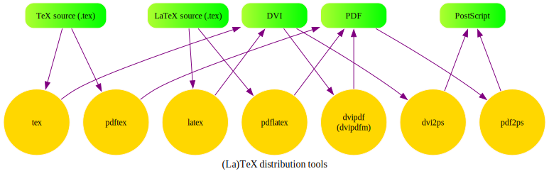

:doctype: book
:stem: latexmath
:icons: font
:experimental:
:table-caption!:
:source-highlighter: highlight.js
:-kroki-server-url: http://localhost:8000
:Opendocs: link:https://github.com/Jeangowhy/opendocs[Opendocs]
:vscdev-url: https://vscode.dev/github/Jeangowhy/opendocs
== 🟡 Open Docs 电子图书馆写作、阅读指南

WARNING: 此文档仓库 ({Opendocs}) 是开放的个人学习资源库，是电子笔记也是电子图书馆，
内含电子书籍 仅用于个人学习研究之用！切勿将仓库中电子书籍用于谋利或商业活动，
*[.red.big]##遵守知识版权法律，请勿违法盗版牟利！##*

NOTE: 本仓库目的是收录、整理以纯文本格式、Unicode 兼容字符集、易读的电子文档，旨在维护一个
基于操作系统文件系统数据处理的高效、简洁索引的电子化书籍、资源库。尽量使用开源工具、脚本代码
制作图文，禁止张贴随意的截屏图片、大尺寸文件，以保持仓库的轻量化、小型化。同时又增强文档格式
转换的灵活性，方便使用现代浏览器进行阅读并保持输出 PDF 等共享格式的能力。避免任意填充内容导致
的信息获取效率受到损害。欢迎 folks 并管理专属仓库，计划将 Pull Request 当作 “Promotion 
Request” 使用，用于共享、交流高质量电子资源。

[.text-center]
**************
[link=https://space.bilibili.com/202364884]
image::https://i0.hdslb.com/bfs/static/jinkela/long/images/favicon.ico[Bilibili Space]
**************

此开源文档项目名称为“开放电子图书馆”（OpenDocs），创建此项目的契机源自个人技术文档写作与整理习惯，
当然也包括 link:./mcu/Intel_80386_manual.md[Intel 80386 CPU 编程参考手册]。建立个人电子
图书馆的需求在此项目维护过程中得到了强化，这有有利于快速查询模糊的知识。这里要强调“快速查询”，因为
建立模糊知识的关联属性要求频繁的泛读实践，这必然要涉及多种阅读材料之间的切换。传统的书籍需要目录、
书签，还可能配备有读书笔记，其目的就是要人为地建立信息的**索引数据库**，包括大脑中建立的信息网络。
这也就是图书馆电子化的意义所在：管理丰富的可阅读图表、文字材料储备、高效的索引数据库！对于一个开放
电子图书馆，拥有建立高效能的索引技术远比拥有成千上万 GB 数据来得更重要。拥有高效索引，整个互联网络
就是电子图书存储仓库！

人类从出生到生命的结束，应该始终是一个提升认知的过程。阅读是人类利用注意力、自然语言理解能力与视觉
信号系统处理文字符号中携带的信息的过程，最提升认知的最高效的手段。因此“书籍”会成为人类进步的阶梯，
这里的书籍是指的是优质的书籍。当前出版行业非常发达，制造垃圾信息的速度也极其高效。这里的优质书籍并
不一定是指你通过阅读它们就可以快速掌握书中信息，认知的提升是一个渐进过程，缺失相关前置知识会阻碍这
个认知提升过程。因此，对于一个阅读者，掌握泛读能力相当重要，它不仅可以用于快速过滤无用信息，也可以
间接提高认知提升的效率。阅读过程包含了光信号处理与神经电信号处理两个过程，视觉系统输入的光信号在视
网膜的感光细胞中转换为电信号，并通过神经通路到达大脑后侧，位于枕叶（Occipital lobe）的视觉皮层
（Visual cortex），经过大脑神经网络的处理之后得到“看到”的信息。整个过程中，光信号可以不断通过
视觉系统输入大脑。而理解信息的速度取决于大脑加工电信号的速度，此速度受个体基础认知及阅读能力影响。
并且，这个信息理解过程并不是孤立的，不仅仅有视觉系统参与，还可以有味觉、嗅觉、触觉、听觉等等，以及
情绪状态的参与。

我是应试教育体系下培养出来的产物，当然我没得选择，也不希望我的孩子（如果将来会有的话）再重复这种教育。
我希望他们培养成读高质量原著教材的习惯，掌握汉语和数学以及一到二门外语，培养自己一些爱好，此外没有
任何其它要求了，生命有它自己的出口。

描述世界运行规律语言，我认为主要有两种：一是自然语言，二是数学语言。当前互联网络中最丰富的文字资料
当属于使用英语书写的资料，为此学会英语可以说是回报率最高的一门外语，因此也将阅读过程产生的一手资料
整理成 link:English_Grammar.rst[英文语法文档]。阅读过程中不可避免地产生一个笔记材料（电子版），
因此掌握数字化写作技术也成为一种基础技术要求。从 Word 到 stem:[\LaTeX] 这一路走来，现在我觉得
AsciiDoc 是最适合的数字化写作技术，它拥有丰富软件工具支持，格式转换方便，表达能力强，支持图表、
数学语言。如果一定要指出 AsciiDoc 的一个缺点，那就是在缩进格式的处理上，对多段落的列表处理还不够
完美。需要使用单独一行加号 `+` 来连接，并且不能缩进后续段落，这会降低文档纯文本的可读性。一个折中
方法是：利用段落后续行的缩进。因为 AsciiDoc 解析器会在解析段落文本时，会移除紧接首行之后的段落
内容（行内容）的先导空格和后缀空格。

大脑工作模式决定了学习这件事不可能轻而易举地获得回报，大脑对短时接触到的东西，并不会分配大量的
大脑皮层工作去作永久的记录，而暂时保管在海马体。因为大脑是人体中能耗最高的器官。只有在经过频繁、
多次数的重复后，海马体中的临时记忆会逐渐在皮层发展出记忆神经网络，并随着重复的时间、次数的保持
而丰富记忆神经网络。这个过程相当于计算机中，将内存中记录的数据写入磁盘永久保存。

大脑中的记忆不是单独的信息，是富有联系的信号的叠加，这些叠加的成分可以是温度、情绪感觉，视觉、
想象、触觉、味觉等等可以输入大脑中的信号，当某些信息的记忆网络越丰富，那么记忆就越牢固。这种
现象就好像大脑在给某种信息做了一个大型的信息索引。因此，古人所说的“一目十行”并不是务虚，
而是非常有效的学习指导。现代英语专业的泛读课程就有这种指导思想的影子：尽量快速的接触大量的
新鲜信号，并且按经验以适当的周期重复这些信号，并且可以配合不同的环境进行，以求尽量形成丰富的
有联系的记忆网络。这里使用信号指大脑接收到的各种感官传导到大脑的信号，不特指文字信息。
这个重复的过程并不是机械的，而需要有深度的重试，并且要尝试解决这个过程中出现的一些难题。

这种方法中的要素有以下几个：

*   大量新新鲜信号，刺激海马体，形成短期记忆；
    这时不求甚解，因为就算是盯着一个字看，大脑也不会因为你花了一个小时、两个小时而永远记得它。
    这与大脑皮层物质结构（记忆网络）的改变有直接关系，不能一蹴而就。而是提高数量，以求远期的高效率；

*   选择合适的难题，不要刻意求深度，而忽视自己的能力基础。
    大量的难题意味着它们彼此几乎没有任何联系，这一点直接与记忆需要联系相违背。

*   要尝试解决遇到的难题，不要回避。
    新的难题可能意味着突破，是形成新知识的关系所在。在合适难度的基础上，攻克难题就是最大的收获。

总之，一目十行的奥义在于：在一本书的角度看，一字一词一句的意义其实并没那么紧要，同样，
一文一书一说在人生之中其实也并没有那么重要。特别是在信息泛滥的时代，更要以“一目十行”的效率
过滤掉那些“糟糕的信息垃圾”。这里的糟糕引号意味和“汝之蜜糖，彼之砒霜”含义相似，不同的东西
对不同的人功用是不相等的，即使是同一物品在人生的不同时期的功用亦不相同。

“开放电子图书馆” 的一切都在以下信息技术或软件中得到满足，它们本身也具有丰富的联系（对于本人），
所以这些信息早已默会，即已经在大脑中形成了知识网络，其中的索引关系不言而喻。

此电子图书馆基于现有开源技术，包括但不限于以下开源技术、软件。并且在后面给出介绍性说明，不求深入
学习，仅作为一个引导性参考，目的是快速了解各种常用数字化写作技术，并应用于阅读电子书籍过程中笔记、
或者电子书籍格式转换：

* **文档格式、排版技术**：
** reStructuedText 电子写作技术 link:./reStructuredText.rst[⇲⇱]
** AsciiDoc 电子写作技术（写书人 - 让世界多一份 AsciiDoc 教程！） link:./AsciiDoc-Overview.adoc[⇲⇱]
** Texinfo 开源文档技术（Emacs with Texinfo 教程） link:./info/texinfo.info[⇲⇱]
** LaTeX 专业排版技术【数学公式手册】 link:./pictures/LaTeX_syntax_for_mathematics.drawio.svg[⇲⇱]
** MikTex 排版工具包 link:https://miktex.org[⇲⇱]
** TeXstudio 排版工具包 https://texstudio.sourceforge.net[⇲⇱]
* **文本流可视化技术**：
** Graphviz 数据可视化（让世界多一份 Graphviz 教程！） link:./Graphviz_dot.adoc[⇲⇱]
** PGF/TikZ 专业绘图 link:./PGF_TikZ_Manual.adoc[⇲⇱]
** GNU plot 可交互、跨平台 2D/3D 专业绘图工具 link:./gnuplot_doc.adoc[⇲⇱]
** Mermaid 流程图制作 link:./mermaid-docs-11.4.1.md[⇲⇱]
** PlantUML 流程图制作 link:./PlantUML_Language_reference.md[⇲⇱]
* **编辑器、工具**：
** Git 版本控制工具 link:./git.md[⇲⇱]
** VS Code 编辑器（VSCode Insideout 教程） link:./VSCode_Insideout.rst[⇲⇱]
** Vim 编辑器 link:./vim_flavor.md[⇲⇱]
** Emacs 编辑器 link:./emacs/emacs_tutor_cn.info[⇲⇱]
** SVG 矢量图形技术（让世界多一份 Inkscape 教程：SVG 漫谈） link:./svg/readme.md[⇲⇱]
** Draw.io 流程图编辑器 link:./Draw.io.rst[⇲⇱]
** Pandoc 文档格式转换工具 link:./pandoc_3.1.12.md[⇲⇱]
* **编程、脚本**：
** JavaScript (ES6) 脚本编程 link:./ES6.md[⇲⇱]
** TypeScript 脚本编程 link:./TS.md[⇲⇱]
** Bash 脚本编程 link:./bash.5.1.md[⇲⇱]
** sed awk 流式编辑器（SED/AWK in 5 Minutes） link:./info/sed.info[⇲⇱]
** jq 查询语言编程 (JSON 数据处理) link:./jq-1.7-doc.adoc[⇲⇱]

Github 是代码托管平台，现支持多种文档格式（Markdown/AsciiDoc等），但是有功能支持与原生工具的
功能有差异。比如，AsciiDoc 图表脚本嵌入、数学公式嵌入都有所不同。

Github 支持数学公式渲染（link:https://github.com/github/markup[markup]），但是不支持注入样式
这种高危行为。AsciiDoc 的数学公式的编写也有语法差异，使用 $ 符号或者 `pass:[```math\n...\n```]`
代码块包裹公式内容。但是这几种方式与 AsciiDoc.js 不兼容。具体参考官方文档：

. https://docs.github.com/en/repositories/working-with-files/using-files/working-with-non-code-files[Working with non-code files]
. https://docs.github.com/en/get-started/writing-on-github/working-with-advanced-formatting/writing-mathematical-expressions[Writing mathematical expressions]

[source,markdown]
-----------------
This sentence uses `$` delimiters to show math inline: $\sqrt{3x-1}+(1+x)^2$

This sentence uses $\` and \`$ delimiters to show math inline: $`\sqrt{3x-1}+(1+x)^2`$

**The Cauchy-Schwarz Inequality**\

$$\left( \sum_{k=1}^n a_k b_k \right)^2 \leq \left( \sum_{k=1}^n a_k^2 \right) \left( \sum_{k=1}^n b_k^2 \right)$$

**The Cauchy-Schwarz Inequality**

```math
\left( \sum_{k=1}^n a_k b_k \right)^2 \leq \left( \sum_{k=1}^n a_k^2 \right) \left( \sum_{k=1}^n b_k^2 \right)
```
-----------------

[.text-right]
**************
Some bookes are to bee tasted, +
others to bee swallowed, +
and some few to bee chewed and disgested. +
*Francis Bacon*, Essayes (1597)
**************


== 🟡 Unicode 符号集的输入问题

在论文写作中，可能涉及大量特殊符号，包括 TeX 文档中数学公式模式下的重音符号 (Accents)。
虽然，LaTeX/TeX 提供并相应的命令，可以通过标准键盘符号来表达这些特殊符号，但是，直接通过
输入层完成符号的输入，可以使文档文本更具可读性，而不必免强眼睛要像 TeX 解析程序那样扫描连串
的宏命令符号。

[frame=ends,grid=rows,opts=autowidth]
|===
|$\underline{a}$ |ª 
|$\overline{a}$  |stem:[\overline{a}] (上横线比 \bar 更长，可多字符覆盖)
|$\hat{a}$       |â 
|$\check{a}$     |ă 
|$\tilde{a}$     |ã 
|$\acute{a}$     |á 
|$\grave{a}$     |à 
|$\dot{a}$       |ȧ
|$\ddot{a}$      |ä
|$\breve{a}$     |ǎ (和汉语拼音使用的 ă 区别)
|$\bar{a}$       |ā (和汉语拼音使用的 ā 相同)
|$\vec{a}$       |ã
|===

可以配置输入法的短语、词组等功能用于快速输入常用的特殊符号。推荐使用带有脚本扩展能力
的输入法，比如支持 lua 扩展的 http://rime.github.io/[Rime] 中州韻輸入法，此輸入法
基於開源人輸入法框架 https://github.com/ibus/ibus[IBus]，並且由 Linux 系統移植到
Windows 平臺。集成幾大方言社區的輸入法愛好者創作了粵語、吳語、中古音輸入方案。還有支持
宮保拼音 (Combo Pinyin)，可以同時按多鍵輸入漢字，而無需考慮先後順序。最近剛研究完 Vim
鍵盤處理技術，看了一邊 the TeXBook，掃描了一邊 the Unicode Standard version 12，
又看到這個 Rime Combo Pinyin 輸入方式，簡直打開了我的天靈蓋。輸入法無非是字符集與鍵盤
按鍵組合編碼的映射關係，世人又何必約束人們就先敲哪個按鍵呢？感謝中州韻輸入法，開源就是我命根。
用戶配置可以修改 ~\Rime 或者 AppData\Roaming\Rime 目錄下配置文件 (yaml)。內置朙月拼音
(Luna Pinyin) 支持 Unicode 符號輸入。例如使用 Ctrl+` 打开输入方案列表并选择“拼音方案”， 
輸入 `/a` 就可以输入带注音标记的字母。这些符号定义在配置文件中 symbols 字段。另外還有
full_shape　和　half_shape　兩個字段，分別對應全角、半角輸入狀態下人符號。比如 # 可以
在半角、全角狀態下分別輸入 "⌘" 和 "№"。敲 /AE 鍵就可以輸入 Æ 等符號。切換輸入方案時，
“中／半／漢／。”用於切換“中英、半角全角、簡體繁體、中英標點”。

[source,role=big]
    punctuator:
      full_shape:
        "#": ["＃", "⌘"]
      half_shape:
        "#": ["#", "№"]
    symbols:  
      "/AE": ["Æ", "Ǣ", "Ǽ", "ᴭ", "ᴁ"] 

默认的快捷键有: Control+` Control+Shift+` F4，如果快捷键与其他软件冲突，可以修改默認配置：

```yaml
# default.custom.yaml

patch:
  "switcher/hotkeys":  # 這個列表裏每項定義一個快捷鍵，使哪個都中
    - "Control+s"      # 添加 Ctrl+s
    - "Control+grave"  # 你看寫法並不是 Ctrl+` 而是與 IBus 一致的表示法
    - F4
```

可以在配置文件中看到 import_preset: symbols 這條，它用於導入用戶人符號表。
用戶配置文件均在用户文件夹下，输入法状态栏的图标提供右键菜單來打開用户文件夹。
按以下註解增加或者修改配置文件:

• default.custom.yaml 选词栏个数&快捷键
• weasel.custom.yaml 主题&横向
• luna_pinyin_simp.custom.yaml 朙月拼音的具体设置,除外观设置均需要修改次文件
• symbols.yaml 标点符號配置
• *.dict.yaml 各种字典
• ./opencc emoji 支持的滤镜文件夹

Rime 輸入候選列表詞條範圍是 1〜9（個別 Rime 發行版可支持10個候選），默認 5 個。
可以按以下設置每頁候選個數爲 9，在用戶目錄建立文檔 `default.custom.yaml`。
重新佈署即可生效，build 目錄下人文件會被更新覆蓋：

```yaml
patch:
  "style/color_scheme": brasil
  "menu/page_size": 9
```

自定義 symbols.yaml 标点符號配置要注意，需要確保 / 符號存在。导入按功能（import_preset）
不一定有效果，可以直接复制现有配置，再做修改。

```yaml
# Rime's punctuation and symbols
# encoding: utf-8
#
# Usage: patch your Rime schema to enable /X symbols

config_version: '1.6'

patch:
  punctuator/import_preset: luna_pinyin_simp
  recognizer/patterns/punct: '^/([0-9]0?|[A-Za-z]+)$'

punctuator:
  # import_preset: luna_pinyin_simp
  full_shape:
    ' ' : { commit: '　' }
    ',' : { commit: ， }
    '.' : { commit: 。 }
  half_shape:
    '/' : [ 、, ､, '/', ／, ÷ ]
    '''' : { pair: [ '‘', '’' ] }
    '"' : { pair: [ '“', '”' ] }
    '*' : [ '*', ＊, ·, ・,"•", ×, ※, ❂, ⁂, ☮, ☯, ☣ ]
  symbols:
    '/fh': [ ©, ®, ℗, ℠, ™, ℡, ℻, ☇, ☈, ☉, ☊, ☋, ☌, ☍]
    '/dn': [ ❖, ⌘, ⌃, ⌥, ⎇, ⇧, ⇪, ␣, ⇥, ⇤, ↩, ⌅, ⌤]
    '/xq': [ ♔, ♕, ♖, ♗, ♘, ♙, ♚, ♛, ♜, ♝, ♞, ♟ ]
    "/dot": ["•", "⚙", "🕸"]
```


Unicode 符号属性数据参考，第二列为 Vim digraphs 符号输入码 (Ctrl+k)：

• https://www.unicode.org/charts/PDF/U1E00.pdf[Latin Extended Additional]
• https://www.unicode.org/charts/PDF/U0180.pdf[Latin Extended-B]
• https://www.unicode.org/Public/12.0.0/ucd/NamesList.txt[UCD 符号数据表]

[frame=ends,grid=rows,opts=autowidth]
|===
|À  |A!  |0xc0  |192  |LATIN CAPITAL LETTER A WITH GRAVE
|Á  |A'  |0xc1  |193  |LATIN CAPITAL LETTER A WITH ACUTE
|Â  |A>  |0xc2  |194  |LATIN CAPITAL LETTER A WITH CIRCUMFLEX
|Ã  |A?  |0xc3  |195  |LATIN CAPITAL LETTER A WITH TILDE
|Ä  |A:  |0xc4  |196  |LATIN CAPITAL LETTER A WITH DIAERESIS
|Å  |AA  |0xc5  |197  |LATIN CAPITAL LETTER A WITH RING ABOVE
|à  |a!  |0xe0  |224  |LATIN SMALL LETTER A WITH GRAVE
|á  |a'  |0xe1  |225  |LATIN SMALL LETTER A WITH ACUTE
|â  |a>  |0xe2  |226  |LATIN SMALL LETTER A WITH CIRCUMFLEX
|ã  |a?  |0xe3  |227  |LATIN SMALL LETTER A WITH TILDE
|ä  |a:  |0xe4  |228  |LATIN SMALL LETTER A WITH DIAERESIS
|å  |aa  |0xe5  |229  |LATIN SMALL LETTER A WITH RING ABOVE
|Ā  |A-  |0100  |0256 |LATIN CAPITAL LETTER A WITH MACRON
|ā  |a-  |0101  |0257 |LATIN SMALL LETTER A WITH MACRON
|Ă  |A(  |0102  |0258 |LATIN CAPITAL LETTER A WITH BREVE
|ă  |a(  |0103  |0259 |LATIN SMALL LETTER A WITH BREVE
|Ą  |A;  |0104  |0260 |LATIN CAPITAL LETTER A WITH OGONEK
|ą  |a;  |0105  |0261 |LATIN SMALL LETTER A WITH OGONEK
|Ǎ  |A<  |01CD  |0461 |LATIN CAPITAL LETTER A WITH CARON
|ǎ  |a<  |01CE  |0462 |LATIN SMALL LETTER A WITH CARON
|Ǟ  |A1  |01DE  |0478 |LATIN CAPITAL LETTER A WITH DIAERESIS AND MACRON
|ǟ  |a1  |01DF  |0479 |LATIN SMALL LETTER A WITH DIAERESIS AND MACRON
|Ǡ  |A7  |01E0  |0480 |LATIN CAPITAL LETTER A WITH DOT ABOVE AND MACRON
|ǡ  |a7  |01E1  |0481 |LATIN SMALL LETTER A WITH DOT ABOVE AND MACRON
|Ả  |A2  |1EA2  |7842 |LATIN CAPITAL LETTER A WITH HOOK ABOVE
|ả  |a2  |1EA3  |7843 |LATIN SMALL LETTER A WITH HOOK ABOVE
|Ạ  |    |1EA0  |7840 |LATIN CAPITAL LETTER A WITH DOT BELOW
|ạ  |    |1EA1  |7841 |LATIN SMALL LETTER A WITH DOT BELOW
|Ȧ  |    |0226  |550  |LATIN CAPITAL LETTER A WITH DOT ABOVE
|ȧ  |    |0227  |551  |LATIN SMALL LETTER A WITH DOT ABOVE
|===


== 🟡 VS Code/AsciiDoc/LaTeX 写作环境

VS Code 本身是一个优秀的开源项目，它继承了 Eclipse 的基因并加以提升，可以工作在本地或者 Web
环境，分配基于 Electron 和 Web 浏览器运行环境。配合 AsciiDoc 以及 Git 扩展就可以当作一个
优秀的电子图书馆工具链，既可以在本地阅读，又可以在线阅读开源图文资源。AsciiDoc 扩展本身支持本地
环境以及 Web 环境，可以启用其集成的 Kroki 服务。美中不足的是，vscode.dev 或者 github.dev
目前由于安全性约束，cross-origin-resource-policy，不能在 Web 环境中请求 Kroki.org 图形
服务。

.AsciiDoc 文档及工具链结构图
[svgbob]
--------
+-------------------------------------------------------------------------+
|                            AsciiDoc Processing                          |
|                                                                         |
|                     .-------------------+-------------------.           |
| - - - - - - - - - - | - - - - - - - - - | - - - - - - - - - | - - - - - |
|     Language       Ruby            JavaScript              Java         |
| - - - - - - - - - - | - - - - - - - - - | - - - - - - - - - | - - - - - |
|               .-------------.   .----------------.   .--------------.   |
|               | Asciidoctor |   | Asciidoctor.js |   | AsciidoctorJ |   |
|               `-------------'   `----------------'   `--------------'   |
| - - - - - - - - - - | - - - - - - - - - | - - - - - - - - - | - - - - - |
| Ruby Runtime      Native              Opal            JRuby runtime     |
| - - - - - - - - - - | - - - - - - - - - | - - - - - - - - - | - - - - - |
|             Asciidoctor Diagram       Kroki       AsciidoctorJ Diagram  |
|                     |                                       ^           |
|                     |                                       |           |
|                     `---------------------------------------'           |
| - - - - - - - - - - - - - - - - - - - - - - - - - - - - - - - - - - - - |
| Extensions API                                                          |
|                .------------------------.  .------------------------.   |
|                |      Preprocessor      |  |     Tree processor     |   |
|                `------------------------'  `------------------------'   |
|                .------------------------.  .------------------------.   |
|                |     Postprocessor      |  |   Docinfo Processor    |   |
|                `------------------------'  `------------------------'   |
|                .------------------------.  .------------------------.   |
|                |    Block processor     |  | Block macro processor  |   |
|                `------------------------'  `------------------------'   |
|                .------------------------.  .------------------------.   |
|                | Inline macro processor |  |   Include processor    |   |
|                `------------------------'  `------------------------'   |
+-------------------------------------------------------------------------+
--------

WARNING: Kroki 是第三方插图渲染工具，可能因为 Kroki.io 服务器问题导致图片无法正常渲染。
包括因为软件升级带来的版本兼容性问题、服务器拥堵。

本地部署可以解决网络请求问题，但需要自行安装依赖到的解析器、格式转换工具，否则, 页面不是输出 SVG
图像，而是会给出 500 Internal Server Error 错误报告。也可以通过日志或控制台输出消息观察得到：

  java.io.IOException: 
  Cannot run program "tikz2svg": CreateProcess error=2, 系统找不到指定的文件。
  Cannot run program "C:/kroki/tikz/tikz2svg": CreateProcess error=193, %1 不是有效的 Win32 应用程序。

.TikZ.java
[source,java]
----
public class TikZ implements DiagramService //...

  public TikZ(Vertx vertx, JsonObject config, Commander commander) {
    this.vertx = vertx;
    this.binPath = config.getString("KROKI_TIKZ2SVG_BIN_PATH", "tikz2svg");
    this.sourceDecoder = new SourceDecoder() {
      @Override
      public String decode(String encoded) throws DecodeException {
        return DiagramSource.decode(encoded);
      }
    };
    this.commander = commander;
  }
----

.PlantumlCommand.java
[source,java]
----

  public PlantumlCommand(JsonObject config) {
    this.binPath = config.getString("KROKI_PLANTUML_BIN_PATH", "plantuml");
    this.includePath = config.getString("KROKI_PLANTUML_INCLUDE_PATH");
    this.commander = new Commander(
      config,
      new CommandStatusHandler() //...
      );
  }
----

Windows 本地安装 Kroki 需要解决跨平台兼容性问题，Java Process 默认使用 cmd.exe 作为脚本
解析器。Kroki 默认的提供的 tikz2svg 是依赖 Linux 环境（如 LaTeX 工具链）的 bash 脚本，不能
直接运行于 Windows 平台上。可以使用　batch 脚本间接 bash shell。另外，Mermaid 等一系列的绘图
服务是以 Web server 形式运行的，因此需要按照 README 说明的端口进行配置。PlantUML 本身作为命令
工具运行，同时也提供了 picoweb 服务。Kroki 则以命令方式调用 PlantUML。但是由于加载 PlantUML
进程消耗时间较长，绘图效率低。可绕过 Kroki，直接调用 PlantUML 的独立服务。以下 batch 以及 bash
脚本供参考，可以使用 `kroki start` 或者 `kroki stop xxx` 命令启动、停止相应的服务。可以在
AsciiDoc 文档头部设置 `:kroki-server-url: http://localhost:8000` 来使用本地部署的服务。

./kroki/tikz/tikz2svg.bat
[source,batch]
----
@bash -c "/c/kroki/tikz/tikz2svg %*"
----

.Mermaid 依赖模块安装/PlantUML 安装
[source,batch]
----
cd kroki/mermaid
npm install

choco install plantuml
----

.kroki tollschains config script
[source,bash]
----
export KROKI_DOT_BIN_PATH="/c/Graphviz/bin/dot.exe"
export KROKI_TIKZ2SVG_BIN_PATH="/dl/pl/kroki/tikz/tikz2svg.bat"
export KROKI_SVGBOB_BIN_PATH="/c/Graphviz/svgbob/src/markdown_svgbob/bin/svgbob_0.5.5_x86_64-Windows.exe";

alias mermaid="node kroki/mermaid/src/index.js &"
alias kroki="/c/jdk-17/bin/java -jar /c/Graphviz/kroki-standalone-server-v0.26.0.jar --logging.file.path=/var/log/kroki --logging.file.name=kroki.log $*"

alias kroki="/c/jdk-17/bin/java -DKROKI_DOT_BIN_PATH=/c/Graphviz/bin/dot.exe -jar /c/Graphviz/kroki-standalone-server-v0.26.0.jar $*"

alias puml="/c/jdk-14.0.2/bin/java -jar /c/ProgramData/chocolatey/lib/plantuml/tools/plantuml.jar $*"
----

以下是 Kroki 支持的主要图表类型及其调用的命令行工具，参考官方配置文档：

https://docs.kroki.io/kroki/setup/configuration/[Diagram Binary Paths]
https://github.com/yuzutech/kroki[Kroki Source]

[opts="autowidth,header",frame=ends,grid=rows]
|===
|图表类型     |调用的程序/工具                  |参考/说明
|PlantUML   |plantuml.jar（Java 程序）        |通过 Java 运行 PlantUML 的 JAR 包，支持 UML、C4 架构图等。
|Graphviz   |dot（Graphviz 核心工具）          |调用 dot 命令生成 DOT 语言描述的矢量图（如流程图、关系图）。
|Mermaid    |mmdc（Mermaid CLI 工具）         |基于 Node.js 的 Mermaid 命令行工具，生成时序图、甘特图等。
|BlockDiag  |blockdiag、seqdiag 等 Python 脚本|通过 Python 模块生成块状图、序列图等。
|Excalidraw |excalidraw-cli 或自定义解析器     |解析 Excalidraw 的 JSON 数据生成手绘风格图表6。
|BPMN       |bpmn-to-image（BPMN 解析工具）    |将 BPMN 2.0 XML 转换为图像。
|Ditaa      |ditaa（Java 工具） |https://github.com/yuzutech/ditaa-mini/releases/
|SVGBob     |svgbob     |https://github.com/mbarkhau/markdown-svgbob[binary] or
                         https://github.com/ivanceras/svgbob[Rust Source]
|PGF/TikZ   |tikz2svg   |https://ctan.org/pkg/tikztosvg[bash script] or
                         https://github.com/dawbarton/pdf2svg[C program]
|===


link:https://docs.asciidoctor.org/diagram-extension/latest/[Asciidoctor Diagram]
扩展支持多种图表，这取决于文档渲染环境具体安装的扩展支持。如果是 VS Code 环境，则图表支持取决于
link:https://kroki.io/#try[Kroki]，并且需要安装 AsciiDoc 扩展。VS Code Web 在线版本与
本地版本的扩展能力有差异。在线版本与 Github 环境也有差异，可以通过链接切换以观察这些平台的差异：
link:https://vscode.dev/github/Jeangowhy/opendocs[VS Code Web]
vs. link:https://github.com/Jeangowhy/opendocs[Github]

AsciiDoc 是一个比 Markdown/reStructureText 更好用的开源文档格式，背后有 Eclipse 基金会支持。
另外的两个多少有些不足：Markdown 没有统一规范、功能也相对简单；reStructureText 虽然功能强大，
但是缺少开源社区力量支持，工具链发展远不如 AsciiDoc 丰富。

AsciiDoc vs. Markdown/reStructuredText

[opts="autowidth,header",frame=ends,grid=rows]
|===
|特性      |AsciiDoc          |Markdown       |reStructuredText
|表格功能   |复杂表格支持        |基础表格        |复杂表格支持
|交叉引用   |原生支持           |依赖扩展        |原生支持
|条件编译   |原生支持           |不支持          |有限支持
|扩展性    |高（Ruby/JS 扩展）  |低（需外部工具）  |中（Sphinx 扩展）
|学习曲线   |中（语法稍复杂）     |低（极简）      |高（严格语法）
|===

Asciidoctor 原本使用 Ruby 语言开发，但是由于不及 JavaScript 语言流行，同时也为了支持 Web 
平台，官方通过 link:https://opalrb.com/[Opal] 将其转换为 JavaScript 实现，并且提供
VS Code 扩展，支持实时文档预览，也支持脚本扩展。只需要按 readme.md 文档指示将扩展脚本放置于
文档工程目录下的 `.asciidoctor/lib`。link:LaTeX/linguistics.adoc[linguistics.adoc]
这个文档提供了一个 Ruby Anontation 注音扩展的实现过程参考。

:APIs: https://github.com/asciidoctor/asciidoctor.js/blob/main/packages/core/types/index.d.ts[APIs]

官方提供扩展示范，比如 link:https://github.com/mogztter/asciidoctor-emoji[Inline macro] 
`emoji:heart[]`。用户编写扩展脚本只需要像以下一样在脚本模块中导出一个 `registry` 注册函数。
如果脚本模块没有导出此函数，则会报错：TypeError: extjs.register is not a function。
导出函数的目地是在加载时调用 inlineMacro 这些 {APIs} 以注册一个宏对象。注意 JavaScript 的函数
就是类型对象，这取决于函数的执行方式：使用 `new` 关键字执行将其作为类型的构造函数。因为脚本可能
存在潜在的安全威胁，VS Code 默认禁止插件加载脚本，需要用户手动执行授权命令以加载扩展脚本：
AsciiDoc: Manage Asciidoctor.js Extensions Trust Mode。


[source,js]
----
const twemojiMap = require('./twemoji-map')

function emojiInlineMacro () {
  const self = this
  self.named('emoji')
  self.positionalAttributes('size')

  const defaultSize = '24px'
  const sizeMap = { '1x': '17px', lg: defaultSize, '2x': '34px', '3x': '50px', '4x': '68px', '5x': '85px' }

  self.process(function (parent, target, attrs) {
    const sizeAttr = attrs.size
    let size
    if (sizeAttr && sizeAttr.trim().endsWith('px')) {
      size = sizeAttr
    } else if (sizeAttr && sizeMap[sizeAttr]) {
      size = sizeMap[sizeAttr]
    } else {
      size = defaultSize
    }
    const emojiUnicode = twemojiMap[target]
    if (emojiUnicode) {
      return self.createInline(parent, 'image', '', {
        target: `https://cdn.jsdelivr.net/npm/twemoji@latest/2/svg/${emojiUnicode}.svg`,
        type: 'emoji',
        attributes: {
          alt: target,
          height: size,
          width: size
        }
      })
    }
    console.warn(`Skipping emoji inline macro. ${target} not found`)
    return self.createInline(parent, 'quoted', `[emoji ${target} not found]`, attrs)
  })
}

module.exports.register = function (registry) {
  if (typeof registry.register === 'function') {
    registry.register(function () {
      this.inlineMacro(emojiInlineMacro)
    })
  } else if (typeof registry.block === 'function') {
    registry.inlineMacro(emojiInlineMacro)
  }
  return registry
}
----

.Use Asciidoctor.js extensions
****
When using the preview, the VS Code extension can load and register Asciidoctor.js extensions.

By convention, extensions must be located in `.asciidoctor/lib` (at the root of your workspace). The VS Code extension will recursively load all files with the extension `.js` as Asciidoctor.js extensions. For instance, the following files will be loaded: `.asciidoctor/lib/emoji.js`, `.asciidoctor/lib/emoji/index.js` and `.asciidoctor/lib/foo/bar/baz.js`.

To use an Asciidoctor.js extension, you should enable the feature by checking "Enable Asciidoctor.js extensions registration" in the extension settings. The first time, you will also need to confirm that you trust the authors of the Asciidoctor.js extensions located in _.asciidoctor/lib_.

image:https://github.com/asciidoctor/asciidoctor-vscode/raw/HEAD/images/asciidoctor-vscode-trust-exts.png[Asciidoctor.js extensions trust confirmation message]

**❗ Important:** This feature will execute JavaScript code and should not be enabled if you don't fully trust the authors of the Asciidoctor.js extensions.

**💡 Tip:** You can always update the trust mode using the command "Manage Asciidoctor.js Extensions Trust Mode".

You can create a new extension by creating a JavaScript file in the `.asciidoctor/lib` directory or use an existing one. Here's an example of how to use the [asciidoctor-emoji](https://github.com/mogztter/asciidoctor-emoji) extension:

1. Install the npm package in the workspace directory:
+
```shell
npm i asciidoctor-emoji
```

2. Create a file a JavaScript file in _.asciidoctor/lib_ with the following content:
+
```javascript
module.exports = require('asciidoctor-emoji')
```

3. Enjoy :tada:

image:https://github.com/asciidoctor/asciidoctor-vscode/raw/HEAD/images/asciidoctor-vscode-emoji-ext.png[Asciidoctor.js Emoji extension enabled!]
****

主流 LaTeX 软件包有 TeXLive、CTeX、MiKTex 等等，其中 MiKTex 是精简安装，首次只安装必备组件，
小于完全安装的 TeXLive。在使用到依赖包时可以随用随时通过 MiKTeX Console 下载更新，缺点就是在
网络条件差时会影响使用，断网时无法更新。图形界面基本都是基于 Qt 图形框架实现，*TeXStudio* 的图形
界面要比 MikTeX 中集成的 *TeXWorks* 要优秀，提供符号辅助输入功能，支持像 Vim 一样的多光标功能。
在错误消息处理上也更完善，可以直接点击信息跳转到 TeX 脚本相应位置（通过搜索文本内容来实现定位）。

当然，Emacs + AUCTeX 以及 VS Code + LaTeX Workshop 扩展，都是不错的选择。有符号提示辅助，
输入复杂符号结构也没有问题。LaTeX Workshop 提供了一个称为 SNIPPET VIEW 的辅助面板，使用
`LateX actions` 命令打开，可以在  中找到各种文字符号和数学符号，双击它就可以插入到当前的文档中。
不仅限于 TeX 文档，也可以在 AsciiDoc 文档中使用。默认配置 Latexmk 调用编译器，这是一个 perl
脚本工具，用于处理交叉引用、调用辅助工具 (bibtex, makeindex) 以及预览命令。搭配集成的 pdfjs
就可以直接在 VS Code 中阅读 PDF 文档。可以在插件配置中搜索 LaTeX Tools 并且添加 TeX 编译器。
默认调用首个 LaTeX recipe 配置列表中指定的编译器。比如，设置 LuaTeX 编译

----
    "latex-workshop.latex.tools": [
        
        {
            "name": "luatex",
            "command": "luatex",
            "args": [
                "-synctex=1",
                "-interaction=nonstopmode",
                "-file-line-error",
                "-output-format=pdf",
                "-output-directory=%OUTDIR%",
                "%DOC%"
            ],
            "env": {}
        },
    "latex-workshop.latex.recipes": [
        {
            "name": "luatex",
            "tools": [
                "luatex"
            ]
        },
----

Define LaTeX compiling tools to be used in recipes. Each tool is labeled by its name. When invoked, command is spawned with arguments defined in args and environment variables defined in env. Typically no spaces should appear in each argument unless in paths. List of available placeholders: %DOC%, %DOC_W32%, %DOC_EXT%, %DOC_EXT_W32%, %DOCFILE%, %DOCFILE_EXT%, %DIR%, %DIR_W32%, %TMPDIR% and %OUTDIR%, %OUTDIR_W32%. Please visit https://github.com/James-Yu/LaTeX-Workshop/wiki/Compile#placeholders for a complete list of all placeholders.

正如那句话所说：能使用 JavaScript 实现的软件，终将会使用 JavaScript 实现。曾经困扰着
JavaScript 的性能问题在 WebAssembly 开始流行之后等到解决，语言间的融合（interoperation）
打开了新思路，通过制订 WebAssembly 接口规范，就可以编写 C/C++ 底层代码，并且编译后运行于
JavaScript 环境。link:https://latex.js.org/[JavaScript LaTeX to HTML5 translator]
还是一个很年经的项目，还不能做做到完全的功能支持，期待未来会更好。

Donald Knuth (高纳德) 为他毕生在编著的 The Art of Computer Programming 一书而设计的
TeX，如此优秀的计算机排版技术真是的出版行业的福音。TeX 项目开始于 1970s，而现在已经有了各种
衍生品，LaTeX, pdfTeX, pdfLaTeX, XeTeX, XeLaTeX, LuaTeX, LuaLaTeX，这些都是写作者的
宝贝。LaTeX 宏程序包则是是 Leslie Lamport 于 1985 年开发，目前交由 LaTeX Project 维护。
TeX 语语言编程接口本身已经图灵完备，基于 TeX 之上的 stem:[LaTeX] 也一样，自从 1994 年发布
第二版以来，语法结构一直很稳定，维护团队直到 2020 年才发布 LaTeX 3，旨在提供像 C++/Python
一样的高级语言特性。LaTeX 本身是是一组基于 TeX 的宏程序包（The macro package for TeX），
它集成的 TeX 解析器是经过二次开发的特供版，添加了能够解析 LaTeX 宏命令的功能。

____
During the 1970s I was coerced like everybody else into adopting the ideas 
of structured programming, because I couldn’t bear to be found guilty of 
writing unstructured programs. 
____

Knuth 在管理 TeX 解析器代码版本也使用了一个别出心裁的方法：使用圆周率数值代表版本。最后版本号为
TeX 3.141592653（2021），(TeX 3.14159265, released in January 2014)， 高德纳于 1978，
1982，1990 年分别发布了 TeX 的三个大版本。此后，TeX 的开发被冻结，不再增加任何新功能。只在修复
bug 时才会有更新。自 1995 年发布 3.14159，直到 2002 年 12 月才进行了一次升级。 版本号从 1990
发布的 TeX 3.1 开始到 2024 年 2 月共有 9 个修正版本。

掌握 LaTeX 宏编程能极大提升作品的品质，需要清楚，LaTeX 是基于 TeX 排版编译器的一组宏程序，学习
这些宏程序的就是学习 TeX 编程，此代码风格又称为文学型编程（Literate Programming）。这门专为
排版而生的语言。TeX 源代码使用 Pascal 语言实现。一些资料也将 TeX 编译器称为排版引擎。编译工具
安装包会提供的一系列命令用于各种格式的转换，LaTeX Wikibook 有示意图展示了部分主程序与格式之间
的转换关系。

.Applications within a (La)TeX distribution 
:svg: https://kroki.io/graphviz/svg/eNp1UVtLwzAUfu-vOORpgzrYBB-E-DQEYchAEWHzIW1O27CsCUm6i6P_3aStay2zL7l911MucsN0AZcIoFQcATapkspQi8wWKGWcqdJZ8Y10voitO0ukmZASeRyWFktyg1iePVodH6XYI_nq5WzBNNJEnTzhhLyRcqbCTox0akZVJUdO4qPgrqDz2X3QaMNtJDurylGuXGxYubOoPWARAMjzPrOujJYYriVLUAIFMlmx6Tt-AhfWGZFUTqgSnFLSksjjvKLDE3iFX9uHuOFSElhWVSZFmMw8aNqU8gT5D2HFblOWHy-wXj7DWln3lhqhXTSeDkmFSSWSwUxzJXlgh3iaZ2GRrDu0G34QC23D2S8h2kH4fRhWE2f7CtsSJu3tPkTp-949wWWoXPfNmqeRUx11NZrHzrezq-H6bbgwNFPmyEwTPZRuGG3EIfQmY2jS9w3f2CRh6W7s0I0kZOqDj-DXP_AnV1fotkn9A9whAAk=?attribute_entries=%23%3CAsciidoctor%3A%3ADocument%3A%3AAttributeEntry%3A0x716ee3c%3E
[source,graphviz]
----
digraph {
  node  [color=seashell,fontsize=12,style=filled,fillcolor="greenyellow:lime"]
  node  [shape=box,fixedsize=true,style="filled,rounded",width=1.3]
  graph [layout=dot,ranksep=1.2]
  edge  [color=purple]
  label = "(La)TeX distribution tools"

  dottex   [width=1.6,label="TeX source (.tex)"]
  dotlex   [width=1.6,label="LaTeX source (.tex)"]
  DVI PDF PostScript

  node  [shape="circle",fillcolor=gold]
  tex pdftex latex pdflatex dvi2ps pdf2ps
  dvipdf [label="\N \n (dvipdfm)"]

  dottex -> { tex pdftex }
  dotlex -> { latex pdflatex }

  DVI -> { dvi2ps dvipdf }          [dir=forward]
  PDF -> { pdf2ps }                 [dir=forward]

  DVI -> { tex latex     }          [dir=back]
  PDF -> { pdftex dvipdf pdflatex } [dir=back]
  PostScript -> { pdf2ps dvi2ps }          [dir=back]
}
----

作为一个 LaTeX 写作的用户，可以有两种选择：直接使用命令行编写使用文本编辑工具编写的 TeX 格式文档，
或者使用 *TeXStudio* 或者 *TeXWorks* 这样的图形界面工具，它们会调用当前系统中安装的 TeX 命令。
以下是两种使用 LaTeX 命令行工具的方法，因为 TeX/LaTeX/LuaTeX 等是同宗同源的工具，因此它们的命令
行使用方式也基本一样，只是在支持的脚本格式方面不同。默认输出格式为 dvi，默认输出文件名与输入文件同名。
如果是通过 stdin 文件输入，就需要指定 `-job-name`，默认输出名称为 `texput`，扩展名由命令程序
自动添加：

[source,bash]
----
# 1. Specific input tex file
latex some.tex  # Default format dvi
latex -output-format pdf some.tex

# 2. Direct input tex script from console
latex -output-format pdf -job-name=texput << EOF
\documentclass{beamer}

\title{Beamer Class template}
\author{Jeango}
\date{March 12 2025}

\begin{document}
  \maketitle
  \begin{frame}[fragile]
    \frametitle{Sent text to \LaTeX via stdin file! }

    \begin{verbatim}
    bash$ latex -output-format pdf << EOF
      ...
    EOF
    \end{verbatim}

    Default output: -job-name=textput!  
  \end{frame}

  \begin{frame}
    \frametitle{Slide End!}
    Beamer - A LaTeX class for producing presentations and slides
    https://ctan.org/pkg/beamer
  \end{frame}
\end{document}
EOF
----

*TeXStudio* 主界面的 Tools -> Commands 菜单中可以切换 TeX 编译器，根据文档使用到的宏包而定。
实用主义者只需要学习一些 LaTeX 排版宏程序就可以实现自动排版，就能生成更漂亮的文档作品，不仅限于
文字排版、插图制作。LaTeX Project 官网或者 Overleaf 等平台就包有 LaTeX 宏编程的一手资料。
CTAN (Comprehensive TeX Archive Network) 包含更丰富的开源书籍和文档：

- https://ctan.org/tex-archive/documentation[CTAN (Comprehensive TeX Archive Network) Docs]
- https://latexguide.org/book-contents/[LaTeX Beginner's Guide]
  https://static.latexstudio.net/wp-content/uploads/2015/03/LaTeX_Beginners_Guide.pdf[PDF]
- https://www.overleaf.com/learn/latex/Articles[How do TeX macros actually work?]
- https://latexref.xyz/dev/latex2e.html[LaTeX2e: An unofficial reference manual]
- https://ntg.nl/literatuur/lamport/latex2e.pdf[LATeX2ε Reference Manual v1.4]
- https://texblog.net/help/latex/index.html[Hypertext Help with LaTeX 2.09]
- https://ctan.org/pkg/beginlatex[beginlatex – A beginner's guide to LaTeX]
- https://tug.org/interest.html[TeX Resources on the Web - TeX Users Group]
- https://www.ctan.org/tex-archive/info/lshort/[lshort – A short introduction to LaTeX 2e]
- https://www.latex-project.org/help/books/[LaTeX Wikibook]
- https://www.latex-project.org/help/documentation/usrguide-historic.pdf[LATeX for authors — historic version]
- https://www.latex-project.org/help/documentation/usrguide.pdf[LATeX for authors current version]
- https://ctan.org/pkg/comprehensive[The Comprehensive LaTeX Symbol List]
- https://tug.org/twg/mactex/tutorials/ltxprimer-1.0.pdf[LaTeX Tutorials A PRIMER]
- https://www.pragma-ade.com/general/manuals/luatex.pdf[LuaTeX Reference Manual 1.10]
- https://www.luatex.org/documentation.html[LuaTeX Documentation]
- https://www.pragma-ade.com/general/manuals/ms-cb-en.pdf[ConTeX as Excursion]
- https://vscode.dev/github/dmarczal/mini_curso_latex/tree/master/material/eBooks

.部分常见 stem:[\LaTeX] 宏命令的功能介绍
[opts="autowidth,header",frame=ends,grid=rows]
|===
|Macros                 | Notes
|\documentclass{}       |定义文档类型（article/book/...）并设置纸张类型等基础布局。
|\usepackage{}          |加载扩展功能宏包（如图形、数学工具）。
|\usepackage{hyperref}  |为PDF添加超链接与书签功能。
|`\begin{document}` +
 `\end{document}`       |标记文档内容开始与结束，`\begin` 这个宏用于打开一个 TeX 环境。
|\title{} 
 \author{} +
 \date{}                |设置文档标题、作者和日期信息。
|\maketitle             |根据标题信息生成封面页。
|\section{} +
 \subsection{} +
 \subsubsection{}       |创建带自动编号的节/小节标题。
|\tiny \Large \Huge     |设置字体大小。
|\textbf{} or \textit{} |将文本设置为粗体/斜体。
|\color{red}{sometxt}   |将文本设置为红色。
|\emph{}                |根据上下文强调文本（通常为斜体）。
|`\begin{itemize}`` +
 `\begin{enumerate}``   |创建无序列表/有序列表环境。
|\item                  |在列表环境中标记列表项，创建列表条目。
|\label{key}            |为章节/图表等添加标签供交叉引用 (Cross References)。
|`\ref{key}`            |引用已标记标签的编号（如章节号）。
|\tableofcontents       |根据章节标题自动生成目录。
|`\begin{figure}`` +
 `\begin{table}``       |创建浮动体环境（图片/表格）。
|\caption{}             |为图表添加标题及自动编号。
|\includegraphics{}     |插入外部图片文件（ \usepackage{graphicx} ）。
|`\begin{tabular}``     |创建表格对齐结构（列格式需定义）。
|\hline                 |在表格中绘制水平分隔线。
|`$...$` or `\[...\]`   |行内数学公式/独立公式环境。
|`\begin{equation}``    |创建带自动编号的数学公式。
|\frac{}{}              |在公式中生成分数（分子/分母上下排列）。
|\sqrt{}                |在公式中生成平方根符号。
|\sum or \int           |在公式中插入求和符号/积分符号。
|\alpha or \beta        |在公式中输入希腊字母 α/β 等数学符号。
|\left( and  \right)    |在公式中自动调整括号大小以匹配内容高度。
|\footnote{}            |在页面底部添加脚注内容。
|\cite{}                |引用参考文献条目（需配合文献管理）。
|\newpage               |强制开始新页面。
|\pagestyle{}           |设置页面页眉/页脚样式（如 empty/plain）。
|===


使用 `\def` 定义新的宏命令时，`〈name〉` 指定命令名称，只能由大小写字母构成。新语法定义宏命令
不需要要用 `{}` 包裹命令名称。`⟨parameter text⟩` 是可选项，它非常复杂多变，功能也更强大，
借助它可以自定义一些不常用的功能。形参用直接用 #1、#2 …… #9 符号拼接在一起表示。考虑到通用语言
的语法格式习惯，可以使用圆括号包裹这些形式参数。`⟨definition⟩` 是宏体定义，和 LaTeX 提供的
命令自定义宏一样。LeX 底层 `\def` 命令可以灵活处理分隔符、可选参数、嵌套命令等，可用于宏包开发，
或者用于精细控制命令行为，比如包装原命令添加新功能：`\let\oldcmd\cmd{\oldcmd ...}`。更精确
的 `\def` 语法定义参考 The TeXbook 一书 P203。此宏命令属于底层代码，没有默认参数功能。

[source,tex]
----
\newcommand{\cmd}[nargs][optargdefault]{defn}
\newcommand*{\cmd}[nargs][optargdefault]{defn}
\renewcommand{\cmd}[nargs][optargdefault]{defn}
\renewcommand*{\cmd}[nargs][optargdefault]{defn}

\def\⟨name⟩<parameter text>{⟨definition⟩}

% The TeXbook
% Chapter 20: Definitions (also called Macros) 203
% Let’s look at the precise rules
% that govern TeX macros. Definitions have the general form
\def⟨control sequence⟩⟨parameter text⟩{⟨replacement text⟩}
----

`+\cmd+` 是固定格式，在命令名称前缀反斜杠，是调用宏命令时也一样。LaTeX 宏命令就是一种文本替换
符号，GNU M4 宏编程也是一样的编程模式。参数使用 `+#1+`, `+#2+`, …, `+#nargs+` (0 ~ 9)
格式定义命令参数占位符号，每个占位对应宏命令接收一个参数。在宏体 defn（替换到宏命令调用处的文本流）
同样以前缀 `#` 加数字序号的形式使用宏参数。调用宏命令时，使用花括号包裹参数，多个参数就将多组花括号
包裹的内容拼接在一起。也可以在定义宏命令时使用 - 符号连接形式参数，在调用时也一样使用 - 连接参数。

TeX 脚本中可以而只能为第一个参数指定默认值（`optargdefault`）。给宏命令定义了默认参数时，那么
第一个参数称为该命令的可选参数（optional）。调用时可以使用 `\`cmd[optval]{...}...` 这样的
语法格式调用，并且将通过方括号传递可选参数的值。

LaTeX 实现的宏定义命令只支持一个默认参数，如果需要使用多个默认参数，有两个选择：自己实现宏扩展，
另一个是使用现成的 https://ctan.org/pkg/xargs[xargs] – Define commands with many
optional arguments。

以下代码片段中的自定义宏 `\greet` 接收一个参数，并且将这个参数对应的文本重叠（通过 `\hbox`
宏命令实现）到 "Hello” 这个字符串上。如果启用 `ctexart` 支持中文字符集，则会影响渲染效果。

[tikz,id=hello_macro]
------
\documentclass{standalone}
\usepackage{tikz}
%Chinese characters support
%\documentclass{ctexart} %ctexbook,ctexrep

\begin{document}

\def\macro#1-#2.{hyphenated arguments: ‘#1’ and ‘#2’.}
Invoking it: \macro a-sign.

\def\greet#1#2{\huge\hbox to 0pt{#1\hss}#2!}
\greet{Hello}{World} % Overlaped "Hello, World!"

\newcommand\act[3][loves]{#2 #1 #3}
\act{cat}{fish} and \linebreak \act[likes]{cat}{fish}!

\end{document}
------

TeX 解析文档时会检测参数列表的格式，并生成相应的参数列表，这些连续出现的功能符号就称为 token list，
这些用作宏命令输入的 token 列表也就可以称输入列表，关于 Token 这个概念后面详细说明。

为了深入一点理解 token list 的形成过程，这里摘抄 PGF/TikZ 绘图库官方文档中的代码片段，
link:./LaTeX/Notes_On_Programming_in_TeX.adoc[Notes On Programming in TeX]
一文使用以下代码片段生成 `Got ‘g’` 输出，这个过程涉及三个宏命令，one -> two -> three 依次
通过模式匹配将 *abcdefg* 这个输入字符串分解为 〈string, abc〉-〈string, def〉-〈string, g〉
这样的 token list。这时使用编译原理中常用的二元组形式表示，不一定与 TeX 原代码保持一致形式。
可以看到 `\def` 这个 TeX 底层宏命令的灵活用法，不仅仅可以使用 `#1#2#3...` 或者 `#1-#2-#3...`
这样的宏参数列表，还可以使用 `(#1,#2,#3...)` 或者字符串字面量，这些不同的表达形式，TeX 认为
都是正确的用法，后续它会检测相同参数表达形式的宏命令调用。

[source,tex, role="aqua-background"]
----
\documentclass{article}
\begin{document}
  \def\macroone abc{\macrotwo}
  \def\macrotwo def{\macrothree}
  \def\macrothree#1{Got ‘#1’}
  \macroone abcdefg
\end{document}
----

以上展示了 TeX 宏命令的展开与 token list 的形成过程，或者说，宏命令展开过程对 token list
的影响。从开始的 `\macroone` 接收到 *abcdefg* 这个字符串开始，逐步被宏命令分分解的过程就是
参数匹配的过程。注意这些宏名称后的空格，它表示宏命令名称与参数的分隔符号。后面的是形式参数，或者
称为参数模板，当这些模板与传入的实参内容一致时，就得到了一个 token，也就是一个参数。另外还有专
用于控制宏展开的过程的命令，比如 `\expandafter` 就可以用于控制宏命令延后展开。


== 🟡 TeX Macro Packages
- https://ptgmedia.pearsoncmg.com/images/9780201362992/samplepages/0201362996.pdf[The LaTeX Companion 2nd Samples]
- https://www.latex-project.org/news/2023/03/17/TLC3/[The LaTeX Companion: Parts I & II, 3rd Edition]
  https://www.ctan.org/pkg/tlc3-examples[Examples]
  https://pan.baidu.com/s/1OQTOkJxEIsOliIDtqxv7gA?pwd=vxas[PDF]
- https://encoding.spec.whatwg.org/[The Encoding Standard, JavaScript API]

当然对于初学者，想必是还不能实现自己的功能需求宏程序，这就引出一个问题：知道自己的功能需求，
却不知道要依赖什么现成的宏程序包。确实是个问题，只能通过学习来掌握。一个好方法是阅读专业的教材，
这是前人的经验总结或者是理论探索成果汇报，也是知识最密集的位置。另一个好方法就是，翻阅读社区
专业人士共享的资源，学习与研究 CTAN - Comprehensive TeX Archive Network 上可以获取的
大量文档源代码就是一个好方法，这里保存了最专业的文档与代码资源，包括 Knuth 的教材与代码。
可以通过 API 接口拉取宏包信息。https://ctan.org/topics/cloud[Topics Cloud] 主题云
会罗列一堆宏包，越多人使用的字号越大。也可以查看列表，按分数排序，估计是越活跃的分类越靠前。
另外，阅读一些开源教材也是不错的选择，比如 link:LaTeX/learnlatex.org.adoc/[learnlatex.org]
就有一套多国语言的交互教程，知识点也较全面。囊括文档基本结构、列表、表格、插图、宏定义、文档拆分、
交互引用、错误信息处理，最后还有 Extra showcase 展示了 LaTeX 的更多可能性，非常适合入门。
只有掌握基础技能，才能更好地深入探索 TeX 底层。

WARNING: LaTeX 的错误消息定位并不准确，检查时应该将给出错误行号对应的代码块作为潜在
问题代码来分析。因此错误代码有可能就是前面产生，但是解析器需要分析到后面才能给出报告。
错误消息最后一行开关头的 L 表明了错误报告产生的位置，并不一一定是错误实际的位置。错误
报告后面出现一个 ? 号表示解析器正在等待用户交互，可以选择输入 x 结束编译，或者回车继续。
有些错误甚至要直到文件处理到完后也不会有相应的报告，就需要检查编译程序生成的日志文件。

link:https://ctan.org/help/json/2.0[CTAN JSON API version 2.0] 提供以下接口，可以
使用 jq 等命令工具处理宏包列表信息，根据需要设置接口参数。可以通过 Sitemap 页面获取相关信息。
网站提供模糊搜索（Fuzzy），减小关键词的长度可能匹配、返回更多数据。比如查询 lay 就可以返回 
layout 这样的相关项。查询 packages 时可以不传递 key 参数，这样返回的是 CTAN 网站上所有宏
包列表。内容非常多，将近 7000 条，当然也包含大量 useless 程序包，这要自行甄别。接口并没有提供
查询指定主题下的包列表，只能通过网页查看，或者使用 sed/awk 这类工具过滤数据。

[source,bash]
----
curl https://www.ctan.org/json/2.0/version  | jq
curl https://www.ctan.org/json/2.0/packages | jq '.[]|.key+" =>"+.caption' |vim -
curl https://www.ctan.org/json/2.0/author/knuth?ref=true | jq
curl https://www.ctan.org/json/2.0/authors?key=knuth | jq
curl https://www.ctan.org/json/2.0/topics?key=lay  | jq '.[]|.key+" =>"+.details'
curl https://www.ctan.org/json/2.0/topic/graphics  | jq
curl https://www.ctan.org/json/2.0/packages?key=g  | jq '.[]|.key+" =>"+.caption'
curl https://www.ctan.org/json/2.0/pkg/tex         | 
  jq '.id +" =>"+.caption,"https://ctan.org"+(.ctan|.path)'
curl https://www.ctan.org/json/2.0/licenses        | 
  jq '.[]|.key+": "+.name+(if .free then " [FREE]" else "" end)'
curl https://www.ctan.org/search/json?phrase=knuth | 
  jq '.hits[]|"https://ctan.org"+.path+" =>"+.text'
----

最基本的宏包可能是 geometry，虽然名称为”几何“，但是不是指几何学，而是特指纸张的页面布局几何

[source,tex]
.The TeXLive.net Server CGI Tests 2 {link}[麦克白的悲剧 The Tragedy of Macbeth]
:link: https://davidcarlisle.github.io/latexcgi/test2
----
%% specify the page size and margins. Here, we use A4 paper
\usepackage[a4paper,top=20mm,bottom=25mm,left=25mm,right=25mm]{geometry}
%		Typically, the margins will not be specified but, in this case, they are specified in 
%		order to minimise line wrapping in the content.
%		For reference, format for First Folio page size:
%		\usepackage[height=335mm,width=235mm,top=20mm,bottom=25mm,left=20mm,right=25mm]{geometry}
----

对于中文用户，使用 TeX/LaTeX 写作的首个问题就是中文字符支持，或者说中日韩字符（CJK）字符处理。
这需要特定的环境支持，因为早期的 TeX 系统设计只考虑 ASCII 字符集的处理。需要后期衍生的，并且
添加了 UNICODE 字符集支持的引擎，比如 LuaTeX 和 XeLaTeX，通过 fontspec 宏包提供的命令加
载字体，比如 `setmainfont{FandolSong}` 加载宋体。注意，命令格式与一般的 TeX 宏命令不同，
字体特性参数放在后面的方括号中，`\setmainfont{⟨font⟩}[⟨font features⟩]`。但是换行方面
还可能有问题，超长的粘连字符串需要处理，不能自动断行。不同的纸张每行容纳的字符量大概是，A4 纸
约 40 个中文字符，小一点的 A5 纸 26 个中文字符。文档默认字号 `\normalsize` 相当于五号、
或者小四号字。

• https://ctan.org/pkg/ctex[CTeX - LaTeX classes and packages for Chinese typesetting]
• https://ctan.org/pkg/fontspec[fontspec - Advanced font selection in XeLaTeX and LuaLaTeX]
• https://www.ctan.org/pkg/fandol[fandol – Four basic fonts for Chinese typesetting]
• https://ctan.org/pkg/notocjksc[notoCJKsc – This package provides Noto CJK fonts]

TIP: ctexart 是基于 article 文档类实现的中文文档类，art 后缀即 article。与之相似名称的
ctex 则是中文宏包，用于非标准文档类。ctexart 提供标题汉化和样式设置，ctex 可以用于中英文混排。

TIP: Fandol 中文字体包，号称“破产字体”，因为包括了仿宋、黑体、楷体、宋体四款字体。
这套字体版权信息作者是 Clerk Ma, Jie Su，而版权归属是 Fandol team。文件说明是
Chinese fonts for TeX system。这款字体曾经在 ctan.org 上授权过 GNU GPL。
Fandol fonts designed for Chinese typesetting. The current version contains
four styles: Song, Hei, Kai, Fang. All fonts are in OpenType format.

TIP: 思源字体是 Adobe 提供的一套开源字体，包含思源黑体 source-han-snas，思源宋体
source-han-serif，思源等宽 source-han-mono。其开源协议允许商业用途，同时允许修改。
This package provides Noto CJK fonts, also known as Source Han fonts, 
for Simplified Chinese. The fonts are designed by Google and Adobe and 
distributed under the SIL Open Font License. Both Sans and Serif family 
of the fonts are provided.

[opts=autowidth,frame=ends,grid=rows]
|===
|*a4paper*        | 210 by 297mm (about 8.25 by 11.75 inches)
|*a5paper*        | 148 by 210mm (about 5.8 by 8.3 inches)
|*b5paper*        | 176 by 250mm (about 6.9 by 9.8 inches)
|*executivepaper* | 7.25 by 10.5 inches
|*legalpaper*     | 8.5 by 14 inches
|*letterpaper*    | 8.5 by 11 inches (the default)
|===

https://ctan.org/topic/class[LaTeX class] 包含了文档类型的列表，可以通过阅读其代码来学习。


分区宏命令标志着一个新章的开始，大括号内的文字为章的标题，编号会自动生成，在命令名称后、大括号前加
一个星号（*）即可禁止自动编号。LaTeX 对文档中的章节进行组织、编号，以及索引，最多有七个章节等级。

    Level   Macros
    -1      \part{part}
     0      \chapter{chapter}
     1      \section{section}
     2      \subsection{subsection}
     3      \subsubsection{subsubsection}
     4      \paragraph{paragraph}
     5      \subparagraph{subparagraph}

对于大多数文档类型，\section 是最高的等级。对于 article 类型的文档，report、book 等类型，
\chapter 和 \part 是最高的等级。可以使用 `\newcommand` 基础原有的章节宏命令创建新自定义
命令，但是对于现有的一些写作工具，并不能很好支持这些不同名称的宏，尽管它们用于分隔章节。LaTeX
提供了一个名为 \@startsection 的通用命令用来定义多种标题布局，可以配合 `\renewcommand`
来重定义现有的章节命令，比如实现支持多种语言的标题。

    6.8 \@startsection: Typesetting sectional unit headings

    Synopsis:
    \@startsection{name}{level}{indent}{beforeskip}{afterskip}{style}

// \makeatletter
// \renewcommand*{\addperi}[1]{#1.~}
// \renewcommand{\section}{\@startsection {section}{1}{24pt}%
// {\parskip}{-\parskip}%
// {\centering\normalfont\normalsize\bfseries\addperi}}

// \renewcommand{\subsection}{\@startsection{subsection}{2}{24pt}%
// {\parskip}{-\parskip}%
// {\normalfont\normalsize\bfseries\addperi}}

// \renewcommand{\subsubsection}{\@startsection{subsubsection}{3}{24pt}%
// {\parskip}%
// {-\parskip}%
// {\normalfont\normalsize\bfseries\addperi}}
// \makeatother


The TeXLive.net Server 就是基于 TeX Live 提供 TeX 文档在线渲染输出 PDF 的服务，一个实用
案例就是 learnlatex.org 教程提的互动式教学 LaTeX。可以直接在页面上修改 TeX 代码并渲染出效果。

• https://davidcarlisle.github.io/latexcgi/[The TeXLive.net Server]
• https://www.learnlatex.org/[Learn LaTeX]

以下脚本片段演示如何使用 curl 工具将 TeX 文档 POST 到服务器，并获取其返回的 PDF 文档地址，
PDF 地址由 HTTP 响应头 Location 给出，使用 sed 命令就可以提取出来。可以通过 Chrome 浏览器
的开发者工具来获取这些脚本片段。这里不打展开 HTTP 开发的内容，只是为在线文档服务作一个提示标记。

[source,bash]
----
curl -i 'https://texlive.net/cgi-bin/latexcgi' \
  -H 'Content-Type: multipart/form-data; boundary=----cut' \
  --data-raw $'------cut\r\nContent-Disposition: form-data; name="filecontents[]"\r\n\r\n\\documentclass{article}\r\n\\begin{document}\r\n  \\def\\point(#1,#2){we do something with #1 and #2}\r\n  \\def\\temp{(42,12345)}\r\n  \\expandafter\\point\\temp\r\n\\end{document}\r\n------cut\r\nContent-Disposition: form-data; name="filename[]"\r\n\r\ndocument.tex\r\n------cut\r\nContent-Disposition: form-data; name="engine"\r\n\r\npdflatex\r\n------cut\r\nContent-Disposition: form-data; name="return"\r\n\r\npdfjs\r\n------cut--\r\n' \
  |sed -n 's|Location: |https://texlive.net|p'
----

脚本功能就是向 HTTP 服务器提交一个含有文件的表单 (form)，就是通过、按照 HTTP 协议上传 TeX 文档。
HTTP 协议数据包中首次出现的连续换行符号（`\r\n\r\n`）即协议头部分和数据 (post body) 的分界符。
展开后就是如下的文本内容。其中表单的多段数据使用 Content-Type 中指定的边界符号 (boundary) 分割，
分割符号通常是随机生成的一段字符串，这里手动修改为 “------cut”：

[source,http]
----
documentclass{article}
begin{document}
  defpoint(#1,#2){we do something with #1 and #2}
  deftemp{(42,12345)}
  expandafterpointtemp
end{document}
------cut
Content-Disposition: form-data; name="filename[]"

document.tex
------cut
Content-Disposition: form-data; name="engine"

pdflatex
------cut
Content-Disposition: form-data; name="return"

pdfjs
------cut--
----

下面是一些 documentclass 命令的示例：

[opts=autowidth,frame=ends,grid=rows]
|===
|*\documentclass{article}* |文章类型文档，使用默认的 10 磅字体大小和 letter 纸张；
|*\documentclass[twocolumn]{article}* |双栏布局的文章，论文作者最爱格式；
|*\documentclass[11pt,a4paper]{report}* |报告文档，使用 11 磅字体和 A4 纸张；
|*\documentclass[12pt,a4paper,twoside]{book}* |书籍文档，使用 12 磅字体、A4 纸张，双面打印；
|*\documentclass{beamer}* |创建一个幻灯片类型的文档；
|===

TIP: 使用 VS Code + AsciiDoc 扩展，只需要启用 Kroki 服务，就只可以在文档中
通过 `[tikz]` 代码块来编写、渲染 LaTeX 文档，此功能主要服务于 PFG/TiKZ 这个
专业绘图库，使用 pdftex 编译器，与标准文档的环境有所差别，比如不支持分页。为了避免
渲染整个页面，可以使用 `\documentclass{standalone}` 文档类型，此类型无自动换行、
并且只截取内容边界内的区域。


LaTeT2e An unofficial reference manual 4.3 Font sizes 文档给出字号参考表，字号受到
`\documentclass[options]{class}` 宏指令设置的默认字号大小的影响。LaTeX 有文档类型的概念
（class），文档类别及相关选项就通过此命令设置。常用的文档类别有 article、report、book 等等。
如果标准文档类别不能满足需求，可以自定义文档类来解决问题，创建以 .cls 为扩展名的类型实现文件。

[cols=",,,a",opts="header,autowidth",frame=ends,grid=rows]
|===
|`10pt` |`11pt` |`12pt` |Command visual effect
|5      |6      |6      |stem:[\tiny         \backslash tiny]
|7      |8      |8      |stem:[\scriptsize   \backslash scriptsize]
|8      |9      |10     |stem:[\footnotesize \backslash footnotesize]
|9      |10     |10.95  |stem:[\small        \backslash small]
|10     |10.95  |12     |stem:[\normalsize   \backslash normalsize] (default) 
|12     |12     |14.4   |stem:[\large        \backslash large]
|14.4   |14.4   |17.28  |stem:[\Large        \backslash Large]
|17.28  |17.28  |20.74  |stem:[\LARGE        \backslash LARGE]
|20.74  |20.74  |24.88  |stem:[\huge         \backslash huge]
|24.88  |24.88  |24.88  |stem:[\Huge         \backslash Huge]
|===

[source,tex]
.The TeXLive.net Server - {link}[LaTeX CGI Tests (CJK)]
:link: https://davidcarlisle.github.io/latexcgi/test3
----
% !TeX xelatex
\documentclass{article}

\usepackage{fontspec}

\setmainfont{FandolSong} 
% \setmainfont{BabelStone Han}

\begin{document}

当然对于初学者，想必是还不能实现自己的功能需求宏程序，这就引出一个问题： 
知道自己的功能需求，却不知道要依赖什么现成的宏程序包。确实是个问题，只能 
通过学习来掌握，最好就是学习 CTAN - Comprehensive TeX Archive Network 
上可以获取的大量文档源代码。

\end{document}
----

以下是部分宏程序参考，具体用法参考程序包内提供的手册文档：

[cols=">,<",options="autowidth,header",frame=ends,grid=rows]
|===
|Macro Packages                    |Notes

2+s|修改页面布局的程序包
|https://ctan.org/pkg/lipsum       |Lorem ipsum，“乱数假文”，用于页面效果测试时填充内容。
|https://ctan.org/pkg/beamer       |幻灯片工具，(A LaTeX class for producin slides)
|https://ctan.org/pkg/geometry     |修改页面尺寸、页边距、页眉页脚等参数。
|https://ctan.org/pkg/fancyhdr     |修改页眉页脚格式，令页眉页脚可以左对齐、居中、右对齐。
|https://ctan.org/pkg/titlesec     |修改章节标题 `\chapter`、`\section` 等的格式。
|https://ctan.org/pkg/titletoc     |修改目录中各条目的格式。类似宏包有 tocloft 等。
|https://ctan.org/pkg/tocbibind    |支持将目录、参考文献、索引本身写入目录项。
|https://ctan.org/pkg/footmisc     |修改脚注 `\footnote` 的格式。
|https://ctan.org/pkg/indentfirst  |令章节标题后的第一段首行缩进。
|https://ctan.org/pkg/enumerate    |提供简单的自定义标签格式的 enumerate 环境。
|https://ctan.org/pkg/enumitem     |修改列表环境 enumerate 和 itemize 等的格式。
|https://ctan.org/pkg/lettrine     |生成段落首字母大写的效果。
|https://ctan.org/pkg/standalone   |Compile TeX pictures stand-alone or as part of a document.

2+s|文字、公式和符号
|https://ctan.org/pkg/amsmath      |美国数学会 AMS 数学公式符号扩展。
|https://ctan.org/pkg/mathtools    |数学公式扩展宏包，提供了公式编号定制和更多的符号、矩阵等。
|https://ctan.org/pkg/amsfonts     |AMS 扩展符号的基础字体支持。
|https://ctan.org/pkg/amssymb      |在 amsfonts 基础上将 AMS 扩展符号定义成命令。
|https://ctan.org/pkg/bm           |提供将数学符号加粗的命令 `\bm`。
|https://ctan.org/pkg/unicode-math |使用 Unicode 数学字体。
|https://ctan.org/pkg/nicematrix   |排版复杂矩阵。
|https://ctan.org/pkg/siunitx      |以国际单位规范排版物理量的单位。
|https://ctan.org/pkg/mhchem       |排版化学式和方程式。
|https://ctan.org/pkg/tipa         |排版国际音标。

2+s|实现排版调整的元素
|https://ctan.org/pkg/ulem         |提供排版可断行下划线的命令 `\uline` 以及其它装饰文字的命令。
|https://ctan.org/pkg/endnote      |排版尾注。
|https://ctan.org/pkg/marginnote   |改善的边注排版功能。
|https://ctan.org/pkg/multicol     |提供内容分栏的 multicols 环境。
|https://ctan.org/pkg/multitoc     |生成多栏排版的目录。
|https://ctan.org/pkg/minitoc      |为章节生成独立的小目录。
|https://ctan.org/pkg/glossaries   |生成词汇表。
|https://ctan.org/pkg/verbatim     |对原始的 verbatim 环境的改善。提供了命令 `\verbatiminput` 调用源文件。
|https://ctan.org/pkg/fancyvrb     |提供了代码排版环境 Verbatim 以及对版式的自定义。
|https://ctan.org/pkg/listings     |代码关键字高亮环境 lstlisting 以及对版式的自定义。
|https://ctan.org/pkg/algorithmicx |算法伪代码排版。
|https://ctan.org/pkg/algorithm2e  |较为复杂的、可定制的算法排版宏包。类似宏包有 algorithmicx 等。
|https://ctan.org/pkg/amsthm       |定制编写定理环境。类似宏包包括 theorem、ntheorem、thmtools 等。
|https://ctan.org/pkg/mdframed     |排版可自动断页的带边框文字段落，提供边框样式的定制功能。
|https://ctan.org/pkg/tcolorbox    |以 TikZ 为基础提供排版样式丰富的彩色盒子的功能。 
|https://ctan.org/pkg/xcolor       |文本着色，支持混色语法 `\color{red!30!green!40!blue}`。

2+s|图表和浮动体
|https://ctan.org/pkg/array        |对表格列格式的扩展。
|https://ctan.org/pkg/booktabs     |排版三线表。
|https://ctan.org/pkg/tabularx     |提供 tabularx 环境排版定宽表格，支持自动计算宽度的 X 列格式。
|https://ctan.org/pkg/arydshln     |支持排版虚线表格线。
|https://ctan.org/pkg/colortbl     |支持修改表格的行、列、单元格的颜色。
|https://ctan.org/pkg/multirow     |支持合并多行单元格。
|https://ctan.org/pkg/makecell     |支持在单元格里排版多行内容（嵌套一个单列的小表格）。
|https://ctan.org/pkg/diagbox      |排版斜线表头。
|https://ctan.org/pkg/longtable    |提供排版跨页长表格的 longtable 环境。
|https://ctan.org/pkg/ltxtable     |为跨页长表格提供 tabularx 的 X 列格式。
|https://ctan.org/pkg/tabularray   |排版复杂表格（基于 LaTeX3 实现）。
|https://ctan.org/pkg/graphicx     |支持插图。
|https://ctan.org/pkg/bmpsize      |latex + dvipdfmx 命令下支持 BMP/JPG/PNG 等格式的位图。
|https://ctan.org/pkg/epstopdf     |支持 pdflatex 命令输出 EPS 矢量图。
|https://ctan.org/pkg/wrapfig      |支持简单的文字在图片周围的绕排。
|https://ctan.org/pkg/caption      |控制浮动体标题的格式。类似宏包有 keyfloat 等。
|https://ctan.org/pkg/subcaption   |提供子图表和子标题的排版。类似宏包有 subfigure 和 subfig 等。
|https://ctan.org/pkg/bicaption    |生成双语浮动体标题。
|https://ctan.org/pkg/float        |为浮动体提供不浮动的 H 模式；提供自定义浮动体结构的功能。 
|https://ctan.org/pkg/qrcode       |二维码生成 – Generate QR codes in LaTeX
|https://ctan.org/pkg/hyperref     |超链接支持 – Extensive support for hypertext in LaTeX
|===


== 🟡 LaTeX/TeX 进化简史

stem:[\LaTeX] 与 stem:[\TeX] 内核相关代码及文档：

- LATeX: a Document Preparation System : 
  User's Guide and Reference Manual by Lamport, Leslie (1994)
  https://core.ac.uk/download/pdf/25171471.pdf[TOC PDF]
  https://users.softlab.ntua.gr/~sivann/books/LaTeX%20-%20User's%20Guide%20and%20Reference%20Manual-lamport94.pdf[OCR PDF]
- https://ctan.org/pkg/gentle[A Gentle Introduction to TeX]
- https://ctan.org/pkg/impatient[TeX for the Impatient]
- https://ctan.org/pkg/texbytopic[TeX by Topic]
- https://www.ntg.nl/literatuur/wilkins/pllong.pdf[Getting Started with Plain TeX, D. R. Wilkins, April 18, 1994]
- https://pgfplots.sourceforge.net/TeX-programming-notes.pdf[Notes On Programming in TeX]
- https://tug.org/TUGboat/tb29-1/tb91vieth.pdf[Overview of the TeX historic archive]
- https://www.tug.org/historic/[Historic archive of TeX material]
- https://ctan.org/tex-archive/systems/knuth/dist/tex[TeX – A sophisticated typesetting engine]
- http://literateprogramming.com/knuthweb.pdf[Literate Programming - Donald E. Knuth]
- https://www.tug.org/texlive/doc/tlbuild.html[Building TeX Live (2025)]
- https://github.com/latex3/latex3[The expl3 (LaTeX3) Development]
- https://vscode.dev/github/latex3/latex2e[The LaTeX2e kernel]
- https://www.latex-project.org/help/documentation/[LaTeX Core Documentation]
- https://www.latex-project.org/help/documentation/lthooks-doc.pdf[LATeX’s hook management]
- https://mirrors.ustc.edu.cn/CTAN/macros/latex/base/source2e.pdf[The LATeX 2ε Sources]
- https://mirrors.jlu.edu.cn/CTAN/macros/latex/required/l3kernel/source3.pdf[The LATeX 3ε Sources]
- https://mirror.bjtu.edu.cn/CTAN/macros/latex/required/l3kernel/interface3.pdf[The LATeX3 Interfaces]


本小节内容作为后面了解 TeX 底层做铺垫，将要涉及部分 TeX 源代码阅读与 TeX 现代自动排版程序的原理，
很有必要了解此系统的发展过程，以及 TeX 源代码目录结构。

TeX 目录结构（TeX Directory Structure, TDS），也称 TeXMF Tree，取 TeX + METAFONT 之意。

• tex/latex，LaTeX 宏包。
• doc/latex，LaTeX 宏包的帮助文档。
• source/latex，LaTeX 宏包的源代码。
• bibtex，BIBTeX 工具相关文件。
• fonts/tfm，TFM 格式的字体文件。
• fonts/type1，POSTScript 字体文件（Type1），PFB 格式。
• fonts/opentype，OpenType 格式的字体文件。

[opts=autowidth,frame=ends,grid=rows]
|===
|文件类型 |说明
|.cls   |文档类型模板定义文件
|.cfg   |模板配置文件，为文档类服务
|.bst   |参考文献样式文件，自定义参考文献格式
|.bib   |参考文献库
|.tex   |TeX 脚本文档，或者其它 TeX 衍生格式脚本
|.sty   |宏包文件，用户可以自定义宏包扩展功能
|===

公共网络上可以下载到 TeX 发行原代码（knuth-dist）以及 Knuth’s local 环境。TeX 的目录结构
规范约定：

•  *tex_dist* 是 TeX 发行版的“只读”核心，包含官方维护的宏包和资源。
•  *tex-local* 是用户自定义的“可写”空间，用于扩展或覆盖默认行为。

当 TeX 引擎（如 pdflatex）需要读取某些文件时，就向 kpsewhich 查询，由此命令提供查找文件的服务，
并按以下顺序扫描目录：

•  当前工作目录（编译时所在的文件夹）
•  用户目录（TeXMFHOME，如 ~/texmf）
•  本地目录（TeXMFLOCAL，即 tex-local）
•  主分发目录（TeXMFDIST，即 tex_dist）

TeX 引擎需要输入文档数据时，它本身并不直接支搜索文档，而是通过调用基于 Kpathsea 库开发的
kpsewhich 命令行工具查询文件路径。这种设计允许用户通过 tex-local 或 TeXMFHOME 覆盖默认文件。
Kpathsea 作者是 Karl，目的是解决 TeX 系统中数量庞大文件依赖，采用数据库的方法最更优解决。
这个数据库就是 TeX 系统中的 ls-R 数据库。这个数据库通过定期运行 mktexlsr 或 texhash 命令来
生成或更新，帮助 TeX 引擎快速定位所需的文件，而不必每次都遍历整个目录结构，从而提高编译效率。
通过以下命令可以查询当前系统配置，或者宏脚本文件路径。手动安装宏脚本可直接拷贝文件到相应目录：

[source,bash]
----
kpsewhich -var-value=TeXMFDIST # C:/MiKTeX
kpsewhich lipsum.sty           # C:/MiKTeX/tex/latex/lipsum/lipsum.sty
----

以下是 LATeX 文档中给出的用户宏安装指导，Example (Mac/Linux)
https://miktex.org/faq/local-additions[Which is the best directory to keep my .sty files?]

•  Create a new TeXMF root: mkdir ~/mytexmf
•  Create a sub directory: mkdir -p ~/mytexmf/tex/latex/mystuff
•  Copy your .cls and/or .sty files to ~/mytexmf/tex/latex/mystuff
•  Use MiKTeX Console to register the TeXMF root directory ~/mytexmf

以下是 Knuth TeX 源代码，链接有重复内容，主要是 dist 这个正式发布代码包以及 local
这个本地工作目录归档。knuth-pdf 和 knuth-hint 为文档收录集合。

•  https://www.ctan.org/pkg/tds[The TeX Directory Structure standard]
   https://tug.ctan.org/tds/tds.html[(HTML)]
•  https://ctan.org/pkg/kpathsea[Path searching library for TeX-related files]
   https://tug.org/texinfohtml/kpathsea.html[Kpathsea library manual]
• link:https://ctan.org/pkg/knuth-base[The current state of Knuth's contributions]
• link:https://ctan.org/pkg/knuth-dist[The current state of Knuth's contributions]
• link:https://ctan.org/pkg/knuth-errata[Knuth’s published errata]
• link:https://ctan.org/pkg/knuth-hint[HINT collection of typeset C/WEB sources in TeX Live]
• link:https://ctan.org/pkg/knuth-letter[Knuth’s example letter macros]
• link:https://ctan.org/pkg/knuth-lib[Core TeX and Metafont sources from Knuth]
• link:https://ctan.org/pkg/knuth-local[Knuth’s local information]
• link:https://ctan.org/pkg/knuth-pdf[PDF collection of typeset C/WEB sources in TeX Live]

正式发布的代码包中囊括了 TeX 源代码、以及核心读物 The TeXBook 和 The METAFONTbook，后者关于
字体系统，前者阐述 TeX 程序原理，经过多次重印，并且有相应的勘误（errata）。

• The TeXbook, 1st printing
• The TeXbook, 2nd printing (October 1984)
• https://web.math.ucsb.edu/~bigelow/books/texbook.pdf[Twentieth printing, revised, May 1991]
• https://visualmatheditor.equatheque.net/doc/texbook.pdf[Incorporates the final corrections made in 1996]
• https://texdoc.org/serve/tex.pdf/0[TeX: The Program, by Donald E. Knuth. 1986]
• http://www-cs-faculty.stanford.edu/~knuth/abcde.html[Computers & Typesetting, ABCDE]

Knuth 主页上有更详细的说明，包括 Computers & Typesetting 系列丛书的 5 卷基本信息：

• Volume A, The TeXbook (Reading, Addison-Wesley, 1984), +483pp.
• Volume B, TeX: The Program (Reading, Addison-Wesley, 1986), +600pp.
• Volume C, The METAFONTbook (Reading, Addison-Wesley, 1986), +361pp.
• Volume D, METAFONT: The Program (Reading, Addison-Wesley, 1986), +566pp.
• Volume E, Computer Modern Typefaces (Reading, Addison-Wesley, 1986), +588pp.

Donald Knuth's 在 1970 年代末和 1980 年代初设计的 Computer Modern 字体系统包含 OT1, T1 
和 TS1 文本编码字体，支持各种符号，包括美国数学会的 AMS symbols。它具有经典的学术风格，旨在提供
高质量的排版效果，非常适合用于科学和数学出版物。默认情况下，Matplotlib 使用 CM 字体来渲染数学文本。
CM 字体的特点如下：

• 设计理念：简洁、清晰和易读。它们的字形设计具有经典的 serif 风格，适合于学术和科学文献的排版。
• 多样性：包括多种变体字，如 Roman、Italic、Bold、Sans Serif、Typewriter 等。
• 数学符号：包括各种运算符、希腊字母和其他数学符号。这使得它在数学和科学文献中非常受欢迎。
• 高质量：专门为 TeX 系统设计，CM 字体的排版质量非常高，在各种分辨率下都能提供清晰的效果。

Donald Knuth 编写的 TeX 源代码采用独特的 **文学编程（Literate Programming）**风格，代码
与文档紧密结合。其核心文件是 tex.web，通过 tangle 可执行程序工具提取可编译的 Pascal 代码，并
通过 weave 生成排版文档。以下是 TeX 源代码的详细结构解析：核心文件与工具

•  *tex.web*：TeX 的主要源代码文件，包含代码和文档（约 40,000 行）。
•  *tex.pool*：字符串常量池文件，用于存储所有文本标签和错误消息。
•  *tangle*：从 .web 文件中提取 Pascal 代码。
•  *weave*：从 .web 文件生成 TeX 格式的文档（最终出版为《TeX: The Program》）。

WEB 语言 (tex.web) 事实上就是在文件中同时包含 TEX 文档（文学内容）和 Pascal 语言代码，
当 WEB 文件被 tangle 命令处理后就得到一个 pascal 语言文件，这个文件可以直接被 pascal
编译器编译后执行。而对 WEB 文件使用 weave 命令进行处理，可得到 TeX 文档，这个文档由 tex
命令处理后，生成 dvi 文件，可用于打印。

Pascal 语言是早期学院派的典范 (当然还有 scheme)，但是在实际生产中，pascal 语言就不能胜任。
20 世纪 80 年代随着苹果机的流行，使得 pascal 语言被很广泛地使用，以至于苹果公司需要把其他
语言写的程序改成 pascal 代码，再在苹果机中运行。20 世纪 90 年代，网络迅速发展，Unix 系统的
需求迅速扩大，伴生的 C 语言开始登上编程舞台。高校纷纷改授 C 语言课程，同时 C 语言编译器的进步
也异常迅猛，此时的大型应用也大都使用 C 语言编写。TeX 自然也有转向 C 语言的需求，因此，需要把
WEB 代码中的 pascal 换成 C 代码，这个实现就是 WEB2C。

TeX 源代码包中包含的 *.ch 文件为 Change file，记录了相关系统组件的变更内容，比如 initex.ch
记录的是 TeX 核心模块的变动。
进一步分析 TeX 的初始化流程或代码细节参考 TeX: The Program 文档，它完整注释 tex.web。

这里挖掘一些 TeX 文献历史的箱底，依照简明原则的前提下给出 TeX 及其扩展衍生软件的基本概念：

• 引擎 (engine)，全称排版引擎，即 TeX 文档脚本解析程序。包括 pdfTeX、XeTeX 等扩展版本。
• 格式 (TeX format)，定义一组宏命令的代码集即为一种 TeX 格式。
• 编译命令，包括原版的 tex 和扩展格式的命令，如 latex、pdflatex、xelatex、lualatex。
• 宏包 (macro packages)，基于 TeX 程序开发的、便于使用的宏命令集合，比如 LaTeX。
• *INI variant*，初始变体，使用 `tex -ini` 命令加载 initex，支持 300 多个原始（primitive）宏指令。
• *plain TeX* 格式，TeX 默认运行模式，会提示 format=tex，加载比原始指令更易用的约 600 *简洁指令*，
• *e-TeX*，发布于 1996 年，扩充了基本命令，是事实上的标准 TeX，衍生的引擎基本都在此功能之上扩展。
• *LaTeX*，发布于 1985 年，Leslie Lamport 基于简洁指令开发的更易用、更高级的宏程序，可再扩展，侧重于写作。
• *ConTeXt*，诞生于 1990 年，作者是 Hans Hagen，目标也是使 TeX 更易用，侧重于排版 (typesetter)。
• *pdfTeX* 基于 e-TeX，Hàn Thế Thành 的博士论文作品，编译 LaTeX 或 TeX 源代码文件输出 PDF 文档。
• *LuaTeX* 发布于 2007 年，基于 pdfTeX + Lua 脚本扩展，增加 Unicode 字符集和现代字体支持。
• *XeTeX* 发布于 2004 年，Jonathon Kew 创建，支持 Unicode，默认 UTF-8 编码，中文用户之友。
• *pTeX* 引擎，publish TeX，1990 年于日本 ASCII 公司开发，对日语支持较好。衍生出 pTeX-ng。
• *TeX Live* 诞生于 1996 年，TeX 国际用户组织开发的工具链集成系统，囊括排版引擎、宏包、字体等。
• *MiKTeX* 也是一个工具链集成系统，不同于 TeX Live，MiKTeX 按需增量安装，初始安装包更小。

https://ctan.org/topic/engine[TeX (or TeX-alike) typesetting engine] 页面中提供了
一个 TeX 排版引擎列表供参考。

https://ctan.org/tex-archive/info/components-of-TeX[Components of TeX] 一文整理了
TeX 排版系统中会涉及到的一些组件。

HiTeX 或者 HiLaTeX 是与 TeX Live 一起发布的新引擎，TeX Live 2023 + HiTeX 2.0。其输出
为创新的 HINT 格式文档，此文档目标是替代 DVI (device independent) 格式。因为现有的 PDF
或者 DVI 文档是固定尺寸的，HiTeX 带来的新格式则是 reflowable，即可以随时调整文档流改变布局。
阅读器（HINT Viewer） 使用 C 语言与 OpenGL 或者 OpenEGL 图形接口渲染，试用过程中发现运行
非常流畅，并且文本或公式符号的渲染也非常清晰，就是软件功能上还比较简单，以及在缩放字体时渲染算法
不够优化，符号会跳动。虽然是无级绽放，但是由于算法的不足，字符或者行内容会来回跳动。

• https://hint.userweb.mwn.de/[The HINT Project by Martin Ruckert]
• https://github.com/ruckertm/HINT[The HINT source]

在 TeX 的发展历史中，Donald Knuth 于 1978 年发布的最初版本，现在称为 TeX78。1982 年
发布的版本中彻底重构了代码，称之为 TeX82，并引入现代用户熟悉的许多特性，如宏扩展、盒子模
型优化等。TeX78 指令集与现代 TeX（如 TeX82 及后续版本）存在显著差异。现在公网上已经找不到
太多与 tex78 相关的资料了。The TeXBook 一书也就名副其实地成为 PlainTeX 官方手册，包括
指导如何使用 tex 编程器。

受到当时历史条件限制，TeX 在当时考虑的一些问题现在已经不存，或者说不是大问题。比如左右双引号
处理上，采用 pass:[``] 双反引号表示左双引号 “，而右双引号 ” 则使用两个单引号表示，这些功能
在现代的个人电脑的输入法都提供了非常方便的输入。像 Vim 这类文字编辑工具也提供相应的方法，但是
Knuth 在设计 TeX 是似乎完全排除了外部软件的参与，要用常规键盘录入所有通用的 8-bit 编码字符。
但是，偏偏 TeX 又不能支持亚洲的多字节编码的符号系统，所以人算不如天算，只能靠 TeX 各种扩展来
实现现代需求。当然，我猜老爷子是坚持认定 TeX 是完美的系统，大家不要改造它。

按照 The TeXBook Chapter 3. Controlling TeX 所述，Knuth 设计 TeX 系统时定义了 300
多个原始控制序列（primitive control sequences）。TeX 用户只要掌握这些控制序列的用法，
就能排版各种类型文档的能力。这种想法很好，但是在实际应用中，这些控制序列与所排版的文字交织在一起，
显得杂乱不堪。Knuth 后来又在这基础上改进，写了一个更简单易用的 plain TeX 格式，但是这种语法
仍然不算是易读格式，可以尝试直接阅读 The TeXBook 原文件，其中主标题就有如下的脚本，可以看到
`\line` 宏命令中对 “The TeXBook” 标题的格式标注涉及 6 个原始宏命令，宏命令比内容还多，让它
完全不可阅读，只适合供机器读取并解析：

[source,tex]
----
\line{\cmman The\hfill T\kern-10pt\lower13pt\hbox{E}\kern-5pt Xbook}
^^{Knuth, Donald Ervin}
^^{Bibby, Duane Robert}
----

Leslie Lamport 与 Hans 在此基础上改进，让 TeX 变得更好用，分别扩展出 LaTeX 和 ConTeXt。
LaTeX 的卓越之处在于提供了一套针对文档逻辑结构的控制序列，将文章的排版设计与文章内容分开处理。
比方说一篇科技论文，其逻辑结构主要由标题、作者信息、摘 要、正文、参考文献等部分组成，规范写作。

LaTeX 是使用最为广泛的一个格式，解释器启动时会首先 加载格式文件（Format file）包括 Plain TeX。
LaTeX 扩展机制给用户提供了一个自定义宏命令集合的机会，也可以让用户向开源社区贡献宏包，宏包文件的
扩展名是 .sty，此名称目的是兼容早期的 Stype Option Files。宏包（Macro Package）主要是一些
增强或补充 LaTeX 功能的扩展，如排版复杂的表格、插入图片、增加颜色和超链接等。参考官方手册：
https://www.latex-project.org/help/documentation/clsguide.pdf[LATeX for package and class authors]

https://ctan.org/pkg/etex[ε-TeX] 属于是 TeX3 与 NTS (New Typesetting System) 版本
迭代间的填充物，NTS project 项目组开发。提供两种模式：TeX compatibility mode 完全兼容 TeX，
extended mode 则扩充了原始指令。NTS 只是一些对于 TeX 的后续继承者的设想和概念的集合，不是一个
实际上的系统。自然，NTS 会继承 TeX 的绝大部分让我们热爱的特征，并且在很多方面对其加以发展。

LuaTeX 是一个重要的扩展版本，正如其名，它是嵌入了 Lua 脚本引擎的 TeX 解析器，也就是支持 Lua
脚本的同时又支持 TeX 脚本。将它们溶合在一起的目的是简化 TeX 代码的编写，使用高级脚本始终是更
人性化的代码编写方式。LuaTeX engine 同时支持 OpenType 矢量字体，如同 XeTeX 那样可以支持
Unicode，当然也包括中文字符，使用默认集成的 `fontspec` 宏包来设置字体。

LuaLaTeX 是引擎与格式的结合，简化了 LuaTeX 的 LaTeX 兼容性。普通用户通常通过 lualatex
命令间接使用 LuaTeX 引擎的功能，比如字体加载程序 fontloader，无需用户直接操作。LuaLaTeX
与 LuaTeX 的关系类似 LaTeX 与 TeX 的关系。

TIP: 由于 AsciiDoc 集成的 Kroki 服务使用 pdfTeX 引擎渲染脚本，不能提供 LuaTeX 支持，
可以使用以下脚本的形式调用 luatex 命令来生成 PDF。其中 `\directlua` 这个宏命令用于在
TeX 脚本中插入 Lua 脚本代码，这里演示了如何通过 Lua 脚本来计算 stem:[2\pi] 并输出结果。

.LuaTeX = Lua + TeX 双脚本环境 https://www.learnlatex.org/en/more-14[Learn LaTeX]
[source,bash]
----
cat | lualatex -output-format pdf -job-name=texput <<EOF
%!TeX lualatex
\documentclass{article}
\usepackage[height=2.5cm]{geometry}

\begin{document}

$ 2\pi \approx \directlua{ tex.print(2 * math.pi) } $

\end{document}
EOF
----

== 🟡 TeX 宏程序开发基础

[TIP]
=====
编译原理是一门有趣而且有用的学问，以下是学习编译器实现的理想教材，我称之为编译原理填坑三步曲：

- Introduction to the Theory of Computation third Edition Michael Sipser
- Formal Languages and Compilation (Texts in Computer Science) 3rd ed. 2019 Edition
- Writing Compilers and Interpreters: A Modern Software Engineering Approach Using Java ® , Third Edition
- Compilers Principles, Techniques, & Tools (Second Edition)
  link:./Compilers_Principles_techniques_tools_2nd.md[Markdown]
=====

由于人类语言文字的局限性，会用同样的名词表示不同的东西，并且还可能用不同的名词表示同样的东西。学习
TeX 的新用户也会遇到这样问题，可能难以理解其中的一些术语或名词：控制序列 (Control Sequence)、
TeX 引擎 (Engine) 以及 TeX 格式 (Format)。正如前面所说，引擎即编译器（程序）。引擎一词本身
是指工业机械领域的发动机，它本身是作为机械心脏的存在，借用“引擎”一词来表示编译程序是强调其重要性。
和发动机机要烧油一样（燃油机才烧油，电动机要烧电），编译器也需要“烧”些东西来驱动它的运行，这些
东西就是 TeX 格式的文档，也称为文学编程的脚本。发动机烧油产出 stem:[CO_2] 等“废气”，这里的
名词加引号，是因为它带有人类主观性，客观上讲，一切物质不生不灭，只是在不同的形态（相）之间转换。
编译器“烧”的是源代码（字符串流），或者称为某种语言的句子。对于 TeX 引擎而言，输入 TeX 宏脚本，
输出是文学作品的排版结果（预印刷准备工作）。

因此，TeX 化引擎的核心功能是文档排版处理逻辑，主要包含。内容的分页、断行、定位处理。而输入的 TeX
宏脚本就是包含了文学内容以及环境控制代码（宏）的文本文件。TeX 排版算法中使用盒子模型：文档中的每个
元素都被视为一个可以移动定位的“盒子”，盒子装有字符、单词、行和段落等内容。布局过程涉及到盒子的对齐、
排列和嵌套。每个页面可以看作是包含多个段落（盒子）的大盒子，每个段落又可以看作包含多行内容的小例子，
甚至每行中的字符都可以当作一个盒子进行润色处理。

TeX 开始设计为处理 ASCII 字符集的解释器，使用这种简化的字符最大好处是解释器实现结构更简单。但是
随着 TeX 的流行与扩展的丰富，支持 Unicode 字符集是一个必然的选择，因此 LaTeX/ConTeXt 等引擎
都修改在原始 TeX 代码上添加了多字节字符集的支持。在处理 ASCII 或者兼容字符集的文档时，断行算法
相对是比较容易的解决的，因此文档中单词之间存在的空格就可以当作潜在的断行符号。但是使用中文字符编写
的文档就没有这样的字符串结构，字符之间相互粘连没有空格（一般习惯上不给中文符号加空格）。因此，需要
利用 LaTeX 提供的弹性空白符号机制（vertical stretch glue），在页面排版时动态调整字符元素间的
垂直距离。它允许 LaTeX 在页面内容填充时灵活拉伸或收缩空白，避免孤行、优化分页等等，优化布局效果。

LaTeX 中的 glue 机制由三个部分组成：固定长度、伸展（stretch）和收缩（shrink）。比如，
\vspace{10pt plus 2pt minus 1pt} 中的“plus”部分就是伸展，允许 LaTeX 在需要时增加空白，
而 “minus” 是收缩。这里的 vertical stretch 可能特指伸展部分，也就是plus后面的值。

回到 token 这个基本概念上来。这是一个在计算机领域使用非常频繁的单词，它本身包含多种含义，一般含义
是标志、象征、记号。语言学上表示“符号”，计算机网络中表示“令牌”，在人工智能领域中表示一块不能再分割
的数据。在自然语言处理中，token 的含义就是单词、符号。计算机语言编译原理中，更准确（学术）地讲，
是非终结符号的名称（noterminal's name）。所谓非终结符号就是那些在编译器实现上看作不可再切分的
符号，比如 C/C++ 语言中的 `if`/`else` 等等的关键词，都是不可再切分的 token。这个“不可切分”是
相对编译器算法实现的上来讲的，如果它作为一般语言的单词，其实还可能再切分为词缀、词干等等结构。


参考前面 <<hello_macro>> 代码片段，在文档中调用宏命令，`\greet{Hello}{World}` 这一行内容
中就包含了一系列的 token：

• 解析器逐个字符读取到 `\greet`（检测到后面的 `{` 不属于命令名称字符），将其记为一个 token。
• 然后读取到 `{Hello}` 是宏的参数，因检测到符合语法规则的 `{..}` 包裹内容，也将其记为一个 token。
• 同样按照 TeX 语法规则读取到 `{World}`，也将其记为一个 token。

此外，文档中的文本字面量（非宏命令、或特殊字符），都可以记作一个 token，可以给它们取名叫“literal”，
这里假定给宏命令调用对应的 token 取一个名字叫“macro_invoke”，那么，这些 token 就可以记作
`⟨macro_invoke, \greet⟩`、`⟨literal, Hello⟩` 或者 `⟨literal, World⟩` 这样的二元组合。
并且实现解析器程序时，用相应的代码来描述它们，注意这里只关注“二元组”这种表达形式，而不求与 TeX
代码实现表达一致。

可以从 The TeXBook Chapter 7: How TeX Reads What You Type 37PP 找到 TeX 解析器定义
的文档控制流分类码 (category code)。Overleaf 网站上也有相应的文档摘录。TeX 输入文档中只包含
两中符号：控制流符号和一般字符（ASCII 或者 UNICODE 字符），假设 TeX 解析读取一个字符 A，因为
这是一般的字符，对应的分类码是 11 (category code 11)，也就是 Letter 分类中的字符，那么对应
解释为一个使用数值二元组 `⟨65, 11⟩` 表达的字符 token。为了保证解释器效率，TeX 内部使用数值表示
token，也就是将特定的字符及其类别代码绑定在一起。那么 token 就封装了 TeX 需要知道的关于该字符的
数据，以便在 TeX 引擎内部更深层的任何后续排版活动中使用。

TeX 中最重要的 token 分类是 category code 13，称为活性符号 (active characters)，它们可以
看作是 mini-macro，最小的宏命令，这类符号与其它符号有不同的 token 值计算方法。除了单一的字符，
具有控制解释器工作状态的更长一点的字符串就是“命令”，更准确地说是控制序列（control sequences）。
默认配置下，使用转义符号 \ (cattegory code 0) Escape character 作为命令的起始符号。命令
有两种形式：使用 category code 11 字母符号命名的 *control words*；使用单个标点符号的宏命令
*control symbols*，比如 \$, \# 或者 \\ 等等。在这规则限制下，PlainTeX 中使用 `\tenpoint`
或者 `\tenrm` 这样的控制序列来设置字号，而非更直观的 `\10point` 或者 `\10rm`。

早期 TeX 使用 8-bit 解析器处理 ASCII 符号，后来扩展后才支持 Unicode，因此算法涉及多种情况：

[stem]
++++++
\begin{align}
\text{Non-Active characters} &                  \\

tokenASCII &= 256 \times CatCode + AsciiCode
  &\text{ for Knuth’s TeX, e-TeX, pdfTeX }      \\

tokenUnicode &= 2^{21} \times CatCode + Unicode
  &\text{ for LuaTeX（Unicode) }                \\

\text{Active characters} &                      \\
tokenASCII   &= (AsciiCode + 1) + 4095          \\
tokenUnicode &= hash(UTF8\; Text) + 2^{29} - 1 \\

\end{align}
++++++

举例来说，活性符号 ~ 在不同扩展版本中的 token 计算为，其中 `hash(~)` 函数返回值为 3186。
哈希函数不仅用于计算字符的哈希值，也用于计算宏命令的哈希值，因此宏命令的 token 计算也适用：

\[ tokenASCII = 126 + 1 + 4095 = 4222  \]
\[ tokenUnicode = hash(\text{~}) + 2^{29} - 1 = 536874097 \]

计算 ASCII 活性符号 token 时，其 ASCII 编码值加一称为 Current Control Secquence，作用
等价于 Unicode 版本中的 UTF-8 Text 的哈希值，用于反向拆解 token，在解释出错时打印日志信息就
需要这样的拆解将 token 关联的命令呈现给用户。

Category Code 13（活性字符）是 TeX 中最为灵活的分类码，允许将普通字符转变为可编程宏。其核心
价值在于 动态扩展语法能力，常用于多语言支持、自定义符号和简化命令。使用需谨慎，避免全局污染和性能
问题。掌握活性字符的用法，是深入 TeX 宏编程的关键一步。活性字符的行为可以通过 `\catcode` 和
`\def` 动态修改，赋予其灵活的用途。配合 `\begingroup` 和 `\endgroup` 限制分类码修改的范围，
避免污染全局环境。

[source,tex]
----
\catcode`\@=13      % activate @ as a active character.
\def@{\textbf{!!}}  % define a new behevior for @ symbol.
@Hello              % Output: !!Hello
\catcode`\@=\the\catcode`\@  % reset CatCode for @
----


TeX 中的其中一个控制流符号是 # ，主要用作宏定义（Macro Definitions）的参数占位符。使用反斜杠
对这此特殊字符进行转义（转为字面量符号），比如 `\#` 代表井号字面量，而不是功能符号。比如，用于
自定义命令的 `\newcommand` 或者 `\renewcommand`（覆盖旧命令定义）。以及更简短的也更底层的
`\def` 宏命令，更多 Tex 原始（primitive）命令，包括 `\gdef`、`\edef` 和 `\xdef`。

.Special characters requiring special input
:source: https://texdoc.org/serve/gentle.pdf/0[A Gentle Introduction to TeX]
:source: https://www.learnlatex.org/en/more-03[Learn LaTeX]
[opts="autowidth,header",frame=ends,grid=rows]
|===
| Symbols | Purpose                          | Literal output | Long Command
| \       | Special symbols and instructions | $\backslash$   |\textbackslash
| {       | Open group                       | $\{$           |\textbraceleft
| }       | Close group                      | $\}$           |\textbraceright
| %       | Comments                         | \%             |
| &       | Tabs and table alignments        | \&             |
| ˜       | Unbreakable space                | \~{} or \text{~} |\textasciitilde
| $       | Starting or ending math text     | \$             |\textdollar
| ˆ       | Math superscripts                | \^{}           |\textasciicircum
| _       | Math subscripts                  | \_{}           |\textunderscore
| #       | Defining replacement symbols     | \#             |
|===

[cols=">,<,^",opts="header,autowidth",grid=rows,frame=ends]
|===
|Category |Meaning            |Symbols in The TeXBook
|0        |Escape character   | \
|1        |Beginning of group | {
|2        |End of group       | }
|3        |Math shift         | $
|4        |Alignment tab      | &
|5        |End of line        | 〈return〉
|6        |Parameter          | #
|7        |Superscript        | ^
|8        |Subscript          | _
|9        |Ignored character  | 〈null〉
|10       |Space              | ⊔
|11       |Letter             | A, ..., Z and a, ..., z
|12       |Other character    | none of the above or below
|13       |Active character   | ~
|14       |Comment character  | %
|15       |Invalid character  | 〈delete〉
|===

上表中罗列的大部分都是可以通过键盘键入的符号，并且作为特殊符号使用，这些特殊符号的使用参考下表。
上表显示了这些分类码在 The TeXBook 一书中使用什么符号（第三列）来表达，因此，在书中看到相应的
符号时，就应该将它理解为相应的分类码 (category codes)。Escape character
Active character


[source,tex]
----
\catcode`\{=1 % left brace is begin-group character
\catcode`\}=2 % right brace is end-group character
\catcode`\$=3 % dollar sign is math shift
\catcode`\&=4 % ampersand is alignment tab
\catcode`\#=6 % hash mark is macro parameter character
\catcode`\^=7 \catcode`\^^K=7 % circumflex and uparrow are for superscripts
\catcode`\_=8 \catcode`\^^A=8 % underline and downarrow are for subscripts
\catcode`\^^I=10 % ascii tab is a blank space
\chardef\active=13 \catcode`\~=\active % tilde is active
\catcode`\^^L=\active \outer\def^^L{\par} % ascii form-feed is "\outer\par"

\message{Preloading the plain format: codes,}

% We had to define the \catcodes right away, before the message line,
% since \message uses the { and } characters.
% When INITeX (the TeX initializer) starts up,
% it has defined the following \catcode values:
% \catcode`\^^@=9 % ascii null is ignored
% \catcode`\^^M=5 % ascii return is end-line
% \catcode`\\=0 % backslash is TeX escape character
% \catcode`\%=14 % percent sign is comment character
% \catcode`\ =10 % ascii space is blank space
% \catcode`\^^?=15 % ascii delete is invalid
% \catcode`\A=11 ... \catcode`\Z=11 % uppercase letters
% \catcode`\a=11 ... \catcode`\z=11 % lowercase letters
% all others are type 12 (other)
----


TeX 的 catagory code 机制可以用来拆解多字节的 CJK 字符，比如将汉字首字节定义为宏，处理后再
输出中文。这种方式的好处是可以免除预处理操作，更为方便。汉字展开为
\CJKchar[GBK]{186}{186}\CJKchar[GBK]{215}{214}

Texinfo 文档格式与 TeX 的语法类似，因为它实际上使用 TeX 打印文件的 PDF 版本，基本就只是
输入 texinfo.tex 并重新定义控制序列字符，所有函数都以 @ 而不是 \ 开头。使用 `\catcode`
就可以重新映射控制流符号。

[source]
----
\catcode`\@=0
@def@@{@char64} % To write '@' character.
\catcode`\\=13 @def\{{@tt @char92}}

The @TeX command was previously written '\TeX'. It is now written '@@TeX'.
----

通过这种重新定义，'@' 现在应该引入每个命令，而 '\' 变成了反斜杠字符的字面量，不再是控制序列
字符，也不具有特殊功能。那么，`\TeX` 这样的命令格式就需要改写为 category code 映射后的 `@TeX`。


[source]
----
% tex-ini-files 2016-04-15: xelatex.ini

% Public domain.  Originally by Jonathan Kew.

% Primitives in pdftex and luatex, we'll just use macros here.
% Since we are generating a whatsit, not 100% compatible,
% but hopefully close enough.
% 
\begingroup
  \catcode`\{=1 %
  \catcode`\}=2 %
  \catcode`\#=6 %
  \csname protected\endcsname\gdef\pdfmapfile#1{\special{pdf:mapfile #1}}%
  \csname protected\endcsname\gdef\pdfmapline#1{\special{pdf:mapline #1}}%
\endgroup

\input latex.ltx
----

[source]
----
% tex-ini-files 2016-04-15: dvilualatex.ini

\let\dvimode\relax
\input lualatex.ini
----

[source]
----
% tex-ini-files 2016-04-15: lualatex.ini

% Originally written 2008 by Karl Berry. Public domain.

\input luatexconfig.tex

\begingroup
  \catcode`\{=1 %
  \catcode`\}=2 %
  % Set up job name quoting before latex.ltx
  % Web2c pdfTeX/XeTeX quote job names containing spaces, but LuaTeX does
  % not do this at the engine level. The behaviour can be changed using
  % a callback. Originally this code was loaded via lualatexquotejobname.tex
  % but that required a hack around latex.ltx: the behaviour has been altered
  % to allow the callback route to be used directly.
  \global\everyjob{\directlua{require("lualatexquotejobname.lua")}}
\endgroup

\input latex.ltx
----


== 🟡 GNU Octave 绘图工具

GNU Octave 是商业软件 Matlab 的开源竞争对手，支持跨平台。源代码使用 Mercurial 管理，
Windows 系统上使用 MSYS2 子系统安装。提供了环境配置脚本（octave.vbs），用于设置 Qt
相关环境变量，如果直接在命令行中执行 Octave 就需要配置 `PATH` 和 `QT_PLUGIN_PATH`。
分别将 Qt bin 目录和 plugins 目录添加到这两个环境变量中。否则会导致 Octave GUI 程序
运行错误，不能正常初始化 Qt 图形环境。

____
qt.qpa.plugin: Could not find the Qt platform plugin "windows" in ""
This application failed to start because no Qt platform plugin could be 
initialized. Reinstalling the application may fix this problem.
____

[source,bash]
----
# https://packages.msys2.org/base/mingw-w64-octave
pacman -S mingw-w64-x86_64-octave

# CMD Command Prompt
set PATH=c:/octave/mingw64/bin;%PATH%
set QT_PLUGIN_PATH=c:/octave/mingw64/qt6/plugins

# PowerShell
$env:PATH="c:/octave/mingw64/bin;$env:PATH"
$env:QT_PLUGIN_PATH="c:/octave/mingw64/qt6/plugins"

# bash (must export QT_PLUGIN_PATH)
PATH="/c/octave/mingw64/bin:$PATH"
export QT_PLUGIN_PATH="/c/octave/mingw64/qt6/plugins"

$ octave --version
GNU Octave, version 9.4.0
----

[source,octave]
----
# Example: matrix manipulation
b = [4; 9; 2] # Column vector
A = [ 3 4 5;
      1 3 1;
      3 5 9 ]
x = A \ b     # Solve the system Ax = b

# Example: plot a trigonometric function
x = -10:0.1:10; # Create an evenly-spaced vector from -10..10
y = sin (x) cos (x);    # y is also a vector
plot (x, y);
title ("Simple 2-D Plot");
xlabel ("x");
ylabel ("sin (x) cos (x)");

----

GNU Octave 官方文档有 Qt qch 格式，可直接在 Qt GUI 界面中使用；也有 Textinfo 格式，
可以使用 Emacs 编辑器查看。还有官方文档网站，另外还提供 PDF 格式下载。

| https://hg.octave.org/octave/file/tip[Octave source]
| https://docs.octave.org/v9.4.0/[Octave Documentation]
| https://docs.octave.org/quickref.pdf[Octave Quick Reference]
| https://wiki.octave.org/Using_Octave[the Octave wiki]


== 🟡 GNU Plot 跨平台交互式 2D/3D 绘图工具

Gnuplot 是跨平台、交互式命令行 2D/3D 制图工具，支持 Linux, Windows, macOS, OS/2, VMS
等系统。主要用于科研，可视化呈现数学函数与数据，支持三维交互，也可以按非交互的脚本方式执行。可作
为制图引擎嵌入到第三方应用程序，就像 https://octave.org/[GNU Octave] 这个开源项目一样。
支持多平台绘图，包括 wxWidgets、Qt、pdfcairo 等图形构架。使用 `gnuplot -e 'set terminal'`
命令可以查询所支持的绘图终端设备。

:gnuplot_svg_js: https://gnuplot.sourceforge.net/demo_svg_6.0/gnuplot_svg.js
项目始于 1986 年，还在逐步集成更多的现代图形特性，并增强与外部程序的互操作性。支持命令宏功能，
Substitution and Command line macros，可以直接使用 `!command` 或者 `shell` 运行
控制台命令。也可以使用反引号（backquotes）包裹命令或者使用 @ 符号前缀，以实现命令输出内容的
捕捉、并替换、应用到 gnuplot 脚本中。比如 `+print split( "`ls -1`" )+` 或者。

可惜 Kroki 未提供支持，不能直接在 AsciiDoc 文档中嵌入 GNU plot 绘图脚本，只能退而求之，
使用 GNU plot 导出的 PNG 图像或者 SVG 矢量图（未嵌入控制脚本）。

使用以下脚本将 gnuplot 命令所在路径添加到 bash 脚本环境中，方便命令调用。可以使用 VS Code
提供的 *Run Selected Text In Active Terminal* 命令执行脚本。这样就可以通过配置快捷键
来运行脚本、查看脚本所生成的图表。假设你使用 Windows 系统，通过 MSYS2 子系统安装 Bash。

[source,bash]
----
#vim /etc/profile
cat >>~/.bash_profile << EOF
PATH=C:\\gnuplot\\bin\\:\$PATH
EOF
source ~/.bash_profile
----

Gnuplot 支持位图、SVG 矢量图以及 HTML Canvas，官方网站提供了这三种绘图形式的在线演示。支持
gif、webp 动画导出，依赖 cairo, pango, libwebp 等第三方基础库。

官方演示提供的 SVG 文档内嵌有 link:{gnuplot_svg_js}[JavaScript] 控制脚本，提供简易鼠标操控
（平移、缩放）。安装目录下 demo 子目录也包含一示例脚本，可以在此目录下执行命令加载总入口脚本，
（`gnuplot -c all.dem`）。此目录还包含数据文件，有些数据可以直接绘图，比如坐标点数据。非单纯
的坐标数据，比如 WorldEnergy.dat 不能直接使用 plot 或者 splot 命令绘图。需要像 circles.dem
脚本那样使用数据修饰符 `using` 指定用于绘图的数据列。

.World energy data (link:{data}[WorldEnergy.dat], link:{dem}[circles.dem])
:dem: https://sourceforge.net/p/gnuplot/gnuplot-main/ci/master/tree/demo/circles.dem
:data: https://sourceforge.net/p/gnuplot/gnuplot-main/ci/master/tree/demo/WorldEnergy.dat
:world: https://sourceforge.net/p/gnuplot/gnuplot-main/ci/master/tree/demo/world.dat
:glass: https://sourceforge.net/p/gnuplot/gnuplot-main/ci/master/tree/demo/glass.dat
[source]
----
Latitude	Longitude	Continent	Coal	Oil	Gas	Nuclear	Hydroelectric	Renewable
55	85	"Asia (excl. Middle East)"	947639	400017	272284	117365	44165	577942
17	-90	"C. America \\& Caribbean"	4868	179261	40297	2607	4199	29201
25	38	"Middle East \\& N. Africa"	14229	1240170	260613	0	5653	12124
50	-95	"North America"	600275	489867	585206	220291	54923	91945
-10	-55	"South America"	29025	345297	72900	2888	43298	62553
-5	25	"Sub-Saharan Africa"	129456	187118	9203	3345	4302	195472
50	25	"Europe"	391517	648678	741413	303542	61526	67725
-24	133	"Oceania"	155000	25500	27000	0	1400	5000
----

另外 link:{world}[world.dat] 是多组二维平面坐标点构成的地球大陆轮廓数据，坐标点为经纬坐标
(Longitude,Latitude)，取值范围分别是 (-90°,90°) 纬度（南极为负），(-180°,180°) 经度
（西经为负）。本初子午线（prime meridian）为 0° 经线，穿过英国伦敦。gnuplot 内置的了球体、
圆柱休投射（set mapping spherical/cylindrical），可以将平面坐标构成的面绘制到相应的几何
体表面。而用于动画演示的 link:{glass}[glass.dat] 则是使用 DRAWFN3D 工具制作的玻璃杯。
这是一个 DOS 环境下运行的三维参数化曲面绘图程序（3D parametric surfaces drawing）。坐标
数据为 16 组三维坐标，每组 16 行，每行一三个值对应一个坐标，构成 16x16 grid 大小的几何体。
坐标值归一化处理，取值范围 (-1,1)。

曲面参数化 Surface Parameterization 也称为曲面展开，是计算图形学的核心任务，是处理、计算
各种几何体的基础。比如纹理映射、曲面拟合、曲面对应、重新网格化、曲面编辑、形状变形、形状分析等。
也就是将 3D 曲面与 2D 平面映射起来，实现相互的关系变换，比如将图像纹理贴到 3D 模型的表面上，
这是曲面能数化的经典应用。再如，剥桔子皮就很形象地呈现了页面参数化的过程：球体展开成平面。手巧
的艺术家可以将柑橘类水果剥成各种有趣的形状，包括动物、植物和卡通形象，这种创造性的艺术形式称为
柑橘剥皮艺术，Peeling Art Design，link:http://okadas.com[Orange Origami Art]。

*Ref.* ::
- https://graphics.stanford.edu/courses/cs468-05-fall/Papers/param-survey.pdf[Surface Parameterization: a Tutorial and Survey]
- http://staff.ustc.edu.cn/~renjiec/GAMES301/index.html[GAMES 301: 曲面参数化 Surface Parameterization]
- https://sites.cs.ucsb.edu/~lingqi/teaching/games101.html[GAMES101: 现代计算机图形学入门]


== 🟡 PGF/TikZ 绘图库介绍

PGF/TikZ 是基于 Lua 脚本实现的 stem:[LaTeX] 专业绘图模块，可以在 AsciiDoc 中嵌入 LaTeX
文档，并且按照以下指导对 AsciiDoc 插件中的 JavaScript 脚本做一点改动，就可以在 VS Code 本地
环境下、预览文档时调用 Kroki 图形渲染工具的服务，渲染 TeX 脚本。可惜，Kroki 0.26.0 (tikz	3.1.9a)
目前还不能提供全面支持。因为它主要是为绘图服务的，不支持文本自动换行排版，但可以借助表格或矩阵等等
手动处理文本内容的换行。部分 LaTeX 宏不能直接使用，包括 PGF/TikZ Graph Drawing 模块，可以考虑
Graphviz 这个更易用的绘图工具来替代它。

使用 Graph Drawing 模块需要 LuzTeX 转译程序支持，也可以使用 https://miktex.org/[MiKTeX]
直接编译处理包含此绘图库的 tex 文档。其它绘图功能，比如 pgfplots 或者 PGF/TikZ Libraries
基础库，比如 trees, automata, mindmap, plothandlers 等等，还有电路图 circuits，都可以
使用 AsciiDoc 集成的 Kroki 工具进行渲染。

Graph Drawing 模块主要用于树图、状态机、族谱线图绘制，常用布局（Layouts）包括 Trees、
Layered、Force-Based Methods、Circular、Phylogenetic Trees 等等。部分功能与基础库
重叠，比如树图（trees）、算法图（Algorithmic Graph）。

当前 AsciiDoc VS Code 扩展未将 TikZ 图表添加到图表格式支持列表中，因此 AsciiDoc 中暂时不能
使用此图表功能，但是 Kroki 已经提供支持。手动修改插件中的以下脚本文件就可以提供 TikZ 图表支持，
只需要将 `tikz` 添加到 `const names = ["tikz",...]` 常量列表中即可：

* asciidoctor-vscode-3.4.2/node_modules/asciidoctor-kroki/dist/browser/asciidoctor-kroki.js
* asciidoctor-vscode-3.4.2/node_modules/asciidoctor-kroki/src/asciidoctor-kroki.js
* asciidoctor-vscode-3.4.2/dist/browser/extension.js

示例，为 Secret key cryptography 一书提到的优化方法（爬山法，最陡下降法，梯度法）绘制示意图：

.Figure 18.3 image:{svg}[] {image}[🕸]
[source,tikz,id=Figure_183,role="big"]
:image: https://drek4537l1klr.cloudfront.net/rubin/Figures/18-unnumb-3.png
:svg: https://kroki.io/tikz/svg/eNqVU8FuozAQvfcrvFIPsAJjG0jSVPxD7yFaOcYBK46JbKM0i_Lva5MmW0KktqcZv5k385hhyqpl3Z4ryyQ1pjeWqorKVvHzU9kZfqBsR2veW7H7-4HUWyk2muoT6E1DK6Fqc4n4nFGoPbrIU7nhtVD9tc9_xOcfBLOdds0AKJkUBxDELxBFcQZRCDRnTk4tOQgIxBGG8zx89ZnbVnPKGlCKpNRAKNAjiJNZFiFIknzmTJpkC2eyJEPO5ElKnJklxKfME-xTFsnCt3XlVFvxFROaSR4ZRiUvSh1Vmh6Ljez4L_fYCilvD9sItlsDakGQ5ctS_MYh6MF5UOZZqyEh0m2nKl4B1mrFtSnwwUbvphFbW8Rzto9OHz7xPpeyPa4HOcFssSQhiGMQOO0XB5OXCUYwmmApeoBlI-wnMnOIPwuFc3yvNUVLfK8VPcDyKUYecFMywgatfjvDsIepeRVsH4KV5e8WtO7_FPZU4LXbQNl0NQfPb3_w8xncUXNPTWH-FZVMqek3u6ZTKoL5N8nZlfxpMxU1Da-u8759vy_lBzSu_urOiqtqfFQX6HZ5_wDYxCQY
------
\documentclass{standalone}
\usepackage{tikz}
\usepgflibrary {shadings}
\usetikzlibrary {shadows}

\begin{document}

\begin{tikzpicture}
  \clip (-9.0,-4.0) rectangle (2.1,1.75);
  \foreach \i/\r in {0.1/64,0.2/56,0.3/48,0.4/40,0.5/32,0.6/24,0.7/16,0.8/8}
    \node[circle,scale=\r,draw=blue!\r,fill=blue!\r,thick] at (45:\i*1) { };
  \draw[thick,rounded corners=1pt,xshift=-7cm,yshift=-2cm,yellow]
    (68:2) -- (0,0) -- (129:2) -- (0,0) -- (210:2) -- (0,0) -- (300:2) -- (0,0) -- (340:2) -- (0,0);
  \draw[thick,rounded corners=1pt,xshift=-5.1cm,yshift=-2.71cm,yellow]
    (30:1) -- (0,0) -- (100:1) -- (0,0) -- (150:1) -- (0,0) -- (230:1) -- (0,0) -- (320:1) -- (0,0);
  \node at (-7cm,-2.7cm) [text opacity=1] { \huge $P_1$} ;
  \node at (-5cm,-3.5cm) [text opacity=1] { \huge $P_2$} ;
  \node at (-3cm,-2.7cm) [text opacity=1] { \huge $P_3$} ;
  \node at (-0.5cm,-2.7cm) [text opacity=1] { \huge $P_4$} ;
  \draw[thick,dashed,yellow] (-7cm,-2cm) -- (-0.5cm,-2.7cm);

\end{tikzpicture}

\end{document}
------

TikZ 坐标有两种基本形式，`(x,y)` 为平面坐标，`(deg:radius)` 为极坐标（polar coordinates）。
TikZ 支持节点名称后缀锚点（.east, .west, .north, .south,...）、偏移属性（xshift, yshift）。
可以引用其它节点的坐标，同样使用圆括号包裹节点名称。节点可以使用数字命名，所有，看到 `(0) -- (1)`
或者 `(1.center) to (2.center)` 这样的表达时不要觉得奇怪。还可以使用 ++(x,y) 格式设置偏移。

参考官方手册：2. Tutorial: A Picture for Karl's Students - Specifying Coordinates。
还有 11. Design Principles，这是关于 TikZ 设计原理方面的文档，内容包括：

• Special syntax for specifying points.
• Special syntax for path specifications.
• Actions on paths.
• Key--value syntax for graphic parameters.
• Special syntax for nodes.
• Special syntax for trees.
• Special syntax for graphs.
• Grouping of graphic parameters.
• Coordinate transformation system.

PGF/TikZ 官方文档十分庞大，用户可以根据 LaTeX 源文档整理出手册的要点，或者参考其它用户整理的
精要的文档，以下文档供参考：

• http://math.et.info.free.fr/TikZ/[TikZ pour l'impatient]
• http://ctan.org/pkg/visualtikz[VisualTikZ – Visual help for TikZ]
• https://tug.ctan.org/info/visualtikz/VisualTikZ.pdf[Visual TikZ by Jean Pierre Casteleyn]

TikZ 手册内容非常丰富，文档格式全面，PDF／HTML／LaTeX 源文档都有。建议直接阅读 LaTeX 源文件，
这样就可以在阅读手册时，通过前缀 `\begin{key}` 搜索定位到命令选项。譬如动画相关选项：

    \begin{key}{/tikz/animate/options/begin=\meta{time}}
    \begin{key}{/tikz/animate/options/begin on=\meta{options}}
    \begin{key}{/tikz/animate/options/begin snapshot=\meta{start time}}

The TikZ and PGF Packages Manual PDF 首页给了一份脚本语法摘要，概括了大部分绘图脚本用法。
脚本的一般用法是通过 `\begin{tikzpicture}` 进入绘图环境（LaTeX 脚本的运行环境），或者使用
内联简写形式 `\tikz`。这两种方式没有功能差别，只是语法上有差别，前者使用 `\end{tikzpicture}`
来结束绘图环境，也就是结束一个绘图脚本块，目的是用于提示 TeX 解释器“绘图工作到此为止”。简写形式
没有这个结束宏，而使用脚本语句作为一个完整的绘图工作。方括号用于设置参数，花括号用于包裹脚本块，
圆括号用于地定义坐标。TikZ 支持 foreach 循环结构，并且可以使用变量对 `\var/\var` 的形式处理
数据。只需要在以下脚本模板中替换 `\i` 这种单变量的表达为双变量表达，并且数据列表也采用同样的反
斜杠形式。主要的绘图宏命令有：填充 `\fill`、画线 `\draw`、画线并填充 `\filldraw`。
支持动画绘图 `animategraphics`。

.TikZ commands cheatsheet
[source]
----
\usepackage{tikz}
...
\begin{tikzpicture}
\coordinate (front)   at (0,0);
\coordinate (horizon) at (0,.31\paperheight);
\coordinate (bottom)  at (0,-.6\paperheight);
\coordinate (sky)     at (0,.57\paperheight);
\coordinate (left)    at (-.51\paperwidth,0);
\coordinate (right)   at (.51\paperwidth,0);

\shade [bottom color=white, top color=blue!30!black!50] 
        ([yshift=-5mm]horizon -| left)
        rectangle (sky -| right);

\shade [bottom color=black!70!green!25, top color=black!70!green!10]
        (front -| left) -- (horizon -| left)
        decorate [decoration=random steps] { -- (horizon -| right) }
        -- (front -| right) -- cycle;

\shade [top color=black!70!green!25, bottom color=black!25]
        ([yshift=-5mm-1pt]front -| left)
        rectangle ([yshift=1pt]front -| right);

\fill [black!25]
      (bottom -| left)
      rectangle ([yshift=-5mm]front -| right);

\def\nodeshadowed[#1]#2;{
        \node[scale=2,above,#1]{
            \global\setbox\mybox=\hbox{#2}
        \copy\mybox};
    \node[scale=2,above,#1,yscale=-1,
        scope fading=south,opacity=0.4]{\box\mybox};
}

\nodeshadowed [at={(-5,8 )},yslant=0.05]  {\Huge Ti\textcolor{orange}{\emph{k}}Z};
\nodeshadowed [at={( 0,8.3)}]             {\huge \textcolor{green!50!black!50}{\&}};
\nodeshadowed [at={( 5,8 )},yslant=-0.05] {\Huge \textsc{PGF}};
\nodeshadowed [at={( 0,5 )}]              {Manual for Version \pgftypesetversion};

\foreach \where in {-9cm,9cm} {

    \nodeshadowed [at={(\where,5cm)}] { \tikz

        \draw [green!20!black, rotate=90,
              l-system={rule set={F -> FF-[-F+F]+[+F-F]},
              axiom=F, order=4,step=2pt,
              randomize step percent=50, angle=30,
              randomize angle percent=5}] l-system; }}

\foreach \i in {0.5,0.6,...,2}

          \fill
          [white,opacity=\i/2,
          decoration=Koch snowflake,
          shift=(horizon),shift={(rand*11,rnd*7)},
          scale=\i,double copy shadow={
                opacity=0.2,shadow xshift=0pt,
                shadow yshift=3*\i pt,fill=white,draw=none}]
                decorate {
                  decorate {
                    decorate {
                      (0,0)- ++(60:1) -- ++(-60:1) -- cycle
                    } } };

\node (left text) ...
\node (right text) ...

\fill [decorate,decoration={footprints,foot of=gnome},
      opacity=.5,brown] (rand*8,-rnd*10)
      to [out=rand*180,in=rand*180] (rand*8,-rnd*10);
\end{tikzpicture}
----


== 🟡 PGF/Tikz 基础库列表

以下是 LaTex/TeX 脚本中引入绘图库的代码参考，先根据所使用的程序包使用 `\usepackage` 指令引用，
然后，再根据所使用到库，使用 `\useusegdlibrary` 或者 `usepgflibrary` 指令进行引用。

[source]
----
% ConTeXt when using *TikZ*
\usepackage[tikz,pgf,pgfcore]
\usepackage[pgfsys,pgfkeys,pgffor,pgfcalendar,pgfparser,pgfmath,pgfplots]

% LaTeX and plain *TeX* 
\usepackage{tikz,pgf,pgfcore}
\usepackage{pgfsys,pgfkeys,pgffor,pgfcalendar,pgfparser,pgfmath,pgfplots}

% Using Graph Drawing in TikZ
\usetikzlibrary{graph,graphdrawing}

% Using Graph Drawing in PGF
\usepgflibrary{graph,graphdrawing}

\usegdlibrary{trees,layered,force,circular,phylogenetics,routing}
----

[%autowidth,frame=ends,grid=rows,cols=4]
|===
|*Graph Drawing Libraries*   |*Notes* ||
|graph            |link:https://tikz.dev/gd[Algorithmic Graph Drawing]
|graphdrawing     |link:https://tikz.dev/gd[Algorithmic Graph Drawing]
|trees            |link:https://tikz.dev/gd-trees[Trees Layouts]
|layered          |link:https://tikz.dev/gd-layered[Layered Layouts]
|force            |link:https://tikz.dev/gd-force[Force-Based Methods Layouts]
|circular         |link:https://tikz.dev/gd-circular[Circular Layouts Layouts]
|phylogenetics    |link:https://tikz.dev/gd-phylogenetics[Phylogenetic Trees Layouts]
|routing          |link:https://tikz.dev/gd-edge-routing[Edge Routing Layouts]

4+s|link:https://tikz.dev/libraries[PGF/TikZ Libraries]

|angles           |link:https://tikz.dev/library-angle[Angle Library]
|arrows           +
 arrows.spaced    +
 arrows.meta      |link:https://tikz.dev/library-arrows[Arrow Tip Library]
|automata         |link:https://tikz.dev/library-automata[Automata Drawing Library]
|babel            |link:https://tikz.dev/library-babel[Babel Library]
|backgrounds      |link:https://tikz.dev/library-backgrounds[Background Library]
|calc             |link:https://tikz.dev/tikz-coordinates#tikz-lib-calc[Calc Library]
|calendar         |link:https://tikz.dev/library-calender[Calendar Library]
|chains           |link:https://tikz.dev/library-chains[Chains]
|circuits.ee        +
 circuits.ee.IEC    +
 circuits.logic     +
 circuits.logic.US  +
 circuits.logic.IEC +
 circuits.logic.CDH +
 shapes.gates.logic      +
 shapes.gates.logic.US   +
 shapes.gates.logic.IEC  +
 shapes.gates.ee         +
 shapes.gates.ee.IEC     +
 shapes.gates.*   |link:https://tikz.dev/library-circuits[Circuit Libraries]
|decorations               +
 decorations.pathmorphing  +
 decorations.pathreplacing +
 decorations.markings      +
 decorations.footprints    +
 decorations.fractals      +
 decorations.shapes        +
 decorations.text |link:https://tikz.dev/library-decorations[Decoration Library]
|er               |link:https://tikz.dev/library-er[Entity-Relationship Diagram]
|external         |link:https://tikz.dev/library-external[Externalization Library]
|fadings          |link:https://tikz.dev/library-fadings[Fading Library]
|fit              |link:https://tikz.dev/library-fit[Fitting Library]
|fpu              |link:https://tikz.dev/library-fpu[Floating Point Unit]
|fixedpointarithmetic |link:https://tikz.dev/library-fixedpoint[Fixed Point Arithmetic]
|lindenmayersystems   |link:https://tikz.dev/library-lsystems[Lindenmayer System]
|math             |link:https://tikz.dev/library-math[Math Library]
|matrix           |link:https://tikz.dev/library-matrix[Matrix Library]
|mindmap          |link:https://tikz.dev/library-mindmaps[Mindmap Drawing Library]
|folding          |link:https://tikz.dev/library-folding[Paper-Folding Diagrams]
|patterns         +
 patterns.meta    |link:https://tikz.dev/library-patterns[Pattern Library]
|3d               |link:https://tikz.dev/library-3d[Three Dimensional Drawing Library]
|perspective      |link:https://tikz.dev/library-perspective[Three Point Perspective]
|petri 佩特里网论   |link:https://tikz.dev/library-petri[Petri-Net Drawing Library]
|plothandlers     |link:https://tikz.dev/library-plot-handlers[Plot Handler Library]
|plotmarks        |link:https://tikz.dev/library-plot-marks[Plot Mark Library]
|profiler         |link:https://tikz.dev/library-profiler[Profiler Library]
|rdf              |link:https://tikz.dev/library-rdf[Resource Description Framework]
|shadings         |link:https://tikz.dev/library-shadings[Shadings Library]
|shadows          |link:https://tikz.dev/library-shadows[Shadows Library]
|shapes           +
 shapes.geometric +
 shapes.symbols   +
 shapes.arrows    +
 shapes.multipart +
 shapes.callouts  +
 shapes.misc      |link:https://tikz.dev/library-shapes[Shape Library]
|spy              |link:https://tikz.dev/library-spy[Spy: Magnifying Parts of Pictures]
|svg.path         |link:https://tikz.dev/library-svg-path[SVG-Path Library]
|topaths          |link:https://tikz.dev/library-edges[To Path Library]
|through          |link:https://tikz.dev/library-through[Through Library]
|trees            |link:https://tikz.dev/library-trees[Tree Library]
|turtle           |link:https://tikz.dev/library-turtle[Turtle Graphics Library]
|views            |link:https://tikz.dev/library-views[Views Library]
|curvilinear      |link:https://tikz.dev/base-transformations#sec-108.4[Nonlinear Transformations]
|intersections    |link:https://tikz.dev/tikz-coordinates#sec-13.3[Intersections]
||
|===


== 🟡 TikZ GUI - TikZiT

• https://tikzit.github.io[TikZiT] https://github.com/tikzit/tikzit[(source)]
• https://tikzmaker.com/editor[TikzMaker] 一个电路图绘制工具
• https://github.com/csekri/tkzgeom[TkzGeom]

TikZiT 图形界面的 TikZ 绘图工具，虽然它功能极其精简，几乎是只支持点、线、面的编辑，但是利用它
可以精确调整节点坐标、曲线、多边型，在配合手动调整、修整图形，以及 TikZ 程序化绘图，就可以绘制出
复杂的图形。以下演示 TikZiT 加手动修整的方式来绘制  Begining Elm 教程 2.10 elm install
小节的配图绘制。link:https://elmprogramming.com/images/chapter-2/2.10-elm-install/package-module-relationship.svg[原图参考在此]。

.2.10 elm install - What is a package anyway?
****
[.text-center]
image::https://kroki.io/tikz/svg/eNqtWN9vozgQfu9f4X1YqZUIxRCS0IqVTnt9ON3tXrXXl90mDwYcgmpwhM1mc1H-9xubH4GUhPRUnhzzzTffjMdjk3nEwyKlmQwZEeI54HlEc99ZS0MmL_8udkKSLCKMZ3R_NV_Hy4gCMKeMbGm-y3hUjnre0ShuvxNU6l9il5IkM5q3RpsjoHGS7WpFMKE0gOUOZSDg1hRyy6i_Q4QlceaHgAGCZcKYr94bkv6SfsBI-LJH-6urj-gp-fMH0kYIUBTFNKM5kTRCwRZevvxInkz0nRcoJVtEo0QiuUpEiU1JVhDGtgbwBIVEgqdUvc5iga6pGZso5KmSKW60eUAR_0nzTZ5ISTMTPXE1lVMSkQDokkzrUS4NoAFwxrYqrFFFg1iSUYHSQkjNtdSoJc_TO7AsM6Ei2X397cvD3n9-_Pb348O3p-_orz_-eVqoaL9CJstoxVULH3EJcJ2lzSqR1EBRTjb-Lo8Dw3bdO9AYGdix71GcU5qVw4AVVI32BhIrsqZ-mOQho4s2ccB_1cRHZLNJQ6aGmsza9zq27QarhxoLo8ZxTkMowZiB7jTJkrRI0Yom8Ur62MRumB6mN0kkV75lwmRH52ctvS8Hula6ERqwUlAkSNC1jyewDTrF1uHNeZFFNGql4SR3K4jKCqonBz_C1z4OPsdrqRfzATZIz2KqAkRq8yCS53xTO9bl35dez6uzq0Y6uZ4HuR19WhzRhi-aFxhHBupbVA83i2rPKq7JuH9VJ06NdWu3Y2vfcRkRsYI0HPk8GYjtNmXi1lXiKueaZtGbI8V7IswmfaNPht55VfXYKv1VH1J26ySURQ69D6FqFnoZbF3dsNr9D8EzV7_Rc9mlVCQLdG3dICLR9dR0DTS5Qbv9_UkoLqEz01ZYc-qeh9sl3NPw6XmsU2OnF1GPSzi2Kin2AN6tlU8P8EcofxLT-fwzkXB-xGfMJ6X5xEBuabuSci3ubm_XJYdJWTpisH9Mnse3Z4imdbIt0AFB7H7nm4xxEqFCQOOez4EI9hqcaYzp9g1n2xm6WUk3Nh0VlQ6qCFgiViUdUmzrauYM26FPAKdXclplNVRJGrTC1WJjVUaOlpLyqIBzxR62dWpbtZi4zPCyyEKZ8OwS-6oaIAnwVPY_CezAS4yr0hi9Vo6HjavCGNm6sI6lX0BQFcTIahOU2vG5nVit_MxA9uBmwV69udxL4LbVguNhOG6kXAC23wJ2Wq0JD2CbjjAMdd8W36TuHdhW-CH4tGZ3ppfAZ62EOENgr6N8CO5Y7a43vPAObuPdg_Q5zaL2sdJ_1rTu09qDOiNR69qhAjDLW8qNRqhHcvScZL4Hy8YLuDGBY8a5gGuwEL7aDkpXr1UAohCjS-lPj4xcS50Qp41yfTlzur7UBlSn4SmFeFZLtBU9HtCkAjqQ2zqQcAvXt_t2csr0Hx_66rbVZGTUZapSototOFSt850Jx-9F6FaEk_cmnP4fwvJg0_b2Owmq-dxL-A5460K405SYNnOayjxrrtvmcW0qe9vunXV7Z8c9s2X1otfPR_hIlDTg_KUt7PCJ8WFqdW-wpgt32LZONBq1nZ4NEC7UHL5fo9eU7c-aD9ha1Nqhx3YyaXvH0UHT7iImjRSI7oVuA07y6Lwq3efUrf_D2OooOYoe6-gPnq2-BcBe7-ysd7Hw2xZLhOojpa-r64nON0U51fzd8R9WfW5p[]

[source,tikz]
------
\documentclass[border=3pt,tikz]{standalone}
\pgfdeclarelayer{nodelayer}
\pgfdeclarelayer{edgelayer}
\pgfsetlayers{main,edgelayer,nodelayer}
\begin{document}
\tikzset{ none/.style={ align=center,fill=none,text=black} }

% TiKZ style file generated by TikZiT. You may edit this file manually,
% but some things (e.g. comments) may be overwritten. To be readable in
% TikZiT, the only non-comment lines must be of the form:
% \tikzstyle{NAME}=[PROPERTY LIST]

% Node styles
\tikzstyle{dot}=[fill=white, draw={rgb,255: red,132; green,132; blue,132}, shape=circle]
\tikzstyle{box}=[fill={rgb,255: red,186; green,186; blue,0}, draw={rgb,255: red,226; green,226; blue,226}, shape=rectangle, minimum height=1.15cm, minimum width=0.5cm]
\tikzstyle{Circle}=[fill=white, draw=black, shape=circle, inner sep=16pt, align=center]
\tikzstyle{roundedbox}=[fill=white, draw=black, shape=rectangle, rounded corners=6pt, inner sep=4pt]

% Edge styles
\tikzstyle{thin edge arrow}=[fill=none, draw={rgb,255: red,99; green,99; blue,99}, ->]
\tikzstyle{thick edge}=[-, fill={rgb,255: red,191; green,128; blue,64}, draw={rgb,255: red,63; green,59; blue,40}]
\tikzstyle{dashed edge}=[-, fill=none, draw={rgb,255: red,25; green,25; blue,25}, dashed]
\tikzstyle{thin edge}=[-]
\tikzstyle{thick edge arrow}=[->, line width=2pt]
\begin{tikzpicture}
  \begin{pgfonlayer}{nodelayer}
    \node [style=none] (0) at (7.5, 6) {};
    \node [style=none] (1) at (8.25, 6.75) {};
    \node [style=none] (2) at (9.25, 7) {};
    \node [style=none] (3) at (9.75, 6.75) {};
    \node [style=none] (4) at (10.25, 6.25) {};
    \node [style=none] (5) at (8.75, 6.25) {Package\\Catalog};
    \node [style=none] (6) at (6, 5.25) {https://package.elm-lang.org/};
    \node [style=none] (7) at (7.05, 4) {Download using\\elm install command};
    \node [style=none] (8) at (4.3, 6.5) {Publish using elm publish command};
    \node [style=roundedbox] (9) at (0, 6) {Package};
    \node [style=roundedbox] (12) at (1.5, 3.5) {module 2};
    \node [style=roundedbox] (13) at (1.25, 1.25) {function 2};
    \node [style=roundedbox] (14) at (3,    1.25) {value 2};
    \node [style=roundedbox] (15) at (-1.5, 3.5) {module 1};
    \node [style=roundedbox] (16) at (-2.75, 1.25) {function 1};
    \node [style=roundedbox] (17) at (-0.75, 1.25) {value 1};
    \node [style=none] (18) at (8, 2.75) {};
    \node [style=none] (19) at (9.5, 2.75) {};
    \node [style=none] (20) at (9.5, 1.75) {};
    \node [style=none] (21) at (8, 1.75) {};
    \node [style=none] (22) at (8, 1.75) {};
    \node [style=none] (23) at (7.5, 1) {};
    \node [style=none] (24) at (10, 1) {};
    \node [style=none] (25) at (9.5, 1.75) {};
    \node [style=none] (26) at (8.12, 1.5) {};
    \node [style=none] (27) at (9.37, 1.5) {};
    \node [style=none] (28) at (8, 1.35) {};
    \node [style=none] (29) at (9.5, 1.35) {};
    \node [style=none] (30) at (8.75, 2.75) {};
    \node [style=none] (31) at (8.75, 5.5) {};
  \end{pgfonlayer}
  \begin{pgfonlayer}{edgelayer}
    \draw [fill=white] (2.center)
        to [in=90, out=15, looseness=1.25] (3.center)
        to [bend left=75, looseness=1.50] (4.center)
        to [bend right=315, looseness=0.75] (0.center)
        to [in=180, out=120] (1.center)
        to [bend left=90, looseness=2.25] cycle;
    \draw [style=thick edge arrow, in=90, out=-90, looseness=1.25] (12) to (13);
    \draw [style=thick edge arrow, in=90, out=-90, looseness=1.25] (12) to (14);
    \draw [style=thick edge arrow, in=90, out=-90, looseness=1.25] (15) to (16);
    \draw [style=thick edge arrow, in=90, out=-90, looseness=1.25] (15) to (17);
    \draw [style=thick edge arrow, in=90, out=-90] (9) to (12);
    \draw [style=thick edge arrow, in=90, out=-90, looseness=1.25] (9) to (15);
    \draw [style=thick edge arrow] (9) to (0);
    \draw [style=thick edge arrow] (31.center) to (30.center);
    \draw [style=thick edge] (23.center)
       to (22.center)
       to (25.center)
       to (24.center)
       to cycle;                   % notebook
    \draw [draw=black!70, line width=2.5pt] (23.center) -- (24.center);
    \draw [style=thick edge, dotted, line width=2.5pt, draw=black!10]
       (28.center) to (29.center)
       (27.center) to (26.center); % keyboard
    \draw [style=thick edge, fill=blue!40, draw=black!70, line width=1.5pt]
       (20.center)
       to (19.center)
       to (18.center)
       to (21.center)
       to cycle;                   % screen
  \end{pgfonlayer}
\end{tikzpicture}

\end{document}
------
****

TikZiT is a super simple GUI editor for graphs and string diagrams. Its 
native file format is a subset of PGF/TikZ, which means TikZiT files 
can be included directly in papers typeset using 
https://www.latex-project.org/[LaTeX]. Pre-built versions are available 
for systems running Windows, Linux, or macOS. Packages are available 
for some Linux distributions, or you can 
https://github.com/tikzit/tikzit[build from source].

• https://github.com/tikzit/tikzit/releases/download/v2.1.6/tikzit-win.zip[Windows (exe)]
• https://github.com/tikzit/tikzit/releases/download/v2.1.6/tikzit-linux.tar.gz[Linux (portable binary)]
• https://github.com/tikzit/tikzit/releases/download/v2.1.6/tikzit-osx.dmg[macOS (dmg)]
• https://github.com/tikzit/tikzit[GitHub Project]

The window is divided into two parts: the main part is the graph editor and the part along the side is the style palette. For editing graphs, there are
3 tools: the *select tool*, the add *node tool*, and the add *edge tool*. 
These can be selected quickly by pressing kbd:[s], kbd:[n], or kbd:[e] while
the graph editor is in focus.

Pick the node tool and kbd:[click] on the graph a few times to add some 
nodes. You will notice these appear in TikZiT as dashed circles with a small 
dot in the middle. These are called *invisible nodes*. These will not appear 
in the actual typeset output. However, they can be labelled with pieces of LaTeX code (see below), which will appear in your figure, or used to attach edges. To add edges, select the edge tool and kbd:[click] and kbd:[drag] from one node to another.

Pick the *select tool* again. You can select individual nodes or edges by 
kbd:[clicking] on them. You can select multiple nodes by kbd:[dragging] a 
box around the, and you can select multiple nodes or edges by kbd:[clicking] 
while holding down the kbd:[ctrl] key.

Selected nodes can be moved by dragging the mouse, or by pressing 
kbd:[ctrl + arrow] keys. Nodes are locked on a grid, so they normally only 
move in increments of 0.25 in TikZ coordinates. However, they can be "nudged" 
by increments of 0.025 by pressing kbd:[ctrl + shift + arrow] keys. This is 
convenient e.g. for centering nodes between others (5 nudges = 1/2 normal 
grid cell).

kbd:[Double-clicking] a node gives the ability to set a label, which can 
contain LaTeX code.

kbd:[Clicking] on an edge reveals extra controls for bending the edge. 
There are two kinds of bend-modes in TikZiT, the basic bend mode (blue 
controls). kbd:[Dragging] either of the control points will cause the edge
to bend to the left or the right.

kbd:[Double-clicking] the edge will change it to bezier bend mode (green 
controls). Now, each of the control points can be dragged independently.

[cols=3,opts="header,autowidth",frame=ends,grid=rows]
|===
|image:https://tikzit.github.io/images/screenshots/node-label.png[]
|image:https://tikzit.github.io/images/screenshots/basic-bend.png[]
|image:https://tikzit.github.io/images/screenshots/bezier-bend.png[]
|===

TikZiT automatically includes `tikzit.sty` and the active `+*.tikzstyles+` file 
when it generates its preview. So, in the example above, `sample.tikzstyles` 
is included automatically. TikZiT will also search the same directory for a 
`+*.tikzdefs+` file with the same name as the active TikZ style file and 
include it, if it exists. This file can be used to include extra packages,
define macros, set up custom PGF/TikZ shapes, etc.

TikZiT 官方文档提供的文档模板（Typesetting in LaTeX）包含了默认的 paper.tex　文档以及
https://tikzit.github.io/tikzit.sty[tikzit.sty] 宏脚本。

We can now save the figure we created and include it directly in a paper. 
At the beginning of the tutorial, we created a new folder called `tikzpaper` 
containing nothing but `tikzit.sty` a sub-directory called `figures`. In 
TikZiT, click menu:File[Save As...], navigate to `tikzpaper/figures`, and 
save or newly-created figure as `fig1.tikz`.

`tikzfig.sty` provides two macros for including `.tikz` files: `\tikzfig` 
and `\ctikzfig`. They both take as an argument the name of a figure (without 
the `.tikz` extension), and will search for that figure either in the same 
directory or in a subdirectly called figures if it exists. Use `\tikzfig{FIG}`
to include `FIG.tikz` inline or as part of an equation. Use `\ctikzfig{FIG}` 
to include `FIG.tikz` centered on its own line.

In a tex(t) editor, create a new file in the tikzpaper folder called 
`paper.tex`, and add the following tex:

.paper.tex
[source]
----
% paper.tex

\documentclass{article}
\usepackage{tikzit}
\input{sample.tikzstyles}

\begin{document}

A tikz picture as an equation:
\begin{equation}
  \tikzfig{fig1}
\end{equation}

A centered tikz picture:
\ctikzfig{fig1}

\end{document}
----

.tikzit.sty
[source]
------
\usepackage{tikz}
\usetikzlibrary{backgrounds}
\usetikzlibrary{arrows}
\usetikzlibrary{shapes,shapes.geometric,shapes.misc}

% this style is applied by default to any tikzpicture included via \tikzfig
\tikzstyle{tikzfig}=[baseline=-0.25em,scale=0.5]

% these are dummy properties used by TikZiT, but ignored by LaTex
\pgfkeys{/tikz/tikzit fill/.initial=0}
\pgfkeys{/tikz/tikzit draw/.initial=0}
\pgfkeys{/tikz/tikzit shape/.initial=0}
\pgfkeys{/tikz/tikzit category/.initial=0}

% standard layers used in .tikz files
\pgfdeclarelayer{edgelayer}
\pgfdeclarelayer{nodelayer}
\pgfsetlayers{background,edgelayer,nodelayer,main}

% style for blank nodes
\tikzstyle{none}=[inner sep=0mm]

% include a .tikz file
\newcommand{\tikzfig}[1]{%
{\tikzstyle{every picture}=[tikzfig]
\IfFileExists{#1.tikz}
  {\input{#1.tikz}}
  {%
    \IfFileExists{./figures/#1.tikz}
      {\input{./figures/#1.tikz}}
      {\tikz[baseline=-0.5em]{\node[draw=red,font=\color{red},fill=red!10!white] {\textit{#1}};}}%
  }}%
}

% the same as \tikzfig, but in a {center} environment
\newcommand{\ctikzfig}[1]{%
\begin{center}\rm
  \tikzfig{#1}
\end{center}}

% fix strange self-loops, which are PGF/TikZ default
\tikzstyle{every loop}=[]
------

TikZiT 只提供了一个 File -> Save 命令保存 `\begin{tikzpicture} ..　\end{tikzpicture}`
绘图环境中的文档，不包含完整的 LaTeX 文档结构。也就是说 TikZiT 将图形保存为绘图片段，共文档引用。
因此要将文档片段应用到其它文档中时，就需要提供文档头定义。譬如，在用会未定义样式时，默认会给节点
设置 [style=none] 属性。可以在 https://tikzit.github.io/tikzit.sty[tikzit.sty] 脚本
中找到 \tikzstyle{none} 样式声明。

TikZ 中使用 [style=none] 时常常会报告 pgfkeys 错误，因为该样式未被正确定义或存在语法冲突。
这很容易与其他键值参数（如 draw=none 或 fill=none）语法混淆，导致误用了 style 选项。除非
用户定义 none 这个样式，否则不存在这样的默认样式值。TikZ 没有预定义名为 none 的样式，直接使用
[style=none] 会导致 pgfkeys 解析错误。另外，TikZiT 还会使用 nodelayer 和 edgelayer 
这两个自定义图层。

以下 bash 脚本可以将 TikZiT 图形片段合成为独立的 LaTeX 文档，按需修改片段文档和样式文档名称：

[source,bash]
----
cat > tikz.adoc <<EOF
[tikz]
------
\documentclass[border=3pt,tikz]{standalone}
\pgfdeclarelayer{nodelayer}
\pgfdeclarelayer{edgelayer}
\pgfsetlayers{main,edgelayer,nodelayer}
\begin{document}
\tikzset{ none/.style={ draw=none,fill=none,text=black} }

$(cat tikz.tikzstyles)
$(cat tikz.tikz)

\end{document}
------
EOF
----

TikZiT 目前还没完全实现“所见即所得”，部分样式不能直接在画布上呈现，比如设置节点最小尺寸的属性：
minimum height 和 minimum width 都不会直接反映在画布上。参考文档结构如下：

[tikz]
------
\documentclass[border=3pt,tikz]{standalone}
\pgfdeclarelayer{nodelayer}
\pgfdeclarelayer{edgelayer}
\pgfsetlayers{main,edgelayer,nodelayer}
\begin{document}
\tikzset{ none/.style={ draw=none,fill=none,text=black} }

% TiKZ style file generated by TikZiT. You may edit this file manually,
% but some things (e.g. comments) may be overwritten. To be readable in
% TikZiT, the only non-comment lines must be of the form:
% \tikzstyle{NAME}=[PROPERTY LIST]

% Node styles
\tikzstyle{dot}=[fill=white, draw={rgb,255: red,132; green,132; blue,132}, shape=circle]
\tikzstyle{box}=[fill={rgb,255: red,128; green,128; blue,0}, draw={rgb,255: red,226; green,226; blue,226}, shape=rectangle, minimum height=1.15cm, minimum width=0.5cm]

% Edge styles
\tikzstyle{thick edge}=[-, fill={rgb,255: red,191; green,128; blue,64}, draw={rgb,255: red,63; green,59; blue,40}]
\tikzstyle{thin edge}=[-, fill=none, draw={rgb,255: red,99; green,99; blue,99}]

\begin{tikzpicture}
	\begin{pgfonlayer}{nodelayer}
		\node [style=dot] (3) at (-3.5, 3.75) {B};
		\node [style=dot] (4) at (-4.5, 3) {$C_1$};
		\node [style=dot] (5) at (-6.25, 5.5) {A};
		\node [style=box] (6) at (-0.5, 5) {};
		\node [style=box] (7) at (-2, 3.25) {};
		\node [style=box] (8) at (1, 3.25) {};
	\end{pgfonlayer}
	\begin{pgfonlayer}{edgelayer}
		\draw [style=thick edge, in=45, out=-105, looseness=1.50] (3) to (4);
		\draw [style=thin edge, in=-15, out=120, looseness=4.25] (4) to (5);
		\draw [style=thin edge, in=-180, out=30] (5) to (3);
		\draw [style=thin edge] (6) to (7);
		\draw [style=thin edge] (7) to (8);
		\draw [style=thin edge] (8) to (6);
	\end{pgfonlayer}
\end{tikzpicture}

\end{document}
------

=== Adding custom LaTeX code to previews

TikZiT 会调用当前系统中安装的 LaTeX 编译器生成预览图。用户可以添加宏定义脚本来改变预览效果。

TikZiT automatically includes `tikzit.sty` and the active `+*.tikzstyles+` file
when it generates its preview. So, in the example above, `sample.tikzstyles` 
is included automatically. TikZiT will also search the same directory for a 
`+*.tikzdefs+` file with the same name as the active TikZ style file and 
include it, if it exists. This file can be used to include extra packages, 
define macros, set up custom PGF/TikZ shapes, etc.

For example, if the active TikZ style file is called `sample.tikzstyles`, 
create a new file called sample.tikzdefs in the same directory as 
`sample.tikzstyles` with the following LaTeX source:

[source]
------
% sample.tikzdefs

\usepackage{bm}
\newcommand{\param}[1]{\ensuremath{\vec{\bm{#1}}}}
------

This file loads the LaTeX package bm and defines a new macro \param, which 
can be used TikZ pictures. Back in TikZiT, double-click a node and set the 
label to, e.g. \param{\alpha}, and hit ctrl + r again. TikZiT will 
automaticall find sample.tikzdefs and include it when it makes the preview:

image:https://tikzit.github.io/images/screenshots/preview-macro.png[]

To make this macro available in your paper, as well as the preview, add \input{sample.tikzdefs} to the preamble:

[source]
------
% paper.tex

\documentclass{article}
\usepackage{tikzit}
\input{sample.tikzstyles}
\input{sample.tikzdefs}

\begin{document}

% ...
------

NOTE: The use of `*.tikzstyles` and `*.tikzdefs` files in the preview 
replaces the 'Custom Preambles' feature from TikZiT 1.


.Keyboard shortcuts for edge bending
****
If you select an edge and hold down the kbd:[ctrl] key, you will notice a 
<> symbol appear above one endpoint of the edge. If you use the left and 
right arrow keys, this adjust the in-angle of the edge. If you hold 
kbd:[ctrl + shift], the other end of the edge will highlight and you can 
adjust the out-angle similarly. In either case, the kbd:[up] and kbd:[down] 
arrows adjust the looseness of the edge.
****


.Editing TikZ source (e.g. node and edge properties)
****
With a node/edge selected, press kbd:[ctrl + j] to jump to that line of 
the TikZ source.

You can edit this by hand, and press kbd:[ctrl + t] to update the graph 
editor with the new TikZ code. You need to be a bit careful, since TikZiT 
only understands a subset of TikZ, but adding and removing TikZ properties
on nodes or edges works just fine. For this, the PGF/TikZ manual is your 
friend.

If you can't get the TikZ code to parse again, or you decide you didn't want 
to make a change after all, you can revert your changes to the TikZ code by 
pressing kbd:[ctrl + alt + t].
****

.Merging nodes
****
Press kbd:[ctrl + m] to merge selected nodes with any nodes that are 
at the same location. A particularly handy use-case is in making 
symmetric figures. For example, suppose we want to make a box
with two, symmetric input wires. Make the first input wire, then 
select the box and the first input:
****


== 🟡 TikZ GUI - tkz-euclide

https://www.ctan.org/pkg/tkz-euclide[tkz-euclide - Tools for drawing Euclidean geometry]
是一个基于 TikZ 的宏包，主要用于几何绘图。TkzGeom 本身提供了一个图形化绘图工具，但不成熟。
TkzGeom 是一个基于 Python + Qt 图形框架的 GUI 工具，可以用来替代手写代码的方式画图。只需要
安装 Python 脚本环境，下载 TkzGeom 并执行以下脚本安装依赖模块，然后启动主脚本（在主目录执行）。
按住 Ctrl 或者 Alt 移动鼠标分别可以移动画布、顶点，鼠标右键选择图形。绘图以点为基础，由点连线、
弧线、扇形、多边形等等，可以在界面上部选择 Point、Circle、Segment、Polygon、Linestring、
Point Clouds 等模式。譬如画点，又有多种模式，其中 Segment MidPoint 用于在两点间加中点。右侧
是属性面板，可以设置图形的属性，比如标签。使用 Edit -> Copy Document 菜单拷贝文档内容到剪贴板。
目前此工具运行还不稳定，可能随时因操作不当崩溃，导致现有图形丢失。

[source,bash]
----
pip install -r requirements.txt
python src/main.py
----

以下是 TkzGeom 绘图命令与 TikZ 宏命令的对应关系整理，结合两者的语法特点和功能实现：

[opts="header,autowidth",frame=ends,grid=rows]
|===
|TkzGeom 命令               |TikZ 对应实现                  |功能说明

|\tkzDefPoint(x,y){A}      |\coordinate (A) at (x,y);     |定义坐标点
|\tkzDrawPoints(A,B,C)     |\draw[fill=black] (A) circle (2pt); |绘制点（默认样式）
|\tkzDrawSegment(A,B)      |\draw (A) -- (B);             |在两点间绘制线段
|\tkzLabelPoint(A){Label}  |\node at (A) {Label};         |在点旁添加标签
|\tkzMarkAngle(A,B,C)      |使用 angles 库： +
                            \pic[draw, angle radius=1cm] {angle=A--B--C}; |标记角度
|\tkzDrawCircle(O,A)       |\draw (O) circle (radius);    |以 O 为圆心，OA 为半径画圆
|\tkzDrawPolygon(A,B,C,D)  |\draw (A) -- (B) -- (C) -- (D) -- cycle; |绘制多边形
|\tkzDrawArc(O,A)(B)       |\draw (A) arc [start angle, end angle];  |绘制圆弧
|\tkzCompass(A,B)          |需手动实现（如用 calc 库画弧）     |绘制圆规痕迹（几何作图辅助线）
|===

TkzGeom Point 绘图菜单与相应宏命令：

[opts="header,autowidth",frame=ends,grid=rows]
|===
|Free             |\tkzDefPoint(4.55, 4.08){A}
|Segment MidPoint |\tkzDefMidPoint(A,B)\tkzGetPoint{C}
|Intersection     |\tkzInterLL(A,B)(C,D)\tkzGetPoint{E}
|Circle Center    |\tkzDefCircle[in](A,B,C)\tkzGetPoint{D}
|Translation      |\tkzDefPointWith[colinear=at C](A,B)\tkzGetPoint{D}
|On Line          |\tkzDefPointBy[homothety=center A ratio 0.6１8](B) \tkzGetPoint{C}
|Projection       |\tkzDefPointBy[projection=onto A--B](C)\tkzGetPoint{D}
|Prependicular    |\tkzDefLine[orthogonal=through C](A,B)\tkzGetPoint{D}
|Bisector         |\tkzDefLine[bisector](A,B,C)\tkzGetPoint{D}
|Rotation         |\tkzDefPointBy[rotation=center B angle 45.0](A)\tkzGetPoint{B}
|===

以下是两个求交点的宏命令：`tkzInterLC` 计算直线⟨A,B⟩和圆的交点，`tkzInterCC` 计算两个圆的交点。
如果两者没有交点，`\tkzGetPoints` 依然返回两点，并且位于两圆心的垂线上。

    tkzInterLC [⟨options⟩] (⟨A,B⟩) (⟨O,C⟩) or (⟨O,r⟩) or (⟨O,C,D⟩)}

    options     default   definition
    N           {N}       (O,C) determines the circle
    R           {N}       (O, 1 ) unit 1 cm
    with nodes  {N}       (O,C,D) CD is a radius
    common=pt   { }       pt is common point; tkzFirstPoint gives the other point
    near        { }       tkzFirstPoint is the closest point to the first point of the line

    tkzInterCC [⟨options⟩] (⟨O,A⟩) (⟨O',A'⟩) or (⟨O,r⟩) (⟨O',r'⟩) or (⟨O,A,B⟩) (⟨O',C,D⟩)}

    options     default   definition
    N           {N}       OA and O'A' are radii, O and O' are the centers.
    R           {N}       r and r' are dimensions and measure the radii.
    with nodes  {N}       in (A,A,C)(C,B,F) AC and BF give the radii. 
    common=pt   { }       pt is common point; tkzFirstPoint gives the other point.

.TKZdoc-euclide-examples
****
[tikz,role=text-center]
----
\documentclass{standalone}
\usepackage{tikz,tkz-euclide}
\begin{document}
\begin{tikzpicture}
    \foreach \i [count=\k] in {60,30,...,-270}{ \node at (\i:3){\tiny\k}; }
    \tkzDefPoint(0,1){J}
    \tkzDefPoint(0,-3.5){T}
  \tkzDefPoint(0,0){O}
  \foreach \i in {-5,-10,...,-360}{
    \tkzDefPoint({2.5*cos(\i*pi/180)}, {1+2.5*sin(\i*pi/180)}){P}
    \tkzInterLC[R](P,J)(O,4)\tkzGetPoints{N}{M}
    \tkzDrawSegment[color=orange](T,P)
    %\tkzDrawPoints[red](N)
  }

  \tkzDefPoint(-2.5,0){O1}
  \tkzDefPoint(-0.5,0){R1} % radius = |O1R1| = 2
  \tkzDefPoint(2.5,0){O2}
  \tkzDefPoint(0.5,0){R2}  % radius = |O2R2| = 2
  \tkzInterCC(O1,R1)(O2,R2) \tkzGetPoints{I}{K}

  \tkzDrawPoints(O1,O2,I,K)
  \tkzDrawCircle(O1,R1)
  \tkzDrawCircle(O2,R2)
  \tkzLabelPoints[below](O1,O2)
  \tkzLabelPoints[above](I,K)
\end{tikzpicture}
\end{document}
----

[tikz,role=text-center]
----
\documentclass{standalone}
\usepackage{tikz,tkz-euclide}
include::LaTeX/TKZdoc-euclide-src.adoc[tag=docstyle]
\begin{document}
include::LaTeX/TKZdoc-euclide-src.adoc[tag=ex_008]
\end{document}
----
[source]
----
%include::LaTeX/TKZdoc-euclide-src.adoc[tag=docstyle]

include::LaTeX/TKZdoc-euclide-src.adoc[tag=ex_008]
----
****

统计 tkz-euclide ５.0 手册源文档的 NewMacroBox 宏命令（用于定义文档中的宏命令说明内容块），
可以看到总共定义了 111 个宏命令。文档中交叉误用：tkzLabelPoints、tkzAutoLabelPoints、
tkzSetUpLabel、tkzSetUpStyle 等宏命令名称。

[cols="1",options="autowidth",grid=none]
|===
a|
image::https://kroki.io/tikz/svg/eNq1Wl9v2zYQf8-n0IObrIOQwunysqEPipp0BVLYiLO_cWDQEmNzoUiVpBu7hoF9k74N29fKJxkpS5FEUbIkywGMiJLvd8fj3e-OlMc-9RYBJMLDgPO7L4A9IV_MbWtKmQ_Zu_NQ3K-5AMQHmBK4OXo1XnAYAu8RzOAdOA9BCJmN5XPuycv79QzSAAq22hxlvrgGAQ-AmMubUzhDZJ1ofbkBMJqR7zdW5u-VNSaULIIpZOpKgNnR8bElHr--hw9DiojIfvl4_JNljb9M6XJt3T1_-xdTD2CLhgJRwp-__XdvfSfvLu2VvH5tjddywOCDHIw3FmXRw94Y4HAOej_6xe9srPE41T6aoweRNUHXHj3rWmsEyhvNOULrLSf9Nyv5IZO-vZycyeuzN2xy1rOt09NTXdEHKCqdW2ZgIsd3yPW3s0-GZwacK8R4qXvzOHnBEfQo8TOSJkGTxmtIZmJeZTkBAbTogwWsAHiMGpbnE_LzjstiqJUORd8OhVL_Oi_5gWIfkhsg162h5AVgK0-mEUPeVrdB8l0cYZN-T4G8DOX6P__9TxFzhAKEkVj40JXIMvf0MNOTamA7UehG1yf2RRHyZ8ACSpBXGrk6ZDxh-XkbQce5ktx-LKq4_LxAufirRwilnpWr6TCvJCIMJhpSdUCuEYFNrHFMzouxXMQ8DGth5eVvGQJkhpPVbGCL7ZZYc7FqSryhKIHiGax6UBhxoTIxjMRT0izcN_LnbyjN83ppJunhV-iJ5aoiGOKF2xoi4FIY1KfB0DZC9TQwhl6y3A3VGENvFHp5uJomS_OkdW8zBa1vszObvdXdMoQsWIhyt-yc7ejzAjC4W7ooeSPXNOeo2pJDwADGENMZA0Fji2OyT7UXpFWY2mHcQRSsng0pXs0o6YbmUlZpEy1JQJZxBaN_XS69hHcaM080AvbU9tJI-t3-w_7TkF3biTQmE7NjPiqLr68rwzJxgbp27fdGBLcy38ucuq2pbtbBA5vlh0WNt5ALXatu845KHYm7zYzWIJ0Tk9nxQ6Y9zE34pGpObus5SfZ2cnRogEh6u6Szy8pfIeLrAPXzXUmPMA2hY-bQUua9AXEfOyA1wzkrz8CT3sPXSwflCd2YBIxbLQq1CU0vhM3roAGQtwW05KrJ_z_EeyHd2BGcqX1qJ7SSweOHsDVfGWpjbxdXrVYJprS5U0y96LTuUF6weHMsS9KNZdgARWsUoKyN9TBjIirF4p3Zd4kxCnnTDs-1VSl1iAEwv9OpP-HYvGhU5kpPUNY18hXCuKsgUlhdJ47CPNzMq8pR1cwHxrlHaLw12nZ0YqvSG5V3KLzTXE-BckdJTWuZK0N9H_nRnD5dXOynv0pe-2rXkaQwu4p0hXWYqPwE2GOXhTKD13mhVNjt-K68zYswO8vKF7TDZaVScYNmc-E03duXGZyi8UMYPEReZRuvVAj0-LWWvRJMn3x7sGswhVjrthtkfeb8SgHpO9sUvWmL03MmfdtRp7zFHHAWgurI-6NGiBoNNO_td_hCo4WuWCHC1jYmnduuRXD7hEvR-KEYIlKhVZ5aOZLdj0cnXLU8kyfkVnxcocOlQQg4b8H5hiq6xeLWvhtOw9sX1azsvzveeUqs1NwyQPgDZYF660QOombIqGCgXb9R2EotQow8IGCGXyoObONx5Oc0NkJxXogMgD395d8-nUsoBPUCq_LkcPtKOzVLP37KGegFQmruEDB5T-tSyvyys82aWKMnEFadDVUchVAhw8NfeKLNsdqQPkFWQU6xdCYSSg7jb4Avowo7S8R3Wq_HVHaTw1XWAtbuNcZHPmBiTlu-BBlB8UvYtP_Q5ZtWPl2-KX_r8hpBN7dfsf4e-kdi1agyb47GkPjJj1a2g5eftPwP4LH0Gw==[width=100%]
a|
[tikz,width=100%]
----
\documentclass[varwidth, border=5pt]{standalone}
%\usepackage[a5paper,landscape]{geometry}
\usepackage{amsmath}
\begin{document}
\begin{align*}            % \nonumber \notag
&& tkzDefPoint            &\;  \vbox{ [⟨local options⟩] (⟨x,y⟩) \{⟨ref⟩\} or (⟨$\alpha$:d⟩) \{⟨ref⟩\}} \\
&& tkzDefShiftPoint       &\;  \vbox{ [⟨Point⟩] (⟨x,y⟩) \{⟨ref⟩\} or (⟨$\alpha$:d⟩) \{⟨ref⟩\}} \\
&& tkzDefPoints           &\;  \vbox{ [⟨local options⟩] \{⟨$x_1/y_1/n_1,x_2/y_2/r_2$, ...⟩\}} \\
&& tkzGetPoint            &\;  \vbox{ \{⟨ref⟩\}} \\
&& tkzGetPoints           &\;  \vbox{ \{⟨ref1⟩\} \{⟨ref2⟩\}} \\
&& tkzGetFirstPoint       &\;  \vbox{ \{⟨ref1⟩\}} \\
&& tkzGetSecondPoint      &\;  \vbox{ \{⟨ref2⟩\}} \\
&& tkzGetLength           &\;  \vbox{ \{⟨name of a macro⟩\}} \\
&& tkzDefMidPoint         &\;  \vbox{ (⟨pt1,pt2⟩)} \\
&& tkzDefGoldenRatio      &\;  \vbox{ (⟨pt1,pt2⟩)} \\
&& tkzDefBarycentricPoint &\;  \vbox{ (⟨pt1=$\alpha_1$,pt2=$\alpha_2$,…⟩)} \\
&& tkzDefSimilitudeCenter &\;  \vbox{ [⟨options⟩] (⟨O,A⟩) (⟨O',B⟩)} \\
&& tkzDefHarmonic         &\;  \vbox{ [⟨options⟩] (⟨pt1,pt2,pt3⟩) or (⟨pt1,pt2,k⟩)} \\
&& tkzDefEquiPoints       &\;  \vbox{ [⟨local options⟩] (⟨pt1,pt2⟩)} \\
&& tkzDefMidArc           &\;  \vbox{ (⟨pt1,pt2,pt3⟩)} \\
&& tkzDefPointOnLine      &\;  \vbox{ [⟨local options⟩] (⟨A,B⟩)} \\
&& tkzDefPointOnCircle    &\;  \vbox{ [⟨local options⟩]} \\
&& tkzDefTriangleCenter   &\;  \vbox{ [⟨local options⟩] (⟨A,B,C⟩)} \\
&& tkzDefPointBy          &\;  \vbox{ [⟨local options⟩] (⟨pt⟩)} \\
&& tkzDefPointsBy         &\;  \vbox{ [⟨local options⟩] (⟨list of points⟩) \{⟨list of points⟩\}} \\
&& tkzDefPointWith        &\;  \vbox{ (⟨pt1,pt2⟩)} \\
&& tkzGetVectxy           &\;  \vbox{ (⟨A,B⟩) \{⟨text⟩\}} \\
&& tkzDefLine             &\;  \vbox{ [⟨local options⟩] (⟨pt1,pt2⟩) or (⟨pt1,pt2,pt3⟩)} \\
&& tkzDefTriangle         &\;  \vbox{ [⟨local options⟩] (⟨A,B⟩)} \\
&& tkzDefSpcTriangle      &\;  \vbox{ [⟨local options⟩] (⟨p1,p2,p3⟩) \{⟨r1,r2,r3⟩\}} \\
&& tkzPermute             &\;  \vbox{ (⟨pt1,pt2,pt3⟩)} \\
&& tkzDefSquare           &\;  \vbox{ (⟨pt1,pt2⟩)} \\
&& tkzDefRectangle        &\;  \vbox{ (⟨pt1,pt2⟩)} \\
&& tkzDefParallelogram    &\;  \vbox{ (⟨pt1,pt2,pt3⟩)} \\
&& tkzDefGoldenRectangle  &\;  \vbox{ (⟨point,point⟩)} \\
&& tkzDefRegPolygon       &\;  \vbox{ [⟨local options⟩] (⟨pt1,pt2⟩)} \\
&& tkzDefCircle           &\;  \vbox{ [⟨local options⟩] (⟨A,B⟩) or (⟨A,B,C⟩)} \\
&& tkzDefProjExcenter     &\;  \vbox{ [⟨local options⟩] (⟨A,B,C⟩) (⟨a,b,c⟩) \{⟨X,Y,Z⟩\}} \\
&& tkzDefCircleBy         &\;  \vbox{ [⟨local options⟩] (⟨pt1,pt2⟩)} \\
&& tkzInterLL             &\;  \vbox{ (⟨A,B⟩) (⟨C,D⟩)} \\
&& tkzInterLC             &\;  \vbox{ [⟨options⟩] (⟨A,B⟩) (⟨O,C⟩) or (⟨O,r⟩) or (⟨O,C,D⟩)} \\
&& tkzTestInterLC         &\;  \vbox{ (⟨O,A⟩) (⟨O',B⟩)} \\
&& tkzInterCC             &\;  \vbox{ [⟨options⟩] (⟨O,A⟩) (⟨O',A'⟩) or (⟨O,r⟩) (⟨O',r'⟩) or (⟨O,A,B⟩) (⟨O',C,D⟩)} \\
&& tkzTestInterCC         &\;  \vbox{ (⟨O,A⟩) (⟨O',B⟩)} \\
&& tkzGetAngle            &\;  \vbox{ (⟨name of macro⟩)} \\
&& tkzFindAngle           &\;  \vbox{ (⟨pt1,pt2,pt3⟩)} \\
&& tkzFindSlopeAngle      &\;  \vbox{ (⟨A,B⟩)} \\
&& tkzDefRandPointOn      &\;  \vbox{ [⟨local options⟩]} \\
&& tkzDrawPoint           &\;  \vbox{ [⟨local options⟩] (⟨name⟩)} \\
&& tkzDrawPoints          &\;  \vbox{ [⟨local options⟩] (⟨liste⟩)} \\
&& tkzDrawLine            &\;  \vbox{ [⟨local options⟩] (⟨pt1,pt2⟩) } \\
&& tkzDrawLines           &\;  \vbox{ [⟨local options⟩] (⟨pt1,pt2 pt3,pt4 ...⟩)} \\
&& tkzDrawSegment         &\;  \vbox{ [⟨local options⟩] (⟨pt1,pt2⟩)} \\
&& tkzDrawSegments        &\;  \vbox{ [⟨local options⟩] (⟨pt1,pt2 pt3,pt4 ...⟩)} \\
&& tkzDrawPolygon         &\;  \vbox{ [⟨local options⟩] (⟨points list⟩)} \\
&& tkzDrawPolySeg         &\;  \vbox{ [⟨local options⟩] (⟨points list⟩)} \\
&& tkzDrawCircle          &\;  \vbox{ [⟨local options⟩] (⟨A,B⟩)} \\
&& tkzDrawCircles         &\;  \vbox{ [⟨local options⟩] (⟨A,B C,D …⟩)} \\
&& tkzDrawSemiCircle      &\;  \vbox{ [⟨local options⟩] (⟨O,A⟩)} \\
&& tkzDrawSemiCircles     &\;  \vbox{ [⟨local options⟩] (⟨A,B C,D …⟩)} \\
&& tkzDrawEllipse         &\;  \vbox{ [⟨local options⟩] (⟨C,a,b,An⟩)} \\
&& tkzDrawArc             &\;  \vbox{ [⟨local options⟩] (⟨O,…⟩) (⟨…⟩)} \\
&& tkzDrawSector          &\;  \vbox{ [⟨local options⟩] (⟨O,…⟩) (⟨…⟩)} \\
&& tkzFillCircle          &\;  \vbox{ [⟨local options⟩] (⟨A,B⟩)} \\
&& tkzFillPolygon         &\;  \vbox{ [⟨local options⟩] (⟨points list⟩)} \\
&& tkzFillSector          &\;  \vbox{ [⟨local options⟩] (⟨O,…⟩) (⟨…⟩)} \\
&& tkzFillAngle           &\;  \vbox{ [⟨local options⟩] (⟨A,O,B⟩)} \\
&& tkzFillAngles          &\;  \vbox{ [⟨local options⟩] (⟨A,O,B⟩) (⟨A',O',B'⟩)etc.} \\
&& tkzInit                &\;  \vbox{ [⟨local options⟩]} \\
&& tkzClip                &\;  \vbox{ [⟨local options⟩]} \\
&& tkzShowBB              &\;  \vbox{ [⟨local options⟩]} \\
&& tkzClipBB              &\;  \vbox{ } \\
&& tkzClipPolygon         &\;  \vbox{ [⟨local options⟩] (⟨points list⟩)} \\
&& tkzClipCircle          &\;  \vbox{ [⟨local options⟩] (⟨A,B⟩)} \\
&& tkzClipSector          &\;  \vbox{ [⟨local options⟩] (⟨O,…⟩) (⟨…⟩)} \\
&& tkzMarkSegment         &\;  \vbox{ [⟨local options⟩] (⟨pt1,pt2⟩)} \\
&& tkzMarkSegments        &\;  \vbox{ [⟨local options⟩] (⟨pt1,pt2 pt3,pt4 ...⟩)} \\
&& tkzMarkArc             &\;  \vbox{ [⟨local options⟩] (⟨pt1,pt2,pt3⟩)} \\
&& tkzMarkAngle           &\;  \vbox{ [⟨local options⟩] (⟨A,O,B⟩)} \\
&& tkzMarkAngles          &\;  \vbox{ [⟨local options⟩] (⟨A,O,B⟩) (⟨A',O',B'⟩)etc.} \\
&& tkzMarkRightAngle      &\;  \vbox{ [⟨local options⟩] (⟨A,O,B⟩)} \\
&& tkzMarkRightAngles     &\;  \vbox{ [⟨local options⟩] (⟨A,O,B⟩) (⟨A',O',B'⟩)etc.} \\
&& tkzPicAngle            &\;  \vbox{ [⟨tikz options⟩] (⟨A,O,B⟩)} \\
&& tkzPicRightAngle       &\;  \vbox{ [⟨tikz options⟩] (⟨A,O,B⟩)} \\
&& tkzLabelPoint          &\;  \vbox{ [⟨local options⟩] (⟨point⟩) \{⟨label⟩\}} \\
&& tkzLabelPoints         &\;  \vbox{ [⟨local options⟩] (⟨$A_1,A_2$,...⟩)} \\
&& tkzAutoLabelPoints     &\;  \vbox{ [⟨local options⟩] (⟨$A_1,A_2$,...⟩)} \\
&& tkzLabelSegment        &\;  \vbox{ [⟨local options⟩] (⟨pt1,pt2⟩) \{⟨label⟩\}} \\
&& tkzLabelSegments       &\;  \vbox{ [⟨local options⟩] (⟨pt1,pt2 pt3,pt4 ...⟩)} \\
&& tkzLabelLine           &\;  \vbox{ [⟨local options⟩] (⟨pt1,pt2⟩) \{⟨label⟩\}} \\
&& tkzLabelAngle          &\;  \vbox{ [⟨local options⟩] (⟨A,O,B⟩)} \\
&& tkzLabelAngles         &\;  \vbox{ [⟨local options⟩] (⟨A,O,B⟩) (⟨A',O',B'⟩)etc.} \\
&& tkzLabelCircle         &\;  \vbox{ [⟨tikz options⟩] (⟨O,A⟩) (⟨angle⟩) \{⟨label⟩\}} \\
&& tkzLabelArc            &\;  \vbox{ [⟨local options⟩] (⟨pt1,pt2,pt3⟩) \{⟨label⟩\}} \\
&& tkzCompass             &\;  \vbox{ [⟨local options⟩] (⟨A,B⟩)} \\
&& tkzCompasss            &\;  \vbox{ [⟨local options⟩] (⟨pt1,pt2 pt3,pt4,…⟩)} \\
&& tkzShowLine            &\;  \vbox{ [⟨local options⟩] (⟨pt1,pt2⟩) or (⟨pt1,pt2,pt3⟩)} \\
&& tkzShowTransformation  &\;  \vbox{ [⟨local options⟩] (⟨pt1,pt2⟩) or (⟨pt1,pt2,pt3⟩)} \\
&& tkzProtractor          &\;  \vbox{ [⟨local options⟩] (⟨O,A⟩)} \\
&& tkzDuplicateSegment    &\;  \vbox{ (⟨pt1,pt2⟩) (⟨pt3,pt4⟩) \{⟨pt5⟩\}} \\
&& tkzCalcLength          &\;  \vbox{ [⟨local options⟩] (⟨pt1,pt2⟩)} \\
&& tkzpttocm              &\;  \vbox{ (⟨number⟩) \{⟨name of macro⟩\}} \\
&& tkzcmtopt              &\;  \vbox{ (⟨number⟩) \{⟨name of macro⟩\}} \\
&& tkzGetPointCoord       &\;  \vbox{ (⟨A⟩) \{⟨name of macro⟩\}} \\
&& tkzSwapPoints          &\;  \vbox{ (⟨pt1,pt2⟩)} \\
&& tkzDotProduct          &\;  \vbox{ (⟨pt1,pt2,pt3⟩)} \\
&& tkzPowerCircle         &\;  \vbox{ (⟨pt1⟩) (⟨pt2,pt3⟩)} \\
&& tkzDefRadicalAxis      &\;  \vbox{ (⟨pt1,pt2⟩) (⟨pt3,pt4⟩)} \\
&& tkzIsLinear            &\;  \vbox{ (⟨pt1,pt2,pt3⟩)} \\
&& tkzIsOrtho             &\;  \vbox{ (⟨pt1,pt2,pt3⟩)} \\
&& tkzSetUpPoint          &\;  \vbox{ [⟨local options⟩]} \\
&& tkzSetUpLine           &\;  \vbox{ [⟨local options⟩]} \\
&& tkzSetUpArc            &\;  \vbox{ [⟨local options⟩]} \\
&& tkzSetUpCompass        &\;  \vbox{ [⟨local options⟩]} \\
&& tkzSetUpLabel          &\;  \vbox{ [⟨local options⟩]} \\
&& tkzSetUpStyle          &\;  \vbox{ [⟨local options⟩]}   
\end{align*}
\end{document}
----
|===


== 🟡 PGF/TikZ Path & Line, Polygon — Those most basic part

____
****
TIP: https://www.ctan.org/pkg/tikz[pgf – Create PostScript and PDF graphics in TeX]

*PGF is a macro package for creating graphics.* It is platform- and format-independent 
and works together with the most important TeX backend drivers, including pdfTeX and 
dvips. *It comes with a user-friendly syntax layer called TikZ.*

Its usage is similar to pstricks and the standard picture environment. PGF works 
with plain (pdf-)TeX, (pdf-)LaTeX, and ConTeXt. Unlike pstricks, it can produce 
either PostScript or PDF output.
****
____


使用 TIkZiT 绘图工具编辑菜单提供的“路径”功能，可以通过顶点快速构造出线段与多边形：

• menu:Edit[Path -> Make Path] `CTRL+P` 根据选中的已经连线的顶点**转换**为路径；
• menu:Edit[Path -> Split Path] `CTRL+Shift+P` 解除所选顶点之上构建的路径为线段；
• menu:Edit[Path -> Make Path as Background] `CTRL+B` 在现有连接顶点上**生成**路径；

以下是一个使用五个顶点定义的“五角星”路径，我想称他为“闰土”：

****
[role=text-center]
image::https://kroki.io/tikz/svg/eNqNlUtzmzAQx8_2p1APnYlnBAUBTmhCL51e-wVsH3hsQBMsPJI8icvw3btChmCHPLiwiP_-9qEVbIsmP-5B6LxOldpkjSxAJsFBU82f_u1apVNRpHUjoFtuD-VjASiUUKcnkK1oCmvNvIOinL5ToPsn1e5TLuj4lk4ZGZRctENGuGByQM-WCEzgh6v0qYakJYVMnxOzRB95XVtLw4tOsjrNnzrSLZffyV8Ek95DnUHGRrrukk3v91xxDdTSWllmlEXRTyKhoH7A7kkpAYQ1s_oIxuooUVV6gCTnMq9hNwVnzcsAvoLdrUeYMXuY180GZmzU9mavRWsMLCHHHSlrzHvPBd8f96QCXlY68V0_yvevy8-80FXiuf2iSZNrkqcaykaekt-p9nemS39wI2a6pCuePxGzS1iTQ8lcWbE_lsXuzqmuw_m61sGgjeKzNPS63VVIcR2x39k5XhwPvHjgxfElr0hVBcWXiSwaGx8NfY9MMT1mNwyn4R94ro8SD8TivIjz3Qg7xNMzsVhszRPZ2LnFyduRG29FUo03Sph7G61I63f380rfKn2UUeIwlxk1e0_NrNphlOCeozJ4TxlYJXMRizHa8D1h-IocwkdGuwVRTGue7cPk_CPcNHyAv86WKdLN8aiDXKFqQXRDNlwkToipNUecaYZ9qptGgQClcMRZZEqd9fHXg5PRBNeam3DWK_ask-nxm0DeG5cMSyc1PNoo-Qk_AvfX9U0Gz3a7j776SEfJJdhMifHyP_H6vFe-BbEvgD5sRWg53hc4lxvBrGOAjkuC19nXHLBvgUdrLuD8qTI_HZWniAzow8OD8wsvBLgB7QfacRBGTQIzE9gvXJxNuzT-S_4DBKI5YQ==[]

[source,tikz]
------
\documentclass[border=3pt,tikz]{standalone}
\pgfdeclarelayer{nodelayer}
\pgfdeclarelayer{edgelayer}
\pgfsetlayers{main,edgelayer,nodelayer}
\begin{document}
\tikzset{ none/.style={ draw=none,fill=none,text=black} }

% Node styles
\tikzstyle{dot}=[fill=white, draw={rgb,255: red,132; green,132; blue,132}, shape=circle]
\tikzstyle{box}=[fill={rgb,255: red,186; green,186; blue,0}, draw={rgb,255: red,226; green,226; blue,226}, shape=rectangle, minimum height=1.15cm, minimum width=0.5cm, tikzit category=Cat1]

% Edge styles
\tikzstyle{thick edge}=[-, fill={rgb,255: red,191; green,128; blue,64}, draw={rgb,255: red,63; green,59; blue,40}]
\tikzstyle{thin edge}=[-, fill=none, draw={rgb,255: red,99; green,99; blue,99}]
\tikzstyle{dashed edge}=[-, fill=none, draw={rgb,255: red,25; green,25; blue,25}, dashed]
\begin{tikzpicture}
	\begin{pgfonlayer}{nodelayer}
		\node [style=dot] (0) at (0, 2.75) {1};
		\node [style=dot] (1) at (1.75, -2.25) {2};
		\node [style=dot] (2) at (-2, 0.5) {3};
		\node [style=dot] (3) at (2.5, 1) {4};
		\node [style=dot] (4) at (-2, -2.25) {5};
	\end{pgfonlayer}
	\begin{pgfonlayer}{edgelayer}
		\draw [style=thick edge] (1.center)
			 to [in=-45, out=120, looseness=1.25] (2.center)
			 to [in=-165, out=15] (3.center)
			 to (4.center)
			 to [in=-90, out=75, looseness=1.25] (0.center)
			 to [bend left=15] cycle;
		\draw [style=dashed edge] (3) to (4);
		\draw [style=dashed edge, bend left=15] (0) to (1);
		\draw [style=dashed edge, in=-45, out=120, looseness=1.25] (1) to (2);
		\draw [style=dashed edge, in=-90, out=75, looseness=1.25] (4) to (0);
		\draw [style=dashed edge, in=-165, out=15] (2) to (3);

    \draw [blue!30,line width=3pt,scale=3,<<<->>>>] (.3,0.5) -- (2,0);

	\end{pgfonlayer}
\end{tikzpicture}

\end{document}
------
****

TIP: 注音，自定义样式取名最好不要与 TikZ 内置属性、选项同名，可能导致 Kroki 无法正确解析。

TikZ 中的括号一般使用规则：圆括号用于表示坐标；方括号用于设置属性；花括号用于表示代码块或者文本
（TeX规范）。TikZ 有两种属性设置形式：一般属性使用等号赋值（比如 shift=1cm），原子属性（Atom）
直接写名称。TikZ 不同于同样编程语言，它没有使用严格的标识符号定义。节点名称或属性名称都可以使用
包含空格的多个词组构成，只要不含 TeX 特殊符号即可。所以，原子属性就是内置的一组字符串定义。箭头
类型属性就是最常用到的一组原子属性，比如 `->` `<->` `<-` 分别表示向前、双向、向后的箭头。箭头
规范格式（Arrow Tip Specifications）是 `<start>-<end>`，还有箭头样式属性设置。箭头、颜色
等等常用属性都可以作为原子属性，直接在方括号中填写具体值，简化文档编写。当然，也可以使用一般属性格式，
譬如 `arrows=|->` 设置平尾巴的箭头。

[opts="autowidth",frame=ends,grid=none]
|===
| ->>>                 | is interpreted as three times the `>` shorthand
| ->[]>>               | has the same effect as the above.
| -[]>>>               | also has the same effect.
| ->[]>[]>[]           | so does this.
| ->Stealth            | yields an arrow tip `>` followed by a Stealth arrow at the end.
| -Stealth>            | is illegal since there is no arrow tip `Stealth>`.
| -Stealth[] >         | is legal and does what was presumably meant in the previous item.
| < Stealth-           | is legal and is the counterpart to `-Stealth[] >`.
| -Stealth[length=5pt] +
   Stealth[length=6pt] | selects two stealth arrow tips, but at slightly different sizes for the end of lines.
|===

细节参考官方模块手册（arrows.meta）16. Arrows - Arrow Tip Specifications。或者参考书籍
LaTeX Graphics with TikZ: A Practical Guide - Chapter 4 – Drawing edges and arrows。 

[source]
----
% edge with arrow
\draw (5,0) edge[->] (8,0);
\draw[->] (5,1) -- (8,1);

% Arrows style
\draw[<->,scale=2] (150:1)|-(210:2)|-(330:2)|-(0,-0.5);
\draw[<->,scale=2] (150:1)-|(210:2)-|(330:2)-|(0,-0.5);
\draw[<->,scale=2,yshift=-1pt] (45:1) -- (0:3) -- (10:2.8);
----

TikZ 绘图基本概念中包含：

• 图论（graph）基本概念：节点与边 17. Nodes and Edges。
• 坐标指定，参考手册 13 Specifying Coordinates
• 矢量路径，参考手册 14 Syntax for Path Specifications 
• 程序结构：12. Hierarchical Structures: Package, Environments, Scopes, and Styles

.手册展示了 8 个程序包（38 个库，40-78）、17 个环境、695 个命令 (^\\begin\{command\})。
[source,tex]
----
\begin{package}{tikz}
\begin{package}{pgfkeys}
\begin{package}{pgffor}
\begin{package}{pgfcalendar}
\begin{package}{pgfparser}
\begin{package}{pgfmath}
\begin{package}{pgfcore}
\begin{package}{pgf}

\begin{command}{\usetikzlibrary\marg{list of libraries}}
\begin{command}{\tikz\opt{\meta{animations spec}}\opt{\oarg{options}}\marg{path commands}}
\begin{command}{\scoped\opt{\meta{animations spec}}\opt{\oarg{options}}\meta{path command}}
\begin{command}{\tikzset\marg{options}}
\begin{command}{\tikzdeclarecoordinatesystem\marg{name}\marg{code}}
\begin{command}{\tikzaliascoordinatesystem\marg{new name}\marg{old name}}
\begin{command}{\path\meta{specification}|;|}
\begin{command}{\draw}
\begin{command}{\fill}
\begin{command}{\filldraw}
\begin{command}{\pattern}
\begin{command}{\shade}
\begin{command}{\shadedraw}
\begin{command}{\clip}
\begin{command}{\useasboundingbox}
\begin{command}{\node}
\begin{command}{\coordinate}
\begin{command}{\tikzlastnode}
\begin{command}{\pic}
\begin{command}{\graph}
\begin{command}{\matrix}
\begin{command}{\pgfgdbeginlayout}
\begin{command}{\pgfgdendlayout}
\begin{command}{\chainin |(|\meta{existing name}|)| \opt{\oarg{options}}}
...

\begin{environment}{{tikzpicture}\opt{\meta{animations spec}}\opt{\oarg{options}}}
\begin{environment}{{scope}\opt{\meta{animations spec}}\opt{\oarg{options}}}
\begin{environment}{{tikzfadingfrompicture}\oarg{options}}
\begin{environment}{{colormixin}\marg{mix-in specification}}
\begin{environment}{{pgfpicture}}
\begin{environment}{{pgfscope}}
\begin{environment}{{pgfinterruptpath}}
\begin{environment}{{pgfinterruptpicture}}
\begin{environment}{{pgfinterruptboundingbox}}
\begin{environment}{{pgfidscope}}
\begin{environment}{{pgfdecoration}\marg{decoration list}}
\begin{environment}{{pgfmetadecoration}\marg{name}}
\begin{environment}{{pgflowlevelscope}\marg{transformation code}}
\begin{environment}{{pgfviewboxscope}\marg{$ll_1$}\marg{$ur_1$}\marg{$ll_2$}\marg{$ur_2$}\marg{meet or slice}}
\begin{environment}{{pgfonlayer}\marg{layer name}}
\begin{environment}{{pgftransparencygroup}\opt{\oarg{options}}}
----

TikZ 坐标有两种基本形式，`(x,y)` 为平面坐标，`(deg:radius)` 为极坐标（polar coordinates）。
TikZ 支持节点名称后缀锚点（.east, .west, .north, .south,...）、偏移属性（xshift, yshift）。
可以引用其它节点的坐标，同样使用圆括号包裹节点名称。节点可以使用数字命名，所有，看到 `(0) -- (1)`
或者 `(1.center) to (2.center)` 这样的表达时不要觉得奇怪。还可以使用前缀一个或两个加号的格式
设置偏移：累加相对偏移 stem:[(1,0) ++(1,0) ++(0,1)] 等价 (1,0)　(2,0) (2,1)；临时相对偏移
stem:[(1,0) +(1,0) +(0,1)] 等价 (1,0) (2,0) (1,1)。

可以直接搜索官方手册的 LaTeX 源文档找到 13. Specifying Coordinates 中的以下两项：

    \begin{key}{/tikz/cs/name=\meta{node name}}
    \begin{key}{/tikz/anchor=\meta{anchor}}

使用圆括号包裹节点名称是隐式（implicit way）坐标指定方式，直接指定坐标当然总是可行的，但是节点
坐标引用就更方便做图了。隐式坐标可以通过句点连接一个锚点（anchor），用于调整坐标偏移量。锚点有
两种表达形式，譬如，方位命名 (a.north) 方式，或者圆周角度 (a.90) 方式，都是合法的锚点。

.*13. Specifying Coordinates - Node Coordinate System*
[source]
----
  \tikz[rotate=0,scale=1] {
    \draw (3,0) node(x) [draw] {Text} rectangle (1,1)
      (node cs:name=x, anchor=south) -- (1,0)
      (x.north west) edge[blue!30,->] (1,1)
      (x.90)         edge[blue!60,->] (2,1)
      (x.south east) edge[blue!90,->] (3,0.2);
  }
----

此外，还可以根据选项值的类型（`\meta`）找相关选项。这里就有坐标偏移量（offset）相关属性：

    \begin{key}{/tikz/anchor=\meta{anchor name}}
    \begin{key}{/tikz/above=\meta{offset} (default 0pt)}
    \begin{key}{/tikz/below=\meta{offset} (default 0pt)}
    \begin{key}{/tikz/left=\meta{offset} (default 0pt)}
    \begin{key}{/tikz/right=\meta{offset} (default 0pt)}
    \begin{key}{/tikz/above left}
    \begin{key}{/tikz/above right}
    \begin{key}{/tikz/below left}
    \begin{key}{/tikz/below right}
    \begin{key}{/tikz/centered}

TikZ 提供坐标的数值运算功能，除了 13. Specifying Coordinates 介绍的功能，对于更复杂的坐标
计算，TikZ 实现了数学表达式解析（94 Mathematical Expressions），只需要引用计算模块库
`\usetikzlibrary{calc}`，并且类似 LaTeX 的数学环境那样使用专用的 $ 符号包裹数学表达式，
TikZ 使用 `($...$)` 包裹坐标的数学表达式。可使用专用命令，譬如 `\pgfmathparse{2pt+3.5pt}`，
运算结果通过 `\pgfmathresult` 获取或者保存到指定的变量中。此命令的快速版为 `\pgfmathqparse`，
不支持科学计数法、函数或者十进制以外的数值表达。比如使用 mod 函数计算余数并保存结果到 resul 变量：
`\pgfmathsetmacro{\result}{mod(6, 5)}`。

注意 \pgfmathparse 的返回值（\pgfmathresult）是浮点数（例如 0.0 或 1.0），可以使用 int
函数转换结果为整数，或者使用 `\pgfmathtruncatemacro`。件宏 \ifnum 只能处理整数。使用
\ifnum\pgfmathresult=0 这样的条件比较时，0.0 无法与整数 0 直接匹配，就会导致错误：
Missing = inserted for \ifnum。

[source]
----
\documentclass{standalone}
\usepackage{tikz}
\usetikzlibrary{calc}
\begin{document}
\begin{tikzpicture}
  \foreach \i in {0,1,2,3,4} {
    \pgfmathparse{int(mod(\i, 2))}
    \pgfmathtruncatemacro{\result}{mod(\i, 2)}
    \ifnum\pgfmathresult=0
      \fill[red] (\i,0) circle (2pt);
    \else
      \fill[blue] (\i,0) circle (2pt);
    \fi
  }
\end{tikzpicture}
\end{document}
----

另一个重要的概念是路径（Path），它是用数学语言描述的抽象空间中的一组直线段或曲线段。路径定义包含的
是坐标数据，至于路径要作何种处理，则取决于绘图宏命令：填充 `\fill`、画线 `\draw`、画线并填充
`\filldraw`，以及相关属性设置。TikZ 绘图脚本的一般用法是通过 `\begin{tikzpicture}` 进入
绘图环境（LaTeX 脚本的运行环境），或者使用内联简写形式 `\tikz`。这两种方式没有功能差别，只是
语法上有差别，前者使用 `\end{tikzpicture}` 来结束绘图环境，也就是结束一个绘图脚本块，目的是
用于提示 TeX 解释器“绘图工作到此为止”。简写形式 `\tikz` 不使用结束宏，方便用于少量的绘图脚本。
TikZ 支持 foreach 循环结构，并且可以使用变量对 `\var/\var` 的形式处理数据。只需要在以下脚本
模板中替换 `\i` 这种单变量的表达为双变量表达，并且数据列表也采用同样的反斜杠形式。

使用 tikzpicture 绘图环境与 `\tikz` 宏命令绘图的等价表达如下：

    \begin{tikzpicture}
    ...
    \end{tikzpicture}

    \tikz[options] {
    ...
    }

    \begin{tikzpicture} ... \end{tikzpicture}

    \tikz[options]      ... ;

两者可以相互嵌套使用，并且没嵌套一层就会反转 y 轴 180°。

图论（graph）的节点与边是基本概念（17. Nodes and Edges）。一般情况下，`\draw node` 可以
替换专用的 `\node` 宏命令，但是它们是两个不同的宏命令，因此，使用方括号设置参数时，需要根据命令
的不同，进行调整。类似地，`\fill` 和 `\filldraw` 两个宏用于填充或叠加画线。使用 `\draw`
命令配合  __fill__ 和 __draw__ 属性也可以实现一样的功能。

****
[role=text-center]
image::https://kroki.io/tikz/svg/eNp90L9qwzAQBvDdT3HZWjDGTgkdit6hQ7c4gyxdrcP6E6QzcSry7pVbSoa61XR8HJ9-XK-Dmh16VlamdGSaPk45sfRa2uDxVvVzwjW1NEQZr5CTkWdMjaOkaic50vK9dJZqkiPmRQUbYskGHMnnn_4SrDW5Auh90HjUUV5ERF3DO1krBjvj7rmtwZEnNzu4kGYjnpS7RwZpNCz2JSs1X4-8xwjld9Gtm2xITTWEgiG-iuZwAsnw0NbtI-Q3XLjUsoFXqTX58fZSrZxVAlumMu32v0hds4Xqmj9YzX-wQ4Ftusq50Ov79T4B0reSug==[]

[source,tikz,role=text-left]
----
\documentclass[tikz]{standalone}
\usetikzlibrary {shapes.misc,matrix}
\usepackage{xcolor}
\begin{document}
\tikz{
  \node[draw=red, fill=blue!70, minimum width=3cm, minimum height=2cm, 
       inner sep=1cm, thick, opacity=.5] at (0,0) {Text with Padding};

  \draw node[draw=red, fill=red!20, minimum width=1.3cm, minimum height=1.2cm, 
       inner sep=1.1cm, thick, opacity=.5] at (5,0){Text with Padding};
}
\end{document}
----
****

归根结底，这些不同命令的形式都是路径命令的变体（`\path`），官方手册文档 15. Actions on Paths
给出了这些常用命令的列表，以及它们与 `\path` 命令的关系：

• `\draw`: Inside {tikzpicture} this is an abbreviation for `\path[draw]`.
• `\fill`: Inside {tikzpicture} this is an abbreviation for `\path[fill]`.
• `\filldraw`: Inside {tikzpicture} this is an abbreviation for `\path[fill,draw]`.
• `\pattern`: Inside {tikzpicture} this is an abbreviation for `\path[pattern]`.
• `\shade`: Inside {tikzpicture} this is an abbreviation for `\path[shade]`.
• `\shadedraw`: Inside {tikzpicture} this is an abbreviation for `\path[shade,draw]`.
• `\clip`: Inside {tikzpicture} this is an abbreviation for `\path[clip]`.
• `\useasboundingbox`: Inside {tikzpicture} this is an abbreviation for `\path[use as bounding box]`.

使用不同的命令形式绘制相同的圆（画线叠加填充）：

[source,tex]
----
\path [draw,fill]   (0,0) circle (1cm);
\path [draw] [fill] (0,0) circle (1cm);
\path [fill] (0,0) circle (1cm) [draw];
\draw [fill] (0,0) circle (1cm);
\fill (0,0) [draw] circle (1cm);
\filldraw (0,0) circle (1cm);
----

TikZ 可以定义路径对象以重复使用，也可以对坐标进行数值运算，其中有一种 *partway modifier*
表达式，这是一种可以按比例或偏移值计算两个顶点间或连线上的某个坐标的方法。比如 (A)!0.5!(B) 
表示 AB 两点之间的中心。

Partway 修饰语法也支持混合颜色，可对多个颜色进行混色。譬如 `\color{red!50!green!20!blue}`，
表示 blue 到 green 过渡混色的中间值，也就是青色带点蓝，然后然后再混合 20% 的 red。注意数值结合
顺序从右到左，0% 表示不使用其左侧的颜色，100% 表示只取左侧的颜色。一般语法格式 `a(!level!b)*`，
简写形式 `color!level` 等价 `color!level!white`。

颜色属性太常用了，TikZ 支持多种颜色模型，如 RGB、CMYK、HTML、gray 等，允许用户定义自己的颜色。
用户可以直接使用预定义的颜色名称，如 red、blue，或者使用 xcolor 包扩展的更多颜色。此外，TikZ
提供了选项来设置绘制颜色（draw）和填充颜色（fill），以及透明度（opacity, [0,1]）。参考手册
着色部分内容（114. Shadings）。

.Table 3: Supported color models - {xcolor} manual
:xcolor: link:http://ctan.org/pkg/xcolor[xcolor]
[opts="autowidth",frame=ends,grid=rows]
|===
|Name   |Base colors/notions            |Parameter range           |Default

|rgb    |red, green, blue               |stem:[+[0, 1]^3+]         |
|cmy    |cyan, magenta, yellow          |stem:[+[0, 1]^3+]         |
|cmyk   |cyan, magenta, yellow, black   |stem:[+[0, 1]^4+]         |
|hsb    |hue, saturation, brightness    |stem:[+[0, 1]^3+]         |
|Hsb    |hue°, saturation, brightness   |stem:[+[0, H] × [0,1]^2+] |H = 360
|tHsb   |hue°, saturation, brightness   |stem:[+[0, H] × [0,1]^2+] |H = 360
|gray   |gray                           |[0, 1]                    |
|RGB    |Red, Green, Blue               |stem:[+{0, 1,..., L}^3+]  |L = 255
|HTML   |RRGGBB                         |{000000,..., FFFFFF}      |
|HSB    |Hue, Saturation, Brightness    |stem:[+{0, 1,..., M}^3+]  |M = 240
|Gray   |Gray                           |{0, 1,..., N}             |N = 15
|wave   |lambda (nm)                    |[363, 814]                |
4+^|
*_L, M, N are positive integers; H is a positive real number_*
|===

.Table 7: Color constants - {xcolor} manual
:xcolor: link:http://ctan.org/pkg/xcolor[xcolor]
[opts="autowidth",frame=ends,grid=rows]
|===
|model/constant |white |black |gray

|*__rgb__*  |(1,1,1)    |(0,0,0)    |stem:[({1\over 2},{1\over 2},{1\over 2})]
|*__cmy__*  |(0,0,0)    |(1,1,1)    |stem:[({1\over 2},{1\over 2},{1\over 2})]
|*__cmyk__* |(0,0,0,0)  |(0,0,0,1)  |stem:[(0,0,0,{1\over 2})]
|*__hsb__*  |(h,0,1)    |(h,0,0)    |stem:[(h,0,{1\over 2})]
|*__Hsb__*  |(h°,0,1)   |(h°,0,0)   |stem:[(h°,0,{1\over 2})]
|*__tHsb__* |(h°,0,1)   |(h°,0,0)   |stem:[(h°,0,{1\over 2})]
|*__gray__* |1          |0          |stem:[1\over 2]
|*__RGB__*  |(L,L,L)    |(0,0,0)    |stem:[(⌊{L+1\over 2}⌋,⌊{L+1\over 2}⌋,⌊{L+1\over 2}⌋)]
|*__HTML__* |FFFFFF     |000000     |808080
|*__HSB__*  |(H,0,M)    |(H,0,0)    |stem:[(H,0,⌊{M+1\over 2}⌋])
|*__Gray__* |N          |0          |stem:[⌊{N+1\over 2}⌋]
|===

****
[role=text-center,width=100%]
image::https://kroki.io/tikz/svg/eNqFUr1OwzAQ3vMU16FSqrohqchUdQGpIEEX1AU1HVznmkZ1HJS4osHyjDoiNiRegIGBDfE6IJW3wElatUMl7MHy-b6fO18QpmyZoJCM0zwfy3jxQFYs5Wk2UbmkIqQ8FaitZrDM8Y6yBY1Q1QnaCqYYxULtKEygxCvLAghCnMUCq0SVFFNuoFrdXJxp5RKzNVSrCZvHt5_3l-_P9e_X02b9cQy6RK0uR8NrAzVrMNBbaBmDzfPrUViU0UIrlhSLrSJxHV83wXebUL51ckY5gn0-vL2CCgRJGiJvlVTVnaNUPI7msqbaFtHo-lvvxkHXPySr687oPczSDCmbGyKIBSiPeC5xHMccrlZWjRZGbbwjDRjJUkkl9k99YjACMzD97nssIZCavsey6KuAnZQME6AS7PqmidsCdVDQCFfmIwB0r7Lzv5PK8XiVcypk3yOwt9Somz8Bu5Jqu06XdLwWZMjMZERGrG2XsW6rVwpa5v9RhPtx-AP-1sv-[]

.透明度 (opacity) 与灰度色 (black!level)
[source,tikz,role=text-left]
----
\documentclass[tikz,xcolor]{standalone}
%\usepackage{xcolor}
\begin{document}
\tikz{

  \definecolor{myblack}{RGB}{0,0,0}      % 自定义黑色
  \definecolor{myblue}{HTML}{0000FF}     % HTML 蓝色
  \definecolor{mygray}{cmyk}{0,0,0,0.5}% 50% gray-scale (CMYK color model)
  \colorlet{lightgray}{myblack!25}       % 25% gray-scale

  \draw foreach \c in {1,10,...,100}{
      node[myblack!\c,rotate=45, inner sep=1cm, opacity={\c/100}] at ({\c/10},0) {gray-scale Text}
  };

  \foreach \c in {1,10,...,100}{
    \draw[xslant=1, myblack!\c!myblue] (\c/10+0.2,-1) rectangle +(0.2,2); 
  }
}
\end{document}
----
****

由于颜色并非 plain TeX 标准的内容，plain TeX 用户可以使用 __\pgfname__ 模拟 xcolor 模块，
包括以下的功能：

• __\definecolor__ 定义一个 gray, rgb, RGB 颜色。此宏命令在 ConTeXt 有不同含义。
  使用更底层的 __\pgfutil@definecolor__ 来替代。
• __\colorlet__ 将原有颜色处理后（可选）赋值给新的颜色名称。
• __\color{color name}__  给当前 TeX group 设置颜色。可以利用 __\aftergroup__ 来恢复颜色。

颜色名称是可以作为原子属性（Atom）使用的预定义值。使用 `\definecolor` 可以定义一个颜色名称，
并且指定其颜色模型和各个分量值。使用 `\colorlet` 可以在现有颜色名称的基础上再混色得到新的颜色名。

****
[role=text-center,width=100%]
image::https://kroki.io/tikz/svg/eNqNU02P2jAQvfMrzKESVAESunSRKg6tVHHpodor5jBxnMTCH5HjkE2t_PfaTmCX3S2qpcj2ZN6bN342zhRpBJWGcKhrWxuQGXAlaT_BTU0rICcoqDXs9GeI-BVnqQbdWQKcuGhKCybthcgFfI6dIDewVBk9AGeF3HGamwgZ-mxQyzJT7pItEWMgo5UPVOaIwKDZNkqWm3lg8MPiX9-f9j_RevmAfmua0ZxJmiGiuNI1wviQxB5pSocFTRHwFroawRkYh5RTtEDPIbn_NqjKlaZASoQJOhDVSLPD7IiYfKnoPlcoGreFplT6Tcob6mfSQdgLdzjSQHQF-tFRzlUbsCl3BxgFBuj83JbMeIYM9CnEbpDunEozpKZataEEZyKUVJyd_UJpkAW9xVVMnkatVaMr7vMMBe5jZ6Y4NT2yVwSuilyAKZ2ZAohWFrvD6a1Q2WyG2SKZR9t5fyfbKestk2bMXt1kZxpaNPOMn9fRwufOUbgEOeN8h8l0E0eCSSYaMV6DNRFHZ7H_M_rTv3GJOWuQjaMkjpbLpZvi1-18wsFb16QV3WCzdd45umnwbbqOp9639yLZ6nGRrB6jL68lDhh_H-xlOcr6CPowQkPd3eBuoPEKMBsUvGnY3W3fMrJPPmN_h33zL_aLstDYx_R27___uMP-9X-0X4oMevdXwn7iHjqV2cu7_wsYUlN7[]

.xcolor 预定义命名色与混色演示
[source,tikz]
----
\documentclass{standalone}
\usepackage{tikz}
\usetikzlibrary{calc}
\begin{document}
\tikz{
    \node[align=left, text width=18cm, text depth=1pt] at (8,1.5) 
        {\LARGE 2.4 Predefined colors \\[10pt] that are always available - xcolor};
    \foreach \c [count=\i] in 
        {   red,       green,   blue,   cyan,   magenta, 
            yellow,    black,   gray,   white,  darkgray, 
            lightgray, brown,   lime,   olive,  orange, 
            pink,      purple,  teal,   violet} {
        \pgfmathsetmacro{\col}{mod((\i-1),8)}
        \pgfmathsetmacro{\row}{int((\i-1)/8)}
        \draw (\col*2,-\row) node[fill=\c!50,minimum width=2cm] {\c!50};
    }
    \foreach \i in {0,10,...,100} {
        %\colorlet{mycolor}{red!50!green!20!blue}
        \draw (\i/7-1/7,3) node[fill=green!\i] {green!\i};
        \draw (\i/7-1/7,4) node[color=white,fill=red!\i!green,minimum width=1.5cm]  {R!\i!G};
        \draw (\i/7-1/7,5) node[color=white,fill=green!\i!blue,minimum width=1.5cm] {G!\i!B};
        \draw (\i/7-1/7,6) node[color=white,fill=red!\i!green!\i!blue]  {R!G!B};
    }
}
\end{document}
----
****

作为最常用的命令之一，`\draw` (`\path[draw]`) 接受一个参数列表之外，还需要用户指定一个路径和
对路径的操作。此宏命令的一般语法格式为 `\draw[<options>] <path operations>;`，注意末端分号
不可省略，作为一个绘图指令的结束。

.1. <options> 控制图形样式（颜色、线型、填充等）
[opts="autowidth",frame=ends,grid=rows]
|====
|选项        |可选值参考

|color      |draw=red, blue!50
|line width |thin, thick, very thick
|style      |dashed, dotted, style={dotted,very thick}
|arrows     |->, <-, <->, >=stealth
|fill       |fill=yellow, fill opacity=0.3
|其他        |rounded corners=5pt, rotate=30
|====

.2. <path operations> 定义路径、操作，也就是定义图形的几何形状
[opts="autowidth",frame=ends,grid=rows]
|====
|操作符          |功能           |示例

|--             |直线连接        |(0,0) -- (2,0)
|.. controls .. |贝塞尔曲线      |(0,0) .. controls (1,1) .. (2,0)
|rectangle      |矩形           |(0,0) rectangle (3,2)
|circle         |圆形           |(1,1) circle[radius=0.5cm]
|arc            |圆弧           |(0,0) arc (0:90:1cm)
|grid           |网格           |(0,0) grid (3,3)
|node{text}     |添加文本节点     |(1,1) node{A}
|to path        |自定义曲线路径   |(0,0) to[out=90,in=180] (2,2)
|plot path      |图表           |plot[mark=*,smooth] coordinates {(0,0) (1,1) (2,0) (3,1) (2,1) (10:2cm)}
|-- cycle;      |闭合路径        |(0,0) -- (2,0) -- (1,1) -- cycle;
|====

TikZ 图表绘制有多种方法，参考手册 22. Plots of Functions 或者 112. Creating Plots。

• 在路径上使用 plot path operation，这是最基本的“手绘”操作；
1. --plot[⟨local options⟩] coordinates{⟨coordinate 1⟩⟨coordinat⟩ 2⟩…⟨coordinate n⟩}
2. --plot[⟨local options⟩] file{⟨filename⟩}
3. --plot[⟨local options⟩]⟨coordinate expression⟩
4. --plot[⟨local options⟩] function{⟨gnuplot formula⟩}
• 使用 datavisualization 模块的 path command，功能更强大，但使用也更复杂；
• 使用 pgfplots package，这是官方提供的专用图表包。

复杂函数不能使用 plot path 绘制，比如 stem:[x * \sin x] 这样稍为复杂的函数就不支持，会触发
Unkknown function 错误。可以借助 gnuplot 绘图程序来绘制更复杂的函数曲线，使用 function{...}
声明函数。注意：需要安装 Gnuplot 并且允许 TeX 解析器调用外部程序。另外 Kroki 未支持此功能。

****
[role=right]
image:https://kroki.io/tikz/svg/eNqVk01v3CAQhu_7K-aQVezKtrzb7aGJtsf22Bzak3Ej1szaqDasAKeklv97mXW6H1IsJUhIMMz7MPMKmNBV36FyVcutLZz8_bccrONK8FYrHBest0jRVu4MN88w2IYf0GadtFXScWekD0k7rKUa_rNCgCSF0B2XapvfbcphAcCE4X-KJwwU10iVVLrVZlsb_lxClObZKklX2SqG2kgB0cfscxJmfL84SdMvU-I6yWNIU4g201JpgYWRdeNKGG78zXh_LckJvJ4kebKh5VHCd_oJSbKPfEyqIFvCjwbhodUOHrhr4PsBDXdSq-MZ82CgQ64sOA2VVqEbB7fM38Le6A4E1gbxePhoHrmQIfPuVMzUsEFRQhgHuiNiPmE-hstx3Q7VBturpibOru2xvOQMVqqIKozHeI4DLCTBKzRtuKoD70zLs_zTB_SHsCHg67S94dWwGod1PgILz6ExHeAvfzKTjHRS1cDha68qMhJ-Wgp8Uz3dNdk6Y08hxdbTbv-iHfz4NqOWs1YRMxRQnplkW2hxnnll2nLWNiIHvy7IJwsJ_24DwzdCJc6_6h-zkDFs[]

[source,tikz]
----
\documentclass[tikz]{standalone}
\usetikzlibrary {shapes.misc,matrix}
\begin{document}
\tikz[domain=0:4]{
  \draw[very thin,color=gray] (-0.1,-1.1) grid (3.9,3.9);

  \draw[->] (-0.2,0) -- (4.2,0) node[right] {$x$};
  \draw[->] (0,-1.2) -- (0,4.2) node[above] {$f(x)$};

  % The Plot Path Operation
  % \x r means to convert '\x' from degrees to _r_adians:
  \draw[color=red]    plot (\x,\x)             node[right] {$f(x) =x$};
  \draw[color=blue]   plot (\x,{sin(\x r)})    node[right] {$f(x) = \sin x$};
  \draw[color=orange] plot (\x,{0.05*exp(\x)}) node[right] {$f(x) = \frac{1}{20} \mathrm e^x$};

  % Plotting a Function Using Gnuplot
  % \draw[color=red]    plot[id=x]   function{x}           node[right] {$f(x) =x$};
  % \draw[color=blue]   plot[id=sin] function{sin(x)}      node[right] {$f(x) = \sin x$};
  % \draw[color=orange] plot[id=exp] function{0.05*exp(x)} node[right] {$f(x) = \frac{1}{20} \mathrm e^x$};
}
\end{document}
----
****


路径样式属性部分选项如下，不同模块提供不同样式设置，可以过滤源文档中的 \begin{stylekey} 内容：

[opts="autowidth",frame=ends,grid=rows]
|====
|stylekey                           　|Default value

|/tikz/every picture                 |(initially _empty_)
|-->/tikz/every scope                |(initially _empty_)
|/tikz/every path                    |(initially _empty_)
|-->/tikz/every circle               |
|-->/tikz/help lines                 |(initially {line width=0.2pt,gray})
|-->/tikz/bend at start              |
|-->/tikz/bend at end                |
|-->/tikz/every to                   |(initially _empty_)
|/tikz/ultra thin                    |
|/tikz/very thin                     |
|/tikz/thin                          |
|/tikz/semithick                     |
|/tikz/thick                         |
|/tikz/very thick                    |
|/tikz/ultra thick                   |
|/tikz/solid                         |
|/tikz/dotted                        |
|/tikz/densely dotted                |
|/tikz/loosely dotted                |
|/tikz/dashed                        |
|/tikz/densely dashed                |
|/tikz/loosely dashed                |
|/tikz/dash dot                      |
|/tikz/densely dash dot              |
|/tikz/loosely dash dot              |
|/tikz/dash dot dot                  |
|/tikz/densely dash dot dot          |
|/tikz/loosely dash dot dot          |
|/tikz/double equal sign distance    |
|-->/tikz/every node                 |(initially _empty_)
|-->/tikz/every ⟨shape⟩ node         |(initially _empty_)
|-->/tikz/every ⟨part name⟩ node part|(initially _empty_)
|/tikz/midway                        |
|/tikz/near start                    |
|/tikz/near end                      |
|/tikz/very near start               |
|/tikz/very near end                 |
|/tikz/at start                      |
|/tikz/at end                        |
|-->/tikz/every label                |(initially _empty_)
|-->/tikz/every pin                  |(initially {draw=none,fill=none})
|-->/tikz/every pin edge             |(initially help lines)
|-->/tikz/every label quotes         |
|-->/tikz/every pin quotes           |
|-->/tikz/every edge                 |(initially draw)
|/tikz/every edge quotes             |(initially auto)
|-->/tikz/every pic                  |(initially _empty_)
|====

路径操作中使用的部分选项如下：

TIP: 可用 (^\\section\{)15\.(.*\n)+?\1 和 \\begin\{key\} 正则表达式过滤手册源文档数据。

[opts="autowidth",frame=ends,grid=rows]
|====
| Options   |Default value

| /tikz/arrows=⟨start arrow specification⟩-⟨end arrow specification⟩} |--
| /tikz/color=⟨color name⟩                                        |
| /tikz/draw=⟨color⟩                                              |(default \normalfont is scope's color setting)
| /tikz/line width=⟨dimension⟩                                    |(initially 0.4pt)
| /tikz/line cap=⟨type⟩                                           |(initially butt)
| /tikz/line join=⟨type⟩                                          |(initially miter)
| ---->/tikz/miter limit=⟨factor⟩                                 |(initially 10)
| /tikz/dash pattern=⟨dash pattern⟩                               |
| /tikz/dash phase=⟨dash phase⟩                                   |(initially 0pt)
| /tikz/dash=⟨dash pattern⟩\|phase\|⟨dash phase⟩                  |
| /tikz/dash expand off                                           |
| /tikz/double=⟨core color⟩                                       |(default white)
| /tikz/double distance=⟨dimension⟩                               |(initially 0.6pt)
| /tikz/double distance between line centers=⟨dimension⟩          |
| /tikz/fill=⟨color⟩                                              |(default \normalfont is scope's color setting)
| /tikz/pattern=⟨name⟩                                            |(default \normalfont is scope's pattern)
| /tikz/pattern color=⟨color⟩                                     |
| /tikz/nonzero rule                                              |
| /tikz/even odd rule                                             |
| /tikz/path picture=⟨code⟩                                       |
| /tikz/shade                                                     |
| /tikz/shading=⟨name⟩                                            |
| ---->/tikz/shading angle=⟨degrees⟩                              |(initially 0)
| /tikz/use as bounding box                                       |
| /tikz/trim left=⟨dimension or coordinate or \texttt{default⟩    |(default 0pt)
| /tikz/trim right=⟨dimension or coordinate or \texttt{default⟩   |
| /pgf/trim lowlevel=\mchoice{true,false}                         |(initially false)
| /tikz/clip                                                      |
| /tikz/preaction=⟨options⟩                                       |
| /tikz/postaction=⟨options⟩                                      |
|====

TikZ 手册 14 Syntax for Path Specifications 提供非常丰富的绘图操作，部分绘图主题文档如下：

• The Node and Edge Operations - 17. Nodes and Edges
• The Scoping Operation - 13. Specifying Coordinates - Relative Coordinates and Scopes
• The Pic Operation - 18. Pics: Small Pictures on Paths
• The Graph Operation - 19. Specifying Graphs
• The Attribute Animation Operation - 26. Animations
• The PGF-Extra Operation (\pgfextra)
• Interacting with the Soft Path subsystem


绘图操作中的各种操作与描述路径的形式说明如下，注意观察坐标的使用形式与联结方式：

[source,subs=normal]
----
*Straight Path Construction*
The Move-To Operation  \draw (0,0) --　(2,0) (0,1) --(2,1);
The Line-To Operation  \draw (3,0) -- (4,1) -- (5,0);

*Horizontal and Vertical Lines*
Horizontal-Vertical    \draw[blue!20] (a.north) |- (0,2.5) |- (b.west);
Vertical-Horizontal    \draw[red!20 ] (a.east) -| (2,1.5) -| (b.north);

*The Curve-To Operation (cubic Bézier curve)*
On controll point      \draw[line width=1.2pt](0,0) .. controls (1,1) .. (4,0);
Two controll point     \draw[line width=1.2pt](0,0) .. controls (5,0) and (5,1) .. (4,1);

*The Rectangle Operation*
  \draw (1,1) rectangle (2,0.5) (3,0) rectangle (3.5,1.5) -- (2,1);

*Rounding Corners*
  \draw [rounded corners=8pt] (0,0) -- (1,1) -- (2,0) .. controls (3,1) .. (4,0);

*The Circle and Ellipse Operations*
  \filldraw (1,0) [fill=blue!50] circle [radius=1.5];
  \filldraw (1,0) [red!35] circle [x radius=1cm, y radius=5mm, rotate=30];

*The Arc Operation*
  \draw [x radius=5cm, y radius=5cm]
    (0,0) arc[start angle=180, delta angle=-90]
     -- (5,0) arc[start angle=-90,  end angle=-180];

%*The Sine and Cosine Operation*
  \draw (0,0) sin (1,1) cos (2,0) sin (3,-1) cos (4,0) sin (5,1);
  \draw[color=red] (0,1.5) cos (1,0) sin (2,-1.5) cos (3,0) sin (4,1.5) cos (5,0);

*The Grid Operation*
  \tikz[rotate=0,scale=2] {
    \draw[step=1mm] (0,0) grid [xstep=.5,ystep=.49] (7,2);
    \node {Origin};
    \fill[yellow] (0,0) circle(3px);
    \fill         (1,1) circle(3px) [blue];
  }

*The Parabola Operation (抛物线)*
  \tikz[rotate=0,scale=1,help lines] {
    \draw[help lines] (0,0) grid (9,3) ;
    \draw[thick,blue]
      (0,0) parabola                 (1,3)
      (2,0) parabola[bend at end]    (3,3)
      (4,0) parabola bend            (5,3) (3,1.5)
      (6,0) parabola[bend pos=0.5]  +(1,1)
      (7,0) parabola[bend pos=0.5] bend +(0,3) +(2,0);
  }

%*The SVG Operation*
  \usetikzlibrary{svg.path}
  \tikz[rotate=0,scale=1,help lines] {
    \draw[help lines] (0,0) grid (9,3) ;
  
    \filldraw [fill=red!20] (0,1) svg[scale=2] {h 10 v 10 h -10}
      node [above left] {upper left} -- cycle;

    \draw svg {M 0 0 L 20 20 h 10 a 10 10 0 0 0 -20 0};
  }

*The Foreach Operation*
  \tikz[rotate=0,scale=1,help lines] {
    \draw (0,0) 
     foreach [count=\j] \x in {1,...,3} { -- (\x,0) -- (\x,\j) };
    \foreach \i [count=\k] in {60,30,...,-270}{ \node at (\i:3){\tiny\k}; }
    \foreach \x in {1,...,3} { \draw  (\x,1) -- (\x,0) node at (\x,0) {•}; }
    \foreach \x in {1,...,3} {         \node[xshift=3,blue] at (\x,0) {•}; }
    \foreach \x/\y/\z in {1/a/u,2/b/v,3/c/w} { \node [below] at (\x,0) {\z}; }
  }

*The Let Operation*
  \usetikzlibrary{calc}
  \tikz[rotate=0,scale=1] {
  \draw [help lines] (0,0) grid (3,2);
  \draw
    let
      \p1        = (1,0),
      \p2        = (3,2),
      \p{center} = ($ (\p1) !.5! (\p2) $) % center
    in (0,0) -- (\p2) -- (\p{center});
  }

*The Node and Edge Operations*
  \usetikzlibrary{positioning,quotes}
  \tikz[rotate=0,scale=1] {
  \draw [help lines] (0,0) grid (3,2);
  \draw (0,0.5) node[draw, circle]            {A node}
    --  (2,1.5) node[draw, above, blue]       {B node}
    --  (4,0.5) node at (3,0.6) [node contents=C Node]
    (0,0) edge["an edge" {font=\ttfamily\small,above},->] (2,1)
          edge["another edge" {font=\ttfamily\small,below right},->] (4,0);
  }

*Interacting with the Soft Path subsystem*
  \usetikzlibrary{intersections}
  \tikz[rotate=0,scale=1] {
    \path[save path=\pathA,name path=A] (0,1) to [bend left] (1,0);
    \path[save path=\pathB,name path=B]
      (0,0) .. controls (.33,.1) and (.66,.9) .. (1,1);

    \fill[name intersections={of=A and B}] (intersection-1) circle (2pt);

    \draw[blue][use path=\pathA];
    \draw[red] [use path=\pathB];
  }
----

The To Path Operation 是最常用的画线操作之一，相比使用控制点的 Bézier curve，它使用三个
属性来控制线段的弯曲：out 和 in 分别设置线段起点、终点的弯曲方向，顺时针计数，水平向右为 0°。
配合 looseness 属性控制松紧度，0 表示不施加弯曲。还可以使用 bend left/right 设置弯曲角度，
同时作用于 out/in 两点控制整条线段，而不是分开控制。使用 TikZiT 绘图工具可以很直观看到曲线的
弯曲效果，但是此工具提供的功能非常有限。譬如，绘制曲线的 hobby curve through 功能就不支持。

****
[role=right]
image:https://kroki.io/tikz/svg/eNqVks9ugzAMxu99Ch9BshAMsWqa8iTAIX9ciJomVRJadajvvlBKu-suifT588-OnU45OZ3IRml4CG3Uxx8UzivyrCrPsZ9D5FZx4yzdd90UaHEYLTz3t3l0QtySLGjQdt5ISVhMrXeRR2IlBskNsQpHMmcw2lLoYd4BdMrza_tXzUoscxi8VpB9YZ3D92aDVpiJNkd0YJ0iaINxZ1LIhbuk4MzvkNX4kb_TNn_rpsi-StR2OY1zgVLFwMqi6Z-sDSL-DaneEEHGXRNEviCvh8ZRyyPCQRvDBs9v_eJYudIklEKQk78QxNG7aRiBpVSAGbLPBIKswbpo0r3Hstjny4DK_N4verX2enCeuByhk6AtzA86rnFcIbhRcMPgk_Mo1S29tYMnsvhYCVy1iiOr00dYqFJ7aSiNo2hOp1QzbZqsei_-F7NltZU=[]

[source,tikz]
----
\documentclass[tikz,border=10pt]{standalone}
\usetikzlibrary{hobby}
\begin{document}
\tikz[rotate=0,scale=1,help lines] {
  \draw[help lines] (0,0) grid (9,3) ;
  \draw [blue] (0,0) to node [sloped,above] {a} (3,2);
  \draw (0,0) to[out=90,in=90,looseness=0.5] node [above] {b} (3,2);
  \draw (0,0) to[out=90,in=90,looseness=1.5] node [below] {c} (3,2);

  \draw[thick, fill=gray] (3,0) to[closed, curve through =
    { (6,2) (5,3.5) (7,0.7) (9,0)}] (5,1);
  \foreach \c in {(3,0), (5,1), (6,2), (5,3.5), (7,0.7), (9,0)}
    \fill[green, line width=3pt] \c circle (0.5mm);
}
\end{document}
----
****

动画功能（The Attribute Animation Operation）似乎不能与文档类一起使用，Kroki 不能正确处理。

[source]
------
%\documentclass[border=3pt,tikz]{standalone}
\usepackage{tikz}
\usetikzlibrary{animations}
\begin{document}

\tikz
  \node  :fill opacity = { 0s="1", 2s="0", begin=0s, repeats }
         :rotate = { 0s="0", 2s="90", begin=0s, begin on=click }
         [fill = blue!20, draw = blue, ultra thick, circle]
    {Click me!};

\end{document}
------

使用 foreach 循环结构绘制书籍的插图（Elm In Action - Figure 1.4），这里使用了两种形式：
__\draw foreach__ 和 __\foreach__。注意两种形式下的花括号使用：

.Figure 1.4
[#F-1-4, subs=normal]
****
Using String.filter to remove dashes from a US phone number

[role=text-center]
image:https://kroki.io/tikz/svg/eNqllEGPmzAQhe_7K6Z7CqqNCAm7K0XpsZfe2t4gB2NmEyuOvTJG1dbiv3cMSUhWStSqRkJgPO97z4xcNVZ2BzReatG2pVf735vQemEaoa3B_qHqWoyzWtVOuHcI7U68YZseVCvpa41bZcJJhCbi2vDwADSqxolf5avSel3rDj_l2QZmc8YX6XMCnNNzfvHyxPiSnofKOIxtsBzqnqlOePg8y1iWFkn4jm2nfR-r5LvUuLpHy6kCHEqKtNU4MCNydbQYKVCev7OtQzQDcaZMErGzp7RgsJiMBQiVtNq6cHTX__BOmW1KbI8OVPsN8U3UGnt4fMkyXhQFn-eL5SP0V9iZ7fwRwYBTsGE5rf6wOAaDV-tQyB2VQiltZ_y6UhtQBsILo31hnBXDxRllZgu27E-Gwwjbm0qNtEoxyBNKYfp_hMARAjch9hJCP7e4z6mvOdMe_3Qdsun2Vej28v32ZLz14aqLyFZ9YYvnaSYPCUGq-qYxNaSOKdM0ZfO8h0kzimTJSZqUS2e98Ljmy4I5itNgM7Ucg6jMYOhMh01szCnnZbOcrdxzcexzv1NyvxntjH_W29HMKur8rQz_wk5KQ_GoUv-XTH3WsScdOhfQNNMx8Qc_Bk1m[]

[source]
----
\documentclass[tikz]{standalone}
\usetikzlibrary {shapes.misc}
\begin{document}
\tikz{

    \draw[fill=blue!20] (1,-3.7) -- (12,-3.7) -- (6,-4.7)
        node[blue!70] at +(0,0.5){Result} -- cycle;
    \draw[fill=blue!20] (1,2.5) rectangle (12,3.7);

    \node [rectangle,green!70] (in) at (6.5, 3)
        { {\color{blue!70}String.filter isKeepable} "800-555-1234" };

    \node (out) at (6, -5){ "8005551234" };

    \draw foreach \n [count=\i] in {8,0,0,-,5,5,5,-,1,2,3,4} 
       {node (kn\i) at (\i, 2) {\n} };

    \draw foreach \n [count=\i] in {8,0,0, ,5,5,5, ,1,2,3,4} 
       {node (ko\i) at (\i, -3.5) {\n} };

    \draw foreach \b [count=\i] in 
        {True,True,True,False,True,True,True,False,True,True,True,True}{
        node (kb\i) at (\i,-2.0cm)  {\b} };

    \draw foreach \i in {1,2,...,12} { 
        (\i,0) node (k\i)[rotate=-45,rounded rectangle, draw, fill=red!20] 
        {isKeepable} };

    \foreach \i in {1,2,...,12} { \draw[thick]     (kn\i) to (k\i); };
    \foreach \i in {1,2,...,12} { \draw[->,thick]  (k\i) to (kb\i); };
    \foreach \i in {1,2,...,12} { \draw[->,thick]  (kb\i) to (ko\i); };
}
\end{document}
----
****


****
[role=right,width=180]
image::http://localhost:8000/tikz/svg/eNqNU01zmzAUvPMrdMnEjpFHQMG1M_4XPdX4IIsXW2NAjCTqUA3_vU_GwdTpZHrUsrtv3wdPeaFEW0FtRcmNccbyuuClqqEP8tZAw8WZH8FZef6NyAGOsnYfkj4I8gLecq7Bgkt6Qsj1jSppDLTapSOmeadqF3tJDRehqgoLuVy3B173bsZCNg8IWSxmbMOW6WqVpC-DLx2fo-0ifhn8bhKasM39K42WqyRm6YTDtSCzDJ03NwxTUeql66lypLJN9pkapYhdI00to_jOHHhx9E9PT8z-4opOlOAHMkzVj7iRwrYa-t0v0B2xJynOoVUNEapUens5SQvhQVmrqht0RLs9lsjNiRdQaH4hO4VLk7bbsuV6tR8m_PoFJdTKcgtbDLgn_0-nj_wrdUaxx29zUqsCdkbwErbphyJhe_dD5hberbTu3P_sJ7ro-6MuGSutUVg-y6rhVvqzu8pEKRvcVEizOdEg8G6PJeBKwmz-Sp5Io1pNhFbSgP5qPp87uDdAdn684fuQhyZh95DMd-QLYaIc8JynKwwGaPxX_gBHHh3S[]

.TikZ pour l'impatient 教程封面（加半透明）
[source,tikz,role=text-left]
----
%\documentclass{standalone}
\usepackage{tikz}
\begin{document}

\def\arete{3}   \def\epaisseur{5}   \def\rayon{2}

\newcommand{\ruban}{(0,0)
  ++(0:0.57735*\arete-0.57735*\epaisseur+2*\rayon)
  ++(-30:\epaisseur-1.73205*\rayon)
  arc (60:0:\rayon)   -- ++(90:\epaisseur)
  arc (0:60:\rayon)   -- ++(150:\arete)
  arc (60:120:\rayon) -- ++(210:\epaisseur)
  arc (120:60:\rayon) -- cycle}
   
\begin{tikzpicture}[very thick,top color=white,bottom color=gray]
  \shadedraw [opacity=0.97]\ruban;
  \shadedraw [opacity=0.97,rotate=120] \ruban;
  \shadedraw [opacity=0.97,rotate=-120] \ruban;
  \draw (-60:4) node[scale=5,rotate=30]{Ti\textit{k}Z};
  \draw (180:4) node[scale=3,rotate=-90]{l'impatient};
  \clip (0,-6) rectangle (6,6); % pour croiser
  \shadedraw [opacity=0.97] \ruban;
  \draw (60:4) node [gray,xscale=-3,yscale=3,rotate=30]{pour};
\end{tikzpicture}

\end{document}
----
****


== 🟡 Tikz 图层（Layer）

TikZ/PGF 中使用 {pgfonlayer} 语法用于在特定图层上绘制元素，通常用于控制图形元素的叠加顺序
（例如将节点放在其他图形上方或下方）。TikZ 允许通过 pgf 的图层（Layer）功能将图形元素分配到
不同层级，控制绘制顺序（类似 Photoshop 的图层概念）。需先声明图层集合（Layer Set），再通过
\pgfsetlayers 定义图层顺序，仅默认图层 main 层无需声明直接使用。

关键总结

[opts="header,autowidth",frame=ends,grid=rows]
|===
|语法/命令                                      |作用
|`\pgfdeclarelayer{name}`                        |创建新图层
|`\pgfsetlayers{layer1, layer2, ...}`            |定义图层的绘制顺序
|`\begin{pgfonlayer}{name} ... \end{pgfonlayer}` |将内容分配到指定图层
|===

建议：在复杂图表（如神经网络、流程图）中，合理使用图层可以避免手动调整绘制顺序的繁琐。
若需要进一步优化性能，可配合 external 库预渲染图层。

1. 定义图层并分配内容
+
[source]
----
\documentclass[tikz]{standalone}
\usetikzlibrary{pgfplots.layers} % 加载图层库

% 定义图层集合
\pgfdeclarelayer{nodelayer}    % 节点层（用于放置节点）
\pgfdeclarelayer{edgelayer}    % 边层（用于放置连接线）
\pgfsetlayers{edgelayer,nodelayer,main} % 定义绘制顺序：边层 → 节点层 → 主层

\begin{document}
\begin{tikzpicture}
  \begin{pgfonlayer}{edgelayer}
    \draw[thick, red] (0,0) -- (3,0); 
  \end{pgfonlayer}

  \begin{pgfonlayer}{nodelayer}
    \node[draw, circle, fill=white] at (1.5,0) {Node};
  \end{pgfonlayer}

  \draw[->] (0,-1) -- (3,-1);
\end{tikzpicture}
\end{document}
----

2. 效果说明
+
• 红色线段 在 edgelayer 上绘制，位于最底层。
• 白色节点 在 nodelayer 上绘制，覆盖红色线段。
• 箭头 在主层绘制，位于最顶层（未指定图层时默认使用主层）。

常见问题与解决

1. 图层未生效。原因：未正确在 \pgfsetlayers{...} 声明图层集合或未设置图层顺序。
2. Undefined layer。原因：\pgfdeclarelayer 和 \pgfonlayer 图层名称拼写错误或未声明。
3. 元素覆盖顺序错误。调整图层顺序：在 \pgfsetlayers 中越靠后的图层绘制越上层。

高级用法

1. 动态切换图层，在复杂绘图中多次切换图层：
+
[source]
----
\begin{tikzpicture}
  \begin{pgfonlayer}{background}
    \fill[yellow] (0,0) rectangle (3,2); % 黄色背景
  \end{pgfonlayer}

  \draw (1,1) circle (0.5); % 主层内容

  \begin{pgfonlayer}{foreground}
    \node[red] at (1,1) {Foreground Text}; % 最上层文字
  \end{pgfonlayer}
\end{tikzpicture}
----

2. 结合 scope 环境，将局部绘图限制在特定图层：
+
[source]
----
\begin{pgfonlayer}{nodelayer}
  \begin{scope}[rotate=30]
    \node at (2,2) {Rotated Node};
  \end{scope}
\end{pgfonlayer}
----


== 🟡 TikZ 标签对齐方法

TikZ 中标签对齐可以通过调整节点的 锚点(anchor) 和 文本对齐(text alignment) 实现精准控制。

关键总结

• 路径标签定位（流程图箭头标注）：　pos=0.5, sloped
• 节点对齐（节点边缘对齐固定点）：　anchor=west/east/north/south
• 文本对齐（多行文本块排版）：　align=left/center/right
• 多行文本控制（限制宽度或手动换行）：　text width, \\ （强制换行需配合 align 参数使用。）
• 矩阵对齐（表格或网格布局）：　matrix of nodes
• 建议：组合使用 anchor 和 align 可实现更精细的对齐控制，例如：

[source]
----
\node[draw, anchor=north west, align=left] at (0,0) { 
  Northwest-anchored\\left-aligned text 
};
----

如果需要更复杂的效果（如旋转标签或自定义对齐逻辑），可结合 rotate 和 transform shape 选项。

1. 基础标签对齐: 使用相对节点位置、或使用 pos 定位路径标签
+
[source]
----
\begin{tikzpicture}
  \draw[->] (0,0) -- (3,0) node[pos=0.5, above] {Mid Label};    % 路径中点上方
  \draw[->] (0,1) -- (3,1) node[pos=0.8, below] {80% Position}; % 路径80%处下方
\end{tikzpicture}

\begin{tikzpicture}
  \node[draw] (A) at (0,0) {Node};    % 基本方位
  \node[red] at (A.north) {North};    % 正上方
  \node[blue] at (A.south east) {SE}; % 东南方向
\end{tikzpicture}
----

2. 锚点控制对齐 (anchor) 或者文本锚点 (text anchor)
+
[source]
----
\begin{tikzpicture}
  \node[draw, anchor=west] at (2,2) {West Anchor};   % 节点左侧固定在坐标点
  \node[draw, anchor=east] at (2,1) {East Anchor};   % 节点右侧固定在坐标点
  \node[draw, anchor=north] at (2,0) {North Anchor}; % 节点顶部固定在坐标点
\end{tikzpicture}

\begin{tikzpicture}
  \node[draw, text=red, align=left, text width=3cm, 
    text centered] at (0,0) { 
    This is a long text block with manual line breaks and centered alignment.
  };
\end{tikzpicture}
----

3. 多行文本对齐：自动换行 (text width + align) 或手动换行符 (\\)
+
[source]
----
\begin{tikzpicture}
  \node[draw, text width=2.5cm, align=left] { 
    Left-aligned text with automatic line wrapping for long content.
  };
  \node[draw, text width=2.5cm, align=right] at (3,0) { 
    Right-aligned wrapped text.
  };
\end{tikzpicture}

\begin{tikzpicture}
  \node[draw, align=center] { 
    Line 1 \\ Line 2 \\ Line 3 
  };
\end{tikzpicture}
----

4. 高级对齐技巧：标签跟随路径方向 (sloped)、组合锚点与偏移
+
[source]
----
\begin{tikzpicture}
  \draw[->] (0,0) to [bend left] (3,2) 
    node[pos=0.5, sloped, above] {Sloped Label}; % 标签随路径旋转
\end{tikzpicture}

\begin{tikzpicture}
  \node[draw] (A) at (0,0) {Main Node};
  \node[draw, anchor=west, xshift=5mm] at (A.east) {Offset Node}; % 右侧偏移5mm
\end{tikzpicture}
----

5. 矩阵对齐
+
[source]
----
\begin{tikzpicture}
  \matrix[matrix of nodes, nodes={draw, anchor=center}, row sep=5mm, column sep=1cm] {
    A & B & C \\
    D & E & F \\
  };
\end{tikzpicture}
----

6. 常见问题解决

标签溢出处理方案: 使用 text width 限制宽度或 scale 缩放

[source]
----
\node[draw, text width=2cm, align=center] { Avoid overflow by limiting width };
----

强制居中对齐处理方案: 组合 anchor=center 和 align=center

[source]
----
\node[draw, anchor=center, align=center] at (3,3) { Centered Text };
----


== 🟡 TikZ 坐标偏置调整方法

在 TikZ 中调整坐标偏置（偏移）时，可以通过以下方法实现精确定位：

• 相对坐标：+ 和 ++ 是最直接的偏移工具。
** +(dx,dy)：相对当前坐标偏移，但不更新当前坐标。
** ++(dx,dy)：相对当前坐标偏移，并更新当前坐标。
• 极坐标：适合基于角度和半径的定位。
• 锚点调整：精确对齐节点边缘。
• 全局偏移：shift 或 xshift/yshift 适合批量调整。

.示例图示
[source]
----
\begin{tikzpicture}[scale=0.8]
  % 原始位置
  \fill[red] (0,0) circle (2pt) node[below]{Origin};
  
  % 直角偏移
  \draw[->] (0,0) -- +(1,0) node[right]{$+x$};
  \draw[->] (0,0) -- +(0,1) node[above]{$+y$};
  
  % 极坐标偏移
  \draw[blue,->] (0,0) -- (45:1.5) node[midway,above left]{$45^\circ$};
  
  % 节点锚点偏移
  \node[draw] (Box) at (2,1) {Box};
  \draw[->] (Box.west) -- +(-1,0) node[left]{Left Anchor};
\end{tikzpicture}
----

1. 使用 +(dx,dy) 或 ++(dx,dy) 实现相对偏移：
+
[source]
----
\begin{tikzpicture}
  \draw (0,0) node{A} -- +(1,0) node{B};  % B在A右侧1单位，当前坐标仍为(0,0)
  \draw (2,0) node{C} -- ++(1,0) node{D}; % D在C右侧1单位，当前坐标更新为(3,0)
\end{tikzpicture}
----

2. 使用 (角度:半径) 格式实现极坐标偏移：
+
[source]
----
\begin{tikzpicture}
  \draw (0,0) -- (30:2);      % 从原点向30度方向画2单位长度的线
  \draw (1,1) -- +(60:1);     % 从(1,1)向60度方向延伸1单位
\end{tikzpicture}
----

3. 通过节点的锚点（north, south, east, west 等）调整位置：
+
[source]
----
\begin{tikzpicture}
  \node[draw] (A) at (0,0) {Node A};
  \node[draw, anchor=west] (B) at (A.east) {Node B};
\end{tikzpicture}
----

4. 使用 shift 选项在 scope 环境中全局偏移坐标系：
+
[source]
----
\begin{tikzpicture}
  \begin{scope}[shift={(1,0.5)}] % 将坐标系向右平移1单位，向上平移0.5单位
    \draw (0,0) circle (0.5);    % 实际圆心在(1,0.5)
  \end{scope}
\end{tikzpicture}
----

5. 通过 xshift 和 yshift 自定义水平和垂直偏移：
+
[source]
----
\begin{tikzpicture}
  \draw[red] (0,0) circle (0.5);
  \draw[blue, xshift=1cm, yshift=0.5cm] (0,0) circle (0.5);
\end{tikzpicture}
----

6. 组合偏移 (在极坐标基础上叠加直角坐标偏移)
+
[source]
----
\begin{tikzpicture}
  \coordinate (O) at (0,0);
  \draw (O) -- (30:2) -- ([shift={(0.5,0.3)}] 30:2);
\end{tikzpicture}
----

== 🟡 TikZ 中曲线绘制

https://tikz.org/examples/chapter-12-drawing-smooth-curves/[Chapter 12 – Drawing Smooth Curves]

TikZ 中曲线绘制的包含基础曲线、参数化曲线、贝塞尔曲线等，控制点在两个顶点坐标之间设置，使用
.. controls (P1) and (P2) .. 语法，P1 和 P2 为控制点坐标，二次曲线只使用 P1 坐标。

关键总结

[opts="header,autowidth",frame=ends,grid=rows]
|===
|曲线类型     |语法/库                      |典型场景
|贝塞尔曲线    |.. controls (a,b) ..       |自由形状路径设计
|参数化曲线    |plot (\x, {expr})          |函数图像、参数方程
|极坐标曲线    |plot (\x: {radius_expr})   |极坐标图形（如玫瑰线）
|张力控制曲线  |to [tension=value]          |调整曲率平缓度
|样条曲线      |splines 库                 |多点平滑连接
|圆弧         |arc (angle_start:angle_end:radius) |标准圆弧或扇形
|===

如果需要更高级的曲线控制（如微分方程生成的路径），可结合 pgfplots 或外部数据导入功能。

1. 基础曲线绘制
+
.1.1 贝塞尔曲线（Bézier Curve）
[source]
----
\documentclass{standalone}
\usepackage{tikz, tkz-euclide, etoolbox}
\begin{document}
\begin{tikzpicture}
  \draw (0,0) .. controls (1,2) .. (3,0);                 % 二次贝塞尔曲线（单控制点）
  \draw[red] (0,1) .. controls (1,3) and (2,-1) .. (4,1); % 三次贝塞尔曲线（双控制点）
  \draw[dashed] (0,0) -- (1,2) -- (3,0);                  % 显示控制点和辅助线
  \fill[blue] (1,2) circle (2pt) node[above] {Controll Point};
\end{tikzpicture}
\end{document}
----
+
.1.2 闭合曲线（使用 cycle）
[source]
----
\begin{tikzpicture}
  \draw (0,0) .. controls (1,2) and (2,-1) .. (3,0) 
    .. controls (2,1) and (1,1) .. cycle; % 闭合路径
\end{tikzpicture}
----

2. 参数化曲线
+
.2.1 使用 plot 函数绘制数学表达式定义的曲线
[source]
----
\begin{tikzpicture}
  % 正弦曲线
  \draw[blue, domain=0:2*pi, samples=100] 
    plot (\x, {sin(\x r)}); % 'r' 表示弧度
  
  % 参数方程（圆）
  \draw[red, domain=0:2*pi, samples=50] 
    plot ({2*cos(\x r)}, {sin(\x r)}); 
\end{tikzpicture}
----
+
.2.2 使用极坐标 (polar) 绘制曲线：
[source]
----
\begin{tikzpicture}
  \draw[domain=0:360, samples=100] 
    plot (\x: {0.5*(1 + sin(\x))}); % 极坐标方程 r = 0.5(1 + sinθ)
\end{tikzpicture}
----

3. 高级曲线控制
+
.3.1 曲线张力 (tension) 控制曲线的弯曲程度
[source]
----
\begin{tikzpicture}
  \draw (0,0) to [out=90, in=180, tension=0.5] (2,1);      % 低张力（更弯曲）
  \draw[red] (0,0) to [out=90, in=180, tension=1.5] (2,1); % 高张力（更平直）
\end{tikzpicture}
----
+
.3.2 曲线循环 (loop) 绘制自相交的循环曲线：
[source]
----
\begin{tikzpicture}
  \draw (0,0) to [out=60, in=-120, loop] (1,0); % 右侧循环
  \draw (2,0) to [out=120, in=-60, loop] (3,0); % 左侧循环
\end{tikzpicture}
----

4. 曲线装饰与样式
+
.4.1 箭头与线型
[source]
----
\begin{tikzpicture}
  \draw[->, >=stealth, thick, green] 
    (0,0) .. controls (1,2) and (2,0) .. (3,1); % 带箭头曲线
  
  \draw[dashed, purple, ultra thick] 
    (0,1) to [out=90, in=180] (2,2);            % 虚线与加粗
\end{tikzpicture}
----
+
.4.2 使用 \fill 填充曲线区域
[source]
----
\begin{tikzpicture}
  \fill[blue!20] (0,0) .. controls (1,2) and (2,0) .. (3,1) 
    -- (3,0) -- cycle; % 闭合区域填充
\end{tikzpicture}
----

5. 特殊曲线类型
+
.5.1 圆弧 (arc) 指定起始角、终止角和半径绘制弧线
[source]
----
\begin{tikzpicture}
  \draw (0,0) arc (0:180:2cm); % 圆心在 (0,0)，半径 2cm，从 0° 到 180°
  \draw[red] (3,0) arc (0:270:1cm); 
\end{tikzpicture}
----
+
.5.2 样条曲线 (spline) 库绘制平滑样条曲线
[source]
----
\usetikzlibrary{spline}
\begin{tikzpicture}
  \draw (0,0) to[spline through={(1,2) (2,-1) (3,1)}] (4,0); 
\end{tikzpicture}
----

6. 常见问题与解决

** 曲线不平滑，原因：samples 数量不足。方案：增加 samples 值（如 samples=200）。
** 控制点难以调整技巧：先用辅助线定位控制点，再隐藏辅助线：

[source]
----
\begin{tikzpicture}
  \draw[help lines] (0,0) grid (3,3);        % 辅助网格
  \draw (0,0) .. controls (1,2) .. (3,0); 
  \draw[help lines, white] (0,0) grid (3,3); % 隐藏网格（覆盖为白色）
\end{tikzpicture}
----


== 🟡 TikZ 中各种线条样式

TikZ 中各种线条样式涵盖基础线条、箭头、装饰线及自定义样式，以示例代码和说明形式呈现：

[opts="header,autowidth",frame=ends,grid=rows]
|===
|需求           |推荐语法/库                      |效果示例
|基础线型        |dashed, dotted, dash pattern   |虚线、点线、自定义间隔线
|箭头样式        |arrows.meta, Stealth, Triangle |彩色箭头、多箭头装饰
|装饰线          |decorations.pathmorphing, snake, zigzag |波浪线、锯齿线
|渐变与双线       |shading, double               |彩虹渐变、双边框线
|端点与连接点控制  |line cap, line join           |圆角端点、平滑拐角
|===

使用建议：

* 分层绘制：复杂线条组合时，利用 preaction 和 postaction 属性分步叠加样式。
* 代码复用：将常用线条样式定义为 \tikzset 全局样式：

[source]
----
\tikzset{myarrow/.style={->, >=Stealth, blue, thick}}
\draw[myarrow] (0,0) -- (2,0);
----

调试辅助：先绘制基础路径，再逐步添加装饰和样式。

1. 基础线条样式通过 \draw[attrs] 的参数控制线条基础属性。
+
.线型、线宽属性
[opts="header,autowidth",frame=ends,grid=rows]
|===
|*样式*    |*语法*      |*示例代码*
|实线      |solid      |\draw[solid] (0,0) -- (2,0);
|虚线      |dashed     |\draw[dashed] (0,1) -- (2,1);
|点线      |dotted     |\draw[dotted] (0,2) -- (2,2);
|点划线    |dash pattern=on 2pt off 3pt
          |\draw[dash pattern=on 2pt off 3pt] (0,3) -- (2,3);
|自定义虚线 |dash pattern=on <长度> off <间隔>
          |dash pattern=on 4pt off 1pt on 1pt off 1pt

|*粗细等级* |*语法*         |*效果*
|超细      |ultra thin     |0.1pt
|细线      |very thin      |0.2pt
|默认      |thin           |0.4pt
|中等      |semithick      |0.6pt
|粗线      |thick          |0.8pt
|超粗      |very thick     |1.2pt
|极粗      |ultra thick    |1.6pt
|===
+
[source]
----
\begin{tikzpicture}
  \draw[ultra thick] (0,0) -- (2,0);  % 极粗线
  \draw[thick, dashed] (0,1) -- (2,1); % 粗虚线
\end{tikzpicture}
----

2. 箭头样式：使用 arrows.meta 库实现多样化箭头。
+
.基本箭头类型
[opts="header,autowidth",frame=ends,grid=rows]
|===
|箭头类型        |语法            |示例
|默认箭头        |->              |\draw[->] (0,0) -- (2,0);
|双箭头          |<->            |\draw[<->] (0,1) -- (2,1);
|圆头箭头        |Circle         |-{Circle[length=4pt]}
|三角箭头        |Triangle       |-{Triangle[length=6pt]}
|斜角箭头        |Stealth        |-{Stealth[inset=1pt]}
|自定义颜色/大小  |{Latex[red, length=8pt]}
                |\draw[-{Latex[red, length=8pt]}] (0,2) -- (2,2);
|===
.使用 decorations.markings 库在路径上添加多个箭头装饰
+
[source]
----
\usetikzlibrary{arrows.meta}
\usetikzlibrary{decorations.markings}
\begin{tikzpicture}
  \draw[postaction={decorate, decoration={markings,
    mark=at position 0.3 with {\arrow{Stealth}},
    mark=at position 0.7 with {\arrow{Stealth}}
  }] (0,0) to [bend left] (3,0);
\end{tikzpicture}
----

3. 通过 decorations 库实现复杂装饰性线条。
+
.3.1 波浪线与锯齿线
[opts="header,autowidth",frame=ends,grid=rows]
|===
|示例代码                                             |装饰类型
|\draw[decorate, decoration=snake] (0,0) -- (3,0);  |波浪线
|\draw[decorate, decoration=zigzag] (0,1) -- (3,1); |锯齿线
|\draw[decorate, decoration=bumps] (0,2) -- (3,2);  |随机噪点线
|===
.3.2 自定义路径装饰，使用 markings 在路径上添加符号或文字
+
[source]
----
\usetikzlibrary{decorations.pathmorphing}
\usetikzlibrary{decorations.markings}
\begin{tikzpicture}
  \draw[postaction={decorate}, decoration={markings,
    mark=between positions 0.1 and 0.9 step 0.2 with {\draw[red] (0,0) circle (2pt);}
  }] (0,0) -- (4,0);
\end{tikzpicture}
----
4. 高级线条样式
+
.4.1 双线与边框，通过 double 和 double distance 绘制双线
+
[source]
----
\begin{tikzpicture}
  \draw[double, double distance=2pt] (0,0) -- (3,0);     % 双线
  \draw[double=red, double distance=5pt] (0,1) -- (3,1); % 红色双线
\end{tikzpicture}
----
+
.4.2 渐变颜色线条，使用 shadings 着色库实现渐变
+
[source]
----
\usetikzlibrary{shadings}
\begin{tikzpicture}
  \draw[shading=rainbow, line width=5pt] (0,0) to [bend left] (3,0);
\end{tikzpicture}
----

5. 自定义线条图案，通过 preaction 或 postaction 叠加效果
+
.5.1 阴影线
[source]
----
\draw[preaction={draw=gray, line width=4pt}] (0,0) -- (3,0); % 底部阴影
----
+
.5.2 多重线条组合不同线型和颜色
[source]
----
\draw[red, line width=2pt, preaction={draw=blue, line width=4pt, dash pattern=on 4pt off 2pt}] (0,0) -- (3,0);
----
+
.5.3 端点形状控制
[opts="header,autowidth",frame=ends,grid=rows]
|===
|属性       |语法                    |说明
|线端点形状  |line cap=round/butt    |圆头 (round) 或平头 (butt)
|拐角连接形状 |line join=round/bevel |圆角 (round) 或斜角 (bevel)
|===
+
[source]
----
\draw[line cap=round, line join=round, ultra thick] (0,0) -- (1,2) -- (2,0);
----


== 🟡 Hobby 平滑曲线算法库

https://www.ctan.org/pkg/hobby[An implementation of Hobby’s algorithm for PGF/TikZ]

该库提供了基于 Hobby 算法的平滑曲线生成功能，特别适合绘制自然过渡的复杂路径。hobby 库通过
自动计算控制点生成平滑曲线（Bézier样条），无需手动指定控制点。核心功能包括：

• 自动平滑路径：通过一组点生成光滑曲线。
• 张力调整：控制曲线在点附近的弯曲程度 (tension)。
• 闭合路径：生成闭合的平滑曲线 (cycle)。

关键总结

[opts="header,autowidth",frame=ends,grid=rows]
|===
|功能                  |语法/选项
|shortcut Method      |use Hobby shortcut
|As a to path         |curve through={<points>}
|Plot Handler Method  |plot coordinates {<points>}
|闭合路径               |\pgfpathhobby{closed=true} or [closed]
|调整曲率张力           |tension=<value>（default is 1）
|混合手动控制           |.. controls ...
|===

建议：对于复杂曲线，先用 use Hobby shortcut 自动插值生成，再通过 tension 或手动控制点微调。
结合 fill 和 decorations 库可创建更丰富的视觉效果。

.基本语法演示
[tikz]
----
\documentclass[tikz]{standalone}
\usetikzlibrary{hobby}

\begin{document}
\begin{tikzpicture}
  \coordinate (A) at (0,0);
  \coordinate (B) at (4,3);
  \coordinate (C) at (9,0.2);
  \coordinate (D) at (12,0);
  \coordinate (E) at (5,0.3);

  \draw[use Hobby shortcut, thick, fill=green!20] 
    (A) .. (B) .. (C) .. (D) .. ([closed]E);

  \foreach \p in {A,B,C,D,E} \fill (\p) circle (2pt) node[below] {\p};
\end{tikzpicture}
\end{document}
----


1. 基础开放曲线，效果：生成一条经过所有点的平滑曲线。
+
[source]
----
\begin{tikzpicture}
  \draw[use Hobby shortcut] 
    (0,0) .. (1,2) .. (3,1) .. (4,0);
  \foreach \p in {(0,0),(1,2),(3,1),(4,0)} 
    \fill \p circle (2pt); % 路径标记点
\end{tikzpicture}
----

2. 使用 cycle 闭合路径，效果：生成闭合的平滑四边形并填充颜色。
+
[source]
----
\begin{tikzpicture}
  \draw[use Hobby shortcut, fill=blue!20] 
    (0,0) .. (1,2) .. (2,0) .. (1,-1) .. cycle;
\end{tikzpicture}
----

3. 调整张力 (tension) 参数控制曲线松紧
+
[source]
----
\begin{tikzpicture}
  \draw[use Hobby shortcut, red, tension=2]    % 高张力（更平直）
    (0,0) .. (1,1) .. (2,0);
  \draw[blue, tension=0.5]                     % 低张力（更弯曲）
    (0,0) to[curve through={(1,1)}] (2,0);
\end{tikzpicture}
----

4. 结合其他 TikZ 功能
+
.添加箭头和标签
[source]
----
\begin{tikzpicture}
  \draw[use Hobby shortcut, ->, >=Stealth, thick] 
    (0,0) .. (1,1) node[midway, above] {Path} .. (2,0);
\end{tikzpicture}
----

高级用法

1. 手动指定 Hobby 选项控制参数微调控制点行为
+
[source]
----
\draw[use Hobby shortcut] 
  (0,0) .. ([blank=soft]1,1) .. (2,0);  % 在 (1,1) 处减弱曲率
----

2. 混合自动与手动控制，部分点使用 Hobby 算法，部分点手动指定控制点：
+
[source]
----
\draw (0,0) .. controls (0.5,1) and (1.5,1) .. (2,0) 
  .. [use Hobby shortcut] .. (3,1) .. (4,0);
----


== 🟡 TikZ 的 spline 库

样条曲线库（Splines）用于绘制平滑曲线，能够自动生成平滑的通过指定点的曲线路径，无需手动设置
贝塞尔曲线的控制点。适用于以下场景：

• 需要连接多个点形成自然曲线（如手绘风格路径、复杂轨迹）。
• 希望避免手动计算贝塞尔控制点。
• 生成闭合的平滑曲线。

对比：贝塞尔曲线需手动计算控制点，路径复杂时难以调试；样条曲线自动生成控制点，路径更直观易调整。

[source]
----
\draw (0,0) .. controls (0.5,1) and (1.5,-0.5) .. (3,0);

\draw to[spline through={(1,2) (2,-1)}] (3,0);
----

加载库、以及核心命令：

[source]
----
\usetikzlibrary{spline}

\draw to[spline through={<点列表>}] 终点;
----

“点列表”指定路径需要经过的坐标点，坐标用 () 包裹，使用逗号分隔。样条曲线路径会自动平滑穿过所有指定点。

注意事项

• 点顺序敏感：路径形状受点顺序影响，调整顺序可能改变曲线形态。
• 闭合路径：使用 cycle 时，首尾点自动平滑连接。
• 性能问题：过多点可能导致编译时间增加（建议合理简化路径点数量）。

1. 基础样条曲线
+
.效果：生成一条从 (0,0) 到 (4,0) 的平滑曲线，依次经过中间三个点。
[source]
----
\begin{tikzpicture}
  \draw[thick] (0,0) to[spline through={(1,2) (2,-1) (3,0.5)}] (4,0);
  \foreach \point in {(0,0), (1,2), (2,-1), (3,0.5), (4,0)} 
    \fill \point circle (3pt); % 显示路径点
\end{tikzpicture}
----

2. 使用 cycle 闭合样条曲线
+
.生成闭合的平滑四边形，并填充颜色。
[source]
----
\begin{tikzpicture}
  \draw[blue, fill=blue!20] 
    (0,0) to[spline through={(1,2) (2,0) (1,-1)} cycle;
  \foreach \point in {(0,0), (1,2), (2,0), (1,-1)} 
    \fill \point circle (3pt);
\end{tikzpicture}
----

3. 结合箭头与样式
+
[source]
.效果：红色粗箭头样条曲线。
----
\begin{tikzpicture}
  \draw[->, >=Stealth, red, thick] 
    (0,0) to[spline through={(1,1) (2,-1)}] (3,0);
\end{tikzpicture}
----

4. 通过 show curve controls 显示自动生成的控制点（调试用）
+
.效果：显示样条曲线的实际控制点和辅助线（虚线）。
[source]
----
\begin{tikzpicture}
  \draw[show curve controls, green] 
    (0,0) to[spline through={(1,2) (2,-1)}] (3,0);
\end{tikzpicture}
----


进阶技巧

1. 与其他库结合使用，结合 decorations 库添加箭头或图案
+
[source]
----
\usetikzlibrary{decorations.markings}
\begin{tikzpicture}
  \draw[postaction={decorate}, decoration={markings,
    mark=at position 0.5 with {\arrow{Stealth}}
  }] (0,0) to[spline through={(1,2) (2,-1)}] (3,0);
\end{tikzpicture}
----

2. 自定义样条类型，通过 spline type 参数选择算法（需了解底层实现）
+
[source]
----
\draw[spline type=basic] (0,0) to[spline through={...}] ...;
----


== 🟡 PGF/TIkZ 绘图演示

.LaTex picture 绘图环境
:picture: https://ctan.org/pkg/picture
:pict2e: https://ctan.org/pkg/pict2e
[tikz]
------
\documentclass{standalone}
\usepackage[dvipsnames]{xcolor}
\begin{document}
  \setlength{\unitlength}{1cm}
  \setlength{\fboxsep}{0pt}

  This is an rectangle \fbox{
  \begin{picture}(3,3)
    \put(0,0){{\color{blue}\circle*{0.25}}\hbox{\kern3pt \texttt{(0,0)}}}
    \put(3,3){{\color{red}\circle*{0.25}}\hbox{\kern3pt \texttt{(3,3)}}}
  \end{picture}}
\end{document}
------

[link=https://tikz.dev/library-mindmaps]
image::https://kroki.io/tikz/svg/eNqNkk1OwzAQRvc5xbADqSo0gRXKJdg2WTj21Fj1nxyHqrV8d2wnSssCSlbJzJtPbxx304iW0CPhGLw4XmLVDciFDszQSaH2saq6xOSeFIMj7gxhSAPcmUmzcaOEZorYdS6DVlA_OYwVwN4Z44EaTdH65y2xFjWD0Z8ltmEpp7Y0rh3khA_1S04UalIwigu2zbamKm5SEkj8Qgm738JGMUihORDN0-fr2zy06PXpvdOGIeyX8R7Cx41adk22VBp6PIkR4eCMSil9qdNPIRkEyAnXgEe6e4JQejH-ydX_5Jor956N5yO1_GC0JGd08ebo56SOOXJal8rbaKReGN3D7IeMYzEo-N1nwZv7eNlqxYtu-hu3slUp_LgQc2m9W9_wjM9r[PGF/TikZ Manual]

.link:https://github.com/pgf-tikz/pgf[TikZ] 脑图
[source]
------
%\documentclass{article}
\usepackage{tikz}
\begin{document}

\usetikzlibrary {backgrounds,mindmap}
\begin{tikzpicture}
  [root concept/.append style={concept color=blue!20,minimum size=3.2cm},
   level 1 concept/.append style={sibling angle=45},
   mindmap]
  \node [concept] {Root concept}
    [clockwise from=45]
    child { node[concept] (c1) {child}}
    child { node[concept] (c2) {child}}
    child { node[concept] (c3) {child}};
  \begin{pgfonlayer}{background}
    \draw [concept connection]  (c1) edge (c2)
                                     edge (c3)
                                (c2) edge (c3);
  \end{pgfonlayer}
\end{tikzpicture}

\end{document}
------

.link:https://tikz.dev/dv-visualizers[Data Visualization] 数据可视化 - 多图表
[tikz]
------
\usepackage{tikz}
\usetikzlibrary {datavisualization}
\usetikzlibrary {datavisualization.formats.functions}
\begin{document}

\tikz \datavisualization
 [scientific axes=clean,
  visualize as line=Area,
  visualize as line=Price,
  x axis = {label=Area $m^2$},
  y axis = {label=Price \$},
  ]
    data [set=Area] {
      x,   y
      45,  0
      110, 110
      170, 120
      240, 80
      306, 167
      361, 181
      428, 158
      488, 134
      556, 254
    }
    data [set=Price] {
      x,   y
      43,  163
      110, 193
      170, 175
      240, 225
      306, 205
      361, 245
      428, 229
      488, 285
      556, 254
    };

\tikz \datavisualization data group {function classes} = {
  data [set=log, format=function] {
    var x : interval [0.2:2.5];
    func y = ln(\value x);
  }
  data [set=lin, format=function] {
    var x : interval [-2:2.5];
    func y = 0.5*\value x;
  }
  data [set=squared, format=function] {
    var x : interval [-1.5:1.5];
    func y = \value x*\value x;
  }
  data [set=exp, format=function] {
    var x : interval [-2.5:1];
    func y = exp(\value x);
  }
};

\tikz \datavisualization [
  school book axes, all axes={unit length=7.5mm},
  visualize as smooth line/.list={log, lin, squared, exp},
  log    = {label in legend={text=$\log x$}},
  lin    = {label in legend={text=$x/2$}},
  squared= {label in legend={text=$x^2$}},
  exp    = {label in legend={text=$e^x$}},
  style sheet=vary dashing]
data group {function classes};
\end{document}
------


.link:https://tikz.dev/dv-axes[Data Visualization] 数据可视化 - 自定义轴
[tikz]
------
%\documentclass{article}
\usepackage{tikz,pgfmath}
\usetikzlibrary {datavisualization}
\usetikzlibrary {datavisualization.formats.functions}
\begin{document}

\tikzset{
  data visualization/our system/.style={
    new Cartesian axis=x axis,
    new Cartesian axis=left axis,
    new Cartesian axis=right axis,
    x axis={attribute=x},
    left axis={unit vector={(0cm,1pt)}},
    right axis={unit vector={(0cm,.5pt)}},
    x axis    ={length=\pgfkeysvalueof{/tikz/data visualization/scientific axes/width}},
    left axis ={length=\pgfkeysvalueof{/tikz/data visualization/scientific axes/height}},
    right axis={length=\pgfkeysvalueof{/tikz/data visualization/scientific axes/height}},
    all axes={visualize axis={low=0, style=->>},
              grid={some, minor steps between steps}},
    x axis= { visualize grid={
                direction axis=y axis,
                minor={low=0.25, high=1.75, style=red!50}}},
  }
}
\tikz \datavisualization data group{Area and Price} = {
    data [set=Area] {
      x,   y2
      45,  0
      110, 110
      170, 120
      240, 80
      306, 167
      361, 181
      428, 158
      488, 134
      556, 254
    }
    data [set=Price] {
      x,   y
      43,  163
      110, 193
      170, 175
      240, 225
      306, 205
      361, 245
      428, 229
      488, 285
      556, 254
    }
  };
\tikz \datavisualization [
    our system,
    x axis={attribute=x, length=12cm },
    left axis ={attribute=y},
    right axis={attribute=y2},
    visualize as line/.list={ Area, Price },
    Area={style={visualizer color=red}},
    Price={style={visualizer color=red!30}}]
    data group {Area and Price};

\end{document}
------


.TikZ 三点透视 {link-tpp} (three point perspective) 与模式填充 {link-pat} image:{svg}[]
:link-tpp: link:https://tikz.dev/library-perspective[TPP]
:link-pat: link:https://tikz.dev/library-patterns[patterns]
:svg: https://kroki.io/tikz/svg/eNq1Vm1vozAM_s6vyDRN6m2UQXs73d3E_ZHSDym4NBqQKEnXtRH__ZxAKdB2uxdN6lSw_dhPHtvp7pKMp9sSKp0WVClDpWZpAbWXbBUImr7QHIxmLwe0rCBnlTnG156Lsb6CrSSVe2IESCUg1ezVZqhgl_KypFWWKFaKAtLtirNsMV-aO4-QZM2KYpFLur_5Ht7sNkzDkky0ECRVP9_i0N_j3yG-nX_BYEKm05HzdnbNext97G5TW0-6xxM_DxgtyQUm4RUi_8iy84bXWNw8vaPLX7PpH_sdb5-N7fGpi6ZtI30DVXddzCTdLaa_kOI0DJ780G8STDChe654BgvBVRwF0dK81c9DUOg3sAYU-qjIGWh_DmpgRxDC5mPQoXb0m6G1UypYqrcSkHlGXhnsljZnfzDNrG4-J4c96smcAIrQT-Vd2gGqNchKBSVoihiRrzPA5ZLQegymr2gJ8YbqdOPjm6AS39GnYpM4q2IH8JtHWuXF8blg2A2W6U1tYSuuNS9JAWuNOKwjOKu0mQaR0HX75QI1F0SyfDMIOxV6aABjQwNlBRBruwzto3oALWml1lyWVDNeNdDOJrmmGkzvdA0yxfbFxk2mjUdZu-Oa8fG7KNR0U_JX0PyqAoNYm2IQ-7EMf1TrfdTHVcdc3e2LB1da8hew9tqz42xHDZWxMrkUrjePgdJcAmFV3BufLsRpfBbTzFUXZCkSJ-5ZZCe7P6gaPwk9KhKHfdMpZRy42Mv76CU4FUARkEgsSkzkB0Hgf62PO08W7ea0G0PaV5yYgstYQrZ0uk0SeT_3w0e8CiT-CDlG5OFhMsP7Be-KZ-9_K-USoPL7EsyE7teef17tVbGFQenIaj0Qfxb1uXz7PC4cVznv2PTaPJLjx3UKF65SZ-r-u_gNSazQjg==?attribute_entries=%23%3CAsciidoctor%3A%3ADocument%3A%3AAttributeEntry%3A0xf6af708%3E%2C%23%3CAsciidoctor%3A%3ADocument%3A%3AAttributeEntry%3A0xf6af70c%3E
[tikz]
------
%\documentclass{article}
\usepackage{tikz}
\begin{document}

\usetikzlibrary {perspective}
\newcommand\simplecuboid[3]{%
  \fill[gray!80!white] (tpp cs:x=0,y=0,z=#3)
    -- (tpp cs:x=0,y=#2,z=#3)
    -- (tpp cs:x=#1,y=#2,z=#3)
    -- (tpp cs:x=#1,y=0,z=#3) -- cycle;
  \fill[gray]  (tpp cs:x=0,y=0,z=0)
    -- (tpp cs:x=0,y=0,z=#3)
    -- (tpp cs:x=0,y=#2,z=#3)
    -- (tpp cs:x=0,y=#2,z=0) -- cycle;
  \fill[gray!50!white] (tpp cs:x=0,y=0,z=0)
    -- (tpp cs:x=0,y=0,z=#3)
    -- (tpp cs:x=#1,y=0,z=#3)
    -- (tpp cs:x=#1,y=0,z=0) -- cycle;}

\newcommand{\simpleaxes}[3]{%
  \draw[->] (-0.5,0,0) -- (#1,0,0) node[pos=1.1]{x};
  \draw[->] (0,-0.5,0) -- (0,#2,0) node[pos=1.1]{y};
  \draw[->] (0,0,-0.5) -- (0,0,#3) node[pos=1.1]{z};}

\begin{tikzpicture}[3d view]
  \simplecuboid{2}{2}{2}
  \simpleaxes{2}{2}{2}
\end{tikzpicture}


\usetikzlibrary {patterns.meta}
\pgfdeclarepattern{
  name=hatch,
  parameters={\hatchsize,\hatchangle,\hatchlinewidth},
  bottom left={\pgfpoint{-.1pt}{-.1pt}},
  top right={\pgfpoint{\hatchsize+.1pt}{\hatchsize+.1pt}},
  tile size={\pgfpoint{\hatchsize}{\hatchsize}},
  tile transformation={\pgftransformrotate{\hatchangle}},
  code={
    \pgfsetlinewidth{\hatchlinewidth}
    \pgfpathmoveto{\pgfpoint{-.1pt}{-.1pt}}
    \pgfpathlineto{\pgfpoint{\hatchsize+.1pt}{\hatchsize+.1pt}}
    \pgfpathmoveto{\pgfpoint{-.1pt}{\hatchsize+.1pt}}
    \pgfpathlineto{\pgfpoint{\hatchsize+.1pt}{-.1pt}}
    \pgfusepath{stroke}
  }
}

\tikzset{
  hatch size/.store in=\hatchsize,
  hatch angle/.store in=\hatchangle,
  hatch line width/.store in=\hatchlinewidth,
  hatch size=5pt,
  hatch angle=0pt,
  hatch line width=.5pt,
}

\begin{tikzpicture}
\foreach \r in {1,...,4}
  \draw [pattern=hatch, pattern color=red]
    (\r*3,0/3) rectangle ++(2.5,.5);

\foreach \r in {1,...,4}
  \draw [pattern=hatch, pattern color=green, hatch size=2pt]
    (\r*3,3/3) rectangle ++(2.5,.5);

\foreach \r in {1,...,4}
  \draw [pattern=hatch, pattern color=blue, hatch size=10pt, hatch angle=21]
    (\r*3,6/3) rectangle ++(2.5,.5);

\foreach \r in {1,...,4}
  \draw [pattern=hatch, pattern color=orange, hatch line width=2pt]
    (\r*3,9/3) rectangle ++(2.5,.5);
\end{tikzpicture}

\end{document}
------

.TikZ {url-animation} image:{svg-ani}[SVG]
:svg-ani: https://kroki.io/tikz/svg/eNqlVE2P2jAQvedXzLKqxEophLCsWFY5Vb21p_ZQiXBwnCFYODayHW3TyP-9thNYWFEqtT7EX_Pm472J80bjgdA9qbAzbP_LRrk78SvOCkVU2xHBamKYFNrCB_hCvuMPIKKEAydMgNtFeYEVE10paVOjMDaKcu8gAsiFLBFgtWWcg3RxmGkhgw4SnY1moxhSNyduDh5AioxyRvdgHXYYKyUNMXhCJQPq-TZsHUJmUPAG79IkhlKR12EfQ8ONImB2DhQDZYpy3ARs9yk4qvHOvkTHwnwxB0ZNo9Cug1kpa1d8lqwe47DvOcKpVAUz04k2LUdIgahK-8RPadWtRr5d6R3bmosL54JLUb07AxgncfIwZAhrRUrW6Ox-tjkzsqC5PGAJjon7VE9nSXx2q_CAxGiwFjbRSZEVlVwqHy3xCY6kIqLCUXwRux9pMFBYXr19DLctci5frxo83YQv_xZ9SP9N2KOuPeZu4ZTVlHDfH-mllEHOb43wQrq6eyk1dVTZ9aBX1gXBsi6dLGhtu_nTwtoe3fPUfSbK7JyHt6P_6eV_beY_djNn1c5UirQ3WhquVREcZsHd88BgNpkfgTG8J2jm6UmXjh3ovkopgrMcRTkwGih2DwfRhWxEyURVyJ8w_jifLGP_eYCxX_rVSxRw5z9V1B-dHpDf8gBPyQ==?attribute_entries=%23%3CAsciidoctor%3A%3ADocument%3A%3AAttributeEntry%3A0x216083a%3E%2C%23%3CAsciidoctor%3A%3ADocument%3A%3AAttributeEntry%3A0x216083e%3E
:url-animation: link:https://tikz.dev/tikz-animations[animations]
[source]
------
\usepackage{tikz}
\usetikzlibrary{animations} % LaTeX and plain TeX
\begin{document}

\tikz
  \node  :fill opacity = { 0s="1", 2s="0", begin on=click }
         :rotate = { 0s="0", 2s="90", begin on=click }
         [fill = blue!20, draw = blue, ultra thick, circle]
    {Click me!};

\begin{tikzpicture}[
    domain=0:4,
    animate/orbit/.style 2 args = {
        myself:shift = {
          along = {
            (0,0) circle [radius=#1]
          } sloped in #2s/10,
          repeats }} ]

  \node :color = {0s = "orange",
                  2s = "red",
                  4s = "yellow",
                  6s = "red",
                  8s = "orange",
                  repeats}
        [fill = orange!50, scale = 2, circle]
        {Sun};

  \begin{scope}[animate={orbit={2.5cm}{365}}]
    \node {Earth};
    \node :fill opacity = { 0s="1", 2s="0", begin on=click }
          :rotate = { 0s="0", 2s="90", begin on=click }
          [fill = blue!20, draw = lightgray, ultra thick, circle]
      {Earth};
    \node [fill=blue!9, scale=.3, circle, animate={orbit={1cm}{28}}] {Moon};
  \end{scope}

  \useasboundingbox (-3.8,-3.8) (3.8,3.8);
\end{tikzpicture}

\end{document}
------

.link:https://tikz.dev/pgfplots/[pgfplots] 绘图/foreach 循环控制 image:{svg}[Demo]
:svg: https://kroki.io/tikz/svg/eNqNVk1v4zYQPde_ghtggXWhqPwWmYWPPbWHHoqiRbwHWaJtIbJkSHKT1PB_7wxJyfIm3a0Pid9k-GY4816kddkWp4NrhqLO-_7cD3lT5nXbuMtiferdMS-e8p07H3fbY90OfTJUT__An0bcu-FctIdjPqxYysztoZgLEfxWV5su717JOW-qQz5UbdMnf1fuuX8nZQMMu649NWWf9Pu8bDHr45u0XZcf933if5Vd_lw1u2TonEPKjdtVzXm83WWx-Eh-6dqnitCU65SST8j0g0hZavMlOXZVMxDXdW1Hqi2BQiSQEwjM-R-A58Nv4YIEpkB-xjMP5K_2RBrnSjK0pDs15NdT_rv7ExFyDfvIRyINiXdIF2On2M6xKoZT56bu85eqvzy-1PnG1SvIOLhL8hrRH209QA8Q2OTdlwWBzzovS9wKKdq2K6smH1xPzp9oShO4NV36JICMm4QQ_J0tAXKlPeRKIBRGeigyhVAx7qG0VwItmY8pazAl09ZDbf0JYzMPM8OWn1hKufLQKBUJQCkq1LBMYgo3oYZVBqFkNECTIVQitGutnQi01jGmMCWzoYbNPJ_lIkABfDylKrRrjI4EPGVZ6NlwiimChhqZ9FCKQK-lJ1A6tKukmgi0jXMRAlMMDzUEUwitDPTMwgxESrMwEqplJBApp9DzfYgBFEJ4GE9IzT30fAImTT3EaiNBxoyPYVcAjdQe-p4FjCLQ-xvJlNFAj_cNBDLlgoUYzAWgUNZDPzWZSpMFiDOVqWaBHic-EmRSxpjFFJOFnv3eVEpp6NlvVYHaIj0bZ6BAcqEGagOgMLFnVI4C6YWeva4UXCzQo-pGgiyLcwF1AjQ2jMRrF1zOQ89e2Tqo7j7oPhBokB7WgI1L6-6ZXl4-f9dK7B0rWdza1UpWZ3MrWa7nVjIZe2MlQ9ncSrDbuZU0F3MrKWbeWEnSGytxI-dWYsrOrUQFv7US6tDqyUo4M84nK-FEpZqshPPW_NZKuJeMT1bCrQXorYQ71WyyEm5cmFsroTIonayEUNrJSl5VVyt5zWVvrISxmZXiidFKnu9qJaz2tZWwq5mVfM9XK_kbXa2E9_3aSjiXmZX81K5W8jO9WgknfmOluJnRSuPeopXGrUYrxZ3fWClqY7TSqJxopVFX0UpRdTdWiuocrTRqN1ppVLa-_gO37NZKaA7w0Lp2O9eU53NfNZeEwDtCf4HHGob8Qy18vXnmLdbbtnN5sSfrgVQNOcN1E5hqmqYJEReossZ88njInxzpm_zY78Gg7Zas4C_xCbit6po8-J8rYOhXd5saHtZ3wADfO1feXcB1CV2SouqK2pHHLi-rUw_ZrDh8-QxdYBF8rbm-g5DOFfBetKvdT2k_vNZudcYKq019ch84vSS-tv_MDg1te_Sx6RA--8MhRZO6ahx5rsphv2Lu5T84Nu0wtIf_y3F5713ikWy7_OBKLAADe75t8fheOFTFib5dCcwuFfOlnGeD_9Zqwud7q1kPP_Li8I39EPK-djA0vez9C05ZrIU=
[source]
------
\documentclass{standalone}
\usepackage{pgfplots,tikz}
\pgfplotsset{compat=1.18}
\usepackage{tikz}
\usetikzlibrary {animations,views}
\usetikzlibrary {backgrounds,shadows}
%\usetikzlibrary {graphs,graphdrawing,trees}
\begin{document}

% Kroki 0.26.0 (tikz	3.1.9a) print error if use graphs or graphdrawing:
% !Package pgf Error: You need to run LuaTeX to use the graph drawing library.

\begin{tikzpicture}
\begin{axis}[xlabel={time},ylabel={Voltage},ybar]
    \addplot coordinates {(0.0, 0.0)
    (0.128,  0.127)(0.256,  0.253)(0.384,  0.375)(0.512,  0.490)
    (0.641,  0.598)(0.769,  0.695)(0.897,  0.781)(1.025,  0.855)
    (1.154,  0.914)(1.282,  0.958)(1.410,  0.987)(1.538,  0.999)
    (1.666,  0.995)(1.795,  0.974)(1.923,  0.938)(2.051,  0.886)
    (2.179,  0.820)(2.308,  0.740)(2.436,  0.648)(2.564,  0.545)
    (2.692,  0.433)(2.821,  0.315)(2.949,  0.191)(3.077,  0.064)
    (3.205, -0.064)(3.333, -0.191)(3.462, -0.315)(3.590, -0.433)
    (3.718, -0.545)(3.846, -0.648)(3.975, -0.740)(4.103, -0.820)
    (4.231, -0.886)(4.359, -0.938)(4.487, -0.974)(4.616, -0.995)
    (4.744, -0.999)(4.872, -0.987)(5.000, -0.958)(5.129, -0.914)
    (5.257, -0.855)(5.385, -0.781)(5.513, -0.695)(5.642, -0.598)
    (5.770, -0.490)(5.898, -0.375)(6.026, -0.253)(6.154, -0.127)
    (6.283, -2.449e-16)};
    \addplot coordinates {(0.0, 1.0)
    (0.128,  0.991)(0.256,  0.967)(0.384,  0.926)(0.512,  0.871)
    (0.641,  0.801)(0.769,  0.718)(0.897,  0.623)(1.025,  0.518)
    (1.154,  0.404)(1.282,  0.284)(1.410,  0.159)(1.538,  0.032)
    (1.666, -0.096)(1.795, -0.222)(1.923, -0.345)(2.051, -0.462)
    (2.179, -0.572)(2.308, -0.672)(2.436, -0.761)(2.564, -0.838)
    (2.692, -0.900)(2.821, -0.949)(2.949, -0.981)(3.077, -0.997)
    (3.205, -0.997)(3.333, -0.981)(3.462, -0.949)(3.590, -0.900)
    (3.718, -0.838)(3.846, -0.761)(3.975, -0.672)(4.103, -0.572)
    (4.231, -0.462)(4.359, -0.345)(4.487, -0.222)(4.616, -0.096)
    (4.744,  0.032)(4.872,  0.159)(5.000,  0.284)(5.129,  0.404)
    (5.257,  0.518)(5.385,  0.623)(5.513,  0.718)(5.642,  0.801)
    (5.770,  0.871)(5.898,  0.926)(6.026,  0.967)(6.154,  0.991)
    (6.283, 1.0)};
\legend{{sin}, {cos}}
\end{axis}
\end{tikzpicture}

\foreach \t in {0.2,1, ..., 3}
  \tikz [make snapshot of = \t]
    \fill :fill = {0s="black", 3s="red"} (0,0) circle [radius = 1cm];

\tikzset{background rectangle/.style={fill=blue!20},
         background toop     /.style={draw=blue!50,line width=1ex},
         background bottom   /.style={draw=blue!50,line width=1ex}}
\begin{tikzpicture}[ framed, 
  show background top,
  show background bottom]
  \foreach \t in {0.0,0.3, ..., 3}
  {
    \fill [make snapshot of = \t] 
          :fill = {0s="black", 3s="red"} (\t*2cm,0) circle [radius = 1cm];
  }
\end{tikzpicture}

\end{document}
------


.PGF/TikZ Libraries 基本库绘图演示 image:{svg}[PGF/TikZ Libraries demo]
:svg: https://kroki.io/tikz/svg/eNp1ld1u6ygQx-_zFFRHK7WSnbXdOCfVynuzj7B7l-SC4ImNisELpEkO8rvvgBN_NNlWrczMf34MMAO7UrFTA9IyQY1xxlJZUqEkdIvdyUBL2SetwLXVsRXKmsjyz1_ouo8NWMdU01JbpMt00wd5jeAHTfWVOCp5Qy1X0kRfHM7mmURrdUa0BvDuA1RcunteaPBiP9GCEFH-vjT2KqBwAr5AkJL7lBkUP9IuEufRyyWQMy9tHTw-NOjTUVEWq2XeNBGx-iQ_IzL8iHORwoVEhh8QUxEqKwxYJxNMNsW8TzAvm-RFAD0SitkUyw1cvmHy9QTzPsVky5-e02PWM8z6EZNNMKsZxudCbtmsZpjVA2a1mWDyKSadYrIZ5v0Rs5pg1jNMv6hb9HSLl9kjxm9xX119TZSAZanB-fCu_4_TuFEg4GjhYkGWLs5a25HRpXlV330purqFL6BQudTWjfoCqwKpVVzaPtwlQTjKqGYuzZPOveNfutyg-5s39p44aGb-0Dy2_vfIhcA1LXYSztgpDfaX2wlVqW6b7_uUmBJKCyzwg9Il6M5hxc7s4RDQnM3N_aai_f2J_YD2VbD3_eSbqOXMnjR4K9oN07y1hv8C_DQ1baG3l5qet30q0aSNsCWiq6n50WIFsCZajA1zNYzi8aXLVR5d7t9JHgmlDEgwxruy_S3iNY2SN2IV2aqTLT6SiHBZJPvgSqL0jQy-dJNE6PvwztfYh00mHWXxR5DFKN97RJyOeKR7fOwZ_cRxTNiVCfhj0S-XKVwql9QCedVK2TeyrbB-goizSCuLLp9DkLOai5K4Wx79aBt2idG20Ookyz05Kg2U1WRHcW7icFHdEHIPGjSHZ5oHFXuuetCV_6d7UPoqCSUTIu7t3ZfOt0hsOQJlBeSoVUNa7EhpyTYEFyMnin_kezLGdv53cf9-jDe10tid5E88udZGBjQ_EtbE0bCdh5O1_bZ399OSqgSypYJXsmCIwRo9gFDnPaEWzx458TKHS18ojuz8DRCyG5rrn64G3APLsU7JbvdM8leHT9oJ2ei_LeCJ6u-OccCnxyeHAn_PzJqsW_x2672GS97iM4rXCGtCT_oLwFX44En_YBwEPrPdbZzls3E3yG4XYEhpCsgHwIwzcjWUfnTDfYd47898qs1mo9GnNF7T8EgI7hd_A07zGA0I7JzfDb9Fw17glejHwzv_H9VA1N4=
[source]
------
\documentclass{standalone}
\usepackage{pgfplots,tikz}
\pgfplotsset{compat=1.18}
\usetikzlibrary {animations,views}
\usetikzlibrary {arrows,trees}
\begin{document}
\tikzset{
  ld/.style={level distance=#1},lw/.style={line width=#1},
  level 1/.style={ld=4.5mm, trunk,          lw=1ex ,sibling angle=60},
  level 2/.style={ld=3.5mm, trunk!80!leaf a,lw=.8ex,sibling angle=56},
  level 3/.style={ld=2.75mm,trunk!60!leaf a,lw=.6ex,sibling angle=52},
  level 4/.style={ld=2mm,   trunk!40!leaf a,lw=.4ex,sibling angle=48},
  level 5/.style={ld=1mm,   trunk!20!leaf a,lw=.3ex,sibling angle=44},
  level 6/.style={ld=1.75mm,leaf a,         lw=.2ex,sibling angle=40},
}
\pgfarrowsdeclare{leaf}{leaf}
  {\pgfarrowsleftextend{-2pt} \pgfarrowsrightextend{1pt}}
{
  \pgfpathmoveto{\pgfpoint{-2pt}{0pt}}
  \pgfpatharc{150}{30}{1.8pt}
  \pgfpatharc{-30}{-150}{1.8pt}
  \pgfusepathqfill
}

\newcommand{\logo}[5]
{
  \colorlet{border}{#1}
  \colorlet{trunk}{#2}
  \colorlet{leaf a}{#3}
  \colorlet{leaf b}{#4}
  \begin{tikzpicture}
    \scriptsize\scshape
    \draw[border,line width=1ex,yshift=.3cm,
          yscale=1.45,xscale=1.05,looseness=1.42]
      (1,0) to [out=90, in=0]    (0,1)  to [out=180,in=90]  (-1,0)
            to [out=-90,in=-180] (0,-1) to [out=0,  in=-90] (1,0) -- cycle;

    \coordinate (root) [grow cyclic,rotate=90]
    child {
      child [line cap=round] foreach \a in {0,1} {
        child foreach \b in {0,1} {
          child foreach \c in {0,1} {
            child foreach \d in {0,1} {
              child foreach \leafcolor in {leaf a,leaf b}
                { edge from parent [color=\leafcolor,-#5] }
        } } }
      } edge from parent [shorten >=-1pt,serif cm-,line cap=butt]
    };

    \node [align=center,below] at (0pt,-.5ex)
    { \textcolor{border}{T}heoretical \\ \textcolor{border}{C}omputer \\
      \textcolor{border}{S}cience };
  \end{tikzpicture}
}
%\begin{minipage}{3cm}
  \logo{green!80!black}{green!25!black}{green}{green!80}{leaf}\\
  \logo{green!50!black}{black}{green!80!black}{red!80!green}{leaf}\\
  \logo{red!75!black}{red!25!black}{red!75!black}{orange}{leaf}\\
  \logo{black!50}{black}{black!50}{black!25}{}
%\end{minipage}

\end{document}
------


== 🟡 Asciidoctor Diagram，Kroki 特性表

.Asciidoctor Diagram 图表格式类型支持
[cols="7",options="header,autowidth",]
|===
|Diagram Type  |png |svg |jpeg |pdf |txt |gif

|ASCIIToSVG                 |   |✔  |   |✔  |   |
|ActDiag                    |✔  |✔  |   |✔  |   |
|Barcode                    |✔  |✔  |   |   |✔  |
|BlockDiag                  |✔  |✔  |   |✔  |   |
|BPMN                       |✔  |✔  |   |✔  |   |
|Bytefield-SVG              |   |✔  |   |   |   |
|D2                         |✔  |✔  |   |✔  |   |
|DBML                       |   |✔  |   |   |   |
|Diagrams                   |✔  |✔  |   |✔  |   |
|Ditaa                      |✔  |✔  |   |   |✔  |
|Dpic                       |   |✔  |   |   |   |
|Erd                        |✔  |✔  |   |   |   |
|Gnuplot                    |✔  |✔  |   |   |✔  |✔
|Graphviz                   |✔  |✔  |   |   |   |✔
|LilyPond                   |✔  |   |   |✔  |   |
|Meme                       |✔  |   |   |   |   |✔
|Mermaid                    |✔  |✔  |   |✔  |   |
|MscGen                     |✔  |✔  |   |   |   |
|Nomnoml                    |   |✔  |   |   |   |
|NwDiag/RackDiag/PacketDiag |✔  |✔  |   |✔  |   |
|Penrose                    |   |✔  |   |   |   |
|Pikchr                     |   |✔  |   |   |   |
|Pintora                    |✔  |✔  |   |   |   |
|PlantUML                   |✔  |✔  |   |   |✔  |
|SeqDiag                    |✔  |✔  |   |✔  |   |
|Shaape                     |✔  |✔  |   |   |   |
|State Machine Cat          |   |✔  |   |   |   |
|Structurizr                |✔  |✔  |   |   |   |
|SvgBob                     |   |✔  |   |   |✔  |
|Symbolator                 |✔  |✔  |   |✔  |   |
|Syntrax/JSyntrax           |✔  |✔  |   |✔  |   |
|TikZ                       |   |✔  |   |✔  |   |
|UMLet                      |✔  |✔  |   |✔  |   |✔
|Vega/Vega-Lite             |✔  |✔  |   |   |   |
|WaveDrom                   |✔  |✔  |   |   |   |
|===

.Kroki Diagram 图表格式类型支持：
[cols="7",options="header,autowidth",]
|===
|Diagram Type  |png |svg |jpeg |pdf |txt |base64

|https://github.com/blockdiag/blockdiag[BlockDiag]              |✔  |✔   |   |✔  |   |
|https://github.com/bpmn-io/bpmn-js[BPMN]                       |    |✔   |   |   |   |
|https://github.com/Deep-Symmetry/bytefield-svg/[Bytefield]     |    |✔   |   |   |   |
|https://github.com/blockdiag/seqdiag[SeqDiag]                  |✔  |✔   |   |✔  |   |
|https://github.com/blockdiag/actdiag[ActDiag]                  |✔  |✔   |   |✔  |   |
|https://github.com/blockdiag/nwdiag[NwDiag]                    |✔  |✔   |   |✔  |   |
|https://github.com/blockdiag/nwdiag[PacketDiag]                |✔  |✔   |   |✔  |   |
|https://github.com/blockdiag/nwdiag[RackDiag]                  |✔  |✔   |   |✔  |   |
|https://github.com/RicardoNiepel/C4-PlantUML[C4 with PlantUML] |✔  |✔   |   |✔  |✔  |✔
|https://github.com/terrastruct/d2[D2]                          |    |✔   |   |   |   |
|https://github.com/softwaretechnik-berlin/dbml-renderer[DBML]  |    |✔   |   |   |   |
|https://ditaa.sourceforge.net[Ditaa]                           |✔  |✔   |   |   |   |
|https://github.com/BurntSushi/erd[Erd]                         |✔  |✔   |✔  |✔  |   |
|https://github.com/excalidraw/excalidraw[Excalidraw]           |    |✔   |   |   |   |
|https://www.graphviz.org/[GraphViz]                            |✔  |✔   |✔  |✔  |   |
|https://github.com/knsv/mermaid[Mermaid]                       |✔  |✔   |   |   |   |
|https://github.com/skanaar/nomnoml[Nomnoml]                    |    |✔   |   |   |   |
|https://github.com/drhsqlite/pikchr[Pikchr]                    |    |✔   |   |   |   |
|https://github.com/plantuml/plantuml[PlantUML]                 |✔  |✔   |   |✔  |✔  |✔
|https://github.com/structurizr/dsl[Structurizr]                |✔  |✔   |   |✔  |✔  |✔
|https://github.com/ivanceras/svgbob[Svgbob]                    |    |✔   |   |   |   |
|https://github.com/kevinpt/symbolator[Symbolator]              |    |✔   |   |   |   |
|https://github.com/pgf-tikz/pgf[TikZ]                          |✔  |✔   |✔  |✔  |   |
|https://github.com/umlet/umlet[UMlet]                          |✔  |✔   |✔  |   |   |
|https://github.com/vega/vega[Vega]                             |✔  |✔   |   |✔  |   |
|https://github.com/vega/vega-lite[Vega-Lite]                   |✔  |✔   |   |✔  |   |
|https://github.com/wavedrom/wavedrom[WaveDrom]                 |    |✔   |   |   |   |
|https://github.com/formatc1702/WireViz[WireViz]                |✔  |✔   |   |   |   |
|===


== 🟡 LilyPond staff

.link:https://lilypond.org/[LilyPond] 五线谱
[lilypond]
....
\\relative c' { f d f a d f e d cis a cis e a g f e }
....

[link=https://docs.asciidoctor.org/diagram-extension/latest/diagram_types/lilypond/]
image::https://docs.asciidoctor.org/diagram-extension/latest/_images/lilypond.png[]

pass:a,q[<style>
    code, pre { color: rgba(0, 0, 0, .9);
      font-family: monospace,"Droid Sans Mono", "DejaVu Sans Mono";
      font-family: "Fira Code", Consolas, "Courier New", 'Iosevka Fixed',;
      line-height: 1.15;
      text-rendering: optimizeSpeed; }
      </style>]


== 🟡 The Elm Architecture (TEA)

https://sporto.github.io/elm-workshop/[Elm Workshop] +
https://guide.elm-lang.org/architecture/[The Elm Architecture (TEA) Programming] +
https://ratatui.rs/concepts/application-patterns/the-elm-architecture/[The Elm Architecture (TEA)]

Elm UI 提供了一套声明式的 API，使开发者可以专注于描述 UI，而不是如何实现。它的设计哲学是将 CSS 样式和布局逻辑与业务逻辑分离，以此提高代码的可读性和可维护性。此外，由于 Elm 的类型系统和静态分析能力，Elm UI 可以帮助你在编译时发现潜在的问题，避免运行时错误。

Elm is a functional language that compiles to JavaScript. It helps you make websites and web apps. It has a strong emphasis on simplicity and quality tooling.

Elm 精简模型结构如下，消息是整个 Web App 的核心，有了消息就可以更新模型（model），或者说消息驱动
update() 方法更新模型数据，进而刷新视图：

[svgbob]
----

                          User ---.
                                  |
+-----------------------+         | message  +----------------------+
|                      ,+---------v---------+.                      |
|    ,-------------.   |         Model       |   ,-------------.    |
|    |     UI      |   `+---------+---------+'   | Elm Script  |    |
|    `------^------'   |          | Updated  |   `------+------'    |
|           |          ,+---------v---------+.          |           |
|           |          |         View        |          |           |
|    ,------v------.   `+---------+---------+'   ,------v------.    |
|    | Application |   |          |          |   | JavsScript  |    |
|    `-------------'   ,+---------v---------+.   `-------------'    |
|                      |         HTML        |                      |
|      Web Browser     `+-------------------+'        Engine        |
+-----------------------+                   +-----------------------+
      
                      The Elm Architecture (TEA)

----

The Elm Architecture (TEA) is a pattern for building web applications in the Elm programming language, emphasizing simplicity, maintainability, and predictability. It follows a Model-View-Update (MVU) structure, ensuring a unidirectional data flow. 

• Model — the state of your application
• View — a way to turn your state into HTML
• Update — a way to update your state based on messages

Key Benefits

• *_Immutability & Purity_*: State is never mutated; changes are explicit.
• *_Predictability_*: Debugging is easier with reproducible state transitions.
• *_No Runtime Exceptions_*: Elm’s compiler enforces exhaustive pattern matching and type safety.
• *_Time-Travel Debugging_*: Replay past states for debugging.

A complete Elm app wires these parts into the runtime:

[source,elm]
----
type alias Model = { count : Int }
type Msg = Increment | Decrement | Reset

main : Program () Model Msg
main =
  Browser.element
    { init = init
    , view = view
    , update = update
    , subscriptions = subscriptions
    }

view : Model -> Html Msg
view model =
  div []
    [ button [ onClick Decrement ] [ text "-" ]
    , text (String.fromInt model.count)
    , button [ onClick Increment ] [ text "+" ]
    , button [ onClick Reset ] [ text "Reset" ]
    ]

update : Msg -> Model -> (Model, Cmd Msg)
update msg model =
  case msg of
    Increment -> ({ model | count = model.count + 1 }, Cmd.none)
    Decrement -> ({ model | count = model.count - 1 }, Cmd.none)
    Reset -> ({ model | count = 0 }, Cmd.none)

-- Initialization
--  init Function
--    Sets the initial state and any startup commands.
init : () -> (Model, Cmd Msg)
init _ =
  ( { count = 0 }, Cmd.none )

-- Runtime
--  Manages the MVU loop:
--    User Interaction → Message → Update Model → Re-render View.
-- Handling Side Effects
--  Commands (Cmd)
--  Subscriptions (Sub)

-- Example: Fetch data from an API
update msg model =
  case msg of
    FetchData -> (model, Http.get { url = "...", expect = ... })

subscriptions : Model -> Sub Msg
subscriptions _ =
  Time.every 1000 Tick  -- Emit a `Tick` msg every second
----

== 🟡 SvgBob 文本转矢量

SVGBob 是一个以 ASCII 字符模拟线条绘制图表的工具，输出 SVG 矢量图形，适合在文档中嵌入文本示意图。
使用 Rust 语言开发，作者还开发了 Sauron-native (a multi-faceted cross-platform GUI library)。
此项目受到 The Elm Architecture 启发，基于 WebAssembly 环境运行于 Web 平台。作者也实现了
基于 WebAssembly 格式的 SVGBob Editor，绘图效率非常高。

SVGBob 绘图时，每个字符如何呈现，由其四周八个相邻字符 (top,bottom,left,right, topleft, 
topright, bottomleft, bottomright) 决定，各个字符的功能参考官方规范。

.link:https://ivanceras.github.io/svgbob-editor/[SvgBob] 文本流绘图
:doc: https://github.com/jjj
[svgbob]
--------

 o-> Graphics Diagram

                                                                             *
    0       3                          P *              Eye /         ^     /
     *-------*      +y                    \                +)          \   /  Reflection
  1 /|    2 /|       ^                     \                \           \ v
   *-+-----* |       |                v0    \       v3           --------*--------
   | |4    | |7      | ◄╮               *----\-----*
   | *-----|-*     ⤹ +-----> +x        /      v X   \          ,-.<--------        o
   |/      |/       / ⤴               /        o     \        ( / ) Refraction    / \
   *-------*       v                 /                \        `-'               /   \
  5       6      +z              v1 *------------------* v2    |                o-----o
                                                               v

 o-> Railroad diagrams

               ┌------┐   .-.  ┌---┐
        o--╮---| elem |--( ; )-| n |--╭--o
           |   └------┘   `-'  └---┘  |
           | ╭------>------╮          |
           | |    ┌---┐    |          |
           ╰-╯-╭--| x |--╮-╰----------╯
           |   |  └---┘  |            |
           |   |   .-.   |            |
           |   `--( , )--'            ^
           |       `-'                |
           |  ╭-------->---------╮    |
           |  |   ┌---┐   .-.    |    |
           ╰--╰-╭-| x |--( , )-╮-╯----╯
                | └---┘   `-'  |
                `-------<------'


 o-> Statistical charts


    E +-------------------------*--+     E |                         o
    D |-------------------*--*--|--*     D |                   o  o  |  o
    C |-------------*--*  |  |  |  |     C |             o  o  |  |  |  |
    B |-------*--*  |  |  |  |  |  |     B |       o  o  |  |  |  |  |  |
    A +-*--*--+--+--+--+--+--+--+--+     A +-o--o--|--|--|--|--|--|--|--|
        5 10 15 20 25 30 35 40 45 50         5 10 15 20 25 30 35 40 45 50


  85.67 ┤                                       ╭╮
  78.20 ┤                                       ││                  ╭╮
  70.73 ┤                                       ││  ╭╮ ╭╮ ╭╮   ╭╮  ╭╯╰─╮
  63.27 ┤                        ╭╮         ╭─╮ ││ ╭╯╰╮│╰─╯╰╮╭╮│╰──╯   │╭
  55.80 ┤   ╭╮                 ╭╮││╭╮ ╭╮╭╮  │ ╰─╯╰─╯  ││    ││││       ╰╯
  48.33 ┤   │╰╮      ╭──╮      │││││╰╮│╰╯│  │         ╰╯    ╰╯╰╯
  40.87 ┤╭╮ │ ╰╮╭╮  ╭╯  ╰─╮╭╮╭─╯╰╯╰╯ ╰╯  ╰──╯
  33.40 ┤││ │  ╰╯╰╮╭╯     ││╰╯
  25.93 ┤││╭╯     ╰╯      ╰╯
  18.47 ┼╯││
  11.00 ┤ ╰╯
        └───────────┴───────────┴───────────┴───────────┴───────────┴────
      2011        2012        2013        2014        2015        2016


  85.67 ┤
  78.20 ┤
  70.73 ┤
  63.27 ┤ █                           █
  55.80 ┤ █                     ▁ ▂ █ █ █ █ █
  48.33 ┤ █                   █ █ █ █ █ █ █ █
  40.87 ┤ █                   █ █ █ █ █ █ █ █ █ █ █
  33.40 ┤ █                   █ █ █ █ █ █ █ █ █ █ █ █ █ █
  25.93 ┤ █                   █ █ █ █ █ █ █ █ █ █ █ █ █ █ █
  18.47 ┼ █ █                 █ █ █ █ █ █ █ █ █ █ █ █ █ █ █ █ █ █ █
  11.00 ┤ █ █ ▁ ▂ ▃ ▄ ▅ ▆ ▇ █ █ █ █ █ █ █ █ █ █ █ █ █ █ █ █ █ █ █ █ █ █ █
        └───────────┴───────────┴───────────┴───────────┴───────────┴────
      2011         2012        2013        2014        2015        2016

--------


== 🟡 Syntrax 语法图绘图工具

image:https://kevinpt.github.io/syntrax/_images/json_number.svg[JSON number syntax]

.link:https://kevinpt.github.io/syntrax/[Syntrax] 语法图
[syntrax]
---------
indentstack(10,
  line(opt('-'), choice('0', line('1-9', loop(None, '0-9'))),
    opt('.', loop('0-9', None))),

  line(opt(choice('e', 'E'), choice(None, '+', '-'), loop('0-9', None)))
)
---------


== 🟡 GNU plot 绘图演示

Gnuplot In Action 2nd Edition 实例（控制台文本绘图）

[source,bash]
----
script='
    set term dumb;
    plot [:12000] "/dev/stdin" 
        using 1:2 title "Men" w p, "" 
        using 1:3 title "Women" w p, 0.14*x, 0.16*x;
    pause mouse keypress
'
cat | gnuplot -e "$script" <<EOF
# Distance     Men   Women  Men        Women
100           9.58   10.49  2009-08-16 1988-07-16
200          19.19   21.34  2009-08-20 1988-09-29
400          43.18   47.60  1999-08-26 1985-10-06
800         100.91  113.28  2012-08-09 1983-07-26
1000        131.96  148.98  1999-09-05 1996-08-23
1500        206.00  230.46  1998-07-14 1993-09-11
3000        440.67  486.11  1996-09-01 1993-09-13
5000        757.35  851.15  2005-05-31 2008-06-06
10000      1577.53 1771.78  2005-08-26 1993-09-08
21098      3503.00 3912.00  2010-03-21 2014-02-16
42195      7377.00 8262.00  2014-09-28 2003-04-13
EOF

    2000 +-------------------------------------------------------------------+
         |         +        +         +         +         +        +       %%|
    1800 |-+                                                  0.14*x $$%%%%$-|
         |                                                    0.16*x%%%%%%%%$|
    1600 |-+                                                     %%%%  $$$$$-|
    1400 |-+                                                 %%%%   $$$$   +-|
         |                                                %%%% $$$$$         |
    1200 |-+                                           %%%% $$$$           +-|
         |                                         %%%% $$$$                 |
    1000 |-+                                    %%% $$$$                   +-|
         |                                   %%%%$$$$                        |
     800 |-+                             %%%%$$$$                          +-|
         |                            %%%$$$$                                |
     600 |-+                       %%%%$$                                  +-|
         |                     %%%%$$                                        |
     400 |-+                %%%$$                                          +-|
     200 |-+             %%%%$                                             +-|
         |           %%%%$                                                   |
       0 |-+       %%$                                                     +-|
         |         +        +         +         +         +        +         |
    -200 +-------------------------------------------------------------------+
       -2000       0       2000      4000      6000      8000    10000     12000
----


link:https://gnuplot.sourceforge.net/demo/[Demos for gnuplot version 6.0]

image:https://gnuplot.sourceforge.net/demo/animation.webp[]

.gnuplot animation (link:{dem}[animation.dem], link:{page}[demo page])
[source,gnuplot]
:page: https://gnuplot.sourceforge.net/demo/animation.html
:dem: https://sourceforge.net/p/gnuplot/gnuplot-main/ci/master/tree/demo/animation.dem
-------
#
# Spinning globe animation sequence
#
# Works directly from an interactive terminal (qt wxt x11, win)
# Also works with the gif or webp terminals to generate a file
# Example of intended use:
#     set term webp animate delay 100 size 300,300
#     set output 'world.webp'
#     load 'animation.dem'
#     unset output

unset title
unset key
unset tics
set border 0
set hidden3d offset 1
set parametric
set angles degrees
set samples 64,64
set isosamples 13,13
set mapping spherical
set dummy u,v
set urange [ -90.000 :  90.000 ]
set vrange [   0.000 : 360.000 ]
set view equal xyz

set pm3d depthorder border lc "black"

do for [ang = 0:355:5] {
    xrot = 60
    zrot = (720 - ang) %360
    set view xrot, zrot, 1.92, 1 

    splot cos(u)*cos(v),cos(u)*sin(v),sin(u) with lines lc "blue", \
          'world.dat' with polygons fs transparent solid 0.5 fc "olive"
}
-------


image:https://gnuplot.sourceforge.net/demo_svg_6.0/simple.4.svg[simple.4, width=49%]
image:https://gnuplot.sourceforge.net/demo_svg_6.0/simple.5.svg[simple.5, width=49%]

.link:{link}[Simple plot] (link:{source}[simple.dem])
:link: https://gnuplot.sourceforge.net/demo_svg_6.0/simple.html
:source: https://sourceforge.net/p/gnuplot/gnuplot-main/ci/master/tree/demo/simple.dem
[source,gnuplot]
-------
# Requires data files "[123].dat" from this directory,
# so change current working directory to this directory before running.
# gnuplot> set term <term-type>
# gnuplot> load 'simple.dem'
#
set title "Simple Plots" font ",20"
set key left box
set style data points
set samples 200

plot [-30:20] besj0(x)*0.12e1 with impulses, [0:*] (x**besj0(x))-2.5 with points
# pause -1 "Hit return to continue"

set samples 400
plot [-10:10] real(sin(x)**besj0(x))
# pause -1 "Hit return to continue"

reset
-------

image:https://gnuplot.sourceforge.net/demo_svg_6.0/surface2.8.svg[width=48%]
image:https://gnuplot.sourceforge.net/demo_svg_6.0/surface2.9.svg[width=48%]

.link:{link}[Surface 2] - link:{source}[Parametric Shell and Interlocking Tori]
:link: https://gnuplot.sourceforge.net/demo_svg_6.0/surface2.html
:source: https://sourceforge.net/p/gnuplot/gnuplot-main/ci/master/tree/demo/surface2.dem
[source,gnuplot]
-------
set parametric
set isosamples 50,10
set hidden
set key below

# ...
set title "Parametric Shell (clipped to limited z range)"

set autoscale z
set title "Parametric Shell (automatic z range)"
replot
# pause -1 "Hit return to continue (8)"

set title "Interlocking Tori"

set urange [-pi:pi]
set vrange [-pi:pi]
set isosamples 50,20
splot cos(u)+.5*cos(u)*cos(v),sin(u)+.5*sin(u)*cos(v),.5*sin(v) with lines, \
      1+cos(u)+.5*cos(u)*cos(v),.5*sin(v),sin(u)+.5*sin(u)*cos(v) with lines
# pause -1 "Hit return to continue (9)"

reset
-------


== 🟡 PlantUML 绘图工具

image:https://kroki.io/plantuml/svg/eNp1jc0KwkAMhO99imnYU_xB8FbQonjyLbK6dovtpmC1iPjubryKt3zzMZnSCTaQYehCUTqfb_JyBhmYydEMTjJeVDO_QEn6QBXoqDHRHCRNIFRYr_Audl17ClhssVefs6Z9hBsk2Ye_yv-4g-Kpd1yTTmC25aWNMmOK-m2iDxijjKa9MNfFB6tANxA=[]

.link:https://plantuml.com/sitemap-advanced-usage[PlantUML] 绘图脚本
[source,plantuml]
-------
@startuml
!$a = apple
!$b = "bad "
!$ba = $b + $a
!$foo = { "name": "John", "age" : 30 }
Alice -> Bob : gives an $a
Alice -> Bob : gives an $ba
Alice -> Bob : Do you know **$foo.name** who give me that **$ba**?
@enduml
-------

== 🟡 Graphviz 绘图工具

image:https://kroki.io/graphviz/svg/eNqlU8FOwzAMve8rrO46UDXECfUAOwASSIiBOMAOoXFbi9SOknRooP07bbp1HRIn0pOfn1-f7aR0ylZQKWuJ0Xv4nkB7jHpHYyTPkpBEYGrURpqQhU-xdAFlrHp1ij882my-utiz2rosuSfWUCsLUsDNXvr0jZ-6anBKkzK9xmkvXwgHVjVmyfPjCywqxTm6DdzN4NJagwMyg4XUlMNSsYf75QzyxnlaY6-CukR4tcifpEOVnUMuRlyWTIu0_YpkFVksumX9-49jMR82plUqyBjUCQwOUuigYxeXaRLb7dF2UFTKahLFhlH19jx9YXaWjtgO9e8eImmern4JnJzsNtmdB1Q5DtGdrA_BUhozBN3aDjQqDrQbVCZUMdxO9tneQO_MoyodIu98RPo4X6Ompl6TGAx_dnHew53Bca24vCI9yh01d01r4nLUq7TrG8IrVE3YjIzHq3kksJCSKZDwCGGfkzS-G-WA3nJo3wSVyLthbifbHyH5-dQ=[]

.link:https://www.graphviz.org/documentation/[Graphviz] 绘图脚本
[source,graphviz]
-------
graph happiness {
    labelloc="t"
    #layout=twopi; graph [ranksep=2];
    #label="Mind map of Happiness.\nTwopi radial graph."
    fontname="URW Chancery L, Apple Chancery, Comic Sans MS, cursive"
    edge [penwidth=5 color="#f0f0ff"]
    node [fontname="URW Chancery L, Apple Chancery, Comic Sans MS, cursive"]
    node [style="filled" penwidth=0 fillcolor="#f0f0ffA0" fontcolor=indigo]

    Happiness [fontsize=30 fontcolor=red]
    node [fontsize=20]
    Happiness -- {
        Peace
        Love
        Soul
        Mind
        Life
        Health
    }
    Life [fontcolor=seagreen]
    Health [fontcolor=mediumvioletred]
    node [fontsize=25]
    Love [fontcolor=orchid]
    Love -- {
        Giving
        People
        Beauty
    }
    Mind -- {
        Cognition
        Consciousness
        Intelligence
    }
}
-------

image:https://kroki.io/graphviz/svg/eNrV1VtPG0kQBeB3fsWIZ0NwVWVXG7VbAnO_mqu5KFoNeIJHTDyO7SSwNP89M1WnsckmuxJv8GD7tMbtOv2ZcS-_HaXDfvI4l1R_g7KXJcnVp_w-643zf7LWZPQ1a3zPe5N-669GP8tv-5NW8-PsteN-Osxa1-U99xrjyUORtT7lRZH1GvXTTVmUo1Za5DfZdVHtZLks8m-ZbWIfflWkD-XXSdJKBlk6KRvJ-CYtsio2F5caSS__XL1ke0OnmVwNy3G1ML_UWFhaXJq39faL9SZWOzS7SvHaF6scr-XZVYnXvlh9H6-V2dU_4rUvVv_E6rt3P5ecfC-H-bTk-99dV47T26yRDNObu8_1YbeSdDRKH_5uvji73xz6dT7-Up34KB3cjbNha2kRB5j1bms2u-i2LHq2XKTXWVFPvptXBqN88jD_fN5GPMpuylGvoRe25h8fN-svQ_GQFPqGpyQkj50izQeT7H4S9L1J4pb9cnArfiW4tm8Ht-pXg1vza8Gt-_XgNvxGcJt-M7gtvxXctt8ObsfvBLfrd4Pb83vB7fv9580O_EFwHd8J7tAfBnfkj4I79sfBnfiT4E79aXBn_iy4ru8Gd-7Pg7vwF8Fd-sun8DTzPcH3uDoSbvyqWzsf9rPRv3toBS2j00_LaA-dflpGe9TTW5l69riZFtMKWmbaQ6fXMlpBG2kFLVP1mPla_xqlm6V3b8-EXm-i42oFnVRraRmtoINrS5XQglpLJ64bxc10Zq2g42pPnV4L6uDaTaefEs2Y8P-YDMrBwhtz4Ve56OA6qQ6htXRS7aFDaEudTstoX-2hk9Sl42Y6rlbQA5ji6AForQgB5PhfM3Or_u8b2BuEkVfB6Hz6MXpQWks_ZgqjtXREPdBpGa1fTxw30wp6HjqknsL0hqXdtZuW0ePRo6gOb_75l3zB1_fj6rG6odWv9bH6R6pf62OFV7-W-CuXD77l449zeP-H5Q_jBd-uni2uIK5YbCO2La4irlpcQ1yLm61jYd3iBuKGxU3ETYtbiFsWtxG342Y7WNixuIu4a3EPcc_iPuK-xQPEg7hZBwsdi4eIhxaPEI8sHiMeWzxBPImbnWLh1OIZ4pnFLmLX4jniucULxIu42SUWLvGzBBEyEYIImQhBhEyEIEImQhChKEIQIRMhiJCJEETIRAgiZCIEEYoiBBEyEYIImQhBhEyEIEImQhChKEIQIRMhiJCJEETIRAgiZCIEEYoiBBEyEYIImQhBhEyEIEImQhChKEIQoSjCEGETYYiwiTBE2EQYImwiDBGOIgwRNhGGCJsIQ4RNhCHCJsIQ4SjCEGETYYiwiTBE2EQYImwiDBGOIgwRNhGGCJsIQ4RNhCHCJsIQ4SjCEGETYYiwiTBE2EQYImwiDBGOIgwRjiICETERgYiYiEBETEQgIiYiEJEoIhARExGIiIkIRMREBCJiIgIRiSICETERgYiYiEBETEQgIiYiEJEoIhARExGIiIkIRMREBCJiIgIRiSICETERgYiYiEBETEQgIiYiEJEoIhCpnueefgB8qQ58?id=Figure_124&attribute_entries=%23%3CAsciidoctor%3A%3ADocument%3A%3AAttributeEntry%3A0xf60a4c8%3E[Linearity]

.用于绘制 Secret key cryptography 一书的加密算法的线性化程度示意图。
[source,graphviz]
----
digraph {
    node  [fixedsize=true,width=9,height=1]
    node  [shape=box3d,style=filled,fillcolor=aliceblue,color=olive]
    graph [layout = neato, scale = 1.0, dim = 3]
    P1 [pos = "0,-0.0"]
    C1 [pos = "0,-1"]
    P2 [pos = "0,-2"]
    C2 [pos = "0,-3"]
    P3 [pos = "0,-4"]
    C3 [pos = "0,-5"]
    P4 [pos = "0,-6"]
    C4 [pos = "0,-7"]
    //graph [layout = twopi, scale = 5]
    //graph [layout = osage, packmode = array_1]
    graph [style=filled,fillcolor=bisque,ranksep=0.3]
    edge  [color=gold]
    label = "Linearity"
    P1 [shape=record,label="{{Hightly linear} | {Plaintext|
      <A>A|<B>B|<C>C|<D>D|<E>E|<F>F|<G>G|<H>H|<I>I|<J>J|<K>K|<L>L|<M>M|<N>N|
      <O>O|<P>P|<Q>Q|<R>R|<S>S|<T>T|<U>U|<V>V|<W>W|<X>X|<Y>Y|<Z>Z}|}"]
    C1 [height=0.33,shape=record,label="Ciphertext|
      <A>A|<C>C|<B>B|<F>F|<D>D|<E>E|<G>G|<J>J|<H>H|<I>I|<K>K|<N>N|<L>L|<O>O|
      <M>M|<Q>Q|<P>P|<R>R|<S>S|<V>V|<T>T|<W>W|<U>U|<Y>Y|<X>X|<Z>Z"]
    P2 [shape=record,label="{{Weakly linear} | {Plaintext|
      <A>A|<B>B|<C>C|<D>D|<E>E|<F>F|<G>G|<H>H|<I>I|<J>J|<K>K|<L>L|<M>M|<N>N|
      <O>O|<P>P|<Q>Q|<R>R|<S>S|<T>T|<U>U|<V>V|<W>W|<X>X|<Y>Y|<Z>Z}|}"]
    C2 [height=0.33,shape=record,label="Ciphertext|
      <A>A|<G>G|<D>D|<J>J|<B>B|<E>E|<H>H|<K>K|<C>C|<N>N|<F>F|<I>I|<P>P|<L>L|
      <S>S|<Q>Q|<V>V|<M>M|<U>U|<O>O|<X>X|<R>R|<Y>Y|<T>T|<W>W|<Z>Z"]
    P3 [shape=record,label="{{Weakly non-linear} | {Plaintext|
      <A>A|<B>B|<C>C|<D>D|<E>E|<F>F|<G>G|<H>H|<I>I|<J>J|<K>K|<L>L|<M>M|<N>N|
      <O>O|<P>P|<Q>Q|<R>R|<S>S|<T>T|<U>U|<V>V|<W>W|<X>X|<Y>Y|<Z>Z}|}"]
    C3 [height=0.33,shape=record,label="Ciphertext|
      <D>D|<H>H|<O>O|<A>A|<K>K|<F>F|<S>S|<B>B|<P>P|<I>I|<C>C|<L>L|<X>X|<E>E|
      <T>T|<Q>Q|<G>G|<V>V|<M>M|<J>J|<R>R|<W>W|<Z>Z|<N>N|<U>U|<Y>Y"]
    P4 [shape=record,label="{{Hightly non-linear} | {Plaintext|
      <A>A|<B>B|<C>C|<D>D|<E>E|<F>F|<G>G|<H>H|<I>I|<J>J|<K>K|<L>L|<M>M|<N>N|
      <O>O|<P>P|<Q>Q|<R>R|<S>S|<T>T|<U>U|<V>V|<W>W|<X>X|<Y>Y|<Z>Z}|}"]
    C4 [height=0.33,shape=record,label="Ciphertext|
      <I>I|<T>T|<N>N|<A>A|<W>W|<F>F|<S>S|<E>E|<O>O|<Z>Z|<J>J|<K>K|<B>B|<Q>Q|
      <P>P|<C>C|<X>X|<G>G|<U>U|<Y>Y|<L>L|<R>R|<V>V|<H>H|<M>M|<D>D"]
    P1 -> C1 -> P2 -> C2 -> P3 -> C3 -> P4 -> C4 [style=invis]

    P1:A:s->C1:A   P1:B:s->C1:B   P1:C:s->C1:C   P1:D:s->C1:D   P1:E:s->C1:E
    P1:F:s->C1:F   P1:G:s->C1:G   P1:H:s->C1:H   P1:I:s->C1:I   P1:J:s->C1:J
    P1:K:s->C1:K   P1:L:s->C1:L   P1:M:s->C1:M   P1:N:s->C1:N   P1:O:s->C1:O
    P1:P:s->C1:P   P1:Q:s->C1:Q   P1:R:s->C1:R   P1:S:s->C1:S   P1:T:s->C1:T
    P1:U:s->C1:U   P1:V:s->C1:V   P1:W:s->C1:W   P1:X:s->C1:X   P1:Y:s->C1:Y
    P1:Z:s->C1:Z
    P2:A:s->C2:A   P2:B:s->C2:B   P2:C:s->C2:C   P2:D:s->C2:D   P2:E:s->C2:E
    P2:F:s->C2:F   P2:G:s->C2:G   P2:H:s->C2:H   P2:I:s->C2:I   P2:J:s->C2:J
    P2:K:s->C2:K   P2:L:s->C2:L   P2:M:s->C2:M   P2:N:s->C2:N   P2:O:s->C2:O
    P2:P:s->C2:P   P2:Q:s->C2:Q   P2:R:s->C2:R   P2:S:s->C2:S   P2:T:s->C2:T
    P2:U:s->C2:U   P2:V:s->C2:V   P2:W:s->C2:W   P2:X:s->C2:X   P2:Y:s->C2:Y
    P2:Z:s->C2:Z
    P3:A:s->C3:A   P3:B:s->C3:B   P3:C:s->C3:C   P3:D:s->C3:D   P3:E:s->C3:E
    P3:F:s->C3:F   P3:G:s->C3:G   P3:H:s->C3:H   P3:I:s->C3:I   P3:J:s->C3:J
    P3:K:s->C3:K   P3:L:s->C3:L   P3:M:s->C3:M   P3:N:s->C3:N   P3:O:s->C3:O
    P3:P:s->C3:P   P3:Q:s->C3:Q   P3:R:s->C3:R   P3:S:s->C3:S   P3:T:s->C3:T
    P3:U:s->C3:U   P3:V:s->C3:V   P3:W:s->C3:W   P3:X:s->C3:X   P3:Y:s->C3:Y
    P3:Z:s->C3:Z
    P4:A:s->C4:A   P4:B:s->C4:B   P4:C:s->C4:C   P4:D:s->C4:D   P4:E:s->C4:E
    P4:F:s->C4:F   P4:G:s->C4:G   P4:H:s->C4:H   P4:I:s->C4:I   P4:J:s->C4:J
    P4:K:s->C4:K   P4:L:s->C4:L   P4:M:s->C4:M   P4:N:s->C4:N   P4:O:s->C4:O
    P4:P:s->C4:P   P4:Q:s->C4:Q   P4:R:s->C4:R   P4:S:s->C4:S   P4:T:s->C4:T
    P4:U:s->C4:U   P4:V:s->C4:V   P4:W:s->C4:W   P4:X:s->C4:X   P4:Y:s->C4:Y
    P4:Z:s->C4:Z
}
----


== 🟡 Mermaid 流程图工具

.link:https://mermaid.js.org/syntax/examples.html[Mermaid] 绘图脚本
[mermaid]
---------
---
config:
  look: handDrawn
  layout: elk.mrtree
  theme: forest
---
mindmap
  root((
  故事剧情、
  隐喻象征、
  创作意图
  三结构电影美学))
    故事剧情
      剧作
        主题
        结构
        性格
      摄影
        光
        色
        构图
        摄法
      声音
        台词
        音乐
        声效
      剪辑
        连续剪辑
        非连续剪辑
      表演
        表演观念
        表演程式
    隐喻象征
      美术
        场景设计
        人物造型
      场面调度
        横向
        纵向
      实况处理
        组织化处理
        非组织处理
    创作意图
      创作初衷
        审美
        语境
      意识形态
        观念
        立场
      风格
        习惯手势
        母题
---------


== 🟡 WaveDrom 数字电路时序绘图工具

.link:https://wavedrom.com/tutorial.html[WaveDrom] 数字电路时序图
[wavedrom]
----------
{ 
  edge: ["a->b edge 1", "b-~>c My Second Edge"],
  signal: [
  ["Paterrns", // Group
    { name: "My Signal", "node" : "...a...b..C..."},
    { name: "Plus ",       wave: "ppPP|nnNN.", period: 1, phase: -0.5 },
    { name: "pattern",       wave: "hHlL|xz=...", data:["repeat"] },
    { name: "pattern",       wave: "0123456789", data:["color", "from", "two", "to", "nine"] },
  ],
  {},
  { name: "clk",         wave: "p.....|..." },
  { name: "Data",        wave: "x.345x|=.x", data: ["head", "body", "tail", "data"] },
  { name: "Request",     wave: "0.1..0|1.0" },
  {},
  { name: "Acknowledge", wave: "1.....|01." }
]}
----------

https://github.com/wavedrom/wavedrom/wiki/WaveJSON[信号符号含义参考]：

* `p` - when first in string creates positive edged clock wave
* `n` - when first in string creates negative edged clock wave
* `P` - same as `p` but with arrow
* `N` - same as `n` but with arrow
* `0` - low level
* `1` - high level
* `=` - value (default color 2)
* `2` - value with color 2
* `3` - value with color 3
* `4` - value with color 4
* `5` - value with color 5
* `x` - undefined value
* `.` - extends previous cycle
* `z` - high-impedance state
* `u` - pull-up (weak 1)
* `d` - pull-down (weak 0)
* `|` - extends previous cycle and draw gap on top of it


== 🟡 Vega/Vega-lite 绘图工具

.link:https://vega.github.io/vega/examples/radar-chart/[Vega Radar Chart] 蛛网图/雷达图
[vega]
------
{
  "$schema": "https://vega.github.io/schema/vega/v5.json",
  "description": "A radar chart example, showing multiple dimensions in a radial layout.",
  "width": 400,
  "height": 400,
  "padding": 40,
  "autosize": {"type": "none", "contains": "padding"},

  "signals": [
    {"name": "radius", "update": "width / 2"}
  ],

  "data": [
    {
      "name": "table",
      "values": [
        {"key": "key-0", "value": 19, "category": 0},
        {"key": "key-1", "value": 22, "category": 0},
        {"key": "key-2", "value": 14, "category": 0},
        {"key": "key-3", "value": 38, "category": 0},
        {"key": "key-4", "value": 23, "category": 0},
        {"key": "key-5", "value": 5, "category": 0},
        {"key": "key-6", "value": 27, "category": 0},
        {"key": "key-0", "value": 13, "category": 1},
        {"key": "key-1", "value": 12, "category": 1},
        {"key": "key-2", "value": 42, "category": 1},
        {"key": "key-3", "value": 13, "category": 1},
        {"key": "key-4", "value": 6, "category": 1},
        {"key": "key-5", "value": 15, "category": 1},
        {"key": "key-6", "value": 8, "category": 1}
      ]
    },
    {
      "name": "keys",
      "source": "table",
      "transform": [
        {
          "type": "aggregate",
          "groupby": ["key"]
        }
      ]
    }
  ],

  "scales": [
    {
      "name": "angular",
      "type": "point",
      "range": {"signal": "[-PI, PI]"},
      "padding": 0.5,
      "domain": {"data": "table", "field": "key"}
    },
    {
      "name": "radial",
      "type": "linear",
      "range": {"signal": "[0, radius]"},
      "zero": true,
      "nice": false,
      "domain": {"data": "table", "field": "value"},
      "domainMin": 0
    },
    {
      "name": "color",
      "type": "ordinal",
      "domain": {"data": "table", "field": "category"},
      "range": {"scheme": "category10"}
    }
  ],

  "encode": {
    "enter": {
      "x": {"signal": "radius"},
      "y": {"signal": "radius"}
    }
  },

  "marks": [
    {
      "type": "group",
      "name": "categories",
      "zindex": 1,
      "from": {
        "facet": {"data": "table", "name": "facet", "groupby": ["category"]}
      },
      "marks": [
        {
          "type": "line",
          "name": "category-line",
          "from": {"data": "facet"},
          "encode": {
            "enter": {
              "interpolate": {"value": "linear-closed"},
              "x": {"signal": "scale('radial', datum.value) * cos(scale('angular', datum.key))"},
              "y": {"signal": "scale('radial', datum.value) * sin(scale('angular', datum.key))"},
              "stroke": {"scale": "color", "field": "category"},
              "strokeWidth": {"value": 1},
              "fill": {"scale": "color", "field": "category"},
              "fillOpacity": {"value": 0.1}
            }
          }
        },
        {
          "type": "text",
          "name": "value-text",
          "from": {"data": "category-line"},
          "encode": {
            "enter": {
              "x": {"signal": "datum.x"},
              "y": {"signal": "datum.y"},
              "text": {"signal": "datum.datum.value"},
              "align": {"value": "center"},
              "baseline": {"value": "middle"},
              "fill": {"value": "black"}
            }
          }
        }
      ]
    },
    {
      "type": "rule",
      "name": "radial-grid",
      "from": {"data": "keys"},
      "zindex": 0,
      "encode": {
        "enter": {
          "x": {"value": 0},
          "y": {"value": 0},
          "x2": {"signal": "radius * cos(scale('angular', datum.key))"},
          "y2": {"signal": "radius * sin(scale('angular', datum.key))"},
          "stroke": {"value": "lightgray"},
          "strokeWidth": {"value": 1}
        }
      }
    },
    {
      "type": "text",
      "name": "key-label",
      "from": {"data": "keys"},
      "zindex": 1,
      "encode": {
        "enter": {
          "x": {"signal": "(radius + 5) * cos(scale('angular', datum.key))"},
          "y": {"signal": "(radius + 5) * sin(scale('angular', datum.key))"},
          "text": {"field": "key"},
          "align": [
            {
              "test": "abs(scale('angular', datum.key)) > PI / 2",
              "value": "right"
            },
            {
              "value": "left"
            }
          ],
          "baseline": [
            {
              "test": "scale('angular', datum.key) > 0", "value": "top"
            },
            {
              "test": "scale('angular', datum.key) == 0", "value": "middle"
            },
            {
              "value": "bottom"
            }
          ],
          "fill": {"value": "black"},
          "fontWeight": {"value": "bold"}
        }
      }
    },
    {
      "type": "line",
      "name": "outer-line",
      "from": {"data": "radial-grid"},
      "encode": {
        "enter": {
          "interpolate": {"value": "linear-closed"},
          "x": {"field": "x2"},
          "y": {"field": "y2"},
          "stroke": {"value": "lightgray"},
          "strokeWidth": {"value": 1}
        }
      }
    }
  ]
}
------
