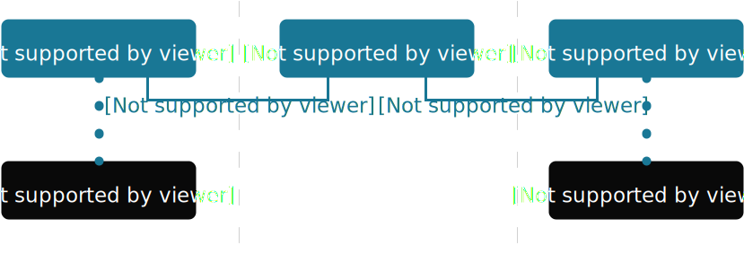

#!/usr/bin/env bash

url=https://ipywidgets.readthedocs.io/en/latest/tutorials/index.html
url=https://ipywidgets.readthedocs.io/en/latest/how-to/index.html
url=https://ipywidgets.readthedocs.io/en/latest/explanation/index.html
url=https://ipywidgets.readthedocs.io/en/latest/examples/Widget%20Low%20Level.html
url=https://ipywidgets.readthedocs.io/en/latest/reference/index.html
url=https://ipywidgets.readthedocs.io/en/latest/reference/jupyter-widgets.html
url=https://ipywidgets.readthedocs.io/en/latest/py-modindex.html
url=https://ipywidgets.readthedocs.io/en/latest/examples/Widget%20Custom.html
url=https://ipywidgets.readthedocs.io/en/latest/user_install.html
curl -L "$url" | /od/html2md.ts utf8
#echo "Paste HTML here and close this file to convert it ..." | subl - | /od/html2md.ts

exit
==============================================================================

/0. Jupyter Notebook
======================
1. https://jupyter.org/try
2. https://github.com/jupyter-widgets/ipywidgets
3. https://ipywidgets.readthedocs.io/en/latest/user_install.html
4. Interactive Widgets https://ipywidgets.readthedocs.io/en/latest/_static/lab/index.html

Jupyter is a large umbrella project that covers many different software offerings and tools, including the popular Jupyter Notebook and JupyterLab web-based notebook authoring and editing applications. The Jupyter project and its subprojects all center around providing tools (and standards) for interactive computing with computational notebooks.

Jupyter 一个基于 Python + Web 技术栈的可计算的记事本，程序化的工作台，良好地支持 Markdown 
写作与脚本编程。Web 配合 SVG 绘画技术，可以实现界面精美的 Web Application。并且编写文档也
非常流畅，可以展示文档中丰富的图形，并易于保存、节省储存空间，开源格式也更便于分发。

Jupyter 整个应用构架基于 Web Server + Client 模型，双方通信使用 ZeroMQ 高速并发消息通信框架。
通信构架称之为 Comm framework，Web 服务器端与客户端通过 Websocket 进行 JSON 数据交流，
其消息通信定义为 Widget messaging protocol。

官方 [Low Level Widget Explanation] 文档中作了介绍：


<!--  -->

[ZeroMQ](https://zeromq.org/) (also known as ØMQ, 0MQ, or zmq) looks like an embeddable networking library but acts like a concurrency framework. It gives you sockets that carry atomic messages across various transports like in-process, inter-process, TCP, and multicast. You can connect sockets N-to-N with patterns like fan-out, pub-sub, task distribution, and request-reply. It's fast enough to be the fabric for clustered products. Its asynchronous I/O model gives you scalable multicore applications, built as asynchronous message-processing tasks. It has a score of language APIs and runs on most operating systems.

配合 Jupyter Widgets 控件，可以开发 Web 交互应用，就像 Mathematica Notebooks 那样，
重复编辑单元代码，并重新求值，让你的笔记动起来。集成的 MathJax 框架，可以非常方便地渲染数学公式。

使用 Python pip 工具安装依赖：

```sh
pip install jupyterlab notebook
pip install ipywidgets

# if you are using the classic notebook
jupyter notebook

# if you are using JupyterLab
jupyter lab
```

或者直接在 Jupyter Notebook 中安装，其中的 % 表示当前内容作为 shell 脚本运行，这种操作在
VIM 编辑器中经常用到：

```py
    # Imports for JupyterLite
    %pip install -q ipywidgets
```

比如，Notebook 中输入以下 Python 代码，按下 Shift +　Enter 进行求值，笔记中输出结果为
一个显示 70% 状态的进度条，这部分图形是 Widgets 控件，不会在笔记源文件的 outputs 字段中出现：

```sh
import ipywidgets as widgets
widgets.IntSlider(
    value=7,
    min=0,
    max=10,
    step=1,
    description='Test:',
    disabled=False,
    continuous_update=False,
    orientation='horizontal',
    readout=True,
    readout_format='d'
)
widgets.HBox([widgets.Label(value="The $m$ in $E=mc^2$:"), widgets.FloatSlider()])
```

取而代之的是 plain text 字符串:

```sh
   "outputs": [
    {
     "data": {
      "application/vnd.jupyter.widget-view+json": {
       "model_id": "bd8a7e0be5404032b2012f4ddcdcd38b",
       "version_major": 2,
       "version_minor": 0
      },
      "text/plain": [
       "FloatProgress(value=7.0, bar_style='info', description='Loading:', max=10.0, style=ProgressStyle(bar_color='#f…"
      ]
     },
     "execution_count": 8,
     "metadata": {},
     "output_type": "execute_result"
    }
   ],
```

笔记系统运行时会生成缓存文件夹 .ipynb_checkpoints，用户保存临时文件，比如文件修改检查点记录。
还有程序运行目录下生成 .virtual_documents 虚拟文档文件夹。

Jupyter 可以使用 Python 虚拟环境，以下命令罗列当前可用的虚拟环境：

```sh
$ jupyter kernelspec list
Available kernels:
  python3    C:\Python310\tutorial-env\share\jupyter\kernels\python3

# Add Virtual Environment to Jupyter Notebook
# Jupyter Notebook makes sure that the IPython kernel is available.
# Manually add a kernel with a different version of Python or a virtual environment. 
# Install ipykernel which provides the IPython kernel for Jupyter:
pip install --user ipykernel
# Next you can add your virtual environment to Jupyter by typing:
python -m ipykernel install --user --name=myenv
# jupyter kernelspec uninstall myenv
```
Jupyter Notebook 文档使用 JSON 数据格式保存，扩展名为 ipynb，使用以下命令可以转换为 MD：

    jupyter nbconvert --to markdown some.ipynb

所有代码块和输出内容都按 Markdown 格式保存，图像资源等以连接、或图像标签形式引用。资源文件将
保存到 `some_files` 这样的目录中，其中 `_files` 是固定格式的后缀。源文档内容格式如下，
其中 cells 字段内保存笔记本中所有单元的相关信息，比如什么控制台、输出什么内容：

```json
{
 "cells": [ ... ],
 "metadata": {
  "kernelspec": {
   "display_name": "Python 3 (ipykernel)",
   "language": "python",
   "name": "python3"
  },
  "language_info": {
   "codemirror_mode": {
    "name": "ipython",
    "version": 3
   },
   "file_extension": ".py",
   "mimetype": "text/x-python",
   "name": "python",
   "nbconvert_exporter": "python",
   "pygments_lexer": "ipython3",
   "version": "3.10.2"
  }
 },
 "nbformat": 4,
 "nbformat_minor": 5
}
```

以下是其中一个 Python 脚本单元的内容格式参考，可以看到 cell_type 指示这是代码单元，outputs
字段指示相应的 source 代码的输出内容：

```json
  {
   "cell_type": "code",
   "execution_count": 1,
   "id": "e4873dcc-fb1c-413d-88f4-34884837e5e2",
   "metadata": {},
   "outputs": [
    {
     "name": "stdout",
     "output_type": "stream",
     "text": [
      "Note: you may need to restart the kernel to use updated packages.\n"
     ]
    }
   ],
   "source": [
    "# Imports for JupyterLite\n",
    "%pip install -q ipywidgets"
   ]
  },
```

ipywidgets 控件是互动编程模块，通过 Jupyter 内置的控件提供的交互功能来实现 GUI 编程。
例如，以下创建出滑动条，使用 w 变量引用这个 UI 控件，然后使用 display() 函数显示出来，
这就显示了两个 UI 滑动条，但是它们共用同一个数据（会产生联动）：

```py
from ipywidgets import *
from IPython.display import display
w = IntSlider()
display(w, w)
```

Jupyter 还提供了前端与后端的事件链接，前端 JavaScript 脚本可以和后端 Python 进行通信。
框架定义了 jslink() 和 jsdlink() 分别用于前端的事件链接，和前后端的链接。同时，还有一对
相似命名的就去，`link` 和 `dlink` 用于属性的链接，这种能力在新的 JavaScript 规范中支持，
称为属性代理，Proxy 对象代理，是响应式应用的基本原理。

Jupyter 前端在执行脚本时，就会创建一条消息，使用一个唯一的 GUID 编码作为消息的识别号，
通过由 Web 前端程序通过 websocket 发送给后端（Kernel）。后端接收到消息并执行相应的
脚本，并将脚本运行结果返回给前端渲染出图形界面：

     ┌──────────┐
     │          │
     │          │
     │  Kernel  │
     │          │
     │          │
     └──A────│──┘
        │    │                                  Kernel (Websocket Server)
    ----│----│-----------------------------------------------------------
        │    │                                  FrontEnd (User Interface)
     ┌──│────V──┐      ┌─────────────┐        ┌────────────┐
     │          │      │             │───────>│ WidgetView │
     │          │      │             │        └────────────┘
     │ NoteBook │─────>│ WidgetModel │           ......
     │          │      │             │        ┌────────────┐
     │          │      │             │───────>│ WidgetView │
     └──────────┘      └─────────────┘        └────────────┘

    @startuml
    NoteBook -> WidgetModel
    @enduml

因为整个构架的通信模式是同构的，comm API is a symmetric, asynchronous。所有服务器中也
可以根据 GUID 消息保留某个 UI 控件的状态，并且通过 API 让控件在前后端同步状态信息。这也
使用 MVC 架构的好处，Models 与 Views 解耦，视图如何渲染由 Views 自己解决，数据模型负责
实现数据逻辑，去过数据驱动视图。Web 视图（DOM）交由 JavaScript 进行处理。也就是说，UI 控件
结合 HTML 标签提供 JavaScript 脚本交互功能的实现。控件主要分为 `DOMWidget` 和 `ValueWidget`
两类，基类是 `Widget`。官方文档提供了 Building a Custom Widget - Email widget 教程，
指导如何实现一个电子邮件地址输入控件（第一眼看到这标题以为是开发一个邮件接收工具）。

另外，对于交互控制，官方提供了 Interactive Widgets 教程，直接使用 Nodebook 做演示。
Jupyter Widgets 本身是基于 Web 的 UI 构架，所以也可以直接在网页中使用它来开发交互应用。
参考官方文档： Embedding Jupyter Widgets。

提示：Jupyter 应用开发基于 JavaScript 和 Python 脚本语言，同时又基于 HTML/CSS 等页面技术，
以及 Websocket 通信协议的多技术栈集成应用。


/0. DrawSVG
============

DrawSVG 也设计成 Jupyter 的交互程序，但是支持不好，错误频发。DrawSVG 希望通过实现 Python 
装饰器来完成一些交互功能的实现，通过使用 **@widget.set_draw_frame** 这样的装饰器，以控制
动画运行逐帧绘制成动画。这些功能涉及 Jupyter 控件的开发，可以参考 ipywidgets 教程文档。

    Python error:
    AttributeError: module 'ipywidgets.widgets.widget' has no attribute 'set_draw_frame'

    JavaScript error:
    Error: No version of module drawingview is registered

DrawSVG 代码参考 Asynchronous Frame-based Animation in Jupyter
https://pypi.org/project/drawsvg/

```py
# Jupyter cell 1:
import drawsvg as draw
from drawsvg.widgets import AsyncAnimation
widget = AsyncAnimation(fps=10)
widget
# [Animation is displayed here (click to pause)]

# Jupyter cell 2:
global_variable = 'a'
@widget.set_draw_frame  # Animation above is automatically updated
def draw_frame(secs=0):
    # Draw something...
    d = draw.Drawing(100, 40)
    d.append(draw.Text(global_variable, 20, 0, 30))
    d.append(draw.Text('{:0.1f}'.format(secs), 20, 30, 30))
    return d

# Jupyter cell 3:
global_variable = 'b'  # Animation above now displays 'b'
```

以下通过 Python 脚本实现 SVG 逐帧控制的动画倒是正常，带有交互功能的基本上不能运行。
些脚本运行过程中，会为每帧生成一个 SVG 图形，通过 Python 脚本设置图形的状态，然后
逐个图形展示就成了动画效果：

```py
# Frame-by-Frame Animation
import drawsvg as draw

# Draw a frame of the animation
def draw_frame(t):
    d = draw.Drawing(2, 6.05, origin=(-1, -5))
    d.set_render_size(h=300)
    d.append(draw.Rectangle(-2, -6, 4, 8, fill='white'))
    d.append(draw.Rectangle(-1, 1, 2, 0.05, fill='brown'))
    t = (t + 1) % 2 - 1
    y = t**2 * 4 - 4
    d.append(draw.Circle(0, y, 1, fill='lime'))
    return d

with draw.frame_animate_jupyter(draw_frame, delay=0.05) as anim:
# Or:
#with draw.frame_animate_video('example6.gif', draw_frame, duration=0.05) as anim:
# Or:
#with draw.frame_animate_spritesheet('example6.png', draw_frame, row_length=10) as anim:
    # Add each frame to the animation
    for i in range(20):
        anim.draw_frame(i/10)
    for i in range(20):
        anim.draw_frame(i/10)
    for i in range(20):
        anim.draw_frame(i/10)
```

以下是带有 SVG 原生回放控件的示范，SVG-native animation with playback controls。
此回放功能由 DrawSVG 开发者在 SVG 文档内集成相应的 JavaScript 代码控制动画回放。根据
生成的 SVG 文档，可以看到有一组 scrub 图形，即各个播放按钮和进度条。JavaScript 脚本代码
硬编码在 SVG_JS_CONTENT 变量中。受浏览器安全约束，SVG 动画脚本功能需要通过 HTML iframe，
或者将 SVG 标签内嵌到 HTML 上才能执行，不能通过图像等标签引用。

DrawSVG 有个明显的问题，即它只做单向的 SVG 文档生成，不能从 SVG 文档读取及加载相应的图形。
在其内部转换 PNG 等图形格式的转换依赖 [CairoSVG](https://cairosvg.org/) 模块，
此模块支持 PDF 等矢量格式。

```sh
$ cairosvg image.svg -o image.png

$ python3
>>> import cairosvg
>>> cairosvg.svg2pdf(url='image.svg', write_to='image.pdf')
```

每次调用 add_key_frame() 方法，SVG 文档中都会产生一个新的 `<animate>` 动画标签，
animate_text_sequence() 方法会成对添加 `<text>` 和 `<anmate>`，
DrawSVG 模块会大量使用动画标签去支持每个动画帧，所以复杂的动画文件会非常大。

```py
import drawsvg as draw

d = draw.Drawing(400, 200, origin='center',
        animation_config=draw.types.SyncedAnimationConfig(
            # Animation configuration
            duration=8,  # Seconds
            show_playback_progress=True,
            show_playback_controls=True))
d.append(draw.Rectangle(-200, -100, 400, 200, fill='#eee'))  # Background
d.append(draw.Circle(0, 0, 40, fill='green'))  # Center circle

# Animation
circle = draw.Circle(0, 0, 0, fill='gray')  # Moving circle
circle.add_key_frame(0, cx=-100, cy=0,    r=0)
circle.add_key_frame(2, cx=0,    cy=-100, r=40)
circle.add_key_frame(4, cx=100,  cy=0,    r=0)
circle.add_key_frame(6, cx=0,    cy=100,  r=40)
circle.add_key_frame(8, cx=-100, cy=0,    r=0)
d.append(circle)
r = draw.Rectangle(0, 0, 0, 0, fill='silver')  # Moving square
r.add_key_frame(0, x=-100, y=0,       width=0,  height=0)
r.add_key_frame(2, x=0-20, y=-100-20, width=40, height=40)
r.add_key_frame(4, x=100,  y=0,       width=0,  height=0)
r.add_key_frame(6, x=0-20, y=100-20,  width=40, height=40)
r.add_key_frame(8, x=-100, y=0,       width=0,  height=0)
d.append(r)

# Changing text
draw.native_animation.animate_text_sequence(
        d,
        [0, 2, 4, 6],
        ['0', '1', '2', '3'],
        30, 0, 1, fill='yellow', center=True)

# Save as a standalone animated SVG or HTML
d.save_svg('playback-controls.svg')
d.save_html('playback-controls.html')

# Display in Jupyter notebook
#d.display_image()  # Display SVG as an image (will not be interactive)
#d.display_iframe()  # Display as interactive SVG (alternative)
#d.as_gif('orbit.gif', fps=10)  # Render as a GIF image, optionally save to file
#d.as_mp4('orbig.mp4', fps=60, verbose=True)  # Render as an MP4 video, optionally save to file
#d.as_spritesheet('orbit-spritesheet.png', row_length=10, fps=3)  # Render as a spritesheet
d.display_inline()  # Display as interactive SVG
```


/1. TOC
========

Jupyter Widgets 8.1.2 documentation

*   [GitHub](https://github.com/jupyter-widgets/ipywidgets "GitHub")
*   [PyPI](https://pypi.org/project/ipywidgets "PyPI")

*   [Tutorials](https://ipywidgets.readthedocs.io/en/latest/tutorials/index.html)
*   [How-to Guides](https://ipywidgets.readthedocs.io/en/latest/how-to/index.html)
*   [Explanation](https://ipywidgets.readthedocs.io/en/latest/explanation/index.html)
*   [Reference](https://ipywidgets.readthedocs.io/en/latest/reference/index.html)

nbconvert: Convert Notebooks to other formats
https://nbconvert.readthedocs.io/en/latest/index.html


## Tutorials

For Custom Widget Authors

*   [Building a Custom Widget - Email widget](https://ipywidgets.readthedocs.io/en/latest/examples/Widget%20Custom.html)


> [!TIP]
> For a more in-depth tutorial, see the [dedicated GitHub repository](https://github.com/jupyter-widgets/tutorial).


[Edit on GitHub](https://github.com/jupyter-widgets/ipywidgets/edit/main/docs/tutorials/index.md)

[Show Source](https://ipywidgets.readthedocs.io/en/latest/_sources/tutorials/index.md.txt)


## How-to Guides

Using Widgets

*   [Installation]
*   [Simple Widget Introduction]
*   [Widget List]
*   [Output widgets: leveraging Jupyter's display system]
*   [Widget Events]
*   [Styling of Jupyter widgets]
*   [Layout of Jupyter widgets]
*   [Using Layout Templates]
*   [Using Interact]
*   [Asynchronous Widgets]

Upgrading

*   [Migrating user code]
*   [Migrating custom widget libraries]

Publishing Content with Widgets

*   [Embedding Jupyter Widgets in Other Contexts than the Notebook]

Contributing to Jupyter Widgets

*   [Developer Install]
*   [Unit Tests]
*   [Develop and Build Documentation]
*   [Contributing]
*   [Developer Release Procedure]

[Edit on GitHub](https://github.com/jupyter-widgets/ipywidgets/edit/main/docs/how-to/index.md)
[Show Source](https://ipywidgets.readthedocs.io/en/latest/_sources/how-to/index.md.txt)


[Installation]: https://ipywidgets.readthedocs.io/en/latest/user_install.html
[Simple Widget Introduction]: https://ipywidgets.readthedocs.io/en/latest/examples/Widget%20Basics.html
[Widget List]: https://ipywidgets.readthedocs.io/en/latest/examples/Widget%20List.html
[Output widgets: leveraging Jupyter's display system]: https://ipywidgets.readthedocs.io/en/latest/examples/Output%20Widget.html
[Widget Events]: https://ipywidgets.readthedocs.io/en/latest/examples/Widget%20Events.html
[Styling of Jupyter widgets]: https://ipywidgets.readthedocs.io/en/latest/examples/Widget%20Styling.html
[Layout of Jupyter widgets]: https://ipywidgets.readthedocs.io/en/latest/examples/Widget%20Layout.html
[Using Layout Templates]: https://ipywidgets.readthedocs.io/en/latest/examples/Layout%20Templates.html
[Using Interact]: https://ipywidgets.readthedocs.io/en/latest/examples/Using%20Interact.html
[Asynchronous Widgets]: https://ipywidgets.readthedocs.io/en/latest/examples/Widget%20Asynchronous.html
[Migrating user code]: https://ipywidgets.readthedocs.io/en/latest/user_migration_guides.html
[Migrating custom widget libraries]: https://ipywidgets.readthedocs.io/en/latest/migration_guides.html
[Embedding Jupyter Widgets in Other Contexts than the Notebook]: https://ipywidgets.readthedocs.io/en/latest/embedding.html
[Developer Install]: https://ipywidgets.readthedocs.io/en/latest/dev_install.html
[Unit Tests]: https://ipywidgets.readthedocs.io/en/latest/dev_testing.html
[Develop and Build Documentation]: https://ipywidgets.readthedocs.io/en/latest/dev_docs.html
[Contributing]: https://ipywidgets.readthedocs.io/en/latest/contributing.html
[Developer Release Procedure]: https://ipywidgets.readthedocs.io/en/latest/dev_release.html


## Explanation

*   [Low Level Widget Explanation](https://ipywidgets.readthedocs.io/en/latest/examples/Widget%20Low%20Level.html)

[Edit on GitHub](https://github.com/jupyter-widgets/ipywidgets/edit/main/docs/explanation/index.md)

[Show Source](https://ipywidgets.readthedocs.io/en/latest/_sources/explanation/index.md.txt)


## Reference

History

*   [ipywidgets Changelog](https://ipywidgets.readthedocs.io/en/latest/changelog.html)

Python API

*   [`ipywidgets`](https://ipywidgets.readthedocs.io/en/latest/ipywidgets.html)
*   [Index](https://ipywidgets.readthedocs.io/en/latest/genindex.html)
*   [Module Index](https://ipywidgets.readthedocs.io/en/latest/py-modindex.html)

JS API Packages

*   [`@jupyter-widgets`]
*   [`@jupyter-widgets/base`]
*   [`@jupyter-widgets/base-manager`]
*   [`@jupyter-widgets/controls`]
*   [`@jupyter-widgets/html-manager`]
*   [`@jupyter-widgets/jupyterlab-manager`]
*   [`@jupyter-widgets/output`]

[`@jupyter-widgets`]: https://ipywidgets.readthedocs.io/en/latest/jupyter-widgets.html
[`@jupyter-widgets/base`]: https://ipywidgets.readthedocs.io/en/latest/_static/typedoc/modules/_jupyter_widgets_base.html
[`@jupyter-widgets/base-manager`]: https://ipywidgets.readthedocs.io/en/latest/_static/typedoc/modules/_jupyter_widgets_base_manager.html
[`@jupyter-widgets/controls`]: https://ipywidgets.readthedocs.io/en/latest/_static/typedoc/modules/_jupyter_widgets_controls.html
[`@jupyter-widgets/html-manager`]: https://ipywidgets.readthedocs.io/en/latest/_static/typedoc/modules/_jupyter_widgets_html_manager.html
[`@jupyter-widgets/jupyterlab-manager`]: https://ipywidgets.readthedocs.io/en/latest/_static/typedoc/modules/_jupyter_widgets_jupyterlab_manager.html
[`@jupyter-widgets/output`]: https://ipywidgets.readthedocs.io/en/latest/_static/typedoc/modules/_jupyter_widgets_output.html

[Edit on GitHub](https://github.com/jupyter-widgets/ipywidgets/edit/main/docs/reference/index.md)
[Show Source](https://ipywidgets.readthedocs.io/en/latest/_sources/reference/index.md.txt)


/2. Jupyter Widgets
=========================

```{note}
This documentation is for `ipywidgets` 8. See the [changelog](./changelog.md) for what is new and the [user migration guide](./user_migration_guides.md) for suggestions about migrating from `ipywidgets` 7.

For custom widget authors, see the [authoring migration guide](./migration_guides.md) for suggestions about how to update custom widgets to support `ipywidgets` 8.

The documentation for `ipywidgets` 7 is available at
[ipywidgets 7 documentation](https://ipywidgets.readthedocs.io/en/7.x).
```

Jupyter Widgets are [interactive browser controls](https://github.com/jupyter-widgets/ipywidgets/blob/main/docs/source/examples/Index.ipynb)
for Jupyter notebooks. Examples include:

- Basic form controls like **sliders**, **checkboxes**, **text inputs**
- Container controls like **tabs**, **accordions**, **horizontal** and **vertical layout boxes**, **grid layouts**
- Advanced controls like **maps**, **2d** and **3d visualizations**, **datagrids**, and more

Notebooks come alive when interactive widgets are used. Users can visualize and
manipulate their data in intuitive and easy ways. Researchers can easily see
how changing inputs to a model impact the results. Scientists can share
interactive results with graphical user interfaces that others can play with
without seeing code. Exploring, learning, and sharing becomes a fun immersive
experience.


## Try it online

From the _Try Jupyter Widgets Now_ sidebar, you can try `ipywidgets` in the _JupyterLab_
or _Jupyter Notebook_ interfaces, provided by [JupyterLite](https://jupyterlite.rtfd.io).

## Learning Widgets

This documentation contains a thorough description of the core Jupyter widgets
package and several examples.

There is a [video tutorial](https://youtu.be/QAtKtVcm11I) that takes a more step-by-step approach. The
Jupyter notebooks for that tutorial are [also available](https://github.com/jupyter-widgets/tutorial).

## Core Jupyter Widgets

Jupyter Widgets is primarily a framework to provide interactive controls (see
[Widget Basics](examples/Widget%20Basics.ipynb) for more information).
The `ipywidgets` package
also provides a basic, lightweight set of core form controls that _use_ this
framework. These included controls include a text area, text box, select and
multiselect controls, checkbox, sliders, tab panels, grid layout, etc.

The framework for building rich interactive objects is the foremost purpose of
the Jupyter Widgets project, and the set of included core form controls is
purposefully kept small and self-contained. We encourage and support a robust
ecosystem of packages built on top of the Jupyter Widgets framework to provide
more complicated interactive objects, such as maps, 2d and 3d visualizations, or
other form control systems built on a variety of popular Javascript frameworks
such as Material or Vue.

See the [Jupyter Widgets wiki page](https://github.com/jupyter/jupyter/wiki/Jupyter-Widgets)
for more information about custom widget packages built on top of the Jupyter Widgets
framework.

## Jupyter Widgets components

The Jupyter Widgets framework has several components:

1. A package in the _kernel_ to provide an interface for widgets. The
   `ipywidgets` Python package provides Jupyter Widgets for the IPython
   kernel. Other kernels may also provide Jupyter Widgets support.
2. An extension for the browser Jupyter frontend to manage Jupyter Widgets.
   Installing `ipywidgets` automatically installs extensions for JupyterLab
   and Jupyter Notebook (the `jupyterlab-widgets` and `widgetsnbextension`
   packages). The Jupyter Widgets project also maintains a plain HTML interface
   for embedding Jupyter Widgets on a webpage, and many other frontends support
   Jupyter Widgets.

See the
[Jupyter Widgets wiki page](https://github.com/jupyter/jupyter/wiki/Jupyter-Widgets) for more
information from the community about kernels and frontends that support Jupyter Widgets, as well as
some custom widget packages built on top of the Jupyter Widgets framework.

```{toctree}
:maxdepth: 2

tutorials/index
how-to/index
explanation/index
reference/index
```


/3. Installation
=====================


Users can install the current version of **ipywidgets** with [pip](https://pip.pypa.io/en/stable/) or [conda](https://conda.readthedocs.io/en/latest/).

In most cases, installing the Python `ipywidgets` package will also automatically configure classic Jupyter Notebook and JupyterLab 3.x to display ipywidgets. With pip, do:

    pip install ipywidgets

or with conda, do:

    conda install -c conda-forge ipywidgets

Installing in JupyterLab 3.x
----------------------------

Most of the time, installing `ipywidgets` automatically configures JupyterLab 3.x to use widgets. The `ipywidgets` package does this by depending on the `jupyterlab_widgets` package, which configures JupyterLab 3 to display and use widgets.

If JupyterLab and the IPython kernel are installed in different environments (for example, separate environments are providing different Python kernels), then the installation requires two steps:

1.  Install the `jupyterlab_widgets` package in the environment containing JupyterLab.
    
2.  Install `ipywidgets` in each kernel’s environment that will use ipywidgets.
    

For example, if using conda environments, with JupyterLab installed on the `base` environment and the kernel installed in an environment called `pyenv`, the commands are:

    conda install -n base -c conda-forge jupyterlab_widgets
    conda install -n pyenv -c conda-forge ipywidgets

Installing in classic Jupyter Notebook
--------------------------------------

Most of the time, installing `ipywidgets` automatically configures Jupyter Notebook to use widgets. The `ipywidgets` package does this by depending on the `widgetsnbextension` package, which configures the classic Jupyter Notebook to display and use widgets.

If your Jupyter Notebook and the IPython kernel are installed in different environments (for example, separate environments are providing different Python kernels), then the installation requires two steps:

1.  Install the `widgetsnbextension` package in the environment containing the Jupyter Notebook server.
    
2.  Install `ipywidgets` in each kernel’s environment that will use ipywidgets.
    

For example, if using conda environments, with Jupyter Notebook installed on the `base` environment and the kernel installed in an environment called `pyenv`, the commands are:

    conda install -n base -c conda-forge widgetsnbextension
    conda install -n pyenv -c conda-forge ipywidgets

Installing into JupyterLab 1 or 2
---------------------------------

To install the JupyterLab extension into JupyterLab 1 or 2, you also need to run the command below in a terminal which requires that you have [nodejs](https://nodejs.org/en/) installed.

For example, if using conda environments, you can install nodejs with:

    conda install -c conda-forge nodejs

Then you can install the labextension:

    jupyter labextension install @jupyter-widgets/jupyterlab-manager

This command defaults to installing the latest version of the **ipywidgets** JupyterLab extension. Depending on the version of JupyterLab you have installed, you may need to install [an older version](https://github.com/jupyter-widgets/ipywidgets/tree/main/packages/jupyterlab-manager#version-compatibility).

If you install this extension while JupyterLab is running, you will need to refresh the page or restart JupyterLab before the changes take effect.

**Note:** A clean reinstall of the JupyterLab extension can be done by first running the `jupyter lab clean` command which will remove the staging and static directories from the lab directory. The location of the lab directory can be queried by executing the command `jupyter lab path` in your terminal.

Installing into classic Jupyter Notebook 5.2 or earlier
-------------------------------------------------------

If you have an old version of Jupyter Notebook installed (version 5.2 or earlier), you may need to manually enable the ipywidgets notebook extension with:

    jupyter nbextension enable --py widgetsnbextension

When using [virtualenv](https://virtualenv.pypa.io/en/stable/) and working in an activated virtual environment, the `--sys-prefix` option may be required to enable the extension and keep the environment isolated (i.e. `jupyter nbextension enable --py widgetsnbextension --sys-prefix`).

Frequently Asked Questions
--------------------------

The issues in the [Reference milestone](https://github.com/jupyter-widgets/ipywidgets/issues?q=is%3Aopen+is%3Aissue+milestone%3AReference) on GitHub include many questions, discussions, and answers about ipywidgets.

**Question**: When I display a widget or interact, I just see some text, such as `IntSlider(value=0)` or `interactive(children=(IntSlider(value=0, description='x', max=1), Output()), _dom_classes=('widget-interact',))`. What is wrong?

**Answer**: A text representation of the widget is printed if the widget control is not available. It may mean the widget JavaScript is still loading. If the message persists in the Jupyter Notebook or JupyterLab, it likely means that the widgets JavaScript library is either not installed or not enabled. See the installation instructions above for setup instructions.

If you see this message in another frontend (for example, a static rendering on GitHub or [NBViewer](https://nbviewer.jupyter.org/)), it may mean that your frontend doesn’t currently support widgets.


/4. Interactive Widgets
===================================
- https://github.com/jupyter-widgets/ipywidgets
- https://ipywidgets.readthedocs.io/en/latest/_static/files/Index.ipynb

```sh
git clone --depth=1 git@github.com:jupyter-widgets/ipywidgets /pl/ipywidgets
pushd '/pl/ipywidgets/docs/source/examples'
while read nb; do
    jupyter nbconvert --to markdown "$nb"
done<<<$(find | grep ipynb)
```

IPython includes an architecture for interactive widgets that tie together Python code running in the kernel and JavaScript/HTML/CSS  running in the browser. These widgets enable users to explore their code and data interactively.

## Tutorials

- [Using Interact](https://ipywidgets.readthedocs.io/en/latest/_static/files/Using%20Interact.ipynb)
- [Widget Basics](https://ipywidgets.readthedocs.io/en/latest/_static/files/Widget%20Basics.ipynb)  
- [Widget Events](https://ipywidgets.readthedocs.io/en/latest/_static/files/Widget%20Events.ipynb)  
- [Widget List](https://ipywidgets.readthedocs.io/en/latest/_static/files/Widget%20List.ipynb)  
- [Widget Styling](https://ipywidgets.readthedocs.io/en/latest/_static/files/Widget%20Styling.ipynb)
- [Layout Templates](https://ipywidgets.readthedocs.io/en/latest/_static/files/Layout%20Templates.ipynb)
- [Custom Widget Tutorial](https://ipywidgets.readthedocs.io/en/latest/_static/files/Widget%20Custom.ipynb)
- [Widget Asynchronous](https://ipywidgets.readthedocs.io/en/latest/_static/files/Widget%20Asynchronous.ipynb): how to pause and listen in the kernel for widget changes in the frontend.

## Examples of custom widgets

- [Variable Inspector](https://ipywidgets.readthedocs.io/en/latest/_static/files/Variable%20Inspector.ipynb)  
- [Export As (nbconvert)](https://ipywidgets.readthedocs.io/en/latest/_static/files/Export%20As%20(nbconvert%29.ipynb)

## Examples using `interact`/`interactive`

* [Beat Frequencies](https://ipywidgets.readthedocs.io/en/latest/_static/files/Beat%20Frequencies.ipynb)
* [Exploring Graphs](https://ipywidgets.readthedocs.io/en/latest/_static/files/Exploring%20Graphs.ipynb)
* [Factoring](https://ipywidgets.readthedocs.io/en/latest/_static/files/Factoring.ipynb)
* [Image Browser](https://ipywidgets.readthedocs.io/en/latest/_static/files/Image%20Browser.ipynb)
* [Image Processing](https://ipywidgets.readthedocs.io/en/latest/_static/files/Image%20Processing.ipynb)
* [Lorenz Differential Equations](https://ipywidgets.readthedocs.io/en/latest/_static/files/Lorenz%20Differential%20Equations.ipynb)


/5. Simple Widget Introduction
=================================

## What are widgets?

Widgets are eventful python objects that have a representation in the browser, often as a control like a slider, textbox, etc.

## What can they be used for?

You can use widgets to build **interactive GUIs** for your notebooks.  
You can also use widgets to **synchronize stateful and stateless information** between Python and JavaScript.

## Using widgets  

To use the widget framework, you need to import `ipywidgets`.


```python
# Imports for JupyterLite
%pip install -q ipywidgets
```


```python
import ipywidgets as widgets
```

### repr

Widgets have their own display `repr` which allows them to be displayed using IPython's display framework.  Constructing and returning an `IntSlider` automatically displays the widget (as seen below).  Widgets are displayed inside the output area below the code cell. Clearing cell output will also remove the widget.


```python
widgets.IntSlider()
```

### display()

You can also explicitly display the widget using `display(...)`.


```python
from IPython.display import display
w = widgets.IntSlider()
display(w)
```

### Multiple display() calls

If you display the same widget twice, the displayed instances in the front-end will remain in sync with each other.  Try dragging the slider below and watch the slider above.


```python
display(w)
```

## Why does displaying the same widget twice work?

Widgets are represented in the back-end by a single object.  Each time a widget is displayed, a new representation of that same object is created in the front-end.  These representations are called views.


### Closing widgets

You can close a widget by calling its `close()` method.


```python
display(w)
```


```python
w.close()
```

## Widget properties

All of the IPython widgets share a similar naming scheme.  To read the value of a widget, you can query its `value` property.


```python
w = widgets.IntSlider()
display(w)
```


```python
w.value
```

Similarly, to set a widget's value, you can set its `value` property.


```python
w.value = 100
```

### Keys

In addition to `value`, most widgets share `keys`, `description`, and `disabled`.  To see the entire list of synchronized, stateful properties of any specific widget, you can query the `keys` property.


```python
w.keys
```

### Shorthand for setting the initial values of widget properties

While creating a widget, you can set some or all of the initial values of that widget by defining them as keyword arguments in the widget's constructor (as seen below).


```python
widgets.Text(value='Hello World!', disabled=True)
```

## Linking two similar widgets

If you need to display the same value two different ways, you'll have to use two different widgets.  Instead of attempting to manually synchronize the values of the two widgets, you can use the `link`  or `jslink` function to link two properties together (the difference between these is discussed in [Widget Events](Widget Events.ipynb)).  Below, the values of two widgets are linked together.


```python
a = widgets.FloatText()
b = widgets.FloatSlider()
display(a,b)

mylink = widgets.jslink((a, 'value'), (b, 'value'))
```

### Unlinking widgets

Unlinking the widgets is simple.  All you have to do is call `.unlink` on the link object.  Try changing one of the widgets above after unlinking to see that they can be independently changed.


```python
# mylink.unlink()
```

/6. Widget List
====================


```python
# Imports for JupyterLite
%pip install -q ipywidgets
```


```python
import ipywidgets as widgets
```

## Numeric widgets

There are many widgets distributed with ipywidgets that are designed to display numeric values.  Widgets exist for displaying integers and floats, both bounded and unbounded.  The integer widgets share a similar naming scheme to their floating point counterparts.  By replacing `Float` with `Int` in the widget name, you can find the Integer equivalent.

### :widget: IntSlider  
- The slider is displayed with a specified, initial `value`. Lower and upper bounds are defined by `min` and `max`, and the value can be incremented according to the `step` parameter.
- The slider's label is defined by `description` parameter 
- The slider's `orientation` is either 'horizontal' (default) or 'vertical'
- `readout`  displays the current value of the slider next to it. The options are **True** (default) or **False** 
    - `readout_format` specifies the format function used to represent slider value. The default is '.2f'
  


```python
widgets.IntSlider(
    value=7,
    min=0,
    max=10,
    step=1,
    description='Test:',
    disabled=False,
    continuous_update=False,
    orientation='horizontal',
    readout=True,
    readout_format='d'
)
```

### :widget: FloatSlider  


```python
widgets.FloatSlider(
    value=7.5,
    min=0,
    max=10.0,
    step=0.1,
    description='Test:',
    disabled=False,
    continuous_update=False,
    orientation='horizontal',
    readout=True,
    readout_format='.1f',
)
```

An example of sliders **displayed vertically**.


```python
widgets.FloatSlider(
    value=7.5,
    min=0,
    max=10.0,
    step=0.1,
    description='Test:',
    disabled=False,
    continuous_update=False,
    orientation='vertical',
    readout=True,
    readout_format='.1f',
)
```

### :widget: FloatLogSlider

The `FloatLogSlider` has a log scale, which makes it easy to have a slider that covers a wide range of positive magnitudes. The `min` and `max` refer to the minimum and maximum exponents of the `base`, and the `value` refers to the actual value of the slider.


```python
widgets.FloatLogSlider(
    value=10,
    base=10,
    min=-10, # max exponent of base
    max=10, # min exponent of base
    step=0.2, # exponent step
    description='Log Slider'
)
```

### :widget: IntRangeSlider


```python
widgets.IntRangeSlider(
    value=[5, 7],
    min=0,
    max=10,
    step=1,
    description='Test:',
    disabled=False,
    continuous_update=False,
    orientation='horizontal',
    readout=True,
    readout_format='d',
)
```

### :widget: FloatRangeSlider


```python
widgets.FloatRangeSlider(
    value=[5, 7.5],
    min=0,
    max=10.0,
    step=0.1,
    description='Test:',
    disabled=False,
    continuous_update=False,
    orientation='horizontal',
    readout=True,
    readout_format='.1f',
)
```

### :widget: IntProgress


```python
widgets.IntProgress(
    value=7,
    min=0,
    max=10,
    description='Loading:',
    bar_style='', # 'success', 'info', 'warning', 'danger' or ''
    style={'bar_color': 'maroon'},
    orientation='horizontal'
)
```

### :widget: FloatProgress


```python
widgets.FloatProgress(
    value=7.5,
    min=0,
    max=10.0,
    description='Loading:',
    bar_style='info',
    style={'bar_color': '#ffff00'},
    orientation='horizontal'
)
```

The numerical text boxes that impose some limit on the data (range, integer-only) impose that restriction when the user presses enter.

### :widget: BoundedIntText


```python
widgets.BoundedIntText(
    value=7,
    min=0,
    max=10,
    step=1,
    description='Text:',
    disabled=False
)
```

### :widget: BoundedFloatText


```python
widgets.BoundedFloatText(
    value=7.5,
    min=0,
    max=10.0,
    step=0.1,
    description='Text:',
    disabled=False
)
```

### :widget: IntText


```python
widgets.IntText(
    value=7,
    description='Any:',
    disabled=False
)
```

### :widget: FloatText


```python
widgets.FloatText(
    value=7.5,
    description='Any:',
    disabled=False
)
```

## Boolean widgets

There are three widgets that are designed to display a boolean value.

### :widget: ToggleButton


```python
widgets.ToggleButton(
    value=False,
    description='Click me',
    disabled=False,
    button_style='', # 'success', 'info', 'warning', 'danger' or ''
    tooltip='Description',
    icon='check' # (FontAwesome names without the `fa-` prefix)
)
```

### :widget: Checkbox  
- `value` specifies the value of the checkbox
- `indent` parameter places an indented checkbox, aligned with other controls. Options are **True** (default) or **False**    


```python
widgets.Checkbox(
    value=False,
    description='Check me',
    disabled=False,
    indent=False
)
```

### :widget: Valid

The valid widget provides a read-only indicator.


```python
widgets.Valid(
    value=False,
    description='Valid!',
)
```

## Selection widgets

There are several widgets that can be used to display single selection lists, and two that can be used to select multiple values.  All inherit from the same base class.  You can specify the **enumeration of selectable options by passing a list** (options are either (label, value) pairs, or simply values for which the labels are derived by calling `str`).

### :widget: Dropdown


```python
widgets.Dropdown(
    options=['1', '2', '3'],
    value='2',
    description='Number:',
    disabled=False,
)
```

The following is also valid, displaying the words `'One', 'Two', 'Three'` as the dropdown choices but returning the values `1, 2, 3`.


```python
widgets.Dropdown(
    options=[('One', 1), ('Two', 2), ('Three', 3)],
    value=2,
    description='Number:',
)
```

### :widget: RadioButtons


```python
widgets.RadioButtons(
    options=['pepperoni', 'pineapple', 'anchovies'],
#    value='pineapple', # Defaults to 'pineapple'
#    layout={'width': 'max-content'}, # If the items' names are long
    description='Pizza topping:',
    disabled=False
)
```

#### With dynamic layout and very long labels


```python
widgets.Box(
    [
        widgets.Label(value='Pizza topping with a very long label:'), 
        widgets.RadioButtons(
            options=[
                'pepperoni', 
                'pineapple', 
                'anchovies', 
                'and the long name that will fit fine and the long name that will fit fine and the long name that will fit fine '
            ],
            layout={'width': 'max-content'}
        )
    ]
)
```

### :widget: Select


```python
widgets.Select(
    options=['Linux', 'Windows', 'macOS'],
    value='macOS',
    # rows=10,
    description='OS:',
    disabled=False
)
```

### :widget: SelectionSlider


```python
widgets.SelectionSlider(
    options=['scrambled', 'sunny side up', 'poached', 'over easy'],
    value='sunny side up',
    description='I like my eggs ...',
    disabled=False,
    continuous_update=False,
    orientation='horizontal',
    readout=True
)
```

### :widget: SelectionRangeSlider

The value, index, and label keys are 2-tuples of the min and max values selected. The options must be nonempty.


```python
import datetime
dates = [datetime.date(2015, i, 1) for i in range(1, 13)]
options = [(i.strftime('%b'), i) for i in dates]
widgets.SelectionRangeSlider(
    options=options,
    index=(0, 11),
    description='Months (2015)',
    disabled=False
)
```

### :widget: ToggleButtons


```python
widgets.ToggleButtons(
    options=['Slow', 'Regular', 'Fast'],
    description='Speed:',
    disabled=False,
    button_style='', # 'success', 'info', 'warning', 'danger' or ''
    tooltips=['Description of slow', 'Description of regular', 'Description of fast'],
#     icons=['check'] * 3
)
```

### :widget: SelectMultiple
Multiple values can be selected with <kbd>shift</kbd> and/or <kbd>ctrl</kbd> (or <kbd>command</kbd>) pressed and mouse clicks or arrow keys.


```python
widgets.SelectMultiple(
    options=['Apples', 'Oranges', 'Pears'],
    value=['Oranges'],
    #rows=10,
    description='Fruits',
    disabled=False
)
```

## String widgets

There are several widgets that can be used to display a string value.  The `Text`, `Textarea`, and `Combobox` widgets accept input.  The `HTML` and `HTMLMath` widgets display a string as HTML (`HTMLMath` also renders math). The `Label` widget can be used to construct a custom control label.

### :widget: Text


```python
widgets.Text(
    value='Hello World',
    placeholder='Type something',
    description='String:',
    disabled=False   
)
```

### :widget: Textarea


```python
widgets.Textarea(
    value='Hello World',
    placeholder='Type something',
    description='String:',
    disabled=False
)
```

### :widget: Combobox


```python
widgets.Combobox(
    # value='John',
    placeholder='Choose Someone',
    options=['Paul', 'John', 'George', 'Ringo'],
    description='Combobox:',
    ensure_option=True,
    disabled=False
)
```

### :widget: Password

The `Password` widget hides user input on the screen. **This widget is not a secure way to collect sensitive information because:**

+ The contents of the `Password` widget are transmitted unencrypted.
+ If the widget state is saved in the notebook the contents of the `Password` widget is stored as plain text.


```python
widgets.Password(
    value='password',
    placeholder='Enter password',
    description='Password:',
    disabled=False
)
```

### :widget: Label

The `Label` widget is useful if you need to build a custom description next to a control using similar styling to the built-in control descriptions.


```python
widgets.HBox([widgets.Label(value="The $m$ in $E=mc^2$:"), widgets.FloatSlider()])
```

### :widget: HTML


```python
widgets.HTML(
    value="Hello <b>World</b>",
    placeholder='Some HTML',
    description='Some HTML',
)
```

### :widget: HTML Math


```python
widgets.HTMLMath(
    value=r"Some math and <i>HTML</i>: \(x^2\) and $$\frac{x+1}{x-1}$$",
    placeholder='Some HTML',
    description='Some HTML',
)
```

## :widget: Image


```python
file = open("images/WidgetArch.png", "rb")
image = file.read()
widgets.Image(
    value=image,
    format='png',
    width=300,
    height=400,
)
```

## :widget: Button


```python
button = widgets.Button(
    description='Click me',
    disabled=False,
    button_style='', # 'success', 'info', 'warning', 'danger' or ''
    tooltip='Click me',
    icon='check' # (FontAwesome names without the `fa-` prefix)
)
button
```

The `icon` attribute can be used to define an icon; see the [fontawesome](https://fontawesome.com/icons) page for available icons. 
A callback function `foo` can be registered using `button.on_click(foo)`. The function `foo` will be called when the button is clicked with the button instance as its single argument.

## :widget: Output

The `Output` widget can capture and display stdout, stderr and [rich output generated by IPython](http://ipython.readthedocs.io/en/stable/api/generated/IPython.display.html#module-IPython.display). For detailed documentation, see the [output widget examples](https://ipywidgets.readthedocs.io/en/latest/examples/Output%20Widget.html).

## :widget: Play (Animation) widget

The `Play` widget is useful to perform animations by iterating on a sequence of integers with a certain speed. The value of the slider below is linked to the player.


```python
play = widgets.Play(
    value=50,
    min=0,
    max=100,
    step=1,
    interval=500,
    description="Press play",
    disabled=False
)
slider = widgets.IntSlider()
widgets.jslink((play, 'value'), (slider, 'value'))
widgets.HBox([play, slider])
```

## Tag widgets

### :widget: TagsInput

The `TagsInput` widget is useful for selecting/creating a list of tags. You can drag and drop tags to reorder them, limit them to a set of allowed values, or even prevent making duplicate tags.


```python
tags = widgets.TagsInput(
    value=['pizza', 'fries'],
    allowed_tags=['pizza', 'fries', 'tomatoes', 'steak'],
    allow_duplicates=False
)
tags
```

### :widget: ColorsInput

The `ColorsInput` widget is useful for selecting/creating a list of colors. You can drag and drop colors to reorder them, limit them to a set of allowed values, or even prevent making duplicate colors.


```python
color_tags = widgets.ColorsInput(
    value=['red', '#2f6d30'],
    # allowed_tags=['red', 'blue', 'green'],
    # allow_duplicates=False
)
color_tags
```

### :widget: Float and Integer Input widgets

The `FloatInputs` and `IntsInput` widgets enable creating a list of float or integer numbers.


```python
floatsinput = widgets.FloatsInput(
    value=[1.3, 4.56, 78.90],
    tag_style='info',
    format = '.2f'
)
floatsinput
```


```python
intsinput = widgets.IntsInput(
    value=[1, 4, 3243],
    min=0,
    max=1000000,
    format='$,d'
)
intsinput
```

## :widget: Date picker

For a list of browsers that support the date picker widget, see the [MDN article for the HTML date input field](https://developer.mozilla.org/en-US/docs/Web/HTML/Element/input/date#Browser_compatibility).


```python
widgets.DatePicker(
    description='Pick a Date',
    disabled=False
)
```

## :widget: Time picker

For a list of browsers that support the time picker widget, see the [MDN article for the HTML time input field](https://developer.mozilla.org/en-US/docs/Web/HTML/Element/input/time#Browser_compatibility).


```python
widgets.TimePicker(
    description='Pick a Time',
    disabled=False
)
```

## :widget: Datetime picker

For a list of browsers that support the datetime picker widget, see the [MDN article for the HTML datetime-local input field](https://developer.mozilla.org/en-US/docs/Web/HTML/Element/input/datetime-local#Browser_compatibility). For the browsers that do not support the datetime-local input, we try to fall back on displaying separate date and time inputs.

### Time zones

There are two points worth to note with regards to timezones for datetimes:
- The browser always picks datetimes using *its* timezone.
- The kernel always gets the datetimes in the default system timezone of the kernel (see https://docs.python.org/3/library/datetime.html#datetime.datetime.astimezone with `None` as the argument).

This means that if the kernel and browser have different timezones, the default string serialization of the timezones might differ, but they will still represent the same point in time.


```python
widgets.DatetimePicker(
    description='Pick a Time',
    disabled=False
)
```

## :widget: Naive picker

In some cases you might want to be able to pick naive datetime objects, i.e. timezone-unaware datetimes. To quote the Python 3 docs:

> Naive objects are easy to understand and to work with, at the cost of ignoring some aspects of reality.

This is useful if you need to compare the picked datetime to naive datetime objects, as Python will otherwise complain!


```python
widgets.NaiveDatetimePicker(description='Pick a Time')
```

## :widget: Color picker


```python
widgets.ColorPicker(
    concise=False,
    description='Pick a color',
    value='blue',
    disabled=False
)
```

## :widget: File Upload

The `FileUpload` allows to upload any type of file(s) into memory in the kernel.


```python
widgets.FileUpload(
    accept='',  # Accepted file extension e.g. '.txt', '.pdf', 'image/*', 'image/*,.pdf'
    multiple=False  # True to accept multiple files upload else False
)
```

The upload widget exposes a `value` attribute that contains the files uploaded. The value attribute is a tuple with a dictionary for each uploaded file. For instance:

```python
uploader = widgets.FileUpload()
display(uploader)

# upload something...

# once a file is uploaded, use the `.value` attribute to retrieve the content:
uploader.value
#=> (
#=>   {
#=>     'name': 'example.txt',
#=>     'type': 'text/plain',
#=>     'size': 36,
#=>     'last_modified': datetime.datetime(2020, 1, 9, 15, 58, 43, 321000, tzinfo=datetime.timezone.utc), 
#=>     'content': <memory at 0x10c1b37c8>
#=>   },
#=> )
```

Entries in the dictionary can be accessed either as items, as one would any dictionary, or as attributes:

```
uploaded_file = uploader.value[0]
uploaded_file["size"]
#=> 36
uploaded_file.size
#=> 36
```

The contents of the file uploaded are in the value of the `content` key. They are a [memory view](https://docs.python.org/3/library/stdtypes.html#memory-views):

```python
uploaded_file.content
#=> <memory at 0x10c1b37c8>
```

You can extract the content to bytes:

```python
uploaded_file.content.tobytes()
#=> b'This is the content of example.txt.\n'
```

If the file is a text file, you can get the contents as a string by [decoding it](https://docs.python.org/3/library/codecs.html):

```python
import codecs
codecs.decode(uploaded_file.content, encoding="utf-8")
#=> 'This is the content of example.txt.\n'
```

You can save the uploaded file to the filesystem from the kernel:

```python
with open("./saved-output.txt", "wb") as fp:
    fp.write(uploaded_file.content)
```

To convert the uploaded file into a Pandas dataframe, you can use a [BytesIO object](https://docs.python.org/3/library/io.html#binary-i-o):

```python
import io
import pandas as pd
pd.read_csv(io.BytesIO(uploaded_file.content))
```

If the uploaded file is an image, you can visualize it with an [image](#Image) widget:

```python
widgets.Image(value=uploaded_file.content.tobytes())
```

<div class="alert alert-info">
Changes in *ipywidgets 8*:
    
The `FileUpload` changed significantly in ipywidgets 8:
    
- The `.value` traitlet is now a list of dictionaries, rather than a dictionary mapping the uploaded name to the content. To retrieve the original form, use `{f["name"]: f.content.tobytes() for f in uploader.value}`.
- The `.data` traitlet has been removed. To retrieve it, use `[f.content.tobytes() for f in uploader.value]`.
- The `.metadata` traitlet has been removed. To retrieve it, use `[{k: v for k, v in f.items() if k != "content"} for f in w.value]`.
</div>

<div class="alert alert-warning">
Warning: When using the `FileUpload` Widget, uploaded file content might be saved in the notebook if widget state is saved.
</div>

## :widget: Controller

The `Controller` allows a game controller to be used as an input device.


```python
widgets.Controller(
    index=0,
)
```

## Container/Layout widgets

These widgets are used to hold other widgets, called children. Each has a `children` property that may be set either when the widget is created or later.

### :widget: Box


```python
items = [widgets.Label(str(i)) for i in range(4)]
widgets.Box(items)
```

### :widget: HBox


```python
items = [widgets.Label(str(i)) for i in range(4)]
widgets.HBox(items)
```

### :widget: VBox


```python
items = [widgets.Label(str(i)) for i in range(4)]
left_box = widgets.VBox([items[0], items[1]])
right_box = widgets.VBox([items[2], items[3]])
widgets.HBox([left_box, right_box])
```

### :widget: GridBox

This box uses the HTML Grid specification to lay out its children in two dimensional grid. The example below lays out the 8 items inside in 3 columns and as many rows as needed to accommodate the items.


```python
items = [widgets.Label(str(i)) for i in range(8)]
widgets.GridBox(items, layout=widgets.Layout(grid_template_columns="repeat(3, 100px)"))
```

### :widget: Accordion


```python
accordion = widgets.Accordion(children=[widgets.IntSlider(), widgets.Text()], titles=('Slider', 'Text'))
accordion
```

### :widget: Tabs

In this example the children are set after the tab is created. Titles for the tabs are set in the same way they are for `Accordion`.


```python
tab_contents = ['P0', 'P1', 'P2', 'P3', 'P4']
children = [widgets.Text(description=name) for name in tab_contents]
tab = widgets.Tab()
tab.children = children
tab.titles = [str(i) for i in range(len(children))]
tab
```

### :widget: Stack

The `Stack` widget can have multiple children widgets as for `Tab` and `Accordion`, but only shows one at a time depending on the value of ``selected_index``:


```python
button = widgets.Button(description='Click here')
slider = widgets.IntSlider()
stack = widgets.Stack([button, slider], selected_index=0)
stack  # will show only the button
```

This can be used in combination with another selection-based widget to show different widgets depending on the selection:


```python
dropdown = widgets.Dropdown(options=['button', 'slider'])
widgets.jslink((dropdown, 'index'), (stack, 'selected_index'))
widgets.VBox([dropdown, stack])
```

### :widget: Accordion,  Tab, and Stack use `selected_index`, not value

Unlike the rest of the widgets discussed earlier, the container widgets `Accordion` and `Tab` update their `selected_index` attribute when the user changes which accordion or tab is selected. That means that you can both see what the user is doing *and* programmatically set what the user sees by setting the value of `selected_index`.

Setting `selected_index = None` closes all of the accordions or deselects all tabs.

In the cells below try displaying or setting the `selected_index` of the `tab` and/or `accordion`.


```python
tab.selected_index = 3
```


```python
accordion.selected_index = None
```

### :widget: Nesting tabs and accordions

Tabs and accordions can be nested as deeply as you want. If you have a few minutes, try nesting a few accordions or putting an accordion inside a tab or a tab inside an accordion. 

The example below makes a couple of tabs with an accordion children in one of them


```python
tab_nest = widgets.Tab()
tab_nest.children = [accordion, accordion]
tab_nest.titles = ('An accordion', 'Copy of the accordion')
tab_nest
```

/7. Output widgets: leveraging Jupyter's display system
============================================================


```python
# Imports for JupyterLite
%pip install -q ipywidgets
```


```python
import ipywidgets as widgets
```

The `Output` widget can capture and display stdout, stderr and [rich output generated by IPython](http://ipython.readthedocs.io/en/stable/api/generated/IPython.display.html#module-IPython.display). You can also append output directly to an output widget, or clear it programmatically.


```python
out = widgets.Output(layout={'border': '1px solid black'})
out
```

After the widget is created, direct output to it using a context manager. You can print text to the output area:


```python
with out:
    for i in range(10):
        print(i, 'Hello world!')
```

Rich output can also be directed to the output area. Anything which displays nicely in a Jupyter notebook will also display well in the `Output` widget.


```python
from IPython.display import YouTubeVideo
with out:
    display(YouTubeVideo('eWzY2nGfkXk'))
```

We can even display complex mimetypes, such as nested widgets, in an output widget.


```python
with out:
    display(widgets.IntSlider())
```

We can also append outputs to the output widget directly with the convenience methods `append_stdout`, `append_stderr`, or `append_display_data`.


```python
out = widgets.Output(layout={'border': '1px solid black'})
out.append_stdout('Output appended with append_stdout')
out.append_display_data(YouTubeVideo('eWzY2nGfkXk'))
out
```

We can clear the output by either using `IPython.display.clear_output` within the context manager, or we can call the widget's `clear_output` method directly.


```python
out.clear_output()
```

`clear_output` supports the keyword argument `wait`. With this set to `True`, the widget contents are not cleared immediately. Instead, they are cleared the next time the widget receives something to display. This can be useful when replacing content in the output widget: it allows for smoother transitions by avoiding a jarring resize of the widget following the call to `clear_output`.

Finally, we can use an output widget to capture all the output produced by a function using the `capture` decorator.


```python
@out.capture()
def function_with_captured_output():
    print('This goes into the output widget')
    raise Exception('As does this')
    
function_with_captured_output()
```

`out.capture` supports the keyword argument `clear_output`. Setting this to `True` will clear the output widget every time the function is invoked, so that you only see the output of the last invocation. With `clear_output` set to `True`, you can also pass a `wait=True` argument to only clear the output once new output is available. Of course, you can also manually clear the output any time as well.


```python
out.clear_output()
```

## Output widgets as the foundation for interact

The output widget forms the basis of how interact and related methods are implemented. It can also be used by itself to create rich layouts with widgets and code output. One simple way to customize how an interact UI looks is to use the `interactive_output` function to hook controls up to a function whose output is captured in the returned output widget. In the next example, we stack the controls vertically and then put the output of the function to the right.


```python
a = widgets.IntSlider(description='a')
b = widgets.IntSlider(description='b')
c = widgets.IntSlider(description='c')
def f(a, b, c):
    print('{}*{}*{}={}'.format(a, b, c, a*b*c))

out = widgets.interactive_output(f, {'a': a, 'b': b, 'c': c})

widgets.HBox([widgets.VBox([a, b, c]), out])
```

## Debugging errors in callbacks with the output widget

On some platforms, like JupyterLab, output generated by widget callbacks (for instance, functions attached to the `.observe` method on widget traits, or to the `.on_click` method on button widgets) are not displayed anywhere. Even on other platforms, it is unclear what cell this output should appear in. This can make debugging errors in callback functions more challenging. 

An effective tool for accessing the output of widget callbacks is to decorate the callback with an output widget's capture method. You can then display the widget in a new cell to see the callback output.


```python
debug_view = widgets.Output(layout={'border': '1px solid black'})

@debug_view.capture(clear_output=True)
def bad_callback(event):
    print('This is about to explode')
    return 1.0 / 0.0

button = widgets.Button(
    description='click me to raise an exception',
    layout={'width': '300px'}
)
button.on_click(bad_callback)
button
```


```python
debug_view
```

## Integrating output widgets with the logging module

While using the `.capture` decorator works well for understanding and debugging single callbacks, it does not scale to larger applications. Typically, in larger applications, one might use the [logging](https://docs.python.org/3/library/logging.html) module to print information on the status of the program. However, in the case of widget applications, it is unclear where the logging output should go.

A useful pattern is to create a custom [handler](https://docs.python.org/3/library/logging.html#handler-objects) that redirects logs to an output widget. The output widget can then be displayed in a new cell to monitor the application while it runs.


```python
import ipywidgets as widgets
import logging

class OutputWidgetHandler(logging.Handler):
    """ Custom logging handler sending logs to an output widget """

    def __init__(self, *args, **kwargs):
        super(OutputWidgetHandler, self).__init__(*args, **kwargs)
        layout = {
            'width': '100%', 
            'height': '160px', 
            'border': '1px solid black'
        }
        self.out = widgets.Output(layout=layout)

    def emit(self, record):
        """ Overload of logging.Handler method """
        formatted_record = self.format(record)
        new_output = {
            'name': 'stdout', 
            'output_type': 'stream', 
            'text': formatted_record+'\n'
        }
        self.out.outputs = (new_output, ) + self.out.outputs
        
    def show_logs(self):
        """ Show the logs """
        display(self.out)
    
    def clear_logs(self):
        """ Clear the current logs """
        self.out.clear_output()


logger = logging.getLogger(__name__)
handler = OutputWidgetHandler()
handler.setFormatter(logging.Formatter('%(asctime)s  - [%(levelname)s] %(message)s'))
logger.addHandler(handler)
logger.setLevel(logging.INFO)
```


```python
handler.show_logs()
```


```python
handler.clear_logs()
logger.info('Starting program')

try:
    logger.info('About to try something dangerous...')
    1.0/0.0
except Exception as e:
    logger.exception('An error occurred!')
```

## Interacting with output widgets from background threads

Jupyter's `display` mechanism can be counter-intuitive when displaying output produced by background threads. A background thread's output is printed to whatever cell the main thread is currently writing to. To see this directly, create a thread that repeatedly prints to standard out:

```python
import threading
import time

def run():
    for i in itertools.count(0):
        time.sleep(1)
        print('output from background {}'.format(i))
        
t = threading.Thread(target=run)
t.start()
```

This always prints in the currently active cell, not the cell that started the background thread.

This can lead to surprising behavior in output widgets. During the time in which output is captured by the output widget, *any* output generated in the notebook, regardless of thread, will go into the output widget.

The best way to avoid surprises is to *never* use an output widget's context manager in a context where multiple threads generate output. Instead, we can pass an output widget to the function executing in a thread, and use `append_display_data()`, `append_stdout()`, or `append_stderr()` methods to append displayable output to the output widget.


```python
import threading
from IPython.display import display, HTML
import ipywidgets as widgets
import time

def thread_func(something, out):
    for i in range(1, 5):
        time.sleep(0.3)
        out.append_stdout('{} {} {}\n'.format(i, '**'*i, something))
    out.append_display_data(HTML("<em>All done!</em>"))

display('Display in main thread')
out = widgets.Output()
# Now the key: the container is displayed (while empty) in the main thread
display(out)

thread = threading.Thread(
    target=thread_func,
    args=("some text", out))
thread.start()
```


```python
thread.join()
```

/8. Widget Events
======================

## Special events

The `Button` is not used to represent a data type.  Instead the button widget is used to handle mouse clicks.  The `on_click` method of the `Button` can be used to register function to be called when the button is clicked.  The doc string of the `on_click` can be seen below.


```python
# Imports for JupyterLite
%pip install -q ipywidgets
```


```python
import ipywidgets as widgets
print(widgets.Button.on_click.__doc__)
```

### Example

Since button clicks are stateless, they are transmitted from the front-end to the back-end using custom messages.  By using the `on_click` method, a button that prints a message when it has been clicked is shown below. To capture `print`s (or any other kind of output) and ensure it is displayed, be sure to send it to an `Output` widget (or put the information you want to display into an `HTML` widget).


```python
from IPython.display import display
button = widgets.Button(description="Click Me!")
output = widgets.Output()

display(button, output)

def on_button_clicked(b):
    with output:
        print("Button clicked.")

button.on_click(on_button_clicked)
```

## Traitlet events

Widget properties are IPython traitlets and traitlets are eventful.  To handle  changes, the `observe` method of the widget can be used to register a callback.  The doc string for `observe` can be seen below.


```python
print(widgets.Widget.observe.__doc__)
```

### Signatures

Mentioned in the doc string, the callback registered must have the signature `handler(change)` where `change` is a dictionary holding the information about the change. 

Using this method, an example of how to output an `IntSlider`'s value as it is changed can be seen below.


```python
int_range = widgets.IntSlider()
output2 = widgets.Output()

display(int_range, output2)

def on_value_change(change):
    with output2:
        print(change['new'])

int_range.observe(on_value_change, names='value')
```

## Linking Widgets

Often, you may want to simply link widget attributes together. Synchronization of attributes can be done in a simpler way than by using bare traitlets events. 

### Linking traitlets attributes in the kernel

The first method is to use the `link` and `dlink` functions from the `traitlets` module (these two functions are re-exported by the `ipywidgets` module for convenience). This only works if we are interacting with a live kernel.


```python
caption = widgets.Label(value='The values of slider1 and slider2 are synchronized')
sliders1, slider2 = widgets.IntSlider(description='Slider 1'),\
                    widgets.IntSlider(description='Slider 2')
l = widgets.link((sliders1, 'value'), (slider2, 'value'))
display(caption, sliders1, slider2)
```


```python
caption = widgets.Label(value='Changes in source values are reflected in target1')
source, target1 = widgets.IntSlider(description='Source'),\
                  widgets.IntSlider(description='Target 1')
dl = widgets.dlink((source, 'value'), (target1, 'value'))
display(caption, source, target1)
```

Function `traitlets.link` and `traitlets.dlink` return a `Link` or `DLink` object. The link can be broken by calling the `unlink` method.


```python
l.unlink()
dl.unlink()
```

### Registering callbacks to trait changes in the kernel

Since attributes of widgets on the Python side are traitlets, you can register handlers to the change events whenever the model gets updates from the front-end.

The handler passed to observe will be called with one change argument. The change object holds at least a `type` key and a `name` key, corresponding respectively to the type of notification and the name of the attribute that triggered the notification.

Other keys may be passed depending on the value of `type`. In the case where type is `change`, we also have the following keys:

- `owner` : the HasTraits instance
- `old` : the old value of the modified trait attribute
- `new` : the new value of the modified trait attribute
- `name` : the name of the modified trait attribute.


```python
caption = widgets.Label(value='The slider value is in its initial position.')
slider = widgets.IntSlider(min=-5, max=5, value=1, description='Slider')

def handle_slider_change(change):
    caption.value = 'The slider value is ' + (
        'negative' if change.new < 0 else 'nonnegative'
    )

slider.observe(handle_slider_change, names='value')

display(caption, slider)
```

### Linking widgets attributes from the client side

When synchronizing traitlets attributes, you may experience a lag because of the latency due to the roundtrip to the server side. You can also directly link widget attributes in the browser using the link widgets, in either a unidirectional or a bidirectional fashion.

Javascript links persist when embedding widgets in html web pages without a kernel.


```python
caption = widgets.Label(value='The values of range1 and range2 are synchronized')
range1, range2 = widgets.IntSlider(description='Range 1'),\
                 widgets.IntSlider(description='Range 2')
l = widgets.jslink((range1, 'value'), (range2, 'value'))
display(caption, range1, range2)
```


```python
caption = widgets.Label(value='Changes in source_range values are reflected in target_range1')
source_range, target_range1 = widgets.IntSlider(description='Source range'),\
                              widgets.IntSlider(description='Target range 1')
dl = widgets.jsdlink((source_range, 'value'), (target_range1, 'value'))
display(caption, source_range, target_range1)
```

Function `widgets.jslink` returns a `Link` widget. The link can be broken by calling the `unlink` method.


```python
# l.unlink()
# dl.unlink()
```

### The difference between linking in the kernel and linking in the client

Linking in the kernel means linking via python. If two sliders are linked in the kernel, when one slider is changed the browser sends a message to the kernel (python in this case) updating the changed slider, the link widget in the kernel then propagates the change to the other slider object in the kernel, and then the other slider's kernel object sends a message to the browser to update the other slider's views in the browser. If the kernel is not running (as in a static web page), then the controls will not be linked.

Linking using jslink (i.e., on the browser side) means constructing the link in Javascript. When one slider is changed, Javascript running in the browser changes the value of the other slider in the browser, without needing to communicate with the kernel at all. If the sliders are attached to kernel objects, each slider will update their kernel-side objects independently.

To see the difference between the two, go to the [static version of this page in the ipywidgets documentation](http://ipywidgets.readthedocs.io/en/latest/examples/Widget%20Events.html) and try out the sliders near the bottom. The ones linked in the kernel with `link` and `dlink` are no longer linked, but the ones linked in the browser with `jslink` and `jsdlink` are still linked.

## Continuous updates

Some widgets offer a choice with their `continuous_update` attribute between continually updating values or only updating values when a user submits the value (for example, by pressing Enter or navigating away from the control). In the next example, we see the "Delayed" controls only transmit their value after the user finishes dragging the slider or submitting the textbox. The "Continuous" controls continually transmit their values as they are changed. Try typing a two-digit number into each of the text boxes, or dragging each of the sliders, to see the difference.


```python
a = widgets.IntSlider(description="Delayed", continuous_update=False)
b = widgets.IntText(description="Delayed", continuous_update=False)
c = widgets.IntSlider(description="Continuous", continuous_update=True)
d = widgets.IntText(description="Continuous", continuous_update=True)

widgets.link((a, 'value'), (b, 'value'))
widgets.link((a, 'value'), (c, 'value'))
widgets.link((a, 'value'), (d, 'value'))
widgets.VBox([a,b,c,d])
```

Sliders, `Text`, and `Textarea` controls default to `continuous_update=True`. `IntText` and other text boxes for entering integer or float numbers default to `continuous_update=False` (since often you'll want to type an entire number before submitting the value by pressing enter or navigating out of the box).

## Debouncing

When trait changes trigger a callback that performs a heavy computation, you may want to not do the computation as often as the value is updated. For instance, if the trait is driven by a slider which has its `continuous_update` set to `True`, the user will trigger a bunch of computations in rapid succession.

Debouncing solves this problem by delaying callback execution until the value has not changed for a certain time, after which the callback is called with the latest value. The effect is that the callback is only called when the trait pauses changing for a certain amount of time.

Debouncing can be implemented using an asynchronous loop or threads. We show an asynchronous solution below, which is more suited for ipywidgets. If you would like to instead use threads to do the debouncing, replace the `Timer` class with `from threading import Timer`.


```python
import asyncio

class Timer:
    def __init__(self, timeout, callback):
        self._timeout = timeout
        self._callback = callback

    async def _job(self):
        await asyncio.sleep(self._timeout)
        self._callback()

    def start(self):
        self._task = asyncio.ensure_future(self._job())

    def cancel(self):
        self._task.cancel()

def debounce(wait):
    """ Decorator that will postpone a function's
        execution until after `wait` seconds
        have elapsed since the last time it was invoked. """
    def decorator(fn):
        timer = None
        def debounced(*args, **kwargs):
            nonlocal timer
            def call_it():
                fn(*args, **kwargs)
            if timer is not None:
                timer.cancel()
            timer = Timer(wait, call_it)
            timer.start()
        return debounced
    return decorator
```

Here is how we use the `debounce` function as a decorator. Try changing the value of the slider. The text box will only update after the slider has paused for about 0.2 seconds.


```python
slider = widgets.IntSlider()
text = widgets.IntText()

@debounce(0.2)
def value_changed(change):
    text.value = change.new
slider.observe(value_changed, 'value')

widgets.VBox([slider, text])
```

## Throttling

Throttling is another technique that can be used to limit callbacks. Whereas debouncing ignores calls to a function if a certain amount of time has not passed since the last (attempt of) call to the function, throttling will just limit the rate of calls. This ensures that the function is regularly called.

We show an synchronous solution below. Likewise, you can replace the `Timer` class with `from threading import Timer` if you want to use threads instead of asynchronous programming.


```python
import asyncio
from time import time

def throttle(wait):
    """ Decorator that prevents a function from being called
        more than once every wait period. """
    def decorator(fn):
        time_of_last_call = 0
        scheduled, timer = False, None
        new_args, new_kwargs = None, None
        def throttled(*args, **kwargs):
            nonlocal new_args, new_kwargs, time_of_last_call, scheduled, timer
            def call_it():
                nonlocal new_args, new_kwargs, time_of_last_call, scheduled, timer
                time_of_last_call = time()
                fn(*new_args, **new_kwargs)
                scheduled = False
            time_since_last_call = time() - time_of_last_call
            new_args, new_kwargs = args, kwargs
            if not scheduled:
                scheduled = True
                new_wait = max(0, wait - time_since_last_call)
                timer = Timer(new_wait, call_it)
                timer.start()
        return throttled
    return decorator
```

To see how different it behaves compared to the debouncer, here is the same slider example with its throttled value displayed in the text box. Notice how much more interactive it is, while still limiting the callback rate.


```python
slider = widgets.IntSlider()
text = widgets.IntText()

@throttle(0.2)
def value_changed(change):
    text.value = change.new
slider.observe(value_changed, 'value')

widgets.VBox([slider, text])
```

/9. Styling of Jupyter widgets
===================================

This notebook presents how to style Jupyter interactive widgets to build rich and *reactive* widget-based applications.

You can jump directly to these sections:

+ [Predefined styles](#Predefined-styles)
+ [The style attribute](#The-style-attribute)

## Predefined styles

If you wish the styling of widgets to make use of colors and styles defined by the environment (to be consistent with e.g. a notebook theme), many widgets enable choosing in a list of pre-defined styles.

For example, the `Button` widget has a `button_style` attribute that may take 5 different values:

 - `'primary'`
 - `'success'`
 - `'info'`
 - `'warning'`
 - `'danger'`

besides the default empty string ''.


```python
from ipywidgets import Button

Button(description='Danger Button', button_style='danger')
```

## The `style` attribute

While the `layout` attribute only exposes layout-related CSS properties for the top-level DOM element of widgets, the  
`style` attribute is used to expose non-layout related styling attributes of widgets.

However, the properties of the `style` attribute are specific to each widget type.


```python
b1 = Button(description='Custom color')
b1.style.button_color = 'lightgreen'
b1
```

You can get a list of the style attributes for a widget with the `keys` property.


```python
b1.style.keys
```

Just like the `layout` attribute, widget styles can be assigned to other widgets.


```python
b2 = Button()
b2.style = b1.style
b2
```

Widget styling attributes are specific to each widget type.


```python
from ipywidgets import IntSlider

s1 = IntSlider(description='Blue handle')
s1.style.handle_color = 'lightblue'
s1
```

Styles can be given when a widget is constructed, either as a specific Style instance or as a dictionary.


```python
b3 = Button(description='Styled button', style=dict(
    font_style='italic',
    font_weight='bold',
    font_variant="small-caps",
    text_color='red',
    text_decoration='underline'
))
b3
```

### Current supported attributes

Currently, the styling attributes that are supported vary from widget to widget. Here is the list of which different `Style` widgets are used by the various other widgets:


```python
from collections import defaultdict
from IPython.display import HTML
import ipywidgets
from pprint import pprint
```


```python
reverse_lut = defaultdict(set)
styles = set()
for export_name in dir(ipywidgets.widgets):
    export = getattr(ipywidgets.widgets, export_name)
    try:
        if issubclass(export, ipywidgets.Widget) and 'style' in export.class_trait_names():
            reverse_lut[export.style.klass.__name__].add(export.__name__)
            styles.add(export.style.klass)
    except TypeError:
        pass

html = '<ul>'
for style, widgets in reverse_lut.items():
    html = f"{html}\n<li><b>{style}:</b> {', '.join(sorted(widgets))}</li>"
html += "</ul>"
HTML(html)
```

And here are the different attributes that the different `Style` widgets support:


```python
attributes = defaultdict(set)
base_traits = set(ipywidgets.Style.class_trait_names())

for s in styles:
    for t in s.class_trait_names():
        if not t.startswith("_") and t not in base_traits:
            attributes[s.__name__].add(t)
all_attributes = set().union(*attributes.values())

html = '<table>\n'
html = f"{html}<tr><th>Attribute</th>{ ''.join(f'<th>{s}</th>' for s in attributes.keys()) }</tr>"
for a in all_attributes:
    html = f"""{html}<tr><td>{a}</td>{ ''.join(f'<td>{"✓" if a in attribs else ""}</td>' for attribs in attributes.values()) }</tr>"""
html += "</table>"
HTML(html)
```

/10. Layout of Jupyter widgets
====================================

This notebook presents how to layout Jupyter interactive widgets to build rich and *reactive* widget-based applications.

You can jump directly to these sections:

+ [The layout attribute](#The-layout-attribute)
+ [The Flexbox layout](#The-Flexbox-layout)
+ [The Grid layout](#The-Grid-layout)
+ [Image layout and sizing](#Image-layout-and-sizing)

## The `layout` attribute

Jupyter interactive widgets have a `layout` attribute exposing a number of CSS properties that impact how widgets are laid out.

### Exposed CSS properties

<div class="alert alert-info" style="margin: 20px">
The following properties map to the values of the CSS properties of the same name (underscores being replaced with dashes), applied to the top DOM elements of the corresponding widget.
</div>


#### Sizes

- `height`
- `width`
- `max_height`
- `max_width`
- `min_height`
- `min_width`

#### Display

- `visibility`
- `display`
- `overflow`

#### Box model

- `border` 
- `margin`
- `padding`

#### Positioning

- `top`
- `left`
- `bottom`
- `right`

#### Flexbox

- `order`
- `flex_flow`
- `align_items`
- `flex`
- `align_self`
- `align_content`
- `justify_content`

#### Grid layout

- `grid_auto_columns`
- `grid_auto_flow`
- `grid_auto_rows`
- `grid_gap`
- `grid_template`

- `grid_row`
- `grid_column`

### Shorthand CSS properties

You may have noticed that certain CSS properties such as `margin-[top/right/bottom/left]` seem to be missing. The same holds for `padding-[top/right/bottom/left]` etc.

In fact, you can atomically specify `[top/right/bottom/left]` margins via the `margin` attribute alone by passing the string `'100px 150px 100px 80px'` for a respectively `top`, `right`, `bottom` and `left` margins of  `100`, `150`, `100` and `80` pixels.

Similarly, the `flex` attribute can hold values for `flex-grow`, `flex-shrink` and `flex-basis`. The `border` attribute is a shorthand property for `border-width`, `border-style (required)`, and `border-color`.

### Simple examples

The following example shows how to resize a `Button` so that its views have a height of `80px` and a width of `50%` of the available space:


```python
# Imports for JupyterLite
%pip install -q ipywidgets
```


```python
from ipywidgets import Button, Layout

b = Button(description='(50% width, 80px height) button',
           layout=Layout(width='50%', height='80px'))
b
```

The `layout` property can be shared between multiple widgets and assigned directly.


```python
Button(description='Another button with the same layout', layout=b.layout)
```

### Description

You may have noticed that long descriptions are truncated. This is because the description length is, by default, fixed.


```python
from ipywidgets import IntSlider

IntSlider(description='A too long description')
```

You can change the length of the description to fit the description text. However, this will make the widget itself shorter. You can change both by adjusting the description width and the widget width using the widget's style.


```python
style = {'description_width': 'initial'}
IntSlider(description='A too long description', style=style)
```

If you need more flexibility to lay out widgets and descriptions, you can use Label widgets directly.


```python
from ipywidgets import HBox, Label

HBox([Label('A too long description'), IntSlider()])
```

### Natural sizes, and arrangements using HBox and VBox

Most of the core-widgets have default heights and widths that tile well together. This allows simple layouts based on the `HBox` and `VBox` helper functions to align naturally:


```python
from ipywidgets import Button, HBox, VBox

words = ['correct', 'horse', 'battery', 'staple']
items = [Button(description=w) for w in words]
left_box = VBox([items[0], items[1]])
right_box = VBox([items[2], items[3]])
HBox([left_box, right_box])
```

### Latex

Widgets such as sliders and text inputs have a description attribute that can render Latex Equations. The `Label` widget also renders Latex equations.


```python
from ipywidgets import IntSlider, Label
```


```python
IntSlider(description=r'\(\int_0^t f\)')
```


```python
Label(value=r'\(e=mc^2\)')
```

### Number formatting

Sliders have a readout field which can be formatted using Python's [Format Specification Mini-Language](https://docs.python.org/3/library/string.html#format-specification-mini-language). If the space available for the readout is too narrow for the string representation of the slider value, a different styling is applied to show that not all digits are visible.

## The Flexbox layout

The `HBox` and `VBox` classes above are special cases of the `Box` widget.

The `Box` widget enables the entire CSS flexbox spec as well as the Grid layout spec, enabling rich reactive layouts in the Jupyter notebook. It aims at providing an efficient way to lay out, align and distribute space among items in a container.

Again, the whole flexbox spec is exposed via the `layout` attribute of the container widget (`Box`) and the contained items. One may share the same `layout` attribute among all the contained items.

### Acknowledgement

The following flexbox tutorial on the flexbox layout follows the lines of the article [A Complete Guide to Flexbox](https://css-tricks.com/snippets/css/a-guide-to-flexbox/) by Chris Coyier, and uses text and various images from the article [with permission](https://css-tricks.com/license/).

### Basics and terminology

Since flexbox is a whole module and not a single property, it involves a lot of things including its whole set of properties. Some of them are meant to be set on the container (parent element, known as "flex container") whereas the others are meant to be set on the children (known as "flex items").

If regular layout is based on both block and inline flow directions, the flex layout is based on "flex-flow directions". Please have a look at this figure from the specification, explaining the main idea behind the flex layout.


Basically, items will be laid out following either the `main axis` (from `main-start` to `main-end`) or the `cross axis` (from `cross-start` to `cross-end`).

- `main axis` - The main axis of a flex container is the primary axis along which flex items are laid out. Beware, it is not necessarily horizontal; it depends on the flex-direction property (see below).
- `main-start | main-end` - The flex items are placed within the container starting from main-start and going to main-end.
- `main size` - A flex item's width or height, whichever is in the main dimension, is the item's main size. The flex item's main size property is either the ‘width’ or ‘height’ property, whichever is in the main dimension.
cross axis - The axis perpendicular to the main axis is called the cross axis. Its direction depends on the main axis direction.
- `cross-start | cross-end` - Flex lines are filled with items and placed into the container starting on the cross-start side of the flex container and going toward the cross-end side.
- `cross size` - The width or height of a flex item, whichever is in the cross dimension, is the item's cross size. The cross size property is whichever of ‘width’ or ‘height’ that is in the cross dimension.

### Properties of the parent


#### display

`display` can be `flex` or `inline-flex`. This defines a flex container (block or inline).

#### flex-flow

`flex-flow` is a shorthand for the `flex-direction` and `flex-wrap` properties, which together define the flex container's main and cross axes. Default is `row nowrap`.

- `flex-direction` (column-reverse | column | row | row-reverse )

  This establishes the main-axis, thus defining the direction flex items are placed in the flex container. Flexbox is (aside from optional wrapping) a single-direction layout concept. Think of flex items as primarily laying out either in horizontal rows or vertical columns.


- `flex-wrap` (nowrap | wrap | wrap-reverse)

  By default, flex items will all try to fit onto one line. You can change that and allow the items to wrap as needed with this property. Direction also plays a role here, determining the direction new lines are stacked in.


#### justify-content

`justify-content` can be one of `flex-start`, `flex-end`, `center`, `space-between`, `space-around`. This defines the alignment along the main axis. It helps distribute extra free space left over when either all the flex items on a line are inflexible, or are flexible but have reached their maximum size. It also exerts some control over the alignment of items when they overflow the line.
  

#### align-items

`align-items` can be one of `flex-start`, `flex-end`, `center`, `baseline`, `stretch`. This defines the default behavior for how flex items are laid out along the cross axis on the current line. Think of it as the justify-content version for the cross-axis (perpendicular to the main-axis).
   
   
#### align-content
`align-content` can be one of `flex-start`, `flex-end`, `center`, `baseline`, `stretch`. This aligns a flex container's lines within when there is extra space in the cross-axis, similar to how justify-content aligns individual items within the main-axis.


**Note**: this property has no effect when there is only one line of flex items.

### Properties of the items


The flexbox-related CSS properties of the items have no impact if the parent element is not a flexbox container (i.e. has a `display` attribute equal to `flex` or `inline-flex`).

#### order
By default, flex items are laid out in the source order. However, the `order` property controls the order in which they appear in the flex container.

   
#### flex
`flex` is shorthand for three properties, `flex-grow`, `flex-shrink` and `flex-basis` combined. The second and third parameters (`flex-shrink` and `flex-basis`) are optional. Default is `0 1 auto`.
   
  - `flex-grow`

    This defines the ability for a flex item to grow if necessary. It accepts a unitless value that serves as a proportion. It dictates what amount of the available space inside the flex container the item should take up.

    If all items have flex-grow set to 1, the remaining space in the container will be distributed equally to all children. If one of the children a value of 2, the remaining space would take up twice as much space as the others (or it will try to, at least).
      

  - `flex-shrink`

    This defines the ability for a flex item to shrink if necessary.

  - `flex-basis`

    This defines the default size of an element before the remaining space is distributed. It can be a length (e.g. `20%`, `5rem`, etc.) or a keyword. The `auto` keyword means *"look at my width or height property"*.
 
#### align-self

`align-self` allows the default alignment (or the one specified by align-items) to be overridden for individual flex items.


### The VBox and HBox helpers

The `VBox` and `HBox` helper classes provide simple defaults to arrange child widgets in vertical and horizontal boxes. They are roughly equivalent to:

```Python
def VBox(*pargs, **kwargs):
    """Displays multiple widgets vertically using the flexible box model."""
    box = Box(*pargs, **kwargs)
    box.layout.display = 'flex'
    box.layout.flex_flow = 'column'
    box.layout.align_items = 'stretch'
    return box

def HBox(*pargs, **kwargs):
    """Displays multiple widgets horizontally using the flexible box model."""
    box = Box(*pargs, **kwargs)
    box.layout.display = 'flex'
    box.layout.align_items = 'stretch'
    return box
```


### Examples

**Four buttons in a VBox. Items stretch to the maximum width, in a vertical box taking `50%` of the available space.**


```python
from ipywidgets import Layout, Button, Box

items_layout = Layout( width='auto')     # override the default width of the button to 'auto' to let the button grow

box_layout = Layout(display='flex',
                    flex_flow='column', 
                    align_items='stretch', 
                    border='solid',
                    width='50%')

words = ['correct', 'horse', 'battery', 'staple']
items = [Button(description=word, layout=items_layout, button_style='danger') for word in words]
box = Box(children=items, layout=box_layout)
box
```

**Three buttons in an HBox. Items flex proportionally to their weight.**


```python
from ipywidgets import Layout, Button, Box, VBox

# Items flex proportionally to the weight and the left over space around the text 
items_auto = [
    Button(description='weight=1; auto', layout=Layout(flex='1 1 auto', width='auto'), button_style='danger'),
    Button(description='weight=3; auto', layout=Layout(flex='3 1 auto', width='auto'), button_style='danger'),
    Button(description='weight=1; auto', layout=Layout(flex='1 1 auto', width='auto'), button_style='danger'),
 ]

# Items flex proportionally to the weight 
items_0 = [
    Button(description='weight=1; 0%', layout=Layout(flex='1 1 0%', width='auto'), button_style='danger'),
    Button(description='weight=3; 0%', layout=Layout(flex='3 1 0%', width='auto'), button_style='danger'),
    Button(description='weight=1; 0%', layout=Layout(flex='1 1 0%', width='auto'), button_style='danger'),
 ]
box_layout = Layout(display='flex',
                    flex_flow='row', 
                    align_items='stretch', 
                    width='70%')
box_auto = Box(children=items_auto, layout=box_layout)
box_0 = Box(children=items_0, layout=box_layout)
VBox([box_auto, box_0])
```

**A more advanced example: a reactive form.**

The form is a `VBox` of width '50%'. Each row in the VBox is an HBox, that justifies the content with space between..


```python
from ipywidgets import Layout, Button, Box, FloatText, Textarea, Dropdown, Label, IntSlider

form_item_layout = Layout(
    display='flex',
    flex_flow='row',
    justify_content='space-between'
)

form_items = [
    Box([Label(value='Age of the captain'), IntSlider(min=40, max=60)], layout=form_item_layout),
    Box([Label(value='Egg style'), 
         Dropdown(options=['Scrambled', 'Sunny side up', 'Over easy'])], layout=form_item_layout),
    Box([Label(value='Ship size'), 
         FloatText()], layout=form_item_layout),
    Box([Label(value='Information'), 
         Textarea()], layout=form_item_layout)
]

form = Box(form_items, layout=Layout(
    display='flex',
    flex_flow='column',
    border='solid 2px',
    align_items='stretch',
    width='50%'
))
form
```

**A more advanced example: a carousel.**


```python
from ipywidgets import Layout, Button, VBox, Label

item_layout = Layout(height='100px', min_width='40px')
items = [Button(layout=item_layout, description=str(i), button_style='warning') for i in range(40)]
box_layout = Layout(overflow='scroll hidden',
                    border='3px solid black',
                    width='500px',
                    height='',
                    flex_flow='row',
                    display='flex')
carousel = Box(children=items, layout=box_layout)
VBox([Label('Scroll horizontally:'), carousel])
```

## The Grid layout

The `GridBox` class is a special case of the `Box` widget.

The `Box` widget enables the entire CSS flexbox spec, enabling rich reactive layouts in the Jupyter notebook. It aims at providing an efficient way to lay out, align and distribute space among items in a container.

Again, the whole grid layout spec is exposed via the `layout` attribute of the container widget (`Box`) and the contained items. One may share the same `layout` attribute among all the contained items.

The following flexbox tutorial on the flexbox layout follows the lines of the article [A Complete Guide to Grid](https://css-tricks.com/snippets/css/complete-guide-grid/) by Chris House, and uses text and various images from the article [with permission](https://css-tricks.com/license/).

### Basics and browser support

To get started you have to define a container element as a grid with display: grid, set the column and row sizes with grid-template-rows, grid-template-columns, and grid_template_areas, and then place its child elements into the grid with grid-column and grid-row. Similarly to flexbox, the source order of the grid items doesn't matter. Your CSS can place them in any order, which makes it super easy to rearrange your grid with media queries. Imagine defining the layout of your entire page, and then completely rearranging it to accommodate a different screen width all with only a couple lines of CSS. Grid is one of the most powerful CSS modules ever introduced.

As of March 2017, most browsers shipped native, unprefixed support for CSS Grid: Chrome (including on Android), Firefox, Safari (including on iOS), and Opera. Internet Explorer 10 and 11 on the other hand support it, but it's an old implementation with an outdated syntax. The time to build with grid is now!

### Important terminology

Before diving into the concepts of Grid it's important to understand the terminology. Since the terms involved here are all kinda conceptually similar, it's easy to confuse them with one another if you don't first memorize their meanings defined by the Grid specification. But don't worry, there aren't many of them.

**Grid Container**

The element on which `display: grid` is applied. It's the direct parent of all the grid items. In this example container is the grid container.

```html
<div class="container">
  <div class="item item-1"></div>
  <div class="item item-2"></div>
  <div class="item item-3"></div>
</div>
```

**Grid Item**

The children (e.g. direct descendants) of the grid container. Here the item elements are grid items, but sub-item isn't.

```html
<div class="container">
  <div class="item"></div> 
  <div class="item">
    <p class="sub-item"></p>
  </div>
  <div class="item"></div>
</div>
```

**Grid Line**

The dividing lines that make up the structure of the grid. They can be either vertical ("column grid lines") or horizontal ("row grid lines") and reside on either side of a row or column. Here the yellow line is an example of a column grid line.


**Grid Track**

The space between two adjacent grid lines. You can think of them like the columns or rows of the grid. Here's the grid track between the second and third row grid lines.


**Grid Cell**

The space between two adjacent row and two adjacent column grid lines. It's a single "unit" of the grid. Here's the grid cell between row grid lines 1 and 2, and column grid lines 2 and 3.


**Grid Area**

The total space surrounded by four grid lines. A grid area may be comprised of any number of grid cells. Here's the grid area between row grid lines 1 and 3, and column grid lines 1 and 3.


### Properties of the parent

**grid-template-rows, grid-template-colums**

Defines the columns and rows of the grid with a space-separated list of values. The values represent the track size, and the space between them represents the grid line.

Values:

- `<track-size>` - can be a length, a percentage, or a fraction of the free space in the grid (using the `fr` unit)
- `<line-name>` - an arbitrary name of your choosing

**grid-template-areas** 

Defines a grid template by referencing the names of the grid areas which are specified with the grid-area property. Repeating the name of a grid area causes the content to span those cells. A period signifies an empty cell. The syntax itself provides a visualization of the structure of the grid.

Values:

- `<grid-area-name>` - the name of a grid area specified with `grid-area`
- `.` - a period signifies an empty grid cell
- `none` - no grid areas are defined

**grid-gap** 

A shorthand for `grid-row-gap` and `grid-column-gap`

Values:

- `<grid-row-gap>`, `<grid-column-gap>` - length values

where `grid-row-gap` and `grid-column-gap` specify the sizes of the grid lines. You can think of it like setting the width of the gutters between the columns / rows.

- `<line-size>` - a length value

*Note: The `grid-` prefix will be removed and `grid-gap` renamed to `gap`. The unprefixed property is already supported in Chrome 68+, Safari 11.2 Release 50+ and Opera 54+.*

**align-items**

Aligns grid items along the block (column) axis (as opposed to justify-items which aligns along the inline (row) axis). This value applies to all grid items inside the container.

Values:

- `start` - aligns items to be flush with the start edge of their cell
- `end` - aligns items to be flush with the end edge of their cell
- `center` - aligns items in the center of their cell
- `stretch` - fills the whole height of the cell (this is the default)

**justify-items**

Aligns grid items along the inline (row) axis (as opposed to `align-items` which aligns along the block (column) axis). This value applies to all grid items inside the container.

Values:

- `start` - aligns items to be flush with the start edge of their cell
- `end` - aligns items to be flush with the end edge of their cell
- `center` - aligns items in the center of their cell
- `stretch` - fills the whole width of the cell (this is the default)

**align-content**

Sometimes the total size of your grid might be less than the size of its grid container. This could happen if all of your grid items are sized with non-flexible units like `px`. In this case you can set the alignment of the grid within the grid container. This property aligns the grid along the block (column) axis (as opposed to justify-content which aligns the grid along the inline (row) axis).

Values:

- `start` - aligns the grid to be flush with the start edge of the grid container
- `end` - aligns the grid to be flush with the end edge of the grid container
- `center` - aligns the grid in the center of the grid container
- `stretch` - resizes the grid items to allow the grid to fill the full height of the grid container
- `space-around` - places an even amount of space between each grid item, with half-sized spaces on the far ends
- `space-between` - places an even amount of space between each grid item, with no space at the far ends
- `space-evenly` - places an even amount of space between each grid item, including the far ends

**justify-content**

Sometimes the total size of your grid might be less than the size of its grid container. This could happen if all of your grid items are sized with non-flexible units like `px`. In this case you can set the alignment of the grid within the grid container. This property aligns the grid along the inline (row) axis (as opposed to align-content which aligns the grid along the block (column) axis).

Values:

- `start` - aligns the grid to be flush with the start edge of the grid container
- `end` - aligns the grid to be flush with the end edge of the grid container
- `center` - aligns the grid in the center of the grid container
- `stretch` - resizes the grid items to allow the grid to fill the full width of the grid container
- `space-around` - places an even amount of space between each grid item, with half-sized spaces on the far ends
- `space-between` - places an even amount of space between each grid item, with no space at the far ends
- `space-evenly` - places an even amount of space between each grid item, including the far ends

**grid-auto-columns, grid-auto-rows**

Specifies the size of any auto-generated grid tracks (aka implicit grid tracks). Implicit tracks get created when there are more grid items than cells in the grid or when a grid item is placed outside of the explicit grid. (see The Difference Between Explicit and Implicit Grids)

Values:

- `<track-size>` - can be a length, a percentage, or a fraction of the free space in the grid (using the `fr` unit)

### Properties of the items

*Note: `float`, `display: inline-block`, `display: table-cell`, `vertical-align` and `column-??` properties have no effect on a grid item.*

**grid-column, grid-row**

Determines a grid item's location within the grid by referring to specific grid lines. `grid-column-start`/`grid-row-start` is the line where the item begins, and `grid-column-end`/`grid-row-end` is the line where the item ends.

Values:

- `<line>` - can be a number to refer to a numbered grid line, or a name to refer to a named grid line
- `span <number>` - the item will span across the provided number of grid tracks
- `span <name>` - the item will span across until it hits the next line with the provided name
- `auto` - indicates auto-placement, an automatic span, or a default span of one

```css
.item {
  grid-column: <number> | <name> | span <number> | span <name> | auto / 
               <number> | <name> | span <number> | span <name> | auto
  grid-row: <number> | <name> | span <number> | span <name> | auto /
            <number> | <name> | span <number> | span <name> | auto
}
```

Examples:

```css
.item-a {
  grid-column: 2 / five;
  grid-row: row1-start / 3;
}
```


```css
.item-b {
  grid-column: 1 / span col4-start;
  grid-row: 2 / span 2;
}
```


If no `grid-column` / `grid-row` is declared, the item will span 1 track by default.

Items can overlap each other. You can use `z-index` to control their stacking order.

**grid-area**

Gives an item a name so that it can be referenced by a template created with the `grid-template-areas` property. Alternatively, this property can be used as an even shorter shorthand for `grid-row-start` + `grid-column-start` + `grid-row-end` + `grid-column-end`.

Values:

- `<name>` - a name of your choosing
- `<row-start> / <column-start> / <row-end> / <column-end>` - can be numbers or named lines

```css
.item {
  grid-area: <name> | <row-start> / <column-start> / <row-end> / <column-end>;
}
```

Examples:

As a way to assign a name to the item:

```css
.item-d {
  grid-area: header
}
```

As the short-shorthand for `grid-row-start` + `grid-column-start` + `grid-row-end` + `grid-column-end`:

```css
.item-d {
  grid-area: 1 / col4-start / last-line / 6
}
```


**justify-self**

Aligns a grid item inside a cell along the inline (row) axis (as opposed to `align-self` which aligns along the block (column) axis). This value applies to a grid item inside a single cell.

Values:

- `start` - aligns the grid item to be flush with the start edge of the cell
- `end` - aligns the grid item to be flush with the end edge of the cell
- `center` - aligns the grid item in the center of the cell
- `stretch` - fills the whole width of the cell (this is the default)

```css
.item {
  justify-self: start | end | center | stretch;
}
```

Examples:

```css
.item-a {
  justify-self: start;
}
```


```css
.item-a {
  justify-self: end;
}
```


```css
.item-a {
  justify-self: center;
}
```


```css
.item-a {
  justify-self: stretch;
}
```


To set alignment for *all* the items in a grid, this behavior can also be set on the grid container via the `justify-items` property.


```python
from ipywidgets import Button, GridBox, Layout, ButtonStyle
```

Placing items by name:


```python
header  = Button(description='Header',
                 layout=Layout(width='auto', grid_area='header'),
                 style=ButtonStyle(button_color='lightblue'))
main    = Button(description='Main',
                 layout=Layout(width='auto', grid_area='main'),
                 style=ButtonStyle(button_color='moccasin'))
sidebar = Button(description='Sidebar',
                 layout=Layout(width='auto', grid_area='sidebar'),
                 style=ButtonStyle(button_color='salmon'))
footer  = Button(description='Footer',
                 layout=Layout(width='auto', grid_area='footer'),
                 style=ButtonStyle(button_color='olive'))

GridBox(children=[header, main, sidebar, footer],
        layout=Layout(
            width='50%',
            grid_template_rows='auto auto auto',
            grid_template_columns='25% 25% 25% 25%',
            grid_template_areas='''
            "header header header header"
            "main main . sidebar "
            "footer footer footer footer"
            ''')
       )
```

Setting up row and column template and gap


```python
GridBox(children=[Button(layout=Layout(width='auto', height='auto'),
                         style=ButtonStyle(button_color='darkseagreen')) for i in range(9)
                 ],
        layout=Layout(
            width='50%',
            grid_template_columns='100px 50px 100px',
            grid_template_rows='80px auto 80px', 
            grid_gap='5px 10px')
       )
```

## `Image` layout and sizing

The layout and sizing of images is a little different than for other elements for a combination of historical reasons (the HTML tag `img` existed before CSS) and practical reasons (an image has an intrinsic size).

Sizing of images is particularly confusing because there are two plausible ways to specify the size of an image. The `Image` widget has attributes `width` and `height` that correspond to attributes of the same name on the HTML `img` tag. In addition, the `Image` widget, like every other widget, has a `layout`, which also has a `width` and `height`.

In addition, some CSS styling is applied to images that is not applied to other widgets: `max_width` is set to `100%` and `height` is set to `auto`. 

You should not rely on `Image.width` or `Image.height` to determine the display width and height of the image widget. Any CSS styling, whether via `Image.layout` or some other source, will override `Image.width` and `Image.height`.

When displaying an `Image` widget by itself, setting `Image.layout.width` to the desired width will display the `Image` widget with the same aspect ratio as the original image.

When placing an `Image` inside a `Box` (or `HBox` or `VBox`) the result depends on whether a width has been set on the `Box`. If it has, then the image will be stretched (or compressed) to fit within the box because `Image.layout.max_width` is `100%` so the image fills the container. This will usually not preserve the aspect ratio of image.

### Controlling the display of an `Image` inside a container

Use `Image.layout.object_fit` to control how an image is scaled inside a container like a box. The possible values are:

+ `'contain'`: Fit the image in its content box while preserving the aspect ratio. If any of the container is not covered by the image, the background of the container is displayed. The content box is the size of the container if the container is smaller than the image, or the size of the image if the container is larger.
+ `'cover'`: Fill the content box completely while preserving the aspect ratio of the image, cropping the image if necessary.
+ `'fill'`: Completely fill the content box, stretching/compressing the image as necessary. 
+ `'none'`: Do no resizing; image will be clipped by the container.
+ `'scale-down'`: Do the same thing as either `contain` or `none`, using whichever results in the smaller dispayed image.
+ `None` (the Python value): Remove `object_fit` from the layout; effect is same as `'fill'`.

Use `Image.layout.object_position` to control how where an image is positioned within a container like a box. The default value ensures that the image is centered in the box. The effect of `Image.layout.object_position` depends, in some cases, on the value of `Image.layout.object_fit`.

There are several ways to specify the value for `object_position`, described below.

### Examples of `object_fit`

In the example below an image is displayed inside a green box to demonstrate each of the values for `object_fit`.

To keep the example uniform, define common code here.


```python
from ipywidgets import Layout, Box, VBox, HBox, HTML, Image

fit_options = ['contain', 'cover', 'fill', 'scale-down', 'none', None]

hbox_layout = Layout()
hbox_layout.width = '100%'
hbox_layout.justify_content = 'space-around'

green_box_layout = Layout()
green_box_layout.width = '100px'
green_box_layout.height = '100px'
green_box_layout.border = '2px solid green'


def make_box_for_grid(image_widget, fit):
    """
    Make a VBox to hold caption/image for demonstrating
    option_fit values.
    """
    # Make the caption
    if fit is not None:
        fit_str = "'{}'".format(fit)
    else:
        fit_str = str(fit)
        
    h = HTML(value='' + str(fit_str) + '')

    # Make the green box with the image widget inside it
    boxb = Box()
    boxb.layout = green_box_layout
    boxb.children = [image_widget]
    
    # Compose into a vertical box
    vb = VBox()
    vb.layout.align_items = 'center'
    vb.children = [h, boxb]
    return vb

# Use this margin to eliminate space between the image and the box
image_margin = '0 0 0 0'

# Set size of captions in figures below
caption_size = 'h4'
```

### `object_fit` in a `Box` smaller than the original image

The effect of each can be seen in the image below. In each case, the image is in a box with a green border. The original image is 600x300 and the grid boxes in the image are squares. Since the image is wider than the box width, the content box is the size of the container.


```python
with open('images/gaussian_with_grid.png', 'rb') as f:
    im_600_300 = f.read()
```


```python
boxes = []
for fit in fit_options:
    ib = Image(value=im_600_300)
    ib.layout.object_fit = fit
    ib.layout.margin = image_margin

    boxes.append(make_box_for_grid(ib, fit))

vb = VBox()
h = HTML(value='<{size}>Examples of <code>object_fit</code> with large image</{size}>'.format(size=caption_size))
vb.layout.align_items = 'center'
hb = HBox()
hb.layout = hbox_layout
hb.children = boxes

vb.children = [h, hb]
vb
```

### `object_fit` in a `Box` larger than the original image

The effect of each can be seen in the image below. In each case, the image is in a box with a green border. The original image is 50x25 and the grid boxes in the image are squares.


```python
with open('images/gaussian_with_grid_tiny.png', 'rb') as f:
    im_50_25 = f.read()
```


```python
boxes = []
for fit in fit_options:
    ib = Image(value=im_50_25)
    ib.layout.object_fit = fit
    ib.layout.margin = image_margin
    boxes.append(make_box_for_grid(ib, fit))

vb = VBox()
h = HTML(value='<{size}>Examples of <code>object_fit</code> with small image</{size}>'.format(size=caption_size))
vb.layout.align_items = 'center'
hb = HBox()
hb.layout = hbox_layout
hb.children = boxes

vb.children = [h, hb]
vb
```

It may be surprising, given the description of the values for `option_fit`, that in none of the cases does the image actually fill the box. The reason is that the underlying image is only 50 pixels wide, half the width of the box, so `fill` and `cover` mean "fill/cover the content box determined by the size of the image".

### `object_fit` in a `Box` larger than the original image: use image layout width `100%`  to fill container

If the width of the image's layout is set to `100%` it will fill the box in which it is placed. This example also illustrates the difference between `'contain'` and `'scale-down'`. The effect of `'scale-down'` is either the same as `'contain'` or `'none'`, whichever leads to the smaller displayed image. In this case, the smaller image comes from doing no fitting, so that is what is displayed.


```python
boxes = []
for fit in fit_options:
    ib = Image(value=im_50_25)
    ib.layout.object_fit = fit
    ib.layout.margin = image_margin

    # NOTE WIDTH IS SET TO 100%
    ib.layout.width = '100%'
    
    boxes.append(make_box_for_grid(ib, fit))

vb = VBox()
h = HTML(value='<{size}>Examples of <code>object_fit</code> with image '
               'smaller than container</{size}>'.format(size=caption_size))
vb.layout.align_items = 'center'
hb = HBox()
hb.layout = hbox_layout
hb.children = boxes

vb.children = [h, hb]
vb
```

### Examples of `object_position`

There are several ways to set object position:

+ Use keywords like `top` and `left` to describe how the image should be placed in the container.
+ Use two positions, in pixels, for the offset from the top, left corner of the container to the top, left corner of the image. The offset may be positive or negative, and can be used to position the image outside of the box.
+ Use a percentage for the offset in each direction. The percentage is a the fraction of the vertical or horizontal *whitespace* around the image if the image is smaller than the container, or the portion of the image outside the container if the image is larger than the container.
+ A mix of pixel and percent offsets.
+ A mix of keywords and offsets.

Image scaling as determined by `object_fit` will take precedence over the positioning in some cases. For example, if `object_fit`  is `fill`, so that the image is supposed to fill the container without preserving the aspect ratio, then `object_position` will have no effect because there is effectively no positioning to do. 

Another way to think about it is this: `object_position` specifies how the *white space* around an image should be distributed in a container if there is white space in a particular direction. 

### Specifying `object_position` with keywords 

This form of `object_position` takes two keywords, one for horizontal position of the image in the container and one for the vertical position, in that order. 

+ The horizontal position must be one of: 
    * `'left'`: the left side of the image should be aligned with the left side of the container
    * `'center'`: the image should be centered horizontally in the container.
    * `'right'`: the right side of the image should be aligned with the right side of the container.
+ The vertical position must be one of
    * `'top'`: the top of the image should be aligned with the top of the container.
    * '`center`': the image should be centered vertically in the container. 
    * `'bottom'`: the bottom of the image should be aligned with the bottom of the container.
    
The effect of each is display below, once for an image smaller than the container and once for an image larger than the container. 

In the examples below the `object_fit` is set to `'none'` so that the image is not scaled.


```python
object_fit = 'none'
image_value = [im_600_300, im_50_25]
horz_keywords = ['left', 'center', 'right']
vert_keywords = ['top', 'center', 'bottom']

rows = []
for image, caption  in zip(image_value, ['600 x 300 image', '50 x 25 image']):
    cols = []
    for horz in horz_keywords:
        for vert in vert_keywords:
            ib = Image(value=image)
            ib.layout.object_position = '{horz} {vert}'.format(horz=horz, vert=vert)
            ib.layout.margin = image_margin
            ib.layout.object_fit = object_fit
            # ib.layout.height = 'inherit'
            ib.layout.width = '100%'
            cols.append(make_box_for_grid(ib, ib.layout.object_position))
    hb = HBox()
    hb.layout = hbox_layout
    hb.children = cols
    rows.append(hb)

vb = VBox()

h1 = HTML(value='<{size}><code> object_position </code> by '
                'keyword with large image</{size}>'.format(size=caption_size))
h2 = HTML(value='<{size}><code> object_position </code> by '
                'keyword with small image</{size}>'.format(size=caption_size))

vb.children = [h1, rows[0], h2, rows[1]]
vb.layout.height = '400px'
vb.layout.justify_content = 'space-around'
vb.layout.align_items = 'center'
vb
```

### Specifying `object_position` with offsets in pixels

One can specify the offset of the top, left corner of the image from the top, left corner of the container in pixels. The first of the two offsets is horizontal, the second is vertical and either may be negative. Using a large enough offset that the image is outside the container will result in the image being hidden.

The image is scaled first using the value of `object_fit` (which defaults to `fill` if nothing is specified) then the offset is applied.

Offsets can be specified from the bottom and/or right side by combining keywords and pixel offsets. For example, `right 10px bottom 20px` offsets the right side of the image 10px from the right edge of the container and the image bottom 20px from the bottom of the container.


```python
object_fit = ['none', 'contain', 'fill', 'cover']
offset = '20px 10px'
image_value = [im_600_300]

boxes = []
for image, caption  in zip(image_value, ['600 x 300 image', ]):
    for fit in object_fit:
        ib = Image(value=image)
        ib.layout.object_position = offset
        ib.layout.margin = image_margin
        ib.layout.object_fit = fit
        # ib.layout.height = 'inherit'
        ib.layout.width = '100%'
        title = 'object_fit: {}'.format(ib.layout.object_fit)
        boxes.append(make_box_for_grid(ib, title))

vb = VBox()
h = HTML(value='<{size}><code>object_position</code> by '
               'offset {offset} with several '
               '<code>object_fit</code>s with large image</{size}>'.format(size=caption_size,
                                                         offset=offset))
vb.layout.align_items = 'center'
hb = HBox()
hb.layout = hbox_layout
hb.children = boxes

vb.children = [h, hb]
vb
```

### Specifying `object_position` with offsets as a percentage

One can specify the offset of the top, left corner of the image from the top, left corner of the container as a percent.The first of the two offsets is horizontal, the second is vertical and either may be negative. Using a large enough offset that the image is outside the container will result in the image being hidden. 

The important thing to understand is that this is a percent of the *white space* in each direction if the image is smaller than the container, so that `50% 50%` centers the image. 

If the image is larger than the container after scaling using the `object_fit`, then the offset is a percentage of the overflow of the image outside the container. That means that `50% 50%` also centers an image *larger* than the container. A value of `10% 90%` would put 10% of the out-of-container part of the image left of  the left edge and 90% of the out-of-container part vertically above the top edge.

As with specifying the `object_position` by keywords, the `object_fit` can prevent any offset from being applied to the image.


/11. Using Layout Templates
=================================

As we showed in [Layout of Jupyter widgets], multiple widgets can be arranged together using the flexible [GridBox] specification. However, use of the specification involves some understanding of CSS properties and may impose sharp learning curve. Here, we will describe layout templates built on top of `GridBox` that simplify creation of common widget layouts.


```python
# Imports for JupyterLite
%pip install -q ipywidgets bqplot numpy
```


```python
# Utils widgets
from ipywidgets import Button, Layout, jslink, IntText, IntSlider

def create_expanded_button(description, button_style):
    return Button(description=description, button_style=button_style, layout=Layout(height='auto', width='auto'))

top_left_button = create_expanded_button("Top left", 'info')
top_right_button = create_expanded_button("Top right", 'success')
bottom_left_button = create_expanded_button("Bottom left", 'danger')
bottom_right_button = create_expanded_button("Bottom right", 'warning')

top_left_text = IntText(description='Top left', layout=Layout(width='auto', height='auto'))
top_right_text = IntText(description='Top right', layout=Layout(width='auto', height='auto'))
bottom_left_slider = IntSlider(description='Bottom left', layout=Layout(width='auto', height='auto'))
bottom_right_slider = IntSlider(description='Bottom right', layout=Layout(width='auto', height='auto'))
```

## 2x2 Grid

You can easily create a layout with 4 widgets arranged on 2x2 matrix using the `TwoByTwoLayout` widget: 


```python
from ipywidgets import TwoByTwoLayout

TwoByTwoLayout(top_left=top_left_button,
               top_right=top_right_button,
               bottom_left=bottom_left_button,
               bottom_right=bottom_right_button)
```

If you don't define a widget for some of the slots, the layout will automatically re-configure itself by merging neighbouring cells


```python
TwoByTwoLayout(top_left=top_left_button,
               bottom_left=bottom_left_button,
               bottom_right=bottom_right_button)
```

You can pass `merge=False` in the argument of the `TwoByTwoLayout` constructor if you don't want this behavior


```python
TwoByTwoLayout(top_left=top_left_button,
               bottom_left=bottom_left_button,
               bottom_right=bottom_right_button,
               merge=False)
```

You can add a missing widget even after the layout initialization:


```python
layout_2x2 = TwoByTwoLayout(top_left=top_left_button,
                            bottom_left=bottom_left_button,
                            bottom_right=bottom_right_button)
layout_2x2
```


```python
layout_2x2.top_right = top_right_button
```

You can also use the linking feature of widgets to update some property of a widget based on another widget:


```python
app = TwoByTwoLayout(top_left=top_left_text, top_right=top_right_text,
                     bottom_left=bottom_left_slider, bottom_right=bottom_right_slider)
                     
link_left = jslink((app.top_left, 'value'), (app.bottom_left, 'value'))
link_right = jslink((app.top_right, 'value'), (app.bottom_right, 'value'))
app.bottom_right.value = 30
app.top_left.value = 25
app
```

You can easily create more complex layouts with custom widgets. For example, you can use [bqplot](http://github.com/bloomberg/bqplot) Figure widget to add plots:


```python
import bqplot as bq
import numpy as np
```


```python
size = 100
np.random.seed(0)

x_data = range(size)
y_data = np.random.randn(size)
y_data_2 = np.random.randn(size)
y_data_3 = np.cumsum(np.random.randn(size) * 100.)

x_ord = bq.OrdinalScale()
y_sc = bq.LinearScale()

bar = bq.Bars(x=np.arange(10), y=np.random.rand(10), scales={'x': x_ord, 'y': y_sc})
ax_x = bq.Axis(scale=x_ord)
ax_y = bq.Axis(scale=y_sc, tick_format='0.2f', orientation='vertical')

fig = bq.Figure(marks=[bar], axes=[ax_x, ax_y], padding_x=0.025, padding_y=0.025,
                layout=Layout(width='auto', height='90%'))
```


```python
from ipywidgets import FloatSlider

max_slider = FloatSlider(min=0, max=10, default_value=2, description="Max: ",
                         layout=Layout(width='auto', height='auto'))
min_slider = FloatSlider(min=-1, max=10, description="Min: ",
                         layout=Layout(width='auto', height='auto'))
app = TwoByTwoLayout(top_left=min_slider,
                     bottom_left=max_slider, 
                     bottom_right=fig,
                     align_items="center", 
                     height='700px')

jslink((y_sc, 'max'), (max_slider, 'value'))
jslink((y_sc, 'min'), (min_slider, 'value'))
jslink((min_slider, 'max'), (max_slider, 'value'))
jslink((max_slider, 'min'), (min_slider, 'value'))

max_slider.value = 1.5
app
```

## AppLayout

`AppLayout` is a widget layout template that allows you to create an application-like widget arrangements. It consist of a header, a footer, two sidebars and a central pane:


```python
from ipywidgets import AppLayout, Button, Layout
```


```python
header_button = create_expanded_button('Header', 'success')
left_button = create_expanded_button('Left', 'info')
center_button = create_expanded_button('Center', 'warning')
right_button = create_expanded_button('Right', 'info')
footer_button = create_expanded_button('Footer', 'success')
```


```python
AppLayout(header=header_button,
          left_sidebar=left_button,
          center=center_button,
          right_sidebar=right_button,
          footer=footer_button)
```

However with the automatic merging feature, it's possible to achieve many other layouts:


```python
AppLayout(header=None,
          left_sidebar=None,
          center=center_button,
          right_sidebar=None,
          footer=None)
```


```python
AppLayout(header=header_button,
          left_sidebar=left_button,
          center=center_button,
          right_sidebar=right_button,
          footer=None)
```


```python
AppLayout(header=None,
          left_sidebar=left_button,
          center=center_button,
          right_sidebar=right_button,
          footer=None)
```


```python
AppLayout(header=header_button,
          left_sidebar=left_button,
          center=center_button,
          right_sidebar=None,
          footer=footer_button)
```


```python
AppLayout(header=header_button,
          left_sidebar=None,
          center=center_button,
          right_sidebar=right_button,
          footer=footer_button)
```


```python
AppLayout(header=header_button,
          left_sidebar=None,
          center=center_button,
          right_sidebar=None,
          footer=footer_button)
```


```python
AppLayout(header=header_button,
          left_sidebar=left_button,
          center=None,
          right_sidebar=right_button,
          footer=footer_button)
```

You can also modify the relative and absolute widths and heights of the panes using `pane_widths` and `pane_heights` arguments. Both accept a sequence of three elements, each of which is either an integer (equivalent to the weight given to the row/column) or a string in the format `'1fr'` (same as integer) or `'100px'` (absolute size).


```python
AppLayout(header=header_button,
          left_sidebar=left_button,
          center=center_button,
          right_sidebar=right_button,
          footer=footer_button,
          pane_widths=[3, 3, 1],
          pane_heights=[1, 5, '60px'])
```

## Grid layout

`GridspecLayout` is a N-by-M grid layout allowing for flexible layout definitions using an API similar to matplotlib's [GridSpec](https://matplotlib.org/tutorials/intermediate/gridspec.html#sphx-glr-tutorials-intermediate-gridspec-py).

You can use `GridspecLayout` to define a simple regularly-spaced grid. For example, to create a 4x3 layout:


```python
from ipywidgets import GridspecLayout

grid = GridspecLayout(4, 3)

for i in range(4):
    for j in range(3):
        grid[i, j] = create_expanded_button('Button {} - {}'.format(i, j), 'warning')
grid
```

To make a widget span several columns and/or rows, you can use slice notation:


```python
grid = GridspecLayout(4, 3, height='300px')
grid[:3, 1:] = create_expanded_button('One', 'success')
grid[:, 0] = create_expanded_button('Two', 'info')
grid[3, 1] = create_expanded_button('Three', 'warning')
grid[3, 2] = create_expanded_button('Four', 'danger')
grid
```

You can still change properties of the widgets stored in the grid, using the same indexing notation.


```python
grid = GridspecLayout(4, 3, height='300px')
grid[:3, 1:] = create_expanded_button('One', 'success')
grid[:, 0] = create_expanded_button('Two', 'info')
grid[3, 1] = create_expanded_button('Three', 'warning')
grid[3, 2] = create_expanded_button('Four', 'danger')

grid
```


```python
grid[0, 0].description = "I am the blue one"
```


**Note**: It's enough to pass an index of one of the grid cells occupied by the widget of interest. Slices are not supported in this context.

If there is already a widget that conflicts with the position of the widget being added, it will be removed from the grid:


```python
grid = GridspecLayout(4, 3, height='300px')
grid[:3, 1:] = create_expanded_button('One', 'info')
grid[:, 0] = create_expanded_button('Two', 'info')
grid[3, 1] = create_expanded_button('Three', 'info')
grid[3, 2] = create_expanded_button('Four', 'info')

grid
```


```python
grid[3, 1] = create_expanded_button('New button!!', 'danger')
```

**Note**: Slices are supported in this context.


```python
grid[:3, 1:] = create_expanded_button('I am new too!!!!!', 'warning')
```

## Creating scatter plots using GridspecLayout

In these examples, we will demonstrate how to use `GridspecLayout` and `bqplot` widget to create a multipanel scatter plot. To run this example you will need to install the [bqplot](https://bqplot.readthedocs.io/en/latest/) package.

For example, you can use the following snippet to obtain a scatter plot across multiple dimensions:


```python
import bqplot as bq
import numpy as np
from ipywidgets import GridspecLayout, Button, Layout

n_features = 5
data = np.random.randn(100, n_features)
data[:50, 2] += 4 * data[:50, 0] **2
data[50:, :] += 4

A = np.random.randn(n_features, n_features)/5

data = np.dot(data,A)

scales_x = [bq.LinearScale() for i in range(n_features)]
scales_y = [bq.LinearScale() for i in range(n_features)]

gs = GridspecLayout(n_features, n_features)
for i in range(n_features):
    for j in range(n_features):
        
        if i != j:
            sc_x = scales_x[j]
            sc_y = scales_y[i]

            scatt = bq.Scatter(x=data[:, j], y=data[:, i], scales={'x': sc_x, 'y': sc_y}, default_size=1)

            gs[i, j] = bq.Figure(marks=[scatt], layout=Layout(width='auto', height='auto'),
                                 fig_margin=dict(top=0, bottom=0, left=0, right=0))
        else:
            sc_x = scales_x[j]
            sc_y = bq.LinearScale()
        
            hist = bq.Hist(sample=data[:,i], scales={'sample': sc_x, 'count': sc_y})
            
            gs[i, j] = bq.Figure(marks=[hist], layout=Layout(width='auto', height='auto'),
                                 fig_margin=dict(top=0, bottom=0, left=0, right=0))
gs
```

## Style attributes

You can specify extra style properties to modify the layout. For example, you can change the size of the whole layout using the `height` and `width` arguments.


```python
AppLayout(header=None,
          left_sidebar=left_button,
          center=center_button,
          right_sidebar=right_button,
          footer=None,
          height="200px", width="50%")
```

The gap between the panes can be increase or decreased with `grid_gap` argument:


```python
AppLayout(header=None,
          left_sidebar=left_button,
          center=center_button,
          right_sidebar=right_button,
          footer=None,
          height="200px", width="50%",
          grid_gap="10px")
```

Additionally, you can control the alignment of widgets within the layout using `justify_content` and `align_items` attributes:


```python
from ipywidgets import Text, HTML
TwoByTwoLayout(top_left=top_left_button, top_right=top_right_button,
               bottom_right=bottom_right_button,
               justify_items='center',
               width="50%",
               align_items='center')
```

For other alignment options it's possible to use common names (`top` and `bottom`) or their CSS equivalents (`flex-start` and `flex-end`):


```python
TwoByTwoLayout(top_left=top_left_button, top_right=top_right_button,
               bottom_right=bottom_right_button,
               justify_items='center',
               width="50%",
               align_items='top')
```

## Example

In the [Layout Example] you will find a full example using `AppLayout`.


/12. Using Interact
=========================

The `interact` function (`ipywidgets.interact`) automatically creates user interface (UI) controls for exploring code and data interactively. It is the easiest way to get started using IPython's widgets.


```python
# Imports for JupyterLite
%pip install -q ipywidgets
```


```python
from ipywidgets import interact, interactive, fixed, interact_manual
import ipywidgets as widgets
```

## Basic `interact`

At the most basic level, `interact` autogenerates UI controls for function arguments, and then calls the function with those arguments when you manipulate the controls interactively. To use `interact`, you need to define a function that you want to explore. Here is a function that returns its only argument `x`.


```python
def f(x):
    return x
```

When you pass this function as the first argument to `interact` along with an integer keyword argument (`x=10`), a slider is generated and bound to the function parameter.


```python
interact(f, x=10);
```

When you move the slider, the function is called, and its return value is printed.

If you pass `True` or `False`, `interact` will generate a checkbox:


```python
interact(f, x=True);
```

If you pass a string, `interact` will generate a text box.


```python
interact(f, x='Hi there!');
```

`interact` can also be used as a decorator. This allows you to define a function and interact with it in a single shot. As this example shows, `interact` also works with functions that have multiple arguments.


```python
@interact(x=True, y=1.0)
def g(x, y):
    return (x, y)
```

## Fixing arguments using `fixed`

There are times when you may want to explore a function using `interact`, but fix one or more of its arguments to specific values. This can be accomplished by wrapping values with the `fixed` function.


```python
def h(p, q):
    return (p, q)
```

When we call `interact`, we pass `fixed(20)` for q to hold it fixed at a value of `20`.


```python
interact(h, p=5, q=fixed(20));
```

Notice that a slider is only produced for `p` as the value of `q` is fixed.

## Widget abbreviations

When you pass an integer-valued keyword argument of `10` (`x=10`) to `interact`, it generates an integer-valued slider control with a range of `[-10,+3*10]`. In this case, `10` is an *abbreviation* for an actual slider widget:

```python
IntSlider(min=-10, max=30, step=1, value=10)
```

In fact, we can get the same result if we pass this `IntSlider` as the keyword argument for `x`:


```python
interact(f, x=widgets.IntSlider(min=-10, max=30, step=1, value=10));
```

The following table gives an overview of different argument types, and how they map to interactive controls:

| Keyword argument  | Widget |
|-------------------|--------|
| `True` or `False` | Checkbox |
| `'Hi there'`      | Text     |
| `value` or `(min,max)` or `(min,max,step)` if integers are passed | IntSlider |
| `value` or `(min,max)` or `(min,max,step)` if floats are passed | FloatSlider |
| `['orange','apple']` or `[('one', 1), ('two', 2)] | Dropdown |

Note that a dropdown is used if a list or a list of tuples is given (signifying discrete choices), and a slider is used if a tuple is given (signifying a range).

You have seen how the checkbox and text widgets work above. Here, more details about the different abbreviations for sliders and dropdowns are given.

If a 2-tuple of integers is passed `(min, max)`, an integer-valued slider is produced with those minimum and maximum values (inclusively). In this case, the default step size of `1` is used.


```python
interact(f, x=(0,4));
```

If a 3-tuple of integers is passed `(min,max,step)`, the step size can also be set.


```python
interact(f, x=(0,8,2));
```

A float-valued slider is produced if *any* of the elements of the tuples are floats. Here the minimum is `0.0`, the maximum is `10.0` and step size is `0.1` (the default).


```python
interact(f, x=(0.0,10.0));
```

The step size can be changed by passing a third element in the tuple.


```python
interact(f, x=(0.0,10.0,0.01));
```

For both integer and float-valued sliders, you can pick the initial value of the widget by passing a default keyword argument to the underlying Python function. Here we set the initial value of a float slider to `5.5`.


```python
@interact(x=(0.0,20.0,0.5))
def h(x=5.5):
    return x
```

Dropdown menus are constructed by passing a list of strings. In this case, the strings are both used as the names in the dropdown menu UI and passed to the underlying Python function.


```python
interact(f, x=['apples','oranges']);
```

If you want a dropdown menu that passes non-string values to the Python function, you can pass a list of `('label', value)` pairs. The first items are the names in the dropdown menu UI and the second items are values that are the arguments passed to the underlying Python function.


```python
interact(f, x=[('one', 10), ('two', 20)]);
```

Finally, if you need more granular control than that afforded by the abbreviation, you can pass a `ValueWidget` instance as the argument. A `ValueWidget` is a widget that aims to control a single value. Most of the widgets [bundled with ipywidgets] inherit from `ValueWidget`. For more information, see [Email Widget Custom - DOMWidget, ValueWidget and Widget].


```python
interact(f, x=widgets.Combobox(options=["Chicago", "New York", "Washington"], value="Chicago"));
```

## `interactive`

In addition to `interact`, IPython provides another function, `interactive`, that is useful when you want to reuse the widgets that are produced or access the data that is bound to the UI controls.

Note that unlike `interact`, the return value of the function will not be displayed automatically, but you can display a value inside the function with `IPython.display.display`.

Here is a function that displays the sum of its two arguments and returns the sum. The `display` line may be omitted if you don't want to show the result of the function.


```python
from IPython.display import display
def f(a, b):
    display(a + b)
    return a+b
```

Unlike `interact`, `interactive` returns a `Widget` instance rather than immediately displaying the widget.


```python
w = interactive(f, a=10, b=20)
```

The widget is an `interactive`, a subclass of `VBox`, which is a container for other widgets.


```python
type(w)
```

The children of the `interactive` are two integer-valued sliders and an output widget, produced by the widget abbreviations above.


```python
w.children
```

To actually display the widgets, you can use IPython's `display` function.


```python
display(w)
```

At this point, the UI controls work just like they would if `interact` had been used. You can manipulate them interactively and the function will be called. However, the widget instance returned by `interactive` also gives you access to the current keyword arguments and return value of the underlying Python function. 

Here are the current keyword arguments. If you rerun this cell after manipulating the sliders, the values will have changed.


```python
w.kwargs
```

Here is the current return value of the function.


```python
w.result
```

## Disabling continuous updates

When interacting with long running functions, realtime feedback is a burden instead of being helpful.  See the following example:


```python
def slow_function(i):
    print(int(i),list(x for x in range(int(i)) if 
                str(x)==str(x)[::-1] and 
                str(x**2)==str(x**2)[::-1]))
    return
```


```python
%%time
slow_function(1e6)
```

Notice that the output is updated even while dragging the mouse on the slider. This is not useful for long running functions due to lagging:


```python
from ipywidgets import FloatSlider
interact(slow_function,i=FloatSlider(min=1e5, max=1e7, step=1e5));
```

There are two ways to mitigate this.  You can either only execute on demand, or restrict execution to mouse release events.

### `interact_manual`

The `interact_manual` function provides a variant of interaction that allows you to restrict execution so it is only done on demand.  A button is added to the interact controls that allows you to trigger an execute event.


```python
interact_manual(slow_function,i=FloatSlider(min=1e5, max=1e7, step=1e5));
```

You can do the same thing with `interactive` by using a `dict` as the second argument, as shown below.


```python
slow = interactive(slow_function, {'manual': True}, i=widgets.FloatSlider(min=1e4, max=1e6, step=1e4))
slow
```

### `continuous_update`

If you are using slider widgets, you can set the `continuous_update` kwarg to `False`.  `continuous_update` is a kwarg of slider widgets that restricts executions to mouse release events.


```python
interact(slow_function,i=FloatSlider(min=1e5, max=1e7, step=1e5, continuous_update=False));
```

## More control over the user interface: `interactive_output`

`interactive_output` provides additional flexibility: you can control how the UI elements are laid out.

Unlike `interact`, `interactive`, and `interact_manual`, `interactive_output` does not generate a user interface for the widgets. This is powerful, because it means you can create a widget, put it in a box, and then pass the widget to `interactive_output`, and have control over the widget and its layout.


```python
a = widgets.IntSlider()
b = widgets.IntSlider()
c = widgets.IntSlider()
ui = widgets.HBox([a, b, c])
def f(a, b, c):
    print((a, b, c))

out = widgets.interactive_output(f, {'a': a, 'b': b, 'c': c})

display(ui, out)
```

## Arguments that are dependent on each other

Arguments that are dependent on each other can be expressed manually using `observe`.  See the following example, where one variable is used to describe the bounds of another.  For more information, please see the [widget events example notebook].


```python
x_widget = FloatSlider(min=0.0, max=10.0, step=0.05)
y_widget = FloatSlider(min=0.5, max=10.0, step=0.05, value=5.0)

def update_x_range(*args):
    x_widget.max = 2.0 * y_widget.value
y_widget.observe(update_x_range, 'value')

def printer(x, y):
    print(x, y)
interact(printer,x=x_widget, y=y_widget);
```

## Flickering and jumping output

On occasion, you may notice interact output flickering and jumping, causing the notebook scroll position to change as the output is updated. The interactive control has a layout, so we can set its height to an appropriate value (currently chosen manually) so that it will not change size as it is updated.


```python
%matplotlib inline
from ipywidgets import interactive
import matplotlib.pyplot as plt
import numpy as np

def f(m, b):
    plt.figure(2)
    x = np.linspace(-10, 10, num=1000)
    plt.plot(x, m * x + b)
    plt.ylim(-5, 5)
    plt.show()

interactive_plot = interactive(f, m=(-2.0, 2.0), b=(-3, 3, 0.5))
output = interactive_plot.children[-1]
output.layout.height = '350px'
interactive_plot
```

## Interact with multiple functions

You may want to have a single widget interact with multiple functions. This is possible by simply linking the widget to both functions using the interactive_output() function. The order of execution of the functions will be the order they were linked to the widget.


```python
import ipywidgets as widgets
from IPython.display import display

a = widgets.IntSlider(value=5, min=0, max=10)

def f1(a):
    display(a)
    
def f2(a):
    display(a * 2)
    
out1 = widgets.interactive_output(f1, {'a': a})
out2 = widgets.interactive_output(f2, {'a': a})

display(a)
display(out1)
display(out2)
```


/13. Asynchronous Widgets
===============================

This notebook covers two scenarios where we'd like widget-related code to run without blocking the kernel from acting on other execution requests:

1. Pausing code to wait for user interaction with a widget in the frontend
2. Updating a widget in the background

## Waiting for user interaction

You may want to pause your Python code to wait for some user interaction with a widget from the frontend. Typically this would be hard to do since running Python code blocks any widget messages from the frontend until the Python code is done.

We'll do this in two approaches: using the event loop integration, and using plain generator functions.

### Event loop integration

If we take advantage of the event loop integration IPython offers, we can have a nice solution using the async/await syntax in Python 3.

First we invoke our asyncio event loop. This requires ipykernel 4.7 or later.


```python
# Imports for JupyterLite
%pip install -q ipywidgets matplotlib numpy scipy
```


```python
%gui asyncio
```

We define a new function that returns a future for when a widget attribute changes.


```python
import asyncio
def wait_for_change(widget, value):
    future = asyncio.Future()
    def getvalue(change):
        # make the new value available
        future.set_result(change.new)
        widget.unobserve(getvalue, value)
    widget.observe(getvalue, value)
    return future
```

And we finally get to our function where we will wait for widget changes. We'll do 10 units of work, and pause after each one until we observe a change in the widget. Notice that the widget's value is available to us, since it is what the `wait_for_change` future has as a result.

Run this function, and change the slider 10 times.


```python
from ipywidgets import IntSlider, Output
slider = IntSlider()
out = Output()

async def f():
    for i in range(10):
        out.append_stdout('did work ' + str(i) + '\n')
        x = await wait_for_change(slider, 'value')
        out.append_stdout('async function continued with value ' + str(x) + '\n')
asyncio.ensure_future(f())

slider
```


```python
out
```

### Generator approach

If you can't take advantage of the async/await syntax, or you don't want to modify the event loop, you can also do this with generator functions.

First, we define a decorator which hooks a generator function up to widget change events.


```python
from functools import wraps
def yield_for_change(widget, attribute):
    """Pause a generator to wait for a widget change event.
        
    This is a decorator for a generator function which pauses the generator on yield
    until the given widget attribute changes. The new value of the attribute is
    sent to the generator and is the value of the yield.
    """
    def f(iterator):
        @wraps(iterator)
        def inner():
            i = iterator()
            def next_i(change):
                try:
                    i.send(change.new)
                except StopIteration as e:
                    widget.unobserve(next_i, attribute)
            widget.observe(next_i, attribute)
            # start the generator
            next(i)
        return inner
    return f
```

Then we set up our generator.


```python
from ipywidgets import IntSlider, VBox, HTML
slider2=IntSlider()

@yield_for_change(slider2, 'value')
def f():
    for i in range(10):
        print('did work %s'%i)
        x = yield
        print('generator function continued with value %s'%x)
f()

slider2
```

### Modifications

The above two approaches both waited on widget change events, but can be modified to wait for other things, such as button event messages (as in a "Continue" button), etc.

## Updating a widget in the background

Sometimes you'd like to update a widget in the background, allowing the kernel to also process other execute requests. We can do this with threads. In the example below, the progress bar will update in the background and will allow the main kernel to do other computations.


```python
import threading
from IPython.display import display
import ipywidgets as widgets
import time
progress = widgets.FloatProgress(value=0.0, min=0.0, max=1.0)

def work(progress):
    total = 100
    for i in range(total):
        time.sleep(0.2)
        progress.value = float(i+1)/total

thread = threading.Thread(target=work, args=(progress,))
display(progress)
thread.start()
```

/13. Exploring the Lorenz System of Differential Equations
===========================================================

In this Notebook we explore the Lorenz system of differential equations:

$$
\begin{aligned}
\dot{x} & = \sigma(y-x) \\
\dot{y} & = \rho x - y - xz \\
\dot{z} & = -\beta z + xy
\end{aligned}
$$

This is one of the classic systems in non-linear differential equations. It exhibits a range of different behaviors as the parameters (\\(\sigma\\), \\(\beta\\), \\(\rho\\)) are varied.

## Imports

First, we import the needed things from IPython, NumPy, Matplotlib and SciPy.


```python
# Imports for JupyterLite
%pip install -q ipywidgets matplotlib numpy scipy
```


```python
%matplotlib inline
```


```python
from ipywidgets import interact, interactive
from IPython.display import clear_output, display, HTML
```


```python
import numpy as np
from scipy import integrate

from matplotlib import pyplot as plt
from mpl_toolkits.mplot3d import Axes3D
from matplotlib.colors import cnames
from matplotlib import animation
```

## Computing the trajectories and plotting the result

We define a function that can integrate the differential equations numerically and then plot the solutions. This function has arguments that control the parameters of the differential equation (\\(\sigma\\), \\(\beta\\), \\(\rho\\)), the numerical integration (`N`, `max_time`) and the visualization (`angle`).


```python
def solve_lorenz(N=10, angle=0.0, max_time=4.0, sigma=10.0, beta=8./3, rho=28.0):

    fig = plt.figure()
    ax = fig.add_axes([0, 0, 1, 1], projection='3d')
    ax.axis('off')

    # prepare the axes limits
    ax.set_xlim((-25, 25))
    ax.set_ylim((-35, 35))
    ax.set_zlim((5, 55))
    
    def lorenz_deriv(x_y_z, t0, sigma=sigma, beta=beta, rho=rho):
        """Compute the time-derivative of a Lorenz system."""
        x, y, z = x_y_z
        return [sigma * (y - x), x * (rho - z) - y, x * y - beta * z]

    # Choose random starting points, uniformly distributed from -15 to 15
    np.random.seed(1)
    x0 = -15 + 30 * np.random.random((N, 3))

    # Solve for the trajectories
    t = np.linspace(0, max_time, int(250*max_time))
    x_t = np.asarray([integrate.odeint(lorenz_deriv, x0i, t)
                      for x0i in x0])
    
    # choose a different color for each trajectory
    colors = plt.cm.viridis(np.linspace(0, 1, N))

    for i in range(N):
        x, y, z = x_t[i,:,:].T
        lines = ax.plot(x, y, z, '-', c=colors[i])
        plt.setp(lines, linewidth=2)

    ax.view_init(30, angle)
    plt.show()

    return t, x_t
```

Let's call the function once to view the solutions. For this set of parameters, we see the trajectories swirling around two points, called attractors. 


```python
t, x_t = solve_lorenz(angle=0, N=10)
```

Using IPython's `interactive` function, we can explore how the trajectories behave as we change the various parameters.


```python
w = interactive(solve_lorenz, angle=(0.,360.), max_time=(0.1, 4.0), 
                N=(0,50), sigma=(0.0,50.0), rho=(0.0,50.0))
display(w)
```

The object returned by `interactive` is a `Widget` object and it has attributes that contain the current result and arguments:


```python
t, x_t = w.result
```


```python
w.kwargs
```

After interacting with the system, we can take the result and perform further computations. In this case, we compute the average positions in \\(x\\), \\(y\\) and \\(z\\).


```python
xyz_avg = x_t.mean(axis=1)
```


```python
xyz_avg.shape
```

Creating histograms of the average positions (across different trajectories) show that on average the trajectories swirl about the attractors.


```python
plt.hist(xyz_avg[:,0])
plt.title('Average $x(t)$');
```


```python
plt.hist(xyz_avg[:,1])
plt.title('Average $y(t)$');
```


/13. Image Manipulation with skimage
====================================

This example builds a simple UI for performing basic image manipulation with [scikit-image](http://scikit-image.org/).


```python
# Imports for JupyterLite
%pip install -q ipywidgets scikit-learn numpy matplotlib
```


```python
# Stdlib imports
from io import BytesIO

# Third-party libraries
from IPython.display import Image
from ipywidgets import interact, interactive, fixed
import matplotlib as mpl
from skimage import data, filters, io, img_as_float
import numpy as np
```

Let's load an image from scikit-image's collection, stored in the `data` module. These come back as regular numpy arrays:


```python
i = img_as_float(data.coffee())
i.shape
```

Let's make a little utility function for displaying Numpy arrays with the IPython display protocol:


```python
def arr2img(arr):
    """Display a 2- or 3-d numpy array as an image."""
    if arr.ndim == 2:
        format, cmap = 'png', mpl.cm.gray
    elif arr.ndim == 3:
        format, cmap = 'jpg', None
    else:
        raise ValueError("Only 2- or 3-d arrays can be displayed as images.")
    # Don't let matplotlib autoscale the color range so we can control overall luminosity
    vmax = 255 if arr.dtype == 'uint8' else 1.0
    with BytesIO() as buffer:
        mpl.image.imsave(buffer, arr, format=format, cmap=cmap, vmin=0, vmax=vmax)
        out = buffer.getvalue()
    return Image(out)
```


```python
arr2img(i)
```

Now, let's create a simple "image editor" function, that allows us to blur the image or change its color balance:


```python
def edit_image(image, sigma=0.1, R=1.0, G=1.0, B=1.0):
    new_image = filters.gaussian(image, sigma=sigma, channel_axis=-1)
    new_image[:,:,0] = R*new_image[:,:,0]
    new_image[:,:,1] = G*new_image[:,:,1]
    new_image[:,:,2] = B*new_image[:,:,2]
    return arr2img(new_image)
```

We can call this function manually and get a new image. For example, let's do a little blurring and remove all the red from the image:


```python
edit_image(i, sigma=5, R=0.1)
```

But it's a lot easier to explore what this function does by controlling each parameter interactively and getting immediate visual feedback. IPython's `ipywidgets` package lets us do that with a minimal amount of code:


```python
lims = (0.0,1.0,0.01)
interact(edit_image, image=fixed(i), sigma=(0.0,10.0,0.1), R=lims, G=lims, B=lims);
```

# Browsing the scikit-image gallery, and editing grayscale and jpg images

The coffee cup isn't the only image that ships with scikit-image, the `data` module has others. Let's make a quick interactive explorer for this:


```python
def choose_img(name):
    # Let's store the result in the global `img` that we can then use in our image editor below
    global img
    img = getattr(data, name)()
    return arr2img(img)

# Skip 'load' and 'lena', two functions that don't actually return images
interact(choose_img, name=sorted(set(data.__all__)-{'lena', 'load'}));
```

And now, let's update our editor to cope correctly with grayscale and color images, since some images in the scikit-image collection are grayscale.  For these, we ignore the red (R) and blue (B) channels, and treat 'G' as 'Grayscale':


```python
lims = (0.0, 1.0, 0.01)

def edit_image(image, sigma, R, G, B):
    new_image = filters.gaussian(image, sigma=sigma, channel_axis=-1)
    if new_image.ndim == 3:
        new_image[:,:,0] = R*new_image[:,:,0]
        new_image[:,:,1] = G*new_image[:,:,1]
        new_image[:,:,2] = B*new_image[:,:,2]
    else:
        new_image = G*new_image
    return arr2img(new_image)

interact(edit_image, image=fixed(img), sigma=(0.0, 10.0, 0.1), 
               R=lims, G=lims, B=lims);
```

## Image Browser

This example shows how to browse through a set of images with a slider.


```python
# Imports for JupyterLite
%pip install -q ipywidgets matplotlib scikit-learn
```


```python
%matplotlib inline
import matplotlib.pyplot as plt
```


```python
from ipywidgets import interact
```


```python
from sklearn import datasets
```

We will use the digits dataset from [scikit-learn](http://scikit-learn.org/stable/).


```python
digits = datasets.load_digits()
```


```python
def browse_images(digits):
    n = len(digits.images)
    def view_image(i):
        plt.imshow(digits.images[i], cmap=plt.cm.gray_r, interpolation='nearest')
        plt.title('Training: %s' % digits.target[i])
        plt.show()
    interact(view_image, i=(0,n-1))
```


```python
browse_images(digits)
```

/13. Exploring Beat Frequencies using the `Audio` Object
=========================================================

This example uses the `Audio` object and Matplotlib to explore the phenomenon of beat frequencies.


```python
# Imports for JupyterLite
%pip install -q ipywidgets matplotlib numpy
```


```python
%matplotlib inline
import matplotlib.pyplot as plt
import numpy as np
```


```python
from ipywidgets import interactive
from IPython.display import Audio, display
import numpy as np
```


```python
def beat_freq(f1=220.0, f2=224.0):
    max_time = 3
    rate = 8000
    times = np.linspace(0,max_time,rate*max_time)
    signal = np.sin(2*np.pi*f1*times) + np.sin(2*np.pi*f2*times)
    display(Audio(data=signal, rate=rate))
    return signal
```


```python
v = interactive(beat_freq, f1=(200.0,300.0), f2=(200.0,300.0))
display(v)
```


```python
v.kwargs
```


```python
f1, f2 = v.children[:2]
f1.value = 255
f2.value = 260
plt.plot(v.result[0:6000]);
```


/14. Migrating user code
==============================

These are migration guides specifically for developers of third-party
widgets.

## Migrating from 7.x to 8.0

In this section, we discuss migrating a custom widget from ipywidgets 7 to
ipywidgets 8 or supporting both ipywidgets 7 and ipywidgets 8 with the same
codebase.

For a summarized list of changes affecting custom widget authors, please see the "Developers" section of the
[changelog](./changelog) for 8.0.

Please consider updating your widget by generating a new widget from the [JavaScript widget cookiecutter](https://github.com/jupyter-widgets/widget-cookiecutter) and adapting the code to your widget, since the cookiecutter has been updated to use best practices in Python packaging and Jupyter Widget infrastructure.

For example migrations, see these PRs:

- [ts-cookiecutter](https://github.com/jupyter-widgets/widget-ts-cookiecutter/pull/115)
- [ipydatagrid](https://github.com/bloomberg/ipydatagrid/pull/282)
- [bqplot](https://github.com/bqplot/bqplot/pull/1404)
- [ipyleaflet](https://github.com/jupyter-widgets/ipyleaflet/pull/968)
- [bqscales](https://github.com/bqplot/bqscales/pull/49)
- [sidecar](https://github.com/jupyter-widgets/jupyterlab-sidecar/pull/86)
- [pythreejs](https://github.com/jupyter-widgets/pythreejs/pull/378)

### Updating setup.py

Start by updating the dependency in your `setup.py` or `setup.cfg` to support 8.x.

_e.g._

```diff
 install_requires=[
-    'ipywidgets>=7,<8',
+    'ipywidgets>=7,<9',
 ],
```

### Updating package.json

Next, you should update the JavaScript dependencies. You will need to update
your `@jupyter-widgets/base` dependency and the `@jupyter-widgets/controls` **if**
you depend on it.

The diff will look like the following in case you still want to support ipywidgets<8:

```diff
- "@jupyter-widgets/base": "^2 || ^3 || ^4",
+ "@jupyter-widgets/base": "^2 || ^3 || ^4 || ^5 || ^6",
```

You can also apply the following diff if you only want to support ipywidgets==8 from now on:

```diff
- "@jupyter-widgets/base": "^2 || ^3 || ^4",
+ "@jupyter-widgets/base": "^6",
```

Note that "@jupyter-widgets/base" version 5 is reserved for **ipywidgets 7 support on JupyterLab 4**, "@jupyter-widgets/base" version 6 is the version released with ipywidgets 8.

The `ManagerBase` class has been split into an interface type `IWidgetManager` which remains in the `@jupyter-widgets/base` package, and its implementation which has moved to the new `@jupyter-widgets/base-manager` package. So if you subclass the `ManagerBase` class, you will need to add a new dependency in your `package.json` as following, and update your imports accordingly.

```diff
+ "@jupyter-widgets/base-manager": "^1",
```

### Updating the webpack `publicPath` configuration

We highly encourage you to update your widget's webpack configuration for `publicPath`, which is used in generating AMD modules, with changes similar to [these changes](https://github.com/jupyter-widgets/widget-cookiecutter/pull/103/files). These changes allow your AMD module to be hosted anywhere, rather than hardcoding the a particular CDN like `unpkg.com`, and they simplify things by removing the differences between the AMD module generated for the notebook extension and the AMD module generated for the CDN.

### Updating the browser code

#### Phosphor -> Lumino

The Phosphor library has been archived. It has been forked and renamed [Lumino](https://github.com/jupyterlab/lumino), and the maintenance is now done under the JupyterLab governance.

If you used to import classes like `JupyterPhosphorPanelWidget` and `JupyterPhosphorWidget` from the `@jupyter-widgets/base` library, you will need to update them:

```diff
- import { JupyterPhosphorPanelWidget, JupyterPhosphorWidget } from '@jupyter-widgets/base';
+ import { JupyterLuminoPanelWidget, JupyterLuminoWidget } from '@jupyter-widgets/base';
```

The `DOMWidgetView.pWidget` property has been renamed `DOMWidgetView.luminoWidget` (though an alias for `pWidget` is available for conveniance):

```diff
- this.pWidget
+ this.luminoWidget
```

The `DOMWidgetView.processPhosphorMessage` method has been renamed `DOMWidgetView.processLuminoMessage`. If you want to support both ipywidgets 7.x and 8.x, you should implement both methods and call the correct super method:

```diff
- processPhosphorMessage(msg: Message): void {
-     super.processPhosphorMessage(msg);
-     switch (msg.type) {
-     case 'resize':
-         this.resize();
-         break;
-     }
- }
+ _processLuminoMessage(msg: Message, _super: (msg: Message) => void): void {
+     _super.call(this, msg);
+     switch (msg.type) {
+     case 'resize':
+         this.resize();
+         break;
+     }
+ }
+
+ processPhosphorMessage(msg: Message): void {
+     this._processLuminoMessage(msg, super.processPhosphorMessage);
+ }
+
+ processLuminoMessage(msg: Message): void {
+     this._processLuminoMessage(msg, super.processLuminoMessage);
+ }
```

If you're dropping ipywidgets 7.x support, you can simply rename the `processPhosphorMessage` method to `processLuminoMessage`.

#### Widget manager import

As mentioned before, if you depend on the `ManagerBase` class, you will **either** need to update the import:

```diff
- import { ManagerBase } from '@jupyter-widgets/base';
+ import { ManagerBase } from '@jupyter-widgets/base-manager';
```

**or**, switch to using the new `IWidgetManager` interface in the `base` package:

```diff
- import { ManagerBase } from '@jupyter-widgets/base';
+ import { IWidgetManager } from '@jupyter-widgets/base';
```

Which one to pick depends on how you use it. If you are using it as the base class for your own implementation of a widget manager, and want to subclass it in order to reuse the methods/logic in that implementation, you should depend on the `base-manager` package. If you are only interested in the TypeScript type for a widget manager, e.g. for use in the arguments of a deserializer function, you should use the `IWidgetManager` interface type.

Typescript trick:
If you need to support a deserializer function against both ipywidgets 7 and older and the new version 8, you can change your deserializer function to have the following signature:

```diff
- import { ManagerBase } from '@jupyter-widgets/base';
+ import { unpack_models } from '@jupyter-widgets/base';

export async function myDeserializer(
  obj: MyObjectType,
-  manager?: ManagerBase
+  manager?: Parameters<typeof unpack_models>[1]
): Promise<JSONValue> {
```

#### Backbone extend

The version of [Backbone.js](https://backbonejs.org/) that ipywidgets depends on has changed from 1.2.3 to 1.4.0. If you were extending the base widget model with `var CustomWidgetModel = Widget.extend({ ... });` you will need to update the class definition using the ES6 notation:

```diff
- var CustomWidgetModel = Widget.extend({
-     ...
- });
+ class CustomWidgetModel extends Widget {
+     ...
+ }
```

If you were using `.extend()`, you will also need to change how your model attribute defaults are defined. The model defaults are now given by a function that returns the defaults and includes the superclass defaults. For example, the Output widget model [looks like this](https://github.com/jupyter-widgets/ipywidgets/blob/8.0.0/packages/output/src/output.ts):

```javascript
export const OUTPUT_WIDGET_VERSION = '1.0.0';

export class OutputModel extends DOMWidgetModel {
  defaults() {
    return {
      ...super.defaults(),
      _model_name: 'OutputModel',
      _view_name: 'OutputView',
      _model_module: '@jupyter-widgets/output',
      _view_module: '@jupyter-widgets/output',
      _model_module_version: OUTPUT_WIDGET_VERSION,
      _view_module_version: OUTPUT_WIDGET_VERSION,
    };
  }
}
```

#### Custom tag names

If you were changing the base HTML tag for your widget by defining the `tagName` property, this can now be done in ipywidgets 8 in the `preinitialize` method (see [here](https://github.com/jupyter-widgets/ipywidgets/commit/a342e0dbc7c779bb668e5a21c097d7cec9a6ac44) for example changes in core widgets):

```diff
- get tagName() {
-   return 'button';
- }
+ preinitialize() {
+   this.tagName = 'button';
+ }
```

If you need compatibility with ipywidgets 7, continue using the `get tagName` accessor instead of `preinitialize`. However, newer versions of Typescript will complain that you are overriding a property with a function. If you want to maintain compatibility with both ipywidgets 7 and ipywidgets 8, and you are using Typescript, you can add a `ts-ignore` directive to mollify Typescript, like is done in [ipydatawidgets](https://github.com/vidartf/ipydatawidgets/blob/489586982c375c03d5ffd3089dd4f427c8266443/packages/jupyter-datawidgets/src/media.ts#L131):

```diff
+ // @ts-ignore: 2611
  get tagName() {
    return 'button';
  }
```

## Migrating from 6.0 to 7.0

For example migrations, see these PRs:

- [ipyleaflet](https://github.com/ellisonbg/ipyleaflet/pull/66)
- [jupyter-gmaps](https://github.com/pbugnion/gmaps/pull/166)
- bqplot: [PR #458](https://github.com/bloomberg/bqplot/pull/458), [PR #497](https://github.com/bloomberg/bqplot/pull/497) and [PR #501](https://github.com/bloomberg/bqplot/pull/501)

To avoid tying your development cycle to ipywidgets, we recommend starting
the migration on a branch and keeping that branch open until ipywidgets 7.0
is released.

We also recommend testing the migration in a completely new notebook, rather
than one that contains widgets that you instantiated with ipywidgets 6.0.

### Updating setup.py

Start by updating the dependency in your `setup.py` to the latest release. To
find the correct version number, go to the [releases
page](https://github.com/jupyter-widgets/ipywidgets/releases) on Github and
cycle through the tags until you see the latest 7.0.0 tag.

### Updating package.json

Next, we should update the JavaScript dependencies. The most important change
for widget developers is that the JavaScript package for jupyter-widgets has
been split between `@jupyter-widgets/base` and `@jupyter-widgets/controls`:

- `@jupyter-widgets/base` contains the base widget classes and the layout
  classes
- `@jupyter-widgets/controls` contains the widget classes for the
  user-facing widgets.

In your `package.json`, remove `jupyter-js-widgets` from your dependencies
and add `@jupyter-widgets/base`. To find the correct version, go to the
[releases page](https://github.com/jupyter-widgets/ipywidgets/releases) and
cycle through the tags until you see a tag called
`@jupyter-widgets/base@<version>`. Do the same for
`@jupyter-widgets/controls` if you think you have a dependency on it (e.g. if
you create widgets that inherit from `VBox` or `HBox` or another user-facing widget).

### Updating Webpack configuration

If you use Webpack to build the client-side library, your Webpack
configuration file (probably at `js/webpack.config.json`) declares
`jupyter-js-widgets` as an external dependency. You will need to change this
in both the bundle for the notebook and the embeddable bundle. If you just
need `@jupyter-widgets/base`, your external dependencies would be:

```
externals: ['@jupyter-widgets/base']
```

If you need both `@jupyter-widgets/base` and `@jupyter-widgets/controls`, include
both packages in the array.

The [cookiecutter template](https://github.com/jupyter-widgets/widget-cookiecutter/blob/master/%7B%7Bcookiecutter.github_project_name%7D%7D/js/webpack.config.js) provides a sample configuration.

### Updating the client-side code

If you now build the client-side code of your library, you will get many
errors about missing `jupyter-js-widgets` dependencies. You need to replace
every import of `jupyter-js-widgets` with an import of
`@jupyter-widgets/base` (or, possibly, an import of `@jupyter-widgets/controls`).

Your imports should now look like one of the following (depending on how you normally import other modules):

```javascript
widgets = require('@jupyter-widgets/base');
```

```javascript
require(['@jupyter-widgets/base'], function (widgets) {});
```

```javascript
import * as widgets from '@jupyter-widgets/base';
```

All your widget models should also declare the attributes
`_view_module_version` and `_model_module_version`. A minimal model now looks like:

```javascript
var HelloModel = widgets.DOMWidgetModel.extend({
  defaults: _.extend(widgets.DOMWidgetModel.prototype.defaults(), {
    _model_name: 'HelloModel',
    _view_name: 'HelloView',
    _model_module: 'example_module',
    _view_module: 'example_module',
    _model_module_version: '~1.0.0',
    _view_module_version: '~1.0.0',
  }),
});
```

For embedding to work correctly, the module version needs to be a [semantic
version range](https://docs.npmjs.com/getting-started/semantic-versioning)
that matches a release on NPM. The most common pattern is to request a
version compatible with the version currently in your `package.json` by using,
`~{{ version number }}` for `_model_module_version` and `_view_module_version`. See the [cookiecutter
template](https://github.com/jupyter-widgets/widget-cookiecutter/blob/master/%7B%7Bcookiecutter.github_project_name%7D%7D/js/lib/example.js#L24)
for details.

Since you probably want to avoid repeating the module version in every
widget, a common pattern is to import the version from `package.json` and
prepend a `~`. See
[ipyvolume](https://github.com/widgetti/ipyvolume/blob/master/js/src/figure.ts)
for an example. If you do this, make sure that your webpack configuration
includes a JSON loader. See the Webpack configuration for
[ipyvolume](https://github.com/widgetti/ipyvolume/blob/master/js/webpack.config.js#L7)
for an example.

### Updating the notebook extension

Previously, the notebook extension (normally `js/src/extension.js`) required
defining `jupyter-js-widgets` in the configuration for `requirejs`. This is
no longer needed. See the [cookiecutter
template](https://github.com/jupyter-widgets/widget-cookiecutter/blob/master/%7B%7Bcookiecutter.github_project_name%7D%7D/js/src/extension.js)
for an example of the correct `requirejs` configuration.

### Updating the Python code

All widgets need to declare the following six traitlets:

```py
class ExampleWidget(widgets.Widget):
    _model_name = Unicode('name of model in JS')
    _view_name = Unicode('name of view in JS')
    _model_module = Unicode('name your JS package')
    _view_module = Unicode('name your JS package')
    _model_module_version = Unicode('version of your JS bundle')
    _view_module_version = Unicode('version of your JS bundle')
```

It is likely that your widgets already declared a `_model_name`,
`_view_name`, `_model_module` and `_view_module`. The `_model_module` and
`_view_module` should be the name of your package on NPM (the value of the
`name` field in your `package.json`). The `_model_module_version` and
`_view_module_version` should be the version of your JavaScript client (the
values of the `version` field in your `package.json`).

The `_model_module_version` and `_view_module_version` are used to find your
JavaScript bundle when embedding widgets. The embed manager will look for the
bundle at `https://cdn.jsdelivr.net/npm/<module-name>@<module-version>/dist/index.js`
when it finds a widget.

### Updating embedded widgets

There are now two options for embedding widgets in an HTML page outside of the notebook.

#### Embedding the standard widgets

If you are just embedding the standard widgets that come with ipywidgets, then you can simply include the following script tag:

```html
<script
  src="https://cdn.jsdelivr.net/npm/@jupyter-widgets/html-manager@*/dist/embed.js"
  crossorigin="anonymous"
></script>
```

If you want to use a specific version of the embedder, you replace the `@*` with a semver range, such as `@^0.9.0`

#### Embedding custom widgets with RequireJS

In order to embed third-party widgets, you can use the RequireJS-based embedding. First, make sure that RequireJS is loaded on the page, for example:

```html
<!-- Load require.js. Delete this if your page already loads require.js -->
<script
  src="https://cdnjs.cloudflare.com/ajax/libs/require.js/2.3.4/require.min.js"
  integrity="sha256-Ae2Vz/4ePdIu6ZyI/5ZGsYnb+m0JlOmKPjt6XZ9JJkA="
  crossorigin="anonymous"
></script>
```

Then include the following script, which defines the embedding libraries and runs the function to render widgets:

```html
<script
  src="https://cdn.jsdelivr.net/npm/@jupyter-widgets/html-manager@*/dist/embed-amd.js"
  crossorigin="anonymous"
></script>
```

If you want to use a specific version of the embedder, you replace the `@*` with a semver range, such as `@^0.9.0`

If you need to embed custom widgets without using RequireJS, you'll need to compile your own embedding javascript that includes the third-party libraries.

/15. Migrating custom widget libraries
============================================

These are migration guides specifically for developers of third-party
widgets.

## Migrating from 7.x to 8.0

In this section, we discuss migrating a custom widget from ipywidgets 7 to
ipywidgets 8 or supporting both ipywidgets 7 and ipywidgets 8 with the same
codebase.

For a summarized list of changes affecting custom widget authors, please see the "Developers" section of the
[changelog](./changelog) for 8.0.

Please consider updating your widget by generating a new widget from the [JavaScript widget cookiecutter](https://github.com/jupyter-widgets/widget-cookiecutter) and adapting the code to your widget, since the cookiecutter has been updated to use best practices in Python packaging and Jupyter Widget infrastructure.

For example migrations, see these PRs:

- [ts-cookiecutter](https://github.com/jupyter-widgets/widget-ts-cookiecutter/pull/115)
- [ipydatagrid](https://github.com/bloomberg/ipydatagrid/pull/282)
- [bqplot](https://github.com/bqplot/bqplot/pull/1404)
- [ipyleaflet](https://github.com/jupyter-widgets/ipyleaflet/pull/968)
- [bqscales](https://github.com/bqplot/bqscales/pull/49)
- [sidecar](https://github.com/jupyter-widgets/jupyterlab-sidecar/pull/86)
- [pythreejs](https://github.com/jupyter-widgets/pythreejs/pull/378)

### Updating setup.py

Start by updating the dependency in your `setup.py` or `setup.cfg` to support 8.x.

_e.g._

```diff
 install_requires=[
-    'ipywidgets>=7,<8',
+    'ipywidgets>=7,<9',
 ],
```

### Updating package.json

Next, you should update the JavaScript dependencies. You will need to update
your `@jupyter-widgets/base` dependency and the `@jupyter-widgets/controls` **if**
you depend on it.

The diff will look like the following in case you still want to support ipywidgets<8:

```diff
- "@jupyter-widgets/base": "^2 || ^3 || ^4",
+ "@jupyter-widgets/base": "^2 || ^3 || ^4 || ^5 || ^6",
```

You can also apply the following diff if you only want to support ipywidgets==8 from now on:

```diff
- "@jupyter-widgets/base": "^2 || ^3 || ^4",
+ "@jupyter-widgets/base": "^6",
```

Note that "@jupyter-widgets/base" version 5 is reserved for **ipywidgets 7 support on JupyterLab 4**, "@jupyter-widgets/base" version 6 is the version released with ipywidgets 8.

The `ManagerBase` class has been split into an interface type `IWidgetManager` which remains in the `@jupyter-widgets/base` package, and its implementation which has moved to the new `@jupyter-widgets/base-manager` package. So if you subclass the `ManagerBase` class, you will need to add a new dependency in your `package.json` as following, and update your imports accordingly.

```diff
+ "@jupyter-widgets/base-manager": "^1",
```

### Updating the webpack `publicPath` configuration

We highly encourage you to update your widget's webpack configuration for `publicPath`, which is used in generating AMD modules, with changes similar to [these changes](https://github.com/jupyter-widgets/widget-cookiecutter/pull/103/files). These changes allow your AMD module to be hosted anywhere, rather than hardcoding the a particular CDN like `unpkg.com`, and they simplify things by removing the differences between the AMD module generated for the notebook extension and the AMD module generated for the CDN.

### Updating the browser code

#### Phosphor -> Lumino

The Phosphor library has been archived. It has been forked and renamed [Lumino](https://github.com/jupyterlab/lumino), and the maintenance is now done under the JupyterLab governance.

If you used to import classes like `JupyterPhosphorPanelWidget` and `JupyterPhosphorWidget` from the `@jupyter-widgets/base` library, you will need to update them:

```diff
- import { JupyterPhosphorPanelWidget, JupyterPhosphorWidget } from '@jupyter-widgets/base';
+ import { JupyterLuminoPanelWidget, JupyterLuminoWidget } from '@jupyter-widgets/base';
```

The `DOMWidgetView.pWidget` property has been renamed `DOMWidgetView.luminoWidget` (though an alias for `pWidget` is available for conveniance):

```diff
- this.pWidget
+ this.luminoWidget
```

The `DOMWidgetView.processPhosphorMessage` method has been renamed `DOMWidgetView.processLuminoMessage`. If you want to support both ipywidgets 7.x and 8.x, you should implement both methods and call the correct super method:

```diff
- processPhosphorMessage(msg: Message): void {
-     super.processPhosphorMessage(msg);
-     switch (msg.type) {
-     case 'resize':
-         this.resize();
-         break;
-     }
- }
+ _processLuminoMessage(msg: Message, _super: (msg: Message) => void): void {
+     _super.call(this, msg);
+     switch (msg.type) {
+     case 'resize':
+         this.resize();
+         break;
+     }
+ }
+
+ processPhosphorMessage(msg: Message): void {
+     this._processLuminoMessage(msg, super.processPhosphorMessage);
+ }
+
+ processLuminoMessage(msg: Message): void {
+     this._processLuminoMessage(msg, super.processLuminoMessage);
+ }
```

If you're dropping ipywidgets 7.x support, you can simply rename the `processPhosphorMessage` method to `processLuminoMessage`.

#### Widget manager import

As mentioned before, if you depend on the `ManagerBase` class, you will **either** need to update the import:

```diff
- import { ManagerBase } from '@jupyter-widgets/base';
+ import { ManagerBase } from '@jupyter-widgets/base-manager';
```

**or**, switch to using the new `IWidgetManager` interface in the `base` package:

```diff
- import { ManagerBase } from '@jupyter-widgets/base';
+ import { IWidgetManager } from '@jupyter-widgets/base';
```

Which one to pick depends on how you use it. If you are using it as the base class for your own implementation of a widget manager, and want to subclass it in order to reuse the methods/logic in that implementation, you should depend on the `base-manager` package. If you are only interested in the TypeScript type for a widget manager, e.g. for use in the arguments of a deserializer function, you should use the `IWidgetManager` interface type.

Typescript trick:
If you need to support a deserializer function against both ipywidgets 7 and older and the new version 8, you can change your deserializer function to have the following signature:

```diff
- import { ManagerBase } from '@jupyter-widgets/base';
+ import { unpack_models } from '@jupyter-widgets/base';

export async function myDeserializer(
  obj: MyObjectType,
-  manager?: ManagerBase
+  manager?: Parameters<typeof unpack_models>[1]
): Promise<JSONValue> {
```

#### Backbone extend

The version of [Backbone.js](https://backbonejs.org/) that ipywidgets depends on has changed from 1.2.3 to 1.4.0. If you were extending the base widget model with `var CustomWidgetModel = Widget.extend({ ... });` you will need to update the class definition using the ES6 notation:

```diff
- var CustomWidgetModel = Widget.extend({
-     ...
- });
+ class CustomWidgetModel extends Widget {
+     ...
+ }
```

If you were using `.extend()`, you will also need to change how your model attribute defaults are defined. The model defaults are now given by a function that returns the defaults and includes the superclass defaults. For example, the Output widget model [looks like this](https://github.com/jupyter-widgets/ipywidgets/blob/8.0.0/packages/output/src/output.ts):

```javascript
export const OUTPUT_WIDGET_VERSION = '1.0.0';

export class OutputModel extends DOMWidgetModel {
  defaults() {
    return {
      ...super.defaults(),
      _model_name: 'OutputModel',
      _view_name: 'OutputView',
      _model_module: '@jupyter-widgets/output',
      _view_module: '@jupyter-widgets/output',
      _model_module_version: OUTPUT_WIDGET_VERSION,
      _view_module_version: OUTPUT_WIDGET_VERSION,
    };
  }
}
```

#### Custom tag names

If you were changing the base HTML tag for your widget by defining the `tagName` property, this can now be done in ipywidgets 8 in the `preinitialize` method (see [here](https://github.com/jupyter-widgets/ipywidgets/commit/a342e0dbc7c779bb668e5a21c097d7cec9a6ac44) for example changes in core widgets):

```diff
- get tagName() {
-   return 'button';
- }
+ preinitialize() {
+   this.tagName = 'button';
+ }
```

If you need compatibility with ipywidgets 7, continue using the `get tagName` accessor instead of `preinitialize`. However, newer versions of Typescript will complain that you are overriding a property with a function. If you want to maintain compatibility with both ipywidgets 7 and ipywidgets 8, and you are using Typescript, you can add a `ts-ignore` directive to mollify Typescript, like is done in [ipydatawidgets](https://github.com/vidartf/ipydatawidgets/blob/489586982c375c03d5ffd3089dd4f427c8266443/packages/jupyter-datawidgets/src/media.ts#L131):

```diff
+ // @ts-ignore: 2611
  get tagName() {
    return 'button';
  }
```

## Migrating from 6.0 to 7.0

For example migrations, see these PRs:

- [ipyleaflet](https://github.com/ellisonbg/ipyleaflet/pull/66)
- [jupyter-gmaps](https://github.com/pbugnion/gmaps/pull/166)
- bqplot: [PR #458](https://github.com/bloomberg/bqplot/pull/458), [PR #497](https://github.com/bloomberg/bqplot/pull/497) and [PR #501](https://github.com/bloomberg/bqplot/pull/501)

To avoid tying your development cycle to ipywidgets, we recommend starting
the migration on a branch and keeping that branch open until ipywidgets 7.0
is released.

We also recommend testing the migration in a completely new notebook, rather
than one that contains widgets that you instantiated with ipywidgets 6.0.

### Updating setup.py

Start by updating the dependency in your `setup.py` to the latest release. To
find the correct version number, go to the [releases
page](https://github.com/jupyter-widgets/ipywidgets/releases) on Github and
cycle through the tags until you see the latest 7.0.0 tag.

### Updating package.json

Next, we should update the JavaScript dependencies. The most important change
for widget developers is that the JavaScript package for jupyter-widgets has
been split between `@jupyter-widgets/base` and `@jupyter-widgets/controls`:

- `@jupyter-widgets/base` contains the base widget classes and the layout
  classes
- `@jupyter-widgets/controls` contains the widget classes for the
  user-facing widgets.

In your `package.json`, remove `jupyter-js-widgets` from your dependencies
and add `@jupyter-widgets/base`. To find the correct version, go to the
[releases page](https://github.com/jupyter-widgets/ipywidgets/releases) and
cycle through the tags until you see a tag called
`@jupyter-widgets/base@<version>`. Do the same for
`@jupyter-widgets/controls` if you think you have a dependency on it (e.g. if
you create widgets that inherit from `VBox` or `HBox` or another user-facing widget).

### Updating Webpack configuration

If you use Webpack to build the client-side library, your Webpack
configuration file (probably at `js/webpack.config.json`) declares
`jupyter-js-widgets` as an external dependency. You will need to change this
in both the bundle for the notebook and the embeddable bundle. If you just
need `@jupyter-widgets/base`, your external dependencies would be:

```
externals: ['@jupyter-widgets/base']
```

If you need both `@jupyter-widgets/base` and `@jupyter-widgets/controls`, include
both packages in the array.

The [cookiecutter template](https://github.com/jupyter-widgets/widget-cookiecutter/blob/master/%7B%7Bcookiecutter.github_project_name%7D%7D/js/webpack.config.js) provides a sample configuration.

### Updating the client-side code

If you now build the client-side code of your library, you will get many
errors about missing `jupyter-js-widgets` dependencies. You need to replace
every import of `jupyter-js-widgets` with an import of
`@jupyter-widgets/base` (or, possibly, an import of `@jupyter-widgets/controls`).

Your imports should now look like one of the following (depending on how you normally import other modules):

```javascript
widgets = require('@jupyter-widgets/base');
```

```javascript
require(['@jupyter-widgets/base'], function (widgets) {});
```

```javascript
import * as widgets from '@jupyter-widgets/base';
```

All your widget models should also declare the attributes
`_view_module_version` and `_model_module_version`. A minimal model now looks like:

```javascript
var HelloModel = widgets.DOMWidgetModel.extend({
  defaults: _.extend(widgets.DOMWidgetModel.prototype.defaults(), {
    _model_name: 'HelloModel',
    _view_name: 'HelloView',
    _model_module: 'example_module',
    _view_module: 'example_module',
    _model_module_version: '~1.0.0',
    _view_module_version: '~1.0.0',
  }),
});
```

For embedding to work correctly, the module version needs to be a [semantic
version range](https://docs.npmjs.com/getting-started/semantic-versioning)
that matches a release on NPM. The most common pattern is to request a
version compatible with the version currently in your `package.json` by using,
`~{{ version number }}` for `_model_module_version` and `_view_module_version`. See the [cookiecutter
template](https://github.com/jupyter-widgets/widget-cookiecutter/blob/master/%7B%7Bcookiecutter.github_project_name%7D%7D/js/lib/example.js#L24)
for details.

Since you probably want to avoid repeating the module version in every
widget, a common pattern is to import the version from `package.json` and
prepend a `~`. See
[ipyvolume](https://github.com/widgetti/ipyvolume/blob/master/js/src/figure.ts)
for an example. If you do this, make sure that your webpack configuration
includes a JSON loader. See the Webpack configuration for
[ipyvolume](https://github.com/widgetti/ipyvolume/blob/master/js/webpack.config.js#L7)
for an example.

### Updating the notebook extension

Previously, the notebook extension (normally `js/src/extension.js`) required
defining `jupyter-js-widgets` in the configuration for `requirejs`. This is
no longer needed. See the [cookiecutter
template](https://github.com/jupyter-widgets/widget-cookiecutter/blob/master/%7B%7Bcookiecutter.github_project_name%7D%7D/js/src/extension.js)
for an example of the correct `requirejs` configuration.

### Updating the Python code

All widgets need to declare the following six traitlets:

```py
class ExampleWidget(widgets.Widget):
    _model_name = Unicode('name of model in JS')
    _view_name = Unicode('name of view in JS')
    _model_module = Unicode('name your JS package')
    _view_module = Unicode('name your JS package')
    _model_module_version = Unicode('version of your JS bundle')
    _view_module_version = Unicode('version of your JS bundle')
```

It is likely that your widgets already declared a `_model_name`,
`_view_name`, `_model_module` and `_view_module`. The `_model_module` and
`_view_module` should be the name of your package on NPM (the value of the
`name` field in your `package.json`). The `_model_module_version` and
`_view_module_version` should be the version of your JavaScript client (the
values of the `version` field in your `package.json`).

The `_model_module_version` and `_view_module_version` are used to find your
JavaScript bundle when embedding widgets. The embed manager will look for the
bundle at `https://cdn.jsdelivr.net/npm/<module-name>@<module-version>/dist/index.js`
when it finds a widget.

### Updating embedded widgets

There are now two options for embedding widgets in an HTML page outside of the notebook.

#### Embedding the standard widgets

If you are just embedding the standard widgets that come with ipywidgets, then you can simply include the following script tag:

```html
<script
  src="https://cdn.jsdelivr.net/npm/@jupyter-widgets/html-manager@*/dist/embed.js"
  crossorigin="anonymous"
></script>
```

If you want to use a specific version of the embedder, you replace the `@*` with a semver range, such as `@^0.9.0`

#### Embedding custom widgets with RequireJS

In order to embed third-party widgets, you can use the RequireJS-based embedding. First, make sure that RequireJS is loaded on the page, for example:

```html
<!-- Load require.js. Delete this if your page already loads require.js -->
<script
  src="https://cdnjs.cloudflare.com/ajax/libs/require.js/2.3.4/require.min.js"
  integrity="sha256-Ae2Vz/4ePdIu6ZyI/5ZGsYnb+m0JlOmKPjt6XZ9JJkA="
  crossorigin="anonymous"
></script>
```

Then include the following script, which defines the embedding libraries and runs the function to render widgets:

```html
<script
  src="https://cdn.jsdelivr.net/npm/@jupyter-widgets/html-manager@*/dist/embed-amd.js"
  crossorigin="anonymous"
></script>
```

If you want to use a specific version of the embedder, you replace the `@*` with a semver range, such as `@^0.9.0`

If you need to embed custom widgets without using RequireJS, you'll need to compile your own embedding javascript that includes the third-party libraries.

/15. ipywidgets Changelog
===========================

This is a summary of changes in ipywidgets releases. For more detailed information, see the issues and pull requests for the appropriate milestone on [GitHub](https://github.com/jupyter-widgets/ipywidgets).

## 8.0.6

Highlights include:

- Fix: revert removing ipykernel dependency [#3749](https://github.com/jupyter-widgets/ipywidgets/pull/3749)
- Fix: structuredClone broke default serializer that depended on JSON/toJSON [#3738](https://github.com/jupyter-widgets/ipywidgets/pull/3738)
- Fix: comm/ipykernel/manager runtime issues: [#3740](https://github.com/jupyter-widgets/ipywidgets/pull/3740), [#3737](https://github.com/jupyter-widgets/ipywidgets/pull/3737)

## 8.0.5

Highlights include:

- Fix: propertly typed Comm interface [#3722](https://github.com/jupyter-widgets/ipywidgets/pull/3722)
- Fix: support the comm package [#3533](https://github.com/jupyter-widgets/ipywidgets/pull/3533)
- Fix: use of structuredClone allows for binary traits out of the box [#3689](https://github.com/jupyter-widgets/ipywidgets/pull/3689)
- Fix: combobox update issue [#3681](https://github.com/jupyter-widgets/ipywidgets/issues/3681)
- Fix: add grey as valid color [#3671](https://github.com/jupyter-widgets/ipywidgets/pull/3671)
- Fix: deprecation warning when using interact [#3669](https://github.com/jupyter-widgets/ipywidgets/issues/3669)

## 8.0.4

Highlights include:

- Fix: slider change event issue with tapping: [#3597](https://github.com/jupyter-widgets/ipywidgets/pull/3597), [#3617](https://github.com/jupyter-widgets/ipywidgets/pull/3617)
- Fix: unintentional deprecation warnings: [#3648](https://github.com/jupyter-widgets/ipywidgets/pull/3648), [#3650](https://github.com/jupyter-widgets/ipywidgets/pull/3650)
- Fix: registry state lookup failed, making is impossible to create widgets from the frontend: [#3653](https://github.com/jupyter-widgets/ipywidgets/pull/3653)

## 8.0.3

---

Highlights include:

- Fix: be backwards compatibel with 7.x, where we re-instroduced `.widget` and `.widget_types` [#3567](https://github.com/jupyter-widgets/ipywidgets/pull/3567)
- Fix: be backwards compatibel with 7.x, revert hold_sync during set_state [#3642](https://github.com/jupyter-widgets/ipywidgets/pull/3642)

## [8.0](https://github.com/jupyter-widgets/ipywidgets/releases/tag/8.0.0)

To see the full list of pull requests and issues, see the [8.0 milestone](https://github.com/jupyter-widgets/ipywidgets/milestone/30?closed=1) on GitHub, or the
[full list of changes since 7.x](https://github.com/jupyter-widgets/ipywidgets/compare/7.x...8.0.0). See the [user migration guide](./user_migration_guides.md) for suggestions about migrating your code that uses ipywidgets to 8.0. If you author a custom widget, please see the [custom widget migration guide](./migration_guides.md) for suggestions about migrating your widget to support ipywidgets 8.

### Users

Here are some highlights of user-visible changes in ipywidgets 8.0.

#### Date and time pickers

In addition to the existing DatePicker widget, we now have new DatetimePicker and TimePicker widgets. ([#2715](https://github.com/jupyter-widgets/ipywidgets/pull/2715))

```python
from ipywidgets import VBox, TimePicker, DatetimePicker
VBox([
  TimePicker(description='Time'),
  DatetimePicker(description='Date/Time')
])
```

#### Tags input widget

The new TagsInput widget provides an easy way to collect and manage tags in a widget. You can drag and drop tags to reorder them, limit them to a set of allowed values, or even prevent making duplicate tags. ([#2591](https://github.com/jupyter-widgets/ipywidgets/pull/2591), [#3272](https://github.com/jupyter-widgets/ipywidgets/pull/3272))

```python
from ipywidgets import TagsInput
TagsInput(
    value=['pizza', 'fries'],
    allowed_tags=['pizza', 'fries', 'tomatoes', 'steak'],
    allow_duplicates=False
)
```

Similarly, the new ColorsInput widget provides a way to select colors as tags

```python
from ipywidgets import ColorsInput
ColorsInput(
    value=['red', '#2f6d30'],
    # allowed_tags=['red', 'blue', 'green'],
    # allow_duplicates=False
)
```

#### Stack widget

The new Stack container widget shows only the selected child widget, while other child widgets remain hidden. This can be useful if you want to have a area that displays different widgets depending on some other interaction.

```python
from ipywidgets import Stack, Button, IntSlider, Dropdown, VBox, link
s = Stack([Button(description='Click here'), IntSlider()], selected_index=0)
d = Dropdown(options=['button', 'slider'])
link((d, 'index'), (s, 'selected_index'))
VBox([d, s])
```

#### File upload widget

The file upload widget has been overhauled to handle multiple files in a more useful format:

- The `.value` attribute is now a list of dictionaries, rather than a dictionary mapping the uploaded name to the content.
- The contents of each uploaded file is a [memory view](https://docs.python.org/3/library/stdtypes.html#memory-views) in the `.content` key, e.g., `uploader.value[0].content`.
- The `.data` attribute has been removed.
- The `.metadata` attribute has been removed.

See the [user migration guide](./user_migration_guides.md#FileUpload) for details on how to migrate your code.

([#2767](https://github.com/jupyter-widgets/ipywidgets/pull/2767), [#2724](https://github.com/jupyter-widgets/ipywidgets/pull/2724), [#2666](https://github.com/jupyter-widgets/ipywidgets/pull/2666), [#2480](https://github.com/jupyter-widgets/ipywidgets/issues/2480))

#### More styling options

Many style and layout options have been added to core widgets:

- Tooltips are now supported for many core widgets, rather than just a few description tooltips ([#2680](https://github.com/jupyter-widgets/ipywidgets/pull/2680))
  ```python
  from ipywidgets import Button
  Button(description="Click me", tooltip='An action')
  ```
- Borders can be styled independently with the layout's `border_top`, `border_right`, `border_bottom`, `border_left` attributes ([#2757](https://github.com/jupyter-widgets/ipywidgets/pull/2757), [#3269](https://github.com/jupyter-widgets/ipywidgets/pull/3269))
  ```python
  from ipywidgets import Button
  Button(description="Click me", layout={'border_bottom': '3px solid blue'})
  ```
- Descriptions are now plain text by default for security, but you can set them to allow HTML with the `description_allow_html` attribute (HTML content is still sanitized for security). ([#2785](https://github.com/jupyter-widgets/ipywidgets/pull/2785))
  ```python
  from ipywidgets import Text
  Text(description="<b>Name</b>", description_allow_html=True)
  ```
- Many other styling attributes can be set on core widgets, such as font family, size, style, weight, text color, and text decoration. See the table in the documentation for a reference. ([#2728](https://github.com/jupyter-widgets/ipywidgets/pull/2728))
- The SelectionSlider now has a `handle_color` style attribute ([#3142](https://github.com/jupyter-widgets/ipywidgets/pull/3142))
- To control keyboard navigation, widgets can be set to be tabbable or not (i.e., that the tab key will traverse to the widget) ([#2640](https://github.com/jupyter-widgets/ipywidgets/pull/2640))

### Selection container titles

The Accordion, Tab, and Stack widgets now have a `.titles` attribute that you can use to get and set titles from the constructor or as an attribute. ([#2746](https://github.com/jupyter-widgets/ipywidgets/pull/2746), [#3296](https://github.com/jupyter-widgets/ipywidgets/pull/3296), [#3477](https://github.com/jupyter-widgets/ipywidgets/pull/3477))

```python
from ipywidgets import Tab, IntSlider, Text
Tab([IntSlider(), Text()], titles=('Slider', 'Text'))
```

#### Slider implementation

The slider implementation in the core widgets now uses [nouislider](https://refreshless.com/nouislider/). This enables us to fix long-standing bugs and introduce new features, like dragging the range in a RangeSlider. ([#2712](https://github.com/jupyter-widgets/ipywidgets/pull/2712), [#630](https://github.com/jupyter-widgets/ipywidgets/issues/630), [#3216](https://github.com/jupyter-widgets/ipywidgets/pull/3216), [#2834](https://github.com/jupyter-widgets/ipywidgets/pull/2834))

#### Collaboration

By default, ipywidgets 8 enables a collaboration mode, where widget updates from one frontend are reflected back to other frontends, enabling a consistent state between multiple users and fixing synchronization between the kernel and frontend. You may want to disable these update echo messages if they are using too much bandwidth or causing slower interactivity. To disable echo update messages across ipywidgets, set the environment variable `JUPYTER_WIDGETS_ECHO` to `0`. For widget authors, to opt a specific attribute of custom widget out of echo updates (for example, if the attribute contains a lot of data that does not need to be synchronized), tag the attribute with `echo_update=False` metadata (we do this in core for the FileUpload widget's `data` attribute). ([#3195](https://github.com/jupyter-widgets/ipywidgets/pull/3195), [#3343](https://github.com/jupyter-widgets/ipywidgets/pull/3343), [#3394](https://github.com/jupyter-widgets/ipywidgets/pull/3394), [#3407](https://github.com/jupyter-widgets/ipywidgets/pull/3407))

#### CDN for html manager

We have made it easier to load widgets from content delivery networks.

- The default CDN is changed from unpkg to jsDelivr ([#3121](https://github.com/jupyter-widgets/ipywidgets/pull/3121), [#1627](https://github.com/jupyter-widgets/ipywidgets/issues/1627))
- You can use the `data-jupyter-widgets-cdn-only` attribute to load modules only from CDN ([#2792](https://github.com/jupyter-widgets/ipywidgets/pull/2792), [#2786](https://github.com/jupyter-widgets/ipywidgets/issues/2786))
- We have updated the webpack public path settings so the HTMLManager and the Jupyter Notebook extensions pull assets from wherever they are loaded, rather than only from CDN. If you author a custom widget, we highly encourage you to apply similar changes to your widget by adapting the changes at https://github.com/jupyter-widgets/widget-cookiecutter/pull/103/files. [#3464](https://github.com/jupyter-widgets/ipywidgets/pull/3464), [#3508](https://github.com/jupyter-widgets/ipywidgets/pull/3508)

#### Other changes

Here is a short list of some of the other changes in ipywidgets 8.0.

- Add a cookiecutter-based tutorial to build a custom widget ([#2919](https://github.com/jupyter-widgets/ipywidgets/pull/2919))
- Change media widgets to use memory views. ([#2723](https://github.com/jupyter-widgets/ipywidgets/pull/2723))
- Upgrade to FontAwesome 5 in html-manager ([#2713](https://github.com/jupyter-widgets/ipywidgets/pull/2713))
- Play widget now toggles between play and pause button as needed ([#2703](https://github.com/jupyter-widgets/ipywidgets/pull/2703), [#2671](https://github.com/jupyter-widgets/ipywidgets/issues/2671))
- Drop support for mapping types as selection options ([#2679](https://github.com/jupyter-widgets/ipywidgets/pull/2679), [#1958](https://github.com/jupyter-widgets/ipywidgets/issues/1958))
- Focus or blur a widget. ([#2664](https://github.com/jupyter-widgets/ipywidgets/pull/2664), [#2692](https://github.com/jupyter-widgets/ipywidgets/pull/2692), [#2691](https://github.com/jupyter-widgets/ipywidgets/pull/2691), [#2690](https://github.com/jupyter-widgets/ipywidgets/pull/2690))
- Drop notebook dependency from widgetsnbextension ([#2590](https://github.com/jupyter-widgets/ipywidgets/pull/2590))
- Cast 'value' in range sliders to a tuple ([#2441](https://github.com/jupyter-widgets/ipywidgets/pull/2441))
- Play widget: expose playing and repeat ([#2283](https://github.com/jupyter-widgets/ipywidgets/pull/2283), [#1897](https://github.com/jupyter-widgets/ipywidgets/issues/1897))
- Fix debouncing and throttling code ([#3060](https://github.com/jupyter-widgets/ipywidgets/pull/3060))
- Fix regression on spinning icons ([#2685](https://github.com/jupyter-widgets/ipywidgets/pull/2685), [#2477](https://github.com/jupyter-widgets/ipywidgets/issues/2477))
- Fix selection container default index ([#1823](https://github.com/jupyter-widgets/ipywidgets/pull/1823))
- Remove deprecated overflow properties ([#2688](https://github.com/jupyter-widgets/ipywidgets/pull/2688))
- Select: Do not force a selection if there is currently no selection and the options list changes ([#3284](https://github.com/jupyter-widgets/ipywidgets/pull/3284))
- Add support for localization to the lab extension ([#3286](https://github.com/jupyter-widgets/ipywidgets/pull/3286))
- Drop support for Python 2.7, 3.4, and 3.5 ([#2558](https://github.com/jupyter-widgets/ipywidgets/pull/2558), [#2655](https://github.com/jupyter-widgets/ipywidgets/pull/2655), [#3131](https://github.com/jupyter-widgets/ipywidgets/pull/3131), [#3120](https://github.com/jupyter-widgets/ipywidgets/pull/3120))
- Fix character escapes in combobox options ([#2972](https://github.com/jupyter-widgets/ipywidgets/pull/2972))
- Modify outputs to use a comm if IPython is not available ([#2954](https://github.com/jupyter-widgets/ipywidgets/pull/2954))
- Bugfix/parameters in the from_file method to be passed along in the media class ([#3074](https://github.com/jupyter-widgets/ipywidgets/pull/3074))
- Widgetsnbextension: throw error on failure to render ([#3280](https://github.com/jupyter-widgets/ipywidgets/pull/3280))
- Fix memory leak from Image widget not releasing object urls ([#3171](https://github.com/jupyter-widgets/ipywidgets/pull/3171), [#3170](https://github.com/jupyter-widgets/ipywidgets/pull/3170))
- ErrorWidget as fallback when widgets models or views fail - Following up ([#3304](https://github.com/jupyter-widgets/ipywidgets/pull/3304))
- Fix matplotlib plots in interact ([#3277](https://github.com/jupyter-widgets/ipywidgets/pull/3277))
- Fix selection equality checking ([#2897](https://github.com/jupyter-widgets/ipywidgets/pull/2897))
- Remove the `on_displayed` Python callback mechanism ([#2021](https://github.com/jupyter-widgets/ipywidgets/pull/2021))

### Developers

To see an overview of the changes to the core widget model specification, see [#3455](https://github.com/jupyter-widgets/ipywidgets/issues/3455).

#### Python

- `Widget.widgets` and `Widget.widget_types` are now private variables ([#3122](https://github.com/jupyter-widgets/ipywidgets/pull/3122), [#3173](https://github.com/jupyter-widgets/ipywidgets/pull/3173))
- Generate the widget data spec as JSON ([#2193](https://github.com/jupyter-widgets/ipywidgets/pull/2193))
- Use `_repr_mimebundle_` and require ipython 6.1 or later. ([#2021](https://github.com/jupyter-widgets/ipywidgets/pull/2021), [#1811](https://github.com/jupyter-widgets/ipywidgets/issues/1811))
- Hold sync during `set_state` + fix selection widgets flakiness ([#3271](https://github.com/jupyter-widgets/ipywidgets/pull/3271))
- Remove deprecated `handle_kernel` alias ([#2694](https://github.com/jupyter-widgets/ipywidgets/pull/2694))
- Removed deprecated signature of the `register` decorator ([#2695](https://github.com/jupyter-widgets/ipywidgets/pull/2695))

#### Javascript

- Fix CSS variable names to match JupyterLab names ([#2801](https://github.com/jupyter-widgets/ipywidgets/pull/2801), [#2062](https://github.com/jupyter-widgets/ipywidgets/issues/2062))
- Delete `display_model` and `display_view` ([#2752](https://github.com/jupyter-widgets/ipywidgets/pull/2752), [#2751](https://github.com/jupyter-widgets/ipywidgets/issues/2751))
- Drop underscore usage ([#2742](https://github.com/jupyter-widgets/ipywidgets/pull/2742))
- Upgrade to es2017 javascript ([#2725](https://github.com/jupyter-widgets/ipywidgets/pull/2725))
- Split base manager into separate packages ([#2710](https://github.com/jupyter-widgets/ipywidgets/pull/2710), [#2561](https://github.com/jupyter-widgets/ipywidgets/issues/2561))
- Change Phosphor to Lumino ([#2681](https://github.com/jupyter-widgets/ipywidgets/pull/2681), [#3267](https://github.com/jupyter-widgets/ipywidgets/pull/3267))
- Widgetmanagerbase: improve create_view return type ([#2662](https://github.com/jupyter-widgets/ipywidgets/pull/2662))
- Refactor the JupyterLab widget manager so it can be reused ([#2532](https://github.com/jupyter-widgets/ipywidgets/pull/2532))
- Make more of lab manager dependencies optional ([#2528](https://github.com/jupyter-widgets/ipywidgets/pull/2528))
- Remove class `jupyter-widgets` from `jp-outputarea-output` node ([#2500](https://github.com/jupyter-widgets/ipywidgets/pull/2500))
- Rename `pWidget` to `luminoWidget` and deprecate `pWidget` ([#3118](https://github.com/jupyter-widgets/ipywidgets/pull/3118), [#3141](https://github.com/jupyter-widgets/ipywidgets/pull/3141), [#3358](https://github.com/jupyter-widgets/ipywidgets/pull/3358),)
- Add `layout`, `style`, and `shown` events ([#3300](https://github.com/jupyter-widgets/ipywidgets/pull/3300))
- Implement `jupyter.widget.control` comm channel ([#3313](https://github.com/jupyter-widgets/ipywidgets/pull/3313))
- Update to TypeScript 4.3 ([#3162](https://github.com/jupyter-widgets/ipywidgets/pull/3162))
- Add event listener for resize events ([#3124](https://github.com/jupyter-widgets/ipywidgets/pull/3124))
- Remove `process.cwd` polyfill ([#3315](https://github.com/jupyter-widgets/ipywidgets/pull/3315))
- Make sure buffer is a DataView ([#3127](https://github.com/jupyter-widgets/ipywidgets/pull/3127))
- Deprecate the overly broad CSS class `widget` and introduce a similar `jupyter-widget` CSS class ([#3146](https://github.com/jupyter-widgets/ipywidgets/pull/3146))
- Fetch the full widget state via a control Comm ([#3021](https://github.com/jupyter-widgets/ipywidgets/pull/3021))
- Export LabWidgetManager and KernelWidgetManager ([#3166](https://github.com/jupyter-widgets/ipywidgets/pull/3166))
- More helpful semver range message ([#3185](https://github.com/jupyter-widgets/ipywidgets/pull/3185))
- Make the base widget manager `.get_model()` method always return a Promise, which is rejected if the requested model is not registered. To test if a model is registered, use the new `.has_model()` method ([#3389](https://github.com/jupyter-widgets/ipywidgets/pull/3389))

### Documentation improvements

- Documentation overhaul ([#3104](https://github.com/jupyter-widgets/ipywidgets/pull/3104),
  [#3096](https://github.com/jupyter-widgets/ipywidgets/issues/3096), [#3099](https://github.com/jupyter-widgets/ipywidgets/pull/3099),
  [#3076](https://github.com/jupyter-widgets/ipywidgets/issues/3076), [#2824](https://github.com/jupyter-widgets/ipywidgets/pull/2824),
  [#3246](https://github.com/jupyter-widgets/ipywidgets/pull/3246), [#3243](https://github.com/jupyter-widgets/ipywidgets/pull/3243),
  [#3103](https://github.com/jupyter-widgets/ipywidgets/pull/3103), [#3165](https://github.com/jupyter-widgets/ipywidgets/pull/3165),
  [#3283](https://github.com/jupyter-widgets/ipywidgets/pull/3283), [#2927](https://github.com/jupyter-widgets/ipywidgets/pull/2927),
  [#3062](https://github.com/jupyter-widgets/ipywidgets/pull/3062), [#3129](https://github.com/jupyter-widgets/ipywidgets/pull/3129),
  [#3130](https://github.com/jupyter-widgets/ipywidgets/pull/3130), [#3155](https://github.com/jupyter-widgets/ipywidgets/pull/3155),
  )
- Remove step parameter from widget list notebook ([#3106](https://github.com/jupyter-widgets/ipywidgets/pull/3106))
- Remove extra requirements from doc to fix RTD build ([#3098](https://github.com/jupyter-widgets/ipywidgets/pull/3098))
- Align doc requirements for 7.x branch with master ([#3094](https://github.com/jupyter-widgets/ipywidgets/pull/3094))
- Remove defunct deep-links from install in README ([#3225](https://github.com/jupyter-widgets/ipywidgets/pull/3225))
- Fix documentation about embedding widget in HTML ([#3224](https://github.com/jupyter-widgets/ipywidgets/pull/3224))
- Fix example web3 missing process during runtime ([#3223](https://github.com/jupyter-widgets/ipywidgets/pull/3223))
- Complete docstring for `interactive`. ([#3169](https://github.com/jupyter-widgets/ipywidgets/pull/3169))
- Unpin ipykernel<6 for the docs ([#3168](https://github.com/jupyter-widgets/ipywidgets/pull/3168))
- Checking milestone and generating changelog ([#3125](https://github.com/jupyter-widgets/ipywidgets/pull/3125))
- Change graph example to receive a tuple instead of a dict ([#3117](https://github.com/jupyter-widgets/ipywidgets/pull/3117))
- Fix debouncing and throttling code ([#3060](https://github.com/jupyter-widgets/ipywidgets/pull/3060))
- Variable Inspector example used a wrong callback argument signature ([#3302](https://github.com/jupyter-widgets/ipywidgets/pull/3302))

### Repo maintenance

- Visual regression testing using Galata ([#3172](https://github.com/jupyter-widgets/ipywidgets/pull/3172), [#3279](https://github.com/jupyter-widgets/ipywidgets/pull/3279))
- Reorganize packages in the monorepo, moving the python packages to the `python` folder ([#3301](https://github.com/jupyter-widgets/ipywidgets/pull/3301), [#3316](https://github.com/jupyter-widgets/ipywidgets/pull/3316))
- Use new custom widget label on issue template ([#3176](https://github.com/jupyter-widgets/ipywidgets/pull/3176))
- Create and upload reference screenshots on CI failure ([#3227](https://github.com/jupyter-widgets/ipywidgets/pull/3227))
- Allow generate-spec to take optional output file ([#3174](https://github.com/jupyter-widgets/ipywidgets/pull/3174))
- Update to Jupyter Packaging 0.10 ([#3194](https://github.com/jupyter-widgets/ipywidgets/pull/3194))
- Update bug report test environment ([#3156](https://github.com/jupyter-widgets/ipywidgets/pull/3156))
- Create links out to gitter and discourse from the new issue options ([#3153](https://github.com/jupyter-widgets/ipywidgets/pull/3153))
- Adapt the milestone_check script from JupyterLab for ipywidgets. ([#3091](https://github.com/jupyter-widgets/ipywidgets/pull/3091))
- Fix spec generation for traitlets 5 ([#3234](https://github.com/jupyter-widgets/ipywidgets/pull/3234))
- Add documentation issue template ([#3095](https://github.com/jupyter-widgets/ipywidgets/pull/3095))
- Add Binder links and badges ([#3164](https://github.com/jupyter-widgets/ipywidgets/pull/3164), [#3212](https://github.com/jupyter-widgets/ipywidgets/pull/3212), [#3151](https://github.com/jupyter-widgets/ipywidgets/pull/3151), [#3148](https://github.com/jupyter-widgets/ipywidgets/pull/3148), [#2701](https://github.com/jupyter-widgets/ipywidgets/pull/2701))

### Contributors to this release

([GitHub contributors page for this release](https://github.com/jupyter-widgets/ipywidgets/graphs/contributors?from=2019-06-11&to=2022-08-05&type=c))

[@afonit](https://github.com/search?q=repo%3Ajupyter-widgets%2Fipywidgets+involves%3Aafonit+updated%3A2019-06-11..2022-08-05&type=Issues) | [@alex-rind](https://github.com/search?q=repo%3Ajupyter-widgets%2Fipywidgets+involves%3Aalex-rind+updated%3A2019-06-11..2022-08-05&type=Issues) | [@Alexboiboi](https://github.com/search?q=repo%3Ajupyter-widgets%2Fipywidgets+involves%3AAlexboiboi+updated%3A2019-06-11..2022-08-05&type=Issues) | [@azjps](https://github.com/search?q=repo%3Ajupyter-widgets%2Fipywidgets+involves%3Aazjps+updated%3A2019-06-11..2022-08-05&type=Issues) | [@blois](https://github.com/search?q=repo%3Ajupyter-widgets%2Fipywidgets+involves%3Ablois+updated%3A2019-06-11..2022-08-05&type=Issues) | [@bollwyvl](https://github.com/search?q=repo%3Ajupyter-widgets%2Fipywidgets+involves%3Abollwyvl+updated%3A2019-06-11..2022-08-05&type=Issues) | [@bsyouness](https://github.com/search?q=repo%3Ajupyter-widgets%2Fipywidgets+involves%3Absyouness+updated%3A2019-06-11..2022-08-05&type=Issues) | [@casperdcl](https://github.com/search?q=repo%3Ajupyter-widgets%2Fipywidgets+involves%3Acasperdcl+updated%3A2019-06-11..2022-08-05&type=Issues) | [@crahan](https://github.com/search?q=repo%3Ajupyter-widgets%2Fipywidgets+involves%3Acrahan+updated%3A2019-06-11..2022-08-05&type=Issues) | [@davidbrochart](https://github.com/search?q=repo%3Ajupyter-widgets%2Fipywidgets+involves%3Adavidbrochart+updated%3A2019-06-11..2022-08-05&type=Issues) | [@deisi](https://github.com/search?q=repo%3Ajupyter-widgets%2Fipywidgets+involves%3Adeisi+updated%3A2019-06-11..2022-08-05&type=Issues) | [@dependabot](https://github.com/search?q=repo%3Ajupyter-widgets%2Fipywidgets+involves%3Adependabot+updated%3A2019-06-11..2022-08-05&type=Issues) | [@elliothershberg](https://github.com/search?q=repo%3Ajupyter-widgets%2Fipywidgets+involves%3Aelliothershberg+updated%3A2019-06-11..2022-08-05&type=Issues) | [@fperez](https://github.com/search?q=repo%3Ajupyter-widgets%2Fipywidgets+involves%3Afperez+updated%3A2019-06-11..2022-08-05&type=Issues) | [@giswqs](https://github.com/search?q=repo%3Ajupyter-widgets%2Fipywidgets+involves%3Agiswqs+updated%3A2019-06-11..2022-08-05&type=Issues) | [@github-actions](https://github.com/search?q=repo%3Ajupyter-widgets%2Fipywidgets+involves%3Agithub-actions+updated%3A2019-06-11..2022-08-05&type=Issues) | [@hai-schrodinger](https://github.com/search?q=repo%3Ajupyter-widgets%2Fipywidgets+involves%3Ahai-schrodinger+updated%3A2019-06-11..2022-08-05&type=Issues) | [@ianhi](https://github.com/search?q=repo%3Ajupyter-widgets%2Fipywidgets+involves%3Aianhi+updated%3A2019-06-11..2022-08-05&type=Issues) | [@ibdafna](https://github.com/search?q=repo%3Ajupyter-widgets%2Fipywidgets+involves%3Aibdafna+updated%3A2019-06-11..2022-08-05&type=Issues) | [@jasongrout](https://github.com/search?q=repo%3Ajupyter-widgets%2Fipywidgets+involves%3Ajasongrout+updated%3A2019-06-11..2022-08-05&type=Issues) | [@jbpauly](https://github.com/search?q=repo%3Ajupyter-widgets%2Fipywidgets+involves%3Ajbpauly+updated%3A2019-06-11..2022-08-05&type=Issues) | [@joequant](https://github.com/search?q=repo%3Ajupyter-widgets%2Fipywidgets+involves%3Ajoequant+updated%3A2019-06-11..2022-08-05&type=Issues) | [@joseph2rs](https://github.com/search?q=repo%3Ajupyter-widgets%2Fipywidgets+involves%3Ajoseph2rs+updated%3A2019-06-11..2022-08-05&type=Issues) | [@jpn--](https://github.com/search?q=repo%3Ajupyter-widgets%2Fipywidgets+involves%3Ajpn--+updated%3A2019-06-11..2022-08-05&type=Issues) | [@jtpio](https://github.com/search?q=repo%3Ajupyter-widgets%2Fipywidgets+involves%3Ajtpio+updated%3A2019-06-11..2022-08-05&type=Issues) | [@keatonb](https://github.com/search?q=repo%3Ajupyter-widgets%2Fipywidgets+involves%3Akeatonb+updated%3A2019-06-11..2022-08-05&type=Issues) | [@kedarisetti](https://github.com/search?q=repo%3Ajupyter-widgets%2Fipywidgets+involves%3Akedarisetti+updated%3A2019-06-11..2022-08-05&type=Issues) | [@kefirbandi](https://github.com/search?q=repo%3Ajupyter-widgets%2Fipywidgets+involves%3Akefirbandi+updated%3A2019-06-11..2022-08-05&type=Issues) | [@maartenbreddels](https://github.com/search?q=repo%3Ajupyter-widgets%2Fipywidgets+involves%3Amaartenbreddels+updated%3A2019-06-11..2022-08-05&type=Issues) | [@manuvazquez](https://github.com/search?q=repo%3Ajupyter-widgets%2Fipywidgets+involves%3Amanuvazquez+updated%3A2019-06-11..2022-08-05&type=Issues) | [@marimeireles](https://github.com/search?q=repo%3Ajupyter-widgets%2Fipywidgets+involves%3Amarimeireles+updated%3A2019-06-11..2022-08-05&type=Issues) | [@MartinKolarik](https://github.com/search?q=repo%3Ajupyter-widgets%2Fipywidgets+involves%3AMartinKolarik+updated%3A2019-06-11..2022-08-05&type=Issues) | [@martinRenou](https://github.com/search?q=repo%3Ajupyter-widgets%2Fipywidgets+involves%3AmartinRenou+updated%3A2019-06-11..2022-08-05&type=Issues) | [@mbektas](https://github.com/search?q=repo%3Ajupyter-widgets%2Fipywidgets+involves%3Ambektas+updated%3A2019-06-11..2022-08-05&type=Issues) | [@meeseeksdev](https://github.com/search?q=repo%3Ajupyter-widgets%2Fipywidgets+involves%3Ameeseeksdev+updated%3A2019-06-11..2022-08-05&type=Issues) | [@meeseeksmachine](https://github.com/search?q=repo%3Ajupyter-widgets%2Fipywidgets+involves%3Ameeseeksmachine+updated%3A2019-06-11..2022-08-05&type=Issues) | [@mgeier](https://github.com/search?q=repo%3Ajupyter-widgets%2Fipywidgets+involves%3Amgeier+updated%3A2019-06-11..2022-08-05&type=Issues) | [@MicaelJarniac](https://github.com/search?q=repo%3Ajupyter-widgets%2Fipywidgets+involves%3AMicaelJarniac+updated%3A2019-06-11..2022-08-05&type=Issues) | [@minrk](https://github.com/search?q=repo%3Ajupyter-widgets%2Fipywidgets+involves%3Aminrk+updated%3A2019-06-11..2022-08-05&type=Issues) | [@MSeal](https://github.com/search?q=repo%3Ajupyter-widgets%2Fipywidgets+involves%3AMSeal+updated%3A2019-06-11..2022-08-05&type=Issues) | [@mwcraig](https://github.com/search?q=repo%3Ajupyter-widgets%2Fipywidgets+involves%3Amwcraig+updated%3A2019-06-11..2022-08-05&type=Issues) | [@NichtJens](https://github.com/search?q=repo%3Ajupyter-widgets%2Fipywidgets+involves%3ANichtJens+updated%3A2019-06-11..2022-08-05&type=Issues) | [@nmstoker](https://github.com/search?q=repo%3Ajupyter-widgets%2Fipywidgets+involves%3Anmstoker+updated%3A2019-06-11..2022-08-05&type=Issues) | [@partev](https://github.com/search?q=repo%3Ajupyter-widgets%2Fipywidgets+involves%3Apartev+updated%3A2019-06-11..2022-08-05&type=Issues) | [@pbugnion](https://github.com/search?q=repo%3Ajupyter-widgets%2Fipywidgets+involves%3Apbugnion+updated%3A2019-06-11..2022-08-05&type=Issues) | [@raziqraif](https://github.com/search?q=repo%3Ajupyter-widgets%2Fipywidgets+involves%3Araziqraif+updated%3A2019-06-11..2022-08-05&type=Issues) | [@rsheftel](https://github.com/search?q=repo%3Ajupyter-widgets%2Fipywidgets+involves%3Arsheftel+updated%3A2019-06-11..2022-08-05&type=Issues) | [@shaperilio](https://github.com/search?q=repo%3Ajupyter-widgets%2Fipywidgets+involves%3Ashaperilio+updated%3A2019-06-11..2022-08-05&type=Issues) | [@smeng9](https://github.com/search?q=repo%3Ajupyter-widgets%2Fipywidgets+involves%3Asmeng9+updated%3A2019-06-11..2022-08-05&type=Issues) | [@snickell](https://github.com/search?q=repo%3Ajupyter-widgets%2Fipywidgets+involves%3Asnickell+updated%3A2019-06-11..2022-08-05&type=Issues) | [@StefanBrand](https://github.com/search?q=repo%3Ajupyter-widgets%2Fipywidgets+involves%3AStefanBrand+updated%3A2019-06-11..2022-08-05&type=Issues) | [@stonebig](https://github.com/search?q=repo%3Ajupyter-widgets%2Fipywidgets+involves%3Astonebig+updated%3A2019-06-11..2022-08-05&type=Issues) | [@SylvainCorlay](https://github.com/search?q=repo%3Ajupyter-widgets%2Fipywidgets+involves%3ASylvainCorlay+updated%3A2019-06-11..2022-08-05&type=Issues) | [@thomasaarholt](https://github.com/search?q=repo%3Ajupyter-widgets%2Fipywidgets+involves%3Athomasaarholt+updated%3A2019-06-11..2022-08-05&type=Issues) | [@trungleduc](https://github.com/search?q=repo%3Ajupyter-widgets%2Fipywidgets+involves%3Atrungleduc+updated%3A2019-06-11..2022-08-05&type=Issues) | [@vidartf](https://github.com/search?q=repo%3Ajupyter-widgets%2Fipywidgets+involves%3Avidartf+updated%3A2019-06-11..2022-08-05&type=Issues) | [@willingc](https://github.com/search?q=repo%3Ajupyter-widgets%2Fipywidgets+involves%3Awillingc+updated%3A2019-06-11..2022-08-05&type=Issues) | [@zerline](https://github.com/search?q=repo%3Ajupyter-widgets%2Fipywidgets+involves%3Azerline+updated%3A2019-06-11..2022-08-05&type=Issues)

## 7.7.1

To see the full list of pull requests, see the [7.7.1 milestone](https://github.com/jupyter-widgets/ipywidgets/milestone/36?closed=1) on GitHub.

Highlights include:

- Fix broken link icon for FontAwesome 4 and 5 [#3495](https://github.com/jupyter-widgets/ipywidgets/pull/3495)
- Fix message throttling bug [#3494](https://github.com/jupyter-widgets/ipywidgets/pull/3494)
- Fix state message parsing to be more permissive [#3486](https://github.com/jupyter-widgets/ipywidgets/pull/3486)
- Fix tests on Python 3.11 [#3480](https://github.com/jupyter-widgets/ipywidgets/pull/3480)
- Add better front-page docs [#3496](https://github.com/jupyter-widgets/ipywidgets/pull/3496)

  7.7

---

To see the full list of pull requests and issues, see the [7.7 milestone](https://github.com/jupyter-widgets/ipywidgets/milestone/35?closed=1) on GitHub.

Highlights include:

- Fix installation on Python 3.10. [#3368](https://github.com/jupyter-widgets/ipywidgets/pull/3368)
- Throw an error if we cannot render a widget, enabling the rendering system to fall back to rendering a different data type if available. [#3290](https://github.com/jupyter-widgets/ipywidgets/pull/3290)
- Create a new widget control comm channel, enabling more efficient fetching of kernel widget state. [#3201](https://github.com/jupyter-widgets/ipywidgets/pull/3021)
- Refactor logic for fetching kernel widget state to the manager base class. This logic first tries to use the new widget control comm channel, falling back to the existing method of requesting each widget's state individually. [#3337](https://github.com/jupyter-widgets/ipywidgets/pull/3337)
- Enable HTMLManager output widgets to render state updates. [#3372](https://github.com/jupyter-widgets/ipywidgets/pull/3372)
- Do not reset JupyterLab CSS variables if they are already defined. [#3344](https://github.com/jupyter-widgets/ipywidgets/pull/3344)
- Fix variable inspector example. [#3302](https://github.com/jupyter-widgets/ipywidgets/pull/3302)
- Introduce new widget manager `has_model` method for synchronously checking if a widget model is registered. [#3377](https://github.com/jupyter-widgets/ipywidgets/pull/3377)
- Work around bug in Chrome rendering Combobox arrows. [#3375](https://github.com/jupyter-widgets/ipywidgets/pull/3375)
- Optionally echo update messages from frontends to other frontends. This enables widget views in different frontends to maintain consistent state simultaneously, and also makes sure that simultaneous updates from the kernel and frontend resolve to a consistent state. This is off by default in ipywidgets 7.7, and it is anticipated this will be on by default in ipywidgets 8.0. To enable echo update messages across ipywidgets, set the environment variable `JUPYTER_WIDGETS_ECHO` to 1. To opt a specific attribute out of echo updates, tag the attribute with `echo_update=False` metadata (we do this in core for the FileUpload widget's `data` attribute). [#3400](https://github.com/jupyter-widgets/ipywidgets/pull/3400), [#3394](https://github.com/jupyter-widgets/ipywidgets/pull/3394)

## 7.6

To see the full list of pull requests and issues, see the [7.6.0 milestone](https://github.com/jupyter-widgets/ipywidgets/milestone/31?closed=1) on GitHub.

The main change in this release is that installing `ipywidgets` 7.6.0 will now automatically enable ipywidgets support in JupyterLab 3.0—a user has no extra JupyterLab installation step and no rebuild of JupyterLab, nor do they need Node.js installed. Simply install the python ipywidgets package with pip (`pip install ipywidgets==7.6.0`) or conda/mamba (`conda install -c conda-forge ipywidgets=7.6.0`) and ipywidgets will automatically work in classic Jupyter Notebook and in JupyterLab 3.0.

This is accomplished with the new python package `jupyterlab_widgets` version 1.0, on which `ipywidgets` 7.6.0 now depends (similar to how `ipywidgets` already depends on the `widgetsnbextension` package to configure ipywidgets for the classic Jupyter Notebook). The `jupyterlab_widgets` Python package is a JupyterLab 3.0 prebuilt extension, meaning that it can be installed into JupyterLab 3.0 without rebuilding JupyterLab and without needing Node.js installed.

### Updates for Widget Maintainers

Custom widget maintainers will need to make two changes to update for JupyterLab 3:

1. Update the `@jupyter-widgets/base` dependency version to include `^4` to work in JupyterLab 3.0. For example, if you had a dependency on `@jupyter-widgets/base` version `^2 || ^3`, update to `^2 || ^3 || ^4` for your widget to work in classic Jupyter Notebook, JupyterLab 1, JupyterLab 2, and JupyterLab 3. See [#2472](https://github.com/jupyter-widgets/ipywidgets/pull/2472) for background.
2. In the `package.json`, add the following `sharedPackages` configuration inside the `jupyterlab` key. See the [JupyterLab extension documentation](https://jupyterlab.readthedocs.io/en/stable/extension/extension_dev.html#requiring-a-service) for more information.

   ```json
     "jupyterlab": {
       "sharedPackages": {
         "@jupyter-widgets/base": {
           "bundled": false,
           "singleton": true
         }
       }
     }
   ```

Separate from these two steps to update for JupyterLab 3, we also recommend that you make your widget's JupyterLab extension a prebuilt extension for JupyterLab 3.0. Users will be able to install your JupyterLab 3.0 prebuilt extension without rebuilding JupyterLab or needing Node.js. See the [JupyterLab 3 extension developer documentation](https://jupyterlab.readthedocs.io/en/stable/extension/extension_dev.html) or the new [widget extension cookiecutter](https://github.com/jupyter-widgets/widget-ts-cookiecutter/tree/jlab3) for more details.

## 7.5

To see the full list of pull requests and issues, see the [7.5 milestone](https://github.com/jupyter-widgets/ipywidgets/milestone/268?closed=1) on GitHub.

Changes include:

- New `AppLayout` and `GridLayout` templates for positioning interactive widgets. [#2333](https://github.com/jupyter-widgets/ipywidgets/pull/2333)
- New `FileUpload` widget allowing users to upload files from the browser. [#2258](https://github.com/jupyter-widgets/ipywidgets/pull/2258)
- New `ComboBox` widget. [#2390](https://github.com/jupyter-widgets/ipywidgets/pull/2390)
- JupyterLab CSS variables are now exposed by default even in the case of the classic notebook. [#2418](https://github.com/jupyter-widgets/ipywidgets/pull/2418)

### Updates for Widget Maintainers

Custom widget maintainers will need to update their `@jupyter-widgets/base` dependency version to work in JupyterLab 1.0. For example, if you had a dependency on `@jupyter-widgets/base` version `^1.1`, update to `^1.1 || ^2` for your widget to work in classic notebook, JupyterLab 0.35, and JupyterLab 1.0. See [#2472](https://github.com/jupyter-widgets/ipywidgets/pull/2472) for background.

## 7.4

To see the full list of pull requests and issues, see the [7.4 milestone](https://github.com/jupyter-widgets/ipywidgets/milestone/26?closed=1) on GitHub.

Changes include:

- New `Video` and `Audio` widgets have been introduced. [#2162](https://github.com/jupyter-widgets/ipywidgets/pull/2162)
  We updated the `@jupyter-widgets/controls` widget specification version to `1.4.0`, leading to the version bump to 7.4.
- The use of mappings for the `options` attribute of selection widgets is deprecated. [#2130](https://github.com/jupyter-widgets/ipywidgets/pull/2130)

## 7.3

To see the full list of pull requests and issues, see the [7.3 milestone](https://github.com/jupyter-widgets/ipywidgets/milestone/26?closed=1) on GitHub.

Changes include:

- A new `GridBox` widget is introduced and associated CSS grid properties are added to the layout. This enables using the CSS Grid spec for laying out widgets. See the [Widget Styling](http://ipywidgets.readthedocs.io/en/stable/examples/Widget%20Styling.html) documentation for some examples. Because of this and other model specification changes, the view and module versions of widgets was incremented in both the base and controls packages. ([#2107](https://github.com/jupyter-widgets/ipywidgets/pull/2107), [#2064](https://github.com/jupyter-widgets/ipywidgets/pull/2064), [#1942](https://github.com/jupyter-widgets/ipywidgets/issues/1942))

- Widgets with a `description` attribute now also have a `description_tooltip` attribute to set a tooltip on the description. The tooltip defaults to the description text. Setting `description_tooltip` to `''` removes it, and setting it to `None` makes the tooltip default to the description text. ([#2070](https://github.com/jupyter-widgets/ipywidgets/pull/2070))

- `'transparent'` is now a valid color for color attributes. ([#2128](https://github.com/jupyter-widgets/ipywidgets/pull/2128))

- Dropdowns now have extra padding to make room for the dropdown arrow. ([#2052](https://github.com/jupyter-widgets/ipywidgets/issues/2052), [#2101](https://github.com/jupyter-widgets/ipywidgets/pull/2101))

- Image widget `repr` now truncates the image value to prevent huge amounts of output in notebooks. ([#2111](https://github.com/jupyter-widgets/ipywidgets/pull/2111))

- Python 3.3 support is dropped. Python 3.3 support was dropped in the Python community in [September 2017](https://www.python.org/dev/peps/pep-0398/#x-end-of-life). ([#2129](https://github.com/jupyter-widgets/ipywidgets/pull/2129))

- The license information has been consolidated into the LICENSE file, and the COPYING.md file is removed. If you are repackaging ipywidgets or widgetsnbextension, please make sure to include LICENSE instead of COPYING.md. ([#2133](https://github.com/jupyter-widgets/ipywidgets/pull/2133), [#2048](https://github.com/jupyter-widgets/ipywidgets/pull/2048), [#1701](https://github.com/jupyter-widgets/ipywidgets/issues/1701), [#1706](https://github.com/jupyter-widgets/ipywidgets/pull/1706))

## 7.2

To see the full list of pull requests and issues, see the [7.2 milestone](https://github.com/jupyter-widgets/ipywidgets/milestone/25?closed=1) on GitHub.

User-visible changes include:

- A new `FloatLogSlider` widget is a slider with a log scale, suitable for exploring a wide range of magnitudes. ([#1928](https://github.com/jupyter-widgets/ipywidgets/pull/1928), [#2014](https://github.com/jupyter-widgets/ipywidgets/pull/2014))
  ```python
  from ipywidgets import FloatLogSlider
  FloatLogSlider()
  ```
- `link` and `dlink` are now exported from ipywidgets for convenience, so that you can import them directly from ipywidgets instead of needing to import them from traitlets. ([#1923](https://github.com/jupyter-widgets/ipywidgets/pull/1923))
- A new option `manual_name` has been added to `interact_manual()` to change the name of the update button, for example `interact_manual(manual_name='Update')`. ([#1924](https://github.com/jupyter-widgets/ipywidgets/pull/1923))
- The Output widget now has a `.capture()` method, which returns a decorator to capture the output of a function.

  ```python
  from ipywidgets import Output
  out = Output()

  @out.capture()
  def f():
    print('This output is captured')
  ```

  The `.capture()` method has a `clear_output` boolean argument to automatically clear the output every time the function is run, as well as a `wait` argument corresponding to the `clear_output` wait argument. ([#1934](https://github.com/jupyter-widgets/ipywidgets/pull/1934))

- The Output widget has much more comprehensive documentation in its own section. ([#2020](https://github.com/jupyter-widgets/ipywidgets/pull/2020))
- Installing `widgetsnbextension` now automatically enables the nbextension in Jupyter Notebook 5.3 or later. ([#1911](https://github.com/jupyter-widgets/ipywidgets/pull/1911))
- The default rendering of a widget if widgets are not installed is now a short description of the widget in text instead of a much longer HTML message. ([#2007](https://github.com/jupyter-widgets/ipywidgets/pull/2007))

Changes for developers include:

- The JavaScript base widget manager class now has a `resolveUrl` method to resolve a URL relative to the current notebook location. ([#1993](https://github.com/jupyter-widgets/ipywidgets/pull/1993))
- The html manager now exposes a way to specify which JavaScript file is fetched for a package and the loader used to fetch the library. ([#1995](https://github.com/jupyter-widgets/ipywidgets/pull/1995), [#1998](https://github.com/jupyter-widgets/ipywidgets/pull/1998))
- The `@jupyter-widgets/controls` widget specification version was bumped to `1.2.0`. Changes include the FloatLogSlider widget and more specific documentation about array element types. ([#2017](https://github.com/jupyter-widgets/ipywidgets/pull/2017))

## 7.1

To see the full list of pull requests and issues, see the [7.1 milestone](https://github.com/jupyter-widgets/ipywidgets/milestone/23?closed=1) on GitHub.

We updated the `@jupyter-widgets/controls` widget specification version to `1.1.0`, leading to the version bump to 7.1. The new widget model specification now includes new `description_width` and `font_weight` attributes for the `ToggleButtonsStyle` widget. There are also other bugfixes in this release.

## 7.0.x patch releases

See the GitHub milestones for the [7.0.1](https://github.com/jupyter-widgets/ipywidgets/milestone/16?closed=1), [7.0.2](https://github.com/jupyter-widgets/ipywidgets/milestone/17?closed=1), [7.0.3](https://github.com/jupyter-widgets/ipywidgets/milestone/18?closed=1), [7.0.4](https://github.com/jupyter-widgets/ipywidgets/milestone/20?closed=1), and [7.0.5](https://github.com/jupyter-widgets/ipywidgets/milestone/21?closed=1) releases for bugfixes in these releases.

## 7.0

To see the full list of pull requests and issues, see the [7.0 milestone](https://github.com/jupyter-widgets/ipywidgets/milestone/12?closed=1) on GitHub.

Major user-visible changes in ipywidgets 7.0 include:

- Widgets are now displayed in the output area in the classic notebook and are treated as any other output. This allows the widgets to work more naturally with other cell output. To delete a widget, clear the output from the cell. Output from functions triggered by a widget view is appended to the output area that contains the widget view. This means that printed text will be appended to the output, and calling `clear_output()` will delete the entire output, including the widget view. ([#1274](https://github.com/jupyter-widgets/ipywidgets/pull/1274), [#1353](https://github.com/jupyter-widgets/ipywidgets/pull/1353))
- Removed the version validation check since it was causing too many false warnings about the widget javascript not being installed or the wrong version number. It is now up to the user to ensure that the ipywidgets and widgetsnbextension packages are compatible. ([#1219](https://github.com/jupyter-widgets/ipywidgets/pull/1219))
- The documentation theme is changed to the new standard Jupyter theme. ([#1363](https://github.com/jupyter-widgets/ipywidgets/pull/1363))
- The `layout` and `style` traits can be set with a dictionary for convenience, which will automatically converted to a Layout or Style object, like `IntSlider(layout={'width': '100%'}, style={'handle_color': 'lightgreen'})`. ([#1253](https://github.com/jupyter-widgets/ipywidgets/pull/1253))
- The Select widget now is a listbox instead of a dropdown, reverting back to the pre-6.0 behavior. ([#1238](https://github.com/jupyter-widgets/ipywidgets/pull/1238))
- The Select and SelectMultiple widgets now have a `rows` attribute for the number of rows to display, consistent with the Textarea widget. The `layout.height` attribute overrides this to control the height of the widget. ([#1250](https://github.com/jupyter-widgets/ipywidgets/pull/1250))
- Selection widgets (`Select`, `Dropdown`, `ToggleButtons`, etc.) have new `.value`, `.label`, and `.index` traits to make it easier to access or change the selected option. ([#1262](https://github.com/jupyter-widgets/ipywidgets/pull/1262), [#1513](https://github.com/jupyter-widgets/ipywidgets/pull/1513))
- Selection container widgets (`Accordion`, `Tabs`) can have their `.selected_index` set to `None` to deselect all items. ([#1495](https://github.com/jupyter-widgets/ipywidgets/pull/1495))
- The `Play` widget range is now inclusive (max value is max, instead of max-1), to be consistent with Sliders
- The `Play` widget now has an optional repeat toggle button (visible by default). ([#1190](https://github.com/jupyter-widgets/ipywidgets/pull/1190))
- A refactoring of the text, slider, slider range, and progress widgets in resulted in the progress widgets losing their `step` attribute (which was previously ignored), and a number of these widgets changing their `_model_name` and/or `_view_name` attributes ([#1290](https://github.com/jupyter-widgets/ipywidgets/pull/1290))
- The `Checkbox` description is now on the right of the checkbox and is clickable. The `Checkbox` widget has a new `indent` attribute (defaults to `True`) to line up nicely with controls that have descriptions. To make the checkbox align to the left, set `indent` to `False`. ([#1346](https://github.com/jupyter-widgets/ipywidgets/pull/1346))
- A new Password widget, which behaves exactly like the Text widget, but hides the typed text: `Password()`. ([#1310](https://github.com/jupyter-widgets/ipywidgets/pull/1310))
- A new SelectionRangeSlider widget for selecting ranges from ordered lists of objects. For example, this enables having a slider to select a date range. ([#1356](https://github.com/jupyter-widgets/ipywidgets/pull/1356))
- The `Label` widget now has no width restriction. ([#1269](https://github.com/jupyter-widgets/ipywidgets/pull/1269))
- The description width is now configurable with the `.style.description_width` attribute ([#1376](https://github.com/jupyter-widgets/ipywidgets/pull/1376))
- ToggleButtons have a new `.style.button_width` attribute to set the CSS width of the buttons. Set this to `'initial'` to have buttons that individually size to the content width. ([#1257](https://github.com/jupyter-widgets/ipywidgets/pull/1257))
- The `readout_format` attribute of number sliders now validates its argument. ([#1550](https://github.com/jupyter-widgets/ipywidgets/pull/1550))
- The `IntRangeSlider` widget now has a `.readout_format` trait to control the formatting of the readout. ([#1446](https://github.com/jupyter-widgets/ipywidgets/pull/1446))
- The `Text`, `Textarea`, `IntText`, `BoundedIntText`, `FloatText`, and `BoundedFloatText` widgets all gained a `continuous_update` attribute (defaults to `True` for `Text` and `TextArea`, and `False` for the others). ([#1545](https://github.com/jupyter-widgets/ipywidgets/pull/1545))
- The `IntText`, `BoundedIntText`, `FloatText`, and `BoundedFloatText` widgets are now rendered as HTML number inputs, and have a `step` attribute that controls the resolution. ([#1545](https://github.com/jupyter-widgets/ipywidgets/pull/1545))
- The `Text.on_submit` callback is deprecated; instead, set `continuous_update` to `False` and observe the `value` attribute: `mywidget.observe(callback, 'value')`. The `Textarea.scroll_to_bottom` method was removed. ([#1545](https://github.com/jupyter-widgets/ipywidgets/pull/1545))
- The `msg_throttle` attribute on widgets is now gone, and the code has a hardcoded message throttle equivalent to `msg_throttle=1`. ([#1557](https://github.com/jupyter-widgets/ipywidgets/pull/1557))
- Using function annotations to specify interact controls for a function is now deprecated and will be removed in a future version of ipywidgets. ([#1292](https://github.com/jupyter-widgets/ipywidgets/pull/1292))
- There are now two simple ways to embed widgets in an HTML page: with a simple script tag that does not use require.js and does not support anything but the basic widgets, and a require module that does support custom widgets. See the migration guide for more details. ([#1615](https://github.com/jupyter-widgets/ipywidgets/pull/1615), [#1629](https://github.com/jupyter-widgets/ipywidgets/pull/1629), [#1630](https://github.com/jupyter-widgets/ipywidgets/pull/1630))

If you are developing a custom widget or widget manager, here are some major changes that may affect you. The [migration guide](./migration_guides.md) also walks through how to upgrade a custom widget.

- On the Python/kernel side:
  - The Python `@register` decorator for widget classes no longer takes a string argument, but registers a widget class using the `_model_*` and `_view_*` traits in the class. Using the decorator as `@register('name')` is deprecated and should be changed to just `@register`. [#1228](https://github.com/jupyter-widgets/ipywidgets/pull/1228), [#1276](https://github.com/jupyter-widgets/ipywidgets/pull/1276)
  - Widgets will now need correct `_model_module` and `_view_module` Unicode traits defined.
  - Selection widgets now sync the index of the selected item, rather than the label. ([#1262](https://github.com/jupyter-widgets/ipywidgets/pull/1262))
  - The Python `ipywidget.domwidget.LabeledWidget` is now `ipywidget.widget_description.DescriptionWidget`, and there is a new `ipywidget.widget_description.DescriptionStyle` that lets the user set the CSS width of the description.
  - Custom serializers can now return a structure that contains binary objects (`memoryview`, `bytearray`, or Python 3 `bytes` object). In this case, the sync message will be a binary message, which is much more efficient for binary data than base64-encoding. The Image widget now uses this binary synchronization. ([#1194](https://github.com/jupyter-widgets/ipywidgets/pull/1194), [#1595](https://github.com/jupyter-widgets/ipywidgets/pull/1595), [#1643](https://github.com/jupyter-widgets/ipywidgets/pull/1643))
- On the Javascript side:
  - The `jupyter-js-widgets` Javascript package has been split into `@jupyter-widgets/base` package (containing base widget classes, the DOM widget, and the associated layout and style classes), and the `@jupyter-widgets/controls` package (containing the rest of the Jupyter widgets controls). Authors of custom widgets will need to update to depend on `@jupyter-widgets/base` instead of `jupyter-js-widgets` (if you use a class from the controls package, you will also need to depend on `@jupyter-widgets/controls`). See the [cookie cutter](https://github.com/jupyter-widgets/widget-cookiecutter) to generate a simple example custom widget using the new packages.
  - Custom serializers in Javascript are now synchronous, and should return a snapshot of the widget state. The default serializer makes a copy of JSONable objects. ([#1270](https://github.com/jupyter-widgets/ipywidgets/pull/1270))
  - Custom serializers can now return a structure that contains binary objects (`ArrayBuffer`, `DataView`, or a typed array such as `Int8Array`, `Float64Array`, etc.). In this case, the sync message will be a binary message, which is much more efficient for binary data than base64-encoding. The Image widget now uses this binary synchronization. ([#1194](https://github.com/jupyter-widgets/ipywidgets/pull/1194), [#1643](https://github.com/jupyter-widgets/ipywidgets/pull/1643))
  - A custom serializer is given the widget instance as its second argument, and a custom deserializer is given the widget manager as its second argument.
  - The Javascript model `.id` attribute has been renamed to `.model_id` to avoid conflicting with the Backbone `.id` attribute. ([#1410](https://github.com/jupyter-widgets/ipywidgets/pull/1410))
- Regarding widget managers and the syncing message protocol:
  - The widget protocol was significantly overhauled. The new widget messaging protocol (version 2) is specified in the [version 2 protocol documentation](https://github.com/jupyter-widgets/ipywidgets/blob/main/jupyter-widgets-schema/messages.md).
  - Widgets are now displayed with a `display_data` message instead of with a custom comm message. See the [ipywidgets](https://github.com/jupyter-widgets/ipywidgets/blob/20cd0f050090b1b19bb9657b8c3fa42ae384cfca/ipywidgets/widgets/widget.py#L656) implementation for an example. ([#1274](https://github.com/jupyter-widgets/ipywidgets/pull/1274))
  - Custom widget managers are now responsible completely for loading widget model and view classes. Widget managers should provide an output model and view class appropriate for their environment so that the `Output` widget works. ([#1313](https://github.com/jupyter-widgets/ipywidgets/pull/1313))
  - The widget manager `clear_state` method no longer has a `commlessOnly` argument. All models in the widget manager will be closed and cleared when `clear_state` is called. ([#1354](https://github.com/jupyter-widgets/ipywidgets/pull/1354))

## 6.0

Major user-visible changes in ipywidgets 6.0 include:

- Rendering of Jupyter interactive widgets in various web contexts

  sphinx documentation: http://ipywidgets.readthedocs.io/en/latest/examples/Widget%20List.html
  nbviewer: http://nbviewer.jupyter.org/github/jupyter-widgets/ipywidgets/blob/main/docs/source/examples/Widget%20List.ipynb
  Static web pages: http://jupyter.org/widgets

- Addition of a DatePicker widget in the core widget collection.

- Changes to the automatic control generation syntax in @interact, inspired by the Sage interact syntax.

- Removal of APIs which had been deprecated in 5.0, including top-level styling in attributes of DOMWidgets and some corner cases in the behavior of `@interact`.

- A new API for custom styling of widgets is provided, through a top-level `style` attribute. For example, the color of a slider handler can be set by `slider.style.handle_color`.

- Removal of the Proxy and PlaceProxy widgets.

- Removal of the deprecated `FlexBox` widget. Use the `Box`, `HBox`, or `VBox` widgets instead. Various flex properties can be set using the `layout` attribute.

- Removal of the deprecated `Latex` widget. Use the new `HTMLMath` widget with Latex math inside `$` or `$$` delimiters instead.

- Removal of the deprecated layout properties on a widget such as `.width`, `.height`, etc. Use the `layout` attribute with a `Layout` widget to manage various layout properties instead.

- The `Label` widget now has styling to make it consistent with labels on various widgets. To have freeform text with mathematics, use the new `HTMLMath` widget.

- Removal of the `button_style` attribute of the Dropdown widget

- Addition of an OutputWidget for capturing output and rich display objects. @interact has changed to use an OutputWidget for function output instead of overwriting the output area of a cell.

- The jupyter-js-widgets Javascript implementation now relies on the PhosphorJS framework for the management of rich layout and a better integration of JupyterLab.

- Numerous bug fixes.

_Note for custom widget authors:_

ipywidgets 6.0 breaks backward compatibility with respect to the handling of default values of the JavaScript side. Now, the default values for core widget models are specified with a `default()` method returning a dictionary instead of a `default` dictionary attribute. If you want your library to be backwards compatible with ipywidgets 5.x, you could use [\_.result](http://underscorejs.org/#result) like this:

```javascript
...
defaults: function() {
        return _.extend(_.result(this, 'widgets.DOMWidgetModel.prototype.defaults'), {
          ....
        })
},
...
```

This should not have an impact when using your custom widgets in the classic notebook, but will be really important when deploying your interactive widgets in web contexts.

v 4.0.3 -  Bump version with miscellaneous bug fixes.

v 4.0.2 -  Add README.rst documentation.

v 4.0.1 -  Remove ipynb checkpoints.

v 4.0.0 -  First release of **ipywidgets** as a standalone package.


/16. Embedding Jupyter Widgets in Other Contexts than the Notebook
========================================================================

Jupyter interactive widgets can be serialized and embedded into

- static web pages
- sphinx documentation
- html-converted notebooks on nbviewer

Here, we discuss embedding widgets using the custom widget manager in the `@jupyter-widgets/html-manager` npm package. Two embedders are provided:

1. A basic embedder that only embeds standard controls, but can be used on any web page
2. An embedder that uses RequireJS, and can embed standard and custom widgets

## Embedding Widgets in HTML Web Pages

The classic notebook interface provides a `Widgets` menu for generating an HTML snippet
that can be embedded into any static web page:

The menu provides three sets of actions

- Save Notebook Widget State and Clear Notebook Widget State
- Download Widget State
- Embed Widgets

### Save Notebook Widget State

A notebook file may be saved with the current widget state as metadata. This allows the notebook file to be rendered with rendered widgets (see the section about Sphinx below, for example). To save a notebook with the current widget state, use the `Save Notebook Widget State` menu item.

In order to delete old saved state and save new state to the notebook, do the following in order:

1. Use the `Clear Notebook Widget State` menu and save the notebook. This clears the metadata from the notebook file.
2. Restart the kernel and refresh the page. This clears the old widget state from the widget manager on the page.
3. Create whatever widgets you'd like, and use `Save Notebook Widget State` and save the notebook. This saves the new widget state to the notebook file.

### Embeddable HTML Snippet

The `Embed widgets` menu item provides a dialog containing an HTML page
which embeds the current widgets. In order to support custom widgets, it uses the RequireJS embedder.

This HTML snippet is composed of multiple `<script>` tags embedded into an HTML document:

- The first script tag loads RequireJS from a CDN. If you already have RequireJS on the page, you can delete this script tag.

- The second script tag loads the RequireJS widget embedder. This defines appropriate modules and then sets up a function to render all of the widget views included on the page. If you are only embedding standard widgets and do not want to use RequireJS, you can replace these first two script tags with a script tag loading the standard embedder.

- The next script tag is a script tag with mime type
  `application/vnd.jupyter.widget-state+json` that contains the state of all
  the widget models currently in use. The JSON schema for the content of this
  script tag is found in the `@jupyter-widgets/schema` npm package.

- Then there are a number of script tags, each with mime type
  `application/vnd.jupyter.widget-view+json`, corresponding to the views which
  you want to display on the web page. These script tags must be in the body of
  the page, and are replaced with the rendered widgets. The JSON schema for the
  content of these script tags is found in the `@jupyter-widgets/schema` npm
  package.

  The _Embed Widgets_ action currently creates one of these script tags for each
  view displayed in the notebook. If you'd like to lay out the views, or include
  only some of them, you can delete or include these script tags as you wish.

In order to clear widget state from the frontend so that it does not show up in the embedding, restart the kernel and then refresh the page, in that order.

### Widget State JSON

The `Download Widget State` option triggers the downloading of a JSON file
containing the serialized state of all the widget models currently in use, using
the `application/vnd.jupyter.widget-state+json` format specified in the
`@jupyter-widgets/schema` npm package.

## Python interface

Embeddable code for the widgets can also be produced from Python. The
`ipywidgets.embed` module provides several functions for embedding widgets
into HTML documents programmatically.

Use `embed_minimal_html` to create a simple, stand-alone HTML page:

```python
from ipywidgets import IntSlider
from ipywidgets.embed import embed_minimal_html

slider = IntSlider(value=40)
embed_minimal_html('export.html', views=[slider], title='Widgets export')
```

This creates the stand-alone file `export.html`. To view the file, either
start an HTTP server, such as the [HTTP
server](https://docs.python.org/3.6/library/http.server.html#module-http.server)
in the Python standard library, or just open it in your web browser (by
double-clicking on the file, or by writing `file:///path/to/file` in your
browser search bar).

You will sometimes want greater granularity than that afforded by
`embed_minimal_html`. Often, you want to control the structure of the HTML
document in which the widgets are embedded. For this, use `embed_data` to get
JSON exports of specific parts of the widget state. You can embed these in an
HTML template:

```py
import json

from ipywidgets import IntSlider
from ipywidgets.embed import embed_data

s1 = IntSlider(max=200, value=100)
s2 = IntSlider(value=40)
data = embed_data(views=[s1, s2])

html_template = """
<html>
  <head>

    <title>Widget export</title>

    <!-- Load RequireJS, used by the IPywidgets for dependency management -->
    <script
      src="https://cdnjs.cloudflare.com/ajax/libs/require.js/2.3.4/require.min.js"
      integrity="sha256-Ae2Vz/4ePdIu6ZyI/5ZGsYnb+m0JlOmKPjt6XZ9JJkA="
      crossorigin="anonymous">
    </script>

    <!-- Load IPywidgets bundle for embedding. -->
    <script
      data-jupyter-widgets-cdn="https://unpkg.com/"
      data-jupyter-widgets-cdn-only
      src="https://cdn.jsdelivr.net/npm/@jupyter-widgets/html-manager@*/dist/embed-amd.js"
      crossorigin="anonymous">
    </script>

    <!-- The state of all the widget models on the page -->
    <script type="application/vnd.jupyter.widget-state+json">
      {manager_state}
    </script>
  </head>

  <body>

    <h1>Widget export</h1>

    <div id="first-slider-widget">
      <!-- This script tag will be replaced by the view's DOM tree -->
      <script type="application/vnd.jupyter.widget-view+json">
        {widget_views[0]}
      </script>
    </div>

    <hrule />

    <div id="second-slider-widget">
      <!-- This script tag will be replaced by the view's DOM tree -->
      <script type="application/vnd.jupyter.widget-view+json">
        {widget_views[1]}
      </script>
    </div>

  </body>
</html>
"""

manager_state = json.dumps(data['manager_state'])
widget_views = [json.dumps(view) for view in data['view_specs']]
rendered_template = html_template.format(manager_state=manager_state, widget_views=widget_views)
with open('export.html', 'w') as fp:
    fp.write(rendered_template)
```

The web page needs to load RequireJS and the Jupyter widgets HTML manager.
You then need to include the manager state in a `<script>` tag of type
`application/vnd.jupyter.widget-state+json`, which can go in the head of the
document. For each widget view, place a `<script>` tag of type
`application/vnd.jupyter.widget-view+json` in the DOM element that should
contain the view. The widget manager will replace each `<script>` tag with
the DOM tree corresponding to the widget.

In this example, we used a Python string for the template, and used the
`format` method to interpolate the state. For embedding in more complex
documents, you may want to use a templating engine like
[Jinja2](http://jinja.pocoo.org/).

We also change the CDN from its default of jsdelivr to use unpkg by setting the
`data-jupyter-widgets-cdn` attribute.

What's more, we only load modules from the CDN by setting the
`data-jupyter-widgets-cdn-only` attribute.

In all embedding functions in `ipywidgets.embed`, the state of all widgets
known to the widget manager is included by default. You can alternatively
pass a reduced state to use instead. This can be particularly relevant if you
have many independent widgets with a large state, but only want to include
the relevant ones in your export. To include only the state of specific views
and their dependencies, use the function `dependency_state`:

```py
from ipywidgets.embed import embed_minimal_html, dependency_state

s1 = IntSlider(max=200, value=100)
s2 = IntSlider(value=40)
embed_minimal_html('export.html', views=[s1, s2], state=dependency_state([s1, s2]))
```

## Embedding Widgets in the Sphinx HTML Documentation

As of ipywidgets 6.0, Jupyter interactive widgets can be rendered in Sphinx html
documentation. Two means of achieving this are provided:

### Using the Jupyter Sphinx Extension

The [jupyter_sphinx](https://jupyter-sphinx.readthedocs.io) extension
enables jupyter-specific features in sphinx. It can be installed with `pip` and
`conda`.

In the `conf.py` sphinx configuration file, add `jupyter_sphinx`
to the list of enabled extensions.

Then use the `jupyter-execute` directive to embed the output of code execution
in your documentation

```rst
.. jupyter-execute::

  from ipywidgets import VBox, jsdlink, IntSlider, Button
  s1, s2 = IntSlider(max=200, value=100), IntSlider(value=40)
  b = Button(icon='legal')
  jsdlink((s1, 'value'), (s2, 'max'))
  VBox([s1, s2, b])
```

### Using the `nbsphinx` Project

The [nbsphinx](https://nbsphinx.readthedocs.io/) Sphinx extension
provides a source parser for `*.ipynb` files. Custom Sphinx directives are used
to show Jupyter Notebook code cells (and of course their results) in both HTML
and LaTeX output.
In the case of the HTML output, Jupyter Interactive Widgets are also supported.

For notebooks that are executed by `nbsphinx` the widget state is automatically
generated.
For others, it is a requirement that the notebook was correctly saved with the
special "Save Notebook Widget State" action in the widgets menu.

The necessary JavaScript code is automatically embedded in the generated HTML
files.
A custom URL or a local JavaScript file can be specified with the
`nbsphinx_widgets_path` configuration option.
For more configuration options, have a look at the
[documentation](https://nbsphinx.readthedocs.io/usage.html).

## Rendering Interactive Widgets on [nbviewer](http://nbviewer.jupyter.org/)

If your notebook was saved with the special "Save Notebook Widget State" action
in the Widgets menu, interactive widgets displayed in your notebook should also
be rendered on nbviewer.

See e.g. the [Widget List](http://nbviewer.jupyter.org/github/jupyter-widgets/ipywidgets/blob/main/docs/source/examples/Widget%20List.ipynb)
example from the documentation.

## The Case of Custom Widget Libraries

Custom widgets can also be rendered on nbviewer, static HTML and RTD
documentation. An illustration of this is the http://jupyter.org/widgets
gallery.

The widget embedder attempts to fetch the model and view implementation of the
custom widget from the npm CDN https://cdn.jsdelivr.net/npm by default. The URL that is requested
for, e.g. the `bqplot` module name, with the semver range `^2.0.0` is

`https://cdn.jsdelivr.net/npm/bqplot@^2.0.0/dist/index.js`

which holds the webpack bundle for the bqplot library.

While the default CDN is using https://cdn.jsdelivr.net/npm it can be configured by
setting the optional `data-jupyter-widgets-cdn` attribute for script tag which loads `embed-amd.js`,
as shown in the example above.

While the default strategy is loading modules from the same site, and then
falling back to CDN. This can be configured by setting the optional
`data-jupyter-widgets-cdn-only` attribute for script tag which loads `embed-amd.js`
as shown in the example above too.

The [widget-cookiecutter](https://github.com/jupyter/widget-cookiecutter)
template project contains a template project for a custom widget library
following the best practices for authoring widgets, which ensure that your
custom widget library can render on nbviewer.

## Using `jupyter-widgets-controls` in web contexts

The core `jupyter-widgets-controls` library, the JavaScript package of ipywidgets, is
agnostic to the context in which it is used (Notebook, JupyterLab, static web
page). For each context, we specialize the base widget manager implemented in
`@jupyter-widgets/base` to provide the logic for

- where widgets should be displayed,
- how to retrieve information about their state.

Specifically:

- The `widgetsnbextension` Python package provides the implementation of a specialized widget
  manager for the classic Jupyter notebook, and the packaging logic as a notebook
  extension.
- The `@jupyter-widgets/jupyterlab-manager` npm package provides the implementation of a specialized widget
  manager for the context of `JupyterLab`, and the packaging logic as a lab
  extension.
- The embed manager implemented in the `@jupyter-widgets/html-manager` npm package is a specialization of
  the base widget manager used for the static embedding of widgets used by
  the `Sphinx` extension, `nbviewer`, and the "Embed Widgets" command
  discussed above.

We provide [additional examples](https://github.com/jupyter-widgets/ipywidgets/tree/main/examples) of specializations of the base widget manager
implementing other usages of Jupyter widgets in web contexts.

1. The [`web1`](https://github.com/jupyter-widgets/ipywidgets/tree/main/examples/web1) example is a simplistic example showcasing the use of
   Jupyter widgets in a web context.
2. The [`web2`](https://github.com/jupyter-widgets/ipywidgets/tree/main/examples/web2) example is a simple example making use of the
   `application/vnd.jupyter.widget-state+json` mime type.
3. The [`web3`](https://github.com/jupyter-widgets/ipywidgets/tree/main/examples/web3) example showcases how communication with a Jupyter kernel can
   happen in a web context outside of the notebook or jupyterlab contexts.
4. The [`web4`](https://github.com/jupyter-widgets/ipywidgets/tree/main/examples/web4) example shows how to embed widgets in an HTML document
   using the HTML widget manager.


/17. Developer Install
============================

/18. Unit Tests
=====================

/19. Develop and Build Documentation
==========================================

/20. Contributing
=======================

/21. Developer Release Procedure
======================================


/22. Building a Custom Widget - Email widget
==================================================

This tutorial shows how to build a simple email widget using the TypeScript widget cookiecutter: https://github.com/jupyter-widgets/widget-ts-cookiecutter


Setup a dev environment
-----------------------

### Install conda with miniconda

We recommend installing `conda` using `miniconda`.

Instructions are available on the [conda installation documentation](https://docs.conda.io/projects/conda/en/latest/user-guide/install/index.html).

### Create a new conda environment with the dependencies

Next create a conda environment that includes:

1.  the latest release of JupyterLab or the classic notebook
    
2.  [cookiecutter](https://github.com/cookiecutter/cookiecutter): the tool you will use to bootstrap the custom widget
    
3.  [NodeJS](https://nodejs.org): the JavaScript runtime you’ll use to compile the web assets (e.g., TypeScript, CSS) for the custom widget
    

To create the environment, execute the following command:

```sh
conda create -n ipyemail -c conda-forge jupyterlab cookiecutter nodejs yarn python
```

Then activate the environment with:

```sh
conda activate ipyemail
```

Create a new project
--------------------

### Initialize the project from a cookiecutter

It is usually recommended to bootstrap the widget with `cookiecutter`.

Two cookiecutter projects are currently available:

*   [widget-ts-cookiecutter](https://github.com/jupyter-widgets/widget-ts-cookiecutter): To create a custom widget in TypeScript
    
*   [widget-cookiecutter](https://github.com/jupyter-widgets/widget-cookiecutter): To create a custom widget in JavaScript
    

In this tutorial, we are going to use the TypeScript cookiecutter, as many of the existing widgets are written in TypeScript.

To generate the project, run the following command:

cookiecutter https://github.com/jupyter-widgets/widget-ts-cookiecutter

When prompted, enter the desired values as follows:

    author_name []: Your Name
    author_email []: your@name.net
    github_project_name []: ipyemail
    github_organization_name []: 
    python_package_name [ipyemail]:
    npm_package_name [ipyemail]: jupyter-email
    npm_package_version [0.1.0]:
    project_short_description [A Custom Jupyter Widget Library]: A Custom Email Widget

Change to the directory the cookiecutter created and list the files:

```sh
cd ipyemail
ls
```

You should see a list like the following:

    appveyor.yml  css   examples  ipyemail.json  MANIFEST.in   pytest.ini  readthedocs.yml  setup.cfg  src    tsconfig.json
    codecov.yml   docs  ipyemail  LICENSE.txt    package.json  README.md   setupbase.py     setup.py   tests  webpack.config.js

### Build and install the widget for development

The generated project should already contain a `README.md` file with the instructions to develop the widget locally.

Since the widget contains a Python part, you need to install the package in editable mode:

```sh
python -m pip install -e .
```

You also need to enable the widget frontend extension.

If you are using JupyterLab 3.x:

```sh
# link your development version of the extension with JupyterLab
jupyter labextension develop . --overwrite

# rebuild extension TypeScript source after making changes
yarn build
```

It is also possible to rebuild the widget automatically when there is a new change, using the `watch` script:

```sh
# watch the source directory in one terminal, automatically rebuilding when needed
yarn watch
```

If you are using the Classic Notebook:

```sh
jupyter nbextension install --sys-prefix --symlink --overwrite --py ipyemail
jupyter nbextension enable --sys-prefix --py ipyemail
```

### Testing the installation

At this point, you should be able to open a notebook and create a new `ExampleWidget`.

To test it, execute the following in a terminal:

```sh
# if you are using the classic notebook
jupyter notebook

# if you are using JupyterLab
jupyter lab
```

And open `examples/introduction.ipynb`.

By default, the widget displays the string `Hello World` with a colored background:


The next steps will walk you through how to modify the existing code to transform the widget into an email widget.

Implementing the widget
-----------------------

The widget framework is built on top of the Comm framework (short for communication). The Comm framework is a framework that allows the kernel to send/receive JSON messages to/from the front end (as seen below).

<!--  -->

     ┌──────────┐
     │ Interact │
     └──────────┘
     ┌──────────┐
     │  Widgets │
     └──────────┘
     ┌──────────┐
     │  CommAPI │
     └──────────┘
     ┌───────────┐
     │ Websocket │
     │   ZeroMQ  │
     └───────────┘

To learn more about how the underlying Widget protocol works, check out the [Low Level Widget] documentation.

To create a custom widget, you need to define the widget both in the browser and in the Python kernel.

Python Kernel
-------------

### DOMWidget, ValueWidget and Widget

To define a widget, you must inherit from the `DOMWidget`, `ValueWidget`, or `Widget` base class. If you intend for your widget to be displayed, you’ll want to inherit from `DOMWidget`. If you intend for your widget to be used as an input for [Interact], you’ll want to inherit from `ValueWidget`. Your widget should inherit from `ValueWidget` if it has a single obvious output (for example, the output of an `IntSlider` is clearly the current value of the slider).

Both the `DOMWidget` and `ValueWidget` classes inherit from the `Widget` class. The `Widget` class is useful for cases in which the widget is not meant to be displayed directly in the notebook, but instead as a child of another rendering environment. Here are some examples:

*   If you wanted to create a [three.js](https://threejs.org/) widget (three.js is a popular WebGL library), you would implement the rendering window as a `DOMWidget` and any 3D objects or lights meant to be rendered in that window as `Widget`
    
*   If you wanted to create a widget that displays directly in the notebook for usage with `interact` (like `IntSlider`), you should multiple inherit from both `DOMWidget` and `ValueWidget`.
    
*   If you wanted to create a widget that provides a value to `interact` but does not need to be displayed, you should inherit from only `ValueWidget`
    

### \_view_name

Inheriting from the DOMWidget does not tell the widget framework what front end widget to associate with your back end widget.

Instead, you must tell it yourself by defining specially named trait attributes, `_view_name`, `_view_module`, and `_view_module_version` (as seen below) and optionally `_model_name` and `_model_module`.

First let’s rename `ipyemail/example.py` to `ipyemail/widget.py`.

In `ipyemail/widget.py`, replace the example code with the following:

```py
from ipywidgets import DOMWidget, ValueWidget, register
from traitlets import Unicode, Bool, validate, TraitError
from ._frontend import module_name, module_version

@register
class Email(DOMWidget, ValueWidget):
    _model_name = Unicode('EmailModel').tag(sync=True)
    _model_module = Unicode(module_name).tag(sync=True)
    _model_module_version = Unicode(module_version).tag(sync=True)

    _view_name = Unicode('EmailView').tag(sync=True)
    _view_module = Unicode(module_name).tag(sync=True)
    _view_module_version = Unicode(module_version).tag(sync=True)

    value = Unicode('example@example.com').tag(sync=True)
```

In `ipyemail/__init__.py`, change the import from:

```py
from .example import ExampleWidget
```

To:

```py
from .widget import Email
```

### sync=True traitlets

Traitlets is an IPython library for defining type-safe properties on configurable objects. For this tutorial you do not need to worry about the _configurable_ piece of the traitlets machinery. The `sync=True` keyword argument tells the widget framework to handle synchronizing that value to the browser. Without `sync=True`, attributes of the widget won’t be synchronized with the front-end.

Syncing mutable types

Please keep in mind that mutable types will not necessarily be synced when they are modified. For example appending an element to a `list` will not cause the changes to sync. Instead a new list must be created and assigned to the trait for the changes to be synced.

An alternative would be to use a third-party library such as [spectate](https://github.com/rmorshea/spectate), which tracks changes to mutable data types.

### Other traitlet types

Unicode, used for `_view_name`, is not the only Traitlet type, there are many more some of which are listed below:

    *   Any                  *   DottedObjectName
    *   Bool                 *   Enum
    *   Bytes                *   Float
    *   CBool                *   FunctionType
    *   CBytes               *   Instance
    *   CComplex             *   InstanceType
    *   CFloat               *   Int
    *   CInt                 *   List
    *   CLong                *   Long
    *   CRegExp              *   Set
    *   CUnicode             *   TCPAddress
    *   CaselessStrEnum      *   Tuple
    *   Complex              *   Type
    *   Dict                 *   Unicode
                             *   Union

Not all of these traitlets can be synchronized across the network, only the JSON-able traits and Widget instances will be synchronized.

Front end (TypeScript)
----------------------

### Models and views

The IPython widget framework front end relies heavily on [Backbone.js](http://backbonejs.org/). Backbone.js is an MVC (model view controller) framework. Widgets defined in the back end are automatically synchronized with Backbone.js `Model` in the front end. Each front end `Model` handles the widget data and state, and can have any number of associate `View`s. In the context of a widget the `Views` are what render objects for the user to interact with, and the Model handles communication with the Python objects.

On the first state push from python the synced traitlets are added automatically. The `_view_name` trait that you defined earlier is used by the widget framework to create the corresponding Backbone.js view and link that view to the model.

The TypeScript cookiecutter generates a file `src/widget.ts`. Open the file and rename `ExampleModel` to `EmailModel` and `ExampleView` to `EmailView`:

```ts
export class EmailModel extends DOMWidgetModel {
  defaults() {
    return {...super.defaults(),
      _model_name: EmailModel.model_name,
      _model_module: EmailModel.model_module,
      _model_module_version: EmailModel.model_module_version,
      _view_name: EmailModel.view_name,
      _view_module: EmailModel.view_module,
      _view_module_version: EmailModel.view_module_version,
      value : 'Hello World'
    };
  }

  static serializers: ISerializers = {
      ...DOMWidgetModel.serializers,
      // Add any extra serializers here
    }

  static model_name = 'EmailModel';
  static model_module = MODULE_NAME;
  static model_module_version = MODULE_VERSION;
  static view_name = 'EmailView';
  static view_module = MODULE_NAME;
  static view_module_version = MODULE_VERSION;
}

export class EmailView extends DOMWidgetView {
  render() {
    this.el.classList.add('custom-widget');

    this.value_changed();
    this.model.on('change:value', this.value_changed, this);
  }

  value_changed() {
    this.el.textContent = this.model.get('value');
  }
}
```

### Render method

Now, override the base `render` method of the view to define custom rendering logic.

A handle to the widget’s default DOM element can be acquired via `this.el`. The `el` property is the DOM element associated with the view.

In `src/widget.ts`, define the `_emailInput` attribute:

```ts
export class EmailView extends DOMWidgetView {
  private _emailInput: HTMLInputElement;
  
  render() {
     // .....
  }
  
  // .....
}

Then, add the following logic for the `render` method:

render() { 
    this._emailInput = document.createElement('input');
    this._emailInput.type = 'email';
    this._emailInput.value = 'example@example.com';
    this._emailInput.disabled = true;
    this.el.appendChild(this._emailInput);
    
    this.el.classList.add('custom-widget');

    this.value_changed();
    this.model.on('change:value', this.value_changed, this);
},
```

Test
----

First, run the following command to recreate the frontend bundle:

    npm run build

If you use JupyterLab, you might want to use `jlpm` as the npm client. `jlpm` uses `yarn` under the hood as the package manager. The main difference compared to `npm` is that `jlpm` will generate a `yarn.lock` file for the dependencies, instead of `package-lock.json`. With `jlpm` the command is:

    jlpm build

After reloading the page, you should be able to display your widget just like any other widget now:

    from ipyemail import Email

    Email()

Making the widget stateful
--------------------------

There is not much that you can do with the above example that you can’t do with the IPython display framework. To change this, you will make the widget stateful. Instead of displaying a static “example@example.com” email address, it will display an address set by the back end. First you need to add a traitlet in the back end. Use the name of `value` to stay consistent with the rest of the widget framework and to allow your widget to be used with interact.

We want to be able to avoid the user to write an invalid email address, so we need a validator using traitlets.

```py
from ipywidgets import DOMWidget, ValueWidget, register
from traitlets import Unicode, Bool, validate, TraitError

from ._frontend import module_name, module_version

@register
class Email(DOMWidget, ValueWidget):
    _model_name = Unicode('EmailModel').tag(sync=True)
    _model_module = Unicode(module_name).tag(sync=True)
    _model_module_version = Unicode(module_version).tag(sync=True)

    _view_name = Unicode('EmailView').tag(sync=True)
    _view_module = Unicode(module_name).tag(sync=True)
    _view_module_version = Unicode(module_version).tag(sync=True)

    value = Unicode('example@example.com').tag(sync=True)
    disabled = Bool(False, help="Enable or disable user changes.").tag(sync=True)

    # Basic validator for the email value
    @validate('value')
    def _valid_value(self, proposal):
        if proposal['value'].count("@") != 1:
            raise TraitError('Invalid email value: it must contain an "@" character')
        if proposal['value'].count(".") == 0:
            raise TraitError('Invalid email value: it must contain at least one "." character')
        return proposal['value']
```

### Accessing the model from the view

To access the model associated with a view instance, use the `model` property of the view. `get` and `set` methods are used to interact with the Backbone model. `get` is trivial, however you have to be careful when using `set`. After calling the model `set` you need call the view’s `touch` method. This associates the `set` operation with a particular view so output will be routed to the correct cell. The model also has an `on` method, which allows you to listen to events triggered by the model (like value changes).

### Rendering model contents

By replacing the string literal with a call to `model.get`, the view will now display the value of the back end upon display. However, it will not update itself to a new value when the value changes.

```ts
export class EmailView extends DOMWidgetView {
  render() {
    this._emailInput = document.createElement('input');
    this._emailInput.type = 'email';
    this._emailInput.value = this.model.get('value');
    this._emailInput.disabled = this.model.get('disabled');
      
    this.el.appendChild(this._emailInput);
  }

  private _emailInput: HTMLInputElement;
}
```

### Dynamic updates

To get the view to update itself dynamically, register a function to update the view’s value when the model’s `value` property changes. This can be done using the `model.on` method. The `on` method takes three parameters, an event name, callback handle, and callback context. The Backbone event named `change` will fire whenever the model changes. By appending `:value` to it, you tell Backbone to only listen to the change event of the `value` property (as seen below).

```ts
export class EmailView extends DOMWidgetView {
  render() {
    this._emailInput = document.createElement('input');
    this._emailInput.type = 'email';
    this._emailInput.value = this.model.get('value');
    this._emailInput.disabled = this.model.get('disabled');

    this.el.appendChild(this._emailInput);

    // Python -> JavaScript update
    this.model.on('change:value', this._onValueChanged, this);
    this.model.on('change:disabled', this._onDisabledChanged, this);
  }

  private _onValueChanged() {
    this._emailInput.ass="nx">value = this.model.get('value'); 
  } 
  private _onDisabledChanged() {
   this._emailInput.disabled = this.model.get('disabled');
  }
  private _emailInput: HTMLInputElement; 
}
```

This allows us to update the value from the Python kernel to the views. Now to get the value updated from the front-end to the Python kernel (when the input is not disabled) we set the value on the frontend model using `model.set` and then sync the frontend model with the Python object using `model.save_changes`.

```ts
export class EmailView extends DOMWidgetView {
  render() {
    this._emailInput = document.createElement('input');
    this._emailInput.type = 'email';
    this._emailInput.value = this.model.get('value');
    this._emailInput.disabled = this.model.get('disabled');

    this.el.appendChild(this._emailInput);

    // Python -> JavaScript update
    this.model.on('change:value', this._onValueChanged, this);
    this.model.on('change:disabled', this._onDisabledChanged, this);

    // JavaScript -> Python update
    this._emailInput.onchange = this._onInputChanged.bind(this);
  }

  private _onValueChanged() {
    this._emailInput.value = this.model.get('value');
  }

  private _onDisabledChanged() {
    this._emailInput.disabled = this.model.get('disabled');
  }

  private _onInputChanged() {
    this.model.set('value', this._emailInput.value);
    this.model.save_changes();
  }

  private _emailInput: HTMLInputElement;
}
```

Test
----

To instantiate a new widget:

    email = Email(value='john.doe@domain.com', disabled=False)
    email

To get the value of the widget:

    email.value

To set the value of the widget:

    email.value = 'jane.doe@domain.com'

The end result should look like the following:


Passing URLs
------------

In the example above we have seen how to pass simple unicode strings to a HTML input element. However, certain HTML elements, like e.g. ``, `<iframe/>` or `<script/>` require URLs as input. Consider a widget embedding an `<iframe/>`. The widget has a `src` property that is connected to the `src` attribute of the `<iframe/>`. It is the ipywidget version of the built-in `IPython.display.IFrame(...)`. Like the built-in we’d like to support two forms:

```py
from ipyiframe import IFrame

remote_url = IFrame(src='https://jupyter.org') \# full HTTP URL
local_file = IFrame(src='./local_file.html')   \# local file
```

Note, that the _second_ form is a path relative to the notebook file. Using this string as the `src` attribute of the `<iframe/>` is not going to work, because the browser will interpret it as a relative URL, relative to the browsers address bar. To transform the relative path into a valid file URL we use the utility funtion `resolveUrl(...)` in our javascript view class:

```ts
export class IFrameView extends DOMWidgetView {
  render() {
    this.$iframe = document.createElement('iframe');
    this.el.appendChild(this.$iframe);
    this.src_changed();
    this.model.on('change:src', this.src_changed, this);
  }

  src_changed() {
    const url = this.model.get('src'); 
    this.model.widget_manager.resolveUrl(url).then(resolvedUrl => { 
        this.$iframe.src = resolvedUrl;
    }); 
  }
}
```

Invoking `this.model.widget_manager.resolveUrl(...)` returns a promise that resolves to the correct URL.

Learn more
----------

As we have seen in this tutorial, starting from a cookiecutter project is really useful to quickly prototype a custom widget.

Two cookiecutter projects are currently available:

*   [widget-ts-cookiecutter](https://github.com/jupyter-widgets/widget-ts-cookiecutter): To create a custom widget in TypeScript
*   [widget-cookiecutter](https://github.com/jupyter-widgets/widget-cookiecutter): To create a custom widget in JavaScript
    

If you want to learn more about building custom widgets, you can also check out the rich ecosystem of third-party widgets:

*   [bqplot](https://github.com/bqplot/bqplot): Interactive 2-D plotting
*   [ipyleaflet](https://github.com/jupyter-widgets/ipyleaflet): Interactive maps
*   [ipycanvas](https://github.com/martinRenou/ipycanvas): Interactive Canvas
*   [ipyvolume](https://github.com/maartenbreddels/ipyvolume): Interactive 3-D plotting
*   [ipywebrtc](https://github.com/maartenbreddels/ipywebrtc): WebRTC and MediaStream API in Jupyter
*   [ipysheet](https://github.com/QuantStack/ipysheet): Spreadsheet Widget


/23. Low Level Widget Explanation
=======================================

[Edit on GitHub](https://github.com/jupyter-widgets/ipywidgets/edit/main/docs/source/examples/Widget%20Low%20Level.ipynb)
[Show Source](https://ipywidgets.readthedocs.io/en/latest/_sources/examples/Widget%20Low%20Level.ipynb.txt)


## How do they fit into the picture?

One of the goals of the Jupyter Notebook is to minimize the “distance” the user is from their data.  This means allowing the user to quickly view and manipulate the data.  

|  |  |
|----------------------------------------|----------------------------------------|
| Before the widgets, this was just the segmentation of code and results from executing those segments. | Widgets further decrease the distance between the user and their data by allowing UI interactions to directly manipulate data in the kernel. |

## How?

Jupyter interactive widgets are interactive elements, think sliders, text boxes, buttons, that have representations both in the kernel (place where code is executed) and the front-end (the Notebook web interface).  To do this, a clean, well-abstracted communication layer must exist.

## Comms

This is where Jupyter notebook “comms” come into play.  The comm API is a symmetric, asynchronous, fire and forget style messaging API.  It allows the programmer to send JSON-able blobs between the front-end and the back-end.  The comm API hides the complexity of the webserver, ZMQ, and websockets.


## Synchronized state

Using comms, the widget base layer is designed to keep state in sync.  In the kernel, a Widget instance exists.  This Widget instance has a corresponding WidgetModel instance in the front-end.  The Widget and WidgetModel store the same state.  The widget framework ensures both models are kept in sync with each other.  If the WidgetModel is changed in the front-end, the Widget receives the same change in the kernel.  Vice versa, if the Widget in the kernel is changed, the WidgetModel in the front-end receives the same change.  There is no single source of truth, both models have the same precedence.  Although a notebook has the notion of cells, neither Widget or WidgetModel are bound to any single cell.


## Models and Views

In order for the user to interact with widgets on a cell by cell basis, the WidgetModels are represented by WidgetViews.  Any single WidgetView is bound to a single cell.  Multiple WidgetViews can be linked to a single WidgetModel.  This is how you can redisplay the same Widget multiple times and it still works.  To accomplish this, the widget framework uses Backbone.js.  In a traditional MVC framework, the WidgetModel is the (M)odel, and the WidgetView is both the (V)iew and (C)ontroller. Meaning that, the views both display the state of the model and manipulate it.  Think about a slider control, it both displays the value and allows the user to change the value by dragging the slide handle.


```python
# Imports for JupyterLite
%pip install -q ipywidgets
```


```python
from ipywidgets import *
from IPython.display import display
w = IntSlider()
display(w, w)
```


```python
display(w)
```


## Code execution

The user code required to display a simple FloatSlider widget is:

```python
from ipywidgets import FloatSlider
from IPython.display import display
slider = FloatSlider()
display(slider)
```

In order to understand how a widget is displayed, one must understand how code is executed in the Notebook.  Execution begins in the code cell.  A user event triggers the code cell to send an evaluate code message to the kernel, containing all of the code in the code cell.  This message is given a GUID, which the front-end associates to the code cell, and remembers it (**important**).


Once that message is received by the kernel, the kernel immediately sends the front-end an “I’m busy” status message.  The kernel then proceeds to execute the code.


## Model construction

When a Widget is constructed in the kernel, the first thing that happens is that a comm is constructed and associated with the widget.  When the comm is constructed, it is given a GUID (globally unique identifier).  A comm-open message is sent to the front-end, with metadata stating that the comm is a widget comm and what the corresponding WidgetModel class is.  


The WidgetModel class is specified by module and name.  Require.js is then used to asynchronously load the WidgetModel class. The message triggers a comm to be created in the front-end with the same GUID as the back-end.  Then, the new comm gets passed into the WidgetManager in the front-end, which creates an instance of the WidgetModel class, linked to the comm.  Both the Widget and WidgetModel repurpose the comm GUID as their own.


Asynchronously, the kernel sends an initial state push, containing the initial state of the Widget, to the front-end, immediately after the comm-open message.  This state message may or may not be received by the time the WidgetModel is constructed.  Regardless, the message is cached and gets processed once the WidgetModel has been constructed.  The initial state push is what causes the WidgetModel in the front-end to become in sync with the Widget in the kernel.


## Displaying a view

After the Widget has been constructed, it can be displayed.  Calling `display(widgetinstance)` causes a specially named repr method in the widget to run.  This method sends a message to the front-end that tells the front-end to construct and display a widget view.  The message is in response to the original code execution message, and the original message’s GUID is stored in the new message’s header.  When the front-end receives the message, it uses the original message’s GUID to determine what cell the new view should belong to.  Then, the view is created, using the WidgetView class specified in the WidgetModel’s state.  The same require.js method is used to load the view class.  Once the class is loaded, an instance of it is constructed, displayed in the right cell, and registers listeners for changes of the model.


## Widget skeleton


```javascript
%%javascript
this.model.get('count');
this.model.set('count', 999);
this.touch();

/////////////////////////////////

this.colorpicker = document.createElement('input');
this.colorpicker.setAttribute('type', 'color');
this.el.appendChild(this.colorpicker);
```

Since widgets exist in both the front-end and kernel, they consist of both Python (if the kernel is IPython) and Javascript code.  A boilerplate widget can be seen below:

Python:
```python
from ipywidgets import DOMWidget
from traitlets import Unicode, Int
 
class MyWidget(DOMWidget):
    _view_module = Unicode('mywidget').tag(sync=True)
    _view_module_version = Unicode('0.1.0').tag(sync=True)
    _view_name = Unicode('MyWidgetView').tag(sync=True)
    count = Int().tag(sync=True)
```

JavaScript:
```js
define('mywidget', ['@jupyter-widgets/base'], function(widgets) {
    var MyWidgetView = widgets.DOMWidgetView.extend({
        render: function() {
            MyWidgetView.__super__.render.apply(this, arguments);
            this._count_changed();
            this.listenTo(this.model, 'change:count', this._count_changed, this);
        },
 
        _count_changed: function() {
            var old_value = this.model.previous('count');
            var new_value = this.model.get('count');
            this.el.textContent = String(old_value) + ' -> ' + String(new_value);
        }
    });
 
    return {
        MyWidgetView: MyWidgetView
    }
});
```

Describing the Python:  

The base widget classes are `DOMWidget` and `Widget`. The `DOMWidget` class represents a widget that is represented in the page as an HTML DOM element. The `Widget` class is more general and can be used for objects that may not live on the page as a DOM element (for example, a widget inheriting from `Widget` may represent a Javascript object).

`_view_module`, `_view_module_version`, and `_view_name` are how the front-end knows what view class to construct for the model.

`sync=True` is what makes the traitlets behave like state.

A similarly named `_model_module`, `_model_module_version`, and `_model_name` can be used to specify the corresponding WidgetModel.

`count` is an example of a custom piece of state.

Describing the JavaScript:  

The `define` call asynchronously loads the specified dependencies, and then passes them in as arguments into the callback.  Here, the only dependency that is loaded is the base widget module.

Custom views inherit from either `DOMWidgetView` or `WidgetView`. The `DOMWidgetView` class is for widgets that render themselves into a DOM element, and the `WidgetView` class does not make this assumption.

Custom models inherit from `WidgetModel`.

The `render` method is what is called to render the view’s contents.  If the view is a `DOMWidgetView`, the `.el` attribute contains the DOM element that will be displayed on the page.

`.listenTo` allows the view to listen to properties of the model for changes.

`_count_changed` is an example of a method that could be used to handle model changes.

`this.model` is how the corresponding model can be accessed.

`this.model.previous` will get the previous value of the trait.

`this.model.get` will get the current value of the trait.

`this.model.set` followed by `this.model.save_changes();` changes the model.  
Use the view method `touch` instead of `model.save_changes` to associate the changes with the current view, thus associating any response messages with the view’s cell.

The dictionary returned is the public members of the module.


## Serialization of widget attributes

Widget trait attributes tagged with `sync=True` are synchronized with the JavaScript model instance on the JavaScript side. For this reason, they need to be serialized into `json`.

By default, basic Python types such as `int`, `float`, `list` and `dict` are simply be mapped to `Number`, `Array` and `Object`. For more complex types, serializers and de-serializers must be specified on both the Python side and the JavaScript side.


### Custom serialization and de-serialization on the Python side

In many cases, a custom serialization must be specified for trait attributes. For example,

 - if the trait attribute is not json serializable
 - if the trait attribute contains data that is not needed by the JavaScript side.
 
Custom serialization can be specified for a given trait attribute through the `to_json` and `from_json` metadata. These must be functions that take two arguments

 - the value to be [de]serialized
 - the instance of the underlying widget model.
 
In most cases, the second argument is not used in the implementation of the serializer. 

**Example**

For example, in the case of the `value` attribute of the `DatePicker` widget, the declaration is

```python
value = Datetime(None, allow_none=True).tag(sync=True, to_json=datetime_to_json, from_json=datetime_from_json)
```

where `datetime_to_json(value, widget)` and `datetime_from_json(value, widget)` return or handle json data-structures that are amenable to the front-end.

**The case of parent-child relationships between widget models**

When a widget model holds other widget models, you must use the serializers and deserializers provided in ipywidgets packed into the `widget_serialization` dictionary.

For example, the `HBox` widget declares its `children` attribute in the following fashion:

```python
from .widget import widget_serialization

[...]

children = Tuple().tag(sync=True, **widget_serialization)
```

The actual result of the serialization of a widget model is a string holding the widget id prefixed with `"IPY_MODEL_"`.

### Custom serialization and de-serialization on the JavaScript side

In order to mirror the custom serializer and deserializer of the Python side, symmetric methods must be provided on the JavaScript side.

On the JavaScript side, serializers are specified through the `serializers` class-level attribute of the widget model.

They are generally specified in the following fashion, extending the dictionary of serializers and serializers of the base class. In the following example, which comes from the `DatePicker`, the deserializer for the `value` attribute is specified.

```JavaScript
static serializers = _.extend({
    value: {
        serialize: serialize_datetime,
        deserialize: deserialize_datetime
    }
}, BaseModel.serializers)
```

Custom serializers are functions taking two arguments: the value of the object to [de]serialize, and the widget manager. In most cases, the widget manager is actually not used.

## Installation

Because the API of any given widget **must exist in the kernel**, the kernel is the natural place for widgets to be installed.  However, **kernels, as of now, don’t host static assets**.  Instead, static assets are hosted by the webserver, which is the entity that sits between the kernel and the front-end.  This is a problem because it means widgets have components that need to be **installed both in the webserver and the kernel**.  The kernel components are easy to install, because you can rely on the language’s built-in tools.  The static assets for the webserver complicate things, because an extra step is required to let the webserver know where the assets are.

## Static assets

In the case of the classic Jupyter notebook, static assets are made available to the Jupyter notebook in the form of a Jupyter extension. JavaScript bundles are copied in a directory accessible through the `nbextensions/` handler.  Nbextensions also have a mechanism for running your code on page load.  This can be set using the install-nbextension command.

## Distribution

Two template projects are available in the form of cookiecutters:

- JavaScript: https://github.com/jupyter-widgets/widget-cookiecutter
- TypeScript: https://github.com/jupyter-widgets/widget-ts-cookiecutter

These cookiecutters are meant to help custom widget authors get started with the packaging and the distribution of Jupyter interactive widgets.

They produce a project for a widget library following the current best practices for using interactive widgets. An implementation for a placeholder "Hello World" widget is provided.


/24. Widget messaging protocol, version 1
===============================================

This is implemented in ipywidgets 6.0.

A Jupyter widget has both a frontend and kernel object communicating with each other using the `comm` messages provided by the Jupyter kernel messaging protocol. The primary communication that happens is synchronizing widget state, represented in the messages by a dictionary of key-value pairs. The Jupyter widget messaging protocol covers `comm` messages for the following actions:

- creating a companion Jupyter widget object through opening a `comm`
- synchronizing widget state between the frontend and the kernel companion objects
- sending custom messages between these objects
- displaying a widget

For more details on the `comm` infrastructure, see the [Custom messages section](http://jupyter-client.readthedocs.io/en/latest/messaging.html#custom-messages) of the Jupyter kernel message specification.

Throughout this document, relevant parts of messages to the discussion are quoted, and fields irrelevant to the discussion are not displayed.

## Implementing the Jupyter widgets protocol in the kernel

In this section, we concentrate on implementing the Jupyter widget messaging protocol in the kernel.

### The `jupyter.widget.version` comm target

A kernel-side Jupyter widgets library registers the `jupyter.widget.version` comm target for communicating version information between the frontend and the kernel. When a frontend initializes a Jupyter widgets extension (for example, when a notebook is opened), the frontend widgets extension sends the kernel a `comm_open` message to the `jupyter.widget.version` comm target:

```json
{
  "comm_id": "u-u-i-d",
  "target_name": "jupyter.widget.version"
}
```

The kernel widgets implementation should immediately send a message on the opened comm channel containing the semver range of the frontend version of jupyter-js-widgets that it expects to communicate with:

```json
{
  "comm_id": "u-u-i-d",
  "data": {
    "version": "~2.1.0"
  }
}
```

The frontend widgets extension then compares the expected semver range with the actual version number and replies with a message on the comm channel giving the validation status and the frontend widgets extension version:

```json
{
  "comm_id": "u-u-i-d",
  "data": {
    "frontend_version": "2.1.4",
    "validated": true
  }
}
```

### The `jupyter.widget` comm target

A kernel-side Jupyter widgets library also registers a `jupyter.widget` comm target for created creating widget comm channels (one per widget instance). State synchronization and custom messages for a particular widget instance are then sent over the created widget comm channel.

### Instantiating a widget object

When a widget is instantiated in either the kernel or the frontend, it creates a companion object on the other side by sending a `comm_open` message to the `jupyter.widget` comm target.

#### Reception of a `comm_open` message from the frontend

When a frontend creates a Jupyter widget, it sends a `comm_open` message to the kernel:

```json
{
  "comm_id" : "u-u-i-d",
  "target_name" : "jupyter.widget",
  "data" : {
    "widget_class": "some.string"
  }
}
```

The type of widget to be instantiated is given in the `widget_class` string.

In the ipywidgets implementation, this string is actually the key in a registry of widget types. In the ipywidgets implementation, widget types are registered in the dictionary with the `register` decorator. For example the integral progress bar class is registered with `@register('Jupyter.IntProgress')`. When the `widget_class` is not in the registry, it is parsed as a `module` `+` `class` string.

#### Sending a `comm_open` message upon instantiation of a widget

Symmetrically, when instantiating a widget in the kernel, the kernel widgets library sends a `comm_open` message to the frontend:

```json
{
  "comm_id" : "u-u-i-d",
  "target_name" : "jupyter.widget",
  "data" : {
    /* <dictionary of widget state> */
  }
}
```

The type of widget to be instantiated in the frontend is determined by the `_model_name`, `_model_module` and `_model_module_version` keys in the state, which respectively stand for the name of the class that must be instantiated in the frontend, the JavaScript module where this class is defined, and a semver range for that module. See the [Model State](jupyterwidgetmodels.v6.md) documentation for the serialized state for core Jupyter widgets.

### State synchronization

#### Synchronizing from kernel to frontend: `update`

When a widget's state changes in the kernel, the changed state keys and values are sent to the frontend over the widget's comm channel using an `update` message:

```json
{
  "comm_id" : "u-u-i-d",
  "data" : {
    "method": "update",
    "state": {/* <dictionary of widget state> */},
    "buffers": [/* <optional list of state keys corresponding to binary buffers in the message> */]
  }
}
```

The state update is split between values that are serializable with JSON (in the `data.state` dictionary), and binary values (represented in `data.buffers`).

The `data.state` value is a dictionary of widget state keys and values that can be serialized to JSON.

Comm messages for state synchronization may contain binary buffers. The optional `data.buffers` value contains a list of keys corresponding to the binary buffers. For example, if `data.buffers` is `['x', 'y']`, then the first binary buffer is the value of the `'x'` state attribute and the second binary buffer is the value of the `'y'` state attribute.

See the [Model state](jupyterwidgetmodels.v6.md) documentation for the attributes of core Jupyter widgets.

#### Synchronizing from frontend to kernel: `backbone`

When a widget's state changes in the frontend, the changed keys are sent to the kernel over the widget's comm channel using a `backbone` message:

```json
{
  "comm_id" : "u-u-i-d",
  "data" : {
    "method": "backbone",
    "sync_data": {/* <dictionary of widget state> */},
    "buffer_keys": [/* <optional list of state keys corresponding to binary buffers in the message> */]
  }
}
```

The state update is split between values that are serializable with JSON (in the `data.sync_data` dictionary), and binary values (represented in `data.buffer_keys`).

The `data.sync_data` value is a dictionary of widget state keys and values that can be serialized to JSON.

Comm messages for state synchronization may contain binary buffers. The `data.buffer_keys` optional value contains a list of keys corresponding to the binary buffers. For example, if `data.buffer_keys` is `['x', 'y']`, then the first binary buffer is the value of the `'x'` state attribute and the second binary buffer is the value of the `'y'` state attribute.

#### State requests: `request_state`

When a frontend wants to request the full state of a widget, the frontend sends a `request_state` message:

```json
{
  "comm_id" : "u-u-i-d",
  "data" : {
    "method": "request_state"
  }
}
```

The kernel side of the widget should immediately send an `update` message with the entire widget state.

### Custom messages: `custom`

Widgets may also send custom comm messages to their counterpart.

```json
{
  "comm_id": "u-u-i-d",
  "data": {
    "method": "custom",
    "content": /*<the specified content>*/,
  }
}
```

In the ipywidgets implementation, the `Widget.send(content, buffers=None)` method will produce these messages.

### Displaying widgets

To display a widget in the classic Jupyter notebook, the kernel sends a `display` comm message to the frontend on the widget's comm channel:

```json
{
  "comm_id": "u-u-i-d",
  "data": {
    "method": "display"
  }
}
```

To display a widget in JupyterLab, the kernel sends a Jupyter [iopub `display_data` message](http://jupyter-client.readthedocs.io/en/latest/messaging.html#display-data) with a special mimetype (where the `model_id` is the widget's comm channel id):

```json
{
  "data": {
    "application/vnd.jupyter.widget-view+json": {
      "model_id": "u-u-i-d"
    }
  }
}
```

In order to display widgets in both the classic notebook and JupyterLab, ipywidgets sends both the `display` comm message and the iopub `display_data` message, and omits the `text/plain` mimetype from the `display_data` message (so the classic notebook will not show any output from the iopub message).

/25. Widget messaging protocol, version 2
================================================

This is implemented in ipywidgets 7.0.

A Jupyter widget has both a frontend and kernel object communicating with each other using the `comm` messages provided by the Jupyter kernel messaging protocol. The primary communication that happens is synchronizing widget state, represented in the messages by a dictionary of key-value pairs. The Jupyter widget messaging protocol covers `comm` messages for the following actions:

- creating a companion Jupyter widget object through opening a `comm`
- synchronizing widget state between the frontend and the kernel companion objects
- sending custom messages between these objects
- displaying a widget

For more details on the `comm` infrastructure, see the [Custom messages section](http://jupyter-client.readthedocs.io/en/latest/messaging.html#custom-messages) of the Jupyter kernel message specification.

Throughout this document, relevant parts of messages to the discussion are quoted, and fields irrelevant to the discussion are not displayed.

## Highlights of changes from version 1

The `jupyter.widget.version` comm target and associated version validation messages are gone. Instead, it is up to the package maintainers to ensure that the versions of the packages speak the same widget message protocol. We encourage kernel and frontend package developers to clearly indicate which protocol version the package supports.

While in version 1, binary buffers could only be top level attributes of the `state` object, now any item in the state can be a binary buffer. All binary buffers that are a descendant of the state object (in a nested object or list) will be removed from an object or replaced by null in a list. The 'path' of each binary buffer and its data are sent separately, so the state object can be reconstructed on the other side of the wire. This change was necessary to allow sending the data for a binary array plus its metadata (shape, type, masks) in one attribute.

The sync update event from the frontend to the kernel was restructured to have the same field names as the event from the kernel to the frontend, namely the method field is `'update'` and the state data is in the `state` attribute.

Widgets are displayed via `display_data` messages, which now include the version of the schema.

The `msg_throttle` attribute of models is removed.

## Widget state

The core idea of widgets is that some state is automatically synced back and forth between a kernel object and a frontend object. Several fields are assumed to be in every state object:

- `_model_module`: the model module
- `_model_module_version`: the semver range of the model
- `_model_name`: the name of the model
- `_view_module`: the view module
- `_view_module_version`: the semver range of the view
- `_view_name`: the name of the view

These fields are assumed immutable (set at initialization, and never changed).

## Implementing the Jupyter widgets protocol in the kernel

In this section, we concentrate on implementing the Jupyter widget messaging protocol in the kernel.

### The `jupyter.widget` comm target

A kernel-side Jupyter widgets library registers a `jupyter.widget` comm target for creating widget comm channels (one per widget instance). State synchronization and custom messages for a particular widget instance are then sent over the created widget comm channel.

### Instantiating a widget object

When a widget is instantiated in either the kernel or the frontend, it creates a companion model on the other side by sending a `comm_open` message to the `jupyter.widget` comm target. The `comm_open` message's metadata gives the version of the widget messaging protocol, i.e., `{'version': '2.0.0'}`.

```json
{
  "comm_id" : "u-u-i-d",
  "target_name" : "jupyter.widget",
  "data" : {
    "state": {/* <dictionary of widget state> */},
    "buffer_paths": [/* <list with paths corresponding to the binary buffers> */]
  }
}
```

The model instantiated on the other side is determined by the `_model_module`, and `_model_module_version`, `_model_name`, `_view_module`, `_view_module_version`, and `_view_name` keys in `data.state`. Any unspecified keys will be take on the default values given in the relevant model specification.

The `data.state` value is a dictionary of widget state keys and values that can be serialized to JSON.

Comm messages for state synchronization may contain binary buffers. The `data.buffer_paths` value contains a list of 'paths' in the `data.state` object corresponding to the binary buffers. For example, if `data.buffer_paths` is `[['x'], ['y', 'z', 0]]`, then the first binary buffer is the value of the `data.state['x']` attribute and the second binary buffer is the value of the `data.state['y']['z'][0]` state attribute. A path representing a list value (i.e., last index of the path is an integer) will be `null` in `data.state`, and a path representing a dictionary key (i.e., last index of the path is a string) will not exist in `data.state`.

See the [Model State](jupyterwidgetmodels.latest.md) documentation for the serialized state for core Jupyter widgets.

### State synchronization

#### Synchronizing widget state: `update`

When a widget's state changes in either the kernel or the frontend, the changed state keys and values are sent to the other side over the widget's comm channel using an `update` message:

```json
{
  "comm_id" : "u-u-i-d",
  "data" : {
    "method": "update",
    "state": {/* <dictionary of widget state> */},
    "buffer_paths": [/* <list with paths corresponding to the binary buffers> */]
  }
}
```

The `data.state` and `data.buffer_paths` values are the same as in the `comm_open` case.

See the [Model state](jupyterwidgetmodels.latest.md) documentation for the attributes of core Jupyter widgets.

#### Synchronizing multiple frontends: `echo_update`

Starting with protocol version `2.1.0`, `echo_update` messages from the kernel to the frontend are optional update messages for echoing state in messages from a frontend to the kernel back out to all the frontends.

```json
{
  "comm_id" : "u-u-i-d",
  "data" : {
    "method": "echo_update",
    "state": {/* <dictionary of widget state> */},
    "buffer_paths": [/* <list with paths corresponding to the binary buffers> */]
  }
}
```

The Jupyter comm protocol is asymmetric in how messages flow: messages flow from a single frontend to a single kernel, but messages are broadcast from the kernel to _all_ frontends. In the widget protocol, if a frontend updates the value of a widget, the frontend does not have a way to directly notify other frontends about the state update. The `echo_update` optional messages enable a kernel to broadcast out frontend updates to all frontends. This can also help resolve the race condition where the kernel and a frontend simultaneously send updates to each other since the frontend now knows the order of kernel updates.

The `echo_update` messages enable a frontend to optimistically update its widget views to reflect its own changes that it knows the kernel will yet process. These messages are intended to be used as follows:

1. A frontend model attribute is updated, and the frontend views are optimistically updated to reflect the attribute.
2. The frontend queues an update message to the kernel and records the message id for the attribute.
3. The frontend ignores updates to the attribute from the kernel contained in `echo_update` messages until it gets an `echo_update` message corresponding to its own update of the attribute (i.e., the [parent_header](https://jupyter-client.readthedocs.io/en/latest/messaging.html#parent-header) id matches the stored message id for the attribute). It also ignores `echo_update` updates if it has a pending attribute update to send to the kernel. Once the frontend receives its own `echo_update` and does not have any more pending attribute updates to send to the kernel, it starts applying attribute updates from `echo_update` messages.

Since the `echo_update` update messages are optional, and not all attribute updates may be echoed, it is important that only `echo_update` updates are ignored in the last step above, and `update` message updates are always applied.

Implementation note: For attributes where sending back an `echo_update` is considered too expensive or unnecessary, we have implemented an opt-out mechanism in the ipywidgets package. A model trait can have the `echo_update` metadata attribute set to `False` to flag that the kernel should never send an `echo_update` update for that attribute to the frontends. Additionally, we have a system-wide flag to disable echoing for all attributes via the environment variable `JUPYTER_WIDGETS_ECHO`. For ipywdgets 7.7, we default `JUPYTER_WIDGETS_ECHO` to off (disabling all echo messages) and in ipywidgets 8.0 we default `JUPYTER_WIDGETS_ECHO` to on (enabling echo messages).

#### State requests: `request_state`

When a frontend wants to request the full state of a widget, the frontend sends a `request_state` message:

```json
{
  "comm_id" : "u-u-i-d",
  "data" : {
    "method": "request_state"
  }
}
```

The kernel side of the widget should immediately send an `update` message with the entire widget state.

### Custom messages: `custom`

Widgets may also send custom comm messages to their counterpart.

```json
{
  "comm_id": "u-u-i-d",
  "data": {
    "method": "custom",
    "content":/* <the specified content> */,
  }
}
```

In the ipywidgets implementation, the `Widget.send(content, buffers=None)` method will produce these messages.

### Displaying widgets

To display a widget, the kernel sends a Jupyter [iopub `display_data` message](http://jupyter-client.readthedocs.io/en/latest/messaging.html#display-data) with the `application/vnd.jupyter.widget-view+json` mimetype. In this message, the `model_id` is the comm channel id of the widget to display.

```json
{
  "data": {
    "application/vnd.jupyter.widget-view+json": {
      "model_id": "u-u-i-d",
      "version_major": 2,
      "version_minor": 0
    }
  }
}
```

/26. Control Widget messaging protocol, version 1.0
=========================================================

This is implemented in ipywidgets 7.7.

### The `jupyter.widget.control` comm target

A kernel-side Jupyter widgets library may optionally register a `jupyter.widget.control` comm target that is used for fetching all kernel widget state through a single comm message.

#### State requests: `request_states`

When a frontend wants to request the full state of all widgets from the kernel in a single message, the frontend sends a `request_states` message through the `jupyter.widget.control` comm channel:

```json
{
  "comm_id" : "u-u-i-d",
  "data" : {
    "method": "request_states"
  }
}
```

The kernel handler for the `jupyter.widget.control` comm target should immediately send an `update_states` message with all widgets states:

```json
{
  "comm_id" : "u-u-i-d",
  "data" : {
    "method": "update_states",
    "states": {
      // <widget1 u-u-i-d>: <widget1 state>,
      // <widget2 u-u-i-d>: <widget2 state>,
      // [...]
    },
    "buffer_paths": [/* <list with paths corresponding to the binary buffers> */]
  }
}
```

Comm messages for state synchronization may contain binary buffers. The `data.buffer_paths` value contains a list of 'paths' in the `data.states` object corresponding to the binary buffers. For example, if `data.buffer_paths` is `[['widget-id1', 'x'], ['widget-id2', 'y', 'z', 0]]`, then the first binary buffer is the value of the `data.states['widget-id1']['x']` attribute and the second binary buffer is the value of the `data.states['widget-id2']['y']['z'][0]` state attribute. A path representing a list value (i.e., last index of the path is an integer) will have a `null` placeholder in the list in `data.states`, and a path representing a value for a dictionary key (i.e., last index of the path is a string) will not exist in the dictionary in `data.states`.

Since the `update_states` message may be very large, it may be dropped in the communication channel (for example, the message may exceed the websocket message limit size). For that reason, we suggest that frontends fall back to other ways to retrieve state from the kernel if they do not get an `update_states` reply in a reasonable amount of time.


/27. Jupyter Widget State/View Schema JSON
================================================

view.schema.json

```json
{
  "$schema": "http://json-schema.org/draft-07/schema#",
  "description": "Jupyter Interactive Widget View JSON schema.",
  "type": "object",
  "properties": {
    "version_major": {
      "description": "Format version (major)",
      "type": "number",
      "minimum": 2,
      "maximum": 2
    },
    "version_minor": {
      "description": "Format version (minor)",
      "type": "number"
    },
    "model_id": {
      "description": "Unique identifier of the widget model to be displayed",
      "type": "string"
    }
  },
  "required": ["model_id"]
}
```

state.schema.json

```json
{
  "$schema": "http://json-schema.org/draft-07/schema#",
  "description": "Jupyter Interactive Widget State JSON schema.",
  "type": "object",
  "properties": {
    "version_major": {
      "description": "Format version (major)",
      "type": "number",
      "minimum": 2,
      "maximum": 2
    },
    "version_minor": {
      "description": "Format version (minor)",
      "type": "number",
      "minimum": 0,
      "maximum": 0
    },
    "state": {
      "description": "Model State for All Widget Models - keys are model ids, values are model state",
      "type": "object",
      "additionalProperties": {
        "type": "object",
        "properties": {
          "model_name": {
            "description": "Name of the JavaScript class holding the model implementation",
            "type": "string"
          },
          "model_module": {
            "description": "Name of the JavaScript module holding the model implementation",
            "type": "string"
          },
          "model_module_version": {
            "description": "Semver range for the JavaScript module holding the model implementation",
            "type": "string"
          },
          "state": {
            "description": "Serialized state of the model",
            "type": "object"
          },
          "buffers": {
            "description": "Binary buffers in the state",
            "type": "array",
            "items": {
              "type": "object",
              "properties": {
                "path": {
                  "description": "A path for a binary buffer value.",
                  "type": "array",
                  "items": {
                    "description": "An object key or array index",
                    "type": ["string", "number"]
                  }
                },
                "data": {
                  "description": "A binary buffer encoded as specified in the 'encoding' property",
                  "type": "string"
                },
                "encoding": {
                  "description": "The encoding of the buffer data",
                  "type": "string",
                  "oneOf": [
                    {
                      "const": "hex",
                      "description": "Base 16 encoding, as specified in RFC 4648, section 8 (https://tools.ietf.org/html/rfc4648#section-8)"
                    },
                    {
                      "const": "base64",
                      "description": "Base 64 encoding, as specified in RFC 4648, section 4 (https://tools.ietf.org/html/rfc4648#section-4)"
                    }
                  ]
                }
              },
              "required": ["path", "data", "encoding"]
            }
          }
        },
        "required": ["model_name", "model_module", "state"]
      }
    }
  },
  "required": ["version_major", "version_minor", "state"]
}
```


/28. Jupyter Widget Models Schema v8
==========================================

JSON schema for the json serialization of Jupyter Interactive Widgets.

# Model State

This is a description of the model state for each widget in the core Jupyter
widgets library. The model ID of a widget is the id of the comm object the
widget is using. A reference to a widget is serialized to JSON as a string of
the form `"IPY_MODEL_<MODEL_ID>"`, where `<MODEL_ID>` is the model ID of a
previously created widget of the specified type.

This model specification is for ipywidgets 8.

## Model attributes

Each widget in the Jupyter core widgets is represented below. The heading
represents the model name, module, and version, view name, module, and version
that the widget is registered with.

### LayoutModel (@jupyter-widgets/base, 2.0.0); LayoutView (@jupyter-widgets/base, 2.0.0)

| Attribute               | Type                                                                                                                                                                        | Default                   | Help                                                             |
| ----------------------- | --------------------------------------------------------------------------------------------------------------------------------------------------------------------------- | ------------------------- | ---------------------------------------------------------------- |
| `_model_module`         | string                                                                                                                                                                      | `'@jupyter-widgets/base'` | The namespace for the model.                                     |
| `_model_module_version` | string                                                                                                                                                                      | `'2.0.0'`                 | A semver requirement for namespace version containing the model. |
| `_model_name`           | string                                                                                                                                                                      | `'LayoutModel'`           |
| `_view_module`          | string                                                                                                                                                                      | `'@jupyter-widgets/base'` |
| `_view_module_version`  | string                                                                                                                                                                      | `'2.0.0'`                 |
| `_view_name`            | string                                                                                                                                                                      | `'LayoutView'`            |
| `align_content`         | `null` or string (one of `'flex-start'`, `'flex-end'`, `'center'`, `'space-between'`, `'space-around'`, `'space-evenly'`, `'stretch'`, `'inherit'`, `'initial'`, `'unset'`) | `null`                    | The align-content CSS attribute.                                 |
| `align_items`           | `null` or string (one of `'flex-start'`, `'flex-end'`, `'center'`, `'baseline'`, `'stretch'`, `'inherit'`, `'initial'`, `'unset'`)                                          | `null`                    | The align-items CSS attribute.                                   |
| `align_self`            | `null` or string (one of `'auto'`, `'flex-start'`, `'flex-end'`, `'center'`, `'baseline'`, `'stretch'`, `'inherit'`, `'initial'`, `'unset'`)                                | `null`                    | The align-self CSS attribute.                                    |
| `border_bottom`         | `null` or string                                                                                                                                                            | `null`                    | The border bottom CSS attribute.                                 |
| `border_left`           | `null` or string                                                                                                                                                            | `null`                    | The border left CSS attribute.                                   |
| `border_right`          | `null` or string                                                                                                                                                            | `null`                    | The border right CSS attribute.                                  |
| `border_top`            | `null` or string                                                                                                                                                            | `null`                    | The border top CSS attribute.                                    |
| `bottom`                | `null` or string                                                                                                                                                            | `null`                    | The bottom CSS attribute.                                        |
| `display`               | `null` or string                                                                                                                                                            | `null`                    | The display CSS attribute.                                       |
| `flex`                  | `null` or string                                                                                                                                                            | `null`                    | The flex CSS attribute.                                          |
| `flex_flow`             | `null` or string                                                                                                                                                            | `null`                    | The flex-flow CSS attribute.                                     |
| `grid_area`             | `null` or string                                                                                                                                                            | `null`                    | The grid-area CSS attribute.                                     |
| `grid_auto_columns`     | `null` or string                                                                                                                                                            | `null`                    | The grid-auto-columns CSS attribute.                             |
| `grid_auto_flow`        | `null` or string (one of `'column'`, `'row'`, `'row dense'`, `'column dense'`, `'inherit'`, `'initial'`, `'unset'`)                                                         | `null`                    | The grid-auto-flow CSS attribute.                                |
| `grid_auto_rows`        | `null` or string                                                                                                                                                            | `null`                    | The grid-auto-rows CSS attribute.                                |
| `grid_column`           | `null` or string                                                                                                                                                            | `null`                    | The grid-column CSS attribute.                                   |
| `grid_gap`              | `null` or string                                                                                                                                                            | `null`                    | The grid-gap CSS attribute.                                      |
| `grid_row`              | `null` or string                                                                                                                                                            | `null`                    | The grid-row CSS attribute.                                      |
| `grid_template_areas`   | `null` or string                                                                                                                                                            | `null`                    | The grid-template-areas CSS attribute.                           |
| `grid_template_columns` | `null` or string                                                                                                                                                            | `null`                    | The grid-template-columns CSS attribute.                         |
| `grid_template_rows`    | `null` or string                                                                                                                                                            | `null`                    | The grid-template-rows CSS attribute.                            |
| `height`                | `null` or string                                                                                                                                                            | `null`                    | The height CSS attribute.                                        |
| `justify_content`       | `null` or string (one of `'flex-start'`, `'flex-end'`, `'center'`, `'space-between'`, `'space-around'`, `'inherit'`, `'initial'`, `'unset'`)                                | `null`                    | The justify-content CSS attribute.                               |
| `justify_items`         | `null` or string (one of `'flex-start'`, `'flex-end'`, `'center'`, `'inherit'`, `'initial'`, `'unset'`)                                                                     | `null`                    | The justify-items CSS attribute.                                 |
| `left`                  | `null` or string                                                                                                                                                            | `null`                    | The left CSS attribute.                                          |
| `margin`                | `null` or string                                                                                                                                                            | `null`                    | The margin CSS attribute.                                        |
| `max_height`            | `null` or string                                                                                                                                                            | `null`                    | The max-height CSS attribute.                                    |
| `max_width`             | `null` or string                                                                                                                                                            | `null`                    | The max-width CSS attribute.                                     |
| `min_height`            | `null` or string                                                                                                                                                            | `null`                    | The min-height CSS attribute.                                    |
| `min_width`             | `null` or string                                                                                                                                                            | `null`                    | The min-width CSS attribute.                                     |
| `object_fit`            | `null` or string (one of `'contain'`, `'cover'`, `'fill'`, `'scale-down'`, `'none'`)                                                                                        | `null`                    | The object-fit CSS attribute.                                    |
| `object_position`       | `null` or string                                                                                                                                                            | `null`                    | The object-position CSS attribute.                               |
| `order`                 | `null` or string                                                                                                                                                            | `null`                    | The order CSS attribute.                                         |
| `overflow`              | `null` or string                                                                                                                                                            | `null`                    | The overflow CSS attribute.                                      |
| `padding`               | `null` or string                                                                                                                                                            | `null`                    | The padding CSS attribute.                                       |
| `right`                 | `null` or string                                                                                                                                                            | `null`                    | The right CSS attribute.                                         |
| `top`                   | `null` or string                                                                                                                                                            | `null`                    | The top CSS attribute.                                           |
| `visibility`            | `null` or string (one of `'visible'`, `'hidden'`, `'inherit'`, `'initial'`, `'unset'`)                                                                                      | `null`                    | The visibility CSS attribute.                                    |
| `width`                 | `null` or string                                                                                                                                                            | `null`                    | The width CSS attribute.                                         |

### AccordionModel (@jupyter-widgets/controls, 2.0.0); AccordionView (@jupyter-widgets/controls, 2.0.0)

| Attribute               | Type                                                                 | Default                       | Help                                                                                                                              |
| ----------------------- | -------------------------------------------------------------------- | ----------------------------- | --------------------------------------------------------------------------------------------------------------------------------- |
| `_dom_classes`          | array of string                                                      | `[]`                          | CSS classes applied to widget DOM element                                                                                         |
| `_model_module`         | string                                                               | `'@jupyter-widgets/controls'` |
| `_model_module_version` | string                                                               | `'2.0.0'`                     |
| `_model_name`           | string                                                               | `'AccordionModel'`            |
| `_view_module`          | string                                                               | `'@jupyter-widgets/controls'` |
| `_view_module_version`  | string                                                               | `'2.0.0'`                     |
| `_view_name`            | string                                                               | `'AccordionView'`             |
| `box_style`             | string (one of `'success'`, `'info'`, `'warning'`, `'danger'`, `''`) | `''`                          | Use a predefined styling for the box.                                                                                             |
| `children`              | array of reference to Widget widget                                  | `[]`                          | List of widget children                                                                                                           |
| `layout`                | reference to Layout widget                                           | reference to new instance     |
| `selected_index`        | `null` or number (integer)                                           | `null`                        | The index of the selected page. This is either an integer selecting a particular sub-widget, or None to have no widgets selected. |
| `tabbable`              | `null` or boolean                                                    | `null`                        | Is widget tabbable?                                                                                                               |
| `titles`                | array of string                                                      | `[]`                          | Titles of the pages                                                                                                               |
| `tooltip`               | `null` or string                                                     | `null`                        | A tooltip caption.                                                                                                                |

### AudioModel (@jupyter-widgets/controls, 2.0.0); AudioView (@jupyter-widgets/controls, 2.0.0)

| Attribute               | Type                       | Default                       | Help                                                                                |
| ----------------------- | -------------------------- | ----------------------------- | ----------------------------------------------------------------------------------- |
| `_dom_classes`          | array of string            | `[]`                          | CSS classes applied to widget DOM element                                           |
| `_model_module`         | string                     | `'@jupyter-widgets/controls'` |
| `_model_module_version` | string                     | `'2.0.0'`                     |
| `_model_name`           | string                     | `'AudioModel'`                |
| `_view_module`          | string                     | `'@jupyter-widgets/controls'` |
| `_view_module_version`  | string                     | `'2.0.0'`                     |
| `_view_name`            | string                     | `'AudioView'`                 |
| `autoplay`              | boolean                    | `true`                        | When true, the audio starts when it's displayed                                     |
| `controls`              | boolean                    | `true`                        | Specifies that audio controls should be displayed (such as a play/pause button etc) |
| `format`                | string                     | `'mp3'`                       | The format of the audio.                                                            |
| `layout`                | reference to Layout widget | reference to new instance     |
| `loop`                  | boolean                    | `true`                        | When true, the audio will start from the beginning after finishing                  |
| `tabbable`              | `null` or boolean          | `null`                        | Is widget tabbable?                                                                 |
| `tooltip`               | `null` or string           | `null`                        | A tooltip caption.                                                                  |
| `value`                 | Bytes                      | `b''`                         | The media data as a memory view of bytes.                                           |

### BoundedFloatTextModel (@jupyter-widgets/controls, 2.0.0); FloatTextView (@jupyter-widgets/controls, 2.0.0)

| Attribute                | Type                                 | Default                       | Help                                                                                                         |
| ------------------------ | ------------------------------------ | ----------------------------- | ------------------------------------------------------------------------------------------------------------ |
| `_dom_classes`           | array of string                      | `[]`                          | CSS classes applied to widget DOM element                                                                    |
| `_model_module`          | string                               | `'@jupyter-widgets/controls'` |
| `_model_module_version`  | string                               | `'2.0.0'`                     |
| `_model_name`            | string                               | `'BoundedFloatTextModel'`     |
| `_view_module`           | string                               | `'@jupyter-widgets/controls'` |
| `_view_module_version`   | string                               | `'2.0.0'`                     |
| `_view_name`             | string                               | `'FloatTextView'`             |
| `continuous_update`      | boolean                              | `false`                       | Update the value as the user types. If False, update on submission, e.g., pressing Enter or navigating away. |
| `description`            | string                               | `''`                          | Description of the control.                                                                                  |
| `description_allow_html` | boolean                              | `false`                       | Accept HTML in the description.                                                                              |
| `disabled`               | boolean                              | `false`                       | Enable or disable user changes                                                                               |
| `layout`                 | reference to Layout widget           | reference to new instance     |
| `max`                    | number (float)                       | `100.0`                       | Max value                                                                                                    |
| `min`                    | number (float)                       | `0.0`                         | Min value                                                                                                    |
| `step`                   | `null` or number (float)             | `null`                        | Minimum step to increment the value                                                                          |
| `style`                  | reference to DescriptionStyle widget | reference to new instance     | Styling customizations                                                                                       |
| `tabbable`               | `null` or boolean                    | `null`                        | Is widget tabbable?                                                                                          |
| `tooltip`                | `null` or string                     | `null`                        | A tooltip caption.                                                                                           |
| `value`                  | number (float)                       | `0.0`                         | Float value                                                                                                  |

### BoundedIntTextModel (@jupyter-widgets/controls, 2.0.0); IntTextView (@jupyter-widgets/controls, 2.0.0)

| Attribute                | Type                                 | Default                       | Help                                                                                                         |
| ------------------------ | ------------------------------------ | ----------------------------- | ------------------------------------------------------------------------------------------------------------ |
| `_dom_classes`           | array of string                      | `[]`                          | CSS classes applied to widget DOM element                                                                    |
| `_model_module`          | string                               | `'@jupyter-widgets/controls'` |
| `_model_module_version`  | string                               | `'2.0.0'`                     |
| `_model_name`            | string                               | `'BoundedIntTextModel'`       |
| `_view_module`           | string                               | `'@jupyter-widgets/controls'` |
| `_view_module_version`   | string                               | `'2.0.0'`                     |
| `_view_name`             | string                               | `'IntTextView'`               |
| `continuous_update`      | boolean                              | `false`                       | Update the value as the user types. If False, update on submission, e.g., pressing Enter or navigating away. |
| `description`            | string                               | `''`                          | Description of the control.                                                                                  |
| `description_allow_html` | boolean                              | `false`                       | Accept HTML in the description.                                                                              |
| `disabled`               | boolean                              | `false`                       | Enable or disable user changes                                                                               |
| `layout`                 | reference to Layout widget           | reference to new instance     |
| `max`                    | number (integer)                     | `100`                         | Max value                                                                                                    |
| `min`                    | number (integer)                     | `0`                           | Min value                                                                                                    |
| `step`                   | number (integer)                     | `1`                           | Minimum step to increment the value                                                                          |
| `style`                  | reference to DescriptionStyle widget | reference to new instance     | Styling customizations                                                                                       |
| `tabbable`               | `null` or boolean                    | `null`                        | Is widget tabbable?                                                                                          |
| `tooltip`                | `null` or string                     | `null`                        | A tooltip caption.                                                                                           |
| `value`                  | number (integer)                     | `0`                           | Int value                                                                                                    |

### BoxModel (@jupyter-widgets/controls, 2.0.0); BoxView (@jupyter-widgets/controls, 2.0.0)

| Attribute               | Type                                                                 | Default                       | Help                                      |
| ----------------------- | -------------------------------------------------------------------- | ----------------------------- | ----------------------------------------- |
| `_dom_classes`          | array of string                                                      | `[]`                          | CSS classes applied to widget DOM element |
| `_model_module`         | string                                                               | `'@jupyter-widgets/controls'` |
| `_model_module_version` | string                                                               | `'2.0.0'`                     |
| `_model_name`           | string                                                               | `'BoxModel'`                  |
| `_view_module`          | string                                                               | `'@jupyter-widgets/controls'` |
| `_view_module_version`  | string                                                               | `'2.0.0'`                     |
| `_view_name`            | string                                                               | `'BoxView'`                   |
| `box_style`             | string (one of `'success'`, `'info'`, `'warning'`, `'danger'`, `''`) | `''`                          | Use a predefined styling for the box.     |
| `children`              | array of reference to Widget widget                                  | `[]`                          | List of widget children                   |
| `layout`                | reference to Layout widget                                           | reference to new instance     |
| `tabbable`              | `null` or boolean                                                    | `null`                        | Is widget tabbable?                       |
| `tooltip`               | `null` or string                                                     | `null`                        | A tooltip caption.                        |

### ButtonModel (@jupyter-widgets/controls, 2.0.0); ButtonView (@jupyter-widgets/controls, 2.0.0)

| Attribute               | Type                                                                              | Default                       | Help                                               |
| ----------------------- | --------------------------------------------------------------------------------- | ----------------------------- | -------------------------------------------------- |
| `_dom_classes`          | array of string                                                                   | `[]`                          | CSS classes applied to widget DOM element          |
| `_model_module`         | string                                                                            | `'@jupyter-widgets/controls'` |
| `_model_module_version` | string                                                                            | `'2.0.0'`                     |
| `_model_name`           | string                                                                            | `'ButtonModel'`               |
| `_view_module`          | string                                                                            | `'@jupyter-widgets/controls'` |
| `_view_module_version`  | string                                                                            | `'2.0.0'`                     |
| `_view_name`            | string                                                                            | `'ButtonView'`                |
| `button_style`          | string (one of `'primary'`, `'success'`, `'info'`, `'warning'`, `'danger'`, `''`) | `''`                          | Use a predefined styling for the button.           |
| `description`           | string                                                                            | `''`                          | Button label.                                      |
| `disabled`              | boolean                                                                           | `false`                       | Enable or disable user changes.                    |
| `icon`                  | string                                                                            | `''`                          | Font-awesome icon names, without the 'fa-' prefix. |
| `layout`                | reference to Layout widget                                                        | reference to new instance     |
| `style`                 | reference to ButtonStyle widget                                                   | reference to new instance     |
| `tabbable`              | `null` or boolean                                                                 | `null`                        | Is widget tabbable?                                |
| `tooltip`               | `null` or string                                                                  | `null`                        | A tooltip caption.                                 |

### ButtonStyleModel (@jupyter-widgets/controls, 2.0.0); StyleView (@jupyter-widgets/base, 2.0.0)

| Attribute               | Type             | Default                       | Help                      |
| ----------------------- | ---------------- | ----------------------------- | ------------------------- |
| `_model_module`         | string           | `'@jupyter-widgets/controls'` |
| `_model_module_version` | string           | `'2.0.0'`                     |
| `_model_name`           | string           | `'ButtonStyleModel'`          |
| `_view_module`          | string           | `'@jupyter-widgets/base'`     |
| `_view_module_version`  | string           | `'2.0.0'`                     |
| `_view_name`            | string           | `'StyleView'`                 |
| `button_color`          | `null` or string | `null`                        | Color of the button       |
| `font_family`           | `null` or string | `null`                        | Button text font family.  |
| `font_size`             | `null` or string | `null`                        | Button text font size.    |
| `font_style`            | `null` or string | `null`                        | Button text font style.   |
| `font_variant`          | `null` or string | `null`                        | Button text font variant. |
| `font_weight`           | `null` or string | `null`                        | Button text font weight.  |
| `text_color`            | `null` or string | `null`                        | Button text color.        |
| `text_decoration`       | `null` or string | `null`                        | Button text decoration.   |

### CheckboxModel (@jupyter-widgets/controls, 2.0.0); CheckboxView (@jupyter-widgets/controls, 2.0.0)

| Attribute                | Type                              | Default                       | Help                                                                |
| ------------------------ | --------------------------------- | ----------------------------- | ------------------------------------------------------------------- |
| `_dom_classes`           | array of string                   | `[]`                          | CSS classes applied to widget DOM element                           |
| `_model_module`          | string                            | `'@jupyter-widgets/controls'` |
| `_model_module_version`  | string                            | `'2.0.0'`                     |
| `_model_name`            | string                            | `'CheckboxModel'`             |
| `_view_module`           | string                            | `'@jupyter-widgets/controls'` |
| `_view_module_version`   | string                            | `'2.0.0'`                     |
| `_view_name`             | string                            | `'CheckboxView'`              |
| `description`            | string                            | `''`                          | Description of the control.                                         |
| `description_allow_html` | boolean                           | `false`                       | Accept HTML in the description.                                     |
| `disabled`               | boolean                           | `false`                       | Enable or disable user changes.                                     |
| `indent`                 | boolean                           | `true`                        | Indent the control to align with other controls with a description. |
| `layout`                 | reference to Layout widget        | reference to new instance     |
| `style`                  | reference to CheckboxStyle widget | reference to new instance     | Styling customizations                                              |
| `tabbable`               | `null` or boolean                 | `null`                        | Is widget tabbable?                                                 |
| `tooltip`                | `null` or string                  | `null`                        | A tooltip caption.                                                  |
| `value`                  | boolean                           | `false`                       | Bool value                                                          |

### CheckboxStyleModel (@jupyter-widgets/controls, 2.0.0); StyleView (@jupyter-widgets/base, 2.0.0)

| Attribute               | Type             | Default                       | Help                                                 |
| ----------------------- | ---------------- | ----------------------------- | ---------------------------------------------------- |
| `_model_module`         | string           | `'@jupyter-widgets/controls'` |
| `_model_module_version` | string           | `'2.0.0'`                     |
| `_model_name`           | string           | `'CheckboxStyleModel'`        |
| `_view_module`          | string           | `'@jupyter-widgets/base'`     |
| `_view_module_version`  | string           | `'2.0.0'`                     |
| `_view_name`            | string           | `'StyleView'`                 |
| `background`            | `null` or string | `null`                        | Background specifications.                           |
| `description_width`     | string           | `''`                          | Width of the description to the side of the control. |

### ColorPickerModel (@jupyter-widgets/controls, 2.0.0); ColorPickerView (@jupyter-widgets/controls, 2.0.0)

| Attribute                | Type                                 | Default                       | Help                                              |
| ------------------------ | ------------------------------------ | ----------------------------- | ------------------------------------------------- |
| `_dom_classes`           | array of string                      | `[]`                          | CSS classes applied to widget DOM element         |
| `_model_module`          | string                               | `'@jupyter-widgets/controls'` |
| `_model_module_version`  | string                               | `'2.0.0'`                     |
| `_model_name`            | string                               | `'ColorPickerModel'`          |
| `_view_module`           | string                               | `'@jupyter-widgets/controls'` |
| `_view_module_version`   | string                               | `'2.0.0'`                     |
| `_view_name`             | string                               | `'ColorPickerView'`           |
| `concise`                | boolean                              | `false`                       | Display short version with just a color selector. |
| `description`            | string                               | `''`                          | Description of the control.                       |
| `description_allow_html` | boolean                              | `false`                       | Accept HTML in the description.                   |
| `disabled`               | boolean                              | `false`                       | Enable or disable user changes.                   |
| `layout`                 | reference to Layout widget           | reference to new instance     |
| `style`                  | reference to DescriptionStyle widget | reference to new instance     | Styling customizations                            |
| `tabbable`               | `null` or boolean                    | `null`                        | Is widget tabbable?                               |
| `tooltip`                | `null` or string                     | `null`                        | A tooltip caption.                                |
| `value`                  | string                               | `'black'`                     | The color value.                                  |

### ColorsInputModel (@jupyter-widgets/controls, 2.0.0); ColorsInputView (@jupyter-widgets/controls, 2.0.0)

| Attribute                | Type                                 | Default                       | Help                                      |
| ------------------------ | ------------------------------------ | ----------------------------- | ----------------------------------------- |
| `_dom_classes`           | array of string                      | `[]`                          | CSS classes applied to widget DOM element |
| `_model_module`          | string                               | `'@jupyter-widgets/controls'` |
| `_model_module_version`  | string                               | `'2.0.0'`                     |
| `_model_name`            | string                               | `'ColorsInputModel'`          |
| `_view_module`           | string                               | `'@jupyter-widgets/controls'` |
| `_view_module_version`   | string                               | `'2.0.0'`                     |
| `_view_name`             | string                               | `'ColorsInputView'`           |
| `allow_duplicates`       | boolean                              | `true`                        |
| `allowed_tags`           | array                                | `[]`                          |
| `description`            | string                               | `''`                          | Description of the control.               |
| `description_allow_html` | boolean                              | `false`                       | Accept HTML in the description.           |
| `layout`                 | reference to Layout widget           | reference to new instance     |
| `placeholder`            | string                               | `'\u200b'`                    |
| `style`                  | reference to DescriptionStyle widget | reference to new instance     | Styling customizations                    |
| `tabbable`               | `null` or boolean                    | `null`                        | Is widget tabbable?                       |
| `tooltip`                | `null` or string                     | `null`                        | A tooltip caption.                        |
| `value`                  | array                                | `[]`                          | List of string tags                       |

### ComboboxModel (@jupyter-widgets/controls, 2.0.0); ComboboxView (@jupyter-widgets/controls, 2.0.0)

| Attribute                | Type                          | Default                       | Help                                                                                                         |
| ------------------------ | ----------------------------- | ----------------------------- | ------------------------------------------------------------------------------------------------------------ |
| `_dom_classes`           | array of string               | `[]`                          | CSS classes applied to widget DOM element                                                                    |
| `_model_module`          | string                        | `'@jupyter-widgets/controls'` |
| `_model_module_version`  | string                        | `'2.0.0'`                     |
| `_model_name`            | string                        | `'ComboboxModel'`             |
| `_view_module`           | string                        | `'@jupyter-widgets/controls'` |
| `_view_module_version`   | string                        | `'2.0.0'`                     |
| `_view_name`             | string                        | `'ComboboxView'`              |
| `continuous_update`      | boolean                       | `true`                        | Update the value as the user types. If False, update on submission, e.g., pressing Enter or navigating away. |
| `description`            | string                        | `''`                          | Description of the control.                                                                                  |
| `description_allow_html` | boolean                       | `false`                       | Accept HTML in the description.                                                                              |
| `disabled`               | boolean                       | `false`                       | Enable or disable user changes                                                                               |
| `ensure_option`          | boolean                       | `false`                       | If set, ensure value is in options. Implies continuous_update=False.                                         |
| `layout`                 | reference to Layout widget    | reference to new instance     |
| `options`                | array of string               | `[]`                          | Dropdown options for the combobox                                                                            |
| `placeholder`            | string                        | `'\u200b'`                    | Placeholder text to display when nothing has been typed                                                      |
| `style`                  | reference to TextStyle widget | reference to new instance     |
| `tabbable`               | `null` or boolean             | `null`                        | Is widget tabbable?                                                                                          |
| `tooltip`                | `null` or string              | `null`                        | A tooltip caption.                                                                                           |
| `value`                  | string                        | `''`                          | String value                                                                                                 |

### ControllerAxisModel (@jupyter-widgets/controls, 2.0.0); ControllerAxisView (@jupyter-widgets/controls, 2.0.0)

| Attribute               | Type                       | Default                       | Help                                      |
| ----------------------- | -------------------------- | ----------------------------- | ----------------------------------------- |
| `_dom_classes`          | array of string            | `[]`                          | CSS classes applied to widget DOM element |
| `_model_module`         | string                     | `'@jupyter-widgets/controls'` |
| `_model_module_version` | string                     | `'2.0.0'`                     |
| `_model_name`           | string                     | `'ControllerAxisModel'`       |
| `_view_module`          | string                     | `'@jupyter-widgets/controls'` |
| `_view_module_version`  | string                     | `'2.0.0'`                     |
| `_view_name`            | string                     | `'ControllerAxisView'`        |
| `layout`                | reference to Layout widget | reference to new instance     |
| `tabbable`              | `null` or boolean          | `null`                        | Is widget tabbable?                       |
| `tooltip`               | `null` or string           | `null`                        | A tooltip caption.                        |
| `value`                 | number (float)             | `0.0`                         | The value of the axis.                    |

### ControllerButtonModel (@jupyter-widgets/controls, 2.0.0); ControllerButtonView (@jupyter-widgets/controls, 2.0.0)

| Attribute               | Type                       | Default                       | Help                                      |
| ----------------------- | -------------------------- | ----------------------------- | ----------------------------------------- |
| `_dom_classes`          | array of string            | `[]`                          | CSS classes applied to widget DOM element |
| `_model_module`         | string                     | `'@jupyter-widgets/controls'` |
| `_model_module_version` | string                     | `'2.0.0'`                     |
| `_model_name`           | string                     | `'ControllerButtonModel'`     |
| `_view_module`          | string                     | `'@jupyter-widgets/controls'` |
| `_view_module_version`  | string                     | `'2.0.0'`                     |
| `_view_name`            | string                     | `'ControllerButtonView'`      |
| `layout`                | reference to Layout widget | reference to new instance     |
| `pressed`               | boolean                    | `false`                       | Whether the button is pressed.            |
| `tabbable`              | `null` or boolean          | `null`                        | Is widget tabbable?                       |
| `tooltip`               | `null` or string           | `null`                        | A tooltip caption.                        |
| `value`                 | number (float)             | `0.0`                         | The value of the button.                  |

### ControllerModel (@jupyter-widgets/controls, 2.0.0); ControllerView (@jupyter-widgets/controls, 2.0.0)

| Attribute               | Type                                | Default                       | Help                                                  |
| ----------------------- | ----------------------------------- | ----------------------------- | ----------------------------------------------------- |
| `_dom_classes`          | array of string                     | `[]`                          | CSS classes applied to widget DOM element             |
| `_model_module`         | string                              | `'@jupyter-widgets/controls'` |
| `_model_module_version` | string                              | `'2.0.0'`                     |
| `_model_name`           | string                              | `'ControllerModel'`           |
| `_view_module`          | string                              | `'@jupyter-widgets/controls'` |
| `_view_module_version`  | string                              | `'2.0.0'`                     |
| `_view_name`            | string                              | `'ControllerView'`            |
| `axes`                  | array of reference to Axis widget   | `[]`                          | The axes on the gamepad.                              |
| `buttons`               | array of reference to Button widget | `[]`                          | The buttons on the gamepad.                           |
| `connected`             | boolean                             | `false`                       | Whether the gamepad is connected.                     |
| `index`                 | number (integer)                    | `0`                           | The id number of the controller.                      |
| `layout`                | reference to Layout widget          | reference to new instance     |
| `mapping`               | string                              | `''`                          | The name of the control mapping.                      |
| `name`                  | string                              | `''`                          | The name of the controller.                           |
| `tabbable`              | `null` or boolean                   | `null`                        | Is widget tabbable?                                   |
| `timestamp`             | number (float)                      | `0.0`                         | The last time the data from this gamepad was updated. |
| `tooltip`               | `null` or string                    | `null`                        | A tooltip caption.                                    |

### DOMWidgetModel (@jupyter-widgets/controls, 2.0.0); None (@jupyter-widgets/controls, 2.0.0)

| Attribute               | Type                       | Default                       | Help                                      |
| ----------------------- | -------------------------- | ----------------------------- | ----------------------------------------- |
| `_dom_classes`          | array of string            | `[]`                          | CSS classes applied to widget DOM element |
| `_model_module`         | string                     | `'@jupyter-widgets/controls'` |
| `_model_module_version` | string                     | `'2.0.0'`                     |
| `_model_name`           | string                     | `'DOMWidgetModel'`            |
| `_view_module`          | string                     | `'@jupyter-widgets/controls'` |
| `_view_module_version`  | string                     | `'2.0.0'`                     |
| `_view_name`            | `null` or string           | `null`                        | Name of the view.                         |
| `layout`                | reference to Layout widget | reference to new instance     |
| `tabbable`              | `null` or boolean          | `null`                        | Is widget tabbable?                       |
| `tooltip`               | `null` or string           | `null`                        | A tooltip caption.                        |
| `value`                 | Bytes                      | `b''`                         | The media data as a memory view of bytes. |

### DatePickerModel (@jupyter-widgets/controls, 2.0.0); DatePickerView (@jupyter-widgets/controls, 2.0.0)

| Attribute                | Type                                        | Default                       | Help                                                    |
| ------------------------ | ------------------------------------------- | ----------------------------- | ------------------------------------------------------- |
| `_dom_classes`           | array of string                             | `[]`                          | CSS classes applied to widget DOM element               |
| `_model_module`          | string                                      | `'@jupyter-widgets/controls'` |
| `_model_module_version`  | string                                      | `'2.0.0'`                     |
| `_model_name`            | string                                      | `'DatePickerModel'`           |
| `_view_module`           | string                                      | `'@jupyter-widgets/controls'` |
| `_view_module_version`   | string                                      | `'2.0.0'`                     |
| `_view_name`             | string                                      | `'DatePickerView'`            |
| `description`            | string                                      | `''`                          | Description of the control.                             |
| `description_allow_html` | boolean                                     | `false`                       | Accept HTML in the description.                         |
| `disabled`               | boolean                                     | `false`                       | Enable or disable user changes.                         |
| `layout`                 | reference to Layout widget                  | reference to new instance     |
| `max`                    | `null` or Date                              | `null`                        |
| `min`                    | `null` or Date                              | `null`                        |
| `step`                   | number (integer) or string (one of `'any'`) | `1`                           | The date step to use for the picker, in days, or "any". |
| `style`                  | reference to DescriptionStyle widget        | reference to new instance     | Styling customizations                                  |
| `tabbable`               | `null` or boolean                           | `null`                        | Is widget tabbable?                                     |
| `tooltip`                | `null` or string                            | `null`                        | A tooltip caption.                                      |
| `value`                  | `null` or Date                              | `null`                        |

### DatetimeModel (@jupyter-widgets/controls, 2.0.0); DatetimeView (@jupyter-widgets/controls, 2.0.0)

| Attribute                | Type                                 | Default                       | Help                                      |
| ------------------------ | ------------------------------------ | ----------------------------- | ----------------------------------------- |
| `_dom_classes`           | array of string                      | `[]`                          | CSS classes applied to widget DOM element |
| `_model_module`          | string                               | `'@jupyter-widgets/controls'` |
| `_model_module_version`  | string                               | `'2.0.0'`                     |
| `_model_name`            | string                               | `'DatetimeModel'`             |
| `_view_module`           | string                               | `'@jupyter-widgets/controls'` |
| `_view_module_version`   | string                               | `'2.0.0'`                     |
| `_view_name`             | string                               | `'DatetimeView'`              |
| `description`            | string                               | `''`                          | Description of the control.               |
| `description_allow_html` | boolean                              | `false`                       | Accept HTML in the description.           |
| `disabled`               | boolean                              | `false`                       | Enable or disable user changes.           |
| `layout`                 | reference to Layout widget           | reference to new instance     |
| `max`                    | `null` or Datetime                   | `null`                        |
| `min`                    | `null` or Datetime                   | `null`                        |
| `style`                  | reference to DescriptionStyle widget | reference to new instance     | Styling customizations                    |
| `tabbable`               | `null` or boolean                    | `null`                        | Is widget tabbable?                       |
| `tooltip`                | `null` or string                     | `null`                        | A tooltip caption.                        |
| `value`                  | `null` or Datetime                   | `null`                        |

### DescriptionStyleModel (@jupyter-widgets/controls, 2.0.0); StyleView (@jupyter-widgets/base, 2.0.0)

| Attribute               | Type   | Default                       | Help                                                 |
| ----------------------- | ------ | ----------------------------- | ---------------------------------------------------- |
| `_model_module`         | string | `'@jupyter-widgets/controls'` |
| `_model_module_version` | string | `'2.0.0'`                     |
| `_model_name`           | string | `'DescriptionStyleModel'`     |
| `_view_module`          | string | `'@jupyter-widgets/base'`     |
| `_view_module_version`  | string | `'2.0.0'`                     |
| `_view_name`            | string | `'StyleView'`                 |
| `description_width`     | string | `''`                          | Width of the description to the side of the control. |

### DirectionalLinkModel (@jupyter-widgets/controls, 2.0.0); None (@jupyter-widgets/controls, 2.0.0)

| Attribute               | Type             | Default                       | Help                                   |
| ----------------------- | ---------------- | ----------------------------- | -------------------------------------- |
| `_model_module`         | string           | `'@jupyter-widgets/controls'` |
| `_model_module_version` | string           | `'2.0.0'`                     |
| `_model_name`           | string           | `'DirectionalLinkModel'`      |
| `_view_module`          | string           | `'@jupyter-widgets/controls'` |
| `_view_module_version`  | string           | `'2.0.0'`                     |
| `_view_name`            | `null` or string | `null`                        | Name of the view.                      |
| `source`                | array            | `[]`                          | The source (widget, 'trait_name') pair |
| `target`                | array            | `[]`                          | The target (widget, 'trait_name') pair |

### DropdownModel (@jupyter-widgets/controls, 2.0.0); DropdownView (@jupyter-widgets/controls, 2.0.0)

| Attribute                | Type                                 | Default                       | Help                                      |
| ------------------------ | ------------------------------------ | ----------------------------- | ----------------------------------------- |
| `_dom_classes`           | array of string                      | `[]`                          | CSS classes applied to widget DOM element |
| `_model_module`          | string                               | `'@jupyter-widgets/controls'` |
| `_model_module_version`  | string                               | `'2.0.0'`                     |
| `_model_name`            | string                               | `'DropdownModel'`             |
| `_options_labels`        | array of string                      | `[]`                          | The labels for the options.               |
| `_view_module`           | string                               | `'@jupyter-widgets/controls'` |
| `_view_module_version`   | string                               | `'2.0.0'`                     |
| `_view_name`             | string                               | `'DropdownView'`              |
| `description`            | string                               | `''`                          | Description of the control.               |
| `description_allow_html` | boolean                              | `false`                       | Accept HTML in the description.           |
| `disabled`               | boolean                              | `false`                       | Enable or disable user changes            |
| `index`                  | `null` or number (integer)           | `null`                        | Selected index                            |
| `layout`                 | reference to Layout widget           | reference to new instance     |
| `style`                  | reference to DescriptionStyle widget | reference to new instance     | Styling customizations                    |
| `tabbable`               | `null` or boolean                    | `null`                        | Is widget tabbable?                       |
| `tooltip`                | `null` or string                     | `null`                        | A tooltip caption.                        |

### FileUploadModel (@jupyter-widgets/controls, 2.0.0); FileUploadView (@jupyter-widgets/controls, 2.0.0)

| Attribute                | Type                                                                              | Default                       | Help                                              |
| ------------------------ | --------------------------------------------------------------------------------- | ----------------------------- | ------------------------------------------------- |
| `_dom_classes`           | array of string                                                                   | `[]`                          | CSS classes applied to widget DOM element         |
| `_model_module`          | string                                                                            | `'@jupyter-widgets/controls'` |
| `_model_module_version`  | string                                                                            | `'2.0.0'`                     |
| `_model_name`            | string                                                                            | `'FileUploadModel'`           |
| `_view_module`           | string                                                                            | `'@jupyter-widgets/controls'` |
| `_view_module_version`   | string                                                                            | `'2.0.0'`                     |
| `_view_name`             | string                                                                            | `'FileUploadView'`            |
| `accept`                 | string                                                                            | `''`                          | File types to accept, empty string for all        |
| `button_style`           | string (one of `'primary'`, `'success'`, `'info'`, `'warning'`, `'danger'`, `''`) | `''`                          | Use a predefined styling for the button.          |
| `description`            | string                                                                            | `''`                          | Description of the control.                       |
| `description_allow_html` | boolean                                                                           | `false`                       | Accept HTML in the description.                   |
| `disabled`               | boolean                                                                           | `false`                       | Enable or disable button                          |
| `error`                  | string                                                                            | `''`                          | Error message                                     |
| `icon`                   | string                                                                            | `'upload'`                    | Font-awesome icon name, without the 'fa-' prefix. |
| `layout`                 | reference to Layout widget                                                        | reference to new instance     |
| `multiple`               | boolean                                                                           | `false`                       | If True, allow for multiple files upload          |
| `style`                  | reference to ButtonStyle widget                                                   | reference to new instance     |
| `tabbable`               | `null` or boolean                                                                 | `null`                        | Is widget tabbable?                               |
| `tooltip`                | `null` or string                                                                  | `null`                        | A tooltip caption.                                |
| `value`                  | array of object                                                                   | `[]`                          | The file upload value                             |

### FloatLogSliderModel (@jupyter-widgets/controls, 2.0.0); FloatLogSliderView (@jupyter-widgets/controls, 2.0.0)

| Attribute                | Type                                                                     | Default                       | Help                                                              |
| ------------------------ | ------------------------------------------------------------------------ | ----------------------------- | ----------------------------------------------------------------- |
| `_dom_classes`           | array of string                                                          | `[]`                          | CSS classes applied to widget DOM element                         |
| `_model_module`          | string                                                                   | `'@jupyter-widgets/controls'` |
| `_model_module_version`  | string                                                                   | `'2.0.0'`                     |
| `_model_name`            | string                                                                   | `'FloatLogSliderModel'`       |
| `_view_module`           | string                                                                   | `'@jupyter-widgets/controls'` |
| `_view_module_version`   | string                                                                   | `'2.0.0'`                     |
| `_view_name`             | string                                                                   | `'FloatLogSliderView'`        |
| `base`                   | number (float)                                                           | `10.0`                        | Base for the logarithm                                            |
| `behavior`               | string (one of `'drag-tap'`, `'drag-snap'`, `'tap'`, `'drag'`, `'snap'`) | `'drag-tap'`                  | Slider dragging behavior.                                         |
| `continuous_update`      | boolean                                                                  | `true`                        | Update the value of the widget as the user is holding the slider. |
| `description`            | string                                                                   | `''`                          | Description of the control.                                       |
| `description_allow_html` | boolean                                                                  | `false`                       | Accept HTML in the description.                                   |
| `disabled`               | boolean                                                                  | `false`                       | Enable or disable user changes                                    |
| `layout`                 | reference to Layout widget                                               | reference to new instance     |
| `max`                    | number (float)                                                           | `4.0`                         | Max value for the exponent                                        |
| `min`                    | number (float)                                                           | `0.0`                         | Min value for the exponent                                        |
| `orientation`            | string (one of `'horizontal'`, `'vertical'`)                             | `'horizontal'`                | Vertical or horizontal.                                           |
| `readout`                | boolean                                                                  | `true`                        | Display the current value of the slider next to it.               |
| `readout_format`         | string                                                                   | `'.3g'`                       | Format for the readout                                            |
| `step`                   | `null` or number (float)                                                 | `0.1`                         | Minimum step in the exponent to increment the value               |
| `style`                  | reference to SliderStyle widget                                          | reference to new instance     |
| `tabbable`               | `null` or boolean                                                        | `null`                        | Is widget tabbable?                                               |
| `tooltip`                | `null` or string                                                         | `null`                        | A tooltip caption.                                                |
| `value`                  | number (float)                                                           | `1.0`                         | Float value                                                       |

### FloatProgressModel (@jupyter-widgets/controls, 2.0.0); ProgressView (@jupyter-widgets/controls, 2.0.0)

| Attribute                | Type                                                                           | Default                       | Help                                           |
| ------------------------ | ------------------------------------------------------------------------------ | ----------------------------- | ---------------------------------------------- |
| `_dom_classes`           | array of string                                                                | `[]`                          | CSS classes applied to widget DOM element      |
| `_model_module`          | string                                                                         | `'@jupyter-widgets/controls'` |
| `_model_module_version`  | string                                                                         | `'2.0.0'`                     |
| `_model_name`            | string                                                                         | `'FloatProgressModel'`        |
| `_view_module`           | string                                                                         | `'@jupyter-widgets/controls'` |
| `_view_module_version`   | string                                                                         | `'2.0.0'`                     |
| `_view_name`             | string                                                                         | `'ProgressView'`              |
| `bar_style`              | `null` or string (one of `'success'`, `'info'`, `'warning'`, `'danger'`, `''`) | `''`                          | Use a predefined styling for the progress bar. |
| `description`            | string                                                                         | `''`                          | Description of the control.                    |
| `description_allow_html` | boolean                                                                        | `false`                       | Accept HTML in the description.                |
| `layout`                 | reference to Layout widget                                                     | reference to new instance     |
| `max`                    | number (float)                                                                 | `100.0`                       | Max value                                      |
| `min`                    | number (float)                                                                 | `0.0`                         | Min value                                      |
| `orientation`            | string (one of `'horizontal'`, `'vertical'`)                                   | `'horizontal'`                | Vertical or horizontal.                        |
| `style`                  | reference to ProgressStyle widget                                              | reference to new instance     |
| `tabbable`               | `null` or boolean                                                              | `null`                        | Is widget tabbable?                            |
| `tooltip`                | `null` or string                                                               | `null`                        | A tooltip caption.                             |
| `value`                  | number (float)                                                                 | `0.0`                         | Float value                                    |

### FloatRangeSliderModel (@jupyter-widgets/controls, 2.0.0); FloatRangeSliderView (@jupyter-widgets/controls, 2.0.0)

| Attribute                | Type                                                                     | Default                       | Help                                                              |
| ------------------------ | ------------------------------------------------------------------------ | ----------------------------- | ----------------------------------------------------------------- |
| `_dom_classes`           | array of string                                                          | `[]`                          | CSS classes applied to widget DOM element                         |
| `_model_module`          | string                                                                   | `'@jupyter-widgets/controls'` |
| `_model_module_version`  | string                                                                   | `'2.0.0'`                     |
| `_model_name`            | string                                                                   | `'FloatRangeSliderModel'`     |
| `_view_module`           | string                                                                   | `'@jupyter-widgets/controls'` |
| `_view_module_version`   | string                                                                   | `'2.0.0'`                     |
| `_view_name`             | string                                                                   | `'FloatRangeSliderView'`      |
| `behavior`               | string (one of `'drag-tap'`, `'drag-snap'`, `'tap'`, `'drag'`, `'snap'`) | `'drag-tap'`                  | Slider dragging behavior.                                         |
| `continuous_update`      | boolean                                                                  | `true`                        | Update the value of the widget as the user is sliding the slider. |
| `description`            | string                                                                   | `''`                          | Description of the control.                                       |
| `description_allow_html` | boolean                                                                  | `false`                       | Accept HTML in the description.                                   |
| `disabled`               | boolean                                                                  | `false`                       | Enable or disable user changes                                    |
| `layout`                 | reference to Layout widget                                               | reference to new instance     |
| `max`                    | number (float)                                                           | `100.0`                       | Max value                                                         |
| `min`                    | number (float)                                                           | `0.0`                         | Min value                                                         |
| `orientation`            | string (one of `'horizontal'`, `'vertical'`)                             | `'horizontal'`                | Vertical or horizontal.                                           |
| `readout`                | boolean                                                                  | `true`                        | Display the current value of the slider next to it.               |
| `readout_format`         | string                                                                   | `'.2f'`                       | Format for the readout                                            |
| `step`                   | `null` or number (float)                                                 | `0.1`                         | Minimum step to increment the value                               |
| `style`                  | reference to SliderStyle widget                                          | reference to new instance     |
| `tabbable`               | `null` or boolean                                                        | `null`                        | Is widget tabbable?                                               |
| `tooltip`                | `null` or string                                                         | `null`                        | A tooltip caption.                                                |
| `value`                  | array                                                                    | `[0.0, 1.0]`                  | Tuple of (lower, upper) bounds                                    |

### FloatSliderModel (@jupyter-widgets/controls, 2.0.0); FloatSliderView (@jupyter-widgets/controls, 2.0.0)

| Attribute                | Type                                                                     | Default                       | Help                                                              |
| ------------------------ | ------------------------------------------------------------------------ | ----------------------------- | ----------------------------------------------------------------- |
| `_dom_classes`           | array of string                                                          | `[]`                          | CSS classes applied to widget DOM element                         |
| `_model_module`          | string                                                                   | `'@jupyter-widgets/controls'` |
| `_model_module_version`  | string                                                                   | `'2.0.0'`                     |
| `_model_name`            | string                                                                   | `'FloatSliderModel'`          |
| `_view_module`           | string                                                                   | `'@jupyter-widgets/controls'` |
| `_view_module_version`   | string                                                                   | `'2.0.0'`                     |
| `_view_name`             | string                                                                   | `'FloatSliderView'`           |
| `behavior`               | string (one of `'drag-tap'`, `'drag-snap'`, `'tap'`, `'drag'`, `'snap'`) | `'drag-tap'`                  | Slider dragging behavior.                                         |
| `continuous_update`      | boolean                                                                  | `true`                        | Update the value of the widget as the user is holding the slider. |
| `description`            | string                                                                   | `''`                          | Description of the control.                                       |
| `description_allow_html` | boolean                                                                  | `false`                       | Accept HTML in the description.                                   |
| `disabled`               | boolean                                                                  | `false`                       | Enable or disable user changes                                    |
| `layout`                 | reference to Layout widget                                               | reference to new instance     |
| `max`                    | number (float)                                                           | `100.0`                       | Max value                                                         |
| `min`                    | number (float)                                                           | `0.0`                         | Min value                                                         |
| `orientation`            | string (one of `'horizontal'`, `'vertical'`)                             | `'horizontal'`                | Vertical or horizontal.                                           |
| `readout`                | boolean                                                                  | `true`                        | Display the current value of the slider next to it.               |
| `readout_format`         | string                                                                   | `'.2f'`                       | Format for the readout                                            |
| `step`                   | `null` or number (float)                                                 | `0.1`                         | Minimum step to increment the value                               |
| `style`                  | reference to SliderStyle widget                                          | reference to new instance     |
| `tabbable`               | `null` or boolean                                                        | `null`                        | Is widget tabbable?                                               |
| `tooltip`                | `null` or string                                                         | `null`                        | A tooltip caption.                                                |
| `value`                  | number (float)                                                           | `0.0`                         | Float value                                                       |

### FloatTextModel (@jupyter-widgets/controls, 2.0.0); FloatTextView (@jupyter-widgets/controls, 2.0.0)

| Attribute                | Type                                 | Default                       | Help                                                                                                         |
| ------------------------ | ------------------------------------ | ----------------------------- | ------------------------------------------------------------------------------------------------------------ |
| `_dom_classes`           | array of string                      | `[]`                          | CSS classes applied to widget DOM element                                                                    |
| `_model_module`          | string                               | `'@jupyter-widgets/controls'` |
| `_model_module_version`  | string                               | `'2.0.0'`                     |
| `_model_name`            | string                               | `'FloatTextModel'`            |
| `_view_module`           | string                               | `'@jupyter-widgets/controls'` |
| `_view_module_version`   | string                               | `'2.0.0'`                     |
| `_view_name`             | string                               | `'FloatTextView'`             |
| `continuous_update`      | boolean                              | `false`                       | Update the value as the user types. If False, update on submission, e.g., pressing Enter or navigating away. |
| `description`            | string                               | `''`                          | Description of the control.                                                                                  |
| `description_allow_html` | boolean                              | `false`                       | Accept HTML in the description.                                                                              |
| `disabled`               | boolean                              | `false`                       | Enable or disable user changes                                                                               |
| `layout`                 | reference to Layout widget           | reference to new instance     |
| `step`                   | `null` or number (float)             | `null`                        | Minimum step to increment the value                                                                          |
| `style`                  | reference to DescriptionStyle widget | reference to new instance     | Styling customizations                                                                                       |
| `tabbable`               | `null` or boolean                    | `null`                        | Is widget tabbable?                                                                                          |
| `tooltip`                | `null` or string                     | `null`                        | A tooltip caption.                                                                                           |
| `value`                  | number (float)                       | `0.0`                         | Float value                                                                                                  |

### FloatsInputModel (@jupyter-widgets/controls, 2.0.0); FloatsInputView (@jupyter-widgets/controls, 2.0.0)

| Attribute                | Type                                                                              | Default                       | Help                                      |
| ------------------------ | --------------------------------------------------------------------------------- | ----------------------------- | ----------------------------------------- |
| `_dom_classes`           | array of string                                                                   | `[]`                          | CSS classes applied to widget DOM element |
| `_model_module`          | string                                                                            | `'@jupyter-widgets/controls'` |
| `_model_module_version`  | string                                                                            | `'2.0.0'`                     |
| `_model_name`            | string                                                                            | `'FloatsInputModel'`          |
| `_view_module`           | string                                                                            | `'@jupyter-widgets/controls'` |
| `_view_module_version`   | string                                                                            | `'2.0.0'`                     |
| `_view_name`             | string                                                                            | `'FloatsInputView'`           |
| `allow_duplicates`       | boolean                                                                           | `true`                        |
| `allowed_tags`           | array                                                                             | `[]`                          |
| `description`            | string                                                                            | `''`                          | Description of the control.               |
| `description_allow_html` | boolean                                                                           | `false`                       | Accept HTML in the description.           |
| `format`                 | string                                                                            | `'.1f'`                       |
| `layout`                 | reference to Layout widget                                                        | reference to new instance     |
| `max`                    | `null` or number (float)                                                          | `null`                        |
| `min`                    | `null` or number (float)                                                          | `null`                        |
| `placeholder`            | string                                                                            | `'\u200b'`                    |
| `style`                  | reference to DescriptionStyle widget                                              | reference to new instance     | Styling customizations                    |
| `tabbable`               | `null` or boolean                                                                 | `null`                        | Is widget tabbable?                       |
| `tag_style`              | string (one of `'primary'`, `'success'`, `'info'`, `'warning'`, `'danger'`, `''`) | `''`                          | Use a predefined styling for the tags.    |
| `tooltip`                | `null` or string                                                                  | `null`                        | A tooltip caption.                        |
| `value`                  | array                                                                             | `[]`                          | List of float tags                        |

### GridBoxModel (@jupyter-widgets/controls, 2.0.0); GridBoxView (@jupyter-widgets/controls, 2.0.0)

| Attribute               | Type                                                                 | Default                       | Help                                      |
| ----------------------- | -------------------------------------------------------------------- | ----------------------------- | ----------------------------------------- |
| `_dom_classes`          | array of string                                                      | `[]`                          | CSS classes applied to widget DOM element |
| `_model_module`         | string                                                               | `'@jupyter-widgets/controls'` |
| `_model_module_version` | string                                                               | `'2.0.0'`                     |
| `_model_name`           | string                                                               | `'GridBoxModel'`              |
| `_view_module`          | string                                                               | `'@jupyter-widgets/controls'` |
| `_view_module_version`  | string                                                               | `'2.0.0'`                     |
| `_view_name`            | string                                                               | `'GridBoxView'`               |
| `box_style`             | string (one of `'success'`, `'info'`, `'warning'`, `'danger'`, `''`) | `''`                          | Use a predefined styling for the box.     |
| `children`              | array of reference to Widget widget                                  | `[]`                          | List of widget children                   |
| `layout`                | reference to Layout widget                                           | reference to new instance     |
| `tabbable`              | `null` or boolean                                                    | `null`                        | Is widget tabbable?                       |
| `tooltip`               | `null` or string                                                     | `null`                        | A tooltip caption.                        |

### HBoxModel (@jupyter-widgets/controls, 2.0.0); HBoxView (@jupyter-widgets/controls, 2.0.0)

| Attribute               | Type                                                                 | Default                       | Help                                      |
| ----------------------- | -------------------------------------------------------------------- | ----------------------------- | ----------------------------------------- |
| `_dom_classes`          | array of string                                                      | `[]`                          | CSS classes applied to widget DOM element |
| `_model_module`         | string                                                               | `'@jupyter-widgets/controls'` |
| `_model_module_version` | string                                                               | `'2.0.0'`                     |
| `_model_name`           | string                                                               | `'HBoxModel'`                 |
| `_view_module`          | string                                                               | `'@jupyter-widgets/controls'` |
| `_view_module_version`  | string                                                               | `'2.0.0'`                     |
| `_view_name`            | string                                                               | `'HBoxView'`                  |
| `box_style`             | string (one of `'success'`, `'info'`, `'warning'`, `'danger'`, `''`) | `''`                          | Use a predefined styling for the box.     |
| `children`              | array of reference to Widget widget                                  | `[]`                          | List of widget children                   |
| `layout`                | reference to Layout widget                                           | reference to new instance     |
| `tabbable`              | `null` or boolean                                                    | `null`                        | Is widget tabbable?                       |
| `tooltip`               | `null` or string                                                     | `null`                        | A tooltip caption.                        |

### HTMLMathModel (@jupyter-widgets/controls, 2.0.0); HTMLMathView (@jupyter-widgets/controls, 2.0.0)

| Attribute                | Type                              | Default                       | Help                                                    |
| ------------------------ | --------------------------------- | ----------------------------- | ------------------------------------------------------- |
| `_dom_classes`           | array of string                   | `[]`                          | CSS classes applied to widget DOM element               |
| `_model_module`          | string                            | `'@jupyter-widgets/controls'` |
| `_model_module_version`  | string                            | `'2.0.0'`                     |
| `_model_name`            | string                            | `'HTMLMathModel'`             |
| `_view_module`           | string                            | `'@jupyter-widgets/controls'` |
| `_view_module_version`   | string                            | `'2.0.0'`                     |
| `_view_name`             | string                            | `'HTMLMathView'`              |
| `description`            | string                            | `''`                          | Description of the control.                             |
| `description_allow_html` | boolean                           | `false`                       | Accept HTML in the description.                         |
| `layout`                 | reference to Layout widget        | reference to new instance     |
| `placeholder`            | string                            | `'\u200b'`                    | Placeholder text to display when nothing has been typed |
| `style`                  | reference to HTMLMathStyle widget | reference to new instance     |
| `tabbable`               | `null` or boolean                 | `null`                        | Is widget tabbable?                                     |
| `tooltip`                | `null` or string                  | `null`                        | A tooltip caption.                                      |
| `value`                  | string                            | `''`                          | String value                                            |

### HTMLMathStyleModel (@jupyter-widgets/controls, 2.0.0); StyleView (@jupyter-widgets/base, 2.0.0)

| Attribute               | Type             | Default                       | Help                                                 |
| ----------------------- | ---------------- | ----------------------------- | ---------------------------------------------------- |
| `_model_module`         | string           | `'@jupyter-widgets/controls'` |
| `_model_module_version` | string           | `'2.0.0'`                     |
| `_model_name`           | string           | `'HTMLMathStyleModel'`        |
| `_view_module`          | string           | `'@jupyter-widgets/base'`     |
| `_view_module_version`  | string           | `'2.0.0'`                     |
| `_view_name`            | string           | `'StyleView'`                 |
| `background`            | `null` or string | `null`                        | Background specifications.                           |
| `description_width`     | string           | `''`                          | Width of the description to the side of the control. |
| `font_size`             | `null` or string | `null`                        | Text font size.                                      |
| `text_color`            | `null` or string | `null`                        | Text color                                           |

### HTMLModel (@jupyter-widgets/controls, 2.0.0); HTMLView (@jupyter-widgets/controls, 2.0.0)

| Attribute                | Type                          | Default                       | Help                                                    |
| ------------------------ | ----------------------------- | ----------------------------- | ------------------------------------------------------- |
| `_dom_classes`           | array of string               | `[]`                          | CSS classes applied to widget DOM element               |
| `_model_module`          | string                        | `'@jupyter-widgets/controls'` |
| `_model_module_version`  | string                        | `'2.0.0'`                     |
| `_model_name`            | string                        | `'HTMLModel'`                 |
| `_view_module`           | string                        | `'@jupyter-widgets/controls'` |
| `_view_module_version`   | string                        | `'2.0.0'`                     |
| `_view_name`             | string                        | `'HTMLView'`                  |
| `description`            | string                        | `''`                          | Description of the control.                             |
| `description_allow_html` | boolean                       | `false`                       | Accept HTML in the description.                         |
| `layout`                 | reference to Layout widget    | reference to new instance     |
| `placeholder`            | string                        | `'\u200b'`                    | Placeholder text to display when nothing has been typed |
| `style`                  | reference to HTMLStyle widget | reference to new instance     |
| `tabbable`               | `null` or boolean             | `null`                        | Is widget tabbable?                                     |
| `tooltip`                | `null` or string              | `null`                        | A tooltip caption.                                      |
| `value`                  | string                        | `''`                          | String value                                            |

### HTMLStyleModel (@jupyter-widgets/controls, 2.0.0); StyleView (@jupyter-widgets/base, 2.0.0)

| Attribute               | Type             | Default                       | Help                                                 |
| ----------------------- | ---------------- | ----------------------------- | ---------------------------------------------------- |
| `_model_module`         | string           | `'@jupyter-widgets/controls'` |
| `_model_module_version` | string           | `'2.0.0'`                     |
| `_model_name`           | string           | `'HTMLStyleModel'`            |
| `_view_module`          | string           | `'@jupyter-widgets/base'`     |
| `_view_module_version`  | string           | `'2.0.0'`                     |
| `_view_name`            | string           | `'StyleView'`                 |
| `background`            | `null` or string | `null`                        | Background specifications.                           |
| `description_width`     | string           | `''`                          | Width of the description to the side of the control. |
| `font_size`             | `null` or string | `null`                        | Text font size.                                      |
| `text_color`            | `null` or string | `null`                        | Text color                                           |

### ImageModel (@jupyter-widgets/controls, 2.0.0); ImageView (@jupyter-widgets/controls, 2.0.0)

| Attribute               | Type                       | Default                       | Help                                                                     |
| ----------------------- | -------------------------- | ----------------------------- | ------------------------------------------------------------------------ |
| `_dom_classes`          | array of string            | `[]`                          | CSS classes applied to widget DOM element                                |
| `_model_module`         | string                     | `'@jupyter-widgets/controls'` |
| `_model_module_version` | string                     | `'2.0.0'`                     |
| `_model_name`           | string                     | `'ImageModel'`                |
| `_view_module`          | string                     | `'@jupyter-widgets/controls'` |
| `_view_module_version`  | string                     | `'2.0.0'`                     |
| `_view_name`            | string                     | `'ImageView'`                 |
| `format`                | string                     | `'png'`                       | The format of the image.                                                 |
| `height`                | string                     | `''`                          | Height of the image in pixels. Use layout.height for styling the widget. |
| `layout`                | reference to Layout widget | reference to new instance     |
| `tabbable`              | `null` or boolean          | `null`                        | Is widget tabbable?                                                      |
| `tooltip`               | `null` or string           | `null`                        | A tooltip caption.                                                       |
| `value`                 | Bytes                      | `b''`                         | The media data as a memory view of bytes.                                |
| `width`                 | string                     | `''`                          | Width of the image in pixels. Use layout.width for styling the widget.   |

### IntProgressModel (@jupyter-widgets/controls, 2.0.0); ProgressView (@jupyter-widgets/controls, 2.0.0)

| Attribute                | Type                                                                 | Default                       | Help                                           |
| ------------------------ | -------------------------------------------------------------------- | ----------------------------- | ---------------------------------------------- |
| `_dom_classes`           | array of string                                                      | `[]`                          | CSS classes applied to widget DOM element      |
| `_model_module`          | string                                                               | `'@jupyter-widgets/controls'` |
| `_model_module_version`  | string                                                               | `'2.0.0'`                     |
| `_model_name`            | string                                                               | `'IntProgressModel'`          |
| `_view_module`           | string                                                               | `'@jupyter-widgets/controls'` |
| `_view_module_version`   | string                                                               | `'2.0.0'`                     |
| `_view_name`             | string                                                               | `'ProgressView'`              |
| `bar_style`              | string (one of `'success'`, `'info'`, `'warning'`, `'danger'`, `''`) | `''`                          | Use a predefined styling for the progress bar. |
| `description`            | string                                                               | `''`                          | Description of the control.                    |
| `description_allow_html` | boolean                                                              | `false`                       | Accept HTML in the description.                |
| `layout`                 | reference to Layout widget                                           | reference to new instance     |
| `max`                    | number (integer)                                                     | `100`                         | Max value                                      |
| `min`                    | number (integer)                                                     | `0`                           | Min value                                      |
| `orientation`            | string (one of `'horizontal'`, `'vertical'`)                         | `'horizontal'`                | Vertical or horizontal.                        |
| `style`                  | reference to ProgressStyle widget                                    | reference to new instance     |
| `tabbable`               | `null` or boolean                                                    | `null`                        | Is widget tabbable?                            |
| `tooltip`                | `null` or string                                                     | `null`                        | A tooltip caption.                             |
| `value`                  | number (integer)                                                     | `0`                           | Int value                                      |

### IntRangeSliderModel (@jupyter-widgets/controls, 2.0.0); IntRangeSliderView (@jupyter-widgets/controls, 2.0.0)

| Attribute                | Type                                                                     | Default                       | Help                                                              |
| ------------------------ | ------------------------------------------------------------------------ | ----------------------------- | ----------------------------------------------------------------- |
| `_dom_classes`           | array of string                                                          | `[]`                          | CSS classes applied to widget DOM element                         |
| `_model_module`          | string                                                                   | `'@jupyter-widgets/controls'` |
| `_model_module_version`  | string                                                                   | `'2.0.0'`                     |
| `_model_name`            | string                                                                   | `'IntRangeSliderModel'`       |
| `_view_module`           | string                                                                   | `'@jupyter-widgets/controls'` |
| `_view_module_version`   | string                                                                   | `'2.0.0'`                     |
| `_view_name`             | string                                                                   | `'IntRangeSliderView'`        |
| `behavior`               | string (one of `'drag-tap'`, `'drag-snap'`, `'tap'`, `'drag'`, `'snap'`) | `'drag-tap'`                  | Slider dragging behavior.                                         |
| `continuous_update`      | boolean                                                                  | `true`                        | Update the value of the widget as the user is sliding the slider. |
| `description`            | string                                                                   | `''`                          | Description of the control.                                       |
| `description_allow_html` | boolean                                                                  | `false`                       | Accept HTML in the description.                                   |
| `disabled`               | boolean                                                                  | `false`                       | Enable or disable user changes                                    |
| `layout`                 | reference to Layout widget                                               | reference to new instance     |
| `max`                    | number (integer)                                                         | `100`                         | Max value                                                         |
| `min`                    | number (integer)                                                         | `0`                           | Min value                                                         |
| `orientation`            | string (one of `'horizontal'`, `'vertical'`)                             | `'horizontal'`                | Vertical or horizontal.                                           |
| `readout`                | boolean                                                                  | `true`                        | Display the current value of the slider next to it.               |
| `readout_format`         | string                                                                   | `'d'`                         | Format for the readout                                            |
| `step`                   | number (integer)                                                         | `1`                           | Minimum step that the value can take                              |
| `style`                  | reference to SliderStyle widget                                          | reference to new instance     | Slider style customizations.                                      |
| `tabbable`               | `null` or boolean                                                        | `null`                        | Is widget tabbable?                                               |
| `tooltip`                | `null` or string                                                         | `null`                        | A tooltip caption.                                                |
| `value`                  | array                                                                    | `[0, 1]`                      | Tuple of (lower, upper) bounds                                    |

### IntSliderModel (@jupyter-widgets/controls, 2.0.0); IntSliderView (@jupyter-widgets/controls, 2.0.0)

| Attribute                | Type                                                                     | Default                       | Help                                                              |
| ------------------------ | ------------------------------------------------------------------------ | ----------------------------- | ----------------------------------------------------------------- |
| `_dom_classes`           | array of string                                                          | `[]`                          | CSS classes applied to widget DOM element                         |
| `_model_module`          | string                                                                   | `'@jupyter-widgets/controls'` |
| `_model_module_version`  | string                                                                   | `'2.0.0'`                     |
| `_model_name`            | string                                                                   | `'IntSliderModel'`            |
| `_view_module`           | string                                                                   | `'@jupyter-widgets/controls'` |
| `_view_module_version`   | string                                                                   | `'2.0.0'`                     |
| `_view_name`             | string                                                                   | `'IntSliderView'`             |
| `behavior`               | string (one of `'drag-tap'`, `'drag-snap'`, `'tap'`, `'drag'`, `'snap'`) | `'drag-tap'`                  | Slider dragging behavior.                                         |
| `continuous_update`      | boolean                                                                  | `true`                        | Update the value of the widget as the user is holding the slider. |
| `description`            | string                                                                   | `''`                          | Description of the control.                                       |
| `description_allow_html` | boolean                                                                  | `false`                       | Accept HTML in the description.                                   |
| `disabled`               | boolean                                                                  | `false`                       | Enable or disable user changes                                    |
| `layout`                 | reference to Layout widget                                               | reference to new instance     |
| `max`                    | number (integer)                                                         | `100`                         | Max value                                                         |
| `min`                    | number (integer)                                                         | `0`                           | Min value                                                         |
| `orientation`            | string (one of `'horizontal'`, `'vertical'`)                             | `'horizontal'`                | Vertical or horizontal.                                           |
| `readout`                | boolean                                                                  | `true`                        | Display the current value of the slider next to it.               |
| `readout_format`         | string                                                                   | `'d'`                         | Format for the readout                                            |
| `step`                   | number (integer)                                                         | `1`                           | Minimum step to increment the value                               |
| `style`                  | reference to SliderStyle widget                                          | reference to new instance     |
| `tabbable`               | `null` or boolean                                                        | `null`                        | Is widget tabbable?                                               |
| `tooltip`                | `null` or string                                                         | `null`                        | A tooltip caption.                                                |
| `value`                  | number (integer)                                                         | `0`                           | Int value                                                         |

### IntTextModel (@jupyter-widgets/controls, 2.0.0); IntTextView (@jupyter-widgets/controls, 2.0.0)

| Attribute                | Type                                 | Default                       | Help                                                                                                         |
| ------------------------ | ------------------------------------ | ----------------------------- | ------------------------------------------------------------------------------------------------------------ |
| `_dom_classes`           | array of string                      | `[]`                          | CSS classes applied to widget DOM element                                                                    |
| `_model_module`          | string                               | `'@jupyter-widgets/controls'` |
| `_model_module_version`  | string                               | `'2.0.0'`                     |
| `_model_name`            | string                               | `'IntTextModel'`              |
| `_view_module`           | string                               | `'@jupyter-widgets/controls'` |
| `_view_module_version`   | string                               | `'2.0.0'`                     |
| `_view_name`             | string                               | `'IntTextView'`               |
| `continuous_update`      | boolean                              | `false`                       | Update the value as the user types. If False, update on submission, e.g., pressing Enter or navigating away. |
| `description`            | string                               | `''`                          | Description of the control.                                                                                  |
| `description_allow_html` | boolean                              | `false`                       | Accept HTML in the description.                                                                              |
| `disabled`               | boolean                              | `false`                       | Enable or disable user changes                                                                               |
| `layout`                 | reference to Layout widget           | reference to new instance     |
| `step`                   | number (integer)                     | `1`                           | Minimum step to increment the value                                                                          |
| `style`                  | reference to DescriptionStyle widget | reference to new instance     | Styling customizations                                                                                       |
| `tabbable`               | `null` or boolean                    | `null`                        | Is widget tabbable?                                                                                          |
| `tooltip`                | `null` or string                     | `null`                        | A tooltip caption.                                                                                           |
| `value`                  | number (integer)                     | `0`                           | Int value                                                                                                    |

### IntsInputModel (@jupyter-widgets/controls, 2.0.0); IntsInputView (@jupyter-widgets/controls, 2.0.0)

| Attribute                | Type                                                                              | Default                       | Help                                      |
| ------------------------ | --------------------------------------------------------------------------------- | ----------------------------- | ----------------------------------------- |
| `_dom_classes`           | array of string                                                                   | `[]`                          | CSS classes applied to widget DOM element |
| `_model_module`          | string                                                                            | `'@jupyter-widgets/controls'` |
| `_model_module_version`  | string                                                                            | `'2.0.0'`                     |
| `_model_name`            | string                                                                            | `'IntsInputModel'`            |
| `_view_module`           | string                                                                            | `'@jupyter-widgets/controls'` |
| `_view_module_version`   | string                                                                            | `'2.0.0'`                     |
| `_view_name`             | string                                                                            | `'IntsInputView'`             |
| `allow_duplicates`       | boolean                                                                           | `true`                        |
| `allowed_tags`           | array                                                                             | `[]`                          |
| `description`            | string                                                                            | `''`                          | Description of the control.               |
| `description_allow_html` | boolean                                                                           | `false`                       | Accept HTML in the description.           |
| `format`                 | string                                                                            | `'d'`                         |
| `layout`                 | reference to Layout widget                                                        | reference to new instance     |
| `max`                    | `null` or number (integer)                                                        | `null`                        |
| `min`                    | `null` or number (integer)                                                        | `null`                        |
| `placeholder`            | string                                                                            | `'\u200b'`                    |
| `style`                  | reference to DescriptionStyle widget                                              | reference to new instance     | Styling customizations                    |
| `tabbable`               | `null` or boolean                                                                 | `null`                        | Is widget tabbable?                       |
| `tag_style`              | string (one of `'primary'`, `'success'`, `'info'`, `'warning'`, `'danger'`, `''`) | `''`                          | Use a predefined styling for the tags.    |
| `tooltip`                | `null` or string                                                                  | `null`                        | A tooltip caption.                        |
| `value`                  | array                                                                             | `[]`                          | List of int tags                          |

### LabelModel (@jupyter-widgets/controls, 2.0.0); LabelView (@jupyter-widgets/controls, 2.0.0)

| Attribute                | Type                           | Default                       | Help                                                    |
| ------------------------ | ------------------------------ | ----------------------------- | ------------------------------------------------------- |
| `_dom_classes`           | array of string                | `[]`                          | CSS classes applied to widget DOM element               |
| `_model_module`          | string                         | `'@jupyter-widgets/controls'` |
| `_model_module_version`  | string                         | `'2.0.0'`                     |
| `_model_name`            | string                         | `'LabelModel'`                |
| `_view_module`           | string                         | `'@jupyter-widgets/controls'` |
| `_view_module_version`   | string                         | `'2.0.0'`                     |
| `_view_name`             | string                         | `'LabelView'`                 |
| `description`            | string                         | `''`                          | Description of the control.                             |
| `description_allow_html` | boolean                        | `false`                       | Accept HTML in the description.                         |
| `layout`                 | reference to Layout widget     | reference to new instance     |
| `placeholder`            | string                         | `'\u200b'`                    | Placeholder text to display when nothing has been typed |
| `style`                  | reference to LabelStyle widget | reference to new instance     |
| `tabbable`               | `null` or boolean              | `null`                        | Is widget tabbable?                                     |
| `tooltip`                | `null` or string               | `null`                        | A tooltip caption.                                      |
| `value`                  | string                         | `''`                          | String value                                            |

### LabelStyleModel (@jupyter-widgets/controls, 2.0.0); StyleView (@jupyter-widgets/base, 2.0.0)

| Attribute               | Type             | Default                       | Help                                                 |
| ----------------------- | ---------------- | ----------------------------- | ---------------------------------------------------- |
| `_model_module`         | string           | `'@jupyter-widgets/controls'` |
| `_model_module_version` | string           | `'2.0.0'`                     |
| `_model_name`           | string           | `'LabelStyleModel'`           |
| `_view_module`          | string           | `'@jupyter-widgets/base'`     |
| `_view_module_version`  | string           | `'2.0.0'`                     |
| `_view_name`            | string           | `'StyleView'`                 |
| `background`            | `null` or string | `null`                        | Background specifications.                           |
| `description_width`     | string           | `''`                          | Width of the description to the side of the control. |
| `font_family`           | `null` or string | `null`                        | Label text font family.                              |
| `font_size`             | `null` or string | `null`                        | Text font size.                                      |
| `font_style`            | `null` or string | `null`                        | Label text font style.                               |
| `font_variant`          | `null` or string | `null`                        | Label text font variant.                             |
| `font_weight`           | `null` or string | `null`                        | Label text font weight.                              |
| `text_color`            | `null` or string | `null`                        | Text color                                           |
| `text_decoration`       | `null` or string | `null`                        | Label text decoration.                               |

### LinkModel (@jupyter-widgets/controls, 2.0.0); None (@jupyter-widgets/controls, 2.0.0)

| Attribute               | Type             | Default                       | Help                                   |
| ----------------------- | ---------------- | ----------------------------- | -------------------------------------- |
| `_model_module`         | string           | `'@jupyter-widgets/controls'` |
| `_model_module_version` | string           | `'2.0.0'`                     |
| `_model_name`           | string           | `'LinkModel'`                 |
| `_view_module`          | string           | `'@jupyter-widgets/controls'` |
| `_view_module_version`  | string           | `'2.0.0'`                     |
| `_view_name`            | `null` or string | `null`                        | Name of the view.                      |
| `source`                | array            | `[]`                          | The source (widget, 'trait_name') pair |
| `target`                | array            | `[]`                          | The target (widget, 'trait_name') pair |

### NaiveDatetimeModel (@jupyter-widgets/controls, 2.0.0); DatetimeView (@jupyter-widgets/controls, 2.0.0)

| Attribute                | Type                                 | Default                       | Help                                      |
| ------------------------ | ------------------------------------ | ----------------------------- | ----------------------------------------- |
| `_dom_classes`           | array of string                      | `[]`                          | CSS classes applied to widget DOM element |
| `_model_module`          | string                               | `'@jupyter-widgets/controls'` |
| `_model_module_version`  | string                               | `'2.0.0'`                     |
| `_model_name`            | string                               | `'NaiveDatetimeModel'`        |
| `_view_module`           | string                               | `'@jupyter-widgets/controls'` |
| `_view_module_version`   | string                               | `'2.0.0'`                     |
| `_view_name`             | string                               | `'DatetimeView'`              |
| `description`            | string                               | `''`                          | Description of the control.               |
| `description_allow_html` | boolean                              | `false`                       | Accept HTML in the description.           |
| `disabled`               | boolean                              | `false`                       | Enable or disable user changes.           |
| `layout`                 | reference to Layout widget           | reference to new instance     |
| `max`                    | `null` or Datetime                   | `null`                        |
| `min`                    | `null` or Datetime                   | `null`                        |
| `style`                  | reference to DescriptionStyle widget | reference to new instance     | Styling customizations                    |
| `tabbable`               | `null` or boolean                    | `null`                        | Is widget tabbable?                       |
| `tooltip`                | `null` or string                     | `null`                        | A tooltip caption.                        |
| `value`                  | `null` or Datetime                   | `null`                        |

### PasswordModel (@jupyter-widgets/controls, 2.0.0); PasswordView (@jupyter-widgets/controls, 2.0.0)

| Attribute                | Type                          | Default                       | Help                                                                                                         |
| ------------------------ | ----------------------------- | ----------------------------- | ------------------------------------------------------------------------------------------------------------ |
| `_dom_classes`           | array of string               | `[]`                          | CSS classes applied to widget DOM element                                                                    |
| `_model_module`          | string                        | `'@jupyter-widgets/controls'` |
| `_model_module_version`  | string                        | `'2.0.0'`                     |
| `_model_name`            | string                        | `'PasswordModel'`             |
| `_view_module`           | string                        | `'@jupyter-widgets/controls'` |
| `_view_module_version`   | string                        | `'2.0.0'`                     |
| `_view_name`             | string                        | `'PasswordView'`              |
| `continuous_update`      | boolean                       | `true`                        | Update the value as the user types. If False, update on submission, e.g., pressing Enter or navigating away. |
| `description`            | string                        | `''`                          | Description of the control.                                                                                  |
| `description_allow_html` | boolean                       | `false`                       | Accept HTML in the description.                                                                              |
| `disabled`               | boolean                       | `false`                       | Enable or disable user changes                                                                               |
| `layout`                 | reference to Layout widget    | reference to new instance     |
| `placeholder`            | string                        | `'\u200b'`                    | Placeholder text to display when nothing has been typed                                                      |
| `style`                  | reference to TextStyle widget | reference to new instance     |
| `tabbable`               | `null` or boolean             | `null`                        | Is widget tabbable?                                                                                          |
| `tooltip`                | `null` or string              | `null`                        | A tooltip caption.                                                                                           |
| `value`                  | string                        | `''`                          | String value                                                                                                 |

### PlayModel (@jupyter-widgets/controls, 2.0.0); PlayView (@jupyter-widgets/controls, 2.0.0)

| Attribute                | Type                                 | Default                       | Help                                                  |
| ------------------------ | ------------------------------------ | ----------------------------- | ----------------------------------------------------- |
| `_dom_classes`           | array of string                      | `[]`                          | CSS classes applied to widget DOM element             |
| `_model_module`          | string                               | `'@jupyter-widgets/controls'` |
| `_model_module_version`  | string                               | `'2.0.0'`                     |
| `_model_name`            | string                               | `'PlayModel'`                 |
| `_view_module`           | string                               | `'@jupyter-widgets/controls'` |
| `_view_module_version`   | string                               | `'2.0.0'`                     |
| `_view_name`             | string                               | `'PlayView'`                  |
| `description`            | string                               | `''`                          | Description of the control.                           |
| `description_allow_html` | boolean                              | `false`                       | Accept HTML in the description.                       |
| `disabled`               | boolean                              | `false`                       | Enable or disable user changes                        |
| `interval`               | number (integer)                     | `100`                         | The time between two animation steps (ms).            |
| `layout`                 | reference to Layout widget           | reference to new instance     |
| `max`                    | number (integer)                     | `100`                         | Max value                                             |
| `min`                    | number (integer)                     | `0`                           | Min value                                             |
| `playing`                | boolean                              | `false`                       | Whether the control is currently playing.             |
| `repeat`                 | boolean                              | `false`                       | Whether the control will repeat in a continuous loop. |
| `show_repeat`            | boolean                              | `true`                        | Show the repeat toggle button in the widget.          |
| `step`                   | number (integer)                     | `1`                           | Increment step                                        |
| `style`                  | reference to DescriptionStyle widget | reference to new instance     | Styling customizations                                |
| `tabbable`               | `null` or boolean                    | `null`                        | Is widget tabbable?                                   |
| `tooltip`                | `null` or string                     | `null`                        | A tooltip caption.                                    |
| `value`                  | number (integer)                     | `0`                           | Int value                                             |

### ProgressStyleModel (@jupyter-widgets/controls, 2.0.0); StyleView (@jupyter-widgets/base, 2.0.0)

| Attribute               | Type             | Default                       | Help                                                 |
| ----------------------- | ---------------- | ----------------------------- | ---------------------------------------------------- |
| `_model_module`         | string           | `'@jupyter-widgets/controls'` |
| `_model_module_version` | string           | `'2.0.0'`                     |
| `_model_name`           | string           | `'ProgressStyleModel'`        |
| `_view_module`          | string           | `'@jupyter-widgets/base'`     |
| `_view_module_version`  | string           | `'2.0.0'`                     |
| `_view_name`            | string           | `'StyleView'`                 |
| `bar_color`             | `null` or string | `null`                        | Color of the progress bar.                           |
| `description_width`     | string           | `''`                          | Width of the description to the side of the control. |

### RadioButtonsModel (@jupyter-widgets/controls, 2.0.0); RadioButtonsView (@jupyter-widgets/controls, 2.0.0)

| Attribute                | Type                                 | Default                       | Help                                      |
| ------------------------ | ------------------------------------ | ----------------------------- | ----------------------------------------- |
| `_dom_classes`           | array of string                      | `[]`                          | CSS classes applied to widget DOM element |
| `_model_module`          | string                               | `'@jupyter-widgets/controls'` |
| `_model_module_version`  | string                               | `'2.0.0'`                     |
| `_model_name`            | string                               | `'RadioButtonsModel'`         |
| `_options_labels`        | array of string                      | `[]`                          | The labels for the options.               |
| `_view_module`           | string                               | `'@jupyter-widgets/controls'` |
| `_view_module_version`   | string                               | `'2.0.0'`                     |
| `_view_name`             | string                               | `'RadioButtonsView'`          |
| `description`            | string                               | `''`                          | Description of the control.               |
| `description_allow_html` | boolean                              | `false`                       | Accept HTML in the description.           |
| `disabled`               | boolean                              | `false`                       | Enable or disable user changes            |
| `index`                  | `null` or number (integer)           | `null`                        | Selected index                            |
| `layout`                 | reference to Layout widget           | reference to new instance     |
| `style`                  | reference to DescriptionStyle widget | reference to new instance     | Styling customizations                    |
| `tabbable`               | `null` or boolean                    | `null`                        | Is widget tabbable?                       |
| `tooltip`                | `null` or string                     | `null`                        | A tooltip caption.                        |

### SelectModel (@jupyter-widgets/controls, 2.0.0); SelectView (@jupyter-widgets/controls, 2.0.0)

| Attribute                | Type                                 | Default                       | Help                                      |
| ------------------------ | ------------------------------------ | ----------------------------- | ----------------------------------------- |
| `_dom_classes`           | array of string                      | `[]`                          | CSS classes applied to widget DOM element |
| `_model_module`          | string                               | `'@jupyter-widgets/controls'` |
| `_model_module_version`  | string                               | `'2.0.0'`                     |
| `_model_name`            | string                               | `'SelectModel'`               |
| `_options_labels`        | array of string                      | `[]`                          | The labels for the options.               |
| `_view_module`           | string                               | `'@jupyter-widgets/controls'` |
| `_view_module_version`   | string                               | `'2.0.0'`                     |
| `_view_name`             | string                               | `'SelectView'`                |
| `description`            | string                               | `''`                          | Description of the control.               |
| `description_allow_html` | boolean                              | `false`                       | Accept HTML in the description.           |
| `disabled`               | boolean                              | `false`                       | Enable or disable user changes            |
| `index`                  | `null` or number (integer)           | `null`                        | Selected index                            |
| `layout`                 | reference to Layout widget           | reference to new instance     |
| `rows`                   | number (integer)                     | `5`                           | The number of rows to display.            |
| `style`                  | reference to DescriptionStyle widget | reference to new instance     | Styling customizations                    |
| `tabbable`               | `null` or boolean                    | `null`                        | Is widget tabbable?                       |
| `tooltip`                | `null` or string                     | `null`                        | A tooltip caption.                        |

### SelectMultipleModel (@jupyter-widgets/controls, 2.0.0); SelectMultipleView (@jupyter-widgets/controls, 2.0.0)

| Attribute                | Type                                 | Default                       | Help                                      |
| ------------------------ | ------------------------------------ | ----------------------------- | ----------------------------------------- |
| `_dom_classes`           | array of string                      | `[]`                          | CSS classes applied to widget DOM element |
| `_model_module`          | string                               | `'@jupyter-widgets/controls'` |
| `_model_module_version`  | string                               | `'2.0.0'`                     |
| `_model_name`            | string                               | `'SelectMultipleModel'`       |
| `_options_labels`        | array of string                      | `[]`                          | The labels for the options.               |
| `_view_module`           | string                               | `'@jupyter-widgets/controls'` |
| `_view_module_version`   | string                               | `'2.0.0'`                     |
| `_view_name`             | string                               | `'SelectMultipleView'`        |
| `description`            | string                               | `''`                          | Description of the control.               |
| `description_allow_html` | boolean                              | `false`                       | Accept HTML in the description.           |
| `disabled`               | boolean                              | `false`                       | Enable or disable user changes            |
| `index`                  | array of number (integer)            | `[]`                          | Selected indices                          |
| `layout`                 | reference to Layout widget           | reference to new instance     |
| `rows`                   | number (integer)                     | `5`                           | The number of rows to display.            |
| `style`                  | reference to DescriptionStyle widget | reference to new instance     | Styling customizations                    |
| `tabbable`               | `null` or boolean                    | `null`                        | Is widget tabbable?                       |
| `tooltip`                | `null` or string                     | `null`                        | A tooltip caption.                        |

### SelectionRangeSliderModel (@jupyter-widgets/controls, 2.0.0); SelectionRangeSliderView (@jupyter-widgets/controls, 2.0.0)

| Attribute                | Type                                                                     | Default                       | Help                                                              |
| ------------------------ | ------------------------------------------------------------------------ | ----------------------------- | ----------------------------------------------------------------- |
| `_dom_classes`           | array of string                                                          | `[]`                          | CSS classes applied to widget DOM element                         |
| `_model_module`          | string                                                                   | `'@jupyter-widgets/controls'` |
| `_model_module_version`  | string                                                                   | `'2.0.0'`                     |
| `_model_name`            | string                                                                   | `'SelectionRangeSliderModel'` |
| `_options_labels`        | array of string                                                          | `[]`                          | The labels for the options.                                       |
| `_view_module`           | string                                                                   | `'@jupyter-widgets/controls'` |
| `_view_module_version`   | string                                                                   | `'2.0.0'`                     |
| `_view_name`             | string                                                                   | `'SelectionRangeSliderView'`  |
| `behavior`               | string (one of `'drag-tap'`, `'drag-snap'`, `'tap'`, `'drag'`, `'snap'`) | `'drag-tap'`                  | Slider dragging behavior.                                         |
| `continuous_update`      | boolean                                                                  | `true`                        | Update the value of the widget as the user is holding the slider. |
| `description`            | string                                                                   | `''`                          | Description of the control.                                       |
| `description_allow_html` | boolean                                                                  | `false`                       | Accept HTML in the description.                                   |
| `disabled`               | boolean                                                                  | `false`                       | Enable or disable user changes                                    |
| `index`                  | array                                                                    | `[0, 0]`                      | Min and max selected indices                                      |
| `layout`                 | reference to Layout widget                                               | reference to new instance     |
| `orientation`            | string (one of `'horizontal'`, `'vertical'`)                             | `'horizontal'`                | Vertical or horizontal.                                           |
| `readout`                | boolean                                                                  | `true`                        | Display the current selected label next to the slider             |
| `style`                  | reference to SliderStyle widget                                          | reference to new instance     |
| `tabbable`               | `null` or boolean                                                        | `null`                        | Is widget tabbable?                                               |
| `tooltip`                | `null` or string                                                         | `null`                        | A tooltip caption.                                                |

### SelectionSliderModel (@jupyter-widgets/controls, 2.0.0); SelectionSliderView (@jupyter-widgets/controls, 2.0.0)

| Attribute                | Type                                                                     | Default                       | Help                                                              |
| ------------------------ | ------------------------------------------------------------------------ | ----------------------------- | ----------------------------------------------------------------- |
| `_dom_classes`           | array of string                                                          | `[]`                          | CSS classes applied to widget DOM element                         |
| `_model_module`          | string                                                                   | `'@jupyter-widgets/controls'` |
| `_model_module_version`  | string                                                                   | `'2.0.0'`                     |
| `_model_name`            | string                                                                   | `'SelectionSliderModel'`      |
| `_options_labels`        | array of string                                                          | `[]`                          | The labels for the options.                                       |
| `_view_module`           | string                                                                   | `'@jupyter-widgets/controls'` |
| `_view_module_version`   | string                                                                   | `'2.0.0'`                     |
| `_view_name`             | string                                                                   | `'SelectionSliderView'`       |
| `behavior`               | string (one of `'drag-tap'`, `'drag-snap'`, `'tap'`, `'drag'`, `'snap'`) | `'drag-tap'`                  | Slider dragging behavior.                                         |
| `continuous_update`      | boolean                                                                  | `true`                        | Update the value of the widget as the user is holding the slider. |
| `description`            | string                                                                   | `''`                          | Description of the control.                                       |
| `description_allow_html` | boolean                                                                  | `false`                       | Accept HTML in the description.                                   |
| `disabled`               | boolean                                                                  | `false`                       | Enable or disable user changes                                    |
| `index`                  | number (integer)                                                         | `0`                           | Selected index                                                    |
| `layout`                 | reference to Layout widget                                               | reference to new instance     |
| `orientation`            | string (one of `'horizontal'`, `'vertical'`)                             | `'horizontal'`                | Vertical or horizontal.                                           |
| `readout`                | boolean                                                                  | `true`                        | Display the current selected label next to the slider             |
| `style`                  | reference to SliderStyle widget                                          | reference to new instance     |
| `tabbable`               | `null` or boolean                                                        | `null`                        | Is widget tabbable?                                               |
| `tooltip`                | `null` or string                                                         | `null`                        | A tooltip caption.                                                |

### SliderStyleModel (@jupyter-widgets/controls, 2.0.0); StyleView (@jupyter-widgets/base, 2.0.0)

| Attribute               | Type             | Default                       | Help                                                 |
| ----------------------- | ---------------- | ----------------------------- | ---------------------------------------------------- |
| `_model_module`         | string           | `'@jupyter-widgets/controls'` |
| `_model_module_version` | string           | `'2.0.0'`                     |
| `_model_name`           | string           | `'SliderStyleModel'`          |
| `_view_module`          | string           | `'@jupyter-widgets/base'`     |
| `_view_module_version`  | string           | `'2.0.0'`                     |
| `_view_name`            | string           | `'StyleView'`                 |
| `description_width`     | string           | `''`                          | Width of the description to the side of the control. |
| `handle_color`          | `null` or string | `null`                        | Color of the slider handle.                          |

### StackModel (@jupyter-widgets/controls, 2.0.0); StackView (@jupyter-widgets/controls, 2.0.0)

| Attribute               | Type                                                                 | Default                       | Help                                                                                                                              |
| ----------------------- | -------------------------------------------------------------------- | ----------------------------- | --------------------------------------------------------------------------------------------------------------------------------- |
| `_dom_classes`          | array of string                                                      | `[]`                          | CSS classes applied to widget DOM element                                                                                         |
| `_model_module`         | string                                                               | `'@jupyter-widgets/controls'` |
| `_model_module_version` | string                                                               | `'2.0.0'`                     |
| `_model_name`           | string                                                               | `'StackModel'`                |
| `_view_module`          | string                                                               | `'@jupyter-widgets/controls'` |
| `_view_module_version`  | string                                                               | `'2.0.0'`                     |
| `_view_name`            | string                                                               | `'StackView'`                 |
| `box_style`             | string (one of `'success'`, `'info'`, `'warning'`, `'danger'`, `''`) | `''`                          | Use a predefined styling for the box.                                                                                             |
| `children`              | array of reference to Widget widget                                  | `[]`                          | List of widget children                                                                                                           |
| `layout`                | reference to Layout widget                                           | reference to new instance     |
| `selected_index`        | `null` or number (integer)                                           | `null`                        | The index of the selected page. This is either an integer selecting a particular sub-widget, or None to have no widgets selected. |
| `tabbable`              | `null` or boolean                                                    | `null`                        | Is widget tabbable?                                                                                                               |
| `titles`                | array of string                                                      | `[]`                          | Titles of the pages                                                                                                               |
| `tooltip`               | `null` or string                                                     | `null`                        | A tooltip caption.                                                                                                                |

### TabModel (@jupyter-widgets/controls, 2.0.0); TabView (@jupyter-widgets/controls, 2.0.0)

| Attribute               | Type                                                                 | Default                       | Help                                                                                                                              |
| ----------------------- | -------------------------------------------------------------------- | ----------------------------- | --------------------------------------------------------------------------------------------------------------------------------- |
| `_dom_classes`          | array of string                                                      | `[]`                          | CSS classes applied to widget DOM element                                                                                         |
| `_model_module`         | string                                                               | `'@jupyter-widgets/controls'` |
| `_model_module_version` | string                                                               | `'2.0.0'`                     |
| `_model_name`           | string                                                               | `'TabModel'`                  |
| `_view_module`          | string                                                               | `'@jupyter-widgets/controls'` |
| `_view_module_version`  | string                                                               | `'2.0.0'`                     |
| `_view_name`            | string                                                               | `'TabView'`                   |
| `box_style`             | string (one of `'success'`, `'info'`, `'warning'`, `'danger'`, `''`) | `''`                          | Use a predefined styling for the box.                                                                                             |
| `children`              | array of reference to Widget widget                                  | `[]`                          | List of widget children                                                                                                           |
| `layout`                | reference to Layout widget                                           | reference to new instance     |
| `selected_index`        | `null` or number (integer)                                           | `null`                        | The index of the selected page. This is either an integer selecting a particular sub-widget, or None to have no widgets selected. |
| `tabbable`              | `null` or boolean                                                    | `null`                        | Is widget tabbable?                                                                                                               |
| `titles`                | array of string                                                      | `[]`                          | Titles of the pages                                                                                                               |
| `tooltip`               | `null` or string                                                     | `null`                        | A tooltip caption.                                                                                                                |

### TagsInputModel (@jupyter-widgets/controls, 2.0.0); TagsInputView (@jupyter-widgets/controls, 2.0.0)

| Attribute                | Type                                                                              | Default                       | Help                                      |
| ------------------------ | --------------------------------------------------------------------------------- | ----------------------------- | ----------------------------------------- |
| `_dom_classes`           | array of string                                                                   | `[]`                          | CSS classes applied to widget DOM element |
| `_model_module`          | string                                                                            | `'@jupyter-widgets/controls'` |
| `_model_module_version`  | string                                                                            | `'2.0.0'`                     |
| `_model_name`            | string                                                                            | `'TagsInputModel'`            |
| `_view_module`           | string                                                                            | `'@jupyter-widgets/controls'` |
| `_view_module_version`   | string                                                                            | `'2.0.0'`                     |
| `_view_name`             | string                                                                            | `'TagsInputView'`             |
| `allow_duplicates`       | boolean                                                                           | `true`                        |
| `allowed_tags`           | array                                                                             | `[]`                          |
| `description`            | string                                                                            | `''`                          | Description of the control.               |
| `description_allow_html` | boolean                                                                           | `false`                       | Accept HTML in the description.           |
| `layout`                 | reference to Layout widget                                                        | reference to new instance     |
| `placeholder`            | string                                                                            | `'\u200b'`                    |
| `style`                  | reference to DescriptionStyle widget                                              | reference to new instance     | Styling customizations                    |
| `tabbable`               | `null` or boolean                                                                 | `null`                        | Is widget tabbable?                       |
| `tag_style`              | string (one of `'primary'`, `'success'`, `'info'`, `'warning'`, `'danger'`, `''`) | `''`                          | Use a predefined styling for the tags.    |
| `tooltip`                | `null` or string                                                                  | `null`                        | A tooltip caption.                        |
| `value`                  | array                                                                             | `[]`                          | List of string tags                       |

### TextModel (@jupyter-widgets/controls, 2.0.0); TextView (@jupyter-widgets/controls, 2.0.0)

| Attribute                | Type                          | Default                       | Help                                                                                                         |
| ------------------------ | ----------------------------- | ----------------------------- | ------------------------------------------------------------------------------------------------------------ |
| `_dom_classes`           | array of string               | `[]`                          | CSS classes applied to widget DOM element                                                                    |
| `_model_module`          | string                        | `'@jupyter-widgets/controls'` |
| `_model_module_version`  | string                        | `'2.0.0'`                     |
| `_model_name`            | string                        | `'TextModel'`                 |
| `_view_module`           | string                        | `'@jupyter-widgets/controls'` |
| `_view_module_version`   | string                        | `'2.0.0'`                     |
| `_view_name`             | string                        | `'TextView'`                  |
| `continuous_update`      | boolean                       | `true`                        | Update the value as the user types. If False, update on submission, e.g., pressing Enter or navigating away. |
| `description`            | string                        | `''`                          | Description of the control.                                                                                  |
| `description_allow_html` | boolean                       | `false`                       | Accept HTML in the description.                                                                              |
| `disabled`               | boolean                       | `false`                       | Enable or disable user changes                                                                               |
| `layout`                 | reference to Layout widget    | reference to new instance     |
| `placeholder`            | string                        | `'\u200b'`                    | Placeholder text to display when nothing has been typed                                                      |
| `style`                  | reference to TextStyle widget | reference to new instance     |
| `tabbable`               | `null` or boolean             | `null`                        | Is widget tabbable?                                                                                          |
| `tooltip`                | `null` or string              | `null`                        | A tooltip caption.                                                                                           |
| `value`                  | string                        | `''`                          | String value                                                                                                 |

### TextStyleModel (@jupyter-widgets/controls, 2.0.0); StyleView (@jupyter-widgets/base, 2.0.0)

| Attribute               | Type             | Default                       | Help                                                 |
| ----------------------- | ---------------- | ----------------------------- | ---------------------------------------------------- |
| `_model_module`         | string           | `'@jupyter-widgets/controls'` |
| `_model_module_version` | string           | `'2.0.0'`                     |
| `_model_name`           | string           | `'TextStyleModel'`            |
| `_view_module`          | string           | `'@jupyter-widgets/base'`     |
| `_view_module_version`  | string           | `'2.0.0'`                     |
| `_view_name`            | string           | `'StyleView'`                 |
| `background`            | `null` or string | `null`                        | Background specifications.                           |
| `description_width`     | string           | `''`                          | Width of the description to the side of the control. |
| `font_size`             | `null` or string | `null`                        | Text font size.                                      |
| `text_color`            | `null` or string | `null`                        | Text color                                           |

### TextareaModel (@jupyter-widgets/controls, 2.0.0); TextareaView (@jupyter-widgets/controls, 2.0.0)

| Attribute                | Type                          | Default                       | Help                                                                                                         |
| ------------------------ | ----------------------------- | ----------------------------- | ------------------------------------------------------------------------------------------------------------ |
| `_dom_classes`           | array of string               | `[]`                          | CSS classes applied to widget DOM element                                                                    |
| `_model_module`          | string                        | `'@jupyter-widgets/controls'` |
| `_model_module_version`  | string                        | `'2.0.0'`                     |
| `_model_name`            | string                        | `'TextareaModel'`             |
| `_view_module`           | string                        | `'@jupyter-widgets/controls'` |
| `_view_module_version`   | string                        | `'2.0.0'`                     |
| `_view_name`             | string                        | `'TextareaView'`              |
| `continuous_update`      | boolean                       | `true`                        | Update the value as the user types. If False, update on submission, e.g., pressing Enter or navigating away. |
| `description`            | string                        | `''`                          | Description of the control.                                                                                  |
| `description_allow_html` | boolean                       | `false`                       | Accept HTML in the description.                                                                              |
| `disabled`               | boolean                       | `false`                       | Enable or disable user changes                                                                               |
| `layout`                 | reference to Layout widget    | reference to new instance     |
| `placeholder`            | string                        | `'\u200b'`                    | Placeholder text to display when nothing has been typed                                                      |
| `rows`                   | `null` or number (integer)    | `null`                        | The number of rows to display.                                                                               |
| `style`                  | reference to TextStyle widget | reference to new instance     |
| `tabbable`               | `null` or boolean             | `null`                        | Is widget tabbable?                                                                                          |
| `tooltip`                | `null` or string              | `null`                        | A tooltip caption.                                                                                           |
| `value`                  | string                        | `''`                          | String value                                                                                                 |

### TimeModel (@jupyter-widgets/controls, 2.0.0); TimeView (@jupyter-widgets/controls, 2.0.0)

| Attribute                | Type                                      | Default                       | Help                                                       |
| ------------------------ | ----------------------------------------- | ----------------------------- | ---------------------------------------------------------- |
| `_dom_classes`           | array of string                           | `[]`                          | CSS classes applied to widget DOM element                  |
| `_model_module`          | string                                    | `'@jupyter-widgets/controls'` |
| `_model_module_version`  | string                                    | `'2.0.0'`                     |
| `_model_name`            | string                                    | `'TimeModel'`                 |
| `_view_module`           | string                                    | `'@jupyter-widgets/controls'` |
| `_view_module_version`   | string                                    | `'2.0.0'`                     |
| `_view_name`             | string                                    | `'TimeView'`                  |
| `description`            | string                                    | `''`                          | Description of the control.                                |
| `description_allow_html` | boolean                                   | `false`                       | Accept HTML in the description.                            |
| `disabled`               | boolean                                   | `false`                       | Enable or disable user changes.                            |
| `layout`                 | reference to Layout widget                | reference to new instance     |
| `max`                    | `null` or Time                            | `null`                        |
| `min`                    | `null` or Time                            | `null`                        |
| `step`                   | number (float) or string (one of `'any'`) | `60`                          | The time step to use for the picker, in seconds, or "any". |
| `style`                  | reference to DescriptionStyle widget      | reference to new instance     | Styling customizations                                     |
| `tabbable`               | `null` or boolean                         | `null`                        | Is widget tabbable?                                        |
| `tooltip`                | `null` or string                          | `null`                        | A tooltip caption.                                         |
| `value`                  | `null` or Time                            | `null`                        |

### ToggleButtonModel (@jupyter-widgets/controls, 2.0.0); ToggleButtonView (@jupyter-widgets/controls, 2.0.0)

| Attribute                | Type                                                                              | Default                       | Help                                      |
| ------------------------ | --------------------------------------------------------------------------------- | ----------------------------- | ----------------------------------------- |
| `_dom_classes`           | array of string                                                                   | `[]`                          | CSS classes applied to widget DOM element |
| `_model_module`          | string                                                                            | `'@jupyter-widgets/controls'` |
| `_model_module_version`  | string                                                                            | `'2.0.0'`                     |
| `_model_name`            | string                                                                            | `'ToggleButtonModel'`         |
| `_view_module`           | string                                                                            | `'@jupyter-widgets/controls'` |
| `_view_module_version`   | string                                                                            | `'2.0.0'`                     |
| `_view_name`             | string                                                                            | `'ToggleButtonView'`          |
| `button_style`           | string (one of `'primary'`, `'success'`, `'info'`, `'warning'`, `'danger'`, `''`) | `''`                          | Use a predefined styling for the button.  |
| `description`            | string                                                                            | `''`                          | Description of the control.               |
| `description_allow_html` | boolean                                                                           | `false`                       | Accept HTML in the description.           |
| `disabled`               | boolean                                                                           | `false`                       | Enable or disable user changes.           |
| `icon`                   | string                                                                            | `''`                          | Font-awesome icon.                        |
| `layout`                 | reference to Layout widget                                                        | reference to new instance     |
| `style`                  | reference to ToggleButtonStyle widget                                             | reference to new instance     | Styling customizations                    |
| `tabbable`               | `null` or boolean                                                                 | `null`                        | Is widget tabbable?                       |
| `tooltip`                | `null` or string                                                                  | `null`                        | A tooltip caption.                        |
| `value`                  | boolean                                                                           | `false`                       | Bool value                                |

### ToggleButtonStyleModel (@jupyter-widgets/controls, 2.0.0); StyleView (@jupyter-widgets/base, 2.0.0)

| Attribute               | Type             | Default                       | Help                                                 |
| ----------------------- | ---------------- | ----------------------------- | ---------------------------------------------------- |
| `_model_module`         | string           | `'@jupyter-widgets/controls'` |
| `_model_module_version` | string           | `'2.0.0'`                     |
| `_model_name`           | string           | `'ToggleButtonStyleModel'`    |
| `_view_module`          | string           | `'@jupyter-widgets/base'`     |
| `_view_module_version`  | string           | `'2.0.0'`                     |
| `_view_name`            | string           | `'StyleView'`                 |
| `description_width`     | string           | `''`                          | Width of the description to the side of the control. |
| `font_family`           | `null` or string | `null`                        | Toggle button text font family.                      |
| `font_size`             | `null` or string | `null`                        | Toggle button text font size.                        |
| `font_style`            | `null` or string | `null`                        | Toggle button text font style.                       |
| `font_variant`          | `null` or string | `null`                        | Toggle button text font variant.                     |
| `font_weight`           | `null` or string | `null`                        | Toggle button text font weight.                      |
| `text_color`            | `null` or string | `null`                        | Toggle button text color                             |
| `text_decoration`       | `null` or string | `null`                        | Toggle button text decoration.                       |

### ToggleButtonsModel (@jupyter-widgets/controls, 2.0.0); ToggleButtonsView (@jupyter-widgets/controls, 2.0.0)

| Attribute                | Type                                                                                        | Default                       | Help                                                                    |
| ------------------------ | ------------------------------------------------------------------------------------------- | ----------------------------- | ----------------------------------------------------------------------- |
| `_dom_classes`           | array of string                                                                             | `[]`                          | CSS classes applied to widget DOM element                               |
| `_model_module`          | string                                                                                      | `'@jupyter-widgets/controls'` |
| `_model_module_version`  | string                                                                                      | `'2.0.0'`                     |
| `_model_name`            | string                                                                                      | `'ToggleButtonsModel'`        |
| `_options_labels`        | array of string                                                                             | `[]`                          | The labels for the options.                                             |
| `_view_module`           | string                                                                                      | `'@jupyter-widgets/controls'` |
| `_view_module_version`   | string                                                                                      | `'2.0.0'`                     |
| `_view_name`             | string                                                                                      | `'ToggleButtonsView'`         |
| `button_style`           | `null` or string (one of `'primary'`, `'success'`, `'info'`, `'warning'`, `'danger'`, `''`) | `''`                          | Use a predefined styling for the buttons.                               |
| `description`            | string                                                                                      | `''`                          | Description of the control.                                             |
| `description_allow_html` | boolean                                                                                     | `false`                       | Accept HTML in the description.                                         |
| `disabled`               | boolean                                                                                     | `false`                       | Enable or disable user changes                                          |
| `icons`                  | array of string                                                                             | `[]`                          | Icons names for each button (FontAwesome names without the fa- prefix). |
| `index`                  | `null` or number (integer)                                                                  | `null`                        | Selected index                                                          |
| `layout`                 | reference to Layout widget                                                                  | reference to new instance     |
| `style`                  | reference to ToggleButtonsStyle widget                                                      | reference to new instance     |
| `tabbable`               | `null` or boolean                                                                           | `null`                        | Is widget tabbable?                                                     |
| `tooltip`                | `null` or string                                                                            | `null`                        | A tooltip caption.                                                      |
| `tooltips`               | array of string                                                                             | `[]`                          | Tooltips for each button.                                               |

### ToggleButtonsStyleModel (@jupyter-widgets/controls, 2.0.0); StyleView (@jupyter-widgets/base, 2.0.0)

| Attribute               | Type   | Default                       | Help                                                 |
| ----------------------- | ------ | ----------------------------- | ---------------------------------------------------- |
| `_model_module`         | string | `'@jupyter-widgets/controls'` |
| `_model_module_version` | string | `'2.0.0'`                     |
| `_model_name`           | string | `'ToggleButtonsStyleModel'`   |
| `_view_module`          | string | `'@jupyter-widgets/base'`     |
| `_view_module_version`  | string | `'2.0.0'`                     |
| `_view_name`            | string | `'StyleView'`                 |
| `button_width`          | string | `''`                          | The width of each button.                            |
| `description_width`     | string | `''`                          | Width of the description to the side of the control. |
| `font_weight`           | string | `''`                          | Text font weight of each button.                     |

### VBoxModel (@jupyter-widgets/controls, 2.0.0); VBoxView (@jupyter-widgets/controls, 2.0.0)

| Attribute               | Type                                                                 | Default                       | Help                                      |
| ----------------------- | -------------------------------------------------------------------- | ----------------------------- | ----------------------------------------- |
| `_dom_classes`          | array of string                                                      | `[]`                          | CSS classes applied to widget DOM element |
| `_model_module`         | string                                                               | `'@jupyter-widgets/controls'` |
| `_model_module_version` | string                                                               | `'2.0.0'`                     |
| `_model_name`           | string                                                               | `'VBoxModel'`                 |
| `_view_module`          | string                                                               | `'@jupyter-widgets/controls'` |
| `_view_module_version`  | string                                                               | `'2.0.0'`                     |
| `_view_name`            | string                                                               | `'VBoxView'`                  |
| `box_style`             | string (one of `'success'`, `'info'`, `'warning'`, `'danger'`, `''`) | `''`                          | Use a predefined styling for the box.     |
| `children`              | array of reference to Widget widget                                  | `[]`                          | List of widget children                   |
| `layout`                | reference to Layout widget                                           | reference to new instance     |
| `tabbable`              | `null` or boolean                                                    | `null`                        | Is widget tabbable?                       |
| `tooltip`               | `null` or string                                                     | `null`                        | A tooltip caption.                        |

### ValidModel (@jupyter-widgets/controls, 2.0.0); ValidView (@jupyter-widgets/controls, 2.0.0)

| Attribute                | Type                                 | Default                       | Help                                      |
| ------------------------ | ------------------------------------ | ----------------------------- | ----------------------------------------- |
| `_dom_classes`           | array of string                      | `[]`                          | CSS classes applied to widget DOM element |
| `_model_module`          | string                               | `'@jupyter-widgets/controls'` |
| `_model_module_version`  | string                               | `'2.0.0'`                     |
| `_model_name`            | string                               | `'ValidModel'`                |
| `_view_module`           | string                               | `'@jupyter-widgets/controls'` |
| `_view_module_version`   | string                               | `'2.0.0'`                     |
| `_view_name`             | string                               | `'ValidView'`                 |
| `description`            | string                               | `''`                          | Description of the control.               |
| `description_allow_html` | boolean                              | `false`                       | Accept HTML in the description.           |
| `disabled`               | boolean                              | `false`                       | Enable or disable user changes.           |
| `layout`                 | reference to Layout widget           | reference to new instance     |
| `readout`                | string                               | `'Invalid'`                   | Message displayed when the value is False |
| `style`                  | reference to DescriptionStyle widget | reference to new instance     | Styling customizations                    |
| `tabbable`               | `null` or boolean                    | `null`                        | Is widget tabbable?                       |
| `tooltip`                | `null` or string                     | `null`                        | A tooltip caption.                        |
| `value`                  | boolean                              | `false`                       | Bool value                                |

### VideoModel (@jupyter-widgets/controls, 2.0.0); VideoView (@jupyter-widgets/controls, 2.0.0)

| Attribute               | Type                       | Default                       | Help                                                                                |
| ----------------------- | -------------------------- | ----------------------------- | ----------------------------------------------------------------------------------- |
| `_dom_classes`          | array of string            | `[]`                          | CSS classes applied to widget DOM element                                           |
| `_model_module`         | string                     | `'@jupyter-widgets/controls'` |
| `_model_module_version` | string                     | `'2.0.0'`                     |
| `_model_name`           | string                     | `'VideoModel'`                |
| `_view_module`          | string                     | `'@jupyter-widgets/controls'` |
| `_view_module_version`  | string                     | `'2.0.0'`                     |
| `_view_name`            | string                     | `'VideoView'`                 |
| `autoplay`              | boolean                    | `true`                        | When true, the video starts when it's displayed                                     |
| `controls`              | boolean                    | `true`                        | Specifies that video controls should be displayed (such as a play/pause button etc) |
| `format`                | string                     | `'mp4'`                       | The format of the video.                                                            |
| `height`                | string                     | `''`                          | Height of the video in pixels.                                                      |
| `layout`                | reference to Layout widget | reference to new instance     |
| `loop`                  | boolean                    | `true`                        | When true, the video will start from the beginning after finishing                  |
| `tabbable`              | `null` or boolean          | `null`                        | Is widget tabbable?                                                                 |
| `tooltip`               | `null` or string           | `null`                        | A tooltip caption.                                                                  |
| `value`                 | Bytes                      | `b''`                         | The media data as a memory view of bytes.                                           |
| `width`                 | string                     | `''`                          | Width of the video in pixels.                                                       |

### OutputModel (@jupyter-widgets/output, 1.0.0); OutputView (@jupyter-widgets/output, 1.0.0)

| Attribute               | Type                       | Default                     | Help                                          |
| ----------------------- | -------------------------- | --------------------------- | --------------------------------------------- |
| `_dom_classes`          | array of string            | `[]`                        | CSS classes applied to widget DOM element     |
| `_model_module`         | string                     | `'@jupyter-widgets/output'` |
| `_model_module_version` | string                     | `'1.0.0'`                   |
| `_model_name`           | string                     | `'OutputModel'`             |
| `_view_module`          | string                     | `'@jupyter-widgets/output'` |
| `_view_module_version`  | string                     | `'1.0.0'`                   |
| `_view_name`            | string                     | `'OutputView'`              |
| `layout`                | reference to Layout widget | reference to new instance   |
| `msg_id`                | string                     | `''`                        | Parent message id of messages to capture      |
| `outputs`               | array of object            | `[]`                        | The output messages synced from the frontend. |
| `tabbable`              | `null` or boolean          | `null`                      | Is widget tabbable?                           |
| `tooltip`               | `null` or string           | `null`                      | A tooltip caption.                            |

