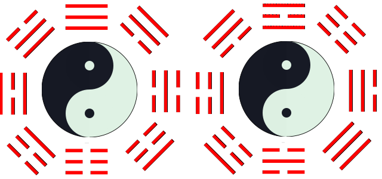
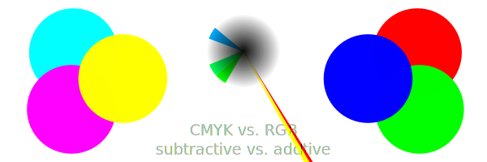

/中国传统色彩模型
==============

参考资源：

-  国立国会図書館 彩雅 15巻 著者 杉原直養 影印版 https://dl.ndl.go.jp/pid/2607750
-  色谱 中科院科技情报编委会名词室.科学出版社 https://www.zhongguose.com/colors.json
-  [《山海经》](../novels/Fantastic_Creatures_of_the_Mountains_and_Seas.md)
-  多色系配色方案参考 https://colors.ichuantong.cn/
    https://github.com/zerosoul/chinese-colors

华夏文明历史上，八卦图起源对其有着密不可分的影响。八卦代表了中国古人认识世界时对事物的归类。
现代人用“八卦”一词来讽刺日常生活中普遍的猎奇心理。八卦作为华夏历史起源的事物，有其历史的价值，
但是应该正确看待这个世界的运动变化，即人类明文的进步，不能因循守旧、刻舟求剑，失去了生命力。

从起源来说，河图洛书生八卦，八卦生易经，这都代表的时代的进步。《易经·系辞》说“河出图，洛出书，圣人则之。”
“圣人则之”是指圣明的人能根据一些征兆进行研究推理得出一系列理论性的东西，和王阳明的“格物”异曲同工。

1987 年安徽含山县凌家滩遗址出土了两件在科学文化史上有着特殊意义的文物——玉龟和玉版（即含山玉版玉龟）。
年代距今 5300 年到 5600 年。玉版的八方图形与中心象征太阳的图形相配，玉版上八等分圆的作法可能与
冬、夏二至日出、日落方位及四时八节有关，并且符合我国古代的原始八卦理论，玉版四周的四、五、九、五钻孔之数，
与洛书“太一下行八卦之宫，每四乃还于中央”相合。据推测，汉代纬书中普遍流行“元龟衔符”、“元龟负书出”、
“大龟负图”等说法，认为含山玉版可与古谶纬书中的《河图玉版》对观。

阴阳五行说包含“阴阳”与“五行”两个组成部分，两者互为辅成，五行必合阴阳，阴阳说必兼五行。阴阳五行
是中国哲学的核心。阴阳，指世界上一切事物中都具有的两种既互相对立制约又互相联系平衡的力量；五行
即由“木、火、土、金、水”五种基本物质的运行和变化所构成，它强调整体概念。阴阳与五行两大学说形成
中国传统文化的基本思维框架。太极、八卦无一不应用阴阳五行，乾坤、震巽、艮兑、离坎，符号相互呼应。

☯ 太极为矛盾、阴阳对立一体。

⚋⚊ 太极生两仪，一分二为阴阳，二合为一即太极。

⚎⚌⚍⚏ 两仪生四象，少阳、老阳、少阴、老阴，对应晨午昏夜，
四季（春夏秋冬），四方（东南西北），四灵（青龙、白虎、朱雀、玄武）
四象生八卦：乾坤震巽坎离艮兑，对应象征天地雷风水火山泽八种自然现象。
每卦有上中下三爻，对应三个层次的内容。

四象生卦：☰☴☲☱ 天乾、风巽、火离、泽兑。☷☳☵☶ 地坤、雷震、水坎、山艮。

两组卦象分别可以形象理解为天空、大地三个层次的变化，例如泽表示水面中天空倒影，雷表示大地的震动。
两两组合得 8 * 8=64 卦，组合更多卦又变化更多组合，即常言道变卦，即事物的运动状态。

八卦符号图形和其符号基本含义如下，为了便于记忆，又有南宋理学家朱熹编撰的八卦歌诀：
https://www.bilibili.com/video/BV1La411V7vG/

     qián     kūn     zhèn     gèn      lí      kǎn      duì     xùn
    ☰ 乾    ☷ 坤    ☳ 震    ☶ 艮    ☲ 离    ☵ 坎    ☱ 兑    ☴ 巽
    乾三连   坤六断   震仰盂   艮覆碗   离中虚   坎中满   兑上缺   巽下断
    天、阳    地、阴    雷、     山、     火、      水、     泽、     风、

八卦图东西南北，对应的是上乾下坤，左离右坎，又对应五行方位：火、水、木、金，土居中。东西对应实物，
南北对应自然现象。注意古时讲究坐北朝南，看图则是左东右西。☳ 震 ☶ 艮 ☱ 兑 ☴ 巽 四个符号依次
位于左下、右下、左上、右上四个角落，这种符号布局是伏羲时代的“先天八卦”。八卦以内向外的符号的正向，
符号应该以此为参照，否则反转后就成了另一个符号。

周文王被商纣王囚于羑里 7 年期间，对先天八卦进行方位调整才有后天八卦图。《史记》曰“文王拘而演《周易》”。
后天八卦图的调整，如果从先天八卦的乾位顺时针编号，这些符号依次替代关系为：

    乾 1 ⇉ 艮 4 ⇉ 震 6 ⇉ 离 7；
    坤 5 ⇉ 巽 2 ⇉ 兑 8 ⇉ 坎 5；

文王姬昌（约前1152年—前1056年）作为华夏第三个有历史记录的王朝建立者，它对八卦图作的方位调整，
显然不是平常占卜那么简单，要和政治理想结合来看。夏商周是承上（上古历史）启下的三个朝代。当时，
文王领地在中国西北，今陕西省岐山县（西岐今改名宝鸡），也就是地图的右下方位。因此，他将乾位定存
右下方（西北），坤位定在右上方（西南）。

周文王囚于朝歌（即今河南淇县、西周为卫国都），于人生低谷（深渊）中演变出周易理论，为他谋取中国助力。
文王囚于羑里（今河南安阳市汤阴县）史称“羑里之囚”，前因：约公元前 1075 年，商纣王即位实施“暴政”，
致使民不聊生。约公元前 1060 年，西伯侯姬昌在周国广施仁政，引起纣王的猜忌，被纣王捉拿囚禁。

这里大篇幅地讲八卦，一是中国历史文明受到八卦极大的影响，二是中国传统色彩模型也与之相关。
“杂五色，东方谓之青，南方谓之赤，西方谓之白，北方谓之黑，天谓之玄，地谓之黄”——《周礼·考工记》

<!-- 封神演义（明代传为许仲琳创作长篇小说） -->

《山海经》文本中被广泛记述的色彩，因其状貌写形的功能，不仅是理解文意的关键，也是探究“山海经图”的要素。
《山海经》是中国志怪古籍，大体是战国中后期到汉代初中期的楚国或巴蜀人所作。也是一部荒诞不经的奇书。
该书作者不详，古人认为该书是“战国好奇之士取《穆王传》 , 杂录《庄》 、 《列》 、 《离骚》 、 《周书》 、 
《晋乘》以成者” 。现代学者也均认为成书并非一时，作者亦非一人，这是古籍的共通规律。

《山海经》全书原共 22 篇约 32650 字，现存 18 篇，其余篇章内容早佚。其中山经 5 篇、海外经 4 篇、
海内经 5 篇、大荒经 4 篇。《汉书·艺文志》 作 13 篇，晚出的大荒经和海内经未在计算之内。《山海经》的
内容性质，古今学者有着不同的认识，如司马迁直言其内容过于荒诞无稽，所以作史时不敢以为参考。鲁迅
认为“巫觋、方士之书”。现大多数学者认为，《山海经》是一部早期有价值的地理著作。

以山经写作为例，格式比较固定，中山经一段：

> 又东南二十里，樂馬之山有獸焉，其狀如彙，赤如丹火，其名曰𤟑。《

上古神话《山海经》开始出现中国传统五原色的描述，但只限于常见的植物颜色，赤（频繁）、黑、白、黄、青。

到唐代至宋代，绘画艺术山水画的兴起，发掘了更丰富的色彩，进而影响到园林建筑的总体布局和设计。
其中，北宋王希孟的《千里江山图》堪称一绝，是绿水青山图的巅峰之作。千里江山题跋上，蔡京写了“希孟18岁”，
但从没写姓王。此后再无此人的任何传世作品，这是一个迷。作品以石青石绿为主调：
国学经典：千里江山图 https://www.bilibili.com/read/cv25494219/

-   石青——矿物学称蓝铜矿，与孔雀石紧密共生，常见形成于含铜硫化物矿床的氧化带。由于产出极少，
    是名贵颜料，根据石青具体色度的差异，又分别冠之以曾青、空青、白青、金青等不同名称。

-   石绿——孔雀石，因颜色酷似孔雀羽毛斑点上的绿色而得名，是一种古老的玉料，呈不透明的深绿色，
    具有色彩浓淡的条状花纹。研制成颜料得到石绿，根据细度可分为头绿、二绿、三绿、四绿等。

    头绿最粗最绿，依次渐细渐淡。在《千里江山图》中，石青和石绿主要用以渲染树叶以及山峦顶部，
    凸显青山叠翠之感，其色鲜艳厚重，远看气势壮阔，近睹妙趣横生。

-   赭石色——赭石具有一种独特的红色，古代洞窟中的岩画经常使用这种颜料。赭石是一种赤铁矿，
    多呈不规则的扁平块状，可入药，因含氧化铁或氧化锰等，一般呈棕色，亦有呈土黄色或红色者。
    它的表面多有圆形的突起，习称“钉头”。在《千里江山图》中，画家通过赭石给绢本上底色。

文字是文化的符号，颜色是自然的符号。研究颜色不等于只研究主体色，而在于研究主体色在其中的搭配关系，
就像音乐，单纯的主音就很单调，需要复杂的谐音成分才能让音乐变得生动。图像也一样，纯色是单调，纯色
只有融入画面才能获得视觉美感。颜色是视觉艺术，必然需要和美感相互联系，也必然与主观审美产生关系。

历朝历代都有用颜色区分身份地位习惯，甚至上升到法律的层面，帝王专用金黄以彰显尊贵。平民则只能用
廉价易得的色彩，服饰多用粗布原有的褐色。这是利用权利垄断稀有物质享受的一般表现，其背后代表的是
代下的劳动生产力。在古代染料还没有那么廉价和方便获取，只有皇室和权贵阶级有权利和财力使用正色。
色彩不仅和权势、地位、宗教礼仪结合在一起，也与艺术、建筑、家具、服饰、饮食，生活的方方面面紧密联系，
形成了一套独有的色彩哲学观。

人类历史通过文化传承，而符号化是传承的直接有效的形式。“文化”一词本意指图文符号化，泛指人类知识。
如果说八卦是周朝时期前的信息技术，有着其生活化的特征；那么现代驱动电气自动化的信息技术，便是生产力的代表。
从河图、洛书到八卦、易经，再到现代，无一处不体现生命的运动，文化的变迁，现代更是跌宕起伏的年代。
即使生产力已经高出人类历史总和“三四层楼那么高”，但是全球依然是不太平，因为人类的根本问题没有解决。

                    玄武（⚫黑、属水）

    青龙（🔵青、属木） 中心（🟡黄、属土）  白虎（⚪白、属金）

                    朱雀（🔴赤、属火）

古代原色与“阴阳五行”学说紧密相连，水、火、木、金、土，分别对应黑、赤、青、白、黄作为色彩象征，称为五色体系。. “五色”就是传统色彩最基本的表达形式，古人认为五行是 …

五行对应的就是中国传统五色环，黑 ⚫ 白 ⚪ 黄 🟡 赤 🔴 青 🔵，它们就是中国传统色的原色。
由此可以叠加溶合产生间色：红、绿、紫、碧、骝黄，间色再生间色，如同色环中次色无穷无尽。现代印染
采用的四色印刷（CMYK）多少与传统五色模型类似，Cyan 青、Magenta 洋红为赤、Yellow 为土黄、
Black 黑色，外加无色作留白。在电子设备上使用的色彩模型有多种，以下是常用的几种，其中
CMS 是 Inkscape 支持的比较少见的一种色彩模型。最基本的还是 RBG：

1.  _[RGB]_ (Red, Green, Blue) 
2.  _[HSL]_ (_Hue_, _Saturation_, _Lightness_)
3.  _[HSV]_ (_Hue_, _Saturation_, _Value_)
4.  _[CMYK]")_ (Cyan, Magenta, Yellow, Key [Black])
5.  HSLuv 更符合人类视觉感知的色彩模型，其数值的线性变化更符合人眼看到色彩的均匀变化。
6.  [Little CMS ](https://www.littlecms.com/) 开源的小型、高性能色彩管理系统，其核心是颜色转换引擎。

RGB 的通道较少，并且色域比印染的 CMYK 模型更广，并且可能会在调整之后保留更多的颜色。
在图形转换 RGB 到 CMYK 时，图层可以先分离（R、G、B）颜色通道，再针对每个通道进行调整。
早期的 Adobe sRGB 色彩空间和 CMYK 色域几乎重叠，但仍有小部分色值差异，替代为 Adobe RGB。
HSL 和 HSV 两种色彩模型基本一致，只是明度分量分别使用 Lightness（亮度）和 Value（明度）表示。

因为使用的场合不同、色彩的呈现原理不同。RGB 在电子发光设备上呈现，基于加色原理。三原色（红、绿、蓝）
叠加形成白光。而印染使用的 CMYK 使用减色原理，不使用颜料代表留白，另外有专用的黑色油墨调明度。
常将其称为四色印刷，印刷商使用字母 「K」 来表达关键的意思。

所谓加与减，就是光波的加（发光）和减（吸收光），RGB 模型中，当一种颜色叠加一原色，
就相当于减小这个原色的互补色。互补色在色环上观察很明显，在对面的（180°）颜色互为互补色。

1. Green + Blue = Cyan
2. Blue + Red = Magenta
3. Red + Green = Yellow

可以看到，RGB 色彩模型中，任意两原色的叠加就是另一种颜色的互补色。

CMYK 使用的颜料不同厂家产品存在不同浓度，调配颜色时，需要按 CMYK 数值比例，实验出
不同浓度下效果。油墨的光泽度是反映其反射光线的能力，光泽度高颜色就鲜艳，反之颜色就暗沉。
CMYK 印染厂还常用专色印刷，就是将印染图形中特别的区域，比如较分明的某此颜色，用一种
专门调配的颜色去印染相应的区域。油墨颜色还受环境影响，包括光线、纸张、面料的本色，都要考虑。
从物理上讲，油墨印染中，眼睛看到黑色是因为颜料完全吸收了光线。能看到绿色是因为颜料反射了
绿色，因为绿色本身就是青、黄两色的混合，如果添加其互补色（Magenta），达到一比一的比例，
那么颜色就会往灰度色方向，使用不同浓度的黑色就可以调灰色。

Inkscape 图形软件中，可以创建图形，并在图层中设置图形使用 Darken（变暗）混合模式，
这样就可以使用三个色块来模拟 CMYK 的着色混合效果。使用 Lighten（变亮）混合模式，
就可以观察不同色块在加色模式下的混合效果。注意，CMYK 的黑色是一种专用于明度调节的原色。

Inkscape 制作色环不能使用渐变加 Bend 的方式，也不能使用径向渐变 `<radialGradient>`。
应该使用 Path Effects - Bend 工具将色块环绕起来，做成放射线状的色环。注意，Bend 默认
按 x 轴（水平轴）弯曲图形，可以点击 Original path is vertical 切换为竖直轴向的弯曲。
关于 Inkscape 的使用及原理，可以参考 ["让世界多一份 Inkscape 教程"](../svg/readme.md)。

传统色彩的颜料来源广泛，主要可以分为矿物颜料、植物颜料和动物颜料，是在合成颜料出现之前的主要来源。
中国文学中不乏提及植物颜色的诗文，唐代李端的《送濮阳录事赴忠州》：「赤叶黄花随野岸，青山白水映江枫」、
元代白朴的散曲《沉醉东风·渔夫》：「黄芦岸白蘋渡口，绿柳堤红蓼滩头」。

矿物和植物本体常用于色彩命名，例如，漆黑源自漆树的汁液、杏黄取自杏子果成熟外皮的鲜黄色，
青出于蓝——蓼蓝 (又名靛青)。还有石榴红、栀子黄、竹青、柳绿、紫藤色等等。

动物性颜料有胭脂红，陶瓷界、玉石界用语也被转化成为描绘颜色的普通形容，比如天青、翡翠。

自然景象也是色彩命令的一种方法，植物是最大的色彩命名灵感来源，

对植物染色技术有较详细记载的古籍是成书于明代的《天工开物》，作者宋应星遍游江南，将自己四处游历时的
观察分类编写成集，具有技术记载性质。在《天工开物·彰施篇》里记载了使用红花、茜草、乌桕、黄蘗、栀子等天然
染料和它们染出的对应色相。《本草纲目》和《天工开物》都大约成书于明朝末年，主要记载了药材的种植及其特性，
染色的部分也以附带的方式有所提及，共计 48 种染材，矿物染材 6 种、植物染材 39 种、动物性染材 3 种。

中国人对“红色”的喜爱自古有之，最早以“丹青”指代传统绘画。“丹”的本义指朱砂，既可作绘画颜料，也可入药。
朱砂是红色，故引申为朱红色。这些红色系的颜料按饱和度排列如下：

1. 绛：大赤也，浓暗的红色，最早是由绛草提炼而出，流行于西南的少数民族之中。
2. 赤色：。
3. 洋红：胭脂虫（胭珠蚧）体内的胭脂红酸，此虫寄生于仙人掌，原产墨西哥。
4. 朱砂：
5. 赭石：赤铁矿，呈暗红色，“赭”就是赤色的意思。
6. 珊瑚粉：

墨分五度：「焦」「浓」「重」「淡」「清」，水墨画运用墨的深浅浓淡来表达事物的光与色。

[
  {
    "name": "红",
    "hex": "#ffb3a7",
    "colors": [
      {
        "id": "0-0",
        "hex": "#ffb3a7",
        "name": "粉红",
        "intro": "即浅红色。别称：妃色、杨妃色、湘妃色、妃红色",
        "figure": "flower.moon.png?o=0.8"
      },
      {
        "id": "0-1",
        "hex": "#ed5736",
        "name": "妃色",
        "intro": "妃红色。古同\"绯\"，粉红色。杨妃色湘妃色粉红皆同义。"
      },
      {
        "id": "0-2",
        "hex": "#f00056",
        "name": "品红",
        "intro": "比大红浅的红色（这里的\"品红\"估计是指的\"一品红\"，是基于大红色系的，和现在我们印刷用色的\"品红M100\"不是一个概念）"
      },
      {
        "id": "0-3",
        "hex": "#f47983",
        "name": "桃红",
        "intro": "桃花的颜色，比粉红略鲜润的颜色。（不大于M70的色彩，有时可加入适量黄色）"
      },
      {
        "id": "0-4",
        "hex": "#db5a6b",
        "name": "海棠红",
        "intro": "淡紫红色、较桃红色深一些，是非常妩媚娇艳的颜色。",
        "figure": "girl.png?o=0.8"
      },
      {
        "id": "0-5",
        "hex": "#f20c00",
        "name": "石榴红",
        "intro": "石榴花的颜色，高色度和纯度的红色。"
      },
      { "id": "0-6", "hex": "#c93756", "name": "樱桃色", "intro": "鲜红色" },
      {
        "id": "0-7",
        "hex": "#f05654",
        "name": "银红",
        "intro": "银朱和粉红色颜料配成的颜色。多用来形容有光泽的各种红色，尤指有光泽浅红。"
      },
      {
        "id": "0-8",
        "hex": "#ff2121",
        "name": "大红",
        "intro": "正红色，三原色中的红，传统的中国红，又称绛色（RGB色中的R255系列明度）",
        "figure": "long.png?width=20rem"
      },
      {
        "id": "0-9",
        "hex": "#8c4356",
        "name": "绛紫",
        "intro": "紫中略带红的颜色",
        "figure": "fenyue.png"
      },
      { "id": "0-10", "hex": "#c83c23", "name": "绯红", "intro": "艳丽的深红" },
      {
        "id": "0-11",
        "hex": "#9d2933",
        "name": "胭脂",
        "intro": "1，女子装扮时用的胭脂的颜色。2，国画暗红色颜料"
      },
      {
        "id": "0-12",
        "hex": "#ff4c00",
        "name": "朱红",
        "intro": "朱砂的颜色，比大红活泼，也称铅朱朱色丹色（在YM对等的情况下，适量减少红色的成分就是该色的色彩系列感觉）"
      },
      { "id": "0-13", "hex": "#ff4e20", "name": "丹", "intro": "丹砂的鲜艳红色" },
      { "id": "0-14", "hex": "#f35336", "name": "彤", "intro": "赤色" },
      { "id": "0-15", "hex": "#cb3a56", "name": "茜色", "intro": "茜草染的色彩，呈深红色" },
      { "id": "0-16", "hex": "#ff2d51", "name": "火红", "intro": "火焰的红色，赤色" },
      { "id": "0-17", "hex": "#c91f37", "name": "赫赤", "intro": "深红，火红。泛指赤色、火红色。" },
      {
        "id": "0-18",
        "hex": "#ef7a82",
        "name": "嫣红",
        "intro": "鲜艳的红色",
        "figure": "jinyu.png?o=0.8"
      },
      {
        "id": "0-19",
        "hex": "#ff0097",
        "name": "洋红",
        "intro": "色橘红（这个色彩方向不太对，通常洋红指的是倾向于M100系列的红色，应该削弱黄色成分。）"
      },
      { "id": "0-20", "hex": "#ff3300", "name": "炎", "intro": "引申为红色" },
      { "id": "0-21", "hex": "#c3272b", "name": "赤", "intro": "本义火的颜色，即红色" },
      {
        "id": "0-22",
        "hex": "#a98175",
        "name": "绾",
        "intro": "绛色；浅绛色",
        "figure": "luohong.png?position=top"
      },
      { "id": "0-23", "hex": "#c32136", "name": "枣红", "intro": "即深红（色相不变，是深浅变化）" },
      {
        "id": "0-24",
        "hex": "#b36d61",
        "name": "檀",
        "intro": "浅红色，浅绛色"
      },
      { "id": "0-25", "hex": "#be002f", "name": "殷红", "intro": "发黑的红色。" },
      {
        "id": "0-26",
        "hex": "#dc3023",
        "name": "酡红",
        "intro": "像饮酒后脸上泛现的红色，泛指脸红"
      },
      {
        "id": "0-27",
        "hex": "#f9906f",
        "name": "酡颜",
        "intro": "饮酒脸红的样子。亦泛指脸红色",
        "figure": "meinv.png?o=0.9&width=18rem"
      }
    ],
    "RGB": [255, 179, 167], "id": 0 }, {"name": "黄",
    "hex": "#fff143",
    "colors": [
      {
        "id": "1-0",
        "hex": "#fff143",
        "name": "鹅黄",
        "intro": "淡黄色（鹅嘴的颜色，高明度微偏红黄色）",
        "figure": "huofenghuang.png"
      },
      {
        "id": "1-1",
        "hex": "#faff72",
        "name": "鸭黄",
        "intro": "小鸭毛的黄色",
        "figure": "yellow.flower.png"
      },
      { "id": "1-2", "hex": "#eaff56", "name": "樱草色", "intro": "淡黄色" },
      {
        "id": "1-3",
        "hex": "#ffa631",
        "name": "杏黄",
        "intro": "成熟杏子的黄色（Y100M20~30感觉的色彩，比较常用且有浓郁中国味道）",
        "figure": "lianiao.png"
      },
      { "id": "1-4", "hex": "#ff8c31", "name": "杏红", "intro": "成熟杏子偏红色的一种颜色" },
      {
        "id": "1-5",
        "hex": "#ff8936",
        "name": "橘黄",
        "intro": "柑橘的黄色。",
        "figure": "liahudie.png"
      },
      {
        "id": "1-6",
        "hex": "#ffa400",
        "name": "橙黄",
        "intro": "同上。（Y100M50感觉的色彩，现代感比较强。广告上用得较多）"
      },
      { "id": "1-7", "hex": "#ff7500", "name": "橘红", "intro": "柑橘皮所呈现的红色。" },
      {
        "id": "1-8",
        "hex": "#ffc773",
        "name": "姜黄",
        "intro": "中药名。别名黄姜。为姜科植物姜黄的根茎。又指人脸色不正,呈黄白色",
        "figure": "red.flower.png"
      },
      {
        "id": "1-9",
        "hex": "#f0c239",
        "name": "缃色",
        "intro": "浅黄色"
      },
      {
        "id": "1-10",
        "hex": "#fa8c35",
        "name": "橙色",
        "intro": "界于红色和黄色之间的混合色"
      },
      { "id": "1-11", "hex": "#b35c44", "name": "茶色", "intro": "一种比栗色稍红的棕橙色至浅棕色" },
      {
        "id": "1-12",
        "hex": "#a88462",
        "name": "驼色",
        "intro": "一种比咔叽色稍红而微淡、比肉桂色黄而稍淡和比核桃棕色黄而暗的浅黄棕色"
      },
      { "id": "1-13", "hex": "#c89b40", "name": "昏黄", "intro": "形容天色、灯光等呈幽暗的黄色" },
      { "id": "1-14", "hex": "#60281e", "name": "栗色", "intro": "栗壳的颜色。即紫黑色" },
      {
        "id": "1-15",
        "hex": "#b25d25",
        "name": "棕色",
        "intro": "棕毛的颜色,即褐色。1，在红色和黄色之间的任何一种颜色2，适中的暗淡和适度的浅黑。"
      },
      {
        "id": "1-16",
        "hex": "#827100",
        "name": "棕绿",
        "intro": "绿中泛棕色的一种颜色",
        "figure": "bottom.qunshan.png?width=100%"
      },
      { "id": "1-17", "hex": "#7c4b00", "name": "棕黑", "intro": "深棕色。" },
      { "id": "1-18", "hex": "#9b4400", "name": "棕红", "intro": "红褐色。" },
      { "id": "1-19", "hex": "#ae7000", "name": "棕黄", "intro": "浅褐色。" },
      { "id": "1-20", "hex": "#9c5333", "name": "赭", "intro": "赤红如赭土的颜料,古人用以饰面" },
      { "id": "1-21", "hex": "#955539", "name": "赭色", "intro": "红色、赤红色。" },
      { "id": "1-22", "hex": "#ca6924", "name": "琥珀", "intro": "" },
      { "id": "1-23", "hex": "#6e511e", "name": "褐色", "intro": "黄黑色" },
      {
        "id": "1-24",
        "hex": "#d3b17d",
        "name": "枯黄",
        "intro": "干枯焦黄"
      },
      {
        "id": "1-25",
        "hex": "#e29c45",
        "name": "黄栌",
        "intro": "一种落叶灌木，花黄绿色,叶子秋天变成红色。木材黄色可做染料。",
        "figure": "heyue.png"
      },
      {
        "id": "1-26",
        "hex": "#896c39",
        "name": "秋色",
        "intro": "1，中常橄榄棕色,它比一般橄榄棕色稍暗,且稍稍绿些。2，古以秋为金,其色白,故代指白色。",
        "figure": "fenshu.png"
      },
      {
        "id": "1-27",
        "hex": "#d9b611",
        "name": "秋香色",
        "intro": "浅橄榄色浅黄绿色。（直接在Y中掺入k10~30可得到不同浓淡的该类色彩）"
      }
    ],
    "RGB": [255, 241, 67], "id": 1 }, {"name": "绿",
    "hex": "#0aa344",
    "colors": [
      {
        "id": "2-0",
        "hex": "#bddd22",
        "name": "嫩绿",
        "intro": "像刚长出的嫩叶的浅绿色",
        "figure": "bottle.mei.png"
      },
      { "id": "2-1", "hex": "#c9dd22", "name": "柳黄", "intro": "像柳树芽那样的浅黄色" },
      {
        "id": "2-2",
        "hex": "#afdd22",
        "name": "柳绿",
        "intro": "柳叶的青绿色"
      },
      {
        "id": "2-3",
        "hex": "#789262",
        "name": "竹青",
        "intro": "竹子的绿色",
        "figure": "mozhu.png"
      },
      { "id": "2-4", "hex": "#a3d900", "name": "葱黄", "intro": "黄绿色，嫩黄色" },
      {
        "id": "2-5",
        "hex": "#9ed900",
        "name": "葱绿",
        "intro": "1:浅绿又略显微黄的颜色 2:草木青翠的样子"
      },
      { "id": "2-6", "hex": "#0eb83a", "name": "葱青", "intro": "淡淡的青绿色" },
      { "id": "2-7", "hex": "#0eb840", "name": "葱倩", "intro": "青绿色" },
      {
        "id": "2-8",
        "hex": "#0aa344",
        "name": "青葱",
        "intro": "翠绿色,形容植物浓绿"
      },
      {
        "id": "2-9",
        "hex": "#00bc12",
        "name": "油绿",
        "intro": "光润而浓绿的颜色。以上几种绿色都是明亮可爱的色彩。"
      },
      { "id": "2-10", "hex": "#0c8918", "name": "绿沈", "intro": "（沉）深绿" },
      {
        "id": "2-11",
        "hex": "#1bd1a5",
        "name": "碧色",
        "intro": "1，青绿色。2，青白色,浅蓝色。",
        "figure": "hehua3.png"
      },
      { "id": "2-12", "hex": "#2add9c", "name": "碧绿", "intro": "鲜艳的青绿色" },
      {
        "id": "2-13",
        "hex": "#48c0a3",
        "name": "青碧",
        "intro": "鲜艳的青蓝色",
        "figure": "guohua.hua.png"
      },
      {
        "id": "2-14",
        "hex": "#3de1ad",
        "name": "翡翠色",
        "intro": "1，翡翠鸟羽毛的青绿色。2，翡翠宝石的颜色。（C-Y≥30的系列色彩，多与白色配合以体现清新明丽感觉，与黑色配合效果不好该色个性柔弱，会被黑色牵制）"
      },
      { "id": "2-15", "hex": "#40de5a", "name": "草绿", "intro": "绿而略黄的颜色。" },
      {
        "id": "2-16",
        "hex": "#00e09e",
        "name": "青色",
        "intro": "1，一类带绿的蓝色,中等深浅,高度饱和。3，本义是蓝色。4，一般指深绿色。5，也指黑色。6，四色印刷中的一色。2，特指三补色中的一色。",
        "figure": "hehuaqingting.png"
      },
      { "id": "2-17", "hex": "#00e079", "name": "青翠", "intro": "鲜绿", "figure": "song.png" },
      {
        "id": "2-18",
        "hex": "#c0ebd7",
        "name": "青白",
        "intro": "白而发青,尤指脸没有血色",
        "figure": "xia.png"
      },
      {
        "id": "2-19",
        "hex": "#e0eee8",
        "name": "鸭卵青",
        "intro": "淡青灰色，极淡的青绿色",
        "figure": "shuanghe2.png"
      },
      {
        "id": "2-20",
        "hex": "#bbcdc5",
        "name": "蟹壳青",
        "intro": "深灰绿色",
        "figure": "guohua.hehua2.png"
      },
      {
        "id": "2-21",
        "hex": "#424c50",
        "name": "鸦青",
        "intro": "鸦羽的颜色。即黑而带有紫绿光的颜色。"
      },
      {
        "id": "2-22",
        "hex": "#00e500",
        "name": "绿色",
        "intro": "1，在光谱中介于蓝与黄之间的那种颜色。2，本义青中带黄的颜色。3，引申为黑色，如绿鬓乌黑而光亮的鬓发。代指为青春年少的容颜。（现代色彩研究中，把绿色提高到了一个重要的位置，和其它红黄兰三原色并列研究，称做\"心理原色\"之一）"
      },
      { "id": "2-23", "hex": "#9ed048", "name": "豆绿", "intro": "浅黄绿色" },
      {
        "id": "2-24",
        "hex": "#96ce54",
        "name": "豆青",
        "intro": "浅青绿色",
        "figure": "right.bottom.huaping.png?width=8rem&o=0.8"
      },
      {
        "id": "2-25",
        "hex": "#7bcfa6",
        "name": "石青",
        "intro": "淡灰绿色",
        "figure": "right.bottom.honghehua.png"
      },
      {
        "id": "2-26",
        "hex": "#2edfa3",
        "name": "玉色",
        "intro": "玉的颜色，高雅的淡绿、淡青色",
        "figure": "jinyu.png"
      },
      {
        "id": "2-27",
        "hex": "#7fecad",
        "name": "缥",
        "intro": "绿色而微白",
        "figure": "right.bottom.hongmujin.png"
      },
      {
        "id": "2-28",
        "hex": "#a4e2c6",
        "name": "艾绿",
        "intro": "艾草的颜色。偏苍白的绿色",
        "figure": "yunshan.png"
      },
      {
        "id": "2-29",
        "hex": "#21a675",
        "name": "松柏绿",
        "intro": "经冬松柏叶的深绿",
        "figure": "guohua.hehua.png"
      },
      {
        "id": "2-30",
        "hex": "#057748",
        "name": "松花绿",
        "intro": "亦作\"松花\"、\"松绿\"。偏黑的深绿色,墨绿。",
        "figure": "hudie.png?width=10rem"
      },
      {
        "id": "2-31",
        "hex": "#bce672",
        "name": "松花色",
        "intro": "浅黄绿色。（松树花粉的颜色）《红楼梦》中提及松花配桃红为娇艳"
      }
    ],
    "RGB": [10, 163, 68], "id": 2 }, {"name": "蓝",
    "hex": "#44cef6",
    "colors": [
      {
        "id": "3-0",
        "hex": "#44cef6",
        "name": "蓝",
        "intro": "三原色的一种。像晴天天空的颜色（这里的蓝色指的不是RGB色彩中的B，而是CMY色彩中的C）"
      },
      {
        "id": "3-1",
        "hex": "#177cb0",
        "name": "靛青",
        "intro": "也叫\"蓝靛\"。用蓼蓝叶泡水调和与石灰沉淀所得的蓝色染料。呈深蓝绿色（靛，发音dian四声，有些地方将蓝墨水称为\"靛水\"或者\"兰靛水\"）",
        "figure": "hehua.caise.png?width=17rem&o=0.7"
      },
      {
        "id": "3-2",
        "hex": "#065279",
        "name": "靛蓝",
        "intro": "由植物(例如靛蓝或菘蓝属植物)得到的蓝色染料",
        "figure": "moon.png"
      },
      {
        "id": "3-3",
        "hex": "#3eede7",
        "name": "碧蓝",
        "intro": "青蓝色",
        "figure": "wave.png?width=100%"
      },
      {
        "id": "3-4",
        "hex": "#70f3ff",
        "name": "蔚蓝",
        "intro": "类似晴朗天空的颜色的一种蓝色",
        "figure": "he.png"
      },
      {
        "id": "3-5",
        "hex": "#4b5cc4",
        "name": "宝蓝",
        "intro": "鲜艳明亮的蓝色（英文中为RoyalBlue即皇家蓝色，是皇室选用的色彩，多和小面积纯黄色（金色）配合使用。）"
      },
      {
        "id": "3-6",
        "hex": "#a1afc9",
        "name": "蓝灰色",
        "intro": "一种近于灰略带蓝的深灰色",
        "figure": "left.bottom.mutong.png"
      },
      { "id": "3-7", "hex": "#2e4e7e", "name": "藏青", "intro": "蓝而近黑" },
      { "id": "3-8", "hex": "#3b2e7e", "name": "藏蓝", "intro": "蓝里略透红色" },
      {
        "id": "3-9",
        "hex": "#4a4266",
        "name": "黛",
        "intro": "别名：黛色，黛螺。青黑色的颜料。古代女子用以画眉。绘画或画眉所使用的青黑色颜料，代指女子眉妩。"
      },
      { "id": "3-10", "hex": "#426666", "name": "黛绿", "intro": "墨绿", "figure": "honghua.png" },
      {
        "id": "3-11",
        "hex": "#425066",
        "name": "黛蓝",
        "intro": "深蓝色",
        "figure": "left.mei.png?position=left"
      },
      { "id": "3-12", "hex": "#574266", "name": "黛紫", "intro": "深紫色" },
      {
        "id": "3-13",
        "hex": "#8d4bbb",
        "name": "紫色",
        "intro": "蓝和红组成的颜色。古人以紫为祥瑞的颜色。代指与帝王、皇宫有关的事物",
        "figure": "right.bottom.qunshan.png"
      },
      { "id": "3-14", "hex": "#815463", "name": "紫酱", "intro": "浑浊的紫色" },
      { "id": "3-15", "hex": "#815476", "name": "酱紫", "intro": "紫中略带红的颜色" },
      { "id": "3-16", "hex": "#4c221b", "name": "紫檀", "intro": "檀木的颜色，也称乌檀色乌木色" },
      { "id": "3-17", "hex": "#003371", "name": "绀青绀紫", "intro": "纯度较低的深紫色" },
      { "id": "3-18", "hex": "#56004f", "name": "紫棠", "intro": "黑红色" },
      { "id": "3-19", "hex": "#801dae", "name": "青莲", "intro": "偏蓝的紫色" },
      { "id": "3-20", "hex": "#4c8dae", "name": "群青", "intro": "深蓝色", "figure": "meihua.png" },
      {
        "id": "3-21",
        "hex": "#b0a4e3",
        "name": "雪青",
        "intro": "浅蓝紫色",
        "figure": "mujin.png"
      },
      {
        "id": "3-22",
        "hex": "#cca4e3",
        "name": "丁香色",
        "intro": "紫丁香的颜色，浅浅的紫色，很娇柔淡雅的色彩",
        "figure": "huaniao.png"
      },
      {
        "id": "3-23",
        "hex": "#edd1d8",
        "name": "藕色",
        "intro": "浅灰而略带红的颜色",
        "figure": "jianzhi.png?width=20rem&opacity=0.6"
      },
      {
        "id": "3-24",
        "hex": "#e4c6d0",
        "name": "藕荷色",
        "intro": "浅紫而略带红的颜色",
        "figure": "meinv2.png"
      }
    ],
    "RGB": [68, 206, 246], "id": 3 }, {"name": "苍",
    "hex": "#75878a",
    "colors": [
      {
        "id": "4-0",
        "hex": "#75878a",
        "name": "苍色",
        "intro": "即各种颜色掺入黑色后的颜色",
        "figure": "qunshan.png?width=100%"
      },
      {
        "id": "4-1",
        "hex": "#519a73",
        "name": "苍翠",
        "intro": "",
        "figure": "lvzhu.png?width=18rem"
      },
      {
        "id": "4-2",
        "hex": "#a29b7c",
        "name": "苍黄",
        "intro": "",
        "figure": "guilinshanshui.png"
      },
      {
        "id": "4-3",
        "hex": "#7397ab",
        "name": "苍青",
        "intro": "",
        "figure": "liangduohua.png?width=12rem"
      },
      { "id": "4-4", "hex": "#395260", "name": "苍黑", "intro": "", "figure": "sundown.png" },
      {
        "id": "4-5",
        "hex": "#d1d9e0",
        "name": "苍白",
        "intro": "准确的说是掺入不同灰度级别的灰色",
        "figure": "fanchuan.png"
      }
    ],
    "RGB": [117, 135, 138], "id": 4 }, {"name": "水",
    "hex": "#d2f0f4",
    "colors": [
      {
        "id": "5-0",
        "hex": "#88ada6",
        "name": "水色",
        "intro": "",
        "figure": "hehuayu.png?width=16rem"
      },
      {
        "id": "5-1",
        "hex": "#f3d3e7",
        "name": "水红",
        "intro": "",
        "figure": "hehua2.png?width=18rem"
      },
      {
        "id": "5-2",
        "hex": "#d4f2e7",
        "name": "水绿",
        "intro": "",
        "figure": "yu.png?width=17rem"
      },
      {
        "id": "5-3",
        "hex": "#d2f0f4",
        "name": "水蓝",
        "intro": "",
        "figure": "moon.png?width=18rem"
      },
      {
        "id": "5-4",
        "hex": "#d3e0f3",
        "name": "淡青",
        "intro": "",
        "figure": "huaping.png?width=18rem"
      },
      { "id": "5-5", "hex": "#30dff3", "name": "湖蓝", "intro": "", "figure": "shuanghe.png" },
      {
        "id": "5-6",
        "hex": "#25f8cb",
        "name": "湖绿",
        "intro": "皆是浅色。深色淡色，颜色深的或浅的，不再一一列出。",
        "figure": "hehua.caise.png"
      }
    ],
    "RGB": [210, 240, 244], "id": 5 }, {"name": "灰白",
    "hex": "#f0f0f4",
    "colors": [
      {
        "id": "6-0",
        "hex": "#ffffff",
        "name": "精白",
        "intro": "纯白，洁白，净白，粉白。",
        "figure": "meihua.shuimo.png"
      },
      { "id": "6-1", "hex": "#fffbf0", "name": "象牙白", "intro": "乳白色", "figure": "pomo.png" },
      {
        "id": "6-2",
        "hex": "#f2fdff",
        "name": "雪白",
        "intro": "如雪般洁白",
        "figure": "meihua.pink.png"
      },
      {
        "id": "6-3",
        "hex": "#d6ecf0",
        "name": "月白",
        "intro": "淡蓝色",
        "figure": "fenhua.png"
      },
      { "id": "6-4", "hex": "#f2ecde", "name": "缟", "intro": "白色", "figure": "meihua.pink.png" },
      {
        "id": "6-5",
        "hex": "#e0f0e9",
        "name": "素",
        "intro": "白色，无色",
        "figure": "qunshan.png?width=100%"
      },
      {
        "id": "6-6",
        "hex": "#f3f9f1",
        "name": "荼白",
        "intro": "如荼之白色",
        "figure": "ddh.png?width=16rem"
      },
      {
        "id": "6-7",
        "hex": "#e9f1f6",
        "name": "霜色",
        "intro": "白霜的颜色。",
        "figure": "cao.png"
      },
      {
        "id": "6-8",
        "hex": "#c2ccd0",
        "name": "花白",
        "intro": "白色和黑色混杂的。斑白的夹杂有灰色的白",
        "figure": "chuan.png"
      },
      {
        "id": "6-9",
        "hex": "#fcefe8",
        "name": "鱼肚白",
        "intro": "似鱼腹部的颜色，多指黎明时东方的天色颜色（M5Y5）",
        "figure": "zuibaxian.png?width=100%"
      },
      {
        "id": "6-10",
        "hex": "#e3f9fd",
        "name": "莹白",
        "intro": "晶莹洁白",
        "figure": "meinv.png?width=18rem"
      },
      {
        "id": "6-11",
        "hex": "#808080",
        "name": "灰色",
        "intro": "黑色和白色混和成的一种颜色",
        "figure": "mutong.png"
      },
      {
        "id": "6-12",
        "hex": "#eedeb0",
        "name": "牙色",
        "intro": "与象牙相似的淡黄色（暖白）",
        "figure": "zhuzi.png?width=14rem"
      },
      {
        "id": "6-13",
        "hex": "#f0f0f4",
        "name": "铅白",
        "intro": "铅粉的白色。铅粉，国画颜料，日久易氧化\"返铅\"变黑。铅粉在古时用以搽脸的化妆品。（冷白）",
        "figure": "baishan.png?width=100%"
      }
    ],
    "RGB": [240, 240, 244], "id": 6 }, {"name": "黑",
    "hex": "#000000",
    "colors": [
      {
        "id": "7-0",
        "hex": "#622a1d",
        "name": "玄色",
        "intro": "赤黑色，黑中带红的颜色，又泛指黑色"
      },
      { "id": "7-1", "hex": "#3d3b4f", "name": "玄青", "intro": "深黑色" },
      {
        "id": "7-2",
        "hex": "#725e82",
        "name": "乌色",
        "intro": "暗而呈黑的颜色"
      },
      {
        "id": "7-3",
        "hex": "#392f41",
        "name": "乌黑",
        "intro": "深黑；漆黑",
        "figure": "moon.png"
      },
      {
        "id": "7-4",
        "hex": "#161823",
        "name": "漆黑",
        "intro": "非常黑的",
        "figure": "flower.moon.png?o=0.6"
      },
      {
        "id": "7-5",
        "hex": "#50616d",
        "name": "墨色",
        "intro": "即黑色",
        "figure": "huashan.png?width=18rem"
      },

      {
        "id": "7-6",
        "hex": "#758a99",
        "name": "墨灰",
        "intro": "即黑灰",
        "figure": "huizhuzi.png?position=left"
      },
      {
        "id": "7-7",
        "hex": "#000000",
        "name": "黑色",
        "intro": "亮度最低的非彩色的或消色差的物体的颜色；最暗的灰色；与白色截然不同的消色差的颜色；被认为特别属于那些既不能反射、又不能透过能使人感觉到的微小入射光的物体,任何亮度很低的物体颜色。",
        "figure": "moon.png"
      },
      { "id": "7-8", "hex": "#493131", "name": "缁色", "intro": "帛黑色" },
      {
        "id": "7-9",
        "hex": "#312520",
        "name": "煤黑",
        "intro": "别称：象牙黑。都是黑，不过有冷暖之分"
      },
      {
        "id": "7-10",
        "hex": "#5d513c",
        "name": "黧",
        "intro": "黑中带黄的颜色",
        "figure": "denglou1.png?width=14rem&position=top"
      },
      {
        "id": "7-11",
        "hex": "#75664d",
        "name": "黎",
        "intro": "黑中带黄似黎草色",
        "figure": "denglou2.png?width=14rem&position=top"
      },
      {
        "id": "7-12",
        "hex": "#6b6882",
        "name": "黝",
        "intro": "本义为淡黑色或微青黑色。",
        "figure": "benyue.png"
      },
      {
        "id": "7-13",
        "hex": "#665757",
        "name": "黝黑",
        "intro": "（皮肤暴露在太阳光下而晒成的）青黑色"
      },
      {
        "id": "7-14",
        "hex": "#41555d",
        "name": "黯",
        "intro": "深黑色、泛指黑色",
        "figure": "denglouchuan.png"
      }
    ],
    "RGB": [0, 0, 0], "id": 7 }, {"name": "金银",
    "hex": "#eacd76",
    "colors": [
      { "id": "8-0", "hex": "#f2be45", "name": "赤金", "intro": "足金的颜色" },
      { "id": "8-1", "hex": "#eacd76", "name": "金色", "intro": "平均为深黄色带光泽的颜色" },
      { "id": "8-2", "hex": "#e9e7ef", "name": "银白", "intro": "带银光的白色", "figure": "qiangyan.png" },
      { "id": "8-3", "hex": "#bacac6", "name": "老银", "intro": "金属氧化后的色彩", "figure": "right.bottom.yesun.png" },
      { "id": "8-4", "hex": "#a78e44", "name": "乌金", "intro": "" },
      { "id": "8-5", "hex": "#549688", "name": "铜绿", "intro": "", "figure": "right.bottom.hehua.png" }
    ],
    "RGB": [234, 205, 118], "id": 8 } ]

红色系
绾 #A98175
檀 #B36D61
栗色 #60281E
玄 #622A1D
胭脂 #9D2933
殷红 #BE002F
枣红 #C32136
赤 #C3272B
绯红 #C83C23
赫赤 #C91F37
樱桃红 #C93756
茜色 #CB3A56
海棠红 #DB5A6B
酡红 #DC3023
妃色 #ED5736
嫣红 #EF7A82
品红 #F00056
石榴红 #F20C00
银红 #F05654
彤 #F35336
桃红 #F47983
酡颜 #F9906F
洋红 #FF0097
大红 #FF2121
火红 #FF2D51
炎 #FF3300
朱红 #FF4C00
丹 #FF4E20
粉红 #FFB3A7
藕荷 #E4C6D0
藕 #EDD1D8
水红 #F3D3E7
鱼肚白 #FCEFE8

橙色系
褐色 #6E511E
棕黑 #7C4B00
赭色 #955539
棕红 #9B4400
赭 #9C5333
驼色 #A88462
棕色 #B25D25
茶色 #B35C44
琥珀 #CA6924
黄栌 #E29C45
橙色 #FA8C35
橘红 #FF7500
橘黄 #FF8936
杏红 #FF8C31
橙黄 #FFA400
杏黄 #FFA631
姜黄 #FFC773

黄色系
黧 #5D513C
黎 #75664D
棕绿 #827100
秋色 #896C39
苍黄 #A29B7C
乌金 #A78E44
棕黄 #AE7000
昏黄 #C89B40
枯黄 #D3B17D
秋香色 #D9B611
金 #EACD76
牙 #EEDEB0
缃色 #F0C239
赤金 #F2BE45
鸭黄 #FAFF72
鹅黄 #FFF143
缟 #F2ECDE
象牙白 #FFFBF0

绿色系
竹青 #789262
黯 #41555D
黛绿 #426666
松花绿 #057748
绿沈 #0C8918
深绿 #009900
青葱 #0AA344
铜绿 #549688
苍翠 #519A73
松柏绿 #21A675
葱青 #0EB83A
油绿 #00BC12
绿 #00E500
草绿 #40DE5A
豆青 #96CE54
豆绿 #9ED048
葱绿 #9ED900
葱黄 #A3D900
柳绿 #AFDD22
嫩绿 #BDDD22
柳黄 #C9DD22
松花 #BCE672
樱草色 #EAFF56

青色系
水 #88ADA6
青碧 #48C0A3
碧 #1BD1A5
石青 #7BCFA6
青翠 #00E079
青 #00E09E
碧绿 #2ADD9C
玉 #2EDFA3
翡翠 #3DE1AD
缥 #7FECAD
碧蓝 #3EEDE7
湖绿 #25F8CD
艾绿 #A4E2C6
青白 #C0EBD7
水绿 #D4F2E7
鸭卵青 #E0EEE8
素 #E0F0E9
荼白 #F3F9F1

蓝色系
藏蓝 #3B2E7E
宝蓝 #4B5CC4
绀青 #003371
藏青 #2E4E7E
靛蓝 #065279
靛青 #177CB0
群青 #4C8DAE
蓝 #44CEF6
湖蓝 #30DFF3
蔚蓝 #70F3FF
月白 #D6ECF0
水蓝 #D2F0F4
莹白 #E3F9FD
雪白 #F0FCFF

紫色系
黛 #4A4266
紫檀 #4C211B
紫棠 #56004F
黛紫 #574266
绛紫 #8C4356
紫酱 #815463
酱紫 #815476
黝 #6B6882
青莲 #801DAE
紫 #8D4BBB
雪青 #B0A4E3
丁香 #CCA4E3

灰色系
黑 #000000
漆黑 #161823
象牙黑 #312520
乌黑 #392F41
玄青 #3D3B4F
缁 #493131
黝黑 #665757
鸦青 #424C50
黛蓝 #425066
苍黑 #395260
墨 #50616D
灰 #808080
苍 #75878A
墨灰 #758A99
苍青 #7397AB
蓝灰 #A1AFC9
老银 #BACAC6
蟹壳青 #BBCDC5
苍白 #d1d9e0
淡青 #D3E0F3
银白 #E9E7EF
霜 #E9F1F6
铅白 #F0F0F4
精白 #FFFFFF

[
  { "name": "乳白", "CMYK": [ 4, 5, 18, 0 ], "RGB": [249, 244, 220 ], "hex": "#f9f4dc", },
  { "name": "杏仁黄", "CMYK": [ 3, 8, 30, 0 ], "RGB": [249, 236, 195 ], "hex": "#f7e8aa", },
  { "name": "茉莉黄", "CMYK": [ 4, 13, 67, 0 ], "RGB": [248, 223, 114 ], "hex": "#f8df72", },
  { "name": "麦秆黄", "CMYK": [ 5, 14, 68, 1 ], "RGB": [248, 223, 112 ], "hex": "#f8df70", },
  { "name": "油菜花黄", "CMYK": [ 2, 16, 84, 0 ], "RGB": [251, 218, 65 ], "hex": "#fbda41", },
  { "name": "佛手黄", "CMYK": [ 1, 18, 94, 0 ], "RGB": [254, 215, 26 ], "hex": "#fed71a", },
  { "name": "篾黄", "CMYK": [ 3, 16, 50, 0 ], "RGB": [247, 222, 152 ], "hex": "#f7de98", },
  { "name": "葵扇黄", "CMYK": [ 3, 17, 69, 0 ], "RGB": [248, 216, 106 ], "hex": "#f8d86a", },
  { "name": "柠檬黄", "CMYK": [ 0, 20, 87, 0 ], "RGB": [252, 211, 55 ], "hex": "#fcd337", },
  { "name": "金瓜黄", "CMYK": [ 0, 20, 95, 0 ], "RGB": [252, 210, 23 ], "hex": "#fcd217", },
  { "name": "藤黄", "CMYK": [ 0, 21, 94, 0 ], "RGB": [254, 209, 16 ], "hex": "#ffd111", },
  { "name": "酪黄", "CMYK": [ 2, 16, 39, 0 ], "RGB": [246, 222, 173 ], "hex": "#f6dead", },
  { "name": "香水玫瑰黄", "CMYK": [ 1, 17, 50, 0 ], "RGB": [247, 218, 148 ], "hex": "#f7da94", },
  { "name": "淡密黄", "CMYK": [ 1, 21, 70, 0 ], "RGB": [249, 211, 103 ], "hex": "#f9d367", },
  { "name": "大豆黄", "CMYK": [ 0, 23, 88, 0 ], "RGB": [251, 205, 49 ], "hex": "#fbcd31", },
  { "name": "素馨黄", "CMYK": [ 0, 24, 94, 0 ], "RGB": [252, 203, 22 ], "hex": "#fccb16", },
  { "name": "向日葵黄", "CMYK": [ 0, 24, 94, 0 ], "RGB": [254, 204, 17 ], "hex": "#fecc11", },
  { "name": "雅梨黄", "CMYK": [ 0, 27, 88, 0 ], "RGB": [251, 200, 47 ], "hex": "#fbc82f", },
  { "name": "黄连黄", "CMYK": [ 0, 28, 94, 0 ], "RGB": [252, 197, 21 ], "hex": "#fcc515", },
  { "name": "金盏黄", "CMYK": [ 0, 29, 95, 0 ], "RGB": [252, 195, 7 ], "hex": "#fcc307", },
  { "name": "蛋壳黄", "CMYK": [ 0, 32, 52, 0 ], "RGB": [248, 195, 135 ], "hex": "#f8c387", },
  { "name": "肉色", "CMYK": [ 0, 32, 52, 0 ], "RGB": [247, 193, 115 ], "hex": "#f7c173", },
  { "name": "鹅掌黄", "CMYK": [ 0, 35, 89, 0 ], "RGB": [251, 185, 41 ], "hex": "#fbb929", },
  { "name": "鸡蛋黄", "CMYK": [ 0, 36, 93, 0 ], "RGB": [251, 182, 18 ], "hex": "#fbb612", },
  { "name": "鼬黄", "CMYK": [ 0, 35, 94, 0 ], "RGB": [252, 183, 10 ], "hex": "#fcb70a", },
  { "name": "榴萼黄", "CMYK": [ 0, 44, 84, 0 ], "RGB": [249, 166, 51 ], "hex": "#f9a633", },
  { "name": "淡橘橙", "CMYK": [ 0, 45, 92, 0 ], "RGB": [251, 164, 20 ], "hex": "#fba414", },
  { "name": "枇杷黄", "CMYK": [ 0, 47, 92, 0 ], "RGB": [252, 161, 6 ], "hex": "#fca106", },
  { "name": "橙皮黄", "CMYK": [ 0, 47, 92, 0 ], "RGB": [252, 161, 4 ], "hex": "#fca104", },
  { "name": "北瓜黄", "CMYK": [ 0, 56, 87, 0 ], "RGB": [252, 140, 35 ], "hex": "#fc8c23", },
  { "name": "杏黄", "CMYK": [ 0, 54, 92, 0 ], "RGB": [250, 142, 22 ], "hex": "#f28e16", },
  { "name": "雄黄", "CMYK": [ 0, 51, 91, 0 ], "RGB": [255, 153, 0 ], "hex": "#ff9900", },
  { "name": "万寿菊黄", "CMYK": [ 0, 56, 91, 0 ], "RGB": [251, 139, 5 ], "hex": "#fb8b05", },
  { "name": "菊蕾白", "CMYK": [ 10, 13, 35, 1 ], "RGB": [233, 221, 182 ], "hex": "#e9ddb6", },
  { "name": "秋葵黄", "CMYK": [ 8, 19, 84, 1 ], "RGB": [238, 208, 69 ], "hex": "#eed045", },
  { "name": "硫华黄", "CMYK": [ 6, 20, 92, 1 ], "RGB": [242, 206, 43 ], "hex": "#f2ce2b", },
  { "name": "柚黄", "CMYK": [ 6, 22, 92, 0 ], "RGB": [241, 202, 23 ], "hex": "#f1ca17", },
  { "name": "芒果黄", "CMYK": [ 15, 20, 66, 2 ], "RGB": [221, 200, 113 ], "hex": "#ddc871", },
  { "name": "蒿黄", "CMYK": [ 14, 22, 85, 2 ], "RGB": [223, 194, 67 ], "hex": "#dfc243", },
  { "name": "姜黄", "CMYK": [ 12, 24, 95, 2 ], "RGB": [226, 192, 39 ], "hex": "#e2c027", },
  { "name": "香蕉黄", "CMYK": [ 11, 25, 99, 1 ], "RGB": [228, 191, 17 ], "hex": "#e4bf11", },
  { "name": "草黄", "CMYK": [ 17, 27, 94, 4 ], "RGB": [210, 180, 44 ], "hex": "#d2b42c", },
  { "name": "新禾绿", "CMYK": [ 17, 29, 100, 4 ], "RGB": [210, 177, 22 ], "hex": "#d2b116", },
  { "name": "月灰", "CMYK": [ 28, 26, 45, 7 ], "RGB": [183, 174, 143 ], "hex": "#b7ae8f", },
  { "name": "淡灰绿", "CMYK": [ 30, 30, 70, 12 ], "RGB": [173, 158, 85 ], "hex": "#ad9e5f", },
  { "name": "草灰绿", "CMYK": [ 38, 38, 76, 24 ], "RGB": [142, 128, 75 ], "hex": "#8e804b", },
  { "name": "苔绿", "CMYK": [ 36, 42, 100, 29 ], "RGB": [136, 115, 34 ], "hex": "#887322", },
  { "name": "碧螺春绿", "CMYK": [ 36, 42, 100, 30 ], "RGB": [134, 112, 24 ], "hex": "#867018", },
  { "name": "燕羽灰", "CMYK": [ 47, 47, 65, 42 ], "RGB": [104, 94, 72 ], "hex": "#685e48", },
  { "name": "蟹壳灰", "CMYK": [ 46, 47, 69, 42 ], "RGB": [105, 94, 69 ], "hex": "#695e45", },
  { "name": "潭水绿", "CMYK": [ 48, 48, 100, 45 ], "RGB": [100, 88, 34 ], "hex": "#645822", },
  { "name": "橄榄绿", "CMYK": [ 50, 50, 10, 48 ], "RGB": [94, 83, 20 ], "hex": "#5e5314", },
  { "name": "蚌肉白", "CMYK": [ 2, 6, 18, 0 ], "RGB": [249, 241, 219 ], "hex": "#f9f1db", },
  { "name": "豆汁黄", "CMYK": [ 3, 10, 31, 0 ], "RGB": [248, 232, 193 ], "hex": "#f8e8c1", },
  { "name": "淡茧黄", "CMYK": [ 1, 19, 66, 0 ], "RGB": [249, 215, 112 ], "hex": "#f9d770", },
  { "name": "乳鸭黄", "CMYK": [ 0, 26, 94, 0 ], "RGB": [255, 201, 12 ], "hex": "#ffc90c", },
  { "name": "荔肉白", "CMYK": [ 5, 11, 22, 0 ], "RGB": [242, 230, 206 ], "hex": "#f2e6ce", },
  { "name": "象牙黄", "CMYK": [ 5, 19, 50, 0 ], "RGB": [240, 214, 149 ], "hex": "#f0d695", },
  { "name": "炒米黄", "CMYK": [ 3, 23, 69, 0 ], "RGB": [244, 206, 105 ], "hex": "#f4ce69", },
  { "name": "鹦鹉冠黄", "CMYK": [ 1, 28, 89, 0 ], "RGB": [246, 196, 48 ], "hex": "#f6c430", },
  { "name": "木瓜黄", "CMYK": [ 0, 30, 95, 0 ], "RGB": [249, 193, 22 ], "hex": "#f9c116", },
  { "name": "浅烙黄", "CMYK": [ 0, 32, 95, 0 ], "RGB": [249, 189, 16 ], "hex": "#f9bd10", },
  { "name": "莲子白", "CMYK": [ 11, 18, 39, 1 ], "RGB": [229, 211, 170 ], "hex": "#e5d3aa", },
  { "name": "谷黄", "CMYK": [ 5, 35, 99, 0 ], "RGB": [232, 176, 4 ], "hex": "#e8b004", },
  { "name": "栀子黄", "CMYK": [ 3, 36, 99, 0 ], "RGB": [235, 177, 13 ], "hex": "#ebb10d", },
  { "name": "芥黄", "CMYK": [ 11, 39, 100, 2 ], "RGB": [217, 164, 14 ], "hex": "#d9a40e", },
  { "name": "银鼠灰", "CMYK": [ 28, 27, 43, 8 ], "RGB": [181, 170, 144 ], "hex": "#b5aa90", },
  { "name": "尘灰", "CMYK": [ 26, 31, 57, 10 ], "RGB": [182, 164, 118 ], "hex": "#b6a476", },
  { "name": "枯绿", "CMYK": [ 21, 43, 100, 11 ], "RGB": [183, 141, 18 ], "hex": "#b78d12", },
  { "name": "鲛青", "CMYK": [ 35, 44, 80, 30 ], "RGB": [135, 114, 62 ], "hex": "#87723e", },
  { "name": "粽叶绿", "CMYK": [ 32, 50, 100, 31 ], "RGB": [135, 104, 24 ], "hex": "#876818", },
  { "name": "灰绿", "CMYK": [ 31, 51, 100, 30 ], "RGB": [138, 105, 19 ], "hex": "#8a6913", },
  { "name": "鹤灰", "CMYK": [ 52, 56, 64, 62 ], "RGB": [74, 64, 53 ], "hex": "#4a4035", },
  { "name": "淡松烟", "CMYK": [ 48, 58, 70, 62 ], "RGB": [77, 64, 48 ], "hex": "#4d4030", },
  { "name": "暗海水绿", "CMYK": [ 45, 56, 100, 56 ], "RGB": [88, 71, 23 ], "hex": "#584717", },
  { "name": "棕榈绿", "CMYK": [ 45, 55, 100, 54 ], "RGB": [91, 73, 19 ], "hex": "#5b4913", },
  { "name": "米色", "CMYK": [ 1, 11, 24, 0 ], "RGB": [249, 223, 205 ], "hex": "#f9e9cd", },
  { "name": "淡肉色", "CMYK": [ 1, 15, 38, 0 ], "RGB": [248, 224, 176 ], "hex": "#f8e0b0", },
  { "name": "麦芽糖黄", "CMYK": [ 0, 23, 59, 0 ], "RGB": [249, 210, 125 ], "hex": "#f9d27d", },
  { "name": "琥珀黄", "CMYK": [ 0, 34, 93, 0 ], "RGB": [254, 186, 7 ], "hex": "#feba07", },
  { "name": "甘草黄", "CMYK": [ 1, 31, 79, 0 ], "RGB": [243, 191, 76 ], "hex": "#f3bf4c", },
  { "name": "初熟杏黄", "CMYK": [ 0, 33, 83, 0 ], "RGB": [248, 188, 49 ], "hex": "#f8bc31", },
  { "name": "浅驼色", "CMYK": [ 10, 27, 59, 1 ], "RGB": [226, 193, 124 ], "hex": "#e2c17c", },
  { "name": "沙石黄", "CMYK": [ 7, 32, 78, 1 ], "RGB": [229, 183, 81 ], "hex": "#e5b751", },
  { "name": "虎皮黄", "CMYK": [ 3, 38, 97, 0 ], "RGB": [234, 173, 26 ], "hex": "#eaad1a", },
  { "name": "土黄", "CMYK": [ 12, 41, 98, 2 ], "RGB": [214, 160, 29 ], "hex": "#d6a01d", },
  { "name": "百灵鸟灰", "CMYK": [ 28, 28, 41, 9 ], "RGB": [180, 169, 146 ], "hex": "#b4a992", },
  { "name": "山鸡黄", "CMYK": [ 21, 44, 97, 11 ], "RGB": [183, 139, 38 ], "hex": "#b78b26", },
  { "name": "龟背黄", "CMYK": [ 35, 47, 71, 33 ], "RGB": [130, 107, 72 ], "hex": "#826b48", },
  { "name": "苍黄", "CMYK": [ 34, 52, 85, 35 ], "RGB": [128, 99, 50 ], "hex": "#806332", },
  { "name": "莱阳梨黄", "CMYK": [ 32, 56, 96, 34 ], "RGB": [129, 95, 37 ], "hex": "#815f25", },
  { "name": "蜴蜊绿", "CMYK": [ 31, 57, 100, 33 ], "RGB": [131, 94, 29 ], "hex": "#835e1d", },
  { "name": "松鼠灰", "CMYK": [ 46, 59, 68, 61 ], "RGB": [79, 64, 50 ], "hex": "#4f4032", },
  { "name": "橄榄灰", "CMYK": [ 44, 61, 76, 62 ], "RGB": [80, 62, 42 ], "hex": "#503e2a", },
  { "name": "蟹壳绿", "CMYK": [ 43, 63, 88, 61 ], "RGB": [81, 60, 32 ], "hex": "#513c20", },
  { "name": "古铜绿", "CMYK": [ 42, 64, 94, 60 ], "RGB": [83, 60, 27 ], "hex": "#533c1b", },
  { "name": "焦茶绿", "CMYK": [ 41, 66, 94, 60 ], "RGB": [85, 59, 24 ], "hex": "#553b18", },
  { "name": "粉白", "CMYK": [ 1, 7, 13, 0 ], "RGB": [251, 242, 227 ], "hex": "#fbf2e3", },
  { "name": "落英淡粉", "CMYK": [ 1, 12, 22, 0 ], "RGB": [249, 232, 208 ], "hex": "#f9e8d0", },
  { "name": "瓜瓤粉", "CMYK": [ 0, 27, 51, 0 ], "RGB": [249, 203, 139 ], "hex": "#f9cb8b", },
  { "name": "蜜黄", "CMYK": [ 0, 36, 72, 0 ], "RGB": [251, 185, 87 ], "hex": "#fbb957", },
  { "name": "金叶黄", "CMYK": [ 0, 44, 91, 0 ], "RGB": [255, 166, 15 ], "hex": "#ffa60f", },
  { "name": "金莺黄", "CMYK": [ 0, 43, 82, 0 ], "RGB": [244, 168, 58 ], "hex": "#f4a83a", },
  { "name": "鹿角棕", "CMYK": [ 8, 31, 50, 1 ], "RGB": [227, 189, 141 ], "hex": "#e3bd8d", },
  { "name": "凋叶棕", "CMYK": [ 2, 44, 83, 0 ], "RGB": [231, 162, 63 ], "hex": "#e7a23f", },
  { "name": "玳瑁黄", "CMYK": [ 10, 41, 72, 1 ], "RGB": [218, 164, 90 ], "hex": "#daa45a", },
  { "name": "软木黄", "CMYK": [ 7, 45, 82, 1 ], "RGB": [222, 158, 68 ], "hex": "#de9e44", },
  { "name": "风帆黄", "CMYK": [ 6, 51, 95, 1 ], "RGB": [220, 145, 35 ], "hex": "#dc9123", },
  { "name": "桂皮淡棕", "CMYK": [ 19, 44, 75, 7 ], "RGB": [192, 147, 81 ], "hex": "#c09351", },
  { "name": "猴毛灰", "CMYK": [ 32, 40, 53, 22 ], "RGB": [151, 132, 108 ], "hex": "#97846c", },
  { "name": "山鸡褐", "CMYK": [ 27, 60, 97, 21 ], "RGB": [152, 101, 36 ], "hex": "#986524", },
  { "name": "驼色", "CMYK": [ 37, 65, 84, 49 ], "RGB": [102, 70, 42 ], "hex": "#66462a", },
  { "name": "茶褐", "CMYK": [ 38, 69, 90, 54 ], "RGB": [93, 61, 33 ], "hex": "#5d3d21", },
  { "name": "古铜褐", "CMYK": [ 37, 74, 96, 55 ], "RGB": [92, 55, 25 ], "hex": "#5c3719", },
  { "name": "荷花白", "CMYK": [ 0, 10, 14, 0 ], "RGB": [251, 236, 222 ], "hex": "#fbecde", },
  { "name": "玫瑰粉", "CMYK": [ 0, 40, 52, 0 ], "RGB": [248, 179, 127 ], "hex": "#f8b37f", },
  { "name": "橘橙", "CMYK": [ 0, 62, 88, 0 ], "RGB": [249, 125, 28 ], "hex": "#f97d1c", },
  { "name": "美人焦橙", "CMYK": [ 0, 62, 85, 0 ], "RGB": [250, 126, 35 ], "hex": "#fa7e23", },
  { "name": "润红", "CMYK": [ 0, 28, 25, 0 ], "RGB": [247, 205, 188 ], "hex": "#f7cdbc", },
  { "name": "淡桃红", "CMYK": [ 0, 28, 22, 0 ], "RGB": [246, 206, 193 ], "hex": "#f6cec1", },
  { "name": "海螺橙", "CMYK": [ 0, 53, 65, 0 ], "RGB": [240, 148, 93 ], "hex": "#f0945d", },
  { "name": "桃红", "CMYK": [ 0, 44, 32, 0 ], "RGB": [240, 173, 160 ], "hex": "#f0ada0", },
  { "name": "颊红", "CMYK": [ 0, 45, 34, 0 ], "RGB": [238, 170, 156 ], "hex": "#eeaa9c", },
  { "name": "淡罂粟红", "CMYK": [ 0, 49, 41, 0 ], "RGB": [238, 160, 140 ], "hex": "#eea08c", },
  { "name": "晨曦红", "CMYK": [ 0, 58, 67, 0 ], "RGB": [234, 137, 88 ], "hex": "#ea8958", },
  { "name": "蟹壳红", "CMYK": [ 0, 65, 80, 0 ], "RGB": [242, 118, 53 ], "hex": "#f27635", },
  { "name": "金莲花橙", "CMYK": [ 0, 69, 86, 0 ], "RGB": [248, 107, 29 ], "hex": "#f86b1d", },
  { "name": "草莓红", "CMYK": [ 0, 69, 70, 0 ], "RGB": [239, 111, 72 ], "hex": "#ef6f48", },
  { "name": "龙睛鱼红", "CMYK": [ 0, 72, 82, 0 ], "RGB": [239, 99, 43 ], "hex": "#ef632b", },
  { "name": "蜻蜓红", "CMYK": [ 0, 81, 84, 0 ], "RGB": [241, 68, 29 ], "hex": "#f1441d", },
  { "name": "大红", "CMYK": [ 0, 80, 83, 0 ], "RGB": [240, 75, 34 ], "hex": "#f04b22", },
  { "name": "柿红", "CMYK": [ 0, 80, 85, 0 ], "RGB": [242, 72, 27 ], "hex": "#f2481b", },
  { "name": "榴花红", "CMYK": [ 0, 80, 85, 0 ], "RGB": [243, 71, 24 ], "hex": "#f34718", },
  { "name": "银朱", "CMYK": [ 0, 83, 87, 0 ], "RGB": [244, 62, 6 ], "hex": "#f43e06", },
  { "name": "朱红", "CMYK": [ 0, 78, 83, 0 ], "RGB": [237, 81, 38 ], "hex": "#ed5126", },
  { "name": "鲑鱼红", "CMYK": [ 0, 50, 68, 0 ], "RGB": [240, 156, 90 ], "hex": "#f09c5a", },
  { "name": "金黄", "CMYK": [ 5, 69, 87, 0 ], "RGB": [242, 123, 31 ], "hex": "#f26b1f", },
  { "name": "鹿皮褐", "CMYK": [ 7, 52, 71, 1 ], "RGB": [217, 145, 86 ], "hex": "#d99156", },
  { "name": "醉瓜肉", "CMYK": [ 4, 57, 82, 1 ], "RGB": [219, 133, 64 ], "hex": "#db8540", },
  { "name": "麂棕", "CMYK": [ 0, 64, 93, 0 ], "RGB": [222, 118, 34 ], "hex": "#de7622", },
  { "name": "淡银灰", "CMYK": [ 22, 28, 34, 6 ], "RGB": [193, 178, 163 ], "hex": "#c1b2a3", },
  { "name": "淡赭", "CMYK": [ 18, 57, 76, 6 ], "RGB": [190, 126, 74 ], "hex": "#be7e4a", },
  { "name": "槟榔综", "CMYK": [ 14, 69, 100, 4 ], "RGB": [193, 101, 26 ], "hex": "#c1651a", },
  { "name": "银灰", "CMYK": [ 34, 42, 46, 23 ], "RGB": [145, 128, 114 ], "hex": "#918072", },
  { "name": "海鸥灰", "CMYK": [ 42, 40, 46, 20 ], "RGB": [154, 136, 120 ], "hex": "#9a8878", },
  { "name": "淡咖啡", "CMYK": [ 27, 69, 85, 22 ], "RGB": [148, 88, 51 ], "hex": "#945833", },
  { "name": "岩石棕", "CMYK": [ 26, 76, 97, 20 ], "RGB": [150, 77, 34 ], "hex": "#964d22", },
  { "name": "芒果棕", "CMYK": [ 25, 80, 100, 20 ], "RGB": [149, 68, 22 ], "hex": "#954416", },
  { "name": "石板灰", "CMYK": [ 39, 60, 58, 51 ], "RGB": [98, 73, 65 ], "hex": "#624941", },
  { "name": "珠母灰", "CMYK": [ 38, 63, 63, 50 ], "RGB": [100, 72, 61 ], "hex": "#64483d", },
  { "name": "丁香棕", "CMYK": [ 32, 83, 96, 41 ], "RGB": [113, 54, 29 ], "hex": "#71361d", },
  { "name": "咖啡", "CMYK": [ 30, 87, 100, 38 ], "RGB": [117, 49, 23 ], "hex": "#753117", },
  { "name": "筍皮棕", "CMYK": [ 30, 89, 100, 39 ], "RGB": [115, 46, 18 ], "hex": "#732e12", },
  { "name": "燕颔红", "CMYK": [ 0, 72, 86, 0 ], "RGB": [252, 99, 21 ], "hex": "#fc6315", },
  { "name": "玉粉红", "CMYK": [ 3, 38, 39, 0 ], "RGB": [232, 180, 154 ], "hex": "#e8b49a", },
  { "name": "金驼", "CMYK": [ 0, 70, 87, 0 ], "RGB": [228, 104, 40 ], "hex": "#e46828", },
  { "name": "铁棕", "CMYK": [ 0, 76, 97, 0 ], "RGB": [216, 89, 22 ], "hex": "#d85916", },
  { "name": "蛛网灰", "CMYK": [ 23, 35, 38, 10 ], "RGB": [183, 160, 145 ], "hex": "#b7a091", },
  { "name": "淡可可棕", "CMYK": [ 16, 77, 100, 6 ], "RGB": [183, 81, 29 ], "hex": "#b7511d", },
  { "name": "中红灰", "CMYK": [ 31, 63, 66, 31 ], "RGB": [139, 97, 77 ], "hex": "#8b614d", },
  { "name": "淡土黄", "CMYK": [ 28, 76, 82, 26 ], "RGB": [140, 75, 49 ], "hex": "#8c4b31", },
  { "name": "淡豆沙", "CMYK": [ 28, 83, 92, 28 ], "RGB": [135, 61, 36 ], "hex": "#873d24", },
  { "name": "椰壳棕", "CMYK": [ 27, 85, 98, 27 ], "RGB": [136, 58, 30 ], "hex": "#883a1e", },
  { "name": "淡铁灰", "CMYK": [ 40, 64, 61, 56 ], "RGB": [91, 66, 58 ], "hex": "#5b423a", },
  { "name": "中灰驼", "CMYK": [ 37, 72, 72, 52 ], "RGB": [96, 61, 48 ], "hex": "#603d30", },
  { "name": "淡栗棕", "CMYK": [ 34, 82, 85, 47 ], "RGB": [103, 52, 36 ], "hex": "#673424", },
  { "name": "可可棕", "CMYK": [ 33, 89, 92, 48 ], "RGB": [101, 43, 28 ], "hex": "#652b1c", },
  { "name": "柞叶棕", "CMYK": [ 32, 90, 95, 45 ], "RGB": [105, 42, 27 ], "hex": "#692a1b", },
  { "name": "野蔷薇红", "CMYK": [ 0, 53, 59, 0 ], "RGB": [251, 153, 104 ], "hex": "#fb9968", },
  { "name": "菠萝红", "CMYK": [ 0, 65, 79, 0 ], "RGB": [252, 121, 48 ], "hex": "#fc7930", },
  { "name": "藕荷", "CMYK": [ 2, 31, 31, 0 ], "RGB": [237, 195, 174 ], "hex": "#edc3ae", },
  { "name": "陶瓷红", "CMYK": [ 0, 70, 91, 0 ], "RGB": [225, 103, 35 ], "hex": "#e16723", },
  { "name": "晓灰", "CMYK": [ 16, 23, 27, 2 ], "RGB": [212, 196, 183 ], "hex": "#d4c4b7", },
  { "name": "余烬红", "CMYK": [ 9, 64, 78, 1 ], "RGB": [207, 117, 67 ], "hex": "#cf7543", },
  { "name": "火砖红", "CMYK": [ 8, 72, 93, 1 ], "RGB": [205, 98, 39 ], "hex": "#cd6227", },
  { "name": "火泥棕", "CMYK": [ 22, 64, 71, 12 ], "RGB": [170, 106, 76 ], "hex": "#aa6a4c", },
  { "name": "绀红", "CMYK": [ 20, 76, 92, 9 ], "RGB": [166, 82, 44 ], "hex": "#a6522c", },
  { "name": "橡树棕", "CMYK": [ 31, 79, 77, 37 ], "RGB": [119, 61, 49 ], "hex": "#773d31", },
  { "name": "海报灰", "CMYK": [ 45, 68, 57, 66 ], "RGB": [72, 51, 50 ], "hex": "#483332", },
  { "name": "玫瑰灰", "CMYK": [ 41, 76, 64, 65 ], "RGB": [175, 46, 43 ], "hex": "#4b2e2b", },
  { "name": "火山棕", "CMYK": [ 41, 84, 71, 67 ], "RGB": [72, 37, 34 ], "hex": "#482522", },
  { "name": "豆沙", "CMYK": [ 40, 92, 78, 66 ], "RGB": [72, 30, 28 ], "hex": "#481e1c", },
  { "name": "淡米粉", "CMYK": [ 0, 9, 12, 0 ], "RGB": [251, 238, 226 ], "hex": "#fbeee2", },
  { "name": "初桃粉红", "CMYK": [ 0, 19, 19, 0 ], "RGB": [246, 220, 206 ], "hex": "#f6dcce", },
  { "name": "介壳淡粉红", "CMYK": [ 0, 27, 27, 0 ], "RGB": [247, 207, 186 ], "hex": "#f7cfba", },
  { "name": "淡藏花红", "CMYK": [ 0, 43, 43, 0 ], "RGB": [246, 173, 143 ], "hex": "#f6ad8f", },
  { "name": "瓜瓤红", "CMYK": [ 0, 58, 61, 0 ], "RGB": [246, 140, 96 ], "hex": "#f68c60", },
  { "name": "芙蓉红", "CMYK": [ 0, 67, 74, 0 ], "RGB": [249, 114, 61 ], "hex": "#f9723d", },
  { "name": "莓酱红", "CMYK": [ 0, 74, 85, 0 ], "RGB": [250, 93, 25 ], "hex": "#fa5d19", },
  { "name": "法螺红", "CMYK": [ 0, 62, 66, 0 ], "RGB": [238, 128, 85 ], "hex": "#ee8055", },
  { "name": "落霞红", "CMYK": [ 4, 82, 99, 0 ], "RGB": [207, 72, 19 ], "hex": "#cf4813", },
  { "name": "淡玫瑰灰", "CMYK": [ 21, 43, 43, 9 ], "RGB": [184, 148, 133 ], "hex": "#b89485", },
  { "name": "蟹蝥红", "CMYK": [ 18, 80, 92, 7 ], "RGB": [177, 75, 40 ], "hex": "#b14b28", },
  { "name": "火岩棕", "CMYK": [ 27, 91, 95, 28 ], "RGB": [134, 48, 32 ], "hex": "#863020", },
  { "name": "赭石", "CMYK": [ 27, 96, 100, 27 ], "RGB": [134, 38, 23 ], "hex": "#862617", },
  { "name": "暗驼棕", "CMYK": [ 36, 90, 82, 56 ], "RGB": [89, 38, 32 ], "hex": "#592620", },
  { "name": "酱棕", "CMYK": [ 35, 96, 88, 55 ], "RGB": [90, 31, 27 ], "hex": "#5a1f1b", },
  { "name": "栗棕", "CMYK": [ 34, 98, 91, 53 ], "RGB": [92, 30, 25 ], "hex": "#5c1e19", },
  { "name": "洋水仙红", "CMYK": [ 0, 31, 24, 0 ], "RGB": [244, 199, 186 ], "hex": "#f4c7ba", },
  { "name": "谷鞘红", "CMYK": [ 0, 67, 55, 0 ], "RGB": [241, 118, 102 ], "hex": "#f17666", },
  { "name": "苹果红", "CMYK": [ 0, 77, 69, 0 ], "RGB": [241, 86, 66 ], "hex": "#f15642", },
  { "name": "铁水红", "CMYK": [ 0, 84, 82, 0 ], "RGB": [245, 57, 28 ], "hex": "#f5391c", },
  { "name": "桂红", "CMYK": [ 0, 76, 67, 0 ], "RGB": [242, 90, 71 ], "hex": "#f25a47", },
  { "name": "极光红", "CMYK": [ 0, 84, 82, 0 ], "RGB": [243, 59, 31 ], "hex": "#f33b1f", },
  { "name": "粉红", "CMYK": [ 0, 38, 25, 0 ], "RGB": [242, 185, 178 ], "hex": "#f2b9b2", },
  { "name": "舌红", "CMYK": [ 0, 53, 36, 0 ], "RGB": [241, 151, 144 ], "hex": "#f19790", },
  { "name": "曲红", "CMYK": [ 0, 76, 68, 0 ], "RGB": [240, 90, 70 ], "hex": "#f05a46", },
  { "name": "红汞红", "CMYK": [ 0, 83, 81, 0 ], "RGB": [242, 62, 35 ], "hex": "#f23e23", },
  { "name": "淡绯", "CMYK": [ 0, 29, 16, 0 ], "RGB": [242, 202, 201 ], "hex": "#f2cac9", },
  { "name": "无花果红", "CMYK": [ 0, 43, 24, 0 ], "RGB": [239, 175, 173 ], "hex": "#efafad", },
  { "name": "榴子红", "CMYK": [ 0, 57, 36, 0 ], "RGB": [241, 144, 140 ], "hex": "#f1908c", },
  { "name": "胭脂红", "CMYK": [ 0, 83, 81, 0 ], "RGB": [240, 63, 36 ], "hex": "#f03f24", },
  { "name": "合欢红", "CMYK": [ 0, 50, 23, 0 ], "RGB": [240, 161, 168 ], "hex": "#f0a1a8", },
  { "name": "春梅红", "CMYK": [ 0, 56, 27, 0 ], "RGB": [241, 147, 156 ], "hex": "#f1939c", },
  { "name": "香叶红", "CMYK": [ 0, 65, 38, 0 ], "RGB": [240, 124, 130 ], "hex": "#f07c82", },
  { "name": "珊瑚红", "CMYK": [ 0, 80, 72, 0 ], "RGB": [240, 74, 58 ], "hex": "#f04a3a", },
  { "name": "萝卜红", "CMYK": [ 0, 84, 82, 0 ], "RGB": [241, 60, 34 ], "hex": "#f13c22", },
  { "name": "淡茜红", "CMYK": [ 0, 65, 29, 0 ], "RGB": [231, 124, 142 ], "hex": "#e77c8e", },
  { "name": "艳红", "CMYK": [ 0, 77, 49, 0 ], "RGB": [237, 90, 101 ], "hex": "#ed5a65", },
  { "name": "淡菽红", "CMYK": [ 0, 81, 66, 0 ], "RGB": [237, 72, 69 ], "hex": "#ed4845", },
  { "name": "鱼鳃红", "CMYK": [ 0, 84, 76, 0 ], "RGB": [237, 59, 47 ], "hex": "#ed3b2f", },
  { "name": "樱桃红", "CMYK": [ 0, 86, 82, 0 ], "RGB": [237, 51, 33 ], "hex": "#ed3321", },
  { "name": "淡蕊香红", "CMYK": [ 0, 82, 44, 0 ], "RGB": [238, 72, 102 ], "hex": "#ee4866", },
  { "name": "石竹红", "CMYK": [ 0, 82, 46, 0 ], "RGB": [238, 72, 99 ], "hex": "#ee4863", },
  { "name": "草茉莉红", "CMYK": [ 0, 82, 50, 0 ], "RGB": [239, 71, 93 ], "hex": "#ef475d", },
  { "name": "茶花红", "CMYK": [ 0, 84, 60, 0 ], "RGB": [238, 63, 77 ], "hex": "#ee3f4d", },
  { "name": "枸枢红", "CMYK": [ 0, 86, 74, 0 ], "RGB": [237, 51, 51 ], "hex": "#ed3333", },
  { "name": "秋海棠红", "CMYK": [ 0, 88, 81, 0 ], "RGB": [236, 43, 36 ], "hex": "#ec2b24", },
  { "name": "丽春红", "CMYK": [ 0, 89, 84, 0 ], "RGB": [235, 38, 26 ], "hex": "#eb261a", },
  { "name": "夕阳红", "CMYK": [ 0, 90, 90, 0 ], "RGB": [222, 42, 24 ], "hex": "#de2a18", },
  { "name": "鹤顶红", "CMYK": [ 0, 92, 95, 0 ], "RGB": [212, 37, 23 ], "hex": "#d42517", },
  { "name": "鹅血石红", "CMYK": [ 19, 89, 85, 9 ], "RGB": [171, 55, 47 ], "hex": "#ab372f", },
  { "name": "覆盆子红", "CMYK": [ 17, 98, 100, 8 ], "RGB": [172, 31, 24 ], "hex": "#ac1f18", },
  { "name": "貂紫", "CMYK": [ 36, 81, 64, 54 ], "RGB": [93, 49, 49 ], "hex": "#5d3131", },
  { "name": "暗玉紫", "CMYK": [ 35, 94, 77, 53 ], "RGB": [92, 34, 35 ], "hex": "#5c2223", },
  { "name": "栗紫", "CMYK": [ 35, 100, 85, 54 ], "RGB": [90, 25, 27 ], "hex": "#5a191b", },
  { "name": "葡萄酱紫", "CMYK": [ 35, 100, 80, 54 ], "RGB": [90, 18, 22 ], "hex": "#5a1216", },
  { "name": "牡丹粉红", "CMYK": [ 0, 49, 27, 0 ], "RGB": [238, 162, 164 ], "hex": "#eea2a4", },
  { "name": "山茶红", "CMYK": [ 0, 78, 44, 0 ], "RGB": [237, 85, 106 ], "hex": "#ed556a", },
  { "name": "海棠红", "CMYK": [ 0, 86, 55, 0 ], "RGB": [240, 55, 82 ], "hex": "#f03752", },
  { "name": "玉红", "CMYK": [ 13, 83, 62, 3 ], "RGB": [192, 72, 81 ], "hex": "#c04851", },
  { "name": "高粱红", "CMYK": [ 11, 93, 77, 2 ], "RGB": [192, 44, 56 ], "hex": "#c02c38", },
  { "name": "满江红", "CMYK": [ 22, 76, 54, 12 ], "RGB": [167, 83, 90 ], "hex": "#a7535a", },
  { "name": "枣红", "CMYK": [ 28, 100, 86, 33 ], "RGB": [124, 24, 35 ], "hex": "#7c1823", },
  { "name": "葡萄紫", "CMYK": [ 39, 92, 67, 64 ], "RGB": [76, 31, 36 ], "hex": "#4c1f24", },
  { "name": "酱紫", "CMYK": [ 39, 100, 79, 63 ], "RGB": [77, 16, 24 ], "hex": "#4d1018", },
  { "name": "淡曙红", "CMYK": [ 0, 89, 62, 0 ], "RGB": [238, 39, 70 ], "hex": "#ee2746", },
  { "name": "唐菖蒲红", "CMYK": [ 0, 93, 76, 0 ], "RGB": [222, 28, 49 ], "hex": "#de1c31", },
  { "name": "鹅冠红", "CMYK": [ 1, 95, 82, 0 ], "RGB": [209, 26, 45 ], "hex": "#d11a2d", },
  { "name": "莓红", "CMYK": [ 13, 76, 50, 2 ], "RGB": [196, 90, 101 ], "hex": "#c45a65", },
  { "name": "枫叶红", "CMYK": [ 10, 96, 82, 2 ], "RGB": [194, 31, 48 ], "hex": "#c21f30", },
  { "name": "苋菜红", "CMYK": [ 19, 99, 86, 11 ], "RGB": [166, 27, 41 ], "hex": "#a61b29", },
  { "name": "烟红", "CMYK": [ 29, 73, 51, 28 ], "RGB": [137, 78, 84 ], "hex": "#894e54", },
  { "name": "暗紫苑红", "CMYK": [ 27, 98, 79, 30 ], "RGB": [130, 32, 43 ], "hex": "#82202b", },
  { "name": "殷红", "CMYK": [ 27, 100, 90, 29 ], "RGB": [130, 17, 31 ], "hex": "#82111f", },
  { "name": "猪肝紫", "CMYK": [ 36, 95, 71, 59 ], "RGB": [84, 30, 36 ], "hex": "#541e24", },
  { "name": "金鱼紫", "CMYK": [ 38, 100, 81, 61 ], "RGB": [80, 10, 22 ], "hex": "#500a16", },
  { "name": "草珠红", "CMYK": [ 1, 11, 9, 0 ], "RGB": [248, 235, 230 ], "hex": "#f8ebe6", },
  { "name": "淡绛红", "CMYK": [ 0, 68, 21, 0 ], "RGB": [236, 118, 150 ], "hex": "#ec7696", },
  { "name": "品红", "CMYK": [ 0, 86, 30, 0 ], "RGB": [239, 52, 115 ], "hex": "#ef3473", },
  { "name": "凤仙花红", "CMYK": [ 0, 69, 22, 0 ], "RGB": [234, 114, 147 ], "hex": "#ea7293", },
  { "name": "粉团花红", "CMYK": [ 0, 52, 18, 0 ], "RGB": [236, 155, 173 ], "hex": "#ec9bad", },
  { "name": "夹竹桃红", "CMYK": [ 0, 80, 28, 0 ], "RGB": [235, 80, 126 ], "hex": "#eb507e", },
  { "name": "榲桲红", "CMYK": [ 0, 88, 36, 0 ], "RGB": [237, 47, 106 ], "hex": "#ed2f6a", },
  { "name": "姜红", "CMYK": [ 0, 39, 14, 0 ], "RGB": [238, 184, 195 ], "hex": "#eeb8c3", },
  { "name": "莲瓣红", "CMYK": [ 0, 80, 27, 0 ], "RGB": [234, 81, 127 ], "hex": "#ea517f", },
  { "name": "水红", "CMYK": [ 0, 33, 11, 0 ], "RGB": [241, 196, 205 ], "hex": "#f1c4cd", },
  { "name": "报春红", "CMYK": [ 0, 60, 18, 0 ], "RGB": [236, 138, 164 ], "hex": "#ec8aa4", },
  { "name": "月季红", "CMYK": [ 8, 78, 35, 1 ], "RGB": [206, 87, 109 ], "hex": "#ce5777", },
  { "name": "豇豆红", "CMYK": [ 0, 52, 15, 0 ], "RGB": [237, 157, 178 ], "hex": "#ed9db2", },
  { "name": "霞光红", "CMYK": [ 0, 63, 18, 0 ], "RGB": [239, 130, 160 ], "hex": "#ef82a0", },
  { "name": "松叶牡丹红", "CMYK": [ 0, 85, 33, 0 ], "RGB": [235, 60, 112 ], "hex": "#eb3c70", },
  { "name": "喜蛋红", "CMYK": [ 0, 88, 40, 0 ], "RGB": [236, 44, 100 ], "hex": "#ec2c64", },
  { "name": "鼠鼻红", "CMYK": [ 5, 38, 20, 0 ], "RGB": [227, 180, 184 ], "hex": "#e3b4b8", },
  { "name": "尖晶玉红", "CMYK": [ 5, 96, 73, 1 ], "RGB": [204, 22, 58 ], "hex": "#cc163a", },
  { "name": "山黎豆红", "CMYK": [ 16, 61, 34, 4 ], "RGB": [194, 124, 136 ], "hex": "#c27c88", },
  { "name": "锦葵红", "CMYK": [ 13, 90, 56, 3 ], "RGB": [191, 53, 83 ], "hex": "#bf3553", },
  { "name": "鼠背灰", "CMYK": [ 41, 64, 44, 36 ], "RGB": [115, 87, 92 ], "hex": "#73575c", },
  { "name": "甘蔗紫", "CMYK": [ 33, 100, 75, 49 ], "RGB": [98, 22, 36 ], "hex": "#621624", },
  { "name": "石竹紫", "CMYK": [ 32, 100, 84, 49 ], "RGB": [99, 7, 28 ], "hex": "#63071c", },
  { "name": "苍蝇灰", "CMYK": [ 57, 72, 54, 74 ], "RGB": [54, 40, 43 ], "hex": "#36282b", },
  { "name": "卵石紫", "CMYK": [ 52, 88, 58, 81 ], "RGB": [48, 22, 28 ], "hex": "#30161c", },
  { "name": "李紫", "CMYK": [ 56, 88, 62, 84 ], "RGB": [43, 18, 22 ], "hex": "#2b1216", },
  { "name": "茄皮紫", "CMYK": [ 58, 90, 63, 83 ], "RGB": [45, 12, 19 ], "hex": "#2d0c13", },
  { "name": "吊钟花红", "CMYK": [ 0, 76, 16, 0 ], "RGB": [206, 94, 138 ], "hex": "#ce5e8a", },
  { "name": "兔眼红", "CMYK": [ 0, 81, 18, 0 ], "RGB": [236, 78, 138 ], "hex": "#ec4e8a", },
  { "name": "紫荆红", "CMYK": [ 0, 87, 24, 0 ], "RGB": [238, 44, 121 ], "hex": "#ee2c79", },
  { "name": "菜头紫", "CMYK": [ 24, 99, 52, 19 ], "RGB": [149, 28, 72 ], "hex": "#951c48", },
  { "name": "鹞冠紫", "CMYK": [ 34, 97, 54, 50 ], "RGB": [98, 29, 52 ], "hex": "#621d34", },
  { "name": "葡萄酒红", "CMYK": [ 33, 100, 58, 60 ], "RGB": [98, 16, 46 ], "hex": "#62102e", },
  { "name": "磨石紫", "CMYK": [ 53, 81, 50, 74 ], "RGB": [56, 33, 41 ], "hex": "#382129", },
  { "name": "檀紫", "CMYK": [ 48, 90, 50, 76 ], "RGB": [56, 25, 36 ], "hex": "#381924", },
  { "name": "火鹅紫", "CMYK": [ 50, 91, 54, 79 ], "RGB": [51, 20, 30 ], "hex": "#33141e", },
  { "name": "墨紫", "CMYK": [ 53, 92, 55, 81 ], "RGB": [49, 15, 27 ], "hex": "#310f1b", },
  { "name": "晶红", "CMYK": [ 0, 48, 15, 0 ], "RGB": [238, 166, 183 ], "hex": "#eea6b7", },
  { "name": "扁豆花红", "CMYK": [ 0, 82, 16, 0 ], "RGB": [239, 73, 139 ], "hex": "#ef498b", },
  { "name": "白芨红", "CMYK": [ 2, 66, 22, 0 ], "RGB": [222, 120, 151 ], "hex": "#de7897", },
  { "name": "嫩菱红", "CMYK": [ 0, 85, 24, 0 ], "RGB": [222, 63, 124 ], "hex": "#de3f7c", },
  { "name": "菠根红", "CMYK": [ 5, 87, 30, 1 ], "RGB": [209, 60, 116 ], "hex": "#d13c74", },
  { "name": "酢酱草红", "CMYK": [ 15, 68, 28, 2 ], "RGB": [197, 112, 139 ], "hex": "#c5708b", },
  { "name": "洋葱紫", "CMYK": [ 22, 83, 34, 11 ], "RGB": [168, 69, 107 ], "hex": "#a8456b", },
  { "name": "海象紫", "CMYK": [ 40, 92, 47, 64 ], "RGB": [75, 30, 47 ], "hex": "#4b1e2f", },
  { "name": "绀紫", "CMYK": [ 41, 97, 49, 68 ], "RGB": [70, 22, 41 ], "hex": "#461629", },
  { "name": "古铜紫", "CMYK": [ 42, 99, 51, 69 ], "RGB": [68, 14, 37 ], "hex": "#440e25", },
  { "name": "石蕊红", "CMYK": [ 0, 30, 12, 0 ], "RGB": [240, 201, 207 ], "hex": "#f0c9cf", },
  { "name": "芍药耕红", "CMYK": [ 0, 50, 16, 0 ], "RGB": [235, 160, 179 ], "hex": "#eba0b3", },
  { "name": "藏花红", "CMYK": [ 0, 88, 23, 0 ], "RGB": [236, 45, 122 ], "hex": "#ec2d7a", },
  { "name": "初荷红", "CMYK": [ 0, 71, 18, 0 ], "RGB": [225, 108, 150 ], "hex": "#e16c96", },
  { "name": "马鞭草紫", "CMYK": [ 6, 13, 7, 0 ], "RGB": [237, 227, 231 ], "hex": "#ede3e7", },
  { "name": "丁香淡紫", "CMYK": [ 7, 20, 8, 0 ], "RGB": [233, 215, 223 ], "hex": "#e9d7df", },
  { "name": "丹紫红", "CMYK": [ 7, 79, 18, 0 ], "RGB": [210, 86, 140 ], "hex": "#d2568c", },
  { "name": "玫瑰红", "CMYK": [ 4, 89, 21, 0 ], "RGB": [210, 53, 125 ], "hex": "#d2357d", },
  { "name": "淡牵牛紫", "CMYK": [ 19, 27, 9, 0 ], "RGB": [209, 194, 211 ], "hex": "#d1c2d3", },
  { "name": "凤信紫", "CMYK": [ 21, 37, 12, 0 ], "RGB": [200, 173, 196 ], "hex": "#c8adc4", },
  { "name": "萝兰紫", "CMYK": [ 23, 53, 14, 1 ], "RGB": [192, 142, 175 ], "hex": "#c08eaf", },
  { "name": "玫瑰紫", "CMYK": [ 18, 91, 18, 2 ], "RGB": [186, 47, 123 ], "hex": "#ba2f7b", },
  { "name": "藤萝紫", "CMYK": [ 58, 56, 17, 2 ], "RGB": [128, 118, 163 ], "hex": "#8076a3", },
  { "name": "槿紫", "CMYK": [ 57, 62, 16, 2 ], "RGB": [128, 109, 158 ], "hex": "#806d9e", },
  { "name": "蕈紫", "CMYK": [ 56, 72, 15, 1 ], "RGB": [129, 92, 148 ], "hex": "#815c94", },
  { "name": "桔梗紫", "CMYK": [ 54, 89, 12, 1 ], "RGB": [129, 60, 133 ], "hex": "#813c85", },
  { "name": "魏紫", "CMYK": [ 52, 100, 17, 7 ], "RGB": [126, 22, 113 ], "hex": "#7e1671", },
  { "name": "芝兰紫", "CMYK": [ 3, 26, 10, 0 ], "RGB": [233, 204, 211 ], "hex": "#e9ccd3", },
  { "name": "菱锰红", "CMYK": [ 10, 67, 12, 0 ], "RGB": [210, 118, 163 ], "hex": "#d276a3", },
  { "name": "龙须红", "CMYK": [ 11, 97, 10, 0 ], "RGB": [204, 85, 149 ], "hex": "#cc5595", },
  { "name": "蓟粉红", "CMYK": [ 8, 22, 12, 0 ], "RGB": [230, 210, 213 ], "hex": "#e6d2d5", },
  { "name": "电气石红", "CMYK": [ 16, 79, 14, 1 ], "RGB": [195, 86, 145 ], "hex": "#c35691", },
  { "name": "樱草紫", "CMYK": [ 19, 68, 18, 1 ], "RGB": [192, 111, 152 ], "hex": "#c06f98", },
  { "name": "芦穗灰", "CMYK": [ 25, 31, 26, 5 ], "RGB": [189, 174, 173 ], "hex": "#bdaead", },
  { "name": "隐红灰", "CMYK": [ 26, 43, 26, 6 ], "RGB": [181, 152, 161 ], "hex": "#b598a1", },
  { "name": "苋菜紫", "CMYK": [ 27, 97, 27, 14 ], "RGB": [155, 30, 100 ], "hex": "#9b1e64", },
  { "name": "芦灰", "CMYK": [ 39, 53, 38, 25 ], "RGB": [133, 109, 114 ], "hex": "#856d72", },
  { "name": "暮云灰", "CMYK": [ 49, 71, 49, 58 ], "RGB": [79, 56, 62 ], "hex": "#4f383e", },
  { "name": "斑鸠灰", "CMYK": [ 49, 82, 46, 63 ], "RGB": [72, 41, 54 ], "hex": "#482936", },
  { "name": "淡藤萝紫", "CMYK": [ 4, 11, 9, 0 ], "RGB": [242, 231, 229 ], "hex": "#f2e7e5", },
  { "name": "淡青紫", "CMYK": [ 10, 27, 11, 0 ], "RGB": [224, 200, 209 ], "hex": "#e0c8d1", },
  { "name": "青蛤壳紫", "CMYK": [ 24, 58, 15, 1 ], "RGB": [188, 132, 168 ], "hex": "#bc84a8", },
  { "name": "豆蔻紫", "CMYK": [ 31, 71, 15, 1 ], "RGB": [173, 101, 152 ], "hex": "#ad6598", },
  { "name": "扁豆紫", "CMYK": [ 35, 75, 18, 2 ], "RGB": [163, 92, 143 ], "hex": "#a35c8f", },
  { "name": "芥花紫", "CMYK": [ 39, 91, 15, 3 ], "RGB": [152, 54, 128 ], "hex": "#983680", },
  { "name": "青莲", "CMYK": [ 43, 97, 19, 8 ], "RGB": [139, 38, 113 ], "hex": "#8b2671", },
  { "name": "芓紫", "CMYK": [ 44, 85, 24, 10 ], "RGB": [137, 66, 118 ], "hex": "#894276", },
  { "name": "葛巾紫", "CMYK": [ 45, 99, 24, 16 ], "RGB": [126, 32, 101 ], "hex": "#7e2065", },
  { "name": "牵牛紫", "CMYK": [ 49, 100, 29, 32 ], "RGB": [104, 23, 82 ], "hex": "#681752", },
  { "name": "紫灰", "CMYK": [ 53, 75, 41, 41 ], "RGB": [93, 63, 81 ], "hex": "#5d3f51", },
  { "name": "龙睛鱼紫", "CMYK": [ 55, 87, 41, 52 ], "RGB": [78, 42, 64 ], "hex": "#4e2a40", },
  { "name": "荸荠紫", "CMYK": [ 58, 96, 40, 61 ], "RGB": [65, 28, 53 ], "hex": "#411c35", },
  { "name": "古鼎灰", "CMYK": [ 63, 74, 52, 70 ], "RGB": [54, 41, 47 ], "hex": "#36292f", },
  { "name": "乌梅紫", "CMYK": [ 81, 87, 54, 84 ], "RGB": [30, 19, 29 ], "hex": "#1e131d", },
  { "name": "深牵牛紫", "CMYK": [ 83, 87, 55, 86 ], "RGB": [28, 13, 26 ], "hex": "#1c0d1a", },
  { "name": "银白", "CMYK": [ 7, 5, 7, 0 ], "RGB": [241, 240, 237 ], "hex": "#f1f0ed", },
  { "name": "芡食白", "CMYK": [ 13, 10, 9, 0 ], "RGB": [226, 225, 228 ], "hex": "#e2e1e4", },
  { "name": "远山紫", "CMYK": [ 23, 18, 12, 1 ], "RGB": [204, 204, 214 ], "hex": "#ccccd6", },
  { "name": "淡蓝紫", "CMYK": [ 39, 31, 17, 2 ], "RGB": [167, 168, 189 ], "hex": "#a7a8bd", },
  { "name": "山梗紫", "CMYK": [ 74, 64, 14, 1 ], "RGB": [97, 100, 159 ], "hex": "#61649f", },
  { "name": "螺甸紫", "CMYK": [ 63, 53, 22, 5 ], "RGB": [116, 117, 155 ], "hex": "#74759b", },
  { "name": "玛瑙灰", "CMYK": [ 21, 17, 19, 1 ], "RGB": [207, 204, 201 ], "hex": "#cfccc9", },
  { "name": "野菊紫", "CMYK": [ 80, 73, 21, 6 ], "RGB": [82, 82, 136 ], "hex": "#525288", },
  { "name": "满天星紫", "CMYK": [ 100, 93, 21, 5 ], "RGB": [46, 49, 124 ], "hex": "#2e317c", },
  { "name": "锌灰", "CMYK": [ 48, 45, 40, 26 ], "RGB": [122, 115, 116 ], "hex": "#7a7374", },
  { "name": "野葡萄紫", "CMYK": [ 91, 84, 40, 43 ], "RGB": [48, 47, 75 ], "hex": "#302f4b", },
  { "name": "剑锋紫", "CMYK": [ 70, 69, 49, 56 ], "RGB": [62, 56, 65 ], "hex": "#3e3841", },
  { "name": "龙葵紫", "CMYK": [ 79, 74, 49, 60 ], "RGB": [50, 47, 59 ], "hex": "#322f3b", },
  { "name": "暗龙胆紫", "CMYK": [ 90, 84, 50, 69 ], "RGB": [34, 32, 46 ], "hex": "#22202e", },
  { "name": "晶石紫", "CMYK": [ 98, 93, 48, 73 ], "RGB": [31, 32, 64 ], "hex": "#1f2040", },
  { "name": "暗蓝紫", "CMYK": [ 100, 94, 52, 77 ], "RGB": [19, 17, 36 ], "hex": "#131124", },
  { "name": "景泰蓝", "CMYK": [ 95, 46, 10, 1 ], "RGB": [39, 117, 182 ], "hex": "#2775b6", },
  { "name": "尼罗蓝", "CMYK": [ 96, 47, 11, 1 ], "RGB": [36, 116, 181 ], "hex": "#2474b5", },
  { "name": "远天蓝", "CMYK": [ 25, 6, 10, 0 ], "RGB": [208, 223, 230 ], "hex": "#d0dfe6", },
  { "name": "星蓝", "CMYK": [ 53, 19, 15, 1 ], "RGB": [147, 181, 207 ], "hex": "#93b5cf", },
  { "name": "羽扇豆蓝", "CMYK": [ 74, 27, 16, 2 ], "RGB": [97, 154, 195 ], "hex": "#619ac3", },
  { "name": "花青", "CMYK": [ 95, 45, 10, 1 ], "RGB": [35, 118, 183 ], "hex": "#2376b7", },
  { "name": "睛蓝", "CMYK": [ 78, 27, 17, 2 ], "RGB": [86, 152, 195 ], "hex": "#5698c3", },
  { "name": "虹蓝", "CMYK": [ 99, 44, 10, 1 ], "RGB": [33, 119, 184 ], "hex": "#2177b8", },
  { "name": "湖水蓝", "CMYK": [ 43, 4, 16, 0 ], "RGB": [176, 213, 223 ], "hex": "#b0d5df", },
  { "name": "秋波蓝", "CMYK": [ 59, 12, 19, 0 ], "RGB": [138, 188, 209 ], "hex": "#8abcd1", },
  { "name": "涧石蓝", "CMYK": [ 73, 17, 20, 1 ], "RGB": [102, 169, 201 ], "hex": "#66a9c9", },
  { "name": "潮蓝", "CMYK": [ 93, 36, 15, 2 ], "RGB": [41, 131, 187 ], "hex": "#2983bb", },
  { "name": "群青", "CMYK": [ 99, 48, 11, 1 ], "RGB": [23, 114, 180 ], "hex": "#1772b4", },
  { "name": "霁青", "CMYK": [ 74, 2, 24, 0 ], "RGB": [99, 187, 208 ], "hex": "#63bbd0", },
  { "name": "碧青", "CMYK": [ 77, 7, 24, 0 ], "RGB": [92, 179, 204 ], "hex": "#5cb3cc", },
  { "name": "宝石蓝", "CMYK": [ 94, 32, 17, 3 ], "RGB": [36, 134, 185 ], "hex": "#2486b9", },
  { "name": "天蓝", "CMYK": [ 98, 43, 14, 2 ], "RGB": [22, 119, 179 ], "hex": "#1677b3", },
  { "name": "柏林蓝", "CMYK": [ 100, 52, 11, 1 ], "RGB": [18, 107, 174 ], "hex": "#126bae", },
  { "name": "海青", "CMYK": [ 92, 10, 25, 1 ], "RGB": [34, 162, 195 ], "hex": "#22a2c3", },
  { "name": "钴蓝", "CMYK": [ 94, 16, 23, 3 ], "RGB": [26, 148, 188 ], "hex": "#1a94bc", },
  { "name": "鸢尾蓝", "CMYK": [ 95, 25, 20, 4 ], "RGB": [21, 139, 184 ], "hex": "#158bb8", },
  { "name": "牵牛花蓝", "CMYK": [ 98, 42, 16, 3 ], "RGB": [17, 119, 176 ], "hex": "#1177b0", },
  { "name": "飞燕草蓝", "CMYK": [ 100, 65, 11, 1 ], "RGB": [15, 89, 164 ], "hex": "#0f59a4", },
  { "name": "品蓝", "CMYK": [ 95, 47, 14, 2 ], "RGB": [43, 115, 175 ], "hex": "#2b73af", },
  { "name": "银鱼白", "CMYK": [ 24, 14, 16, 1 ], "RGB": [205, 209, 211 ], "hex": "#cdd1d3", },
  { "name": "安安蓝", "CMYK": [ 93, 49, 17, 3 ], "RGB": [49, 112, 167 ], "hex": "#3170a7", },
  { "name": "鱼尾灰", "CMYK": [ 64, 52, 39, 28 ], "RGB": [94, 97, 109 ], "hex": "#5e616d", },
  { "name": "鲸鱼灰", "CMYK": [ 78, 60, 40, 31 ], "RGB": [71, 81, 100 ], "hex": "#475164", },
  { "name": "海参灰", "CMYK": [ 1, 1, 2, 0 ], "RGB": [255, 254, 250 ], "hex": "#fffefa", },
  { "name": "沙鱼灰", "CMYK": [ 76, 70, 51, 60 ], "RGB": [53, 51, 60 ], "hex": "#35333c", },
  { "name": "钢蓝", "CMYK": [ 100, 89, 54, 79 ], "RGB": [15, 20, 35 ], "hex": "#0f1423", },
  { "name": "云水蓝", "CMYK": [ 35, 13, 13, 0 ], "RGB": [186, 204, 217 ], "hex": "#baccd9", },
  { "name": "晴山蓝", "CMYK": [ 55, 20, 18, 1 ], "RGB": [143, 178, 201 ], "hex": "#8fb2c9", },
  { "name": "靛青", "CMYK": [ 100, 60, 8, 1 ], "RGB": [22, 97, 171 ], "hex": "#1661ab", },
  { "name": "大理石灰", "CMYK": [ 29, 16, 17, 1 ], "RGB": [196, 203, 207 ], "hex": "#c4cbcf", },
  { "name": "海涛蓝", "CMYK": [ 100, 67, 16, 3 ], "RGB": [21, 85, 154 ], "hex": "#15559a", },
  { "name": "蝶翅蓝", "CMYK": [ 81, 41, 24, 8 ], "RGB": [78, 124, 161 ], "hex": "#4e7ca1", },
  { "name": "海军蓝", "CMYK": [ 93, 50, 21, 6 ], "RGB": [52, 108, 156 ], "hex": "#346c9c", },
  { "name": "水牛灰", "CMYK": [ 77, 68, 54, 66 ], "RGB": [47, 47, 53 ], "hex": "#2f2f35", },
  { "name": "牛角灰", "CMYK": [ 80, 70, 53, 65 ], "RGB": [45, 46, 54 ], "hex": "#2d2e36", },
  { "name": "燕颔蓝", "CMYK": [ 100, 86, 54, 78 ], "RGB": [19, 24, 36 ], "hex": "#131824", },
  { "name": "云峰白", "CMYK": [ 21, 6, 10, 0 ], "RGB": [216, 227, 231 ], "hex": "#d8e3e7", },
  { "name": "井天蓝", "CMYK": [ 32, 8, 13, 0 ], "RGB": [195, 215, 223 ], "hex": "#c3d7df", },
  { "name": "云山蓝", "CMYK": [ 91, 24, 22, 4 ], "RGB": [47, 144, 185 ], "hex": "#2f90b9", },
  { "name": "釉蓝", "CMYK": [ 96, 34, 18, 4 ], "RGB": [23, 129, 181 ], "hex": "#1781b5", },
  { "name": "鸥蓝", "CMYK": [ 28, 12, 17, 0 ], "RGB": [199, 210, 212 ], "hex": "#c7d2d4", },
  { "name": "搪磁蓝", "CMYK": [ 100, 53, 21, 6 ], "RGB": [17, 101, 154 ], "hex": "#11659a", },
  { "name": "月影白", "CMYK": [ 29, 18, 21, 2 ], "RGB": [192, 196, 195 ], "hex": "#c0c4c3", },
  { "name": "星灰", "CMYK": [ 36, 20, 23, 2 ], "RGB": [178, 187, 190 ], "hex": "#b2bbbe", },
  { "name": "淡蓝灰", "CMYK": [ 70, 38, 36, 18 ], "RGB": [94, 121, 135 ], "hex": "#5e7987", },
  { "name": "鷃蓝", "CMYK": [ 100, 68, 32, 20 ], "RGB": [20, 74, 116 ], "hex": "#144a74", },
  { "name": "嫩灰", "CMYK": [ 55, 40, 40, 23 ], "RGB": [116, 120, 122 ], "hex": "#74787a", },
  { "name": "战舰灰", "CMYK": [ 77, 50, 41, 31 ], "RGB": [73, 92, 105 ], "hex": "#495c69", },
  { "name": "瓦罐灰", "CMYK": [ 67, 57, 49, 49 ], "RGB": [71, 72, 76 ], "hex": "#47484c", },
  { "name": "青灰", "CMYK": [ 87, 69, 51, 58 ], "RGB": [43, 51, 62 ], "hex": "#2b333e", },
  { "name": "鸽蓝", "CMYK": [ 100, 77, 50, 62 ], "RGB": [28, 41, 56 ], "hex": "#1c2938", },
  { "name": "钢青", "CMYK": [ 100, 82, 51, 64 ], "RGB": [20, 35, 52 ], "hex": "#142334", },
  { "name": "暗蓝", "CMYK": [ 100, 84, 51, 68 ], "RGB": [16, 31, 48 ], "hex": "#101f30", },
  { "name": "月白", "CMYK": [ 11, 0, 8, 0 ], "RGB": [238, 247, 242 ], "hex": "#eef7f2", },
  { "name": "海天蓝", "CMYK": [ 33, 0, 14, 0 ], "RGB": [198, 230, 232 ], "hex": "#c6e6e8", },
  { "name": "清水蓝", "CMYK": [ 57, 0, 22, 0 ], "RGB": [147, 213, 220 ], "hex": "#93d5dc", },
  { "name": "瀑布蓝", "CMYK": [ 79, 0, 27, 0 ], "RGB": [81, 196, 211 ], "hex": "#51c4d3", },
  { "name": "蔚蓝", "CMYK": [ 89, 0, 29, 0 ], "RGB": [41, 183, 203 ], "hex": "#29b7cb", },
  { "name": "孔雀蓝", "CMYK": [ 92, 0, 28, 0 ], "RGB": [14, 176, 201 ], "hex": "#0eb0c9", },
  { "name": "甸子蓝", "CMYK": [ 93, 0, 31, 0 ], "RGB": [16, 174, 194 ], "hex": "#10aec2", },
  { "name": "石绿", "CMYK": [ 78, 36, 0, 0 ], "RGB": [87, 195, 194 ], "hex": "#57c3c2", },
  { "name": "竹篁绿", "CMYK": [ 40, 0, 30, 0 ], "RGB": [185, 222, 201 ], "hex": "#b9dec9", },
  { "name": "粉绿", "CMYK": [ 64, 0, 46, 0 ], "RGB": [131, 203, 172 ], "hex": "#83cbac", },
  { "name": "美蝶绿", "CMYK": [ 95, 0, 52, 0 ], "RGB": [18, 170, 156 ], "hex": "#12aa9c", },
  { "name": "毛绿", "CMYK": [ 75, 0, 61, 0 ], "RGB": [102, 193, 140 ], "hex": "#66c18c", },
  { "name": "蔻梢绿", "CMYK": [ 78, 0, 62, 0 ], "RGB": [93, 190, 138 ], "hex": "#5dbe8a", },
  { "name": "麦苗绿", "CMYK": [ 81, 0, 62, 0 ], "RGB": [85, 187, 138 ], "hex": "#55bb8a", },
  { "name": "蛙绿", "CMYK": [ 86, 0, 63, 0 ], "RGB": [69, 183, 135 ], "hex": "#45b787", },
  { "name": "铜绿", "CMYK": [ 92, 0, 64, 0 ], "RGB": [43, 174, 133 ], "hex": "#2bae85", },
  { "name": "竹绿", "CMYK": [ 96, 0, 64, 0 ], "RGB": [27, 167, 132 ], "hex": "#1ba784", },
  { "name": "蓝绿", "CMYK": [ 98, 2, 64, 0 ], "RGB": [18, 161, 130 ], "hex": "#12a182", },
  { "name": "穹灰", "CMYK": [ 32, 7, 18, 0 ], "RGB": [196, 215, 214 ], "hex": "#c4d7d6", },
  { "name": "翠蓝", "CMYK": [ 94, 11, 33, 1 ], "RGB": [30, 158, 179 ], "hex": "#1e9eb3", },
  { "name": "胆矾蓝", "CMYK": [ 96, 16, 31, 3 ], "RGB": [15, 149, 176 ], "hex": "#0f95b0", },
  { "name": "樫鸟蓝", "CMYK": [ 96, 18, 34, 4 ], "RGB": [20, 145, 168 ], "hex": "#1491a8", },
  { "name": "闪蓝", "CMYK": [ 64, 18, 32, 2 ], "RGB": [124, 171, 177 ], "hex": "#7cabb1", },
  { "name": "冰山蓝", "CMYK": [ 40, 24, 32, 6 ], "RGB": [164, 172, 167 ], "hex": "#a4aca7", },
  { "name": "虾壳青", "CMYK": [ 56, 26, 36, 7 ], "RGB": [134, 157, 157 ], "hex": "#869d9d", },
  { "name": "晚波蓝", "CMYK": [ 71, 28, 39, 10 ], "RGB": [100, 142, 147 ], "hex": "#648e93", },
  { "name": "蜻蜓蓝", "CMYK": [ 89, 27, 41, 13 ], "RGB": [59, 129, 140 ], "hex": "#3b818c", },
  { "name": "玉鈫蓝", "CMYK": [ 99, 33, 38, 21 ], "RGB": [18, 110, 130 ], "hex": "#126e82", },
  { "name": "垩灰", "CMYK": [ 57, 37, 42, 21 ], "RGB": [115, 124, 123 ], "hex": "#737c7b", },
  { "name": "夏云灰", "CMYK": [ 65, 40, 44, 26 ], "RGB": [97, 113, 114 ], "hex": "#617172", },
  { "name": "苍蓝", "CMYK": [ 100, 52, 46, 43 ], "RGB": [19, 72, 87 ], "hex": "#134857", },
  { "name": "黄昏灰", "CMYK": [ 67, 53, 51, 50 ], "RGB": [71, 75, 76 ], "hex": "#474b4c", },
  { "name": "灰蓝", "CMYK": [ 94, 58, 54, 60 ], "RGB": [33, 55, 61 ], "hex": "#21373d", },
  { "name": "深灰蓝", "CMYK": [ 100, 64, 56, 68 ], "RGB": [19, 44, 51 ], "hex": "#132c33", },
  { "name": "玉簪绿", "CMYK": [ 49, 5, 37, 0 ], "RGB": [164, 202, 182 ], "hex": "#a4cab6", },
  { "name": "青矾绿", "CMYK": [ 96, 12, 66, 2 ], "RGB": [44, 150, 120 ], "hex": "#2c9678", },
  { "name": "草原远绿", "CMYK": [ 52, 11, 37, 0 ], "RGB": [154, 190, 175 ], "hex": "#9abeaf", },
  { "name": "梧枝绿", "CMYK": [ 74, 14, 51, 1 ], "RGB": [105, 167, 148 ], "hex": "#69a794", },
  { "name": "浪花绿", "CMYK": [ 55, 16, 40, 1 ], "RGB": [146, 179, 165 ], "hex": "#92b3a5", },
  { "name": "海王绿", "CMYK": [ 99, 23, 70, 10 ], "RGB": [36, 128, 103 ], "hex": "#248067", },
  { "name": "亚丁绿", "CMYK": [ 88, 24, 61, 9 ], "RGB": [66, 134, 117 ], "hex": "#428675", },
  { "name": "镍灰", "CMYK": [ 40, 27, 36, 8 ], "RGB": [159, 163, 154 ], "hex": "#9fa39a", },
  { "name": "明灰", "CMYK": [ 52, 28, 42, 10 ], "RGB": [138, 152, 142 ], "hex": "#8a988e", },
  { "name": "淡绿灰", "CMYK": [ 63, 31, 50, 14 ], "RGB": [112, 136, 125 ], "hex": "#70887d", },
  { "name": "飞泉绿", "CMYK": [ 82, 32, 60, 20 ], "RGB": [73, 117, 104 ], "hex": "#497568", },
  { "name": "狼烟灰", "CMYK": [ 62, 43, 52, 34 ], "RGB": [93, 101, 95 ], "hex": "#5d655f", },
  { "name": "绿灰", "CMYK": [ 85, 44, 64, 52 ], "RGB": [49, 74, 67 ], "hex": "#314a43", },
  { "name": "苍绿", "CMYK": [ 93, 46, 70, 61 ], "RGB": [34, 62, 54 ], "hex": "#223e36", },
  { "name": "深海绿", "CMYK": [ 98, 46, 73, 63 ], "RGB": [26, 59, 50 ], "hex": "#1a3b32", },
  { "name": "长石灰", "CMYK": [ 67, 60, 57, 68 ], "RGB": [54, 52, 51 ], "hex": "#363433", },
  { "name": "苷蓝绿", "CMYK": [ 82, 60, 65, 80 ], "RGB": [31, 38, 35 ], "hex": "#1f2623", },
  { "name": "莽丛绿", "CMYK": [ 90, 62, 67, 86 ], "RGB": [20, 30, 27 ], "hex": "#141e1b", },
  { "name": "淡翠绿", "CMYK": [ 33, 1, 29, 0 ], "RGB": [198, 223, 200 ], "hex": "#c6dfc8", },
  { "name": "明绿", "CMYK": [ 53, 1, 44, 0 ], "RGB": [158, 204, 171 ], "hex": "#9eccab", },
  { "name": "田园绿", "CMYK": [ 75, 0, 59, 0 ], "RGB": [104, 184, 142 ], "hex": "#68b88e", },
  { "name": "翠绿", "CMYK": [ 98, 0, 82, 0 ], "RGB": [32, 161, 98 ], "hex": "#20a162", },
  { "name": "淡绿", "CMYK": [ 78, 6, 62, 0 ], "RGB": [97, 172, 133 ], "hex": "#61ac85", },
  { "name": "葱绿", "CMYK": [ 90, 7, 73, 0 ], "RGB": [64, 160, 112 ], "hex": "#40a070", },
  { "name": "孔雀绿", "CMYK": [ 99, 10, 91, 2 ], "RGB": [34, 148, 83 ], "hex": "#229453", },
  { "name": "艾绿", "CMYK": [ 27, 11, 27, 1 ], "RGB": [202, 211, 195 ], "hex": "#cad3c3", },
  { "name": "蟾绿", "CMYK": [ 92, 14, 76, 2 ], "RGB": [60, 149, 102 ], "hex": "#3c9566", },
  { "name": "宫殿绿", "CMYK": [ 100, 17, 92, 5 ], "RGB": [32, 137, 77 ], "hex": "#20894d", },
  { "name": "松霜绿", "CMYK": [ 61, 19, 52, 3 ], "RGB": [131, 167, 141 ], "hex": "#83a78d", },
  { "name": "蛋白石绿", "CMYK": [ 81, 19, 67, 4 ], "RGB": [87, 149, 114 ], "hex": "#579572", },
  { "name": "薄荷绿", "CMYK": [ 100, 22, 90, 10 ], "RGB": [32, 127, 76 ], "hex": "#207f4c", },
  { "name": "瓦松绿", "CMYK": [ 66, 29, 58, 12 ], "RGB": [110, 139, 116 ], "hex": "#6e8b74", },
  { "name": "荷叶绿", "CMYK": [ 100, 31, 91, 25 ], "RGB": [26, 104, 64 ], "hex": "#1a6840", },
  { "name": "田螺绿", "CMYK": [ 62, 42, 56, 34 ], "RGB": [94, 102, 91 ], "hex": "#5e665b", },
  { "name": "白屈菜绿", "CMYK": [ 74, 42, 65, 40 ], "RGB": [72, 91, 77 ], "hex": "#485b4d", },
  { "name": "河豚灰", "CMYK": [ 64, 57, 60, 67 ], "RGB": [57, 55, 51 ], "hex": "#393733", },
  { "name": "蒽油绿", "CMYK": [ 68, 56, 60, 66 ], "RGB": [55, 56, 52 ], "hex": "#373834", },
  { "name": "槲寄生绿", "CMYK": [ 76, 56, 75, 72 ], "RGB": [43, 49, 44 ], "hex": "#2b312c", },
  { "name": "云杉绿", "CMYK": [ 91, 60, 76, 83 ], "RGB": [21, 35, 27 ], "hex": "#15231b", },
  { "name": "嫩菊绿", "CMYK": [ 9, 1, 14, 0 ], "RGB": [240, 245, 229 ], "hex": "#f0f5e5", },
  { "name": "艾背绿", "CMYK": [ 20, 1, 23, 0 ], "RGB": [223, 236, 213 ], "hex": "#dfecd5", },
  { "name": "嘉陵水绿", "CMYK": [ 47, 0, 49, 0 ], "RGB": [173, 213, 162 ], "hex": "#add5a2", },
  { "name": "玉髓绿", "CMYK": [ 89, 0, 96, 0 ], "RGB": [65, 179, 73 ], "hex": "#41b349", },
  { "name": "鲜绿", "CMYK": [ 88, 0, 99, 0 ], "RGB": [67, 178, 68 ], "hex": "#43b244", },
  { "name": "宝石绿", "CMYK": [ 90, 0, 100, 0 ], "RGB": [65, 174, 60 ], "hex": "#41ae3c", },
  { "name": "海沬绿", "CMYK": [ 18, 4, 33, 0 ], "RGB": [226, 231, 191 ], "hex": "#e2e7bf", },
  { "name": "姚黄", "CMYK": [ 28, 4, 44, 0 ], "RGB": [208, 222, 170 ], "hex": "#d0deaa", },
  { "name": "橄榄石绿", "CMYK": [ 44, 3, 61, 0 ], "RGB": [178, 207, 135 ], "hex": "#b2cf87", },
  { "name": "水绿", "CMYK": [ 62, 0, 76, 0 ], "RGB": [140, 194, 105 ], "hex": "#8cc269", },
  { "name": "芦苇绿", "CMYK": [ 42, 3, 67, 0 ], "RGB": [183, 208, 122 ], "hex": "#b7d07a", },
  { "name": "槐花黄绿", "CMYK": [ 28, 6, 66, 0 ], "RGB": [210, 217, 122 ], "hex": "#d2d97a", },
  { "name": "苹果绿", "CMYK": [ 41, 4, 76, 0 ], "RGB": [186, 207, 101 ], "hex": "#bacf65", },
  { "name": "芽绿", "CMYK": [ 58, 1, 88, 0 ], "RGB": [150, 194, 78 ], "hex": "#96c24e", },
  { "name": "蝶黄", "CMYK": [ 19, 9, 84, 1 ], "RGB": [226, 216, 73 ], "hex": "#e2d849", },
  { "name": "橄榄黄绿", "CMYK": [ 38, 8, 94, 1 ], "RGB": [190, 201, 54 ], "hex": "#bec936", },
  { "name": "鹦鹉绿", "CMYK": [ 81, 0, 100, 0 ], "RGB": [91, 174, 35 ], "hex": "#5bae23", },
  { "name": "油绿", "CMYK": [ 84, 64, 94, 45 ], "RGB": [37, 61, 36 ], "hex": "#253d24", },
  { "name": "象牙白", "CMYK": [ 0, 1, 4, 0 ], "RGB": [255, 254, 248 ], "hex": "#fffef8", },
  { "name": "汉白玉", "CMYK": [ 3, 5, 8, 0 ], "RGB": [248, 244, 237 ], "hex": "#f8f4ed", },
  { "name": "雪白", "CMYK": [ 0, 1, 3, 0 ], "RGB": [255, 254, 249 ], "hex": "#fffef9", },
  { "name": "鱼肚白", "CMYK": [ 4, 4, 8, 0 ], "RGB": [247, 244, 237 ], "hex": "#f7f4ed", },
  { "name": "珍珠灰", "CMYK": [ 12, 12, 16, 0 ], "RGB": [228, 223, 215 ], "hex": "#e4dfd7", },
  { "name": "浅灰", "CMYK": [ 16, 15, 20, 1 ], "RGB": [218, 212, 203 ], "hex": "#dad4cb", },
  { "name": "铅灰", "CMYK": [ 28, 5, 30, 5 ], "RGB": [187, 181, 172 ], "hex": "#bbb5ac", },
  { "name": "中灰", "CMYK": [ 28, 25, 30, 5 ], "RGB": [187, 181, 172 ], "hex": "#bbb5ac", },
  { "name": "瓦灰", "CMYK": [ 42, 40, 43, 23 ], "RGB": [134, 126, 118 ], "hex": "#867e76", },
  { "name": "夜灰", "CMYK": [ 43, 40, 44, 42 ], "RGB": [132, 124, 116 ], "hex": "#847c74", },
  { "name": "雁灰", "CMYK": [ 42, 42, 45, 27 ], "RGB": [128, 118, 110 ], "hex": "#80766e", },
  { "name": "深灰", "CMYK": [ 42, 42, 46, 27 ], "RGB": [129, 119, 110 ], "hex": "#81776e", }
]
