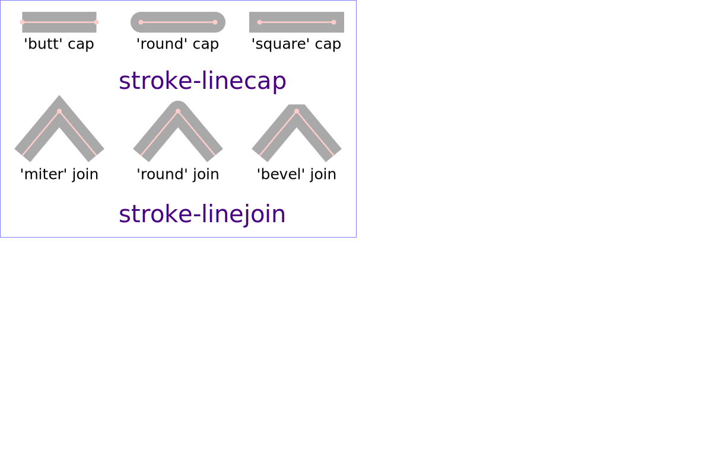

/SVG Informal Talk
==================
-   Scalable Vector Graphics (SVG) 2 - W3C Editor’s Draft 08 March 2023 
    https://svgwg.org/svg2-draft/single-page.html
-   Cascading Style Sheets Level 2 Revision 1 (CSS 2.1) Specification
    https://www.w3.org/TR/2011/REC-CSS2-20110607/
    https://www.w3.org/TR/CSS22/
-   SVG Tutorial by Jakob Jenkov    
    https://jenkov.com/tutorials/svg/index.html
-   Examples and Tests for SVG Animation http://hoffmann.bplaced.net/svgtest/
-   https://github.com/upb-lea/Inkscape_electric_Symbols

此教程《让世界多一份 Inkscape 教程：SVG 漫谈》，目的在于通过学习 SVG 规范文档，达到深入理解
Inkscape 绘图工具的学习与熟练使用。

Inkscape 早在 2003 年起源于 SodiPodi 软件，开发组内部的 4 位成员从其派生出的一个分支。
Bryce Harrington, MenTaLguY, Nathan Hurst, Ted Gould 四人希望 Inkscape 遵循
SVG 规范、更美的观感，并将其开源共建。因此 Inkscape 的根本是 SVG 规范及其对标准的扩展。

SVG 全称 Scalable Vector Graphics，可伸缩式向量图形，俗称矢量图。它与位图（bitmap）即以
比特数据定义像素的图形有着完全不同的绘画逻辑：SVG 基于几何逻辑行为进行构图。这种绘图方式的一特点
就是图形尺寸非固定，可自由伸缩。这是一种程序化的绘图方法，与分形一样是计算机图形学上的一个重要分支。
以下是几种常见的绘图逻辑形式：

位图：使用比特（bit）数据定义像素点，图像由任意的像素集合构成；修改图形就是修改比特数据中记录的色值。

SVG：使用几何逻辑绘图，比如使用 `<line>` 标签绘制直线， `<rect>` 绘制一个方块等等。

以上是两种最常见的图形分类，在计算机图形学上，有两个最基础的曲面和形状表示形式： 

1. Explicit geometry 显式几何，直观的几何图形，比如一个球体、一个盒子，或者点云，等等。
2. Implicit Geometry 隐式几何，比如几何方程，fractal（分形）和建设立体几何（Constructive Solid Geometry）；

计算机图形学是建立在 GPU 硬件绘画基础上的图形技术，图形通过 GPU 程序（着色器）进行流水线化的渲染。
图形由程序化生成，效果绚烂多彩，丰富多变，想象空间巨大。

CSG - Constructive Solid Geometry 是指通过一系列基本几何的基本运算来定义新的几何。

Fractals（分形）是一个自相似的程序，通过重复自己的一个部分并不断递归、丰富细节，局部一点就像整体。
分形（Fractal）一词，是 芒德勃罗 创造出来的，其原意具有不规则、支离破碎等意义。自然界存在普遍的
分形现象，花椰菜呈现出高度的这种自相似性，涉及七个或更多“相同”芽的复制，这在罗马花椰菜上最为显眼：


SVG 绘画形式中，定义了一个用于呈现图像的画布对象（Canvas），SVG 绘图指令就在画布上绘制图形元素。
其内部使用 ViewPort 和 ViewBox 两个概念完成绘画空间与屏幕图像空间的映射。因为 SVG 画布是一个
抽象的绘画空间，拥有无限的边界，最大可绘制的图形只取决于计算机的运算能力，以级 ViewBox 的映射。

SVG 图形基本的着色属性有两个：`fill` 和 `stroke`，对应笔触、绘画区内部的填充色和外围轮廓线。
语法和在 HTML 里使用 CSS 相似，就是 background、border 对应为 fill 和 stroke。
此外，还有线条连接点（顶点）的样式处理，盖帽样式，比如尖角、圆角、夹角。简单颜色表达有多种形式：

    fill="rgb(100, 149, 237)"   by rgb
    fill="#6495ED"              by hex value
    fill="aliceblue"            by color name

这些基本的色彩绘制在图形之上，而图形的叠加还可以进行透明度混合（Alpha Compositing and Blending），
这些与颜色处理相关的属性可以直接使用 style 样式属性指定，参考如下：

    opacity: 0.99;
    mix-blend-mode: darken;
    fill: #00ffff;
    fill-opacity: 1;
    stroke: #000000;
    stroke-width: 0.881229;

此外还有渐变色，和特效处理。渐变有线性 `<linearGradient>` 和径向 `<radialGradient>` 两种，
渐变也和普通图形一样可以进行几何变换，使用 `gradientTransform` 指定变换效果。SVG 可以呈现
的效果和绘图软件的算法设计有非常大的关系。比如，Inkscape 可以根据图形曲线来弯曲其它图形，
Path Effects - Bend 工具通过描述目标曲线，就可以拟合得到弯曲后的图形。但是渐变色块就
不能进行类似的处理。

渐变色定义使用多个 `<stop>` 标签来标记不同位置的颜色，其它过度区域的颜色由插值算法自动
计算得到。定义好渐变色块，就可以像 `<pattern>` 模板图案一样由其它图形标签通过 fill 属性
调用，或者使用 style 样式属性设置，比如 `style="fill:url(#linearGradient23);"`。

```xml
    <linearGradient
       id="linearGradient23"
       inkscape:collect="always">
      <stop
         style="stop-color:#1e021e;stop-opacity:1;"
         offset="0"
         id="stop23" />
      <stop
         style="stop-color:#1e021e;stop-opacity:0;"
         offset="1"
         id="stop24" />
    </linearGradient>
```

Inkscape 制作色环不能使用渐变加 Bend 的方式，也不能使用径向渐变 `<radialGradient>`。
应该使用 Path Effects - Bend 工具将色块环绕起来，做成放射线状的色环。注意，Bend 默认
按 x 轴（水平轴）弯曲图形，可以点击 Original path is vertical 切换为竖直轴向的弯曲。
通常需要先将曲线图形复制到粘贴板，然后在 Bend 面板中将其粘贴到要进行弯曲的图形上。然后，
再点击 Bend path: Edit on-canvas 编辑、调整曲线。因为弯曲工具是通过算法计算出图形的
坐标点绘制得到的结果，图形会与目标曲线产生关联，并且移动图形时，如果没有和曲线一并移动，
就会产生坐标偏移，在渐变图形上的效果就是渐变色的坐标偏移导致渐变色变化。点击 Bend 面板
中的眼睛图标可以切换 Bend 工具的生效状态，方便对原图进行位置调整。


Bend 弯曲效果的操作上还是比较麻烦一点，而且算法和 UI 操作上不够好用，操作不好可能
出来混乱的图形。参考操作如下：

1. 使用椭圆和弧线工具绘画出一个圆形，然后使用 Path 菜单中的 Object to path 转换成路径；
2. 复制转换得到的路径对象作为 Bend 弯曲使用的目标曲线；
3. 将要圆周弯曲排列的色块顶端对齐、竖直排成一行，并用包含一个组内；
4. 选择好色块的分组节点，并打开 Path Effects - Bend 面板；
5. 从下拉菜单（面板右上角向下的三角形图标）中选择 Bend 弯曲特效；
6. 添加 Bend 特效后，点击 Bend path 右侧的按钮（Link path to in clipboard）应用粘贴板中的曲线；
7. 然后，调整曲线，或点击眼睛图标禁用弯曲特效，对原图形做临时性调整。


注意：椭圆工具属性中需要保持是闭合的圆形，不能画成扇形。两者的区别是：`<circle>` 和 `<path>`。
画圆形时配合 Ctrl+Shift 约束为正圆形，虽然这个功能不是很流畅，但还是可以使用。
使用 Stroke to path 转换路径时，一个图形会产生对应 fill 和 stroke 的两个路径装在一个分组。
如果弯曲效果不满意，可以随时粘贴应用新的曲线，或者移除特效。Inkscape 会将 SVG 对应的标签
恢复到未应用特效处理的状态。

弯曲后的图形中心可能有穿插的问题，可以考虑使用圆形去遮挡。但是问题是弯曲工具 width 属性
的绝对值超过 1 或比图形比曲线半径大导致的，要调整合适的 width 属性。另外，Bend 工具默认的
行为是将弯曲轴向上的图形首尾相连，所以制作色环时就要考虑如果连接首尾的图形。由于算法的
问题，通过 Bend 环绕的色块无法实现径向的渐变，渐变色依然是基于全局坐标渲染的。因此，
通过 Bend 弯曲的色环只能使用同一个明度。变通的方法是使用另外的圆形，做径向的黑白渐变，
去覆盖住中心位置，以模拟出一个明度的变化效果。缺点是可能存在边缘过滤不平滑，有拼接痕迹。

另外，在移动图形时，无法与定义渐变色的 `<radialGradient>` 等标签联动，这会导致在
图形移动到不同的位置（渐变关键位），色彩会发生变化。


这小节讨论了 SVG 图形绘制中的色彩基本应用，以及特效功能对 SVG 图形的作用。特效本身
就是程序算法，通过算法实现某种特别的效果，并且效果都基于 SVG 图形标签的基本能力之上。
算法只提通过插值、拟合，丰富了 SVG 标签的绘图数据，即达成特别的效果。

用户也可以安装甚至是开发 Inkscape 扩展，用户扩展保存目录位于 %AppData%\inkscape，
扩展开发参考：

1. Writing Extensions (Text Guide) https://inkscape.org/develop/extensions/
2. [MiKTeX Manual Revision 4.6 Christian Schenk](https://docs.miktex.org/manual/)


SVG and XML
---------------

SVG 和其它图形文件格式不同，SVG 使用的是 XML 文本文档格式。

作为一种图形规范，SVG 一直受到多方厂商的拉扯。它本身支持静态图形来 Motion Graph 动画。但是
SVG 动画常在浏览器有相应的支持，少见有独立的应用支持。并且 SVG 在不同浏览器上的兼容性也不同。
虽然许多商用绘图软件（Adobe Illustrator, CorelDraw）都提供了矢量图的导出，但它们本身使用
专用矢量图形格式，并且它们是主流的矢量图形设计工具。制定 SVG 标准的厂商各怀鬼胎，私有矢量格式，
微软有 XAML、WMF，Adobe 使用 AI，CorelDraw 使用 CDR。参与标准制订的厂商有 Adobe、Canon
和 Sun Microsystems 等等，但是主导方是 W3C。

特别是 Adobe，在数字绘画领域常年占据绝对的领先地位。早年自家就有 fireworks，后来又被自家众多
主力产品之一 Illustrator 替代，现代还出了个免费的 Adobe XD，当然功能也相当的符合免费策略。
用来设计些简单的图标、交互式应用原型还是可以的。

SVG 技术本身在图形的表现力较差，不能适用于所有绘画场合。这直接导致 SVG 矢量图本身只能成为小众艺术。
厂商在自家的技术上发力，因而 SVG 技术地上只有寄托于开源社区的支持。Inkscape 就是其中的佼佼者。
Inkscape SVG 会引入两个自用的命名空间，它们专用于设置 Inkscape 专属的标记集：

    xmlns:inkscape="http://www.inkscape.org/namespaces/inkscape"
    xmlns:sodipodi="http://sodipodi.sourceforge.net/DTD/sodipodi-0.dtd"
    xmlns="http://www.w3.org/2000/svg"
    xmlns:svg="http://www.w3.org/2000/svg"

Sodipodi means "mish mash" or "hodgepodge" in Estonian child-speak.
Inkscape 是早在 2003 年，SodiPodi 软件开发组内部的 4 位成员从其派生出的一个分支。
Bryce Harrington, MenTaLguY, Nathan Hurst, Ted Gould 四人希望 Inkscape 遵循
SVG 规范、更美的观感，并将其开源共建。

Inkscape Tutorial - Chapter 6.  SVG File Format
https://inkscapetutorial.org/svg-file-format.html

Inkscape 使用的这些 XML 符号集主要是用于扩展 SVG 的功能，包括图层、图形 Lable 属性，
旋转中心设置，以及扩展、特效需要使用到的数据等等。

Extensible Markup Language (XML) 技术特点是其标签格式的完备、可验证、可扩展等特性。
XML 最早脱胎于 Simple Object Access Protocol (SOAP)，这是一个基于 XML 数据格式的
消息交换协议，早年流行于 Web 接口开发。XML 文档有效性约束（validity constraint）和
良构约束（well-formedness constraint）是保证 XML 作为信息交换数据格式的稳定根源。
许多软件都选择使用 XML 作为数据交换格式，它和 JSON 格式一样，是现今最流行的信息交换数据格式。

XML 文档要求文档必须定义一个 ROOT 标签节点，但是用于版本说明的序言和文档类型声明属于特殊的
标签（Prolog and Document Type Declaration）。这些特殊标签就像是其它文件中使用的
魔术符号（magic number）用于识别文件类型或版本，这些特殊标签也不像基本规范标签那样闭合。

所以一个最简单的 XML 文档可以像以下这样，ROOT 标签就是 `<greeeting>`，有版本声明标签，
但是没有文档类型声明标签，即它是一个通用的 XML 文档类型：

```xml
   <?xml version="1.0"?>
   <greeting>Hello, world!</greeting> 
```

XML 文档类型定义通常编写在 DTD 文件，并且使用 URI 地址引用。以下是两种文档类型定义的形式：
通过 URI 引用和直接编写在 XML 文档内部（方括号中包含的部分就相当于一个 DTD 定义）：

```xml
    <!-- An example of an XML document with a document type declaration: -->

    <?xml version="1.0"?>
    <!DOCTYPE greeting SYSTEM "hello.dtd">
    <greeting>Hello, world!</greeting> 

    <!-- The declarations can also be given locally, as in this example: -->

    <?xml version="1.0" encoding="UTF-8" ?>
    <!DOCTYPE greeting [
      <!ELEMENT greeting (#PCDATA)>
    ]>
    <greeting>Hello, world!</greeting>
```
<!-- 
`<!ELEMENT>` Element Type Declaration
`<!ATTLIST>` Attribute-List Declarations
**#PCDATA** "parsed character data." Mixed-content Declaration
 -->

XML 格式文档是 SVG 图形的标准载体，但是 SVG 除了使用规范的 XML 文档保存，还可以作为片段的形式
用于 Web 程序中，或者其它场合。前者称为合规的 SVG 独立文档，Conforming SVG Stand-Alone Documents，
后者则是合规的内嵌 SVG 片段，Conforming SVG Included Document Fragments。

SVG 两种形式都可以在 Web 页面中使用，Web 环境下可以使用 CSS2 样式表和 JavaScript 编程模型。

```svg
<svg width="200" height="100" xmlns="http://www.w3.org/2000/svg">
  <circle id="circle2" cx="50" cy="50" r="25" style="fill:red;" onclick="toggle(evt)">
  Sorry, your browser does not support inline SVG.
  </circle>
  <style>
    circle { cursor: pointer; }
  </style>
  <script type="text/javascript">
    // <![CDATA[
    function toggle(evt) {
      var target = evt.target;
      var radius = target.getAttribute("r");
      circle = document.getElementById("circle2")
      circle == target || alert("circle and target should be equal")

      if (radius == 15) {
        radius = 45;
        circle.style.fill="red";
      } else {
        circle.style.fill="green";
        radius = 15;
      }

      target.setAttribute("r", radius);
   }
   function setClipboard(text) {
      var type = "text/plain";
      var blob = new Blob([text], { type });
      var data = [new ClipboardItem({ [type]: blob })];

      navigator.clipboard.write(data).then(
        function () {
            console.log("/* copy successful */")
        },
        function (evt) {
            console.log("/* copy failure */", evt)
        }
      );
    }
   // ]]>
  </script>
</svg>
```

以上 SVG 片段可以直接嵌入到 Web 页面上使用，此外，有多种方法在 Web 页面中引入 SVG 图形：

- Inline 方式，即以上这种直接在页面编写的 SVG 片段，可以直接与 JavaScript 交互；
- External 方式，使用 `<embed>` `<object>` `<iframe>`  `` 标签或者 background-image 样式属性。

    `<object id="svg-object" data="path/to/external.svg" type="image/svg+xml"></object>`

和光栅图形一样，SVG 图形可以使用 URL 连接到文件，也可以使用 base64 编码嵌入 HTML 页面：

      background: url(./pictures/haskell-warning.svg) no-repeat 16px 16px;
      background: url(data:image/svg+xml;base64,...) no-repeat 16px 16px;
      
      
<svg version="1.1" xmlns="http://www.w3.org/2000/svg" width="480" height="180">
    <circle fill="red" cx="240" cy="90" r="80" />
</svg>
')

svg=$(cat <<<'
<?xml version="1.0" encoding="UTF-8" standalone="no"?>
<!DOCTYPE svg PUBLIC "-//W3C//DTD SVG 1.1//EN"
 "http://www.w3.org/Graphics/SVG/1.1/DTD/svg11.dtd">
<svg version="1.1" xmlns="http://www.w3.org/2000/svg" width="480" height="180">
    <circle fill="red" cx="240" cy="90" r="80" />
</svg>
')
echo -n "url(data:image/svg+xml;base64,$(echo $svg | base64 -w 0))" | clip
```

出于安全性考虑，引用外部资源的方式，SVG 不能执行脚本交互。


SVG Shapes
---------------

SVG 标签分为可显示的 UI 标签和不显示的功能性标签（例如 `<svg>` 和分组标签 `<g>`）。
其中，图形标签又可以分为基础几何图形和路径（复杂图形），Inkscape 有路径专用的逻辑运算。
包括 Path 菜单提供的各种逻辑运算功能，以及 Path Effect 特效扩展。

几乎所有 SVG 标签都可以使用 transform 设置几何变换，`<symbol>`、`<defs>` 等功能标签除外。
部分标签还可以设置 x y 坐标，其中圆形和椭圆则是通过设置圆心来定位（cx, cy）。

两大类标签具体用法参考规范文档：Basic Shapes 和 Document Structure 部分。

SVG 规范文档 3.4 Types of graphics elements 则作以下分类：

*   [Shapes]，6 种基本形状，直线与曲线几何图形，以及路径绘图：
    1. `<line>` 给定起止坐标（x1, y1, x2, y2）画直线；
    2. `<rect>` 给定起点坐标和宽高（x, y, width, height）画矩形，(rx, ry) 设置圆角；
    3. `<circle>` 给定圆心坐标和半径画圆（cx, cy, r）；
    4. `<ellipse>` 给定圆心坐标和两半径画椭圆（cx, cy, rx, ry）；
    5. `<polyline>` 按给定坐标（points）连线，坐标之间使用逗号分隔，每个坐标两个值空格分隔；
    6. `<polygon>` 给多个坐标给多边形，坐标形式同上。多边形的 fill 填充的是坐标点连线围起的区域；
    6. `<path>` 使用路径指令进行绘图，属性 `d` 中填写绘图指令：

        01. M = moveto (move from one point to another point)
        02. L = lineto (create a line)
        03. H = horizontal lineto (create a horizontal line)
        04. V = vertical lineto (create a vertical line)
        05. C = curveto (Cubic Bézier curve)
        06. S = smooth curveto (shorthand/smooth curveto)
        07. Q = quadratic Bézier curve (create a quadratic Bézier curve)
        08. T = smooth quadratic Bézier curveto (Shorthand/smooth quadratic Bézier curve)
        09. A = elliptical Arc (create a elliptical arc)
        10. Z = closepath (close the path)
    
*   [Text] 文本内容，用于呈现表达文字符号，使用 `<text>` 标签。
    可以设置字体、字号（font-family，font-size, font-weight）。
    可以设置位置坐标和偏移值（x y dx dy），以及字符单独的旋转（rotate），区别于几何旋转变换。
    如果，部分文本需要做特别处理，还可用 `<tspan>` 标签进行文字修整，包括手动将长文本换行。
    因为 SVG 对文本排版支持较弱，文本不能自动分行，新规范的 inline-size 属性亦未得到有效实现。
    暂行办法除了手动 `<tspan>` 分行，还有就是使用 `<foreignObject>` 包括 HTML 标签来做排版。
    配合 `<textPath>` 标签和路径，还可以将文字沿着曲线分布排列，使用 path 属性指定曲线。

*   可替代内容，主要是各种多媒体数据：

    *   Raster images，光栅图像，也就是位图一类的图形，使用一个数组包含图形的色值与透明度信息。
    *   Video，视频，即由一系列光栅图像构成的动态影像。
    *   Animation，运动图形（动画），也即是 Motion Graph，基于时间变化的矢量图形动画。
    *   Foreign objects，外部对象，用于呈现非 SVG 内容。

Inkscape 绘图工具中不提供多边线、多边形两种标签，使用 `<path>` 替代，因为功能上它们是重叠关系。
另外，椭圆形工具也绘画椭圆，还可以绘画扇形和圆形及弧线。当椭圆的两个圆心重叠时，Inkscape 会自动
用 `<circle>` 替代 `<ellipse>` 简化文档。

|    Shapes    |    Positioning    | transform |
|--------------|-------------------|-----------|
| `<line>`     | (x1, y1) (x2, y2) | ✔         |
| `<circle>`   | (cx, cy)          | ✔         |
| `<ellipse>`  | (cx, cy)          | ✔         |
| `<rect>`     | (x, y)            | ✔         |
| `<polyline>` | -                 | ✔         |
| `<polygon>`  | -                 | ✔         |
| `<path>`     | -                 | ✔         |
| `<text>`     | (x, y)            | ✔         |

以下是基本的图形标签的使用演示，[basic-shapes](../svg/svg-basic-shapes.svg)：

```xml
<?xml version="1.0"?>
<svg version="1.1" width="580" height="240"
    xmlns:xlink="http://www.w3.org/1999/xlink"
    xmlns="http://www.w3.org/2000/svg">
  <style>
    svg { border: 1px solid black; }
    #basic-line line { 
      fill: white;
      /*stroke: magenta;*/
      stroke-width: 6px;
      stroke-dasharray: 10px; 
    }
  </style>
  <svg id="basic">
    <title>Basic graphical elements</title>
    <text x="0" y="50" dx="20" dy="0" rotate="15" 
      font-family="Microsoft YaHei"> Basic Lines</text>
    <g id="basic-line" transform="translate(40 50) rotate(0 0 0) scale(0.9)">
       <line x1="0" y1="18" x2="90" y2="18" stroke="chocolate" />
       <line x1="0" y1="36" x2="90" y2="36" stroke="chocolate" />
       <line x1="0" y1="54" x2="90" y2="54" stroke="chocolate" />
       <line x1="0" y1="72" x2="90" y2="72" stroke="chocolate" />
       <line x1="0" y1="90" x2="90" y2="90" stroke="chocolate" />
    </g>
    <g id="basic-rect" transform="translate(140, 60)">
      <rect x="15" y="0" width="80" height="80" rx="8" fill="blue" />
    </g>
    <g id="basic-circle" transform="translate(264, 50)">
      <circle cx='46' cy='50' r='45' fill='yellOw' />
    </g>
    <g id="b3sic-ellipse" transform="translate(290, 40)">
      <ellipse cx="0" cy="0" rx="290" ry="120" fill="none" stroke="black" stroke-width=".1" />
    </g>
    <g id-2="basic-polyline" transform="translate(360, 40)">
      <polyline points="50,0 5,75 25,100 75,100 95,75 50,0" fill="purple" xlink:title="diamon" />
    </g>
    <g id="basic-polygon" transform="translate(460, 40)">
      <polygon points="0,38 100,38 15,100 50,0 85,100" fill="firebrick" xlink:title="star" />
    </g>
  </svg>

  <svg id="path">
    <title>Complex Path Command</title>
    <defs>
      <symbol id="star" stroke="lightblue">
        <path d="m 65,75 -23,-12 -23,12 4,-26 -19,-18 26,-4 11,-24 12,23 26,3 -18,18 -23,-12" />
      </symbol>
    </defs>
    <g id="path" transform="translate(-5,0)" stroke="black" stroke-width="3" fill="none">
      <use xlink:href="#star" transform="translate(0,160)" />
      <use xlink:href="#star" transform="translate(73,160)" />
      <use xlink:href="#star" transform="translate(146,160)" />
      <use xlink:href="#star" transform="translate(219,160)" />
      <use xlink:href="#star" transform="translate(292,160)" />
      <use xlink:href="#star" transform="translate(365,160)" />
      <use xlink:href="#star" transform="translate(438,160)" />
      <use xlink:href="#star" transform="translate(511,160)" />
    </g>
  </svg>
</svg>
```


绘制多边形时，因为线条有可能交叉，这涉及到如何填充图形的问题，对于一个凸壳（Convex hull）形状，
自然就是填充边线围起来的中心区域，因为过凸壳两条边的直线只能与图形本身形成两个交点，不存在线条分割
中心区的问题。相反，当线条交叉形成重叠区，比如用多边形工具画五角星，中心区就是一个复杂的位置。
使用 `fill-rule` 属性指定填充算法，算法目标是确定某个点是否位于图形的内部：


*  **nonzero** 通过从某点向任意方向绘制射线，并统计射线与路径的线段相交的情况来确定该点
    属于形状的内部或外部。当线段从左到右跨越射线，计数加 1，从右往左跨越射线就减 1。如果统计
    结果为 0，则表示该点在形状的外部；如果结果大于 0，则表示该点在形状的内部。

*  **evenodd** 从该点向任意方向无限远处绘制射线，并统计射线与路径线段相交的数量。
    如果有奇数个路径段与射线相交，则点在内部，应用填充；如果有偶数个，则点在外部，无需填充。

(Note: the above explanations do not specify what to do if a path segment coincides with or is tangent to the ray. Since any ray will do, one may simply choose a different ray that does not have such problem intersections.)

使用路径绘画时注意：

01. 重复执行同一命令，则可以省略后续的命令，只需提供坐标数据。
02. 命令大写表示使用绝对坐标值，小写表示相对坐标值。
03. 两个坐标值使用空格隔开，与命令可以不分隔，多个空格当作一个空格看待。
04. 如果只能绘画不相连的线条，那么 fill 属性就无效，没有形成可以填充的区域。
05. H、V 表示从当前位置画水平线、竖直线，每组坐标接收一个值，(x)+ 或者 (y)+；
06. M、L 都接收每组两个值的坐标，(x y)+；
07. T 简化版二次贝塞尔曲线（Shorthand/smooth quadratic Bézier) 接收每组一对坐标 (x y)+；
08. S 简化版本平滑曲线，接收参数为每组两对坐标，(x2 y2 x y)+；
09. Q 二次贝塞尔曲线（Quadratic Bézier）接收每组两对坐标，(x1 y1 x y)+；
10. C 三次贝塞尔曲线 **Cubic Bézier** 接收每组三对坐标值，(x1 y1 x2 y2 x y)+；
11. A 椭圆弧线（elliptical arc）参数：(rx ry x-axis-rotation large-arc-flag sweep-flag x y)+
12. Z 封闭路径，没有参数。

二次贝塞尔曲线只有一个控制点，因为起点是当前位置，所以只需要给出控制点 (x1 y1) 和目标点 (x y)。
三次迪塞尔曲线则控制更细化，设置了两个控制点，分别控制曲线的前半段和后半段，所以参数是三个坐标
为一组，(x1 y1 x2 y2 x y)+ ，每组最后一个坐标是目标点，也就是下次绘制曲线的起点。

二次贝塞尔曲线（Quadratic Bézier Curves）特点是两坐标间绘制的曲线，与两点到控制点连线的
两中点的连线相切。曲线差不多会与控制点到两顶点的连线的垂直线的一半位置相切。

虽然贝塞尔曲线的阶数可以很高，但是如果曲线的阶数过高，调整控制点对曲线的影响
就比较小，调整起来相当麻烦。于是，通常用分段的贝塞尔曲线，保证每一小段不会太复杂。这样每次只用调小段，
还可以做到只调局部不影响大局，那就相当舒服了。

分段带来的唯一问题是，曲线在段与段的交界处，如何保证平滑？所谓平滑，其实就是一阶导数连续，也就是
左右导数的极限相同。曲线需要插值反走样（Anti-Aliasing），离曲部越近的像素的像素值越高即可。

从实际应用中，曲线几乎就是 SVG 的根本，所有复杂的 SVG 绘图必然会使用曲线。路径指令（path）
是绘制曲线的重要方式，曲线的使用除了直接作为图形，也可以用作控制线，由一些标签的 path 属性
来指定要引用的曲线，比如设置文字沿曲线分布的标签： `<textPath>`。

路径绘制中的椭圆弧线参数最复杂，从当前位置到目标位置 (x, y) 绘制绘制弧线需要使用 5 个数值控制，
先是弧线的两轴半径 (rx, ry)，特别说明的是另外三个参数：

*  **x-axis-rotation** 椭圆整体的 x 轴旋转角度，两轴半径相等时没有效果；
*  **large-arc-flag** 是否使用大弧作画，可设置值为 0 或 1；
*  **sweep-flag** 是否掠过首个椭圆，可设置值为 0 或 1，对应负角、正角画法；

一般不需要使用后两个参数据画弧线，因为椭圆的圆心由算法自动计算，它们主要用于椭圆的圆心修正处理。
在几何上讲，过给定的起点和终点，可以找到两个椭圆轨迹，并且起点到终点有四段弧线，这两个参数的配合
用以确定使用哪一段弧线作画。

```xml
<path d="M 125,75 a100,50 0 ?,? 100,50" style="fill:none; stroke:red;"/>
```

注意坐标的表达，坐标的两个值之间可以使用逗号，也可以省略，使用逗号语义更清晰。
以下是 规范文档的演示：


```xml
<?xml version="1.0" standalone="no"?>
<svg width="12cm" height="5.25cm" viewBox="0 0 1200 525" version="1.1"
     xmlns="http://www.w3.org/2000/svg" xmlns:xlink="http://www.w3.org/1999/xlink">
  <title>Example arcs02 - arc options in paths</title>
  <desc>Pictures showing the result of setting
        large-arc-flag and sweep-flag to the four
        possible combinations of 0 and 1.</desc>
  <g font-family="Verdana" >
    <defs>
      <g id="baseEllipses" font-size="20" >
        <ellipse cx="125" cy="125" rx="100" ry="50"
                 fill="none" stroke="#888888" stroke-width="2" />
        <ellipse cx="225" cy="75" rx="100" ry="50"
                 fill="none" stroke="#888888" stroke-width="2" />
        <text x="35" y="70">Arc start</text>
        <text x="225" y="145">Arc end</text>
      </g>
    </defs>
    <rect x="1" y="1" width="1198" height="523"
          fill="none" stroke="blue" stroke-width="1" />

    <g font-size="30" >
      <g transform="translate(0,0)">
        <use xlink:href="#baseEllipses"/>
      </g>
      <g transform="translate(400,0)">
        <text x="50" y="210">large-arc-flag=0</text>
        <text x="50" y="250">sweep-flag=0</text>
        <use xlink:href="#baseEllipses"/>
        <path d="M 125,75 a100,50 0 0,0 100,50"
              fill="none" stroke="red" stroke-width="6" />
      </g>
      <g transform="translate(800,0)">
        <text x="50" y="210">large-arc-flag=0</text>
        <text x="50" y="250">sweep-flag=1</text>
        <use xlink:href="#baseEllipses"/>
        <path d="M 125,75 a100,50 0 0,1 100,50"
              fill="none" stroke="red" stroke-width="6" />
      </g>
      <g transform="translate(400,250)">
        <text x="50" y="210">large-arc-flag=1</text>
        <text x="50" y="250">sweep-flag=0</text>
        <use xlink:href="#baseEllipses"/>
        <path d="M 125,75 a100,50 0 1,0 100,50"
              fill="none" stroke="red" stroke-width="6" />
      </g>
      <g transform="translate(800,250)">
        <text x="50" y="210">large-arc-flag=1</text>
        <text x="50" y="250">sweep-flag=1</text>
        <use xlink:href="#baseEllipses"/>
        <path d="M 125,75 a100,50 0 1,1 100,50"
              fill="none" stroke="red" stroke-width="6" />
      </g>
    </g>
  </g>
</svg>
```

除了 fill 和 stroke 两个主要着色属性，SVG 另外提供了一些修饰性的图形功能：

1. **stroke-opacity**：指定描边的透明度，值范围在 0~1 之间，对应 0% ~ 100% 的不透明度。
2. **stroke-linecap**：线段盖帽，用于指定路径的端点样式，butt 平头，round 圆头，square 方块。
3. **stroke-linejoin**：路径线段连接方式（关节样式），miter 斜接，round 圆角，bevel 倒角。
4. **stroke-miterlimit**：斜接尖角限制，限制两条线段交角的尖长，超长时就截断到设定的限值范围。
5. **stroke-dasharray**：虚线描边控制数组，指定“折线”与其间隔的长度。
    数组每两值一对，对应“破折线”的破折号与留白间隔的长度。
    列表以逗号分隔，如 5,3 表示“破折号”的长度为 5，留白长度为 3。
    注意：如果提供了奇数个值，则重复值列表以生成偶数个值。如5，3，2相当于5,3,2,5,3,2。
6. **stroke-dashoffset**：虚线的偏移量，一个百分比或数字长度，正值向起点偏移，负值向末点偏移。



SVG 矢量图形主要构成就是以下几个层面，更复杂的效果需要引入图形混合以及滤镜特效来实现：

1. Basic shapes 基本的几何图形：线条、矩形、圆形、弧线、连线、多边形；
2. Complex shape 复杂身体图形：路径绘画命令（path）；
3. Join decoration 线条连接位的修饰；
4. 色彩填充（fill）与笔触轮廓（stroke）;
4. 渐变色 `<linearGradient>` 和 `<radialGradient>`，及渐变变换属性 gradientTransform；
5. 透明度混合（Alpha Compositing and Blending）；
6. 滤镜特效（Effect Filters）

滤镜特效是 SVG 图形处理的扩展功能，通过扩展可以实现默认 SVG 渲染没提供的效果，在程序渲染图形时，
根据滤镜标签的设置，调用相应的滤镜模块去处理图形，再将处理结果返回会渲染程序并呈现。以下是一个演示
通过滤镜给椭圆图形加阴影的演示：

```xml
<defs>
    <filter id="blurFilter2" y="-10" height="40" x="-10" width="150">
        <feOffset in="SourceAlpha" dx="3" dy="3" result="offset2" />
        <feGaussianBlur in="offset2" stdDeviation="3"  result="blur2"/>

        <feMerge>
            <feMergeNode in="blur2" />
            <feMergeNode in="SourceGraphic" />
        </feMerge>
    </filter>
</defs>

<ellipse cx="55" cy="60" rx="25" ry="15"
         style="stroke: none; fill: #0000ff; filter: url(#blurFilter2);" />  
```

`<filter>` 标签内编写用于调用不同滤镜的标签，以上演示了几种滤镜的使用：

1. `<feMerge>` 此滤镜标签用于合并多个滤镜；
2. `<feMergeNode>` 此标签是滤镜合并标签的子节点，用于设置要合并的滤镜，通过 in 属性指定滤镜 ID；
3. `<feOffset>` 位置偏移滤镜，功能等价于几何变换中的平稳；
4. `<feGaussianBlur>` 高斯模糊滤镜，提供基本的图像模糊处理；

滤镜和渐变色一样，通常定义在 `<defs>` 容器标签内，并在其它图形标签的样式中通过 filter 样式属性
引用滤镜。滤镜有输入和输出，in 属性指定输入，out 指定输出，它们都使用一个 ID 值关联相应的图形数据。
滤镜中处理的数据称为 primitives，通过 ID 值引用输入、输出图像数据的方式称为 primitive reference。
滤镜的层级关系构成了 Filter primitive tree。

输入属性可以使用以下值，以指定要处理的源图形图层或颜色分量，需要多个输入的滤镜还有 in2 这样的属性：

    in = "SourceGraphic | SourceAlpha | BackgroundImage | BackgroundAlpha | FillPaint | StrokePaint | <filter-primitive-reference>"

以下是规范定义的滤镜列表：

|            Name         | Description |
|-------------------------|-------------|
| `<feBlend>`             | Combines two graphics together by a certain blending mode
| `<feColorMatrix>`       | Changes colors based on a transformation matrix
| `<feComponentTransfer>` | Performs component-wise remapping of data for each pixel. Can adjust brightness, contrast, color balance, etc
| `<feComposite>`         | Performs combination of two input images pixel-wise in image space using a compositing operation
| `<feConvolveMatrix>`    | Applies a matrix convolution filter effect (this includes blurring, edge detection, sharpening, embossing and beveling)
| `<feDiffuseLighting>`   | Lights a graphic by using the alpha channel as a bump map
| `<feDisplacementMap>`   | Uses pixels values from the graphic from in2 attribute to displace the image from the in attribute
| `<feDropShadow>`        | Creates a drop shadow of the graphic
| `<feFlood>`             | Fills the filter subregion with the color and opacity defined by flood-color and flood-opacity attributes
| `<feGaussianBlur>`      | Blurs the graphic
| `<feImage>`             | Gets graphic data from an external source and provides the pixel data as output
| `<feMerge>`             | Blends input graphic layers (applies filter effects concurrently instead of sequentially)
| `<feMorphology>`        | Erodes or dilates the graphic (for fattening or thinning effects)
| `<feOffset>`            | Offsets the input graphic
| `<feSpecularLighting>`  | Lights a source graphic by using the alpha channel as a bump map
| `<feTile>`              | Fills a target rectangle with a repeated pattern of an input graphic
| `<feTurbulence>`        | Creates a graphic with the Perlin turbulence function


其中，除了 `<feMerge>` 包含 `<feMergeNode>` 子节点，还有 `<feDiffuseLighting>` 和 
`<feSpecularLighting>` 包含 `<feDistantLight>`、`<fePointLight>`、`<feSpotLight>`
子节点。

以及 `<feComponentTransfer>` 使用 `<feFuncR>`、`<feFuncG>`、`<feFuncB>`、`<feFuncA>`
等子节点进行颜色分量的处理。


滤镜的细节信息参考规范文档：[Filter Effects Module Level 1](https://drafts.fxtf.org/filter-effects/)


CSS 规范为 Web 视觉设计制定了一套标准色彩模型，其中包含了 148 个命名色彩，现制作成
SVG 参考图供参考：

[](../pictures/css-148-named-colors.svg)

以上 SVG 已经添加脚本功能，可以点击色块复制其色值。
因为浏览器安全问题，除非是 HTML 内嵌的 SVG 才可以执行脚本交互功能，图片嵌入等方式不可以。
为了执行 SVG 脚本交互，可以单独打开 SVG 图形文档，这样它就是单独在沙箱中执行。

作为一个好色之徒，区区 148 个 CSS 标准色是远远不能满足的，还差一个绝美的中国传统色。
中国色彩模型与西方基于物理特性的色彩模型具有非常多的细节差异，已经不适合在此文档中整理汇编，
应该另开一个文档做专题：[Chinese Traitional Colors](../svg/cn_traditional_colors.md)。

以下是一个正红大圆，使用 base64 编码内嵌，用于测试 Github 文档是否能够正常渲染：


参考资源：

-  国立国会図書館 彩雅 15巻 著者 杉原直養 影印版 https://dl.ndl.go.jp/pid/2607750
-  色谱 中科院科技情报编委会名词室.科学出版社 https://www.zhongguose.com/colors.json


SVG Containers
---------------

SVG 重要的功能标签包括：

1. 图形引用 `<use>`：引用 SVG 文档中现有的标签，duplication 用途。
2. 容器 `<svg>` `<a>` `<defs>` `<g>` `<marker>` `<mask>` `<pattern>` `<symbol>`
3. 特殊容器（条件处理）`<switch>` `<optional>`
4. 描述性元素 `<title>` `<desc>` `<metadata>`

引用标签 `<use>` 通常和符号定义标签 `<defs>` 配合使用，后者定义图形符号，但不直接被渲染，
后者通过引用机制让定义好的图形符号得以渲染输出。但是 `<use>` 也可以引用 SVG 内的其它元素，
通过 ID 指定要引用的对象。defs 即 Definitions，use 侧是 Use definition (Reference)。

由于 SVG 可复用对象，这也增加了 SVG 服务程序（Generator）、客户程序（Viewer）实现上的麻烦，
同时规范文档中也定义 **shadow tree** 这个术语来表达复用情况下的标签层次结构。正常情况下，
SVG DOM (Document Object Model) 模型中只包含 `<use>` 节点本身和它的属性值，而它所引用
的对象则用影子树（shadow tree）组织、表达。增加影子树也增加了 SVG DOM 处理的算法上的复杂度，
这不得不考虑影子树中的被引用过来的对象，它们的事件、样式、尺寸、布局问题。在影子树中，`<use>` 标签
就当作它引用过来的标签的顶层元素，被引用的元素就是 `<use>` 标签的子元素。不能出现循环引用，
SVG 实现方（SVG Agent）将视为无效引用。

SVG 引用对象的形式是属性关联对象的 ID 值，注意在 href 属性或者 url 方法中的 # 号后的是 ID：

    <use xlink:href='#shape'/>

    <rect x="0" y="0" width="100" height="100" fill="red" mask="url(#mask1)" />

Inkscape 在图层面板上会将 `<use>` 标签显示为一个双层方框并有一个锁头的图标，对象属性面板
（Object Attributes）就只显示“Clone”字样，没有其它属性内容，也没有 `<use>` 标签的属性。
Inkscape 用两个属性面板，另一个更常用到的是 Object Properties，从词汇上讲，property
更偏向资产、性质的含义，它用于显示 SVG 标签中通用的一些属性字段，比如 ID、label 和各种
事件属性。Object Attributes 显示对象特有属性，比如基本形状对象的尺寸数据，或者链接标签
的各种数据。官方将两个面板对应翻译为“对象特性”和“对象属性”。


另外，`<image>`，`<video>` 标签用于引用外部光栅图像、视频文件，可以看作是引用标签的一种特殊情况。

锚点标签 `<a>` 其功能和 HTML 同名标签类似，用于在 SVG 内部跳转链接，如果 SVG 作为代码片段
出现在 Web 页面中的 HTML 标签内，则链接会等同于 HTML 的连接标签。注意：链接标签不能自身嵌套。
参考 SVG 2.0 规范文档中的一致性测试 2.5.5. Conforming SVG Viewers。

标题标签 `<title>` 应该作为容器标签的首个子节点，并且为了兼容 SVG 1.1 规范，只能有一个。
它指定的内容和 HTML 标签中的 title 属性一样，用于在用户光标悬停在 SVG 容器时显示提示文字信息。

> [!NOTE]
> 注意： ['title'] 标签与 ['a'] 锚点标签的 ['xlink:title'] 属性不要搞混，后者用于链接本身。

描述性标签 `<desc>` 与标题标签不同点在于，它的内容只在 SVG 代码中存在，而不会在渲染到输出图形。
通常用它来包括较长的描述性文字。

通常，描述性标签的使用目的是描述容器元素（container element）或图形元素（graphics element），
应该作为待描述元素的直接子元素。然而，SVG 文档可以具有丰富的结构，每个嵌套标签下都可能包含['title']
或 ['desc'] 标签，以及 ['use'] 标签。特别是 ['use'] 本身和其引用内容都有 ['title'] 或 ['desc']。
由于这种复杂的结构，以及[描述性元素]可能出现在任何给定的级别，因此适用于任何给定内容的[描述性元素]是由结构决定的。

分组容器 `<g>`（Grouping）是 SVG 中最通用也最常用使用一个标签，其功能地位等于 DIV 之于 HTML。
分组容器可以任意嵌套，主要功能是用于管理图形对象。Inkscape 等 SVG 绘图软件还用它来实现图形分层。
任何没有被分组容器包括的对象，都将看作是独立的一个分组。

SVG 提供条件处理容器，`<switch>` 标签根据一些客户端环境条件属性，['requiredExtensions'], 
['requiredFeatures'], ['requiredFonts'], ['requiredFormats'] 还有 ['systemLanguage']
等等属性来做条件判断，当满足条件时才渲染子节点（直接子节点）。以下用 systemLanguage 作为检测条件，
系统支持某种语言时，`<switch>` 才显示相应的子节点，如果多种语言都支持，则显示首个符合条件的子节点：

```xml
<?xml version="1.0"?>
<svg version="1.1" xmlns="http://www.w3.org/2000/svg">
  <switch >
    <g systemLanguage="es">
        <text x="10" y="20">Spanish</text>
    </g>
    <g systemLanguage="zh">
        <text x="10" y="20">中文</text>
    </g>
    <g systemLanguage="en-UK">
        <text x="10" y="20">UK English</text>
    </g>
    <g systemLanguage="en">
        <text x="10" y="20">English</text>
    </g>
  </switch>
</svg>
```

> [!NOTE]
> 注意：CSS 样式表属性 display 和 visibility 等属性对 `<switch>` 元素没有影响，也不能设置坐标。
> 但是可以使用通用的 transform 进行几何变换。

容器一般不提供定位坐标或大小尺寸设置，分组容器 `<g>`也因为没坐标、尺寸属性。当然，移动（变换）它
也可以 transform 进行几何变换，这是通用的图形变换方法，比如按偏移量移动 "translate(-100 50)"。
几何变换涉及到坐标系统，可以参考规范文档：Coordinate Systems, Transformations and Units。

但是 `<svg>` 这个布局标签除外，它应该作为 SVG 图形文件顶级标签，但同时又可以像分组标签一样
进行嵌套，它的主要功能是布局用途，它可以设置 ViewBox 属性实现图形与画布 ViewPort 的影射变换。

其它的一些容器标签：

1.  剪切蒙版 `<mask>`，使用 mask 样式属性进行 Alpha 混合，将零值（黑色）遮住的区域透明化。
    剪切则是使用 clip-path 属性指定一个 `<clipPath>` 对象，这个对象图形所能覆盖的区域才渲染。
    比如，`style="clip-path: url(#clipPath);"` 引用了 ID 为 clipPath 的剪切对象。
    剪切蒙版，Clipping and masking，是 SVG 图形引擎的基本图形处理流程，参考 Rendering Model。

2.  标记标签 `<marker>` 是一个用图形标记其它直线、线段、多边形等起始、中段、结束位置的标签。
    通过 marker-start marker-mid marker-end 等属性引用一个 marker 对象定义的图形。
    比如，marker-start="url(#m1)" 引用 id="m1" 标记图形，并绘制于当前图形起点。

3.  图形模板标签 `<pattern>` 用于定义图案，这些图案可作为其它图形的填充色、或笔触绘制出来，
    一般在 `<defs>` 标签内定义图形模板图案，然后通过其它元素的 fill 或者 stroke 属性
    调用图案，比如 **fill="url(#pattern_id)"**。为了控制模板图案，此标签和 `<svg>`
    标签一样可以使用 viewBox 属性。

4.  符号标签 `symbol>` 用于定义图形符号，这些符号可以由 `<use>` 引用后才进行渲染输出；
    Inkscape 等软件通常用它来做了图形库，使用 SVG 进行创作不可能总是从基本的线条开始，
    有些图形是成形固定的，或者有些值得重复使用的符号，就可以定义为图案符号，方便重用。

SVG 标签的设计上，`<defs>` 提供一个符号定义专用场所，`<symbol>` 提供图形符号化的组织，
`<use>` 则提供引用图形复现图形符号的能力。当然，`<defs>` 内也可以直接使用图形标签或容器
标签定义图形，`<symbol>` 也可以直接在其它容器中使用，但从标签设计的语义上说，这些形式
都不是最合适的使用方式。‘[marker]’ 和 ‘[pattern]’ 标签也具有相似用途。

正确的操作是将 `<symbol>` 当作图形符号化工具使用，并且，符号化的图形会限制在其 viewBox 区域内，
超出边界的内容将会被剪裁（clipped），以下例子中的第一个圆（red）就会被剪裁变成 1/4 扇形：

```xml
<svg width="600" height="300" viewBox="-300 -150 600 300" 
    fill="blue" stroke="black" stroke-width="5">
    <symbol id="graph-symbol">
        <circle cx="0" cy="0" r="50" fill="red" onclick="alert('&lt;symbol&gt; handler')" />
    </symbol>
    <use xlink:href="#graph-symbol" x="50" y="25" onclick="alert('&lt;use&gt; handler')" />
    <circle cx="0" cy="0" r="50" />
</svg>
```

另外，`<use>` 标签不能实例化 `<symbol>` 内部引用的其它符号，符号标签还涉及 viewport 问题。

Inkscape 用户符号目录下的 SVG 定义的符号会自动导入，可以修改 User Symbols 目录位置。

描述性标签 `<metadata>` 是一个信息媒体元数据。
[FOAF Vocabulary Specification](http://xmlns.com/foaf/spec/)
[Resource Description Framework](https://www.w3.org/RDF/)

FOAF (Friend-of-a-Friend) 是一种 RDF 词汇表规范，Web 页面用于规格化的形式表达描述性网络属性。
FOAF 词汇表提供了一种管理社区内信息的有用方法。关于其他人的信息常常是最令人感兴趣的一类数据，而且 FOAF 实现了分散、机器可读和个人描述等需求。但在其自己的应用领域之外，FOAF 提供了用于研究有关构建语义 Web 的概念（链接、信任和起源的概念）的有用试验台。

RDF（Resource Description Framework）是一个描述资源和资源之间网络关系的构架，诸如网页的标题、
作者、修改日期、内容以及版权信息等。简单来说，每一条描述都是一个主谓宾三元组构成的短句，比如：

{ 苹果, 是, 公司 }, { 库克, 是, 人 }, { 苹果, CEO 是, 库克 } { 苹果, 是, 水果 }

这里还有一个要处理的是三元组本身的歧义：，苹果是什么？描述用词本身不能有歧义，需要一个唯一表示。
解决方法就是用 URI（Universal Resource Identifier）。一旦确定每个东西都有唯一表述方式，
那么 RDF 三元组的形式就是 { URI, URI, URI }。

RDF 描述资源的格式由三部分构成：一个 RDF 图，两端两个节点分别是主体和客体。中间是连接它们的
谓词 RDF 语句，表示两个资源主体之间的关系。主语和宾语表示两种资源相关，谓词表示其性质关系。
关系以方向性的方式表达（从主语到宾语），并在 RDF 中称为属性。因为 RDF 语句由三元素构成，
所以也被称为三元组。每个三元组是一个语句，每个语句断言一个关于资源的事实。


SVG Animation
---------------

首先，介绍高质量视频教学博主 3Blue1Brown（本名 Grant Sanderson）自研的动画引擎 𝕄anim，
此动画引擎因教学演示用途而创建，基于 Python 脚本编程和 FFMPEG 音视频处理框架工具包：

> [!TIP]
> 3Blue1Brown https://www.3blue1brown.com/
> GITHUB: https://github.com/3b1b/manim
> Manim Community: https://www.manim.community/
> 
> Free and Open Source
> Manim is a free and open-source project originally written by Grant Sanderson. 
> It is now maintained by the Manim Community and permissively released under 
> the MIT license.
> 
> Manim is an engine for precise programmatic animations, designed for creating 
> explanatory math videos.
> 
> Note, there are two versions of manim. This repository began as a personal 
> project by the author of 3Blue1Brown for the purpose of animating those videos, 
> with video-specific code available here. In 2020 a group of developers 
> forked it into what is now the community edition, with a goal of being more 
> stable, better tested, quicker to respond to community contributions, and all 
> around friendlier to get started with. See this page for more details.
> 
> Manim runs on Python 3.7 or higher.
> 
> System requirements are FFmpeg, OpenGL and LaTeX (optional, if you want to use 
> LaTeX). For Linux, Pango along with its development headers are required. 
> See instruction here.

```sh
git clone --depth=1 git@github.com:3b1b/manim /pl/manim
git clone --depth=1 git@github.com:ManimCommunity/manim /pl/manim-community
```


SVG 动画是典型的 Motion Graph，相比传统的逐帧绘制的动画，SVG 动画通过控制图形的各种属性来
实现图形动画。这种思维与 3D 动画系统中基于骨骼的动画制作具有同样的模型概念：属性数据驱动动画。
动画领域的前沿，还有基于动作捕捉的动画，Motion Matching 基于输入影像动作模式匹配生成动画。

SMIL 3.0 动画规范定义了两种动画模型：

*   `BasicAnimation` 基于坐标点序列的动画，使用 discrete, linear, paced 三种插值方式。
*   `SplineAnimation` 基于样条的动画，扩展了以上这种插值方式，提供更多的插值、时序的控制。

SVG 动画函数表达就是一个时间相关的线性函数，如下两种动画参数对应的函数表达，其中时间 t 单位用秒：

    <animate from="10px" to="100px" ... dur="10s"

    f(t) = (10 + 90 * t/10) px

    <animate attributeName="top" to="10" dur="2.5s" />``

    f(t,u) = (u * (2.5s-t)/2.5s) + 10 * (t/2.5s)

第二个式子多了一个参数 u，表示动画目标对象对应属性的当前值（underlying value）。

由于 SVG 动画是基于数据驱动的，与早期 Flash 技术一样，动画设置通常是指定，起点、终止的状态，
中间状态由插值算法生成。因此，SVG 动画标签设计 **calcMode** 属性用于控制插值算法。由算法
插值产生的中间状态就称为**插值帧**，Interpolation frame，或者称为**补间**动画，In-Betweens。

变换矩阵也可以用来做动画，但是 `<animate>` 不能对矩阵进行处理，需要使用 `<animateTransform>`。

W3C 专用为平面动画编写的规范文档：

-  SVG Animation Level 2 https://svgwg.org/specs/animations
-  Synchronized Multimedia Integration Language (SMIL 3.0) https://www.w3.org/TR/REC-smil/

SVG 动画控制标签：

1. `<set>` 设置父层或指定对象的属性。
    例：`<set attributeName="r" to="50" begin="3s" />`
2. `<animate>` 动态地设置父层或指定对象的属性。
    例：`<animate attributeName="cx" begin="0s" dur="8s" from="50" to="90%" repeatCount="indefinite" />`
3. `<animateTransform>` 动态地设置父层或指定对象的几何变换。
    例：`<animateTransform attributeName="transform" begin="0s" dur="1s" type="rotate" from="0 85 85" to="360 85 85" repeatCount="freeze" />`
4. `<animateMotion>` 使用曲线驱动目标对象的运动。
    通过自身的 path 属性填写的路径绘制命令产生曲线，也可以使用 `<mpath>` 子节点引用曲线。

动画标签默认以父节点为动画目标对象，为了可以指定动画目标，SVG 在 href 属性值上做了逻辑设计。
动画标签通过 xlink:href 属性指定动画目标标签，属性值是一个 XLink 定位路径，也是一个 IRI。
还可以使用 `targetElement` 属性指定动画目标，但是前者更优先。动画目标只能指定一个，指定多个无效。
并且动画目标必需是 SVG 文档片段内的图形标签。对于 `<animate>` 动画，还不能指定 `<g>` 这样的容器。
因为容器没有 x y 这样的属性来进行图形定位，它只能通过 transform 属性实现移动等几何变换。另外，
`<polygon>` 和 `<polygon>` 这种不常用的标签也没有 x y 坐标属性。还直线、椭圆、圆形的坐标
有不同的形式（x1, y1, x2, y2, cx, cy）。

SVG 支持以下动画标签或属性， SMIL 2.1 Animation 规范功能以及对其实现的扩展：

|       Animations      |    Type   |             Specified             |
|-----------------------|-----------|-----------------------------------|
| ⚙['animate']          | element   | SMIL 2.1 Animation                |
| ⚙['set']              | element   | SMIL 2.1 Animation                |
| ⚙['animateMotion']    | element   | SMIL 2.1 Animation                |
| ⚙['animateColor']     | element   | SMIL 2.1 Animation                |
| ⚙['animateTransform'] | element   | compatible extensions to SMIL 2.1 |
| ⚙['path']             | attribute | compatible extensions to SMIL 2.1 |
| ⚙['mpath']            | element   | compatible extensions to SMIL 2.1 |
| ⚙['keyPoints']        | attribute | compatible extensions to SMIL 2.1 |
| ⚙['rotate']           | attribute | compatible extensions to SMIL 2.1 |

以下红色块被 `<animate>` 指定为动画目标对象，其 y 属性将按动画节点设置，在 2s 时间内匀速
移动到 y = 150 的位置。如果动画标签在方块节点内，则不需要显式通过 href 属性指定动画对象。
动画的触发时机是鼠标点击动画目标，即点击色块并延时 100ms 就开始播放动画：

```xml
<svg width="600" height="200">
  <rect id="cool_shape" x="150" width="300" height="50" fill="red" />
  <animate xlink:href="#cool_shape" attributeName="y" begin="click + 100ms"
    dur="2s" to="150" repeatCount="1" fill="freeze"></animate>
</svg>
```

<svg width="600" height="200">
  <rect id="cool_shape" x="150" width="300" height="50" fill="red" />
  <animate xlink:href="#cool_shape" attributeName="y" begin="click + 100ms"
    dur="2s" to="150" repeatCount="1" fill="freeze"></animate>
</svg>


为了增加 SVG 动画触发的信号，SMIL 3.0 规范中，定义了一系列的触发事件符号，它们可以用在 begin
属性中触发动画的启动。参考 17.4 Normative Definition of the SMIL 3.0 Language Profile -
Supported Event Symbols。注意动画触发事件（_event-value_）中引用的是其它动画标签的 ID：

    begin="click"
    begin="foo.click"

    end="foo.focusInEvent + 3s"
    begin="foo.focusOutEvent"
    begin="foo.activateEvent"
    begin="foo.beginEvent + 2s"
    end="foo.endEvent + 2s"
    end="foo.repeatEvent"
    end="foo.inBoundsEvent"
    begin="foo.outOfBoundsEvent + 5s"
    end="toplayout1.topLayoutCloseEvent"
    end="toplayout2.topLayoutOpenEvent+5s"
    end="foo.stateChange(//*)"
    end="root.contentControlChange(systemBitrate)"
    end="root.contentControlChange"

以上功能不一定得到实现，有些功能可能仅限于规范文档的定义之中。

动画中使用的时间单位如下，可用 hh:mm:ss 格式指定时间，适用于 dur, end (规范未完善的属性) 等属性。

|  Time Unit   |    Description
|--------------|------------------------
|  h           | Hours
|  min         | Minutes
|  s           | Seconds
|  ms          | Milliseconds

有效的时间值设置参考：
    `30s`     = 30 seconds  
    `5ms`     = 5 milliseconds  
    `12.467`  = 12 seconds and 467 milliseconds
    `0.1min`  = 6 seconds  


SVG 动画专有属性详情参考 SVG 1.2 Tiny - Attributes to control the timing of the animation。
各属性功能简要说明如下:

-   **xlink:href** 使用 Internationalized Resource Identifiers (IRIs) 引用动画目标对象。
-   **attributeName** 指定一个需要进行动画效果处理的属性，比如 x 或 y 坐标；
-   **attributeType** 目标属性类型，CSS、XML、auto 等；
-   **from** 开始值（起始状态）；
-   **to** 结束值（终止状态）；
-   **by** 增量值（每一帧的变化量）；
-   **dur** 持续时间（Clock values），比如 3s 表示动画用 3 秒种播完；
-   **repeatCount** 指定动画重复播放次数，默认为 1 次，或者指定 indefinite 表示无限循环。
-   **repeatDur** 限制动画重复播时长，达到这个时间长度就不能再重播，默认值 "indefinite"，不限制时长。

-   **begin** 设置播放动画的开始条件，默认值是 0 时间延时。有多种值，并且可以是它些值的列表（分号分隔）：
    *   _offset-value_，典型的时间值（Clock-value），指定延时的时间，比如 3s 延时 3 秒开始播放动画。
    *   _syncbase-value_ 基本同步事件，Id-value "." ( "begin" | "end")，ID 引用其它动画标签。
    *   _event-value_ 通过其它动画标签的事件间接触发，( Id-value "." )? ( event-ref )，参考上面的列表。
    *   _repeat-value_ 通过其它动画重复次数触发，( Id-value "." )? "repeat(" [integer] ")"。
    *   _accessKey-value_ 通过访问键触发，比如 `accessKey(s)` 表示按下 s 键播放，浏览器不一定支持。
    *   "indefinite" 通过 `ElementTimeControl` 接口提供的方法启动，或者 Hyperlink-based timing。
        参考 SMIL 2.1 Timing and Synchronization: Hyperlinks and timing。
-   **restart** 指示是否可以重播动画。
    *   默认总是可以生播（"always"），
    *   设置为 "whenNotActive" 可以避免打断正在播放动画过程，等动手播完后才能触发再次播放，
    *   设置为 "never"，则动画播完后就无法再次重播。
-   **fill** 动画时间结束时如何处理动画产生效果（不是指图形的填充色）：
    *   "freeze" 保持动画产生的运动状态。
    *   "remove" 复原图形到动画开始前的状态。

-   **accumulate** (none | sum) 控制动画的数据是否可以进行累积。
-   **additive** (replace | sum) 控制动画的数据以何种方式进行累加：
    *   "repalce" 逐轮播放动画完成后按 to 属性指定的值，并且增加 from 指定的偏移量。
    *   "sum" 逐轮播放动画完成就累加 to 属性指定的值。

部分属性，begin end keyTimes 等等，接收一个参数列表，使用分号分隔。比如 begin="0s;3s;6s;9s"
表示在 SVG 图形加载后的四个时间点播放动画，这种情况下，repeatCount 循环次数无效，除非 indefinite。
通过这种分号列表，begin 可以设置多种触发条件，包括时间触发，和以上罗列的事件值触发。设置 indefinite 
表示不触发，这种情况下，还可以通过脚本操纵 ElementTimeControl 接口进行触发。

以下使用三个色块测试控制动画重启的属性（restart），注意属性值的大小写:

```xml
<svg width="600" height="200">
  <rect id="shape_r1" x="50" width="100" height="50" fill="red" />
  <rect id="shape_r2" x="250" width="100" height="50" fill="green" />
  <rect id="shape_r3" x="450" width="100" height="50" fill="lightblue" />
  <animate xlink:href="#shape_r1" attributeName="y" dur="3s" to="150"
    begin="click" restart="always"></animate>
  <animate xlink:href="#shape_r2" attributeName="y" dur="3s" to="150"
    begin="click" restart="whenNotActive"></animate>
  <animate xlink:href="#shape_r3" attributeName="y" dur="3s" to="150"
    begin="click" restart="never"></animate>
</svg>
```

<svg width="600" height="200">
  <text x="100" y="130" fill="magenta" font-size="22">Click color box to test reastart animation</text>
  <text x="30"  y="180" fill="lightgray">"always" [default]</text>
  <text x="230" y="180" fill="lightgray">"whenNotActive"</text>
  <text x="470" y="180" fill="lightgray">"never"</text>
  <rect id="shape_r1" x="50" width="100" height="50" fill="red" />
  <rect id="shape_r2" x="250" width="100" height="50" fill="green" />
  <rect id="shape_r3" x="450" width="100" height="50" fill="lightblue" />
  <animate xlink:href="#shape_r1" attributeName="y" dur="3s" to="150"
    begin="click" restart="always"></animate>
  <animate xlink:href="#shape_r2" attributeName="y" dur="3s" to="150"
    begin="click" restart="whenNotActive"></animate>
  <animate xlink:href="#shape_r3" attributeName="y" dur="3s" to="150"
    begin="click" restart="never"></animate>
</svg>

当动画需要按“偏移量”进行处理，这就需要累加（additive）和累积（accumulate）动画属性。以下使用
两个矩形来说明这两个属性的使用：需要和 from to 属性搭配使用，from 指定动画启动的初始值，to 
指定的是可以在动画逐次播放过程中被累计的值。黄色矩形会在动画逐轮播放的过程中累加 y 轴的移动量。
另外，additive 属性在 `<animateTransform>` 几何变换动画中还另有作用，sum 表示将动画中的
几何变换叠加到原有的几何变换之中。replace 则表示用动画计算得到的变换矩阵替换掉原有的几何变换。

```xml
<?xml version="1.0"?>
<svg width="600" height="200">
  <rect id="shape1" x="60" width="160" height="50" fill="gray" />
  <rect id="shape2" x="220" width="160" height="50" fill="yellow" />
  <rect id="shape3" x="380" width="160" height="50" fill="firebrick" />
  <animate xlink:href="#shape1" attributeName="y" dur="3s" from="10" to="50" 
    begin="click" repeatCount="5" />
  <animate xlink:href="#shape2" attributeName="y" dur="3s" from="10" to="50"
    begin="click" repeatCount="5" accumulate="sum" additive="sum" />
  <animate xlink:href="#shape3" attributeName="y" dur="3s" from="10" to="50"
    begin="click" repeatCount="5" accumulate="sum" additive="replace" />
</svg>
```

<?xml version="1.0"?>
<svg width="600" height="200">
  <rect id="shape1" x="60" width="160" height="50" fill="gray" />
  <rect id="shape2" x="220" width="160" height="50" fill="yellow" />
  <rect id="shape3" x="380" width="160" height="50" fill="firebrick" />
  <animate xlink:href="#shape1" attributeName="y" dur="3s" from="10" to="50" 
    begin="click" repeatCount="5" />
  <animate xlink:href="#shape2" attributeName="y" dur="3s" from="10" to="50"
    begin="click" repeatCount="5" accumulate="sum" additive="sum" />
  <animate xlink:href="#shape3" attributeName="y" dur="3s" from="10" to="50"
    begin="click" repeatCount="5" accumulate="sum" additive="replace" />
</svg>

以上是基本的 `<animate>` 动画的使用，还有两较比常用的动画标签和更多的动画控制功能：

1. `<animateMotion>` SMIL 2.1 规范定义的曲线运动动画。
2. `<animateTransform>` SVG 对 SMIL 2.1 的扩展，用于几何变换动画。

以下是这两个动画标签的专用属性：

* ⚙ type = "translate" | "scale" | "rotate" | "skewX" | "skewY"
* ⚙ calcMode = "discrete" | "linear" | "paced" | "spline"
* ⚙ path = "[`<path-data>`]"
* ⚙ keyPoints = "[`<list-of numbers>`]"
* ⚙ rotate = "auto" | "auto-reverse" | "[`<number>`]"
* ⚙ origin = "default"

其中 type 指定几何变换动画的变换类型，然后 from 和 to 属性值根据指定的变换类型来设置。
path 指定路径动画的路径数据，属性值和 `<path>` 标签的绘画指令一致。如果要引用现有的路径对象，
那么就在 `<animateMotion>` 内部使用 `<mpath>` 引用。注意，路径对象本身的几何变换不会影响
到路径动画，它只会按原比例进行动画。如果要缩放路径并应用到动画，那么就应该重绘路径，或者使用
`<svg>` 这类可以设置 viewBox 属性的标签进行映射以间接实现路径运动的缩放。

使用 values 属性指定动画路径时，每个坐标用分号隔开，比如 values="10,20;30,20;30,40"。
各个路径指定的优先级从高到低为：`<mpath>` -> path -> values。

接下来要讲讲动画帧和时序控制相关属性，这些属性和生效条件非常烦杂：

* ⚙ keyTimes 设置单键帧的时间列表，起始为 0.0，结束为 1.0，时间值不要加单位，使用分号分隔。
* ⚙ values 设置关键帧数值列表，使用分号分隔。给一般动画设置数值列表，或者为路径运动指定坐标列表。
* ⚙ keySplines 样条控制属性，设置一组 Bézier 曲线控制点，用于控制 values 项定义的曲线段。
* ⚙ keyPoints 定义路径的分段，使用用 0.0 ~ 1.0 表示路径的起点到终点，控制曲线的运动步调。

样条控制属性只有插件模式为 spline 方式下有效。其使用的数据项为两个坐标，`x1 y1 x2 y2`，
对应两个控制点为一组，数据项数量要与 keyTimes 列表定义的动画分段一致，即比时间帧少一项。
注意，SMIL 2.1 规范允许使用空格、逗号分隔坐标。

样条控制属性 keySplines 提供了一种方法，通过定义样条曲线来调整动画步调（速度）的方法。可以为
values 列表对应的每段运动路径都定义相应的样条曲线，以实现分段的步调控制。

下图定义了三条 splines 用于演示样条曲线是如何作用于 values 对应的运动路径线段的：


样条定义在 1x1 大小的区间，控制点的坐标不能超出此空间范围。图中的坐标系以左下角为原点，右上角为
(1,1) 最大边界，这个边界对于步调控制一来说，就是到达 values 定义的对应路径线段的终点，(0,0)
表示运动路径线段的起点。通过调整两个控制点，就可以改变对应运动路径线段的快慢。

keyTimes 的几点说明：

1. 使用 'paced' 插值模式，那么动画标签的 ‘keyTimes’ 和 ‘keySplines’ 属性失效。
2. 如果 duration（持续时间）不确定，则将忽略 keyTimes。
3. 指定 keyTimes 必要有与之数量完全对应的 values 列表。
4. 连续的两个时间值要求后一个值必须大于等于前一个时间值。
5. keyTimes 列表与 values 值列表没有一一对应的数据项时，此动画属性失效。

keyTimes 列表的语义取决于插值模式：

对于 linear (线性) 和 spline(样条) 动画，列表的首个时间值和最后一个时间值必须为 0 和 1 1。
keyTies 列表与 values 每个数值对应关联，时间值定义了何时设置对应的 value，该值在 keyTimes 
对应的时间值的中间插值。

对于 discrete(离线) 动画，列表中的第一个值必须为 0。关联的时间值定义了何时应用 values 对应值，
动画函数使用该 value，直到 keyTimes 中定义的下一个时间值。

SVG 动画标签 calcMode 属性用于控制插值算法，四种插值控制方式说明如下：

1.  **discrete** 离散方式，不对图形运动使用插值，按照 values 列表或起、止点状态进行切换。
2.  **linear** 线性插值，`<animate>` 的默认插值模式，按起止状态的数据差值平均分配到每一插值帧。
3.  **paced** 步调调整插值，`<animateMotion>` 的默认动画模式，主要是让动画步调一致（even pace）。
4.  **spline** 样条动画，通过两个控制点来定义样条曲线，以实现动画路径线段的步调调。

步调动画（Paced animations）假设动画起止状态值由 ‘to’, ‘from’, ‘by’, ‘values’ 属性设置，
并用数值差距（Distance）使用标量定义，比如长度（length），色值（colors）和其经过几何变换后的值。
参考规范文档 SVG Animation Level 2 - 2.8 Paced animation and complex types。
其作用配合 values 和 keyTimes 等属性演示更明了。

总结一下：

1. keyTime 搭配 values 使用，不能设置 peaced 插值模式，使用 path 路径会导致失效。
2. keyTime 搭配 keySplines 样条控制 values 动画分段的步调，calcMode="spline" 插值模式下有效。
3. keyTime 搭配 keyPoints 控制曲线的运动步调，配合 path 属性设置路径或 mpath 引用路径对象。


以下是 [`<animateTransform>`](../svg/animateTransform.svg) 几何变换动画的演示。
几何变换动画 `<animateTransform>` 总是覆盖动画目标的几何变换，如果希望保留原有的几何变换，
那么可以使用 additive="sum" 启用叠加模式，或者设置另外一个几何变换动画来保持相应的值。


```xml
<?xml version="1.0"?>
<svg version="1.1" 
    xmlns="http://www.w3.org/2000/svg" 
    xmlns:xlink="http://www.w3.org/1999/xlink"
    viewBox="-500 -200 1000 400" width="580" height="180">
  <style>
    svg { border: 1px solid black; }
    .cross { stroke: lightblue; }
  </style>
  <path class="cross" d="M -500 0 L 500 0 M 0 -200 L 0 200 z" stroke-dasharray="2,6" />
  <g id="basic" transform="translate(-100 -50)" >
    <path class="cross" d="M -500 0 L 500 0 M 0 -200 L 0 200 z" />
    <g id="diamon-trans" transform="translate(-160, 40)">
      <polyline points="50,0 5,75 25,100 75,100 95,75 50,0" fill="purple" />
    </g>
    <g id="star-trans" transform="translate(160, 50)">
      <polygon points="0,38 100,38 15,100 50,0 85,100" fill="firebrick" />
    </g>
    <animateTransform attributeName="transform" xlink:href="#diamon-trans"
                      type="rotate"
                      from="10 290 90"
                      to="360 290 90"
                      dur="5s"
                      begin="click" 
    />
    <animateTransform attributeName="transform" xlink:href="#star-trans"
                      type="rotate"
                      from="0 0 0"
                      to="360 0 0"
                      dur="5s"
                      begin="click" 
                      additive="sum"
    />
  </g>
</svg>
```

以下是 [`<animateMotion>`](../svg/animateMotion.svg) 路径运动的演示，可以点击不同的色块
来观察不同的动画模式：

 

```xml
<?xml version="1.0"?>
<svg version="1.1" 
    xmlns="http://www.w3.org/2000/svg" 
    xmlns:xlink="http://www.w3.org/1999/xlink"
    width="580" height="180" viewBox="0 -30 220 140">
  <style>
    #red { fill: red; x: -20; y: -10; cursor: pointer; }
    #gen { fill: green; x: 0; y: -10; cursor: pointer; }
    #bue { fill: blue; x: 20; y: -10; cursor: pointer; }
    #yel { fill: yellow; x: 40; y: -10; cursor: pointer; }
    #cyn { fill: cyan; x: 60; y: -10; cursor: pointer; }
  </style>
  <path id="path-motion" d="M10,50 q60,50 100,0 q60,-70 100,0" fill="none" stroke="gray"/>
  <rect id="red" width="20" height="15" />
  <rect id="gen" width="20" height="15" />
  <rect id="bue" width="20" height="15" />
  <rect id="yel" width="20" height="15" />
  <rect id="cyn" width="20" height="15" />
    <animateMotion xlink:href="#red" keyTimes="0;.1;1" calcMode="linear"
        begin="click" dur="5s" rotate="auto" values="0,50;100,50;180,40;" >
    </animateMotion>
    <animateMotion xlink:href="#gen" calcMode="discrete"
        begin="click" dur="5s" rotate="auto">
        <mpath xlink:href="#path-motion" />
    </animateMotion>
    <animateMotion xlink:href="#bue" keyTimes="0;.1;0.71" calcMode="discrete"
        begin="click" dur="5s" rotate="auto" values="0,50;100,50;180,40;" >
    </animateMotion>
    <animateMotion xlink:href="#yel" keyTimes="0;0.2;1" calcMode="spline"
        keySplines=".2 .5 .8 .5;.2 1 .8 .0; "
        begin="click" dur="5s" rotate="auto" values="0,50;100,50;200,50;" >
    </animateMotion>
    <animateMotion xlink:href="#cyn" keyTimes="0;.1;0.71" calcMode="peaced"
        keyPoints="0.0;0.5;.90" begin="click" dur="5s" rotate="auto">
        <mpath xlink:href="#path-motion" />
    </animateMotion>
</svg>
```

由于 `animateMotion` 设计作为对象的坐标操纵动画，所以没有、也不可以使用 `attributeName`
和 `attributeType` 属性指定目标对象的动画属性。说实话，这种设计实在是落后，基于路径的动画
是可以设计成通用的 Graph Motion。如果要以对象的坐标之外的属性做循环动画，那么就需要使用多个
`animate` 来实现，并且需要衔接起止状态。通过指定 begin 的触发条件，可以上多个动画相互触发。
以下示例，a1 用来操纵 s1 坐标，它不能对其它属性进行操作。a2 和 a3 组合成循环动画，前者让
s1 高度增加，后者让 s1 高度减小，它们的动画播放结束事件又作为对方的启动条件：


```xml
<?xml version="1.0" encoding="UTF-8" standalone="no"?>
<svg width="600" height="260"
     xmlns="http://www.w3.org/2000/svg">
    <rect id="s1" x="0" y="0" width="100" height="50" fill="red" />
    <circle cx="50" cy="65" r="50" fill="blue" />
    <animateMotion id="a1" href="#s1" path="M0 0 L0 20 L0 0"
                    dur="1s" begin="0" repeatCount="indefinite"  />
    <animate id="a2" href="#s1" attributeName="height" from="20" to="50"
             dur="1s" begin="0; a3.endEvent" repeatCount="1" fill="freeze" />
    <animate id="a3" href="#s1" attributeName="height" from="50" to="20"
             dur="1s" begin="a2.endEvent" repeatCount="1" fill="freeze" />
</svg>
```

SVG Layouts
---------------

Web 页面内容排版中，常见的元素布局模型有以下几种：

1.  流动布局（Flow Layout） ：流动布局是默认的布局模式，也称为文档流。
    元素按照出现顺序从上到下、从左到右进行排列，出现区块内容则换行。

2.  浮动布局（Float Layout） ：元素从正常的文档流中脱离，并向左或向右浮动，相邻的元素环绕在其周围。

3.  弹性布局（Flexbox Layout） ：一种强大且灵活的布局模式，此模型包含容器和内容物两种对象。
    通过使用 display: flex; 样式属性激活弹性布局容器功能，容器内的子元素可以通过设置灵活的尺寸、
    对齐方式和顺序来自动调整其位置和大小。弹性布局适用于创建水平或垂直居中、等高列布局等。

4.  栅格布局（Grid Layout） ：一种二维布局模式，通过将容器划分为网格（行和列）来控制元素的位置和大小。
    通过使用 display: grid; 样式属性激活容器的网格结构，并指定元素在网格中的位置、间距和尺寸。

5.  定位布局（Positioning Layout）：通过使用 position 样式属性和相关的属性值来精确地定位元素。
    常见的定位值包括相对定位（position: relative;）、绝对定位（position: absolute;）和固定定位
    （position: fixed;）。定位布局适用于创建重叠元素、悬浮效果和精确的布局需求。

CSS 样式表中使用盒模型来修饰 HMTL 标签的渲染，此模型由以下几个部分组成：

1.  内容区域（Content）： width 和 height 属性定义的元素内部实际显示内容的区域。
2.  内边距（Padding）：padding 属性定义的边框到内容物之间的空白区域。
3.  边界（Border）：边界是元素区域与外围元素区域的分界，可以通过设置 border 属性定义边框。
4.  外边距（Margin）：外边距是元素与相邻元素之间的空白区域。通过 margin 属性控制外边距的大小。

CSS 盒模型的算法设计有两种标准：标准盒模型（content-box）和过时的 IE 盒模型（border-box）。
标准盒模型（content-box）中元素的尺寸仅指内容区域的大小。内边距、边框和外边距都会增加元素的总尺寸。
IE 盒模型（border-box）模型中元素的尺寸包括内容区域、内边距和边框的大小，因此增加边距会缩小内容区。

SVG 文档的默认布局模式为绝对定位模式，所有元素“后来居上”，按照出现顺序渲染，因此后出现的图形将
覆盖前面的图形。按照渲染模型（Rendering Model），图形之间的层叠需要进行一个透明度混合
（alpha compositing），也就是 blending 的过程，这是图形处理的基本操作。

SVG 元素不像 HTML 那样设计了 Z-index 深度属性来改变层次的叠加关系，要改变 SVG 元素的叠加关系，
就需要通过调整标签在容器中出现的先后顺序。

SVG 与 HTML 的一大区别就是没有提供文本的自动排版，不会对文本进行换行处理。

如果，部分文本需要做特别处理，还可用 `<tspan>` 标签进行文字修整，包括手动将长文本换行。
因为 SVG 对文本排版支持较弱，文本不能自动分行，新规范的 inline-size 属性亦未得到有效实现。
暂行办法除了手动 `<tspan>` 分行，还有就是使用 `<foreignObject>` 包括 HTML 标签来做排版。
配合 `<textPath>` 标签和路径，还可以将文字沿着曲线分布排列，使用 path 属性指定曲线。


Viewport and viewBox
---------------------

Inkscape 文档属性设置界面中，Document Properties，包含以下尺寸信息：

1. Width   要显示 SVG 图形的宽度；
2. Height  要显示 SVG 图形的高度；
3. Scale   图形缩放比例；

用户可以设置这些值去影响 SVG 渲染出来的尺寸，但是它们最终会作为 ViewBox 属性值。默认单位是像素，
当修改文档宽高值，包括单位，就会写入 SVG 文档顶级 `<svg>` 标签的 width 和 height 属性。
如果使用默认的 px 单位，则可以省略表达。

Inkscape 设置文档缩放比例（Scale）的逻辑是设置 `<svg>` 标签的 viewbox 属性，通过改变映射
关系来实现文档的缩放。Scale 本身不是 `<svg>` 标签的属性，尽管，几何变换中有 scale 方法。
文档属性中的 Scale 比例值是根据 width/height 和 viewbox 属性之间的映射关系计算得到的。

对于一个指定尺寸的文档，假定为 800 x 400 的宽高，那么，当 viewBox 设置宽高为 800 x 400，
就表示单倍缩放（同等大小），如果将 viewBox 区域缩小一半，那么同样的 Viewport 容纳 SVG 画布
中的图形的范围在缩小，但是 Viewport 本身大小没改变，也就是将画布的图形放大了一倍显示。也就是说，
Inkscape 计算文档的 Scale 值就是 Width / viewBox Width，当两者比例不一致时，就会显示
“Non-uniform scale!” 提示用户，文档顶级 `<svg>` 设置的 viewport 与 viewBox 比例不统一。

视盒 viewBox 属性数据是 [min-x, min-y, width, height]，注意前两个值是 min-x 和 min-y，
不是常用的 x y 坐标。因为视视盒这个抽象概念存在的目的是摄取 SVG 画布中的某一个区域，以渲染显示。
其属性值命名的语义是明显的，即是从 SVG 画布坐标系统中从 [min-x, min-y] 位置截取指定宽高的区域。
截取后的图形映射到 viewport 进行显示，所以 viewBox 只是映射关系的中介者。

使用计算机图形学入门课的插图会更清晰，这是一张透视投影示意图：


SVG 中情况比 3D 环境的简单，只是二维的投影，和其中的正交投影（orthographic projection）更接近。
在这个示意图中，viewBox 框定的区域就相当于 Near clip plane，更远处的场景对应的是 SVG 画布。

Viewport 与 viewBox 对应的图形宽高比例不一定会一致，那么就需要使用一些限制条件来约束映射关系。
对于那些会建立新的 SVG viewport 的标签，包括 ‘[marker]’, ‘[pattern]’ and ‘[view]’ 等等，
设置 viewBox 属性后，就可以使用 ‘[preserveAspectRatio]’ 属性来约束缩放、级比例关系，后续细说。

其中 `<view>` 是一个专用于视口设置的标签，通过它可以对当前 `<svg>` 等拥有 viewport 的对象
进行视图设置，通过 id 定位到 `<view>` 标签后，视口就会按其设置呈现，它呈现的视图会作用于它后面
出现的标签。其属性包括：viewBox 和 preserveAspectRatio，另外 zoomAndPan 属性将被移除。
要让 `<view>` 标签生效，除了 SVG 中定义了相应的视图 ID 和 viewBox，还需要通过图像标签引用视图，
这需要 SVG 渲染程序支持。

编程接口对应 SVGAnimatedRect，是一个矩形区接口定义，包含结构对等 baseVal 和 animVal，后者
是只读属性不可修改，所以通过 setAttribute("viewBox") 设置视图是修改的是 baseVal：

```js
interface **SVGAnimatedRect** {
  SameObject readonly attribute DOMRect baseVal;
  SameObject readonly attribute DOMRectReadOnly animVal;
};
```

注意，Chrome 浏览器中如果 SVG 中使用了 `<view>` 进行视图设置，激活的视图将与脚本设置冲突。
这种情况发生在浏览器通过 history.pushState() 更改地址 hash 值时，并不能触发 `<view>`。
此时，脚本设置 viewBox 也会失效。那么，SVG 中要使用 `<view>` 进行视图设置，那么就需要放弃
history.pushState() 这种不会引起页面重新加载的方法。以下是基于 SVG 制作的 CSS 命名色彩
配色方案参考图，通过改变地址 hash 就可以让图像显示出 `<view>` 指定的区域：


SVG 中使用的计量单位如下，默认使用像素（px）作为单位，此外，还有一个 % 百分比计量：

|  Unit  | Description |
|--------|-------------|
|  em    | The default font size - usually the height of a character.
|  ex    | The height of the character x
|  px    | Pixels
|  pt    | Points (1 / 72 of an inch)
|  pc    | Picas (1 / 6 of an inch)
|  cm    | Centimeters
|  mm    | Millimeters
|  in    | Inches

Inkscape 不提供相对于字体的单位 em ex 支持，只能在读取文件是做转换。刚好，MathJax 数学公式渲染
生成的 SVG 文件常用相对于字体的单位，这会导致一些软件转换 SVG 格式为图形时，出现超出常规的尺寸。
可以通过修改 SVG 文件中使用 em ex 单位为 pc 或者像素等单位，提供兼容性。

通过设置坐标系统单位（Coordinate System Units）才能赋予数值具体的含义，单位 1 表示的是什么量。
CSS 规范定义 "in" (inch) 单位对应 96 pixels。但是，在高分屏幕上物理单位和像素关系并不是这样。
这些单位的具有不同的约束维度，有物理约束（in，mm，cm，pc，pt）、有相对值约束（%，em，ex），
还有 px 这样的设备无关的单位。显示设备在单位面积上集成的像素点越多，那么每 in 单位所对应的像素越多。
通常使用 DPI（Dot per inch）或者 PPI（pixel per inch）这样的术语来描述设备的精细度。
打印图片一般 300dpi 左右。在传统的显示器上，每英寸对应 96 像素，高分屏幕上的像素密度要加倍。

SVG 顶级标签 `<svg>` 是一个特别的元素，在一个 SVG 图形中意味着定义一个 viewport。其中设置 
width 和 height 属性只影响其本身，即 viewport 尺寸。子元素有自己的尺寸属性单位，默认就是像素。
所谓"顶级"，即每一个 `<svg>` 标签都对应一个画布，无论这个 `<svg>` 标签是否是嵌套的子级。
对其设置的几何变换，只作为于其本身的 viewport。不像分组容器 `<g>`，其几何变换继承并作用于子级。

- **Canvas** 画布，SVG 绘画空间；
- **Viewport** 译作视觉上的窗口，简称视口，也就是在渲染结果中可以看到的图形尺寸；
- **viewBox** 译作视觉盒子，简称视盒，是一个几何空间中抽象的成像设备；

它们的关系就像相机拍摄到的照片（底片），经过洗片显影得到一张张的照片。这个世界看作是一个 canvas，
底片的大小看作是 viewbox，洗出来的照片看作是 viewport。因此，渲染的 SVG 图像要显示画布中哪
一部分，改变 viewbox 的起点和宽高值实现。渲染的 SVG 图像要显示多大多小，改变 viewport 宽高实现。
这中间涉及的映射关系就是在”洗照片“。

任何几何学，都需要建立于坐标系统之上（Coordinate system）。数学中常用的笛卡尔坐标系统，是以
水平向右为 x 轴正向，竖直向上为 y 轴正方向。SVG 在使用的是基于显示器的特殊坐标系统，水平向右
同样是 x 轴正向，但是 y 轴正方向竖直向下。

图形渲染过程在以上这三层关系中，就涉及不同的坐标系统的变换：

1. Viewport coordinate system
2. User coordinate system
3. Geographic coordinate systems

地理坐标系统针对地图信息系统而言，这里主要是视口坐标系统与用户坐标系统。所谓“用户”，并不是指使用
SVG 图形的人，而是对 SVG 标签中那些使用当前坐标系统的情况而言的，比如 viewBox 就是使用用户
坐标系统的属性。简单而言，用户坐标系统就是没有指定单位的坐标，它的单位 1 对应的是当前活动坐标系统
的一个单位的长度。这也就是用户单位 (**user units**) 或用户坐标系统的含义。

参考规范文档：

1. SVG 1.2 Tiny - 7.7.2 ViewBox to viewport transformation
2. SVG 2.0 草案 - Chapter 8: Coordinate Systems, Transformations and Units


8.7. The ‘preserveAspectRatio’ attribute

    _Attribute definition:_

    preserveAspectRatio = ["defer"] <align> [<meet>]
    Name               preserveAspectRatio
    Value              <align> <meetOrSlice>?
    Initial value      xMidYMid meet
    Animatable         yes

    <align> =
        none
        | xMinYMin | xMidYMin | xMaxYMin
        | xMinYMid | xMidYMid | xMaxYMid
        | xMinYMax | xMidYMax | xMaxYMax

    <meetOrSlice> = meet | slice

此属性是针对 viewBox 摄取的图形到 viewport 之间的映射关系的约束而设置的 SVG 标签属性。此属性
主要有两个部分，一是对齐方式，另一部分是裁剪方式。对齐方式包含两个坐标轴（x y）三种值（Min Mid Max）
的组合，总共 9 种对齐情形。而裁剪方法有两种：

*   **meet** - 碰触方式，不裁剪，viewBox 图形限在视口内，图形等比放大到任何一边触碰到 Viewport 边缘就按此尺寸渲染；
*   **slice** - 切片方式，viewBox 图形等比放大到充满 viewport，直到最后的边缘触碰到 Viewport 边缘就按此尺寸渲染；
*   对齐方式有九种组合，但是在理解裁剪的基础上，按各轴的对齐处理更容易理解：
    - **Min** 表示靠最小边对齐，即 x 轴的最左边，y 轴的最上边；
    - **Mid** 表示剧中对齐，即 x 轴和 y 轴的中间；
    - **Max** 表示靠最大边对齐，即 x 轴的最右边，y 轴的最下边；

对齐属性与 CSS 样式表的对照关系如下，只不过 SVG 将两轴对齐合并写在一起：

    SVG Align      CSS vertical-align
    =============  ====================
    yMin           Top 
    yMid           Middle 
    yMax           Bottom

    SVG Align      CSS text-align
    =============  ====================
    xMin           Left or start
    xMid           Center
    xMax           Right or end

还有一个可选值，defer 表示在那些引用数据的标签中，从被引用的对象中的 ['preserveAspectRatio'] 
属性获取其值，如果被引用的对象没有设置此属性值，那么 defer 这个值没有作用。

此属性只有在 viewport 与 viewBox 图形比例不一致时才有作用，比例一致，就刚好可以重叠、铺满视口。

[Noël's Blog][Noël's Blog] 提供了一个交互式的工具用于演示此属性的作用。
[Noël's Blog]: https://blog.noelcserepy.com/the-interactive-guide-to-svgs-viewport-viewbox-and-preserveaspectratio


SVG Transform
----------------

整个 SVG 图形渲染流程中，涉及以下计量和变换：

1. viewBox 的初始值 [min-x, min-y, width, height]
2. 标签元素的初始值 [x, y, width, height]
3. 顶级标签 `<svg>` 的比例约束属性值 [preserveAspectRatio]
4. viewBox 的平移、伸缩变换 [translate, scale]
5. 容器的平移、伸缩变换 [translate, scale]

以下标签都会建立新的 SVG 视口：

*   The ‘[svg]’ element
*   A ‘[symbol]’ element that is instanced by a ‘[use]’ element.

也就是说，Viewport 是图形渲染的出口，它对应的是 viewport coordinate system。
视口坐标系统对应的空间称为 _viewport space_，用户坐标系统的空间称为 _user space_。

SVG 文档中最外层的 `<svg>` 标签所对应的 viewport 就是初始视口，对应的就是初始坐标系统，
包括初始 viewport 坐标系统和初始用户坐标系统，它们都定义在 SVG 文档中，并且是等价的。
即以左上角为坐标原点，右向、下方分别为 x y 轴的正方向。原点坐标是几何变换的参考点，也是
几何旋转中心，当然可以显式指定旋转参考点，并且这个参考点也是相对当前坐标的原点。

拥有独立 viewport 的标签，父层级的 viewBox 设置（比如 `<svg>`）与它本身的 viewBox 设置
决定如何影响它的缩放。

保留默认值，会跟随父级 viewport 等比例缩放。但是一但用户设置了 viewBox 它的缩放比例就由自己
决定。而父级 viewBox 的变动因为会影响其它图形的缩放与位置的相对变化，另外还会影响 `<use>` 标签
的相对位置，导致符号图形也像是有相对移动。这些行为是所有拥有独立 viewport 的标签的通性。这些创建
新视口的标签的坐标，就是其 viewport 的原点。这个原点坐标非常重要，因为子层图形的绘画坐标都是以此
作为参考点设置的。如果没显式设置标签的 x y 坐标值，那默认的值就是当前坐标的原点。

```xml
<svg width="600" height="300" viewBox="-300 -150 600 300" 
    fill="blue" stroke="black" stroke-width="5">
    <symbol id="graph-symbol">
        <circle cx="0" cy="0" r="50" fill="red" onclick="alert('&lt;symbol&gt; handler')" />
    </symbol>
    <use xlink:href="#graph-symbol" x="50" y="25" onclick="alert('&lt;use&gt; handler')" />
    <circle cx="0" cy="0" r="50" />
</svg>
```

特别地，transform 作为通用几何变换，它会从父层 viewport 传递到子层，这与 viewBox 机制不同。
因此，SVG 上的图形有两套基本的几何变换：viewport <==> viewBox 之间的影射变换和通用的几何变换。
作为拥有视图定义的标签，`<svg>` 本身不能使用 transform 属性进行几何变换，只能使用 viewBox
属性进行视图映射。如果再叠加几何变换，则会使用此类标签的变换变得更复杂。

几何体的变换（transform）通用的方法是使用 4x4 的矩阵来计算，SVG 中常用的是各种平面变换，
包括位移 translate，旋转 rotate，缩放 scale，斜切 skew，或者直接使用 maxtrix 设置变换矩阵。
注意，几何变换可以多次叠加，但是叠加顺序不同结果就不同。使用 Inkscape 设置变换时，它会从算法上
保证视觉上的一致性，即对一个分组 `<g>` 进行旋转、缩放，那么就会保持其内部的图形具有同等的整体变换。

简单来说，就是仿射变换（Affine Transformation），“仿射变换”就是：“线性变换”+“平移”。
平移本身没有对图形进行变换，只是换了个位置显示，所以它本身不属于“变换”，只是习惯统一概括它。
从几何角度来看(爱尔朗根纲领意义下), 仿射变换不保持度量性质(正交关系和长度、角度、面积等), 
只保持平行和相交关系,

1872 年德国数学家克莱因在埃尔朗根大学的教授就职演讲，《关于近代几何研究的比较考察》论文演讲，
论述了变换群在几何中的主导作用，把到当时为止已发现的所有几何统一在变换群论观点之下，明确地给出
几何的一种新定义，把几何定义为一个变换群之下的不变性质。这种观点突出了变换群在研讨几何中的地位，
后来简称为《埃尔朗根纲领》。

SVG 中的标签层次结构和 HTML 相似，几何变换也会按层级关系继承下去。

由于几何变换在图形学上的通用性，W3C 专门为其设立一个规范 CSS Transforms Module Level 1
https://www.w3.org/TR/css-transforms-1/

SVG 规范中，A.8.10 SVGMatrix 描述了几何变换的一般实现要求，能通过 ['transform'] 属性读写
变换矩阵的数据，包括各个分量。[SVGMatrix] 对象接口实现要求有 [`mTranslate`], [`inverse`], 
[`mMultiply`], [`mScale`] and [`mRotate`] 等方法来处理图形的几何变换，这些图形变换方法
应该计算原矩阵数值后（变换叠加）再返回一个 [SVGMatrix] 实例用于叠加后续潜在的变换。几何变换
叠加这种性质可以使用以下示例演示：

```xml
<?xml version="1.0"?>
<svg viewBox="0 0 600 200" version="1.2" baseProfile="tiny"
     xmlns="http://www.w3.org/2000/svg" xmlns:xlink="http://www.w3.org/1999/xlink">
  <rect x="1" y="1" width="120" height="60" fill="blue"
  transform="translate(100, 0) rotate(90) translate(0)" />
</svg>
```

几何变换属性值中连续使用了三个变换，先向 x 轴正向（右向）平移 100 用户单位，再旋转 90° 度后，
再向 x 轴正向移动 100 用户单位，此时就不再是向右方，而是向下方，旋转改变了图形自身 x 轴朝向。
另外，坐标系统原点位于左上角，当旋转没有指定旋转中心时，以原点为旋转中心，这导致色块旋转后，
看起来就像是向右平移了 50 用户单位，另外 50 单位的距离被色块自身的高度占据。

以下矩阵运算中， (x, y) 原坐标（看作向量）与变换矩阵的每一行相乘，得到变换后的新坐标 (x', y')。

    [ x' ]    [  a  c  e  ]   [ x ]    [ a.x + c.y + e ]
    [ y' ] =  [  b  d  f  ]   [ y ] =  [ b.x + d.y + f ]
    [ 1  ]    [  0  0  1  ]   [ 1 ]    [        1      ]
 
SVG transform 属性设置 skew 变换可能无效，可以直接使用样式属性进行变换：

    <text transform="skew(90deg, 90deg)" 
        style="transform: skew(35deg);">transform test</text>

Inkscape 绘图也需要正确处理对象的 [x, y] 坐标位置、几何变换与 viewBox 映射多重定位。事实上，
其工具栏上显示的 X: Y: 数值就是将这两者都考虑在内的一最终值，它指示了一个节点经过多层变换后的
绝对位置。如果直接修改这个值，那么 Inkscape 就会按几何变换关系调整所选择目标的 x y 属性，
这种修改并非将修改值一比一设置属性，而是考虑了合部的操作变换。对于文字对象，直接修改宽高值，
将导致 Inkscape 应用 scle 几何变换。另一个方法是使用文字工具，修改字体大小来改变文字的尺寸。
对已经添加的文字节点，需要通过可以通过 Text and Font 属性面板修改。类似的，`<g>` 分组节点
本身也没有 width 和 height 属性，在工具栏中修改宽高值同样导致对它们应用几何变换，并且这会
影响容器内部的图形对象的缩放。

使用分组时，`<g>` 节点点选图形节点的内容时，其父层的分组节点也处于选中状态，通过点击图形对象
切换操纵柄的类型，依次为绽放操纵、旋转（切变）操纵和对齐操纵。但是，在多层 `<g>` 分组的情况下，
无法在画布中对分组节点进行操作，只能通过图层面板选择或者 XML Editor 中的层级树编辑上层分组节点。
并且画布中只能使用当前出现的操纵柄，因为上层分组并不是图形，不能直接通过点击操作来切换操纵柄。
只能先通过其它图形将操纵柄切换到需要的操作状态（绽放、旋转或对齐），再在图层中选择要做变换的分组节点。
因为 Inkscape 会保留当前正在使用的操纵柄类型，直接下次点击图形对象进行切换。

或者配合 Alt 按键使用 Selection Tool，此时会进入移动操作模式（Forced Drag）。在未有选中
对象的情况下，按住 Alt 是画线选择模式（Touch-Path），通过鼠标划线碰到的对象都会被选中。
已经选择好对象时，可以按住 Shift + Alt 拖选更多的对象。按住 Shift 点选可以切换某个对象
的选中与否的状态。

Inkscape 会引入自己的 XML 命令空间，并且设置用于扩展功能的符号集，比如几何变换中的
缩放功能，inkscape:transform-center-x 和 transform-center-y 用于记录目标的旋转中心。
如果用户没有对图形对象进行过变换，Inkscape 就会使用 SVG 默认的图形的几何原点进行旋转。
如果用户已经对图形进行过变换处理，那么 Inkscape 就会启用变换矩阵，以将现有的变换包含在内。

几何变换会逐层传递，作用到所有子层。但是层进行变换时就是在父层变换的基础上进行变换叠加。
并且参考点是当前坐标的原点，父级的移动、缩放、旋转等等操作都会改变了层的坐标原点。所以，
清晰的层级关系保证各对象的坐标原点，和几何变换的叠加。

矩阵即由行和列构成的一个数学表达形式，两矩阵 A B 相乘，是前者每列元素与后者行的元素对应相乘，
因此必需要求前者列数 columns 和后者行数 row 一致。

矩阵运算性质 Properties：

    (AB)C = A(BC)
    A(B+C) = AB + AC
    (A+B)C = AC + BC

- 不可交换：Non-commutative (AB and BA are different in general)
- 结合律和分配律：Associative and distributive

交换律不成立，AB 相乘与 BA 相乘结果不一样，假设 A 是平移，那么将 A 移到后面就意味着没有对 B 进行移位了。特殊情况除外，比如单位矩阵。

结合律成立，可以先乘 AB 也可以先乘 BC。

向量和矩阵都可以转秩 Transpose，将行列互换，进行转换，然后用一个 T 上标表示。

    (AB)^T = B^T A^T

单位矩阵 `Identity`，即斜对角线上的元素全为 1 其余全为 0 的矩阵，先乘后乘都不变，即相当不操作。
但是单位矩阵有个作用，如果两个矩阵相乘，结果是单位矩阵，那么就称这两个矩阵互逆，也称为逆矩阵 `Inverses`。
换一种说法，对一个矩阵进行变 A 变换，再用 A 的逆矩阵变换，就等于什么也没做，复原了。

        | 1 0 0 |
    I = | 0 1 0 |
        | 0 0 1 |

     AA^-1 = A^-1 A = I
    (AB)^-1 = B^-1 A^-1

向量的点积和叉乘都可以写成矩阵形式，叉乘会复杂点。如 a × b 通常使用叫做 Dual matrix 的矩阵 `A*` 去乘。

    a × b = A*b

         |  0 -Za  Ya |
    A* = |  Za  0 -Xa |
         | -Ya Xa   0 |


以下是 SVG 中的几何变换叠加的运算表达式：

```sh
#!/usr/bin/env bash
svg='c:\\opendocs\\pictures\\nested_transform.svg'
math='
[ (X_{prev}),    (Y_{prev}),    (1)     ] = 
[ [a_1,c_1,e_1], [b_1,d_1,f_1], [0,0,1] ] 
[ [a_2,c_2,e_2], [b_2,d_2,f_2], [0,0,1] ] 
[ (X_{curr}),    (Y_{curr}),    (1)     ]
'
echo "\`$math\`" | /od/mathjax.js pipe svg > "$svg"
cairosvg "$svg" -o "$svg.png"  # PNG or PDF
# inkscape --export-type=jpg "$svg"
# i_view64  /convert="$svg.jpg" /file="$svg" 
# magick -size 640x120 "mvg:$svg" $svg.jpg
```


在式中的 3x3 的变换矩阵中，前面两列前两行共四个数表示旋转操作，因为是平面旋转、绽放，四个数足够表达。
如果是三维空间中的变换矩阵就需要扩充多一维坐标。第三列前两行是平移参数，translate(e1, f1) 或
translate(e2,f2)。SVG 变换属性中直接指定矩阵元素，其格式为 matrix(a,b,c,d,e,f)，最后两个
参数用于平移。

    translate(tx, ty)    =>    matrix(1,0,0,1,tx,ty)
        scale(sx, sy)    =>    matrix(sx,0,0,sy,0,0)
       rotate(a)         =>    matrix(cos(a), sin(a), -sin(a), cos(a), 0, 0)
       rotate(a, cx, cy) =>    matrix(cos(a), sin(a), -sin(a), cos(a),  -cx × cos(a) + cy × sin(a) + cx + tx, -cx × sin(a) - cy × cos(a) + cy + ty)
        skewX(a)         =>    matrix(tan(a), 0, 0, 1, 0, 0)
        skewY(a)         =>    matrix(1, tan(a), 0, 1, 0, 0)

SVG 1.2 Tiny 规范文档中，给一个多层几何变换叠加的示范：

```xml
  <!-- First, a translate -->
   <g id="g1" transform="translate(50,90)">
    <!-- Second, a rotate -->
     <g id="g2" transform="rotate(-45)">
      <!-- Third, another translate -->
       <g id="g3" transform="translate(130,160)">
        ...
      </g>
    </g>
  </g>
```

以上的变换嵌套（叠加变换）三层，几何变换的叠加计算从顶层开始，最后到最子层，g1 -> g2 -> g3。
假定当前要变换的目标是 g3，那么当前的变换矩阵使用 CTM (Current Transform Matrix) 表示，
其中旋转 45° 直接使用三角函数值替代，cos(45°) = sin(45°) = 0.707。

以下使用 MathJax 生成的公式图形表示整个变换过程，公式使用 LaTeX 语法，AsciiMath 不支持换行。
LaTex 公式中的矩阵元素使用 & 符号进行对齐。

```sh
#!/usr/bin/env bash
svg='c:\\opendocs\\pictures\\nested_transform_g3.svg'
math=' $$
\begin{matrix}
    CTM = translate(50, 90), rotate(-45), translate(130,160) \\

    = 
    \begin{bmatrix}
             1  &  0  &  50   \\ 
             0  &  1  &  90   \\ 
             0  &  0  &  1    \\
    \end{bmatrix}
    \begin{bmatrix}
          .707  &  .707  &  0 \\
         -.707  &  .707  &  0 \\
           0    &   0    &  1 \\
    \end{bmatrix}
    \begin{bmatrix}
          .707  &  .707  &  0 \\
         -.707  &  .707  &  0 \\
           0    &   0    &  1 \\
    \end{bmatrix}

    = 
    \begin{bmatrix}
          .707  &  .707  & 255.03 \\
         -.707  &  .707  & 111.21 \\
           0    &   0    & 1      \\
    \end{bmatrix} \\

    \begin{bmatrix} 
        X_{initial} \\ Y_{initial} \\ 1 \\
    \end{bmatrix} 
    = CTM · 
    \begin{bmatrix}
        X_{userspace} \\ Y_{userspace} \\ 1 \\
    \end{bmatrix}
\end{matrix}
$$ '
echo "$math" | /od/mathjax.js pipe svg > "$svg"
# cairosvg "$svg" -o "$svg.png"  # PNG or PDF
# inkscape --export-type=jpg "$svg"
# i_view64  /convert="$svg.jpg" /file="$svg" 
# magick -size 640x120 "mvg:$svg" $svg.jpg
```


Transform 属性可以引用变换，称为约束变换 TransformRef（constrained transformations）。
语法形式如 'ref(...)'，比如 'ref(svg, x, y)' 表示引用 `<svg>` 的变换进行约束，表达含义是：
取父节点的 CTM 逆矩阵乘以顶层 `<svg>` 元素的 CTM，但不包含它的平移、旋转、缩放等几何变换。
这种用法只见 SVG 1.2 Tiny 文档中有说明，浏览器也不见得支持，不求甚解。

以下是 SVG 嵌套几何变换的演示，默认设置了 basic 分组中的旋转为 10，可以观察到它是以原点旋转的。
点击 diamon 或者 star 其中任一图形触发几何旋转动画，它的旋转指定为 `<svg>` 的视口的几何中心。
但是，由于设置了 viewBox 视盒映射，通过映射将最顶层的视图原点平移到了画面中心。因此，图形真实的
旋转点应该靠近渲染画面的右下角。另外，点击 star 还会同时触发另一个动画，注意它会覆盖掉 star 分组
设置的平移转换，看起来就是 star 会在旋转开始时跳到原点位置。事实上，`<animateTransform>` 总是
覆盖动画目标的几何变换，如果希望保留原有的几何变换，可以使用 additive="sum" 进行数据叠加，
或者设置另外一个几何变换动画来保持相应的值。

```xml
<?xml version="1.0"?>
<svg version="1.1" xmlns="http://www.w3.org/2000/svg" 
    viewBox="-500 -200 1000 400" width="580" height="180">
  <style>
    svg { border: 1px solid black; }
    .cross { stroke: lightblue; }
  </style>
  <path class="cross" d="M -500 0 L 500 0 M 0 -200 L 0 200 z" />
  <g id="basic" transform="rotate(10)" >
    <path class="cross" d="M -500 0 L 500 0 M 0 -200 L 0 200 z" />

    <g id="diamon" transform="translate(60, 40)">
      <polyline points="50,0 5,75 25,100 75,100 95,75 50,0" fill="purple" />
    </g>
    <g id="star" transform="translate(420, 40)">
      <polygon points="0,38 100,38 15,100 50,0 85,100" fill="firebrick" />
    </g>
    <animateTransform attributeName="transform"
                      type="rotate"
                      from="10 290 90"
                      to="360 290 90"
                      dur="5s"
                      begin="click" 
    />
    <animateTransform attributeName="transform" xlink:href="#star"
                      type="rotate"
                      from="0"
                      to="360"
                      dur="5s"
                      begin="click" 
    />
    <!-- <animateTransform attributeName="transform" xlink:href="#star"
                      type="translate"
                      from="420 40"
                      to="420 40"
                      dur="5s"
                      begin="click" 
    /> -->
  </g>
</svg>
```


几何变换的属性值设置参考：

* ⚙ `matrix(<a> <b> <c> <d> <e> <f>)` 

    which specifies a transformation in the form of a [transformation matrix] of six values. matrix(a,b,c,d,e,f) is equivalent to applying the transformation matrix **[a b c d e f]**.
    
* ⚙ `translate(<tx> [<ty>])`

    which specifies a [translation] by tx and ty. 
    If _<ty>_ is not provided, it is assumed to be zero.
    
* ⚙ `scale(<sx> [<sy>])`

    which specifies a [scale] operation by sx and sy. 
    If _<sy>_ is not provided, it is assumed to be equal to _<sx>_.
    
* ⚙ `rotate(<rotate-angle> [<cx> <cy>])`
    
    which specifies a [rotation] by `<rotate-angle>` degrees about a given point.
    
    If optional parameters `<cx>` and `<cy>` are not supplied, the rotation is about the origin of the current [user coordinate system]. The operation corresponds to the matrix **[cos(a) sin(a) -sin(a) cos(a) 0 0]**.
    
    If optional parameters `<cx>` and `<cy>` are supplied, the rotation is about the point (cx, cy). The operation represents the equivalent of the following specification: `translate(<cx>, <cy>) rotate(<rotate-angle>) translate(-<cx>, -<cy>)`.
    
* ⚙ `skewX(<skew-angle>)`, which specifies a [skew transformation along the x-axis].
    
* ⚙ `skewY(<skew-angle>)`, which specifies a [skew transformation along the y-axis].
    

边界框（bounding box）是图形学上一个常用概念，表示一个物体的矩形边界，即一个最贴紧物体的矩形。
边界框用来约束图形渲染，保证不会在超出边界外做错误的图形渲染工作。


SVG Conversion
----------------

以下涉及到的工具包括：

1. ImageMagic - 一个开源图形处理工具，可以绘制 SVG 格式图像；
2. MathJax - 基于 JavaScript 实现的 AsciiMath/MathML/TeX 公式转换工具；
3. Inkscape - 专业 SVG 矢量图形制作工具；
4. MikTeX - 一套 LaTeX 排版语言工具集；
5. Graphviz - 图形可视化工具；，
6. PlantUML - UML 图形制作工具；
7. [GeoGebra](https://www.geogebra.org/) 一个在线免费的数学应用程序包；
8. [Latex/MathML editor][https://math-editor.online]
9. [CairoSVG](https://cairosvg.org/)
10. [Blender](../blender_docs_4.0.rst)

在众多 SVG 开源软件中，必需要首推 Blender，这是一款全工作流程的 DCC (Digital Content Creation)
数字内容创作工具，主要用于 2D/3D 影视动画与游戏内容制作。SVG 图形相关的工作流主要是 Grease Pencil
2D 矢量图形建模工具。此外，Text、Curve 对象用于创建文字和曲线，这些基于曲线的对象都可以通过
“对象转换菜单”进行转换。Convert 菜单提供 Curve、Mesh、Grease Pencil 等转换目标，转换成蜡笔对象
就可以进行 SVG 格式的导出。SVG 本身也可以导入 Blender 作为曲线建模工具。Blender 文本对中文支持
不好，需要先设置中文字体，再使用粘贴功能才能将中文符号输入 Text 对象。

Grease Pencil 基于矢量曲线的蜡笔建模工具，配套 SVG Export for Grease Pencil 插件进行导出。
Blender 基于曲线建模增加了 SVG 不支持的特效，所以导出的 SVG 图形可能与 Blender 渲染效果有出入。
另外，导入 SVG 生成 Grease Pencil 对象也可能与 SVG 效果不一致，这需要对蜡笔对象的材质进行调整。
同时，因为 Blender 中矢量图的着色方式比 SVG 复杂，也可能需要对画笔进行设置。即使使用相同的绘画工具，
但是在蜡笔对象激活不同的材质、画笔和图层，绘制的结果也不一样。Blender 目前不支持导入 SVG Text，
Text 需要先转换为曲线才能导入。

Blender 从用户界面设计与操作流畅度来说，都要胜于 Inkscape，即使 Inkscape 大升级提升之后，
这里没有贬低 Inkscape 的意思。如果要从 Inkscape 这种简单直观的绘画工具转换到 Blender 上，
由于 Blender 的建模思维，导致了它的矢量绘图也是为建模服务的，因此矢量图形的着色也和材质紧密结合。
好处是，一旦理解并掌握 Blender 的工作流程，将从其丰富的功能中获得创作的便利，并拓展软件的创作空间。
并且，Blender 本身集成了 Python 脚本编程，所以通过编写脚本，很容易扩展自己需要的定制功能。
Blender 提供了 Info 窗口，它打印当前的操作对应的脚本代码。Text Editor 窗口还提供 Python
示范脚本，可以参考其代码编写插件。其中 External Script Stub 演示了如何运行外部脚本。其中
bpy.data.filepath 变量指示的是当前 blend 文档的路径：

```py
# This stub runs a python script relative to the currently open
# blend file, useful when editing scripts externally.

import bpy
import os

# Use your own script name here:
filename = "my_script.py"

filepath = os.path.join(os.path.dirname(bpy.data.filepath), filename)
global_namespace = {"__file__": filepath, "__name__": "__main__"}
with open(filepath, 'rb') as file:
    exec(compile(file.read(), filepath, 'exec'), global_namespace)
```

也有用户通过在 Blender 中使用 Python 开户 socket 服务来实现外部脚本的加载，不过这操作有点繁琐。
Blender 本身可以作为 Python 模块运行，但是如果只是需要 LSP 智能提示，可以试试简化的 bpy 类型
信息库即可，[fake-bpy-module](https://github.com/nutti/fake-bpy-module)。

```sh
pip install bpy
pip install bpy==3.6.0
pip install bpy==2.91a0
pip install bpy==2.82
pip install fake-bpy-module-2.93
pip install fake-bpy-module-4.0
```

Blender Data-Blocks API 提供了所有对象的脚本操作，要修改场景中的对象就需要通过相应的 API。
比如文字对象，text_add() 往当前场景添加一个文字对象，此时处于选中状态，然后通过上下方 API
可以访问这个对象，bpy.context.object，它的内部类型是 FONT 对象，这个对象的 data 属性代表
的就是文字对象所包含的矢量字符曲线数据（bpy.types.TextCurve）。一样可以通过脚本设置汉字文本，
但是依然需要设置汉字字体才能正确呈现。可以使用 bpy.data.fonts（bpy.types.BlendDataFonts）
加载字体数据：

```py
>>> bpy.ops.object.text_add(enter_editmode=False, align='WORLD', location=(0, 0, 0), scale=(1, 1, 1))
>>> bpy.context.object
bpy.data.objects['Text']

>>> bpy.context.object.type
'FONT'

>>> bpy.context.object.data
bpy.data.curves['Text']

>>> bpy.context.object.data.font = bpy.data.fonts.load("C:\\Windows\\Fonts\\msyh.ttf")
>>> bpy.context.object.data.body = "汉字"
```

注意，font 属性对应的是 Text 对象面板 Font 中设置正常字体（Regular），此外还有变体：

1. font              正体
2. font_bold         粗体
3. font_bold_italic  粗体加斜体
4. font_italic       斜体

文本对象属性曲线建模，它的色彩不像变通的编辑器，直接设置字体颜色。Blender 中需要通过材质和环境光
来改变字符模型的色彩。所有材质都保存在 bpy.data.materials (BlendDataMaterials) 集合对象中。
文字对象的模型是曲线，也就是说它没有形成面，材质也无法形成色块（曲面着色）。可以将其转换为 mesh 
曲面，并在顶点之间填充形成曲面，然后设置材质颜色。或者使用发光材质，这种方法可以让曲线包围的区域
发射出光的颜色，相当于是曲面着色。要使用文字对象获取所设置的颜色，就需要将环境光设置为黑色，并且
将基本色和发光体颜色设置为相同的值。

参考此[中国传统色卡 Blender 插件](../pictures/addon_chinese_traditional_colors.py)

使用外部编辑可以提供 LSP 智能提示服务，需要在用户喜好设置界面指定外部编辑器，如果使用 Sublime
Text 编辑器，那么就可以在 File Paths -> Applications -> Text Editor 配置面板中填写可
执行程序 subl.exe 和相应参数 `$filepath:$line:$column`。
https://docs.blender.org/manual/en/latest/editors/preferences/file_paths.html

另外，Blender 蜡笔对象色彩可能与调色板指定的颜色不一致，这可能是由于使用光线渲染，也可能是受世界
环境中的 Viewport Display 设置的颜色影响。如果调整颜色并没有作用，可能是创建 Blender 文档时
没有使用 2D Animation Template，这个模板包含了 2D 图形的一些设置，特别是色彩管理模式设置：

* 2D Animation is the default active workspace.
* `World Properties --> Surface (Background) --> Color` is set to white.
* `Render Properties --> Color Management --> View Transform` is set to Standard.
* The `drawing plane` is set to Front (X-Z).
* Line and Fill layers, along with some stroke materials, are configured for Grease Pencil.
* The animation timeline will automatically create a new keyframe when Grease Pencil is used on empty frames.

Blender 图形着色是基于 GPU 着色器程序实现的，也就是模型材质的低层实现机制。蜡笔对象的颜色之所以
受到世界环境背景色的影响，是因为世界背景色在着色程序中充当环境光的作用。当启用蜡笔对象的图层光线，
这时的蜡笔图形着色就受到 Blender 光照着色模型的影响，所以通过调整环境光就会改变矢量图形的填充色。
蜡笔对象的各个图层拥有独立的光照、混合模式属性。Blender 没有提供蜡笔对象图层的复制操作，但可以
通过复制、合并蜡笔对象实现图层的复制叠加。

蜡笔对象的混合模式 (Blend Mode) 需要在的数据属性面板中设置，蜡笔图层、光线与混合式设置在同一个面板，
并且只支持几种基本模式：Hard Light, Add, Subtract, Multiply, Divide。也就是说 Blender
矢量图形的混合作用于蜡笔图层之间，SVG 的混合作用于图形对象之间。蜡笔对象同一图层的图形之间相互叠加，
上层覆盖下层，不应用混合。另外，Subtract 按常理应该可以模拟 CMYK 减色模型的效果，但是减出了白色。
https://docs.krita.org/en/reference_manual/blending_modes.html

使用蜡笔绘图时，操作逻辑与 Inkscape 也有很大的差异。首先，需要选择合适的画笔和材质，以正确地绘画
Stroke 和 Fill 颜色。要修改已经画好的图形颜色，就需要使用 Tint 色调调整工具。因为 Blender 建模
是基于顶点着色的，也就是说曲线上的每个顶点都拥有一个顶点色（vertex color），通过调整这个顶点色
来改变图形的描边或填充色。也是因为这一低层原理，Blender 中的矢量图形材质一般单独处理描边与填充。

总体来说，Blender 引入的这些复杂性和其功能的丰富程序相关，需要正确使用 Blender 提供的视图渲染模式：
渲染模式 Render Mode（显示正常渲染的图形），线框模式 Wireframe（显式曲线）。
以及 Grease Pencil 的编辑模式 Edit Mode（用于调整曲线与点坐标）和绘画模式 Draw Mode（曲线绘制）。
另外，新、旧版本 Blender 导入 SVG 分别使用 xy、xz 平面放置图形。而导出 SVG 时，蜡笔对象使用的
是当前用户视图，而线稿（Freestyle）使用激活的摄像机镜头平面。

Blender 中常用的 SVG 相关快捷键操作说明：

1. G 切换为移动模式；
2. R 切换为旋转模式；
3. S 切换为缩放模式；
4. M 对选中的对象进行分组；
5. / 切换视图显示当前选择的对象；
5. Tab 切换为编辑模式；
5. Ctrl+. 切换到原点操作模式，用于修改原点坐标；

蜡笔工具提供一个完全沉浸在 3D 环境中的 2D 动画工具，有多种方式进行动画制作：

- 蜡笔作为整个物体移动及改变其位置、方向或大小；
- 逐帧绘制，每次绘制一帧(传统动画)；
- 对蜡笔对象作变形，为它们的点设置动画；
- 继承其它对象的动画，使物体根据另一个物体移动(例如其父对象、挂钩、骨架等)，例如剪纸动画。

蜡笔绘画工具是基于曲线（贝塞尔）实现的绘画笔迹，可以和骨骼系统结合，通过骨骼来控制曲线的运动。
**Interpolate tool** 笔迹插值工具，在关键帧之间产生新的 breakdown keyframe。注意，
Blender 还未提供蜡笔对象的 SVG 动画导出功能。另外一个线稿工具 Freestyle 附带的导出插件
则可以提供 SVG 动画支持。

Blender 线稿导出工具 Freestyle SVG Exporter 可以导出 SVG，同时支持创建 SVG 动画，
支持 Base color、Base alpha、Base thickness、Dashes 等数据的导出。
插件作者 [Julien Deswaef](https://github.com/xuv/freestyle-svg-exporter)
插件启用及设置面板位置：

0. Preferences ‣ Add-ons ‣ Render ‣ Freestyle SVG Exporter
1. Properties ‣ Output ‣ Output 指定 SVG 文件导出位置，并以 0001-0250.svg 这样的帧区间命名
2. Properties ‣ Render ‣ Freestyle SVG Export
3. Properties ‣ View Layers ‣ Freestyle Line Style SVG Export
4. https://docs.blender.org/manual/en/4.1/addons/render/render_freestyle_svg.html

在导出的 SVG 动画文件中，每帧对应一个分组，分组使用 `<animate>` 标签去控制 display 属性，
让动画帧的线稿显示在正确的时间。

参考关联文档 [Grease Pencil Animation](../Blender.md#-grease-pencil-animation)


[CairoSVG](https://cairosvg.org/) 是一个 Python 模块，此模块支持 PNG 及 PDF 等矢量格式。
输出的 PNG 格式质量高，并且可以比其它转换工具产生的 JPG 更小。支持 SVG 1.1 规范，本身还依赖
tinycss2 模块以提供 CSS 样式属性的支持。

```sh
$ cairosvg image.svg -o image.png

$ python3
>>> import cairosvg
>>> cairosvg.svg2pdf(url='image.svg', write_to='image.pdf')
```

ImageMagick 进行 SVG 转图片时，如果字体不对则可能导致出图错乱，除非回退后备的字体可以显示：

```sh
#!/usr/bin/env bash
pushd /od/pictures
svg=jupyter_zmq_websocket.svg
if ! [[ -f "$svg" ]]; then
    curl -o "$svg" -s -L https://ipywidgets.readthedocs.io/en/latest/_images/transport.svg
fi
convert -debug annotate $svg some.png

    # WARNING **: 10:50:48.160: couldn't load font "Helvetica Neue, Helvetica, Arial Light Not-Rotated 17.25", falling back to "Sans Light Not-Rotated 17.25", expect ugly output.

magick identify -list format 
magick -list font #| grep "\(Helvetica\|Arial\|微软雅黑\|Fira Code\)"

magick identify -list format | grep SVG

    # MSVG* SVG       rw+   ImageMagick's own SVG internal renderer
    # RSVG* SVG       rw+   Librsvg SVG renderer (RSVG 2.40.20)
    #  SVG* SVG       rw+   Scalable Vector Graphics (RSVG 2.40.20)
    # SVGZ* SVG       rw+   Compressed Scalable Vector Graphics (RSVG 2.40.20)
```

ImageMagick 转换 SVG 需要一个 SVG renderer，官方文档所述，优先寻找环境中安装的 inkscape，
或者 RSVG 作为 SVG 渲染程序，如果没有就使用内部的 Imagemagick MSVG。应该使用 -list format
检查当前系统支持的文件格式。使用 `whereis inkscape` 命令查询是否有安装，inkscape 或 rsvg。 
ImageMagick 可能不认识 Windows 系统上的字体中文名称，可以使用 Inkscape 读取到的字体名称：

    style="font-family:'Fira Code'"
    style="font-family:'Microsoft YaHei'"

MathJax 是开放源代码的 JavaScript 排版引擎，适于现代浏览器中呈现 LaTeX、MathML、AsciMath，
同时支持转换 SVG 图形。[MathJax](https://www.mathjax.org) 基于矢量字体实现高质量的排版，
这种排版方式下，数学符号是可搜索的文本。

Mathjax 3.0 版本对 2.0 版本进行了重构，采用模块化开发，3.0 版本开始可以按需加载模块（components）。
一些核心模块是 Mathjax 运行所必须的，除此以外，可以按需加载所需要的功能模块。以下格式转换模块，
左侧表示输入内容形式，右侧表示输出内容形式：

1. tex-chtml 
2. tex-chtml-full 
3. tex-svg 
4. tex-svg-full 
5. tex-mml-chtml 
6. tex-mml-svg 
7. mml-chtml 
8. mml-svg 

通过脚本调用 MathJax 转换公式为 SVG，脚本基于 Node 平台编写，配合 runsnippet 插件更方便：

```sh
#!/usr/bin/env bash
/od/mathjax.js
echo '`E = mc^2`' | /od/mathjax.js pipe svg > emc2.svg
echo 'sum_(i=1)^n i^3=((n(n+1))/2)^2' | /od/mathjax.js pipe svg > AsciiMath.svg
echo '\[x = {-b \pm \sqrt{b^2-4ac} \over {2a}}\]' | /od/mathjax.js pipe svg
# inkscape --export-filename=emc2.png emc2.svg
# magick emc2.svg emc2.png
```


参考 [mathjax.ts](../mathjax.js) 或者 [MathJax_docs](../svg/MathJax_docs.rst)。


Windows 平台上，执行 inkscape 命令无回显，不不显示错误信息，这涉及可执行程序的类型问题。
Windows 平台下 Inkscape 可以执行程序有两个，inkscape.com 和 inkscape.exe，命令行默认
执行 com 程序，这是带控制台消息输出的版本。Msys 环境 inkscape --shell 不能正常进入交互模式，
因为默认执行的是 inkscape.exe，这个版本是 GUI 版本，不含有控制台消息输出。所以这种情况就像
MySQL 初始化时不显示初始密码一样，mysqld --initialize --console，初始密码直接直接数据库
目录下的日志文件，默认日志文件名称为用户主机名加 .err 后缀。

两个版本的程序对应 MSVC 编译器使用的 /SUBSYSTEM:CONSOLE 和 WINDOWS 链接参数。
程序参数使用也有区别，参考 --help 命令帮助信息。

此问题的解决方法是创建一个 bash 脚本作为 Msys 环境下默认执行 inkscape.com 程序的入口：

```sh
cat > /c/vcpkg/inkscape <<EOF
#!/usr/bin/env bash
'C:\Program Files\Inkscape\bin\inkscape.com' \$@
EOF
cat > /c/vcpkg/inkscapew <<EOF
#!/usr/bin/env bash
'C:\Program Files\Inkscape\bin\inkscape.exe' \$@
EOF
cat > /c/vcpkg/inkview <<EOF
#!/usr/bin/env bash
'C:\Program Files\Inkscape\bin\inkview.exe' \$@
EOF
cat /c/vcpkg/inkscape; sleep 3;
```

Inkscape shell 交互模式中，直接输入支持的命令，比如 verb-list 打印所有 action 列表。

Inkscape 命令行中可以传入多个 svg 文件进行批量处理，但是文件名不能有空格，会当成成多个文件对待。
以下是 Inkscape 安装目录下自带的 svg 图像，分别以矩阵展示了 PDF 特性以及 Inkscape 架构：


Inkscape 转换 SVG 文件时会给出较详细的报告信息，相比较 ImageMagick 就隐晦多了。
比如，Jupyter 官方文档中一个介绍其底层功能框架的 SVG 中使用了 SVG 2.0 规范的标签，
Inkscape (Pango version: 1.48.2) 就不支持：

```sh
$inkscape --version
# Inkscape 1.0.2-2 (e86c870879, 2021-01-15)
#     Pango version: 1.48.2

inkscape --export-type=png ../pictures/jupyter_zmq_websocket.svg
#   Unimplemented style property 110
#   WARNING: unknown type: svg:foreignObject
```


The `<foreignObject>` SVG element includes elements from a different XML namespace. 
In the context of a browser, it is most likely (X)HTML.

此标签用于包含来自不同的 XML 命名空间的元素，主要是在浏览器的上下文中包含 XHTML / HTML 标签。
对于 Inkscape 这种非 Web 应用来说，不支持它似乎说得过去，但是用它来为 Web 设计 SVG 就麻烦了。
上图中由于设置了 foreignObject 下的 div 标签来样式化框架图中的字体，同时又设置了 text 标签，
这是 SVG 通用的文本标签，当渲染器不支持 foreignObject 内嵌的外部命名空间的节点时，就会回退
使用默认的 text 标签显示文本。这段文字内容是：[Not supported by viewer]，提示用户渲染不支持此标签。

Inkscape 软件于 2003 年首次发布以来，由于人员不足问题，导致优化工作一直不到位。
直到但近年来其开发速度不断加快，专业艺术家对其的接受程度也在不断提高，终于 2020 年发布了
程碑版本 Inkscape 1.0。Inkscape 20 周年：1.3.1 版发布，修复 70 多个错误并新增两项功能。

01. 全新的用户界面（User Interface），使用 GTK+ (GTK+ 3) 图形框架，这是 Linux 系统使用的图形框架；
02. 运行速度优化，可以开启 OpenGL 加速渲染，以及设置渲染线程：Edit ➞ Preferences ➞ Rendering。
03. 新增形状构建器”（Shape Builder）工具，只需点击和拖动，就可以基于现有图形快速地组合和分割路径。
04. 路径特效，Path → Path Effect...
05. 增强的实时路径特效 PowerStroke Live Path Effect (LPE)，可以伸缩已画笔触的宽度，并更好地处理闭合路径。
06. 支持压感的 Pencil Tool，勾选工具选项 Use pressure input 使用压感，Edit ➞ Input Devices 进行压感硬件设置。
07. 增强的 Live Path Effect (LPE)，路径可以进行各种逻辑运算，交集、差集、并集...
08. 分屏和线稿模式（X-Ray），View → Split View Mode 和 X-Ray Mode
09. 增加了高清屏支持，High Resolution Screens (HiDPI)；
10. 画笔工具（Bézier Tool）操作优化，增加控制键的组合约束操作。
11. 触屏双指绽放操作 Pinch-to-zoom
12. 上下文菜单优化，增加对象显、隐和锁定操作。
13. 发线细节显示模式 Visible Hairlines Display Mode，View → Display Mode
14. 增加分层导出，Extensions → Export → Export Layer Slices
    此扩展会导出指定名称（Layer with Slices）图层下的 rect 矩形区，支持图标模式（多尺寸）。
    标记用的矩形可以设置为透明状态，因为它也会被渲染到图像文件中。多个同名（label）图层只处理顶层。
15. 增加页面工具，Page tool，SVG 文档内可创建多个页面，但页面只是视觉组织，不对应 SVG 标签。
    分页功能提供元素在视觉上的组织管理外，还可以与导入、导出 PDF 的页面对应。页面还方便内容定位，
    状态栏中可以点击页面的跳转。可以使用页面工具对新创建的页面进行命名，方便使用。
16. 增加 Web UI/UX 开发者辅助工具，内嵌脚本 InkWeb 响应 Web 事件并设置图形对象属性：
17. 交互模拟，通过 SVG 嵌入的 JavaScript 控制 ViewBox 来切换显示的区域，Extensions → Web → Interactive Mockup
    * 设置属性，Extensions → Web → JavaScript → Set Attributes...
    * 传输属性，Extensions → Web → JavaScript → Transmit Attributes...

说明：选择 2 个以上的图形对象，最后一个将作为要交互时显示。设置属性或传输属性，可以选择
被修改属性的对象。消除设置需要手动清除对象属性中的交互事件属性（Interactivity）。

*  将属性传输最后选择的对象：all selected transmit to the last one
*  将属性传输给第一个对象：the first selected transmits to all others

使用中 Pencil 工具并没有压感，就是美术笔，Calligraphy Pen，其压感也不流畅。官方书法笔教程提到，
绘板要先连接电脑，再开启 Inkscape，然后进入 Input Devices... 设置，选择要使用的绘板。

新版本在全屏状态下还有问题，UI 元素不能正确处理鼠标点击位置，并且可能出现 UI 停滞现象。

- https://wiki.inkscape.org/wiki/index.php/Release_notes/1.0
- https://wiki.inkscape.org/wiki/Release_notes/1.1
- https://wiki.inkscape.org/wiki/Release_notes/1.2
- https://wiki.inkscape.org/wiki/index.php/Release_notes/1.3
- https://inkscape.org/doc/tutorials/calligraphy/tutorial-calligraphy.html
- Getting Started with Inkscape Development https://inkscape.org/develop/getting-started/
- Inkscape. Draw Freely. https://gitlab.com/inkscape/inkscape
- https://media.inkscape.org/dl/resources/file/inkscape-1.3.2_2023-11-25_091e20e-x64.msi
- https://inkscape.org/gallery/item/42333/inkscape-1.3_2023-07-21_0e150ed6c4-x64_31XBEKV.msi

Inkscape 作为一个开源免费的 SVG 绘画工具，实属是专业的，而且受到大批论文写作者的喜欢。同时，
Web 应用开发上也可以使用，比如绘画对象中设置事件属性：打开对象菜单中的对象属性面板（Ctrl+Shift+O），
在属性分组 Interactivity (交互属性)中的 onclick 事件（鼠标单击时触发）中填入 JavaScript
脚本，比如 `alert("hello world")` 用于弹出一个消息框。当用户点击图形时触发此代码，但是只有
在鼠标点击到图形对应的的色块像素时才触发，透明区不触发：

```xml
    <g
       inkscape:label=""
       transform="translate(-56.696763,-10.583)"
       id="g916"
       onclick="alert(&quot;hello world&quot;)">
       ...
   </g>
```

[MikTeX](https://miktex.org/download)  可以为 Inkscape 提供 Latex 渲染扩展，
安装好 MikTeX 并将 pdflatex.exe (MiKTeX-pdfTeX) 所在目录添加到环境变量中即可。
Inkscape 会检测到，并作为数学公式编辑器扩展使用，然后就需要在对话框输入 LaTeX 代码： 
Extensions ==> Render ==> Mathematics ==> LaTeX(pdflatex)

Inkscape 并不能直接处理 MathML 或者 LaTeX 数学公式，MikTeX 是一种选择，还可以安装
TexText 扩展，同样使得 Inkscape 可以插入 LaTeX 公式，并且 TexText extension
的界面比 MikTeX extension 功能更丰富。但量同样需要熟悉 LaTeX 公式的语法，毕竟不像 MathType。
TexText Extension https://textext.github.io/textext/usage/gui.html

下载 TexText 扩展包，它本身是一个 Python 模块，但是没有托管到 pip 服务器，需要手动执行它的
安装脚本 setup.py 来安装，并且需要通过 Inkscape 本身集成的 Python 可执行程序来安装，这样
才会将扩展模块写入 %AppData%\inkscape\extensions 目录下。重新启动 Inkscape 就可以找到
Extensions ==> Text ==> LexText 并用于输入 LaTeX 公式。以下脚本供参考，可能需要管理员权限。

```sh
pushd 'C:\Program Files\Inkscape\bin\' 
python.exe ../textext-1.10.2/setup.py

luatex --version
pdflatex --version
xelatex --version
```

TexText 扩展会在调用 LaTeX 解释器时捕捉其错误信息，尽管如此，还是会遇到程序运行时错误：

    FATAL pdflatex - GUI framework cannot be initialized.

    pdflatex: security risk: running with elevated privileges

    ! LaTeX Error: Can be used only in preamble.

如果你在正文中引入了某个包或者类，\begin{document} 之后，而不是在序言（preamble），
那么就会发生这个错误。在命令 \begin{document} 之前的内容，都被称为序言。
在序言中，可以定义文档的类型、语言，以及很多基础的设定。


最后方案，使用脚本调用 pdflatex 命令（[miktex-pdftex]）生成 PDF 文件，并嵌入 LaTeX 数学公式。
生成 pdf 文档后，为了方便在 Web 页面上展示，可以使用 Inkscape 将其转换为 SVG 格式。使用
miktex-texworks 工作台也是不错的选择，它方便编译 LaTeX 生成 PDF 并且可以在线编辑。
配合自家开发的 Sublime Text 插件（run-snippet）就可以直接在 MD 文档中运行脚本，方便。

```sh
#!/usr/bin/env bash
cat | pdflatex <<EOF
    \documentclass{scrartcl}
    \begin{document}

    \(\displaystyle\frac{\pi^2}{6}=\lim_{n \to \infty}\sum_{k=1}^n \frac{1}{k^2}\)

    Hello, world!
    \end{document}
EOF
inkscape --export-type=svg  texput.pdf 
# ** (org.inkscape.Inkscape:17600): 
# WARNING **: 23:00:07.354: No pages selected, getting first page only. 
# sleep 12
```

[GeoGebra](https://www.geogebra.org/) 是一个在线免费的数学应用程序包: 
将绘图、几何、代数、3D、统计、概率等集成在一起!可以用它的 Graphing Calculator 来绘制 SVG 图形。

LaTeX 中包含插图、外部图形文件的方法，引用 graphicx 和 svg 包，前者支持 png, eps, pdf 等格式，
但不支持 svg 格式：

```sh
\usepackage{graphicx}

\begin{figure}[h]
\includegraphics{filename}
\end{figure}

\usepackage{svg}

\begin{figure}[h]
\includesvg{filename}
\end{figure}
```

应该使用 miktex-console 先安装好 plantuml 宏包才能使用它，缺失其请根据错误信息猜测包名。
还需要设置环境变量 PLANTUML_JAR 指向 PlantUML 程序包。但是，使用起来真的是麻烦不断。

    ! LaTeX Error: File `currfile.sty' not found.

    pdflatex ! LaTeX Error: Environment plantuml undefined.

    Restricted shell escape. PlantUML cannot be called. Start pdflatex/lualatex with -shell-escape.

    No file pythontex-files-LaTeX-PlantUML/LaTeX-PlantUML.pytxmcr.No file pythontex-files-LaTeX-PlantUML/LaTeX-PlantUML.pytxmcr.


```sh
#!/usr/bin/env bash
cat > LaTeX-PlantUML.tex <<EOF
\documentclass{scrartcl}

\usepackage{plantuml}

\begin{document}
\begin{plantuml}
  @startuml
  Alice -> Bob: Hello
  Alice <- Bob: Hi!
  @enduml
\end{plantuml}
\end{document}
EOF
export PLANTUML_JAR='C:/jdk-14.0.2/jars/plantuml.1.2018.1.jar'
lualatex --shell-escape LaTeX-PlantUML.tex #--job-name='LaTeX-PlantUML'
inkscape --export-type=svg  LaTex-PlantUML.pdf 
```


PlantUML 本身就支持多种矢量格式的生成，但是需要借助 Graphviz 开源工具，否则只能生成 sequence diagrams：

```sh
cat > /c/vcpkg/dot <<EOF
'C:\Graphviz-10.0.1-win64\bin\dot.exe' \$@
EOF
export GRAPHVIZ_DOT='C:/Graphviz-10.0.1-win64/bin/dot.exe'
export PLANTUML_JAR='C:/jdk-14.0.2/jars/plantuml.1.2018.1.jar'
java -Djava.awt.headless=true -jar "$PLANTUML_JAR" -testdot
java -Djava.awt.headless=true -jar "$PLANTUML_JAR" -help | grep '\-t' #| clip
```

所以，自己动手丰衣足食，使用 bash 脚本调用基本的工具完成 SVG 的生成，并调用 inkview 查看图形输出：

```sh
#!/usr/bin/env bash
cat > plantuml.txt <<EOF
@startuml
    Alice -> Bob: Hello
    Alice <- Bob: Hi!
    interface ICheckUserAccount{
        boolean check_account(String user_accpout)
        String md5_password(String user_password, String solt)
    }
            
    class CheckUserAccount implements ICheckUserAccount{
        + String user_account
        - String solt
        - Int pass_type
        
        + void Check_result()
    }
@enduml
EOF
export PLANTUML_JAR='C:/jdk-14.0.2/jars/plantuml.1.2018.1.jar'
export GRAPHVIZ_DOT='C:/Graphviz-10.0.1-win64/bin/dot.exe'
cat plantuml.txt | java -Djava.awt.headless=true -jar "$PLANTUML_JAR" -charset UTF-8 -tsvg -pipe > plantuml.svg
inkview plantuml.svg
```

通过 Graphviz 配合，PlantUML 最终将 UML 定义转换成 SVG 文件：


[Graphviz](https://graphviz.org/) is open source graph visualization software. 
Graph visualization is a way of representing structural information as diagrams 
of abstract graphs and networks. It has important applications in networking, 
bioinformatics, software engineering, database and web design, machine learning, 
and in visual interfaces for other technical domains.

这是 Graphviz 用户制作的 Linux 内核构架图：

https://graphviz.org/Gallery/directed/Linux_kernel_diagram.html


LaTeX 页面布局与页眉、页脚、页码设置：

1. LaTeX2e: An unofficial reference manual https://latexref.xyz/Layout.html
2. https://www.overleaf.com/learn/latex/Page_numbering
3. https://www.overleaf.com/learn/latex/Headers_and_footers
4. https://www.overleaf.com/learn/latex/Articles/A_visual_guide_to_LaTeX’s_page_layout_parameters

```sh
#!/usr/bin/env bash
cat | pdflatex --job-name='SVG-viewer-CTM' <<EOF
    \documentclass{scrartcl}
    \usepackage[a6paper,landscape]{geometry}
    \usepackage{fancyhdr}

    \pagestyle{fancy}
    \renewcommand\headrulewidth{0pt} 
    \renewcommand\footrulewidth{0pt} 
    % \usepackage[legalpaper, landscape, margin=2in]{geometry}
    % \geometry{legalpaper, landscape, margin=2in}
    \geometry{paperheight=10cm, paperwidth=2cm}
    \begin{document}
    \fancyfoot{} % clear all footer fields

    \(\displaystyle\frac{\pi^2}{6}=\lim_{n \to \infty}\sum_{k=1}^n \frac{1}{k^2}\)


    \end{document}
EOF
inkscape --export-type=svg  SVG-viewer-CTM.pdf 
inkview SVG-viewer-CTM.svg
```


软件编辑 SVG 会产生非常多的数据，特别是数值的表达上，因为精度可以表示小数点后面的 6 位小数以上，
使用字符串表示数值占用空间较多。另外，Inkscape 保存文件时会附带一些 XML 信息标记，包含这种数据
的格式称为 "Inkscape SVG"，其它软件不能利用这些标记信息，可以在保存文件时，选择纯净格式
 "Plain SVG"，这样就不会保存 Inkscape 自用的 XML 命名空间相关代码。

例如，以上公式图像产生的 SVG 就有 40KB，单是将数值精减到小数点后两位，文件尺寸就可以优化到 30KB，
单这一项优化就缩小的 1/4 的数据量，而且从外观上并无差别。

|   |   |   |
|---|---|---|
|  |  | 


```sh
# https://github.com/svg/svgo
# Node.js tool for optimizing SVG files
# npm install -g svgo
name=miktex_as_inkscape_extensions
svgo --pretty $name.svg -o $name-svgo.svg
```

SVGO 是专门用于 SVG 图形文件优化的工具，经过压缩后的图像兼容性会下降，ImageMagick 可能无法准确重绘。
它还可能会删除包含 XML 版本信息的标记头。


[Pango](https://wiki.inkscape.org/wiki/index.php/Pangoification) is a library 
that provides layout and rendering of internationalized text, 
that uses Unicode for its encoding and aims for supporting output in all 
the world's major languages.

Pango's principle use has been for internationalizing the text in Gnome GUI's.

Pango 也在数学符号标记语言中用于排版，[Draft of MathML 4](https://www.w3.org/Math/)。
[The Math WG published the first Working Draft of MathML 4](https://www.w3.org/TR/2022/WD-mathml4-20220908/)
[Mathematical Markup Language (MathML) Version 3.0 2nd Edition](https://www.w3.org/TR/MathML3/mathml.html)

Inkscape 中使用 Pango 提供的以下功能，主要是它的国际化文字排版功能：

1. Internationalization support
2. An actively maintained library (last release 16 Mar 2004)
3. Documentation ([Man](http://developer.gnome.org/doc/API/2.0/pango/))
4. Modular system for renderers gives us a clean interface for hooking Inkscape's renderer to.
5. A text layout system (left/right align, tab stops, etc.) - may not be powerful enough to meet our needs, though.
6. Already exists as a dependency for Inkscape due to Gtk, so adds no additional dependencies for our users.

Inkscape 作者 Tavmjong Bah 主页上有丰富的 SVG 和 Inkscape 资讯：
[SVG AND THE WEB - Tav's Blog](http://tavmjong.free.fr/SVG/)

> 
> Resources for using SVG in HTML
> ===============================
> 
> HTML5 is changing the playing field. Good, practical resources are hard to find, though. Many SVG examples date from SVG's early years when Adobe's no-longer supported plug-in was the primary way to view SVGs on the web. Many recent examples are too complicated relying, on JavaScript libraries or features that are not present in all the major browsers. Here is a collection of resources I've created or found on the web.
> 
> Simple Tests and Examples
> -------------------------
> 
> *   [SVG in HTML.](http://tavmjong.free.fr/SVG/SVG_IN_HTML/svg_in_html.html) Discusion with tests of various ways of including SVG in HTML.
> *   Button Test:[HTML](http://tavmjong.free.fr/SVG/BUTTON_TEST/button_test.html), [XHTML](http://tavmjong.free.fr/SVG/BUTTON_TEST/button_test.xhtml), Experiments in using SVG buttons in HTML.
> *   Viewport: [HTML](http://tavmjong.free.fr/SVG/VIEWPORT/viewport.html), [XHTML](http://tavmjong.free.fr/SVG/VIEWPORT/viewport.xhtml), Tests embeding using <object> tag with various combinations of "viewPort", "width", and "height" defined.
> *   Viewport 2: [HTML](http://tavmjong.free.fr/SVG/SCHILLER/html.html), [XHTML.](http://tavmjong.free.fr/SVG/SCHILLER/html.xhtml) A modified version of [Jeff Schiller's test page](http://codedread.com/browser-tests/svg-image/html.html) that includes inlined SVG.
> *   [Tests from my Inkscape book](http://tavmjong.free.fr/INKSCAPE/MANUAL/web/svg_tests.xml).
> *   [My Ligature Test](http://dev.w3.org/SVG/profiles/1.1F2/ua-tests/ligature-breaking.svg).
> *   [SVG1.1 Second Edition Tests, Inkscape](http://tavmjong.free.fr/SVG/../INKSCAPE/W3C_SVG_1.1F2/harness/htmlInkscapeApproved/).
> *   [CSS in SVG tests.](http://tavmjong.free.fr/SVG/SVG_CSS_TESTS/2.1/HTML/index.html)
> *   [CSS and SVG together.](http://tavmjong.free.fr/SVG/CSS/index.html)
> *   [Distorting Text with Inkscape.](http://tavmjong.free.fr/SVG/TEXT_PATH/TextPath.html)
> 
> SVG 2
> -----
> 
> Some of my work for SVG2.
> 
> *   Already in SVG 2 Specification:
> 
> *   [Mesh gradients](http://tavmjong.free.fr/SVG/MESH/Mesh.html), [SVG2 Spec](https://svgwg.org/svg2-draft/pservers.html#MeshGradients)
> *   [Radial gradients (improvements)](http://tavmjong.free.fr/SVG/RADIALGRAD/index.html), [SVG2 Spec](https://svgwg.org/svg2-draft/pservers.html#RadialGradients)
> *   [Extrapolated line join](http://tavmjong.free.fr/SVG/LINEJOIN/index.html), [SVG2 Spec](https://svgwg.org/svg2-draft/painting.html#LineJoin)
> *   Hash shading: [SVG2 Spec](https://svgwg.org/svg2-draft/pservers.html#Hatches)
> 
> *   Future work:
> 
> *   [Color Interpolation](http://tavmjong.free.fr/SVG/COLOR_INTERPOLATION/index.html)
> *   [Connectors](http://tavmjong.free.fr/SVG/CONNECTORS/index.xhtml)
> *   [Screening filter primitive](http://tavmjong.free.fr/SVG/SCREENING/index.html)
> *   [Flowed text](http://tavmjong.free.fr/SVG/TEXT_FLOW/index.html)
> *   [Variable width strokes](http://tavmjong.free.fr/SVG/VARIABLE_WIDTHS/index.html)
> 
> WhatWG and W3C Documentation, etc.
> ----------------------------------
> 
> *   [SVG 1.1 (Second Edition)](http://dev.w3.org/SVG/profiles/1.1F2/publish/) (Recommendation).
> *   [SVG 2](https://svgwg.org/svg2-draft/) (Editor's Draft).
> *   [HTML5](http://www.whatwg.org/specs/web-apps/current-work/multipage/) (Draft Standard, WhatWG).
> *   [HTML5](http://dev.w3.org/html5/spec/spec.html) (Editor's Draft, W3C).
> *   [HTML 5 Reference](http://dev.w3.org/html5/html-author/) (Editor's Draft).
> *   [HTML: The Markup Language Reference](http://dev.w3.org/html5/markup/Overview.html) (Editor's Draft).
> *   [HTML5 differences from HTML4](http://dev.w3.org/html5/html4-differences/) (Editor's Draft).
> *   [Polyglot Markup: HTML-Compatable XHTML Documents](http://dev.w3.org/html5/html-xhtml-author-guide/html-xhtml-authoring-guide.html).
> *   [Markup Validation Service](http://validator.w3.org/).
> *   [When can I use...](http://caniuse.com/), HTML5, CSS3, SVG compatability tables.
> 
> My SVG Examples
> ---------------
> 
> *   [ARIA Button](http://tavmjong.free.fr/SVG/ARIA_BUTTON/svg_button_aria.svg). An example [ARIA](http://www.w3.org/WAI/intro/aria) (Accessible Rich Internet Application) button derived from an example by [Doug Schepers](http://schepers.cc/). There are very few good examples on the Web. This may or may not be a valid example.
> *   SVG Steam Engine Progress Bar: [Embedded in HTML](http://tavmjong.free.fr/SVG/PROGRESSBAR/SteamEngineProgressBar.html), [Pure SVG Version](http://tavmjong.free.fr/SVG/PROGRESSBAR/SteamEngineProgressBar_StandAlone.svg). My entry in the fradulent [Progress Bar competition](http://westciv.com/nobit/). Winners have never been announced.
> *   SVG Gear Clocks: [Simple](http://tavmjong.free.fr/SVG/../INKSCAPE/DRAWINGS/clock.svg), [Complex](http://tavmjong.free.fr/INKSCAPE/DRAWINGS/clock2.svg).
> 
> SVG Examples From Other Sites
> -----------------------------
> 
> *   [IEBlog](http://blogs.msdn.com/b/ie/archive/2010/08/27/more-on-svg.aspx)
> *   [svgwow](http://svg-wow.org/). Sophisticated demos.
> *   [SVG Backgrounds](http://www.alistapart.com/articles/using-svg-for-flexible-scalable-and-fun-backgrounds-part-i) from "A LIST apart".
> 
> My Talks
> --------
> 
> Use _Page Down_ and _Page Up_ to navigate. (SVG files using JessyInk.)
> 
> *   [Inkscape](http://tavmjong.free.fr/SVG/SVGOpen2010/svg_2010_tavmjong_bah.svg), SVG Open 2010.
> *   [JessyInk demonstration](http://tavmjong.free.fr/SVG/SVGOpen2010/Effects_JessyInk.svg).
> *   [Inkscape](http://tavmjong.free.fr/SVG/SVGOpen2011/INKSCAPE/svg_2011_inkscape.svg), SVG Open 2011.
> *   [Coons-Patch Mesh Gradients](http://tavmjong.free.fr/SVG/SVGOpen2011/MESH/svg_2011_mesh.svg), SVG Open 2011.
> *   [Inkscape](http://tavmjong.free.fr/SVG/SVGOpen2012/INKSCAPE/svg_2012_inkscape.svg), SVG Open 2012.
> *   [SVG 2 for Artists](http://tavmjong.free.fr/SVG/SVGOpen2012/ARTISTS/svg_2012_artists.svg), SVG Open 2012.
> *   [The Future of SVG and Web Standards](http://tavmjong.free.fr/SVG/LG_SVG_2013/lg_2013_svgwg.svg), Libre Graphics 2013.
> *   [Inkscape Update](http://tavmjong.free.fr/SVG/LG_INK_2013/lg_2013_inkscape.svg), Libre Graphics 2013.
> *   [SVG 2 for Artists](http://tavmjong.free.fr/SVG/SVGOpen2013/ARTISTS_2013/svg_2013_artists_images.svg), SVG Open 2013.
> *   [SVG 2 for Artists](http://tavmjong.free.fr/SVG/LG_SVG_2014/lg_svg_2014.svg), Libre Graphics 2014.
> *   [SVG 2 for Artists and Developers](http://tavmjong.free.fr/SVG/SVGOpen2014/svg_2014.svg), SVG Open 2014.
> 

